# COMPLEX ANALYSIS

An Introduction to the Theory of Analytic Functions of One Complex Variable

Third Edition

Lars V. Ahlfors

Professor of Mathematics, Emeritus

Harvard University

## COMPLEX ANALYSIS

Copyright © 1979, 1966 by McGraw-Hill, Inc. All rights reserved. Copyright 1953 by McGraw-Hill, Inc. All rights reserved. Printed in the United States of America. No part of this publication may be reproduced, stored in a retrieval system, or transmitted, in any form or by any means, electronic, mechanical, photocopying, recording, or otherwise, without the prior written permission of the publisher.

## 22 23 BRBBRB 9876543

This book was set in Modern 8A by Monotype Composition Company, Inc. The editors were Carol Napier and Stephen Wagley; the production supervisor was Joe Campanella.

## Library of Congress Cataloging in Publication Data

Ahlfors, Lars Valerian, date Complex analysis.

(International series in pure and applied mathematics) Includes index.

1. Analytic functions. I. Title.
QA331.A45 1979 515'.93 78-17078
ISBN 0-07-000657-1

Preface
CHAPTER 1 COMPLEX NUMBERS
1 The Algebra of Complex Numbers
1.1 Arithmetic Operations
1.2 Square Roots
1.3 Justification
1.4 Conjugation, Absolute Value
1.5 Inequalities
2 The Geometric Representation of Complex Numbers
2.1 Geometric Addition and Multiplication
2.2 The Binomial Equation
2.3 Analytic Geometry
2.4 The Spherical Representation
CHAPTER 2 COMPLEX FUNCTIONS
21
1 Introduction to the Concept of Analytic Function
21
1.1 Limits and Continuity
1.2 Analytic Functions
1.3 Polynomials
1.4 Rational Functions
2 Elementary Theory of Power Series
33
2.1 Sequences
2.2 Series
vii

2.3 Uniform Convergence 35  
2.4 Power Series 38  
2.5 Abel's Limit Theorem 41  

3 The Exponential and Trigonometric Functions 42  
3.1 The Exponential 42  
3.2 The Trigonometric Functions 43  
3.3 The Periodicity 44  
3.4 The Logarithm 46  

CHAPTER 3 ANALYTIC FUNCTIONS AS MAPPINGS 49  

1 Elementary Point Set Topology 50  
1.1 Sets and Elements 50  
1.2 Metric Spaces 51  
1.3 Connectedness 54  
1.4 Compactness 59  
1.5 Continuous Functions 63  
1.6 Topological Spaces 66  

2 Conformality 67  
2.1 Arcs and Closed Curves 67  
2.2 Analytic Functions in Regions 69  
2.3 Conformal Mapping 73  
2.4 Length and Area 75  

3 Linear Transformations 76  
3.1 The Linear Group 76  
3.2 The Cross Ratio 78  
3.3 Symmetry 80  
3.4 Oriented Circles 83  
3.5 Families of Circles 84  

4 Elementary Conformal Mappings 89  
4.1 The Use of Level Curves 89  
4.2 A Survey of Elementary Mappings 93  
4.3 Elementary Riemann Surfaces 97  

CHAPTER 4 COMPLEX INTEGRATION 101  

1 Fundamental Theorems 101  
1.1 Line Integrals 101  
1.2 Rectifiable Arcs 104  
1.3 Line Integrals as Functions of Arcs 105  
1.4 Cauchy's Theorem for a Rectangle 109  
1.5 Cauchy's Theorem in a Disk 112

2 Cauchy's Integral Formula 114  
2.1 The Index of a Point with Respect to a Closed Curve 114  
2.2 The Integral Formula 118  
2.3 Higher Derivatives 120  
3 Local Properties of Analytical Functions 124  
3.1 Removable Singularities. Taylor's Theorem 124  
3.2 Zeros and Poles 126  
3.3 The Local Mapping 130  
3.4 The Maximum Principle 133  
4 The General Form of Cauchy's Theorem 137  
4.1 Chains and Cycles 137  
4.2 Simple Connectivity 138  
4.3 Homology 141  
4.4 The General Statement of Cauchy's Theorem 141  
4.5 Proof of Cauchy's Theorem 142  
4.6 Locally Exact Differentials 144  
4.7 Multiply Connected Regions 146  
5 The Calculus of Residues 148  
5.1 The Residue Theorem 148  
5.2 The Argument Principle 152  
5.3 Evaluation of Definite Integrals 154  
6 Harmonic Functions 162  
6.1 Definition and Basic Properties 162  
6.2 The Mean-value Property 165  
6.3 Poisson's Formula 166  
6.4 Schwarz's Theorem 168  
6.5 The Reflection Principle 172  
CHAPTER 5 SERIES AND PRODUCT DEVELOPMENTS 175  
1 Power Series Expansions 175  
1.1 Weierstrass's Theorem 175  
1.2 The Taylor Series 179  
1.3 The Laurent Series 184  
2 Partial Fractions and Factorization 187  
2.1 Partial Fractions 187  
2.2 Infinite Products 191  
2.3 Canonical Products 193  
2.4 The Gamma Function 198  
2.5 Stirling's Formula 201

3 Entire Functions 206
3.1 Jensen's Formula 207
3.2 Hadamard's Theorem 208
4 The Riemann Zeta Function 212
4.1 The Product Development 213
4.2 Extension of $\zeta(s)$ to the Whole Plane 214
4.3 The Functional Equation 216
4.4 The Zeros of the Zeta Function 218
5 Normal Families 219
5.1 Equicontinuity 219
5.2 Normality and Compactness 220
5.3 Arzela's Theorem 222
5.4 Families of Analytic Functions 223
5.5 The Classical Definition 225
CHAPTER 6 CONFORMAL MAPPING. DIRICHLET'S PROBLEM 229
1 The Riemann Mapping Theorem 229
1.1 Statement and Proof 229
1.2 Boundary Behavior 232
1.3 Use of the Reflection Principle 233
1.4 Analytic Arcs 234
2 Conformal Mapping of Polygons 235
2.1 The Behavior at an Angle 235
2.2 The Schwarz-Christoffel Formula 236
2.3 Mapping on a Rectangle 238
2.4 The Triangle Functions of Schwarz 241
3 A Closer Look at Harmonic Functions 241
3.1 Functions with the Mean-value Property 242
3.2 Harnack's Principle 243
4 The Dirichlet Problem 245
4.1 Subharmonic Functions 245
4.2 Solution of Dirichlet's Problem 248
5 Canonical Mappings of Multiply Connected Regions 251
5.1 Harmonic Measures 252
5.2 Green's Function 257
5.3 Parallel Slit Regions 259

CHAPTER 7 ELLIPTIC FUNCTIONS 263
1 Simply Periodic Functions 263
1.1 Representation by Exponentials 263
1.2 The Fourier Development 264
1.3 Functions of Finite Order 264
2 Doubly Periodic Functions 265
2.1 The Period Module 265
2.2 Unimodular Transformations 266
2.3 The Canonical Basis 268
2.4 General Properties of Elliptic Functions 270
3 The Weierstrass Theory 272
3.1 The Weierstrass p-function 272
3.2 The Functions ζ(z) and σ(z) 273
3.3 The Differential Equation 275
3.4 The Modular Function λ(τ) 277
3.5 The Conformal Mapping by λ(τ) 279
CHAPTER 8 GLOBAL ANALYTIC FUNCTIONS 283
1 Analytic Continuation 283
1.1 The Weierstrass Theory 283
1.2 Germs and Sheaves 284
1.3 Sections and Riemann Surfaces 287
1.4 Analytic Continuations along Arcs 289
1.5 Homotopic Curves 291
1.6 The Monodromy Theorem 295
1.7 Branch Points 297
2 Algebraic Functions 300
2.1 The Resultant of Two Polynomials 300
2.2 Definition and Properties of Algebraic Functions 301
2.3 Behavior at the Critical Points 304
3 Picard's Theorem 306
3.1 Lacunary Values 307
4 Linear Differential Equations 308
4.1 Ordinary Points 309
4.2 Regular Singular Points 311
4.3 Solutions at Infinity 313
4.4 The Hypergeometric Differential Equation 315
4.5 Riemann's Point of View 318
Index 323

Complex Analysis has successfully maintained its place as the standard elementary text on functions of one complex variable. There is, nevertheless, need for a new edition, partly because of changes in current mathematical terminology, partly because of differences in student preparedness and aims.

There are no radical innovations in the new edition. The author still believes strongly in a geometric approach to the basics, and for this reason the introductory chapters are virtually unchanged. In a few places, throughout the book, it was desirable to clarify certain points that experience has shown to have been a source of possible misunderstanding or difficulties. Misprints and minor errors that have come to my attention have been corrected. Otherwise, the main differences between the second and third editions can be summarized as follows:

1. Notations and terminology have been modernized, but it did not seem necessary to change the style in any significant way.

2. In Chapter 2 a brief section on the change of length and area under conformal mapping has been added. To some degree this infringes on the otherwise self-contained exposition, for it forces the reader to fall back on calculus for the definition and manipulation of double integrals. The disadvantage is minor.

3. In Chapter 4 there is a new and simpler proof of the general form of Cauchy's theorem. It is due to A. F. Beardon, who has kindly permitted me to reproduce it. It complements but does not replace the old proof, which has been retained and improved.

4. A short section on the Riemann zeta function has been included.

This always fascinates students, and the proof of the functional equation illustrates the use of residues in a less trivial situation than the mere computation of definite integrals.

5. Large parts of Chapter 8 have been completely rewritten. The main purpose was to introduce the reader to the terminology of germs and sheaves while emphasizing all the classical concepts. It goes without saying that nothing beyond the basic notions of sheaf theory would have been compatible with the elementary nature of the book.

6. The author has successfully resisted the temptation to include Riemann surfaces as one-dimensional complex manifolds. The book would lose much of its usefulness if it went beyond its purpose of being no more than an introduction to the basic methods and results of complex function theory in the plane.

It is my pleasant duty to thank the many who have helped me by pointing out misprints, weaknesses, and errors in the second edition. I am particularly grateful to my colleague Lynn Loomis, who kindly let me share student reaction to a recent course based on my book.

Lars V. Ahlfors

COMPLEX ANALYSIS

## 1 COMPLEX NUMBERS

## 1. THE ALGEBRA OF COMPLEX NUMBERS

It is fundamental that real and complex numbers obey the same basic laws of arithmetic. We begin our study of complex function theory by stressing and implementing this analogy.

1.1. Arithmetic Operations. From elementary algebra the reader is acquainted with the imaginary unit i with the property $i^{2} = -1$ . If the imaginary unit is combined with two real numbers $\alpha$ , $\beta$ by the processes of addition and multiplication, we obtain a complex number $\alpha + i\beta$ . $\alpha$ and $\beta$ are the real and imaginary part of the complex number. If $\alpha = 0$ , the number is said to be purely imaginary; if $\beta = 0$ , it is of course real. Zero is the only number which is at once real and purely imaginary. Two complex numbers are equal if and only if they have the same real part and the same imaginary part.

Addition and multiplication do not lead out from the system of complex numbers. Assuming that the ordinary rules of arithmetic apply to complex numbers we find indeed

$$
(\alpha + i \beta) + (\gamma + i \delta) = (\alpha + \gamma) + i (\beta + \delta)\tag{1}
$$

and

$$
(\alpha + i \beta) (\gamma + i \delta) = (\alpha \gamma - \beta \delta) + i (\alpha \delta + \beta \gamma).\tag{2}
$$

In the second identity we have made use of the relation $i^{2} = -1$ . It is less obvious that division is also possible. We wish to show that $(\alpha + i\beta)/(\gamma + i\delta)$ is a complex number, provided that $\gamma + i\delta \neq 0$ . If the quotient is denoted by $x + iy$ , we must have

$$
\alpha + i \beta = (\gamma + i \delta) (x + i y).
$$

By (2) this condition can be written

$$
\alpha + i \beta = (\gamma x - \delta y) + i (\delta x + \gamma y),
$$

and we obtain the two equations

$$
\begin{array}{r l} & {\alpha = \gamma x - \delta y} \\ & {\beta = \delta x + \gamma y.} \end{array}
$$

This system of simultaneous linear equations has the unique solution

$$
x = \frac {\alpha \gamma + \beta \delta}{\gamma^ {2} + \delta^ {2}}
$$

$$
y = \frac {\beta \gamma - \alpha \delta}{\gamma^ {2} + \delta^ {2}},
$$

for we know that $\gamma^{2} + \delta^{2}$ is not zero. We have thus the result

$$
\frac {\alpha + i \beta}{\gamma + i \delta} = \frac {\alpha \gamma + \beta \delta}{\gamma^ {2} + \delta^ {2}} + i \frac {\beta \gamma - \alpha \delta}{\gamma^ {2} + \delta^ {2}}.\tag{3}
$$

Once the existence of the quotient has been proved, its value can be found in a simpler way. If numerator and denominator are multiplied with $\gamma - i\delta$ , we find at once

$$
\frac {\alpha + i \beta}{\gamma + i \delta} = \frac {(\alpha + i \beta) (\gamma - i \delta)}{(\gamma + i \delta) (\gamma - i \delta)} = \frac {(\alpha \gamma + \beta \delta) + i (\beta \gamma - \alpha \delta)}{\gamma^ {2} + \delta^ {2}}.
$$

As a special case the reciprocal of a complex number $\neq 0$ is given by

$$
\frac {1}{\alpha + i \beta} = \frac {\alpha - i \beta}{\alpha^ {2} + \beta^ {2}}.
$$

We note that $i^{n}$ has only four possible values: 1, i, -1, -i. They correspond to values of n which divided by 4 leave the remainders 0, 1, 2, 3.

## EXERCISES

1. Find the values of

$$
(1 + 2 i) ^ {3}, \quad \frac {5}{- 3 + 4 i}, \quad \left(\frac {2 + i}{3 - 2 i}\right) ^ {2}, \quad (1 + i) ^ {n} + (1 - i) ^ {n}.
$$

2. If $z = x + iy$ (x and y real), find the real and imaginary parts of

$$
z ^ {4}, \quad \frac {1}{z}, \quad \frac {z - 1}{z + 1}, \quad \frac {1}{z ^ {2}}.
$$

3. Show that

$$
\left(\frac {- 1 \pm i \sqrt {3}}{2}\right) ^ {3} = 1 \quad \text { and } \quad \left(\frac {\pm 1 \pm i \sqrt {3}}{2}\right) ^ {6} = 1
$$

for all combinations of signs.

1.2. Square Roots. We shall now show that the square root of a complex number can be found explicitly. If the given number is $\alpha + i\beta$ , we are looking for a number $x + iy$ such that

$$
(x + i y) ^ {2} = \alpha + i \beta .
$$

This is equivalent to the system of equations

$$
\begin{array}{r} {x ^ {2} - y ^ {2} = \alpha} \\ {2 x y = \beta .} \end{array}\tag{4}
$$

From these equations we obtain

$$
(x ^ {2} + y ^ {2}) ^ {2} = (x ^ {2} - y ^ {2}) ^ {2} + 4 x ^ {2} y ^ {z} = \alpha^ {2} + \beta^ {2}.
$$

Hence we must have

$$
x ^ {2} + y ^ {2} = \sqrt {\alpha^ {2} + \beta^ {2}},
$$

where the square root is positive or zero. Together with the first equation (4) we find

$$
\begin{array}{l} x ^ {2} = \frac {1}{2} (\alpha + \sqrt {\alpha^ {2} + \beta^ {2}}) \\ y ^ {2} = \frac {1}{2} (- \alpha + \sqrt {\alpha^ {2} + \beta^ {2}}). \end{array}\tag{5}
$$

Observe that these quantities are positive or zero regardless of the sign of $\alpha$ .

The equations (5) yield, in general, two opposite values for x and two for y. But these values cannot be combined arbitrarily, for the second equation (4) is not a consequence of (5). We must therefore be careful to select x and y so that their product has the sign of $\beta$ . This leads to the general solution

$$
\sqrt {\alpha + i \beta} = \pm \left(\sqrt {\frac {\alpha + \sqrt {\alpha^ {2} + \beta^ {2}}}{2}} + i \frac {\beta}{| \beta |} \sqrt {\frac {- \alpha + \sqrt {\alpha^ {2} + \beta^ {2}}}{2}}\right)\tag{6}
$$

provided that $\beta \neq 0$ . For $\beta = 0$ the values are $\pm \sqrt{\alpha}$ if $\alpha \geq 0$ , $\pm i\sqrt{-\alpha}$ if $\alpha < 0$ . It is understood that all square roots of positive numbers are taken with the positive sign.

We have found that the square root of any complex number exists and has two opposite values. They coincide only if $\alpha + i\beta = 0$ . They are real if $\beta = 0$ , $\alpha \geq 0$ and purely imaginary if $\beta = 0$ , $\alpha \leq 0$ . In other words, except for zero, only positive numbers have real square roots and only negative numbers have purely imaginary square roots.

Since both square roots are in general complex, it is not possible to distinguish between the positive and negative square root of a complex number. We could of course distinguish between the upper and lower sign in (6), but this distinction is artificial and should be avoided. The correct way is to treat both square roots in a symmetric manner.

## EXERCISES

1. Compute

$$
\sqrt {i}, \quad \sqrt {- i}, \quad \sqrt {1 + i}, \quad \sqrt {\frac {1 - i \sqrt {3}}{2}}.
$$

2. Find the four values of $\sqrt[4]{-1}$ .

3. Compute $\sqrt[4]{i}$ and $\sqrt[4]{-i}$ .

4. Solve the quadratic equation

$$
z ^ {2} + (\alpha + i \beta) z + \gamma + i \delta = 0.
$$

1.3. Justification. So far our approach to complex numbers has been completely uncritical. We have not questioned the existence of a number system in which the equation $x^{2} + 1 = 0$ has a solution while all the rules of arithmetic remain in force.

We begin by recalling the characteristic properties of the real-number system which we denote by R. In the first place, R is a field. This means that addition and multiplication are defined, satisfying the associative, commutative, and distributive laws. The numbers 0 and 1 are neutral elements under addition and multiplication, respectively: $\alpha + 0 = \alpha$ , $\alpha \cdot 1 = \alpha$ for all $\alpha$ . Moreover, the equation of subtraction $\beta + x = \alpha$ has always a solution, and the equation of division $\beta x = \alpha$ has a solution whenever $\beta \neq 0$ .†

One shows by elementary reasoning that the neutral elements and the results of subtraction and division are unique. Also, every field is an integral domain: $\alpha\beta = 0$ if and only if $\alpha = 0$ or $\beta = 0$ .

† We assume that the reader has a working knowledge of elementary algebra. Although the above characterization of a field is complete, it obviously does not convey much to a student who is not already at least vaguely familiar with the concept.

These properties are common to all fields. In addition, the field $\mathbf{R}$ has an order relation $\alpha < \beta$ (or $\beta > \alpha$ ). It is most easily defined in terms of the set $\mathbf{R}^{+}$ of positive real numbers: $\alpha < \beta$ if and only if $\beta - \alpha \in \mathbf{R}^{+}$ . The set $\mathbf{R}^{+}$ is characterized by the following properties: (1) 0 is not a positive number; (2) if $\alpha \neq 0$ either $\alpha$ or $-\alpha$ is positive; (3) the sum and the product of two positive numbers are positive. From these conditions one derives all the usual rules for manipulation of inequalities. In particular one finds that every square $\alpha^{2}$ is either positive or zero; therefore $1 = 1^{2}$ is a positive number.

By virtue of the order relation the sums $1, 1 + 1, 1 + 1 + 1, \ldots$ are all different. Hence R contains the natural numbers, and since it is a field it must contain the subfield formed by all rational numbers.

Finally, R satisfies the following completeness condition: every increasing and bounded sequence of real numbers has a limit. Let $\alpha_{1} < \alpha_{2} < \alpha_{3} < \cdots < \alpha_{n} < \cdots$ , and assume the existence of a real number B such that $\alpha_{n} < B$ for all n. Then the completeness condition requires the existence of a number $A = \lim_{n \to \infty} \alpha_{n}$ with the following property: given any $\varepsilon > 0$ there exists a natural number $n_{0}$ such that $A - \varepsilon < \alpha_{n} < A$ for all $n > n_{0}$ .

Our discussion of the real-number system is incomplete inasmuch as we have not proved the existence and uniqueness (up to isomorphisms) of a system R with the postulated properties.† The student who is not thoroughly familiar with one of the constructive processes by which real numbers can be introduced should not fail to fill this gap by consulting any textbook in which a full axiomatic treatment of real numbers is given.

The equation $x^{2} + 1 = 0$ has no solution in R, for $\alpha^{2} + 1$ is always positive. Suppose now that a field F can be found which contains R as a subfield, and in which the equation $x^{2} + 1 = 0$ can be solved. Denote a solution by i. Then $x^{2} + 1 = (x + i)(x - i)$ , and the equation $x^{2} + 1 = 0$ has exactly two roots in F, i and -i. Let C be the subset of F consisting of all elements which can be expressed in the form $\alpha + i\beta$ with real $\alpha$ and $\beta$ . This representation is unique, for $\alpha + i\beta = \alpha' + i\beta'$ implies $\alpha - \alpha' = -i(\beta - \beta')$ ; hence $(\alpha - \alpha')^{2} = -(\beta - \beta')^{2}$ , and this is possible only if $\alpha = \alpha'$ , $\beta = \beta'$ .

The subset C is a subfield of F. In fact, except for trivial verifications which the reader is asked to carry out, this is exactly what was shown in Sec. 1.1. What is more, the structure of C is independent of F. For if $F'$ is another field containing R and a root $i'$ of the equation $x^{2} + 1 = 0$ , the corresponding subset $C'$ is formed by all elements $\alpha + i'\beta$ . There is a one-to-one correspondence between C and $C'$ which associates $\alpha + i\beta$ and $\alpha + i'\beta$ , and this correspondence is evidently a field isomorphism. It is thus demonstrated that C and $C'$ are isomorphic.

We now define the field of complex numbers to be the subfield C of an arbitrarily given F. We have just seen that the choice of F makes no difference, but we have not yet shown that there exists a field F with the required properties. In order to give our definition a meaning it remains to exhibit a field F which contains R (or a subfield isomorphic with R) and in which the equation $x^{2} + 1 = 0$ has a root.

There are many ways in which such a field can be constructed. The simplest and most direct method is the following: Consider all expressions of the form $\alpha + i\beta$ where $\alpha, \beta$ are real numbers while the signs + and i are pure symbols (+ does not indicate addition, and i is not an element of a field). These expressions are elements of a field F in which addition and multiplication are defined by (1) and (2) (observe the two different meanings of the sign +). The elements of the particular form $\alpha + i0$ are seen to constitute a subfield isomorphic to R, and the element $0 + i1$ satisfies the equation $x^{2} + 1 = 0$ ; we obtain in fact $(0 + i1)^{2} = -(1 + i0)$ . The field F has thus the required properties; moreover, it is identical with the corresponding subfield C, for we can write

$$
\alpha + i \beta = (\alpha + i 0) + \beta (0 + i 1).
$$

The existence of the complex-number field is now proved, and we can go back to the simpler notation $\alpha + i\beta$ where the + indicates addition in C and i is a root of the equation $x^{2} + 1 = 0$ .

EXERCISES (For students with a background in algebra)

1. Show that the system of all matrices of the special form

$$
\left( \begin{array}{c c} \alpha & \beta \\ - \beta & \alpha \end{array} \right),
$$

combined by matrix addition and matrix multiplication, is isomorphic to the field of complex numbers.

2. Show that the complex-number system can be thought of as the field of all polynomials with real coefficients modulo the irreducible polynomial $x^{2} + 1$ .

1.4. Conjugation, Absolute Value. A complex number can be denoted either by a single letter $a$ , representing an element of the field $\mathbf{C}$ , or in the form $\alpha + i\beta$ with real $\alpha$ and $\beta$ . Other standard notations are $z = x + iy$ , $\zeta = \xi + i\eta$ , $w = u + iv$ , and when used in this connection it is tacitly understood that $x, y, \xi, \eta, u, v$ are real numbers. The real and imaginary part of a complex number $a$ will also be denoted by $\operatorname{Re} a$ , $\operatorname{Im} a$ .

In deriving the rules for complex addition and multiplication we used only the fact that $i^{2} = -1$ . Since -i has the same property, all rules must remain valid if i is everywhere replaced by -i. Direct verification shows that this is indeed so. The transformation which replaces $\alpha + i\beta$ by $\alpha - i\beta$ is called complex conjugation, and $\alpha - i\beta$ is the conjugate of $\alpha + i\beta$ . The conjugate of a is denoted by $\bar{a}$ . A number is real if and only if it is equal to its conjugate. The conjugation is an involutory transformation: this means that $\bar{a} = a$ .

The formulas

$$
\mathrm{Re} a = \frac {a + \bar {a}}{2}, \quad \mathrm{Im} a = \frac {a - \bar {a}}{2 i}
$$

express the real and imaginary part in terms of the complex number and its conjugate. By systematic use of the notations a and $\bar{a}$ it is hence possible to dispense with the use of separate letters for the real and imaginary part. It is more convenient, though, to make free use of both notations.

The fundamental property of conjugation is the one already referred to, namely, that

$$
\begin{array}{r} \overline {{a + b}} = \bar {a} + \bar {b} \\ \overline {{a b}} = \bar {a} \cdot \bar {b}. \end{array}
$$

The corresponding property for quotients is a consequence: if $ax = b$ , then $\bar{a}\bar{x} = \bar{b}$ , and hence $(\overline{b / a}) = \bar{b} / \bar{a}$ . More generally, let $R(a,b,c,\ldots)$ stand for any rational operation applied to the complex numbers $a, b, c, \ldots$ . Then

$$
\overline {{R (a , b , c , \ldots)}} = R (\bar {a}, \bar {b}, \bar {c}, \ldots).
$$

As an application, consider the equation

$$
c _ {0} z ^ {n} + c _ {1} z ^ {n - 1} + \dots + c _ {n - 1} z + c _ {n} = 0.
$$

If $\zeta$ is a root of this equation, then $\bar{\zeta}$ is a root of the equation

$$
\bar {c} _ {0} z ^ {n} + \bar {c} _ {1} z ^ {n - 1} + \dots + \bar {c} _ {n - 1} z + \bar {c} _ {n} = 0.
$$

In particular, if the coefficients are real, $\zeta$ and $\bar{\zeta}$ are roots of the same equation, and we have the familiar theorem that the nonreal roots of an equation with real coefficients occur in pairs of conjugate roots.

The product $a\bar{a} = \alpha^{2} + \beta^{2}$ is always positive or zero. Its nonnegative square root is called the modulus or absolute value of the complex number a; it is denoted by $|a|$ . The terminology and notation are justified by the fact that the modulus of a real number coincides with its numerical value taken with the positive sign.

We repeat the definition

$$
a \bar {a} = | a | ^ {2},
$$

where $|a| \geq 0$ , and observe that $|\bar{a}| = |a|$ . For the absolute value of a product we obtain

$$
\vert a b \vert^ {2} = a b \cdot \overline {{{a b}}} = a b \bar {a} \bar {b} = a \bar {a} b \bar {b} = \vert a \vert^ {2} \vert b \vert^ {2},
$$

and hence

$$
| a b | = | a | \cdot | b |
$$

since both are $\geq 0$ . In words:

The absolute value of a product is equal to the product of the absolute values of the factors.

It is clear that this property extends to arbitrary finite products:

$$
\left| a _ {1} a _ {2} \cdot \cdot \cdot a _ {n} \right| = \left| a _ {1} \right| \cdot \left| a _ {2} \right| \cdot \cdot \cdot \left| a _ {n} \right|.
$$

The quotient $a / b$ , $b \neq 0$ , satisfies $b(a / b) = a$ , and hence we have also $|b| \cdot |a / b| = |a|$ , or

$$
\left| \frac {a}{b} \right| = \frac {| a |}{| b |}.
$$

The formula for the absolute value of a sum is not as simple. We find

$$
\vert a + b \vert^ {2} = (a + b) (\bar {a} + \bar {b}) = a \bar {a} + (a \bar {b} + b \bar {a}) + b \bar {b}\tag{or}
$$

$$
\vert a + b \vert^ {2} = \vert a \vert^ {2} + \vert b \vert^ {2} + 2 \operatorname{Re} a \bar {b}.\tag{7}
$$

The corresponding formula for the difference is

$$
\vert a - b \vert^ {2} = \vert a \vert^ {2} + \vert b \vert^ {2} - 2 \operatorname{Re} a \bar {b},\tag{7'}
$$

and by addition we obtain the identity

$$
\vert a + b \vert^ {2} + \vert a - b \vert^ {2} = 2 (\vert a \vert^ {2} + \vert b \vert^ {2}).\tag{8}
$$

## EXERCISES

1. Verify by calculation that the values of

$$
\frac {z}{z ^ {2} + 1}
$$

for $z = x + iy$ and $z = x - iy$ are conjugate.

2. Find the absolute values of

$$
- 2 i (3 + i) (2 + 4 i) (1 + i) \quad \text { and } \quad \frac {(3 + 4 i) (- 1 + 2 i)}{(- 1 - i) (3 - i)}.
$$

3. Prove that

$$
\left| \frac {a - b}{1 - \bar {a} b} \right| = 1
$$

if either $|a| = 1$ or $|b| = 1$ . What exception must be made if $|a| = |b| = 1$ ?

4. Find the conditions under which the equation $az + b\bar{z} + c = 0$ in one complex unknown has exactly one solution, and compute that solution.

5. Prove Lagrange's identity in the complex form

$$
\left| \sum_ {i = 1} ^ {n} a _ {i} b _ {i} \right| ^ {2} = \sum_ {i = 1} ^ {n} | a _ {i} | ^ {2} \sum_ {i = 1} ^ {n} | b _ {i} | ^ {2} - \sum_ {1 \leq i <   j \leq n} | a _ {i} \bar {b} _ {j} - a _ {j} \bar {b} _ {i} | ^ {2}.
$$

1.5. Inequalities. We shall now prove some important inequalities which will be of constant use. It is perhaps well to point out that there is no order relation in the complex-number system, and hence all inequalities must be between real numbers.

From the definition of the absolute value we deduce the inequalities

$$
\begin{array}{l} - | a | \leq \text {   Re   } a \leq | a | \\ - | a | \leq \text {   Im   } a \leq | a |. \end{array}\tag{9}
$$

The equality $\operatorname{Re} a = |a|$ holds if and only if $a$ is real and $\geq 0$ .

If (9) is applied to (7), we obtain

$$
\vert a + b \vert^ {2} \leq (\vert a \vert + \vert b \vert) ^ {2}
$$

and hence

$$
| a + b | \leq | a | + | b |.\tag{10}
$$

This is called the triangle inequality for reasons which will emerge later. By induction it can be extended to arbitrary sums:

$$
\left| a _ {1} + a _ {2} + \dots + a _ {n} \right| \leq \left| a _ {1} \right| + \left| a _ {2} \right| + \dots + \left| a _ {n} \right|.\tag{11}
$$

The absolute value of a sum is at most equal to the sum of the absolute values of the terms.

The reader is well aware of the importance of the estimate (11) in the real case, and we shall find it no less important in the theory of complex numbers.

Let us determine all cases of equality in (11). In (10) the equality holds if and only if $ab \geq 0$ (it is convenient to let $c > 0$ indicate that $c$ is real and positive). If $b \neq 0$ this condition can be written in the form $|b|^2(a/b) \geq 0$ , and it is hence equivalent to $a/b \geq 0$ . In the general case we proceed as follows: Suppose that equality holds in (11); then

$$
\begin{array}{r l} | a _ {1} | + | a _ {2} | + \dots + | a _ {n} | & = | (a _ {1} + a _ {2}) + a _ {3} + \dots + a _ {n} | \\ & \leq | a _ {1} + a _ {2} | + | a _ {3} | + \dots + | a _ {n} | \leq | a _ {1} | + | a _ {2} | + \dots + | a _ {n} |. \end{array}
$$

Hence $|a_1 + a_2| = |a_1| + |a_2|$ , and if $a_2 \neq 0$ we conclude that $a_1 / a_2 \geq 0$ . But the numbering of the terms is arbitrary; thus the ratio of any two nonzero terms must be positive. Suppose conversely that this condition is fulfilled. Assuming that $a_1 \neq 0$ we obtain

$$
\begin{array}{r l} | a _ {1} + a _ {2} + \dots + a _ {n} | & = | a _ {1} | \cdot \left| 1 + \frac {a _ {2}}{a _ {1}} + \dots + \frac {a _ {n}}{a _ {1}} \right| \\ & = | a _ {1} | \left(1 + \frac {a _ {2}}{a _ {1}} + \dots + \frac {a _ {n}}{a _ {1}}\right) = | a _ {1} | \left(1 + \frac {| a _ {2} |}{| a _ {1} |} + \dots + \frac {| a _ {n} |}{| a _ {1} |}\right) \\ & = | a _ {1} | + | a _ {2} | + \dots + | a _ {n} |. \end{array}
$$

To sum up: the sign of equality holds in (11) if and only if the ratio of any two nonzero terms is positive.

By (10) we have also

$$
| a | = | (a - b) + b | \leq | a - b | + | b |
$$

or

$$
| a | - | b | \leq | a - b |.
$$

For the same reason $|b| - |a| \leq |a - b|$ , and these inequalities can be combined to

$$
| a - b | \geq | | a | - | b | |.\tag{12}
$$

Of course the same estimate can be applied to $|a + b|$ .

A special case of (10) is the inequality

$$
| \alpha + i \beta | \leq | \alpha | + | \beta |\tag{13}
$$

which expresses that the absolute value of a complex number is at most equal to the sum of the absolute values of the real and imaginary part.

Many other inequalities whose proof is less immediate are also of frequent use. Foremost is Cauchy's inequality which states that

$$
\begin{array}{l} | a _ {1} b _ {1} + \dots + a _ {n} b _ {n} | ^ {2} \leq (| a _ {1} | ^ {2} + \dots + | a _ {n} | ^ {2}) (| b _ {1} | ^ {2} + \dots + | b _ {n} | ^ {2}) \\ \text { or,   in   shorter   notation, } \end{array}\tag{14}
$$

$$
\left| \sum_ {i = 1} ^ {n} a _ {i} b _ {i} \right| ^ {2} \leq \sum_ {i = 1} ^ {n} | a _ {i} | ^ {2} \sum_ {i = 1} ^ {n} | b _ {i} | ^ {2}. \dagger
$$

$\dagger i$ is a convenient summation index and, used as a subscript, cannot be confused with the imaginary unit. It seems pointless to ban its use.

To prove it, let $\lambda$ denote an arbitrary complex number. We obtain by (7)

$$
\sum_ {i = 1} ^ {n} | a _ {i} - \lambda \bar {b} _ {i} | ^ {2} = \sum_ {i = 1} ^ {n} | a _ {i} | ^ {2} + | \lambda | ^ {2} \sum_ {i = 1} ^ {n} | b _ {i} | ^ {2} - 2 \operatorname{Re} \bar {\lambda} \sum_ {i = 1} ^ {n} a _ {i} b _ {i}.\tag{15}
$$

This expression is $\geq 0$ for all $\lambda$ . We can choose

$$
\lambda = \frac {\sum_ {1} ^ {n} a _ {i} b _ {i}}{\sum_ {1} ^ {n} | b _ {i} | ^ {2}},
$$

for if the denominator should vanish there is nothing to prove. This choice is not arbitrary, but it is dictated by the desire to make the expression (15) as small as possible. Substituting in (15) we find, after simplifications,

$$
\sum_ {1} ^ {n} \left| a _ {i} \right| ^ {2} - \frac {\left| \sum_ {1} ^ {n} a _ {i} b _ {i} \right| ^ {2}}{\sum_ {1} ^ {n} \left| b _ {i} \right| ^ {2}} \geq 0
$$

which is equivalent to (14).

From (15) we conclude further that the sign of equality holds in (14) if and only if the $a_{i}$ are proportional to the $\bar{b}_{i}$ .

Cauchy's inequality can also be proved by means of Lagrange's identity (Sec. 1.4, Ex. 4).

## EXERCISES

1. Prove that

$$
\left| \frac {a - b}{1 - \bar {a} b} \right| <   1
$$

if $|a| < 1$ and $|b| < 1$ .

2. Prove Cauchy's inequality by induction.

3. If $|a_{i}| < 1, \lambda_{i} \geq 0$ for $i = 1, \ldots, n$ and $\lambda_{1} + \lambda_{2} + \cdots + \lambda_{n} = 1$ , show that

$$
\left| \lambda_ {1} a _ {1} + \lambda_ {2} a _ {2} + \dots + \lambda_ {n} a _ {n} \right| <   1.
$$

4. Show that there are complex numbers z satisfying

$$
\vert z - a \vert + \vert z + a \vert = 2 \vert c \vert
$$

if and only if $|a| \leq |c|$ . If this condition is fulfilled, what are the smallest and largest values of $|z|$ ?

## 2. THE GEOMETRIC REPRESENTATION OF COMPLEX NUMBERS

With respect to a given rectangular coordinate system in a plane, the complex number $a = \alpha + i\beta$ can be represented by the point with coordinates $(\alpha, \beta)$ . This representation is constantly used, and we shall often speak of the point a as a synonym of the number a. The first coordinate axis (x-axis) takes the name of real axis, and the second coordinate axis (y-axis) is called the imaginary axis. The plane itself is referred to as the complex plane.

The geometric representation derives its usefulness from the vivid mental pictures associated with a geometric language. We take the point of view, however, that all conclusions in analysis should be derived from the properties of real numbers, and not from the axioms of geometry. For this reason we shall use geometry only for descriptive purposes, and not for valid proof, unless the language is so thinly veiled that the analytic interpretation is self-evident. This attitude relieves us from the exigencies of rigor in connection with geometric considerations.

2.1. Geometric Addition and Multiplication. The addition of complex numbers can be visualized as vector addition. To this end we let a complex number be represented not only by a point, but also by a vector pointing from the origin to the point. The number, the point, and the vector will all be denoted by the same letter a. As usual we identify all vectors which can be obtained from each other by parallel displacements.

Place a second vector b so that its initial point coincides with the end point of a. Then $a + b$ is represented by the vector from the initial point of a to the end point of b. To construct the difference b - a we draw both vectors a and b from the same initial point; then b - a points from the end point of a to the end point of b. Observe that $a + b$ and a - b are the diagonals in a parallelogram with the sides a and b (Fig. 1-1).

An additional advantage of the vector representation is that the length of the vector a is equal to $|a|$ . Hence the distance between the points a and b is $|a - b|$ . With this interpretation the triangle inequality $|a + b| \leq |a| + |b|$ and the identity $|a + b|^{2} + |a - b|^{2} = 2(|a|^{2} + |b|^{2})$ become familiar geometric theorems.

The point a and its conjugate $\bar{a}$ lie symmetrically with respect to the real axis. The symmetric point of a with respect to the imaginary axis is $-\bar{a}$ . The four points $a, -\bar{a}, -a, \bar{a}$ are the vertices of a rectangle which is symmetric with respect to both axes.

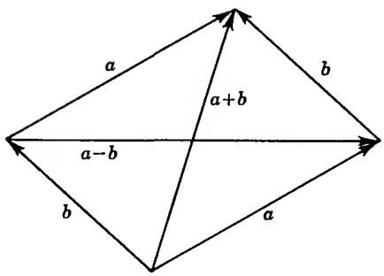  
FIG. 1-1. Vector addition.

In order to derive a geometric interpretation of the product of two complex numbers we introduce polar coordinates. If the polar coordinates of the point $(\alpha,\beta)$ are $(r,\varphi)$ , we know that

$$
\begin{array}{l} \alpha = r \cos \varphi \\ \beta = r \sin \varphi . \end{array}
$$

Hence we can write $a = \alpha + i\beta = r(\cos \varphi + i \sin \varphi)$ . In this trigonometric form of a complex number r is always $\geq 0$ and equal to the modulus $|a|$ . The polar angle $\varphi$ is called the argument or amplitude of the complex number, and we denote it by arg a.

Consider two complex numbers $a_{1}=r_{1}(\cos\varphi_{1}+i\sin\varphi_{1})$ and $a_{2}=r_{2}(\cos\varphi_{2}+i\sin\varphi_{2})$ . Their product can be written in the from $a_{1}a_{2}=r_{1}r_{2}[(\cos\varphi_{1}\cos\varphi_{2}-\sin\varphi_{1}\sin\varphi_{2})+i(\sin\varphi_{1}\cos\varphi_{2}+\cos\varphi_{1}\sin\varphi_{2})]$ . By means of the addition theorems of the cosine and the sine this expression can be simplified to

$$
a _ {1} a _ {2} = r _ {1} r _ {2} [ \cos (\varphi_ {1} + \varphi_ {2}) + i \sin (\varphi_ {1} + \varphi_ {2}) ].\tag{16}
$$

We recognize that the product has the modulus $r_{1}r_{2}$ and the argument $\varphi_{1} + \varphi_{2}$ . The latter result is new, and we express it through the equation

$$
\arg \left(a _ {1} a _ {2}\right) = \arg a _ {1} + \arg a _ {2}.\tag{17}
$$

It is clear that this formula can be extended to arbitrary products, and we can therefore state:

The argument of a product is equal to the sum of the arguments of the factors.

This is fundamental. The rule that we have just formulated gives a deep and unexpected justification of the geometric representation of complex numbers. We must be fully aware, however, that the manner in which we have arrived at the formula (17) violates our principles. In the first place the equation (17) is between angles rather than between numbers, and secondly its proof rested on the use of trigonometry. Thus it remains to define the argument in analytic terms and to prove (17) by purely analytic means. For the moment we postpone this proof and shall be content to discuss the consequences of (17) from a less critical standpoint.

We remark first that the argument of 0 is not defined, and hence (17) has a meaning only if $a_1$ and $a_2$ are $\neq 0$ . Secondly, the polar angle is determined only up to multiples of $360^\circ$ . For this reason, if we want to interpret (17) numerically, we must agree that multiples of $360^\circ$ shall not count.

By means of (17) a simple geometric construction of the product $a_{1}a_{2}$ can be obtained. It follows indeed that the triangle with the vertices 0, 1, $a_{1}$ is similar to the triangle whose vertices are 0, $a_{2}$ , $a_{1}a_{2}$ . The points 0, 1, $a_{1}$ , and $a_{2}$ being given, this similarity determines the point $a_{1}a_{2}$ (Fig. 1-2). In the case of division (17) is replaced by

$$
\arg \frac {a _ {2}}{a _ {1}} = \arg a _ {2} - \arg a _ {1}.\tag{18}
$$

The geometric construction is the same, except that the similar triangles are now 0, 1, $a_1$ and 0, $a_2 / a_1$ , $a_2$ .

Remark: A perfectly acceptable way to define angles and arguments would be to apply the familiar methods of calculus which permit us to express the length of a circular arc as a definite integral. This leads to a correct definition of the trigonometric functions, and to a computational proof of the addition theorems.

The reason we do not follow this path is that complex analysis, as opposed to real analysis, offers a much more direct approach. The clue lies in a direct connection between the exponential function and the trigonometric functions, to be derived in Chap. 2, Sec. 5. Until we reach this point the reader is asked to subdue his quest for complete rigor.

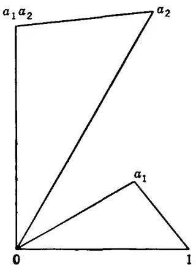  
FIG. 1-2. Vector multiplication.

## EXERCISES

1. Find the symmetric points of a with respect to the lines which bisect the angles between the coordinate axes.

2. Prove that the points $a_1, a_2, a_3$ are vertices of an equilateral triangle if and only if $a_1^2 + a_2^2 + a_3^2 = a_1a_2 + a_2a_3 + a_3a_1$ .

3. Suppose that a and b are two vertices of a square. Find the two other vertices in all possible cases.

4. Find the center and the radius of the circle which circumscribes the triangle with vertices $a_{1}, a_{2}, a_{3}$ . Express the result in symmetric form.

2.2. The Binomial Equation. From the preceding results we derive that the powers of $a = r(\cos \varphi + i\sin \varphi)$ are given by

$$
a ^ {n} = r ^ {n} (\cos n \varphi + i \sin n \varphi).\tag{19}
$$

This formula is trivially valid for $n = 0$ , and since

$$
a ^ {- 1} = r ^ {- 1} (\cos \varphi - i \sin \varphi) = r ^ {- 1} [ \cos (- \varphi) + i \sin (- \varphi) ]
$$

it holds also when $n$ is a negative integer.

For $r = 1$ we obtain de Moivre's formula

$$
(\cos \varphi + i \sin \varphi) ^ {n} = \cos n \varphi + i \sin n \varphi\tag{20}
$$

which provides an extremely simple way to express $\cos n\varphi$ and $\sin n\varphi$ in terms of $\cos \varphi$ and $\sin \varphi$ .

To find the $n$ th root of a complex number $a$ we have to solve the equation

$$
z ^ {n} = a.\tag{21}
$$

Supposing that $a \neq 0$ we write $a = r(\cos \varphi + i \sin \varphi)$ and

$$
z = \rho (\cos \theta + i \sin \theta).
$$

Then (21) takes the form

$$
\rho^ {n} (\cos n \theta + i \sin n \theta) = r (\cos \varphi + i \sin \varphi).\tag{22}
$$

This equation is certainly fulfilled if $\rho^n = r$ and $n\theta = \varphi$ . Hence we obtain the root

$$
z = \sqrt [ n ]{r} \left(\cos \frac {\varphi}{n} + i \sin \frac {\varphi}{n}\right),
$$

where $\sqrt[n]{r}$ denotes the positive nth root of the positive number r.

But this is not the only solution. In fact, (22) is also fulfilled if $n\theta$ differs from $\varphi$ by a multiple of the full angle. If angles are expressed in radians the full angle is $2\pi$ , and we find that (22) is satisfied if and only if

$$
\theta = \frac {\varphi}{n} + k \cdot \frac {2 \pi}{n},
$$

where k is any integer. However, only the values $k = 0, 1, \ldots, n - 1$ give different values of z. Hence the complete solution of the equation (21) is given by

$$
z = \sqrt [ n ]{r} \left[ \cos \left(\frac {\varphi}{n} + k \frac {2 \pi}{n}\right) + i \sin \left(\frac {\varphi}{n} + k \frac {2 \pi}{n}\right) \right], \quad k = 0, 1, \dots , n - 1.
$$

There are $n$ nth roots of any complex number $\neq 0$ . They have the same modulus, and their arguments are equally spaced.

Geometrically, the $n$ th roots are the vertices of a regular polygon with $n$ sides.

The case $a = 1$ is particularly important. The roots of the equation $z^n = 1$ are called $n$ th roots of unity, and if we set

$$
\omega = \cos {\frac {2 \pi}{n}} + i \sin {\frac {2 \pi}{n}}\tag{23}
$$

all the roots can be expressed by 1, $\omega$ , $\omega^2$ , $\ldots$ , $\omega^{n-1}$ . It is also quite evident that if $\sqrt[n]{a}$ denotes any $n$ th root of $a$ , then all the $n$ th roots can be expressed in the form $\omega^k \cdot \sqrt[n]{a}$ , $k = 0, 1, \ldots, n - 1$ .

## EXERCISES

1. Express $\cos 3\varphi$ , $\cos 4\varphi$ , and $\sin 5\varphi$ in terms of $\cos \varphi$ and $\sin \varphi$ .

2. Simplify $1 + \cos \varphi + \cos 2\varphi + \cdots + \cos n\varphi$ and $\sin \varphi + \sin 2\varphi + \cdots + \sin n\varphi$ .

3. Express the fifth and tenth roots of unity in algebraic form.

4. If $\omega$ is given by (23), prove that

$$
1 + \omega^ {h} + \omega^ {2 h} + \dots + \omega^ {(n - 1) h} = 0
$$

for any integer h which is not a multiple of n.

5. What is the value of

$$
1 - \omega^ {h} + \omega^ {2 h} - \dots + (- 1) ^ {n - 1} \omega^ {(n - 1) h}
$$

2.3. Analytic Geometry. In classical analytic geometry the equation of a locus is expressed as a relation between x and y. It can just as well be expressed in terms of z and $\bar{z}$ , sometimes to distinct advantage. The thing to remember is that a complex equation is ordinarily equivalent to two real equations; in order to obtain a genuine locus these equations should be essentially the same.

For instance, the equation of a circle is $|z - a| = r$ . In algebraic form it can be rewritten as $(z - a)(\bar{z} - \bar{a}) = r^{2}$ . The fact that this equation is invariant under complex conjugation is an indication that it represents a single real equation.

A straight line in the complex plane can be given by a parametric equation $z = a + bt$ , where a and b are complex numbers and $b \neq 0$ ; the parameter t runs through all real values. Two equations $z = a + bt$ and $z = a' + b't$ represent the same line if and only if $a' - a$ and $b'$ are real multiples of b. The lines are parallel whenever $b'$ is a real multiple of b, and they are equally directed if $b'$ is a positive multiple of b. The direction of a directed line can be identified with arg b. The angle between $z = a + bt$ and $z = a' + b't$ is arg $b'/b$ ; observe that it depends on the order in which the lines are named. The lines are orthogonal to each other if $b'/b$ is purely imaginary.

Problems of finding intersections between lines and circles, parallel or orthogonal lines, tangents, and the like usually become exceedingly simple when expressed in complex form.

An inequality $|z - a| < r$ describes the inside of a circle. Similarly, a directed line $z = a + bt$ determines a right half plane consisting of all points z with $\operatorname{Im}(z - a)/b < 0$ and a left half plane with $\operatorname{Im}(z - a)/b > 0$ . An easy argument shows that this distinction is independent of the parametric representation.

## EXERCISES

1. When does $az + b\bar{z} + c = 0$ represent a line?

2. Write the equation of an ellipse, hyperbola, parabola in complex form.

3. Prove that the diagonals of a parallelogram bisect each other and that the diagonals of a rhombus are orthogonal.

4. Prove analytically that the midpoints of parallel chords to a circle lie on a diameter perpendicular to the chords.

5. Show that all circles that pass through $a$ and $1 / \bar{a}$ intersect the circle $|z| = 1$ at right angles.

2.4. The Spherical Representation. For many purposes it is useful to extend the system C of complex numbers by introduction of a symbol $\infty$ to represent infinity. Its connection with the finite numbers is established by setting $a + \infty = \infty + a = \infty$ for all finite a, and

$$
b \cdot \infty = \infty \cdot b = \infty
$$

for all $b \neq 0$ , including $b = \infty$ . It is impossible, however, to define $\infty + \infty$ and $0 \cdot \infty$ without violating the laws of arithmetic. By special convention we shall nevertheless write $a/0 = \infty$ for $a \neq 0$ and $b/\infty = 0$ for $b \neq \infty$ .

In the plane there is no room for a point corresponding to $\infty$ , but we can of course introduce an “ideal” point which we call the point at infinity. The points in the plane together with the point at infinity form the extended complex plane. We agree that every straight line shall pass through the point at infinity. By contrast, no half plane shall contain the ideal point.

It is desirable to introduce a geometric model in which all points of the extended plane have a concrete representative. To this end we consider the unit sphere S whose equation in three-dimensional space is $x_{1}^{2} + x_{2}^{2} + x_{3}^{2} = 1$ . With every point on S, except $(0,0,1)$ , we can associate a complex number

$$
z = \frac {x _ {1} + i x _ {2}}{1 - x _ {3}},\tag{24}
$$

and this correspondence is one to one. Indeed, from (24) we obtain

$$
| z | ^ {2} = \frac {x _ {1} ^ {2} + x _ {2} ^ {2}}{(1 - x _ {3}) ^ {2}} = \frac {1 + x _ {3}}{1 - x _ {3}},
$$

and hence

$$
x _ {3} = \frac {| z | ^ {2} - 1}{| z | ^ {2} + 1}.\tag{25}
$$

Further computation yields

$$
\begin{array}{l} x _ {1} = \frac {z + \bar {z}}{1 + | z | ^ {2}} \\ x _ {2} = \frac {z - \bar {z}}{i (1 + | z | ^ {2})}. \end{array}\tag{26}
$$

The correspondence can be completed by letting the point at infinity correspond to $(0,0,1)$ , and we can thus regard the sphere as a representation of the extended plane or of the extended number system. We note that the hemisphere $x_{3} < 0$ corresponds to the disk $|z| < 1$ and the hemisphere $x_{3} > 0$ to its outside $|z| > 1$ . In function theory the sphere $S$ is referred to as the Riemann sphere.

If the complex plane is identified with the $(x_{1},x_{2})$ -plane with the $x_{1}$ - and $x_{2}$ -axis corresponding to the real and imaginary axis, respectively, the transformation (24) takes on a simple geometric meaning. Writing $z = x + iy$ we can verify that

$$
x: y: - 1 = x _ {1}: x _ {2}: x _ {3} - 1,\tag{27}
$$

and this means that the points $(x,y,0)$ $(x_{1},x_{2},x_{3})$ , and $(0,0,1)$ are in a straight line. Hence the correspondence is a central projection from the center $(0,0,1)$ as shown in Fig. 1-3. It is called a stereographic projection. The context will make it clear whether the stereographic projection is regarded as a mapping from S to the extended complex plane, or vice versa.

In the spherical representation there is no simple interpretation of addition and multiplication. Its advantage lies in the fact that the point at infinity is no longer distinguished.

It is geometrically evident that the stereographic projection transforms every straight line in the z-plane into a circle on S which passes through the pole $(0,0,1)$ , and the converse is also true. More generally, any circle on the sphere corresponds to a circle or straight line in the z-plane. To prove this we observe that a circle on the sphere lies in a plane $\alpha_{1}x_{1} + \alpha_{2}x_{2} + \alpha_{3}x_{3} = \alpha_{0}$ , where we can assume that $\alpha_{1}^{2} + \alpha_{2}^{2} + \alpha_{3}^{2} = 1$ and $0 \leq \alpha_{0} < 1$ . In terms of z and $\bar{z}$ this equation takes the form

$$
\alpha_ {1} (z + \bar {z}) - \alpha_ {2} i (z - \bar {z}) + \alpha_ {3} (| z | ^ {2} - 1) = \alpha_ {0} (| z | ^ {2} + 1)
$$

or

$$
(\alpha_ {0} - \alpha_ {3}) (x ^ {2} + y ^ {2}) - 2 \alpha_ {1} x - 2 \alpha_ {2} y + \alpha_ {0} + \alpha_ {3} = 0.
$$

For $\alpha_{0}\neq\alpha_{3}$ this is the equation of a circle, and for $\alpha_{0}=\alpha_{3}$ it represents a straight line. Conversely, the equation of any circle or straight line can be written in this form. The correspondence is consequently one to one.

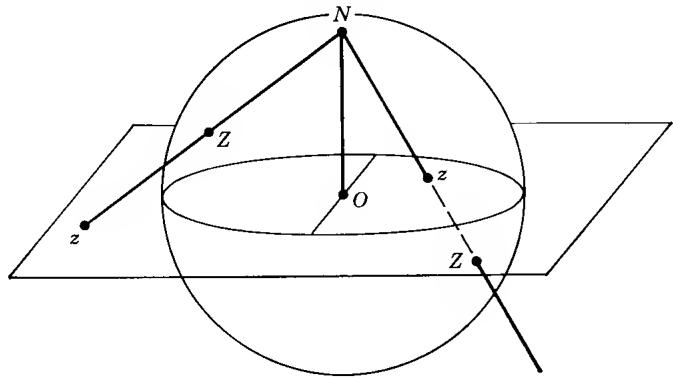  
FIG. 1-3. Stereographic projection.

It is easy to calculate the distance $d(z,z')$ between the stereographic projections of z and $z'$ . If the points on the sphere are denoted by $(x_{1},x_{2},x_{3})$ , $(x_{1}',x_{2}',x_{3}')$ , we have first

$$
(x _ {1} - x _ {1} ^ {\prime}) ^ {2} + (x _ {2} - x _ {2} ^ {\prime}) ^ {2} + (x _ {3} - x _ {3} ^ {\prime}) ^ {2} = 2 - 2 \left(x _ {1} x _ {1} ^ {\prime} + x _ {2} x _ {2} ^ {\prime} + x _ {3} x _ {3} ^ {\prime}\right).
$$

From (35) and (36) we obtain after a short computation

$$
\begin{array}{r l} x _ {1} x _ {1} ^ {\prime} + x _ {2} x _ {2} ^ {\prime} + x _ {3} x _ {3} ^ {\prime} & = \frac {(z + \bar {z}) (z ^ {\prime} + \bar {z} ^ {\prime}) - (z - \bar {z}) (z ^ {\prime} - \bar {z} ^ {\prime}) + (| z | ^ {2} - 1) (| z ^ {\prime} | ^ {2} - 1)}{(1 + | z | ^ {2}) (1 + | z ^ {\prime} | ^ {2})} \\ & = \frac {(1 + | z | ^ {2}) (1 + | z ^ {\prime} | ^ {2}) - 2 | z - z ^ {\prime} | ^ {2}}{(1 + | z | ^ {2}) (1 + | z ^ {\prime} | ^ {2})}. \end{array}
$$

As a result we find that

$$
d (z, z ^ {\prime}) = \frac {2 | z - z ^ {\prime} |}{\sqrt {(1 + | z | ^ {2}) (1 + | z ^ {\prime} | ^ {2})}}.\tag{28}
$$

For $z' = \infty$ the corresponding formula is

$$
d (z, \infty) = \frac {2}{\sqrt {1 + | z | ^ {2}}}.
$$

## EXERCISES

1. Show that $z$ and $z'$ correspond to diametrically opposite points on the Riemann sphere if and only if $z\bar{z}' = -1$ .

2. A cube has its vertices on the sphere S and its edges parallel to the coordinate axes. Find the stereographic projections of the vertices.

3. Same problem for a regular tetrahedron in general position.

4. Let $Z, Z'$ denote the stereographic projections of $z, z'$ , and let $N$ be the north pole. Show that the triangles $NZZ'$ and $Nzz'$ are similar, and use this to derive (28).

5. Find the radius of the spherical image of the circle in the plane whose center is a and radius R.

## 1. INTRODUCTION TO THE CONCEPT OF ANALYTIC FUNCTION

The theory of functions of a complex variable aims at extending calculus to the complex domain. Both differentiation and integration acquire new depth and significance; at the same time the range of applicability becomes radically restricted. Indeed, only the analytic or holomorphic functions can be freely differentiated and integrated. They are the only true “functions” in the sense of the French “Théorie des fonctions” or the German “Funktionentheorie.”

Nevertheless, we shall use the term “function” in its modern meaning. Therefore, when stepping up to complex numbers we have to consider four different kinds of functions: real functions of a real variable, real functions of a complex variable, complex functions of a real variable, and complex functions of a complex variable. As a practical matter we agree that the letters z and w shall always denote complex variables; thus, to indicate a complex function of a complex variable we use the notation $w = f(z)$ . The notation $y = f(x)$ will be used in a neutral manner with the understanding that x and y can be either real or complex. When we want to indicate that a variable is definitely restricted to real values, we shall usually denote it by t. By these agreements we do not wish to cancel the earlier convention whereby a notation $z = x + iy$ automatically implies that x and y are real.

It is essential that the law by which a function is defined be formulated in clear and unambiguous terms. In other words, all functions must be well defined and consequently, until further notice, single-valued.†

It is not necessary that a function be defined for all values of the independent variable. For the moment we shall deliberately underemphasize the role of point set theory. Therefore we make merely an informal agreement that every function be defined on an open set, by which we mean that if $f(a)$ is defined, then $f(x)$ is defined for all x sufficiently close to a. The formal treatment of point set topology is deferred until the next chapter.

1.1. Limits and Continuity. The following basic definition will be adopted:

Definition 1. The function $f(x)$ is said to have the limit $A$ as $x$ tends to $a$ ,

$$
\lim _ {x \to a} f (x) = A,\tag{1}
$$

if and only if the following is true:

For every $\varepsilon > 0$ there exists a number $\delta > 0$ with the property that $|f(x) - A| < \varepsilon$ for all values of $x$ such that $|x - a| < \delta$ and $x \neq a$ .

This definition makes decisive use of the absolute value. Since the notion of absolute value has a meaning for complex as well as for real numbers, we can use the same definition regardless of whether the variable x and the function $f(x)$ are real or complex.

As an alternative simpler notation we sometimes write: $f(x) \to A$ for $x \to a$ .

There are some familiar variants of the definition which correspond to the case where a or A is infinite. In the real case we can distinguish between the limits $+\infty$ and $-\infty$ , but in the complex case there is only one infinite limit. We trust the reader to formulate correct definitions to cover all the possibilities.

The well-known results concerning the limit of a sum, a product, and a quotient continue to hold in the complex case. Indeed, the proofs depend only on the properties of the absolute value expressed by

$$
| a b | = | a | \cdot | b | \quad \text { and } \quad | a + b | \leq | a | + | b |.
$$

† We shall sometimes use the pleonastic term single-valued function to underline that the function has only one value for each value of the variable.

Condition (1) is evidently equivalent to

$$
\lim _ {x \to a} \overline {{f (x)}} = \bar {A}.\tag{2}
$$

From (1) and (2) we obtain

$$
\begin{array}{l} \lim _ {x \to a} \operatorname{Re} f (x) = \operatorname{Re} A \\ \lim _ {x \to a} \operatorname{Im} f (x) = \operatorname{Im} A. \end{array}\tag{3}
$$

Conversely, (1) is a consequence of (3).

The function $f(x)$ is said to be continuous at $a$ if and only if $\lim_{x \to a} f(x) = f(a)$ . A continuous function, without further qualification, is one which is continuous at all points where it is defined.

The sum $f(x) + g(x)$ and the product $f(x)g(x)$ of two continuous functions are continuous; the quotient $f(x) / g(x)$ is defined and continuous at $a$ if and only if $g(a) \neq 0$ . If $f(x)$ is continuous, so are $\operatorname{Re} f(x)$ , $\operatorname{Im} f(x)$ , and $|f(x)|$ .

The derivative of a function is defined as a particular limit and can be considered regardless of whether the variables are real or complex. The formal definition is

$$
f ^ {\prime} (a) = \lim _ {x \rightarrow a} \frac {f (x) - f (a)}{x - a}.\tag{4}
$$

The usual rules for forming the derivative of a sum, a product, or a quotient are all valid. The derivative of a composite function is determined by the chain rule.

There is nevertheless a fundamental difference between the cases of a real and a complex independent variable. To illustrate our point, let $f(z)$ be a real function of a complex variable whose derivative exists at z = a. Then $f'(a)$ is on one side real, for it is the limit of the quotients

$$
\frac {f (a + h) - f (a)}{h}
$$

as $h$ tends to zero through real values. On the other side it is also the limit of the quotients

$$
\frac {f (a + i h) - f (a)}{i h}
$$

and as such purely imaginary. Therefore $f'(a)$ must be zero. Thus a real function of a complex variable either has the derivative zero, or else the derivative does not exist.

The case of a complex function of a real variable can be reduced to the real case. If we write $z(t) = x(t) + iy(t)$ we find indeed

$$
z ^ {\prime} (t) = x ^ {\prime} (t) + i y ^ {\prime} (t),
$$

and the existence of $z'(t)$ is equivalent to the simultaneous existence of $x'(t)$ and $y'(t)$ . The complex notation has nevertheless certain formal advantages which it would be unwise to give up.

In contrast, the existence of the derivative of a complex function of a complex variable has far-reaching consequences for the structural properties of the function. The investigation of these consequences is the central theme in complex-function theory.

1.2. Analytic Functions. The class of analytic functions is formed by the complex functions of a complex variable which possess a derivative wherever the function is defined. The term holomorphic function is used with identical meaning. For the purpose of this preliminary investigation the reader may think primarily of functions which are defined in the whole plane.

The sum and the product of two analytic functions are again analytic. The same is true of the quotient $f(z)/g(z)$ of two analytic functions, provided that $g(z)$ does not vanish. In the general case it is necessary to exclude the points at which $g(z)=0$ . Strictly speaking, this very typical case will thus not be included in our considerations, but it will be clear that the results remain valid except for obvious modifications.

The definition of the derivative can be rewritten in the form

$$
f ^ {\prime} (z) = \lim _ {h \rightarrow 0} \frac {f (z + h) - f (z)}{h}.
$$

As a first consequence $f(z)$ is necessarily continuous. Indeed, from $f(z + h) - f(z) = h \cdot (f(z + h) - f(z)) / h$ we obtain

$$
\lim _ {h \rightarrow 0} (f (z + h) - f (z)) = 0 \cdot f ^ {\prime} (z) = 0.
$$

If we write $f(z) = u(z) + iv(z)$ it follows, moreover, that $u(z)$ and $v(z)$ are both continuous.

The limit of the difference quotient must be the same regardless of the way in which h approaches zero. If we choose real values for h, then the imaginary part y is kept constant, and the derivative becomes a partial derivative with respect to x. We have thus

$$
f ^ {\prime} (z) = \frac {\partial f}{\partial x} = \frac {\partial u}{\partial x} + i \frac {\partial v}{\partial x}.
$$

Similarly, if we substitute purely imaginary values ik for h, we obtain

$$
f ^ {\prime} (z) = \lim _ {k \rightarrow 0} \frac {f (z + i k) - f (z)}{i k} = - i \frac {\partial f}{\partial y} = - i \frac {\partial u}{\partial y} + \frac {\partial v}{\partial y}.
$$

It follows that $f(z)$ must satisfy the partial differential equation

$$
\frac {\partial f}{\partial x} = - i \frac {\partial f}{\partial y}\tag{5}
$$

which resolves into the real equations

$$
\frac {\partial u}{\partial x} = \frac {\partial v}{\partial y}, \quad \frac {\partial u}{\partial y} = - \frac {\partial v}{\partial x}.\tag{6}
$$

These are the Cauchy-Riemann differential equations which must be satisfied by the real and imaginary part of any analytic function.†

We remark that the existence of the four partial derivatives in (6) is implied by the existence of $f'(z)$ . Using (6) we can write down four formally different expressions for $f'(z)$ ; the simplest is

$$
f ^ {\prime} (z) = \frac {\partial u}{\partial x} + i \frac {\partial v}{\partial x}.
$$

For the quantity $|f'(z)|^2$ we have, for instance,

$$
\left| f ^ {\prime} (z) \right| ^ {2} = \left(\frac {\partial u}{\partial x}\right) ^ {2} + \left(\frac {\partial u}{\partial y}\right) ^ {2} = \left(\frac {\partial u}{\partial x}\right) ^ {2} + \left(\frac {\partial v}{\partial x}\right) ^ {2} = \frac {\partial u}{\partial x} \frac {\partial v}{\partial y} - \frac {\partial u}{\partial y} \frac {\partial v}{\partial x}.
$$

The last expression shows that $|f'(z)|^2$ is the Jacobian of $u$ and $v$ with respect to $x$ and $y$ .

We shall prove later that the derivative of an analytic function is itself analytic. By this fact u and v will have continuous partial derivatives of all orders, and in particular the mixed derivatives will be equal. Using this information we obtain from (6)

$$
\begin{array}{l} \Delta u = \frac {\partial^ {2} u}{\partial x ^ {2}} + \frac {\partial^ {2} u}{\partial y ^ {2}} = 0 \\ \Delta v = \frac {\partial^ {2} v}{\partial x ^ {2}} + \frac {\partial^ {2} v}{\partial y ^ {2}} = 0. \end{array}
$$

A function u which satisfies Laplace's equation $\Delta u = 0$ is said to be harmonic. The real and imaginary part of an analytic function are thus harmonic. If two harmonic functions u and v satisfy the Cauchy-Riemann equations (6), then v is said to be the conjugate harmonic function of u. Actually, v is determined only up to an additive constant, so that the use of the definite article, although traditional, is not quite accurate. In the same sense, u is the conjugate harmonic function of -v.

This is not the place to discuss the weakest conditions of regularity which can be imposed on harmonic functions. We wish to prove, however, that the function $u + iv$ determined by a pair of conjugate harmonic functions is always analytic, and for this purpose we make the explicit assumption that u and v have continuous first-order partial derivatives. It is proved in calculus, under exactly these regularity conditions, that we can write

$$
u (x + h, y + k) - u (x, y) = \frac {\partial u}{\partial x} h + \frac {\partial u}{\partial y} k + \varepsilon_ {1}
$$

$$
v (x + h, y + k) - v (x, y) = \frac {\partial v}{\partial x} h + \frac {\partial v}{\partial y} k + \varepsilon_ {2},
$$

where the remainders $\varepsilon_{1}, \varepsilon_{2}$ tend to zero more rapidly than $h + ik$ in the sense that $\varepsilon_{1}/(h + ik) \to 0$ and $\varepsilon_{2}/(h + ik) \to 0$ for $h + ik \to 0$ . With the notation $f(z) = u(x,y) + iv(x,y)$ we obtain by virtue of the relations (6)

$$
f (z + h + i k) - f (z) = \left(\frac {\partial u}{\partial x} + i \frac {\partial v}{\partial x}\right) (h + i k) + \varepsilon_ {1} + i \varepsilon_ {2}
$$

and hence

$$
\lim _ {h + i k \rightarrow 0} \frac {f (z + h + i k) - f (z)}{h + i k} = \frac {\partial u}{\partial x} + i \frac {\partial v}{\partial x}.
$$

We conclude that $f(z)$ is analytic.

If $u(x,y)$ and $v(x,y)$ have continuous first-order partial derivatives which satisfy the Cauchy-Riemann differential equations, then $f(z) = u(z) + iv(z)$ is analytic with continuous derivative $f'(z)$ , and conversely.

The conjugate of a harmonic function can be found by integration, and in simple cases the computation can be made explicit. For instance, $u = x^{2} - y^{2}$ is harmonic and $\partial u/\partial x = 2x$ , $\partial u/\partial y = -2y$ . The conjugate function must therefore satisfy

$$
\frac {\partial v}{\partial x} = 2 y, \quad \frac {\partial v}{\partial y} = 2 x.
$$

From the first equation $v = 2xy + \varphi(y)$ , where $\varphi(y)$ is a function of y alone. Substitution in the second equation yields $\varphi'(y) = 0$ . Hence $\varphi(y)$ is a constant, and the most general conjugate function of $x^{2} - y^{2}$ is $2xy + c$ where c is a constant. Observe that $x^{2} - y^{2} + 2ixy = z^{2}$ . The analytic function with the real part $x^{2} - y^{2}$ is hence $z^{2} + ic$ .

There is an interesting formal procedure which throws considerable light on the nature of analytic functions. We present this procedure with an explicit warning to the reader that it is purely formal and does not possess any power of proof.

Consider a complex function $f(x,y)$ of two real variables. Introducing the complex variable $z = x + iy$ and its conjugate $\bar{z} = x - iy$ , we can write $x = \frac{1}{2}(z + \bar{z})$ , $y = -\frac{1}{2}i(z - \bar{z})$ . With this change of variable we can consider $f(x,y)$ as a function of z and $\bar{z}$ which we will treat as independent variables (forgetting that they are in fact conjugate to each other). If the rules of calculus were applicable, we would obtain

$$
\frac {\partial f}{\partial z} = \frac {1}{2} \left(\frac {\partial f}{\partial x} - i \frac {\partial f}{\partial y}\right), \quad \frac {\partial f}{\partial \bar {z}} = \frac {1}{2} \left(\frac {\partial f}{\partial x} + i \frac {\partial f}{\partial y}\right).
$$

These expressions have no convenient definition as limits, but we can nevertheless introduce them as symbolic derivatives with respect to z and $\bar{z}$ . By comparison with (5) we find that analytic functions are characterized by the condition $\partial f/\partial\bar{z}=0$ . We are thus tempted to say that an analytic function is independent of $\bar{z}$ , and a function of z alone.

This formal reasoning supports the point of view that analytic functions are true functions of a complex variable as opposed to functions which are more adequately described as complex functions of two real variables.

By similar formal arguments we can derive a very simple method which allows us to compute, without use of integration, the analytic function $f(z)$ whose real part is a given harmonic function $u(x,y)$ . We remark first that the conjugate function $\overline{f(z)}$ has the derivative zero with respect to z and may, therefore, be considered as a function of $\bar{z}$ ; we denote this function by $\bar{f}(\bar{z})$ . With this notation we can write down the identity

$$
u (x, y) = \frac {1}{2} [ f (x + i y) + \ddot {f} (x - i y) ].
$$

It is reasonable to expect that this is a formal identity, and then it holds even when $x$ and $y$ are complex. If we substitute $x = z / 2$ , $y = z / 2i$ , we obtain

$$
u (z / 2, z / 2 i) = \frac {1}{2} [ f (z) + \bar {f} (0) ].
$$

Since $f(z)$ is only determined up to a purely imaginary constant, we may as well assume that $f(0)$ is real, which implies $\bar{f}(0) = u(0,0)$ . The function $f(z)$ can thus be computed by means of the formula

$$
f (z) = 2 u (z / 2, z / 2 i) - u (0, 0).
$$

A purely imaginary constant can be added at will.

In this form the method is definitely limited to functions $u(x,y)$ which are rational in x and y, for the function must have a meaning for complex values of the argument. Suffice it to say that the method can be extended to the general case and that a complete justification can be given.

## EXERCISES

1. If $g(w)$ and $f(z)$ are analytic functions, show that $g(f(z))$ is also analytic.

2. Verify Cauchy-Riemann's equations for the functions $z^2$ and $z^3$ .

3. Find the most general harmonic polynomial of the form $ax^{3} + bx^{2}y + cxy^{2} + dy^{3}$ . Determine the conjugate harmonic function and the corresponding analytic function by integration and by the formal method.

4. Show that an analytic function cannot have a constant absolute value without reducing to a constant.

5. Prove rigorously that the functions $f(z)$ and $f(\bar{z})$ are simultaneously analytic.

6. Prove that the functions $u(z)$ and $u(\bar{z})$ are simultaneously harmonic.

7. Show that a harmonic function satisfies the formal differential equation

$$
\frac {\partial^ {2} u}{\partial z \partial \bar {z}} = 0.
$$

1.3. Polynomials. Every constant is an analytic function with the derivative 0. The simplest nonconstant analytic function is z whose derivative is 1. Since the sum and product of two analytic functions are again analytic, it follows that every polynomial

$$
P (z) = a _ {0} + a _ {1} z + \dots + a _ {n} z ^ {n}\tag{7}
$$

is an analytic function. Its derivative is

$$
P ^ {\prime} (z) = a _ {1} + 2 a _ {2} z + \dots + n a _ {n} z ^ {n - 1}.
$$

The notation (7) shall imply that $a_{n} \neq 0$ , and the polynomial is then said to be of degree n. The constant 0, considered as a polynomial, is in many respects exceptional and will be excluded from our considerations.†

For n > 0 the equation $P(z) = 0$ has at least one root. This is the so-called fundamental theorem of algebra which we shall prove later. If $P(\alpha_{1}) = 0$ , it is shown in elementary algebra that $P(z) = (z - \alpha_{1})P_{1}(z)$ where $P_{1}(z)$ is a polynomial of degree n - 1. Repetition of this process finally leads to a complete factorization

$$
P (z) = a _ {n} (z - \alpha_ {1}) (z - \alpha_ {2}) \cdot \cdot \cdot (z - \alpha_ {n})\tag{8}
$$

† For formal reasons, if the constant 0 is regarded as a polynomial, its degree is set equal to $-\infty$ .

where the $\alpha_{1},\alpha_{2},\ldots,\alpha_{n}$ are not necessarily distinct. From the factorization we conclude that $P(z)$ does not vanish for any value of z different from $\alpha_{1},\alpha_{2},\ldots,\alpha_{n}$ . Moreover, the factorization is uniquely determined except for the order of the factors.

If exactly h of the $\alpha_{j}$ coincide, their common value is called a zero of $P(z)$ of the order h. We find that the sum of the orders of the zeros of a polynomial is equal to its degree. More simply, if each zero is counted as many times as its order indicates, a polynomial of degree n has exactly n zeros.

The order of a zero $\alpha$ can also be determined by consideration of the successive derivatives of $P(z)$ for $z = \alpha$ . Suppose that $\alpha$ is a zero of order h. Then we can write $P(z) = (z - \alpha)^{h}P_{h}(z)$ with $P_{h}(\alpha) \neq 0$ . Successive derivation yields $P(\alpha) = P'(\alpha) = \cdots = P^{(h-1)}(\alpha) = 0$ while $P^{(h)}(\alpha) \neq 0$ . In other words, the order of a zero equals the order of the first nonvanishing derivative. A zero of order 1 is called a simple zero and is characterized by the conditions $P(\alpha) = 0$ , $P'(\alpha) \neq 0$ .

As an application we shall prove the following theorem, known as Lucas's theorem:

Theorem 1. If all zeros of a polynomial $P(z)$ lie in a half plane, then all zeros of the derivative $P'(z)$ lie in the same half plane.

From (8) we obtain

$$
\frac {P ^ {\prime} (z)}{P (z)} = \frac {1}{z - \alpha_ {1}} + \dots + \frac {1}{z - \alpha_ {n}}.\tag{9}
$$

Suppose that the half plane H is defined as the part of the plane where $\operatorname{Im}(z-a)/b<0$ (see Chap. 1, Sec. 2.3). If $\alpha_{k}$ is in H and z is not, we have then

$$
\operatorname{Im} \frac {z - \alpha_ {k}}{b} = \operatorname{Im} \frac {z - a}{b} - \operatorname{Im} \frac {\alpha_ {k} - a}{b} > 0.
$$

But the imaginary parts of reciprocal numbers have opposite sign. Therefore, under the same assumption, $\operatorname{Im} b(z - \alpha_{k})^{-1} < 0$ . If this is true for all k we conclude from (9) that

$$
\operatorname{Im} \frac {b P ^ {\prime} (z)}{P (z)} = \sum_ {k = 1} ^ {n} \operatorname{Im} \frac {b}{z - \alpha_ {k}} <   0,
$$

and consequently $P'(z) \neq 0$ .

In a sharper formulation the theorem tells us that the smallest convex polygon that contains the zeros of $P(z)$ also contains the zeros of $P'(z)$ .

1.4. Rational Functions. We turn to the case of a rational function

$$
R (z) = \frac {P (z)}{Q (z)},\tag{10}
$$

given as the quotient of two polynomials. We assume, and this is essential, that $P(z)$ and $Q(z)$ have no common factors and hence no common zeros. $R(z)$ will be given the value $\infty$ at the zeros of $Q(z)$ . It must therefore be considered as a function with values in the extended plane, and as such it is continuous. The zeros of $Q(z)$ are called poles of $R(z)$ , and the order of a pole is by definition equal to the order of the corresponding zero of $Q(z)$ .

The derivative

$$
R ^ {\prime} (z) = \frac {P ^ {\prime} (z) Q (z) - Q ^ {\prime} (z) P (z)}{Q (z) ^ {2}}\tag{11}
$$

exists only when $Q(z) \neq 0$ . However, as a rational function defined by the right-hand member of (11), $R'(z)$ has the same poles as $R(z)$ , the order of each pole being increased by one. In case $Q(z)$ has multiple zeros, it should be noticed that the expression (11) does not appear in reduced form.

Greater unity is achieved if we let the variable z as well as the values $R(z)$ range over the extended plane. We may define $R(\infty)$ as the limit of $R(z)$ as $z \to \infty$ , but this definition would not determine the order of a zero or pole at $\infty$ . It is therefore preferable to consider the function $R(1/z)$ , which we can rewrite as a rational function $R_{1}(z)$ , and set

$$
R (\infty) = R _ {1} (0).
$$

If $R_{1}(0) = 0$ or $\infty$ , the order of the zero or pole at $\infty$ is defined as the order of the zero or pole of $R_{1}(z)$ at the origin.

With the notation

$$
R (z) = \frac {a _ {0} + a _ {1} z + \cdots + a _ {n} z ^ {n}}{b _ {0} + b _ {1} z + \cdots + b _ {m} z ^ {m}}
$$

we obtain

$$
R _ {1} (z) = z ^ {m - n} \frac {a _ {0} z ^ {n} + a _ {1} z ^ {n - 1} + \cdots + a _ {n}}{b _ {0} z ^ {m} + b _ {1} z ^ {m - 1} + \cdots + b _ {m}}
$$

where the power $z^{m-n}$ belongs either to the numerator or to the denominator. Accordingly, if m > n $R(z)$ has a zero of order m - n at $\infty$ , if m < n the point at $\infty$ is a pole of order n - m, and if m = n

$$
R (\infty) = a _ {n} / b _ {m} \neq 0, \infty .
$$

We can now count the total number of zeros and poles in the extended plane. The count shows that the number of zeros, including those at $\infty$ , is equal to the greater of the numbers m and n. The number of poles is the same. This common number of zeros and poles is called the order of the rational function.

If a is any constant, the function $R(z) - a$ has the same poles as $R(z)$ , and consequently the same order. The zeros of $R(z) - a$ are roots of the equation $R(z) = a$ , and if the roots are counted as many times as the order of the zero indicates, we can state the following result:

A rational function $R(z)$ of order $p$ has $p$ zeros and $p$ poles, and every equation $R(z) = a$ has exactly $p$ roots.

A rational function of order 1 is a linear fraction

$$
S (z) = \frac {\alpha z + \beta}{\gamma z + \delta}
$$

with $\alpha\delta - \beta\gamma \neq 0$ . Such fractions, or linear transformations, will be studied at length in Chap. 3, Sec. 3. For the moment we note merely that the equation $w = S(z)$ has exactly one root, and we find indeed

$$
z = S ^ {- 1} (w) = \frac {\delta w - \beta}{- \gamma w + \alpha}.
$$

The transformations $S$ and $S^{-1}$ are inverse to each other.

The linear transformation $z + a$ is called a parallel translation, and 1/z is an inversion. The former has a fixed point at $\infty$ , the latter interchanges 0 and $\infty$ .

Every rational function has a representation by partial fractions. In order to derive this representation we assume first that $R(z)$ has a pole at $\infty$ . We carry out the division of $P(z)$ by $Q(z)$ until the degree of the remainder is at most equal to that of the denominator. The result can be written in the form

$$
R (z) = G (z) + H (z)\tag{12}
$$

where $G(z)$ is a polynomial without constant term, and $H(z)$ is finite at $\infty$ . The degree of $G(z)$ is the order of the pole at $\infty$ , and the polynomial $G(z)$ is called the singular part of $R(z)$ at $\infty$ .

Let the distinct finite poles of $R(z)$ be denoted by $\beta_1, \beta_2, \ldots, \beta_q$ . The function $R\left(\beta_j + \frac{1}{\zeta}\right)$ is a rational function of $\zeta$ with a pole at $\zeta = \infty$ . By use of the decomposition (12) we can write

$$
R \left(\beta_ {j} + \frac {1}{\zeta}\right) = G _ {j} (\zeta) + H _ {j} (\zeta),
$$

or with a change of variable

$$
R (z) = G _ {j} \left(\frac {1}{z - \beta_ {j}}\right) + H _ {j} \left(\frac {1}{z - \beta_ {j}}\right).
$$

Here $G_{j}\left(\frac{1}{z - \beta_{j}}\right)$ is a polynomial in $\frac{1}{z - \beta_{j}}$ without constant term, called the singular part of $R(z)$ at $\beta_{j}$ . The function $H_{j}\left(\frac{1}{z - \beta_{j}}\right)$ is finite for $z = \beta_{j}$ .

Consider now the expression

$$
R (z) - G (z) - \sum_ {j = 1} ^ {q} G _ {j} \left(\frac {1}{z - \beta_ {j}}\right).\tag{13}
$$

This is a rational function which cannot have other poles than $\beta_{1}, \beta_{2}, \ldots, \beta_{q}$ and $\infty$ . At $z = \beta_{j}$ we find that the two terms which become infinite have a difference $H_{j}\left(\frac{1}{z - \beta_{j}}\right)$ with a finite limit, and the same is true at $\infty$ . Therefore (13) has neither any finite poles nor a pole at $\infty$ . A rational function without poles must reduce to a constant, and if this constant is absorbed in $G(z)$ we obtain

$$
R (z) = G (z) + \sum_ {j = 1} ^ {q} G _ {j} \left(\frac {1}{z - \beta_ {j}}\right).\tag{14}
$$

This representation is well known from the calculus where it is used as a technical device in integration theory. However, it is only with the introduction of complex numbers that it becomes completely successful.

## EXERCISES

1. Use the method of the text to develop

$$
\frac {z ^ {4}}{z ^ {3} - 1} \quad \text { and } \quad \frac {1}{z (z + 1) ^ {2} (z + 2) ^ {3}}
$$

in partial fractions.

2. If $Q$ is a polynomial with distinct roots $\alpha_{1}, \ldots, \alpha_{n}$ , and if $P$ is a polynomial of degree $< n$ , show that

$$
\frac {P (z)}{Q (z)} = \sum_ {k = 1} ^ {n} \frac {P (\alpha_ {k})}{Q ^ {\prime} (\alpha_ {k}) (z - \alpha_ {k})}.
$$

3. Use the formula in the preceding exercise to prove that there exists a unique polynomial $P$ of degree $< n$ with given values $c_k$ at the points $\alpha_k$ (Lagrange's interpolation polynomial).

4. What is the general form of a rational function which has absolute value 1 on the circle $|z| = 1$ ? In particular, how are the zeros and poles related to each other?

5. If a rational function is real on $|z| = 1$ , how are the zeros and poles situated?

6. If $R(z)$ is a rational function of order $n$ , how large and how small can the order of $R'(z)$ be?

## 2. ELEMENTARY THEORY OF POWER SERIES

Polynomials and rational functions are very special analytic functions. The easiest way to achieve greater variety is to form limits. For instance, the sum of a convergent series is such a limit. If the terms are functions of a variable, so is the sum, and if the terms are analytic functions, chances are good that the sum will also be analytic.

Of all series with analytic terms the power series with complex coefficients are the simplest. In this section we study only the most elementary properties of power series. A strong motivation for taking up this study when we are not yet equipped to prove the most general properties (those that depend on integration) is that we need power series to construct the exponential function (Sec. 3).

2.1. Sequences. The sequence $\{a_{n}\}_{1}^{\infty}$ has the limit A if to every $\varepsilon > 0$ there exists an $n_{0}$ such that $|a_{n} - A| < \varepsilon$ for $n \geq n_{0}$ . A sequence with a finite limit is said to be convergent, and any sequence which does not converge is divergent. If $\lim_{n \to \infty} a_{n} = \infty$ , the sequence may be said to diverge to infinity.

Only in rare cases can the convergence be proved by exhibiting the limit, so it is extremely important to make use of a method that permits proof of the existence of a limit even when it cannot be determined explicitly. The test that serves this purpose bears the name of Cauchy. A sequence will be called fundamental, or a Cauchy sequence, if it satisfies the following condition: given any $\varepsilon > 0$ there exists an $n_{0}$ such that $|a_{n} - a_{m}| < \varepsilon$ whenever $n \geq n_{0}$ and $m \geq n_{0}$ . The test reads:

A sequence is convergent if and only if it is a Cauchy sequence.

The necessity is immediate. If $a_{n} \rightarrow A$ we can find $n_{0}$ such that $|a_{n} - A| < \varepsilon/2$ for $n \geq n_{0}$ . For $m, n \geq n_{0}$ it follows by the triangle inequality that $|a_{n} - a_{m}| \leq |a_{n} - A| + |a_{m} - A| < \varepsilon$ .

The sufficiency is closely connected with the definition of real numbers, and one way in which real numbers can be introduced is indeed to postulate the sufficiency of Cauchy's condition. However, we wish to use only the property that every bounded monotone sequence of real numbers has a limit.

The real and imaginary parts of a Cauchy sequence are again Cauchy sequences, and if they converge, so does the original sequence. For this reason we need to prove the sufficiency only for real sequences. We use the opportunity to recall the notions of limes superior and limes inferior. Given a real sequence $\{\alpha_n\}_1^\infty$ we shall set $a_n = \max \{\alpha_1, \ldots, \alpha_n\}$ , that is, $a_n$ is the greatest of the numbers $\alpha_1, \ldots, \alpha_n$ . The sequence $\{a_n\}_1^\infty$ is nondecreasing; hence it has a limit $A_1$ which is finite or equal to $+\infty$ . The number $A_1$ is known as the least upper bound or supremum (l.u.b. or sup) of the numbers $\alpha_n$ ; indeed, it is the least number which is $\geq$ all $\alpha_n$ . Construct in the same way the least upper bound $A_k$ of the sequence $\{\alpha_n\}_k^\infty$ obtained from the original sequence by deleting $\alpha_1, \ldots, \alpha_{k-1}$ . It is clear that $\{A_k\}$ is a nonincreasing sequence, and we denote its limit by $A$ . It may be finite, $+\infty$ , or $-\infty$ . In any case we write

$$
A = \lim _ {n \rightarrow \infty} \sup \alpha_ {n}.
$$

It is easy to characterize the limes superior by its properties. If A is finite and $\varepsilon > 0$ there exists an $n_{0}$ such that $A_{n_{0}} < A + \varepsilon$ , and it follows that $\alpha_{n} \leq A_{n_{0}} < A + \varepsilon$ for $n \geq n_{0}$ . In the opposite direction, if $\alpha_{n} \leq A - \varepsilon$ for $n \geq n_{0}$ , then $A_{n_{0}} \leq A - \varepsilon$ , which is impossible. In other words, there are arbitrarily large n for which $\alpha_{n} > A - \varepsilon$ . If $A = +\infty$ there are arbitrarily large $\alpha_{n}$ , and $A = -\infty$ if and only if $\alpha_{n}$ tends to $-\infty$ . In all cases there cannot be more than one number A with these properties.

The limes inferior can be defined in the same manner with inequalities reversed. It is quite clear that the limes inferior and limes superior will be equal if and only if the sequence converges to a finite limit or diverges to $+\infty$ or to $-\infty$ . The notations are frequently simplified to $\overline{\lim}$ and $\underline{\lim}$ . The reader should prove the following relations:

$$
\begin{array}{l} \underline {{\lim}} \alpha_ {n} + \underline {{\lim}} \beta_ {n} \leq \underline {{\lim}} (\alpha_ {n} + \beta_ {n}) \leq \underline {{\lim}} \alpha_ {n} + \overline {{\lim}} \beta_ {n} \\ \underline {{\lim}} \alpha_ {n} + \overline {{\lim}} \beta_ {n} \leq \overline {{\lim}} (\alpha_ {n} + \beta_ {n}) \leq \overline {{\lim}} \alpha_ {n} + \overline {{\lim}} \beta_ {n}. \end{array}
$$

Now we return to the sufficiency of Cauchy's condition. From $|\alpha_n - \alpha_{n_0}| < \varepsilon$ we obtain $|\alpha_n| < |\alpha_{n_0}| + \varepsilon$ for $n \geq n_0$ , and it follows that $A = \varlimsup \alpha_n$ and $a = \varliminf \alpha_n$ are both finite. If $a \neq A$ choose

$$
\varepsilon = \frac {(A - a)}{3}
$$

and determine a corresponding $n_0$ . By definition of $a$ and $A$ there exists an $\alpha_n < a + \varepsilon$ and an $\alpha_m > A - \varepsilon$ with $m, n \geq n_0$ . It follows that $A - a = (A - \alpha_m) + (\alpha_m - \alpha_n) + (\alpha_n - a) < 3\varepsilon$ , contrary to the choice of $\varepsilon$ . Hence $a = A$ , and the sequence converges.

2.2. Series. A very simple application of Cauchy's condition permits us to deduce the convergence of one sequence from that of another. If it is true that $|b_{m} - b_{n}| \leq |a_{m} - a_{n}|$ for all pairs of subscripts, the sequence $\{b_{n}\}$ may be termed a contraction of the sequence $\{a_{n}\}$ (this is not a standard term). Under this condition, if $\{a_{n}\}$ is a Cauchy sequence, so is $\{b_{n}\}$ . Hence convergence of $\{a_{n}\}$ implies convergence of $\{b_{n}\}$ .

An infinite series is a formal infinite sum

$$
a _ {1} + a _ {2} + \dots + a _ {n} + \dots .\tag{15}
$$

Associated with this series is the sequence of its partial sums

$$
s _ {n} = a _ {1} + a _ {2} + \dots + a _ {n}.
$$

The series is said to converge if and only if the corresponding sequence is convergent, and if this is the case the limit of the sequence is the sum of the series.

Applied to a series Cauchy's convergence test yields the following condition: The series (15) converges if and only if to every $\varepsilon > 0$ there exists an $n_0$ such that $|a_n + a_{n+1} + \cdots + a_{n+p}| < \varepsilon$ for all $n \geq n_0$ and $p \geq 0$ . For $p = 0$ we find in particular that $|a_n| < \varepsilon$ . Hence the general term of a convergent series tends to zero. This condition is necessary, but of course not sufficient.

If a finite number of the terms of the series (15) are omitted, the new series converges or diverges together with (15). In the case of convergence, let $R_{n}$ be the sum of the series which begins with the term $a_{n+1}$ . Then the sum of the whole series is $S = s_{n} + R_{n}$ .

The series (15) can be compared with the series

$$
\left| a _ {1} \right| + \left| a _ {2} \right| + \dots + \left| a _ {n} \right| + \dots\tag{16}
$$

formed by the absolute values of the terms. The sequence of partial sums of (15) is a contraction of the sequence corresponding to (16), for $|a_{n} + a_{n+1} + \cdots + a_{n+p}| \leq |a_{n}| + |a_{n+1}| + \cdots + |a_{n+p}|$ . Therefore, convergence of (16) implies that the original series (15) is convergent. A series with the property that the series formed by the absolute values of the terms converges is said to be absolutely convergent.

2.3. Uniform Convergence. Consider a sequence of functions $f_{n}(x)$ , all defined on the same set E. If the sequence of values $\{f_{n}(x)\}$ converges for every x that belongs to E, then the limit $f(x)$ is again a function on E. By definition, if $\varepsilon > 0$ and x belongs to E there exists an $n_{0}$ such that $|f_{n}(x) - f(x)| < \varepsilon$ for $n \geq n_{0}$ , but $n_{0}$ is allowed to depend on x.

For instance, it is true that

$$
\lim _ {n \rightarrow \infty} \left(1 + \frac {1}{n}\right) x = x
$$

for all x, but in order to have $|(1 + 1/n)x - x| = |x|/n < \varepsilon$ for $n \geq n_{0}$ it is necessary that $n_{0} > |x|/\varepsilon$ . Such an $n_{0}$ exists for every fixed x, but the requirement cannot be met simultaneously for all x.

We say in this situation that the sequence converges pointwise, but not uniformly. In positive formulation: The sequence $\{f_{n}(x)\}$ converges uniformly to $f(x)$ on the set E if to every $\varepsilon > 0$ there exists an $n_{0}$ such that $|f_{n}(x) - f(x)| < \varepsilon$ for all $n \geq n_{0}$ and all x in E.

The most important consequence of uniform convergence is the following:

The limit function of a uniformly convergent sequence of continuous functions is itself continuous.

Suppose that the functions $f_{n}(x)$ are continuous and tend uniformly to $f(x)$ on the set $E$ . For any $\varepsilon > 0$ we are able to find an $n$ such that $|f_{n}(x) - f(x)| < \varepsilon / 3$ for all $x$ in $E$ . Let $x_{0}$ be a point in $E$ . Because $f_{n}(x)$ is continuous at $x_{0}$ we can find $\delta > 0$ such that $|f_{n}(x) - f_{n}(x_{0})| < \epsilon / 3$ for all $x$ in $E$ with $|x - x_{0}| < \delta$ . Under the same condition on $x$ it follows that

$$
\left| f (x) - f \left(x _ {0}\right) \right| \leq \left| f (x) - f _ {n} (x) \right| + \left| f _ {n} (x) - f _ {n} \left(x _ {0}\right) \right| + \left| f _ {n} \left(x _ {0}\right) - f \left(x _ {0}\right) \right| <   \varepsilon ,
$$

and we have proved that $f(x)$ is continuous at $x_{0}$ .

In the theory of analytic functions we shall find uniform convergence much more important than pointwise convergence. However, in most cases it will be found that the convergence is uniform only on a part of the set on which the functions are originally defined.

Cauchy's necessary and sufficient condition has a counterpart for uniform convergence. We assert:

The sequence $\{f_n(x)\}$ converges uniformly on $E$ if and only if to every $\varepsilon > 0$ there exists an $n_0$ such that $|f_m(x) - f_n(x)| < \varepsilon$ for all $m, n \geq n_0$ and all $x$ in $E$ .

The necessity is again trivial. For the sufficiency we remark that the limit function $f(x)$ exists by the ordinary form of Cauchy's test. In the inequality $|f_{m}(x) - f_{n}(x)| < \varepsilon$ we can keep n fixed and let m tend to $\infty$ . It follows that $|f(x) - f_{n}(x)| \leq \varepsilon$ for $n \geq n_{0}$ and all x in E. Hence the convergence is uniform.

For practical use the following test is the most applicable: If a sequence of functions $\{f_{n}(x)\}$ is a contraction of a convergent sequence of constants $\{a_{n}\}$ , then the sequence $\{f_{n}(x)\}$ is uniformly convergent. The hypothesis means that $|f_{m}(x)-f_{n}(x)|\leq|a_{m}-a_{n}|$ on E, and the conclusion follows immediately by Cauchy's condition.

In the case of series this criterion, in a somewhat weaker form, becomes particularly simple. We say that a series with variable terms

$$
f _ {1} (x) + f _ {2} (x) + \dots + f _ {n} (x) + \dots
$$

has the series with positive terms

$$
a _ {1} + a _ {2} + \dots + a _ {n} + \dots
$$

for a majorant if it is true that $|f_{n}(x)| \leq Ma_{n}$ for some constant M and for all sufficiently large n; conversely, the first series is a minorant of the second. In these circumstances we have

$$
\left| f _ {n} (x) + f _ {n + 1} (x) + \dots + f _ {n + p} (x) \right| \leq M \left(a _ {n} + a _ {n + 1} + \dots + a _ {n + p}\right).
$$

Therefore, if the majorant converges, the minorant converges uniformly. This condition is frequently referred to as the Weierstrass M test. It has the slight weakness that it applies only to series which are also absolutely convergent. The general principle of contraction is more complicated, but has a wider range of applicability.

## EXERCISES

1. Prove that a convergent sequence is bounded.

2. If $\lim_{n\to \infty}z_n = A$ , prove that

$$
\lim _ {n \rightarrow \infty} \frac {1}{n} \left(z _ {1} + z _ {2} + \dots + z _ {n}\right) = A.
$$

3. Show that the sum of an absolutely convergent series does not change if the terms are rearranged.

4. Discuss completely the convergence and uniform convergence of the sequence $\{nz^{n}\}_{1}^{\infty}$ .

5. Discuss the uniform convergence of the series

$$
\sum_ {n = 1} ^ {\infty} \frac {x}{n (1 + n x ^ {2})}
$$

for real values of $x$ .

6. If $U = u_{1} + u_{2} + \cdots$ , $V = v_{1} + v_{2} + \cdots$ are convergent series, prove that $UV = u_{1}v_{1} + (u_{1}v_{2} + u_{2}v_{1}) + (u_{1}v_{3} + u_{2}v_{2} + u_{3}v_{1}) + \cdots$ provided that at least one of the series is absolutely convergent. (It is easy if both series are absolutely convergent. Try to arrange the proof so economically that the absolute convergence of the second series is not needed.)

## 2.4. Power Series. A power series is of the form

$$
a _ {0} + a _ {1} z + a _ {2} z ^ {2} + \dots + a _ {n} z ^ {n} + \dots\tag{17}
$$

where the coefficients $a_{n}$ and the variable $z$ are complex. A little more generally we may consider series

$$
\sum_ {n = 0} ^ {\infty} a _ {n} (z - z _ {0}) ^ {n}
$$

which are power series with respect to the center $z_{0}$ , but the difference is so slight that we need not do so in a formal manner.

As an almost trivial example we consider the geometric series

$$
1 + z + z ^ {2} + \dots + z ^ {n} + \dots
$$

whose partial sums can be written in the form

$$
1 + z + \dots + z ^ {n - 1} = \frac {1 - z ^ {n}}{1 - z}.
$$

Since $z^n \to 0$ for $|z| < 1$ and $|z^n| \geq 1$ for $|z| \geq 1$ we conclude that the geometric series converges to $1 / (1 - z)$ for $|z| < 1$ , diverges for $|z| \geq 1$ .

It turns out that the behavior of the geometric series is typical. Indeed, we shall find that every power series converges inside a circle and diverges outside the same circle, except that it may happen that the series converges only for z = 0, or that it converges for all values of z. More precisely, we shall prove the following theorem due to Abel:

Theorem 2. For every power series (17) there exists a number $R$ , $0 \leq R \leq \infty$ , called the radius of convergence, with the following properties:

(i) The series converges absolutely for every $z$ with $|z| < R$ . If $0 \leq \rho < R$ the convergence is uniform for $|z| \leq \rho$ .

(ii) If $|z| > R$ the terms of the series are unbounded, and the series is consequently divergent.

(iii) In $|z| < R$ the sum of the series is an analytic function. The derivative can be obtained by termwise differentiation, and the derived series has the same radius of convergence.

The circle $|z| = R$ is called the circle of convergence; nothing is claimed about the convergence on the circle. We shall show that the assertions in the theorem are true if R is chosen according to the formula

$$
1 / R = \lim _ {n \to \infty} \sup \sqrt [ n ]{| a _ {n} |}.\tag{18}
$$

This is known as Hadamard's formula for the radius of convergence.

If $|z| < R$ we can find $\rho$ so that $|z| < \rho < R$ . Then $1 / \rho > 1 / R$ , and by the definition of limes superior there exists an $n_0$ such that $|a_n|^{1/n} < 1 / \rho$ , $|a_n| < 1 / \rho^n$ for $n \geq n_0$ . It follows that $|a_n z^n| < (|z| / \rho)^n$ for large $n$ , so that the power series (17) has a convergent geometric series as a majorant, and is consequently convergent. To prove the uniform convergence for $|z| \leq \rho < R$ we choose a $\rho'$ with $\rho < \rho' < R$ and find $|a_n z^n| \leq (\rho / \rho')^n$ for $n \geq n_0$ . Since the majorant is convergent and has constant terms we conclude by Weierstrass's $M$ test that the power series is uniformly convergent.

If $|z| > R$ we choose $\rho$ so that $R < \rho < |z|$ . Since $1 / \rho < 1 / R$ there are arbitrarily large $n$ such that $|a_n|^{1 / n} > 1 / \rho$ , $|a_n| > 1 / \rho^n$ . Thus $|a_n z^n| > (|z| / \rho)^n$ for infinitely many $n$ , and the terms are unbounded.

The derived series $\sum_{1}^{\infty} na_n z^{n-1}$ has the same radius of convergence, because $\sqrt[n]{n} \to 1$ . Proof: Set $\sqrt[n]{n} = 1 + \delta_n$ . Then $\delta_n > 0$ , and by use of the binomial theorem $n = (1 + \delta_n)^n > 1 + \frac{1}{2} n(n - 1)\delta_n^2$ . This gives $\delta_n^2 < 2/n$ , and hence $\delta_n \to 0$ .

For $|z| < R$ we shall write

$$
f (z) = \sum_ {0} ^ {\infty} a _ {n} z ^ {n} = s _ {n} (z) + R _ {n} (z)
$$

where

$$
s _ {n} (z) = a _ {0} + a _ {1} z + \dots + a _ {n - 1} z ^ {n - 1}, R _ {n} (z) = \sum_ {k = n} ^ {\infty} a _ {k} z ^ {k},
$$

and also

$$
f _ {1} (z) = \sum_ {1} ^ {\infty} n a _ {n} z ^ {n - 1} = \lim _ {n \rightarrow \infty} s _ {n} ^ {\prime} (z).
$$

We have to show that $f'(z) = f_1(z)$ .

Consider the identity

$$
\begin{array}{r l} \frac {f (z) - f (z _ {0})}{z - z _ {0}} - f _ {1} (z _ {0}) & = \left(\frac {s _ {n} (z) - s _ {n} (z _ {0})}{z - z _ {0}} - s _ {n} ^ {\prime} (z _ {0})\right) + (s _ {n} ^ {\prime} (z _ {0}) - f _ {1} (z _ {0})) \\ & \quad + \left(\frac {R _ {n} (z) - R _ {n} (z _ {0})}{z - z _ {0}}\right), \end{array}\tag{19}
$$

where we assume that $z \neq z_0$ and $|z|, |z_0| < \rho < R$ . The last term can be rewritten as

$$
\sum_ {k = n} ^ {\infty} a _ {k} \left(z ^ {k - 1} + z ^ {k - 2} z _ {0} + \dots + z z _ {0} ^ {k - 2} + z _ {0} ^ {k - 1}\right),
$$

and we conclude that

$$
\left| \frac {R _ {n} (z) - R _ {n} (z _ {0})}{z - z _ {0}} \right| \leq \sum_ {k = n} ^ {\infty} k | a _ {k} | \rho^ {k - 1}.
$$

The expression on the right is the remainder term in a convergent series. Hence we can find $n_0$ such that

$$
\left| \frac {R _ {n} (z) - R _ {n} (z _ {0})}{z - z _ {0}} \right| <   \frac {\varepsilon}{3}
$$

for $n \geq n_0$ .

There is also an $n_1$ such that $|s_n'(z_0) - f_1(z_0)| < \varepsilon / 3$ for $n \geq n_1$ . Choose a fixed $n \geq n_0, n_1$ . By the definition of derivative we can find $\delta > 0$ such that $0 < |z - z_0| < \delta$ implies

$$
\left| \frac {s _ {n} (z) - s _ {n} (z _ {0})}{z - z _ {0}} - s _ {n} ^ {\prime} (z _ {0}) \right| <   \frac {\varepsilon}{3}.
$$

When all these inequalities are combined it follows by (19) that

$$
\left| \frac {f (z) - f (z _ {0})}{z - z _ {0}} - f _ {1} (z _ {0}) \right| <   \varepsilon
$$

when $0 < |z - z_0| < \delta$ . We have proved that $f'(z_0)$ exists and equals $f_1(z_0)$ .

Since the reasoning can be repeated we have in reality proved much more: A power series with positive radius of convergence has derivatives of all orders, and they are given explicitly by

$$
\begin{array}{l} f (z) = a _ {0} + a _ {1} z + a _ {2} z ^ {2} + \cdot \cdot \cdot \\ f ^ {\prime} (z) = a _ {1} + 2 a _ {2} z + 3 a _ {3} z ^ {2} + \cdot \cdot \cdot \\ f ^ {\prime \prime} (z) = 2 a _ {2} + 6 a _ {3} z + 1 2 a _ {4} z ^ {2} + \cdot \cdot \cdot \\ \cdot \cdot \cdot . \end{array}
$$

$$
f ^ {(k)} (z) = k! a _ {k} + \frac {(k + 1) !}{1 !} a _ {k + 1} z + \frac {(k + 2) !}{2 !} a _ {k + 2} z ^ {2} + \dots
$$

In particular, if we look at the last line we see that $a_{k} = f^{(k)}(0) / k!$ , and the power series becomes

$$
f (z) = f (0) + f ^ {\prime} (0) z + \frac {f ^ {\prime \prime} (0)}{2 !} z ^ {2} + \dots + \frac {f ^ {(n)} (0)}{n !} z ^ {n} + \dots
$$

This is the familiar Taylor-Maclaurin development, but we have proved it only under the assumption that $f(z)$ has a power series development. We do know that the development is uniquely determined, if it exists, but the main part is still missing, namely that every analytic function has a Taylor development.

## EXERCISES

1. Expand $(1 - z)^{-m}$ , m a positive integer, in powers of z.

2. Expand $\frac{2z + 3}{z + 1}$ in powers of $z - 1$ . What is the radius of convergence?

3. Find the radius of convergence of the following power series:

$$
\sum n ^ {p} z ^ {n}, \sum \frac {z ^ {n}}{n !}, \sum n! z ^ {n}, \sum q ^ {n ^ {2}} z ^ {n} (| q | <   1), \sum z ^ {n!}
$$

4. If $\Sigma a_{n}z^{n}$ has radius of convergence $R$ , what is the radius of convergence of $\Sigma a_{n}z^{2n}$ ? of $\Sigma a_{n}^{2}z^{n}$ ?

5. If $f(z) = \Sigma a_n z^n$ , what is $\Sigma n^3 a_n z^n$ ?

6. If $\Sigma a_{n}z^{n}$ and $\Sigma b_{n}z^{n}$ have radii of convergence $R_{1}$ and $R_{2}$ , show that the radius of convergence of $\Sigma a_{n}b_{n}z^{n}$ is at least $R_{1}R_{2}$ .

7. If $\lim_{n\to\infty}|a_n|/|a_{n+1}|=R$ , prove that $\Sigma a_{n}z^{n}$ has radius of convergence R.

8. For what values of z is

$$
\sum_ {0} ^ {\infty} \left(\frac {z}{1 + z}\right) ^ {n}
$$

convergent?

9. Same question for

$$
\sum_ {0} ^ {\infty} \frac {z ^ {n}}{1 + z ^ {2 n}}.
$$

2.5. Abel's Limit Theorem. There is a second theorem of Abel's which refers to the case where a power series converges at a point of the circle of convergence. We lose no generality by assuming that $R = 1$ and that the convergence takes place at $z = 1$ .

Theorem 3. If $\sum_{0}^{\infty} a_n$ converges, then $f(z) = \sum_{0}^{\infty} a_n z^n$ tends to $f(1)$ as $z$ approaches 1 in such a way that $|1 - z| / (1 - |z|)$ remains bounded.

Remark. Geometrically, the condition means that z stays in an angle $<180^{\circ}$ with vertex 1, symmetrically to the part $(-\infty,1)$ of the real axis. It is customary to say that the approach takes place in a Stolz angle.

Proof. We may assume that $\sum_{0}^{\infty} a_n = 0$ , for this can be attained by adding a constant to $a_{0}$ . We write $s_{n} = a_{0} + a_{1} + \cdots + a_{n}$ and make use of the identity (summation by parts)

$$
\begin{array}{l} s _ {n} (z) = a _ {0} + a _ {1} z + \dots + a _ {n} z ^ {n} = s _ {0} + (s _ {1} - s _ {0}) z + \dots + (s _ {n} - s _ {n - 1}) z ^ {n} \\ = s _ {0} (1 - z) + s _ {1} (z - z ^ {2}) + \dots + s _ {n - 1} (z ^ {n - 1} - z ^ {n}) + s _ {n} z ^ {n} \\ = (1 - z) (s _ {0} + s _ {1} z + \dots + s _ {n - 1} z ^ {n - 1}) + s _ {n} z ^ {n}. \end{array}
$$

But $s_n z^n \to 0$ , so we obtain the representation

$$
f (z) = (1 - z) \sum_ {0} ^ {\infty} s _ {n} z ^ {n}.
$$

We are assuming that $|1 - z| \leq K(1 - |z|)$ , say, and that $s_n \to 0$ . Choose $m$ so large that $|s_n| < \varepsilon$ for $n \geq m$ . The remainder of the series $\Sigma s_n z^n$ , from $n = m$ on, is then dominated by the geometric series $\varepsilon \sum_{m}^{\infty} |z|^n = \varepsilon |z|^m / (1 - |z|) < \varepsilon / (1 - |z|)$ . It follows that

$$
| f (z) | \leq | 1 - z | \left| \sum_ {0} ^ {m - 1} s _ {k} z ^ {k} \right| + K \varepsilon .
$$

The first term on the right can be made arbitrarily small by choosing z sufficiently close to 1, and we conclude that $f(z) \to 0$ when $z \to 1$ subject to the stated restriction.

## 3. THE EXPONENTIAL AND TRIGONOMETRIC FUNCTIONS

The person who approaches calculus exclusively from the point of view of real numbers will not expect any relationship between the exponential function $e^{x}$ and the trigonometric functions $\cos x$ and $\sin x$ . Indeed, these functions seem to be derived from completely different sources and with different purposes in mind. He will notice, no doubt, a similarity between the Taylor developments of these functions, and if willing to use imaginary arguments he will be able to derive Euler's formula $e^{ix} = \cos x + i \sin x$ as a formal identity. But it took the genius of a Gauss to analyze its full depth.

With the preparation given in the preceding section it will be easy to define $e^{z}$ , $\cos z$ and $\sin z$ for complex z, and to derive the relations between these functions. At the same time we can define the logarithm as the inverse function of the exponential, and the logarithm leads in turn to the correct definition of the argument of a complex number, and hence to the nongeometric definition of angle.

3.1. The Exponential. We may begin by defining the exponential function as the solution of the differential equation

$$
f ^ {\prime} (z) = f (z)\tag{20}
$$

with the initial value $f(0) = 1$ . We solve it by setting

$$
\begin{array}{l} f (z) = a _ {0} + a _ {1} z + \dots + a _ {n} z ^ {n} + \dots \\ f ^ {\prime} (z) = a _ {1} + 2 a _ {2} z + \dots + n a _ {n} z ^ {n - 1} + \dots \end{array}
$$

If (20) is to be satisfied, we must have $a_{n-1} = na_n$ , and the initial condition gives $a_0 = 1$ . It follows by induction that $a_n = 1/n!$ .

The solution is denoted by $e^{z}$ or $\exp z$ , depending on purely typographical considerations. We must show of course that the series

$$
e ^ {z} = 1 + \frac {z}{1 !} + \frac {z ^ {2}}{2 !} + \dots + \frac {z ^ {n}}{n !} + \dots\tag{21}
$$

converges. It does so in the whole plane, for $\sqrt[n]{n!} \to \infty$ (proof by the reader).

It is a consequence of the differential equation that $e^{z}$ satisfies the addition theorem

$$
e ^ {a + b} = e ^ {a} \cdot e ^ {b}.\tag{22}
$$

Indeed, we find that $D(e^{z} \cdot e^{c-z}) = e^{z} \cdot e^{c-z} + e^{z} \cdot (-e^{c-z}) = 0$ . Hence $e^{z} \cdot e^{c-z}$ is a constant. The value of the constant is found by setting z = 0. We conclude that $e^{z} \cdot e^{c-z} = e^{c}$ , and (22) follows for z = a, $c = a + b$ .

Remark. We have used the fact that $f(z)$ is constant if $f'(z)$ is identically zero. This is certainly so if $f$ is defined in the whole plane. For if $f = u + iv$ we obtain $\frac{\partial u}{\partial x} = \frac{\partial u}{\partial y} = \frac{\partial v}{\partial x} = \frac{\partial v}{\partial y} = 0$ , and the real version of the theorem shows that $f$ is constant on every horizontal and every vertical line.

As a particular case of the addition theorem $e^{z} \cdot e^{-z} = 1$ . This shows that $e^{z}$ is never zero. For real x the series development (21) shows that $e^{x} > 1$ for x > 0, and since $e^{x}$ and $e^{-x}$ are reciprocals, $0 < e^{x} < 1$ for x < 0. The fact that the series has real coefficients shows that $\exp \bar{z}$ is the complex conjugate of $\exp z$ . Hence $|e^{iy}|^{2} = e^{iy} \cdot e^{-iy} = 1$ , and $|e^{x+iy}| = e^{x}$ .

3.2. The Trigonometric Functions. The trigonometric functions are defined by

$$
\cos z = \frac {e ^ {i z} + e ^ {- i z}}{2}, \sin z = \frac {e ^ {i z} - e ^ {- i z}}{2 i}.\tag{23}
$$

Substitution in (21) shows that they have the series developments

$$
\cos z = 1 - \frac {z ^ {2}}{2 !} + \frac {z ^ {4}}{4 !} - \dots
$$

$$
\sin z = z - \frac {z ^ {3}}{3 !} + \frac {z ^ {5}}{5 !} - \dots
$$

For real z they reduce to the familiar Taylor developments of $\cos x$ and $\sin x$ , with the significant difference that we have now redefined these functions without use of geometry.

From (23) we obtain further Euler's formula

$$
e ^ {i z} = \cos z + i \sin z
$$

as well as the identity

$$
\cos^ {2} z + \sin^ {2} z = 1.
$$

It follows likewise that

$$
D \cos z = - \sin z, \quad D \sin z = \cos z.
$$

The addition formulas

$$
\begin{array}{l} \cos (a + b) = \cos a \cos b - \sin a \sin b \\ \sin (a + b) = \cos a \sin b + \sin a \cos b \end{array}
$$

are direct consequences of (23) and the addition theorem for the exponential function.

The other trigonometric functions $\tan z$ , $\cot z$ , $\sec z$ , $\csc z$ are of secondary importance. They are defined in terms of $\cos z$ and $\sin z$ in the customary manner. We find for instance

$$
\tan z = - i \frac {e ^ {i z} - e ^ {- \tau z}}{e ^ {i z} + e ^ {- i z}}.
$$

Observe that all the trigonometric functions are rational functions of $e^{iz}$ .

## EXERCISES

1. Find the values of $\sin i$ , $\cos i$ , $\tan(1+i)$ .

2. The hyperbolic cosine and sine are defined by $\cosh z = (e^{z} + e^{-z})/2$ , $\sinh z = (e^{z} - e^{-z})/2$ . Express them through $\cos iz$ , $\sin iz$ . Derive the addition formulas, and formulas for $\cosh 2z$ , $\sinh 2z$ .

3. Use the addition formulas to separate $\cos(x + iy)$ , $\sin(x + iy)$ in real and imaginary parts.

4. Show that

$$
| \cos z | ^ {2} = \sinh^ {2} y + \cos^ {2} x = \cosh^ {2} y - \sin^ {2} x = \frac {1}{2} (\cosh 2 y + \cos 2 x)
$$

and

$$
| \sin z | ^ {2} = \sinh^ {2} y + \sin^ {2} x = \cosh^ {2} y - \cos^ {2} x = \frac {1}{2} (\cosh 2 y - \cos 2 x).
$$

3.3. The Periodicity. We say that $f(z)$ has the period c if $f(z + c) = f(z)$

for all z. Thus a period of $e^{z}$ satisfies $e^{z+c} = e^{z}$ , or $e^{c} = 1$ . It follows that $c = i\omega$ with real $\omega$ ; we prefer to say that $\omega$ is a period of $e^{iz}$ . We shall show that there are periods, and that they are all integral multiples of a positive period $\omega_{0}$ .

Of the many ways to prove the existence of a period we choose the following: From $D \sin y = \cos y \leq 1$ and $\sin 0 = 0$ we obtain $\sin y < y$ for y > 0, either by integration or by use of the mean-value theorem. In the same way $D \cos y = -\sin y > -y$ and $\cos 0 = 1$ gives $\cos y > 1 - y^{2}/2$ , which in turn leads to $\sin y > y - y^{3}/6$ and finally to $\cos y < 1 - y^{2}/2 + y^{4}/24$ . This inequality shows that $\cos \sqrt{3} < 0$ , and therefore there is a $y_{0}$ between 0 and $\sqrt{3}$ with $\cos y_{0} = 0$ . Because

$$
\cos^ {2} y _ {0} + \sin^ {2} y _ {0} = 1
$$

we have $\sin y_0 = \pm 1$ , that is, $e^{iy_0} = \pm i$ , and hence $e^{4iy_0} = 1$ . We have shown that $4y_0$ is a period.

Actually, it is the smallest positive period. To see this, take 0 < y < y₀. Then sin y > y(1 - y²/6) > y/2 > 0, which shows that cos y is strictly decreasing. Because sin y is positive and cos²y + sin²y = 1 it follows that sin y is strictly increasing, and hence sin y < sin y₀ = 1. The double inequality 0 < sin y < 1 guarantees that eᵢᵧ is neither ±1 nor ±i. Therefore e⁴ᵢᵧ ≠ 1, and 4y₀ is indeed the smallest positive period. We denote it by ω₀.

Consider now an arbitrary period $\omega$ . There exists an integer n such that $n\omega_{0} \leq \omega < (n + 1)\omega_{0}$ . If $\omega$ were not equal to $n\omega_{0}$ , then $\omega - n\omega_{0}$ would be a positive period $< \omega_{0}$ . Since this is not possible, every period must be an integral multiple of $\omega_{0}$ .

The smallest positive period of $e^{iz}$ is denoted by $2\pi$ .

In the course of the proof we have shown that

$$
e ^ {\pi i / 2} = i, \quad e ^ {\pi i} = - 1, \quad e ^ {2 \pi i} = 1.
$$

These equations demonstrate the intimate relationship between the numbers $e$ and $\pi$ .

When y increases from 0 to $2\pi$ , the point $w = e^{iy}$ describes the unit circle $|w| = 1$ in the positive sense, namely from 1 over i to -1 and back over -i to 1. For every w with $|w| = 1$ there is one and only one y from the half-open interval $0 \leq y < 2\pi$ such that $w = e^{iy}$ . All this follows readily from the established fact that cos y is strictly decreasing in the “first quadrant,” that is, between 0 and $\pi/2$ .

From an algebraic point of view the mapping $w = e^{iy}$ establishes a homomorphism between the additive group of real numbers and the multiplicative group of complex numbers with absolute value 1. The kernel of the homomorphism is the subgroup formed by all integral multiples $2\pi n$ .

3.4. The Logarithm. Together with the exponential function we must also study its inverse function, the logarithm. By definition, $z = \log w$ is a root of the equation $e^{z} = w$ . First of all, since $e^{z}$ is always $\neq 0$ , the number 0 has no logarithm. For $w \neq 0$ the equation $e^{x+iy} = w$ is equivalent to

$$
e ^ {x} = | w |, \quad e ^ {i y} = w / | w |.\tag{24}
$$

The first equation has a unique solution $x = \log |w|$ , the real logarithm of the positive number $|w|$ . The right-hand member of the second equation (24) is a complex number of absolute value 1. Therefore, as we have just seen, it has one and only one solution in the interval $0 \leq y < 2\pi$ . In addition, it is also satisfied by all y that differ from this solution by an integral multiple of $2\pi$ . We see that every complex number other than 0 has infinitely many logarithms which differ from each other by multiples of $2\pi i$ .

The imaginary part of $\log w$ is also called the argument of w, $\arg w$ , and it is interpreted geometrically as the angle, measured in radians, between the positive real axis and the half line from 0 through the point w. According to this definition the argument has infinitely many values which differ by multiples of $2\pi$ , and

$$
\log w = \log | w | + i \arg w.
$$

With a change of notation, if $|z| = r$ and $\arg z = \theta$ , then $z = re^{i\theta}$ . This notation is so convenient that it is used constantly, even when the exponential function is not otherwise involved.

By convention the logarithm of a positive number shall always mean the real logarithm, unless the contrary is stated. The symbol $a^{b}$ , where a and b are arbitrary complex numbers except for the condition $a \neq 0$ , is always interpreted as an equivalent of $\exp(b \log a)$ . If a is restricted to positive numbers, $\log a$ shall be real, and $a^{b}$ has a single value. Otherwise $\log a$ is the complex logarithm, and $a^{b}$ has in general infinitely many values which differ by factors $e^{2\pi in b}$ . There will be a single value if and only if b is an integer n, and then $a^{b}$ can be interpreted as a power of a or $a^{-1}$ . If b is a rational number with the reduced form p/q, then $a^{b}$ has exactly q values and can be represented as $\sqrt[q]{a^{p}}$ .

The addition theorem of the exponential function clearly implies

$$
\begin{array}{l} \log (z _ {1} z _ {2}) = \log z _ {1} + \log z _ {2} \\ \arg (z _ {1} z _ {2}) = \arg z _ {1} + \arg z _ {2}, \end{array}
$$

but only in the sense that both sides represent the same infinite set of complex numbers. If we want to compare a value on the left with a value on the right, then we can merely assert that they differ by a multiple of $2\pi i$ (or $2\pi$ ). (Compare with the remarks in Chap. 1, Sec. 2.1.)

Finally we discuss the inverse cosine which is obtained by solving the equation

$$
\cos z = \frac {1}{2} (e ^ {i z} + e ^ {- i z}) = w.
$$

This is a quadratic equation in $e^{iz}$ with the roots

$$
e ^ {i z} = w \pm \sqrt {w ^ {2} - 1},
$$

and consequently

$$
z = \operatorname{arc} \cos w = - i \log (w \pm \sqrt {w ^ {2} - 1}).
$$

We can also write these values in the form

$$
\operatorname{arc} \cos w = \pm i \log (w + \sqrt {w ^ {2} - 1}),
$$

for $w + \sqrt{w^{2} - 1}$ and $w - \sqrt{w^{2} - 1}$ are reciprocal numbers. The infinitely many values of arc cos w reflect the evenness and periodicity of cos z. The inverse sine is most easily defined by

$$
\operatorname{arc} \sin w = \frac {\pi}{2} - \operatorname{arc} \cos w.
$$

It is worth emphasizing that in the theory of complex analytic functions all elementary transcendental functions can thus be expressed through $e^{z}$ and its inverse $\log z$ . In other words, there is essentially only one elementary transcendental function.

## EXERCISES

1. For real y, show that every remainder in the series for $\cos y$ and $\sin y$ has the same sign as the leading term (this generalizes the inequalities used in the periodicity proof, Sec. 3.3).

2. Prove, for instance, that $3 < \pi < 2\sqrt{3}$ .

3. Find the value of $e^z$ for $z = -\frac{\pi i}{2}, \frac{3}{4} \pi i, \frac{2}{3} \pi i$ .

4. For what values of $z$ is $e^z$ equal to 2, -1, i, -i/2, -1 - i, 1 + 2i?

5. Find the real and imaginary parts of $\exp (e^z)$ .

6. Determine all values of $2^{i}, i^{i}, (-1)^{2i}$ .

7. Determine the real and imaginary parts of $z^{z}$ .

8. Express arc tan w in terms of the logarithm.

9. Show how to define the “angles” in a triangle, bearing in mind that they should lie between 0 and $\pi$ . With this definition, prove that the sum of the angles is $\pi$ .

10. Show that the roots of the binomial equation $z^{n} = a$ are the vertices of a regular polygon (equal sides and angles).

## 3 ANALYTIC FUNCTIONS AS MAPPINGS

A function $w = f(z)$ may be viewed as a mapping which represents a point z by its image w. The purpose of this chapter is to study, in a preliminary way, the special properties of mappings defined by analytic functions.

In order to carry out this program it is desirable to develop the underlying concepts with sufficient generality, for otherwise we would soon be forced to introduce a great number of ad hoc definitions whose mutual relationship would be far from clear. Since present-day students are exposed to abstraction and generality at quite an early stage, no apologies are needed. It is perhaps more appropriate to sound a warning that greatest possible generality should not become a purpose.

In the first section we develop the fundamentals of point set topology and metric spaces. There is no need to go very far, for our main concern is with the properties that are essential for the study of analytic functions. If the student feels that he is already thoroughly familiar with this material, he should read it only for terminology.

The author believes that proficiency in the study of analytic functions requires a mixture of geometric feeling and computational skill. The second and third sections, only loosely connected with the first, are expressly designed to develop geometric feeling by way of detailed study of elementary mappings. At the same time we try to stress rigor in geometric thinking, to the point where the geometric image becomes the guide but not the foundation of reasoning.

## 1. ELEMENTARY POINT SET TOPOLOGY

The branch of mathematics which goes under the name of topology is concerned with all questions directly or indirectly related to continuity. The term is traditionally used in a very wide sense and without strict limits. Topological considerations are extremely important for the foundation of the study of analytic functions, and the first systematic study of topology was motivated by this need.

The logical foundations of set theory belong to another discipline. Our approach will be quite naive, in keeping with the fact that all our applications will be to very familiar objects. In this limited framework no logical paradoxes can occur.

1.1. Sets and Elements. In our language a set will be a collection of identifiable objects, its elements. The reader is familiar with the notation $x \in X$ which expresses that x is an element of X (as a rule we denote sets by capital letters and elements by small letters). Two sets are equal if and only if they have the same elements. X is a subset of Y if every element of X is also an element of Y, and this relationship is indicated by $X \subset Y$ or $Y \supset X$ (we do not exclude the possibility that X = Y). The empty set is denoted by $\varnothing$ .

A set can also be referred to as a space, and an element as a point. Subsets of a given space are usually called point sets. This lends a geometric flavor to the language, but should not be taken too literally. For instance, we shall have occasion to consider spaces whose elements are functions; in that case a “point” is a function.

The intersection of two sets X and Y, denoted by $X \cap Y$ , is formed by all points which are elements of both X and Y. The union $X \cup Y$ consists of all points which are elements of either X or Y, including those which are elements of both. One can of course form the intersection and union of arbitrary collections of sets, whether finite or infinite in number.

The complement of a set X consists of all points which are not in X; it will be denoted by $\sim X$ . We note that the complement depends on the totality of points under consideration. For instance, a set of real numbers has one complement with respect to the real line and another with respect to the complex plane. More generally, if $X \subset Y$ we can consider the relative complement $Y \sim X$ which consists of all points that are in Y but not in X (we find it clearer to use this notation only when $X \subset Y$ ).

It is helpful to keep in mind the distributive laws

$$
X \cup (Y \cap Z) = (X \cup Y) \cap (X \cup Z)
$$

$$
X \cap (Y \cup Z) = (X \cap Y) \cup (X \cap Z)
$$

and the De Morgan laws

$$
\begin{array}{l} \sim (X \cup Y) = \sim X \cap \sim Y \\ \sim (X \cap Y) = \sim X \cup \sim Y. \end{array}
$$

These are purely logical identities, and they have obvious generalizations to arbitrary collections of sets.

1.2. Metric Spaces. For all considerations of limits and continuity it is essential to give a precise meaning to the terms “sufficiently near” and “arbitrarily near.” In the spaces R and C of real and complex numbers, respectively, such nearness can be expressed by a quantitative condition $|x - y| < \varepsilon$ . For instance, to say that a set X contains all x sufficiently near to y means that there exists an $\varepsilon > 0$ such that $x \in X$ whenever $|x - y| < \varepsilon$ . Similarly, X contains points arbitrarily near to y if to every $\varepsilon > 0$ there exists an $x \in X$ such that $|x - y| < \varepsilon$ .

What we need to describe nearness in quantitative terms is obviously a distance $d(x,y)$ between any two points. We say that a set S is a metric space if there is defined, for every pair $x \in S$ , $y \in S$ , a nonnegative real number $d(x,y)$ in such a way that the following conditions are fulfilled:

1. $d(x,y) = 0$ if and only if $x = y$ .

2. $d(y,x) = d(x,y)$ .

3. $d(x,z)\leq d(x,y) + d(y,z).$

The last condition is the triangle inequality.

For instance, $\mathbf{R}$ and $\mathbf{C}$ are metric spaces with $d(x,y) = |x - y|$ . The $n$ -dimensional euclidean space $\mathbf{R}^n$ is the set of real $n$ -tuples

$$
x = (x _ {1}, \dots , x _ {n})
$$

with a distance defined by $d(x, y)^2 = \sum_{1}^{n} (x_i - y_i)^2$ . We recall that we have defined a distance in the extended complex plane by

$$
d (z, z ^ {\prime}) = \frac {2 | z - z ^ {\prime} |}{\sqrt {(1 + | z | ^ {2}) (1 + | z ^ {\prime} | ^ {2})}}
$$

(see Chap. 1, Sec. 2.4); since this represents the euclidean distance between the stereographic images on the Riemann sphere, the triangle inequality is obviously fulfilled. An example of a function space is given by $C[a,b]$ , the set of all continuous functions defined on the interval $a \leq x \leq b$ . It becomes a metric space if we define distance by $d(f,g) = \max |f(x) - g(x)|$ .

In terms of distance, we introduce the following terminology: For any $\delta > 0$ and any $y \in S$ , the set $B(y, \delta)$ of all $x \in S$ with $d(x, y) < \delta$ is called the ball with center $y$ and radius $\delta$ . It is also referred to as the $\delta$ -neighborhood of $y$ . The general definition of neighborhood is as follows:

Definition 1. A set $N \subset S$ is called a neighborhood of $y \in S$ if it contains a ball $B(y, \delta)$ .

In other words, a neighborhood of y is a set which contains all points sufficiently near to y. We use the notion of neighborhood to define open set:

## Definition 2. A set is open if it is a neighborhood of each of its elements.

The definition is interpreted to mean that the empty set is open (the condition is fulfilled because the set has no elements). The following is an immediate consequence of the triangle inequality:

Every ball is an open set.

Indeed, if $z \in B(y,\delta)$ , then $\delta' = \delta - d(y,z) > 0$ . The triangle inequality shows that $B(z,\delta') \subset B(y,\delta)$ , for $d(x,z) < \delta'$ gives $d(x,y) < \delta' + d(y,z) = \delta$ . Hence $B(y,\delta)$ is a neighborhood of $z$ , and since $z$ was any point in $B(y,\delta)$ we conclude that $B(y,\delta)$ is an open set. For greater emphasis a ball is sometimes referred to as an open ball, to distinguish it from the closed ball formed by all $x \in S$ with $d(x,y) \leq \delta$ .

In the complex plane $B(z_{0},\delta)$ is an open disk with center $z_{0}$ and radius $\delta$ ; it consists of all complex numbers z which satisfy the strict inequality $|z - z_{0}| < \delta$ . We have just proved that it is an open set, and the reader is urged to interpret the proof in geometric terms.

The complement of an open set is said to be closed. In any metric space the empty set and the whole space are at the same time open and closed, and there may be other sets with the same property.

The following properties of open and closed sets are fundamental:

The intersection of a finite number of open sets is open.

The union of any collection of open sets is open.

The union of a finite number of closed sets is closed.

The intersection of any collection of closed sets is closed.

The proofs are so obvious that they can be left to the reader. It should be noted that the last two statements follow from the first two by use of the De Morgan laws.

There are many terms in common usage which are directly related to the idea of open sets. A complete list would be more confusing than helpful, and we shall limit ourselves to the following: interior, closure,

boundary, exterior.

(i) The interior of a set X is the largest open set contained in X. It exists, for it may be characterized as the union of all open sets $\subset X$ . It can also be described as the set of all points of which X is a neighborhood. We denote it by Int X.

(ii) The closure of $X$ is the smallest closed set which contains $X$ , or the intersection of all closed sets $\supset X$ . A point belongs to the closure of $X$ if and only if all its neighborhoods intersect $X$ . The closure is usually denoted by $X^{-}$ , infrequently by $\operatorname{Cl} X$ .

(iii) The boundary of X is the closure minus the interior. A point belongs to the boundary if and only if all its neighborhoods intersect both X and $\sim X$ . Notation: Bd X or $\partial X$ .

(iv) The exterior of X is the interior of $\sim X$ . It is also the complement of the closure. As such it can be denoted by $\sim X^{-}$ .

Observe that $Int X \subset X \subset X^{-}$ and that X is open if $Int X = X$ , closed if $X^{-} = X$ . Also, $X \subset Y$ implies $Int X \subset Int Y$ , $X^{-} \subset Y^{-}$ . For added convenience we shall also introduce the notions of isolated point and accumulation point. We say that $x \in X$ is an isolated point of X if x has a neighborhood whose intersection with X reduces to the point x. An accumulation point is a point of $X^{-}$ which is not an isolated point. It is clear that x is an accumulation point of X if and only if every neighborhood of x contains infinitely many points from X.

## EXERCISES

1. If S is a metric space with distance function $d(x,y)$ , show that S with the distance function $\delta(x,y)=d(x,y)/[1+d(x,y)]$ is also a metric space. The latter space is bounded in the sense that all distances lie under a fixed bound.

2. Suppose that there are given two distance functions $d(x,y)$ and $d_{1}(x,y)$ on the same space S. They are said to be equivalent if they determine the same open sets. Show that d and $d_{1}$ are equivalent if to every $\varepsilon > 0$ there exists a $\delta > 0$ such that $d(x,y) < \delta$ implies $d_{1}(x,y) < \varepsilon$ , and vice versa. Verify that this condition is fulfilled in the preceding exercise.

3. Show by strict application of the definition that the closure of $|z - z_0| < \delta$ is $|z - z_0| \leq \delta$ .

4. If $X$ is the set of complex numbers whose real and imaginary parts are rational, what is Int $X$ , $X^{-}$ , $\partial X$ ?

5. It is sometimes typographically simpler to write $X'$ for $\sim X$ . With this notation, how is $X'^{-'}$ related to $X$ ? Show that $X^{-'--'--'} = X^{-'--'}$ .

6. A set is said to be discrete if all its points are isolated. Show that a discrete set in R or C is countable.

7. Show that the accumulation points of any set form a closed set.

1.3. Connectedness. If E is any nonempty subset of a metric space S we may consider E as a metric space in its own right with the same distance function $d(x,y)$ as on all of S. Neighborhoods and open sets on E are defined as on any metric space, but an open set on E need not be open when regarded as a subset of S. To avoid confusion neighborhoods and open sets on E are often referred to as relative neighborhoods and relatively open sets. As an example, if we regard the closed interval $0 \leq x \leq 1$ as a subspace of R, then the semiclosed interval $0 \leq x < 1$ is relatively open, but not open in R. Henceforth, when we say that a subset E has some specific topological property, we shall always mean that it has this property as a subspace, and its subspace topology is called the relative topology.

Intuitively speaking, a space is connected if it consists of a single piece. This is meaningness unless we define the statement in terms of nearness. The easiest way is to give a negative characterization: S is not connected if there exists a partition $S = A \cup B$ into open subsets A and B. It is understood that A and B are disjoint and nonempty. The connectedness of a space is often used in the following manner: Suppose that we are able to construct two complementary open subsets A and B of S; if S is connected, we may conclude that either A or B is empty.

A subset $E \subset S$ is said to be connected if it is connected in the relative topology. At the risk of being pedantic we repeat:

Definition 3. A subset of a metric space is connected if it cannot be represented as the union of two disjoint relatively open sets none of which is empty.

If E is open, a subset of E is relatively open if and only if it is open. Similarly, if E is closed, relatively closed means the same as closed. We can therefore state: An open set is connected if it cannot be decomposed into two open sets, and a closed set is connected if it cannot be decomposed into two closed sets. Again, none of the sets is allowed to be empty.

Trivial examples of connected sets are the empty set and any set that consists of a single point.

In the case of the real line it is possible to name all connected sets. The most important result is that the whole line is connected, and this is indeed one of the fundamental properties of the real-number system.

An interval is defined by an inequality of one of the four types: $a < x < b$ , $a \leq x < b$ , $a < x \leq b$ , $a \leq x \leq b$ . For $a = -\infty$ or $b = +\infty$ this includes the semi-infinite intervals and the whole line.

Theorem 1. The nonempty connected subsets of the real line are the intervals.

We reproduce one of the classical proofs, based on the fact that any monotone sequence has a finite or infinite limit.

Suppose that the real line $\mathbf{R}$ is represented as the union $\mathbf{R} = A \cup B$ of two disjoint closed sets. If neither is empty we can find $a_1 \in A$ and $b_1 \in B$ ; we may assume that $a_1 < b_1$ . We bisect the interval $(a_1, b_1)$ and note that one of the two halves has its left end point in $A$ and its right end point in $B$ . We denote this interval by $(a_2, b_2)$ and continue the process indefinitely. In this way we obtain a sequence of nested intervals $(a_n, b_n)$ with $a_n \in A$ , $b_n \in B$ . The sequences $\{a_n\}$ and $\{b_n\}$ have a common limit $c$ . Since $A$ and $B$ are closed $c$ would have to be a common point of $A$ and $B$ . This contradiction shows that either $A$ or $B$ is empty, and hence $\mathbf{R}$ is connected.

With minor modifications the same proof applies to any interval.

Before proving the converse we make an important remark. Let E be an arbitrary subset of R and call $\alpha$ a lower bound of E if $\alpha \leq x$ for all $x \in E$ . Consider the set A of all lower bounds. It is evident that the complement of A is open. As to A itself it is easily seen that A is open whenever it does not contain any largest number. Because the line is connected, A and its complement cannot both be open unless one of them is empty. There are thus three possibilities: either A is empty, A contains a largest number, or A is the whole line. The largest number a of A, if it exists, is called the greatest lower bound of E; it is commonly denoted as g.l.b. x or inf x for $x \in E$ . If A is empty, we agree to set $a = -\infty$ , and if A is the whole line we set $a = +\infty$ . With this convention every set of real numbers has a uniquely determined greatest lower bound; it is clear that $a = +\infty$ if and only if the set E is empty. The least upper bound, denoted as l.u.b. x or sup x for $x \in E$ , is defined in a corresponding manner. $^{\dagger}$

Returning to the proof, we assume that E is a connected set with the greatest lower bound a and the least upper bound b. All points of E lie between a and b, limits included. Suppose that a point $\xi$ from the open interval $(a,b)$ did not belong to E. Then the open sets defined by $x < \xi$ and $x > \xi$ cover E, and because E is connected, one of them must fail to meet E. Suppose, for instance, that no point of E lies to the left of $\xi$ . Then $\xi$ would be a lower bound, in contradiction with the fact that a is the greatest lower bound. The opposite assumption would lead to a similar contradiction, and we conclude that $\xi$ must belong to E. It follows that E is an open, closed, or semiclosed interval with the end points a and b; the cases $a = -\infty$ and $b = +\infty$ are to be included.

† The supremum of a sequence was introduced already in Chap. 2, Sec. 2.1.

In the course of the proof we have introduced the notions of greatest lower bound and least upper bound. If the set is closed and if the bounds are finite, they must belong to the set, in which case they are called the minimum and the maximum. In order to be sure that the bounds are finite we must know that the set is not empty and that there is some finite lower bound and some finite upper bound. In other words, the set must lie in a finite interval; such a set is said to be bounded. We have proved:

Theorem 2. Any closed and bounded nonempty set of real numbers has a minimum and a maximum.

The structure of connected sets in the plane is not nearly so simple as in the case of the line, but the following characterization of open connected sets contains essentially all the information we shall need.

Theorem 3. A nonempty open set in the plane is connected if and only if any two of its points can be joined by a polygon which lies in the set.

The notion of a joining polygon is so simple that we need not give a formal definition.

We prove first that the condition is necessary. Let A be an open connected set, and choose a point $a \in A$ . We denote by $A_{1}$ the subset of A whose points can be joined to a by polygons in A, and by $A_{2}$ the subset whose points cannot be so joined. Let us prove that $A_{1}$ and $A_{2}$ are both open. First, if $a_{1} \in A_{1}$ there exists a neighborhood $|z - a_{1}| < \varepsilon$ contained in A. All points in this neighborhood can be joined to $a_{1}$ by a line segment, and from there to a by a polygon. Hence the whole neighborhood is contained in $A_{1}$ , and $A_{1}$ is open. Secondly, if $a_{2} \in A_{2}$ , let $|z - a_{2}| < \varepsilon$ be a neighborhood contained in A. If a point in this neighborhood could be joined to a by a polygon, then $a_{2}$ could be joined to this point by a line segment, and from there to a. This is contrary to the definition of $A_{2}$ , and we conclude that $A_{2}$ is open. Since A was connected either $A_{1}$ or $A_{2}$ must be empty. But $A_{1}$ contains the point a; hence $A_{2}$ is empty, and all points can be joined to a. Finally, any two points in A can be joined by way of a, and we have proved that the condition is necessary.

For future use we remark that it is even possible to join any two points by a polygon whose sides are parallel to the coordinate axes. The proof is the same.

In order to prove the sufficiency we assume that $A$ has a representation $A = A_{1} \cup A_{2}$ as the union of two disjoint open sets. Choose $a_{1} \in A_{1}, a_{2} \in A_{2}$ and suppose that these points can be joined by a polygon in $A$ .

One of the sides of the polygon must then join a point in $A_{1}$ to a point in $A_{2}$ , and for this reason it is sufficient to consider the case where $a_{1}$ and $a_{2}$ are joined by a line segment. This segment has a parametric representation $z = a_{1} + t(a_{2} - a_{1})$ where t runs through the interval $0 \leq t \leq 1$ . The subsets of the interval 0 < t < 1 which correspond to points in $A_{1}$ and $A_{2}$ , respectively, are evidently open, disjoint, and nonvoid. This contradicts the connectedness of the interval, and we have proved that the condition of the theorem is sufficient.

The theorem generalizes easily to $R^{n}$ and $C^{n}$ .

## Definition 4. A nonempty connected open set is called a region.

By Theorem 3 the whole plane, an open disk $|z - a| < \rho$ , and a half plane are regions. The same is true of any $\delta$ -neighborhood in $R^{n}$ . A region is the more-dimensional analogue of an open interval. The closure of a region is called a closed region. It should be observed that different regions may have the same closure.

It happens frequently that we have to analyze the structure of sets which are defined very implicitly, for instance in the course of a proof. In such cases the first step is to decompose the set into its maximal connected components. As the name indicates, a component of a set is a connected subset which is not contained in any larger connected subset.

## Theorem 4. Every set has a unique decomposition into components.

If $E$ is the given set, consider a point $a \in E$ and let $C(a)$ denote the union of all connected subsets of $E$ that contain $a$ . Then $C(a)$ is sure to contain $a$ , for the set consisting of the single point $a$ is connected. If we can show that $C(a)$ is connected, then it is a maximal connected set, in other words a component. It would follow, moreover, that any two components are either disjoint or identical, which is precisely what we want to prove. Indeed, if $c \in C(a) \cap C(b)$ , then $C(a) \subset C(c)$ by the definition of $C(c)$ and the connectedness of $C(a)$ . Hence $a \in C(c)$ , and by the same reasoning $C(c) \subset C(a)$ , so that in fact $C(a) = C(c)$ . Similarly $C(b) = C(c)$ , and consequently $C(a) = C(b)$ . We call $C(a)$ the component of $a$ .

Suppose that $C(a)$ were not connected. Then we could find relatively open sets $A, B \neq \emptyset$ such that $C(a) = A \cup B$ , $A \cap B = \emptyset$ . We may assume that $a \in A$ while $B$ contains a point $b$ . Since $b \in C(a)$ there is a connected set $E_0 \subset E$ which contains $a$ and $b$ . The representation $E_0 = (E_0 \cap A) \cup (E_0 \cap B)$ would be a decomposition into relatively open subsets, and since $a \in E_0 \cap A$ , $b \in E_0 \cap B$ neither part would be empty. This is a contradiction, and we conclude that $C(a)$ is connected.

## Theorem 5. In $\mathbf{R}^n$ the components of any open set are open.

This is a consequence of the fact that the $\delta$ -neighborhoods in $R^{n}$ are connected. Consider $a \in C(a) \subset E$ . If E is open it contains $B(a, \delta)$ and because $B(a, \delta)$ is connected $B(a, \delta) \subset C(a)$ . Hence $C(a)$ is open. A little more generally the assertion is true for any space S which is locally connected. By this we mean that any neighborhood of a point a contains a connected neighborhood of a. The proof is left to the reader.

In the case of $R^{n}$ we can conclude, furthermore, that the number of components is countable. To see this we observe that every open set must contain a point with rational coordinates. The set of points with rational coordinates is countable, and may thus be expressed as a sequence $\{p_{k}\}$ . For each component $C(a)$ , determine the smallest k such that $p_{k} \in C(a)$ . To different components correspond different k. We conclude that the components are in one-to-one correspondence with a subset of the natural numbers, and consequently the set of components is countable.

For instance, every open subset of $\mathbf{R}$ is a countable union of disjoint open intervals.

Again, it is possible to analyze the proof and thereby arrive at a more general result. We shall say that a set E is dense in S if $E^{-} = S$ , and we shall say that a metric space is separable if there exists a countable subset which is dense in S. We are led to the following result:

In a locally connected separable space every open set is a countable union of disjoint regions.

## EXERCISES

1. If $X \subset S$ , show that the relatively open (closed) subsets of X are precisely those sets that can be expressed as the intersection of X with an open (closed) subset of S.

2. Show that the union of two regions is a region if and only if they have a common point.

3. Prove that the closure of a connected set is connected.

4. Let $A$ be the set of points $(x, y) \in \mathbf{R}^2$ with $x = 0$ , $|y| \leq 1$ , and let $B$ be the set with $x > 0$ , $y = \sin 1/x$ . Is $A \cup B$ connected?

5. Let E be the set of points $(x,y) \in \mathbf{R}^{2}$ such that $0 \leq x \leq 1$ and either y = 0 or y = 1/n for some positive integer n. What are the components of E? Are they all closed? Are they relatively open? Verify that E is not locally connected.

6. Prove that the components of a closed set are closed (use Ex. 3).

7. A set is said to be discrete if all its points are isolated. Show that a discrete set in a separable metric space is countable.

1.4. Compactness. The notions of convergent sequences and Cauchy sequences are obviously meaningful in any metric space. Indeed, we would say that $x_{n} \rightarrow x$ if $d(x_{n}, x) \rightarrow 0$ , and we would say that $\{x_{n}\}$ is a Cauchy sequence if $d(x_{n}, x_{m}) \rightarrow 0$ as n and m tend to $\infty$ . It is clear that every convergent sequence is a Cauchy sequence. For R and C we have proved the converse, namely that every Cauchy sequence is convergent (Chap. 2, Sec. 2.1), and it is not hard to see that this property carries over to any $R^{n}$ . In view of its importance the property deserves a special name.

Definition 5. A metric space is said to be complete if every Cauchy sequence is convergent.

A subset is complete if it is complete when regarded as a subspace. The reader will find no difficulty in proving that a complete subset of a metric space is closed, and that a closed subset of a complete space is complete.

We shall now introduce the stronger concept of compactness. It is stronger than completeness in the sense that every compact space or set is complete, but not conversely. As a matter of fact it will turn out that the compact subsets of R and C are the closed bounded sets. In view of this result it would be possible to dispense with the notion of compactness, at least for the purposes of this book, but this would be unwise, for it would mean shutting our eyes to the most striking property of bounded and closed sets of real or complex numbers. The outcome would be that we would have to repeat essentially the same proof in many different connections.

There are several equivalent characterizations of compactness, and it is a matter of taste which one to choose as definition. Whatever we do the uninitiated reader will feel somewhat bewildered, for he will not be able to discern the purpose of the definition. This is not surprising, for it took a whole generation of mathematicians to agree on the best approach. The consensus of present opinion is that it is best to focus the attention on the different ways in which a given set can be covered by open sets.

Let us say that a collection of open sets is an open covering of a set X if X is contained in the union of the open sets. A subcovering is a subcollection with the same property, and a finite covering is one that consists of a finite number of sets. The definition of compactness reads:

Definition 6. A set $X$ is compact if and only if every open covering of $X$ contains a finite subcovering.

In this context we are thinking of $X$ as a subset of a metric space $S$ , and the covering is by open sets of S. But if U is an open set in S, then $U \cap X$ is an open subset of X (a relatively open set), and conversely every open subset of X can be expressed in this form (Sec. 1.3, Ex. 1). For this reason it makes no difference whether we formulate the definition for a full space or for a subset.

The property in the definition is frequently referred to as the Heine-Borel property. Its importance lies in the fact that many proofs become particularly simple when formulated in terms of open coverings.

We prove first that every compact space is complete. Suppose that X is compact, and let $\{x_{n}\}$ be a Cauchy sequence in X. If y is not the limit of $\{x_{n}\}$ there exists an $\varepsilon > 0$ such that $d(x_{n}, y) > 2\varepsilon$ for infinitely many n. Determine $n_{0}$ such that $d(x_{m}, x_{n}) < \varepsilon$ for $m, n \geq n_{0}$ . We choose a fixed $n \geq n_{0}$ for which $d(x_{n}, y) > 2\varepsilon$ . Then $d(x_{m}, y) \geq d(x_{n}, y) - d(x_{m}, x_{n}) > \varepsilon$ for all $m \geq n_{0}$ . It follows that the $\varepsilon$ -neighborhood $B(y, \varepsilon)$ contains only finitely many $x_{n}$ (better: contains $x_{n}$ only for finitely many n).

Consider now the collection of all open sets U which contain only finitely many $x_{n}$ . If $\{x_{n}\}$ is not convergent, it follows by the preceding reasoning that this collection is an open covering of X. Therefore it must contain a finite subcovering, formed by $U_{1},\ldots,U_{N}$ . But that is clearly impossible, for since each $U_{i}$ contains only finitely many $x_{n}$ it would follow that the given sequence is finite.

Secondly, a compact set is necessarily bounded (a metric space is bounded if all distances lie under a finite bound). To see this, choose a point $x_{0}$ and consider all balls $B(x_{0},r)$ . They form an open covering of X, and if X is compact, it contains a finite subcovering; in other words, $X \subset B(x_{0},r_{1}) \cup \cdots \cup B(x_{0},r_{m})$ , which means the same as $X \subset B(x_{0},r)$ with $r = \max(r_{1},\ldots,r_{m})$ . For any $x,y \in X$ it follows that $d(x,y) \leq d(x,x_{0}) + d(y,x_{0}) < 2r$ , and we have proved that X is bounded.

But boundedness is not all we can prove. It is convenient to define a stronger property called total boundedness:

Definition 7. A set $X$ is totally bounded if, for every $\varepsilon > 0$ , $X$ can be covered by finitely many balls of radius $\varepsilon$ .

This is certainly true of any compact set. For the collection of all balls of radius $\varepsilon$ is an open covering, and the compactness implies that we can select finitely many that cover X. We observe that a totally bounded set is necessarily bounded, for if $X \subset B(x_{1}, \varepsilon) \cup \cdots \cup B(x_{m}, \varepsilon)$ , then any two points of X have a distance $<2\varepsilon + \max d(x_{i}, x_{j})$ . (The preceding proof that any compact set is bounded becomes redundant.)

We have already proved one part of the following theorem:

Theorem 6. A set is compact if and only if it is complete and totally bounded.

To prove the other part, assume that the metric space S is complete and totally bounded. Suppose that there exists an open covering which does not contain any finite subcovering. Write $\varepsilon_{n}=2^{-n}$ . We know that S can be covered by finitely many $B(x,\varepsilon_{1})$ . If each had a finite subcovering, the same would be true of S; hence there exists a $B(x_{1},\varepsilon_{1})$ which does not admit a finite subcovering. Because $B(x_{1},\varepsilon_{1})$ is itself totally bounded we can find an $x_{2}\in B(x_{1},\varepsilon_{1})$ such that $B(x_{2},\varepsilon_{2})$ has no finite subcovering. $^{\dagger}$ It is clear how to continue the construction: we obtain a sequence $x_{n}$ with the property that $B(x_{n},\varepsilon_{n})$ has no finite subcovering and $x_{n+1}\in B(x_{n},\varepsilon_{n})$ . The second property implies $d(x_{n},x_{n+1})<\varepsilon_{n}$ and hence $d(x_{n},x_{n+p})<\varepsilon_{n}+\varepsilon_{n+1}+\cdots+\varepsilon_{n+p-1}<2^{-n+1}$ . It follows that $x_{n}$ is a Cauchy sequence. It converges to a limit y, and this y belongs to one of the open sets U in the given covering. Because U is open, it contains a ball $B(y,\delta)$ . Choose n so large that $d(x_{n},y)<\delta/2$ and $\varepsilon_{n}<\delta/2$ . Then $B(x_{n},\varepsilon_{n})\subset B(y,\delta)$ , for $d(x,x_{n})<\varepsilon_{n}$ implies $d(x,y)\leq d(x,x_{n})+d(x_{n},y)<\delta$ . Therefore $B(x_{n},\varepsilon_{n})$ admits a finite subcovering, namely by the single set U. This is a contradiction, and we conclude that S has the Heine-Borel property.

Corollary. A subset of $\mathbf{R}$ or $\mathbf{C}$ is compact if and only if it is closed and bounded.

We have already mentioned this particular consequence. In one direction the conclusion is immediate: We know that a compact set is bounded and complete; but R and C are complete, and complete subsets of a complete space are closed. For the opposite conclusion we need to show that every bounded set in R or C is totally bounded. Let us take the case of C. If X is bounded it is contained in a disk, and hence in a square. The square can be subdivided into a finite number of squares with arbitrarily small side, and the squares can in turn be covered by disks with arbitrarily small radius. This proves that X is totally bounded, except for a small point that should not be glossed over. When Definition 7 is applied to a subset $X \subset S$ it is slightly ambiguous, for it is not clear whether the $\varepsilon$ -neighborhoods should be with respect to X or with respect to S; that is, it is not clear whether we require their centers to lie on X. It happens that this is of no avail. In fact, suppose that we have covered X by $\varepsilon$ -neighborhoods whose centers do not necessarily lie on X. If such a neighborhood does not meet X it is superfluous, and can be dropped. If it does contain a point from X, then we can replace it by a 2 $\varepsilon$ -neighborhood around that point, and we obtain a finite covering by 2 $\varepsilon$ -neighborhoods with centers on X. For this reason the ambiguity is only apparent, and our proof that bounded subsets of C are totally bounded is valid.

† Here we are using the fact that any subset of a totally bounded set is totally $^{1}$ d. The reader should prove this.

There is a third characterization of compact sets. It deals with the notion of limit point (sometimes called cluster value): We say that y is a limit point of the sequence $\{x_{n}\}$ if there exists a subsequence $\{x_{n_{k}}\}$ that converges to y. A limit point is almost the same as an accumulation point of the set formed by the points $x_{n}$ , except that a sequence permits repetitions of the same point. If y is a limit point, every neighborhood of y contains infinitely many $x_{n}$ . The converse is also true. Indeed, suppose that $\varepsilon_{k} \to 0$ . If every $B(y, \varepsilon_{k})$ contains infinitely many $x_{n}$ we can choose subscripts $n_{k}$ , by induction, in such a way that $x_{n_{k}} \in B(y, \varepsilon_{k})$ and $n_{k+1} > n_{k}$ . It is clear that $\{x_{n_{k}}\}$ converges to y.

Theorem 7. A metric space is compact if and only if every infinite sequence has a limit point.

This theorem is usually referred to as the Bolzano-Weierstrass theorem. The original formulation was that every bounded sequence of complex numbers has a convergent subsequence. It came to be recognized as an important theorem precisely because of the role it plays in the theory of analytic functions.

The first part of the proof is a repetition of an earlier argument. If y is not a limit point of $\{x_{n}\}$ it has a neighborhood which contains only finitely many $x_{n}$ (abbreviated version of the correct phrase). If there were no limit points the open sets containing only finitely many $x_{n}$ would form an open covering. In the compact case we could select a finite subcovering, and it would follow that the sequence is finite. The previous time we used this reasoning was to prove that a compact space is complete. We showed in essence that every sequence has a limit point, and then we observed that a Cauchy sequence with a limit point is necessarily convergent. For strict economy of thought it would thus have been better to prove Theorem 7 before Theorem 6, but we preferred to emphasize the importance of total boundedness as early as possible.

It remains to prove the converse. In the first place it is clear that the Bolzano-Weierstrass property implies completeness. Indeed, we just pointed out that a Cauchy sequence with a limit point must be convergent. Suppose now that the space is not totally bounded. Then there exists an $\varepsilon > 0$ such that the space cannot be covered by finitely many $\varepsilon$ -neighborhoods. We construct a sequence $\{x_n\}$ as follows: $x_1$ is arbitrary, and when $x_1, \ldots, x_n$ have been selected we choose $x_{n+1}$ so that it does not lie in $B(x_1, \varepsilon) \cup \cdots \cup B(x_n, \varepsilon)$ . This is always possible because these neighborhoods do not cover the whole space. But it is clear that $\{x_n\}$ has no convergent subsequence, for $d(x_m, x_n) > \varepsilon$ for all $m$ and $n$ . We conclude that the Bolzano-Weierstrass property implies total boundedness. In view of Theorem 6 that is what we had to prove.

The reader should reflect on the fact that we have exhibited three characterizations of compactness whose logical equivalence is not at all trivial. It should be clear that results of this kind are particularly valuable for the purpose of presenting proofs as concisely as possible.

## EXERCISES

1. Give an alternate proof of the fact that every bounded sequence of complex numbers has a convergent subsequence (for instance by use of the limes inferior).

2. Show that the Heine-Borel property can also be expressed in the following manner: Every collection of closed sets with an empty intersection contains a finite subcollection with empty intersection.

3. Use compactness to prove that a closed bounded set of real numbers has a maximum.

4. If $E_{1} \supset E_{2} \supset E_{3} \supset \cdots$ is a decreasing sequence of nonempty compact sets, then the intersection $\bigcap_{1}^{\infty} E_{n}$ is not empty (Cantor's lemma). Show by example that this need not be true if the sets are merely closed.

5. Let S be the set of all sequences $x = \{x_{n}\}$ of real numbers such that only a finite number of the $x_{n}$ are $\neq 0$ . Define $d(x,y) = \max |x_{n} - y_{n}|$ . Is the space complete? Show that the $\delta$ -neighborhoods are not totally bounded.

1.5. Continuous Functions. We shall consider functions $f$ which are defined on a metric space $S$ and have values in another metric space $S'$ . Functions are also referred to as mappings: we say that $f$ maps $S$ into $S'$ , and we write $f: S \to S'$ . Naturally, we shall be mainly concerned with real- or complex-valued functions; occasionally the latter are allowed to take values in the extended complex plane, ordinary distance being replaced by distance on the Riemann sphere.

The space S is the domain of the function. We are of course free to consider functions f whose domain is only a subset of S, in which case the domain is regarded as a subspace. In most cases it is safe to slur over the distinction: a function on S and its restriction to a subset are usually denoted by the same symbol. If $X \subset S$ the set of all values $f(x)$ for $x \in S$ is called the image of X under f, and it is denoted by $f(X)$ . The inverse image $f^{-1}(X')$ of $X' \subset S'$ consists of all $x \in S$ such that $f(x) \in X'$ . Observe that $f(f^{-1}(X')) \subset X'$ , and $f^{-1}(f(X)) \supset X$ .

The definition of a continuous function needs practically no modification: $f$ is continuous at $a$ if to every $\varepsilon > 0$ there exists $\delta > 0$ such that $d(x, a) < \delta$ implies $d'(f(x), f(a)) < \varepsilon$ . We are mainly concerned with functions that are continuous at all points in the domain of definition.

The following characterizations are immediate consequences of the definition:

A function is continuous if and only if the inverse image of every open set is open.

A function is continuous if and only if the inverse image of every closed set is closed.

If f is not defined on all of S, the words “open” and “closed,” when referring to the inverse image, should of course be interpreted relatively to the domain of f. It is very important to observe that these properties hold only for the inverse image, not for the direct image. For instance the mapping $f(x) = x^{2}/(1 + x^{2})$ of R into R has the image $f(\mathbf{R}) = \{y; 0 \leq y < 1\}$ which is neither open nor closed. In this example $f(\mathbf{R})$ fails to be closed because R is not compact. In fact, the following is true:

Theorem 8. Under a continuous mapping the image of every compact set is compact, and consequently closed.

Suppose that $f$ is defined and continuous on the compact set $X$ . Consider a covering of $f(X)$ by open sets $U$ . The inverse images $f^{-1}(U)$ are open and form a covering of $X$ . Because $X$ is compact we can select a finite subcovering: $X \subset f^{-1}(U_1) \cup \dots \cup f^{-1}(U_m)$ . It follows that $f(X) \subset U_1 \cup \dots \cup U_m$ , and we have proved that $f(X)$ is compact.

Corollary. A continuous real-valued function on a compact set has a maximum and a minimum.

The image is a closed bounded subset of R. The existence of a maximum and a minimum follows by Theorem 2.

Theorem 9. Under a continuous mapping the image of any connected set is connected.

We may assume that $f$ is defined and continuous on the whole space $S$ , and that $f(S)$ is all of $S'$ . Suppose that $S' = A \cup B$ where $A$ and $B$ are open and disjoint. Then $S = f^{-1}(A) \cup f^{-1}(B)$ is a representation of $S$ as a union of disjoint open sets. If $S$ is connected either $f^{-1}(A) = 0$ or $f^{-1}(B) = 0$ , and hence $A = 0$ or $B = 0$ . We conclude that $S'$ is connected.

A typical application is the assertion that a real-valued function which is continuous and never zero on a connected set is either always positive or always negative. In fact, the image is connected, and hence an interval. But an interval which contains positive and negative num-

bers also contains zero.

A mapping $f: S \to S'$ is said to be one to one if $f(x) = f(y)$ only for $x = y$ ; it is said to be onto if $f(S) = S'$ . A mapping with both these properties has an inverse $f^{-1}$ , defined on $S'$ ; it satisfies $f^{-1}(f(x)) = x$ and $f(f^{-1}(x')) = x'$ . In this situation, if $f$ and $f^{-1}$ are both continuous we say that $f$ is a topological mapping or a homeomorphism. A property of a set which is shared by all topological images is called a topological property. For instance, we have proved that compactness and connectedness are topological properties (Theorems 8 and 9). In this connection it is perhaps useful to point out that the property of being an open subset is not topological. If $X \subset S$ and $Y \subset S'$ and if $X$ is homeomorphic to $Y$ there is no reason why $X$ and $Y$ should be simultaneously open. It happens to be true if $S = S' = \mathbf{R}^n$ (invariance of the region), but this is a deep theorem that we shall not need.

The notion of uniform continuity will be in constant use. Quite generally, a condition is said to hold uniformly with respect to a parameter if it can be expressed by inequalities which do not involve the parameter. Accordingly, a function $f$ is said to be uniformly continuous on $X$ if, to every $\varepsilon > 0$ , there exists a $\delta > 0$ such that $d'(f(x_1), f(x_2)) < \varepsilon$ for all pairs $(x_1, x_2)$ with $d(x_1, x_2) < \delta$ . The emphasis is on the fact that $\delta$ is not allowed to depend on $x_1$ .

Theorem 10. On a compact set every continuous function is uniformly continuous.

The proof is typical of the way the Heine-Borel property can be used. Suppose that $f$ is continuous on a compact set $X$ . For every $y \in X$ there is a ball $B(y, \rho)$ such that $d'(f(x), f(y)) < \epsilon/2$ for $x \in B(y, \rho)$ ; here $\rho$ may depend on $y$ . Consider the covering of $X$ by the smaller balls $B(y, \rho/2)$ . There exists a finite subcovering: $X \subset B(y_1, \rho_1/2) \cup \cdots \cup B(y_m, \rho_m/2)$ . Let $\delta$ be the smallest of the numbers $\rho_1/2, \ldots, \rho_m/2$ , and suppose that $d(x_1, x_2) < \delta$ . There is a $y_k$ with $d(x_1, y_k) < \rho_k/2$ , and we obtain $d(x_2, y_k) < \rho_k/2 + \delta \leq \delta_k$ . Hence $d'(f(x_1), f(y_k)) < \epsilon/2$ and $d'(f(x_2), f(y_k)) < \epsilon/2$ so that $d'(f(x_1), f(x_2)) < \epsilon$ as desired.

On sets which are not compact some continuous functions are uniformly continuous and others are not. For instance, the function z is uniformly continuous on the whole complex plane, but the function $z^{2}$ is not.

† These linguistically clumsy terms can be replaced by injective (for one to one) and surjective (for onto). A mapping with both properties is called bijective.

## EXERCISES

1. Construct a topological mapping of the open disk $|z| < 1$ onto the whole plane.

2. Prove that a subset of the real line which is topologically equivalent to an open interval is an open interval. (Consider the effect of removing a point.)

3. Prove that every continuous one-to-one mapping of a compact space is topological. (Show that closed sets are mapped on closed sets.)

4. Let $X$ and $Y$ be compact sets in a complete metric space. Prove that there exist $x \in X$ , $y \in Y$ such that $d(x, y)$ is a minimum.

5. Which of the following functions are uniformly continuous on the whole real line: $\sin x, x \sin x, x \sin (x^2), |x|^{\frac{1}{2}} \sin x$ ?

1.6. Topological Spaces. It is not necessary, and not always convenient, to express nearness in terms of distance. The observant reader will have noticed that most results in the preceding sections were formulated in terms of open sets. True enough, we used distances to define open sets, but there is really no strong reason to do this. If we decide to consider the open sets as the primary objects we must postulate axioms that they have to satisfy. The following axioms lead to the commonly accepted definition of a topological space:

Definition 8. A topological space is a set T together with a collection of its subsets, called open sets. The following conditions have to be fulfilled:

(i) The empty set $\varnothing$ and the whole space $T$ are open sets.

(ii) The intersection of any two open sets is an open set.

(iii) The union of an arbitrary collection of open sets is an open set.

We recognize at once that this terminology is consistent with our earlier definition of an open subset of a metric space. Indeed, properties (ii) and (iii) were strongly emphasized, and (i) is trivial.

Closed sets are the complements of open sets, and it is immediately clear how to define interior, closure, boundary, and so on. Neighborhoods could be avoided, but they are rather convenient: N is a neighborhood of x if there exists an open set U such that $x \in U$ and $U \subset N$ .

Connectedness was defined purely by means of open sets. Hence the definition carries over to topological spaces, and the theorems remain true. The Heine-Borel property is also one that deals only with open sets. Therefore it makes perfect sense to speak of a compact topological space. However, Theorem 6 becomes meaningless, and Theorem 7 becomes false.

As a matter of fact, the first serious difficulty we encounter is with convergent sequences. The definition is clear: we say that $x_{n} \rightarrow x$ if every neighborhood of x contains all but a finite number of the $x_{n}$ . But if $x_{n} \rightarrow x$ and $x_{n} \rightarrow y$ we are not able to prove that x = y. This awkward situation is remedied by introducing a new axiom which characterizes the topological space as a Hausdorff space:

Definition 9. A topological space is called a Hausdorff space if any two distinct points are contained in disjoint open sets.

In other words, if $x \neq y$ we require the existence of open sets U, V such that $x \in U$ , $y \in V$ and $U \cap V = \varnothing$ . In the presence of this condition it is obvious that the limit of a convergent sequence is unique. We shall never in this book have occasion to consider a space that is not a Hausdorff space.

This is not the place to give examples of topologies that cannot be derived from a distance function. Such examples would necessarily be very complicated and would not further the purposes of this book. The point is that it may be unnatural to introduce a distance in situations when one is not really needed. The reason for including this section has been to alert the reader that distances are dispensable.

## 2. CONFORMALITY

We now return to our original setting where all functions and variables are restricted to real or complex numbers. The role of metric spaces will seem disproportionately small: all we actually need are some simple applications of connectedness and compactness.

The whole section is mainly descriptive. It centers on the geometric consequences of the existence of a derivative.

2.1. Arcs and Closed Curves. The equation of an arc $\gamma$ in the plane is most conveniently given in parametric form $x = x(t)$ , $y = y(t)$ where t runs through an interval $\alpha \leq t \leq \beta$ and $x(t)$ , $y(t)$ are continuous functions. We can also use the complex notation $z = z(t) = x(t) + iy(t)$ which has several advantages. It is also customary to identify the arc $\gamma$ with the continuous mapping of $[\alpha, \beta]$ . When following this custom it is preferable to denote the mapping by $z = \gamma(t)$ .

Considered as a point set an arc is the image of a closed finite interval under a continuous mapping. As such it is compact and connected. However, an arc is not merely a set of points, but very essentially also a succession of points, ordered by increasing values of the parameter. If a nondecreasing function $t = \varphi(\tau)$ maps an interval $\alpha' \leq \tau \leq \beta'$ onto $\alpha \leq t \leq \beta$ , then $z = z(\varphi(\tau))$ defines the same succession of points as $z = z(t)$ .

We say that the first equation arises from the second by a change of parameter. The change is reversible if and only if $\varphi(\tau)$ is strictly increasing. For instance, the equation $z = t^{2} + it^{4}, 0 \leq t \leq 1$ arises by a reversible change of parameter from the equation $z = t + it^{2}, 0 \leq t \leq 1$ . A change of the parametric interval $(\alpha, \beta)$ can always be brought about by a linear change of parameter, which is one of the form $t = a\tau + b, a > 0$ .

Logically, the simplest course is to consider two arcs as different as soon as they are given by different equations, regardless of whether one equation may arise from the other by a change of parameter. In following this course, as we will, it is important to show that certain properties of arcs are invariant under a change of parameter. For instance, the initial and terminal point of an arc remain the same after a change of parameter.

If the derivative $z'(t) = x'(t) + iy'(t)$ exists and is $\neq 0$ , the arc $\gamma$ has a tangent whose direction is determined by $\arg z'(t)$ . We shall say that the arc is differentiable if $z'(t)$ exists and is continuous (the term continuously differentiable is too unwieldy); if, in addition, $z'(t) \neq 0$ the arc is said to be regular. An arc is piecewise differentiable or piecewise regular if the same conditions hold except for a finite number of values t; at these points $z(t)$ shall still be continuous with left and right derivatives which are equal to the left and right limits of $z'(t)$ and, in the case of a piecewise regular arc, $\neq 0$ .

The differentiable or regular character of an arc is invariant under the change of parameter $t = \varphi(\tau)$ provided that $\varphi'(\tau)$ is continuous and, for regularity, $\neq0$ . When this is the case, we speak of a differentiable or regular change of parameter.

An arc is simple, or a Jordan arc, if $z(t_{1}) = z(t_{2})$ only for $t_{1} = t_{2}$ . An arc is a closed curve if the end points coincide: $z(\alpha) = z(\beta)$ . For closed curves a shift of the parameter is defined as follows: If the original equation is $z = z(t)$ , $\alpha \leq t \leq \beta$ , we choose a point $t_{0}$ from the interval $(\alpha, \beta)$ and define a new closed curve whose equation is $z = z(t)$ for $t_{0} \leq t \leq \beta$ and $z = z(t - \beta + \alpha)$ for $\beta \leq t \leq t_{0} + \beta - \alpha$ . The purpose of the shift is to get rid of the distinguished position of the initial point. The correct definitions of a differentiable or regular closed curve and of a simple closed curve (or Jordan curve) are obvious.

The opposite arc of $z = z(t)$ , $\alpha \leq t \leq \beta$ , is the arc $z = z(-t)$ , $-\beta \leq t \leq -\alpha$ . Opposite arcs are sometimes denoted by $\gamma$ and $-\gamma$ , sometimes by $\gamma$ and $\gamma^{-1}$ , depending on the connection. A constant function $z(t)$ defines a point curve.

A circle C, originally defined as a locus $|z - a| = r$ , can be considered as a closed curve with the equation $z = a + re^{it}$ , $0 \leq t \leq 2\pi$ . We will use this standard parametrization whenever a circle is introduced.

This convention saves us from writing down the equation each time it is needed; also, and this is its most important purpose, it serves as a definite rule to distinguish between C and -C.

2.2. Analytic Functions in Regions. When we consider the derivative

$$
f ^ {\prime} (z) = \lim _ {h \rightarrow 0} \frac {f (z + h) - f (z)}{h}
$$

of a complex-valued function, defined on a set A in the complex plane, it is of course understood that $z \in A$ and that the limit is with respect to values h such that $z + h \in A$ . The existence of the derivative will therefore have a different meaning depending on whether z is an interior point or a boundary point of A. The way to avoid this is to insist that all analytic functions be defined on open sets.

We give a formal statement of the definition:

Definition 10. A complex-valued function $f(z)$ , defined on an open set $\Omega$ , is said to be analytic in $\Omega$ if it has a derivative at each point of $\Omega$ .

Sometimes one says more explicitly that $f(z)$ is complex analytic. A commonly used synonym is holomorphic.

It is important to stress that the open set $\Omega$ is part of the definition. As a rule one should avoid speaking of an analytic function $f(z)$ without referring to a specific open set $\Omega$ on which it is defined, but the rule can be broken if it is clear from the context what the set is. Observe that f must first of all be a function, and hence single-valued. If $\Omega'$ is an open subset of $\Omega$ , and if $f(z)$ is analytic in $\Omega$ , then the restriction of f to $\Omega'$ is analytic in $\Omega'$ ; it is customary to denote the restriction by the same letter f. In particular, since the components of an open set are open, it is no loss of generality to consider only the case where $\Omega$ is connected, that is to say a region.

For greater flexibility of the language it is desirable to introduce the following complement to Definition 10:

Definition 11. A function $f(z)$ is analytic on an arbitrary point set $A$ if it is the restriction to $A$ of a function which is analytic in some open set containing $A$ .

The last definition is merely an agreement to use a convenient terminology. This is a case in which the set $\Omega$ need not be explicitly mentioned, for the specific choice of $\Omega$ is usually immaterial as long as it contains A. Another instance in which the mention of $\Omega$ can be suppressed is the phrase: “Let $f(z)$ be analytic at $z_{0}$ .” It means that a function $f(z)$ is defined and has a derivative in some unspecified open neighborhood of $z_{0}$ .

Although our definition requires all analytic functions to be single-valued, it is possible to consider such multiple-valued functions as $\sqrt{z}$ , $\log z$ , or arc cos z, provided that they are restricted to a definite region in which it is possible to select a single-valued and analytic branch of the function.

For instance, we may choose for $\Omega$ the complement of the negative real axis $z \leq 0$ ; this set is indeed open and connected. In $\Omega$ one and only one of the values of $\sqrt{z}$ has a positive real part. With this choice $w = \sqrt{z}$ becomes a single-valued function in $\Omega$ ; let us prove that it is continuous. Choose two points $z_{1}, z_{2} \in \Omega$ and denote the corresponding values of w by $w_{1} = u_{1} + iv_{1}, w_{2} = u_{2} + iv_{2}$ with $u_{1}, u_{2} > 0$ . Then

$$
\left| z _ {1} - z _ {2} \right| = \left| w _ {1} ^ {2} - w _ {2} ^ {2} \right| = \left| w _ {1} - w _ {2} \right| \cdot \left| w _ {1} + w _ {2} \right|
$$

and $|w_{1} + w_{2}| \geq u_{1} + u_{2} > u_{1}$ . Hence

$$
\left| w _ {1} - w _ {2} \right| <   \frac {\left| z _ {1} - z _ {2} \right|}{u _ {1}}
$$

and it follows that $w = \sqrt{z}$ is continuous at $z_{1}$ . Once the continuity is established the analyticity follows by derivation of the inverse function $z = w^{2}$ . Indeed, with the notations used in calculus $\Delta z \to 0$ implies $\Delta w \to 0$ . Therefore,

$$
\lim _ {\Delta z \rightarrow 0} \frac {\Delta w}{\Delta z} = \lim _ {\Delta w \rightarrow 0} \frac {\Delta w}{\Delta z}
$$

and we obtain

$$
\frac {d w}{d z} = \frac {1}{\frac {d z}{d w}} = \frac {1}{2 w} = \frac {1}{2 \sqrt {z}}
$$

with the same branch of $\sqrt{z}$ .

In the case of $\log z$ we can use the same region $\Omega$ , obtained by excluding the negative real axis, and define the principal branch of the logarithm by the condition $|\operatorname{Im} \log z| < \pi$ . Again, the continuity must be proved, but this time we have no algebraic identity at our disposal, and we are forced to use a more general reasoning. Denote the principal branch by $w = u + iv = \log z$ . For a given point $w_1 = u_1 + iv_1$ , $|v_1| < \pi$ , and a given $\varepsilon > 0$ , consider the set $A$ in the $w$ -plane which is defined by the inequalities $|w - w_1| \geq \varepsilon$ , $|v| \leq \pi$ , $|u - u_1| \leq \log 2$ . This set is closed and bounded, and for sufficiently small $\varepsilon$ it is not empty. The continuous function $|e^w - e^{w_1}|$ has consequently a minimum $\rho$ on $A$ (Theorem 8, Corollary). This minimum is positive, for $A$ does not contain any point $w_1 + n \cdot 2\pi i$ . Choose $\delta = \min (\rho, \frac{1}{2} e^{u_1})$ , and assume that

$$
\left| z _ {1} - z _ {2} \right| = \left| e ^ {w _ {1}} - e ^ {w _ {2}} \right| <   \delta .
$$

Then $w_2$ cannot lie in $A$ , for this would make $|e^{w_1} - e^{w_2}| \geq \rho \geq \delta$ . Neither is it possible that $u_2 < u_1 - \log 2$ or $u_2 > u_1 + \log 2$ ; in the former case we would obtain $|e^{w_1} - e^{w_2}| \geq e^{u_1} - e^{u_2} > \frac{1}{2} e^{u_1} \geq \delta$ , and in the latter case $|e^{w_1} - e^{w_2}| \geq e^{u_2} - e^{u_1} > e^{u_1} > \delta$ . Hence $w_2$ must lie in the disk $|w - w_1| < \varepsilon$ , and we have proved that $w$ is a continuous function of $z$ . From the continuity we conclude as above that the derivative exists and equals $1/z$ .

The infinitely many values of arc cos z are the same as the values of i log $(z + \sqrt{z^{2} - 1})$ . In this case we restrict z to the complement $\Omega'$ of the half lines $x \leq -1$ , y = 0 and $x \geq 1$ , y = 0. Since $1 - z^{2}$ is never real and $\leq 0$ in $\Omega'$ , we can define $\sqrt{1 - z^{2}}$ as in the first example and then set $\sqrt{z^{2} - 1} = i\sqrt{1 - z^{2}}$ . Moreover, $z + \sqrt{z^{2} - 1}$ is never real in $\Omega'$ , for $z + \sqrt{z^{2} - 1}$ and $z - \sqrt{z^{2} - 1}$ are reciprocals and hence real only if z and $\sqrt{z^{2} - 1}$ are both real; this happens only when z lies on the excluded parts of the real axis. Because $\Omega'$ is connected, it follows that all values of $z + \sqrt{z^{2} - 1}$ in $\Omega'$ are on the same side of the real axis, and since i is such a value they are all in the upper half plane. We can therefore define an analytic branch of $\log(z + \sqrt{z^{2} - 1})$ whose imaginary part lies between 0 and $\pi$ . In this way we obtain a single-valued analytic function

$$
\operatorname{arc} \cos z = i \log (z + \sqrt {z ^ {2} - 1})
$$

in $\Omega^{\prime}$ whose derivative is

$$
D \operatorname{arc} \cos z = i \frac {1}{z + \sqrt {z ^ {2} - 1}} \left(1 + \frac {z}{\sqrt {z ^ {2} - 1}}\right) = \frac {1}{\sqrt {1 - z ^ {2}}}
$$

where $\sqrt{1 - z^2}$ has a positive real part.

There is nothing unique about the way in which the region and the single-valued branches have been chosen in these examples. Therefore, each time we consider a function such as $\log z$ the choice of the branch has to be specified. It is a fundamental fact that it is impossible to define a single-valued and analytic branch of $\log z$ in certain regions. This will be proved in the chapter on integration.

All the results of Chap. II, Sec. 1.2 remain valid for functions which are analytic on an open set. In particular, the real and imaginary parts of an analytic function in $\Omega$ satisfy the Cauchy-Riemann equations

$$
\frac {\partial u}{\partial x} = \frac {\partial v}{\partial y}, \quad \frac {\partial u}{\partial y} = - \frac {\partial v}{\partial x}.
$$

Conversely, if u and v satisfy these equations in $\Omega$ , and if the partial derivatives are continuous, then $u + iv$ is an analytic function in $\Omega$ .

An analytic function in $\Omega$ degenerates if it reduces to a constant. In the following theorem we shall list some simple conditions which have this consequence:

Theorem 11. An analytic function in a region $\Omega$ whose derivative vanishes identically must reduce to a constant. The same is true if either the real part, the imaginary part, the modulus, or the argument is constant.

The vanishing of the derivative implies that $\partial u/\partial x$ , $\partial u/\partial y$ , $\partial v/\partial x$ , $\partial v/\partial y$ are all zero. It follows that u and v are constant on any line segment in $\Omega$ which is parallel to one of the coordinate axes. In Sec. 1.3 we remarked, in connection with Theorem 3, that any two points in a region can be joined within the region by a polygon whose sides are parallel to the axes. We conclude that $u + iv$ is constant.

If $u$ or $v$ is constant,

$$
f ^ {\prime} (z) = \frac {\partial u}{\partial x} - i \frac {\partial u}{\partial y} = \frac {\partial v}{\partial y} + i \frac {\partial v}{\partial x} = 0,
$$

and hence $f(z)$ must be constant. If $u^2 + v^2$ is constant, we obtain

$$
u \frac {\partial u}{\partial x} + v \frac {\partial v}{\partial x} = 0
$$

and

$$
u \frac {\partial u}{\partial y} + v \frac {\partial v}{\partial y} = - u \frac {\partial v}{\partial x} + v \frac {\partial u}{\partial x} = 0.
$$

These equations permit the conclusion $\partial u/\partial x = \partial v/\partial x = 0$ unless the determinant $u^{2} + v^{2}$ vanishes. But if $u^{2} + v^{2} = 0$ at a single point it is constantly zero and $f(z)$ vanishes identically. Hence $f(z)$ is in any case a constant.

Finally, if $\arg f(z)$ is constant, we can set u = kv with constant k (unless v is identically zero). But u - kv is the real part of $(1 + ik)f$ , and we conclude again that f must reduce to a constant.

Note that for this theorem it is essential that $\Omega$ is a region. If not, we can only assert that $f(z)$ is constant on each component of $\Omega$ .

## EXERCISES

1. Give a precise definition of a single-valued branch of $\sqrt{1 + z} + \sqrt{1 - z}$ in a suitable region, and prove that it is analytic.

2. Same problem for $\log \log z$ .

3. Suppose that $f(z)$ is analytic and satisfies the condition $|f(z)^2 - 1| < 1$ in a region $\Omega$ . Show that either $\operatorname{Re} f(z) > 0$ or $\operatorname{Re} f(z) < 0$ throughout $\Omega$ .

2.3. Conformal Mapping. Suppose that an arc $\gamma$ with the equation $z = z(t)$ , $\alpha \leq t \leq \beta$ , is contained in a region $\Omega$ , and let $f(z)$ be defined and continuous in $\Omega$ . Then the equation $w = w(t) = f(z(t))$ defines an arc $\gamma'$ in the $w$ -plane which may be called the image of $\gamma$ .

Consider the case of an $f(z)$ which is analytic in $\Omega$ . If $z'(t)$ exists, we find that $w'(t)$ also exists and is determined by

$$
w ^ {\prime} (t) = f ^ {\prime} (z (t)) z ^ {\prime} (t).\tag{1}
$$

We will investigate the meaning of this equation at a point $z_{0} = z(t_{0})$ with $z'(t_{0}) \neq 0$ and $f'(z_{0}) \neq 0$ .

The first conclusion is that $w'(t_0) \neq 0$ . Hence $\gamma'$ has a tangent at $w_0 = f(z_0)$ , and its direction is determined by

$$
\arg w ^ {\prime} (t _ {0}) = \arg f ^ {\prime} (z _ {0}) + \arg z ^ {\prime} (t _ {0}).\tag{2}
$$

This relation asserts that the angle between the directed tangents to $\gamma$ at $z_{0}$ and to $\gamma'$ at $w_{0}$ is equal to $\arg f'(z_{0})$ . It is hence independent of the curve $\gamma$ . For this reason curves through $z_{0}$ which are tangent to each other are mapped onto curves with a common tangent at $w_{0}$ . Moreover, two curves which form an angle at $z_{0}$ are mapped upon curves forming the same angle, in sense as well as in size. In view of this property the mapping by $w = f(z)$ is said to be conformal at all points with $f'(z) \neq 0$ .

A related property of the mapping is derived by consideration of the modulus $|f'(z_{0})|$ . We have

$$
\lim _ {z \rightarrow z _ {0}} \frac {| f (z) - f (z _ {0}) |}{| z - z _ {0} |} = | f ^ {\prime} (z _ {0}) |,
$$

and this means that any small line segment with one end point at $z_{0}$ is, in the limit, contracted or expanded in the ratio $|f'(z_{0})|$ . In other words, the linear change of scale at $z_{0}$ , effected by the transformation $w = f(z)$ , is independent of the direction. In general this change of scale will vary from point to point.

Conversely, it is clear that both kinds of conformality together imply the existence of $f'(z_{0})$ . It is less obvious that each kind will separately imply the same result, at least under additional regularity assumptions.

To be more precise, let us assume that the partial derivatives $\partial f/\partial x$ and $\partial f/\partial y$ are continuous. Under this condition the derivative of $w(t) = f(z(t))$ can be expressed in the form

$$
w ^ {\prime} (t _ {0}) = \frac {\partial f}{\partial x} x ^ {\prime} (t _ {0}) + \frac {\partial f}{\partial y} y ^ {\prime} (t _ {0})
$$

where the partial derivatives are taken at $z_{0}$ . In terms of $z'(t_{0})$ this can

be rewritten as

$$
w ^ {\prime} (t _ {0}) = \frac {1}{2} \left(\frac {\partial f}{\partial x} - i \frac {\partial f}{\partial y}\right) z ^ {\prime} (t _ {0}) + \frac {1}{2} \left(\frac {\partial f}{\partial x} + i \frac {\partial f}{\partial y}\right) \overline {{z ^ {\prime} (t _ {0})}}.
$$

If angles are preserved, $\arg [w'(t_0) / z'(t_0)]$ must be independent of $\arg z'(t_0)$ . The expression

$$
\frac {1}{2} \left(\frac {\partial f}{\partial x} - i \frac {\partial f}{\partial y}\right) + \frac {1}{2} \left(\frac {\partial f}{\partial x} + i \frac {\partial f}{\partial y}\right) \overline {{\frac {z ^ {\prime} (t _ {0})}{z ^ {\prime} (t _ {0})}}}\tag{3}
$$

must therefore have a constant argument. As $\arg z'(t_{0})$ is allowed to vary, the point represented by (3) describes a circle having the radius $\frac{1}{2}|(\partial f/\partial x)+i(\partial f/\partial y)|$ . The argument cannot be constant on this circle unless its radius vanishes, and hence we must have

$$
\frac {\partial f}{\partial x} = - i \frac {\partial f}{\partial y}\tag{4}
$$

which is the complex form of the Cauchy-Riemann equations.

Quite similarly, the condition that the change of scale shall be the same in all directions implies that the expression (3) has a constant modulus. On a circle the modulus is constant only if the radius vanishes or if the center lies at the origin. In the first case we obtain (4), and in the second case

$$
\frac {\partial f}{\partial x} = i \frac {\partial f}{\partial y}.
$$

The last equation expresses the fact that $\overline{f(z)}$ is analytic. A mapping by the conjugate of an analytic function with a nonvanishing derivative is said to be indirectly conformal. It evidently preserves the size but reverses the sense of angles.

If the mapping of $\Omega$ by $w = f(z)$ is topological, then the inverse function $z = f^{-1}(w)$ is also analytic. This follows easily if $f'(z) \neq 0$ , for then the derivative of the inverse function must be equal to $1/f'(z)$ at the point $z = f^{-1}(w)$ . We shall prove later that $f'(z)$ can never vanish in the case of a topological mapping by an analytic function.

The knowledge that $f'(z_0) \neq 0$ is sufficient to conclude that the mapping is topological if it is restricted to a sufficiently small neighborhood of $z_0$ . This follows by the theorem on implicit functions known from the calculus, for the Jacobian of the functions $u = u(x,y)$ , $v = v(x,y)$ at the point $z_0$ is $|f'(z_0)|^2$ and hence $\neq 0$ . Later we shall present a simpler proof of this important theorem.

But even if $f'(z) \neq 0$ throughout the region $\Omega$ , we cannot assert that the mapping of the whole region is necessarily topological. To illustrate what may happen we refer to Fig. 3-1. Here the mappings of the sub-

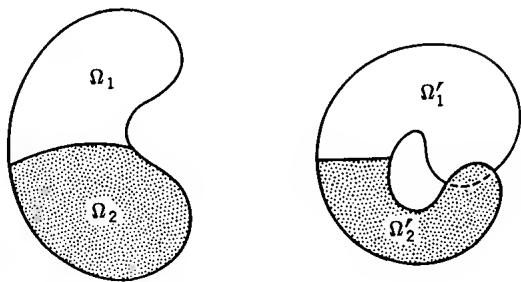  
FIG. 3-1. Doubly covered region.

regions $\Omega_{1}$ and $\Omega_{2}$ are one to one, but the images overlap. It is helpful to think of the image of the whole region as a transparent film which partly covers itself. This is the simple and fruitful idea used by Riemann when he introduced the generalized regions now known as Riemann surfaces.

2.4. Length and Area. We have found that under a conformal mapping $f(z)$ the length of an infinitesimal line segment at the point z is multiplied by the factor $|f'(z)|$ . Because the distortion is the same in all directions, infinitesimal areas will clearly be multiplied by $|f'(z)|^{2}$ .

Let us put this on a rigorous basis. We know from calculus that the length of a differentiable arc $\gamma$ with the equation $z = z(t) = x(t) + iy(t)$ , $a \leq t \leq b$ , is given by

$$
L (\gamma) = \int_ {a} ^ {b} \sqrt {x ^ {\prime} (t) ^ {2} + y ^ {\prime} (t) ^ {2}} d t = \int_ {a} ^ {b} | z ^ {\prime} (t) | d t.
$$

The image curve $\gamma'$ is determined by $w = w(t) = f(z(t))$ with the derivative $w'(t) = f'(z(t))z'(t)$ . Its length is thus

$$
L (\gamma^ {\prime}) = \int_ {a} ^ {b} | f ^ {\prime} (z (t)) | | z ^ {\prime} (t) | d t.
$$

It is customary to use the shorter notations

$$
L (\gamma) = \int_ {\gamma} | d z |, \quad L (\gamma^ {\prime}) = \int_ {\gamma} | f ^ {\prime} (z) | | d z |.\tag{5}
$$

Observe that in complex notation the calculus symbol ds for integration with respect to arc length is replaced by $|dz|$ .

Now let E be a point set in the plane whose area

$$
A (E) = \iint_ {E} d x d y
$$

can be evaluated as a double Riemann integral. If $f(z) = u(x,y) + iv(x,y)$ is a bijective differentiable mapping, then by the rule for changing integration variables the area of the image $E' = f(E)$ is given by

$$
A (E ^ {\prime}) = \iint_ {E} | u _ {x} v _ {y} - u _ {y} v _ {x} | d x d y.
$$

But if $f(z)$ is a conformal mapping of an open set containing E, then $u_{x}v_{y} - u_{y}v_{x} = |f'(z)|^{2}$ by virtue of the Cauchy-Riemann equations, and we obtain

$$
A (E ^ {\prime}) = \iint_ {E} | f ^ {\prime} (z) | ^ {2} d x d y.\tag{6}
$$

The formulas (5) and (6) have important applications in the part of complex analysis that is frequently referred to as geometric function theory.

## 3. LINEAR TRANSFORMATIONS

Of all analytic functions the first-order rational functions have the simplest mapping properties, for they define mappings of the extended plane onto itself which are at the same time conformal and topological. The linear transformations have also very remarkable geometric properties, and for that reason their importance goes far beyond serving as simple examples of conformal mappings. The reader will do well to pay particular attention to this geometric aspect, for it will equip him with simple but very valuable techniques.

3.1. The Linear Group. We have already remarked in Chap. 2, Sec. 1.4 that a linear fractional transformation

$$
w = S (z) = \frac {a z + b}{c z + d}\tag{7}
$$

with $ad - bc \neq 0$ has an inverse

$$
z = S ^ {- 1} (w) = \frac {d w - b}{- c w + a}.
$$

The special values $S(\infty) = a/c$ and $S(-d/c) = \infty$ can be introduced either by convention or as limits for $z \to \infty$ and $z \to -d/c$ . With the latter interpretation it becomes obvious that S is a topological mapping of the extended plane onto itself, the topology being defined by distances on the Riemann sphere.

For linear transformations we shall usually replace the notation $S(z)$

by Sz. The representation (7) is said to be normalized if $ad - bc = 1$ . It is clear that every linear transformation has two normalized representations, obtained from each other by changing the signs of the coefficients.

A convenient way to express a linear transformation is by use of homogeneous coordinates. If we write $z = z_{1}/z_{2}$ , $w = w_{1}/w_{2}$ we find that w = Sz if

$$
\begin{array}{l} w _ {1} = a z _ {1} + b z _ {2} \\ w _ {2} = c z _ {1} + d z _ {2} \end{array}\tag{8}
$$

or, in matrix notation,

$$
\binom{w _ {1}}{w _ {2}} = \left( \begin{array}{c c} a & b \\ c & d \end{array} \right) \binom{z _ {1}}{z _ {2}}.
$$

The main advantage of this notation is that it leads to a simple determination of a composite transformation $w = S_{1}S_{2}z$ . If we use subscripts to distinguish between the matrices that correspond to $S_{1}, S_{2}$ it is immediate that $S_{1}S_{2}$ belongs to the matrix product

$$
\left( \begin{array}{c c} a _ {1} & b _ {1} \\ c _ {1} & d _ {1} \end{array} \right) \left( \begin{array}{c c} a _ {2} & b _ {2} \\ c _ {2} & d _ {2} \end{array} \right) = \left( \begin{array}{c c} a _ {1} a _ {2} + b _ {1} c _ {2} & a _ {1} b _ {2} + b _ {1} d _ {2} \\ c _ {1} a _ {2} + d _ {1} c _ {2} & c _ {1} b _ {2} + d _ {1} d _ {2} \end{array} \right).
$$

All linear transformations form a group. Indeed, the associative law $(S_{1}S_{2})S_{3}=S_{1}(S_{2}S_{3})$ holds for arbitrary transformations, the identity w=z is a linear transformation, and the inverse of a linear transformation is linear. The ratios $z_{1}:z_{2}\neq0:0$ are the points of the complex projective line, and (8) identifies the group of linear transformations with the one-dimensional projective group over the complex numbers, usually denoted by $P(1,\mathbf{C})$ . If we use only normalized representations, we can also identify it with the group of two-by-two matrices with determinant 1 (denoted $SL(2,\mathbf{C})$ ), except that there are two opposite matrices corresponding to the same linear transformation.

We shall make no further use of the matrix notation, except for remarking that the simplest linear transformations belong to matrices of the form

$$
\left( \begin{array}{c c} 1 & \alpha \\ 0 & 1 \end{array} \right), \left( \begin{array}{c c} k & 0 \\ 0 & 1 \end{array} \right), \left( \begin{array}{c c} 0 & 1 \\ 1 & 0 \end{array} \right).
$$

The first of these, $w = z + \alpha$ , is called a parallel translation. The second, w = kz, is a rotation if $|k| = 1$ and a homothetic transformation if k > 0. For arbitrary complex $k \neq 0$ we can set $k = |k| \cdot k / |k|$ , and hence w = kz can be represented as the result of a homothetic transformation followed by a rotation. The third transformation, w = 1/z, is called an inversion.

If $c \neq 0$ we can write

$$
\frac {a z + b}{c z + d} = \frac {b c - a d}{c ^ {2} (z + d / c)} + \frac {a}{c},
$$

and this decomposition shows that the most general linear transformation is composed by a translation, an inversion, a rotation, and a homothetic transformation followed by another translation. If c = 0, the inversion falls out and the last translation is not needed.

## EXERCISES

1. Prove that the reflection $z \rightarrow \bar{z}$ is not a linear transformation.

2. If

$$
T _ {1} z = \frac {z + 2}{z + 3}, \quad T _ {2} z = \frac {z}{z + 1},
$$

find $T_{1}T_{2}z$ , $T_{2}T_{1}z$ and $T_{1}^{-1}T_{2}z$ .

3. Prove that the most general transformation which leaves the origin fixed and preserves all distances is either a rotation or a rotation followed by reflexion in the real axis.

4. Show that any linear transformation which transforms the real axis into itself can be written with real coefficients.

3.2. The Cross Ratio. Given three distinct points $z_{2}$ , $z_{3}$ , $z_{4}$ in the extended plane, there exists a linear transformation S which carries them into 1, 0, $\infty$ in this order. If none of the points is $\infty$ , S will be given by

$$
S z = \frac {z - z _ {3}}{z - z _ {4}}: \frac {z _ {2} - z _ {3}}{z _ {2} - z _ {4}}.\tag{9}
$$

If $z_{2}, z_{3}$ or $z_{4} = \infty$ the transformation reduces to

$$
\frac {z - z _ {3}}{z - z _ {4}}, \quad \frac {z _ {2} - z _ {4}}{z - z _ {4}}, \quad \frac {z - z _ {3}}{z _ {2} - z _ {3}}
$$

respectively.

If T were another linear transformation with the same property, then $ST^{-1}$ would leave 1, 0, $\infty$ invariant. Direct calculation shows that this is true only for the identity transformation, and we would have S = T. We conclude that S is uniquely determined.

Definition 12. The cross ratio $(z_{1}, z_{2}, z_{3}, z_{4})$ is the image of $z_{1}$ under the linear transformation which carries $z_{2}, z_{3}, z_{4}$ into $1, 0, \infty$ .

The definition is meaningful only if $z_{2}, z_{3}, z_{4}$ are distinct. A conventional value can be introduced as soon as any three of the points are distinct, but this is unimportant.

The cross ratio is invariant under linear transformations. In more precise formulation:

Theorem 12. If $z_1, z_2, z_3, z_4$ are distinct points in the extended plane and $T$ any linear transformation, then $(Tz_1, Tz_2, Tz_3, Tz_4) = (z_1, z_2, z_3, z_4)$ .

The proof is immediate, for if $Sz = (z, z_2, z_3, z_4)$ , then $ST^{-1}$ carries $Tz_2$ , $Tz_3$ , $Tz_4$ into $1, 0, \infty$ . By definition we have hence

$$
(T z _ {1}, T z _ {2}, T z _ {3}, T z _ {4}) = S T ^ {- 1} (T z _ {1}) = S z _ {1} = (z _ {1}, z _ {2}, z _ {3}, z _ {4}).
$$

With the help of this property we can immediately write down the linear transformation which carries three given points $z_{1}$ , $z_{2}$ , $z_{3}$ to prescribed positions $w_{1}$ , $w_{2}$ , $w_{3}$ . The correspondence must indeed be given by

$$
(w, w _ {1}, w _ {2}, w _ {3}) = (z, z _ {1}, z _ {2}, z _ {3}).
$$

In general it is of course necessary to solve this equation with respect to w.

Theorem 13. The cross ratio $(z_{1}, z_{2}, z_{3}, z_{4})$ is real if and only if the four points lie on a circle or on a straight line.

This is evident by elementary geometry, for we obtain

$$
\arg \left(z _ {1}, z _ {2}, z _ {3}, z _ {4}\right) = \arg \frac {z _ {1} - z _ {3}}{z _ {1} - z _ {4}} - \arg \frac {z _ {2} - z _ {3}}{z _ {2} - z _ {4}},
$$

and if the points lie on a circle this difference of angles is either 0 or $\pm\pi$ , depending on the relative location.

For an analytic proof we need only show that the image of the real axis under any linear transformation is either a circle or a straight line. Indeed, $Tz = (z, z_{2}, z_{3}, z_{4})$ is real on the image of the real axis under the transformation $T^{-1}$ and nowhere else.

The values of $w = T^{-1}z$ for real $z$ satisfy the equation $Tw = \overline{Tw}$ . Explicitly, this condition is of the form

$$
\frac {a w + b}{c w + d} = \frac {\bar {a} \bar {w} + \bar {b}}{\bar {c} \bar {w} + \bar {d}}.
$$

By cross multiplication we obtain

$$
(a \bar {c} - c \bar {a}) | w ^ {2} | + (a \bar {d} - c \bar {b}) w + (b \bar {c} - d \bar {a}) \bar {w} + b \bar {d} - d \bar {b} = 0.
$$

If $a\bar{c} - c\bar{a} = 0$ this is the equation of a straight line, for under this condition the coefficient $a\bar{d} - c\bar{b}$ cannot also vanish. If $a\bar{c} - c\bar{a} \neq 0$ we can divide by this coefficient and complete the square. After a simple computation we obtain

$$
\left| w + \frac {\bar {a} d - \bar {c} b}{\bar {a} c - \bar {c} a} \right| = \left| \frac {a d - b c}{\bar {a} c - \bar {c} a} \right|
$$

which is the equation of a circle.

The last result makes it clear that we should not, in the theory of linear transformations, distinguish between circles and straight lines. A further justification was found in the fact that both correspond to circles on the Riemann sphere. Accordingly we shall agree to use the word circle in this wider sense.†

The following is an immediate corollary of Theorems 12 and 13:

Theorem 14. A linear transformation carries circles into circles.

## EXERCISES

1. Find the linear transformation which carries 0, i, -i into 1, -1, 0.

2. Express the cross ratios corresponding to the 24 permutations of four points in terms of $\lambda = (z_{1}, z_{2}, z_{3}, z_{4})$ .

3. If the consecutive vertices $z_{1}$ , $z_{2}$ , $z_{3}$ , $z_{4}$ of a quadrilateral lie on a circle, prove that

$$
\left| z _ {1} - z _ {3} \right| \cdot \left| z _ {2} - z _ {4} \right| = \left| z _ {1} - z _ {2} \right| \cdot \left| z _ {3} - z _ {4} \right| + \left| z _ {2} - z _ {3} \right| \cdot \left| z _ {1} - z _ {4} \right|
$$

and interpret the result geometrically.

4. Show that any four distinct points can be carried by a linear transformation to positions 1, -1, k, -k, where the value of k depends on the points. How many solutions are there, and how are they related?

3.3. Symmetry. The points z and $\bar{z}$ are symmetric with respect to the real axis. A linear transformation with real coefficients carries the real axis into itself and z, $\bar{z}$ into points which are again symmetric. More generally, if a linear transformation T carries the real axis into a circle C, we shall say that the points w = Tz and $w^{*} = T\bar{z}$ are symmetric with respect to C. This is a relation between w, $w^{*}$ and C which does not depend on T. For if S is another transformation which carries the real axis into C, then $S^{-1}T$ is a real transformation, and hence $S^{-1}w = S^{-1}Tz$ and $S^{-1}w^{*} = S^{-1}T\bar{z}$ are also conjugate. Symmetry can thus be defined in the following terms:

† This agreement will be in force only when dealing with linear transformations.

Definition 13. The points z and $z^{*}$ are said to be symmetric with respect to the circle C through $z_{1}, z_{2}, z_{3}$ if and only if $(z^{*}, z_{1}, z_{2}, z_{3}) = (z, z_{1}, z_{2}, z_{3})$ .

The points on C, and only those, are symmetric to themselves. The mapping which carries z into $z^{*}$ is a one-to-one correspondence and is called reflection with respect to C. Two reflections will evidently result in a linear transformation.

We wish to investigate the geometric significance of symmetry. Suppose first that C is a straight line. Then we can choose $z_{3} = \infty$ and the condition for symmetry becomes

$$
\frac {z ^ {*} - z _ {2}}{z _ {1} - z _ {2}} = \frac {\bar {z} - \bar {z} _ {2}}{\bar {z} _ {1} - \bar {z} _ {2}}\tag{10}
$$

Taking absolute values we obtain $|z^{*}-z_{2}|=|z-z_{2}|$ . Here $z_{2}$ can be any finite point on C, and we conclude that z and $z^{*}$ are equidistant from all points on C. By (10) we have further

$$
\operatorname{Im} \frac {z ^ {*} - z _ {2}}{z _ {1} - z _ {2}} = - \operatorname{Im} \frac {z - z _ {2}}{z _ {1} - z _ {2}},
$$

and hence z and $z^{*}$ are in different half planes determined by $C.\dagger$ . We leave to the reader to prove that C is the bisecting normal of the segment between z and $z^{*}$ .

Consider now the case of a finite circle C of center a and radius R. Systematic use of the invariance of the cross ratio allows us to conclude as follows:

$$
\begin{array}{r l} \overline {{(z , z _ {1} , z _ {2} , z _ {3})}} & = \overline {{(z - a , z _ {1} - a , z _ {2} - a , z _ {3} - a)}} \\ & = \left(\bar {z} - \bar {a}, \frac {R ^ {2}}{z _ {1} - a}, \frac {R ^ {2}}{z _ {2} - a}, \frac {R ^ {2}}{z _ {3} - a}\right) = \left(\frac {R ^ {2}}{\bar {z} - \bar {a}}, z _ {1} - a, z _ {2} - a, z _ {3} - a\right) \\ & = \left(\frac {R ^ {2}}{\bar {z} - \bar {a}} + a, z _ {1}, z _ {2}, z _ {3}\right). \end{array}
$$

This equation shows that the symmetric point of $z$ is $z^* = R^2 / (\bar{z} - \bar{a}) + a$ or that $z$ and $z^*$ satisfy the relation

$$
(z ^ {*} - a) (z - \bar {a}) = R ^ {2}.\tag{11}
$$

The product $|z^{*}-a|\cdot|z-a|$ of the distances to the center is hence $R^{2}$ . Further, the ratio $(z^{*}-a)/(z-a)$ is positive, which means that z and $z^{*}$ are situated on the same half line from a. There is a simple geometric construction for the symmetric point of z (Fig. 3-2). We note that the symmetric point of a is $\infty$ .

† Unless they coincide and lie on C.

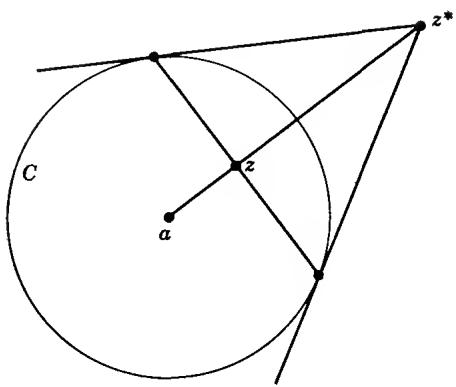  
FIG. 3-2. Reflection in a circle.

Theorem 15. (The symmetry principle.) If a linear transformation carries a circle $C_{1}$ into a circle $C_{2}$ , then it transforms any pair of symmetric points with respect to $C_{1}$ into a pair of symmetric points with respect to $C_{2}$ .

Briefly, linear transformations preserve symmetry. If $C_{1}$ or $C_{2}$ is the real axis, the principle follows from the definition of symmetry. In the general case the assertion follows by use of an intermediate transformation which carries $C_{1}$ into the real axis.

There are two ways in which the principle of symmetry can be used. If the images of z and C under a certain linear transformation are known, then the principle allows us to find the image of $z^{*}$ . On the other hand, if the images of z and $z^{*}$ are known, we conclude that the image of C must be a line of symmetry of these images. While this is not enough to determine the image of C, the information we gain is nevertheless valuable.

The principle of symmetry is put to practical use in the problem of finding the linear transformations which carry a circle C into a circle $C'$ . We can always determine the transformation by requiring that three points $z_{1}, z_{2}, z_{3}$ on C go over into three points $w_{1}, w_{2}, w_{3}$ on $C'$ ; the transformation is then $(w, w_{1}, w_{2}, w_{3}) = (z, z_{1}, z_{2}, z_{3})$ . But the transformation is also determined if we prescribe that a point $z_{1}$ on C shall correspond to a point $w_{1}$ on $C'$ and that a point $z_{2}$ not on C shall be carried into a point $w_{2}$ not on $C'$ . We know then that $z_{2}^{*}$ (the symmetric point of $z_{2}$ with respect to C) must correspond to $w_{2}^{*}$ (the symmetric point of $w_{2}$ with respect to $C'$ ). Hence the transformation will be obtained from the relation $(w, w_{1}, w_{2}, w_{2}^{*}) = (z, z_{1}, z_{2}, z_{2}^{*})$ .

## EXERCISES

1. Prove that every reflection carries circles into circles.

2. Reflect the imaginary axis, the line $x = y$ , and the circle $|z| = 1$ in the circle $|z - 2| = 1$ .

3. Carry out the reflections in the preceding exercise by geometric construction.

4. Find the linear transformation which carries the circle $|z| = 2$ into $|z + 1| = 1$ , the point $-2$ into the origin, and the origin into $i$ .

5. Find the most general linear transformation of the circle $|z| = R$ into itself.

6. Suppose that a linear transformation carries one pair of concentric circles into another pair of concentric circles. Prove that the ratios of the radii must be the same.

7. Find a linear transformation which carries $|z| = 1$ and $|z - \frac{1}{4}| = \frac{1}{4}$ into concentric circles. What is the ratio of the radii?

8. Same problem for $|z| = 1$ and x = 2.

## 3.4. Oriented Circles. Because $S(z)$ is analytic and

$$
S ^ {\prime} (z) = \frac {a d - b c}{(c z + d) ^ {2}} \neq 0
$$

the mapping $w = S(z)$ is conformal for $z \neq -d/c$ and $\infty$ . It follows that a pair of intersecting circles are mapped on circles that include the same angle. In addition, the sense of an angle is preserved. From an intuitive point of view this means that right and left are preserved, but a more precise formulation is desirable.

An orientation of a circle C is determined by an ordered triple of points $z_{1}, z_{2}, z_{3}$ on C. With respect to this orientation a point z not on C is said to lie to the right of C if $\operatorname{Im}(z, z_{1}, z_{2}, z_{3}) > 0$ and to the left of C is $\operatorname{Im}(z, z_{1}, z_{2}, z_{3}) < 0$ (this checks with everyday use because $(i, 1, 0, \infty) = i$ ). It is essential to show that there are only two different orientations. By this we mean that the distinction between left and right is the same for all triples, while the meaning may be reversed. Since the cross ratio is invariant, it is sufficient to consider the case where C is the real axis. Then

$$
(z, z _ {1}, z _ {2}, z _ {3}) = \frac {a z + b}{c z + d}
$$

can be written with real coefficients, and a simple calculation gives

$$
\operatorname{Im} \left(z, z _ {1}, z _ {2}, z _ {3}\right) = \frac {a d - b c}{| c z + d | ^ {2}} \operatorname{Im} z.
$$

We recognize that the distinction between right and left is the same as the distinction between the upper and lower half plane. Which is which depends on the sign of the determinant ad - bc.

A linear transformation S carries the oriented circle C into a circle which we orient through the triple $Sz_{1}$ , $Sz_{2}$ , $Sz_{3}$ . From the invariance of the cross ratio it follows that the left and right of C will be mapped on the left and right of the image circle.

If two circles are tangent to each other, their orientations can be compared. Indeed, we can use a linear transformation which throws their common point to $\infty$ . The circles become parallel straight lines, and we know how to compare the directions of parallel lines.

In the geometric representation the orientation $z_{1}$ , $z_{2}$ , $z_{3}$ can be indicated by an arrow which points from $z_{1}$ over $z_{2}$ to $z_{3}$ . With the usual choice of the coordinate system left and right will have their customary meaning with respect to this arrow.

When the finite plane is considered as part of the extended plane, the point at infinity is distinguished. We can therefore define an absolute positive orientation of all finite circles by the requirement that $\infty$ should lie to the right of the oriented circles. The points to the left are said to form the inside of the circle and the points to the right form its outside.

## EXERCISES

1. If $z_1, z_2, z_3, z_4$ are points on a circle, show that $z_1, z_3, z_4$ and $z_2, z_3, z_4$ determine the same orientation if and only if $(z_1, z_2, z_3, z_4) > 0$ .

2. Prove that a tangent to a circle is perpendicular to the radius through the point of contact (in this connection a tangent should be defined as a straight line with only one point in common with the circle).

3. Verify that the inside of the circle $|z - a| = R$ is formed by all points z with $|z - a| < R$ .

4. The angle between two oriented circles at a point of intersection is defined as the angle between the tangents at that point, equipped with the same orientation. Prove by analytic reasoning, rather than geometric inspection, that the angles at the two points of intersection are opposite to each other.

3.5. Families of Circles. A great deal can be done toward the visualization of linear transformations by the introduction of certain families of circles which may be thought of as coordinate lines in a circular coordinate system.

Consider a linear transformation of the form

$$
w = k \cdot \frac {z - a}{z - b}.
$$

Here z = a corresponds to w = 0 and z = b to $w = \infty$ . It follows that the straight lines through the origin of the w-plane are images of the circles through $a$ and $b$ . On the other hand, the concentric circles about the origin, $|w| = \rho$ , correspond to circles with the equation

$$
\left| \frac {z - a}{z - b} \right| = \rho / | k |.
$$

These are the circles of Apollonius with limit points a and b. By their equation they are the loci of points whose distances from a and b have a constant ratio.

Denote by $C_{1}$ the circles through a, b and by $C_{2}$ the circles of Apollonius with these limit points. The configuration (Fig. 3-3) formed by all the circles $C_{1}$ and $C_{2}$ will be referred to as the circular net or the Steiner circles determined by a and b. It has many interesting properties of which we shall list a few:

1. There is exactly one $C_{1}$ and one $C_{2}$ through each point in the plane with the exception of the limit points.

2. Every $C_1$ meets every $C_2$ under right angles.

3. Reflection in a $C_{1}$ transforms every $C_{2}$ into itself and every $C_{1}$ into another $C_{1}$ . Reflection in a $C_{2}$ transforms every $C_{1}$ into itself and every $C_{2}$ into another $C_{2}$ .

4. The limit points are symmetric with respect to each $C_{2}$ , but not with respect to any other circle.

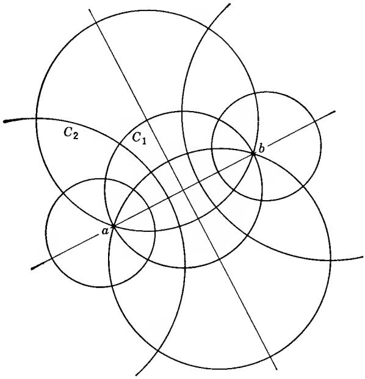  
FIG. 3-3. Steiner circles.

These properties are all trivial when the limit points are 0 and $\infty$ , i.e., when the $C_{1}$ are lines through the origin and the $C_{2}$ concentric circles. Since the properties are invariant under linear transformations, they must continue to hold in the general case.

If a transformation $w = Tz$ carries $a, b$ into $a', b'$ it can be written in the form

$$
\frac {w - a ^ {\prime}}{w - b ^ {\prime}} = k \cdot \frac {z - a}{z - b}.\tag{12}
$$

It is clear that $T$ transforms the circles $C_1$ and $C_2$ into circles $C_1'$ and $C_2'$ with the limit points $a', b'$ .

The situation is particularly simple if $a' = a$ , $b' = b$ . Then a, b are said to be fixed points of T, and it is convenient to represent z and Tz in the same plane. Under these circumstances the whole circular net will be mapped upon itself. The value of k serves to identify the image circles $C_{1}'$ and $C_{2}'$ . Indeed, with appropriate orientations $C_{1}$ forms the angle arg k with its image $C_{1}'$ , and the quotient of the constant ratios $|z - a|/|z - b|$ on $C_{2}'$ and $C_{2}$ is $|k|$ .

The special cases in which all $C_{1}$ or all $C_{2}$ are mapped upon themselves are particularly important. We have $C_{1}^{\prime}=C_{1}$ for all $C_{1}$ if k>0 (if k<0 the circles are still the same, but the orientation is reversed). The transformation is then said to be hyperbolic. When k increases the points $Tz, z\neq a, b$ , will flow along the circles $C_{1}$ toward b. The consideration of this flow provides a very clear picture of a hyperbolic transformation.

The case $C_{2}^{\prime}=C_{2}$ occurs when $|k|=1$ . Transformations with this property are called elliptic. When arg k varies, the points Tz move along the circles $C_{2}$ . The corresponding flow circulates about a and b in different directions.

The general linear transformation with two fixed points is the product of a hyperbolic and an elliptic transformation with the same fixed points.

The fixed points of a linear transformation are found by solving the equation

$$
z = \frac {\alpha z + \beta}{\gamma z + \delta}.\tag{13}
$$

In general this is a quadratic equation with two roots; if $\gamma = 0$ one of the fixed points is $\infty$ . It may happen, however, that the roots coincide. A linear transformation with coinciding fixed points is said to be parabolic. The condition for this is $(\alpha - \delta)^{2} = 4\beta\gamma$ .

If the equation (13) is found to have two distinct roots $a$ and $b$ , the transformation can be written in the form

$$
{\frac {w - a}{w - b}} = k {\frac {z - a}{z - b}}.
$$

We can then use the Steiner circles determined by a, b to discuss the nature of the transformation. It is important to note, however, that the method is by no means restricted to this case. We can write any linear transformation in the form (12) with arbitrary a, b and use the two circular nets to great advantage.

For the discussion of parabolic transformations it is desirable to introduce still another type of circular net. Consider the transformation

$$
w = \frac {\omega}{z - a} + c.
$$

It is evident that straight lines in the w-plane correspond to circles through a; moreover, parallel lines correspond to mutually tangent circles. In particular, if $w = u + iv$ the lines u = constant and v = constant correspond to two families of mutually tangent circles which intersect at right angles (Fig. 3-4). This configuration can be considered as a degenerate set of Steiner circles. It is determined by the point a and the tangent to one of the families of circles. We shall denote the images of the lines v = constant by $C_{1}$ , the circles of the other family by $C_{2}$ . Clearly, the line v = Im c corresponds to the tangent of the circles $C_{1}$ ; its direction is given by arg $\omega$ .

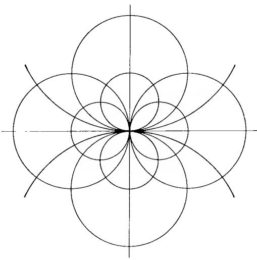  
FIG. 3-4. Degenerate Steiner circles.

Any transformation which carries $a$ into $a'$ can be written in the form

$$
\frac {\omega^ {\prime}}{w - a ^ {\prime}} = \frac {\omega}{z - a} + c.
$$

It is clear that the circles $C_{1}$ and $C_{2}$ are carried into the circles $C_{1}^{\prime}$ and $C_{2}^{\prime}$ determined by $a^{\prime}$ and $\omega^{\prime}$ . We suppose now that $a = a^{\prime}$ is the only fixed point. Then $\omega = \omega^{\prime}$ and we can write

$$
\frac {\omega}{w - a} = \frac {\omega}{z - a} + c.\tag{14}
$$

By this transformation the configuration consisting of the circles $C_{1}$ and $C_{2}$ is mapped upon itself. In (14) a multiplicative factor is arbitrary, and we can hence suppose that c is real. Then every $C_{1}$ is mapped upon itself and the parabolic transformation can be considered as a flow along the circles $C_{2}$ .

A linear transformation that is neither hyperbolic, elliptic, nor parabolic is said to be loxodromic.

## EXERCISES

1. Find the fixed points of the linear transformations

$$
w = \frac {z}{2 z - 1}, \quad w = \frac {2 z}{3 z - 1}, \quad w = \frac {3 z - 4}{z - 1}, \quad w = \frac {z}{2 - z}.
$$

Is any of these transformations elliptic, hyperbolic, or parabolic?

2. Suppose that the coefficients of the transformation

$$
S z = \frac {a z + b}{c z + d}
$$

are normalized by $ad - bc = 1$ . Show that $S$ is elliptic if and only if $-2 < a + d < 2$ , parabolic if $a + d = \pm 2$ , hyperbolic if $a + d < -2$ or $>2$ .

3. Show that a linear transformation which satisfies $S^n z = z$ for some integer $n$ is necessarily elliptic.

4. If S is hyperbolic or loxodromic, show that $S^{n}z$ converges to a fixed point as $n \to \infty$ , the same for all z, except when z coincides with the other fixed point. (The limit is the attractive, the other the repellent fixed point. What happens when $n \to -\infty$ ? What happens in the parabolic case?)

5. Find all linear transformations which represent rotations of the Riemann sphere.

6. Find all circles which are orthogonal to $|z| = 1$ and $|z - 1| = 4$ .

7. In an obvious way, which we shall not try to make precise, a family of transformations depends on a certain number of real parameters. How many real parameters are there in the family of all linear transformations? How many in the families of hyperbolic, elliptic, parabolic transformations? How many linear transformations leave a given circle C invariant?

## 4. ELEMENTARY CONFORMAL MAPPINGS

The conformal mapping associated with an analytic function affords an excellent visualization of the properties of the latter; it can well be compared with the visualization of a real function by its graph. It is therefore natural that all questions connected with conformal mapping have received a great deal of attention; progress in this direction has increased our knowledge of analytic functions considerably. In addition, conformal mapping enters naturally in many branches of mathematical physics and in this way accounts for the immediate usefulness of complex-function theory.

One of the most important problems is to determine the conformal mappings of one region onto another. In this section we shall consider those mappings which can be defined by elementary functions.

4.1. The Use of Level Curves. When a conformal mapping is defined by an explicit analytic function $w = f(z)$ , we naturally wish to gain information about the specific geometric properties of the mapping. One of the most fruitful ways is to study the correspondence of curves induced by the point transformation. The special properties of the function $f(z)$ may express themselves in the fact that certain simple curves are transformed into curves of a family of well-known character. Any such information will strengthen our visual conception of the mapping.

Such was the case for mappings by linear transformations. We proved in Sec. 3 that a linear transformation carries circles into circles, provided that straight lines are included as a special case. By consideration of the Steiner circles it was possible to obtain a complete picture of the correspondence.

In more general cases it is advisable to begin with a study of the image curves of the lines $x = x_{0}$ and $y = y_{0}$ . If we write $f(z) = u(x,y) + iv(x,y)$ , the image of $x = x_{0}$ is given by the parametric equations $u = u(x_{0},y)$ , $v = v(x_{0},y)$ ; y acts as a parameter and can be eliminated or retained according to convenience. The image of $y = y_{0}$ is determined in the same way. Together, the curves form an orthogonal net in the w-plane. Similarly, we may consider the curves $u(x,y) = u_{0}$ and $v(x,y) = v_{0}$ in the z-plane. They are also orthogonal and are called the level curves of u and v.

In other cases it may be more convenient to use polar coordinates and study the images of concentric circles and straight lines through the origin.

Among the simplest mappings are those by a power $w = z^{\alpha}$ . We consider only the case of real $\alpha$ , and then we may as well suppose that $\alpha$ is positive. Since

$$
\begin{array}{r c l} {| w | =} & {| z | ^ {\alpha}} \\ {\arg w =} & {\alpha \arg z} \end{array}
$$

concentric circles about the origin are transformed into circles of the same family, and half lines from the origin correspond to other half lines. The mapping is conformal at all points $z \neq 0$ , but an angle $\theta$ at the origin is transformed into an angle $\alpha\theta$ . For $\alpha \neq 1$ the transformation of the whole plane is not one to one, and if $\alpha$ is fractional $z^{\alpha}$ is not even single-valued. In general we can therefore only consider the mapping of an angular sector onto another.

The sector $S(\varphi_{1},\varphi_{2})$ , where $0 < \varphi_{2} - \varphi_{1} \leq 2\pi$ , shall be formed by all points $z \neq 0$ such that one value of arg z satisfies the inequality

$$
\varphi_ {1} <   \arg z <   \varphi_ {2}.\tag{15}
$$

It is easy to show that $S(\varphi_1, \varphi_2)$ is a region. In this region a unique value of $w = z^\alpha$ is defined by the condition

$$
\arg w = \alpha \arg z
$$

where $\arg z$ stands for the value of the argument singled out by the condition (15). This function is analytic with the nonvanishing derivative

$$
D e ^ {\alpha \log z} = \alpha \frac {w}{z}.
$$

The mapping is one to one only if $\alpha(\varphi_{2}-\varphi_{1})\leq2\pi$ , and in this case $S(\varphi_{1},\varphi_{2})$ is mapped onto the sector $S(\alpha\varphi_{1},\alpha\varphi_{2})$ in the w-plane. It should be observed that $S(\varphi_{1}+n\cdot2\pi,\varphi_{2}+n\cdot2\pi)$ is geometrically identical with $S(\varphi_{1},\varphi_{2})$ but may determine a different branch of $z^{\alpha}$ .

Let us consider the mapping $w = z^{2}$ in detail. Since $u = x^{2} - y^{2}$ and v = 2xy, we recognize that the level curves $u = u_{0}$ and $v = v_{0}$ are equilateral hyperbolas with the diagonals and the coordinate axes for asymptotes. They are of course orthogonal to each other. On the other hand, the image of $x = x_{0}$ is $v^{2} = 4x_{0}^{2}(x_{0}^{2} - u)$ and the image of $y = y_{0}$ is $v^{2} = 4y_{0}^{2}(y_{0}^{2} + u)$ . Both families represent parabolas with the focus at the origin whose axes are pointed in the negative and positive direction of the u-axis. Their orthogonality is well-known from analytic geometry. The families of level curves are shown in Figs. 3-5 and 3-6.

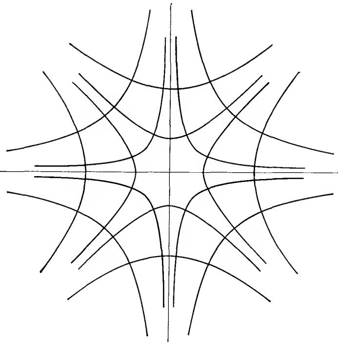  
FIG. 3-5. z-plane.

For a different family of image curves consider the circles $|w - 1| = k$ in the w-plane. The equation of the inverse image can be written in the form

$$
(x ^ {2} + y ^ {2}) ^ {2} = 2 (x ^ {2} - y ^ {2}) + k ^ {2} - 1
$$

and represents a family of lemniscates with the focal points $\pm1$ . The orthogonal family is represented by

$$
x ^ {2} - y ^ {2} = 2 h x y + 1
$$

and consists of all equilateral hyperbolas with center at the origin which pass through the points $\pm1$ .

In the case of the third power $w = z^{3}$ the level curves in both planes are cubic curves. There is no point in deriving their equations, for their general shape is clear without calculation. For instance, the curves $u = u_{0} > 0$ must have the form indicated in Fig. 3-7. Similarly, if we follow the change of arg w when z traces the line $x = x_{0} > 0$ , we find that the image curve must have a loop (Fig. 3-8). It is a folium of Descartes.

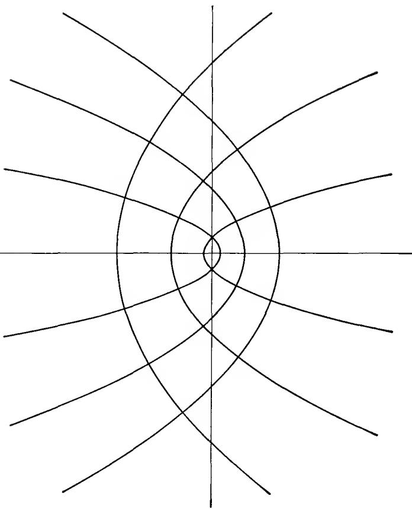  
FIG. 3-6. w-plane.

The mapping by $w = e^{z}$ is very simple. The lines $x = x_{0}$ and $y = y_{0}$ are mapped onto circles about the origin and rays of constant argument. Any other straight line in the z-plane is mapped on a logarithmic spiral. The mapping is one to one in any region which does not contain two points whose difference is a multiple of $2\pi i$ . In particular, a horizontal strip $y_{1} < y < y_{2}$ , $y_{2} - y_{1} \leq 2\pi$ is mapped onto an angular sector, and if $y_{2} - y_{1} = \pi$ the image is a half plane. We are thus able to map a parallel strip onto a half plane, and hence onto any circular region. The left half of the strip, cut off by the imaginary axis, corresponds to a half circle.

It is useful to write down some explicit formulas for the mapping. The function $\zeta = \xi + i\eta = e^{z}$ maps the strip $-\pi/2 < y < \pi/2$ onto the half plane $\xi > 0$ . On the other hand,

$$
w = \frac {\zeta - 1}{\zeta + 1}
$$

maps $\xi > 0$ onto $|w| < 1$ . Hence

$$
w = \frac {e ^ {z} - 1}{e ^ {z} + 1} = \tanh \frac {z}{2}
$$

maps the strip $|\operatorname{Im} z| < \pi/2$ on the unit disk $|w| < 1$ .

4.2. A Survey of Elementary Mappings. When faced with the problem of mapping a region $\Omega_{1}$ conformally onto another region $\Omega_{2}$ , it is usually advisable to proceed in two steps. First, we map $\Omega_{1}$ onto a circular region, and then we map the circular region onto $\Omega_{2}$ . In other words, the general problem of conformal mapping can be reduced to the problem of mapping a region onto a disk or a half plane. We shall prove, in Chap. 6, that this mapping problem has a solution for every region whose boundary consists of a simple closed curve.

The main tools at our disposal are linear transformations and transformations by a power, by the exponential function, and by the logarithm. All these transformations have the characteristic property that they map a family of straight lines or circles on a similar family. For this reason, their use is essentially limited to regions whose boundary is made up of circular arcs and line segments. The power serves the particular purpose of straightening angles, and with the aid of the exponential function we can even transform zero angles into straight angles.

By these means we can for instance find a standard mapping of any region whose boundary consists of two circular arcs with common end points. Such a region is either a circular wedge, whose angle may be greater than $\pi$ , or its complement. If the end points of the arcs are a and b, we begin with the preliminary mapping $z_{1} = (z - a)/(z - b)$ which transforms the given region into an angular sector. By an appropriate power $w = z_{1}^{\alpha}$ this sector can be mapped onto a half plane.

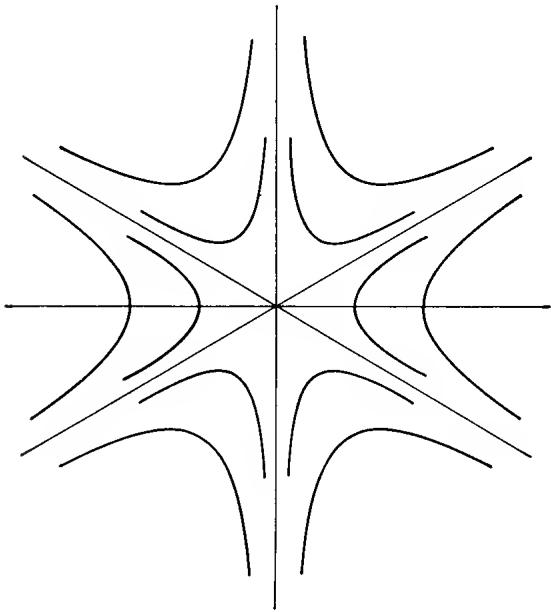  
FIG. 3-7

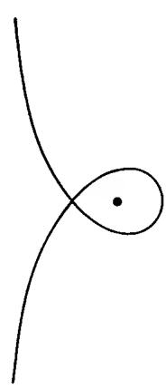  
FIG. 3-8

If the circles are tangent to each other at the point a, the transformation $z_{1}=1/(z-a)$ will map the region between them onto a parallel strip, and a suitable exponential transformation maps the strip onto a half plane.

A little more generally, the same method applies to a circular triangle with two right angles. In fact, if the third angle has the vertex $a$ , and if the sides from $a$ meet again at $b$ , the linear transformation $z_{1} = (z - a)/(z - b)$ maps the triangle onto a circular sector. By means of a power this sector can be transformed into a half circle; the half circle is a wedge-shaped region which in turn can be mapped onto a half plane.

In this connection we shall treat explicitly a special case which occurs frequently. Let it be required to map the complement of a line segment onto the inside or outside of a circle. The region is a wedge with the angle $2\pi$ ; without loss of generality we may assume that the end points of the segment are $\pm1$ . The preliminary transformation

$$
z _ {1} = \frac {z + 1}{z - 1}
$$

maps the wedge on the full angle obtained by exclusion of the negative real axis. Next we define

$$
z _ {2} = \sqrt {z _ {1}}
$$

as the square root whose real part is positive and obtain a map onto the right half plane. The final transformation

$$
w = \frac {z _ {2} - 1}{z _ {2} + 1}
$$

maps the half plane onto $|w| < 1$ .

Elimination of the intermediate variables leads to the correspondence

$$
\begin{array}{c} z = \frac {1}{2} \left(w + \frac {1}{w}\right) \\ w = z - \sqrt {z ^ {2} - 1}. \end{array}\tag{16}
$$

The sign of the square root is uniquely determined by the condition $|w| < 1$ , for $(z - \sqrt{z^{2} - 1})(z + \sqrt{z^{2} - 1}) = 1$ . If the sign is changed, we obtain a mapping onto $|w| > 1$ .

For a more detailed study of the mapping (16) we set $w = \rho e^{i\theta}$ and obtain

$$
x = \frac {1}{2} \left(\rho + \frac {1}{\rho}\right) \cos \theta
$$

$$
y = \frac {1}{2} \left(\rho - \frac {1}{\rho}\right) \sin \theta .
$$

Elimination of $\theta$ yields

$$
\frac {x ^ {2}}{[ \frac {1}{2} (\rho + \rho^ {- 1}) ] ^ {2}} + \frac {y ^ {2}}{[ \frac {1}{2} (\rho - \rho^ {- 1}) ] ^ {2}} = 1\tag{17}
$$

and elimination of $\rho$

$$
\frac {x ^ {2}}{\cos^ {2} \theta} - \frac {y ^ {2}}{\sin^ {2} \theta} = 1.\tag{18}
$$

Hence the image of a circle $|w| = \rho < 1$ is an ellipse with the major axis $\rho + \rho^{-1}$ and the minor axis $\rho^{-1} - \rho$ . The image of a radius is half a branch of a hyperbola. The ellipses (17) and the hyperbolas (18) are confocal. The correspondence is illustrated in Fig. 3-9.

Clearly, the transformation (16) allows us to include in our list of elementary conformal mappings the mapping of the outside of an ellipse or the region between the branches of a hyperbola onto a circular region. It does not, however, allow us to map the inside of an ellipse or the inside of a hyperbolic branch.

As a final and less trivial example we shall study the mapping defined by a cubic polynomial $w = a_{0}z^{3} + a_{1}z^{2} + a_{2}z + a_{3}$ . The familiar transformation $z = z_{1} - a_{1}/3a_{0}$ allows us to get rid of the quadratic term, and by obvious normalizations we can reduce the polynomial to the form $w = z^{3} - 3z$ . The coefficient for z is chosen so as to make the derivative vanish for $z = \pm1$ .

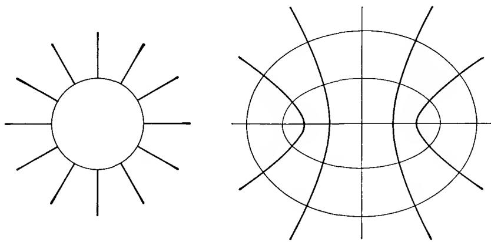  
FIG. 3-9. Mapping by $z = \frac{1}{2}(w + w^{-1})$ .

Making use of the transformation (16) we introduce an auxiliary variable $\zeta$ defined by

$$
z = \zeta + \frac {1}{\zeta}.
$$

Our cubic polynomial takes then the simple form

$$
w = \zeta^ {3} + \frac {1}{\zeta^ {3}}.
$$

We note that each z determines two values $\zeta$ , but they are reciprocal and yield the same value of w. In order to obtain a unique $\zeta$ we may impose the condition $|\zeta| < 1$ , but then the segment $(-2,2)$ must be excluded from the z-plane.

It is now easy to visualize the correspondence between the z- and w-planes. To the circle $|\zeta| = \rho < 1$ corresponds an ellipse with the semiaxes $\rho^{-1} \pm \rho$ in the z-plane, and one with the semiaxes $\rho^{-3} \pm \rho^{3}$ in the w-plane. Similarly, a radius $\arg \zeta = \theta$ corresponds to hyperbolic branches in the z- and w-planes; the one in the z-plane has an asymptote which makes the angle $-\theta$ with the positive real axis, and in the w-plane the corresponding angle is $-3\theta$ . The whole pattern of confocal ellipses and hyperbolas remains invariant, but when z describes an ellipse w will trace the corresponding larger ellipse three times. The situation is thus very similar to the one in the case of the simpler mapping $w = z^{3}$ . For orientation the reader may again lean on Fig. 3-9.

For the region between two hyperbolic branches whose asymptotes make an angle $\leq 2\pi/3$ the mapping is one to one. We note in particular that the six regions into which the hyperbola $3x^{2} - y^{2} = 3$ and the x-axis divide the z-plane are mapped onto half planes, three of them onto the upper half plane and three onto the lower. The inside of the right-hand branch of the hyperbola corresponds to the whole w-plane with an incision along the negative real axis up to the point -2.

## EXERCISES

All mappings are to be conformal.

1. Map the common part of the disks $|z| < 1$ and $|z - 1| < 1$ on the inside of the unit circle. Choose the mapping so that the two symmetries are preserved.

2. Map the region between $|z| = 1$ and $|z - \frac{1}{2}| = \frac{1}{2}$ on a half plane.

3. Map the complement of the arc $|z| = 1$ , $y \geq 0$ on the outside of the unit circle so that the points at $\infty$ correspond to each other.

4. Map the outside of the parabola $y^2 = 2px$ on the disk $|w| < 1$ so that $z = 0$ and $z = -p/2$ correspond to $w = 1$ and $w = 0$ . (Lindelöf.)

5. Map the inside of the right-hand branch of the hyperbola $x^{2} - y^{2} = a^{2}$ on the disk $|w| < 1$ so that the focus corresponds to w = 0 and the vertex to w = -1. (Lindelöf.)

6. Map the inside of the lemniscate $|z^{2}-a^{2}|=\rho^{2}(\rho>a)$ on the disk $|w|<1$ so that symmetries are preserved. (Lindelöf.)

7. Map the outside of the ellipse $(x / a)^2 + (y / b)^2 = 1$ onto $|w| < 1$ with preservation of symmetries.

8. Map the part of the z-plane to the left of the right-hand branch of the hyperbola $x^{2} - y^{2} = 1$ on a half plane. (Lindelöf.)

Hint: Consider on one side the mapping of the upper half of the region by $w = z^{2}$ , on the other side the mapping of a quadrant by

$$
w = z ^ {3} - 3 z.
$$

4.3. Elementary Riemann Surfaces. The visualization of a function by means of the corresponding mapping is completely clear only when the mapping is one to one. If this is not the case, we can still give our imagination the necessary support by the introduction of generalized regions in which distinct points may have the same coordinates. In order to do this it is necessary to suppose that points which occupy the same place can be distinguished by other characteristics, for instance a tag or a color. Points with the same tag are considered to lie in the same sheet or layer.

This idea leads to the notion of a Riemann surface. It is not our intention to give, in this connection, a rigorous definition of this notion. For our purposes it is sufficient to introduce Riemann surfaces in a purely descriptive manner. We are free to do so as long as we use them merely for purposes of illustration, and never in logical proofs.

The simplest Riemann surface is connected with the mapping by a power $w = z^{n}$ , where n > 1 is an integer. We know that there is a one-to-one correspondence between each angle $(k - 1)(2\pi/n) < \arg z < k(2\pi/n)$ , $k = 1, \ldots, n$ , and the whole w-plane except for the positive real axis. The image of each angle is thus obtained by performing a “cut” along the positive axis; this cut has an upper and a lower “edge.” Corresponding to the n angles in the z-plane we consider n identical copies of the w-plane with the cut. They will be the “sheets” of the Riemann surface, and they are distinguished by a tag k which serves to identify the corresponding angle. When z moves in its plane, the corresponding point w should be free to move on the Riemann surface. For this reason we must attach the lower edge of the first sheet to the upper edge of the second sheet, the lower edge of the second sheet to the upper edge of the third, and so on. In the last step the lower edge of the nth sheet is attached to the upper edge of the first sheet, completing the cycle. In a physical sense this is not possible without self-intersection, but the idealized model shall be free from this discrepancy. The result of the construction is a Riemann surface whose points are in one-to-one correspondence with the points of the z-plane. What is more, this correspondence is continuous if continuity is defined in the sense suggested by the construction.

The cut along the positive axis could be replaced by a cut along any simple arc from 0 to $\infty$ ; the Riemann surface obtained in this way should be considered as identical with the one originally constructed. In other words, the cuts are in no way distinguished lines on the surface, but the introduction of specific cuts is necessary for descriptive purposes.

The point w = 0 is in a special position. It connects all the sheets, and a curve must wind n times around the origin before it closes. A point of this kind is called a branch point. If our Riemann surface is considered over the extended plane, the point at $\infty$ is also a branch point. In more general cases a branch point need not connect all the sheets; if it connects h sheets, it is said to be of order h - 1.

The Riemann surface corresponding to $w = e^{z}$ is of similar nature. In this case the function maps each parallel strip $(k - 1)2\pi < y < k \cdot 2\pi$ onto a sheet with a cut along the positive axis. The sheets are attached to each other so that they form an endless screw. The origin will not be a point of the Riemann surface, corresponding to the fact that $e^{z}$ is never zero.

The reader will find it easy to construct other Riemann surfaces. We will illustrate the procedure by consideration of the Riemann surface defined by $w = \cos z$ . A region which is mapped in a one-to-one manner onto the whole plane, except for one or more cuts, is called a fundamental region. For fundamental regions of $w = \cos z$ we may choose the strips $(k - 1)\pi < x < k\pi$ . Each strip is mapped onto the whole w-plane with cuts along the real axis from $-\infty$ to -1 and from 1 to $\infty$ . The line $x = k\pi$ corresponds to both edges of the positive cut if k is even, and to the edges of the negative cut if k is odd. If we consider the two strips which are adjacent along the line $x = k\pi$ , we find that the edges of the corresponding cuts must be joined crosswise so as to generate a simple branch point at $w = \pm1$ . The resulting surface has infinitely many simple branch points over w = 1 and w = -1 which alternatingly connect the odd and even sheets.

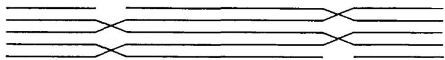  
FIG. 3-10. The Riemann surface of cos z.

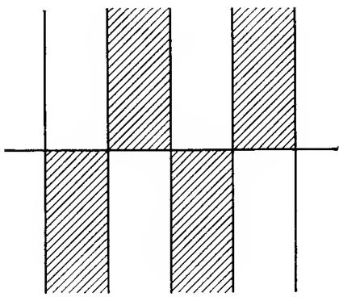  
FIG. 3-11. Fundamental regions of cos z.

An attempt to illustrate the connection between the sheets is made in Fig. 3-10. It represents a cross section of the surface in the case that the cuts are chosen parallel to each other. The reader should bear in mind that any two points on the same level can be joined by an arc which does not intersect any of the cuts.

Whatever the advantage of such representations may be, the clearest picture of the Riemann surface is obtained by direct consideration of the fundamental regions in the z-plane. The interpretation is even simpler if, as in Fig. 3-11, we introduce the subregions which correspond to the upper and lower half plane. The shaded regions are those in which cos z has a positive imaginary part. Each region corresponds to a half plane on which we mark the boundary points 1 and -1. For any two adjacent regions, one white and one shaded, the half planes must be joined across one of the three intervals $(-∞,-1)$ , $(-1,1)$ , $(1,∞)$ . The choice of the correct junction is automatic from a glance at the corresponding situation in the z-plane.

## EXERCISES

1. Describe the Riemann surface associated with the function

$$
w = \frac {1}{2} \left(z + \frac {1}{z}\right).
$$

2. Same problem for $w = (z^2 - 1)^2$ .

3. Same problem for $w = z^3 - 3z$ .

## 1. FUNDAMENTAL THEOREMS

Many important properties of analytic functions are very difficult to prove without use of complex integration. For instance, it is only recently that it became possible to prove, without resorting to complex integrals or equivalent tools, that the derivative of an analytic function is continuous, or that the higher derivatives exist. At present the integration-free proofs are, to say the least, much more difficult than the classical proofs.†

As in the real case we distinguish between definite and indefinite integrals. An indefinite integral is a function whose derivative equals a given analytic function in a region; in many elementary cases indefinite integrals can be found by inversion of known derivation formulas. The definite integrals are taken over differentiable or piecewise differentiable arcs and are not limited to analytic functions. They can be defined by a limit process which mimics the definition of a real definite integral. Actually, we shall prefer to define complex definite integrals in terms of real integrals. This will save us from repeating existence proofs which are essentially the same as in the real case. Naturally, the reader must be thoroughly familiar with the theory of definite integrals of real continuous functions.

1.1. Line Integrals. The most immediate generalization of a real integral is to the definite integral of a complex function over a real interval. If $f(t) = u(t) + iv(t)$ is a continuous function, defined in an interval $(a,b)$ , we set by definition

$$
\int_ {a} ^ {b} f (t) d t = \int_ {a} ^ {b} u (t) d t + i \int_ {a} ^ {b} v (t) d t.\tag{1}
$$

This integral has most of the properties of the real integral. In particular, if $c = \alpha + i\beta$ is a complex constant we obtain

$$
\int_ {a} ^ {b} c f (t) d t = c \int_ {a} ^ {b} f (t) d t,\tag{2}
$$

for both members are equal to

$$
\int_ {a} ^ {b} (\alpha u - \beta v) d t + i \int_ {a} ^ {b} (\alpha v + \beta u) d t.
$$

When $a \leq b$ , the fundamental inequality

$$
\left| \int_ {a} ^ {b} f (t) d t \right| \leq \int_ {a} ^ {b} | f (t) | d t\tag{3}
$$

holds for arbitrary complex $f(t)$ . To see this we choose $c = e^{-i\theta}$ with a real $\theta$ in (2) and find

$$
\operatorname{Re} \left[ e ^ {- i \theta} \int_ {a} ^ {b} f (t) d t \right] = \int_ {a} ^ {b} \operatorname{Re} \left[ e ^ {- i \theta} f (t) \right] d t \leq \int_ {a} ^ {b} | f (t) | d t.
$$

For $\theta = \arg \int_{a}^{b} f(t) dt$ the expression on the left reduces to the absolute value of the integral, and (3) results.†

We consider now a piecewise differentiable arc $\gamma$ with the equation $z = z(t)$ , $a \leq t \leq b$ . If the function $f(z)$ is defined and continuous on $\gamma$ , then $f(z(t))$ is also continuous and we can set

$$
\int_ {\gamma} f (z) d z = \int_ {a} ^ {b} f (z (t)) z ^ {\prime} (t) d t.\tag{4}
$$

This is our definition of the complex line integral of $f(z)$ extended over the arc $\gamma$ . In the right-hand member of (4), if $z'(t)$ is not continuous throughout, the interval of integration has to be subdivided in the obvious manner. Whenever a line integral over an arc $\gamma$ is considered, let it be tacitly understood that $\gamma$ is piecewise differentiable.

The most important property of the integral (4) is its invariance under a change of parameter. A change of parameter is determined by an increasing function $t = t(\tau)$ which maps an interval $\alpha \leq \tau \leq \beta$ onto $a \leq t \leq b$ ; we assume that $t(\tau)$ is piecewise differentiable. By the rule

$\dagger \theta$ is not defined if $\int_{a}^{b} f dt = 0$ , but then there is nothing to prove.

for changing the variable of integration we have

$$
\int_ {a} ^ {b} f (z (t)) z ^ {\prime} (t) d t = \int_ {\alpha} ^ {\beta} f (z (t (\tau))) z ^ {\prime} (t (\tau)) t ^ {\prime} (\tau) d \tau .
$$

But $z'(t(\tau))t'(\tau)$ is the derivative of $z(t(\tau))$ with respect to $\tau$ , and hence the integral (4) has the same value whether $\gamma$ be represented by the equation $z = z(t)$ or by the equation $z = z(t(\tau))$ .

In Chap. 3, Sec. 2.1, we defined the opposite arc $-\gamma$ by the equation $z = z(-t)$ , $-b \leq t \leq -a$ . We have thus

$$
\int_ {- \gamma} f (z) d z = \int_ {- b} ^ {- a} f (z (- t)) (- z ^ {\prime} (- t)) d t,
$$

and by a change of variable the last integral can be brought to the form

$$
\int_ {b} ^ {a} f (z (t)) z ^ {\prime} (t) d t.
$$

We conclude that

$$
\int_ {- \gamma} f (z) d z = - \int_ {\gamma} f (z) d z.\tag{5}
$$

The integral (4) has also a very obvious additive property. It is quite clear what is meant by subdividing an arc $\gamma$ into a finite number of subarcs. A subdivision can be indicated by a symbolic equation

$$
\gamma = \gamma_ {1} + \gamma_ {2} + \dots + \gamma_ {n},
$$

and the corresponding integrals satisfy the relation

$$
\int_ {\gamma_ {1} + \gamma_ {2} + \dots + \gamma_ {n}} f d z = \int_ {\gamma_ {1}} f d z + \int_ {\gamma_ {2}} f d z + \dots + \int_ {\gamma_ {n}} f d z.\tag{6}
$$

Finally, the integral over a closed curve is also invariant under a shift of parameter. The old and the new initial point determine two subarcs $\gamma_{1}, \gamma_{2}$ , and the invariance follows from the fact that the integral over $\gamma_{1} + \gamma_{2}$ is equal to the integral over $\gamma_{2} + \gamma_{1}$ .

In addition to integrals of the form (4) we can also consider line integrals with respect to $\bar{z}$ . The most convenient definition is by double conjugation

$$
\int_ {\gamma} f \overline {{d z}} = \overline {{\int_ {\gamma} \bar {f} d z}}.
$$

Using this notation, line integrals with respect to $x$ or $y$ can be introduced by

$$
\int_ {\gamma} f d x = \frac {1}{2} \left(\int_ {\gamma} f d z + \int_ {\gamma} f \overline {{d z}}\right)
$$

$$
\int_ {\gamma} f d y = \frac {1}{2 i} \left(\int_ {\gamma} f d z - \int_ {\gamma} f \overline {{d z}}\right).
$$

With $f = u + iv$ we find that the integral (4) can be written in the form

$$
\int_ {\gamma} (u d x - v d y) + i \int_ {\gamma} (u d y + v d x)\tag{7}
$$

which separates the real and imaginary part.

Of course we could just as well have started by defining integrals of the form

$$
\int_ {\gamma} p d x + q d y,
$$

in which case formula (7) would serve as definition of the integral (4). It is a matter of taste which one prefers.

An essentially different line integral is obtained by integration with respect to arc length. Two notations are in common use, and the definition is

$$
\int_ {\gamma} f d s = \int_ {\gamma} f | d z | = \int_ {\gamma} f (z (t)) | z ^ {\prime} (t) | d t.\tag{8}
$$

This integral is again independent of the choice of parameter. In contrast to (5) we have now

$$
\int_ {- \gamma} f | d z | = \int_ {\gamma} f | d z |
$$

while (6) remains valid in the same form. The inequality

$$
\left| \int_ {\gamma} f d z \right| \leq \int_ {\gamma} | f | \cdot | d z |\tag{9}
$$

is a consequence of (3).

For $f = 1$ the integral (8) reduces to $\int_{\gamma} |dz|$ which is by definition the length of $\gamma$ . As an example we compute the length of a circle. From the parametric equation $z = z(t) = a + \rho e^{it}$ , $0 \leq t \leq 2\pi$ , of a full circle we obtain $z'(t) = i\rho e^{it}$ and hence

$$
\int_ {0} ^ {2 \pi} | z ^ {\prime} (t) | d t = \int_ {0} ^ {2 \pi} \rho d t = 2 \pi \rho
$$

as expected.

1.2. Rectifiable Arcs. The length of an arc can also be defined as the least upper bound of all sums

$$
\left| z \left(t _ {1}\right) - z \left(t _ {0}\right) \right| + \left| z \left(t _ {2}\right) - z \left(t _ {1}\right) \right| + \dots + \left| z \left(t _ {n}\right) - z \left(t _ {n - 1}\right) \right|\tag{10}
$$

where $a = t_{0} < t_{1} < \cdots < t_{n} = b$ . If this least upper bound is finite we say that the arc is rectifiable. It is quite easy to show that piecewise differentiable arcs are rectifiable, and that the two definitions of length coincide.

Because $|x(t_k) - x(t_{k-1})| \leq |z(t_k) - z(t_{k-1})|, \quad |y(t_k) - y(t_{k-1})| \leq |z(t_k) - z(t_{k-1})|$ and $|z(t_k) - z(t_{k-1})| \leq |x(t_k) - x(t_{k-1})| + |y(t_k) - y(t_{k-1})|$ it is clear that the sums (10) and the corresponding sums

$$
\begin{array}{l} | x (t _ {1}) - x (t _ {0}) | + \dots + | x (t _ {n}) - x (t _ {n - 1}) | \\ | y (t _ {1}) - y (t _ {0}) | + \dots + | y (t _ {n}) - y (t _ {n - 1}) | \end{array}
$$

are bounded at the same time. When the latter sums are bounded, one says that the functions $x(t)$ and $y(t)$ are of bounded variation. An arc $z = z(t)$ is rectifiable if and only if the real and imaginary parts of $z(t)$ are of bounded variation.

If $\gamma$ is rectifiable and $f(z)$ continuous on $\gamma$ it is possible to define integrals of type (8) as a limit

$$
\int_ {\gamma} f d s = \lim \sum_ {k = 1} ^ {n} f (z (t _ {k})) | z (t _ {k}) - z (t _ {k - 1}) |.
$$

Here the limit is of the same kind as that encountered in the definition of a definite integral.

In the elementary theory of analytic functions it is seldom necessary to consider arcs which are rectifiable, but not piecewise differentiable. However, the notion of rectifiable arc is one that every mathematician should know.

1.3. Line Integrals as Functions of Arcs. General line integrals of the form $\int_{\gamma} p \, dx + q \, dy$ are often studied as functions (or functionals) of the arc $\gamma$ . It is then assumed that p and q are defined and continuous in a region $\Omega$ and that $\gamma$ is free to vary in $\Omega$ . An important class of integrals is characterized by the property that the integral over an arc depends only on its end points. In other words, if $\gamma_{1}$ and $\gamma_{2}$ have the same initial point and the same end point, we require that $\int_{\gamma_{1}} p \, dx + q \, dy = \int_{\gamma_{2}} p \, dx + q \, dy$ . To say that an integral depends only on the end points is equivalent to saying that the integral over any closed curve is zero. Indeed, if $\gamma$ is a closed curve, then $\gamma$ and $-\gamma$ have the same end points, and if the integral depends only on the end points, we obtain

$$
\int_ {\gamma} = \int_ {- \gamma} = - \int_ {\gamma}
$$

and consequently $\int_{\gamma} = 0$ . Conversely, if $\gamma_1$ and $\gamma_2$ have the same end points, then $\gamma_1 - \gamma_2$ is a closed curve, and if the integral over any closed curve vanishes, it follows that $\int_{\gamma_1} = \int_{\gamma_2}$ .

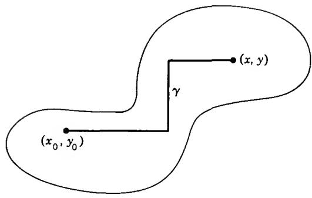  
FIG. 4-1

The following theorem gives a necessary and sufficient condition under which a line integral depends only on the end points.

Theorem 1. The line integral $\int_{\gamma} p dx + q dy$ , defined in $\Omega$ , depends only on the end points of $\gamma$ if and only if there exists a function $U(x,y)$ in $\Omega$ with the partial derivatives $\partial U / \partial x = p$ , $\partial U / \partial y = q$ .

The sufficiency follows at once, for if the condition is fulfilled we can write, with the usual notations,

$$
\begin{array}{r l} \int_ {\gamma} p d x + q d y & = \int_ {a} ^ {b} \left(\frac {\partial U}{\partial x} x ^ {\prime} (t) + \frac {\partial U}{\partial y} y ^ {\prime} (t)\right) d t = \int_ {a} ^ {b} \frac {d}{d t} U (x (t), y (t)) d t \\ & = U (x (b), y (b)) - U (x (a), y (a)), \end{array}
$$

and the value of this difference depends only on the end points. To prove the necessity we choose a fixed point $(x_{0},y_{0})\in\Omega$ , join it to $(x,y)$ by a polygon $\gamma$ , contained in $\Omega$ , whose sides are parallel to the coordinate axes (Fig. 4-1) and define a function by

$$
U (x, y) = \int_ {\gamma} p d x + q d y.
$$

Since the integral depends only on the end points, the function is well defined. Moreover, if we choose the last segment of $\gamma$ horizontal, we can keep y constant and let x vary without changing the other segments. On the last segment we can choose x for parameter and obtain

$$
U (x, y) = \int^ {x} p (x, y) d x + \text { const. },
$$

the lower limit of the integral being irrelevant. From this expression it follows at once that $\partial U/\partial x = p$ . In the same way, by choosing the last segment vertical, we can show that $\partial U/\partial y = q$ .

It is customary to write $dU = (\partial U/\partial x) dx + (\partial U/\partial y) dy$ and to say that an expression $p dx + q dy$ which can be written in this form is an exact differential. Thus an integral depends only on the end points if and only if the integrand is an exact differential. Observe that p, q and U can be either real or complex. The function U, if it exists, is uniquely determined up to an additive constant, for if two functions have the same partial derivatives their difference must be constant.

When is $f(z) \, dz = f(z) \, dx + if(z) \, dy$ an exact differential? According to the definition there must exist a function $F(z)$ in $\Omega$ with the partial derivatives

$$
\begin{array}{l} \frac {\partial F (z)}{\partial x} = f (z) \\ \frac {\partial F (z)}{\partial y} = i f (z). \end{array}
$$

If this is so, $F(z)$ fulfills the Cauchy-Riemann equation

$$
\frac {\partial F}{\partial x} = - i \frac {\partial F}{\partial y};
$$

since $f(z)$ is by assumption continuous (otherwise $\int_{\gamma} f dz$ would not be defined) $F(z)$ is analytic with the derivative $f(z)$ (Chap. 2, Sec. 1.2).

The integral $\int_{\gamma} f dz$ , with continuous $f$ , depends only on the end points of $\gamma$ if and only if $f$ is the derivative of an analytic function in $\Omega$ .

Under these circumstances we shall prove later that $f(z)$ is itself analytic.

As an immediate application of the above result we find that

$$
\int_ {\gamma} (z - a) ^ {n} d z = 0\tag{11}
$$

for all closed curves $\gamma$ , provided that the integer n is $\geq0$ . In fact, $(z-a)^{n}$ is the derivative of $(z-a)^{n+1}/(n+1)$ , a function which is analytic in the whole plane. If n is negative, but $\neq-1$ , the same result holds for all closed curves which do not pass through a, for in the complementary region of the point a the indefinite integral is still analytic and single-valued. For n=-1, (11) does not always hold. Consider a circle C with the center a, represented by the equation $z=a+\rho e^{it}$ , $0\leq t\leq2\pi$ . We obtain

$$
\int_ {c} \frac {d z}{z - a} = \int_ {0} ^ {2 \pi} i d t = 2 \pi i.
$$

This result shows that it is impossible to define a single-valued branch of $\log(z-a)$ in an annulus $\rho_{1}<|z-a|<\rho_{2}$ . On the other hand, if the closed curve $\gamma$ is contained in a half plane which does not contain a, the integral vanishes, for in such a half plane a single-valued and analytic branch of $\log(z-a)$ can be defined.

## EXERCISES

1. Compute

$$
\int_ {\gamma} x d z
$$

where $\gamma$ is the directed line segment from 0 to 1 + i.

2. Compute

$$
\int_ {| z | = r} x d z,
$$

for the positive sense of the circle, in two ways: first, by use of a parameter, and second, by observing that $x = \frac{1}{2}(z + \bar{z}) = \frac{1}{2}\left(z + \frac{r^2}{z}\right)$ on the circle.

3. Compute

$$
\int_ {| z | = 2} \frac {d z}{z ^ {2} - 1}
$$

for the positive sense of the circle.

4. Compute

$$
\int_ {| z | = 1} | z - 1 | \cdot | d z |.
$$

5. Suppose that $f(z)$ is analytic on a closed curve $\gamma$ (i.e., f is analytic in a region that contains $\gamma$ ). Show that

$$
\int_ {\gamma} \overline {{{f (z)}}} f ^ {\prime} (z) d z
$$

is purely imaginary. (The continuity of $f'(z)$ is taken for granted.)

6. Assume that $f(z)$ is analytic and satisfies the inequality $|f(z) - 1| < 1$ in a region $\Omega$ . Show that

$$
\int_ {\gamma} \frac {f ^ {\prime} (z)}{f (z)} d z = 0
$$

for every closed curve in $\Omega$ . (The continuity of $f'(z)$ is taken for granted.)

7. If $P(z)$ is a polynomial and $C$ denotes the circle $|z - a| = R$ , what is the value of $\int_{C} P(z) d\bar{z}$ ? Answer: $-2\pi iR^{2}P'(a)$ .

8. Describe a set of circumstances under which the formula

$$
\int_ {\gamma} \log z d z = 0
$$

is meaningful and true.

1.4. Cauchy's Theorem for a Rectangle. There are several forms of Cauchy's theorem, but they differ in their topological rather than in their analytical content. It is natural to begin with a case in which the topological considerations are trivial.

We consider, specifically, a rectangle R defined by inequalities $a \leq x \leq b$ , $c \leq y \leq d$ . Its perimeter can be considered as a simple closed curve consisting of four line segments whose direction we choose so that R lies to the left of the directed segments. The order of the vertices is thus $(a,c)$ , $(b,c)$ , $(b,d)$ , $(a,d)$ . We refer to this closed curve as the boundary curve or contour of R, and we denote it by $\partial R.\dagger$

We emphasize that R is chosen as a closed point set and, hence, is not a region. In the theorem that follows we consider a function which is analytic on the rectangle R. We recall to the reader that such a function is by definition defined and analytic in an open set which contains R.

The following is a preliminary version of Cauchy's theorem:

Theorem 2. If the function $f(z)$ is analytic on $R$ , then

$$
\int_ {\partial R} f (z) d z = 0.\tag{12}
$$

The proof is based on the method of bisection. Let us introduce the notation

$$
\eta (R) = \int_ {\partial R} f (z) d z
$$

which we will also use for any rectangle contained in the given one. If R is divided into four congruent rectangles $R^{(1)}$ , $R^{(2)}$ , $R^{(3)}$ , $R^{(4)}$ , we find that

$$
\eta (R) = \eta (R ^ {(1)}) + \eta (R ^ {(2)}) + \eta (R ^ {(3)}) + \eta (R ^ {(4)}),\tag{13}
$$

for the integrals over the common sides cancel each other. It is important to note that this fact can be verified explicitly and does not make illicit use of geometric intuition. Nevertheless, a reference to Fig. 4-2 is helpful.

† This is standard notation, and we shall use it repeatedly. Note that by earlier convention $\partial R$ is also the boundary of R as a point set (Chap. 3, Sec. 1.2).

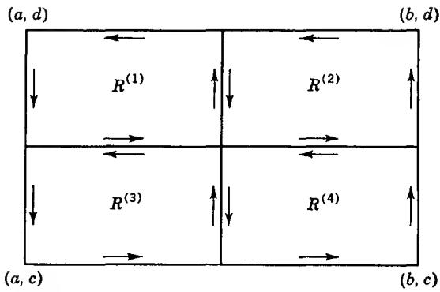  
FIG. 4-2. Bisection of rectangle.

It follows from (13) that at least one of the rectangles $R^{(k)}$ , $k = 1, 2, 3, 4$ , must satisfy the condition

$$
\left| \eta (R ^ {(k)}) \right| \geq \frac {1}{4} | \eta (R) |.
$$

We denote this rectangle by $R_1$ ; if several $R^{(k)}$ have this property, the choice shall be made according to some definite rule.

This process can be repeated indefinitely, and we obtain a sequence of nested rectangles $R \supset R_{1} \supset R_{2} \supset \cdots \supset R_{n} \supset \cdots$ with the property

$$
| \eta (R _ {n}) | \geq \frac {1}{4} | \eta (R _ {n - 1}) |
$$

and hence

$$
| \eta (R _ {n}) | \geq 4 ^ {- n} | \eta (R) |.\tag{14}
$$

The rectangles $R_{n}$ converge to a point $z^{*} \in R$ in the sense that $R_{n}$ will be contained in a prescribed neighborhood $|z - z^{*}| < \delta$ as soon as n is sufficiently large. First of all, we choose $\delta$ so small that $f(z)$ is defined and analytic in $|z - z^{*}| < \delta$ . Secondly, if $\varepsilon > 0$ is given, we can choose $\delta$ so that

$$
\left| \frac {f (z) - f (z ^ {*})}{z - z ^ {*}} - f ^ {\prime} (z ^ {*}) \right| <   \varepsilon
$$

or

$$
\left| f (z) - f \left(z ^ {*}\right) - \left(z - z ^ {*}\right) f ^ {\prime} \left(z ^ {*}\right) \right| <   \varepsilon | z - z ^ {*} |\tag{15}
$$

for $|z - z^{*}| < \delta$ . We assume that $\delta$ satisfies both conditions and that $R_{n}$ is contained in $|z - z^{*}| < \delta$ .

We make now the observation that

$$
\int_ {\partial R _ {n}} d z = 0
$$

$$
\int_ {\partial R _ {n}} z d z = 0.
$$

These trivial special cases of our theorem have already been proved in Sec. 1.1. We recall that the proof depended on the fact that 1 and z are the derivatives of z and $z^{2}/2$ , respectively.

By virtue of these equations we are able to write

$$
\eta (R _ {n}) = \int_ {\partial R _ {n}} [ f (z) - f (z ^ {*}) - (z - z ^ {*}) f ^ {\prime} (z ^ {*}) ] d z,
$$

and it follows by (15) that

$$
\left| \eta (R _ {n}) \right| \leq \varepsilon \int_ {\partial R _ {n}} | z - z ^ {*} | \cdot | d z |.\tag{16}
$$

In the last integral $|z - z^{*}|$ is at most equal to the length $d_{n}$ of the diagonal of $R_{n}$ . If $L_{n}$ denotes the length of the perimeter of $R_{n}$ , the integral is hence $\leq d_{n}L_{n}$ . But if d and L are the corresponding quantities for the original rectangle R, it is clear that $d_{n} = 2^{-n}d$ and $L_{n} = 2^{-n}L$ . By (16) we have hence

$$
\left| \eta (R _ {n}) \right| \leq 4 ^ {- n} d L \varepsilon ,
$$

and comparison with (14) yields

$$
| \eta (R) | \leq d L \varepsilon .
$$

Since $\varepsilon$ is arbitrary, we can only have $\eta(R) = 0$ , and the theorem is proved.

This beautiful proof, which could hardly be simpler, is due to É. Goursat who discovered that the classical hypothesis of a continuous $f'(z)$ is redundant. At the same time the proof is simpler than the earlier proofs inasmuch as it leans neither on double integration nor on differentiation under the integral sign.

The hypothesis in Theorem 2 can be weakened considerably. We shall prove at once the following stronger theorem which will find very important use.

Theorem 3. Let $f(z)$ be analytic on the set $R'$ obtained from a rectangle $R$ by omitting a finite number of interior points $\zeta_j$ . If it is true that

$$
\lim _ {z \rightarrow \zeta_ {j}} (z - \zeta_ {j}) f (z) = 0
$$

for all $j$ , then

$$
\int_ {\partial R} f (z) d z = 0.
$$

It is sufficient to consider the case of a single exceptional point $\zeta$ , for evidently $R$ can be divided into smaller rectangles which contain at most one $\zeta$ .

We divide R into nine rectangles, as shown in Fig. 4-3, and apply

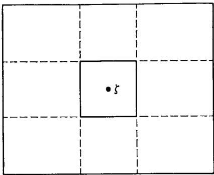  
FIG. 4-3

Theorem 2 to all but the rectangle $R_{0}$ in the center. If the corresponding equations (12) are added, we obtain, after cancellations,

$$
\int_ {\partial R} f d z = \int_ {\partial R _ {0}} f d z.\tag{17}
$$

If $\varepsilon > 0$ we can choose the rectangle $R_0$ so small that

$$
| f (z) | \leq \frac {\varepsilon}{| z - \zeta |}
$$

on $\partial R_0$ . By (17) we have thus

$$
\left| \int_ {\partial R} f d z \right| \leq \varepsilon \int_ {\partial R _ {0}} \frac {| d z |}{| z - \zeta |}.
$$

If we assume, as we may, that $R_{0}$ is a square of center $\zeta$ , elementary estimates show that

$$
\int_ {\partial R _ {0}} \frac {| d z |}{| z - \zeta |} <   8.
$$

Thus we obtain

$$
\left| \int_ {\partial R} f d z \right| <   8 \varepsilon ,
$$

and since $\varepsilon$ is arbitrary the theorem follows.

We observe that the hypothesis of the theorem is certainly fulfilled if $f(z)$ is analytic and bounded on $R'$ .

1.5. Cauchy's Theorem in a Disk. It is not true that the integral of an analytic function over a closed curve is always zero.

Indeed, we have found that

$$
\int_ {c} \frac {d z}{z - a} = 2 \pi i
$$

when C is a circle about a. In order to make sure that the integral vanishes, it is necessary to make a special assumption concerning the region $\Omega$ in which $f(z)$ is known to be analytic and to which the curve $\gamma$ is restricted. We are not yet in a position to formulate this condition, and for this reason we must restrict attention to a very special case. In what follows we assume that $\Omega$ is an open disk $|z - z_{0}| < \rho$ to be denoted by $\Delta$ .

Theorem 4. If $f(z)$ is analytic in an open disk $\Delta$ , then

$$
\int_ {\gamma} f (z) d z = 0\tag{18}
$$

for every closed curve $\gamma$ in $\Delta$ .

The proof is a repetition of the argument used in proving the second half of Theorem 1. We define a function $F(z)$ by

$$
F (z) = \int_ {\sigma} f d z\tag{19}
$$

where $\sigma$ consists of the horizontal line segment from the center $(x_{0},y_{0})$ to $(x,y_{0})$ and the vertical segment from $(x,y_{0})$ to $(x,y)$ ; it is immediately seen that $\partial F/\partial y = if(z)$ . On the other hand, by Theorem 2 $\sigma$ can be replaced by a path consisting of a vertical segment followed by a horizontal segment. This choice defines the same function $F(z)$ , and we obtain $\partial F/\partial x = f(z)$ . Hence $F(z)$ is analytic in $\Delta$ with the derivative $f(z)$ , and $f(z) dz$ is an exact differential.

Clearly, the same proof would go through for any region which contains the rectangle with the opposite vertices $z_{0}$ and z as soon as it contains z. A rectangle, a half plane, or the inside of an ellipse all have this property, and hence Theorem 4 holds for any of these regions. By this method we cannot, however, reach full generality.

For the applications it is very important that the conclusion of Theorem 4 remains valid under the weaker condition of Theorem 3. We state this as a separate theorem.

Theorem 5. Let $f(z)$ be analytic in the region $\Delta'$ obtained by omitting a finite number of points $\zeta_j$ from an open disk $\Delta$ . If $f(z)$ satisfies the condition $\lim_{z \to \zeta_j} (z - \zeta_j)f(z) = 0$ for all $j$ , then (18) holds for any closed curve $\gamma$ in $\Delta'$ .

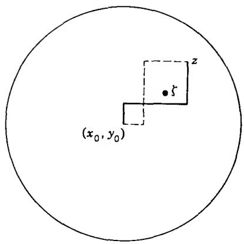  
FIG. 4-4

The proof must be modified, for we cannot let $\sigma$ pass through the exceptional points. Assume first that no $\zeta_{j}$ lies on the lines $x = x_{0}$ and $y = y_{0}$ . It is then possible to avoid the exceptional points by letting $\sigma$ consist of three segments (Fig. 4-4). By an obvious application of Theorem 3 we find that the value of $F(z)$ in (18) is independent of the choice of the middle segment; moreover, the last segment can be either vertical or horizontal. We conclude as before that $F(z)$ is an indefinite integral of $f(z)$ , and the theorem follows.

In case there are exceptional points on the lines $x = x_{0}$ and $y = y_{0}$ the reader will easily convince himself that a similar proof can be carried out, provided that we use four line segments in the place of three.

## 2. CAUCHY'S INTEGRAL FORMULA

Through a very simple application of Cauchy's theorem it becomes possible to represent an analytic function $f(z)$ as a line integral in which the variable z enters as a parameter. This representation, known as Cauchy's integral formula, has numerous important applications. Above all, it enables us to study the local properties of an analytic function in great detail.

2.1. The Index of a Point with Respect to a Closed Curve. As a preliminary to the derivation of Cauchy's formula we must define a notion which in a precise way indicates how many times a closed curve winds around a fixed point not on the curve. If the curve is piecewise differentiable, as we shall assume without serious loss of generality, the definition can be based on the following lemma:

Lemma 1. If the piecewise differentiable closed curve $\gamma$ does not pass through the point $a$ , then the value of the integral

$$
\int_ {\gamma} \frac {d z}{z - a}
$$

is a multiple of $2\pi i$ .

This lemma may seem trivial, for we can write

$$
\int_ {\gamma} \frac {d z}{z - a} = \int_ {\gamma} d \log (z - a) = \int_ {\gamma} d \log | z - a | + i \int_ {\gamma} d \arg (z - a).
$$

When z describes a closed curve, $\log |z - a|$ returns to its initial value and $\arg (z - a)$ increases or decreases by a multiple of $2\pi$ . This would seem to imply the lemma, but more careful thought shows that the reasoning is of no value unless we define $\arg (z - a)$ in a unique way.

The simplest proof is computational. If the equation of $\gamma$ is $z = z(t)$ , $\alpha \leq t \leq \beta$ , let us consider the function

$$
h (t) = \int_ {\alpha} ^ {t} \frac {z ^ {\prime} (t)}{z (t) - a} d t.
$$

It is defined and continuous on the closed interval $[\alpha,\beta]$ , and it has the derivative

$$
h ^ {\prime} (t) = \frac {z ^ {\prime} (t)}{z (t) - a}
$$

whenever $z'(t)$ is continuous. From this equation it follows that the derivative of $e^{-h(t)}(z(t) - a)$ vanishes except perhaps at a finite number of points, and since this function is continuous it must reduce to a constant. We have thus

$$
e ^ {h (t)} = \frac {z (t) - a}{z (\alpha) - a}.
$$

Since $z(\beta) = z(\alpha)$ we obtain $e^{h(\beta)} = 1$ , and therefore $h(\beta)$ must be a multiple of $2\pi i$ . This proves the lemma.

We can now define the index of the point $a$ with respect to the curve $\pmb{\gamma}$ by the equation

$$
n (\gamma , a) = \frac {1}{2 \pi i} \int_ {\gamma} \frac {d z}{z - a}.
$$

With a suggestive terminology the index is also called the winding number of $\gamma$ with respect to $a$ .

It is clear that $n(-\gamma, a) = -n(\gamma, a)$ .

The following property is an immediate consequence of Theorem 4:

(i) If $\gamma$ lies inside of a circle, then $n(\gamma, a) = 0$ for all points a outside of the same circle.

As a point set $\gamma$ is closed and bounded. Its complement is open and can be represented as a union of disjoint regions, the components of the complement. We shall say, for short, that $\gamma$ determines these regions. If the complementary regions are considered in the extended plane, there is exactly one which contains the point at infinity. Consequently, $\gamma$ determines one and only one unbounded region.

(ii) As a function of a the index $n(\gamma, a)$ is constant in each of the regions determined by $\gamma$ , and zero in the unbounded region.

Any two points in the same region determined by $\gamma$ can be joined by a polygon which does not meet $\gamma$ . For this reason it is sufficient to prove that $n(\gamma,a)=n(\gamma,b)$ if $\gamma$ does not meet the line segment from a to b. Outside of this segment the function $(z-a)/(z-b)$ is never real and $\leq0$ . For this reason the principal branch of $\log[(z-a)/(z-b)]$ is analytic in the complement of the segment. Its derivative is equal to $(z-a)^{-1}-(z-b)^{-1}$ , and if $\gamma$ does not meet the segment we must have

$$
\int_ {\gamma} \left(\frac {1}{z - a} - \frac {1}{z - b}\right) d z = 0;
$$

hence $n(\gamma, a) = n(\gamma, b)$ . If $|a|$ is sufficiently large, $\gamma$ is contained in a disk $|z| < \rho < |a|$ and we conclude by (i) that $n(\gamma, a) = 0$ . This proves that $n(\gamma, a) = 0$ in the unbounded region.

We shall find the case $n(\gamma,a)=1$ particularly important, and it is desirable to formulate a geometric condition which leads to this consequence. For simplicity we take a=0.

Lemma 2. Let $z_1, z_2$ be two points on a closed curve $\gamma$ which does not pass through the origin. Denote the subarc from $z_1$ to $z_2$ in the direction of the curve by $\gamma_1$ , and the subarc from $z_2$ to $z_1$ by $\gamma_2$ . Suppose that $z_1$ lies in the lower half plane and $z_2$ in the upper half plane. If $\gamma_1$ does not meet the negative real axis and $\gamma_2$ does not meet the positive real axis, then $n(\gamma,0) = 1$ .

For the proof we draw the half lines $L_{1}$ and $L_{2}$ from the origin through $z_{1}$ and $z_{2}$ (Fig. 4-5). Let $\zeta_{1}, \zeta_{2}$ be the points in which $L_{1}, L_{2}$ intersect a circle C about the origin. If C is described in the positive sense, the arc $C_{1}$ from $\zeta_{1}$ to $\zeta_{2}$ does not intersect the negative axis, and the arc $C_{2}$ from $\zeta_{2}$ to $\zeta_{1}$ does not intersect the positive axis. Denote the directed line segments from $z_{1}$ to $\zeta_{1}$ and from $z_{2}$ to $\zeta_{2}$ by $\delta_{1}, \delta_{2}$ . Introducing the closed curves $\sigma_{1} = \gamma_{1} + \delta_{2} - C_{1} - \delta_{1}, \sigma_{2} = \gamma_{2} + \delta_{1} - C_{2} - \delta_{2}$ we find that $n(\gamma,0) = n(C,0) + n(\sigma_{1},0) + n(\sigma_{2},0)$ because of cancellations. But $\sigma_{1}$ does not meet the negative axis. Hence the origin belongs to the

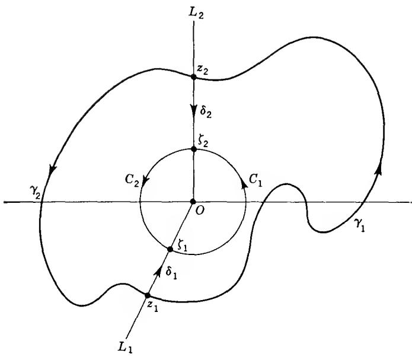  
FIG. 4-5  
unbounded region determined by $\sigma_{1}$ , and we obtain $n(\sigma_{1},0) = 0$ . For a similar reason $n(\sigma_{2},0) = 0$ , and we conclude that $n(\gamma,0) = n(C,0) = 1$ .

## \*EXERCISES

These are not routine exercises. They serve to illustrate the topological use of winding numbers.

1. Give an alternate proof of Lemma 1 by dividing $\gamma$ into a finite number of subarcs such that there exists a single-valued branch of arg $(z - a)$ on each subarc. Pay particular attention to the compactness argument that is needed to prove the existence of such a subdivision.

2. It is possible to define $n(\gamma,a)$ for any continuous closed curve $\gamma$ that does not pass through a, whether piecewise differentiable or not. For this purpose $\gamma$ is divided into subarcs $\gamma_{1},\ldots,\gamma_{n}$ , each contained in a disk that does not include a. Let $\sigma_{k}$ be the directed line segment from the initial to the terminal point of $\gamma_{k}$ , and set $\sigma=\sigma_{1}+\cdots+\sigma_{n}$ . We define $n(\gamma,a)$ to be the value of $n(\sigma,a)$ .

To justify the definition, prove the following:

(a) the result is independent of the subdivision;

(b) if $\gamma$ is piecewise differentiable the new definition is equivalent to the old;

(c) the properties (i) and (ii) of the text continue to hold.

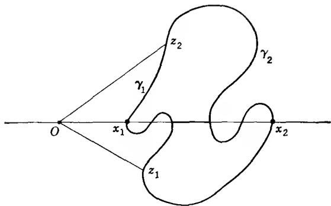  
FIG. 4-6. Part of the Jordan curve theorem.

3. The Jordan curve theorem asserts that every Jordan curve in the plane determines exactly two regions. The notion of winding number leads to a quick proof of one part of the theorem, namely that the complement of a Jordan curve $\gamma$ has at least two components. This will be so if there exists a point a with $n(\gamma,a) \neq 0$ .

We may assume that $\operatorname{Re} z > 0$ on $\gamma$ , and that there are points $z_1, z_2 \in \gamma$ with $\operatorname{Im} z_1 < 0$ , $\operatorname{Im} z_2 > 0$ . These points may be chosen so that there are no other points of $\gamma$ on the line segments from 0 to $z_1$ and from 0 to $z_2$ . Let $\gamma_1$ and $\gamma_2$ be the arcs of $\gamma$ from $z_1$ to $z_2$ (excluding the end points).

Let $\sigma_{1}$ be the closed curve that consists of the line segment from 0 to $z_{1}$ followed by $\gamma_{1}$ and the segment from $z_{2}$ to 0, and let $\sigma_{2}$ be constructed in the same way with $\gamma_{2}$ in the place of $\gamma_{1}$ . Then $\sigma_{1} - \sigma_{2} = \gamma$ or $-\gamma$ .

The positive real axis intersects both $\gamma_{1}$ and $\gamma_{2}$ (why?). Choose the notation so that the intersection $x_{2}$ farthest to the right is with $\gamma_{2}$ (Fig. 4-6).

Prove the following:

(a) $n(\sigma_1,x_2) = 0$ , hence $n(\sigma_1,z) = 0$ for $z\in \gamma_{2}$

(b) $n(\sigma_1,x) = n(\sigma_2,x) = 1$ for small $x > 0$ (Lemma 2);

(c) the first intersection $x_{1}$ of the positive real axis with $\gamma$ lies on $\gamma_{1}$ ;

(d) $n(\sigma_2, x_1) = 1$ , hence $n(\sigma_2, z) = 1$ for $z \in \gamma_1$ ;

(e) there exists a segment of the positive real axis with one end point on $\gamma_{1}$ , the other on $\gamma_{2}$ , and no other points on $\gamma$ . The points x between the end points satisfy $n(\gamma,x)=1$ or -1.

2.2. The Integral Formula. Let $f(z)$ be analytic in an open disk $\Delta$ . Consider a closed curve $\gamma$ in $\Delta$ and a point $a \in \Delta$ which does not lie on $\gamma$ . We apply Cauchy's theorem to the function

$$
F (z) = \frac {f (z) - f (a)}{z - a}.
$$

This function is analytic for $z \neq a$ . For $z = a$ it is not defined, but it satisfies the condition

$$
\lim _ {z \rightarrow a} F (z) (z - a) = \lim _ {z \rightarrow a} (f (z) - f (a)) = 0
$$

which is the condition of Theorem 5. We conclude that

$$
\int_ {\gamma} \frac {f (z) - f (a)}{z - a} d z = 0.
$$

This equation can be written in the form

$$
\int_ {\gamma} \frac {f (z) d z}{z - a} = f (a) \int_ {\gamma} \frac {d z}{z - a},
$$

and we observe that the integral in the right-hand member is by definition $2\pi i \cdot n(\gamma, a)$ . We have thus proved:

Theorem 6. Suppose that $f(z)$ is analytic in an open disk $\Delta$ , and let $\gamma$ be a closed curve in $\Delta$ . For any point a not on $\gamma$

$$
n (\gamma , a) \cdot f (a) = \frac {1}{2 \pi i} \int_ {\gamma} \frac {f (z) d z}{z - a},\tag{20}
$$

where $n(\gamma,a)$ is the index of a with respect to $\gamma$ .

In this statement we have suppressed the requirement that a be a point in $\Delta$ . We have done so in view of the obvious interpretation of the formula (20) for the case that a is not in $\Delta$ . Indeed, in this case $n(\gamma,a)$ and the integral in the right-hand member are both zero.

It is clear that Theorem 6 remains valid for any region $\Omega$ to which Theorem 5 can be applied. The presence of exceptional points $\zeta$ , is permitted, provided none of them coincides with a.

The most common application is to the case where $n(\gamma,a)=1$ . We have then

$$
f (a) = \frac {1}{2 \pi i} \int_ {\gamma} \frac {f (z) d z}{z - a},\tag{21}
$$

and this we interpret as a representation formula. Indeed, it permits us to compute $f(a)$ as soon as the values of $f(z)$ on $\gamma$ are given, together with the fact that $f(z)$ is analytic in $\Delta$ . In (21) we may let a take different values, provided that the order of a with respect to $\gamma$ remains equal to 1. We may thus treat a as a variable, and it is convenient to change the notation and rewrite (21) in the form

$$
f (z) = \frac {1}{2 \pi i} \int_ {\gamma} \frac {f (\zeta) d \zeta}{\zeta - z}.\tag{22}
$$

It is this formula which is usually referred to as Cauchy's integral formula. We must remember that it is valid only when $n(\gamma,z)=1$ , and that we have proved it only when $f(z)$ is analytic in a disk.

## EXERCISES

1. Compute

$$
\int_ {| z | = 1} \frac {e ^ {z}}{z} d z.
$$

2. Compute

$$
\int_ {| z | = 2} \frac {d z}{z ^ {2} + 1}
$$

by decomposition of the integrand in partial fractions.

3. Compute

$$
\int_ {| z | = \rho} \frac {| d z |}{| z - a | ^ {2}}
$$

under the condition $|a| \neq \rho$ . Hint: make use of the equations $z\bar{z} = \rho^2$ and

$$
| d z | = - i \rho \frac {d z}{z}.
$$

2.3. Higher Derivatives. The representation formula (22) gives us an ideal tool for the study of the local properties of analytic functions. In particular we can now show that an analytic function has derivatives of all orders, which are then also analytic.

We consider a function $f(z)$ which is analytic in an arbitrary region $\Omega$ . To a point $a \in \Omega$ we determine a $\delta$ -neighborhood $\Delta$ contained in $\Omega$ , and in $\Delta$ a circle C about a. Theorem 6 can be applied to $f(z)$ in $\Delta$ . Since $n(C, a) = 1$ we have $n(C, z) = 1$ for all points z inside of C. For such z we obtain by (22)

$$
f (z) = \frac {1}{2 \pi i} \int_ {C} \frac {f (\zeta) d \zeta}{\zeta - z}.
$$

Provided that the integral can be differentiated under the sign of integration we find

$$
f ^ {\prime} (z) = \frac {1}{2 \pi i} \int_ {C} \frac {f (\zeta) d \zeta}{(\zeta - z) ^ {2}}\tag{23}
$$

and

$$
f ^ {(n)} (z) = \frac {n !}{2 \pi i} \int_ {C} \frac {f (\zeta) d \zeta}{(\zeta - z) ^ {n + 1}}.\tag{24}
$$

If the differentiations can be justified, we shall have proved the existence of all derivatives at the points inside of C. Since every point in $\Omega$ lies inside of some such circle, the existence will be proved in the whole region $\Omega$ . At the same time we shall have obtained a convenient representation formula for the derivatives.

For the justification we could either refer to corresponding theorems in the real case, or we could prove a general theorem concerning line integrals whose integrand depends analytically on a parameter. Actually, we shall prove only the following lemma which is all we need in the present case:

Lemma 3. Suppose that $\varphi(\zeta)$ is continuous on the arc $\gamma$ . Then the function

$$
F _ {n} (z) = \int_ {\gamma} \frac {\varphi (\zeta) d \zeta}{(\zeta - z) ^ {n}}
$$

is analytic in each of the regions determined by $\gamma$ , and its derivative is $F_n'(z) = nF_{n+1}(z)$ .

We prove first that $F_{1}(z)$ is continuous. Let $z_{0}$ be a point not on $\gamma$ , and choose the neighborhood $|z - z_{0}| < \delta$ so that it does not meet $\gamma$ . By restricting z to the smaller neighborhood $|z - z_{0}| < \delta/2$ we attain that $|\zeta - z| > \delta/2$ for all $\zeta \in \gamma$ . From

$$
F _ {1} (z) - F _ {1} \left(z _ {0}\right) = \left(z - z _ {0}\right) \int_ {\gamma} \frac {\varphi (\zeta) d \zeta}{(\zeta - z) (\zeta - z _ {0})}
$$

we obtain at once

$$
\left| F _ {1} (z) - F _ {1} \left(z _ {0}\right) \right| <   \left| z - z _ {0} \right| \cdot \frac {2}{\delta^ {2}} \int_ {\gamma} | \varphi | | d \zeta |,
$$

and this inequality proves the continuity of $F_{1}(z)$ at $z_{0}$ .

From this part of the lemma, applied to the function $\varphi(\zeta)/(\zeta - z_0)$ , we conclude that the difference quotient

$$
\frac {F _ {1} (z) - F _ {1} \left(z _ {0}\right)}{z - z _ {0}} = \int_ {\gamma} \frac {\varphi (\zeta) d \zeta}{(\zeta - z) (\zeta - z _ {0})}
$$

tends to the limit $F_{2}(z_0)$ as $z \to z_0$ . Hence it is proved that $F_{1}'(z) = F_{2}(z)$ .

The general case is proved by induction. Suppose we have shown that $F_{n-1}'(z) = (n - 1)F_n(z)$ . From the identity

$$
F _ {n} (z) - F _ {n} (z _ {0})
$$

$$
= \left[ \int_ {\gamma} \frac {\varphi d \zeta}{(\zeta - z) ^ {n - 1} (\zeta - z _ {0})} - \int_ {\gamma} \frac {\varphi d \zeta}{(\zeta - z _ {0}) ^ {n}} \right] + (z - z _ {0}) \int_ {\gamma} \frac {\varphi d \zeta}{(\zeta - z) ^ {n} (\zeta - z _ {0})}
$$

we can conclude that $F_{n}(z)$ is continuous. Indeed, by the induction hypothesis, applied to $\varphi(\zeta)/(\zeta-z_{0})$ , the first term tends to zero for $z\to z_{0}$ , and in the second term the factor of $z-z_{0}$ is bounded in a neighborhood of $z_{0}$ . Now, if we divide the identity by $z-z_{0}$ and let z tend to $z_{0}$ , the quotient in the first term tends to a derivative which by the induction hypothesis equals $(n-1)F_{n+1}(z_{0})$ . The remaining factor in the second term is continuous, by what we have already proved, and has the limit $F_{n+1}(z_{0})$ . Hence $F_{n}^{\prime}(z_{0})$ exists and equals $nF_{n+1}(z_{0})$ .

It is clear that Lemma 3 is just what is needed in order to deduce (23) and (24) in a rigorous way. We have thus proved that an analytic function has derivatives of all orders which are analytic and can be represented by the formula (24).

Among the consequences of this result we like to single out two classical theorems. The first is known as Morera's theorem, and it can be stated as follows:

If $f(z)$ is defined and continuous in a region $\Omega$ , and if $\int_{\gamma} f dz = 0$ for all closed curves $\gamma$ in $\Omega$ , then $f(z)$ is analytic in $\Omega$ .

The hypothesis implies, as we have already remarked in Sec. 1.3, that $f(z)$ is the derivative of an analytic function $F(z)$ . We know now that $f(z)$ is then itself analytic.

A second classical result goes under the name of Liouville's theorem: A function which is analytic and bounded in the whole plane must reduce to a constant.

For the proof we make use of a simple estimate derived from (24). Let the radius of C be r, and assume that $|f(\zeta)| \leq M$ on C. If we apply (24) with z = a, we obtain at once

$$
\left| f ^ {(n)} (a) \right| \leq M n! r ^ {- n}.\tag{25}
$$

For Liouville's theorem we need only the case $n = 1$ . The hypothesis means that $|f(\zeta)| \leq M$ on all circles. Hence we can let $r$ tend to $\infty$ , and (25) leads to $f'(a) = 0$ for all $a$ . We conclude that the function is constant.

Liouville's theorem leads to an almost trivial proof of the fundamental theorem of algebra. Suppose that $P(z)$ is a polynomial of degree $>0$ . If $P(z)$ were never zero, the function $1 / P(z)$ would be analytic in the whole plane. We know that $P(z) \to \infty$ for $z \to \infty$ , and therefore $1 / P(z)$ tends to zero. This implies boundedness (the absolute value is continuous on the Riemann sphere and has thus a finite maximum), and by Liouville's theorem $1 / P(z)$ would be constant. Since this is not so, the equation $P(z) = 0$ must have a root.

The inequality (25) is known as Cauchy's estimate. It shows above all that the successive derivatives of an analytic function cannot be arbitrary; there must always exist an M and an r so that (25) is fulfilled. In order to make the best use of the inequality it is important that r be judiciously chosen, the object being to minimize the function $M(r)r^{-n}$ , where $M(r)$ is the maximum of $|f|$ on $|\zeta - a| = r$ .

## EXERCISES

1. Compute

$$
\int_ {| z | = 1} e ^ {z} z ^ {- n} d z, \quad \int_ {| z | = 2} z ^ {n} (1 - z) ^ {m} d z, \quad \int_ {| z | = \rho} | z - a | ^ {- 4} | d z | (| a | \neq \rho).
$$

2. Prove that a function which is analytic in the whole plane and satisfies an inequality $|f(z)| < |z|^{n}$ for some n and all sufficiently large $|z|$ reduces to a polynomial.

3. If $f(z)$ is analytic and $|f(z)| \leq M$ for $|z| \leq R$ , find an upper bound for $|f^{(n)}(z)|$ in $|z| \leq \rho < R$ .

4. If $f(z)$ is analytic for $|z| < 1$ and $|f(z)| \leq 1 / (1 - |z|)$ , find the best estimate of $|f^{(n)}(0)|$ that Cauchy's inequality will yield.

5. Show that the successive derivatives of an analytic function at a point can never satisfy $|f^{(n)}(z)| > n!n^{n}$ . Formulate a sharper theorem of the same kind.

\*6. A more general form of Lemma 3 reads as follows:

Let the function $\varphi(z,t)$ be continuous as a function of both variables when $z$ lies in a region $\Omega$ and $\alpha \leq t \leq \beta$ . Suppose further that $\varphi(z,t)$ is analytic as a function of $z \in \Omega$ for any fixed $t$ . Then

$$
F (z) = \int_ {\alpha} ^ {\beta} \varphi (z, t) d t
$$

is analytic in $z$ and

$$
F ^ {\prime} (z) = \int_ {\alpha} ^ {\beta} \frac {\partial \varphi (z , t)}{\partial z} d t.\tag{26}
$$

To prove this represent $\varphi(z,t)$ as a Cauchy integral

$$
\varphi (z, t) = \frac {1}{2 \pi i} \int_ {C} \frac {\varphi (\zeta , t)}{\zeta - z} d \zeta .
$$

Fill in the necessary details to obtain

$$
F (z) = \int_ {C} \left(\frac {1}{2 \pi i} \int_ {\alpha} ^ {\beta} \varphi (\zeta , t) d t\right) \frac {d \zeta}{\zeta - z}
$$

and use Lemma 3 to prove (26).

## 3. LOCAL PROPERTIES OF ANALYTIC FUNCTIONS

We have already proved that an analytic function has derivatives of all orders. In this section we will make a closer study of the local properties. It will include a classification of the isolated singularities of analytic functions.

3.1. Removable Singularities. Taylor's Theorem. In Theorem 3 we introduced a weaker condition which could be substituted for analyticity at a finite number of points without affecting the end result. We showed moreover, in Theorem 5, that Cauchy's theorem in a circular disk remains true under these weaker conditions. This was an essential point in our derivation of Cauchy's integral formula, for we were required to apply Cauchy's theorem to a function of the form $(f(z) - f(a))/(z - a)$ .

Finally, it was pointed out that Cauchy's integral formula remains valid in the presence of a finite number of exceptional points, all satisfying the fundamental condition of Theorem 3, provided that none of them coincides with $a$ . This remark is more important than it may seem on the surface. Indeed, Cauchy's formula provides us with a representation of $f(z)$ through an integral which in its dependence on $z$ has the same character at the exceptional points as everywhere else. It follows that the exceptional points are such only by lack of information, and not by their intrinsic nature. Points with this character are called removable singularities. We shall prove the following precise theorem:

Theorem 7. Suppose that $f(z)$ is analytic in the region $\Omega'$ obtained by omitting a point $a$ from a region $\Omega$ . A necessary and sufficient condition that there exist an analytic function in $\Omega$ which coincides with $f(z)$ in $\Omega'$ is that $\lim_{z \to a} (z - a)f(z) = 0$ . The extended function is uniquely determined.

The necessity and the uniqueness are trivial since the extended function must be continuous at a. To prove the sufficiency we draw a circle C about a so that C and its inside are contained in $\Omega$ . Cauchy's formula is valid, and we can write

$$
f (z) = \frac {1}{2 \pi i} \int_ {C} \frac {f (\zeta) d \zeta}{\zeta - z}
$$

for all $z \neq a$ inside of C. But the integral in the right-hand member represents an analytic function of z throughout the inside of C. Consequently, the function which is equal to $f(z)$ for $z \neq a$ and which has the value

$$
\frac {1}{2 \pi i} \int_ {C} \frac {f (\zeta) d \zeta}{\zeta - a}\tag{27}
$$

for $z = a$ is analytic in $\Omega$ . It is natural to denote the extended function by $f(z)$ and the value (27) by $f(a)$ .

We apply this result to the function

$$
F (z) = \frac {f (z) - f (a)}{z - a}
$$

used in the proof of Cauchy's formula. It is not defined for $z = a$ , but it satisfies the condition $\lim_{z \to a} (z - a) F(z) = 0$ . The limit of $F(z)$ as $z$ tends to $a$ is $f'(a)$ . Hence there exists an analytic function which is equal to $F(z)$ for $z \neq a$ and equal to $f'(a)$ for $z = a$ . Let us denote this function by $f_1(z)$ . Repeating the process we can define an analytic function $f_2(z)$ which equals $(f_1(z) - f_1(a)) / (z - a)$ for $z \neq a$ and $f_1'(a)$ for $z = a$ , and so on.

The recursive scheme by which $f_{n}(z)$ is defined can be written in the form

$$
\begin{array}{l} f (z) = f (a) + (z - a) f _ {1} (z) \\ f _ {1} (z) = f _ {1} (a) + (z - a) f _ {2} (z) \\ \dots \dots \\ f _ {n - 1} (z) = f _ {n - 1} (a) + (z - a) f _ {n} (z). \end{array}
$$

From these equations which are trivially valid also for $z = a$ we obtain

$$
\begin{array}{r l} f (z) = f (a) + (z - a) f _ {1} (a) + (z - a) ^ {2} f _ {2} (a) + \dots + (z - a) ^ {n - 1} f _ {n - 1} (a) \\ & \quad + (z - a) ^ {n} f _ {n} (z). \end{array}
$$

Differentiating $n$ times and setting $z = a$ we find

$$
f ^ {(n)} (a) = n! f _ {n} (a).
$$

This determines the coefficients $f_{n}(a)$ , and we obtain the following form of Taylor's theorem:

Theorem 8. If $f(z)$ is analytic in a region $\Omega$ , containing $a$ , it is possible to write

$$
\begin{array}{r l} f (z) = f (a) + \frac {f ^ {\prime} (a)}{1 !} (z - a) + \frac {f ^ {\prime \prime} (a)}{2 !} (z - a) ^ {2} + \dots \\ & + \frac {f ^ {(n - 1)} (a)}{(n - 1) !} (z - a) ^ {n - 1} + f _ {n} (z) (z - a) ^ {n}, \end{array}\tag{28}
$$

where $f_{n}(z)$ is analytic in $\Omega$ .

This finite development must be well distinguished from the infinite Taylor series which we will study later. It is, however, the finite development (28) which is the most useful for the study of the local properties of $f(z)$ . Its usefulness is enhanced by the fact that $f_{n}(z)$ has a simple explicit expression as a line integral.

Using the same circle $C$ as before we have first

$$
f _ {n} (z) = \frac {1}{2 \pi i} \int_ {C} \frac {f _ {n} (\zeta) d \zeta}{\zeta - z}.
$$

For $f_{n}(\zeta)$ we substitute the expression obtained from (28). There will be one main term containing $f(\zeta)$ . The remaining terms are, except for constant factors, of the form

$$
F _ {\nu} (a) = \int_ {C} \frac {d \zeta}{(\zeta - a) ^ {\nu} (\zeta - z)}, \quad \nu \geq 1.
$$

But

$$
F _ {1} (a) = \frac {1}{z - a} \int_ {C} \left(\frac {1}{\zeta - z} - \frac {1}{\zeta - a}\right) d \zeta = 0,
$$

identically for all $a$ inside of $C$ . By Lemma 3 we have $F_{\nu + 1}(a) = F_1^{(\nu)}(a) / \nu!$ and thus $F_{\nu}(a) = 0$ for all $\nu \geq 1$ . Hence the expression for $f_n(z)$ reduces to

$$
f _ {n} (z) = \frac {1}{2 \pi i} \int_ {C} \frac {f (\zeta) d \zeta}{(\zeta - a) ^ {n} (\zeta - z)}.\tag{29}
$$

The representation is valid inside of C.

3.2. Zeros and Poles. If $f(a)$ and all derivatives $f^{(\nu)}(a)$ vanish, we can write by (28)

$$
f (z) = f _ {n} (z) (z - a) ^ {n}\tag{30}
$$

for any n. An estimate for $f_{n}(z)$ can be obtained by (29). The disk with the circumference C has to be contained in the region $\Omega$ in which $f(z)$ is defined and analytic. The absolute value $|f(z)|$ has a maximum M on C; if the radius of C is denoted by R, we find

$$
\left| f _ {n} (z) \right| \leq \frac {M}{R ^ {n - 1} (R - | z - a |)}
$$

for $|z - a| < R$ . By (30) we have thus

$$
| f (z) | \leq \left(\frac {| z - a |}{R}\right) ^ {n} \cdot \frac {M R}{R - | z - a |}.
$$

But $(|z - a| / R)^n \to 0$ for $n \to \infty$ , since $|z - a| < R$ . Hence $f(z) = 0$ inside of $C$ .

We show now that $f(z)$ is identically zero in all of $\Omega$ . Let $E_{1}$ be the set on which $f(z)$ and all derivatives vanish and $E_{2}$ the set on which the function or one of the derivatives is different from zero. $E_{1}$ is open by the above reasoning, and $E_{2}$ is open because the function and all derivatives are continuous. Therefore either $E_{1}$ or $E_{2}$ must be empty. If $E_{2}$ is empty, the function is identically zero. If $E_{1}$ is empty, $f(z)$ can never vanish together with all its derivatives.

Assume that $f(z)$ is not identically zero. Then, if $f(a) = 0$ , there exists a first derivative $f^{(h)}(a)$ which is different from zero. We say then that a is a zero of order h, and the result that we have just proved expresses that there are no zeros of infinite order. In this respect an analytic function has the same local behavior as a polynomial, and just as in the case of polynomials we find that it is possible to write $f(z) = (z - a)^{h}f_{h}(z)$ where $f_{h}(z)$ is analytic and $f_{h}(a) \neq 0$ .

In the same situation, since $f_{h}(z)$ is continuous, $f_{h}(z) \neq 0$ in a neighborhood of a and z = a is the only zero of $f(z)$ in this neighborhood. In other words, the zeros of an analytic function which does not vanish identically are isolated. This property can also be formulated as a uniqueness theorem: If $f(z)$ and $g(z)$ are analytic in $\Omega$ , and if $f(z) = g(z)$ on a set which has an accumulation point in $\Omega$ , then $f(z)$ is identically equal to $g(z)$ . The conclusion follows by consideration of the difference $f(z) - g(z)$ .

Particular instances of this result which deserve to be quoted are the following: If $f(z)$ is identically zero in a subregion of $\Omega$ , then it is identically zero in $\Omega$ , and the same is true if $f(z)$ vanishes on an arc which does not reduce to a point. We can also say that an analytic function is uniquely determined by its values on any set with an accumulation point in the region of analyticity. This does not mean that we know of any way in which the values of the function can be computed.

We consider now a function $f(z)$ which is analytic in a neighborhood of a, except perhaps at a itself. In other words, $f(z)$ shall be analytic in a region $0 < |z - a| < \delta$ . The point a is called an isolated singularity of $f(z)$ . We have already treated the case of a removable singularity. Since we can then define $f(a)$ so that $f(z)$ becomes analytic in the disk $|z - a| < \delta$ , it needs no further consideration.†

$$
\lim _ {z \rightarrow a} f (z) = \infty
$$

$$
f (z)
$$

$f(a) = \infty$ . There exists a $\delta' \leq \delta$ such that $f(z) \neq 0$ for $0 < |z - a| < \delta'$ . In this region the function $g(z) = 1/f(z)$ is defined and analytic. But the singularity of $g(z)$ at $a$ is removable, and $g(z)$ has an analytic extension with $g(a)=0$ . Since $g(z)$ does not vanish identically, the zero at a has a finite order, and we can write $g(z)=(z-a)^{h}g_{h}(z)$ with $g_{h}(a)\neq0$ . The number h is the order of the pole, and $f(z)$ has the representation $f(z)=(z-a)^{-h}f_{h}(z)$ where $f_{h}(z)=1/g_{h}(z)$ is analytic and different from zero in a neighborhood of a. The nature of a pole is thus exactly the same as in the case of a rational function.

A function $f(z)$ which is analytic in a region $\Omega$ , except for poles, is said to be meromorphic in $\Omega$ . More precisely, to every $a \in \Omega$ there shall exist a neighborhood $|z - a| < \delta$ , contained in $\Omega$ , such that either $f(z)$ is analytic in the whole neighborhood, or else $f(z)$ is analytic for $0 < |z - a| < \delta$ , and the isolated singularity is a pole. Observe that the poles of a meromorphic function are isolated by definition. The quotient $f(z)/g(z)$ of two analytic functions in $\Omega$ is a meromorphic function in $\Omega$ , provided that $g(z)$ is not identically zero. The only possible poles are the zeros of $g(z)$ , but a common zero of $f(z)$ and $g(z)$ can also be a removable singularity. If this is the case, the value of the quotient must be determined by continuity. More generally, the sum, the product, and the quotient of two meromorphic functions are meromorphic. The case of an identically vanishing denominator must be excluded, unless we wish to consider the constant $\infty$ as a meromorphic function.

For a more detailed discussion of isolated singularities, we consider the conditions (1) $\lim_{z\to a}|z - a|^{\alpha}|f(z)| = 0$ , (2) $\lim_{z\to a}|z - a|^{\alpha}|f(z)| = \infty$ , for real values of $\alpha$ . If (1) holds for a certain $\alpha$ , then it holds for all larger $\alpha$ , and hence for some integer $m$ . Then $(z - a)^{mf}(z)$ has a removable singularity and vanishes for $z = a$ . Either $f(z)$ is identically zero, in which case (1) holds for all $\alpha$ , or $(z - a)^{mf}(z)$ has a zero of finite order $k$ . In the latter case it follows at once that (1) holds for all $\alpha > h = m - k$ , while (2) holds for all $\alpha < h$ . Assume now that (2) holds for some $\alpha$ ; then it holds for all smaller $\alpha$ , and hence for some integer $n$ . The function $(z - a)^{nf}(z)$ has a pole of finite order $l$ , and setting $h = n + l$ we find again that (1) holds for $\alpha > h$ and (2) for $\alpha < h$ . The discussion shows that there are three possibilities: (i) condition (1) holds for all $\alpha$ , and $f(z)$ vanishes identically; (ii) there exists an integer $h$ such that (1) holds for $\alpha > h$ and (2) for $\alpha < h$ ; (iii) neither (1) nor (2) holds for any $\alpha$ .

Case (i) is uninteresting. In case (ii) h may be called the algebraic order of $f(z)$ at a. It is positive in case of a pole, negative in case of a zero, and zero if $f(z)$ is analytic but $\neq 0$ at a. The remarkable thing is that the order is always an integer; there is no single-valued analytic function which tends to 0 or $\infty$ like a fractional power of $|z - a|$ .

In the case of a pole of order h, let us apply Theorem 8 to the analytic function $(z - a)^{h}f(z)$ . We obtain a development of the form

$$
(z - a) ^ {h} f (z) = B _ {h} + B _ {h - 1} (z - a) + \dots + B _ {1} (z - a) ^ {h - 1} + \varphi (z) (z - a)
$$

where $\varphi(z)$ is analytic at $z = a$ . For $z \neq a$ we can divide by $(z - a)^{h}$ and find

$$
f (z) = B _ {h} (z - a) ^ {- h} + B _ {h - 1} (z - a) ^ {- h + 1} + \dots + B _ {1} (z - a) ^ {- 1} + \varphi (z).
$$

The part of this development which precedes $\varphi(z)$ is called the singular part of $f(z)$ at z = a. A pole has thus not only an order, but also a well-defined singular part. The difference of two functions with the same singular part is analytic at a.

In case (iii) the point a is an essential isolated singularity. In the neighborhood of an essential singularity $f(z)$ is at the same time unbounded and comes arbitrarily close to zero. As a characterization of the complicated behavior of a function in the neighborhood of an essential singularity, we prove the following classical theorem of Weierstrass:

Theorem 9. An analytic function comes arbitrarily close to any complex value in every neighborhood of an essential singularity.

If the assertion were not true, we could find a complex number $A$ and a $\delta > 0$ such that $|f(z) - A| > \delta$ in a neighborhood of $a$ (except for $z = a$ ). For any $\alpha < 0$ we have then $\lim_{z \to a} |z - a|^{\alpha}| f(z) - A| = \infty$ . Hence $a$ would not be an essential singularity of $f(z) - A$ . Accordingly, there exists a $\beta$ with $\lim_{z \to a} |z - a|^{\beta}| f(z) - A| = 0$ , and we are free to choose $\beta > 0$ . Since in that case $\lim_{z \to a} |z - a|^{\beta}| A| = 0$ it would follow that $\lim_{z \to a} |z - a|^{\beta}| f(z)| = 0$ , and $a$ would not be an essential singularity of $f(z)$ . The contradiction proves the theorem.

The notion of isolated singularity applies also to functions which are analytic in a neighborhood $|z| > R$ of $\infty$ . Since $f(\infty)$ is not defined, we treat $\infty$ as an isolated singularity, and by convention it has the same character of removable singularity, pole, or essential singularity as the singularity of $g(z) = f(1/z)$ at z = 0. If the singularity is nonessential, $f(z)$ has an algebraic order h such that $\lim_{z \to \infty} z^{-h} f(z)$ is neither zero nor infinity, and for a pole the singular part is a polynomial in z. If $\infty$ is an essential singularity, the function has the property expressed by Theorem 9 in every neighborhood of infinity.

## EXERCISES

1. If $f(z)$ and $g(z)$ have the algebraic orders $h$ and $k$ at $z = a$ , show that $fg$ has the order $h + k, f / g$ the order $h - k$ , and $f + g$ an order which does not exceed $\max(h, k)$ .

2. Show that a function which is analytic in the whole plane and has a nonessential singularity at $\infty$ reduces to a polynomial.

3. Show that the functions $e^{z}$ , $\sin z$ and $\cos z$ have essential singularities at $\infty$ .

4. Show that any function which is meromorphic in the extended plane is rational.

5. Prove that an isolated singularity of $f(z)$ is removable as soon as either Re $f(z)$ or Im $f(z)$ is bounded above or below. Hint: Apply a fractional linear transformation.

6. Show that an isolated singularity of $f(z)$ cannot be a pole of $\exp f(z)$ . Hint: $f$ and $e^f$ cannot have a common pole (why?). Now apply Theorem 9.

3.3. The Local Mapping. We begin with the proof of a general formula which enables us to determine the number of zeros of an analytic function. We are considering a function $f(z)$ which is analytic and not identically zero in an open disk $\Delta$ . Let $\gamma$ be a closed curve in $\Delta$ such that $f(z) \neq 0$ on $\gamma$ . For the sake of simplicity we suppose first that $f(z)$ has only a finite number of zeros in $\Delta$ , and we agree to denote them by $z_1, z_2, \ldots, z_n$ where each zero is repeated as many times as its order indicates.

By repeated applications of Theorem 8, or rather its consequence (30), it is clear that we can write $f(z) = (z - z_{1})(z - z_{2}) \cdots (z - z_{n})g(z)$ where $g(z)$ is analytic and $\neq 0$ in $\Delta$ . Forming the logarithmic derivative we obtain

$$
\frac {f ^ {\prime} (z)}{f (z)} = \frac {1}{z - z _ {1}} + \frac {1}{z - z _ {2}} + \dots + \frac {1}{z - z _ {n}} + \frac {g ^ {\prime} (z)}{g (z)}
$$

for $z \neq z_{j}$ , and particularly on $\gamma$ . Since $g(z) \neq 0$ in $\Delta$ , Cauchy's theorem yields

$$
\int_ {\gamma} \frac {g ^ {\prime} (z)}{g (z)} d z = 0.
$$

Recalling the definition of $n(\gamma, z_j)$ we find

$$
n (\gamma , z _ {1}) + n (\gamma , z _ {2}) + \dots + n (\gamma , z _ {n}) = \frac {1}{2 \pi i} \int_ {\gamma} \frac {f ^ {\prime} (z)}{f (z)} d z.\tag{31}
$$

This is still true if $f(z)$ has infinitely many zeros in $\Delta$ . It is clear that $\gamma$ is contained in a concentric disk $\Delta'$ smaller than $\Delta$ . Unless $f(z)$ is identically zero, a case which must obviously be excluded, it has only a finite number of zeros in $\Delta'$ . This is an obvious consequence of the Bolzano-Weierstrass theorem, for if there were infinitely many zeros they would have an accumulation point in the closure of $\Delta'$ , and this is impossible. We can now apply (31) to the disk $\Delta'$ . The zeros outside of $\Delta'$ satisfy $n(\gamma,z_{j})=0$ and hence do not contribute to the sum in (31). We have thus proved:

Theorem 10. Let $z_{j}$ be the zeros of a function $f(z)$ which is analytic in a disk $\Delta$ and does not vanish identically, each zero being counted as many times as its order indicates. For every closed curve $\gamma$ in $\Delta$ which does not pass through a zero

$$
\sum_ {j} n (\gamma , z _ {j}) = \frac {1}{2 \pi i} \int_ {\gamma} \frac {f ^ {\prime} (z)}{f (z)} d z,\tag{32}
$$

where the sum has only a finite number of terms $\neq 0$ .

The function $w = f(z)$ maps $\gamma$ onto a closed curve $\Gamma$ in the $w$ -plane, and we find

$$
\int_ {\Gamma} \frac {d w}{w} = \int_ {\gamma} \frac {f ^ {\prime} (z)}{f (z)} d z.
$$

The formula (32) has thus the following interpretation:

$$
n (\Gamma , 0) = \sum_ {j} n (\gamma , z _ {j}).\tag{33}
$$

The simplest and most useful application is to the case where it is known beforehand that each $n(\gamma,z_{j})$ must be either 0 or 1. Then (32) yields a formula for the total number of zeros enclosed by $\gamma$ . This is evidently the case when $\gamma$ is a circle.

Let $a$ be an arbitrary complex value, and apply Theorem 10 to $f(z) - a$ . The zeros of $f(z) - a$ are the roots of the equation $f(z) = a$ , and we denote them by $z_j(a)$ . In the place of (32) we obtain the formula

$$
\sum_ {j} n (\gamma , z _ {j} (a)) = \frac {1}{2 \pi i} \int_ {\gamma} \frac {f ^ {\prime} (z)}{f (z) - a} d z
$$

and (33) takes the form

$$
n (\Gamma , a) = \sum_ {j} n (\gamma , z _ {j} (a)).
$$

It is necessary to assume that $f(z) \neq a$ on $\gamma$ .

If a and b are in the same region determined by $\Gamma$ , we know that $n(\Gamma, a) = n(\Gamma, b)$ , and hence we have also $\sum_{j} n(\gamma, z_{j}(a)) = \sum_{j} n(\gamma, z_{j}(b))$ . If $\gamma$ is a circle, it follows that $f(z)$ takes the values a and b equally many times inside of $\gamma$ . The following theorem on local correspondence is an immediate consequence of this result.

Theorem 11. Suppose that $f(z)$ is analytic at $z_0$ , $f(z_0) = w_0$ , and that $f(z) - w_0$ has a zero of order $n$ at $z_0$ . If $\varepsilon > 0$ is sufficiently small, there exists a corresponding $\delta > 0$ such that for all $a$ with $|a - w_0| < \delta$ the equation $f(z) = a$ has exactly $n$ roots in the disk $|z - z_0| < \varepsilon$ .

We can choose $\varepsilon$ so that $f(z)$ is defined and analytic for $|z - z_0| \leq \varepsilon$ and so that $z_0$ is the only zero of $f(z) - w_0$ in this disk. Let $\gamma$ be the circle $|z - z_0| = \varepsilon$ and $\Gamma$ its image under the mapping $w = f(z)$ . Since $w_0$ belongs to the complement of the closed set $\Gamma$ , there exists a neighborhood $|w - w_0| < \delta$ which does not intersect $\Gamma$ (Fig. 4-7). It follows immediately that all values $a$ in this neighborhood are taken the same number of times inside of $\gamma$ . The equation $f(z) = w_0$ has exactly $n$ coinciding roots inside of $\gamma$ , and hence every value $a$ is taken $n$ times. It is understood that multiple roots are counted according to their multiplicity, but if $\varepsilon$ is sufficiently small we can assert that all roots of the equation $f(z) = a$ are simple for $a \neq w_0$ . Indeed, it is sufficient to choose $\varepsilon$ so that $f'(z)$ does not vanish for $0 < |z - z_0| < \varepsilon$ .

Corollary 1. A nonconstant analytic function maps open sets onto open sets.

This is merely another way of saying that the image of every sufficiently small disk $|z - z_{0}| < \varepsilon$ contains a neighborhood $|w - w_{0}| < \delta$ .

In the case n = 1 there is one-to-one correspondence between the disk $|w - w_{0}| < \delta$ and an open subset $\Delta$ of $|z - z_{0}| < \varepsilon$ . Since open sets in the z-plane correspond to open sets in the w-plane the inverse function of $f(z)$ is continuous, and the mapping is topological. The mapping can be restricted to a neighborhood of $z_{0}$ contained in $\Delta$ , and we are able to state:

Corollary 2. If $f(z)$ is analytic at $z_0$ with $f'(z_0) \neq 0$ , it maps a neighborhood of $z_0$ conformally and topologically onto a region.

From the continuity of the inverse function it follows in the usual way that the inverse function is analytic, and hence the inverse mapping is likewise conformal. Conversely, if the local mapping is one to one, Theorem 11 can hold only with n = 1, and hence $f'(z_0)$ must be different from zero.

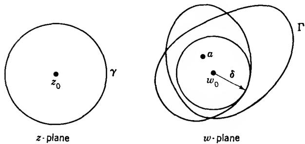  
FIG. 4-7. Local correspondence.

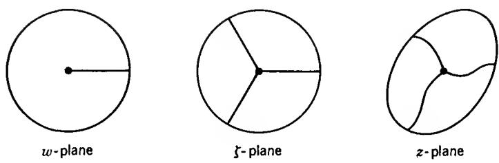  
FIG. 4-8. Branch point: n = 3.

For n > 1 the local correspondence can still be described in very precise terms. Under the assumption of Theorem 11 we can write

$$
f (z) - w _ {0} = (z - z _ {0}) ^ {n} g (z)
$$

where $g(z)$ is analytic at $z_0$ and $g(z_0) \neq 0$ . Choose $\varepsilon > 0$ so that $|g(z) - g(z_0)| < |g(z_0)|$ for $|z - z_0| < \varepsilon$ . In this neighborhood it is possible to define a single-valued analytic branch of $\sqrt[n]{g(z)}$ , which we denote by $h(z)$ . We have thus

$$
\begin{array}{r l} f (z) - w _ {0} & = \zeta (z) ^ {n} \\ \zeta (z) & = (z - z _ {0}) h (z). \end{array}
$$

Since $\zeta'(z_0) = h(z_0) \neq 0$ the mapping $\zeta = \zeta(z)$ is topological in a neighborhood of $z_0$ . On the other hand, the mapping $w \in w_0 + \zeta^n$ is of an elementary character and determines $n$ equally spaced values $\zeta$ for each value of $w$ . By performing the mapping in two steps we obtain a very illuminating picture of the local correspondence. Figure 4-8 shows the inverse image of a small disk and the $n$ arcs which are mapped onto the positive radius.

## EXERCISES

1. Determine explicitly the largest disk about the origin whose image under the mapping $w = z^{2} + z$ is one to one.

2. Same problem for $w = e^{z}$ .

3. Apply the representation $f(z) = w_0 + \zeta(z)^n$ to $\cos z$ with $z_0 = 0$ . Determine $\zeta(z)$ explicitly.

4. If $f(z)$ is analytic at the origin and $f'(0) \neq 0$ , prove the existence of an analytic $g(z)$ such that $f(z^n) = f(0) + g(z)^n$ in a neighborhood of 0.

3.4. The Maximum Principle. Corollary 1 of Theorem 11 has a very important analytical consequence known as the maximum principle for analytic functions. Because of its simple and explicit formulation it is one of the most useful general theorems in the theory of functions. As a rule all proofs based on the maximum principle are very straightforward, and preference is quite justly given to proofs of this kind.

Theorem 12. (The maximum principle.) If $f(z)$ is analytic and non-constant in a region $\Omega$ , then its absolute value $|f(z)|$ has no maximum in $\Omega$ .

The proof is clear. If $w_{0} = f(z_{0})$ is any value taken in $\Omega$ , there exists a neighborhood $|w - w_{0}| < \varepsilon$ contained in the image of $\Omega$ . In this neighborhood there are points of modulus $>|w_{0}|$ , and hence $|f(z_{0})|$ is not the maximum of $|f(z)|$ .

In a positive formulation essentially the same theorem can be stated in the form:

Theorem 12'. If $f(z)$ is defined and continuous on a closed bounded set $E$ and analytic on the interior of $E$ , then the maximum of $|f(z)|$ on $E$ is assumed on the boundary of $E$ .

Since E is compact, $|f(z)|$ has a maximum on E. Suppose that it is assumed at $z_{0}$ . If $z_{0}$ is on the boundary, there is nothing to prove. If $z_{0}$ is an interior point, then $|f(z_{0})|$ is also the maximum of $|f(z)|$ in a disk $|z - z_{0}| < \delta$ contained in E. But this is not possible unless $f(z)$ is constant in the component of the interior of E which contains $z_{0}$ . It follows by continuity that $|f(z)|$ is equal to its maximum on the whole boundary of that component. This boundary is not empty and it is contained in the boundary of E. Thus the maximum is always assumed at a boundary point.

The maximum principle can also be proved analytically, as a consequence of Cauchy's integral formula. If the formula (22) is specialized to the case where $\gamma$ is a circle of center $z_{0}$ and radius r, we can write $\zeta = z_{0} + re^{i\theta}$ , $d\zeta = ire^{i\theta} d\theta$ on $\gamma$ and obtain for $z = z_{0}$

$$
f (z _ {0}) = \frac {1}{2 \pi} \int_ {0} ^ {2 \pi} f (z _ {0} + r e ^ {i \theta}) d \theta .\tag{34}
$$

This formula shows that the value of an analytic function at the center of a circle is equal to the arithmetic mean of its values on the circle, subject to the condition that the closed disk $|z - z_{0}| \leq r$ is contained in the region of analyticity.

From (34) we derive the inequality

$$
\left| f (z _ {0}) \right| \leq \frac {1}{2 \pi} \int_ {0} ^ {2 \pi} \left| f (z _ {0} + r e ^ {i \theta}) \right| d \theta .\tag{35}
$$

Suppose that $|f(z_0)|$ were a maximum. Then we would have $|f(z_0 + re^{i\theta})| \leq |f(z_0)|$ , and if the strict inequality held for a single value of $\theta$ it would hold, by continuity, on a whole arc. But then the mean value of $|f(z_0 + re^{i\theta})|$ would be strictly less than $|f(z_0)|$ , and (35) would lead to the contradiction $|f(z_0)| < |f(z_0)|$ . Thus $|f(z)|$ must be constantly equal to $|f(z_0)|$ on all sufficiently small circles $|z - z_0| = r$ and, hence, in a neighborhood of $z_0$ . It follows easily that $f(z)$ must reduce to a constant. This reasoning provides a second proof of the maximum principle. We have given preference to the first proof because it shows that the maximum principle is a consequence of the topological properties of the mapping by an analytic function.

Consider now the case of a function $f(z)$ which is analytic in the open disk $|z| < R$ and continuous on the closed disk $|z| \leq R$ . If it is known that $|f(z)| \leq M$ on $|z| = R$ , then $|f(z)| \leq M$ in the whole disk. The equality can hold only if $f(z)$ is a constant of absolute value M. Therefore, if it is known that $f(z)$ takes some value of modulus < M, it may be expected that a better estimate can be given. Theorems to this effect are very useful. The following particular result is known as the lemma of Schwarz:

Theorem 13. If $f(z)$ is analytic for $|z| < 1$ and satisfies the conditions $|f(z)| \leq 1$ , $f(0) = 0$ , then $|f(z)| \leq |z|$ and $|f'(0)| \leq 1$ . If $|f(z)| = |z|$ for some $z \neq 0$ , or if $|f'(0)| = 1$ , then $f(z) = cz$ with a constant $c$ of absolute value 1.

We apply the maximum principle to the function $f_{1}(z)$ which is equal to $f(z)/z$ for $z \neq 0$ and to $f'(0)$ for z = 0. On the circle $|z| = r < 1$ it is of absolute value $\leq 1/r$ , and hence $|f_{1}(z)| \leq 1/r$ for $|z| \leq r$ . Letting r tend to 1 we find that $|f_{1}(z)| \leq 1$ for all z, and this is the assertion of the theorem. If the equality holds at a single point, it means that $|f_{1}(z)|$ attains its maximum and, hence, that $f_{1}(z)$ must reduce to a constant.

The rather specialized assumptions of Theorem 13 are not essential, but should be looked upon as the result of a normalization. For instance, if $f(z)$ is known to satisfy the conditions of the theorem in a disk of radius $R$ , the original form of the theorem can be applied to the function $f(Rz)$ . As a result we obtain $|f(Rz)| \leq |z|$ , which can be rewritten as $|f(z)| \leq |z| / R$ . Similarly, if the upper bound of the modulus is $M$ instead of 1, we apply the theorem to $f(z) / M$ or, in the more general case, to $f(Rz) / M$ . The resulting inequality is $|f(z)| \leq M |z| / R$ .

Still more generally, we may replace the condition $f(0) = 0$ by an arbitrary condition $f(z_0) = w_0$ where $|z_0| < R$ and $|w_0| < M$ . Let $\zeta = Tz$ be a linear transformation which maps $|z| < R$ onto $|\zeta| < 1$ with $z_0$ going into the origin, and let $Sw$ be a linear transformation with $Sw_0 = 0$ which maps $|w| < M$ onto $|Sw| < 1$ . It is clear that the function $Sf(T^{-1}\zeta)$

satisfies the hypothesis of the original theorem. Hence we obtain $|Sf(T^{-1}\zeta)| \leq |\zeta|$ , or $|Sf(z)| \leq |Tz|$ . Explicitly, this inequality can be written in the form

$$
\left| \frac {M (f (z) - w _ {0})}{M ^ {2} - \bar {w} _ {0} f (z)} \right| \leq \left| \frac {R (z - z _ {0})}{R ^ {2} - \bar {z} _ {0} z} \right|.\tag{36}
$$

## EXERCISES

1. Show by use of (36), or directly, that $|f(z)| \leq 1$ for $|z| \leq 1$ implies

$$
\frac {\left| f ^ {\prime} (z) \right|}{(1 - | f (z) | ^ {2})} \leq \frac {1}{1 - | z | ^ {2}}.
$$

2. If $f(z)$ is analytic and $\operatorname{Im} f(z) \geq 0$ for $\operatorname{Im} z > 0$ , show that

$$
\frac {\left| f (z) - f \left(z _ {0}\right) \right|}{\left| f (z) - \overline {{{f \left(z _ {0}\right)}}} \right|} \leq \frac {\left| z - z _ {0} \right|}{\left| z - \bar {z} _ {0} \right|}
$$

and

$$
\frac {| f ^ {\prime} (z) |}{\operatorname{Im} f (z)} \leq \frac {1}{y} \quad (z = x + i y).
$$

3. In Ex. 1 and 2, prove that equality implies that $f(z)$ is a linear transformation.

4. Derive corresponding inequalities if $f(z)$ maps $|z| < 1$ into the upper half plane.

5. Prove by use of Schwarz's lemma that every one-to-one conformal mapping of a disk onto another (or a half plane) is given by a linear transformation.

\*6. If $\gamma$ is a piecewise differentiable arc contained in $|z| < 1$ the integral

$$
\int_ {\gamma} \frac {| d z |}{1 - | z | ^ {2}}
$$

is called the noneuclidean length (or hyperbolic length) of $\gamma$ . Show that an analytic function $f(z)$ with $|f(z)| < 1$ for $|z| < 1$ maps every $\gamma$ on an arc with smaller or equal noneuclidean length.

Deduce that a linear transformation of the unit disk onto itself preserves noneuclidean lengths, and check the result by explicit computation.

\*7. Prove that the arc of smallest noneuclidean length that joins two given points in the unit disk is a circular arc which is orthogonal to the unit circle. (Make use of a linear transformation that carries one end point to the origin, the other to a point on the positive real axis.)

The shortest noneuclidean length is called the noneuclidean distance between the end points. Derive a formula for the noneuclidean distance between $z_{1}$ and $z_{2}$ . Answer:

$$
\frac {1}{2} \log \frac {1 + \left| \frac {z _ {1} - z _ {2}}{1 - \bar {z} _ {1} z _ {2}} \right|}{1 - \left| \frac {z _ {1} - z _ {2}}{1 - \bar {z} _ {1} z _ {2}} \right|}.
$$

\*8. How should noneuclidean length in the upper half plane be defined?

## 4. THE GENERAL FORM OF CAUCHY'S THEOREM

In our preliminary treatment of Cauchy's theorem and the integral formula we considered only the case of a circular region. For the purpose of studying the local properties of analytic functions this was quite adequate, but from a more general point of view we cannot be satisfied with a result which is so obviously incomplete. The generalization can proceed in two directions. For one thing we can seek to characterize the regions in which Cauchy's theorem has universal validity. Secondly, we can consider an arbitrary region and look for the curves $\gamma$ for which the assertion of Cauchy's theorem is true.

4.1. Chains and Cycles. In the first place we must generalize the notion of line integral. To this end we examine the equation

$$
\int_ {\gamma_ {1} + \gamma_ {2} + \dots + \gamma_ {n}} f d z = \int_ {\gamma_ {1}} f d z + \int_ {\gamma_ {2}} f d z + \dots + \int_ {\gamma_ {n}} f d z\tag{37}
$$

which is valid when $\gamma_{1}, \gamma_{2}, \ldots, \gamma_{n}$ form a subdivision of the arc $\gamma$ . Since the right-hand member of (37) has a meaning for any finite collection, nothing prevents us from considering an arbitrary formal sum $\gamma_{1} + \gamma_{2} + \cdots + \gamma_{n}$ , which need not be an arc, and we define the corresponding integral by means of equation (37). Such formal sums of arcs are called chains. It is clear that nothing is lost and much may be gained by considering line integrals over arbitrary chains.

Just as there is nothing unique about the way in which an arc can be subdivided, it is clear that different formal sums can represent the same chain. The guiding principle is that two chains should be considered identical if they yield the same line integrals for all functions f. If this principle is analyzed, we find that the following operations do not change the identity of a chain: (1) permutation of two arcs, (2) subdivision of an arc, (3) fusion of subarcs to a single arc, (4) reparametrization of an arc, (5) cancellation of opposite arcs. On this basis it would be easy to formulate a logical equivalence relation which defines the identity of chains in a formal manner. Inasmuch as the situation does not involve any logical pitfalls, we shall dispense with this formalization.

The sum of two chains is defined in the obvious way by juxtaposition. It is clear that the additive property (37) of line integrals remains valid for arbitrary chains. When identical chains are added, it is convenient to denote the sum as a multiple. With this notation every chain can be written in the form

$$
\gamma = a _ {1} \gamma_ {1} + a _ {2} \gamma_ {2} + \dots + a _ {n} \gamma_ {n}\tag{38}
$$

where the $a_{j}$ are positive integers and the $\gamma_{j}$ are all different. For opposite arcs we are allowed to write $a(-\gamma) = -a\gamma$ and continue the reduction of (38) until no two $\gamma_{j}$ are opposite. The coefficients will be arbitrary integers, and terms with zero coefficients can be added at will. The last device enables us to express any two chains in terms of the same arcs, and their sum is obtained by adding corresponding coefficients. The zero chain is either an empty sum or a sum with all coefficients equal to zero.

A chain is a cycle if it can be represented as a sum of closed curves. Very simple combinatorial considerations show that a chain is a cycle if and only if in any representation the initial and end points of the individual arcs are identical in pairs. Thus it is immediately possible to tell whether a chain is a cycle or not.

In the applications we shall consider chains which are contained in a given open set $\Omega$ . By this we mean that the chains have a representation by arcs in $\Omega$ and that only such representations will be considered. It is clear that all theorems which we have heretofore formulated only for closed curves in a region are in fact valid for arbitrary cycles in a region. In particular, the integral of an exact differential over any cycle is zero.

The index of a point with respect to a cycle is defined in exactly the same way as in the case of a single closed curve. It has the same properties, and in addition we can formulate the obvious but important additive law expressed by the equation $n(\gamma_{1} + \gamma_{2}, a) = n(\gamma_{1}, a) + n(\gamma_{2}, a)$ .

4.2. Simple Connectivity. There is little doubt that all readers will know what we mean if we speak about a region without holes. Such regions are said to be simply connected, and it is for simply connected regions that Cauchy's theorem is universally valid. The suggestive language we have used cannot take the place of a mathematical definition, but fortunately very little is needed to make the term precise. Indeed, a region without holes is obviously one whose complement consists of a single piece. We are thus led to the following definition:

Definition 1. A region is simply connected if its complement with respect to the extended plane is connected.

At this point we warn the reader that this definition is not the one that is commonly accepted, the main reason being that our definition cannot be used in more than two real dimensions. In the course of our work we shall find, however, that the property expressed by Definition 1 is equivalent to a number of other properties, more or less equally important. One of these states that any closed curve can be contracted to a point, and this condition is usually chosen as definition. Our choice has the advantage of leading very quickly to the essential results in complex integration theory.

It is easy to see that a disk, a half plane, and a parallel strip are simply connected. The last example shows the importance of taking the complement with respect to the extended plane, for the complement of the strip in the finite plane is evidently not connected. The definition can be applied to regions on the Riemann sphere, and this is evidently the most symmetric situation. For our purposes it is nevertheless better to agree that all regions lie in the finite plane unless the contrary is explicitly stated. According to this convention the outside of a circle is not simply connected, for its complement consists of a closed disk and the point at infinity.

Theorem 14. A region $\Omega$ is simply connected if and only if $n(\gamma, a) = 0$ for all cycles $\gamma$ in $\Omega$ and all points a which do not belong to $\Omega$ .

This alternative condition is also very suggestive. It states that a closed curve in a simply connected region cannot wind around any point which does not belong to the region. It seems quite evident that this condition is not fulfilled in the case of a region with a hole.

The necessity of the condition is almost trivial. Let $\gamma$ be any cycle in $\Omega$ . If the complement of $\Omega$ is connected, it must be contained in one of the regions determined by $\gamma$ , and inasmuch as $\infty$ belongs to the complement this must be the unbounded region. Consequently $n(\gamma,a)=0$ for all finite points in the complement.

For the precise proof of the sufficiency an explicit construction is needed. We assume that the complement of $\Omega$ can be represented as the union $A \cup B$ of two disjoint closed sets. One of these sets contains $\infty$ , and the other is consequently bounded; let A be the bounded set. The sets A and B have a shortest distance $\delta > 0$ . Cover the whole plane with a net of squares Q of side $< \delta/\sqrt{2}$ . We are free to choose the net so that a certain point $a \in A$ lies at the center of a square. The boundary curve of Q is denoted by $\partial Q$ ; we assume explicitly that the squares Q are closed and that the interior of Q lies to the left of the directed line segments which make up $\partial Q$ .

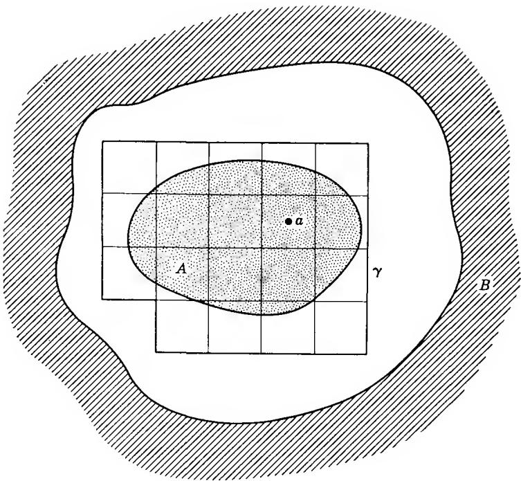  
FIG. 4-9. Curve with index 1.

Consider now the cycle

$$
\gamma = \sum_ {j} \partial Q _ {j}\tag{39}
$$

where the sum ranges over all squares $Q_{j}$ in the net which have a point in common with A (Fig. 4-9). Because a is contained in one and only one of these squares, it is evident that $n(\gamma,a)=1$ . Furthermore, it is clear that $\gamma$ does not meet B. But if the cancellations are carried out, it is equally clear that $\gamma$ does not meet A. Indeed, any side which meets A is a common side of two squares included in the sum (39), and since the directions are opposite the side does not appear in the reduced expression of $\gamma$ . Hence $\gamma$ is contained in $\Omega$ , and our theorem is proved.

We remark now that Cauchy's theorem is certainly not valid for regions which are not simply connected. In fact, if there is a cycle $\gamma$ in $\Omega$ such that $n(\gamma,a) \neq 0$ for some a outside of $\Omega$ , then $1/(z - a)$ is analytic in

$\Omega$ while its integral

$$
\int_ {\gamma} \frac {d z}{z - a} = 2 \pi i n (\gamma , a) \neq 0.
$$

4.3. Homology. The characterization of simple connectivity by Theorem 14 singles out a property that is common to all cycles in a simply connected region, but which a cycle in an arbitrary region or open set may or may not have. This property plays an important role in topology and therefore has a special name.

Definition 2. A cycle $\gamma$ in an open set $\Omega$ is said to be homologous to zero with respect to $\Omega$ if $n(\gamma, a) = 0$ for all points $a$ in the complement of $\Omega$ .

In symbols we write $\gamma \sim 0$ (mod $\Omega$ ). When it is clear to what open set we are referring, $\Omega$ need not be mentioned. The notation $\gamma_1 \sim \gamma_2$ shall be equivalent to $\gamma_1 - \gamma_2 \sim 0$ . Homologies can be added and subtracted, and $\gamma \sim 0$ (mod $\Omega$ ) implies $\gamma \sim 0$ (mod $\Omega'$ ) for all $\Omega' \supset \Omega$ .

Again, our terminology does not quite agree with standard usage. It was Emil Artin who discovered that the characterization of homology by vanishing winding numbers ties in precisely with what is needed for the general version of Cauchy's theorem. This idea has led to a remarkable simplification of earlier proofs.

4.4. The General Statement of Cauchy's Theorem. The definitive form of Cauchy's theorem is now very easy to state.

Theorem 15. If $f(z)$ is analytic in $\Omega$ , then

$$
\int_ {\gamma} f (z) d z = 0\tag{40}
$$

for every cycle $\gamma$ which is homologous to zero in $\Omega$ .

In a different formulation, we are claiming that if $\gamma$ is such that (40) holds for a certain collection of analytic functions, namely those of the form $1/(z - a)$ with a not in $\Omega$ , then it holds for all analytic functions in $\Omega$ .

In combination with Theorem 14 we have the following corollary:

Corollary 1. If $f(z)$ is analytic in a simply connected region $\Omega$ , then (40) holds for all cycles $\gamma$ in $\Omega$ .

Before proving the theorem, we make an observation which ties up with the considerations in Section 1.3. As pointed out in that connection, the validity of (40) for all closed curves $\gamma$ in a region means that the line integral of f dz is independent of the path, or that f dz is an exact differential. By Theorem 1 there is then a single-valued analytic function $F(z)$ such that $F'(z) = f(z)$ (the pleonastic term “single-valued” is used for emphasis only). In a simply connected region every analytic function is thus a derivative.

A particular application of this fact occurs very frequently:

Corollary 2. If $f(z)$ is analytic and $\neq 0$ in a simply connected region $\Omega$ , then it is possible to define single-valued analytic branches of $\log f(z)$ and $\sqrt[n]{f(z)}$ in $\Omega$ .

In fact, we know that there exists an analytic function $F(z)$ in $\Omega$ such that $F'(z) = f'(z)/f(z)$ . The function $f(z)e^{-F(z)}$ has the derivative zero and is therefore a constant. Choosing a point $z_{0} \in \Omega$ and one of the infinitely many values $\log f(z_{0})$ , we find that

$$
e ^ {F (z) - F (z _ {0}) + \log f (z _ {0})} = f (z),
$$

and consequently we can set $\log f(z) = F(z) - F(z_{0}) + \log f(z_{0})$ . To define $\sqrt[n]{f(z)}$ we merely write it in the form $\exp((1/n)\log f(z))$ .

4.5. Proof of Cauchy's Theorem.† We begin with a construction that parallels the one in the proof of Theorem 14. Assume first that $\Omega$ is bounded, but otherwise arbitrary. Given $\delta > 0$ , we cover the plane by a net of squares of side $\delta$ , and we denote by $Q_j, j \in J$ , the closed squares in the net which are contained in $\Omega$ ; because $\Omega$ is bounded the set $J$ is finite, and if $\delta$ is sufficiently small it is not empty. The union of the squares $Q_j, j \in J$ , consists of closed regions whose oriented boundaries make up the cycle

$$
\Gamma_ {\delta} = \sum_ {j \in J} \partial Q _ {j}.
$$

Clearly, $\Gamma_{\delta}$ is a sum of oriented line segments which are sides of exactly one $Q_{j}$ . We denote by $\Omega_{\delta}$ the interior of the union $\cup Q_{j}$ (Fig. 4-10).

Let $\gamma$ be a cycle which is homologous to zero in $\Omega$ ; we choose $\delta$ so small that $\gamma$ is contained in $\Omega_{\delta}$ . Consider a point $\zeta \in \Omega - \Omega_{\delta}$ . It belongs to at least one $Q$ which is not a $Q_{j}$ . There is a point $\zeta_0 \in Q$ which is not in $\Omega$ . It is possible to join $\zeta$ and $\zeta_0$ by a line segment which lies in $Q$ and therefore does not meet $\Omega_{\delta}$ . Since $\gamma$ , considered as a point set, is contained in $\Omega_{\delta}$ it follows that $n(\gamma, \zeta) = n(\gamma, \zeta_0) = 0$ . In particular, $n(\gamma, \zeta) = 0$ for all points $\zeta$ on $\Gamma_{\delta}$ .

† This proof follows a suggestion by A. F. Beardon, who has kindly permitted its use in this connection.

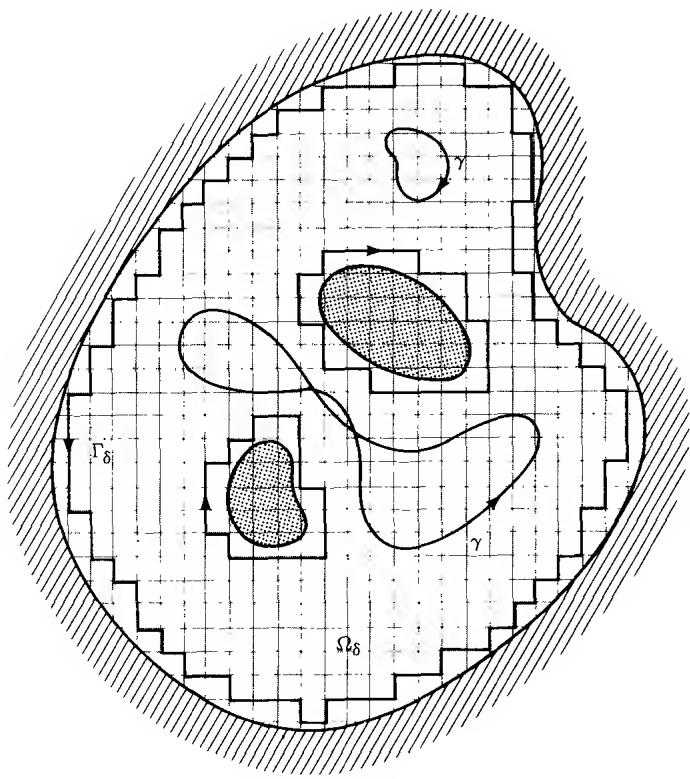  
FIG. 4-10

Suppose now that $f$ is analytic in $\Omega$ . If $z$ lies in the interior of $Q_{j_0}$ , say, then

$$
\frac {1}{2 \pi i} \int_ {\partial Q _ {j}} \frac {f (\zeta) d \zeta}{\zeta - z} = \left\{ \begin{array}{l l} f (z) & \text { if } j = j _ {0} \\ 0 & \text { if } j \neq j _ {0} \end{array} \right.
$$

and hence

$$
f (z) = \frac {1}{2 \pi i} \int_ {\Gamma_ {\delta}} \frac {f (\zeta) d \zeta}{\zeta - z}.\tag{41}
$$

Since both sides are continuous functions of $z$ , this equation will hold for all $z \in \Omega_{\delta}$ .

As a consequence we obtain

$$
\int_ {\gamma} f (z) d z = \int_ {\gamma} \left(\frac {1}{2 \pi i} \int_ {\Gamma_ {\delta}} \frac {f (\zeta) d \zeta}{\zeta - z}\right) d z.\tag{42}
$$

The integrand of the iterated integral is a continuous function of both integration variables, namely the parameters of $\Gamma_{\delta}$ and $\gamma$ . Therefore, the order of integration can be reversed. In other words,

$$
\int_ {\gamma} \left(\frac {1}{2 \pi i} \int_ {\Gamma_ {\delta}} \frac {f (\zeta) d \zeta}{\zeta - z}\right) d z = \int_ {\Gamma_ {\delta}} \left(\frac {1}{2 \pi i} \int_ {\gamma} \frac {d z}{\zeta - z}\right) f (\zeta) d \zeta .
$$

On the right the inside integral is $-n(\gamma,\zeta)=0$ . Hence the integral (42) is zero, and we have proved the theorem for bounded $\Omega$ .

If $\Omega$ is unbounded, we replace it by its intersection $\Omega'$ with a disk $|z| < R$ which is large enough to contain $\gamma$ . Any point $a$ in the complement of $\Omega'$ is either in the complement of $\Omega$ or lies outside the disk. In either case $n(\gamma, a) = 0$ , so that $\gamma \sim 0 \pmod{\Omega'}$ . The proof is applicable to $\Omega'$ , and we conclude that the theorem is valid for arbitrary $\Omega$ .

4.6. Locally Exact Differentials. A differential $p \, dx + q \, dy$ is said to be locally exact in $\Omega$ if it is exact in some neighborhood of each point in $\Omega$ . It is not difficult to see (Ex. 1, p. 148) that this is so if and only if

$$
\int_ {\gamma} p d x + q d y = 0\tag{43}
$$

for all $\gamma = \partial R$ where R is a rectangle contained in $\Omega$ . This condition is certainly fulfilled if $p dx + q dy = f(z) dz$ with f analytic in $\Omega$ , and by Theorem 15, (43) is then true for any cycle $\gamma \sim 0 \pmod{\Omega}$ .

Theorem 16. If $p \, dx + q \, dy$ is locally exact in $\Omega$ , then

$$
\int_ {\gamma} p d x + q d y = 0
$$

for every cycle $\gamma \sim 0$ in $\Omega$ .

There does not seem to be any direct way of modifying the proof of Theorem 15 so that it would cover this more general situation. We shall therefore end up by presenting two different proofs of Cauchy's general theorem. As in the earlier editions of this book, we shall follow Artin's proof of Theorem 16. The separate proof of Cauchy's theorem has been included because of its special appeal.

For the proof of Theorem 16 we show first that $\gamma$ can be replaced by a polygon $\sigma$ with horizontal and vertical sides such that every locally exact differential has the same integral over $\sigma$ as over $\gamma$ . This property implies, in particular, $n(\sigma,a) = n(\gamma,a)$ for a in the complement of $\Omega$ , and hence $\sigma \sim 0$ . It will thus be sufficient to prove the theorem for polygons with sides parallel to the axes.

We construct $\sigma$ as an approximation of $\gamma$ . Let the distance from $\gamma$ to the complement of $\Omega$ be $\rho$ . If $\gamma$ is given by $z = z(t)$ , the function $z(t)$ is uniformly continuous on the closed interval $[a,b]$ . We determine $\delta > 0$ so that $|z(t) - z(t')| < \rho$ for $|t - t'| < \delta$ and divide $[a, b]$ into subintervals of length $< \delta$ . The corresponding aubarcs $\gamma_i$ of $\gamma$ have the property that each is contained in a disk of radius $\rho$ which lies entirely in $\Omega$ . The end points of $\gamma_i$ can be joined within that disk by a polygon $\sigma_i$ consisting of a horizontal and a vertical segment. Since the differential is exact in the disk,

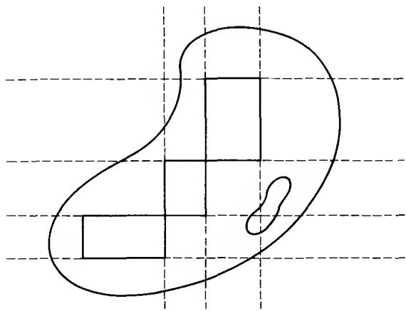  
FIG. 4-11

$$
\int_ {\sigma_ {i}} p d x + q d y = \int_ {\gamma_ {i}} p d x + q d y,
$$

and if $\sigma = \Sigma \sigma_{i}$ , we obtain

$$
\int_ {\sigma} p d x + q d y = \int_ {\gamma} p d x + q d y,
$$

as desired.

To continue the proof we extend all segments that make up $\sigma$ to infinite lines (Fig. 4-11). They divide the plane into some finite rectangles $R_{i}$ and some unbounded regions $R_{j}^{\prime}$ which may be regarded as infinite rectangles.

Choose a point $a_{i}$ from the interior of each $R_{i}$ , and form the cycle

$$
\sigma_ {0} = \sum_ {i} n (\sigma , a _ {i}) \partial R _ {i}\tag{44}
$$

where the sum ranges over all finite rectangles; the coefficients $n(\sigma, a_{i})$ are well determined, for no $a_{i}$ lies on $\sigma$ . In the discussion that follows we shall also make use of points $a_{j}^{\prime}$ chosen from the interior of each $R_{j}^{\prime}$ .

It is clear that $n(\partial R_i, a_k) = 1$ if $k = i$ and $0$ if $k \neq i$ ; similarly, $n(\partial R_i, a_j') = 0$ for all $j$ . With this in mind it follows from (44) that $n(\sigma_0, a_i) = n(\sigma, a_i)$ and $n(\sigma_0, a_j') = 0$ . It is also true that $n(\sigma, a_j') = 0$ , for the interior of $R_j'$ belongs to the unbounded region determined by $\sigma$ . We have thus shown that $n(\sigma - \sigma_0, a) = 0$ for all $a = a_i$ and $a = a_j'$ .

From this property of $\sigma - \sigma_0$ we wish to conclude that $\sigma_0$ is identical with $\sigma$ up to segments that cancel against each other. Let $\sigma_{ik}$ be the common side of two adjacent rectangles $R_i, R_k$ ; we choose the orientation so that $R_i$ lies to the left of $\sigma_{ik}$ . Suppose that the reduced expression of $\sigma - \sigma_0$ contains the multiple $c\sigma_{ik}$ . Then the cycle $\sigma - \sigma_0 - c \partial R_i$ does not contain $\sigma_{ik}$ , and it follows that $a_i$ and $a_k$ must have the same index with respect to this cycle. On the other hand, these indices are $-c$ and 0, respectively; we conclude that $c = 0$ . The same reasoning applies if $\sigma_{ij}$ is the common side of a finite rectangle $R_i$ and an infinite rectangle $R_j'$ . Thus every side of a finite rectangle occurs with coefficient zero in $\sigma - \sigma_0$ , proving that

$$
\sigma = \sum_ {i} n (\sigma , a _ {i}) \partial R _ {i}.\tag{45}
$$

We prove now that all the $R_{i}$ whose corresponding coefficient $n(\sigma, a_{i})$ is different from zero are actually contained in $\Omega$ . Suppose that a point a in the closed rectangle $R_{i}$ were not in $\Omega$ . Then $n(\sigma, a) = 0$ because $\sigma \sim 0 \pmod{\Omega}$ . On the other hand, the line segment between a and $a_{i}$ does not intersect $\sigma$ , and hence $n(\sigma, a_{i}) = n(\sigma, a) = 0$ . We conclude by the local exactness that the integral of p dx + q dy over any $\partial R_{i}$ which occurs effectively in (45) is zero. Consequently,

$$
\int_ {\sigma} p d x + q d y = 0,
$$

and Theorem 16 is proved.

4.7. Multiply Connected Regions. A region which is not simply connected is called multiply connected. More precisely, $\Omega$ is said to have the finite connectivity n if the complement of $\Omega$ has exactly n components and infinite connectivity if the complement has infinitely many components. In a less precise but more suggestive language, a region of connectivity n arises by punching n holes in the Riemann sphere.

In the case of finite connectivity, let $A_1, A_2, \ldots, A_n$ be the components of the complement of $\Omega$ , and assume that $\infty$ belongs to $A_n$ . If $\gamma$ is an arbitrary cycle in $\Omega$ , we can prove, just as in Theorem 14, that $n(\gamma, a)$ is constant when $a$ varies over any one of the components $A_i$ and that $n(\gamma, a) = 0$ in $A_n$ . Moreover, duplicating the construction used in the proof of the same theorem we can find cycles $\gamma_i, i = 1, \ldots, n - 1$ , such that $n(\gamma_i, a) = 1$ for $a \in A_i$ and $n(\gamma_i, a) = 0$ for all other points outside of $\Omega$ .

For a given cycle $\gamma$ in $\Omega$ , let $c_i$ be the constant value of $n(\gamma, a)$ for $a \in A_i$ . We find that any point outside of $\Omega$ has the index zero with respect to the cycle $\gamma - c_1 \gamma_1 - c_2 \gamma_2 - \cdots - c_{n-1} \gamma_{n-1}$ . In other words,

$$
\gamma \sim c _ {1} \gamma_ {1} + c _ {2} \gamma_ {2} + \dots + c _ {n - 1} \gamma_ {n - 1}.
$$

Every cycle is thus homologous to a linear combination of the cycles $\gamma_{1}, \gamma_{2}, \ldots, \gamma_{n-1}$ . This linear combination is uniquely determined, for if two linear combinations were homologous to the same cycle their difference would be a linear combination which is homologous to zero. But it is clear that the cycle $c_{1}\gamma_{1} + c_{2}\gamma_{2} + \cdots + c_{n-1}\gamma_{n-1}$ winds $c_{i}$ times around the points in $A_{i}$ ; hence it cannot be homologous to zero unless all the $c_{i}$ vanish.

In view of these circumstances the cycles $\gamma_{1}, \gamma_{2}, \ldots, \gamma_{n-1}$ are said to form a homology basis for the region $\Omega$ . It is not the only homology basis, but by an elementary theorem in linear algebra we may conclude that every homology basis has the same number of elements. We find that every region with a finite homology basis has finite connectivity, and the number of basis elements is one less than the connectivity.

By Theorem 18 we obtain, for any analytic function $f(z)$ in $\Omega$ ,

$$
\int_ {\gamma} f d z = c _ {1} \int_ {\gamma_ {1}} f d z + c _ {2} \int_ {\gamma_ {2}} f d z + \dots + c _ {n - 1} \int_ {\gamma_ {n - 1}} f d z.
$$

The numbers

$$
P _ {i} = \int_ {\gamma_ {i}} f d z
$$

depend only on the function, and not on $\gamma$ . They are called modules of periodicity of the differential f dz, or, with less accuracy, the periods of the indefinite integral. We have found that the integral of $f(z)$ over any cycle is a linear combination of the periods with integers as coefficients, and the integral along an arc from $z_{0}$ to z is determined up to additive multiples of the periods. The vanishing of the periods is a necessary and sufficient condition for the existence of a single-valued indefinite integral.

In order to illustrate, let us consider the extremely simple case of an annulus, defined by $r_{1} < |z| < r_{2}$ . The complement has the components $|z| \leq r_{1}$ and $|z| \geq r_{2}$ ; we include the degenerate cases $r_{1} = 0$ and $r_{2} = \infty$ . The annulus is doubly connected, and a homology basis is formed by any circle $|z| = r$ , $r_{1} < r < r_{2}$ . If this circle is denoted by C, any cycle in the annulus satisfies $\gamma \sim nC$ where $n = n(\gamma, 0)$ . The integral of an analytic function over a cycle is a multiple of the single period

$$
P = \int_ {C} f d z
$$

whose value is of course independent of the radius r.

## EXERCISES

1. Prove without use of Theorem 16 that $p \, dx + q \, dy$ is locally exact in $\Omega$ if and only if

$$
\int_ {\partial R} p d x + q d y = 0
$$

for every rectangle $R \subset \Omega$ with sides parallel to the axes.

2. Prove that the region obtained from a simply connected region by removing m points has the connectivity $m + 1$ , and find a homology basis.

3. Show that the bounded regions determined by a closed curve are simply connected, while the unbounded region is doubly connected.

4. Show that single-valued analytic branches of $\log z$ , $z^{\alpha}$ and $z^{z}$ can be defined in any simply connected region which does not contain the origin.

5. Show that a single-valued analytic branch of $\sqrt{1-z^{2}}$ can be defined in any region such that the points $\pm1$ are in the same component of the complement. What are the possible values of

$$
\int \frac {d z}{\sqrt {1 - z ^ {2}}}
$$

over a closed curve in the region?

## 5. THE CALCULUS OF RESIDUES

The results of the preceding section have shown that the determination of line integrals of analytic functions over closed curves can be reduced to the determination of periods. Under certain circumstances it turns out that the periods can be found without or with very little computation. We are thus in possession of a method which in many cases permits us to evaluate integrals without resorting to explicit calculation. This is of great value for practical purposes as well as for the further development of the theory.

In order to make this method more systematic a simple formalism, known as the calculus of residues, was introduced by Cauchy, the founder of complex integration theory. From the point of view adopted in this book the use of residues amounts essentially to an application of the results proved in Sec. 4 under particularly simple circumstances.

5.1. The Residue Theorem. Our first task is to review earlier results in the light of the more general theorems of Sec. 4. Clearly, all results which were derived as consequences of Cauchy's theorem for a disk remain valid in arbitrary regions for all cycles which are homologous to zero. For instance, and this application is typical, Cauchy's integral formula can now be expressed in the following form:

If $f(z)$ is analytic in a region $\Omega$ , then

$$
n (\gamma , a) f (a) = \frac {1}{2 \pi i} \int_ {\gamma} \frac {f (z)}{z - a} d z
$$

for every cycle $\gamma$ which is homologous to zero in $\Omega$ .

The proof is a repetition of the proof of Theorem 6. In this connection we point out that there is of course no longer any need to give a separate proof of Theorem 15 in the presence of removable singularities. Indeed, our discussion of the local behavior has already shown that all removable singularities can simply be ignored.

We turn now to the discussion of a function $f(z)$ which is analytic in a region $\Omega$ except for isolated singularities. For a first orientation, let us assume that there are only a finite number of singular points, denoted by $a_{1}, a_{2}, \ldots, a_{n}$ . The region obtained by excluding the points $a_{j}$ will be denoted by $\Omega'$ .

To each $a_j$ there exists a $\delta_j > 0$ such that the doubly connected region $0 < |z - a_j| < \delta_j$ is contained in $\Omega'$ . Draw a circle $C_j$ about $a_j$ of radius $< \delta_j$ , and let

$$
P _ {j} = \int_ {C _ {i}} f (z) d z\tag{46}
$$

be the corresponding period of $f(z)$ . The particular function $1 / (z - a_j)$ has the period $2\pi i$ . Therefore, if we set $R_{j} = P_{j} / 2\pi i$ , the combination

$$
f (z) - \frac {R _ {j}}{z - a _ {j}}
$$

has a vanishing period. The constant $R_{j}$ which produces this result is called the residue of $f(z)$ at the point $a_{j}$ . We repeat the definition in the following form:

Definition 3. The residue of $f(z)$ at an isolated singularity $a$ is the unique complex number $R$ which makes $f(z) - R / (z - a)$ the derivative of a single-valued analytic function in an annulus $0 < |z - a| < \delta$ .

It is helpful to use such self-explanatory notations as $R = \operatorname{Res}_{z=a} f(z)$ .

Let $\gamma$ be a cycle in $\Omega'$ which is homologous to zero with respect to $\Omega$ . Then $\gamma$ satisfies the homology

$$
\gamma \sim \sum_ {j} n (\gamma , a _ {j}) C _ {j}
$$

with respect to $\Omega'$ ; indeed, we can easily verify that the points $a_{j}$ as well as all points outside of $\Omega$ have the same order with respect to both cycles.

By virtue of the homology we obtain, with the notation (46),

$$
\int_ {\gamma} f d z = \sum_ {j} n (\gamma , a _ {j}) P _ {j},
$$

and since $P_{j} = 2\pi i \cdot R_{j}$ finally

$$
\frac {1}{2 \pi i} \int_ {\gamma} f d z = \sum_ {j} n (\gamma , a _ {j}) R _ {j}.
$$

This is the residue theorem, except for the restrictive assumption that there are only a finite number of singularities. In the general case we need only prove that $n(\gamma, a_{j}) = 0$ except for a finite number of points $a_{j}$ , for then the same proof can be applied. The assertion follows by routine reasoning. The set of all points a with $n(\gamma, a) = 0$ is open and contains all points outside of a large circle. The complement is consequently a compact set, and as such it cannot contain more than a finite number of the isolated points $a_{j}$ . Therefore $n(\gamma, a_{j}) \neq 0$ only for a finite number of the singularities, and we have proved:

Theorem 17. Let $f(z)$ be analytic except for isolated singularities $a_j$ in a region $\Omega$ . Then

$$
\frac {1}{2 \pi i} \int_ {\gamma} f (z) d z = \sum_ {j} n (\gamma , a _ {j}) \operatorname{Res} _ {z = a _ {j}} f (z)\tag{47}
$$

for any cycle $\gamma$ which is homologous to zero in $\Omega$ and does not pass through any of the points $a_{j}$ .

In the applications it is frequently the case that each $n(\gamma, a_{j})$ is either 0 or 1. Then we have simply

$$
\frac {1}{2 \pi i} \int_ {\gamma} f (z) d z = \sum_ {j} \operatorname{Res} _ {z = a _ {j}} f (z)
$$

where the sum is extended over all singularities enclosed by $\gamma$ .

The residue theorem is of little value unless we have at our disposal a simple procedure to determine the residues. For essential singularities there is no such procedure of any practical value, and thus it is not surprising that the residue theorem is comparatively seldom used in the presence of essential singularities. With respect to poles the situation is entirely different. We need only look at the expansion

$$
f (z) = B _ {h} (z - a) ^ {- h} + \dots + B _ {1} (z - a) ^ {- 1} + \varphi (z)
$$

to recognize that the residue equals the coefficient $B_{1}$ . Indeed, when the term $B_{1}(z - a)^{-1}$ is omitted, the remainder is evidently a derivative.

Since the principal part at a pole is always either given or can be easily found, we have thus a very simple method for finding the residues.

For simple poles the method is even more immediate, for then the residue equals the value of the function $(z - a)f(z)$ for z = a. For instance, let it be required to find the residues of the function

$$
\frac {e ^ {z}}{(z - a) (z - b)}
$$

at the poles $a$ and $b \neq a$ . The residue at $a$ is obviously $e^a / (a - b)$ , and the residue at $b$ is $e^b / (b - a)$ . If $b = a$ , the situation is slightly more complicated. We must then expand $e^z$ by Taylor's theorem in the form $e^z = e^a + e^a (z - a) + f_2(z)(z - a)^2$ . Dividing by $(z - a)^2$ we find that the residue of $e^z / (z - a)^2$ at $z = a$ is $e^a$ .

Remark. In presentations of Cauchy's theorem, the integral formula and the residue theorem which follow more classical lines, there is no mention of homology, nor is the notion of index used explicitly. Instead, the curve $\gamma$ to which the theorems are applied is supposed to form the complete boundary of a subregion of $\Omega$ , and the orientation is chosen so that the subregion lies to the left of $\Omega$ . In rigorous texts considerable effort is spent on proving that these intuitive notions have a precise meaning. The main objection to this procedure is the necessity to allot time and attention to rather delicate questions which are peripheral in comparison with the main issues.

With the general point of view that we have adopted it is still possible, and indeed quite easy, to isolate the classical case. All that is needed is to accept the following definition:

Definition 4. A cycle $\gamma$ is said to bound the region $\Omega$ if and only if $n(\gamma, a)$ is defined and equal to 1 for all points $a \in \Omega$ and either undefined or equal to zero for all points $a$ not in $\Omega$ .

If $\gamma$ bounds $\Omega$ , and if $\Omega + \gamma$ is contained in a larger region $\Omega'$ , then it is clear that $\gamma$ is homologous to zero with respect to $\Omega'$ . The following statements are therefore trivial consequences of Theorems 15 and 17:

If $\gamma$ bounds $\Omega$ and $f(z)$ is analytic on the set $\Omega +\gamma$ , then

$$
\int_ {\gamma} f (z) d z = 0
$$

and

$$
f (z) = \frac {1}{2 \pi i} \int_ {\gamma} \frac {f (\zeta) d \zeta}{\zeta - z}
$$

for all $z \in \Omega$ .

If $f(z)$ is analytic on $\Omega + \gamma$ except for isolated singularities in $\Omega$ , then

$$
\frac {1}{2 \pi i} \int_ {\gamma} f (z) d z = \sum_ {j} \operatorname{Res} _ {z = a _ {j}} f (z)
$$

where the sum ranges over the singularities $a_{j} \in \Omega$ .

We observe that a cycle $\gamma$ which bounds $\Omega$ must contain the set theoretic boundary of $\Omega$ . Indeed, if $z_{0}$ lies on the boundary of $\Omega$ , then every neighborhood of $z_{0}$ contains points from $\Omega$ and points not in $\Omega$ . If such a neighborhood were free from points of $\gamma$ , $n(\gamma,z)$ would be defined and constant in the neighborhood. This contradicts the definition, and hence every neighborhood of $z_{0}$ must meet $\gamma$ ; since $\gamma$ is closed, $z_{0}$ must lie on $\gamma$ .

The converse of the preceding statement is not true, for a point on $\gamma$ may well have a neighborhood which does not meet $\Omega$ . Normally, one would try to choose $\gamma$ so that it is identical with the boundary of $\Omega$ , but for Cauchy's theorem and related considerations this assumption is not needed.

5.2. The Argument Principle. Cauchy's integral formula can be considered as a special case of the residue theorem. Indeed, the function $f(z) / (z - a)$ has a simple pole at $z = a$ with the residue $f(a)$ , and when we apply (47), the integral formula results.

Another application of the residue theorem occurred in the proof of Theorem 10 which served to determine the number of zeros of an analytic function, For a zero of order h we can write $f(z) = (z - a)^{h}f_{h}(z)$ , with $f_{h}(a) \neq 0$ , and obtain $f'(z) = h(z - a)^{h-1}f_{h}(z) + (z - a)^{h}f_{h}'(z)$ . Consequently $f'(z)/f(z) = h/(z - a) + f_{h}'(z)/f_{h}(z)$ , and we see that $f'/f$ has a simple pole with the residue h. In the formula (32) this residue is accounted for by a corresponding repetition of terms.

We can now generalize Theorem 10 to the case of a meromorphic function. If f has a pole of order h, we find by the same calculation as above, with -h replacing h, that $f'/f$ has the residue -h. The following theorem results:

Theorem 18. If $f(z)$ is meromorphic in $\Omega$ with the zeros $a_{j}$ and the poles $b_{k}$ , then

$$
\frac {1}{2 \pi i} \int_ {\gamma} \frac {f ^ {\prime} (z)}{f (z)} d z = \sum_ {j} n (\gamma , a _ {j}) - \sum_ {k} n (\gamma , b _ {k})\tag{48}
$$

for every cycle $\gamma$ which is homologous to zero in $\Omega$ and does not pass through any of the zeros or poles.

It is understood that multiple zeros and poles have to be repeated as many times as their order indicates; the sums in (48) are finite.

Theorem 18 is usually referred to as the argument principle. The name refers to the interpretation of the left-hand member of (48) as $n(\Gamma,0)$ where $\Gamma$ is the image cycle of $\gamma$ . If $\Gamma$ lies in a disk which does not contain the origin, then $n(\Gamma,0) = 0$ . This observation is the basis for the following corollary, known as Rouché's theorem:

Corollary. Let $\gamma$ be homologous to zero in $\Omega$ and such that $n(\gamma, z)$ is either 0 or 1 for any point $z$ not on $\gamma$ . Suppose that $f(z)$ and $g(z)$ are analytic in $\Omega$ and satisfy the inequality $|f(z) - g(z)| < |f(z)|$ on $\gamma$ . Then $f(z)$ and $g(z)$ have the same number of zeros enclosed by $\gamma$ .

The assumption implies that $f(z)$ and $g(z)$ are zero-free on $\gamma$ . Moreover, they satisfy the inequality

$$
\left| \frac {g (z)}{f (z)} - 1 \right| <   1
$$

on $\gamma$ . The values of $F(z) = g(z)/f(z)$ on $\gamma$ are thus contained in the open disk of center 1 and radius 1. When Theorem 18 is applied to $F(z)$ , we have thus $n(\Gamma,0) = 0$ , and the assertion follows.

A typical application of Rouché's theorem would be the following. Suppose that we wish to find the number of zeros of a function $f(z)$ in the disk $|z| \leq R$ . Using Taylor's theorem we can write

$$
f (z) = P _ {n - 1} (z) + z ^ {n} f _ {n} (z)
$$

where $P_{n-1}$ is a polynomial of degree $n - 1$ . For a suitably chosen $n$ it may happen that we can prove the inequality $R^n |f_n(z)| < |P_{n-1}(z)|$ on $|z| = R$ . Then $f(z)$ has the same number of zeros in $|z| \leq R$ as $P_{n-1}(z)$ , and this number can be determined by approximate solution of the polynomial equation $P_{n-1}(z) = 0$ .

Theorem 18 can be generalized in the following manner. If $g(z)$ is analytic in $\Omega$ , then $g(z)\frac{f'(z)}{f(z)}$ has the residue $hg(a)$ at a zero $a$ of order $h$ and the residue $-hg(a)$ at a pole. We obtain thus the formula

$$
\frac {1}{2 \pi i} \int_ {\gamma} g (z) \frac {f ^ {\prime} (z)}{f (z)} d z = \sum_ {j} n (\gamma , a _ {j}) g (a _ {j}) - \sum_ {k} n (\gamma , b _ {k}) g (b _ {k}).\tag{49}
$$

This result is important for the study of the inverse function. With the notations of Theorem 11 we know that the equation $f(z) = w$ , $|w - w_0| < \delta$ has $n$ roots $z_j(w)$ in the disk $|z - z_0| < \varepsilon$ . If we apply

(49) with $g(z) = z$ , we obtain

$$
\sum_ {j = 1} ^ {n} z _ {j} (w) = \frac {1}{2 \pi i} \int_ {| z - z _ {0} | = \epsilon} \frac {f ^ {\prime} (z)}{f (z) - w} z d z.\tag{50}
$$

For $n = 1$ the inverse function $f^{-1}(w)$ can thus be represented explicitly by

$$
f ^ {- 1} (w) = \frac {1}{2 \pi i} \int_ {| z - z _ {0} | = \epsilon} \frac {f ^ {\prime} (z)}{f (z) - w} z d z.
$$

If (49) is applied with $g(z) = z^m$ , equation (50) is replaced by

$$
\sum_ {j = 1} ^ {n} z _ {j} (w) ^ {m} = \frac {1}{2 \pi i} \int_ {| z - z _ {0} | = \epsilon} \frac {f ^ {\prime} (z)}{f (z) - w} z ^ {m} d z.
$$

The right-hand member represents an analytic function of w for $|w - w_{0}| < \delta$ . Thus the power sums of the roots $z_{j}(w)$ are single-valued analytic functions of w. But it is well known that the elementary symmetric functions can be expressed as polynomials in the power sums. Hence they are also analytic, and we find that the $z_{j}(w)$ are the roots of a polynomial equation

$$
z ^ {n} + a _ {1} (w) z ^ {n - 1} + \dots + a _ {n - 1} (w) z + a _ {n} (w) = 0
$$

whose coefficients are analytic functions of w in $|w - w_{0}| < \delta$ .

## EXERCISES

1. How many roots does the equation $z^7 - 2z^5 + 6z^3 - z + 1 = 0$ have in the disk $|z| < 1$ ? Hint: Look for the biggest term when $|z| = 1$ and apply Rouché's theorem.

2. How many roots of the equation $z^{4}-6z+3=0$ have their modulus between 1 and 2?

3. How many roots of the equation $z^{4} + 8z^{3} + 3z^{2} + 8z + 3 = 0$ lie in the right half plane? Hint: Sketch the image of the imaginary axis and apply the argument principle to a large half disk.

5.3. Evaluation of Definite Integrals. The calculus of residues provides a very efficient tool for the evaluation of definite integrals. It is particularly important when it is impossible to find the indefinite integral explicitly, but even if the ordinary methods of calculus can be applied the use of residues is frequently a laborsaving device. The fact that the calculus of residues yields complex rather than real integrals is no disadvantage, for clearly the evaluation of a complex integral is equivalent to the evaluation of two definite integrals.

There are, however, some serious limitations, and the method is far from infallible. In the first place, the integrand must be closely connected with some analytic function. This is not very serious, for usually we are only required to integrate elementary functions, and they can all be extended to the complex domain. It is much more serious that the technique of complex integration applies only to closed curves, while a real integral is always extended over an interval. A special device must be used in order to reduce the problem to one which concerns integration over a closed curve. There are a number of ways in which this can be accomplished, but they all apply under rather special circumstances. The technique can be learned at the hand of typical examples, but even complete mastery does not guarantee success.

1. All integrals of the form

$$
\int_ {0} ^ {2 \pi} R (\cos \theta , \sin \theta) d \theta\tag{51}
$$

where the integrand is a rational function of $\cos\theta$ and $\sin\theta$ can be easily evaluated by means of residues. Of course these integrals can also be computed by explicit integration, but this technique is usually very laborious. It is very natural to make the substitution $z=e^{i\theta}$ which immediately transforms (51) into the line integral

$$
- i \int_ {| z | = 1} R \left[ \frac {1}{2} \left(z + \frac {1}{z}\right), \frac {1}{2 i} \left(z - \frac {1}{z}\right) \right] \frac {d z}{z}.
$$

It remains only to determine the residues which correspond to the poles of the integrand inside the unit circle.

As an example, let us compute

$$
\int_ {0} ^ {\pi} \frac {d \theta}{a + \cos \theta}, \quad a > 1.
$$

This integral is not extended over $(0,2\pi)$ , but since $\cos\theta$ takes the same values in the intervals $(0,\pi)$ and $(\pi,2\pi)$ is clear that the integral from 0 to $\pi$ is one-half of the integral from 0 to $2\pi$ . Taking this into account we find that the integral equals

$$
- i \int_ {| z | = 1} \frac {d z}{z ^ {2} + 2 a z + 1}
$$

The denominator can be factored into $(z - \alpha)(z - \beta)$ with

$$
\alpha = - a \div \sqrt {a ^ {2} - 1}, \quad \beta = - a - \sqrt {a ^ {2} - 1}.
$$

Evidently $|\alpha| < 1$ , $|\beta| > 1$ , and the residue at $\alpha$ is $1 / (\alpha - \beta)$ . The value

of the integral is found to be $\pi/\sqrt{a^{2}-1}$ .

2. An integral of the form

$$
\int_ {- \infty} ^ {\infty} R (x) d x
$$

converges if and only if in the rational function $R(x)$ the degree of the denominator is at least two units higher than the degree of the numerator, and if no pole lies on the real axis. The standard procedure is to integrate the complex function $R(z)$ over a closed curve consisting of a line segment $(- \rho, \rho)$ and the semicircle from $\rho$ to $-\rho$ in the upper half plane. If $\rho$ is large enough this curve encloses all poles in the upper half plane, and the corresponding integral is equal to $2\pi i$ times the sum of the residues in the upper half plane. As $\rho \to \infty$ obvious estimates show that the integral over the semicircle tends to 0, and we obtain

$$
\int_ {- \infty} ^ {\infty} R (x) d x = 2 \pi i \sum_ {y > 0} \operatorname{Res} R (z).
$$

3. The same method can be applied to an integral of the form

$$
\int_ {- \infty} ^ {\infty} R (x) e ^ {i x} d x\tag{52}
$$

whose real and imaginary parts determine the important integrals

$$
\int_ {- \infty} ^ {\infty} R (x) \cos x d x, \quad \int_ {- \infty} ^ {\infty} R (x) \sin x d x.\tag{53}
$$

Since $|e^{iz}| = e^{-y}$ is bounded in the upper half plane, we can again conclude that the integral over the semicircle tends to zero, provided that the rational function $R(z)$ has a zero of at least order two at infinity. We obtain

$$
\int_ {- \infty} ^ {\infty} R (x) e ^ {i x} d x = 2 \pi i \sum_ {y > 0} \operatorname{Res} R (z) e ^ {i z}.
$$

It is less obvious that the same result holds when $R(z)$ has only a simple zero at infinity. In this case it is not convenient to use semicircles. For one thing, it is not so easy to estimate the integral over the semicircle, and secondly, even if we were successful we would only have proved that the integral

$$
\int_ {- \rho} ^ {\rho} R (x) e ^ {i x} d x
$$

over a symmetric interval has the desired limit for $\rho\to\infty$ . In reality we are of course required to prove that

$$
\int_ {- X _ {1}} ^ {X _ {2}} R (x) e ^ {i x} d x
$$

has a limit when $X_{1}$ and $X_{2}$ tend independently to $\infty$ . In the earlier examples this question did not arise because the convergence of the integral was assured beforehand.

For the proof we integrate over the perimeter of a rectangle with the vertices $X_{2}$ , $X_{2} + iY$ , $-X_{1} + iY$ , $-X_{1}$ where Y > 0. As soon as $X_{1}$ , $X_{2}$ and Y are sufficiently large, this rectangle contains all the poles in the upper half plane. Under the hypothesis $|zR(z)|$ is bounded. Hence the integral over the right vertical side is, except for a constant factor,

less than

$$
\int_ {0} ^ {Y} e ^ {- \nu} \frac {d y}{| z |} <   \frac {1}{X _ {2}} \int_ {0} ^ {Y} e ^ {- \nu} d y.
$$

The last integral can be evaluated explicitly and is found to be < 1. Hence the integral over the right vertical side is less than a constant times $1/X_{2}$ , and a corresponding result is found for the left vertical side. The integral over the upper horizontal side is evidently less than $e^{-Y}(X_{1} + X_{2})/Y$ multiplied with a constant. For fixed $X_{1}, X_{2}$ it tends to 0 as $Y \to \infty$ , and we conclude that

$$
\left| \int_ {- X _ {1}} ^ {X _ {2}} R (x) e ^ {i x} d x - 2 \pi i \sum_ {y > 0} \operatorname{Res} R (z) e ^ {i z} \right| <   A \left(\frac {1}{X _ {1}} + \frac {1}{X _ {2}}\right)
$$

where A denotes a constant. This inequality proves that

$$
\int_ {- \infty} ^ {\infty} R (x) e ^ {i x} d x = 2 \pi i \sum_ {y > 0} \operatorname{Res} R (z) e ^ {i z}
$$

under the sole condition that $R(\infty) = 0$ .

In the discussion we have assumed, tacitly, that $R(z)$ has no poles on the real axis since otherwise the integral (52) has no meaning. However, one of the integrals (53) may well exist, namely, if $R(z)$ has simple poles which coincide with zeros of $\sin x$ or $\cos x$ . Let us suppose, for instance, that $R(z)$ has a simple pole at z = 0. Then the second integral (53) has a meaning and calls for evaluation.

We use the same method as before, but we use a path which avoids the origin by following a small semicircle of radius $\delta$ in the lower half plane (Fig. 4-12). It is easy to see that this closed curve encloses the poles in the upper half plane, the pole at the origin, and no others, as soon as $X_{1}, X_{2}, Y$ are sufficiently large and $\delta$ is sufficiently small. Suppose that the residue at 0 is B, so that we can write $R(z)e^{iz} = B/z + R_{0}(z)$ where $R_{0}(z)$ is analytic at the origin. The integral of the first term over the semicircle is $\pi iB$ , while the integral of the second term tends to 0 with $\delta$ .

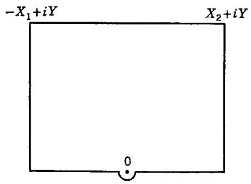  
FIG. 4-12

It is clear that we are led to the result

$$
\lim _ {\delta \rightarrow 0} \int_ {- \infty} ^ {- \delta} + \int_ {\delta} ^ {\infty} R (x) e ^ {i x} d x = 2 \pi i \left[ \sum_ {y > 0} \operatorname{Res} R (z) e ^ {i z} + \frac {1}{2} B \right].
$$

The limit on the left is called the Cauchy principal value of the integral; it exists although the integral itself has no meaning. On the right-hand side we observe that one-half of the residue at 0 has been included; this is as if one-half of the pole were counted as lying in the upper half plane.

In the general case where several poles lie on the real axis we obtain

$$
\operatorname{pr.v.} \int_ {- \infty} ^ {\infty} R (x) e ^ {i x} d x = 2 \pi i \sum_ {y > 0} \operatorname{Res} R (z) e ^ {i z} + \pi i \sum_ {y = 0} \operatorname{Res} R (z) e ^ {i z}
$$

where the notations are self-explanatory. It is an essential hypothesis that all the poles on the real axis be simple, and as before we must assume that $R(\infty) = 0$ .

As the simplest example we have

$$
\operatorname{pr.v.} \int_ {- \infty} ^ {\infty} \frac {e ^ {i x}}{x} d x = \pi i.
$$

Separating the real and imaginary part we observe that the real part of the equation is trivial by the fact that the integrand is odd. In the imaginary part it is not necessary to take the principal value, and since the integrand is even we find

$$
\int_ {0} ^ {\infty} \frac {\sin x}{x} d x = \frac {\pi}{2}.
$$

We remark that integrals containing a factor $\cos^{n}x$ or $\sin^{n}x$ can be evaluated by the same technique. Indeed, these factors can be written as linear combinations of terms $\cos mx$ and $\sin mx$ , and the corresponding integrals can be reduced to the form (52) by a change of variable:

$$
\int_ {- \infty} ^ {\infty} R (x) e ^ {i m x} d x = \frac {1}{m} \int_ {- \infty} ^ {\infty} R \left(\frac {x}{m}\right) e ^ {i x} d x.
$$

4. The next category of integrals have the form

$$
\int_ {0} ^ {\infty} x ^ {\alpha} R (x) d x
$$

where the exponent $\alpha$ is real and may be supposed to lie in the interval $0 < \alpha < 1$ . For convergence $R(z)$ must have a zero of at least order two at $\infty$ and at most a simple pole at the origin.

The new feature is the fact that $R(z)z^{\alpha}$ is not single-valued. This, however, is just the circumstance which makes it possible to find the integral from 0 to $\infty$ .

The simplest procedure is to start with the substitution $x = t^{2}$ which transforms the integral into

$$
2 \int_ {0} ^ {\infty} t ^ {2 \alpha + 1} R (t ^ {2}) d t.
$$

For the function $z^{2\alpha}$ we may choose the branch whose argument lies between $-\pi\alpha$ and $3\pi\alpha$ ; it is well defined and analytic in the region obtained by omitting the negative imaginary axis. As long as we avoid the negative imaginary axis, we can apply the residue theorem to the function $z^{2\alpha+1}R(z^{2})$ . We use a closed curve consisting of two line segments along the positive and negative axis and two semicircles in the upper half plane, one very large and one very small (Fig. 4-13). Under our assumptions it is easy to show that the integrals over the semicircles tend to zero. Hence the residue theorem yields the value of the integral

$$
\int_ {- \infty} ^ {\infty} z ^ {2 \alpha + 1} R (z ^ {2}) d z = \int_ {0} ^ {\infty} (z ^ {2 \alpha + 1} + (- z) ^ {2 \alpha + 1}) R (z ^ {2}) d z.
$$

However, $(-z)^{2\alpha} = e^{2\pi i\alpha}z^{2\alpha}$ , and the integral equals

$$
(1 - e ^ {2 \pi i \alpha}) \int_ {0} ^ {\infty} z ^ {2 \alpha + 1} R (z ^ {2}) d z.
$$

Since the factor in front is $\neq 0$ , we are finally able to determine the value of the desired integral.

The evaluation calls for determination of the residues of $z^{2\alpha+1}R(z^{2})$ in the upper half plane. These are the same as the residues of $z^{\alpha}R(z)$ in the whole plane. For practical purposes it may be preferable not to use any preliminary substitution and integrate the function $z^{\alpha}R(z)$ over the closed curve shown in Fig. 4-14. We have then to use the branch of $z^{\alpha}$ whose argument lies between 0 and $2\pi\alpha$ . This method needs some justification, for it does not conform to the hypotheses of the residue theorem. The justification is trivial.

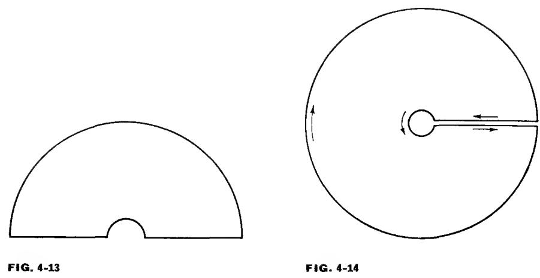

5. As a final example we compute the special integral

## $\int_0^\pi \log \sin \theta d\theta .$

Consider the function $1 - e^{2iz} = -2ie^{iz} \sin z$ . From the representation $1 - e^{2iz} = 1 - e^{-2y} (\cos 2x + i \sin 2x)$ , we find that this function is real and negative only for $x = n\pi, y \leq 0$ . In the region obtained by omitting these half lines the principal branch of $\log (1 - e^{2iz})$ is hence single-valued and analytic. We apply Cauchy's theorem to the rectangle whose vertices are $0, \pi, \pi + iY$ , and iY; however, the points 0 and $\pi$ have to be avoided, and we do this by following small circular quadrants of radius $\delta$ .

Because of the periodicity the integrals over the vertical sides cancel against each other. The integral over the upper horizontal side tends to 0 as $Y \to \infty$ . Finally, the integrals over the quadrants can also be seen to approach zero as $\delta \to 0$ . Indeed, since the imaginary part of the logarithm is bounded we need only consider the real part. From the fact that $|1 - e^{2iz}|/|z| \to 2$ for $z \to 0$ we see that $\log |1 - e^{2iz}|$ becomes infinite like $\log \delta$ , and since $\delta \log \delta \to 0$ the integral over the quadrant near the origin will tend to zero.

The same proof applies near the vertex $\pi$ , and we obtain

$$
\int_ {0} ^ {\pi} \log (- 2 i e ^ {i x} \sin x) d x = 0
$$

If we choose $\log e^{ix} = ix$ , the imaginary part lies between 0 and $\pi$ . Therefore, in order to obtain the principal branch with an imaginary part between $-\pi$ and $\pi$ , we must choose $\log (-i) = -\pi i/2$ . The equation can now be written in the form

$$
\pi \log 2 - \left(\frac {\pi^ {2}}{2}\right) i + \int_ {0} ^ {\pi} \log \sin x d x + \left(\frac {\pi^ {2}}{2}\right) i = 0,
$$

and we find

$$
\int_ {0} ^ {\pi} \log \sin x d x = - \pi \log 2.
$$

## EXERCISES

1. Find the poles and residues of the following functions:
(a) $\frac{1}{z^{2}+5z+6}$ , (b) $\frac{1}{(z^{2}-1)^{2}}$ , (c) $\frac{1}{\sin z}$ , (d) $\cot z$ ,
(e) $\frac{1}{\sin^{2}z}, \quad (f) \quad \frac{1}{z^{m}(1-z)^{n}} (m, n \text{ positive integers}).$

2. Show that in Sec. 5.3, Example 3, the integral may be extended over a right-angled isosceles triangle. (Suggested by a student.)

3. Evaluate the following integrals by the method of residues:

(a) $\int_0^{\pi /2}\frac{dx}{a + \sin^2x},|a| > 1,$ (b) $\int_0^\infty \frac{x^2dx}{x^4 + 5x^2 + 6},$

(c) $\int_{-\infty}^{\infty}\frac{x^2 - x + 2}{x^4 + 10x^2 + 9} dx,$ (d) $\int_0^\infty \frac{x^2dx}{(x^2 + a^2)^3},a\mathrm{real},$

(e) $\int_0^\infty \frac{\cos x}{x^2 + a^2} dx, a\text{ real},$ (f) $\int_0^\infty \frac{x\sin x}{x^2 + a^2} dx,a\text{ real},$

(g) $\int_0^\infty \frac{x^{1 / 3}}{1 + x^2} dx,$ (h) $\int_0^\infty (1 + x^2)^{-1}\log x dx,$

(i) $\int_0^\infty \log (1 + x^2)\frac{dx}{x^{1 + \alpha}} (0 <   \alpha <  2).$ (Try integration by parts.)

4. Compute

$$
\int_ {| z | = \rho} \frac {| d z |}{| z - a | ^ {2}}, \quad | a | \neq \rho .
$$

Hint: Use $z\bar{z} = \rho^{2}$ to convert the integral to a line integral of a rational function.

\*5. Complex integration can sometimes be used to evaluate area integrals. As an illustration, show that if $f(z)$ is analytic and bounded for $|z| < 1$ and if $|\zeta| < 1$ , then

$$
f (\zeta) = \frac {1}{\pi} \iint_ {| z | <   1} \frac {f (z) d x d y}{(1 - \bar {z} \zeta) ^ {2}}.
$$

Remark. This is known as Bergman's kernel formula. To prove it, express the area integral in polar coordinates, then transform the inside integral to a line integral which can be evaluated by residues.

## 6. HARMONIC FUNCTIONS

The real and imaginary parts of an analytic function are conjugate harmonic functions. Therefore, all theorems on analytic functions are also theorems on pairs of conjugate harmonic functions. However, harmonic functions are important in their own right, and their treatment is not always simplified by the use of complex methods. This is particularly true when the conjugate harmonic function is not single-valued.

We assemble in this section some facts about harmonic functions that are intimately connected with Cauchy's theorem. The more delicate properties of harmonic functions are postponed to a later chapter.

6.1. Definition and Basic Properties. A real-valued function $u(z)$ or $u(x,y)$ , defined and single-valued in a region $\Omega$ , is said to be harmonic in $\Omega$ , or a potential function, if it is continuous together with its partial derivatives of the first two orders and satisfies Laplace's equation

$$
\Delta u = \frac {\partial^ {2} u}{\partial x ^ {2}} + \frac {\partial^ {2} u}{\partial y ^ {2}} = 0.\tag{54}
$$

We shall see later that the regularity conditions can be weakened, but this is a point of relatively minor importance.

The sum of two harmonic functions and a constant multiple of a harmonic function are again harmonic; this is due to the linear character of Laplace's equation. The simplest harmonic functions are the linear functions $ax + by$ . In polar coordinates $(r, \theta)$ equation (54) takes the form

$$
r \frac {\partial}{\partial r} \left(r \frac {\partial u}{\partial r}\right) + \frac {\partial^ {2} u}{\partial \theta^ {2}} = 0. \dagger
$$

This shows that $\log r$ is a harmonic function and that any harmonic function which depends only on r must be of the form $a \log r + b$ . The argument $\theta$ is harmonic whenever it can be uniquely defined.

If $u$ is harmonic in $\Omega$ , then

$$
f (z) = \frac {\partial u}{\partial x} - i \frac {\partial u}{\partial y}\tag{55}
$$

is analytic, for writing $U = \frac{\partial u}{\partial x}$ , $V = -\frac{\partial u}{\partial y}$ we have

$$
\frac {\partial U}{\partial x} = \frac {\partial^ {2} u}{\partial x ^ {2}} = - \frac {\partial^ {2} u}{\partial y ^ {2}} = \frac {\partial V}{\partial y}
$$

$$
\frac {\partial U}{\partial y} = \frac {\partial^ {2} u}{\partial x \partial y} = - \frac {\partial V}{\partial x}.
$$

† This form cannot be used for r = C.

This, it should be remembered, is the most natural way of passing from harmonic to analytic functions.

From (55) we pass to the differential

$$
f d z = \left(\frac {\partial u}{\partial x} d x + \frac {\partial u}{\partial y} d y\right) + i \left(- \frac {\partial u}{\partial y} d x + \frac {\partial u}{\partial x} d y\right).\tag{56}
$$

In this expression the real part is the differential of u,

$$
d u = \frac {\partial u}{\partial x} d x + \frac {\partial u}{\partial y} d y.
$$

If $u$ has a conjugate harmonic function $v$ , then the imaginary part can be written as

$$
d v = \frac {\partial v}{\partial x} d x + \frac {\partial v}{\partial y} d y = - \frac {\partial u}{\partial y} d x + \frac {\partial u}{\partial x} d y.
$$

In general, however, there is no single-valued conjugate function, and in these circumstances it is better not to use the notation dv. Instead we write

$$
^ {*} d u = - \frac {\partial u}{\partial y} d x + \frac {\partial u}{\partial x} d y
$$

and call \*du the conjugate differential of du. We have by (56)

$$
f d z = d u + i ^ {*} d u.\tag{57}
$$

By Cauchy's theorem the integral of f dz vanishes along any cycle which is homologous to zero in $\Omega$ . On the other hand, the integral of the exact differential du vanishes along all cycles. It follows by (57) that

$$
\int_ {\gamma} ^ {*} d u = \int_ {\gamma} - \frac {\partial u}{\partial y} d x + \frac {\partial u}{\partial x} d y = 0\tag{58}
$$

for all cycles $\gamma$ which are homologous to zero in $\Omega$ .

The integral in (58) has an important interpretation which cannot be left unmentioned. If $\gamma$ is a regular curve with the equation $z = z(t)$ , the direction of the tangent is determined by the angle $\alpha = \arg z'(t)$ , and we can write $dx = |dz| \cos \alpha$ , $dy = |dz| \sin \alpha$ . The normal which points to the right of the tangent has the direction $\beta = \alpha - \pi/2$ , and thus $\cos \alpha = -\sin \beta$ , $\sin \alpha = \cos \beta$ . The expression

$$
\frac {\partial u}{\partial n} = \frac {\partial u}{\partial x} \cos \beta + \frac {\partial u}{\partial y} \sin \beta
$$

is a directional derivative of u, the right-hand normal derivative with respect to the curve $\gamma$ . We obtain $^{*}du = (\partial u/\partial n) |dz|$ , and (58) can be

written in the form

$$
\int_ {\gamma} \frac {\partial u}{\partial n} | d z | = 0.\tag{59}
$$

This is the classical notation. Its main advantage is that $\partial u/\partial n$ actually represents a rate of change in the direction perpendicular to $\gamma$ . For instance, if $\gamma$ is the circle $|z| = r$ , described in the positive sense, $\partial u/\partial n$ can be replaced by the partial derivative $\partial u/\partial r$ . It has the disadvantage that (59) is not expressed as an ordinary line integral, but as an integral with respect to arc length. For this reason the classical notation is less natural in connection with homology theory, and we prefer to use the notation $*du$ .

In a simply connected region the integral of $*du$ vanishes over all cycles, and u has a single-valued conjugate function v which is determined up to an additive constant. In the multiply connected case the conjugate function has periods

$$
\int_ {\gamma^ {i}} ^ {*} d u = \int_ {\gamma^ {i}} \frac {\partial u}{\partial n} | d z |
$$

corresponding to the cycles in a homology basis.

There is an important generalization of (58) which deals with a pair of harmonic functions. If $u_{1}$ and $u_{2}$ are harmonic in $\Omega$ , we claim that

$$
\int_ {\gamma} u _ {1} ^ {*} d u _ {2} - u _ {2} ^ {*} d u _ {1} = 0\tag{60}
$$

for every cycle $\gamma$ which is homologous to zero in $\Omega$ . According to Theorem 16, Sec. 4.6, it is sufficient to prove (60) for $\gamma = \partial R$ , where R is a rectangle contained in $\Omega$ . In R, $u_{1}$ and $u_{2}$ have single-valued conjugate functions $v_{1}, v_{2}$ and we can write

$$
u _ {1} ^ {*} d u _ {2} - u _ {2} ^ {*} d u _ {1} = u _ {1} d v _ {2} - u _ {2} d v _ {1} = u _ {1} d v _ {2} + v _ {1} d u _ {2} - d (u _ {2} v _ {1}).
$$

Here $d(u_{2}v_{1})$ is an exact differential, and $u_{1}dv_{2} + v_{1}du_{2}$ is the imaginary part of

$$
(u _ {1} + i v _ {1}) (d u _ {2} + i d v _ {2}).
$$

The last differential can be written in the form $F_{1}f_{2} dz$ where $F_{1}(z)$ and $f_{2}(z)$ are analytic on R. The integral of $F_{1}f_{2} dz$ vanishes by Cauchy's theorem, and so does therefore the integral of its imaginary part. We conclude that (60) holds for $\gamma = \partial R$ , and we have proved:

Theorem 19. If $u_{1}$ and $u_{2}$ are harmonic in a region $\Omega$ , then

$$
\int_ {\gamma} u _ {1} ^ {*} d u _ {2} - u _ {2} ^ {*} d u _ {1} = 0\tag{60}
$$

for every cycle $\gamma$ which is homologous to zero in $\Omega$ .

For $u_{1} = 1$ , $u_{2} = u$ the formula reduces to (58). In the classical notation (60) would be written as

$$
\int_ {\gamma} \left(u _ {1} \frac {\partial u _ {2}}{\partial n} - u _ {2} \frac {\partial u _ {1}}{\partial n}\right) | d z | = 0.
$$

6.2. The Mean-value Property. Let us apply Theorem 19 with $u_{1} = \log r$ and $u_{2}$ equal to a function $u$ , harmonic in $|z| < \rho$ . For $\Omega$ we choose the punctured disk $0 < |z| < \rho$ , and for $\gamma$ we take the cycle $C_{1} - C_{2}$ where $C_{i}$ is a circle $|z| = r_{i} < \rho$ described in the positive sense. On a circle $|z| = r$ we have $^{*}du = r(\partial u / \partial r) d\theta$ and hence (60) yields

$$
\log r _ {1} \int_ {C _ {1}} r _ {1} \frac {\partial u}{\partial r} d \theta - \int_ {C _ {1}} u d \theta = \log r _ {2} \int_ {C _ {2}} r _ {2} \frac {\partial u}{\partial r} d \theta - \int_ {C _ {2}} u d \theta .
$$

In other words, the expression

$$
\int_ {| z | = r} u d \theta - \log r \int_ {| z | = r} r \frac {\partial u}{\partial r} d \theta
$$

is constant, and this is true even if $u$ is only known to be harmonic in an annulus. By (58) we find in the same way that

$$
\int_ {| z | = r} r \frac {\partial u}{\partial r} d \theta
$$

is constant in the case of an annulus and zero if $u$ is harmonic in the whole disk. Combining these results we obtain:

Theorem 20. The arithmetic mean of a harmonic function over concentric circles $|z| = r$ is a linear function of $\log r$ ,

$$
\frac {1}{2 \pi} \int_ {| z | = r} u d \theta = \alpha \log r + \beta ,\tag{61}
$$

and if $u$ is harmonic in a disk $\alpha = 0$ and the arithmetic mean is constant.

In the latter case $\beta = u(0)$ , by continuity, and changing to a new origin we find

$$
u (z _ {0}) = \frac {1}{2 \pi} \int_ {0} ^ {2 \pi} u (z _ {0} + r e ^ {i \theta}) d \theta .\tag{62}
$$

It is clear that (62) could also have been derived from the corresponding formula for analytic functions, Sec. 3.4, (34). It leads directly to the maximum principle for harmonic functions:

Theorem 21. A nonconstant harmonic function has neither a maximum nor a minimum in its region of definition. Consequently, the maximum and the minimum on a closed bounded set E are taken on the boundary of E.

The proof is the same as for the maximum principle of analytic functions and will not be repeated. It applies also to the minimum for the reason that -u is harmonic together with u. In the case of analytic functions the corresponding procedure would have been to apply the maximum principle to $1/f(z)$ which is illegitimate unless $f(z) \neq 0$ . Observe that the maximum principle for analytic functions follows from the maximum principle for harmonic functions by applying the latter to $\log |f(z)|$ which is harmonic when $f(z) \neq 0$ .

## EXERCISES

1. If u is harmonic and bounded in $0 < |z| < \rho$ , show that the origin is a removable singularity in the sense that u becomes harmonic in $|z| < \rho$ when $u(0)$ is properly defined.

2. Suppose that $f(z)$ is analytic in the annulus $r_{1} < |z| < r_{2}$ and continuous on the closed annulus. If $M(r)$ denotes the maximum of $|f(z)|$ for $|z| = r$ , show that

$$
M (r) \leq M (r _ {1}) ^ {\alpha} M (r _ {2}) ^ {1 - \alpha}
$$

where $\alpha = \log (r_2 / r)$ : $\log (r_2 / r_1)$ (Hadamard's three-circle theorem). Discuss cases of equality. Hint: Apply the maximum principle to a linear combination of $\log |f(z)|$ and $\log |z|$ .

6.3. Poisson's Formula. The maximum principle has the following important consequence: If $u(z)$ is continuous on a closed bounded set $E$ and harmonic on the interior of $E$ , then it is uniquely determined by its values on the boundary of $E$ . Indeed, if $u_1$ and $u_2$ are two such functions with the same boundary values, then $u_1 - u_2$ is harmonic with the boundary values 0. By the maximum and minimum principle the difference $u_1 - u_2$ must then be identically zero on $E$ .

There arises the problem of finding u when its boundary values are given. At this point we shall solve the problem only in the simplest case, namely for a closed disk.

Formula (62) determines the value of u at the center of the disk. But this is all we need, for there exists a linear transformation which carries any point to the center. To be explicit, suppose that $u(z)$ is harmonic in the closed disk $|z| \leq R$ . The linear transformation

$$
z = S (\zeta) = \frac {R (R \zeta + a)}{R + \bar {a} \zeta}
$$

maps $|\zeta| \leq 1$ onto $|z| \leq R$ with $\zeta = 0$ corresponding to $z = a$ . The function $u(S(\zeta))$ is harmonic in $|\zeta| \leq 1$ , and by (62) we obtain

$$
u (a) = \frac {1}{2 \pi} \int_ {| \zeta | = 1} u (S (\zeta)) d \arg \zeta .
$$

From

$$
\zeta = \frac {R (z - a)}{R ^ {2} - \bar {a} z}
$$

we compute

$$
d \arg \zeta = - i \frac {d \zeta}{\zeta} = - i \left(\frac {1}{z - a} + \frac {\bar {a}}{R ^ {2} - \bar {a} z}\right) d z = \left(\frac {z}{z - a} + \frac {\bar {a} z}{R ^ {2} - \bar {a} z}\right) d \theta .
$$

On substituting $R^{2} = z\bar{z}$ the coefficient of $d\theta$ in the last expression can be rewritten as

$$
\frac {z}{z - a} + \frac {\bar {a}}{\bar {z} - \bar {a}} = \frac {R ^ {2} - | a | ^ {2}}{| z - a | ^ {2}}
$$

or, equivalently, as

$$
\frac {1}{2} \left(\frac {z + a}{z - a} + \frac {\bar {z} + \bar {a}}{\bar {z} - \bar {a}}\right) = \operatorname{Re} \frac {z + a}{z - a}.
$$

We obtain the two forms

$$
u (a) = \frac {1}{2 \pi} \int_ {| z | = R} \frac {R ^ {2} - | a | ^ {2}}{| z - a | ^ {2}} u (z) d \theta = \frac {1}{2 \pi} \int_ {| z | = R} \mathrm{Re} \frac {z + a}{z - a} u (z) d \theta\tag{63}
$$

of Poisson's formula. In polar coordinates,

$$
u (r e ^ {i \varphi}) = \frac {1}{2 \pi} \int_ {0} ^ {2 \pi} \frac {R ^ {2} - r ^ {2}}{R ^ {2} - 2 r R \cos (\theta - \varphi) + r ^ {2}} u (R e ^ {i \theta}) d \theta .
$$

In the derivation we have assumed that $u(z)$ is harmonic in the closed disk. However, the result remains true under the weaker condition that $u(z)$ is harmonic in the open disk and continuous in the closed disk. Indeed, if 0 < r < 1, then $u(rz)$ is harmonic in the closed disk, and we obtain

$$
u (r a) = \frac {1}{2 \pi} \int_ {| z | = R} \frac {R ^ {2} - | a | ^ {2}}{| z - a | ^ {2}} u (r z) d \theta .
$$

Now all we need to do is to let $r$ tend to 1. Because $u(z)$ is uniformly continuous on $|z| \leq R$ it is true that $u(rz) \to u(z)$ uniformly for $|z| = R$ , and we conclude that (63) remains valid.

We shall formulate the result as a theorem:

Theorem 22. Suppose that $u(z)$ is harmonic for $|z| < R$ , continuous for $|z| \leq R$ . Then

$$
u (a) = \frac {1}{2 \pi} \int_ {| z | = R} \frac {R ^ {2} - | a | ^ {2}}{| z - a | ^ {2}} u (z) d \theta\tag{64}
$$

for all $|a| < R$ .

The theorem leads at once to an explicit expression for the conjugate function of $u$ . Indeed, formula (63) gives

$$
u (z) = \operatorname{Re} \left[ \frac {1}{2 \pi i} \int_ {| \zeta | = R} \frac {\zeta + z}{\zeta - z} u (\zeta) \frac {d \zeta}{\zeta} \right].\tag{65}
$$

The bracketed expression is an analytic function of z for $|z| < R$ . It follows that $u(z)$ is the real part of

$$
f (z) = \frac {1}{2 \pi i} \int_ {| \zeta | = R} \frac {\zeta + z}{\zeta - z} u (\zeta) \frac {d \zeta}{\zeta} + i C\tag{66}
$$

where $C$ is an arbitrary real constant. This formula is known as Schwarz's formula.

As a special case of (64), note that $u = 1$ yields

$$
\int_ {| z | = R} \frac {R ^ {2} - | z | ^ {2}}{| z - a | ^ {2}} d \theta = 2 \pi\tag{67}
$$

for all $|a| < R$ .

6.4. Schwarz's Theorem. Theorem 22 serves to express a given harmonic function through its values on a circle. But the right-hand side of formula (64) has a meaning as soon as u is defined on $|z| = R$ , provided it is sufficiently regular, for instance piecewise continuous. As in (65) the integral can again be written as the real part of an analytic function, and consequently it is a harmonic function. The question is, does it have the boundary values $u(z)$ on $|z| = R$ ?

There is reason to clarify the notations. Choosing $R = 1$ we define, for any piecewise continuous function $U(\theta)$ in $0 \leq \theta \leq 2\pi$ ,

$$
P _ {U} (z) = \frac {1}{2 \pi} \int_ {0} ^ {2 \pi} \mathrm{Re} \frac {e ^ {i \theta} + z}{e ^ {i \theta} - z} U (\theta) d \theta
$$

and call this the Poisson integral of U. Observe that $P_{U}(z)$ is not only a function of z, but also a function of the function U; as such it is called a functional. The functional is linear inasmuch as

$$
P _ {U + V} = P _ {U} + P _ {V}
$$

and

$$
P _ {c U} = c P _ {U}
$$

for constant c. Moreover, $U \geq 0$ implies $P_{U}(z) \geq 0$ ; because of this property $P_{U}$ is said to be a positive linear functional.

We deduce from (67) that $P_{c} = c$ . From this property, together with the linear and positive character of the functional, it follows that any inequality $m \leq U \leq M$ implies $m \leq P_{U} \leq M$ .

The question of boundary values is settled by the following fundamental theorem that was first proved by H. A. Schwarz:

Theorem 23. The function $P_U(z)$ is harmonic for $|z| < 1$ , and

$$
\lim _ {z \rightarrow e ^ {i \theta_ {e}}} P _ {U} (z) = U (\theta_ {0})\tag{68}
$$

provided that $U$ is continuous at $\theta_0$ .

We have already remarked that $P_{U}$ is harmonic. To study the boundary behavior, let $C_{1}$ and $C_{2}$ be complementary arcs of the unit circle, and denote by $U_{1}$ the function which coincides with U on $C_{1}$ and vanishes on $C_{2}$ , by $U_{2}$ the corresponding function for $C_{2}$ . Clearly, $P_{U} = P_{U_{1}} + P_{U_{2}}$ .

Since $P_{U_{1}}$ can be regarded as a line integral over $C_{1}$ it is, by the same reasoning as before, harmonic everywhere except on the closed arc $C_{1}$ . The expression

$$
\mathrm{Re} \frac {e ^ {i \theta} + z}{e ^ {i \theta} - z} = \frac {1 - | z | ^ {2}}{| e ^ {i \theta} - z | ^ {2}}
$$

vanishes on $|z| = 1$ for $z \neq e^{i\theta}$ . It follows that $P_{U_1}$ is zero on the open arc $C_2$ , and since it is continuous $P_{U_1}(z) \to 0$ as $z \to e^{i\theta} \in C_2$ .

In proving (68) we may suppose that $U(\theta_0) = 0$ , for if this is not the case we need only replace $U$ by $U - U(\theta_0)$ . Given $\varepsilon > 0$ we can find $C_1$ and $C_2$ such that $e^{i\theta_0}$ is an interior point of $C_2$ and $|U(\theta)| < \varepsilon / 2$ for $e^{i\theta} \in C_2$ . Under this condition $|U_2(\theta)| < \varepsilon / 2$ for all $\theta$ , and hence $|P_{U_2}(z)| < \varepsilon / 2$ for all $|z| < 1$ . On the other hand, since $U_1$ is continuous and vanishes at $e^{i\theta_0}$ there exists a $\delta$ such that $|P_{U_1}(z)| < \varepsilon / 2$ for $|z - e^{i\theta_0}| < \delta$ . It follows that $|P_U(z)| \leq |P_{U_1}| + |P_{U_2}| < \varepsilon$ as soon as $|z| < 1$ and $|z - e^{i\theta_0}| < \delta$ , which is precisely what we had to prove.

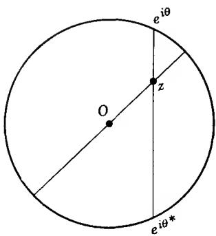  
FIG. 4-15

There is an interesting geometric interpretation of Poisson's formula, also due to Schwarz. Given a fixed $z$ inside the unit circle we determine for each $e^{i\theta}$ the point $e^{i\theta^*}$ which is such that $e^{i\theta}, z$ and $e^{i\theta^*}$ are in a straight line (Fig. 4-15). It is clear geometrically, or by simple calculation, that

$$
1 - | z | ^ {2} = \left| e ^ {i \theta} - z \right| \left| e ^ {i \theta^ {*}} - z \right|.\tag{69}
$$

But the ratio $(e^{i\theta} - z) / (e^{i\theta^*} - z)$ is negative, so we must have

$$
1 - | z | ^ {2} = - (e ^ {i \theta} - z) (e ^ {- i \theta^ {*}} - \bar {z}).
$$

We regard $\theta^{*}$ as a function of $\theta$ and differentiate. Since $z$ is constant we obtain

$$
\frac {e ^ {i \theta} d \theta}{e ^ {i \theta} - z} = \frac {e ^ {- i \theta^ {*}} d \theta^ {*}}{e ^ {- i \theta^ {*}} - \bar {z}}
$$

and, on taking absolute values,

$$
\frac {d \theta^ {*}}{d \theta} = \left| \frac {e ^ {i \theta^ {*}} - z}{e ^ {i \theta} - z} \right|.\tag{70}
$$

It follows by (69) and (70) that

$$
\frac {1 - | z | ^ {2}}{| e ^ {i \theta} - z | ^ {2}} = \frac {d \theta^ {*}}{d \theta}
$$

and hence

$$
P _ {U} (z) = \frac {1}{2 \pi} \int_ {0} ^ {2 \pi} U (\theta) d \theta^ {*} = \frac {1}{2 \pi} \int_ {0} ^ {2 \pi} U (\theta^ {*}) d \theta .
$$

In other words, to find $P_{U}(z)$ , replace each value of $U(\theta)$ by the value at the point opposite to z, and take the average over the circle.

## EXERCISES

1. Assume that $U(\xi)$ is piecewise continuous and bounded for all real $\xi$ . Show that

$$
P _ {U} (z) = \frac {1}{\pi} \int_ {- \infty} ^ {\infty} \frac {y}{(x - \xi) ^ {2} + y ^ {2}} U (\xi) d \xi
$$

represents a harmonic function in the upper half plane with boundary values $U(\xi)$ at points of continuity (Poisson's integral for the half plane).

2. Prove that a function which is harmonic and bounded in the upper half plane, continuous on the real axis, can be represented as a Poisson integral (Ex. 1).

Remark. The point at $\infty$ presents an added difficulty, for we cannot immediately apply the maximum and minimum principle to $u - P_{u}$ . A good try would be to apply the maximum principle to $u - P_{u} - \varepsilon y$ for $\varepsilon > 0$ , with the idea of letting $\varepsilon$ tend to 0. This almost works, for the function tends to 0 for $y \to 0$ and to $-\infty$ for $y \to \infty$ , but we lack control when $|x| \to \infty$ . Show that the reasoning can be carried out successfully by application to $u - P_{u} - \varepsilon$ Im ( $\sqrt{iz}$ ).

3. In Ex. 1, assume that $U$ has a jump at 0, for instance $U(+0) = 0$ , $U(-0) = 1$ . Show that $P_U(z) - \frac{1}{\pi} \arg z$ tends to 0 as $z \to 0$ . Generalize to arbitrary jumps and to the case of the circle.

4. If $C_{1}$ and $C_{2}$ are complementary arcs on the unit circle, set U = 1 on $C_{1}$ , U = 0 on $C_{2}$ . Find $P_{U}(z)$ explicitly and show that $2\pi P_{U}(z)$ equals the length of the arc, opposite to $C_{1}$ , cut off by the straight lines through z and the end points of $C_{1}$ .

5. Show that the mean-value formula (62) remains valid for $u = \log |1 + z|$ , $z_0 = 0$ , $r = 1$ , and use this fact to compute

$$
\int_ {0} ^ {\pi} \log \sin \theta d \theta .
$$

6. If $f(z)$ is analytic in the whole plane and if $z^{-1} \operatorname{Re} f(z) \to 0$ when $z \to \infty$ , show that $f$ is a constant. Hint: Use (66).

7. If $f(z)$ is analytic in a neighborhood of $\infty$ and if $z^{-1} \operatorname{Re} f(z) \to 0$ when $z \to \infty$ , show that $\lim_{z \to \infty} f(z)$ exists. (In other words, the isolated singularity at $\infty$ is removable.)

Hint: Show first, by use of Cauchy's integral formula, that $f = f_{1} + f_{2}$ where $f_{1}(z) \to 0$ for $z \to \infty$ and $f_{2}(z)$ is analytic in the whole plane.

\*8. If $u(z)$ is harmonic for $0 < |z| < \rho$ and $\lim_{z \to 0} zu(z) = 0$ , prove that $u$ can be written in the form $u(z) = \alpha \log |z| + u_0(z)$ where $\alpha$ is a constant and $u_0$ is harmonic in $|z| < \rho$ .

Hint: Choose $\alpha$ as in (61). Then show that $u_{0}$ is the real part of an analytic function $f_{0}(z)$ and use the preceding exercise to conclude that the singularity at 0 is removable.

6.5. The Reflection Principle. An elementary aspect of the symmetry principle, or reflection principle, has been discussed already in connection with linear transformations (Chap. 3, Sec. 3.3). There are many more general variants first formulated by H. A. Schwarz.

The principle of reflection is based on the observation that if $u(z)$ is a harmonic function, then $u(\bar{z})$ is likewise harmonic, and if $f(z)$ is an analytic function, then $\overline{f(\bar{z})}$ is also analytic. More precisely, if $u(z)$ is harmonic and $f(z)$ analytic in a region then $u(\bar{z})$ is harmonic and $\overline{f(\bar{z})}$ analytic as functions of z in the region $\Omega^{*}$ obtained by reflecting $\Omega$ in the real axis; that is, $z \in \Omega^{*}$ if and only if $\bar{z} \in \Omega$ . The proofs of these statements consist in trivial verifications.

Consider the case of a symmetric region: $\Omega^{*} = \Omega$ . Because $\Omega$ is connected it must intersect the real axis along at least one open interval. Assume now that $f(z)$ is analytic in $\Omega$ and real on at least one interval of the real axis. Since $f(z) - \overline{f(\bar{z})}$ is analytic and vanishes on an interval it must be identically zero, and we conclude that $f(z) = \overline{f(\bar{z})}$ in $\Omega$ . With the notation $f = u + iv$ we have thus $u(z) = u(\bar{z})$ , $v(z) = -v(\bar{z})$ .

This is important, but it is a rather weak result, for we are assuming that $f(z)$ is already known to be analytic in all of $\Omega$ . Let us denote the intersection of $\Omega$ with the upper half plane by $\Omega^{+}$ , and the intersection of $\Omega$ with the real axis by $\sigma$ . Suppose that $f(z)$ is defined on $\Omega^{+} \cup \sigma$ , analytic in $\Omega^{+}$ , continuous and real on $\sigma$ . Under these conditions we want to show that $f(z)$ is the restriction to $\Omega^{+}$ of a function which is analytic in all of $\Omega$ and satisfies the symmetry condition $f(z) = \overline{f(\bar{z})}$ . In other words, part of our theorem asserts that $f(z)$ has an analytic continuation to $\Omega$ .

Even in this formulation the assumptions are too strong. Indeed, the main thing is that the imaginary part $v(z)$ vanishes on $\sigma$ , and nothing at all need to be assumed about the real part. In the definitive statement of the reflection principle the emphasis should therefore be on harmonic functions.

Theorem 24. Let $\Omega^{+}$ be the part in the upper half plane of a symmetric region $\Omega$ , and let $\sigma$ be the part of the real axis in $\Omega$ . Suppose that $v(x)$ is continuous in $\Omega^{+} \cup \sigma$ , harmonic in $\Omega^{+}$ , and zero on $\sigma$ . Then $v$ has a harmonic extension to $\Omega$ which satisfies the symmetry relation $v(\bar{z}) = -v(z)$ .

In the same situation, if $v$ is the imaginary part of an analytic function $f(z)$ in $\Omega^{+}$ , then $f(z)$ has an analytic extension which satisfies $f(z) = \overline{f(\overline{z})}$ .

For the proof we construct the function $V(z)$ which is equal to $v(z)$ in $\Omega^{+}$ , 0 on $\sigma$ , and equal to $-v(\bar{z})$ in the mirror image of $\Omega^{+}$ . We have to show that V is harmonic on $\sigma$ . For a point $x_{0} \in \sigma$ consider a disk with center $x_{0}$ contained in $\Omega$ , and let $P_{V}$ denote the Poisson integral with respect to this disk formed with the boundary values V. The difference $V - P_{V}$ is harmonic in the upper half of the disk. It vanishes on the half circle, by Theorem 23, and also on the diameter, because V tends to zero by definition and $P_{V}$ vanishes by obvious symmetry. The maximum and minimum principle implies that $V = P_{V}$ in the upper half disk, and the same proof can be repeated for the lower half. We conclude that V is harmonic in the whole disk, and in particular at $x_{0}$ .

For the remaining part of the theorem, let us again consider a disk with center on $\sigma$ . We have already extended v to the whole disk, and v has a conjugate harmonic function $-u_{0}$ in the same disk which we may normalize so that $u_{0} = \operatorname{Re} f(z)$ in the upper half. Consider

$$
U _ {0} (z) = u _ {0} (z) - u _ {0} (\bar {z}).
$$

On the real diameter it is clear that $\partial U_0 / \partial x = 0$ and also

$$
\frac {\partial U _ {0}}{\partial y} = 2 \frac {\partial u _ {0}}{\partial y} = - 2 \frac {\partial v}{\partial x} = 0.
$$

It follows that the analytic function $\partial U_{0}/\partial x - i \partial U_{0}/\partial y$ vanishes on the real axis, and hence identically. Therefore $U_{0}$ is a constant, and this constant is evidently zero. We have proved that $u_{0}(z) = u_{0}(\bar{z})$ .

The construction can be repeated for arbitrary disks. It is clear that the $u_{0}$ coincide in overlapping disks. The definition can be extended to all of $\Omega$ , and the theorem follows.

The theorem has obvious generalizations. The domain $\Omega$ can be taken to be symmetric with respect to a circle $C$ rather than with respect to a straight line, and when $z$ tends to $C$ it may be assumed that $f(z)$ approaches another circle $C'$ . Under such conditions $f(z)$ has an analytic continuation which maps symmetric points with respect to $C$ onto symmetric points with respect to $C'$ .

## EXERCISES

1. If $f(z)$ is analytic in the whole plane and real on the real axis, purely imaginary on the imaginary axis, show that $f(z)$ is odd.

2. Show that every function f which is analytic in a symmetric region $\Omega$ can be written in the form $f_{1} + if_{2}$ where $f_{1}, f_{2}$ are analytic in $\Omega$ and

real on the real axis.

3. If $f(z)$ is analytic in $|z| \leq 1$ and satisfies $|f| = 1$ on $|z| = 1$ , show that $f(z)$ is rational.

4. Use (66) to derive a formula for $f'(z)$ in terms of $u(z)$ .

5. If $u(z)$ is harmonic and $0 \leq u(z) \leq Ky$ for $y > 0$ , prove that $u = ky$ with $0 \leq k \leq K$ . [Reflect over the real axis, complete to an analytic function $f(z) = u + iv$ , and use Ex. 4 to show that $f'(z)$ is bounded.]

# 5 SERIES AND PRODUCT DEVELOPMENTS

Very general theorems have their natural place in the theory of analytic functions, but it must also be kept in mind that the whole theory originated from a desire to be able to manipulate explicit analytic expressions. Such expressions take the form of infinite series, infinite products, and other limits. In this chapter we deal partly with the rules that govern such limits, partly with quite explicit representations of elementary transcendental functions and other specific functions.

## 1. POWER SERIES EXPANSIONS

In a preliminary way we have considered power series in Chap. 2, mainly for the purpose of defining the exponential and trigonometric functions. Without use of integration we were not able to prove that every analytic function has a power series expansion. This question will now be resolved in the affirmative, essentially as an application of Cauchy's theorem.

The first subsection deals with more general properties of sequences of analytic functions.

1.1. Weierstrass's Theorem. The central theorem concerning the convergence of analytic functions asserts that the limit of a uniformly convergent sequence of analytic functions is an analytic function. The precise assumptions must be carefully stated, and they should not be too restrictive.

We are considering a sequence $\{f_{n}(z)\}$ where each $f_{n}(z)$ is defined and analytic in a region $\Omega_{n}$ . The limit function $f(z)$ must also be considered in some region $\Omega$ , and clearly, if $f(z)$ is to be defined in $\Omega$ , each point of $\Omega$ must belong to all $\Omega_{n}$ for n greater than a certain $n_{0}$ . In the general case $n_{0}$ will not be the same for all points of $\Omega$ , and for this reason it would not make sense to require that the convergence be uniform in $\Omega$ . In fact, in the most typical case the regions $\Omega_{n}$ form an increasing sequence, $\Omega_{1} \subset \Omega_{2} \subset \cdots \subset \Omega_{n} \subset \cdots$ , and $\Omega$ is the union of the $\Omega_{n}$ . In these circumstances no single function $f_{n}(z)$ is defined in all of $\Omega$ ; yet the limit $f(z)$ may exist at all points of $\Omega$ , although the convergence cannot be uniform.

As a very simple example take $f_{n}(z) = z/(2z^{n} + 1)$ and let $\Omega_{n}$ be the disk $|z| < 2^{-1/n}$ . It is practically evident that $\lim_{n \to \infty} f_{n}(z) = z$ in the disk $|z| < 1$ which we choose as our region $\Omega$ . In order to study the uniformity of the convergence we form the difference

$$
f _ {n} (z) - z = - 2 z ^ {n + 1} / (2 z ^ {n} + 1).
$$

For any given value of $z$ we can make $|z^n| < \varepsilon / 4$ by taking $n > \log (4 / \varepsilon) / \log (1 / |z|)$ . If $\varepsilon < 1$ we have then $2|z|^{n+1} < \varepsilon / 2$ and $|1 + 2z^n| > \frac{1}{2}$ so that $|f_n(z) - z| < \varepsilon$ . It follows that the convergence is uniform in any closed disk $|z| \leq r < 1$ , or on any subset of such a closed disk.

With another formulation, in the preceding example the sequence $\{f_{n}(z)\}$ tends to the limit function $f(z)$ uniformly on every compact subset of the region $\Omega$ . In fact, on a compact set $|z|$ has a maximum r < 1 and the set is thus contained in the closed disk $|z| \leq r$ . This is the typical situation. We shall find that we can frequently prove uniform convergence on every compact subset of $\Omega$ ; on the other hand, this is the natural condition in the theorem that we are going to prove.

Theorem 1. Suppose that $f_{n}(z)$ is analytic in the region $\Omega_{n}$ , and that the sequence $\{f_{n}(z)\}$ converges to a limit function $f(z)$ in a region $\Omega$ , uniformly on every compact subset of $\Omega$ . Then $f(z)$ is analytic in $\Omega$ . Moreover, $f_{n}'(z)$ converges uniformly to $f'(z)$ on every compact subset of $\Omega$ .

The analyticity of $f(z)$ follows most easily by use of Morera's theorem (Chap. 4, Sec. 2.3). Let $|z - a| \leq r$ be a closed disk contained in $\Omega$ ; the assumption implies that this disk lies in $\Omega_n$ for all $n$ greater than a certain $n_0$ . If $\gamma$ is any closed curve contained in $|z - a| < r$ , we have

$$
\int_ {\gamma} f _ {n} (z) d z = 0
$$

† In fact, the regions $\Omega_{n}$ form an open covering of $|z - a| \leq r$ . The disk is compact and hence has a finite subcovering. This means that it is contained in a fixed $\Omega_{n_{0}}$ .

for $n > n_0$ , by Cauchy's theorem. Because of the uniform convergence on $\gamma$ we obtain

$$
\int_ {\gamma} f (z) d z = \lim _ {n \rightarrow \infty} \int_ {\gamma} f _ {n} (z) d z = 0,
$$

and by Morera's theorem it follows that $f(z)$ is analytic in $|z - a| < r$ . Consequently $f(z)$ is analytic in the whole region $\Omega$ .

An alternative and more explicit proof is based on the integral formula

$$
f _ {n} (z) = \frac {1}{2 \pi i} \int_ {C} \frac {f _ {n} (\zeta) d \zeta}{\zeta - z},
$$

where $C$ is the circle $|\zeta - a| = r$ and $|z - a| < r$ . Letting $n$ tend to $\infty$ we obtain by uniform convergence

$$
f (z) = \frac {1}{2 \pi i} \int_ {C} \frac {f (\zeta) d \zeta}{\zeta - z}.
$$

and this formula shows that $f(z)$ is analytic in the disk. Starting from the formula

$$
f _ {n} ^ {\prime} (z) = \frac {1}{2 \pi i} \int_ {C} \frac {f _ {n} (\zeta) d \zeta}{(\zeta - z) ^ {2}}
$$

the same reasoning yields

$$
\lim _ {n \rightarrow \infty} f _ {n} ^ {\prime} (z) = \frac {1}{2 \pi i} \int_ {C} \frac {f (\zeta) d \zeta}{(\zeta - z) ^ {2}} = f ^ {\prime} (z),
$$

and simple estimates show that the convergence is uniform for $|z - a| \leq \rho < r$ . Any compact subset of $\Omega$ can be covered by a finite number of such closed disks, and therefore the convergence is uniform on every compact subset. The theorem is proved, and by repeated applications it follows that $f_{n}^{(k)}(z)$ converges uniformly to $f^{(k)}(z)$ on every compact subset of $\Omega$ .

Theorem 1 is due to Weierstrass, in an equivalent formulation. Its application to series whose terms are analytic functions is particularly important. The theorem can then be expressed as follows:

If a series with analytic terms,

$$
f (z) = f _ {1} (z) + f _ {2} (z) + \dots + f _ {n} (z) + \dots ,
$$

converges uniformly on every compact subset of a region $\Omega$ , then the sum $f(z)$ is analytic in $\Omega$ , and the series can be differentiated term by term.

The task of proving uniform convergence on a compact point set A can be facilitated by use of the maximum principle. In fact, with the notations of Theorem 1, the difference $|f_{m}(z) - f_{n}(z)|$ attains its maximum in $A$ on the boundary of $A$ . For this reason uniform convergence on the boundary of $A$ implies uniform convergence on $A$ . For instance, if the functions $f_n(z)$ are analytic in the disk $|z| < 1$ , and if it can be shown that the sequence converges uniformly on each circle $|z| = r_m$ where $\lim_{m \to \infty} r_m = 1$ , then Weierstrass's theorem applies and we can conclude that the limit function is solution.

clude that the limit function is analytic.

The following theorem is due to A. Hurwitz:

Theorem 2. If the functions $f_{n}(z)$ are analytic and $\neq0$ in a region $\Omega$ , and if $f_{n}(z)$ converges to $f(z)$ , uniformly on every compact subset of $\Omega$ , then $f(z)$ is either identically zero or never equal to zero in $\Omega$ .

Suppose that $f(z)$ is not identically zero. The zeros of $f(z)$ are in any case isolated. For any point $z_0 \in \Omega$ there is therefore a number $r > 0$ such that $f(z)$ is defined and $\neq 0$ for $0 < |z - z_0| \leq r$ . In particular, $|f(z)|$ has a positive minimum on the circle $|z - z_0| = r$ , which we denote by $C$ . It follows that $1 / f_n(z)$ converges uniformly to $1 / f(z)$ on $C$ . Since it is also true that $f_n'(z) \to f'(z)$ , uniformly on $C$ , we may conclude that

$$
\lim _ {n \rightarrow \infty} \frac {1}{2 \pi i} \int_ {C} \frac {f _ {n} ^ {\prime} (z)}{f _ {n} (z)} d z = \frac {1}{2 \pi i} \int_ {C} \frac {f ^ {\prime} (z)}{f (z)} d z.
$$

But the integrals on the left are all zero, for they give the number of roots of the equation $f_{n}(z) = 0$ inside of C. The integral on the right is therefore zero, and consequently $f(z_{0}) \neq 0$ by the same interpretation of the integral. Since $z_{0}$ was arbitrary, the theorem follows.

## EXERCISES

1. Using Taylor's theorem applied to a branch of $\log (1 + z / n)$ , prove that

$$
\lim _ {n \rightarrow \infty} \left(1 + \frac {z}{n}\right) ^ {n} = e ^ {z}
$$

uniformly on all compact sets.

2. Show that the series

$$
\zeta (z) = \sum_ {n = 1} ^ {\infty} n ^ {- *}
$$

converges for Re z > 1, and represent its derivative in series form.

3. Prove that

$$
(1 - 2 ^ {1 - z}) \zeta (z) = 1 ^ {- z} - 2 ^ {- z} + 3 ^ {- z} - \dots
$$

and that the latter series represents an analytic function for Re z > 0.

4. As a generalization of Theorem 2, prove that if the $f_{n}(z)$ have at most m zeros in $\Omega$ , then $f(z)$ is either identically zero or has at most m zeros.

5. Prove that

$$
\sum_ {n = 1} ^ {\infty} \frac {n z ^ {n}}{1 - z ^ {n}} = \sum_ {n = 1} ^ {\infty} \frac {z ^ {n}}{(1 - z ^ {n}) ^ {2}}
$$

for $|z| < 1$ . (Develop in a double series and reverse the order of summation.)

1.2. The Taylor Series. We show now that every analytic function can be developed in a convergent Taylor series. This is an almost immediate consequence of the finite Taylor development given in Chap. 4, Sec. 3.1, Theorem 8, together with the corresponding representation of the remainder term. According to this theorem, if $f(z)$ is analytic in a region $\Omega$ containing $z_{0}$ , we can write

$$
\begin{array}{r l} f (z) = f \left(z _ {0}\right) + \frac {f ^ {\prime} \left(z _ {0}\right)}{1 !} \left(z - z _ {0}\right) + \dots + \frac {f ^ {(n)} \left(z _ {0}\right)}{n !} \left(z - z _ {0}\right) ^ {n} \\ & + f _ {n + 1} (z) \left(z - z _ {0}\right) ^ {n + 1} \end{array}
$$

with

$$
f _ {n + 1} (z) = \frac {1}{2 \pi i} \int_ {C} \frac {f (\zeta) d \zeta}{(\zeta - z _ {0}) ^ {n + 1} (\zeta - z)}.
$$

In the last formula $C$ is any circle $|z - z_0| = \rho$ such that the closed disk $|z - z_0| \leq \rho$ is contained in $\Omega$ .

If $M$ denotes the maximum of $|f(z)|$ on $C$ , we obtain at once the estimate

$$
\left| f _ {n + 1} (z) \left(z - z _ {0}\right) ^ {n + 1} \right| \leq \frac {M \left| z - z _ {0} \right| ^ {n + 1}}{\rho^ {n} (\rho - | z - z _ {0} |)}
$$

We conclude that the remainder term tends uniformly to zero in every disk $|z - z_{0}| \leq r < \rho$ . On the other hand, $\rho$ can be chosen arbitrarily close to the shortest distance from $z_{0}$ to the boundary of $\Omega$ . We have proved:

Theorem 3. If $f(z)$ is analytic in the region $\Omega$ , containing $z_0$ , then the representation

$$
f (z) = f \left(z _ {0}\right) + \frac {f ^ {\prime} \left(z _ {0}\right)}{1 !} \left(z - z _ {0}\right) + \dots + \frac {f ^ {(n)} \left(z _ {0}\right)}{n !} \left(z - z _ {0}\right) ^ {n} + \dots
$$

is valid in the largest open disk of center $z_{0}$ contained in $\Omega$ .

The radius of convergence of the Taylor series is thus at least equal to the shortest distance from $z_{0}$ to the boundary of $\Omega$ . It may well be larger, but if it is there is no guarantee that the series still represents $f(z)$ at all points which are simultaneously in $\Omega$ and in the circle of convergence.

We recall that the developments

$$
\begin{array}{l} e ^ {z} = 1 + z + \frac {z ^ {2}}{2 !} + \dots + \frac {z ^ {n}}{n !} + \dots \\ \cos z = 1 - \frac {z ^ {2}}{2 !} + \frac {z ^ {4}}{4 !} - \frac {z ^ {6}}{6 !} + \dots \\ \sin z = z - \frac {z ^ {3}}{3 !} + \frac {z ^ {5}}{5 !} - \frac {z ^ {7}}{7 !} + \dots . \end{array}
$$

served as definitions of the functions they represent. Of course, as we have remarked before, every convergent power series is its own Taylor series. We gave earlier a direct proof that power series can be differentiated term by term. This is also a direct consequence of Weierstrass's theorem.

If we want to represent a fractional power of z or $\log z$ through a power series, we must first of all choose a well-defined branch, and secondly we have to choose a center $z_{0} \neq 0$ . It amounts to the same thing if we develop the function $(1 + z)^{\mu}$ or $\log(1 + z)$ about the origin, choosing the branch which is respectively equal to 1 or 0 at the origin. Since this branch is single-valued and analytic in $|z| < 1$ , the radius of convergence is at least 1. It is elementary to compute the coefficients, and we obtain

$$
\begin{array}{l} (1 + z) ^ {\mu} = 1 + \mu z + \binom {\mu} {2} z ^ {2} + \dots + \binom {\mu} {n} z ^ {n} + \dots \\ \log (1 + z) = z - \frac {z ^ {2}}{2} + \frac {z ^ {3}}{3} - \frac {z ^ {4}}{4} + \frac {z ^ {5}}{5} - \dots . \end{array}
$$

where the binomial coefficients are defined by

$$
\binom {\mu} {n} = \frac {\mu (\mu - 1) \cdot \cdot \cdot (\mu - n + 1)}{1 \cdot 2 \cdot \cdot \cdot n}.
$$

If the logarithmic series had a radius of convergence greater than 1, then $\log (1 + z)$ would be bounded for $|z| < 1$ . Since this is not the case, the radius of convergence must be exactly 1. Similarly, if the binomial series were convergent in a circle of radius $>1$ , the function $(1 + z)^{\mu}$ and all its derivatives would be bounded in $|z| < 1$ . Unless $\mu$ is a positive integer, one of the derivatives will be a negative power of $1 + z$ , and hence unbounded. Thus the radius of convergence is precisely 1 except in the trivial case in which the binomial series reduces to a polynomial.

The series developments of the cyclometric functions arc tan z and arc sin z are most easily obtained by consideration of the derived series. From the expansion

$$
\frac {1}{1 + z ^ {2}} = 1 - z ^ {2} + z ^ {4} - z ^ {6} + \dots
$$

we obtain by integration

$$
\operatorname{arc} \tan z = z - \frac {z ^ {3}}{3} + \frac {z ^ {5}}{5} - \frac {z ^ {7}}{7} + \dots
$$

where the branch is uniquely determined as

$$
\operatorname{arc} \tan z = \int_ {0} ^ {z} \frac {d z}{1 + z ^ {2}}
$$

for any path inside the unit circle. For justification we can either rely on uniform convergence or apply Theorem 1. The radius of convergence cannot be greater than that of the derived series, and hence it is exactly 1.

If $\sqrt{1 - z^2}$ is the branch with a positive real part, we have

$$
\frac {1}{\sqrt {1 - z ^ {2}}} = 1 + \frac {1}{2} z ^ {2} + \frac {1 \cdot 3}{2 \cdot 4} z ^ {4} + \frac {1 \cdot 3 \cdot 5}{2 \cdot 4 \cdot 6} z ^ {6} + \dots
$$

for $|z| < 1$ , and through integration we obtain

$$
\operatorname{arc} \sin z = z + \frac {1}{2} \frac {z ^ {3}}{3} + \frac {1 \cdot 3}{2 \cdot 4} \frac {z ^ {5}}{5} + \frac {1 \cdot 3 \cdot 5}{2 \cdot 4 \cdot 6} \frac {z ^ {7}}{7} + \dots .
$$

The series represents the principal branch of arc sin z with a real part between $-\pi/2$ and $\pi/2$ .

For combinations of elementary functions it is mostly not possible to find a general law for the coefficients. In order to find the first few coefficients we need not, however, calculate the successive derivatives. There are simple techniques which allow us to compute, with a reasonable amount of labor, all the coefficients that we are likely to need.

It is convenient to introduce the notation $[z^{n}]$ for any function which is analytic and has a zero of at least order n at the origin; less precisely, $[z^{n}]$ denotes a function which “contains the factor $z^{n}$ .” With this notation any function which is analytic at the origin can be written in the form

$$
f (z) = a _ {0} + a _ {1} z + \dots + a _ {n} z ^ {n} + [ z ^ {n + 1} ],
$$

where the coefficients are uniquely determined and equal to the Taylor coefficients of $f(z)$ . Thus, in order to find the first n coefficients of the Taylor expansion, it is sufficient to determine a polynomial $P_{n}(z)$ such that $f(z) - P_n(z)$ has a zero of at least order $n + 1$ at the origin. The degree of $P_n(z)$ does not matter; it is true in any case that the coefficients of $z^m, m \leq n$ , are the Taylor coefficients of $f(z)$ .

For instance, suppose that

$$
\begin{array}{l} f (z) = a _ {0} + a _ {1} z + a _ {2} z ^ {2} + \cdot \cdot \cdot + a _ {n} z ^ {n} + \cdot \cdot \cdot \\ g (z) = b _ {0} + b _ {1} z + b _ {2} z ^ {2} + \cdot \cdot \cdot + b _ {n} z ^ {n} + \cdot \cdot \cdot . \end{array}
$$

With an abbreviated notation we write

$$
f (z) = P _ {n} (z) + [ z ^ {n + 1} ]; \quad g (z) = Q _ {n} (z) + [ z ^ {n + 1} ].
$$

It is then clear that $f(z)g(z) = P_{n}(z)Q_{n}(z) + [z^{n+1}]$ , and the coefficients of the terms of degree $\leq n$ in $P_{n}Q_{n}$ are the Taylor coefficients of the product $f(z)g(z)$ . Explicitly we obtain

$$
\begin{array}{r l} f (z) g (z) = a _ {0} b _ {0} + (a _ {0} b _ {1} + a _ {1} b _ {0}) z + \cdot \cdot \cdot \\ & \quad + (a _ {0} b _ {n} + a _ {1} b _ {n - 1} + \cdot \cdot \cdot + a _ {n} b _ {0}) z ^ {n} + \cdot \cdot \cdot . \end{array}
$$

In deriving this expansion we have not even mentioned the question of convergence, but since the development is identical with the Taylor development of $f(z)g(z)$ , it follows by Theorem 3 that the radius of convergence is at least equal to the smaller of the radii of convergence of the given series $f(z)$ and $g(z)$ . In the practical computation of $P_{n}Q_{n}$ it is of course not necessary to determine the terms of degree higher than n.

In the case of a quotient $f(z)/g(z)$ the same method can be applied, provided that $g(0)=b_{0}\neq0$ . By use of ordinary long division, continued until the remainder contains the factor $z^{n+1}$ , we can determine a polynomial $R_{n}$ such that $P_{n}=Q_{n}R_{n}+[z^{n+1}]$ . Then $f-R_{n}g=[z^{n+1}]$ , and since $g(0)\neq0$ we find that $f/g=R_{n}+[z^{n+1}]$ . The coefficients of $R_{n}$ are the Taylor coefficients of $f(z)/g(z)$ . They can be determined explicitly in determinant form, but the expressions are too complicated to be of essential help.

It is also important that we know how to form the development of a composite function $f(g(z))$ . In this case, if $g(z)$ is developed around $z_{0}$ , the expansion of $f(w)$ must be in powers of $w - g(z_{0})$ . To simplify, let us assume that $z_{0} = 0$ and $g(0) = 0$ . We can then set

$$
f (w) = a _ {0} + a _ {1} w + \dots + a _ {n} w ^ {n} + \dots
$$

and $g(z) = b_{1}z + b_{2}z^{2} + \cdots + b_{n}z^{n} + \cdots$ . Using the same notations as before we write $f(w) = P_{n}(w) + [w^{n+1}]$ and $g(z) = Q_{n}(z) + [z^{n+1}]$ with $Q_{n}(0) = 0$ . Substituting $w = g(z)$ we have to observe that

$$
P _ {n} (Q _ {n} + [ z ^ {n + 1} ]) = P _ {n} (Q _ {n} (z)) + [ z ^ {n + 1} ]
$$

and that any expression of the form $[w^{n+1}]$ becomes a $[z^{n+1}]$ . Thus we obtain $f(g(z)) = P_{n}(Q_{n}(z)) + [z^{n+1}]$ , and the Taylor coefficients of $f(g(z))$ are the coefficients of $P_{n}(Q_{n}(z))$ for powers $\leq n$ .

Finally, we must be able to expand the inverse function of an analytic function $w = g(z)$ . Here we may suppose that $g(0) = 0$ , and we are looking for the branch of the inverse function $z = g^{-1}(w)$ which is analytic in a neighborhood of the origin and vanishes for w = 0. For the existence of the inverse function it is necessary and sufficient that $g'(0) \neq 0$ ; hence we assume that

$$
g (z) = a _ {1} z + a _ {2} z ^ {2} + \dots = Q _ {n} (z) + [ z ^ {n + 1} ]
$$

with $a_1 \neq 0$ . Our problem is to determine a polynomial $P_n(w)$ such that $P_n(Q_n(z)) = z + [z^{n+1}]$ . In fact, under the assumption $a_1 \neq 0$ the notations $[z^{n+1}]$ and $[w^{n+1}]$ are interchangeable, and from $z = P_n(Q_n(z)) + [z^{n+1}]$ we obtain $z = P_n(g(z) + [z^{n+1}]) + [z^{n+1}] = P_n(w) + [w^{n+1}]$ . Hence $P_n(w)$ determines the coefficients of $g^{-1}(w)$ .

In order to prove the existence of a polynomial $P_{n}$ we proceed by induction. Clearly, we can take $P_{1}(w) = w/a_{1}$ . If $P_{n-1}$ is given, we set $P_{n} = P_{n-1} + b_{n}w^{n}$ and obtain

$$
\begin{array}{r l} P _ {n} (Q _ {n} (z)) & = P _ {n - 1} (Q _ {n} (z)) + b _ {n} a _ {1} ^ {n} z ^ {n} + [ z ^ {n + 1} ] \\ & = P _ {n - 1} (Q _ {n - 1} (z) + a _ {n} z ^ {n}) + b _ {n} a _ {1} ^ {n} z ^ {n} + [ z ^ {n + 1} ] \\ & = P _ {n - 1} (Q _ {n - 1} (z)) + P _ {n - 1} ^ {\prime} (Q _ {n - 1} (z)) a _ {n} z ^ {n} + b _ {n} a _ {1} ^ {n} z ^ {n} + [ z ^ {n + 1} ]. \end{array}
$$

In the last member the first two terms form a known polynomial of the form $z + c_{n}z^{n} + [z^{n+1}]$ , and we have only to take $b_{n} = -c_{n}a_{1}^{-n}$ .

For practical purposes the development of the inverse function is found by successive substitutions. To illustrate the method we determine the expansion of $\tan w$ from the series

$$
w = \operatorname{arc} \tan z = z - \frac {z ^ {3}}{3} + \frac {z ^ {5}}{5} - \dots .
$$

If we want the development to include fifth powers, we write

$$
z = w + \frac {z ^ {3}}{3} - \frac {z ^ {5}}{5} + [ z ^ {7} ]
$$

and substitute this expression in the terms to the right. With appropriate remainders we obtain

$$
\begin{array}{r l} & z = w + \frac {1}{3} \bigg (w + \frac {z ^ {3}}{3} + [ w ^ {5} ] \bigg) ^ {3} - \frac {1}{5} (w + [ w ^ {3} ]) ^ {5} + [ w ^ {7} ] \\ & \qquad = w + \frac {1}{3} w ^ {3} + \frac {1}{3} w ^ {2} z ^ {3} - \frac {1}{5} w ^ {5} + [ w ^ {7} ] \\ & = w + \frac {1}{3} w ^ {3} + \frac {1}{3} w ^ {2} (w + [ w ^ {3} ]) ^ {3} - \frac {1}{5} w ^ {5} + [ w ^ {7} ] = w + \frac {1}{3} w ^ {3} + \frac {2}{1 5} w ^ {5} + [ w ^ {7} ]. \end{array}
$$

Thus the development of $\tan w$ begins with the terms

$$
\tan w = w + \frac {1}{3} w ^ {3} + \frac {2}{1 5} w ^ {5} + \dots .
$$

## EXERCISES

1. Develop $1/(1+z^{2})$ in powers of z-a, a being a real number. Find the general coefficient and for a=1 reduce to simplest form.

2. The Legendre polynomials are defined as the coefficients $P_{n}(\alpha)$ in the development

$$
(1 - 2 \alpha z + z ^ {2}) ^ {- \frac {1}{2}} = 1 + P _ {1} (\alpha) z + P _ {2} (\alpha) z ^ {2} + \dots .
$$

Find $P_{1}, P_{2}, P_{3}$ , and $P_{4}$ .

3. Develop $\log(\sin z/z)$ in powers of z up to the term $z^{6}$ .

4. What is the coefficient of $z^{7}$ in the Taylor development of $\tan z$ ?

5. The Fibonacci numbers are defined by $c_{0}=0$ , $c_{1}=1$ ,

$$
c _ {n} = c _ {n - 1} + c _ {n - 2}.
$$

Show that the $c_{n}$ are Taylor coefficients of a rational function, and determine a closed expression for $c_{n}$ .

## 1.3. The Laurent Series. A series of the form

$$
b _ {0} + b _ {1} z ^ {- 1} + b _ {2} z ^ {- 2} + \dots + b _ {n} z ^ {- n} + \dots\tag{1}
$$

can be considered as an ordinary power series in the variable 1/z. It will therefore converge outside of some circle $|z| = R$ , except in the extreme case $R = \infty$ ; the convergence is uniform in every region $|z| \geq \rho > R$ , and hence the series represents an analytic function in the region $|z| > R$ . If the series (1) is combined with an ordinary power series, we get a more general series of the form

$$
\sum_ {n = - \infty} ^ {+ \infty} a _ {n} z ^ {n}.\tag{2}
$$

It will be termed convergent only if the parts consisting of nonnegative powers and negative powers are separately convergent. Since the first part converges in a disk $|z| < R_{2}$ and the second series in a region $|z| > R_{1}$ , there is a common region of convergence only if $R_{1} < R_{2}$ , and (2) represents an analytic function in the annulus $R_{1} < |z| < R_{2}$ .

Conversely, we may start from an analytic function $f(z)$ whose region of definition contains an annulus $R_{1} < |z| < R_{2}$ , or more generally an annulus $R_{1} < |z - a| < R_{2}$ . We shall show that such a function can always be developed in a general power series of the form

$$
f (z) = \sum_ {n = - \infty} ^ {+ \infty} A _ {n} (z - a) ^ {n}.
$$

The proof is extremely simple. All we have to show is that $f(z)$ can be written as a sum $f_{1}(z) + f_{2}(z)$ where $f_{1}(z)$ is analytic for $|z - a| < R_{2}$ and $f_{2}(z)$ is analytic for $|z - a| > R_{1}$ with a removable singularity at $\infty$ . Under these circumstances $f_{1}(z)$ can be developed in nonnegative powers of $z - a$ , and $f_{2}(z)$ can be developed in nonnegative powers of $1 / (z - a)$ .

To find the representation $f(z) = f_{1}(z) + f_{2}(z)$ define $f_{1}(z)$ by

$$
f _ {1} (z) = \frac {1}{2 \pi i} \int_ {| \zeta - a | = r} \frac {f (\zeta) d \zeta}{\zeta - z}
$$

for $|z - a| < r < R_2$ and $f_2(z)$ by

$$
f _ {2} (z) = - \frac {1}{2 \pi i} \int_ {| \zeta - a | = r} \frac {f (\zeta) d \zeta}{\zeta - z}
$$

for $R_{1} < r < |z - a|$ . In both integrals the value of $r$ is irrelevant as long as the inequality is fulfilled, for it is an immediate consequence of Cauchy's theorem that the value of the integral does not change with $r$ provided that the circle does not pass over the point $z$ . For this reason $f_{1}(z)$ and $f_{2}(z)$ are uniquely defined and represent analytic functions in $|z - a| < R_{2}$ and $|z - a| > R_{1}$ respectively. Moreover, by Cauchy's integral theorem $f(z) = f_{1}(z) + f_{2}(z)$ .

The Taylor development of $f_{1}(z)$ is

$$
f _ {1} (z) = \sum_ {n = 0} ^ {\infty} A _ {n} (z - a) ^ {n}
$$

with

$$
A _ {n} = \frac {1}{2 \pi i} \int_ {| \zeta - a | = r} \frac {f (\zeta) d \zeta}{(\zeta - a) ^ {n + 1}}.\tag{3}
$$

In order to find the development of $f_{2}(z)$ we perform the transformation $\zeta = a + 1/\zeta'$ , $z = a + 1/z'$ . This transformation carries $|\zeta - a| = r$ into $|\zeta'| = 1/r$ with negative orientation, and by simple calculations we obtain

$$
f _ {2} \left(a + \frac {1}{z ^ {\prime}}\right) = \frac {1}{2 \pi i} \int_ {| \zeta^ {\prime} | = \frac {1}{r}} \frac {z ^ {\prime}}{\zeta^ {\prime}} \frac {f \left(a + \frac {1}{\zeta^ {\prime}}\right) d \zeta^ {\prime}}{\zeta^ {\prime} - z ^ {\prime}} = \sum_ {n = 1} ^ {\infty} B _ {n} z ^ {\prime n}
$$

with

$$
B _ {n} = \frac {1}{2 \pi i} \int_ {| \zeta^ {\prime} | = \frac {1}{r}} \frac {f \left(a + \frac {1}{\zeta^ {\prime}}\right) d \zeta^ {\prime}}{\zeta^ {\prime n + 1}} = \frac {1}{2 \pi i} \int_ {| \zeta - a | = r} f (\zeta) (\zeta - a) ^ {n - 1} d \zeta .
$$

This formula shows that we can write

$$
f (z) = \sum_ {n = - \infty} ^ {+ \infty} A _ {n} (z - a) ^ {n}
$$

where all the coefficients $A_{n}$ are determined by (3). Observe that the integral in (3) is independent of r as long as $R_{1} < r < R_{2}$ .

If $R_{1}=0$ the point a is an isolated singularity and $A_{-1}=B_{1}$ is the residue at a, for $f(z)-A_{-1}(z-a)^{-1}$ is the derivative of a single-valued function in $0<|z-a|<R_{2}$ .

## EXERCISES

1. Prove that the Laurent development is unique.

2. Let $\Omega$ be a doubly connected region whose complement consists of the components $E_1, E_2$ . Prove that every analytic function $f(z)$ in $\Omega$ can be written in the form $f_1(z) + f_2(z)$ where $f_1(z)$ is analytic outside of $E_1$ and $f_2(z)$ is analytic outside of $E_2$ . (The precise proof requires a construction like the one in Chap. 4, Sec. 4.5.)

3. The expression

$$
\{f, z \} = \frac {f ^ {\prime \prime \prime} (z)}{f ^ {\prime} (z)} - \frac {3}{2} \left(\frac {f ^ {\prime \prime} (z)}{f ^ {\prime} (z)}\right) ^ {2}
$$

is called the Schwarzian derivative of $f$ . If $f$ has a multiple zero or pole, find the leading term in the Laurent development of $\{f, z\}$ . Answer: If $f(z) = a(z - z_0)^m + \cdots$ , then $\{f, z\} = \frac{1}{2}(1 - m^2)(z - z_0)^{-2} + \cdots$ .

4. Show that the Laurent development of $(e^{z}-1)^{-1}$ at the origin is of the form

$$
\frac {1}{z} - \frac {1}{2} + \sum_ {1} ^ {\infty} (- 1) ^ {k - 1} \frac {B _ {k}}{(2 k) !} z ^ {2 k - 1}
$$

where the numbers $B_{k}$ are known as the Bernoulli numbers. Calculate $B_{1}, B_{2}, B_{3}$ . (By Sec. 2.1, Ex. 5, the $B_{k}$ are all positive.)

5. Express the Taylor development of $\tan z$ and the Laurent development of $\cot z$ in terms of the Bernoulli numbers.

## 2. PARTIAL FRACTIONS AND FACTORIZATION

A rational function has two standard representations, one by partial fractions and the other by factorization of the numerator and the denominator. The present section is devoted to similar representations of arbitrary meromorphic functions.

2.1. Partial Fractions. If the function $f(z)$ is meromorphic in a region $\Omega$ , there corresponds to each pole $b_{\nu}$ a singular part of $f(z)$ consisting of the part of the Laurent development which contains the negative powers of $z - b_{\nu}$ ; it reduces to a polynomial $P_{\nu}(1/(z - b_{\nu}))$ . It is tempting to subtract all singular parts in order to obtain a representation

$$
f (z) = \sum_ {\nu} P _ {\nu} \left(\frac {1}{z - b _ {\nu}}\right) + g (z)\tag{4}
$$

where $g(z)$ would be analytic in $\Omega$ . However, the sum on the right-hand side is in general infinite, and there is no guarantee that the series will converge. Nevertheless, there are many cases in which the series converges, and what is more, it is frequently possible to determine $g(z)$ explicitly from general considerations. In such cases the result is very rewarding; we obtain a simple expansion which is likely to be very helpful.

If the series in (4) does not converge, the method needs to be modified. It is clear that nothing essential is lost if we subtract an analytic function $p_{\nu}(z)$ from each singular part $P_{\nu}$ . By judicious choice of the functions $p_{\nu}$ the series $\sum_{\nu}(P_{\nu}-p_{\nu})$ can be made convergent. It is even possible to take the $p_{\nu}(z)$ to be polynomials.

We shall not prove the most general theorem to this effect. In the case where $\Omega$ is the whole plane we shall, however, prove that every meromorphic function has a development in partial fractions and, moreover, that the singular parts can be described arbitrarily. The theorem and its generalization to arbitrary regions are due to Mittag-Leffler.

Theorem 4. Let $\{b_{\nu}\}$ be a sequence of complex numbers with $\lim_{\nu \to \infty} b_{\nu} = \infty$ ,

and let $P_{\nu}(\zeta)$ be polynomials without constant term. Then there are functions which are meromorphic in the whole plane with poles at the points $b_{\nu}$ and the corresponding singular parts $P_{\nu}(1 / (z - b_{\nu}))$ . Moreover, the most general meromorphic function of this kind can be written in the form

$$
f (z) = \sum_ {\nu} \left[ P _ {\nu} \left(\frac {1}{z - b _ {\nu}}\right) - p _ {\nu} (z) \right] + g (z)\tag{5}
$$

where the $p_{\nu}(z)$ are suitably chosen polynomials and $g(z)$ is analytic in the whole plane.

We may suppose that no $b_{\nu}$ is zero. The function $P_{\nu}(1 / (z - b_{\nu}))$ is analytic for $|z| < |b_{\nu}|$ and can thus be expanded in a Taylor series about the origin. We choose for $p_{\nu}(z)$ a partial sum of this series, ending, say, with the term of degree $n_{\nu}$ . The difference $P_{\nu} - p_{\nu}$ can be estimated by use of the explicit expression for the remainder given in Chap. 4, Sec. 3.1. If the maximum of $|P_{\nu}|$ for $|z| \leq |b_{\nu}| / 2$ is denoted by $M_{\nu}$ , we obtain

$$
\left| P _ {\nu} \left(\frac {1}{z - b}\right) - p _ {\nu} (z) \right| \leq 2 M \left(\frac {2 | z |}{| b _ {\nu} |}\right) ^ {n _ {\nu} + 1}\tag{6}
$$

for all $|z| \leq |b_{\nu}|/4$ . By this estimate it is clear that the series in the right-hand member of (5) can be made absolutely convergent in the whole plane, except at the poles, by choosing the $n_{\nu}$ sufficiently large. For instance, if we choose $n_{\nu}$ so large that $2^{n_{\nu}} \geq M_{\nu}2^{\nu}$ , the estimate (6) will show that the general term is majorized by $2^{-\nu}$ for all sufficiently large $\nu$ .

Moreover, the estimate holds uniformly in any closed disk $|z| \leq R$ , so that the convergence is actually uniform in that disk provided we omit the terms with $|b_{\nu}| \leq R$ . By Weierstrass's theorem the remaining series represents an analytic function in $|z| \leq R$ , and it follows that the full series is meromorphic in the whole plane with the singular parts $P_{\nu}(1/(z - b_{\nu}))$ . The rest of the theorem is trivial.

As a first example we consider the function $\pi^{2}/\sin^{2}\pi z$ , which has double poles at the points z = n for integral n. The singular part at the origin is $1/z^{2}$ , and since $\sin^{2}\pi(z - n) = \sin^{2}\pi z$ , the singular part at z = n is $1/(z - n)^{2}$ . The series

$$
\sum_ {n = - \infty} ^ {+ \infty} \frac {1}{(z - n) ^ {2}}\tag{7}
$$

is convergent for $z \neq n$ , as seen by comparison with the familiar series $\sum_{1}^{\infty} 1/n^{2}$ . It is uniformly convergent on any compact set after omission of the terms which become infinite on the set. For this reason we can write

$$
{\frac {\pi^ {2}}{\sin^ {2} \pi z}} = \sum_ {n = - \infty} ^ {+ \infty} {\frac {1}{(z - n) ^ {2}}} + g (z)\tag{8}
$$

where $g(z)$ is analytic in the whole plane. We contend that $g(z)$ is identically zero.

To prove this we observe that the function $\pi^{2}/\sin^{2}\pi z$ and the series (7) are both periodic with the period 1. Therefore the function $g(z)$ has the same period. For $z = x + iy$ we have (Chap. 2, Sec. 3.2, Ex. 4)

$$
\left| \sin \pi z \right| ^ {2} = \cosh^ {2} \pi y - \cos^ {2} \pi x
$$

and hence $\pi^2/\sin^2\pi z$ tends uniformly to 0 as $|y|\to\infty$ . But it is easy to see that the function (7) has the same property. Indeed, the convergence is uniform for $|y|\geq1$ , say, and the limit for $|y|\to\infty$ can thus be obtained by taking the limit in each term. We conclude that $g(z)$ tends uniformly to 0 for $|y|\to\infty$ . This is sufficient to infer that $|g(z)|$ is bounded in a period strip $0\leq x\leq1$ , and because of the periodicity $|g(z)|$ will be bounded in the whole plane. By Liouville's theorem $g(z)$ must reduce to a constant, and since the limit is 0 the constant must vanish. We have thus proved the identity

$$
{\frac {\pi^ {2}}{\sin^ {2} \pi z}} = \sum_ {- \infty} ^ {\infty} {\frac {1}{(z - n) ^ {2}}}.\tag{9}
$$

From this equation a related identity can be obtained by integration. The left-hand member is the derivative of $-\pi \cot \pi z$ , and the terms on the right are derivatives of $-1/(z-n)$ . The series with the general term $1/(z-n)$ diverges, and a partial sum of the Taylor series must be subtracted from all the terms with $n \neq 0$ . As it happens it is sufficient to subtract the constant terms, for the series

$$
\sum_ {n \neq 0} \left(\frac {1}{z - n} + \frac {1}{n}\right) = \sum_ {n \neq 0} \frac {z}{n (z - n)}
$$

is comparable with $\sum_{1}^{\infty}1/n^{2}$ and hence convergent. The convergence is uniform on every compact set, provided that we omit the terms which become infinite. For this reason termwise differentiation is permissible, and we obtain

$$
\pi \cot \pi z = \frac {1}{z} + \sum_ {n \neq 0} \left(\frac {1}{z - n} + \frac {1}{n}\right)\tag{10}
$$

except for an additive constant. If the terms corresponding to n and -n are bracketed together, (10) can be written in the equivalent forms

$$
\pi \cot \pi z = \lim _ {m \rightarrow \infty} \sum_ {n = - m} ^ {m} \frac {1}{z - n} = \frac {1}{z} + \sum_ {n = 1} ^ {\infty} \frac {2 z}{z ^ {2} - n ^ {2}}.\tag{11}
$$

With this way of writing it becomes evident that both members of the equation are odd functions of z, and for this reason the integration constant must vanish. The equations (10) and (11) are thus correctly stated.

Let us now reverse the procedure and try to evaluate the analogous

sum

$$
\lim _ {m \rightarrow \infty} \sum_ {- m} ^ {m} \frac {(- 1) ^ {n}}{z - n} = \frac {1}{z} + \sum_ {1} ^ {\infty} (- 1) ^ {n} \frac {2 z}{z ^ {2} - n ^ {2}}\tag{12}
$$

which evidently represents a meromorphic function. It is very natural to separate the odd and even terms and write

$$
\sum_ {- (2 k + 1)} ^ {2 k + 1} \frac {(- 1) ^ {n}}{z - n} = \sum_ {n = - k} ^ {k} \frac {1}{z - 2 n} - \sum_ {n = - k - 1} ^ {k} \frac {1}{z - 1 - 2 n}.
$$

By comparison with (11) we find that the limit is

$$
\frac {\pi}{2} \cot \frac {\pi z}{2} - \frac {\pi}{2} \cot \frac {\pi (z - 1)}{2} = \frac {\pi}{\sin \pi z},
$$

and we have proved that

$$
\frac {\pi}{\sin \pi z} = \lim _ {m \rightarrow \infty} \sum_ {- m} ^ {m} (- 1) ^ {n} \frac {1}{z - n}.\tag{13}
$$

## EXERCISES

1. Comparing coefficients in the Laurent developments of $\cot \pi z$ and of its expression as a sum of partial fractions, find the values of

$$
\sum_ {1} ^ {\infty} \frac {1}{n ^ {2}}, \quad \sum_ {1} ^ {\infty} \frac {1}{n ^ {4}}, \quad \sum_ {1} ^ {\infty} \frac {1}{n ^ {6}}.
$$

Give a complete justification of the steps that are needed.

2. Express

$$
\sum_ {- \infty} ^ {\infty} \frac {1}{z ^ {3} - n ^ {3}}
$$

in closed form.

3. Use (13) to find the partial fraction development of $1/\cos \pi z$ , and show that it leads to $\pi/4 = 1 - \frac{1}{3} + \frac{1}{5} - \frac{1}{7} + \cdots$ .

4. What is the value of

$$
\sum_ {- \infty} ^ {\infty} \frac {1}{(z + n) ^ {2} + a ^ {2}}?
$$

5. Using the same method as in Ex. 1, show that

$$
\sum_ {1} ^ {\infty} \frac {1}{n ^ {2 k}} = 2 ^ {2 k - 1} \frac {B _ {k}}{(2 k) !} \pi^ {2 k}.
$$

(See Sec. 1.3, Ex. 4, for the definition of $B_{k}$ .)

## 2.2. Infinite Products. An infinite product of complex numbers

$$
p _ {1} p _ {2} \cdot \cdot \cdot p _ {n} \cdot \cdot \cdot = \prod_ {n = 1} ^ {\infty} p _ {n}\tag{14}
$$

is evaluated by taking the limit of the partial products $P_{n} = p_{1}p_{2}\cdot \cdot \cdot p_{n}$ . It is said to converge to the value $P = \lim_{n\to \infty}P_n$ if this limit exists and is different from zero. There are good reasons for excluding the value zero. For one thing, if the value P = 0 were permitted, any infinite product with one factor 0 would converge, and the convergence would not depend on the whole sequence of factors. On the other hand, in certain connections this convention is too radical. In fact, we wish to express a function as an infinite product, and this must be possible even if the function has zeros. For this reason we make the following agreement: The infinite product (14) is said to converge if and only if at most a finite number of the factors are zero, and if the partial products formed by the nonvanishing factors tend to a finite limit which is different from zero.

In a convergent product the general factor $p_{n}$ tends to 1; this is clear by writing $p_{n} = P_{n}/P_{n-1}$ , the zero factors being omitted. In view of this fact it is preferable to write all infinite products in the form

$$
\prod_ {n = 1} ^ {\infty} (1 + a _ {n})\tag{15}
$$

so that $a_{n} \to 0$ is a necessary condition for convergence.

If no factor is zero, it is natural to compare the product (15) with the infinite series

$$
\sum_ {n = 1} ^ {\infty} \log (1 + a _ {n}).\tag{16}
$$

Since the $a_{n}$ are complex we must agree on a definite branch of the logarithms, and we decide to choose the principal branch in each term. Denote the partial sums of (16) by $S_{n}$ . Then $P_{n} = e^{S_{n}}$ , and if $S_{n} \to S$ it follows that $P_{n}$ tends to the limit $P = e^{S}$ which is $\neq 0$ . In other words, the convergence of (16) is a sufficient condition for the convergence of (15).

In order to prove that the condition is also necessary, suppose that $P_{n} \rightarrow P \neq 0$ . It is not true, in general, that the series (16), formed with the principal values, converges to the principal value of $\log P$ ; what we wish to show is that it converges to some value of $\log P$ . For greater clarity we shall temporarily adopt the usage of denoting the principal value of the logarithm by Log and its imaginary part by Arg.