Because $P_{n} / P \to 1$ it is clear that $\operatorname{Log}(P_n / P) \to 0$ for $n \to \infty$ . There exists an integer $h_n$ such that $\operatorname{Log}(P_n / P) = S_n - \operatorname{Log} P + h_n \cdot 2\pi i$ . We pass to the differences to obtain $(h_{n+1} - h_n)2\pi i = \operatorname{Log}(P_{n+1} / P) - \operatorname{Log}(P_n / P) - \operatorname{Log}(1 + a_n)$ and hence $(h_{n+1} - h_n)2\pi = \operatorname{Arg}(P_{n+1} / P) - \operatorname{Arg}(P_n / P) - \operatorname{Arg}(1 + a_n)$ . By definition, $|\operatorname{Arg}(1 + a_n)| \leq \pi$ , and we know that $\operatorname{Arg}(P_{n+1} / P) - \operatorname{Arg}(P_n / P) \to 0$ . For large $n$ this is incompatible with the previous equation unless $h_{n+1} = h_n$ . Hence $h_n$ is ultimately equal to a fixed integer $h$ , and it follows from $\operatorname{Log}(P_n / P) = S_n - \operatorname{Log} P + h \cdot 2\pi i$ that $S_n \to \operatorname{Log} P - h \cdot 2\pi i$ . We have proved:

Theorem 5. The infinite product $\prod_{1}^{\infty}(1 + a_n)$ with $1 + a_{n} \neq 0$ converges simultaneously with the series $\sum_{1}^{\infty}\log (1 + a_n)$ whose terms represent the values of the principal branch of the logarithm.

The question of convergence of a product can thus be reduced to the more familiar question concerning the convergence of a series. It can be further reduced by observing that the series (16) converges absolutely at the same time as the simpler series $\Sigma |a_{n}|$ . This is an immediate consequence of the fact that

$$
\lim _ {z \rightarrow 0} \frac {\log (1 + z)}{z} = 1.
$$

If either the series (16) or $\sum_{1}^{\infty}|a_n|$ converges, we have $a_{n}\to 0$ , and for a given $\varepsilon >0$ the double inequality

$$
(1 - \varepsilon) | a _ {n} | <   | \log (1 + a _ {n}) | <   (1 + \varepsilon) | a _ {n} |
$$

will hold for all sufficiently large n. It follows immediately that the two series are in fact simultaneously absolutely convergent.

An infinite product is said to be absolutely convergent if and only if the corresponding series (16) converges absolutely. With this terminology we can state our result in the following terms:

Theorem 6. A necessary and sufficient condition for the absolute convergence of the product $\prod_{1}^{\infty}(1 + a_n)$ is the convergence of the series $\sum_{1}^{\infty}|a_n|$ .

In the last theorem the emphasis is on absolute convergence. By

simple examples it can be shown that the convergence of $\sum_{1}^{\infty}a_n$ is neither

sufficient nor necessary for the convergence of the product $\prod_{1}^{\infty}(1 + a_n)$ .

It is clear what to understand by a uniformly convergent infinite product whose factors are functions of a variable. The presence of zeros may cause some slight difficulties which can usually be avoided by considering only sets on which at most a finite number of the factors can vanish. If these factors are omitted, it is sufficient to study the uniform convergence of the remaining product. Theorems 5 and 6 have obvious counterparts for uniform convergence. If we examine the proofs, we find that all estimates can be made uniform, and the conclusions lead to uniform convergence, at least on compact sets.

## EXERCISES

1. Show that

$$
\prod_ {n = 2} ^ {\infty} \left(1 - \frac {1}{n ^ {2}}\right) = \frac {1}{2}.
$$

2. Prove that for $|z| < 1$

$$
(1 + z) (1 + z ^ {2}) (1 + z ^ {4}) (1 + z ^ {8}) \dots = \frac {1}{1 - z}.
$$

3. Prove that

$$
\prod_ {1} ^ {\infty} \left(1 + \frac {z}{n}\right) e ^ {- z / n}
$$

converges absolutely and uniformly on every compact set.

4. Prove that the value of an absolutely convergent product does not change if the factors are reordered.

5. Show that the function

$$
\theta (z) = \prod_ {1} ^ {\infty} (1 + h ^ {2 n - 1} e ^ {z}) (1 + h ^ {2 n - 1} e ^ {- z})
$$

where $|h| < 1$ is analytic in the whole plane and satisfies the functional equation

$$
\theta (z + 2 \log h) = h ^ {- 1} e ^ {- z} \theta (z).
$$

2.3. Canonical Products. A function which is analytic in the whole plane is said to be entire, or integral. The simplest entire functions which are not polynomials are $e^{z}$ , $\sin z$ , and $\cos z$ .

If $g(z)$ is an entire function, then $f(z) = e^{g(z)}$ is entire and $\neq 0$ . Conversely, if $f(z)$ is any entire function which is never zero, let us show that $f(z)$ is of the form $e^{g(z)}$ . To this end we observe that the function $f'(z)/f(z)$ , being analytic in the whole plane, is the derivative of an entire function $g(z)$ . From this fact we infer, by computation, that $f(z)e^{-g(z)}$ has the derivative zero, and hence $f(z)$ is a constant multiple of $e^{g(z)}$ ; the constant can be absorbed in $g(z)$ .

By this method we can also find the most general entire function with a finite number of zeros. Assume that $f(z)$ has m zeros at the origin (m may be zero), and denote the other zeros by $a_{1}, a_{2}, \ldots, a_{N}$ , multiple zeros being repeated. It is then plain that we can write

$$
f (z) = z ^ {m} e ^ {g (z)} \prod_ {1} ^ {N} \left(1 - \frac {z}{a _ {n}}\right).
$$

If there are infinitely many zeros, we can try to obtain a similar representation by means of an infinite product. The obvious generalization would be

$$
f (z) = z ^ {m} e ^ {g (z)} \prod_ {1} ^ {\infty} \left(1 - \frac {z}{a _ {n}}\right).\tag{17}
$$

This representation is valid if the infinite product converges uniformly on every compact set. In fact, if this is so the product represents an entire function with zeros at the same points (except for the origin) and with the same multiplicities as $f(z)$ . It follows that the quotient can be written in the form $z^{m}e^{g(z)}$ .

The product in (17) converges absolutely if and only if $\sum_{1}^{\infty} 1 / |a_n|$ is convergent, and in this case the convergence is also uniform in every closed disk $|z| \leq R$ . It is only under this special condition that we can obtain a representation of the form (17).

In the general case convergence-producing factors must be introduced. We consider an arbitrary sequence of complex numbers $a_{n} \neq 0$ with $\lim_{n \to \infty} a_{n} = \infty$ , and prove the existence of polynomials $p_{n}(z)$ such that

$$
\prod_ {1} ^ {\infty} \left(1 - \frac {z}{a _ {n}}\right) e ^ {p _ {n} (z)}\tag{18}
$$

converges to an entire function. The product converges together with the series with the general term

$$
r _ {n} (z) = \log \left(1 - \frac {z}{a _ {n}}\right) + p _ {n} (z)
$$

where the branch of the logarithm shall be chosen so that the imaginary part of $r_{n}(z)$ lies between $-\pi$ and $\pi$ (inclusive).

For a given R we consider only the terms with $|a_{n}| > R$ . In the disk $|z| \leq R$ the principal branch of $\log(1 - z/a_{n})$ can be developed in a Taylor series

$$
\log \left(1 - \frac {z}{a _ {n}}\right) = - \frac {z}{a _ {n}} - \frac {1}{2} \left(\frac {z}{a _ {n}}\right) ^ {2} - \frac {1}{3} \left(\frac {z}{a _ {n}}\right) ^ {3} - \dots .
$$

We reverse the signs and choose $p_n(z)$ as a partial sum

$$
p _ {n} (z) = \frac {z}{a _ {n}} + \frac {1}{2} \left(\frac {z}{a _ {n}}\right) ^ {2} + \dots + \frac {1}{m _ {n}} \left(\frac {z}{a _ {n}}\right) ^ {m _ {n}}.
$$

Then $r_n(z)$ has the representation

$$
r _ {n} (z) = - \frac {1}{m _ {n} + 1} \left(\frac {z}{a _ {n}}\right) ^ {m _ {n} + 1} - \frac {1}{m _ {n} + 2} \left(\frac {z}{a _ {n}}\right) ^ {m _ {n} + 2} - \dots
$$

and we obtain easily the estimate

$$
\left| r _ {n} (z) \right| \leq \frac {1}{m _ {n} + 1} \left(\frac {R}{\left| a _ {n} \right|}\right) ^ {m _ {n} + 1} \left(1 - \frac {R}{\left| a _ {n} \right|}\right) ^ {- 1}.\tag{19}
$$

Suppose now that the series

$$
\sum_ {n = 1} ^ {\infty} \frac {1}{m _ {n} + 1} \left(\frac {R}{| a _ {n} |}\right) ^ {m _ {n} + 1}\tag{20}
$$

converges. By the estimate (19) it follows first that $r_{n}(z) \to 0$ , and hence $r_{n}(z)$ has an imaginary part between $-\pi$ and $\pi$ as soon as n is sufficiently large. Moreover, the comparison shows that the series $\Sigma r_{n}(z)$ is absolutely and uniformly convergent for $|z| \leq R$ , and thus the product (18) represents an analytic function in $|z| < R$ . For the sake of the reasoning we had to exclude the values $|a_{n}| \leq R$ , but it is clear that the uniform convergence of (18) is not affected when the corresponding factors are again taken into account.

It remains only to show that the series (20) can be made convergent for all R. But this is obvious, for if we take $m_{n} = n$ it is clear that (20) has a majorant geometric series with ratio < 1 for any fixed value of R.

Theorem 7. There exists an entire function with arbitrarily prescribed zeros $a_{n}$ provided that, in the case of infinitely many zeros, $a_{n} \to \infty$ . Every entire function with these and no other zeros can be written in the form

$$
f (z) = z ^ {m} e ^ {g (z)} \prod_ {n = 1} ^ {\infty} \left(1 - \frac {z}{a _ {n}}\right) e ^ {\frac {z}{a _ {n}} + \frac {1}{2} \left(\frac {z}{a _ {n}}\right) ^ {2} + \dots + \frac {1}{m _ {n}} \left(\frac {z}{a _ {n}}\right) ^ {m _ {n}}}\tag{21}
$$

where the product is taken over all $a_{n} \neq 0$ , the $m_{n}$ are certain integers, and $g(z)$ is an entire function.

This theorem is due to Weierstrass. It has the following important corollary:

Corollary. Every function which is meromorphic in the whole plane is the quotient of two entire functions.

In fact, if $F(z)$ is meromorphic in the whole plane, we can find an entire function $g(z)$ with the poles of $F(z)$ for zeros. The product $F(z)g(z)$ is then an entire function $f(z)$ , and we obtain $F(z) = f(z)/g(z)$ .

The representation (21) becomes considerably more interesting if it is possible to choose all the $m_{n}$ equal to each other. The preceding proof has shown that the product

$$
\prod_ {1} ^ {\infty} \left(1 - \frac {z}{a _ {n}}\right) e ^ {\frac {z}{a _ {n}} + \frac {1}{2} \left(\frac {z}{a _ {n}}\right) ^ {2} + \dots + \frac {1}{h} \left(\frac {z}{a _ {n}}\right) ^ {h}}\tag{22}
$$

converges and represents an entire function provided that the series $\sum_{n=1}^{\infty}(R/|a_n|)^{h+1}/(h+1)$ converges for all $R$ , that is to say provided that $\Sigma 1/|a_n|^{h+1}<\infty$ . Assume that $h$ is the smallest integer for which this series converges; the expression (22) is then called the canonical product associated with the sequence $\{a_n\}$ , and $h$ is the genus of the canonical product.

Whenever possible we use the canonical product in the representation (21), which is thereby uniquely determined. If in this representation $g(z)$ reduces to a polynomial, the function $f(z)$ is said to be of finite genus, and the genus of $f(z)$ is by definition equal to the degree of this polynomial or to the genus of the canonical product, whichever is the larger. For instance, an entire function of genus zero is of the form

$$
C z ^ {m} \prod_ {1} ^ {\infty} \left(1 - \frac {z}{a _ {n}}\right)
$$

with $\Sigma 1 / |a_n| < \infty$ . The canonical representation of an entire function of genus 1 is either of the form

$$
C z ^ {m} e ^ {\alpha z} \prod_ {1} ^ {\infty} \left(1 - \frac {z}{a _ {n}}\right) e ^ {z / a _ {n}}
$$

with $\Sigma 1 / |a_n|^2 < \infty$ , $\Sigma 1 / |a_n| = \infty$ , or of the form

$$
C z ^ {m} e ^ {\alpha z} \prod_ {1} ^ {\infty} \left(1 - \frac {z}{a _ {n}}\right)
$$

with $\Sigma 1 / |a_n| < \infty, \alpha \neq 0$ .

As an application we consider the product representation of $\sin\pi z$ . The zeros are the integers $z=\pm n$ . Since $\Sigma1/n$ diverges and $\Sigma1/n^{2}$ converges, we must take h=1 and obtain a representation of the form

$$
\sin \pi z = z e ^ {g (z)} \prod_ {n \neq 0} \left(1 - \frac {z}{n}\right) e ^ {z / n}.
$$

In order to determine $g(z)$ we form the logarithmic derivatives on both sides. We find

$$
\pi \cot \pi z = \frac {1}{z} + g ^ {\prime} (z) + \sum_ {n \neq 0} \left(\frac {1}{z - n} + \frac {1}{n}\right)
$$

where the procedure is easy to justify by uniform convergence on any compact set which does not contain the points $z = n$ . By comparison with the previous formula (10) we conclude that $g'(z) = 0$ . Hence $g(z)$ is a constant, and since $\lim_{z \to 0} \sin \pi z / z = \pi$ we must have $e^{g(z)} = \pi$ , and thus

$$
\sin \pi z = \pi z \prod_ {n \neq 0} \left(1 - \frac {z}{n}\right) e ^ {z / n}.\tag{23}
$$

In this representation the factors corresponding to n and -n can be bracketed together, and we obtain the simple form

$$
\sin \pi z = \pi z \prod_ {1} ^ {\infty} \left(1 - \frac {z ^ {2}}{n ^ {2}}\right).\tag{24}
$$

It follows from (23) that $\sin \pi z$ is an entire function of genus 1.

## EXERCISES

1. Suppose that $a_{n} \to \infty$ and that the $A_{n}$ are arbitrary complex numbers. Show that there exists an entire function $f(z)$ which satisfies $f(a_{n}) = A_{n}$ .

Hint: Let $g(z)$ be a function with simple zeros at the $a_{n}$ . Show that

$$
\sum_ {1} ^ {\infty} g (z) \frac {e ^ {\gamma_ {n} (z - a _ {n})}}{z - a _ {n}} \cdot \frac {A _ {n}}{g ^ {\prime} (a _ {n})}
$$

converges for some choice of the numbers $\gamma_{n}$ .

2. Prove that

$$
\sin \pi (z + \alpha) = e ^ {\pi z \cot \pi \alpha} \prod_ {- \infty} ^ {\infty} \left(1 + \frac {z}{n + \alpha}\right) e ^ {- z / (n + \alpha)}
$$

whenever $\alpha$ is not an integer. Hint: Denote the factor in front of the canonical product by $g(z)$ and determine $g'(z)/g(z)$ .

3. What is the genus of cos $\sqrt{z}$ ?

4. If $f(z)$ is of genus $h$ , how large and how small can the genus of $f(z^2)$ be?

5. Show that if $f(z)$ is of genus 0 or 1 with real zeros, and if $f(z)$ is real for real $z$ , then all zeros of $f'(z)$ are real. Hint: Consider $\operatorname{Im} f'(z) / f(z)$ .

2.4. The Gamma Function. The function $\sin \pi z$ has all the integers for zeros, and it is the simplest function with this property. We shall now introduce functions which have only the positive or only the negative integers for zeros. The simplest function with, for instance, the negative integers for zeros is the corresponding canonical product

$$
G (z) = \prod_ {1} ^ {\infty} \left(1 + \frac {z}{n}\right) e ^ {- z / n}.\tag{25}
$$

It is evident that $G(-z)$ has then the positive integers for zeros, and by comparison with the product representation (23) of $\sin \pi z$ we find at once

$$
z G (z) G (- z) = \frac {\sin \pi z}{\pi}.\tag{26}
$$

Because of the manner in which $G(z)$ has been constructed, it is bound to have other simple properties. We observe that $G(z - 1)$ has the same zeros as $G(z)$ , and in addition a zero at the origin. It is therefore clear that we can write

$$
G (z - 1) = z e ^ {\gamma (z)} G (z),
$$

where $\gamma(z)$ is an entire function. In order to determine $\gamma(z)$ we take the logarithmic derivatives on both sides. This gives the equation

$$
\sum_ {n = 1} ^ {\infty} \left(\frac {1}{z - 1 + n} - \frac {1}{n}\right) = \frac {1}{z} + \gamma^ {\prime} (z) + \sum_ {n = 1} ^ {\infty} \left(\frac {1}{z + n} - \frac {1}{n}\right).\tag{27}
$$

In the series to the left we can replace n by $n + 1$ . By this change we obtain

$$
\begin{array}{r l} \sum_ {n = 1} ^ {\infty} \left(\frac {1}{z - 1 + n} - \frac {1}{n}\right) & = \frac {1}{z} - 1 + \sum_ {n = 1} ^ {\infty} \left(\frac {1}{z + n} - \frac {1}{n + 1}\right) \\ & = \frac {1}{z} - 1 + \sum_ {n = 1} ^ {\infty} \left(\frac {1}{z + n} - \frac {1}{n}\right) + \sum_ {n = 1} ^ {\infty} \left(\frac {1}{n} - \frac {1}{n + 1}\right). \end{array}
$$

The last series has the sum 1, and hence equation (27) reduces to $\gamma'(z) = 0$ .

Thus $\gamma(z)$ is a constant, which we denote by $\gamma$ , and $G(z)$ has the reproductive property $G(z-1)=e^{\gamma}zG(z)$ . It is somewhat simpler to consider the function $H(z)=G(z)e^{\gamma z}$ which evidently satisfies the functional equation $H(z-1)=zH(z)$ .

The value of $\gamma$ is easily determined. Taking $z = 1$ we have

$$
1 = G (0) = e ^ {\gamma} G (1),
$$

and hence

$$
e ^ {- \gamma} = \prod_ {n = 1} ^ {\infty} \left(1 + \frac {1}{n}\right) e ^ {- 1 / n}.
$$

Here the $n$ th partial product can be written in the form

$$
(n + 1) e ^ {- (1 + \frac {1}{2} + \frac {1}{3} + \dots + 1 / n)},
$$

and we obtain

$$
\gamma = \lim _ {n \rightarrow \infty} \left(1 + \frac {1}{2} + \frac {1}{3} + \dots + \frac {1}{n} - \log n\right).
$$

The constant $\gamma$ is called Euler's constant; its approximate value is .57722.

If $H(z)$ satisfies $H(z - 1) = zH(z)$ , then $\Gamma(z) = 1 / [zH(z)]$ satisfies $\Gamma(z - 1) = \Gamma(z) / (z - 1)$ , or

$$
\Gamma (z + 1) = z \Gamma (z).\tag{28}
$$

This is found to be a more useful relation, and for this reason it has become customary to implement the restricted stock of elementary functions by inclusion of $\Gamma(z)$ under the name of Euler's gamma function.

Our definition leads to the explicit representation

$$
\Gamma (z) = \frac {e ^ {- \gamma z}}{z} \prod_ {n = 1} ^ {\infty} \left(1 + \frac {z}{n}\right) ^ {- 1} e ^ {z / n},\tag{29}
$$

and the formula (26) takes the form

$$
\Gamma (z) \Gamma (1 - z) = \frac {\pi}{\sin \pi z}.\tag{30}
$$

We observe that $\Gamma(z)$ is a meromorphic function with poles at $z = 0$ , $-1, -2, \ldots$ but without zeros.

We have $\Gamma(1) = 1$ , and by the functional equation we find $\Gamma(2) = 1$ , $\Gamma(3) = 1 \cdot 2$ , $\Gamma(4) = 1 \cdot 2 \cdot 3$ and generally $\Gamma(n) = (n - 1)!$ . The $\Gamma$ -function can thus be considered as a generalization of the factorial. From (30) we conclude that $\Gamma(\frac{1}{2}) = \sqrt{\pi}$ .

Other properties are most easily found by considering the second

derivative of $\log \Gamma(z)$ for which we find, by (29), the very simple expression

$$
{\frac {d}{d z}} \left({\frac {\Gamma^ {\prime} (z)}{\Gamma (z)}}\right) = \sum_ {n = 0} ^ {\infty} {\frac {1}{(z + n) ^ {2}}}.\tag{31}
$$

For instance, it is plain that $\Gamma(z)$ $\Gamma(z + \frac{1}{2})$ and $\Gamma(2z)$ have the same poles, and by use of (31) we find indeed that

$$
\begin{array}{r l} \frac {d}{d z} \left(\frac {\Gamma^ {\prime} (z)}{\Gamma (z)}\right) + \frac {d}{d z} \left(\frac {\Gamma^ {\prime} (z + \frac {1}{2})}{\Gamma (z + \frac {1}{2})}\right) & = \sum_ {n = 0} ^ {\infty} \frac {1}{(z + n) ^ {2}} + \sum_ {n = 0} ^ {\infty} \frac {1}{(z + n + \frac {1}{2}) ^ {2}} \\ & = 4 \left[ \sum_ {n = 0} ^ {\infty} \frac {1}{(2 z + 2 n) ^ {2}} + \sum_ {n = 0} ^ {\infty} \frac {1}{(2 z + 2 n + 1) ^ {2}} \right] = 4 \sum_ {m = 0} ^ {\infty} \frac {1}{(2 z + m) ^ {2}} \\ & = 2 \frac {d}{d z} \left(\frac {\Gamma^ {\prime} (2 z)}{\Gamma (2 z)}\right). \end{array}
$$

By integration we obtain

$$
\Gamma (z) \Gamma (z + \frac {1}{2}) = e ^ {a z + b} \Gamma (2 z),
$$

where the constants $a$ and $b$ have yet to be determined. Substituting $z = \frac{1}{2}$ and $z = 1$ we make use of the known values $\Gamma(\frac{1}{2}) = \sqrt{\pi}$ , $\Gamma(1) = 1$ , $\Gamma(1\frac{1}{2}) = \frac{1}{2}\Gamma(\frac{1}{2}) = \frac{1}{2}\sqrt{\pi}$ , $\Gamma(2) = 1$ and are led to the relations

$$
\frac {1}{2} a + b = \frac {1}{2} \log \pi , \quad a + b = \frac {1}{2} \log \pi - \log 2.
$$

It follows that

$$
a = - 2 \log 2 \quad \text { and } \quad b = \frac {1}{2} \log \pi + \log 2;
$$

the final result is thus

$$
\sqrt {\pi} \Gamma (2 z) = 2 ^ {2 z - 1} \Gamma (z) \Gamma (z + \frac {1}{2})
$$

which is known as Legendre's duplication formula.

## EXERCISES

1. Prove the formula of Gauss:

$$
(2 \pi) ^ {\frac {n - 1}{2}}   \Gamma (z) = n ^ {z - \frac {1}{2}}   \Gamma \left(\frac {z}{n}\right) \Gamma \left(\frac {z + 1}{n}\right) \cdot \cdot \cdot \Gamma \left(\frac {z + n - 1}{n}\right).
$$

2. Show that

$$
\Gamma \left(\frac {1}{6}\right) = 2 ^ {- \frac {1}{3}} \left(\frac {3}{\pi}\right) ^ {\frac {1}{2}} \Gamma \left(\frac {1}{3}\right) ^ {2}.
$$

3. What are the residues of $\Gamma(z)$ at the poles z = -n?

2.5. Stirling's Formula. In most connections where the $\Gamma$ function can be applied, it is of utmost importance to have some information on the behavior of $\Gamma(z)$ for very large values of z. Fortunately, it is possible to calculate $\Gamma(z)$ with great precision and very little effort by means of a classical formula which goes under the name of Stirling's formula. There are many proofs of this formula. We choose to derive it by use of the residue calculus, following mainly the presentation of Lindelöf in his classical book on the calculus of residues. This is a very simple and above all a very instructive proof inasmuch as it gives us an opportunity to use residues in less trivial cases than previously.

The starting point is the formula (31) for the second derivative of $\log \Gamma(z)$ , and our immediate task is to express the partial sum

$$
\frac {1}{z ^ {2}} + \frac {1}{(z + 1) ^ {2}} + \frac {1}{(z + 2) ^ {2}} + \dots + \frac {1}{(z + n) ^ {2}}
$$

as a convenient line integral. To this end we need a function with the residues $1/(z + \nu)^{2}$ at the integral points $\nu$ ; a good choice is

$$
\Phi (\zeta) = \frac {\pi \cot \pi \zeta}{(z + \zeta) ^ {2}}.
$$

Here $\zeta$ is the variable while z enters only as a parameter, which in the first part of the derivation will be kept at a fixed value $z = x + iy$ with x > 0.

We apply the residue formula to the rectangle whose vertical sides lie on $\xi = 0$ and $\xi = n + \frac{1}{2}$ and with horizontal sides $\eta = \pm Y$ , with the intention of letting first Y and then n tend to $\infty$ . This contour, which we denote by K, passes through the pole at 0, but we know that the formula remains valid provided that we take the principal value of the integral and include one-half of the residue at the origin. Hence we obtain

$$
\operatorname{pr.v.} \frac {1}{2 \pi i} \int_ {K} \Phi (\zeta) d \zeta = - \frac {1}{2 z ^ {2}} + \sum_ {\nu = 0} ^ {n} \frac {1}{(z + \nu) ^ {2}}.
$$

On the horizontal sides of the rectangle $\cot\pi\zeta$ tends uniformly to $\pm i$ for $Y\to\infty$ . Since the factor $1/(z+\zeta)^{2}$ tends to zero, the corresponding integrals have the limit zero. We are now left with two integrals over infinite vertical lines. On each line $\xi=n+\frac{1}{2}$ , $\cot\pi\zeta$ is bounded, and because of the periodicity the bound is independent of n. The integral over the line $\xi=n+\frac{1}{2}$ is thus less than a constant times

$$
\int_ {\xi = n + \frac {1}{2}} \frac {d \eta}{| \zeta + z | ^ {2}}
$$

This integral can be evaluated, for on the line of integration

$$
\bar {\xi} = 2 n + 1 - \zeta ,
$$

and we obtain by residues

$$
\frac {1}{i} \int \frac {d \zeta}{| \zeta + z | ^ {2}} = \frac {1}{i} \int \frac {d \zeta}{(\zeta + z) (2 n + 1 - \zeta + \bar {z})} = \frac {2 \pi}{2 n + 1 + 2 x}.
$$

The limit for $n \rightarrow \infty$ is thus zero.

Finally, the principal value of the integral over the imaginary axis from $-i\infty$ to $+i\infty$ can be written in the form

$$
\frac {1}{2} \int_ {0} ^ {\infty} \cot \pi i \eta \left[ \frac {1}{(i \eta + z) ^ {2}} - \frac {1}{(i \eta - z) ^ {2}} \right] d \eta = - \int_ {0} ^ {\infty} \coth \pi \eta \cdot \frac {2 \eta z}{(\eta^ {2} + z ^ {2}) ^ {2}} d \eta .
$$

The sign has to be reversed, and we obtain the formula

$$
\frac {d}{d z} \left(\frac {\Gamma^ {\prime} (z)}{\Gamma (z)}\right) = \frac {1}{2 z ^ {2}} + \int_ {0} ^ {\infty} \coth \pi \eta \cdot \frac {2 \eta z}{(\eta^ {2} + z ^ {2}) ^ {2}} d \eta .\tag{32}
$$

It is preferable to write

$$
\coth \pi \eta = 1 + \frac {2}{e ^ {2 \pi \eta} - 1}
$$

and observe that the integral obtained from the term 1 has the value $1/z$ . We can thus rewrite (32) in the form

$$
\frac {d}{d z} \left(\frac {\Gamma^ {\prime} (z)}{\Gamma (z)}\right) = \frac {1}{z} + \frac {1}{2 z ^ {2}} + \int_ {0} ^ {\infty} \frac {4 \eta z}{(\eta^ {2} + z ^ {2}) ^ {2}} \cdot \frac {d \eta}{e ^ {2 \pi \eta} - 1}\tag{33}
$$

where the integral is now very strongly convergent.

For z restricted to the right half plane this formula can be integrated. We find

$$
\frac {\Gamma^ {\prime} (z)}{\Gamma (z)} = C + \log z - \frac {1}{2 z} - \int_ {0} ^ {\infty} \frac {2 \eta}{\eta^ {2} + z ^ {2}} \cdot \frac {d \eta}{e ^ {2 \pi \eta} - 1},\tag{34}
$$

where $\log z$ is the principal branch and C is an integration constant. The integration of the last term needs some justification. We have to make sure that the integral in (34) can be differentiated under the sign of integration; this is so because the integral in (33) converges uniformly when z is restricted to any compact set in the half plane x > 0.

We wish to integrate (34) once more. This would obviously introduce arc tan $(z/\eta)$ in the integral, and although a single-valued branch could be defined we prefer to avoid the use of multiple-valued functions. That is possible if we first transform the integral in (34) by partial integration. We obtain

$$
\int_ {0} ^ {\infty} \frac {2 \eta}{\eta^ {2} + z ^ {2}} \cdot \frac {d \eta}{e ^ {2 \pi \eta} - 1} = \frac {1}{\pi} \int_ {0} ^ {\infty} \frac {z ^ {2} - \eta^ {2}}{(\eta^ {2} + z ^ {2}) ^ {2}} \log (1 - e ^ {- 2 \pi \eta}) d \eta
$$

where the logarithm is of course real. Now we can integrate with respect to $z$ and obtain

$$
\log \Gamma (z) = C ^ {\prime} + C z + \left(z - \frac {1}{2}\right) \log z + \frac {1}{\pi} \int_ {0} ^ {\infty} \frac {z}{\eta^ {2} + z ^ {2}} \log \frac {1}{1 - e ^ {- 2 \pi \eta}} d \eta \tag {35}
$$

where $C'$ is a new integration constant and for convenience C - 1 has been replaced by C. The formula means that there exists, in the right half plane, a single-valued branch of $\log \Gamma(z)$ whose value is given by the right-hand member of the equation. By proper choice of $C'$ we obtain the branch of $\log \Gamma(z)$ which is real for real z.

It remains to determine the constants C and $C'$ . To this end we must first study the behavior of the integral in (35) which we denote by

$$
J (z) = \frac {1}{\pi} \int_ {0} ^ {\infty} \frac {z}{\eta^ {2} + z ^ {2}} \log \frac {1}{1 - e ^ {- 2 \pi \eta}} d \eta .\tag{36}
$$

It is practically evident that $J(z) \to 0$ for $z \to \infty$ provided that z keeps away from the imaginary axis. Suppose for instance that z is restricted to the half plane $x \geq c > 0$ . Breaking the integral into two parts we write

$$
J (z) = \int_ {0} ^ {\frac {| z |}{2}} + \int_ {\frac {| z |}{2}} ^ {\infty} = J _ {1} + J _ {2}.
$$

In the first integral $|\eta^2 + z^2| \geq |z|^2 - |z/2|^2 = 3|z|^2/4$ , and hence

$$
\left| J _ {1} \right| \leq \frac {4}{3 \pi | z |} \int_ {0} ^ {\infty} \log \frac {1}{1 - e ^ {- 2 \pi \eta}} d \eta .
$$

In the second integral $|\eta^2 + z^2| = |z - i\eta| \cdot |z + i\eta| > c|z|$ , and we find

$$
\left| J _ {2} \right| <   \frac {1}{\pi c} \int_ {\frac {| z |}{2}} ^ {\infty} \log \frac {1}{1 - e ^ {- 2 \pi \eta}} d \eta .
$$

Since the integral of $\log\left(1-e^{-2\pi\eta}\right)$ is obviously convergent, we conclude that $J_{1}$ and $J_{2}$ tend to 0 as $z\to\infty$ .

The value of C is found by substituting (35) in the functional equation $\Gamma(z+1)=z\Gamma(z)$ or $\log\Gamma(z+1)=\log z+\log\Gamma(z)$ ; if we restrict z to positive values, there is no hesitancy about the branch of the logarithm. The substitution yields

$$
\begin{array}{r l} C ^ {\prime} + C z + C + (z + \frac {1}{2}) \log (z + 1) + J (z + 1) & = C ^ {\prime} + C z + (z + \frac {1}{2}) \log z + J (z), \end{array}
$$

and this reduces to

$$
C = - \left(z + \frac {1}{2}\right) \log \left(1 + \frac {1}{z}\right) + J (z) - J (z + 1).
$$

Letting $z \to \infty$ we find that $C = -1$ .

Next we apply (35) to the equation $\Gamma(z)\Gamma(1 - z) = \pi/\sin\pi z$ , choosing $z = \frac{1}{2} + iy$ . We obtain

$$
\begin{array}{c} 2 C ^ {\prime}   -. 1 + i y \log (\frac {1}{2} + i y)   -   i y \log (\frac {1}{2} - i y) + J (\frac {1}{2} + i y) + J (\frac {1}{2} - i y) \\ = \log \pi   -   \log \cosh \pi y. \end{array}
$$

This equation, in which the logarithms are to have their principal values, is so far proved only up to a constant multiple of $2\pi i$ . But for y = 0 the equation is correct as it stands because (35) determines the real value of $\log \Gamma(\frac{1}{2})$ ; hence it holds for all y. As $y \to \infty$ we known that $J(\frac{1}{2} + iy)$ and $J(\frac{1}{2} - iy)$ tend to 0. Developing the logarithm in a Taylor series we find

$$
i y \log \frac {\frac {1}{2} + i y}{\frac {1}{2} - i y} = i y \left(\pi i + \log \frac {1 + \frac {1}{2 i y}}{1 - \frac {1}{2 i y}}\right) = - \pi y + 1 + \varepsilon_ {1} (y)
$$

while in the right-hand member

$$
\log \cosh \pi y = \pi y - \log 2 + \varepsilon_ {2} (y)
$$

with $\varepsilon_1(y)$ and $\varepsilon_2(y)$ tending to 0. These considerations yield the value $C' = \frac{1}{2} \log 2\pi$ . We have thus proved Stirling's formula in the form

$$
\log \Gamma (z) = \frac {1}{2} \log 2 \pi - z + (z - \frac {1}{2}) \log z + J (z)\tag{37}
$$

or equivalently

$$
\Gamma (z) = \sqrt {2 \pi} z ^ {z - \frac {1}{2}} e ^ {- z} e ^ {J (z)}\tag{38}
$$

with the representation (36) of the remainder valid in the right half plane. We know that $J(z)$ tends to 0 when $z \to \infty$ in a half plane $x \geq c > 0$ .

In the expression for $J(z)$ we can develop the integrand in powers of 1/z and obtain

$$
J (z) = \frac {C _ {1}}{z} + \frac {C _ {2}}{z ^ {3}} + \dots + \frac {C _ {k}}{z ^ {2 k - 1}} + J _ {k} (z)
$$

with

$$
C _ {\nu} = (- 1) ^ {\nu - 1} \frac {1}{\pi} \int_ {0} ^ {\infty} \eta^ {2 \nu - 2} \log \frac {1}{1 - e ^ {- 2 \pi \eta}} d \eta\tag{39}
$$

and

$$
J _ {k} (z) = \frac {(- 1) ^ {k}}{z ^ {2 k + 1}} \frac {1}{\pi} \int_ {0} ^ {\infty} \frac {\eta^ {2 k}}{1 + (\eta / z) ^ {2}} \log \frac {1}{1 - e ^ {- 2 \pi \eta}} d \eta .
$$

It can be proved (for instance by means of residues) that the coefficients $C_{\nu}$ are connected with the Bernoulli numbers (cf. Ex. 4, Sec. 1.3) by

$$
C _ {\nu} = (- 1) ^ {\nu - 1} \frac {1}{(2 \nu - 1) 2 \nu} B _ {\nu}.\tag{40}
$$

Thus the development of $J(z)$ takes the form

$$
\begin{array}{r l} J (z) & = \frac {B _ {1}}{1 \cdot 2} \frac {1}{z} - \frac {B _ {2}}{3 \cdot 4} \cdot \frac {1}{z ^ {3}} + \dots \\ & \quad + (- 1) ^ {k - 1} \frac {B _ {k}}{(2 k - 1) 2 k} \frac {1}{z ^ {2 k - 1}} + J _ {k} (z). \end{array}\tag{41}
$$

The reader is warned not to confuse this with a Laurent development. The function $J(z)$ is not defined in a neighborhood of $\infty$ and, therefore, does not have a Laurent development; moreover, if $k \to \infty$ , the series obtained from (41) does not converge. What we can say is that for a fixed k the expression $J_{k}(z)z^{2k}$ tends to 0 for $z \to \infty$ (in a half plane $x \geq c > 0$ ). This fact characterizes (41) as an asymptotic development. Such developments are very valuable when z is large in comparison with k, but for fixed z there is no advantage in letting k become very large.

Stirling's formula can be used to prove that

$$
\Gamma (z) = \int_ {0} ^ {\infty} e ^ {- t} t ^ {z - 1} d t\tag{42}
$$

whenever the integral converges, that is to say for x > 0. Until the identity has been proved, let the integral in (42) be denoted by $F(z)$ . Integrating by parts we find at once that

$$
F (z + 1) = \int_ {0} ^ {\infty} e ^ {- t} t ^ {z} d t = z \int_ {0} ^ {\infty} e ^ {- t} t ^ {z - 1} d t = z F (z).
$$

Hence $F(z)$ satisfies the same functional equation as $\Gamma(z)$ , and we find that $F(z)/\Gamma(z)=F(z+1)/\Gamma(z+1)$ . In other words $F(z)/\Gamma(z)$ is periodic with the period 1. This shows, incidentally, that $F(z)$ can be defined in the whole plane although the integral representation is valid only in a half plane.

In order to prove that $F(z) / \Gamma(z)$ is constant we have to estimate $|F / \Gamma|$ in a period strip, for instance in the strip $1 \leq x \leq 2$ . In the first place we have by (42)

$$
| F (z) | \leq \int_ {0} ^ {\infty} e ^ {- t} t ^ {x - 1} d t = F (x),
$$

and hence $F(z)$ is bounded in the strip. Next, we use Stirling's formula to find a lower bound of $|\Gamma(z)|$ for large $y$ . From (37) we obtain

$$
\log | \Gamma (z) | = \frac {1}{2} \log 2 \pi - x + (x - \frac {1}{2}) \log | z | - y \arg z + \operatorname{Re} J (z).
$$

Only the term $-y$ arg $z$ becomes negatively infinite, being comparable to $-\pi |y| / 2$ . Thus $|F / \Gamma|$ does not grow much more rapidly than $e^{\pi |y| / 2}$ .

For an arbitrary function this would not suffice to conclude that the function must be constant, but for a function of period 1 it is more than enough. In fact, it is clear that $F / \Gamma$ can be expressed as a single-valued function of the variable $\zeta = e^{2\pi iz}$ ; to every value of $\zeta \neq 0$ there correspond infinitely many values of $z$ which differ by multiples of 1, and thus a single value of $F / \Gamma$ . The function has isolated singularities at $\zeta = 0$ and $\zeta = \infty$ , and our estimate shows that $|F / \Gamma|$ grows at most like $|\zeta|^{-\frac{1}{2}}$ for $\zeta \to 0$ and $|\zeta|^{\frac{1}{2}}$ for $\zeta \to \infty$ . It follows that both singularities are removable, and hence $F / \Gamma$ must reduce to a constant. Finally, the fact that $F(1) = \Gamma(1) = 1$ shows that $F(z) = \Gamma(z)$ .

## EXERCISES

1. Prove the development (41).

2. For real $x > 0$ prove that

$$
\Gamma (x) = \sqrt {2 \pi} x ^ {x - \frac {1}{2}} e ^ {- x} e ^ {\theta (x) / 1 2 x}
$$

with $0 < \theta(x) < 1$ .

3. The formula (42) permits us to evaluate the probability integral

$$
\int_ {0} ^ {\infty} e ^ {- t ^ {2}} d t = \frac {1}{2} \int_ {0} ^ {\infty} e ^ {- x} x ^ {- \frac {1}{2}} d x = \frac {1}{2} \Gamma (\frac {1}{2}) = \frac {1}{2} \sqrt {\pi}.
$$

Use this result together with Cauchy's theorem to compute the Fresnel integrals

$$
\int_ {0} ^ {\infty} \sin (x ^ {2}) d x, \quad \int_ {0} ^ {\infty} \cos (x ^ {2}) d x.
$$

Answer: Both are equal to $\frac{1}{2}\sqrt{\pi / 2}$ .

## 3. ENTIRE FUNCTIONS

In Sec. 2.3 we have already considered the representation of entire functions as infinite products, and, in special cases, as canonical products. In this section we study the connection between the product representation and the rate of growth of the function. Such questions were first investigated by Hadamard who applied the results to his celebrated proof of the Prime Number Theorem. Space does not permit us to include this application, but the basic importance of Hadamard's factorization theorem will be quite evident.

3.1. Jensen's Formula. If $f(z)$ is an analytic function, then $\log |f(z)|$ is harmonic except at the zeros of $f(z)$ . Therefore, if $f(z)$ is analytic and free from zeros in $|z| \leq \rho$ ,

$$
\log | f (0) | = \frac {1}{2 \pi} \int_ {0} ^ {2 \pi} \log | f (\rho e ^ {i \theta}) | d \theta ,\tag{43}
$$

and $\log |f(z)|$ can be expressed by Poisson's formula.

The equation (43) remains valid if $f(z)$ has zeros on the circle $|z| = \rho$ . The simplest proof is by dividing $f(z)$ with one factor $z - \rho e^{i\theta_{0}}$ for each zero. It is sufficient to show that

$$
\log \rho = \frac {1}{2 \pi} \int_ {0} ^ {2 \pi} \log | \rho e ^ {i \theta} - \rho e ^ {i \theta_ {0}} | d \theta
$$

or

$$
\int_ {0} ^ {2 \pi} \log | e ^ {i \theta} - e ^ {i \theta_ {0}} | d \theta = 0.
$$

This integral is evidently independent of $\theta_0$ , and we have only to show that

$$
\int_ {0} ^ {2 \pi} \log | 1 - e ^ {i \theta} | d \theta = 0.
$$

But this is a consequence of the formula

$$
\int_ {0} ^ {\pi} \log \sin x d x = - \pi \log 2
$$

proved in Chap. 4, Sec. 5.3 (cf. Chap. 4, Sec. 6.4, Ex. 5).

We will now investigate what becomes of (43) in the presence of zeros in the interior $|z| < \rho$ . Denote these zeros by $a_{1}, a_{2}, \ldots, a_{n}$ , multiple zeros being repeated, and assume first that z = 0 is not a zero. Then the function

$$
F (z) = f (z) \prod_ {i = 1} ^ {n} \frac {\rho^ {2} - \bar {a} _ {i} z}{\rho (z - a _ {i})}
$$

is free from zeros in the disk, and $|F(z)| = |f(z)|$ on $|z| = \rho$ . Consequently we obtain

$$
\log | F (0) | = \frac {1}{2 \pi} \int_ {0} ^ {2 \pi} \log | f (\rho e ^ {i \theta}) | d \theta
$$

and, substituting the value of $F(0)$ ,

$$
\log | f (0) | = - \sum_ {i = 1} ^ {n} \log \left(\frac {\rho}{| a _ {i} |}\right) + \frac {1}{2 \pi} \int_ {0} ^ {2 \pi} \log | f (\rho e ^ {i \theta}) | d \theta .\tag{44}
$$

This is known as Jensen's formula. Its importance lies in the fact that it relates the modulus $|f(z)|$ on a circle to the moduli of the zeros.

If $f(0) = 0$ , the formula is somewhat more complicated. Writing $f(z) = cz^{h} + \cdots$ we apply (44) to $f(z)(\rho/z)^{h}$ and find that the left-hand member must be replaced by $\log |c| + h \log \rho$ .

There is a similar generalization of Poisson's formula. All that is needed is to apply the ordinary Poisson formula to $\log |F(z)|$ . We obtain

$$
\log | f (z) | = - \sum_ {i = 1} ^ {n} \log \left| \frac {\rho^ {2} - \bar {a} _ {i} z}{\rho (z - a _ {i})} \right| + \frac {1}{2 \pi} \int_ {0} ^ {2 \pi} \operatorname{Re} \frac {\rho e ^ {i \theta} + z}{\rho e ^ {i \theta} - z} \log | f (\rho e ^ {i \theta}) | d \theta ,\tag{45}
$$

provided that $f(z) \neq 0$ . Equation (45) is frequently referred to as the Poisson-Jensen formula.

Strictly speaking the proof is valid only if $f \neq 0$ on $|z| = \rho$ . But (44) shows that the integral on the right is a continuous function of $\rho$ , and from there it is easy to infer that the integral in (45) is likewise continuous. In the general case (45) can therefore be derived by letting $\rho$ approach a limit.

The Jensen and Poisson-Jensen formulas have important applications in the theory of entire functions.

3.2. Hadamard's Theorem. Let $f(z)$ be an entire function, and denote its zeros by $a_{n}$ ; for the sake of simplicity we will assume that $f(0) \neq 0$ . We recall that the genus of an entire function (Sec. 2.3) is the smallest integer $h$ such that $f(z)$ can be represented in the form

$$
f (z) = e ^ {g (z)} \prod_ {n} \left(1 - \frac {z}{a _ {n}}\right) e ^ {z / a _ {n} + \frac {1}{2} (z / a _ {n}) ^ {2} + \dots + (1 / h) (z / a _ {n}) ^ {h}}\tag{46}
$$

where $g(z)$ is a polynomial of degree $\leq h$ . If there is no such representation, the genus is infinite.

Denote by $M(r)$ the maximum of $|f(z)|$ on $|z| = r$ . The order of the entire function $f(z)$ is defined by

$$
\lambda = \varlimsup_ {r \rightarrow \infty} \frac {\log \log M (r)}{\log r}.
$$

According to this definition $\lambda$ is the smallest number such that

$$
M (r) \leq e ^ {r ^ {\lambda + \epsilon}}\tag{47}
$$

for any given $\varepsilon > 0$ as soon as $r$ is sufficiently large.

The genus and the order are closely related, as seen by the following theorem:

Theorem 8. The genus and the order of an entire function satisfy the double inequality $h \leq \lambda \leq h + 1$ .

Assume first that $f(z)$ is of finite genus $h$ . The exponential factor in (46) is quite obviously of order $\leq h$ , and the order of a product cannot exceed the orders of both factors. Hence it is sufficient to show that the canonical product is of order $\leq h + 1$ . The convergence of the canonical product implies $\sum_{n} |a_n|^{-h-1} < \infty$ ; this is the essential hypothesis.

We denote the canonical product by $P(z)$ and write the individual factors as $E_{h}(z/a_{n})$ where

$$
E _ {h} (u) = (1 - u) e ^ {u + \frac {1}{2} u ^ {2} + \dots + (1 / h) u ^ {h}}
$$

with the understanding that $E_0(u) = 1 - u$ . We will show that

$$
\log | E _ {h} (u) | \leq (2 h + 1) | u | ^ {h + 1}\tag{48}
$$

for all u.

If $|u| < 1$ we have by power-series development

$$
\log | E _ {h} (u) | \leq \frac {| u | ^ {h + 1}}{h + 1} + \frac {| u | ^ {h + 2}}{h + 2} + \dots \leq \frac {1}{h + 1} \frac {| u | ^ {h + 1}}{1 - | u |}
$$

and thus

$$
(1 - | u |) \log | E _ {h} (u) | \leq | u | ^ {h + 1}.\tag{49}
$$

For arbitrary $u$ and $h \geq 1$ it is also clear that

$$
\log | E _ {h} (u) | \leq \log | E _ {h - 1} (u) | + | u | ^ {h}.\tag{50}
$$

The truth of (48) is seen by induction. For h = 0 we need merely note that $\log |1 - u| \leq \log (1 + |u|) \leq |u|$ . We assume (48) with h - 1 in the place of h, that is to say

$$
\log | E _ {h - 1} (u) | \leq (2 h - 1) | u | ^ {h}.\tag{51}
$$

It follows from (50) and (51) that $\log |E_{h}(u)| \leq 2h|u|^{h}$ , and if $|u| \geq 1$ , this implies (48). But if $|u| < 1$ we can also use (49), and together with (50) and (51) we obtain

$$
\log | E _ {h} (u) | \leq | u | \log | E _ {h - 1} (u) | + 2 | u | ^ {h + 1} \leq (2 h + 1) | u | ^ {h + 1}.
$$

This completes the induction.

The estimate (48) gives at once

$$
\log | P (z) | = \sum_ {n} \log \left| E _ {h} \left(\frac {z}{a _ {n}}\right) \right| \leq (2 h + 1) | z | ^ {h + 1} \sum_ {n} | a _ {n} | ^ {- h - 1}
$$

and it follows that $P(z)$ is at most of order $h + 1$ .

For the opposite inequality assume that $f(z)$ is of finite order $\lambda$ and let $h$ be the largest integer $\leq \lambda$ . Then $h + 1 > \lambda$ , and we have to prove, first of all, that $\sum_{n} |a_n|^{-h-1}$ converges. It is for this proof that Jensen's formula is needed.

Let us denote by $\nu(\rho)$ the number of zeros $a_{n}$ with $|a_{n}| \leq \rho$ . In order to find an upper bound for $\nu(\rho)$ we apply (44) with $2\rho$ in the place of $\rho$ and omit the terms $\log(2\rho/|a_{n}|)$ with $|a_{n}| \geq \rho$ . We find

$$
\nu (\rho) \log 2 \leq \frac {1}{2 \pi} \int_ {0} ^ {2 \pi} \log | f (2 \rho e ^ {i \theta}) | d \theta - \log | f (0) |.\tag{52}
$$

In view of (47) it follows that $\lim_{\rho \to \infty} \nu(\rho) \rho^{-\lambda - \varepsilon} = 0$ for every $\varepsilon > 0$ .

We assume now that the zeros $a_{n}$ are ordered according to absolute values: $|a_{1}| \leq |a_{2}| \leq \cdots \leq |a_{n}| \leq \cdots$ . Then it is clear that $n \leq \nu(|a_{n}|)$ , and from a certain n on we must have, for instance,

$$
n \leq \nu (| a _ {n} |) <   | a _ {n} | ^ {\lambda + e}.
$$

According to this inequality the series $\sum_{n}|a_n|^{-h - 1}$ has the majorant

$$
\sum_ {n} n ^ {- \frac {h + 1}{\lambda + s}},
$$

and if we choose $\varepsilon$ so that $\lambda + \varepsilon < h + 1$ the majorant converges. We have thus proved that $f(z)$ can be written in the form (46) where so far $g(z)$ is only known to be entire.

It remains to prove that $g(z)$ is a polynomial of degree $\leq h$ . For this purpose it is easiest to use the Poisson-Jensen formula. If the operation $(\partial/\partial x) - i(\partial/\partial y)$ is applied to both sides of the identity (45), we obtain

$$
\begin{array}{l} \frac {f ^ {\prime} (z)}{f (z)} = \sum_ {1} ^ {\nu (\rho)} (z - a _ {n}) ^ {- 1} + \sum_ {1} ^ {\nu (\rho)} \bar {a} _ {n} (\rho^ {2} - \bar {a} _ {n} z) ^ {- 1} \\ \qquad \qquad \qquad + \frac {1}{2 \pi} \int_ {0} ^ {2 \pi} 2 \rho e ^ {i \theta} (\rho e ^ {i \theta} - z) ^ {- 2} \log | f (\rho e ^ {i \theta}) | d \theta . \end{array}
$$

On differentiating $h$ times with respect to $z$ this yields

$$
D ^ {(h)} \frac {f ^ {\prime} (z)}{f (z)} = - h! \sum_ {1} ^ {\nu (\rho)} (a _ {n} - z) ^ {- h - 1} + h! \sum_ {1} ^ {\nu (\rho)} \bar {a} _ {n} ^ {h + 1} (\rho^ {2} - \bar {a} _ {n} z) ^ {- h - 1}\tag{53}
$$

$$
+ (h + 1)! \frac {1}{2 \pi} \int_ {0} ^ {2 \pi} 2 \rho e ^ {i \theta} (\rho e ^ {i \theta} - z) ^ {- h - 2} \log | f (\rho e ^ {i \theta}) | d \theta .
$$

It is our intention to let $\rho$ tend to $\infty$ . In order to estimate the integral in (53) we observe first that

$$
\int_ {0} ^ {2 \pi} \rho e ^ {i \theta} (\rho e ^ {i \theta} - z) ^ {- h - 2} d \theta = 0.
$$

Therefore nothing changes if we subtract $\log M(\rho)$ from $\log |f|$ . If $\rho > 2|z|$ it follows that the last term in (53) has a modulus at most equal to

$$
(h + 1)! 2 ^ {h + 3} \rho^ {- h - 1} \frac {1}{2 \pi} \int_ {0} ^ {2 \pi} \log \frac {M (\rho)}{| f (\rho e ^ {i \theta}) |} d \theta ,
$$

for $\log M(\rho) / |f(\rho e^{i\theta})| \geq 0$ . But

$$
\frac {1}{2 \pi} \int_ {0} ^ {2 \pi} \log | f | d \theta \geq \log | f (0) |
$$

by Jensen's formula, and $\rho^{-h-1} \log M(\rho) \to 0$ since $\lambda < h + 1$ . We conclude that the integral in (53) tends to 0.

As for the second sum in (53), the same preliminary inequality $\rho > 2|z|$ together with $|a_n| \leq \rho$ makes each term absolutely less than $(2/\rho)^{h+1}$ , and the whole sum has modulus at most $2^{h+1} \nu(\rho) \rho^{-h-1}$ . We have already proved that this tends to 0. Therefore we obtain

$$
D ^ {(h)} \frac {f ^ {\prime} (z)}{f (z)} = - h! \sum_ {n = 1} ^ {\infty} (a _ {n} - z) ^ {- h - 1}.\tag{54}
$$

Writing $f(z) = e^{g(z)}P(z)$ we find

$$
g ^ {(h + 1)} (z) = D ^ {(h)} \frac {f ^ {\prime}}{f} - D ^ {(h)} \frac {P ^ {\prime}}{P}.
$$

However, by Weierstrass's theorem the quantity $D^{(h)}(P'/P)$ can be found by separate differentiation of each factor, and in this way we obtain precisely the right-hand member of (54). Consequently, $g^{(h+1)}(z)$ is identically zero, and $g(z)$ must be a polynomial of degree $\leq h$ . We have proved Theorem 8.

The theorem is a factorization theorem for entire functions of finite order $\lambda$ . If $\lambda$ is not an integer, the genus h, and thereby the form of the product, is uniquely determined. If the order is integral, there is an ambiguity.

The following impressive corollary shows the strength of Hadamard's theorem:

Corollary. An entire junction of fractional order assumes every finite value infinitely many times.

It is clear that $f$ and $f - a$ have the same order for any constant $a$ . Therefore we need only show that $f$ has infinitely many zeros. If $f$ has only a finite number of zeros we can divide by a polynomial and obtain a function of the same order without zeros. By the theorem it must be of the form $e^g$ where $g$ is a polynomial. But it is evident that the order of $e^g$ is exactly the degree of $g$ , and hence an integer. The contradiction proves the corollary.

## EXERCISES

1. The characterization of the genus given in the first paragraph of Sec. 3.2 is not literally the same as the definition in Sec. 2.3. Supply the reasoning necessary to see that the conditions are equivalent.

2. Assume that $f(z)$ has genus zero so that

$$
f (z) = z ^ {m} \prod_ {n} \left(1 - \frac {z}{a _ {n}}\right).
$$

Compare $f(z)$ with

$$
g (z) = z ^ {m} \prod_ {n} \left(1 - \frac {z}{| a _ {n} |}\right)
$$

and show that the maximum modulus $\max_{|z|=r}|f(z)|$ is $\leq$ the maximum modulus of g, and that the minimum modulus of f is $\geq$ the minimum modulus of g.

## 4. THE RIEMANN ZETA FUNCTION

The series $\sum_{n=1}^{\infty} n^{-\sigma}$ converges uniformly for all real $\sigma$ greater than or equal to a fixed $\sigma_0 > 1$ . It is a majorant of the series

$$
\zeta (s) = \sum_ {n = 1} ^ {\infty} n ^ {- s} \quad (s = \sigma + i t),\tag{55}
$$

which therefore represents an analytic function of s in the half plane Re s > 1 (see Sec. 1.1, Ex. 2; the notation $s = \sigma + it$ is traditional in this context).

The function $\zeta(s)$ is known as Riemann's $\zeta$ -function. It plays a central role in the applications of complex analysis to number theory. It would lead us too far astray to develop even a few of these applications in this book, but we can and will acquaint the reader with some of the more elementary properties of the $\zeta$ -function.

4.1. The Product Development. The number-theoretic properties of $\zeta(s)$ are inherent in the following connection between the $\zeta$ -function and the ascending sequence of primes $p_{1}, p_{2}, \ldots, p_{n}, \ldots$ .

Theorem 9. For $\sigma = \operatorname{Re}s > 1$ ,

$$
\frac {1}{\zeta (s)} = \prod_ {n = 1} ^ {\infty} (1 - p _ {n} ^ {- s}).\tag{56}
$$

According to Theorem 6 the infinite product converges uniformly for $\sigma \geq \sigma_0 > 1$ if the same is true of the series $\sum_{1}^{\infty}|p_n^{-s}| = \sum_{1}^{\infty}p_n^{-\sigma}$ . Since the latter is obtained by omitting terms of $\sum_{1}^{\infty}n^{-\sigma}$ , its uniform convergence for $\sigma \geq \sigma_0$ is obvious.

Under the assumption $\sigma > 1$ it is seen at once that

$$
\zeta (s) (1 - 2 ^ {- s}) = \sum n ^ {- s} - \sum (2 n) ^ {- s} = \sum m ^ {- s}
$$

where m runs through the odd integers. By the same reasoning

$$
\zeta (s) (1 - 2 ^ {- s}) (1 - 3 ^ {- s}) = \sum m ^ {- s}
$$

where this time $m$ runs through all integers that are neither divisible by 2 nor by 3. More generally,

$$
\zeta (s) \left(1 - 2 ^ {- s}\right) \left(1 - 3 ^ {- s}\right) \cdot \cdot \cdot \left(1 - p _ {N} ^ {- s}\right) = \sum m ^ {- s},\tag{57}
$$

the sum of the right being over all integers that contain none of the prime factors 2, 3, . . . , $p_N$ . The first term in the sum is 1, and the next is $p_{N+1}^{-s}$ . Therefore, the sum of all the terms except the first tends to zero as $N \to \infty$ , and we conclude that

$$
\lim _ {N \rightarrow \infty} \zeta (s) \prod_ {n = 1} ^ {N} (1 - p _ {n} ^ {- s}) = 1.
$$

This proves the theorem.

We have taken for granted that there are infinitely many primes. Actually, the reasoning can be used to prove this fact. For if $p_{N}$ were the largest prime, (57) would become

$$
\zeta (s) (1 - 2 ^ {- s}) (1 - 3 ^ {- s}) \cdot \cdot \cdot (1 - p _ {N} ^ {- s}) = 1
$$

and it would follow that $\zeta(\sigma)$ has a finite limit when $\sigma \to 1$ . This contra-

dicts the divergence of $\sum_{1}^{\infty} n^{-1}$ .

## 4.2. Extension of $\zeta(s)$ to the Whole Plane. Recall that

$$
\Gamma (s) = \int_ {0} ^ {\infty} x ^ {s - 1} e ^ {- x} d x
$$

for $\sigma > 1$ (Sec. 2.5, (42)). On replacing $x$ by $nx$ in the integral, we obtain

$$
n ^ {- s} \Gamma (s) = \int_ {0} ^ {\infty} x ^ {s - 1} e ^ {- n x} d x,
$$

and summation with respect to $n$ leads to

$$
\zeta (s) \Gamma (s) = \int_ {0} ^ {\infty} \frac {x ^ {s - 1}}{e ^ {x} - 1} d x.\tag{58}
$$

Because $\sigma > 1$ the integral is absolutely convergent at both ends, and this justifies the interchange of integration and summation. We recall that $x^{s-1}$ is unambiguously defined as $e^{(s-1)\log x}$ .

Figure 5-1 shows two infinite paths, C and $C_{n}$ , both beginning and ending near the positive real axis. For the moment we are interested only in C; its precise shape is irrelevant, as long as the radius r of the circle about the origin is $<2\pi$ .

Theorem 10. For $\sigma > 1$ ,

$$
\zeta (s) = - \frac {\Gamma (1 - s)}{2 \pi i} \int_ {C} \frac {(- z) ^ {s - 1}}{e ^ {z} - 1} d z\tag{59}
$$

where $(-z)^{s-1}$ is defined on the complement of the positive real axis as $e^{(s-1)\log(-z)}$ with $-\pi < \operatorname{Im} \log(-z) < \pi$ .

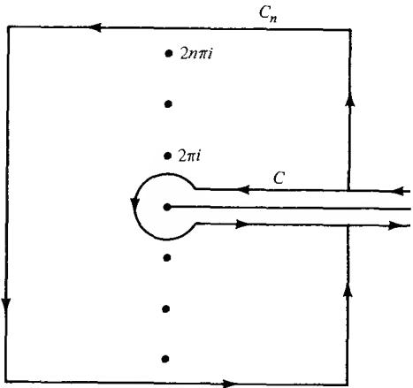

The integral is obviously convergent. By Cauchy's theorem its value does not depend on the shape of C as long as C does not enclose any multiples of $2\pi i$ . In particular, we are free to let r tend to zero. It is readily seen that the integral over the circle tends to zero with r. In the limit we are left with an integral back and forth along the positive real axis. On the upper edge $(-z)^{s-1} = x^{s-1}e^{-(s-1)\pi i}$ and on the lower edge $(-z)^{s-1} = x^{s-1}e^{(s-1)\pi i}$ . We obtain

$$
\begin{array}{r l} \int_ {c} \frac {(- z) ^ {s - 1}}{e ^ {z} - 1} d z & = - \int_ {0} ^ {\infty} \frac {x ^ {s - 1} e ^ {- (s - 1) \pi i}}{e ^ {x} - 1} d x + \int_ {0} ^ {\infty} \frac {x ^ {s - 1} e ^ {(s - 1) \pi i}}{e ^ {x} - 1} d x \\ & = 2 i \sin (s - 1) \pi \zeta (s) \Gamma (s). \end{array}
$$

Because $\sin (s - 1)\pi = -\sin s\pi$ and $\Gamma (s)\Gamma (1 - s) = \pi /\sin s\pi$ (Sec. 2.4, (30)), this implies (59).

The importance of the formula (59) lies in the fact that the right-hand side is defined and meromorphic for all values of s, so the formula can be used to extend $\zeta(s)$ to a meromorphic function in the whole plane. It is indeed quite obvious that the integral in (59) is an entire function of s, while $\Gamma(1 - s)$ is meromorphic with poles at $s = 1, 2, \ldots$ . Because $\zeta(s)$ is already known to be analytic for $\sigma > 1$ , the poles at the integers $n \geq 2$ must cancel against zeros of the integral. At s = 1, $-\Gamma(1 - s)$ has a simple pole with the residue 1, as seen for instance by Sec. 2.4, (29). On the other hand,

$$
\frac {1}{2 \pi i} \int_ {c} \frac {d z}{e ^ {z} - 1} = 1
$$

by residues, so $\zeta(s)$ has the residue 1. We formulate the result as a corollary.

Corollary. The $\zeta$ -function can be extended to a meromorphic function in the whole plane whose only pole is a simple pole at s = 1 with the residue 1.

The values $\zeta(-n)$ at the negative integers and zero can be evaluated explicitly. Recall the expansion (Sec. 1.3, Ex. 4)

$$
\frac {1}{e ^ {z} - 1} = \frac {1}{z} - \frac {1}{2} + \sum_ {1} ^ {\infty} (- 1) ^ {k - 1} \frac {B _ {k}}{(2 k) !} z ^ {2 k - 1}.\tag{60}
$$

From (59)

$$
\zeta (- n) = (- 1) ^ {n} \frac {n !}{2 \pi i} \int_ {C} \frac {z ^ {- n - 1}}{e ^ {z} - 1} d z.
$$

Hence $\zeta(-n)$ is equal to $(-1)^{n} n!$ times the coefficient of $z^{n}$ in (60), and we can read off the following values: $\zeta(0) = -1/2$ , $\zeta(-2m) = 0$ , and $\zeta(-2m + 1) = (-1)^{m}B_{m}/2m$ for positive integers m. The points -2m are called the trivial zeros of the $\zeta$ -function.

4.3. The Functional Equation. In the half plane $\sigma > 1$ the $\zeta$ -function is given explicitly by the series (55), and it is therefore subject to the estimate $|\zeta(s)| \leq \zeta(\sigma)$ . Riemann recognized that there is a rather simple relationship between $\zeta(s)$ and $\zeta(1 - s)$ . As a consequence, one has good control of the behavior of the $\zeta$ -function also in the half plane $\sigma < 0$ .

We shall reproduce one of the standard proofs of the functional equation, as it is commonly called.

Theorem 11.

$$
\zeta (s) = 2 ^ {s} \pi^ {s - 1} \sin \frac {\pi s}{2} \Gamma (1 - s) \zeta (1 - s).\tag{61}
$$

For the proof we make use of the path $C_{n}$ in Fig. 5-1; we assume that the square part lies on the lines $t = \pm(2n + 1)\pi$ and $\sigma = \pm(2n + 1)\pi$ . The cycle $C_{n} - C$ has winding number one about the points $\pm2m\pi i$ with $m = 1, \ldots, n$ . At these points the function $(-z)^{s-1}/(e^{z} - 1)$ has simple poles with residues $(\mp2m\pi i)^{s-1}$ . It follows that

$$
\begin{array}{r l} \frac {1}{2 \pi i} \int_ {C _ {n} - C} \frac {(- z) ^ {s - 1}}{e ^ {z} - 1} d z & = \sum_ {m = 1} ^ {n} [ (- 2 m \pi i) ^ {s - 1} + (2 m \pi i) ^ {s - 1} ] \\ & = 2 \sum_ {m = 1} ^ {n} (2 m \pi) ^ {s - 1} \sin \frac {\pi s}{2}. \end{array}\tag{62}
$$

We divide $C_n$ into $C_n' + C_n''$ where $C_n'$ is the part on the square and $C_n''$ the part outside the square. It is easy to see that $|e^z - 1|$ is bounded below on $C_n'$ by a fixed positive constant, independent of $n$ , while $|(-z)^{s-1}|$ is bounded by a multiple of $n^{\sigma-1}$ . The length of $C_n'$ is of the order of $n$ , and we find that

$$
\left| \int_ {c _ {n} ^ {\prime}} \frac {(- z) ^ {s - 1}}{e ^ {z} - 1} d z \right| \leq A n ^ {\sigma}
$$

for some constant $A$ . If $\sigma < 0$ , the integral over $C_n'$ will thus tend to zero as $n \to \infty$ , and the same is of course true of the integral over $C_n''$ . Therefore, the integral over $C_n - C$ will tend to the integral over $-C$ , and by Theorem 10 the left-hand side of (62) tends to $\zeta(s)/\Gamma(1 - s)$ .

Under the same condition on $\sigma$ the series $\sum_{1} m^{s-1}$ converges to $\zeta(1 - s)$ , and the limit of the right-hand side of (62) is a multiple of $\zeta(1 - s)$ . The equality of the limits leads directly to the equation (61), which is thereby proved for all s with $\sigma < 0$ . But two meromorphic functions which agree on a nonempty open set are identical. Hence (61) is true for all s.

There are equivalent forms of the functional equation. For instance, if we use the identity $\Gamma(s)\Gamma(1-s)=\pi/\sin\pi s$ (61) implies

$$
\zeta (1 - s) = 2 ^ {1 - s} \pi^ {- s} \cos \frac {\pi s}{2} \Gamma (s) \zeta (s).\tag{63}
$$

The content of Theorem 11 can also be expressed in the following form:

Corollary. The function

$$
\xi (s) = \frac {1}{2} s (1 - s) \pi^ {- s / 2} \Gamma (s / 2) \zeta (s)
$$

is entire and satisfies $\xi(s) = \xi(1 - s)$ .

It is evident that $\xi(s)$ is entire, for the factor 1 - s offsets the pole of $\zeta(s)$ , and the poles of $\Gamma(s/2)$ cancel against the trivial zeros of $\zeta(s)$ . By use of (63) the assertion $\xi(s) = \xi(1 - s)$ translates to

$$
\begin{array}{r l} \pi^ {- s / 2} \Gamma (s / 2) \zeta (s) & = \pi^ {(s - 1) / 2} \Gamma \left(\frac {1 - s}{2}\right) \zeta (1 - s) \\ & = 2 ^ {1 - s} \pi^ {- (s + 1) / 2} \Gamma (s) \Gamma \left(\frac {1 - s}{2}\right) \cos \frac {\pi s}{2}, \end{array}
$$

which is the same as

$$
\cos \frac {\pi s}{2} \Gamma (s) \Gamma \left(\frac {1 - s}{2}\right) = 2 ^ {s - 1} \pi^ {1 / 2} \Gamma \left(\frac {s}{2}\right).
$$

Because of the relation

$$
\Gamma \left(\frac {1 - s}{2}\right) \Gamma \left(\frac {1 + s}{2}\right) = \pi / \cos \frac {\pi s}{2}
$$

the last equation is equivalent to

$$
\pi^ {1 / 2} \Gamma (s) = 2 ^ {s - 1} \Gamma \left(\frac {s}{2}\right) \Gamma \left(\frac {1 + s}{2}\right),
$$

and this is nothing else than Legendre's duplication formula (Sec. 2.4, (32)). The corollary is proved.

What is the order of $\xi(s)?$ Because $\xi(s) = \xi(1 - s)$ it is sufficient to estimate $|\xi(s)|$ for $\sigma \geq \frac{1}{2}$ . It is an easy consequence of Stirling's formula (Sec. 2.5, (37)) that $\log |\Gamma(s/2)| \leq A |s| \log |s|$ for some constant $A$ and large $|s|$ , and this estimate is precise for real values of s. Therefore, if we can show that $|\zeta(s)|$ is relatively small when $\sigma \geq \frac{1}{2}$ , it will follow that the order is equal to 1.

We use the standard notation $[x]$ for the largest integer $\leq x$ . Assume first that $\sigma > 1$ . The reader will have no difficulty verifying the following computation:

$$
\begin{array}{r l} \int_ {N} ^ {\infty} [ x ] x ^ {- s - 1} d x & = \sum_ {N} ^ {\infty} n \int_ {n} ^ {n + 1} x ^ {- s - 1} d x = s ^ {- 1} \sum_ {N} ^ {\infty} n (n ^ {- s} - (n + 1) ^ {- s}) \\ & = s ^ {- 1} \left[ N ^ {- s + 1} + \sum_ {N + 1} ^ {\infty} n ^ {- s} \right]. \end{array}
$$

It follows that

$$
\zeta (s) = \sum_ {1} ^ {N} n ^ {- s} + \frac {1}{s - 1} N ^ {1 - s} - s \int_ {N} ^ {\infty} (x - [ x ]) x ^ {- s - 1} d x.\tag{64}
$$

So far this is proved for $\sigma > 1$ , but the integral on the right converges for $\sigma > 0$ , and the equality will therefore remain valid for $\sigma > 0$ ; incidentally, (64) exhibits the pole at $s = 1$ with residue 1.

If $\sigma \geq \frac{1}{2}$ (64) yields an estimate of the form

$$
| \zeta (s) | \leq N + A | N | ^ {- 1 / 2} | s |
$$

valid for large $|s|$ with A independent of s and N. By choosing N as the integer closest to $|s|^{2/3}$ , we find that $|\zeta(s)|$ is bounded by a constant times $|s|^{2/3}$ . Therefore this factor does not influence the order.

4.4. The Zeros of the Zeta Function. It follows from the product development (56) that $\zeta(s)$ has no zeros in the half plane $\sigma > 1$ . With this information the functional equation implies that the only zeros in the half plane $\sigma < 0$ are the trivial ones. In other words, all nontrivial zeros lie in the so-called critical strip $0 \leq \sigma \leq 1$ . The famous Riemann conjecture, which has neither been proved nor disproved, asserts that all nontrivial zeros lie on the critical line $\sigma = \frac{1}{2}$ . It is not too difficult to prove that there are no zeros on $\sigma = 1$ and $\sigma = 0$ . It is known that asymptotically more than one third of the zeros lie on the critical line. $^{\dagger}$

Let $N(T)$ be the number of zeros with $0 \leq t \leq T$ . For the information of the reader we state without proof that

$$
N (T) = \frac {T}{2 \pi} \log \frac {T}{2 \pi} - \frac {T}{2 \pi} + O (\log T).
$$

## 5. NORMAL FAMILIES

In Chap. 3, Sec. 1 we have already familiarized the reader with the idea of regarding a function as a point in a space. In principle there is thus no difference between a set of points and a set of functions. In order to make a clear distinction we shall nevertheless prefer to speak of families of functions, and usually we assume that all functions in a family are defined on the same set.

We are primarily interested in families of analytic functions, defined in a fixed region. Important examples are the families of bounded analytic functions, of functions which do not take the same value twice, etc. The aim is to study convergence properties within such families.

5.1. Equicontinuity. Although analytic functions are our main concern, it is expedient to choose a more general starting point. It turns out that our basic theorems are valid, and equally easy to prove, for families of functions with values in any metric space.

As a basic assumption we shall let F denote a family of functions f, defined in a fixed region $\Omega$ of the complex plane, and with values in a metric space S. As in Chap. 3, Sec. 1, the distance function in S will be denoted by d.

We are interested in the convergence of sequences $\{f_{n}\}$ formed by functions in F. There is no particular reason to expect a sequence $\{f_{n}\}$ to be convergent; on the contrary, it is perhaps more likely that we run into the opposite extreme of a sequence that does not possess a single convergent subsequence. In many situations the latter possibility is a serious disadvantage, and the purpose of the considerations that follow is to find conditions which rule out this kind of behavior.

Let us review the definition of continuity of a function f with values in a metric space. By definition, f is continuous at $z_{0}$ if to every $\varepsilon > 0$ there exists a $\delta > 0$ such that $d(f(z), f(z_{0})) < \varepsilon$ as soon as $|z - z_{0}| < \delta$ . We recall that f is said to be uniformly continuous if we can choose $\delta$ independent of $z_{0}$ . But in the case of a family of functions there is another relevant kind of uniformity, namely, whether we can choose $\delta$ independent of f. We choose to require both, and are thus led to the following definition:

Definition 1. The functions in a family $\mathfrak{F}$ are said to be equicontinuous on a set $E \subset \Omega$ if and only if, for each $\varepsilon > 0$ , there exists a $\delta > 0$ such that $d(f(z), f(z_0)) < \varepsilon$ whenever $|z - z_0| < \delta$ and $z_0, z \in E$ , simultaneously for all functions $f \in \mathfrak{F}$ .

Observe that, with this definition, each f in an equicontinuous family

is itself uniformly continuous on $E$ .

We return now to the question of convergent subsequences. Our second definition serves to characterize families with a regular behavior:

Definition 2. A family F is said to be normal in $\Omega$ if every sequence $\{f_{n}\}$ of functions $f_{n} \in F$ contains a subsequence which converges uniformly on every compact subset of $\Omega$ .

This definition does not require the limit functions of the convergent subsequences to be members of F.

5.2. Normality and Compactness. The reader cannot fail to have noticed the close similarity between normality and the Bolzano-Weierstrass property (Chap. 3, Theorem 7). To make it more than a similarity we need to define a distance on the space of functions on $\Omega$ with values in S, and convergence with respect to this distance function should mean precisely the same as uniform convergence on compact sets.

For this purpose we need, first of all, an exhaustion of $\Omega$ by an increasing sequence of compact sets $E_{k} \subset \Omega$ . By this we mean that every compact subset E of $\Omega$ shall be contained in an $E_{k}$ . The construction is possible in many ways: To be specific, let $E_{k}$ consist of all points in $\Omega$ at distance $\leq k$ from the origin, and at distance $\geq 1/k$ from the boundary $\partial\Omega$ . It is clear that each $E_{k}$ is bounded and closed, hence compact. Any compact set $E \subset \Omega$ is bounded and at positive distance from $\partial\Omega$ ; therefore it is contained in an $E_{k}$ .

Let f and g be any two functions on $\Omega$ with values in S. We shall define a distance $\rho(f,g)$ between these functions, not to be confused with the distances $d(f(z),g(z))$ between their values. To do so we first replace d by the distance function

$$
\delta (a, b) = \frac {d (a , b)}{1 + d (a , b)}
$$

which also satisfies the triangle inequality and has the advantage of being bounded (Chap. 3, Sec. 1.2, Ex. 1). Next, we set

$$
\delta_ {k} (f, g) = \sup _ {z \in E _ {k}} \delta (f (z), g (z))
$$

which may be described as the distance between $f$ and $g$ on $E_{k}$ . Finally, we agree on the definition

$$
\rho (f, g) = \sum_ {k = 1} ^ {\infty} \delta_ {k} (f, g) 2 ^ {- k}.\tag{65}
$$

It is trivial to verify that $\rho(f,g)$ is finite and satisfies all the conditions for a distance function (Chap. 3, Sec. 1.2).

The distance $\rho(f,g)$ has the property we were looking for. Suppose first that $f_{n}\to f$ in the sense of the $\rho$ -distance. For large n we have then $\rho(f_{n},f)<\varepsilon$ and consequently, by (65), $\delta_{k}(f_{n},f)<2^{k}\varepsilon$ . But this implies that $f_{n}\to f$ uniformly on $E_{k}$ , first with respect to the $\delta$ -metric, but hence also with respect to the d-metric. Since every compact E is contained in an $E_{k}$ it follows that the convergence is uniform on E.

Conversely, suppose that $f_{n}$ converges uniformly to f on every compact set. Then $\delta_{k}(f_{n},f)\to0$ for every k, and because the series $\Sigma\delta_{k}(f_{n},f)2^{-k}$ has a convergent majorant with terms independent of n it follows readily (as in Weierstrass's M test) that $\rho(f_{n},f)\to0$ .

We have shown that convergence with respect to the distance $\rho$ is equivalent to convergence on compact sets. So far we did not assume S to be complete, but if it is, it follows easily that the space of all functions with values in S is complete as a metric space with the distance $\rho$ .

It can be said with some justification that the metric we have introduced is arbitrary and artificial. However, from what we have proved it follows that the open sets are independent of the choices involved in the construction. In other words, the topology has an intrinsic meaning, tailored to the needs of the theory of analytic functions.

We now recall the Bolzano-Weierstrass theorem, according to which a metric space is compact if and only if every infinite sequence has a convergent subsequence (Chap. 3, Theorem 7). The theorem is applied to the set $\mathfrak{F}$ , equipped with the distance $\rho$ , and we conclude that $\mathfrak{F}$ is compact if and only if $\mathfrak{F}$ is normal, and if the limit functions are themselves in $\mathfrak{F}$ . On the other hand, if $\mathfrak{F}$ is normal, so is its closure $\mathfrak{F}^{-}$ . Therefore we obtain the following characterization of normal families:

Theorem 12. A family $\mathfrak{F}$ is normal if and only if its closure $\mathfrak{F}^{-}$ with respect to the distance function (65) is compact.

It is also customary to say that $\mathfrak{F}$ is relatively compact if $\mathfrak{F}^{-}$ is compact. Thus, normal and relatively compact families are the same.

We shall now relate the notion of normal families to total boundedness. If $\mathfrak{F}$ is normal, then $\mathfrak{F}^{-}$ is compact, and according to Chap. 3, Theorem 6, $\mathfrak{F}^{-}$ is totally bounded, and so is consequently $\mathfrak{F}$ (see the footnote on p. 61). By definition, this means that to every $\epsilon > 0$ there exist a finite number of functions $f_{1}, \ldots, f_{n} \in \mathfrak{F}$ such that every $f \in \mathfrak{F}$ satisfies $\rho(f, f_{j}) > \varepsilon$ for some $f_{j}$ . Conversely, if $\mathfrak{F}$ is totally bounded, so is $\mathfrak{F}^{-}$ . If $S$ is known to be complete, then $\mathfrak{F}^{-}$ is also complete, and hence compact. In other words, if $S$ is complete, then $\mathfrak{F}$ is normal if and only if it is totally bounded.

The following theorem serves to state the condition of total boundedness in terms of the original metric on S rather than in terms of the auxiliary metric $\rho$ .

Theorem 13. The family $\mathfrak{F}$ is totally bounded if and only if to every compact set $E \subset \Omega$ and every $\varepsilon > 0$ it is possible to find $f_1, \ldots, f_n \in \mathfrak{F}$ such that every $f \in \mathfrak{F}$ satisfies $d(f, f_j) < \varepsilon$ on $E$ for some $f_j$ .

If $\mathfrak{F}$ is totally bounded there exist $f_{1},\ldots ,f_{n}$ such that, for any $f\in \mathfrak{F}$ , $\rho (f,f_j) < \varepsilon$ for some $f_{j}$ . By (65) this implies $\delta_k(f,f_j) < 2^k\varepsilon$ , or $\delta (f,f_j) < 2^k\varepsilon$ on $E_{k}$ . If we fix $k$ beforehand, we can thus make $\delta (f,f_j)$ arbitrarily small on $E_{k}$ , and the same is then true of $d(f,f_j)$ . This proves that the condition is necessary.

To prove the sufficiency we choose $k_0$ so that $2^{-k_0} < \varepsilon / 2$ . By assumption we can find $f_1, \ldots, f_n$ such that any $f \in \mathfrak{F}$ satisfies one of the inequalities $\delta(f, f_j) \leq d(f, f_j) < \varepsilon / 2k_0$ on $E_{k_0}$ . It follows that $\delta_k(f, f_j) < \varepsilon / 2k_0$ for $k \leq k_0$ , while trivially $\delta_k(f, f_j) < 1$ for $k > k_0$ . From (65) we obtain

$$
\rho (f, f _ {j}) <   k _ {0} \left(\varepsilon / 2 k _ {0}\right) + 2 ^ {- k _ {0} - 1} + 2 ^ {- k _ {0} - 2} + \dots = \varepsilon / 2 + 2 ^ {- k _ {0}} <   \varepsilon ,
$$

which is precisely what we wanted to prove.

5.3. Arzela's Theorem. We shall now study the relationship between Definition 1 and Definition 2. The connection is established by a famous and extremely useful theorem known as Arzela's theorem (or the Arzela-Ascoli theorem).

Theorem 14. A family $\mathfrak{F}$ of continuous functions with values in a metric space $S$ is normal in the region $\Omega$ of the complex plane if and only if

(i) $\mathfrak{F}$ is equicontinuous on every compact set $E\subset \Omega$

(ii) for any $z \in \Omega$ the values $f(z), f \in \mathfrak{F}$ , lie in a compact subset of $S$ .

We give two proofs of the necessity of (i). Assume that $\mathfrak{F}$ is normal and determine $f_{1},\ldots ,f_{n}$ as in Theorem 13. Because each of these functions is uniformly continuous on $E$ we can find a $\delta >0$ such that $d(f_j(z),f_j(z_0)) < \varepsilon$ for $z,z_0\in E,\left|z - z_0\right| < \delta ,j = 1,\dots ,n.$ For any given $f\in \mathfrak{F}$ and corresponding $f_{j}$ we obtain

$$
d (f (z), f (z _ {0})) \leq d (f (z), f _ {j} (z)) + d (f _ {j} (z), f _ {j} (z _ {0})) + d (f _ {j} (z _ {0}), f (z _ {0})) <   3 \varepsilon
$$

and (i) is proved.

Less elegantly, but without use of Theorem 13, a proof can be given as follows: If $\mathfrak{F}$ fails to be equicontinuous on $E$ there exists an $\varepsilon > 0$ , sequences of points $z_n, z_n' \in E$ , and functions $f_n \in \mathfrak{F}$ such that $|z_n - z_n'| \to 0$ while $d(f_n(z_n), f_n(z_n')) \geq \varepsilon$ for all $n$ . Because $E$ is compact we can choose subsequences of $\{z_n\}$ and $\{z_n'\}$ which converge to a common limit $z'' \in E$ , and because $\mathfrak{F}$ is normal there exists a subsequence of $\{f_n\}$ which converges uniformly on $E$ . It is clear that we may choose all three subsequences to have the same subscripts $n_k$ . The limit function $f$ of $\{f_{n_k}\}$ is uniformly continuous on $E$ . Hence we can find $k$ such that the distances from $f_{n_k}(z_{n_k})$ to $f(z_{n_k})$ , from $f(z_{n_k})$ to $f(z_{n_k}')$ , and from $f(z_{n_k}')$ to $f_{n_k}(z_{n_k}')$ are all $< \varepsilon / 3$ . It follows that $d(f_{n_k}(z_{n_k}), f_{n_k}(z_{n_k}')') < \varepsilon$ , contrary to the assumption that $d(f_n(z_n), f_n(z_n')) \geq \varepsilon$ for all $n$ .

To prove the necessity of (ii) we show that the closure of the set formed by the values $f(z), f \in \mathfrak{F}$ , is compact. Let $\{w_n\}$ be a sequence in this closure. To each $w_n$ we determine $f_n \in \mathfrak{F}$ so that $d(f_n(z), w_n) < 1/n$ . By normality there exists a convergent subsequence $\{f_{n_k}(z)\}$ , and the sequence $\{w_{n_k}\}$ converges to the same value.

The sufficiency of (i) together with (ii) is proved by Cantor's famous diagonal process. We observe first that there exists an everywhere dense sequence of points $\zeta_{k}$ in $\Omega$ , for instance the points with rational coordinates. From the sequence $\{f_n\}$ we are going to extract a subsequence which converges at all points $\zeta_{k}$ . To find a subsequence which converges at one given point is always possible because of condition (ii). We can therefore find an array of subscripts

$$
\begin{array}{l} n _ {1 1} <   n _ {1 2} <   \dots <   n _ {1 j} <   \dots \\ n _ {2 1} <   n _ {2 2} <   \dots <   n _ {2 j} <   \dots \\ \dots \dots \\ n _ {k 1} <   n _ {k 2} <   \dots <   n _ {k j} <   \dots \\ \dots \dots \end{array}\tag{66}
$$

such that each row is contained in the preceding one, and such that $\lim_{j\to\infty}f_{n_{k}}(\zeta_{k})$ exists for all k. The diagonal sequence $\{n_{jj}\}$ is strictly increasing, and it is ultimately a subsequence of each row in (66). Hence $\{f_{n_{ij}}\}$ is a subsequence of $\{f_{n}\}$ which converges at all points $\zeta_{k}$ . For convenience we replace the notation $n_{jj}$ by $n_{j}$ .

Consider now a compact set $E \subset \Omega$ and assume that $\mathfrak{F}$ is equicontinuous on $E$ . We shall show that $\{f_{n_i}\}$ converges uniformly on $E$ . Given $\varepsilon > 0$ we choose $\delta > 0$ such that, for $z, z' \in E$ and $f \in \mathfrak{F}, |z - z'| < \delta$ implies $d(f(z), f(z')) < \varepsilon/3$ . Because $E$ is compact, it can be covered by a finite number of $\delta/2$ -neighborhoods. We select a point $\zeta_k$ from each of these neighborhoods. There exists an $i_0$ such that $i,j > i_0$ implies $d(f_{n_i}(\zeta_k), f_{n_j}(\zeta_k)) < \varepsilon/3$ for all these $\zeta_k$ . For each $z \in E$ one of the $\zeta_k$ is within distance $\delta$ from $z$ ; hence $d(f_{n_i}(z), f_{n_i}(\zeta_k)) < \varepsilon/3$ , $d(f_{n_j}(z), f_{n_j}(\zeta_k)) < \varepsilon/3$ . The three inequalities yield $d(f_{n_i}(z), f_{n_j}(z)) < \varepsilon$ . Because all values $f(z)$ belong to a compact and consequently complete subset of $S$ it follows that $\{f_{n_j}\}$ is uniformly convergent on $E$ .

5.4. Families of Analytic Functions. Analytic functions have their values in C, the finite complex plane. In order to apply the preceding considerations to families of analytic functions it is therefore natural to choose S = C with the usual euclidean distance.

The compact subsets of $\mathbf{C}$ are the bounded and closed sets. For this reason condition (ii) in Arzela's theorem is fulfilled if and only if the values $f(z)$ are bounded for each $z \in \Omega$ , with a bound that may depend on $z$ . Suppose now that condition (i) is also satisfied. For a given $z_0 \in \Omega$ determine $\rho$ so that the closed disk $|z - z_0| \leq \rho$ is contained in $\Omega$ . Then $\mathfrak{F}$ , the given family of functions, is equicontinuous on the closed disk. If in the definition of equicontinuity $\delta(<\rho)$ corresponds to $\varepsilon$ , and if $|f(z_0)| \leq M$ for all $f \in \mathfrak{F}$ , then $|f(z)| \leq M + \varepsilon$ in $|z - z_0| < \delta$ . Because any compact set can be covered by a finite number of neighborhoods with this property, it follows that the functions are uniformly bounded on every compact set, the bound depending on the set. According to Arzela's theorem this is true for all normal families of complex-valued functions.

For analytic functions this condition is also sufficient.

Theorem 15. A family F of analytic functions is normal with respect to C if and only if the functions in F are uniformly bounded on every compact set.

To prove the sufficiency we prove equicontinuity. Let C be the boundary of a closed disk in $\Omega$ , of radius r. If $z, z_{0}$ are inside C we obtain by Cauchy's integral theorem

$$
\begin{array}{r l} f (z) - f (z _ {0}) & = \frac {1}{2 \pi i} \int_ {C} \left(\frac {1}{\zeta - z} - \frac {1}{\zeta - z _ {0}}\right) f (\zeta) d \zeta \\ & = \frac {z - z _ {0}}{2 \pi i} \int_ {C} \frac {f (\zeta) d \zeta}{(\zeta - z) (\zeta - z _ {0})}. \end{array}
$$

If $|f| \leq M$ on $C$ , and if we restrict $z$ and $z_0$ to the smaller concentric disk of radius $r/2$ , it follows that

$$
\left| f (z) - f \left(z _ {0}\right) \right| \leq \frac {4 M \left| z - z _ {0} \right|}{r}.\tag{67}
$$

This proves equicontinuity on the smaller disk.

Let $E$ be a compact set in $\Omega$ . Each point of $E$ is the center of a disk with radius $r$ , as above. The open disks of radius $r/4$ form an open covering of $E$ . We select a finite subcovering and denote the corresponding centers, radii, and bounds by $\zeta_k$ , $r_k$ , $M_k$ ; let $r$ be the smallest of the $r_k$ and $M$ the largest of the $M_k$ . For a given $\varepsilon > 0$ let $\delta$ be the smaller of $r/4$ and $\varepsilon r/4M$ . If $|z - z_0| < \delta$ and $|z_0 - \zeta_k| < r_k/4$ it follows that $|z - \zeta_k| < \delta + r_k/4 \leq r_k/2$ . Hence (67) is applicable and we find $|f(z) - f(z_0)| \leq 4M_k\delta/r_k \leq 4M\delta/r \leq \varepsilon$ as desired.

In view of Theorem 15 we may abandon the term “normal with respect to C" which has no historic justification. If a family has the property of the theorem, we say instead that it is locally bounded. Indeed, if the family is bounded in a neighborhood of each point, then it is obviously bounded on every compact set. The theorem tells us that every sequence has a subsequence which converges uniformly on compact sets if and only if it is locally bounded.

An interesting feature is that local boundedness is inherited by the derivatives.

Theorem 16. A locally bounded family of analytic functions has locally bounded derivatives.

This follows at once by the Cauchy representation of the derivative. If C is the boundary of a closed disk in $\Omega$ , of radius r, then

$$
f ^ {\prime} (z) = \frac {1}{2 \pi i} \int_ {C} \frac {f (\zeta) d \zeta}{(\zeta - z) ^ {2}}.
$$

Hence $|f'(z)| \leq 4M/r$ in the concentric disk of radius r/2 (M is the bound of $|f|$ on C). We see that the $f'$ are indeed locally bounded.

What is true of the first derivatives is of course also true of higher derivatives.

5.5. The Classical Definition. If a sequence tends to $\infty$ there is no great scattering of values, and it may well be argued that for the purposes of normal families such a sequence should be regarded as convergent. This is the classical point of view, and we shall restyle our definition to conform with traditional usage.

Definition 3. A family of analytic functions in a region $\Omega$ is said to be normal if every sequence contains either a subsequence that converges uniformly on every compact set $E \subset \Omega$ , or a subsequence that tends uniformly to $\infty$ on every compact set.

We shall show that this definition agrees with Definition 2 if we take S to be the Riemann sphere. If that is what we do, then we can also allow $\infty$ as a possible value, which means that we may consider families of meromorphic functions. There is no need to rephrase the definition so that it covers normal families of meromorphic functions, for Definition 2 applies without change.

It is necessary, however, to prove a lemma which extends Weierstrass's and Hurwitz's theorems to meromorphic functions (Theorems 1 and 2).

Lemma. If a sequence of meromorphic functions converges in the sense of spherical distance, uniformly on every compact set, then the limit function is meromorphic or identically equal to $\infty$ .

If a sequence of analytic functions converges in the same sense, then the limit function is either analytic or identically equal to $\infty$ .

Suppose $f(z) = \lim_{n\to \infty}f_n(z)$ in the sense of the lemma. We know that $f(z)$ is continuous in the spherical metric. If $f(z_0)\neq \infty$ , then $f(z)$ is bounded in a neighborhood of $z_0$ , and for large $n$ the functions $f_{n}$ are $\neq \infty$ in the same neighborhood. It follows by the ordinary form of Weierstrass's theorem that $f(z)$ is analytic in a neighborhood of $z_0$ . If $f(z_0) = \infty$ we consider the reciprocal $1 / f(z)$ which is the limit of $1 / f_{n}(z)$ in the spherical sense. We conclude that $1 / f(z)$ is analytic near $z_0$ , and hence $f(z)$ is meromorphic. If the $f_{n}$ are analytic and the second case occurs, then $1 / f$ must be identically zero by virtue of Hurwitz's theorem, and $f$ is identically $\infty$ .

The lemma makes it clear that Definition 3 is nothing other than Definition 2 applied to the spherical metric.

It is not true that the derivatives of a normal family form a normal family. For instance, consider the family formed by the functions $f_{n}=n(z^{2}-n)$ in the whole plane. This family is normal, for it is clear that $f_{n}\to\infty$ uniformly on every compact set. Nevertheless, the derivatives $f_{n}^{\prime}=2nz$ do not form a normal family, for $f_{n}^{\prime}(z)$ tends to $\infty$ for $z\neq0$ and to 0 for z=0.

By Arzela's theorem a family of meromorphic functions is normal if and only if it is equicontinuous on compact sets, for condition (ii) is now trivially fulfilled. The equicontinuity can be replaced by a boundedness condition. We have indeed:

Theorem 17. A family of analytic or meromorphic functions $f$ is normal in the classical sense if and only if the expressions

$$
\rho (f) = \frac {2 | f ^ {\prime} (z) |}{1 + | f (z) | ^ {2}}\tag{58}
$$

are locally bounded.†

The geometric meaning of the quantity $\rho(f)$ is rather evident. Indeed, by use of the formula in Chap. 1, Sec. 2.4

$$
d (f (z _ {1}), f (z _ {2})) = \frac {2 | f (z _ {1}) - f (z _ {2}) |}{[ (1 + | f (z _ {1}) | ^ {2}) (1 + | f (z _ {2}) | ^ {2}) ] ^ {\frac {1}{2}}}
$$

† This theorem is due to F. Marty.

it is readily seen that f followed by stereographic projection maps an arc $\gamma$ on an image with length

$$
\int_ {\gamma} \rho (f (z)) | d z |.
$$

If $\rho(f) \leq M$ on the line segment between $z_1$ and $z_2$ we conclude that $d(f(z_1), f(z_2)) \leq M |z_1 - z_2|$ , and this immediately proves the equicontinuity when $\rho(f)$ is locally bounded.

To prove the necessity we remark first that $\rho(f) = \rho(1/f)$ as a simple calculation shows. Assume that the family $\mathfrak{F}$ of meromorphic functions is normal, but that the $\rho(f)$ fail to be bounded on a compact set $E$ . Consider a sequence of $f_n \in \mathfrak{F}$ such that the maximum of $\rho(f_n)$ on $E$ tends to $\infty$ . Let $f$ denote the limit function of a convergent subsequence $\{f_{n_k}\}$ . Around each point of $E$ we can find a small closed disk, contained in $\Omega$ , on which either $f$ or $1/f$ is analytic. If $f$ is analytic it is bounded on the closed disk, and it follows by the spherical convergence that $\{f_{n_k}\}$ has no poles in the disk as soon as $k$ is sufficiently large. We can then use Weierstrass's theorem (Theorem 1) to conclude that $\rho(f_{n_k}) \to \rho(f)$ , uniformly on a slightly smaller disk. Since $\rho(f)$ is continuous it follows that $\rho(f_{n_k})$ is bounded on the smaller disk. If $1/f$ is analytic the same proof applies to $\rho(1/f_{n_k})$ , which is the same as $\rho(f_{n_k})$ . In conclusion, since $E$ is compact it can be covered by a finite number of the smaller disks, and we find that the $\rho(f_{n_k})$ are bounded on $E$ , contrary to assumption. The contradiction completes the proof of the theorem.

## EXERCISES

1. Prove that in any region $\Omega$ the family of analytic functions with positive real part is normal. Under what added condition is it locally bounded? Hint: Consider the functions $e^{-f}$ .

2. Show that the functions $z^{n}$ , n a nonnegative integer, form a normal family in $|z| < 1$ , also in $|z| > 1$ , but not in any region that contains a point on the unit circle.

3. If $f(z)$ is analytic in the whole plane, show that the family formed by all functions $f(kz)$ with constant $k$ is normal in the annulus $r_1 < |z| < r_2$ if and only if $f$ is a polynomial.

4. If the family F of analytic (or meromorphic) functions is not normal in $\Omega$ , show that there exists a point $z_{0}$ such that F is not normal in any neighborhood of $z_{0}$ . Hint: A compactness argument.

# 6 CONFORMAL MAPPING. DIRICHLET'S PROBLEM

In the geometrically oriented part of the theory of analytic functions the problem of conformal mapping plays a dominating role. Existence and uniqueness theorems permit us to define important analytic functions without resorting to analytic expressions, and geometric properties of the regions that are being mapped lead to analytic properties of the mapping function.

The Riemann mapping theorem deals with the mapping of one simply connected region onto another. We shall give a proof that leans on the theory of normal families. To handle the more difficult case of multiply connected regions we shall have to solve the Dirichlet problem, which is the boundary-value problem for the Laplace equation.

## 1. THE RIEMANN MAPPING THEOREM

We shall prove that the unit disk can be mapped conformally onto any simply connected region in the plane, other than the plane itself. This will imply that any two such regions can be mapped conformally onto each other, for we can use the unit disk as an intermediary step. The theorem is applied to polygonal regions, and in this case an explicit form for the mapping function is derived.

1.1. Statement and Proof. Although the mapping theorem was formulated by Riemann, its first successful proof was due to

P. Koebe.† The proof we shall present is a shorter variant of the original proof.

Theorem 1. Given any simply connected region $\Omega$ which is not the whole plane, and a point $z_0 \in \Omega$ , there exists a unique analytic function $f(z)$ in $\Omega$ , normalized by the conditions $f(z_0) = 0$ , $f'(z_0) > 0$ , such that $f(z)$ defines a one-to-one mapping of $\Omega$ onto the disk $|w| < 1$ .

The uniqueness is easily proved, for if $f_1$ and $f_2$ are two such functions, then $f_1[f_{\overline{2}}^{-1}(w)]$ defines a one-to-one mapping of $|w| < 1$ onto itself. We know that such a mapping is given by a linear transformation $S$ (Chap. 4, Sec. 3.4, Ex. 5). The conditions $S(0) = 0$ , $S'(0) > 0$ imply $S(w) = w$ ; hence $f_1 = f_2$ .

An analytic function $g(z)$ in $\Omega$ is said to be univalent if $g(z_{1}) = g(z_{2})$ only for $z_{1} = z_{2}$ , in other words, if the mapping by g is one to one (the German word schlicht, which lacks an adequate translation, is also in common use). For the existence proof we consider the family F formed by all functions g with the following properties: (i) g is analytic and univalent in $\Omega$ , (ii) $|g(z)| \leq 1$ in $\Omega$ , (iii) $g(z_{0}) = 0$ and $g'(z_{0}) > 0$ . We contend that f is the function in F for which the derivative $f'(z_{0})$ is a maximum. The proof will consist of three parts: (1) it is shown that the family F is not empty; (2) there exists an f with maximal derivative; (3) this f has the desired properties.

To prove that $\mathfrak{F}$ is not empty we note that there exists, by assumption, a point $a \neq \infty$ not in $\Omega$ . Since $\Omega$ is simply connected, it is possible to define a single-valued branch of $\sqrt{z - a}$ in $\Omega$ ; denote it by $h(z)$ . This function does not take the same value twice, nor does it take opposite values. The image of $\Omega$ under the mapping $h$ covers a disk $|w - h(z_0)| < \rho$ , and therefore it does not meet the disk $|w + h(z_0)| < \rho$ . In other words, $|h(z) + h(z_0)| \geq \rho$ for $z \in \Omega$ , and in particular $2|h(z_0)| \geq \rho$ . It can now be verified that the function

$$
g _ {0} (z) = \frac {\rho}{4} \frac {| h ^ {\prime} (z _ {0}) |}{| h (z _ {0}) | ^ {2}} \cdot \frac {h (z _ {0})}{h ^ {\prime} (z _ {0})} \cdot \frac {h (z) - h (z _ {0})}{h (z) + h (z _ {0})}
$$

belongs to the family $\mathfrak{F}$ . Indeed, because it is obtained from the univalent function $h$ by means of a linear transformation, it is itself univalent. Moreover, $g_0(z_0) = 0$ and $g_0'(z_0) = (\rho / 8)|h'(z_0)| / |h(z_0)|^2 > 0$ . Finally, the estimate

$$
\left| \frac {h (z) - h \left(z _ {0}\right)}{h (z) + h \left(z _ {0}\right)} \right| = | h \left(z _ {0}\right) | \cdot \left| \frac {1}{h \left(z _ {0}\right)} - \frac {2}{h (z) + h \left(z _ {0}\right)} \right| \leqslant \frac {4 | h \left(z _ {0}\right) |}{\rho}
$$

shows that $|g_0(z)| \leq 1$ in $\Omega$ .

† A related theorem from which the mapping theorem can be derived had been proved earlier by W. F. Osgood, but did not attract the attention it deserves.

The derivatives $g'(z_0), g \in \mathfrak{F}$ , have a least upper bound $B$ which a priori could be infinite. There is a sequence of functions $g_n \in \mathfrak{F}$ such that $g_n'(z_0) \to B$ . By Chap. 5, Theorem 12 the family $\mathfrak{F}$ is normal. Hence there exists a subsequence $\{g_{n_k}\}$ which tends to an analytic limit function $f$ , uniformly on compact sets. It is clear that $|f(z)| \leq 1$ in $\Omega, f(z_0) = 0$ and $f'(z_0) = B$ (this proves that $B < +\infty$ ). If we can show that $f$ is univalent, it will follow that $f$ is in $\mathfrak{F}$ and has a maximal derivative at $z_0$ .

In the first place $f$ is not a constant, for $f'(z_0) = B > 0$ . Choose a point $z_1 \in \Omega$ , and consider the functions $g_1(z) = g(z) - g(z_1)$ , $g \in \mathfrak{F}$ . They are all $\neq 0$ in the region obtained by omitting $z_1$ from $\Omega$ . By Hurwitz's theorem (Chap. 5, Theorem 2) every limit function is either identically zero or never zero. But $f(z) - f(z_1)$ is a limit function, and it is not identically zero. Hence $f(z) \neq f(z_1)$ for $z \neq z_1$ , and since $z_1$ was arbitrary we have proved that $f$ is univalent.

It remains to show that f takes every value w with $|w| < 1$ . Suppose it were true that $f(z) \neq w_{0}$ for some $w_{0}, |w_{0}| < 1$ . Then, since $\Omega$ is simply connected, it is possible to define a single-valued branch of

$$
F (z) = \sqrt {\frac {f (z) - w _ {0}}{1 - \bar {w} _ {0} f (z)}}\tag{1}
$$

(Recall that all closed curves in a simply connected region are homologous to 0. If $\varphi(z) \neq 0$ in $\Omega$ we can define $\log \varphi(z)$ by integration of $\varphi'(z)/\varphi(z)$ , and $\sqrt{\varphi(z)} = \exp\left(\frac{1}{2} \log \varphi(z)\right)$ .)

It is clear that $F$ is univalent and that $|F| \leq 1$ . To normalize it we form

$$
G (z) = \frac {\left| F ^ {\prime} (z _ {0}) \right|}{F ^ {\prime} (z _ {0})} \cdot \frac {F (z) - F (z _ {0})}{1 - \overline {{{F (z _ {0})}}} F (z)}\tag{2}
$$

which vanishes and has a positive derivative at $z_{0}$ . For its value we find, after brief computation,

$$
G ^ {\prime} (z _ {0}) = \frac {| F ^ {\prime} (z _ {0}) |}{1 - | F (z _ {0}) | ^ {2}} = \frac {1 + | w _ {0} |}{2 \sqrt {| w _ {0} |}} B > B.
$$

This is a contradiction, and we conclude that $f(z)$ assumes all values $w$ , $|w| < 1$ . The proof is now complete.

At first glance it may seem like pure luck that our computation yields $G'(z_{0}) > f'(z_{0})$ . This is not quite so, for the formulas (1) and (2) permit us to express $f(z)$ as a single-valued analytic function of $W = G(z)$ which maps $|W| < 1$ into itself. The inequality $|f'(z_{0})| < |G'(z_{0})|$ is therefore a consequence of Schwarz's lemma.

The purely topological content of Theorem 1 is important by itself. We know now that any simply connected region can be mapped topologically onto a disk (for the whole plane a very simple mapping can be constructed), and hence any two simply connected regions are topologically equivalent.

## EXERCISES

1. If $z_{0}$ is real and $\Omega$ is symmetric with respect to the real axis, prove by the uniqueness that f satisfies the symmetry relation $f(\bar{z}) = \overline{f(\bar{z})}$ .

2. What is the corresponding conclusion if $\Omega$ is symmetric with respect to the point $z_0$ ?

1.2. Boundary Behavior. We are assuming that $f(z)$ defines a conformal mapping of a region $\Omega$ onto another region $\Omega'$ . What happens when z approaches the boundary? There are cases where the boundary behavior can be foretold with great precision. For instance, if $\Omega$ and $\Omega'$ are Jordan regions, then f can be extended to a topological mapping of the closure of $\Omega$ onto the closure of $\Omega'$ . Unfortunately, considerations of space do not permit us to include a proof of this important theorem (the proof would require a considerable amount of preparation).

What we can and shall prove is a very modest theorem of purely topological content. Let us first make it clear what we mean when we say that $z$ approaches the boundary of $\Omega$ . There are two cases: we may consider a sequence $\{z_n\}$ of points in $\Omega$ , or we may consider an arc $z(t)$ , $0 \leq t < 1$ , such that all $z(t)$ are in $\Omega$ . We shall say that the sequence or the arc tends to the boundary if the points $z_n$ or $z(t)$ will ultimately stay away from any point in $\Omega$ . In other words, if $z \in \Omega$ there shall exist an $\varepsilon > 0$ and an $n_0$ or a $t_0$ such that $|z_n - z| \geq \varepsilon$ for $n > n_0$ , or such that $|z(t) - z| \geq \varepsilon$ for all $t > t_0$ .

In this situation, the disks of center z and radius $\varepsilon$ (which may depend on z) form an open covering of $\Omega$ . It follows that any compact subset $K \subset \Omega$ is covered by a finite number of these disks. If we consider the largest of the corresponding $n_{0}$ or $t_{0}$ we find that $z_{n}$ or $z(t)$ cannot belong to K for $n > n_{0}$ or $t > t_{0}$ . Colloquially speaking, for any compact set $K \subset \Omega$ there exists a tail end of the sequence or of the arc which does not meet K. Conversely, this implies the original condition, for if $z \in \Omega$ is given we may choose K to be a closed disk with center z that is contained in $\Omega$ . If the radius of the disk is $\rho$ the original statement holds for any $\varepsilon < \rho$ .

After these preliminary considerations the theorem we shall prove is almost trivial:

† It is known, although not so easy to prove, that a Jordan curve (Chap. 3 Sec. 2.1) divides the plane into exactly two regions, one bounded and one unbounded. The bounded region is called a Jordan region.

Theorem 2. Let $f$ be a topological mapping of a region $\Omega$ onto a region $\Omega'$ . If $\{z_n\}$ or $z(t)$ tends to the boundary of $\Omega$ , then $\{f(z_n)\}$ or $f(z(t))$ tends to the boundary of $\Omega'$ .

Indeed, let $K$ be a compact set in $\Omega'$ . Then $f^{-1}(K)$ is a compact set in $\Omega$ , and there exists $n_0$ (or $t_0$ ) such that $z_n$ (or $z(t)$ ) is not in $f^{-1}(K)$ for $n > n_0$ (or $t > t_0$ ). But then $f(z_n)$ [or $f(z(t))$ ] is not in $K$ .

Although the theorem is topological, it is the application to conformal mappings that is of greatest interest to us.

1.3. Use of the Reflection Principle. Stronger statements become possible if we have more information. We are mainly interested in simply connected regions and may therefore assume that one of the regions is a disk. With the same notation as in Sec. 1.1, let $f(z)$ define a conformal mapping of the region $\Omega$ onto the unit disk with the normalization $f(z_0) = 0$ (the normalization by the derivative is irrelevant). We shall derive additional information by use of the reflection principle (Chap. 4, Theorem 26).

Let us assume that the boundary of $\Omega$ contains a segment $\gamma$ of a straight line. Because rotations are unimportant we may as well suppose that $\gamma$ lies on the real axis; let it be the interval a < x < b. The assumption involves a significant simplification only if the rest of the boundary stays away from $\gamma$ . For this reason we shall strengthen the hypothesis and require that every point of $\gamma$ has a neighborhood whose intersection with the whole boundary $\partial\Omega$ is the same as its intersection with $\gamma$ . We say then that $\gamma$ is a free boundary arc.

By this assumption every point on $\gamma$ is the center of a disk whose intersection with $\partial\Omega$ is its real diameter. It is clear that each of the half disks determined by this diameter is entirely in or entirely outside of $\Omega$ , and at least one must be inside. If only one is inside we call the point a one-sided boundary point, and if both are inside it is a two-sided boundary point. Because $\gamma$ is connected all its points will be of the same kind, and we speak of a one-sided or a two-sided boundary arc.

Theorem 3. Suppose that the boundary of a simply connected region $\Omega$ contains a line segment $\gamma$ as a one-sided free boundary arc. Then the function $f(z)$ which maps $\Omega$ onto the unit disk can be extended to a function which is analytic and one to one on $\Omega \cup \gamma$ . The image of $\gamma$ is an arc $\gamma'$ on the unit circle.

For two-sided arcs the same will be true with obvious modifications.

For the proof we consider a disk around $x_0 \in \gamma$ which is so small that the half disk in $\Omega$ does not contain the point $z_0$ with $f(z_0) = 0$ . Then log $f(z)$ has a single-valued branch in the half disk, and its real part tends to 0 as z approaches the diameter, for we know by Theorem 2 that $|f(z)|$ tends to 1. It follows by the reflection principle that $\log f(z)$ has an analytic extension to the whole disk. Therefore $\log f(z)$ , and consequently $f(z)$ , is analytic at $x_{0}$ . The extensions to overlapping disks must coincide and define a function which is analytic on $\Omega \cup \gamma$ .

We note further that $f'(z) \neq 0$ on $\gamma$ . Indeed, $f'(x_0) = 0$ would imply that $f(x_0)$ were a multiple value, in which case the two subarcs of $\gamma$ that meet at $x_0$ would be mapped on arcs that form an angle $\pi / n$ with $n \geq 2$ ; this is clearly impossible. If, for instance, the upper half disks are in $\Omega$ , then

$$
\partial \log | f | / \partial y = - \partial \arg f / \partial x <   0
$$

on $\gamma$ , and $\arg f$ moves constantly in the same direction. This proves that the mapping is one to one on $\gamma$ .

The theorem can be generalized to regions with free boundary arcs on a circle. With obvious modifications the theorem is also true for two-sided boundary arcs.

1.4. Analytic Arcs. A real or complex function $\varphi(t)$ of a real variable $t$ , defined on an interval $a < t < b$ , is said to be real analytic (or analytic in the real sense) if, for every $t_0$ in the interval, the Taylor development $\varphi(t) = \varphi(t_0) + \varphi'(t_0)(t - t_0) + \frac{1}{2}\varphi'(t_0)(t - t_0)^2 + \cdots$ converges in some interval $(t_0 - \rho, t_0 + \rho)$ , $\rho > 0$ . But if this is so we know by Abel's theorem that the series is also convergent for complex values of $t$ , as long as $|t - t_0| < \rho$ , and that it represents an analytic function in that disk. In overlapping disks the functions are the same, for they coincide on a segment of the real axis. We conclude that $\varphi(t)$ can be defined as an analytic function in a region $\Delta$ , symmetric to the real axis, which contains the segment $(a,b)$ .

In these circumstances we say that $\varphi(t)$ determines an analytic arc. It is regular if $\varphi'(t) \neq 0$ , and it is a simple arc if $\varphi(t_1) = \varphi(t_2)$ only when $t_1 = t_2$ .

We shall assume that the boundary of $\Omega$ contains a regular, simple, analytic arc $\gamma$ , and that it is a free one-sided arc. The definition could be modeled on the previous one, but to avoid long explanations we shall assume offhand that there exists a region $\Delta$ , symmetric to the interval $(a,b)$ , with the property that $\varphi(t) \in \Omega$ when t lies in the upper half of $\Delta$ , and that $\varphi(t)$ lies outside $\Omega$ for t in the lower half.

If $f(z)$ is the mapping function with $f(z_0) = 0$ , and if we take care that $\varphi(t) \neq z_0$ in $\Delta$ , then the reflection principle tells us that $\log f(\varphi(t))$ , and hence $f(\varphi(t))$ , has an analytic extension from the upper to the lower half of $\Delta$ . For a real $t_0 \in (a, b)$ we know further that $\varphi'(t_0) \neq 0$ . Therefore $\varphi$ has an analytic inverse $\varphi^{-1}$ in a neighborhood of $\varphi(t_0)$ , and it follows by composition that $f(z)$ is analytic in that neighborhood.

Theorem 4. If the boundary of $\Omega$ contains a free one-sided analytic arc $\gamma$ , then the mapping function has an analytic extension to $\Omega \cup \gamma$ , and $\gamma$ is mapped on an arc of the unit circle.

We trust the reader to make the last statement more precise and to complete the proof.

## 2. CONFORMAL MAPPING OF POLYGONS

When $\Omega$ is a polygon, the mapping problem has an almost explicit solution. Indeed, we shall find that the mapping function can be expressed through a formula in which only certain parameters have values that depend on the specific shape of the polygon.

2.1. The Behavior at an Angle. We assume that $\Omega$ is a bounded simply connected region whose boundary is a closed polygonal line without self-intersections. Let the consecutive vertices be $z_{1},\ldots ,z_{n}$ in positive cyclic order (we set $z_{n + 1} = z_1$ ). The angle at $z_{k}$ is given by the value of $\arg (z_{k - 1} - z_k) / (z_{k + 1} - z_k)$ between 0 and $2\pi$ . We shall denote it by $\alpha_{k}\pi,0 < \alpha_{k} < 2$ . It is also convenient to introduce the outer angles $\beta_{k}\pi = (1 - \alpha_{k})\pi, - 1 < \beta_{k} < 1$ . Observe that $\beta_{1} + \dots +\beta_{n} = 2$ . The polygon is convex if and only if all $\beta_{k} > 0$ .

We know by Theorem 3 that the mapping function $f(z)$ can be extended by continuity to any side of the polygon (that is, to the open line segment between two consecutive vertices), and that each side is mapped in a one-to-one way onto an arc of the unit circle. We wish to show that these arcs are disjoint and leave no gap between them.

To see this we consider a circular sector $S_{k}$ which is the intersection of $\Omega$ with a sufficiently small disk about $z_{k}$ . A single-valued branch of $\zeta = (z - z_k)^{1 / \alpha_k}$ maps $S_{k}$ onto a half disk $S_{k}'$ . A suitable branch of $z_{k} + \zeta^{\alpha_{k}}$ has its values in $\Omega$ , and we may consider the function $g(\zeta) = f(z_{k} + \zeta^{\alpha_{k}})$ in $S_{k}'$ . It follows by Theorem 2 that $|g(\zeta)| \to 1$ as $\zeta$ approaches the diameter. The reflection principle applies, and we conclude that $g(\zeta)$ has an analytic continuation to the whole disk. In particular, this implies that $f(z)$ has a limit $w_{k} = e^{i\theta_{k}}$ as $z \to z_{k}$ , and we find that the arcs that correspond to the sides meeting at $z_{k}$ do indeed have a common end point. Since $\arg f(z)$ must increase as $z$ traces the boundary in positive direction, the arcs do not overlap, at least not in a neighborhood of $w_{k}$ . If we take into account that $f$ maps the boundary on a curve with winding number 1 about the origin, it can easily be concluded that all the arcs are mutually disjoint. In other words, f can be extended to a homeomorphic map of $\Omega^{-}$ onto the closed unit disk, the vertices $z_{k}$ go into points $w_{k}$ , and the sides correspond to the arcs between these points (Fig. 6-1).

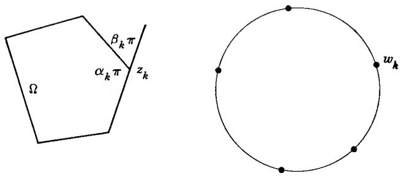  
FIG. 6-1. Conformal mapping of a polygon.

2.2. The Schwarz-Christoffel Formula. The formula we are looking for refers not to the function $f$ , but to its inverse function, which we shall denote by $F$ .

Theorem 5. The functions $z = F(w)$ which map $|w| < 1$ conformally onto polygons with angles $\alpha_{k\pi}(k = 1, \ldots, n)$ are of the form

$$
F (w) = C \int_ {0} ^ {w} \prod_ {k = 1} ^ {n} (w - w _ {k}) ^ {- \beta_ {k}} d w + C ^ {\prime}\tag{3}
$$

where $\beta_{k} = 1 - \alpha_{k}$ , the $w_{k}$ are points on the unit circle, and $C$ , $C'$ are complex constants.

Because the function $g(\zeta) = f(z_k + \zeta^{\alpha_k})$ considered in the last paragraph of 2.1 is analytic at the origin, it has a Taylor development

$$
f (z _ {k} + \zeta^ {\alpha_ {k}}) = w _ {k} + \sum_ {m = 1} ^ {\infty} a _ {m} \zeta^ {m}.
$$

Here $a_1 \neq 0$ , for otherwise the image of the half disk $S_k'$ could not be contained in the unit disk. Therefore the series can be inverted, and on setting $w = f(z_k + \zeta^{\alpha_k})$ we obtain

$$
\zeta = \sum_ {m = 1} ^ {\infty} b _ {m} (w - w _ {k}) ^ {m}
$$

with $b_{1} \neq 0$ , the development being valid in a neighborhood of $w_{k}$ . We raise to the power $\alpha_{k}$ and find, in terms of the inverse function F,

$$
F (w) - z _ {k} = (w - w _ {k}) ^ {\alpha_ {k}} G _ {k} (w)
$$

where $G_{k}$ is analytic and $\neq0$ near $w_{k}$ . It follows by differentiation that $F'(w)(w-w_{k})^{\beta_{k}}$ is analytic and $\neq0$ at $w_{k}$ , and therefore the product

$$
H (w) = F ^ {\prime} (w) \prod_ {k = 1} ^ {n} (w - w _ {k}) ^ {\beta_ {k}}\tag{4}
$$

is analytic and $\neq0$ in the closed unit disk.

We claim that $H(w)$ is, in actual fact, a constant. For this purpose we examine its argument when $w = e^{i\theta}$ lies on the unit circle between $w_k = e^{i\theta_k}$ and $w_{k+1} = e^{i\theta_{k+1}}$ . We know that $\arg F'(e^{i\theta})$ equals the angle between the tangent to the unit circle at $e^{i\theta}$ and the tangent to its image at $F(e^{i\theta})$ ; with an abbreviated notation we express this by $\arg F' = \arg dF - \arg dw$ . But $\arg dF$ is constant because $F$ describes a straight line, and $\arg dw = \theta + \pi/2$ . The factor $w - w_k$ can be written $e^{i\theta} - e^{i\theta_k} = 2ie^{i(\theta + \theta_k)/2} \sin \frac{1}{2} (\theta - \theta_k)$ , and hence its argument is $\theta/2$ plus a constant (this is also evident geometrically). When we add the arguments of all factors on the right-hand side of (4) we find that $\arg H(w)$ differs by a constant from $-\theta + \left( \sum_{1}^{n} \beta_k \right) \cdot \theta/2 = 0$ . Thus we conclude that $\arg H(w)$ is constant between $w_k$ and $w_{k+1}$ , and since it is continuous it must be constant on the whole unit circle. The maximum principle permits us to conclude that $\arg H(w) = \operatorname{Im} \log H(w)$ is constant inside the unit circle, and so is consequently $H(w)$ .

We have now proved that

$$
F ^ {\prime} (w) = C \prod_ {k = 1} ^ {n} (w - w _ {k}) ^ {- \beta_ {k}},
$$

and formula (3) follows by integration.

We remark that a linear transformation of the unit circle permits us to place three of the points $w_{k}$ , for instance, $w_{1}$ , $w_{2}$ , $w_{3}$ , in prescribed positions. For n = 3 we see that the mapping function depends only on the angles, except for trivial variable transformations; this reflects the fact that triangles with the same angles are similar. For n > 3 the remaining constants $w_{4}$ , $\ldots$ , $w_{n}$ , or their arguments $\theta_{k}$ , are called the accessory parameters of the problem. It is only in rare cases that they can be determined other than by numerical computation.

If we give arbitrary values to the $\theta_{k}$ it is quite easy to verify that a function of the form (3) maps the unit circle on a closed polygonal line, but usually we are unable to tell whether it will intersect itself or not. If it does not, it is not difficult to show that $F(w)$ , as given by (3), yields a one-to-one mapping onto the inside of the polygonal line (the precise proof makes use of the argument principle).

Formula (3) is known as the Schwarz-Christoffel formula. Another version of the same formula serves to map the upper half plane onto the inside of a polygon. The mapping function, from $\operatorname{Im} w > 0$ to $\Omega$ , can now be written in the form

$$
F (w) = C \int_ {0} ^ {w} \prod_ {k = 1} ^ {n - 1} (w - \xi_ {k}) ^ {- \beta_ {k}} d w + C ^ {\prime}\tag{5}
$$

where the $\xi_{k}$ are real. The last exponent $\beta_{n}$ does not appear explicitly in the formula, but it is determined by $\beta_{n}=2-(\beta_{1}+\cdots+\beta_{n-1})$ , and like the other exponents it is subject to the condition $-1<\beta_{n}<1$ . It then follows that the integral (5) converges for $w=\infty$ , and the point at $\infty$ will correspond to a vertex with angle $\alpha_{n}\pi$ , $\alpha_{n}=1-\beta_{n}$ . If $\beta_{n}=0$ the vertex is only apparent, and the polygon reduces to one with n-1 sides.

## EXERCISES

1. Show that the $\beta_{k}$ in (3) may be allowed to become $= -1$ . What is the geometric interpretation?

2. If a vertex of the polygon is allowed to be at $\infty$ , what modification does the formula undergo? If in this context $\beta_{k}=1$ , what is the polygon like?

3. Show that the mappings of a disk onto a parallel strip, or onto a half strip with two right angles, can be obtained as special cases of the Schwarz-Christoffel formula.

4. Derive formula (5), either directly or with the help of (3).

5. Show that

$$
F (w) = \int_ {0} ^ {w} (1 - w ^ {n}) ^ {- 2 / n} d w
$$

maps $|w| < 1$ onto the interior of a regular polygon with $n$ sides.

6. Determine a conformal mapping of the upper half plane on the region $\Omega = \{z = x + iy; x > 0, y > 0, \min(x, y) < 1\}$ .

2.3. Mapping on a Rectangle. In case $\Omega$ is a rectangle we may choose $x_{1} = 0$ , $x_{2} = 1$ , $x_{3} = \rho > 1$ in (5). The mapping function will thus be given by

$$
F (w) = \int_ {0} ^ {w} \frac {d w}{\sqrt {w (w - 1) (w - \rho)}}
$$

which is an elliptic integral. To be unambiguous we decide that the values of $\sqrt{w}$ , $\sqrt{w-1}$ , and $\sqrt{w-\rho}$ shall lie in the first quadrant. For a detailed study of the mapping, let us follow $F(w)$ as w traces the real axis. When w is real, each of the square roots is either positive or purely imaginary with a positive imaginary part (save for the point where the square root is 0). As 0 < w < 1 there are one real and two imaginary square roots. Therefore $F(w)$ decreases from 0 to a value -K where

$$
K = \int_ {0} ^ {1} \frac {d t}{\sqrt {t (1 - t) (\rho - t)}}.\tag{6}
$$

For $1 < w < \rho$ there is only one imaginary square root. It follows that the integral from 1 to w is purely imaginary with a negative imaginary part. Hence $F(w)$ will follow a vertical segment from -K to -K - iK',

$$
K ^ {\prime} = \int_ {1} ^ {\rho} \frac {d t}{\sqrt {t (t - 1) (\rho - t)}}.
$$

For $w > \rho$ the integrand is positive, and $F(w)$ will trace a horizontal segment in the positive direction. How far does it extend? Since the image is to be a rectangle, it must end at the point $-iK'$ , but we prefer a direct verification. One way is to express the length of the segment by the integral

$$
\int_ {\rho} ^ {\infty} \frac {d t}{\sqrt {t (t - 1) (t - \rho)}}
$$

and to show by the change of integration variable $t = (\rho - u)/(1 - u)$ that the integral transforms to (6). It is easier, however, to observe that Cauchy's theorem yields

$$
\int_ {- \infty} ^ {\infty} \frac {d t}{\sqrt {t (t - 1) (t - \rho)}} = 0,
$$

for the integral over a semicircle with radius R tends to 0 as $R \to \infty$ . The vanishing of the real part implies the equality of the horizontal segments, and from the vanishing of the imaginary part we deduce that $-\infty < w < 0$ is mapped on the segment from $-iK'$ to 0. The rectangle is completed.

It is often preferable to use a formula which reflects the double symmetry of the rectangle. The vertices can be made to correspond to points $\pm1$ and $\pm1/k$ with 0 < k < 1. Since a constant factor does not matter we can choose the mapping to be given by

$$
F (w) = \int_ {0} ^ {w} \frac {d w}{\sqrt {(1 - w ^ {2}) (1 - k ^ {2} w ^ {2})}},\tag{7}
$$

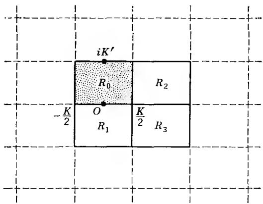  
FIG. 6-2

and this time we agree that $\sqrt{1-w^{2}}$ and $\sqrt{1-k^{2}w^{2}}$ shall have positive real parts. It is seen that the rectangle will have vertices at $-\frac{K}{2}$ , $\frac{K}{2}$ , $\frac{K}{2} + iK'$ , $-\frac{K}{2} + iK'$ where

$$
\begin{array}{l} K = \int_ {- 1} ^ {1} \frac {d t}{\sqrt {(1 - t ^ {2}) (1 - k ^ {2} t ^ {2})}} \\ K ^ {\prime} = \int_ {1} ^ {1 / k} \frac {d t}{\sqrt {(t ^ {2} - 1) (1 - k ^ {2} t ^ {2})}}. \end{array}
$$

The image of the upper half plane is the shaded rectangle $R_{0}$ in Fig. 6-2. We denote the inverse function of F by $w = f(z)$ ; it is defined in $R_{0}$ and can be extended by continuity to a one-to-one mapping of the closed rectangle onto the closed half plane (with the topology of the Riemann sphere). Observe that $z = iK'$ corresponds to $\infty$ .

The reflection principle allows us to extend the definition of $f$ to the adjacent rectangles $R_1$ and $R_2$ , namely by setting $f(z) = \overline{f(\bar{z})}$ for $z \in R_1$ and $f(z) = \overline{f(K - \bar{z})}$ for $z \in R_2$ . Similarly we can pass to $R_3$ either from $R_1$ or $R_2$ ; the extension is given by $f(z) = f(K - z)$ . The process of reflection can obviously be continued until $f(z)$ is defined as a meromorphic function in the whole plane. It is perhaps even more convenient to define the extension by periodicity, for we find that the extended function must satisfy $f(z + 2K) = f(z)$ , $f(z + 2iK') = f(z)$ .

We have shown that the inverse function of the elliptic integral (7) is a meromorphic function with periods 2K and 2iK'. Such functions are known as elliptic functions. The connection between elliptic integrals and elliptic functions was discovered, but not published, by Gauss; it was rediscovered by Abel and Jacobi.

## EXERCISES

1. Prove that formula (7) gives $F(\infty) = iK'$ .

2. Show that $K = K'$ if and only if $k = (\sqrt{2} - 1)^2$ .

3. Show that $f(z), f(z + K)$ , and $f(z + iK')$ are odd functions of $z$ while $f(z + K / 2)$ and $f(z + K / 2 + iK')$ are even.

2.4. The Triangle Functions of Schwarz. The upper half plane is mapped on a triangle with angles $\alpha_{1}\pi$ , $\alpha_{2}\pi$ , $\alpha_{3}\pi$ by

$$
F (w) = \int_ {0} ^ {w} w ^ {\alpha_ {1} - 1} (w - 1) ^ {\alpha_ {2} - 1} d w.
$$

There are no accessory parameters, as we have already noted.

The inverse function $f(z)$ can again be extended to neighboring triangles by reflection over the sides. This process is particularly interesting when it leads, as in the case of a rectangle, to a meromorphic function. In order that this be so it is necessary that repeated reflections across sides with a common end point should ultimately lead back to the original triangle in an even number of steps. In other words, the angles must be of the form $\pi/n_{1}, \pi/n_{2}, \pi/n_{3}$ with integral denominators. Elementary reasoning shows that the condition

$$
\frac {1}{n _ {1}} + \frac {1}{n _ {2}} + \frac {1}{n _ {3}} = 1
$$

is fulfilled only by the triples $(3,3,3)$ , $(2,4,4)$ , and $(2,3,6)$ . They correspond to an equilateral triangle, an isosceles right triangle, and half an equilateral triangle.

In each case it is easy to verify that the reflected images of the triangle fill out the plane, without overlapping and without gaps. This shows that the mapping functions are indeed restrictions of meromorphic functions, known as the Schwarz triangle functions.

The reader is urged to draw a picture of the triangle net in each of the three cases. He will then observe that each triangle function has a pair of periods with nonreal ratio, and is thus an elliptic function. As an exercise, the reader should determine how many triangles there are in a parallelogram spanned by the periods.

## 3. A CLOSER LOOK AT HARMONIC FUNCTIONS

We have already discussed the basic properties of harmonic functions in Chap. 4, Sec. 6. At that time it was expedient to use a rather crude definition, namely one that requires all second-order derivatives to be continuous. This was sufficient to prove the mean-value property from which we could in turn derive the Poisson representation and the reflection principle. We shall now show that a more satisfactory theory is obtained if we make the mean-value property rather than the Laplace equation our starting point.

In this connection we shall also derive an important theorem on monotone sequences of harmonic functions, usually referred to as Harnack's principle.

3.1. Functions with the Mean-value Property. Let $u(z)$ be a real-valued continuous function in a region $\Omega$ . We say that u satisfies the mean-value property if

$$
u (z _ {0}) = \frac {1}{2 \pi} \int_ {0} ^ {2 \pi} u (z _ {0} + r e ^ {i \theta}) d \theta\tag{8}
$$

when the disk $|z - z_{0}| \leq r$ is contained in $\Omega$ . We showed in Chap. 4 that the mean-value property implies the maximum principle. Actually, closer examination of the proof shows that it is sufficient to assume that (8) holds for sufficiently small $r, r < r_{c}$ , where we may even allow $r_{0}$ to depend on $z_{0}$ . We repeat the conclusion: a continuous function with this property cannot have a relative maximum (or minimum) without reducing to a constant.

We have shown earlier that every harmonic function satisfies the mean-value condition, and we shall now prove the following converse:

Theorem 6. A continuous function $u(z)$ which satisfies condition (8) is necessarily harmonic.

Again, the condition need be satisfied only for sufficiently small $r$ . If $u$ satisfies (8), so does the difference between $u$ and any harmonic function. Suppose that the disk $|z - z_0| \leq \rho$ is contained in $\Omega$ , the region where $u$ is defined. By use of Poisson's formula (Chap. 4, Sec. 6.3) we can construct a function $v(z)$ which is harmonic for $|z - z_0| < \rho$ , continuous and equal to $u(z)$ on $|z - z_0| = \rho$ . The maximum and minimum principle, applied to $u - v$ , implies that $u(z) = v(z)$ in the whole disk, and consequently $u(z)$ is harmonic.

The implication of Theorem 6 is that we may, if we choose, define a harmonic function to be a continuous function with the mean-value property. Such a function has automatically continuous derivatives of all orders, and it satisfies Laplace's equation.

An analogous reasoning shows that even without the condition (8)

the assumptions about the derivatives can be relaxed to a considerable degree. Suppose merely that $u(z)$ is continuous and that the derivatives $\partial^{2}u/\partial x^{2}$ , $\partial^{2}u/\partial y^{2}$ exist and satisfy $\Delta u = 0$ . With the same notations as above we show that the function

$$
V = u - v + \varepsilon (x - x _ {0}) ^ {2},
$$

$\varepsilon > 0$ , must obey the maximum principle. Indeed, if $V$ had a maximum the rules of the calculus would yield $\partial^{2}V/\partial x^{2} \leq 0$ , $\partial^{2}V/\partial y^{2} \leq 0$ , and hence $\Delta V \leq 0$ at that point. On the other hand,

$$
\Delta V = \Delta u - \Delta v + 2 \varepsilon = 2 \varepsilon > 0.
$$

The contradiction shows that the maximum principle obtains. We can thus conclude that $u - v + \varepsilon(x - x_{0})^{2} \leq \varepsilon\rho^{2}$ in the disk $|z - z_{0}| \leq \rho$ . Letting $\varepsilon$ tend to zero we find $u \leq v$ , and the opposite inequality can be proved in the same way. Hence u is harmonic.†

3.2. Harnack's Principle. We recall that Poisson's formula (Chap. 4, Sec. 6.3) permits us to express a harmonic function through its values on a circle. To fit our present needs we write it in the form

$$
u (z) = \frac {1}{2 \pi} \int_ {0} ^ {2 \pi} \frac {\rho^ {2} - r ^ {2}}{| \rho e ^ {i \theta} - z | ^ {2}} u (\rho e ^ {i \theta}) d \theta\tag{9}
$$

where $|z| = r < \rho$ and u is assumed to be harmonic in $|z| \leq \rho$ (or harmonic for $|z| < \rho$ , continuous for $|z| \leq \rho$ ). Together with the second of the elementary inequalities

$$
\frac {\rho - r}{\rho + r} \leq \frac {\rho^ {2} - r ^ {2}}{| \rho e ^ {i \theta} - z | ^ {2}} \leq \frac {\rho + r}{\rho - r}\tag{10}
$$

formula (9) yields the estimate

$$
| u (z) | \leq \frac {1}{2 \pi} \frac {\rho + r}{\rho - r} \int_ {0} ^ {2 \pi} | u (\rho e ^ {i \theta}) | d \theta .
$$

If it is known that $u(\rho e^{i\theta}) \geq 0$ we can use the first inequality (10) as well, and obtain a double estimate

$$
\frac {1}{2 \pi} \frac {\rho - r}{\rho + r} \int_ {0} ^ {2 \pi} u d \theta \leq u (z) \leq \frac {1}{2 \pi} \frac {\rho + r}{\rho - r} \int_ {0} ^ {2 \pi} u d \theta .
$$

But the arithmetic mean of $u(\rho e^{i\theta})$ equals $u(0)$ , and we end up with the following upper and lower bounds:

$$
\frac {\rho - r}{\rho + r} u (0) \leq u (z) \leq \frac {\rho + r}{\rho - r} u (0).\tag{11}
$$

† This proof is due to C. Carathéodory.

This is Harnack's inequality; we emphasize that it is valid only for positive harmonic functions.

The main application of (11) is to series with positive terms or, equivalently, increasing sequences of harmonic functions. It leads to a powerful and simple theorem known as Harnack's principle:

Theorem 7. Consider a sequence of functions $u_{n}(z)$ , each defined and harmonic in a certain region $\Omega_{n}$ . Let $\Omega$ be a region such that every point in $\Omega$ has a neighborhood contained in all but a finite number of the $\Omega_{n}$ , and assume moreover that in this neighborhood $u_{n}(z) \leq u_{n+1}(z)$ as soon as $n$ is sufficiently large. Then there are only two possibilities: either $u_{n}(z)$ tends uniformly to $+\infty$ on every compact subset of $\Omega$ , or $u_{n}(z)$ tends to a harmonic limit function $u(z)$ in $\Omega$ , uniformly on compact sets.

The simplest situation occurs when the functions $u_{n}(z)$ are harmonic and form a nondecreasing sequence in $\Omega$ . There are, however, applications for which this case is not sufficiently general.

For the proof, suppose first that $\lim_{n\to \infty}u_n(z_0) = \infty$ for at least one point $z_0\in \Omega$ . By assumption there exist $r$ and $m$ such that the functions $u_{n}(z)$ are harmonic and form a nondecreasing sequence for $|z - z_0| < r$ and $n\geq m$ . If the left-hand inequality (11) is applied to the nonnegative functions $u_{n} - u_{m}$ , it follows that $u_{n}(z)$ tends uniformly to $\infty$ in the disk $|z - z_0|\leq r / 2$ . On the other hand, if $\lim_{n\to \infty}u_n(z_0) < \infty$ , application of the right-hand inequality shows in the same way that $u_{n}(z)$ is bounded on $|z - z_0|\leq r / 2$ . Therefore the sets on which $\lim u_n(z)$ is, respectively, finite or infinite are both open, and since $\Omega$ is connected, one of the sets must be empty. As soon as the limit is infinite at a single point, it is hence identically infinite. The uniformity follows by the usual compactness argument.

In the opposite case the limit function $u(z)$ is finite everywhere. With the same notations as above $u_{n+p}(z) - u_n(z) \leq 3(u_{n+p}(z_0) - u_n(z_0))$ for $|z - z_0| \leq r/2$ and $n + p \geq n \geq m$ . Hence convergence at $z_0$ implies uniform convergence in a neighborhood of $z_0$ , and use of the Heine-Borel property shows that the convergence is uniform on every compact set. The harmonicity of the limit function can be inferred from the fact that $u(z)$ can be represented by Poisson's formula.

## EXERCISES

1. If $E$ is a compact set in a region $\Omega$ , prove that there exists a constant $M$ , depending only on $E$ and $\Omega$ , such that every positive harmonic function $u(z)$ in $\Omega$ satisfies $u(z_2) \leq M u(z_1)$ for any two points $z_1, z_2 \in E$ .

## 4. THE DIRICHLET PROBLEM

The most important problem in the theory of harmonic functions is that of finding a harmonic function with given boundary values; it is known as the Dirichlet problem. Poisson's formula solves the problem for a disk, but the case of an arbitrary region is much more difficult. Many methods of solution are known, but none as simple and as suitable for presentation in an elementary text as the method of O. Perron, which is based on the use of subharmonic functions.

4.1. Subharmonic Functions. Laplace's equation in one dimension would have the form $d^2 u / dx^2 = 0$ . The harmonic functions of one variable would thus be the linear functions $u = ax + b$ . A function $v(x)$ is said to be convex if, in any interval, it is at most equal to the linear function $u(x)$ with the same values as $v(x)$ at the end points of the interval.

If this situation is generalized to two dimensions, we are led to the class of subharmonic functions. Linear functions correspond to harmonic functions, intervals correspond to regions, and the end points of an interval correspond to the boundary of the region. Accordingly, a function $v(z)$ of one complex or two real variables will be called subharmonic if in any region $v(z)$ is less than or equal to the harmonic function $u(z)$ which coincides with $v(z)$ on the boundary of the region. Since this formulation requires that we can solve the Dirichlet problem it is preferable to replace the condition by the simpler requirement that $v(z) \leq u(z)$ on the boundary of the region implies $v(z) \leq u(z)$ in the region.

An equivalent but in some respects simpler formulation is the following:

Definition 1. A continuous real-valued function $v(z)$ , defined in a region $\Omega$ , is said to be subharmonic in $\Omega$ if for any harmonic function $u(z)$ in a region $\Omega' \subset \Omega$ the difference $v - u$ satisfies the maximum principle in $\Omega'$ .

The condition means that v - u cannot have a maximum in $\Omega'$ without being identically constant. In particular, v itself can have no maximum in $\Omega$ . It is important to note that the definition has local character: if v is subharmonic in a neighborhood of each point $z \in \Omega$ , then it is subharmonic in $\Omega$ . The proof is immediate. A function is said to be subharmonic at a point $z_{0}$ if it is subharmonic in a neighborhood of $z_{0}$ . Hence a function is subharmonic in a region if and only if it is subharmonic at all points of the region.

A harmonic function is trivially subharmonic.

A sufficient condition for subharmonicity is that v has a positive Laplacian. In fact, if v - u has a maximum it follows by elementary calculus that $\partial^{2}/\partial x^{2}(v-u)\leq0,\partial^{2}/\partial y^{2}(v-u)\leq0$ at that point, provided that these second derivatives exist; this would imply $\Delta v=\Delta(v-u)\leq0$ . The condition is not necessary, and as a matter of fact a subharmonic function need not have partial derivatives. If the function has continuous derivatives of the first and second order, it can be shown that the condition $\Delta v\geq0$ is necessary and sufficient. Since we shall not need this property, its proof will be relegated to the exercise section. The condition yields a simple way to ascertain whether a given elementary function of x and y is subharmonic.

We show now that subharmonic functions can be characterized by an inequality which generalizes the mean-value property of harmonic functions:

Theorem 8. A continuous function $v(z)$ is subharmonic in $\Omega$ if and only if it satisfies the inequality

$$
v (z _ {0}) \leq \frac {1}{2 \pi} \int_ {0} ^ {2 \pi} v (z _ {0} + r e ^ {i \theta}) d \theta\tag{12}
$$

for every disk $|z - z_0| \leq r$ contained in $\Omega$ .

The sufficiency follows by the fact that (12), rather than the mean-value property, is what is actually needed in order to show that v cannot have a maximum without being constant. Since v - u satisfies the same inequality, it follows that v is subharmonic.

In order to prove the necessity we form the Poisson integral $P_{v}(z)$ in the disk $|z - z_{0}| < r$ with the values of v taken on the circumference $|z - z_{0}| = r$ . If v is subharmonic, the function $v - P_{v}$ can have no maximum in the disk unless it is constant. By Schwarz's theorem (Chap. 4, Theorem 25) $v - P_{v}$ tends to 0 as z approaches a point on the circumference. Hence $v - P_{v}$ has a maximum in the closed disk. If the maximum were positive it would be taken at an interior point, and the function could not be constant. This is a contradiction, and we conclude that $v \leq P_{v}$ . For $z = z_{0}$ we obtain $v(z_{0}) \leq P_{v}(z_{0})$ , and this is the inequality (12).

We list now a number of elementary properties of subharmonic functions:

1. If $v$ is subharmonic, so is $kv$ for any constant $k \geq 0$ .

2. If $v_{1}$ and $v_{2}$ are subharmonic, so is $v_{1} + v_{2}$ .

These are immediate consequences of Theorem 8. The next property follows most easily from the original definition.

3. If $v_{1}$ and $v_{2}$ are subharmonic in $\Omega$ , then $v = \max (v_{1}, v_{2})$ is likewise subharmonic in $\Omega$ .

The notation is to be understood in the sense that $v(z)$ is at each point equal to the greater of the values $v_{1}(z)$ and $v_{2}(z)$ . The continuity of v is obvious. Suppose now that v - u has a maximum at $z_{0} \in \Omega'$ where u is defined and harmonic in $\Omega'$ . We may assume that $v(z_{0}) = v_{1}(z_{0})$ . Then

$$
v _ {1} (z) - u (z) \leq v (z) - u (z) \leq v (z _ {0}) - u (z _ {0}) = v _ {1} (z _ {0}) - u (z _ {0})
$$

for $z \in \Omega'$ . Hence $v_1 - u$ is constant, and by the same inequality $v - u$ must also be constant. It is proved that $v$ is subharmonic.

Let $\Delta$ be a disk whose closure is contained in $\Omega$ , and denote by $P_{v}$ the Poisson integral formed with the values of v on its circumference. Then the following is true:

4. If $v$ is subharmonic, then the function $v'$ defined as $P_v$ in $\Delta$ and as $v$ outside of $\Delta$ is also subharmonic.

The continuity of $v'$ follows by the theorem of Schwarz. We have proved that $v \leq P_{v}$ in $\Delta$ , and hence $v \leq v'$ throughout $\Omega$ . It is clear that $v'$ is subharmonic in the interior and exterior of $\Delta$ . Suppose now that $v' - u$ had a maximum at a point $z_{0}$ on the circumference of $\Delta$ . It follows at once that v - u would also have a maximum at $z_{0}$ . Hence v - u would be constant, and the inequality

$$
v - u \leq v ^ {\prime} - u \leq v ^ {\prime} (z _ {0}) - u (z _ {0}) = v (z _ {0}) - u (z _ {0})
$$

shows that $v' - u$ is likewise constant. We conclude that $v'$ is subharmonic.

Remark. We are considering only continuous subharmonic functions, but the generally accepted definition requires merely that the function be upper semicontinuous. A real-valued function $v(z)$ is upper semicontinuous (u.s.c.) at $z_0$ if $\limsup_{z \to z_0} v(z) \leq v(z_0)$ and lower semicontinuous (l.s.c.) if $\liminf_{z \to z_0}$

$v(z) \geq v(z_{0})$ . If in doubt, which is which, remember that upper refers to the upper half and lower to the lower half of the double inequality $v(z_{0}) - \varepsilon < v(z) < v(z_{0}) + \varepsilon$ . It is also customary to allow an u.s.c. function to assume the value $-\infty$ and a l.s.c. function the value $+\infty$ .

In all other respects Definition 1 is unchanged. The maximum principle is as meaningful for upper semicontinuous as for continuous functions due to the fact that an upper semicontinuous function will also attain a maximum on any compact set (see Ex. 6).

It can also be shown that the integral in (12) has a meaning and that Theorem 8 remains valid when v is only u.s.c.

## EXERCISES

1. Show that the functions $|x|$ , $|z|^{\alpha}(\alpha \geq 0)$ , $\log(1 + |z|^{2})$ are subharmonic.

2. If $f(z)$ is analytic, prove that $|f(z)|^{\alpha} (\alpha \geq 0)$ and $\log (1 + |f(z)|^{2})$ are subharmonic.

3. If v is continuous together with its partial derivatives up to the second order, prove that v is subharmonic if and only if $\Delta v \geq 0$ . Hint: For the sufficiency, prove first that $v + \varepsilon x^{2}$ , $\varepsilon > 0$ , is subharmonic. For the necessity, show that if $\Delta v < 0$ the mean value over a circle would be a decreasing function of the radius.

4. Prove that a subharmonic function remains subharmonic if the independent variable is subjected to a conformal mapping.

5. Formulate and prove a theorem to the effect that a uniform limit of subharmonic functions is subharmonic.

6. If $v(z)$ is upper semicontinuous on the open set $\Omega$ , show that it has a maximum on any compact set $E \subset \Omega$ .

4.2. Solution of Dirichlet's Problem. The first to use subharmonic functions for the study of Dirichlet's problem was O. Perron. His method is characterized by extreme generality, and it is completely elementary.

We consider a bounded region $\Omega$ and a real-valued function $f(\zeta)$ defined on its boundary $\Gamma$ (for clarity, boundary points will be denoted by $\zeta$ ). To begin with, $f(\zeta)$ need not even be continuous, but for the sake of simplicity we assume that it is bounded, $|f(\zeta)| \leq M$ . With each $f$ we associate a harmonic function $u(z)$ in $\Omega$ , defined by a simple process which will be detailed below. If $f$ is continuous, and if $\Omega$ satisfies certain mild conditions, the corresponding function $u$ will solve the Dirichlet problem for $\Omega$ with the boundary values $f$ .

We define the class $\mathfrak{B}(f)$ of functions $v$ with the following properties:

(a) $v$ is subharmonic in $\Omega$ ;

(b) $\varlimsup_{z\to \zeta}v(z)\leq f(\zeta)$ for all $\zeta \in \Gamma$

The precise meaning of (b) is this: given $\varepsilon > 0$ and a point $\zeta \in \Gamma$ there exists a neighborhood $\Delta$ of $\zeta$ such that $v(z) < f(\zeta) + \varepsilon$ in $\Delta \cap \Omega$ . The class $\mathfrak{B}(f)$ is not empty, for it contains all constants $\leq -M$ . We prove:

Lemma 1. The function $u$ , defined as $u(z) = \text{l.u.b. } v(z)$ for $v \in \mathfrak{B}(f)$ , is harmonic in $\Omega$ .

In the first place, each v is $\leq M$ in $\Omega$ . This is a simple enough consequence of the maximum principle, but because of its importance we want to explain this point in some detail. For a given $\varepsilon > 0$ , let E be the set of points $z \in \Omega$ for which $v(z) \geq M + \varepsilon$ . The points z in the complemer $^{+}$ $\sim E$ are of three kinds: (1) points in the exterior of $\Omega$ , (2) points on $\Gamma$ , (3) points in $\Omega$ with $v(z) < M + \varepsilon$ . In case (1) $z$ has a neighborhood contained in the exterior, in case (2) there is a neighborhood $\Delta$ with $v < M + \varepsilon$ in $\Delta \cap \Omega$ , by property (b), and in case (3) there exists, by continuity, a neighborhood in $\Omega$ with $v < M + \varepsilon$ . Hence $\sim E$ is open, and $E$ is closed. Moreover, since $\Omega$ is bounded, $E$ is compact. If $E$ were not void, $v$ would have a maximum on $E$ , and this would also be a maximum in $\Omega$ . This is impossible, for because of (b) $v$ cannot be a constant $> M$ . Hence $E$ is void for every $\varepsilon$ , and it follows that $v \leq M$ in $\Omega$ .

Consider a disk $\Delta$ whose closure is contained in $\Omega$ , and a point $z_0 \in \Delta$ .

$$
v _ {n} \in \mathfrak {B} (f)
$$

$$
v _ {n} (z _ {0}) = u (z _ {0})
$$

Set $V_{n} = \max (v_{1}, v_{2}, \ldots, v_{n})$ . Then the $V_{n}$ form a nondecreasing sequence of functions in $\mathfrak{B}(f)$ . We construct $V_{n}'$ equal to $V_{n}$ outside of $\Delta$ and equal to the Poisson integral of $V_{n}$ in $\Delta$ . By property (4) of the preceding section the $V_{n}'$ are still in $\mathfrak{B}(f)$ . They form a nondecreasing sequence, and the inequality $v_{n}(z_{0}) \leq V_{n}(z_{0}) \leq V_{n}'(z_{0}) \leq u(z_{0})$ shows that $\lim_{n \to \infty} V_{n}'(z_{0}) = u(z_{0})$ . By Harnack's principle the sequence $\{V_{n}'\}$ converges to a harmonic limit function $U$ in $\Delta$ which satisfies $U \leq u$ and $U(z_{0}) = u(z_{0})$ .

Suppose now that we start the same process from another point $z_1 \in \Delta$ . We select $w_n \in \mathfrak{B}(f)$ so that $\lim_{n \to \infty} w_n(z_1) = u(z_1)$ , but this time, before proceeding with the construction, we replace $w_n$ by $\bar{w}_n = \max (v_n, w_n)$ . Setting $W_n = \max (\bar{w}_1, \ldots, \bar{w}_n)$ we construct the corresponding sequence $\{W_n'\}$ with the aid of the Poisson integral and are led to a harmonic limit function $U_1$ which satisfies $U \leq U_1 \leq u$ and $U_1(z_1) = u(z_1)$ . It follows that $U - U_1$ has the maximum zero at $z_0$ . Therefore $U$ is identically equal to $U_1$ , and we have proved that $u(z_1) = U(z_1)$ for arbitrary $z_1 \in \Delta$ . It follows that $u$ is harmonic in any disk $\Delta$ and, consequently, in all of $\Omega$ .

We will now investigate the circumstances under which u solves the Dirichlet problem for continuous f. We note first that the Dirichlet problem does not always have a solution. For instance, if $\Omega$ is the punctured disk $0 < |z| < 1$ , consider the boundary values $f(0) = 1$ and $f(\xi) = 0$ for $|\xi| = 1$ . A harmonic function with these boundary values would be bounded and would, hence, present a removable singularity at the origin. But then the maximum principle would imply that the function vanishes identically and thus could not have the boundary value 1 at the origin. It follows that no solution can exist.

It is also easy to see that a solution, if it exists, must be identical with u. In fact, if U is a solution it is first of all clear that $U \in \mathfrak{B}(f)$ , and hence $u \geq U$ . The opposite inequality $u \leq U$ follows by the maximum principle which implies $v \leq U$ for all $v \in \mathfrak{B}(f)$ .

The existence of a solution can be asserted for a wide class of regions. Generally speaking, the solution exists if the complement of $\Omega$ is not too “thin” in the neighborhood of any boundary point. We begin by proving a lemma which, on the surface, seems to have little to do with the notion of thinness.

Lemma 2. Suppose that there exists a harmonic function $\omega(z)$ in $\Omega$ whose continuous boundary values $\omega(\zeta)$ are strictly positive except at one point $\zeta_0$ where $\omega(\zeta_0) = 0$ . Then, if $f(\zeta)$ is continuous at $\zeta_0$ , the corresponding function $u$ determined by Perron's method satisfies $\lim u(z) = f(\zeta_0)$ .

The lemma will be proved if we show that $\varlimsup_{z\to \zeta_0}u(z)\leq f(\zeta_0) + \varepsilon$ and $\varliminf_{z\to \zeta_0}u(z)\geq f(\zeta_0) - \varepsilon$ for all $\varepsilon >0$ . We are still assuming that $\Omega$ is bounded and $|f(\zeta)|\leq M$ .

Determine a neighborhood $\Delta$ of $\zeta_0$ such that $|f(\zeta) - f(\zeta_0)| < \varepsilon$ for $\zeta \in \Delta$ . In $\Omega - \Delta \cap \Omega$ the function $\omega(z)$ has a positive minimum $\omega_0$ . We consider the boundary values of the harmonic function

$$
W (z) = f (\zeta_ {0}) + \varepsilon + \frac {\omega (z)}{\omega_ {0}} (M - f (\zeta_ {0})).
$$

For $\zeta \in \Delta$ we have $W(\zeta) \geq f(\zeta_0) + \varepsilon > f(\zeta)$ , and for $\zeta$ outside of $\Delta$ we obtain $W(\zeta) \geq M + \varepsilon > f(\zeta)$ . By the maximum principle any function $v \in \mathfrak{B}(f)$ must hence satisfy $v(z) < W(z)$ . It follows that $u(z) \leq W(z)$ and consequently $\varlimsup_{z \to \zeta_0} u(z) \leq W(\zeta_0) = f(\zeta_0) + \varepsilon$ , which is the first inequality we set out to prove.

For the second inequality we need only show that the function

$$
V (z) = f (\zeta_ {0}) - \varepsilon - \frac {\omega (z)}{\omega_ {0}} (M + f (\zeta_ {0}))
$$

is in $\mathfrak{B}(f)$ . For $\zeta \in \Delta$ we have $V(\zeta) \leq f(\zeta_0) - \varepsilon < f(\zeta)$ , and at all other boundary points $V(\zeta) \leq -M - \varepsilon < f(\zeta)$ . Since $V$ is harmonic it belongs to $\mathfrak{B}(f)$ and we obtain $u(z) \geq V(z)$ , $\lim_{z \to \overline{\zeta}_0} u(z) \geq V(\zeta_0) = f(\zeta_0) - \varepsilon$ . This completes the proof.

The function $\omega(z)$ of Lemma 2 is sometimes called a barrier at the point $\zeta_{0}$ . Clearly, we can now say that the Dirichlet problem is solvable provided that there is a barrier at each boundary point. It remains to formulate geometric conditions which imply the existence of a barrier. Necessary and sufficient conditions are known, but they are not purely geometric, and therefore difficult to apply. It is relatively easy, however, to find sufficient conditions with a wide range of applicability.

To begin with the simplest case, suppose that $\Omega\cup\Gamma$ is contained in an open half plane, except for a point $\zeta_{0}$ which lies on the boundary line. If the direction of this line is $\alpha$ (with the half plane to the left), then $\omega(z)=\operatorname{Im}e^{-i\alpha}(z-\zeta_{0})$ is a barrier at $\zeta_{0}$ .

More generally, suppose that $\zeta_{0}$ is the end point of a line segment all of whose points, except $\zeta_{0}$ , lie in the exterior of $\Omega$ . If the other end point is denoted by $\zeta_{1}$ , we know that a single-valued branch of

$$
\sqrt {\frac {z - \zeta_ {0}}{z - \zeta_ {1}}}
$$

can be defined outside of the segment. With a proper determination of the angle $\alpha$ the function

$$
\operatorname{Im} \left[ e ^ {- i \alpha} \sqrt {\frac {z - \zeta_ {0}}{z - \zeta_ {1}}} \right]
$$

is easily seen to be a barrier at $\zeta_{0}$ .

This is not the strongest result that can be obtained by these methods, but it is sufficient for most applications. We shall therefore be content with the following statement:

Theorem 9. The Dirichlet problem can be solved for any region $\Omega$ such that each boundary point is the end point of a line segment whose other points are exterior to $\Omega$ .

The hypothesis is fulfilled if $\Omega$ and its complement have a common boundary consisting of a finite number of simple closed curves with a tangent at each point. Corners and certain types of cusps are also permissible. $^{\dagger}$

## EXERCISE

If $\Omega$ is the punctured disk $0 < |z| < 1$ and if $f$ is given by $f(\zeta) = 0$ for $|\zeta| = 1$ , $f(0) = 1$ , show that all functions $v \in \mathfrak{B}(f)$ are $\leq 0$ in $\Omega$ .

## 5. CANONICAL MAPPINGS OF MULTIPLY CONNECTED REGIONS

Riemann's mapping theorem permits us to conclude that any two simply connected regions, with the exception of the whole plane, can be mapped conformally onto each other, or that they are conformally equivalent.

† The best result that can be proved by essentially the same method is the following: The Dirichlet problem can be solved for any region whose complement is such that no component reduces to a point. From this proposition an independent proof of the Riemann mapping theorem can easily be derived.

For multiply connected regions of the same connectivity this is no longer true. Instead we must try to find a system of canonical regions with the property that each multiply connected region is conformally equivalent to one and only one canonical region. The choice of canonical regions is to a certain extent arbitrary, and there are several types with equally simple properties.

In order to stay on an elementary level we will limit ourselves to the study of regions of finite connectivity. We shall find that the basic step toward the construction of canonical mappings is the introduction of certain harmonic functions with a particularly simple behavior on the boundary. Of these the harmonic measures are related only to the region and one of its contours, while the Green's function is related to the region and an interior point.

5.1. Harmonic Measures. When studying the conformal mappings of a region $\Omega$ we can of course replace $\Omega$ by any region known to be conformally equivalent to $\Omega$ , that is to say, we can perform preliminary conformal mappings at will. Because of this freedom in the choice of the original region it turns out that it is never necessary to deal with the difficulties which may arise from a complicated structure of the boundary.

In the following $\Omega$ denotes a plane region of connectivity n > 1. The components of the complement are denoted by $E_{1}, E_{2}, \ldots, E_{n}$ , and we take $E_{n}$ to be the unbounded component. Without loss of generality we can and will assume that no $E_{k}$ reduces to a point, for it is clear that a point component is a removable singularity of any mapping function, and consequently the mappings remain the same if this isolated boundary point is added to the region.

The complement of $E_{n}$ is a simply connected region $\Omega'$ . By Riemann's theorem, $\Omega'$ can be mapped conformally onto the disk $|z| < 1$ ; under this mapping $\Omega$ is transformed into a new region, and the images of $E_{1}, \ldots, E_{n-1}$ are the bounded components of its complement. For the sake of convenience we agree to use the same notations as before the mapping; in particular, $E_{n}$ is now the set $|z| \geq 1$ . The unit circle $|z| = 1$ , traced in the positive direction, will be denoted by $C_{n}$ and is called the outer contour of the new region $\Omega$ .

Consider now the complement of $E_{1}$ with respect to the extended plane. This is again a simply connected region, and we map it onto the outside of the unit circle with $\infty$ corresponding to itself. The image of $C_{n}$ is a directed closed analytic curve which we continue to denote by $C_{n}$ , just as we keep all the other notations. In addition we define the inner contour $C_{1}$ to be the unit circle in the new plane, traced in the negative direction.

The process can evidently be repeated until we end up with a region $\Omega$ bounded by an outer contour $C_n$ and $n - 1$ inner contours $C_1, \ldots, C_{n-1}$ (Fig. 6-3). It is important to note that the index of a contour with respect to an arbitrary point in the plane can be readily computed. For instance, at the stage where $C_k$ , $k < n$ , is the unit circle, the index of $C_k$ is $-1$ with respect to interior points of $E_k$ and $0$ with respect to all other points not on $C_k$ . The subsequent mappings will not change this state of affairs. The fact is clear, and a formal proof based on the argument principle can easily be given. One shows in the same way that the outer contour $C_n$ has the index $0$ with respect to interior points of $E_n$ and the index $1$ with respect to all other points not on $C_n$ . It follows that the cycle $C = C_1 + C_2 + \cdots + C_n$ bounds $\Omega$ in the sense of Chap. 4, Sec. 5.1, Definition 4. The distinction between outer and inner contours is coincidental, for evidently an inversion with respect to an interior point of $E_k$ will make $C_k$ the outer contour.

It is clear that Theorem 9 applies to $\Omega$ . As a matter of fact the existence of a barrier is completely obvious since any contour can be transformed into a circle.

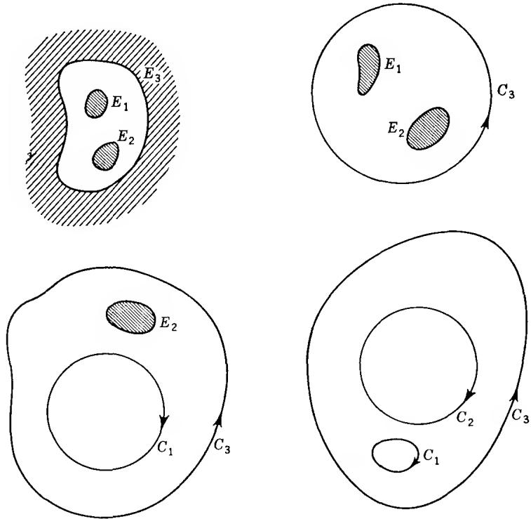  
FIG. 6-3. Transformations of a multiply connected region.

Suppose now that we solve the Dirichlet problem in $\Omega$ with the boundary values 1 on $C_{k}$ and 0 on the other contours. The solution is denoted by $\omega_{k}(z)$ , and it is called the harmonic measure of $C_{k}$ with respect to the region $\Omega$ . We have clearly $0 < \omega_{k}(z) < 1$ in $\Omega$ and

$$
\omega_ {1} (z) + \omega_ {2} (z) + \dots + \omega_ {n} (z) \equiv 1.
$$

If we map $\Omega$ so that $C_{i}$ becomes a circle, then $\omega_{k}$ can be continued across $C_{i}$ according to the reflection principle. We conclude that $\omega_{k}$ is harmonic in the closed region $\Omega$ in the sense that it can be extended to a larger region.

The contours $C_{1}, \ldots, C_{n-1}$ form a homology basis for the cycles in $\Omega$ , homology being understood with respect to an unspecified larger region. The conjugate harmonic differential of $\omega_{k}$ has periods

$$
\alpha_ {k j} = \int_ {C _ {i}} \frac {\partial \omega_ {k}}{\partial n} d s = \int_ {C _ {i}} ^ {*} d \omega_ {k}
$$

along $C_j$ . We assert that no linear combination $\lambda_1\omega_1(z) + \lambda_2\omega_2(z) + \cdots + \lambda_{n-1}\omega_{n-1}(z)$ with constant coefficients can have a single-valued conjugate function unless all the $\lambda_i$ are zero. To see this, suppose that this expression were the real part of an analytic function $f(z)$ . By the reflection principle, $f(z)$ would have an analytic extension to the closure of $\Omega$ . The real part of $f(z)$ would be constantly equal to $\lambda_i$ on $C_i$ , $i = 1, \ldots, n - 1$ , and zero on $C_n$ . Consequently, each contour would be mapped onto a vertical line segment. If $w_0$ does not lie on any of these segments, a single-valued branch of $\arg (f(z) - w_0))$ can be defined on each contour. It follows by the argument principle that $f(z)$ cannot take the value $w_0$ in $\Omega$ . But then $f(z)$ must reduce to a constant, for otherwise the image of $\Omega$ would certainly contain points not on the line segments. We conclude that the real part of $f(z)$ is identically zero, and hence the boundary values $\lambda_i$ must all vanish.

What we have proved is that the homogeneous system of linear equations

$$
\lambda_ {1} \alpha_ {1 j} + \lambda_ {2} \alpha_ {2 j} + \dots + \lambda_ {n - 1} \alpha_ {n - 1, j} = 0 (j = 1, \dots , n - 1)\tag{13}
$$

has only the trivial solution $\lambda_{i}=0$ , for these are the conditions under which $\lambda_{1}\omega_{1}+\cdots+\lambda_{n-1}\omega_{n-1}$ has a single-valued conjugate. By the theory of linear equations any inhomogeneous system of equations with the same coefficients as (13) must have a solution. In particular, we conclude that it is possible to solve the system

$$
\begin{array}{l} \lambda_ {1} \alpha_ {1 1} + \lambda_ {2} \alpha_ {2 1} + \dots + \lambda_ {n - 1} \alpha_ {n - 1, 1} = 2 \pi \\ \lambda_ {1} \alpha_ {1 2} + \lambda_ {2} \alpha_ {2 2} + \dots + \lambda_ {n - 1} \alpha_ {n - 1, 2} = 0 \\ \dots \dots \\ \lambda_ {1} \alpha_ {1, n - 1} + \lambda_ {2} \alpha_ {2, n - 1} + \dots + \lambda_ {n - 1} \alpha_ {n - 1, n - 1} = 0 \\ \lambda_ {1} \alpha_ {1 n} + \lambda_ {2} \alpha_ {2 n} + \dots + \lambda_ {n - 1} \alpha_ {n - 1, n} = - 2 \pi \end{array}\tag{14}
$$

where the last equation is a consequence of the n-1 first (because $\alpha_{k1} + \alpha_{k2} + \cdots + \alpha_{kn} = 0$ ). In other words, we can find a multiple-valued integral $f(z)$ with periods $\pm 2\pi i$ along $C_{1}$ and $C_{n}$ and all other periods equal to zero, the real part being constantly equal to $\lambda_{k}$ on $C_{k}$ (we set $\lambda_{n} = 0$ ). The function $F(z) = e^{f(z)}$ is then single-valued. We prove:

Theorem 10. The function $F(z)$ effects a one-to-one conformal mapping of $\Omega$ onto the annulus $1 < |w| < e^{\lambda_1}$ minus $n - 2$ concentric arcs situated on the circles $|w| = e^{\lambda_i}$ , $i = 2, \ldots, n - 1$ .

The mapping is illustrated in Fig. 6-4. The contours $C_{1}$ and $C_{n}$ are in one-to-one correspondence with the full circles, while the other contours are flattened into circular slits. It should be imagined that each slit has two edges which together with the end points form a closed contour.

The proof is by use of the argument principle. We know that $F(z)$ is analytic with a constant modulus on each contour. The number of roots of the equation $F(z) = w_{0}$ is given by

$$
\begin{array}{r l} \frac {1}{2 \pi i} \int_ {C _ {1}} \frac {F ^ {\prime} (z) d z}{F (z) - w _ {0}} + \frac {1}{2 \pi i} \int_ {C _ {2}} \frac {F ^ {\prime} (z) d z}{F (z) - w _ {0}} + \dots & \\ & + \frac {1}{2 \pi i} \int_ {C _ {n}} \frac {F ^ {\prime} (z) d z}{F (z) - w _ {0}}, \end{array}\tag{15}
$$

at any rate if $w_{0}$ is not taken on the boundary. For $w_{0} = 0$ the terms in (15) are known, being equal to 1, 0, . . . , 0, -1, respectively. The integral over $C_1$ remains constantly equal to 1 for $|w_0| < e^{\lambda_1}$ , and it vanishes for $|w_0| > e^{\lambda_1}$ ; similarly, the last integral is -1 for $|w_0| < 1$ and 0 for $|w_0| > 1$ . The integrals over $C_k$ , $1 < k < n$ , vanish for all $w_0$ with $|w_0| \neq e^{\lambda_k}$ . Suppose now that the value $w_0$ is actually taken by $F(z)$ ; inasmuch as $\Omega$ must be mapped onto an open set, we can choose $|w_0| \neq \text{all } e^{\lambda_i}$ . For this $w_0$ the expression (15) must be positive. But that is possible only if $1 < |w_0| < e^{\lambda_1}$ . Thus $\lambda_1 > 0$ and, by continuity, $0 \leq \lambda_i \leq \lambda_1$ .

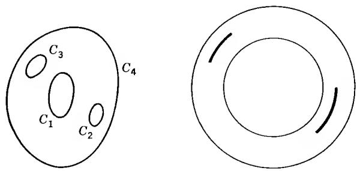  
FIG. 6-4. Concentric slit region.

From here on the proof could be completed by means of a purely topological argument. It is more instructive, however, and in fact simpler, to draw the conclusion from the argument principle. When there are simple poles on the boundary, the residue theorem continues to hold provided that the contour integral is replaced by its Cauchy principal value, and provided that the sum of the residues includes one-half of the residues on the boundary.† In the present situation the second convention means that a value taken on the boundary is counted with half its multiplicity. The computation of the principal values causes no difficulty. If $|w_0| = e^{\lambda_k}$ , we find that

$$
\text { pr.v. } \int_ {C _ {k}} \frac {F ^ {\prime} (z) d z}{F (z) - w _ {0}} = \frac {1}{2} \int_ {C _ {k}} \frac {F ^ {\prime} (z) d z}{F (z)},
$$

for by elementary geometry (or direct computation)

$$
d \arg (F (z) - w _ {0}) = \frac {1}{2} d \arg F (z).
$$

Consequently, the principal values in (15) are $\frac{1}{2}$ for $k = 1$ , 0 for $2 \leq k \leq n - 1$ , $-\frac{1}{2}$ for $k = n$ .

We conclude now that each value on the circle $|w_{0}| = 1$ or $|w_{0}| = e^{\lambda_{1}}$ is taken one-half time, that is to say once on the boundary; this proves that $C_{1}$ and $C_{n}$ are mapped in a one-to-one manner and that $0 < \lambda_{i} < \lambda_{1}, i \neq 1, n$ . Next, if $1 < |w_{0}| < e^{\lambda_{1}}$ , it follows that $w_{0}$ is taken either once in the interior, twice on the boundary, or once on the boundary with the multiplicity 2. On each contour $C_{2}, \ldots, C_{n-1}$ a single-valued branch of arg $F(z)$ can be defined, and the values of multiplicity 2 correspond to relative maxima and minima of arg $F(z)$ . There is at least one maximum and one minimum, and there cannot be more or else $F(z)$ would pass more than twice through the same values. Furthermore, the difference between the maximum and the minimum must be $<2\pi$ , which shows that each contour is mapped onto a proper arc. Finally, the arcs which correspond to different contours must be disjoint.

† In Chap. 4, Sec. 5.3, the Cauchy principal value was introduced in the case of an integral over a straight line. In the case of an arbitrary analytic arc it is simplest to define the principal value by means of an auxiliary conformal mapping which transforms a subarc into a line segment. The stated generalization of the residue theorem follows quite easily and proves that the principal value is independent of the auxiliary conformal mapping.

We have proved the complete Theorem 10, and in addition we have been able to describe the correspondence of the boundaries. The significance of the theorem is that we can map $\Omega$ onto a canonical region bounded by two circles and $n - 2$ concentric circular slits; by way of normalization the radius of the inner circle is chosen equal to 1. For a given choice of $C_1$ and $C_n$ the canonical mapping is uniquely determined up to a rotation. This follows from the fact that the system (15) has only one solution.

The shape of a canonical region of connectivity n depends on 3n - 6 real constants. In fact, the position and size of each slit is determined by three numbers, a total of 3n - 6; the thickness of the annulus gives one additional parameter, but another parameter must be discounted to allow for the arbitrary rotation.

## EXERCISES

1. Prove directly that two circular annuli are conformally equivalent if and only if the ratios of their radii are equal.

2. Prove that $\alpha_{ij} = \alpha_{ji}$ . Hint: Apply Theorem 21, Chap. 4.

5.2. Green's Function. We suppose again that $\Omega$ is a region of finite connectivity, and inasmuch as preliminary conformal mappings will be permissible we can assume that $\Omega$ is bounded by analytic contours $C_1, \ldots, C_n$ ; this time the case $n = 1$ will be included.

We consider a point $z_{0} \in \Omega$ and solve the Dirichlet problem in $\Omega$ with the boundary values $\log |\zeta - z_{0}|$ . The solution is denoted by $G(z)$ , but the main interest is attached to the function $g(z) = G(z) - \log |z - z_{0}|$ , known as the Green's function of $\Omega$ with pole at $z_{0}$ . When the dependence on $z_{0}$ is emphasized, it is denoted by $g(z, z_{0})$ .

The Green's function is harmonic in $\Omega$ except at $z_0$ , and it vanishes on the boundary. In a neighborhood of $z_0$ it differs from $-\log |z - z_0|$ by a harmonic function. By these properties $g(z)$ is uniquely determined. In fact, if $g_1(z)$ has the same properties, then $g - g_1$ is harmonic throughout $\Omega$ and vanishes on the boundary. By the maximum principle it follows that $g_1$ is identically equal to $g$ .

If two regions are conformally equivalent, then the Green's functions with corresponding poles are equal at points which correspond to each other. To be more explicit, let $z = z(\zeta)$ define a one-to-one conformal mapping of a region $\Omega'$ in the $\zeta$ -plane onto a region $\Omega$ in the $z$ -plane. Choose a point $\zeta_0 \in \Omega'$ and denote by $g(z, z_0)$ the Green's function of $\Omega$ with pole at $z_0 = z(\zeta_0)$ . It is claimed that $g(z(\zeta), z_0)$ is the Green's function of $\Omega'$ . To begin with, if $\zeta$ tends to a boundary point, then $z(\zeta)$ approaches the boundary of $\Omega$ , and hence $g(z(\zeta), z_0)$ has the boundary values zero. As to the behavior at $\zeta_0$ we know that $g(z(\zeta), z_0)$ differs from $-\log |z(\zeta) - z(\zeta_0)|$ by a harmonic function of $z(\zeta)$ , and hence by a harmonic function of $\zeta$ . But the difference $\log |z(\zeta) - z(\zeta_0)| - \log |\zeta - \zeta_0|$ is also harmonic, and it follows that $g(z(\zeta), z_0)$ has the desired behavior at $\zeta_0$ . We have proved that the Green's function is invariant under conformal mappings, and it is in view of this invariance that preliminary conformal mappings can be performed at will.

In the case of a simply connected region there is a simple connection between Green's function and the Riemann mapping function. For the unit disk $|w| < 1$ the Green's function with respect to the origin is evidently $-\log |w|$ . Therefore, if $w = f(z)$ maps $\Omega$ onto the unit disk with $z_{0}$ going into the origin, we find by the invariance that

$$
g (z, z _ {0}) = - \log | f (z) |.
$$

Conversely, if $g(z,z_{0})$ is known, the mapping function can be determined. The Green's function has an important symmetry property. Given two points $z_{1}, z_{2} \in \Omega$ , we write for short $g(z,z_{1}) = g_{1}, g(z,z_{2}) = g_{2}$ . By Theorem 21, Chap. 4, the differential $g_{1} * dg_{2} - g_{2} * dg_{1}$ is locally exact in the region obtained by omitting the points $z_{1}$ and $z_{2}$ from $\Omega$ . If $c_{1}$ and $c_{2}$ are small circles about $z_{1}$ and $z_{2}$ , described in the positive sense, the cycle $C - c_{1} - c_{2}$ is homologous to zero (as before, $C = C_{1} + \cdots + C_{n}$ ). Since $g_{1}$ and $g_{2}$ vanish on C, we conclude that

$$
\int_ {c _ {1} + c _ {2}} g _ {1} ^ {*} d g _ {2} - g _ {2} ^ {*} d g _ {1} = 0.
$$

Introducing $G_{1} = g_{1} + \log |z - z_{1}|$ we have $^{*}dg_{1} = ^{*}dG_{1} - d\arg (z - z_{1})$ and find

$$
\begin{array}{r l} \int_ {c _ {1}} g _ {1} ^ {*} d g _ {2} - g _ {2} ^ {*} d g _ {1} = & \int_ {c _ {1}} G _ {1} ^ {*} d g _ {2} - g _ {2} ^ {*} d G _ {1} - \int_ {c _ {1}} \log | z - z _ {1} | ^ {*} d g _ {2} \\ & + \int_ {c _ {1}} g _ {2} d \arg (z - z _ {1}). \end{array}
$$

On the right-hand side the first integral vanishes because $G_{1}$ and $g_{2}$ are harmonic inside $c_{1}$ , and the second integral vanishes because $|z - z_{1}|$ is constant on $c_{1}$ and $*dg_{2}$ is an exact differential in a neighborhood of $z_{1}$ . The last integral equals $2\pi g_{2}(z_{1})$ by the mean-value property of harmonic functions. In a symmetric way the integral over $c_{2}$ must equal $-2\pi g_{1}(z_{2})$ , and it is proved that $g_{2}(z_{1}) - g_{1}(z_{2}) = 0$ or

$$
g (z _ {1}, z _ {2}) = g (z _ {2}, z _ {1}).
$$

Because of this symmetry property the Green's function $g(z, z_0)$ is harmonic also in the second variable.

The conjugate function of $g(z,z_{0})$ , denoted by $h(z,z_{0})$ , is of course multiple-valued. It has above all the period $2\pi$ along a small circle c about $z_{0}$ . In addition, it has the periods

$$
P _ {k} (z _ {0}) = \int_ {C _ {k}} d h (z, z _ {0}) = \int_ {C _ {k}} ^ {*} d g (z, z _ {0}) \quad (k = 1, \dots , n).
$$

Lemma 3. The period $P_{k}(z_{0})$ equals the harmonic measure $\omega_{k}(z_{0})$ multiplied by $2\pi$ .

The proof is another application of Theorem 21, Chap. 4. We express the fact that the integral of $\omega_{k} * dg - g * d\omega_{k}$ over $C - c$ must vanish. The integral over $C$ reduces to $P_{k}(z_{0})$ , and by the same computation as above the integral over $c$ equals $2\pi \omega_{k}(z_{0})$ . Hence $P_{k}(z_{0}) = 2\pi \omega_{k}(z_{0})$ .

5.3. Parallel Slit Regions. A little more explicitly than before, let us write

$$
g (z, z _ {0}) = G (z, z _ {0}) - \log | z - z _ {0} |\tag{16}
$$

with $z_0 = x_0 + iy_0 \in \Omega$ . We know that $G(z, z_0)$ is symmetric, and harmonic in each variable; as a function of $z$ it has the boundary values $\log |\xi - z_0|$ .

Consider the difference quotient $Q(z,h) = (G(z,z_{0} + h) - G(z,z_{0}))/h$ where we choose h real and so small that $z_{0} + h$ is still in $\Omega$ . This is a harmonic function of z with boundary values $(\log |\zeta - z_{0} - h| - \log |\zeta - z_{0}|)/h$ . As $h \to 0$ these boundary values tend uniformly to $\partial/\partial x_{0} \log |\zeta - z_{0}| = -\operatorname{Re} 1/(\zeta - z_{0})$ . It follows by the maximum-minimum principle that $Q(z,h)$ tends to its limit $(\partial/\partial x_{0})G(z,z_{0})$ uniformly, not only on compact sets, but on all of $\Omega$ . If we include the boundary values, we have thus uniform convergence on the closure $\Omega^{-}$ , which is a compact set. The conclusion is that $(\partial/\partial x_{0})G(z,z_{0})$ is harmonic in $\Omega$ , as a function of z, and that it has the boundary values $-\operatorname{Re} 1/(\zeta - z_{0})$ . If we compare with (16) it follows that $u_{1}(z) = (\partial/\partial x_{0})g(z,z_{0})$ is harmonic for $z \neq z_{0}$ , continuously zero on the boundary, and differs from $\operatorname{Re} 1/(z - z_{0})$ by a harmonic function.

The conjugate differential of $u_{1}(z)$ has certain periods $A_{k}$ along the contours $C_{k}$ . But it is easy to construct a linear combination of $u_{1}(z)$ and the harmonic measures $\omega_{j}(z)$ whose conjugate differential is free from periods. Indeed, $u_{1} + \lambda_{1}\omega_{1} + \cdots + \lambda_{n-1}\omega_{n-1}$ has this property provided that

$$
\lambda_ {1} \alpha_ {1 k} + \lambda_ {2} \alpha_ {2 k} + \dots \lambda_ {n - 1} \alpha_ {n - 1, k} = - A _ {k} \quad (k = 1, \dots , n - 1).
$$

We know already that this inhomogeneous system of equations always has a solution. We have thus established the existence of a function $p(z)$ which is single-valued and analytic in $\Omega$ , except for a simple pole with the residue 1 at $z_{0}$ , and whose real part is constant on each contour. By these requirements $p(z)$ is uniquely determined up to an additive constant.

By differentiation with respect to $y_{0}$ we conclude quite similarly that $v_{2}(z) = -(\partial/\partial y_{0})g(z,z_{0})$ vanishes on the boundary and has the same singularity as $\operatorname{Im} 1/(z - z_{0})$ . If a suitable linear combination of harmonic measures is added, the conjugate function becomes single-valued. Hence there exists a single-valued analytic function $q(z)$ with the singular part $1/(z - z_{0})$ whose imaginary part is constant on each contour.

The functions $p(z)$ and $q(z)$ lead to simple canonical mappings.

Theorem 11. The mappings determined by $p(z)$ and $q(z)$ are one to one, and the image of $\Omega$ is a slit region whose complement consists of n vertical or horizontal segments, respectively (Fig. 6-5a, b).

The proof is quite similar to that of Theorem 10. This time the expression

$$
\sum_ {k = 1} ^ {n} \frac {1}{2 \pi i} \int_ {C _ {k}} \frac {p ^ {\prime} (z) d z}{p (z) - w _ {0}}\tag{17}
$$

represents the number of zeros of $p(z) - w_{0}$ minus the number of poles. But it is easy to see that (17) vanishes for all $w_{0}$ , including boundary values. In the latter case the principal value must be formed, but if $w_{0}$ is taken on $C_{k}$ the imaginary part of $p' dz/(p - w_{0})$ vanishes along $C_{k}$ and there is no difficulty whatsoever. Since there is exactly one pole we conclude that $p(z)$ takes every value once in the interior of $\Omega$ , twice on the boundary, or once on the boundary with the multiplicity 2. The rest of the proof is an exact duplication of the earlier reasoning. The proof remains valid for $q(z)$ without change.

Parallel slit regions may be thought of as canonical regions, but they are not all conformally inequivalent, even if it is required that the point at $\infty$ should correspond to itself. For instance, the mappings by $p(z)$

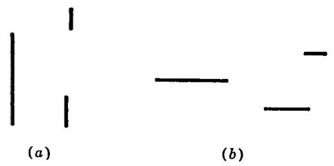

and $iq(z)$ lead to vertical slit regions which are different, but conformally equivalent. It is only for mappings with the same residue at $z_{0}$ that the slit mappings are uniquely determined, except for a parallel translation.

## EXERCISES

1. Prove that $g(z,z_{0})$ is simultaneously continuous in both variables, for $z \neq z_{0}$ . Hint: Apply the maximum-minimum principle to $G(z,z_{0})$ .

2. Show that the function $e^{-i\alpha}(q \cos \alpha + ip \sin \alpha)$ maps $\Omega$ onto a region bounded by inclined slits.

\*3. Using Ex. 2, show that $p + q$ maps $\Omega$ in a one-to-one manner onto a region bounded by convex contours. Comments:

(i) A closed curve is said to be convex if it intersects every straight line at most twice.

(ii) To prove that the image of $C_{k}$ under $p + q$ is convex we need only show that for every $\alpha$ the function $\operatorname{Re}(p + q)e^{i\alpha}$ takes no value more than twice on $C_{k}$ . But $\operatorname{Re}(p + q)e^{i\alpha}$ differs from $\operatorname{Re}(q\cos\alpha + ip\sin\alpha)$ only by a constant, and the desired conclusion follows by the properties of the mapping function in Ex. 2.

(iii) Finally, the argument principle can be used to show that the images of the contours $C_{k}$ have winding number 0 with respect to all values of $p + q$ . This implies, in particular, that the convex curves lie outside of each other.

## 1. SIMPLY PERIODIC FUNCTIONS

A function $f(z)$ is said to be periodic with period $\omega \neq 0$ if

$$
f (z + \omega) = f (z)
$$

for all z. For instance, $e^{z}$ has the period $2\pi i$ , and $\sin z$ and $\cos z$ have the period $2\pi$ . To be more precise, we are interested only in analytic or meromorphic functions $f(z)$ , and they shall be considered in a region $\Omega$ which is mapped onto itself by the translation $z \to z + \omega$ .

If $\omega$ is a period, so are all integral multiples $n\omega$ . There may be other periods as well, but for the present we focus our attention exclusively on the periods $n\omega$ . From this point of view we shall call $f(z)$ a simply periodic function with period $\omega$ . In particular, it is irrelevant whether $\omega$ is itself a multiple of another period.

1.1. Representation by Exponentials. The simplest function with period $\omega$ is the exponential $e^{2\pi iz/\omega}$ . It is a fundamental fact that any function with period $\omega$ can be expressed in terms of this particular function.

Let $\Omega$ be a region with the property that $z\in \Omega$ implies $z + \omega \epsilon \Omega$ and $z - \omega \epsilon \Omega$ . We define $\Omega^{\prime}$ in the $\zeta$ -plane to be the image of $\Omega$ under the mapping $\zeta = e^{2\pi iz / \omega}$ ; it is obviously a region. For instance, if $\Omega$ is the whole plane, then $\Omega^{\prime}$ is the plane punctured at 0. If $\Omega$ is a parallel strip, defined by $a < \operatorname{Im}(2\pi z / \omega) < b$ , then $\Omega^{\prime}$ is the annulus $e^{-b} < |\zeta| < e^{-a}$ .

Suppose that $f(z)$ is meromorphic in $\Omega$ and has the period $\omega$ . Then there exists a unique function $F$ in $\Omega'$ such that

$$
f (z) = F \left(e ^ {2 \pi i z / \omega}\right).\tag{1}
$$

Indeed, to determine $F(\zeta)$ we write $\zeta = e^{2\pi iz / \omega}$ ; $z$ is unique up to an additive multiple of $\omega$ , and this multiple does not influence the value $f(z)$ . It is evident that $F$ is meromorphic. Conversely, if $F$ is meromorphic in $\Omega'$ , then (1) defines a meromorphic function $f$ with period $\omega$ .

1.2. The Fourier Development. Assume that $\Omega'$ contains an annulus $r_1 < |\zeta| < r_2$ in which $F$ has no poles. In this annulus $F$ has a Laurent development

$$
F (\zeta) = \sum_ {n = - \infty} ^ {\infty} c _ {n} \zeta^ {n},
$$

and we obtain

$$
f (z) = \sum_ {- \infty} ^ {\infty} c _ {n} e ^ {2 \pi i n z / \omega}.
$$

This is the complex Fourier development of $f(z)$ , valid in the parallel strip that corresponds to the given annulus.

The coefficients (cf. Chap. 5, Sec. 1.3) are given by

$$
c _ {n} = \frac {1}{2 \pi i} \int_ {| \zeta | = r} F (\zeta) \zeta^ {- n - 1} d \zeta , \quad (r _ {1} <   r <   r _ {2}),
$$

and by change of variable this becomes

$$
c _ {n} = \frac {1}{\omega} \int_ {a} ^ {a + \omega} f (z) e ^ {- 2 \pi i n z / \omega} d z.
$$

Here a is an arbitrary point in the parallel strip, and the integration is along any path from a to $a + \omega$ which remains within the strip. If $f(z)$ is analytic in the whole plane, the same Fourier development is valid everywhere.

1.3. Functions of Finite Order. When $\Omega$ is the whole plane $F(\zeta)$ has isolated singularities at $\zeta = 0$ and $\zeta = \infty$ . If both these singularities are inessential, that is, either removable singularities or poles, then F is a rational function. We say in this case that f has finite order, equal to the order of F.

We recall that a rational function assumes every complex value, including $\infty$ , the same number of times, provided that we observe the usual multiplicity convention. We obtain a similar result for simply periodic functions of finite order if we agree not to distinguish between z and $z + \omega$ . For convenient terminology, let us say that $z + n\omega$ is equivalent to z. If f is of order m we find that every complex value $c \neq F(0)$ and $F(\infty)$ is assumed at m inequivalent points, with due count of multiplicities. We observe further that $f(z) \to F(0)$ when $\operatorname{Im}(z/\omega) \to -\infty$ and $f(z) \to F(\infty)$ when $\operatorname{Im}(z/\omega) \to \infty$ . If we are willing to agree that these values are also “assumed” (with proper multiplicity), we can maintain that all complex values are assumed exactly m times.

For another interpretation we may consider the period strip, defined by $0 \leq \operatorname{Im}(z/\omega) < 2\pi$ . Since this strip contains only one representative from each equivalence class we find that $f(z)$ assumes each complex value m times in the period strip, except that the values $F(0)$ and $F(\infty)$ require a special convention.

## 2. DOUBLY PERIODIC FUNCTIONS

The terms elliptic function and doubly periodic function are interchangeable; we have already met examples of such functions in connection with the conformal mapping of rectangles and certain triangles (Chap. 6, Sec. 2). Elliptic functions have been the object of very extensive study, partly because of their function theoretic properties and partly because of their importance in algebra and number theory. Our introduction to the topic covers only the most elementary aspects.

2.1. The Period Module. Let $f(z)$ be meromorphic in the whole plane. We shall examine the set M of all its periods. If $\omega$ is a period, so are all integral multiples $n\omega$ , and if $\omega_{1}$ and $\omega_{2}$ belong to M, so does $\omega_{1} + \omega_{2}$ ; as a consequence, all linear combinations $n_{1}\omega_{1} + n_{2}\omega_{2}$ are in M. In algebra, a set with these properties is called a module (more precisely: a module over the integers), and we shall call M the period module of f.

Apart from the trivial case of a constant function, M has also a topological property: all its points are isolated. In fact, since $f(\omega) = f(0)$ for all $\omega \in M$ the existence of a finite accumulation point would immediately imply that f is constant. A module with isolated points is said to be discrete.

Our first step is to determine all discrete modules.

Theorem 1. A discrete module consists either of zero alone, of the integral multiples $n\omega$ of a single complex number $\omega \neq 0$ , or of all linear combinations $n_1\omega + n_2\omega_2$ with integral coefficients of two numbers $\omega_1, \omega_2$ with nonreal ratio $\omega_2 / \omega_1$ .

As soon as M contains a number $\omega \neq 0$ it also contains one, call it $\omega_{1}$ , whose absolute value is a minimum. Indeed, if r is large enough the disk $|z| \leq r$ contains a point from M, other than 0. Because the points are isolated there are only a finite number of such points, and we choose $\omega_{1}$ to be one closest to the origin (the reader may show that there are always 2, 4, or 6 closest points). The multiples $n\omega_{1}$ are also in M, and these may be all.

Suppose now that there exists an $\omega \in M$ which is not an integral multiple of $\omega_{1}$ . Among all such there is one, $\omega_{2}$ , whose absolute value is smallest. We claim that $\omega_{2}/\omega_{1}$ is not real. If it were, there would exist an integer n such that $n < \omega_{2}/\omega_{1} < n + 1$ . This would give $0 < |n\omega_{1} - \omega_{2}| < |\omega_{1}|$ , an obvious contradiction.

It can now be concluded that all numbers in M are of the form $n_{1}\omega_{1} + n_{2}\omega_{2}$ . First of all, because $\omega_{2}/\omega_{1}$ is nonreal any complex number $\omega$ can be written in the form $\lambda_{1}\omega_{1} + \lambda_{2}\omega_{2}$ with real $\lambda_{1}$ and $\lambda_{2}$ . To see this we need only solve the equations

$$
\begin{array}{l} \omega = \lambda_ {1} \omega_ {1} + \lambda_ {2} \omega_ {2} \\ \bar {\omega} = \lambda_ {1} \bar {\omega} _ {1} + \lambda_ {2} \bar {\omega} _ {2}. \end{array}
$$

Since the determinant $\omega_1\bar{\omega}_2 - \omega_2\bar{\omega}_1$ is $\neq 0$ the system has a unique solution $(\lambda_1,\lambda_2)$ ; but $(\bar{\lambda}_1,\bar{\lambda}_2)$ is also a solution, and we conclude that $\lambda_1$ and $\lambda_2$ are real. To continue the proof, there exist integers $m_1, m_2$ such that $|\lambda_1 - m_1| \leq \frac{1}{2}, |\lambda_2 - m_2| \leq \frac{1}{2}$ . If $\omega$ belongs to $M$ , so does

$$
\omega^ {\prime} = \omega - m _ {1} \omega_ {1} - m _ {2} \omega_ {2}.
$$

We have $|\omega'| < \frac{1}{2} |\omega_{1}| + \frac{1}{2} |\omega_{2}| \leq |\omega_{2}|$ where the first inequality is strict because $\omega_{2}$ is not a real multiple of $\omega_{1}$ . By the way $\omega_{2}$ was chosen it follows that $\omega'$ must be an integral multiple of $\omega_{1}$ , and hence $\omega$ has the asserted form.

2.2. Unimodular Transformations. We assume henceforth that it is the third alternative in Theorem 1 that occurs. The pair $(\omega_{1},\omega_{2})$ has the property that any $\omega\in M$ has a unique representation of the form $\omega=n_{1}\omega_{1}+n_{2}\omega_{2}$ . Any pair with this property will be called a basis of M (even if it is not determined by the construction in the proof of Theorem 1).

We investigate the relation between two bases $(\omega_{1},\omega_{2})$ and $(\omega_{1}^{\prime},\omega_{2}^{\prime})$ . Because $(\omega_{1},\omega_{2})$ is a basis there exist integers a, b, c, d such that

$$
\begin{array}{l} \omega_ {2} ^ {\prime} = a \omega_ {2} + b \omega_ {1} \\ \omega_ {1} ^ {\prime} = c \omega_ {2} + d \omega_ {1}. \end{array}\tag{2}
$$

We prefer to write these equations in matrix form

$$
\binom{\omega_ {2} ^ {\prime}}{\omega_ {1} ^ {\prime}} = \left( \begin{array}{c c} a & b \\ c & d \end{array} \right) \binom{\omega_ {2}}{\omega_ {1}}.
$$

The same relation is valid for the complex conjugates, and we have thus

$$
\left( \begin{array}{c c} \omega_ {2} ^ {\prime} & \bar {\omega} _ {2} ^ {\prime} \\ \omega_ {1} ^ {\prime} & \bar {\omega} _ {1} ^ {\prime} \end{array} \right) = \left( \begin{array}{c c} a & b \\ c & d \end{array} \right) \left( \begin{array}{c c} \omega_ {2} & \bar {\omega} _ {2} \\ \omega_ {1} & \bar {\omega} _ {1} \end{array} \right).\tag{3}
$$

Since $(\omega_1', \omega_2')$ is also a basis we have similarly

$$
\left( \begin{array}{c c} \omega_ {2} & \bar {\omega} _ {2} \\ \omega_ {1} & \bar {\omega} _ {1} \end{array} \right) = \left( \begin{array}{c c} a ^ {\prime} & b ^ {\prime} \\ c ^ {\prime} & d ^ {\prime} \end{array} \right) \left( \begin{array}{c c} \omega_ {2} ^ {\prime} & \tilde {\omega} _ {2} ^ {\prime} \\ \omega_ {2} ^ {\prime} & \bar {\omega} _ {1} ^ {\prime} \end{array} \right)\tag{4}
$$

with integral $a', b', c', d'$ .

From (3) and (4) we obtain

$$
\left( \begin{array}{c c} \omega_ {2} & \bar {\omega} _ {2} \\ \omega_ {1} & \bar {\omega} _ {1} \end{array} \right) = \left( \begin{array}{c c} a ^ {\prime} & b ^ {\prime} \\ c ^ {\prime} & d ^ {\prime} \end{array} \right) \left( \begin{array}{c c} a & b \\ c & d \end{array} \right) \left( \begin{array}{c c} \omega_ {2} & \bar {\omega} _ {2} \\ \omega_ {1} & \bar {\omega} _ {1} \end{array} \right).\tag{5}
$$

Here the determinant $\omega_{2}\bar{\omega}_{1} - \omega_{1}\bar{\omega}_{2}$ is $\neq 0$ , for otherwise any two numbers in the module would have a real ratio, contrary to assumption. A matrix with determinant $\neq 0$ has an inverse matrix, and if we multiply (5) by the inverse of $\left( \begin{array}{cc}\omega_2 & \bar{\omega}_2\\ \omega_1 & \bar{\omega}_1 \end{array} \right)$ we obtain

$$
\left( \begin{array}{c c} a ^ {\prime} & b ^ {\prime} \\ c ^ {\prime} & d ^ {\prime} \end{array} \right) \left( \begin{array}{c c} a & b \\ c & d \end{array} \right) = \left( \begin{array}{c c} 1 & 0 \\ 0 & 1 \end{array} \right).
$$

The matrices $\begin{pmatrix} a & b \\ c & d \end{pmatrix}$ and $\begin{pmatrix} a' & b' \\ c' & d' \end{pmatrix}$ are inverse to each other. In particular, their determinants must satisfy

$$
\left| \begin{array}{c c} a ^ {\prime} & b ^ {\prime} \\ c ^ {\prime} & d ^ {\prime} \end{array} \right| \cdot \left| \begin{array}{c c} a & b \\ c & d \end{array} \right| = 1,
$$

and since both are integers we must have

$$
\left| \begin{array}{c c} a & b \\ c & d \end{array} \right| = \left| \begin{array}{c c} a ^ {\prime} & b ^ {\prime} \\ c ^ {\prime} & d ^ {\prime} \end{array} \right| = \pm 1.
$$

Linear transformations of the form (2) with integral coefficients and determinant $\pm1$ are said to be unimodular. We have proved:

Any two bases of the same module are connected by a unimodular transformation.

Geometrically, it is natural to consider the parallelogram spanned by a basis $(\omega_{1},\omega_{2})$ in its relation to the lattice formed by all numbers in the module. Figure 7-1 shows two bases of the same module. Observe that the parallelograms have equal area.

We note here that the unimodular matrices, or the corresponding linear transformations, form a group, the modular group.

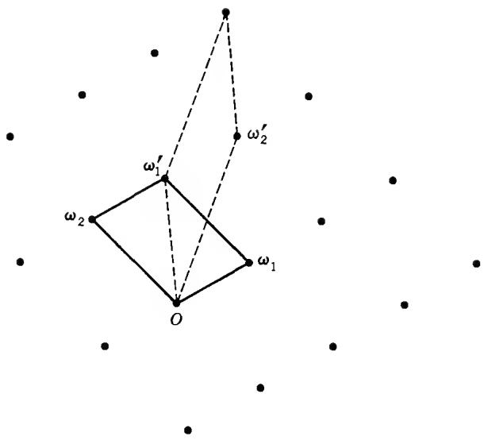  
FIG. 7-1. Period module.

2.3. The Canonical Basis. Among all possible bases of M it is possible to single out one, almost uniquely, to be called the canonical basis. It will not always be necessary, or even desirable, to use such a special basis, but it is important to know that one exists. Except for minor adjustments it will be the basis introduced in the course of the proof of Theorem 1.

Theorem 2. There exists a basis $(\omega_{1},\omega_{2})$ such that the ratio $\tau = \omega_{2} / \omega_{1}$ satisfies the following conditions: (i) Im $\tau >0$ , (ii) $-\frac{1}{2} < \operatorname{Re}\tau \leq \frac{1}{2}$ , (iii) $|\tau |\geq 1$ , (iv) $\operatorname{Re}\tau \geq 0$ if $|\tau | = 1$ . The ratio $\tau$ is uniquely determined by these conditions, and there is a choice of two, four, or six corresponding bases.

Proof. If we select $\omega_{1}$ and $\omega_{2}$ as in the proof of Theorem 1, then $|\omega_{1}| \leq |\omega_{2}|$ , $|\omega_{2}| \leq |\omega_{1} + \omega_{2}|$ , and $|\omega_{2}| \leq |\omega_{1} - \omega_{2}|$ . In terms of $\tau$ these conditions are equivalent to $|\tau| \geq 1$ and $|\operatorname{Re} \tau| \leq \frac{1}{2}$ . If $\operatorname{Im} \tau < 0$ we replace $(\omega_{1}, \omega_{2})$ by $(- \omega_{1}, \omega_{2})$ ; this makes $\operatorname{Im} \tau > 0$ without changing the condition on $\operatorname{Re} \tau$ . If $\operatorname{Re} \tau = -\frac{1}{2}$ we replace the basis by $(\omega_{1}, \omega_{1} + \omega_{2})$ , and if $|\tau| = 1$ , $\operatorname{Re} \tau < 0$ we replace it by $(- \omega_{2}, \omega_{1})$ . After these minor changes all the conditions are satisfied.

Geometrically, the conditions (i) to (iv) mean that the point $\tau$ lies in the part of the complex plane shown in Fig. 7-2. It is bounded by the circle $|\tau| = 1$ and the vertical lines $Re\tau = \pm\frac{1}{2}$ , but only part of the boundary is included. Although the set is not open, it is referred to as the fundamental region of the unimodular group.

We have seen that the most general change of basis is by a unimodular transformation. If the new ratio is $\tau'$ we obtain

$$
\tau^ {\prime} = \frac {a \tau + b}{c \tau + d}\tag{6}
$$

with $ad - bc = \pm 1$ . Simple computation gives

$$
\operatorname{Im} \tau^ {\prime} = \frac {\pm \operatorname{Im} \tau}{| c \tau + d | ^ {2}}\tag{7}
$$

where the sign is the same as that of $ad - bc$ .

Suppose that both $\tau$ and $\tau'$ are in the fundamental region. We shall show that they must then be equal. Our first remark is that it is the upper sign that is valid in (7), and hence $ad - bc = 1$ . Second, because $\tau$ and $\tau'$ play symmetric roles, we are free to assume that $\operatorname{Im} \tau' \geq \operatorname{Im} \tau$ . It then follows from (7) that $|c\tau + d| \leq 1$ . Because $c$ and $d$ are integers, there are very few possibilities for this inequality to hold.

One such possibility is to have $c = 0$ , $d = \pm 1$ . The relation $ad - bc = 1$ reduces to $ad = 1$ , and because $a$ and $d$ are integers either $a = d = 1$ or $a = d = -1$ . Equation (6) becomes $\tau' = \tau \pm b$ , and by condition (ii) it follows that $|b| = |\operatorname{Re} \tau' - \operatorname{Re} \tau| < 1$ . Therefore, and because $b$ is an integer, $b = 0$ and $\tau' = \tau$ .

Assume now that $c \neq 0$ . The condition $|\tau + d/c| \leq 1 / |c|$ implies $|c| = 1$ , for if $|c|$ were $\geq 2$ , the point $\tau$ would be at a distance $\leq \frac{1}{2}$ from the real axis, which is obviously impossible, the nearest point in the fundamental region being at a distance $\sqrt{3}/2$ . Thus $|\tau \pm d| \leq 1$ , and a glance at Fig. 7-2 shows that this can occur only if $d = 0$ or $d = \pm 1$ . The inequality $|\tau + 1| \leq 1$ is never fulfilled, for the point $e^{2\pi i/3}$ is not in the fundamental region, and $|\tau - 1| \leq 1$ only when $\tau = e^{\pi i/3}$ . In the latter case $|c\tau + d| = 1$ , and it follows from (7) that $\operatorname{Im} \tau' = \operatorname{Im} \tau$ and hence, by the shape of the fundamental region, $\tau' = \tau$ .

There remains only the case $d = 0$ , $|c| = 1$ . The condition $|\tau| \leq 1$ together with (iii) shows that $|\tau| = 1$ . From $bc = -1$ , it follows that $b/c = -1$ and $\tau' = \pm a - 1/\tau = \pm a - \bar{\tau}$ . Hence $\operatorname{Re}\left(\tau + \tau'\right) = \pm a$ , and by (ii) this is possible only for $a = 0$ , in which case $\tau' = -1/\tau$ . There is then a contradiction with (iv) unless $\tau = \tau' = i$ .

We have proved that $\tau$ is unique. The canonical basis $(\omega_{1},\omega_{2})$ can always be replaced by $(-\omega_{1},-\omega_{2})$ . There are other bases with the same $\tau$ if and only if $\tau$ is a fixed point of a unimodular transformation (6). This happens only for $\tau=i$ and $\tau=e^{\pi i/3}$ ; the former is a fixed point of $-1/\tau$ , the latter of $-(\tau+1)/\tau$ and of $-1/(\tau+1)$ . These are the multiple choices referred to in the theorem.

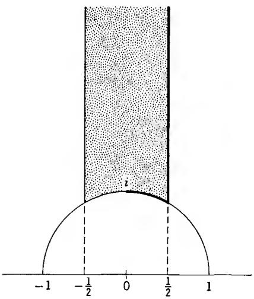  
FIG. 7-2. τ-plane.

2.4. General Properties of Elliptic Functions. In the following $f(z)$ will denote a meromorphic function which admits all numbers in the module M with basis $(\omega_{1},\omega_{2})$ as periods. We shall not assume that the basis is canonical, and it will not be required that M comprise all the periods.

It is convenient to say that $z_{1}$ is congruent to $z_{2}$ , $z_{1} \equiv z_{2} \pmod{M}$ , if the difference $z_{1} - z_{2}$ belongs to M, i.e., $z_{1} = z_{2} + n_{1}\omega_{1} + n_{2}\omega_{2}$ . The function f takes the same values at congruent points, and may thus be regarded as a function on the congruence classes. A concrete way to make use of this property is to restrict the function to a parallelogram $P_{a}$ with vertices $a, a + \omega_{1}, a + \omega_{2}, a + \omega_{1} + \omega_{2}$ . By including part of the boundary we may represent each congruence class by exactly one point in $P_{a}$ , and then f is completely determined by its values on $P_{a}$ . The choice of a is irrelevant, and we leave it free in order to attain, for instance, that f has no poles on the boundary of $P_{a}$ .

## Theorem 3. An elliptic function without poles is a constant.

If $f(z)$ has no poles, it is bounded on the closure of $P_{a}$ , and hence in the whole plane. By Liouville's theorem (Chap. 4, Sec. 2.3) it must reduce to a constant.

Because the poles have no accumulation point there are only finitely many poles in $P_{a}$ . When we speak of the poles of an elliptic function we mean a full set of mutually incongruent poles. Multiplicities are counted in the usual manner.

## Theorem 4. The sum of the residues of an elliptic function is zero.

We may choose a so that none of the poles fall on the boundary of $P_{a}$ . If the boundary $\partial P_{a}$ is traced in the positive sense, the sum of the residues at the poles in $P_{a}$ equals

$$
\frac {1}{2 \pi i} \int_ {\partial P _ {a}} f (z) d z.
$$

Because f has periods $\omega_{1}$ , $\omega_{2}$ the integral vanishes, for the integrals over opposite sides of the parallelogram cancel against each other.

As a consequence of the theorem there does not exist an elliptic function with a single simple pole.

Theorem 5. A nonconstant elliptic function has equally many poles as it has zeros.

The poles and zeros of f are simple poles of $f'/f$ , which is itself an elliptic function. The multiplicities are the residues of $f'/f$ , counted positive for zeros and negative for poles. The theorem now follows from Theorem 4.

If c is any constant, $f(z) - c$ has the same poles as $f(z)$ . Therefore, all values are assumed equally many times. The number of incongruent roots of the equations $f(z) = c$ is called the order of the elliptic function.

Theorem 6. The zeros $a_{1}, \ldots, a_{n}$ and poles $b_{1}, \ldots, b_{n}$ of an elliptic function satisfy $a_{1} + \cdots + a_{n} \equiv b_{1} + \cdots + b_{n} \pmod{M}$ .

This is proved by considering the integral

$$
\frac {1}{2 \pi i} \int_ {\partial P _ {a}} \frac {z f ^ {\prime} (z)}{f (z)} d z\tag{8}
$$

where we may again assume that there are no zeros or poles on the boundary. By the calculus of residues the integral equals $a_{1} + \cdots + a_{n} - b_{1} - \cdots - b_{n}$ provided that we choose the representative zeros and poles inside $P_{a}$ . Consider the sides from a to $a + \omega_{1}$ and from $a + \omega_{2}$ to $a + \omega_{1} + \omega_{2}$ . The corresponding part of the integral may be written

$$
\frac {1}{2 \pi i} \left(\int_ {a} ^ {a + \omega_ {1}} - \int_ {a + \omega_ {2}} ^ {a + \omega_ {1} + \omega_ {2}}\right) \frac {z f ^ {\prime} (z)}{f (z)} d z = - \frac {\omega_ {2}}{2 \pi i} \int_ {a} ^ {a + \omega_ {1}} \frac {f ^ {\prime} (z)}{f (z)} d z.
$$

Except for the factor $-\omega_{2}$ the right-hand member represents the winding number around the origin of the closed curve described by $f(z)$ when z varies from a to $a + \omega_{1}$ . It is consequently an integer. The same applies to the other pair of opposite sides. Therefore the value of (8) is of the form $n_{1}\omega_{1} + n_{2}\omega_{2}$ , and the theorem is proved.

## 3. THE WEIERSTRASS THEORY

The simplest elliptic functions are of order 2, and such functions have either a double pole with residue zero, or two simple poles with opposite residues. We shall follow the classical example of Weierstrass, who chose a function with a double pole as the starting point of a systematic theory.

3.1. The Weierstrass $\wp$ -function. We may as well place the pole at the origin, and since multiplication with a constant factor is clearly irrelevant, we may require that the singular part is $z^{-2}$ . If $f$ is elliptic and has only this singularity at the origin and its congruent points, it is easy to see that $f$ must be an even function. Indeed, $f(z) - f(-z)$ has the same periods and no singularity. Therefore it must reduce to a constant, and on setting $z = \omega_1 / 2$ we conclude that the constant is zero.

A constant can be added at will, and we can therefore choose the constant term in the Laurent development about the origin to be zero. With this additional normalization $f(z)$ is uniquely determined, and it is traditionally denoted by a special typographical symbol $\wp(z)$ . The Laurent development has the form

$$
\wp (z) = z ^ {- 2} + a _ {1} z ^ {2} + a _ {2} z ^ {4} + \dots .
$$

So far all this is hypothetical, for we have not yet shown the existence of an elliptic function with this development. We shall follow the usual procedure in such cases, namely to postulate the existence and derive an explicit expression. The clue is to develop in partial fractions by the method in Chap. 5, Sec. 2. Our aim is to prove the formula

$$
\wp (z) = \frac {1}{z ^ {2}} + \sum_ {\omega \neq 0} \left(\frac {1}{(z - \omega) ^ {2}} - \frac {1}{\omega^ {2}}\right)\tag{9}
$$

where the sum ranges over all $\omega = n_{1}\omega_{1} + n_{2}\omega_{2}$ except 0. Observe that $(z - \omega)^{-2}$ is the singular part at $\omega$ , and that we have subtracted $\omega^{-2}$ in order to produce convergence.

Our first task is to verify that the series converges. If $|\omega| > 2|z|$ , say, an immediate estimate gives

$$
\left| \frac {1}{(z - \omega) ^ {2}} - \frac {1}{\omega^ {2}} \right| = \left| \frac {z (2 \omega - z)}{\omega^ {2} (z - \omega) ^ {2}} \right| \leq \frac {1 0 | z |}{| \omega | ^ {3}}.
$$

Therefore the series (9) converges, uniformly on every compact set, provided that

$$
\sum_ {\omega \neq 0} \frac {1}{| \omega | ^ {3}} <   \infty .
$$

This is indeed the case. Because $\omega_{2}/\omega_{1}$ is nonreal, there exists a k > 0 such that $|n_{1}\omega_{1} + n_{2}\omega_{2}| \geq k(|n_{1}| + |n_{2}|)$ for all real pairs $(n_{1}, n_{2})$ . If we consider only integers there are 4n pairs $(n_{1}, n_{2})$ with $|n_{1}| + |n_{2}| = n$ . This gives

$$
\sum_ {\omega \neq 0} | \omega | ^ {- 3} \leq 4 k ^ {- 3} \sum_ {1} ^ {\infty} n ^ {- 2} <   \infty .
$$

The next step is to prove that the right-hand side of (9) has periods $\omega_{1}$ and $\omega_{2}$ . Direct verification is relatively cumbersome. Instead we write, temporarily,

$$
f (z) = \frac {1}{z ^ {2}} + \sum_ {\omega \neq 0} \left(\frac {1}{(z - \omega) ^ {2}} - \frac {1}{\omega^ {2}}\right)\tag{10}
$$

and obtain by termwise differentiation

$$
f ^ {\prime} (z) = - \frac {2}{z ^ {3}} - \sum_ {\omega \neq 0} \frac {2}{(z - \omega) ^ {3}} = - 2 \sum_ {\omega} \frac {1}{(z - \omega) ^ {3}}.
$$

The last sum is obviously doubly periodic. Therefore $f(z + \omega_{1}) - f(z)$ and $f(z + \omega_{2}) - f(z)$ are constants. Because $f(z)$ is even (as seen from (10)), it suffices to choose $z = -\omega_{1}/2$ and $z = -\omega_{2}/2$ to conclude that the constants are zero. We have thus proved that f has the asserted periods.

It follows now that $\wp(z) - f(z)$ is a constant, and by the form of the development at the origin the constant is zero. We have thereby proved the existence of $\wp(z)$ , and also that it can be represented by the series (9). For convenient reference we display the important formula

$$
\wp^ {\prime} (z) = - 2 \sum_ {\omega} \frac {1}{(z - \omega) ^ {3}}.\tag{11}
$$

3.2. The Functions $\zeta(z)$ and $\sigma(z)$ . Because $\wp(z)$ has zero residues, it is the derivative of a single-valued function. It is traditional to denote the antiderivative of $\wp(z)$ by $-\zeta(z)$ , and to normalize it so that it is odd. By use of (9) we are led to the explicit expression

$$
\zeta (z) = \frac {1}{z} + \sum_ {\omega \neq 0} \left(\frac {1}{z - \omega} + \frac {1}{\omega} + \frac {z}{\omega^ {2}}\right).\tag{12}
$$

The convergence is obvious, for apart from the term 1/z we obtain the new series by integration from 0 to z along any path that does not pass through the poles.

It is clear that $\zeta(z)$ satisfies conditions $\zeta(z + \omega_1) = \zeta(z) + \eta_1$ , $\zeta(z + \omega_2) = \zeta(z) + \eta_2$ , where $\eta_1$ and $\eta_2$ are constants. They are connected with $\omega_1, \omega_2$ by a very simple relation. To derive it we choose any $a \neq 0$ and observe that

$$
\frac {1}{2 \pi i} \int_ {\partial P _ {a}} \zeta (z) d z = 1,
$$

by the residue theorem. The integral is easy to evaluate by adding the contributions from opposite sides of the parallelogram, and we obtain the equation

$$
\eta_ {1} \omega_ {2} - \eta_ {2} \omega_ {1} = 2 \pi i,
$$

known as Legendre's relation.

The integration can be carried one step further provided that we use an exponential to eliminate the multiple-valuedness. Just as easily we can verify directly that the product

$$
\sigma (z) = z \prod_ {\omega \neq 0} \left(1 - \frac {z}{\omega}\right) e ^ {z / \omega + \frac {1}{2} (z / \omega) ^ {2}}\tag{13}
$$

converges and represents an entire function which satisfies

$$
\sigma^ {\prime} (z) / \sigma (z) = \zeta (z).
$$

The formula (13) is a canonical product representation of $\sigma(z)$ .

How does $\sigma(z)$ change when $z$ is replaced by $z + \omega_1$ or $z + \omega_2$ ? From

$$
\frac {\sigma^ {\prime} (z + \omega_ {1})}{\sigma (z + \omega_ {1})} = \frac {\sigma^ {\prime} (z)}{\sigma (z)} + \eta_ {1}
$$

it follows at once that

$$
\sigma (z + \omega_ {1}) = C _ {1} \sigma (z) e ^ {\eta_ {1} z}
$$

with constant $C_{1}$ . To determine the constant we observe that $\sigma(z)$ is an odd function. On setting $z = -\omega_{1}/2$ the value of $C_{1}$ can be determined, and we find that $\sigma(z)$ satisfies

$$
\begin{array}{l} \sigma (z + \omega_ {1}) = - \sigma (z) e ^ {\eta_ {1} (z + \omega_ {1} / 2)} \\ \sigma (z + \omega_ {2}) = - \sigma (z) e ^ {\eta_ {2} (z + \omega_ {2} / 2)}. \end{array}\tag{14}
$$

## EXERCISES

1. Show that any even elliptic function with periods $\omega_{1}$ , $\omega_{2}$ can be expressed in the form

$$
C \prod_ {k = 1} ^ {n} \frac {\wp (z) - \wp (a _ {k})}{\wp (z) - \wp (b _ {k})} \quad (C = \text { const. })
$$

provided that 0 is neither a zero nor a pole. What is the corresponding form if the function either vanishes or becomes infinite at the origin?

2. Show that any elliptic function with periods $\omega_{1}$ , $\omega_{2}$ can be written as

$$
C \prod_ {k = 1} ^ {n} \frac {\sigma (z - a _ {k})}{\sigma (z - b _ {k})} \quad (C = \text { const. }).
$$

Hint: Use (14) and Theorem 6.

3.3. The Differential Equation. By use of formula (12) it is easy to derive the Laurent expansion of $\zeta(z)$ about the origin, and differentiation will then yield the corresponding expansion of $\wp(z)$ . We have first

$$
\frac {1}{z - \omega} + \frac {1}{\omega} + \frac {z}{\omega^ {2}} = - \frac {z ^ {2}}{\omega^ {3}} - \frac {z ^ {3}}{\omega^ {4}} - \dots
$$

and when we sum over all periods we obtain

$$
\zeta (z) = \frac {1}{z} - \sum_ {k = 2} ^ {\infty} G _ {k} z ^ {2 k - 1}
$$

where we have written

$$
G _ {k} = \sum_ {\omega \neq 0} \frac {1}{\omega^ {2 k}}.
$$

Observe that the corresponding sums of odd powers of the periods are zero, as was to be expected since $\zeta$ is an odd function. Because

$$
\wp (z) = - \zeta^ {\prime} (z)
$$

we obtain further

$$
\wp (z) = \frac {1}{z ^ {2}} + \sum_ {k = 2} ^ {\infty} (2 k - 1) G _ {k} z ^ {2 k - 2}.
$$

In the following computation we write down only the significant terms, since it is understood that the omitted terms are of higher order:

$$
\wp (z) = \frac {1}{z ^ {2}} + 3 G _ {2} z ^ {2} + 5 G _ {3} z ^ {4} + \dots
$$

$$
\wp^ {\prime} (z) = - \frac {2}{z ^ {3}} + 6 G _ {2} z + 2 0 G _ {3} z ^ {3} + \dots
$$

$$
\wp^ {\prime} (z) ^ {2} = \frac {4}{z ^ {6}} - \frac {2 4 G _ {2}}{z ^ {2}} - 8 0 G _ {3} + \dots
$$

$$
4 \wp (z) ^ {3} = \frac {4}{z ^ {6}} + \frac {3 6 G _ {2}}{z ^ {2}} + 6 0 G _ {3} + \dots
$$

$$
6 0 G _ {2} \wp (z) = \frac {6 0 G _ {2}}{z ^ {2}} + 0 + \dots .
$$

The last three lines yield

$$
\wp^ {\prime} (z) ^ {2} - 4 \wp (z) ^ {3} + 6 0 G _ {2} \wp (z) = - 1 4 0 G _ {3} + \dots .
$$

Here the left-hand side is a doubly periodic function, and the right-hand side has no poles. We may therefore conclude that

$$
\wp^ {\prime} (z) ^ {2} = 4 \wp (z) ^ {3} - 6 0 G _ {2} \wp (z) - 1 4 0 G _ {3}.
$$

It is customary to set $g_{2} = 60G_{2}, g_{3} = 140G_{3}$ so that the equation becomes

$$
\wp^ {\prime} (z) ^ {2} = 4 \wp (z) ^ {3} - g _ {2} \wp (z) - g _ {3}.\tag{15}
$$

This is a first-order differential equation for $w = \wp(z)$ . It can be solved explicitly, namely, by the formula

$$
z = \int^ {w} \frac {d w}{\sqrt {4 w ^ {3} - g _ {2} w - g _ {3}}} + \text { constant },
$$

which shows that $\wp(z)$ is the inverse of an elliptic integral. More accurately, this connection is expressed by the identity

$$
z - z _ {0} = \int_ {\wp (z _ {0})} ^ {\wp (z)} \frac {d w}{\sqrt {4 w ^ {3} - g _ {2} w - g _ {3}}}
$$

where the path of integration is the image under $\wp$ of a path from $z_0$ to $z$ that avoids the zeros and poles of $\wp'(z)$ , and where the sign of the square root must be chosen so that it actually equals $\wp'(z)$ .

We recall that we encountered the relationship between elliptic functions and elliptic integrals already in connection with the conformal mapping of rectangles and certain triangles (Chap. 6, Sec. 2).

## \*EXERCISES

The Weierstrass functions satisfy numerous identities which are best dealt with in an exercise section. They can be proved either by comparing two elliptic functions with the same zeros and poles (when $\sigma$ -functions are involved), or by comparing elliptic functions with the same singular parts (when only $\wp$ - and $\zeta$ -functions are involved). The following sequence of formulas is so arranged that we need to resort to this method only once.

1.

$$
\wp (z) - \wp (u) = - \frac {\sigma (z - u) \sigma (z + u)}{\sigma (z) ^ {2} \sigma (u) ^ {2}}\tag{16}
$$

(Use (14) to show that the right-hand member is a periodic function of z. Find the multiplicative constant by comparing the Laurent developments.)

2.

$$
\frac {\wp^ {\prime} (z)}{\wp (z) - \wp (u)} = \zeta (z - u) + \zeta (z + u) - 2 \zeta (z).\tag{17}
$$

(Follows from (16) by taking logarithmic derivatives.)

$$
\zeta (z + u) = \zeta (z) + \zeta (u) + \frac {1}{2} \frac {\wp^ {\prime} (z) - \wp^ {\prime} (u)}{\wp (z) - \wp (u)}.\tag{18}
$$

(This is a symmetrized version of (17).)

4. The addition theorem for the $\wp$ -function:

$$
\wp (z + u) = - \wp (z) - \wp (u) + \frac {1}{4} \left(\frac {\wp^ {\prime} (z) - \wp^ {\prime} (u)}{\wp (z) - \wp (u)}\right) ^ {2}.\tag{19}
$$

(Differentiation of (18) leads to a formula which contains $\wp''(z)$ . It can be eliminated by (15) which gives $\wp'' = 6\wp^2 - \frac{1}{2} g_2$ . Symmetrization yields (19). Observe that this is an algebraic addition theorem, for $\wp'(z)$ and $\wp'(u)$ can be expressed algebraically through $\wp(z)$ and $\wp(u)$ .) 5. Prove

$$
\wp (2 z) = \frac {1}{4} \left(\frac {\wp^ {\prime \prime} (z)}{\wp^ {\prime} (z)}\right) ^ {2} - 2 \wp (z).
$$

6. Prove $\wp'(z) = -\sigma(2z)/\sigma(z)^{4}$ .

7. Prove that

$$
\left| \begin{array}{c c c} \wp (z) & \wp^ {\prime} (z) & 1 \\ \wp (u) & \wp^ {\prime} (u) & 1 \\ \wp (u + z) & - \wp^ {\prime} (u + z) & 1 \end{array} \right| = 0.
$$

3.4. The Modular Function $\lambda (\tau)$ . The differential equation (15) can also be written as

$$
\wp^ {\prime} (z) ^ {2} = 4 (\wp (z) - e _ {1}) (\wp (z) - e _ {2}) (\wp (z) - e _ {3}),\tag{20}
$$

where $e_{1}, e_{2}, e_{3}$ are the roots of the polynomial $4w^{3} - g_{2}w - g_{3}$ .

To find the values of the $e_{k}$ we determine the zeros of $\wp'(z)$ . The symmetry and periodicity of $\wp(z)$ imply $\wp(\omega_{1}-z)=\wp(z)$ . Hence $\wp'(\omega_{1}-z)=-\wp'(z)$ , from which it follows that $\wp'(\omega_{1}/2)=0$ . Similarly $\wp'(\omega_{2}/2)=0$ , and also $\wp'((\omega_{1}+\omega_{2})/2)=0$ . The numbers $\omega_{1}/2$ , $\omega_{2}/2$ and $(\omega_{1}+\omega_{2})/2$ are mutually incongruent modulo the periods. Therefore they are precisely the three zeros of $\wp'$ , which is of order 3, and all the zeros are simple. When we compare with (20) it follows that we can set

$$
e _ {1} = \wp (\omega_ {1} / 2), \quad e _ {2} = \wp (\omega_ {2} / 2), \quad e _ {3} = \wp ((\omega_ {1} + \omega_ {2}) / 2).\tag{21}
$$

It follows, moreover, and this is very important, that these roots are all distinct. Indeed, $\wp(z)$ assumes each value $e_{k}$ with multiplicity 2, and if two of them were equal that value would be assumed four times in contradiction with the fact that $\wp$ is of order 2.

If we substitute $z = \omega_{1}/2$ , $\omega_{2}/2$ and $(\omega_{1} + \omega_{2})/2$ in the definition (9) of $\wp(z)$ it is seen at once that the $e_{k}$ are homogeneous of order -2 in $\omega_{1}$ , $\omega_{2}$ (in other words, if the periods are multiplied by t, then the $e_{k}$ are multiplied by $t^{-2}$ ). We conclude that the quantity

$$
\lambda (\tau) = \frac {e _ {3} - e _ {2}}{e _ {1} - e _ {2}}\tag{22}
$$

depends only on the ratio $\tau = \omega_{2}/\omega_{1}$ , as indicated by our notation. It is quite clear from (9) that $\lambda(\tau)$ is the quotient of two analytic functions in the upper half plane Im $\tau > 0$ . Because $e_{1} \neq e_{2}$ it is actually analytic, rather than meromorphic; because $e_{2} \neq e_{3}$ it is never equal to 0, and because $e_{1} \neq e_{3}$ it is never equal to 1.

We shall study the dependence on $\tau$ in greater detail. If the periods are subjected to the unimodular transformation

$$
\begin{array}{r} \omega_ {2} ^ {\prime} = a \omega_ {2} + b \omega_ {1} \\ \omega_ {1} ^ {\prime} = c \omega_ {2} + d \omega_ {1} \end{array}\tag{23}
$$

then, first of all, the $\wp$ -function does not change. Therefore, by looking at (20), the roots $e_k$ can at most be permuted. Let us see what actually happens. It is clear from (23) that $\omega_1'/2 \equiv \omega_1/2$ and $\omega_2'/2 \equiv \omega_2/2$ if $a \equiv d \equiv 1 \pmod{2}$ and $b \equiv c \equiv 0 \pmod{2}$ . Under this condition the $e_k$ do not change, and we have shown that

$$
\lambda \left(\frac {a \tau + b}{c \tau + d}\right) = \lambda (\tau) \quad \text { for } \quad \left( \begin{array}{l l} a & b \\ c & d \end{array} \right) \equiv \left( \begin{array}{l l} 1 & 0 \\ 0 & 1 \end{array} \right) (\mathrm{mod} 2).\tag{24}
$$

The transformations which satisfy the congruence relation in (24) form a subgroup of the modular group (cf. Sec. 2.2), known as the congruence subgroup mod 2. Equation (24) asserts that $\lambda(\tau)$ is invariant under this subgroup. Quite generally, when an analytic or meromorphic function is invariant under a group of linear transformations, we call it an automorphic function. More specifically, a function which is automorphic with respect to a subgroup of the modular group is called a modular function (or an elliptic modular function).

We still have to determine the behavior of $\lambda(\tau)$ under a modular transformation that does not belong to the congruence subgroup. It is sufficient to consider matrices congruent mod 2 to $\begin{pmatrix}1 & 1 \\ 0 & 1\end{pmatrix}$ and $\begin{pmatrix}0 & 1 \\ 1 & 0\end{pmatrix}$ respectively, for all other types can be composed from these. In the first case we obtain $\omega_2'/2 = (\omega_1 + \omega_2)/2$ and $\omega_1'/2 = \omega_1/2$ ; this means that $e_2$ and $e_3$ are interchanged, while $e_1$ remains fixed, and hence $\lambda$ goes over into $(e_2 - e_3)/(e_1 - e_3) = \lambda/( \lambda - 1)$ . In the second case $\omega_2'/2 = \omega_1/2$ , $\omega_1'/2 = \omega_2/2$ , so that $e_1$ and $e_2$ are interchanged, and $\lambda$ goes over into $1 - \lambda$ . Sample transformations are $\tau \to \tau + 1$ and $\tau \to -1/\tau$ . We find that $\lambda(\tau)$ satisfies the functional equations

$$
\lambda (\tau + 1) = \frac {\lambda (\tau)}{\lambda (\tau) - 1}, \quad \lambda \left(- \frac {1}{\tau}\right) = 1 - \lambda (\tau).\tag{25}
$$

3.5. The Conformal Mapping by $\lambda(\tau)$ . For convenience we shall henceforth use the normalization $\omega_1 = 1$ , $\omega_2 = \tau$ . With this choice of periods we obtain from (9) and (21)

$$
e _ {3} - e _ {2} = \sum_ {m, n = - \infty} ^ {\infty} \left[ \frac {1}{(m - \frac {1}{2} + (n + \frac {1}{2}) \tau) ^ {2}} - \frac {1}{(m + (n - \frac {1}{2}) \tau) ^ {2}} \right]\tag{26}
$$

$$
e _ {1} - e _ {2} = \sum_ {m, n = - \infty} ^ {\infty} \left[ \frac {1}{(m - \frac {1}{2} + n \tau) ^ {2}} - \frac {1}{(m + (n - \frac {1}{2}) \tau) ^ {2}} \right]
$$

where the double series are absolutely convergent. Our first observation is that these quantities are real when $\tau$ is purely imaginary (this is also true of the individual $e_{k}$ ). Indeed, when we replace $\tau$ by $-\tau$ the sums remain the same, except for a rearrangement of the terms. We conclude that $\lambda(\tau)$ is real on the imaginary axis.

Because $\begin{pmatrix} 1 & 2 \\ 0 & 1 \end{pmatrix}$ is in the congruence subgroup mod 2 we have $\lambda(\tau + 2) = \lambda(\tau)$ . In other words, $\lambda$ has period 2. As we have seen in Sec. 2, this means that $\lambda(\tau)$ can be expressed as a function of $e^{\pi ir}$ . It would not be difficult to determine the Fourier development, but we shall be content to show that $\lambda(\tau) \to 0$ as $\operatorname{Im} \tau \to \infty$ .

To evaluate (26) we sum first with respect to $m$ . This summation can be carried out explicitly by use of the formula

$$
\frac {\pi^ {2}}{\sin^ {2} \pi z} = \sum_ {- \infty} ^ {\infty} \frac {1}{(z - m) ^ {2}}
$$

(Chap. 5, Sec. 2.1, (9)). We obtain at once

$$
e _ {3} - e _ {2} = \pi^ {2} \sum_ {n = - \infty} ^ {\infty} \left(\frac {1}{\cos^ {2} \pi (n - \frac {1}{2}) \tau} - \frac {1}{\sin^ {2} \pi (n - \frac {1}{2}) \tau}\right)\tag{27}
$$

$$
e _ {1} - e _ {2} = \pi^ {2} \sum_ {n = - \infty} ^ {\infty} \left(\frac {1}{\cos^ {2} \pi n \tau} - \frac {1}{\sin^ {2} \pi (n - \frac {1}{2}) \tau}\right).
$$

The series are strongly convergent, both for $n \to +\infty$ and $n \to -\infty$ , for $|\cos n\pi \tau|$ and $|\sin n\pi \tau|$ are comparable to $e^{|n|\pi \operatorname{Im}\tau}$ ; the convergence is uniform for $\operatorname{Im} \tau \geq \delta > 0$ .

The limits can now be taken termwise, and we find that $e_{3} - e_{2} \rightarrow 0$ , $e_{1} - e_{2} \rightarrow \pi^{2}$ (from the term n = 0). Hence $\lambda(\tau) \rightarrow 0$ as Im $\tau \rightarrow \infty$ , uniformly with respect to the real part of $\tau$ . It follows further by the second equation (25) that $\lambda(\tau) \rightarrow 1$ when $\tau$ approaches 0 along the imaginary axis.

We need one more piece of information, namely the order to which $\lambda(\tau)$ vanishes together with $e^{\pi i\tau}$ . From (27) the leading terms in $e_{3}-e_{2}$ are the ones corresponding to n=0 and n=1. The sum of these terms is

$$
2 \pi^ {2} \left[ \frac {4 e ^ {\pi i \tau}}{(1 + e ^ {\pi i \tau}) ^ {2}} + \frac {4 e ^ {\pi i \tau}}{(1 - e ^ {\pi i \tau}) ^ {2}} \right]
$$

and we conclude that

$$
\lambda (\tau) e ^ {- \pi i \tau} \rightarrow 1 6\tag{28}
$$

for $\operatorname{Im} \tau \to \infty$ .

In Fig. 7-3 the region $\Omega$ is bounded by the imaginary axis, the line $\operatorname{Re} \tau = 1$ , and the circle $|\tau - \frac{1}{2}| = \frac{1}{2}$ . The transformation $\tau + 1$ maps the imaginary axis on $\operatorname{Re} \tau = 1$ , and $1 - 1/\tau$ maps $\operatorname{Re} \tau = 1$ on $|\tau - \frac{1}{2}| = \frac{1}{2}$ . Since $\lambda(\tau)$ is real on the imaginary axis, it follows by virtue of the relations (25) that it is real on the whole boundary of $\Omega$ . Furthermore, $\lambda(\tau) \to 1$ as $\tau$ tends to 0 and $\lambda(\tau) \to \infty$ as $\tau$ tends to 1 inside $\Omega$ .

We apply the argument principle to determine the number of times $\lambda(\tau)$ takes a nonreal value $w_{0}$ in $\Omega$ . Cut off the corners of $\Omega$ by means of a horizontal line segment $\operatorname{Im} \tau = t_0$ and its images under the transformations $-1/\tau$ and $1 - 1/\tau$ (these images are circles tangent to the real axis). For sufficiently large $t_0$ it is clear that $\lambda(\tau) \neq w_0$ in the portions that have been cut off. The circle near $\tau = 1$ is mapped by $\lambda(\tau)$ on a curve $\lambda = \lambda(1 - 1/\tau) = 1 - 1/\lambda(\tau)$ ; where $\tau = s + it_0$ , $0 \leq s \leq 1$ ; in view of (28) this is approximately a large semicircle in the upper half plane. It is now evident that the image of the contour of the truncated region $\Omega$ has winding number 1 about $w_0$ if $\operatorname{Im} w_0 > 0$ , and winding number 0 if $\operatorname{Im} w_0 < 0$ . As a result $\lambda(\tau)$ takes every value in the upper half plane exactly once in $\Omega$ , and no value in the lower half plane. This is also sufficient to guarantee that $\lambda(\tau)$ is monotone on the boundary of $\Omega$ . Indeed, if it were not, the derivative $\lambda'(\tau)$ would vanish at a boundary point, and it would be impossible for a full semicircular neighborhood of that boundary point to be mapped into the upper half plane.

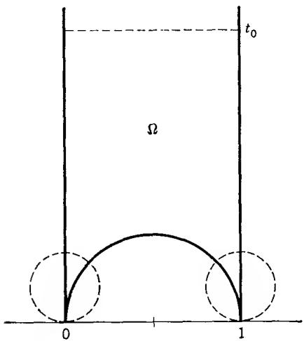  
FIG. 7-3

Theorem 7. The modular function $\lambda(\tau)$ effects a one-to-one conformal mapping of the region $\Omega$ onto the upper half plane. The mapping extends continuously to the boundary in such a way that $\tau = 0, 1, \infty$ correspond to $\lambda = 1, \infty, 0$ .

By reflection the region $\Omega'$ that is symmetric to $\Omega$ with respect to the imaginary axis is mapped onto the lower half plane, and thus both regions together correspond to the whole plane, except for the points 0 and 1.

We shall also prove:

Theorem 8. Every point $\tau$ in the upper half plane is equivalent under the congruence subgroup mod 2 to exactly one point in $\bar{\Omega} \cup \Omega'$ .

We refer to Fig. 7-4. The reader is asked to verify that the region $\Delta$ is mapped on the shaded regions in the figure by means of the linear transformations $\tau, -1/\tau, \tau - 1, 1/(1 - \tau), (\tau - 1)/\tau, \tau/(1 - \tau)$ which we shall denote by $S_1, S_2, \ldots, S_6$ . The matrices of the inverse transformations $S_k^{-1}$ ( $k = 1, \ldots, 6$ ) are in order

$$
\left( \begin{array}{c c} 1 & 0 \\ 0 & 1 \end{array} \right), \left( \begin{array}{c c} 0 & - 1 \\ 1 & 0 \end{array} \right), \left( \begin{array}{c c} 1 & 1 \\ 0 & 1 \end{array} \right), \left( \begin{array}{c c} 1 & - 1 \\ 1 & 0 \end{array} \right), \left( \begin{array}{c c} 0 & 1 \\ - 1 & 1 \end{array} \right), \left( \begin{array}{c c} 1 & 0 \\ 1 & 1 \end{array} \right).
$$

One recognizes readily that these matrices form a complete set of mutually incongruent matrices in the sense that every unimodular matrix is congruent mod 2 to exactly one of them. Precisely the same can be shown for the transformations $S_k' (k = 1, \ldots, 6)$ which map $\Delta'$ on the unshaded regions in the figure (the task of writing them down is left to the reader).

Together the 12 images of $\bar{\Delta}$ and $\bar{\Delta}'$ cover the set $\bar{\Omega} \cup \bar{\Omega}'$ (closures should be taken with respect to the open half plane).

Let $\tau$ be any point in the upper half plane. The set $\bar{\Delta} \cup \bar{\Delta}'$ can be identified with the closure of the shaded region in Fig. 7-0. Therefore, according to Theorem 2 there exists a modular transformation $S$ such that $S_{\tau}$ lies in $\bar{\Delta} \cup \bar{\Delta}'$ . Suppose first that $S_{\tau}$ is in $\bar{\Delta}$ . We know that the matrix of $S$ is congruent mod 2 to the matrix of an $S_k^{-1}$ . It follows that the matrix of $T = S_k S$ is congruent to the identity matrix; in other words, $T$ belongs to the congruence subgroup. Since $S_{\tau}$ lies in $\bar{\Delta}$ we know further that $T_{\tau} = S_k(S_{\tau})$ lies in $\bar{\Omega} \cup \bar{\Omega}'$ . The same reasoning applies if $S_{\tau} \in \bar{\Delta}'$ . Thus there is always a $T_{\tau}$ in $\bar{\Omega} \cup \bar{\Omega}'$ , and a trivial consideration shows that it can be chosen in $\bar{\Omega} \cup \Omega'$ .

The uniqueness follows readily from the fact that the $S_{k}$ as well as the $S_{k}^{\prime}$ are mutually incongruent. We shall leave it to the reader to work out the details.

## \*EXERCISE

Show that the function

$$
J (\tau) = \frac {4}{2 7} \frac {(1 - \lambda + \lambda^ {2}) ^ {3}}{\lambda^ {2} (1 - \lambda) ^ {2}}
$$

is automorphic with respect to the full modular group. Where does it take the values 0 and 1, and with what multiplicities? Show that

$$
J (\tau) = \frac {- 4 (e _ {1} e _ {2} + e _ {2} e _ {3} + e _ {3} e _ {1}) ^ {3}}{(e _ {1} - e _ {2}) ^ {2} (e _ {2} - e _ {3}) ^ {2} (e _ {3} - e _ {1}) ^ {2}}.
$$

Show also that $J(\tau)$ maps the region $\Delta$ in Fig. 7-4 onto a half plane.

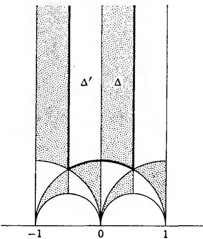  
FIG. 7-4. Fundamental region of $\lambda(\tau)$ .

## 1. ANALYTIC CONTINUATION

In the preceding chapters we have stressed that all functions must be well defined and, therefore, single-valued. In the case of functions such as $\sqrt{z}$ and $\log z$ which are not uniquely determined by their analytic expressions, a special effort was needed to show that, under favorable circumstances, a single-valued branch can be selected. While this answers the need for logical clarity, it does not do justice to the fact that the ambiguity of the square root or the logarithm is an essential feature which cannot be ignored. There is thus a clear need for a concept that emphasizes rather than circumvents multiple valuedness.

1.1. The Weierstrass Theory. Weierstrass, in contrast to Riemann, who favored a more geometric outlook, wanted to build the whole theory of analytic functions from the concept of power series. For Weierstrass the basic building block was a power series

$$
P (z - \zeta) = a _ {0} + a _ {1} (z - \zeta) + \dots + a _ {n} (z - \zeta) ^ {n} + \dots
$$

with a positive radius of convergence $r(P)$ . Such a series is determined by a complex number $\zeta$ , the center of the power series, and a sequence $\{a_n\}_0^\infty$ of complex coefficients. The radius of convergence is given by Hadamard's formula $r(P)^{-1} = \varlimsup_{n\to \infty}|a_n|^{1 / n}$ . It is an essential requirement that $r(P) > 0$ , for only then does the power series define an analytic function $f(z)$ in the disk $D = \{z\mid |z - \zeta| < r(P)\}$ .

Given a point $\zeta_1 \in D$ , the function $f(z)$ has a Taylor development $P_1(z - \zeta_1)$ about $\zeta_1$ . It converges in a disk $D_1$ whose radius $r(P_1)$ is at least equal to $r(P_0) - |\zeta_1 - \zeta|$ , but may be larger. The new series defines an analytic function $f_1(z)$ in $D_1$ which is said to be obtained from $f(z)$ by direct analytic continuation. Together, $f$ and $f_1$ define an analytic function in $D \cup D_1$ , for they are equal in the intersection $D \cap D_1$ . If $D_1$ is not contained in $D$ , the new function is an extension of $f$ to a larger region, and that is the purpose of the construction.

This process can be repeated any number of times. In the general case we have to consider a succession of power series $P_{0}(z - \zeta_{0})$ , $P_{1}(z - \zeta_{1})$ , $\ldots$ , $P_{n}(z - \zeta_{n})$ , each of which is a direct analytic continuation of the preceding one. In other words, if $P_{k}$ converges to a function $f_{k}$ in the disk $D_{k}$ , then $\zeta_{k} \in D_{k-1}$ and $f_{k} = f_{k-1}$ in $D_{k-1} \cap D_{k}$ . It does not follow that $f_{0}, \ldots, f_{n}$ define a single-valued function in $D_{0} \cup D_{1} \cup \cdots \cup D_{n}$ , for if $D_{k}$ meets a $D_{h}$ with h different from k - 1 and $k + 1$ , there is no guarantee that $f_{h} = f_{k}$ in $D_{h} \cap D_{k}$ . It is precisely this possibility that leads beyond the notion of function in the strict sense of having only one value at each point of its domain.

As soon as there exist power series $P_{0}, P_{1}, \ldots, P_{n}$ as above, one says that $P_{n}$ is an analytic continuation of $P_{0}$ . Weierstrass considers the totality of all power series $P(z - \zeta)$ that can be obtained from $P_{0}(z - \zeta_{0})$ by analytic continuation. This set of power series will be called an analytic function in the sense of Weierstrass.

The property of one power series to be an analytic continuation of another is evidently an equivalence relation. An analytic function in the sense of Weierstrass is nothing but an equivalence class with respect to this relation, and the initial power series $P_{0}$ is in no distinguished position within its class. The underlying idea is that two power series which belong to the same equivalence class are different forms of the same function.

1.2. Germs and Sheaves. The Weierstrass theory has mostly historical interest, for the restriction to power series and their domains of convergence is more of a hindrance than a help. It should, nevertheless, be recognized that the idea of Weierstrass is still the basis for our understanding of multiple-valuedness in the theory of complex analytic functions.

We shall outline a more direct approach which is more in line with the somewhat sophisticated ideas that dominate the recent theory of analytic functions of several complex variables. Because of the limited scope of this book we have to be content to borrow some of the terminology and use it to simplify some proofs.

An analytic function $f$ defined in a region $\Omega$ will constitute a function element, denoted by $(f, \Omega)$ , and a global analytic function will appear as a collection of function elements which are related to each other in a prescribed manner.

Two function elements $(f_{1},\Omega_{1})$ and $(f_{2},\Omega_{2})$ are said to be direct analytic continuations of each other if $\Omega_{1}\cap\Omega_{2}$ is nonempty and $f_{1}(z)=f_{2}(z)$ in $\Omega_{1}\cap\Omega_{2}$ . More specifically, $(f_{2},\Omega_{2})$ is called a direct analytic continuation of $(f_{1},\Omega_{1})$ to the region $\Omega_{2}$ . There need not exist any direct analytic continuation to $\Omega_{2}$ , but if there is one, it is uniquely determined. For suppose that $(f_{2},\Omega_{2})$ and $(g_{2},\Omega_{2})$ are two direct analytic continuations of $(f_{1},\Omega_{1})$ ; then $f_{2}=g_{2}$ in $\Omega_{1}\cap\Omega_{2}$ , and because $\Omega_{2}$ is connected, this implies $f_{2}=g_{2}$ throughout $\Omega_{2}$ . We note that if $\Omega_{2}\subset\Omega_{1}$ , then the direct analytic continuation of $(f_{1},\Omega_{1})$ is $(f_{1},\Omega_{2})$ .

As in the case of power series we consider chains $(f_{1},\Omega_{1})$ , $(f_{2},\Omega_{2})$ , $\ldots$ , $(f_{n},\Omega_{n})$ such that $(f_{k},\Omega_{k})$ and $(f_{k+1},\Omega_{k+1})$ are direct analytic continuations of each other, and we say that $(f_{n},\Omega_{n})$ is an analytic continuation of $(f_{1},\Omega_{1})$ . This defines an equivalence relation, and the equivalence classes are called global analytic functions. As a typographical device the global analytic function determined by the function element $(f,\Omega)$ will be denoted by bold type, f. For a more flexible terminology $(f,\Omega)$ is also referred to as a branch of f. While $(f,\Omega)$ determines f uniquely, the converse is not true; f may have several branches over the same $\Omega$ .

It is quite obvious that global analytic functions can be identified with analytic functions in the sense of Weierstrass, and we have gained almost nothing in generality. There is, however, a more fruitful point of view. Instead of pairs $(f,\Omega)$ we shall consider pairs $(f,\zeta)$ where $\zeta$ is a point and f is analytic at $\zeta$ , that is to say, f is defined and analytic in some open set that contains $\zeta$ . Two pairs $(f_{1},\zeta_{1})$ and $(f_{2},\zeta_{2})$ shall be equivalent if and only if $\zeta_{1} = \zeta_{2}$ and $f_{1} = f_{2}$ in some neighborhood of $\zeta_{1}$ . The conditions for an equivalence relation are obviously fulfilled. The equivalence classes are called germs, or more specifically germs of analytic functions. Each germ determines a unique $\zeta$ , the projection of the germ, and we use the notation $f_{t}$ to indicate a germ with projection $\zeta$ . A function element $(f,\Omega)$ gives rise to a germ $f_{t}$ for each $\zeta \in \Omega$ ; conversely, every $f_{t}$ is determined by some $(f,\Omega)$ .

The reader will of course recognize that the germs $f_{\zeta}$ can be identified with the corresponding convergent power series $P(z - \zeta)$ , and we are back where we started. However, by introducing the notion of germ we have isolated an essential property of convergent power series, namely the fact that two power series with the same center are identical if and only if they represent the same function in some neighborhood of the center. In pursuit of this idea it becomes clear that we could equally well consider germs of other classes of functions, for instance, germs of continuous functions, germs of functions of class $C^{k}$ , etc., for which the identification with power series is no longer possible. Although we are mainly interested in germs of analytic functions, we are nevertheless going to take a slightly more general point of view.

Let $D$ be an open set in the complex plane. The set of all germs $\mathbf{f}_{\zeta}$ with $\zeta \in D$ is called a sheaf over $D$ ; we shall denote it by $\mathfrak{S}$ or $\mathfrak{S}_D$ . If we are dealing with germs of analytic functions, $\mathfrak{S}_D$ is called the sheaf of germs of analytic functions over $D$ . There is a projection map $\pi: \mathfrak{S} \to D$ which maps $\mathbf{f}_{\zeta}$ on $\zeta$ . For a fixed $\zeta \in D$ the inverse image $\pi^{-1}(\zeta)$ is called the stalk over $\zeta$ ; it is denoted by $\mathfrak{S}_{\zeta}$ .

The set $\mathfrak{S}$ is interesting because it carries a twofold structure: one topological and one algebraic. First, $\mathfrak{S}$ can be made into a topological space, which enables us to speak of continuous mappings. Second, there is an obvious algebraic structure on each stalk, for it is clear what we mean by $\mathbf{f}_{\mathfrak{r}} + \mathbf{g}_{\mathfrak{r}}$ or $\mathbf{f}_{\mathfrak{r}} \cdot \mathbf{g}_{\mathfrak{r}}$ . For the sake of simplicity we shall fix our attention on the additive structure. In terms of this structure each stalk is an abelian group.

We are ready for a fairly general definition.

Definition 1. A sheaf over $D$ is a topological space $\mathfrak{S}$ and a mapping $\pi\colon\mathfrak{S}\to D$ with the following properties:

(i) The mapping $\pi$ is a local homeomorphism; this shall mean that each $s \in \mathfrak{S}$ has an open neighborhood $\Delta$ such that $\pi(\Delta)$ is open and the restriction of $\pi$ to $\Delta$ is a homeomorphism.

(ii) For each $\zeta \in D$ the stalk $\pi^{-1}(\zeta) = \mathfrak{S}_{\zeta}$ has the structure of an abelian group.

(iii) The group operations are continuous in the topology of $\mathfrak{S}$ .

Actually, D can be an arbitrary topological space, but we shall think of D as an open set in the complex plane. Also, the structure of an abelian group can be replaced by other algebraic structures.

We shall now verify that the sheaf S of germs of analytic functions satisfies the conditions in Definition 1. For this purpose we must first introduce a topology on S. It is awkward, and unnecessary, to make S a metric space. Instead, we need merely specify the subsets of S which are to be the open sets in the topology. Our characterization of open sets shall be as follows: A set $V \subset S$ is open if for every $s_{0} \in V$ there exists a function element $(f, \Omega)$ such that (1) $\pi(s_{0}) = \zeta_{0} \in \Omega$ , (2) $(f, \Omega)$ determines the germ $s_{0}$ at $\zeta_{0}$ , (3) all the germs $f_{t}$ determined by $(f, \Omega)$ are in V. The reader will have no difficulty verifying that the conditions of Chap. 3, Def. 8, are satisfied.

With $s_{0}$ and $(f,\Omega)$ as above, let $\Delta$ be the set of all the germs $f_{r}$ determined by $(f,\Omega)$ . Owing to our definition of open set, it is quite obvious that $\Delta$ is an open neighborhood of $s_{0}$ , and that the mapping $\pi\colon\Delta\to\Omega$ is a homeomorphism. Thus condition (i) of the definition is fulfilled.

Condition (ii) needs no proof. Condition (iii) is also easy, but it is important to understand what is involved. Addition and subtraction make sense only for germs on the same stalk; it is sufficient to consider subtraction. Consider two germs $s_0, s_0'$ with $\pi(s_0) = \pi(s_0') = \zeta_0$ . Let them be determined by function elements $(f, \Omega)$ and $(g, \Omega)$ with $\zeta_0 \in \Omega$ ; for the sake of simplicity we have chosen the same $\Omega$ for both function elements. If $s \in \Delta_0, s' \in \Delta_0'$ with $\pi(s) = \pi(s') = \zeta$ , then $s - s'$ is the germ determined by $(f - g, \Omega)$ at $\zeta$ . When $\zeta$ ranges over $\Omega, s - s'$ ranges over a neighborhood of $s_0 - s_0'$ ; moreover, $\pi(s - s') = \pi(s) - \pi(s')$ . The projection maps establish homeomorphisms between $\Delta, \Delta_0, \Delta_0'$ , and $\Omega$ . It is therefore clear that we can shrink $\Delta_0$ and $\Delta_0'$ so as to make $\Delta$ contained in any prescribed neighborhood of $s_0 - s_0'$ , thereby proving the continuity.

1.3. Sections and Riemann Surfaces. Let $\mathfrak{S}$ be a sheaf over $D$ and consider an open set $U \subset D$ . A continuous mapping $\varphi: U \to \mathfrak{S}$ is called a section over $U$ if the composed mapping $\pi \circ \varphi$ is the identity mapping of $U$ on itself. It follows from this condition that $\varphi(\zeta_1) = \varphi(\zeta_2)$ implies $\zeta_1 = \zeta_2$ ; hence $\varphi$ is one to one, and its inverse is $\pi$ restricted to $\varphi(U)$ . Thus every section is a homeomorphism.

Every point $s_{0} \in S$ is in the image $\varphi(U_{0})$ of some section; we need only take $U_{0} = \pi(\Delta)$ where $\Delta$ is the neighborhood whose existence is postulated in (ii), and $\varphi$ equal to the inverse of $\pi$ as restricted to $\Delta$ .

The set of all sections over a fixed U is denoted by $\Gamma(U,\mathfrak{S})$ . If nonempty, it has the structure of an abelian group, for it makes sense to define $\varphi - \psi$ as the section with values $\varphi(\zeta) - \psi(\zeta)$ . Let $0_{\zeta}$ be the zero element of the stalk $S_{\zeta}$ , and define a function $\omega$ by setting $\omega(\zeta) = 0_{\zeta}$ . We claim that $\omega$ is continuous, and hence a section; it is called the zero section, and it acts as a zero element for the group $\Gamma(U,\mathfrak{S})$ .

To prove the continuity, consider a point $\zeta_0 \in U$ and an $s_0 \in \mathfrak{S}_{\mathfrak{f}_0}$ (for instance, $0_{\mathfrak{f}_0}$ ). According to our previous remark $s_0$ is in some $\varphi(U_0)$ . By condition (iii) $\varphi - \varphi = \omega$ is continuous in $U_0$ . Since $\zeta_0$ is arbitrary, $\omega$ is continuous on all of $U$ , and hence a section. We have shown that the zero section always exists, and $\Gamma(U, \mathfrak{S})$ is not empty. From now on the zero section will be denoted by 0.

If U is connected and $\varphi,\psi\in\Gamma(U,\mathfrak{S})$ , then either $\varphi$ and $\psi$ are identical, or the images $\varphi(U)$ and $\psi(U)$ are disjoint. Indeed, the sets with $\varphi-\psi=0$ and $\varphi-\psi\neq0$ are both open.

We have carried out this discussion in some detail to show how the postulates work. The special case of the sheaf of germs of analytic functions is rather trivial, for in that case $\Gamma(U,\mathfrak{S})$ can be interpreted as the additive group of analytic (“single-valued”) functions on U. The zero section is nothing but the constant 0.

In what follows $\mathfrak{S}$ will always be the sheaf of germs of analytic functions over the whole complex plane. The components of $\mathfrak{S}$ , regarded as a topological space, can be identified with the global analytic functions. To see this, let $s_0 \in \mathfrak{S}$ be a germ determined by the function element $(f_0, \Omega_0)$ , and let $(f_1, \Omega_1)$ be a direct analytic continuation of $(f_0, \Omega_0)$ ; we remind the reader that $\Omega_0$ and $\Omega_1$ are assumed to be connected. Because $f_0 = f_1$ in $\Omega_0 \cap \Omega_1$ the sets $\Delta_0$ and $\Delta_1$ of germs determined by these two function elements intersect; as homeomorphic images of $\Omega_0, \Omega_1$ the sets $\Delta_0, \Delta_1$ are connected, and the same is consequently true of their union, $\Delta_0 \cup \Delta_1$ . It follows that all the function elements that are obtainable from $(f_0, \Omega_0)$ by a chain of direct analytic continuations give rise to germs contained in the component $\mathfrak{S}_0$ of $s_0$ . On the other hand, let $\mathfrak{S}_0'$ be the set of germs in $\mathfrak{S}_0$ which can be determined by an analytic continuation $(f, \Omega)$ of $(f_0, \Omega_0)$ . It is readily seen that $\mathfrak{S}_0'$ and its complement in $\mathfrak{S}_0$ are both open. Hence $\mathfrak{S}_0' = \mathfrak{S}_0$ , and we conclude that $\mathfrak{S}_0$ consists precisely of all the germs belonging to a global analytic function.

In spite of this identification, it is more suggestive to regard $S_{0}$ as the domain of the global analytic function, which we shall now denote by f, its value at $f_{r}$ being nothing but the constant term in the power series associated with that germ. With this interpretation $S_{0}$ is referred to as the Riemann surface of f. It is indeed quite similar to the elementary Riemann surfaces which were briefly studied in Chap. 3, Sec. 4.3, and it serves the same purpose, namely to make f single-valued. One can picture $S_{0}$ as being spread out in layers over the plane, and the sheets, if that is what one wants to call them, are images of sections. It should be noticed that we are not yet including the branch points, whose role will be investigated later.

For greater clarity, let the Riemann surface of a global analytic function $\mathbf{f}$ be denoted by $\mathfrak{S}_0(\mathbf{f})$ . Given two global functions $\mathbf{f}$ and $\mathbf{g}$ , there may exist a mapping $\theta: \mathfrak{S}_0(\mathbf{f}) = \mathfrak{S}_0(\mathbf{g})$ such that (1) $\pi \circ \theta = \pi$ , and (2) $\theta$ is a local homeomorphism. In these circumstances $\mathbf{g} \circ \theta$ is a single-valued function on $\mathfrak{S}_0(f)$ ; usually, the notation is simplified and one agrees to write $\mathbf{g}$ instead of $\mathbf{g} \circ \theta$ . In this way all the derivatives $\mathbf{f}', \mathbf{f}'', \ldots$ are defined on the Riemann surface of $\mathbf{f}$ . All entire functions $\mathbf{h}$ are automatically defined on every $\mathfrak{S}_0(\mathbf{f})$ , and if $\mathbf{g}, \mathbf{h}, \ldots$ are defined on $\mathfrak{S}_0(\mathbf{f})$ , so is every polynomial $G(\mathbf{f}, \mathbf{g}, \mathbf{h}, \ldots)$ .

There is a classical principle known as the permanence of functional relations. Suppose that certain function elements $(f,\Omega)$ , $(g,\Omega)$ , $(h,\Omega)$ , $\ldots$ can be continued analytically whenever $(f,\Omega)$ can be continued, directly or through a chain of direct continuations. Assume moreover that $G(f,g,h,\ldots)=0$ on $\Omega$ . Then the same relation holds for all analytic continuations, a fact that may be expressed by $G(\mathbf{f},\mathbf{g},\mathbf{h},\ldots)=0$ . In particular, if a germ satisfies a polynomial differential equation $G(z,f,f',\ldots,f^{(n)})=0$ , then the global function f satisfies the same equation.

1.4. Analytic Continuation along Arcs. Let $\gamma: [a,b] \to \mathbf{C}$ be an arc in the complex plane. Consider a global analytic function $\mathbf{f}$ and its Riemann surface $\mathfrak{S}_0(\mathbf{f})$ , defined, as before, to be a component of the sheaf $\mathfrak{S}$ of all germs of analytic functions. An arc $\bar{\gamma}: [a,b] \to \mathfrak{S}_0(\mathbf{f})$ is said to be an analytic continuation of $\mathbf{f}$ along $\gamma$ if $\pi \circ \bar{\gamma} = \gamma$ , i.e., if $\bar{\gamma}(t)$ projects on $\gamma(t)$ for all $t \in [a,b]$ . Naturally, by the definition of arc, $\bar{\gamma}(t)$ must be continuous on $[a,b]$ in the topology of $\mathfrak{S}_0(\mathbf{f})$ . In another terminology, $\bar{\gamma}$ is also called a lifting of $\gamma$ to $\mathfrak{S}_0(\mathbf{f})$ .

Continuation along an arc corresponds to the intuitive notion of a continuously changing germ. The existence of a continuation is not guaranteed, but the following important uniqueness theorem is valid:

Theorem 1. Two analytic continuations $\bar{\gamma}_1$ and $\bar{\gamma}_2$ of a global analytic function $\mathbf{f}$ along the same arc $\gamma$ are either identical, or $\bar{\gamma}_1(t) \neq \bar{\gamma}_2(t)$ for all $t$ .

The proof is a triviality. Because $\pi$ is a local homeomorphism the image of $\bar{\gamma}_{1}-\bar{\gamma}_{2}$ cannot contain a point of the zero section without being contained in it.

By virtue of this theorem a continuation is uniquely determined by its initial value, the germ $\bar{\gamma}(a)$ ; the initial germ is of the form $\mathbf{f}_{\mathfrak{f}(a)}$ , but f may have several germs of this form. Once the initial germ is specified we have the right to speak of the analytic continuation from that germ, provided that such a continuation exists.

It may well happen that $\mathbf{f}$ does not have a continuation along $\gamma$ , or that a continuation exists for some initial germs, but not for all. Let us investigate the case of an initial germ $\mathbf{f}_{\mathfrak{f}(a)}$ which cannot be continued along $\gamma$ . If $t_0 > a$ is sufficiently close to $a$ , there will always exist a continuation of the initial germ along the subarc of $\gamma$ that corresponds to the interval $[a, t_0]$ ; indeed, if $\mathbf{f}_{\mathfrak{f}(a)}$ is determined by the function element $(f_0, \Omega_0)$ , this is trivially the case if the subarc is contained in $\Omega_0$ . The least upper bound of all such $t_0$ is a number $\tau$ with $a < \tau < b$ , and the continuation will be possible for $t_0 < \tau$ , impossible for $t_0 \geq \tau$ . In a certain sense the subarc $\gamma[a, \tau]$ leads to a point at which $\mathbf{f}$ ceases to be defined. This subarc is called a singular path from the given initial germ; less precisely, it is said to lead to a singular point over $\gamma(\tau)$ . Observe that when $t$ approaches $\tau$ from below, the radius of convergence of the power series representing the germ $\bar{\gamma}(t)$ will tend to zero.

The connection between continuation along arcs and stepwise continuation by means of a chain of direct analytic continuations requires further illumination. In the first place, if $(f_{1},\Omega_{1})$ , $(f_{2},\Omega_{2})$ , $\ldots$ , $(f_{n},\Omega_{n})$ is a chain of direct analytic continuations, it is always possible to connect a point $\zeta_{1}\in\Omega_{1}$ to a point $\zeta_{n}\in\Omega_{n}$ by means of an arc $\gamma$ such that there exists a continuation $\bar{\gamma}$ with initial germ $(f_{1},\zeta_{1})$ and terminal germ $(f_{n},\zeta_{n})$ . Indeed, it is sufficient to let $\gamma$ be composed of a subarc $\gamma_{1}$ in $\Omega_{1}$ from $\zeta_{1}$ to a point $\zeta_{2} \in \Omega_{1} \cap \Omega_{2}$ , a second subarc $\gamma_{2}$ in $\Omega_{2}$ from $\zeta_{2}$ to $\zeta_{3} \in \Omega_{2} \cap \Omega_{3}$ , and so on. The continuation along $\gamma$ is defined by $\bar{\gamma}(t) = (f_{k}, \zeta(t))$ on $\gamma_{k}$ .

Conversely, if $\vec{\gamma}$ is given, we can find a chain of direct analytic continuations which follows the arc $\gamma$ in the same way as in the preceding construction. In fact, by Heine-Borel's lemma the parametric interval $[a,b]$ can be subdivided into $[a,t_1],[t_1,t_2],\ldots,[t_{n-1},b]$ such that $\vec{\gamma}(t) = (f_k,\gamma(t))$ in $[t_{k-1},t_k]$ for suitably chosen function elements $(f_k,\Omega_k)$ . Although $(f_k,\Omega_k)$ and $(f_{k+1},\Omega_{k+1})$ need not be direct analytic continuations of each other, they are at least direct continuations of their common restrictions to a neighborhood of $\gamma(t_k)$ .

In order to illustrate the use of continuations along arcs we shall define the logarithm as a global analytic function. For this purpose we want to show that the set of all function elements $(f,\Omega)$ with $e^{f(\zeta)} = \zeta$ in $\Omega$ is a global analytic function.

We need only make sure that any two function elements $(f_{1},\Omega_{1})$ , $(f_{2},\Omega_{2})$ in this collection can be joined by a chain of direct analytic continuations, for the permanence of functional relations will guarantee that the intermediate function elements belong to the same collection. Choose points $\zeta_{1}\in\Omega_{1}$ , $\zeta_{2}\in\Omega_{2}$ and join them by an arc $\gamma(t)$ , $t\in[a,b]$ which does not pass through the origin; this is possible because neither $\zeta_{1}$ nor $\zeta_{2}$ can be zero. Consider the function

$$
\varphi (t) = f _ {1} (\zeta_ {1}) + \int_ {a} ^ {t} \frac {\gamma^ {\prime} (t)}{\gamma (t)} d t.
$$

By differentiation, $\gamma(t)e^{-\varphi(t)}$ is a constant; for $t = a$ the value is 1, and hence $e^{\varphi(t)} = \gamma(t)$ . For a given $t$ there exists, for instance in the disk $\Omega = \{\zeta | |\zeta - \gamma(t)| < |\gamma(t)|\}$ , a uniquely determined branch $f(\zeta)$ of $\log \zeta$ which takes the value $\varphi(t)$ for $\zeta = \gamma(t)$ . It is clear that $\bar{\gamma}(t)$ will be a continuation along $\gamma$ . The germ $\bar{\gamma}(b)$ at the end point may not coincide with the one determined by $(f_2, \Omega_2)$ , but its value at $\zeta_2$ will differ from $f_2(\zeta_2)$ by a multiple of $2\pi i$ . In order to obtain the right value at $\zeta_2$ , all that remains is to continue from $\bar{\gamma}(b)$ along a closed curve which circles the origin the right number of times. Finally, the arcwise continuation can be replaced by a finite chain of direct analytic continuations, and we have shown that our construction defines the logarithm as a global analytic function.

## EXERCISES

1. If a function element is defined by a power series inside its circle of convergence, supposed to be of finite radius, prove that at least one radius is a singular path for the global analytic function which it determines. ("A power series has at least one singular point on its circle of convergence.")

2. If a function element $(f,\Omega)$ has no direct analytic continuations other than the ones obtained by restricting f to a smaller region, then the boundary of $\Omega$ is called a natural boundary for f. Prove that the series $\sum_{n=0}^{\infty}z^{n!}$ has the unit circle as a natural boundary. Hint: Show that the function tends to infinity on every radius whose argument is a rational multiple of $\pi$ .

3. Show that the function $\lambda(\tau)$ introduced in Chap. 7, Sec. 3.4, has the real axis as a natural boundary.

1.5. Homotopic Curves. We must now study the topological properties of closed curves in a region from a point of view which is fundamental for the theory of analytic continuations. The question which interests us is the behavior of an arc under continuous deformations. From an intuitive standpoint this is an extremely simple notion. If $\gamma_{1}$ and $\gamma_{2}$ are two arcs with common end points, contained in a region $\Omega$ , it is very natural to ask whether $\gamma_{1}$ can be continuously deformed into $\gamma_{2}$ when the end points are kept fixed and the moving arc is confined to $\Omega$ . For instance, in Fig. 8-1 the arc $\gamma_{1}$ can be deformed into $\gamma_{2}$ , but not into $\gamma_{3}$ . Two arcs which can be deformed into each other are said to be homotopic in $\Omega$ . This is evidently an equivalence relation.

A precise definition must of course be given. Fortunately, the physical conception of deformation has an almost immediate interpretation in mathematical terms. It is indeed clear that a deformation of an arc can be described by means of a continuous function $\gamma(t,u)$ of two variables, the point $(t,u)$ ranging over a rectangle $[a,b] \times [0,1]$ (Fig. 8-2). To every fixed value $u = u_0$ there corresponds an arc $\gamma(t,u_0)$ , and the effect of the deformation is to change the initial arc $\gamma(t,0)$ into $\gamma(t,1)$ . The deformation takes place within $\Omega$ if $\gamma(t,u) \in \Omega$ for all $(t,u)$ , and it is a deformation with fixed end points if $\gamma(a,u)$ and $\gamma(b,u)$ are constant. To every fixed value $t = t_0$ there corresponds an arc $\gamma(t_0,u)$ , $u \in [0,1]$ , which may be called a deformation path.

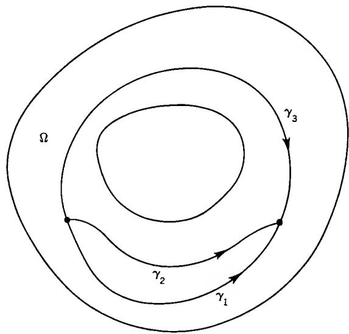  
FIG. 8-1. Homotopic arcs.

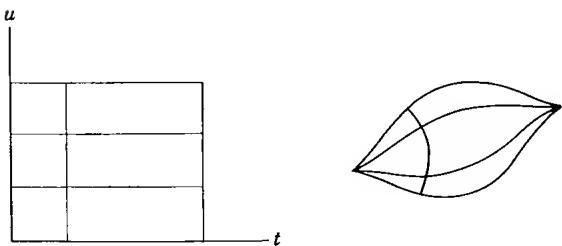  
FIG. 8-2. Deformation.

We are led to the following formal definition of homotopy:

Definition 2. Two arcs $\gamma_{1}$ and $\gamma_{2}$ over the same parameter interval $[a,b]$ are said to be homotopic in $\Omega$ if there exists a continuous function $\gamma(t,u)$ , defined on a rectangle $[a,b] \times [0,1]$ , with the following properties:

1. $\gamma(t, u) \in \Omega$ for all $(t, u)$ .

2. $\gamma (t,0) = \gamma_{1}(t),\gamma (t,1) = \gamma_{2}(t)$ for all $t$

$$
3. \gamma (a, u) = \gamma_ {1} (a) = \gamma_ {2} (a), \gamma (b, u) = \gamma_ {1} (b) = \gamma_ {2} (b) f o r a l l u.
$$

It is only for the sake of convenience that we have required the parametric intervals of $\gamma_{1}$ and $\gamma_{2}$ to be the same. If this is not the case, we transform the intervals into each other by a linear change of parameter, and agree to consider the original arcs as homotopic if they are homotopic in the new parametrization.

Simple formal proofs which the reader can easily supply show that the relation of homotopy, as defined above, is an equivalence relation. We can thus divide all arcs into equivalence classes, called homotopy classes; the arcs in a homotopy class have common end points and can be deformed into each other within $\Omega$ . It deserves to be pointed out that different parametric representations of the same arc are always homotopic. Indeed, $\gamma_{2}(t)$ is a reparametrization of $\gamma_{1}(t)$ if and only if there exists a nondecreasing function $\tau(t)$ such that $\gamma_{2}(t) = \gamma_{1}(\tau(t))$ . The function $\gamma(t,u) =$ $\gamma_{1}((1 - u)t + u\tau(t))$ has all its values on the arc under consideration, and therefore in $\Omega$ . For $u = 0$ and $u = 1$ we obtain respectively $\gamma(t,0) = \gamma_{1}(t)$ and $\gamma(t,1) = \gamma_{1}(\tau(t)) = \gamma_{2}(t)$ as required, and the end points are fixed.

If two arcs $\gamma_{1}$ and $\gamma_{2}$ are traced in succession, with $\gamma_{2}$ beginning at the terminal point of $\gamma_{1}$ , they form a new arc which we will now denote by $\gamma_{1}\gamma_{2}$ in contrast to the notation $\gamma_{1} + \gamma_{2}$ preferred in homology theory. The parametrization of $\gamma_{1}\gamma_{2}$ is not uniquely determined, but for the determination of the homotopy class this is of no importance. Very simple reasoning shows, moreover, that the homotopy class of $\gamma_{1}\gamma_{2}$ depends only on the homotopy classes of $\gamma_{1}$ and $\gamma_{2}$ . By virtue of this fundamental fact we may consider the operation which leads to the homotopy class of $\gamma_{1}\gamma_{2}$ as a multiplication of homotopy classes. It is defined only when the initial point of $\gamma_{2}$ coincides with the terminal point of $\gamma_{1}$ . If we restrict our attention to the homotopy classes of closed curves which begin and end at a fixed point $z_{0}$ , the product is always defined and is represented by a curve in the same family. What is more, with this definition of product the homotopy classes of closed curves from $z_{0}$ , with respect to the region $\Omega$ , form a group. In order to prove this assertion we must establish:

1. The associative law: $(\gamma_{1}\gamma_{2})\gamma_{3}$ is homotopic to $\gamma_{1}(\gamma_{2}\gamma_{3})$ .

2. Existence of a unit curve 1 such that $\gamma 1$ and $1\gamma$ are homotopic to $\gamma$ .

3. Existence of an inverse $\gamma^{-1}$ such that $\gamma \gamma^{-1}$ and $\gamma^{-1}\gamma$ are homotopic to 1.

The associative law is trivial since $(\gamma_{1}\gamma_{2})\gamma_{3}$ is at most a reparametrization of $\gamma_{1}(\gamma_{2}\gamma_{3})$ . For a unit curve we can choose the constant $z = z_{0}$ ; actually, the symbol 1 may represent any closed curve which can be shrunk to the point $z_{0}$ . Finally, the inverse $\gamma^{-1}$ is the curve $\gamma$ traced in the opposite direction. If $\gamma$ is represented by $z = \gamma(t)$ , $t \in [a,b]$ , $\gamma^{-1}$ can be represented by $z = \gamma(2b - t)$ , $t \in [b, 2b - a]$ . The equation of $\gamma\gamma^{-1}$ is thus

$$
z = \left\{ \begin{array}{l l} \gamma (t) & \text {   for   } a \leq t \leq b \\ \gamma (2 b - t) & \text {   for   } b \leq t \leq 2 b - a. \end{array} \right.
$$

The curve can be shrunk to a point by means of the deformation

$$
\gamma (t, u) = \left\{ \begin{array}{l l} \gamma (t) & \text { for } a \leq t \leq u a + (1 - u) b \\ \gamma (u a + (1 - u) b) & \text { for } u a + (1 - u) b \leq t \leq u (b - a) + b \\ \gamma (2 b - t) & \text { for } u (b - a) + b \leq t \leq 2 b - a. \end{array} \right.
$$

The interpretation is clear: we are letting the turning point recede from $\gamma(b)$ to $\gamma(a)$ . Since $\gamma(t,1) = \gamma(a) = z_0$ for all $t \in [a, 2b - a]$ we have proved that $\gamma\gamma^{-1}$ is homotopic to 1. The proof is independent of the hypothesis that $\gamma$ be a closed curve; thus $\gamma\gamma^{-1}$ is homotopic to 1 for any arc $\gamma$ from $z_0$ .

The group which we have constructed is called the homotopy group, or the fundamental group, of the region $\Omega$ with respect to the point $z_0$ . As an abstract group it does not depend on the point $z_0$ . If $z_0'$ is another point in $\Omega$ , we join $z_0$ to $z_0'$ by an arc $c$ in $\Omega$ . To every closed curve $\gamma'$ from $z_0'$ corresponds a closed curve $\gamma = c\gamma'c^{-1}$ from $z_0$ . This correspondence is homotopy preserving and may thus be regarded as a correspondence between homotopy classes. As such it is product preserving, for $(c\gamma_1'c^{-1})(c\gamma_2'c^{-1})$ is homotopic to $c(\gamma_1'\gamma_2')c^{-1}$ , by cancellation of $c^{-1}c$ . Finally, the correspondence is one to one, for if $\gamma$ is given we can choose $\gamma' = c^{-1}\gamma c$ and find that the corresponding curve $c\gamma'c^{-1} = (cc^{-1})\gamma(cc^{-1})$ is homotopic to $\gamma$ . It is thus proved that the homotopy groups with respect to $z_0$ and $z_0'$ are isomorphic.

If $\gamma_{1}, \gamma_{2}$ are any two arcs with the initial point $z_{0}$ and a common terminal point, then $\gamma_{1}$ is homotopic to $\gamma_{2}$ if and only if $\gamma_{1}\gamma_{2}^{-1}$ is homotopic to 1. For if $\gamma_{1}$ is homotopic to $\gamma_{2}$ , then $\gamma_{1}\gamma_{2}^{-1}$ is homotopic to $\gamma_{2}\gamma_{2}^{-1}$ , and hence to 1. Conversely, if $\gamma_{1}\gamma_{2}^{-1}$ is homotopic to 1, then

$$
(\gamma_ {1} \gamma_ {2} ^ {- 1}) \gamma_ {2} = \gamma_ {1} (\gamma_ {2} ^ {- 1} \gamma_ {2})
$$

is simultaneously homotopic to $\gamma_{1}$ and $\gamma_{2}$ , proving that $\gamma_{1}$ is homotopic to $\gamma_{2}$ . For this reason it is sufficient to study the homotopy of closed curves.

The explicit determination of homotopy groups is simplified by the fact that the homotopy group is obviously a topological invariant. Indeed, by a topological mapping of $\Omega$ onto $\Omega'$ any deformation in $\Omega$ can be carried over to $\Omega'$ and is seen to determine a product preserving one-to-one correspondence between the homotopy classes. Topologically equivalent regions have therefore isomorphic homotopy groups.

The homotopy group of a disk reduces to the unit element; this means that any two arcs with common end points are homotopic. The proof makes use of the convexity of the disk: the arc $z = \gamma_{1}(t)$ can be deformed into $z = \gamma_{2}(t)$ by means of the deformation

$$
\gamma (t, u) = (1 - u) \gamma_ {1} (t) + u \gamma_ {2} (t)
$$

whose deformation paths are line segments. The same proof would be valid for any convex region. In particular, the whole plane has likewise a homotopy group which reduces to the unit element.

We proved in Chap. 6, Sec. 1, that any simply connected region which is not the whole plane can be mapped conformally onto a disk. In this connection the conformality is not important, but the fact that the mapping is topological permits us to conclude that any simply connected region has a fundamental group which reduces to its unit element. We shall find that the converse is also true.

1.6. The Monodromy Theorem. Let $\Omega$ be a fixed region in the complex plane. We consider the case of a global analytic function f which can be continued along all arcs $\gamma$ contained in $\Omega$ , starting from any of its germs defined at the initial point $\zeta_{0}$ of $\gamma$ . More precisely, for any function element $(f_{0},\Omega_{0})$ of f with $\zeta_{0}\in\Omega_{0}$ , there shall exist a continuation $\bar{\gamma}$ over $\gamma$ beginning with the germ defined by $(f_{0},\zeta_{0})$ .

When two arcs $\gamma_{1}$ , $\gamma_{2}$ with common end points are given, we are interested to know whether a common initial germ, continued along $\gamma_{1}$ and $\gamma_{2}$ , will lead to the same germ over the terminal point. The basic theorem, known as the monodromy theorem, is the following:

Theorem 2. If the arcs $\gamma_{1}$ and $\gamma_{2}$ are homotopic in $\Omega$ , and if a given germ of f at the initial point can be continued along all arcs contained in $\Omega$ , then the continuations of this germ along $\gamma_{1}$ and $\gamma_{2}$ lead to the same germ at the terminal point.

To begin with we note that continuation along an arc of the form $\gamma\gamma^{-1}$ will always lead back to the initial germ. Similarly, continuation along an arc of the form $\sigma_{1}(\gamma\gamma^{-1})\sigma_{2}$ will have the same effect as continuation along $\sigma_{1}\sigma_{2}$ . For this reason, to say that the continuations along $\gamma_{1}$ and $\gamma_{2}$ lead to the same end result is equivalent to saying that continuation along $\gamma_{1}\gamma_{2}^{-1}$ leads back to the initial germ.

According to the assumption there exists a deformation $\gamma(t,u)$ of $\gamma_{1}$ into $\gamma_{2}$ . Every arc $\sigma$ in the deformation rectangle $R = [a,b] \times [0,1]$ is carried by $\gamma(t,u)$ into an arc $\sigma' \in \Omega$ , and if $\sigma'$ begins at the initial point of $\gamma_{1}$ and $\gamma_{2}$ , there exists a unique continuation along $\zeta'$ from the initial germ; for simplicity we shall call it a continuation along $\sigma$ . The theorem asserts that the continuation along the perimeter $\Gamma$ of $R$ leads back to the initial germ. The sense in which $\Gamma$ is described is immaterial, but should be fixed once and for all.

A simple proof can be based on the method of bisection. We begin by bisecting R horizontally, and denote by $\pi_{1}$ the perimeter of the lower half $R_{1}$ , described from the lower left-hand corner 0 and in the direction which coincides with the direction of $\Gamma$ along the common side. With the upper half $R_{2}$ we associate a curve $\pi_{2}$ which begins at 0, leads vertically to the lower left-hand corner of $R_{2}$ , describes the perimeter of $R_{2}$ in the sense which coincides with that of $\Gamma$ along the common side, and returns vertically to 0 (Fig. 8-3). We recognize that the curve $\pi_{1}\pi_{2}$ differs from $\Gamma$ only by an intermediate arc of the form $\sigma\sigma^{-1}$ . For this reason the effect of continuing along $\pi_{1}\pi_{2}$ is the same as if we continue along $\Gamma$ . Consequently, if $\pi_{1}$ and $\pi_{2}$ both lead back to the initial germ, so does $\Gamma$ .

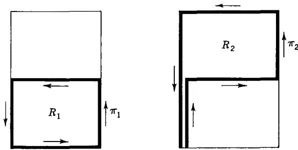  
FIG. 8-3. The monodromy theorem.

We make now the opposite assumption that $\Gamma$ does not lead back to the initial germ. Then either $\pi_1$ or $\pi_2$ has the same property. The corresponding rectangle is bisected vertically, and the same reasoning is applied. When the process is repeated, we obtain a sequence of rectangles $R\supset R^{(1)}\supset R^{(2)}\supset \dots \supset R^{(n)}\supset \dots$ and corresponding closed curves $\pi^{(n)}$ such that the continuation of the initial germ along $\pi^{(n)}$ does not lead back to the same germ. Each $\pi^{(n)}$ is of the form $\sigma_n\Gamma_n\sigma_n^{-1}$ where $\sigma_n$ is a well-determined polygon leading from 0 to the lower left-hand corner of $R^{(n)}$ and $\Gamma_n$ denotes the perimeter of $R^{(n)}$ ; moreover, $\sigma_n$ is a subarc of $\sigma_{n+1}$ .

As $n \to \infty$ the rectangles $R^{(n)}$ converge to a point $P_{\infty}$ , and the polygons $\sigma_{n}$ form, in the limit, an arc $\sigma_{\infty}$ ending at $P_{\infty}$ . There exists a continuation of the initial germ along $\sigma_{\infty}$ ; it terminates with a germ determined by a function element $(f_{\infty}, \Omega_{\infty})$ over the image $\zeta_{\infty}$ of $P_{\infty}$ under the mapping $\gamma(t, u)$ . For sufficiently large n the image of $\Gamma_{n}$ will be contained in $\Omega_{\infty}$ , and the germ obtained at the terminal point of $\sigma_{n}$ will belong to the function element $(f_{\infty}, \Omega_{\infty})$ . When this is the case, the element $(f_{\infty}, \Omega_{\infty})$ can be used to construct a continuation along $\pi^{(n)}$ which leads back to the initial germ. This contradicts the property by which $\pi^{(n)}$ was chosen, and we have proved that the continuation along $\Gamma$ ends with the initial germ.

The monodromy theorem implies, above all, that any global analytic function which can be continued along all arcs in a simply connected region determines one single-valued analytic function for each choice of the initial branch. This fact can also be expressed by saying that a Riemann surface (without branch points) over a simply connected region must consist of a single sheet.

We can further draw the consequence, already announced, that a region whose homotopy group reduces to the unit element must necessarily be simply connected. For suppose that $\Omega$ is multiply connected. Then there exists a bounded component $E_{0}$ of the complement of $\Omega$ , and if $z_{0} \in E_{0}$ we know that $\log (z - z_{0})$ is not single-valued in $\Omega$ . By the monodromy theorem it follows that the homotopy group of $\Omega$ cannot reduce to the unit element.

This is the last step toward proving the equivalence of the following three characterizations of simply connected regions: (1) $\Omega$ is simply connected if its complement is connected; (2) $\Omega$ is simply connected if it is homeomorphic with a disk; (3) $\Omega$ is simply connected if its fundamental group reduces to the unit element.

1.7. Branch Points. For a closer study of the singularities of multiple-valued functions it is necessary to determine, explicitly, the fundamental group of a punctured disk. Let the punctured disk be represented by $0 < |z| < \rho$ , and consider a fixed point, for instance the point $z_{0} = r < \rho$ on the positive radius. By means of a central projection, given by

$$
\gamma (t, u) = (1 - u) \gamma (t) + u r \frac {\gamma (t)}{| \gamma (t) |},
$$

any closed curve $\gamma$ from $z_{0}$ can be deformed into a curve which lies on the circle $|z| = r$ . It is thus sufficient to consider curves on that circle. We continue to use the notation $\gamma(t)$ .

By continuity every $t_{0}$ has a neighborhood in which $|\gamma(t) - \gamma(t_{0})| < r$ ; in such a neighborhood $\gamma(t)$ cannot take both the values r and -r. It follows easily, by use of Heine-Borel's lemma or the method of bisection, that it is possible to write $\gamma = \gamma_{1}\gamma_{2} \cdots \gamma_{n}$ where each $\gamma_{k}$ either does not pass through r or does not pass through -r. For simplicity, let us refer to the points r and -r by letters $P_{0}$ and $P_{0}^{\prime}$ (Fig. 8-4), and let the end points of $\gamma_{k}$ be denoted by $P_{k}$ and $P_{k+1}$ . Since $\gamma_{k}$ is contained in the simply connected region obtained by deleting either the positive or negative radius, it can be deformed into one of the two arcs $P_{k}P_{k+1}$ . As a result $\gamma$ can be deformed into a product of simple arcs with the successive end points $P_{0}P_{1}P_{2} \cdots P_{n}P_{0}$ . This path may in turn be replaced by $P_{0}P_{1}P_{2}P_{0}P_{2}P_{3}P_{0} \cdots P_{0}P_{n-1}P_{n}P_{0}$ where each arc $P_{k}P_{0}$ and $P_{0}P_{k}$ is, for definiteness, the one which does not contain $P_{0}^{\prime}$ . In fact, the new path is obtained by inserting the doubly traced arcs $P_{k}P_{0}P_{k}$ which we know to be homotopic to 1.

We have shown that each $\gamma$ is homotopic to a product of closed curves of the form $P_{0}P_{k}P_{k+1}P_{0}$ . If $P_{k}P_{k+1}$ does not contain $P_{0}^{\prime}$ , this curve is homotopic to 1. If, on the other hand, $P_{k}P_{k+1}$ contains $P_{0}^{\prime}$ it is seen by enumeration of the possible cases that the curve is homotopic to C or $C^{-1}$ , where C is the full circle. Consequently, every closed curve is homotopic to a power of C.

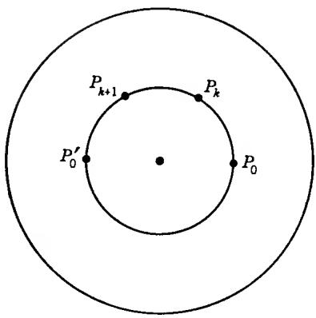  
FIG. 8-4

Finally, we observe that $C^m$ is homotopic to 1 only if $m = 0$ . This is seen by the fact that

$$
\int_ {C ^ {m}} \frac {d z}{z} = m \cdot 2 \pi i,
$$

while if the curve were homotopic to 1 the integral would have to vanish. From our results we conclude that the fundamental group of the punctured disk is isomorphic to the additive group of integers. Evidently, an arbitrary annulus has the same fundamental group.

We consider now a global analytic function f which can be continued along all arcs in the punctured disk $0 < |z| < \rho$ . We choose an initial germ at $z_{0} = r$ and continue it along all curves $C^{m}$ . Either the continuation never returns to the initial germ, or there exists a smallest positive integer h such that $C^{h}$ leads back to where we started. In the latter case, set $m = nh + q$ with n an integer and $0 \leq q < h$ . If $C^{m}$ leads back to the initial germ, so does $C^{q}$ . Because of the choice of m this is possible only if q = 0. Thus $C^{m}$ leads to the initial germ only if m is a multiple of h.

Consider the mapping $z = \zeta^h$ of $0 < |\zeta| < \rho^{1/h}$ on $0 < |z| < \rho$ . We claim that $\mathbf{f}$ can be expressed as a single-valued analytic function $F(\zeta)$ in the following sense: For every $\zeta_1, 0 < |\zeta_1| < \rho^{1/h}$ , there exists a function element $(f,\Omega) \in \mathbf{f}$ with $\zeta_1^h \in \Omega$ , such that $F(\zeta) = f(\zeta^h)$ in a neighborhood of $\zeta_1$ ; in particular, it is required that $\zeta_0 = r^{1/h}$ corresponds in this way to the initial germ of $\mathbf{f}$ at $z_0$ .

In order to construct $F(\zeta)$ we join $\zeta_0$ to $\zeta$ by an arc $\gamma'$ and continue the initial germ of $\mathbf{f}$ along the image of $\gamma'$ under the mapping $z = \zeta^h$ ; we define $F(\zeta)$ to be the value of the terminal germ under this continuation. It must be proved that $F(\zeta)$ is uniquely determined. If $\zeta_1'$ and $\zeta_2'$ are two paths from $\zeta_0$ to $\zeta$ , then $\zeta_1'\zeta_2^{-1}$ can be deformed into a power $C''^n$ of the circle through $\zeta_0$ . Consequently, the image curve $\zeta_1\zeta_2^{-1}$ can be deformed into the image of $C''^n$ , which is $C^{nh}$ . But $C^{nh}$ leads back to the initial germ, and hence $\zeta_1$ and $\zeta_2$ determine the same value $F(\zeta)$ . Finally, if $\zeta$ is in a neighborhood of $\zeta_1$ , we can first follow an arc $\zeta_1'$ from $\zeta_0$ to $\zeta_1$ and then a variable arc $\gamma'$ from $\zeta_1$ to $\zeta$ which stays within the neighborhood. If the neighborhood is sufficiently restricted, the continuation along the image of $\gamma'$ is determined by a single function element $(f,\Omega)$ , and $F(\zeta) = f(\zeta^h)$ in that neighborhood.

Since $F(\zeta)$ is single-valued and analytic in a punctured neighborhood of the origin, it has a convergent Laurent development of the form

$$
F (\zeta) = \sum_ {- \infty} ^ {\infty} A _ {n} \zeta^ {n}.\tag{1}
$$

It must be observed that this development depends on the choice of the initial germ; different choices may yield entirely different developments and, in particular, different values of h. Actually, even the series (1) yields h different developments, corresponding to the h initial values of $z^{1/h}$ . If we write $\omega = e^{2\pi i/h}$ , these developments are represented by

$$
f _ {\nu} (z) = \sum_ {- \infty} ^ {\infty} A _ {n} \omega^ {\nu n} z ^ {n / h} \quad (\nu = 0, 1, \dots , h - 1).\tag{2}
$$

When the germ $(f_{\nu},z_{0})$ is continued along C it leads to $(f_{\nu+1},z_{0})$ , with the understanding that the subscript h is identified with 0.

In special cases the Laurent development may contain only a finite number of negative powers. Then $F(\zeta)$ has either a removable singularity or a pole, and the multiple-valued function $f(z)$ (or, more correctly, the global analytic function obtained by continuing the given initial branch within a punctured disk) is said to have an algebraic singularity or branch point at z = 0, provided of course that h > 1. If $F(\zeta)$ has a removable singularity, the branch point is an ordinary algebraic singularity, in the opposite case it is an algebraic pole. In either case $f(z)$ tends to a definite limit $A_{0}$ or $\infty$ as z tends to 0 along an arbitrary arc.

Clearly, we could just as well have studied an isolated singularity at an arbitrary point a or $\infty$ , and the radius of the punctured disk can be as small as we wish. In the case of a finite h the correspondence between $w = f(z)$ and the independent variable z can be expressed through equations of the form

$$
\begin{array}{l} w = \sum_ {- \infty} ^ {\infty} A _ {n} \zeta^ {n} \\ z = a + \zeta^ {h} \quad \text { or } \quad z = \zeta^ {- h}. \end{array}
$$

The variable $\zeta$ takes the name of local uniformizing variable.

In the case of an algebraic singularity it is desirable to complete the Riemann surface of f so as to include a branch point with the projection a. The branch point itself is not a germ of f, but it is fully determined by a set of fractional power series developments

$$
f _ {\nu} (z) = \sum_ {\nu = \nu_ {0}} ^ {\infty} A _ {n} \omega^ {\nu n} (z - a) ^ {n / h}\tag{3}
$$

analogous to (2); for a singularity at infinity z - a has to be replaced by 1/z. The neighborhoods of the branch point shall include the branch point itself as well as, for some $\delta > 0$ , all germs $(f_{\nu}, \zeta)$ with $|\zeta - a| < \delta$ obtained by substituting in (3) a single-valued branch of $(z - a)^{1/h}$ , defined in a neighborhood of $\zeta$ . The resulting topological space will be a surface in the sense that every point, including the branch points, has a neighborhood which is homeomorphic to a disk.

In the Weierstrass theory it is customary to consider the totality of all power series developments, including the fractional ones, that are obtainable by analytic continuation from a single one, and to call it an analytic configuration (analytisches Gebilde).

## 2. ALGEBRAIC FUNCTIONS

An equation of the form $P(w,z)=0$ , where P is a polynomial in two variables, has for each z a finite number of solutions $w_{1}(z),\ldots,w_{m}(z)$ . We wish to show that these roots can be interpreted as values of a global analytic function $\mathbf{f}(z)$ which is then called an algebraic function. Conversely, if a global analytic function is given, we want to be able to tell whether it does or does not satisfy a polynomial equation.

2.1. The Resultant of Two Polynomials. A polynomial $P(w,z)$ in two variables is irreducible if it cannot be expressed as the product of two polynomials none of which is constant. Two polynomials P and Q are relatively prime if they have no common factor except for constants.

The following theorem is algebraic in character. Because of its fundamental importance for the theory of algebraic functions we will nevertheless reproduce its proof.

Theorem 3. If $P(w,z)$ and $Q(w,z)$ are relatively prime polynomials, there are only a finite number of values $z_0$ for which the equations $P(w,z_0) = 0$ and $Q(w,z_0) = 0$ have a common root.

We suppose that P and Q are ordered according to decreasing powers of w and set $Q(w,z) = b_{0}(z)w^{m} + \cdots + b_{m}(z)$ where $b_{0}(z)$ is not identically zero. If P is divided by Q, the division algorithm yields a quotient and remainder which are polynomials in w and rational functions in z. We set up a Euclidean algorithm of the form

$$
\begin{array}{l} c _ {0} P = q _ {0} Q + R _ {1} \\ c _ {1} Q = q _ {1} R _ {1} + R _ {2} \\ c _ {2} R _ {1} = q _ {2} R _ {2} + R _ {3} \\ \dots \dots \\ c _ {n - 1} R _ {n - 2} = q _ {n - 1} R _ {n - 1} + R _ {n} \end{array}\tag{4}
$$

where the $Q_{k}$ and $R_{k}$ are polynomials in w and z while the $c_{k}$ are polynomials in z used to clear the fractions. The degrees in w of the $R_{k}$ are decreasing, and $R_{n}$ is a polynomial in z alone. If $R_{n}(z)$ were identically zero, the unique factorization theorem implies, by the last relation in (4), that $R_{n-2}$ would be divisible by any irreducible factor of $R_{n-1}$ which is of positive degree in w. The same reasoning shows, step by step, that all the $R_{k}$ as well as Q and P would be divisible by the same factor. This is contrary to the assumption, for $R_{n-1}$ is of positive degree in w and must therefore have an irreducible factor which contains w.

Suppose now that $P(w_0, z_0) = 0$ and $Q(w_0, z_0) = 0$ . Substituting these values in (4) we obtain $R_1(w_0, z_0) = 0, \ldots, R_{n-1}(w_0, z_0) = 0$ and finally $R_n(z_0) = 0$ . But since $R_n$ is not identically zero, there are only a finite number of $z_0$ which satisfy this condition, and the theorem follows.

The polynomial $R_{n}(z)$ is called the resultant of P and Q. More precisely, if we wish the resultant to be uniquely determined, we should require that the exponents $c_{k}$ in (3) are of the lowest degree possible. We are not so interested in the resultant as in the statement of Theorem 3. The theorem will be applied to an irreducible polynomial $P(w,z)$ and its partial derivative $P_{w}(w,z)$ with respect to w. These polynomials are relatively prime as soon as P has positive degree in w, and the resultant of P and $P_{w}$ is called the discriminant of P. The zeros of the discriminant are the values $z_{0}$ for which the equation $P(w,z_{0}) = 0$ has multiple roots.

We note, finally, that the resultant $R(z)$ of any two relatively prime polynomials P and Q can be written in the form $R = pP + qQ$ where p and q are polynomials. This follows immediately from (4).

2.2. Definition and Properties of Algebraic Functions. We begin by formulating a precise definition:

Definition 3. A global analytic function $\mathbf{f}$ is called an algebraic function if all its function elements $(f,\Omega)$ satisfy a relation $P(f(z),z) = 0$ in $\Omega$ , where $P(w,z)$ is a polynomial which does not vanish identically.

Because of the permanence of functional relations it is sufficient to assume that one function element satisfies the equation $P(f(z),z) = 0$ . The others will then automatically satisfy the same relation. Moreover, it may be assumed that $P(w,z)$ is an irreducible polynomial. Suppose indeed that $P(w,z)$ has the factorization $P = P_1P_2\ldots P_n$ in irreducible factors. For any fixed point $z \in \Omega$ one of the equations $P_k(f(z),z) = 0$ must hold. If we consider a sequence of different points $z_n \in \Omega$ which tend to a limit in $\Omega$ , then one of the relations $P_k(f(z_n),z_n)$ must hold infinitely often. It follows that this particular relation $P_k(f(z),z) = 0$ is satisfied identically in $\Omega$ and, consequently, by all the function elements of $f$ . We are thus free to replace $P$ by $P_k$ .

It is also easy to see that the irreducible polynomial P determined by an algebraic function is unique up to a constant factor. If Q is an essentially different irreducible polynomial, we can determine the resultant $R(z) = pP + qQ$ . If $P(f(z), z) = 0$ and $Q(f(z), z) = 0$ for all $z \in \Omega$ we would obtain $R(z) = 0$ in $\Omega$ , contrary to the fact that $R(z)$ is not identically zero. We note that P cannot reduce to a polynomial of z alone. If it contains only w, it must be of the form w - a, and the function f reduces to the constant a.

We prove next that there exists an algebraic function corresponding to any irreducible polynomial $P(w,z)$ of positive degree in w. Suppose that

$$
P (w, z) = a _ {0} (z) w ^ {n} + a _ {1} (z) w ^ {n - 1} + \dots + a _ {n} (z).
$$

If $z_{0}$ is neither a zero of the polynomial $a_{0}(z)$ nor a zero of the discriminant of P, the equation $P(w,z_{0}) = 0$ has exactly n distinct roots $w_{1}, w_{2}, \ldots, w_{n}$ . Under this condition the following is true:

Lemma 1. There exists an open disk $\Delta$ , containing $z_0$ , and $n$ function elements $(f_1, \Delta)$ , $(f_2, \Delta)$ , $\ldots$ , $(f_n, \Delta)$ with these properties:

(a) $P(f_{i}(z),z) = 0$ in $\Delta$ ;

(b) $f_{i}(z_{0}) = w_{i}$ ;

(c) if $P(w,z) = 0$ , $z \in \Delta$ , then $w = f_i(z)$ for some $i$ .

The polynomial $P(w,z_{0})$ has simple zeros at $w = w_{i}$ . We determine $\varepsilon > 0$ so that the disks $|w - w_{i}| \leq \varepsilon$ do not overlap and denote the circles $|w - w_{i}| = \varepsilon$ by $C_{i}$ . Then $P(w,z_{0}) \neq 0$ on $C_{i}$ , and by the argument principle

$$
\frac {1}{2 \pi i} \int_ {c _ {i}} \frac {P _ {w} (w , z _ {0})}{P (w , z _ {0})} d w = 1.
$$

If $z_{0}$ is replaced by z, the integrals become well-defined continuous functions of z in a neighborhood of $z_{0}$ . Since they can only take integer values, there exists a neighborhood $\Delta$ such that

$$
\frac {1}{2 \pi i} \int_ {c _ {i}} \frac {P _ {w} (w , z)}{P (w , z)} d w = 1
$$

for all $z \in \Delta$ . This means that the equation $P(w, z) = 0$ has exactly one root in the disk $|w - w_i| < \varepsilon$ ; we denote this root by $f_i(z)$ . By the residue calculus its value is given by

$$
f _ {i} (z) = \frac {1}{2 \pi i} \int_ {C _ {i}} w \frac {P _ {w} (w , z)}{P (w , z)} d w.
$$

This representation shows that $f_{i}(z)$ is analytic. Moreover, $f_{i}(z_{0}) = w_{i}$ , and (c) follows from the fact that we have exhibited n roots of the equation $P(w,z) = 0$ , and it can have no more.

The lemma implies at once that there exists an algebraic function f corresponding to the polynomial P; in fact, we can choose f to be the global analytic function determined by the element $(f_{1},\Delta)$ for any $z_{0}$ which does not coincide with one of the finitely many excluded points. We will show, moreover, that all such function elements belong to the same global analytic function; this will also prove that the function f that corresponds to P is unique. Let $(f,\Omega)$ be one of these function elements. There must exist a $z_{0}\in\Omega$ which is not one of the excluded points; we determine a corresponding $\Delta$ . Since $P(f(z),z)=0$ for $z\in\Omega$ it follows by (c) that $f(z)$ equals some $f_{i}(z)$ at each point of $\Delta\cap\Omega$ . But then $f(z)$ equals the same $f_{i}(z)$ infinitely many times in any neighborhood of $z_{0}$ , and hence $(f,\Omega)$ belongs to the same global analytic function as $(f_{i},\Delta)$ .

Let the excluded points be denoted by $c_{1}, c_{2}, \ldots, c_{m}$ . We wish to show that a function element $(f, \Omega)$ which satisfies $P(f(z), z) = 0$ can be continued along any arc which does not pass through a point $c_{k}$ . If this were not so, there would exist an arc $\gamma[a, b]$ such that a given initial germ can be continued along all subarcs $\gamma[a, \tau]$ with $\tau < b$ , but not along the whole arc. We set $z_{0} = \gamma(b)$ , determine $\Delta$ according to Lemma 1, and choose $\tau$ so that $\gamma(t) \in \Delta$ for all $t \in [\tau, b]$ . The same reasoning as above shows that the germ $\bar{\gamma}(\tau)$ obtained by continuation along $\gamma[a, \tau]$ must be determined by one of the function elements $(f_{i}, \Delta)$ . But then it can be continued all the way to b, and we have reached a contradiction.

It has not yet been proved that all elements $(f_{i},\Omega)$ belong to the same global analytic function. For this part of the proof it is necessary to study the behavior at the critical points $c_{k}$ in greater detail.

2.3. Behavior at the Critical Points. The points $c_{k}$ which so far have been excluded from our considerations were the zeros of the first coefficient $a_{0}(z)$ of P, and the zeros of the discriminant. Let $\delta$ be chosen so that the disk $|z - c_{k}| < \delta$ contains no other critical points. We fix a point $z_{0} \neq c_{k}$ in this disk and select one of the germs $(f_{i}, z_{0})$ . This germ can be continued along all arcs in the punctured disk. Moreover, if continued along the circle C of center $c_{k}$ through $z_{0}$ , it leads to a germ $(f_{j}, z_{0})$ . Since there are only a finite number of choices, there must exist a smallest positive $h \leq n$ with the property that continuation along $C^{h}$ leads back to the initial germ $(f_{i}, z_{0})$ . By the result of Sec. 1.6 we can write

$$
f _ {i} (z) = \sum_ {\nu = - \infty} ^ {\infty} A _ {\nu} (z - c _ {k}) ^ {\nu / h}.\tag{5}
$$

Suppose first that $c_{k}$ is not a zero of $a_{0}(z)$ . Then $f_{i}(z)$ remains bounded as z tends to $c_{k}$ . Indeed, as soon as $f_{i}(z) \neq 0$ the equation $P(f_{i}(z), z) = 0$ can be written in the form

$$
a _ {0} (z) + a _ {1} (z) f _ {i} (z) ^ {- 1} + \cdot \cdot \cdot + a _ {n} (z) f _ {i} (z) ^ {- n} = 0.\tag{6}
$$

If $f_{i}(z)$ were unbounded, there would exist points $z_{n} \to c_{k}$ with $f_{i}(z_{n}) \to \infty$ . Substitution in (6) would yield $a_0(z_n) \to 0$ , contrary to the assumption $a_0(c_k) \neq 0$ . It follows that the development (5) contains only positive powers, and $f_{i}$ has at most an ordinary algebraic singularity at $c_k$ .

We consider now the case where $a_{0}(c_{k}) = 0$ . If the multiplicity of the zero is denoted by m, we know that $\lim_{z \to c_{k}} a_{0}(z)(z - c_{k})^{-m} \neq 0$ . From (6) we obtain

$$
\begin{array}{l} a _ {0} (z) (z - c _ {k}) ^ {- m} + a _ {1} (z) (z - c _ {k}) ^ {- m} f _ {i} (z) ^ {- 1} + \dots \\ \qquad \qquad \qquad \qquad \qquad \qquad \qquad \qquad + a _ {n} (z) (z - c _ {k}) ^ {- m} f _ {i} (z) ^ {- n} = 0. \end{array}
$$

If the expression $f_{i}(z)(z - c_{k})^{m}$ were unbounded, we would again be led to a contradiction. As in Sec. 1.7 we write

$$
F (\zeta) = \sum_ {- \infty} ^ {\infty} A _ {\nu} \zeta^ {\nu}
$$

and find that $F(\zeta)\zeta^{mh}$ is bounded. Consequently $F(\zeta)$ has a pole of at most order mh, and $f_{i}$ has at most an algebraic pole at $c_{k}$ or, in special cases, an ordinary algebraic singularity.

Finally, the behavior at $z = \infty$ needs also to be discussed. It is clear that we have a development of the form

$$
f _ {i} (z) = \sum_ {- \infty} ^ {\infty} A _ {\nu} z ^ {\nu / h},
$$

valid in a neighborhood of $\infty$ . Suppose that the polynomial $a_{i}(z)$ is of degree $r_{i}$ (the coefficients which vanish identically will be left out of consideration). Choose an integer m such that

$$
m > \frac {1}{k} (r _ {k} - r _ {0})\tag{7}
$$

for $k = 1, \ldots, n$ . We contend that $f_{i}(z)z^{-m}$ must be bounded as $z \to \infty$ . If this were not so we would have $f_{i}(z)^{-1}z^{m} \to 0$ for a sequence tending to $\infty$ . This would imply $f_{i}(z)^{-k}z^{mk} \to 0$ and, by (7), $f_{i}(z)^{-k}z^{r_{k}-r_{0}} \to 0$ for $k \geq 1$ . If (6) is multiplied by $z^{-r_{0}}$ it follows that all terms except the first tend to zero. This is a contradiction, and we may conclude that $f_{i}(z)$ has at most an algebraic pole at infinity.

To sum up, we have proved that an algebraic function has at most algebraic singularities in the extended plane. We will now prove a converse of this statement. In order to obtain a converse it is essential to add an assumption which implies that there are only a finite number of branches at a given point.

Let $\mathbf{f}$ be a global analytic function. For each $c$ we assume the existence of a punctured disk $\Delta$ , centered at $c$ , such that all germs of $\mathbf{f}$ which are defined at a point $z_0 \in \Delta$ can be continued along all arcs in $\Delta$ and show algebraic character at $c$ . The assumption shall be satisfied also for $c = \infty$ , in which case $\Delta$ is the exterior of a circle. Moreover, for one $\Delta$ it must be assumed that the number of different germs at $z_0$ is finite.

Since the extended plane can be covered by a finite number of disks $\Delta$ , the center included, it follows that only a finite number of points c can be effective singularities; we denote these points by $c_{k}$ . It is easy to prove that the number of germs at any point $z \neq c_{k}$ is constant. For every such point has a neighborhood in which all germs of f are single-valued and can be continued throughout the neighborhood. It follows that the set of points z with exactly n germs is open (n can be finite or infinite). Since the extended plane minus the points $c_{k}$ is connected, only one of these sets is nonempty. Hence n is constant, by assumption it cannot be infinite, and it cannot be zero since in that case f would be an empty collection of function elements.

The branches at any point $z \neq c_{k}$ may now be denoted as $f_{1}(z), \ldots, f_{n}(z)$ , except that the ordering remains indeterminate. We form now the elementary symmetric functions of the $f_{i}(z)$ , that is to say the coefficients of the polynomial

$$
(w - f _ {1} (z)) (w - f _ {2} (z)) \cdot \cdot \cdot (w - f _ {n} (z)).
$$

These coefficients are well-defined functions of z, and obviously analytic except for possible isolated singularities at the points $c_{k}$ . As z approaches $c_{k}$ we know that each $f_{i}(z)$ may grow toward infinity at most like a negative power of $|z - c_{k}|$ . The same is hence true of the elementary symmetric functions. We conclude that the isolated singularities, including the one at infinity, are at most poles, and consequently the elementary symmetric functions are rational functions of z. If their common denominator is denoted by $a_{0}(z)$ , we find that all branches $f_{i}(z)$ must satisfy a polynomial equation

$$
a _ {0} (z) w ^ {n} + a _ {1} (z) w ^ {n - 1} + \dots + a _ {n} (z) = 0,
$$

and it is proved that $\mathbf{f}$ is algebraic.

It is now easy to settle the point which was left open in Sec. 2.2. Suppose that the function element $(f,\Omega)$ satisfies the equation $P(f(z),z)=0$ where P is irreducible and of degree n in w. Then the corresponding global analytic function f has only algebraic singularities and a finite number of branches. According to what we have just shown f will satisfy a polynomial equation whose degree is equal to the number of branches. It will hence satisfy an irreducible equation whose degree is not higher. But the only irreducible equation it can satisfy is $P(w,z)=0$ , and its degree is n. Therefore the number of branches is exactly n, and we have shown that all solutions of $P(w,z)=0$ are branches of the same analytic function.

It remains only to collect the results:

Theorem 4. An analytic function is an algebraic function if it has a finite number of branches and at most algebraic singularities. Every algebraic function $w = \mathbf{f}(z)$ satisfies an irreducible equation $P(w,z) = 0$ , unique up to a constant factor, and every such equation determines a corresponding algebraic function uniquely.

It is also customary to say that an irreducible equation $P(w,z)=0$ defines an algebraic curve. The theory of algebraic curves is a highly developed branch of algebra and function theory. We have been able to develop only the most elementary part of the function theoretic aspect.

## EXERCISE

Determine the position and nature of the singularities of the algebraic function defined by $w^{3} - 3wz + 2z^{3} = 0$ .

## 3. PICARD'S THEOREM

In this section we shall prove the celebrated theorem of Picard, which asserts that an entire function omits at most one finite value. We shall prove it as an application of the monodromy theorem (Sec. 1.6), using the modular function $\lambda(\tau)$ (Chap. 7, Secs. 3.4 and 3.5) in an essential way. This is Picard's own proof. Many other proofs have been given which are more elementary in that they need less preparation, but none is as penetrating as the original proof.

3.1. Lacunary Values. A complex number a is said to be a lacunary value of a function $f(z)$ if $f(z) \neq a$ in the region where f is defined. For instance, 0 is a lacunary value of $e^{z}$ in the whole plane.

Theorem 5 (Picard). An entire function with more than one finite lacunary value reduces to a constant.

We recall that an entire function $f(z)$ is one which is analytic in the whole plane. If a and b are distinct finite values and if $f(z)$ is different from a and b for all z, we are required to show that $f(z)$ is constant. Consider $f_{1}(z) = (f(z) - a)/(b - a)$ . This function is entire and $\neq 0$ and 1. If $f_{1}$ is constant, so is f. Therefore it is no restriction to assume from the beginning that a = 0, b = 1.

We shall define a global analytic function $\mathbf{h}$ whose function elements $(h,\Omega)$ share the following property: $\operatorname{Im} h(z) > 0$ , and $\lambda(h(z)) = f(z)$ for $z \in \Omega$ . Here $\lambda(\tau)$ is the modular function defined in Chap. 7, Sec. 3.5. It will be shown that $\mathbf{h}$ can be continued along all paths. Since the plane is simply connected it will follow by the monodromy theorem that $\mathbf{h}$ defines an entire function $h(z)$ . Because $h(z)$ has all its values in the upper half plane, $e^{ih}$ is bounded. By Liouville's theorem $h$ must reduce to a constant, and so does $f(z) = \lambda(h(z))$ .

By Theorem 7 of Chap. 7 there exists a point $\tau_0$ in the upper half plane such that $\lambda(\tau_0) = f(0)$ . Because $\lambda'(\tau_0) \neq 0$ , by the same theorem, there exists a local inverse of $\lambda$ , defined in a neighborhood $\Delta_0$ of $f(0)$ and denoted by $\lambda_0^{-1}$ , characterized by the conditions $\lambda(\lambda_0^{-1}(w)) = w$ in $\Delta_0$ and

$$
\lambda_ {0} ^ {- 1} (f (\mathbf {0})) = \tau_ {0}.
$$

By continuity there is a neighborhood $\Omega_0$ of the origin in which $f(z) \in \Delta_0$ , and we can therefore define $h(z) = \lambda_0^{-1}(f(z))$ in $\Omega_0$ . We shall let $\mathbf{h}$ be the global analytic function obtained by continuing the function element $(h, \Omega_0)$ in all possible ways.

We have to show that the element $(h,\Omega_{0})$ can be continued along all paths, and that Im h remains positive. If this were not so, we could find a path $\gamma[0,t_{1}]$ such that h can be continued and Im h remains positive up to any $t<t_{1}$ , while either h cannot be continued up to $t_{1}$ , or else Im $h[\gamma(t)]$ tends to 0 for $t\to t_{1}$ . We can determine a value $\tau_{1}$ in the upper halfplane with $\lambda(\tau_1) = f[\gamma(t_1)]$ and a local inverse $\lambda_1^{-1}$ with $\lambda_1^{-1}(f[\gamma(t_1)]) = \tau_1$ , defined in a neighborhood $\Delta_1$ of $f[\gamma(t_1)]$ . Let $\Omega_1$ be a neighborhood of $\gamma(t_1)$ in which $f(z) \in \Delta_1$ , and choose $t_2 < t_1$ so that $\gamma(t) \in \Omega_1$ for $t \in [t_2, t_1]$ . We know that $\lambda(\tau)$ has the same value $f[\gamma(t_2)]$ at $\tau = h[\gamma(t_2)]$ and at $\tau = \lambda_1^{-1}(f[\gamma(t_2)])$ . Hence, by Theorem 8 of Chap. 7, there exists a modular transformation $S$ in the congruence subgroup mod 2 such that

$$
S [ \lambda_ {1} ^ {- 1} (f [ \gamma (t _ {2}) ]) ] = h [ \gamma (t _ {2}) ].
$$

We now define $h_1$ in $\Omega_1$ by $h_1(z) = S[\lambda_1^{-1}(f(z))]$ . It is evident that $(h_1, \Omega_1)$ is a continuation of $\mathbf{h}$ up to $t_1$ which satisfies $\lambda(h_1(z)) = f(z)$ and $\operatorname{Im} h_1 > 0$ . We conclude that $\mathbf{h}$ can indeed be continued along all paths, and as we have pointed out, Picard's theorem follows at once.

We have carried out the proof in such painstaking detail in an effort to convince the reader that the monodromy theorem plays as essential a role in the proof as the modular function.

## 4. LINEAR DIFFERENTIAL EQUATIONS

The theory of global analytic functions makes it possible to study, with a great degree of generality, the complex solutions of ordinary differential equations. Of all differential equations the linear ones are the simplest, and also the most important. A linear equation of order n has the form

$$
a _ {0} (z) \frac {d ^ {n} w}{d z ^ {n}} + a _ {1} (z) \frac {d ^ {n - 1} w}{b z ^ {n - 1}} + \dots + a _ {n - 1} (z) \frac {d w}{d z} + a _ {n} (z) w = b (z)\tag{8}
$$

where the coefficients $a_{k}(z)$ and the right-hand member $b(z)$ are single-valued analytic functions. In order to simplify the treatment we restrict our attention to the case where these functions are defined in the whole plane; they are thus assumed to be entire functions. A solution of (8) is a global analytic function f which satisfies the identity

$$
a _ {0} \mathbf {f} ^ {(n)} + a _ {1} \mathbf {f} ^ {(n - 1)} + \dots + a _ {n - 1} \mathbf {f} ^ {\prime} + a _ {n} \mathbf {f} = b.\tag{9}
$$

We have already remarked that this is a meaningful equation and that it is fulfilled as soon as a function element $(f,\Omega)$ of f satisfies the corresponding equation with f replaced by f. A function element with this property will be called a local solution.

The reader who is familiar with the real case will expect the equation (9) to have n linearly independent solutions. This is so as far as local solutions are concerned, but we must be prepared to find that different local solutions can be elements of the same global analytic function. In other words, in the complex case part of the problem is to find out to what extent the local solutions are analytic continuations of each other.

The equation (8) is homogeneous if $b(z)$ is identically zero. This is the most important case, and it is the only one we will treat. Furthermore, we can assume that the coefficients $a_{k}(z)$ have no common zeros; in fact, if $z_{0}$ were a common zero we could divide all coefficients by $z - z_{0}$ , and the solutions would remain the same. As a matter of fact, if we are willing to consider meromorphic coefficients we may divide (8) by $a_{0}(z)$ from the beginning. Conversely, if an equation with meromorphic coefficients is given, each coefficient can be written as a quotient of two entire functions; after multiplication with the common denominator we obtain an equivalent equation with entire coefficients. It is thus irrelevant whether we do or do not allow the coefficients to have poles.

In the case $n = 1$ the equation (8) has the explicit solution

$$
w = e ^ {- \int \frac {a _ {1} (z)}{a _ {0} (z)} d z}.
$$

The only problem is thus to determine the multiple-valued character of the integral, a question which has already been treated. On the other hand, the case n = 2 is found to have all the characteristic features of the general case. For this reason we find it sufficient to deal with homogeneous linear differential equations of the second order.

4.1. Ordinary Points. A point $z_0$ is called an ordinary point for the differential equation

$$
a _ {0} (z) w ^ {\prime \prime} + a _ {1} (z) w ^ {\prime} + a _ {2} (z) w = 0\tag{10}
$$

if and only if $a_0(z_0) \neq 0$ . The central theorem to be proved is the following:

Theorem 6. If $z_0$ is an ordinary point for the equation(10), there exists a local solution $(f, \Omega)$ , $z_0 \in \Omega$ , with arbitrarily described values $f(z_0) = b_0$ and $f'(z_0) = b_1$ . The germ $(f, z_0)$ is uniquely determined.

We prefer to write(10) in the form

$$
w ^ {\prime \prime} = p (z) w ^ {\prime} + q (z) w\tag{11}
$$

where $p(z) = -a_{1}/a_{0}$ , $q(z) = -a_{2}/a_{0}$ . The assumption means that $p(z)$ and $q(z)$ are analytic in a neighborhood of $z_{0}$ ; for convenience we may take $z_{0} = 0$ . Let

$$
\begin{array}{l} p (z) = p _ {0} + p _ {1} z + \dots + p _ {n} z ^ {n} + \dots \\ q (z) = q _ {0} + q _ {1} z + \dots + q _ {n} z ^ {n} + \dots \end{array}\tag{12}
$$

be the Taylor developments of $p(z)$ and $q(z)$ .

In order to solve (11) we use the method of indeterminate coefficients. If the theorem is true, the solution $w = f(z)$ must have a Taylor development

$$
f (z) = b _ {0} + b _ {1} z + \dots + b _ {n} z ^ {n} + \dots\tag{13}
$$

whose coefficients satisfy the conditions

$$
\begin{array}{l} 2 b _ {2} = b _ {1} p _ {0} + b _ {0} q _ {0} \\ 6 b _ {3} = 2 b _ {2} p _ {0} + b _ {1} p _ {1} + b _ {1} q _ {0} + b _ {0} q _ {1} \\ \dots \dots \\ n (n - 1) b _ {n} = (n - 1) b _ {n - 1} p _ {0} + (n - 2) b _ {n - 2} p _ {1} + \dots + b _ {1} p _ {n - 2} \\ \qquad \qquad \qquad \qquad \qquad \qquad \qquad \qquad + b _ {n - 2} q _ {0} + b _ {n - 3} q _ {1} + \dots + b _ {0} q _ {n - 2} \\ \dots \dots \end{array}\tag{14}
$$

This already proves the uniqueness. All that remains to prove is that the equations (14) lead to a power series (13) with a positive radius of convergence. It will then follow by permissible operations of term-wise differentiation, multiplication, and rearrangement that (13) is a solution of the equation with desired initial values of f and $f'$ .

Since the series (12) have positive radii of convergence, there exist, by the Cauchy inequalities, constants $M_{0}$ and $r_{0} > 0$ such that

$$
\begin{array}{l} | p _ {n} | \leq M _ {0} r _ {0} ^ {- n} \\ | q _ {n} | \leq M _ {0} r _ {0} ^ {- n}. \end{array}\tag{15}
$$

In order to show that (13) has likewise a positive radius of convergence, is is sufficient to prove similar inequalities

$$
\left| b _ {n} \right| \leq M r ^ {- n}\tag{16}
$$

for a suitable choice of M and r.

The natural idea is to prove (16) by induction on n. In the first place (16) must hold for n = 0 and n = 1; this leads to the preliminary conditions $|b_{0}| \leq M$ , $|b_{1}| \leq Mr^{-1}$ which are satisfied for sufficiently large M and sufficiently small r. Assume (16) to be valid for all subscripts <n. In order to simplify the computations we choose $r < r_{0}$ ; then the general equation (14) leads at once to the estimate

$$
\begin{array}{r l} n (n - 1) | b _ {n} | & \leq M M _ {0} [ (1 + 2 + \dots + (n - 1)) r ^ {1 - n} + (n - 1) r ^ {2 - n} ] \\ & = M M _ {0} \left[ \frac {n (n - 1)}{2} r + (n - 1) r ^ {2} \right] r ^ {- n}. \end{array}
$$

We have thus

$$
\left| b _ {n} \right| \leq M M _ {0} \left(\frac {r}{2} + \frac {r ^ {2}}{n}\right) r ^ {- n} \leq M M _ {0} \left(\frac {r}{2} + r ^ {2}\right) r ^ {- n}
$$

and (16) follows, provided that $M_{0}(r/2 + r^{2}) \leq 1$ . It is clear that this and the preceding requirements are fulfilled for all sufficiently small r. The proof is complete.

There exist, in particular, local solutions $f_{0}(z)$ and $f_{1}(z)$ which satisfy the conditions $f_{0}(z_{0}) = 1$ , $f_{0}^{\prime}(z_{0}) = 0$ and $f_{1}(z_{0}) = 0$ , $f_{1}^{\prime}(z_{0}) = 1$ . Because of the uniqueness the solution with the initial values $b_{0}$ , $b_{1}$ must be $f(z) = b_{0}f_{0}(z) + b_{1}f_{1}(z)$ . Hence every local solution is a linear combination of $f_{0}(z)$ and $f_{1}(z)$ . Moreover, the solutions $f_{0}(z)$ and $f_{1}(z)$ are linearly independent, for if $b_{0}f_{0}(z) + b_{1}f_{1}(z) = 0$ we obtain first $b_{0} = 0$ by substituting $z = z_{0}$ , and subsequently $b_{1} = 0$ since $f_{1}(z)$ cannot be identically zero.

## EXERCISES

1. Find the power-series developments about the origin of two linearly independent solutions of $w'' = zw$ .

2. The Hermite polynomials are defined by

$$
H _ {n} (z) = (- 1) ^ {n} e ^ {z ^ {2}} \frac {d ^ {n}}{d z ^ {n}} \left(e ^ {- z ^ {2}}\right).
$$

Prove that $H_{n}(z)$ is a solution of $w'' - 2zw' + 2nw = 0$ .

4.2. Regular Singular Points. Any point $z_{0}$ such that $a_{0}(z_{0}) = 0$ is called a singular point of the equation (10). If the equation is written in the form (11), the assumption means that either $p(z)$ or $q(z)$ has a pole at $z_{0}$ , for we continue to exclude the case of common zeros of all the coefficients in (10).

There are different kinds of singular points. We begin by a preliminary study of the simplest case which occurs when $a_{0}(z)$ has a simple zero. Under this hypothesis the functions $p(z)$ and $q(z)$ have at most simple poles, and if we choose $z_{0}=0$ the Laurent developments are of the form

$$
p (z) = \frac {p _ {- 1}}{z} + p _ {0} + p _ {1} z + \dots
$$

$$
q (z) = \frac {q _ {- 1}}{z} + q _ {0} + q _ {1} z + \dots .
$$

This time, if we substitute

$$
w = b _ {0} + b _ {1} z + b _ {2} z ^ {2} + \dots
$$

in (11), the comparison of coefficients yields

$$
\begin{array}{l} - p _ {- 1} b _ {1} = b _ {0} q _ {- 1} \\ 2 (1 - p _ {- 1}) b _ {2} = b _ {1} p _ {0} + b _ {1} q _ {- 1} + b _ {0} q _ {0} \\ \cdot \cdot \cdot \\ n (n - 1 - p _ {- 1}) b _ {n} = (n - 1) b _ {n - 1} p _ {0} + (n - 2) b _ {n - 2} p _ {1} + \cdot \cdot \cdot \\ \qquad + b _ {1} p _ {n - 2} + b _ {n - 1} q _ {- 1} + b _ {n - 2} q _ {0} + \cdot \cdot \cdot + b _ {0} q _ {n - 2} \\ \cdot \cdot \cdot \\ \cdot \cdot \cdot \\ \cdot \cdot \cdot \\ \cdot \cdot \cdot \\ \cdot \cdot \cdot \\ \cdot \cdot \cdot \\ \cdot \cdot \cdot \\ \cdot \cdot \cdot \\ \cdot \cdot \cdot \\ \cdot \cdot \cdot \\ \cdot \cdot \cdot \\ \cdot \cdot \cdot \\ \cdot \cdot \cdot \\ \cdot \cdot \cdot \\ \cdot \cdot \cdot \\ {\bf \Phi} ^ {\mathrm{d}} \\ {\bf \Phi} ^ {\mathrm{d}} \\ {\bf \Phi} ^ {\mathrm{d}} \\ {\bf \Phi} ^ {\mathrm{d}} \\ {\bf \Phi} ^ {\mathrm{d}} \\ {\bf \Phi} ^ {\mathrm{d}} \\ {\bf \Phi} ^ {\mathrm{d}} \\ {\bf \Phi} ^ {\mathrm{d}} \\ {\bf \Phi} ^ {\mathrm{d}} \\ {\bf D} ^ {\mathrm{d}} \\ {\bf D} ^ {\mathrm{d}} \\ {\bf D} ^ {\mathrm{d}} \\ {\bf D} ^ {\mathrm{d}} \\ {\bf D} ^ {\mathrm{d}} \\ {\bf D} ^ {\mathrm{d}} \\ {\bf D} ^ {\mathrm{d}} \\ {\bf D} ^ {\mathrm{d}} \\ {\bf D} ^ {\mathrm{d}} \\ {\bf D}. \end{array}\tag{17}
$$

This system of relations is essentially different from (14). In the first place, only $b_{0}$ can be chosen arbitrarily, and hence the method yields at most one linearly independent solution. Secondly, if $p_{-1}$ is zero or a positive integer, the system (17) has either no solution or one of the $b_{n}$ can be chosen arbitrarily.

Assuming that $p_{-1}$ is not zero or a positive integer we will show that the resulting power series has a positive radius of convergence. As before we use the estimates (15), choose $M \geq |b_{0}|$ , and assume (16) for subscripts <n. Under the auxiliary hypothesis $r \leq r_{0}$ we obtain

$$
n \left| n - 1 - p _ {- 1} \right| \cdot \left| b _ {n} \right| \leq M r ^ {- n} \left\{M _ {0} \left[ \frac {n (n - 1)}{2} r + (n - 1) r ^ {2} \right] + | q _ {- 1} | r \right\}.
$$

Inasmuch as $(n - 1) / |n - 1 - p_{-1}|$ is bounded, an inequality of the form

$$
\left| b _ {n} \right| \leq M r ^ {- n} (A r + B r ^ {2})
$$

will hold for all $n$ . For sufficiently small $r$ this is stronger than (16), and the convergence follows.

As already indicated, the result is of a preliminary nature. Our real object is to solve (11) in the presence of a regular singularity at $z_{0}$ . This terminology is used to indicate that $p(z)$ has at most a simple and $q(z)$ at most a double pole at $z_{0}$ .

Under these circumstances it turns out that there are solutions of the form $w = z^{\alpha}g(z)$ where $g(z)$ is analytic and $\neq0$ at $z_{0}(=0)$ . We make this substitution in (11) and find, after brief computation, that $g(z)$ must satisfy the differential equation

$$
g ^ {\prime \prime} = \left(p - \frac {2 \alpha}{z}\right) g ^ {\prime} + \left(q + \frac {\alpha p}{z} - \frac {\alpha (\alpha - 1)}{z ^ {2}}\right) g.\tag{18}
$$

For arbitrary $\alpha$ this is of the same type as the original equation, and nothing has been gained. We may, however, choose $\alpha$ so that the coefficient of g has only a simple pole. If $q(z)$ has the development

$$
q (z) = \frac {q _ {- 2}}{z ^ {2}} + \dots
$$

this will be the case if $\alpha$ satisfies the quadratic equation

$$
\alpha (\alpha - 1) - p _ {- 1} \alpha - q _ {- 2} = 0,\tag{19}
$$

known as the indicial equation. For such $\alpha$ our preliminary result shows that (11) has a solution of the form $z^{\alpha}g(z)$ , $g(0) \neq 0$ , provided that $p_{-1} - 2\alpha$ is not a nonnegative integer.

Let the roots of (19) be denoted by $\alpha_{1}$ and $\alpha_{2}$ . Then

$$
\alpha_ {1} + \alpha_ {2} = p _ {- 1} + 1
$$

or $\alpha_{2}-\alpha_{1}=p_{-1}-2\alpha_{1}+1$ . Hence $\alpha_{1}$ is exceptional if and only if $\alpha_{2}-\alpha_{1}$ is a positive integer; by symmetry, $\alpha_{2}$ is exceptional if $\alpha_{2}-\alpha_{1}$ is a negative integer. Consequently, if the roots of the indicial equation do not differ by an integer, we obtain two solutions $z^{\alpha_{1}}g_{1}(z)$ and $z^{\alpha_{2}}g_{2}(z)$ which are obviously linearly independent. If the roots are equal or differ by an integer, the method yields only one solution.

Theorem 7. If $z_0$ is a regular singular point for the equation (10), there exist linearly independent solutions of the form $(z - z_0)^{\alpha_1}g_1(z)$ and $(z - z_0)^{\alpha_2}g_2(z)$ with $g_1(0), g_2(0) \neq 0$ corresponding to the roots of the indicial equation, provided that $\alpha_2 - \alpha_1$ is not an integer. In the case of an integral difference $\alpha_2 - \alpha_1 \geq 0$ the existence of a solution corresponding to $\alpha_2$ can still be asserted.

If one solution is known it is not difficult to find another, linearly independent of the first. The methods which lead to a second solution belong more properly in a textbook on differential equations. It is also impossible to treat the case of irregular singularities in this book.

## EXERCISES

1. Show that the equation $(1 - z^{2})w'' - 2zw' + n(n + 1)w = 0$ , where n is a nonnegative integer, has the Legendre polynomials

$$
P _ {n} (z) = \frac {1}{2 ^ {n} n !} \cdot \frac {d ^ {n}}{d z ^ {n}} (z ^ {2} - 1) ^ {n}
$$

as solutions.

2. Determine two linearly independent solutions of the equation

$$
z ^ {2} (z + 1) w ^ {\prime \prime} - z ^ {2} w ^ {\prime} + w = 0
$$

near 0 and one near -1.

3. Show that Bessel's equation $zw'' + w' + zw = 0$ has a solution which is an integral function. Determine its power-series development.

4.3. Solutions at Infinity. If $a_{0}(z)$ , $a_{1}(z)$ , $a_{2}(z)$ are polynomials, it is natural to ask how the solutions behave in the neighborhood of $\infty$ . The most convenient way to treat this question is to make the variable transformation z = 1/Z. Since

$$
\frac {d w}{d z} = - Z ^ {2} \frac {d w}{d Z}
$$

$$
\frac {d ^ {2} w}{d z ^ {2}} = 2 Z ^ {3} \frac {d w}{d Z} + Z ^ {4} \frac {d ^ {2} w}{d Z ^ {2}}
$$

equation (11) takes the form

$$
\frac {d ^ {2} w}{d Z ^ {2}} = - \left(2 Z ^ {- 1} + Z ^ {- 2} p \left(\frac {1}{Z}\right)\right) \frac {d w}{d Z} + Z ^ {- 4} q \left(\frac {1}{Z}\right) w.\tag{20}
$$

We say of course that $\infty$ is an ordinary point or a regular singularity for the equation (11) if the point Z = 0 has the corresponding character for (20). Thus $\infty$ is an ordinary point if the coefficients in (11) have a removable singularity at Z = 0; this is the same, by definition, as saying that $-(2z + z^{2}p(z))$ and $z^{4}q(z)$ have removable singularities at $\infty$ . Similarly, $\infty$ is a regular singularity if these functions have, respectively, at most a simple and a double pole at $\infty$ .

It is interesting to determine the equations with the fewest singularities. If $\infty$ is to be an ordinary point, $q(z)$ must have at least four poles, unless it vanishes identically. In the latter case $p(z)$ can have as few as one pole, and if the pole is placed at the origin we must have $p(z) = -2/z$ . The corresponding equation

$$
\frac {d ^ {2} w}{d z ^ {2}} = - \frac {2}{z} \frac {d w}{d z}
$$

has the general solution $w = az^{-1} + b$ .

If $q(z)$ is not identically zero, there can be as few as two regular singularities. It is evidently easiest to place the singularities at 0 and $\infty$ , and for this reason we turn immediately to the case where $\infty$ is a regular singularity. If there is to be only one finite singularity, placed at the origin, we must have $p(z) = A/z$ , $q(z) = B/z^{2}$ . With another choice of constants the equation can be written in the form

$$
z ^ {2} w ^ {\prime \prime} - (\alpha + \beta - 1) z w ^ {\prime} + \alpha \beta w = 0.\tag{21}
$$

It has the solutions $w = z^{\alpha}$ and $w = z^{\beta}$ , where $\alpha$ and $\beta$ are obviously the roots of the indicial equation. If $\alpha = \beta$ , there must be another solution. To find it we write (21) in the symbolic form

$$
\left(z \frac {d}{d z} - \alpha\right) ^ {2} w = 0
$$

and substitute $w = z^{\alpha}W$ . We obtain

$$
\left(z \frac {d}{d z} - \alpha\right) z ^ {\alpha} W = z ^ {\alpha} \cdot z \frac {d W}{d z}
$$

$$
\left(z \frac {d}{d z} - \alpha\right) ^ {2} z ^ {\alpha} W = z ^ {\alpha} \cdot z \frac {d}{d z} \left(z \frac {d W}{d z}\right).
$$

The equation $\left(z\frac{d}{dz}\right)^2 W = 0$ has the obvious solution $W = \log z$ , and

hence the desired solution of (21) is $w = z^{\alpha} \log z$ .

4.4. The Hypergeometric Differential Equation. We have just seen that differential equations with one or two regular singularities have trivial solutions. It is only with the introduction of a third singularity that we obtain a new and interesting class of analytic functions.

It is quite clear that a linear transformation of the variable transforms a second-order linear differential equation into one of the same type and that the character of the singularities remains the same. We can therefore elect to place the three singularities at prescribed points, and it is simplest to choose them at 0, 1, and $\infty$ .

If the equation

$$
w ^ {\prime \prime} = p (z) w ^ {\prime} + q (z)
$$

is to have finite regular singularities only at 0 and 1, we must have

$$
\begin{array}{l} {p (z) = \frac {A}{z} + \frac {B}{z - 1} + P (z)} \\ {q (z) = \frac {C}{z ^ {2}} + \frac {D}{z} + \frac {E}{(z - 1) ^ {2}} + \frac {F}{z - 1} + Q (z)} \end{array}
$$

where $P(z)$ and $Q(z)$ are polynomials. In order to make the singularity at $\infty$ regular, $2z + z^{2}p(z)$ must have at most a simple pole at $\infty$ and $z^{4}q(z)$ must have at most a double pole. In view of these conditions $P(z)$ and $Q(z)$ must be identically zero, and the relation $D + F = 0$ must hold. These are evidently the only conditions, and we can rewrite the expressions for $p(z)$ and $q(z)$ in the form

$$
\begin{array}{l} p (z) = \frac {A}{z} + \frac {B}{z - 1} \\ q (z) = \frac {C}{z ^ {2}} - \frac {D}{z (z - 1)} + \frac {E}{(z - 1) ^ {2}}. \end{array}
$$

The indicial equation at the origin reads

$$
\alpha (\alpha - 1) = A \alpha + C.
$$

So if its roots are denoted by $\alpha_{1}, \alpha_{2}$ we obtain $A = \alpha_{1} + \alpha_{2} - 1$ , $C = -\alpha_{1}\alpha_{2}$ . Similarly, $B = \beta_{1} + \beta_{2} - 1$ and $E = -\beta_{1}\beta_{2}$ , where $\beta_{1}, \beta_{2}$ are the roots of the indicial equation at 1. In order to write down the indicial equation at $\infty$ we note that the leading coefficients of $-2z -$ $z^{2}p(z)$ and $z^{4}q(z)$ are $-(2 + A + B)$ and $C - D + E$ , respectively. Hence the roots $\gamma_{1}, \gamma_{2}$ satisfy $\gamma_{1} + \gamma_{2} = -A - B - 1$ and

$$
\gamma_ {1} \gamma_ {2} = - C + D - E.
$$

We conclude at the relation

$$
\alpha_ {1} + \alpha_ {2} + \beta_ {1} + \beta_ {2} + \gamma_ {1} + \gamma_ {2} = 1,\tag{22}
$$

and we find that the equation can be written in the form

$$
\begin{array}{r l} w ^ {\prime \prime} + \left(\frac {1 - \alpha_ {1} - \alpha_ {2}}{z} + \frac {1 - \beta_ {1} - \beta_ {2}}{z - 1}\right) w ^ {\prime} \\ & + \left(\frac {\alpha_ {1} \alpha_ {2}}{z ^ {2}} - \frac {\alpha_ {1} \alpha_ {2} + \beta_ {1} \beta_ {2} - \gamma_ {1} \gamma_ {2}}{z (z - 1)} + \frac {\beta_ {1} \beta_ {2}}{(z - 1) ^ {2}}\right) w = 0. \end{array}\tag{23}
$$

In order to avoid the exceptional cases we will now assume that none of the differences $\alpha_{2}-\alpha_{1},\beta_{2}-\beta_{1},\gamma_{2}-\gamma_{1}$ is an integer. Our next step is to simplify the equation (23). In Sec. 4.2 we have already shown that the substitution $w=z^{\alpha}g(z)$ determines for $g(z)$ a similar differential equation, namely, the equation (18). Since the original equation has solutions of the form $w=z^{\alpha_{1}}g_{1}(z),w=z^{\alpha_{2}}g_{2}(z)$ , we conclude that the transformed equation (18) must have solutions of the form $g(z)=z^{\alpha_{1}-\alpha}g_{1}(z)$ and $g(z)=z^{\alpha_{2}-\alpha}g_{2}(z)$ . Hence the indicial equation of (18) has the roots $\alpha_{1}-\alpha,\alpha_{2}-\alpha$ , as can also be verified by computation. Simultaneously, the roots which correspond to the singularity at $\infty$ change from $\gamma_{1},\gamma_{2}$ to $\gamma_{1}+\alpha,\gamma_{2}+\alpha$ . In exactly the same way we can separate a factor $(z-1)^{\beta}$ and find that the resulting equation has exponents which are smaller by $\beta$ at 1 and larger by $\beta$ at $\infty$ . The natural choice is to take $\alpha=\alpha_{1},\beta=\beta_{1}$ . In the final equation the six exponents are then 0, $\alpha_{2}-\alpha_{1},0,\beta_{2}-\beta_{1},\gamma_{1}+\alpha_{1}+\beta_{1},\gamma_{2}+\alpha_{1}+\beta_{1}$ , respectively. In order to comply with time-honored conventions we will write $a=\alpha_{1}+\beta_{1}+\gamma_{1},b=\alpha_{1}+\beta_{1}+\gamma_{2},c=1+\alpha_{1}-\alpha_{2}$ . Because of the relation (22) we get c-a-b= $\beta_{2}-\beta_{1}$ . Accordingly, the new differential equation will be of the form

$$
w ^ {\prime \prime} + \left(\frac {c}{z} + \frac {1 - c + a + b}{z - 1}\right) w ^ {\prime} + \frac {a b}{z (z - 1)} w = 0
$$

or, after simplification,

$$
z (1 - z) w ^ {\prime \prime} + [ c - (a + b + 1) z ] w ^ {\prime} - a b w = 0.\tag{24}
$$

This is called the hypergeometric differential equation, and we have proved that the solutions of (23) are equal to the solutions of (24) multiplied by $z^{\alpha_{1}}(z-1)^{\beta_{1}}$ . It is assumed that none of the exponent differences c-1,

$a - b, a + b - c$ is an integer.

According to the theory, equation (24) has a solution of the form $w = \sum_{n=0}^{\infty} A_{n} z^{n}$ . If this power series is substituted in (24), we find with very little computation that the coefficients must satisfy the recursive relations

$$
(n + 1) (n + c) A _ {n + 1} = (n + a) (n + b) A _ {n}.
$$

The extremely simple form of this relation makes it possible to write down the solution explicitly. With the choice $A_{0} = 1$ we find that the hypergeometric equation is satisfied by the function

$$
\begin{array}{r l} F (a, b, c, z) = 1 + \frac {a \cdot b}{1 \cdot c} z + \frac {a (a + 1) \cdot b (b + 1)}{1 \cdot 2 \cdot c (c + 1)} z ^ {2} \\ & + \frac {a (a + 1) (a + 2) \cdot b (b + 1) (b + 2)}{1 \cdot 2 \cdot 3 \cdot c (c + 1) (c + 2)} z ^ {3} + \dots , \end{array}
$$

known as the hypergeometric function. It is defined as soon as c is not zero or a negative integer.

The radius of convergence of the hypergeometric series can easily be found by computation, but it is more instructive to use pure reasoning. In the first place, we know that $F(a,b,c,z)$ can be continued analytically along any path which does not pass through the point 1 and does not return to the origin. Hence a single-valued branch of $F(a,b,c,z)$ can be defined in the unit disk $|z| < 1$ (because the disk is simply connected), and it follows that the radius of convergence is at least equal to one. If it is greater than one, $F(a,b,c,z)$ will be an entire function. Near infinity it must be a linear combination of the solutions $z^{-a}g_1(z)$ , $z^{-b}g_2(z)$ known to exist in a neighborhood of $\infty$ . But it is clear that a linear combination can be single-valued only if $a$ or $b$ is an integer. If $a$ is an integer $b$ is not, by assumption, and $F(a,b,c,z)$ is a multiple of $z^{-a}g_1(z)$ . By Liouville's theorem, if $a$ were positive $F(a,b,c,z)$ would vanish identically, which is not the case. The only case in which the radius of convergence is infinite is thus when $a$ (or $b$ ) is a negative integer or zero, and then the hypergeometric series reduces trivially to a polynomial.

In a neighborhood of the origin there is also a solution of the form $z^{1-c}g(z)$ . Here $g(z)$ satisfies a hypergeometric differential equation with the six exponents $\alpha_{2}-\alpha_{1},0,0,\beta_{2}-\beta_{1},\gamma_{1}+\alpha_{2}+\beta_{1},\gamma_{2}+\alpha_{2}+\beta_{1}$ . It follows at once that we can set $g(z)=F(1+a-c,1+b-c,2-c,z)$ . We have proved that two linearly independent solutions near the origin are $F(a,b,c,z)$ and $z^{1-c}F(1+a-c,1+b-c,2-c,z)$ , respectively.

The solutions near 1 can be determined in exactly the same manner. It is easier, however, to replace $z$ by $1 - z$ and interchange the $\alpha$ 's and $\beta$ 's.

As a result we find that the functions $F(a,b,1+a+b-c,1-z)$ and $(1-z)^{c-a-b}F(c-b,c-a,1-a-b+c,1-z)$ are linearly independent solutions in a neighborhood of 1. The solutions near $\infty$ can be found similarly.

We have demonstrated that the most general linear second-order differential equation with three regular singularities can be solved explicitly by means of the hypergeometric function. It is evidently also possible, although somewhat laborious, to determine the complete multiple-valued structure of the solutions.

## EXERCISES

1. Show that $(1 - z)^{-\alpha} = F(\alpha, \beta, \beta, z)$ and $\log 1 / (1 - z) = zF(1, 1, 2, z)$ .

2. Express the derivative of $F(a,b,c,z)$ as a hypergeometric function.

3. Derive the integral representation

$$
F (a, b, c, z) = \frac {\Gamma (c)}{\Gamma (b) \Gamma (c - b)} \int_ {0} ^ {1} t ^ {b - 1} (1 - t) ^ {e - b - 1} (1 - z t) ^ {- a} d t.
$$

4. If $w_{1}$ and $w_{2}$ are linearly independent solutions of the differential equation $w'' = pw' + qw$ , prove that the quotient $\eta = w_{2}/w_{1}$ satisfies

$$
\frac {d}{d z} \left(\frac {\eta^ {\prime \prime}}{\eta^ {\prime}}\right) - \frac {1}{2} \left(\frac {\eta^ {\prime \prime}}{\eta^ {\prime}}\right) ^ {2} = - 2 q - \frac {1}{2} p ^ {2} + p ^ {\prime}.
$$

4.5. Riemann's Point of View. Riemann was a strong proponent of the idea that an analytic function can be defined by its singularities and general properties just as well as or perhaps better than through an explicit expression. A trivial example is the determination of a rational function by the singular parts connected with its poles.

We will show, with Riemann, that the solutions of a hypergeometric differential equation can be characterized by properties of this nature. We consider in the following a collection F of function elements $(f,\Omega)$ with certain characteristic features which we proceed to enumerate.

1. The collection $\mathbf{F}$ is complete in the sense that it contains all analytic continuations of any $(f,\Omega)\in\mathbf{F}$ . It is not required that any two function elements in $\mathbf{F}$ be analytic continuations of each other, and hence $\mathbf{F}$ may consist of several global analytic functions.

2. The collection is linear. This means that $(f_{1},\Omega)\in\mathbf{F}$ , $(f_{2},\Omega)\in\mathbf{F}$ implies $(c_{1}f_{1}+c_{2}f_{2},\Omega)\in\mathbf{F}$ for all constant $c_{1}$ , $c_{2}$ . Moreover, any three elements $(f_{1},\Omega)$ , $(f_{2},\Omega)$ , $(f_{3},\Omega)\in\mathbf{F}$ with the same $\Omega$ shall satisfy an identical relation $c_{1}f_{1}+c_{2}f_{2}+c_{3}f_{3}=0$ in $\Omega$ with constant coefficients, not all zero. In other words, F shall be at most two dimensional.

3. The only finite singularities of the functions in F shall be at the points 0 and 1; in addition, the point $\infty$ is also counted as a singularity. More precisely, it is required that any $(f,\Omega)\in\mathbf{F}$ can be continued along all arcs in the finite plane which do not pass through the points 0 and 1.

4. As to the behavior at the singular points we assume that there are functions in $\mathbf{F}$ which behave like prescribed powers $z^{\alpha_1}$ and $z^{\alpha_2}$ near 0, like $(z - 1)^{\beta_1}$ and $(z - 1)^{\beta_2}$ near 1, and like $z^{-\gamma_1}$ and $z^{-\gamma_2}$ near $\infty$ . In precise terms, there shall exist certain analytic functions $g_1(z)$ and $g_2(z)$ defined in a neighborhood $\Delta$ of 0 and different from zero at that point; for a simply connected subregion $\Omega$ of $\Delta$ which does not contain the origin function elements $(z^{\alpha_1}g_1(z),\Omega)$ , $(z^{\alpha_2}g_2(z),\Omega)$ can be defined, and it is required that they belong to $\mathbf{F}$ . The corresponding assumptions for the points 1 and $\infty$ can be formulated in analogous manner.

The reader will have recognized that the solutions of the differential equation (23) have just these properties, provided that none of the differences $\alpha_{2}-\alpha_{1},\beta_{2}-\beta_{1},\gamma_{2}-\gamma_{1}$ is an integer. In addition, the relation $\alpha_{1}+\alpha_{2}+\beta_{1}+\beta_{2}+\gamma_{1}+\gamma_{2}=1$ is satisfied. We make both assumptions and prove, under these restrictions, that there exists one and only one collection F with the properties 1 to 4. Accordingly, F will be identical with the collection of local solutions of the differential equation (23).

Riemann denotes any function element in $\mathbf{F}$ by the symbol

$$
P \left\{ \begin{array}{c c c} 0 & 1 & \infty \\ \alpha_ {1} & \beta_ {1} & \gamma_ {1}, z \\ \alpha_ {2} & \beta_ {2} & \gamma_ {2} \end{array} \right\}.
$$

Thus P does not stand for an individual function, but this is evidently of little importance. Once the uniqueness is established such identities as

$$
P \left\{ \begin{array}{c c c} 0 & 1 & \infty \\ \alpha_ {1} & \beta_ {1} & \gamma_ {1}, z \\ \alpha_ {2} & \beta_ {2} & \gamma_ {2} \end{array} \right\} = z ^ {\alpha} (z - 1) ^ {\beta} P \left\{ \begin{array}{c c c} 0 & 1 & \infty \\ \alpha_ {1} - \alpha & \beta_ {1} - \beta & \gamma_ {1} + \alpha + \beta , z \\ \alpha_ {2} - \alpha & \beta_ {2} - \beta & \gamma_ {2} + \alpha + \beta \end{array} \right\}
$$

or

$$
P \left\{ \begin{array}{c c c} 0 & 1 & \infty \\ \alpha_ {1} & \beta_ {1} & \gamma_ {1}, z \\ \alpha_ {2} & \beta_ {2} & \gamma_ {2} \end{array} \right\} = P \left\{ \begin{array}{c c c} 0 & 1 & \infty \\ \beta_ {1} & \alpha_ {1} & \gamma_ {1}, 1 - z \\ \beta_ {2} & \alpha_ {2} & \gamma_ {2} \end{array} \right\}
$$

follow immediately provided that some care is given to their proper interpretation. The fact that such relationships, some of them quite elaborate, can be so easily recognized is one of the motivations for Riemann's point of view.

In order to prove the uniqueness, consider two linearly independent function elements $(f_{1},\Omega)$ , $(f_{2},\Omega)\in\mathbf{F}$ , defined in a simply connected region $\Omega$ which does not contain 0 or 1. There are such function elements in any $\Omega$ , for the functions $z^{\alpha_1}g_1(z)$ and $z^{\alpha_2}g_2(z)$ are linearly independent in their common region of definition; they can be continued along an arc that avoids 0 and 1 and ends in $\Omega$ , where the continuations define linearly independent function elements $(f_1,\Omega)$ , $(f_2,\Omega)$ . By property 1 they belong to $\mathbf{F}$ . If $(f,\Omega)$ is a third function element in $\mathbf{F}$ , the identities

$$
\begin{array}{r l} {c f} & {+ c _ {1} f _ {1} + c _ {2} f _ {2} = 0} \\ {c f ^ {\prime}} & {+ c _ {1} f _ {1} ^ {\prime} + c _ {2} f _ {2} ^ {\prime} = 0} \\ {c f ^ {\prime \prime}} & {+ c _ {1} f _ {1} ^ {\prime \prime} + c _ {2} f _ {2} ^ {\prime \prime} = 0} \end{array}
$$

imply

$$
\left| \begin{array}{c c c} f & f _ {1} & f _ {2} \\ f ^ {\prime} & f _ {1} ^ {\prime} & f _ {2} ^ {\prime} \\ f ^ {\prime \prime} & f _ {1} ^ {\prime \prime} & f _ {2} ^ {\prime \prime} \end{array} \right| = 0.
$$

We write this equation in the form

$$
f ^ {\prime \prime} = p (z) f ^ {\prime} + q (z) f
$$

with

$$
p (z) = \frac {f _ {1} f _ {2} ^ {\prime \prime} - f _ {2} f _ {1} ^ {\prime \prime}}{f _ {1} f _ {2} ^ {\prime} - f _ {2} f _ {1} ^ {\prime}}, \quad q (z) = - \frac {f _ {1} ^ {\prime} f _ {2} ^ {\prime \prime} - f _ {2} ^ {\prime} f _ {1} ^ {\prime \prime}}{f _ {1} f _ {2} ^ {\prime} - f _ {2} f _ {1} ^ {\prime}}.\tag{25}
$$

Here the denominator is not identically zero, for that would mean that $f_{1}$ and $f_{2}$ were linearly dependent.

We make now the observation that the expressions (25) remain invariant if $f_{1}$ and $f_{2}$ are subjected to a nonsingular linear transformation, i.e., if they are replaced by $c_{11}f_{1} + c_{12}f_{2}$ , $c_{21}f_{1} + c_{22}f_{2}$ with $c_{11}c_{22} - c_{12}c_{21} \neq 0$ . This means that $p(z)$ and $q(z)$ will be the same for any choice of $f_{1}$ and $f_{2}$ ; hence they are well-determined single-valued functions in the whole plane minus the points 0 and 1.

In order to determine the behavior of $p(z)$ and $q(z)$ near the origin, we choose $f_{1} = z^{\alpha_{1}}g_{1}(z), f_{2} = z^{\alpha_{2}}g_{2}(z)$ . Simple calculations give

$$
\begin{array}{l} f _ {1} f _ {2} ^ {\prime} - f _ {2} f _ {1} ^ {\prime} = (\alpha_ {2} - \alpha_ {1}) z ^ {\alpha_ {1} + \alpha_ {2} - 1} (C + \dots) \\ f _ {1} f _ {2} ^ {\prime \prime} - f _ {2} f _ {1} ^ {\prime \prime} = (\alpha_ {2} - \alpha_ {1}) (\alpha_ {1} + \alpha_ {2} - 1) z ^ {\alpha_ {1} + \alpha_ {2} - 2} (C + \dots) \\ f _ {1} ^ {\prime} f _ {2} ^ {\prime \prime} - f _ {2} ^ {\prime} f _ {1} ^ {\prime \prime} = \alpha_ {1} \alpha_ {2} (\alpha_ {2} - \alpha_ {1}) z ^ {\alpha_ {1} + \alpha_ {2} - 3} (C + \dots) \end{array}
$$

where the parentheses stand for analytic functions with the common value $C = g_{1}(0)g_{2}(0)$ at the origin. We conclude that $p(z)$ has a simple pole with the residue $\alpha_{1} + \alpha_{2} - 1$ while the Laurent development of $q(z)$ begins with the term $-\alpha_{1}\alpha_{2}/z^{2}$ . Similar results hold for the points 1 and $\infty$ . We infer that

$$
p (z) = \frac {\alpha_ {1} + \alpha_ {2} - 1}{z} + \frac {\beta_ {1} + \beta_ {2} - 1}{z - 1} + p _ {0} (z)\tag{26}
$$

where $p_{0}(z)$ is free from poles at 0 and 1. According to its definition (24), $p(z)$ is the logarithmic derivative of an entire function; as such it has, in the finite plane, only simple poles with positive integers as residues. Moreover, the development of $p(z)$ at $\infty$ must begin with the term $-(\gamma_{1} + \gamma_{2} + 1)/z$ . Hence $p(z)$ has only finitely many poles, and their residues must add up to $-(\gamma_{1} + \gamma_{2} + 1)$ . In view of the relation $(\alpha_{1} + \alpha_{2} - 1) + (\beta_{1} + \beta_{2} - 1) = -(\gamma_{1} + \gamma_{2} + 1)$ , it follows that there are no poles other than the ones at 0 and 1. A look at (26) shows that $p_{0}(z)$ is pole-free and zero at $\infty$ , hence identically zero.

Since $f_{1}f_{2}^{\prime} - f_{2}f_{1}^{\prime} \neq 0$ except at 0 and 1, we conclude that $q(z)$ is of the form

$$
q (z) = - \frac {\alpha_ {1} \alpha_ {2}}{z ^ {2}} - \frac {\beta_ {1} \beta_ {2}}{(z - 1) ^ {2}} + \frac {A}{z} + \frac {B}{z - 1} + q _ {0} (z)
$$

where $q_{0}(z)$ has no finite poles. At $\infty$ the development must begin with $-\gamma_{1}\gamma_{2}/z^{2}$ . It follows that

$$
A = - B = - \left(\alpha_ {1} \alpha_ {2} + \beta_ {1} \beta_ {2} - \gamma_ {1} \gamma_ {2}\right)
$$

and that $q_0(z)$ is identically zero. Collecting the results we conclude that $f$ is a solution of the equation

$$
\begin{array}{r l} w ^ {\prime \prime} + \left(\frac {1 - \alpha_ {1} - \alpha_ {2}}{z} + \frac {1 - \beta_ {1} - \beta_ {2}}{z - 1}\right) w ^ {\prime} \\ & + \left(\frac {\alpha_ {1} \alpha_ {2}}{z ^ {2}} - \frac {\alpha_ {1} \alpha_ {2} + \beta_ {1} \beta_ {2} - \gamma_ {1} \gamma_ {2}}{z (z - 1)} + \frac {\gamma_ {1} \gamma_ {2}}{(z - 1) ^ {2}}\right) w = 0 \end{array}
$$

which is just equation (23).

This completes the uniqueness proofs, for it follows now that any collection $\mathbf{F}$ which satisfies 1 to 4 must be a subcollection of the family $\mathbf{F}_0$ of local solutions of (23). For any simply connected $\Omega$ which does not contain 0 or 1 we know that there are two linearly independent function elements $(f_1,\Omega)$ , $(f_2,\Omega)$ in $\mathbf{F}$ . Every $(f,\Omega) \in \mathbf{F}_0$ is of the form $(c_1f_1 + c_2f_2,\Omega)$ and is consequently contained in $\mathbf{F}$ . Finally, if $\Omega$ is not simply connected, then $(f,\Omega) \in \mathbf{F}_0$ is the analytic continuation of a restriction to a simply connected subregion of $\Omega$ , and since the restriction belongs to $\mathbf{F}$ so does $(f,\Omega)$ because of the property 1.

Index

Abel, N. H., 38  
Abel's limit theorem, 41–42  
Abel's power series theorem, 38–41  
Absolute convergence, 35  
Absolute value, 6–8  
Accessory parameter, 237  
Accumulation point, 53  
Addition theorem, 43, 277  
Additive group, 298  
Algebraic curve, 306  
Algebraic function, 300–306  
Algebraic singularity, 299  
Amplitude, 13  
Analytic arc, 234  
Analytic continuation, 172, 284  
direct, 284  
Analytic function (see Function, analytic)  
Analytic geometry, 17  
Angle, 14, 46, 84  
Apollonius, 85  
Arc, 67–69  
analytic, 234  
differentiable, 68  
Jordan, 68

Arc:
    opposite, 68
    rectifiable, 104–105
    regular, 68
    simple, 68
Arc length, 75, 104
Area, 75–76
Argument, 13, 46
Argument principle, 152–154
Artin, E., 141
Arzela-Ascoli theorem, 222–223
Associative law, 4
Asymptotic development, 205
Automorphic function, 270
Axis:
    imaginary, 12
    real, 12

Ball, 52
closed, 52
Barrier, 250
Beardon, A. F., xiii, 142n.
Bergman, S., 161
Bernoulli, J., 186, 205
Bessel, F. W., 313

Bijective, definition, 65  
Binomial equation, 15-16  
Bolzano-Weierstrass theorem, 62  
Boundary, 53  
behavior, 232  
Bounded set, 56  
Bounded variation, 105  
Branch, 285  
Branch point, 98, 299

Calculus of residues, 148–161
Canonical basis, 268–269
Canonical mapping, 251–261
Canonical product, 193–197
Canonical region, 252
Cantor, G., 63, 223
Caratheodory, C., 243n.
Cauchy, A., 25n., 148
Cauchy principal value, 158
Cauchy sequence, 33
Cauchy's estimate, 122
Cauchy's inequality, 10
Cauchy's integral formula, 114–123
Cauchy's integral theorem, 109–123, 137–148
Chain, 137–138
Change of parameter, 68 reversible, 68
Circle of convergence, 38
Closed curve, 68
Closed region, 57
Closed set, 52
Closure, 52
Commutative law, 4
Compactness, 59–63
Complement, 50
Complex function, 21–47
Complex integration, 101–134
Component, 57
Conformal equivalence, 251

Conformal mapping, 67–99,
229–261
Congruence subgroup, 278
Conjugate differential, 163
Conjugate harmonic function,
25–26
Conjugate number, 6–8
Connected set, 54–58
Connectivity, 146–148
Connell, E. H., 101
Continuous function, 23, 63–66
uniformly, 65
Contour, 109
inner, 252
outer, 252
Contraction, 35
Convergence:
absolute, 35
circle of, 38
uniform, 35–37
Convergent sequence, 33
Critical point, 304–306
Cross ratio, 78–80
Curve, 68
Jordan, 68
level, 89
point, 68
unit, 293
Cycle, 137–138

Definite integral, 101  
Deformation, 231  
de Moivre's formula, 15  
De Morgan laws, 51  
Dense set, 58  
Derivative, 23–24  
Differentiable arc, 68  
Differential equation, 275–277, 308–321  
Dirichlet's problem, 245–251  
Discrete set, 58, 265

Discriminant, 301  
Distance, 81  
noneuclidean, 136  
spherical, 20  
Distributive law, 4  
Domain, 63  
Doubly periodic function, 265

Element, 50
Ellipse, 95
Elliptic function, 263–281
Elliptic integral, 239
Elliptic modular function, 278
Elliptic transformation, 86
Empty set, 50
Entire function, 193, 206–212
Equicontinuity, 219–220
Essential singularity, 129
Euler, L., 42, 44, 199
Exact differential, 107
Exponential function, 42–47
Exterior, 53

Fibonacci numbers, 184  
Field, 4  
Fixed point, 86  
Fourier development, 264  
Fraction, partial, 31, 187–190  
Fresnel integral, 206  
Function:  
    algebraic, 300–306  
    analytic, 24–28  
    germ of, 285  
    global, 283–321  
    complex, 21–48  
    conjugate harmonic, 25–26  
    continuous, 23, 63–66  
    entire, 193, 206–212  
    exponential, 42–47  
    gamma, 196–205

Function:
Green's, 252, 256–259
harmonic, 25, 162–174,
241–244
holomorphic, 21, 24
hypergeometric, 315–321
integral, 113
regular, 127
semicontinuous, 247
single-valued, 22
zeta, 212–218
Function element, 284
Functional, 169
Functional equation, 216–217
Functional relation, 288
Fundamental group, 294
Fundamental region, 98–99, 282
Fundamental sequence, 34
Fundamental theorem of algebra,
28, 122

Gamma function, 198–206
Gauss, K. F., 200
Genus, 196
Geometric series, 38
Germ, 284
Global analytic function, 283–321
Goursat, E., 111
Greatest lower bound (g.l.b.), 55
Green's function, 257–259

Hadamard, J., 206  
Hadamard's formula, 39  
Hadamard's theorem, 206-212  
Hadamard's three-circle theorem, 166  
Harmonic function, 25, 162-174, 241-244  
Harnack's inequality, 244  
Harnack's principle, 243-244

Heine-Borel property, 60
Holomorphic function, 21, 24
Homologous, definition, 141
Homology basis, 147
Homomorphism, 45
Homothetic transformation, 77
Homotopy, 291–300
Hurwitz, A., 178, 225–226
Hyperbola, 95–97
Hyperbolic transformation, 86
Hypergeometric differential equation, 315–321
Hypergeometric function, 317

Identity, Lagrange's, 9  
Image, 63, 73  
Imaginary axis, 12  
Imaginary part, 1  
Index of a point, 114–118  
Indicial equation, 312  
Indirectly conformal mapping, 74  
Inf, 55  
Infinite product, 191–193  
Infinity, 18  
Injective, definition, 65  
Integral, 101–104  
Integral domain, 4  
Integration, 101–173  
Interior, 52  
Intersection, 50  
Into, definition, 63  
Inverse function, 65  
Inverse image, 63  
Inversion, 77  
Involutory transformation, 7  
Irreducible polynomial, 300  
Isolated point, 53  
Isolated singularity, 124  
Isomorphism, 5

Jacobi, K. G. J., 241

Jacobian, 25, 74  
Jensen's formula, 207-208  
Jordan arc, 68  
Jordan curve, 68  
Jordan curve theorem, 118

Kernel, 45, 161  
Koebe, P., 230

Lacunary value, 307
Lagrange's identity, 9
Laplace's equation, 25, 162
Laplacian, 245
Laurent series, 184–186
Least upper bound (l.u.b.), 34, 55
Legendre polynomial, 184
Legendre relation, 274
Length, 75, 104
Level curve, 89
Limes inferior (lim inf, lim), 34
Limes superior (lim sup, lim), 3
Limit, 22–24
Limit point, 62
Lindelöf, E., 97, 201
Line integral, 101–104
Linear differential equation, 306–321
Linear group, 76–78
Linear transformation, 76–89
Liouville's theorem, 122
Local mapping, 130–133
Local solution, 308
Locally bounded family, 225
Locally connected set, 58
Locally exact differential, 144–146
Logarithm, 46–48
Loxodromic transformation, 88
Lucas's theorem, 29

M test, 37
Majorant, 77
Mapping:
    conformal, 73–75, 229–261
    continuous, 64–67
    local, 130–133
    schlicht, 230
    slit, 260
    topological, 65
    univalent, 230
Marty, F., 226n.
Maximum, 56
Maximum principle, 133–137, 166
Mean-value property, 165–166, 242–243
Meromorphic function, 128
Metric space, 51
Minimum, 56
Minorant, 37
Mittag-Leffler, G., 187
Modular function, 278
Modular group, 267
Module, 147, 265
Modulus, 7
Monodromy theorem, 295–297
Morera's theorem, 122
Multiply connected region, 146–148

Natural boundary, 291
Neighborhood, 52
Noneuclidean distance, 136
Normal derivative, 163
Normal family, 219–227

One to one, definition, 65
Onto, definition, 65
Open covering, 59
Open set, 52

Order, algebraic, 128  
of a branch point, 98  
of entire function, 208  
of a pole, 30, 128  
of rational function, 31  
of zero, 29, 127  
Order relation, 5  
Orientation, 83  
Osgood, W. F., 230n.

$\varphi$ -function, 272-277   
Parabola, 90   
Parabolic transformation, 86   
Parallel translation, 31   
Parameter, 68 change of, 68   
Partial fraction, 31, 187-190   
Period, 45-46, 263   
Perron, O., 245, 248 $\pi$ ,46   
Picard's theorem, 306-308   
Piecewise differentiable arc, 68   
Plane: complex, 12 extended, 18   
Plunkett, R. L., 101   
Point, 12, 50 accumulation, 53 branch, 98, 299 fixed, 86 isolated, 53 limit, 62 ordinary, 309   
Point curve, 68   
Poisson formula, 166-168   
Poisson-Jensen formula, 208   
Pole, 30, 127 algebraic, 299   
Polygon, 57 conformal mapping of, 235-241   
Polynomial, 28-29

Porcelli, P., 101n.
Power series, 38–42
Principal branch, 71
Probability integral, 206
Projection of germ, 285

Rational function, 30–33
Real number, 1
Real part, 1
Rectangle, mapping on a,
238–241
Rectifiable arc, 104–105
Reflection principal, 172–174
Region, 57
closed, 57
determined by γ, 116
Regular arc, 68
Regular function, 127
Regular singular point, 311–313
Relatively prime, 300
Removable singularity, 124–126
Residue, 148–161
Residue theorem, 147–151
Resultant, 301
Riemann, B., 25n.
Riemann mapping theorem,
229–235
Riemann sphere, 19
Riemann surface, 97–99,
229–235
Riemann zeta function, 212–218
Rotation, 78
Rouché's theorem, 153

Schlicht function, 230
Schwarz, H. A., 135
lemma of, 135
theorem proved by, 169
Schwarz-Christoffel formula,
236–238

Schwarz triangle function, 241  
Schwarzian derivative, 186  
Section, 287–288  
Sequence:  
Cauchy, 33  
convergent, 33  
divergent, 33  
fundamental, 33  
Set, 50  
bounded, 56  
closed, 52  
compact, 59–63  
connected, 54–58  
discrete, 58, 265  
empty, 50  
totally bounded, 61  
Sheaf, 286  
Sheet, 97  
Simply connected region, 139–144  
Single-valued function, 22  
Singular path, 289  
Singular point, 288, 311  
Solution, 308  
Space:  
complete, 59  
Hausdorff, 67  
metric, 51–54  
separable, 58  
topological, 67–68  
Square root, 3  
Stalk, 286  
Steiner, J., 85  
Stereographic projection, 19  
Stirling's formula, 201–206  
Stolz angle, 41  
Straight line, 17  
Subcovering, 59  
Subharmonic function, 245–24  
Sup, 55  
Surjective, definition, 65  
Symbolic derivative, 27

Symmetry, 80–83
Symmetry principle, 82, 172

Tangent, 69  
Taylor series, 179–184  
Taylor's theorem, 125  
Topological mapping, 65  
Topological property, 65  
Totally bounded set, 61  
Triangle function, 233  
Triangle inequality, 241  
Trigonometric functions, 43–44

Uniform continuity, 66  
Uniform convergence, 35–37  
Uniformizing variable, 300  
Unimodular transformation, 266–267

Union, 50  
Unit curve, 293  
Univalent function, 230

Vector, 12 Vector addition, 12

Weierstrass, K., 63, 129, 283–284
Weierstrass M test, 37
Weierstrass Q-function, 272–277
Weierstrass's theorem, 175–179
Whyburn, G. T., 101n.
Winding number, 114–118

Zero, 29, 127