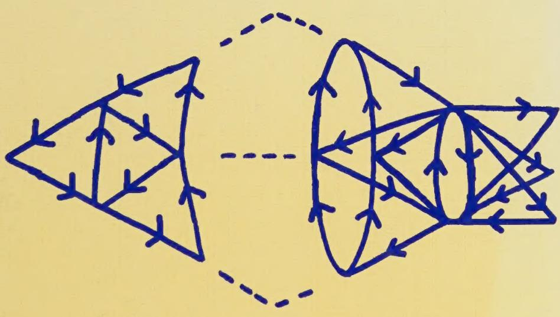
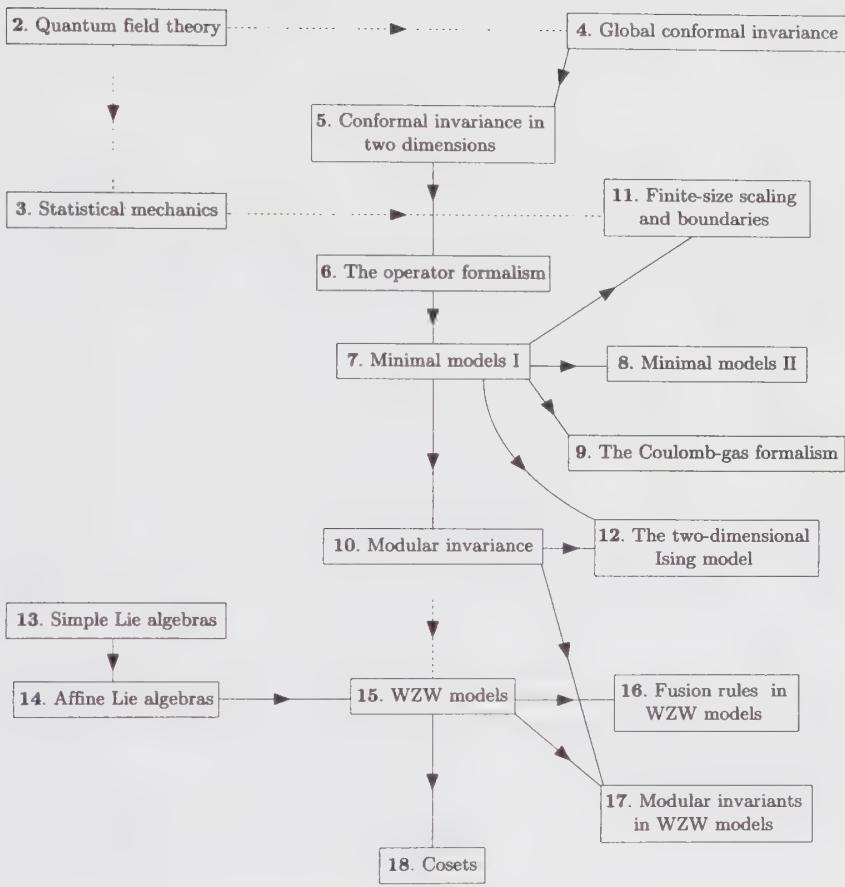
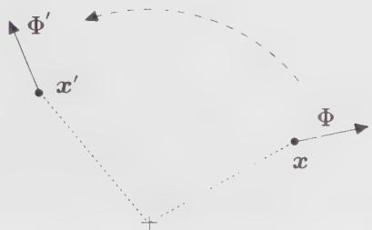
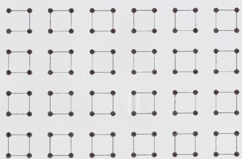
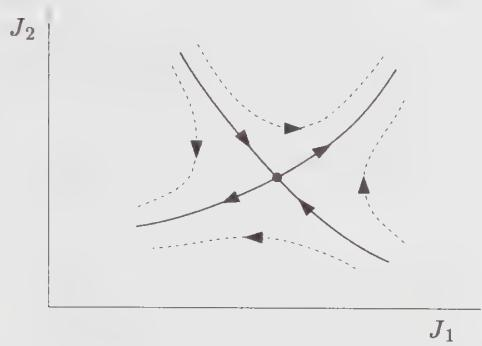
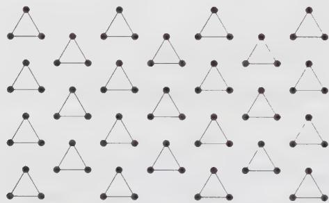
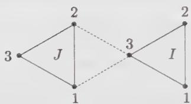
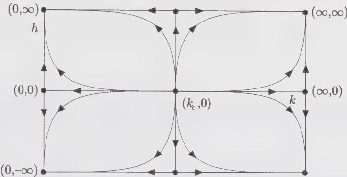
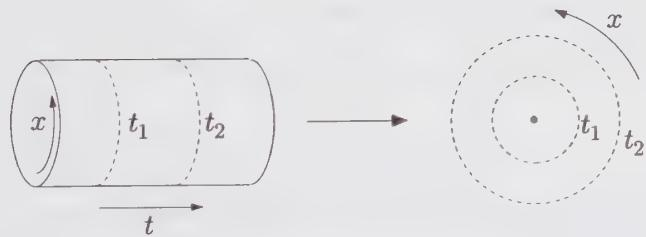
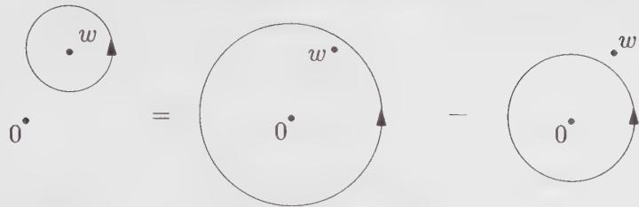

Philippe Di Francesco
Pierre Mathieu
David Sénéchal

# Conformal Field Theory

Lavery Library

St. John Fisher
College
Rochester, New York

Digitized by the Internet Archive in 2022 with funding from Kahle/Austin Foundation

# Graduate Texts in Contemporary Physics

Series Editors:

Joseph L. Birman

Jeffrey W. Lynn

Mark P. Silverman

H. Eugene Stanley

Mikhail Voloshin

Springer

New York

Berlin

Heidelberg

Barcelona

Budapest

Hong Kong

London

Milan

Paris

Santa Clara

Singapore

Tokyo

# Graduate Texts in Contemporary Physics

R.N. Mohapatra: Unification and Supersymmetry: The Frontiers of Quark-Lepton Physics, 2nd Edition

R.E. Prange and S.M. Girvin (eds.): The Quantum Hall Effect

M. Kaku: Introduction to Superstrings

J.W. Lynn (ed.): High-Temperature Superconductivity

H.V. Klapdor (ed.): Neutrinos

J.H. Hinken: Superconductor Electronics: Fundamentals and Microwave Applications

M. Kaku: Strings, Conformal Fields, and Topology: An Introduction

A. Auerbach: Interacting Electrons and Quantum Magnetism

Yu.M. Ivanchenko and A.A. Lisyansky: Physics of Critical Fluctuations

P. Di Francesco, P. Mathieu, and D. Sénéchal: Conformal Field Theories

# Conformal Field Theory

With 57 Illustrations

<table><tr><td>Philippe Di Francesco</td><td>Pierre Mathieu</td></tr><tr><td>Commissariat l&#x27;Énergie Atomique</td><td>Département de Physique</td></tr><tr><td>Centre d&#x27;Études de Saclay</td><td>Université Laval</td></tr><tr><td>Service de Physique Théorique</td><td>Québec, QC G1K 7P4 Canada</td></tr><tr><td>Gif-sur-Yvette, 91191 France</td><td></td></tr></table>

David Sénéchal
Département de Physique
Université de Sherbrooke
Sherbrooke, QC J1K 2R1 Canada

Series Editors
Joseph L. Birman
Department of Physics
City College of CUNY
New York, NY 10031, USA
Jeffrey W. Lynn
Reactor Radiation Division
National Institute of Standards and Technology
Gaithersburg, MD 20899, USA
Mark P. Silverman
Department of Physics
Trinity College
Hartford, CT 06106, USA

H. Eugene Stanley
Mikhail Voloshin
Center for Polymer Studies
Theoretical Physics Institute
Physics Department
Tate Laboratory of Physics
Boston University
University of Minnesota
Boston, MA 02215, USA
Minneapolis, MN 55455 USA

Library of Congress Cataloging-in-Publication Data

Di Francesco, Philippe.

Conformal field theory / Philippe Di Francesco, Pierre Mathieu, David Sénéchal.

p. cm. — (Graduate texts in contemporary physics)

Includes bibliographical references and index.

ISBN 0-387-94785-X (hrdcvr : alk. paper)

1. Conformal invariants. 2. Quantum field theory. I. Mathieu,

Pierre, 1957- . II. Sénéchal, David. III. Title. IV. Series.

QC174.52.C66D5 1996

530.1'43-dc20

96-23155

Printed on acid-free paper.

© 1997 Springer-Verlag New York, Inc.

All rights reserved. This work may not be translated or copied in whole or in part without the written permission of the publisher (Springer-Verlag New York, Inc., 175 Fifth Avenue, New York, NY 10010, USA), except for brief excerpts in connection with reviews or scholarly analysis. Use in connection with any form of information storage and retrieval, electronic adaptation, computer software, or by similar or dissimilar methodology now known or hereafter developed is forbidden.

The use of general descriptive names, trade names, trademarks, etc., in this publication, even if the former are not especially identified, is not to be taken as a sign that such names, as understood by the Trade Marks and Merchandise Marks Act, may accordingly be used freely by anyone.

Production managed by Robert Wexler; manufacturing supervised by Joe Quatela.

Photocomposed copy prepared from the authors' TeX files.

Printed and bound by Braun-Brumfield, Inc., Ann Arbor, MI.

Printed in the United States of America.

987654321

ISBN 0-387-94785-X Springer-Verlag New York Berlin Heidelberg SPIN 10524551

This book is dedicated to our families

# Preface

This is the first extensive textbook on conformal field theory, one of the most active areas of research in theoretical physics over the last decade. Although a number of review articles and lecture notes have been published on the subject, the need for a comprehensive text featuring background material, in-depth discussion, and exercises has not been satisfied. The authors hope that this work will efficiently fill this gap.

Conformal field theory has found applications in string theory, statistical physics, condensed matter physics, and has been an inspiration for developments in pure mathematics as well. Consequently, a reasonable text on the subject must be adapted to a wide spectrum of readers, mostly graduate students and researchers in the above-mentioned areas. Background chapters on quantum field theory, statistical mechanics, Lie algebras and affine Lie algebras have been included to provide help to those readers unfamiliar with some of these subjects (a knowledge of quantum mechanics is assumed). This textbook may be used profitably in many graduate courses dealing with special topics of quantum field theory or statistical physics, string theory, and mathematical physics. It may also be an instrument of choice for self-teaching. At the end of each chapter several exercises have been added, some with hints and/or answers. The reader is encouraged to try many of them, since passive learning can rapidly become inefficient.

It is impossible to encompass the whole of conformal field theory in a pedagogical manner within a single volume. Therefore, this book is intentionally limited in scope. It contains some necessary background material, a description of the fundamental formalism of conformal field theory, minimal models, modular invariance, finite geometries, Wess-Zumino-Witten models, and the coset construction of conformal field theories. Chapter 1 provides a general introduction to the subject and a more detailed description of the role played by each chapter. In building the list of references listed at the end of this volume, the authors have tried to be as complete as possible and hope to have given appropriate credit to all.

The authors intend to complete this work with a second volume, that would deal with the following subjects: Superconformal field theory $(N = 1, 2)$ , parafermionic models, W-algebras, critical integrable lattice models, perturbed conformal field theories, applications to condensed matter physics, and two-dimensional quantum gravity.

## ACKNOWLEDGMENTS

Modern, computerized book production minimizes the number of trivial errors, but one still has to rely on friendly humans to detect what the authors themselves have overlooked! We are grateful to Dave Allen, Luc Bégin, Denis Bernard, François David, André-Marie Tremblay, Mark Walton, and Jean-Bernard Zuber for their useful reading of various parts of the manuscript and, in many cases, their much-appreciated counsel. In particular, we thank M. Walton for numerous discussions on the subjects covered in part C of this volume and his constant interest in this project. P.D.F. is especially indebted to J.-B. Zuber, who patiently introduced him to the conformal world, and to the late C. Itzykson, who guided his steps through modern mathematics with his extraordinary and communicative enthusiasm. P.M. and D.S. acknowledge the support of the Natural Sciences and Engineering Research Council of Canada (NSERC) and of “le Fonds pour la Formation de Chercheurs et l’Aide à la Recherche” (F.C.A.R.) of Québec.

Philippe Di Francesco
Pierre Mathieu
David Sénéchal
February 1996

## Contents

Preface vii
Part A INTRODUCTION 1
1 Introduction 3
2 Quantum Field Theory 15
2.1 Quantum Fields 15
2.1.1 The Free Boson 15
2.1.2 The Free Fermion 21
2.2 Path Integrals 25
2.2.1 System with One Degree of Freedom 25
2.2.2 Path Integration for Quantum Fields 28
2.3 Correlation Functions 30
2.3.1 System with One Degree of Freedom 30
2.3.2 The Euclidean Formalism 31
2.3.3 The Generating Functional 33
2.3.4 Example: The Free Boson 33
2.3.5 Wick's Theorem 35
2.4 Symmetries and Conservation Laws 36
2.4.1 Continuous Symmetry Transformations 36
2.4.2 Infinitesimal Transformations and Noether's Theorem 39
2.4.3 Transformation of the Correlation Functions 42
2.4.4 Ward Identities 43
2.5 The Energy-Momentum Tensor 45
2.5.1 The Belinfante Tensor 46
2.5.2 Alternate Definition of the Energy-Momentum Tensor 49

2.A Gaussian Integrals 51
2.B Grassmann Variables 52
2.C Tetrads 56
Exercises 58
3 Statistical Mechanics 60
3.1 The Boltzmann Distribution 60
3.1.1 Classical Statistical Models 62
3.1.2 Quantum Statistics 66
3.2 Critical Phenomena 67
3.2.1 Generalities 67
3.2.2 Scaling 70
3.2.3 Broken Symmetry 73
3.3 The Renormalization Group: Lattice Models 74
3.3.1 Generalities 75
3.3.2 The Ising Model on a Triangular Lattice 77
3.4 The Renormalization Group: Continuum Models 82
3.4.1 Introduction 82
3.4.2 Dimensional Analysis 84
3.4.3 Beyond Dimensional Analysis: The $\varphi^4$ Theory 86
3.5 The Transfer Matrix 87
Exercises 90
Part B FUNDAMENTALS 93
4 Global Conformal Invariance 95
4.1 The Conformal Group 95
4.2 Conformal Invariance in Classical Field Theory 99
4.2.1 Representations of the Conformal Group in $d$ Dimensions 99
4.2.2 The Energy-Momentum Tensor 101
4.3 Conformal Invariance in Quantum Field Theory 104
4.3.1 Correlation Functions 104
4.3.2 Ward Identities 106
4.3.3 Tracelessness of $T_{\mu\nu}$ in Two Dimensions 107
Exercises 109
5 Conformal Invariance in Two Dimensions 111
5.1 The Conformal Group in Two Dimensions 112
5.1.1 Conformal Mappings 112
5.1.2 Global Conformal Transformations 113
5.1.3 Conformal Generators 114
5.1.4 Primary Fields 115
5.1.5 Correlation Functions 116

5.2 Ward Identities 118  
5.2.1 Holomorphic Form of the Ward Identities 118  
5.2.2 The Conformal Ward Identity 121  
5.2.3 Alternate Derivation of the Ward Identities 123  
5.3 Free Fields and the Operator Product Expansion 127  
5.3.1 The Free Boson 128  
5.3.2 The Free Fermion 129  
5.3.3 The Ghost System 132  
5.4 The Central Charge 135  
5.4.1 Transformation of the Energy-Momentum Tensor 136  
5.4.2 Physical Meaning of $c$ 138  
5.A The Trace Anomaly 140  
5.B The Heat Kernel 145  
Exercises 146  
The Operator Formalism 150  
6.1 The Operator Formalism of Conformal Field Theory 151  
6.1.1 Radial Quantization 151  
6.1.2 Radial Ordering and Operator Product Expansion 153  
6.2 The Virasoro Algebra 155  
6.2.1 Conformal Generators 155  
6.2.2 The Hilbert Space 157  
6.3 The Free Boson 159  
6.3.1 Canonical Quantization on the Cylinder 159  
6.3.2 Vertex Operators 161  
6.3.3 The Fock Space 163  
6.3.4 Twisted Boundary Conditions 164  
6.3.5 Compactified Boson 167  
6.4 The Free Fermion 168  
6.4.1 Canonical Quantization on a Cylinder 168  
6.4.2 Mapping onto the Plane 169  
6.4.3 Vacuum Energies 171  
6.5 Normal Ordering 173  
6.6 Conformal Families and Operator Algebra 177  
6.6.1 Descendant Fields 177  
6.6.2 Conformal Families 178  
6.6.3 The Operator Algebra 180  
6.6.4 Conformal Blocks 183  
6.6.5 Crossing Symmetry and the Conformal Bootstrap 185  
6.A Vertex and Coherent States 187  
6.B The Generalized Wick Theorem 188  
6.C A Rearrangement Lemma 190  
6.D Summary of Important Formulas 192  
Exercises 193

7 Minimal Models I 200
7.1 Verma Modules 200
7.1.1 Highest-Weight Representations 201
7.1.2 Virasoro Characters 203
7.1.3 Singular vectors and Reducible Verma Modules 204
7.2 The Kac Determinant 205
7.2.1 Unitarity and the Kac Determinant 205
7.2.2 Unitarity of c ≥ 1 Representations 209
7.2.3 Unitary c < 1 Representations 210
7.3 Overview of Minimal Models 211
7.3.1 A Simple Example 211
7.3.2 Truncation of the Operator Algebra 214
7.3.3 Minimal Models 215
7.3.4 Unitary Minimal Models 218
7.4 Examples 219
7.4.1 The Yang-Lee Singularity 219
7.4.2 The Ising Model 221
7.4.3 The Tricritical Ising Model 222
7.4.4 The Three-State Potts Model 225
7.4.5 RSOS Models 227
7.4.6 The O(n) Model 229
7.4.7 Effective Landau-Ginzburg Description of Unitary Minimal Models 231
Exercises 235
8 Minimal Models II 239
8.1 Irreducible Modules and Minimal Characters 240
8.1.1 The Structure of Reducible Verma Modules for Minimal Models 240
8.1.2 Characters 242
8.2 Explicit Form of Singular Vectors 243
8.3 Differential Equations for the Correlation Functions 247
8.3.1 From Singular Vectors to Differential Equations 247
8.3.2 Differential Equations for Two-Point Functions in Minimal Models 250
8.3.3 Differential Equations for Four-Point Functions in Minimal Models 252
8.4 Fusion Rules 255
8.4.1 From Differential Equations to Fusion Rules 255
8.4.2 Fusion Algebra 257
8.4.3 Fusion Rules for the Minimal Models 259
8.A General Singular Vectors from the Covariance of the OPE 265
8.A.1 Fusion of Irreducible Modules and OPE Coefficients 266
8.A.2 The Fusion Map F: Transferring the Action of Operators 271

8.A.3 The Singular Vectors $|h_{r,s} + rs\rangle$ : General Strategy 273
8.A.4 The Leading Action of $\Delta_{r,1}$ 275
8.A.5 Fusion at Work 278
8.A.6 The Singular Vectors $|h_{r,s} + rs\rangle$ : Summary 281
Exercises 283

9 The Coulomb-Gas Formalism 294
9.1 Vertex Operators 294
9.1.1 Correlators of Vertex Operators 295
9.1.2 The Neutrality Condition 297
9.1.3 The Background Charge 298
9.1.4 The Anomalous OPEs 300
9.2 Screening Operators 301
9.2.1 Physical and Vertex Operators 301
9.2.2 Minimal Models 303
9.2.3 Four-Point Functions: Sample Correlators 306
9.3 Minimal Models: General Structure of Correlation Functions 314
9.3.1 Conformal Blocks for the Four-Point Functions 314
9.3.2 Conformal Blocks for the N-Point Function on the Plane 315
9.3.3 Monodromy and Exchange Relations for Conformal Blocks 316
9.3.4 Conformal Blocks for Correlators on a Surface of Arbitrary Genus 318
9.A Calculation of the Energy-Momentum Tensor 319
9.B Screened Vertex Operators and BRST Cohomology: A Proof of the Coulomb-Gas Representation of Minimal Models 320
9.B.1 Charged Bosonic Fock Spaces and Their Virasoro Structure 321
9.B.2 Screened Vertex Operators 323
9.B.3 The BRST Charge 324
9.B.4 BRST Invariance and Cohomology 325
9.B.5 The Coulomb-Gas Representation Exercises 327
10 Modular Invariance 335
10.1 Conformal Field Theory on the Torus 336
10.1.1 The Partition Function 337
10.1.2 Modular Invariance 338
10.1.3 Generators and the Fundamental Domain 339
10.2 The Free Boson on the Torus 340
10.3 Free Fermions on the Torus 344
10.4 Models with c = 1 349
10.4.1 Compactified Boson 349
10.4.2 Multi-Component Chiral Boson 352

10.4.3 $\mathbb{Z}_2$ Orbifold 354  
10.5 Minimal Models: Modular Invariance and Operator Content 356  
10.6 Minimal Models: Modular Transformations of the Characters 359  
10.7 Minimal Models: Modular Invariant Partition Functions 364  
10.7.1 Diagonal Modular Invariants 365  
10.7.2 Nondiagonal Modular Invariants: Example of the Three-state Potts Model 365  
10.7.3 Block-Diagonal Modular Invariants 368  
10.7.4 Nondiagonal Modular Invariants Related to an Automorphism 370  
10.7.5 $D$ Series from $\mathbb{Z}_2$ Orbifolds 370  
10.7.6 The Classification of Minimal Models 372  
10.8 Fusion Rules and Modular Invariance 374  
10.8.1 Verlinde's Formula for Minimal Theories 375  
10.8.2 Counting Conformal Blocks 376  
10.8.3 A General Proof of Verlinde's Formula 378  
10.8.4 Extended Symmetries and Fusion Rules 384  
10.8.5 Fusion Rules of the Extended Theory of the Three-State Potts Model 386  
10.8.6 A Simple Example of Nonminimal Extended Theory: The Free Boson at the Self-Dual Radius 388  
10.8.7 Rational Conformal Field Theory: A Definition 389  
10.A Theta Functions 390  
10.A.1 The Jacobi Triple Product 390  
10.A.2 Theta Functions 392  
10.A.3 Dedekind's $\eta$ Function 394  
10.A.4 Modular Transformations of Theta Functions 394  
10.A.5 Doubling Identities 395  
Exercises 396  
Finite-Size Scaling and Boundaries 409  
11.1 Conformal Invariance on a Cylinder 410  
11.2 Surface Critical Behavior 413  
11.2.1 Conformal Field Theory on the Upper Half-Plane 413  
11.2.2 The Ising Model on the Upper Half-Plane 417  
11.2.3 The Infinite Strip 419  
11.3 Boundary Operators 421  
11.3.1 Introduction 421  
11.3.2 Boundary States and the Verlinde Formula 422  
11.4 Critical Percolation 427  
11.4.1 Statement of the Problem 427  
11.4.2 Bond Percolation and the Q-state Potts Model 429  
11.4.3 Boundary Operators and Crossing Probabilities 430  
Exercises 433

12 The Two-Dimensional Ising Model 439
12.1 The Statistical Model 439
12.2 The Underlying Fermionic Theory 442
12.2.1 Fermion: Energy and Energy-Momentum Tensor 443
12.2.2 Spin 445
12.3 Correlation Functions on the Plane by Bosonization 447
12.3.1 The Bosonization Rules 447
12.3.2 Energy Correlators 448
12.3.3 Spin and General Correlators 450
12.4 The Ising Model on the Torus 453
12.4.1 The Partition Function 454
12.4.2 General Ward Identities on the Torus 455
12.5 Correlation Functions on the Torus 457
12.5.1 Fermion and Energy Correlators 457
12.5.2 Spin and Disorder-Field Correlators 459
12.6 Bosonization on the Torus 464
12.6.1 The Two Bosonizations of the Ising Model: Partition Functions and Operators 464
12.6.2 Compactified Boson Correlations on the Plane and on the Torus 466
12.6.3 Ising Correlators from the Bosonization of the Dirac Fermion 471
12.6.4 Ising Correlators from the Bosonization of Two Real Fermions 475
12.A Elliptic and Theta Function Identities 477
12.A.1 Generalities on Elliptic Functions 477
12.A.2 Periodicity and Zeros of the Jacobi Theta Functions 478
12.A.3 Doubling Identities 479
Exercises 479

Part C CONFORMAL FIELD THEORIES WITH LIE-GROUP SYMMETRY 487
13 Simple Lie Algebras 489
13.1 The Structure of Simple Lie Algebras 490
13.1.1 The Cartan-Weyl Basis 490
13.1.2 The Killing Form 492
13.1.3 Weights 494
13.1.4 Simple Roots and the Cartan Matrix 495
13.1.5 The Chevalley Basis 497
13.1.6 Dynkin Diagrams 497
13.1.7 Fundamental Weights 498
13.1.8 The Weyl Group 500

13.1.9 Lattices 502
13.1.10 Normalization Convention 503
13.1.11 Examples 504
13.2 Highest-Weight Representations 508
13.2.1 Weights and Their Multiplicities 508
13.2.2 Conjugate Representations 510
13.2.3 Quadratic Casimir Operator 511
13.2.4 Index of a Representation 512
13.3 Tableaux and Patterns (su(N)) 513
13.3.1 Young Tableaux 513
13.3.2 Partitions and Orthonormal Bases 514
13.3.3 Semistandard Tableaux 515
13.3.4 Gelfand-Tsetlin Patterns 516
13.4 Characters 517
13.4.1 Weyl's Character Formula 517
13.4.2 The Dimension and the Strange Formulae 519
13.4.3 Schur Functions 521
13.5 Tensor Products: Computational Tools 522
13.5.1 The Character Method 523
13.5.2 Algorithm for the Calculation of Tensor Products 524
13.5.3 The Littlewood-Richardson Rule 526
13.5.4 Berenstein-Zelevinsky Triangles 528
13.6 Tensor Products: A Fusion-Rule Point of View 531
13.7 Algebra Embeddings and Branching Rules 534
13.7.1 Embedding Index 534
13.7.2 Classification of Embeddings 537
13.A Properties of Simple Lie Algebras 540
13.B Notation for Simple Lie Algebras 546
Exercises 547
Affine Lie Algebras 556
14.1 The Structure of Affine Lie Algebras 557
14.1.1 From Simple Lie Algebras to Affine Lie Algebras 557
14.1.2 The Killing Form 559
14.1.3 Simple Roots, the Cartan Matrix and Dynkin Diagrams 561
14.1.4 The Chevalley Basis 564
14.1.5 Fundamental Weights 564
14.1.6 The Affine Weyl Group 566
14.1.7 Examples 568
14.2 Outer Automorphisms 571
14.2.1 Symmetry of the Extended Diagram and Group of Outer Automorphisms 571
14.2.2 Action of Outer Automorphisms on Weights 572

14.2.3 Relation with the Center of the Group 574
14.3 Highest-Weight Representations 575
14.3.1 Integrable Highest-Weight Representations 576
14.3.2 The Basic Representation of $\widehat{su}(2)_1$ 579
14.3.3 String Functions 579
14.4 Characters 581
14.4.1 Weyl-Kac Character Formula 581
14.4.2 The $\widehat{su}(2)_k$ Characters 585
14.4.3 Characters of Heisenberg Algebra Modules 586
14.4.4 The $\widehat{u}(1)$ Characters Associated with the Free Boson on a Circle of Rational Square Radius 587
14.5 Modular Transformations 591
14.6 Properties of the Modular $S$ Matrix 592
14.6.1 The $S$ Matrix and the Charge Conjugation Matrix 592
14.6.2 The $S$ Matrix and the Asymptotic Form of Characters 593
14.6.3 The $S$ Matrix and Finite Characters 595
14.6.4 Outer Automorphisms and the Modular $S$ Matrix 595
14.7 Affine Embeddings 596
14.7.1 Level of the Embedded Algebra 596
14.7.2 Affine Branching Rules 597
14.7.3 Branching of Outer Automorphism Groups 599
14.A A Technical Identity 601
14.B Modular Transformation Properties of Affine Characters 602
14.C Paths as a Basis of States 608
14.C.1 Basis for the Integrable Representations of $\widehat{su}(2)_1$ 608
14.C.2 $\widehat{su}(N)_1$ Paths 609
14.D Notation for Affine Lie Algebras 611
Exercises 611
WZW Models 617
15.1 Introducing WZW Models 617
15.1.1 Nonlinear Sigma Models 617
15.1.2 Wess-Zumino-Witten Models 619
15.1.3 Ward Identity and Affine Lie Algebras 622
15.2 The Sugawara Construction 624
15.3 WZW Primary Fields 628
15.3.1 Primary Fields as Covariant Fields 628
15.3.2 The Knizhnik-Zamolodchikov Equation 631
15.3.3 Primary Fields as Highest-Weight States 633
15.3.4 Affine Lie Algebra Singular Vectors 634
15.3.5 WZW Models as Rational Conformal Field Theories 636
15.4 Four-Point Functions and the Knizhnik-Zamolodchikov Equation 638
15.4.1 Introductory Comments 639

15.4.2 The Four-Point $\widehat{su}(N)_k$ Knizhnik-Zamolodchikov Equation 641  
15.4.3 The Crossing-Symmetry Constraint 644  
15.5 Free-Fermion Representations 646  
15.5.1 Free-Field Representations and Quantum Equivalence 646  
15.5.2 The $\widehat{so}(N)_1$ Current Algebra From Real Free Fermions 647  
15.5.3 Description of the $\widehat{so}(N)_1$ Primary Fields 649  
15.5.4 $\widehat{so}(N)_1$ Characters 650  
15.5.5 $\widehat{so}(N)$ Representations at Higher Levels 651  
15.5.6 Complex Free-Fermion Representations: $\widehat{u}(N)_k$ 652  
15.6 Vertex Representations 653  
15.6.1 The $\widehat{su}(2)_1$ Case 653  
15.6.2 Fock Construction of the $\widehat{su}(2)_1$ Integrable Modules 655  
15.6.3 Generalization: Vertex Representations of Simply-Laced Algebras at Level 1 657  
15.7 The Wakimoto Free-Field Representation 660  
15.7.1 From the $su(2)$ Monomial Representation to the Affine Case 660  
15.7.2 $\widehat{s\widehat{u}(2)_k}$ Primary Fields 663  
15.7.3 Calculation of Correlation Functions 664  
15.7.4 Wakimoto Representation for $\widehat{s\widehat{u}(3)_k}$ 665  
15.7.5 Generalization 667  
15.A Normalization of the Wess-Zumino Term Exercises 668  
Fusion Rules in WZW Models 675  
16.1 Symmetries of Fusion Coefficients 676  
16.2 Fusion Rules Using the Affine Weyl Group 679  
16.2.1 The Kac-Walton Formula 679  
16.2.2 Algorithm for Fusion Rules 681  
16.2.3 The $\widehat{s\widehat{u}(2)_k}$ Fusion Coefficients 684  
16.2.4 $\widehat{s\widehat{u}(N)_k}$ Fusion Rules: Combinatorial Description 684  
16.3 Quantum Dimensions 686  
16.4 The Depth Rule and Threshold Levels 689  
16.4.1 The Depth Rule 689  
16.4.2 Threshold Levels and $\widehat{s\widehat{u}(3)_k}$ Fusion Coefficients 693  
16.5 Fusion Potentials ( $\widehat{s\widehat{u}(N)}$ ) 695  
16.5.1 Tensor-Product Coefficients Revisited 695  
16.5.2 Level Truncation in the Determinant Method 697  
16.5.3 The Constraint-Generating Function 699  
16.6 Level-Rank Duality 702  
16.A Fusion Elementary Couplings in $\widehat{s\widehat{u}(N)}$ Exercises 707  
711

7 Modular Invariants in WZW Models 719
17.1 Modular Invariance in WZW Models 721
17.1.1 The Construction of Modular-Invariant Partition Functions 721
17.1.2 Diagonal Modular Invariants 722
17.1.3 The Search for New Modular Invariants 723
17.2 A Simple Nondiagonal Modular Invariant 723
17.3 Modular Invariants Using Outer Automorphisms 726
17.3.1 The General Construction 726
17.3.2 Constraints on the Partition Function 730
17.3.3 $\widehat{s}\widehat{u}(2)$ Modular Invariants by Outer Automorphisms 731
17.4 The $\widehat{s}\widehat{u}(2)_4$ Nondiagonal Invariant Revisited 732
17.5 Conformal Embeddings 733
17.5.1 Conformally Invariant Embeddings 733
17.5.2 Conformal Branching Rules 735
17.6 Modular Invariants From Conformal Embeddings 739
17.7 Some Classification Results 741
17.7.1 The ADE Classification of the $\widehat{s}\widehat{u}(2)$ Modular Invariants 741
17.7.2 The Classification of the $\widehat{s}\widehat{u}(3)$ Modular Invariants 743
17.8 Permutation Invariants and Extended Chiral Algebras 744
17.9 Galois Symmetry 749
17.9.1 Galois Transformations on $S$ Matrices 749
17.9.2 The Parity Rule 751
17.9.3 Modular Invariants From Galois Symmetry 752
17.9.4 Galois Permutation Invariants 754
17.10 Modular Invariants, Generalized ADE Diagrams and Fusion Rules 756
17.10.1 Graph Algebra 756
17.10.2 Positivity Constraints on Fusion Coefficients 758
17.10.3 Graph Subalgebra and Extended ADE Fusion Rules 759
17.10.4 Generalized ADE Diagrams for $\widehat{s}\widehat{u}(3)$ 764
17.10.5 Graph Subalgebras and Modular Invariants for $\widehat{s}\widehat{u}(3)$ 766
17.A $\widehat{s}\widehat{u}(p)_q\oplus \widehat{s}\widehat{u}(q)_p\subset \widehat{s}\widehat{u}(pq)_1$ Branching Rules 770
17.B General Orbifolds: Fine Structure of the $c = 1$ Models 774
17.B.1 Orbifold Based on a Group $G$ 775
17.B.2 Orbifolds and the Method of Outer Automorphisms 776
17.B.3 $\mathbb{Z}_2$ Orbifold of the $c = 1\widehat{s}\widehat{u}(2)_1$ Theory 777
17.B.4 Quotienting by Subgroups of $SU(2)$ 778
17.B.5 The Finite Subgroups of $SU(2)$ and $\hat{A},\hat{D},\hat{E}$ 780
17.B.6 Operator Content of the $c = 1$ Theories 782
Exercises 786

Cosets 797
18.1 The Coset Construction 799
18.2 Branching Functions and Characters 801
18.2.1 Field Identifications and Selection Rules 801
18.2.2 Fixed Points and Their Resolutions 803
18.2.3 Maverick Cosets 803
18.2.4 Modular Transformation Properties of Coset Characters 804
18.2.5 Modular Invariants 806
18.3 Coset Description of Unitary Minimal Models 807
18.3.1 Character Decomposition 808
18.3.2 Modular S Matrix 811
18.3.3 Fusion Rules 812
18.3.4 Modular Invariants 813
18.4 Other Coset Representations of Minimal Models 813
18.4.1 The $\widehat{E}_8$ Formulation of the Ising Model 814
18.4.2 The $\widehat{s}\widehat{u}(3)$ Formulation of the Three-State Potts Model 814
18.5 The Coset $\widehat{s}\widehat{u}(2)_k/\widehat{u}(1)$ and Parafermions 817
18.5.1 Character Decomposition and String Functions 817
18.5.2 A Few Special Cases 820
18.5.3 Parafermions 823
18.5.4 Parafermionic Formulation of the General $\widehat{s}\widehat{u}(2)$ Diagonal Cosets 824
18.6 Conformal Theories With Fractional $\widehat{s}\widehat{u}(2)$ Spectrum-generating Algebra 826
18.6.1 Admissible Representations of $\widehat{s}\widehat{u}(2)_k$ 827
18.6.2 Character of Admissible Representations 828
18.6.3 Modular Covariance of Admissible Representations 830
18.6.4 Charge Conjugation 831
18.6.5 Fusion Rules 832
18.7 Coset Description of Nonunitary Minimal Models 833
18.7.1 The Coset Description of the Yang-Lee Model 834
18.7.2 Field Identification in the Nonunitary Case 835
18.7.3 Character Decomposition, Modular Matrices, and Modular Invariants 837
18.A Lie-Algebraic Structure of the Virasoro Singular Vectors 837
18.B Affine Lie Algebras at Fractional Levels and General Nonunitary Coset Models 840
18.B.1 Admissible Representations of Affine Lie Algebras at Fractional Levels 840
18.B.2 Modular Properties of Characters for Admissible Representations 844
18.B.3 Charge Conjugation and the Associated Weyl Group 844

Contents
18.B.4 Nonunitary Diagonal Coset Models
Exercises
References
Index
xxi
845
848
861
877

-

PART A

# INTRODUCTION

-

# Introduction

A vast similitude interlocks all,

All distances of space however wide,

All distances of time...

– Walt Whitman

The aesthetic appeal of symmetry has been a guide—sometimes a tyrannic one—for philosophers of nature since the dawn of science. Ancient Greeks, in their belief that celestial bodies followed perfectly circular orbits, demonstrated an attachment to the circle as the most symmetric curve of all. In elaborating more complex systems involving scores of epicycles and eccentrics, they gave up the idea that celestial orbits should be explicitly symmetric, but invented unknowingly the concept of “hidden symmetry”, for the circle remained the building block of their cosmology. Modern science, with Kepler, Galileo, and Newton, gave symmetry a deeper realm: that of the physical “laws.” Circles gave way to ellipses and more complicated trajectories; the richness and variety of Nature became, in the Heavens like on Earth, compatible with symmetric laws, even without the exterior appearance of symmetry.

Twentieth-century physics has witnessed the triumph of symmetry and its precise formulation in theoretical language. The work of Lie and Cartan (among others) paved the way for the general application of symmetries in microscopic physics within quantum mechanics. Wigner, probably the most important figure in the application of group theory to physics, fitted the possible elementary particles into representations of the Lorentz and Poincaré groups. The principles of special and general relativity—the seeds of the other great revolution of twentieth-century physics—were also motivated by the appeal of symmetry. Modern theories of elementary particles (the so-called standard model) rest on the principle of local gauge symmetry. Our understanding of phase transitions and critical phenomena draws a great deal on the concept of broken symmetry. In particular, broken gauge symmetries are central to our understanding of weak interactions, superconductivity, and cosmology.

This book is about conformal symmetry in two-dimensional field theories. Conformal field theory plays a central role in the description of second- or higher-order phase transitions in two-dimensional systems, and in string theory, the (so far speculative) attempt at unifying all forces of Nature. To the practical man, this may seem a narrow field of application for a book of this size. However, two-dimensional conformal field theories are perfect examples of systems in which the symmetries are so powerful as to allow an exact solution of the problem. This feature, as well as the great variety of mathematical concepts needed in their solution and definition, have made conformal field theories one of the most active domains of research in mathematical physics.

In the context of a physical system with local interactions such as those studied in this work, conformal invariance is an immediate extension of scale invariance, a symmetry under dilations of space. This important fact was first pointed out by Polyakov [295]. Conformal transformations are nothing but dilations by a scaling factor that is a function of position (local dilations). It is entirely natural that a local theory (i.e., without action at a distance) that is symmetric under rigid (or global) dilations should also be symmetric under local dilations.

Even after being augmented to conformal invariance, the symmetry remains finite, in the sense that a finite number of parameters are needed to specify a conformal transformation in d spatial dimensions (specifically, $\frac{1}{2}(d+1)(d+2)$ ). The consequence of this finiteness is that conformal invariance can say relatively little about the form of correlations, in fact just slightly more than rotation or scale invariance. The exception is in two dimensions, where the above formula gives only the number of parameters specifying conformal transformations that are everywhere well-defined, whereas there is an infinite variety of local transformations (the conformal mappings of the complex plane) that, although not everywhere regular, are still equivalent to local dilations. The number of parameters specifying such local conformal transformations in two dimensions is infinite, because any locally analytic function provides a bona fide conformal mapping. This richness of conformal symmetry in two dimensions is the reason for the success of conformal invariance in the study of two-dimensional critical systems.

Scale invariance is by no means an exact symmetry of Nature, since our description of physical phenomena involves a number of characteristic length scales that indicate the typical distances over which the “action is taking place.” These length scales are not invariant under dilations, and the latter result in a modification of the physical parameters of the system. The important exception occurs, of course, when these characteristic length scales are either zero or infinite. Let us illustrate this with some examples.

## CRITICAL PHENOMENA

Consider first an infinite lattice of atoms in interaction, such as in a solid. Among the various forces involving ions and electrons, which are the source of so many interesting collective phenomena, consider for definiteness the magnetic (exchange) interaction that couples the spins of adjacent atoms. A very simplified version of

## 1. Introduction

this interaction is embodied in the Ising model, in which the spins $\sigma_{i}$ at site i take only two definite values (+1 and -1) and the magnetic energy of the system is a sum over pairs of adjacent atoms:

$$
E = \sum_ {\langle i j \rangle} \sigma_ {i} \sigma_ {j}
$$

An obvious characteristic length scale of this system is the lattice spacing a between adjacent atoms. Another, more important length scale is the so-called correlation length $\xi$ , defined as the typical distance over which the spins are statistically correlated. More precisely, we write

$$
\langle \sigma_ {i} \sigma_ {j} \rangle - \langle \sigma_ {i} \rangle \langle \sigma_ {j} \rangle \sim \exp - \frac {| i - j |}{\xi}
$$

where $\langle\cdots\rangle$ denotes a thermal average at a temperature T and where $|i-j|\gg1$ is the distance between the positions i and j. Since observable magnetic properties are derived from such correlations, they are quite affected by the value of $\xi$ , which is a function of temperature.

For a generic value of the temperature, there is no symmetry of the model under scale transformations, because of the two length scales $a$ and $\xi$ . However, there are special circumstances, dictated by external parameters such as temperature, under which $\xi$ grows without bounds. $^{1}$ Such values of the parameters of the model are called critical points, and the behaviors of systems at or near these critical points constitute what is called critical phenomena. When studying correlations over distances large compared to the lattice spacing, yet small compared to the correlation length, these two length scales lose their relevance, and scale invariance emerges.

The physical picture of a critical system one must keep in mind is that of an assembly of regions of (+) spins (called droplets), within which smaller droplets of (−) spins are included, and yet smaller droplets of (+) spins are included within those, and so on. $^{2}$ This droplet structure is self-similar—in the sense that it has the same general appearance after zooming in or out a few times—as long as the droplet size $\ell$ satisfies $a \ll \ell \ll \xi$ .

The Ising model is just one among an infinite variety of models that can provide an approximate description of complex systems with local interactions. One of the key ideas in our understanding of critical phenomena is that of universality: despite this continuous variety of models that possess critical points, their behaviors at (or near) the critical point belong to a discrete set of universality classes, corresponding to different realizations of scale invariance. One of the goals of conformal field theory—so far only partially achieved—is a classification of all universality classes of two-dimensional critical systems.

## CRITICAL QUANTUM SYSTEMS

For a special class of critical phenomena, the critical temperature vanishes or is small compared to other relevant energy scales. A quantum description of the system is then indispensable. Essentially, the statistical fluctuations giving rise to correlations are not thermal, but mainly quantum-mechanical in origin. An example of such a system is the so-called Heisenberg spin- $\frac{1}{2}$ chain, which represents an infinite chain of magnetic atoms, each carrying a spin one-half operator $S_{i}$ and interacting with its immediate neighbors via the Heisenberg Hamiltonian:

$$
H = \sum_ {\langle i j \rangle} S _ {i} \cdot S _ {j}
$$

One of the main characteristics of this model (in one spatial dimension) is the infinite correlation length, which means that the quantum correlations $\langle S_{i}S_{j}\rangle$ decay with distance according to a power law, not exponentially. This property is intimately related to the existence of gapless excitations in the system, namely, a continuum of excited states arbitrarily close in energy to the ground state. In any field theory (or any model involving an infinite number of degrees of freedom) the presence of gapless excitations is a signal of scale invariance, since the energy gap $\Delta$ between the ground state and the first excited state—the rest mass of the excitation—constitutes a characteristic length scale via the associated Compton wavelength $\lambda = \hbar / (\nu \Delta)$ (v being the characteristic velocity of the system, equal to the speed of light in relativistic field theories).

The mathematical formalism used in the description of quantum systems, and field theories in particular, bears a striking resemblance to the formalism of statistical mechanics describing finite-temperature critical phenomena. This similitude between the statistical and field-theoretical formalisms allows for a common treatment of both classes of phenomena. However, the field theory describing a statistical system (like the Ising model) lives in one spatial dimension less than the statistical system itself, since time constitutes an extra dimension inherently incorporated in the quantum description of the field theory. Critical quantum phenomena on which the methods of two-dimensional conformal field theory can be applied are thus one-dimensional, like the spin chain described above. Another example of a one-dimensional quantum system with scale invariance is constituted by the electrons moving on the edge of a microscopic layer of a semiconductor submitted to a large magnetic field of the appropriate strength. This is an aspect of the so-called fractional quantum Hall effect. It may also happen that a quantum system be only formally one-dimensional, after some simplifying treatment of its mathematical description. This is the case of the magnetic impurity problem (or Kondo problem), which has been successfully studied with the methods of conformal field theory.

## 1. Introduction

## DEEP INELASTIC SCATTERING

Another, very different area in which scale invariance has emerged $^{3}$ is the scattering of high-energy electrons from protons. Put very simply, scattering experiments failed to detect a characteristic length scale when probing the proton deeply with inelastically scattered electrons. This supported the idea that the proton is a composite object made of point-like constituents, the quarks. $^{4}$ This is quite reminiscent of Rutherford's study of the scattering of alpha particles off gold atoms, which revealed the absence of a length scale in the atom over five orders of magnitude, between the Bohr radius and the size of the nucleus.

Let us be more precise. Consider an electron (or any other lepton) of energy E scattered inelastically from a proton at an angle $\theta$ , with an energy $E' < E$ . The quantity of experimental interest is the inclusive, inelastic cross-section, which gives the ratio of scattered flux to incident flux per unit solid angle and unit energy of the scattered particles:

$$
\frac {d \sigma}{d \Omega^ {\prime} d E ^ {\prime}} = \frac {\alpha^ {2}}{4 E ^ {2} \sin^ {4} (\theta / 2)} \left[ 2 W _ {1} \sin^ {2} (\theta / 2) + W _ {2} \cos^ {2} (\theta / 2) \right]
$$

where $\alpha$ is the fine structure constant and $W_{1,2}$ are structure functions encapsulating the dynamics of the proton's interior. These structure functions depend on the kinematical parameters of the collision: the four-momentum q transferred from the lepton to the proton and the energy loss $(E - E') \equiv v/m$ (m is the lepton's mass). However, it turns out that the dimensionless quantities $2mW_{1}$ and $vW_{2}/m$ depend only on the dimensionless ratio $x = 2v/(-q^{2})$ , if $q^{2}$ is negative enough (corresponding to large transferred spatial momentum). In other words, in this deep-inelastic range, the internal dynamics of the proton does not provide its own length scale $\ell$ that could justify a separate dependence of the structure functions on the dimensionless variables $\ell^{2}\nu$ and $\ell^{2}q^{2}$ . In the context of quantum chromodynamics (QCD, the modern theory of strong interactions), this reflects the asymptotic freedom of the theory, namely, the quasi-free character of the quarks when probed at very small length scales.

Of course, the quark-gluon system underlying the scaling phenomena of deep inelastic scattering is thoroughly quantum-mechanical, just like systems undergoing quantum-critical phenomena. However, scale invariance manifests itself at short distances in QCD, whereas it emerges at long distances in quantum systems like the Heisenberg spin chain.

## STRING THEORY

Whether statistical or quantum-mechanical, the physical systems enjoying scale invariance mentioned above were all in the same class, in the sense that they are made of an infinite number of degrees of freedom (atoms, spins, etc.) fluctuating in space or space-time and characterized by a divergent correlation length or, equivalently, by power-law correlations. However, conformal invariance has appeared in other areas of theoretical physics. H. Weyl proposed in 1918 a generalization of general coordinate invariance (general relativity) in which local scale transformations would also be possible, in the hope of unifying electromagnetism and gravitation within the same formalism. $^{5}$ Since then, the hope of formulating a generalization of general relativity that would include the other known fundamental interactions has motivated an immense theoretical effort. Notable attempts in this direction come under the name of Kaluza-Klein theories and supergravity. In particular, theories of conformal supergravity are constructed to be invariant under conformal transformations of space-time.

Efforts toward unifying all forces of Nature in a single, comprehensive theory have culminated in what is known as string theory, in which two-dimensional scale invariance appears naturally. String theory originates from the malaise afflicting relativistic field theories in the 1960s, at a time when no consistent field theory could describe strong and weak interactions. An alternative to field theory, consisting of a set of prescriptions for scattering amplitudes between hadrons, was developed under the name of dual models. Curiously, the construction of dual models could follow from the assumption that mesons were in fact microscopic strings, or extended one-dimensional objects. The discovery of deep inelastic scattering and the subsequent development of QCD caused the demise of dual models, but some of their interesting features, such as finiteness in perturbation theory, inspired their transposition to the realm of quantum gravity, albeit at length scales much smaller (the Planck scale, $10^{-35}\mathrm{m}$ ). The great wave of activity in string theory occurred in the 1980s, after it was realized that consistent, finite first-quantized theories unifying gravitation and other interactions could be formulated.

We do not provide, in this work, an introduction to string theory; this can be found elsewhere (see the notes at the end of this introduction). Let us simply mention here some basic concepts. The time evolution of a one-dimensional extended object (i.e., a string) sweeps a two-dimensional manifold within space-time, which is called the world-sheet of the string. In a given classical configuration of the string, each point on this world-sheet corresponds to a point in space-time. The first-quantized formulation of string theory involves fields (representing the physical shape of the string) that reside on the world-sheet. From the point of view of field theory, this constitutes a two-dimensional system, endowed with reparametrization invariance on the world-sheet, meaning that the precise coordinate system used on the world-sheet has no physical consequence. This is particularly clear in Polyakov's formulation of string theory, and revives Weyl's idea of invariance under general coordinate transformations (this time on the world-sheet), augmented by local dilations. This reparametrization invariance is tantamount to conformal invariance. Conformal invariance of the world-sheet theory is essential for prevent-

## 1. Introduction

ing the appearance of ghosts (states leading to negative probabilities in quantum mechanics). The various string models that have been elaborated basically differ in the specific content of this conformally invariant two-dimensional field theory (including boundary conditions). A classification of conformally invariant theories in two dimensions gives a perspective on the variety of consistent first-quantized string theories that can be constructed.

## MODERN BREAKTHROUGHS

The modern study of conformal invariance in two dimensions was initiated by Belavin, Polyakov, and Zamolodchikov, in their fundamental 1984 paper [36]. These authors combined the representation theory of the Virasoro algebra—developed shortly before by Kac and by Feigin and Fuchs—with the idea of an algebra of local operators and showed how to construct completely solvable conformal theories: the so-called minimal models. An intense activity at the border of mathematical physics and statistical mechanics followed this initial envoi and the minimal models were identified with various two-dimensional statistical systems at their critical point. More solvable models were found by including additional symmetries or extensions of conformal symmetry in the construction of conformal theories.

A striking feature of the work of Belavin, Polyakov, and Zamolodchikov—and of previous work of Polyakov and other members of the Russian school—regarding conformal theories is the minor role played (if at all) by the Lagrangian or Hamiltonian formalism. Rather, the dynamical principle invoked in these studies is the associativity of the operator algebra, also known as the bootstrap hypothesis. This approach originates from the difficulty of describing strong interactions with quantum field theory. Instead of trying to solve the problem piecemeal with perturbative (or even nonperturbative) methods based on a local action, some physicists proposed a program designed to solve the whole problem at once—that is, to calculate all the correlations between all the fields—based only on criteria of self-consistency and symmetry. $^{6}$ The key ingredient of this approach is the assumption that the product of local quantum operators can always be expressed as a linear combination of well-defined local operators. Schematically,

$$
\phi_ {i} (\pmb {x}) \phi_ {j} (\pmb {y}) = \sum_ {k} C _ {i j} ^ {k} (\pmb {x} - \pmb {y}) \phi_ {k} (\pmb {y})\tag{1.1}
$$

where $C_{ij}^{k}(x-y)$ is a c-number function, not an operator. This is the operator product expansion, initially put forward by Wilson. This expansion constitutes an algebra—that is, a set of multiplication rules—for local fields. The dynamical principle of the bootstrap approach is the associativity of this algebra. In practice, a successful application of the bootstrap approach is hopeless, unless the number of local fields is finite. This is precisely the case in minimal conformal field theories.

By a fortunate coincidence, important progress in string theory was realized in the same year (1984) by Green and Schwarz [186] (see also [187]). In the years that followed, the development of conformal field theory and of string theory often went hand-in-hand. In particular, string scattering amplitudes were expressed in terms of correlation functions of a conformal field theory defined on the plane (tree amplitudes), on the torus (one-loop amplitudes), or on some higher-genus Riemann surface. Consistency requirements on the torus (modular invariance) turned out to be as fruitful in analyzing critical statistical models (e.g., the Potts model) as in constructing consistent string models in four space-time dimensions. The name of Cardy is associated with the early discovery of the importance of modular invariance in the context of critical statistical models.

Following the pioneering work of Belavin, Polyakov, and Zamolodchikov, conformal field theory has rapidly developed along many directions. The work of Zamolodchikov has strongly influenced many of these developments: conformal field theories with Lie algebra symmetry (with Knizhnik), theories with higher-spin fields—the W-algebras—or with fractional statistics—parafermions (with Fateev), vicinity of the critical point, etc. These developments, and their offspring, still constitute active fields of research today and make conformal field theory one of the most active areas of research in mathematical physics.

## Contents of this Volume

This volume is divided into three parts of unequal lengths. Part A (Chapters 1 to 3) plays an introductory or preliminary role. Part B (Chapters 4 to 12) describes the core of conformal field theory and some of its immediate applications to classical statistical systems. Part C (Chapters 13 to 18) deals with conformal field theories with current algebras, essentially Wess-Zumino-Witten models.

Chapters 2 and 3 are preliminary chapters that do not deal with conformal symmetry, but provide a background essential to the comprehension of the remainder of the book. Readers with experience with quantum field theory and statistical mechanics will be able to start reading at Chapter 4. However, those readers might want to take a close look at Sections 2.4 and 2.5, dealing with continuous symmetries and the energy-momentum tensor, in which some conventions are set on the definition of symmetry operations. Chapter 3 provides a general background on critical phenomena as a theater of application of conformal invariance. An introduction to the renormalization group is provided, which helps in understanding the context in which conformal field theory is useful. We hope that mathematicians and entry-level physicists will find these two chapters instructive.

Part B starts with Chapter 4, which defines conformal transformations in arbitrary dimension and derives the basic consequences of conformal invariance on classical and quantum field theories, including the form of correlation functions and the Ward identities. Chapter 5 adapts these results to two dimensions and introduces the technique of complex (holomorphic and antiholomorphic) variables and components. The notion of operator product expansion is introduced and some free-field examples are worked out. Chapter 6 describes the “canonical” quantization of two-dimensional conformal field theories, including radial quantization, the Virasoro algebra, mode expansions, and their application to free bosons and fermions. The important notions of operator algebra and conformal bootstrap are introduced at the end of this chapter. Chapters 5 and 6 thus initiate the core of the subject.

Chapters 7 and 8 are devoted to minimal models, describing critical points of discrete two-dimensional statistical systems. Chapter 7 presents an overview of the subject and some examples, and Chapter 8, which is more technical, provides constructive proofs of many of the results presented in the previous chapter. Chapter 9 explains an alternate construction of minimal models, within the so-called Coulomb gas approach. This approach offers the simplest route to the calculation of four-point correlations.

Chapter 10 is devoted to conformal field theories defined on a torus and issues of modular invariance. The torus geometry brings an additional input in the construction of conformal field theories because it forces a consistent fusion of their holomorphic and antiholomorphic components.

Chapter 11 is a basic introduction to conformal field theories defined on finite geometries, in particular with boundaries. The two main issues are the influence of the size of the system on correlation functions and the interaction of the holomorphic and antiholomorphic components of the theory through the boundary. An application of these concepts to critical percolation is presented at the end of this chapter.

Chapter 12 is devoted entirely to the two-dimensional Ising model at its critical point. The goal is to calculate multipoint correlation functions of the various operators (energy and spin) in different schemes (bosonization and fermionization). Ample space is given to an extension of the techniques of previous chapters to the torus geometry in the particular case of the Ising model.

Part C of the book launches the analysis of conformal field theories with additional symmetries. New symmetries imply the existence of new conserved currents, apart from the energy-momentum tensor, the generator of the conformal algebra. The complete set of conserved currents span an extended conformal algebra. Part C is concerned with the most important class of extended conformal theories, those for which the additional currents generate an affine Lie algebra, the physicist's "current algebras."

Affine Lie algebras are introduced in Chapter 14. This is preceded by a detailed introduction to the theory of simple Lie algebras in Chapter 13. These two chapters are conceptually self-contained, and no background on the theory of Lie algebras is required. Chapters 13 and 14 may be safely skipped by readers familiar with these subjects. In order to facilitate this omission, we have presented our notation in an appendix at the end of each of these chapters. The few sections that are less standard are clearly identified in the introduction of each chapter.

The conformal-field theoretical study of models with Lie algebra invariance, called Wess-Zumino-Witten (WZW) models, starts with Chapter 15. Unlike many conformal field theories, these models may be defined in terms of an action functional, in addition to their algebraic formulation—heavily based on the theory of integrable representations of affine Lie algebra. A central concept is the Sugawara construction, which expresses the energy-momentum tensor in terms of the current algebra generators. An important part of our analysis of WZW models is devoted to their free-field representations.

The following two chapters are somewhat more technical. Chapter 16 is almost completely devoted to the analysis of fusion rules, which, roughly speaking, specify which three-point functions are nonzero. Chapter 17 explores techniques ensuring the compatibility between the field content of a theory with Lie algebra symmetry and modular invariance. The full classification of such Lie-symmetric modular invariant partition functions is a key step in the classification of all conformal field theories and, accordingly, of all string vacua. We stress that these two chapters are not essential in understanding most of Chapter 18 which, in contradistinction, is more fundamental.

Quotienting a WZW model, invariant under a Lie group G, by another WZW model, invariant with respect to a subgroup of G, produces what is called a coset. It is expected that any solvable conformal field theory can be described by some coset model. This makes the coset construction one of the very fundamental tools in conformal field theory. This is the subject of Chapter 18.

## READING GUIDE

The size of this book might scare the reader willing to learn some aspects of conformal field theory without working through the 850 or so pages that follow. The figure on the next page illustrates (imperfectly) the logical flow of the book. We hope this short reading guide will propose useful paths through the book. A solid-line arrow indicates an essential logical dependence, meaning that the target chapter could not be well understood without the “mother” chapter. A dashed-line arrow indicates a weaker dependence, by which only parts of the target chapter necessitate previous reading. Of course, this diagram does no justice to the structure of each chapter. At the beginning of each chapter, a short introduction explains the purpose of the chapter and describes briefly its content. The chapters belonging to the central trunk of this diagram form the core of conformal field theory. Chapters located at the left of the diagram play an introductory role, physical or mathematical. Chapters located at the right of the diagram contain mostly applications of the formalism described in the core chapters, or provide additional information that is not essential for an understanding of the formalism of conformal field theory.

## Notes

Introductory papers on conformal invariance for nonspecialists include that of Zuber [370] and Cardy [72]. Some texts already published in totality or partly to conformal field theory include those of Kaku [227], Christe and Henkel [76], and Ketov [235].

  
Figure 1.1. Logical flow of the book.

References on critical phenomena appear at the end of Chapter 3. A pedagogical review of some applications of conformal invariance to quantum critical phenomena can be found in Ref. [2]. Deep inelastic scattering is discussed in most texts on particle physics and in many texts on quantum field theory, including Ref. [205], in which further references can be found.

H. Weyl's extension of general relativity to include local scale invariance appeared in [353]. Conformal supergravity is reviewed in Ref. [134]. String theory is a vast subject, but the monograph of M. Green, J. Schwarz and E. Witten [187] is fairly comprehensive. Kaku's text on string theory [226] provides a more concise introduction to the subject. Polyakov's formulation of string theory appeared in Refs.[297, 298].

The operator product expansion (or operator algebra) was put forth by K. Wilson [356]. The bootstrap approach, based on operator algebra, was proposed by Polyakov [296]. The mathematical foundations of the algebraic representation of conformal invariance in two dimensions were found by Kac [213] and Feigin and Fuchs [127]. The work of Belavin, Polyakov, and Zamolodchikov appears in Ref. [36].

# Quantum Field Theory

This chapter provides a quick—and therefore incomplete—introduction to quantum field theory. Those among our readers who know little about it will find here the basic material allowing them to appreciate and understand the remaining chapters of this book. Section 2.1 explains the canonical quantization of free fields, bosons and fermions, starting from a discrete formulation. It is appropriate for readers without any previous knowledge of quantum field theory; some experience with quantum mechanics remains an essential condition, however. Section 2.2 reviews the path-integral formalism of quantum mechanics for a single degree of freedom, and then for quantum fields, especially fermions. Section 2.3 introduces the central notion of a correlation function, both in the canonical and path-integral formalisms. The Wick rotation to imaginary time is performed, with the example of the free massive boson illustrating the exponential decay of correlations with distance. Section 2.4 explains the meaning of a symmetry transformation and the consequences of symmetries in classical and quantum field theories. This section deserves special attention—even from experienced readers—because the notion of a symmetry transformation and how it is implemented is fundamental to this work. Section 2.5 is devoted to the energy-momentum tensor, the conserved current associated with translation invariance, which plays a central role as the generator of conformal transformations when suitably modified.

## §2.1. Quantum Fields

## 2.1.1. The Free Boson

The simplest system with an infinite number of degrees of freedom is a real scalar field $\varphi(\mathbf{x}, t)$ , a function of position and time. Its dynamics is specified by an action functional $S[\varphi]$ , which explicitly depends on $\varphi$ and its derivatives. For a generic action, the system is not soluble (by this we mean that the quantum stationary states cannot be written down). The simplest exception is the free scalar field, with

the following action:

$$
\begin{array}{l} S [ \varphi ] = \int d x d t \mathcal {L} (\varphi , \dot {\varphi}, \nabla \varphi) \quad \dot {\varphi} \equiv \frac {\partial \varphi}{\partial t} \\ \mathcal {L} = \frac {1}{2} \left\{\frac {1}{c ^ {2}} \dot {\varphi} ^ {2} - (\nabla \varphi) ^ {2} - m ^ {2} \varphi^ {2} \right\} \end{array}\tag{2.1}
$$

L is the Lagrangian density (usually called Lagrangian by abuse of language) and m is the mass of the field (this terminology will be justified below). In a relativistic theory, the constant c stands for the speed of light, but in a different context (e.g., condensed matter physics) it stands for some characteristic velocity of the theory. We shall set c equal to 1, thus using the same units of measure for space and time. Our goal here is to solve this system within quantum mechanics, that is, to find the eigenstates of the associated Hamiltonian and provide some physical interpretation.

In order to simplify the notation we shall restrict ourselves to one spatial dimension. The conceptual difficulties associated with the continuum of degrees of freedom may be lifted by replacing space with a discrete lattice of points at positions $x_{n}=an$ , where a is the lattice spacing and n is an integer. We shall assume that this one-dimensional lattice is finite in extent (with N sites) and that the variables defined on it obey periodic boundary conditions ( $\varphi_{N}=\varphi_{0}$ ). The above Lagrangian $L=\int dxL$ is then replaced by the following expression:

$$
L = \sum_ {n = 0} ^ {N - 1} \frac {1}{2} a \left\{\dot {\varphi} _ {n} ^ {2} - \frac {1}{a ^ {2}} (\varphi_ {n + 1} - \varphi_ {n}) ^ {2} - m ^ {2} \varphi_ {n} ^ {2} \right\}\tag{2.2}
$$

In the limit $a \to 0$ the action derived from (2.2) tends toward the continuum action (2.1).

The classical dynamics of such a system may be described in the canonical formalism, which first requires the introduction of the canonical momentum conjugate to the variable $\varphi_{n}$ :

$$
\pi_ {n} = \frac {\partial L}{\partial \dot {\varphi} _ {n}} = a \dot {\varphi} _ {n}\tag{2.3}
$$

The Hamiltonian function, or total energy, is then

$$
H = \frac {1}{2} \sum_ {n = 0} ^ {N - 1} \left\{\frac {1}{a} \pi_ {n} ^ {2} + \frac {1}{a} (\varphi_ {n + 1} - \varphi_ {n}) ^ {2} - a m ^ {2} \varphi_ {n} ^ {2} \right\}\tag{2.4}
$$

If the mass m is set to zero, the above Hamiltonian describes the collective oscillations of atoms having their equilibrium positions on a regular lattice, with a potential energy varying as the square of the interatomic distance $|\varphi_{n+1} - \varphi_{n}|$ .

The canonical quantization of such a system is done by replacing the classical variables $\varphi_{n}$ and their conjugate momenta $\pi_{n}$ by operators, and by imposing the following commutation relations at equal times:

$$
\begin{array}{l} {[ \varphi_ {n}, \pi_ {m} ] = i \delta_ {n m}} \\ {[ \pi_ {n}, \pi_ {m} ] = [ \varphi_ {n}, \varphi_ {m} ] = 0} \end{array} \qquad (t _ {n} = t _ {m})\tag{2.5}
$$

It is customary in quantum field theory to work in the Heisenberg picture, that is, to give operators a dependence upon time, while keeping the quantum states time-independent. Notice that we have set Planck's constant equal to 1, which amounts to using the same units for momentum and inverse distance, and similarly for energy and frequency.

The Hamiltonian (2.4) does not explicitly depend upon position: it is invariant under translations. This motivates the use of discrete Fourier transforms:

$$
\begin{array}{l} \tilde {\varphi} _ {k} = \frac {1}{\sqrt {N}} \sum_ {n = 0} ^ {N - 1} e ^ {- 2 \pi i k n / N} \varphi_ {n} \\ \tilde {\pi} _ {k} = \frac {1}{\sqrt {N}} \sum_ {n = 0} ^ {N - 1} e ^ {- 2 \pi i k n / N} \pi_ {n} \end{array}\tag{2.6}
$$

where the index k takes integer values from 0 to N-1, since $\tilde{\varphi}_{k+N} = \tilde{\varphi}_{k}$ . However, this range is arbitrary, the important point being to restrict summations over k to any range of N consecutive integers. Since $\varphi_{n}$ and $\pi_{n}$ are real, the Hermitian conjugates are

$$
\tilde {\varphi} _ {k} ^ {\dagger} = \tilde {\varphi} _ {- k} \qquad \qquad \tilde {\pi} _ {k} ^ {\dagger} = \tilde {\pi} _ {- k}\tag{2.7}
$$

The Fourier modes $\tilde{\varphi}_{k}$ and $\tilde{\pi}_{k}$ obey the following commutation rules:

$$
\begin{array}{r l} & {[ \tilde {\varphi} _ {k}, \tilde {\pi} _ {q} ^ {\dagger} ] = \frac {1}{N} \sum_ {m, n = 0} ^ {N - 1} e ^ {- 2 \pi i (k m - q n) / N} [ \varphi_ {m}, \pi_ {n} ]} \\ & {\quad = \frac {i}{N} \sum_ {n = 0} ^ {N - 1} e ^ {- 2 \pi i n (k - q) / N}} \\ & {\quad = i \delta_ {k q}} \end{array}\tag{2.8}
$$

In terms of these modes, the Hamiltonian (2.4) becomes

$$
H = \frac {1}{2} \sum_ {k = 0} ^ {N - 1} \left\{\frac {1}{a} \tilde {\pi} _ {k} \tilde {\pi} _ {k} ^ {\dagger} + a \tilde {\varphi} _ {k} \tilde {\varphi} _ {k} ^ {\dagger} \left[ m ^ {2} + (2 / a ^ {2}) \left(1 - \cos \frac {2 \pi k}{N}\right) \right] \right\}\tag{2.9}
$$

Since $\tilde{\varphi}_{k}$ and $\tilde{\pi}_{k}$ obey canonical commutation relations, this is exactly the Hamiltonian for a system of uncoupled harmonic oscillators, with frequencies $\omega_{k}$ defined by

$$
\omega_ {k} ^ {2} = m ^ {2} + \frac {2}{a ^ {2}} \left(1 - \cos \frac {2 \pi k}{N}\right)\tag{2.10}
$$

The inverse lattice spacing here plays the role of the harmonic oscillator's mass. Following the usual methods, we define raising and lowering operators

$$
\begin{array}{l} a _ {k} = \frac {1}{\sqrt {2 a \omega_ {k}}} \left(a \omega_ {k} \tilde {\varphi} _ {k} + i \tilde {\pi} _ {k}\right) \\ a _ {k} ^ {\dagger} = \frac {1}{\sqrt {2 a \omega_ {k}}} \left(a \omega_ {k} \tilde {\varphi} _ {k} ^ {\dagger} - i \tilde {\pi} _ {k} ^ {\dagger}\right) \end{array}\tag{2.11}
$$

obeying the commutation rules

$$
[ a _ {k}, a _ {q} ^ {\dagger} ] = \delta_ {k q}\tag{2.12}
$$

When expressed in terms of these operators, the Hamiltonian takes the form

$$
\begin{array}{l} H = \frac {1}{2} \sum_ {k = 0} ^ {N - 1} (a _ {k} ^ {\dagger} a _ {k} + a _ {k} a _ {k} ^ {\dagger}) \omega_ {k} \\ = \sum_ {k = 0} ^ {N - 1} (a _ {k} ^ {\dagger} a _ {k} + \frac {1}{2}) \omega_ {k} \end{array}\tag{2.13}
$$

The ground state $|0\rangle$ of the system is defined by the condition

$$
a _ {k} | 0 \rangle = 0 \quad \forall k\tag{2.14}
$$

and the complete set of energy eigenstates is obtained by applying on $|0\rangle$ all possible combinations of raising operators:

$$
| k _ {1}, k _ {2}, \dots , k _ {n} \rangle = a _ {k _ {1}} ^ {\dagger} a _ {k _ {2}} ^ {\dagger} \dots a _ {k _ {n}} ^ {\dagger} | 0 \rangle\tag{2.15}
$$

where the $k_{i}$ are not necessarily different (as written, these states are not necessarily normalized). The energy of such a state is

$$
E [ k ] = E _ {0} + \sum_ {i} \omega_ {k _ {i}}\tag{2.16}
$$

where $E_{0}$ is the ground state energy:

$$
E _ {0} = \frac {1}{2} \sum_ {k = 0} ^ {N - 1} \omega_ {k}\tag{2.17}
$$

When N is large and $ma \ll 1$ , $E_{0}$ behaves like N/a.

The time evolution of the operators $a_{k}$ is determined by the Heisenberg relation:

$$
\dot {a} _ {k} = i [ H, a _ {k} ] = - i \omega_ {k} a _ {k}\tag{2.18}
$$

whose solution is

$$
a _ {k} (t) = a _ {k} (0) e ^ {- i \omega_ {k} t}\tag{2.19}
$$

From this, (2.6) and (2.11) follows the time dependence of the field itself:

$$
\varphi_ {n} (t) = \sum_ {k = 0} ^ {N - 1} \sqrt {\frac {2}{N a \omega_ {k}}} \left[ e ^ {i (2 \pi k n / N - \omega_ {k} t)} a _ {k} (0) + e ^ {- i (2 \pi k n / N - \omega_ {k} t)} a _ {k} ^ {\dagger} (0) \right]\tag{2.20}
$$

## §2.1. Quantum Fields

The continuum limit is obtained by sending the lattice spacing a to zero, and the number N of sites to $\infty$ , while keeping the volume V = Na constant. The infrared limit is taken in sending V to $\infty$ , while keeping a constant. We now translate the relations found above in terms of continuous field operators. The continuum limits of the field and conjugate momentum are

$$
\varphi_ {n} \rightarrow \varphi (x) \quad \frac {1}{a} \pi_ {n} \rightarrow \pi (x) = \dot {\varphi} (x) \quad (x = n a)\tag{2.21}
$$

Sums over sites and Kronecker deltas become

$$
a \sum_ {n = 0} ^ {N - 1} \rightarrow \int d x \quad \delta_ {n n ^ {\prime}} \rightarrow a \delta (x - x ^ {\prime})\tag{2.22}
$$

Therefore, the canonical commutation relations of the field with its conjugate momentum become

$$
[ \varphi (x), \pi (x ^ {\prime}) ] = i \delta (x - x ^ {\prime})\tag{2.23}
$$

The discrete Fourier index k is replaced by the physical momentum $p = 2\pi k/V$ . Sums over Fourier modes and Kronecker deltas in mode indices become

$$
\frac {1}{V} \sum_ {k = 0} ^ {N - 1} \rightarrow \int \frac {d p}{2 \pi} \quad \delta_ {k k ^ {\prime}} \rightarrow \frac {2 \pi}{V} \delta (p - p ^ {\prime})\tag{2.24}
$$

We define the continuum annihilation operator and the associated frequency as

$$
a (p) = a _ {k} \sqrt {V} \quad \omega (p) = \sqrt {m ^ {2} + p ^ {2}}\tag{2.25}
$$

whose commutation relations are therefore

$$
[ a (p), a ^ {\dagger} (p ^ {\prime}) ] = (2 \pi) \delta (p - p ^ {\prime})\tag{2.26}
$$

The field $\varphi(x)$ admits the following expansion in terms of the continuum creation and annihilation operators:

$$
\varphi (x) = \int \frac {d p}{2 \pi} \left\{a (p) e ^ {i (p x - \omega (p) t)} + a ^ {\dagger} (p) e ^ {- i (p x - \omega (p) t)} \right\}\tag{2.27}
$$

The simplest excited states, the so-called elementary excitations, are of the form $a^\dagger(p)|0\rangle$ with energy

$$
\omega (p) = \sqrt {m ^ {2} + p ^ {2}}\tag{2.28}
$$

This dispersion relation (i.e., the functional relation between energy and momentum) is characteristic of relativistic particles. We thus interpret these elementary excitations as particles of mass m and momentum p. The states (2.15) physically represent a collection of independent particles. The momenta of these particles are conserved separately (they are “good quantum numbers”). Since the energy of an assembly of particles is simply the sum of the energies of the individual particles, we say that these particles do not interact: they are free. Furthermore, the states (2.15) are symmetric under the interchange of momenta; this follows from the commutation rules (2.12). Therefore these particles are bosons, hence the name free boson given to the field $\varphi$ with action (2.1). We say that these particles are the "quanta" of the field $\varphi$ . The ground state is also called the vacuum, since it contains no particles. The Hilbert space constructed from the action of all creation operators receives the special name of Fock space.

The vacuum energy $E_{0}$ poses a slight conceptual problem. We have seen that $E_{0} \sim N/a = V/a^{2}$ . This corresponds to a vacuum energy density of order $1/a^{2}$ , which diverges in the continuum limit. This is the first instance of a “divergence” encountered in quantum field theory (it is, of course, due to the infinite number of degrees of freedom present in the system). This vacuum energy problem is circumvented by defining the energy of a state with respect to the vacuum, which is most easily implemented by introducing a “normal ordering” of operators (denoted by surrounding colons) which, in a given monomial, puts the operators annihilating the vacuum to the right. For instance,

$$
: a (p) a ^ {\dagger} (p) := a ^ {\dagger} (p) a (p)\tag{2.29}
$$

By definition the vacuum expectation value $\langle0|:\mathcal{O}:\left|0\right\rangle$ of a normal-ordered operator vanishes. Since the ordering of classical quantities is immaterial, the canonical quantization procedure necessarily introduces ordering ambiguities in the definition of operators like the Hamiltonian. Some of these ambiguities may be lifted by requiring the vanishing of vacuum expectation values.

The expansion (2.27) splits the free Bose field $\varphi$ into two parts: $\varphi^{+}$ and $\varphi^{-}$ . The first one (the positive frequency part) contains only annihilation operators, whereas the second one (the negative frequency part) contains only creation operators. The positive frequency parts at different points commute, and likewise for the negative frequency parts, since the lack of commutativity comes solely from the relation (2.12). For instance, the normal-ordered product of $\varphi_{1} = \varphi(x_{1})$ with $\varphi_{2} = \varphi(x_{2})$ is

$$
: \varphi_ {1} \varphi_ {2} := \varphi_ {1} ^ {+} \varphi_ {2} ^ {+} + \varphi_ {1} ^ {-} \varphi_ {2} ^ {-} + \varphi_ {1} ^ {-} \varphi_ {2} ^ {+} + \varphi_ {2} ^ {-} \varphi_ {1} ^ {+}\tag{2.30}
$$

Finally, we briefly comment on interacting fields. As soon as we depart from the simple form (2.1), for instance by adding a term such as $g\varphi^{4}$ , the system is no longer exactly soluble. If the coupling constant g is small, one may find approximate solutions using perturbation theory. By this we mean a calculation of the transition probability amplitude (S matrix) from a given initial state of free particles (with definite momenta) to another, final state of particles. The technique of Feynman diagrams is especially suited to this task. However, it is not the purpose of this introduction to explain standard perturbation theory, since it will not be used in the remainder of this book. The interested reader may consult one of the many texts on quantum field theory, which devote ample space to diagrammatic techniques.

Divergences encountered when calculating the vacuum energy density of the free field, and attributed to the continuum of degrees of freedom, are still present for interacting fields, and are the cause of more severe difficulties. These problems have stopped the development of quantum field theory for almost twenty years, and were formally resolved with the introduction of renormalization. The interpretation given to this procedure has evolved over the decades. In recent years,

## §2.1. Quantum Fields

it has become customary to regard continuum field theories as approximations to more fundamental theories (a natural standpoint in condensed-matter applications of quantum field theory). This justifies the use of a cutoff: a lattice spacing, or some other kind of regularization that effectively suppresses the degrees of freedom associated with very small distances. It is thus necessary, in order to make sense of a field theory, to know not only its action functional, but also some regularization procedure, and an approximate estimate of the cut-off.

## 2.1.2. The Free Fermion

The defining property of fermions is the antisymmetry of many-particle states under the exchange of any two particles. In the context of a free-field theory, and in terms of mode operators $a(p)$ and $a^{\dagger}(p)$ , this property follows from anticommutation relations:

$$
\begin{array}{r} \{a (p), a ^ {\dagger} (q) \} = (2 \pi) 2 \omega_ {p} \delta (p - q) \\ \{a (p), a (q) \} = \{a ^ {\dagger} (p), a ^ {\dagger} (q) \} = 0 \end{array}\tag{2.31}
$$

where $\{a,b\}=ab+ba$ is the anticommutator. However, the canonical quantization of a field taking its values in the set of real or complex numbers can lead only to commutation relations, as opposed to anticommutation relations. $^{1}$

However, a classical description of Fermi fields can be given in terms of anti-commuting (or Grassmann) numbers. Appendix 2.B defines these entities, and the newcomer should read it through before proceeding. This description is especially suited for the extension to fermions of functional integrals (introduced in the next section), but it may also be used in the context of canonical quantization.

We apply to Grassmann variables the same canonical formalism as for real or complex variables, except that their anticommuting properties forbid the existence in the Lagrangian of terms quadratic in derivatives. Specifically, let us consider a discrete set $\{\psi_{i}\}$ of real Grassmann variables with the Lagrangian

$$
{\cal L} = \frac {i}{2} \psi_ {i} T _ {i j} \dot {\psi} _ {j} - V (\psi)\tag{2.32}
$$

(repeated indices are summed over). The time derivative $\psi_{j}$ is still a Grassmann number:

$$
\psi_ {i} \dot {\psi} _ {j} + \dot {\psi} _ {j} \psi_ {i} = 0\tag{2.33}
$$

It follows that only the symmetric part of the matrix $T_{ij}$ is relevant. Indeed, its antisymmetric part couples to

$$
\psi_ {i} \dot {\psi} _ {j} - \psi_ {j} \dot {\psi} _ {i} = \psi_ {i} \dot {\psi} _ {j} + \dot {\psi} _ {i} \psi_ {j}\tag{2.34}
$$

which is a total derivative. The kinetic term of the Lagrangian (2.32) is real, as is easily seen by taking the complex conjugate. The Euler–Lagrange equations of motion are

$$
\frac {d}{d t} \left\{- \frac {i}{2} \psi_ {i} T _ {i j} \right\} - \frac {i}{2} T _ {j i} \dot {\psi} _ {i} + \frac {\partial V}{\partial \psi_ {j}} = 0\tag{2.35}
$$

or, in matrix notation,

$$
\dot {\psi} = - i T ^ {- 1} \frac {\partial V}{\partial \psi}\tag{2.36}
$$

These equations are recovered in the quantum case from the Heisenberg time evolution equation $\dot{\psi}=i[H,\psi]$ provided we use the following Hamiltonian and anticommutation rules:

$$
H = V (\psi) \qquad \{\psi_ {i}, \psi_ {j} \} = (T ^ {- 1}) _ {i j}\tag{2.37}
$$

wherein $\psi_{i}$ is now an operator. The proof of this statement is straightforward, and is left as an exercise.

The closest analogue of $(2.2)$ for a system of real Grassmann variables is

$$
{\cal L} = \frac {1}{2} i \sum_ {n = 0} ^ {N - 1} \left\{a \psi_ {n} \dot {\psi} _ {n} + \psi_ {n} \psi_ {n + 1} \right\}\tag{2.38}
$$

Here a is the lattice spacing and we still assume periodic boundary conditions $(\psi_{n+N} = \psi_n)$ . Notice that a term such as $(\psi_{n+1} - \psi_n)^2$ would automatically vanish, being the square of a Grassmann number. The above Lagrangian is real, but is not invariant under the parity transformation $\psi_n \to \psi_{-n}$ (the potential V changes sign). The Hamiltonian and anticommutation rules are

$$
H = - \frac {i}{2} \sum_ {n = 0} ^ {N - 1} \psi_ {n} \psi_ {n + 1} \quad \{\psi_ {n}, \psi_ {m} \} = \frac {1}{a} \delta_ {m n}\tag{2.39}
$$

Again, translation invariance motivates the use of Fourier transformed operators:

$$
\begin{array}{l} b _ {k} = \sqrt {\frac {a}{N}} \sum_ {n = 0} ^ {N - 1} \psi_ {n} e ^ {- 2 \pi i k n / N} \qquad (k \in \mathbb {Z}) \\ \psi_ {n} = \frac {1}{\sqrt {a N}} \sum_ {k = 0} ^ {N - 1} b _ {k} e ^ {2 \pi i k n / N} \end{array}\tag{2.40}
$$

where $b_{-k}=b_{k}^{\dagger}$ . The mode operators $b_{k}$ obey the anticommutation relation

$$
\{b _ {k}, b _ {q} ^ {\dagger} \} = \delta_ {k q}\tag{2.41}
$$

The Hamiltonian $H = V$ is then a sum over modes:

$$
\begin{array}{l} H = \frac {1}{2} \sum_ {k = 0} ^ {N - 1} \omega_ {k} b _ {k} ^ {\dagger} b _ {k} \\ = E _ {0} + \sum_ {k > 0} ^ {(N - 1) / 2} \omega_ {k} b _ {k} ^ {\dagger} b _ {k} \end{array} \quad \omega_ {k} = \frac {1}{a} \sin \frac {2 \pi k}{N}\tag{2.42}
$$

where for simplicity we have assumed N to be odd, and

$$
E _ {0} = - \frac {1}{2} \sum_ {k > 0} ^ {(N - 1) / 2} \omega_ {k}\tag{2.43}
$$

The time evolution of $b_{k}$ follows from the Heisenberg equation:

$$
\dot {b} _ {k} = i [ H, b _ {k} ] = - i \omega_ {k} b _ {k} \Rightarrow b _ {k} (t) = e ^ {- i \omega_ {k} t} b _ {k} (0)\tag{2.44}
$$

The definition of the vacuum state for fermions is not exactly the same as for bosons. Since $b_{k}^{\dagger}=b_{-k}$ , the condition $b_{k}|0\rangle=0$ for all k leads to a Fock space made of only one state. This problem did not arise for bosons since $a_{k}^{\dagger}\neq a_{-k}$ or, more simply, because the classical Hamiltonian was a real number. This is no longer true for fermions: H takes classically its values in a Grassmann algebra (see App. 2.B) in which no ordering is defined a priori. The question of which classical configuration has the lowest energy is not well defined. The definition of the theory must be supplemented with a consistent definition of the vacuum, which we choose to be

$$
b _ {k} | 0 \rangle = 0 \quad 0 <   k \leq N / 2\tag{2.45}
$$

(we shall treat later the zero mode $b_{0}$ , which does not enter the Hamiltonian). The energy eigenstates are then

$$
b _ {k _ {1}} ^ {\dagger} b _ {k _ {2}} ^ {\dagger} \dots b _ {k _ {n}} ^ {\dagger} | 0 \rangle \quad (0 <   k _ {i} \leq N / 2)\tag{2.46}
$$

with energy $E = E_{0} + \sum_{i} \omega_{k_{i}}$ . These states are, of course, antisymmetric under interchange of particles and are interpreted as free fermions, each with energy $\omega_{k} = \sin(2\pi k/N)/a$ . In the continuum limit, this dispersion relation becomes

$$
E (p) = p \quad p = 2 \pi k / (N a)\tag{2.47}
$$

These fermions are therefore massless.

The continuum limit is taken by introducing the continuum field $\psi(x) = \psi_n$ ( $x = na$ ). The term $\psi_n \psi_{n+1}$ becomes $a \psi(x) \partial_x \psi(x)$ and

$$
L = \frac {i}{2} \int d x \psi (\partial_ {t} + \partial_ {x}) \psi\tag{2.48}
$$

Had we used instead the potential $\sum_{n}\psi_{n+1}\psi_{n}$ , the sign in front of $\partial_{x}$ would have been the opposite. As noticed above, both choices lead to a violation of parity.

That symmetry can be restored by considering two Fermi fields $\psi_{1}$ and $\psi_{2}$ with opposite signs of the potential:

$$
L = \frac {i}{2} \int d x \left\{\psi_ {1} (\partial_ {t} + \partial_ {x}) \psi_ {1} + \psi_ {2} (\partial_ {t} - \partial_ {x}) \psi_ {2} \right\}\tag{2.49}
$$

Under a parity transformation the two fields are interchanged:

$$
\psi_ {1} (x) \rightarrow \psi_ {2} (- x) \qquad \psi_ {2} (x) \rightarrow \psi_ {1} (- x)\tag{2.50}
$$

It is customary to write the above Lagrangian in terms of a two-component field $\Psi = (\psi_1, \psi_2)$ :

$$
\mathcal {L} = \frac {i}{2} \Psi^ {t} \gamma^ {0} \gamma^ {\mu} \partial_ {\mu} \Psi\tag{2.51}
$$

where $\Psi^{t}$ is the transpose of $\Psi$ and

$$
\gamma^ {0} = \left( \begin{array}{c c} 0 & 1 \\ 1 & 0 \end{array} \right) \qquad \qquad \gamma^ {1} = \left( \begin{array}{c c} 0 & - 1 \\ 1 & 0 \end{array} \right)\tag{2.52}
$$

Since the zero mode $b_{0}$ does not enter the Hamiltonian, it commutes with H and therefore any two states $|\chi\rangle$ and $b_{0}|\chi\rangle$ are degenerate, including the vacuum $|0\rangle$ : The whole spectrum is two-fold degenerate. This is no longer true if we impose antiperiodic boundary conditions on the lattice fermions:

$$
\psi_ {n + N} = - \psi_ {n}\tag{2.53}
$$

The mode expansion (2.40) still applies, provided the indices k take their values among the half-integers $\frac{1}{2}, \frac{3}{2}, \cdots$ . The remaining part of the argument is identical, except that the zero mode $b_{0}$ and the corresponding degeneracy no longer exist. The antiperiodic boundary conditions are called Neveu-Schwarz (NS) boundary conditions, whereas the periodic ones are called Ramond (R) boundary conditions.

Another remark is in order, concerning the so-called fermion doubling problem. The energy $\omega_{k}$ of a single fermion is minimum when $k \sim 1$ or $k \sim N/2$ . When taking the continuum limit, the second minimum of the dispersion relation disappears, and the corresponding excitations are no longer admitted in the spectrum. Viewed the opposite way, additional low-energy excitations appear at the upper limit of the momentum range when a continuous theory of fermions is put on a lattice. These new excitations have the appearance of a new species of fermions, hence the expression “fermion doubling.” In fact, there is a doubling of fermions for each dimension of space being discretized.

We treat systems described by complex Grassmann variables $\psi_{i}$ and $\bar{\psi}_{i}$ ( $i = 1, \cdots, n$ ) in a similar way. A generic Lagrangian is then

$$
{\cal L} = i \bar {\psi} _ {i} T _ {i j} \dot {\psi} _ {j} - V (\psi)\tag{2.54}
$$

## §2.2. Path Integrals

where $T$ is Hermitian: $T^{\dagger} = T$ . The Hamiltonian is still $H = V$ , and the relevant anticommutation relations are

$$
\{\psi_ {i}, \psi_ {j} \} = \{\psi_ {i} ^ {\dagger}, \psi_ {j} ^ {\dagger} \} = 0 \qquad \{\psi_ {i}, \psi_ {j} ^ {\dagger} \} = (T ^ {- 1}) _ {i j}\tag{2.55}
$$

$\psi_{i}$ and $\psi_{i}^{\dagger}$ being the quantum operators corresponding respectively to the classical variables $\psi_{i}$ and $\bar{\psi}_{i}$ . The vacuum state can now be defined without problem by the condition

$$
\psi_ {i} | 0 \rangle = 0 \quad \forall i\tag{2.56}
$$

and the Hilbert space V is spanned by the following states:

$$
\psi_ {i _ {1}} ^ {\dagger} \psi_ {i _ {2}} ^ {\dagger} \dots \psi_ {i _ {k}} ^ {\dagger} | 0 \rangle \qquad k \in \mathbb {N}\tag{2.57}
$$

(the above states are not energy eigenstates, however). The dimension of the Hilbert space is

$$
\sum_ {k = 0} ^ {n} \binom {n} {k} = 2 ^ {n}\tag{2.58}
$$

## §2.2. Path Integrals

The quantum description of a physical system may be done according to two equivalent methods, often complementary. The first one, older and better known, should be familiar to all our readers: canonical quantization. Classical quantities are replaced by operators acting on a vector space in which the states of the system reside. The second method, twenty years younger, is called path integration or functional integration. It has the advantage of being more intuitive, and of allowing formal manipulations, which, despite their lack of rigor, provide important results with the minimum of fuss. In practice, however, these advantages become apparent only for systems with an infinite number of degrees of freedom. In other cases, its interest is more or less academic and pedagogical. Another advantage of path integration resides in its formal analogy with statistical mechanics. This not only facilitates the formulation of quantum mechanics (or quantum field theory) at finite temperature, but also establishes a correspondence between many classical statistical systems and quantum field theories. This analogy will be exploited throughout many of the following chapters.

## 2.2.1. System with One Degree of Freedom

In this section we shall “derive” the path-integral method from the canonical quantization of a simple system: that of a point particle of mass m moving in an external potential $V(x)$ . The Hamiltonian of this system is time-independent:

$$
H = K + V (\hat {x}) \qquad , \qquad K = \frac {\hat {p} ^ {2}}{2 m} \qquad , \qquad [ \hat {x}, \hat {p} ] = i\tag{2.59}
$$

The hat ( $\hat{}$ ) distinguishes the quantum operator from the corresponding classical quantity. To represent the dynamics we introduce an evolution operator $U(t)$ , which brings a state $|\psi\rangle$ at time $t_{0}$ to the time $t_{0} + t$ :

$$
U (t) = e ^ {- i H t}\tag{2.60}
$$

First, we calculate the matrix elements of $U(\delta t)$ in the basis $\{|x\rangle\}$ of position eigenstates, where $\delta t$ is an infinitesimal time interval. Calculations are done to first order in $\delta t$ :

$$
\begin{array}{l} \langle x | e ^ {- i (K + V) \delta t} | x ^ {\prime} \rangle = \langle x | e ^ {- i K \delta t} e ^ {- i V \delta t} e ^ {O ((\delta t) ^ {2})} | x ^ {\prime} \rangle \\ \approx \int \frac {d p}{2 \pi} \langle x | e ^ {- i K \delta t} | p \rangle \langle p | e ^ {- i V \delta t} | x ^ {\prime} \rangle \\ = \int \frac {d p}{2 \pi} \exp \left\{- i \delta t \left[ \frac {p ^ {2}}{2 m} - p \frac {(x - x ^ {\prime})}{\delta t} + V (x ^ {\prime}) \right] \right\} \\ = \sqrt {\frac {m}{2 \pi i \delta t}} \exp \left\{i \delta t \left[ \frac {1}{2} m \frac {(x - x ^ {\prime}) ^ {2}}{\delta t ^ {2}} - V (x ^ {\prime}) \right] \right\} \end{array}\tag{2.61}
$$

In the first step we have used the approximate relation

$$
e ^ {\epsilon (A + B)} = e ^ {\epsilon A} e ^ {\epsilon B} e ^ {O (\epsilon^ {2})}
$$

In the second step we have neglected the terms of order $(\delta t)^{2}$ and inserted a completeness relation

$$
\int \frac {d p}{2 \pi} | p \rangle \langle p | = 1
$$

where $|p\rangle$ is an eigenstate of momentum, with $\langle x|p\rangle = e^{ipx}$ . In the last step, we completed the square and performed a Gaussian integration, which is strictly valid only when the time interval $\delta t$ has a small, negative imaginary part. This assumption will be implicit in what follows. The quantity in brackets on the last line of (2.61) is nothing but the infinitesimal action $S(x', x; \delta t)$ corresponding to the passage of the system from $x'$ to x in a time $\delta t$ . One may therefore write, to first order,

$$
\langle x | U (\delta t) | x ^ {\prime} \rangle = \sqrt {\frac {m}{2 \pi i \delta t}} \exp i S (x ^ {\prime}, x; \delta t)\tag{2.62}
$$

Second, we consider $\langle x_{f}|U(t)|x_{i}\rangle$ , which is the probability amplitude for the system, initially at a well-defined position $x_{i}$ , to evolve in a finite time t toward the position $x_{f}$ . This amplitude is called propagator and may be obtained by dividing the interval of time t in N subintervals t/N and inserting completeness relations:

$$
\begin{array}{l} \langle x _ {f} | U (t) | x _ {i} \rangle = \left\{\frac {m}{2 \pi i \delta t} \right\} ^ {N / 2} \int \prod_ {j = 1} ^ {N - 1} d x _ {j} \langle x _ {f} | U (t / N) | x _ {N - 1} \rangle \\ \qquad \times \langle x _ {N - 1} | U (t / N) | x _ {N - 2} \rangle \dots \langle x _ {1} | U (t / N) | x _ {i} \rangle \end{array}
$$

The error made in using Eq. (2.62) for each factor is of order $1 / N^2$ , and the total error is of order $1 / N$ . Therefore, in the large $N$ limit one may write

$$
\langle x _ {f} | U (t) | x _ {i} \rangle = \lim _ {N \rightarrow \infty} \left\{\frac {m N}{2 \pi i t} \right\} ^ {N / 2} \int \prod_ {j = 1} ^ {N - 1} d x _ {j} \exp i S [ x ]
$$

where S[x] is the action associated with the discrete trajectory $x_{j}, j = 0, 1 \cdots N$ (we take $x_{0} = x_{i}$ and $x_{N} = x_{f}$ ). If we define the following “functional integration measure”:

$$
[ d x ] = \lim _ {N \rightarrow \infty} \prod_ {j = 1} ^ {N - 1} \left\{\sqrt {\frac {m N}{2 \pi i t}} d x _ {j} \right\}\tag{2.63}
$$

we may then write our fundamental result as follows:

$$
\boxed {\langle x _ {f} | U (t) | x _ {i} \rangle = \int_ {(x _ {i}, 0)} ^ {(x _ {f}, t)} [ d x ] \exp i S [ x ]}\tag{2.64}
$$

where the action is, of course, given by

$$
S [ x ] = \int d t \left(\frac {1}{2} m \dot {x} ^ {2} - V (x)\right)\tag{2.65}
$$

The interpretation of Eq. (2.64) is the following. Each possible trajectory going from $x_{i}$ to $x_{f}$ in a time $t$ contributes to the amplitude $\langle x_{f}|U(t)|x_{i}\rangle$ with a weight equal to the exponential of $i$ times its action. Within the set of possible trajectories, most are highly irregular, but they contribute little overall, since the kinetic term $\frac{1}{2} m\dot{x}^2$ drives up their action, and their contributions tend to cancel each other because of the oscillating exponential. The trajectories contributing most are those around which the phase of the exponential varies the least, that is, those with stationary action: the classical trajectories. In order to sharpen this remark, we restore the factors of $\hbar$ , which have been suppressed so far. Planck's constant has the dimensions of action, and we simply have to replace every occurrence of the action $S$ by $S / \hbar$ . The classical limit is then valid when the action of the classical trajectory is much larger than $\hbar$ : this is the correspondence principle. Otherwise, fluctuations about the classical trajectory are not sufficiently suppressed and a full quantum treatment is necessary (i.e., an exact use of Eq. (2.64)).

The propagator may also be used to express the probability amplitude for a state $|\psi_i\rangle$ to evolve, after a time $t$ , toward another state $|\psi_f\rangle$ . Indeed,

$$
\langle \psi_ {f} | U (t _ {f} - t _ {i}) | \psi_ {i} \rangle = \int d x _ {i} d x _ {f} \psi_ {f} ^ {*} (x _ {f}) \psi_ {i} (x _ {i}) \langle x _ {f} | U (t _ {f} - t _ {i}) | x _ {i} \rangle\tag{2.66}
$$

where $\psi_{i}(x) = \langle x|\psi_{i}\rangle$ is the wave function associated with $|\psi_i\rangle$ , and similarly for $\psi_f(x) = \langle x|\psi_f\rangle$ .

The amplitude (2.64) can be used as a starting point for all of quantum mechanics. It is fully equivalent to the Schrödinger equation (in the sense that it incorporates the dynamics of the system) and allows for the calculation of the same quantities, although in a different manner. We have derived it for a time-independent Hamiltonian, but only in order to keep the notation as simple as possible. The result is identical for a time-dependent Hamiltonian, and the derivation is almost identical, since it is the infinitesimal propagator (2.62) that matters.

## 2.2.2. Path Integration for Quantum Fields

The path-integral quantization of a bosonic field is not conceptually more difficult than that of a point particle. The integration measure may be defined by dividing time and space into infinitesimal intervals and integrating over each field variable $\varphi(\boldsymbol{x}, t)$ at every point. Contrary to canonical quantization, path-integral quantization does not pick time as a special dimension at the outset. This contributes greatly to the apparent simplicity and beauty of the method. In particular, if a field theory is Lorentz invariant classically, this invariance is manifestly maintained by path-integral quantization. We may then write, without further ado, the probability amplitude for the transition between configurations $\varphi_{i}(\boldsymbol{x}, t_{i})$ and $\varphi_{f}(\boldsymbol{x}, t_{f})$ as

$$
\langle \varphi_ {f} (\pmb {x}, t _ {f}) | \varphi_ {i} (\pmb {x}, t _ {i}) \rangle = \int [ d \varphi (\pmb {x}, t) ] e ^ {i S [ \varphi ]}\tag{2.67}
$$

When dealing with fermions, we need to recast the demonstration of the preceding subsection into the language of Grassmann variables. For the sake of argument, let us consider the generic Lagrangian (2.54) involving complex Grassmann variables. The Hilbert space V is generated by the states (2.57) with complex coefficients. In order to formulate path integrals for fermions, we need eigenstates of the operators $\psi_{i}$ , in analogy with the eigenstates $|x\rangle$ of position in ordinary quantum mechanics. This is impossible within V since it is a vector space over C, whereas we need Grassmann eigenvalues. We must therefore work in an extended space $V\otimes\Lambda$ ( $\Lambda$ is the Grassmann algebra) in which the coefficients can be Grassmann numbers. $^{2}$ In this extended space, we introduce an overcomplete basis of states $|\xi\rangle=|\xi_{1},\cdots,\xi_{n}\rangle$ defined by

$$
| \xi \rangle = e ^ {\psi^ {\dagger} T \xi} | 0 \rangle\tag{2.68}
$$

where $\xi_{i}$ is a complex Grassmann number. These are called coherent states and satisfy the following three important properties:

$$
\psi_ {i} | \xi \rangle = \xi_ {i} | \xi \rangle\tag{2.69a}
$$

$$
1 = (\det T) ^ {- 1} \int d \bar {\xi} d \xi | \xi \rangle \exp (- \xi^ {\dagger} T \xi) \langle \xi |\tag{2.69b}
$$

$$
\langle \xi | \xi^ {\prime} \rangle = \exp (- \xi^ {\dagger} T \xi^ {\prime})\tag{2.69c}
$$

Given any state $|\Psi \rangle$ , we define its wavefunction as $\Psi(\xi) = \langle \xi |\Psi \rangle$ . The time evolution of the wavefunction is then given by

$$
\begin{array}{l} \Psi (\xi , t) = \langle \xi | e ^ {- i H t} | \Psi \rangle \\ \qquad = (\det T) ^ {- 1} \int d \bar {\xi} ^ {\prime} d \xi^ {\prime} \langle \xi | e ^ {- i H t} | \xi^ {\prime} \rangle \exp (- \xi^ {\prime \dagger} T \xi^ {\prime}) \langle \xi^ {\prime} | \Psi \rangle \\ \qquad = \int d \bar {\xi} ^ {\prime} d \xi^ {\prime} K (t, \xi , \xi^ {\prime}) \Psi (\xi^ {\prime}, 0) \end{array}\tag{2.70}
$$

where we have defined the propagator

$$
K (t, \xi , \xi^ {\prime}) = (\det T) ^ {- 1} \langle \xi | e ^ {- i H t} | \xi^ {\prime} \rangle \exp (- \xi^ {r \dagger} T \xi^ {\prime})\tag{2.71}
$$

which is the kernel of the evolution operator for wavefunctions.

In evaluating $\langle\xi|e^{-iHt}|\xi'\rangle$ , we face the following difficulty: in the Hamiltonian $H = V(\psi^{\dagger}, \psi)$ , the conjugate operators $\psi_{i}^{\dagger}$ sit at the left of the $\psi_{i}$ . But this is not true of the exponential $e^{-iHt}$ . Therefore we cannot use property (2.69a) to evaluate the propagator for arbitrary t. However, for t infinitesimal, we may expand the exponential to first order in $\delta t$ and use (2.69a):

$$
\begin{array}{r l} \langle \xi | e ^ {- i V t} | \xi^ {\prime} \rangle & \approx \langle \xi | (1 - i \delta t V (\psi^ {\dagger}, \psi)) | \xi^ {\prime} \rangle \\ & = (1 - i \delta t V (\bar {\xi}, \xi^ {\prime})) \langle \xi | \xi^ {\prime} \rangle \\ & \approx e ^ {- i \delta t V (\bar {\xi}, \xi^ {\prime})} e ^ {- \xi^ {\dagger} T \xi^ {\prime}} \end{array}\tag{2.72}
$$

In so doing we commit only an error of order $(\delta t)^{2}$ . Therefore, to first order in $\delta t$ , the propagator may be written as

$$
\begin{array}{r l} K (\delta t, \xi , \xi^ {\prime}) & = (\det T) ^ {- 1} \exp \left[ - \xi^ {\dagger} T \xi^ {\prime} - \xi^ {\prime \dagger} T \xi^ {\prime} - i \delta t V (\bar {\xi}, \xi) \right] \\ & = (\det T) ^ {- 1} \exp \left\{(i \delta t) \left[ - i \frac {(\xi - \xi^ {\prime}) ^ {\dagger}}{\delta t} T \xi^ {\prime} - V (\bar {\xi}, \xi) \right] \right\} \\ & = (\det T) ^ {- 1} \exp i S (\bar {\xi}, \xi ; \delta t) \end{array}\tag{2.73}
$$

where, of course, $S(\bar{\xi}, \xi; \delta t)$ is the infinitesimal action for a trajectory in the classical (Grassmann) configuration space going from $\xi$ to $\xi'$ in a time $\delta t$ . We used the property $i\bar{\psi}_i T_{ij}\dot{\psi}_j = -i\dot{\bar{\psi}}_i T_{ij}\psi_j$ .

From this expression for the infinitesimal propagator, the finite time propagator follows exactly in the same way as for bosons. As the time slices $\delta t$ and the lattice spacing go to zero, the path integration measure is written as

$$
(\det T) ^ {- 1} \prod_ {i} d \bar {\xi} _ {i} d \xi_ {i} \rightarrow [ d \bar {\xi} d \xi ]\tag{2.74}
$$

wherein the index $i$ distinguishes between not only the different fermionic degrees of freedom, but also the different time slices. From now on we will use the same symbol for the Grassmann variables appearing in the functional integral and the fermionic operators $(\xi \to \psi)$ . The transition amplitude between the classical field configurations $\psi_i(x, t_i)$ and $\psi_f(x, t_f)$ is then written as

$$
\langle \psi_ {f} (\pmb {x}, t _ {f}) | \psi_ {i} (\pmb {x}, t _ {i}) \rangle = \int [ d \bar {\psi} d \psi ] e ^ {i S [ \bar {\psi}, \psi ]}\tag{2.75}
$$

## §2.3. Correlation Functions

Quantum field theory traditionally deals with scattering amplitudes between various asymptotic states (free particles). In practice these amplitudes are given by Green functions, or, by analogy with statistical mechanics, correlation functions. $^{3}$

## 2.3.1. System with One Degree of Freedom

For a point particle, the n-point correlation function is defined as

$$
\langle x (t _ {1}) x (t _ {2}) \dots x (t _ {n}) \rangle = \langle 0 | \mathcal {T} (\hat {x} (t _ {1}) \dots \hat {x} (t _ {n})) | 0 \rangle\tag{2.76}
$$

where $|0\rangle$ is the ground state (or vacuum) and T is the time ordering operator, which sorts the factors that follow in chronological order from right to left:

$$
\mathfrak {T} (x (t _ {1}) \dots x (t _ {n})) = x (t _ {1}) \dots x (t _ {n}) \quad \mathrm{if} \quad t _ {1} > t _ {2} > \dots > t _ {n}\tag{2.77}
$$

Correlation functions can be calculated by path integration as follows:

$$
\langle x \left(t _ {1}\right) x \left(t _ {2}\right) \dots x \left(t _ {n}\right) \rangle = \lim _ {\varepsilon \rightarrow 0} \frac {\int [ d x ] x \left(t _ {1}\right) \cdots x \left(t _ {n}\right) \exp i S _ {\varepsilon} [ x (t) ]}{\int [ d x ] \exp i S _ {\varepsilon} [ x (t) ]}\tag{2.78}
$$

where $S_{\varepsilon}$ is the action obtained by replacing t by $t(1 - i\varepsilon)$ (complex time) and where the functional integral is taken with bounds at $t \to \pm\infty$ .

To prove this, we notice that $^{4}$

$$
\hat {x} (t) = e ^ {i H t} \hat {x} e ^ {- i H t}\tag{2.79}
$$

$(\hat{x}$ being taken at time $t = 0)$ . Therefore,

$$
\langle x \left(t _ {1}\right) x \left(t _ {2}\right) \dots x \left(t _ {n}\right) \rangle = \frac {\langle 0 | \hat {x} e ^ {i H \left(t _ {2} - t _ {1}\right)} \hat {x} e ^ {i H \left(t _ {3} - t _ {2}\right)} \dots \hat {x} | 0 \rangle}{\langle 0 | e ^ {i H \left(t _ {n} - t _ {1}\right)} | 0 \rangle}\tag{2.80}
$$

## §2.3. Correlation Functions

The outermost exponentials have been converted into a denominator, since $|0\rangle$ is an eigenstate of $H$ (the normalization $\langle 0|0\rangle = 1$ is assumed). Now, let $|\psi_i\rangle$ and $|\psi_f\rangle$ be two arbitrary states with a component along the vacuum $|0\rangle$ (i.e., $\langle 0|\psi_{i,f}\rangle \neq 0$ ) and let us consider a general ratio of the type

$$
\frac {\langle 0 | \mathcal {O} _ {1} | 0 \rangle}{\langle 0 | \mathcal {O} _ {2} | 0 \rangle}
$$

where $O_{1,2}$ are two generic operators. This ratio is equal to

$$
\lim _ {T _ {i}, T _ {f} \rightarrow \infty} \frac {\langle \psi_ {f} | e ^ {- i T _ {f} H (1 - i \varepsilon)} \mathcal {O} _ {1} e ^ {- i T _ {i} H (1 - i \varepsilon)} | \psi_ {i} \rangle}{\langle \psi_ {f} | e ^ {- i T _ {f} H (1 - i \varepsilon)} \mathcal {O} _ {2} e ^ {- i T _ {i} H (1 - i \varepsilon)} | \psi_ {i} \rangle}\tag{2.81}
$$

Indeed, if $|n\rangle$ is the energy eigenstate with energy $E_{n}$ , we have

$$
\begin{array}{r l} e ^ {- i T _ {i} H (1 - i \varepsilon)} | \psi_ {i} \rangle & = \sum_ {n} e ^ {- i T _ {i} H (1 - i \varepsilon)} | n \rangle \langle n | \psi_ {i} \rangle \\ & = \sum_ {n} e ^ {- i T _ {i} E _ {n} (1 - i \varepsilon)} | n \rangle \langle n | \psi_ {i} \rangle \\ & \to e ^ {- i T _ {i} E _ {0} (1 - i \varepsilon)} | 0 \rangle \langle 0 | \psi_ {i} \rangle \quad \mathrm{if} \quad \varepsilon \to 0, T _ {i} \to \infty \end{array}\tag{2.82}
$$

Of course, this strictly holds only if the vacuum is nondegenerate and if there is an energy gap between the vacuum and the first excited state. The r.h.s. of Eq. (2.80) may now be written as

$$
\lim_{\substack{T_{i},T_{f}\to \infty \\ \varepsilon \to 0}}\frac{\langle\psi_{f}|e^{-iHT_{f}(1 - i\varepsilon)}\hat{x}e^{-iH(t_{1} - t_{2})(1 - i\varepsilon)}\cdots\hat{x}e^{-iHT_{i}(1 - i\varepsilon)}|\psi_{i}\rangle}{\langle\psi_{f}|e^{-iH(T_{f} + T_{i} + t_{1} - t_{n})(1 - i\varepsilon)}|\psi_{i}\rangle}\tag{2.83}
$$

By inserting completeness relations at each $\hat{x}$ and replacing each evolution operator by a path integral, we obtain

$$
\int_ {x _ {i}} ^ {x _ {f}} [ d x (t) ] \psi_ {f} ^ {*} (x _ {f}) \psi (x _ {i}) x (t _ {1}) \dots x (t _ {n}) e ^ {i S _ {\varepsilon} [ x (t) ]}\tag{2.84}
$$

for the numerator $(x_{i}$ and $x_{f}$ are taken at $t \rightarrow \mp\infty$ , respectively). Each occurrence of $\hat{x}$ initially at time $t_{j}$ has been replaced by the integration variable $x_{j}$ corresponding to time $t_{j}$ . Since the wavefunctions $\psi_{i,f}$ are arbitrary, one may choose $\psi_{i}(x_{i}) = \psi_{f}(x_{f}) = 1$ , which concludes the demonstration of Eq. (2.78).

The time-ordering prescription may appear artificial within canonical quantization, but it is necessary to ensure convergence of the vacuum expectation values, assuming that a ground state exists with energy bounded from below. Notice, however, that this prescription is automatically satisfied (and hence completely natural) in the path-integral formalism.

## 2.3.2. The Euclidian Formalism

The $\varepsilon$ prescription, that is, replacing t by $t(1-i\varepsilon)$ , is crucial in the derivation of formula (2.78). It is customary in quantum field theory to “saturate” this prescription, that is, to define all correlation functions in imaginary time $t = -i\tau (\tau \in \mathbb{R})$ and to integrate over time along the imaginary axis. The underlying assumption is, of course, that correlation functions may be analytically continued from imaginary time to real time. Since the space-time metric goes from the Minkowski to the Euclidean form when $t \rightarrow -i\tau$ , we call this imaginary time method the Euclidean formalism. Formula (2.78) for the correlation functions then becomes (we redefine $x(-i\tau)$ as $x(\tau)$ )

$$
\langle x (\tau_ {1}) x (\tau_ {2}) \dots x (\tau_ {n}) \rangle = \frac {\int [ d x ] x (\tau_ {1}) \cdots x (\tau_ {n}) \exp - S _ {E} [ x (\tau) ]}{\int [ d x ] \exp - S _ {E} [ x (\tau) ]}\tag{2.85}
$$

where $S_{E}$ is the Euclidean action:

$$
i S _ {E} [ x (\tau) ] = S [ x (t \rightarrow - i \tau) ]\tag{2.86}
$$

The Euclidean action is the integral over imaginary time of the Euclidean Lagrangian $L_{E}$ :

$$
L _ {E} (x (\tau)) = - L (x (t \rightarrow - i \tau))\tag{2.87}
$$

We define likewise a Euclidean Lagrangian density $L_{E}$ . For instance, the Euclidean action of a point particle of mass m is

$$
S _ {E} [ x (\tau) ] = \int d \tau \left\{\frac {1}{2 m} \dot {x} ^ {2} + V (x) \right\}\tag{2.88}
$$

The Euclidian Lagrangian is then equal to the real-time Hamiltonian in this case (this is not true for fermions), hence the perfect analogy with classical statistical mechanics (see the next chapter). The other advantage of the Euclidian formalism is that path integrals are then much better defined than in Minkowski space-time. The oscillatory behavior that suppressed the contribution of large action trajectories is replaced by a simple exponential damping. Indeed, a more rigorous approach to path integration consists in defining path integrals and correlation functions in Euclidian space, and obtaining physical quantities through analytic continuation.

Important note: Unless otherwise indicated, we shall from now on work within the Euclidian formalism, and we shall drop the subscript E from the Euclidian action and replace $\tau$ by t.

Since the passage to Euclidean time affects the space-time metric, this is a good place to state our conventions in this respect. We denote by $\eta_{\mu\nu}$ the diagonal metric tensor of flat d-dimensional space-time:

$$
\eta_ {\mu \nu} = \left\{ \begin{array}{l l} \operatorname{diag} (1, - 1, \dots , - 1) & (\text { Minkowski }) \\ \operatorname{diag} (1, 1, \dots , 1) & (\text { Euclidian }) \end{array} \right.\tag{2.89}
$$

The notation $\eta_{\mu\nu}$ is reserved for the metric tensor in a coordinate system that is not necessarily Cartesian. Boldface characters will denote points in Euclidean space-time (e.g., x, y, and so on). From here on the covariant notation will be used, with the summation convention for repeated (contracted) indices and the usual rules for converting between covariant and contravariant indices. Thus,

$$
\eta_ {\mu \nu} a ^ {\mu} b ^ {\nu} \quad \text { means } \quad \sum_ {\mu , \nu = 1} ^ {d} \eta_ {\mu \nu} a ^ {\mu} b ^ {\nu}\tag{2.90}
$$

and

$$
a _ {\mu} = \eta_ {\mu \nu} a ^ {\nu} \quad a ^ {\nu} = \eta^ {\nu \mu} a _ {\mu} \quad \eta_ {\mu \nu} \eta^ {\nu \sigma} = \delta_ {\mu} ^ {\sigma}\tag{2.91}
$$

## 2.3.3. The Generating Functional

Correlation functions may be formally generated through the so-called generating functional:

$$
Z [ j ] = \int [ d x (t) ] \exp - \left\{S [ x (t) ] - \int d t j (t) x (t) \right\}\tag{2.92}
$$

where $j(t)$ is an auxiliary “current” coupled linearly to the dynamical variable x. Formula (2.85) may be recast into

$$
\begin{array}{l} Z [ j ] = Z [ 0 ] \langle \exp \int d t j (t) x (t) \rangle \\ = Z [ 0 ] \sum_ {n = 0} ^ {\infty} \int d t _ {1} \dots d t _ {n} \frac {1}{n !} j (t _ {1}) \dots j (t _ {n}) \langle x (t _ {1}) \dots x (t _ {n}) \rangle \end{array}\tag{2.93}
$$

or, equivalently,

$$
\langle x \left(t _ {1}\right) \dots x \left(t _ {n}\right) \rangle = Z [ 0 ] ^ {- 1} \frac {\delta}{\delta j \left(t _ {1}\right)} \dots \frac {\delta}{\delta j \left(t _ {n}\right)} Z [ j ] \Bigg | _ {j = 0}\tag{2.94}
$$

This definition is easily extended to a quantum field $\phi(x)$ . The current is then a function $j(x)$ of Euclidean space-time:

$$
Z [ j ] = Z [ 0 ] \langle \exp \int d ^ {d} x j (\boldsymbol {x}) \phi (\boldsymbol {x}) \rangle\tag{2.95}
$$

If the field is fermionic, then the current j is a Grassmann number and care must be given to the ordering of the functional derivatives (2.94). By analogy with statistical mechanics, the generating functional at zero current Z[0] is called the partition function.

## 2.3.4. Example: The Free Boson

In two dimensions, the free boson has the following Euclidean action:

$$
S = \frac {1}{2} g \int d ^ {2} x \left\{\partial_ {\mu} \varphi \partial^ {\mu} \varphi + m ^ {2} \varphi^ {2} \right\}\tag{2.96}
$$

where $g$ is some normalization parameter that we leave unspecified at the moment. We first calculate the two-point function, or propagator:

$$
K (\boldsymbol {x}, \boldsymbol {y}) = \langle \varphi (\boldsymbol {x}) \varphi (\boldsymbol {y}) \rangle\tag{2.97}
$$

If we write the action as

$$
S = \frac {1}{2} \int d ^ {2} x d ^ {2} y \varphi (\boldsymbol {x}) A (\boldsymbol {x}, \boldsymbol {y}) \varphi (\boldsymbol {y})\tag{2.98}
$$

where $A(x, y) = g \delta(x - y)(-\partial^2 + m^2)$ , the propagator is then $K(x, y) = A^{-1}(x, y)$ , or

$$
g (- \partial_ {x} ^ {2} + m ^ {2}) K (\boldsymbol {x}, \boldsymbol {y}) = \delta (\boldsymbol {x} - \boldsymbol {y})\tag{2.99}
$$

This follows from a continuous generalization of the results of App. 2.A on Gaussian integrals. This differential equation may also be derived from the quantum equivalent of the equations of motion, as done in Ex. (2.2). Because of rotation and translation invariance, the propagator $K(x,y)$ should depend only on the distance $r = |x - y|$ separating the two points, and we set $K(x,y) = K(r)$ . Integrating (2.99) over $x$ within a disk $D$ of radius $r$ centered around $y$ , we find

$$
\begin{array}{l} 1 = 2 \pi g \int_ {0} ^ {r} d \rho \rho \left(- \frac {1}{\rho} \frac {\partial}{\partial \rho} (\rho K ^ {\prime} (\rho)) + m ^ {2} K (\rho)\right) \\ = 2 \pi g \left\{- r K ^ {\prime} (r) + m ^ {2} \int_ {0} ^ {r} d \rho \rho K (\rho) \right\} \end{array}\tag{2.100}
$$

where $K'(r) = dK / dr$ . The massless case ( $m = 0$ ) can be solved immediately, the solution being, up to an additive constant,

$$
K (r) = - \frac {1}{2 \pi g} \ln r\tag{2.101}
$$

or, in other words,

$$
\langle \varphi (x) \varphi (y) \rangle = - \frac {1}{4 \pi g} \ln {(x - y)} ^ {2}\tag{2.102}
$$

The massive case is solved by taking one more derivative with respect to r, which leads to the modified Bessel equation of order 0:

$$
K ^ {\prime \prime} + \frac {1}{r} K ^ {\prime} - m ^ {2} K = 0\tag{2.103}
$$

On physical grounds we are interested in solutions that decay at infinity, and therefore

$$
K (r) = \frac {1}{2 \pi g} K _ {0} (m r)\tag{2.104}
$$

where $K_{0}$ is the modified Bessel function of order 0:

$$
K _ {0} (x) = \int_ {0} ^ {\infty} d t \frac {\cos (x t)}{\sqrt {t ^ {2} + 1}} \quad (x > 0)\tag{2.105}
$$

The constant factor $1/2\pi g$ may be checked by taking the limit $r \rightarrow 0$ . At large distances (i.e., when $mr \gg 1$ ) the modified Bessel function decays exponentially and

$$
K (r) \sim e ^ {- m r}\tag{2.106}
$$

This is also obvious from (2.103) when the second term is neglected. It is a generic feature of massive fields that correlation functions decay exponentially, with a characteristic length (the correlation length) equal to the inverse mass.

From the elementary Gaussian integral (2.209), it is a simple matter to argue that the generating functional (2.95) for the free boson is equal to

$$
Z [ j ] = Z [ 0 ] \exp \left\{\frac {1}{2} \int d ^ {d} x d ^ {d} y j (x) K (x, y) j (y) \right\}\tag{2.107}
$$

## 2.3.5. Wick's Theorem

We have defined two special orderings on field operators: normal ordering, which places all annihilation operators on the right, and time ordering, which sorts operators in chronological order. The first guarantees the vanishing of the vacuum expectation value, and the second expresses correlation functions in terms of a vacuum expectation value. Wick's theorem relates these two orderings in the case of free fields and will often be useful in subsequent chapters.

Before stating the theorem, we must define the contraction of two operators within a normal order. Given the product: $\phi_{1}\cdots\phi_{n}$ :, the contraction of $\phi_{i}$ with $\phi_{j}$ is simply the omission of these two operators from the normal order and their replacement by the two-point function $\langle\phi_{1}\phi_{2}\rangle$ . We denote the contraction by brackets and write

$$
: \phi_ {1} \overline {{\phi_ {2} \phi_ {3} \phi_ {4}}} :=: \phi_ {1} \phi_ {3}: \langle \phi_ {2} \phi_ {4} \rangle\tag{2.108}
$$

Now, the theorem itself: The time-ordered product is equal to the normal-ordered product, plus all possible ways of contracting pairs of fields within it. For instance,

$$
\begin{array}{r l} \mathcal {T} \left(\phi_ {1} \phi_ {2} \phi_ {3} \phi_ {4}\right) = & : \phi_ {1} \phi_ {2} \phi_ {3} \phi_ {4}: +: \overline {{\phi_ {1}}} \phi_ {2} \phi_ {3} \phi_ {4}: +: \overline {{\phi_ {1}}} \phi_ {2} \phi_ {3} \phi_ {4}: + \\ & : \overline {{\phi_ {1}}} \phi_ {2} \phi_ {3} \phi_ {4}: +: \overline {{\phi_ {1}}} \overline {{\phi_ {2}}} \phi_ {3} \phi_ {4}: +: \overline {{\phi_ {1}}} \overline {{\phi_ {2}}} \phi_ {3} \phi_ {4}: + \\ & : \overline {{\phi_ {1}}} \phi_ {2} \overline {{\phi_ {3}}} \phi_ {4}: +: \overline {{\phi_ {1}}} \overline {{\phi_ {2}}} \overline {{\phi_ {3}}} \overline {{\phi_ {4}}}: +: \overline {{\phi_ {1}}} \overline {{\phi_ {2}}} \overline {{\phi_ {3}}} \overline {{\phi_ {4}}}: + \\ & : \overline {{\phi_ {1}}} \overline {{\phi_ {2}}} \overline {{\phi_ {3}}} \overline {{\phi_ {4}}}: \end{array} \tag {1}\tag{2.109}
$$

The simplest application of Wick's theorem is the following relation:

$$
\mathcal {T} (\phi_ {1} \phi_ {2}) =: \phi_ {1} \phi_ {2}: + \langle \phi_ {1} \phi_ {2} \rangle\tag{2.110}
$$

This relation is rather obvious, since, for a Lagrangian quadratic in $\phi$ (a free field), the only difference between $\mathcal{T}(\phi_{1}\phi_{2})$ and : $\phi_{1}\phi_{2}$ : comes from a rearrangement of the factors involving c-number commutators only. The difference can thus be evaluated by taking a vacuum expectation value, which leads directly to (2.110). The general form of Wick's theorem can be proven by recursion. The proof will not be given here, but can be found in standard texts on quantum field theory.

Wick's theorem also applies to free fermions, with the difference that a sign must be included in front of each term, according to the number of anticommutations required to bring the contracted fields next to each other. For instance, Eq. (2.109) applied to Fermi fields $\psi_{1,4}$ becomes

$$
\begin{array}{l l} \mathcal {T} \left(\psi_ {1} \psi_ {2} \psi_ {3} \psi_ {4}\right) = & : \psi_ {1} \psi_ {2} \psi_ {3} \psi_ {4}: +: \overline {{\psi_ {1}}} \psi_ {2} \psi_ {3} \psi_ {4}: -: \overline {{\psi_ {1}}} \psi_ {2} \psi_ {3} \psi_ {4}: + \\ & : \overline {{\psi_ {1}}} \psi_ {2} \overline {{\psi_ {3}}} \psi_ {4}: +: \overline {{\psi_ {1}}} \overline {{\psi_ {2}}} \overline {{\psi_ {3}}} \psi_ {4}: -: \overline {{\psi_ {1}}} \overline {{\psi_ {2}}} \overline {{\psi_ {3}}} \psi_ {4}: + \\ & : \overline {{\psi_ {1}}} \overline {{\psi_ {2}}} \overline {{\psi_ {3}}} \psi_ {4}: +: \overline {{\psi_ {1}}} \overline {{\psi_ {2}}} \overline {{\psi_ {3}}} \psi_ {4}: +: \overline {{\psi_ {1}}} \overline {{\psi_ {2}}} \overline {{\psi_ {3}}} \psi_ {4}: - \\ & : \overline {{\psi_ {1}}} \overline {{\psi_ {2}}} \overline {{\psi_ {3}}} \psi_ {4}: \end{array} \tag {2.1}\tag{2.111}
$$

## §2.4. Symmetries and Conservation Laws

One cannot overemphasize the importance of symmetries in physics. Indeed, this whole book is nothing but an analysis of the consequences of scale invariance for two-dimensional systems. In this section we give the precise meaning of symmetries in the context of a generic field theory and derive Noether's theorem, which states that to every continuous symmetry of a field theory corresponds a conserved current, and hence a conserved "charge."

## 2.4.1. Continuous Symmetry Transformations

Consider a collection of fields, which we collectively denote by $\Phi$ . The action functional will depend in general on $\Phi$ and its first derivatives:

$$
S = \int d ^ {d} x \mathcal {L} (\Phi , \partial_ {\mu} \Phi)\tag{2.112}
$$

In this section we study the effect, on the action functional, of a transformation affecting in general both the position and the fields:

$$
\begin{array}{c} \boldsymbol {x} \to \boldsymbol {x} ^ {\prime} \\ \Phi (\boldsymbol {x}) \to \Phi^ {\prime} (\boldsymbol {x} ^ {\prime}) \end{array}\tag{2.113}
$$

In these transformations the new position $x'$ is a function of x and the new field $\Phi'$ at $x'$ is expressed as a function of the old field $\Phi$ at x:

$$
\Phi^ {\prime} (\boldsymbol {x} ^ {\prime}) = \mathcal {F} (\Phi (\boldsymbol {x}))\tag{2.114}
$$

This is an important point: the field $\Phi$ , considered as a mapping from space-time to some target space $\mathcal{M}$ ( $\Phi : \mathbb{R}^d \to \mathcal{M}$ ), is affected by the transformation (2.113) in two ways: first by the functional change $\Phi' = \mathcal{F}(\Phi)$ , and second by the change of argument $x \to x'$ . This way of looking at symmetry transformations is often called “active”, in opposition to a “passive” point of view, in which the mapping $x \rightarrow x'$ is viewed simply as a coordinate transformation. The active point of view is illustrated in Fig. 2.1.

  
Figure 2.1. Pictorial representation of an active transformation, here a rotation. The arrows stand for a vector field that undergoes an internal rotation identical to that of the coordinate. Notice that this particular transformation is simpler to understand from a passive point of view, in which the observer rotates in the opposite direction.

The change of the action functional under the transformation (2.113) is obtained by substituting the new function $\Phi'(x)$ for the function $\Phi(x)$ (we note that the argument $x$ is the same in both cases). In other words, the new action is

$$
\begin{array}{l} S ^ {\prime} = \int d ^ {d} x \mathcal {L} (\Phi^ {\prime} (x), \partial_ {\mu} \Phi^ {\prime} (x)) \\ = \int d ^ {d} x ^ {\prime} \mathcal {L} (\Phi^ {\prime} (x ^ {\prime}), \partial_ {\mu} ^ {\prime} \Phi^ {\prime} (x ^ {\prime})) \\ = \int d ^ {d} x ^ {\prime} \mathcal {L} (\mathcal {F} (\Phi (x)), \partial_ {\mu} ^ {\prime} \mathcal {F} (\Phi (x))) \\ = \int d ^ {d} x \left| \frac {\partial x ^ {\prime}}{\partial x} \right| \mathcal {L} (\mathcal {F} (\Phi (x)), (\partial x ^ {\nu} / \partial x ^ {\prime \mu}) \partial_ {\nu} \mathcal {F} (\Phi (x))) \end{array}\tag{2.115}
$$

In the second line, we have performed a change of integration variables $x \rightarrow x'$ according to the transformation (2.113), which allows us to express $\Phi'(x')$ in terms of $\Phi(x)$ in the third line. In the last line, we express $x'$ in terms of x.

We now consider some examples, starting with a rather trivial one: a translation, defined as

$$
\begin{array}{c} \boldsymbol {x} ^ {\prime} = \boldsymbol {x} + \boldsymbol {a} \\ \Phi^ {\prime} (\boldsymbol {x} + \boldsymbol {a}) = \Phi (\boldsymbol {x}) \end{array}\tag{2.116}
$$

Here $\partial x^{\nu} / \partial x^{\prime \mu} = \delta_{\mu}^{\nu}$ and $\mathcal{F}$ is trivial. It follows that $S' = S$ . The action is invariant under translations, unless it depends explicitly on position.

Next, we consider a Lorentz transformation. In general it takes the following form:

$$
\begin{array}{c} x ^ {\prime \mu} = \Lambda_ {v} ^ {\mu} x ^ {\nu} \\ \Phi^ {\prime} (\Lambda x) = L _ {\Lambda} \Phi (x) \end{array}\tag{2.117}
$$

where $\Lambda$ is a matrix satisfying

$$
\eta_ {\mu \nu} \Lambda^ {\mu} _ {\rho} \Lambda^ {\nu} _ {\sigma} = \eta_ {\rho \sigma}\tag{2.118}
$$

and where $L_{\Lambda}$ is another matrix, depending on $\Lambda$ and acting on $\Phi$ if the latter has more than one component. The set of matrices $\Lambda$ obeying the constraint (2.118) forms a group: the Lorentz group. The matrices $L_{\Lambda}$ form a representation of the Lorentz group. In Euclidean space-time, Lorentz transformations are simply rotations. The difference between Minkowski and Euclidean space-time lies in the metric $\eta_{\mu\nu}$ , and does not affect the rest of the present discussion. In d-dimensional Minkowski space-time, the Lorentz group is isomorphic to $SO(d-1,1)$ , the group of pseudo-orthogonal rotations. In two-dimensional Euclidean space-time, in which will be set the action of the near totality of this book, the rotation group is $SO(2)$ , which is Abelian (commutative) and therefore admits only one-dimensional irreducible representations. The fields are then characterized by a (real) value of the planar spin.

Because of the condition (2.118), the Jacobian $|\partial x' / \partial x|$ is unity and the transformed action is

$$
S ^ {\prime} \stackrel {\cdot} {=} \int d ^ {d} x \mathcal {L} (L _ {\Lambda} \Phi , \Lambda^ {- 1} \cdot \partial (L _ {\Lambda} \Phi))\tag{2.119}
$$

For a scalar field $\varphi$ the representation is trivial ( $L_{\Lambda} = 1$ ) and the action is invariant under Lorentz transformations ( $S' = S$ ) if the derivatives $\partial_{\mu}$ appear in a Lorentz-invariant way. The most general Lorentz-invariant Lagrangian containing at most two derivatives is then

$$
\mathcal {L} (\varphi , \partial_ {\mu} \varphi) = f (\varphi) + g (\varphi) \partial_ {\mu} \varphi \partial^ {\mu} \varphi\tag{2.120}
$$

where $f$ and $g$ are arbitrary functions (these functions are not arbitrary if further conditions, like renormalizability, are imposed).

Scale transformations will play a central part in this work. They are defined as

$$
\begin{array}{c} \boldsymbol {x} ^ {\prime} = \lambda \boldsymbol {x} \\ \Phi^ {\prime} (\lambda \boldsymbol {x}) = \lambda^ {- \Delta} \Phi (\boldsymbol {x}) \end{array}\tag{2.121}
$$

where $\lambda$ is the dilation factor and where $\Delta$ is the scaling dimension of the field $\Phi$ . Since the Jacobian of this transformation is $|\partial x' / \partial x| = \lambda^d$ , the transformed action is

$$
S ^ {\prime} = \lambda^ {d} \int d ^ {d} x \mathcal {L} (\lambda^ {- \Delta} \Phi , \lambda^ {- 1 - \Delta} \partial_ {\mu} \Phi)\tag{2.122}
$$

We consider in particular the action of a massless scalar field $\varphi$ in space-time dimension $d$ :

$$
S [ \varphi ] = \int d ^ {d} x \partial_ {\mu} \varphi \partial^ {\mu} \varphi\tag{2.123}
$$

We check that this action is scale invariant provided we make the choice

$$
\Delta = \frac {1}{2} d - 1\tag{2.124}
$$

A power $\varphi^{n}$ may be added to the Lagrangian while preserving the scale invariance of the action provided $\Delta n = d$ , or $n = 2d/(d - 2)$ . The only possibilities for n even (ensuring stability) are a $\varphi^{6}$ term in d = 3 and a $\varphi^{4}$ term in d = 4.

Finally, various transformations may be defined that affect only the field $\Phi$ and not the coordinates. The simplest example is that of a complex field with an action invariant under global phase transformations $\Phi'(x) = e^{i\theta} \Phi(x)$ . A more complicated example is that of a multi-component field $\Phi$ transforming as $\Phi'(x) = R_{\omega} \Phi(x)$ where $R_{\omega}$ belongs to some representation of a Lie group parametrized by the group coordinate $\omega$ .

## 2.4.2. Infinitesimal Transformations and Noether's Theorem

We now study the effect of infinitesimal transformations on the action. Such transformations may in general be written as

$$
\begin{array}{r} x ^ {\prime \mu} = x ^ {\mu} + \omega_ {a} \frac {\delta x ^ {\mu}}{\delta \omega_ {a}} \\ \Phi^ {\prime} (\pmb {x} ^ {\prime}) = \Phi (\pmb {x}) + \omega_ {a} \frac {\delta \mathcal {F}}{\delta \omega_ {a}} (\pmb {x}) \end{array}\tag{2.125}
$$

Here $\{\omega_{a}\}$ is a set of infinitesimal parameters, which we shall keep to first order only. It is customary to define the generator $G_{a}$ of a symmetry transformation by the following expression for the infinitesimal transformation at a same point:

$$
\delta_ {\omega} \Phi (\pmb {x}) \equiv \Phi^ {\prime} (\pmb {x}) - \Phi (\pmb {x}) \equiv - i \omega_ {a} G _ {a} \Phi (\pmb {x})\tag{2.126}
$$

We may relate this definition to Eq. (2.125) by noting that, to first order in $\omega_{a}$ ,

$$
\begin{array}{l} \Phi^ {\prime} (\boldsymbol {x} ^ {\prime}) = \Phi (\boldsymbol {x}) + \omega_ {a} \frac {\delta \mathcal {F}}{\delta \omega_ {a}} (\boldsymbol {x}) \\ = \Phi (\boldsymbol {x} ^ {\prime}) - \omega_ {a} \frac {\delta \boldsymbol {x} ^ {\mu}}{\delta \omega_ {a}} \partial_ {\mu} \Phi (\boldsymbol {x} ^ {\prime}) + \omega_ {a} \frac {\delta \mathcal {F}}{\delta \omega_ {a}} (\boldsymbol {x} ^ {\prime}) \end{array}\tag{2.127}
$$

The explicit expression for the generator is therefore

$$
i G _ {a} \Phi = \frac {\delta x ^ {\mu}}{\delta \omega_ {a}} \partial_ {\mu} \Phi - \frac {\delta \mathcal {F}}{\delta \omega_ {a}}\tag{2.128}
$$

We consider here some examples. For an infinitesimal translation by a vector $\omega^{\mu}$ (the index a becomes here a space-time index) one has $\delta x^{\mu}/\delta\omega^{\nu} = \delta_{\nu}^{\mu}$ and $\delta F/\delta\omega^{\nu} = 0$ . Therefore the generator of translations is simply

$$
\boxed {P _ {\nu} = - i \partial_ {\nu}}\tag{2.129}
$$

An infinitesimal Lorentz transformation has the form

$$
\begin{array}{r} x ^ {\prime \mu} = x ^ {\mu} + \omega_ {\nu} ^ {\mu} x ^ {\nu} \\ = x ^ {\mu} + \omega_ {\rho \nu} \eta^ {\rho \mu} x ^ {\nu} \end{array}\tag{2.130}
$$

Substitution into the condition (2.118) yields the antisymmetry property $\omega_{\rho\nu} = -\omega_{\nu\rho}$ . A general transformation has thus $\frac{1}{2}d(d - 1)$ parameters. Using this antisymmetry, one may write the variation of the coordinate under an infinitesimal Lorentz transformation as

$$
\frac {\delta x ^ {\mu}}{\delta \omega_ {\rho \nu}} = \frac {1}{2} (\eta^ {\rho \mu} x ^ {\nu} - \eta^ {\nu \mu} x ^ {\rho})\tag{2.131}
$$

Its effect on the generic field $\Phi$ is

$$
\mathcal {F} (\Phi) = L _ {\Lambda} \Phi \quad L _ {\Lambda} \approx 1 - \frac {1}{2} i \omega_ {\rho v} S ^ {\rho v}\tag{2.132}
$$

where $S^{\rho\nu}$ is some Hermitian matrix obeying the Lorentz algebra. From (2.128), one therefore writes

$$
\frac {1}{2} i \omega_ {\rho \nu} L ^ {\rho \nu} \Phi = \frac {1}{2} \omega_ {\rho \nu} (x ^ {\nu} \partial^ {\rho} - x ^ {\rho} \partial^ {\nu}) \Phi + \frac {1}{2} i \omega_ {\rho \nu} S ^ {\rho \nu} \Phi\tag{2.133}
$$

where $L^{\rho\nu}$ is the generator. The factor of $\frac{1}{2}$ preceding $\omega_{\rho\nu}$ in the definitions of $L^{\rho\nu}$ and $S^{\rho\nu}$ compensates for the double counting of transformation parameters caused by the full contraction of indices. The generators of Lorentz transformations are thus

$$
\boxed {L ^ {\rho \nu} = i (x ^ {\rho} \partial^ {\nu} - x ^ {\nu} \partial^ {\rho}) + S ^ {\rho \nu}}\tag{2.134}
$$

We now demonstrate Noether's theorem, which states that to every continuous symmetry of the action one may associate a current that is classically conserved. Given such a symmetry, the action is invariant under the transformation (2.125) only if the transformation is rigid, that is, if the parameters $\omega_{a}$ are independent of position. However, an especially elegant way to derive Noether's theorem is to suppose, as we will, that the infinitesimal transformation (2.125) is not rigid, with $\omega_{a}$ depending on the position.

From the last of Eqs. (2.115), we may write the effect on the action of the infinitesimal transformation (2.125). To first order, the Jacobian matrix is

$$
\frac {\partial x ^ {\prime \nu}}{\partial x ^ {\mu}} = \delta_ {\mu} ^ {\nu} + \partial_ {\mu} \left(\omega_ {a} \frac {\delta x ^ {\nu}}{\delta \omega_ {a}}\right)\tag{2.135}
$$

The determinant of this matrix may be calculated to first order from the formula

$$
\det (1 + E) \approx 1 + \operatorname{Tr} E \quad (E \text {   small })\tag{2.136}
$$

We obtain

$$
\left| \frac {\partial \boldsymbol {x} ^ {\prime}}{\partial \boldsymbol {x}} \right| \approx 1 + \partial_ {\mu} \left(\omega_ {a} \frac {\delta x ^ {\mu}}{\delta \omega_ {a}}\right)\tag{2.137}
$$

The inverse Jacobian matrix may be obtained to first order simply by reversing the sign of the transformation parameter:

$$
\frac {\partial x ^ {\nu}}{\partial x ^ {\prime \mu}} = \delta_ {\mu} ^ {\nu} - \partial_ {\mu} \left(\omega_ {a} \frac {\delta x ^ {\nu}}{\delta \omega_ {a}}\right)\tag{2.138}
$$

With the help of these preliminary steps, the transformed action $S'$ may be written as

$$
\begin{array}{l} S ^ {\prime} = \int d ^ {d} x \left(1 + \partial_ {\mu} \left(\omega_ {a} \frac {\delta x ^ {\mu}}{\delta \omega_ {a}}\right)\right) \\ \times \mathcal {L} \left(\Phi + \omega_ {a} \frac {\delta \mathcal {F}}{\delta \omega_ {a}}, \left[ \delta_ {\mu} ^ {\nu} - \partial_ {\mu} (\omega_ {a} (\delta x ^ {\nu} / \delta \omega_ {a})) \right] \left(\partial_ {\nu} \Phi + \partial_ {\nu} \left[ \omega_ {a} (\delta \mathcal {F} / \delta \omega_ {a}) \right]\right)\right) \end{array} \tag {2.139}
$$

The variation $\delta S = S' - S$ of the action contains terms with no derivatives of $\omega_{a}$ . These sum up to zero if the action is symmetric under rigid transformations. Then $\delta S$ involves only the first derivatives of $\omega_{a}$ , obtained by expanding the Lagrangian. We write

$$
\delta S = - \int d x j _ {a} ^ {\mu} \partial_ {\mu} \omega_ {a}\tag{2.140}
$$

where

$$
j _ {a} ^ {\mu} = \left\{\frac {\partial \mathcal {L}}{\partial \left(\partial_ {\mu} \Phi\right)} \partial_ {\nu} \Phi - \delta_ {\nu} ^ {\mu} \mathcal {L} \right\} \frac {\delta x ^ {\nu}}{\delta \omega_ {a}} - \frac {\partial \mathcal {L}}{\partial \left(\partial_ {\mu} \Phi\right)} \frac {\delta \mathcal {F}}{\delta \omega_ {a}}\tag{2.141}
$$

The quantity $j_{a}^{\mu}$ is called the current associated with the infinitesimal transformation (2.125). Integration by parts yields

$$
\delta S = \int d ^ {d} x \partial_ {\mu} j _ {a} ^ {\mu} \omega_ {a}\tag{2.142}
$$

Now comes Noether's theorem: if the field configuration obeys the classical equations of motion, the action is stationary against any variation of the fields. In other words, $\delta S$ should vanish for any position-dependent parameters $\omega_{a}(\pmb{x})$ . This implies the conservation law

$$
\partial_ {\mu} j _ {a} ^ {\mu} = 0\tag{2.143}
$$

In words, every continuous symmetry implies the existence of a current given by (2.141), which is classically conserved.

The conserved charge associated with $j_{a}^{\mu}$ is

$$
Q _ {a} = \int d ^ {d - 1} x j _ {a} ^ {0}\tag{2.144}
$$

where $j_{a}^{0}$ is the time component of $j_{a}^{\mu}$ , and $d^{d-1}x$ stands for the purely spatial integration measure. $^{5}$ Its time derivative indeed vanishes:

$$
\begin{array}{r l} \dot {Q} _ {a} & = \int d ^ {d - 1} x \partial_ {0} j _ {a} ^ {0} \\ & = - \int d ^ {d - 1} x \partial_ {i} j ^ {i} \\ & = - \int_ {\infty} j ^ {i} d \sigma^ {i} \end{array}\tag{2.145}
$$

where $d\sigma^{i}$ is a surface element at spatial infinity (Latin indices are summed over the “spatial” dimensions only). Therefore $\dot{Q}_{a}=0$ , provided the current $j^{i}$ vanishes sufficiently rapidly as $x\to\infty$ .

The expression (2.141) for the conserved current is termed “canonical”, implying that there are other admissible expressions. In fact we may freely add to it the divergence of an antisymmetric tensor without affecting its conservation:

$$
j _ {a} ^ {\mu} \rightarrow j _ {a} ^ {\mu} + \partial_ {\nu} B _ {a} ^ {\nu \mu}, \qquad B _ {a} ^ {\nu \mu} = - B _ {a} ^ {\mu \nu}\tag{2.146}
$$

Indeed, $\partial_{\mu}\partial_{\nu}B_{a}^{\nu \mu} = 0$ by antisymmetry. The definition of $j_{a}^{\mu}$ is therefore ambiguous to some extent.

We stress here that Noether's theorem is a classical result that says little about the quantum realization of the symmetries. We shall see that classical symmetries imply constraints on correlation functions (the Ward identities). However, it may happen that the path integration measure does not possess the symmetry of the action, in which case that symmetry is said to be anomalous.

## 2.4.3. Transformation of the Correlation Functions

Classically, the invariance of the action under a continuous symmetry implies the existence of a conserved current. At the quantum level, correlation functions are the main object of study, and a continuous symmetry leads to constraints relating different correlation functions.

Consider again a theory involving a collection of fields $\Phi$ with an action $S[\Phi]$ invariant under a transformation of the type (2.113). Consider then the general correlation function

$$
\langle \Phi (\boldsymbol {x} _ {1}) \dots \Phi (\boldsymbol {x} _ {n}) \rangle = \frac {1}{Z} \int [ d \Phi ] \Phi (\boldsymbol {x} _ {1}) \dots \Phi (\boldsymbol {x} _ {n}) \exp {- S [ \Phi ]}\tag{2.147}
$$

where Z is the vacuum functional. The consequence of the symmetry of the action and of the invariance of the functional integration measure under the transformation (2.113) is the following identity:

$$
\langle \Phi (\boldsymbol {x} _ {1} ^ {\prime}) \dots \Phi (\boldsymbol {x} _ {n} ^ {\prime}) \rangle = \langle \mathcal {F} (\Phi (\boldsymbol {x} _ {1})) \dots \mathcal {F} (\Phi (\boldsymbol {x} _ {1})) \rangle\tag{2.148}
$$

where the mapping F describes the functional change of the field under the transformation, as in Eq. (2.114). The demonstration of this identity is straightforward:

$$
\begin{array}{l} \langle \Phi (\boldsymbol {x} _ {1} ^ {\prime}) \dots \Phi (\boldsymbol {x} _ {n} ^ {\prime}) \rangle = \frac {1}{Z} \int [ d \Phi ]   \Phi (\boldsymbol {x} _ {1} ^ {\prime}) \dots \Phi (\boldsymbol {x} _ {n} ^ {\prime}) \exp {- S [ \Phi ]} \\ = \frac {1}{Z} \int [ d \Phi^ {\prime} ]   \Phi^ {\prime} (\boldsymbol {x} _ {1} ^ {\prime}) \dots \Phi^ {\prime} (\boldsymbol {x} _ {n} ^ {\prime}) \exp {- S [ \Phi^ {\prime} ]} \\ = \frac {1}{Z} \int [ d \Phi ]   \mathcal {F} (\Phi (\boldsymbol {x} _ {1})) \dots \mathcal {F} (\Phi (\boldsymbol {x} _ {n})) \exp {- S [ \Phi ]} \\ = \langle \mathcal {F} (\Phi (\boldsymbol {x} _ {1})) \dots \mathcal {F} (\Phi (\boldsymbol {x} _ {n})) \rangle \end{array}\tag{2.149}
$$

An explanation is in order. In going from the first to the second line of Eq. (2.149) we have just renamed the dummy integration variable $\Phi \rightarrow \Phi'$ , without performing a real change of integration variables. In going from the second to the third line we have performed a change of functional integration variables, in which $\Phi'(x')$ is expressed in terms of $\Phi(x)$ . We know by hypothesis that the action is invariant under such a change, which should be carried through as in Eq. (2.115). We need the further hypothesis that the Jacobian of this change of variable is trivial (i.e., does not depend on the field $\Phi$ ). This is in fact the main obstacle to conformal invariance in a quantum symmetry: the action may well be scale invariant, but the measure is not because of the regularization procedure needed to define it properly.

For instance, invariance under translation $x' = x + a$ has the following consequence on the correlation functions:

$$
\langle \Phi (\boldsymbol {x} _ {1} + \boldsymbol {a}) \dots \Phi (\boldsymbol {x} _ {n} + \boldsymbol {a}) \rangle = \langle \Phi (\boldsymbol {x} _ {1}) \dots \Phi (\boldsymbol {x} _ {n}) \rangle\tag{2.150}
$$

In words, only the relative positions of the fields are important in a correlator. Likewise, Lorentz invariance has the following effect on correlators of scalar fields:

$$
\langle \Phi (\Lambda^ {\mu} _ {\nu} x _ {1} ^ {\nu}) \dots \Phi (\Lambda^ {\mu} _ {\nu} x _ {n} ^ {\nu}) \rangle = \langle \Phi (x _ {1} ^ {\mu}) \dots \Phi (x _ {n} ^ {\mu}) \rangle\tag{2.151}
$$

Finally, scale invariance implies the following relation for correlators of a collection of fields $\phi_{i}$ with scaling dimensions $\Delta_{i}$ (cf. Eq. (2.121)):

$$
\langle \phi_ {1} (\lambda \boldsymbol {x} _ {1}) \dots \phi_ {n} (\lambda \boldsymbol {x} _ {n}) \rangle = \lambda^ {- \Delta_ {1}} \dots \lambda^ {- \Delta_ {n}} \langle \phi_ {1} (\boldsymbol {x} _ {1}) \dots \phi_ {n} (\boldsymbol {x} _ {n}) \rangle\tag{2.152}
$$

We shall come back to these relations in Chap. 4.

## 2.4.4. Ward Identities

The consequence of a symmetry of the action and the measure on correlation functions may also be expressed via the so-called Ward identities, which we shall now demonstrate. An infinitesimal transformation may be written in terms of the generators as

$$
\Phi^ {\prime} (\pmb {x}) = \Phi (\pmb {x}) - i \omega_ {a} G _ {a} \Phi (\pmb {x})\tag{2.153}
$$

where $\omega_{a}$ is a collection of infinitesimal, constant parameters. Note that the positions are the same on both sides of this expression. We make a change of functional integration variables in the correlation function (2.147), in the form of the above infinitesimal transformation with $\omega_{a}$ now a function of x. The action is not invariant under such a local transformation, its variation being given by (2.142). Denoting by X the collection $\Phi(\boldsymbol{x}_{1})\cdots\Phi(\boldsymbol{x}_{n})$ of fields in the correlation function and by $\delta_{\omega}X$ its variation under the transformation, we can write

$$
\langle X \rangle = \frac {1}{Z} \int [ d \Phi^ {\prime} ] (X + \delta X) \exp - \left\{S [ \Phi ] + \int d x \partial_ {\mu} j _ {a} ^ {\mu} \omega_ {a} (\boldsymbol {x}) \right\}\tag{2.154}
$$

We again assume that the functional integration measure is invariant under the local transformation (i.e., $[d\Phi'] = [d\Phi]$ ). When expanded to first order in $\omega_{a}(\pmb{x})$ ,

the above yields

$$
\langle \delta X \rangle = \int d x \partial_ {\mu} \langle j _ {a} ^ {\mu} (\pmb {x}) X \rangle \omega_ {a} (\pmb {x})\tag{2.155}
$$

The variation $\delta X$ is explicitly given by

$$
\begin{array}{l} \delta X = - i \sum_ {i = 1} ^ {n} \left(\Phi (\boldsymbol {x} _ {1}) \dots G _ {a} \Phi (\boldsymbol {x} _ {i}) \dots \Phi (\boldsymbol {x} _ {n})\right) \omega_ {a} (\boldsymbol {x} _ {i}) \\ = - i \int d x \omega_ {a} (\boldsymbol {x}) \sum_ {i = 1} ^ {n} \left\{\Phi (\boldsymbol {x} _ {1}) \dots G _ {a} \Phi (\boldsymbol {x} _ {i}) \dots \Phi (\boldsymbol {x} _ {n}) \right\} \delta (\boldsymbol {x} - \boldsymbol {x} _ {i}) \end{array}\tag{2.156}
$$

Since (2.155) holds for any infinitesimal function $\omega_{a}(\mathbf{x})$ , we may write the following local relation:

$$
\boxed { \begin{array}{c} \frac {\partial}{\partial x ^ {\mu}} \langle j _ {a} ^ {\mu} (\boldsymbol {x}) \Phi (\boldsymbol {x} _ {1}) \dots \Phi (\boldsymbol {x} _ {n}) \rangle \\ = - i \sum_ {i = 1} ^ {n} \delta (\boldsymbol {x} - \boldsymbol {x} _ {i}) \langle \Phi (\boldsymbol {x} _ {1}) \dots G _ {a} \Phi (\boldsymbol {x} _ {i}) \dots \Phi (\boldsymbol {x} _ {n}) \rangle \end{array} }\tag{2.157}
$$

This is the Ward identity for the current $j_{a}^{\mu}$ . Note that the form of the current may be modified from the canonical definition (2.141) without affecting the Ward identity, if one adds to $j_{a}^{\mu}$ a quantity that is divergenceless identically (i.e., without using the equations of motion), such as in Eq. (2.146).

We integrate the Ward identity (2.157) over a region of space-time that includes all the points $x_{i}$ . On the left-hand side (l.h.s.), we obtain a surface integral

$$
\int_ {\Sigma} d s _ {\mu} \langle j _ {a} ^ {\mu} (\pmb {x}) \Phi (\pmb {x} _ {1}) \dots \Phi (\pmb {x} _ {n}) \rangle\tag{2.158}
$$

which vanishes, since the hypersurface $\Sigma$ may be sent to infinity without affecting the integral: indeed, the divergence $\partial_{\mu}\langle j_{a}^{\mu}X\rangle$ vanishes away from the points $x_{i}$ and the correlator $\langle j_{a}^{\mu}(\pmb {x})X\rangle$ goes to zero sufficiently fast as $\pmb {x}\to \infty$ , by hypothesis. For the right-hand side (r.h.s.) of Eq. (2.157), this implies

$$
\delta_ {\omega} \langle \Phi (\pmb {x} _ {1}) \dots \Phi (\pmb {x} _ {n}) \rangle \equiv - i \omega_ {a} \sum_ {i = 1} ^ {n} \langle \Phi (\pmb {x} _ {1}) G _ {a} \Phi (\pmb {x} _ {i}) \dots \Phi (\pmb {x} _ {n}) \rangle = 0\tag{2.159}
$$

In other words, the variation of the correlator under an infinitesimal transformation vanishes. This is simply the infinitesimal version of Eq. (2.149) (see also the definition (2.126)).

The Ward identity allows us to identify the conserved charge

$$
Q _ {a} = \int d ^ {d - 1} x j _ {a} ^ {0} (\pmb {x})\tag{2.160}
$$

as the generator of the symmetry transformation in the Hilbert space of quantum states. Let $Y = \Phi(x_{2}) \cdots \Phi(x_{n})$ and suppose that the time $t = x_{1}^{0}$ is different from all the times in Y. We integrate the Ward identity (2.157) in a very thin “pill box”

bounded by $t_{-}<t$ , by $t_{+}>t$ , and by spatial infinity, which excludes all the other points $x_{2},\cdots,x_{n}$ . The integral of the l.h.s. of (2.157) is converted into a surface integral and yields

$$
\langle Q _ {a} (t _ {+}) \Phi (\pmb {x} _ {1}) Y \rangle - \langle Q _ {a} (t _ {-}) \Phi (\pmb {x} _ {1}) Y \rangle = - i \langle G _ {a} \Phi (\pmb {x} _ {1}) Y \rangle\tag{2.161}
$$

Remembering that a correlation function is the vacuum expectation value of a time-ordered product in the operator formalism, and assuming, for the sake of argument, that all other times $x_{i}^{0}$ are greater than t, we write, in the limit $t_{-} \rightarrow t_{+}$ ,

$$
\langle 0 | [ Q _ {a}, \Phi (\boldsymbol {x} _ {1}) ] Y | 0 \rangle = - i \langle 0 | G _ {a} \Phi (\boldsymbol {x} _ {1}) Y | 0 \rangle\tag{2.162}
$$

This being true for an arbitrary set of fields $Y$ , we conclude that

$$
[ Q _ {a}, \Phi ] = - i G _ {a} \Phi\tag{2.163}
$$

In other words, the conserved charge $Q_{a}$ is the generator of the infinitesimal symmetry transformations in the operator formalism. Of course, these identities are obtained in the Euclidean formalism. An easy way to go back to Minkowski space-time is to replace the charge Q by -iQ, since it is the outcome of an integration of the time-like component of a vector.

## §2.5. The Energy-Momentum Tensor

Here we apply the general results of the previous section to the invariance of a theory with respect to translations and rotations (or Lorentz transformations). The conserved current associated with translation invariance is the energy-momentum tensor, whose components are the density and flux density of energy and momentum. In Chapters 4 and 5, the consequences of conformal symmetry will be expressed in terms of the Ward identities associated with the energy-momentum tensor; this section more or less paves the way for later discussions.

The infinitesimal translation $x'^{\mu} \to x^{\mu} + \epsilon^{\mu}$ induces the following variations in the coordinates and the fields (see Eq. (2.125)):

$$
\frac {\delta x ^ {\mu}}{\delta \epsilon^ {\nu}} = \delta_ {\nu} ^ {\mu}, \quad \frac {\delta \Phi}{\delta \epsilon^ {\nu}} = 0\tag{2.164}
$$

Consequently the corresponding canonical conserved current is

$$
T _ {c} ^ {\mu \nu} = - \eta^ {\mu \nu} \mathcal {L} + \frac {\partial \mathcal {L}}{\partial (\partial_ {\mu} \Phi)} \partial^ {\nu} \Phi\tag{2.165}
$$

and the conservation law is $\partial_{\mu}T_{c}^{\mu\nu}=0$ . The conserved charge is the four-momentum

$$
P ^ {\nu} = \int d ^ {d - 1} x T _ {c} ^ {0 \nu}\tag{2.166}
$$

In particular, the energy is

$$
P ^ {0} = \int d ^ {d - 1} x \left\{\frac {\partial \mathcal {L}}{\partial \dot {\Phi}} \dot {\Phi} - \mathcal {L} \right\}\tag{2.167}
$$

which is the usual definition of the Hamiltonian. As an operator, the conserved charge $P_{\mu}$ has therefore the following effect in Euclidean time, according to Eq. (2.163):

$$
[ P _ {\mu}, \Phi ] = - \partial_ {\mu} \Phi\tag{2.168}
$$

In real time, this relation becomes $[P_{\mu}, \Phi] = -i\partial_{\mu}\Phi$ , which is the well-known commutator of an x-dependent operator with momentum in ordinary quantum mechanics.

## 2.5.1. The Belinfante Tensor

In general, the canonical energy-momentum tensor $T_{c}^{\mu\nu}$ is not symmetric. However, we have the freedom to modify this tensor by adding the divergence of a tensor $B^{\rho\mu\nu}$ antisymmetric in the first two indices:

$$
T _ {B} ^ {\mu \nu} = T _ {c} ^ {\mu \nu} + \partial_ {\rho} B ^ {\rho \mu \nu}, \qquad B ^ {\rho \mu \nu} = - B ^ {\mu \rho \nu}\tag{2.169}
$$

This addition does not affect the classical conservation law nor the Ward identity. Indeed, the variation of the action under a nonuniform translation with position-dependent parameter $\epsilon^{\mu}(\boldsymbol{x})$ is still given by

$$
\delta S = - \int d ^ {d} x \partial_ {\mu} T _ {B} ^ {\mu \nu} \epsilon_ {\nu}\tag{2.170}
$$

since $\partial_{\mu}T_{B}^{\mu\nu}=\partial_{\mu}T_{c}^{\mu\nu}$ identically. If we succeed in finding $B^{\rho\mu\nu}$ such that the new tensor $T_{B}^{\mu\nu}$ is symmetric, then the latter is called the Belinfante energy-momentum tensor. In order to accomplish this, we consider the conserved currents associated with Lorentz transformations.

From (2.131) and (2.132), the variations of the coordinates and fields under an infinitesimal Lorentz transformation are

$$
\frac {\delta x ^ {\rho}}{\delta \omega_ {\mu \nu}} = \frac {1}{2} (\eta^ {\rho \mu} x ^ {\nu} - \eta^ {\rho \nu} x ^ {\mu}) \quad , \quad \frac {\delta \mathcal {F}}{\delta \omega_ {\mu \nu}} = - i \frac {1}{2} S ^ {\mu \nu} \Phi\tag{2.171}
$$

and the associated canonical conserved current is

$$
j ^ {\mu \nu \rho} = T _ {c} ^ {\mu \nu} x ^ {\rho} - T _ {c} ^ {\mu \rho} x ^ {\nu} + \frac {1}{2} i \frac {\partial \mathcal {L}}{\partial (\partial_ {\mu} \Phi)} S ^ {\nu \rho} \Phi\tag{2.172}
$$

We look for $B^{\rho\mu\nu}$ such that this current may be expressed as

$$
j ^ {\mu \nu \rho} = T _ {B} ^ {\mu \nu} x ^ {\rho} - T _ {B} ^ {\mu \rho} x ^ {\nu}\tag{2.173}
$$

This relation ensures that $T_{B}^{\mu\nu}=T_{B}^{\nu\mu}$ , as is easily seen by applying the conservation laws $\partial_{\mu}j^{\mu\nu\rho}=0$ and $\partial_{\mu}T_{B}^{\mu\nu}=0$ . However, this implies only that $T_{B}^{\mu\nu}$ is symmetric classically (i.e., for field configurations obeying the equations of motions).

An explicit expression for $B^{\rho\mu\nu}$ can be found by inspection:

$$
B ^ {\mu \rho \nu} = \frac {1}{4} i \left\{\frac {\partial \mathcal {L}}{\partial (\partial_ {\mu} \Phi)} S ^ {\nu \rho} \Phi + \frac {\partial \mathcal {L}}{\partial (\partial_ {\rho} \Phi)} S ^ {\mu \nu} \Phi + \frac {\partial \mathcal {L}}{\partial (\partial_ {\nu} \Phi)} S ^ {\mu \rho} \Phi \right\}\tag{2.174}
$$

We check that this expression is indeed antisymmetric in the first two indices, since $S^{\mu\nu} = -S^{\nu\mu}$ . In order to show that the above has the right form, we calculate its antisymmetric part in $(\rho\nu)$ :

$$
B ^ {\mu \rho \nu} - B ^ {\mu \nu \rho} = \frac {1}{2} i \frac {\partial \mathcal {L}}{\partial (\partial_ {\mu} \Phi)} S ^ {\nu \rho} \Phi\tag{2.175}
$$

On the other hand, the antisymmetric part of $T_{c}^{\rho\nu}$ in a classical configuration is obtained by applying the conservation laws to Eq. (2.172):

$$
T _ {c} ^ {\rho v} - T _ {c} ^ {v \rho} = - \frac {1}{2} i \partial_ {\mu} \left\{\frac {\partial \mathcal {L}}{\partial (\partial_ {\mu} \Phi)} S ^ {v \rho} \Phi \right\}\tag{2.176}
$$

We see that the antisymmetric part of $T_{c}^{\rho\nu} + \partial_{\mu}B^{\mu\rho\nu}$ vanishes, that is, $T_{B}^{\mu\nu}$ is indeed symmetric in a classical configuration. Note that the form given in Eq. (2.174) for $B^{\mu\rho\nu}$ is not unique; further modifications of the energy-momentum tensor are possible.

We can illustrate this with an example. Consider the following Lagrangian for a massive vector field $A_{\mu}$ (in Euclidean space-time):

$$
\mathcal {L} = \frac {1}{4} F ^ {\alpha \beta} F _ {\alpha \beta} + \frac {1}{2} m ^ {2} A ^ {\alpha} A _ {\alpha}\tag{2.177}
$$

wherein $F_{\alpha\beta} = \partial_{\alpha} A_{\beta} - \partial_{\beta} A_{\alpha}$ . The canonical energy-momentum tensor is

$$
T _ {c} ^ {\mu \nu} = F ^ {\mu \alpha} \partial^ {\nu} A _ {\alpha} - \eta^ {\mu \nu} \mathcal {L}\tag{2.178}
$$

and it is not symmetric. We now calculate $T_{B}^{\mu\nu}$ as defined in Eq. (2.169), with

$$
B ^ {\alpha \mu \nu} = F ^ {\alpha \mu} A ^ {\nu}\tag{2.179}
$$

We end up with

$$
T _ {B} ^ {\mu \nu} = T _ {c} ^ {\mu \nu} + F ^ {\alpha \mu} \partial_ {\alpha} A ^ {\nu} + \partial_ {\alpha} F ^ {\alpha \mu} A ^ {\nu}\tag{2.180}
$$

This tensor is classically symmetric, as may be seen from the following: we define the identically symmetric tensor

$$
\begin{array}{l} \tilde {T} _ {B} ^ {\mu \nu} = F ^ {\mu \alpha} F _ {\alpha} ^ {\nu} - \frac {1}{4} \eta^ {\mu \nu} F ^ {\alpha \beta} F _ {\alpha \beta} + m ^ {2} \left[ A ^ {\mu} A ^ {\nu} - \frac {1}{2} \eta^ {\mu \nu} A ^ {\alpha} A _ {\alpha} \right] \\ = T _ {B} ^ {\mu \nu} - (\partial_ {\alpha} F ^ {\alpha \mu} - m ^ {2} A ^ {\mu}) A ^ {\nu} \end{array}\tag{2.181}
$$

The two tensors $\tilde{T}_{B}^{\mu\nu}$ and $T_{B}^{\mu\nu}$ coincide for classical configurations, since the equations of motion are

$$
\partial_ {\alpha} F ^ {\alpha \mu} - m ^ {2} A ^ {\mu} = 0\tag{2.182}
$$

It is $\tilde{T}_B^{\mu\nu}$ which is written down in standard texts, whereas it is $T_B^{\mu\nu}$ which a priori appears in the Ward identity:

$$
\partial_ {\mu} \langle T _ {B} ^ {\mu \nu} X \rangle = - \sum_ {j} \delta (\boldsymbol {x} - \boldsymbol {x} _ {j}) \langle \Phi (\boldsymbol {x} _ {1}) \dots \partial^ {\nu} \Phi (\boldsymbol {x} _ {j}) \dots \Phi (\boldsymbol {x} _ {n}) \rangle\tag{2.183}
$$

If we wish to use a symmetric tensor in the Ward identity, we must replace $T_{B}^{\mu\nu}$ by $\tilde{T}_{B}^{\mu\nu}$ therein, but this modifies the Ward identity. However, as we shall see presently, the modification to the Ward identity coming from this substitution has no effect and may be ignored in general.

Indeed, the Ward identity in terms of $\tilde{T}_{B}^{\mu\nu}$ is

$$
\begin{array}{c} \partial_ {\mu} \langle \tilde {T} _ {B} ^ {\mu \nu} X \rangle = - \sum_ {j} \delta (\boldsymbol {x} - \boldsymbol {x} _ {j}) \langle \Phi (\boldsymbol {x} _ {1}) \dots \partial^ {\nu} \Phi (\boldsymbol {x} _ {j}) \dots \Phi (\boldsymbol {x} _ {n}) \rangle \\ - \partial_ {\mu} \langle [ \partial_ {\alpha} F ^ {\alpha \mu} (\boldsymbol {x}) - m ^ {2} A ^ {\mu} (\boldsymbol {x}) ] A ^ {\nu} (\boldsymbol {x}) X \rangle \end{array}\tag{2.184}
$$

We wish to show that the last term is of no consequence. For this we need to use the following relation, written here in Euclidean time, which is a consequence of the equations of motion on correlation functions (see Ex. 2.2):

$$
\left\langle \frac {\delta Y}{\delta \Phi (\boldsymbol {x})} \right\rangle = \left\langle Y \frac {\delta S}{\delta \Phi (\boldsymbol {x})} \right\rangle\tag{2.185}
$$

Here, $Y$ is a product of local fields. We apply this relation to our system, with $Y = A_{\nu}(\mathbf{y})X$ ( $X$ is again a product of local fields) and $\Phi(\mathbf{x}) \to A_{\mu}(\mathbf{x})$ . We find

$$
\frac {\delta S}{\delta A _ {\mu} (\boldsymbol {x})} = - \partial_ {\alpha} F ^ {\alpha \mu} (\boldsymbol {x}) + m ^ {2} A ^ {\mu} (\boldsymbol {x})\tag{2.186}
$$

Therefore,

$$
\begin{array}{c} \left\langle \frac {\delta X}{\delta A _ {\mu} (\boldsymbol {x})} A _ {\nu} (\boldsymbol {y}) \right\rangle + \delta (\boldsymbol {x} - \boldsymbol {y}) \delta_ {\mu \nu} \langle X \rangle \\ = \langle (- \partial_ {\alpha} F ^ {\alpha \mu} (\boldsymbol {x}) + m ^ {2} A ^ {\mu} (\boldsymbol {x})) A ^ {\nu} (\boldsymbol {y}) X \rangle \end{array}\tag{2.187}
$$

We take the limit $x \to y$ and ignore the delta function $\delta(x - y)$ , which is automatically subtracted if normal order is used for the product $[\partial_{\alpha} F^{\alpha \mu} - m^{2} A^{\mu}] A^{\nu}$ . We find

$$
\left. \langle [ (- \partial_ {\alpha} F ^ {\alpha \mu} + m ^ {2} A ^ {\mu}) A ^ {\nu} ] \right| _ {x} X \rangle = \left\langle \frac {\delta X}{\delta A _ {\mu} (\boldsymbol {x})} A _ {\nu} (\boldsymbol {y}) \right\rangle_ {\boldsymbol {x} \rightarrow \boldsymbol {y}}\tag{2.188}
$$

This last expression will vanish for all x except at the isolated points $x_{i}$ , the positions of the fields appearing in the product X. For instance, if $X = A_{\rho}(\boldsymbol{x}_{1})A_{\sigma}(\boldsymbol{x}_{2})$ , then

$$
\begin{array}{r l} \left\langle \frac {\delta X}{\delta A _ {\mu} (\boldsymbol {x})} A _ {\nu} (\boldsymbol {y}) \right\rangle_ {x \to y} & = \delta_ {\rho} ^ {\mu} \delta (\boldsymbol {x} - \boldsymbol {x} _ {1}) \langle A _ {\sigma} (\boldsymbol {x} _ {2}) A _ {\nu} (\boldsymbol {x}) \rangle \\ & + \delta_ {\sigma} ^ {\mu} \delta (\boldsymbol {x} - \boldsymbol {x} _ {2}) \langle A _ {\rho} (\boldsymbol {x} _ {1}) A _ {\nu} (\boldsymbol {x}) \rangle \end{array}\tag{2.189}
$$

In general, the additional contribution to the Ward identity will have the following form:

$$
\partial_ {\mu} \langle [ \partial_ {\alpha} F ^ {\alpha \mu} (\boldsymbol {x}) - m ^ {2} A ^ {\mu} (\boldsymbol {x}) ] A ^ {\nu} (\boldsymbol {x}) X \rangle = \partial_ {\mu} \sum_ {j} \delta (\boldsymbol {x} - \boldsymbol {x} _ {j}) f _ {j} ^ {\mu} (\boldsymbol {x} _ {1}, \dots , \boldsymbol {x} _ {n})\tag{2.190}
$$

The reason such an addition is of no consequence is that the Ward identity, like any other expression involving delta functions, has a precise meaning only after integration through some arbitrary volume. The added term is a total divergence containing delta functions and can thus be converted into a surface integral, which receives no contribution from the delta functions.

In summary, provided the theory has rotation symmetry, we may define a new energy-momentum tensor $T_{B}^{\mu\nu}$ , which is conserved, classically symmetric, and plays the same role in Ward identities as $T_{c}^{\mu\nu}$ . In fact, one may use the equations of motion to bring $T_{B}^{\mu\nu}$ into another form (noted $\tilde{T}_{B}^{\mu\nu}$ above) which is now identically symmetric, still conserved, and still plays the same role as $T_{c}^{\mu\nu}$ in the Ward identity, except for terms that may be ignored. Consequently, we shall no longer distinguish between $T_{B}^{\mu\nu}$ and $\tilde{T}_{B}^{\mu\nu}$ (as far as Ward identities are concerned) in the remainder of this work.

## 2.5.2. Alternate Definition of the Energy-Momentum Tensor

We now consider a general infinitesimal transformation of the coordinates $x^{\mu} \to x'^{\mu} = x^{\mu} + \epsilon^{\mu}(x)$ . This can be considered as a translation with an x-dependent parameter $\epsilon^{\mu}(x)$ . According to (2.142) the induced change in the action is

$$
\begin{array}{r l} & {\delta S = \int d ^ {d} x T ^ {\mu \nu} \partial_ {\mu} \epsilon_ {\nu}} \\ & {\qquad = \frac {1}{2} \int d ^ {d} x T ^ {\mu \nu} (\partial_ {\mu} \epsilon_ {\nu} + \partial_ {\nu} \epsilon_ {\mu})} \end{array}\tag{2.191}
$$

where we have assumed that $T^{\mu\nu}$ is identically symmetric. $^{6}$ If the diffeomorphism $x' = x + \epsilon$ is considered as an infinitesimal change of coordinates, the corresponding change in the metric tensor $g_{\mu\nu}$ is (to first order in $\epsilon$ )

$$
\begin{array}{r l} & g _ {\mu \nu} ^ {\prime} = \frac {\partial x ^ {\alpha}}{\partial x ^ {\prime \mu}} \frac {\partial x ^ {\beta}}{\partial x ^ {\prime \nu}} g _ {\alpha \beta} \\ & \quad = (\delta_ {\mu} ^ {\alpha} - \partial_ {\mu} \epsilon^ {\alpha}) (\delta_ {\nu} ^ {\beta} - \partial_ {\nu} \epsilon^ {\beta}) g _ {\alpha \beta} \\ & \quad = g _ {\mu \nu} - (\partial_ {\mu} \epsilon_ {\nu} + \partial_ {\nu} \epsilon_ {\mu}) \end{array}\tag{2.192}
$$

This prompts for an alternate definition of the energy-momentum tensor, as the functional derivative of the action with respect to the metric, evaluated in flat space:

$$
\delta S = - \frac {1}{2} \int d ^ {d} x T ^ {\mu \nu} \delta g _ {\mu \nu}\tag{2.193}
$$

For instance, on a general manifold, the action for a free scalar field $\varphi$ is

$$
\begin{array}{l} S = \int d ^ {d} x \sqrt {g} \mathcal {L} \\ = \frac {1}{2} \int d ^ {d} x \sqrt {g} \left\{g ^ {\mu \nu} \partial_ {\mu} \varphi \partial_ {\nu} \varphi + m ^ {2} \varphi^ {2} \right\} \end{array}\tag{2.194}
$$

where $g \equiv \det g_{\mu \nu}$ and the factor $\sqrt{g}$ is required for the invariance of the space-time integration measure. Using the identities

$$
\det A = e ^ {\operatorname{Tr} \ln A} \quad \text { and } \quad \delta g ^ {\mu \nu} = - g ^ {\alpha \mu} g ^ {\beta \nu} \delta g _ {\alpha \beta}\tag{2.195}
$$

we find

$$
\delta \sqrt {g} = \frac {1}{2} \sqrt {g} g ^ {\mu \nu} \delta g _ {\mu \nu}\tag{2.196}
$$

and the definition (2.193) yields

$$
T ^ {\mu \nu} = - g ^ {\mu \nu} \mathcal {L} + \partial^ {\mu} \varphi \partial^ {\nu} \varphi\tag{2.197}
$$

which coincides with the canonical definition (2.165). The advantage of the new definition (2.193) is that the energy-momentum tensor is identically symmetric. However, obtaining an explicit expression for $T^{\mu\nu}$ from (2.193) requires more involved calculations than going through the canonical definition, or its Belinfante generalization.

If a tetrad $e_{\mu}^{a}$ is used instead of a metric (see App. 2.C) then the energy-momentum tensor is endowed with a Lorentz index and an Einstein index: Since $g_{\mu\nu} = e_{\mu}^{a} e_{\nu}^{a}$ , we easily find that

$$
\delta S = - \int d ^ {d} x e T _ {a} ^ {\mu} \delta e _ {\mu} ^ {a}\tag{2.198}
$$

where $e = \det e_{\mu}^{a}$ .

In the quantum theory, the alternate definition (2.193) of the energy-momentum tensor takes the following meaning. Let $\Phi$ represent the set of dynamical fields of the theory, and g the metric. On a general manifold the action is a functional $S[\Phi, g]$ of both quantities. The vacuum functional $Z[g]$ and the functional integration measure $[d\Phi]_{g}$ both depend on the metric:

$$
\begin{array}{r l} Z [ g ] & = \int [ d \Phi ] _ {g} \exp - S [ \Phi , g ] \\ & = \exp - W [ g ] \end{array}\tag{2.199}
$$

where we have defined the connected functional $W[g]$ . Under an infinitesimal variation $\delta g$ of the metric, the vacuum functional is modified:

$$
\begin{array}{r l} Z [ g + \delta g ] & = \int [ d \Phi ] _ {g + \delta g} \exp {- S [ \Phi , g + \delta g ]} \\ & = \int [ d \Phi ] _ {g} \left\{1 + \frac {1}{2} \int d ^ {d} x \sqrt {g} \delta g _ {\mu \nu} T ^ {\mu \nu} \right\} \exp {- S [ \Phi , g ]} \\ & = Z [ g ] + \frac {1}{2} Z [ g ] \int d ^ {d} x \sqrt {g} \delta g _ {\mu \nu} \langle T ^ {\mu \nu} \rangle \end{array}\tag{2.200}
$$

In the second equation, we have assumed that the energy-momentum tensor takes care of the variation of the action and of the integration measure, if any. This is the essential difference between the classical and quantum definitions of the energy-momentum tensor. The variation of the connected functional $W[g]$ is then

$$
\delta W [ g ] = - \frac {\delta Z [ g ]}{Z [ g ]} = - \frac {1}{2} \int d ^ {d} x \sqrt {g} \delta g _ {\mu \nu} \langle T ^ {\mu \nu} \rangle\tag{2.201}
$$

or, in functional notation,

$$
\langle T ^ {\mu \nu} (\boldsymbol {x}) \rangle = - \frac {2}{\sqrt {g}} \frac {\delta W [ g ]}{\delta g _ {\mu \nu} (\boldsymbol {x})}\tag{2.202}
$$

Again, if a tetrad is used instead of a metric, the above quantum definition becomes

$$
\delta W [ e ] = - \frac {1}{2} \int d ^ {d} x e \delta e _ {\mu} ^ {a} \langle T _ {a} ^ {\mu} \rangle\tag{2.203}
$$

## Appendix 2.A. Gaussian Integrals

In this appendix we consider integrals of the type

$$
I (A, b) = \int d ^ {n} x \exp \left\{- \frac {1}{2} x ^ {t} A x + b ^ {t} x \right\}\tag{2.204}
$$

where A is an $n \times n$ symmetric matrix whose eigenvalues have positive real parts, and where x and b are n-dimensional column vectors (the transpose of an object x is written $x^{t}$ ). We first evaluate the integral when b = 0. Since A is symmetric, it can be diagonalized by an orthogonal matrix: $A = O^{t}DO$ where D is diagonal with entries $D_{i}$ and where $O^{t}O = 1$ . By the change of variables y = Ox, for which the Jacobian is unity, the integral becomes

$$
\begin{array}{l} I (A, 0) = \int d ^ {n} y \exp \left\{- \frac {1}{2} \sum_ {i} D _ {i} y _ {i} ^ {2} \right\} \\ = \left\{\frac {(2 \pi) ^ {n}}{\det A} \right\} ^ {\frac {1}{2}} \quad \det A = \det D = \prod_ {j} D _ {j} \end{array}\tag{2.205}
$$

If $b \neq 0$ , one simply has to complete the square of the exponent:

$$
- \frac {1}{2} x ^ {t} A x + b ^ {t} x = \frac {1}{2} b ^ {t} A ^ {- 1} b - \frac {1}{2} (x - A ^ {- 1} b) ^ {t} A (x - A ^ {- 1} b)\tag{2.206}
$$

and the change of variables $x \rightarrow x - A^{-1}b$ brings this case back to the above form, except for a prefactor:

$$
I (A, b) = \left\{\frac {(2 \pi) ^ {n}}{\det A} \right\} ^ {\frac {1}{2}} \exp \left(\frac {1}{2} b ^ {t} A ^ {- 1} b\right)\tag{2.207}
$$

We turn now to the evaluation of moments of order m:

$$
\left\langle x _ {i _ {1}} x _ {i _ {2}} \dots x _ {i _ {m}} \right\rangle = \frac {\int d ^ {n} x x _ {i _ {1}} x _ {i _ {2}} \cdots x _ {i _ {m}} \exp \left(- \frac {1}{2} x ^ {t} A x\right)}{\int d ^ {n} x \exp \left(- \frac {1}{2} x ^ {t} A x\right)}\tag{2.208}
$$

These are the discrete analog of the correlation functions. To this end we introduce the generating function

$$
\begin{array}{r l} Z (b) & = \int d ^ {n} x \exp \left(- \frac {1}{2} x ^ {t} A x + b ^ {t} x\right) \\ & = Z (0) \exp \left(\frac {1}{2} b ^ {t} A ^ {- 1} b\right) \end{array}\tag{2.209}
$$

It then immediately follows that

$$
\left. \langle x _ {i _ {1}} x _ {i _ {2}} \dots x _ {i _ {m}} \rangle = \frac {1}{Z (0)} \frac {\partial}{\partial b _ {i _ {1}}} \dots \frac {\partial}{\partial b _ {i _ {m}}} Z (b) \right| _ {b = 0}\tag{2.210}
$$

For instance, the second-order moment (or "propagator") is

$$
\langle x _ {i} x _ {j} \rangle = (A ^ {- 1}) _ {i j}\tag{2.211}
$$

It is straightforward to verify that the three-point moment $\langle x_{i}x_{j}x_{k}\rangle$ vanishes. This follows from the reflection symmetry $x_{i}\to-x_{i}$ of the exponential at b=0. The four-point moment, along with all moments with an even number of points, can be expressed in terms of the two-point moment. Specifically,

$$
\langle x _ {1} x _ {2} x _ {3} x _ {4} \rangle = \langle x _ {1} x _ {2} \rangle \langle x _ {3} x _ {4} \rangle + \langle x _ {1} x _ {3} \rangle \langle x _ {2} x _ {4} \rangle + \langle x _ {1} x _ {4} \rangle \langle x _ {2} x _ {3} \rangle\tag{2.212}
$$

This follows directly from (2.210). In general, the 2n-point function is given by a sum over all ways of pairing the points, each pair being then replaced by the corresponding two-point moment. This constitutes a weak version of Wick's theorem (2.109).

## Appendix 2.B. Grassmann Variables

We recall that an algebra is a vector space endowed with a product. A Grassmann algebra is a vector space constructed from a set of n generators $\theta_{i}$ on which an antisymmetric product is defined:

$$
\theta_ {i} \theta_ {j} + \theta_ {j} \theta_ {i} = 0\tag{2.213}
$$

A generic element of a Grassmann algebra is therefore a first-degree polynomial in the generators $\theta_{i}$ , namely

$$
f (\theta_ {i}) = \sum_ {k = 0} ^ {n} \sum_ {i _ {1}, \dots , i _ {k}} ^ {n} C _ {i _ {1}, \dots , i _ {k}} ^ {(k)} \theta_ {i _ {1}} \theta_ {i _ {2}} \dots \theta_ {i _ {k}}\tag{2.214}
$$

where the complex coefficients $C_{i_{1},\ldots,i_{k}}^{(k)}$ are defined only if all their indices are different, and where a standard ordering is defined on these indices. The dimension of the Grassmann algebra is then the number of distinct monomials that can be constructed from the $\theta_{i}$ , namely $2^{n}$ . For instance, generic elements of a Grassmann algebra with n=1 and n=2 are respectively

$$
\begin{array}{l l} (n = 1) & f (\theta) = c _ {0} + c _ {1} \theta \\ (n = 2) & f (\theta_ {1}, \theta_ {2}) = c _ {0} + c _ {1} \theta_ {1} + c _ {2} \theta_ {2} + c _ {1 2} \theta_ {1} \theta_ {2} \end{array}\tag{2.215}
$$

Any other term that we might add to these expressions is either redundant or zero because of the anticommutation properties.

The generators of a Grassmann algebra are often called Grassmann variables. Correspondingly, elements of the algebra, since they are polynomials in the generators, are called “functions” of Grassmann variables.

We define a differentiation on the Grassmann algebra in the obvious way, that is, by treating the generators $\theta_{i}$ like normal variables, except for their anticommuting properties. Consequently we must adopt a convention: The variable of differentiation must be brought to the left of every expression before taking the derivative:

$$
d f = \sum_ {i} d \theta_ {i} \frac {\partial f}{\partial \theta_ {i}}\tag{2.216}
$$

For the function $f(\theta_1, \theta_2)$ defined above, we have

$$
\frac {\partial f}{\partial \theta_ {2}} = c _ {2} - c _ {1 2} \theta_ {1}\tag{2.217}
$$

Since functions of Grassmann variables are at most linear in each variable, the differential operator $\partial/\partial\theta_{i}$ is nilpotent, that is, $(\partial/\partial\theta_{i})^{2}=0$ . In fact, these operators, together with the variables $\theta_{i}$ themselves, form a Clifford algebra:

$$
\begin{array}{c} \theta_ {i} \theta_ {j} + \theta_ {j} \theta_ {i} = 0 \\ \frac {\partial}{\partial \theta_ {i}} \frac {\partial}{\partial \theta_ {j}} + \frac {\partial}{\partial \theta_ {j}} \frac {\partial}{\partial \theta_ {i}} = 0 \\ \theta_ {i} \frac {\partial}{\partial \theta_ {j}} + \frac {\partial}{\partial \theta_ {j}} \theta_ {i} = \delta_ {i j} \end{array}\tag{2.218}
$$

Integration over Grassmann variables is defined to be identical to differentiation:

$$
\int d \theta_ {i} f (\theta_ {1}, \dots , \theta_ {n}) = \frac {\partial}{\partial \theta_ {i}} f (\theta_ {1}, \dots , \theta_ {n})\tag{2.219}
$$

This definition may seem strange, but it should be kept in mind that we are defining definite integrals. Therefore the result of the integration does not depend on the integration variable any more, and its derivative vanishes. Conversely, the definite integral of a derivative vanishes if there are no boundary terms. Consequently, a natural definition of definite integration should have the properties

$$
\frac {\partial}{\partial \theta_ {i}} \int d \theta_ {i} f (\theta) = \int d \theta_ {i} \frac {\partial}{\partial \theta_ {i}} f (\theta) = 0\tag{2.220}
$$

which are satisfied by the definition (2.219) by virtue of the nilpotency of the derivative. The integral over several Grassmann variables of a generic function always yields the highest term of the expansion:

$$
\int d \theta_ {n} \dots d \theta_ {1} f (\theta) = C _ {i _ {1}, \dots , i _ {n}} ^ {(k)}\tag{2.221}
$$

Under a change of integration variables $\theta_{i} \rightarrow \theta_{i}^{\prime}$ , the integration measure $d\theta_{1} \cdots d\theta_{n}$ changes according to

$$
d \theta_ {1} \dots d \theta_ {n} = \left| \frac {\partial \theta^ {\prime}}{\partial \theta} \right| d \theta_ {1} ^ {\prime} \dots d \theta_ {n} ^ {\prime}\tag{2.222}
$$

This is the opposite of ordinary integration, wherein the Jacobian occurs with the opposite power, and follows directly from the identification of integrals with derivatives.

Finally, we evaluate Gaussian integrals of Grassmann variables. We first consider the integral

$$
I = \int d \theta_ {1} \dots d \theta_ {n} \exp - \frac {1}{2} \theta^ {t} A \theta\tag{2.223}
$$

where $\theta$ is the column vector of the $\theta_{i}, \theta^{t}$ is its transpose and A is an antisymmetric matrix (otherwise only its antisymmetric part contributes) of even dimension n. The series expansion of the exponential contains a finite number of terms (no summation over repeated indices here):

$$
\begin{array}{l} I = \int d \theta_ {n} \dots d \theta_ {1} \prod_ {i <   j} \exp - \theta_ {i} A _ {i j} \theta_ {j} \\ = \int d \theta_ {n} \dots d \theta_ {1} \prod_ {i <   j} \left(1 - \theta_ {i} A _ {i j} \theta_ {j}\right) \end{array}\tag{2.224}
$$

Each factor commutes with the other, and thus we are free to order them according to increasing i. If we expand the product, the terms that survive the integration are those that contain each variable exactly once, and consequently contain n/2 matrix elements $A_{ij}$ . Therefore, the result of the integration is

$$
I = \sum_ {p \in S _ {n}} \varepsilon (p) A _ {p (1) p (2)} A _ {p (3) p (4)} \dots A _ {p (n - 1) p (n)}\tag{2.225}
$$

## §2.B. Grassmann Variables

$\varepsilon(p)$ is the signature of the permutation p) with the constraints

$$
\begin{array}{l} p (1) <   p (2), p (3) <   p (4), p (5) <   p (6), \dots \\ p (1) <   p (3) <   p (5) <   p (7) <   \dots \end{array}\tag{2.226}
$$

The expression (2.225) is known as the Pfaffian of the matrix A and denoted $\mathrm{Pf}(A)$ . The Pfaffian is defined for antisymmetric matrices of even dimension. It can be shown without difficulty (see Ex. 12.12) that

$$
\operatorname{Pf} (A) ^ {2} = \det A\tag{2.227}
$$

The integral with a source

$$
I (b) = \int d \theta_ {1} \dots d \theta_ {n} \exp \left\{- \frac {1}{2} \theta^ {t} A \theta + b ^ {t} \theta \right\}\tag{2.228}
$$

is done the same way as for the ordinary Gaussian integral. We proceed to a shift of integration variables: $\theta' = \theta - A^{-1}b$ , and, the Jacobian being unity, the result is

$$
I (b) = I (0) \exp \frac {1}{2} b ^ {t} A ^ {- 1} b\tag{2.229}
$$

The details of the calculation are slightly different from the ordinary Gaussian integral since $b_{i}$ anticommutes with $\theta_{j}$ , but this is compensated by the antisymmetry of A. The moment $\langle\theta_{i}\theta_{j}\rangle$ is given by (notice the order of the derivatives)

$$
\begin{array}{r l} \langle \theta_ {i} \theta_ {j} \rangle & = I (0) ^ {- 1} \frac {\partial}{\partial b _ {j}} \frac {\partial}{\partial b _ {i}} I (b) | _ {b = 0} \\ & = (A ^ {- 1}) _ {i j} \end{array}\tag{2.230}
$$

Wick's theorem is also valid here, except that the two-point moments occur with the appropriate sign obtained by bringing together the members of the pair [cf. Eq. (2.111)].

We now turn to the integral

$$
I _ {2} = \int d \bar {\theta} d \theta \exp - \bar {\theta} M \theta\tag{2.231}
$$

where M is an $n \times n$ matrix and where $d\bar{\theta}d\theta$ stands for

$$
d \bar {\theta} d \theta = \prod_ {i = 1} ^ {n} d \bar {\theta} _ {i} d \theta_ {i}\tag{2.232}
$$

The variables $\theta_{i}$ and $\bar{\theta}_i$ may be thought of as conjugate to each other, although this is not necessary. Again, by expanding the exponential,

$$
\begin{array}{l} I _ {2} = \int d \bar {\theta} d \theta \prod_ {i j} \left(1 - \bar {\theta} _ {i} M _ {i j} \theta_ {j}\right) \\ = \sum_ {p \in S _ {n}} \varepsilon (p)   M _ {1 p (1)} M _ {2 p (2)} \dots M _ {n p (n)} \\ = \det M \end{array}\tag{2.233}
$$

Overall, we obtain results that are similar to those obtained for ordinary Gaussian integrals, except that the determinant occurs with the opposite power.

## Appendix 2.C. Tetrads

This appendix offers a quick introduction to the concept of a tetrad, which is necessary in order to define spinor fields on a general curved manifold. In the usual formalism of Christoffel symbols, only the action for integer-spin fields can be written down in a covariant manner.

At each point of a manifold, coordinate differentials $dx^{\mu}$ span a local vector space (the cotangent space). Under a change of coordinate system $x \rightarrow x'$ , the differentials transform as follows:

$$
d x ^ {\prime \mu} = \frac {\partial x ^ {\prime \mu}}{\partial x ^ {\nu}} d x ^ {\nu}\tag{2.234}
$$

The only requirement imposed on the Jacobian matrix $\partial x^{\prime \mu} / \partial x^{\nu}$ is invertibility: It should be an element of the group $GL(d)$ of invertible $d$ -dimensional matrices. We therefore say that an action with general covariance is endowed with a local $GL(d)$ symmetry. However, local fields have been defined according to their transformation properties in Euclidean (or Minkowski) space, where the corresponding symmetry group is $SO(d)$ (resp. $SO(d - 1,1)$ ). In order to carry over the Lorentz group formalism to a general manifold in a general coordinate system, we introduce at each point a local orthogonal frame of basis vectors for the cotangent space:

$$
e ^ {a} = e _ {\mu} ^ {a} d x ^ {\mu} \quad a = 1, \dots , d\tag{2.235}
$$

where the frame vectors $e^{a}$ form a tetrad, or vierbein. These names are four-dimension specific, but will be used here in a general setting, rather than the imaginative “zweibein” and “vielbein” (Cartan’s terminology of “repères mobiles” may also be used). A natural choice for the tetrad is determined by the conditions

$$
e _ {\mu} ^ {a} e _ {\nu} ^ {b} g ^ {\mu \nu} = \eta^ {a b} \quad g _ {\mu \nu} = \eta_ {a b} e _ {\mu} ^ {a} e _ {\nu} ^ {b}\tag{2.236}
$$

which express the orthogonality of the tetrad. The lower (Greek) index of $e_{\mu}^{a}$ is called an Einstein index, while the upper (Latin) index is called a Lorentz index.

In order to compare vectors belonging to different (but nearby) cotangent spaces, we need to introduce a prescription for parallel transport, specified by the so-called spin connection $\omega_{\mu}^{ab}$ :

$$
V ^ {a} \rightarrow V ^ {a} - \omega_ {\mu} ^ {a b} d x ^ {\mu} V ^ {b}\tag{2.237}
$$

where $dx^{\mu}$ is the amount of transport. The covariant derivative is defined as

$$
(D _ {\mu} V) ^ {a} = \partial_ {\mu} V ^ {a} + \omega_ {\mu} ^ {a b} V ^ {b}\tag{2.238}
$$

and results from the comparison of a vector at x with a vector parallel-transported from $x + dx$ . Since parallel transport changes only the direction of a vector and not its length, the spin-connection is antisymmetric in its Lorentz indices: $\omega_{\mu}^{ab} = -\omega_{\mu}^{ba}$ .

The tetrad $e_{\mu}^{a}$ may be used to convert between Lorentz and Einstein indices: $V^{a} = e_{\mu}^{a} V^{\mu}$ . The Christoffel symbols $\Gamma_{\nu\lambda}^{\mu}$ are used to specify the parallel transport in a tetrad-free language:

$$
V ^ {\mu} \rightarrow V ^ {\mu} - \Gamma_ {\nu \lambda} ^ {\mu} d x ^ {\lambda} V ^ {\nu}\tag{2.239}
$$

Since by definition the tetrad $e_{\mu}^{a}$ is invariant under parallel transport, we have the relation

$$
\Gamma_ {\nu \lambda} ^ {\mu} e _ {\mu} ^ {a} = \partial_ {\lambda} e _ {\nu} ^ {a} + \omega_ {\lambda} ^ {a b} e _ {\nu} ^ {b}\tag{2.240}
$$

The curvature of a manifold manifests itself when a vector is parallel-transported around a closed path. Around an infinitesimal “square” loop of sides dx and dy, the difference between the initial vector $V^{a}$ and the transported vector $V^{\prime a}$ is

$$
\begin{array}{r} V ^ {\prime a} - V ^ {a} = - [ D _ {\mu}, D _ {\nu} ] ^ {a b} V ^ {b} d x ^ {\mu} d y ^ {\nu} \\ = R _ {\mu \nu} ^ {a b} V ^ {b} d x ^ {\mu} d y ^ {\nu} \end{array}\tag{2.241}
$$

More explicitly, the curvature tensor $R_{\mu\nu}^{ab}$ is

$$
R _ {\mu \nu} ^ {a b} = \partial_ {\mu} \omega_ {\nu} ^ {a b} - \partial_ {\nu} \omega_ {\mu} ^ {a b} + \omega_ {\mu} ^ {a c} \omega_ {\nu} ^ {c b} - \omega_ {\nu} ^ {a c} \omega_ {\mu} ^ {c b}\tag{2.242}
$$

This tensor is related to the usual Riemann tensor $R^{\rho \sigma}_{\mu \nu}$ by contraction with $e_{\rho}^{a}e_{\sigma}^{b}$ . The connection is determined by the metric $g_{\mu \nu}$ , together with the torsion-free condition $\Gamma_{\nu \lambda}^{\mu} = \Gamma_{\lambda \nu}^{\mu}$ . The latter condition is natural if we define the manifold as embedded in a higher-dimensional Euclidean space, as a hypersurface $\mathbf{X}(\pmb{x})$ . Then, the metric is given by

$$
g _ {\mu \nu} = \partial_ {\mu} \mathbf {X} \cdot \partial_ {\nu} \mathbf {X}\tag{2.243}
$$

and the Christoffel symbols are easily derived to be

$$
\begin{array}{r l} & {\Gamma_ {\nu \lambda} ^ {\mu} = \partial^ {\mu} \mathbf {X} \cdot \partial_ {\nu} \partial_ {\lambda} \mathbf {X}} \\ & {\qquad = \frac {1}{2} g ^ {\mu \rho} (\partial_ {\nu} g _ {\rho \lambda} + \partial_ {\lambda} g _ {\rho \nu} - \partial_ {\rho} g _ {\nu \lambda})} \end{array}\tag{2.244}
$$

On a two-dimensional manifold, the spin-connection can be expressed in terms of a single-covariant vector $\omega_{\mu}$ :

$$
\omega_ {\mu} ^ {a b} = \epsilon^ {a b} \omega_ {\mu}\tag{2.245}
$$

while the curvature tensor is

$$
\begin{array}{r} R _ {\mu \nu} ^ {a b} = \epsilon^ {a b} (\partial_ {\mu} \omega_ {\nu} - \partial_ {\nu} \omega_ {\mu}) \\ = \sqrt {g} \epsilon^ {a b} \epsilon_ {\mu \nu} R \end{array}\tag{2.246}
$$

where R is the scalar curvature.

## Exercises

## 2.1 Expansion in eigenfunctions

Consider a generalization of the Lagrangian (2.1):

$$
\mathcal {L} = \frac {1}{2} (\dot {\varphi} ^ {2} + \varphi \mathcal {D} \varphi)
$$

in which D is some Hermitian linear differential operator. For instance, $D = \partial_{x}^{2} - m^{2}$ for the free scalar field. A possible generalization could be $\mathcal{D} = \nabla^{2} - V(\boldsymbol{x})$ (in d dimensions), in which case there is no translation invariance. In general, the above Lagrangian is not Lorentz invariant. The eigenfunctions of D are denoted $u_{n}(\boldsymbol{x})$ , and form by assumption a discrete spectrum, with eigenvalues $-\omega_{n}^{2}$ . We have the relations

$$
\int d ^ {d} x u _ {n} ^ {*} u _ {m} = \delta_ {m n}
$$

Show that the quantum field may be expanded as

$$
\varphi (\boldsymbol {x}) = \sum_ {n} \sqrt {\frac {1}{2 \omega_ {n}}} \left(a _ {n} u _ {n} (\boldsymbol {x}) + a _ {n} ^ {\dagger} u _ {n} ^ {*} (\boldsymbol {x})\right)
$$

where the $a_{n}$ are annihilation operators, obeying the standard commutation relations. Show also that the Hamiltonian may be written as

$$
H = \sum_ {n} \omega_ {n} (a _ {n} ^ {\dagger} a _ {n} + \frac {1}{2})
$$

## 2.2 Equations of motion for correlation functions

Consider a generic action $S[\phi]$ involving some quantum field $\phi$ , and the correlation function

$$
\langle X \rangle = \frac {1}{Z} \int [ d \phi ] X e ^ {i S [ \phi ]}
$$

where X stands for an expression involving $\phi$ . By performing an infinitesimal change of functional integration variables $\phi \rightarrow \phi + \delta\phi$ , demonstrate the following relation:

$$
\left\langle \frac {\delta X}{\delta \phi (\boldsymbol {x})} \right\rangle = - i \left\langle X \frac {\delta S}{\delta \phi (\boldsymbol {x})} \right\rangle
$$

Then take $X = \phi(\mathbf{y})$ and the Lagrangian (2.1), and show that the two-point function $\langle \phi(\mathbf{y})\phi(\mathbf{x})\rangle$ satisfies the equation

$$
i \left(\frac {\partial}{\partial x ^ {\mu}} \frac {\partial}{\partial x _ {\mu}} + m ^ {2}\right) \langle \phi (\mathbf {y}) \phi (\mathbf {x}) \rangle = \delta (\mathbf {x} - \mathbf {y})
$$

2.3 Demonstrate Eq. (2.37), i.e., that the equations of motion following from (2.32) are recovered in the Heisenberg equations of motion, provided the Hamiltonian and the commutation rules be as in (2.37). One may start with a simple quartic potential.

2.4 Prove the properties (2.69) of fermionic coherent states. For the second one (2.69b), it is useful to diagonalize the matrix $T$ ( $T = UDU^{-1}$ ) and to work with the rotated variables and operators $Uz$ and $U\psi$ .

2.5 From the expression (2.229) for the Gaussian Grassmann integral with a source, show how to recover the following special case of Wick's theorem:

$$
\langle \theta_ {i} \theta_ {j} \theta_ {k} \theta_ {l} \rangle = \langle \theta_ {i} \theta_ {j} \rangle \langle \theta_ {k} \theta_ {l} \rangle - \langle \theta_ {i} \theta_ {k} \rangle \langle \theta_ {j} \theta_ {l} \rangle + \langle \theta_ {i} \theta_ {l} \rangle \langle \theta_ {j} \theta_ {k} \rangle
$$

2.6 Demonstrate explicitly the relation (2.233).

## Notes

There are many good texts on quantum field theory. However, most of this chapter does not follow any particular text. Some sections, in particular the treatment of the dynamics of Grassmann variables, are inspired by a graduate course given in 1986 at Cornell University by H. Kawai [233]. Among modern texts emphasizing the functional formulation of quantum field theory are those of Brown [60], Collins [79], Ramond [303], Weinberg [351] and Zinn-Justin [369]. More classic texts, such as Bjorken and Drell [48] and Itzykson and Zuber [205], are still very useful.

The method of path integrals was invented by R. Feynman [130]. Grassmann variables were applied to the functional description of fermions by F.A. Berezin [40]. The Belinfante energy-momentum tensor is discussed by Callan, Coleman, and Jackiw [62] and Jackiw [208].

# Statistical Mechanics

Most applications of conformal invariance pertain to statistical systems at criticality. A brief introduction to statistical mechanics is therefore required for those readers unfamiliar with the subject. The emphasis is put on the concepts underlying the hypothesis of conformal invariance in critical systems. Some parallels are to be drawn with the previous chapter, since quantum field theory and statistical mechanics walk hand in hand in the modern theory of critical phenomena. Section 3.1 reviews the notion of statistical ensemble of states and describes some basic models defined on the lattice or in the continuum. Section 3.2 explains the basic features of critical phenomena and how the scaling hypothesis provides a unified understanding of phenomena at or near the critical point. Section 3.3 justifies the scaling hypothesis with the idea of real-space renormalization. Section 3.4 applies the concepts of the renormalization group to continuum models and gives deeper meaning to the notion of scale invariance for Euclidian field theories. Finally, Sect. 3.5 briefly explains the transfer matrix method, a discrete analogue in statistical mechanics of the operator formalism of quantum theory.

## §3.1. The Boltzmann Distribution

Statistical mechanics describes complex physical systems (i.e., systems made of a large number of atoms in interaction) whose exact states cannot be specified because of this complexity. Instead, macroscopic properties alone may be specified, and the role of the theory is to infer these properties from the microscopic Hamiltonian. Thus, statistical mechanics distinguishes microscopic states (or microstates) from macroscopic states (or macrostates). A microstate is specified by the quantum numbers of all the particles in the system or, classically, by the exact configuration (positions and momenta) of all the particles. It characterizes the system from a dynamical point of view in the sense that its future state is fixed by its present state through deterministic laws. A macrostate is specified by a finite number of macroscopic parameters, which characterize the system from the point of view of observation, such as pressure, temperature, magnetization, and so on. To a given macrostate corresponds a large number of microstates, each leading to the same macroscopic properties. Having no more information about an isolated system than that given by the macroscopic parameters, we assume that all the microstates associated with the observed macrostate have equal probabilities to be the actual state of the system.

The basic idea behind the statistical study of a complex system is that any physical property—like the energy, the magnetization, and so on—may be regarded as a statistical average, calculated over a suitable ensemble of microstates. Of course, at any instant, the system is in a specific (but unknown) microstate. The replacement of this microstate by a statistical ensemble needs some justification. It has long been customary to justify this replacement by invoking the so-called ergodic hypothesis, which states that the time average of a quantity over the time evolution of a specific microstate is equal to the average of the same quantity, at fixed time, over some statistical ensemble of microstates. If one accepts this hypothesis, then the use of a statistical ensemble is justified provided the time necessary for an efficient sweep of the ensemble by any of its microstates is short enough compared with the time of measurement of the physical quantity of interest. This is far from obvious. A better justification for the use of statistical ensembles follows from dividing the system into a very large number of mesoscopic parts, each of them large enough to display the complex properties of the whole system. At any instant, each of these mesoscopic subsystems is characterized by its own microstate, but the properties of the whole system are obtained by averaging over all subsystems. Thus, the ensemble averaging amounts more to a spatial averaging than to a time averaging.

Which ensemble of states is most appropriate for averaging depends on how isolated the system is. If it is completely isolated, with no exchange of energy or particles with its surroundings, the relevant ensemble of microstates is made of all states on a given energy “shell”, occurring with equal probabilities. It is called the microcanonical ensemble.

If, on the other hand, a system S is in thermal contact with its surroundings and hence is free to exchange energy with it, then all microstates of S do not have equal probabilities. However, all microstates of the “universe” (S plus its surroundings) have equal probabilities. This, in turn, provides us with a distribution of probabilities for the microstates of S: The probability that a specific microstate of S be the actual state of the system depends only on its energy and is given by the Boltzmann distribution:

$$
P _ {i} = \frac {1}{Z} \exp - \beta E _ {i} \quad \beta = \frac {1}{T}\tag{3.1}
$$

where T is the absolute temperature $^{1}$ and Z is the normalization of the distribution, called the partition function:

$$
\boxed {Z = \sum_ {i} \exp - \beta E _ {i}}\tag{3.2}
$$

The ensemble of microstates defined by the Boltzmann distribution is the canonical ensemble.

The partition function (3.2) is of central importance in statistical mechanics since macroscopic quantities are generically related to derivatives of Z. For instance, the average energy within the canonical ensemble is obtained by lowering a factor of $E_{i}$ in the sum of Boltzmann weights through differentiation with respect to $\beta$ :

$$
\begin{array}{l} U = \frac {1}{Z} \sum_ {i} E _ {i} \exp - \beta E _ {i} \\ = - \frac {1}{Z} \frac {\partial Z}{\partial \beta} \\ = - T ^ {2} \frac {\partial}{\partial T} (F / T) \end{array}\tag{3.3}
$$

where we have introduced the free energy:

$$
F = - T \ln Z\tag{3.4}
$$

Similarly, the heat capacity C at constant volume is

$$
C = \left(\frac {\partial U}{\partial T}\right) _ {V} = - T \frac {\partial^ {2} F}{\partial T ^ {2}}\tag{3.5}
$$

The specific heat is defined as the heat capacity per unit volume. Thus, the partition function is the generating function of all the thermodynamic functions of interest.

In practice, statistical mechanics studies systems composed of a large quantity of N identical components (atoms, molecules). The properties of each individual atom (e.g., energy, spin, etc.) fluctuate according to the Boltzmann distribution, but the physical quantities of interest are summed over all N components of the system. Because of the law of large numbers, their fluctuations vary as $1/\sqrt{N}$ and are completely negligible when N is large. The limit $N \rightarrow \infty$ is called the thermodynamic limit since then the variance of the macroscopic properties vanishes and their values cease to be random variables, becoming instead exact variables to be treated in the formalism of thermodynamics.

## 3.1.1. Classical Statistical Models

In practice the number of systems for which the partition function can be calculated, even in an approximate way, is very small. Confronted with the extreme complexity of most realistic systems one relies on simplified models to investigate finite-temperature properties. Some of these models are defined in terms of discrete, classical variables, which live on a lattice of sites. The best-known and simplest of these discrete models is the Ising model. It consists of a discrete lattice of spins $\sigma_{i}$ , each taking the value -1 or 1. Unless otherwise indicated, a square lattice is used and i stands for a lattice site. For a lattice with N sites the number of different spin configurations $[\sigma]$ is $2^{N}$ , and the energy of a given configuration is

$$
E [ \sigma ] = - J \sum_ {\langle i j \rangle} \sigma_ {i} \sigma_ {j} - h \sum_ {i} \sigma_ {i}\tag{3.6}
$$

where the notation $\langle ij\rangle$ indicates that the summation is taken over pairs of nearest-neighbor lattice sites. The first term in the energy represents the interaction of neighboring spins through a ferromagnetic $(J > 0)$ or antiferromagnetic $(J < 0)$ coupling. The second term represents the interaction with an external magnetic field h. We shall not try to explain how such a simple model can arise from the microscopic quantum theory of magnetism but will be content in considering it for its own sake. We will assume that J > 0, although the case J < 0 is strictly equivalent at zero field $(h = 0)$ . In zero field, the lowest energy configuration is doubly degenerate: The spins can be either all up $(+1)$ or all down $(-1)$ . If the field h is nonzero, the lowest energy configuration will have all spins aligned with h (i.e., of the same sign as h).

The first thermodynamic quantity of interest is the magnetization M, the mean value of a single spin. By translation invariance, this is the same for all spins, and we can write:

$$
\begin{array}{l} M = \langle \sigma_ {j} \rangle \quad (\text {any} j) \\ = \frac {1}{N Z} \sum_ {[ \sigma ]} \left\{\sum_ {i} \sigma_ {i} \right\} \exp - \beta E [ \sigma ] \\ = - \frac {1}{N} \frac {\partial F}{\partial h} \end{array}\tag{3.7}
$$

where the notation $\langle\ldots\rangle$ denotes an ensemble average. Also of interest is the magnetic susceptibility, which indicates how the magnetization responds to a very small external field:

$$
\begin{array}{l} \chi = \frac {\partial M}{\partial h} \big | _ {h = 0} \\ = \frac {1}{N} \frac {\partial}{\partial h} \left\{\frac {1}{Z} \sum_ {[ \sigma ]} \left(\sum_ {i} \sigma_ {i}\right) \exp - \beta E [ \sigma ] \right\} \\ = \frac {1}{N T} \left\{\langle \sigma_ {\text { tot. }} ^ {2} \rangle - \langle \sigma_ {\text { tot. }} \rangle^ {2} \right\} \end{array}\tag{3.8}
$$

where $\sigma_{tot.} = \sum_{i} \sigma_{i}$ . The susceptibility is therefore proportional to the variance of the total spin, and measures its fluctuations.

The susceptibility is also related to the pair correlation function $\Gamma(i)$ :

$$
\Gamma (i - j) = \langle \sigma_ {i} \sigma_ {j} \rangle\tag{3.9}
$$

Because of translation invariance, the correlator $\Gamma$ can depend only on the difference of lattice sites. Moreover, for large distances $|i-j|$ , the lattice structure is less relevant, some rotation symmetry is restored and the correlators depend only on the distance $|i - j|$ . The connected correlation function

$$
\Gamma_ {c} (i - j) = \langle \sigma_ {i} \sigma_ {j} \rangle_ {c} = \langle \sigma_ {i} \sigma_ {j} \rangle - \langle \sigma_ {i} \rangle \langle \sigma_ {j} \rangle\tag{3.10}
$$

is a measure of the mutual statistical dependence of the spins $\sigma_{i}$ and $\sigma_{j}$ , in terms of which the susceptibility may be rewritten as

$$
\chi = \beta \sum_ {i = 0} ^ {\infty} \Gamma_ {c} (i)\tag{3.11}
$$

We therefore expect the susceptibility to be a measure of the statistical coherence of the system, increasing with the statistical dependence of all the spins.

The Boltzmann distribution is, of course, invariant under a constant shift of the energy. This allows us to write the Hamiltonian of the Ising model in a slightly different way. Indeed, since $\sigma_{i}\sigma_{j}=2\delta_{\sigma_{i},\sigma_{j}}-1$ , the configuration energy is, up to a constant,

$$
E [ \sigma ] = - 2 J \sum_ {\langle i j \rangle} \delta_ {\sigma_ {i}, \sigma_ {j}} - h \sum_ {i} \sigma_ {i}\tag{3.12}
$$

This form lends itself to an immediate generalization of the Ising model, the so-called q-state Potts model, in which the spin $\sigma_{i}$ takes q different integer values: $\sigma_{i}=1,2,\cdots,q$ . To each possible value of $\sigma$ we associate a unit vector $\boldsymbol{d}(\sigma)$ in q-1 dimensional space such that $\sum_{\sigma}^{q}\boldsymbol{d}(\sigma)=0.\boldsymbol{d}(\sigma)$ plays the role of the magnetic dipole moment associated with the spin value $\sigma$ . The configuration energy in an external field is

$$
E [ \sigma ] = - \alpha \sum_ {\langle i j \rangle} \delta_ {\sigma_ {i}, \sigma_ {j}} - \boldsymbol {h} \cdot \sum_ {i} d (\sigma_ {i})\tag{3.13}
$$

Other generalizations of the Ising model are possible, wherein for instance the spins are regarded as “flavors” of atoms interacting with their nearest neighbors with coupling constants depending on which flavors are paired (Ashkin-Teller models) and so on.

In Ising-type models, the variables (spins) reside on the sites of the lattice whereas the interaction energy resides on the links between nearest-neighbor pairs. In systems such as the eight-vertex model the opposite is true: The variables are arrows living on the links, each taking one of two possible directions along the link. The interaction energy resides on the sites and its value depends on how the four arrows come together at that point, with the constraint that the number of arrows coming into (and out of) a site must be even.

Other statistical models involve continuous degrees of freedom rather than discrete ones. For instance, a more realistic treatment of classical ferromagnetism is obtained by assuming the local spin to be a unit vector n, with the configuration energy

$$
E [ \boldsymbol {n} ] = J \sum_ {\langle i j \rangle} \boldsymbol {n} _ {i} \cdot \boldsymbol {n} _ {j} - \sum_ {i} \boldsymbol {h} \cdot \boldsymbol {n} _ {i}\tag{3.14}
$$

where $\pmb{h}$ is some external magnetic field. This is the classical Heisenberg model, or the classical $O(n)$ model if the vector $\pmb{n}$ is taken to have $n$ components.

When discussing critical properties (in the next section) it is often more convenient to replace the lattice by a continuum, in which case the use of continuous degrees of freedom is mandatory. The above Hamiltonian is then equivalent to

$$
E [ \pmb {n} ] = \int d ^ {d} x \left\{J \partial_ {k} \pmb {n} \cdot \partial_ {k} \pmb {n} - \pmb {h} \cdot \pmb {n} \right\}\tag{3.15}
$$

wherein $\pmb{n}_i$ and $\pmb{h}_i$ are replaced by $\pmb{n}(x)$ and $\pmb{h}(x)$ . The gradient term is the equivalent of the nearest-neighbor interaction of the discrete case.

Because the constraint $n^{2}(x) = 1$ at every position is difficult to implement in practical calculations, we may consider the simpler alternative in which it is replaced by the single constraint

$$
\frac {1}{V} \int d ^ {d} x \boldsymbol {n} ^ {2} = 1\tag{3.16}
$$

where V is the volume of the system. One then obtains the spherical model, which differs from the $O(n)$ model by the constraint imposed. Another way to approximate the constraint $\boldsymbol{n}^{2}(x)=1$ is to make it energetically unfavorable for $\boldsymbol{n}^{2}(x)$ to be different from 1. This may be done with the help of a quartic potential $V(|\boldsymbol{n}|)$ having a minimum at $|n|=1$ . After rescaling the field n, the energy functional may be taken as

$$
E [ \boldsymbol {n} ] = \int d ^ {d} x \left\{\frac {1}{2} \partial_ {k} \boldsymbol {n} \cdot \partial_ {k} \boldsymbol {n} - \frac {1}{2} \mu^ {2} \boldsymbol {n} ^ {2} + \frac {1}{4} u (\boldsymbol {n} ^ {2}) ^ {2} \right\}\tag{3.17}
$$

The position of the minimum of energy as a function of $|n|$ depends on the relative values of $\mu$ and u. If n has a single component $\varphi$ , this is termed the $\varphi^{4}$ model. The sign of the $\varphi^{2}$ term (positive or negative) determines whether the ground state value of $\varphi$ vanishes or not. The case u = 0 is exactly solvable, and is called the Gaussian model since the partition function reduces to a product of Gaussian integrals. The associated configuration energy is

$$
E [ \varphi ] = \int d ^ {d} x \left(\frac {1}{2} (\nabla \varphi) ^ {2} + \frac {1}{2} \mu^ {2} \varphi^ {2}\right)\tag{3.18}
$$

All of these models were extensively studied and are discussed in great detail in most texts devoted to critical phenomena.

For models defined on the continuum, the analogy between statistical mechanics and quantum field theory is manifest. The partition function of the $\varphi^{4}$ model is a sum over the possible configurations of the field $\varphi$ (i.e., a functional integral):

$$
\begin{array}{l} Z = \int [ d \varphi ] \exp - \beta E [ \varphi ] \\ = \int [ d \varphi ] \exp \left\{- \int d ^ {d} x \left[ \frac {1}{2} (\nabla \varphi) ^ {2} + \frac {1}{2} r \varphi^ {2} + \frac {1}{4} u \varphi^ {4} \right] \right\} \end{array}\tag{3.19}
$$

Here we have rescaled the field $\varphi$ by $\sqrt{\beta}$ and the $\varphi^{4}$ coupling u by $1/\beta$ , so that the inverse temperature does not explicitly appear. The partition function of a d-dimensional statistical model is thus entirely analogous to the generating functional of a quantum field in d space-time dimensions in the Euclidean formalism. Changing the temperature then amounts to scaling the field $\varphi$ and modifying the $\varphi^{4}$ coupling.

## 3.1.2. Quantum Statistics

The statistical models described in the preceding subsection are all classical: All physical quantities have a definite value within each microstate of the statistical ensemble. In quantum statistical mechanics, we must deal with quantum indeterminacy as well as with thermal fluctuations. In that context, we define the density operator

$$
\rho = \exp - \beta H\tag{3.20}
$$

where H is the Hamiltonian of the system. The partition function may be expressed as a sum over the eigenstates of H:

$$
Z = \sum_ {n} e ^ {- \beta E _ {n}} = \operatorname{Tr} \rho\tag{3.21}
$$

The statistical average of an operator A is then

$$
\langle A \rangle = \sum_ {n} \langle n | e ^ {- \beta H} A | n \rangle = \operatorname{Tr} (\rho A)\tag{3.22}
$$

The resemblance between the density operator $e^{-\beta H}$ and the evolution operator $e^{-iHt}$ allows for the representation of the density operator as a functional integral. This introduces the Lagrangian formalism into statistical mechanics. Explicitly, consider the kernel of the density operator for a single degree of freedom:

$$
\rho (x _ {f}, x _ {i}) = \langle x _ {f} | e ^ {- \beta H} | x _ {i} \rangle\tag{3.23}
$$

The path integral is adapted to this kernel by substituting $t \rightarrow -i\tau$ (the Wick rotation), where $\tau$ is a real variable going from 0 to $\beta$ . The action $S[x(t)]$ then becomes the Euclidean action $iS_{E}[x(\tau)]$ . The kernel of the density operator $\rho$ becomes then

$$
\rho (x _ {f}, x _ {i}) = \int_ {(x _ {i}, 0)} ^ {(x _ {f}, \beta)} [ d x ] \exp - S _ {E} [ x ]\tag{3.24}
$$

The partition function may be expressed as

$$
Z = \int d x \rho (x, x) = \int [ d x ] \exp - S _ {E} [ x ]\tag{3.25}
$$

This time, the integration limits are no longer specified: all “trajectories” such that $x(0) = x(\beta)$ contribute. Here the “time” $\tau$ is merely an auxiliary variable introduced to take advantage of the analogy with path integrals. The expectation value of an operator A is

$$
\langle A \rangle = \frac {1}{Z} \int d x \langle x | \rho A | \dot {x} \rangle
$$

$$
\begin{array}{l} = \frac {1}{Z} \int d x d y \langle x | \rho | y \rangle \langle y | A | x \rangle \\ = \frac {1}{Z} \int d x d y \int_ {(x, 0)} ^ {(y, \beta)} [ d x ] \langle y | A | x \rangle \exp - S _ {E} [ x ] \\ = \frac {1}{Z} \int d x d y \int_ {(x, 0)} ^ {(y, \beta)} [ d x ] A (x) \delta (x - y) \exp - S _ {E} [ x ] \\ = \frac {1}{Z} \int [ d x ] A (x (0)) \exp - S _ {E} [ x ] \end{array}\tag{3.26}
$$

where we have supposed that $A$ is a function of $x$ only, so that

$$
\langle y | A | x \rangle = A (x) \delta (x - y)\tag{3.27}
$$

Hence, the expectation value of A is calculated as in the path-integral method. Note, however, that the operator A is evaluated at $\tau = 0$ .

The generalization to a system with a continuum of degrees of freedom and to multipoint correlation functions is straightforward. The key point here is that the partition function of a quantum system in the path integral formalism is obtained from the ordinary path integral by a Wick rotation and by restricting the Euclidean time to a finite domain of extent $\beta$ . At zero temperature this domain is infinite in extent and we recover the usual generating functional in Euclidean time. At finite temperatures, the quantum partition function of a d-dimensional system resembles that of a $(d + 1)$ -dimensional classical system defined on a strip of width $\beta$ .

## §3.2. Critical Phenomena

## 3.2.1. Generalities

Phase transitions are arguably the most interesting feature of statistical systems. They are characterized by a sudden and qualitative change in the macroscopic properties of the system as the temperature (or some other control parameter) is varied. We distinguish first-order transitions from continuous transitions. First-order transitions are characterized by a finite jump in the energy U (the latent heat) at the transition temperature. This means that the system must absorb or deliver a finite amount of energy before leaving the transition temperature. Liquid-gas transitions and other structural transitions are generally of this type. On the other hand, continuous phase transitions do not involve any latent heat, nor any abrupt change in the average value of microscopic variables, such as the magnetization. However, the derivatives of such quantities, such as the specific heat or the susceptibility, are discontinuous or display some singular behavior at continuous phase transitions.

Strictly speaking, phase transitions exist only in the thermodynamic limit. The reason is clear: In systems such as the Ising model in zero field, where the energy of any configuration is an integer multiple of a fundamental energy scale $\varepsilon$ , the partition function for a finite number of lattice sites is a polynomial in $z = \exp - \beta\varepsilon$ .

For instance, in the Ising model, one can choose $\varepsilon = -J$ , and the configuration of highest energy has $E = 2N\varepsilon$ . Each configuration contributes a power of z to the partition function, with unit coefficient. Therefore Z is a polynomial of degree 2N in z, whose roots lie away from the positive real axis, and occur as complex conjugated pairs. Singularities of the free energy or of its derivatives can occur only at those roots, which all lie outside of the physical domain of interest as long as N is finite. As $N \to \infty$ , the number of these roots becomes infinite, and they tend to form various arcs, some of them touching the real positive axis. It is at these locations on the positive real axis that the behavior of thermodynamic quantities becomes singular in the thermodynamic limit.

Continuous phase transitions will be of central interest to us because of their relation to conformal invariance. The two-dimensional Ising model, of which the exact solution is known, exhibits such a transition. Let us describe this transition before commenting on the general case: The critical temperature $T_{c}$ is related to the coupling J by

$$
\sinh (2 J / T _ {c}) = 1\tag{3.28}
$$

Above $T_{c}$ , the magnetization at zero field (or spontaneous magnetization) vanishes, whereas below $T_{c}$ it takes a nonzero value, tending toward 1 at T = 0 and toward 0 as $T \rightarrow T_{c}$ according to the power law

$$
M \sim (T _ {c} - T) ^ {1 / 8}\tag{3.29}
$$

The system is then in its ferromagnetic phase. The two directions of spontaneous magnetization (up and down) are energetically equivalent, and which one is actually realized depends on how the external field h was brought to zero. Although the magnetization is continuous at $T_{c}$ , its derivative with respect to the magnetic field—the susceptibility $\chi$ —diverges as $T \rightarrow T_{c}$ , according to

$$
\chi = \frac {\partial M}{\partial h} \sim (T - T _ {c}) ^ {- 7 / 4}\tag{3.30}
$$

Away from $T_{c}$ , the correlations $\Gamma_{c}(i)$ decay exponentially with distance, with a temperature-dependent characteristic length $\xi$ called the correlation length, expressed here in units of the lattice spacing:

$$
\langle s _ {i} s _ {j} \rangle_ {c} \sim \exp - | i - j | / \xi (T) \quad | i - j | \gg 1\tag{3.31}
$$

As $T$ approaches its critical value, the correlation length increases toward infinity, like the inverse power of $T - T_{c}$ :

$$
\xi (T) \sim \frac {1}{| T - T _ {c} |}\tag{3.32}
$$

As we shall see, this divergence of the correlation length is the most fundamental characteristic of continuous phase transitions. Such transitions are termed critical phenomena and occur at so-called critical points of the phase diagram.

The importance of the correlation length in the behavior of thermodynamic quantities near the critical point is intuitively clear. Near a critical point, a spin system such as the Ising model is an aggregate of domains (or droplets) of different magnetizations. At first thought, the typical size of such droplets should be $\xi$ , roughly the maximum scale over which the spins should be correlated. But in fact, droplets of all sizes up to the correlation length must be present, and droplets within droplets, etc. Otherwise the connected correlation functions $\Gamma_{c}(n)$ would have a peak near $n \sim \xi$ but would be small below that scale, which is not true: This can be seen from the observed divergence of the susceptibility $\chi$ as $T \rightarrow T_{c}$ and the expression (3.11) for $\chi$ . In other words, the spins fluctuate over all length scales between the lattice spacing and $\xi$ . The free energy F will receive contributions from the domain walls separating spin droplets, integrated from the lattice spacing up to $\xi$ , and it is plausible that its singular behavior (or, rather, that of its derivatives) be governed by the “upper integration bound”, which is $\xi$ .

At $T_{c}$ or sufficiently close to it, the correlation length exceeds the physical dimension L of the system (we suppose, for the sake of argument, that the system lives in a square box of side L). At this point the free energy no longer depends on the correlation length but is limited by the box volume. $^{2}$ The pair correlation function does not have enough room to decay exponentially within the box, and its spatial dependence is algebraic (d is the dimension of space):

$$
\Gamma (n) \sim \frac {1}{| n | ^ {d - 2 + \eta}}\tag{3.33}
$$

The behavior of thermodynamic functions near or at the critical point is characterized by critical exponents defining power laws as $T \rightarrow T_{c}$ . The most common exponents are defined in Table 3.1.

Table 3.1. Definitions of the most common critical exponents and their exact value within the two-dimensional Ising model. Here d is the dimension of space.

<table><tr><td>Exponent</td><td>Definition</td><td>Ising Value</td></tr><tr><td> $\alpha$ </td><td> $C \propto (T - T_c)^{-\alpha}$ </td><td>0</td></tr><tr><td> $\beta$ </td><td> $M \propto (T_c - T)^{\beta}$ </td><td>1/8</td></tr><tr><td> $\gamma$ </td><td> $\chi \propto (T - T_c)^{-\gamma}$ </td><td>7/4</td></tr><tr><td> $\delta$ </td><td> $M \propto h^{1/\delta}$ </td><td>15</td></tr><tr><td> $\nu$ </td><td> $\xi \propto (T - T_c)^{-\nu}$ </td><td>1</td></tr><tr><td> $\eta$ </td><td> $\Gamma(n) \propto |n|^{2-d-\eta}$ </td><td>1/4</td></tr></table>

We conclude this section by a remark on the relevance of classical statistical mechanics in a quantum world. Classical statistical mechanics is an approximation to quantum statistical mechanics, valid in the context of critical phenomena when the statistical coherence length $\xi$ exceeds the characteristic de Broglie wavelength of the system. For a system with a characteristic velocity v (e.g., the speed of light, the Fermi velocity or the speed of some other excitation), the de Broglie wavelength at temperature T is $\lambda_{T} = \nu\hbar/k_{B}T \propto \beta$ . Classical statistics takes over at large enough temperatures, or close to a finite-temperature critical point, where the classical correlation length $\xi$ exceeds $\lambda_{T}$ . This justifies the extensive use of classical models in a realistic study of critical phenomena. The exception to this rule occurs when $T_{c} = 0$ , which happens in a large class of low-dimensional systems.

## 3.2.2. Scaling

The critical exponents of Table 3.1 can be related to each other by use of the scaling hypothesis, which stipulates that the free energy density (or the free energy per site, in the discrete case) near the critical point is a homogeneous function of its parameters, the external field h, and the reduced temperature $t = T/T_{c} - 1$ . In other words, there should be exponents a and b such that

$$
f (\lambda^ {a} t, \lambda^ {b} h) = \lambda f (t, h)\tag{3.34}
$$

This hypothesis will be justified below, but for now let us derive its consequences on critical exponents.

First, the homogeneity relation (3.34) implies that the function $t^{-1/a}f$ is invariant under the scalings $t \rightarrow \lambda^{a}t$ and $h \rightarrow \lambda^{b}h$ . Therefore it must depend only on the scale-invariant variable $y = h/t^{b/a}$ , and the free energy density may be expressed as

$$
f (t, h) = t ^ {1 / a} g (y) \quad y = h / t ^ {b / a}\tag{3.35}
$$

where g is some function. The spontaneous magnetization near criticality is then

$$
M = - \frac {\partial f}{\partial h} \Big | _ {h = 0} = t ^ {(1 - b) / a} g ^ {\prime} (0)\tag{3.36}
$$

One more derivative yields the magnetic susceptibility:

$$
\chi = \left. \frac {\partial^ {2} f}{\partial h ^ {2}} \right| _ {h = 0} = t ^ {(1 - 2 b) / a} g ^ {\prime \prime} (0)\tag{3.37}
$$

Similarly, the specific heat (heat capacity per unit volume) is

$$
c = - T \frac {\partial^ {2} f}{\partial T ^ {2}} \Big | _ {h = 0} = - \frac {1}{T _ {c}} t ^ {1 / a - 2} g ^ {\prime \prime} (0)\tag{3.38}
$$

Finally, in the limit $t \rightarrow 0$ , the behavior of M as a function of h is $M \sim h^{1/\delta}$ , which implies the asymptotic behavior $g(y) \sim y^{1/\delta}$ as $y \rightarrow \infty$ , and imposes the constraint $1 - b - b/\delta = 0$ , if the limit $t \rightarrow 0$ is to be finite and nonzero. We have therefore obtained a set of four constraints on some of the critical exponents introduced in Table 3.1:

$$
\begin{array}{l} \alpha = 2 - 1 / a \\ \beta = (1 - b) / a \\ \gamma = - (1 - 2 b) / a \\ \delta = b / (1 - b) \end{array}\tag{3.39}
$$

We now justify the scaling hypothesis, and at the same time express a and b in terms of the remaining exponents $\nu$ and $\eta$ , both pertaining to the pair correlation function. Following Kadanoff, we focus our attention on the Ising model on a hypercubic lattice, with the Hamiltonian

$$
H = - J \sum_ {\langle i j \rangle} \sigma_ {i} \sigma_ {j} - h \sum_ {i} \sigma_ {i}\tag{3.40}
$$

We now reduce the number of degrees of freedom of the system by grouping spins into blocks of side r (in units of lattice spacings), as indicated in Fig. 3.1. If d is the dimension of space there are $r^{d}$ elementary spins within a block and the sum of spins therein can take values ranging from $-r^{d}$ to $r^{d}$ . Accordingly, we define a block spin variable $\Sigma_{I}$ as

$$
\Sigma_ {I} = \frac {1}{R} \sum_ {i \in I} \sigma_ {i}\tag{3.41}
$$

where the sum is taken over the sites i within the block I and where R is some normalization factor introduced so that $\Sigma_{I}$ can effectively take the values $\pm1$ . For instance, R would be equal to $r^{d}$ if the spins within the block were always perfectly aligned (since this is not true, R will be lower than that).

  
Figure 3.1. Block spins: an illustration of how four spins may be combined into a single site variable.

We will assume that the cooperative phenomena observed near the critical point can be accounted for equally well by a description in terms of block spins with a nearest-block Hamiltonian of the same form as the original Ising Hamiltonian,

$$
H ^ {\prime} = - J ^ {\prime} \sum_ {\langle I J \rangle} \Sigma_ {I} \Sigma_ {J} - h ^ {\prime} \sum_ {i} \Sigma_ {I}\tag{3.42}
$$

but with different parameters $J'$ and $h'$ . This is plausible since near criticality the correlation length $\xi$ is much larger than the block side r. The correlation length of the blocks (the number of blocks over which the block spins are correlated) is, of course, $\xi/r$ , which means that the effective reduced temperature $t'$ is different from the original reduced temperature by a factor $r^{1/\nu}$ :

$$
t ^ {\prime} = r ^ {1 / \nu} t\tag{3.43}
$$

The two Hamiltonians $H$ and $H'$ should involve the same interaction energy with an external field, and therefore

$$
\begin{array}{c} h \sum_ {i} \sigma_ {i} = h ^ {\prime} \sum_ {I} \Sigma_ {I} \\ = h ^ {\prime} R ^ {- 1} \sum_ {i} \sigma_ {i} \end{array}\tag{3.44}
$$

which implies $h' = Rh$ . Since our grouping procedure should in no way affect the total free energy of the system, the free energy per block should be $r^{d}$ times the original free energy per site, and should moreover have the same functional dependence because H and $H'$ have the same form:

$$
\begin{array}{l} f (t ^ {\prime}, h ^ {\prime}) = r ^ {d} f (t, h) \quad \text { or } \\ f (t, h) = r ^ {- d} f (r ^ {1 / v} t, R h) \end{array}\tag{3.45}
$$

It remains to find R as a function of r in order to recover the scaling hypothesis (3.34). This is done by looking at the pair correlation function at criticality: The block-spin correlation function is then

$$
\begin{array}{l} \Gamma^ {\prime} (n) = \langle \Sigma_ {I} \Sigma_ {J} \rangle - \langle \Sigma_ {I} \rangle \langle \Sigma_ {J} \rangle \\ \qquad = R ^ {- 2} \sum_ {i \in I} \sum_ {j \in J} \left\{\langle \sigma_ {i} \sigma_ {j} \rangle - \langle \sigma_ {i} \rangle \langle \sigma_ {j} \rangle \right\} \\ \qquad = R ^ {- 2} r ^ {2 d} \Gamma (r n) \\ \qquad = \frac {R ^ {- 2} r ^ {2 d}}{| r n | ^ {d - 2 + \eta}} \\ \qquad = \frac {R ^ {- 2} r ^ {d + 2 - \eta}}{| n | ^ {d - 2 + \eta}} \end{array}\tag{3.46}
$$

which implies

$$
R = r ^ {(d + 2 - \eta) / 2} \quad \mathrm{sothat} \quad h ^ {\prime} = r ^ {(d + 2 - \eta) / 2} h\tag{3.47}
$$

Looking back at the scaling hypothesis (3.34) and letting $r = \lambda^{1 / d}$ , we conclude that

$$
a = 1 / (\nu d) \quad \text { and } \quad b = (d + 2 - \eta) / (2 d)\tag{3.48}
$$

## §3.2. Critical Phenomena

The critical exponents $\alpha$ through $\delta$ can thus be expressed in terms of $\eta$ and $v$ :

$$
\begin{array}{l} \alpha = 2 - \nu d \\ \beta = \frac {1}{2} \nu (d - 2 + \eta) \\ \gamma = \nu (2 - \eta) \\ \delta = (d + 2 - \eta) / (d - 2 + \eta) \end{array}\tag{3.49}
$$

We have succeeded in expressing all six critical exponents in terms of two of them ( $\eta$ and $\nu$ ) pertaining more directly to the correlation functions. Of course, these relations can be written with a different set of “independent exponents.” Table 3.2 gives the four scaling relations in their original form, with their accepted names.

Table 3.2. Summary of the scaling laws.

<table><tr><td>Rushbrooke&#x27;s law</td><td> $\alpha + 2\beta + \gamma = 2$ </td></tr><tr><td>Widom&#x27;s law</td><td> $\gamma = \beta(\delta - 1)$ </td></tr><tr><td>Fisher&#x27;s law</td><td> $\gamma = \nu(2 - \eta)$ </td></tr><tr><td>Josephson&#x27;s law</td><td> $\nu d = 2 - \alpha$ </td></tr></table>

## 3.2.3. Broken Symmetry

Phase transitions are generally associated with broken symmetries. By broken symmetry, we mean a symmetry of the configuration energy (or the action, in the quantum case) that is no longer reflected in the macrostate of the statistical system (or the ground state of the quantum system). For instance, the configuration energy of the two-dimensional Ising model at zero field is invariant with respect to the reversal of spins $\sigma_{i} \rightarrow -\sigma_{i}$ . We say that this symmetry is broken if quantities that are not invariant under this symmetry operation have a nonvanishing expectation value. The magnetization $\langle\sigma_{i}\rangle$ is nonzero in the low temperature phase of the Ising model in the limit of zero external field, and the spin reversal symmetry is then broken. The simplest quantity that is not invariant under the symmetry considered and has a nonzero expectation value, such as the magnetization here, is called an order parameter. The phase with broken symmetry is often called the ordered phase. On the other hand, the high-temperature phase, in which the symmetry in unbroken, is often called the symmetric phase. We notice that in field theories, the analogue of temperature, after a rescaling of the fields, is some nonlinear coupling constant. Phase transitions in this case occur as a function of coupling; the interpretation is different, but the underlying physics is identical.

The spin-reversal symmetry of the Ising model has a discrete character. On the other hand, the $O(n)$ model (3.15) is endowed with a continuous symmetry: Its configuration energy is invariant under a rotation of its order parameter n by a uniform $O(n)$ matrix. The average $\langle n\rangle$ would be nonzero in the ordered phase, except that a slow, continuous change of $\langle n\rangle$ throughout the system would cost very little energy. The consequence of this is the impossibility to break a continuous symmetry in a classical statistical system in one or two dimensions: this is the Mermin-Wagner-Coleman theorem. Simply put, long-wavelength thermal fluctuations of the order parameter take too much place in the phase space of low-dimensional systems (infrared divergence), and these fluctuations always succeed in destroying the order. The implications of this theorem to quantum statistical systems follow from the analogy between a quantum system in d spatial dimensions and a classical system in $d + 1$ dimensions, where the extra (imaginary time) dimension is limited in extent by the inverse temperature $\beta$ . At any nonzero temperature, a certain class of fluctuations of the continuous order parameter occurs on a length scale greater than $v\beta$ (v is the characteristic velocity), and these long-wavelength fluctuations are thus governed by classical statistical mechanics. The Mermin-Wagner-Coleman theorem then implies that no continuous symmetry can be broken in two dimensions except at zero temperature. In a one-dimensional quantum system, such breaking is impossible even at zero temperature.

We point out that the Mermin-Wagner-Coleman theorem does not forbid all transitions implying a continuous order parameter. Such transitions are possible, provided they do not imply an expectation value of the order parameter. The best-known example is the Kosterlitz-Thouless transition in the $O(2)$ model defined on a plane (the two-dimensional XY model). In this model, the local order parameter is a planar, fixed-length vector n, and topological defects (vortices) play an important role. These vortices are bound in pairs below some critical temperature and are deconfined above that temperature. In both phases the average $\langle n\rangle$ vanishes.

## §3.3. The Renormalization Group: Lattice Models

The scaling hypothesis of Sect. 3.2.2 has been motivated by the introduction of block spins with an effective Hamiltonian having the same form as the original Hamiltonian, albeit with different values of the couplings (this last step has not been demonstrated, but seems plausible; in fact it is only approximately valid). This procedure is called block-spin renormalization or real-space renormalization and defines a map between an original Hamiltonian H and a new scaled Hamiltonian $H'$ . This map and its iterations form what we call the renormalization group, the most powerful tool at our disposal in the analysis of critical phenomena. In this section we present a survey of the basic concepts, along with a more detailed calculation within the Ising model on a triangular lattice. An exhaustive presentation of the renormalization group lies outside the scope of this review chapter and may be found in many good texts.

## 3.3.1. Generalities

We consider a general $d$ -dimensional lattice model with $N$ spins $\sigma_{i}$ and Hamiltonian

$$
H (\mathbf {J}, [ s ], N) = J _ {0} + J _ {1} \sum_ {i} \sigma_ {i} + J _ {2} \sum_ {\langle i j \rangle} ^ {(1)} \sigma_ {i} \sigma_ {j} + J _ {3} \sum_ {\langle i j \rangle} ^ {(2)} \sigma_ {i} \sigma_ {j} + \dots\tag{3.50}
$$

J represents the collection of couplings $J_{0}, J_{1}, \cdots$ and the symbol $\sum_{\langle ij\rangle}^{(1)}$ means a summation over nearest neighbors, while $\sum_{\langle ij\rangle}^{(2)}$ means a summation over next-to-nearest neighbors, etc. Other couplings can possibly be included, with three-spin couplings and so on. We then define block spins $\Sigma_{I}$ , along with a set of independent variables collectively denoted by $\xi_{I}$ and describing the remaining degrees of freedom within each block. The Hamiltonian can in principle be rewritten in terms of these variables, and the partition function is

$$
Z (\mathbf {J}, N) = \sum_ {[ \Sigma ] [ \xi ]} \exp - H (\mathbf {J}, [ \Sigma ], [ \xi ], N)\tag{3.51}
$$

The inverse temperature $\beta$ has been absorbed in the couplings $J_{i}$ . Each block is of size r in units of the lattice spacing, and the number of blocks is therefore $Nr^{-d}$ . The block Hamiltonian $H'(\mathbf{J}', [\Sigma], Nr^{-d})$ is obtained by tracing over the internal variables $\xi$ :

$$
\exp - H ^ {\prime} (\mathbf {J} ^ {\prime}, [ \Sigma ], N r ^ {- d}) = \sum_ {[ \xi ]} \exp - H (\mathbf {J}, [ \Sigma ], [ \xi ], N)\tag{3.52}
$$

We have assumed that $H'$ has the same functional form as H, and this fixes the value of the effective coupling $J'$ . This assumption is only approximately valid, but the closer we are to the critical point, the better this approximation is. Its validity can also be improved with the inclusion of a more complete set of couplings in the theory. The partition function is then

$$
\begin{array}{c} Z (\mathbf {J}, N) = \sum_ {[ \Sigma ]} \exp {- H ^ {\prime} (\mathbf {J} ^ {\prime}, [ \Sigma ], N r ^ {- d})} \\ = Z (\mathbf {J} ^ {\prime}, N r ^ {- d}) \end{array}\tag{3.53}
$$

The free energy per site is therefore mapped as

$$
f (\mathbf {J}) = r ^ {- d} f (\mathbf {J} ^ {\prime})\tag{3.54}
$$

The map $J \rightarrow J'$ from the original set of couplings to the set of effective block couplings generates the renormalization group. $^{3}$ We write

$$
\mathbf {J} ^ {\prime} = \mathbf {T} (\mathbf {J})\tag{3.55}
$$

Iterations of this map generate a sequence of points in the space of couplings, which we call a renormalization group (RG) trajectory. Since the correlation length is reduced by a factor r at each step, a typical renormalization-group trajectory tends to take the system away from criticality. Because the correlation length is infinite at the critical point, it takes an infinite number of iterations to leave that point. In general, a system is critical not only at a given point in coupling space but on a whole “hypersurface”, which we call the critical surface, or sometimes the critical line. Under renormalization-group flow, a point on the critical surface stays on the critical surface. A point $J_{c}$ on the critical surface that is stationary under renormalization-group flow is called a fixed point of the renormalization group:

$$
\mathbf {J} _ {c} = \mathbf {T} (\mathbf {J} _ {c})\tag{3.56}
$$

In general, the map (3.55) is nonlinear and its exact analysis is difficult. What is most important, however, is its behavior near a fixed point, which can be obtained by linearizing the renormalization-group map around $J_{c}$ . This is done by defining the difference $\delta J = J - J_{c}$ and expanding T to first order in a multivariable Taylor series. The resulting truncation is a linear map of the differences $\delta J$ :

$$
\delta \mathbf {J} ^ {\prime} = A \delta \mathbf {J} \quad A _ {i j} = \frac {\partial T _ {i}}{\partial J _ {j}}\tag{3.57}
$$

The matrix $A$ may be diagonalized, with eigenvalues $\lambda_{i}$ and eigenvectors $\mathbf{u}_{i}$ . These eigenvectors form a basis of coupling space, that is,

$$
\mathbf {J} = \mathbf {J} _ {c} + \sum_ {i} t _ {i} \mathbf {u} _ {i}\tag{3.58}
$$

with the $t_{i}$ 's playing the role of “proper couplings.” In terms of these, the renormalization-group linearized action is diagonal:

$$
\begin{array}{c} t _ {i} ^ {\prime} = \lambda_ {i} t _ {i} \\ = r ^ {y _ {i}} t _ {i} \end{array}\tag{3.59}
$$

The exponents $y_{i}$ are precisely the scaling exponents $^{4}$ a and b (times d) of Eq. (3.34), since the singular part of the free energy density transforms like

$$
f (t _ {1}, t _ {2}, \dots) = r ^ {- d} f (r ^ {y _ {1}} t _ {1}, r ^ {y _ {2}} t _ {2}, \dots)\tag{3.60}
$$

Therefore all critical exponents can be obtained from the eigenvalues of the linearized renormalization-group transformation at the fixed point. To find these eigenvalues is the prime objective of renormalization-group calculations.

The character of a fixed point is determined by whether the eigenvalues $\lambda_{i}$ are greater or smaller than 1, or equivalently whether the exponents $y_{i}$ are positive or negative. A fixed point with positive and negative exponents is called hyperbolic because of the shape of renormalization-group trajectories near $J_{c}$ . A two-parameter example is illustrated in Fig. 3.2. The critical surface (which is a line on the figure)

is the set of points in coupling space whose renormalization-group trajectories end up at the fixed point:

$$
\lim _ {n \to \infty} \mathbf {T} ^ {n} (\mathbf {J}) = \mathbf {J} _ {c}\tag{3.61}
$$

The critical surface near $J_{c}$ is a vector space spanned by the eigenvectors $u_{i}$ such that $\lambda_{i} < 1$ . Off the critical surface, the system is taken away from it by the renormalization-group flow.

  
Figure 3.2. Schematic renormalization-group flow around a generic hyperbolic fixed point.

A parameter $t_{i}$ associated with a positive scaling exponent ( $\lambda_{i} > 1$ ) is called relevant, since it grows under renormalization-group flow (i.e., when the system is scaled away from criticality). If, on the contrary, $y_{i} < 0$ ( $\lambda_{i} < 1$ ), $t_{i}$ is said to be irrelevant, whereas if $y_{i} = 0$ ( $\lambda_{i} = 1$ ) it is marginal. Marginal operators do not scale with a power law behavior near a critical point, but rather logarithmically; the linear approximation around the fixed point $J_{c}$ is then invalid.

The existence of critical surfaces and fixed points is thought to explain the universality of critical exponents (i.e., that many different systems are characterized by the same critical exponents). In other words, statistical systems seem to fit into universality classes whose members share the same critical behavior. This can be understood if different systems live on submanifolds of one large coupling space, and if these submanifolds intersect the same critical surface. At criticality, all of these systems will be (presumably) driven toward the same fixed point, with the same scaling exponents.

## 3.3.2. The Ising Model on a Triangular Lattice

In order to illustrate some of the previous statements we will perform an explicit real-space renormalization-group calculation for the Ising model living on a triangular lattice.

The block structure is indicated on Fig. 3.3. The Ising Hamiltonian is written as

$$
H (k, h) = - k \sum_ {\langle i j \rangle} ^ {(1)} \sigma_ {i} \sigma_ {j} - h \sum_ {i} \sigma_ {i}\tag{3.62}
$$

Each lattice site has 6 nearest neighbors. A block $I$ is made of three spins, which we call $\sigma_1^I, \sigma_2^I$ and $\sigma_3^I$ . We define the block spin $\Sigma_I$ as

$$
\Sigma_ {I} = \operatorname{sgn} \left(\sigma_ {1} ^ {I} + \sigma_ {2} ^ {I} + \sigma_ {3} ^ {I}\right)\tag{3.63}
$$

In other words, $\Sigma_{I}$ adopts the sign of the majority. The three spins within a block lead to $2^{3}=8$ different states, which makes four different states for the internal variable $\xi_{I}$ and two for the block spin $\Sigma_{I}$ . The four states are chosen to be

$$
\xi_ {I}: (+, +, -), (+, -, +), (-, +, +), (+, +, +)\tag{3.64}
$$

and the actual state of the spins $\sigma_{i}$ is obtained by multiplying by $\Sigma_{I} = \pm1$ .

  
Figure 3.3. Block spins on the triangular lattice.

We decompose the Hamiltonian into the sum of a “free” part $H_{0}$ containing only the interaction within blocks, plus an “interaction” part V containing the interaction between blocks and with the external field:

$$
\begin{array}{l} H _ {0} = - k \sum_ {I} \sum_ {\substack {\langle i j \rangle \\ (i, j \in I)}} \sigma_ {i} \sigma_ {j} \\ V = - k \sum_ {\langle I J \rangle} \sum_ {\substack {\langle i j \rangle \\ i \in I, j \in J}} \sigma_ {i} \sigma_ {j} - h \sum_ {I} \sum_ {i \in I} \sigma_ {i} \end{array}\tag{3.65}
$$

We also define the following expectation values in which only the variables internal to a block are summed:

$$
\langle F [ S ] \rangle = Z _ {f} ^ {- 1} \sum_ {[ \xi ]} F [ \Sigma , \xi ] \exp - H _ {0} ([ \Sigma ], [ \xi ])\tag{3.66}
$$

$$
Z _ {f} = \sum_ {[ \xi ]} \exp - H _ {0} ([ \Sigma ], [ \xi ])\tag{3.67}
$$

According to (3.53), the block Hamiltonian $H(k', h')$ is defined by

$$
\exp - H (k ^ {\prime}, h ^ {\prime}) = Z _ {f} \langle e ^ {V} \rangle\tag{3.68}
$$

The “free” partition function $Z_{f}$ is easily calculated, since different blocks do not interact within $H_{0}$ :

$$
Z _ {f} = Z _ {0} ^ {N / 3}
$$

where $Z_{0}$ is the sum over states within a given block:

$$
\begin{array}{l} Z _ {0} = \sum_ {\sigma_ {I}} \exp \left\{k (\Sigma_ {1} ^ {I} \Sigma_ {2} ^ {I} + \Sigma_ {2} ^ {I} \Sigma_ {3} ^ {I} + \Sigma_ {3} ^ {I} \Sigma_ {1} ^ {I}) \right\} \\ = 3 e ^ {- k} + e ^ {3 k} \end{array}\tag{3.69}
$$

This last step follows from Eq. (3.64), wherein three states have energy $k$ and one state has energy $-3k$ .

The expectation value $\langle e^{V}\rangle$ can be expressed as a cumulant expansion:

$$
\langle e ^ {V} \rangle = \exp \left\{\langle V \rangle + \frac {1}{2} (\langle V ^ {2} \rangle - \langle V \rangle^ {2}) + \dots \right\}\tag{3.70}
$$

At this point we will make the approximation of keeping only the first term of this expansion. This amounts to neglecting the fluctuations of the interaction term within each block. The expectation value $\langle V\rangle$ is relatively easy to calculate. We start with the block-block interaction $V_{IJ}$ . There are two elementary links between a pair of nearest-neighbor blocks and, as shown in Fig. 3.4, the interaction $V_{IJ}$ is

$$
V _ {I J} = - k \Sigma_ {3} ^ {J} (\Sigma_ {1} ^ {I} + \Sigma_ {2} ^ {I})\tag{3.71}
$$

Since the expectation value within different blocks factorizes, we have

$$
\langle V _ {I J} \rangle = - 2 k \langle \Sigma_ {3} ^ {J} \rangle \langle \Sigma_ {3} ^ {I} \rangle\tag{3.72}
$$

where $\langle \Sigma_i^I\rangle$ is the same for all $i = 1,2,3$ . The expectation value $\langle \Sigma_3^I\rangle$ is readily calculated:

$$
\begin{array}{l} \langle \Sigma_ {3} ^ {I} \rangle = Z _ {0} ^ {- 1} \sum_ {\xi_ {I}} \Sigma_ {3} ^ {I} \exp - k (\Sigma_ {1} ^ {I} \Sigma_ {2} ^ {I} + \Sigma_ {2} ^ {I} \Sigma_ {3} ^ {I} + \Sigma_ {3} ^ {I} \Sigma_ {1} ^ {I}) \\ = Z _ {0} ^ {- 1} (e ^ {3 k} + e ^ {- k}) \Sigma_ {I} \end{array}\tag{3.73}
$$

where we have used the definition (3.63) for the block spin $\Sigma_{I}$ . Consequently, the mean interaction term between blocks is

$$
\langle V _ {I J} \rangle = - 2 k \left(\frac {e ^ {3 k} + e ^ {- k}}{e ^ {3 k} + 3 e ^ {- k}}\right) ^ {2} \Sigma_ {I} \Sigma_ {J}\tag{3.74}
$$

Since the average interaction with the external field involves only the expectation value $\langle \Sigma_3^I\rangle$ , we find

$$
\langle V \rangle = - 2 k \left(\frac {e ^ {3 k} + e ^ {- k}}{e ^ {3 k} + 3 e ^ {- k}}\right) ^ {2} \sum_ {\langle I J \rangle} \Sigma_ {I} \Sigma_ {J} - 3 \left(\frac {e ^ {3 k} + e ^ {- k}}{e ^ {3 k} + 3 e ^ {- k}}\right) h \sum_ {I} \Sigma_ {I}\tag{3.75}
$$

To first order in the cumulant expansion, the block-spin Hamiltonian is therefore

$$
H (k ^ {\prime}, h ^ {\prime}) = 3 \ln Z _ {0} + \langle V \rangle\tag{3.76}
$$

The first term is independent of $\Sigma_{I}$ and may be ignored (except if one is interested in the value of the free energy F). We therefore end up with the following map between the block-spin couplings and the original ones:

$$
k ^ {\prime} = 2 k \left(\frac {e ^ {3 k} + e ^ {- k}}{e ^ {3 k} + 3 e ^ {- k}}\right) ^ {2}
$$

$$
h ^ {\prime} = 3 h \left(\frac {e ^ {3 k} + e ^ {- k}}{e ^ {3 k} + 3 e ^ {- k}}\right)\tag{3.77}
$$

  
Figure 3.4. Interaction between block spins in the nearest-neighbor Ising model on the triangular lattice.

The renormalization-group (RG) flow associated with the above map is illustrated schematically in Fig. 3.5. There are 9 fixed points on this diagram, corresponding to the possible combinations of $h = 0, -\infty, \infty$ and $k = 0, k_{c}, \infty$ , where $k_{c}$ is determined by the equation

$$
\frac {1}{2} = \left(\frac {e ^ {3 k _ {c}} + e ^ {- k _ {c}}}{e ^ {3 k _ {c}} + 3 e ^ {- k _ {c}}}\right) \quad \Rightarrow \quad k _ {c} = \frac {1}{4} \ln (1 + 2 \sqrt {2}) \approx 0. 3 3 6\tag{3.78}
$$

The fixed point $(k,h)=(k_{c},0)$ is unstable in both directions and corresponds to a continuous phase transition. Near this point, the RG flow admits the following linearization:

$$
\binom{\delta k ^ {\prime}}{\delta h ^ {\prime}} = \left( \begin{array}{c c} 1. 6 2 & 0 \\ 0 & 2. 1 2 \end{array} \right) \binom{\delta k}{\delta h}\tag{3.79}
$$

with the eigenvalues $\lambda_{k}=1.62$ and $\lambda_{h}=2.12$ . Since the scale factor for the triangular matrix is $r=\sqrt{3}$ , the free energy density scales as

$$
f (k, h) = r ^ {- d} f (r ^ {0. 8 8} k, r ^ {1. 3 7} h)\tag{3.80}
$$

The critical exponents can be calculated from (3.39) and from the scaling laws of Table 3.2. We list them here, together with the exponents obtained in the exact

solution of the same model:

$$
\begin{array}{c c c c c c c} & \alpha & \beta & \gamma & \delta & \nu & \eta \\ \text {RG:} & - 0. 2 7 & 0. 7 2 & 0. 8 4 & 2. 1 7 & 1. 1 3 & 1. 2 6 \\ \text {exact:} & 0 & \frac {1}{8} & \frac {7}{4} & 1 5 & 1 & \frac {1}{4} \end{array}
$$

Notice that the simplest RG calculation described here is not very successful at predicting the exponent $\eta$ . The difference between its predictions and the exact exponents is attributed to the approximation made in neglecting higher-order terms in the cumulant expansion. If these terms were considered, more couplings would have to be included in order for the effective block Hamiltonian to have the same form as the original Hamiltonian, but a better agreement with the exact result would be found.

  
Figure 3.5. Schematic renormalization-group flow for the Ising model on a triangular lattice. The k and h axes have been contracted to display the points at infinity. The completely unstable fixed point $(k_{c},0)$ corresponds to the continuous phase transition, whereas the other fixed points are associated with phases (with or without an external field).

The other fixed points in Fig. 3.5 do not have the interpretation of phase transitions governed by temperature. Recall that the physical inverse temperature $\beta = 1/T$ is included in the definitions of the coupling $k$ and of the field $h$ . The "physical" field is rather $\tilde{h} = Th$ . Thus, the fixed point $(k,h) = (0,0)$ corresponds to infinite temperature and small field $\tilde{h}$ and describes a disordered phase. This point is unstable when an "infinite" field $\tilde{h}$ is turned on and a nonzero magnetization then appears, in one direction or the other. These ordered states are described by the points $(0,\pm\infty)$ . At the other extreme, the fixed point $(k,h) = (\infty,0)$ corresponds to zero temperature and describes an ordered phase in the absence of a field. It is unstable against an infinitesimal field $\tilde{h}$ , which drives the system into a state of nonzero magnetization, described by the points $(\infty,\pm\infty)$ . In general, stable fixed points describe stable phases of the system. This interpretation is natural since the correlation length decreases along the RG trajectory and the statistical mechanics of the system becomes simpler, since more and more degrees of freedom have been eliminated. The unstable fixed points located between the basins of attraction of stable fixed points are, on the contrary, associated with phase transitions governed by temperature (e.g., $(k,h)=(k_{c},0)$ ) or by other parameters (e.g., $(k,h)=(0,0)$ ).

## §3.4. The Renormalization Group: Continuum Models

Block-spin—or real-space—renormalization is an intuitive procedure designed for lattice models. If we want to apply renormalization ideas to continuum models, be it in the context of statistical mechanics or that of quantum field theory, a different procedure is needed, namely momentum-space renormalization. In what follows, the term action functional is used instead of energy functional, as it should be in statistical mechanics, since we have quantum field theory in mind and will refer to scale transformations as defined in Chap. 2.

## 3.4.1. Introduction

For the sake of introduction, we consider a statistical model defined in terms of a single scalar field $\varphi(x)$ in $d$ -dimensional space (boldface letters denote vectors). The field $\varphi(x)$ may be Fourier decomposed as follows:

$$
\varphi (\boldsymbol {x}) = \int (d \boldsymbol {k}) \tilde {\varphi} (\boldsymbol {k}) e ^ {i \boldsymbol {k} \cdot \boldsymbol {x}} \quad (d \boldsymbol {k}) \equiv \frac {d ^ {d} k}{(2 \pi) ^ {d}}\tag{3.81}
$$

The action functional $S[\varphi]$ may be expressed in terms of the Fourier components $\tilde{\varphi}(\pmb{k})$ . For instance, the action for the $\varphi^4$ theory in Eq. (3.19) becomes

$$
\begin{array}{l} S [ \varphi ; r, u ] = \int (d \boldsymbol {k}) \frac {1}{2} \tilde {\varphi} (- \boldsymbol {k}) \tilde {\varphi} (\boldsymbol {k}) (\boldsymbol {k} ^ {2} + r) \\ \quad + \frac {1}{4} u \int (d \boldsymbol {k} _ {1}) (d \boldsymbol {k} _ {2}) (d \boldsymbol {k} _ {3}) \tilde {\varphi} (- \boldsymbol {k} _ {1} - \boldsymbol {k} _ {2} - \boldsymbol {k} _ {3}) \tilde {\varphi} (\boldsymbol {k} _ {1}) \tilde {\varphi} (\boldsymbol {k} _ {2}) \tilde {\varphi} (\boldsymbol {k} _ {3}) \end{array}\tag{3.82}
$$

In general, we write the action as $S[\varphi; u_i]$ , where $u_i$ stands for the collection of parameters multiplying the various terms of the Lagrangian density.

Naturally, the continuum theory is defined only through some regularization procedure, which we take here as a cutoff $\Lambda$ , meaning that the integration is restricted to the region of momentum space such that all arguments k of $\tilde{\varphi}(\mathbf{k})$ lie within the cutoff: $|k| < \Lambda$ . The Fourier decomposition (3.81) amounts to a unitary transformation of the degrees of freedom, as could easily be seen in a discrete version of the Fourier transform for a finite lattice of points. Therefore, the functional integration measure may be formally written as

$$
[ d \varphi ] _ {\Lambda} = \prod_ {x} d \varphi (\boldsymbol {x}) = \prod_ {| \boldsymbol {k} | <   \Lambda} d \tilde {\varphi} (\boldsymbol {k})\tag{3.83}
$$

since no Jacobian arises from the change of integration variables $\varphi(\boldsymbol{x}) \to \tilde{\varphi}(\boldsymbol{k})$ .

The first step of the renormalization procedure $^{5}$ consists in integrating out the Fourier components $\tilde{\varphi}(\boldsymbol{k})$ such that $\Lambda/s < |\boldsymbol{k}| < \Lambda$ (the so-called fast modes), where s is some dilation factor (s > 1). The number of degrees of freedom is then effectively reduced, with a new cutoff equal to $\Lambda/s$ . The remaining degrees of freedom (the slow modes) are governed by a modified action $S'[\varphi; u_{i}]$ :

$$
\exp - S ^ {\prime} [ \varphi ; u _ {i} ] = \int \prod_ {\Lambda / s <   | \boldsymbol {k} | <   \Lambda} d \tilde {\varphi} (\boldsymbol {k}) \exp - S [ \varphi ; u _ {i} ]\tag{3.84}
$$

As long as we are interested in correlation functions of slow modes only, the effective action $S'$ is entirely equivalent to the original action S which includes fast modes.

The second step of the renormalization procedure is a scale transformation on the slow-mode action, as defined in Eq. (2.121):

$$
\boldsymbol {k} \rightarrow \boldsymbol {k} ^ {\prime} = s \boldsymbol {k} \quad \text { or } \quad \boldsymbol {x} \rightarrow \boldsymbol {x} ^ {\prime} = \boldsymbol {x} / s\tag{3.85}
$$

Here the scaling factor $\lambda$ is 1/s. In general such a transformation also affects the field:

$$
\varphi (\pmb {x}) \rightarrow \varphi^ {\prime} (\pmb {x} / s) = s ^ {\Delta} \varphi (\pmb {x}) \quad \mathrm{or} \quad \tilde {\varphi} ^ {\prime} (s \pmb {k}) = s ^ {\Delta - d} \tilde {\varphi} (\pmb {k})\tag{3.86}
$$

The exponent $\Delta$ is the scaling dimension of the field $\varphi$ and is related to the exponent $\eta$ : $\Delta = \eta/2$ . Such a transformation of the field affects the functional integration measure only through a multiplication factor. After this rescaling, the modified action $S'$ can be rightfully compared with the initial action $S$ , because they now have the same cutoff $\Lambda$ , that is, the same set of degrees of freedom (this was not true before rescaling). As said above, the two actions $S$ and $S'$ are equivalent as far as the slow modes are concerned: they describe the same long-distance properties. However, the parameters $u_i$ defining these two action functionals are different in general: $S'[\varphi] = S[\varphi; u_i']$ . We thus generate a curve $u_i(s)$ in parameter space ( $s$ is the rescaling factor), and each point on this curve defines an action functional with the same long-distance properties. The outcome of the renormalization procedure can be expressed in a set of coupled flow equations in parameter space:

$$
\frac {d u _ {i}}{d \ln s} = \beta_ {i} (u _ {j})\tag{3.87}
$$

where $\beta_{i}$ is commonly referred to as the beta function associated with the parameter $u_{i}$ . Like before, a fixed point $u_{j}^{*}$ of the renormalization group is a point in parameter space that is unaffected by the renormalization procedure. In other words, it is characterized by a vanishing beta function:

$$
\beta_ {i} (u _ {j} ^ {*}) = 0\tag{3.88}
$$

To summarize, a renormalization-group transformation amounts to a scale transformation applied both to the action and to the integration measure (i.e., the Fourier modes that would be scaled beyond the cutoff $\Lambda$ are integrated out). A fixed point of the renormalization-group transformation thus defines a theory that has scale invariance at the quantum level.

## THE GAUSSIAN MODEL

The simplest example of a continuum model for which the renormalization procedure can be carried out exactly is the free boson, or Gaussian model, obtained from Eq. (3.82) by setting u = 0:

$$
S [ \varphi ; r ] = \int_ {\Lambda} (d \pmb {k}) \frac {1}{2} \tilde {\varphi} ^ {*} (\pmb {k}) \tilde {\varphi} (\pmb {k}) (\pmb {k} ^ {2} + r)\tag{3.89}
$$

In this model the fast and slow modes are decoupled, since different values of the wavevector do not mix in the action. Therefore, integrating the fast modes produces only an irrelevant multiplicative constant in front of the partition function. The effective slow-mode action is then

$$
\begin{array}{l} S ^ {\prime} [ \varphi ] = \int_ {\Lambda / s} (d \boldsymbol {k}) \frac {1}{2} \tilde {\varphi} (- \boldsymbol {k}) \tilde {\varphi} (\boldsymbol {k}) (\boldsymbol {k} ^ {2} + r) \\ = s ^ {- d} \int_ {\Lambda} (d \boldsymbol {k} ^ {\prime}) \frac {1}{2} \tilde {\varphi} (- \boldsymbol {k} ^ {\prime} / s) \tilde {\varphi} (\boldsymbol {k} ^ {\prime} / s) (\boldsymbol {k} ^ {\prime 2} / s ^ {2} + r) \\ = s ^ {d - 2 \Delta - 2} \int_ {\Lambda} (d \boldsymbol {k} ^ {\prime}) \frac {1}{2} \tilde {\varphi} ^ {\prime} (- \boldsymbol {k} ^ {\prime}) \tilde {\varphi} ^ {\prime} (\boldsymbol {k} ^ {\prime}) (\boldsymbol {k} ^ {\prime 2} + s ^ {2} r) \end{array}\tag{3.90}
$$

We immediately see that $S'$ , in terms of $\varphi'$ , has the same form as $S[\varphi]$ , provided $r = 0$ and $\Delta = \frac{1}{2} d - 1$ . This we knew already from Eq. (2.124). In this particular case, the scale transformation on the path-integral measure brings nothing new and the scaling properties all follow from the action alone. Thus, the massless $(r = 0)$ Gaussian model is a fixed point of the renormalization group—in fact, the simplest of all fixed points from the present point of view.

## 3.4.2. Dimensional Analysis

We consider a field $\phi$ (not necessarily a scalar field) governed by an action functional $S[\phi]$ and let us assume that there exists a fixed-point action $S_{0}[\phi]$ (not necessarily Gaussian) at some point in parameter space, which we take, for convenience, as the origin. In the vicinity of this fixed point, the generic action $S[\phi]$ may be expressed as

$$
S [ \phi ] = S _ {0} [ \phi ] + \sum_ {i} u _ {i} \int d x O _ {i} (x)\tag{3.91}
$$

where the $O_{i}(x)$ 's are some local operators, expressible in terms of the field $\phi$ . The couplings $u_{i}$ must be small if we are close to the fixed point. Under a renormalization-group (scale) transformation, the field $\phi$ transforms like $\phi'(x) = s^{\Delta}\phi(sx)$ and only $S_0[\phi]$ is invariant. The other terms are modified through their couplings:

$$
S ^ {\prime} [ \phi ] = S _ {0} [ \phi ] + \sum_ {i} u _ {i} ^ {\prime} (s) \int d \pmb {x} O _ {i} (\pmb {x})\tag{3.92}
$$

In principle, the series on the r.h.s. may be infinite, and the transformed couplings $u_{i}^{\prime}$ may depend on s in a complicated way, because of the functional integration of the fast modes. We assume, however, that the couplings $u_{i}$ are so small that they have a negligible effect on the fast mode integration. In this approximation, the new couplings $u_{i}^{\prime}$ may be obtained simply from the behavior of the operators $O_{i}$ under a scale transformation, which follows from the expression of $O_{i}$ in terms of $\phi$ :

$$
\begin{array}{l} O _ {i} ^ {\prime} (\boldsymbol {x}) = s ^ {\Delta_ {i}} O _ {i} (s \boldsymbol {x}) \\ u _ {i} \int d \boldsymbol {x} O _ {i} ^ {\prime} (\boldsymbol {x}) = u _ {i} s ^ {\Delta_ {i} - d} \int d \boldsymbol {x} O _ {i} (\boldsymbol {x}) \end{array}\tag{3.93}
$$

Therefore

$$
u _ {i} ^ {\prime} = u _ {i} s ^ {d - \Delta_ {i}}\tag{3.94}
$$

In other words, in this zeroth-order approximation, the dimensions of couplings are obtained from the scaling dimension $\Delta$ of $\phi$ by applying dimensional analysis.

Adopting the terminology of the previous section, a coupling is said to be relevant if $\Delta_{i} < d$ : It will grow as the fast modes are integrated. An irrelevant coupling is such that $\Delta_{i} > d$ , and will shrink as the fast modes are integrated. At last, a marginal coupling will stay the same, or rather vary logarithmically near the fixed point. $^{7}$

For instance, we now look at some operators within the Gaussian model. The first operator that comes to mind is the mass term $O_{2} = \frac{1}{2}\varphi^{2}$ , with coupling r. With Gaussian scaling (i.e., $\Delta = \frac{1}{2}d - 1$ ) we find that $\Delta_{2} - d = -2$ , and hence $r' = s^{2}r$ . This, of course, was already known from Eq. (3.90). Thus, the mass term is relevant at the Gaussian fixed point, in all dimensions. This is a trivial statement since we know from Chap. 2 that the mass is the inverse correlation length ( $\mu \sim \xi^{-1}$ ) and that $\xi$ decreases under scaling ( $\xi' = \xi/s$ ). The quartic coupling of the $\varphi^{4}$ theory is associated with the operator $O_{4} = \varphi^{4}$ , with $\Delta_{4} - d = d - 4$ . Thus the quartic coupling u is relevant in dimensions smaller than four, irrelevant in d > 4, and marginal in d = 4 (still at zeroth order). At this order, it looks as if any (positive) value of u yields a fixed point in d = 4.

## 3.4.3. Beyond Dimensional Analysis: The $\varphi^4$ Theory

To go beyond dimensional analysis, we generally use perturbation theory: We expands the exponential exp $-S$ in powers of the perturbing coupling. The problem is then reduced to the calculation of Gaussian correlators, which can be done using Wick's theorem. Since we will make little use of perturbation theory in this work, this method is not reviewed in these introductory chapters; again we refer the reader to the standard texts on quantum field theory. Here we simply cite known results.

To first order in $u$ and $r$ , perturbation theory leads to the following renormalization-group transformation of the couplings:

$$
\begin{array}{l} {r ^ {\prime} = s ^ {2} (r + u b (1 - s ^ {2 - d}))} \\ {u ^ {\prime} = s ^ {4 - d} u} \end{array}\tag{3.95}
$$

with

$$
b = K _ {d} \Lambda^ {d - 2} / (2 d - 4) \qquad , \qquad K _ {d} ^ {- 1} = (4 \pi) ^ {d / 2} \Gamma (d / 2) / 2\tag{3.96}
$$

In matrix form this becomes

$$
\binom{r}{u} ^ {\prime} = \left( \begin{array}{c c} s ^ {2} & b (s ^ {2} - s ^ {4 - d}) \\ 0 & s ^ {4 - d} \end{array} \right) \binom{r}{u}\tag{3.97}
$$

We recall that the proper couplings $t_i$ of Eq. (3.58) are obtained by diagonalizing this matrix. The eigenvalues and eigenvectors are

$$
\begin{array}{l l} \lambda_ {1} = s ^ {2} & \mathbf {u} _ {1} = (1, 0) \\ \lambda_ {2} = s ^ {4 - d} & \mathbf {u} _ {2} = (- b, 1) \end{array}\tag{3.98}
$$

Since by definition $(r,u)=t_{1}\mathbf{u}_{1}+t_{2}\mathbf{u}_{2}$ , we have the proper couplings

$$
t _ {1} = r + b u \quad t _ {2} = u\tag{3.99}
$$

At this order, there is a critical line in $d > 4$ specified by the equation $t_1 = 0$ , or $r = -bu$ . In $d = 4$ , it still looks as if any value of $t_2 = u$ constitutes a fixed point.

However, this picture breaks down once we take into account higher orders of u in the perturbation expansion. At second order, we find that

$$
\begin{array}{l} r ^ {\prime} = s ^ {2} \left[ r + \frac {u}{1 6 \pi^ {2}} \left(\frac {1}{2} \Lambda^ {2} (1 - s ^ {- 2}) - r \ln s\right) \right] \\ u ^ {\prime} = s ^ {4 - d} \left[ u - \frac {3 u ^ {2}}{1 6 \pi^ {2}} \ln s \right] \end{array}\tag{3.100}
$$

The quartic coupling then receives logarithmic corrections in d = 4. This RG mapping is better expressed by the corresponding beta functions:

$$
\begin{array}{l} \frac {d r}{d \ln s} = 2 r - \frac {u r}{1 6 \pi^ {2}} + \frac {u \Lambda^ {2}}{1 6 \pi^ {2}} \\ \frac {d u}{d \ln s} = (4 - d) u - \frac {3}{1 6 \pi^ {2}} u ^ {2} \end{array}\tag{3.101}
$$

## §3.5. The Transfer Matrix

This shows the emergence of a new (non-Gaussian) fixed point at $r, u \neq 0$ , whose location is readily found from the above beta functions:

$$
u ^ {*} = \frac {1 6 \pi^ {2}}{3} (4 - d) \quad r ^ {*} = \frac {d - 4}{6} \Lambda^ {2}\tag{3.102}
$$

It is a straightforward exercise to linearize the flow (3.101) around this new fixed point and to find the critical exponents. For reasons that will not be explained here, the critical exponents of the $\varphi^{4}$ theory (and of other Gaussian-like models) are calculated in the form of a series in powers of $\varepsilon \equiv 4 - d$ (the so-called $\varepsilon$ -expansion). Each additional order in perturbation theory leads to the correct evaluation of a new term of this expansion. To order $\varepsilon^{2}$ , the exponents of the $\varphi^{4}$ theory are calculated to be

$$
\nu = \frac {1}{2} + \frac {1}{1 2} \varepsilon + O (\varepsilon^ {2}) \quad \eta = 0 + O (\varepsilon^ {2})\tag{3.103}
$$

The $\varphi^{4}$ model in d = 4 clearly illustrates that scale invariance of the action (here on the line r = 0) does not guarantee scale invariance at the quantum level (i.e., a renormalization-group fixed point). This breakdown of dimensional analysis is due to interactions.

## §3.5. The Transfer Matrix

A powerful way to solve the Ising model and other related statistical models is the transfer matrix method, which is the analogue in statistical mechanics of the operator formalism in quantum field theory. In this section we will describe this formalism and indicate how it can lead to an analogy between quantum field theories and statistical systems near criticality.

Again, we turn to the Ising model on a square lattice with m rows and n columns. A spin is here indexed by two integers $^{8}$ for the row number and column number, respectively, and we will impose periodic boundary conditions

$$
\sigma_ {i, j + n} = \sigma_ {i j} \quad \sigma_ {i + m, j} = \sigma_ {i j}\tag{3.104}
$$

thereby defining the lattice on a torus. Let us denote by $\mu_{i}$ the configuration of spins on the $i$ -th row:

$$
\mu_ {i} = \{\sigma_ {i 1}, \sigma_ {i 2}, \dots , \sigma_ {i n} \}\tag{3.105}
$$

There are $2^{n}$ such configurations. The row configuration $\mu_{i}$ has an energy of its own:

$$
E [ \mu_ {i} ] = \sum_ {k = 1} ^ {n} \sigma_ {i k} \sigma_ {i, k + 1}\tag{3.106}
$$

as well as an interaction energy with the neighboring rows:

$$
E [ \mu_ {i}, \mu_ {j} ] = \sum_ {k = 1} ^ {n} \sigma_ {i k} \sigma_ {j k}\tag{3.107}
$$

We next define a formal vector space V of row configurations spanned by the $|\mu_{i}\rangle$ , for which we introduce a “bra-ket” notation in analogy with quantum mechanics. On this space, we define the action of the transfer matrix T by its matrix elements:

$$
\langle \mu | T | \mu^ {\prime} \rangle = \exp - \beta \big (E [ \mu , \mu^ {\prime} ] + \frac {1}{2} E [ \mu ] + \frac {1}{2} E [ \mu^ {\prime} ] \big)\tag{3.108}
$$

In terms of the operator $T$ , the partition function has the following simple form:

$$
\begin{array}{l} Z = \sum_ {\mu_ {1}, \dots , \mu_ {m}} \langle \mu_ {1} | T | \mu_ {2} \rangle \langle \mu_ {2} | T | \mu_ {3} \rangle \dots \langle \mu_ {m} | T | \mu_ {1} \rangle \\ = \operatorname{Tr} T ^ {m} \end{array}\tag{3.109}
$$

The transfer matrix defined in (3.108) is manifestly symmetric, and therefore diagonalizable. The partition function may be expressed in terms of the $2^{n}$ eigenvalues $\Lambda_{k}$ of $T$ :

$$
Z = \sum_ {k = 0} ^ {2 ^ {n} - 1} \Lambda_ {k} ^ {m}\tag{3.110}
$$

The thermodynamic limit is obtained when $m, n \to \infty$ . In this limit, the free energy can be extracted by keeping only the largest eigenvalue of T, assuming, for the sake of argument, that it is nondegenerate. Indeed, the free energy per site f is given by

$$
\begin{array}{l}- f / T = \lim _ {m, n \rightarrow \infty} \frac {1}{m n} \ln \left(\Lambda_ {0} ^ {m} + \Lambda_ {1} ^ {m} + \dots\right)\\= \lim _ {m, n \rightarrow \infty} \frac {1}{m n} \left\{m \ln \Lambda_ {0} + \ln \left(1 + (\Lambda_ {1} / \Lambda_ {0}) ^ {m} + \dots\right)\right\}\\= \lim _ {n \rightarrow \infty} \frac {\ln \Lambda_ {0}}{n}\end{array}\tag{3.111}
$$

since $\Lambda_1 / \Lambda_0 < 1$ . The calculation of more complicated thermodynamic quantities requires the knowledge of more eigenvalues.

In order to express correlation functions in terms of the transfer matrix, we introduce a spin operator $\hat{\sigma}_{i}$ acting on V and giving the value of the spin on the i-th column when acting on basis vector $|\mu\rangle$ :

$$
\hat {\sigma} _ {i} | \mu \rangle = \sigma_ {i} | \mu \rangle\tag{3.112}
$$

Then

$$
\begin{array}{c} \langle \sigma_ {i j} \sigma_ {i + r, k} \rangle = \frac {1}{Z} \sum_ {\mu_ {1}, \dots , \mu_ {m}} \langle \mu_ {1} | T | \mu_ {2} \rangle \dots \langle \mu_ {i} | \hat {\sigma} _ {j} T | \mu_ {i + 1} \rangle \dots \\ \qquad \qquad \dots \langle \mu_ {i + r} | \hat {\sigma} _ {k} T | \mu_ {i + r + 1} \rangle \dots \langle \mu_ {m} | T | \mu_ {1} \rangle \\ = \frac {\operatorname{Tr} (T ^ {m - r} \hat {\sigma} _ {j} T ^ {r} \hat {\sigma} _ {k})}{\operatorname{Tr} T ^ {m}} \end{array}\tag{3.113}
$$

This should be reminiscent of the passage from the operator formalism to the path integral formalism in Euclidean quantum field theory. The transfer matrix here plays the role of the evolution operator $U(a)$ over a “distance of time” equal to the lattice spacing a. In other words, one can define a Hamiltonian operator $\hat{H}$ as

$$
T = \exp - a \hat {H}\tag{3.114}
$$

The eigenstates of T are the analogue of the energy eigenstates of quantum mechanics, the eigenvalues $E_{r}$ of $\hat{H}$ (the energy levels) being expressed as

$$
E _ {r} = - \frac {1}{a} \ln \Lambda_ {r}\tag{3.115}
$$

in terms of the eigenvalues of T. Therefore, the free energy density $f/a^{2}$ is proportional to the vacuum energy per site, or the vacuum energy density in field theoretic language:

$$
f / a ^ {2} = \lim _ {n \to \infty} \frac {E _ {0}}{n a}\tag{3.116}
$$

The magnetization $\langle\sigma_{ij}\rangle$ in the thermodynamic limit is

$$
\begin{array}{l} \langle \sigma_ {1 1} \rangle = \underset {m \to \infty} {\lim} (\operatorname{Tr} T ^ {m}) ^ {- 1} \operatorname{Tr} (\hat {\sigma} T ^ {m}) \\ = \underset {m \to \infty} {\lim} e ^ {- m a (E _ {l} - E _ {0})} \sum_ {l} \langle 0 | \hat {\sigma} _ {1} | l \rangle \\ = \langle 0 | \hat {\sigma} _ {1} | 0 \rangle \end{array}\tag{3.117}
$$

where we have inserted a complete set of T eigenstates, which reduces to $|0\rangle\langle0|$ in the limit $m \to \infty$ because of the exponential factor. The statistical average of the spin is therefore given by the “vacuum expectation value” of the corresponding operator S. This applies to any local quantity and its operator.

Likewise, the pair correlation function can be expressed in the thermodynamic limit:

$$
\begin{array}{l} \langle s _ {1 1} s _ {1 + r, 1} \rangle = \lim _ {m \to \infty} (\operatorname{Tr} T ^ {m}) ^ {- 1} \operatorname{Tr} (T ^ {m - r} S _ {1} T ^ {r} S _ {1}) \\ \qquad = \lim _ {m \to \infty} e ^ {m a E _ {0}} \sum_ {l} \langle 0 | e ^ {(m - r) a E _ {0}} S _ {1} | l \rangle \langle l | e ^ {- r a E _ {l}} S _ {1} | 0 \rangle \\ \qquad = \langle s _ {1 1} \rangle^ {2} + | \langle 0 | S _ {1} | 1 \rangle | ^ {2} \exp {- r a (E _ {1} - E _ {0})} + \dots \end{array}\tag{3.118}
$$

The connected correlation function in the long distance limit ( $r \gg 1$ ) is therefore

$$
\langle s _ {1 1} s _ {1 + r, 1} \rangle \sim | \langle 0 | S _ {1} | 1 \rangle | ^ {2} \exp {- r a (E _ {1} - E _ {0})}\tag{3.119}
$$

The energy gap $E_{1}-E_{0}$ is the mass m of the field quantum: It is the energy of a particle at rest. The relation between the correlation length and the mass of the associated Euclidean quantum field theory is therefore

$$
\xi = \frac {1}{m a}\tag{3.120}
$$

Near a critical point the correlation length grows without bounds and correspondingly the mass goes to zero (for fixed a). In other words, the largest eigenvalues of the transfer matrix coalesce at the critical point.

To summarize, we have shown how a lattice model can be described in an operator formalism, which makes clear the very close analogy with Euclidean quantum field theories. The free energy density is then the vacuum energy density, the pair correlation function is the field's propagator, and the correlation length is proportional to the inverse mass. A system at the critical point is therefore equivalent to a massless field theory, provided the lattice spacing $a$ is not exactly zero.

## Exercises

## 3.1 The binomial distribution

Consider a set of N particles moving almost freely in a box of volume V, with occasional collisions among themselves. The probability that a given particle be within the left half of the box at any moment is $\frac{1}{2}$ . If we neglect the volume of the particles, i.e., if the density of the gas is not too large, then the fact that a particle is in the left half of the box is independent of the situation of other particles, and the number n of particles in the left half obeys a binomial probability distribution:

$$
P (n) = \frac {N !}{n ! (N - n) !} 2 ^ {- N}
$$

a) Compute the expectation value of the binomial distribution, namely the quantity $\langle n\rangle = \sum_{n = 0}^{N}nP(n)$ , which represents the average number of particles in the left half of the box.

b) Compute the standard deviation $\Delta n = \left\langle (n - \langle n\rangle)^2\right\rangle^{1 / 2}$ .

c) By expanding the probability $P(n)$ around the mean value $\langle n \rangle$ , find the thermodynamic limit of the distribution $P(n)$ .

Result: Writing $n = \frac{N}{2} + \varepsilon$ , and using Stirling's formula

$$
\ln x! = (x + \frac {1}{2}) \ln x - x + \frac {1}{2} \ln 2 \pi + O (1 / x)
$$

for large $x$ , we find that

$$
P \left(\frac {N}{2} + \varepsilon\right) \sim \sqrt {\frac {2}{\pi N}} e ^ {- 2 (2 N - 1) \varepsilon^ {2} / N ^ {2}}
$$

Hence, in terms of the scaling variable $x = 2\varepsilon/\sqrt{N}$ , the thermodynamic distribution becomes the Gaussian distribution

$$
P (x) = \frac {1}{\sqrt {\pi}} e ^ {- x ^ {2}}
$$

## 3.2 The one-dimensional Ising model

We consider the one-dimensional Ising model, with energy (3.6). We introduce the scaled variables $K = -J / k_{B}T$ and $H = h / k_{B}T$ .

a) Show that the partition function on a chain of $N$ sites $i = 1, \ldots, N$ , with periodic boundary conditions $N + 1 \equiv 1$ , can be expressed as the trace

$$
\begin{array}{l} Z _ {N} (K, H) = \sum_ {\substack {s _ {i} = \pm 1 \\ s _ {N + 1} = s _ {1}}} \exp \left\{K \sum_ {(i j)} s _ {i} s _ {j} + H \sum_ {i} s _ {i} \right\} \\ = \operatorname{Tr} \left(T (K, H) ^ {N}\right) \end{array}
$$

where $T(K,H)$ is the $2 \times 2$ transfer matrix of the model. Show that $T(K,H)$ is

$$
T (\beta , H) = \left( \begin{array}{c c} e ^ {K + H} & e ^ {- K} \\ e ^ {- K} & e ^ {K - H} \end{array} \right)
$$

in the basis $(+1,-1)$ for s.

b) Compute the thermodynamic free energy

$$
f (K, H) = \lim _ {N \to \infty} - (1 / N) \ln Z _ {N} (K, H)
$$

Hint: $(Z_{N})^{1/N}$ is dominated by the largest eigenvalue of the transfer matrix T, namely

$$
\lambda_ {\max} = e ^ {K} \cosh (H) + \sqrt {e ^ {- 2 K} + e ^ {2 K} \sinh (H)}
$$

c) Compute the magnetization $M = -\partial f/\partial K$ . Show in particular that the magnetization is linear for h small ( $M \sim he^{2K}$ ). Deduce that the magnetic susceptibility diverges at zero temperature. Show that there is no phase transition at finite temperature for the one-dimensional Ising model.

d) Compute the spin-spin correlation in the thermodynamic limit.

## 3.3 Free energy of the one-dimensional Potts model

In the $q$ -state Potts model, the spin variable $s_i$ takes $q$ possible values, in the set $\{0, 1, ..., q-1\}$ . The energy of a configuration reads

$$
E (s _ {1}, \dots , s _ {N}) = - J \sum_ {\langle i j \rangle} \delta_ {s _ {i}, s _ {j}}
$$

and we use the scaled variable $K = J/k_{B}T$ .

a) Write the transfer matrix $T$ of the one-dimensional model with periodic boundary conditions in terms of the $q \times q$ matrix $J$ , with all entries equal to 1.

$$
T = (e ^ {K} - 1) \mathbb {I} + J.
$$

b) Compute the thermodynamic free energy of the one-dimensional q-state Potts model. Hint: Note that $J^{2}=qJ$ , and use this fact to compute $\mathrm{Tr}(T^{N})$ .

## 3.4 Transfer matrix for the two-dimensional Ising model

The two-dimensional Ising model with spins $s_{ij}$ sitting at the vertices $(i,j)$ of a square lattice of size $N \times L$ in zero magnetic field has the energy

$$
E [ s ] = - J \sum_ {\langle (i, j) (k, l) \rangle} s _ {i j} s _ {k l}
$$

where the sum extends over all the bonds of the lattice. We use the scaled variable $K = J / k_{B}T$ .

Write the row-to-row transfer matrix for this model, namely the $2^{L} \times 2^{L}$ matrix $T_{L}(K)$ , such that the partition function $Z_{N,L}$ with periodic boundary conditions reads

$$
Z _ {N, L} (K) = \operatorname{Tr} \left(T _ {L} (K) ^ {N}\right)
$$

## 3.5 Numerical diagonalization of transfer matrices

a) Given a symmetric indecomposable $r \times r$ matrix $T$ , show that it has a unique maximal eigenvalue $\lambda_{\mathrm{max}}$ . Let $\nu_{\mathrm{max}}$ denote the corresponding (normalized) eigenvector.

b) We define the sequence of vectors $v_{0}, v_{1}, v_{2}, \cdots$ where $v_{0}$ is arbitrary and the other members of the sequence are defined by recursion: $v_{n+1} = Tv_{n}/|Tv_{n}|$ ( $|x|$ denotes the Euclidean norm of x). Show that if the scalar product $v_{0} \cdot v_{max}$ does not vanish, then the sequence $v_{n}$ converges exponentially fast to $v_{max}$ .

Hint: Decompose $v_{0}$ in the orthonormal diagonalization basis of T.

c) Using the above, write a computer program to extract the largest eigenvalue of a symmetric matrix $T$ .

d) Application: Evaluate numerically the thermodynamic free energy of the two-dimensional Ising model on an infinite strip of width L, at the known critical value of the coupling $K = K_{c} = -(1/2) \ln(\sqrt{2} - 1)$ . (Use Ex. 3.4 above for the definition of the relevant transfer matrix.) Plot the results for various widths L. Fit the results with the ansatz

$$
f _ {L} = L f _ {0} - \frac {\pi}{6 L} c + O (\frac {1}{L ^ {2}})
$$

and evaluate the constants $f_{0}$ and c. The quantity c is the central charge of the corresponding conformal field theory. Its exact value for the two-dimensional Ising model is c = 1/2.

## Notes

There are many excellent texts on statistical mechanics; we cannot list them all here. The very thorough and pedagogical text by Diu and collaborators [106] deserves special mention. Texts by Ma [261], Huang [194] and Pathria [292] are widely used. Among texts emphasizing critical phenomena are those of Amit [13], Binney et al. [47], Le Bellac [253], Ma [260] and Parisi [287].

Some discrete statistical models are described and solved using transfer matrix techniques in Baxter's text [31]. The scaling hypothesis for the free energy was introduced by Widom [355]. The idea of introducing block spins to calculate critical exponents is due to Kadanoff [222]. Applications of the renormalization group to critical phenomena were initiated by Wilson and are described in Ref. [357]. The real-space renormalization group treatment of the Ising model on a triangular lattice was done by Niemeijer and van Leeuwen [282]. The emergence of conformal invariance at critical points was shown by Polyakov [295].

PART B

# FUNDAMENTALS

The image provided is completely blank and contains no text or visible content. Therefore, there is no OCR result to output.

# Global Conformal Invariance

This relatively short chapter provides a general introduction to conformal symmetry in arbitrary dimension. Conformal transformations are introduced in Sect. 4.1, with their generators and commutation relations. The conformal group in dimension d is identified with the noncompact group $SO(d+1,1)$ . In Sect. 4.2 we study the action of a conformal transformation on fields, at the classical level. The notion of a quasi-primary field is defined. We relate scale invariance, conformal invariance, and the tracelessness of the energy momentum tensor. In Sect. 4.3 we look at the consequences of conformal invariance at the quantum level on the structure of correlation functions. The form of the two- and three-point functions is given, and the Ward identities implied by conformal invariance are derived. Aspects of conformal invariance that are specific to two dimensions, including local (not globally defined) conformal transformations, are studied in the next chapter. However, the proof that the trace $T^{\mu}_{\mu}$ vanishes for a two-dimensional theory with translation, rotation, and dilation invariance is given at the end of the present chapter.

## §4.1. The Conformal Group

We denote by $g_{\mu\nu}$ the metric tensor in a space-time of dimension d. By definition, a conformal transformation of the coordinates is an invertible mapping $x \rightarrow x'$ , which leaves the metric tensor invariant up to a scale:

$$
g _ {\mu \nu} ^ {\prime} (\pmb {x} ^ {\prime}) = \Lambda (\pmb {x}) g _ {\mu \nu} (\pmb {x})\tag{4.1}
$$

In other words, a conformal transformation is locally equivalent to a (pseudo) rotation and a dilation. The set of conformal transformations manifestly forms a group, and it obviously has the Poincaré group as a subgroup, since the latter corresponds to the special case $\Lambda(\boldsymbol{x}) \equiv 1$ . The epithet conformal derives from the property that the transformation does not affect the angle between two arbitrary curves crossing each other at some point, despite a local dilation: the conformal group preserves angles. (This is of some importance in cartography applied to navigation, since the relative size of nations is then less important than aiming in the right direction!)

We investigate the consequences of the definition (4.1) on an infinitesimal transformation $x^{\mu} \to x'^{\mu} = x^{\mu} + \epsilon^{\mu}(x)$ . The metric, at first order in $\epsilon$ , changes as follows (cf. Eq. (2.192)):

$$
g _ {\mu \nu} \rightarrow g _ {\mu \nu} - (\partial_ {\mu} \epsilon_ {\nu} + \partial_ {\nu} \epsilon_ {\mu})\tag{4.2}
$$

The requirement that the transformation be conformal implies that $^{1}$

$$
\partial_ {\mu} \epsilon_ {\nu} + \partial_ {\nu} \epsilon_ {\mu} = f (\pmb {x}) g _ {\mu \nu}\tag{4.3}
$$

The factor $f(x)$ is determined by taking the trace on both sides:

$$
f (\pmb {x}) = \frac {2}{d} \partial_ {\rho} \epsilon^ {\rho}\tag{4.4}
$$

For simplicity, we assume that the conformal transformation is an infinitesimal deformation of the standard Cartesian metric $g_{\mu\nu} = \eta_{\mu\nu}$ , where $\eta_{\mu\nu} = \text{diag}(1, 1, \ldots, 1)$ . (If the reader insists on living in Minkowski space, the treatment is identical, except for the explicit form of $\eta_{\mu\nu}$ .) By applying an extra derivative $\partial_{\rho}$ on Eq. (4.3), permuting the indices and taking a linear combination, we arrive at

$$
2 \partial_ {\mu} \partial_ {\nu} \epsilon_ {\rho} = \eta_ {\mu \rho} \partial_ {\nu} f + \eta_ {\nu \rho} \partial_ {\mu} f - \eta_ {\mu \nu} \partial_ {\rho} f\tag{4.5}
$$

Upon contracting with $\eta^{\mu\nu}$ , this becomes

$$
2 \partial^ {2} \epsilon_ {\mu} = (2 - d) \partial_ {\mu} f\tag{4.6}
$$

Applying $\partial_{\nu}$ on this expression and $\partial^{2}$ on Eq. (4.3), we find

$$
(2 - d) \partial_ {\mu} \partial_ {\nu} f = \eta_ {\mu \nu} \partial^ {2} f\tag{4.7}
$$

Finally, contracting with $\eta^{\mu\nu}$ , we end up with

$$
(d - 1) \partial^ {2} f = 0\tag{4.8}
$$

From Eqs. (4.3)-(4.8), we can derive the explicit form of conformal transformations in $d$ dimensions.

First, if d = 1, the above equations do not impose any constraint on the function f, and therefore any smooth transformation is conformal in one dimension. This is a trivial statement, since the notion of angle then does not exist. The case d = 2 will be studied in detail later. For the moment, we concentrate on the case $d \geq 3$ . Equations (4.8) and (4.7) imply that $\partial_{\mu}\partial_{\nu}f = 0$ (i.e., that the function f is at most linear in the coordinates):

$$
f (\boldsymbol {x}) = A + B _ {\mu} x ^ {\mu} \quad (A, B _ {\mu} \text { constant })\tag{4.9}
$$

If we substitute this expression into Eq. (4.5), we see that $\partial_{\mu}\partial_{\nu}\epsilon_{\rho}$ is constant, which means that $\epsilon_{\mu}$ is at most quadratic in the coordinates. We therefore write the general expression

$$
\epsilon_ {\mu} = a _ {\mu} + b _ {\mu \nu} x ^ {\nu} + c _ {\mu \nu \rho} x ^ {\nu} x ^ {\rho} \quad c _ {\mu \nu \rho} = c _ {\mu \rho \nu}\tag{4.10}
$$

Since the constraints (4.3)-(4.5) hold for all $x$ , we may treat each power of the coordinate separately. It follows that the constant term $a_{\mu}$ is free of constraints. This term amounts to an infinitesimal translation. Substitution of the linear term into (4.3) yields

$$
b _ {\mu \nu} + b _ {\nu \mu} = \frac {2}{d} b _ {\lambda} ^ {\lambda} \eta_ {\mu \nu}\tag{4.11}
$$

which implies that $b_{\mu \nu}$ is the sum of an antisymmetric part and a pure trace:

$$
b _ {\mu \nu} = \alpha \eta_ {\mu \nu} + m _ {\mu \nu} \quad m _ {\mu \nu} = - m _ {\nu \mu}\tag{4.12}
$$

The pure trace represents an infinitesimal scale transformation, whereas the antisymmetric part is an infinitesimal rigid rotation. Substitution of the quadratic term of (4.10) into Eq. (4.5) yields

$$
c _ {\mu \nu \rho} = \eta_ {\mu \rho} b _ {\nu} + \eta_ {\mu \nu} b _ {\rho} - \eta_ {\nu \rho} b _ {\mu} \quad \mathrm{where} \quad b _ {\mu} \equiv \frac {1}{d} c ^ {\sigma} _ {\sigma \mu}\tag{4.13}
$$

and the corresponding infinitesimal transformation is

$$
\boldsymbol {x} ^ {\prime \mu} = \boldsymbol {x} ^ {\mu} + 2 (\boldsymbol {x} \cdot \boldsymbol {b}) \boldsymbol {x} ^ {\mu} - \boldsymbol {b} ^ {\mu} \boldsymbol {x} ^ {2}\tag{4.14}
$$

which bears the name of special conformal transformation (SCT).

The finite transformations corresponding to the above are the following:

(translation)

(dilation)

(rigid rotation)

$$
\begin{array}{l} x ^ {\prime \mu} = x ^ {\mu} + a ^ {\mu} \\ x ^ {\prime \mu} = \alpha x ^ {\mu} \\ x ^ {\prime \mu} = M _ {v} ^ {\mu} x ^ {v} \\ x ^ {\prime \mu} = \frac {x ^ {\mu} - b ^ {\mu} x ^ {2}}{1 - 2 b \cdot x + b ^ {2} x ^ {2}} \end{array}
$$

(SCT)

(4.15)

The first three of the above “exponentiations” are fairly familiar, whereas the last one is not. We shall not demonstrate its validity here, but it is trivial to verify that its infinitesimal version is indeed (4.14), and straightforward to show that it is indeed conformal, with a scale factor $\Lambda(x)$ given by

$$
\Lambda (x) = (1 - 2 \boldsymbol {b} \cdot \boldsymbol {x} + b ^ {2} \boldsymbol {x} ^ {2}) ^ {2}\tag{4.16}
$$

The SCT can also be expressed as

$$
\frac {x ^ {\prime \mu}}{x ^ {\prime 2}} = \frac {x ^ {\mu}}{x ^ {2}} - b ^ {\mu}\tag{4.17}
$$

Manifestly, the SCT is nothing but a translation, preceded and followed by an inversion $x^{\mu} \rightarrow x^{\mu}/x^{2}$ .

We recall the definition (2.126) of the generator of an infinitesimal transformation. If we suppose for the moment that the fields are unaffected by the transformation (i.e., $\mathcal{F}(\Phi) = \Phi$ ), the generators of the conformal group are easily seen to be

$$
\begin{array}{l l} \text {(translation)} & P _ {\mu} = - i \partial_ {\mu} \\ \text {(dilation)} & D = - i x ^ {\mu} \partial_ {\mu} \\ \text {(rotation)} & L _ {\mu \nu} = i (x _ {\mu} \partial_ {\nu} - x _ {\nu} \partial_ {\mu}) \\ \text {(SCT)} & K _ {\mu} = - i (2 x _ {\mu} x ^ {\nu} \partial_ {\nu} - x ^ {2} \partial_ {\mu}) \end{array}\tag{4.18}
$$

These generators obey the following commutation rules, which in fact define the conformal algebra:

$$
\begin{array}{r l} & {[ D, P _ {\mu} ] = i P _ {\mu}} \\ & {[ D, K _ {\mu} ] = - i K _ {\mu}} \\ & {[ K _ {\mu}, P _ {\nu} ] = 2 i (\eta_ {\mu \nu} D - L _ {\mu \nu})} \\ & {[ K _ {\rho}, L _ {\mu \nu} ] = i (\eta_ {\rho \mu} K _ {\nu} - \eta_ {\rho \nu} K _ {\mu})} \\ & {[ P _ {\rho}, L _ {\mu \nu} ] = i (\eta_ {\rho \mu} P _ {\nu} - \eta_ {\rho \nu} P _ {\mu})} \\ & {[ L _ {\mu \nu}, L _ {\rho \sigma} ] = i (\eta_ {\nu \rho} L _ {\mu \sigma} + \eta_ {\mu \sigma} L _ {\nu \rho} - \eta_ {\mu \rho} L _ {\nu \sigma} - \eta_ {\nu \sigma} L _ {\mu \rho})} \end{array}\tag{4.19}
$$

In order to put the above commutation rules into a simpler form, we define the following generators:

$$
\begin{array}{c c} J _ {\mu \nu} = L _ {\mu \nu} & J _ {- 1, \mu} = \frac {1}{2} (P _ {\mu} - K _ {\mu}) \\ J _ {- 1, 0} = D & J _ {0, \mu} = \frac {1}{2} (P _ {\mu} + K _ {\mu}) \end{array}\tag{4.20}
$$

where $J_{ab} = -J_{ba}$ and $a, b \in \{-1, 0, 1, \ldots, d\}$ . These new generators obey the $SO(d + 1, 1)$ commutation relations:

$$
[ J _ {a b}, J _ {c d} ] = i (\eta_ {a d} J _ {b c} + \eta_ {b c} J _ {a d} - \eta_ {a c} J _ {b d} - \eta_ {b d} J _ {a c})\tag{4.21}
$$

where the diagonal metric $\eta_{ab}$ is $\text{diag}(-1,1,1,\ldots,1)$ if space-time is Euclidean (otherwise an additional component, say $\eta_{dd}$ , is negative). This shows the isomorphism between the conformal group in d dimensions and the group $SO(d+1,1)$ , with $\frac{1}{2}(d+2)(d+1)$ parameters. Notice that the Poincaré group together with dilations forms a subgroup of the full conformal group. This means that a theory invariant under translations, rotations, and dilations is not necessarily invariant under special conformal transformations. Conditions under which it should be invariant are studied in the next section.

We end this section by constructing conformal invariants, that is, functions $\Gamma(x_{i})$ of N points $x_{i}$ that are left unchanged under all types of conformal transformations. Translation and rotation invariance imply that $\Gamma$ can depend only on the distances $|x_{i}-x_{j}|$ between pairs of distinct points. Scale invariance implies that only ratios of such distances, such as

$$
\frac {| \pmb {x} _ {i} - \pmb {x} _ {j} |}{| \pmb {x} _ {k} - \pmb {x} _ {l} |}
$$

will appear in $\Gamma$ . Finally, under a special conformal transformation, the distance separating two points $x_{i}$ and $x_{j}$ becomes

$$
\left| \boldsymbol {x} _ {i} ^ {\prime} - \boldsymbol {x} _ {j} ^ {\prime} \right| = \frac {\left| \boldsymbol {x} _ {i} - \boldsymbol {x} _ {j} \right|}{(1 - 2 \boldsymbol {b} \cdot \boldsymbol {x} _ {i} + b ^ {2} \boldsymbol {x} _ {i} ^ {2}) ^ {1 / 2} (1 - 2 \boldsymbol {b} \cdot \boldsymbol {x} _ {j} + b ^ {2} \boldsymbol {x} _ {j} ^ {2}) ^ {1 / 2}}\tag{4.22}
$$

It is therefore impossible to construct an invariant $\Gamma$ with only 2 or 3 points. The simplest possibilities are the following functions of four points:

$$
\frac {| \boldsymbol {x} _ {1} - \boldsymbol {x} _ {2} | | \boldsymbol {x} _ {3} - \boldsymbol {x} _ {4} |}{| \boldsymbol {x} _ {1} - \boldsymbol {x} _ {3} | | \boldsymbol {x} _ {2} - \boldsymbol {x} _ {4} |} \qquad \frac {| \boldsymbol {x} _ {1} - \boldsymbol {x} _ {2} | | \boldsymbol {x} _ {3} - \boldsymbol {x} _ {4} |}{| \boldsymbol {x} _ {2} - \boldsymbol {x} _ {3} | | \boldsymbol {x} _ {1} - \boldsymbol {x} _ {4} |}\tag{4.23}
$$

Such expressions are called anharmonic ratios or cross-ratios. With N distinct points, $N(N - 3)/2$ independent anharmonic ratios may be constructed.

## §4.2. Conformal Invariance in Classical Field Theory

A field theory has conformal symmetry at the classical level if its action is invariant under conformal transformations. As a first step in the description of such theories we define the effect of conformal transformations on classical fields. We then show how, in certain theories, conformal invariance is a consequence of scale and Poincaré invariance. Again, it is important to realize that conformal invariance at the quantum level generally does not follow from conformal invariance at the classical level. A quantum field theory does not make sense without a regularization prescription that introduces a scale in the theory. This scale breaks the conformal symmetry, except at particular values of the parameters, which constitute a renormalization-group fixed point.

## 4.2.1. Representations of the Conformal Group in $d$ Dimensions

We first show how classical fields are affected by conformal transformations. Given an infinitesimal conformal transformation parametrized by $\omega_{g}$ , we seek a matrix representation $T_{g}$ such that a multicomponent field $\Phi(x)$ transforms as

$$
\Phi^ {\prime} (x ^ {\prime}) = (1 - i \omega_ {g} T _ {g}) \Phi (x)\tag{4.24}
$$

The generator $T_{g}$ must be added to the space-time part given in (4.18) to obtain the full generator of the symmetry, as in Eq. (2.128). In order to find out the allowed form of these generators, we shall use the same trick, which may be used for the smaller Poincaré algebra: We start by studying the subgroup of the Poincaré group that leaves the point x = 0 invariant, that is, the Lorentz group. We then introduce a matrix representation $S_{\mu\nu}$ to define the action of infinitesimal Lorentz transformations on the field $\Phi(0)$ :

$$
L _ {\mu \nu} \Phi (0) = S _ {\mu \nu} \Phi (0)\tag{4.25}
$$

$S_{\mu\nu}$ is the spin operator associated with the field $\Phi$ . Next, by use of the commutation relations of the Poincaré group, we translate the generator $L_{\mu\nu}$ to a nonzero value of x:

$$
e ^ {i x ^ {\rho} P _ {\rho}} L _ {\mu \nu} e ^ {- i x ^ {\rho} P _ {\rho}} = S _ {\mu \nu} - x _ {\mu} P _ {\nu} + x _ {\nu} P _ {\mu}\tag{4.26}
$$

The above translation is explicitly calculated by use of the Hausdorff formula (A and B are two operators):

$$
e ^ {- A} B e ^ {A} = B + [ B, A ] + \frac {1}{2 !} [ [ B, A ], A ] + \frac {1}{3 !} [ [ [ B, A ], A ], A ] + \dots\tag{4.27}
$$

This allows us to write the action of the generators:

$$
\begin{array}{r l} & P _ {\mu} \Phi (x) = - i \partial_ {\mu} \Phi (x) \\ & L _ {\mu \nu} \Phi (x) = i (x _ {\mu} \partial_ {\nu} - x _ {\nu} \partial_ {\mu}) \Phi (x) + S _ {\mu \nu} \Phi (x) \end{array}\tag{4.28}
$$

We proceed in the same way for the full conformal group. The subgroup that leaves the origin x = 0 invariant is generated by rotations, dilations, and special conformal transformations. If we remove the translation generators from the algebra (4.19), we obtain something identical to the Poincaré algebra augmented by dilations, because of the similar roles played by $P_{\mu}$ and $K_{\mu}$ . We then denote by $S_{\mu\nu}$ , $\tilde{\Delta}$ , and $\kappa_{\mu}$ the respective values of the generators $L_{\mu\nu}$ , D, and $K_{\mu}$ at x = 0. These must form a matrix representation of the reduced algebra

$$
\begin{array}{r l} & {[ \tilde {\Delta}, S _ {\mu \nu} ] = 0} \\ & {[ \tilde {\Delta}, \kappa_ {\mu} ] = - i \kappa_ {\mu}} \\ & {[ \kappa_ {\nu}, \kappa_ {\mu} ] = 0} \\ & {[ \kappa_ {\rho}, S _ {\mu \nu} ] = i (\eta_ {\rho \mu} \kappa_ {\nu} - \eta_ {\rho \nu} \kappa_ {\mu})} \\ & {[ S _ {\mu \nu}, S _ {\rho \sigma} ] = i (\eta_ {\nu \rho} S _ {\mu \sigma} + \eta_ {\mu \sigma} S _ {\nu \rho} - \eta_ {\mu \rho} S _ {\nu \sigma} - \eta_ {\nu \sigma} S _ {\mu \rho})} \end{array}\tag{4.29}
$$

The commutations (4.19) then allow us to translate the generators, using the Hausdorff formula (4.27):

$$
\begin{array}{r l} & e ^ {i x ^ {\rho} P _ {\rho}} D e ^ {- i x ^ {\rho} P _ {\rho}} = D + x ^ {\nu} P _ {\nu} \\ & e ^ {i x ^ {\rho} P _ {\rho}} K _ {\mu} e ^ {- i x ^ {\rho} P _ {\rho}} = K _ {\mu} + 2 x _ {\mu} D - 2 x ^ {\nu} L _ {\mu \nu} + 2 x _ {\mu} (x ^ {\nu} P _ {\nu}) - x ^ {2} P _ {\mu} \end{array}\tag{4.30}
$$

from which we arrive finally at the following extra transformation rules:

$$
\begin{array}{r l} & D \Phi (x) = (- i x ^ {\nu} \partial_ {\nu} + \tilde {\Delta}) \Phi (x) \\ & K _ {\mu} \Phi (x) = \left\{\kappa_ {\mu} + 2 x _ {\mu} \tilde {\Delta} - x ^ {\nu} S _ {\mu \nu} - 2 i x _ {\mu} x ^ {\nu} \partial_ {\nu} + i x ^ {2} \partial_ {\mu} \right\} \Phi (x) \end{array}\tag{4.31}
$$

If we demand that the field $\Phi(x)$ belong to an irreducible representation of the Lorentz group, then, by Schur's lemma, any matrix that commutes with all the generators $S_{\mu\nu}$ must be a multiple of the identity. Consequently, the matrix $\tilde{\Delta}$ is a multiple of the identity and the algebra (4.29) forces all the matrices $\kappa_{\mu}$ to vanish. $\tilde{\Delta}$ is then simply a number, manifestly equal to $-i\Delta$ , where $\Delta$ is the scaling dimension of the field $\Phi$ , as defined in Eq. (2.121). That the eigenvalue of $\tilde{\Delta}$ is not real simply reflects the non-Hermiticity of the generator $\tilde{\Delta}$ (i.e., representations of the dilation group on classical fields are not unitary).

In principle, we can derive from the above the change in $\Phi$ under a finite conformal transformation. However, we shall give the result only for spinless fields $(S_{\mu\nu}=0)$ . Under a conformal transformation $x\to x'$ , a spinless field $\phi(x)$ transforms as

$$
\phi (\boldsymbol {x}) \rightarrow \phi^ {\prime} (\boldsymbol {x} ^ {\prime}) = \left| \frac {\partial \boldsymbol {x} ^ {\prime}}{\partial \boldsymbol {x}} \right| ^ {- \Delta / d} \phi (\boldsymbol {x})\tag{4.32}
$$

where $\left|\partial x^{\prime}/\partial x\right|$ is the Jacobian of the conformal transformation of the coordinates, related to the scale factor $\Lambda(x)$ of Eq. (4.1) by

$$
\left| \frac {\partial \boldsymbol {x} ^ {\prime}}{\partial \boldsymbol {x}} \right| = \Lambda (\boldsymbol {x}) ^ {- d / 2}\tag{4.33}
$$

A field transforming like the above is called “quasi-primary.”

## 4.2.2. The Energy-Momentum Tensor

Under an arbitrary transformation of the coordinates $x^{\mu} \rightarrow x^{\mu} + \epsilon^{\mu}$ , the action changes as follows:

$$
\begin{array}{l} \delta S = \int d ^ {d} x T ^ {\mu \nu} \partial_ {\mu} \epsilon_ {\nu} \\ = \frac {1}{2} \int d ^ {d} x T ^ {\mu \nu} (\partial_ {\mu} \epsilon_ {\nu} + \partial_ {\nu} \epsilon_ {\mu}) \end{array}\tag{4.34}
$$

where $T^{\mu\nu}$ is the energy-momentum tensor, assumed to be symmetric. $^{2}$ This is valid even if the equations of motion are not satisfied (cf. Eq. (2.191)). The definition (4.3) of an infinitesimal conformal transformation implies that the corresponding variation of the action is

$$
\delta S = \frac {1}{d} \int d ^ {d} x T _ {\mu} ^ {\mu} \partial_ {\rho} \epsilon^ {\rho}\tag{4.35}
$$

The tracelessness of the energy-momentum tensor then implies the invariance of the action under conformal transformations. The converse is not true, since $\partial_{\rho} \in^{\rho}$ is not an arbitrary function.

Under certain conditions, the energy-momentum tensor of a theory with scale invariance can be made traceless, much in the same way as it can be made symmetric in a theory with rotation invariance. If this is possible, then it follows from the above that full conformal invariance is a consequence of scale invariance and Poincaré invariance.

We first consider a generic field theory with scale invariance in dimension $d > 2$ . The conserved current associated with the infinitesimal dilation

$$
x ^ {\prime \mu} = (1 + \alpha) x ^ {\mu} \quad \mathcal {F} (\Phi) = (1 - \alpha \Delta) \Phi\tag{4.36}
$$

is, according to (2.141),

$$
\begin{array}{r l} & j _ {D} ^ {\mu} = - \mathcal {L} x ^ {\mu} + \frac {\partial \mathcal {L}}{\partial (\partial_ {\mu} \Phi)} x ^ {\nu} \partial_ {\nu} \Phi + \frac {\partial \mathcal {L}}{\partial (\partial_ {\mu} \Phi)} \Delta \Phi \\ & \qquad = T _ {c \nu} ^ {\mu} x ^ {\nu} + \frac {\partial \mathcal {L}}{\partial (\partial_ {\mu} \Phi)} \Delta \Phi \end{array}\tag{4.37}
$$

where $T_{c}^{\mu\nu}$ is the canonical energy-momentum tensor (2.165). Since by hypothesis this current is conserved, we have

$$
\begin{array}{l} \partial_ {\mu} j _ {D} ^ {\mu} = T _ {c \mu} ^ {\mu} + \Delta \partial_ {\mu} \left(\frac {\partial \mathcal {L}}{\partial (\partial_ {\mu} \Phi)} \Phi\right) \\ = 0 \end{array}\tag{4.38}
$$

We now define the virial of the field $\Phi$ :

$$
V ^ {\mu} = \frac {\delta \mathcal {L}}{\delta (\partial^ {\rho} \Phi)} \left(\eta^ {\mu \rho} \Delta + i S ^ {\mu \rho}\right) \Phi\tag{4.39}
$$

where $S^{\mu\rho}$ is the spin operator of the field $\Phi$ . We also assume that the virial is the divergence of another tensor $\sigma^{\alpha\mu}$ :

$$
V ^ {\mu} = \partial_ {\alpha} \sigma^ {\alpha \mu}\tag{4.40}
$$

This last condition is obeyed in a large class of physical theories. Then we define

$$
\begin{array}{c} \sigma_ {+} ^ {\mu \nu} = \frac {1}{2} (\sigma^ {\mu \nu} + \sigma^ {\nu \mu}) \\ X ^ {\lambda \rho \mu \nu} = \frac {2}{d - 2} \Bigl \{\eta^ {\lambda \rho} \sigma_ {+} ^ {\mu \nu} - \eta^ {\lambda \mu} \sigma_ {+} ^ {\rho \nu} - \eta^ {\lambda \mu} \sigma_ {+} ^ {\nu \rho} + \eta^ {\mu \nu} \sigma_ {+} ^ {\lambda \rho} \\ + \frac {1}{d - 1} (\eta^ {\lambda \rho} \eta^ {\mu \nu} - \eta^ {\lambda \mu} \eta^ {\rho \nu}) \sigma_ {+ \alpha} ^ {\alpha} \Bigr \} \end{array}\tag{4.41}
$$

and we consider the following modified energy-momentum tensor:

$$
T ^ {\mu \nu} = T _ {c} ^ {\mu \nu} + \partial_ {\rho} B ^ {\rho \mu \nu} + \frac {1}{2} \partial_ {\lambda} \partial_ {\rho} X ^ {\lambda \rho \mu \nu}\tag{4.42}
$$

The first two terms of the above expression constitute the Belinfante tensor (see Eq. (2.174)). The last term is an addition that will make $T^{\mu \nu}$ traceless. Because of the symmetry properties of $X^{\lambda \rho \mu \nu}$ , this additional term does not spoil the conservation law:

$$
\partial_ {\mu} \partial_ {\lambda} \partial_ {\rho} X ^ {\lambda \rho \mu \nu} = 0\tag{4.43}
$$

Indeed, the addition would not be conserved if $X^{\lambda\rho\mu\nu}$ had a part completely symmetric in the first three indices, but this is not the case. This new term does not spoil the symmetry of the Belinfante tensor either, since the part of $X^{\lambda\rho\mu\nu}$ antisymmetric in $\mu,\nu$ is

$$
X ^ {\lambda \rho \mu \nu} - X ^ {\lambda \rho \nu \mu} = \frac {2}{(d - 2) (d - 1)} \sigma_ {+ \alpha} ^ {\alpha} (\eta^ {\lambda \mu} \eta^ {\rho \nu} - \eta^ {\lambda \nu} \eta^ {\rho \mu})
$$

and it vanishes upon contraction with $\partial_{\lambda}\partial_{\rho}$ . Finally, the trace of the new term is

$$
\begin{array}{r} \frac {1}{2} \partial_ {\lambda} \partial_ {\rho} X ^ {\lambda \rho \mu} _ {\mu} = \partial_ {\lambda} \partial_ {\rho} \sigma_ {+} ^ {\lambda \rho} \\ = \partial_ {\mu} V ^ {\mu} \end{array}\tag{4.44}
$$

Since

$$
\partial_ {\rho} B _ {\mu} ^ {\rho \mu} = \frac {1}{2} i \partial_ {\rho} \left(\frac {\delta \mathcal {L}}{\delta (\partial^ {\mu} \Phi)} S ^ {\mu \rho} \Phi\right)
$$

it follows from (4.38) and (4.39) that

$$
T _ {\mu} ^ {\mu} = \partial_ {\mu} j _ {D} ^ {\mu}\tag{4.45}
$$

and therefore scale invariance implies that the modified energy-momentum tensor (4.42) is traceless, provided, of course, that the virial satisfies condition (4.40). This relation also means that the dilation current may be generally written as

$$
j _ {D} ^ {\mu} = T ^ {\mu} _ {\nu} x ^ {\nu}\tag{4.46}
$$

This argument holds only in dimensions greater than two, since $X^{\mu\nu\lambda\sigma}$ is defined only for d > 2. However, the result still holds in dimension two. This is easily seen in particular cases. For instance, we know from Eq. (2.124) that the scaling dimension of the free scalar field vanishes if d = 2. Therefore, it follows from Eq. (4.38) that the canonical (or Belinfante) energy-momentum tensor is already traceless, and no modification thereof is necessary. The same is true of the free fermion action. We know of no general proof that the energy-momentum tensor of a two-dimensional field theory with scale invariance can be made traceless. However, we shall hold it to be true. To corroborate this hypothesis, we shall show in the next section, in a quantum context, that the vacuum expectation value of $(T^{\mu}_{\mu})^{2}$ vanishes in dimension two if conformal invariance is present.

## §4.3. Conformal Invariance in Quantum Field Theory

## 4.3.1. Correlation Functions

In this section we examine the consequences of conformal invariance on two- and three-point correlation functions of quasi-primary fields. Consider the two-point function

$$
\langle \phi_ {1} (\boldsymbol {x} _ {1}) \phi_ {2} (\boldsymbol {x} _ {2}) \rangle = \frac {1}{Z} \int [ d \Phi ] \phi_ {1} (\boldsymbol {x} _ {1}) \phi_ {2} (\boldsymbol {x} _ {2}) \exp - S [ \Phi ]\tag{4.47}
$$

where $\phi_{1}$ and $\phi_{2}$ are quasi-primary fields (not necessarily distinct). $\Phi$ denotes the set of all functionally independent fields in the theory (to which $\phi_{1}$ and $\phi_{2}$ may belong), and $S[\Phi]$ is the action, which we assume to be conformally invariant.

We should remark here on an important detail that sometimes leaves newcomers puzzled. When one speaks of a field in conformal field theory, it does not necessarily mean that this field figures independently in the functional integral measure. For instance, a single boson $\phi$ , its derivative $\partial_{\mu}\phi$ , and a composite quantity such as the energy-momentum tensor are all called fields, since they are local quantities, with a coordinate dependence. However, only some fields (such as the boson $\phi$ in this example) are integrated over in the functional integral. The richness of conformal invariance in two dimensions allows us to define theories based solely on the symmetry properties of the correlation functions, without reference (except in a few cases) to an action or a functional integral. The question “How many continuous, independent degrees of freedom are there?” is often an obscure one in this context, whereas the question “How many basic local operators are there that transform among themselves under conformal transformations?” is more relevant.

The assumed conformal invariance of the action and of the functional integration measure leads to the following transformation of the correlation function, according to Eq. (2.148) (we consider spinless fields for simplicity):

$$
\langle \phi_ {1} (\boldsymbol {x} _ {1}) \phi_ {2} (\boldsymbol {x} _ {2}) \rangle = \left| \frac {\partial \boldsymbol {x} ^ {\prime}}{\partial \boldsymbol {x}} \right| _ {\boldsymbol {x} = \boldsymbol {x} _ {1}} ^ {\Delta_ {1} / d} \left| \frac {\partial \boldsymbol {x} ^ {\prime}}{\partial \boldsymbol {x}} \right| _ {\boldsymbol {x} = \boldsymbol {x} _ {2}} ^ {\Delta_ {2} / d} \langle \phi_ {1} (\boldsymbol {x} _ {1} ^ {\prime}) \phi_ {2} (\boldsymbol {x} _ {2} ^ {\prime}) \rangle\tag{4.48}
$$

If we specialize to a scale transformation $x \rightarrow \lambda x$ we obtain

$$
\langle \phi_ {1} (\boldsymbol {x} _ {1}) \phi_ {2} (\boldsymbol {x} _ {2}) \rangle = \lambda^ {\Delta_ {1} + \Delta_ {2}} \langle \phi_ {1} (\lambda \boldsymbol {x} _ {1}) \phi_ {2} (\lambda \boldsymbol {x} _ {2}) \rangle\tag{4.49}
$$

Rotation and translation invariance require that

$$
\langle \phi_ {1} (\boldsymbol {x} _ {1}) \phi_ {2} (\boldsymbol {x} _ {2}) \rangle = f (| \boldsymbol {x} _ {1} - \boldsymbol {x} _ {2} |)\tag{4.50}
$$

where $f(x) = \lambda^{\Delta_1 + \Delta_2}f(\lambda x)$ by virtue of (4.49). In other words,

$$
\langle \phi_ {1} (\boldsymbol {x} _ {1}) \phi_ {2} (\boldsymbol {x} _ {2}) \rangle = \frac {C _ {1 2}}{| \boldsymbol {x} _ {1} - \boldsymbol {x} _ {2} | ^ {\Delta_ {1} + \Delta_ {2}}}\tag{4.51}
$$

where $C_{12}$ is a constant coefficient. It remains to use the invariance under special conformal transformations. We recall that, for such a transformation,

$$
\left| \frac {\partial x ^ {\prime}}{\partial x} \right| = \frac {1}{(1 - 2 b \cdot x + b ^ {2} x ^ {2}) ^ {d}}\tag{4.52}
$$

Given the transformation (4.22) for the distance $|x_{1}-x_{2}|$ , the covariance of the correlation function (4.51) implies

$$
\frac {C _ {1 2}}{\left| \boldsymbol {x} _ {1} - \boldsymbol {x} _ {2} \right| ^ {\Delta_ {1} + \Delta_ {2}}} = \frac {C _ {1 2}}{\gamma_ {1} ^ {\Delta_ {1}} \gamma_ {2} ^ {\Delta_ {2}}} \frac {\left(\gamma_ {1} \gamma_ {2}\right) ^ {\left(\Delta_ {1} + \Delta_ {2}\right) / 2}}{\left| \boldsymbol {x} _ {1} - \boldsymbol {x} _ {2} \right| ^ {\Delta_ {1} + \Delta_ {2}}}\tag{4.53}
$$

with

$$
\gamma_ {i} = (1 - 2 \boldsymbol {b} \cdot \boldsymbol {x} _ {i} + b ^ {2} \boldsymbol {x} _ {i} ^ {2})\tag{4.54}
$$

This constraint is identically satisfied only if $\Delta_1 = \Delta_2$ . In other words, two quasi-primary fields are correlated only if they have the same scaling dimension:

$$
\langle \phi_ {1} (\boldsymbol {x} _ {1}) \phi_ {2} (\boldsymbol {x} _ {2}) \rangle = \left\{ \begin{array}{c c c} \frac {C _ {1 2}}{| \boldsymbol {x} _ {1} - \boldsymbol {x} _ {2} | ^ {2 \Delta_ {1}}} & \text { if } & \Delta_ {1} = \Delta_ {2} \\ 0 & \text { if } & \Delta_ {1} \neq \Delta_ {2} \end{array} \right.\tag{4.55}
$$

Comparison with Table 3.1 shows that the exponent $\eta$ is

$$
\eta = 2 \Delta + 2 - d\tag{4.56}
$$

A similar analysis may be performed on three-point functions. Covariance under rotations, translations, and dilations forces a generic three-point function to have the following form:

$$
\langle \phi_ {1} (\boldsymbol {x} _ {1}) \phi_ {2} (\boldsymbol {x} _ {2}) \phi_ {3} (\boldsymbol {x} _ {3}) \rangle = \frac {C _ {1 2 3} ^ {(a b c)}}{x _ {1 2} ^ {a} x _ {2 3} ^ {b} x _ {1 3} ^ {c}}\tag{4.57}
$$

where $x_{ij} = |x_i - x_j|$ and with $a, b, c$ such that

$$
a + b + c = \Delta_ {1} + \Delta_ {2} + \Delta_ {3}\tag{4.58}
$$

Actually, a sum (over $a, b, c$ ) of such terms is also acceptable, as long as the above equality is satisfied. Under special conformal transformations Eq. (4.57) becomes

$$
\frac {C _ {1 2 3} ^ {(a b c)}}{\gamma_ {1} ^ {\Delta_ {1}} \gamma_ {2} ^ {\Delta_ {2}} \gamma_ {3} ^ {\Delta_ {3}}} \frac {(\gamma_ {1} \gamma_ {2}) ^ {a / 2} (\gamma_ {2} \gamma_ {3}) ^ {b / 2} (\gamma_ {1} \gamma_ {3}) ^ {c / 2}}{x _ {1 2} ^ {a} x _ {2 3} ^ {b} x _ {1 3} ^ {c}}
$$

For this expression to be of the same form as Eq. (4.57), all the factors involving the transformation parameter $b^{\mu}$ must disappear, which leads to the following set of constraints:

$$
a + c = 2 \Delta_ {1} \quad a + b = 2 \Delta_ {2} \quad b + c = 2 \Delta_ {3}\tag{4.59}
$$

The solution to these constraints is unique:

$$
\begin{array}{l} a = \Delta_ {1} + \Delta_ {2} - \Delta_ {3} \\ b = \Delta_ {2} + \Delta_ {3} - \Delta_ {1} \\ c = \Delta_ {3} + \Delta_ {1} - \Delta_ {2} \end{array}\tag{4.60}
$$

Therefore, the correlator of three quasi-primary fields is made of a single term of the form (4.57), namely

$$
\langle \phi_ {1} (\boldsymbol {x} _ {1}) \phi_ {2} (\boldsymbol {x} _ {2}) \phi_ {3} (\boldsymbol {x} _ {3}) \rangle = \frac {C _ {1 2 3}}{\boldsymbol {x} _ {1 2} ^ {\Delta_ {1} + \Delta_ {2} - \Delta_ {3}} \boldsymbol {x} _ {2 3} ^ {\Delta_ {2} + \Delta_ {3} - \Delta_ {1}} \boldsymbol {x} _ {1 3} ^ {\Delta_ {3} + \Delta_ {1} - \Delta_ {2}}}\tag{4.61}
$$

At this point the reader might feel encouraged by our success at calculating correlation functions (up to multiplicative constants, which only reflects a freedom in normalization for our fields). However, this impressive performance stops at three-point functions. Indeed, with four points (or more), it is possible to construct conformal invariants, the anharmonic ratios (4.23). The n-point function may have an arbitrary dependence (i.e., not fixed by conformal invariance) on these ratios. For instance, the four-point function may take the following form:

$$
\langle \phi_ {1} (\boldsymbol {x} _ {1}) \dots \phi_ {4} (\boldsymbol {x} _ {4}) \rangle = f \left(\frac {x _ {1 2} x _ {3 4}}{x _ {1 3} x _ {2 4}}, \frac {x _ {1 2} x _ {3 4}}{x _ {2 3} x _ {1 4}}\right) \prod_ {i <   j} ^ {4} x _ {i j} ^ {\triangle / 3 - \triangle_ {i} - \triangle_ {j}}\tag{4.62}
$$

where we have defined $\Delta = \sum_{i=1}^{4} \Delta_i$ .

## 4.3.2. Ward Identities

We shall now write the Ward identities implied by conformal invariance, according to the general identity (2.157). The Ward identity associated with translation invariance appears in Eq. (2.183) and we reproduce it here:

$$
\boxed {\partial_ {\mu} \langle T _ {\nu} ^ {\mu} X \rangle = - \sum_ {i} \delta (\boldsymbol {x} - \boldsymbol {x} _ {i}) \frac {\partial}{\partial x _ {i} ^ {\nu}} \langle X \rangle}\tag{4.63}
$$

This identity holds even after a modification of the energy-momentum tensor, as in Eq. (4.42). Recall that X stands for a product of n local fields, at coordinates $x_{i}$ , $i = 1, \ldots, n$ .

We consider now the Ward identity associated with Lorentz (or rotation) invariance. Once the energy-momentum has been made symmetric, the associated current $j^{\mu\nu\rho}$ has the form given in Eq. (2.172):

$$
j ^ {\mu \nu \rho} = T ^ {\mu \nu} x ^ {\rho} - T ^ {\mu \rho} x ^ {\nu}\tag{4.64}
$$

The generator of Lorentz transformations is given by Eq. (2.134). Consequently, the Ward identity is

$$
\partial_ {\mu} \langle (T ^ {\mu \nu} x ^ {\rho} - T ^ {\mu \rho} x ^ {\nu}) X \rangle = \sum_ {i} \delta (\pmb {x} - \pmb {x} _ {i}) \Big [ (x _ {i} ^ {\nu} \partial_ {i} ^ {\rho} - x _ {i} ^ {\rho} \partial_ {i} ^ {\nu}) \langle X \rangle - i S _ {i} ^ {\nu \rho} \langle X \rangle \Big ]\tag{4.65}
$$

where $S_{i}^{\nu\rho}$ is the spin generator appropriate for the i-th field of the set X. The derivative on the l.h.s. of the above equation may act either on the energy-momentum tensor or on the coordinates. Using the first Ward identity (4.63), we reduce the above to

$$
\langle (T ^ {\rho \nu} - T ^ {\nu \rho}) X \rangle = - i \sum_ {i} \delta (\boldsymbol {x} - \boldsymbol {x} _ {i}) S _ {i} ^ {\nu \rho} \langle X \rangle\tag{4.66}
$$

which is the Ward identity associated with Lorentz (rotation) invariance. It states that the energy-momentum tensor is symmetric within correlation functions, except at the position of the other fields of the correlator.

Finally, we consider the Ward identity associated with scale invariance. We shall assume that the dilation current $j_{D}^{\mu}$ may be written as in Eq. (4.46), which supposes that the energy-momentum tensor has been suitably modified (if needed) to be traceless. So far we have not shown how this can be done generally in two dimensions, although we hold that it can be done. In the next chapter we shall provide an alternate derivation of the Ward identity, which circumvents this problem. Since the generator of dilations is $D = -ix^{\nu}\partial_{\nu} - i\Delta$ for a field of scaling dimension $\Delta$ , the Ward identity is

$$
\partial_ {\mu} \langle T ^ {\mu} _ {\nu} x ^ {\nu} X \rangle = - \sum_ {i} \delta (x - x _ {i}) \left\{x _ {i} ^ {\nu} \frac {\partial}{\partial x _ {i} ^ {\nu}} \langle X \rangle + \Delta_ {i} \langle X \rangle \right\}\tag{4.67}
$$

Here again the derivative $\partial_{\mu}$ may act on $T^{\mu}_{\nu}$ and on the coordinate. Using Eq. (4.63), this identity reduces to

$$
\boxed {\langle T ^ {\mu} _ {\mu} X \rangle = - \sum_ {i} \delta (\boldsymbol {x} - \boldsymbol {x} _ {i}) \Delta_ {i} \langle X \rangle}\tag{4.68}
$$

Eqs. (4.63), (4.66), and (4.68) are the three Ward identities associated with conformal invariance.

## 4.3.3. Tracelessness of $T_{\mu\nu}$ in Two Dimensions

In this section we show that the vacuum expectation value of the trace of the energy-momentum tensor (or of its square) vanishes in two-dimensions if the theory has scale, rotation, and translation invariance. This implies that this trace is identically zero in the quantum theory and that conformal invariance follows from scale, rotation, and translation invariance in dimension two.

We consider the two-point function of the energy-momentum tensor (called the Schwinger function):

$$
S _ {\mu \nu \rho \sigma} (\pmb {x}) = \langle T _ {\mu \nu} (\pmb {x}) T _ {\rho \sigma} (0) \rangle\tag{4.69}
$$

Since by assumption the theory is translation and rotation invariant, $T_{\mu\nu}$ is conserved and symmetric (or can be made symmetric). The symmetry of $T_{\mu\nu}$ implies that

$$
S _ {\mu \nu \rho \sigma} = S _ {\nu \mu \rho \sigma} = S _ {\mu \nu \sigma \rho} = S _ {\nu \mu \sigma \rho}\tag{4.70}
$$

Translation invariance implies that

$$
\begin{array}{r l} & S _ {\mu \nu \rho \sigma} (\pmb {x}) = \langle T _ {\mu \nu} (0) T _ {\rho \sigma} (- \pmb {x}) \rangle \\ & \qquad = \langle T _ {\rho \sigma} (- \pmb {x}) T _ {\mu \nu} (0) \rangle \\ & \qquad = S _ {\rho \sigma \mu \nu} (- \pmb {x}) \end{array}\tag{4.71}
$$

If the theory is invariant under parity, we conclude that

$$
S _ {\mu \nu \rho \sigma} (\pmb {x}) = S _ {\rho \sigma \mu \nu} (\pmb {x})\tag{4.72}
$$

Finally, scale invariance implies that $T_{\mu\nu}$ transforms covariantly under scale transformations, with scaling dimension 2 since it is a density. This means that

$$
S _ {\mu \nu \rho \sigma} (\lambda \pmb {x}) = \lambda^ {- 4} S _ {\mu \nu \rho \sigma} (\pmb {x})\tag{4.73}
$$

All these constraints restrict the most general form that $S_{\mu\nu\rho\sigma}$ can take:

$$
\begin{array}{r} S _ {\mu \nu \rho \sigma} (\boldsymbol {x}) = (\boldsymbol {x} ^ {2}) ^ {- 4} \Bigg \{A _ {1} g _ {\mu \nu} g _ {\rho \sigma} (\boldsymbol {x} ^ {2}) ^ {2} + A _ {2} (g _ {\mu \rho} g _ {\nu \sigma} + g _ {\mu \sigma} g _ {\nu \rho}) (\boldsymbol {x} ^ {2}) ^ {2} \\ + A _ {3} (g _ {\mu \nu} x _ {\rho} x _ {\sigma} + g _ {\rho \sigma} x _ {\mu} x _ {\nu}) \boldsymbol {x} ^ {2} + A _ {4} x _ {\mu} x _ {\nu} x _ {\rho} x _ {\sigma} \Bigg \} \end{array}\tag{4.74}
$$

(cf. Ex. 4.9). The constants $A_{1}$ to $A_{4}$ are not all arbitrary. Indeed, the conservation law $\partial^{\mu}T_{\mu \nu} = 0$ obviously extends to the Schwinger function. Taking the derivative, we find

$$
\begin{array}{c} \partial^ {\mu} S _ {\mu \nu \rho \sigma} (\boldsymbol {x}) = - (\boldsymbol {x} ^ {2}) ^ {- 4} \Bigg \{3 (A _ {4} + 2 A _ {3}) x _ {\nu} x _ {\rho} x _ {\sigma} + (4 A _ {1} + 3 A _ {3}) g _ {\rho \sigma} x _ {\nu} \boldsymbol {x} ^ {2} \\ \qquad + (4 A _ {2} - A _ {3}) (g _ {\rho \nu} x _ {\sigma} + g _ {\nu \sigma} x _ {\rho}) \boldsymbol {x} ^ {2} \Bigg \} \end{array}\tag{4.75}
$$

This vanishes everywhere only if each combination of coefficients in parentheses vanishes. This leaves only one arbitrary constant:

$$
A _ {1} = 3 A \quad A _ {2} = - A \quad A _ {3} = - 4 A \quad A _ {4} = 8 A\tag{4.76}
$$

Upon inserting these values into Eq. (4.74), we find

$$
\begin{array}{c} S _ {\mu \nu \rho \sigma} (\boldsymbol {x}) = \frac {A}{(\boldsymbol {x} ^ {2}) ^ {4}} \left\{(3 g _ {\mu \nu} g _ {\rho \sigma} - g _ {\mu \rho} g _ {\nu \sigma} - g _ {\mu \sigma} g _ {\nu \rho}) (\boldsymbol {x} ^ {2}) ^ {2} \right. \\ \left. - 4 \boldsymbol {x} ^ {2} (g _ {\mu \nu} x _ {\rho} x _ {\sigma} + g _ {\rho \sigma} x _ {\mu} x _ {\nu}) + 8 x _ {\mu} x _ {\nu} x _ {\rho} x _ {\sigma} \right\} \end{array}\tag{4.77}
$$

It is then straightforward to show that the trace

$$
S ^ {\mu} _ {\mu} ^ {\sigma} _ {\sigma} (\pmb {x}) = \langle T ^ {\mu} _ {\mu} (\pmb {x}) T ^ {\sigma} _ {\sigma} (0) \rangle\tag{4.78}
$$

vanishes everywhere. In particular $\langle T_{\mu}^{\mu}(0)^{2}\rangle = 0$ , which implies that the operator $T_{\mu}^{\mu}$ has zero expectation value and zero standard deviation in the ground state. In fact, the general result is the Ward identity (4.68), which states that $T_{\mu}^{\mu}(\boldsymbol{x})$ vanishes within correlation functions, except when x coincides with the position of another field present in the correlator.

## Exercises

4.1 Check Eqs. (4.3) and (4.5) explicitly.

4.2 Demonstrate that the metric scale factor produced by a special conformal transformation is given by Eq. (4.16).

4.3 Check Eq. (4.22) explicitly.

4.4

a) Show that the expression (4.62) for the four-point function is conformally covariant.

b) Show that there are only two independent cross-ratios of the form (4.23) that can be built out of four points, except in dimension two, where the two cross-ratios are related.

## 4.5 Scale invariance in momentum space

In momentum space, a correlation function of a set X of n fields $\phi_{i}(\boldsymbol{x}_{i})$ is represented by its Fourier transform $\Gamma_{X}(\boldsymbol{k}_{1},\cdots,\boldsymbol{k}_{n})$ :

$$
\langle \phi_ {1} (\boldsymbol {x} _ {1}) \dots \phi_ {n} (\boldsymbol {x} _ {n}) \rangle = \int \frac {d \boldsymbol {k} _ {1}}{(2 \pi) ^ {d}} \dots \frac {d \boldsymbol {k} _ {n - 1}}{(2 \pi) ^ {d}} \Gamma_ {X} (\boldsymbol {k} _ {1}, \dots , \boldsymbol {k} _ {n}) e ^ {i (\boldsymbol {k} _ {1} \cdot \boldsymbol {x} _ {1} + \dots + \boldsymbol {k} _ {n} \cdot \boldsymbol {x} _ {n})}\tag{4.79}
$$

where $-k_{n}=k_{1}+\cdots+k_{n-1}$ is fixed by momentum conservation (translation invariance).
a) Show that scale invariance imposes the following constraint on $\Gamma_{X}$ :

$$
\Gamma_ {X} (\boldsymbol {k} _ {1}, \dots , \boldsymbol {k} _ {n}) = s ^ {(n - 1) d - \Delta_ {1} - \dots - \Delta_ {n}} \Gamma_ {X} (s \boldsymbol {k} _ {1}, \dots , s \boldsymbol {k} _ {n})\tag{4.80}
$$

where $\Delta_{i}$ is the scaling dimension of the field $\phi_{i}$ .

b) Show that the two-point function $\Gamma_2(\pmb{k})$ of a scale-invariant theory is of the form

$$
\Gamma_ {2} (\pmb {k}) \sim \frac {1}{k ^ {2 - \eta}}\tag{4.81}
$$

where $\eta$ is the critical exponent defined in Table 3.1 and $k = |k|$ .

c) In dimension two, show that the two-point function in coordinate space must accordingly be

$$
G (r) = \int_ {1 / L} ^ {\infty} \frac {d k}{k ^ {1 - \eta}} J _ {0} (k r)\tag{4.82}
$$

where $r = |x_{1} - x_{2}|$ , $k = |k|$ , $J_{0}$ is the zeroth-order Bessel function and $L^{-1}$ is a low-momentum (infrared) cutoff. Explain how this is compatible with the form (4.55).

4.6 Consider the Lagrangian of a free fermion in dimension two:

$$
\mathcal {L} = \frac {i}{2} \Psi^ {t} \gamma^ {0} \gamma^ {\mu} \partial_ {\mu} \Psi
$$

Obtain the precise form of the spin generator $S_{\mu\nu}$ that would ensure Lorentz invariance. Then, write down the canonical energy-momentum tensor, the Belinfante modification to the latter, and the dilation current.

## 4.7 Traceless energy-momentum tensor

a) Write down a modification of the energy-momentum tensor for the massless scalar field that is traceless in d > 2.

b) Repeat the exercise for the massless $\varphi^{4}$ theory in d = 4.

## 4.8 Liouville field theory

Consider the Liouville field theory in d = 2, with Lagrangian density

$$
\mathcal {L} = \frac {1}{2} \partial_ {\mu} \varphi \partial^ {\mu} \varphi - \frac {1}{2} m ^ {2} e ^ {\varphi}
$$

Write down the canonical energy-momentum tensor and add a term that makes it traceless without affecting the conservation laws.

## 4.9 The Schwinger function

Eq. (4.74) gives the most general form of the Schwinger function compatible with translation, rotation, and scale invariance, as well as parity, in dimension two. The requirement of invariance under parity transformations is not essential in order to prove the tracelessness $S_{\mu \nu}^{\mu} (x) = 0$ , but simplifies the discussion. However, nothing in the form (4.74) is specific to two dimensions. The specificity comes from the possible introduction of the antisymmetric tensor in dimensions higher than two.

a) Show that a possible addition to (4.74) in two dimensions, compatible with all the symmetries, is

$$
A _ {5} (\epsilon_ {\mu \sigma} \epsilon_ {\nu \rho} + \epsilon_ {\mu \rho} \epsilon_ {\nu \sigma}) (x ^ {2}) ^ {2}
$$

and demonstrate that it reduces to a linear combination of the first two terms of (4.74).

b) Show that an admissible generalization of this addition in three dimensions is

$$
A _ {5} (\epsilon_ {\mu \sigma \alpha} \epsilon_ {\nu \rho \beta} + \epsilon_ {\mu \rho \alpha} \epsilon_ {\nu \sigma \beta}) x ^ {\alpha} x ^ {\beta} (x ^ {2})
$$

Show that this addition is not equivalent to a combination of the other terms and that the imposition of the conservation law $\partial^{\mu}S_{\mu \nu \rho \sigma}(x) = 0$ does not lead to the tracelessness property $S^{\mu}_{\mu}{}^{\nu}_{\nu}(x) = 0$ in three dimensions.

## Notes

The conformal group was studied early on by mathematicians, in particular by Lie [256]. The invariance of Maxwell's equation under the conformal group was noticed by Bateman [26] and Cunningham [85] at the beginning of the century. Even before, the tracelessness of the electrodynamic energy-momentum tensor had been noticed indirectly by Bartoli in 1876 and by Boltzmann [50], who wrote down the relation $P = \frac{1}{3}\mathcal{E}$ between the radiation pressure $P$ and the energy density $\mathcal{E}$ .

A detailed account of the applications of conformal invariance in four-dimensional quantum field theory and an extensive bibliography of early work on the subject are found in Todorov, Mintchev, and Petkova [335]. The representations of the conformal group acting on fields were studied by Mack and Salam [264] and Schroer and Swieca [324].

The form of the two-, three- and four-point functions in a conformally invariant theory was obtained by Polyakov [295]. The procedure followed to make the symmetric energy-momentum tensor traceless is borrowed from Ref. [312]. The proof that the energy-momentum tensor is traceless in dimension two if the theory has translation, rotation, and scale invariance is due to Lüscher and Mack [259].

# Conformal Invariance in Two Dimensions

Conformal invariance takes a new meaning in two dimensions. As already apparent in Section 4.1, the case d = 2 requires special attention. Indeed, there exists in two dimensions an infinite variety of coordinate transformations that, although not everywhere well-defined, are locally conformal: they are holomorphic mappings from the complex plane (or part of it) onto itself. Among this infinite set of mappings one must distinguish the 6-parameter global conformal group, made of one-to-one mappings of the complex plane into itself. The analysis of the previous chapter still holds when considering these transformations only. However, a local field theory should be sensitive to local symmetries, even if the related transformations are not globally defined. It is local conformal invariance that enables exact solutions of two-dimensional conformal field theories.

Section 5.1 introduces the essential language of holomorphic and antiholomorphic coordinates on the plane, used in the remaining chapters of this book. This section also clarifies the distinction between local and global transformations, introduces generators for local conformal transformations, defines the notion of a primary field, and translates the results of Sect. 4.3.1 on correlation functions in holomorphic language. Section 5.2 adapts the Ward identities of conformal invariance to complex coordinates and also provides an alternate derivation of the Ward identities, specific to two dimensions. Section 5.3 introduces the notion of a short-distance product of operators (operator product expansion) and applies this language to the Ward identities and to specific examples of free conformal fields: the boson, the fermion, and ghost systems. Section 5.4 describes the transformation properties of the energy-momentum tensor itself and introduces the central charge c. Throughout this chapter, no mention is made of the operator formalism (radial quantization and so on), which is introduced in the next chapter.

## §5.1. The Conformal Group in Two Dimensions

## 5.1.1. Conformal Mappings

We consider the coordinates $(z^{0}, z^{1})$ on the plane. Under a change of coordinate system $z^{\mu} \to w^{\mu}(x)$ the contravariant metric tensor transforms as

$$
g ^ {\mu \nu} \rightarrow \left(\frac {\partial w ^ {\mu}}{\partial z ^ {\alpha}}\right)\left(\frac {\partial w ^ {\nu}}{\partial z ^ {\beta}}\right) g ^ {\alpha \beta}\tag{5.1}
$$

The condition (4.1) that defines a conformal transformation is $g_{\mu \nu}'(w) \propto g_{\mu \nu}(z)$ or, explicitly,

$$
\left(\frac {\partial w ^ {0}}{\partial z ^ {0}}\right) ^ {2} + \left(\frac {\partial w ^ {0}}{\partial z ^ {1}}\right) ^ {2} = \left(\frac {\partial w ^ {1}}{\partial z ^ {0}}\right) ^ {2} + \left(\frac {\partial w ^ {1}}{\partial z ^ {1}}\right) ^ {2}\tag{5.2}
$$

$$
\frac {\partial w ^ {0}}{\partial z ^ {0}} \frac {\partial w ^ {1}}{\partial z ^ {0}} + \frac {\partial w ^ {0}}{\partial z ^ {1}} \frac {\partial w ^ {1}}{\partial z ^ {1}} = 0\tag{5.3}
$$

These conditions are equivalent either to

$$
\frac {\partial w ^ {1}}{\partial z ^ {0}} = \frac {\partial w ^ {0}}{\partial z ^ {1}} \quad \text { and } \quad \frac {\partial w ^ {0}}{\partial z ^ {0}} = - \frac {\partial w ^ {1}}{\partial z ^ {1}}\tag{5.4}
$$

or to

$$
\frac {\partial w ^ {1}}{\partial z ^ {0}} = - \frac {\partial w ^ {0}}{\partial z ^ {1}} \quad \text { and } \quad \frac {\partial w ^ {0}}{\partial z ^ {0}} = \frac {\partial w ^ {1}}{\partial z ^ {1}}\tag{5.5}
$$

In Eq. (5.4) we recognize the Cauchy-Riemann equations for holomorphic functions, whereas Eq. (5.5) defines antiholomorphic functions.

This motivates the use of complex coordinates $z$ and $\bar{z}$ , with the following translation rules:

$$
\begin{array}{l l} \hline z = z ^ {0} + i z ^ {1} & z ^ {0} = \frac {1}{2} (z + \bar {z}) \\ \bar {z} = z ^ {0} - i z ^ {1} & \\ \partial_ {z} = \frac {1}{2} (\partial_ {0} - i \partial_ {1}) & z ^ {1} = \frac {1}{2 i} (z - \bar {z}) \\ & \partial_ {0} = \partial_ {z} + \partial_ {\bar {z}} \\ \partial_ {\bar {z}} = \frac {1}{2} (\partial_ {0} + i \partial_ {1}) & \partial_ {1} = i (\partial_ {z} - \partial_ {\bar {z}}) \\ \hline \end{array}\tag{5.6}
$$

We shall sometimes write $\partial = \partial_{z}$ and $\bar{\partial} = \partial_{\bar{z}}$ when there is no ambiguity about the differentiation variable. In terms of the coordinates z and $\bar{z}$ , the metric tensor is

$$
g _ {\mu \nu} = \left( \begin{array}{c c} 0 & \frac {1}{2} \\ \frac {1}{2} & 0 \end{array} \right) \qquad g ^ {\mu \nu} = \left( \begin{array}{c c} 0 & 2 \\ 2 & 0 \end{array} \right)\tag{5.7}
$$

where the index $\mu$ takes the values z and $\bar{z}$ , in that order. This metric tensor allows us to transform a covariant holomorphic index into a contravariant antiholomorphic index and vice versa. The antisymmetric tensor $\varepsilon_{\mu\nu}$ in holomorphic form is

$$
\varepsilon_ {\mu \nu} = \left( \begin{array}{c c} 0 & \frac {1}{2} i \\ - \frac {1}{2} i & 0 \end{array} \right) \qquad \varepsilon^ {\mu \nu} = \left( \begin{array}{c c} 0 & - 2 i \\ 2 i & 0 \end{array} \right)\tag{5.8}
$$

In this language, the holomorphic Cauchy-Riemann equations become simply

$$
\partial_ {\bar {z}} w (z, \bar {z}) = 0\tag{5.9}
$$

whose solution is any holomorphic mapping (no $\bar{z}$ dependence):

$$
z \rightarrow w (z)\tag{5.10}
$$

It is a well-known result that any analytic mapping of the complex plane onto itself is conformal (i.e., preserves angles). This is made plainly obvious by considering the differential

$$
d w = \left(\frac {d w}{d z}\right) d z\tag{5.11}
$$

The derivative $dw/dz$ contains a dilation factor $|dw/dz|$ , along with a phase $\text{Arg}(dw/dz)$ , which embodies a rotation. The conformal “group” in two dimensions is therefore the set of all analytic maps, wherein the group multiplication is the composition of maps. This set is infinite-dimensional, since an infinite number of parameters (the coefficients of a Laurent series) is needed to specify all functions analytic in some neighborhood. It is precisely this infinite dimensionality that allows so much to be known about conformally invariant field theories in two dimensions.

The first question that comes to mind regards the status of the variables z and $\bar{z}$ , that is, whether they should be considered as independent. The proper approach is to extend the range of the Cartesian coordinates $z^{0}$ and $z^{1}$ to the complex plane. Then Eq. (5.6) is a mere change of independent variables, and $\bar{z}$ is not the complex conjugate of z, but rather a distinct complex coordinate. It should be kept in mind, however, that the physical space is the two-dimensional submanifold (called the real surface) defined by $z^{*} = \bar{z}$ .

## 5.1.2. Global Conformal Transformations

All that we have inferred from Eq. (5.4) ff. is purely local, that is, we have not imposed the condition that conformal transformations be defined everywhere and be invertible. Strictly speaking, in order to form a group, the mappings must be invertible, and must map the whole plane into itself (more precisely the Riemann sphere, i.e., the complex plane plus the point at infinity). We must therefore distinguish global conformal transformations, which satisfy these requirements, from local conformal transformations, which are not everywhere well-defined. The set of global conformal transformations form what we call the special conformal group. It turns out that the complete set of such mappings is

$$
f (z) = \frac {a z + b}{c z + d} \quad \text { with } \quad a d - b c = 1\tag{5.12}
$$

where a, b, c, and d are complex numbers. These mappings are called projective transformations, and to each of them we can associate the matrix

$$
A = \left( \begin{array}{c c} a & b \\ c & d \end{array} \right)\tag{5.13}
$$

We easily verify that the composition of two maps $f_{1} \circ f_{2}$ corresponds to the matrix multiplication $A_{2}A_{1}$ . Therefore, what we call the global conformal group in two dimensions is isomorphic to the group of complex invertible $2 \times 2$ matrices with unit determinant, or $SL(2, \mathbb{C})$ . It is known that $SL(2, \mathbb{C})$ is isomorphic to the Lorentz group in four dimensions, that is, to $SO(3, 1)$ . Therefore, as far as the conformal group proper is concerned, we have learned nothing new since the previous chapter: the global conformal group is the 6-parameter (3 complex) pseudo-orthogonal group $SO(3, 1)$ .

It is interesting to show explicitly why the transformations (5.12) are the only globally defined invertible holomorphic mappings. Consider such a mapping, say $f(z)$ . It is clear that f should not have any branch point or any essential singularity. Indeed, around a branch point the map is not uniquely defined, whereas in any (however small) neighborhood of an essential singularity the function f sweeps the entire complex plane, and is therefore not invertible. Consequently, the only singularities deemed acceptable are poles, and the function f can be written as a ratio of polynomials (without common zeros):

$$
f (z) = \frac {P (z)}{Q (z)}\tag{5.14}
$$

If $P(z)$ has several distinct zeros, then the inverse image of zero is not uniquely defined and f is not invertible. If, moreover, $P(z)$ has a multiple zero $z_{0}$ of order n > 1, then the image of a small neighborhood of $z_{0}$ is wrapped n times around 0, and therefore f is not invertible. Thus $P(z)$ can be only a linear function: $P(z) = az + b$ . The same argument applies for $Q(z)$ when looking at the behavior of $f(z)$ near the point at infinity. We therefore arrive at the form (5.12) with the proviso that the determinant ad - bc be nonzero in order for the mapping to be invertible. Since an overall scaling of all coefficients a, b, c, d does not change f, the conventional normalization ad - bc = 1 has been adopted.

## 5.1.3. Conformal Generators

As is typical in physics, the local properties are more immediately useful than the global properties, and the local conformal group (the set of all, not necessarily invertible, holomorphic mappings) is of great importance. We now find the algebra of its generators. Any holomorphic infinitesimal transformation may be expressed as

$$
z ^ {\prime} = z + \epsilon (z) \qquad \epsilon (z) = \sum_ {- \infty} ^ {\infty} c _ {n} z ^ {n + 1}\tag{5.15}
$$

where, by hypothesis, the infinitesimal mapping admits a Laurent expansion around z = 0. The effect of such a mapping (and of its antiholomorphic counterpart) on a spinless and dimensionless field $\phi(z, \bar{z})$ living on the plane is

$$
\begin{array}{r l} \phi^ {\prime} (z ^ {\prime}, \bar {z} ^ {\prime}) & = \phi (z, \bar {z}) \\ & = \phi (z ^ {\prime}, \bar {z} ^ {\prime}) - \epsilon (z ^ {\prime}) \partial^ {\prime} \phi (z ^ {\prime}, \bar {z} ^ {\prime}) - \bar {\epsilon} (\bar {z} ^ {\prime}) \bar {\partial} ^ {\prime} \phi (z ^ {\prime}, \bar {z} ^ {\prime}) \end{array}\tag{5.16}
$$

or

$$
\begin{array}{l} \delta \phi = - \epsilon (z) \partial \phi - \bar {\epsilon} (\bar {z}) \bar {\partial} \phi \\ = \sum_ {n} \left\{c _ {n} \ell_ {n} \phi (z, \bar {z}) + \bar {c} _ {n} \bar {\ell} _ {n} \phi (z, \bar {z}) \right\} \end{array}\tag{5.17}
$$

where we have introduced the generators

$$
\ell_ {n} = - z ^ {n + 1} \partial_ {z} \quad \bar {\ell} _ {n} = - \bar {z} ^ {n + 1} \partial_ {\bar {z}}\tag{5.18}
$$

These generators obey the following commutation relations:

$$
\begin{array}{r l} & {[ \ell_ {n}, \ell_ {m} ] = (n - m) \ell_ {n + m}} \\ & {[ \bar {\ell} _ {n}, \bar {\ell} _ {m} ] = (n - m) \bar {\ell} _ {n + m}} \\ & {[ \ell_ {n}, \bar {\ell} _ {m} ] = 0} \end{array}\tag{5.19}
$$

Thus the conformal algebra is the direct sum of two isomorphic algebras, each with very simple commutation relations. The algebra (5.19) is sometimes called the Witt algebra.

Each of these two infinite-dimensional algebras contains a finite subalgebra generated by $\ell_{-1}$ , $\ell_{0}$ , and $\ell_{1}$ . This is the subalgebra associated with the global conformal group. Indeed, from the definition (5.18) it is manifest that $\ell_{-1} = -\partial_{z}$ generates translations on the complex plane, that $\ell_{0} = -z\partial_{z}$ generates scale transformations and rotations, and that $\ell_{1} = -z^{2}\partial_{z}$ generates special conformal transformations. The generators that preserve the real surface $z_{0}, z_{1} \in R$ are the linear combinations

$$
\ell_ {n} + \bar {\ell} _ {n} \quad \text { and } \quad i (\ell_ {n} - \bar {\ell} _ {n})\tag{5.20}
$$

In particular, $\ell_0 + \bar{\ell}_0$ generates dilations on the real surface, and $i(\ell_0 - \bar{\ell}_0)$ generates rotations.

## 5.1.4. Primary Fields

In two dimensions the definition of quasi-primary fields applies also to fields with spin. Indeed, given a field with scaling dimension $\Delta$ and planar spin s, we define the holomorphic conformal dimension $h$ and its antiholomorphic counterpart $\bar{h}$ as $^{2}$

$$
h = \frac {1}{2} (\Delta + s) \quad \bar {h} = \frac {1}{2} (\Delta - s)\tag{5.21}
$$

Under a conformal map $z \to w(z)$ , $\bar{z} \to \bar{w}(\bar{z})$ , a quasi-primary field transforms as

$$
\phi^ {\prime} (w, \bar {w}) = \left(\frac {d w}{d z}\right) ^ {- h} \left(\frac {d \bar {w}}{d \bar {z}}\right) ^ {- \bar {h}} \phi (z, \bar {z})\tag{5.22}
$$

This constitutes a generalization of Eq. (4.32). The above shows that a quasi-primary field of conformal dimensions $(h,\bar{h})$ transforms like the component of a covariant tensor of rank $h+\bar{h}$ having h “z” indices and $\bar{h}$ “ $\bar{z}$ ” indices.

If the map $z \rightarrow w$ is close to the identity—that is, if $w = z + \epsilon(z)$ and $\bar{w} = \bar{z} + \bar{\epsilon}(z)$ with $\epsilon$ and $\bar{\epsilon}$ small (at least in some neighborhood)—the variation of quasi-primary fields is

$$
\begin{array}{r l} & {\delta_ {\epsilon , \bar {\epsilon}} \phi \equiv \phi^ {\prime} (z, \bar {z}) - \phi (z, \bar {z})} \\ & {\qquad = - (h \phi \partial_ {z} \epsilon + \epsilon \partial_ {z} \phi) - (\bar {h} \phi \partial_ {\bar {z}} \bar {\epsilon} + \bar {\epsilon} \partial_ {\bar {z}} \phi)} \end{array}\tag{5.23}
$$

In fact, a field whose variation under any local conformal transformation in two dimensions is given by (5.22) (or, equivalently, (5.23)) is called primary. All primary fields are also quasi-primary, but the reverse is not true: A field may transform according to (5.22) under an element of the global conformal group $SL(2, \mathbb{C})$ , but for those conformal transformations only. As we shall see, an example of a quasi-primary field that is not primary is the energy-momentum tensor. A field which is not primary is generally called secondary. For instance, the derivative of a primary field of conformal dimension $h \neq 0$ is secondary.

## 5.1.5. Correlation Functions

Expressed in terms of holomorphic and antiholomorphic coordinates, the relation (2.149) for conformal transformations of n primary fields $\phi_{i}$ with conformal dimensions $h_{i}$ and $\bar{h}_{i}$ becomes

$$
\begin{array}{l} \langle \phi_ {1} (w _ {1}, \bar {w} _ {1}) \dots \phi_ {n} (w _ {n}, \bar {w} _ {n}) \rangle = \\ \prod_ {i = 1} ^ {n} \left(\frac {d w}{d z}\right) _ {w = w _ {i}} ^ {- h _ {i}} \left(\frac {d \bar {w}}{d \bar {z}}\right) _ {\bar {w} = \bar {w} _ {i}} ^ {- \bar {h} _ {i}} \langle \phi_ {1} (z _ {1}, \bar {z} _ {1}) \dots \phi_ {n} (z _ {n}, \bar {z} _ {n}) \rangle \end{array}\tag{5.24}
$$

This relation fixes the form of two- and three-point functions. The novelty here is the possibility of nonzero spin, incorporated in the difference $h_{i}-\bar{h}_{i}$ . The relations (4.55) and (4.61) are still valid in two dimensions. Let us express them in terms of complex coordinates, taking spin into account when imposing rotation invariance. The distance $x_{ij}$ is equal to $(z_{ij}\bar{z}_{ij})^{1/2}$ and Eq. (4.55) becomes

$$
\langle \phi_ {1} (z _ {1}, \bar {z} _ {1}) \phi_ {2} (z _ {2}, \bar {z} _ {2}) \rangle = \frac {C _ {1 2}}{(z _ {1} - z _ {2}) ^ {2 h} (\bar {z} _ {1} - \bar {z} _ {2}) ^ {2 \bar {h}}} \quad \text { if } \quad \left\{ \begin{array}{l} h _ {1} = h _ {2} = h \\ \bar {h} _ {1} = \bar {h} _ {2} = \bar {h} \end{array} \right.\tag{5.25}
$$

The two-point function vanishes if the conformal dimensions of the two fields are different. The additional condition on the conformal dimensions comes from rotation invariance: the sum of the spins within a correlator should be zero.

Equation (4.61) for the three-point function becomes

$$
\begin{array}{r l} \langle \phi_ {1} (x _ {1}) \phi_ {2} (x _ {2}) \phi_ {3} (x _ {3}) \rangle & = C _ {1 2 3} \frac {1}{z _ {1 2} ^ {h _ {1} + h _ {2} - h _ {3}} z _ {2 3} ^ {h _ {2} + h _ {3} - h _ {1}} z _ {1 3} ^ {h _ {3} + h _ {1} - h _ {2}}} \\ & \quad \times \frac {1}{\bar {z} _ {1 2} ^ {\bar {h} _ {1} + \bar {h} _ {2} - \bar {h} _ {3}} \bar {z} _ {2 3} ^ {\bar {h} _ {2} + \bar {h} _ {3} - \bar {h} _ {1}} \bar {z} _ {1 3} ^ {\bar {h} _ {3} + \bar {h} _ {1} - \bar {h} _ {2}}} \end{array}\tag{5.26}
$$

Again, the sum of the spins of the holomorphic part cancels that of the antiholomorphic part, thus ensuring rotation invariance.

The forms (5.25) and (5.26) of the simple correlators raises the question of multivaluedness and locality. Indeed, the two-point function (5.25) will have a branch cut at $z_{1} = z_{2}$ , $\bar{z}_{1} = \bar{z}_{2}$ if the spin s of the two fields is not an integer or a half-integer. This is an aspect of the spin-statistics theorem. However, in two dimensions it is possible to bypass this theorem. The price to pay is the introduction of fields, called parafermions, which have a mutual long-ranged interaction. These fields will not be studied in this volume.

As before, global conformal invariance does not fix the precise form of the four-point function and beyond, because of the existence of anharmonic ratios. However, in two dimensions the number of independent anharmonic ratios is reduced, since the four points of the ratio are forced to lie in the same plane, which leads to an additional linear relation between them. Indeed, we have

$$
\eta = \frac {z _ {1 2} z _ {3 4}}{z _ {1 3} z _ {2 4}} \quad 1 - \eta = \frac {z _ {1 4} z _ {2 3}}{z _ {1 3} z _ {2 4}} \quad \frac {\eta}{1 - \eta} = \frac {z _ {1 2} z _ {3 4}}{z _ {1 4} z _ {2 3}}\tag{5.27}
$$

The four-point function may then depend on $\eta$ and $\bar{\eta}$ in an arbitrary way—provided the result is real. The general expression (4.62) translates into

$$
\langle \phi_ {1} (x _ {1}) \dots \phi_ {4} (x _ {4}) \rangle = f (\eta , \bar {\eta}) \prod_ {i <   j} ^ {4} z _ {i j} ^ {h / 3 - h _ {i} - h _ {j}} \bar {z} _ {i j} ^ {\bar {h} / 3 - \bar {h} _ {i} - \bar {h} _ {j}}\tag{5.28}
$$

where $h = \sum_{i=1}^{4} h_{i}$ and $\bar{h} = \sum_{i=1}^{4} \bar{h}_{i}$ . This form for the four-point function may also be understood as follows. Given three distinct points $z_{1}$ to $z_{3}$ , it is always possible to find a global conformal transformation that maps these three points to three other points fixed in advance, for instance 0, 1, and the point at infinity. Indeed, the transformations (5.12) involve three independent complex parameters. Consider the anharmonic ratio $\eta$ above. If we use a global conformal map to send $z_{1}$ to 1, $z_{2}$ to $\infty$ , and $z_{3}$ to 0, then $\eta = -z_{4}$ and a generic four-point function will depend on this last point.

The expression (5.28) may, of course, take different forms, since the product multiplying $f(\eta, \bar{\eta})$ may be modified by insertions of anharmonic ratios. Take, for instance, the four-point function of a single field $\phi$ of conformal dimension $h = \bar{h}$ . Eq. (5.28) becomes

$$
\langle \phi (x _ {1}) \dots \phi (x _ {4}) \rangle = f (\eta , \bar {\eta}) \big \{\left(z _ {1 2} z _ {1 3} z _ {1 4} z _ {2 3} z _ {2 4} z _ {3 4}\right) ^ {- 2 h / 3} \times c. c. \big \}\tag{5.29}
$$

(c.c. stands for “complex conjugate”). This may also be expressed as

$$
f (\eta , \bar {\eta}) \left\{\frac {(1 - \eta) ^ {4 h / 3}}{\eta^ {2 h / 3}} \frac {1}{(z _ {1 4} z _ {2 3}) ^ {2 h}} \times \mathrm{c.c.} \right\}\tag{5.30}
$$

or as follows:

$$
f (\eta , \bar {\eta}) \left\{\left[ \eta (1 - \eta) \right] ^ {4 h / 3} \left(\frac {z _ {1 3} z _ {2 4}}{z _ {1 2} z _ {2 3} z _ {1 4} z _ {3 4}}\right) ^ {2 h} \times c. c. \right\}\tag{5.31}
$$

## §5.2. Ward Identities

## 5.2.1. Holomorphic Form of the Ward Identities

In Chap. 4 we have derived a set of Ward identities associated with translation, rotation, and scale invariance: Eqs. (4.63), (4.66), and (4.68), respectively. In so doing, we used the canonical definition of the energy-momentum tensor, with suitable modifications needed to make it symmetric and traceless. $^{3}$ Recall that the tracelessness of the energy-momentum tensor implies the conformal invariance of the action. Let us assemble these three Ward identities: $^{4}$

$$
\begin{array}{c} \hline \frac {\partial}{\partial x ^ {\mu}} \langle T _ {\nu} ^ {\mu} (\boldsymbol {x}) X \rangle = - \sum_ {i = 1} ^ {n} \delta (\boldsymbol {x} - \boldsymbol {x} _ {i}) \frac {\partial}{\partial x _ {i} ^ {\nu}} \langle X \rangle \\ \varepsilon_ {\mu \nu} \langle T ^ {\mu \nu} (\boldsymbol {x}) X \rangle = - i \sum_ {i = 1} ^ {n} s _ {i} \delta (\boldsymbol {x} - \boldsymbol {x} _ {i}) \langle X \rangle \\ \langle T _ {\mu} ^ {\mu} (\boldsymbol {x}) X \rangle = - \sum_ {i = 1} ^ {n} \delta (\boldsymbol {x} - \boldsymbol {x} _ {i}) \Delta_ {i} \langle X \rangle \\ \hline \end{array}\tag{5.32}
$$

Here X stands for a string of n primary fields $\Phi(\boldsymbol{x}_{1})\cdots\Phi(\boldsymbol{x}_{n})$ . In the second equation we have used the specific two-dimensional form $s_{i}\varepsilon_{\mu\nu}$ of the spin generators $S_{\mu\nu}^{i}$ , where $\varepsilon_{\mu\nu}$ is the antisymmetric tensor and $s_{i}$ is the spin of the field $\phi_{i}$ .

## §5.2. Ward Identities

We wish to rewrite these identities in terms of complex coordinates (cf. Eq. (5.6)) and complex components. We use expressions (5.7) and (5.8) for the metric tensor and the antisymmetric tensor, respectively. For the delta functions we use the identity

$$
\delta (\boldsymbol {x}) = \frac {1}{\pi} \partial_ {\bar {z}} \frac {1}{z} = \frac {1}{\pi} \partial_ {z} \frac {1}{\bar {z}}\tag{5.33}
$$

This identity is justified as follows. We consider a vector $F^{\mu}$ whose divergence is integrated within a region $M$ of the complex plane bounded by the contour $\partial M$ . Gauss's theorem may be applied:

$$
\int_ {M} d ^ {2} x \partial_ {\mu} F ^ {\mu} = \int_ {\partial M} d \xi_ {\mu} F ^ {\mu}\tag{5.34}
$$

where $d\xi_{\mu}$ is an outward-directed differential of circumference, orthogonal to the boundary $\partial M$ of the domain of integration. It is more convenient to use a counterclockwise differential $ds^{\rho}$ , parallel to the contour $\partial M$ : $d\xi_{\mu} = \varepsilon_{\mu\rho} ds^{\rho}$ . In terms of complex coordinates, the above surface integral is nothing but a contour integral, where the (anti)holomorphic component of $ds^{\rho}$ is dz ( $d\bar{z}$ ):

$$
\begin{array}{r} \int_ {M} d ^ {2} x \partial_ {\mu} F ^ {\mu} = \int_ {\partial M} \left\{d z \varepsilon_ {\bar {z} z} F ^ {\bar {z}} + d \bar {z} \varepsilon_ {z \bar {z}} F ^ {z} \right\} \\ = \frac {1}{2} i \int_ {\partial M} \left\{- d z F ^ {\bar {z}} + d \bar {z} F ^ {z} \right\} \end{array}\tag{5.35}
$$

Here the contour $\partial M$ circles counterclockwise. If $F^{\bar{z}}(F^{z})$ is holomorphic (antiholomorphic), then Cauchy's theorem may be applied; otherwise the contour $\partial M$ must stay fixed. We consider then a holomorphic function $f(z)$ and check the correctness of the first representation in Eq. (5.33) by integrating it against $f(z)$ within a neighborhood $M$ of the origin:

$$
\begin{array}{l} \int_ {M} d ^ {2} x \delta (\boldsymbol {x}) f (z) = \frac {1}{\pi} \int_ {M} d ^ {2} x f (z) \partial_ {\bar {z}} \frac {1}{z} \\ \qquad = \frac {1}{\pi} \int_ {M} d ^ {2} x \partial_ {\bar {z}} \left(\frac {f (z)}{z}\right) \\ \qquad = \frac {1}{2 \pi i} \int_ {\partial M} d z \frac {f (z)}{z} \\ \qquad = f (0) \end{array}\tag{5.36}
$$

In the second equation we have used the assumption that $f(z)$ is analytic within $M$ , in the third equation we used the form (5.35) of Gauss's theorem with $F^{\bar{z}} = f(z) / \pi z$ and $F^{z} = 0$ , and in the last equation we used Cauchy's theorem. A similar proof may be applied to the second representation in Eq. (5.33), this time with an antiholomorphic function $\bar{f}(\bar{z})$ . Of course, one may in principle use either one of the two representations in Eq. (5.33), but the first one will be useful if the integrand is holomorphic and vice versa.

The Ward identities are then explicitly written as

$$
\begin{array}{r l} & {2 \pi \partial_ {z} \langle T _ {\bar {z} z} X \rangle + 2 \pi \partial_ {\bar {z}} \langle T _ {z z} X \rangle = - \sum_ {i = 1} ^ {n} \partial_ {\bar {z}} \frac {1}{z - w _ {i}} \partial_ {w _ {i}} \langle X \rangle} \\ & {2 \pi \partial_ {z} \langle T _ {\bar {z} \bar {z}} X \rangle + 2 \pi \partial_ {\bar {z}} \langle T _ {z \bar {z}} X \rangle = - \sum_ {i = 1} ^ {n} \partial_ {z} \frac {1}{\bar {z} - \bar {w} _ {i}} \partial_ {\bar {w} _ {i}} \langle X \rangle} \\ & {\qquad 2 \langle T _ {z \bar {z}} X \rangle + 2 \langle T _ {\bar {z} z} X \rangle = - \sum_ {i = 1} ^ {n} \delta (\pmb {x} - \pmb {x} _ {i}) \Delta_ {i} \langle X \rangle} \\ & {\qquad - 2 \langle T _ {z \bar {z}} X \rangle + 2 \langle T _ {\bar {z} z} X \rangle = - \sum_ {i = 1} ^ {n} \delta (\pmb {x} - \pmb {x} _ {i}) s _ {i} \langle X \rangle} \end{array}\tag{5.37}
$$

The n points $x_{i}$ are now described by the 2n complex coordinates $(w_{i},\bar{w}_{i})$ , on which the set of primary fields X generally depends. If we add and subtract the last two equations of the above, we find

$$
\begin{array}{l} 2 \pi \langle T _ {\bar {z} z} X \rangle = - \sum_ {i = 1} ^ {n} \partial_ {\bar {z}} \frac {1}{z - w _ {i}} h _ {i} \langle X \rangle \\ 2 \pi \langle T _ {z \bar {z}} X \rangle = - \sum_ {i = 1} ^ {n} \partial_ {z} \frac {1}{\bar {z} - \bar {w} _ {i}} \bar {h} _ {i} \langle X \rangle \end{array}\tag{5.38}
$$

where we have chosen the representation (5.33) appropriate to each case and used the definition (5.21) of the holomorphic and antiholomorphic conformal dimensions. Inserting these relations into the first two equations of (5.37), we find

$$
\begin{array}{l} \partial_ {\bar {z}} \left\{\langle T (z, \bar {z}) X \rangle - \sum_ {i = 1} ^ {n} \left[ \frac {1}{z - w _ {i}} \partial_ {w _ {i}} \langle X \rangle + \frac {h _ {i}}{(z - w _ {i}) ^ {2}} \langle X \rangle \right] \right\} = 0 \\ \partial_ {z} \left\{\langle \bar {T} (z, \bar {z}) X \rangle - \sum_ {i = 1} ^ {n} \left[ \frac {1}{\bar {z} - \bar {w} _ {i}} \partial_ {\bar {w} _ {i}} \langle X \rangle + \frac {\bar {h} _ {i}}{(\bar {z} - \bar {w} _ {i}) ^ {2}} \langle X \rangle \right] \right\} = 0 \end{array}\tag{5.39}
$$

where we have introduced a renormalized energy-momentum tensor

$$
T = - 2 \pi T _ {z z} \quad \bar {T} = - 2 \pi T _ {\bar {z} \bar {z}}\tag{5.40}
$$

Thus the expressions between braces in (5.39) are respectively holomorphic and antiholomorphic: we may write

$$
\langle T (z) X \rangle = \sum_ {i = 1} ^ {n} \left\{\frac {1}{z - w _ {i}} \partial_ {w _ {i}} \langle X \rangle + \frac {h _ {i}}{(z - w _ {i}) ^ {2}} \langle X \rangle \right\} + \text { reg. }\tag{5.41}
$$

where “reg.” stands for a holomorphic function of z, regular at $z = w_{i}$ . There is a similar expression for the antiholomorphic counterpart.

## 5.2.2. The Conformal Ward Identity

It is possible to bring the three Ward identities (5.32) into a single relation as follows. Given an arbitrary conformal coordinate variation $\epsilon^{\nu}(\pmb{x})$ , we can write

$$
\begin{array}{r} \partial_ {\mu} (\epsilon_ {\nu} T ^ {\mu \nu}) = \epsilon_ {\nu} \partial_ {\mu} T ^ {\mu \nu} + \frac {1}{2} (\partial_ {\mu} \epsilon_ {\nu} + \partial_ {\nu} \epsilon_ {\mu}) T ^ {\mu \nu} + \frac {1}{2} (\partial_ {\mu} \epsilon_ {\nu} - \partial_ {\nu} \epsilon_ {\mu}) T ^ {\mu \nu} \\ = \epsilon_ {\nu} \partial_ {\mu} T ^ {\mu \nu} + \frac {1}{2} (\partial_ {\rho} \epsilon^ {\rho}) \eta_ {\mu \nu} T ^ {\mu \nu} + \frac {1}{2} \varepsilon^ {\alpha \beta} \partial_ {\alpha} \epsilon_ {\beta} \varepsilon_ {\mu \nu} T ^ {\mu \nu} \end{array}\tag{5.42}
$$

where the relations

$$
\begin{array}{r l} & {\frac {1}{2} (\partial_ {\mu} \epsilon_ {\nu} + \partial_ {\nu} \epsilon_ {\mu}) = \frac {1}{2} (\partial_ {\rho} \epsilon^ {\rho}) \eta_ {\mu \nu}} \\ & {\frac {1}{2} (\partial_ {\mu} \epsilon_ {\nu} - \partial_ {\nu} \epsilon_ {\mu}) = \frac {1}{2} \varepsilon^ {\alpha \beta} \partial_ {\alpha} \epsilon_ {\beta} \varepsilon_ {\mu \nu}} \end{array}\tag{5.43}
$$

have been used. We note that $\frac{1}{2}\partial_{\rho}\epsilon^{\rho}$ is the local scale factor $f(\mathbf{x})$ of Eq. (4.3) and $\frac{1}{2}\varepsilon^{\alpha\beta}\partial_{\alpha}\epsilon_{\beta}$ is a local rotation angle. Integrating both sides of (5.42), the three Ward identities (5.32) derived in Sect. 4.3.2 may be encapsulated into

$$
\delta_ {\epsilon} \langle X \rangle = \int_ {M} d ^ {2} x \partial_ {\mu} \langle T ^ {\mu \nu} (\pmb {x}) \epsilon_ {\nu} (\pmb {x}) X \rangle\tag{5.44}
$$

where $\delta_{\epsilon}\langle X\rangle$ is the variation of X under a local conformal transformation. Here the integral is taken over a domain M containing the positions of all the fields in the string X.

Since the integrand is the divergence of a vector field $F^{\mu}$ , Gauss's theorem may be used. Applying (5.35) to $F^{\mu} = \langle T^{\mu\nu}(\pmb {x})\epsilon_{\nu}(\pmb {x})X\rangle$ , one finds

$$
\delta_ {\epsilon , \bar {\epsilon}} \langle X \rangle = \frac {1}{2} i \int_ {C} \left\{- d z \langle T ^ {\bar {z} \bar {z}} \epsilon_ {\bar {z}} X \rangle + d \bar {z} \langle T ^ {z z} \epsilon_ {z} X \rangle \right\}\tag{5.45}
$$

We have defined $\epsilon = \epsilon^{2}$ and $\bar{\epsilon} = \epsilon^{\bar{z}}$ , respectively holomorphic and antiholomorphic. Note that $\langle T_{\bar{z}\bar{z}}X\rangle$ and $\langle T_{zz}\bar{z}X\rangle$ do not contribute to the contour integrals, since the contours do not exactly go through the positions contained in X, and since these expressions vanish outside these points, according to Eq. (4.68). $^{5}$ Finally, substituting the definition (5.40), we obtain the so-called conformal Ward identity: $^{6}$

$$
\boxed {\delta_ {\epsilon , \bar {\epsilon}} \langle X \rangle = - \frac {1}{2 \pi i} \oint_ {C} d z \epsilon (z) \langle T (z) X \rangle + \frac {1}{2 \pi i} \oint_ {C} d \bar {z} \bar {\epsilon} (\bar {z}) \langle \bar {T} (\bar {z}) X \rangle}\tag{5.46}
$$

Again, the counterclockwise contour C needs only to include all the positions $(w_{i},\bar{w}_{i})$ of the fields contained in X. The relative sign of the two terms on the r.h.s. reflects the use of a counterclockwise integration contour for the antiholo-morphic variable $\bar{z}$ or, said otherwise, that Cauchy's theorem has been complex conjugated (and $2\pi i \rightarrow -2\pi i$ ).

In deriving the identity (5.46), we have used the property that the fields in the set X are primary, through the Ward identities (5.32). However, the validity of Eq. (5.46) extends beyond primary fields, and may be taken as a definition of the effect of conformal transformations on an arbitrary local field within a correlation function. Indeed, the r.h.s. of the identities (5.32) needs not have this precise form in order for Eq. (5.46) to follow. However, the variation $\delta\Phi$ of the local field $\Phi$ under a conformal transformation should be local, ensuring the presence of delta functions $\delta(x - x_{i})$ on the r.h.s. of Eq. (5.32).

If the fields in X are primary, the integral in the conformal Ward identity (5.46) may be done by the method of residues:

$$
\delta_ {\epsilon} \langle X \rangle = - \sum_ {i} \left(\epsilon (w _ {i}) \partial_ {w _ {i}} + \partial \epsilon (w _ {i}) h _ {i}\right) \langle X \rangle\tag{5.47}
$$

We recover formula (5.23) for the variation of a primary field under an infinitesimal holomorphic conformal mapping:

$$
\delta_ {\epsilon} \phi = - \epsilon \partial \phi - h \phi \partial \epsilon\tag{5.48}
$$

It is interesting to apply the conformal Ward identity to global conformal transformations (the $SL(2,\mathbb{C})$ mappings of Eq. (5.12)). According to the discussion surrounding Eq. (2.159), the variation $\delta_{\epsilon}\langle X\rangle$ must vanish for infinitesimal $SL(2,\mathbb{C})$ mappings, since they constitute a true symmetry of the theory. Such infinitesimal mappings have the form

$$
f (z) = \frac {(1 + \alpha) z + \beta}{\gamma z + 1 - \alpha}\tag{5.49}
$$

where $\alpha$ , $\beta$ , and $\gamma$ are infinitesimal. At first order, the coordinate variation $\epsilon(z)$ is

$$
\epsilon (z) = \beta + 2 \alpha z - \gamma z ^ {2}\tag{5.50}
$$

For $\alpha, \beta$ , and $\gamma$ arbitrary, this implies the following three relations on correlators of primary fields:

$$
\begin{array}{r l r} & & {\sum_ {i} \partial_ {w _ {i}} \langle \phi_ {1} (w _ {1}) \dots \phi_ {n} (w _ {n}) \rangle = 0} \\ & & {\sum_ {i} (w _ {i} \partial_ {w _ {i}} + h _ {i}) \langle \phi_ {1} (w _ {1}) \dots \phi_ {n} (w _ {n}) \rangle = 0} \\ & & {\sum_ {i} (w _ {i} ^ {2} \partial_ {w _ {i}} + 2 w _ {i} h _ {i}) \langle \phi_ {1} (w _ {1}) \dots \phi_ {n} (w _ {n}) \rangle = 0} \end{array}\tag{5.51}
$$

It is a simple matter to check that the two- and three-point functions (5.25) and (5.26) satisfy these constraints. In fact, it is possible to infer the forms (5.25) and (5.26) from the above relations. The relations (5.51) simply embody global conformal invariance. In the first of these relations we recognize the obvious consequence of translation invariance.

The Ward identity (5.46) sums up the consequences of local conformal symmetry on correlation functions, and is the main result of this section. It should be mentioned that its application rests on the assumption that the energy-momentum tensor is regular, meaning that it is everywhere well-defined. In particular, $T(0)$ should be finite (in the sense of correlation functions). This implies that $T(z)$ should decay as $z^{-4}$ as $z \to \infty$ . This may be seen as follows: Since the energy-momentum tensor is symmetric, traceless, and represents an energy density, it should have scaling dimension 2 and spin 2, leading to conformal dimensions $h = \bar{h} = 2$ . Under the global conformal transformation $z \to w = 1/z$ , it should transform as

$$
T ^ {\prime} (w) = \left(\frac {d w}{d z}\right) ^ {- 2} T (z) = z ^ {4} T (z)\tag{5.52}
$$

Since the resulting tensor $T'(1/z)$ is just as regular as $T(z)$ the condition that $T'(0)$ be finite implies that $T(z)$ decay as $z^{-4}$ as $z \to \infty$ . This may be argued differently: The trivial correlator $\langle1\rangle$ must be invariant under an infinitesimal special conformal transformation. In other words,

$$
\delta_ {\epsilon} \langle 1 \rangle = - \frac {1}{2 \pi i} \oint_ {C} d z \epsilon (z) \langle T (z) \rangle = 0\tag{5.53}
$$

This must be true for any contour circling the point at infinity. Since $\epsilon(z)$ is quadratic in z for special conformal transformations, $T(z)$ must behave as $z^{-4}$ near infinity if no residue is to be picked up around that point.

## 5.2.3. Alternate Derivation of the Ward Identities

This subsection provides an alternate derivation of the Ward identities (4.63), (4.66), and (4.68), based on the quantum definition of the energy-momentum tensor, given by Eqs. (2.202) or (2.203). The advantage of proceeding this way is to avoid the hypothesis that the canonical energy-momentum tensor can be made traceless in two dimensions. The following demonstration is not specific to two dimensions, except for scale invariance, where the aspects particular to two dimensions will be stressed. Accordingly, the formalism will be as general as possible, without holomorphic coordinates. The reader willing to accept the use of the Ward identity (4.68) in dimension two may skip this subsection, since nothing in the remainder of the text rests on it.

We shall assume that the action may be expressed on a Riemannian manifold in terms of a collection $\Phi$ of fields and of a tetrad $e_{\mu}^{a}$ (see App. 2.C for an introduction to tetrads):

$$
S = \int d ^ {2} x e \mathcal {L} (\Phi , D _ {\mu} \Phi , e _ {\mu} ^ {a})\tag{5.54}
$$

The use of tetrads is necessary if the derivation is to apply to theories involving spinor fields (e.g., Dirac fermions). Here $e = \det(e_{\mu}^{a})$ ensures that the measure $e \, d^{2}x$ is reparametrization invariant, and $D_{\mu}$ is the covariant derivative appropriate to the field $\Phi$ : it reduces to $\partial_{\mu}$ for a scalar field. For instance, the action for a simple scalar field $\phi$ is

$$
S = \int d ^ {2} x e \left\{e ^ {a \mu} \partial_ {\mu} \phi e ^ {a \nu} \partial_ {\nu} \phi - V (\phi) \right\}\tag{5.55}
$$

Recall that the greek (or Einstein) index of the tetrad is raised and lowered with the help of the metric tensor $g_{\mu\nu}$ , whereas the Latin (or Lorentz) index is moved with the help of the Minkowski tensor $\eta_{ab}$ .

Translation invariance—that is, the absence of explicit dependence of the Lagrangian density upon the coordinate of the local field—is generalized into reparametrization invariance on a Riemannian manifold. The action and the functional integration measure should be independent of the coordinate system used. Under a reparametrization $\boldsymbol{x} \rightarrow \boldsymbol{x}'(\boldsymbol{x})$ the tetrad $e_{\mu}^{a}$ and the fields transform as follows:

$$
\begin{array}{r l} e _ {\mu} ^ {a} & \to e _ {\mu} ^ {\prime a} = \frac {\partial x ^ {\nu}}{\partial x ^ {\prime \mu}} e _ {\nu} ^ {a} \\ \Phi (\boldsymbol {x}) & \to \Phi^ {\prime} (\boldsymbol {x} ^ {\prime}) = \Phi (\boldsymbol {x}) \end{array}\tag{5.56}
$$

Covariant derivatives transform like tensors of rank 1, like any quantity with one Einstein index. In the tetrad formalism the local fields $\Phi(x)$ do not carry Einstein indices, but they are affected by reparametrizations through their arguments and covariant derivatives.

In order to derive the Ward identity associated with reparametrization invariance, we first consider a generic correlation function $\langle X\rangle_{e}$ in some background tetrad e (as before, we denote by X a product $\phi_{1}(\boldsymbol{x}_{1})\ldots\phi_{n}(\boldsymbol{x}_{n})$ of various fields taken at different positions):

$$
Z _ {e} \langle X \rangle_ {e} = \int [ d \Phi ] _ {e} X e ^ {- S [ \Phi , e ]}\tag{5.57}
$$

where $Z_{e}$ is the vacuum functional. Implicit in this expression is the choice of a coordinate system. We then perform an infinitesimal reparametrization $x' = x + \xi(x)$ . The variations of the tetrad and fields is then

$$
\begin{array}{c} \delta \Phi (\boldsymbol {x}) = - \xi^ {\mu} \partial_ {\mu} \Phi (\boldsymbol {x}) \\ \delta e _ {\mu} ^ {a} = - \partial_ {\nu} e _ {\mu} ^ {a} \xi^ {\nu} - \partial_ {\mu} \xi^ {\nu} e _ {\nu} ^ {a} \end{array}\tag{5.58}
$$

The above variations reflect a change in the functional dependence of the fields on the coordinates. We then assume that the action and the measure are invariant under such variations:

$$
\begin{array}{r l} {S [ \Phi + \delta \Phi , e + \delta e ] = S [ \Phi , e ]} \\ {[ d \Phi + d \delta \Phi ] _ {e + \delta e} = [ d \Phi ] _ {e}} \end{array}\tag{5.59}
$$

## §5.2. Ward Identities

The effect of this infinitesimal reparametrization on the correlation function is

$$
\begin{array}{r l} & Z _ {e + \delta_ {e}} \langle X + \delta X \rangle_ {e + \delta e} = \int [ d \Phi + d \delta \Phi ] _ {e + \delta e} (X + \delta X) e ^ {- S [ \Phi + \delta \Phi , e + \delta e ]} \\ & \qquad = \int [ d \Phi ] _ {e} (X + \delta X) e ^ {- S [ \Phi , e ]} \\ & \qquad = Z _ {e} \langle X \rangle_ {e} + Z _ {e} \langle \delta X \rangle_ {e} \end{array}\tag{5.60}
$$

In particular, by taking $X = 1$ we conclude that $Z_{e + \delta e} = Z_e$ : the vacuum functional is reparametrization invariant. Therefore, we may write

$$
\langle X + \delta X \rangle_ {e + \delta e} = \langle X \rangle_ {e} + \langle \delta X \rangle_ {e}\tag{5.61}
$$

On the other hand, a change of functional integration variables from $\Phi + \delta\Phi$ to $\Phi$ in the first of Eqs. (5.60) yields

$$
\begin{array}{r l} & Z _ {e + \delta e} \langle X + \delta X \rangle_ {e + \delta e} = \int [ d \Phi ] _ {e + \delta e} X e ^ {- S [ \Phi , e + \delta e ]} \\ & \qquad = \int [ d \Phi ] _ {e} X e ^ {- S [ \Phi , e ]} \left\{1 + \int d ^ {2} x e \delta e _ {\mu} ^ {a} T _ {a} ^ {\mu} \right\} \\ & \qquad = Z _ {e} \langle X \rangle_ {e} + Z _ {e} \int d ^ {2} x e \delta e _ {\mu} ^ {a} \langle T _ {a} ^ {\mu} X \rangle \end{array}\tag{5.62}
$$

where we have used the quantum definition (2.203) of the energy-momentum tensor. Comparing Eqs. (5.61) and (5.62), we conclude that

$$
\langle \delta X \rangle_ {e} = \int d ^ {2} x e \delta e _ {\mu} ^ {a} \langle T _ {a} ^ {\mu} X \rangle_ {e}\tag{5.63}
$$

Strictly speaking, this identity is true only when $\delta X$ and $\delta e_{\mu}^{a}$ are obtained through an infinitesimal reparametrization (5.58). Since these variations involve d parameters in d dimensions, the number of Ward identities implied is d, corresponding to the conservation of energy and momentum. If we substitute the variations (5.58) into (5.63) and restrict ourselves to flat space with $e_{\mu}^{a} = \delta_{\mu}^{a}$ , we obtain

$$
\begin{array}{c} \langle \delta X \rangle_ {e} = - \sum_ {i} \xi^ {\nu} (\boldsymbol {x} _ {i}) \frac {\partial}{\partial x _ {i} ^ {\nu}} \langle X \rangle \\ \int d ^ {2} x e \delta e _ {\mu} ^ {a} \langle T _ {a} ^ {\mu} X \rangle_ {e} = - \int d ^ {2} x \partial_ {\mu} \xi^ {\nu} \langle T _ {\nu} ^ {\mu} X \rangle = \int d ^ {2} x \xi^ {\nu} \partial_ {\mu} \langle T _ {\nu} ^ {\mu} X \rangle \end{array}\tag{5.64}
$$

Since the function $\xi^{\nu}(x)$ is arbitrary, this allows us to write our first Ward identity:

$$
\frac {\partial}{\partial x ^ {\mu}} \left\langle T _ {\nu} ^ {\mu} (x) X \right\rangle = - \sum_ {i = 1} ^ {n} \delta \left(x - x _ {i}\right) \frac {\partial}{\partial x _ {i} ^ {\nu}} \langle X \rangle\tag{5.65}
$$

This indeed coincides with Eq. (4.63).

In order to obtain the second Ward identity associated with rotation (or Lorentz) invariance, we must perform on the fields and tetrad an infinitesimal local rotation:

$$
\begin{array}{r l}&e _ {\mu} ^ {a} \rightarrow e _ {\mu} ^ {a} + \omega^ {a b} (\pmb {x}) e _ {b \mu}\\&\phi_ {i} \rightarrow \phi_ {i} - \frac {i}{2} \omega^ {a b} (\pmb {x}) S _ {i, a b} \phi_ {i}\end{array}\tag{5.66}
$$

Here $S_{i,ab}$ is the spin generator for the field $\phi_{i}$ , and $\omega^{ab} = -\omega^{ba}$ . The use of tetrads (or of a metric tensor in arbitrary coordinates) has promoted rotation invariance to the status of a local symmetry. The action and the integration measure are invariant under such local rotations, and consequently Eq. (5.59) still holds, except that the variations $\delta e$ and $\delta \Phi$ are of the form above. The same argument applies and the identity (5.63) follows. If we substitute the explicit form of the variation, the flat space form of the tetrad, and if we use the arbitrariness of the antisymmetric function $\omega^{ab}$ , we obtain the following Ward identity:

$$
\langle T _ {\mu \nu} (\pmb {x}) X \rangle - \langle T _ {\nu \mu} (\pmb {x}) X \rangle = - i \sum_ {i = 1} ^ {n} \delta (\pmb {x} - \pmb {x} _ {i}) S _ {i, \mu \nu} \langle X \rangle\tag{5.67}
$$

associated with rotation invariance. This, apart from the covariant indices, coincides with Eq. (4.66).

Finally, we derive the Ward identity associated with scale invariance. We perform an infinitesimal, local scale transformation of the frames:

$$
\begin{array}{r}e _ {\mu} ^ {a} \rightarrow e _ {\mu} ^ {a} + \epsilon (\pmb {x}) e _ {\mu} ^ {a}\\\phi_ {i} \rightarrow \phi_ {i} - \epsilon (\pmb {x}) \Delta_ {i} \phi_ {i}\end{array}\tag{5.68}
$$

The scale factor $\Lambda(x)$ of Eq. (4.1) is here equal to $1 + 2\epsilon(x)$ , and, according to Eqs. (4.32) and (4.33), the variation of a quasi-primary field is indeed given by the above in terms of its scaling dimension $\Delta_i$ . Since we are performing an arbitrary local scaling, only primary fields (as opposed to quasi-primary) will transform as above. It is here that we must distinguish the case of two dimensions from the others. In three or more dimensions an action cannot be invariant under a local scale transformation: The use of tetrads and covariant derivatives allows us to define actions invariant under local rotations of the frames, but not under local scalings. In contrast, the two-dimensional conformal group includes local scale transformations and we may proceed as before, and end up with the following Ward identity, the same as Eq. (4.68):

$$
\langle T _ {\mu} ^ {\mu} (\pmb {x}) X \rangle = - \sum_ {i = 1} ^ {n} \delta (\pmb {x} - \pmb {x} _ {i}) \Delta_ {i} \langle X \rangle\tag{5.69}
$$

## §5.3. Free Fields and the Operator Product Expansion

It is typical of correlation functions to have singularities when the positions of two or more fields coincide. This reflects the infinite fluctuations of a quantum field taken at a precise position. To be more precise, the average

$$
\phi_ {\mathrm{av.}} \equiv \frac {1}{V} \int_ {V} d ^ {2} x \phi (\boldsymbol {x})\tag{5.70}
$$

of a quantum field within a volume V has a variance $\langle\phi_{av}.\phi_{av.}\rangle$ which diverges as $V\to0$ . The operator product expansion, or OPE, is the representation of a product of operators (at positions z and w, respectively) by a sum of terms, each being a single operator, well-defined as $z\to w$ , multiplied by a c-number function of $z-w$ , possibly diverging as $z\to w$ , and which embodies the infinite fluctuations as the two positions tend toward each other.

The holomorphic version (5.41) of the Ward identity gives the singular behavior of the correlator of the field $T(z)$ with primary fields $\phi_{i}(w_{i},\bar{w}_{i})$ as z approaches the points $w_{i}$ . The OPE of the energy-momentum tensor with primary fields is written simply by removing the brackets $\langle\ldots\rangle$ , it being understood that the OPE is meaningful only within correlation functions. For a single primary field $\phi$ of conformal dimensions h and $\bar{h}$ , we have

$$
\begin{array}{l} T (z) \phi (w, \bar {w}) \sim \frac {h}{(z - w) ^ {2}} \phi (w, \bar {w}) + \frac {1}{z - w} \partial_ {w} \phi (w, \bar {w}) \\ \bar {T} (\bar {z}) \phi (w, \bar {w}) \sim \frac {\bar {h}}{(\bar {z} - \bar {w}) ^ {2}} \phi (w, \bar {w}) + \frac {1}{\bar {z} - \bar {w}} \partial_ {\bar {w}} \phi (w, \bar {w}) \end{array}\tag{5.71}
$$

Whenever appearing in OPEs, the symbol $\sim$ will mean equality modulo expressions regular as $w \rightarrow z$ . Of course, the OPE contains also an infinite number of regular terms which, for the energy-momentum tensor, cannot be obtained from the conformal Ward identity. In general, we would write the OPE of two fields $A(z)$ and $B(w)$ as

$$
A (z) B (w) = \sum_ {n = - \infty} ^ {N} \frac {\{A B \} _ {n} (w)}{(z - w) ^ {n}}\tag{5.72}
$$

where the composite fields $\{AB\}_n(w)$ are nonsingular at $w = z$ . For instance, $\{T\phi\}_1 = \partial_w\phi(w)$ .

We stress that, so far, the quantities appearing in Eq. (5.71) are not operators but simply fields occurring within correlation functions. We shall now proceed with specific examples, in order to familiarize ourselves with basic techniques and with simple (but important) systems.

## 5.3.1. The Free Boson

From the point of view of the canonical or path integral formalism, the simplest conformal field theory is that of a free massless boson $\varphi$ , with the following action:

$$
S = \frac {1}{2} g \int d ^ {2} x \partial_ {\mu} \varphi \partial^ {\mu} \varphi\tag{5.73}
$$

where $g$ is some normalization parameter that we leave unspecified at the moment. The two-point function, or propagator, has been calculated in Section 2.3:

$$
\langle \varphi (\boldsymbol {x}) \varphi (\boldsymbol {y}) \rangle = - \frac {1}{4 \pi g} \ln (\boldsymbol {x} - \boldsymbol {y}) ^ {2} + \text { const. }\tag{5.74}
$$

In terms of complex coordinates, this is

$$
\langle \varphi (z, \bar {z}) \varphi (w, \bar {w}) \rangle = - \frac {1}{4 \pi g} \left\{\ln (z - w) + \ln (\bar {z} - \bar {w}) \right\} + \mathrm{const.}\tag{5.75}
$$

The holomorphic and antiholomorphic components can be separated by taking the derivatives $\partial_{z}\varphi$ and $\partial_{\bar{z}}\varphi$ :

$$
\begin{array}{l} \langle \partial_ {z} \varphi (z, \bar {z}) \partial_ {w} \varphi (w, \bar {w}) \rangle = - \frac {1}{4 \pi g} \frac {1}{(z - w) ^ {2}} \\ \langle \partial_ {\bar {z}} \varphi (z, \bar {z}) \partial_ {\bar {w}} \varphi (w, \bar {w}) \rangle = - \frac {1}{4 \pi g} \frac {1}{(\bar {z} - \bar {w}) ^ {2}} \end{array}\tag{5.76}
$$

In the following we shall concentrate on the holomorphic field $\partial \varphi \equiv \partial_z\varphi$ . It is now clear that the OPE of this field with itself is

$$
\partial \varphi (z) \partial \varphi (w) \sim - \frac {1}{4 \pi g} \frac {1}{(z - w) ^ {2}}\tag{5.77}
$$

This OPE reflects the bosonic character of the field: exchanging the two factors does not affect the correlator.

The energy-momentum tensor associated with the free massless boson is

$$
T _ {\mu \nu} = g (\partial_ {\mu} \varphi \partial_ {\nu} \varphi - \frac {1}{2} \eta_ {\mu \nu} \partial_ {\rho} \varphi \partial^ {\rho} \varphi)\tag{5.78}
$$

Its quantum version (5.40) in complex coordinates is

$$
T (z) = - 2 \pi g: \partial \varphi \partial \varphi :\tag{5.79}
$$

Like all composite fields, the energy-momentum tensor has to be normal ordered, in order to ensure the vanishing of its vacuum expectation value. More explicitly, the exact meaning of the above expression is

$$
T (z) = - 2 \pi g \lim _ {w \rightarrow z} \left(\partial \varphi (z) \partial \varphi (w) - \langle \partial \varphi (z) \partial \varphi (w) \rangle\right)\tag{5.80}
$$

The OPE of $T(z)$ with $\partial \varphi$ may be calculated from Wick's theorem:

$$
\begin{array}{l} T (z) \partial \varphi (w) = - 2 \pi g: \partial \varphi (z) \partial \varphi (z): \partial \varphi (w) \\ \sim - 4 \pi g: \partial \varphi (z) \partial \overline {{\varphi (z) : \partial \varphi (w)}} \\ \sim \frac {\partial \varphi (z)}{(z - w) ^ {2}} \end{array}\tag{5.81}
$$

By expanding $\partial\varphi(z)$ around w, we arrive at the OPE

$$
T (z) \partial \varphi (w) \sim \frac {\partial \varphi (w)}{(z - w) ^ {2}} + \frac {\partial_ {w} ^ {2} \varphi (w)}{(z - w)}\tag{5.82}
$$

This shows that $\partial \varphi$ is a primary field with conformal dimension $h = 1$ . This was expected, since $\varphi$ has no spin and no scaling dimension; hence its derivative has scaling dimension 1.

Wick's theorem also allows us to calculate the OPE of the energy-momentum tensor with itself:

$$
\begin{array}{l} T (z) T (w) = 4 \pi^ {2} g ^ {2}: \partial \varphi (z) \partial \varphi (z):: \partial \varphi (w) \partial \varphi (w): \\ \sim \frac {1 / 2}{(z - w) ^ {4}} - \frac {4 \pi g : \partial \varphi (z) \partial \varphi (w)}{(z - w) ^ {2}} \\ \sim \frac {1 / 2}{(z - w) ^ {4}} + \frac {2 T (w)}{(z - w) ^ {2}} + \frac {\partial T (w)}{(z - w)} \end{array}\tag{5.83}
$$

In the second equation the first term is the result of two double contractions, whereas the second term comes from four single contractions. We immediately see that the energy-momentum tensor is not strictly a primary field, because of the anomalous term $\frac{1}{2}/(z-w)^{4}$ , which does not appear in Eq. (5.71).

## 5.3.2. The Free Fermion

In two dimensions, the Euclidean action of a free Majorana fermion is

$$
S = \frac {1}{2} g \int d ^ {2} x \Psi^ {\dagger} \gamma^ {0} \gamma^ {\mu} \partial_ {\mu} \Psi\tag{5.84}
$$

where the Dirac matrices $\gamma^{\mu}$ satisfy the so-called Dirac algebra:

$$
\gamma^ {\mu} \gamma^ {\nu} + \gamma^ {\nu} \gamma^ {\mu} = 2 \eta^ {\mu \nu}\tag{5.85}
$$

If $\eta^{\mu \nu} = \mathrm{diag}(1,1)$ , a representation thereof is

$$
\gamma^ {0} = \left( \begin{array}{c c} 0 & 1 \\ 1 & 0 \end{array} \right) \quad \gamma^ {1} = i \left( \begin{array}{c c} 0 & - 1 \\ 1 & 0 \end{array} \right)\tag{5.86}
$$

and therefore

$$
\gamma^ {0} (\gamma^ {0} \partial_ {0} + \gamma^ {1} \partial_ {1}) = 2 \left( \begin{array}{c c} \partial_ {\bar {z}} & 0 \\ 0 & \partial_ {z} \end{array} \right)\tag{5.87}
$$

Writing the two-component spinor $\Psi$ as $(\psi, \bar{\psi})$ , the action becomes

$$
S = g \int d ^ {2} x (\bar {\psi} \partial \bar {\psi} + \psi \bar {\partial} \psi)\tag{5.88}
$$

The classical equations of motion are $\partial\bar{\psi}=0$ and $\bar{\partial}\psi=0$ , whose solutions are any holomorphic function $\psi(z)$ and any antiholomorphic function $\bar{\psi}(\bar{z})$ .

Our first task is to calculate the propagator $\langle \Psi_i(x)\Psi_j(y)\rangle$ ( $i,j = 1,2$ ). This is done by expressing the action as

$$
S = \frac {1}{2} \int d ^ {2} x d ^ {2} y \Psi_ {i} (\boldsymbol {x}) A _ {i j} (\boldsymbol {x}, \boldsymbol {y}) \Psi_ {j} (\boldsymbol {y})\tag{5.89}
$$

where we have defined the kernel

$$
A _ {i j} (\pmb {x}, \pmb {y}) = g \delta (\pmb {x} - \pmb {y}) (\gamma^ {0} \gamma^ {\mu}) _ {i j} \partial_ {\mu}\tag{5.90}
$$

From previous knowledge of Gaussian integrals of Grassmann variables, the two-point function is then $K_{ij}(\boldsymbol{x},\boldsymbol{y})=(A^{-1})_{ij}(\boldsymbol{x},\boldsymbol{y})$ , or $^{8}$

$$
g \delta (\boldsymbol {x} - \boldsymbol {y}) (\gamma^ {0} \gamma^ {\mu}) _ {i k} \frac {\partial}{\partial x ^ {\mu}} K _ {k j} (\boldsymbol {x}, \boldsymbol {y}) = \delta (\boldsymbol {x} - \boldsymbol {y}) \delta_ {i j}\tag{5.91}
$$

In terms of complex coordinates, this becomes

$$
\begin{array}{c} 2 g \left( \begin{array}{c c} \partial_ {\bar {z}} & 0 \\ 0 & \partial_ {z} \end{array} \right) \left( \begin{array}{c c} \langle \psi (z, \bar {z}) \psi (w, \bar {w}) \rangle & \langle \psi (z, \bar {z}) \bar {\psi} (w, \bar {w}) \rangle \\ \langle \bar {\psi} (z, \bar {z}) \psi (w, \bar {w}) \rangle & \langle \bar {\psi} (z, \bar {z}) \bar {\psi} (w, \bar {w}) \rangle \end{array} \right) \\ = \frac {1}{\pi} \left( \begin{array}{c c} \partial_ {\bar {z}} \frac {1}{z - w} & 0 \\ 0 & \partial_ {z} \frac {1}{\bar {z} - \bar {w}} \end{array} \right) \end{array}\tag{5.92}
$$

where we translated $x \rightarrow (z, \bar{z})$ and $y \rightarrow (w, \bar{w})$ and used the representations (5.33) for the delta function. The solution of the above matrix equation is easily read off:

$$
\begin{array}{l} \langle \psi (z, \bar {z}) \psi (w, \bar {w}) \rangle = \frac {1}{2 \pi g} \frac {1}{z - w} \\ \langle \bar {\psi} (z, \bar {z}) \bar {\psi} (w, \bar {w}) \rangle = \frac {1}{2 \pi g} \frac {1}{\bar {z} - \bar {w}} \\ \langle \psi (z, \bar {z}) \bar {\psi} (w, \bar {w}) \rangle = 0 \end{array}\tag{5.93}
$$

These, after differentiation, imply

$$
\begin{array}{c} \langle \partial_ {z} \psi (z, \bar {z}) \psi (w, \bar {w}) \rangle = - \frac {1}{2 \pi g} \frac {1}{(z - w) ^ {2}} \\ \langle \partial_ {z} \psi (z, \bar {z}) \partial_ {w} \psi (w, \bar {w}) \rangle = - \frac {1}{\pi g} \frac {1}{(z - w) ^ {3}} \end{array}\tag{5.94}
$$

and so on. The OPE of the fermion with itself (holomorphic components) is then

$$
\boxed {\psi (z) \psi (w) \sim \frac {1}{2 \pi g} \frac {1}{z - w}}\tag{5.95}
$$

Again, this OPE reflects the anticommuting character of the field: exchanging the two factors $\psi(z)$ and $\psi(w)$ produces a sign that is mirrored in the two-point function.

Second, we wish to calculate the OPE of the energy-momentum tensor with $\psi$ and with itself. The canonical energy-momentum tensor for the above action may be found from the general expression (2.165) even if we use holomorphic coordinates, with the indices $\mu = 0, 1$ standing for z and $\bar{z}$ , respectively, provided we start from the expression (5.88) for the action. We find

$$
\begin{array}{r l r} {T ^ {\bar {z} \bar {z}} = 2 \frac {\partial \mathcal {L}}{\partial \bar {\partial} \Phi} \partial \Phi} & {=} & {2 g \psi \partial \psi} \\ {T ^ {z z} = 2 \frac {\partial \mathcal {L}}{\partial \partial \Phi} \bar {\partial} \Phi} & {=} & {2 g \bar {\psi} \bar {\partial} \bar {\psi}} \\ {T ^ {z \bar {z}} = 2 \frac {\partial \mathcal {L}}{\partial \partial \Phi} \partial \Phi - 2 \mathcal {L} = - 2 g \psi \bar {\partial} \psi} \end{array}\tag{5.96}
$$

We see that the energy-momentum tensor is not identically symmetric, since $T^{zz} \neq 0$ . However, $T^{zz}$ vanishes if we use the classical equations of motion. According to the discussion of Section 2.5.1, we need not worry and may keep the energy-momentum tensor in its present form. The standard holomorphic component is then

$$
\begin{array}{l} T (z) = - 2 \pi T _ {z z} \\ \qquad = - \frac {1}{2} \pi T ^ {\bar {z} \bar {z}} \\ \qquad = - \pi g: \psi (z) \partial \psi (z): \end{array}\tag{5.97}
$$

where, as before, we have used the normal-ordered product:

$$
: \psi \partial \psi : (z) = \lim _ {w \rightarrow z} (\psi (z) \partial \psi (w) - \langle \psi (z) \partial \psi (w) \rangle)\tag{5.98}
$$

Again, the OPE between $T$ and the fermion $\psi$ is calculated using Wick's theorem:

$$
\begin{array}{l} T (z) \psi (w) = - \pi g: \psi (z) \partial \psi (z): \psi (w) \\ \sim \frac {1}{2} \frac {\partial \psi (z)}{z - w} + \frac {1}{2} \frac {\psi (z)}{(z - w) ^ {2}} \\ \sim \frac {\frac {1}{2} \psi (w)}{(z - w) ^ {2}} + \frac {\partial \psi (w)}{z - w} \end{array}\tag{5.99}
$$

In contracting $\psi(z)$ with $\psi(w)$ we have carried $\psi(w)$ over $\partial\psi(z)$ , thus introducing a $(-)$ sign by Pauli's principle. We see from this OPE that the fermion $\psi$ has a conformal dimension $h = \frac{1}{2}$ .

The OPE of $T(z)$ with itself is calculated in the same way, with, however, a greater number of contractions:

$$
\begin{array}{l} T (z) T (w) = \pi^ {2} g ^ {2}: \psi (z) \partial \psi (z):: \psi (w) \partial \psi (w): \\ \sim \frac {1 / 4}{(z - w) ^ {4}} + \frac {2 T (w)}{(z - w) ^ {2}} + \frac {\partial T (w)}{(z - w)} \end{array}\tag{5.100}
$$

This OPE has the same form as Eq. (5.83) except for a numerical difference in the anomalous term.

## 5.3.3. The Ghost System

In string theory applications, there appears another simple system, with the following action:

$$
S = \frac {1}{2} g \int d ^ {2} x b _ {\mu \nu} \partial^ {\mu} c ^ {\nu}\tag{5.101}
$$

where the field $b_{\mu\nu}$ is a traceless symmetric tensor, and where both $c^{\mu}$ and $b_{\mu\nu}$ are fermions (i.e., anticommuting fields). These fields are called ghosts because they are not fundamental dynamical fields, but rather represent a Jacobian arising from a change of variables in some functional integrals. More precisely, they are known as reparametrization ghosts.

The equations of motion are

$$
\partial^ {\alpha} b _ {\alpha \mu} = 0 \qquad \partial^ {\alpha} c ^ {\beta} + \partial^ {\beta} c ^ {\alpha} = 0\tag{5.102}
$$

In holomorphic form we write $c = c^{z}$ and $\bar{c} = c^{\bar{z}}$ . The only nonzero components of the traceless symmetric tensor $b_{\mu\nu}$ are $b = b_{zz}$ and $\bar{b} = b_{\bar{z}\bar{z}}$ . The equations of motion are then

$$
\begin{array}{l l} \bar {\partial} b = 0 & \bar {\partial} c = 0 \\ \partial \bar {b} = 0 & \partial \bar {c} = 0 \\ & \partial c = - \bar {\partial} \bar {c} \end{array}\tag{5.103}
$$

The propagator is calculated in the usual way, by writing the action as

$$
\begin{array}{l} S = \frac {1}{2} \int d ^ {2} x d ^ {2} y b _ {\mu \nu} (\boldsymbol {x}) A _ {\alpha} ^ {\mu \nu} (\boldsymbol {x}, \boldsymbol {y}) c ^ {\alpha} (\boldsymbol {y}) \\ A _ {\alpha} ^ {\mu \nu} (\boldsymbol {x}, \boldsymbol {y}) = \frac {1}{2} g \delta_ {\alpha} ^ {\nu} \delta (\boldsymbol {x} - \boldsymbol {y}) \partial^ {\mu} \end{array}\tag{5.104}
$$

where we must consider $(\mu,\nu)$ as a single composite index, symmetric under the exchange of $\mu$ and $\nu$ . The factor of $\frac{1}{2}$ in front of $A_{\alpha}^{\mu\nu}(x,y)$ compensates the double counting of each pair $(\mu,\nu)$ in the sum, which should be avoided since $b^{\mu\nu}$ is the same degree of freedom as $b^{\nu\mu}$ . Again, the propagator is $K=A^{-1}$ , satisfying $^{9}$

$$
\frac {1}{2} g \delta_ {\alpha} ^ {\mu} \partial^ {\nu} K _ {\mu \nu} ^ {\beta} (\pmb {x}, \pmb {y}) = \delta (\pmb {x} - \pmb {y}) \delta_ {\alpha \beta}\tag{5.105}
$$

or, in complex representation,

$$
g \partial_ {\bar {z}} K _ {z z} ^ {\beta} = \frac {1}{\pi} \partial_ {\bar {z}} \frac {1}{z - w} \delta_ {\beta z}\tag{5.106}
$$

which implies

$$
\langle b (z) c (w) \rangle = K _ {z z} ^ {z} (z, w) = \frac {1}{\pi g} \frac {1}{z - w}\tag{5.107}
$$

In OPE form, this is

$$
\boxed {b (z) c (w) \sim \frac {1}{\pi g} \frac {1}{z - w}}\tag{5.108}
$$

from which we immediately derive the following:

$$
\begin{array}{l} \langle c (z) b (w) \rangle = \frac {1}{\pi g} \frac {1}{z - w} \\ \langle b (z) \partial c (w) \rangle = - \frac {1}{\pi g} \frac {1}{(z - w) ^ {2}} \\ \langle \partial b (z) c (w) \rangle = \frac {1}{\pi g} \frac {1}{(z - w) ^ {2}} \end{array}\tag{5.109}
$$

The canonical energy-momentum tensor for this system is

$$
T _ {c} ^ {\mu \nu} = \frac {1}{2} g \left(b ^ {\mu \alpha} \partial^ {\nu} c _ {\alpha} - \eta^ {\mu \nu} b ^ {\alpha \beta} \partial_ {\alpha} c _ {\beta}\right)\tag{5.110}
$$

Again this tensor is not identically symmetric, and should be put in the Belinfante form before proceeding: We add $\partial_{\rho}B^{\rho \mu \nu}$ , where

$$
B ^ {\rho \mu \nu} = - \frac {1}{2} g (b ^ {\nu \rho} c ^ {\mu} - b ^ {\nu \mu} c ^ {\rho})\tag{5.111}
$$

The antisymmetric part of $T_{c}^{\mu\nu}$ is

$$
\frac {1}{2} (T _ {c} ^ {\mu \nu} - T _ {c} ^ {\nu \mu}) = \frac {1}{4} g (b ^ {\mu \alpha} \partial^ {\nu} c _ {\alpha} - b ^ {\nu \alpha} \partial^ {\mu} c _ {\alpha})\tag{5.112}
$$

and we easily verify, with the help of the classical equations of motion, that this is compensated exactly by the antisymmetric part of $\partial_{\rho}B^{\rho \mu \nu}$ . Therefore, the identically symmetric Belinfante tensor is, after using the equations of motion,

$$
T _ {B} ^ {\mu \nu} = \frac {1}{2} g \left\{b ^ {\mu \alpha} \partial^ {\nu} c _ {\alpha} + b ^ {\nu \alpha} \partial^ {\mu} c _ {\alpha} + \partial_ {\alpha} b ^ {\mu \nu} c ^ {\alpha} - \eta^ {\mu \nu} b ^ {\alpha \beta} \partial_ {\alpha} c _ {\beta} \right\}\tag{5.113}
$$

This tensor is not only symmetric, but also identically traceless.

The normal-ordered holomorphic component is obtained from the above by setting $\mu = \nu = 1$ , that is, by considering $T^{\hat{z}\hat{z}} = 4T_{zz}$ :

$$
T (z) = \pi g: (2 \partial c b + c \partial b):\tag{5.114}
$$

The OPE of the energy-momentum tensor with $c$ is again calculated using Wick's theorem:

$$
\begin{array}{l} T (z) c (w) = \pi g: (2 \partial c b + c \partial b): c (w) \\ \sim - \frac {c (z)}{(z - w) ^ {2}} + 2 \frac {\partial_ {z} c (z)}{z - w} \\ \sim - \frac {c (w)}{(z - w) ^ {2}} + \frac {\partial_ {w} c (w)}{z - w} \end{array}\tag{5.115}
$$

Therefore $c$ is a primary field with conformal dimension $h = -1$ . On the other hand, $b$ is a primary field with conformal dimension $h = 2$ :

$$
\begin{array}{l} T (z) b (w) = \pi g: (2 \partial c b + c \partial b): b (w) \\ \sim 2 \frac {b (z)}{(z - w) ^ {2}} - \frac {\partial_ {z} b (z)}{z - w} \\ \sim 2 \frac {b (w)}{(z - w) ^ {2}} + \frac {\partial_ {w} b (w)}{z - w} \end{array}\tag{5.116}
$$

We note that the anticommuting nature of b and c is crucial in order to obtain the above OPEs. The OPE of T with itself contains many more terms, which add up to the following:

$$
\begin{array}{l} T (z) T (w) = \pi g ^ {2}: (2 \partial c (z) b (z) + c (z) \partial b (z)):: (2 \partial c (w) b (w) + c (w) \partial b (w)): \\ \sim \frac {- 1 3}{(z - w) ^ {4}} + \frac {2 T (w)}{(z - w) ^ {2}} + \frac {\partial T (w)}{(z - w)} \end{array}\tag{5.117}
$$

Again, but for a different coefficient of the anomalous term, this OPE has the same form as (5.83).

An alternate theory is obtained by modifying the action in such a way that the OPE of the fields c and b with themselves are not changed, but the energymomentum tensor is modified, by subtracting a total derivative: $\partial (cb)$ : as follows:

$$
T (z) = \pi g: \partial c b:\tag{5.118}
$$

We shall call this new theory the simple ghost system. The OPE of $T$ with the fields $c, b$ , and with itself is, of course, modified:

$$
\begin{array}{l} T (z) c (w) \sim \frac {\partial c (w)}{z - w} \\ T (z) b (w) \sim \frac {b (z)}{(z - w) ^ {2}} \\ \sim \frac {b (w)}{(z - w) ^ {2}} + \frac {\partial b (w)}{z - w} \end{array}\tag{5.119}
$$

In this new theory, c is therefore a primary field of conformal dimension h = 0, and b is a primary field of conformal dimension h = 1. The OPE of T with itself is

$$
T (z) T (w) \sim \frac {- 1}{(z - w) ^ {4}} + \frac {2 T (w)}{(z - w) ^ {2}} + \frac {\partial T (w)}{(z - w)}\tag{5.120}
$$

We still have the same form as above, albeit with a different coefficient in the anomalous term.

## §5.4. The Central Charge

The specific models treated in the last section lead us naturally to the following general OPE of the energy-momentum tensor:

$$
\boxed {T (z) T (w) \sim \frac {c / 2}{(z - w) ^ {4}} + \frac {2 T (w)}{(z - w) ^ {2}} + \frac {\partial T (w)}{(z - w)}}\tag{5.121}
$$

where the constant $c$ —not to be confused with the ghost field described above—depends on the specific model under study: it is equal to 1 for the free boson, $\frac{1}{2}$ for the free fermion, -26 for the reparametrization ghosts, and -2 for the simple ghost system. This model-dependent constant is called the central charge. Except for this anomalous term, the OPE (5.121) simply means that $T$ is a quasi-primary field with conformal dimension $h = 2$ . Bose symmetry and scale invariance make const./(z-w) $^4$ the only sensible addition to the standard OPE (5.71). Moreover, we already know from symmetry considerations that the Schwinger function $\langle T_{\mu\nu}(x)T_{\rho\sigma}(0)\rangle$ takes the form (4.77). This is, of course, compatible with the OPE (5.121), and further confirms that the latter is the most general form the OPE of $T$ with itself can take. Indeed, if we convert Eq. (4.77) to holomorphic coordinates using Eqs. (5.6), (5.7), and (5.40), we find

$$
\langle T (z) T (0) \rangle = \frac {c / 2}{z ^ {4}} \quad \langle \bar {T} (z) \bar {T} (0) \rangle = \frac {c / 2}{\bar {z} ^ {4}}\tag{5.122}
$$

All other components of the Schwinger function vanish. The constant A of Eq. (4.77) is proportional to the central charge: $A = c/(4\pi^{2})$ .

The central charge may not be determined from symmetry considerations: its value is determined by the short-distance behavior of the theory. For free fields, as seen in the previous section, it is determined by applying Wick's theorem on the normal-ordered energy-momentum tensor. When two decoupled systems (e.g., two free fields) are put together, the energy-momentum tensor of the total system is simply the sum of the energy-momentum tensors associated with each part, and the associated central charge is simply the sum of the central charges of the parts. Thus, the central charge is somehow an extensive measure of the number of degrees of freedom of the system.

## 5.4.1. Transformation of the Energy-Momentum Tensor

The departure of the OPE (5.121) from the general form (5.71) means that the energy-momentum tensor does not exactly transform like a primary field of dimension 2, contrary to what we expect classically. According to the conformal Ward identity (5.46) the variation of T under a local conformal transformation is

$$
\begin{array}{l} \delta_ {\epsilon} T (w) = - \frac {1}{2 \pi i} \oint_ {C} d z   \epsilon (z) T (z) T (w) \\ = - \frac {1}{1 2} c   \partial_ {w} ^ {3} \epsilon (w) - 2 T (w)   \partial_ {w} \epsilon (w) - \epsilon (w)   \partial_ {w} T (w) \end{array}\tag{5.123}
$$

The “exponentiation” of this infinitesimal variation to a finite transformation $z \rightarrow w(z)$ is

$$
T ^ {\prime} (w) = \left(\frac {d w}{d z}\right) ^ {- 2} \left[ T (z) - \frac {c}{1 2} \{w; z \} \right]\tag{5.124}
$$

where we have introduced the Schwarzian derivative:

$$
\{w; z \} = \frac {\left(d ^ {3} w / d z ^ {3}\right)}{(d w / d z)} - \frac {3}{2} \left(\frac {d ^ {2} w / d z ^ {2}}{d w / d z}\right) ^ {2}\tag{5.125}
$$

This induction is far from obvious and we shall be content in verifying it for infinitesimal transformations. For an infinitesimal map $w(z) = z + \epsilon(z)$ , the Schwarzian derivative becomes, at first order in $\epsilon$ ,

$$
\{z + \epsilon ; z \} = \frac {\partial_ {z} ^ {3} \epsilon}{1 + \partial_ {z} \epsilon} - \frac {3}{2} \left(\frac {\partial_ {z} ^ {2} \epsilon}{1 + \partial_ {z} \epsilon}\right) ^ {2} \approx \partial_ {z} ^ {3} \epsilon\tag{5.126}
$$

The infinitesimal version of Eq. (5.124) is therefore, at first order in $\epsilon$ ,

$$
\begin{array}{r l} T ^ {\prime} (z + \epsilon) & = T ^ {\prime} (z) + \epsilon (z) \partial T (z) \\ & = (1 - 2 \partial \epsilon (z)) (T (z) - \frac {1}{1 2} c \partial_ {z} ^ {3} \epsilon (z)) \end{array}\tag{5.127}
$$

or

$$
\begin{array}{l} \delta_ {\epsilon} T (z) = T ^ {\prime} (z) - T (z) \\ = - \frac {1}{1 2} c \partial_ {z} ^ {3} \epsilon (z) - 2 \partial_ {z} \epsilon (z) T (z) - \epsilon (z) \partial_ {z} T (z) \end{array}\tag{5.128}
$$

which indeed coincides with Eq. (5.123).

To confirm the validity of the transformation law (5.124), we must verify the following group property: The result of two successive transformations $z \to w \to u$ should coincide with what is obtained from the single transformation from $z \to u$ , that is

$$
\begin{array}{l} T ^ {\prime \prime} (u) = \left(\frac {d u}{d w}\right) ^ {- 2} \left[ T ^ {\prime} (w) - \frac {c}{1 2} \{u; w \} \right] \\ = \left(\frac {d u}{d w}\right) ^ {- 2} \left[ \left(\frac {d w}{d z}\right) ^ {- 2} \left[ T (z) - \frac {c}{1 2} \{w; z \} \right] - \frac {c}{1 2} \{u; w \} \right] \\ = \left(\frac {d u}{d z}\right) ^ {- 2} \left[ T (z) - \frac {c}{1 2} \{u; z \} \right] \end{array}\tag{5.129}
$$

The last equality requires the following relation between the Schwarzian derivatives:

$$
\{u; z \} = \{w; z \} + \left(\frac {d w}{d z}\right) ^ {2} \{u; w \}\tag{5.130}
$$

It is a straightforward exercise to demonstrate that this condition is indeed satisfied. Moreover, if we set u = z, we find that

$$
\{w; z \} = - \left(\frac {d w}{d z}\right) ^ {2} \{z; w \}\tag{5.131}
$$

and this relation allows us to rewrite the transformation law (5.124) as

$$
T ^ {\prime} (w) = \left(\frac {d w}{d z}\right) ^ {- 2} T (z) + \frac {c}{1 2} \{z; w \}\tag{5.132}
$$

It is equally straightforward to verify that the Schwarzian derivative of the global conformal map

$$
w (z) = \frac {a z + b}{c z + d} \quad (a d - b c = 1)\tag{5.133}
$$

vanishes. This needs to be so, for $T(z)$ is a quasi-primary field. In fact, it can be shown that the Schwarzian derivative in (5.124) is the only possible addition to the tensor transformation law that satisfies the group property (5.130) and vanishes for global conformal transformations.

Instead of providing a long and technical proof of this last statement, we shall derive Eq. (5.124) directly by means of the free boson representation. We write the free boson energy-momentum tensor (5.80) as

$$
T (z) = - 2 \pi g \lim _ {\delta \rightarrow 0} \left(\partial \varphi (z + \frac {1}{2} \delta) \partial \varphi (z - \frac {1}{2} \delta) + \frac {1}{4 \pi g \delta^ {2}}\right)\tag{5.134}
$$

Consider the transformation $z \to w(z)$ . Since $\varphi$ has conformal dimension zero, $\partial \varphi$ transforms as

$$
\partial_ {z} \varphi (z) = w ^ {(1)} \partial_ {w} \varphi^ {\prime} (w)\tag{5.135}
$$

(here we denote the $n$ -th derivative of $w$ by $w^{(n)}$ in order to lighten the notation). Hence $T(z)$ transforms as

$$
\begin{array}{l}T (z) = - 2 \pi g \lim _ {\delta \rightarrow 0} \left\{w ^ {(1)} \left(z + \frac {1}{2} \delta\right) w ^ {(1)} \left(z - \frac {1}{2} \delta\right) \partial_ {w} \varphi^ {\prime} \left(w \left(z + \frac {1}{2} \delta\right)\right) \partial_ {w} \varphi^ {\prime} \left(w \left(z - \frac {1}{2} \delta\right)\right)\right.\\\left. + \frac {1}{4 \pi g \delta^ {2}} \right\}\\= \lim _ {\delta \rightarrow 0} \left\{w ^ {(1)} \left(z + \frac {1}{2} \delta\right) w ^ {(1)} \left(z - \frac {1}{2} \delta\right)\left[ - 2 \pi g: \partial_ {w} \varphi^ {\prime} (w) \partial_ {w} \varphi^ {\prime} (w): \right.\right.\\\left. + \frac {1}{2 \left(w \left(z + \frac {1}{2} \delta\right) - w \left(z - \frac {1}{2} \delta\right)\right) ^ {2}} \right] - \frac {1}{2 \delta^ {2}} \Bigg \}\\= (w ^ {(1)} (z)) ^ {2} T ^ {\prime} (w) + \lim _ {\delta \rightarrow 0} \left\{\frac {w ^ {(1)} (z + \frac {1}{2} \delta) w ^ {(1)} (z - \frac {1}{2} \delta)}{2 (w (z + \frac {1}{2} \delta) - w (z - \frac {1}{2} \delta)) ^ {2}} - \frac {1}{2 \delta^ {2}} \right\}\\= (w ^ {(1)} (z)) ^ {2} T ^ {\prime} (w) + \frac {1}{1 2} \left\{\frac {w ^ {(3)}}{w ^ {(1)}} - \frac {3}{2} \left(\frac {w ^ {(2)}}{w ^ {(1)}}\right) ^ {2} \right\}\end{array}\tag {5.136}
$$

Since c = 1 for a free boson, we recover (5.124) after isolating $T'(w)$ .

## 5.4.2. Physical Meaning of c

The appearance of the central charge c, also known as the conformal anomaly, is related to a “soft” breaking of conformal symmetry by the introduction of a macroscopic scale into the system. In other words, c describes the way a specific system reacts to macroscopic length scales introduced, for instance, by boundary conditions. To make this statement more specific, we consider a generic conformal field theory living on the whole complex plane, and we map this theory on a cylinder of circumference L by way of the transformation

$$
z \rightarrow w = \frac {L}{2 \pi} \ln z\tag{5.137}
$$

Then, $dw / dz = L / (2\pi z)$ and the Schwarzian derivative is $1/2z^2$ . The energy-momentum tensor $T_{\mathrm{cyl}}(w)$ on the cylinder is related to the corresponding tensor

$T_{\mathrm{pl.}}(z)$ on the plane by

$$
T _ {\mathrm{cyl.}} (w) = \left(\frac {2 \pi}{L}\right) ^ {2} \left\{T _ {\mathrm{pl.}} (z) z ^ {2} - \frac {c}{2 4} \right\}\tag{5.138}
$$

If we assume that the vacuum energy density $\langle T_{pl}\rangle$ vanishes on the plane, then taking the expectation value of the above equation yields a nonzero vacuum energy density on the cylinder:

$$
\langle T _ {\mathrm{cyl.}} (w) \rangle = - \frac {c \pi^ {2}}{6 L ^ {2}}\tag{5.139}
$$

The central charge is seen to be proportional to the Casimir energy, the change in the vacuum energy density brought about by the periodicity condition on the cylinder. The Casimir energy naturally goes to zero as the macroscopic scale L goes to infinity.

This remark allows us to relate the central charge to the free energy per unit length of a statistical system defined on a cylinder. The free energy F, which coincides with the connected functional W, varies in the following way when the metric tensor is changed:

$$
\delta F = - \frac {1}{2} \int d ^ {2} x \sqrt {g} \delta g _ {\mu \nu} \langle T ^ {\mu \nu} \rangle\tag{5.140}
$$

In cylindrical geometry, we apply an infinitesimal scaling of the circumference: $L \to (1 + \varepsilon)L$ or $\delta L = \varepsilon L$ . This is realized by applying a coordinate transformation $w^0 \to (1 + \varepsilon)w^0$ , where $w^0$ is the coordinate running across the cylinder ( $w \equiv w^0 + iw^1$ ). According to Eq. (2.192), the infinitesimal variation of the coordinate is $\epsilon^\mu = \varepsilon w^0\delta_{\mu 0}$ and the corresponding variation of the metric is $\delta g_{\mu \nu} = -2\varepsilon \delta_{\mu 0}\delta_{\nu 0}$ . Since

$$
\langle T ^ {0 0} \rangle = \langle T _ {z z} \rangle + \langle T _ {\bar {z} \bar {z}} \rangle = - (1 / \pi) \langle T \rangle = \frac {\pi c}{6 L ^ {2}}\tag{5.141}
$$

the variation of the free energy is

$$
\delta F = \int d w ^ {0} d w ^ {1} \frac {\pi c}{6 L ^ {2}} \frac {\delta L}{L}
$$

This equation supposes that $\langle T^{00}\rangle$ vanishes in the $L\to\infty$ limit or, in other words, that $\langle T_{\mathrm{pl.}}(z)\rangle=0$ . If, on the contrary, we suppose that there is a free energy $f_{0}$ per unit area in the $L\to\infty$ limit, then the above equation is replaced by

$$
\delta F = \int d w ^ {0} d w ^ {1} \left(f _ {0} + \frac {\pi c}{6 L ^ {2}}\right) \frac {\delta L}{L}
$$

The integral over $w^{0}$ gives a trivial factor of L, and we can dispose of the integral over $w^{1}$ by defining a free energy $F_{L}$ per unit length of the cylinder, in terms of which the variation is

$$
\delta F _ {L} = \left(f _ {0} + \frac {\pi c}{6 L ^ {2}}\right) \delta L\tag{5.142}
$$

After integration, it follows immediately that

$$
\boxed {F _ {L} = f _ {0} L - \frac {\pi c}{6 L}}\tag{5.143}
$$

This relation is important in the study of finite-size effects of statistical systems and numerical simulations; we shall come back to this in Chap. 11 (cf. also Ex. 3.5).

The central charge also arises when a conformal field theory is defined on a curved two-dimensional manifold. The curvature introduces a macroscopic scale in the system, and the expectation value of the trace of the energy-momentum tensor, instead of vanishing, is proportional to both the curvature R and the central charge c:

$$
\langle T _ {\mu} ^ {\mu} (x) \rangle_ {g} = \frac {c}{2 4 \pi} R (x)\tag{5.144}
$$

This quantum breaking of scale invariance is called the trace anomaly. The proof of (5.144) is not simple, and is given in App. 5.A for the free boson, although the argument may be generalized to other systems.

## Appendix 5.A. The Trace Anomaly

In this appendix we demonstrate Eq. (5.144) for the trace anomaly for a free boson. We consider the generating functional

$$
\begin{array}{r l} {Z [ g ] = \int [ d \varphi ] _ {g} e ^ {- S [ \varphi , g ]}} \\ {= e ^ {- W [ g ]}} \end{array}\tag{5.145}
$$

where $S[\varphi, g]$ is the action of a free scalar field in a background metric $g_{\mu \nu}$ :

$$
\begin{array}{r} S [ \varphi , g ] = \int d ^ {2} x \sqrt {g} g ^ {\mu \nu} \partial_ {\mu} \varphi \partial_ {\nu} \varphi \\ = - \int d ^ {2} x \sqrt {g} \varphi \triangle \varphi \end{array}\tag{5.146}
$$

We have introduced the Laplacian operator $\Delta$ :

$$
\Delta \varphi = \frac {1}{\sqrt {g}} \partial_ {\mu} (\sqrt {g} g ^ {\mu \nu} \partial_ {\nu} \varphi)\tag{5.147}
$$

Under a local scale transformation of the metric $g_{\mu \nu} \to (1 + \sigma(\pmb{x}))g_{\mu \nu}$ , the action varies according to

$$
\delta S [ \varphi , g ] = - \frac {1}{2} \int d ^ {2} x T ^ {\mu \nu} \delta g _ {\mu \nu} = - \frac {1}{2} \int d ^ {2} x \sigma (\boldsymbol {x}) T _ {\mu} ^ {\mu}\tag{5.148}
$$

where $\sigma(\boldsymbol{x})$ is infinitesimal. Consequently, the variation of the connected vacuum functional W[g] is

$$
\delta W [ g ] = - \frac {1}{2} \int d ^ {2} x \sigma (\boldsymbol {x}) \langle T _ {\mu} ^ {\mu} (\boldsymbol {x}) \rangle\tag{5.149}
$$

According to the Ward identities previously derived, this variation vanishes in flat space, since $\langle T_{\mu}^{\mu}(\boldsymbol{x})\rangle = 0$ . This is no longer true on an arbitrary manifold.

To see this, we define the functional measure $[d\varphi]$ in a fashion more suited to an arbitrary metric. We proceed by analogy with integration on a general manifold of dimension d: the line element is then $ds^{2} = g_{\mu\nu}dx^{\mu}dx^{\nu}$ , and the volume element is $d\Omega = \sqrt{g} dx^{1} \ldots dx^{d}$ . If a coordinate system can be found such that $g_{\mu\nu} = \eta_{\mu\nu}$ , then $\sqrt{g} = 1$ and the integration measure simplifies accordingly. In the space of field configurations, the analog of the metric is defined in a reparametrization invariant way:

$$
(\varphi_ {1}, \varphi_ {2}) = \int d ^ {2} x \sqrt {g} \varphi_ {1} ^ {*} \varphi_ {2}\tag{5.150}
$$

and the line element is simply

$$
\left| \left| \delta \varphi \right| \right| ^ {2} = (\delta \varphi , \delta \varphi)\tag{5.151}
$$

In order to diagonalize this “functional metric”, we introduce a complete set of orthonormal functions $\{\varphi_{n}\}$ (i.e., such that $(\varphi_{m},\varphi_{n})=\delta_{mn}$ ) and express any general field configuration as $\varphi=\sum_{n}c_{n}\varphi_{n}$ . The line element thus reduces to

$$
| | \delta \varphi | | ^ {2} = \sum_ {n} (\delta c _ {n}) ^ {2}\tag{5.152}
$$

which allows us to define the functional integration measure as

$$
[ d \varphi ] = \prod_ {n} d c _ {n}\tag{5.153}
$$

Of all possible complete sets $\{\varphi_{n}\}$ , the most useful is the set of normalized eigenfunctions of the Laplacian, with eigenvalues $-\lambda_{n}$ :

$$
\Delta \varphi_ {n} = - \lambda_ {n} \varphi_ {n}\tag{5.154}
$$

The action of a configuration specified by the expansion coefficients $c_{n}$ is then simply

$$
S [ \varphi , g ] = \sum_ {n} \lambda_ {n} c _ {n} ^ {2}\tag{5.155}
$$

which means that the modes $\varphi_{n}$ decouple. However, all is not trivial since the eigenfunctions $\varphi_{n}$ and the eigenvalues $\lambda_{n}$ depend on the background metric $g_{\mu\nu}$ .

The vacuum functional may be written as

$$
\begin{array}{l} Z [ g ] = \int \prod_ {n} \left\{d c _ {n} e ^ {- \lambda_ {n} c _ {n} ^ {2}} \right\} \\ = \prod_ {n} \sqrt {\frac {2 \pi}{\lambda_ {n}}} \end{array}\tag{5.156}
$$

We must be cautious here, since the Laplacian always has a zero-mode $\varphi_{0}=const.$ with vanishing eigenvalue. Such a mode is a source of divergence in the vacuum functional. To fix this “infrared” problem, we “compactify” the field $\varphi$ : We assume that $\varphi$ takes its values on a circle, such that the values $\varphi$ and $\varphi+a$ are equivalent. The circumference a can be chosen very large, and taken to infinity at the end of the calculation. Then the range of integration of $c_{0}$ is no longer the whole real axis, but the segment $[0,a\sqrt{A}]$ , where A is the area of the manifold. This follows from the normalization condition $(\varphi_{0},\varphi_{0})=A\varphi_{0}^{2}=1$ and the condition $0<c_{0}\varphi_{0}<a$ . The above expression for the vacuum functional is then replaced by

$$
Z [ g ] = a \sqrt {A} \prod_ {n \neq 0} \sqrt {\frac {2 \pi}{\lambda_ {n}}}\tag{5.157}
$$

The connected functional $W[g]$ is then

$$
W [ g ] = - \ln a - \frac {1}{2} \ln A + \frac {1}{2} \operatorname{Tr} ^ {\prime} \ln \frac {- \triangle}{2 \pi}\tag{5.158}
$$

where $\mathrm{Tr}^{\prime}$ indicates a trace taken over all nonzero modes. We then use the following representation of the logarithm:

$$
\ln B = - \lim _ {\varepsilon \rightarrow 0} \int_ {\varepsilon} ^ {\infty} \frac {d t}{t} \left(e ^ {- B t} - e ^ {- t}\right)\tag{5.159}
$$

in order to write

$$
W [ g ] = - \ln a - \frac {1}{2} \ln A - \frac {1}{2} \operatorname{Tr} ^ {\prime} \left\{\int_ {\varepsilon} ^ {\infty} \frac {d t}{t} \left(e ^ {t \Delta} - e ^ {- 2 \pi t}\right) \right\}\tag{5.160}
$$

(we have scaled $t \rightarrow 2\pi t$ ). From now on we keep $\varepsilon$ finite and shall send it to zero at the end of the calculation.

We now perform an infinitesimal local scale transformation. The variation of the metric is $\delta g_{\mu\nu} = \sigma g_{\mu\nu}$ , and that of the Laplacian is $\delta\Delta = -\sigma\Delta$ . The variation of the second term of (5.160) is

$$
\delta \left(- \frac {1}{2} \ln A\right) = - \frac {\delta A}{2 A} = - \frac {1}{2 A} \int d ^ {2} x \sqrt {g} \sigma\tag{5.161}
$$

and that of the trace in Eq. (5.160) is

$$
\frac {1}{2} \operatorname{Tr} ^ {\prime} \left\{\int_ {\varepsilon} ^ {\infty} d t \sigma \Delta e ^ {t \Delta} \right\} = \frac {1}{2} \operatorname{Tr} ^ {\prime} \left\{\int_ {\varepsilon} ^ {\infty} d t \sigma \frac {d}{d t} e ^ {t \Delta} \right\} = - \frac {1}{2} \operatorname{Tr} ^ {\prime} (\sigma e ^ {\varepsilon \Delta})\tag{5.162}
$$

In the second equality, we used the property that all nonzero eigenvalues of $\triangle$ are negative, so that only the lower-bound of the integral over $t$ contributes. Since

$$
- \frac {1}{2 A} \int d ^ {2} x \sqrt {g} \sigma = - \frac {1}{2} (\varphi_ {0}, \sigma \varphi_ {0}) = - \frac {1}{2} (\varphi_ {0}, \sigma e ^ {\varepsilon \triangle} \varphi_ {0})\tag{5.163}
$$

we may combine the two variations into a single expression:

$$
\delta W [ g ] = \frac {1}{2} \operatorname{Tr} \left(\sigma e ^ {\varepsilon \Delta}\right)\tag{5.164}
$$

This expression contains the contribution of the zero-mode, hence $\mathrm{Tr}'$ has been replaced by $\mathrm{Tr}$ .

To proceed, we introduce the heat kernel

$$
G (\boldsymbol {x}, \boldsymbol {y}; t) = \left\{ \begin{array}{l l} \langle \boldsymbol {x} | e ^ {t \triangle} | \boldsymbol {y} \rangle & (t \geq 0) \\ 0 & (t <   0) \end{array} \right.\tag{5.165}
$$

Since the eigenvalues of $\triangle$ can be arbitrarily negative, the expression $e^{t\triangle}$ has meaning only for $t \geq 0$ . In terms of this kernel, the variation of $W[g]$ is

$$
\delta W [ g ] = - \frac {1}{2} \int d ^ {2} x \sqrt {g} \sigma (\boldsymbol {x}) G (\boldsymbol {x}, \boldsymbol {x}; \varepsilon)\tag{5.166}
$$

The crucial point here is the short-time behavior of the diagonal kernel, which can be shown to be

$$
G (\boldsymbol {x}, \boldsymbol {x}; \varepsilon) = \frac {1}{4 \pi \varepsilon} + \frac {1}{2 4 \pi} R (\boldsymbol {x}) + O (\varepsilon)\tag{5.167}
$$

(this result is proven in the App. 5.B). It follows that

$$
\delta W [ g ] = - \frac {1}{8 \pi \varepsilon} \int d ^ {2} x \sqrt {g} \sigma (\boldsymbol {x}) - \frac {1}{4 8 \pi} \int d ^ {2} x \sqrt {g} \sigma (\boldsymbol {x}) R (\boldsymbol {x})\tag{5.168}
$$

In the limit $\varepsilon \rightarrow 0$ , the first term seems problematic, being infinite. The origin of this divergence lies in the assumed finite size of the manifold and has nothing to do with curvature. To fix it, we add to the original action the following $\varphi$ -independent counterterm:

$$
S _ {1} [ g ] = \mu \int d ^ {2} x \sqrt {g}\tag{5.169}
$$

which is simply equal to $\mu A$ . Under a local scale transformation it undergoes the following variation:

$$
\delta S _ {1} [ g ] = \mu \int d ^ {2} x \sqrt {g} \sigma (\boldsymbol {x})\tag{5.170}
$$

By suitably choosing $\mu$ to be equal to $-1/8\pi\varepsilon$ , the variation of the counterterm action $S_{1}$ cancels the divergent term in (5.168). The second term in (5.168) cannot be eliminated in the same way. Indeed, if we add a second counterterm of the form

$$
S _ {2} [ g ] = \int d ^ {2} x \sqrt {g} R (x)\tag{5.171}
$$

we find that it is proportional to the Euler characteristics $\chi$ , a topological invariant that depends only on the number of handles of the manifold. Therefore, it is invariant under a local scale transformation, and cannot cancel the rest of the variation $\delta W[g]$ . Then, the equivalence of (5.149) and (5.168) implies that the trace of the energy-momentum tensor does not vanish, according to (5.144), with the value c = 1 appropriate for a free boson.

In order to relate the trace anomaly to the central charge figuring in the OPE of the energy-momentum tensor or, equivalently, in the two-point function $\langle T_{\mu\nu}(\boldsymbol{x})T_{\rho\lambda}(\boldsymbol{y})\rangle$ , we proceed as follows. We use the “conformal gauge”, a coordinate system in which the metric tensor is diagonal:

$$
g _ {\mu \nu} = \delta_ {\mu \nu} e ^ {2 \varphi (x)}\tag{5.172}
$$

In two dimensions it is always possible to find such a system, at least locally. In terms of the field $\varphi$ , the determinant $\sqrt{g}$ and the curvature are

$$
\sqrt {g} = e ^ {2 \varphi} \quad \sqrt {g} R = \partial^ {2} \varphi\tag{5.173}
$$

Since a local scale transformation amounts to a local variation of the field $\varphi$ , the corresponding variation of the connected functional W[g] is

$$
\delta W [ g ] = - \frac {c}{2 4 \pi} \int d ^ {2} x \partial^ {2} \varphi \delta \varphi\tag{5.174}
$$

where $c$ is some constant, equal to unity in the case of a free boson, as argued above. This implies that

$$
W [ g ] = \frac {c}{4 8 \pi} \int d ^ {2} x (\partial \varphi) ^ {2}\tag{5.175}
$$

up to terms independent of $\varphi$ . In terms of the Green function $K(x,y)$ of the Laplacian, this is

$$
W [ g ] = - \frac {c}{4 8 \pi} \int d ^ {2} x d ^ {2} y \partial^ {2} \varphi (\boldsymbol {x}) K (\boldsymbol {x}, \boldsymbol {y}) \partial^ {2} \varphi (\boldsymbol {y})\tag{5.176}
$$

This follows from the defining property $\partial_{x}^{2}K(x,y)=\delta(x-y)$ and integration by parts. The natural extension of the above to an arbitrary coordinate system is

$$
W [ g ] = - \frac {c}{4 8 \pi} \int d ^ {2} x d ^ {2} y \sqrt {g (x)} \sqrt {g (y)} R (x) K (x, y) R (y)\tag{5.177}
$$

where $K(x,y)$ now satisfies

$$
\sqrt {g (\boldsymbol {x})} \Delta_ {\boldsymbol {x}} K (\boldsymbol {x}, \boldsymbol {y}) = \delta (\boldsymbol {x} - \boldsymbol {y})\tag{5.178}
$$

The above expression for $W[g]$ can be used to calculate the two-point function of the energy-momentum tensor (the Schwinger function):

$$
\langle T _ {\mu \nu} (\boldsymbol {x}) T _ {\rho \lambda} (\boldsymbol {y}) \rangle = \frac {\delta^ {2} W}{\delta g _ {\mu \nu} (\boldsymbol {x}) \delta g _ {\rho \lambda} (\boldsymbol {y})}\tag{5.179}
$$

Without a detailed calculation, it is by now clear that the Schwinger function will be proportional to c, which confirms that the central charge and the coefficient of the trace anomaly are one and the same thing.

## Appendix 5.B. The Heat Kernel

In this appendix we show that the heat kernel $G(x, y; t)$ defined in (5.165) has the short-time behavior given in (5.167) for $x = y$ .

From the definition of the heat kernel, we see that it satisfies the equations

$$
\frac {\partial}{\partial t} G (\boldsymbol {x}, \boldsymbol {y}; t) = \triangle_ {x} G (\boldsymbol {x}, \boldsymbol {y}; t) \quad \Delta = \frac {1}{\sqrt {g}} \partial_ {\mu} \sqrt {g} \partial^ {\mu}
$$

$$
G (\boldsymbol {x}, \boldsymbol {y}; 0) = \frac {1}{\sqrt {g}} \delta (\boldsymbol {x} - \boldsymbol {y})\tag{5.180}
$$

These two equations may be combined into

$$
\left(\partial_ {t} - \triangle_ {x}\right) G (\boldsymbol {x}, \boldsymbol {y}; t) = \frac {1}{\sqrt {g}} \delta (\boldsymbol {x} - \boldsymbol {y}) \delta (t)\tag{5.181}
$$

The equivalence of this single equation with Eq. (5.180) may be seen by first considering the case t > 0, and then by integrating the above equation over t from $-\varepsilon$ to $\varepsilon$ , where $\varepsilon$ is infinitesimal, remembering that $G(x,y;t) = 0$ if t < 0. The heat kernel is then the Green function for the diffusion equation:

$$
G (\boldsymbol {x}, \boldsymbol {y}; t) = \langle \boldsymbol {x}, t | (\partial_ {t} - \triangle) ^ {- 1} | \boldsymbol {y}, 0 \rangle\tag{5.182}
$$

We know the (normalized) solution to this equation in flat infinite space:

$$
G _ {0} (\boldsymbol {x}, \boldsymbol {y}, t) = \frac {1}{4 \pi t} \exp - \frac {(\boldsymbol {x} - \boldsymbol {y}) ^ {2}}{4 t}\tag{5.183}
$$

We now wish to find the small t behavior of $G(\boldsymbol{x}, \boldsymbol{x}; t)$ on a general curved manifold. Physically, $G(\boldsymbol{x}, \boldsymbol{x}; t)$ is the probability that a random walker will diffuse from x back to x in a time t. If t is small the diffusion cannot go very far, and we can restrict our attention to the immediate neighborhood of x. To this end we write $y = x + \delta x$ and use a locally inertial frame at x, with $g_{\mu\nu}(\boldsymbol{x}) = \eta_{\mu\nu}$ and $\partial_{\lambda}g_{\mu\nu}(\boldsymbol{x}) = 0$ :

$$
g _ {\mu \nu} (\pmb {x} + \delta \pmb {x}) \sim \eta_ {\mu \nu} + \frac {1}{2} C _ {\mu \nu \rho \lambda} \delta x ^ {\rho} \delta x ^ {\lambda}\tag{5.184}
$$

where the constants $C_{\mu \nu \rho \lambda}$ are symmetric under the interchanges $\mu \leftrightarrow \nu$ and $\rho \leftrightarrow \lambda$ . It is then a simple exercise to show that

$$
\triangle (\boldsymbol {x}) \sim \partial_ {\mu} \partial^ {\mu} + a ^ {\mu \nu} \partial_ {\mu} \partial_ {\nu} + b ^ {\mu} \partial_ {\mu}\tag{5.185}
$$

wherein

$$
a ^ {\mu \nu} = - \frac {1}{2} C _ {\rho \lambda} ^ {\mu \nu} \delta x ^ {\rho} \delta x ^ {\lambda} \quad \text { and } \quad b ^ {\mu} = \frac {1}{2} (C _ {\rho \lambda} ^ {\rho \mu} - C _ {\rho \lambda} ^ {\mu \rho}) \delta x ^ {\lambda}\tag{5.186}
$$

The heat kernel then becomes

$$
G (\boldsymbol {x}, \boldsymbol {y}; t) = \langle \boldsymbol {x}, t | \frac {1}{A - B} | \boldsymbol {y}, 0 \rangle\tag{5.187}
$$

where

$$
\begin{array}{l} {A = \partial_ {t} - \partial_ {\mu} \partial^ {\mu}} \\ {B = a ^ {\mu \nu} \partial_ {\mu} \partial_ {\nu} + b ^ {\mu} \partial_ {\mu}} \end{array}\tag{5.188}
$$

A perturbative solution for $G(x,y;t)$ is obtained by expanding

$$
\frac {1}{A - B} = \frac {1}{A} + \frac {1}{A} B \frac {1}{A} + \frac {1}{A} B \frac {1}{A} B \frac {1}{A} + \dots\tag{5.189}
$$

To first order, this yields

$$
\begin{array}{l} G (\boldsymbol {x}, \boldsymbol {y}; t) = \langle \boldsymbol {x}, t | A ^ {- 1} | \boldsymbol {y}, 0 \rangle + \int d \tau d z \langle \boldsymbol {x}, t | A ^ {- 1} | z, \tau \rangle \langle z, \tau | B A ^ {- 1} | \boldsymbol {y}, 0 \rangle \\ = G _ {0} (\boldsymbol {x}, \boldsymbol {y}; t) + \int_ {0} ^ {t} d \tau \int d ^ {2} z G _ {0} (\boldsymbol {x}, z; t - \tau) \\ \times \left\{a ^ {\mu \nu} (z) \frac {\partial^ {2}}{\partial z ^ {\mu} \partial z ^ {\nu}} + b ^ {\mu} (z) \frac {\partial}{\partial z ^ {\mu}} \right\} G _ {0} (z, \boldsymbol {y}; \tau) \end{array}\tag{5.190}
$$

The range of the $\tau$ integration follows from the vanishing of $G_0(x,y;t)$ for $t < 0$ . One checks that the low $t$ behavior of the $n$ -th order contribution in perturbation theory is $t^{n-1}$ . We are thus justified in keeping only the first-order contributions. Substitution of the explicit form (5.183) of $G_0(x,y;t)$ and (5.186) of $a^{\mu\nu}$ and $b^{\mu}$ yields

$$
G (\boldsymbol {x}, \boldsymbol {x}; t) = \frac {1}{4 \pi t} + \frac {1}{2 4 \pi} \left(C _ {\mu \lambda} ^ {\mu \lambda} - C _ {\mu \lambda} ^ {\lambda}\right) + \mathcal {O} (t)\tag{5.191}
$$

On the other hand, it is straightforward to show that the scalar curvature is given by

$$
R (\boldsymbol {x}) = \left(C _ {\mu \lambda} ^ {\mu \lambda} - C _ {\mu \lambda} ^ {\mu \lambda}\right)\tag{5.192}
$$

Therefore, the short-time behavior of the heat kernel on a curved manifold is given by

$$
G (\boldsymbol {x}, \boldsymbol {x}; \varepsilon) = \frac {1}{4 \pi \varepsilon} + \frac {1}{2 4 \pi} R (\boldsymbol {x}) + \mathcal {O} (\varepsilon)\tag{5.193}
$$

Even if this result is obtained in a specific local inertial frame, the relation of the curvature with the short-time heat kernel is coordinate independent.

## Exercises

## 5.1 The group $SL(2,\mathbb{C})$

a) Write down the explicit $SL(2,\mathbb{C})$ matrices corresponding to translations, rotations, dilations, and special conformal transformations.

b) Given three points $z_{1}, z_{2}$ , and $z_{3}$ , find the explicit $SL(2, \mathbb{C})$ transformation (5.12) that maps these three points respectively to 0, 1, and $\infty$ .

We have seen in Chap. 4 that the global conformal group in Euclidean space is isomorphic to $SO(d + 1,1)$ . For $d = 2$ , this means that $SL(2,\mathbb{C})$ should be isomorphic to the Lorentz group $SO(3,1)$ of Minkowski four-dimensional space-time. The Lorentz group is the set of linear transformations on a four-vector $x^{\mu}$ that leaves the interval $s^2 = (x^0)^2 -(x^1)^2 -(x^2)^2 -(x^3)^2$ invariant. To $x^{\mu}$ we may associate a $2\times 2$ matrix $X = x^{\mu}\sigma^{\mu}$ , where $\sigma^{1,2,3}$ are the usual Pauli matrices and $\sigma^0$ is the unit matrix.

c) Show that $s^2 = \det X$ and that any transformation $X \to S^\dagger XS$ leaves the interval invariant if $S$ is a $SL(2, \mathbb{C})$ matrix, and vice versa. Conclude on the isomorphism of $SL(2, \mathbb{C})$ with the Lorentz group. What about the topology of these two groups? Hint: Changing the sign of the $SL(2, \mathbb{C})$ matrix should have no consequence on the Lorentz transformation.

## 5.2 Cluster property of the four-point function

Consider the expression (5.28) for a generic four-point function. Show how a product of two-point functions is recovered when the four points are paired in such a way that the two points in each pair are much closer to each other than the distance between the pairs. You must assume that the scaling dimensions are positive (i.e., that the correlations do not increase with distance).

## 5.3 Four-point function for the free boson

Calculate the four-point function $\langle \partial \varphi \partial \varphi \partial \varphi \partial \varphi \rangle$ for the free boson using Wick's theorem. Compare the result with the general expression (5.28). What is the function $f(\eta, \bar{\eta})$ ?

5.4 Verify the details of the calculation of the OPE of the energy-momentum tensor with itself, in Eqs. (5.83), (5.100), (5.117), and (5.120).

## 5.5 Free complex fermion

Given two real fermions $\psi_{1}$ and $\psi_{2}$ , one may define a single complex fermion $\psi$ and its Hermitian conjugate $\psi^{\dagger}$ this way (with holomorphic and antiholomorphic modes):

$$
\begin{array}{l l} \psi = \frac {1}{\sqrt {2}} (\psi_ {1} + i \psi_ {2}) & \bar {\psi} = \frac {1}{\sqrt {2}} (\bar {\psi} _ {1} + i \bar {\psi} _ {2}) \\ \psi^ {\dagger} = \frac {1}{\sqrt {2}} (\psi_ {1} - i \psi_ {2}) & \bar {\psi} ^ {\dagger} = \frac {1}{\sqrt {2}} (\bar {\psi} _ {1} - i \bar {\psi} _ {2}) \end{array}\tag{5.194}
$$

The real fermions $\psi_{1}$ and $\psi_{2}$ are governed by the action and energy-momentum tensor of Sect. 5.3.2.

a) Show that the OPE of the complex fermion with itself is

$$
\psi^ {\dagger} (z) \psi (w) \sim \frac {1}{z - w} \quad \psi (z) \psi (w) \sim \psi (z) ^ {\dagger} \psi (w) ^ {\dagger} \sim 0\tag{5.195}
$$

b) Show that the energy-momentum tensor may be expressed as

$$
T (z) = \frac {1}{2} (\partial \psi^ {\dagger} \psi - \psi^ {\dagger} \partial \psi)\tag{5.196}
$$

and that the conformal dimension of $\psi$ is $\frac{1}{2}$ and that the central charge is c = 1.

c) Show that the action describing the complex fermion system may be written as

$$
S [ \psi ] = g \int d ^ {2} x \Psi^ {\dagger} \gamma^ {0} \gamma^ {\mu} \partial_ {\mu} \Psi\tag{5.197}
$$

where $\Psi = (\psi, \bar{\psi}^{\dagger})$ is a two-component field.

## 5.6 Generalized ghost system

The ghost system may be generalized to a pair of fields $\tilde{b}(z)$ and $\tilde{c}(z)$ , either both anticommuting $(\epsilon = 1)$ or commuting $(\epsilon = -1)$ . Their OPE is defined to be

$$
\tilde {c} (z) \tilde {b} (w) \sim \frac {1}{z - w} \quad \tilde {b} (z) \tilde {c} (w) \sim \frac {\epsilon}{z - w}\tag{5.198}
$$

and the associated energy-momentum tensor is defined as

$$
T (z) = (1 - \lambda) (\partial \tilde {b} \tilde {c}) (z) - \lambda (\tilde {b}) (\tilde {c}) (z)\tag{5.199}
$$

where $\lambda$ is some constant.

a) Show that the ghosts $\tilde{b}(z)$ and $\tilde{c}(z)$ have, respectively, dimensions $\lambda$ and $1 - \lambda$ .

b) Calculate the central charge of this system. Answer:

$$
c = - 2 \epsilon (6 \lambda^ {2} - 6 \lambda + 1).\tag{5.200}
$$

What is the range of $c$ if $\lambda$ is real?

5.7 Calculate explicitly the transformation property of the energy-momentum tensor of a free fermion using the point-splitting method, as has been done for the free boson. Check that the Schwarzian derivative appears there also, with the correct value of the central charge.

5.8 Express all components of the Schwinger function (4.77) in terms of holomorphic coordinates. What are the only nonzero (anti)holomorphic components of the Schwinger function?

## 5.9 The Schwarzian derivative

a) Demonstrate explicitly the group property (5.130) of the Schwarzian derivative.

b) Show that the Schwarzian derivative of the $SL(2,\mathbb{C})$ transformation (5.12) vanishes.

5.10 Demonstrate in detail the expressions (5.185) and (5.186) for the Laplacian in a locally inertial frame near the origin.

## 5.11 Heat kernel on a sphere

The Laplacian operator on a sphere of radius r embedded in three-dimensional space is $\Delta = -L^{2}/r^{2}$ , where L is the angular momentum operator of quantum mechanics.

a) Show that the heat kernel $G(x, x; t)$ is given by

$$
G (\boldsymbol {x}, \boldsymbol {x}; t) = \frac {1}{r ^ {2}} \sum_ {l, m} | Y _ {l, m} (\boldsymbol {x}) | ^ {2} e ^ {- t l (l + 1) / r ^ {2}}\tag{5.201}
$$

where $\pmb{x}$ stands for the angular coordinates $(\theta, \varphi)$ . The spherical harmonics $Y_{l,m}(\theta, \varphi)$ are eigenfunctions of $\mathbf{L}^2$ and $L_z$ :

$$
\mathbf {L} ^ {2} Y _ {l, m} = l (l + 1) Y _ {l, m} \quad L _ {z} Y _ {l, m} = m Y _ {l, m}\tag{5.202}
$$

b) By setting $\pmb{x} = 0$ (the north pole $\theta = 0$ ) and using Euler's summation formula, show explicitly that

$$
G (0, 0; t) = \frac {1}{4 \pi t} + \frac {1}{1 2 \pi r ^ {2}} + \dots\tag{5.203}
$$

This result agrees with Eq. (5.167), since the scalar curvature $R$ of a sphere of radius $r$ is $R = 2 / r^2$ .

## Notes

The seminal work of Belavin, Polyakov, and Zamolodchikov [36] (henceforth referred to as BPZ; see also [35]) had an immense influence on the developments of two-dimensional conformal field theory. Some of these developments are described in many review articles and lecture notes. Of note are those of Alvarez-Gaumé, Sierra, and Gómez [12], Cardy [68, 69], Christe and Henkel [76], Ginsparg [177], Saint-Aubin [312], and Zamolodchikov and Zamolodchikov [367]. A large chapter of the two-volume set by Itzykson and Drouffe [203] is devoted to conformal invariance in two dimensions. Recent books [235, 227] cover a great variety of subjects. The collection of reprints assembled by Itzykson, Saleur, and Zuber [204] is a handy reference and contains an extensive bibliography (up to 1989). The two-volume set by Green, Schwarz, and Witten [187] on superstring theory also contains a generous bibliography in which early work on free-field theories can be found.

The use of holomorphic and antiholomorphic coordinates in the context of string theory appears in Polyakov [297, 298] and in a lecture by Friedan [139]. The definition of a primary field appeared in BPZ [36]. The Ward identities were used extensively in BPZ, but the conformal Ward identity appears in the present form in Ref. [142]. The alternate derivation of the Ward identities on a Riemannian manifold follows the presentation of H. Kawai [233]. The operator product expansion was first introduced in field theory by Wilson [356] and Kadanoff [223]; it was used in string theory by Friedan [139] (see also [142]).

Bosons, fermions, and ghosts in dimension two were studied in the context of string theory. Fermions were introduced in string theory by Ramond [302] and Neveu and Schwarz [281]. Reparametrization ghosts were introduced in string theory by Polyakov [297, 298]; the extension of bosons, fermions, and ghosts to superstrings was studied in Friedan, Martinec, and Shenker [142], in which a detailed discussion of the relation between string theory and conformal field theory can also be found.

It was recognized in BPZ [36] that the central charge is a fundamental characteristic of a conformal field theory. Its deeper significance as a measure of the number of degrees of freedom in a theory is discussed by Zamolodchikov [363]. The behavior of the energy-momentum tensor under conformal transformation appeared in BPZ [36]; the argument given in this chapter for the free boson is due to Cardy [69]. The interpretation of the central charge as a Casimir energy is due to Affleck [1] and Blöte, Cardy, and Nightingale [49]. Our treatment of the trace anomaly follows H. Kawai [233], derived from the original work of Polyakov [297].

# The Operator Formalism

In the previous chapter, the consequences of conformal symmetry on two-dimensional field theories were embodied in constraints imposed on correlation functions known as the Ward identities. These Ward identities were most easily expressed in the form of an operator product expansion of the energy-momentum tensor with local fields. It was implicit, however, that operator product expansions were occurring within correlation functions and no use was made of any operator formalism or Hilbert space: The correlation functions could in principle be obtained in the path integral formalism.

Hilbert spaces and operators are nonetheless extremely useful in conformal field theory because of the power of algebraic and group-theoretical methods. The operator formalism of quantum mechanics implies a choice of reference frame, as it is not manifestly Lorentz invariant; this amounts to choosing a time axis in space-time. In a Euclidean theory, the time direction is somewhat arbitrary; in particular, it may be chosen as the radial direction from the origin. This is the object of radial quantization, described in Sect. 6.1. The use of complex coordinates then allows a representation of commutators in terms of contour integrals, making the operator product expansion a particularly useful computational tool. Section 6.2 expresses the conformal transformation of fields in terms of quantum generators, whose commutation relations define the Virasoro algebra. The general features of the Hilbert space and the notion of descendant states are also introduced. Section 6.3 discusses at length the quantization of the free boson on the cylinder with various boundary conditions. Some notions introduced here (e.g., vertex operators) will be of great importance later. Section 6.4 gives a comparable treatment of free fermions. Section 6.5 describes a new definition of normal ordering for interacting conformal fields. Section 6.6 introduces the notion of descendant fields, conformal families and operator algebra, and is of special importance for a good understanding of the structure of conformal field theories.

## §6.1. The Operator Formalism of Conformal Field Theory

## 6.1.1. Radial Quantization

The operator formalism distinguishes a time direction from a space direction. This is natural in Minkowski space-time, but somewhat arbitrary in Euclidian space-time. In the context of statistical mechanics, choosing time and space directions amounts to selecting a direction in the lattice (e.g., rows) that we call “space”, and defining a space of states spanned by all the possible spin configurations along that direction. The time direction is then orthogonal to space, and the transfer matrix makes the link between state spaces at different times. In the continuum limit the lattice spacing disappears and we are free to choose the space direction in more exotic ways, for instance along concentric circles centered at the origin. This choice of space and time leads to the so-called radial quantization of two-dimensional conformal field theories.

In order to make this choice more natural from a Minkowski space point of view (in particular in the context of string theory), we may initially define our theory on an infinite space-time cylinder, with time t going from $-\infty$ to $+\infty$ along the “flat” direction of the cylinder, and space being compactified with a coordinate x going from 0 to L, the points $(0,t)$ and $(L,t)$ being identified. If we continue to Euclidean space, the cylinder is described by a single complex coordinate $\xi = t + ix$ (or equivalently $\xi = t - ix$ ). We then “explode” the cylinder onto the complex plane (or rather, the Riemann sphere) via the mapping illustrated on Fig. 6.1.

$$
z = e ^ {2 \pi \xi / L}\tag{6.1}
$$

The remote past $(t \rightarrow -\infty)$ is situated at the origin z = 0, whereas the remote future $(t \rightarrow +\infty)$ lies on the point at infinity on the Riemann sphere.

  
Figure 6.1. Mapping from the cylinder to the complex plane.

We must also assume the existence of a vacuum state $|0\rangle$ upon which a Hilbert space is constructed by application of creation operators (or their likes). In free-field theories, the vacuum may be defined as the state annihilated by the positive frequency part of the field (see Sect. 2.1). For an interacting field $\phi$ , we assume that the Hilbert space is the same as for a free field, except that the actual energy eigenstates are different. We suppose then that the interaction is attenuated as $t \rightarrow \pm\infty$ and that the asymptotic field

$$
\phi_ {\mathrm{in}} \propto \lim _ {t \rightarrow - \infty} \phi (x, t)\tag{6.2}
$$

is free. Within radial quantization, this asymptotic field reduces to a single operator, which, upon acting on $|0\rangle$ , creates a single asymptotic “in” state:

$$
| \phi_ {\mathrm{in}} \rangle = \lim _ {z, \bar {z} \rightarrow 0} \phi (z, \bar {z}) | 0 \rangle\tag{6.3}
$$

## THE HERMITIAN PRODUCT

On this Hilbert space we must also define a bilinear product, which we do indirectly by defining an asymptotic “out” state, together with the action of Hermitian conjugation on conformal fields. In Minkowski space, Hermitian conjugation does not affect the space-time coordinates. Things are different in Euclidean space, since the Euclidean time $\tau = it$ must be reversed ( $\tau \rightarrow -\tau$ ) upon Hermitian conjugation if t is to be left unchanged. In radial quantization this corresponds to the mapping $z \rightarrow 1/z^{*}$ . This (almost) justifies the following definition of Hermitian conjugation on the real surface $\bar{z} = z^{*}$ :

$$
[ \phi (z, \bar {z}) ] ^ {\dagger} = \bar {z} ^ {- 2 h} z ^ {- 2 \hat {h}} \phi (1 / \bar {z}, 1 / z)\tag{6.4}
$$

where by assumption $\phi$ is a quasi-primary field of dimensions h and $\bar{h}$ . The prefactors on the r.h.s. may be justified by demanding that the asymptotic “out” state

$$
\langle \phi_ {\mathrm{out}} | = | \phi_ {\mathrm{in}} \rangle^ {\dagger}\tag{6.5}
$$

have a well-defined inner product with $|\phi_{in}\rangle$ . Following the definition (6.4) of Hermitian conjugation, this inner product is

$$
\begin{array}{l} \langle \phi_ {\mathrm{out}} | \phi_ {\mathrm{in}} \rangle = \underset {z, \bar {z}, w, \bar {w} \to 0} {\lim} \langle 0 | \phi (z, \bar {z}) ^ {\dagger} \phi (w, \bar {w}) | 0 \rangle \\ = \underset {z, \bar {z}, w, \bar {w} \to 0} {\lim} \bar {z} ^ {- 2 h} z ^ {- 2 \bar {h}} \langle 0 | \phi (1 / \bar {z}, 1 / z) \phi (w, \bar {w}) | 0 \rangle \\ = \underset {\xi , \bar {\xi} \to \infty} {\lim} \bar {\xi} ^ {2 h} \xi^ {2 \bar {h}} \langle 0 | \phi (\bar {\xi}, \xi) \phi (0, 0) | 0 \rangle \end{array}\tag{6.6}
$$

According to the form (5.25) of conformally covariant two-point functions, the last expression is independent of $\xi$ , and this justifies the prefactors appearing in Eq. (6.4): Had they been absent, the inner product $\langle\phi_{out}|\phi_{in}\rangle$ would not have been well-defined as $\xi\to\infty$ . Notice that the passage from a vacuum expectation value to a correlator in the last equation is correct since the operators are already time-ordered within radial quantization: The first one is associated with $t\to\infty$ and the second one to $t\to-\infty$ .

MODE EXPANSIONS

A conformal field $\phi(z, \bar{z})$ of dimensions $(h, \bar{h})$ may be mode expanded as follows:

$$
\phi (z, \bar {z}) = \sum_ {m \in \mathbb {Z}} \sum_ {n \in \mathbb {Z}} z ^ {- m - h} \bar {z} ^ {- n - \bar {h}} \phi_ {m, n}\tag{6.7}
$$

$$
\phi_ {m, n} = \frac {1}{2 \pi i} \oint d z z ^ {m + h - 1} \frac {1}{2 \pi i} \oint d \bar {z} \bar {z} ^ {n + \bar {h} - 1} \phi (z, \bar {z})
$$

A straightforward Hermitian conjugation on the real surface yields

$$
\phi (z, \bar {z}) ^ {\dagger} = \sum_ {m \in \mathbb {Z}} \sum_ {n \in \mathbb {Z}} \bar {z} ^ {- m - h} z ^ {- n - \bar {h}} \phi_ {m, n} ^ {\dagger}\tag{6.8}
$$

while the definition (6.4) gives instead

$$
\begin{array}{r l} & {\phi (z, \bar {z}) ^ {\dagger} = \bar {z} ^ {- 2 h} z ^ {- 2 \bar {h}} \phi (1 / \bar {z}, 1 / z)} \\ & {\qquad = \bar {z} ^ {- 2 h} z ^ {- 2 \bar {h}} \sum_ {m \in \mathbb {Z}} \sum_ {n \in \mathbb {Z}} \phi_ {m, n} \bar {z} ^ {m + h} z ^ {n + \bar {h}}} \\ & {\qquad = \sum_ {m \in \mathbb {Z}} \sum_ {n \in \mathbb {Z}} \phi_ {- m, - n} \bar {z} ^ {- m - h} z ^ {- n - \bar {h}}} \end{array}\tag{6.9}
$$

These two expressions for the Hermitian conjugate of the mode expansion are compatible provided

$$
\phi_ {m, n} ^ {\dagger} = \phi_ {- m, - n}\tag{6.10}
$$

This is the usual expression for the Hermitian conjugate of modes, and justifies the extra powers of $\hat{h}$ and $\bar{h}$ occurring in Eq. (6.7). If the “in” and “out” states are to be well-defined, the vacuum must obviously satisfy the condition

$$
\phi_ {m, n} | 0 \rangle = 0 (m > - h, n > - \bar {h})\tag{6.11}
$$

In the following, we shall lighten the notation by dropping the dependence of fields upon the antiholomorphic coordinate. Thus, the mode expansions (6.7) will take the following simplified form:

$$
\begin{array}{l} \phi (z) = \sum_ {m \in \mathbb {Z}} z ^ {- m - h} \phi_ {m} \\ \phi_ {m} = \frac {1}{2 \pi i} \oint d z z ^ {m + h - 1} \phi (z) \end{array}\tag{6.12}
$$

It must be kept in mind, however, that the antiholomorphic dependence is always there. The decoupling between holomorphic and antiholomorphic degrees of freedom that pervades conformal theories makes it a simple task to restore the antiholomorphic dependence when needed.

## 6.1.2. Radial Ordering and Operator Product Expansion

Within radial quantization, the time ordering that appears in the definition of correlation functions becomes a radial ordering, explicitly defined by (cf.

Eq. (2.77))

$$
\mathcal {R} \Phi_ {1} (z) \Phi_ {2} (w) = \left\{ \begin{array}{l l} \Phi_ {1} (z) \Phi_ {2} (w) & \text {if} \quad | z | > | w | \\ \Phi_ {2} (w) \Phi_ {1} (z) & \text {if} \quad | z | <   | w | \end{array} \right.\tag{6.13}
$$

If the two fields are fermions, a minus sign is added in front of the second expression. Since all field operators within correlation functions must be radially ordered, so must be the l.h.s. of an OPE if it is to have an operator meaning. In particular, the OPEs written previously have an operator meaning only if $|z| > |w|$ . We shall not write the radial ordering symbol R every time, but radial ordering will be implicit.

We now relate OPEs to commutation relations. Let $a(z)$ and $b(z)$ be two holomorphic fields, and consider the integral

$$
\oint_ {w} d z a (z) b (w)\tag{6.14}
$$

wherein the integration contour circles counterclockwise around w. This expression has an operator meaning within correlation functions as long as it is radially ordered. Accordingly, we split the integration contour into two fixed-time circles (see Fig. 6.2) going in opposite directions. Our integral is now seen to be a commutator:

$$
\begin{array}{r l} \oint_ {w} d z a (z) b (w) & = \oint_ {C _ {1}} d z a (z) b (w) - \oint_ {C _ {2}} d z b (w) a (z) \\ & = [ A, b (w) ] \end{array}\tag{6.15}
$$

where the operator A is the integral over space at fixed time (i.e., a contour integral) of the field $a(z)$ :

$$
A = \oint a (z) d z\tag{6.16}
$$

and where $C_{1}$ and $C_{2}$ are fixed-time contours (circles centered around the origin) of radii respectively equal to $|w| + \varepsilon$ and $|w| - \varepsilon$ , $\varepsilon$ being infinitesimal. Naturally, an operator relation cannot be obtained from considering a single correlation function. We must allow an arbitrary number of different fields to lie beside $b(w)$ and $a(z)$ within a generic correlator; the decomposition into two contours is valid as long as $b(w)$ is the only other field having a singular OPE with $a(z)$ , which lies between the two circles $C_{1}$ and $C_{2}$ ; this is the reason for taking the limit $\varepsilon \to 0$ . The commutator obtained is then, in some sense, an equal time commutator. We note that if a and b are fermions, the commutator is replaced by an anticommutator. In practice, the integral (6.14) is evaluated by substituting the OPE of $a(z)$ with $b(w)$ , of which only the term in $1/(z - w)$ contributes, by the theorem of residues.

The commutator $[A, B]$ of two operators, each the integral of a holomorphic field, is obtained by integrating Eq. (6.15) over w:

$$
[ A, B ] = \oint_ {0} d w \oint_ {w} d z a (z) b (w)\tag{6.17}
$$

  
Figure 6.2. Subtraction of contours.

where the integral over z is taken around w, and the integral over w around the origin, and where

$$
A = \oint a (z) d z \quad B = \oint b (z) d z\tag{6.18}
$$

Formulas (6.15) and (6.17) are important: They relate OPEs to commutation relations, and allow us to translate into operator language the dynamical or symmetry statements contained in the OPE.

We note that whenever a contour integral is written without a specified contour, it is understood that we integrate at fixed time (i.e., along a circle centered at the origin). Otherwise the relevant points surrounded by the contours are indicated below the integral sign.

## §6.2. The Virasoro Algebra

## 6.2.1. Conformal Generators

We apply Eqs. (6.15) and (6.17) to the conformal identity (5.46). We let $\epsilon(z)$ be the holomorphic component of an infinitesimal conformal change of coordinates. We then define the conformal charge

$$
Q _ {\epsilon} = \frac {1}{2 \pi i} \oint d z \epsilon (z) T (z)\tag{6.19}
$$

With the help of Eq. (6.15), the conformal Ward identity translates into

$$
\delta_ {\epsilon} \Phi (w) = - [ Q _ {\epsilon}, \Phi (w) ]\tag{6.20}
$$

which means that the operator $Q_{\epsilon}$ is the generator of conformal transformations—in other words, the conformal charge, in the spirit of Eq. (2.163).

We expand the energy-momentum tensor according to (6.7):

$$
T (z) = \sum_ {n \in \mathbb {Z}} z ^ {- n - 2} L _ {n} \quad L _ {n} = \frac {1}{2 \pi i} \oint d z z ^ {n + 1} T (z)
$$

$$
\bar {T} (\bar {z}) = \sum_ {n \in \mathbb {Z}} \bar {z} ^ {- n - 2} \bar {L} _ {n} \quad \bar {L} _ {n} = \frac {1}{2 \pi i} \oint d \bar {z} \bar {z} ^ {n + 1} \bar {T} (\bar {z})\tag{6.21}
$$

We also expand the infinitesimal conformal change $\epsilon(z)$ as

$$
\epsilon (z) = \sum_ {n \in \mathbb {Z}} z ^ {n + 1} \epsilon_ {n}\tag{6.22}
$$

Then expression (6.19) for the conformal charge becomes

$$
Q _ {\epsilon} = \sum_ {n \in \mathbb {Z}} \epsilon_ {n} L _ {n}\tag{6.23}
$$

The mode operators $L_{n}$ and $\bar{L}_{n}$ of the energy-momentum tensor are the generators of the local conformal transformations on the Hilbert space, exactly like $\ell_{n}$ and $\bar{\ell}_{n}$ of Eq. (5.18) are the generators of conformal mappings on the space of functions. Likewise, the generators of $SL(2,\mathbb{C})$ in the Hilbert space are $L_{-1}, L_{0}$ , and $L_{1}$ (and their antiholomorphic counterparts). In particular, the operator $L_{0} + \bar{L}_{0}$ generates the dilations $(z,\bar{z}) \to \lambda(z,\bar{z})$ , which are nothing but time translations in radial quantization. Thus, $L_{0} + \bar{L}_{0}$ is proportional to the Hamiltonian of the system.

The classical generators of the local conformal transformations obey the algebra (5.19). The quantum generators $L_{n}$ obey an identical algebra, except for a central term:

$$
\boxed { \begin{array}{l} [ L _ {n}, L _ {m} ] = (n - m) L _ {n + m} + \frac {c}{1 2} n (n ^ {2} - 1) \delta_ {n + m, 0} \\ [ L _ {n}, \bar {L} _ {m} ] = 0 \\ [ \bar {L} _ {n}, \bar {L} _ {m} ] = (n - m) \bar {L} _ {n + m} + \frac {c}{1 2} n (n ^ {2} - 1) \delta_ {n + m, 0} \end{array} }\tag{6.24}
$$

where $c$ is the central charge of the theory. This is the celebrated Virasoro algebra. It may be derived from the mode expansion (6.21), the OPE (5.121) and Eq. (6.17):

$$
\begin{array}{l} \left[ L _ {n}, L _ {m} \right] = \frac {1}{(2 \pi i) ^ {2}} \oint_ {0} d w w ^ {m + 1} \oint_ {w} d z z ^ {n + 1} \left\{\frac {c / 2}{(z - w) ^ {4}} \right. \\ \left. + \frac {2 T (w)}{(z - w) ^ {2}} + \frac {\partial T (w)}{(z - w)} + \text { reg. } \right\} \\ = \frac {1}{2 \pi i} \oint_ {0} d w w ^ {m + 1} \left\{\frac {1}{1 2} c (n + 1) n (n - 1) w ^ {n - 2} + \right. \\ \left. 2 (n + 1) w ^ {n} T (w) + w ^ {n + 1} \partial T (w) \right\} \\ = \frac {1}{1 2} c n (n ^ {2} - 1) \delta_ {n + m, 0} + 2 (n + 1) L _ {m + n} \\ - \frac {1}{2 \pi i} \oint_ {0} d w (n + m + 2) w ^ {n + m + 1} T (w) \\ = \frac {1}{1 2} c n (n ^ {2} - 1) \delta_ {n + m, 0} + (n - m) L _ {m + n} \end{array}\tag{6.25}
$$

where, in the third equation, the last term has been integrated by parts. The last equation of (6.24) is demonstrated in exactly the same way, and the second equation of (6.24) follows from the trivial OPE $T(z)\bar{T}(\bar{w}) \sim 0$ .

## 6.2.2. The Hilbert Space

The Hilbert space of a conformal field theory may have an intricate structure, which will be discussed in Chapter 7. For the moment we shall simply explain some general facts.

The vacuum state $|0\rangle$ must be invariant under global conformal transformations. This means that it must be annihilated by $L_{-1}$ , $L_{0}$ and $L_{1}$ and their antiholomorphic counterparts (this fixes the ground state energy to zero). This, in turn, can be recovered from the condition that $T(z)|0\rangle$ and $\tilde{T}(\bar{z})|0\rangle$ are well-defined as $z, \bar{z} \to 0$ , which implies

$$
\begin{array}{l} L _ {n} | 0 \rangle = 0 \\ \bar {L} _ {n} | 0 \rangle = 0 \end{array} \qquad (n \geq - 1)\tag{6.26}
$$

which includes as a subcondition the invariance of the vacuum $|0\rangle$ with respect to the global conformal group. It also implies the vanishing of the vacuum expectation value of the energy-momentum tensor:

$$
\langle 0 | T (z) | 0 \rangle = \langle 0 | \bar {T} (\bar {z}) | 0 \rangle = 0\tag{6.27}
$$

Primary fields, when acting on the vacuum, create asymptotic states, eigenstates of the Hamiltonian. A simple demonstration follows from the OPE (5.71) between $T(z)$ and a primary field $\phi(z,\bar{z})$ of dimensions $(h,\bar{h})$ , translated into operator language:

$$
\begin{array}{l} \left[ L _ {n}, \phi (w, \bar {w}) \right] = \frac {1}{2 \pi i} \oint_ {w} d z z ^ {n + 1} T (z) \phi (w, \bar {w}) \\ = \frac {1}{2 \pi i} \oint_ {w} d z z ^ {n + 1} \left[ \frac {h \phi (w , \bar {w})}{(z - w) ^ {2}} + \frac {\partial \phi (w , \bar {w})}{z - w} + \text { reg. } \right] \\ = h (n + 1) w ^ {n} \phi (w, \bar {w}) + w ^ {n + 1} \partial \phi (w, \bar {w}) \quad (n \geq - 1) \end{array}\tag{6.28}
$$

The antiholomorphic counterpart of this relation is

$$
[ \bar {L} _ {n}, \phi (w, \bar {w}) ] = \bar {h} (n + 1) \bar {w} ^ {n} \phi (w, \bar {w}) + \bar {w} ^ {n + 1} \bar {\partial} \phi (w, \bar {w}) \quad (n \geq - 1)\tag{6.29}
$$

After applying these relations to the asymptotic state

$$
| h, \bar {h} \rangle \equiv \phi (0, 0) | 0 \rangle ,\tag{6.30}
$$

we conclude that

$$
L _ {0} | h, \bar {h} \rangle = h | h, \bar {h} \rangle \quad \bar {L} _ {0} | h, \bar {h} \rangle = \bar {h} | h, \bar {h} \rangle\tag{6.31}
$$

Thus $|h,\bar{h}\rangle$ is an eigenstate of the Hamiltonian. Likewise, we have

$$
\begin{array}{l} L _ {n} | h, \bar {h} \rangle = 0 \\ \bar {L} _ {n} | h, \bar {h} \rangle = 0 \end{array} \quad \text {if} \quad n > 0\tag{6.32}
$$

Excited states above the asymptotic state $|h,\bar{h}\rangle$ may be obtained by applying ladder operators. Explicitly, if we expand the holomorphic field $\phi(w)$ in modes according to (6.12), then we easily find the commutation rule

$$
[ L _ {n}, \phi_ {m} ] = [ n (h - 1) - m ] \phi_ {n + m}\tag{6.33}
$$

of which a special case is

$$
[ L _ {0}, \phi_ {m} ] = - m \phi_ {m}\tag{6.34}
$$

(the antiholomorphic index, if included, would simply be a spectator). This means that the operators $\phi_{m}$ act as raising and lowering operators for the eigenstates of $L_{0}$ : each application of $\phi_{-m}$ (m > 0) increases the conformal dimension of the state by m.

The generators $L_{-m}$ (m > 0) also increase the conformal dimension, by virtue of the Virasoro algebra (6.24):

$$
[ L _ {0}, L _ {- m} ] = m L _ {- m}\tag{6.35}
$$

This means that excited states may be obtained by successive applications of these operators on the asymptotic state $|h\rangle$ :

$$
L _ {- k _ {1}} L _ {- k _ {2}} \dots L _ {- k _ {n}} | h \rangle \quad (1 \leq k _ {1} \leq \dots \leq k _ {n})\tag{6.36}
$$

By convention the $L_{-k_{i}}$ appear in increasing order of the $k_{i}$ ; a different ordering can always be brought into a linear combination of the well-ordered states (6.36) by applying the commutation rules (6.24) as necessary. The state (6.36) is an eigenstate of $L_{0}$ with eigenvalue

$$
h ^ {\prime} = h + k _ {1} + k _ {2} + \dots + k _ {n} \equiv h + N\tag{6.37}
$$

The states (6.36) are called descendants of the asymptotic state $|h\rangle$ and the integer N is called the level of the descendant. The number of distinct, linearly independent states at level N is simply the number $p(N)$ of partitions of the integer N. It is easy to convince oneself, through a Taylor expansion, that the generating function of the partition numbers is (cf. Ex. 6.4)

$$
\frac {1}{\varphi (q)} \equiv \prod_ {n = 1} ^ {\infty} \frac {1}{1 - q ^ {n}} = \sum_ {n = 0} ^ {\infty} p (n) q ^ {n}\tag{6.38}
$$

where $\varphi(q)$ is the Euler function.

The relevance of descendant states lies in their conformal properties: The effect of a conformal transformation on a state is obtained by acting on it with a suitable function of the generators $L_{m}$ . The subset of the full Hilbert space generated by the asymptotic state $|h\rangle$ and its descendants is closed under the action of the Virasoro generators and thus forms a representation (more correctly, a module) of the Virasoro algebra. This subspace is called a Verma module in the mathematical literature. Chap. 7 will develop these ideas further. We shall come back to descendant states in Sect. 6.6.1.

## §6.3. The Free Boson

This section gives a detailed account of the canonical quantization of the free boson on the cylinder. The mode expansions are obtained, after imposing the appropriate boundary conditions. The mapping from the cylinder to the complex plane is used to define the conformal generators and, in particular, the vacuum energies. Free-field theories are of special importance not only because they can be solved explicitly, but also because they are the building blocks of more complicated models, or can be shown to be equivalent to interesting statistical models. This section and the following one will be applied extensively when discussing modular invariance, in Chap. 10. Note that we generally adopt the normalization $g = 1/4\pi$ , except when we keep the normalization arbitrary in order to make comparison with other work easier.

## 6.3.1. Canonical Quantization on the Cylinder

We let $\varphi(x,t)$ be a free Bose field defined on a cylinder of circumference $L$ : $\varphi(x + L,t) \equiv \varphi(x,t)$ . This field may be Fourier expanded as follows:

$$
\begin{array}{l} \varphi (x, t) = \sum_ {n} e ^ {2 \pi i n x / L} \varphi_ {n} (t) \\ \varphi_ {n} (t) = \frac {1}{L} \int d x e ^ {- 2 \pi i n x / L} \varphi (x, t) \end{array}\tag{6.39}
$$

In terms of the Fourier coefficients $\varphi_{n}$ , the free field Lagrangian

$$
\frac {1}{2} g \int d x \left\{(\partial_ {t} \varphi) ^ {2} - (\partial_ {x} \varphi) ^ {2} \right\}\tag{6.40}
$$

becomes

$$
\frac {1}{2} g L \sum_ {n} \left\{\dot {\varphi} _ {n} \dot {\varphi} _ {- n} - \left(\frac {2 \pi n}{L}\right) ^ {2} \varphi_ {n} \varphi_ {- n} \right\}\tag{6.41}
$$

The momentum conjugate to $\varphi_{n}$ is

$$
\pi_ {n} = g L \dot {\varphi} _ {- n} [ \varphi_ {n}, \pi_ {m} ] = i \delta_ {n m}\tag{6.42}
$$

and the Hamiltonian is

$$
H = \frac {1}{2 g L} \sum_ {n} \left\{\pi_ {n} \pi_ {- n} + (2 \pi n g) ^ {2} \varphi_ {n} \varphi_ {- n} \right\}\tag{6.43}
$$

We notice that $\varphi_{n}^{\dagger} = \varphi_{-n}$ , and similarly $\pi_{n}^{\dagger} = \pi_{-n}$ . Of course, this Hamiltonian represents a sum of decoupled harmonic oscillators, of frequencies $\omega_{n} = 2\pi|n|/L$ . The vanishing of one of the frequencies (n = 0) is of special importance, since it is a consequence of the absence of a mass term, which, with the boundary conditions chosen, is tantamount to conformal invariance.

The usual procedure is to define creation and annihilation operators $\tilde{a}_{n}$ and $\tilde{a}_{n}^{\dagger}$ :

$$
\tilde {a} _ {n} = \frac {1}{\sqrt {4 \pi g | n |}} \left(2 \pi g | n | \varphi_ {n} + i \pi_ {- n}\right)\tag{6.44}
$$

such that $[\tilde{a}_n,\tilde{a}_m] = 0$ and $[\tilde{a}_n,\tilde{a}_m^\dagger ] = \delta_{mn}$ ; this, of course, does not work for the zero-mode $\varphi_0$ . Instead of these we shall use the following operators:

$$
a _ {n} = \left\{ \begin{array}{l l} - i \sqrt {n}   \tilde {a} _ {n} & (n > 0) \\ i \sqrt {- n}   \tilde {a} _ {- n} ^ {\dagger} & (n <   0) \end{array} \right. \quad \bar {a} _ {n} = \left\{ \begin{array}{l l} - i \sqrt {n}   \tilde {a} _ {- n} & (n > 0) \\ i \sqrt {- n}   \tilde {a} _ {n} ^ {\dagger} & (n <   0) \end{array} \right.\tag{6.45}
$$

and treat the zero mode $\varphi_0$ separately. The associated commutation relations are

$$
[ a _ {n}, a _ {m} ] = n \delta_ {n + m} [ a _ {n}, \bar {a} _ {m} ] = 0 [ \bar {a} _ {n}, \bar {a} _ {m} ] = n \delta_ {n + m}\tag{6.46}
$$

The Hamiltonian is then expressible as

$$
H = \frac {1}{2 g L} \pi_ {0} ^ {2} + \frac {2 \pi}{L} \sum_ {n \neq 0} (a _ {- n} a _ {n} + \bar {a} _ {- n} \bar {a} _ {n})\tag{6.47}
$$

The commutation relations (6.46) lead to the relation

$$
[ H, a _ {- m} ] = \frac {2 \pi}{L} m a _ {- m}\tag{6.48}
$$

which means that $a_{-m}$ ( $m > 0$ ), when applied to an eigenstate of $H$ of energy $E$ , produces another eigenstate with energy $E + 2m\pi / L$ .

Since the Fourier modes are

$$
\varphi_ {n} = \frac {i}{n \sqrt {4 \pi g}} (a _ {n} - \bar {a} _ {- n})\tag{6.49}
$$

the mode expansion at t = 0 may be written as

$$
\varphi (x) = \varphi_ {0} + \frac {i}{\sqrt {4 \pi g}} \sum_ {n \neq 0} \frac {1}{n} (a _ {n} - \bar {a} _ {- n}) e ^ {2 \pi i n x / L}\tag{6.50}
$$

The time evolution of the operators $\varphi_0, a_n$ , and $\bar{a}_n$ in the Heisenberg picture follows immediately from the above Hamiltonian:

$$
\varphi_ {0} (t) = \varphi_ {0} (0) + \frac {1}{g L} \pi_ {0} t \qquad \begin{array}{l} a _ {n} (t) = a _ {n} (0) e ^ {- 2 \pi i n t / L} \\ \bar {a} _ {n} (t) = \bar {a} _ {n} (0) e ^ {- 2 \pi i n t / L} \end{array}\tag{6.51}
$$

In terms of constant operators, the mode expansion of the field at arbitrary time is then

$$
\varphi (x, t) = \varphi_ {0} + \frac {1}{g L} \pi_ {0} t + \frac {i}{\sqrt {4 \pi g}} \sum_ {n \neq 0} \frac {1}{n} \left(a _ {n} e ^ {2 \pi i n (x - t) / L} - \bar {a} _ {- n} e ^ {2 \pi i n (x + t) / L}\right)\tag{6.52}
$$

If we go over to Euclidean space-time (i.e., replace $t$ by $-i\tau$ ) and use the conformal coordinates

$$
z = e ^ {2 \pi (\tau - i x) / L} \qquad \bar {z} = e ^ {2 \pi (\tau + i x) / L}\tag{6.53}
$$

we finally obtain the expansion

$$
\varphi (z, \bar {z}) = \varphi_ {0} - \frac {i}{4 \pi g} \pi_ {0} \ln (z \bar {z}) + \frac {i}{\sqrt {4 \pi g}} \sum_ {n \neq 0} \frac {1}{n} \left(a _ {n} z ^ {- n} + \bar {a} _ {n} \bar {z} ^ {- n}\right)\tag{6.54}
$$

We know that $\varphi$ is not itself a primary field, but that its derivatives $\partial\varphi$ and $\bar{\partial}\bar{\varphi}$ are. We concentrate on the holomorphic field $\partial\varphi$ . From Eq. (6.54) the following expansion follows:

$$
i \partial \varphi (z) = \frac {1}{4 \pi g} \frac {\pi_ {0}}{z} + \frac {1}{\sqrt {4 \pi g}} \sum_ {n \neq 0} a _ {n} z ^ {- n - 1}\tag{6.55}
$$

(the normalization $g = 1/4\pi$ will usually be used in this work). This expansion coincides with the general conformal mode expansion (6.7). We may introduce two operators $a_{0}$ and $\bar{a}_{0}$ :

$$
a _ {0} \equiv \bar {a} _ {0} \equiv \frac {\pi_ {0}}{\sqrt {4 \pi g}}\tag{6.56}
$$

which allow us to include the zero-mode term into the sum:

$$
i \partial \varphi (z) = \frac {1}{\sqrt {4 \pi g}} \sum_ {n} a _ {n} z ^ {- n - 1}\tag{6.57}
$$

The periodicity condition on the field $\varphi$ is the source of the decoupling between holomorphic and antiholomorphic excitations. Thus, the operators $a_{n}$ create or destroy “right-moving” excitations, whereas the $\bar{a}_{n}$ are associated with “left-moving” excitations. In string theory applications, these boundary conditions describe a closed string. The zero-mode $\varphi_{0}$ is then the center-of-mass of the string (or, more precisely, one of the components thereof) and $\pi_{0}$ is the string’s total momentum.

## 6.3.2. Vertex Operators

Since the canonical scaling dimension of the boson $\varphi$ vanishes, it is possible to construct an infinite variety of local fields related to $\varphi$ without introducing a scale, namely the so-called vertex operators:

$$
\mathcal {V} _ {\alpha} (z, \bar {z}) =: e ^ {i \alpha \varphi (z, \bar {z})}:\tag{6.58}
$$

The normal ordering has the following meaning, in terms of the operators appearing in the mode expansion (6.54):

$$
\begin{array}{l} \mathcal {V} _ {\alpha} (z, \bar {z}) = \exp \left\{i \alpha \varphi_ {0} + \frac {\alpha}{\sqrt {4 \pi g}} \sum_ {n > 0} \frac {1}{n} (a _ {- n} z ^ {n} + \bar {a} _ {- n} \bar {z} ^ {n}) \right\} \\ \times \exp \left\{\frac {\alpha}{4 \pi g} \pi_ {0} - \frac {\alpha}{\sqrt {4 \pi g}} \sum_ {n > 0} \frac {1}{n} (a _ {n} z ^ {- n} + \bar {a} _ {n} \bar {z} ^ {- n}) \right\} \end{array}\tag{6.59}
$$

Within each exponential, the different operators commute.

We shall now demonstrate that these fields are primary, with holomorphic and antiholomorphic dimensions

$$
h (\alpha) = \bar {h} (\alpha) = \frac {\alpha^ {2}}{8 \pi g}\tag{6.60}
$$

We first calculate the OPE of $\partial\varphi$ with $V_{\alpha}$ :

$$
\begin{array}{l} \partial \varphi (z) \mathcal {V} _ {\alpha} (w, \bar {w}) = \sum_ {n = 0} ^ {\infty} \frac {(i \alpha) ^ {n}}{n !} \partial \varphi (z): \varphi (w, \bar {w}) ^ {n}: \\ \sim - \frac {1}{4 \pi g} \frac {1}{z - w} \sum_ {n = 1} ^ {\infty} \frac {(i \alpha) ^ {n}}{(n - 1) !}: \varphi (w, \bar {w}) ^ {n - 1}: \\ \sim - \frac {i \alpha}{4 \pi g} \frac {\mathcal {V} _ {\alpha} (w , \bar {w})}{z - w} \end{array}\tag{6.61}
$$

Next, we calculate the OPE of $V_{\alpha}$ with the energy-momentum tensor:

$$
\begin{array}{l} T (z) \mathcal {V} _ {\alpha} (w, \bar {w}) = - 2 \pi g \sum_ {n = 0} ^ {\infty} \frac {(i \alpha) ^ {n}}{n !}: \partial \varphi (z) \partial \varphi (z):: \varphi (w, \bar {w}) ^ {n}: \\ \sim - \frac {1}{8 \pi g} \frac {1}{(z - w) ^ {2}} \sum_ {n = 2} ^ {\infty} \frac {(i \alpha) ^ {n}}{(n - 2) !}: \varphi (w, \bar {w}) ^ {n - 2}: \\ + \frac {1}{z - w} \sum_ {n = 1} ^ {\infty} \frac {(i \alpha) ^ {n}}{n !} n: \partial \varphi (z) \varphi (w, \bar {w}) ^ {n - 1}: \\ \sim \frac {\alpha^ {2}}{8 \pi g} \frac {\mathcal {V} _ {\alpha} (w , \bar {w})}{(z - w) ^ {2}} + \frac {\partial_ {w} \mathcal {V} _ {\alpha} (w , \bar {w})}{z - w} \end{array}\tag{6.62}
$$

To the n-th term in the summation we have applied 2n single contractions and $n(n-1)$ double contractions. We have replaced $\partial\varphi(z)$ by $\partial\varphi(w)$ in the last equation since the difference between the two leads to a regular term. It is now clear by the form of this OPE that $V_{\alpha}$ is primary, with the conformal weight given above. The OPE with $\bar{T}$ has exactly the same form.

In order to calculate the OPE of products of vertex operators, we may use the following relation for a single harmonic oscillator:

$$
: e ^ {A _ {1}}:: e ^ {A _ {2}} :=: e ^ {A _ {1} + A _ {2}}: e ^ {\langle A _ {1} A _ {2} \rangle}\tag{6.63}
$$

where $A_{i} = \alpha_{i}a + \beta_{i}a^{\dagger}$ is some linear combination of annihilation and creation operators (this relation is demonstrated in App. 6.A). Since a free field is simply an assembly of decoupled harmonic oscillators, the same relation holds if $A_{1}$ and $A_{2}$ are linear functions of a free field (see also Ex. 6.7). In particular, we may write

$$
: e ^ {a \varphi_ {1}}:: e ^ {b \varphi_ {2}} :=: e ^ {a \varphi_ {1} + b \varphi_ {2}}: e ^ {a b \langle \varphi_ {1} \varphi_ {2} \rangle}\tag{6.64}
$$

Applied to vertex operators, this relation yields

$$
\mathcal {V} _ {\alpha} (z, \bar {z}) \mathcal {V} _ {\beta} (w, \bar {w}) \sim | z - w | ^ {2 \alpha \beta / 4 \pi g} \mathcal {V} _ {\alpha + \beta} (w, \bar {w}) + \dots\tag{6.65}
$$

However, we have seen previously that invariance under the global conformal group forces the fields within a nonzero two-point function to have the same conformal dimension. Furthermore, the requirement that the correlation function $\langle\mathcal{V}_{\alpha}(z,\bar{z})\mathcal{V}_{\beta}(w,\bar{w})\rangle$ does not grow with distance imposes the constraint $\alpha\beta<0$ , which leaves $\alpha=-\beta$ as the only possibility $(g=1/4\pi)$ :

$$
\mathcal {V} _ {\alpha} (z, \bar {z}) \mathcal {V} _ {- \alpha} (w, \bar {w}) \sim | z - w | ^ {- 2 \alpha^ {2}} + \dots\tag{6.66}
$$

In general, the correlator of a string of vertex operators $V_{\alpha_{i}}$ vanishes unless the sum of the charges vanishes: $\sum_{i}\alpha_{i}=0$ ; this will be demonstrated in Chap. 9, in which vertex operators will be further studied. From now on, the normal ordering of the vertex operator will not be explicitly written but will always be implicit.

## 6.3.3. The Fock Space

The independence of the Hamiltonian (6.47) on $\varphi_{0}$ implies that the eigenvalue of $\pi_{0}$ is a “good” quantum number, which may label different sets of eigenstates of H. Since $\pi_{0}$ commutes with all the $a_{n}$ and $\bar{a}_{n}$ , these operators cannot change the value of $\pi_{0}$ and the Fock space is built upon a one-parameter family of vacua $|\alpha\rangle$ , where $\alpha$ is the continuous eigenvalue of $a_{0} = \pi_{0}/\sqrt{4\pi g}$ . As mentioned above, the conformal modes $a_{n}$ and $\bar{a}_{n}$ are annihilation operators for n > 0 and creation operators for n < 0 (this is also in accordance with the general expansion (6.7) and the definition of the conformal vacuum):

$$
a _ {n} | \alpha \rangle = \bar {a} _ {n} | \alpha \rangle = 0 (n > 0) \quad \text { with } a _ {0} | \alpha \rangle = \bar {a} _ {0} | \alpha \rangle = \alpha | \alpha \rangle\tag{6.67}
$$

As we know, the holomorphic energy-momentum tensor is given by

$$
\begin{array}{l} T (z) = - 2 \pi g: \partial \varphi (z) \partial \varphi (z): \\ = \frac {1}{2} \sum_ {n, m \in \mathbb {Z}} z ^ {- n - m - 2}: a _ {n} a _ {m}: \end{array}\tag{6.68}
$$

which implies (for g arbitrary)

$$
\begin{array}{l} L _ {n} = \frac {1}{2} \sum_ {m \in \mathbb {Z}} a _ {n - m} a _ {m} \quad (n \neq 0) \\ L _ {0} = \sum_ {n > 0} a _ {- n} a _ {n} + \frac {1}{2} a _ {0} ^ {2} \end{array}\tag{6.69}
$$

and similarly for antiholomorphic modes. The Hamiltonian (6.47) may then be written as

$$
H = \frac {2 \pi}{L} (L _ {0} + \bar {L} _ {0})\tag{6.70}
$$

This confirms the role of $L_{0} + \bar{L}_{0}$ as a Hamiltonian, modulo some multiplicative factor. The mode operators $a_{m}$ play a role vis-à-vis $L_{0}$ similar to $L_{m}$ , because of the commutation $[L_{0}, a_{-m}] = ma_{-m}$ . This does not mean that $a_{m}$ is equivalent to

$L_{m}$ , but rather that its effect on the conformal dimension (the eigenvalue of $L_{0}$ ) is the same as that of $L_{m}$ .

From expression (6.69) we see that the vacuum $|\alpha \rangle$ has conformal dimension $\frac{1}{2}\alpha^2$ (we set $g = 1/4\pi$ ). The elements of the Fock space are, of course, obtained by acting on $|\alpha \rangle$ with the creation operators $a_{-n}$ and $\bar{a}_{-n}$ ( $n > 0$ ):

$$
a _ {- 1} ^ {n _ {1}} a _ {- 2} ^ {n _ {2}} \dots \bar {a} _ {- 1} ^ {m _ {1}} \bar {a} _ {- 2} ^ {m _ {2}} \dots | \alpha \rangle \quad (n _ {i}, m _ {j} \geq 0)\tag{6.71}
$$

These states are eigenstates of $L_{0}$ with conformal dimensions

$$
h = \frac {1}{2} \alpha^ {2} + \sum_ {j} j n _ {j} \quad \bar {h} = \frac {1}{2} \alpha^ {2} + \sum_ {j} j m _ {j}\tag{6.72}
$$

Each vacuum $|\alpha\rangle$ may be obtained from the “absolute” vacuum $|0\rangle$ by application of the vertex operator $\mathcal{V}_{\alpha}(z,\bar{z}) = e^{i\alpha\varphi(z,\bar{z})}$ . We now show explicitly that

$$
| \alpha \rangle = \mathcal {V} _ {\alpha} (0) | 0 \rangle\tag{6.73}
$$

We shall proceed by showing that $\mathcal{V}_{\alpha}(0)|0\rangle$ is an eigenstate of $\pi_{0}$ with eigenvalue $\alpha$ , and that $a_{n}|\alpha\rangle = 0$ for n > 0. For this we need the Hausdorff formula

$$
[ B, e ^ {A} ] = e ^ {A} [ B, A ]\tag{6.74}
$$

where $[B, A]$ is assumed to be a constant. If we set $B = \pi_0$ and $A = i\alpha \varphi(z, \bar{z})$ , we find

$$
[ \pi_ {0}, \mathcal {V} _ {\alpha} ] = \alpha \mathcal {V} _ {\alpha}\tag{6.75}
$$

This relation, applied at z = 0 to the invariant vacuum $|0\rangle$ , gives

$$
\pi_ {0} \mathcal {V} _ {\alpha} (0) | 0 \rangle = \alpha \mathcal {V} _ {\alpha} (0) | 0 \rangle\tag{6.76}
$$

which is one of the desired elements. The other is obtained by setting $B = a_{n}$ ; it follows that

$$
[ a _ {n}, \mathcal {V} _ {\alpha} (z, \bar {z}) ] = - \alpha z ^ {n} \mathcal {V} _ {\alpha} (z, \bar {z})\tag{6.77}
$$

At $z = 0$ , this relation yields $a_{n}\mathcal{V}_{\alpha}|0\rangle = 0$ when applied on $|0\rangle$ . A similar relation holds for $\bar{a}_n$ ( $n > 0$ ).

## 6.3.4. Twisted Boundary Conditions

A variant of the free-boson theory may be obtained by assuming antiperiodic boundary conditions on the cylinder: $\varphi(x + L, t) = -\varphi(x, t)$ . This is compatible with the Lagrangian (6.40) since the latter is quadratic in $\varphi$ . This twisted boundary condition will be fully exploited in Chap. 10, when we discuss modular invariance and the orbifold. For the moment, we shall simply be interested in the effect it has on the vacuum energy density. Of course, this boundary condition implies that the field $\varphi$ is double-valued on the cylinder. Once the cylinder is mapped onto the plane, this amounts to defining the theory on a pair of Riemann sheets.

The mode expansion (6.54) may be retained, except that the zero-mode now disappears, and the summation index n must take half-integral values. This modification naturally incorporates the antiperiodicity of $\varphi$ , without affecting the commutation relations $[a_{n}, a_{m}] = n\delta_{n+m}$ . We define the operator G that takes $\varphi$ into $-\varphi: G\varphi G^{-1} = -\varphi$ . This operator anticommutes with $\varphi$ , and with all the mode operators $a_{n}$ ; in fact it brings the system from one Riemann sheet to the other. Since $G^{2} = 1$ , its eigenvalues are $\pm1$ ; since it commutes with the Hamiltonian, every state has a definite value of G, and the two states $|\psi\rangle$ and $G|\psi\rangle$ are degenerate. In particular, the ground state is doubly degenerate, and we must distinguish the vacua $|0_{+}\rangle$ and $|0_{-}\rangle$ , eigenstates of G with eigenvalues +1 and -1 respectively.

We now proceed to calculate the two-point function with the help of the mode expansion. In fact, we also consider the periodic case and verify that the result

$$
\langle \partial \varphi (z) \partial \varphi (w) \rangle = - \frac {1}{(z - w) ^ {2}}\tag{6.78}
$$

obtained by path integral methods, may be recovered by operator methods. From the mode expansion, we find (|z| > |w|)

$$
\langle \varphi (z) \partial \varphi (w) \rangle = \sum_ {m, n \neq 0} \frac {1}{n} \langle a _ {n} a _ {m} \rangle z ^ {- n} w ^ {- m - 1}\tag{6.79}
$$

But $\langle a_n a_m \rangle = n \delta_{n+m}$ if $n > 0$ , and 0 otherwise. It follows that

$$
\langle \varphi (z) \partial \varphi (w) \rangle = \frac {1}{w} \sum_ {n > 0} \left(\frac {w}{z}\right) ^ {n}\tag{6.80}
$$

So far we have not specified the periodicity or antiperiodicity of the field. In the periodic case, the summation index n takes positive integral values, and the correlator becomes

$$
\langle \varphi (z) \partial \varphi (w) \rangle = \frac {1}{w} \frac {w / z}{1 - w / z} = \frac {1}{z - w}\tag{6.81}
$$

If we differentiate with respect to $z$ , we recover the two-point function written above.

In the antiperiodic case, the summation index starts at $n = \frac{1}{2}$ and takes half-integral values thereafter. The vacuum expectation value is taken in one of the two ground states (or a combination thereof) and

$$
\begin{array}{r l} \langle \varphi (z) \partial \varphi (w) \rangle & = \frac {1}{w} \sqrt {\frac {w}{z}} \frac {1}{1 - w / z} \\ & = \sqrt {\frac {z}{w}} \frac {1}{z - w} \end{array}\tag{6.82}
$$

Applying $\partial_z$ yields

$$
\langle \partial \varphi (z) \partial \varphi (w) \rangle = - \frac {1}{2} \frac {\sqrt {z / w} + \sqrt {w / z}}{(z - w) ^ {2}}\tag{6.83}
$$

This expression has branch cuts at $z = 0, \infty$ , and $w = 0, \infty$ ; the antiperiodic boundary condition on $\varphi$ as z circles around the origin is incorporated in the square roots. The periodic and antiperiodic two-point functions coincide in the limit $z \rightarrow w$ , meaning that the short distance behavior of the theory is independent of the boundary conditions.

The vacuum energy density may be obtained from the following normal ordering prescription

$$
\langle T (z) \rangle = \frac {1}{2} \lim _ {\varepsilon \rightarrow 0} \left(- \langle \partial \varphi (z + \varepsilon) \partial \varphi (z) \rangle + \frac {1}{\varepsilon^ {2}}\right)\tag{6.84}
$$

from which it follows that $\langle T(z)\rangle = 0$ in the periodic case, on the plane. The same calculation applied to Eq. (6.83) gives

$$
\langle T (z) \rangle = \frac {1}{1 6 z ^ {2}}\tag{6.85}
$$

Since $L_{0}$ is the coefficient of $1/z^{2}$ in the mode expansion of the energy-momentum tensor, this nonzero expectation value implies a constant term in the expression for $L_{0}$ in terms of modes, in the antiperiodic case:

$$
L _ {0} = \sum_ {n > 0} a _ {- n} a _ {n} + \frac {1}{1 6}\tag{6.86}
$$

On the cylinder, the vacuum expectation value of the energy-momentum tensor must be shifted by a constant, according to Eq. (5.138):

$$
\langle T _ {\mathrm{cyl.}} \rangle = \left\{ \begin{array}{l l} - \frac {1}{2 4} \left(\frac {2 \pi}{L}\right) ^ {2} & \text {(periodic)} \\ \frac {1}{4 8} \left(\frac {2 \pi}{L}\right) ^ {2} & \text {(antiperiodic)} \end{array} \right.\tag{6.87}
$$

These vacuum expectation values may be used to fix the constants added to the Hamiltonian when expressed in terms of the mode operators on the cylinder. If we write

$$
H = \frac {2 \pi}{L} \left(\left(L _ {0}\right) _ {\mathrm{cyl.}} + \left(\bar {L} _ {0}\right) _ {\mathrm{cyl.}}\right)\tag{6.88}
$$

then

$$
\begin{array}{l l} (L _ {0}) _ {\text { cyl. }} = \sum_ {n > 0} a _ {- n} a _ {n} - \frac {1}{2 4} & \text {(periodic)} \\ (L _ {0}) _ {\text { cyl. }} = \sum_ {n > 0} a _ {- n} a _ {n} + \frac {1}{4 8} & \text {(antiperiodic)} \end{array}\tag{6.89}
$$

This difference between antiperiodic and periodic boundary conditions in the vacuum energies will also appear when considering fermions, although in the opposite manner, as we shall discover.

## 6.3.5. Compactified Boson

The invariance of the free-boson Lagrangian (6.40) with respect to translations $\varphi \rightarrow \varphi +\mathrm{const}$ . means that it is possible, without modifying too much the dynamics of the field, to restrict the domain of variation of $\varphi$ to a circle of radius $R$ . In other words, we may identify $\varphi$ with $\varphi +2\pi R$ , thereby giving $\varphi$ the character of an angular variable. This brings the following two modifications to our previous analysis: First, the center-of-mass momentum $\pi_0$ can no longer take an arbitrary value: it must be an integer multiple of $1 / R$ , otherwise the vertex operator $\mathcal{V}_{\alpha}$ is no longer well-defined. Second, we may adopt the more general boundary condition

$$
\varphi (x + L, t) \equiv \varphi (x, t) + 2 \pi m R\tag{6.90}
$$

under which the field $\varphi$ winds m times as one circles once around the cylinder (m is the winding number of the field configuration). These two considerations lead naturally to the following modified mode expansion (cf. Eq. (6.52)):

$$
\begin{array}{l} \varphi (x, t) = \varphi_ {0} + \frac {n}{g R L} t + \frac {2 \pi R m}{L} x \\ \qquad + \frac {i}{\sqrt {4 \pi g}} \sum_ {k \neq 0} \frac {1}{k} \left(a _ {k} e ^ {2 \pi i k (x - t) / L} - \bar {a} _ {- k} e ^ {2 \pi i k (x + t) / L}\right) \end{array}\tag{6.91}
$$

If we express this expansion in terms of the complex coordinates z and $\bar{z}$ , we find

$$
\begin{array}{r} \varphi (z, \bar {z}) = \varphi_ {0} - i \left(n / 4 \pi g R + \frac {1}{2} m R\right) \ln z + \frac {i}{\sqrt {4 \pi g}} \sum_ {k \neq 0} \frac {1}{k} a _ {k} z ^ {- k} \\ - i \left(n / 4 \pi g R - \frac {1}{2} m R\right) \ln \bar {z} + \frac {i}{\sqrt {4 \pi g}} \sum_ {k \neq 0} \frac {1}{k} \bar {a} _ {k} \bar {z} ^ {- k} \end{array}\tag{6.92}
$$

The holomorphic derivative $i\partial\varphi$ then has the expansion

$$
i \partial \varphi (z) = (n / 4 \pi g R + \frac {1}{2} m R) \frac {1}{z} + \frac {1}{\sqrt {4 \pi g}} \sum_ {k \neq 0} a _ {k} z ^ {- k - 1}\tag{6.93}
$$

The expression (6.69) for $L_0$ and that of its antiholomorphic counterpart specialize to

$$
L _ {0} = \sum_ {n > 0} a _ {- n} a _ {n} + 2 \pi g \left(\frac {n}{4 \pi g R} + \frac {1}{2} m R\right) ^ {2}\tag{6.94}
$$

$$
\bar {L} _ {0} = \sum_ {n > 0} \bar {a} _ {- n} \bar {a} _ {n} + 2 \pi g \left(\frac {n}{4 \pi g R} - \frac {1}{2} m R\right) ^ {2}
$$

Once exploded onto the plane, the winding configurations $(m \neq 0)$ are vortices centered at the origin. This is strongly reminiscent of the classical XY spin model, in which similar configurations arise. It is then possible to define an operator creating such a configuration of vorticity m with momentum value n. Such an operator has conformal dimension

$$
h _ {n, m} = 2 \pi g \left(\frac {n}{4 \pi g R} + \frac {1}{2} m R\right) ^ {2}\tag{6.95}
$$

We shall come back to this matter in Chap. 10. At this point it suffices to say that the vacua (the highest weight states), now labeled $|n,m\rangle$ , have conformal weight $h_{n,m}$ and are annihilated by all the $a_{n>0}$ .

## §6.4. The Free Fermion

In this section we proceed to an analysis similar to what was done in the preceding section, but this time for free fermions.

## 6.4.1. Canonical Quantization on a Cylinder

The free fermion has the action

$$
S = \frac {1}{2} g \int d ^ {2} x \Psi^ {\dagger} \gamma^ {0} \gamma^ {\mu} \partial_ {\mu} \Psi\tag{6.96}
$$

This system was studied in Sect. 2.1.2 and Sect. 5.3.2. The holomorphic and antiholomorphic fields are the two components of the spinor $\Psi = (\psi, \bar{\psi})$ . We have found in Sect. 5.3.2 that the OPE between $\psi$ and itself is

$$
\psi (z) \psi (w) \sim \frac {1}{z - w}\tag{6.97}
$$

wherein the normalization $g = 1/2\pi$ was chosen. This result was, of course, obtained on the plane, with the tacit assumption that the field $\psi$ was single-valued. We also found that the holomorphic energy-momentum tensor is

$$
T (z) = - \frac {1}{2}: \psi (z) \partial \psi (z):\tag{6.98}
$$

and that the central charge of this system is $c = \frac{1}{2}$ , the fermion field $\psi$ having conformal dimension $h = \frac{1}{2}$ .

We work on a cylinder of circumference L, and write down the mode expansion of the fermion in terms of creation and annihilation operators, as was done in Sect. 2.1.2. With our choice of normalization, the mode expansion at a fixed time $t = 0$ takes the form

$$
\psi (x) = \sqrt {\frac {2 \pi}{L}} \sum_ {k} b _ {k} e ^ {2 \pi i k x / L}\tag{6.99}
$$

wherein the operators $b_{k}$ obey the anticommutation relations

$$
\{b _ {k}, b _ {q} \} = \delta_ {k + q, 0}\tag{6.100}
$$

We must distinguish between two types of boundary conditions:

$$
\begin{array}{l l} \psi (x + 2 \pi L) \equiv & \psi (x) \\ \psi (x + 2 \pi L) \equiv - \psi (x) \end{array} \quad \text {   Ramond   (R)   } \quad \text {   Neveu - Schwarz   (NS)   }\tag{6.101}
$$

In the periodic case (R) the mode index k takes integer values, whereas in the antiperiodic case (NS) it takes half-integer values $(k \in \mathbb{Z} + \frac{1}{2})$ . Of course, the action is periodic whatever boundary condition we choose (R or NS). We are in the R (resp. NS) sector when the boundary conditions are of the Ramond (resp. Neveu-Schwarz) type.

In the limit where the lattice spacing $a$ goes to zero, the Hamiltonian of Sect. 2.1.2 reads

$$
H = \sum_ {k > 0} \omega_ {k} b _ {- k} b _ {k} + E _ {0} \quad \omega_ {k} = \frac {2 \pi | k |}{L}\tag{6.102}
$$

where $E_{0}$ is some constant having the meaning of a vacuum energy. There is a similar Hamiltonian for the antiholomorphic component $\bar{\psi}$ , and one must consider the sum of these two Hamiltonians in the complete theory. The time evolution of the mode operators in the Heisenberg picture is

$$
b _ {k} (t) = b _ {k} (0) e ^ {- 2 \pi i k t / L}\tag{6.103}
$$

The mode expansion of the time-dependent field $\psi$ may then be written as

$$
\psi (x, t) = \sqrt {\frac {2 \pi}{L}} \sum_ {k} b _ {k} e ^ {- 2 \pi k w / L}\tag{6.104}
$$

where we have introduced the complex coordinate $w = (\tau - ix)$ , $\tau$ being the usual Euclidean time.

In the R sector there exists a zero mode $b_{0}$ which does not enter the Hamiltonian and leads to a degeneracy of the vacuum: If we define a vacuum $|0\rangle$ annihilated by all the $b_{k}$ with k > 0, then the state $b_{0}|0\rangle$ is degenerate to $|0\rangle$ , and is annihilated by the same $b_{k}$ . Because of the anticommutation relations (6.100), the zero-mode operator obeys the relation $b_{0}^{2} = \frac{1}{2}$ .

## 6.4.2. Mapping onto the Plane

The cylinder is mapped onto the plane by introducing the coordinate $z = e^{2\pi w/L}$ . Since the field $\psi$ has conformal dimension $\frac{1}{2}$ , it is affected by this mapping, in contrast with the free boson: according to Eq. (5.22) we have

$$
\begin{array}{r l} \psi_ {\mathrm{cyl.}} (w) \longrightarrow & \psi_ {\mathrm{cyl.}} (z) = \left(\frac {d z}{d w}\right) ^ {1 / 2} \psi_ {\mathrm{pl.}} (z) \\ & = \sqrt {\frac {2 \pi z}{L}} \psi_ {\mathrm{pl.}} (z) \end{array}\tag{6.105}
$$

On the plane the field has thus the following mode expansion:

$$
\psi (z) = \sum_ {k} b _ {k} z ^ {- k - 1 / 2}\tag{6.106}
$$

In the Ramond sector, this coincides with the general mode expansion (6.7). The factor $\sqrt{z}$ picked up in the transformation has interchanged the meanings of the two types of boundary conditions when z is taken around the origin: The NS condition now corresponds to a periodic field $(k \in \mathbb{Z} + \frac{1}{2})$ and the R condition to an antiperiodic field $(k \in \mathbb{Z})$ :

$$
\begin{array}{l l} \psi (e ^ {2 \pi i} z) = - \psi (z) & \text {   Ramond   (R)   } \\ \psi (e ^ {2 \pi i} z) = \psi (z) & \text {   Neveu - Schwarz   (NS)   } \end{array}\tag{6.107}
$$

The field $\psi$ is double-valued on the plane under Ramond conditions. This has consequences on the two-point function, which will be different from the NS two-point function. We first calculate the two-point function in the NS sector from the mode expansion:

$$
\begin{array}{l} \langle \psi (z) \psi (w) \rangle = \sum_ {k, q \in \mathbb {Z} + 1 / 2} z ^ {- k - 1 / 2} w ^ {- q - 1 / 2} \langle b _ {k} b _ {q} \rangle \\ = \sum_ {k \in \mathbb {Z} + 1 / 2, k > 0} z ^ {- k - 1 / 2} w ^ {k - 1 / 2} \\ = \sum_ {n = 0} ^ {\infty} \frac {1}{z} \left(\frac {w}{z}\right) ^ {n} \\ = \frac {1}{z - w} \end{array}\tag{6.108}
$$

This agrees with the OPE (6.97) and with the general relation (5.25). However, in the Ramond sector, the result is different:

$$
\begin{array}{l} \langle \psi (z) \psi (w) \rangle = \sum_ {k, q \in \mathbb {Z}} z ^ {- k - 1 / 2} w ^ {- q - 1 / 2} \langle b _ {k} b _ {q} \rangle \\ = \frac {1}{2 \sqrt {z w}} + \sum_ {k = 1} ^ {\infty} z ^ {- k - 1 / 2} w ^ {k - 1 / 2} \\ = \frac {1}{\sqrt {z w}} \left\{\frac {1}{2} + \sum_ {k = 1} ^ {\infty} \left(\frac {w}{z}\right) ^ {k} \right\} \\ = \frac {1}{2 \sqrt {z w}} \frac {z + w}{z - w} \\ = \frac {1}{2} \frac {\sqrt {z / w} + \sqrt {w / z}}{z - w} \end{array}\tag{6.109}
$$

This result coincides with the previous one in the limit $w \rightarrow z$ . The two-point function picks up a sign when z or w is taken around the origin. Strictly speaking this correlator must be defined using Riemann sheets for the variables z and w.

## §6.4. The Free Fermion

From the above expression for the two-point function, we may easily show that the energy-momentum tensor has a nonzero vacuum expectation value on the plane, contrary to the NS case. We need to use the same normal-ordering prescription as for the boson:

$$
\langle T (z) \rangle = \frac {1}{2} \lim _ {\varepsilon \rightarrow 0} \left(- \langle \psi (z + \varepsilon) \partial \psi (z) \rangle + \frac {1}{\varepsilon^ {2}}\right)\tag{6.110}
$$

which leads to $\langle T(z)\rangle = 0$ in the NS sector, as is trivially verified. In the R sector, the same calculation yields

$$
\begin{array}{l} \langle T (z) \rangle = - \frac {1}{4} \lim _ {w \to z} \partial_ {w} \left(\frac {\sqrt {z / w} + \sqrt {w / z}}{z - w}\right) + \frac {1}{2 (z - w) ^ {2}} \\ = \frac {1}{1 6 z ^ {2}} \end{array}\tag{6.111}
$$

## 6.4.3. Vacuum Energies

We now find an expression for the conformal generators $L_{n}$ in terms of the mode operators $b_{k}$ for the two types of boundary conditions on the plane. The expression (6.98) for the energy-momentum tensor leads to

$$
\begin{array}{l} T _ {\mathrm{pl.}} (z) = \frac {1}{2} \sum_ {k, q} (k + \frac {1}{2}) z ^ {- q - 1 / 2} z ^ {- k - 3 / 2}: b _ {q} b _ {k}: \\ = \frac {1}{2} \sum_ {n, k} (k + \frac {1}{2}) z ^ {- n - 2}: b _ {n - k} b _ {k}: \end{array}\tag{6.112}
$$

From this, we extract the conformal generator

$$
L _ {n} = \frac {1}{2} \sum_ {k} (k + \frac {1}{2}): b _ {n - k} b _ {k}:\tag{6.113}
$$

If we fix the constant to be added to $L_{0}$ from the vacuum energy density (like we did for the boson), we find

$$
\begin{array}{l} L _ {0} = \sum_ {k > 0} k b _ {- k} b _ {k} \quad (\mathrm{NS}: k \in \mathbb {Z} + \frac {1}{2}) \\ L _ {0} = \sum_ {k > 0} k b _ {- k} b _ {k} + \frac {1}{1 6} \quad (\mathrm{R}: k \in \mathbb {Z}) \end{array}\tag{6.114}
$$

We apply this result to the calculation of the vacuum energies on the cylinder. From Eq. (5.138), we see that the vacuum expectation values of the energy-momentum tensor on the cylinder are

$$
\langle T _ {\mathrm{cyl.}} \rangle = \left\{ \begin{array}{l l} - \frac {1}{4 8} \left(\frac {2 \pi}{L}\right) ^ {2} & \text { NS   sector } \\ \frac {1}{2 4} \left(\frac {2 \pi}{L}\right) ^ {2} & \text { R   sector } \end{array} \right.\tag{6.115}
$$

In general, the Hamiltonian on the cylinder may be written as in Eq. (6.88) or, equivalently, as

$$
H = \frac {2 \pi}{L} \left(L _ {0} + \bar {L} _ {0} - \frac {c}{1 2}\right)\tag{6.116}
$$

We have checked this explicitly for the boson in the last section. The added constant $(c/12)$ ensures that the vacuum energy of the Hamiltonian vanishes in the $L \rightarrow \infty$ limit in the NS sector. We could split the Hamiltonian into a contribution $H_{R}$ from the holomorphic modes plus a contribution $H_{L}$ from the antiholomorphic modes, with

$$
H _ {R} = \frac {2 \pi}{L} \left(L _ {0} - \frac {c}{2 4}\right)\tag{6.117}
$$

From the above considerations, we see that the correct expressions for $H_{R}$ in terms of modes, in the two sectors, is indeed given by Eq. (6.102), which further confirms Eq. (6.116), with the following vacuum energies:

$$
\frac {L}{2 \pi} E _ {0} = \left\{ \begin{array}{l l} - \frac {1}{4 8} & \text { NS   sector } \\ + \frac {1}{2 4} & \text { R   sector } \end{array} \right.\tag{6.118}
$$

The similar result obtained for the boson field had the periodic and antiperiodic values interchanged.

This result could have been obtained in a different way, using $\zeta$ -function regularization. We now explain how. The vacuum energy term may be thought of as the result of filling all the states in the Dirac sea (cf. Eq. (2.43)):

$$
\begin{array}{l} H _ {R} = \frac {2 \pi}{L} \left\{\frac {1}{2} \sum_ {k} | k | b _ {- k} b _ {k} \right\} \\ = \frac {2 \pi}{L} \left\{\frac {1}{2} \sum_ {k > 0} k b _ {- k} b _ {k} - \frac {1}{2} \sum_ {k > 0} k \right\} \end{array}\tag{6.119}
$$

As such, $E_0$ is formally infinite. However, it may be regularized by means of the generalized Riemann $\zeta$ -function:

$$
\zeta (s, q) = \sum_ {n = 0} ^ {\infty} \frac {1}{(q + n) ^ {s}}\tag{6.120}
$$

The usual Riemann $\zeta$ -function is $\zeta(s) \equiv \zeta(s,1)$ . The above series definition is valid provided Re s > 1 and q is not a negative integer or zero. However, this function may be analytically continued to other regions of the $s$ plane: its only singular point is $s = 1$ . In particular, we have

$$
\zeta (- n, q) = - \frac {B _ {n + 1} (q)}{n + 1} \quad (n \in \mathbb {N}, n > 0)\tag{6.121}
$$

where $B_{n}(q)$ is the n-th Bernoulli polynomial, defined by the generating function

$$
\frac {t e ^ {x t}}{e ^ {t} - 1} \equiv \sum_ {n = 0} ^ {\infty} B _ {n} (x) \frac {t ^ {n}}{n !},\tag{6.122}
$$

and $B_{n}(1) = B_{n}$ is the $n$ -th Bernoulli number. The above expression for the vacuum energy may then be written as

$$
\frac {L}{2 \pi} E _ {0} = \left\{ \begin{array}{l l} - \frac {1}{2} \zeta (- 1, \frac {1}{2}) & \text { NS   sector } \\ - \frac {1}{2} \zeta (- 1, 1) & \text { R   sector } \end{array} \right.\tag{6.123}
$$

Since $B_{2}(x)=x^{2}-x+\frac{1}{6}$ , we find $B_{2}(\frac{1}{2})=-\frac{1}{12}$ and $B_{2}(1)=\frac{1}{6}$ , and the values (6.118) are recovered.

## §6.5. Normal Ordering

Up to now, we have introduced normal-ordered products only for the very special class of free fields. The characteristic property of a free field is that its OPE with itself (or various derivatives of this OPE) contains only one singular term, whose coefficient is a constant (cf. Eqs. (5.77), (6.97) and (5.108)). The regularization of a product of two such fields can be done simply by subtracting the corresponding expectation value (cf. (5.80) and (5.98)). In terms of modes, this is equivalent to the usual normal ordering in which the operators annihilating the vacuum are put at the rightmost positions.

However, this is no longer true for fields that are not free in the above sense. For instance, we see what happens when trying to regularize $T(z)T(w)$ by subtracting $\langle T(z)T(w)\rangle$ from the product $T(z)T(w)$ as $z \to w$ . This prescription will eliminate the most singular term, proportional to the central charge. However, the two subleading singularities in $T(z)T(w)$ remain: The simple prescription used for free fields does not work in general. It is clear how this prescription should be generalized: Instead of subtracting only the vacuum expectation value, we should subtract all the singular terms of the OPE. To distinguish this generalized definition of normal ordering from that used previously, we shall denote it by parentheses: The normal-ordered version of $A(z)B(z)$ will be written $(AB)(z)$ .

More explicitly, if the OPE of $A$ and $B$ is written as

$$
A (z) B (w) = \sum_ {n = - \infty} ^ {N} \frac {\{A B \} _ {n} (w)}{(z - w) ^ {n}}\tag{6.124}
$$

(N is some positive integer), then

$$
(A B) (w) = \{A B \} _ {0} (w)\tag{6.125}
$$

Our definition of the contraction is generalized to include all the singular terms of the OPE:

$$
\overline {{A (z) B (w)}} \equiv \sum_ {n = 1} ^ {N} \frac {\{A B \} _ {n} (w)}{(z - w) ^ {n}}\tag{6.126}
$$

Hence the above expression (6.125) for $(AB)(w)$ may be rewritten as

$$
(A B) (w) = \lim _ {z \rightarrow w} \left[ A (z) B (w) - \overline {{A (z) B (w)}} \right]\tag{6.127}
$$

and the OPE of $A(z)$ with $B(w)$ is expressed as

$$
A (z) B (w) = \overline {{A (z) B (w)}} + (A (z) B (w))\tag{6.128}
$$

where $(A(z)B(w))$ stands for the complete sequence of regular terms whose explicit forms can be extracted from the Taylor expansion of $A(z)$ around w:

$$
\left(A (z) B (w)\right) = \sum_ {k \geq 0} \frac {(z - w) ^ {k}}{k !} \left(\partial^ {k} A B\right) (w)\tag{6.129}
$$

The method of contour integration provides another useful representation of our newly introduced normal ordering:

$$
(A B) (w) = \frac {1}{2 \pi i} \oint_ {w} \frac {d z}{z - w} A (z) B (w)\tag{6.130}
$$

The equivalence of (6.130) with (6.125) is readily checked by substituting (6.124) into (6.130).

Before translating this expression in terms of modes, a little digression is in order. Until now, all Laurent expansions for fields were made around the point z = 0 (cf. Eq. (6.7)). But this point is not special, and it is possible to expand instead around an arbitrary point w as

$$
\phi (z) = \sum_ {n \in \mathbb {Z}} (z - w) ^ {- n - h} \phi_ {n} (w)\tag{6.131}
$$

In particular, for the energy-momentum tensor, we have

$$
T (z) = \sum_ {n \in \mathbb {Z}} (z - w) ^ {- n - 2} L _ {n} (w)\tag{6.132}
$$

or equivalently

$$
L _ {n} (w) = \frac {1}{2 \pi i} \oint_ {w} d z (z - w) ^ {n + 1} T (z)\tag{6.133}
$$