In this way, the OPE of $T(z)$ with an arbitrary field $A(w)$ can be written as

$$
T (z) A (w) = \sum_ {n \in \mathbb {Z}} (z - w) ^ {- n - 2} \left(L _ {n} A\right) (w)\tag{6.134}
$$

This defines the field $(L_{n}A)$ . Comparing this with the expression

$$
\begin{array}{r l} T (z) A (w) & = \dots + \frac {h _ {A} A (w)}{(z - w) ^ {2}} + \frac {\partial A (w)}{(z - w)} + (T A) (w) \\ & \quad + (z - w) (\partial T A) (w) + \dots \end{array}\tag{6.135}
$$

we see that

$$
\begin{array}{c} (L _ {0} A) (w) = h _ {A} A (w) \\ \left(L _ {- 1} A\right) (w) = \partial A (w) \end{array}\tag{6.136}
$$

as expected, but also

$$
\left(L _ {- n - 2} A\right) (w) = \frac {1}{n !} \left(\partial^ {n} T A\right) (w)\tag{6.137}
$$

In particular, when A is the identity field I, this reads

$$
\left(L _ {- n - 2} \mathbb {I}\right) (w) = \frac {1}{n !} \partial^ {n} T (w)\tag{6.138}
$$

We now derive the mode version of (6.130). The contour integration in (6.130) is rearranged along two contours:

$$
\oint_ {w} \frac {d z}{z - w} A (z) B (w) = \oint_ {| z | > | w |} \frac {d z}{z - w} A (z) B (w) - \oint_ {| z | <   | w |} \frac {d z}{z - w} B (w) A (z)\tag{6.139}
$$

We consider the first term. Expanding the two fields around an intermediate point $x$ such that $|z| > |x| > |w|$ yields

$$
\begin{array}{l} A (z) = \sum_ {n} (z - x) ^ {- n - h _ {A}} A _ {n} (x) \\ B (w) = \sum_ {p} (w - x) ^ {- p - h _ {B}} B _ {p} (x) \end{array}\tag{6.140}
$$

Writing $z - w = z - x - (w - x)$ , with the expansion

$$
\frac {1}{z - w} = \sum_ {l \geq 0} \frac {(w - x) ^ {l}}{(z - x) ^ {l + 1}}\tag{6.141}
$$

we find

$$
\begin{aligned} & \frac{1}{2\pi i}\oint_{|z| > |w|}\frac{dz}{z - w} A(z)B(w)\\ & = \frac{1}{2\pi i}\oint dz\sum_{\substack{n,p\\ l\geq 0}}(w - x)^{l - p - h_{B}}(z - x)^{-n - h_{A} - l - 1}A_{n}(x)B_{p}(x)\\ & = \sum_{\substack{p\\ n\leq -h_{A}}} (w - x)^{-n - p - h_{A} - h_{B}}A_{n}(x)B_{p}(x) \end{aligned}\tag{6.142}
$$

The only singularity inside the contour is at $z = x$ , and only the pole contributes; hence $l + n + h_A = 0$ . Since $l \geq 0$ , it follows that $n \leq -h_A$ . For the second term, we proceed in a similar way. With the roles of $w$ and $z$ in (6.141) interchanged, it follows that

$$
\begin{array}{l}\frac{1}{2\pi i}\oint_{|w| > |z|}\frac{dz}{z - w} B(w)A(z)\\ = \frac{1}{2\pi i}\oint dz\sum_{\substack{n,p\\ l\geq 0}}(w - x)^{-l - 1 - p - h_{B}}(z - x)^{l - n - h_{A}}B_{p}(x)A_{n}(x)\\ = \sum_{\substack{p\\ n > - h_{A}}} (w - x)^{-n - p - h_{A} - h_{B}}B_{p}(x)A_{n}(x). \end{array}\tag{6.143}
$$

since $l - n - h_A = -1$ . Collecting these two results, we find

$$
(A B) _ {m} = \sum_ {n \leq - h _ {A}} A _ {n} B _ {m - n} + \sum_ {n > - h _ {A}} B _ {m - n} A _ {n}\tag{6.144}
$$

wherein the modes $(AB)_{n}$ are defined by

$$
(A B) (z) = \sum z ^ {- n - h _ {A} - h _ {B}} (A B) _ {n}.\tag{6.145}
$$

Eq. (6.144) makes manifest the noncommutativity of the normal ordering:

$$
(A B) (z) \neq (B A) (z)\tag{6.146}
$$

This generally differs from the usual normal ordering of modes denoted by ::, in which the operator with larger subindex is placed at the right. A reformulation of Wick's theorem for interacting fields is thus required. This is developed in App. 6.B. The normal order defined above is not associative: $((AB)C) \neq (A(BC))$ . Appendix 6.C explains how to go from one form to the other (i.e., how to calculate $((AB)C) - (A(BC)))$ .

## §6.6. Conformal Families and Operator Algebra

## 6.6.1. Descendant Fields

Primary fields play a fundamental role in conformal field theory. The asymptotic state $|h\rangle = \phi(0)|0\rangle$ created by a primary field of conformal dimension h is the source of an infinite tower of descendant states of higher conformal dimensions (cf. Sect. 6.2.2). Under a conformal transformation, the state $|h\rangle$ and its descendants transform among themselves.

Each descendant state can be viewed as the result of the application on the vacuum of a descendant field. Consider, for instance, the descendant $L_{-n}|h\rangle$ :

$$
L _ {- n} | h \rangle = L _ {- n} \phi (0) | 0 \rangle = \frac {1}{2 \pi i} \oint d z z ^ {1 - n} T (z) \phi (0) | 0 \rangle\tag{6.147}
$$

Using the OPE (6.134) this is merely $(L_{-n}\phi)(0)|0\rangle$ : descendant states may be obtained by applying on the vacuum the operators appearing in the regular part of the OPE of $T(z)$ with $\phi(0)$ (for a definition of the notation $(L_{-n}\phi)$ , see Sect. 6.5). The natural definition of the descendant field associated with the state $L_{-n}|h\rangle$ is

$$
\phi^ {(- n)} (w) \equiv (L _ {- n} \phi) (w) = \frac {1}{2 \pi i} \oint_ {w} d z \frac {1}{(z - w) ^ {n - 1}} T (z) \phi (w)\tag{6.148}
$$

These are the fields appearing in the OPE (6.134) of $T(z)$ with $\phi(w)$ . In particular,

$$
\phi^ {(0)} (w) = h \phi (w) \quad \text { and } \quad \phi^ {(- 1)} (w) = \partial \phi (w)\tag{6.149}
$$

The physical properties of these fields (i.e., their correlation functions) may be derived from those of the “ancestor” primary field. Indeed, consider the correlator

$$
\langle (L _ {- n} \phi) (w) X \rangle\tag{6.150}
$$

where $X = \phi_{1}(w_{1}) \cdots \phi_{N}(w_{N})$ is an assembly of primary fields with conformal dimensions $h_{i}$ . This correlator may be calculated by substituting the definition (6.148) of the descendant, in which the contour circles w only, excluding the positions $w_{i}$ of the other fields. The residue theorem may be applied by reversing the contour and summing the contributions from the poles at $w_{i}$ , with the help of the OPE (5.41) of T with primary fields:

$$
\begin{array}{l} \langle \phi^ {(- n)} (w) X \rangle = \frac {1}{2 \pi i} \oint_ {w} d z (z - w) ^ {1 - n} \langle T (z) \phi (w) X \rangle \\ = - \frac {1}{2 \pi i} \oint_ {\{w _ {i} \}} d z (z - w) ^ {1 - n} \sum_ {i} \left\{\frac {1}{z - w _ {i}} \partial_ {w _ {i}} \langle \phi (w) X \rangle + \frac {h _ {i}}{(z - w _ {i}) ^ {2}} \langle \phi (w) X \rangle \right\} \\ \equiv \mathcal {L} _ {- n} \langle \phi (w) X \rangle \quad (n \geq 1) \end{array}\tag{6.151}
$$

wherein we defined the differential operator

$$
\mathcal {L} _ {- n} = \sum_ {i} \left\{\frac {(n - 1) h _ {i}}{(w _ {i} - w) ^ {n}} - \frac {1}{(w _ {i} - w) ^ {n - 1}} \partial_ {w _ {i}} \right\}\tag{6.152}
$$

We have thus reduced the evaluation of a correlator containing a descendant field to that of a correlator of primary fields, on which we must apply a differential operator $L_{-n}$ . We note that $L_{-1}$ is in fact equivalent to $\partial/\partial w$ , since the operator

$$
\frac {\partial}{\partial w} + \sum_ {i} \frac {\partial}{\partial w _ {i}}\tag{6.153}
$$

annihilates any correlator because of translation invariance.

Of course, there are descendant fields more complicated than $\phi^{(-n)}$ , corresponding to the more general state (6.36). They may be defined recursively:

$$
\begin{array}{l} \phi^ {(- k, - n)} (w) = (L _ {- k} L _ {- n} \phi) (w) \\ \qquad = \frac {1}{2 \pi i} \oint_ {w} d z (z - w) ^ {1 - k} T (z) (L _ {- n} \phi) (w) \end{array}\tag{6.154}
$$

and so on. In particular,

$$
\phi^ {(0, - n)} (w) = (h + n) \phi^ {(- n)} (w) \quad \text { and } \quad \phi^ {(- 1, - n)} (w) = \partial_ {w} \phi^ {(- n)} (w)\tag{6.155}
$$

These last two relations follow directly from the roles of $L_{0}$ and $L_{-1}$ as generator of dilations and translations, respectively.

It can be shown without difficulty that

$$
\langle \phi^ {(- k _ {1}, \dots , - k _ {n})} (w) X \rangle = \mathcal {L} _ {- k _ {1}} \dots \mathcal {L} _ {- k _ {n}} \langle \phi (w) X \rangle\tag{6.156}
$$

that is, we simply need to apply the differential operators in succession. We may also consider correlators containing more than one descendant field, but at the end the result is the same: Correlation functions of descendant fields may be reduced to correlation functions of primary fields.

## 6.6.2. Conformal Families

The set comprising a primary field $\phi$ and all of its descendants is called a conformal family, and is sometimes denoted $[\phi]$ . As indicated earlier, the members of a family transform amongst themselves under a conformal transformation. Equivalently, we can say that the OPE of $T(z)$ with any member of the family will be composed solely of other members of the same family. $^{1}$

For instance, we calculate the OPE of $T(z)$ with $\phi^{(-n)}$ . Eq. (6.134) implies

$$
\begin{array}{l} T (z) \phi^ {(- n)} (w) = \sum_ {k \geq 0} (z - w) ^ {k - 2} (L _ {- k} \phi^ {(- n)}) (w) \\ \qquad + \sum_ {k > 0} \frac {1}{(z - w) ^ {k + 2}} (L _ {k} \phi^ {(- n)}) (w) \end{array}\tag{6.157}
$$

The first sum contains more complex descendant fields, $\phi^{(-k,-n)}$ , of the same family. The second sum is made of the most singular terms, and may be calculated by considering the singular part of the OPE of T with itself:

$$
\begin{array}{l} T (z) \phi^ {(- n)} (w) = \frac {1}{2 \pi i} \oint_ {w} d x \frac {1}{(x - w) ^ {n - 1}} T (z) T (x) \phi (w) \\ \sim \frac {1}{2 \pi i} \oint_ {w} d x \frac {1}{(x - w) ^ {n - 1}} \left\{\frac {c / 2}{(z - x) ^ {4}} + \frac {2 T (x)}{(z - x) ^ {2}} + \frac {\partial T (x)}{z - x} \right\} \phi (w) \\ = \frac {c n (n ^ {2} - 1) / 1 2}{(z - w) ^ {n + 2}} \phi (w) + \oint_ {w} d x \frac {1}{(x - w) ^ {n - 1}} \sum_ {l = 0} ^ {\infty} \phi^ {(- l)} (w) \\ \times \left\{\frac {2 (x - w) ^ {l - 2}}{(z - x) ^ {2}} + \frac {(l - 2) (x - w) ^ {l - 3}}{z - x} \right\} \\ = \frac {c n (n ^ {2} - 1) / 1 2}{(z - w) ^ {n + 2}} \phi (w) + \sum_ {l = 0} ^ {n + 1} \frac {2 n - l}{(z - w) ^ {n + 2 - l}} \phi^ {(- l)} (w) \end{array}\tag{6.158}
$$

where we have used the identity

$$
\frac {1}{2 \pi i} \oint_ {w} \frac {d x}{(x - w) ^ {n}} \frac {F (w)}{(z - x) ^ {m}} = \frac {(n + m - 2) !}{(n - 1) ! (m - 1) !} \frac {F (w)}{(z - w) ^ {n + m - 1}}\tag{6.159}
$$

Again, the symbol $\sim$ means an equality modulo regular terms. Assembling all the terms and redefining the summation index in the last term, we finally write

$$
\begin{array}{l} T (z) \phi^ {(- n)} (w) = \frac {c n (n ^ {2} - 1) / 1 2}{(z - w) ^ {n + 2}} \phi (w) + \sum_ {k = 1} ^ {n} \frac {n + k}{(z - w) ^ {k + 2}} \phi^ {(k - n)} (w) \\ \qquad + \sum_ {k \geq 0} (z - w) ^ {k - 2} \phi^ {(- k, - n)} (w) \end{array}\tag{6.160}
$$

For instance, the OPE of $T(z)$ with $\phi^{(-1)} = \partial\phi$ is

$$
T (z) \partial \phi (w) \sim \frac {2 h \phi (w)}{(z - w) ^ {3}} + \frac {(h + 1) \partial \phi (w)}{(z - w) ^ {2}} + \frac {\partial^ {2} \phi (w)}{z - w}\tag{6.161}
$$

The descendants of a primary field are called secondary fields. Under a conformal mapping $z \to f(z)$ , a secondary field $A(z)$ transforms like

$$
A (z) \rightarrow \left(\frac {d f}{d z}\right) ^ {h ^ {\prime}} A (f (z)) + \quad \text { extra   terms }\tag{6.162}
$$

where $h' = h + n$ (n a positive integer) if A is a descendant of a primary field of dimension h. The extra terms translate into pole singularities of degree higher than two in the OPE of $T(z)$ with $A(w)$ , as in Eq. (6.160).

## 6.6.3. The Operator Algebra

The main object of a field theory is the calculation of correlation functions, which are the physically measurable quantities. Conformal invariance helps us in this task: We have seen how the coordinate dependence of two- and three-point functions of primary fields is fixed by global conformal invariance (cf. Eqs. (5.25) and (5.26)). Unfortunately, conformal invariance does not tell us everything, and some dynamical input is necessary to calculate the three-point function coefficient $C_{ijk}$ . Indeed, the information needed in order to write down all correlation functions, and hence solve the theory, is the so-called operator algebra: The complete OPE (including all regular terms) of all primary fields with each other. Indeed, applying this OPE within a correlation function allows for a reduction of the number of points, down to two-point functions, which are known. The goal of this section is to spell out the form of this operator algebra and to indicate which of its elements are fixed by conformal invariance, and which are not.

We must first discuss the normalization of fields, that is, the two-point function coefficients $C_{12}$ . We know that the two-point function vanishes if the conformal dimensions of the two fields are different. If the conformal dimensions are the same for a finite set of primary fields $\phi_{\alpha}$ , the correlators are

$$
\langle \phi_ {\alpha} (w, \bar {w}) \phi_ {\beta} (z, \bar {z}) \rangle = \frac {C _ {\alpha \beta}}{(w - z) ^ {2 h} (\bar {w} - \bar {z}) ^ {2 \bar {h}}}\tag{6.163}
$$

Since the coefficients $C_{\alpha\beta}$ are symmetric, we are free to choose a basis of primary fields such that $C_{\alpha\beta} = \delta_{\alpha\beta}$ ; it is a simple matter of normalization. We shall adopt this convention in the remainder of this work, unless otherwise indicated. Thus, conformal families associated with different $\phi_{\alpha}$ 's are orthogonal in the sense of the two-point function. Of course, the same is true of the corresponding Verma modules: By a suitable global conformal transformation, we can always bring the points w and z of a correlator to $w = \infty$ and z = 0 respectively. The fields are then asymptotic and the two-point function becomes a bilinear product on the Hilbert space:

$$
\lim _ {w, \bar {w} \to \infty} w ^ {2 h} \bar {w} ^ {2 \bar {h}} \langle \phi (w, \bar {w}) \phi^ {\prime} (0, 0) \rangle = \langle h | h ^ {\prime} \rangle \langle \bar {h} | \bar {h} ^ {\prime} \rangle\tag{6.164}
$$

The orthogonality of the highest weight states implies the orthogonality of all the descendants of the two fields (i.e., the orthogonality of the Verma modules associated with the two fields).

Invariance under scaling transformations clearly requires the operator algebra to have the following form:

$$
\phi_ {1} (z, \bar {z}) \phi_ {2} (0, 0) = \sum_ {p} \sum_ {\{k, \bar {k} \}} C _ {1 2} ^ {p \{k, \bar {k} \}} z ^ {h _ {p} - h _ {1} - h _ {2} + K} \bar {z} ^ {\bar {h} _ {p} - \bar {h} _ {1} - \bar {h} _ {2} + \bar {K}} \phi_ {p} ^ {\{k, \bar {k} \}} (0, 0)\tag{6.165}
$$

where $K = \sum_{i} k_{i}$ and $\bar{K} = \sum_{i} \bar{k}_{i}$ ; the expression $\{k\}$ means a collection of indices $k_{i}$ .

We take the correlator of this relation with a third primary field $\phi_{r}(w,\bar{w})$ of dimensions $h_{r},\bar{h}_{r}$ . Sending $w\to\infty$ , we have, on the l.h.s.,

$$
\begin{array}{r l}\langle \phi_ {r} | \phi_ {1} (z, \bar {z}) | \phi_ {2} \rangle&= \lim _ {w, \bar {w} \rightarrow \infty} w ^ {2 h _ {r}} w ^ {2 h _ {r}} \langle \phi_ {r} (w, \bar {w}) \phi_ {1} (z, \bar {z}) \phi_ {2} (0, 0) \rangle\\&= \frac {C _ {r 1 2}}{z ^ {h _ {1} + h _ {2} - h _ {r}} \bar {z} ^ {\bar {h} _ {1} + \bar {h} _ {2} - \bar {h} _ {r}}}\end{array}\tag{6.166}
$$

The last equality is obtained simply by applying the limit $w \to \infty$ in the general formula (5.26) for the three-point function. On the OPE side, the only contributing term is $p\{k, \hat{k}\} = r\{0, 0\}$ , because of the orthogonality of the Verma modules. We conclude that

$$
C _ {1 2} ^ {p \{0, 0 \}} \equiv C _ {1 2} ^ {p} = C _ {p 1 2}\tag{6.167}
$$

In other words, the most singular term of the operator algebra is the coefficient of the three-point function. The normalization adopted for two-point functions eliminates the distinction between “covariant” and “contravariant” indices. Since the correlations of descendants are built on the correlation of primaries, we expect the coefficients $C_{12}^{p\{k,\hat{k}\}}$ to have the following form:

$$
C _ {1 2} ^ {p \{k, \bar {k} \}} = C _ {1 2} ^ {p} \beta_ {1 2} ^ {p \{k \}} \bar {\beta} _ {1 2} ^ {p \{\bar {k} \}}\tag{6.168}
$$

This simply means that the descendant fields can be correlated to a third field only if the primary itself is correlated, with the holomorphic and antiholomorphic parts factorized. By convention we set $\beta_{ij}^{p(0)} = 1$ . The other coefficients $\beta_{ij}^{p(k]}$ are determined (as functions of the central charge c and of the conformal dimensions) by the requirement that both sides of Eq. (6.165) behave identically upon conformal transformations.

We shall illustrate this statement in the simple case $h_1 = h_2 = h$ . When applying Eq. (6.165) on the vacuum, we find

$$
\phi_ {1} (z, \bar {z}) | h, \bar {h} \rangle = \sum_ {p} C _ {p 1 2} z ^ {h _ {p} - 2 h} \bar {z} ^ {\bar {h} _ {p} - 2 \bar {h}} \varphi (z) \bar {\varphi} (\bar {z}) | h _ {p}, \bar {h} _ {p} \rangle\tag{6.169}
$$

wherein we have defined the operator

$$
\varphi (z) = \sum_ {\{k \}} z ^ {K} \beta_ {1 2} ^ {p \{k \}} L _ {- k _ {1}} \dots L _ {- k _ {N}}\tag{6.170}
$$

and similarly for $\bar{\varphi}(\bar{z})$ . On the holomorphic sector we define the state

$$
| z, h _ {p} \rangle \equiv \varphi (z) | h _ {p} \rangle\tag{6.171}
$$

which is therefore expressible as a power series:

$$
| z, h _ {p} \rangle = \sum_ {N = 0} ^ {\infty} z ^ {N} | N, h _ {p} \rangle\tag{6.172}
$$

The state $|N, h_p\rangle$ is a descendant state at level $N$ in the Verma module $V(h_p)$ :

$$
L _ {0} | N, h _ {p} \rangle = (h _ {p} + N) | N, h _ {p} \rangle\tag{6.173}
$$

(we use the notation $|0, h_p\rangle = |h_p\rangle$ ). We now apply the operator $L_n$ on both sides of Eq. (6.169). Acting on the l.h.s., $L_n$ yields

$$
\begin{array}{r l} L _ {n} \phi_ {1} (z, \bar {z}) | h, \bar {h} \rangle & = [ L _ {n}, \phi_ {1} (z, \bar {z}) ] | h, \bar {h} \rangle \\ & = \left(z ^ {n + 1} \partial_ {z} + (n + 1) h\right) \phi_ {1} (z, \bar {z}) | h, \bar {h} \rangle \end{array}\tag{6.174}
$$

Applying this relation on the r.h.s. of Eq. (6.169), we find

$$
\begin{array}{r l} & {\sum_ {p} C _ {p 1 2} z ^ {h _ {p} - 2 h} \bar {z} ^ {\bar {h} _ {p} - 2 \bar {h}} L _ {n} | z, h _ {p} \rangle | \bar {z}, \bar {h} _ {p} \rangle =} \\ & {\quad \sum_ {p} C _ {p 1 2} z ^ {h _ {p} - 2 h} \bar {z} ^ {\bar {h} _ {p} - 2 \bar {h}} \left[ (h _ {p} + h (n - 1)) z ^ {n} + z ^ {n + 1} \partial_ {z} \right] | z, h _ {p} \rangle | \bar {z}, \bar {h} _ {p} \rangle} \end{array}
$$

Substituting the power series (6.172), we finally obtain

$$
L _ {n} | N + n, h _ {p} \rangle = (h _ {p} + (n - 1) h + N) | N, h _ {p} \rangle\tag{6.175}
$$

This relation, together with the Virasoro algebra, allows the recursive calculation of all the $|N,h_p\rangle$ , and hence of all the $\beta_{12}^{p\{k\}}$ .

We now calculate explicitly the lowest coefficients. First, we know that

$$
| 1, h _ {p} \rangle = \beta_ {1 2} ^ {p \{1 \}} L _ {- 1} | h _ {p} \rangle
$$

since the r.h.s. is the only state at level 1. Operating with $L_{1}$ and applying the relation (6.175), we obtain

$$
L _ {1} | 1, h _ {p} \rangle = h _ {p} | h _ {p} \rangle = \beta_ {1 2} ^ {p \{1 \}} L _ {1} L _ {- 1} | h _ {p} \rangle\tag{6.176}
$$

Since $L_{1}L_{-1}|h_{p}\rangle = [L_{1},L_{-1}]\vert h_{p}\rangle = 2h_{p}\vert h_{p}\rangle$ , we find

$$
\beta_ {1 2} ^ {p \{1 \}} = \frac {1}{2}\tag{6.177}
$$

At level 2, we have

$$
| 2, h _ {p} \rangle = \beta_ {1 2} ^ {p \{1, 1 \}} L _ {- 1} ^ {2} | h _ {p} \rangle + \beta_ {1 2} ^ {p \{2 \}} L _ {- 2} | h _ {p} \rangle\tag{6.178}
$$

We operate on this equation with $L_{1}$ and, separately, with $L_{2}$ , applying Eq. (6.175). We need the following relations from the Virasoro algebra:

$$
\begin{array}{l} L _ {1} L _ {- 1} ^ {2} = L _ {- 1} ^ {2} L _ {1} + 4 L _ {- 1} L _ {0} - 2 L _ {- 2} \\ L _ {1} L _ {- 2} = L _ {- 2} L _ {1} + 3 L _ {- 1} \\ L _ {2} L _ {- 1} ^ {2} = L _ {- 1} ^ {2} L _ {2} + 6 L _ {- 1} L _ {1} + 6 L _ {0} \\ L _ {2} L _ {- 2} = L _ {- 2} L _ {2} + 4 L _ {0} + \frac {1}{2} c \end{array}\tag{6.179}
$$

and we end up with the following matrix equation:

$$
\left( \begin{array}{c c} 2 (2 h _ {p} + 1) & 3 \\ 6 h _ {p} & \frac {1}{2} c + 4 h _ {p} \end{array} \right) \binom{\beta_ {1 2} ^ {p \{1, 1 \}}}{\beta_ {1 2} ^ {p \{2 \}}} = \binom{\frac {1}{2} (h _ {p} + 1)}{h _ {p} + h}\tag{6.180}
$$

whose solution is

$$
\begin{array}{c} \beta_ {1 2} ^ {p \{1, 1 \}} = \frac {c - 1 2 h - 4 h _ {p} + c h _ {p} + 8 h _ {p} ^ {2}}{4 (c - 1 0 h _ {p} + 2 c h _ {p} + 1 6 h _ {p} ^ {2})} \\ \beta_ {1 2} ^ {p \{2 \}} = \frac {2 h - h _ {p} + 4 h h _ {p} + h _ {p} ^ {2}}{c - 1 0 h _ {p} + 2 c h _ {p} + 1 6 h _ {p} ^ {2}} \end{array}\tag{6.181}
$$

At a given level N there are $p(N)$ coefficients $\beta_{12}^{p\{k\}}$ to be found, and accordingly we need $p(N)$ equations for these coefficients. These equations are obtained by considering the $p(N)$ ways to bring $|N,h_{p}\rangle$ to level 0 with help of the Virasoro operators $L_{n}$ (n > 0).

In short, we have illustrated how the complete operator algebra of primary fields may be obtained from conformal symmetry, the only necessary ingredients being the central charge c, the conformal dimensions of the primary fields, and the three-point function coefficient $C_{pnm}$ . In principle, any n-point function can be calculated from this operator algebra by successive reduction of the products of primary fields. The correlators of descendant fields thus obtained can be expressed in terms of primary field correlators, and so on. Hence, the theory is then solved, by definition! Of course, the coefficients $C_{pnm}$ must be obtained from another source, for instance through the conformal bootstrap (see below).

## 6.6.4. Conformal Blocks

In the last subsection we have mentioned that four-point functions can be reduced to three-point functions with the help of the operator algebra (6.165). Here we shall make this point more explicit, and find which part of a four-point function is fixed by conformal invariance and which is not.

We consider the generic four-point function

$$
\langle \phi_ {1} (z _ {1}, \bar {z} _ {1}) \phi_ {2} (z _ {2}, \bar {z} _ {2}) \phi_ {3} (z _ {3}, \bar {z} _ {3}) \phi_ {4} (z _ {4}, \bar {z} _ {4}) \rangle\tag{6.182}
$$

We have seen that such a function depends continuously on the anharmonic ratios

$$
x = \frac {(z _ {1} - z _ {2}) (z _ {3} - z _ {4})}{(z _ {1} - z _ {3}) (z _ {2} - z _ {4})} \quad \bar {x} = \frac {(\bar {z} _ {1} - \bar {z} _ {2}) (\bar {z} _ {3} - \bar {z} _ {4})}{(\bar {z} _ {1} - \bar {z} _ {3}) (\bar {z} _ {2} - \bar {z} _ {4})}\tag{6.183}
$$

Since these ratios are invariant under global transformations, we shall perform such a transformation in order to set $z_{4}=0$ , $z_{1}=\infty$ , and $z_{2}=1$ ; then $z_{3}=x$ and the above correlation function may be related to a matrix element between two asymptotic states of a two-field product:

$$
\lim _ {z _ {1}, \bar {z} _ {1} \rightarrow \infty} z _ {1} ^ {2 h _ {1}} \bar {z} _ {1} ^ {2 \bar {h} _ {1}} \langle \phi_ {1} (z _ {1}, \bar {z} _ {1}) \phi_ {2} (1, 1) \phi_ {3} (x, \bar {x}) \phi_ {4} (0, 0) \rangle = G _ {3 4} ^ {2 1} (x, \bar {x})
$$

wherein we have defined the function

$$
G _ {3 4} ^ {2 1} (x, \bar {x}) = \langle h _ {1}, \bar {h} _ {1} | \phi_ {2} (1, 1) \phi_ {3} (x, \bar {x}) | h _ {4}, \bar {h} _ {4} \rangle\tag{6.184}
$$

(the order in which the indices of G appear is important).

We now use the operator algebra to reduce the products within the four-point function. We write the operator algebra as

$$
\phi_ {3} (x, \bar {x}) \phi_ {4} (0, 0) = \sum_ {p} C _ {3 4} ^ {p} x ^ {h _ {p} - h _ {3} - h _ {4}} \bar {x} ^ {\bar {h} _ {p} - \bar {h} _ {3} - \bar {h} _ {4}} \Psi_ {p} (x, \bar {x} | 0, 0)\tag{6.185}
$$

wherein

$$
\Psi_ {p} (x, \bar {x} | 0, 0) = \sum_ {\{k, \bar {k} \}} \beta_ {3 4} ^ {p \{k \}} \bar {\beta} _ {3 4} ^ {p \{\bar {k} \}} x ^ {K} \bar {x} ^ {\bar {K}} \phi_ {p} ^ {\{k, \bar {k} \}} (0, 0) \qquad \left(K = \sum k _ {i}\right)
$$

The function $G_{34}^{21}$ may then be written as

$$
G _ {3 4} ^ {2 1} (x, \bar {x}) = \sum_ {p} C _ {3 4} ^ {p} C _ {1 2} ^ {p} A _ {3 4} ^ {2 1} (p | x, \bar {x})\tag{6.186}
$$

where we have introduced the function

$$
A _ {3 4} ^ {2 1} (p | x, \bar {x}) = (C _ {1 2} ^ {p}) ^ {- 1} x ^ {h _ {p} - h _ {3} - h _ {4}} \bar {x} ^ {\bar {h} _ {p} - \bar {h} _ {3} - \bar {h} _ {4}} \langle h _ {1}, \bar {h} _ {1} | \phi_ {2} (1, 1) \Psi_ {p} (x, \bar {x} | 0, 0) | 0 \rangle
$$

We have merely rewritten the four-point function as a sum over intermediate conformal families, labeled by the index p. The analogy with the diagrammatic approach to perturbation theory is clear: The intermediate conformal families correspond to the different intermediate states formed during the scattering of the two fields from $(0,x)$ toward $(1,\infty)$ . We could therefore represent $A_{34}^{21}(p|x,\bar{x})$ by a tree diagram with four legs (see Fig. 6.3). In the same spirit, we may refer to these functions as partial waves.

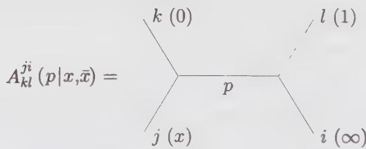  
Figure 6.3. Partial wave in diagrammatic language. The same diagram is often used to represent only the holomorphic (or antiholomorphic) part of the partial wave, the conformal block $\mathcal{F}_{34}^{21}(p|x)$ .

It is clear from its definition that the partial wave factorizes into a holomorphic and an antiholomorphic part:

$$
A _ {3 4} ^ {2 1} (p | x, \bar {x}) = \mathcal {F} _ {3 4} ^ {2 1} (p | x) \bar {\mathcal {F}} _ {3 4} ^ {2 1} (p | \bar {x})
$$

where

$$
\mathcal {F} _ {3 4} ^ {2 1} (p | x) = x ^ {h _ {p} - h _ {3} - h _ {4}} \sum_ {\{k \}} \beta_ {3 4} ^ {p \{k \}} x ^ {K} \frac {\langle h _ {1} | \phi_ {2} (1) L _ {- k _ {1}} \cdots L _ {- k _ {N}} | h _ {p} \rangle}{\langle h _ {1} | \phi_ {2} (1) | h _ {p} \rangle}\tag{6.187}
$$

The denominator is simply equal to $(C_{21}^{p})^{1/2}$ . The functions defined in Eq. (6.187) are called conformal blocks. They can be calculated simply from the knowledge of the conformal dimensions and the central charge, by commuting the Virasoro generators over the field $\phi_{2}(1)$ one after the other. The field normalizations and coefficients $C_{mn}^{p}$ drop out of the conformal block at the end of this process. Going back to the partial wave decomposition (6.186), we see that the conformal blocks represent the element in four-point functions that can be determined from conformal invariance. They depend on the anharmonic ratios through a series expansion. The remaining elements are the three-point function coefficients $C_{12}^{p}$ and $C_{34}^{p}$ , which are not fixed by conformal invariance. Therefore, the four-point function (6.184) is expressed as

$$
\boxed {G _ {3 4} ^ {2 1} (x, \bar {x}) = \sum_ {p} C _ {3 4} ^ {p} C _ {1 2} ^ {p} \mathcal {F} _ {3 4} ^ {2 1} (p | x) \bar {\mathcal {F}} _ {3 4} ^ {2 1} (p | \bar {x})}\tag{6.188}
$$

An explicit expression for the conformal blocks is not known in general. Although the formula (6.187) may be applied in principle, its use becomes rapidly tedious. One may write the conformal block as a power series in x:

$$
\mathcal {F} _ {3 4} ^ {2 1} (p | x) = x ^ {h _ {p} - h _ {3} - h _ {4}} \sum_ {K = 0} ^ {\infty} \mathcal {F} _ {K} x ^ {K}\tag{6.189}
$$

where the coefficient $F_{K}$ depends on the conformal dimensions $h_{i}$ ( $i = 1, \ldots, 4$ ) and $h_{p}$ . The normalization fixes $F_{0} = 1$ . The next two coefficients may be obtained by blindly applying the definition (6.187):

$$
\mathcal {F} _ {1} = \frac {(h _ {p} + h _ {2} - h _ {1}) (h _ {p} + h _ {3} - h _ {4})}{2 h _ {p}}\tag{6.190}
$$

$$
\begin{array}{l} \mathcal {F} _ {2} = \frac {(h _ {p} + h _ {2} - h _ {1}) (h _ {p} + h _ {2} - h _ {1} + 1) (h + h _ {3} - h _ {4}) (h + h _ {3} - h _ {4} + 1)}{4 h _ {p} (2 h _ {p} + 1)} \\ \quad + 2 \left(\frac {h _ {1} + h _ {2}}{2} + \frac {h _ {p} (h _ {p} - 1)}{2 (2 h _ {p} + 1)} - \frac {3 (h _ {1} - h _ {2}) ^ {2}}{2 (2 h _ {p} + 1)}\right) ^ {2} \\ \quad \times \left(\frac {h _ {3} + h _ {4}}{2} + \frac {h _ {p} (h _ {p} - 1)}{2 (2 h _ {p} + 1)} - \frac {3 (h _ {3} - h _ {4}) ^ {2}}{2 (2 h _ {p} + 1)}\right) ^ {2} \left(c + \frac {2 h _ {p} (8 h _ {p} - 5)}{2 h _ {p} + 1}\right) ^ {- 1} \end{array}\tag{6.191}
$$

## 6.6.5. Crossing Symmetry and the Conformal Bootstrap

In defining the function $G_{34}^{21}(x, \bar{x})$ , we have chosen a specific order for the four fields $\phi_{1-4}$ within the correlator. But the ordering of fields within correlators does not matter (except for signs when dealing with fermions); we could have proceeded otherwise, for instance by sending $z_{2}$ to 0 and $z_{4}$ to 1. Then $z_{3} = 1 - x$ and we obtain the identity

$$
G _ {3 4} ^ {2 1} (x, \bar {x}) = G _ {3 2} ^ {4 1} (1 - x, 1 - \bar {x})
$$

We could also interchange $\phi_{1}$ and $\phi_{4}$ and obtain

$$
G _ {3 4} ^ {2 1} (x, \bar {x}) = \frac {1}{x ^ {2 h _ {3}} \bar {x} ^ {2 \bar {h} _ {3}}} G _ {3 1} ^ {2 4} (1 / x, 1 / \bar {x})
$$

These conditions on the function $G_{34}^{21}$ are manifestations of crossing symmetry. We write the first of these relations in terms of conformal blocks:

$$
\sum_ {p} C _ {2 1} ^ {p} C _ {3 4} ^ {p} \mathcal {F} _ {3 4} ^ {2 1} (p | x) \bar {\mathcal {F}} _ {3 4} ^ {2 1} (p | \bar {x}) = \sum_ {q} C _ {4 1} ^ {q} C _ {3 2} ^ {q} \mathcal {F} _ {3 2} ^ {4 1} (q | 1 - x) \bar {\mathcal {F}} _ {3 2} ^ {4 1} (q | 1 - \bar {x})\tag{6.192}
$$

This relation is represented graphically on Fig. 6.4. Assuming that the conformal blocks are known for arbitrary values of the conformal dimensions, the above expresses a set of constraints that could determine the coefficients $C_{mn}^{p}$ and the conformal dimensions $h_p$ . Indeed, if we assume the presence of $N$ conformal families in the theory, the above relation yields, through naive counting, $N^4$ constraints on the $N^3 + N$ parameters $C_{mn}^{p}$ and $h_n$ . This program of calculating the correlation functions simply by assuming crossing symmetry is known as the bootstrap approach. There is no proof that Eq. (6.192) can indeed determine the parameters of the theory in the general case, but there are special cases (the minimal models) in which the bootstrap equations can be solved completely. The bootstrap hypothesis (6.192) is the sole “dynamical input” required to completely solve the theory, once the explicit form of the conformal blocks has been determined from conformal invariance. The crossing symmetry constraint (6.192) is quite natural from the point of view of the operator algebra—rather like the Jacobi identity for Lie algebras or Poisson brackets—and does not constitute a narrow condition excluding interesting theories.

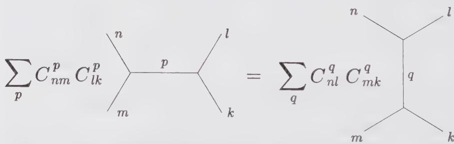  
Figure 6.4. Crossing symmetry in diagrammatic language.

## Appendix 6.A. Vertex and Coherent States

In this appendix we demonstrate the following formula for the vacuum expectation value of products of $n$ vertex operators involving a single harmonic oscillator:

$$
\langle : e ^ {A _ {1}}:: e ^ {A _ {2}}: \dots : e ^ {A _ {n}}: \rangle = \exp \sum_ {i <   j} ^ {n} \langle A _ {i} A _ {j} \rangle\tag{6.193}
$$

where $A_{i} = \alpha_{i}a + \beta_{i}a^{\dagger}$ is a linear combination of creation and annihilation operators.

We first define the harmonic oscillator coherent state

$$
| z \rangle \equiv e ^ {z a ^ {\dagger}} | 0 \rangle\tag{6.194}
$$

It is simple to show that $|z\rangle$ is an eigenstate of a:

$$
a | z \rangle = z | z \rangle \quad \text { or } \quad f (a) | z \rangle = f (z) | z \rangle\tag{6.195}
$$

Indeed, the Hausdorff relation

$$
e ^ {- A} B e ^ {A} = B + [ B, A ] + \frac {1}{2} [ [ B, A ], A ] + \dots\tag{6.196}
$$

applied to $A = za^{\dagger}$ and $B = a$ yields

$$
[ a, e ^ {z a \dagger} ] = z e ^ {z a \dagger}\tag{6.197}
$$

from which Eq. (6.195) follows. If $[B,A]$ is a constant, which is true here, the Hausdorff relation also implies that

$$
e ^ {B} e ^ {A} = e ^ {A} e ^ {B} e ^ {[ B, A ]}\tag{6.198}
$$

This, applied to our problem, yields

$$
e ^ {w a} e ^ {z a ^ {\dagger}} = e ^ {z a ^ {\dagger}} e ^ {w a} e ^ {w z}\tag{6.199}
$$

Within a vertex operator $A_{i}$ , the normal-ordered product reads

$$
: e ^ {A _ {i}} := e ^ {\beta_ {i} a ^ {\dagger}} e ^ {\alpha_ {i} a}\tag{6.200}
$$

In calculating the normal-ordered product of a string : $e^{A_{1}} : \cdots : e^{A_{n}}$ : of vertex operators, we want to bring all the annihilation operators to the right. For instance, it follows from Eq. (6.199) that

$$
e ^ {\alpha_ {i} a} e ^ {\beta_ {i + 1} a ^ {\dagger}} \dots e ^ {\beta_ {n} a ^ {\dagger}} = e ^ {\beta_ {i + 1} a ^ {\dagger}} \dots e ^ {\beta_ {n} a ^ {\dagger}} e ^ {\alpha_ {i} a} e ^ {\alpha_ {i} (\beta_ {i + 1} + \beta_ {i + 2} + \dots + \beta_ {n})}\tag{6.201}
$$

Since $[e^{\alpha_i a}, e^{\alpha_j a}] = 0$ , this implies

$$
e ^ {\alpha_ {i} a}: e ^ {A _ {i + 1}}: \dots : e ^ {A _ {n}} :=: e ^ {A _ {i + 1}}: \dots : e ^ {A _ {n}}: e ^ {\alpha_ {i} a} e ^ {\alpha_ {i} (\beta_ {i + 1} + \beta_ {i + 2} + \dots + \beta_ {n})}\tag{6.202}
$$

Applying this in succession from i = 1 to i = n - 1, we find

$$
: e ^ {A _ {1}}:: e ^ {A _ {2}}: \dots : e ^ {A _ {n}} := e ^ {(\beta_ {1} + \dots + \beta_ {n}) a ^ {\dagger}} e ^ {(\alpha_ {1} + \dots + \alpha_ {n}) a} \exp \sum_ {i <   j} ^ {n} \alpha_ {i} \beta_ {j}\tag{6.203}
$$

Since $\langle A_iA_j\rangle = \alpha_i\beta_j$ , one may finally write

$$
: e ^ {A _ {1}}:: e ^ {A _ {2}}: \dots : e ^ {A _ {n}} :=: e ^ {A _ {1} + \dots + A _ {n}}: \exp \sum_ {i <   j} ^ {n} \langle A _ {i} A _ {j} \rangle\tag{6.204}
$$

From the vacuum expectation value of this expression follows the relation (6.193).

## Appendix 6.B. The Generalized Wick Theorem

In this appendix we reformulate Wick's theorem for interacting fields, using the generalization of the concept of normal ordering explained in Sect. 6.5. We are not interested in the most general form of Wick's theorem, which gives the relation between the time-ordered (or radial-ordered) product and the normal-ordered product of free fields, illustrated in Eq. (2.109). Such a relation cannot be generalized to interacting fields. Rather, we wish to generalize a specialized form of Wick's theorem for the contraction of a field with a normal-ordered product. For free (commuting) fields, this is

$$
\overline {{\phi_ {1} (x) : \phi_ {2}}} \phi_ {3}: (y) = \overline {{\phi_ {1} (x) \phi_ {2}}} (y): \phi_ {3} (y): + \overline {{\phi_ {1} (x) \phi_ {3}}} (y): \phi_ {2} (y):\tag{6.205}
$$

The suitable generalization of this relation to interacting fields is

$$
\overline {{A (z) (B C)}} (w) = \frac {1}{2 \pi i} \oint_ {w} \frac {d x}{x - w} \left\{\overline {{A (z) B (x) C (w)}} + \overline {{B (x) A (z) C (w)}} \right\}\tag{6.206}
$$

In order to demonstrate this relation, one must show that the contractions on the r.h.s. extract all the singular terms of the integral as $z \rightarrow w$ . But these singular terms can only come from the OPE of $A(z)$ with B and C separately (the integral amounts to a point-splitting procedure). We rewrite this expression as

$$
\frac {1}{2 \pi i} \oint \frac {d x}{x - w} \left\{\sum_ {n > 0} \frac {\{A B \} _ {n} (x) C (w)}{(z - x) ^ {n}} + \sum_ {n > 0} \frac {B (x) \{A C \} _ {n} (w)}{(z - w) ^ {n}} \right\}\tag{6.207}
$$

From this expression it is manifest that all the inverse powers of $(z-w)$ and $(z-x)$ in the integrand yield inverse powers of $(z-w)$ after integration. Conversely, nonnegative powers of $(z-w)$ and $(z-x)$ in the integrand, if added, would not contribute to inverse powers of $(z-w)$ after integration. Thus the modified Wick rule (6.206) is correct. It is straightforward to check that the rule (6.206), applied to a free boson $\varphi$ , leads to the same result as the usual Wick theorem. For instance,

$$
\partial \varphi (z) (\varphi \varphi) (w) = \frac {2 \varphi (w)}{z - w}\tag{6.208}
$$

The subtlety with formula (6.206) applied to interacting fields is that one is left with full OPEs after one contraction. This is important since the first regular term of the various OPEs always contributes. To see this, we consider the first term on the r.h.s. of Eq. (6.206). Writing the OPE of $\{AB\}_n(x)$ with $C(w)$ as

$$
\{A B \} _ {n} (x) C (w) \sim \sum_ {m} (x - w) ^ {- m} E ^ {(n, m)} (w)\tag{6.209}
$$

(no restriction on m), the first term on the r.h.s. of Eq. (6.206) becomes

$$
\begin{array}{r l} \frac {1}{2 \pi i} \oint_ {w} d x & \sum_ {n > 0} \sum_ {m} \frac {E ^ {(n , m)} (w)}{(z - x) ^ {n} (x - w) ^ {m + 1}} \\ & = \sum_ {n > 0} \sum_ {m \geq 0} E ^ {(n, m)} (w) \frac {(n + m - 1) !}{(n - 1) ! m !} (z - w) ^ {- n - m} \end{array}\tag{6.210}
$$

(we have used Eq. (6.159)) and the term $m = 0$ indeed contributes. On the other hand, it is simple to see that only the first regular term contributes to the second term on the r.h.s.of Eq. (6.206). Indeed, since the OPE $B(x)\{AC\}_n(w)$ is expressed in terms of fields evaluated at $w$ , only the pole at $x = w$ contributes.

The main steps of an illustrative application of the Wick rule (6.206) on the energy-momentum tensor follow:

$$
\begin{array}{l} \overline {{T (z) (T T)}} (w) = \frac {1}{2 \pi i} \oint_ {w} \frac {d x}{x - z} \left\{\overline {{T (z) T}} (x) T (w) + T (x) \overline {{T (z) T}} (w) \right\} \\ = \frac {1}{2 \pi i} \oint_ {w} \frac {d x}{x - w} \left\{\left[ \frac {c / 2}{(z - x) ^ {4}} + \frac {2 T (x)}{(z - x) ^ {2}} + \frac {\partial T (x)}{(z - x)} \right] T (w) \right. \\ \quad + T (x) \left[ \frac {c / 2}{(z - w) ^ {4}} + \frac {2 T (w)}{(z - w) ^ {2}} + \frac {\partial T (w)}{(z - w)} \right] \Bigg \} \end{array} \tag {6.2}\tag{6.211}
$$

To proceed we need

$$
\partial T (x) T (w) = \frac {- 2 c}{(x - w) ^ {5}} - \frac {4 T (w)}{(x - w) ^ {3}} - \frac {\partial T (w)}{(x - w) ^ {2}} + (\partial T T) (w) + \dots\tag{6.212}
$$

which is obtained by differentiating the OPE $T(x)T(w)$ with respect to x. The OPE $T(x)\partial T(w)$ is obtained in the same way. Substituting in Eq. (6.211) the required OPEs, and using Eq. (6.159), we find that

$$
\begin{array}{r l} T (z) (T T) (w) & \sim \frac {3 c}{(z - w) ^ {6}} + \frac {(8 + c) T (w)}{(z - w) ^ {4}} + \frac {3 \partial T (w)}{(z - w) ^ {3}} \\ & \quad + \frac {4 (T T) (w)}{(z - w) ^ {2}} + \frac {\partial (T T) (w)}{(z - w)} \end{array}\tag{6.213}
$$

Finally, if we want to calculate $(BC)(z)A(w)$ , we should first evaluate $A(z)(BC)(w)$ , then interchange $w \leftrightarrow z$ , and finally Taylor expand the fields evaluated at z around the point w. For instance, from Eq. (6.213) it is simple to

derive

$$
\begin{array}{r l} (T T) (z) T (w) & \sim \frac {3 c}{(z - w) ^ {6}} + \frac {(8 + c) T (w)}{(z - w) ^ {4}} + \frac {(5 + c) \partial T (w)}{(z - w) ^ {3}} + \frac {4 (T T) (w))}{(z - w) ^ {2}} \\ & \quad + \frac {(1 + c / 2) \partial^ {2} T (w)}{(z - w) ^ {2}} + \frac {(c - 1) \partial^ {3} T (w)}{6 (z - w)} + \frac {3 \partial (T T) (w)}{(z - w)} \end{array} \tag {6.21}\tag{6.214}
$$

## Appendix 6.C. A Rearrangement Lemma

We often encounter composite operators involving more than two operators, for instance $(A(BC))(z)$ . This notation means that the product of B and C must be first normal ordered and, in a second step, the product of A with the composite $(BC)$ must be normal ordered. This prescription, wherein operators are normal ordered successively from right to left, will be our standard choice. It will be referred to as right-nested normal ordering. The necessity of a well-defined prescription is forced by the absence of associativity,

$$
(A (B C)) (z) \neq ((A B) C) (z)\tag{6.215}
$$

which is readily seen from the mode expansions of the two sides of this equation (see also the end of this appendix). Using the contour representation

$$
(A (B C)) (z) = \frac {1}{(2 \pi i) ^ {2}} \oint \frac {d y}{y - z} \oint \frac {d x}{x - z} A (y) B (x) C (z)\tag{6.216}
$$

we find that

$$
(A (B C)) (z) = A _ {- h _ {A}} B _ {- h _ {B}} C _ {- h _ {C}} I (z)\tag{6.217}
$$

or, equivalently,

$$
(A (B C)) (0) | 0 \rangle = A _ {- h _ {A}} B _ {- h _ {B}} C _ {- h _ {C}} | 0 \rangle\tag{6.218}
$$

This correspondence with mode monomials illustrates neatly the naturalness of the chosen prescription.

We now derive some technical results used to compare multi-component composite operators with different ordering of the terms or different normal ordering prescriptions.

The first case to be considered is the relation between $(A(BC))$ and $(B(AC))$ . Using the mode monomial representation, we write

$$
\begin{array}{c} (A (B C)) (z) - (B (A C)) (z) = \left[ A _ {- h _ {A}}, B _ {- h _ {B}} \right] C _ {- h _ {C}} I (z) \\ = (([ A, B ]) C) (z) \end{array}\tag{6.219}
$$

This result can also be verified directly at the level of modes as follows. With the OPE $A(z)B(w)$ given by (6.124), that of $B(z)A(w)$ follows by interchanging

z and w:

$$
\begin{array}{l} B (z) A (w) = \sum_ {n} (- 1) ^ {n} \frac {\{A B \} _ {n} (z)}{(z - w) ^ {n}} \\ = \sum_ {n} (- 1) ^ {n} \sum_ {m \geq 0} \frac {1}{m ! (z - w) ^ {n - m}} \partial^ {m} \{A B \} _ {n} (w) \end{array}\tag{6.220}
$$

where the second equality is obtained by Taylor expanding $\{AB\}_n(z)$ . The normal-ordered product (BA) is the sum of all terms with $n = m$ , that is

$$
(B A) (w) = \sum_ {n \geq 0} \frac {(- 1) ^ {n}}{n !} \partial^ {n} \{A B \} _ {n} (w)\tag{6.221}
$$

This leads to

$$
([ A, B ]) = \sum_ {n > 0} \frac {(- 1) ^ {n + 1}}{n !} \partial^ {n} \{A B \} _ {n} (w)\tag{6.222}
$$

Hence, field-dependent singular terms contribute to the normal-ordered commutator while $\{AB\}_{0}$ cancels out. In particular, this means that the commutation of two free fields vanishes. For instance, for a free boson $\phi$ , one has

$$
(\partial^ {n} \phi (\phi \partial^ {m} \phi)) = (\phi (\partial^ {n} \phi \partial^ {m} \phi) = (\partial^ {m} \phi (\phi \partial^ {n} \phi))\tag{6.223}
$$

By use of

$$
(A (B C)) _ {n} = \sum_ {m \leq - h _ {A}} A _ {m} (B C) _ {n - m} + \sum_ {m > - h _ {A}} (B C) _ {n - m} A _ {m}\tag{6.224}
$$

in which we substitute back the expression (6.130) for the modes of $(BC)$ in terms of those of $B$ and $C$ , one checks directly that

$$
(A (B C)) _ {n} - (B (A C)) _ {n} = (([ A, B ]) C) _ {n}\tag{6.225}
$$

The second case is that of a composite of four operators, normal ordered two by two: We wish to relate $((AB)(CD))$ to $(A(B(CD)))$ . One simply treats $(CD)$ as a single operator, say E, and proceeds as follows:

$$
\begin{array}{l} ((A B) E) = (E (A B)) + ([ (A B), E ]) \\ \qquad = (A (E B)) + (([ E, A ]) B) + ([ (A B), E ]) \\ \qquad = (A (B E)) + (A ([ E, B ])) + (([ E, A ]) B ] + ([ (A B), E ]). \end{array}\tag{6.226}
$$

Replacing E by (CD) gives the desired result. The difference $((AB)E)-(A(BE))$ gives the explicit expression for the violation of associativity:

$$
((A B) E) - (A (B E)) = (A ([ E, B ])) + (([ E, A ]) B) + ([ (A B), E ])\tag{6.227}
$$

## Appendix 6.D. Summary of Important Formulas

OPE of the energy-momentum tensor with a primary field $\phi$ :

$$
T (z) \phi (w) \sim \frac {h}{(z - w) ^ {2}} \phi (w) + \frac {1}{z - w} \partial \phi (w)\tag{6.228}
$$

OPE of the energy-momentum tensor with itself:

$$
T (z) T (w) \sim \frac {c / 2}{(z - w) ^ {4}} + \frac {2 T (w)}{(z - w) ^ {2}} + \frac {\partial T (w)}{(z - w)}\tag{6.229}
$$

Normal ordering:

$$
(A B) (w) = \frac {1}{2 \pi i} \oint \frac {d z}{z - w} A (z) B (w)\tag{6.230}
$$

With this new normal-ordering convention, we rewrite some formulae related to free-field representations for which we make a standard choice of coupling constants.

Free boson (g = 1/4π, c = 1):

$$
\varphi (z) \varphi (w) \sim - \ln (z - w)\tag{6.231}
$$

$$
T (z) = - \frac {1}{2} (\partial \varphi \partial \varphi) (z)\tag{6.232}
$$

Vertex operators are always assumed to be normal ordered and for these the parentheses are usually omitted. With $V_{\alpha}=e^{i\alpha\varphi}$ , we have

$$
\mathcal {V} _ {\alpha} (z, \bar {z}) \mathcal {V} _ {\beta} (w, \bar {w}) \sim | z - w | ^ {2 \alpha \beta} \mathcal {V} _ {\alpha + \beta} (w, \bar {w}) + \dots\tag{6.233}
$$

The conformal dimension of $\mathcal{V}_{\alpha}$ is $\alpha^2 / 2$ .

Free real fermion $(g = 1/2\pi, c = \frac{1}{2})$ :

$$
\psi (z) \psi (w) \sim \frac {1}{z - w}\tag{6.234}
$$

$$
T (z) = - \frac {1}{2} (\psi \partial \psi) (z)\tag{6.235}
$$

Free complex fermion (c = 1):

$$
\psi^ {\dagger} (z) \psi (w) \sim \frac {1}{z - w} \quad \psi (z) \psi (w) \sim \psi^ {\dagger} (z) \psi^ {\dagger} (w) \sim 0\tag{6.236}
$$

$$
T (z) = \frac {1}{2} (\partial \psi^ {\dagger} \psi - \psi^ {\dagger} \partial \psi) (z)\tag{6.237}
$$

Ghost system: The two ghosts b and $\tilde{c}$ are either both anticommuting ( $\varepsilon = 1$ ) or both commuting ( $\varepsilon = -1$ ) and have the OPE

$$
\tilde {c} (z) \tilde {b} (w) \sim \frac {1}{z - w} \quad \tilde {b} (z) \tilde {c} (w) \sim \frac {\varepsilon}{z - w}\tag{6.238}
$$

The energy-momentum tensor is

$$
T (z) = (1 - \lambda) (\partial \tilde {b} \tilde {c}) (z) - \lambda (\tilde {b} \partial \tilde {c}) (z)\tag{6.239}
$$

with central charge

$$
c = - 2 \varepsilon (6 \lambda^ {2} - 6 \lambda + 1).\tag{6.240}
$$

The dimensions of $\tilde{b}(z)$ and $\tilde{c}(z)$ are respectively $\lambda$ and $1 - \lambda$ . In Sect. 5.3 we have treated the case $\varepsilon = 1, \lambda = 0$ , giving $c = -2$ . On the other hand, when $\varepsilon = 1$ and $\lambda = \frac{1}{2}$ , we recover the above free complex fermion theory.

$$
\phi (z) = \sum_ {n \in \mathbb {Z}} z ^ {- n - h} \phi_ {n} \quad \phi_ {n} = \frac {1}{2 \pi i} \oint d z z ^ {n + h - 1} \phi (z)
$$

Virasoro algebra and mode commutation relations:

$$
[ L _ {n}, L _ {m} ] = (n - m) L _ {n + m} + \frac {c}{1 2} n (n ^ {2} - 1) \delta_ {n + m}
$$

$$
[ L _ {n}, \phi_ {m} ] = [ n (h - 1) - m ] \phi_ {n + m}
$$

## Exercises

6.1 Given a primary field $\phi(w)$ , demonstrate the following:

$$
\left[ L _ {n} (z), \phi (w) \right] = h (n + 1) (w - z) ^ {n} \phi (w) + (w - z) ^ {n + 1} \partial \phi (w)
$$

6.2 Find the mode commutation relations for a free real fermion, and for the simple ghost system.

6.3 Demonstrate the identity (6.159).

## 6.4 Partition numbers

Show that the number $p(n)$ of partitions of a nonnegative integer $n \geq 0$ into a sum of nonnegative integers is generated by

$$
\sum_ {n \geq 0} p (n) q ^ {n} = \frac {1}{\prod_ {k \geq 1} \left(1 - q ^ {k}\right)}.
$$

Find the generating function for the number $s(n)$ of strictly ordered partitions of a nonnegative integer n into strictly positive integers (we set $s(0)=1$ ). Prove that $s(n)$ is equal to the number of partitions of n into positive odd integers.

Hint: Prove and use the identity $\prod_{n\geq 1}(1 - q^{2n - 1})(1 + q^n) = 1$

## 6.5 Conformal blocks

Demonstrate the relation (6.190) for the coefficient $F_{1}$ appearing in the power series expansion of the conformal block. If successful, demonstrate the relation (6.191) for the next coefficient ( $F_{2}$ ).

6.6 Complete the details of the derivation of Eq. (6.219) in terms of modes.

## 6.7 Contraction of two exponentials

Let $A$ and $B$ be two free fields whose contraction (with themselves and with each other) are $c$ -numbers.

a) Show by recursion that

$$
\overline {{A (z) : B ^ {n} (w)}} := \overline {{n A (z) B (w) : B ^ {n - 1} (w)}}:
$$

and therefore

$$
\overline {{A (z) : e ^ {B (w)}}} = \overline {{A (z) B (w)}}: e ^ {B (w)}:
$$

As usual, : ··· : denotes normal ordering for free fields.

b) By counting correctly multiple contractions, show that

$$
\begin{array}{l} e ^ {\sqrt {A (z)} e ^ {B (z)}} = \sum_ {m, n, k} \frac {k !}{m ! n !} \binom {m} {k} \binom {n} {k} [ \overline {{A (z) B (w)}} ] ^ {k}: A ^ {m - k} (w) B ^ {n - k} (w): \\ = \exp \left\{\overline {{A (z) B (w)}} \right\}: e ^ {A (w)} e ^ {B (w)}: \end{array}
$$

And deduce from this the OPE (6.65) of two vertex operators.

6.8 Calculate ([T, (TT)]), first using Eq. (6.222) and the OPE $T(z)(TT)(w)$ given in Eq. (6.213), and then directly in terms of modes, from the equality

$$
[ T, (T T) ] = [ T _ {- 2}, (T T) _ {- 4} ]
$$

with $T_{-2} \equiv L_{-2}$ and

$$
(T T) _ {- 4} = 2 \sum_ {l \geq 0} L _ {- l - 3} L _ {l - 1} + L _ {- 2} L _ {- 2}
$$

which follows from Eq. (6.213).

## 6.9 Rearrangement lemma for free fermions

a) Rearrange the product of real fermions

$$
((\psi_ {i} \psi_ {j}) (\psi_ {k} \psi_ {l}))
$$

whose OPE reads

$$
\psi_ {i} (z) \psi_ {j} (w) \sim \frac {\delta_ {i j}}{(z - w)}
$$

in a normal ordering nested toward the right. Before using Eq. (6.226), reconsider the relative signs of the different terms when fermions are present.

b) Same as part (a) for the product of complex free fermions:

$$
((\psi_ {i} ^ {\dagger} \psi_ {j}) (\psi_ {k} ^ {\dagger} \psi_ {l}))
$$

with OPE

$$
\psi_ {i} (z) \psi_ {j} ^ {\dagger} (w) \sim \frac {\delta_ {i j}}{z - w} \quad \psi_ {i} ^ {\dagger} (z) \psi_ {j} (w) \sim \frac {\delta_ {i j}}{z - w}
$$

$$
\psi_ {i} (z) \psi_ {j} (w) \sim 0 \qquad \psi_ {i} ^ {\dagger} (z) \psi_ {j} ^ {\dagger} (w) \sim 0
$$

## 6.10 The quantum Korteweg-de Vries equation

Let us introduce an equation of evolution in time for the energy-momentum tensor through the canonical equation of motion

$$
\partial_ {t} T = - [ H, T ], \quad H = \frac {1}{2 \pi i} \oint d w (T T) (w)
$$

a) Using the OPE (6.213), check that the resulting evolution equation is

$$
\partial_ {t} T = \frac {1}{6} (1 - c) \partial^ {3} T - 3 \partial (T T)\tag{6.241}
$$

This is called the quantum Korteweg–de Vries (KdV) equation since in the classical limit $c \to -\infty$ , $^{2}$ the substitution $T = cu(z, t)/6$ and a rescaling of the time variable transforms it into the standard KdV equation:

$$
\partial_ {t} u = \partial^ {3} u + 6 u \partial u\tag{6.242}
$$

b) The quantum KdV equation (like its classical counterpart) is a completely integrable system in the sense that it has an infinite number of conserved integrals $H_{n}$

$$
\partial_ {t} H _ {n} = 0
$$

(whose densities are polynomial derivatives in T), all commuting with each other. Each of these conserved integrals has a definite spin. The spin of these charges is always odd, and there is one charge for each odd value of the spin. To illustrate this statement, check that there can be no nontrivial conserved integral of spin 2 and 4. A conserved integral is nontrivial if its density is not a total derivative.

c) Show that the first nontrivial conservation law is

$$
H _ {5} = \oint d w [ (T (T T)) - \frac {(c + 2)}{1 2} (\partial T \partial T) ]\tag{6.243}
$$

(The subindex indicates the spin of the integral.) To obtain this result, proceed as follows. At first, argue that the above two terms in $H_{5}$ are the only possible ones, up to total derivatives. $H_{5}$ is thus necessarily of the form

$$
H _ {5} = \oint d w [ (T (T T)) + a (\partial T \partial T) ]\tag{6.244}
$$

where a is a free parameter to be determined. It is uniquely fixed by requiring $\partial_{t}H_{5}=0$ . Explicitly, in the expression for $\partial_{t}H_{5}$ replace $\partial_{t}T$ by the r.h.s. of the quantum KdV equation, drop total derivatives and cancel the remaining terms by an appropriate choice of a.

d) The conservation of $H_{5}$ can also be established independently of the equation of motion, by proving directly the commutativity of $H_{5}$ with the defining Hamiltonian H. For this calculation, the following two intermediate results must first be derived:

$$
\begin{array}{l} T (z) (T (T T) (w) \sim \frac {2 4 c}{(z - w) ^ {8}} + \frac {(4 8 + 9 c) T (w)}{(z - w) ^ {6}} + \frac {1 5 \partial T (w)}{(z - w) ^ {5}} \\ \quad + \frac {(2 4 + \frac {3}{2} c) (T T) (w)}{(z - w) ^ {4}} + \frac {\frac {9}{2} \partial (T T) (w)}{(z - w) ^ {3}} + \frac {\frac {1}{4} \partial^ {3} T (w)}{(z - w) ^ {3}} \\ \quad + \frac {6 (T (T T)) (w)}{(z - w) ^ {2}} + \frac {\partial (T (T T)) (w)}{(z - w)} \end{array}\tag{6.245}
$$

and

$$
\begin{array}{r l} T (z) (\partial T \partial T) (w) & \sim \frac {1 8 c}{(z - w) ^ {8}} + \frac {2 8 T (w)}{(z - w) ^ {6}} + \frac {(4 c + 1 8) \partial T (w)}{(z - w) ^ {5}} \\ & + \frac {5 \partial^ {2} T (w)}{(z - w) ^ {5}} + \frac {4 \partial (T T) (w)}{(z - w) ^ {3}} + \frac {6 (\partial T \partial T) (w)}{(z - w) ^ {2}} \\ & + \frac {\partial (\partial T \partial T) (w)}{(z - w)} \end{array}\tag{6.246}
$$

In these expressions, interchange z and w and then use Eq. (6.206) to calculate the commutator.

6.11 The quantum Korteweg-de Vries equation at c = -2

a) Verify that for the central charge c = -2, T can be represented by the bilinear

$$
T = (\phi \psi)
$$

where $\phi$ and $\psi$ are both fermions of spin 1 with OPE

$$
\phi (z) \psi (w) = \frac {- 1}{(z - w) ^ {2}}, \quad \psi (z) \phi (w) = \frac {1}{(z - w) ^ {2}}
$$

This is, of course, nothing but a ghost representation (cf. App. 6.D), with $\tilde{c} = \psi$ and $\partial \tilde{b} = \phi$ and $\epsilon = 1$ (i.e., these are anticommuting fields).

b) Using the rearrangement lemma (6.226), show that

$$
(T T) (z) = \frac {1}{2} (\phi^ {\prime \prime} \psi + \phi \psi^ {\prime \prime}) (z)
$$

where a prime stands for a derivative with respect to the complex coordinate.

c) In terms of these variables and the quantum KdV Hamiltonian

$$
H = \frac {1}{2 \pi i} \oint d w (T T) (w) = \frac {1}{4 \pi i} \oint d w (\phi^ {\prime \prime} \psi + \phi \psi^ {\prime \prime}) (w)
$$

derive the evolution equations

$$
\partial_ {t} \phi = - [ H, \phi ] = - \phi^ {\prime \prime \prime}, \quad \partial_ {t} \psi = - [ H, \psi ] = - \psi^ {\prime \prime \prime}
$$

Use these equations to recover the evolution equation of T.

d) Prove that an infinite set of conserved quantities for this system of equations is

$$
H _ {k + 1} = \oint d z (\phi^ {(k)} \psi) (z) \quad \text { with } \quad \partial_ {t} H _ {k + 1} = 0
$$

where $\phi^{(k)} = \partial_z^k\phi$

e) Verify the mutual commutativity of these charges.

f) Argue that for $k$ odd these conserved integrals cannot be expressed in terms of $T$ . For $k$ even this can be done as follows:

$$
H _ {2 n - 1} = \frac {2 ^ {n - 1}}{n} \oint d z (\overleftarrow {T ^ {n}}) (z)
$$

where the notation $(\overleftarrow{T^n})$ means a nesting of the normal ordering toward the left:

$$
(\overleftarrow {T ^ {n}}) = (\dots (((T T) T) T) \dots T) \quad (n \text {   factors })
$$

The exact expression for $(\overleftarrow{T^{n}})$ is

$$
(\overleftarrow {T ^ {n}}) = \frac {n}{2 ^ {n}} \left(\phi^ {(2 n - 2)} \psi + \phi \psi^ {(2 n - 2)}\right)
$$

g) In preparation for establishing the above result for $(\widehat{T}^n)$ , check the following necessary normal-ordered commutators

$$
([ (\phi^ {(m)} \psi), \psi ]) = \frac {(- 1) ^ {m}}{m + 2} \psi^ {(m + 2)}
$$

$$
([ (\phi^ {(m)} \psi), \phi ]) = \frac {1}{2} \phi^ {(m + 2)}
$$

$$
([ (\phi \psi^ {(m)}), \phi ]) = \frac {(- 1) ^ {m}}{m + 2} \phi^ {(m + 2)}
$$

$$
([ (\phi \psi^ {(m)}), \psi ]) = \frac {1}{2} \psi^ {(m + 2)}
$$

h) Prove the above expression for $(\overline{T}^{n})$ by an inductive argument. Hint: Assuming the validity of the above expression for $(\overleftarrow{T}^{n})$ , calculate $(\overleftarrow{T}^{n+1}) = ((\overleftarrow{T}^{n})T)$ in terms of fermions by reordering the terms toward the right using $(A(BC)) = (B(AC)) + (([A,B])C)$ and the commutators calculated in the previous part.

i) Express the charge $H_{5}$ obtained in Ex. 6.10 in terms of $\phi$ and $\psi$ and compare with $\oint dz(\overleftarrow{T^3})$ .

j) To see that the higher-spin conserved charges cannot be expressed in a simple way with the usual nesting toward the right, compare $(T(T(TT)))$ and $(\overleftarrow{T^{4}})$ .

k) To understand why $c = -2$ is special, consider a general anticommuting ghost system $\{\tilde{b},\tilde{c}\}$ , for which the energy-momentum tensor is given by Eq. (6.238). Show that

$$
(T T) = (\frac {4}{3} \lambda (1 - \lambda) + 1) (\tilde {b} ^ {\prime \prime \prime} \tilde {c}) - 2 \lambda (1 - \lambda) (\tilde {b} (\tilde {b} ^ {\prime} (\tilde {c} \tilde {c} ^ {\prime}))
$$

Obtain the evolution equation for $\tilde{b}$ and $\tilde{c}$ . Observe that unless $\lambda = 0$ or 1, these are coupled equations, for which the integrals of motion cannot be written in a simple bilinear form.

## 6.12 The classical limit of the Virasoro algebra

The Poisson bracket form of the Virasoro algebra is obtained by replacing the commutator by a Poisson bracket times a factor $i$ , that is,

$$
i \{L _ {n}, L _ {m} \} = (n - m) L _ {n + m} + \frac {c}{1 2} n (\dot {n} ^ {2} - 1) \delta_ {n + m, 0}
$$

Let $u(x,t)$ be the classical field defined on a cylinder $(u(x+2\pi,t)=u(x,t))$ whose Fourier modes are the $L_{n}$ 's:

$$
u (x) = \frac {6}{c} \sum_ {n \in \mathbb {Z}} L _ {n} e ^ {- i n x} - \frac {1}{4}
$$

(the explicit time-dependence is omitted from now on). This is the classical form of the energy-momentum tensor. Show that its equal-time Poisson bracket is

$$
\{u (x), u (y) \} = \frac {6 \pi}{c} [ - \partial_ {x} ^ {3} + 4 u (x) \partial_ {x} + 2 (\partial_ {x} u (x)) ] \delta (x - y)\tag{6.247}
$$

Use:

$$
\delta (x - y) = \frac {1}{2 \pi} \sum_ {n \in \mathbb {Z}} e ^ {- i n (x - y)}
$$

Recover the classical Korteweg–de Vries equation

$$
\partial_ {t} u = - \partial_ {x} ^ {3} u + 6 u \partial_ {x} u
$$

from the following canonical formulation:

$$
\partial_ {t} u = \{u, H \}, \quad \text { with } \quad H = \frac {c}{1 2 \pi} \int d x u ^ {2}
$$

The above Poisson bracket defines the so-called second Hamiltonian structure of the KdV equation. (The relative sign between the two terms on the r.h.s. of the KdV equation is not as in the classical form derived in Ex. 6.10 (cf. Eq. (6.242)); this is explained by a 'space Wick rotation', i.e., the space variables used in the two cases are related by a factor $i$ .)

6.13 The Feigin-Fuchs transformation and the quantum Korteweg-de Vries equation revisited

a) Verify that the following deformation of the energy-momentum tensor of a free boson

$$
T = - \frac {1}{2} (\partial \varphi \partial \varphi) + i \alpha \partial^ {2} \varphi\tag{6.248}
$$

still satisfies the OPE (5.121), with c related to $\alpha$ by

$$
c = 1 - 1 2 \alpha^ {2}
$$

This is called the Feigin-Fuchs (or sometimes Feigin-Fuchs-Miura) transformation.

b) Since the relative coefficients of the different terms of the conserved densities of the quantum KdV equation (introduced in Ex. 6.10) depend only upon c, it implies that all these conserved densities, when rewritten in terms of $\varphi$ via the Feigin-Fuchs transformation, are even functions of $\varphi$ up to total derivatives. More explicitly, let

$$
H _ {n} = \oint d z \mathcal {H} _ {n + 1} [ T ] \quad \text { such   that } \quad \partial_ {t} H _ {n} = 0
$$

and

$$
\mathcal {H} _ {n} [ T ] = \tilde {\mathcal {H}} _ {n} [ \varphi ]
$$

when $T$ is replaced by Eq. (6.248). Any quantum KdV conserved density satisfies

$$
\tilde {\mathcal {H}} _ {n} [ \varphi ] = \tilde {\mathcal {H}} _ {n} [ - \varphi ] + \partial (\dots)
$$

Verify that this is indeed so for the defining Hamiltonian $H = \oint(TT)$ . It turns out that this criterion characterizes uniquely the quantum KdV conserved densities! Use it to recover $H_{5}$ (cf. Ex. 6.10, Eq. (6.243)).

Hint: Start from the ansatz (6.244) of part (c) in Ex. 6.10, replace T by Eq. (6.248), drop total derivatives and terms with an even number of $\varphi$ factors; fix the relative coefficient a by enforcing the cancellation of the remaining odd terms. Along the way, some normal ordering rearrangements are necessary.

c) Find the canonical evolution equation for the field $B = \partial \varphi$ defined by the Hamiltonian

$$
H = \oint d z (T T) \quad \text { with } \quad T = - \frac {1}{2} (B B) + i a \partial B
$$

## Notes

This is the quantum modified KdV equation.

Remark: The classical version of Feigin-Fuchs transformation is called the Miura transformation:

$$
u = \partial_ {x} v + v ^ {2}
$$

and it is a canonical map from the Poisson bracket

$$
\{\nu (x), \nu (y) \} = \partial_ {x} \delta (x - y)
$$

to the KdV Poisson bracket (6.247) of Ex. 6.12 (up to an irrelevant multiplying factor).

## Notes

General references for this chapter are identical to those of the previous chapter.

Radial quantization was introduced by Fubini, Hanson, and Jackiw [145]. It was applied on the complex plane by Friedan [139], who also represented the commutator of two operators by a contour integral.

The Virasoro algebra first appeared in Ref. [344] in the context of dual resonance models. Its general application to conformal field theory was pointed out by Belavin, Polyakov, and Zamolodchikov (BPZ) [36].

The quantization of the free boson is immemorial. Vertex operators were introduced in the context of dual resonance models by Fubini and Veneziano [144]. Fermions were introduced in string theory by Ramond [302] and Neveu and Schwarz [281].

The concepts of a conformal family and conformal block were introduced in BPZ [36]. Analytic properties of the conformal blocks are discussed by Zamolodchikov and Zamolodchikov [367]. The generalized Wick theorem is discussed by Bais, Bouwknegt, Surridge, and Schoutens [20].

Ex. 6.10 is based on Ref. [249], Ex. 6.11 on Ref. [94], Ex. 6.12 on Ref. [175], and Ex. 6.13 on Refs. [316, 121].

# Minimal Models I

Chapters 5 and 6 dealt with general properties of two-dimensional conformal field theories. The present chapter is devoted to particularly simple conformal theories called minimal models. These theories are characterized by a Hilbert space made of a finite number of representations of the Virasoro algebra (Verma modules); in other words, the number of conformal families is finite. Such theories describe discrete statistical models (e.g., Ising, Potts, and so on) at their critical points. Their simplicity in principle allows for a complete solution (i.e., an explicit calculation of all the correlation functions). The discovery of minimal models and their identification with known statistical models at criticality constitutes the greatest application of conformal invariance so far. Since a detailed study of minimal models may rapidly become highly technical, we have split the discussion among two chapters (this one and the next). The present chapter first explains some general features of Verma modules (Sect. 7.1), and in particular the occurrence of states of zero norm, which must be quotiented out. In Sect. 7.2 the question of unitarity is discussed and the Kac determinant is introduced. In Sect. 7.3 a survey of the theory of minimal models is presented. In Sect. 7.4 various examples of the correspondence between minimal theories and statistical systems are described. The next chapter will be devoted to more technical issues and will provide proofs for some assertions of the present chapter.

## §7.1. Verma Modules

In a conformal field theory, we expect the energy eigenstates (i.e., the eigenstates of $L_{0}$ and $\bar{L}_{0}$ ) to fall within representations of the local conformal algebra (the Virasoro algebra) much in the same way as the energy eigenstates of a rotation-invariant system fall into irreducible representations of $su(2)$ . In a given theory, the Hilbert space will generically contain several irreducible representations of the Virasoro algebra; this is analogous to the Hilbert space of the hydrogen atom containing an infinite number of $su(2)$ representations.

## 7.1.1. Highest-Weight Representations

Highest-weight representations are familiar to physicists through the theory of angular momentum. We briefly recall what is done in that context: We assume that the representation space is spanned by the eigenvectors $|m\rangle$ of one of the $su(2)$ generators, which we call $J_{0}$ (denoted $J_{z}$ in most texts on quantum mechanics). An inner product is assumed to exist on the representation space, such that the three generators are Hermitian: $J_{a}^{\dagger}=J_{a}$ . The other two generators of $su(2)$ are arranged into raising and lowering operators $J_{\pm}=J_{x}\pm iJ_{y}$ with the commutation relations

$$
[ J _ {0}, J _ {\pm} ] = \pm J _ {\pm} \qquad [ J _ {+}, J _ {-} ] = 2 J _ {0}\tag{7.1}
$$

We then assume that the eigenvalue m of $J_{0}$ has a maximum within the representation space: There is a state $|j\rangle$ such that

$$
J _ {0} | j \rangle = j | j \rangle \quad \text { and } \quad J _ {+} | j \rangle = 0
$$

The other eigenstates of $J_0$ are obtained by applying $J_-$ repeatedly on $|j\rangle$ ; we define the (not normalized) states

$$
| m \rangle = (J _ {-}) ^ {j - m} | j \rangle\tag{7.2}
$$

The inner products of these states are easily calculated by using the relations $J_{+}|j\rangle = 0$ and $\langle j|J_{-} = 0$ :

$$
\langle m - 1 | m - 1 \rangle = [ j (j + 1) - m (m - 1) ] \langle m | m \rangle\tag{7.3}
$$

(in order to find this explicit result, we also use the fact that the operator $J^{2} = (J_{0})^{2} + \frac{1}{2}\{J_{+}, J_{-}\}$ commutes with all generators, and has therefore a fixed value within the representation, equal to $j(j + 1)$ ). As seen from Eq. (7.3), states of negative norm generically appear when m decreases below -j; the representation is then nonunitary. The only exception to this rule occurs when j is an integer or a half-integer: The state $|-j - 1\rangle$ then has norm zero, along with all other states obtained by applying $J_{-}$ on it. We say that these singular vectors decouple from the first $(2j + 1)$ states for the following reason: Consider any operator A built from the generators $J_{i}$ ; its matrix element $\langle m|A|m'\rangle$ between a positive-norm state $|m\rangle$ and a null state $|m'\rangle$ necessarily vanishes. Indeed, the evaluation of the matrix element proceeds by expressing A in terms of $J_{0}$ and $J_{\pm}$ , using the relations (7.3), and it finally reduces to an expression proportional to $\langle m|m'\rangle$ , which vanishes. The representation space is thus truncated to the first $(2j + 1)$ states of Eq. (7.2), which then form a unitary, finite-dimensional representation of $su(2)$ .

We shall proceed in a similar way in order to construct representations of the Virasoro algebra

$$
[ L _ {n}, L _ {m} ] = (n - m) L _ {n + m} + \frac {c}{1 2} n (n ^ {2} - 1) \delta_ {n + m, 0}\tag{7.4}
$$

Representations of the antiholomorphic counterpart of (7.4) are constructed by the same method. Since the holomorphic and antiholomorphic components of the overall algebra (6.24) decouple, representations of the latter are obtained simply by taking tensor products. Since no pair of generators in (7.4) commute, we choose a single generator (here $L_{0}$ ), which will be diagonal in the representation space, also called a Verma module. We denote by $|h\rangle$ the highest-weight state, with eigenvalue h of $L_{0}$ :

$$
L _ {0} | h \rangle = h | h \rangle\tag{7.5}
$$

This state is, of course, the asymptotic state created by applying a primary field operator $\phi(0)$ of dimension $h$ on the vacuum $|0\rangle$ (cf. Sect. 6.2.2). Since $[L_0, L_m] = -mL_m$ , $L_m$ ( $m > 0$ ) is a lowering operator for $h$ , and $L_{-m}$ ( $m > 0$ ) is a raising operator. We shall adopt the condition

$$
L _ {n} | h \rangle = 0 (n > 0)\tag{7.6}
$$

which is compatible with the regularity condition (6.26). Notice that the above condition follows from the simpler condition $L_{1}|h\rangle = L_{2}|h\rangle = 0$ , by repeated use of Eq. (7.4).

As discussed in Sect. 6.2.2, a basis for the other states of the representation, the so-called descendant states, is obtained by applying the raising operators in all possible ways:

$$
L _ {- k _ {1}} L _ {- k _ {2}} \dots L _ {- k _ {n}} | h \rangle \quad (1 \leq k _ {1} \leq \dots \leq k _ {n})\tag{7.7}
$$

where, by convention, the $L_{-k_{i}}$ appear in increasing order of the $k_{i}$ . Recall that this state is an eigenstate of $L_{0}$ with eigenvalue

$$
h ^ {\prime} = h + k _ {1} + k _ {2} + \dots + k _ {n} = h + N\tag{7.8}
$$

where N is the level of the state. Likewise, the level of a string of operators is the level of the state it produces when applied on $|h\rangle$ . The first levels are spanned by the states of Table 7.1.

Table 7.1. Lowest states of a Verma module.

<table><tr><td>l</td><td>p(l)</td><td></td></tr><tr><td>0</td><td>1</td><td>|h&gt;</td></tr><tr><td>1</td><td>1</td><td> $L_{-1}|h\rangle$ </td></tr><tr><td>2</td><td>2</td><td> $L^{2}_{-1}|h\rangle, L_{-2}|h\rangle$ </td></tr><tr><td>3</td><td>3</td><td> $L^{3}_{-1}|h\rangle, L_{-1}L_{-2}|h\rangle, L_{-3}|h\rangle$ </td></tr><tr><td>4</td><td>5</td><td> $L^{4}_{-1}|h\rangle, L^{2}_{-1}L_{-2}|h\rangle, L_{-1}L_{-3}|h\rangle, L^{2}_{-2}|h\rangle, L_{-4}|h\rangle$ </td></tr></table>

On the Verma module we define an inner product according to our previous definition of the Hermitian conjugate: $L_{m}^{\dagger} = L_{-m}$ . Thus, the inner product of two states

$$
L _ {- k _ {1}} \dots L _ {- k _ {m}} | h \rangle \quad \text { and } \quad L _ {- l _ {1}} \dots L _ {- l _ {n}} | h \rangle
$$

is simply

$$
\langle h | L _ {k _ {m}} \dots L _ {k _ {1}} L _ {- l _ {1}} \dots L _ {- l _ {n}} | h \rangle\tag{7.9}
$$

where the dual state $\langle h|$ satisfies

$$
\langle h | L _ {j} = 0 \quad (j <   0)\tag{7.10}
$$

The product (7.9) may be evaluated by passing the $L_{k_{i}}$ over the $L_{-l_{i}}$ using the Virasoro algebra until they hit $|h\rangle$ . Notice that the inner product of two states vanishes unless they belong to the same level. Indeed, two eigenspaces of a Hermitian operator (here $L_{0}$ ) having different eigenvalues are orthogonal. Hermiticity also forces h to be real.

A similar analysis can be done for the Verma modules associated with the antiholomorphic generators $\bar{L}_{n}$ . Denoting by $V(c,h)$ and $\bar{V}(c,\bar{h})$ the Verma modules generated respectively by the sets $\{L_{n}\}$ and $\{\bar{L}_{n}\}$ for a value c of the central charge and with highest weights h and $\bar{h}$ , the energy eigenstates belong to the tensor product $V\otimes\bar{V}$ . In general, the Hilbert space is a direct sum of such tensor products, over all conformal dimensions of the theory:

$$
\sum_ {h, \bar {h}} V (c, h) \otimes \bar {V} (c, \bar {h})\tag{7.11}
$$

The number of terms in this sum may be finite or infinite; moreover, there may be several terms with the same conformal dimension.

To conclude this section, we consider the example of the free boson, studied in detail in Sect. 6.3. We recall that the Fock space is constructed by applying the raising operators $a_{-n}$ ( $n > 0$ ) on the vacua $|\alpha\rangle$ . The latter are obtained from the “absolute” vacuum $|0\rangle$ by application of the vertex operator $V_{\alpha}(0): |\alpha\rangle = V_{\alpha}(0)|0\rangle$ . From the expression (6.69) for the Virasoro generators, we immediately see that $L_n|\alpha\rangle = 0$ for $n > 0$ , and the vacua $|\alpha\rangle$ form a continuum of highest weight states, with weight $h = \frac{1}{2}\alpha^2$ . Thus, to each value of $\alpha$ one associates a Verma module, itself associated with the primary field $V_{\alpha}$ . The descendant states are obtained by repeated application of the creation operators $a_{-n}$ ( $n > 0$ ), which is equivalent to a repeated application of $L_{-n}$ , since $a_{-n}$ also raises the conformal dimension by $n$ (cf. Sect. 6.3.3).

## 7.1.2. Virasoro Characters

To a Verma module $V(c,h)$ generated by the Virasoro generators $L_{-n}$ (n > 0) acting on the highest-weight state $|h\rangle$ , we associate a generating function $\chi_{(c,h)}(\tau)$ , called the character of the module, defined as

$$
\begin{array}{l} \chi_ {(c, h)} (\tau) = \operatorname{Tr} q ^ {L _ {0} - c / 2 4} \quad (q \equiv e ^ {2 \pi i \tau}) \\ = \sum_ {n = 0} ^ {\infty} \dim (h + n) q ^ {n + h - c / 2 4} \end{array}\tag{7.12}
$$

where $\dim(h+n)$ is the number of linearly independent states at level n in the Verma module and $\tau$ is a complex variable. The factor $q^{-c/24}$ is introduced in this definition for reasons that will become evident later, when considering modular invariance (Chap. 10). Since $\dim(h + n) \leq p(n)$ , the number of (possibly dependent) states at level $n$ , the series (7.12) is uniformly convergent if $|q| < 1$ (i.e., for $\tau$ in the upper half-plane), because $|q| < 1$ is the domain of convergence of the series (6.38). The characters are generating functions for the level degeneracy $\dim(h + n)$ . In other words, knowing the character amounts to knowing how many states there are at each level. Characters $\bar{\chi}_{c,\bar{h}}(\bar{\tau})$ for the antiholomorphic Verma module are defined in the same manner.

The character of a generic Verma module is easily written. We know that the number of states at level n is $p(n)$ , the number of partitions of the integer n. Since the generating function of the partition numbers is (cf. Eq. (6.38) and Ex. 6.4)

$$
\frac {1}{\varphi (q)} \equiv \prod_ {n = 1} ^ {\infty} \frac {1}{1 - q ^ {n}} = \sum_ {n = 0} ^ {\infty} p (n) q ^ {n}\tag{7.13}
$$

the generic Virasoro character may be written as

$$
\chi_ {(c, h)} (\tau) = \frac {q ^ {h - c / 2 4}}{\varphi (q)}\tag{7.14}
$$

In terms of the Dedekind function

$$
\eta (\tau) \equiv q ^ {1 / 2 4} \varphi (q) = q ^ {1 / 2 4} \prod_ {n = 1} ^ {\infty} (1 - q ^ {n})\tag{7.15}
$$

the generic Virasoro character becomes

$$
\chi_ {(c, h)} (\tau) = \frac {q ^ {h + (1 - c) / 2 4}}{\eta (\tau)}\tag{7.16}
$$

## 7.1.3. Singular vectors and Reducible Verma Modules

It may happen that the representation of the Virasoro algebra comprising all the states (7.7) is reducible. By this, we mean that there is a subspace (or submodule) that is itself a full-fledged representation of the Virasoro algebra. The states of this submodule transform amongst themselves under any conformal transformation. Such a submodule is also generated from a highest-weight state $|\chi\rangle$ , such that $L_{n}|\chi\rangle = 0 (n > 0)$ , although this state is also of the form (7.7).

Generally, any state $|\chi\rangle$ —other than the highest-weight state—that is annihilated by all $L_{n}$ (n > 0) is called a singular vector (we say also null vector or null state). Such a state generates its own Verma module $V_{\chi}$ included in the original module $V(c, h)$ . Singular vector are orthogonal to the whole Verma module. This follows immediately from the basis states (7.7) and Hermitian conjugation: $^{1}$

$$
\langle \chi | L _ {- k _ {1}} L _ {- k _ {2}} \dots L _ {- k _ {n}} | h \rangle = \langle h | L _ {k _ {n}} \dots L _ {k _ {2}} L _ {k _ {1}} | \chi \rangle^ {*} = 0\tag{7.17}
$$

In particular, $\langle\chi|\chi\rangle=0$ . This observation extends to all the descendants of $|\chi\rangle$ : They are also orthogonal to the whole Verma module $V(c,h)$ . This last assertion is equivalent to saying that any descendant of $|\chi\rangle$ is orthogonal to all the states of $V(c,h)$ having the same level. Indeed, the relevant inner product has the form

$$
\langle h | L _ {k _ {n}} \dots L _ {k _ {1}} L _ {- r _ {1}} \dots L _ {- r _ {m}} | \chi \rangle\tag{7.18}
$$

where $\sum_{i}k_{i}=N+\sum_{i}r_{i},N$ being the level of $|\chi\rangle$ . By commuting systematically all the $L_{k_{i}}$ over the $L_{-r_{i}}$ , one ends up with a sum of products of the form (7.17), since $\sum_{i}k_{i}>\sum_{i}r_{i}$ . Hence the assertion is proven. In particular, all the descendants of $|\chi\rangle$ have zero norm, since the evaluation of their norm leads to an expression proportional to $\langle\chi|\chi\rangle$ .

Through the operator-field correspondence, a null state $|\chi\rangle$ is associated with a null field $\chi(z)$ , which is at the same time primary (meaning that $(L_{n}\chi)(z)=0$ if n>0) and secondary, since it is a descendant of a primary field $\phi_{h}$ of dimension h (cf. Sect. 6.6.1).

From a Verma module $V(c, h)$ containing one or more singular vectors, one may construct an irreducible representation of the Virasoro algebra by quotienting out of $V(c, h)$ the null submodule or, in other words, by identifying states that differ only by a state of zero norm. These irreducible representations, which will denote $M(c, h)$ in order not to confuse them with the reducible Verma module, contain relatively “fewer” states than the generic Verma module, and their characters are not given by the simple formula (7.16). Such representations are the building blocks of minimal models.

## §7.2. The Kac Determinant

## 7.2.1. Unitarity and the Kac Determinant

A representation of the Virasoro algebra is said to be unitary if it contains no negative-norm states (often called ghosts in string theory). Since the explicit value of the inner product (7.9) depends on the highest weight h and the central charge c, the requirement that a representation be unitary imposes some constraints on these parameters. For instance, a simple unitarity bound on $(h,c)$ is obtained by calculating the norm of the state $L_{-n}|h\rangle$ :

$$
\begin{array}{c} \langle h | L _ {n} L _ {- n} | h \rangle = \langle h | \left(L _ {- n} L _ {n} + 2 n L _ {0} + \frac {1}{1 2} c n (n ^ {2} - 1)\right) | h \rangle \\ = [ 2 n h + \frac {1}{1 2} c n (n ^ {2} - 1) ] \langle h | h \rangle \end{array}\tag{7.19}
$$

If c < 0 the above becomes negative for n sufficiently large. Therefore all representations with negative central charge are nonunitary. Moreover, the case n = 1 shows that all representations with negative conformal dimensions are also nonunitary.

The necessary and sufficient conditions for unitarity are found by considering the so-called Gram matrix of inner products between all basis states. We denote the basis states (7.7) of the Verma module as $|i\rangle$ and let

$$
M _ {i j} = \langle i | j \rangle \qquad (M ^ {\dagger} = M)\tag{7.20}
$$

be the Gram matrix. This matrix is block diagonal, with blocks $M^{(l)}$ corresponding to states of level l. A generic state is a linear combination $|a\rangle = \sum_{i} a_{i}|i\rangle$ and its norm is (in matrix notation)

$$
\langle a | a \rangle = a ^ {\dagger} M a\tag{7.21}
$$

Since $M$ is Hermitian it may be diagonalized by a unitary matrix $U \colon M = U \Lambda U^{\dagger}$ . If $b = Ua$ , then

$$
\langle a | a \rangle = \sum_ {i} \Lambda_ {i} | b _ {i} | ^ {2}\tag{7.22}
$$

Consequently there will be negative-norm states if and only if M has one or more negative eigenvalues. Moreover, there will be singular vectors if one of the eigenvalues $\Lambda_{i}$ vanishes and, accordingly, the Verma module will be reducible.

The matrices $M^{(l)}$ associated with the lowest levels of a generic Verma module are easily calculated:

$$
\begin{array}{l} M ^ {(0)} = 1 \\ M ^ {(1)} = 2 h \\ M ^ {(2)} = \left( \begin{array}{c c} 4 h (2 h + 1) & 6 h \\ 6 h & 4 h + c / 2 \end{array} \right) \end{array}\tag{7.23}
$$

As an illustration of the steps leading to the above expressions, we calculate explicitly a sample matrix element:

$$
\begin{array}{r l} M _ {1 2} ^ {(2)} & = \langle h | L _ {1} L _ {1} L _ {- 2} | h \rangle \\ & = \langle h | L _ {1} (L _ {- 2} L _ {1} + 3 L _ {- 1}) | h \rangle \\ & = 3 \langle h | L _ {1} L _ {- 1} | h \rangle \\ & = 6 h \langle h | h \rangle \end{array}\tag{7.24}
$$

From $M^{(0)}$ we cannot infer any condition for unitarity. From $M^{(1)}$ we recover the condition h > 0. The product of the two eigenvalues of $M^{(2)}$ is equal to its determinant:

$$
\begin{array}{r l} \det M ^ {(2)} & = 3 2 h ^ {3} - 2 0 h ^ {2} + 4 h ^ {2} c + 2 h c \\ & = 3 2 (h - h _ {1, 1}) (h - h _ {1, 2}) (h - h _ {2, 1}) \end{array}\tag{7.25}
$$

wherein

$$
\begin{array}{l} h _ {1, 1} = 0 \\ h _ {1, 2} = \frac {1}{1 6} (5 - c - \sqrt {(1 - c) (2 5 - c)}) \\ h _ {2, 1} = \frac {1}{1 6} (5 - c + \sqrt {(1 - c) (2 5 - c)}) \end{array}\tag{7.26}
$$

The sum of the eigenvalues is equal to the trace:

$$
\operatorname{Tr} M ^ {(2)} = 8 h (h + 1) + c / 2\tag{7.27}
$$

The representation is not unitary whenever $\det M^{(2)}$ or $\operatorname{Tr} M^{(2)}$ is negative. We already know that every doublet $(c, h)$ lying outside the first quadrant leads to a nonunitary representation. We learn here that some regions of the first quadrant also lead to nonunitary representations: As a function of c, the roots $h_{1,2}$ and $h_{2,1}$ describe two curves that join at c = 1, as illustrated on the leftmost graph of Fig. 7.1. The determinant $\det M^{(2)}(c, h)$ is negative between these two curves (shaded area) and thus the associated representations are not unitary. We also learn from this exercise that the Verma modules associated with points $(c, h)$ lying on these curves are reducible.

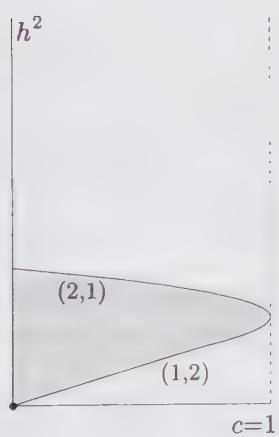

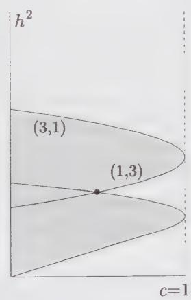

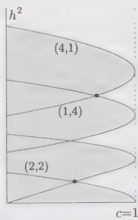  
Figure 7.1. The vanishing curves $C_{r,s}$ for levels 2, 3 and 4 (from left to right). The curves at level $l - 1$ appear also at level $l$ . The values of $r, s$ are indicated near the curves when they first appear. The black dots are first intersections (defined in the text). The shaded areas correspond to manifestly nonunitary theories.

There exists a general formula, due to Kac, for the determinant of the Gram matrix, the Kac determinant:

$$
\det M^{(l)} = \alpha_{l}\prod_{\substack{r,s\geq 1\\ rs\leq l}}[h - h_{r,s}(c)]^{p(l - rs)}\tag{7.28}
$$

where $p(l-rs)$ is the number of partitions of the integer l-rs and $\alpha_{l}$ is a positive constant independent of h or c:

$$
\begin{array}{c}\alpha_{l} = \prod_{\substack{r,s\geq 1\\ rs\leq l}}\left[(2r)^{s}s! \right]^{m(r,s)}\\ m(r,s) = p(l - rs) - p(l - r(s + 1)) \end{array}\tag{7.29}
$$

The functions $h_{r,s}(c)$ may be expressed in various ways. A common expression is the following:

$$
\boxed { \begin{array}{l} h _ {r, s} (c) = h _ {0} + \frac {1}{4} (r \alpha_ {+} + s \alpha_ {-}) ^ {2} \\ h _ {0} = \frac {1}{2 4} (c - 1) \\ \alpha_ {\pm} = \frac {\sqrt {1 - c} \pm \sqrt {2 5 - c}}{\sqrt {2 4}} \end{array} }\tag{7.30}
$$

Another convenient way to express the function $h_{r,s}$ is

$$
\boxed { \begin{array}{l} c = 1 3 - 6 \left(t + \frac {1}{t}\right) \\ h _ {r, s} (t) = \frac {1}{4} (r ^ {2} - 1) t + \frac {1}{4} (s ^ {2} - 1) \frac {1}{t} - \frac {1}{2} (r s - 1) \end{array} }\tag{7.31}
$$

Here we have parametrized the central charge in terms of the (complex) number t. The expression for t as a function of c has two branches:

$$
t = 1 + \frac {1}{1 2} \left\{1 - c \pm \sqrt {(1 - c) (2 5 - c)} \right\}\tag{7.32}
$$

Which branch is actually used has no influence on the value of the Kac determinant. If $c < 1$ or $c > 25$ , $t$ is real, whereas it lies on the unit circle if $1 < c < 25$ . In terms of $t$ ,

$$
\alpha_ {+} = \sqrt {t} \quad \alpha_ {-} = - \frac {1}{\sqrt {t}}\tag{7.33}
$$

Yet another way of expressing the roots of the Kac determinant is the following:

$$
\boxed { \begin{array}{l} c = 1 - \frac {6}{m (m + 1)} \\ h _ {r, s} (m) = \frac {[ (m + 1) r - m s ] ^ {2} - 1}{4 m (m + 1)} \end{array} }\tag{7.34}
$$

Again, the expression of m as a function of c has two branches:

$$
m = - \frac {1}{2} \pm \frac {1}{2} \sqrt {\frac {2 5 - c}{1 - c}}\tag{7.35}
$$

The relation between $t$ and $m$ is not unique:

$$
t = \frac {m}{m + 1} \quad \text { or } \quad t = \frac {m + 1}{m}\tag{7.36}
$$

The expressions (7.28) and (7.30) [or (7.31), or (7.34)] are of central importance in the theory of minimal models. The great success of conformal field theory in the study of two-dimensional critical systems is due in great part to the knowledge of the Kac determinant. The expressions (7.28) and (7.31) for the Kac determinant will be demonstrated in the next chapter.

In the $(c,h)$ plane, the Kac determinant vanishes along the curves $h = h_{r,s}(c)$ , called vanishing curves and denoted $C_{r,s}$ . These curves are shown in Fig. 7.1 for all values of r and s allowed at levels 2, 3, and 4. Note that the Kac formula does not provide the eigenvalues of the Gram matrix, but only their product. At each level l > 1, the number of roots $h_{rs}$ of the determinant exceeds the number $p(l)$ of eigenvalues. As is clear from the Kac determinant formula (7.30), the first null state in the reducible Verma module $V(c,h_{r,s})$ occurs at level l = rs, since $p(l-rs)$ vanishes (by definition) if l < rs.

## 7.2.2. Unitarity of $c \geq 1$ Representations

The explicit expressions (7.28)-(7.34) for the Kac determinant allow us to prove that the representations $(c\geq 1,h\geq 0)$ are unitary. The proof is done in three steps: First, we show that the vanishing curves $C_{r,s}$ do not cross the region $R = \{c > 1,h > 0\}$ . In a second step we show that $\det M^{(l)} > 0$ throughout this region. Finally we argue that $M^{(l)}$ is positive definite in $R$ . This last statement is in itself equivalent to unitarity, but the first two steps will be useful in proving it.

The first step amounts to showing that the curves $C_{r,s}$ lie below or on the axis $h = 0$ if $c > 1$ . An explicit expansion of Eq. (7.30) yields

$$
h _ {r, s} (c) = \frac {1 - c}{9 6} \left\{\left[ (r + s) + (r - s) \sqrt {\frac {2 5 - c}{1 - c}} \right] ^ {2} - 4 \right\}\tag{7.37}
$$

If $1 < c < 25$ we see that $h_{r,s}(c)$ is not a real number unless $r = s$ , in which case $h_{r,s}(c) \leq 0$ . On the other hand, if $c \geq 25$ the choice (7.35) implies that $-1 < m < 0$ . Then $m(m + 1) < 0$ and

$$
[ (m + 1) r - m s ] ^ {2} = [ (1 - | m |) r + | m | s ] ^ {2} \geq 1\tag{7.38}
$$

which implies $h_{r,s}(m) \leq 0$ according to Eq. (7.34). Thus, we have shown that all the curves $C_{r,s}$ are located on or below the $h = 0$ axis if $c > 1$ .

When $|h|$ is much larger than $\max \{|h_{r,s}|\}$ for a given level, then $\det M^{(l)} \approx \alpha_l h^r$ , for some positive $r$ . Since $\alpha_l$ is a positive constant, the Kac determinant is also positive in this limit. Finally, since none of the roots $h_{r,s}$ lies in the region $R$ , the Kac determinant is strictly positive throughout that region. This proves the second point.

In order to prove the last point, we must show that the matrix $M^{(l)}$ is positive definite for at least one point $(c,h)$ in R. Indeed, since the Kac determinant is positive, the number of negative eigenvalues of $M^{(l)}$ must be even. That number can change only across one of the curves $C_{r,s}$ , and consequently must stay the same throughout R. It remains to show that this number is 0 at some point in R. To this end, we use a slightly different basis for the level l sector, namely the vectors

$$
L _ {- k _ {1}} L _ {- k _ {2}} \dots L _ {- k _ {n}} | h \rangle \quad (k _ {1} \geq k _ {2} \geq \dots \geq k _ {n})\tag{7.39}
$$

and we define the length $n(\alpha)$ of a basis vector $|\alpha\rangle$ as the number of operators $L_{k}$ used to define it. For instance, $L_{-1}^{3}|h\rangle$ has length 3 and $L_{-3}|h\rangle$ has length 1. It is then possible to show that the dominant behavior in $h$ of inner products is

$$
\begin{array}{l} \langle \alpha | \alpha \rangle = c _ {\alpha}   h ^ {n (\alpha)} \left[ 1 + O (1 / h) \right] \qquad (c _ {\alpha} > 0) \\ \langle \alpha | \beta \rangle = O (h ^ {(n (\alpha) + n (\beta)) / 2 - 1}) + \ldots \end{array}\tag{7.40}
$$

where $|\alpha\rangle$ and $|\beta\rangle$ are two basis states. We sort our basis in order of decreasing lengths, and consider the submatrices $M_{n}^{(l)}$ obtained by keeping only vectors of length n. Eq. (7.40) implies that these submatrices are positive definite when h is sufficiently large. In that limit, the eigenvalues of $M^{(l)}$ are those of the submatrices $M_{n}^{(l)}$ , and thus $M^{(l)}$ itself is positive definite. $^{2}$

## 7.2.3. Unitary $c < 1$ Representations

We mentioned earlier that the points $(c,h)$ located between the two vanishing curves on the leftmost graph of Fig. 7.1 correspond to nonunitary representations. In fact, all the points in the region $R : \{(c,h)|0 < c < 1, h > 0\}$ are associated with nonunitary representations, except the following discrete set:

$$
\begin{array}{l} c = 1 - \frac {6}{m (m + 1)} \\ h _ {r, s} (m) = \frac {[ (m + 1) r - m s ] ^ {2} - 1}{4 m (m + 1)} \quad (1 \leq r <   m, 1 \leq s <   r) \end{array}\tag{7.41}
$$

This expression coincides with Eq. (7.34) above, except that $m$ is now an integer greater than or equal to 2, and the integers $r$ and $s$ are bounded as indicated. That the representations defined by Eq. (7.41) are unitary will be proven when discussing cosets in Chap. 18. In the present context, we could prove only that points $(c, h)$ not included in this discrete set correspond to nonunitary representation, that is, Eq. (7.41) is a necessary (not yet sufficient) condition for unitarity. In fact, we shall not give the proof, but simply indicate some of its elements.

It is relatively simple to argue that the points of R that do not lie on a vanishing curve correspond to nonunitary representations. Consider such a point P. Since the Kac determinant does not vanish at P, the associated representation does not contain zero-norm states, but may contain negative-norm states. In order to show that it does indeed, it is sufficient to demonstrate that the Kac determinant is negative at P, for some level l. This can be done if there is, at some particular level l, a continuous path linking P to the c > 1, h > 0 region that crosses a single vanishing curve such that $p(l - rs)$ is odd. For instance, going back to Fig. 7.1, any point left of the curve on the level-2 graph can be linked to the c > 1, h > 0 region by a continuous path that crosses either $C_{1,2}$ or $C_{2,1}$ , and the factors $(h - h_{1,2}(c))$ and $(h - h_{2,1}(c))$ both appear linearly in the Kac determinant at level 2. Therefore these points are associated with nonunitary representations. This is true of all the points lying left of the vanishing curves represented on that figure. The points not excluded from unitarity at some level by this argument will be excluded at some higher level. Indeed, at c = 1, the vanishing curve $C_{r,s}$ ends up at $h_{r,s} = \frac{1}{4}(r - s)^{2}$ . For a given value of r - s, the vanishing curve lies closer and closer to the c = 1 axis as the product rs increases. Each time rs increases by one step (for a fixed value of r - s), a new set of points is excluded from unitarity by this argument at level l = rs, since $p(l - rs)$ is then one and no other vanishing curve lies between $C_{r,s}$ and the c = 1 axis. This argument excludes from unitarity all the points in the region R, except maybe the points lying on the vanishing curves themselves.

Verma modules associated with points on vanishing curves contain null vectors, but may contain negative-norm states as well. Indeed, the second element of the nonunitarity proof is that points on the vanishing curves also correspond to nonunitary representations, except the so-called first intersections. Consider a given vanishing curve, at a given level; the first intersection associated with that curve, if it exists, is the point intersected by another vanishing curve (at the same level) that lies closest to the c = 1 axis. At any point on the vanishing curve $C_{r,s}$ , the Verma module has a null vector at level rs. The characteristic of first intersections is that this null state is the highest-weight state of a representation that in turn contains a null state. It can be shown that first intersections are indeed located as indicated in Eq. (7.41). On Fig. 7.1, all intersections (indicated by dots) are first intersections, the origin included (it intersects $C_{1,2}$ and $C_{1,1}$ ).

## §7.3. Overview of Minimal Models

This section is a constructive introduction to minimal models. The consequences of the existence of null vectors on correlation functions and the operator algebra are illustrated with the help of simple examples. The general construction of minimal models is presented in a heuristic fashion, formal proofs being reported in the next chapter. Throughout this section we shall work in the holomorphic sector only.

## 7.3.1. A Simple Example

We study a simple example of reducible Verma module. Consider, in $V(c, h)$ , the following state at level 2:

$$
| \chi \rangle = \left[ L _ {- 2} + \eta L _ {- 1} ^ {2} \right] | h \rangle\tag{7.42}
$$

We want to tune $\eta$ and h in such a way that $|\chi\rangle$ is a null state (or singular vector). As mentioned earlier, the conditions $L_{1}|\chi\rangle = L_{2}|\chi\rangle = 0$ are sufficient for this, since it then follows from the Virasoro algebra (7.4) that $L_{n}|\chi\rangle = 0$ for all $n \geq 3$ . By acting on this state with $L_{1}$ and $L_{2}$ and bringing these operators in contact with $|h\rangle$ with the help of the algebra (7.4), we find

$$
\begin{array}{l} L _ {1} | \chi \rangle = (3 + 2 \eta + 4 h \eta) L _ {- 1} | h \rangle \\ L _ {2} | \chi \rangle = (\frac {1}{2} c + 4 h + 6 h \eta) | h \rangle \end{array}\tag{7.43}
$$

The conditions imposed on $\eta$ and h for $|\chi\rangle$ to be singular are thus

$$
\begin{array}{l} \eta = - \frac {3}{2 (2 h + 1)} \\ h = \frac {1}{1 6} \left\{5 - c \pm \sqrt {(c - 1) (c - 2 5)} \right\} \end{array}\tag{7.44}
$$

The latter condition may also be inferred from Eq. (7.30) applied to level-2 states (cf. Eq. (7.26)), since singular vectors exist if and only if the Kac determinant vanishes. In the notation of Eq. (7.30), the above constraint on h is simply $h = h_{1,2}$ or $h = h_{2,1}$ (recall that the first null state in the reducible Verma module $V(c, h_{r,s})$ occurs at level l = rs).

As discussed in Sect. 6.6.1, to each state of the Verma module one associates a descendant field, as defined in Eq. (6.148) for the simplest case. In particular, one associates a null field $\chi(z)$ with the null state $|\chi\rangle$ . This field is a descendant of the primary field $\phi(z)$ of conformal dimension $h$ , but is itself a primary field of dimension $h + 2$ . Following the discussion of Sect. 6.6.1, the explicit expression for this null field is

$$
\chi (z) = \phi^ {(- 2)} (z) - \frac {3}{2 (2 h + 1)} \frac {\partial^ {2}}{\partial z ^ {2}} \phi (z)\tag{7.45}
$$

That the null state is orthogonal to the whole Verma module translates, in the field language, into the vanishing of the correlator $\langle\chi(z)X\rangle$ , wherein X is a string of local fields: $X \equiv \phi_{1}(z_{1}) \cdots \phi_{N}(z_{N})$ . Equivalently, we say that the field $\chi$ decouples from the other fields. According to Eq. (6.152), this implies the following differential equation for the correlator $\langle\phi(z)X\rangle$ :

$$
\left\{\mathcal {L} _ {- 2} - \frac {3}{2 (2 h + 1)} \mathcal {L} _ {- 1} ^ {2} \right\} \langle \phi (z) X \rangle = 0\tag{7.46}
$$

More explicitly, this is

$$
\left\{\sum_ {i = 1} ^ {N} \left[ \frac {1}{z - z _ {i}} \frac {\partial}{\partial z _ {i}} + \frac {h _ {i}}{(z - z _ {i}) ^ {2}} \right] - \frac {3}{2 (2 h + 1)} \frac {\partial^ {2}}{\partial z ^ {2}} \right\} \langle \phi (z) X \rangle = 0\tag{7.47}
$$

(recall that $\mathcal{L}_{-1}$ is equivalent to $\partial_z$ ).

This differential equation should bring nothing new to our knowledge of the two-point function. Indeed, if we let $X = \phi(w)$ , Eq. (7.47) becomes simply

$$
\left\{\frac {1}{z - w} \partial_ {w} + \frac {h}{(z - w) ^ {2}} - \frac {3}{2 (2 h + 1)} \partial_ {z} ^ {2} \right\} \langle \phi (z) \phi (w) \rangle = 0\tag{7.48}
$$

which is trivially satisfied, given the general form (5.25) for the two-point function: $\langle \phi (z)\phi (w)\rangle = (z - w)^{-2h}$ .

However, the differential equation (7.47) has a nontrivial effect on the three-point function (5.26). We consider $X = \phi_{1}(z_{1})\phi_{2}(z_{2})$ . The three-point function is

$$
\langle \phi (z) \phi_ {1} (z _ {1}) \phi_ {2} (z _ {2}) \rangle = \frac {g (h , h _ {1} , h _ {2})}{(z - z _ {1}) ^ {h _ {2} - h - h _ {1}} (z _ {1} - z _ {2}) ^ {h - h _ {1} - h _ {2}} (z - z _ {2}) ^ {h _ {1} - h - h _ {2}}}\tag{7.49}
$$

where $g(h, h_{1}, h_{2})$ is a constant not fixed by global conformal invariance alone, but by the operator algebra of the theory (cf. Sect. 6.6.3). The differential equation (7.47) imposes constraints on the conformal dimensions $h, h_{1}$ , and $h_{2}$ . It turns out, after an explicit calculation, that a single independent constraint remains:

$$
2 (2 h + 1) \left(h + 2 h _ {2} - h _ {1}\right) = 3 \left(h - h _ {1} + h _ {2}\right) \left(h - h _ {1} + h _ {2} + 1\right)\tag{7.50}
$$

This equation may be solved explicitly for $h_{2}$ :

$$
h _ {2} = \frac {1}{6} + \frac {1}{3} h + h _ {1} \pm \frac {2}{3} \sqrt {h ^ {2} + 3 h h _ {1} - \frac {1}{2} h + \frac {3}{2} h _ {1} + \frac {1}{1 6}}\tag{7.51}
$$

This solution for $h_2$ is more elegant if we adopt a notation close to that of Eq. (7.30) and parametrize the conformal dimensions as

$$
h (\alpha) \equiv h _ {0} + \frac {1}{4} \alpha^ {2} \quad h _ {0} = \frac {1}{2 4} (c - 1)\tag{7.52}
$$

If $\alpha_{1}$ and $\alpha_{2}$ correspond respectively to $h_1$ and $h_2$ , we then have the following solutions:

$$
\begin{array}{l l} \alpha_ {2} = \alpha_ {1} \pm \alpha_ {+} & (h = h _ {2, 1}) \\ \alpha_ {2} = \alpha_ {1} \pm \alpha_ {-} & (h = h _ {1, 2}) \end{array}\tag{7.53}
$$

Thus, the existence of a null vector at level 2 imposes additional constraints on the three-point functions, which are equivalent to constraints imposed on the operator algebra. If we denote by $\phi_{(\alpha)}$ the primary field of dimension $h(\alpha)$ these constraints on the operator algebra take the following symbolic form:

$$
\begin{array}{l} \phi_ {(2, 1)} \times \phi_ {(\alpha)} = \phi_ {(\alpha - \alpha_ {+})} + \phi_ {(\alpha + \alpha_ {+})} \\ \phi_ {(1, 2)} \times \phi_ {(\alpha)} = \phi_ {(\alpha - \alpha_ {-})} + \phi_ {(\alpha + \alpha_ {-})} \end{array}\tag{7.54}
$$

The notation introduced here requires some explanation. By the above, we mean that the operator product expansion of $\phi_{(2,1)}$ with $\phi_{(\alpha)}$ (or of fields belonging to their families) may contain terms belonging only to the conformal families of $\phi_{(\alpha-\alpha_{+})}$ and $\phi_{(\alpha+\alpha_{+})}$ . The symbol × stands for an operator product expansion, and $\phi_{(\alpha)}$ stands not for the primary field only, but for its entire conformal family. Generally speaking, we call fusion the process of taking the short-distance product of two local fields. The conditions under which a given conformal family occurs in the short-distance product of two conformal fields are called the fusion rules of the theory. These may be thought of as selection rules for the conformal dimensions of fields appearing in a three-point correlator. We say, for instance, that the fusion of two conformal fields $\phi_{1}$ and $\phi_{2}$ onto a third field $\phi_{3}$ is possible if the three-point function $\langle\phi_{1}\phi_{2}\phi_{3}\rangle$ is not zero. This topic will be examined in more detail in Sect. 8.4. It is implicit that there are coefficients multiplying the families on the r.h.s. of Eq. (7.54): They are the structure constants of the operator algebra. Not only are they not specified here, but they may vanish. $^{3}$

We finally point out the possibility of having a null state at level one. The only state at this level is $L_{-1}|h\rangle$ , and its norm vanishes only if $h = h_{1,1} = 0$ (cf. Eq. (7.26)). The corresponding null field is $\partial_{z}\phi_{(1,1)}(z)$ , and the differential equation satisfied by the correlator $\langle\phi_{(1,1)}(z)X\rangle$ is

$$
\frac {\partial}{\partial z} \langle \phi_ {(1, 1)} (z) X \rangle = 0\tag{7.55}
$$

Because the correlator is independent of $z$ , the only conclusion to be drawn is that $\phi_{(1,1)}$ is a constant, since it is, by hypothesis, a purely holomorphic field. We call $\phi_{(1,1)}$ the identity field or the identity operator (sometimes denoted by $\mathbb{I}$ ). The obvious consequence of the above differential equation on three-point functions involving $\phi_{(1,1)}$ is the trivial operator algebra:

$$
\phi_ {(1, 1)} \times \phi_ {(\alpha)} = \phi_ {(\alpha)}\tag{7.56}
$$

Incidentally, the energy-momentum tensor $T(z)$ is a descendant of the identity field, according to Eq. (6.148): $T(z) = \mathbb{I}^{(-2)}$ .

## 7.3.2. Truncation of the Operator Algebra

The constraint (7.54) on the operator algebra coming from the existence of a null vector at level 2 may be generalized. If $h = h_{r,s}$ , then there exists a null vector at level rs, as follows from the Kac determinant formula (7.28). This null vector imposes a similar constraint on the operator algebra:

$$
\phi_{(r,s)}\times \phi_{(\alpha)} = \sum_{\substack{k = 1 - r\\ k + r = 1\bmod 2}}^{k = r - 1}\sum_{\substack{l = 1 - s\\ l + s = 1\bmod 2}}^{l = s - 1}\phi_{(\alpha +k\alpha_{+} + l\alpha_{-})}\tag{7.57}
$$

(The summation indices are incremented by 2). In other words, k takes only even values if r is odd and vice versa. We shall not prove this statement here. For the moment, we simply draw its consequences.

The first consequence of Eq. (7.57) is that the conformal families $[\phi_{(r,s)}]$ associated with reducible modules form a closed set under the operator algebra. For instance, we see immediately that

$$
\begin{array}{l} \phi_ {(1, 2)} \times \phi_ {(r, s)} = \phi_ {(r, s - 1)} + \phi_ {(r, s + 1)} \\ \phi_ {(2, 1)} \times \phi_ {(r, s)} = \phi_ {(r - 1, s)} + \phi_ {(r + 1, s)} \end{array}\tag{7.58}
$$

This means that the fields $\phi_{(1,2)}$ and $\phi_{(2,1)}$ act as ladder operators in the operator algebra. That the families $[\phi_{(r,s)}]$ form a closed set under the operator algebra is a profound dynamical statement, which holds only for certain values of $c$ and certain highest-weight representations associated with those values. Again, we stress that the coefficients implicit on the r.h.s. of (7.57) may be zero; the above notation simply means that no other conformal family, other that those shown, may appear in the operator product expansion. Indeed, many conformal families can be shown not to occur in the OPE, by using the commutativity of the operator algebra. For instance, we write

$$
\begin{array}{l} \phi_ {(1, 2)} \times \phi_ {(2, 1)} = \phi_ {(2, 0)} + \phi_ {(2, 2)} \\ \phi_ {(2, 1)} \times \phi_ {(1, 2)} = \phi_ {(0, 2)} + \phi_ {(2, 2)} \end{array}\tag{7.59}
$$

Since the two OPEs are equivalent, this shows that $\phi_{(2,0)}$ and $\phi_{(0,2)}$ are excluded from both (their coefficients vanish). Thus, in this example, the operator algebra truncates to

$$
\phi_ {(1, 2)} \times \phi_ {(2, 1)} = \phi_ {(2, 2)}\tag{7.60}
$$

This truncation phenomenon may be generalized, with the following result:

$$
\phi_{(r_{1},s_{1})}\times \phi_{(r_{2},s_{2})} = \sum_{\substack{k = 1 + |r_{1} - r_{2}|\\ k + r_{1} + r_{2} = 1\bmod 2}}^{k = r_{1} + r_{2} - 1}\sum_{\substack{l = 1 + |s_{1} - s_{2}|\\ l + s_{1} + s_{2} = 1\bmod 2}}^{l = s_{1} + s_{2} - 1}\phi_{(k,l)}\tag{7.61}
$$

Here again, the summation variables k and l are incremented by 2. The truncation is such that only the families $\phi_{(r,s)}$ with positive values of r and s occur on the r.h.s. of (7.61).

## 7.3.3. Minimal Models

For a generic value of the central charge c, the truncated operator algebra (7.61) implies that an infinite number of conformal families are present in the theory, since families $[\phi_{(r,s)}]$ with r, s arbitrary large are generated by applying repeatedly the fusion rules (7.61). In order to understand the situation graphically, we consider the “diagram of dimensions” of Fig. 7.2. The points $(r,s)$ in the first quadrant label the various conformal dimensions appearing in the Kac formula. The dotted line has a slope $\tan\theta = -\alpha_{+}/\alpha_{-}$ , fixed by the central charge c. If $\delta$ is the Cartesian distance between a point $(r,s)$ and the dotted line, it can easily be shown that (cf.

Ex. 7.6)

$$
h _ {r, s} = h _ {0} + \frac {1}{4} \delta^ {2} (\alpha_ {+} ^ {2} + \alpha_ {-} ^ {2})\tag{7.62}
$$

If the slope $\tan\theta$ is irrational, it will never go through any integer point $(r,s)$ , although some of these points will be arbitrarily close to it. Thus, given the fusion rules (7.61), there will be an infinite number of distinct primary fields in the theory, and moreover, an infinity of them will have negative conformal dimensions, since $h_{0}<0$ if c<1.

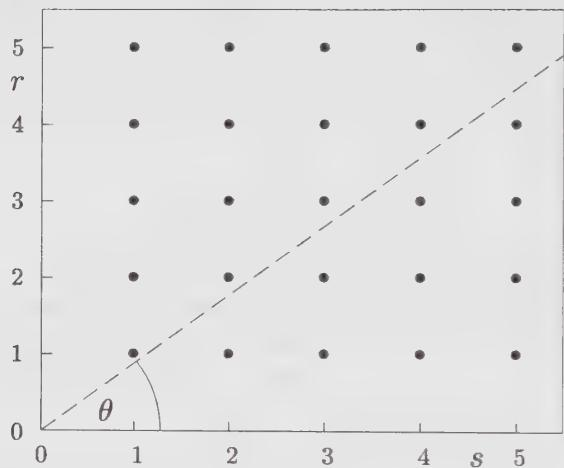  
Figure 7.2. The “diagram of dimensions” for a generic value of c. The points on the first quadrant are associated with the conformal dimensions $h_{r,s}$ of the Kac formula. The conformal dimension is related by Eq. (7.62) to the distance between a point $(r,s)$ and the dashed line.

However, if the slope $\tan \theta$ is rational, that is, if there exist two coprime integers $p$ and $p'$ such that

$$
p \alpha_ {-} + p ^ {\prime} \alpha_ {+} = 0,\tag{7.63}
$$

the dotted line of Fig. (7.2) goes through the point $(p', p)$ and the conformal weights $h_{r,s}$ do not form a dense set. Indeed, we then have the periodicity property:

$$
h _ {r, s} = h _ {r + p ^ {\prime}, s + p}\tag{7.64}
$$

In terms of these two integers, the central charge and the Kac formula become

$$
\boxed { \begin{array}{c} c = 1 - 6 \frac {(p - p ^ {\prime}) ^ {2}}{p p ^ {\prime}} \\ h _ {r, s} = \frac {(p r - p ^ {\prime} s) ^ {2} - (p - p ^ {\prime}) ^ {2}}{4 p p ^ {\prime}} \end{array} }\tag{7.65}
$$

If $c \leq 1$ , the parameter t of Eq. (7.31) is real and positive, and equal to $t = -\alpha_{+}/\alpha_{-} = p/p'$ . The two integers p and $p'$ may therefore be taken as positive. Because of the symmetry $t \to 1/t$ of this parametrization, one may also assume that $p > p'$ without loss of generality. Note also the obvious symmetry property

$$
h _ {r, s} = h _ {p ^ {\prime} - r, p - s}\tag{7.66}
$$

From Eq. (7.65) we easily demonstrate the following identities:

$$
\begin{array}{r l} h _ {r, s} + r s & = h _ {p ^ {\prime} + r, p - s} = h _ {p ^ {\prime} - r, p + s} \\ h _ {r, s} + (p ^ {\prime} - r) (p - s) & = h _ {r, 2 p - s} = h _ {2 p ^ {\prime} - r, s} \end{array}\tag{7.67}
$$

This means that the null vector at level rs contained in the Verma module $V_{r,s}$ is itself the highest weight of a degenerate Verma module, since it fits in the Kac formula! Moreover, the module $V_{r,s}$ also contains a null vector at level $(p'-r)(p-s)$ . These two null vectors give rise to submodules that also contain null vectors of the same form, and so on (this is illustrated in Fig. 8.1 of Chap. 8). Thus, there is an infinite number of null vectors within the Verma module $V_{r,s}$ if c is of the form (7.65). Each null vector has its own differential equation acting as a constraint on the correlators and the operator algebra. The net effect is an additional truncation of the operator algebra, yielding a finite set of conformal families, which closes under fusion. The corresponding finite set of conformal weights $h_{r,s}$ is delimited by

$$
1 \leq r <   p ^ {\prime} \quad \text { and } \quad 1 \leq s <   p\tag{7.68}
$$

This rectangle in the $(r,s)$ plane is called the Kac table. The symmetry $h_{r,s} = h_{p' - r,p-s}$ makes half of this rectangle redundant:

$$
\phi_ {(r, s)} = \phi_ {(p ^ {\prime} - r, p - s)}\tag{7.69}
$$

There remain $(p - 1)(p' - 1)/2$ distinct fields in the theory.

The conformal theories defined by the conditions (7.65) and (7.68) are called minimal models, since they contain a finite number of local fields with well-defined scaling behavior. The truncated fusion rules existing between these fields are

$$
\phi_{(r,s)}\times \phi_{(m,n)} = \sum_{\substack{k = 1 + |r - m|\\ k + r + m = 1\bmod 2}}^{k_{max}}\sum_{\substack{l = 1 + |s - n|\\ k + s + n = 1\bmod 2}}^{l_{max}}\phi_{(k,l)}\tag{7.70}
$$

wherein

$$
\begin{array}{l} k _ {m a x} = \min (r + m - 1, 2 p ^ {\prime} - 1 - r - m) \\ l _ {m a x} = \min (s + n - 1, 2 p - 1 - s - n) \end{array}\tag{7.71}
$$

and k and l are incremented by 2. This expression will be proven in the next chapter.

Of course, the above discussion was restricted to the holomorphic sector. A physical theory is in fact constructed out of tensor products of holomorphic and antiholomorphic modules. A generic Hilbert space has the following form

$$
\mathcal {H} = \bigoplus_ {h, \bar {h}} M (c, h) \otimes \bar {M} (c, \bar {h})\tag{7.72}
$$

The question of how to combine the components of a minimal model into tensor products will be addressed in detail in Chap. 10, in which conformal field theories on a torus will be studied. However, a particularly simple solution is to associate to each holomorphic module $M(c, h_{r,s})$ the corresponding antiholomorphic module $\bar{M}(c, h_{r,s})$ . The Hilbert space of the theory is then

$$
\mathcal{H} = \bigoplus_{\substack{1\leq r <   p^{\prime}\\ 1\leq s <   p}}M(c,h_{r,s})\otimes \bar{M} (c,h_{r,s})\tag{7.73}
$$

The resulting theory is termed diagonal, since the two factors of each tensor product are identical. We shall symbolically denote a minimal model associated with the pair $(p, p')$ by $\mathcal{M}(p, p')$ and, as mentioned above, will adopt the convention $p > p'$ .

## 7.3.4. Unitary Minimal Models

As seen in Sect. 7.2.1, the constraint of unitarity for a conformal field theory requires that there be no states of negative norm. We have seen that a necessary condition for the unitarity of a representation of the Virasoro algebra with highest weight h is $h \geq 0$ . Therefore, a unitary conformal field theory contains only primary fields with nonnegative conformal dimensions. The physical implications of this property are clear: The two-point correlation functions of primary fields (except for the identity operator) have to fall off with distance, instead of exploding at large distances:

$$
\langle \phi_ {h, \bar {h}} (z, \bar {z}) \phi_ {h, \bar {h}} (0, 0) \rangle = \frac {1}{z ^ {2 h} \bar {z} ^ {2 \bar {h}}}\tag{7.74}
$$

This is the case for the critical Ising model, to be discussed below: The spin-spin correlator decreases when the separation of the spins increases. That such a behavior is to be expected from any physical spin system with short-range interactions is not quite true in general as we shall see in next section, with the (nonunitary) example of the Yang–Lee edge singularity. It seems that the statistical models of so-called hard objects (i.e., of bulky objects that cannot overlap, subject to simple enough interactions) always admit critical continuum descriptions with nonunitary conformal field theories. Moreover, many other physical systems such as polymers in two dimensions have phases described by nonunitary minimal models. The unitarity condition should therefore not be confused with a physical condition.

We now examine the consequence of the unitarity condition for the c < 1 minimal theories discussed above. Recall the form of admissible conformal dimensions (7.65)

$$
h _ {r, s} = \frac {(p r - p ^ {\prime} s) ^ {2} - (p - p ^ {\prime}) ^ {2}}{4 p p ^ {\prime}}\tag{7.75}
$$

with $1 \leq r \leq p' - 1$ and $1 \leq s \leq p - 1$ . The integers $p$ and $p'$ being coprime, Bezout's lemma states that there exists a couple of integers $(r_0, s_0)$ in the above

range such that

$$
p r _ {0} - p ^ {\prime} s _ {0} = 1\tag{7.76}
$$

Accordingly, the corresponding dimension

$$
h _ {r _ {0}, s _ {0}} = \frac {1 - (p - p ^ {\prime}) ^ {2}}{4 p p ^ {\prime}}\tag{7.77}
$$

is always negative, except if $|p - p'| = 1$ , in which case it vanishes. It turns out that the primary field with smallest dimension (7.77) is always present in the minimal theories. As we shall see in the study of modular invariance (Chap. 10), the primary field with smallest dimension governs the leading anomalous behavior of the free energy of the system through finite size effects. The minimal models can be unitary only if $|p - p'| = 1$ . In this case, $h_{r_0,s_0} = h_{1,1} = 0$ —that is, $\phi_{(r_0,s_0)}$ is the identity—and the leading finite size effect in the free energy is governed only by the central charge of the theory. That these models are indeed unitary will be proven in Chap. 18 by means of the coset construction; this will provide an explicit unitary realization of each minimal model with $|p - p'| = 1$ . With no loss of generality, we label the unitary minimal theories with c < 1 by $(p = m + 1, p' = m)$ , m = 2, 3, 4, .... We note that the list of unitary representations given in Eq. (7.41) coincides indeed with the list of highest weights $h_{r,s}$ of unitary minimal models.

## §7.4. Examples

## 7.4.1. The Yang-Lee Singularity

As mentioned in Sect. 3.2.1, the partition function of a lattice theory, such as the Ising model, is an analytic function of the parameters of the model if the number N of sites is finite. Nonanalytic behavior, hence a phase transition, can occur only in the thermodynamic limit $(N \rightarrow \infty)$ . For definiteness, we consider the Ising model at temperature T, in an external field H. The configuration energy is given by Eq. (3.6). As a function of H, the zeros of the partition function cannot lie on the real H-axis for N finite, since Z is then a finite sum of positive terms. These zeros occur at complex values of H and at their complex conjugates. In a generic ferromagnetic spin model, they tend to accumulate on various arcs on the complex plane as $N \rightarrow \infty$ . In the Ising model, it has been shown that they accumulate on the imaginary axis $H = i\hbar$ , and the free-energy $F = \ln Z$ may then be expressed in terms of the density $\rho(\hbar, T)$ of zeros on the imaginary axis:

$$
F (h) = \int_ {- \infty} ^ {\infty} d x \rho (x, T) \ln (h - i x)\tag{7.78}
$$

The magnetization M is then

$$
M = \frac {\partial F}{\partial H} = \int_ {- \infty} ^ {\infty} d x \frac {\rho (x , T)}{H - i x}\tag{7.79}
$$

Below the critical temperature $(T < T_{c})$ , the distribution of zeros extends up to the real axis $(\rho(0, T) \neq 0)$ and the magnetization is discontinuous as H crosses the origin along the real axis: There is a first-order phase transition. At $T = T_{c}$ , $\rho(0, T)$ vanishes and this transition becomes continuous. $^{4}$ In the paramagnetic phase $(T > T_{c})$ , the distribution $\rho(\mathfrak{h}, T)$ stops at a critical value $\mathfrak{h}_{c}(T)$ on either side of the real axis, the so-called Yang-Lee edge. We now suppose that, near $h_{c}$ , the density of zeros has a power-law behavior: $^{5}$

$$
\rho (\mathfrak {h}, T) = (\mathfrak {h} - \mathfrak {h} _ {c}) ^ {\sigma}\tag{7.80}
$$

It is then a simple matter to show that the magnetization $M(i\hbar)$ behaves also like $(\mathfrak{h}-\mathfrak{h}_{c})^{\sigma}$ . We may assert, using scaling arguments identical to those explained in Sect. 3.2.2, that the exponent $\sigma$ is related to the exponent $\eta$ of the critical correlator by the relation (3.49):

$$
\sigma = \frac {1}{\delta} = \frac {d - 2 + \eta}{d + 2 - \eta} = \frac {\eta}{4 - \eta} \quad (d = 2)\tag{7.81}
$$

Here, however, the correlator with exponent $\eta$ is not the correlator of the Ising spin at the critical point $(h = 0, T_{c})$ , but that of another scaling field, yet unspecified, describing the fluctuations of the model in an imaginary field close to $h = i\mathfrak{h}_{c}$ : As $h \to i\mathfrak{h}_{c}$ , the correlation length diverges.

It turns out that the relevant Landau-Ginzburg theory $^{6}$ contains a term in $i\Phi^{3}$ :

$$
\mathcal {L} _ {Y L} = \frac {1}{2} (\partial_ {\mu} \Phi) ^ {2} + i (h - h _ {c}) \Phi + i \gamma \Phi^ {3}.
$$

This model is, of course, not unitary, because of the imaginary magnetic field, which translates into an imaginary coupling of the Landau-Ginzburg effective field theory.

In trying to identify this critical point with one of the minimal models of conformal field theory, we must keep in mind the following: First, the model is nonunitary. Second, as shown by renormalization-group analyses, the composite field $\Phi^{2}$ is redundant, which means that the operator product $\Phi\Phi$ does not give rise to any new scaling field. In other words,

$$
\Phi \times \Phi = \mathbb {I} + \Phi .
$$

The only minimal model with such simple behavior is $\mathcal{M}(5,2)$ , with central charge c = -22/5. Its operator content is very simple, with only two primary fields: $\phi_{(1,1)}$ (of dimension 0) and $\phi_{(1,2)} = \phi_{(1,3)}$ (of dimension -1/5). These are, of course, the chiral components of the physical operators I (the identity, of dimensions (0,0)) and $\Phi$ (dimensions (-1/5, -1/5)). The scaling dimension of the field $\Phi$ is thus $\Delta = -2/5$ , and the corresponding exponent $\eta$ is $2\Delta = -4/5$ . According to the relation (7.81), the critical exponent $\sigma$ is then equal to -1/6, a result entirely compatible with the outcome of high-temperature series analyses, which yield $\sigma = -0.163 \pm 0.003$ .

## 7.4.2. The Ising Model

The simplest nontrivial unitary minimal model, $\mathcal{M}(4,3)$ , describes the critical Ising model. Since Chap. 12 is entirely dedicated to the two-dimensional Ising model, we shall not explain in detail here the precise correspondence between this lattice model and the minimal model $\mathcal{M}(4,3)$ . We simply state the results.

In addition to the identity operator, there are two local scaling operators in the critical Ising model: the Ising spin $\sigma$ (a continuum version of the lattice spin $\sigma_{i}$ ) and the energy density $\varepsilon$ (a continuum version of the interaction energy $\sigma_{i}\sigma_{i+1}$ ). The latter is also called the thermal operator, since it is coupled to the inverse temperature $\beta$ in the partition function. The exponents $\eta$ and $\nu$ are defined by the critical behavior of the following correlators (d = 2):

$$
\langle \sigma_ {i} \sigma_ {i + n} \rangle = \frac {1}{| n | ^ {d - 2 + \eta}} = \frac {1}{| n | ^ {\eta}} \quad \langle \varepsilon_ {i} \varepsilon_ {i + n} \rangle = \frac {1}{| n | ^ {2 d - 2 / \nu}} = \frac {1}{| n | ^ {4 - 2 / \nu}}\tag{7.82}
$$

It is known, from the exact solution, that $\eta = 1/4$ and $\nu = 1$ . Therefore, assuming that the scaling fields $\sigma$ and $\varepsilon$ have no spin ( $h = \bar{h}$ ), it follows that their conformal dimensions are

$$
(h, \bar {h}) _ {\sigma} = (\frac {1}{1 6}, \frac {1}{1 6}) (h, \bar {h}) _ {\varepsilon} = (\frac {1}{2}, \frac {1}{2})\tag{7.83}
$$

The three fields making up the holomorphic part of the theory have therefore conformal dimensions 0, $\frac{1}{16}$ , and $\frac{1}{2}$ . This simple operator content leads to an identification with the minimal model $\mathcal{M}(4,3)$ , with central charge $c = \frac{1}{2}$ . The operator-field correspondence is

$$
\begin{array}{l l l l} \mathbb {I} \iff \phi_ {(1, 1)} & \text {or} & \phi_ {(2, 3)} \\ \sigma \iff \phi_ {(2, 2)} & \text {or} & \phi_ {(1, 2)} \\ \varepsilon \iff \phi_ {(2, 1)} & \text {or} & \phi_ {(1, 3)} \end{array}\tag{7.84}
$$

The associated diagram of dimensions is illustrated on Fig. 7.3.

The fusion rules following from this identification with $\mathcal{M}(4,3)$ are the following (cf. Eq. (7.70)):

$$
\begin{array}{l} \sigma \times \sigma = \mathbb {I} + \varepsilon \\ \sigma \times \varepsilon = \sigma \\ \varepsilon \times \varepsilon = \mathbb {I} \end{array}\tag{7.85}
$$

Note that these simple fusion rules are compatible with the $Z_{2}$ symmetry $\sigma_{i} \rightarrow -\sigma_{i}$ of the Ising model.

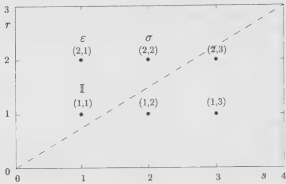  
Figure 7.3. The diagram of dimensions for the minimal model $\mathcal{M}_{(4,3)}$ , associated with the Ising model. There are six weights in the Kac table, but those below the dashed line are simply a repetition of those above, which correspond to the three scaling fields $\mathbb{I}$ , $\sigma$ and $\varepsilon$ .

We know of another unitary conformal field theory with $c = \frac{1}{2}$ : the free Majorana fermion $\psi$ (cf. Sect. 5.3.2 and Sect. 6.4). The two theories must be equivalent, and this equivalence is at the origin of Onsager's exact solution of the two-dimensional Ising model. The energy density, as a thermal operator, is readily identified with the fermion mass term $\bar{\psi}\psi$ (recall that $h_{\psi} = \bar{h}_{\bar{\psi}} = \frac{1}{2}$ ). However, the expression of the Ising spin $\sigma_{i}$ in terms of the fermion field $\psi$ is nonlocal. The questions of locality and mutual locality of operators are well illustrated in this model, and will be discussed in more detail in Chap. 12.

## 7.4.3. The Tricritical Ising Model

Following the Ising model, the next simplest unitary minimal model is $\mathcal{M}(5,4)$ , with central charge $c = \frac{7}{10}$ . The associated diagram of dimensions appears in Fig. 7.4. There are six different scaling fields, listed in Table 7.2.

Table 7.2. List of all scaling fields of the minimal model $\mathcal{M}(5,4)$ , which describes the tricritical point of the dilute Ising model.

<table><tr><td colspan="3">(r,s)</td><td>Dimension</td><td>Symbol</td><td>Meaning</td></tr><tr><td>(1,1)</td><td>or</td><td>(3,4)</td><td>0</td><td> $\mathbb{I}$ </td><td>identity</td></tr><tr><td>(1,2)</td><td>or</td><td>(3,3)</td><td> $\frac{1}{10}$ </td><td> $\varepsilon$ </td><td>thermal op.</td></tr><tr><td>(1,3)</td><td>or</td><td>(3,2)</td><td> $\frac{3}{5}$ </td><td> $\varepsilon'$ </td><td>thermal op.</td></tr><tr><td>(1,4)</td><td>or</td><td>(3,1)</td><td> $\frac{3}{2}$ </td><td> $\varepsilon''$ </td><td>thermal op.</td></tr><tr><td>(2,2)</td><td>or</td><td>(2,3)</td><td> $\frac{3}{80}$ </td><td> $\sigma$ </td><td>spin</td></tr><tr><td>(2,4)</td><td>or</td><td>(2,1)</td><td> $\frac{7}{16}$ </td><td> $\sigma'$ </td><td>spin</td></tr></table>

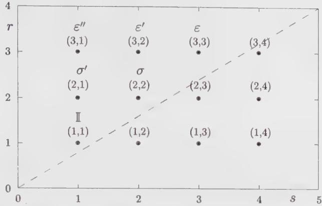  
Figure 7.4. The diagram of dimensions for the minimal model $\mathcal{M}_{(5,4)}$ , associated with the tricritical Ising model. There are six different weights in the Kac table.

The lattice model associated with this minimal conformal field theory is the tricritical Ising model, or more properly said, the dilute Ising model at its tricritical fixed point. This model is defined like an ordinary Ising model, except that vacant sites are allowed and the number of spins on the lattice fluctuates. The configuration energy is

$$
E [ \sigma_ {i}, t _ {i} ] = - \sum_ {\langle i j \rangle} t _ {i} t _ {j} (K + \delta_ {\sigma_ {i}, \sigma_ {j}}) - \mu \sum_ {i} t _ {i}\tag{7.86}
$$

where the variable $t_{i} = \sigma_{i}^{2}$ is 0 if site i is vacant and 1 otherwise. K is the energy of a pair of unlike spins, and $K + 1$ that of a pair of like spins. The chemical potential $\mu$ specifies the average number of occupied sites on the lattice. At some value of $(\beta, K, \mu)$ , there is a critical point at which three phases meet and coexist critically, hence the epithet tricritical. In addition to the identity operator, five scaling operators emerge at this tricritical point: three energy-like operators corresponding to the three terms of the configuration energy and two spin-like operators. The fusion rules of these fields are listed in Table 7.3.

The tricritical Ising model is also one of the few physically relevant theories endowed with supersymmetry. A detailed discussion of supersymmetric conformal field theories does not belong to this chapter, but we nevertheless mention that a supersymmetric generalization of conformal transformations exists (in a superspace formulation) and leads to a supersymmetric generalization of the Virasoro algebra: the so-called superconformal or super-Virasoro algebra:

$$
\begin{array}{l} {[ L _ {m}, L _ {n} ] = (m - n) L _ {m + n} + \frac {1}{1 2} c (m ^ {3} - m) \delta_ {m + n}} \\ {\{G _ {m}, G _ {n} \} = 2 L _ {m + n} + \frac {1}{3} c (m ^ {2} - \frac {1}{4}) \delta_ {m + n}} \\ {[ L _ {m}, G _ {n} ] = (\frac {1}{2} m - n) G _ {m + n}} \end{array}\tag{7.87}
$$

Table 7.3. Nontrivial fusion rules in the tricritical Ising model $\mathcal{M}(5,4)$ . It is implicit here that the symbol used for the fields stand in fact for the associated conformal families.

<table><tr><td> $\varepsilon \times \varepsilon$ </td><td>=</td><td> $\mathbb{I} + \varepsilon'$ </td></tr><tr><td> $\varepsilon \times \varepsilon'$ </td><td>=</td><td> $\varepsilon + \varepsilon''$ </td></tr><tr><td> $\varepsilon \times \varepsilon''$ </td><td>=</td><td> $\varepsilon'$ </td></tr><tr><td> $\varepsilon' \times \varepsilon'$ </td><td>=</td><td> $\mathbb{I} + \varepsilon'$ </td></tr><tr><td> $\varepsilon' \times \varepsilon''$ </td><td>=</td><td> $\varepsilon$ </td></tr><tr><td> $\varepsilon'' \times \varepsilon''$ </td><td>=</td><td> $\mathbb{I}$ </td></tr><tr><td> $\varepsilon \times \sigma$ </td><td>=</td><td> $\sigma + \sigma'$ </td></tr><tr><td> $\varepsilon \times \sigma'$ </td><td>=</td><td> $\sigma$ </td></tr><tr><td> $\varepsilon' \times \sigma$ </td><td>=</td><td> $\sigma + \sigma'$ </td></tr><tr><td> $\varepsilon' \times \sigma'$ </td><td>=</td><td> $\sigma$ </td></tr><tr><td> $\varepsilon'' \times \sigma$ </td><td>=</td><td> $\sigma$ </td></tr><tr><td> $\varepsilon'' \times \sigma'$ </td><td>=</td><td> $\sigma'$ </td></tr><tr><td> $\sigma \times \sigma$ </td><td>=</td><td> $\mathbb{I} + \varepsilon + \varepsilon' + \varepsilon''$ </td></tr><tr><td> $\sigma \times \sigma'$ </td><td>=</td><td> $\varepsilon + \varepsilon'$ </td></tr><tr><td> $\sigma' \times \sigma'$ </td><td>=</td><td> $\mathbb{I} + \varepsilon''$ </td></tr></table>

Table 7.4. List of all scaling fields of the minimal superconformal model m = 3, associated with the tricritical Ising model. Superpartners are indicated in the Neveu-Schwarz sector.

<table><tr><td colspan="3">(r,s)</td><td>Dimension</td><td>Symbol</td><td>Sector</td></tr><tr><td>(1,2)</td><td>or</td><td>(2,4)</td><td>0</td><td> $[I,E'']$ </td><td>NS</td></tr><tr><td>(1,3)</td><td>or</td><td>(2,2)</td><td> $\frac{1}{10}$ </td><td> $[\varepsilon,\varepsilon']$ </td><td>NS</td></tr><tr><td>(1,2)</td><td>or</td><td>(2,3)</td><td> $\frac{3}{80}$ </td><td> $\sigma$ </td><td>R</td></tr><tr><td>(1,4)</td><td>or</td><td>(2,1)</td><td> $\frac{7}{16}$ </td><td> $\sigma'$ </td><td>R</td></tr></table>

In the above, the modes $G_{m}$ are the Fourier components of the superpartner $G(z)$ of the energy-momentum tensor. This anticommuting field has conformal dimension $\frac{3}{2}$ and corresponds to $\phi_{(1,4)}$ (or $\phi_{(3,1)}$ ) in Table 7.2.

Depending on the boundary conditions, the index of $G_{n}$ is either half-integral, in which case the above algebra is known as the Neveu-Schwarz algebra, or integral, in which case it is known as the Ramond algebra. It is possible to identify a discrete series of unitary, minimal superconformal models, indexed by an integer $m$ , with

the following dimensions:

$$
\begin{array}{l} h _ {r, s} = \frac {\left[ r (m + 2) - s m \right] ^ {2} - 4}{8 m (m + 2)} + \frac {1}{3 2} \left[ 1 - (- 1) ^ {r - s} \right] \\ \quad (1 \leq r <   m, 1 \leq s <   m + 2) \\ c = \frac {3}{2} - \frac {1 2}{m (m + 2)} \end{array}\tag{7.88}
$$

Of course, superconformal models are also conformal; however, they possess extra symmetry. A model that is minimal with respect to the superconformal algebra need not be minimal with respect to the plain Virasoro algebra: As is well-known in group theory, when an irreducible representation of some algebra is restricted to a subalgebra, it is generally no longer irreducible. From the relation (7.88), we see that the case m = 3 is the only nontrivial model that is both Virasoro and super-Virasoro minimal. This $c = \frac{7}{10}$ model is precisely the tricritical Ising model. The Neveu-Schwarz sector of the theory contains the fields I, $\varepsilon$ , $\varepsilon'$ and $\varepsilon''$ , all even under spin reversal. In terms of superconformal representations, $\varepsilon''$ is a descendant of the identity, exactly like T, and $\varepsilon'$ is a descendant of $\varepsilon$ . In the Neveu-Schwarz sector, every field has generically a superpartner with a conformal dimension differing by $\frac{1}{2}$ , and the pair forms what is called a superfield. In the case at hand, $\varepsilon$ and $\varepsilon'$ are superpartners, like T and G. The fusion algebra of these four fields closes onto itself, as may be verified in Table 7.3. The Ramond sector contains the fields $\sigma$ and $\sigma'$ , which are odd under spin reversal. The field assignments in both sectors according to Eq. (7.88) are indicated on Table 7.4.

## 7.4.4. The Three-State Potts Model

The next model on the minimal unitary list is $\mathcal{M}(6,5)$ , with central charge $c=\frac{4}{5}$ and ten different scaling fields. It turns out that a subset of fields in this model describes the critical point of the three-state Potts model.

The Q-state Potts model is defined in terms of a spin variable $\sigma_{i}$ taking Q different values. The configuration energy is

$$
E [ \sigma_ {i} ] = - \sum_ {\langle i j \rangle} \delta_ {\sigma_ {i} \sigma_ {j}}\tag{7.89}
$$

In other words, a nearest-neighbor pair of like spins carries an energy -1 and all other pairs carry no energy. The case Q = 2 is equivalent to the Ising model. A related model is the Q-state clock model, defined in terms of a spin variable taking its values among the Q-th roots of unity $e^{i\varphi}$ , where $Q\varphi \in 2\pi Z$ . Its configuration energy is usually defined as

$$
E [ \varphi_ {i} ] = - \sum_ {\langle i j \rangle} \cos (\varphi_ {i} - \varphi_ {j})\tag{7.90}
$$

The clock model has a $Z_{Q}$ symmetry under $\varphi_{j} \rightarrow e^{2\pi i/Q}\varphi_{j}$ and a spin-reversal symmetry $\varphi_{j} \rightarrow -\varphi_{j}$ , whereas the Potts model has a permutation symmetry $S_{Q}$ of the spin labels. Both models are equivalent in the case Q = 3, since the clock model Hamiltonian may then be rewritten as follows, modulo additive and multiplicative constants:

$$
\begin{array}{c} E [ \varphi_ {i} ] = - \sum_ {\langle i j \rangle} \frac {2}{3} \left[ \cos (\varphi_ {i} - \varphi_ {j}) + \frac {1}{2} \right] \\ = - \sum_ {\langle i j \rangle} \delta_ {\varphi_ {i}, \varphi_ {j}} \end{array}\tag{7.91}
$$

The Potts model has a self-duality point at a temperature $1/\beta_{c}$ given by $e^{\beta_{c}} = 1 + \sqrt{Q}$ . For $Q \leq 4$ this corresponds to a continuous transition, whereas the transition is of first order if Q > 4.

From Baxter's exact solution of the three-state Potts model at the critical point, one finds the critical exponents $\nu = 5/6$ and $\eta = 4/15$ . It follows that the real field $\cos \varphi \equiv \frac{1}{2} (\sigma +\bar{\sigma})$ must have conformal weights $(h,\bar{h}) = (\frac{1}{15},\frac{1}{15})$ , and the energy density $\varepsilon$ has scaling dimension $(\frac{2}{5},\frac{2}{5})$ . These two fields correspond respectively to $\phi_{(3,3)}$ and $\phi_{(2,1)}$ of the minimal model $\mathcal{M}(6,5)$ . However, not all scaling fields allowed in this minimal model are actually present in the Potts model. There exists a subset of fields that closes under the fusion rules and forms a minimal, consistent theory. These fields are listed in Table 7.5, and the nontrivial fusion rules appear in Table 7.6. That a subset of the Kac table may in itself form a consistent theory is an unexpected feature; the reasons for this will be discussed in Chap. 10.

Table 7.5. Scaling fields of the minimal model $\mathcal{M}(6,5)$ included in the three-state Potts model.

<table><tr><td></td><td colspan="2">(r,s)</td><td>Dimension</td><td>Symbol</td><td>Meaning</td></tr><tr><td>(1,1)</td><td>or</td><td>(4,5)</td><td>0</td><td> $\mathbb{I}$ </td><td>identity</td></tr><tr><td>(2,1)</td><td>or</td><td>(3,5)</td><td> $\frac{2}{5}$ </td><td> $\varepsilon$ </td><td>thermal op.</td></tr><tr><td>(3,1)</td><td>or</td><td>(2,5)</td><td> $\frac{7}{5}$ </td><td>X</td><td></td></tr><tr><td>(4,1)</td><td>or</td><td>(1,5)</td><td>3</td><td>Y</td><td></td></tr><tr><td>(3,3)</td><td>or</td><td>(2,3)</td><td> $\frac{1}{15}$ </td><td> $\sigma$ </td><td>spin</td></tr><tr><td>(4,3)</td><td>or</td><td>(1,3)</td><td> $\frac{2}{3}$ </td><td>Z</td><td></td></tr></table>

Of course, the physical operators occurring in the Potts model are products of holomorphic and antiholomorphic fields; we denote them by $\Phi_{h,\bar{h}}$ , labeling them by their conformal dimensions. The physical operators alluded to in Table 7.5 are in fact the diagonal combinations $\Phi_{h,h}$ ( $h = \bar{h}$ ). In addition to these diagonal (or spinless) operators, the Potts model contains also the following operators with spin:

$$
\Phi_ {0, 3} \qquad \Phi_ {3, 0} \qquad \Phi_ {\frac {2}{5}, \frac {7}{5}} \qquad \Phi_ {\frac {7}{5}, \frac {2}{5}}\tag{7.92}
$$

Table 7.6. Nontrivial fusion rules of the fields for the fields of the minimal model $\mathcal{M}(6,5)$ included in the three-state Potts model. It is implicit here that the symbol used for the fields stand in fact for the associated conformal families.

$\begin{array}{rcl}\varepsilon \times \varepsilon &amp; = &amp; \mathbb{I} + X\\ \varepsilon \times \sigma &amp; = &amp; \sigma +Z\\ \varepsilon \times X &amp; = &amp; \varepsilon +Y\\ \varepsilon \times Y &amp; = &amp; X\\ \varepsilon \times Z &amp; = &amp; \sigma \\ \sigma \times \sigma &amp; = &amp; \mathbb{I} + \varepsilon +\sigma +X + Y + Z\\ \sigma \times X &amp; = &amp; \sigma +Z\\ \sigma \times Y &amp; = &amp; \sigma \\ \sigma \times Z &amp; = &amp; \varepsilon +\sigma +X\\ X\times X &amp; = &amp; \mathbb{I} + X\\ X\times Y &amp; = &amp; \varepsilon \\ X\times Z &amp; = &amp; \sigma \\ Y\times Y &amp; = &amp; \mathbb{I}\\ Y\times Z &amp; = &amp; Z\\ Z\times Z &amp; = &amp; \mathbb{I} + Y + Z \end{array}$

The presence in Table 7.5 of a field of conformal dimension 3 indicates the presence of an additional symmetry for which this field is the current, much like the field of dimension $\frac{3}{2}$ in the tricritical Ising model signals the presence of supersymmetry. This additional symmetry is embodied in an infinite-dimensional algebra called the $W_{3}$ algebra, which contains the Virasoro algebra as a subset. It is possible to construct a sequence of “minimal models” with representations of this algebra, of which the three-state Potts model is the simplest realization, and the only one that is at the same time a minimal model of the Virasoro algebra. However, we shall not study the $W_{3}$ algebra in this volume.

## 7.4.5. RSOS Models

A correspondence has been suggested, based on known critical exponents, between the unitary minimal models $\mathcal{M}(m+1,m)$ ( $m\geq3$ ) and a sequence of exactly solved statistical models, the RSOS models. A solid-on-solid (SOS) model is defined by associating to each lattice site an integer height $l_{i}$ , constrained by the condition $|l_{i}-l_{j}|=1$ between nearest-neighbor sites. A Boltzmann weight is then associated with each plaquette according to the sequence of heights around the plaquette. In the restricted solid-on-solid (RSOS) model, the heights $l_{i}$ cannot take all integer values, but only those in the range $1\leq l_{i}\leq q-1$ , where q is an integer characterizing the model ( $q\geq4$ ). Let $l_{1}, l_{2}, l_{3}$ , and $l_{4}$ be the heights associated with the four corners of a plaquette, circled clockwise. Then the Boltzmann weight associated with the plaquette is defined as

$$
W (l _ {1}, l _ {2}, l _ {3}, l _ {4}) = w (l _ {1}) w (l _ {2}) w (l _ {3}) w (l _ {4}) y (l _ {1}, l _ {3}) z (l _ {2}, l _ {4})\tag{7.93}
$$

where the on-site weight $w(l)$ satisfies the relation $w(l) = w(q - l)$ and the next-nearest neighbor interactions y and z are defined as

$$
\begin{array}{l} y (l, l ^ {\prime}) = \left\{ \begin{array}{l l} 1 & \text { if } \quad l \neq l ^ {\prime} \\ y _ {l} = y _ {q - l} & \text { if } \quad l ^ {\prime} = l \end{array} \right. \\ z (l, l ^ {\prime}) = \left\{ \begin{array}{l l} 1 & \text { if } \quad l \neq l ^ {\prime} \\ z _ {l} = z _ {q - l} & \text { if } \quad l ^ {\prime} = l \end{array} \right. \end{array}\tag{7.94}
$$

Thus, the number of parameters in this model is $(3q - 8) / 2$ ( $q$ even) or $(3q - 9) / 2$ ( $q$ odd).

The constraint $|l_{i}-l_{j}|=1$ naturally divides the lattice into two sublattices, on which the height variables are odd and even, respectively. If q is even, it is possible to define a spin variable $s_{i}=\frac{1}{4}(q-2l_{i})$ , with integer spins on one sublattice and half-integer spins on the other. The parameters $z_{l}$ and $y_{l}$ then represent nearest-neighbor interactions between spins on each sublattice. The simplest case (q=4) is then equivalent to the Ising model.

The RSOS model has been solved exactly in a two-dimensional submanifold of the full parameter space, and four different regimes have been identified, denoted I to IV. In regime III, q - 2 phases are in coexistence, whereas in regime IV, q - 3 phases are in coexistence. Regimes III and IV meet at a multicritical point, which, in the Ising case (q = 4) is nothing but the ordinary critical point between the ordered and the disordered phases. A sequence of q - 3 order parameters have been constructed for this transition, with exponents

$$
\beta_ {k} = \frac {(k + 1) ^ {2} - 1}{8 (q - 1)}\tag{7.95}
$$

The heat capacity exponent $\alpha$ has also been calculated:

$$
\alpha = 2 - q / 2\tag{7.96}
$$

The scaling laws of Table 3.2 allow us to express the scaling dimension $\Delta = h + \bar{h} = \frac{1}{2}\eta$ in terms of $\alpha$ and $\beta$ . We thus find a sequence of conformal dimensions (assuming $h = \bar{h}$ ):

$$
h _ {k} = \frac {(k + 1) ^ {2} - 1}{4 q (q - 1)} \quad (1 \leq k \leq q - 3, q \geq 4)\tag{7.97}
$$

These coincide with the dimensions $h_{k+1,k+1}$ of the unitary minimal models $\mathcal{M}(q,q-1)$ , as readily checked from the Kac formula. This is the correspondence between the multicritical points of the RSOS models and the sequence of unitary minimal models.

## 7.4.6. The $O(n)$ Model

The $O(n)$ model is a generalization of the Ising model in which the spin degree of freedom is a vector S with n components $(S^{a})_{a=1,2,\ldots,n}$ . For technical reasons, the model is more tractable on a trivalent lattice, and we shall consider the $O(n)$ model on the honeycomb lattice of Fig. 7.5. The configuration energy of the model reads

$$
E (S _ {i}) = - J \sum_ {\langle i j \rangle} S _ {i}. S _ {j}\tag{7.98}
$$

where $\langle ij\rangle$ denote neighboring sites of the lattice. The partition function is an integral

$$
\tilde {Z} _ {n} = \int \prod_ {i} d S _ {i} e ^ {- \beta E [ S ]}\tag{7.99}
$$

with the following integration rules for the vector components:

$$
\begin{array}{l} \int d S ^ {a} (S ^ {a}) = 0 \\ \int d S ^ {a} (S ^ {a}) ^ {2} = 1 \\ \int d S ^ {a} (S ^ {a}) ^ {3} = 0 \end{array}\tag{7.100}
$$

With these rules, we thus have

$$
\int d \boldsymbol {S} \boldsymbol {S} ^ {2} = n\tag{7.101}
$$

  
Figure 7.5. A typical loop configuration of the $O(n)$ model on the honeycomb lattice.

The study of the model is greatly simplified if we consider, instead of (7.99), the slightly modified partition function

$$
Z _ {n} (K) = \int \prod_ {i} d S _ {i} \prod_ {\langle i j \rangle} (1 + K S _ {i}. S _ {j})\tag{7.102}
$$

Strictly speaking, the two partition functions $Z_{n}$ and $\tilde{Z}_{n}$ coincide only in the large $K = \beta J$ limit, but both systems are expected to belong to the same universality class. We shall use the partition function (7.102) in the remainder of this section. The partition function (7.102) of the $O(n)$ model may be perturbatively expanded in powers of K as a sum over loop configurations on the lattice. Indeed, due to the integration rules (7.100), for the integral of a product of spin components to be nonzero, the latter must be taken along a set of closed nonintersecting loops of neighboring sites of the lattice. Moreover, each such loop receives a contribution n from the integration over the spin components, and K per loop bond. For instance, the typical loop configuration of Fig. 7.5 contributes for $n^{2}K^{22}$ . We may therefore rewrite

$$
Z _ {n} (K) = \sum_ {\text { loops }} n ^ {N _ {L}} K ^ {N _ {B}}\tag{7.103}
$$

where $N_{L}$ and $N_{B}$ denote, respectively, the numbers of loops and of bonds in the configuration. The expression (7.103) for the partition function of the $O(n)$ model enables us to analytically continue its definition to any real value of n. The model can be further explored by transforming it into a solid-on-solid (SOS) model. In the latter, the degree of freedom is a height variable l at the center of each hexagon of the lattice, for which the previous loops are domain walls. More precisely, orienting the loops, the height l increases (resp. decreases) by a fixed amount $l_{0}$ across a wall pointing to the right (resp. left). In the SOS language, the partition function $Z_{n}$ is rewritten as a sum over oriented loops. The weights in Eq. (7.103) can be reproduced by attaching a weight K per oriented bond of loop, and a weight $e^{iv}$ (resp. $e^{-iv}$ ) per right turn (resp. left turn) along the loop at each loop vertex. Summing over the two orientations of each loop gives a net contribution of $2\cos6v$ per loop (a loop on the honeycomb lattice always has a difference $n_{l}-n_{r}=\pm6$ between its numbers of left and right turns), which reproduces the factor n provided we take

$$
n = 2 \cos 6 \nu\tag{7.104}
$$

This transformation is instrumental in the study of critical properties of the model. It can indeed be shown that the $O(n)$ model undergoes a continuous phase transition at the critical value

$$
K = K _ {c} (n) \equiv (2 + \sqrt {2 - n}) ^ {- 1 / 2} \quad \text { for } n \in [ - 2, 2 ]\tag{7.105}
$$

The continuum limit of the critical model is in turn described for

$$
n = - 2 \cos \pi (p / p ^ {\prime}), \quad 1 \leq p / p ^ {\prime} \leq 2\tag{7.106}
$$

by the minimal model $(p, p')$ . More generally, for

$$
n = - 2 \cos \pi g, \quad g \in [ 1, 2 ]\tag{7.107}
$$

the central charge of the conformal theory describing the continuum limit of the critical $O(n)$ model is

$$
c _ {n} = 1 - 6 \frac {(g - 1) ^ {2}}{g}\tag{7.108}
$$

For $n = 1$ ( $g = 4/3$ ), we recover the central charge $c_{1} = 1/2$ of the Ising model. For $n = 2$ ( $g = 1$ ), the model is called the XY model and is described at criticality (Kosterlitz-Thouless point) by a conformal theory of central charge $c_{2} = 1$ . When $n = 0$ ( $g = 3/2$ ), the partition function is simply

$$
Z _ {0} = 1\tag{7.109}
$$

Although trivial looking, the model captures the physics of polymers in two dimensions. For instance, nontrivial information such as multipolymer correlations, which exhibit nontrivial scaling behavior, may be obtained by differentiating the critical partition function with respect to n before taking $n \rightarrow 0$ . The simplest example is the configuration sum of a single polymer, which reads (see Ex. 10.24)

$$
\left. \frac {\partial}{\partial n} Z _ {n} \right| _ {n = 0}\tag{7.110}
$$

## 7.4.7. Effective Landau-Ginzburg Description of Unitary Minimal Models

Most conformal theories have no path-integral formulation based on an action. For a special class of minimal theories, however, there exists a simple effective Lagrangian description, which we now present.

This class is referred to as the $(m + 1, m)$ diagonal unitary minimal models with central charge

$$
c _ {m} = 1 - \frac {6}{m (m + 1)} \quad m = 2, 3, 4, \dots\tag{7.111}
$$

and the primary fields have dimensions

$$
h _ {r, s} = \frac {((m + 1) r - m s) ^ {2} - 1}{4 m (m + 1)} \quad 1 \leq r \leq m - 1, 1 \leq s \leq m\tag{7.112}
$$

The epithet diagonal means that the primary fields of the theory are built out of identical left and right Virasoro representations, which cover the entirety of the Kac table modulo the equivalence $(r,s)\leftrightarrow(m+1-r,m-s)$ . In other words, the primary fields of a diagonal theory are the spinless combinations

$$
\Phi_ {(r, s)} (z, \bar {z}) = \phi_ {(r, s)} (z) \otimes \phi_ {(r, s)} (\bar {z})\tag{7.113}
$$

with $h = \bar{h} = h_{r,s}$ .

The fusion rules (7.70) for the left part of Virasoro minimal theories extend to the diagonal association of identical left and right Virasoro representations. By setting $p = m + 1$ and $p' = m$ , we can write

$$
\Phi_{(r,s)}\times \Phi_{(n,k)} = \sum_{\substack{k = |n - r| + 1\\ k - n + r - 1\text{even}}}^{\min (n + r - 1,2m + 1 - n - r)}\sum_{\substack{l = |k - s| + 1\\ l - k + s - 1\text{even}}}\min (k + s - 1,2m - 1 - k - s)\Phi_{(k,l)}\tag{7.114}
$$

Eq. (7.114) differs from Eq. (7.70) in that it describes the fusions of the complete left-right association of Virasoro representations, instead of just the left representations of the Virasoro algebra. Nevertheless, the fusions (7.114) are generated by repeated fusions of $X = \Phi_{(2,1)}$ and $Y = \Phi_{(1,2)}$ . This provides an effective description of the fusion rules (7.114) by a theory of two fields X and Y. A Lagrangian description of the interactions between these two fields would offer an alternative description of the minimal theories, allowing, in particular, to compute correlation functions involving X and Y, directly from the action. Unfortunately, no such description has been found so far. The only known effective description contains one self-interacting field $\Phi$ , corresponding to $\Phi \equiv \Phi_{(2,2)}$ . It is governed by a Lagrangian of the form

$$
\mathcal {L} = \int d ^ {2} z \left\{\frac {1}{2} (\partial \Phi) ^ {2} + V (\Phi) \right\}.\tag{7.115}
$$

This Lagrangian is an effective Landau-Ginzburg Lagrangian, in which the field $\Phi$ stands for the order parameter of some physical system (especially in the continuum formulations of the critical phases of discrete interacting spin systems, such as the archetypical Ising model). The potential term is some general polynomial $V(\Phi)$ , whose extrema correspond to the various critical phases of the system. The potential is usually chosen to be invariant under the reflection $\Phi \rightarrow -\Phi$ . For a polynomial potential $V(\Phi)$ of degree $2(m - 1)$ , this ensures the existence of m - 1 minima separated by m - 2 maxima. Several critical phases of the system can coexist if the corresponding extrema coincide. The most critical potential is therefore just a monomial of the form

$$
V _ {m} (\Phi) = \Phi^ {2 (m - 1)}\tag{7.116}
$$

As we shall show, the fusion rules of the $(m+1,m)$ diagonal unitary minimal model are effectively described by the multicritical Landau-Ginzburg theory (7.115), with potential $V = V_{m}(\Phi)$ as above (we shall denote by $L_{m}$ the corresponding Lagrangian). The physical implication of this result is deep: The diagonal unitary minimal models $(m+1,m)$ can be viewed as the multicritical points of a system described by one scalar field. Clearly, a single scalar field description simplifies substantially the computation of the correlators in the theory, releasing it from all the sophistication (differential equations from singular vectors) encountered so far. Incidentally, Chap. 9 is devoted to another scalar-field representation of minimal conformal field theories—the Coulomb-gas formalism—which allows for an actual computation of correlation functions of conformal fields. However, in that approach, one somehow loses track of the underlying physics which, by contrast, is quite transparent in the present Landau-Ginzburg approach. The advantage is a global treatment of all the relevant operators of the theory, appearing as composite descendants of the order parameter $\Phi$ . $^{7}$ Moreover, the effective Landau-Ginzburg theory provides an interesting conceptual bridge between the pure field-theoretical problem and the statistical mechanics of related discrete spin systems.

Starting from the field $\Phi$ , we can construct renormalized composite fields by repeated operator product expansions and subtractions of the most singular terms. For instance, the operator product

$$
\Phi (z, \bar {z}) \times \Phi (0, 0) = \frac {1}{z ^ {2 d _ {1}} \bar {z} ^ {2 d _ {1}}} \left[ \mathbb {I} (0, 0) + z ^ {d _ {2}} \bar {z} ^ {d _ {2}} \Phi_ {2} (0, 0) + \text {   less   singular   } \dots \right]
$$

defines a composite field

$$
\Phi_ {2} \equiv : \Phi^ {2}:\tag{7.117}
$$

(renormalized square of $\Phi$ ). The dimensions $2d_{1}$ and $2d_{2}$ are the anomalous dimensions of $\Phi$ and $\Phi_{2}$ in the renormalization group sense (and coincide with their respective scaling dimensions $\Delta_{1} = 2h_{1}$ and $\Delta_{2} = 2h_{2}$ ). We point out that the normal order : $\cdots$ : in (7.117) is not the usual normal ordering, in which all the singular terms are subtracted; here only the most singular term is subtracted. In particular, note that $d_{2} \neq 2d_{1}$ . Composite fields also include renormalized products involving derivatives of $\Phi$ . Higher renormalized powers of $\Phi$ are obtained by operator expansion and subtraction of only the most singular terms therein, which have already been identified as lower renormalized powers of $\Phi$ , namely

$$
\begin{array}{l}\colon \Phi^ {k + 1}: (0, 0) = \lim _ {z \rightarrow 0} | z | ^ {d _ {1} + d _ {k} - d _ {k + 1}} \left[ \Phi (z, \bar {z}) \times : \Phi^ {k}: (0, 0) \right.\\\left. - \sum_ {r = 1} ^ {[ k + 1 / 2 ]} C _ {r} | z | ^ {d _ {k + 1 - 2 r} - d _ {1} - d _ {k}}: \Phi^ {k + 1 - 2 r}: \right]\end{array}\tag{7.118}
$$

The even power shifts of 2r enforce the $\Phi\rightarrow-\Phi$ symmetry, and the constants $C_{r}$ are completely fixed by the OPE. This construction can be safely repeated, until the equation of motion of the $L_{m}$ Landau-Ginzburg theory,

$$
: \Phi^ {2 m - 3}: \simeq \partial_ {z} \partial_ {\bar {z}} \Phi\tag{7.119}
$$

is reached. When compared to the actual operator product expansion of primary fields of the $(m + 1, m)$ unitary minimal theory, the definition (7.118) allows for the identification

$$
: \Phi^ {k}: \equiv \left\{ \begin{array}{l l} \Phi_ {(k + 1, k + 1)} & \text {for} k = 0, 1,..., m - 2 \\ \Phi_ {(k + 3 - m, k + 2 - m)} & \text {for} k = m - 1, m,..., 2 m - 4 \end{array} \right.\tag{7.120}
$$

Indeed, due to the fusion rules

$$
\Phi_ {(2, 2)} \times \Phi_ {(r, r)} = \Phi_ {(r - 1, r - 1)} + \Phi_ {(r - 1, r + 1)} + \Phi_ {(r + 1, r - 1)} + \Phi_ {(r + 1, r + 1)}\tag{7.121}
$$

the term $\Phi_{(r + 1,r + 1)}$ is the most singular, after subtraction of $\Phi_{(r - 1,r - 1)}$ . When $r = m - 1$ in Eq. (7.121), the most singular term after subtraction of $\Phi_{(m - 2,m - 2)}$ is

$$
\Phi_ {(m - 2, m)} = \Phi_ {(2, 1)}\tag{7.122}
$$

$(\Phi_{(m,m)}$ and $\Phi_{(m,m-2)}$ lie outside of the Kac table, and do not belong to the theory) which explains the second line of (7.120). Beyond the power 2m - 4, the identification is more subtle as the equation of motion of the Landau-Ginzburg theory (7.119) introduces a mixing between $\Phi$ and its derivatives (descendants of $\Phi$ ). The order parameters of the theory are the collection of renormalized powers of $\Phi$ before the equation of motion is reached; they correspond to the first and second diagonals of the unitary Kac table. To complete the above identification, we check, from the unitary minimal theory point of view, that the Landau-Ginzburg equation of motion (7.119) is satisfied by $\Phi_{(2,2)}$ . Due to the unitary minimal fusion rules (7.114), we deduce that

$$
\Phi : \Phi^ {2 m - 4}: \equiv \Phi_ {(2, 2)} \times \Phi_ {(m - 1, m - 2)} = \Phi_ {(m - 2, m - 3)} + \Phi_ {(m - 2, m - 1)}\tag{7.123}
$$

Defining : $\Phi^{2m-3}$ : by Eq. (7.118), we have to subtract the two most singular contributions allowed by this fusion rule, namely : $\Phi^{2m-5} := \Phi_{(m-3,m-2)}$ and $\Phi = \Phi_{(2,2)} = \Phi_{(m-2,m-1)}$ . The most singular contribution after these subtractions comes from the first descendant of the field $\Phi$ , $\partial_{z}\partial_{\bar{z}}\Phi$ . This is indeed the operator with lowest dimension among the descendants of $\Phi$ and : $\Phi^{2m-5}$ : This establishes, at least formally, the equation of motion (7.119) within the framework of the minimal model.

In addition to providing a physical picture for the minimal models, the Landau-Ginzburg description sheds some light on the issue of perturbation of conformal theories away from the critical points, and of the renormalization group flows between the various theories. A naive way of interpolating between the $(m+1,m)$ and $(m,m-1)$ unitary minimal theories consists in replacing the potential $V_{m}$ (7.116) by the linear combination $V_{m}+\lambda V_{m-1}$ . The case $\lambda=0$ corresponds to the $(m+1,m)$ fixed point, whereas the limit $\lambda\to\infty$ is the fixed point $(m,m-1)$ . So a flow between the various unitary theories can be obtained by perturbing the $(m+1,m)$ theory by its most relevant operator (with conformal dimension smaller than 1 but closest to it), namely

$$
: \Phi^ {2 (m - 2)}: \equiv \Phi_ {(m - 1, m - 2)} = \Phi_ {(1, 3)}\tag{7.124}
$$

Finally, multiple fusions with $\Phi_{(2,2)}$ do not generate the whole unitary minimal fusion algebra, except in the lower cases m = 2, 3, 4 (see Ex. 8.20). This is not in conflict with the above results, but points to the subtlety of the actual meaning of the Landau-Ginzburg description. Beyond the first two diagonals of the Kac table, the description of the other primary fields of the theory in terms of $\Phi$ is more involved; the equation of motion (7.119) has to be taken into account, and this causes a proliferation of derivatives of $\Phi$ .

## Exercises

## 7.1 Inner product

Show that the norm of the state $(L_{-1})^{n}|h\rangle$ is

$$
2 ^ {n} n! \prod_ {i = 1} ^ {n} (h - (i - 1) / 2)
$$

## 7.2 Gram matrix

Show that the Gram matrix for level 3 is

$$
M ^ {(3)} = \left( \begin{array}{c c c} 2 4 h (1 + h) (1 + 2 h) & 1 2 h (1 + 3 h) & 2 4 h \\ 1 2 h (1 + 3 h) & h (8 + c + 8 h) & 1 0 h \\ 2 4 h & 1 0 h & 2 c + 6 h \end{array} \right)
$$

(the states are ordered as in Table 7.1).

7.3 Gram matrix and vectors of fixed length as $h \rightarrow \infty$

Check explicitly Eq. (7.40) at level 2 with vectors of length 2.

## 7.4 Explicit expression of simple null vectors

Find the explicit expression of the null vectors $\chi_{1,3}$ , $\chi_{1,4}$ , and $\chi_{2,2}$ . Proceed as in the beginning of Sect. 7.3.1, by writing the most general state at level rs and imposing the highest-weight condition

$$
L _ {1} | \chi \rangle = L _ {2} | \chi \rangle = 0
$$

7.5 Constraint on the conformal dimensions from the differential equation associated with a null vector

Show explicitly how the constraint (7.50) follows from applying the differential equation (7.47) to the three-point function (7.49).

## 7.6 Diagram of dimensions

Prove formula (7.62) for the dimensions in the Kac table as a function of the distance $\delta$ between the point $(r,s)$ on the plane and the line with slope $-\alpha_{+}/\alpha_{-}$ that goes through the origin. To do so, simply subtract from the vector $(r,s)$ its projection on the unit vector $(\cos\theta,\sin\theta)$ , where $\tan\theta = -\alpha_{+}/\alpha_{-}$ , calculate the length squared of the result, and compare with (7.30).

## 7.7 Fusion rules in the Ising model

From the simple ladder operations (7.58), obtain the fusion rules of this Ising model $(\mathcal{M}(4,3))$ by applying repeatedly the truncation procedure leading to Eq. (7.60). Thus, check explicitly the validity of the fusion rules (7.70).

## 7.8 Tricritical Potts model

Write the field content and the fusion rules (given by Eq. (7.70)) for the minimal model $\mathcal{M}(7,6)$ . Check that there is a subset of fields that closes under the fusion algebra, like in the minimal model $\mathcal{M}(6,5)$ . It turns out that this subset is associated with the tricritical Potts model.

## 7.9 Equation of motion for the Yang-Lee model

Consider the minimal model $\mathcal{M}(5,2)$ associated with the Yang-Lee edge singularity. The module of the identity operator $\mathbb{I} = \phi_{(1,1)} = \phi_{(1,4)}$ contains a null vector at level four:

$$
| \chi \rangle = (L _ {- 2} ^ {2} - \frac {3}{5} L _ {- 4}) | 0 \rangle\tag{7.125}
$$

a) Show that the field associated with the state $|\chi \rangle$ is

$$
T _ {4} (z) = (T T) - \frac {3}{1 0} T ^ {\prime \prime}
$$

b) Compute the singular terms in the short-distance product of this field with any primary field $\Phi$ of the theory, with dimension h.

Result:

$$
\begin{array}{l} T _ {4} (z) \Phi (0) = z ^ {- 4} h \left(h + \frac {1}{5}\right) \Phi (0) \\ \quad + z ^ {- 3} 2 \left(h + \frac {1}{5}\right) \partial \Phi (0) \\ \quad + z ^ {- 2} \left(\frac {5 h + 1}{2 h + 1} \partial^ {2} \Phi (0) + 2 h \Phi^ {(2)} (0)\right) \\ \quad + z ^ {- 1} \left(\frac {5 h + 1}{(2 h + 1) (h + 1)} \partial^ {3} \Phi (0) + \frac {6 h}{h + 2} \Phi^ {(2)} (0) + 2 (h - 1) \Phi^ {(3)} (0)\right) \end{array}
$$

where

$$
\begin{array}{l} \Phi^ {(2)} = (L _ {- 2} - \frac {3}{2 (2 h + 1)} L _ {- 1} ^ {2}) \Phi \\ \Phi^ {(3)} = (L _ {- 3} - \frac {2}{h + 1} L _ {- 1} L _ {- 2} + \frac {1}{(h + 1) (h + 2)} L _ {- 1} ^ {3}) \Phi \end{array}
$$

c) Deduce that the only possible primary fields of the theory have dimensions 0 or -1/5. Show, moreover, that when $h = -1/5$ , we have $\Phi^{(2)} = \Phi^{(3)} = 0$ .

The vanishing of $T_{4}(z)$ therefore implies most of the structure of the corresponding minimal model: It may be viewed as the equation of motion of the Yang-Lee model. This may be generalized to any minimal model $(p,p')$ . In those cases, the identity has a nontrivial singular descendant at level $(p-1)(p'-1)$ : It is a composite field $T_{(p-1)(p'-1)}$ of T and its derivatives. Its vanishing forms the equation of motion of the corresponding minimal model and completely determines the spectrum of the theory.

## 7.10 Singular vectors of the Ising model

a) Using the representation of T in terms of the Ising fermion,

$$
T = - \frac {1}{2} (\psi \partial \psi)
$$

and the rearrangement lemmas of Sect. 6.C, check the following field transcriptions of the $\psi = \phi_{(2,1)} = \phi_{(1,3)}$ singular vector equations:

$$
\begin{array}{l} \partial^ {2} \phi_ {(2, 1)} = \frac {2}{3} (2 h _ {2, 1} + 1) (T \phi_ {(2, 1)}) \\ \partial^ {3} \phi_ {(1, 3)} = (h _ {1, 3} + 1) [ 2 (T \partial \phi_ {(1, 3)}) - h _ {1, 3} (\partial T \phi_ {(1, 3)}) ] \end{array}
$$

b) Find the level-6 vacuum singular vector and verify that the corresponding field identity is also satisfied with the above representation of T.

## 7.11 Fields dual to each other

Primary fields that satisfy the condition

$$
\left[ \oint d z \phi_ {(r, s)} (z), \oint d w \phi_ {(r ^ {\prime}, s ^ {\prime})} (w) \right] = 0
$$

are said to be dual of each other.

a) Verify that fields whose OPE contains a single family $\phi_h$ , that is,

$$
\phi_ {(r, s)} (z) \phi_ {(r ^ {\prime}, s ^ {\prime})} (w) \sim (z - w) ^ {- \Delta} (\phi_ {h} (w) + a \partial \phi_ {h} (w) + \dots)\tag{7.126}
$$

where $a$ is some constant and

$$
\Delta \equiv h _ {r, s} + h _ {r ^ {\prime}, s ^ {\prime}} - h
$$

are dual to each other if $\Delta = 2$ . It is crucial here to have a single pole whose residue is a total derivative (and this is the unique possibility when the residue is proportional to the lowest dimensional descendant of a primary field: $L_{-1}\phi_{h}$ is the unique descendant of $\phi_{h}$ at level 1).

b) Find all pairs of primary fields that satisfy Eq. (7.126) with $\Delta = 2$ . Result:

$$
\{\phi_ {(1, 3)}, \phi_ {(3, 1)} \}, \{\phi_ {(1, 2)}, \phi_ {(5, 1)} \}, \{\phi_ {(2, 1)}, \phi_ {(1, 5)} \}\tag{7.127}
$$

c) We will now prove that Eq. (7.126) with $\Delta = 2$ gives all the solutions to the duality condition. Consider first the case where $\Delta = 3$ . Argue that the duality requirement can be satisfied only if there exists a relation between $L_{-1}^{2}\phi_{h}$ and $L_{-2}\phi_{h}$ , which forces $\phi_{h}$ to be either $\phi_{(1,2)}$ or $\phi_{(2,1)}$ . But show that this is incompatible with the OPE (7.126) with $\Delta = 3$ and $\phi_{(r,s)}$ , $\phi_{(r',s')}$ being both primary fields. Use a similar argument to rule out $\Delta > 3$ .

d) What is the value of the constant $a$ in Eq. (7.126)?

## Notes

The representation theory of infinite-dimensional algebras is discussed extensively in the mathematical literature. We note the set of lectures by Kac and Raina [216] and by Saint-Aubin [313].

The formula for the Kac determinant was proposed by Kac [213], and proven by Feigin and Fuchs [127]. The proof is explained in more detail by Kac and Raina [216] and Itzykson and Drouffe [203]. The Kac determinant was also obtained by Thorn [334] in a more physical fashion, in the context of dual resonance models.

The conditions for unitarity of c < 1 models were obtained by Friedan, Qiu, and Shenker [140]. A detailed proof of these conditions is provided by the same authors in Ref. [143], where the unitarity of c > 1, h > 0 representations is also discussed. Langlands [250] offers a more detailed proof of the unitarity of c > 1, h > 0 representations and an alternate proof of the nonunitarity conditions for c < 1.

The Yang-Lee edge singularity was studied by Fisher [131], who correctly guessed the relevant Landau-Ginzburg theory. Its relation with the nonunitary minimal model $\mathcal{M}(5,2)$ was pointed out by Cardy [66].

The identification of the Ising model with the minimal model $\mathcal{M}(4,3)$ is due to Belavin, Polyakov, and Zamolodchikov (BPZ) [36].

The tricritical Ising model was related to the minimal model $\mathcal{M}(5,4)$ and to the simplest model of the superconformal discrete series by Friedan, Qiu, and Shenker [141]. Superconformal models were also discussed by Bershadsky, Knizhnik, and Teitelman [45] and by Eichenherr [122].

The Q-state Potts model was solved by Temperley and Lieb [333] and first studied in the context of conformal field theory by Dotsenko [107] for Q = 3. Minimal models based on the $W_{3}$ algebra, of which the three-state Potts model is the simplest example, were introduced by Fateev and Zamolodchikov [123]. The three-state Potts model is also a special case of $Z_{N}$ parafermionic theories, introduced by Zamolodchikov and Fateev [366].

The RSOS model was introduced and solved for a restricted set of parameters by Andrews, Baxter, and Forrester [14]. Critical exponents for this class of models were obtained by Huse [197] who conjectured the correspondence with unitary minimal models.

The $O(n)$ model was rephrased in Coulomb-gas terms and solved by Nienhuis [283] at criticality. The identification of the precise underlying conformal theories was realized by computing the torus partition function of the model [95, 96]. The physics of polymers $O(n = 0)$ in solvents was investigated with conformal theory techniques by Duplantier and Saleur [115, 116].

The Landau-Ginzburg description of minimal models was suggested by Zamolodchikov [364]. Exercise 7.11 is based on Ref. [267].

# Minimal Models II

This chapter, the second devoted to minimal models, completes the somewhat heuristic point of view adopted in some parts of the previous chapter. We stress at once that the four sections below are to some extent independent. They are intended for an easy reading, the main technical difficulties being left in the large appendix.

In Sect. 8.1, we describe the structure of irreducible Verma modules, as a consequence of the Kac determinant formula (8.1). In particular, we derive the expressions for the characters of the irreducible representations of the Virasoro algebra and give a number of examples to illustrate this point. In Sect.8.2, we turn to the study of singular vectors of the Virasoro algebra. Instead of proving the Kac determinant formula in an abstract mathematical way, in the spirit of the original proofs (see also the exercises at the end of this chapter), we shall present a more constructive approach, in which we explicitly derive expressions for the singular vectors. These expressions are particularly beautiful for the fields located at the border of the Kac table, namely, of the form $\phi_{(r,1)}$ or $\phi_{(1,s)}$ , for which we present a complete construction. The general case $\phi_{(r,s)}$ is presented in the (very large) App. 8.A: after describing all the mathematical implications of the covariance of the operator product expansion of conformal fields (in particular the mechanism of fusion of two Verma modules), we construct the $(r,s)$ singular vectors as a result of the fusion of two particular Verma modules. The proof of the Kac determinant formula is just a by-product of this latter study.

The singular vectors can be used to derive differential equations for the correlation functions of the corresponding fields. The precise mechanism is described in Sect. 8.3. In particular, we derive differential equations of the hypergeometric type for the four-point functions involving $\phi_{(2,1)}$ or $\phi_{(1,2)}$ . Section 8.4 is devoted to the complete derivation of the fusion rules for minimal models, hidden in the leading behavior of the differential equations for correlators.

## §8.1. Irreducible Modules and Minimal Characters

In this section, we describe the structure of inclusions of Virasoro modules in reducible highest-weight representations of the Virasoro algebra. The result is summarized in the minimal character formula (8.17). This structure is a consequence of the Kac determinant formula $^{1}$

$$
\det M^{(l)} = \alpha_{l}\prod_{\substack{r,s\geq 1\\ rs\leq l}}[h - h_{r,s}(c)]^{p(l - rs)}\tag{8.1}
$$

where

$$
\begin{array}{l} h _ {r, s} (t) = \frac {1}{4} (r ^ {2} - 1) t + \frac {1}{4} (s ^ {2} - 1) \frac {1}{t} - \frac {1}{2} (r s - 1) \\ c = 1 3 - 6 \left(t + \frac {1}{t}\right) \end{array}\tag{8.2}
$$

For the $(p', p)$ minimal model, we have in addition

$$
t = p / p ^ {\prime}\tag{8.3}
$$

hence

$$
\begin{array}{l l} h _ {r, s} = \frac {(p r - p ^ {\prime} s) ^ {2} - (p - p ^ {\prime}) ^ {2}}{4 p p ^ {\prime}} & 1 \leq r \leq p ^ {\prime} - 1, 1 \leq s \leq p - 1 \\ c = 1 - 6 \frac {(p - p ^ {\prime}) ^ {2}}{p p ^ {\prime}} \end{array}\tag{8.4}
$$

The representation with highest weight h is reducible if and only if h has the form (8.4), for some nonnegative integers $r, s \geq 1$ .

## 8.1.1. The Structure of Reducible Verma Modules for Minimal Models

We consider in detail the structure of the reducible Verma modules for the minimal models specified by Eq. (7.65). Let $V_{r,s}$ denote the Verma module $V(c(p,p'),h_{r,s}(p,p'))$ built on the highest weight $h_{r,s}$ appearing in the Kac table (8.4). According to the Kac determinant formula (8.1), the reducible Verma module with highest weight $h_{r,s}$ has its first singular vector at level l = rs. This is the first level at which the determinant vanishes, because of the exponent $p(l-rs)$ . We deduce, from the symmetry property (7.66), that it must necessarily have another singular vector at level $(p'-r)(p-s)$ . Using the identity

$$
h _ {r, - s} - h _ {r, s} = r s\tag{8.5}
$$

and the periodicity property

$$
h _ {r + p ^ {\prime}, s + p} = h _ {r, s}\tag{8.6}
$$

to properly shift the indices, we find that the corresponding dimensions read respectively

$$
\begin{array}{r} h _ {r, s} + r s = h _ {p ^ {\prime} + r, p - s} = h _ {p ^ {\prime} - r, p + s} \\ h _ {r, s} + (p ^ {\prime} - r) (p - s) = h _ {r, 2 p - s} = h _ {2 p ^ {\prime} - r, s} \end{array}\tag{8.7}
$$

The possibilities of labeling the resulting states are exhausted if we insist on having dimensions indexed by pairs of positive integers, which are minimal with respect to translations of $(p', p)$ . We may therefore write the following inclusion of submodules

$$
V _ {p ^ {\prime} + r, p - s} \cup V _ {r, 2 p - s} \subset V _ {r, s}\tag{8.8}
$$

To build an irreducible representation (the irreducible Virasoro module $M_{r,s}$ ), we have to factor out $V_{r,s}$ by the direct sum of these two submodules

$$
M _ {r, s} = V _ {r, s} / \left[ V _ {p ^ {\prime} + r, p - s} \oplus V _ {r, 2 p - s} \right]\tag{8.9}
$$

Unfortunately, the direct sum $V_{p'+r,p-s} \oplus V_{r,2p-s}$ is a complicated object, as these two Verma modules in turn share two submodules. This is readily seen by applying the reducibility condition to each of the two corresponding submodules $V_{p'+r,p-s}$ and $V_{r,2p-s}$ . We find two submodules in $V_{p'+r,p-s} \equiv V_{p'-r,p+s}$ at levels $(p' + r)(p - s)$ and $(p' - r)(p + s)$ , namely

$$
V _ {2 p ^ {\prime} + r, s} \cup V _ {r, 2 p + s} \subset V _ {p ^ {\prime} + r, p - s}\tag{8.10}
$$

Similarly, we find two submodules in $V_{r,2p - s} \equiv V_{2p' - r,s}$ at levels $r(2p - s)$ and $(2p' - r)s$ , namely

$$
V _ {p ^ {\prime} - r, 3 p - s} \cup V _ {3 p ^ {\prime} - r, p - s} \subset V _ {r, 2 p - s}\tag{8.11}
$$

Note that the submodules in (8.10) and (8.11) coincide by the symmetry property (7.66): $V_{2p' + r,s} \equiv V_{p' - r,3p - s}$ and $V_{r,2p + s} \equiv V_{3p' - r,p - s}$ . Hence the direct sum of the two modules is a quotient

$$
V _ {p ^ {\prime} + r, p - s} \oplus V _ {r, 2 p - s} = V _ {p ^ {\prime} + r, p - s} \cup V _ {r, 2 p - s} / \left[ V _ {2 p ^ {\prime} + r, s} \oplus V _ {r, 2 p + s} \right]\tag{8.12}
$$

Iterating this, we find the infinite ladder of inclusions of modules, depicted in Fig. 8.1. At each step, the two Verma modules have two common maximal submodules, given by the Kac determinant formula, whose intersection contains in turn two maximal submodules, and so on. The irreducible representation $M_{r,s}$ (8.9) is therefore obtained as the following succession of subtractions and additions of modules

$$
M _ {r, s} = V _ {r, s} - \left(V _ {p ^ {\prime} + r, p - s} \cup V _ {r, 2 p - s}\right) + \left(V _ {2 p ^ {\prime} + r, s} \cup V _ {r, 2 p + s}\right) - \dots\tag{8.13}
$$

We note that the first subtraction of $V_{p'+r,p-s} \cup V_{r,2p-s}$ is too large, because we have to subtract the two maximal submodules $V_{2p'+r,s}$ and $V_{r,2p+s}$ from the intersection $V_{p'+r,p-s} \cap V_{r,2p-s}$ , and this phenomenon propagates along the ladder of Fig. 8.1.

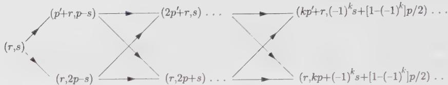

Figure 8.1. The infinite structure of submodules of the Verma module $V_{r,s}(p,p')$ . Each module $V_{a,b}$ is represented by a pair of Kac indices $(a,b)$ . Each arrow represents an inclusion: $A \to B$ means $B \subset A$ , and arrows are transitive. Each module contains two maximal submodules.

## 8.1.2. Characters

A simple way of summarizing these repeated subtractions is to write the character of the irreducible representation $M_{r,s}$ . Each Verma module with highest weight h and central charge c contributes according to the Virasoro character (7.16):

$$
\chi_ {(c, h)} (q) = \frac {q ^ {h - c / 2 4}}{\varphi (q)}\tag{8.14}
$$

Taking into account all the subtractions of states implied in Eq. (8.13), we find the irreducible character

$$
\chi_ {(r, s)} (q) = \frac {q ^ {- c / 2 4}}{\varphi (q)} \left[ q ^ {h _ {r, s}} + \sum_ {k = 1} ^ {\infty} (- 1) ^ {k} \left\{q ^ {h _ {r + k p ^ {\prime}, (- 1) ^ {k} s + [ 1 - (- 1) ^ {k} ] p / 2}} + q ^ {h _ {r, k p + (- 1) ^ {k} s + [ 1 - (- 1) ^ {k} ] p / 2}} \right\} \right]\tag{8.15}
$$

where the three terms in the bracket correspond respectively to the Verma module $V_{r,s}$ of the left of the ladder of Fig. 8.1, and the contribution of the modules of the top (resp. bottom) of the ladder weighted by a sign $(-1)^{k}$ enforcing the successive additions-subtractions along the ladder. The irreducible character (8.15) can be reexpressed in terms of the functions

$$
K _ {r, s} ^ {(p, p ^ {\prime})} (q) = \frac {q ^ {- 1 / 2 4}}{\varphi (q)} \sum_ {n \in \mathbb {Z}} q ^ {(2 p p ^ {\prime} n + p r - p ^ {\prime} s) ^ {2} / 4 p p ^ {\prime}}\tag{8.16}
$$

as

$$
\chi_ {(r, s)} (q) = K _ {r, s} ^ {(p, p ^ {\prime})} (q) - K _ {r, - s} ^ {(p, p ^ {\prime})} (q)\tag{8.17}
$$

The small q expansions of the characters for the minimal models discussed in Sect. 7.4 are displayed in Table 8.1, up to order 6. The Kac indices $(r,s)$ for the representations have been chosen in such a way that the product rs is minimal. Indeed, comparing these expansions with that of $1/\varphi(q)$

$$
\frac {1}{\prod_ {n \geq 1} (1 - q ^ {n})} = 1 + q + 2 q ^ {2} + 3 q ^ {3} + 5 q ^ {4} + 7 q ^ {5} + 1 1 q ^ {6} + \dots\tag{8.18}
$$

Table 8.1. Expansion of a few minimal characters up to order 6.

<table><tr><td> $(p,p')$ </td><td> $h_{r,s}$ </td><td> $q^{-h_{rs}+c/24}\chi_{r,s}(q)$ </td></tr><tr><td>(5,2)</td><td> $h_{1,1}=0$ </td><td> $1+q^{2}+q^{3}+q^{4}+q^{5}+2q^{6}+\cdots$ </td></tr><tr><td>Yang-Lee</td><td> $h_{1,2}=-2/5$ </td><td> $1+q+q^{2}+q^{3}+2q^{4}+2q^{5}+3q^{6}+\cdots$ </td></tr><tr><td>(4,3)</td><td> $h_{1,1}=0$ </td><td> $1+q^{2}+q^{3}+2q^{4}+2q^{5}+3q^{6}\cdots$ </td></tr><tr><td rowspan="2">Ising</td><td> $h_{2,1}=1/16$ </td><td> $1+q+q^{2}+q^{3}+2q^{4}+2q^{5}+3q^{6}+\cdots$ </td></tr><tr><td> $h_{1,2}=1/2$ </td><td> $1+q+q^{2}+2q^{3}+2q^{4}+3q^{5}+4q^{6}+\cdots$ </td></tr><tr><td>(5,4)</td><td> $h_{1,1}=0$ </td><td> $1+q^{2}+q^{3}+2q^{4}+2q^{5}+4q^{6}+\cdots$ </td></tr><tr><td>Tricrit.</td><td> $h_{2,1}=7/16$ </td><td> $1+q+q^{2}+2q^{3}+3q^{4}+4q^{5}+6q^{6}+\cdots$ </td></tr><tr><td rowspan="4">Ising</td><td> $h_{1,2}=1/10$ </td><td> $1+q+q^{2}+2q^{3}+3q^{4}+4q^{5}+6q^{6}+\cdots$ </td></tr><tr><td> $h_{1,3}=3/5$ </td><td> $1+q+2q^{2}+2q^{3}+4q^{4}+5q^{5}+7q^{6}+\cdots$ </td></tr><tr><td> $h_{2,2}=3/80$ </td><td> $1+q+2q^{2}+3q^{3}+4q^{4}+6q^{5}+8q^{6}+\cdots$ </td></tr><tr><td> $h_{3,1}=3/2$ </td><td> $1+q+q^{2}+2q^{3}+3q^{4}+4q^{5}+6q^{6}+\cdots$ </td></tr><tr><td>(6,5)</td><td> $h_{1,1}=0$ </td><td> $1+q^{2}+q^{3}+2q^{4}+2q^{5}+4q^{6}+\cdots$ </td></tr><tr><td>3-state</td><td> $h_{2,1}=2/5$ </td><td> $1+q+q^{2}+2q^{3}+3q^{4}+4q^{5}+6q^{6}+\cdots$ </td></tr><tr><td rowspan="4">Potts</td><td> $h_{3,1}=7/5$ </td><td> $1+q+2q^{2}+2q^{3}+4q^{4}+5q^{5}+8q^{6}+\cdots$ </td></tr><tr><td> $h_{1,3}=2/3$ </td><td> $1+q+2q^{2}+2q^{3}+4q^{4}+5q^{5}+8q^{6}+\cdots$ </td></tr><tr><td> $h_{4,1}=3$ </td><td> $1+q+2q^{2}+3q^{3}+4q^{4}+5q^{5}+8q^{6}+\cdots$ </td></tr><tr><td> $h_{2,3}=1/15$ </td><td> $1+q+2q^{2}+3q^{3}+5q^{4}+7q^{5}+10q^{6}+\cdots$ </td></tr></table>

it is easy to verify that the first singular vector in each representation occurs at level rs, whereas the second one occurs at level $(p - r)(p' - s)$ .

## §8.2. Explicit Form of Singular Vectors

In this section, we give an explicit construction of the singular vector at level $r$ in the Verma module $V_{r,1}$ , with $h$ and $c$ as in Eq. (8.2). The result appears in Eq. (8.26) below, in the form of the determinant $\Delta_{r,1}$ of a matrix operator expressed in a representation of $su(2)$ of spin $(r - 1)/2$ . More precisely, the singular vector $|h_{r,1} + r\rangle$ is obtained by acting on the highest-weight state $|h_{r,1}\rangle$ with this operator $\Delta_{r,1}$ . Such a representation is easily obtained in the classical limit $c\to -\infty$ of the Virasoro algebra, $^{2}$ where the limits of $(r,1)$ singular vectors are associated with covariant differential operators. In this limit, the highest-weight property translates into the fact that the state behaves as a true differential form, with weight

$$
\lim _ {c \rightarrow - \infty} h _ {r, 1} = \frac {1 - r}{2}
$$

The limit of the singular vector expression simply means that a differential form of weight $(1 + r)/2$ (the classical limit of $|h_{r,1} + r\rangle$ ) is obtained by acting on a differential form of weight $(1 - r)/2$ (the classical limit of $|h_{r,1}\rangle$ ) with a covariant differential operator of degree r (the classical limit of $\Delta_{r,1}$ ). The expression of covariant differential operators in the form of a determinant, using $su(2)$ representation matrices, is natural in this classical context, since a covariant differential operator of order r is naturally expressed as the determinant of an $r \times r$ matrix differential operator of first order (see Ex. 8.8 for details).

The idea here is to write the “quantum” singular vector as the result of the action of the formal determinant of a matrix operator, with entries linear in the $L_{n}$ 's, on the highest-weight state of V. This matrix itself lives in a spin $(r - 1)/2$ representation of the Lie algebra $su(2)$ . The latter is the r-dimensional irreducible matrix representation of $su(2)$ :

$$
\begin{array}{l} [ J _ {0} ] _ {i, j} = \frac {1}{2} (r - 2 i + 1) \delta_ {i, j} \\ [ J _ {-} ] _ {i, j} = \left\{ \begin{array}{l l} \delta_ {i, j + 1} & (j = 1, 2,.., r - 1) \\ 0 & (j = r) \end{array} \right. \\ [ J _ {+} ] _ {i, j} = \left\{ \begin{array}{l l} i (r - i) \delta_ {i + 1, j} & (i = 1, 2, \dots , r - 1) \\ 0 & (i = r) \end{array} \right. \end{array}\tag{8.19}
$$

which satisfy

$$
\begin{array}{l} [ J _ {+}, J _ {-} ] = 2 J _ {0} \\ [ J _ {0}, J _ {\pm} ] = \pm J _ {\pm}. \end{array}\tag{8.20}
$$

For instance, for $r = 4$ , these matrices read

$$
J _ {0} = \left( \begin{array}{c c c c} \frac {3}{2} & 0 & 0 & 0 \\ 0 & \frac {1}{2} & 0 & 0 \\ 0 & 0 & - \frac {1}{2} & 0 \\ 0 & 0 & 0 & - \frac {3}{2} \end{array} \right)
$$

$$
J _ {-} = \left( \begin{array}{c c c c} 0 & 0 & 0 & 0 \\ 1 & 0 & 0 & 0 \\ 0 & 1 & 0 & 0 \\ 0 & 0 & 1 & 0 \end{array} \right)\tag{8.21}
$$

$$
J _ {+} = \left( \begin{array}{c c c c} 0 & 3 & 0 & 0 \\ 0 & 0 & 4 & 0 \\ 0 & 0 & 0 & 3 \\ 0 & 0 & 0 & 0 \end{array} \right)
$$

This representation differs from the one generally used in quantum mechanics in that the ladder operators $J_{\pm}$ are not Hermitian conjugates of each other. Since $J_{+}$ is strictly upper triangular and $J_{-}$ strictly lower triangular, we have $(J_{+})^{r} = (J_{-})^{r} = 0$ . We consider the $r \times r$ matrix operator:

$$
D _ {r, 1} (t) = - J _ {-} + \sum_ {m = 0} ^ {\infty} (- t J _ {+}) ^ {m} L _ {- m - 1}.\tag{8.22}
$$

whose entries are polynomials in the negative Virasoro modes $L_{-1}, L_{-2}, \ldots$ . Only a finite number of terms contributes to the sum, since $J_{+}^{r} = 0$ . The operator $D_{r,1}$ acts on r-vectors of states of the form $(f_{1}, f_{2}, \ldots, f_{r})^{T}$ . The formal determinant of this operator, $\Delta_{r,1}(t)$ , is defined as follows. The triangular system of linear equations

$$
D _ {r, 1} (t) \left( \begin{array}{c} f _ {1} \\ f _ {2} \\ \vdots \\ f _ {r} \end{array} \right) = \left( \begin{array}{c} f _ {0} \\ 0 \\ \vdots \\ 0 \end{array} \right)\tag{8.23}
$$

can be inverted, and $f_0, f_1, \ldots, f_{r-1}$ become explicit functions of $f_r$ . For instance, we have

$$
\begin{array}{l} f _ {r - 1} = L _ {- 1} f _ {r} \\ f _ {r - 2} = \left[ L _ {- 1} ^ {2} - (r - 1) t L _ {- 2} \right] f _ {r} \\ f _ {r - 3} = \left[ L _ {- 1} ^ {3} - t (r - 1) L _ {- 1} L _ {- 2} - 2 t (r - 2) L _ {- 2} L _ {- 1} \right. \\ \qquad \qquad \qquad \qquad \qquad \qquad \qquad \qquad + 2 t ^ {2} (r - 1) (r - 2) L _ {- 3} ] f _ {r} \end{array}\tag{8.24}
$$

and so on. The formal determinant operator applies $f_{r}$ to $f_{0}$

$$
f _ {0} = \Delta_ {r, 1} (t) f _ {r},\tag{8.25}
$$

and by a slight abuse of notation we denote it by

$$
\Delta_ {r, 1} (t) = \det \left[ - J _ {-} + \sum_ {m = 0} ^ {\infty} (- t J _ {+}) ^ {m} L _ {- m - 1} \right]\tag{8.26}
$$

With this definition, we find

$$
\begin{array}{l} \Delta_ {1, 1} (t) = L _ {- 1} \\ \Delta_ {2, 1} (t) = L _ {- 1} ^ {2} - t L _ {- 2} \\ \Delta_ {3, 1} (t) = L _ {- 1} ^ {3} - 2 t (L _ {- 1} L _ {- 2} + L _ {- 2} L _ {- 1}) + 4 t ^ {2} L _ {- 3}. \end{array}\tag{8.27}
$$

The state

$$
\boxed {| \chi_ {r} \rangle = \Delta_ {r, 1} (t) | h _ {r, 1} (t) \rangle}\tag{8.28}
$$

will now be proved to be a singular vector of the Verma module $V_{r,1}$ at level r. To verify this, we need to prove that $|\chi_{r}\rangle$ satisfies the highest-weight condition

$$
L _ {n} | \chi_ {r} \rangle = \delta_ {n, 0} (h _ {r, 1} + r) | \chi_ {r} \rangle \quad n \geq 0\tag{8.29}
$$

As mentioned earlier, it is actually sufficient to prove it for n = 0, 1, 2, since the condition $L_{n}|\chi_{r}\rangle = 0$ (n > 2) can be obtained from $L_{1}|\chi_{r}\rangle = L_{2}|\chi_{r}\rangle = 0$ by commutation of $L_{1}$ and $L_{2}$ . In other words, for n > 2,

$$
L _ {n} = - \frac {1}{n - 2} [ L _ {1}, L _ {n - 1} ] = \frac {(- 1) ^ {n - 2}}{(n - 2) !} \mathrm{ad} (L _ {1}) ^ {n - 2} L _ {2},\tag{8.30}
$$

where the adjoint action of an operator x is defined as

$$
\operatorname{ad} (x) y = [ x, y ]\tag{8.31}
$$

We thus proceed in three steps:

(i) $L_0|\chi_r\rangle = (h_{r,1} + r)|\chi_r\rangle$ . Using the definition of the formal determinant (8.25), we start from the state $f_r = |h_{r,1}\rangle$ , and build $f_i$ , $i = r - 1, r - 2, \ldots, 0$ , $f_0 = |\chi_r\rangle$ . It is clear by construction that $L_0f_j = (h_{r,1} + r - j)f_j$ , hence the property follows for $f_0 = |\chi_r\rangle$ .

(ii) $L_{1}|\chi_{r}\rangle = 0$ . The operator $L_{1}$ acts on the components $f_{j}$ as

$$
L _ {1} f _ {j} = \frac {j (r - j)}{2} [ (2 j + 3 - r) t - 2 ] f _ {j + 1},\tag{8.32}
$$

for $j = 0, 1, \ldots, r - 1$ . Upon extending the linear space by one dimension, and introducing an extra component $f_{r+1}$ , this holds also for j = r. This enables us to set $f_{r+1} \equiv 0$ , in which case we simply get the highest-weight condition $L_{1}f_{r} = L_{1}|h_{r,1}(t)\rangle = 0$ . Eq. (8.32) is easily proven by recursion on j. We get the desired result for j = 0.

(iii) $L_{2}|\chi_{r}\rangle = 0$ . As in the previous case, the operator $L_{2}$ acts recursively on the components $f_{j}$ :

$$
L _ {2} f _ {j} = \frac {t}{4} j (r - j) (j + 1) (r - j - 1) [ (4 j + 6 - r) t - 7 ] f _ {j + 2},\tag{8.33}
$$

for $j = 0, 1, 2, \ldots, r - 1$ . We extend this to j = r by introducing an extra coordinate $f_{r+2}$ , but we can set $f_{r+2} \equiv 0$ , which translates into the second highest-weight condition $L_{2}f_{r} = L_{2}|h_{r,1}(t)\rangle = 0$ . We finally get the desired result for j = 0.

This completes the proof of Eq. (8.28).

A few comments are in order:

(a) An analogous result holds for the Verma module $V_{1,s}$ , if we change simultaneously $r \leftrightarrow s$ and $t \leftrightarrow 1/t$ , under which $c(t)$ remains unchanged.

(b) If we perform explicitly the elimination between the components $f_{i}$ , we get a closed expression for the singular vector:

$$
|\chi_{r}\rangle = \sum_{\substack{p_{i}\geq 1\\ p_{1} + \dots +p_{k} = r}}\frac{[(r - 1)!]^{2}(-t)^{r - k}}{\prod_{i = 1}^{k - 1}(p_{1} + \cdots + p_{i})(r - p_{1} - \cdots - p_{i})} L_{-p_{1}}\dots L_{-p_{k}}|h_{r,1}(t)\rangle\tag{8.34}
$$

(c) It is easy to derive the action of $L_{n}$ for $n > 2$ on the vector $\mathbf{f} = (f_1, \ldots, f_r)^T$ using Eqs. (8.30), (8.32), and (8.33). We find

$$
L _ {n} \mathbf {f} = [ (J _ {0} - \frac {3 n + 1}{2}) + \frac {3 n + 1}{4 t} ] (- t J _ {+}) ^ {n} \mathbf {f}.\tag{8.35}
$$

The expressions for the singular vectors of $V_{r,1}$ are thus relatively simple. They correspond to states located on the boundary of the Kac table. No simple closed expressions are known for states located inside the Kac table. However, we shall develop in App. 8.A an elementary scheme to write them in all generality.

## §8.3. Differential Equations for the Correlation Functions

Section 8.2 was dedicated to the study and construction of singular vectors of Verma modules, which carry reducible representations of the Virasoro algebra. As already stated above, the primary fields of a minimal conformal theory are attached to highest-weight vectors of such representations of the Virasoro algebra. But we actually require that the corresponding representation of the Virasoro algebra be irreducible. All singular vectors must therefore be set to zero. This results in a highly nontrivial set of constraints. Their consequence on the OPE of conformal fields is described in App. 8.A, Sect. 8.A.1. The subject of this section is to analyze their effect on the correlators of the primary fields, a point briefly addressed in Sect. 7.3.

Before plunging into this analysis, we emphasize a subtlety concerning the field-state equivalence in a conformal theory. Recall that the primary fields $\phi(z,\bar{z})$ are in one-to-one correspondence with products of representations of the holomorphic and antiholomorphic (or left and right) Virasoro algebras. In a minimal theory, the primary fields will therefore correspond to a pair of Verma modules pertaining respectively to the left and right Virasoro algebras. Minimality requires, as explained before, that both modules have central charge and highest weights of the form (7.65), with r,s in the Kac table: $1 \leq r \leq p'$ , $1 \leq s \leq p$ . Moreover, in order to make both representations irreducible, we have to set the singular vectors of both modules to zero and we finally get a decomposition of the Hilbert space of the theory, as in Eq. (7.72). The two sets of constraints obtained this way are factorized, in the sense that they act only on the left (resp. right) part of the primary fields. Actually, as we shall see below, one can solve independently the left and right constraints for any correlator $\langle\phi_{0}(z_{0},\bar{z}_{0})\phi_{1}(z_{1},\bar{z}_{1})\cdots\rangle$ , in the form of several possible left and right conformal blocks $\mathcal{F}(z_{0},z_{1},\cdots)$ and $\tilde{\mathcal{F}}(\bar{z}_{0},\bar{z}_{1},\cdots)$ , so that the full correlator is a sum of products of left×right blocks of this form. The particular association of left×right blocks involves further complications, which will be studied in great detail in Chap. 9. In the following, we mainly concentrate on the consequences of, say, the left singular vector vanishing conditions on the left conformal blocks.

## 8.3.1. From Singular Vectors to Differential Equations

The basic ingredients in the computation of correlation functions in a field theory are the Ward identities. They summarize the behavior of any correlator under infinitesimal reparametrizations (cf. Sect. 5.2). The Ward identity (5.41) was used in Sect. 6.6.1 to express the correlator of a descendant field in terms of the correlator of the primary, acted on by a string of differential operators. These are Eqs. (6.152) and (6.156), which we repeat here:

$$
\langle \phi_ {0} ^ {(- r _ {1}, \dots , - r _ {k})} (z _ {0}) \phi_ {1} (z _ {1}) \dots \rangle = \mathcal {L} _ {- r _ {1}} (z _ {0}) \dots \mathcal {L} _ {- r _ {k}} (z _ {0}) \langle \phi_ {0} (z _ {0}) \phi_ {1} (z _ {1}) \dots \rangle\tag{8.36}
$$

$$
\mathcal {L} _ {- r} (z) = \sum_ {i \geq 1} \left\{\frac {(r - 1) h _ {i}}{(z _ {i} - z) ^ {r}} - \frac {1}{(z _ {i} - z) ^ {r - 1}} \partial_ {z _ {i}} \right\}\tag{8.37}
$$

We drop the explicit dependence of the fields on the antiholomorphic variable $\bar{z}$ , as the equations involve only the holomorphic dependence.

We suppose that the left Virasoro representation of $\phi_{0}$ is a reducible Verma module $V(c, h_{0})$ , with a singular vector at level $n_{0}$ given by

$$
| c, h _ {0} + n _ {0} \rangle = \sum_ {Y, | Y | = n _ {0}} \alpha_ {Y} L _ {- Y} | c, h _ {0} \rangle
$$

where Y stands for $^{3}$

$$
\begin{array}{l} Y = \{r _ {1}, \ldots , r _ {k} \} \quad \text { with } \quad 1 \leq r _ {1} \leq r _ {2} \leq \dots \leq r _ {k} \\ | Y | = r _ {1} + \dots + r _ {k} \\ L _ {- Y} \equiv L _ {- r _ {1}} L _ {- r _ {2}} \dots L _ {- r _ {k}} \end{array}\tag{8.38}
$$

Setting to zero this singular vector, we get $\sum\alpha_{Y}L_{-Y}\phi_{0}=0$ , which, inserted into a correlator, leads to

$$
\sum_ {Y} \alpha_ {Y} \mathcal {L} _ {- Y} (z _ {0}) \langle \phi_ {0} (z _ {0}) \phi_ {1} (z _ {1}) \dots \rangle = 0\tag{8.39}
$$

We used the Ward identity (8.36) to rewrite the singular vector vanishing condition as a differential equation, with $L_{-Y} \equiv L_{-r_{1}} \cdots L_{-r_{k}}$ . Let $\Delta_{0} = \sum_{Y} \alpha_{Y} L_{-Y}$ denote the operator that creates the singular vector in $V(c, h_{0})$ . The differential equation (8.39) is obtained by acting on the correlator $\langle \phi_{0}(z_{0}) \phi_{1}(z_{1}) \cdots \rangle$ with the differential operator $^{4}$

$$
\gamma_ {0} (z _ {i}, \partial_ {z _ {i}}) = \Delta_ {0} \big (L _ {- r} \to \mathcal {L} _ {- r} (z _ {0}) \big)\tag{8.40}
$$

The differential equation (8.39) can be further simplified by using the global conformal invariance of the correlator (see Sect. 5.2.2). The $SL(2,\mathbb{C})$ invariance of the correlator can be recast into the three differential equations (5.51), which we reproduce here:

$$
\begin{array}{c} \sum_ {i = 0, 1,..} \partial_ {z _ {i}} \langle \phi_ {0} (z _ {0}) \phi_ {1} (z _ {1}) \dots \rangle = 0 \\ \sum_ {i = 0, 1,..} \big (z _ {i} \partial_ {z _ {i}} + h _ {i} \big) \langle \phi_ {0} (z _ {0}) \phi_ {1} (z _ {1}) \dots \rangle = 0 \\ \sum_ {i = 0, 1,..} \big (z _ {i} ^ {2} \partial_ {z _ {i}} + 2 z _ {i} h _ {i} \big) \langle \phi_ {0} (z _ {0}) \phi_ {1} (z _ {1}) \dots \rangle = 0 \end{array}\tag{8.41}
$$

They are easily solved as

$$
\langle \phi_ {0} (z _ {0}) \phi_ {1} (z _ {1}) \dots \rangle = \left\{\prod_ {i <   j} (z _ {i} - z _ {j}) ^ {\mu_ {i j}} \right\} G (\{z _ {i j} ^ {k l} \})\tag{8.42}
$$

where $\mu_{ij}$ is any solution of

$$
\sum_ {j \neq i} \mu_ {i j} = 2 h _ {i}\tag{8.43}
$$

and G is an arbitrary function of the anharmonic ratios

$$
z _ {i j} ^ {k l} = \frac {(z _ {i} - z _ {j}) (z _ {k} - z _ {l})}{(z _ {i} - z _ {l}) (z _ {k} - z _ {j})}\tag{8.44}
$$

Another way of writing the solution (8.42) is to fix the $SL(2,\mathbb{C})$ gauge, by sending three points of the correlator to fixed values, for instance $z_{1}\to 0,z_{2}\to 1,z_{3}\to \infty$ .

We now illustrate Eq. (8.39) in a few cases. For $V(c, h_0) = V_{2,1}$ , degenerate at level 2, we have

$$
\Delta_ {0} \equiv \Delta_ {2, 1} (t) = L _ {- 1} ^ {2} - t L _ {- 2}\tag{8.45}
$$

Hence

$$
\left\{\partial_ {z} ^ {2} - t \sum_ {i = 1, 2, \dots} \left[ \frac {h _ {i}}{(z _ {i} - z) ^ {2}} - \frac {1}{z _ {i} - z} \partial_ {z _ {i}} \right] \right\} \langle \phi_ {(2, 1)} (z) \phi_ {1} (z _ {1}) \phi_ {2} (z _ {2}) \dots \rangle = 0\tag{8.46}
$$

This is a second-order partial differential equation, obtained previously in Eq. (7.47). It admits two linearly independent solutions. Singular vector vanishing conditions for the other fields should be implemented as well, further constraining the correlator.

For $V(c, h_{0}) = V_{r,1}$ (the label 0 is then replaced by the label $(r, 1)$ in $\gamma$ and $\Delta$ ), which is degenerate at level r, we have the explicit differential operator (see Sect. 8.2)

$$
\begin{array}{l} \gamma_ {r, 1} (z _ {i}, \partial_ {z _ {i}}) = \\ \det \left[ - J _ {-} + \partial_ {z _ {0}} + \sum_ {m \geq 1} (- t J _ {+}) ^ {m} \sum_ {i \geq 1} \left(\frac {m h _ {i}}{(z _ {i} - z _ {0}) ^ {m + 1}} - \frac {\mathbb {I}}{(z _ {i} - z _ {0}) ^ {m}} \partial_ {z _ {i}}\right) \right] \\ \equiv \det [ D _ {r, 1} (z _ {i}, \partial_ {z _ {i}}) ] \end{array}\tag{8.47}
$$

expressed as a formal determinant in the manner of Eq. (8.26). It leads to the partial differential equation of order $r$

$$
\gamma_ {r, 1} (z _ {i}, \partial_ {z _ {i}}) \langle \phi_ {(r, 1)} (z _ {0}) \phi_ {1} (z _ {1}) \phi_ {2} (z _ {2}) \dots \rangle = 0\tag{8.48}
$$

Using the definition of the formal determinant (8.25)-(8.26), we can translate Eq. (8.48) into a matrix differential system

$$
D _ {r, 1} (z _ {i}, \partial_ {z _ {i}}) \mathbf {f} = 0\tag{8.49}
$$

for the r-vector $\mathbf{f} = (f_{1}, f_{2}, \ldots, f_{r})^{t}$ , whose last component is the desired correlator

$$
f _ {r} = \left\langle \phi_ {0} \left(z _ {0}\right) \phi_ {1} \left(z _ {1}\right) \dots \right\rangle
$$

Each component $f_{p}$ is a correlator involving a level r-p descendant of $\phi_{0}$ , expressed as the action of a differential operator of order r-p on the correlator $f_{r}$ .

The differential equation (8.39) is somewhat involved in general. However, in the cases of two-, three- and four-point functions, it can be transformed, using global conformal invariance, into an ordinary differential equation in the variable $z \equiv z_{0}$ .

## 8.3.2. Differential Equations for Two-Point Functions in Minimal Models

As already noted before (cf. Sect. 4.3.1), the global conformal invariance (8.41) almost fixes the two- and three-point correlators. Actually they are fixed up to some multiplicative constant, which might be zero. The aim of the present section is to exploit the differential equation satisfied by a two-point function of primary fields to get a useful sum rule (Eq. (8.55)) on the coefficients of the corresponding singular vector.

The basic requirement for two-point functions is orthonormality: $^{5}$

$$
\langle \phi_ {h _ {0}} (z) \phi_ {h _ {1}} (0) \rangle = \delta_ {h _ {0}, h _ {1}} z ^ {- 2 h _ {0}}\tag{8.50}
$$

It is instructive to check that this expression is compatible with the differential equation (8.39):

$$
\Delta_ {0} \left(L _ {- r} \rightarrow \frac {(r - 1) h _ {0}}{(w - z) ^ {r}} - \frac {1}{(w - z) ^ {r - 1}} \partial_ {w}\right) \langle \phi_ {0} (z) \phi_ {0} (w) \rangle = 0\tag{8.51}
$$

By translational invariance (the first of the three conditions (8.41)), the two-point function is a function of $x = z - w$ , subject to

$$
\Delta_ {0} \left(L _ {- r} \rightarrow \frac {(- 1) ^ {r}}{x ^ {r}} [ (r - 1) h _ {0} - x \partial_ {x} ]\right) \langle \phi_ {0} (x) \phi_ {0} (0) \rangle = 0\tag{8.52}
$$

For any nondecreasing sequence of integers $Y$ , the action of $\mathcal{L}_{-Y}(x)$ on the correlator

$$
\langle \phi_ {0} (x) \phi_ {0} (0) \rangle = x ^ {- 2 h _ {0}} \bar {x} ^ {- 2 \bar {h} _ {0}}\tag{8.53}
$$

reads

$$
\begin{array}{l} \frac {(- 1) ^ {| Y |}}{x ^ {| Y |}} \prod_ {i = 1} ^ {k} [ (r _ {i} - 1) h _ {0} - x \partial_ {x} ] \langle \phi_ {0} (x) \phi_ {0} (0) \rangle \\ = \frac {(- 1) ^ {| Y |}}{x ^ {| Y |}} \prod_ {i = 1} ^ {k} [ (r _ {i} + 1) h _ {0} + r _ {i + 1} +.. + r _ {k} ] \langle \phi_ {0} (x) \phi_ {0} (0) \rangle \end{array}\tag{8.54}
$$

Eq. (8.51) is satisfied if and only if the following sum rule for the coefficients of $\Delta_0 = \sum_{Y} \alpha_Y L_{-Y}$ holds

$$
\sum_{\substack{1\leq r_{1}\leq \ldots \leq r_{k}\\ \Sigma r_{i} = n_{0}}}\alpha_{r_{1},r_{2},\ldots ,r_{k}}\prod_{i = 1}^{k}[(r_{i} + 1)h_{0} + r_{i + 1} + \ldots +r_{k}] = 0\tag{8.55}
$$

This is indeed the consequence of the following necessary condition for the singular vector

$$
L _ {1} ^ {n _ {0}} \sum_ {Y, | Y | = n _ {0}} \alpha_ {Y} L _ {- Y} | c, h _ {0} \rangle = 0\tag{8.56}
$$

It is clear that for any sequence $r_1, \ldots, r_k$ (not necessarily ordered) of nonnegative integers with $r_1 + \ldots + r_k = n_0$ , we have

$$
L _ {1} ^ {n _ {0}} L _ {- r _ {1}} L _ {- r _ {2}} \dots L _ {- r _ {k}} | c, h _ {0} \rangle = P (r _ {1}, \dots , r _ {k}; h _ {0}) | c, h _ {0} \rangle\tag{8.57}
$$

where P is some polynomial of $h_{0}$ and the r's. This is due to the highest-weight condition on $|c,h_{0}\rangle$ , ensuring that the result, at level 0, is proportional to $|c,h_{0}\rangle$ . Writing $L_{1}^{n_{0}} = L_{1}^{n_{0}-1}L_{1}$ , we find a recursion relation for the polynomials P

$$
P (r _ {1}, \dots , r _ {k}; h _ {0}) = \sum_ {i = 1} ^ {k} (r _ {i} + 1) P (r _ {1},.., r _ {i - 1}, r _ {i} - 1, r _ {i + 1},.., r _ {k}; h _ {0})\tag{8.58}
$$

By the definition (8.57), P satisfies

$$
\begin{array}{c} P (r _ {1},.., r _ {i - 1}, 0, r _ {i + 1},.., r _ {k}; h _ {0}) = \\ [ h _ {0} + r _ {i + 1} +.. + r _ {k} ] P (r _ {1},.., r _ {i - 1}, r _ {i + 1},.., r _ {k}; h _ {0}) \end{array}\tag{8.59}
$$

when $r_{i}$ vanishes. Together with the obvious result for $k = 1$ , $n_{0} = r_{1} \equiv r$

$$
P (r; h _ {0}) = (r + 1)! h _ {0}\tag{8.60}
$$

this determines the P's completely:

$$
P (r _ {1}, \dots , r _ {k}; h _ {0}) = (n _ {0}!) \prod_ {i = 1} ^ {k} [ (r _ {i} + 1) h _ {0} + r _ {i + 1} + \dots + r _ {k} ]\tag{8.61}
$$

With this value of P, the necessary condition (8.56) yields the sum rule (8.55), up to the constant multiplicative factor $(n_{0}!)$ . Note that the fulfillment of the condition (8.39) leads to more sum rules on the coefficients $\alpha_{Y}$ (see also Ex. 8.22 for a very similar sum rule for OPE coefficients).

Once the normalization of two-point functions is fixed, all the correlators in the theory have fixed normalizations. In particular, the three-point functions are fixed, by SL(2,C) invariance, to be of the form (7.49) ( $\times$ its antiholomorphic counterpart). Global conformal invariance does not fix the structure constants $g(h_{0}, h_{1}, h_{2})$ . We have seen in Sect. 7.3 how the differential equations impose constraints on these structure constants. The precise study of these constants, following the lines of App. 8.A, although straightforward in principle, turns out to be tedious. A simpler route consists first in the derivation of the four-point correlators, and then reading off the structure constants at coinciding points.

## 8.3.3. Differential Equations for Four-Point Functions in Minimal Models

In this section we find the differential equation for the four-point functions of minimal models involving $\phi_{(2,1)}$ . It takes the form of the hypergeometric equation (8.71).

The four-point functions have a more complicated structure than the two- and three-point correlators, since global conformal invariance leaves some function of the cross ratio of the points undetermined. More precisely, global conformal invariance forces the correlator to take the form (8.42)

$$
\langle \phi_ {0} (z _ {0}) \phi_ {1} (z _ {1}) \phi_ {2} (z _ {2}) \phi_ {3} (z _ {3}) \rangle = \prod_ {0 \leq i <   j \leq 3} (z _ {i} - z _ {j}) ^ {\mu_ {i j}} G (z)\tag{8.62}
$$

with

$$
\mu_ {i j} = \frac {1}{3} \left(\sum_ {k = 1} ^ {4} h _ {k}\right) - h _ {i} - h _ {j},\tag{8.63}
$$

We still have to determine the function $G$ of the cross-ratio

$$
z = \frac {(z _ {0} - z _ {1}) (z _ {2} - z _ {3})}{(z _ {0} - z _ {3}) (z _ {2} - z _ {1})}\tag{8.64}
$$

With the change of function (8.62), the differential equation (8.39) translates into an ordinary differential equation of order $n_0$ for $G(z)$ .

We illustrate this mechanism in the case $V(c, h_{0}) = V_{2,1}$ , degenerate at level 2. We substitute Eq. (8.62) into Eq. (8.46), and use the action of the derivatives $\partial_{z_{i}}$ on Eq. (8.62):

$$
\begin{array}{l} \partial_ {z _ {0}} = \frac {\mu_ {0 1}}{z _ {0} - z _ {1}} + \frac {\mu_ {0 2}}{z _ {0} - z _ {2}} + \frac {\mu_ {0 3}}{z _ {0} - z _ {3}} + \partial_ {z _ {0}} (z) \partial_ {z} \\ \partial_ {z _ {1}} = - \frac {\mu_ {0 1}}{z _ {0} - z _ {1}} + \frac {\mu_ {1 2}}{z _ {1} - z _ {2}} + \frac {\mu_ {1 3}}{z _ {1} - z _ {3}} + \partial_ {z _ {1}} (z) \partial_ {z} \\ \partial_ {z _ {2}} = - \frac {\mu_ {0 2}}{z _ {0} - z _ {2}} - \frac {\mu_ {1 2}}{z _ {1} - z _ {2}} + \frac {\mu_ {2 3}}{z _ {2} - z _ {3}} + \partial_ {z _ {2}} (z) \partial_ {z} \end{array}\tag{8.65}
$$

$$
\partial_ {z _ {3}} = - \frac {\mu_ {0 3}}{z _ {0} - z _ {3}} - \frac {\mu_ {1 3}}{z _ {1} - z _ {3}} - \frac {\mu_ {2 3}}{z _ {2} - z _ {3}} + \partial_ {z _ {3}} (z) \partial_ {z}
$$

with

$$
\begin{array}{l l} \partial_ {z _ {0}} (z) = & \frac {(z _ {3} - z _ {1}) (z _ {2} - z _ {3})}{(z _ {2} - z _ {1}) (z _ {0} - z _ {3}) ^ {2}} \\ \partial_ {z _ {1}} (z) = & \frac {(z _ {0} - z _ {2}) (z _ {2} - z _ {3})}{(z _ {0} - z _ {3}) (z _ {2} - z _ {1}) ^ {2}} \\ \partial_ {z _ {2}} (z) = & - \frac {(z _ {1} - z _ {3}) (z _ {0} - z _ {1})}{(z _ {0} - z _ {3}) (z _ {2} - z _ {1}) ^ {2}} \\ \partial_ {z _ {3}} (z) = & \frac {(z _ {2} - z _ {0}) (z _ {0} - z _ {1})}{(z _ {2} - z _ {1}) (z _ {0} - z _ {3}) ^ {2}} \end{array}\tag{8.66}
$$

We also need to rewrite the action of $\partial_{z_0}^2$ in terms of $z$

$$
\begin{array}{l} \partial_ {z _ {0}} ^ {2} = \frac {\mu_ {0 1} (\mu_ {0 1} - 1)}{(z _ {0} - z _ {1}) ^ {2}} + \frac {\mu_ {0 2} (\mu_ {0 2} - 1)}{(z _ {0} - z _ {2}) ^ {2}} + \frac {\mu_ {0 3} (\mu_ {0 3} - 1)}{(z _ {0} - z _ {3}) ^ {2}} \\ \qquad + 2 \left[ \frac {\mu_ {0 1}}{z _ {0} - z _ {1}} + \frac {\mu_ {0 2}}{z _ {0} - z _ {2}} + \frac {\mu_ {0 3}}{z _ {0} - z _ {3}} \right] \partial_ {z _ {0}} (z) \partial_ {z} \\ \qquad + \partial_ {z _ {0}} ^ {2} (z) \partial_ {z} + (\partial_ {z _ {0}} (z)) ^ {2} \partial_ {z} ^ {2} \end{array}\tag{8.67}
$$

Upon all these substitutions, the prefactor of $G(z)$ in (8.62) can be factored out of the differential equation. Once this is done, we can take the limits $z_{1} \to 0$ , $z_{2} \to 1$ , and $z_{3} \to \infty$ , hence $z_{0} \to z$ , and we are left with an ordinary differential equation for $G(z)$ . The latter is then obtained from Eq. (8.46) through the substitutions (8.65), (8.66), and (8.67), which, in the above limits, read

$$
\begin{array}{l} \partial_ {z _ {0}} = \frac {\mu_ {0 1}}{z} + \frac {\mu_ {0 2}}{z - 1} + \partial_ {z} \\ \partial_ {z _ {1}} = - \frac {\mu_ {0 1}}{z} - \mu_ {1 2} + (z - 1) \partial_ {z} \\ \partial_ {z _ {2}} = - \frac {\mu_ {0 2}}{z - 1} + \mu_ {1 2} + z \partial_ {z} \\ \partial_ {z _ {3}} = 0 \\ \partial_ {z _ {0}} ^ {2} = \frac {\mu_ {0 1} (\mu_ {0 1} - 1)}{z ^ {2}} + \frac {\mu_ {0 2} (\mu_ {0 2} - 1)}{(z - 1) ^ {2}} \\ + 2 \left[ \frac {\mu_ {0 1}}{z} + \frac {\mu_ {0 2}}{z - 1} \right] \partial_ {z} + \partial_ {z} ^ {2} \end{array}\tag{8.68}
$$

This leads finally to the equation

$$
\left. \begin{array}{l} \left\{\frac {1}{t} \partial_ {z} ^ {2} + \left[ 2 \frac {\mu_ {0 1}}{t z} + 2 \frac {\mu_ {0 2}}{t (z - 1)} + \frac {2 z - 1}{z (z - 1)} \right] \partial_ {z} + \frac {\mu_ {0 1} (\mu_ {0 1} - 1)}{t z ^ {2}} \right. \\ \left. + \frac {\mu_ {0 2} (\mu_ {0 2} - 1)}{t (z - 1) ^ {2}} + \frac {\mu_ {0 1} - h _ {1}}{z ^ {2}} + \frac {\mu_ {0 2} - h _ {2}}{(z - 1) ^ {2}} - \frac {\mu_ {1 2}}{z (z - 1)} \right\} G (z) = 0 \end{array} \right.\tag{8.69}
$$

This equation simplifies a great deal when expressed in terms of the function

$$
H (z) = z ^ {\mu_ {0 1}} (1 - z) ^ {\mu_ {0 2}} G (z)\tag{8.70}
$$

for which we have

$$
\left\{\frac {1}{t} \partial_ {z} ^ {2} + \frac {2 z - 1}{z (z - 1)} \partial_ {z} - \frac {h _ {1}}{z ^ {2}} - \frac {h _ {2}}{(z - 1) ^ {2}} + \frac {h _ {0} + h _ {1} + h _ {2} - h _ {3}}{z (z - 1)} \right\} H (z) = 0\tag{8.71}
$$

This can be transformed into the so-called hypergeometric equation, and thereby solved in terms of hypergeometric functions (Ex. 8.9, 8.10, 8.11, and 8.12 below, give a detailed illustration of this transformation and show how to obtain the solutions of the differential equation (8.71) in a few explicit cases. A more general study of the solutions to Eq. (8.71) will be performed in Sect. 9.2.3.)

More generally, a correlation function involving the operator $\phi_{(r,s)}$ will satisfy a differential equation of order rs, obtained by transforming the singular vector condition at level rs into a differential operator of order rs. In general, there will be rs independent solutions to this differential equation, referred to as the conformal blocks of the correlation function under study. The full correlator is a sesquilinear combination of these blocks (a sum of holomorphic $\times$ antiholomorphic solutions to, respectively, the differential equation and its complex conjugate). Fixing this combination can be done by using the symmetry of the correlation function under the permutation of its fields. This relates different sesquilinear combinations of the same conformal blocks, and completely fixes their relative coefficients. This procedure will be described in Chap. 9.

An important remark is in order: rs may not be the lowest order of the differential equation satisfied by the correlation function (8.42). Indeed, the equivalence $\phi_{(p'-r,p-s)} \equiv \phi_{(r,s)}$ shows that this correlation should also satisfy a differential equation of order $(p' - r)(p - s)$ . One can slightly simplify the problem by simple eliminations between the two differential equations. Set rs = N, and suppose $(p' - r)(p - s) = N + a$ . By differentiating the first equation a times, we can eliminate the highest-order term in the second one by taking a suitable linear combination of the two. This reduces by one the degree of the second equation. Reiterating this process should in principle reduce the degree of the differential equations we started with. Of course, it can happen that at some step the two equations are no longer independent, which means that the lowest possible order has been reached.

Solving the differential equations above should lead to a complete determination of correlators in a minimal theory. However, a more efficient approach to the calculation of conformal correlators is provided by the Coulomb gas formalism described in Chap. 9. The latter is more constructive, in the sense that correlators are directly built from the singular vector conditions. Therefore, the differential equations derived in this section will be automatically satisfied. In the end, this will provide a beautiful and systematic way of solving the equations (8.39) by means of contour integrals of free boson correlators.

## §8.4. Fusion Rules

The primary fields of a minimal theory correspond to highest weights in the Kac table (7.65). The object of this section is to derive the fusion rules between all such states, namely, to find which primaries and descendants are created by the short distance product of two given fields. The differential equations of the previous section provide a systematic way of studying fusion rules. Those of the $(p,p')$ minimal theories turn out to be polynomially generated by the fusions of the two fundamental fields $\phi_{(2,1)}$ and $\phi_{(1,2)}$ , as stated in Sect. 7.3.

## 8.4.1. From Differential Equations to Fusion Rules

The differential equations for correlators can be used to derive the fusion rules of the minimal conformal theories. In this subsection, we use this path to obtain the fusion rules (8.84) for the degenerate field $\phi_{(r,1)}$ .

On the one hand, we have the OPE (8.141):

$$
\begin{array}{l} \phi_ {0} (z) \phi_ {1} (w) = (z - w) ^ {h - h _ {1} - h _ {0}} \sum_ {h} g (h _ {0}, h _ {1}, h) \\ \times \sum_ {Y} (z - w) ^ {| Y |} \beta_ {Y} (h _ {0}, h _ {1}, h) L _ {- Y} \phi (w) \end{array}\tag{8.72}
$$

(we dropped the right, or antiholomorphic contributions for notational simplicity), involving the structure constants $g(h_{0}, h_{1}, h)$ . Determining the fusion rules amounts to finding the values of h present on the r.h.s. of (8.72) in terms of $h_{0}$ and $h_{1}$ .

On the other hand, we have the differential equation (8.39) for the correlator $\langle\phi_{0}(z_{0})\phi_{1}(z_{1})\cdots\rangle$ . Substituting the above OPE in the correlator, we obtain a set of constraints for the coefficients g and $\beta$ , in the form

$$
\begin{array}{l} \sum_ {h} g (h _ {0}, h _ {1}, h) \sum_ {Y} \beta_ {Y} (h _ {0}, h _ {1}, h) \gamma_ {0} (z _ {i}, \partial_ {z _ {i}}) \\ \qquad \times (z _ {0} - z _ {1}) ^ {h - h _ {1} - h _ {0} + | Y |} \langle [ L _ {- Y} \phi ] (z _ {1}) \phi_ {2} (z _ {2}) \dots \rangle = 0 \end{array}\tag{8.73}
$$

The leading term when $z_{0} \rightarrow z_{1}$ corresponds to $|Y| = 0$ , $\beta = 1$ , h maximal, and also to a maximum number of derivatives with respect to $z_{0}$ or $z_{1}$ , and/or powers of $(z_{0} - z_{1})^{-1}$ taken from $\gamma_{0}$ . This leading term yields a nontrivial equation relating h to $h_{0}$ and $h_{1}$ , expressing a fusion rule of the theory.

Take, for instance, the case $V(c, h_{0}) = V_{2.1}$ . In the four-point function (8.62), the leading contribution to Eq. (8.73) is made of three terms: $\partial_{z_{0}}^{2}, (z_{0} - z_{1})^{-2}$ , and $(z_{0} - z_{1})^{-1}\partial_{z_{0}}$ , which give the constraint

$$
\frac {1}{t} (h - h _ {0} - h _ {1}) (h - 1 - h _ {0} - h _ {1}) + (h - h _ {0} - h _ {1}) - h _ {1} = 0\tag{8.74}
$$

This constraint is equivalent to Eq. (7.50), written in a different notation. We recall that

$$
h _ {0} = h _ {2, 1} (t) = \frac {3}{4} t - \frac {1}{2}\tag{8.75}
$$

and $h_{1}$ is a weight of the minimal Kac table (7.65) of the form $h_{1}=h_{r,s}(t)$ , with $t=p/p'$ . The quadratic equation (8.74) for h is easily solved

$$
\begin{array}{r l} \left(h - h _ {0} - h _ {1} - \frac {1 - t}{2}\right) ^ {2} & = \left(\frac {1 - t}{2}\right) ^ {2} + t h _ {1} \\ & = \left(\frac {t r - s}{2}\right) ^ {2} \end{array}\tag{8.76}
$$

and the two solutions have the simple form

$$
h = h _ {r + \epsilon , s} (t) \qquad \epsilon = \pm 1\tag{8.77}
$$

This implies the following allowed fusions:

$$
\phi_ {(2, 1)} \times \phi_ {(r, s)} = \phi_ {(r - 1, s)} + \phi_ {(r + 1, s)}\tag{8.78}
$$

As mentioned in Sect. 7.3.1, the above is by no means an equality between fields, it is rather an abusive way of describing the allowed fusions and should be taken as such. Strictly speaking, we derived the fusion rule only for the larger of the two values of h, as we looked only at the leading term in Eq. (8.73). However, we note that

$$
h _ {r + 1, s} (p, p ^ {\prime}) - h _ {r - 1, s} (p, p ^ {\prime}) = r \frac {p}{p ^ {\prime}} - s\tag{8.79}
$$

which, for $(r,s)$ in the Kac table, never takes an integer value. Therefore, the two leading terms of Eq. (8.73) pertaining to either values of h can never be mixed with descendant contributions, which all have integer-spaced weights with respect to h. Hence both terms are present, except if one of the indices is outside of the Kac table, in which case the corresponding fusion is forbidden (the corresponding state is not in the theory under consideration).

More generally, we take $V(c,h_{0})=V_{r,1}$ , degenerate at level r. Starting from the differential equation (8.48) for the correlator, with the differential operator $\gamma_{r,1}(z_{i},\partial_{z_{i}})$ defined in Eq. (8.47), we substitute the OPE (8.72) and look for the leading contribution as $z_{0}\rightarrow z_{1}$ . This procedure is equivalent to retaining only the terms involving powers of $(z_{0}-z_{1}),\partial_{z_{0}}$ , and $\partial_{z_{1}}$ in $\gamma_{r,1}$ . This amounts to replacing $\gamma_{r,1}$ by $\tilde{\gamma}_{r,1}$ , defined by the substitutions

$$
\begin{array}{l}L _ {- r} \rightarrow \frac {(r - 1) h _ {1}}{(z _ {1} - z _ {0}) ^ {r}} - \frac {1}{(z _ {1} - z _ {0}) ^ {r - 1}} \partial_ {z _ {1}}\\L _ {- 1} \rightarrow \partial_ {z}\end{array}\tag{8.80}
$$

into the operator $\Delta_{r,1}(t)$ of Eq. (8.26). The operator $\tilde{\gamma}_{r,1}$ acts on the leading term $z^{h - h_0 - h_1}$ of the OPE. Comparing this situation with that of Eqs. (8.178)-(8.179), we see that the leading action of the operator $\tilde{\gamma}_{r,1}$ on the leading piece of the correlator is exactly given by the determinant $\theta_{r,1}(\lambda, \mu)$ (see Eqs. (8.195)-(8.196), with $\lambda = -h_1$ and $\mu = h_0 + h_1 - h$ ), given by

$$
\begin{array}{l} \left(\theta_ {r, 1}\right) ^ {2} = \prod_ {m = 1} ^ {r} \left\{\left[ h _ {0} + h _ {1} - h + (r - m) (1 - t m) \right] \right. \\ \times \left[ h _ {0} + h _ {1} - h + (m + 1) (1 - t (r + 1 - m)) \right] - 4 h _ {1} t \left(\frac {r + 1}{2} - m\right) ^ {2} \Bigg \} \end{array}\tag{8.81}
$$

Therefore the fusion is allowed if and only if

$$
\theta_ {r, 1} ^ {2} = 0\tag{8.82}
$$

Substituting the values

$$
\begin{array}{l} h _ {0} = h _ {r, 1} (t) = \frac {r ^ {2} - 1}{4} t + \frac {1 - r}{2} \\ h _ {1} = h _ {k, l} (t) = \frac {k ^ {2} - 1}{4} t + \frac {l ^ {2} - 1}{4 t} + \frac {1 - k l}{2}, \end{array}\tag{8.83}
$$

in the condition (8.82) leads to a very simple result: The allowed fusions for $k \geq r$ and $k + r \leq p'$ are

$$
\phi_{(r,1)}\times \phi_{(k,l)} = \sum_{\substack{m = k - r + 1\\ m - k + r - 1\text{even}}}^{k + r - 1}\phi_{(m,l)}\tag{8.84}
$$

Working out the details of the derivation of Eq. (8.84) is left as an exercise (Ex. 8.15) at the end of this chapter. If k is larger than r or $p' - r$ , Eq. (8.84) becomes more involved. The complete result will be derived in Sect. 8.4.3.

## 8.4.2. Fusion Algebra

The concept of fusion rules leads to the definition of fusion numbers $\mathcal{N}_{ij}^{k}\in\{0,1\}^{6}$ as the characteristic functions of the structure constants $g(h_{i},h_{j},h_{k})$ in Eq. (8.72).

$$
\mathcal {N} _ {i j} ^ {k} = \left\{ \begin{array}{l l} 0 & \text { iff } g (h _ {i}, h _ {j}, h _ {k}) = 0 \\ 1 & \text { otherwise } \end{array} \right.\tag{8.85}
$$

We use the indices $i, j, k$ as a shorthand notation for the corresponding conformal dimensions $h_i, h_j, h_k$ . In the particular case of minimal models, the index $i$ stands for Kac indices $(r, s)$ , but the concept of a fusion algebra applies to more general situations; hence, one should simply think of the index $i$ as labeling the primary fields (more precisely, its holomorphic, or left part). Here again, we concentrate on the holomorphic dependence of the fields. The same numbers describe allowed fusions of the modules of the right Virasoro algebra. The full fusion numbers factorize as $N_{left} \times N_{right}$ . To these fusion numbers there corresponds an abstract notion of fusion algebra, namely a commutative and associative algebra with generators $\phi_{j}, j = 1, \ldots, r$ , an identity element $\phi_{1} = I$ (the identity field), and a product $\times$ , defined by the multiplication rules

$$
\phi_ {i} \times \phi_ {j} = \sum_ {k} \mathcal {N} _ {i j} ^ {k} \phi_ {k}\tag{8.86}
$$

In particular, the product with the identity $\phi_{1}$ implies that

$$
\mathcal {N} _ {i 1} ^ {k} = \delta_ {i, k}\tag{8.87}
$$

and the commutativity of the product simply means that

$$
\mathcal {N} _ {i j} ^ {k} = \mathcal {N} _ {j i} ^ {k}\tag{8.88}
$$

A direct consequence of the associativity of the OPE of primary fields is the associativity of the fusion algebra. We have

$$
\begin{array}{r l} \phi_ {i} \times (\phi_ {j} \times \phi_ {k}) & = \phi_ {i} \times \sum_ {l} \mathcal {N} _ {j k} ^ {l} \phi_ {l} \\ & = \sum_ {l, m} \mathcal {N} _ {j k} ^ {l} \mathcal {N} _ {i l} ^ {m} \phi_ {m} \end{array}\tag{8.89}
$$

and

$$
\begin{array}{r c l} (\phi_ {i} \times \phi_ {j}) \times \phi_ {k} & = & \sum_ {l} \mathcal {N} _ {i j} ^ {l} \phi_ {l} \times \phi_ {k} \\ & = & \sum_ {l, m} \mathcal {N} _ {i j} ^ {l} \mathcal {N} _ {l k} ^ {m}   \phi_ {m} \end{array}\tag{8.90}
$$

Identifying the coefficient of $\phi_{m}$ in both expressions yields (using the commutativity (8.88))

$$
\boxed {\sum_ {l} \mathcal {N} _ {k j} ^ {l} \mathcal {N} _ {i l} ^ {m} = \sum_ {l} \mathcal {N} _ {i j} ^ {l} \mathcal {N} _ {l k} ^ {m}}\tag{8.91}
$$

Defining the $r \times r$ matrix operators $N_{i}$ , with entries

$$
(N _ {i}) _ {j, k} = \mathcal {N} _ {i j} ^ {k}\tag{8.92}
$$

the associativity condition (8.91) can be rephrased in the sense of an ordinary matrix product as

$$
N _ {i} N _ {k} = N _ {k} N _ {i}\tag{8.93}
$$

But Eq. (8.91) can also be written in the form

$$
N _ {i} N _ {k} = \sum_ {l} \mathcal {N} _ {i k} ^ {l} N _ {l}\tag{8.94}
$$

Hence the $\mathcal{N}$ 's form a representation of their own fusion algebra. This has much in common with the notion of adjoint representation for a Lie group. To make the fusion less abstract, it is useful to bear in mind this adjoint matrix representation (8.94). Notice that, in this matrix representation, the associativity condition (8.91) takes the form of the commutativity condition (8.93).

## 8.4.3. Fusion Rules for the Minimal Models

We return to the minimal models $\mathcal{M}(p,p^{\prime})$ to complete the analysis of their fusion rules. The result (8.131) relies on the assumption that the representations with highest weights $h_{2,1}$ and $h_{1,2}$ are present in the theory. $^{7}$ This means that both p and $p^{\prime}$ are larger than, or equal to 3.

For the sake of accuracy, we replace the labels i by the corresponding pairs of Kac indices $(r,s)$ in the fusion numbers (8.85). In particular,

$$
\mathcal {N} _ {(1, 1) (r, s)} ^ {(m, n)} = \delta_ {r, m} \delta_ {s, n}\tag{8.95}
$$

The result (8.78) may be recast as

$$
\mathcal {N} _ {(2, 1) (r, s)} ^ {(m, n)} = \delta_ {n, s} (\delta_ {m, r + 1} + \delta_ {m, r - 1})\tag{8.96}
$$

where it is implied that the Kronecker symbols vanish whenever the exterior border of the Kac table (m = 0 or $m = p'$ ) is reached. There is an analogous relation for the (1, 2) fusions, obtained by exchanging all Kac indices within the pairs (which is the same as the $t \rightarrow 1/t$ transformation):

$$
\mathcal {N} _ {(1, 2) (r, s)} ^ {(m, n)} = \delta_ {m, r} \left(\delta_ {n, s + 1} + \delta_ {n, s - 1}\right)\tag{8.97}
$$

These are the key relations for the computation of the general fusion numbers $\mathcal{N}_{(r,s)(m,n)}^{(k,l)}$ , or equivalently, the matrices $N_{(r,s)}$ defined by Eq. (8.92), with $(r,s)$ in the Kac table. Indeed, our main result will be that the fusions of $(2,1)$ and $(1,2)$ generate all the others polynomially, meaning that the matrix $N_{(r,s)}$ is a polynomial of the matrices $N_{(2,1)}$ and $N_{(1,2)}$ . This is intuitively obvious from Fig. 8.2, where the $(2,1)$ fusion generates the two horizontal moves $r \to r \pm 1$ , and the $(1,2)$ fusion generates the vertical moves $s \to s \pm 1$ . By recursion on $m = r + s$ , we see that the $(r',s')$ fusions with $r' + s' = m + 1$ are generated by such moves. To make this statement more precise, we set

$$
X = N _ {(2, 1)} \quad Y = N _ {(1, 2)}\tag{8.98}
$$

Eqs. (8.96) and (8.95) translate respectively into the recursion relation

$$
N _ {(r + 1, 1)} = X N _ {(r, 1)} - N _ {(r - 1, 1)}\tag{8.99}
$$

with the initial conditions

$$
N _ {(1, 1)} = \mathbb {I} \quad \text { and } \quad N _ {(2, 1)} = X\tag{8.100}
$$

This is exactly the recursive definition of the Chebyshev polynomials of the second kind, usually defined by

$$
U _ {m} (2 \cos \theta) = \frac {\sin (m + 1) \theta}{\sin \theta}\tag{8.101}
$$

with the recursion relation

$$
U _ {m} (x) = x U _ {m - 1} (x) - U _ {m - 2} (x)\tag{8.102}
$$

and initial conditions

$$
U _ {0} (x) = 1 \quad \text { and } \quad U _ {1} = x\tag{8.103}
$$

This enables us to identify

$$
N _ {(r, 1)} = U _ {r - 1} (X)\tag{8.104}
$$

Likewise, we find

$$
N _ {(1, s)} = U _ {s - 1} (Y)\tag{8.105}
$$

The finiteness of the Kac table can be expressed as the vanishing of the states on its exterior border, namely

$$
N _ {(r, 0)} = N _ {(r, p)} = N _ {(0, s)} = N _ {(p ^ {\prime}, s)} = 0\tag{8.106}
$$

This implies, in particular, the two constraints

$$
U _ {p ^ {\prime} - 1} (X) = 0 \quad U _ {p - 1} (Y) = 0\tag{8.107}
$$

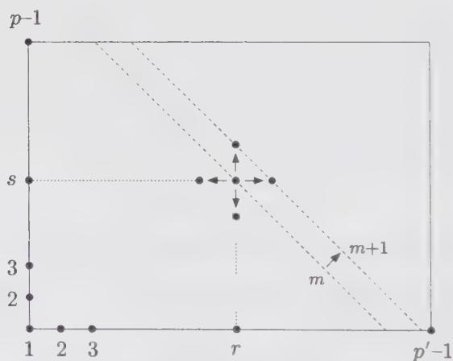  
Figure 8.2. The Kac table of minimal $(p,p')$ models. The horizontal arrows describe the effect of fusion by $(2,1)$ , whereas the vertical arrows describe that of fusion by $(1,2)$ . The combination of the two enables us to reach any point of the table by recursion on the value of $m=r+s$ .

We now mix the two generators X and Y, and prove by recursion that

$$
N _ {(r, s)} = U _ {r - 1} (X) U _ {s - 1} (Y)\tag{8.108}
$$

This is true for $N_{(1,1)} = 1$ . Suppose Eq. (8.108) is true for any $(r,s)$ such that $r + s \leq m$ . The fusion by (2,1) then gives

$$
X N _ {(r, s)} = N _ {(r + 1, s)} + N _ {(r - 1, s)}\tag{8.109}
$$

Therefore, we have, by the recursion hypothesis,

$$
\begin{array}{c} N _ {(r + 1, s)} = \big (X U _ {r - 1} (X) - U _ {r - 2} (X) \big) U _ {s - 1} (Y) \\ = U _ {r} (X) U _ {s - 1} (Y) \end{array}\tag{8.110}
$$

where, in the second step, the Chebyshev recursion has been used. Likewise, we find

$$
N _ {(r, s + 1)} = U _ {r - 1} (X) U _ {s} (Y)\tag{8.111}
$$

Hence the recursion hypothesis is proven for $m \rightarrow m + 1$ (see Fig. 8.2), and Eq. (8.108) holds for any $(r, s)$ in the Kac table. The fusions are therefore polynomially generated by X and Y, as announced before.

Of course, $X$ and $Y$ are subject to the constraints (8.107), but this is not all. We still have to implement the symmetry (7.66) of the Kac table

$$
N _ {(p ^ {\prime} - r, p - s)} = N _ {(r, s)}\tag{8.112}
$$

This is satisfied if and only if

$$
U _ {p ^ {\prime} - r - 1} (X) U _ {p - s - 1} (Y) = U _ {r - 1} (X) U _ {s - 1} (Y)\tag{8.113}
$$

In particular, if $r = 1$ and $s = p - 1$ , we have

$$
\boxed {U _ {p ^ {\prime} - 2} (X) = U _ {p - 2} (Y)}\tag{8.114}
$$

We prove that this condition, together with the constraints (8.107), is sufficient to ensure the symmetry (8.113). From Eq. (8.107), it can be shown that

$$
U _ {p ^ {\prime} - 2} (X) U _ {r - 1} (X) = U _ {p ^ {\prime} - r - 1} (X)\tag{8.115}
$$

This is trivially true for r = 1. Suppose that it is true for r, then

$$
\begin{array}{c} U _ {p ^ {\prime} - 2} (X) U _ {r} (X) = U _ {p ^ {\prime} - 2} (X) \bigl (X U _ {r - 1} (X) - U _ {r - 2} (X) \bigr) \\ = X U _ {p ^ {\prime} - r - 1} (X) - U _ {p ^ {\prime} - r - 2} (X) \\ = U _ {p ^ {\prime} - r} (X), \end{array}\tag{8.116}
$$

which shows that the property (8.115) holds for $r \to r + 1$ , and therefore for any $r$ . A similar argument leads to

$$
U _ {p - 2} (Y) U _ {s - 1} (Y) = U _ {p - s - 1} (Y)\tag{8.117}
$$

for any s. Now, using Eqs. (8.114), (8.115), and (8.117), we derive

$$
\begin{array}{c} U _ {p ^ {\prime} - r - 1} (X) U _ {s - 1} (Y) = U _ {p ^ {\prime} - 2} (X) U _ {r - 1} (X) U _ {s - 1} (Y) \\ = U _ {r - 1} (X) U _ {p - 2} (Y) U _ {s - 1} (Y) \\ = U _ {r - 1} (X) U _ {p - s - 1} (Y) \end{array}\tag{8.118}
$$

For $s \rightarrow p - s$ , this is exactly the desired result (8.113).

Summarizing, we found that the fusion algebra $A_{p,p'}$ of a minimal conformal theory with central charge $c(p,p')$ containing the primary fields $\phi_{(2,1)}$ and $\phi_{(1,2)}$ is polynomially generated by $X = N_{(2,1)}$ and $Y = N_{(1,2)}$ as

$$
N _ {(r, s)} = U _ {r - 1} (X) U _ {s - 1} (Y)\tag{8.119}
$$

where $U$ is the Chebyshev polynomial of the second kind, and $X$ and $Y$ are constrained by the three relations

$$
U _ {p ^ {\prime} - 1} (X) = U _ {p \sim 1} (Y) = U _ {p ^ {\prime} - 2} (X) - U _ {p \sim 2} (Y) = 0\tag{8.120}
$$

These constraints form an ideal $\mathcal{I}_{p,p^{\prime}}(X,Y)$ of the ring C[X,Y] of polynomials of X and Y, and the fusion algebra is endowed with a quotient ring structure $^{8}$

$$
\mathcal {A} _ {p, p ^ {\prime}} = \mathbb {C} [ X, Y ] / \mathcal {I} _ {p, p ^ {\prime}} (X, Y)\tag{8.121}
$$

This result is in agreement with the direct computation of the $(r,1)$ fusion rules (8.84). First we note that

$$
N _ {(m, n)} = U _ {m - 1} (X) U _ {n - 1} (Y) = N _ {(m, 1)} N _ {(1, n)}\tag{8.122}
$$

for any $m, n$ . Hence

$$
N _ {(r, 1)} N _ {(m, n)} = \bigl (N _ {(r, 1)} N _ {(m, 1)} \bigr) N _ {(1, n)}\tag{8.123}
$$

We compute the fusion of $(r,1)$ and $(m,1)$ . First, we extend, for convenience, the definition of the polynomials $U_{m}(x)$ to negative integers m, by their defining recursion relation. For instance, $U_{-1}(x)=0$ , $U_{-2}(x)=-1$ , and so on. It is easy to derive that

$$
U _ {- m - 2} (X) = - U _ {m} (X)\tag{8.124}
$$

We can prove by recursion on $r$ that

$$
U_{r}(X)U_{m}(X) = \sum_{\substack{k = m - r\\ k - m + r\text{even}}}^{m + r}U_{k}(X)\tag{8.125}
$$

where the sum may include negative indices. This relation is trivially true for r = 0. Suppose Eq. (8.125) is true for r. Then

$$
\begin{aligned} U_{r + 1}(X)U_{m}(X) = & X\sum_{\substack{k = m - r\\ k - m + r\text{even}}}^{m + r}U_{k}(X) - \sum_{\substack{k = m - r + 1\\ k - m + r - 1\text{even}}}^{m + r - 1}U_{k}(X)\\ = & \sum_{\substack{k = m - r\\ k - m + r\text{even}}}^{m + r}\left(XU_{k}(X) - U_{k - 1}(X)\right)\\ = & \sum_{\substack{k = m - r - 1\\ k - m + r + 1\text{even}}}^{m + r + 1}U_{k}(X) \end{aligned}\tag{8.126}
$$

The property (8.125) is thus true for $r \rightarrow r + 1$ ; hence, it holds for all r. This is in agreement with Eq. (8.84), for $r \leq m$ and $m + r < p'$ . We now still have to take care of the possible terms with negative indices in Eq. (8.125). They arise if r > m. Thanks to the property (8.124), the net effect of the presence of $U_{m-r}$ , $U_{m-r+2}$ , ... with negative indices is to cancel the corresponding terms $U_{r+2-m}$ , $U_{r-m}$ , ... with positive indices in the sum (8.125). This results in a modification of the lower bound in Eq. (8.125)

$$
U_{r}(X)U_{m}(X) = \sum_{\substack{k = |m - r|\\ k - m + r\text{even}}}^{m + r}U_{k}(X)\tag{8.127}
$$

Moreover, due to the constraint $U_{p'-1}(X) = 0$ , we have still some polynomials whose index goes out of the Kac table whenever $m + r \geq p'$ . To take this into account, note that the constraint $U_{p'-1}(X) = 0$ propagates itself through the recursion relations of the Chebyshev polynomials to yield a reflection property

$$
U _ {p ^ {\prime} - 1 + k} (X) = - U _ {p ^ {\prime} - 1 - k} (X)\tag{8.128}
$$

This shows that, in Eq. (8.125), the terms $U_{m + r}, U_{m + r - 2}, \ldots$ with indices larger than $p' - 1$ cancel the corresponding terms $U_{2p' - 2 - m - r}, U_{2p' - m - r}, \ldots$ with indices smaller than $p' - 1$ . This results in a modification of the upper bound of the summation in Eq. (8.125). Together with the modification of the lower bound (8.127), this yields

$$
U_{r}(X)U_{m}(X) = \sum_{\substack{k = |m - r|\\ k - m + r\text{even}}}^{\min (m + r,2p^{\prime} - 2 - m - r)}U_{k}(X)\tag{8.129}
$$

We finally get the $(r,1)$ fusion from Eq. (8.123)

$$
N_{(r,1)}N_{(m,n)} = \sum_{\substack{k = |m - r| + 1\\ k - m + r - 1\text{even}}}^{\min (m + r - 1,2p^{\prime} - 1 - m - r)}N_{(k,n)}\tag{8.130}
$$

and the general fusion rules

$$
N_{(r,s)}N_{(m,n)} = \sum_{\substack{k = |m - r| + 1\\ k - m + r - 1\text{even}}}^{\min (m + r - 1,2p^{\prime} - 1 - m - r)}\sum_{\substack{l = |n - s| + 1\\ l - n + s - 1\text{even}}}^{\min (n + s - 1,2p - 1 - n - s)}N_{(k,l)}\tag{8.131}
$$

This is the result announced in Eq. (7.70).

From the above discussion, it is clear that the fusion algebra $A_{p,p'}$ possesses two subalgebras $X_{p'}$ and $Y_{p}$ , generated respectively by $N_{(r,1)}$ , $1 \leq r \leq p' - 1$ and $N_{(1,s)}$ , $1 \leq s \leq p - 1$ , with respective fusion numbers

$$
\begin{array}{l l} \mathcal {X} _ {p ^ {\prime}}: \mathcal {N} _ {r s} ^ {t} (q) \equiv \mathcal {N} _ {(r, 1) (s, 1)} ^ {(t, 1)} & 1 \leq r, s, t \leq p ^ {\prime} - 1 \\ \mathcal {Y} _ {p}: \mathcal {N} _ {r s} ^ {t} (p) \equiv \mathcal {N} _ {(1, r) (1, s)} ^ {(1, t)} & 1 \leq r, s, t \leq p - 1 \end{array}\tag{8.132}
$$

where $X_{m}$ and $Y_{m}$ are isomorphic. Moreover, the relation

$$
N _ {(r, s)} = N _ {(r, 1)} N _ {(1, s)}\tag{8.133}
$$

expresses that $A_{p,p'}$ is the product of the two algebras $X_{p'}$ and $Y_{p}$ , quotiented by the identification $N_{(r,s)} = N_{(p' - r,p - s)}$ , which amounts to the relation (8.114). This tensor product structure for minimal models will also be apparent in the study of modular transformations of the characters of the irreducible representations with weights (7.65), in Chap. 10. The reasons for this are profound, and will be elucidated later in this volume. The subalgebras $X_{p'}$ and $Y_{p}$ are actually the fusion algebras of two Wess-Zumino-Witten models underlying the minimal theory.

A few remarks are in order. We reconsider the Landau-Ginzburg description of diagonal minimal theories presented in Sect. 7.4.7, from the point of view of fusion rules. As the whole structure is generated from powers and descendants of the basic field $\Phi = \Phi_{(2,2)}$ , we also expect the fusion rules of the theory to be generated by this field. It turns out that only half of the spectrum of the corresponding minimal theory is generated (see Ex. 8.20). More precisely, the intrinsic $\Phi \to -\Phi$ symmetry of the Landau-Ginzburg Lagrangian $\mathcal{L}_m$ is easily identified in the $(m + 1,m)$ minimal theory. The successive odd powers of $\Phi$ are $\mathbb{Z}_2$ -odd, and generate a subset of the Kac table. Without loss of generality, we restrict ourselves to the (odd,even) theories $(2k + 1,2k)$ and consider the odd powers of the matrix $G = N_{(2,2)}$ in the adjoint representation of the $(2k + 1,2k)$ fusion algebra: the matrices $G, G^3, \ldots, G^{2N-1}$ form a linearly independent system for $N = k(k - 1)$ . This is due to the two following properties of the matrix $G$ : (i) the eigenvalue 0 of $G$ is $k$ times degenerate. (ii) 0 is the only eigenvalue of $G$ that can be degenerate. The dimension of the fusion algebra (size of the matrices $N_{(r,s)}$ ) is $k(2k - 1)$ , half the number of points in the Kac table; therefore, the minimal polynomial of $G$ (namely, the polynomial $\Pi(x)$ of lowest degree, such that $\Pi(G) = 0$ ; cf. Ex. 8.18) is of degree

$$
k (2 k - 1) - (k - 1) = 2 M + 1 \quad M = k (k - 1)\tag{8.134}
$$

which proves the linear independence of $G, G^3, \ldots, G^{2M-1}$ . On the other hand, due to the fusion rules (7.114), it is clear that each of these odd powers is itself a linear combination of some $N_{(r,s)}$ , with even $s$ . The latter form a subset of $M$ linearly independent matrices; hence, each of them can be expressed as a polynomial of $\Phi$ , odd under the transformation $\Phi \to -\Phi$ . So the odd powers of $G$ generate the whole $\mathbb{Z}_2$ -odd sector of the fusion algebra.

A last remark: as already mentioned, we have assumed in the above derivation that the two primary fields $\phi_{(2,1)}$ and $\phi_{(1,2)}$ belonged to the theory. This might not be the case in general. Actually, in the discussion of modular invariance in Chap. 10, we shall find more solutions than the one discussed here, among which are the so-called D series of minimal models, which contain $\phi_{(2,1)}$ , $\phi_{(1,3)}$ but not $\phi_{(1,2)}$ (p is even), and some exceptional theories $E_{6}$ , $E_{7}$ , and $E_{8}$ , with, respectively, p = 12, 18, 30, which all contain $\phi_{(2,1)}$ but whose $Y_{p}$ subalgebra is generated respectively by $\phi_{(1,4)}$ , $\phi_{(1,5)}$ , and $\phi_{(1,7)}$ . All these theories have different fusion rules. We shall return to this discussion later.

## Appendix 8.A. General Singular Vectors from the Covariance of the OPE

This appendix is devoted to the complete derivation of singular vectors of the Virasoro algebra for minimal models, based on the concept of fusion of Verma modules.

We first investigate the properties of the OPE at the level of representations of the Virasoro algebra (Sect. 8.A.1). The principle of the OPE (decomposition of the product of two conformal fields onto conformal fields and their descendants) translates, at the level of Verma modules, into the notion of decomposition of the tensor product of two modules onto other modules. More precisely, the states in the modules over which the decomposition is performed are intimately linked to those in the tensored modules. This link is essentially due to the covariance of the OPE, namely, the fact that both the factor fields and those in the decomposition have compatible transformation properties under conformal mappings. As an application, we show how this covariance constrains the structure coefficients of descendant fields in the OPE.

This leads to the definition of the (covariant) fusion map $\mathcal{F}$ from the tensor product of two Verma modules to a third one, which transfers the action of any operator from the states of the tensored modules to their images in the decomposition (Sect. 8.A.2). In particular, with a suitable choice of modules, the singular vector condition in one of the tensored modules can be transferred to the image modules in the decomposition. Our strategy (Sect. 8.A.3) will be to study the particular fusion of the $V_{r,1}$ module with another one, in such a way that the decomposition includes the module $V_{r,s}$ . Then, using the fusion map $\mathcal{F}$ , we shall transfer our knowledge of the singular vectors of $V_{r,1}$ onto $V_{r,s}$ . This will result in a simple recipe to obtain the singular vectors of the module $V_{r,s}$ (Sects. 8.A.5 and 8.A.6).

In order for the fusion map $\mathcal{F}$ to be efficiently used, we need to evaluate the leading action of the operator $\Delta_{r,1}$ on the OPE of $\phi_{(r,1)}$ with another conformal field when their positions approach each other. This is achieved in Sect. 8.A.4 by proving Eq. (8.81), instrumental in the derivation of the fusion rules (8.84) of $\phi_{(r,1)}$ .

## 8.A.1. Fusion of Irreducible Modules and OPE Coefficients

In this section, we expose a systematic way of computing the OPE coefficients of the algebra of primary fields of a conformal theory. The result takes the form of the recursion formula (8.156). As shown in Sect. 6.6.3, the operator product expansion of two given primary fields gives rise to structure constants (6.168), factorized into left and right coefficients, corresponding to left and right representations of the Virasoro algebra. We shall concentrate on the left part of this structure.

We fix throughout the following discussion the central charge c and attach isomorphic Virasoro algebras to each point x of the complex plane. The corresponding Verma (resp. irreducible) modules acquire an extra dependence on the point x, and are denoted by $V(c, h; x)$ (resp. $M(c, h; x)$ ), whereas the corresponding highest-weight state reads $|h; x\rangle$ . Through the state-operator correspondence, we get holomorphic primary fields $f_{h}(x)$

$$
f _ {h} (x) \leftrightarrow | h; x \rangle ,\tag{8.135}
$$

subject to the conditions

$$
\begin{array}{l} L _ {- 1} f _ {h} (x) = \frac {d}{d x} f _ {h} (x) \\ L _ {0} f _ {h} (x) = h f _ {h} (x) \\ L _ {n} f _ {h} (x) = 0 \qquad (n = 1, 2, \ldots) \end{array}\tag{8.136}
$$

We denote any finite nondecreasing sequence of positive integers $1 \leq r_{1} \leq r_{2} \leq \cdots \leq r_{k}$ by the single letter Y and set $|Y| = r_{1} + r_{2} + \cdots + r_{k}$ . This provides us with a compact notation for

$$
L _ {- r _ {1}} L _ {- r _ {2}} \dots L _ {- r _ {k}} \equiv L _ {- Y}\tag{8.137}
$$

and we have the field-state equivalence for descendants of the field $f_{h}$

$$
L _ {- Y} f _ {h} (x) \leftrightarrow L _ {- Y} | h; x \rangle\tag{8.138}
$$

That states depend upon a complex variable x is somewhat unusual. Indeed, fields are usually considered as operators acting in a fixed vector space with a unique vacuum state invariant under global conformal transformations and a unique dual vacuum linear form (invariant under the same group). The other point of view adopted here is to consider only correlation functions, that is, vacuum expectation values of products of fields at distinct points. The latter are analytic functions of the argument of one of the fields on the complex plane except at the arguments of the other fields. Henceforth identities between fields will be understood as insertions into correlation functions.

The OPE of two conformal fields has been defined in Sect. 6.6.3. By definition, the fusion of two highest-weight modules attached respectively to the fields $f_0(x_0)$ and $f_1(x_1)$ (of conformal dimensions $h_0$ and $h_1$ ) onto a third one relative to the field $f(x)$ (of dimension $h$ ) is possible, if the corresponding three-point function

$$
\langle f _ {0} (x _ {0}) f _ {1} (x _ {1}) f (x) \rangle = \frac {g \left(h _ {0} , h _ {1} , h\right)}{\left(x _ {0} - x _ {1}\right) ^ {h _ {0} + h _ {1} - h} \left(x _ {0} - x\right) ^ {h _ {0} + h - h _ {1}} \left(x _ {1} - x\right) ^ {h _ {1} + h - h _ {0}}}\tag{8.139}
$$

is nonzero. This implies selection rules (the fusion rules) on the dimensions $h_0, h_1, h$ , as discussed in Sect. 8.4.

We choose the coordinates as

$$
x _ {0} = x + \frac {z}{2} \quad x _ {1} = x - \frac {z}{2}\tag{8.140}
$$

This is not restrictive since any triplet of points can be mapped to the three points $(x + z/2, x - z/2, x)$ by a suitable global conformal transformation (we say that global conformal transformations act transitively on triplets of points). As $z \to 0$ the product of fields $f_{0}(x_{0})f_{1}(x_{1})$ (inserted in correlations) is equivalent to a sum of expansions of the form $^{10}$

$$
f _ {0} \left(x _ {0}\right) f _ {1} \left(x _ {1}\right) \sim \sum_ {h} \left\{\frac {g \left(h _ {0} , h _ {1} , h\right)}{z ^ {h _ {0} + h _ {1} - h}} \sum_ {Y} z ^ {| Y |} \beta_ {Y} \left(h _ {0}, h _ {1}, h\right) L _ {- Y} f _ {h} (x) \right\}\tag{8.141}
$$

As mentioned above, the choice of the midpoint $x = \frac{1}{2}(x_{0} + x_{1})$ is by no means mandatory and could well be modified using

$$
f _ {h} (x + x ^ {\prime}) = e ^ {x ^ {\prime} L _ {- 1}} f _ {h} (x)\tag{8.142}
$$

without changing the structure of the above expansion (recall that $L_{-1}$ is the translation operator). However, it has the virtue that the coefficients enjoy the symmetry property

$$
\beta_ {Y} (h _ {0}, h _ {1}, h) = (- 1) ^ {| Y |} \beta_ {Y} (h _ {1}, h _ {0}, h)\tag{8.143}
$$

A global phase, arising from the prefactor $z^{h_{0}+h_{1}-h}$ , has been conveniently absorbed in the normalization.

Likewise, we may define the fusion process among irreducible highest-weight modules as a covariant linear map

$$
\mathcal {F}: M (c, h _ {0}; x _ {0}) \otimes M (c, h _ {1}; x _ {1}) \rightarrow M (c, h; x)\tag{8.144}
$$

Since we deal with three isomorphic—but not identical—copies of the Virasoro algebra, it is not surprising that the product of highest-weight states in $M(c, h_{0}; x_{0}) \otimes M(c, h_{1}; x_{1})$ does not correspond to just the highest-weight state in $M(c, h; x)$ , but rather to an infinite linear combination

$$
\mathcal {F} \left(| c, h _ {0}; x _ {0} \rangle \otimes | c, h _ {1}; x _ {1} \rangle\right) = \sum_ {Y} \beta_ {Y} (h _ {0}, h _ {1}, h | x _ {0}, x _ {1}, x) L _ {- Y} | c, h; x \rangle\tag{8.145}
$$

Note that the above equation corresponds to setting $g(h_{0}, h_{1}, h) = 1$ (or 0 if it vanishes) in Eq. (8.139), which amounts to a multiplicative redefinition of the fields. We can equivalently absorb $g(h_{0}, h_{1}, h)$ in the definition of $\beta_{Y}$ .

The covariance of F means the following. We consider a holomorphic map $x \to \tilde{x} = y(x)$ in a common neighborhood U of $x_{0}, x_{1}, x$ , giving a one-to-one map $U \leftrightarrow y(U)$ . The various conformal fields transform as

$$
f _ {i} (x _ {i}) d x ^ {h _ {i}} = \tilde {f} _ {i} (\tilde {x} _ {i}) d \tilde {x} _ {i} ^ {h _ {i}}\tag{8.146}
$$

We require that the operator product expansion (8.141) be such that both sides have identical transformation properties, namely that the same equation holds for quantities with tildes.

How does this property of fields translate in terms of irreducible modules? We will show that it specifies $\mathcal{F}$ completely; in particular it will enable us to compute all the coefficients $\beta_{Y}$ in Eq. (8.145). In other words, local conformal invariance fixes the $\beta_{Y}$ 's completely. For simplicity, but without loss of generality, we restrict ourselves to the choice of coordinates (8.140). In this case, $\mathcal{F}$ acts on the tensor product of highest-weight states as

$$
\mathcal {F} \left(| c, h _ {0}; x _ {0} \rangle \otimes | c, h _ {1}; x _ {1} \rangle\right) = \frac {1}{z ^ {h _ {0} + h _ {1} - h}} \sum_ {Y} z ^ {| Y |} \beta_ {Y} L _ {- Y} | c, h; x \rangle\tag{8.147}
$$

The covariance condition translates into

$$
\begin{array}{l} \frac {1}{(x _ {0} - x _ {1}) ^ {h _ {0} + h _ {1} - h}} \sum_ {Y} (x _ {0} - x _ {1}) ^ {| Y |} \beta_ {Y} (L _ {- Y} f) (\frac {x _ {0} + x _ {1}}{2}) = \\ \left(\frac {d \tilde {x} _ {0}}{d x _ {0}}\right) ^ {h _ {0}} \left(\frac {d \tilde {x} _ {1}}{d x _ {1}}\right) ^ {h _ {1}} \frac {1}{(\tilde {x} _ {0} - \tilde {x} _ {1}) ^ {h _ {0} + h _ {1} - h}} \times \\ \sum_ {Y} (\tilde {x} _ {0} - \tilde {x} _ {1}) ^ {| Y |} \beta_ {Y} (L _ {- Y} \tilde {f}) \left(\frac {\tilde {x} _ {0} + \tilde {x} _ {1}}{2}\right) \end{array}\tag{8.148}
$$

where

$$
\left(L _ {- Y} \tilde {f}\right) \left(\frac {\tilde {x} _ {0} + \tilde {x} _ {1}}{2}\right) = L _ {- Y} \exp \left[ \left(\frac {\tilde {x} _ {0} + \tilde {x} _ {1}}{2} - \tilde {x}\right) L _ {- 1} \right] \tilde {f} (\tilde {x})\tag{8.149}
$$

We need the transformation properties of the descendant fields $(L_{-Y}f)$ with f primary. These are most easily obtained by applying the above formula in infinitesimal form. We let

$$
\tilde {x} _ {i} = x _ {i} - \epsilon (x _ {i}), i = 0, 1\tag{8.150}
$$

With $x_0 = x + z / 2$ and $x_1 = x - z / 2$ , Eq. (8.148) reduces to

$$
\begin{array}{l} \left\{h _ {0} \epsilon^ {\prime} (x _ {0}) + \epsilon (x _ {0}) \frac {\partial}{\partial x _ {0}} + h _ {1} \epsilon^ {\prime} (x _ {1}) + \epsilon (x _ {1}) \frac {\partial}{\partial x _ {1}} \right\} \frac {1}{z ^ {h _ {0} + h _ {1} - h}} \times \\ \sum_ {Y} z ^ {| Y |} \beta_ {Y} L _ {- Y} f (x) \\ = \frac {1}{z ^ {h _ {0} + h _ {1} - h}} \sum_ {Y} z ^ {| Y |} \beta_ {Y} \delta_ {\epsilon} [ L _ {- Y} f (x) ] \end{array}\tag{8.151}
$$

With the choice

$$
\epsilon (y) = \epsilon_ {k} (y - x) ^ {k + 1} \quad k \geq - 1\tag{8.152}
$$

where $\epsilon_{k}$ is a small constant, we find that

$$
\delta_ {\epsilon} L _ {- Y} f (x) = \epsilon_ {k} L _ {k} L _ {- Y} f (x)\tag{8.153}
$$

The covariance condition becomes, with $k \geq -1$ ,

$$
\begin{array}{l} \left[ L _ {k} - \left(\frac {z}{2}\right) ^ {k} (k + 1) (h _ {0} + (- 1) ^ {k} h _ {1}) - \left(\frac {z}{2}\right) ^ {k + 1} \left\{\frac {1 - (- 1) ^ {k}}{2} \frac {\partial}{\partial x} \right. \right. \\ \left. \left. + (1 + (- 1) ^ {k}) \frac {\partial}{\partial z} \right\} \right] \times \frac {1}{z ^ {h _ {0} + h _ {1} - h}} \sum_ {Y} z ^ {| Y |} \beta_ {Y} L _ {- Y} f (x) = 0 \end{array}\tag{8.154}
$$

Since $L_{1}$ and $L_{2}$ generate by commutators the complete algebra of $L_{k}$ 's ( $k \geq 1$ ), it is sufficient to impose the two relations pertaining to $k = 1$ and $k = 2$ . (We note also that Eq. (8.154) is tautological for $k = -1, 0$ ). For notational simplicity we define

$$
f ^ {(j)} = \sum_ {| Y | = j} \beta_ {Y} L _ {- Y} f \quad p \geq 0\tag{8.155}
$$

where $f^{(0)}$ is equal to f. The above covariance condition (8.154) translates into

$$
\begin{array}{l} L _ {1} f ^ {(j)} = (h _ {0} - h _ {1}) f ^ {(j - 1)} + \frac {1}{4} L _ {- 1} f ^ {(j - 2)} \\ L _ {2} f ^ {(j)} = \frac {h + j + 2 (h _ {0} + h _ {1} - 1)}{4} f ^ {(j - 2)} \end{array}\tag{8.156}
$$

It is understood that $f^{(j)} \equiv 0$ when $j < 0$ . In particular, this shows that $f^{(0)} = f$ is a primary field (it satisfies the highest-weight conditions). This is also obvious from the $z \to 0$ limit of the $\mathcal{F}$ map

$$
\lim _ {z \rightarrow 0} z ^ {- h} \mathcal {F} \left(z ^ {h _ {0}} | c, h _ {0}; x _ {0} \rangle \otimes z ^ {h _ {1}} | c, h _ {1}; x _ {1} \rangle\right) = | c, h; x \rangle\tag{8.157}
$$

which is a map between highest-weight vectors. The two equations (8.156) are recursion (descent) equations, which determine the coefficients $\beta_{Y}$ completely.

We illustrate this for the first few values of j. At level 1, we have

$$
\begin{array}{c} f ^ {(1)} = \beta_ {1} L _ {- 1} f \\ L _ {1} f ^ {(1)} = 2 h \beta_ {1} f = (h _ {0} - h _ {1}) f, \end{array}\tag{8.158}
$$

which implies that

$$
\beta_ {1} = \frac {1}{2 h} (h _ {0} - h _ {1})\tag{8.159}
$$

if the determinant $K_{1}(c,h)=h$ does not vanish. At level 2,

$$
\begin{array}{c} f ^ {(2)} = (\beta_ {1, 1} L _ {- 1} ^ {2} + \beta_ {2} L _ {- 2}) f \\ L _ {1} f ^ {(2)} = (2 h (2 h + 1) \beta_ {1, 1} + 3 h \beta_ {2}) f ^ {(1)} = (\frac {h}{4} + \frac {(h _ {0} - h _ {1}) ^ {2}}{2}) f ^ {(1)} \\ L _ {2} f ^ {(2)} = (6 h \beta_ {1, 1} + (4 h + \frac {c}{2}) \beta_ {2}) f = (\frac {h}{4} + \frac {h _ {0} + h _ {1}}{2}) f \end{array}\tag{8.160}
$$

which is inverted to $^{11}$

$$
\begin{array}{l} \beta_ {1, 1} = \frac {2 h ^ {2} + h (c - 1 2 s + 1 6 d ^ {2}) + 2 c d ^ {2}}{8 h [ 1 6 h ^ {2} + 2 h (c - 5) + c ]}, \\ \beta_ {2} = \frac {h ^ {2} + h (2 s - 1) + s - 3 d ^ {2}}{[ 1 6 h ^ {2} + 2 h (c - 5) + c ]}, \end{array}\tag{8.161}
$$

where $s = h_{0} + h_{1}$ and $d = h_{0} - h_{1}$ , provided the determinant

$$
K _ {2} (c, h) = h \left(1 6 h ^ {2} + 2 h (c - 5) + c\right)\tag{8.162}
$$

is not zero. We recognize here the Kac determinant (8.1).

This method determines recursively $f^{(m)}$ , the component at level m, by solving a $p(m) \times p(m)$ linear system $(p(m)$ is the number of partitions of the integer m). The determinant of this linear system is nothing but the Kac determinant at the corresponding level. If the complete determinant does not appear in some of the above expressions, this is due to a cancellation of factors between the numerator and the denominator.

If $M(c,h) \equiv V(c,h)$ (i.e., if $V(c,h)$ is irreducible, meaning that it does not possess singular vectors), then the Kac determinant never vanishes and the coefficients $\beta_{Y}$ are determined from (8.156) for arbitrary $h_{0}, h_{1}$ . Therefore infinitely many fusions of the type $V(c,h_{0}) \otimes V(c,h_{1}) \to V(c,h) \equiv M(c,h)$ are allowed when $V(c,h)$ is irreducible. This is why finite closure of the OPE algebra of a conformal theory is prevented whenever it includes a primary field corresponding to an irreducible Verma module. This is also the reason for which minimal models include only highest-weight states of reducible Verma modules, of the form (8.2).

We now consider the case where $V(c,h)$ is reducible: $M(c,h)$ is then the quotient of $V(c,h)$ by invariant submodules arising from singular vectors. When attempting to solve the system (8.156) at level p or higher, where p is the level of a singular vector in $V(c,h)$ , one can at best hope to determine $f^{(p)}$ up to this singular vector or its descendants. This is why we defined fusion among irreducible modules. Hence, in $M(c,h)$ , we work modulo singular vectors and their descendants.

In other words, the singular vectors can be set equal to zero. Still, we have to make sure that the r.h.s. of the linear system (8.156) lies in the range of the linear operator on the left. This imposes conditions on the triplet $h_{0}, h_{1}, h$ , which are the fusion rules.

Such selection rules are already apparent at level 1, where the Kac determinant reduces to h. Since $2h\beta_{1}=h_{0}-h_{1}$ , the vanishing of the Kac determinant, that is h=0, implies $h_{0}=h_{1}$ . Thus, two modules can have the vacuum (h=0) sector in their fusion rules only if they have equal weights. We thus recover a well-known property, which entails that the only nonzero two-point functions of primary fields are those involving fields of equal weight.

## 8.A.2. The Fusion Map $\mathcal{F}$ : Transferring the Action of Operators

We recall that, in order for the fusion to be uniquely defined (up to an overall normalization), the target module $M(c,h)$ has to be irreducible. However, we have not yet use the irreducibility of the initial modules $M(c,h_{0})$ and $M(c,h_{1})$ . In the next section we shall examine the consequences of quotienting the initial spaces by descendants of their singular vectors, and this will lead us to a procedure for generating expressions for the singular vectors of the target module. For this purpose, we need to know how the covariant map F acts on descendant states. This action is calculated below, and the result appears in Eqs. (8.166) and (8.167).

We now compute the action of $\mathcal{F}(L_{-r} \otimes \mathbb{I})$ on $|c, h_{0}; x_{0}\rangle \otimes |c, h_{1}; x_{1}\rangle$ . We use the conformal Ward identities (6.156) of Sect. 6.6.1, which translate the action of the $L_{m}$ 's on a field inside a correlator into the action of differential operators $L_{-m}$ 's on the corresponding correlator:

$$
\langle [ L _ {- r _ {1}} \dots L _ {- r _ {k}} f _ {0} ] (x _ {0}) f _ {1} (x _ {1}) \dots \rangle = \mathcal {L} _ {- r _ {1}} (x _ {0}) \dots \mathcal {L} _ {- r _ {k}} (x _ {0}) \langle f _ {0} (x _ {0}) f _ {1} (x _ {1}) \dots \rangle\tag{8.163}
$$

The differential operator $\mathcal{L}_{-r}(x_{0})$ is defined in Eq. (6.152):

$$
\mathcal {L} _ {- r} \left(x _ {0}\right) = \sum_ {i \geq 1} \left\{\frac {(r - 1) h _ {i}}{\left(x _ {i} - x _ {0}\right) ^ {r}} - \frac {1}{\left(x _ {i} - x _ {0}\right) ^ {r - 1}} \frac {\partial}{\partial x _ {i}} \right\}\tag{8.164}
$$

Eq. (8.163) translates then the expressions of singular vectors into differential equations for correlators (cf. Sect. 8.3). The effect of $\mathcal{F}$ on $L_{-r} \otimes \mathbb{I}$ is to transfer the action of $\mathcal{L}_{-r}$ from the point $x_0$ to the point $x = x_0 - \frac{1}{2} z$ . A simple way of realizing this is to expand $\mathcal{L}_{-r}(x_0)$ around $x$ as

$$
\begin{array}{l} \mathcal {L} _ {- r} (x _ {0}) = (- z) ^ {- r} \left[ (r - 1) h _ {1} + \frac {1}{2} z \partial_ {x} - z \partial_ {z} \right] + \sum_ {k \geq 0} \left\{\left(\frac {z}{2}\right) ^ {k} \binom {r + k - 2} {k} \right. \\ \times \sum_ {i \geq 2} (- 1) ^ {r + k} \left[ \frac {h _ {i} (r + k - 1)}{(x - x _ {i}) ^ {p + k}} + \frac {1}{(x - x _ {i}) ^ {r + k - 1}} \partial_ {i} \right] \Bigg \} \end{array}\tag{8.165}
$$

The last sum is identified with $\mathcal{L}_{-r - k}(x)$ by comparing with the definition (8.164). Therefore, we find

$$
\begin{array}{c} \mathcal {F} (L _ {- r} \otimes \mathbb {I}) = \frac {(- 1) ^ {r}}{z ^ {r}} \left[ h _ {1} (r - 1) + \frac {z}{2} L _ {- 1} - z \frac {d}{d z} \right] \\ + \sum_ {k \geq 0} \binom {z} {\frac {z}{2}} ^ {k} \binom {k + r - 2} {k} L _ {- r - k} \end{array}\tag{8.166}
$$

where the $L_{-m}$ operators on the r.h.s. act at the point $x$ . Moreover, if we exchange $h_0 \leftrightarrow h_1$ and $z \rightarrow -z$ in (8.166), we find the action on the module $M(c, h_1)$

$$
\begin{array}{r l} \mathcal {F} (\mathbb {I} \otimes L _ {- r}) & = \frac {1}{z ^ {r}} \left[ h _ {0} (r - 1) - \frac {z}{2} L _ {- 1} - z \frac {d}{d z} \right] \\ & + \sum_ {k \geq 0} \left(- \frac {z}{2}\right) ^ {k} \binom {k + r - 2} {k} L _ {- r - k} \end{array}\tag{8.167}
$$

For instance, for $r = 1$ , we have

$$
\begin{array}{l} \mathcal {F} (L _ {- 1} \otimes \mathbb {I}) = \frac {d}{d z} + \frac {L _ {- 1}}{2} \\ \mathcal {F} (\mathbb {I} \otimes L _ {- 1}) = - \frac {d}{d z} + \frac {L _ {- 1}}{2} \end{array}\tag{8.168}
$$

In order to find the action of $\mathcal{F}$ on any $L_{-Y}$ , we simply have to iterate the transfer process (8.165). This gives a straightforward procedure to write the action of $\mathcal{F}$ on descendant states.

We stress again that nothing is particular to the choice of coordinates (8.140). Taking the points $x_0 = x + z$ and $x_1 = x$ instead, and writing

$$
\mathcal {F} | c, h _ {0}; z + x \rangle \otimes | c, h _ {1}; x \rangle = \frac {1}{z ^ {h _ {0} + h _ {1} - h}} \sum_ {Y} z ^ {| Y |} \bar {\beta} _ {Y} L _ {- Y} | c, h; x \rangle ,\tag{8.169}
$$

the above procedure would have led us to

$$
\mathcal {F} \left(L _ {- r} \otimes \mathbb {I}\right) = \frac {(- 1) ^ {r}}{z ^ {r}} \left[ h _ {1} (r - 1) + z L _ {- 1} - z \frac {d}{d z} \right] + \sum_ {k > 0} z ^ {k} \binom {k + r - 2} {k} L _ {- r - k}
$$

$$
\mathcal {F} \big (\mathbb {I} \otimes L _ {- r} \big) = \frac {1}{z ^ {r}} \big [ h _ {0} (r - 1) - z \frac {d}{d z} \big ] + L _ {- r}\tag{8.170}
$$

and

$$
\mathcal {F} \big (L _ {- 1} \otimes \mathbb {I} \big) = \partial_ {z}, \quad \mathcal {F} \big (\mathbb {I} \otimes L _ {- 1} \big) = - \partial_ {z} + L _ {- 1}\tag{8.171}
$$

We note how the action on the right module has been simplified. The new descent equations (8.156) for the determination of the coefficients $\bar{\beta}_{Y}$ are also simplified.

With

$$
\bar {f} ^ {(j)} = \sum_ {| Y | = j} \bar {\beta} _ {Y} L _ {- Y} f\tag{8.172}
$$

the covariance condition takes the form

$$
\left[ L _ {k} - \left(h _ {0} (k + 1) z ^ {k} + z ^ {k + 1} \partial_ {z}\right) \right] \frac {1}{z ^ {h _ {0} + h _ {1} - h}} \sum_ {p \geq 0} z ^ {j} \hat {f} ^ {(j)} = 0\tag{8.173}
$$

and hence

$$
\begin{array}{l} L _ {1} \bar {f} ^ {(j)} = (j - 1 + h + h _ {0} - h _ {1}) \bar {f} ^ {(j - 1)} \\ L _ {2} \bar {f} ^ {(j)} = (j - 2 + h + 2 h _ {0} - h _ {1}) \bar {f} ^ {(j - 2)} \end{array}\tag{8.174}
$$

There is a striking analogy between these last two equations and the action of $L_{1}$ and $L_{2}$ (Eqs. (8.32) and (8.33)) on the components of the vector $\mathbf{f} = (f_{1}, \cdots, f_{r})^{T}$ . This phenomenon will become clear in the next subsection.

## 8.A.3. The Singular Vectors $|h_{r,s} + rs\rangle$ : General Strategy

In the next few sections, we will derive the singular vector of level rs in the module $V_{r,s}$ by using the results of the two previous sections. The results are summarized in Sect. 8.A.6 below. The main idea is to use the knowledge of the level-r singular vector of $V_{r,1}$ , and the following fusion among states of the Verma modules

$$
V _ {r, 1} \otimes V _ {1, s} \to V _ {r, s}
$$

to obtain information about the singular vector at level $rs$ in the target module $V_{r,s}$ , by a suitable use of the map $\mathcal{F}$ of Eq. (8.144).

Consider first the fusion of highest-weight states of the Verma modules

$$
V (c, h _ {0}; x _ {0}) \otimes V (c, h _ {1}; x _ {1}) \to V (c, h; x),
$$

namely the fusion

$$
f _ {0} (x _ {0}) f _ {1} (x _ {1}) \rightarrow \frac {1}{z ^ {h _ {0} + h _ {1} - h}} \sum_ {j \geq 0} z ^ {j} f ^ {(j)} (x)\tag{8.175}
$$

where $z = x_{0} - x_{1}$ . Suppose that there exists a singular vector $\Delta_{0}f_{0}(x_{0})$ at level $n_{0}$ in the first Verma module $V(c, h_{0}; x_{0})$ . $\Delta_{0}$ is a polynomial of the $L_{-m}$ 's, of total degree $n_{0}$ . Then, using the fusion map of the previous section between the highest-weight states of the Verma modules

$$
V (c, h _ {0} + n _ {0}) \otimes V (c, h _ {1}) \rightarrow V (c, h ^ {\prime}) \subset V (c, h)
$$

we find

$$
\left(\Delta_ {0} f _ {0}\right)\left(x _ {0}\right) f _ {1} \left(x _ {1}\right)\rightarrow \frac {1}{z ^ {h _ {0} + h _ {1} - h + n _ {0}}} \sum_ {j \geq 0} z ^ {j} \psi^ {(j)} (x)\tag{8.176}
$$

where the $\psi^{(j)}$ 's are some descendants of $f$ . The leading term $\psi^{(0)}$ on the r.h.s. of Eq. (8.176) is, by definition, a state of $V(c,h)$ at level 0; therefore it is proportional to the highest-weight state $f$ . Two situations may occur. Either $\psi^{(0)} = \text{const.} \times f$ , with a nonzero constant; then $h' = h$ , from which we do not learn anything about the target module $V(c, h)$ . Or $\psi^{(0)} = 0$ , in which case the first nonzero $\psi^{(j_0)}$ ( $j_0 > 0$ ) on the r.h.s. of Eq. (8.176) is the highest-weight state of a proper submodule $V(c, h') \subset V(c, h)$ , $h' = h + j_0$ , and $\psi^{(j_0)}$ is a singular vector of $V(c, h)$ .

It is now clear that the knowledge of singular vectors of either module $V(c, h_{0})$ or $V(c, h_{1})$ gives us information about singular vectors of the target module $V(c, h)$ . The only point to clarify is whether the highest-weight state on the r.h.s. of Eq. (8.176) is the highest-weight state f of the target module $V(c, h)$ or one of its descendants. We compute the coefficient of proportionality between $\psi^{(0)}$ and f. We are interested in the leading contribution of the action of the operator $\Delta_{0}(x_{0}) \otimes \mathbb{I}$ on the tensor product $V(c, h_{0}) \otimes V(c, h_{1})$ . Using again the results of the previous section, we can transfer the action of a single $L_{-j}$ at $x_{0}$ to the target module at x by using the substitution (8.166) appropriate to the choice of coordinates (8.140), where $x = (x_{0} + x_{1})/2$ . This substitution reads

$$
\mathcal {F} (L _ {- j} \otimes \mathbb {I}) = \frac {(- 1) ^ {j}}{z ^ {j}} [ h _ {1} (j - 1) - z \frac {d}{d z} ] + O (L _ {- 1}, L _ {- 2}, \dots)\tag{8.177}
$$

where we denoted by $O(L_{-1}, L_{-2}, \ldots)$ all the $L_{-m}$ -dependent terms in Eq. (8.166). Since we are interested only in the leading action on the highest-weight state f, we keep only the $L_{-m}$ -independent contributions of (8.177), that is, those preserving the dimension h of f (i.e., the level 0 action of $\Delta_{0}$ ). Note that the substitution issued from the relation (8.170) in the case $x_{1} = x$ and $z = x_{0} - x_{1}$ leads to exactly the same relation (8.177). The latter is actually independent of the specific choice of coordinates, (cf. Ex. 8.24). Therefore, the leading action of $\Delta_{0}(x_{0}) \otimes \mathbb{I}$ on the product (8.175) is that of the operator

$$
\gamma_ {0} (z, \frac {d}{d z}) \equiv (- 1) ^ {n _ {0}} z ^ {h _ {0} + h _ {1} - h + n _ {0}} \Delta_ {0} \big [ L _ {- r} \to z ^ {- r} (h _ {1} (r - 1) - z \frac {d}{d z}) \big ]\tag{8.178}
$$

on the leading term of the r.h.s. of Eq. (8.175), namely

$$
\psi^ {(0)} = \gamma_ {0} (z, \frac {d}{d z}) \frac {1}{z ^ {h _ {0} + h _ {1} - h}} f\tag{8.179}
$$

The substitution implied in Eq. (8.178) has to be carried out carefully because, like the $L_{-r}$ 's, the substituted operators do not commute and the ordering has to be respected. We examine how each substituted operator acts individually on the components $f^{(p)}$ . We define

$$
\begin{array}{l} l _ {- r} f ^ {(p)} \equiv z ^ {h _ {0} + h _ {1} - h} (h _ {1} (r - 1) - z \frac {d}{d z}) \frac {1}{z ^ {h _ {0} + h _ {1} - h}} \sum_ {k \geq 0} z ^ {k} f ^ {(k)} | _ {z ^ {p}} \\ = (h _ {1} (r - 1) - p + h _ {0} + h _ {1} - h) f ^ {(p + r)} \end{array}\tag{8.180}
$$

The operators $l_{-r}$ (r > 0) carry half of a representation of the so-called Witt algebra of the diffeomorphisms of the circle (Virasoro algebra with c = 0), with

the commutation relations (5.19):

$$
[ l _ {m}, l _ {n} ] = (m - n) l _ {m + n} \qquad m, n \in \mathbb {Z}\tag{8.181}
$$

The representations $W(\lambda, \mu)$ of the latter algebra act on an infinite dimensional vector space spanned by $\varphi_{p}, p \in Z$ , and are labeled by two complex numbers $\lambda$ and $\mu$ . The action of the generators reads

$$
l _ {m} (\lambda , \mu) \varphi_ {p} = (p + \mu - \lambda (m - 1)) \varphi_ {p + m}\tag{8.182}
$$

Interpreting Eq. (8.180) in the language of the representation theory of the Witt algebra, the above substitution (8.178) corresponds to a representation $W(\lambda,\mu)$ with

$$
\lambda = - h _ {1} \quad \mu = h _ {0} + h _ {1} - h\tag{8.183}
$$

## 8.A.4. The Leading Action of $\Delta_{r,1}$

The computation of the leading action (8.179) is still difficult in general. However, in the case of the operator $\Delta_{r,1}(t)$ of Eqs. (8.22)-(8.25), which creates the singular vector at level $r$ in the Verma module $V_{r,1}$ , we can compute it exactly. This is the content of the following result: For the operator $\Delta_{r,1}(t)$ defined in Eqs. (8.22)-(8.25), the Witt algebra substitution (8.178) with $h_0 = h_{r,1}(t)$ and $n_0 = r$ , which is

$$
\gamma_ {r, 1} (z, \frac {d}{d z}) \equiv (- 1) ^ {r} z ^ {h _ {0} + h _ {1} - h + r} \Delta_ {r, 1} \left[ L _ {- m} \rightarrow z ^ {- r} \left(h _ {1} (r - 1) - z \frac {d}{d z}\right)\right]\tag{8.184}
$$

has a leading multiplicative action on the highest-weight state $f$ of the target module $V(c, h)$ , which reads

$$
\psi^ {(0)} = \theta_ {r, 1} (\lambda = - h _ {1}, \mu = h _ {0} + h _ {1} - h) f\tag{8.185}
$$

wherein

$$
\begin{array}{l} \left(\theta_ {r, 1}\right) ^ {2} = \prod_ {m = 1} ^ {r} \left\{\left[ h _ {0} + h _ {1} - h + (r - m) (1 - t m) \right] \right. \\ \times \left[ h _ {0} + h _ {1} - h + (m + 1) (1 - t (r + 1 - m)) \right] \\ - 4 h _ {1} t \left(\frac {r + 1}{2} - m\right) ^ {2} \Bigg \} \end{array}\tag{8.186}
$$

The rest of this section is devoted to a detailed proof of this result. Recall the definition (8.26) of $\Delta_{r,1}(t)$ as the formal determinant of the operator $D_{r,1}(t)$ of Eq. (8.22). The substitution $L_{-r} \rightarrow l_{-r}(\lambda, \mu)$ (cf. Eq. (8.182)) leads to the formal determinant of the matrix operator $D_{r,1}(L_{-r} \rightarrow l_{-r})$ , namely

$$
\begin{array}{r l} \theta_ {r, 1} (\lambda , \mu) & = \det \left[ - J _ {-} + \sum_ {k = 0} ^ {r - 1} (- t) ^ {k} J _ {+} ^ {k} \left(\mu + \frac {r - 1}{2} + J _ {0} - \lambda k\right) \right] \\ & = \det \left[ - J _ {-} + \frac {1}{1 + t J _ {+}} \left(\mu + \frac {r - 1}{2} + J _ {0}\right) + \lambda \frac {t J _ {+}}{(1 + t J _ {+}) ^ {2}} \right] \\ & = \det \left[ t J _ {-} + \frac {1}{1 - J _ {+}} (J _ {0} + \mu + \frac {r - 1}{2}) + \frac {\lambda t J _ {+}}{(1 - J _ {+}) ^ {2}} \right] \end{array}\tag{8.187}
$$

where we used the automorphism

$$
J _ {\pm} \rightarrow - t ^ {\mp 1} J _ {\pm} \qquad J _ {0} \rightarrow J _ {0}\tag{8.188}
$$

to obtain the last equality. We now proceed as follows. We are left with the computation of the determinant (8.187) of an operator involving $(1-J_{+})^{-1}$ and $(1-J_{+})^{-2}$ . These terms imply a proliferation of powers of $J_{+}$ , which we wish to eliminate. In a first step, we will “reduce” the operator by performing an appropriate change of basis, in which the term $(1-J_{+})^{-2}$ disappears. In a second step, we will dispose of the second term $(1-J_{+})^{-1}$ and finally evaluate the determinant. Since the matrix $J_{+}$ is nilpotent ( $J_{+}^{r}=0$ ), the matrix

$$
U _ {\gamma} = \frac {1}{(1 - J _ {+}) ^ {\gamma}} = \sum_ {k \geq 0} \frac {\gamma (\gamma + 1) \cdots (\gamma + k - 1)}{k !} (J _ {+}) ^ {k}
$$

is well defined, as well as its inverse $U_{\gamma}^{-1} = U_{-\gamma}$ . Using the commutation relations

$$
\begin{array}{l} \left[ J _ {0}, U _ {\gamma} \right] = \gamma J _ {+} U _ {\gamma + 1} \\ \left[ J _ {-}, U _ {\gamma} \right] = - 2 \gamma U _ {\gamma + 1} J _ {0} - \gamma (\gamma + 1) U _ {\gamma + 2} J _ {+} \\ \left[ J _ {+}, U _ {\gamma} \right] = 0 \end{array}
$$

we find that

$$
\begin{array}{l} U _ {\gamma} ^ {- 1} \left(t J _ {-} + \frac {1}{1 - J _ {+}} (\mu + \frac {r - 1}{2} + J _ {0}) - \frac {\lambda J _ {+}}{(1 - J _ {+}) ^ {2}}\right) U _ {\gamma} \\ = t J _ {-} + \frac {1}{1 - J _ {+}} (\mu + \frac {r - 1}{2} + (1 - 2 \gamma t) J _ {0} + \frac {\gamma - t \gamma (\gamma + 1) - \lambda}{(1 - J _ {+}) ^ {2}} J _ {+} \end{array}\tag{8.189}
$$

The formal determinant of an operator D may be evaluated in any new basis preserving $f_{r}$ . The matrix $U_{\gamma}$ is precisely the matrix of such a change of basis: $U_{\gamma}$ and its inverse, which are upper triangular with ones on the diagonal, do not modify the highest component $f_{r}$ , nor

$$
f _ {0} = \det (U _ {\gamma} ^ {- 1} D U _ {\gamma}) f _ {r} = \det (D) f _ {r}\tag{8.190}
$$

To eliminate the $(1 - J_{+})^{-2}$ term in (8.189), we pick for $\gamma$ any of the two roots of

$$
\gamma - t \gamma (\gamma + 1) - \lambda = 0\tag{8.191}
$$

§8.A. General Singular Vectors from the Covariance of the OPE

Then, there follows the simple result:

$$
\theta_ {r, 1} (\lambda , \mu) = \det \left[ t J _ {-} + \frac {1}{1 - J _ {+}} (\mu + \frac {r - 1}{2} + (1 - 2 \gamma t) J _ {0} \right]\tag{8.192}
$$

Finally, we multiply the above by $1 = \det(1 - J_{+})$ and use the action of $J_{+}J_{-}$ and $J_0$ on the components $f_j$ :

$$
\begin{array}{r l} J _ {+} J _ {-} f _ {j} & = \left[ \frac {r ^ {2}}{4} - (J _ {0} - \frac {1}{2}) ^ {2} \right] f _ {j} \\ J _ {0} f _ {j} & = \frac {1}{2} (r - 2 j + 1) f _ {j} \end{array}\tag{8.193}
$$

in order to rewrite

$$
\begin{array}{r l} \theta_ {r, 1} (\lambda , \mu) & = \det \left[ t J _ {-} t \left(\frac {r ^ {2} - 1}{4} + J _ {0} (1 - J _ {0})\right) + \mu + \frac {r - 1}{2} + (1 - 2 \gamma t) J _ {0} \right] \\ & = \prod_ {m = 1} ^ {r} \left[ \mu + \frac {r - 1}{2} - t m (r - m) + \frac {r + 1 - 2 m}{2} (1 - 2 \gamma t) \right] \end{array}\tag{8.194}
$$

with $\gamma$ a root of Eq. (8.191). This expression turns out to be independent of which particular solution $\gamma$ we choose. Grouping the terms with m and $r + 1 - m$ in the product (8.194), we find, for r even,

$$
\begin{array}{l} \theta_ {r, 1} (\lambda , \mu) = \prod_ {m = 1} ^ {r / 2} \left(\left[ \mu + (r - m) (1 - t m) \right] \right. \\ \left. \times \left[ \mu + (m + 1) (1 - t (r + 1 - m)) \right] + 4 \lambda t \left(\frac {r + 1}{2} - m\right) ^ {2}\right) \end{array}\tag{8.195}
$$

and for r odd,

$$
\begin{array}{l} \theta_ {r, 1} (\lambda , \mu) = \left(\mu + \frac {r - 1}{2} (1 - t (r + 1) / 2)\right) \prod_ {m = 1} ^ {\frac {r - 1}{2}} \left(\left[ \mu + (r - m) (1 - t m) \right] \right. \\ \times \left[ \mu + (m + 1) (1 - t (r + 1 - m)) \right] + 4 \lambda t \left(\frac {r + 1}{2} - m\right) ^ {2}) \end{array}\tag{8.196}
$$

The above two cases (8.195)-(8.196) are summarized in a unique formula for the square of $\theta_{r,1}(\lambda, \mu)$ :

$$
\begin{array}{l}\left[ \theta_ {r, 1} (\lambda , \mu) \right] ^ {2} = \prod_ {m = 1} ^ {r} \left(\left[ \mu + (r - m) (1 - t m) \right] \right.\\\times \left[ \mu + (m + 1) (1 - t (r + 1 - m)) \right] + 4 \lambda t \left(\frac {r + 1}{2} - m\right) ^ {2}\left. \right)\end{array}\tag{8.197}
$$

which, for $\lambda = -h_{1}$ and $\mu = h_{r,1} + h_{1} - h$ , yields the desired result (8.186).

## 8.A.5. Fusion at Work

Knowing the singular vector at level r in $V_{r,1}$ and using it in the fusion $V_{r,1} \otimes M(c, h_{1}) \to M(c, h)$ , we finally arrive at the following result. If $\theta_{r,1} = 0$ ,

(i) The irreducible module $M(c, h)$ does not occur in the fusion

$$
M (c, h _ {r, 1} + r) \otimes M (c, h _ {1}).
$$

(ii) The first nonzero term $\psi^{(r_{0})}$ , $r_{0} > 0$ on the r.h.s. of Eq. (8.176) is a singular vector in $V(c, h)$ .

(iii) The explicit expression for this singular vector is obtained by transferring the singular vector condition from $V(c, h_0; x_0)$ to the target module $V(c, h; x)$ , using the formula (8.166) in the case $x = \frac{1}{2}(x_0 + x_1)$ or its suitable modifications for any other choice of coordinates.

We can use this result in different ways by making various choices for the second module $M(c, h_{1})$ . In the following, we explore three possibilities, all of them with $h_{0} = h_{r,1}(t)$ .

(a) $V_{2,1} \otimes V_{0,s} \rightarrow V_{1,s}$

First, it is instructive to recover the expression for the singular vector $|\chi_{r}\rangle$ of Eq. (8.28) in Sect. 8.2. We take r = 2, and hence

$$
h _ {0} \equiv h _ {2, 1} (t) = \frac {3}{4} t - \frac {1}{2},\tag{8.198}
$$

and we choose

$$
h \equiv h _ {1, s} (t) = \frac {s ^ {2} - 1}{4 t} + \frac {1 - s}{2}.\tag{8.199}
$$

For $\lambda = -h_{1}$ and $\mu = h_{2,1}(t) + h_{1} - h$ , the determinant

$$
\theta_ {2, 1} (\lambda , \mu) = \mu (\mu + 1 + t) - \lambda t\tag{8.200}
$$

has two zeros in $h_{1}$ , namely

$$
h _ {1} = \left\{ \begin{array}{l} h _ {2, s} (t) = \frac {3}{4} t + \frac {s ^ {2} - 1}{4 t} - s + \frac {1}{2} \\ h _ {0, s} (t) = - \frac {t}{4} + \frac {s ^ {2} - 1}{4 t} + \frac {1}{2} \end{array} \right.\tag{8.201}
$$

According to Eq. (8.2), the first value corresponds to a reducible module, with a singular vector at level 2s, whereas the second one corresponds directly to an irreducible Verma module. We choose the second possibility, $h_{1} = h_{0,s}(t)$ , which guarantees that no extra information about possible other singular vectors of the second module is overlooked. The above analysis guarantees the existence of a singular vector in the target Verma module $V_{1,s}$ . We compute it explicitly. The singular vector of $V_{2,1}$ at level 2 is easily found to be

$$
| \chi_ {2} \rangle = \Delta_ {2, 1} (t) | h _ {2, 1} (t) \rangle \quad \Delta_ {2, 1} (t) = L _ {- 1} ^ {2} - t L _ {- 2}\tag{8.202}
$$

(8.206)

We then perform the transfer of the action of $\Delta_{2,1}(t)\otimes\mathbb{I}$ on $V_{2,1}\otimes V_{1,s}$ to an action on the target module $V(c,h)$ . We fix the coordinates to be $x_{1}=x,z=x_{0}-x_{1}$ . Then, from Eq. (8.170), we have

$$
\begin{array}{l} \mathcal {F} (L _ {- 1} \otimes \mathbb {I}) = \frac {d}{d z} \\ \mathcal {F} (L _ {- 2} \otimes \mathbb {I}) = \frac {h _ {1}}{z ^ {2}} - \frac {1}{z} \frac {d}{d z} + \sum_ {k = 1} ^ {\infty} z ^ {k - 2} L _ {- k} \end{array}\tag{8.203}
$$

hence the transferred action on $f_{0}f_{1} \sim f$ is

$$
\begin{array}{l}\left(\Delta_ {2, 1} (t) f _ {0}\right)\left(x _ {0}\right) f _ {1} \left(x _ {1}\right)\rightarrow\\\left[ \frac {d ^ {2}}{d z ^ {2}} - \frac {t}{z ^ {2}} \left(h _ {1} - z \frac {d}{d z} + \sum_ {k = 1} ^ {\infty} z ^ {k} L _ {- k} \right] \frac {1}{z ^ {h _ {0} + h _ {1} - h}} \sum_ {p = 0} ^ {\infty} z ^ {p} f ^ {(p)} (x) = 0 \right.\end{array}\tag{8.204}
$$

whose vanishing is a direct consequence of the vanishing of the singular vector in $M_{2,1}$ . Since, in the present case, we have

$$
\mu = h _ {0} + h _ {1} - h = (r - 1 + t) / 2\tag{8.205}
$$

we finally obtain

$$
\frac {p (r - p)}{t} f ^ {(p)} + \sum_ {k \geq 1} L _ {- k} f ^ {(p - k)} = 0
$$

This yields the descent equations (8.174) for $r \rightarrow s$ and $t \rightarrow 1/t$ , which determines the singular vector of level s in $V_{1,s}$ .

Now we have another understanding of these descent equations. We can follow step by step the cascade of equations determining the formal determinant of $\Delta_{1,s}(t)$ . This requires a slight alteration of the $su(2)$ representation (8.19) used before, by exchanging $tJ_{+} \leftrightarrow J_{-}/t$ . Then Eq. (8.206) coincides exactly with the descent equations obtained by writing

$$
D _ {1, s} (t) \left( \begin{array}{c} f _ {1} \\ f _ {2} \\ \vdots \\ f _ {s} \end{array} \right) = \left( \begin{array}{c} f _ {0} \\ 0 \\ \vdots \\ 0 \end{array} \right)\tag{8.207}
$$

in components, and identifying $f_{j} \equiv f^{(r-j)}$ .

Eq. (8.206) has yet another interpretation. We define

$$
T ^ {(-)} (z) \equiv \sum_ {k \geq 1} z ^ {k - 2} L _ {- k}\tag{8.208}
$$

as the negative mode part of the stress tensor $T(z)$ . Then we get a second-order differential equation for

$$
F (z) = z ^ {h - h _ {0} - h _ {1}} \sum_ {p \geq 0} z ^ {p} f ^ {(p)}\tag{8.209}
$$

namely

$$
\left[ \frac {d ^ {2}}{d z ^ {2}} - \frac {t}{z ^ {2}} (h _ {1} - z \frac {d}{d z}) + T ^ {(-)} (z) \right] F (z) = 0\tag{8.210}
$$

$$
\boxed {V _ {r, 1} \otimes V _ {1, s} \to V _ {r, s}}\tag{b}
$$

We set

$$
\begin{array}{l} h _ {0} = h _ {r, 1} (t) = \frac {r ^ {2} - 1}{4} t + \frac {1 - r}{2} \\ h _ {1} = h _ {1, s} (t) = \frac {s ^ {2} - 1}{4 t} + \frac {1 - s}{2} \\ h = h _ {r, s} (t) = \frac {r ^ {2} - 1}{4} t + \frac {s ^ {2} - 1}{4 t} + \frac {1 - r s}{2} \end{array}\tag{8.211}
$$

for which it is clear that the determinant $\theta_{r,1}(\lambda = -h_{1}, \mu = h_{0} + h_{1} - h)$ vanishes (indeed, one easily checks that the factor corresponding to m = 1 vanishes in Eq. (8.186)). In this case, we have to use this information about singular vectors of the first and the second module to obtain constraints on the singular vectors of the target module. It is important to notice that this information from the first and second modules is needed to fully characterize the target singular vector, in contrast to the previous case (a) where the singular vector of the first module was sufficient. The best we can hope for here is to obtain a system of coupled equations determining the target singular vector. Due to this intrinsic complication, we prefer to concentrate on the next possibility, in which the second module is directly irreducible, so that all the information is exhausted by implementing the singular vector condition of the first module.

$$
V _ {r + 1, 1} \otimes V _ {0, s} \to V _ {r, s}\tag{c}
$$

We set

$$
\begin{array}{l} h _ {0} = h _ {r + 1, 1} (t) = \frac {(r + 1) ^ {2} - 1}{4} t - \frac {r}{2} \\ h _ {1} = h _ {0, s} (t) = - \frac {t}{4} + \frac {s ^ {2} - 1}{4 t} + \frac {1}{2} \\ h = h _ {r, s} (t) = \frac {r ^ {2} - 1}{4} t + \frac {s ^ {2} - 1}{4 t} + \frac {1 - r s}{2} \end{array}\tag{8.212}
$$

for which $\theta_{r,1}(\lambda = -h_{1}, \mu = h_{0} + h_{1} - h)$ vanishes (as in case (b), the term m = 1 vanishes in Eq. (8.186)). As in case (a), the second module is irreducible, so no extra condition has to be implemented except the singular vector condition for $V_{r,1}$ . The transfer of these conditions to the target module is readily done by substituting for the $L_{-m}$ 's the equations (8.170)

$$
\begin{array}{l} \mathcal {F} (L _ {- 1} \otimes \mathbb {I}) = \frac {d}{d z} \\ \mathcal {F} (L _ {- r} \otimes \mathbb {I}) = \frac {(- 1) ^ {r}}{z ^ {r}} [ h _ {1} (r - 1) + z \frac {L _ {- 1} - d}{d z} ] + \sum_ {k \geq 0} z ^ {k} \binom {k} {k + r - 2} L _ {- k - r} \end{array}\tag{8.213}
$$

This transfers the action of the operator $\Delta_{r+1,1}(t)$ on the highest-weight state $f_{0}$ at $x_{0}$ to that of an operator $\gamma_{r+1,1}(t)$ at x, on

$$
F (z; x) = z ^ {h - h _ {0} - h _ {1}} \sum_ {p \geq 0} z ^ {p} f ^ {(p)} (x)\tag{8.214}
$$

The target singular vector vanishing condition thus takes the form

$$
\gamma_ {r + 1, 1} (t) F (z; x) = 0\tag{8.215}
$$

This defines in $V(c,h)$ a set of intermediate stages (descent equations) between $f = f^{(0)}$ and $f^{(n)}$ , the singular vector of the target module. The p-th stage of these recursions takes the form

$$
(- 1) ^ {r - 1} \theta_ {r, 1} (\lambda = - h _ {1}, \mu = h _ {0} + h _ {1} - h - p) f ^ {(p)} = \operatorname{Pol} (L _ {- m}; f ^ {(k <   p)})\tag{8.216}
$$

where “Pol” denotes for each stage some polynomial of the $L_{-m}$ 's acting on the higher components $f^{(k)}, k < p$ . For p < rs, this factor does not vanish, and one can solve recursively for $f^{(p)}$ in terms of the $f^{(k<p)}$ . For p = n = rs, the determinant factor $\theta_{r+1,1}$ vanishes again: it is responsible for the fact that at that level the p = rs stage expresses directly the vanishing of the singular vector of the target module.

## 8.A.6. The Singular Vectors $|h_{r,s} + rs\rangle$ : Summary

The reducible Verma modules have highest weights parametrized by two nonnegative integers $(r,s)$ according to Eq. (8.2). If r=1 or s=1, there exists a singular vector at level s (resp. r), given by $\Delta_{r,1}(t)|h_{r,1}(t)\rangle$ , Eq. (8.26). Otherwise, let $f=f^{(0)}$ be the highest-weight state in $V(c,h)$ , set $h_{0}=h_{r+1,1}(t)$ , $h_{1}=h_{0,s}(t)$ , and $h=h_{r,s}(t)$ , and define the operator

$$
\begin{array}{c} \gamma_ {r + 1, 1} (t) \equiv \Delta_ {r + 1, 1} \bigg [ L _ {- j} \to \frac {(- 1) ^ {j}}{z ^ {j}} [ h _ {1} (j - 1) + z (L _ {- 1} - \frac {d}{d z}) ] + \\ \qquad + \sum_ {k \geq 0} z ^ {k} \binom {k + j - 2} {k} L _ {- k - j} \bigg ] \end{array}\tag{8.217}
$$

Then the equation

$$
\gamma_ {r + 1, 1} (t) z ^ {h - h _ {0} - h _ {1}} \sum_ {j \geq 0} z ^ {j} f ^ {(j)} = 0\tag{8.218}
$$

determines recursively the $f^{(j)}$ 's, for 0 < j < rs in terms of f and yields, at level rs, an equation of the form

$$
\Delta_ {r, s} (t) f = 0\tag{8.219}
$$

up to a multiplicative nonzero factor. $\Delta_{r,s}(t)$ is a polynomial of the $L_{-m}$ 's of total degree rs. This equation defines a singular vector of level rs in the module $V_{r,s}$ , as $\Delta_{r,s}(t)|h_{r,s}(t)\rangle$ . Moreover, the intermediate components $f^{(j)}$ , $0 \leq j \leq rs$ satisfy the descent equations (8.174).

The only fact we did not prove in this section (and which is ensured by the Kac determinant formula (8.1)) is that the Verma modules whose highest weights are not of the form (8.2) with $(r,s)$ strictly positive integers are indeed irreducible. Fortunately, we did not need this information to carry out a thorough study of the irreducible representations of the Virasoro algebra for minimal models, as the latter are all based on Verma modules with highest weights of the form (8.2), with $r,s\geq1$ .

We now give an example of the power of this last result to yield explicit expressions for singular vectors. Suppose we want to write the singular vector at level 2s in the module $V_{2,s}$ . Following the above recipe, we consider the fusion $V_{3,1} \otimes V_{0,s} \to V_{2,s}$ . We start from the expression (8.27)

$$
\Delta_ {3, 1} (t) = L _ {- 1} ^ {3} - 4 t L _ {- 1} L _ {- 2} + 2 t (2 t + 1) L _ {- 3}\tag{8.220}
$$

and perform the substitutions (8.170):

$$
\begin{array}{l}L _ {- 1} \rightarrow \frac {d}{d z}\\L _ {- 2} \rightarrow \frac {1}{z ^ {2}} [ h _ {1} + z (L _ {- 1} - \frac {d}{d z}) ] + \sum_ {k \geq 0} z ^ {k} L _ {- k - 2}\\L _ {- 3} \rightarrow - \frac {1}{z ^ {3}} [ 2 h _ {1} + z (L _ {- 1} - \frac {d}{d z}) ] + \sum_ {k \geq 0} (k + 1) z ^ {k} L _ {- k - 3}\end{array}\tag{8.221}
$$

With

$$
\begin{array}{l} \lambda = - h _ {1} = - h _ {0, s} \\ \mu = h _ {0} + h _ {1} - h = h _ {3, 1} + h _ {0, s} - h _ {2, s} = t - 3 s / 2 \end{array}\tag{8.222}
$$

we find, in components,

$$
\begin{array}{l} \theta_ {3, 1} (\lambda , \mu - p) f ^ {(p)} = - 4 t \sum_ {k = 1} ^ {p} (p - k - \mu) L _ {- k} f ^ {(k - p)} \\ \qquad + 2 t (2 t + 1) \sum_ {k = 1} ^ {p} (k - 2) L _ {- k} f ^ {(k - p)} \end{array}\tag{8.223}
$$

Using again the slightly modified representation of $su(2)$ obtained from (8.19) by exchanging $tJ_{+} \leftrightarrow J_{-}/t$ , we find the operator $\Delta_{2,s}$ which creates the singular vector at level 2s in $V_{2,s}$ as the formal determinant

$$
\Delta_ {2, s} (t) = \det \left[ - \frac {1}{4 t} J _ {-} \left(2 J _ {0} + (2 t + 1)\right) + \sum_ {k \geq 0} \left(J _ {+}\right) ^ {k} \left(2 J _ {0} - (2 t + 1) k\right) L _ {- k - 1} \right]\tag{8.224}
$$

## Exercises

## 8.1 Prove Eq. (8.17).

## 8.2 Dyson-Macdonald identity for the (3, 2) minimal model

a) We consider the minimal model with $(p = 3, p' = 2)$ . Compute its central charge. Check that the Kac table reduces to the identity operator.

b) From the Virasoro algebra commutation relations, show that all the conformal descendants of the identity operator are themselves singular vectors.

c) Deduce the value of the character $\chi_{(1,1)}$ of the $(p = 3, p' = 2)$ minimal model. Result: $\chi_{(1,1)}(q) = 1$ .

d) Use this result to prove the Dyson–Macdonald identity

$$
\sum_ {n \in \mathbb {Z}} q ^ {n (6 n - 1)} - q ^ {(2 n + 1) (3 n + 1)} = \prod_ {n \geq 1} (1 - q ^ {n})
$$

8.3 The limit $c \to 1$ of the minimal Virasoro representations.

a) Compute the limit when $m \to \infty$ of the Virasoro minimal characters $\chi_{(r,1)}(q)$ for the minimal models with $(p = m + 1, p' = m)$ (with q < 1).

b) Assuming that this limit is correct, deduce the structure of the corresponding reducible Verma modules at $c = 1$ .

Result: When $h = n^{2}/4$ , n any nonnegative integer, the module $V(c = 1, h)$ is reducible, and contains exactly one submodule $V(c = 1, h')$ , with $h' = (n + 2)^{2}/4 = h + n + 1$ . This result is exact, and it can be shown that these are the only reducible modules at c = 1.

## 8.4 Characters of the full (6, 5) minimal model

Write all the characters of the representations of the minimal model with $p = 6$ , $p' = 5$ (only part of them are given in Table 8.1). Check the singular vector structure on the small $q$ expansion of these characters up to order 6.

8.5 Prove by recursion on j that $L_{1}$ and $L_{2}$ act on $f_{j}$ , as claimed in Eqs. (8.32)–(8.33).

## 8.6 Benoit–Saint-Aubin formula for $(r,1)$ singular vectors

Compute the determinant (8.26) by simple elimination. The result should take the form of a sum over monomials $L_{-n_{1}}L_{-n_{2}}\cdots L_{-n_{k}}$ where the indices are not necessarily ordered. Rearrange these terms to recover the Benoit–Saint-Aubin formula (8.34).

8.7 Compute the square of the operator $\Delta_{r,1}(t)$ of Eq. (8.26) modulo $L_{-3}, L_{-4}, \ldots$ as a function of $L_{-1}$ and $L_{-2}$ only ( $[L_{-1}, L_{-2}] = L_{-3} = 0$ ).

Result: $\Delta_{r,1}(t) = \prod_{m=1}^{r}(L_{-1}^2 - t(r + 1 - 2m)^2 L_{-2})$ .

Hint: Write $\Delta_{r,1}(t) = \det(L_{-1} + J_2\sqrt{4tL_{-2}})$ , where $J_2$ is defined by

$$
J _ {\pm} = J _ {1} \pm i J _ {2}\tag{8.225}
$$

Conclude by noting that $J_{2}$ has the same spectrum as $J_{0}$ .

## 8.8 Covariant differential operators

Let $F_{h}$ denote the set of differential forms of weight h in the real variable x. The elements of $F_{h}$ are those fields transforming, under an infinitesimal change of variables, as

$$
\tilde {\phi} (\tilde {x}) d \tilde {x} ^ {h} = \phi (x) d x ^ {h} \quad \forall \phi \in F _ {h}
$$

A differential operator of degree r

$$
D _ {r} = d ^ {r} + a _ {2} (x) d ^ {r - 2} + \dots + a _ {r} (x)
$$

where $d \equiv d/dx$ , is said to be covariant if it is a map from $F_{h}$ to $F_{h+r}$ .

a) Prove that $h = -(r - 1) / 2$ .

Hint: Let $\phi_1, \ldots, \phi_r \in F_h$ generate the kernel of $D_r$ (the $\phi$ 's form a basis of the set off solutions of the differential equation $D_r f = 0$ ), then their Wronskian $\det[\phi_i^{(j-1)}(x)]_{1 \leq i,j \leq r}$ is a constant, that is, an element of $F_0$ .

b) Prove that the covariance condition amounts to

$$
\tilde {D} _ {r} = \tilde {d} ^ {r} + \tilde {a} _ {2} (\tilde {x}) \tilde {d} ^ {r - 2} + \dots + \tilde {a} _ {r} (\tilde {x}) = \varphi^ {h + r} D _ {r} \varphi^ {- h}
$$

where $\varphi = dx / d\tilde{x}$ is the Jacobian of the coordinate transformation and $\tilde{d} = d / d\tilde{x} = \varphi d$ .

c) Deduce the following transformation property of the function $a_{2}$ under an infinitesimal change of variables

$$
\tilde {a} _ {2} (\tilde {x}) d \tilde {x} ^ {2} = a _ {2} (x) d x ^ {2} + \frac {r (r ^ {2} - 1)}{1 2} \{x, \tilde {x} \} d \tilde {x} ^ {2}
$$

where the bracket denotes the Schwarzian derivative

$$
\{g (x), x \} = \frac {g ^ {\prime \prime \prime} (x)}{g ^ {\prime} (x)} - \frac {3}{2} \left(\frac {g ^ {\prime \prime} (x)}{g ^ {\prime} (x)}\right) ^ {2}
$$

The prime symbol stands for differentiation with respect to $x$ . The function $a_2(x)$ is the classical analogue of the Virasoro stress tensor. In the following, we set $c_r = r(r^2 - 1)/12$ .

d) Show that for a coordinate $\tilde{x}$ where $a_2(\tilde{x}) = 0$ , the function $b(x) = \varphi'(x) / \varphi(x)$ is a solution of the Riccati equation

$$
b ^ {\prime} (x) - \frac {b ^ {2} (x)}{2} = \frac {a _ {2} (x)}{c _ {n}} \equiv 2 s (x)
$$

e) Prove that the differential operator

$$
\Delta_ {r} = (d + \frac {r - 1}{2} b (x)) (d + \frac {r - 3}{2} b (x)) \dots (d - \frac {r - 1}{2} b (x))\tag{8.226}
$$

acts covariantly from $F_{-\frac{r-1}{2}}$ to $F_{\frac{r+1}{2}}$ .

Hint: It can be written as $\Delta_r = \varphi^{(r+1)/2}(\varphi^{-1}d)^r\varphi^{(r-1)/2}$ .

Prove that $\Delta_r$ is a function of $s(x) = \frac{1}{2} (b' - b^2 / 2)$ only.

Hint: In the expression of $\Delta_r$ , change $b \to b + \delta b$ while $2s = b' - \frac{b^2}{2}$ remains fixed, i.e., $\delta b' = b\delta b$ , then use $(d - (\alpha + 1)b)\delta b = \delta b(d - \alpha b)$ to prove that $\delta \Delta_r = 0$ .

f) Prove that $\Delta_r$ , defined in (8.226), is the formal determinant of the $r \times r$ matrix differential operator

$$
B _ {r} = - J _ {-} + d \mathbb {I} - b J _ {0},\tag{8.227}
$$

with $J_{\pm}$ and $J_0$ defined in (8.19), and the formal determinant defined as in (8.25). Give an alternative proof of the covariance of $\Delta_r$ by studying its action on the components $f_1, f_2, \ldots, f_r$ such that

$$
B _ {r} \left( \begin{array}{c} f _ {1} \\ f _ {2} \\ \vdots \\ f _ {r} \end{array} \right) = \left( \begin{array}{c} f _ {0} \\ 0 \\ \vdots \\ 0 \end{array} \right)
$$

Hint: Each step $f_{j} \to f_{j-1}$ is covariant ( $d\mathbb{I} - bJ_0$ is called a covariant derivative).

Show that the formal determinant is invariant under unitary gauge transformations $B \to B' = U^{\dagger}BU$ , $U$ any $r \times r$ upper triangular unitary matrix. Apply this to $B = B_r$ of Eq. (8.227), and $U = e^{bJ_{+}/2}$ to show that $\Delta_r$ is a function of $s(x) = \frac{1}{2}(b' - \frac{b^2}{2})$ only. Hint: $B_r' = -J_- + d\mathbb{I} + \frac{1}{2}(b' - \frac{b^2}{2})J_+$ .

The operator $\Delta_r$ , as a function of $s(x)$ , is the classical analogue of the quantum operator $\Delta_{r,1}(t)$ , which creates the singular vector of $V(h_{r,1}(t), c(t))$ . The correspondence is known as the classical limit of the Virasoro algebra, under which $t \to 0^+$ (i.e., $c \to -\infty$ ), and

$$
\begin{array}{c}L _ {- 1} \rightarrow d\\- t L _ {- k} \rightarrow \frac {s ^ {(k - 2)} (x)}{(k - 2) !} k = 2, 3, \dots ,\end{array}
$$

We recover the above $B_r'$ by substituting this in the expression (8.25)-(8.26) of $\Delta_{r,1}(t)$ , and taking $t \to 0$ .

g) More generally, prove that the matrix differential operator

$$
C _ {r} = - J _ {-} + d \mathbb {I} + \sum_ {m = 2} ^ {\infty} w _ {m + 1} (x) J _ {+} ^ {m}
$$

has a covariant formal determinant, provided that the coefficients $w_{m}(x) \in F_{m}$ are differential forms. Deduce from this that the most general covariant differential operator acting from $F_{-(r-1)/2}$ to $F_{(r+1/2)}$ is the formal determinant of

$$
E _ {r} = - J _ {-} + d \mathbb {I} + s (x) J _ {+} + \sum_ {m = 2} ^ {\infty} w _ {m + 1} (x) J _ {+} ^ {m}\tag{8.228}
$$

where $w_{m} \in F_{m}$ , and $s(x)$ transforms anomalously under a local change of coordinates as

$$
\tilde {s} (\tilde {x}) d \tilde {x} ^ {2} = s (x) d x ^ {2} + \frac {1}{2} \{x, \tilde {x} \} d \tilde {x} ^ {2}
$$

Hint: Go to a coordinate where $\tilde{s}$ vanishes; in this coordinate, the operator has the form $C_{r}$ , and its formal determinant is covariant. Go back to the initial coordinate using the upper triangular unitary gauge of (g).

8.9 Hypergeometric differential equation, hypergeometric function, and integral representations

We look for solutions of the hypergeometric differential equation

$$
z (1 - z) \partial_ {z} ^ {2} f (z) + (c - (a + b + 1) z) \partial_ {z} f (z) - a b f (z) = 0\tag{8.229}
$$

a) Writing a series expansion $f(z) = \sum_{n\geq 0}f_nz^n$ find a solution of (8.229). Express it in terms of $(a)_n,(b)_n$ and $(c)_n,$ where

$$
\begin{array}{l} (x) _ {n} = x (x - 1) \dots (x - n + 1) \quad n = 1, 2, \ldots \\ (x) _ {0} = 1 \end{array}
$$

This is the hypergeometric function $F(a, b; c; z)$ .

Result:

$$
\boxed {F (a, b; c; z) = \sum_ {n \geq 0} \frac {(a) _ {n} (b) _ {n}}{(c) _ {n}} z ^ {n}}\tag{8.230}
$$

b) Deduce from (8.230) that for $a = -n$ , $n = 1, 2, 3, \ldots$ , the hypergeometric equation (8.229) admits a polynomial solution of degree $n$ .

c) Show using (8.230) that

$$
\frac {(c - a) _ {n} (c - b) _ {n}}{(c) _ {n}} (1 - z) ^ {a + b - c - n} F (a, b; c + n; z) = \frac {d ^ {n}}{d z ^ {n}} \left[ (1 - z) ^ {a + b - c} F (a, b; c; z) \right]\tag{8.231}
$$

d) Show that the result of the action of the differential operator

$$
z (1 - z) \partial_ {z} ^ {2} + (c - (a + b + 1) z) \partial_ {z} - a b
$$

on the monomial $t^{b-1}(1-t)^{c-b-1}(1-tz)^{-a}$ is a total derivative with respect to t.

e) Deduce that

$$
\int_ {C} d t t ^ {b - 1} (1 - t) ^ {c - b - 1} (1 - t z) ^ {- a}
$$

is a solution of the hypergeometric differential equation (8.229), if the complex integration contour C is closed, or if it originates and terminates at zeros of the monomial $t^{b}(1 - t)^{c-b}(1 - tz)^{-a-1}$ .

f) Prove Euler's formula for the hypergeometric function

$$
F (a, b; c; z) = \frac {\Gamma (c)}{\Gamma (b) \Gamma (c - b)} \int_ {0} ^ {1} d t t ^ {b - 1} (1 - t) ^ {c - b - 1} (1 - t z) ^ {- a}\tag{8.232}
$$

where $\Gamma(x)$ denotes Euler's Gamma function

$$
\Gamma (x) = \int_ {0} ^ {\infty} d t t ^ {x - 1} e ^ {- t}
$$

g) Using the integral representation (8.232), prove that

$$
F (a, b; c; z) = (1 - z) ^ {c - a - b} F (c - a, c - b; c; z)\tag{8.233}
$$

h) Using Eqs. (8.231) and (8.233), prove that

$$
F (a - 1 / 2, a; 2 a; z) = \left(\frac {1 + \sqrt {1 - z}}{2}\right) ^ {1 - 2 a}\tag{8.234}
$$

## 8.10 Transforming Eq. (8.71) into the hypergeometric equation (8.229)

a) Write the differential equation (8.71) after a change of function $H(z, \bar{z}) = |z|^{2\beta_1} |1 - z|^{2\beta_2} K(z, \bar{z})$ .

b) Find the constraint on $\beta_{1}$ and $\beta_{2}$ that allows the differential equation for $K$ to reduce to the hypergeometric equation (8.229).

Result:

$$
\beta_ {i} (\beta_ {i} - 1) / t + \beta_ {i} - h _ {i} = 0, \quad \text { for } i = 1, 2\tag{8.235}
$$

c) Show that these conditions are equivalent to the fusion rule (7.50), with $h \to h_0, h_1 \to h_i$ ( $i = 1, 2$ ) and $h_2 \to h$ , upon interpreting $\beta_1$ (resp. $\beta_2$ ) as the leading power of $z_0 - z_1$ (resp. $z_0 - z_2$ ) in the OPE of $\phi_0 \times \phi_1$ when $z_0$ tends to $z_1$ (resp. $\phi_0 \times \phi_2$ when $z_0$ tends to $z_2$ ) within the four-point correlator (8.42).

Hint: When letting $z_{0} \rightarrow z_{i}, i = 1, 2$ in the four-point function (8.42), the corresponding OPE reads $\phi_{0}(z_{0}) \times \phi_{i}(z_{i}) \sim \sum_{h}(z_{0} - z_{i})^{h - h_{0} - h_{i}} \text{phi}(z_{i})$ , and hence $\beta_{i} = h - h_{0} - h_{i}$ . The quadratic equations (8.235) for $\beta_{i}$ are equivalent to those of the (2, 1) fusion rule (7.50).

## 8.11 Yang–Lee four-point correlation as solution of a hypergeometric differential equation

a) Write the differential equation (8.71) in the case $(p = 2, p' = 5)$ , and $h_0 = h_1 = h_2 = h_3 = h_{2,1} = -1/5$ .

b) Transform it into a hypergeometric differential equation by following the lines of Ex. 8.10 above.

c) Write the two solutions of the hypergeometric equation corresponding to the two possible small z behaviors ( $\sim |z|^{2\beta_{1}}$ ) of the function H, in terms of hypergeometric functions. These are the two conformal blocks of the four-point correlation function. The full correlator is a sesquilinear combination of these two functions. The precise determination of this combination is postponed to Chap. 9.

Result: $\beta_{1} = \beta_{2} = 2/5$ or 1/5, corresponding respectively to the fusion rules $\phi_{(2,1)} \times \phi_{(2,1)} \rightarrow I$ and $\phi_{(2,1)} \times \phi_{(2,1)} \rightarrow \phi_{(2,1)}$ . The corresponding conformal blocks read respectively

$$
F (3 / 5, 4 / 5; 6 / 5; z), \quad F (3 / 5, 2 / 5; 4 / 5; z)\tag{8.236}
$$

8.12 Energy and spin four-point correlations in the Ising model, as solutions of hypergeometric differential equations

a) Write the differential equation (8.71) in the case $(p = 4, p' = 3)$ and $h_{0} = h_{1} = h_{2} = h_{3} = h_{2,1} = 1/2$ .

b) Transform it into a hypergeometric differential equation by following the lines of Ex. 8.10 above.

c) Write the two solutions of the hypergeometric equation corresponding to the two possible small $z$ behaviors $(\sim |z|^{2\beta_1})$ of the function $H$ , in terms of hypergeometric functions.

Result: $\beta_{1} = \beta_{2} = -1$ or $2/3$ , which would in principle correspond to the fusion rules $\phi_{(2,1)} \times \phi_{(2,1)} \to I$ and $\phi_{(2,1)} \times \phi_{(2,1)} \to \phi_{(3,1)}$ . However, for the Ising theory, the (3,1) representation lies outside of the Kac table, therefore this last fusion is not allowed. This will eventually result in a vanishing coefficient for the second conformal block. The two conformal blocks read respectively

$$
F (- 2, - 1 / 3; - 2 / 3; z) = 1 - z + z ^ {2}, \quad F (4 / 3, 3; 8 / 3; z)\tag{8.237}
$$

d) Repeat the above steps for the four-point function of the spin operator, with $h_0 = h_1 = h_2 = h_3 = h_{1,2} = 1 / 16$ .

Hint: The fields $\phi_{(2,1)}$ and $\phi_{(1,2)}$ are exchanged under the substitution $t \leftrightarrow 1/t$ . The two resulting blocks, corresponding respectively to $\beta_{1} = \beta_{2} = -1/8$ (fusion $\phi_{(1,2)} \times \phi_{(1,2)} \to I$ ) and 3/8 (fusion $\phi_{(1,2)} \times \phi_{(1,2)} \to \phi_{(1,3)}$ ), read

$$
F (3 / 4, 1 / 4; 1 / 2; z), \qquad F (1 / 4, 3 / 4; 3 / 2; z)
$$

e) Using (8.234), show that the two conformal blocks for the Ising four-spin correlation function read

$$
\left(\frac {1 + \sqrt {1 - z}}{2}\right) ^ {\frac {1}{2}}, \quad \left(2 \frac {1 - \sqrt {1 - z}}{z}\right) ^ {\frac {1}{2}}
$$

## 8.13 Differential equation for $\phi_{(3,1)}$

Write explicitly the third-order differential equation (8.39) for $V(c, h_0) = V_{3,1}$ . In the case of a four-point function, perform the elimination of $\partial_{z_0}, \partial_{z_1}, \partial_{z_2}$ and $\partial_{z_3}$ in terms of the cross-ratio $z = z_{01}z_{23} / z_{02}z_{13}$ to obtain an ordinary differential equation of third order for the four-point correlator $H(z, \bar{z}) = |z|^{2\mu_{01}}|1 - z|^{2\mu_{02}}G(z, \bar{z})$ . Result:

$$
\left. \begin{array}{l} \left\{\frac {1}{2 t} \partial_ {z} ^ {3} + \frac {2 z - 1}{z (z - 1)} \partial_ {z} ^ {2} + \left[ \frac {h - 2 h _ {1}}{z ^ {2}} + \frac {h - 2 h _ {2}}{(z - 1) ^ {2}} \right] \partial_ {z} \right. \\ - 2 h \left[ \frac {h _ {1}}{z ^ {2}} + \frac {h _ {2}}{(z - 1) ^ {2}} + \frac {2 (h + 1) + h _ {1} + h _ {2} - h _ {3}}{z (z - 1)} \right. \\ \left. + \frac {(h + h _ {1} + h _ {2} - h _ {3}) (2 z - 1)}{[ z (z - 1) ] ^ {2}} \right] \Bigg \} H (z, \bar {z}) = 0 \end{array} \right.
$$

## 8.14 Sum rule for singular vectors

Consider a three-point correlator of the form

$$
\langle \phi_ {0} (z _ {0}) \phi_ {1} (z _ {1}) \phi_ {2} (z _ {2}) \rangle\tag{8.238}
$$

where $V(c, h_{0})$ contains a singular vector at level $n_{0}$ , given by

$$
\left| c, h _ {0} + n _ {0} \right\rangle = \sum_ {Y} \alpha_ {Y} L _ {- Y} \left| c, h _ {0} \right\rangle\tag{8.239}
$$

From the explicit form of the correlator and the singular vector vanishing condition for $\phi_{0}$ when $z_{0} \rightarrow z_{1}$ , deduce a sum rule for the coefficients $\alpha_{Y}$ .

## 8.15 (r,l) fusion rules in minimal models

Prove the following formula for the determinant $\theta_{r,1}(\lambda, \mu)$ of Eqs. (8.195)-(8.196) with

$$
\begin{array}{l} \lambda = - h _ {1} \equiv - h _ {k, l} (t) \\ \mu = h _ {0} + h _ {1} - h \equiv h _ {r, 1} (t) + h _ {k, l} (t) - h \end{array}
$$

and $h_{k,l}(t)$ as in Eq. (8.2)

$$
\theta_ {r, 1} (\lambda , \mu) = (- 1) ^ {r} \prod_ {m = 1} ^ {r} (h - h _ {k - r - 1 + 2 m, l} (t))
$$

This yields the fusion rules (8.84).

## 8.16 Verlinde formula for fusion numbers

a) We first concentrate on the subalgebra $X_{p'}$ of the fusion algebra $A_{p,p'}$ of a minimal model. Show that it is isomorphic to the polynomial ring $\mathbb{C}[x]/U_{p'-1}(x)$ , where U are the Chebyshev polynomials of the second kind. Let $N_{r}, 1 \leq r \leq p' - 1$ be a $(p' - 1) \times (p' - 1)$ matrix representation of $X_{p'}$ , with $N_{1} = 1$ , $N_{2} \equiv N_{(2,1)}$ , $N_{r} \equiv N_{(r,1)}$ . Prove that the matrices $N_{r}$ are simultaneously diagonalizable in an orthonormal basis, and compute the unitary matrix S of the change of basis. Compute the eigenvalues of $N_{r}$ in terms of the matrix elements $S_{i,j}$ , and deduce the following formula result

$$
N _ {r s} ^ {t} = \sum_ {i = 1} ^ {p ^ {\prime} - 1} \frac {\mathcal {S} _ {r , i} \mathcal {S} _ {s , i} \mathcal {S} _ {i , t}}{\mathcal {S} _ {1 , i}}
$$

known as the Verlinde formula. An analogous formula holds for the fusion numbers of $Y_{p}$ .

Result: $S_{i,j} = \sqrt{\frac{2}{p}} \sin \pi \frac{ij}{p}$ .

b) Conclude that the $(p, p')$ minimal fusion rules have the form

$$
\mathcal {N} _ {(r, s) (m, n)} ^ {(k, l)} = \sum_ {i = 1} ^ {p ^ {\prime} - 1} \sum_ {j = 1} ^ {p - 1} \frac {\mathcal {S} _ {(r , s)} ^ {(i , j)} \mathcal {S} _ {(m , n)} ^ {(i , j)} \mathcal {S} _ {(i , j)} ^ {(k , l)}}{\mathcal {S} _ {(1 , 1)} ^ {(i , j)}},
$$

and compute the matrix elements $\mathcal{S}_{(r,s)}^{(i,j)}$ .

## 8.17 Rings, ideals, and quotients

A ring R is a group (with operation denoted by + and called the addition), endowed with an extra multiplicative law (denoted by $\cdot$ and called the multiplication), which is associative and distributive with respect to the addition. A left (resp. right) ideal $I \subset R$ is a subset of R that is stable by left (resp. right) multiplication by any element of R: $\forall x \in R, y \in I, x \cdot y \in I$ (resp. $y \cdot x \in I$ ). A left and right ideal is simply called an ideal. For any ideal I, the quotient ring R/I is formed by the equivalence classes of the relation $\simeq$ over R

$$
x \simeq y \Leftrightarrow \exists z \in I, \text {   s.t.   } x = y + z
$$

and endowed with the additive and multiplicative structures inherited from R.

a) Show that the set of polynomials with complex coefficients of N variables, $C[x_{1},\ldots,x_{N}]$ , forms a ring for the usual addition and multiplication of polynomials.

b) Show that for any given polynomial $P(x_{1},\ldots ,x_{N})$ , the set of polynomials with $P$ in factor, $I = P(x_{1},\dots,x_{N})\mathbb{C}[x_{1},\dots,x_{N}]$ is an ideal.

c) We now restrict ourselves to $N = 1$ . Let $P(x)$ be a polynomial of degree $p$ . Show that the quotient ring $Q = \mathbb{C}[x] / P(x)\mathbb{C}[x]$ (often denoted by $\mathbb{C}[x] / P(x)$ ) is a finite dimensional vector space. Compute its dimension.

Hint: The equivalence relation $\simeq$ is the identity modulo $P(x)$ , namely

$$
P _ {1} (x) \simeq P _ {2} (x) \Leftrightarrow \exists P _ {3} (x), \quad \text { such   that } \quad P _ {1} (x) = P _ {2} (x) + P _ {3} (x) P (x)
$$

By virtue of the polynomial Euclidean division, the representatives of the classes may be taken of degrees $0, 1, \ldots, p - 1$ , leading to a $p$ -dimensional vector space.

## 8.18 The minimal polynomial of a matrix $G$

Let $\chi_G(x) = \det(x\mathbb{I} - G)$ be the characteristic polynomial of a given matrix $G$ . $G$ is assumed to be diagonalizable, with $r$ distinct eigenvalues $\lambda_i$ with multiplicities $m_i$ . In other words, the vector space $E$ over which $G$ acts ( $E = \mathbb{R}^p$ , $p$ the size of $G$ ) is a direct sum of eigenspaces $E_i$ of $G$ for $\lambda_i$ : $E = \oplus_{i=1}^r E_i$ , and $\dim(E_i) = m_i$ .

a) Show that

$$
\chi_ {G} (x) = \prod_ {i} (x - \lambda_ {i}) ^ {m _ {i}}
$$

b) Let $\Pi_G(x)$ be the monic polynomial of smallest degree $s$ (i.e., of the form $\Pi_G(x) = x^s + O(x^{s-1})$ ), such that $\Pi_G(G) = 0$ . Show its existence and uniqueness. $\Pi_G(x)$ is called the minimal polynomial of $G$ .

c) Show that the degree of $\Pi_G(x)$ is the dimension of the vector space of matrices generated by the successive powers of $G$ .

Hint: Show that $\mathbb{I}, G, G^2, \ldots, G^{s-1}$ are linearly independent, with $s = \deg(\Pi_G)$ .

d) Show that the above vector space is nothing but the quotient ring $\mathbb{C}[x] / \Pi_G(x)$ (see Ex. 8.17 above for a definition).

e) Prove that $s \geq r$ .

f) Prove that

$$
\Pi_ {G} (x) = \prod_ {i = 1} ^ {r} (x - \lambda_ {i})
$$

Hint: Show that $\prod_{i}(G - \lambda_{i}\mathbb{I}) = 0$ by restricting its action to the eigenspaces $E_{j}$ .

## 8.19 Fusion algebra attached to a graph

Given a connected nonoriented graph $\mathcal{G}$ (a set of vertices $\nu(\mathcal{G})$ with nonoriented links), one defines its adjacency matrix as

$$
G _ {a, b} = \left\{ \begin{array}{l l} 1 & \text { if   a   is   linked   to   b } \\ 0 & \text { otherwise } \end{array} \right.
$$

with $a, b \in v(\mathcal{G})$ .

a) Show that $G$ is symmetric, therefore diagonalizable in an orthonormal basis. Assuming that all eigenvalues of $G$ are distinct, the unitary matrix $S$ of the change of basis is fixed up to a phase. Let $E$ denote the set of labels of the eigenvalues of $G$ . The matrix elements of $S$ are $S_{a,m}$ , with $a \in v(\mathcal{G})$ and $m \in E$ . Assume also that $G$ has a unit vertex denoted by $1 \in v(\mathcal{G})$ , such that $G_{1,a} = \delta_{a,a_0}$ : 1 is an endpoint of the graph, linked to only one vertex $a_0$ . Assume also that no matrix element of the form $S_{1,m}$ vanishes. Compute the eigenvalues of $G$ in terms of $S$ .

b) We define graph fusion numbers by the formula

$$
\mathcal {N} _ {a b} ^ {c} = \sum_ {m \in E} \frac {\mathcal {S} _ {a , m} \mathcal {S} _ {b , m} \mathcal {S} _ {c , m} ^ {*}}{\mathcal {S} _ {1 , m}}
$$

$a, b, c \in v(\mathcal{G})$ . Prove that these numbers define a commutative and associative algebra $\mathcal{A}$ , with generators $\phi_a, a \in v(\mathcal{G})$ and relations

$$
\phi_ {a} \phi_ {b} = \sum_ {c} \mathcal {N} _ {a b} ^ {c} \phi_ {c}
$$

called the graph fusion algebra. Show that the matrices $N_{a}$ , with entries $[N_{a}]_{b,c} = \mathcal{N}_{ab}^{c}$ , form a representation of $\mathcal{A}$ , polynomially generated by $G = N_{a_0}$ . Compute the eigenvalues of $N_{a}$ in terms of $S$ .

c) Let

$$
P (x) = \det (x \mathbb {I} - G)
$$

be the characteristic polynomial of $G$ . Prove that the graph fusion algebra $\mathcal{A}$ is isomorphic to the quotient ring $\mathbb{C}[x] / P(x)$ of polynomials of $x$ , modulo $P(x)$ . In particular, compute the polynomial generators of the ring, $P_{a}(x), a \in v(\mathcal{G})$ , defined by the relation $N_{a} = P_{a}(G)$ , in terms of the entries of the matrix $S$ .

Hint: $P_{a}$ is the Lagrange interpolation polynomial between the set of (distinct) eigenvalues of $G$ and that of $N_{a}$ .

d) Examples. Show that the graph $A_{p-1}$ with adjacency matrix

$$
[ A _ {p - 1} ] _ {i, j} = \delta_ {j, i + 1} + \delta_ {j, i - 1} \quad 1 \leq i, j \leq p - 1
$$

has a fusion algebra isomorphic to $\mathcal{Y}_p$ . Show that the graph $E_6$ with adjacency matrix

$$
G = \left( \begin{array}{c c c c c c} 0 & 1 & 0 & 0 & 0 & 0 \\ 1 & 0 & 1 & 0 & 0 & 0 \\ 0 & 1 & 0 & 1 & 0 & 1 \\ 0 & 0 & 1 & 0 & 1 & 0 \\ 0 & 0 & 0 & 1 & 0 & 1 \\ 0 & 0 & 1 & 0 & 1 & 0 \end{array} \right)
$$

admits a fusion algebra, with the first entry of G as unit vertex. Namely, prove that all the eigenvalues of G are distinct. Compute the polynomials $P_{a}(x)$ and prove that the $N_{ab}^{c}$ are nonnegative integers.

e) Show that the adjacency matrix of the $D_{4}$ graph

$$
G = \left( \begin{array}{c c c c} 0 & 1 & 0 & 0 \\ 1 & 0 & 1 & 1 \\ 0 & 1 & 0 & 0 \\ 0 & 1 & 0 & 0 \end{array} \right)
$$

has some degenerate eigenvalue. Strictly speaking, the corresponding graph fusion algebra is ill-defined. Show, however, that there exists one particular choice of unitary change of basis S that diagonalizes G and leads to nonnegative integers $N_{ab}^{c}$ through the relation

$$
\mathcal {N} _ {a b} ^ {c} = \sum_ {i} \frac {\mathcal {S} _ {a , i} \mathcal {S} _ {b , i} \mathcal {S} _ {c , i} ^ {*}}{\mathcal {S} _ {1 , i}},
$$

where we choose the unit vertex 1 to be that of the first entry of $G$ (numbered 1, 2, 3, 4). Prove that the corresponding algebra $\mathcal{A}$ is polynomially generated by two generators $G = N_{2}, H = N_{3}$ , and is isomorphic to the quotient ring $\mathbb{C}[x,y] / \mathcal{I}(x,y)$ , where the ideal $\mathcal{I}$ is generated by the two polynomials

$$
\mathcal {I} (x, y): x ^ {2} - y ^ {2} - y - 1 \quad \text { and } \quad x (y - 1).
$$

8.20 $N_{(2,2)}$ does not generate the full fusion algebra of minimal models

We consider the fusion algebra of the $(p=2l+1,p'=2k)$ minimal theory, and its adjoint matrix representation $N_{(r,s)}=N_{(p'-r,p-s)}$ , subject to (8.131). We want to prove that the fusion algebra is generally not polynomially generated by $N_{(2,2)}$ . Show that the dimension of the fusion algebra is $N=\frac{1}{2}(p-1)(p'-1)$ . The matrices $N_{(r,s)}$ are therefore of size $N\times N$ . Show that a diagonalizable $N\times N$ matrix generates a dimension N algebra if and only if all its eigenvalues are distinct. We assume the following form for the eigenvalues of $N_{(2,2)}$ (see Ex. 8.16 for a general proof)

$$
\beta_ {(2, 2)} ^ {(i, j)} = 4 \cos \frac {\pi i}{p ^ {\prime}} \cos \frac {\pi j}{p}
$$

Prove that the eigenvalue 0 of $N_{(2,2)}$ is degenerate $l$ times, and conclude that for $l > 1$ $N_{(2,2)}$ does not generate the whole fusion algebra. On the other hand, for $p = 3$ ( $l = 1$ ), show that the fusion algebra is generated by $N_{(2,2)}$ .

8.21 0 is the only possibly degenerate eigenvalue of $N_{(2,2)}$

The notations are as in the previous exercise $(p = 2l + 1, p' = 2k)$ . We want to show that the only possibly degenerate eigenvalue of $N_{(2,2)}$ is 0. Due to the form of the eigenvalues of $N_{(2,2)}$ (see previous exercise), we look for solutions to the identity

$$
\frac {\cos (\pi r / p)}{\cos (\pi r ^ {\prime} / p)} = \frac {\cos (\pi s ^ {\prime} / p ^ {\prime})}{\cos (\pi s / p ^ {\prime})}.
$$

a) Prove that the above ratio is necessarily a rational number.

Hint: Let $\xi = e^{i\pi /pp'}$ , $\alpha = \xi^{p'}$ , $\beta = \xi^p$ . Prove that

$$
a = \sum a _ {i} \alpha^ {i} = \sum b _ {i} \beta^ {i}, a _ {i}, b _ {i} \in \mathbb {Q}
$$

is possible only if a is a rational number, by summing the above identity over conjugates of $\xi$ , $\xi^{c}$ , which preserve $\alpha$ , but describe all the conjugates of $\beta$ . Use the fact that a sum over all the conjugates of a root of unity is a rational number.

b) Prove that the polynomial

$$
\Pi (x) = \prod_ {r, r ^ {\prime} = 1} ^ {p} \left(2 x \cos \frac {\pi r ^ {\prime}}{p} - 2 \cos \frac {\pi r}{p}\right)
$$

has integer coefficients, is monic (the coefficient of the highest-degree term is 1), and reciprocal $(\Pi(x) = x^d\Pi(1 / x), d = (p - 1)^2$ , the degree of $\Pi$ ). Show that the only rational roots of $\Pi$ are $\pm 1$ . Deduce that necessarily $r' = r$ or $r' = p - r$ , and consequently $s' = s$ or $s' = p' - s$ , which completes the desired proof.

Hint: To prove that $\Pi$ is monic, show the identity

$$
\prod_ {r = 1} ^ {p - 1} 2 \cos \frac {\pi r}{p} = (- 1) ^ {l} \quad p = 2 l + 1.
$$

To prove that a monic reciprocal polynomial with integer coefficients has only rational roots $\pm1$ , suppose a/b is a root. Then it could be written $(a/b)^{d} = \text{integer}/b^{d-1}$ , hence b = 1, but by reciprocity, if a is a root, 1/a is a root too, hence $a = \pm1$ .

8.22 Sum rules for the coefficients $\beta_{Y}$ .

For this exercise, we use the notations of Sect. 8.A.1.

a) Show that in the coordinate (8.140), and for $z$ small enough, the three point function $\langle f_0(x_0)f_1(x_1)f(x)\rangle$ given by Eq. (8.139) can be expanded in a convergent power series of $z / x$ , and compute its coefficients (set $g(h_0,h_1,h) = 1$ ).

b) Apply Eq. (8.36) to determine $\langle L_{-Y}f(x)f(0)\rangle$ explicitly, where the two-point function of $f$ is normalized to $\langle f(x)f(0)\rangle = x^{-2h}$ .

c) Deduce a sum rule involving the coefficients $\beta_{Y}$ of the OPE

$$
f _ {0} (x _ {0}) f _ {1} (x _ {1}) \propto \frac {1}{z ^ {h _ {0} + h _ {1} - h}} \sum_ {Y} z ^ {Y _ {1}} \beta_ {Y} L _ {- Y} f (x)
$$

Hint: Write the three-point function in two ways. On the one hand, the expansion of (a), on the other hand substitute the above OPE expression in the three-point function, and use (b) to compute it.

Result:

$$
\begin{array}{l} \sum_ {\substack {1 \leq r _ {1} \leq r _ {2} \dots \\ \Sigma r _ {i} = n}} \left[ (r _ {1} + 1) h + \sum_ {i \geq 2} r _ {i} \right] \left[ (r _ {2} + 1) h + \sum_ {i \geq 3} r _ {i} \right] \dots \beta_ {r _ {1}, r _ {2}, \dots} \\ = \frac {1}{2 ^ {n}} \sum_ {p + q = n} (- 1) ^ {p} \frac {1}{p ! q !} \frac {\Gamma (h _ {1} - h _ {0} - h + 1)}{\Gamma (h _ {1} - h _ {0} - h + 1 - p)} \frac {\Gamma (h _ {0} - h _ {1} - h + 1)}{\Gamma (h _ {0} - h _ {1} - h + 1 - q)} \end{array}
$$

## 8.23 Fusions at level 2

We use the notations of App. 8.A. Use the equations (8.161) determining the coefficients $\beta_{Y}$ at level $|Y| = 2$ to discuss fusion rules. In particular, find the constraints on $h_0$ and $h_1$ for the fusion $M(c, h_0; x_0) \otimes M(c, h_1; x_1) \to M(c, h; x)$ to be allowed in the three cases where $h$ is a zero of the Kac determinant $K_2(c, h)$ (Eq. (8.162)).

8.24 The dependence of the fusion map F on the points

We use the notations of App. 8.A. We consider the fusion at arbitrary points $x_0 = x + \nu z$ , $x_1 = x + (\nu - 1)z$ , $x$

$$
\mathcal {F} | c, h _ {0}; x _ {0} \rangle \otimes | c, h _ {1}; x _ {1} \rangle = \frac {1}{z ^ {h _ {0} + h _ {1} - h}} \sum_ {Y} z ^ {| Y |} \tilde {\beta} _ {Y} L _ {- Y} | c, h; x \rangle
$$

a) Compute the corresponding transfer equations for $\mathcal{F}(L_{-r}\otimes \mathbb{I})$ and $\mathcal{F}(\mathbb{I}\otimes L_{-r})$ that generalize (8.166), (8.167), and (8.170) (for $\nu = \frac{1}{2}$ and 0 respectively).

b) Show that the dominant action of the transferred operators of (a) (i.e., their $L_{-m}$ -independent piece) does not depend on $\nu$ .

c) Find the descent equations determining $\bar{\beta}_{Y}$ , generalizing Eqs. (8.156) and (8.174) for, respectively, $\nu = \frac{1}{2}$ and $\nu = 0$ .

## Notes

The structure of inclusions of Virasoro modules was found by Kac [213] and proved by Feigin and Fuchs [127], and the corresponding characters have been computed by Rocha-Caridi [308]. The first simple expression (8.34) for the $(r, 1)$ singular vectors of the Virasoro algebra is due to Benoit and Saint-Aubin [37]. Based on analogies with the classical limit of the Virasoro structure (see Ex. 8.8, partly based on Ref. [92]) the matrix determinant formula (8.26) was proposed by Bauer, Di Francesco, Itzykson, and Zuber in [29], where a general procedure was also given to write the $(r, s)$ singular vectors explicitly (see App. 8.A).

The fusion rules for the minimal models first appeared in Ref. [36]. The algebraic proof given in Sect. 8.4.3 is based on Ref. [100] (as well as Exs. 8.20 and 8.21). The differential equations of hypergeometric type for minimal model correlation functions involving (2, 1) and (3, 1) operators appeared in Ref. [36], and were solved for the Ising model ( $p = 4, p' = 3$ ) four-point functions. Analogous solutions involving hypergeometric functions were given for the tricritical Ising model ( $p = 5, p' = 4$ ) (Ref. [141]), the three-state Potts model ( $p = 6, p' = 5$ ) (Ref. [107]), the Yang-Lee edge singularity ( $p = 5, p' = 2$ ) (Ref. [66]), and so on.

# The Coulomb-Gas Formalism

This chapter describes a representation of the conformal fields of minimal models in terms of vertex operators built from a free boson with special boundary conditions. This representation bears the name of Coulomb gas or modified Coulomb gas. This terminology comes from the resemblance of the free boson correlator $\langle\varphi(z,\bar{z})\varphi(w,\bar{w})\rangle = -\ln|z-w|^{2}$ with the electric potential energy between two unit charges in two dimensions. In Sect. 9.1, we calculate the correlation function of vertex operators and indicate how the symmetry $\varphi \to \varphi + a$ of the boson theory imposes a constraint (the neutrality condition) on this correlation function. We then modify the free-boson action—or, equivalently, the energy-momentum tensor—and this modifies the central charge and the neutrality condition. This section is supplemented by App. 9.A, where the calculation of the modified energy-momentum tensor is detailed. In Sect. 9.2, we introduce the notion of screening operators and describe how the insertion of such operators in bosonic correlation functions allows for a sort of projection onto minimal-model correlation functions. Examples of correlation functions are calculated. Finally, in Sect. 9.3, we explain the general structure of the minimal-model correlation functions in this formalism. Special attention is devoted to the properties of conformal blocks, and the idea of a conformal field theory defined on a surface of arbitrary genus is introduced. The mathematical setting of the Coulomb-gas representation of minimal models (i.e., BRST cohomology of the bosonic Fock spaces) is described in App. 9.B.

## §9.1. Vertex Operators

We have seen that the free boson theory, with action

$$
S = \frac {1}{8 \pi} \int d ^ {2} x \partial_ {\mu} \varphi \partial^ {\mu} \varphi\tag{9.1}
$$

is conformal with central charge $c = 1$ and with a holomorphic energy-momentum tensor

$$
T (z) = - \frac {1}{2}: \partial \varphi \partial \varphi :\tag{9.2}
$$

If we restrict ourselves to the holomorphic sector, the primary fields of this theory are the derivative $\partial\varphi$ , with conformal dimension h = 1, and the vertex operators $^{1}$

$$
\mathcal {V} _ {\alpha} (z, \bar {z}) = e ^ {i \sqrt {2} \alpha \varphi (z, \bar {z})}\tag{9.3}
$$

with dimensions

$$
h _ {\alpha} = \bar {h} _ {\alpha} = \alpha^ {2}\tag{9.4}
$$

In contrast with Sect. 6.3, we have included a factor of $\sqrt{2}$ in the definition of the vertex operator. This changes the formula for the conformal dimensions.

The full vertex operator decomposes into a product of left $\times$ right chiral vertex operators as follows:

$$
\mathcal {V} _ {\alpha} (z, \bar {z}) = V _ {\alpha} (z) \otimes \bar {V} _ {\alpha} (\bar {z})\tag{9.5}
$$

Roughly speaking, $V_{\alpha}(z)$ contains only the left modes of the free boson, plus the zero-mode (cf. Eq. (6.54)):

$$
V _ {\alpha} (z) =: e ^ {i \sqrt {2} \alpha \phi (z)}:
$$

$$
\phi (z) = \varphi_ {0} - i a _ {0} \ln z + i \sum_ {n \neq 0} \frac {1}{n} a _ {n} z ^ {- n}\tag{9.6}
$$

where the various mode operators obey the commutation rules

$$
[ a _ {n}, a _ {m} ] = n \delta_ {n + m, 0} [ \varphi_ {0}, a _ {0} ] = i\tag{9.7}
$$

We must keep in mind that $\phi(z)$ is not a purely holomorphic field, because of the zero-mode. $^{2}$ It is preferable to regard $V_{\alpha}(z)$ as containing the holomorphic dependence of the full vertex operator $\mathcal{V}_{\alpha}(z,\bar{z})$ and to bear in mind that $V_{\alpha}$ is well-defined only within correlation functions, when matched with its antiholomorphic partner $\bar{V}_{\alpha}$ .

Most of the forthcoming Coulomb-gas construction will be chiral: The chiral vertex operators will be used to represent holomorphic conformal blocks of correlation functions in the minimal models. In the following, we will refer to $V_{\alpha}$ simply as a vertex operator, dropping for simplicity the epithet “chiral.”

## 9.1.1. Correlators of Vertex Operators

Because they are built upon a free boson, correlators of vertex operators are easy to calculate. The only subtlety comes from the zero-frequency mode of the boson.

Here we shall argue that the correlator of a string of vertex operators is given by

$$
\langle \mathcal {V} _ {\alpha_ {1}} (z _ {1}, \bar {z} _ {1}) \dots \mathcal {V} _ {\alpha_ {n}} (z _ {n}, \bar {z} _ {n}) \rangle = \prod_ {i <   j} | z _ {i} - z _ {j} | ^ {4 \alpha_ {i} \alpha_ {j}}\tag{9.8}
$$

provided the following “neutrality” condition is satisfied (otherwise the correlator vanishes):

$$
\alpha_ {1} + \alpha_ {2} + \dots + \alpha_ {n} = 0\tag{9.9}
$$

The correlator (9.8) may equivalently be written as

$$
\exp \left\{\sum_ {i <   j} 4 \alpha_ {i} \alpha_ {j} \ln | z _ {i} - z _ {j} | \right\}\tag{9.10}
$$

The exponent is equal to the electric potential energy between n point charges of strength $2\alpha_{i}$ in two dimensions, hence the name Coulomb gas associated with correlators of vertex operators. The holomorphic part of Eq. (9.8) is written as

$$
\langle V _ {\alpha_ {1}} (z _ {1}) V _ {\alpha_ {2}} (z _ {2}) \dots V _ {\alpha_ {n}} (z _ {n}) \rangle = \prod_ {i <   j} (z _ {i} - z _ {j}) ^ {2 \alpha_ {i} \alpha_ {j}}\tag{9.11}
$$

In the case of two- and three-point functions, this result may be obtained from global conformal invariance. Indeed, from Eqs. (5.25) and (5.26), it is simple to check that

$$
\langle V _ {\alpha_ {1}} (z _ {1}) V _ {\alpha_ {2}} (z _ {2}) \rangle = (z _ {1} - z _ {2}) ^ {2 \alpha_ {1} \alpha_ {2}}\tag{9.12}
$$

and

$$
\left\langle V _ {\alpha_ {1}} \left(z _ {1}\right) V _ {\alpha_ {2}} \left(z _ {2}\right) V _ {\alpha_ {3}} \left(z _ {3}\right) \right\rangle = \left(z _ {1} - z _ {2}\right) ^ {2 \alpha_ {1} \alpha_ {2}} \left(z _ {2} - z _ {3}\right) ^ {2 \alpha_ {2} \alpha_ {3}} \left(z _ {1} - z _ {3}\right) ^ {2 \alpha_ {1} \alpha_ {3}}\tag{9.13}
$$

wherein we have used $h_{\alpha} = \alpha^{2}$ for the conformal dimension as well as the neutrality condition.

The general formula (9.11) is a natural generalization of Eqs. (9.12) and (9.13), but cannot be obtained from global conformal invariance alone. Instead, we shall use the following formula, demonstrated in App. 6.A, for combinations $A_{i} = \alpha_{i}a + \beta_{i}a^{\dagger}$ of a single specie of creation and annihilation operators:

$$
\left\langle e ^ {A _ {1}} e ^ {A _ {2}} \dots e ^ {A _ {n}} \right\rangle = \exp \sum_ {i <   j} ^ {n} \left\langle A _ {i} A _ {j} \right\rangle\tag{9.14}
$$

Taking $A_{i} = i\sqrt{2}\alpha_{i}\varphi (z_{i},\bar{z}_{i})$ , we obtain

$$
\begin{array}{r l} \langle A _ {i} A _ {j} \rangle & = - 2 \alpha_ {i} \alpha_ {j} \langle \varphi (z _ {i}, \bar {z} _ {i}) \varphi (z _ {j}, \bar {z} _ {j}) \rangle \\ & = 2 \alpha_ {i} \alpha_ {j} \ln | z _ {i} - z _ {j} | ^ {2} = \ln | z _ {i} - z _ {j} | ^ {4 \alpha_ {i} \alpha_ {j}} \end{array}\tag{9.15}
$$

from which Eq. (9.8) follows. However, one may question the applicability of the above formula to the zero-mode of the boson. Ex. 9.2 provides a more careful proof of Eq. (9.8), based on the mode expansion and the explicit action of the zero-mode. Also, Ex. 9.1 provides an altogether different proof of Eq. (9.8), based on functional methods.

## 9.1.2. The Neutrality Condition

The neutrality condition (9.9) does not enter the previous calculation, but follows from considering the zero-mode of $\varphi$ , which was the only element ignored in the above argument. Instead of considering the zero-mode explicitly, as is done in Ex. 9.2, we shall derive the neutrality condition from symmetry considerations. Indeed, the internal symmetry operation $\varphi \rightarrow \varphi + a$ leaves the free boson action invariant because the field is massless. The correlator (9.8) should therefore be invariant when this simple symmetry operation is performed. However, when it is performed on this correlator, a phase $\exp ia\sqrt{2}(\alpha_{1} + \cdots + \alpha_{n})$ appears. This phase must be unity if the correlator is to be invariant, hence the neutrality condition (9.9) holds since a is arbitrary.

We derive the neutrality condition (9.9) in two other ways, in order to see Ward identities and the operator formalism at work. According to Noether's theorem, the symmetry under $\varphi\to\varphi+a$ implies the classical conservation of the current $j^{\mu}=-\partial^{\mu}\varphi/4\pi$ ; this is an obvious consequence of the equation of motion $\partial_{\mu}\partial^{\mu}\varphi=0$ . We consider the Ward identity associated with the symmetry $\varphi\to\varphi+a$ (we invite the reader to retrace the steps leading to the general Ward identity (2.157)). Since the variation of a vertex under the shift is $\delta V_{\alpha}=i\sqrt{2}a\alpha V_{\alpha}$ , the relation (2.157) becomes here

$$
- \frac {1}{4 \pi} \partial_ {\mu} \langle \partial^ {\mu} \varphi (\boldsymbol {x}) X \rangle = i \sqrt {2} \sum_ {k = 1} ^ {n} \alpha_ {k} \delta (\boldsymbol {x} - \boldsymbol {x} _ {k}) \langle X \rangle\tag{9.16}
$$

where $X$ stands for the string of vertex operators appearing in Eq. (9.11). If we integrate this relation over all space, we obtain, according to Eq. (5.35),

$$
\begin{array}{r l} i \sqrt {2} \langle X \rangle \sum_ {k} \alpha_ {k} & = - \frac {1}{4 \pi} \oint d s _ {\mu} \langle \partial^ {\mu} \varphi (\boldsymbol {x}) X \rangle \\ & = \frac {i}{4 \pi} \oint d z \langle \partial \varphi X \rangle - \frac {i}{4 \pi} \oint d \bar {z} \langle \bar {\partial} \varphi X \rangle \end{array}\tag{9.17}
$$

In the first equation Gauss's theorem was applied to the integral, and the surface (or rather contour) integral was expressed in terms of holomorphic components in the second equation. Since the integration contours circle around all space, that is, around the point at infinity, the integrands have no singularity outside the contours (there is no vertex at infinity) and the two contour integrals vanish. The constraint (9.9) follows immediately.

Going back to Eq. (9.16), we mention that the representation (5.33) for the delta function allows us to write that Ward identity in holomorphic form as follows:

$$
\langle \partial \varphi X \rangle = - i \sqrt {2} \sum_ {k} \frac {\alpha_ {k}}{z - z _ {k}} \langle X \rangle + \text { reg. }\tag{9.18}
$$

where “reg.” stands for a term regular in z; a similar equation exists for the anti-holomorphic part. This is just but the OPE between $\partial\varphi$ and $V_{\alpha}$ , as calculated in Sect. 6.3.

Condition (9.9) may also be derived within the operator formalism. To this end we define the holomorphic component of this current as

$$
J (z) \equiv i \partial \varphi\tag{9.19}
$$

and the associated holomorphic charge as

$$
\mathcal {Q} = \frac {1}{2 \pi i} \oint d z J (z)\tag{9.20}
$$

This charge is conserved since it commutes with the Hamiltonian, as is easily verified:

$$
\begin{array}{r l} [ L _ {0}, \mathcal {Q} ] & = \frac {1}{2 \pi i} \oint d z [ L _ {0}, \partial \varphi (z) ] \\ & = \frac {1}{2 \pi i} \oint d z (\partial \varphi (z) + z \partial^ {2} \varphi (z)) \\ & = \frac {1}{2 \pi i} \oint d z \partial (z \partial \varphi (z)) = 0 \end{array}\tag{9.21}
$$

The last equality holds, of course, because $\partial \varphi$ is a holomorphic field, which is not true of $\varphi$ (that is why $\mathcal{Q}$ is not trivial).

The charge $q_{A}$ of a field $A(w)$ is then defined by the commutator

$$
[ \mathcal {Q}, A (w) ] = q _ {A} A (w)\tag{9.22}
$$

Although the primary field $\partial\varphi$ has charge zero, it is not difficult to show that the vertex $V_{\alpha}$ has charge $\sqrt{2}\alpha$ , if we remember the OPE of $\partial\varphi$ with $V_{\alpha}$ :

$$
\begin{array}{l} [ \mathcal {Q}, V _ {\alpha} (w) ] = \frac {1}{2 \pi i} \oint d z   i \partial \varphi (z) V _ {\alpha} (w) \\ = \frac {1}{2 \pi i} \oint d z   (\sqrt {2} \alpha V _ {\alpha} (w) \frac {1}{z - w} + \text { reg. }) \\ = \sqrt {2}   \alpha V _ {\alpha} (w) \end{array}\tag{9.23}
$$

Similarly, the charge of a product of vertices is shown to be the sum of the charges of each vertex. Now, unless the symmetry is spontaneously broken, the vacuum expectation value of any operator of nonzero charge must necessarily vanish. We thus recover condition (9.9), up to an overall factor of $\sqrt{2}$ .

In the context of string theory, the vertex operators represent the strings (particles) emitted from an interaction vertex, and the charge conservation law described here is merely the conservation of momentum: In string theory, space-time symmetries are internal symmetries on the world-sheet.

## 9.1.3. The Background Charge

The basic idea of the Coulomb-gas formalism is to place a background charge in the system, making the $U(1)$ symmetry anomalous. This has the effect of modifying the conformal dimensions of the vertex operators and the central charge. This also spoils unitarity, except for discrete values of the central charge and finite sets of vertex operators corresponding to the minimal models.

This is done by coupling the boson to the scalar curvature R of the manifold on which the theory is defined. In a general coordinate system, the action would have the following form:

$$
S = \frac {1}{8 \pi} \int d ^ {2} x \sqrt {g} (\partial_ {\mu} \varphi \partial^ {\mu} \varphi + 2 \gamma \varphi R)\tag{9.24}
$$

where $\gamma$ is a constant. The above action is no longer invariant upon a translation $\varphi \rightarrow \varphi + a$ . The variation of the action is

$$
\delta S = \frac {\gamma a}{4 \pi} \int d ^ {2} x \sqrt {g} R\tag{9.25}
$$

But the Gauss-Bonnet theorem states that the above expression is a topological invariant:

$$
\int d ^ {2} x \sqrt {g} R = 8 \pi (1 - h)\tag{9.26}
$$

where h is the number of handles in the manifold. The boundary conditions we normally use on the complex plane give it the topology of the Riemann sphere $(h = 0)$ . Therefore, the variation of the action upon a shift of $\varphi$ is $\delta S = 2a\gamma$ .

The Ward identity associated with the $U(1)$ symmetry will then be modified. If we take into account the additional variation of the action due to the curvature term, Eq. (9.17) becomes

$$
i \sqrt {2} \langle X \rangle \sum_ {k} \alpha_ {k} = \frac {i}{4 \pi} \oint d z \langle \partial \varphi X \rangle - \frac {i}{4 \pi} \oint d \bar {z} \langle \bar {\partial} \varphi X \rangle + 2 \gamma \langle X \rangle\tag{9.27}
$$

We see that condition (9.9) is modified: it is now $\sum_{k}\alpha_{k}=-i\sqrt{2}\gamma$ . The coupling to the scalar curvature is then equivalent to putting a charge $i\gamma\sqrt{2}$ at infinity. In order for this model to make sense, we see that $\gamma$ must be imaginary; otherwise all correlators would vanish. We therefore introduce the notation $\gamma=i\sqrt{2}\alpha_{0}$ and write the condition

$$
\sum_ {k} \alpha_ {k} = 2 \alpha_ {0}\tag{9.28}
$$

(the charge at infinity is $-2\alpha_{0}$ ). This, in turn, seems to imply that the theory cannot be unitary, since the action is not real. In fact, the theory is indeed nonunitary for a generic value of $\alpha_{0}$ . We shall see below how a unitary theory may be extracted for special values of $\alpha_{0}$ .

Adding the curvature term will, of course, modify the energy-momentum tensor; consequently the central charge and conformal dimensions will be affected. The new energy-momentum tensor can be determined by varying the metric $g_{\mu\nu}$ and evaluating the result in flat space, according to the definition (2.193). This is done in App. 9.A. The result is

$$
T _ {\mu \nu} = T _ {\mu \nu} ^ {(0)} - \frac {\gamma}{2 \pi} \left(\partial_ {\mu} \partial_ {\nu} \varphi - \frac {1}{2} \eta_ {\mu \nu} \partial^ {\sigma} \partial_ {\sigma} \varphi\right)\tag{9.29}
$$

where $T_{\mu\nu}^{(0)}$ is the energy-momentum tensor for the free-boson action (9.1). We see that the modified energy-momentum tensor is still traceless, and conserved when the equations of motion are used. The holomorphic component is then

$$
T (z) = - 2 \pi T _ {z z} = - \frac {1}{2}: \partial \varphi \partial \varphi : + i \sqrt {2} \alpha_ {0} \partial^ {2} \varphi\tag{9.30}
$$

## 9.1.4. The Anomalous OPEs

We calculate the OPE of the energy-momentum tensor (9.30) with the primary fields of the free boson and with itself. We have to look only at the extra term $i\sqrt{2}\alpha_{0}\partial^{2}\varphi$ of T. We easily find that

$$
T (z) \partial \varphi (w) \sim \frac {2 \sqrt {2} i \alpha_ {0}}{(z - w) ^ {3}} + \frac {\partial \varphi (w)}{(z - w) ^ {2}} + \frac {\partial^ {2} \varphi (w)}{z - w}\tag{9.31}
$$

The first term implies that $\partial \varphi$ is no longer a primary field. However, the vertex operators are still primary: the OPE

$$
\partial^ {2} \varphi (z) V _ {\alpha} (w) \sim \frac {i \sqrt {2} \alpha}{(z - w) ^ {2}} V _ {\alpha} (w)\tag{9.32}
$$

means that the conformal dimension of $V_{\alpha}$ is now

$$
h _ {\alpha} = \alpha^ {2} - 2 \alpha_ {0} \alpha\tag{9.33}
$$

Comparing Eq. (9.33) with Eq. (9.4), we see that the dimension is no longer invariant under the transformation $\alpha \rightarrow -\alpha$ but instead under $\alpha \rightarrow 2\alpha_{0} - \alpha$ : the vertex operators $V_{\alpha}$ and $V_{2\alpha_{0}-\alpha}$ share the same dimension (9.33).

The OPE of $T$ with itself receives the following contributions from the extra term:

(a)

$$
\begin{array}{l} - \frac {1}{2} i \sqrt {2} \alpha_ {0}: \partial \varphi (z) \partial \varphi (z): \partial^ {2} \varphi (w) \\ = i \sqrt {2} \alpha_ {0} \partial_ {w} \left\{\frac {\partial \varphi (w)}{(z - w) ^ {2}} + \frac {\partial^ {2} \varphi (w)}{z - w} + \text { reg. } \right\} \\ = i \sqrt {2} \alpha_ {0} \left\{\frac {2 \partial \varphi (w)}{(z - w) ^ {3}} + \frac {2 \partial^ {2} \varphi (w)}{(z - w) ^ {2}} + \frac {\partial^ {3} \varphi (w)}{z - w} + \text { reg. } \right\} \end{array}\tag{b}
$$

$$
\begin{array}{c} - \frac {1}{2} i \sqrt {2} \alpha_ {0} \partial^ {2} \varphi (z): \partial \varphi (w) \partial \varphi (w) := - i \sqrt {2} \alpha_ {0} \partial_ {z} \left\{- \frac {\partial \varphi (w)}{(z - w) ^ {2}} \right\} \\ = - 2 \sqrt {2} i \alpha_ {0} \frac {\partial \varphi (w)}{(z - w) ^ {3}} \end{array}\tag{c}
$$

$$
- 2 \alpha_ {0} ^ {2} \partial^ {2} \varphi (z) \partial^ {2} \varphi (w) = \frac {- 1 2 \alpha_ {0} ^ {2}}{(z - w) ^ {4}}
$$

Summing these contributions, we recover the usual form for the OPE of T with itself, except that the central charge is now $^{3}$

$$
c = 1 - 2 4 \alpha_ {0} ^ {2}\tag{9.34}
$$

We know that the theory will be unitary only for those values of $\alpha_0$ that fit $c$ into the Kac table.

The result (9.11) for the correlator of vertex operators is still applicable, since it depended only on the nonzero frequency modes of the free boson $\varphi$ . The only difference is the neutrality condition, which is now given by Eq. (9.28). It is worth noticing that the simple correlators (9.12) and (9.13) still follow from global conformal invariance and the new neutrality condition.

## §9.2. Screening Operators

## 9.2.1. Physical and Vertex Operators

If a physical system at criticality is to be treated in the Coulomb gas formalism, the various physical quantities having definite scaling dimensions (such as the energy density, the magnetization, and so on) will be represented by vertex operators. Specifically, a physical operator of conformal dimension $h_{\alpha} = \alpha^{2} - 2\alpha\alpha_{0}$ will be associated with the vertex operators $V_{\alpha}$ and $V_{2\alpha_{0}-\alpha}$ . The same quantity being represented by more than one vertex operator means that the correlator of physical operators may be evaluated in several different but equivalent ways. This equivalence requirement imposes constraints on the vertex operators.

For instance, because the two-point function of a physical operator with itself is nonzero, we would expect the associated vertex correlator $\langle V_{\alpha}V_{\alpha}\rangle$ to be nonzero, which is not the case since that correlator violates the neutrality condition (9.28). However, we expect that correlator to be physically equivalent to

$$
\langle V _ {2 \alpha_ {0} - \alpha} (z) V _ {\alpha} (w) \rangle = \frac {1}{(z - w) ^ {h _ {\alpha}}}\tag{9.35}
$$

The solution to this dilemma is to modify $\langle V_{\alpha}V_{\alpha}\rangle$ by changing its charge without affecting its conformal properties. This can be done by inserting in the correlator a screening operator with nonzero charge but conformal dimension zero. Such an operator does not exist in local form, but may be obtained by contour integrating a field of conformal dimension 1. Indeed, if $\psi$ is a primary field with $h_{\psi}=1$ , its integral

$$
A = \oint d z \psi (z)\tag{9.36}
$$

is a nonlocal operator of conformal dimension zero: it is invariant under a conformal mapping $z \rightarrow w$ :

$$
A \rightarrow \oint d z \psi (w) \left(\frac {d w}{d z}\right) = \oint d w \psi (w)\tag{9.37}
$$

This means that $A$ commutes with all the Virasoro generators, which is confirmed by an explicit calculation:

$$
\begin{array}{l} [ L _ {n}, A ] = \oint d z [ L _ {n}, \psi (z) ] \\ \qquad = \oint d z (n + 1) z ^ {n} \psi (z) + z ^ {n + 1} \partial \psi (z) \\ \qquad = \oint d z \partial (z ^ {n + 1} \psi (z)) = 0 \end{array}\tag{9.38}
$$

There are only two local fields of dimension 1 available for the construction of screening operators: the vertex operators $V_{\pm}$ defined as

$$
V _ {\pm} \equiv V _ {\alpha_ {\pm}} \quad \text { where } \quad \alpha_ {\pm} = \alpha_ {0} \pm \sqrt {\alpha_ {0} ^ {2} + 1}\tag{9.39}
$$

We check that the conformal dimension is

$$
\alpha_ {\pm} ^ {2} - 2 \alpha_ {\pm} \alpha_ {0} = 1\tag{9.40}
$$

where the charges $\alpha_{\pm}$ are the same as those introduced in Eq. (7.30) when describing the Kac determinant. We note that

$$
\begin{array}{r l} \alpha_ {+} + \alpha_ {-} & = 2 \alpha_ {0} \\ \alpha_ {+} \alpha_ {-} & = - 1 \end{array}\tag{9.41}
$$

Accordingly, we define the screening operators

$$
Q _ {\pm} = \oint d z V _ {\pm} (z) = \oint d z e ^ {i \sqrt {2} \alpha_ {\pm} \varphi (z)}\tag{9.42}
$$

Inserting $Q_{+}$ or $Q_{-}$ an integer number of times in a correlator will not affect its conformal properties, but will completely screen the charge in some cases, since $Q_{+}$ and $Q_{-}$ carry charges $\alpha_{+}$ and $\alpha_{-}$ , respectively. The modified two-point function

$$
\langle V _ {\alpha} (z) V _ {\alpha} (w) Q _ {-} ^ {m} Q _ {+} ^ {n} \rangle\tag{9.43}
$$

is now subjected to the neutrality condition

$$
2 \alpha + m \alpha_ {+} + n \alpha_ {-} = 2 \alpha_ {0} = \alpha_ {+} + \alpha_ {-}\tag{9.44}
$$

In other words, the equivalence of $V_{\alpha}$ and $V_{2\alpha_{0}-\alpha}$ within two-point functions of physical operators is assured if $2\alpha$ is an integer combination of $\alpha_{+}$ and $\alpha_{-}$ .

This may also be seen by considering the four-point function of a physical operator with itself. That function should also be nonzero for all operators, contrary to the three-point function. However, it is impossible to write a product of four vertex operators made of $V_{\alpha}$ and $V_{2\alpha_{0}-\alpha}$ that satisfies the neutrality condition: we are forced into using screening operators. For instance, the modification

$$
\langle V _ {2 \alpha_ {0} - \alpha} V _ {\alpha} V _ {\alpha} V _ {\alpha} \rangle \longrightarrow \langle V _ {2 \alpha_ {0} - \alpha} V _ {\alpha} V _ {\alpha} V _ {\alpha} Q _ {-} ^ {n} Q _ {+} ^ {m} \rangle\tag{9.45}
$$

is needed, on which the neutrality condition yields

$$
2 \alpha + m \alpha_ {+} + n \alpha_ {-} = 0\tag{9.46}
$$

This condition is the same as that discussed previously (with different integers). It is easy to convince oneself that considering different forms of the four-point function (such as $\langle V_{\alpha}V_{\alpha}V_{\alpha}V_{\alpha}\rangle$ ) or more complex correlators leads to similar (or less stringent) conditions on the charge $\alpha$ : $2\alpha$ should be an integer combination of $\alpha_{+}$ and $\alpha_{-}$ . We shall accordingly define the admissible charges as

$$
\alpha_ {r, s} = \frac {1}{2} (1 - r) \alpha_ {+} + \frac {1}{2} (1 - s) \alpha_ {-}\tag{9.47}
$$

and denote

$$
V _ {r, s} \equiv V _ {\alpha_ {r, s}}\tag{9.48}
$$

as the corresponding vertex operators. Note that the conjugation operation $\alpha \rightarrow 2\alpha_{0} - \alpha$ becomes $(r, s) \rightarrow (-r, -s)$ in terms of the indices. The conformal dimensions of these fields are then easily seen to be

$$
h _ {r, s} (c) = \frac {1}{4} (r \alpha_ {+} + s \alpha_ {-}) ^ {2} - \alpha_ {0} ^ {2}\tag{9.49}
$$

This, of course, is the Kac formula (7.30). However, so far we have not imposed any restriction on the integers r and s, nor on c.

## 9.2.2. Minimal Models

We will now see how the idea of minimal models can emerge in the context of the Coulomb gas formalism. If a conformal model is to contain a finite number of scaling operators, some condition has to be imposed on c. Indeed, Eq. (9.47) can generate an infinite number of admissible charges for generic values of c. One way of drastically cutting the number of admissible charges is to require $\alpha_{+}/\alpha_{-}$ to be rational or, in other words, that there exist two integers p and $p'(p > p')$ such that

$$
p ^ {\prime} \alpha_ {+} + p \alpha_ {-} = 0\tag{9.50}
$$

Then we have the following periodicity relation:

$$
\alpha_ {r + p ^ {\prime}, s + p} = \alpha_ {r, s}\tag{9.51}
$$

(p and $p'$ may be chosen relatively prime). However, this apparently still leaves an infinite number of admissible charges around, since it imposes a periodicity in only one direction on the $(r,s)$ grid; condition (9.50) allows us to restrict the range of the integer s to $0 \leq s < p$ , although r remains unrestricted. However, we shall see below that one may apply similar restrictions on r while keeping a closed operator algebra, implying that the truncation thus imposed is legitimate.

Condition (9.50) allows us to write an explicit expression for $\alpha_{\pm}$ :

$$
\alpha_ {+} = \sqrt {p / p ^ {\prime}} \quad \text { and } \quad \alpha_ {-} = - \sqrt {p ^ {\prime} / p}\tag{9.52}
$$

from which it follows that

$$
\alpha_ {r, s} = \frac {1}{2 \sqrt {p p ^ {\prime}}} \left\{p (1 - r) - p ^ {\prime} (1 - s) \right\} \quad \alpha_ {0} = \frac {p - p ^ {\prime}}{2 \sqrt {p p ^ {\prime}}}\tag{9.53}
$$

The relation $c = 1 - 24\alpha_{0}^{2}$ then leads to the following expressions for the central charge and the conformal dimensions:

$$
\begin{array}{c} {c = 1 - \frac {6 (p - p ^ {\prime}) ^ {2}}{p p ^ {\prime}}} \\ {h _ {r, s} = \frac {(r p - s p ^ {\prime}) ^ {2} - (p - p ^ {\prime}) ^ {2}}{4 p p ^ {\prime}}} \end{array}\tag{9.54}
$$

These are the relations (7.65) for minimal models, except that we have not satisfactorily argued how the restrictions on r and s could be obtained. For this we need to compute explicitly the three-point functions $^{4}$

$$
\langle \phi_ {(r _ {1}, s _ {1})} \phi_ {(r _ {2}, s _ {2})} \phi_ {(r _ {3}, s _ {3})} \rangle = \langle V _ {r _ {1}, s _ {1}} V _ {r _ {2}, s _ {2}} V _ {r _ {3}, s _ {3}} Q _ {+} ^ {r} Q _ {-} ^ {s} \rangle\tag{9.55}
$$

wherein r and s are chosen to neutralize the correlator. This three-point function is proportional to the operator algebra coefficient $c_{r_{1},s_{1};r_{2},s_{2}}^{r_{3},s_{3}}$ . In particular, this coefficient vanishes if the fusion rule

$$
\phi_ {(r _ {1}, s _ {1})} \times \phi_ {(r _ {2}, s _ {2})} \rightarrow \phi_ {(r _ {3}, s _ {3})}\tag{9.56}
$$

is not allowed. According to the fusion rules of the minimal models (8.131), the correlator (9.55) vanishes unless

$$
\begin{array}{l} \left| r _ {1} - r _ {2} \right| + 1 \leq r _ {3} <   \min \left(r _ {1} + r _ {2} - 1, 2 p ^ {\prime} - r _ {1} - r _ {2} - 1\right) \\ \left| s _ {1} - s _ {2} \right| + 1 \leq s _ {3} <   \min \left(s _ {1} + s _ {2} - 1, 2 p - s _ {1} - s _ {2} - 1\right) \end{array}\tag{9.57}
$$

It is then a straightforward matter to see that the following set of indices

$$
1 \leq r <   p ^ {\prime} \quad 1 \leq s <   p\tag{9.58}
$$

closes under the above formula, that is, $c_{r_{1},s_{1};r_{2},s_{2}}^{r_{3},s_{3}} = 0$ if the three doublets of indices are not taken from the above set. This, therefore, constitutes a legitimate truncation of the set of admissible charges $\alpha_{r,s}$ , in the sense that the operator algebra closes within this set. The structure constants for minimal models can be computed according to the scheme presented in the following sections, and independently shown to vanish unless Eq. (9.57) is satisfied. This confirmation a posteriori of the fusion rules of minimal models shows that our argument for the representation of minimal models in terms of vertex operators is complete. An alternative proof of the Coulomb-gas representation of minimal models is described in App. 9.B.

Unfortunately, the calculation of the correlator (9.55) is not straightforward. Although its dependence on the three points is entirely fixed by conformal invariance, the coefficient $c_{r_{1},s_{1};r_{2},s_{2}}^{r_{3},s_{3}}$ is not. These numbers are usually calculated indirectly, through the computation of the four-point correlations

$$
\langle \Phi_ {(r _ {1}, s _ {1})} (z _ {1}, \bar {z} _ {1}) \Phi_ {(r _ {2}, s _ {2})} (z _ {2}, \bar {z} _ {2}) \Phi_ {(r _ {3}, s _ {3})} (z _ {3}, \bar {z} _ {3}) \Phi_ {(r _ {4}, s _ {4})} (z _ {4}, \bar {z} _ {4}) \rangle\tag{9.59}
$$

where the notation $\Phi(z,\bar{z})=\phi(z)\otimes\phi(\bar{z})$ stands for the full left $\times$ right-symmetric primary fields. The fact that four-point correlation functions turn out to be easier to compute than three-point functions can be explained heuristically as follows. By conformal transformations, the three-point functions are reduced to pure numbers, the structure constants of the theory. Eq. (9.55) gives an integral representation for them. On the other hand, the same transformations can reduce the four-point functions to functions of one complex variable z, the cross-ratio of the four points (see, e.g., Eq. (5.28)). In Chap. 8, we have seen that, as functions of this latter variable, the four-point functions satisfy hypergeometric-type linear differential equations (cf. Eq. (8.71)), whose order is related to the singular vector structure of the various highest-weight modules entering the correlator. The particularly simple properties of the sets of solutions of these differential equations (such as their monodromy properties, discussed below) provide us with a much simpler framework to actually compute them. The structure constants will then be recovered in the limit $z\to0$ . Hence, as is often the case in mathematics, it is useful to first compute an (apparently) more complicated object, and recover the quantity of interest in some suitable limit. Here, the rich structure of the Virasoro symmetry makes four-point functions simpler to calculate than three-point functions.

To recover the structure constants from the data (9.59), we have to take the limits $z_{1} \rightarrow z_{2}$ and $z_{3} \rightarrow z_{4}$ . Then, using the chiral OPE of the primary fields

$$
\begin{array}{l} \phi_ {(r _ {1}, s _ {1})} (z _ {1}) \phi_ {(r _ {2}, s _ {2})} (z _ {2}) = \sum_ {r, s} \frac {c _ {r _ {1} , s _ {1} ; r _ {2} , s _ {2}} ^ {r , s}}{z _ {1 2} ^ {h _ {r _ {1} , s _ {1}} + h _ {r _ {2} , s _ {2}} - h _ {r , s}}} \phi_ {(r, s)} (z _ {2}) + \dots \\ \phi_ {(r _ {3}, s _ {3})} (z _ {3}) \phi_ {(r _ {4}, s _ {4})} (z _ {4}) = \sum_ {r, s} \frac {c _ {r _ {3} , s _ {3} ; r _ {4} , s _ {4}} ^ {r , s}}{z _ {3 4} ^ {h _ {r _ {3} , s _ {3}} + h _ {r _ {4} , s _ {4}} - h _ {r , s}}} \phi_ {(r, s)} (z _ {4}) + \dots \end{array}\tag{9.60}
$$

and substituting it into Eq. (9.59), we get products of the numbers $C = c^2$ as leading terms in the expansion of the full four-point function

$$
\begin{array}{l} \langle \Phi_ {(r _ {1}, s _ {1})} (z _ {1}, \bar {z} _ {1}) \Phi_ {(r _ {2}, s _ {2})} (z _ {2}, \bar {z} _ {2}) \Phi_ {(r _ {3}, s _ {3})} (z _ {3}, \bar {z} _ {3}) \Phi_ {(r _ {4}, s _ {4})} (z _ {4}, \bar {z} _ {4}) \rangle \simeq \\ \sum_ {r, s} \frac {1}{z _ {2 4} ^ {h _ {r , s}} \times \mathrm{c.c.}} \times \frac {C _ {r _ {1} , s _ {1} ; r _ {2} , s _ {2}} ^ {r , s}}{z _ {1 2} ^ {h _ {r _ {1} , s _ {1}} + h _ {r _ {2} , s _ {2}} - h _ {r , s}} \times \mathrm{c.c.}} \frac {C _ {s _ {3} , r _ {3} ; r _ {4} , s _ {4}} ^ {r , s}}{z _ {3 4} ^ {h _ {r _ {3} , s _ {3}} + h _ {r _ {4} , s _ {4}} - h _ {r , s}} \times \mathrm{c.c.}} \\ \times (1 + \mathcal {O} (z _ {2 4}, \mathrm{c.c.})) \end{array}\tag{9.61}
$$

where $z_{ij}^{x}\times \mathbf{c.c.}$ stands for $z_{ij}^{x}\times \bar{z}_{ij}^{\bar{x}}$

## 9.2.3. Four-Point Functions: Sample Correlators

In this subsection, we present a detailed evaluation of a sample four-point function, using the Coulomb-gas formalism. As explained in Sect. 9.2.1, we consider only holomorphic parts of correlation functions of the form $^{5}$

$$
\begin{array}{c} \langle \phi_ {(r _ {1}, s _ {1})} (z _ {1}) \phi_ {(r _ {2}, s _ {2})} (z _ {2}) \phi_ {(r _ {3}, s _ {3})} (z _ {3}) \phi_ {(r _ {4}, s _ {4})} (z _ {4}) \rangle \\ = \langle V _ {r _ {1}, s _ {1}} (z _ {1}) V _ {r _ {2}, s _ {2}} (z _ {2}) V _ {r _ {3}, s _ {3}} (z _ {3}) V _ {- r _ {4}, - s _ {4}} (z _ {4}) Q _ {+} ^ {r} Q _ {-} ^ {s} \rangle \end{array}\tag{9.62}
$$

The charge neutrality imposes the sum rules

$$
\begin{array}{l} r _ {4} = r _ {1} + r _ {2} + r _ {3} - 2 r - 2 \\ s _ {4} = s _ {1} + s _ {2} + s _ {3} - 2 s - 2 \end{array}\tag{9.63}
$$

It appears that the numbers $(r,s)$ of required screening operators are linked to the particular choice of dual field (here $\phi_{(r_{4},s_{4})}$ ), namely, the one represented by the vertex operator $V_{2\alpha_{0}-\alpha}$ (here $V_{-r_{4},-s_{4}}$ ). Another choice $\phi_{(r_{i},s_{i})}$ , i=1,2, or 3, would have exchanged $(r_{4},s_{4})\leftrightarrow(r_{i},s_{i})$ in Eq. (9.63), leading to other values of $(r,s)$ . The integral representations associated with the different choices must lead to the same answer for the correlation function. The strategy is to look for the choice involving the minimal number of screening operators, leading then to the simplest integral representations. The expression for the conformal block (9.62) can be put into the form

$$
\prod_ {1 \leq i <   j \leq 4} (z _ {i} - z _ {j}) ^ {\mu_ {i j}} G (z)\tag{9.64}
$$

with

$$
\mu_ {i j} = \frac {1}{3} \left(\sum_ {k = 1} ^ {4} h _ {r _ {k}, s _ {k}}\right) - h _ {r _ {i}, s _ {i}} - h _ {r _ {j}, s _ {j}}\tag{9.65}
$$

and z is the cross-ratio of the four points, which can be recovered by sending $z_{1} \rightarrow 0$ , $z_{2} \rightarrow z$ , $z_{3} \rightarrow 1$ and $z_{4} \rightarrow \infty$ , in which case the function G is identified as

$$
\begin{array}{l} \langle \phi_ {(r _ {1}, s _ {1})} (0) \phi_ {(r _ {2}, s _ {2})} (z) \phi_ {(r _ {3}, s _ {3})} (1) \phi_ {(r _ {4}, s _ {4})} (\infty) \rangle \\ = \langle V _ {r _ {1}, s _ {1}} (0) V _ {r _ {2}, s _ {2}} (z) V _ {r _ {3}, s _ {3}} (1) V _ {- r _ {4}, - s _ {4}} (\infty) Q _ {+} ^ {r} Q _ {-} ^ {s} \rangle \\ = z ^ {\mu_ {1 2}} (1 - z) ^ {\mu_ {2 3}} G (z) \end{array}\tag{9.66}
$$

We are now in a position to illustrate the use of screening operators in an explicit calculation. The four-point function that necessitates the least number of screening operators involves a field $\phi_{(2,1)}$ or $\phi_{(1,2)}$ . Consider then

$$
\begin{array}{l} \langle V _ {r _ {1}, s _ {1}} (0) V _ {2, 1} (z) V _ {r _ {3}, s _ {3}} (1) V _ {- r _ {4}, - s _ {4}} (\infty) Q _ {+} \rangle \\ = \oint d w \langle V _ {r _ {1}, s _ {1}} (0) V _ {2, 1} (z) V _ {r _ {3}, s _ {3}} (1) V _ {- r _ {4}, - s _ {4}} (\infty) V _ {+} (w) \rangle \\ = z ^ {2 \alpha_ {2, 1} \alpha_ {r _ {1}, s _ {1}}} (1 - z) ^ {2 \alpha_ {2, 1} \alpha_ {r _ {3}, s _ {3}}} G (z) \end{array}\tag{9.67}
$$

wherein the exact shape of the integration contour is not yet specified. One checks easily that the neutrality condition is satisfied iff

$$
\begin{array}{c} r _ {1} + r _ {2} + r _ {3} - r _ {4} = 4 \\ s _ {1} + s _ {2} + s _ {3} - s _ {4} = 2 \end{array}\tag{9.68}
$$

It is understood that this correlator factorizes into holomorphic and antiholomorphic parts; in what follows we shall pay attention only to the former. Applying Eq. (9.11), the holomorphic part of this correlator becomes

$$
\oint d w w ^ {a} (w - 1) ^ {b} (w - z) ^ {c}\tag{9.69}
$$

where

$$
a = 2 \alpha_ {+} \alpha_ {r _ {1}, s _ {1}} \quad b = 2 \alpha_ {+} \alpha_ {r _ {3}, s _ {3}} \quad c = 2 \alpha_ {+} \alpha_ {2, 1}\tag{9.70}
$$

The integrand in Eq. (9.69) has branch cuts at $w = 0, z, 1, \infty$ .

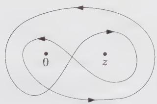

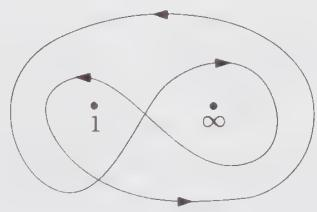  
Figure 9.1. A choice of integration contours for Eq. (9.69), leading to two independent solutions. The contours can be shrunk respectively to $[0, z]$ and $[1, \infty]$ as shown.

The contour of integration must cross each branch twice in opposite directions to guarantee its closure. In principle, there is a certain number of different choices for the integration contour. However, only two are independent. We take, for instance, the two contours depicted on Fig. 9.1, which, when the corresponding integrals

converge, can be shrunk respectively to

$$
\begin{array}{l} \mathcal {C} _ {1} \to [ 1, \infty [ \\ \mathcal {C} _ {2} \to [ 0, z ] \end{array}\tag{9.71}
$$

This shrinking operation produces an overall phase factor, which is ignored at this point. The precise normalization of each integral will be fixed later. These contours (9.71) lead to the two functions

$$
\begin{array}{l} I _ {1} (a, b, c; z) = \int_ {1} ^ {\infty} d w w ^ {a} (w - 1) ^ {b} (w - z) ^ {c} \\ \qquad = \frac {\Gamma (- a - b - c - 1) \Gamma (b + 1)}{\Gamma (- a - c)} F (- c, - a - b - c - 1; - a - c; z), \\ I _ {2} (a, b, c; z) = \int_ {0} ^ {z} d w w ^ {a} (1 - w) ^ {b} (z - w) ^ {c} \\ \qquad = z ^ {1 + a + b + c} \int_ {0} ^ {1} d w w ^ {a} (1 - w) ^ {b} (1 - z w) ^ {c} \\ \qquad = z ^ {1 + a + b + c} \frac {\Gamma (a + 1) \Gamma (c + 1)}{\Gamma (a + c + 2)} F (- b, a + 1; a + c + 2; z) \end{array}\tag{9.72}
$$

Here we denote by $F(\lambda, \mu, \nu; z)$ the hypergeometric function, given for $|z| < 1$ by the series

$$
\boxed {F (\lambda , \mu , \nu ; z) = \sum_ {k = 0} ^ {\infty} \frac {(\lambda) _ {k} (\mu) _ {k}}{k ! (\nu) _ {k}} z ^ {k}}\tag{9.73}
$$

where

$$
\begin{array}{l} (x) _ {0} = 1 \\ (x) _ {k} = x (x - 1) \dots (x - k + 1) \qquad \text { for } k \geq 1 \end{array}
$$

These two functions span the space of solutions of the hypergeometric differential equation, derived by using the singular vector structure of the $(r = 2, s = 1)$ highest-weight module associated with $\phi_{(2,1)}$ (see Exs. 8.9 and 8.10 for a proof). Hence, quite remarkably, the screening procedure has somehow taken into account the Virasoro algebra structure, by directly projecting the $(2, 1)$ primary state onto an irreducible representation, and automatically performing the quotient by singular vectors. There lies the real power of the Coulomb-gas formalism.

The physical correlator (with z and $\bar{z}$ dependence) now takes the form

$$
\begin{array}{l} G (z, \bar {z}) = | z | ^ {- 2 \mu_ {1 2}} | 1 - z | ^ {- 2 \mu_ {2 3}} \\ \qquad \times \left\langle \Phi_ {(r _ {1}, s _ {1})} (0, 0) \Phi_ {(2, 1)} (z, \bar {z}) \Phi_ {(r _ {3}, s _ {3})} (1, 1) \Phi_ {(r _ {4}, s _ {4})} (\infty , \infty) \right\rangle \\ = \sum_ {j = 1, 2} X _ {i j} I _ {i} (z) \overline {{I _ {j} (z)}} \end{array}\tag{9.74}
$$

where $X_{ij}$ is an arbitrary real $2 \times 2$ matrix. This is the most general solution to the z- and $\bar{z}$ -differential equations obeyed by the full correlator.

To complete the calculation, we need to determine the coefficients $X_{ij}$ . This will be done by enforcing the monodromy invariance of the function G. A monodromy transformation of a function of z consists in letting z circulate around some other point (typically a singular point). Since it represents a physical correlator, the function G must not be affected by an analytical continuation along a contour surrounding any of the branch points 0 and 1 and $\infty$ . It is sufficient to consider the monodromy around the two points 0 and 1 (see Fig. 9.2). Let us denote by $c_{0}$ and $c_{1}$ the two corresponding transformations. $G(z,\bar{z})$ must then be invariant under the action of $c_{0}$ and $c_{1}$ , namely

$$
\begin{array}{l} c _ {0} G (z, \bar {z}) = \lim _ {t \to 1 ^ {-}} G (z e ^ {2 i \pi t}, \bar {z} e ^ {- 2 i \pi t}) \\ c _ {1} G (z, \bar {z}) = \lim _ {t \to 1 ^ {-}} G (1 + (z - 1) e ^ {2 i \pi t}, 1 + (\bar {z} - 1) e ^ {- 2 i \pi t}) \end{array}\tag{9.75}
$$

These result in nontrivial constraints because the functions $I_{1}$ and $I_{2}$ are affected by the transformations. The latter are linearly represented in the $(I_{1}, I_{2})$ basis through the monodromy matrices

$$
\begin{array}{l} c _ {0} I _ {i} = \sum_ {j} (g _ {0}) _ {i j} I _ {j} \\ c _ {1} I _ {i} = \sum_ {j} (g _ {1}) _ {i j} I _ {j} \end{array}\tag{9.76}
$$

Using the expressions (9.72), we find that the monodromy around 0 is diagonal

$$
g _ {0} = \left( \begin{array}{c c} 1 & 0 \\ 0 & e ^ {2 i \pi (1 + a + c)} \end{array} \right)\tag{9.77}
$$

hence for $G(z, \bar{z})$ to be invariant under $c_0$ , the coefficients $X_{ij}$ in Eq. (9.74) must be diagonal, that is $X_{ij} = \delta_{i,j}X_i$ , and

$$
G (z, \bar {z}) = \sum_ {j = 1, 2} X _ {j} | I _ {j} (z) | ^ {2}\tag{9.78}
$$

The monodromy of $I_j(z)$ around the point 1 is not diagonal. To compute it, it is simpler to reexpress the functions $I_j(z)$ in terms of similar functions $I_i(1 - z)$ for which the monodromy around the point 1 will be diagonal. To get explicit relations, we restrict ourselves to real $z \in ]0, 1[$ and contours along the real axis.

Starting from $I_{1}(z)$ with its contour $[1, +\infty[$ , we deform the contour into one going from $-\infty$ to 1, avoiding the two singularities 0 and $z$ . There are two different ways of doing this, as shown on Fig. 9.3 (the multiplicative phase factors are explained below):

(i) above the real axis: the half-turn around the point 1 gives a factor $e^{i\pi b}$ , the one around $z$ an additional factor of $e^{i\pi c}$ , and the one around 0 an additional $e^{i\pi a}$ .

(ii) below the real axis: all the half-turns have opposite directions (compared to (i)), hence the phase factors picked up are the complex conjugates of those in (i).

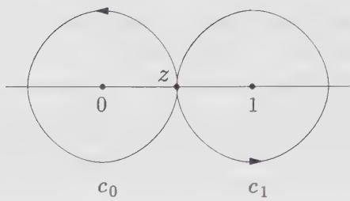  
Figure 9.2. Monodromy transformations $c_{0}$ and $c_{1}$ : $z$ circles once around the respective branch points 0 and 1.

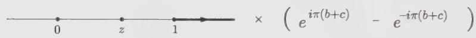

$$
= \left[ \begin{array}{l l} - (\mathrm{i}) & e ^ {i \pi (a + b + c)} \quad e ^ {i \pi (b + c)} \quad e ^ {i \pi b} \\ & 0 \quad z \quad 1 \\ + (\mathrm{ii}) & e ^ {- i \pi (a + b + c)} \quad e ^ {- i \pi (b + c)} \quad e ^ {- i \pi b} \\ & 0 \quad z \quad 1 \end{array} . \times e ^ {- i \pi (b + c)} \times e ^ {i \pi (b + c)} \right]
$$

$$
= \left[ \begin{array}{l l} + & \times \left(e ^ {- i \pi a} - e ^ {i \pi a}\right) \\ + & \times \left(e ^ {i \pi b} - e ^ {- i \pi b}\right) \end{array} \right]
$$

Figure 9.3. The two possible deformations of the contour $[1, \infty[$ , (i) and (ii), are combined to yield integrals over the contours $[- \infty, 0]$ and $[z, 1]$ .

As indicated on Fig. 9.3, in order to cancel the respective contributions of the $[0,z]$ portion of the contours $\mathcal{C}_{(i)}$ and $\mathcal{C}_{(ii)}$ , we must take the following linear combination

$$
\sin \pi (b + c) \int_ {[ 1, + \infty [} = \sin \pi a \int_ {[ - \infty , 0 ]} + 0 \times \int_ {[ 0, z ]} - \sin \pi c \int_ {[ 1, z ]}\tag{9.79}
$$

which amounts to the relation (for short we denote $s(x) = \sin \pi x$ )

$$
I _ {1} (a, b, c; z) = \frac {s (a)}{s (b + c)} I _ {1} (b, a, c; 1 - z) - \frac {s (c)}{s (b + c)} I _ {2} (b, a, c; 1 - z)\tag{9.80}
$$

Analogously, by deforming the contour $[0,z]$ into $[- \infty, 0] \cup [z, +\infty[$ , we get

$$
I _ {2} (a, b, c; z) = - \frac {s (a + b + c)}{s (b + c)} I _ {1} (b, a, c; 1 - z) - \frac {s (b)}{s (b + c)} I _ {2} (b, a, c; 1 - z)\tag{9.81}
$$

Note the interchange $a \leftrightarrow b$ , which corresponds to the interchange of the points $z_{1} = 0$ and $z_{3} = 1$ in the conformal blocks $I$ . With $\tilde{I}_{j}(z) = I_{j}(b, a, c; z)$ , Eqs. (9.80)-(9.81) take the form

$$
I _ {i} (z) = \sum_ {j = 1, 2} f _ {i j} \tilde {I} _ {j} (1 - z)\tag{9.82}
$$

where f is a constant $2 \times 2$ matrix. Henceforth, we have

$$
G (z, \bar {z}) = \sum_ {j, k, l = 1, 2} X _ {i} f _ {i k} f _ {i l} \tilde {I} _ {k} (1 - z) \overline {{\tilde {I} _ {l} (1 - z)}}\tag{9.83}
$$

The monodromy of $\tilde{I}_k(1 - z)$ around the point 1 being diagonal, the invariance of $G$ imposes that

$$
\tilde {X} _ {k l} = \sum_ {i = 1, 2} X _ {i} f _ {i k} f _ {i l}\tag{9.84}
$$

be a diagonal matrix. This forces

$$
\sum_ {i = 1, 2} X _ {i} f _ {i k} f _ {i l} = 0 \quad \forall k \neq l\tag{9.85}
$$

from which we read

$$
\frac {X _ {1}}{X _ {2}} = - \frac {f _ {2 1} f _ {2 2}}{f _ {1 2} f _ {1 1}} = \frac {s (a + b + c) s (b)}{s (a) s (c)}\tag{9.86}
$$

Up to an overall normalization, we finally get

$$
G (z, \bar {z}) \sim \left[ \frac {s (b) s (a + b + c)}{s (a + c)} | I _ {1} (z) | ^ {2} + \frac {s (a) s (c)}{s (a + c)} | I _ {2} (z) | ^ {2} \right]\tag{9.87}
$$

or equivalently

$$
\begin{array}{l} \langle \phi_ {(r _ {1}, s _ {1})} (0) \phi_ {(2, 1)} (z) \phi_ {(r _ {3}, s _ {3})} (1) \phi_ {(r _ {4}, s _ {4})} (\infty) \rangle \sim \\ | z | ^ {4 \alpha_ {2, 1} \alpha_ {r _ {1}, s _ {1}}} | 1 - z | ^ {4 \alpha_ {2, 1} \alpha_ {r _ {3}, s _ {3}}} \times \\ \left[ \frac {s (b) s (a + b + c)}{s (a + c)} | I _ {1} (z) | ^ {2} + \frac {s (a) s (c)}{s (a + c)} | I _ {2} (z) | ^ {2} \right] \end{array}\tag{9.88}
$$

We compare this result with Eq. (9.61). In the latter equation, we take the limits $z_{1} \rightarrow 0$ , $z_{2} \rightarrow z$ , $z_{3} \rightarrow 1$ , $z_{4} \rightarrow \infty$ , and let z tend to 0. It appears that only two primary fields occur in the fusion $\phi_{(2,1)}\times \phi_{(r_1,s_1)}$ , corresponding to the two leading terms in the $z\to 0$ limit of Eq. (9.87)

$$
\begin{array}{l} G (z, \bar {z}) \sim | z | ^ {4 \alpha_ {2, 1} \alpha_ {r _ {1}, s _ {1}}} | 1 - z | ^ {4 \alpha_ {2, 1} \alpha_ {r _ {3}, s _ {3}}} \\ \times \left[ \frac {s (b) s (a + b + c)}{s (a + c)} N _ {1} ^ {2} + \frac {s (a) s (c)}{s (a + c)} N _ {2} ^ {2} | z | ^ {2 (1 + a + c)} + \dots \right] \end{array}\tag{9.89}
$$

The constants $N_{i}$ are related to the asymptotic behavior of the $I$ 's by

$$
I _ {1} (z) \simeq N _ {1} \quad I _ {2} (z) \simeq z ^ {1 + a + c} N _ {2} \quad \text { when } z \to 0\tag{9.90}
$$

As $F(\lambda, \mu, \nu; 0) = 1$ , they read explicitly

$$
N _ {1} = \frac {\Gamma (- 1 - a - b - c) \Gamma (b + 1)}{\Gamma (- a - c)} \quad N _ {2} = \frac {\Gamma (a + 1) \Gamma (c + 1)}{\Gamma (a + c + 2)}\tag{9.91}
$$

The leading powers of $z$ and $\bar{z}$ in Eq. (9.89) are easily identified, respectively, with

$$
\begin{array}{r l} 2 \alpha_ {2, 1} \alpha_ {r _ {1}, s _ {1}} & = \frac {r _ {1} - 1}{2} \frac {p}{p ^ {\prime}} - \frac {s _ {1} - 1}{2} \\ & = h _ {r _ {1} + 1, s _ {1}} - h _ {r _ {1}, s _ {1}} - h _ {2, 1} \\ 2 \alpha_ {2, 1} \alpha_ {r _ {1}, s _ {1}} + 1 + a + c & = - \frac {1 + r _ {1}}{2} \frac {p}{p ^ {\prime}} + \frac {1 + s _ {1}}{2} \\ & = h _ {r _ {1} - 1, s _ {1}} - h _ {r _ {1}, s _ {1}} - h _ {2, 1} \end{array}\tag{9.92}
$$

Hence the first term in Eq. (9.89) corresponds to $\phi_{(r_1 + 1, s_1)}$ , and the second one to $\phi_{(r_1 - 1, s_1)}$ , leading to the fusion rule

$$
\phi_ {(2, 1)} \times \phi_ {(r _ {1}, s _ {1})} = \phi_ {(r _ {1} + 1, s _ {1})} + \phi_ {(r _ {1} - 1, s _ {1})}\tag{9.93}
$$

Next, we identify the numerical factors as, respectively, (see Eq. (9.61))

$$
\begin{array}{c} X _ {1} N _ {1} ^ {2} = \frac {s (b) s (a + b + c)}{s (a + c)} N _ {1} ^ {2} \sim C _ {r _ {1}, s _ {1}; 2, 1} ^ {r _ {1} + 1, s _ {1}} C _ {r _ {3}, s _ {3}; r _ {4}, s _ {4}} ^ {r _ {1} + 1, s _ {1}} \\ X _ {2} N _ {2} ^ {2} = \frac {s (a) s (c)}{s (a + c)} N _ {2} ^ {2} \sim C _ {r _ {1}, s _ {1}; 2, 1} ^ {r _ {1} - 1, s _ {1}} C _ {r _ {3}, s _ {3}; r _ {4}, s _ {4}} ^ {r _ {1} - 1, s _ {1}} \end{array}\tag{9.94}
$$

up to an overall normalization of $G$ . We get, for instance, all the squares of structure constants of the form $C_{r,s;2,1}^{k,l}$ by taking $r_3 = 1, s_3 = 2, r_4 = r_1 = r, s_4 = s_1 = s$ .

We now address the normalization problem for the function $G$ . The correct normalization is required to get the exact expressions for the structure constants. The overall normalization of the function $G$ in Eq. (9.87) can be fixed by directly computing the two-dimensional integral (over $\mathbb{C}$ ) involving the full left-right vertex operators (9.5)

$$
\begin{array}{l} G (z, \bar {z}) = | z | ^ {- 4 \alpha_ {2, 1} \alpha_ {r _ {1}, s _ {1}}} | 1 - z | ^ {- 4 \alpha_ {2, 1} \alpha_ {r _ {3}, s _ {3}}} \times \\ \int d ^ {2} w \langle \mathcal {V} _ {r _ {1}, s _ {1}} (0, 0) \mathcal {V} _ {2, 1} (z, \bar {z}) \mathcal {V} _ {r _ {3}, s _ {3}} (1, 1) \mathcal {V} _ {- r _ {4}, - s _ {4}} (\infty , \infty) \mathcal {V} _ {+} (w, \bar {w}) \rangle \end{array}\tag{9.95}
$$

but we will not go into this calculation here. Instead we will resort to the crossing symmetry of the four-point correlation to fix this normalization. This amounts to imposing that

$$
\langle \Phi_ {(r, s)} \Phi_ {(2, 1)} \Phi_ {(2, 1)} \Phi_ {(r, s)} \rangle = \langle \Phi_ {(2, 1)} \Phi_ {(2, 1)} \Phi_ {(r, s)} \Phi_ {(r, s)} \rangle\tag{9.96}
$$

or equivalently

$$
\sum_ {j = 1, 2} X _ {j} | I _ {j} (z) | ^ {2} = \sum_ {k = 1, 2} \tilde {X} _ {k} | \tilde {I} _ {k} (z) | ^ {2}\tag{9.97}
$$

where the change $z \rightarrow 1 - z$ in G accounts for the permutation of the fields in the correlation. Identifying the structure constants (9.61) in the expression of the second correlation function of Eq. (9.96), we get

$$
\begin{array}{r l} \tilde {X} _ {1} \tilde {N} _ {1} ^ {2} & \sim C _ {2, 1; 2, 1} ^ {3, 1} C _ {r, s; r, s} ^ {3, 1} \\ \tilde {X} _ {2} \tilde {N} _ {2} ^ {2} & \sim C _ {2, 1; 2, 1} ^ {1, 1} C _ {r, s; r, s} ^ {1, 1} \end{array}\tag{9.98}
$$

up to the same overall normalization constant as implied in Eq. (9.94). Here the normalization constants $\tilde{N}_{i}, i = 1, 2$ , are obtained from the $z \rightarrow 0$ limit of the $\tilde{I}$ 's

$$
\tilde {I} _ {1} (z) \simeq \tilde {N} _ {1}, \quad \tilde {I} _ {2} (z) \simeq \tilde {N} _ {2} z ^ {1 + b + c} \quad \mathrm{when} z \to 0\tag{9.99}
$$

They are simply related to the original $N$ 's. But the second term of Eq. (9.98) involves only the structure constants involving the identity operator $\phi_{(1,1)}$ . These two-point function normalization constants have been chosen from the beginning to be 1, that is

$$
C _ {r, s; r, s} ^ {1, 1} = 1\tag{9.100}
$$

for any $\Phi_{(r,s)}$ in the theory. This fixes the exact normalization of $X_{2}$ , and henceforth that of all the $X$ 's. The correctly normalized structure constants satisfy then

$$
\begin{array}{r} \left(C _ {r, s; 2, 1} ^ {r + 1, s}\right) ^ {2} = X _ {1} N _ {1} ^ {2} / \tilde {X} _ {2} \tilde {N} _ {2} ^ {2} \\ \left(C _ {r, s; 2, 1} ^ {r - 1, s}\right) ^ {2} = X _ {2} N _ {2} ^ {2} / \tilde {X} _ {2} \tilde {N} _ {2} ^ {2} \end{array}\tag{9.101}
$$

The general computation of all the structure constants $C_{r_{1},s_{1};r_{2},s_{2}}^{r_{3},s_{3}}$ relies on a generalization of the above procedure, where $\Phi_{(2,1)}$ is replaced by an arbitrary $\Phi_{(r_{2},s_{2})}$ . The resulting four-point correlation function $G(z,\bar{z})$ of Eq. (9.66) will split again into a block-diagonal sum

$$
G (z, \bar {z}) \sim \sum_ {j = 1} ^ {N} X _ {j} | I _ {j} (z) | ^ {2}\tag{9.102}
$$

over the $N = r_{2} \times s_{2}$ independent solutions of the $(r_{2}, s_{2})$ differential equation of order N obeyed by the correlation function. The solutions $I_{j}$ take the form of multiple integrals including the necessary screening operators, involving a number of contours of the form $[0, z]$ or $[1, \infty[$ . The study of the monodromy of these integrals enables us to fix the values of the coefficients $X_{j}$ in the sum of Eq. (9.102), and to consequently identify the wanted structure constants. Although the strategy is clear, the calculations quickly become very complicated and will not be pursued here. We leave to the reader the task of computing correlators involving $\Phi_{(1,3)}$ (see Ex. 9.6).

## §9.3. Minimal Models: General Structure of Correlation Functions

## 9.3.1. Conformal Blocks for the Four-Point Functions

The structure of the four-point correlations of minimal models was given in Sect. 9.2.3 above. The result, in the form of Eq. (9.102), strongly suggests the following interpretation. The four-point correlations, as functions of the $SL(2,\mathbb{C})$ -invariant cross-ratio $z$ , decompose into a sum of holomorphic $\times$ antiholomorphic functions of $z$ and $\bar{z}$ , respectively. These functions (denoted $I_{k}$ in Sect. 9.2.3) are in one-to-one correspondence with the intermediate states $\phi_{(r,s)}$ allowed by the OPE. This leads to the following expression for the correlator

$$
\begin{array}{l} \mathcal {G} (z, \bar {z}) = \langle \Phi_ {(r _ {1}, s _ {1})} (0, 0) \Phi_ {(r _ {2}, s _ {2})} (z, \bar {z}) \Phi_ {(r _ {3}, s _ {3})} (1, 1) \Phi_ {(r _ {4}, s _ {4})} (\infty , \infty) \rangle \\ = \sum_ {r, s; \bar {r}, \bar {s}} \mathcal {F} _ {r, s} (z)   \bar {\mathcal {F}} _ {\bar {r}, \bar {s}} (\bar {z}) \end{array}\tag{9.103}
$$

where each conformal block $F_{r,s}$ corresponds to a field $\phi_{(r,s)}$ occurring in the following fusion rules $^{6}$

$$
\begin{array}{r} \phi_ {(r, s)} \in \phi_ {(r _ {1}, s _ {1})} \times \phi_ {(r _ {2}, s _ {2})} \\ \phi_ {(r, s)} \in \phi_ {(r _ {3}, s _ {3})} \times \phi_ {(r _ {4}, s _ {4})} \end{array}\tag{9.104}
$$

This is best seen by inserting a complete set of intermediate states in the correlator (9.103) and taking the limit of coinciding points $z \to 0$ (corresponding to $z_1 \to z_2$ and $z_3 \to z_4$ in the original correlator). In this limit, for each intermediate state, the four-point correlation function $\mathcal{G}(z, \bar{z})$ factorizes into a product of two three-point functions as

$$
\mathcal {G} (z, \bar {z}) \sim \langle \Phi_ {(r _ {1}, s _ {1})} \Phi_ {(r _ {2}, s _ {2})} \Phi_ {(r, s)} \rangle \langle \Phi_ {(r, s)} \Phi_ {(r _ {3}, s _ {3})} \Phi_ {(r _ {4}, s _ {4})} \rangle ,\tag{9.105}
$$

which gives the normalization of the corresponding conformal block. We recover the fusion conditions (9.104) for this normalization to be nonzero.

We use the following graphical representation for conformal blocks:

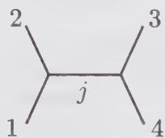

(9.106)

where, for simplicity, we trade the Kac indices for a single Latin index, namely $(r_{i}, s_{i}) \to i$ (i = 1, 2, 3, 4) and $(r, s) \to j$ . This graphical representation has the advantage of carrying all the relevant information about the block, namely the fields in the correlator (external legs) and the intermediate state (propagator). Beyond mere nomenclature, the idea of conformal blocks attached to intermediate states provides us with a more physical interpretation of the (contour) integral representations of Sect. 9.2. The intermediate states are not encoded in the integrand (screening operators), but in the contours of integration chosen to represent the blocks. In Sect. 9.2.3, we have seen how monodromy transformations exchanged these contours among themselves. These transformations will have a simple interpretation in terms of conformal blocks.

## 9.3.2. Conformal Blocks for the $N$ -Point Function on the Plane

By associativity of the OPE, a general correlation function

$$
\mathcal {G} _ {N} (z _ {i}, \bar {z} _ {i}) = \langle \Phi_ {1} (z _ {1}, \bar {z} _ {1}) \Phi_ {2} (z _ {2}, \bar {z} _ {2}) \dots \Phi_ {N} (z _ {N}, \bar {z} _ {N}) \rangle\tag{9.107}
$$

can be inductively decomposed into a sum of holomorphic $\times$ antiholomorphic functions of the z's and $\bar{z}$ 's, respectively, which generalize the notion of conformal block already encountered for N = 4. This is best seen by inserting complete sets of intermediate states in the correlator (9.107), and decomposing it accordingly into a product of three-point functions, in the limit where all the points coincide, namely

$$
\mathcal {G} _ {N} (z _ {i}, \bar {z} _ {i}) \sim \sum_ {j _ {1}, \dots , j _ {N - 3}} \langle \Phi_ {1} \Phi_ {2} \Phi_ {j _ {1}} \rangle \langle \Phi_ {j _ {1}} \Phi_ {3} \Phi_ {j _ {2}} \rangle \dots \langle \Phi_ {j _ {N - 3}} \Phi_ {N - 1} \Phi_ {N} \rangle\tag{9.108}
$$

For the corresponding block to occur, a number of fusion conditions must be satisfied

$$
\begin{array}{l} \phi_ {j _ {1}} \in \phi_ {1} \times \phi_ {2} \\ \phi_ {j _ {2}} \in \phi_ {j _ {1}} \times \phi_ {3} \\ \dots \dots \\ \phi_ {N} \in \phi_ {j _ {N - 3}} \times \phi_ {N - 1} \end{array}\tag{9.109}
$$

These restrict the possible intermediate states. The graphical representation for the (left) conformal block corresponding to Eq. (9.108) reads

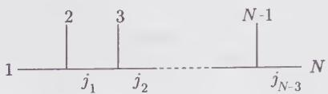

(9.110)

## 9.3.3. Monodromy and Exchange Relations for Conformal Blocks

In Sect. 9.2.3, we have computed the monodromy of the conformal blocks of four-point functions involving $\phi_{(2,1)}$ . For that purpose, we have used the transformation $z \to 1 - z$ of the conformal blocks. The latter amounts to the exchange of the points $z_1 (= 0)$ and $z_3 (= 1)$ in the original correlation. It is equivalent to the following operation on the conformal blocks, where, again for simplicity, we now denote the various fields by only one Latin index:

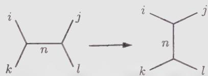

(9.111)

This is called the crossing operation and is easily generalized to any four-point conformal block. The four-point conformal blocks are linearly transformed under crossing as

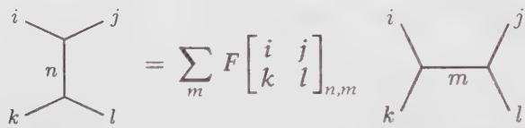

(9.112)

The matrices F are called the crossing matrices $^{7}$ of the corresponding conformal theory. (In Sect. 9.2.3, F corresponds to the inverse $f^{-1}$ of the matrix f, see, e.g., Eq. (9.82), but with a different normalization.)

Another elementary operation consists in exchanging the two upper external legs, namely $z_{2} \leftrightarrow z_{3}$ . In terms of the cross-ratio z, this amounts to $z \rightarrow 1/z$ . Remarkably, this is also realized linearly on the conformal blocks, as

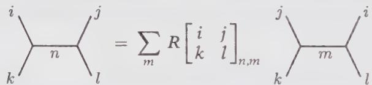

(9.113)

The matrices $R_{r,s}$ are called the exchange matrices $^{8}$ of the conformal theory.

The crossing and exchange matrices satisfy a number of identities. For instance, rotating the diagram on the l.h.s. of (9.112) by 90 degrees and applying Eq. (9.112), we find the quadratic relation

$$
\sum_ {m} F \left[ \begin{array}{c c} i & j \\ k & l \end{array} \right] _ {n, m} F \left[ \begin{array}{c c} k & i \\ l & j \end{array} \right] _ {m, p} = \delta_ {n, p}\tag{9.114}
$$

which allows F to be inverted.

The crossing operation (9.112) can be interpreted as a change of basis of the conformal blocks; recall from Sect. 9.2.3 that crossing amounts to the change of basis $\{I_j\} \to \{\tilde{I}_k\}$ . We can use the definition of the matrix $F$ to rewrite the invariance of the full four-point correlation (9.103) under crossing (with the shorthand notation $i$ for $(s_i, r_i)$ and $\bar{i}$ for $(\bar{r}_i, \bar{s}_i))$

$$
\begin{array}{r l} & {\mathcal {G} (z, \bar {z}) = \sum_ {n, \bar {n}} \mathcal {F} _ {n} (z) \mathcal {F} _ {\bar {n}} (\bar {z})} \\ & {\quad = \mathcal {G} (1 - z, 1 - \bar {z})} \\ & {\quad = \sum_ {n, \bar {n}} \sum_ {m, \bar {m}} F \left[ \begin{array}{c c} 1 & 2 \\ 4 & 3 \end{array} \right] _ {n, m} \bar {F} \left[ \begin{array}{c c} \bar {1} & \bar {2} \\ \bar {4} & \bar {3} \end{array} \right] _ {\bar {n}, \bar {m}} \tilde {\mathcal {F}} _ {m} (z) \tilde {\mathcal {F}} _ {\bar {m}} (\bar {z})} \end{array}\tag{9.115}
$$

In the blocks $\tilde{F}$ , the points $z_{1}=0$ and $z_{3}=1$ of F have been exchanged. The normalization of the conformal blocks is related to the structure constants of the theory through

$$
\begin{array}{r} \mathcal {F} _ {n} (z) \sim C _ {1 2} ^ {n} C _ {3 4} ^ {n} z ^ {h _ {n} - h _ {1} - h _ {2}} \\ \tilde {\mathcal {F}} _ {n} (z) \sim C _ {3 2} ^ {n} C _ {1 4} ^ {n} z ^ {h _ {n} - h _ {3} - h _ {2}} \end{array}\tag{9.116}
$$

Taking the limit $z \to 0$ in Eq. (9.115), we get a relation between the structure constants of the theory and the matrix $F$

$$
\boxed { \begin{array}{l} C _ {1 2} ^ {n} C _ {3 4} ^ {n} C _ {\bar {1} \bar {2}} ^ {\bar {n}} C _ {\bar {3} \bar {4}} ^ {\bar {n}} \\ = \sum_ {\substack {m, \bar {m} \\ h _ {m} = h _ {1} + h _ {3} - h _ {n}}} F \left[ \begin{array}{c c} 1 & 2 \\ 4 & 3 \end{array} \right] _ {n, m} \bar {F} \left[ \begin{array}{c c} \bar {1} & \bar {2} \\ \bar {4} & \bar {3} \end{array} \right] _ {\bar {n}, \bar {m}} C _ {3 2} ^ {m} C _ {1 4} ^ {m} C _ {\bar {3} \bar {2}} ^ {\bar {m}} C _ {\bar {1} \bar {4}} ^ {\bar {m}} \end{array} }\tag{9.117}
$$

This is an overdetermined system of equations for the C's. Its compatibility is guaranteed by extra relations that are satisfied by F. The matrix F thus contains all the necessary data to compute the structure constants of the theory. It is tempting to consider F as the fundamental data of the theory. A constructive approach to conformal field theory consists of a set of axioms and identities that have to be satisfied by the matrices F and R for the theory to be consistent. One of them is the so-called Yang-Baxter equation, which must be satisfied by R, expressing some braiding transformation on the conformal blocks of the five-point function in two inequivalent ways (see Ex. 9.9). Another is the pentagon identity, which results from the two distinct but equivalent ways of transforming the conformal blocks of a five-point function (see Ex. 9.10 for the precise statement). But these axioms are incomplete as long as higher topologies are ignored. Enforcing conformal theories to be well-defined on surfaces of arbitrary topology puts more constraints on R and F. This point is briefly addressed in the next subsection.

## 9.3.4. Conformal Blocks for Correlators on a Surface of Arbitrary Genus

It is possible to define conformal field theories on a two-dimensional closed manifold (surface) with more complicated topology than the plane. In two dimensions, two closed orientable manifolds are topologically equivalent, that is, they can be continuously deformed into each other, iff they have the same genus, that is the same number of handles h. The genus is the only topological invariant of two-dimensional orientable surfaces. We have already considered a free bosonic theory on a genus h surface in Sect. 9.1. More general conformal theories, such as minimal models, can also be formulated on higher genus surfaces, even though a Lagrangian formulation is not available. Indeed the Coulomb-gas representation of minimal theories goes over to surfaces of arbitrary genus, with some extra structure emerging already on the torus, in genus $h = 1.^{9}$

A correlation function of conformal fields on a genus h surface will again be decomposed into a sum of left × right conformal blocks, according to the insertion of intermediate states in the original correlator. The influence of the nontrivial topology is readily seen in the intermediate channels, which can be chosen to wrap around the handles, and hence “feel” the topology. Graphically, a conformal block for an N-point function on a genus-h surface is represented as a genus-h $\phi^{3}$ diagram, with N external legs labeled by the fields in the correlator, and h internal loops. The propagators carry intermediate states indices. This is illustrated on Fig. 9.4, in the case of a genus-5 two-point function. Note that there seem to be many inequivalent ways of even drawing the diagram. That these should all be equivalent turns out to be an additional constraint on the theory.

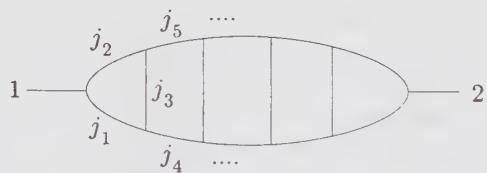  
Figure 9.4. A sample conformal block for a two-point correlation on a genus 5 surface.

It is now clear why consistency of the theory at higher genera puts more constraints on R and F: an operation such as the circulation of an argument of a conformal block around a handle of the surface, in addition to capturing the effect of topology, also affects the conformal blocks, thereby relating R and F to the topological structure. The simplest relations of this kind will be studied in Chap. 10, in the case of the torus.

## Appendix 9.A. Calculation of the Energy-Momentum Tensor

In this appendix we show explicitly that the energy-momentum tensor associated with the action (9.24) is $T_{\mu\nu} = T_{\mu\nu}^{(0)} + T_{\mu\nu}^{(1)}$ , where $T_{\mu\nu}^{(0)}$ is the energy-momentum tensor for the free boson:

$$
T _ {\mu \nu} ^ {(0)} = \frac {1}{4 \pi} \left(\partial_ {\mu} \varphi \partial_ {\nu} \varphi - \frac {1}{2} \eta_ {\mu \nu} \partial_ {\sigma} \varphi \partial^ {\sigma} \varphi\right)\tag{9.118}
$$

whereas $T_{\mu\nu}^{(1)}$ is the energy-momentum tensor associated with the curvature term of Eq. (9.24):

$$
T _ {\mu \nu} ^ {(1)} = - \frac {\gamma}{2 \pi} \left(\partial_ {\mu} \partial_ {\nu} \varphi - \frac {1}{2} \eta_ {\mu \nu} \partial^ {\sigma} \partial_ {\sigma} \varphi\right)\tag{9.119}
$$

This calculation will be performed in an arbitrary dimension d.

We use the definition (2.193) of the energy-momentum tensor:

$$
\delta S = - \frac {1}{2} \int d x T ^ {\mu \nu} \delta g _ {\mu \nu}\tag{9.120}
$$

In this definition, the variation $\delta g_{\mu\nu}$ is taken in an arbitrary metric, but evaluated in flat space once $\delta g_{\mu\nu}$ has been isolated. We concentrate on the curvature term, since $T_{\mu\nu}^{(0)}$ has been calculated before (see Chap. 2, following Eq. (2.193), or Sect. 5.3.1). We need to calculate the variation of $\sqrt{g} R\varphi$ under an infinitesimal deformation $\delta g_{\mu\nu}$ of the metric tensor. It is a simple matter to see that

$$
\begin{array}{l} \delta \sqrt {g} = \frac {1}{2} \sqrt {g} g ^ {\mu \nu} \delta g _ {\mu \nu} \\ \delta g ^ {\mu \nu} = - g ^ {\mu \alpha} g ^ {\nu \beta} \delta g _ {\alpha \beta} \end{array}\tag{9.121}
$$

Calculating the variation of the curvature is trickier. We recall the following definitions for the Christoffel symbols $\Gamma_{\beta\gamma}^{\alpha}$ , the Riemann curvature tensor $R_{\beta\gamma\lambda}^{\alpha}$ , the Ricci tensor $R_{\mu\nu}$ , and the scalar curvature R:

$$
\begin{array}{c} \Gamma_ {\beta \gamma} ^ {\alpha} = \frac {1}{2} g ^ {\alpha \delta} \left(\partial_ {\beta} g _ {\delta \gamma} + \partial_ {\gamma} g _ {\delta \beta} - \partial_ {\delta} g _ {\beta \gamma}\right) \\ R _ {\beta \gamma \lambda} ^ {\alpha} = \partial_ {\gamma} \Gamma_ {\beta \lambda} ^ {\alpha} - \partial_ {\lambda} \Gamma_ {\beta \gamma} ^ {\alpha} + \Gamma_ {\delta \gamma} ^ {\alpha} \Gamma_ {\beta \lambda} ^ {\delta} - \Gamma_ {\delta \lambda} ^ {\alpha} \Gamma_ {\beta \gamma} ^ {\delta} \\ R _ {\mu \nu} = R _ {\mu \alpha \nu} ^ {\alpha} \\ R = g ^ {\mu \nu} R _ {\mu \nu} \end{array}\tag{9.122}
$$

The first step is to express the variation of R as

$$
\delta R = \delta g ^ {\mu \nu} R _ {\mu \nu} + g ^ {\mu \nu} \delta R _ {\mu \nu}\tag{9.123}
$$

In flat space the first term vanishes; the second term may be evaluated first in a coordinate system that is locally inertial ( $\Gamma_{\beta\gamma}^{\alpha}=0$ at the point of interest), with the result

$$
g ^ {\mu \nu} \delta R _ {\mu \nu} = \partial_ {\mu} \left\{g ^ {\alpha \beta} \delta \Gamma_ {\alpha \beta} ^ {\mu} - g ^ {\alpha \mu} \delta \Gamma_ {\alpha \beta} ^ {\beta} \right\}\tag{9.124}
$$

Since the quantity in braces is a vector (call it $w^{\mu}$ ), we may rewrite the above in a general coordinate system as

$$
g ^ {\mu \nu} \delta R _ {\mu \nu} = \frac {1}{\sqrt {g}} \partial_ {\mu} (\sqrt {g} w ^ {\mu})\tag{9.125}
$$

We also use the following properties of the Christoffel symbols, also valid in a general coordinate system:

$$
\begin{array}{r} \Gamma_ {\alpha \beta} ^ {\beta} = \partial_ {\alpha} (\ln \sqrt {g}) \\ g ^ {\alpha \beta} \Gamma_ {\alpha \beta} ^ {\mu} = - \frac {1}{\sqrt {g}} \partial_ {\alpha} (g ^ {\mu \alpha} \sqrt {g}) \end{array}\tag{9.126}
$$

Dropping along the way terms that vanish in flat space once $\delta g_{\mu\nu}$ is isolated, the variation of the curvature term in the action is

$$
\begin{array}{r l} & {\delta S _ {1} = \frac {\gamma}{4 \pi} \int d ^ {2} x \sqrt {g} \varphi g ^ {\mu \nu} \delta R _ {\mu \nu}} \\ & {\quad = - \frac {\gamma}{4 \pi} \int d ^ {2} x \sqrt {g} \partial_ {\mu} \varphi w ^ {\mu}} \\ & {\quad = \frac {\gamma}{4 \pi} \int d ^ {2} x \sqrt {g} \partial_ {\mu} \varphi \delta \left\{\frac {1}{\sqrt {g}} \partial_ {\alpha} (g ^ {\mu \alpha} \sqrt {g}) + g ^ {\alpha \mu} \partial_ {\alpha} (\ln \sqrt {g}) \right\}} \end{array}\tag{9.127}
$$

Integrating by parts once more, we may drop the derivatives acting on the metric (they vanish in the flat limit) and we end up with

$$
\delta S _ {1} = \frac {\gamma}{4 \pi} \int d ^ {2} x \partial_ {\alpha} \partial_ {\beta} \varphi \left(\eta^ {\alpha \mu} \eta^ {\beta \nu} - \frac {1}{2} \eta^ {\alpha \beta} \eta^ {\mu \nu}\right) \delta g _ {\mu \nu}\tag{9.128}
$$

The energy-momentum tensor (9.119) follows. Note the importance of using the relations (9.126): The variation must be taken in an arbitrary coordinate system. Had we proceeded from Eq. (9.124) directly, the variation $\delta S_{1}$ would have vanished in two-dimensional flat space!

## Appendix 9.B. Screened Vertex Operators and BRST Cohomology: A Proof of the Coulomb-Gas Representation of Minimal Models

This appendix presents a sketch of the proof validating the Coulomb-gas approach to minimal models. The proof relies on a detailed study of the action of screening operators on the basic states of a given bosonic Fock space, slightly modified by the addition of a charge. As a result, the irreducible Virasoro modules will appear as the cohomology spaces of a particular screening operator, interpreted as a BRST charge for the minimal model. The emergence of a BRST scheme in the context of conformal theory provides us with an interesting parallel with ordinary gauge theory. We recall the origin of the BRST operator in gauge theory: The initial problem is to fix a gauge to regularize the otherwise-divergent path integral of gauge theory. This is done at the cost of introducing a delta-function, bringing an extra (Faddeev-Popov) determinant, which is in turn incorporated into the gauge action upon introducing extra anticommuting (ghost) variables. This modification of the gauge action actually brings an extra symmetry, generated by the BRST operator Q. This symmetry is nilpotent $Q^{2} = 0$ and must annihilate the physical states of the theory, which therefore lie in the kernel of Q. The BRST-exact states (lying in the image of Q) have to be further eliminated (they decouple from the theory), hence the physical states belong to the cohomology space of $Q^{10}$ .

$$
H ^ {*} (Q) = \operatorname{Ker} Q / \operatorname{Im} Q\tag{9.129}
$$

The BRST operator Q in the present context of minimal theories should be thought of as the result of gauge-fixing of the diffeomorphisms of the circle (reparametrizations) in a would-be free field action functional formulation.

Throughout this appendix, the objects under scrutiny are all chiral, namely they pertain only to the left (or right) sector of the corresponding conformal theory. In particular, the vertex operators constructed below are only z-dependent, and will enter in the representation of holomorphic conformal blocks for the correlation functions of the conformal theory.

## 9.B.1. Charged Bosonic Fock Spaces and Their Virasoro Structure

We start with the notion of charged bosonic Fock space, which is a slight modification of the ordinary bosonic Fock space defined in Sect. 6.3.3. The charged Fock space $F_{\alpha,\alpha_{0}}$ , with vacuum charge $\alpha$ and background charge $\alpha_{0}$ , forms a representation of the Heisenberg algebra

$$
[ a _ {n}, a _ {m} ] = n \delta_ {n + m, 0}\tag{9.130}
$$

The representation is generated by the free action of any product of $a_{n}, n < 0$ , on a highest-weight vector $|\alpha, \alpha_{0}\rangle$ , subject to the conditions

$$
\begin{array}{l} a _ {n} | \alpha , \alpha_ {0} \rangle = 0 \quad \forall n > 0 \\ a _ {0} | \alpha , \alpha_ {0} \rangle = \sqrt {2}   \alpha | \alpha , \alpha_ {0} \rangle \end{array}\tag{9.131}
$$

Moreover, the space $F_{\alpha,\alpha_{0}}$ is endowed with a structure of Virasoro module, where the Virasoro generators are constructed from the Heisenberg algebra generators as

$$
L _ {n} = \frac {1}{2} \sum_ {k \in \mathbb {Z}} a _ {n - k} a _ {k} - \sqrt {2} \alpha_ {0} (n + 1) a _ {n} n \neq 0
$$

$$
L _ {0} = \sum_ {k = 1} ^ {\infty} a _ {- k} a _ {k} + \frac {1}{2} a _ {0} ^ {2} - \sqrt {2} \alpha_ {0} a _ {0}\tag{9.132}
$$

This is just the mode expansion of the deformed energy-momentum tensor (9.30) of a chiral free bosonic theory (that is with the $\bar{z}$ -dependence dropped)

$$
i \partial \varphi = \sum_ {n \in \mathbb {Z}} a _ {n} z ^ {- n - 1}
$$

with a curvature term added to the free action (9.24). (We take the convention $g = 1/4\pi$ in Eq. (6.55).) From Sect. 9.1.4, we know that the modes (9.132) generate a Virasoro algebra with central charge

$$
c = 1 - 2 4 \alpha_ {0} ^ {2}\tag{9.133}
$$

(See Ex. 9.11 for an alternative proof using the mode expansion.)

The state $|\alpha, \alpha_0\rangle$ is the highest-weight of $F_{\alpha, \alpha_0}$ with conformal dimension $\alpha^2 - 2\alpha \alpha_0$ , namely

$$
L _ {0} | \alpha , \alpha_ {0} \rangle = (\alpha^ {2} - 2 \alpha \alpha_ {0}) | \alpha , \alpha_ {0} \rangle\tag{9.134}
$$

This state is obtained from the vacuum $\left|0,\alpha_{0}\right\rangle$ by the action of $e^{i\sqrt{2}\alpha\varphi_{0}}$ , where $\varphi_{0}$ is the operator conjugate to $a_{0}:\left[\varphi_{0},\alpha_{0}\right]=i$ . From the mode expansion (9.6), this may also be written

$$
| \alpha , \alpha_ {0} \rangle = V _ {\alpha} (0) | 0, \alpha_ {0} \rangle\tag{9.135}
$$

Eq. (9.134) is thus equivalent to Eq. (9.33). The charge Q introduced in Eq. (9.20) is just the zero-mode $a_{0}$ of $\varphi$ , and Eq. (9.23) is equivalent to the second line of Eq. (9.131). Moreover, thanks to the commutation relation

$$
[ L _ {0}, a _ {- n} ] = n a _ {- n} \quad \forall n \geq 0\tag{9.136}
$$

the states in $F_{\alpha,\alpha_{0}}$ are naturally graded by $L_{0}$ . By analogy with the ordinary Virasoro case, the eigenvalue of $L_{0}$ is called the level. The character of $F_{\alpha,\alpha_{0}}$ is

$$
\chi_ {\alpha , \alpha_ {0}} (q) = \operatorname{Tr} _ {F _ {\alpha , \alpha_ {0}}} \left(q ^ {L _ {0} - c / 2 4}\right) = \frac {q ^ {\alpha^ {2} - 2 \alpha_ {0} \alpha - c / 2 4}}{\prod_ {n \geq 1} \left(1 - q ^ {n}\right)}\tag{9.137}
$$

since $p(n)$ states are generated at level $n$ by acting freely on $|\alpha, \alpha_0\rangle$ with arbitrary products of $a_k, k < 0$ .

To represent the conformal blocks in correlation functions, we also need to define the dual $F_{\alpha,\alpha_{0}}^{*}$ of the charged bosonic Fock space $F_{\alpha,\alpha_{0}}$ . The latter is built upon a highest-weight (contravariant) vector $\langle\alpha,\alpha_{0}|$ , satisfying

$$
\langle \alpha , \alpha_ {0} | \alpha , \alpha_ {0} \rangle = 1\tag{9.138}
$$

and is given a (dual) Virasoro structure through

$$
\langle x | L _ {- n} y \rangle = \langle x L _ {n} | y \rangle \quad \forall | y \rangle \in F _ {\alpha , \alpha_ {0}}, \langle x | \in F _ {\alpha , \alpha_ {0}} ^ {*}\tag{9.139}
$$

The transposed $A^{t}$ of an operator A is defined by

$$
\langle x | A y \rangle = \langle x A ^ {t} | y \rangle\tag{9.140}
$$

for any $\langle x| \in F_{\alpha, \alpha_0}^*$ , $|y\rangle \in F_{\alpha, \alpha_0}$ (for instance, $L_{-n}^l = L_n$ ). The dual space $F_{\alpha, \alpha_0}^*$ is thus also a Fock space, obtained by acting freely with the transposed creation operators $a_{-n}^{t}$ on the highest weight $\langle\alpha,\alpha_{0}|$ . Taking the transpose of the Heisenberg commutation relations (9.130), we may identify $a_{-n}^{t}\leftrightarrow-a_{n}$ , for $n\neq0$ . Moreover, we must identify $a_{0}^{t}\leftrightarrow2\sqrt{2}\alpha_{0}-a_{0}$ , in order to recover $L_{-n}^{t}=L_{n}$ . This results in the following identification of Fock spaces:

$$
F _ {\alpha , \alpha_ {0}} ^ {*} \leftrightarrow F _ {2 \alpha_ {0} - \alpha , \alpha_ {0}}\tag{9.141}
$$

## 9.B.2. Screened Vertex Operators

Consider the chiral vertex operator of Eq. (9.6):

$$
V _ {\alpha} (z) = e ^ {i \sqrt {2} \alpha \varphi_ {0}} z ^ {\sqrt {2} \alpha a _ {0}} e ^ {- \sqrt {2} \alpha [ \sum_ {n \geq 1} a _ {- n} z ^ {n} / n ]} e ^ {\sqrt {2} \alpha [ \sum_ {n \geq 1} a _ {n} z ^ {- n} / n ]}\tag{9.142}
$$

Vacuum expectation values of such operators are simply the z-dependent part of the full correlator (9.11), namely

$$
\langle 0, \alpha_ {0} | V _ {\alpha_ {1}} (z _ {1}) \dots V _ {\alpha_ {n}} (z _ {n}) | 0, \alpha_ {0} \rangle = \prod_ {i <   j} (z _ {i} - z _ {j}) ^ {2 \alpha_ {i} \alpha_ {j}}\tag{9.143}
$$

Eq. (9.143) is valid only for $|z_{1}| > |z_{2}| > \cdots > |z_{n}|$ (which corresponds to a time-ordering of the successive actions of the vertex operators), and when condition (9.9) is satisfied.

In order to describe the minimal models, we shall restrict ourselves to values of

$$
\alpha_ {0} = \frac {p - p ^ {\prime}}{2 \sqrt {p p ^ {\prime}}}\tag{9.144}
$$

with $p > p'$ two coprime integers, and of $\alpha = \alpha_{r,s}$ , with

$$
\alpha_ {r, s} = \frac {1}{2} (1 - r) \alpha_ {+} + \frac {1}{2} (1 - s) \alpha_ {-}\tag{9.145}
$$

and $\alpha_{\pm}$ as in Eq. (9.52). In the following, the integers r,s are allowed to take arbitrary integer values, not multiples of $p^{\prime},p$ , respectively. Indeed, although $\alpha_{r+p^{\prime},s+p}=\alpha_{r,s}$ , the Kac formula (9.54) for the conformal dimensions $h_{r,s}(p,p^{\prime})$ may be applied with arbitrary integer values of r,s (not multiples of $p^{\prime},p$ resp.) to describe all the null states of the corresponding reducible Verma module $V(h_{r,s},c)$ .

The chiral screened vertex operators $V_{r,s}^{i,j}(z)$ , with i positive and j negative screening charges, are defined through the following multiple contour integral

$$
V _ {r, s} ^ {i, j} (z) = \oint V _ {\alpha_ {r, s}} (z) V _ {\alpha_ {+}} (u _ {1}) \dots V _ {\alpha_ {+}} (u _ {i}) V _ {\alpha_ {-}} (v _ {1}) \dots V _ {\alpha_ {-}} (v _ {j}) \prod d u _ {a} d v _ {b}\tag{9.146}
$$

where the contours are time-ordered, namely $|z| > |u_{1}| > \cdots > |u_{i}| > |v_{1}| > \cdots > |v_{j}|$ , and all contours pass through the point z. Usually the integrand in Eq. (9.146) has some singularities when arguments approach each other (in a close neighborhood of z), and the integral may be regularized by analytic continuation from a region (with complex values of $\alpha_{+}, \alpha_{-} = -1/\alpha_{+}$ ) where it converges. This should be equivalent to the subtraction of singularities, for instance by opening each contour at z (point splitting).

By construction, the positive and negative charge screening operators $V_{\alpha_{\pm}}$ have conformal dimension 1. When integrated on contours as in Eq. (9.146), their conformal dimension is reduced to 0. Therefore, they do not affect the behavior of $V_{\alpha_{r,s}}(z)$ under the action of Virasoro generators:

$$
[ L _ {k}, V _ {r, s} ^ {i, j} (z) ] = (z ^ {k + 1} \partial_ {z} + (k + 1) h _ {r s} z ^ {k}) V _ {r, s} ^ {i, j} (z)\tag{9.147}
$$

As an operator acting on a charged bosonic Fock space $F_{\alpha,\alpha_{0}}$ , $V_{r,s}^{i,j}$ has the effect of modifying the charge $\alpha \rightarrow \alpha + \alpha_{rs} + i\alpha_{+} + j\alpha_{-}$ . Indeed, taking $\alpha = \alpha_{r_{1},s_{1}}$ , the screened vertex operator is a map

$$
V _ {r, s} ^ {i, j} (z): F _ {\alpha_ {r _ {1}, s _ {1}}, \alpha_ {0}} \to F _ {\alpha_ {r _ {1} + r - 2 i - 1, s _ {1} + s - 2 j - 1}, \alpha_ {0}}\tag{9.148}
$$

In the following, we shall denote by $F_{r,s}$ the Fock space $F_{\alpha_{r,s},\alpha_{0}}$ .

## 9.B.3. The BRST Charge

A screened vertex operator of particular interest is

$$
J _ {s} (z) = V _ {1, - 1} ^ {0, s - 1} (z)\tag{9.149}
$$

The operator $J_{s}(z)$ is such that when acting on $F_{r,s}$ (or equivalently when multiplied by the operator $V_{\alpha_{r,s}}(w)$ , the argument w being integrated on a closed contour), it remains a single-valued function of z. This means that no phase is generated when the argument z circles around the origin: $J_{s}(e^{2i\pi}z) = J_{s}(z)$ . Indeed, when z circles around the origin, all the integrated arguments may be taken to circulate simultaneously, and we get a net phase factor of 1

$$
\begin{array}{l} \oint d w J _ {s} (e ^ {2 i \pi} z) V _ {\alpha_ {r, s}} (e ^ {2 i \pi} w) = e ^ {2 i \pi (2 s \alpha_ {- \alpha_ {r, s}} + 2 \alpha_ {- s} ^ {2} (s - 1) / 2)} \oint d w J _ {s} (z) V _ {\alpha_ {r, s}} (w) \\ \qquad = e ^ {2 i \pi (r - 1) s} \oint d w J _ {s} (z) V _ {\alpha_ {r, s}} (w) \\ \qquad = \oint d w J _ {s} (z) V _ {\alpha_ {r, s}} (w) \end{array}\tag{9.150}
$$

The phase factor in the first equality comes from the factor $z^{\sqrt{2\alpha a_{0}}}$ in the expression (9.142) of $V_{\alpha}$ . Note that the single-valuedness of $J_{s}(z)$ is true only on $F_{r,s}$ ; on another Fock space, some spurious phase would be generated in Eq. (9.150). This suggests defining the BRST operator $Q_{s}$ as the contour integral of $J_{s}(z)$ over the unit circle, normalized by a prefactor 1/s:

$$
Q _ {s} = \frac {1}{s} \oint_ {| v _ {0} | = 1 > | v _ {1} | > \dots > | v _ {s - 1} |} V _ {\alpha_ {-}} (v _ {0}) \dots V _ {\alpha_ {-}} (v _ {s - 1}) \prod d v _ {b}\tag{9.151}
$$

The single-valuedness of $J_{s}(z)$ acting on $F_{r,s}$ together with Eq. (9.147), which implies that $J_{s}(z)$ has conformal dimension 1, are responsible for the following crucial property of the operator $Q_{s}$ , when acting on $F_{r,s}$ (or equivalently, multiplied by $V_{\alpha_{r,s}}(w)$ , with w integrated over a closed contour): $^{11}$

$$
[ L _ {k}, Q _ {s} ] = 0 \quad \forall k \in \mathbb {Z}\tag{9.152}
$$

This is easily proved by applying Eq. (9.147) to the operator $J_{s}(z)$ of Eq. (9.149), and then integrating z over a closed contour. With $h_{1,-1}=1$ ( $J_{s}(z)$ has conformal dimension 1), we get

$$
[ L _ {k}, Q _ {s} ] = \frac {1}{s} \oint d z \partial_ {z} (z ^ {k + 1} J _ {s} (z)) = 0\tag{9.153}
$$

as the closed contour integration of the total derivative of a single-valued function of z.

## 9.B.4. BRST Invariance and Cohomology

When acting on the charged Fock space $F_{r,s}$ , the BRST charge has a well-defined commutation relation with the screened vertex operator $V_{r',s'}^{i,j}(z)$ , which reads

$$
Q _ {s + s ^ {\prime} - 2 j - 1} V _ {r ^ {\prime}, s ^ {\prime}} ^ {i, j} (z) = e ^ {2 i \pi \alpha_ {r ^ {\prime}, s ^ {\prime}} \alpha_ {-} (s + s ^ {\prime} - 2 i - 1)} V _ {r ^ {\prime}, s ^ {\prime}} ^ {i, s - j - 1} (z) Q _ {s}\tag{9.154}
$$

To prove this, note that the charge $s\alpha_{-}$ carried by the BRST operator $Q_{s}$ can be absorbed by a screened vertex operator, namely that

$$
\begin{array}{l} Q _ {s} V _ {r ^ {\prime}, s ^ {\prime}} ^ {i, j} (z) = e ^ {2 i \pi s \alpha_ {r ^ {\prime}, s ^ {\prime}} \alpha_ {-}} V _ {r ^ {\prime}, s ^ {\prime}} ^ {i, j + s} (z) \\ V _ {r ^ {\prime}, s ^ {\prime}} ^ {i, j} (z) Q _ {s} = V _ {r ^ {\prime}, s ^ {\prime}} ^ {i, j + s} (z) \end{array}\tag{9.155}
$$

The second equality follows from the definition of the screened vertex operator (9.146). In the first one, the phase factor arises from the commutation of the $s$ vertex operators $V_{\alpha_{-}}$ of $Q_{s}$ through $V_{\alpha_{r,s'}}$ . The various Fock spaces over which the operators act in Eq. (9.154) are represented in the diagram:

$$
\begin{array}{c c c} & V _ {r ^ {\prime}, s ^ {\prime}} ^ {i, j} (z) \\ F _ {r, s} & \longrightarrow & F _ {r + r ^ {\prime} - 2 i - 1, s + s ^ {\prime} - 2 j - 1} \end{array}
$$

$$
\begin{array}{c c c} Q _ {s} \downarrow & & \downarrow Q _ {s + s ^ {\prime} - 2 j - 1} \\ & V _ {r ^ {\prime}, s ^ {\prime}} ^ {i, s - j - 1} (z) \\ F _ {r, - s} & \longrightarrow & F _ {r + r ^ {\prime} - 2 i - 1, 2 p + 2 j + 1 - s - s ^ {\prime}} \end{array}\tag{9.156}
$$

The commutation relation (9.154) is called the BRST invariance of the screened vertex operators. It immediately follows that the screened vertex operators V preserve the Q-vanishing and Q-exactness of the states in the charged Fock spaces, namely

$$
Q - \text { vanishing }: Q | x \rangle = 0 \Rightarrow Q V | x \rangle = 0
$$

$$
Q - \text { exactness }: | x \rangle = Q | y \rangle \Rightarrow \exists | z \rangle \text {   s.t.   } V | x \rangle = Q | z \rangle\tag{9.157}
$$

In the second statement, the state $|z\rangle$ is equal to $V|x\rangle$ , up to a phase given by Eq. (9.154). In other words, the screened vertex operator $V_{r',s'}^{i,j}(z)$ maps

$$
\operatorname{Ker} Q _ {s} \subset F _ {r, s} \longrightarrow \operatorname{Ker} Q _ {s + s ^ {\prime} - 2 j - 1} \subset F _ {r + r ^ {\prime} - 2 i - 1, s + s ^ {\prime} - 2 j - 1}\tag{9.158}
$$

$$
\operatorname{Im} Q _ {p - s} \subset F _ {r, s} \longrightarrow \operatorname{Im} Q _ {p + 2 j + 1 - s - s ^ {\prime}} \subset F _ {r + r ^ {\prime} - 2 i - 1, s + s ^ {\prime} - 2 j - 1}
$$

In the second line, the operator $Q_{p-s}$ acts from $F_{r,2p-s} \equiv F_{r-p,p-s}$ to $F_{rs}$ whereas the operator $Q_{p+2j+1-s-s'}$ acts from $F_{r+r'-2i-1,2p+2j+1-s-s'}$ to $F_{r+r'-2i-1,s+s'-2j-1}$ . In particular, we may consider the successive action of $Q_{s}$ and $Q_{p-s}$

$$
F _ {r, 2 p - s} \stackrel {Q _ {p - s}} {\longrightarrow} F _ {r, s} \stackrel {Q _ {s}} {\longrightarrow} F _ {r, - s}\tag{9.159}
$$

Then, we have

$$
\operatorname{Im} Q _ {p - s} \subset \operatorname{Ker} Q _ {s}\tag{9.160}
$$

The proof of this fact is a consequence of the general scheme sketched below. This is the so-called BRST property, namely, the square of $Q$ vanishes

$$
Q _ {s} Q _ {p - s} = 0\tag{9.161}
$$

We can therefore define the space of BRST states as

$$
B _ {r, s} = \operatorname{Ker} Q _ {s} / \operatorname{Im} Q _ {p - s} \subset F _ {r, s}\tag{9.162}
$$

This space is also known as the cohomology space of Q in $F_{r,s}$ . According to the two properties (9.158), the screened vertex operator $V_{r',s'}^{i,j}(z)$ is also a map between BRST states

$$
V _ {r ^ {\prime}, s ^ {\prime}} ^ {i j} (z): B _ {r, s} \rightarrow B _ {r + r ^ {\prime} - 2 i - 1, s + s ^ {\prime} - 2 j - 1}\tag{9.163}
$$

A careful study of the structure of Virasoro singular vectors in the charged Fock spaces leads eventually to the identification of the irreducible Virasoro module $M_{r,s}$ of Eq. (8.13) with the space $B_{r,s}$ of BRST states. We simply sketch the outline of the proof. The BRST charge Q is a tool to generate singular vectors of the Virasoro algebra in charged Fock spaces. In the following infinite chain of actions of Q on Fock spaces

$$
\dots \stackrel {Q _ {s}} {\longrightarrow} F _ {r, 2 p - s} \stackrel {Q _ {p - s}} {\longrightarrow} F _ {r, s} \stackrel {Q _ {s}} {\longrightarrow} F _ {r, - s} \stackrel {Q _ {p - s}} {\longrightarrow} \dots\tag{9.164}
$$

the cohomology of $Q$ is trivial, except for the central Fock space $F_{r,s}$ . Indeed, $\operatorname{Im} Q_{p-s} = \operatorname{Ker} Q_s$ or $\operatorname{Im} Q_s = \operatorname{Ker} Q_{p-s}$ on all the Fock spaces of the chain except $F_{r,s}$ , for which the cohomology space $B_{r,s}$ of $Q$ is nontrivial. The singular vector with conformal dimension $h_{r,2p-s}$ in $F_{r,s}$ is created by the action of $Q_{p-s}$ on the highest-weight vector of $F_{r,2p-s}$ . Indeed, as $Q$ commutes with the Virasoro algebra generators, $Q_{p-s}|\alpha_{r,2p-s},\alpha_0\rangle$ is a singular vector with dimension $h_{r,2p-s}$ , and it can be proved that it does not vanish. Moreover, there is no singular vector with dimension $h_{r,-s}$ in $F_{r,s}$ . Finally, the highest-weight vector $|\alpha_{r,s},\alpha_0\rangle$ of $F_{r,s}$ is annihilated by $Q_s$ . Indeed, if it was nonzero, its image by $Q_s$ would be a singular vector in $F_{r,-s}$ with same conformal dimension $h_{r,s}$ , but there is no such vector in $F_{r,-s}$ . Restricting ourselves to Ker $Q_{s}$ , we are left with a module that contains only the maximal submodule of dimension $h_{r,2p-s}$ . As shown in Eq. (8.13), the irreducible Virasoro module $M_{r,s}$ is obtained by factoring the module built on its highest weight by the two sub-modules of conformal dimensions $h_{r,2p-s}$ and $h_{r,-s}$ . This is exactly realized by taking the space $B_{r,s} = \operatorname{Ker} Q_{s}/\operatorname{Im} Q_{p-s}$ of the BRST states in $F_{r,s}$ . Clearly, factoring out by $\operatorname{Im} Q_{p-s}$ amounts to factoring out the submodule of dimension $h_{r,2p-s}$ , whereas by considering $\operatorname{Ker} Q_{s}$ we have already factored out the submodule of dimension $h_{r,-s}$ . We conclude that

$$
M _ {r, s} = B _ {r, s} = \operatorname{Ker} Q _ {s} / \operatorname{Im} Q _ {p - s}\tag{9.165}
$$

The BRST states of $F_{r,s}$ form the irreducible Virasoro representation $M_{r,s}$ with conformal dimension $h_{r,s}$ .

## 9.B.5. The Coulomb-Gas Representation

As already mentioned in the previous section, the screened vertex operator $V_{r',s'}^{i,j}(z)$ extends to a map between BRST states (9.163), or equivalently between irreducible Virasoro modules

$$
V _ {r ^ {\prime}, s ^ {\prime}} ^ {i, j} (z): M _ {r, s} \rightarrow M _ {r + r ^ {\prime} - 2 i - 1, s + s ^ {\prime} - 2 j - 1}\tag{9.166}
$$

Moreover, it is a primary field of conformal dimension $h_{r',s'}$ (9.147). This map is instrumental in the construction of (left) conformal blocks for correlation functions involving the primary field $\Phi_{(r',s')}$ (z, $\bar{z}$ ). In the graphical representation (9.106), it corresponds to an intermediate vertex

$$
V _ {r ^ {\prime}, s ^ {\prime}} ^ {i, j} (z) = \underset {(r ^ {\prime}, s ^ {\prime})} {\overset {(r, s)} {\longrightarrow}} (r + r ^ {\prime} - 2 i - 1, s + s ^ {\prime} - 2 j - 1)\tag{9.167}
$$

A general conformal block for the correlation function of primary fields is precisely indexed by the intermediate states $(r, s)$ allowed by the successive OPE of the fields. More precisely, a conformal block for the N-point correlation function

$$
\langle \Phi_ {(r _ {1}, s _ {1})} (z _ {1}, \bar {z} _ {1}) \dots \Phi_ {(r _ {N}, s _ {N})} (z _ {N}, \bar {z} _ {N}) \rangle
$$

is indexed by a sequence of allowed intermediate states

$$
(\rho_ {1}, \sigma_ {1}), \dots , (\rho_ {N - 1}, \sigma_ {N - 1})\tag{9.168}
$$

such that

$$
\phi_ {(\rho_ {k}, \sigma_ {k})} \in \phi_ {(\rho_ {k - 1}, \sigma_ {k - 1})} \times \phi_ {(r _ {k}, s _ {k})}\tag{9.169}
$$

with $k = 1, \ldots, N$ , and $(\rho_{0}, \sigma_{0}) = (\rho_{N}, \sigma_{N}) = (1, 1)$ (the expectation value is taken over the vacuum state $|h_{11} = 0\rangle$ ). The condition (9.169) is fulfilled by the action of the screened vertex operator $V_{r_{k}, s_{k}}^{i_{k}, j_{k}}(z_{k})$ , provided we take

$$
\rho_ {k - 1} = r _ {k} + \rho_ {k} - 2 i _ {k} - 1\tag{9.170}
$$

$$
\sigma_ {k - 1} = s _ {k} + \sigma_ {k} - 2 j _ {k} - 1
$$

With this choice, the corresponding conformal block reads

$$
\mathcal {F} _ {\{\rho \}, \{\sigma \}} ^ {\{(r, s) \}} (z _ {1}, \dots , z _ {N}) \propto \langle \alpha_ {1, 1}, \alpha_ {0} | \prod_ {k = 1} ^ {N} V _ {r _ {k}, s _ {k}} ^ {i _ {k}, j _ {k}} (z _ {k}) | \alpha_ {1, 1}, \alpha_ {0} \rangle\tag{9.171}
$$

up to a multiplicative normalization constant independent of the $z$ 's. We note that the chain of identities (9.170) between the indices has to be satisfied in (9.171).

The Coulomb-gas representation (9.171) of conformal blocks is not unique, due to the symmetry $(r,s)\leftrightarrow(p^{\prime}-r,p-s)$ . Taking advantage of this symmetry, it is possible to optimize the calculation of conformal blocks by performing the smallest possible number of integrations. For instance, the outgoing state $(\rho_{0},\sigma_{0})$ in (9.171) may be taken to be $(p^{\prime}-1,p-1)$ , in which case the corresponding highest weight reads $\langle\alpha_{p^{\prime}-1,p-1},\alpha_{0}|=\langle2\alpha_{0},\alpha_{0}|$ . To recover charge neutrality (i.e., for the chain of identities (9.170) to still be satisfied), the last screened vertex operator also has to be modified. We may take, for instance,

$$
\mathcal {F} _ {\{\rho \}, \{\sigma \}} ^ {\{(r, s) \}} (z _ {1}, \ldots , z _ {N}) \propto \langle \alpha_ {p ^ {\prime} - 1, p - 1}, \alpha_ {0} | V _ {p ^ {\prime} - r _ {1}, p - s _ {1}} ^ {0, 0} (z _ {1}) \prod_ {k = 2} ^ {N} V _ {r _ {k}, s _ {k}} ^ {i _ {k}, j _ {k}} (z _ {k}) | \alpha_ {1, 1}, \alpha_ {0} \rangle\tag{9.172}
$$

The net effect of this manipulation is the reduction of the number of contour integrations by $i_{1} + j_{1} = r_{1} + s_{1} - 2$ . The representation (9.172) is the one used in Sect. 9.2.

## Exercises

## 9.1 Correlator of vertex operators

In this exercise we calculate the correlator (9.8) of vertex operators from the general expression (2.107) of the generating functional for the free boson, with a suitably regularized propagator $K(\mathbf{x}, \mathbf{y})$ . This propagator is

$$
K (\boldsymbol {x}, \boldsymbol {y}) = - \ln \left[ m ^ {2} ((\boldsymbol {x} - \boldsymbol {y}) ^ {2} + a ^ {2}) \right]\tag{9.173}
$$

Here m is the (infinitesimal) mass of the field, which vanishes at the conformal point and serves as a long-distance cutoff, whereas the “lattice spacing” a serves as a short-distance cutoff.

a) Setting the source term of Eq. (2.107) to

$$
j (\boldsymbol {x}) = i \sqrt {2} \sum_ {n = 1} ^ {N} \alpha_ {n} \varphi (\boldsymbol {x} _ {n})
$$

show that the correlator (9.8) is

$$
\langle e ^ {i \sqrt {2} \alpha_ {1} \varphi (x _ {1})} \dots e ^ {i \sqrt {2} \alpha_ {N} \varphi (x _ {N})} \rangle = (m a) ^ {2 (\alpha_ {1} + \dots + \alpha_ {N}) ^ {2}} \prod_ {n <   m} \left(\frac {\mathcal {Z} _ {m n} \bar {\mathcal {Z}} _ {m n}}{a ^ {2}}\right) ^ {2 \alpha_ {n} \alpha_ {m}}\tag{9.174}
$$

b) Explain how the neutrality condition (9.9) is recovered at the conformal point. Is the different normalization of the correlator troublesome?

## 9.2 Correlator of vertex operators (bis)

In this exercise we provide yet another way of calculating the correlator (9.8) of vertex operators, based on the mode expansion (6.59). We write the (normal-ordered) vertex operator as

$$
\mathcal {V} _ {\alpha} (z, \bar {z}) =: e ^ {i \sqrt {2} \alpha \bar {\varphi} (z, \bar {z})}: V _ {\alpha} ^ {\prime} (z) \bar {V} _ {\alpha} ^ {\prime} (\bar {z})\tag{9.175}
$$

where $\tilde{\varphi}$ is the zero-mode of $\varphi$ :

$$
\tilde {\varphi} (z, \bar {z}) = \varphi_ {0} - i a _ {0} \ln (z \bar {z})\tag{9.176}
$$

and where the $V_{\alpha}^{\prime}$ contain only the purely holomorphic modes of the expansion (6.54):

$$
V _ {\alpha} ^ {\prime} (z) = \exp \left\{- \sqrt {2} \alpha \sum_ {n > 0} \frac {1}{n} a _ {- n} z ^ {n} \right\} \exp \left\{\sqrt {2} \alpha \sum_ {n > 0} \frac {1}{n} a _ {n} z ^ {- n} \right\}\tag{9.177}
$$

(likewise for $\tilde{V}_{\alpha}^{\prime}(\bar{z})$ ). If $\tilde{\phi}(z)$ stands for the holomorphic part of $\varphi(z, \bar{z})$ (without the zero-mode), then

$$
V _ {\alpha} ^ {\prime} (z) =: e ^ {i \sqrt {2} \alpha \tilde {\phi} (z)}:\tag{9.178}
$$

a) Using the mode expansion, show that

$$
\langle \tilde {\phi} (z) \tilde {\phi} (w) \rangle = - \ln \left(1 - \frac {w}{z}\right)\tag{9.179}
$$

b) From Eq. (6.193), which a priori does not hold for the zero-mode, show that

$$
\langle V _ {\alpha_ {1}} ^ {\prime} (z _ {1}) \dots V _ {\alpha_ {n}} ^ {\prime} (z _ {n}) \rangle = \prod_ {i <   j} (z _ {i} - z _ {j}) ^ {2 \alpha_ {i} \alpha_ {j}} z _ {i} ^ {- 2 \alpha_ {i} \alpha_ {j}}\tag{9.180}
$$

and likewise for the antiholomorphic modes.

c) From the commutation relation $[\varphi_{0}, a_{0}] = i$ , show that

$$
e ^ {i \sqrt {2} \alpha \varphi_ {0}} | \beta \rangle = | \beta + \alpha \rangle\tag{9.181}
$$

where the vacuum $|\beta\rangle$ is an eigenstate of $a_{0}:a_{0}|\beta\rangle=\sqrt{2}\beta|\beta\rangle$ .

d) Show that

$$
\langle : e ^ {i \sqrt {2} \alpha_ {1} \tilde {\varphi} (z _ {1}, \bar {z} _ {1})}: \dots : e ^ {i \sqrt {2} \alpha_ {n} \tilde {\varphi} (z _ {n}, \bar {z} _ {n})}: \rangle = \prod_ {i <   j} | z _ {i} | ^ {4 \alpha_ {i} \alpha_ {j}}\tag{9.182}
$$

provided the neutrality condition $\sum_{i}\alpha_{i}=0$ is satisfied (otherwise the result vanishes). Putting everything together, recover the correlator (9.8). Notice that the holomorphic correlator (9.11) may be recovered in the same way if we start with the chiral vertex operator (9.6), which amounts to dropping all the terms involving antiholomorphic coordinates.

## 9.3 The Coulomb-gas integrals as solutions of a hypergeometric equation

Solving Exs. 8.9 and 8.10 first can be of some help here.

a) Rewrite the differential equation (8.71) for the four-point correlation function (9.66) (with $r_{2}=2, s_{2}=1$ ) as an ordinary (hypergeometric) differential equation for the function $G(z, \bar{z})$ .

b) Check that the functions $I_{1}(a,b,c;z)$ and $I_{2}(a,b,c;z)$ of Eq. (9.72) generate the two-dimensional linear space of solutions of this differential equation, with $a,b,c$ as in Eq. (9.70).

c) Application: compute the values of $a, b, c$ for the four-point function of $\Phi_{(2,1)}$ in the Yang-Lee model $\mathcal{M}(5,2)$ . Check that indeed $I_1, I_2$ coincide, up to a numerical factor and a well-defined power of $z$ , with the conformal blocks found in Ex. 8.11. Compute the structure constants of the OPE $\phi_{(2,1)} \times \phi_{(2,1)} \to \mathbb{I} + \phi_{(2,1)}$ .

d) Repeat the analysis for the Ising model $\mathcal{M}(4,3)$ , with the four-point functions of the energy $\varepsilon = \Phi_{(2,1)}$ and spin $\sigma = \Phi_{(1,2)}$ operators. Compute in particular the structure constants of the spin-spin OPE $\Phi_{(1,2)} \times \Phi_{(1,2)} \to \mathbb{I} + \Phi_{(2,1)}$ .

9.4 Fusion rules for the energy operator of the Ising model

a) Write the two blocks $I_{1}$ and $I_{2}$ (9.72) for the Ising energy four-point function $\langle \Phi_{(2,1)}\Phi_{(2,1)}\Phi_{(2,1)}\Phi_{(2,1)}\rangle$ .

Result: a = b = c = -4/3.

b) Show that the monodromy-invariant combination $G(z, \bar{z}) \sim X_1 |I_1|^2 + X_2 |I_2|^2$ reduces to only one term. Deduce that the fusion rule of the Ising energy operator is indeed $\varepsilon \times \varepsilon \to I$ . This confirms the fact that the operator $\Phi_{(3,1)}$ does not belong to the Ising theory.

9.5 Check the relation (9.81).

9.6 Computing the correlation function $G(z, \bar{z}) = \langle \Phi_{(r,s)} \Phi_{(1,3)} \Phi_{(1,3)} \Phi_{(r,s)} \rangle$

a) Find the number of screening operators needed to represent this correlation function and write the corresponding integral.

Result:

$$
\begin{array}{c} I _ {(C _ {1}, C _ {2})} (a, b, c; \rho ; z) = z ^ {2 \alpha_ {1} \alpha_ {2}} (1 - z) ^ {2 \alpha_ {2} \alpha_ {3}} \int_ {C _ {1}} d t _ {1} \int_ {C _ {2}} d t _ {2} \\ (t _ {1} t _ {2}) ^ {a} \Big ((t _ {1} - 1) (t _ {2} - 1) \Big) ^ {b} \Big (t _ {1} - z) (t _ {2} - z) \Big) ^ {c} (t _ {1} - t _ {2}) ^ {\rho} \end{array}\tag{9.183}
$$

where $\alpha_{1}=\alpha_{r,s}=[(1-r)\alpha_{+}+(1-s)\alpha_{-}]/2,\alpha_{2}=\alpha_{3}=-\alpha_{+}$ , and $a=2\alpha_{1}\alpha_{+},b=2\alpha_{3}\alpha_{+}$ , $c=2\alpha_{2}\alpha_{+},\rho=2\alpha_{+}^{2}$ .

b) Find a set of independent integration contours leading to a basis $I_{j}(z), j = 1,2,\dots ,N$ , generalizing (9.72).

Hint: There are N = 3 natural couples of contours $(C_{1}, C_{2})$ , namely $[0, z] \times [0, z]$ , $[0, z] \times [1, \infty[$ , and $[1, \infty][ \times [1, \infty[$ .

c) Show that, with the choice of contours above, the three blocks have the following small $z$ behavior $I_{j}(z)\sim z^{\rho_{j}}(1 + O(z))$ , where $\rho_1 = 0,\rho_2 = 1 + a + c$ , and $\rho_{3} = 2 + 2a + 2c + \rho$ . Deduce that these blocks correspond, respectively, to the fusion rules $\phi_{(1,3)}\times \phi_{(1,3)}\to \mathbb{I}$ , $\phi_{(1,3)}$ , and $\phi_{(1,5)}$ .

Hint: Check that $\rho_{j} = h_{1,2j - 1} - h_{1,3} - h_{r,s}$ .

d) Express the monodromy of $I_{j}(z)$ around the point 0. Show that $G(z,\bar{z})$ has the form $\sum X_{j}|I_{j}(z)|^{2}$ .

e) Find a relation $I_{j}(z) = \sum f_{j,k}\tilde{I}_{k}(1 - z)$ between $I_{j}$ and the functions $\tilde{I}_k$ (obtained by interchanging $a$ and $b$ ) revealing their monodromy around the point 1.

Hint: Such relations are obtained by moving the contours from $[1, +\infty[$ to $[- \infty, 1]$ and from $[0, z]$ to $[- \infty, 0] \cup [z, +\infty[$ . For instance,

$$
\begin{array}{l} f _ {1, 1} = \frac {s (a) s (a + \rho / 2)}{s (b + c) s (b + c + \rho / 2)} \\ f _ {2, 1} = - \frac {s (a) s (c)}{s (b + c) s (b + c + \rho)} \\ f _ {1, 3} = \frac {s (c) s (c + \rho / 2)}{s (b + c + \rho / 2) s (b + c + \rho)} \end{array}\tag{9.184}
$$

where $s(x) = \sin \pi x$ .

f) Deduce relations among the $X$ 's that determine them up to an overall normalization. Write the final result for $G(z, \bar{z})$ .

Result:

$$
\begin{array}{l} \frac {X _ {1}}{X _ {3}} = \frac {f _ {3 , 3} \tilde {f} _ {3 , 1}}{f _ {1 , 3} \tilde {f} _ {3 , 3}} \\ = \frac {s (a + b + c + \rho) s (a + b + c + \rho / 2) s (b) s (b + \rho / 2) s (a + c + \rho)}{s (a) s (a + \rho / 2) s (c) s (c + \rho / 2) s (a + c)} \end{array}
$$

$$
\begin{array}{l} \frac {X _ {2}}{X _ {3}} = \frac {f _ {3 , 3} \tilde {f} _ {3 , 2}}{f _ {2 , 3} \tilde {f} _ {3 , 3}} \\ = \frac {s (a + b + c + \rho) s (a + c + \rho / 2) s (b)}{2 s (c + \rho / 2) s (a + \rho / 2) s (a + c) c (\rho / 2)} \end{array}\tag{9.185}
$$

where $\tilde{f}=f^{-1}$ , the inverse matrix of f, $s(x)=\sin\pi x$ , and $c(x)=\cos\pi x$ .

g) Compute the fusion rule $\phi_{(1,3)}\times \phi_{(r,s)}$ , and write relations for the associated structure constants, normalized by crossing symmetry.

h) Check that the four-point correlation function of the energy operator of the Ising model, represented as $\Phi_{(1,3)} (= \Phi_{(2,1)})$ , has, according to the above, three possible conformal blocks. Write them as contour integrals. Show that only one of them survives in the monodromy-invariant combination giving the four-point correlator.

i) Application: Compute the conformal blocks for the four-point function of the $\Phi_{(1,3)}$ operator in the Tricritical Ising model $\mathcal{M}(5,4)$ .

9.7 Crossing and exchange matrices for the conformal blocks of the Ising energy four-point correlation function

The total conformal block for the energy four-point correlator is

$$
I (z) = \frac {1 - z + z ^ {2}}{z (1 - z)}\tag{9.186}
$$

It corresponds to the fusion rule $\Phi_{(2,1)} \times \Phi_{(2,1)} \to \mathbb{I}$ . (See, e.g., Ex. 8.12 for a proof.) Compute the matrix elements of the crossing and exchange matrices F and R describing the linear action of the transformations $z \to 1 - z$ and $z \to 1/z$ , respectively, on $I(z)$ .

9.8 Crossing and exchange matrices for the conformal blocks of the Ising spin four-point correlation function

The two total conformal blocks for the Ising four-point spin correlator read (see, e.g., Ex. 8.12 for a proof)

$$
I _ {1} (z) = \frac {(1 + \sqrt {1 - z}) ^ {1 / 2}}{\sqrt {2} (z (1 - z)) ^ {1 / 8}} \quad I _ {2} (z) = \frac {(1 - \sqrt {1 - z}) ^ {1 / 2}}{\sqrt {2} (z (1 - z)) ^ {1 / 8}}\tag{9.187}
$$

corresponding, respectively, to the $\phi_{(2,1)}\times \phi_{(2,1)}\to \mathbb{I}$ and $\phi_{(1,2)}\times \phi_{(1,2)}\rightarrow \phi_{(2,1)}$ fusion rules.

a) Compute the entries of the crossing matrix $F$ (Eq. (9.112)) for these blocks.

Hint: By identifying the squares of both sides of the equations, show that

$$
\begin{array}{l} I _ {1} (1 - z) = \frac {1}{\sqrt {2}} \Big (I _ {1} (z) + I _ {2} (z) \Big) \\ I _ {2} (1 - z) = \frac {1}{\sqrt {2}} \Big (I _ {1} (z) - I _ {2} (z) \Big) \end{array}\tag{9.188}
$$

The overall sign is fixed, for instance, by the $z \rightarrow 0$ limit.

b) Check the inversion formula (9.114).

c) Compute the entries of the exchange matrix $R$ (Eq. (9.113)).

Hint: By identifying the squares of both sides of the equations, show that

$$
\begin{array}{l} I _ {1} (1 / z) = \frac {1}{\sqrt {2}} \Big (\omega I _ {1} (z) + \bar {\omega} I _ {2} (z) \Big) \\ I _ {2} (1 / z) = \frac {1}{\sqrt {2}} \Big (\bar {\omega} I _ {1} (z) + \omega I _ {2} (z) \Big) \end{array}\tag{9.189}
$$

where $\omega = \exp(i\pi/4)$ ; the overall sign is fixed by the $z \to 0$ limit.

## 9.9 Yang-Baxter relation for the exchange matrix $R$

Notations are as in Eq. (9.110), with N = 5. Show that there are two ways of transforming the corresponding conformal block of a five-point function into one with the fields 2 and 4 exchanged, simply by using the exchange transformation R defined in Eq. (9.113). Deduce a cubic relation between matrix elements of R.

Result: $R(3 \leftrightarrow 4) R(2 \leftrightarrow 4) R(2 \leftrightarrow 3) = R(2 \leftrightarrow 3) R(2 \leftrightarrow 4) R(3 \leftrightarrow 4)$ .

## 9.10 Pentagon identity

Notations are as in Eq. (9.110), with N = 5. Show that there are two ways of transforming the corresponding conformal block of a five-point function into one with the fields 2 and 4 exchanged as well as 3 and 5. Deduce an identity (quadratic in R and linear in F) between R and F.

$$
\text { Result: } F (2 \leftrightarrow 5) R (2 \leftrightarrow 4) R (3 \leftrightarrow 4) = R (4 \leftrightarrow 2) F (1 \leftrightarrow 3).
$$

## 9.11 The Virasoro algebra of the charged bosonic Fock space $F_{\alpha,\alpha_{0}}$

Using the commutation relations of the Heisenberg algebra (9.130), show that the generators $L_{n}, n \in \mathbb{Z}$ , defined in Eq. (9.132), satisfy

$$
[ L _ {n}, L _ {m} ] = (n - m) L _ {n + m} + \frac {c}{1 2} n (n ^ {2} - 1) \delta_ {n + m, 0}
$$

with

$$
c = 1 - 2 4 \alpha_ {0} ^ {2}
$$

## 9.12 Vertex representation of dual fields

Dual primary fields satisfy the OPE (cf. Ex. 7.11)

$$
\phi_ {(r, s)} (z) \phi_ {(r ^ {\prime}, s ^ {\prime})} (w) \sim \frac {\phi_ {h}}{(z - w) ^ {2}} + \frac {a \partial \phi_ {h}}{(z - w)}
$$

where $a$ is some constant. Using the Coulomb-gas representation, show that this reduces to the requirement

$$
\alpha_ {r ^ {\prime}, s ^ {\prime}} = - 1 / \alpha_ {r, s}
$$

Find all those sets of integers $\{(r,s)(r',s')\}$ that satisfy this condition and use the equivalence between $\phi_{(-r,-s)}$ and $\phi_{(r,s)}$ to reproduce the list of dual primary fields given in Ex. 7.11.

9.13 The quantum Korteweg-de Vries equation revisited: new characterization of the conservation laws

As shown in Ex. 6.13, the conserved densities of the quantum Korteweg–de Vries equation $H_{n}[T] = \tilde{H}_{n}[\varphi]$ , where the tilde expression is obtained after the substitution

$$
T = - \frac {1}{2} (\partial \varphi \partial \varphi) + i \sqrt {2} \alpha_ {0} \partial^ {2} \varphi
$$

satisfy

$$
\tilde {\mathcal {H}} _ {n} [ \varphi ] = \tilde {\mathcal {H}} _ {n} [ - \varphi ] + \partial (\dots)
$$

Given that any differential polynomial $F[T]$ commutes with the screening charges, that is,

$$
[ F [ T ], Q _ {\pm} ] = [ F [ T ], \oint d z e ^ {i \sqrt {2} \alpha_ {\pm} \varphi} ] = 0
$$

argue that the conservation laws for the quantum KdV equation satisfy

$$
[ \oint d z \mathcal {H} _ {n} [ T ], \oint d w e ^ {- i \sqrt {2} \alpha_ {+} \varphi} ] = [ \oint d z \mathcal {H} _ {n} [ T ], \oint d w \phi_ {(1, 3)} ] = 0
$$

or equivalently

$$
[ \oint d z \mathcal {H} _ {n} [ T ], \oint d w e ^ {- i \sqrt {2} \alpha_ {-} \varphi} ] = [ \oint d z \mathcal {H} _ {n} [ T ], \oint d w \phi_ {(3, 1)} ] = 0\tag{9.190}
$$

Remark: There is also an infinite number of integrals, built out of T, that commutes with the integral of $\phi_{(1,2)}$ or its dual $\phi_{(5,1)}$ (cf. Ex. 7.11) and a distinct infinite family of integrals that commute with $\phi_{(2,1)}$ or $\phi_{(1,5)}$ . The spin of these charges is $6n \pm 1$ in both cases. The following exercise substantiates these claims.

## 9.14 The quantum Korteweg–de Vries conservation laws and singular vectors

The starting point of this exercise is the characterization (9.190) (cf. Ex. 9.13) of the conserved integrals of the quantum KdV equation and the duality condition presented in Ex. 7.11, which shows that

$$
[ \oint d z \phi_ {(3, 1)}, \oint d w \phi_ {(1, 3)} ] = 0
$$

a) In general $\phi_{(3,1)}$ does not qualify as a conserved density for the quantum KdV equation because it is not a local differential polynomial of $T$ . However, show that for the series $(p,p') = (2k + 1,2)$ , $\phi_{(3,1)}$ is in fact a singular vector in the vacuum module, and as such it can be expressed locally in terms of $T$ . It is thus necessarily a quantum KdV conserved density. For a fixed value of $k$ , what is the spin of the conserved integral that becomes trivial? Verify that the conserved densities of $H_3$ and $H_5$ , with

$$
H _ {3} = \oint d z (T T) \quad \text { and } \quad H _ {5} = \oint d z [ (T (T T)) - \frac {(c + 2)}{1 2} (\partial T \partial T) ]
$$

do indeed correspond to singular vectors at appropriate values of c.

b) In a similar way, show that for $(p,p') = (3k\pm 1,3)$ , $\phi_{(5,1)}$ lies in the vacuum module. Therefore, it is expressible in terms of $T$ . Since $\phi_{(5,1)}$ is dual to $\phi_{(1,2)}$ , this leads to an integral $H_n'$ that commutes with $\oint dz\phi_{(1,2)}$ . Relate $n$ to $k$ .

## Notes

The Coulomb-gas formalism for two-dimensional CFT relies on the so-called Feigin-Fuchs integral representation of conformal blocks for conformal correlation functions (unpublished). It was extensively developed for the minimal models by Dotsenko and Fateev [110, 111].

The deep mathematical structure (BRST cohomology) underlying this construction was unearthed by Felder [128], who extended the Coulomb gas formalism to the case of the torus correlation functions of minimal models as well.

The general structure of minimal model correlation functions is based on the monodromy transformations of the conformal blocks. The first study of the abstract properties of these blocks is due to Rehren and Schroer [305], who introduced the notion of exchange algebra. In parallel, Moore, and Seiberg [272, 273] developed an axiomatic definition of rational conformal field theories (RCFT) based on polynomial relations satisfied by the crossing and exchange matrices. These relations also include additional modular data to ensure that the theory is well defined on any Riemann surface of arbitrary genus.

Ex. 9.14 is based on Refs. [93, 267].

# Modular Invariance

We have assumed until now, implicitly or not, that conformal field theories were defined on the whole complex plane. On the infinite plane the holomorphic and antiholomorphic (or left and right) sectors of a conformal theory completely decouple and may be studied separately. In fact, the two sectors may constitute distinct theories on their own since they do not interfere: Correlation functions factorize into holomorphic and antiholomorphic factors with a priori different properties. However, this situation is very unphysical. The decoupling exists only at the fixed point in parameter space (the conformally invariant point) and in the infinite-plane geometry. The physical spectrum of the theory should be continuously deformed as we leave the critical point, and the coupling between right and left sectors away from this point should lead to some constraints on the left and right content of the theory at the fixed point. In operator language, this implies that not every left-right combination of Verma modules is physically sound.

In order to impose physical constraints on the left-right content of a conformal theory without leaving the fixed point, we must couple the left and right sectors through the geometry of the space on which the theory is defined. The infinite plane is topologically equivalent to a sphere, that is, a Riemann surface of genus h = 0. In general, one may study conformal field theories defined on a Riemann surface of arbitrary genus h. $^{1}$ In the context of critical phenomena, defining Euclidean field theories on arbitrary genus Riemann surfaces may seem unnatural, except in the simplest nonspherical case: that of a torus (h = 1), which is equivalent to a plane with periodic boundary conditions in two directions. The goal of this chapter is to study conformal field theories defined on the torus and to extract constraints on the content of the theory coming from the interaction of the holomorphic and antiholomorphic sectors revealed by modular transformations (to be defined below). $^{2}$

In previous chapters, the operator formalism of quantum field theory was applied through radial quantization, namely, the curves of constant time were concentric circles and time was flowing outward from the origin. In this scheme there are two special points, the origin and the point at infinity, at which asymptotic fields are defined and which allow an explicit mapping from the field content of the theory to the abstract representations of the conformal algebra (the Verma modules). This representation is equivalent, via an exponential mapping, to that of a field theory living on a cylinder; the asymptotic points are then really at $\pm\infty$ along the cylinder axis. The operator formalism on the torus is obtained by imposing periodic boundary conditions along this cylinder, that is, by cutting a segment of the cylinder and gluing the ends back together. The Hamiltonian and the momentum operators then propagate states along different directions of the torus, and the spectrum of the theory is embodied in the partition function. Note that in statistical models, the “space” and “time” directions are chosen in order to define a transfer matrix, and their respective orientation is a simple matter of convenience.

This chapter is organized as follows. In Sect. 10.1 the general tools for studying conformal field theories on a torus, the partition function and modular transformations, are introduced. In Sect. 10.2, the partition function of a free boson is calculated. In Sect. 10.3, we calculate the partition functions of a free fermion and show how the various periodic and antiperiodic boundary conditions must be combined to form a consistent theory. In Sect. 10.4 we study variants of the free boson theory with central charge c = 1 (the compactified boson and the $Z_{2}$ orbifold) and their modular invariant partition functions. In Sect. 10.5 we see how modular invariance forces models with a finite number of fields (minimal models) to have a central charge of the form $c = 1 - 6(p - p')/pp'$ , where p and $p'$ are relatively prime nonnegative integers. In Sect. 10.6 the transformation properties of the characters of minimal models under modular transformations are derived. The construction of modular invariant partition functions for minimal models (hence of physically sensible theories) is done in Sect. 10.7. Finally, in Sect. 10.8, we come back to the question of fusion rules in minimal models from the point of view of modular invariance and derive the Verlinde formula, which relates fusion coefficients and modular transformations.

## §10.1. Conformal Field Theory on the Torus

A torus may be defined by specifying two linearly independent lattice vectors on the plane and identifying points that differ by an integer combination of these vectors. On the complex plane these lattice vectors may be represented by two complex numbers $\omega_{1}$ and $\omega_{2}$ , which we call the periods of the lattice. Naturally, the properties of conformal field theories defined on a torus do not depend on the overall scale of the lattice, nor on the absolute orientation of the lattice vectors. The relevant parameter is the ratio $\tau = \omega_{2}/\omega_{1}$ , the so-called modular parameter.

## 10.1.1. The Partition Function

A theory defined on a torus may be treated in the path-integral formalism. The essential difference from the infinite plane is the occurrence of local fields obeying periodicity conditions such that the action functional is invariant with respect to translations by the periods $\omega_{1,2}$ . This does not necessarily mean that the conformal fields themselves are simply periodic. For instance, a real fermion living on a torus may pick up a factor of -1 when translated by a period: this constitutes the Neveu-Schwarz (NS) condition, whereas the Ramond (R) condition demands that the fermion be periodic. Since there are two periods, a fermion field may be defined according to four types of boundary conditions: (R,R), (R,NS), (NS,R), and (NS,NS). In any case, the path-integral formulation of a field theory on a torus is well defined provided the boundary conditions chosen for the dynamical fields leave the action invariant.

However, we shall work mainly in the operator formalism. The relevant quantity in this scheme is the partition function Z (or the vacuum functional, in Minkowski space-time) and its dependence on the modular parameter $\tau$ . We find an expression for the partition function of the theory in terms of the Virasoro generators $L_{0}$ and $\bar{L}_{0}$ . We need to define space and time directions, which we shall take to run along the real and imaginary axes, respectively; it is the orientation of the periods relative to these space and time axes that matters. If H and P denote, respectively, the Hamiltonian and the total momentum of the theory (generating translations along the time and space directions), then the operator that translates the system parallel to the period $\omega_{2}$ over a distance a in Euclidean space-time is

$$
\exp - \frac {a}{| \omega_ {2} |} \left\{H \operatorname{Im} \omega_ {2} - i P \operatorname{Re} \omega_ {2} \right\}\tag{10.1}
$$

If we regard a as a lattice spacing, the above translation takes us from one row of a lattice to the next, but parallel to the period $\omega_{2}$ . If the complete period contains m lattice spacings ( $|\omega_{2}| = ma$ ) then the partition function is obtained by taking the trace of the above translation operator to the m-th power:

$$
Z (\omega_ {1}, \omega_ {2}) = \mathrm{Tr} \exp - \left\{H \operatorname{Im} \omega_ {2} - i P \operatorname{Re} \omega_ {2} \right\}\tag{10.2}
$$

We need to express the operators H and P in terms of the Virasoro generators $L_{0}$ and $\bar{L}_{0}$ . This can be done by regarding the torus as a cylinder of finite length whose ends have been glued back together. We know that on a cylinder of circumference L the Hamiltonian operator is $H = (2\pi/L)(L_{0} + \bar{L}_{0} - c/12)$ , wherein the Virasoro generators are defined on the whole complex plane after an exponential map; the constant term has been added to make the vacuum energy density vanish in the $L \to \infty$ limit. Likewise, the momentum operator, which generates translations along the circumference of the cylinder, is $P = (2\pi i/L)(L_{0} - \bar{L}_{0})$ . Since we have chosen $\omega_{1}$ to be real (and equal to L), we may finally write the partition function as $^{3}$

$$
\begin{array}{l} Z (\tau) = \operatorname{Tr} \exp \pi i \bigl \{(\tau - \bar {\tau}) (L _ {0} + \bar {L} _ {0} - c / 1 2) + (\tau + \bar {\tau}) (L _ {0} - \bar {L} _ {0}) \bigr \} \\ = \operatorname{Tr} \exp 2 \pi i \bigl \{\tau (L _ {0} - c / 2 4) - \bar {\tau} (\bar {L} _ {0} - c / 2 4) \bigr \} \end{array}\tag{10.3}
$$

We define the parameters

$$
q = \exp 2 \pi i \tau \quad \bar {q} = \exp - 2 \pi i \bar {\tau}\tag{10.4}
$$

We may then express the partition function as

$$
\boxed {Z (\tau) = \operatorname{Tr} \left(q ^ {L _ {0} - c / 2 4} \bar {q} ^ {\bar {L} _ {0} - c / 2 4}\right)}\tag{10.5}
$$

Note that the partition function depends on the periods $\omega_{1,2}$ only through their ratio $\tau$ . This expression for the partition function involves the characters defined in Eq. (7.12). We thus expect that the partition function will be expressible as a bilinear combination of characters of the Verma modules forming the Hilbert space of the theory.

## 10.1.2. Modular Invariance

The main advantage of studying conformal field theories on a torus is the imposition of constraints on the operator content of the theory from the requirement that the partition function be independent of the choice of periods $\omega_{1,2}$ for a given torus.

We let $\omega_{1,2}^{\prime}$ be two periods describing the same lattice as $\omega_{1,2}$ . Since the points $\omega_{1}^{\prime}$ and $\omega_{2}^{\prime}$ belong to the lattice, they must be expressible as integer combinations of $\omega_{1}$ and $\omega_{2}$ :

$$
\binom{\omega_ {1} ^ {\prime}}{\omega_ {2} ^ {\prime}} = \left( \begin{array}{c c} a & b \\ c & d \end{array} \right) \binom{\omega_ {1}}{\omega_ {2}} \qquad \begin{array}{l} a, b, c, d \in \mathbb {Z} \\ a d - b c = 1 \end{array}\tag{10.6}
$$

Of course, the same may be said of $\omega_{1,2}$ in terms of $\omega_{1,2}^{\prime}$ , which implies that the above matrix should have an inverse with integer components. Since the unit cell of the lattice should have the same area whatever the periods we use, the determinant of that matrix should be unity. We are therefore led to consider the group of integer, invertible matrices with unit determinant, or $SL(2,\mathbb{Z})$ . Such matrices evidently form a group, since the unit determinant guarantees that the matrix has an integer inverse.

Under the change of period (10.6), the modular parameter transforms as

$$
\tau \rightarrow \frac {a \tau + b}{c \tau + d} \quad a d - b c = 1\tag{10.7}
$$

Insofar as $\tau$ is concerned, the sign of all the parameters a, b, c, d may be simultaneously changed without affecting the transformation. The symmetry of interest here is therefore the modular group $SL(2,\mathbb{Z})/\mathbb{Z}_{2}$ , or $PSL(2,\mathbb{Z})$ . We are thus interested in finding partition functions $Z(\tau)$ that are invariant under modular transformations of the torus modular parameter $\tau$ . Note that the modular group will keep $\tau$ on the upper half-plane.

## 10.1.3. Generators and the Fundamental Domain

We consider the particular modular transformations

$$
\boxed { \begin{array}{l l} \mathcal {T}: \tau \to \tau + 1 & \text {or} \quad T = \left( \begin{array}{c c} 1 & 0 \\ 1 & 1 \end{array} \right) \\ \mathcal {S}: \tau \to - \frac {1}{\tau} & \text {or} \quad S = \left( \begin{array}{c c} 0 & 1 \\ - 1 & 0 \end{array} \right) \end{array} }\tag{10.8}
$$

It can be shown that these two transformations, satisfying

$$
(\mathcal {S T}) ^ {3} = \mathcal {S} ^ {2} = 1\tag{10.9}
$$

generate the whole modular group, namely, each modular transformation may be reduced to successive applications of S and T (see Ex. 10.2 for a detailed proof).

This result is easier to understand geometrically by considering the so-called Dehn twists. Consider a torus specified by the periods $\omega_{1}$ and $\omega_{2}$ . The modular transformation $T: \tau \to \tau + 1$ amounts to changing the second period as follows: $\omega_{2} \to \omega_{2} + \omega_{1}$ . On the torus, this is equivalent to cutting the torus at a fixed time, turning one of the ends by $2\pi$ and gluing the two ends back together. Likewise, the modular transformation $\mathcal{U}: \tau \to \tau/(\tau + 1)$ is equivalent to a similar operation, but after cutting along a fixed space coordinate. These two operations on the torus are called Dehn twists. They are in fact finite diffeomorphisms of the torus that cannot be obtained continuously from the identity. It is intuitively clear that any redefinition of the periods $\omega_{1,2}$ may be obtained by a succession of operations of the above type. It is easy to verify that the modular transformation U may be written as U = TST. Therefore S and T are indeed generators of the modular group. The mappings T and U are illustrated on Fig. 10.1.

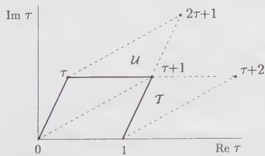  
Figure 10.1. The modular parameter $\tau$ and the unit cell of the lattice. The unit cells obtained under the modular transformations $T$ and $U = TST$ are illustrated by dashed lines.

The action of the modular group $\Gamma$ on the upper half of the $\tau$ -plane is rather complicated. A fundamental domain of $\Gamma$ is a domain of the upper half-plane such that no pair of points within it can be reached through a modular transformation, and any point outside it can be reached from a unique point inside, by some modular transformation. Of course, the action of any modular transformation on a fundamental domain as a whole yields another fundamental domain. The usual convention is to pick the fundamental domain denoted $F_{0}$ defined as follows:

$$
z \in F _ {0} \quad \text { if } \quad \left\{ \begin{array}{l l} \operatorname{Im} z > 0, - \frac {1}{2} \leq \operatorname{Re} z \leq 0 & \text { and } | z | \geq 1 \\ \text { or } \\ \operatorname{Im} z > 0, 0 <   \operatorname{Re} z <   \frac {1}{2} & \text { and } | z | > 1 \end{array} \right.\tag{10.10}
$$

We note the use of strict inequalities where appropriate. This domain is illustrated on Fig. 10.2, as well as some other domains obtained by applying simple modular transformations on $F_{0}$ .

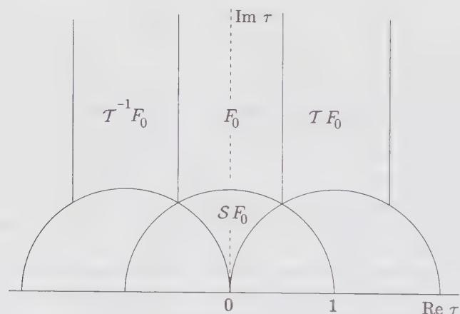  
Figure 10.2. The standard fundamental domain $F_0$ of the modular group, and some other domains obtained by applying modular transformations on $F_0$ .

## §10.2. The Free Boson on the Torus

In this section we shall calculate the partition function of a free boson. Some care is needed because of the zero-mode, which should be discarded since it contributes an infinite amount to Z. Discarding the zero-mode should be equivalent to evaluating the trace (10.5) over the Fock space associated with the identity operator (i.e., the vertex operator of charge zero). From Eqs. (10.5) and (7.16), we therefore expect the partition to be of the following form:

$$
Z _ {\mathrm{bos}} \propto \frac {1}{| \eta (\tau) | ^ {2}}\tag{10.11}
$$

The proportionality constant is important, since the above expression is not modular invariant! Indeed, as is shown in App. 10.A, Dedekind's $\eta$ function transforms as follows under the modular transformations $\mathcal{T}$ and $S$ :

$$
\begin{array}{l} \eta (\tau + 1) = e ^ {i \pi / 1 2} \eta (\tau) \\ \eta (- 1 / \tau) = \sqrt {- i \tau} \eta (\tau) \end{array}\tag{10.12}
$$

Although $|\eta(\tau)|$ is not modular invariant, it is a simple matter to check that the product $(\operatorname{Im}\tau)^{1/4}|\eta(\tau)|$ is. Therefore, with a suitable proportionality constant ensuring modular invariance, the free-boson partition function (without zero-mode) is

$$
\boxed {Z _ {\mathrm{bos}} (\tau) = \frac {1}{(\operatorname{Im} \tau) ^ {1 / 2} | \eta (\tau) | ^ {2}}}\tag{10.13}
$$

In the remainder of this section we shall see how this result may be obtained directly from the path-integral formalism. Readers willing to skip the rather technical discussion that follows may proceed to the next section.

In the path-integral approach, the free-boson partition function without the zero-mode may be written as follows:

$$
Z _ {\mathrm{bos}} (\tau) = \int [ d \varphi ] \sqrt {A} \delta \left(\int d ^ {2} x \varphi \varphi_ {0}\right) \exp \left(- \frac {1}{2} \int d ^ {2} x (\nabla \varphi) ^ {2}\right)\tag{10.14}
$$

where the coordinate integrals are carried over the torus. Here A denotes the area of the torus, equal to $\operatorname{Im}\left(\omega_{2}\omega_{1}^{*}\right)$ , and $\varphi_{0}=A^{-1/2}$ is the normalized eigenfunction of the zero-mode. The argument of the delta function is the coefficient of the zero-mode in an arbitrary field configuration; this delta function therefore ensures that the zero-mode is not integrated. The $\sqrt{A}$ in front was put there to make the whole expression dimensionless (in fact, the delta function with its properly normalized argument was introduced mainly in order to justify this factor). We have chosen the normalization g=1 for the free-boson action, instead of our standard $g=1/4\pi$ . However, changing this normalization would only result in a constant multiplicative factor, which we are ignoring anyway (only $\tau$ -dependent multiplicative factors matter).

We expand the field $\varphi$ along the normalized eigenfunctions $\varphi_{n}$ of the Laplacian operator $\nabla^{2}$ , with eigenvalues $-\lambda_{n}$ :

$$
\varphi (x) = \sum_ {n} c _ {n} \varphi_ {n} (x)\tag{10.15}
$$

The functional integral over the nonzero modes ( $\lambda_{n} \neq 0$ ) is then

$$
\begin{array}{l} Z _ {\mathrm{bos}} (\tau) = \sqrt {A} \int \prod_ {i} d c _ {i} \exp - \frac {1}{2} \sum_ {n} \lambda_ {n} c _ {n} ^ {2} \\ = \sqrt {A} \prod_ {n} \left(\frac {2 \pi}{\lambda_ {n}}\right) ^ {1 / 2} \end{array}\tag{10.16}
$$

In general, this product diverges and must be regularized. We shall use the so-called $\zeta$ -function regularization technique, which is based upon the definition of the following function:

$$
G (s) \equiv \sum_ {n} ^ {\prime} \frac {1}{\lambda_ {n} ^ {s}}\tag{10.17}
$$

where the primed sum means that the eigenvalue $\lambda = 0$ is excluded. The function $G(s)$ is analytic for sufficiently large values of s, and may be analytically continued to lower values of s, in particular s = 0, for which the above series definition is no longer valid. The partition function is then formally equal to

$$
Z _ {\mathrm{bos}} (\tau) = \sqrt {A} \exp \frac {1}{2} G ^ {\prime} (0)\tag{10.18}
$$

(we have discarded the irrelevant numeric factor $(2\pi)^{1/2}$ coming from each mode).

In the case under consideration, the eigenvalues of the Laplacian are labeled by two integers m and n:

$$
\lambda_ {n, m} = (2 \pi) ^ {2} | n k _ {1} + m k _ {2} | ^ {2}\tag{10.19}
$$

where $k_{1,2}$ are the basis vectors of the lattice dual to the one defined by the periods $\omega_{1,2}$ :

$$
k _ {1} = - i \omega_ {2} / A \quad k _ {2} = i \omega_ {1} / A\tag{10.20}
$$

It follows that

$$
\begin{array}{l} \left| \frac {2 \pi \omega_ {1}}{A} \right| ^ {2 s} G (s) = \sum_ {m, n} ^ {\prime} \frac {1}{| m + n \tau | ^ {2 s}} \\ = 2 \zeta (2 s) + \sum_ {n} ^ {\prime} \left(\sum_ {m} \frac {1}{| m + n \tau | ^ {2 s}}\right) \end{array}\tag{10.21}
$$

where $\zeta(z)$ is the Riemann $\zeta$ -function. The second term of the last expression is a periodic function of $n\tau$ with unit period, since all values of m are summed upon; it may therefore be Fourier expanded (we write $\tau = \tau_{1} + i\tau_{2}$ ):

$$
\begin{array}{l} \sum_ {m} \frac {1}{| m + n \tau | ^ {2 s}} \\ = \sum_ {p} e ^ {2 i \pi p n \tau_ {1}} \int_ {0} ^ {1} d y e ^ {- 2 \pi i p y} \sum_ {m} \frac {1}{[ (m + y) ^ {2} + n ^ {2} \tau_ {2} ^ {2} ] ^ {s}} \end{array}
$$

$$
\begin{array}{l} = \sum_ {p} e ^ {2 i \pi p n \tau_ {1}} \sum_ {m} \int_ {m} ^ {m + 1} d y e ^ {- 2 \pi i p y} \frac {1}{[ y ^ {2} + n ^ {2} \tau_ {2} ^ {2} ] ^ {s}} \\ = \sum_ {p} \int_ {- \infty} ^ {\infty} d y e ^ {2 \pi i p (n \tau_ {1} - y)} \frac {1}{[ y ^ {2} + n ^ {2} \tau_ {2} ^ {2} ] ^ {s}} \\ = \frac {1}{\Gamma (s)} \sum_ {p} \int_ {- \infty} ^ {\infty} d y e ^ {2 \pi i p (n \tau_ {1} - y)} \int_ {0} ^ {\infty} d t t ^ {s - 1} e ^ {- t (y ^ {2} + n ^ {2} \tau_ {2} ^ {2})} \\ = \frac {\sqrt {\pi}}{\Gamma (s)} \sum_ {p} \int_ {0} ^ {\infty} d t t ^ {s - 3 / 2} e ^ {- [ t n ^ {2} \tau_ {2} ^ {2} + \pi^ {2} p ^ {2} / \tau - 2 \pi i p n \tau_ {1} ]} \end{array}\tag{10.22}
$$

where, in the fourth line, we have used the integral representation of the Euler $\Gamma$ function

$$
\Gamma (s) = \int_ {0} ^ {+ \infty} d t t ^ {s - 1} e ^ {- t}
$$

to rewrite

$$
\frac {1}{z ^ {s}} = \frac {1}{\Gamma (s)} \int_ {0} ^ {+ \infty} d t t ^ {s - 1} e ^ {- z t}
$$

with $z = y^{2} + n^{2}\tau_{2}^{2}$ . We separate the contribution of p = 0 from the rest. At p = 0 the above reduces to $\Gamma(s - \frac{1}{2})|n\tau_{2}|^{1-2s}$ . Summing this term over $n \neq 0$ , we find

$$
\sqrt {\pi} \frac {\Gamma (s - \frac {1}{2})}{\Gamma (s)} \sum_ {n} ^ {\prime} | n \tau_ {2} | ^ {1 - 2 s} = 2 \sqrt {\pi} \frac {\Gamma (s - \frac {1}{2})}{\Gamma (s)} | \tau_ {2} | ^ {1 - 2 s} \zeta (2 s - 1)\tag{10.23}
$$

We use, on the above expression, the following functional relation for the $\zeta$ -function:

$$
\pi^ {- s / 2} \Gamma (s / 2) \zeta (s) = \pi^ {(1 - s) / 2} \Gamma ((1 - s) / 2) \zeta (1 - s)\tag{10.24}
$$

We may therefore write the following relation, after changing the integration variable from t to $t\pi p/n\tau_{2}$ :

$$
\begin{array}{l} \Gamma (s) \left(\frac {\tau_ {2}}{\pi}\right) ^ {s - 1 / 2} \left| \frac {2 \pi \omega_ {1}}{A} \right| ^ {2 s} G (s) \\ = 2 \Gamma (s) \zeta (2 s) \left(\frac {\tau_ {2}}{\pi}\right) ^ {s - 1 / 2} + 2 \Gamma (1 - s) \zeta (2 - 2 s) \left(\frac {\tau_ {2}}{\pi}\right) ^ {1 / 2 - s} \\ + \sqrt {\pi} \sum_ {p} ^ {\prime} \sum_ {n} ^ {\prime} e ^ {2 \pi i p n \tau_ {1}} \int_ {0} ^ {\infty} \frac {d t}{t} t ^ {s - 1 / 2} \left| \frac {p}{n} \right| ^ {s - 1 / 2} e ^ {- \pi | n p | \tau_ {2} (t + 1 / t)} \end{array}\tag{10.25}
$$

This expression for $G(s)$ has the merit of being explicitly even in $s - \frac{1}{2}$ , namely, it is symmetric under $s \to 1 - s$ . Since it is well-defined for s > 1 and coincides then with the original series expansion, we shall use this expression to extract the value of $G(0)$ and $G'(0)$ . We need only expand $G(s)$ to first order around $s = 0$ . Since $\Gamma(s) \sim 1 / s$ , the integral is needed only at $s = 0$ :

$$
\int_ {0} ^ {\infty} \frac {d t}{t} t ^ {- 1 / 2} e ^ {- \pi | n p | \tau_ {2} (t + 1 / t)} = \frac {1}{| p n | ^ {1 / 2}} e ^ {- 2 \pi | p n | \tau_ {2}}\tag{10.26}
$$

Using the special value $\zeta(2)=\pi^{2}/6$ , we write

$$
\begin{array}{l} G (s) = - 1 - 2 s \ln | A / \omega_ {1} | + \frac {1}{3} s \pi \tau_ {2} \\ \qquad + s \sum_ {p} ^ {\prime} \sum_ {n} ^ {\prime} \frac {1}{| p |} e ^ {2 \pi i p n \tau_ {1} - 2 \pi | p n | \tau_ {2}} + O (s ^ {2}) \end{array}\tag{10.27}
$$

We still need to work on the double sum. It may be written as

$$
\begin{array}{l} \sum_ {n, p > 0} \frac {2}{p} (e ^ {2 \pi i p n \tau_ {1} - 2 \pi p n \tau_ {2}} + e ^ {- 2 \pi i p n \tau_ {1} - 2 \pi p n \tau_ {2}}) \\ = \sum_ {n, p > 0} \frac {2}{p} (q ^ {n} + \bar {q} ^ {n}) \\ = - 2 \sum_ {n > 0} \big (\ln (1 - q ^ {n}) + \ln (1 - \bar {q} ^ {n}) \big) \\ = - 2 \ln | \eta (q) | ^ {2} - \frac {1}{3} \pi \tau_ {2} \end{array}\tag{10.28}
$$

Since $\sqrt{A} / |\omega_1| = \sqrt{\tau_2}$ , one may finally write

$$
G ^ {\prime} (0) = - 2 \ln \left(\sqrt {A} \tau_ {2} | \eta (\tau) | ^ {2}\right)\tag{10.29}
$$

According to Eq. (10.18) the free-boson partition function is then

$$
Z _ {\mathrm{bos}} (\tau) = \frac {1}{\sqrt {\operatorname{Im} \tau} | \eta (\tau) | ^ {2}}\tag{10.30}
$$

which is the desired result, with the correct multiplicative factor ensuring modular invariance.

## §10.3. Free Fermions on the Torus

The path-integral calculation of the free-fermion partition function could in principle be obtained with the same method as for the free boson. Indeed, the free-fermion action may be written as (cf. Sect. 5.3.2)

$$
S = \frac {1}{2 \pi} \int d ^ {2} x (\bar {\psi} \partial \bar {\psi} + \psi \bar {\partial} \psi)\tag{10.31}
$$

Since the two fields $\psi$ and $\bar{\psi}$ are decoupled, the partition function is simply the product of the Pfaffians (defined in App. 2.B) of the differential operators $\partial$ and $\bar{\partial}$ :

$$
Z = \mathrm{Pf} (\partial) \mathrm{Pf} (\bar {\partial})\tag{10.32}
$$

Since the Pfaffian is the square-root of the determinant, and since the product $\partial\bar{\partial}$ is the Laplacian, we find

$$
Z = (\det \nabla^ {2}) ^ {1 / 2}\tag{10.33}
$$

We have not yet specified the periodicity conditions to be imposed on the fermions. These conditions affect the admissible eigenvalues of the Laplacian and the associated determinant. We shall assume that the fermions pick up a phase when translated by a period:

$$
\psi (z + \omega_ {1}) = e ^ {2 i \pi \nu} \psi (z) \qquad \psi (z + \omega_ {2}) = e ^ {2 i \pi u} \psi (z)\tag{10.34}
$$

We suppose that the same periodicity conditions are satisfied by the antiholomorphic component $\bar{\psi}$ . Since the action must be periodic when the torus coordinate z is shifted by a period, we are restricted to the following four possibilities:

$$
\begin{array}{l l} (v, u) = (0, 0) & \text { or } \quad (R, R) \\ (v, u) = (0, \frac {1}{2}) & \text { or } \quad (R, N S) \\ (v, u) = (\frac {1}{2}, 0) & \text { or } \quad (N S, R) \\ (v, u) = (\frac {1}{2}, \frac {1}{2}) & \text { or } \quad (N S, N S) \end{array}\tag{10.35}
$$

Again, we associate the names of Ramond (R) to the periodic boundary condition and Neveu-Schwarz (NS) to the antiperiodic one. We shall denote by $Z_{v,u}$ the partition function associated with the periodicity condition $(v,u)$ . A set $(v,u)$ of periodicity conditions is called a spin structure for the fermion. Because of the decoupling between $\psi$ and $\bar{\psi}$ , we may consider the partition function obtained by integrating the holomorphic field only, which we call $d_{v,u}$ . It follows that

$$
Z _ {v, u} = | d _ {v, u} | ^ {2}\tag{10.36}
$$

If an eigenfunction of the Laplacian satisfies the periodicity conditions $(v, u)$ ,

$$
\varphi (z + k \omega_ {1} + l \omega_ {2}) = e ^ {2 \pi i (k v + l u)} \varphi (z)\tag{10.37}
$$

then the associated eigenvalue has the form

$$
\frac {i}{A} \Big ((m + u) \omega_ {1} + (n + v) \omega_ {2} \Big)\tag{10.38}
$$

(A is the area of the torus). We could proceed as in the previous section, and consider the following function:

$$
G _ {v, u} (s) = \left(\frac {A}{2 \pi \omega_ {1}}\right) \sum_ {m, n} \frac {1}{| m + n \tau + (u + v \tau) | ^ {2 s}}\tag{10.39}
$$

The partition function, after this $\zeta$ -function regularization, is equal to

$$
Z _ {\nu , u} = \exp - \frac {1}{2} G _ {\nu , u} ^ {\prime} (0)\tag{10.40}
$$

If $(v,u)\neq(0,0)$ , there is no Laplacian zero-mode, and the subtlety associated with it disappears. That zero-mode exists only for the $(R,R)$ sector, in which case the partition function vanishes: $Z_{0,0}=0$ . Accordingly, we shall not use the path-integral method to calculate the partition functions, but rather the operator method, following Eq. (10.5).

We need to implement the periodicity conditions in the time direction within the operator formalism. These conditions are rather unusual in the context of field theory, but may be expressed as conditions on correlation functions on the torus. Consider the generic correlation function of fermions

$$
\langle \psi (z) X \rangle\tag{10.41}
$$

where X stands for the product of an odd number of fermion fields at various positions, so that the correlator is nonzero (the correlator of an odd number of fermions is zero, since they are Grassmann numbers). We take this fermion from its position z to $z + \omega_{2}$ via some continuous path. Within the operator formalism, this means that the $\psi(z)$ will go through all the possible instants of time (modulo the periodicity) and will have to be passed over all the other fermions in X in succession, because of the time-ordering. Since a minus sign is generated each time, there will be an overall factor of -1 generated by this translation, and therefore the usual correspondence between the path-integral and the Hamiltonian approach leads naturally to the antiperiodic condition ( $u = \frac{1}{2}$ ) when the theory is defined on a torus. To implement the periodic condition (u = 0) we need to modify the usual correspondence by inserting in all the correlators an operator that anticommutes with $\psi(z)$ , whatever the value of z. Such an operator is $(-1)^{F}$ , where F is the fermion number

$$
F = \sum_ {k \geq 0} F _ {k} \quad F _ {k} = b _ {- k} b _ {k} (k > 0)\tag{10.42}
$$

and where $F_{0}$ is an operator defined in the space-periodic case, equal to 0 when acting on $|0\rangle$ and to 1 when acting on $b_{0}|0\rangle$ . A fermion number $\bar{F}$ is defined in the same way for the antiholomorphic component $\bar{\psi}$ . This amounts to multiplying the time-evolution operator over a time L by a factor $\exp{-i\pi F = (-1)^{F}}$ . To make sure that this feature is built into the partition function, we simply insert $(-1)^{F}$ in the definition of the partition function, within the trace, in the time-periodic case.

This prescription implies the following expressions for the holomorphic partition functions $d_{v,u}$ associated with each periodicity condition:

$$
\begin{array}{l l} d _ {0, 0} = \frac {1}{\sqrt {2}} \operatorname{Tr} (- 1) ^ {F} q ^ {L _ {0} - 1 / 4 8} & = \frac {1}{\sqrt {2}} \operatorname{Tr} (- 1) ^ {F} q ^ {\sum_ {k} k b _ {- k} b _ {k} + 1 / 2 4} \\ d _ {0, \frac {1}{2}} = \frac {1}{\sqrt {2}} \operatorname{Tr} q ^ {L _ {0} - 1 / 4 8} & = \frac {1}{\sqrt {2}} \operatorname{Tr} q ^ {\sum_ {k} k b _ {- k} b _ {k} + 1 / 2 4} \\ d _ {\frac {1}{2}, 0} = \operatorname{Tr} (- 1) ^ {F} q ^ {L _ {0} - 1 / 4 8} & = \operatorname{Tr} (- 1) ^ {F} q ^ {\sum_ {k} k b _ {- k} b _ {k} - 1 / 4 8} \\ d _ {\frac {1}{2}, \frac {1}{2}} = \operatorname{Tr} q ^ {L _ {0} - 1 / 4 8} & = \operatorname{Tr} q ^ {\sum_ {k} k b _ {- k} b _ {k} - 1 / 4 8} \end{array}\tag{10.43}
$$

The expressions (6.114) for $L_{0}$ were used. The factors of $\sqrt{2}$ in the first two lines are conventional and are introduced in order to simplify the modular properties later on.

These partition functions may easily be calculated, since $q^{L_{0}}$ factorizes into an infinite product of operators, one for each fermion mode (the same is true of $(-1)^{F}$ ). For instance,

$$
\begin{array}{l} d _ {\frac {1}{2}, 0} = q ^ {- 1 / 4 8} \operatorname{Tr} \prod_ {k > 0} q ^ {k b _ {- k} b _ {k}} (- 1) ^ {F _ {k}} \\ = q ^ {- 1 / 4 8} \prod_ {k > 0} \left(\operatorname{Tr} q ^ {k b _ {- k} b _ {k}} (- 1) ^ {F _ {k}}\right) \end{array}\tag{10.44}
$$

wherein we have used the fact the trace $\mathrm{Tr}(AB)$ of a product of two operators acting on different factors of a tensor product is simply the product $(\mathrm{Tr}A)(\mathrm{Tr}B)$ , the latter traces being taken only over the restricted spaces on which A and B specifically act. For a given fermion mode, there are only two states and the traces are trivially calculated:

$$
\begin{array}{c} \operatorname{Tr} q ^ {k b _ {- k} b _ {k}} = 1 + q ^ {k} \\ \operatorname{Tr} q ^ {k b _ {- k} b _ {k}} (- 1) ^ {F _ {k}} = 1 - q ^ {k} \end{array}\tag{10.45}
$$

We may therefore write the following infinite products for the partition functions, and relate them to the theta functions defined in App. (10.A):

$$
\begin{array}{l} d _ {0, 0} = \frac {1}{\sqrt {2}} q ^ {1 / 2 4} \prod_ {n = 0} ^ {\infty} (1 - q ^ {n}) = 0 \\ d _ {0, \frac {1}{2}} = \frac {1}{\sqrt {2}} q ^ {1 / 2 4} \prod_ {n = 0} ^ {\infty} (1 + q ^ {n}) = \sqrt {\frac {\theta_ {2} (\tau)}{\eta (\tau)}} \\ d _ {\frac {1}{2}, 0} = q ^ {- 1 / 4 8} \prod_ {r = 1 / 2} ^ {\infty} (1 - q ^ {r}) = \sqrt {\frac {\theta_ {4} (\tau)}{\eta (\tau)}} \\ d _ {\frac {1}{2}, \frac {1}{2}} = q ^ {- 1 / 4 8} \prod_ {r = 1 / 2} ^ {\infty} (1 + q ^ {r}) = \sqrt {\frac {\theta_ {3} (\tau)}{\eta (\tau)}} \end{array}\tag{10.46}
$$

How does this relate to the Virasoro characters? These characters are not defined with the torus in mind, and so they do not take into account the periodicity in the time direction: only the boundary condition on the cylinder matters; we therefore distinguish the R and NS sectors, and for each we define the characters according to Eq. (7.12) with the help of the expressions (6.114) for $L_{0}$ .

Table 10.1. Lowest energy states in the NS sector.

<table><tr><td> $L_0$ </td><td>State(s)</td></tr><tr><td>0</td><td>|0)</td></tr><tr><td> $\frac{1}{2}$ </td><td> $b_{-1/2}|0\rangle$ </td></tr><tr><td> $\frac{3}{2}$ </td><td> $b_{-3/2}|0\rangle$ </td></tr><tr><td>2</td><td> $b_{-3/2}b_{-1/2}|0\rangle$ </td></tr><tr><td> $\frac{5}{2}$ </td><td> $b_{-5/2}|0\rangle$ </td></tr><tr><td>3</td><td> $b_{-5/2}b_{-1/2}|0\rangle$ </td></tr><tr><td> $\frac{7}{2}$ </td><td> $b_{-7/2}|0\rangle$ </td></tr><tr><td>4</td><td> $b_{-5/2}b_{-3/2}|0\rangle$ ,  $b_{-7/2}b_{-1/2}|0\rangle$ </td></tr></table>

We first consider the NS sector. The lowest eigenstates of $L_{0}$ are listed in Table 10.1. There are states with integral values of $L_{0}$ , others with half-integral values. This means that the trace of $q^{L_{0}}$ is not a pure character in this case, but the sum of two (or more) simple Virasoro characters. Since this system has $c = c(4,3) = \frac{1}{2}$ , we know exactly what the allowed Verma modules are: they have conformal weights 0, $\frac{1}{2}$ and $\frac{1}{16}$ , according to the Kac table. We therefore have a sum of the Virasoro characters $\chi_{1,1}$ and $\chi_{2,1}$ , occurring each with multiplicity one, as may be seen from the lowest two states. The states contributing to $\chi_{1,1}$ have an even fermion number and vice versa; this allows us to write the Virasoro characters as follows:

$$
\begin{array}{l} \chi_ {1, 1} = q ^ {- 1 / 4 8} \frac {1}{2} \operatorname{Tr} (1 + (- 1) ^ {F}) q ^ {L _ {0}} \\ \chi_ {2, 1} = q ^ {- 1 / 4 8} \frac {1}{2} \operatorname{Tr} (1 - (- 1) ^ {F}) q ^ {L _ {0}} \end{array}\tag{10.47}
$$

Comparing with the partition functions calculated above, we have the relations

$$
\chi_ {1, 1} = \frac {1}{2} \left(d _ {\frac {1}{2}, \frac {1}{2}} + d _ {\frac {1}{2}, 0}\right) \quad \chi_ {2, 1} = \frac {1}{2} \left(d _ {\frac {1}{2}, \frac {1}{2}} - d _ {\frac {1}{2}, 0}\right)\tag{10.48}
$$

We then consider the Ramond sector. Here there are two degenerate ground states, differing by the fermion number $F$ . Moreover, the eigenvalues of $L_0$ in this case are integer offsets of $\frac{1}{16}$ , according to Eq. (6.114). The character $\chi_{1,2}$ is obtained by choosing one of the ground states, and obviously $\chi_{1,2} = d_{0,\frac{1}{3}} / \sqrt{2}$ .

From the expression (10.46) for the partition functions, it is a simple matter, with the help of App. 10.A, to determine their modular transformations: under $\tau \rightarrow -1 / \tau$ , we have

$$
\begin{array}{l} d _ {0, \frac {1}{2}} (- 1 / \tau) = d _ {\frac {1}{2}, 0} (\tau) \\ d _ {\frac {1}{2}, 0} (- 1 / \tau) = d _ {0, \frac {1}{2}} (\tau) \\ d _ {\frac {1}{2}, \frac {1}{2}} (- 1 / \tau) = d _ {\frac {1}{2}, \frac {1}{2}} (\tau) \end{array}\tag{10.49}
$$

Under the transformation $\tau \rightarrow \tau + 1$ , we have instead

$$
\begin{array}{l} d _ {0, \frac {1}{2}} (\tau + 1) = e ^ {i \pi / 8} d _ {0, \frac {1}{2}} (\tau) \\ d _ {\frac {1}{2}, 0} (\tau + 1) = e ^ {- i \pi / 2 4} d _ {\frac {1}{2}, \frac {1}{2}} (\tau) \\ d _ {\frac {1}{2}, \frac {1}{2}} (\tau + 1) = e ^ {- i \pi / 2 4} d _ {\frac {1}{2}, 0} (\tau) \end{array}\tag{10.50}
$$

Since the full partition functions are simply $Z_{v,u} = |d_{v,u}|^2$ , they transform exactly like the $d_{v,u}$ 's, but without the phase factors.

It is now evident that the only ways to obtain a modular-invariant partition function are (1) to impose periodic boundary conditions on the fermion (R,R), in which case the partition function vanishes because of the zero-mode, and (2) to include in the theory the three possibilities (NS,R), (R,NS) and (NS,NS), leading to the modular-invariant combination

$$
\begin{array}{l} Z = Z _ {\frac {1}{2}, \frac {1}{2}} + Z _ {0, \frac {1}{2}} + Z _ {\frac {1}{2}, 0} \\ = \left| \frac {\theta_ {2}}{\eta} \right| + \left| \frac {\theta_ {3}}{\eta} \right| + \left| \frac {\theta_ {4}}{\eta} \right| \\ = 2 \left(| \chi_ {1, 1} | ^ {2} + | \chi_ {2, 1} | ^ {2} + | \chi_ {1, 2} | ^ {2}\right) \end{array}\tag{10.51}
$$

Thus, modular invariance requires that all three conformal fields associated with $c = \frac{1}{2}$ actually be present in the theory. Eq. (10.51) is merely twice the partition function of the Ising model on a torus.

## §10.4. Models with c = 1

## 10.4.1. Compactified Boson

We have seen in Sect. 6.3.5 how the restriction of the domain of variation of a free boson to a circle of radius R restricts the allowed values of the charge $\alpha$ of the vertex operators, and how it allows new configurations with nonzero winding number. On the torus, such windings can occur when going from a point z to the equivalent points $z + \omega_{1}$ and $z + \omega_{2}$ . There are thus two types of winding, and we must generally consider configurations with the following boundary conditions:

$$
\varphi (z + k \omega_ {1} + k ^ {\prime} \omega_ {2}) = \varphi (z) + 2 \pi R (k m + k ^ {\prime} m ^ {\prime}) \qquad k, k ^ {\prime} \in \mathbb {Z}\tag{10.52}
$$

A doublet of integers $(m, m')$ then specifies a topological class of configurations obeying the above periodicity conditions, and a partition function $Z_{m,m'}$ is defined by integrating over the configurations of such a class. The integration may be done by decomposing $\varphi$ into a special configuration, which is also a classical solution to the equation of motion, $\varphi_{m,m'}^{cl}$ (with vanishing Laplacian, hence we take it to be the imaginary part of a holomorphic function), and a periodic field $\tilde{\varphi}$ (the “free part” of $\varphi$ ). This reads

$$
\begin{array}{c} \varphi = \varphi_ {m, m ^ {\prime}} ^ {c l} + \tilde {\varphi} \\ \varphi_ {m, m ^ {\prime}} ^ {c l} = 2 \pi R \left\{\frac {z}{\omega_ {1}} \frac {m \bar {\tau} - m ^ {\prime}}{\bar {\tau} - \tau} - \frac {\bar {z}}{\omega_ {1} ^ {*}} \frac {m \tau - m ^ {\prime}}{\bar {\tau} - \tau} \right\} \end{array}\tag{10.53}
$$

We check that the above configuration has indeed the right periodicity conditions and is real. The action $S(\varphi)$ is then the sum of $S[\tilde{\varphi}]$ (the action of the periodic field) plus the action $S[\varphi_{m,m'}^{cl}]$ of the classical linear configuration. Indeed, since $\Delta \varphi_{m,m'}^{cl} = 0$ , the crossed terms in the action $S[\varphi]$ are proportional to

$$
\int d ^ {2} x \nabla \varphi_ {m, m ^ {\prime}} ^ {c l} \nabla \tilde {\varphi} = - \int d ^ {2} x \tilde {\varphi} \Delta \varphi_ {m, m ^ {\prime}} ^ {c l} = 0\tag{10.54}
$$

where we have performed an integration by parts. $S[\varphi_{m,m'}^{cl}]$ is easily calculated as:

$$
\begin{array}{r l} S [ \varphi_ {m, m ^ {\prime}} ^ {c l} ] & = \frac {1}{8 \pi} \int d ^ {2} x (\nabla \varphi_ {m, m ^ {\prime}} ^ {c l}) ^ {2} \\ & = \frac {1}{2 \pi} \int d z d \bar {z} \partial \varphi_ {m, m ^ {\prime}} ^ {c l} \bar {\partial} \varphi_ {m, m ^ {\prime}} ^ {c l} \\ & = 2 \pi R ^ {2} A \frac {1}{| \omega_ {1} | ^ {2}} \left| \frac {m \tau - m ^ {\prime}}{\tau - \bar {\tau}} \right| ^ {2} \\ & = \pi R ^ {2} \frac {| m \tau - m ^ {\prime} | ^ {2}}{2 \operatorname{Im} \tau} \end{array}\tag{10.55}
$$

wherein $A = \operatorname{Im} \left( \omega_{2} \omega_{1}^{*} \right)$ is the area of the torus. The functional integration over the periodic field $\tilde{\varphi}$ gives a prefactor $Z_{bos}$ (cf. Eq. (10.13)), leading to the following partition function:

$$
Z _ {m, m ^ {\prime}} (\tau) = Z _ {\mathrm{bos}} (\tau) \exp - \frac {\pi R ^ {2} | m \tau - m ^ {\prime} | ^ {2}}{2 \operatorname{Im} \tau}\tag{10.56}
$$

It is then a simple matter to determine the modular properties of this partition function, since $Z_{bos}$ is invariant under modular transformations. Under a general $SL(2,\mathbb{Z})$ mapping $\tau\to(a\tau+b)/(c\tau+d)$ , the $\tau$ -dependent part of the exponent becomes

$$
\begin{array}{r l} \frac {| m \tau - m ^ {\prime} | ^ {2}}{\operatorname{Im} \tau} & \longrightarrow \frac {\left| (m a \tau + b m) / (c \tau + d) - m ^ {\prime} \right| ^ {2} | c \tau + d | ^ {2}}{\operatorname{Im} [ (a \tau + b) (c \bar {\tau} + d) ]} \\ & = \frac {| m a \tau + b m - m ^ {\prime} c \tau - m ^ {\prime} d | ^ {2}}{\operatorname{Im} \tau} \end{array}\tag{10.57}
$$

§10.4. Models with c = 1

wherein we have used

$$
\operatorname{Im} [ (a \tau + b) (c \bar {\tau} + d) ] = \operatorname{Im} (a d \tau - b c \tau) = \operatorname{Im} \tau \quad (a d - b c = 1)\tag{10.58}
$$

Under modular transformations, the doublet $(m, m')$ transforms like

$$
\binom{m}{m ^ {\prime}} \longrightarrow \left( \begin{array}{c c} a & - c \\ - b & d \end{array} \right) \binom{m}{m ^ {\prime}}\tag{10.59}
$$

where the matrix is the inverse of the original $SL(2,\mathbb{Z})$ matrix. The doublet $(m,m')$ thus transforms like the periods $(k_{1},k_{2})$ of the reciprocal lattice. That the set of modular transformations forms a group implies that a sum of the partition functions over all the doublets $(m,m')$ with equal weights is a modular invariant. Indeed, the $\mathcal{T}$ and $S$ transformations on $Z_{m,m'}(\tau)$ read

$$
\begin{array}{r} Z _ {m, m ^ {\prime}} (\tau + 1) = Z _ {m, m ^ {\prime} - m} \\ Z _ {m, m ^ {\prime}} (- 1 / \tau) = Z _ {- m ^ {\prime}, m} \end{array}\tag{10.60}
$$

hence the sum over all $(m, m') \in \mathbb{Z}^2$ forms a modular-invariant partition function

$$
Z (R) = \frac {R}{\sqrt {2}} Z _ {\mathrm{bos}} (\tau) \sum_ {m, m ^ {\prime}} \exp - \frac {\pi R ^ {2} | m \tau - m ^ {\prime} | ^ {2}}{2 \operatorname{Im} \tau}\tag{10.61}
$$

The factor of $R / \sqrt{2}$ in front can actually be derived from a careful zero-mode integration of $\varphi$ . It also gives the correct normalization 1 of the Virasoro character of the identity at $c = 1$ in the transformed expression (10.62). Poisson's resummation formula (cf. App. 10.A) may be used to reexpress this partition function in a different form. Setting

$$
a = R ^ {2} / 2 \tau_ {2}, \quad b = \pi m R ^ {2} \tau_ {1} / \tau_ {2} (\tau = \tau_ {1} + i \tau_ {2})
$$

in Poisson's formula (10.264) leads to

$$
Z (R) = \frac {1}{| \eta (\tau) | ^ {2}} \sum_ {e, m \in \mathbb {Z}} q ^ {(e / R + m R / 2) ^ {2} / 2} \bar {q} ^ {(e / R - m R / 2) ^ {2} / 2}\tag{10.62}
$$

In this form the partition function is manifestly compatible with the expressions (6.94) for $L_{0}$ and $\bar{L}_{0}$ . It is simply the sum over all possible (electric) charges of vertex operators and all possible winding numbers (magnetic charges) of the c = 1 Virasoro characters squared, with conformal dimensions

$$
h _ {e, m} = \frac {1}{2} (e / R + m R / 2) ^ {2} \quad \bar {h} _ {e, m} = \frac {1}{2} (e / R - m R / 2) ^ {2}\tag{10.63}
$$

These dimensions give the spectrum of primary fields in this model. The $m \neq 0$ fields represent vortex configurations of the field $\varphi$ , namely lines of defect along which $\varphi$ has a discontinuity of $2\pi mR$ . The $e \neq 0$ fields correspond to electrically charged vertex operators $\exp ie\varphi/R$ . A general field with $e, m \neq 0$ is a superposition of these two. (The computation of some correlation functions of these fields on the plane and on the torus will be presented in Chap. 12, Sect. 12.6.2.). The factor $(\mathrm{Im}\ \tau)^{-1/2}$ has disappeared, since it resulted from the exclusion of the zero-mode, whereas the sum over charge and winding number sectors means that the zero-mode has been naturally incorporated. From the conformal dimensions we see that the scaling dimensions $\Delta_{e,m}$ and the spins $s_{e,m}$ of the primary fields are (cf. Eq. (5.21))

$$
\Delta_ {e, m} = e ^ {2} / R ^ {2} + m ^ {2} R ^ {2} / 4 \quad s _ {e, m} = e m\tag{10.64}
$$

The spins thus take integral values, as they should for a boson. The scaling dimensions are all positive (or zero) and vary continuously with R. As it stands, the model exhibits a remarkable electric-magnetic $e \leftrightarrow m$ duality, which results in the invariance of the partition function and the spectrum of states under the interchange $R \leftrightarrow 2/R$

$$
Z (2 / R) = Z (R)\tag{10.65}
$$

## 10.4.2. Multi-Component Chiral Boson

In this section we shall indicate how to form modular-invariant partition functions out of an assembly of compactified free bosons. We first need to introduce the notion of a multidimensional lattice.

A lattice $\Gamma$ of dimension $n$ is a set of points in $\mathbb{R}^n$ with the property that its elements may be expressed as an integer linear combination of a set of $n$ basis vectors $\epsilon_i$ :

$$
\Gamma = \left\{x = \sum_ {i} x _ {i} \epsilon_ {i} \mid x _ {i} \in \mathbb {Z} \right\}\tag{10.66}
$$

The lattice is said to be Lorentzian with signature $(s,\bar{s})$ if it possesses (through $R^{n}$ ) an indefinite inner product with signature $(+\cdots+|- \cdots-$ ), with $s(+)$ signs and $\bar{s}(-)$ signs. If s or $\bar{s}$ is zero the lattice is, of course, Euclidean; we shall denote by $x\cdot y$ the inner product between two elements x and y of $R^{n}$ . The volume $\operatorname{vol}(\Gamma)$ of the unit cell is the determinant of the matrix formed by the components of the basis vectors: $\operatorname{vol}(\Gamma)=\det[\epsilon_{i}\cdot\epsilon_{j}]$ . The lattice $\Gamma^{*}$ dual to $\Gamma$ is the set of points p such that $x\cdot p\in Z$ . Of course, $\Gamma^{*}$ is also a lattice in the above sense, and may be generated by the dual basis $\{\epsilon_{i}^{*}\}$ satisfying the relation $\epsilon_{i}\cdot\epsilon_{j}^{*}=\delta_{ij}$ ; the volume of its unit cell is $\operatorname{vol}(\Gamma^{*})=1/\operatorname{vol}(\Gamma)$ . A lattice is said to be self-dual if $\Gamma=\Gamma^{*}$ ; then, of course, $\operatorname{vol}(\Gamma)=1$ . An integer lattice is defined to satisfy the property $x\cdot y\in Z$ for all its elements x, y; it follows in that case that $\Gamma\in\Gamma^{*}$ . An even-integer lattice is such that all its elements have even norm: $x^{2}\in2Z$ .

Now we go back to the partition function (10.62), which may be written as

$$
Z (R) = \frac {1}{| \eta (\tau) | ^ {2}} \sum_ {p, \bar {p}} e ^ {i \pi \tau p ^ {2} - i \pi \bar {\tau} \bar {p} ^ {2}}\tag{10.67}
$$

wherein we have defined

$$
p = e / R + m R / 2 \quad \bar {p} = e / R - m R / 2\tag{10.68}
$$

and the sum is taken over all integer values of $e$ and $m$ . The doublet $(p, \bar{p})$ may be expressed as $(p, \bar{p}) = ee_1 + me_2$ , with

$$
e _ {1} = (1 / R, 1 / R) \quad e _ {2} = (R / 2, - R / 2)\tag{10.69}
$$

After defining the Lorentzian product

$$
(x, y) \cdot (x ^ {\prime}, y ^ {\prime}) = x x ^ {\prime} - y y ^ {\prime}\tag{10.70}
$$

we see that the set of points $(p,\bar{p})$ forms an even, self-dual, Lorentzian integer lattice, since $e_{1}\cdot e_{1}=e_{2}\cdot e_{2}=0$ and $e_{1}\cdot e_{2}=-1$ . As we shall now demonstrate, this fact is closely related to the modular invariance of the partition function.

We consider a set of n bosons of which we keep only the holomorphic modes, and an a priori distinct set of $\bar{n}$ bosons of which we keep only the antiholomorphic modes. The theory is in fact defined by the following expression for the Virasoro generator:

$$
\begin{array}{l} L _ {0} = \frac {1}{2} p ^ {2} + \sum_ {i = 1} ^ {n} \sum_ {k > 0} a _ {- k} ^ {(i)} a _ {k} ^ {(i)} \\ \bar {L} _ {0} = \frac {1}{2} \bar {p} ^ {2} + \sum_ {i = 1} ^ {\bar {n}} \sum_ {k > 0} \bar {a} _ {- k} ^ {(i)} \bar {a} _ {k} ^ {(i)} \end{array}\tag{10.71}
$$

where $p$ belongs to some lattice $\Gamma$ , and $\bar{p}$ to a lattice $\bar{\Gamma}$ . The partition function of such a system would then be

$$
Z _ {\Gamma} (\tau) = \frac {1}{\eta (\tau) ^ {n} \bar {\eta} (\tau) ^ {\bar {n}}} \sum_ {p \in \Gamma , \bar {p} \in \bar {\Gamma}} e ^ {i \pi \tau p ^ {2} - i \pi \bar {\tau} \bar {p} ^ {2}}\tag{10.72}
$$

We are interested in knowing under what conditions this partition function is modular invariant. The effect of the modular transformation $\tau \rightarrow \tau + 1$ is easily seen to be

$$
Z _ {\Gamma} (\tau + 1) = Z _ {\Gamma} (\tau) \exp \frac {2 \pi i (n - \bar {n})}{2 4}\tag{10.73}
$$

provided that $p^2 - \tilde{p}^2$ be always an even integer. Thus the Lorentzian lattice $\Gamma \oplus \bar{\Gamma}$ must be an even-integer lattice. In order to investigate the transformation $\tau \to -1 / \tau$ , we need to use a generalization of Poisson's resummation formula:

$$
\sum_ {q \in \Gamma} \exp (- \pi a q ^ {2} + q \cdot b) = \frac {1}{\operatorname{vol} (\Gamma)} \frac {1}{a ^ {n / 2}} \sum_ {p \in \Gamma^ {*}} \exp - \frac {\pi}{a} \left(p + \frac {b}{2 \pi i}\right)\tag{10.74}
$$

wherein a is some constant with positive real part, and b is some constant n-component vector. This formula may be easily demonstrated by using the closure

relation $^{4}$

$$
\sum_ {q \in \Gamma} \delta (x - q) = \frac {1}{\operatorname{vol} (\Gamma)} \sum_ {p \in \Gamma^ {*}} e ^ {2 \pi i x \cdot p}\tag{10.75}
$$

and by integrating it over $R^{n}$ against the function $\exp(-\pi ax^{2} + b \cdot x)$ . Applying Poisson's formula to the partition function (10.72), we easily find that it is invariant under the mapping $\tau \to -1/\tau$ , provided $\Gamma = \Gamma^{*}$ , that is, provided the lattice is self-dual. We conclude that models built from n holomorphic and $\tilde{n}$ antiholomorphic bosons are modular invariant provided the charge lattice (i.e., the lattice of the charge (or momentum) vectors $(p, \bar{p})$ ) is an even-integer self-dual lattice, with $n - \tilde{n} = 0 \mod 24$ .

This issue of modular invariance of a multicomponent boson system arises in the compactification of the bosonic string. Indeed, compactifying the extra dimensions in a consistent way is a task that has drawn a lot of attention in string theory. In that context the target space of the boson (the space in which the boson takes its values) is assumed to be physically very compact (of the order of the Planck length). The momenta of the string then take discrete values, and nonzero winding numbers must be considered.

## 10.4.3. $\mathbb{Z}_2$ Orbifold

A variation of the compactified free boson theory is obtained by assuming that the field $\varphi$ does not take its values on the full circle, but on the object defined by identifying the angle $\varphi$ with $-\varphi$ , namely, by performing a quotient by the natural action of $Z_{2}$ . Such an object is called a $Z_{2}$ orbifold. When taken across a period $\omega_{1}$ or $\omega_{2}$ , the field $\varphi$ may then be “twisted”, resulting in the more general boundary condition

$$
\varphi (z + k \omega_ {1} + l \omega_ {2}) = e ^ {2 \pi i (k v + l u)} \varphi (z)\tag{10.76}
$$

already encountered when dealing with fermions, with u, v being equal either to 0 or to $\frac{1}{2}$ . In the case of fermions, these boundary conditions were allowed by the fermionic nature of the fields, whereas here they follow from the topology of the space on which $\varphi$ resides. Since the action for the free boson is symmetric under the interchange $\varphi \rightarrow -\varphi$ , we may proceed as if the field were defined on the circle, except that we must integrate over half the range of $\varphi$ in the path integral. Partition functions may then be calculated within the path-integral formalism, as before.

However, we shall again work within the operator formalism and calculate traces in order to obtain explicit expressions for the partition functions. For $(v,u)\neq(0,0)$ , we shall denote the traces over the holomorphic modes by $f_{v,u}$ ; the partition functions $Z_{v,u}$ are then equal to $|f_{v,u}|^{2}$ . The partition function $Z_{0,0}$ in the untwisted sector is $Z(R)$ . In Sect. 6.3.4, we defined an operator G that takes $\varphi$ into $-\varphi$ . This operator anticommutes with $\varphi$ and may play a role similar to that played by $(-1)^F$ in the case of fermions, except that it must be inserted in the trace in the time-antiperiodic case ( $u = \frac{1}{2}$ ). It also anticommutes with the mode operators $a_n$ and $\bar{a}_n$ and has the following action on the vacua: $G|m,n\rangle = |-m,-n\rangle$ . The Fock spaces built upon $|m,n\rangle$ and $|-m,-n\rangle$ must be combined into sectors $\mathcal{F}_{\pm}$ , respectively symmetric and antisymmetric under the twist $\varphi \to -\varphi$ . Explicitly, $\mathcal{F}_+$ is obtained by acting with an even number of creation operators $a_n$ or $\bar{a}_n$ on the symmetric combination $|m,n\rangle + |-m,-n\rangle$ , or with an odd number of creation operators on the antisymmetric combination $|m,n\rangle - |-m,-n\rangle$ . $\mathcal{F}_-$ is built likewise, with the opposite combinations. The case $m = n = 0$ is special since the vacuum $|0,0\rangle$ is doubly degenerate: $G|0,0\rangle_{\pm} = \pm |0,0\rangle_{\pm}$ .

The holomorphic partition functions $f_{v,u}$ may then be calculated like their fermionic counterparts:

$$
\begin{array}{l} f _ {0, \frac {1}{2}} = \operatorname{Tr} G q ^ {L _ {0} - 1 / 2 4} = \operatorname{Tr} G q ^ {\sum_ {n} a _ {- n} a _ {n} - 1 / 2 4} \\ f _ {\frac {1}{2}, 0} = \operatorname{Tr} q ^ {L _ {0} - 1 / 4 8} = \operatorname{Tr} q ^ {\sum_ {n} a _ {- n} a _ {n} + 1 / 4 8} \\ f _ {\frac {1}{2}, \frac {1}{2}} = \operatorname{Tr} G q ^ {L _ {0} - 1 / 4 8} = \operatorname{Tr} G q ^ {\sum_ {n} a _ {- n} a _ {n} + 1 / 4 8} \end{array}\tag{10.77}
$$

Of course, the trace must also include a sum over the different vacua $|m,n\rangle$ , including the two vacua $|0,0\rangle_{\pm}$ in the space-antiperiodic case ( $v=\frac{1}{2}$ ). Regarding $f_{0,1/2}$ , the insertion of G within the trace implies that only the sector m=n=0 will contribute; indeed, each state obtained by acting on $|m,n\rangle+|-m,-n\rangle$ with creation operators has a counterpart with the same $L_{0}$ eigenvalue obtained by acting on $|m,n\rangle-|-m,-n\rangle$ with the same creation operators; however, these two states have opposite G values, and their contributions cancel in the trace. Thus, only the states obtained from the vacuum $|0,0\rangle$ contribute, and the sign of their contribution is -1 if they are obtained from an odd number of creation operators (G=-1) and +1 otherwise. It follows that

$$
f _ {0, \frac {1}{2}} = q ^ {- 1 / 2 4} \prod_ {n = 1} ^ {\infty} \frac {1}{(1 + q ^ {n})} = 2 \sqrt {\frac {\eta (\tau)}{\theta_ {2} (\tau)}}\tag{10.78}
$$

We now consider the space-antiperiodic case $\left(\nu=\frac{1}{2}\right)$ . Here we need consider only the two vacua $|0,0\rangle_{\pm}$ , each giving identical results, resulting in a factor of 2. The difference here lies in the vacuum energy, and in the fact that the mode indices take half-integer values. We therefore have

$$
f _ {\frac {1}{2}, 0} = 2 q ^ {1 / 4 8} \prod_ {r \in \mathbb {N} + 1 / 2} \frac {1}{(1 - q ^ {r})} = 2 \sqrt {\frac {\eta (\tau)}{\theta_ {4} (\tau)}}\tag{10.79}
$$

$$
f _ {\frac {1}{2}, \frac {1}{2}} = 2 q ^ {1 / 4 8} \prod_ {r \in \mathbb {N} + 1 / 2} \frac {1}{(1 + q ^ {r})} = 2 \sqrt {\frac {\eta (\tau)}{\theta_ {3} (\tau)}}
$$

As in the case of fermions, the modular properties of these quantities are easily obtained:

$$
\begin{array}{l} f _ {0, \frac {1}{2}} (- 1 / \tau) = f _ {\frac {1}{2}, 0} (\tau) \\ f _ {\frac {1}{2}, 0} (- 1 / \tau) = f _ {0, \frac {1}{2}} (\tau) \\ f _ {\frac {1}{2}, \frac {1}{2}} (- 1 / \tau) = f _ {\frac {1}{2}, \frac {1}{2}} (\tau) \end{array}\tag{10.80}
$$

and

$$
\begin{array}{l} f _ {0, \frac {1}{2}} (\tau + 1) = e ^ {- i \pi / 8} f _ {0, \frac {1}{2}} (\tau) \\ f _ {\frac {1}{2}, 0} (\tau + 1) = e ^ {i \pi / 2 4} f _ {\frac {1}{2}, \frac {1}{2}} (\tau) \\ f _ {\frac {1}{2}, \frac {1}{2}} (\tau + 1) = e ^ {i \pi / 2 4} f _ {\frac {1}{2}, 0} (\tau) \end{array}\tag{10.81}
$$

The only modular-invariant combinations are thus $Z_{0,0} = Z(R)$ and

$$
| f _ {0, \frac {1}{2}} | ^ {2} + | f _ {\frac {1}{2}, 0} | ^ {2} + | f _ {\frac {1}{2}, \frac {1}{2}} | ^ {2}\tag{10.82}
$$

What we call the orbifold partition function $Z_{\mathrm{orb}}(R)$ is obtained by summing over all types of boundary conditions and projecting on G-invariant states. This amounts to the calculation

$$
\begin{array}{l} Z _ {\text {orb}} (R) = | q | ^ {- 1 / 1 2} \frac {1}{2} \operatorname{Tr} _ {+} (1 + G) q ^ {L _ {0}} \bar {q} ^ {\bar {L} _ {0}} + | q | ^ {- 1 / 1 2} \frac {1}{2} \operatorname{Tr} _ {-} (1 + G) q ^ {L _ {0}} \bar {q} ^ {\bar {L} _ {0}} \\ = \frac {1}{2} (Z _ {0, 0} + | f _ {0, \frac {1}{2}} | ^ {2} + | f _ {\frac {1}{2}, 0} | ^ {2} + | f _ {\frac {1}{2}, \frac {1}{2}} | ^ {2}) \\ = \frac {1}{2} \left(Z (R) + 4 \frac {| \eta |}{| \theta_ {2} |} + 4 \frac {| \eta |}{| \theta_ {3} |} + 4 \frac {| \eta |}{| \theta_ {4} |}\right) \end{array}\tag{10.83}
$$

In the first line, $Tr_{\pm}$ means a trace in the space-periodic and space-antiperiodic sectors, respectively. By using the identity $\theta_{2}\theta_{3}\theta_{4}=2\eta^{3}$ proven in App. 10.A, Eq. (10.260), the result can be finally written in the form

$$
Z _ {\text { orb }} (R) = \frac {1}{2} \left(Z (R) + \frac {| \theta_ {2} \theta_ {3} |}{| \eta | ^ {2}} + \frac {| \theta_ {2} \theta_ {4} |}{| \eta | ^ {2}} + \frac {| \theta_ {3} \theta_ {4} |}{| \eta | ^ {2}}\right)\tag{10.84}
$$

## §10.5. Minimal Models: Modular Invariance and Operator Content

After having treated various free-field examples, we now turn to the study of modular invariance in the context of minimal models. In this section, we show that, for a theory to have only a finite number of primary fields, the modular invariance of the partition function forces its central charge to be strictly less than one. Conversely, we will prove that if c is not of the form $1 - 6(p - p')^{2}/pp'$ , for relatively prime nonnegative integers p and $p'$ , the model cannot be minimal, that is, it contains an infinite number of Virasoro primary fields.

We recall that the Hilbert space of a minimal model with central charge $c$ is a finite collection of irreducible left-right Virasoro modules

$$
\mathcal {H} = \bigoplus_ {h, \bar {h}} M (c, h) \otimes M (c, \bar {h})\tag{10.85}
$$

The modular invariance of the partition function of the theory on a torus turns out to be a very strong constraint on the operator content of the theory itself. The torus partition function reads, following Eq. (10.5),

$$
Z (\tau) = \sum_ {h, \bar {h}} \mathcal {M} _ {h, \bar {h}} \chi_ {h} (\tau) \bar {\chi} _ {\bar {h}} (\bar {\tau})\tag{10.86}
$$

where $\mathcal{M}_{h,\bar{h}}$ denotes the multiplicity of occurrence of $M(c,h)\otimes M(c,\bar{h})$ in $\mathcal{H}$ , and we identified the left Virasoro characters

$$
\chi_ {h} (\tau) = \operatorname{Tr} _ {M (c, h)} \left(q ^ {L _ {0} - c / 2 4}\right) = q ^ {h - c / 2 4} \sum_ {n \geq 0} d (n) q ^ {n}\tag{10.87}
$$

and their right counterparts. To make contact with Sect. 9.3.4, the characters can be viewed as the conformal blocks of the (nonnormalized) zero-point correlation function on the torus, namely the torus partition function (10.86), where the left-right decomposition is manifest.

For the following discussion, we take $\tau$ to be purely imaginary (corresponding to a rectangular torus), namely $\tau = i\theta$ , in order to make q real. Due to the presence of singular vectors, the number $d(n)$ of independent vectors at level n in $M(c, h)$ is bounded by $p(n)$ , the number of partitions of n. This results in the following upper bound on $\chi_{h}$ :

$$
\chi_ {h} (i \theta) \leq q ^ {h - c / 2 4} \sum_ {n \geq 0} p (n) q ^ {n} = \frac {q ^ {h - (c - 1) / 2 4}}{\eta (i \theta)}\tag{10.88}
$$

In the limit $\theta \to 0^{+}$ (hence $q\to 1^{-}$ ), and since $\eta (i\theta) = \sqrt{\theta}$ $\eta (i / \theta)$ (cf. Eq. (10.12)), we have

$$
\chi_ {h} (i \theta) \leq \frac {\theta^ {\frac {1}{2}}}{\eta (i / \theta)} \simeq \theta^ {\frac {1}{2}} e ^ {\pi / 1 2 \theta}\tag{10.89}
$$

In the last step, we keep only the leading term of $\eta$ . Consequently, the modular-invariant partition function satisfies the bound

$$
Z (i \theta) = Z (i / \theta) \leq \theta e ^ {\pi / 6 \theta} \sum_ {h, \bar {h}} \mathcal {M} _ {h, \bar {h}}\tag{10.90}
$$

The last sum is the total number M of primary fields in the theory

$$
\mathcal {M} = \sum_ {h, \bar {h}} \mathcal {M} _ {h, \bar {h}}\tag{10.91}
$$

On the other hand, the leading behavior of $Z(i/\theta)$ when $\theta \rightarrow 0^{+}$ is given by the contribution of the smallest dimension operators. Defining

$$
\begin{array}{r l} h _ {\min} & = \frac {1}{2} \min \left\{h + \bar {h} | \mathcal {M} _ {h, \bar {h}} \neq 0 \right\} \\ & = \frac {1}{2} (h _ {0} + \bar {h} _ {0}) \end{array}\tag{10.92}
$$

we have

$$
Z (i / \theta) \simeq \mathcal {M} _ {h _ {0}, \bar {h} _ {0}} e ^ {- 4 \pi / \theta (h _ {\min} - c / 2 4)}\tag{10.93}
$$

With the above upper bound (10.90), this implies

$$
\mathcal {M} _ {h _ {0}, \bar {h} _ {0}} e ^ {- \frac {4 \pi}{\theta} (h _ {\mathrm{min}} - (c - 1) / 2 4)} \leq \theta \mathcal {M}\tag{10.94}
$$

If the theory is minimal, the number M is finite, and the r.h.s. of (10.94) goes to 0 in the limit $\theta \rightarrow 0^{+}$ . The bound then forces the strict inequality

$$
h _ {\min} > \frac {(c - 1)}{2 4}\tag{10.95}
$$

or equivalently

$$
c <   1 + 2 4 h _ {\mathrm{min}}\tag{10.96}
$$

Since the identity operator with h = h = 0 always belongs to the theory, $h_{\min} \leq 0$ (one would have $h_{\min} = 0$ in a unitary theory). As a consequence, we find that all minimal theories must have

$$
c <   1\tag{10.97}
$$

We now refine the analysis to find which values of c < 1 can lead to minimal theories. For this, we need a lower bound for the torus partition function of the theory. We consider a theory with central charge c not of the form $1 - 6(p - p')^{2}/pp'$ , and write again its modular-invariant partition function Z, in the form (10.86). Then two situations may occur for the Verma module $V(c, h):^{5}$

(i) The module is irreducible, and its character reads

$$
\chi_ {h} (\tau) = \frac {q ^ {h - (c - 1) / 2 4}}{\eta (\tau)}\tag{10.98}
$$

(ii) There is a unique singular vector at some level N in $V(c,h)$ (see Ex. 8.3)); therefore, the character of the associated irreducible module $M(c,h)$ reads

$$
\chi_ {h} (\tau) = \frac {q ^ {h - (c - 1) / 2 4}}{\eta (\tau)} (1 - q ^ {N})\tag{10.99}
$$

In both cases, since $N \geq 1$ , we have the following lower bound for the characters (with $\tau = i\theta$ ):

$$
\chi_ {h} (i \theta) \geq \frac {q ^ {h - (c - 1) / 2 4}}{\eta (i \theta)} (1 - q)\tag{10.100}
$$

When $\theta \to 0^{+}$ , we find

$$
\begin{array}{r l} \chi_ {h} (i \theta) & \geq (1 - e ^ {- 2 \pi \theta}) \theta^ {\frac {1}{2}} e ^ {\pi / 1 2 \theta} \\ & \geq 2 \pi \theta^ {\frac {3}{2}} e ^ {\pi / 1 2 \theta} \end{array}\tag{10.101}
$$

This yields a lower bound on any modular invariant partition function built from these characters, when $\theta \to 0^{+}$ :

$$
Z (i \theta) = Z (i / \theta) \geq 4 \pi^ {2} \theta^ {3} e ^ {\pi / 6 \theta} \mathcal {M}\tag{10.102}
$$

Again, the leading behavior of $Z(i / \theta)$ when $\theta \to 0^{+}$ gives

$$
\mathcal {M} _ {h _ {0}, \bar {h} _ {0}} e ^ {- (4 \pi / \theta) (h _ {\min} - c / 2 4)} \geq 4 \pi^ {2} \theta^ {3} e ^ {\pi / 6 \theta} \mathcal {M}\tag{10.103}
$$

Therefore, if the theory is assumed to be minimal, with c not of the form $1 - 6(p - p')^{2}/pp'$ , the r.h.s. of the relation (10.103) goes to $+\infty$ , which imposes the strict inequality

$$
h _ {\min} <   \frac {(c - 1)}{2 4}\tag{10.104}
$$

in contradiction with inequality (10.95).

We have thus proven that all the minimal theories have a central charge of the form $c = 1 - 6(p - p')^2 / pp'$ , where $p$ and $p'$ are two relatively prime integers.

## §10.6. Minimal Models: Modular Transformations of the Characters

We recall the expression of the characters of the minimal models with central charge

$$
c (p, p ^ {\prime}) = 1 - 6 \frac {(p - p ^ {\prime}) ^ {2}}{p p ^ {\prime}}\tag{10.105}
$$

pertaining to the irreducible representation with Kac indices $(r, s)$ in the range

$$
\begin{array}{l} 1 \leq r \leq p ^ {\prime} - 1 \\ 1 \leq s \leq p - 1 \\ p ^ {\prime} s <   p r \end{array}\tag{10.106}
$$

From now on, we denote by $E_{p,p'}$ the set of pairs $(r,s)$ in the range (10.106). The characters can be written in the form (8.17)

$$
\chi_ {r, s} (\tau) \equiv \chi_ {\lambda_ {r, s}} (\tau) = K _ {\lambda_ {r, s}} (\tau) - K _ {\lambda_ {r, - s}} (\tau)\tag{10.107}
$$

where

$$
\lambda_ {r, s} = p r - p ^ {\prime} s \quad \lambda_ {r, - s} = p r + p ^ {\prime} s\tag{10.108}
$$

and

$$
\boxed {K _ {\lambda} (\tau) = \frac {1}{\eta (\tau)} \sum_ {n \in \mathbb {Z}} q ^ {(N n + \lambda) ^ {2} / 2 N}}\tag{10.109}
$$

with

$$
N = 2 p p ^ {\prime}\tag{10.110}
$$

The transformation $T : \tau \to \tau + 1$ can be read directly from the expression of $K_{\lambda}(\tau)$ . Using the T transformation of $\eta$ given by Eq. (10.12) and the fact that

$$
\frac {(N n + \lambda) ^ {2}}{2 N} = \frac {\lambda^ {2}}{2 N} \mod 1\tag{10.111}
$$

we readily obtain

$$
K _ {\lambda} (\tau + 1) = e ^ {2 i \pi [ (\lambda^ {2} / 2 N) - 1 / 2 4 ]} K _ {\lambda} (\tau)\tag{10.112}
$$

The relation

$$
\frac {\lambda_ {r , - s} ^ {2}}{2 N} - \frac {\lambda_ {r , s} ^ {2}}{2 N} = r s = 0 \mod 1\tag{10.113}
$$

allows us to write

$$
K _ {\lambda_ {r, - s}} (\tau + 1) = e ^ {2 i \pi [ \lambda_ {r, s} ^ {2} / 2 N - 1 / 2 4 ]} K _ {\lambda_ {r, - s}} (\tau)\tag{10.114}
$$

Hence both $K_{\lambda_{r,s}}$ and $K_{\lambda_{r,-s}}$ transform in the same way. The action of $\mathcal{T}$ on the minimal characters reads then

$$
\chi_ {r, s} (\tau + 1) = e ^ {2 i \pi [ \lambda_ {r, s} ^ {2} / 2 N - 1 / 2 4 ]} \chi_ {r, s} (\tau)\tag{10.115}
$$

Writing

$$
\chi_ {r, s} (\tau + 1) = \sum_ {(\rho , \sigma) \in E _ {p, p ^ {\prime}}} \mathcal {T} _ {r s, \rho \sigma} \chi_ {\rho , \sigma} (\tau)\tag{10.116}
$$

we obtain the matrix element of $\mathcal{T}$ in the basis of minimal characters

$$
\boxed {\mathcal {T} _ {r s; \rho \sigma} = \delta_ {r, \rho} \delta_ {s, \sigma} e ^ {2 i \pi (h _ {r, s} - c / 2 4)}}\tag{10.117}
$$

with the conformal dimension $h_{r,s}$ given by the Kac formula (7.65). Note that the original definition of characters (10.87) immediately yields (10.115). The use of functions K is, however, instrumental in the computation of the S transformation.

In order to compute the action of $S : \tau \to -1/\tau$ , we first need a close look at the change of indices from $(r, s)$ to $\lambda_{r,s} = pr - p's$ . For two relatively prime integers p and $p'$ , there exists a unique pair $(r_0, s_0)$ in the range (10.106), such that $^{6}$

$$
p r _ {0} - p ^ {\prime} s _ {0} = 1\tag{10.118}
$$

We define

$$
\omega_ {0} = p r _ {0} + p ^ {\prime} s _ {0} \mod N\tag{10.119}
$$

for which

$$
\omega_ {0} ^ {2} = 1 \mod 2 N\tag{10.120}
$$

The integer $\omega_0$ has been designed to generate the transformation $s\to -s$ in $\lambda_{r,s}$ , namely

$$
\lambda_ {r, - s} = \omega_ {0} \lambda_ {r, s} \mod N\tag{10.121}
$$

The minimal characters can then be reexpressed in the form

$$
\chi_ {\lambda} (\tau) = K _ {\lambda} (\tau) - K _ {\omega_ {0} \lambda} (\tau)\tag{10.122}
$$

From the obvious symmetries

$$
K _ {\lambda + N} = K _ {\lambda} = K _ {- \lambda}\tag{10.123}
$$

we see that $K_{\lambda}$ defines a set of $\frac{1}{2} N + 1$ independent functions. These relations immediately imply that

$$
\chi_ {\lambda} = \chi_ {\lambda + N} = \chi_ {- \lambda} = - \chi_ {\omega_ {0} \lambda}\tag{10.124}
$$

Therefore, $\chi_{\lambda}$ takes $(p - 1)(p' - 1)/2$ independent values, which can be taken in the fundamental domain $\{\lambda_{r,s}|(r,s)\in E_{p,p'}\}$ .

The modular transformation S will now be shown to act linearly on $K_{\lambda}$ . For this we apply the Poisson resummation formula (10.264) to $K_{\lambda}(-1/\tau)$ , $\lambda = 0, 1, \ldots, N - 1$ :

$$
\begin{array}{l} K _ {\lambda} (- 1 / \tau) = \frac {1}{\sqrt {- i \tau} \eta (\tau)} \sum_ {n \in \mathbb {Z}} \exp \left[ - \frac {2 i \pi}{\tau} \frac {(N n + \lambda) ^ {2}}{2 N} \right] \\ = \frac {1}{\sqrt {- i \tau} \eta (\tau)} \int_ {\mathbb {R}} d x \sum_ {k \in \mathbb {Z}} \exp 2 i \pi \left[ k x - \frac {N}{2 \tau} (x + \frac {\lambda}{N}) ^ {2} \right] \\ = \frac {1}{\sqrt {- i \tau} \eta (\tau)} \int_ {\mathbb {R}} d x \sum_ {k \in \mathbb {Z}} \exp 2 i \pi \left[ \frac {\tau}{2 N} k ^ {2} - \frac {k \lambda}{N} - \frac {N}{2 \tau} (x + \frac {\lambda}{N} - \frac {k \tau}{N}) ^ {2} \right] \\ = \frac {1}{\sqrt {2 N} \eta (\tau)} \sum_ {k \in \mathbb {Z}} \exp \left[ - 2 i \pi \frac {k \lambda}{N} \right] q ^ {k ^ {2} / 2 N} \end{array}\tag{10.125}
$$

Writing $k = \mu + Nm, m \in \mathbb{Z}, \mu \in [0, N - 1]$ , we get

$$
K _ {\lambda} (- 1 / \tau) = \sum_ {\mu = 0} ^ {N - 1} \frac {1}{\sqrt {N}} e ^ {2 i \pi \lambda \mu / N} K _ {\mu} (\tau)\tag{10.126}
$$

We have changed the sign of the phase in the exponential factor, which does not affect the summation as $K_{\mu} = K_{\mu + N} = K_{-\mu}$ . Likewise, we get

$$
\begin{array}{c} K _ {\omega_ {0} \lambda} (- 1 / \tau) = \sum_ {\mu = 0} ^ {N - 1} \frac {1}{\sqrt {N}} e ^ {- 2 i \pi \omega_ {0} \lambda \mu / N} K _ {\mu} (\tau) \\ = \sum_ {\nu = 0} ^ {N - 1} \frac {1}{\sqrt {N}} e ^ {2 i \pi \lambda \nu / N} K _ {\omega_ {0} \nu} (\tau) \end{array}\tag{10.127}
$$

where we have performed the change of summation index $\nu = \omega_{0}\mu$ , and changed the sign in the phase factor, using again $K_{-\mu} = K_{\mu}$ . The minimal characters are therefore transformed as

$$
\chi_ {\lambda} (- 1 / \tau) = \sum_ {\mu = 0} ^ {N - 1} \frac {1}{\sqrt {N}} e ^ {2 i \pi \lambda \mu / N} \chi_ {\mu} (\tau)\tag{10.128}
$$

We are not quite finished since the range of summation is still not the desired one: we must restrict the sum over $\mu$ on the r.h.s. of Eq. (10.128) to the fundamental domain $E_{p,p'}$ associated with (10.106). In the interval over which $\mu$ is summed, there are points at which $\chi_{\lambda}$ vanishes, namely when

$$
\omega_ {0} \mu = \pm \mu \mod N\tag{10.129}
$$

a consequence of the (anti)symmetry relations of Eq. (10.124). This corresponds to the case when $\mu$ is a multiple of $p$ or $p'$ . The set of $\mu$ 's for which $\omega_0\lambda \neq \pm \lambda$ mod $N$ can be decomposed into four sets of an equal number of elements: (i) a fundamental domain for the action of $\omega_0$ , namely $\{\lambda_{r,s} | (r,s) \in E_{p,p'}\}$ , (ii) its image under multiplication by $\omega_0$ modulo $N$ , and (iii) and (iv) their respective images under $\mu \to N - \mu$ . This enables to reorganize the r.h.s. of Eq. (10.128) into

$$
\chi_{\lambda}(-1 / \tau) = \\ \sum_{\substack{\mu = \mu_{\rho ,\sigma}\\ (\rho ,\sigma)\in E_{p,p^{\prime}}}}\chi_{\mu}(\tau)\frac{1}{\sqrt{N}}\left[e^{2i\pi \lambda \mu / N} - e^{2i\pi \lambda \omega_{0}\mu / N} + e^{-2i\pi \lambda \mu / N} - e^{-2i\pi \lambda \omega_{0}\mu / N}\right]\tag{10.130}
$$

Writing $\lambda = pr - p's$ and $\mu = p\rho -p'\sigma$ , we get the sum of exponentials

$$
\begin{array}{r l} 2 \cos (2 \pi \lambda (p \rho - p ^ {\prime} \sigma) / N) - 2 \cos (2 \pi \lambda (p \rho + p ^ {\prime} \sigma) / N) \\ & = 4 (- 1) ^ {1 + s \rho + r \sigma} \sin (\pi \frac {p}{p ^ {\prime}} r \rho) \sin (\pi \frac {p ^ {\prime}}{p} s \sigma) \end{array}\tag{10.131}
$$

This leads to the modular transformation

$$
\chi_ {r, s} (- 1 / \tau) = 2 \sqrt {\frac {2}{p p ^ {\prime}}} \sum_ {(\rho , \sigma) \in E _ {p, p ^ {\prime}}} (- 1) ^ {1 + s \rho + r \sigma} \sin (\pi \frac {p}{p ^ {\prime}} r \rho) \sin (\pi \frac {p ^ {\prime}}{p} s \sigma) \chi_ {\rho , \sigma} (\tau)\tag{10.132}
$$

This is usually written in the form

$$
\chi_ {r, s} (- 1 / \tau) = \sum_ {(\rho , \sigma) \in E _ {p, p ^ {\prime}}} \mathcal {S} _ {r s, \rho \sigma} \chi_ {\rho , \sigma} (\tau)\tag{10.133}
$$

with

$$
\boxed {S _ {r s; \rho \sigma} = 2 \sqrt {\frac {2}{p p ^ {\prime}}} (- 1) ^ {1 + s \rho + r \sigma} \sin (\pi \frac {p}{p ^ {\prime}} r \rho) \sin (\pi \frac {p ^ {\prime}}{p} s \sigma)}\tag{10.134}
$$

The matrix elements of the transformation S on the basis of minimal characters are clearly symmetric and real. In addition, the transformation S is unitary, which implies that

$$
\mathcal {S} ^ {2} = 1\tag{10.135}
$$

This can be checked directly on the expression (10.134) by simple trigonometric manipulations (see Ex. 10.4). Notice also that (see Ex. 10.5)

$$
\mathcal {S} _ {1 1; \rho \sigma} \neq 0 \quad \text { for   all } \quad (\rho , \sigma) \in E _ {p, p ^ {\prime}}\tag{10.136}
$$

We conclude this section by giving the explicit form of the modular matrix $S$ for the simplest minimal models.

(i) The Yang-Lee model $\mathcal{M}(5,2)$ . As mentioned in Sect. (7.4.1), this nonunitary minimal model is built out of two primary fields: the identity $\mathbb{I}$ and $\phi_{(1,2)}$ , in this order. The modular matrix (10.134) is

$$
\mathcal {S} = \frac {2}{\sqrt {5}} \left( \begin{array}{c c} - \sin (2 \pi / 5) & \sin (4 \pi / 5) \\ \sin (4 \pi / 5) & \sin (2 \pi / 5) \end{array} \right)\tag{10.137}
$$

(ii) The Ising model $\mathcal{M}(4,3)$ . The three primary fields are, in this order, the identity I, the energy field $\varepsilon$ , and the spin field $\sigma$ . The modular matrix is

$$
\mathcal {S} = \frac {1}{2} \left( \begin{array}{c c c} 1 & 1 & \sqrt {2} \\ 1 & 1 & - \sqrt {2} \\ \sqrt {2} & - \sqrt {2} & 0 \end{array} \right)\tag{10.138}
$$

(iii) The tricritical Ising model $\mathcal{M}(5,4)$ . The six primary fields are listed in Table 7.2, in that order. The corresponding modular matrix is

$$
\mathcal {S} = \left( \begin{array}{c c c c c c} s _ {2} & s _ {1} & s _ {1} & s _ {2} & \sqrt {2}   s _ {1} & \sqrt {2}   s _ {2} \\ s _ {1} & - s _ {2} & - s _ {2} & s _ {1} & \sqrt {2}   s _ {2} & - \sqrt {2}   s _ {1} \\ s _ {1} & - s _ {2} & - s _ {2} & s _ {1} & - \sqrt {2}   s _ {2} & \sqrt {2}   s _ {1} \\ s _ {2} & s _ {1} & s _ {1} & s _ {2} & - \sqrt {2}   s _ {1} & - \sqrt {2}   s _ {2} \\ \sqrt {2}   s _ {1} & \sqrt {2}   s _ {2} & - \sqrt {2}   s _ {2} & - \sqrt {2}   s _ {1} & 0 & 0 \\ \sqrt {2}   s _ {2} & - \sqrt {2}   s _ {1} & \sqrt {2}   s _ {1} & - \sqrt {2}   s _ {2} & 0 & 0 \end{array} \right)\tag{10.139}
$$

where

$$
s _ {1} \equiv \sin (2 \pi / 5) \quad s _ {2} \equiv \sin (4 \pi / 5)\tag{10.140}
$$

## §10.7. Minimal Models: Modular Invariant Partition Functions

In this section, we exhibit the modular-invariant partition functions of the minimal models $(p,p')$ . They turn out to be in one-to-one correspondence with pairs $(G,H)$ of simply laced Lie algebras $^{7}$ $(A_{n},D_{n},E_{6},E_{7},E_{8})$ with respective dual Coxeter numbers $p'$ and p. We do not intend to develop the Lie-algebraic interpretation at this point but merely wish to justify the notation $Z_{G,H}$ adopted in the following discussion.

The expression (10.86) for the partition function of a minimal theory reads

$$
Z (\tau) = \sum_ {(r, s), (t, u) \in E _ {p, p ^ {\prime}}} \mathcal {M} _ {r s; t u} \chi_ {r, s} (\tau) \bar {\chi} _ {t, u} (\bar {\tau})\tag{10.141}
$$

The multiplicities $\mathcal{M}_{r,s;t,u}$ of occurrence of the corresponding left-right representation modules $V_{rs} \otimes V_{tu}$ are nonnegative integers, and the identity is nondegenerate, that is, $\mathcal{M}_{1,1;1,1} = 1$ .

Constructing a modular-invariant partition function amounts to finding a set of multiplicities $M_{r,s;t,u}$ , such that

$$
\begin{array}{r l} \mathcal {M} _ {1, 1; 1, 1} = 1 \\ \mathcal {M T} = \mathcal {T M} \\ \mathcal {M S} = \mathcal {S M} \end{array}\tag{10.142}
$$

The last two conditions express in matrix form the invariance of the partition function (10.141) under, respectively

$$
\mathcal {T}: Z (\tau + 1) = Z (\tau) \quad \text { and } \quad \mathcal {S}: Z (- 1 / \tau) = Z (\tau)\tag{10.143}
$$

(The unitarity of the matrices T and S has been used.)

In this section, the results are presented in a rather sketchy way since the detailed mechanism behind the construction of these invariants will be exposed in full length in Part C, where classification issues are also discussed. One of the main features of the classification of minimal models is that, except for p or $p' = 2, 4$ , there always exist more than one modular-invariant theory at a given value of the central charge $c(p, p') = 1 - 6(p - p')^{2}/pp'$ . This means that one can find different operator algebras, closed under OPE, and built out of the same set of primary fields. The conformal theories discussed so far correspond only to one of these invariants, namely the diagonal invariant, which we shall denote by $Z_{A_{p'-1}, A_{p-1}}$ . In particular, the fusion rules discussed in Chap. 8 apply only to these theories, and we expect different fusion rules for the other theories. Fusion rules will be addressed in all generality in Sect. 10.8 below.

## 10.7.1. Diagonal Modular Invariants

The weakest condition, the $\mathcal{T}$ invariance, restricts the possible left-right association of modules $(h,\bar{h})$ by the condition that

$$
h - \bar {h} = 0 \mod 1\tag{10.144}
$$

An obvious solution consists of only left-right symmetric states with $h = \bar{h}$ . The corresponding partition function reads $^{8}$

$$
Z _ {A _ {p ^ {\prime} - 1}, A _ {p - 1}} = \sum_ {(r, s) \in E _ {p, p ^ {\prime}}} | \chi_ {r, s} | ^ {2}\tag{10.145}
$$

which is indeed a modular invariant, thanks to the unitarity of the matrix S, Eq. (10.134). This modular invariant is said to be diagonal. It is the partition function of the minimal $\mathcal{M}(p,p^{\prime})$ model on a torus. The operator content of such a theory is read off directly from the invariant (10.145): each field of the Kac table $E(p,p^{\prime})$ appears exactly once in the spinless left-right combination $\Phi_{(r,s)}=\phi_{(r,s)}\otimes\bar{\phi}_{(r,s)}$ .

## 10.7.2. Nondiagonal Modular Invariants: Example of the Three-state Potts Model

The modular invariants of the form (10.145) are the torus (doubly periodic) partition functions of the diagonal minimal conformal theories, referred to as the $\mathcal{M}(p,p^{\prime})$ models. However, there exist minimal theories in which not all the fields of the Kac table are present. This is the case for the three-state Potts model, already mentioned in Sect. 7.4.4, whose (left or right) field content is a subset of the $\mathcal{M}(6,5)$ minimal model. It has been observed that only the fields $\phi_{(r,s)}$ , with s=1,3,5, are present in the (left or right) theory. In looking for a modular invariant corresponding to this theory, the simplest thing to do is to group the fields into blocks having nice modular transformation properties. In particular, for a block I of representations of the form $\bigoplus_{j\in I}V_{j}$ to be invariant, up to a phase, under T, it is necessary and sufficient that the corresponding dimensions $h_{j}$ be integer-spaced, i.e., $h_{j}-h_{k}\in Z$ , for any $i,j\in I$ . Such blocks are easily found for the three-state Potts model, by noticing that

$$
h _ {r, 5} - h _ {r, 1} = 5 - 2 r\tag{10.146}
$$

The corresponding block-characters

$$
\begin{array}{l} C _ {r, 1} (\tau) = \chi_ {r, 1} (\tau) + \chi_ {r, 5} (\tau) \\ C _ {r, 3} (\tau) = \chi_ {r, 3} (\tau) \end{array}\tag{10.147}
$$

defined for r = 1, 2, are invariant up to a phase under the action of T:

$$
\begin{array}{l} C _ {r, 1} (\tau + 1) = e ^ {2 i \pi (h _ {r, 1} - c / 2 4)} C _ {r, 1} (\tau) \\ C _ {r, 3} (\tau + 1) = e ^ {2 i \pi (h _ {r, 3} - c / 2 4)} C _ {r, 3} (\tau) \end{array}\tag{10.148}
$$

Under the action of $S$ , with the matrix elements (10.134), $p = 6$ , $p' = 5$ , they transform as

$$
C _ {1, 1} (- 1 / \tau) = \frac {2}{\sqrt {1 5}} \left[ s _ {1} C _ {1, 1} (\tau) + s _ {2} C _ {2, 1} (\tau) + 2 \left(s _ {1} C _ {1, 3} (\tau) + s _ {2} C _ {2, 3} (\tau)\right) \right]
$$

$$
C _ {2, 1} (- 1 / \tau) = \frac {2}{\sqrt {1 5}} \left[ s _ {2} C _ {1, 1} (\tau) - s _ {1} C _ {2, 1} (\tau) + 2 \left(s _ {2} C _ {1, 3} (\tau) - s _ {1} C _ {2, 3} (\tau)\right) \right]
$$

$$
C _ {1, 3} (- 1 / \tau) = \frac {2}{\sqrt {1 5}} \left[ s _ {1} C _ {1, 1} (\tau) + s _ {2} C _ {2, 1} (\tau) - \left(s _ {1} C _ {1, 3} (\tau) + s _ {2} C _ {2, 3} (\tau)\right) \right]
$$

$$
C _ {2, 3} (- 1 / \tau) = \frac {2}{\sqrt {1 5}} \left[ s _ {2} C _ {1, 1} (\tau) - s _ {1} C _ {2, 1} (\tau) - \left(s _ {2} C _ {1, 3} (\tau) - s _ {1} C _ {2, 3} (\tau)\right) \right]\tag{10.149}
$$

with the notation $s_1 = \sin \pi / 5$ , $s_2 = \sin 2\pi / 5$ . In view of (10.149), and noting that $s_1^2 + s_2^2 = 5/4$ , the sesquilinear combination

$$
\begin{array}{r l} Z _ {\text {Potts 3}} (\tau) & = \sum_ {r = 1, 2} \left\{| C _ {r, 1} (\tau) | ^ {2} + 2 | C _ {r, 3} (\tau) | ^ {2} \right\} \\ & = \sum_ {r = 1, 2} \left\{| \chi_ {r, 1} + \chi_ {r, 5} | ^ {2} + 2 | \chi_ {r, 3} | ^ {2} \right\} \end{array}\tag{10.150}
$$

is seen to be a modular invariant. It is indeed the modular-invariant partition function of the three-state Potts model on a torus. This partition function is different from that of the $\mathcal{M}(6,5)$ minimal model, of the form (10.145). It exhibits an operator content different from that of the $\mathcal{M}(6,5)$ model. From the partition function (10.150), we read that only the operators $\phi_{(r,s)}$ , with $s = 1,5$ and $r = 1,2$ , are present in the (left or right) theory, together with two copies of the operators $\phi_{(r,3)}, r = 1,2$ . This last fact is crucial for the modular invariance of Eq. (10.150). This is the first occurrence of a multiplicity 2 in a modular-invariant combination of the form (10.86). This multiplicity shows that the three-state Potts model is not just a subtheory of the minimal $\mathcal{M}(6,5)$ model, as it contains more copies of some of its fields. This is reflected in the nontrivial structure of the three-state Potts fusion rules, which are not just a subset of the $\mathcal{M}(6,5)$ fusion rules, as the naive analysis of Sect. 7.4.4 first suggested. Moreover, two sets of nonsymmetric left-right combinations of fields occur, namely $\phi_{(r,1)} \otimes \bar{\phi}_{(r,5)}$ and their complex conjugates, which have a nonvanishing spin $\pm(2r - 5)$ .

To study the fusion rules of the three-state Potts model, we use the same notations as in Sect. 7.4.4. We must take into account the multiplicity 2 for the two operators denoted $\sigma$ and $Z$ in Table 7.5. We denote by $\sigma_{1},\sigma_{2}$ and $Z_{1},Z_{2}$ the corresponding copies. This multiplicity can in fact be understood in relation to the $\mathbb{Z}_3$ symmetry of the three-state Potts model, under which the fields are transformed as

$$
\begin{array}{c} \mathbb {I} \to \mathbb {I} \\ \varepsilon \to \varepsilon \\ X \to X \\ Y \to Y \\ \sigma_ {1} \to e ^ {2 i \pi / 3} \sigma_ {1} \\ \sigma_ {2} \to e ^ {- 2 i \pi / 3} \sigma_ {2} \\ Z _ {1} \to e ^ {2 i \pi / 3} Z _ {1} \\ Z _ {2} \to e ^ {- 2 i \pi / 3} Z _ {2} \end{array}\tag{10.151}
$$

The fusion rules of Table 7.6 do not preserve this symmetry. To account for Eq. (10.151), it is a simple matter to verify that they have to be changed into those appearing on Table 10.2.

Table 10.2. $Z_{3}$ -invariant fusion rules of the three-state Potts model.

<table><tr><td> $\varepsilon \times \varepsilon$ </td><td>=</td><td> $\mathbb{I} + X$ </td><td></td></tr><tr><td> $\varepsilon \times \sigma_{i}$ </td><td>=</td><td> $\sigma_{i} + Z_{i}$ </td><td>(i=1,2)</td></tr><tr><td> $\varepsilon \times X$ </td><td>=</td><td> $\varepsilon + Y$ </td><td></td></tr><tr><td> $\varepsilon \times Y$ </td><td>=</td><td> $X$ </td><td></td></tr><tr><td> $\varepsilon \times Z_{i}$ </td><td>=</td><td> $\sigma_{i}$ </td><td>(i=1,2)</td></tr><tr><td> $\sigma_{i} \times \sigma_{2-i}$ </td><td>=</td><td> $\mathbb{I} + \varepsilon + X + Y$ </td><td></td></tr><tr><td> $\sigma_{i} \times \sigma_{i}$ </td><td>=</td><td> $\sigma_{2-i} + Z_{2-i}$ </td><td>(i=1,2)</td></tr><tr><td> $\sigma_{i} \times X$ </td><td>=</td><td> $\sigma_{i} + Z_{i}$ </td><td>(i=1,2)</td></tr><tr><td> $\sigma_{i} \times Y$ </td><td>=</td><td> $\sigma_{i}$ </td><td>(i=1,2)</td></tr><tr><td> $\sigma_{i} \times Z_{2-i}$ </td><td>=</td><td> $\varepsilon + X$ </td><td>(i=1,2)</td></tr><tr><td> $\sigma_{i} \times Z_{i}$ </td><td>=</td><td> $\sigma_{2-i}$ </td><td>(i=1,2)</td></tr><tr><td> $X \times X$ </td><td>=</td><td> $\mathbb{I} + X$ </td><td></td></tr><tr><td> $X \times Y$ </td><td>=</td><td> $\varepsilon$ </td><td></td></tr><tr><td> $X \times Z_{i}$ </td><td>=</td><td> $\sigma_{i}$ </td><td>(i=1,2)</td></tr><tr><td> $Y \times Y$ </td><td>=</td><td> $\mathbb{I}$ </td><td></td></tr><tr><td> $Y \times Z_{i}$ </td><td>=</td><td> $Z_{i}$ </td><td>(i=1,2)</td></tr><tr><td> $Z_{i} \times Z_{2-i}$ </td><td>=</td><td> $\mathbb{I} + Y$ </td><td>(i=1,2)</td></tr><tr><td> $Z_{i} \times Z_{i}$ </td><td>=</td><td> $Z_{2-i}$ </td><td>(i=1,2)</td></tr></table>

## 10.7.3. Block-Diagonal Modular Invariants

In the framework of a general minimal theory $\mathcal{M}(p,p')$ , the Potts example suggests looking for sets (blocks) of representations containing fields with dimensions differing by integers, which are linearly transformed among each other under the action of S, as in Eq. (10.149). If we let

$$
C _ {\lambda} (\tau) = \sum_ {(r, s) \in I _ {\lambda}} \chi_ {r, s} (\tau)\tag{10.152}
$$

be the corresponding block-characters, then

$$
C _ {\lambda} (- 1 / \tau) = \sum_ {\mu} S _ {\lambda , \mu} C _ {\mu} (\tau)\tag{10.153}
$$

If the restriction of S to this space is still unitary, we get a modular invariant by taking the sum of the moduli square of these blocks $C_{\lambda}$ . This is indeed the case whenever p or $p'$ is of the form $4m+2$ , for some integer m. Using the Kac formula for the dimensions, one readily sees that, in either case, the field $\phi_{(p'-1,1)} = \phi_{(1,p-1)}$ has an integer dimension. In all these cases, the block-character of the identity operator can indeed be taken to be $C_{1,1} = \chi_{1,1} + \chi_{p'-1,1}$ , and consequently all the other blocks are also made of two representations of the Virasoro algebra. However, when p or $p' = 12$ or 30, a third modular invariant can be constructed with a different block of the identity $C_{1,1}$ . The explicit form of all these block-diagonal modular invariants appears in Table 10.3.

The partition function (10.150) of the three-state Potts model corresponds to $Z_{A_{4},D_{4}}$ here. The next simplest nondiagonal modular invariant describes the tricritical three-state Potts model, and it reads

$$
Z _ {D _ {4}, A _ {6}} = \sum_ {s = 1, 2, 3} | \chi_ {1, s} + \chi_ {5, s} | ^ {2} + 2 | \chi_ {3, s} | ^ {2}\tag{10.154}
$$

We note the appearance of many fields with multiplicity 2, namely those of the central column (or line) of the Kac table, that is, with either $r = p/2$ , $s = 1,2,\ldots,(p' - 1)/2$ or $s = p'/2$ , $r = 1,2,\ldots,(p - 1)/2$ . The case-by-case proof of $T$ and $S$ invariance of the partition functions of Table 10.3 is performed in Exs 10.6, 10.7 and 10.8, for, respectively, the $(D_{p'/2 + 1}, A_{p - 1})$ , $(E_6, A_{p - 1})$ , and $(E_8, A_{p - 1})$ theories. The modular invariants of Table 10.3 are said to be block-diagonal.

The fusion rules for the $(D_{p'/2+1}, A_{p-1})$ and $(A_{p'-1}, D_{p/2+1})$ models can be inferred from the restrictions of the corresponding $\mathcal{M}(p, p')$ diagonal models, with the extra constraint that they should be invariant under a generic $Z_{2}$ symmetry, which distinguishes between the two copies of each doubly degenerate field, while the other fields are left unchanged (see Ex. 10.12 for a complete derivation). This generic $Z_{2}$ symmetry is hidden in the Potts example, as an artifact of the $Z_{3}$ symmetry: in that case, it corresponds to the charge conjugation, which indeed exchanges $\sigma_{1} \leftrightarrow \sigma_{2}$ and $Z_{1} \leftrightarrow Z_{2}$ .

Table 10.3. Explicit form of block-diagonal modular invariants.

<table><tr><td>Label</td><td>Modular Invariant</td></tr><tr><td> $p' = 2(2m + 1)$ </td><td> $Z_{D_{p'/2+1},A_{p-1}} = \frac{1}{2} \sum_{\substack{(r,s) \in E_{p,p'} \\ r \text{odd}}} |\chi_{r,s} + \chi_{p'-r,s}|^2$ </td></tr><tr><td> $p = 2(2m + 1)$ </td><td> $Z_{A_{p'-1},D_{p/2+1}} = \frac{1}{2} \sum_{\substack{(r,s) \in E_{p,p'} \\ s \text{odd}}} |\chi_{r,s} + \chi_{r,p-s}|^2$ </td></tr><tr><td> $p' = 12$ </td><td> $Z_{E_6,A_{p-1}} = \frac{1}{2} \sum_{s=1}^{p-1} \left[ |\chi_{1,s} + \chi_{7,s}|^2 + |\chi_{4,s} + \chi_{8,s}|^2 + |\chi_{5,s} + \chi_{11,s}|^2 \right]$ </td></tr><tr><td> $p = 12$ </td><td> $Z_{A_{p'-1},E_6} = \frac{1}{2} \sum_{r=1}^{p'-1} \left[ |\chi_{r,1} + \chi_{r,7}|^2 + |\chi_{r,4} + \chi_{r,8}|^2 + |\chi_{r,5} + \chi_{r,11}|^2 \right]$ </td></tr><tr><td> $p' = 30$ </td><td> $Z_{E_8,A_{p-1}} = \frac{1}{2} \sum_{s=1}^{p-1} \left[ |\chi_{1,s} + \chi_{11,s} + \chi_{19,s} + \chi_{29,s}|^2 + |\chi_{7,s} + \chi_{13,s} + \chi_{17,s} + \chi_{23,s}|^2 \right]$ </td></tr><tr><td> $p = 30$ </td><td> $Z_{A_{p'-1},E_8} = \frac{1}{2} \sum_{r=1}^{p'-1} \left[ |\chi_{r,1} + \chi_{r,11} + \chi_{r,19} + \chi_{r,29}|^2 + |\chi_{r,7} + \chi_{r,13} + \chi_{r,17} + \chi_{r,23}|^2 \right]$ </td></tr></table>

When p or $p'$ is a multiple of 4, we shall find another way of deriving a nondiagonal modular invariant, using symmetries of the matrix S. This is the subject of the next section.

## 10.7.4. Nondiagonal Modular Invariants Related to an Automorphism

Starting from a block-diagonal modular invariant of the form

$$
\sum_ {\lambda} | C _ {\lambda} | ^ {2}\tag{10.155}
$$

where the $C$ 's are either minimal characters or linear combinations thereof as in (10.152), it is sometimes possible to build a permutation modular invariant

$$
Z _ {\Pi} = \sum_ {\lambda} C _ {\lambda} \bar {C} _ {\Pi (\lambda)}\tag{10.156}
$$

for some special permutation (or automorphism) $\Pi$ . In order to get $\mathcal{M}_{1,1;1,1} = 1$ , $\Pi$ must satisfy $\Pi(1,1) = (1,1)$ . If the matrix elements $S_{\lambda,\mu}$ of the transformation $S: \tau \to -1/\tau$ of the $C$ 's,

$$
C _ {\lambda} (- 1 / \tau) = \sum_ {\mu} \mathcal {S} _ {\lambda , \mu} C _ {\mu} (\tau)\tag{10.157}
$$

satisfy the property

$$
\mathcal {S} _ {\Pi (\lambda), \Pi (\mu)} = \mathcal {S} _ {\lambda , \mu}\tag{10.158}
$$

for some automorphism $\Pi$ acting on the blocks, then the partition function $Z_{\Pi}$ of Eq. (10.156) is invariant under the transformation $S$ . The $\mathcal{T}$ invariance will be granted if in addition

$$
h _ {\Pi (\lambda)} - h _ {\lambda} = 0 \mod 1\tag{10.159}
$$

for all $\lambda$ 's, which amounts to

$$
\mathcal {T} _ {\Pi (\lambda), \Pi (\mu)} = \mathcal {T} _ {\lambda , \mu}\tag{10.160}
$$

The modular invariants $Z_{\Pi}$ are usually called permutation or automorphism invariants.

The modular invariants appearing in Table 10.4 can all be described in this way. They are the respective conjugates of the modular invariants $Z_{A_{p^{\prime}-1},A_{p-1}}$ when $p' = 4m$ or $p = 4m$ , of $Z_{D_{10},A_{p-1}}$ when $p' = 18$ , and of $Z_{A_{p^{\prime}-1},D_{10}}$ when $p = 18$ . The automorphism of $Z_{A_{p^{\prime}-1},A_{p-1}}$ leading to $Z_{D_{p^{\prime}/2+1},A_{p-1}}$ is studied in detail in Ex. 10.9 below.

## 10.7.5. D Series from $Z_{2}$ Orbifolds

The $Z_{2}$ orbifold method, applied previously to the c = 1 model described by a compactified boson (see Sect. 10.4.3), can equally be applied to the $(A_{p'-1}, A_{p-1})$ minimal theory. The $Z_{2}$ symmetry of the diagonal minimal theories is identified as

$$
\begin{array}{l l} \text {Table 10.4. Explicit form of nondiagonal permutation modular invariants.} \\ \hline \text {Label} & \text {Modular Invariant} \\ p ^ {\prime} = 4 m & Z _ {D _ {p ^ {\prime} / 2 + 1}, A _ {p - 1}} = \frac {1}{2} \sum_ {s = 1} ^ {p - 1} \left[ \left(\sum_ {r \text {odd}} | \chi_ {r, s} | ^ {2}\right) + | \chi_ {p ^ {\prime} / 2, s} | ^ {2} + \sum_ {r \text {even}} \chi_ {r, s} \bar {\chi} _ {p ^ {\prime} - r, s} \right] \\ p = 4 m & Z _ {A _ {p ^ {\prime} - 1}, D _ {p ^ {\prime} / 2 + 1}} = \frac {1}{2} \sum_ {r = 1} ^ {p ^ {\prime} - 1} \left[ \left(\sum_ {s \text {odd}} | \chi_ {r, s} | ^ {2}\right) + | \chi_ {r, p / 2} | ^ {2} + \sum_ {s \text {even}} \chi_ {r, s} \bar {\chi} _ {r, p - s} \right] \\ p ^ {\prime} = 1 8 & Z _ {E _ {7}, A _ {p - 1}} = \frac {1}{2} \sum_ {s = 1} ^ {p - 1} \left[ | \chi_ {1, s} + \chi_ {1 7, s} | ^ {2} + | \chi_ {5, s} + \chi_ {1 3, s} | ^ {2} + | \chi_ {7, s} + \chi_ {1 1, s} | ^ {2} + | \chi_ {9, s} | ^ {2} \right. \\ p = 1 8 & Z _ {A _ {p ^ {\prime} - 1}, E _ {7}} = \frac {1}{2} \sum_ {r = 1} ^ {p ^ {\prime} - 1} \left[ | \chi_ {r, 1} + \chi_ {r, 1 7} | ^ {2} + | \chi_ {r, 5} + \chi_ {r, 1 3} | ^ {2} + | \chi_ {r, 7} + \chi_ {r, 1 1} | ^ {2} + | \chi_ {r, 9} | ^ {2} \right. \\ & + \chi_ {r, 9} (\bar {\chi} _ {r, 3} + \bar {\chi} _ {r, 1 5}) + (x _ {r, 3} + \chi_ {r, 1 5}) \bar {\chi} _ {r, 9} \end{array}
$$

follows. Instead of taking the usual fundamental domain $E_{p,p'}$ for the Kac indices $(r,s)$ of the irreducible representations that form the theory, we instead take the following equivalent set $E_{p,p'}'$ :

$$
\begin{array}{r l} 1 & \leq r \leq p ^ {\prime} - 1 \\ 1 & \leq s \leq p - 1 \\ r + s & = 0 \mod 2 \end{array}\tag{10.161}
$$

The equivalence to $E_{p,p'}$ is a consequence of the symmetry $(r,s)\to (p' - r,p - s)$ of the Kac table.

For $(r,s)\in E_{p,p'}'$ , the $\mathbb{Z}_2$ symmetry acts as follows on the (chiral) primary fields $\phi_{(r,s)}$ :

$$
\phi_ {(r, s)} \rightarrow (- 1) ^ {r + 1} \phi_ {(r, s)}\tag{10.162}
$$

This leaves the minimal fusion rules (7.61) invariant, since the only nonzero structure constants are of the type $C_{+++}$ and $C_{-+}$ (the symbol $\pm$ stands for the $Z_{2}$ charge of the respective fields). In addition to the untwisted partition function $^{9}$

$$
Z _ {+ +} = Z _ {A _ {p ^ {\prime} - 1}, A _ {p - 1}}\tag{10.163}
$$

we may construct a twisted one

$$
Z _ {+ -} = \sum_ {(r, s) \in F _ {p, p ^ {\prime}}} (- 1) ^ {r + 1} | \chi_ {r, s} | ^ {2}\tag{10.164}
$$

As in the c = 1 case of Sect. 10.4.3, the modular-invariant orbifold partition function is obtained by including also two other twisted sectors, images of (10.164) by modular transformations, namely

$$
\begin{array}{l} Z _ {- +} = \mathcal {S} Z _ {+ -} \\ Z _ {- -} = \mathcal {T} Z _ {- +} = \mathcal {T} \mathcal {S} Z _ {+ -} \end{array}\tag{10.165}
$$

The modular-invariant $Z_{2}$ orbifold partition function finally reads

$$
Z _ {\mathrm{orb}} = \frac {1}{2} \left(Z _ {+ +} + Z _ {+ -} + Z _ {- +} + Z _ {- - }\right)\tag{10.166}
$$

Comparing the partition functions obtained by this procedure with those listed in Tables 10.3 and 10.4, we find that

$$
\begin{array}{r l} Z _ {\text { orb }} = Z _ {D _ {p ^ {\prime} / 2 + 1}, A _ {p - 1}} & \text { when } p ^ {\prime} = 0 \bmod 2 \\ = Z _ {A _ {p ^ {\prime} - 1}, D _ {p ^ {\prime} / 2 + 1}} & \text { when } p = 0 \bmod 2 \end{array}\tag{10.167}
$$

## 10.7.6. The Classification of Minimal Models

The mathematical classification of all modular invariants for minimal models can be carried out explicitly. The result is the list of block-diagonal and nondiagonal invariants given in Sect. 10.7.1 and Sect. 10.7.4 above; it is usually known as the ADE classification, for reasons to become clear later. This list exhausts the modular-invariant minimal conformal theories. The case c = 1 will be treated in Chap. 17 (see App. 17.B), and will also display a remarkable relation to the ADE classification. However, the classification of c > 1 theories, as well as nonminimal c < 1 theories, is still an open question. $^{10}$

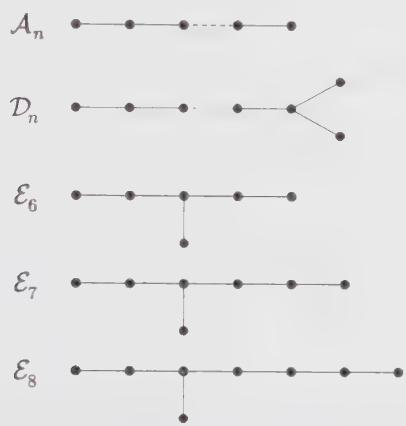  
Figure 10.3. The $\mathcal{A}_n$ , $\mathcal{D}_n$ , $\mathcal{E}_6$ , $\mathcal{E}_7$ , and $\mathcal{E}_8$ diagrams, with, respectively, $n$ , $n$ , $6$ , $7$ , and $8$ nodes.

To understand at least how the labeling of these modular invariants goes, we illustrate on Fig. 10.3 a set of diagrams $^{11}$ indexed by $A_{n}$ , $D_{n}$ , $E_{6}$ , $E_{7}$ and $E_{8}$ . To each diagram we associate an adjacency matrix $G_{ab}$ , with entries indexed by the nodes a, b of the diagram and such that

$$
G _ {a b} = \# \text {   of   links   between   } a \text {   and   } b\tag{10.168}
$$

For instance, the adjacency matrix for $A_{3}$ reads

$$
A _ {3} = \left( \begin{array}{c c c} 0 & 1 & 0 \\ 1 & 0 & 1 \\ 0 & 1 & 0 \end{array} \right)\tag{10.169}
$$

The matrices corresponding to the diagrams of Fig. 10.3 are exactly all the adjacency matrices of connected diagrams, whose eigenvalues are strictly less than 2. $^{12}$

The eigenvalues of the A, D, and E matrices are of the form

$$
2 \cos \pi \frac {m}{g}\tag{10.170}
$$

where the values of g and m are listed in Table 10.5. $^{13}$

Table 10.5. Values of g and m for the A, D, E diagrams.

<table><tr><td>Diagram</td><td>g</td><td>Values of m</td></tr><tr><td> $\mathcal{A}_{n}$ </td><td> $n+1$ </td><td> $1,2,3,\cdots,n$ </td></tr><tr><td> $\mathcal{D}_{n}$ </td><td> $2n-2$ </td><td> $1,3,5,\cdots,2n-3$ , and  $n-1$ </td></tr><tr><td> $\mathcal{E}_{6}$ </td><td>12</td><td> $1,4,5,7,8,11$ </td></tr><tr><td> $\mathcal{E}_{7}$ </td><td>18</td><td> $1,5,7,9,11,13,17$ </td></tr><tr><td> $\mathcal{E}_{8}$ </td><td>30</td><td> $1,7,11,13,17,19,23,29$ </td></tr></table>

This table provides the rationale for the previous labeling of the modular invariants: the Kac indices $(r,s)$ of the spinless $(h=\bar{h})$ operators in the modular-invariant theory $(G,H)$ are exactly the values of m labeling the eigenvalues of the associated adjacency matrices G (values of r) and H (values of s). The corresponding values of $p'$ and p match exactly the corresponding values of g for G and H, respectively.

## §10.8. Fusion Rules and Modular Invariance

The fusion rules of the minimal theories have been studied in detail in Sect. 8.4, and revisited in the light of correlation functions in Sect. 9.2. Here we propose yet another approach, based on modular transformations. The whole idea might seem paradoxical at first sight. Modular invariance really states how the left and right representations of the Virasoro algebra should be paired. In contrast, the fusion rules are essentially chiral, namely they pertain to only the left (or right) part of the theory. This apparent incompatibility is resolved by the highly nontrivial and very constraining fact that the characters of the left (or right) Virasoro representations form a unitary linear representation of the modular group. This is actually the main reason for the relation between the modular transformation properties of the characters of these representations and the fusion rules. In this section, only the chiral properties of the theories will be used.