In the following discussion, we find an explicit relation between the modular transformation S of the characters and the fusion numbers N. This proves to be a very general fact, and extends to the block-diagonal theories of Sect. 10.7.1. This leads naturally to the concept of rational conformal field theory (RCFT), namely, theories that are not necessarily minimal but whose (possibly infinite) collection of primary fields can be reorganized into a finite number of blocks corresponding to an extended symmetry algebra.

## 10.8.1. Verlinde's Formula for Minimal Theories

The relation between the fusion numbers $\mathcal{N}_{rs,mn}^{kl}$ of the minimal theories Eq. (8.131) and the $S$ matrix elements of Sect. 10.6 reads

$$
\boxed {\mathcal {N} _ {r s, m n} ^ {k l} = \sum_ {(i, j) \in E _ {p, p ^ {\prime}}} \frac {\mathcal {S} _ {r s , i j} \mathcal {S} _ {m n , i j} \mathcal {S} _ {i j , k l}}{\mathcal {S} _ {1 1 , i j}}}\tag{10.171}
$$

(the division by $S_{11;ij}$ is allowed, thanks to the positivity property (10.136)). Eq. (10.171) is known as the Verlinde formula for minimal models. $^{14}$ Its particularly simple form is rooted in commutative algebra theory, as illustrated in Ex. 10.18 in the case of the algebras of representations and classes of a finite group. This formula can be proven directly, by using the expression of S, Eq. (10.134), and some trigonometric sum rules. Another way consists in interpreting the Verlinde formula (10.171) as expressing the simultaneous diagonalization of the commuting matrices $^{15}$ $N_{(r,S)}$ , with entries

$$
[ N _ {(r, s)} ] _ {m n, k l} = \mathcal {N} _ {r s, m n} ^ {k l}\tag{10.172}
$$

Indeed, Eq. (10.171) amounts to the eigenvector equation

$$
\sum_ {(k, l) \in E _ {p, p ^ {\prime}}} \left[ N _ {(r, s)} \right] _ {m n, k l} \mathcal {S} _ {k l, \rho \sigma} = \left(\frac {\mathcal {S} _ {r s , \rho \sigma}}{\mathcal {S} _ {1 1 , \rho \sigma}}\right) \mathcal {S} _ {m n, \rho \sigma}\tag{10.173}
$$

In order to prove this relation, we use the fact that the matrices $N_{(r,s)}$ are entirely determined (polynomially) by the matrices $X = N_{(2,1)}$ and $Y = N_{(1,2)}$ , acting as

$$
\begin{array}{l l l l} N _ {(2, 1)}   N _ {(r, s)}   =   N _ {(r + 1, s)} + N _ {(r - 1, s)} & \text { with } & N _ {(0, s)} = N _ {(p ^ {\prime}, s)} = 0 \\ N _ {(1, 2)}   N _ {(r, s)}   =   N _ {(r, s + 1)} + N _ {(r, s - 1)} & \text { with } & N _ {(r, 0)} = N _ {(r, p)} = 0 \end{array}\tag{10.174}
$$

(cf. Eqs. (8.96)-(8.97)). Thus, using Eq. (10.134), we have

$$
\begin{array}{l} \sum_ {m, n} X _ {r s; m n} \mathcal {S} _ {m n, \rho \sigma} \\ = \mathcal {S} _ {r + 1, s; \rho , \sigma} + \mathcal {S} _ {r - 1, s; \rho , \sigma} \\ = \frac {4}{\sqrt {2 p p ^ {\prime}}} (- 1) ^ {s \rho + 1 + (r + 1) \sigma} \sin \left[ \pi \frac {p ^ {\prime}}{p} s \sigma \right] \\ \times \left(\sin \left[ \pi \frac {p}{p ^ {\prime}} (r + 1) \rho \right] + \sin \left[ \pi \frac {p}{p ^ {\prime}} (r - 1) \rho \right]\right) \\ = 2 (- 1) ^ {\sigma} \cos \left[ \pi \frac {p}{p ^ {\prime}} \rho \right] \mathcal {S} _ {r s, \rho \sigma} \end{array}\tag{10.175}
$$

Likewise, Y acts on S as

$$
\sum_ {m, n} Y _ {r s, m n} \mathcal {S} _ {m n, \rho \sigma} = 2 (- 1) ^ {\rho} \cos \left[ \pi \frac {p ^ {\prime}}{p} \sigma \right] \mathcal {S} _ {r s, \rho \sigma}
$$

Hence, the vectors $\nu^{(\rho,\sigma)}$ with components

$$
[ \nu^ {(\rho , \sigma)} ] _ {r, s} = \mathcal {S} _ {r s, \rho \sigma}\tag{10.176}
$$

are simultaneously eigenvectors of X and Y, and therefore of all the matrices $N_{(r,s)}$ , since these are polynomials of X and Y. We finally compute the eigenvalues of $N_{(r,s)}$ in this basis, denoted by $\gamma_{r,s}^{(\rho,\sigma)}$ . They satisfy the following condition (expressing that $N_{(1,1)} = \mathbb{I}$ , Eqs. (8.87)–(8.95))

$$
\mathcal {N} _ {1 1, r s} ^ {m n} = \delta_ {r, m} \delta_ {s, n} = \sum_ {(k, l) \in E _ {p, p ^ {\prime}}} \mathcal {S} _ {1 1, k l} \gamma_ {r s} ^ {(k l)} \mathcal {S} _ {k l, m n}\tag{10.177}
$$

Using the unitarity of the matrix S (Eq. (10.135)), multiplying both sides of Eq. (10.177) by $S_{mn,\rho\sigma}$ , and summing over m, n, we find

$$
\gamma_ {r, s} ^ {(\rho , \sigma)} = \frac {\mathcal {S} _ {r s , \rho \sigma}}{\mathcal {S} _ {1 1 , \rho \sigma}}\tag{10.178}
$$

This completes the proof of Eq. (10.173). However, a more conceptual proof is certainly desirable. This will be the object of Sect. 10.8.3 below, which relies on some special transformations of the conformal blocks of the theory. In preparation for this, we first recall a few facts on conformal blocks.

## 10.8.2. Counting Conformal Blocks

In Chaps. 8 and 9, we have seen how the correlation functions of a minimal conformal theory factorized into holomorphic $\times$ antiholomorphic conformal blocks corresponding to the various intermediate state projections allowed by OPE. More precisely, to a correlation function of primary fields $\langle\phi_{1}\phi_{2}\cdots\phi_{N}\rangle$ on the plane, there correspond all the conformal blocks

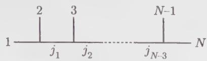

(10.179)

allowed by OPE, namely such that

$$
\begin{array}{l} \phi_ {j _ {1}} \in \phi_ {1} \times \phi_ {2} \\ \phi_ {j _ {2}} \in \phi_ {j _ {1}} \times \phi_ {3} \\ \dots \quad \dots \\ \phi_ {N} \in \phi_ {j _ {N - 3}} \times \phi_ {N - 1} \end{array}\tag{10.180}
$$

In all generality, a basis of conformal blocks is associated with a $\phi^{3}$ diagram (i.e., a graph with only trivalent vertices), with external legs carrying the indices of the fields of the correlation function, and propagators carrying the indices of intermediate states allowed by OPE. The number of such allowed states $\phi_{k} \in \phi_{i} \times \phi_{j}$ is simply the fusion number $N_{ij}^{k}$ , counting the number of independent couplings (ijk). So the conformal blocks can be counted by associating a factor $N_{ij}^{k}$ to each vertex with legs carrying the indices (ijk), and summing over internal indices (intermediate states on the internal propagators). Of course, the number of independent conformal blocks should be the same in the various bases corresponding to the various $\phi^{3}$ diagrams.

For a four-point function $\langle \phi_i\phi_j\phi_k\phi_l\rangle$ on the plane, the number of conformal blocks is

$$
\mathcal {N} = \sum_ {m} \mathcal {N} _ {i j} ^ {m} \mathcal {N} _ {m k} ^ {l}\tag{10.181}
$$

Equivalently, the correlator $\langle\phi_{i}\phi_{l}\phi_{k}\phi_{j}\rangle$ has

$$
\mathcal {N} = \sum_ {m} \mathcal {N} _ {i l} ^ {m} \mathcal {N} _ {m k} ^ {j}\tag{10.182}
$$

conformal blocks in a different basis. The identity between these two numbers (10.181) and (10.182) expresses simply the associativity of the fusion algebra

$$
\phi_ {i} \times \phi_ {j} = \sum_ {k} \mathcal {N} _ {i j} ^ {k} \phi_ {k}\tag{10.183}
$$

This is sufficient to ensure that any choice of basis for conformal blocks (hence any choice of $\phi^{3}$ diagram) leads to the same number of independent conformal blocks (see Ex. 10.19 for a simple proof).

For the $N$ -point function of Eq. (10.179), we find the following number of conformal blocks

$$
\mathcal {N} = \sum_ {j _ {1}, j _ {2}, \dots , j _ {N - 3}} \mathcal {N} _ {1 2} ^ {j _ {1}} \mathcal {N} _ {j _ {1} 3} ^ {j _ {2}} \dots \mathcal {N} _ {j _ {N - 3} N - 1} ^ {N}\tag{10.184}
$$

Remarkably, this recipe goes over to correlations on a Riemann surface of arbitrary genus (the genus is then also that of the $\phi^{3}$ graph). Take, for instance, the one-point function of the field $\phi_{i}$ on the torus. The corresponding diagram yields immediately

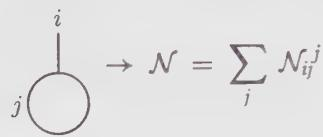

(10.185)

## 10.8.3. A General Proof of Verlinde's Formula

We are now ready to prove Eq. (10.171) in all generality. Let a and b denote the two basic homotopy cycles of the torus, depicted on Fig. 10.4. They are exchanged under the action of S. For any cycle c on the torus and any primary field $\phi_{i}$ , let $\phi_{i}(c)$ denote an operator acting on the character $\chi_{j}$ of the representation associated with $\phi_{j}$ according to the following steps:

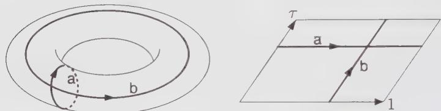  
Figure 10.4. The homotopy cycles a and b on the torus. They are homotopically inequivalent (they cannot be continuously deformed into each other), and are exchanged under the modular transformation $S : \tau \to -1/\tau$ .

(i) As mentioned above, the character $\chi_{j}$ is itself a conformal block for the zero-point correlation on the torus. As such, it is also equal to the corresponding conformal block of the one-point function of the identity operator $^{16}$ $\phi_{0} = I$ on the torus, namely

$$
\chi_ {j} = \bigcirc_ {j} = T r _ {j} (\mathbb {I} q ^ {L _ {0} - c / 2 4}) = \bigcirc_ {j} ^ {0}\tag{10.186}
$$

(In the above graphical representation, the circle corresponds to a b cycle.) We now write the identity operator $\phi_0 = \mathbb{I}$ as the result of the fusion of an operator $\phi_i$ with its conjugate $^{17}$ $\mathbb{I} = \phi_i \times \phi_{i^*}$ . This amounts to replacing the character $\chi_j$ by

the conformal block

$$
\mathfrak {F} _ {j} ^ {i, i ^ {*}} (z - w) = \bigoplus_ {0} ^ {i} \bigoplus_ {j} ^ {i ^ {*}}\tag{10.187}
$$

for the two-point correlation $\langle \phi_i(z)\phi_{i^*}(w)\rangle$ on the torus (by translational invariance, this is a function of $z - w$ only). The character $\chi_j$ is recovered from the conformal block, in the limit when the two points coincide

$$
\chi_ {j} = \lim _ {z \rightarrow w} (z - w) ^ {2 h _ {i}} \mathcal {F} _ {j} ^ {i, i ^ {*}} (z - w)
$$

The prefactor ensures that the limit is finite ( $h_i$ is the conformal dimension of $\phi_i$ ). (ii) In the conformal block (10.187), we move the operator $\phi_i$ around the torus, along the cycle c. This amounts to letting $z$ circulate along the closed contour c in the conformal block (10.187), namely, to compute the monodromy of the block $\mathcal{F}_j^{i,i^*}$ along c.

(iii) We take again the limit of coinciding points. This yields

$$
\phi_ {i} (\mathbf {c}) \chi_ {j}\tag{10.188}
$$

We shall study this operator for the special choices c = a or b. The interplay between the precise definition of $\phi_{i}(c)$ in terms of conformal blocks and the action of the modular group, through S, which exchanges a and b, will eventually give a relation between S and the fusion numbers N.

For $c = a$ , when $\phi_i$ is moved along the space (horizontal) direction of the torus, step (ii) above amounts to the following operation:

$$
\mathcal {F} _ {j} ^ {i, i ^ {*}} (z + 1) = \begin{array}{c} i \\ 0 \\ j \end{array} \text {   a   }
$$

The representation j is not affected, and we simply get a proportionality factor:

$$
\boxed {\phi_ {i} (\mathsf {a}) \chi_ {j} = \gamma_ {i} ^ {(j)} \chi_ {j}}\tag{10.189}
$$

For the operator $\phi_{i}(b)$ , step (ii) consists in taking the following path:

$$
\mathcal {F} _ {j} ^ {i, i ^ {*}} (z + \tau) = \begin{array}{c} i \\ 0 \\ j \end{array} \begin{array}{c} i ^ {*} \\ b \end{array}\tag{10.190}
$$

The operator $\phi_i(b)$ acts on $\chi_0$ , the character of the identity, in a simple way. It replaces the identity representation by $i$ . This enables us to fix the normalization of the operator $\phi_i(b)$ as

$$
\phi_ {i} (\mathsf {b}) \chi_ {0} = \chi_ {i}\tag{10.191}
$$

We will now show that

$$
\boxed {\phi_ {i} (\mathsf {b}) \chi_ {j} = \sum_ {k} \mathcal {N} _ {i j} ^ {k} \chi_ {k}.}\tag{10.192}
$$

The operator $\phi_{i}(b)$ is, up to a normalization factor $\mu$ fixed by (10.191), equal to the composition of the two elementary operators A and B

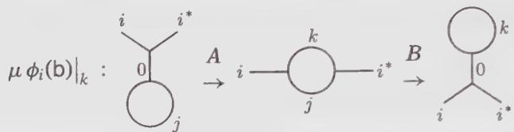

(10.193)

Here we write only the k-th component of this action. The full action of $\phi_{i}(\mathsf{b})$ is obtained by summing over all the possible intermediate states k. The operators A and B, as well as the normalization constant $\mu$ , act on conformal blocks of four-point functions as

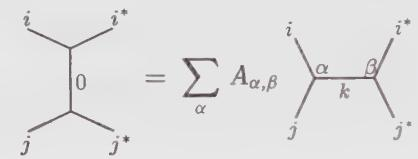

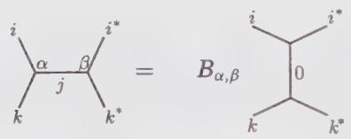

(10.194)

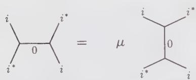

The Greek indices $\alpha, \beta$ label the different couplings $^{18}$ of the three fields (ijk), hence $\alpha, \beta = 1, 2 \ldots, N_{ij}^{k}$ . The action of the operators A, B, $\mu$ is to pick one particular component of the action of the crossing matrix or its inverse (see Sect. 9.3.3). Since a projection is implied, the transformations A and B are not invertible, whereas $\mu$ is just a scalar. In A, only a sum over the index $\alpha$ is implied: this accounts for the fact that only $\phi_{i}$ is moved along the b cycle ( $\phi_{i}\cdot$ remains fixed). We finally show that

$$
\mu = \sum_ {\beta = 1} ^ {\mathcal {N} _ {i j} ^ {k}} A _ {\alpha , \beta} B _ {\alpha , \beta}.\tag{10.195}
$$

This is readily seen to be a consequence of the equality of the two sequences of transformations depicted on Fig. 10.5.

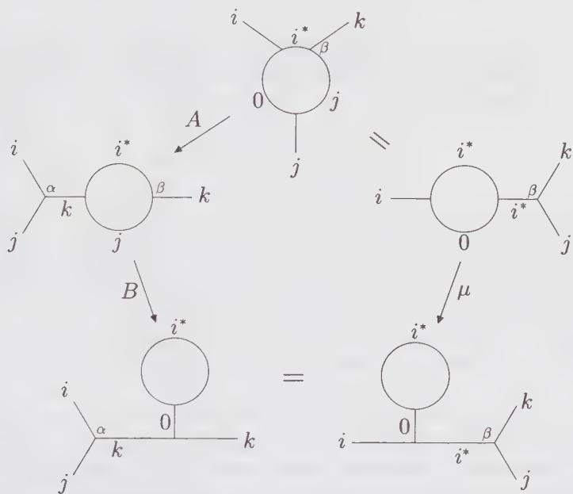  
Figure 10.5. Graphical proof of Eq. (10.195). The equality between the two bottom diagrams is a consequence of the associativity of the OPE (crossing symmetry of the conformal blocks of the four-point function). Note that the coupling $\beta$ is fixed, whereas $\alpha$ requires a summation.

As the l.h.s. of (10.195) is independent of $\beta$ , we can sum over it from 1 to $\mathcal{N}_{ij}^k$ , which gives

$$
\mu \mathcal {N} _ {i j} ^ {k} = \sum_ {\alpha , \beta} A _ {\alpha , \beta} B _ {\alpha , \beta}\tag{10.196}
$$

Hence, by summing Eq. (10.193) over $k$ , and taking the correct finite limit $z \to w$ of the last conformal block

$$
\lim _ {z \to w} (z - w) ^ {2 h _ {k}} \mathcal {F} _ {k} ^ {i, i ^ {*}} (z - w) = \chi_ {k}\tag{10.197}
$$

we get the desired result (10.192).

The fact that S exchanges a and b, means that $\phi_{i}(\mathbf{a})$ (Eq. (10.189)) and $\phi_{i}(\mathbf{b})$ (Eq. (10.192)) are conjugate under the action of S

$$
\phi_ {i} (\mathsf {b}) = \mathcal {S} \phi_ {i} (\mathsf {a}) \mathcal {S} ^ {- 1}\tag{10.198}
$$

By comparing Eqs. (10.189) and (10.192), we see that the fusion numbers are diagonalized by S in the form $^{19}$

$$
\mathcal {N} _ {i j} ^ {k} = \sum_ {m} \mathcal {S} _ {i m} \gamma_ {j} ^ {(m)} \bar {\mathcal {S}} _ {m k}\tag{10.199}
$$

where we used the unitarity of S. Setting i = 0 (the identity representation) in Eq. (10.199) and using the relation $N_{0i}^{k} = \delta_{i,k}$ (Eq. (8.87)), we finally get

$$
\mathcal {S} _ {0 m} \gamma_ {j} ^ {(m)} = \mathcal {S} _ {j m}\tag{10.200}
$$

If the matrix element $S_{0m}$ vanished, we would have $S_{jm} = 0$ for all j, which contradicts the fact that S is invertible. Hence, we can divide by $S_{0m}$ in the above relation. Substituting this value in Eq. (10.199) yields the Verlinde formula

$$
\boxed {\mathcal {N} _ {i j} ^ {k} = \sum_ {m} \frac {\mathcal {S} _ {i m} \mathcal {S} _ {j m} \bar {\mathcal {S}} _ {m k}}{\mathcal {S} _ {0 m}}}\tag{10.201}
$$

In this proof, only very general facts about conformal blocks have been used. In fact, formula (10.201) extends beyond the minimal theories. In the latter case, the S matrix elements are real, hence (10.201) reduces to (10.171).

As a consequence of Eq. (10.201), we can directly recover the unitarity of S, and, in addition, prove that it is symmetric. Note first that one can lower the index k in $N_{ij}^{k}$ by conjugation of the representation:

$$
\mathcal {N} _ {i j} ^ {k} = \mathcal {N} _ {i j k ^ {*}}\tag{10.202}
$$

meaning that the fusion $\phi_k \in \phi_i \times \phi_j$ is allowed iff $\langle \phi_i \phi_j \phi_{k^*} \rangle \neq 0$ . More precisely, $\mathcal{N}_{ijk^*}$ is the number of copies of the identity $\mathbb{I}$ occurring in the fusion $\phi_i \times \phi_j \times \phi_{k^*}$ . The numbers $\mathcal{N}_{ijk}$ being symmetric, we get from (10.201) that

$$
\mathcal {S} _ {k, m} = \bar {\mathcal {S}} _ {m, k ^ {*}}\tag{10.203}
$$

Using the conjugation matrix

$$
\mathcal {C} _ {i, j} = \delta_ {j, i ^ {*}}\tag{10.204}
$$

such that $C^{2}=1$ , we can rewrite this as

$$
\mathcal {C S} = \bar {\mathcal {S}} ^ {t} = \mathcal {S} ^ {\dagger}\tag{10.205}
$$

On the other hand, we reexamine the action of $S$ on the cycles a and b of the torus. The exact transformation is indeed given by Eq. (10.8)

$$
\mathcal {S}: (\mathrm{a}, \mathrm{b}) \rightarrow (- \mathrm{b}, \mathrm{a})
$$

In addition to the interchange of a and b, the direction of the cycle b has been reversed. This means that $S^{2}$ inverts the space and time directions (a → -a and b → -b) on the torus. Therefore, by CPT invariance, $^{20}$ it transforms a character $\chi_{i}$ into its conjugate $\chi_{i}$ , pertaining to the conjugate representation. Hence we have

$$
\boxed {\mathcal {S} ^ {2} = \mathcal {C}}\tag{10.206}
$$

This equation should be compared with the relation (10.9) satisfied by the representation S of the modular group. In general we have only $S^{4}=1$ but not $S^{2}=1$ when acting on characters, but there is no contradiction with Eq. (10.9): this simply means that the characters form an unfaithful representation of the modular group (in which stricto sensu one should have $S^{2}=1$ ), but rather a representation of a double covering of the modular group, for which only (10.206) holds.

Using (10.205) and (10.206) we finally obtain the unitarity condition

$$
\boxed {\mathcal {S} \mathcal {S} ^ {\dagger} = \mathbb {I}}\tag{10.207}
$$

The symmetry of S is readily seen from the relation

$$
\bar {\mathcal {N}} _ {i j k} = \mathcal {N} _ {i ^ {*} j ^ {*} k ^ {*}} = \mathcal {N} ^ {i j k} = \mathcal {N} _ {i j k}\tag{10.208}
$$

where, in the last step, we have used the fact that the numbers $\mathcal{N}$ are integral, and therefore real. Hence

$$
\boxed {\mathcal {S} = \mathcal {S} ^ {t}}\tag{10.209}
$$

The Verlinde formula (10.201) shows that the matrices $N_{i}$ , with entries $[N_{i}]_{j,k} = N_{ij}^{k}$ are simultaneously diagonalizable. Since they are integral matrices, they satisfy the Perron-Frobenius theorem. This means that their common eigenvector $S_{j,\max}$ , whose eigenvalues $\gamma_i^{(\max)}$ are maximal for all the $N_{i}$ 's (and this property uniquely characterizes $S_{j,\max}$ ), has only positive entries. This common maximal eigenvector is called the Perron-Frobenius eigenvector of the $N_{i}$ . (A sketch of the proof of the Perron-Frobenius theorem for any symmetric integral matrix $G$ is proposed in Ex. 10.10.). We will prove that, in a unitary theory, the field label max must correspond to the identity, i.e., $\max = 0$ . The starting point is the equality

$$
\chi_ {i} (- 1 / \tau) = \sum_ {m} \mathcal {S} _ {i, m} \chi_ {m} (\tau)\tag{10.210}
$$

When evaluating in the limit $\tau \to i\infty$ ( $q \to 0^{+}$ ), we can keep only the leading contribution of each character:

$$
\chi_ {i} (- 1 / \tau) \sim \sum_ {m} S _ {i, m} q ^ {h _ {m} - c / 2 4}\tag{10.211}
$$

Moreover, the leading contribution of this sum comes from the field with lowest dimension; in a unitary theory, this is the identity with h = 0 (the conformal dimension of all the other fields being strictly positive). Hence, we have

$$
\chi_ {i} (- 1 / \tau) \sim q ^ {- c / 2 4} S _ {i 0}\tag{10.212}
$$

When $\tau \to i\infty, q \to 1^{-}$ and the l.h.s. of (10.212) being an infinite sum of positive integers, diverges to $+\infty$ . We deduce that $S_{i0} > 0$ for all $i$ . This is simply the above mentioned Perron-Frobenius property, which enables us to identify $\max = 0$ . We have thus shown that in any unitary theory,

$$
\boxed {\mathcal {S} _ {i 0} = \mathcal {S} _ {0 i} > 0}\tag{10.213}
$$

In a nonunitary theory, the same argument leads to max = min, where min labels the representation with lowest conformal dimension $h_{min} < 0$ . Indeed, the r.h.s. in the second line of (10.211) is dominated by the term with m = min, when $q \to 0^{+}$ ; hence, we find that $S_{i,\min} > 0$ for all i. This characterizes the Perron-Frobenius eigenvector completely, and therefore proves that max = min. For a nonunitary theory with a unique field of lowest dimension, the positivity condition (10.213) therefore generalizes to

$$
\mathcal {S} _ {i, \min} = \mathcal {S} _ {\min, i} > 0\tag{10.214}
$$

This property is checked for the $(p,p')$ minimal theories in Ex. 10.5. If there is more than one field with lowest dimension, we have instead

$$
\sum_ {m \in \min} \mathcal {S} _ {i, m} > 0\tag{10.215}
$$

Finally, we note that the relation between S and T becomes

$$
(\mathcal {S T}) ^ {3} = \mathcal {C}\tag{10.216}
$$

These general relations can be used to infer some constraints on conformal field theories, as illustrated in Ex. 10.16.

## 10.8.4. Extended Symmetries and Fusion Rules

As already mentioned, the Verlinde formula (10.201) applies to minimal diagonal theories, with modular invariants listed in Sect. 10.7.1 in the form (10.171). We now see to what extent we can describe the fusion rules of nondiagonal theories. The chiral fusion rules of the nondiagonal theories related to an automorphism (Sect. 10.7.4) are not distinguishable from those of their ancestor, which is always block-diagonal (Sect. 10.7.3). Indeed, the same chiral fields are present in both theories, the difference consisting only in their left-right association. Hence the present discussion is relevant only for the block-diagonal theories of Sect. 10.7.3.

The minimal block-diagonal theories $(G,H)$ ( $G \neq A_{p' - 1}$ or $H \neq A_{p - 1}$ ), whose modular invariants are listed in Sect. 10.7.1, have an operator content different from that of the $(G,H)=(A_{p^{\prime}-1},A_{p-1})$ theories. The operators present in the block-diagonal theories are indicated in the modular invariant by the nonzero multiplicities $M_{rs,tu}$ of Eq. (10.141). How can we find their fusion rules? In principle, to answer this question, one should reexamine those cases, compute the new correlation functions, and extract the fusion coefficients. But here the corresponding fusion rules must take into account the (nonsymmetric) left-right pairing of Virasoro primary fields, and will not be chiral in general. On the other hand, motivated by the example of the three-state Potts model of Sect. 10.7.2, we shall proceed in a much simpler way, by describing the extended chiral fusion rules of the theory. The price to be paid for this simplification is that we get only a sort of average description of the fusion rules of the Virasoro primary fields, considered as blocks rather than as individual entities.

The common feature to all the block-diagonal models is that one can define extended characters $C_{\lambda}$ , through Eq. (10.152), to rewrite the modular invariant as $Z = \sum |C_{\lambda}|^{2}$ . The functions $C_{\lambda}$ are characters of reducible representations of the Virasoro algebra, themselves direct sums of irreducible ones. They are believed to be the irreducible characters of some extended symmetry algebra, enhancing the Virasoro symmetry. As such, they correspond to some extended operators $\phi_{\lambda}$ , for which the proof of the Verlinde formula (10.201) still applies: the conformal blocks are replaced by extended conformal blocks, sums of the former, and the proof essentially goes through, since the extended theory is diagonal. This means that the extended operators $\phi_{\lambda}$ satisfy extended fusion rules

$$
\phi_ {\lambda} \times \phi_ {\mu} = \sum_ {\nu} \mathcal {N} _ {\lambda \mu} ^ {(\mathrm{ext}) _ {\nu}} \phi_ {\nu}\tag{10.217}
$$

On the other hand, the extended characters transform modularly as

$$
C _ {\lambda} (- 1 / \tau) = \sum_ {\mu} S _ {\lambda , \mu} ^ {(\mathrm{ext})} C _ {\mu} (\tau)\tag{10.218}
$$

with $S^{(ext)}$ as in (10.153). The extension of the Verlinde formula is simply

$$
\mathcal {N} _ {\lambda \mu} ^ {(\mathrm{ext}) \nu} = \sum_ {\rho} \frac {\mathcal {S} _ {\lambda , \rho} ^ {(\mathrm{ext})} \mathcal {S} _ {\mu , \rho} ^ {(\mathrm{ext})}}{\mathcal {S} _ {0 , \rho} ^ {(\mathrm{ext})}} \bar {\mathcal {S}} _ {\rho , \nu} ^ {(\mathrm{ext})}\tag{10.219}
$$

Here the index 0 stands for the extended identity block.

As explained in the beginning of Sect. 10.8, the Verlinde formula, as well as the fusion numbers, are essentially chiral and based on the chiral operator content of the theory. This means that the fusion rules associated with the nondiagonal modular-invariant theories of Sect. 10.7.4 should be the same as those of the associated block-diagonal ones. For instance, the fusion rules of the $(E_{7}, A_{p-1})$ theories are the same as those of the $(D_{10}, A_{p-1})$ theories. We recall that the link between the two is an automorphism $\Pi$ acting on S and T as

$$
\mathcal {S} _ {\Pi (\lambda), \Pi (\mu)} = \mathcal {S} _ {\lambda , \mu} \qquad \mathcal {T} _ {\Pi (\lambda), \Pi (\mu)} = \mathcal {T} _ {\lambda , \mu} \qquad \Pi (0) = 0\tag{10.220}
$$

The substitution of the first relation into the Verlinde formula (10.201) shows that $\Pi$ is also an automorphism of the fusion rules, namely

$$
\mathcal {N} _ {\Pi (\lambda) \Pi (\mu)} ^ {\Pi (\nu)} = \mathcal {N} _ {\lambda \mu} ^ {\nu}\tag{10.221}
$$

Therefore nondiagonal modular invariants are generally built using automorphisms of the fusion rules of a block-diagonal theory. However, it should be stressed that, although automorphisms are most easily identified as automorphisms of the fusion rules, Eq. (10.221) does not imply Eq. (10.220) (and there are cases where (10.221) is satisfied but Eq. (10.220) is not. $^{21}$ ) The construction is therefore valid only for those $\Pi$ 's that satisfy Eq. (10.220).

## 10.8.5. Fusion Rules of the Extended Theory of the Three-State Potts Model

In Sect. 10.7.2, we have already defined the extended characters of the three-state Potts model. We denote the extended fields corresponding to the extended characters $C_{i,j}$ of Eq. (10.147) as follows:

$$
\begin{array}{r l} \mathbb {I} \leftrightarrow C _ {1, 1} & \varepsilon \leftrightarrow C _ {2, 1} \\ \mathbf {Z} _ {i} \leftrightarrow C _ {1, 3} ^ {(i)} & \sigma_ {i} \leftrightarrow C _ {2, 3} ^ {(i)} \qquad i = 1, 2 \end{array}\tag{10.222}
$$

The modular transformations (10.149) do not suffice to completely determine the fusion of these fields, as the two doubly-degenerated blocks $C^{(i)}$ appear only through their sums $C^{(1)} + C^{(2)}$ , and not individually. We first have to split them into two distinct characters, in such a way that the symmetric $6 \times 6S$ matrix reads (in the basis $C_{1,1}, C_{2,1}, C_{1,3}^{(1)}, C_{1,3}^{(2)}, C_{2,3}^{(1)}, C_{2,3}^{(2)}$ ):

$$
\mathcal {S} ^ {\mathrm{(ext)}} = \frac {2}{\sqrt {1 5}} \left( \begin{array}{c c c c c c} s _ {1} & s _ {2} & s _ {1} & s _ {1} & s _ {2} & s _ {2} \\ s _ {2} & - s _ {1} & s _ {2} & s _ {2} & - s _ {1} & - s _ {1} \\ s _ {1} & s _ {2} & \omega s _ {1} & \bar {\omega} s _ {1} & \omega s _ {2} & \bar {\omega} s _ {2} \\ s _ {1} & s _ {2} & \bar {\omega} s _ {1} & \omega s _ {1} & \bar {\omega} s _ {2} & \omega s _ {2} \\ s _ {2} & - s _ {1} & \omega s _ {2} & \bar {\omega} s _ {2} & - \omega s _ {1} & - \bar {\omega} s _ {1} \\ s _ {2} & - s _ {1} & \bar {\omega} s _ {2} & \omega s _ {2} & - \bar {\omega} s _ {1} & - \omega s _ {1} \end{array} \right)\tag{10.223}
$$

As before, we have $s_{i} = \sin(\pi i/5)$ , i = 1, 2, and $\omega = e^{2i\pi/3}$ . This is the simplest way of splitting the S matrix entries (10.149), restoring the symmetry (10.209) and the unitarity (10.207) of the matrix S, and preserving the $Z_{3}$ symmetry of the model. Indeed, the conjugation matrix $C = S^{2}$ of Eq. (10.206) reads

$$
\mathcal {C} ^ {(\mathrm{ext})} = \left( \begin{array}{c c c c c c} 1 & 0 & 0 & 0 & 0 & 0 \\ 0 & 1 & 0 & 0 & 0 & 0 \\ 0 & 0 & 0 & 1 & 0 & 0 \\ 0 & 0 & 1 & 0 & 0 & 0 \\ 0 & 0 & 0 & 0 & 0 & 1 \\ 0 & 0 & 0 & 0 & 1 & 0 \end{array} \right)\tag{10.224}
$$

In other words, the only nonvanishing two-point correlation functions of extended fields are the $Z_{3}$ -neutral combinations

$$
\langle \varepsilon \varepsilon \rangle , \qquad \langle \mathbf {Z} _ {1} \mathbf {Z} _ {2} \rangle , \qquad \langle \sigma_ {1} \sigma_ {2} \rangle\tag{10.225}
$$

The extended fusion rules of the three-state Potts model, displayed in Table 10.6, follow from the formula (10.219), with the extended S matrix (10.223).

Table 10.6. Extended fusion rules of the three-state Potts model.

$$
\varepsilon \times \varepsilon = \mathbb {I} + \varepsilon
$$

$$
\varepsilon \times \mathbf {Z} _ {i} = \sigma_ {i}
$$

$$
(i = 1, 2)
$$

$$
\varepsilon \times \sigma_ {i} = \sigma_ {i} + \mathbf {Z} _ {i}
$$

$$
(i = 1, 2)
$$

$$
\mathbf {Z} _ {i} \times \mathbf {Z} _ {i} = \mathbf {Z} _ {2 - i}
$$

$$
(i = 1, 2)
$$

$$
\mathbf {Z} _ {i} \times \mathbf {Z} _ {2 - i} = \mathbb {I}
$$

$$
(i = 1, 2)
$$

$$
\mathbf {Z} _ {i} \times \sigma_ {i} = \sigma_ {2 - i} (i = 1, 2)
$$

$$
\mathbf {Z} _ {i} \times \sigma_ {2 - i} = \mathbb {I} + \varepsilon (i = 1, 2)
$$

$$
\sigma_ {i} \times \sigma_ {i} = \mathbf {Z} _ {2 - i} + \sigma_ {2 - i} (i = 1, 2)
$$

$$
\pmb {\sigma} _ {i} \times \pmb {\sigma} _ {2 - i} = \mathbb {I} + \pmb {\varepsilon} (i = 1, 2)
$$

A practical way of applying (10.219) is to write down its one-dimensional representations, indexed by the label $\alpha$

$$
\rho_ {\alpha} ^ {(\mathrm{ext})} (\lambda) = \frac {\mathcal {S} _ {\lambda , \alpha} ^ {(\mathrm{ext})}}{\mathcal {S} _ {0 , \alpha} ^ {(\mathrm{ext})}}\tag{10.226}
$$

which satisfy

$$
\rho_ {\alpha} ^ {(\text { ext })} (\lambda) \rho_ {\alpha} ^ {(\text { ext })} (\mu) = \sum_ {\nu} \mathcal {N} _ {\lambda \mu} ^ {(\text { ext }) \nu} \rho_ {\alpha} ^ {(\text { ext })} (\nu)\tag{10.227}
$$

In many cases, the fusion rules can be read off directly from these one-dimensional representations (see Exs. 10.13, 10.14, and 10.15 for the cases $(A_6, D_4), (E_6, A_{p-1})$ , and $(E_8, A_{p-1})$ , respectively). For instance, in the three-state Potts case, they read

$$
\rho_ {(1, 1)} ^ {(\text { ext })} = \rho_ {\mathbb {I}} = (1 1 1 1 1 1 1)
$$

$$
\rho_ {(2, 1)} ^ {(\text {ext})} = \rho_ {\varepsilon} = (a _ {+} a _ {-} a _ {+} a _ {+} a _ {-} a _ {-})
$$

$$
\rho_ {(1, 3) ^ {(1)}} ^ {(\text {ext})} = \rho_ {\mathbf {Z} _ {1}} = (1: 1 \quad \omega \quad \bar {\omega} \quad \omega \quad \bar {\omega})
$$

$$
\rho_ {(1, 3) ^ {(2)}} ^ {(\text { ext })} = \rho_ {\mathbf {Z} _ {2}} = (1 1 \bar {\omega} \quad \omega \quad \bar {\omega} \quad \omega)
$$

$$
\rho_ {(2, 3) ^ {(1)}} ^ {(\text { ext })} = \rho_ {\sigma_ {1}} = (a _ {+} a _ {-} \omega a _ {+} \bar {\omega} a _ {+} \omega a _ {-} \bar {\omega} a _ {-})
$$

$$
\rho_ {(2, 3) ^ {(2)}} ^ {(\text {ext})} = \rho_ {\sigma_ {2}} = (a _ {+} a _ {-} \bar {\omega} a _ {+} \omega a _ {+} \bar {\omega} a _ {-} \omega a _ {-}) \tag {1}\tag{10.228}
$$

where $a_{\pm} = (1 \pm \sqrt{5})/2$ . Note that the conjugation matrix C acts on these one-dimensional representations as the complex conjugation, namely

$$
\mathcal {C} \rho^ {(\mathrm{ext})} = (\rho^ {(\mathrm{ext})}) ^ {*}\tag{10.229}
$$

## 10.8.6. A Simple Example of Nonminimal Extended Theory: The Free Boson at the Self-Dual Radius

The notion of extended symmetry applies also to nonminimal theories. Take the simplest example of the c = 1 bosonic theory compactified on a circle of radius $R = \sqrt{2}$ , invariant under the duality transformation $R \rightarrow 2/R$ mentioned in Sect. 10.4.1 (Eq. (10.65)). This theory is certainly nonminimal, $^{22}$ and the partition function on a torus reads

$$
Z (\sqrt {2}) = \frac {1}{| \eta (\tau) | ^ {2}} \sum_ {n, m \in \mathbb {Z}} q ^ {\frac {1}{4} (n + m) ^ {2}} \bar {q} ^ {\frac {1}{4} (n - m) ^ {2}}\tag{10.230}
$$

However, changing the summation variables to:

$$
\begin{array}{r l} \lambda & = n + m \\ \mu & = n - m \\ \lambda - \mu & = 0 \mod 2, \end{array}\tag{10.231}
$$

we can reexpress the partition function as

$$
Z(\sqrt{2}) = \frac{1}{|\eta(\tau)|^{2}}\sum_{\substack{\lambda ,\mu \in \mathbb{Z}\\ \lambda -\mu = 0\bmod 2}}q^{\lambda^{2} / 4}\bar{q}^{\mu^{2} / 4}\tag{10.232}
$$

We define the extended characters

$$
\begin{array}{l} C _ {0} (\tau) = \frac {1}{\eta} \sum_ {\lambda \text { even }} q ^ {\lambda^ {2} / 4} = \frac {1}{\eta} \sum_ {m \in \mathbb {Z}} q ^ {m ^ {2}} = \frac {\theta_ {3} (2 \tau)}{\eta (\tau)} \\ C _ {1} (\tau) = \frac {1}{\eta} \sum_ {\lambda \text { odd }} q ^ {\lambda^ {2} / 4} = \frac {1}{\eta} \sum_ {m \in \mathbb {Z}} q ^ {(m + \frac {1}{2}) ^ {2}} = \frac {\theta_ {2} (2 \tau)}{\eta (\tau)} \end{array}\tag{10.233}
$$

where we have identified the Jacobi theta functions defined in App. 10.A. (Note that here the argument is $2\tau$ .) We can write the partition function as

$$
Z (\sqrt {2}) = | C _ {0} | ^ {2} + | C _ {1} | ^ {2}\tag{10.234}
$$

This has a finite block-diagonal form, although the theory is not minimal. The extended characters $C_0, C_1$ transform under $T$ as

$$
\begin{array}{l} C _ {0} (\tau + 1) = e ^ {- i \pi / 1 2} C _ {0} (\tau) \\ C _ {1} (\tau + 1) = e ^ {5 i \pi / 1 2} C _ {1} (\tau). \end{array}\tag{10.235}
$$

The S transformation is a special case of Eq. (10.126), with N = 2, upon the identification:

$$
C _ {0} (\tau) = K _ {0} (\tau) \quad C _ {1} (\tau) = K _ {1} (\tau)\tag{10.236}
$$

so that

$$
\begin{array}{l} C _ {0} (- 1 / \tau) = \frac {C _ {0} (\tau) + C _ {1} (\tau)}{\sqrt {2}} \\ C _ {1} (- 1 / \tau) = \frac {C _ {0} (\tau) - C _ {1} (\tau)}{\sqrt {2}} \end{array}\tag{10.237}
$$

Hence, the extended S matrix reads

$$
\mathcal {S} ^ {(e x t)} = \frac {1}{\sqrt {2}} \left( \begin{array}{c c} 1 & 1 \\ 1 & - 1 \end{array} \right)\tag{10.238}
$$

and the associated extended fusion rules are again given by the obvious generalization (10.219) of Eq. (10.201), with $\phi_{0} = I$ , the extended identity. A simple calculation yields $^{23}$

$$
\phi_ {1} \times \phi_ {1} = \phi_ {0}\tag{10.239}
$$

We can repeat this construction whenever the square of the radius $R$ of the bosonic theory is a rational number (see Exs. 10.21 and 10.23 below).

## 10.8.7. Rational Conformal Field Theory: A Definition

A conformal field theory is said to be rational if its (possibly infinite) irreducible Virasoro representations can be reorganized into a finite number of extended blocks, linearly transformed into each other under the modular group. More precisely, we let

$$
C _ {\lambda} = \sum_ {i \in I _ {\lambda}} \chi_ {i} \quad \lambda = 1, 2, \dots , N\tag{10.240}
$$

denote the corresponding finite set of extended characters, where i denotes the irreducible Virasoro representations, and $I_{\lambda}$ some (possibly infinite) sets. Diagonal RCFTs have modular-invariant partition functions of the form

$$
\sum_ {\lambda = 1} ^ {N} | C _ {\lambda} | ^ {2}\tag{10.241}
$$

whereas the nondiagonal RCFTs have partition functions of the form

$$
\sum_ {\lambda = 1} ^ {N} C _ {\lambda}   C _ {\Pi (\lambda)} ^ {*}\tag{10.242}
$$

for some automorphism $\Pi$ of the extended fusion rules. The latter are obtained through Eq. (10.219).

The classification of all RCFTs is a formidable task, and it will probably remain an open problem for a while. A possible attack would be to first start by classifying all the possible fusion rules, and to use the information provided by the Verlinde formula (10.219) to get some clues concerning the operator content of the theory. Only partial results have been obtained so far; more details can be found in Chap. 17.

## Appendix 10.A. Theta Functions

This appendix describes some of the properties of theta functions. We begin by explaining Jacobi's triple product formula; then we define the theta functions in terms of series and infinite products. We also express the Dedekind $\eta$ function in terms of the theta functions. We finally derive the conformal properties of theta functions and of the Dedekind $\eta$ function.

## 10.A.1. The Jacobi Triple Product

In order to prepare ourselves for some theta function manipulations, we consider Jacobi's triple product identity:

$$
\prod_ {n = 1} ^ {\infty} (1 - q ^ {n}) (1 + q ^ {n - 1 / 2} t) (1 + q ^ {n - 1 / 2} / t) = \sum_ {n \in \mathbb {Z}} q ^ {n ^ {2} / 2} t ^ {n}\tag{10.243}
$$

This identity is valid for $|q| < 1$ and $t \neq 0$ , and can be demonstrated by combinatorial methods or in the context of Lie algebras (cf. Ex. 14.7). We shall argue that this identity is correct by analogy with a fermion-antifermion system. Consider a set of fermion oscillators $b_{n}$ and their antifermion counterparts $\tilde{b}_{n}$ , with the Hamiltonian

$$
H = E _ {0} \sum_ {r \in \mathbb {N} + 1 / 2} r (b _ {r} ^ {\dagger} b _ {r} + \bar {b} _ {r} ^ {\dagger} \bar {b} _ {r})\tag{10.244}
$$

The fermion number operator is

$$
N = \sum_ {r \in \mathbb {N} + 1 / 2} (b _ {r} ^ {\dagger} b _ {r} - \bar {b} _ {r} ^ {\dagger} \bar {b} _ {r})\tag{10.245}
$$

Now we consider the grand partition function

$$
Z (q, t) = \sum_ {\text { states }} e ^ {- \beta (E - \mu N)} \quad q = e ^ {- \beta E _ {0}}, t = e ^ {\beta \mu}\tag{10.246}
$$

We shall evaluate this quantity in two different ways, leading to the two sides of the following equation, which is manifestly equivalent to Eq. (10.243):

$$
\prod_ {r \in \mathbb {N} + 1 / 2} ^ {\infty} (1 + q ^ {r} t) (1 + q ^ {r} / t) = \prod_ {n = 1} ^ {\infty} \frac {1}{1 - q ^ {n}} \sum_ {n \in \mathbb {Z}} q ^ {n ^ {2} / 2} t ^ {n}\tag{10.247}
$$

First, the grand partition function factorizes into a product of grand partition functions, each associated with a single fermion oscillator. This, of course, follows from the fact that H and N decouple into sums over different fermion modes. Since the grand partition functions for a fermion and antifermion modes labeled r are, respectively, $(1 + q^{r}t)$ and $(1 + q^{r}/t)$ (there are two occupation states), the complete grand partition function coincides with the l.h.s. of Eq. (10.247).

Second, the grand partition function may be written as

$$
Z (q, t) = \sum_ {n \in \mathbb {Z}} t ^ {n} Z _ {n} (q)\tag{10.248}
$$

where $Z_{n}(q)$ is the ordinary partition function for a fixed fermion number n. We consider first $Z_{0}$ , the partition function with no net fermion number. The lowest energy states are given in Table 10.7.

Table 10.7. Lowest energy states of the fermion system with N = 0.

<table><tr><td>Energy</td><td>Degeneracy</td><td>States</td></tr><tr><td>0</td><td>1</td><td> $|0\rangle$ </td></tr><tr><td>1</td><td>1</td><td> $b_{1/2}^{\dagger}\bar{b}_{1/2}^{\dagger}|0\rangle$ </td></tr><tr><td>2</td><td>2</td><td> $b_{3/2}^{\dagger}\bar{b}_{1/2}^{\dagger}|0\rangle$ ,  $b_{1/2}^{\dagger}\bar{b}_{3/2}^{\dagger}|0\rangle$ </td></tr><tr><td>3</td><td>3</td><td> $b_{5/2}^{\dagger}\bar{b}_{1/2}^{\dagger}|0\rangle$ ,  $b_{3/2}^{\dagger}\bar{b}_{3/2}^{\dagger}|0\rangle$ ,  $b_{1/2}^{\dagger}\bar{b}_{5/2}^{\dagger}|0\rangle$ </td></tr><tr><td>4</td><td>5</td><td> $b_{7/2}^{\dagger}\bar{b}_{1/2}^{\dagger}|0\rangle$ ,  $b_{5/2}^{\dagger}\bar{b}_{3/2}^{\dagger}|0\rangle$ ,  $b_{3/2}^{\dagger}\bar{b}_{5/2}^{\dagger}|0\rangle$ , $b_{1/2}^{\dagger}\bar{b}_{7/2}^{\dagger}|0\rangle$ ,  $b_{3/2}^{\dagger}\bar{b}_{3/2}^{\dagger}b_{1/2}^{\dagger}\bar{b}_{1/2}^{\dagger}|0\rangle$ </td></tr></table>

The number of creation operators in these states is always even, and the sum of their indices is equal to the normalized energy level $m = E/E_{0}$ . We notice so far that the degeneracy at level m is equal to the partition number $p(m)$ . This may be shown in general. Therefore $Z_{0}$ is equal to

$$
Z _ {0} = \sum_ {m = 0} ^ {\infty} p (m) q ^ {m} = \prod_ {n = 1} ^ {\infty} \frac {1}{1 - q ^ {n}}\tag{10.249}
$$

This confirms Eq. (10.247) as far as the $t^{0}$ term is concerned. We now consider $Z_{n}$ . The lowest energy state with fermion number n is obtained by exciting the lowest n oscillators:

$$
b _ {1 / 2} ^ {\dagger} b _ {3 / 2} ^ {\dagger} \dots b _ {n - 1 / 2} ^ {\dagger} | 0 \rangle \quad E / E _ {0} = \sum_ {r = 1} ^ {n} (n - \frac {1}{2}) = \frac {1}{2} n ^ {2}\tag{10.250}
$$

It turns out that the excitations on top of this ground state have exactly the same structure as the excitations of the n = 0 sector. Therefore

$$
Z _ {n} = q ^ {n ^ {2} / 2} \prod_ {m = 1} ^ {\infty} \frac {1}{1 - q ^ {m}}\tag{10.251}
$$

and Eq. (10.247) follows.

## 10.A.2. Theta Functions

Jacobi's theta functions are defined as follows:

$$
\begin{array}{l} \theta_ {1} (z | \tau) = - i \sum_ {r \in \mathbb {Z} + 1 / 2} (- 1) ^ {r - 1 / 2} y ^ {r} q ^ {r ^ {2} / 2} \\ \theta_ {2} (z | \tau) = \sum_ {r \in \mathbb {Z} + 1 / 2} y ^ {r} q ^ {r ^ {2} / 2} \\ \theta_ {3} (z | \tau) = \sum_ {n \in \mathbb {Z}} y ^ {n} q ^ {n ^ {2} / 2} \\ \theta_ {4} (z | \tau) = \sum_ {n \in \mathbb {Z}} (- 1) ^ {n} y ^ {n} q ^ {n ^ {2} / 2} \end{array}\tag{10.252}
$$

where z is a complex variable and $\tau$ a complex parameter living on the upper half-plane. We have defined $q = \exp 2\pi i\tau$ and $y = \exp 2\pi iz$ .

Jacobi's triple product allows us to rewrite these functions in the form of infinite products:

$$
\begin{array}{l} \theta_ {1} (z | \tau) = - i y ^ {1 / 2} q ^ {1 / 8} \prod_ {n = 1} ^ {\infty} (1 - q ^ {n}) \prod_ {n = 0} ^ {\infty} (1 - y q ^ {n + 1}) (1 - y ^ {- 1} q ^ {n}) \\ \theta_ {2} (z | \tau) = y ^ {1 / 2} q ^ {1 / 8} \prod_ {n = 1} ^ {\infty} (1 - q ^ {n}) \prod_ {n = 0} ^ {\infty} (1 + y q ^ {n + 1}) (1 + y ^ {- 1} q ^ {n}) \\ \theta_ {3} (z | \tau) = \prod_ {n = 1} ^ {\infty} (1 - q ^ {n}) \prod_ {r \in \mathbb {N} + 1 / 2} ^ {\infty} (1 + y q ^ {r}) (1 + y ^ {- 1} q ^ {r}) \\ \theta_ {4} (z | \tau) = \prod_ {n = 1} ^ {\infty} (1 - q ^ {n}) \prod_ {r \in \mathbb {N} + 1 / 2} ^ {\infty} (1 - y q ^ {r}) (1 - y ^ {- 1} q ^ {r}) \end{array}\tag{10.253}
$$

For instance, the equivalence of the two expressions for $\theta_{1}$ is obtained by setting $t = yq^{1/2}$ in Eq. (10.243).

By shifting their arguments, theta functions may all be related to each other; from their definitions it is a simple matter to check that

$$
\begin{array}{l} \theta_ {4} (z | \tau) = \theta_ {3} (z + \frac {1}{2} | \tau) \\ \theta_ {1} (z | \tau) = - i e ^ {i \pi z} q ^ {1 / 8} \theta_ {4} (z + \frac {1}{2} \tau | \tau) \end{array}\tag{10.254}
$$

$$
\theta_ {2} (z | \tau) = \theta_ {1} (z + \frac {1}{2} | \tau)
$$

Theta functions are used to define doubly periodic functions on the complex plane. One sees that they are not periodic under $z \rightarrow z + 1$ or $z \rightarrow z + \tau$ , but obey the simple relations:

$$
\begin{array}{l l} \hline \theta_ {1} (z + 1 | \tau) = - \theta_ {1} (z | \tau) & \theta_ {1} (z + \tau | \tau) = - \frac {1}{y q} \theta_ {1} (z | \tau) \\ \hline \theta_ {2} (z + 1 | \tau) = - \theta_ {2} (z | \tau) & \theta_ {2} (z + \tau | \tau) = \frac {1}{y q} \theta_ {2} (z | \tau) \\ \hline \theta_ {3} (z + 1 | \tau) = \theta_ {3} (z | \tau) & \theta_ {3} (z + \tau | \tau) = \frac {1}{y q ^ {1 / 2}} \theta_ {3} (z | \tau) \\ \hline \theta_ {4} (z + 1 | \tau) = \theta_ {4} (z | \tau) & \theta_ {4} (z + \tau | \tau) = - \frac {1}{y q ^ {1 / 2}} \theta_ {4} (z | \tau) \\ \hline \end{array}\tag{10.255}
$$

It follows that doubly periodic functions may be easily constructed out of ratios or logarithmic derivatives of theta functions. The best-known example is the Weierstrass function:

$$
\wp (z | \tau) = - \frac {\partial^ {2}}{\partial z ^ {2}} \ln \theta_ {1} (z | \tau) - 2 \eta_ {1}\tag{10.256}
$$

where the constant $\eta_{1}$ depends only on $\tau$

$$
\eta_ {1} = - \frac {1}{6} \frac {\partial_ {z} ^ {3} \theta_ {1} (0 | \tau)}{\partial_ {z} \theta_ {1} (0 | \tau)}\tag{10.257}
$$

We shall also use the theta functions at z = 0:

$$
\theta_ {i} (\tau) \equiv \theta_ {i} (0 | \tau)
$$

for i = 2, 3, 4 (one easily checks that $\theta_{1}(0|\tau) = 0$ ). Their explicit expressions, in terms of sums and products, are

$$
\begin{array}{l} \hline \theta_ {2} (\tau) = \sum_ {n \in \mathbb {Z}} q ^ {(n + 1 / 2) ^ {2} / 2} = 2 q ^ {1 / 8} \prod_ {n = 1} ^ {\infty} (1 - q ^ {n}) (1 + q ^ {n}) ^ {2} \\ \theta_ {3} (\tau) = \sum_ {n \in \mathbb {Z}} q ^ {n ^ {2} / 2} = \prod_ {n = 1} ^ {\infty} (1 - q ^ {n}) (1 + q ^ {n - 1 / 2}) ^ {2} \\ \theta_ {4} (\tau) = \sum_ {n \in \mathbb {Z}} (- 1) ^ {n} q ^ {n ^ {2} / 2} = \prod_ {n = 1} ^ {\infty} (1 - q ^ {n}) (1 - q ^ {n - 1 / 2}) ^ {2} \end{array}\tag{10.258}
$$

## 10.A.3. Dedekind's $\eta$ Function

Dedekind's $\eta$ function is defined as

$$
\eta (\tau) = q ^ {1 / 2 4} \varphi (q) = q ^ {1 / 2 4} \prod_ {n = 1} ^ {\infty} (1 - q ^ {n})\tag{10.259}
$$

where $\varphi(q)$ is the Euler function. This function is related to theta functions as follows:

$$
\eta^ {3} (\tau) = \frac {1}{2} \theta_ {2} (\tau) \theta_ {3} (\tau) \theta_ {4} (\tau)\tag{10.260}
$$

This identity is an immediate consequence of the infinite product expressions for the theta functions at z = 0; we simply need to show that the function

$$
f (q) = \prod_ {n = 1} ^ {\infty} (1 + q ^ {n}) (1 + q ^ {n - 1 / 2}) (1 - q ^ {n - 1 / 2})\tag{10.261}
$$

is equal to unity. But we may write

$$
f (q) = \prod_ {n = 1} ^ {\infty} (1 + q ^ {n}) (1 - q ^ {2 n - 1})\tag{10.262}
$$

The first factor may be written in the product as $(1 + q^{2n})(1 + q^{2n-1})$ . Combining the second factor of this last expression with $(1 - q^{2n-1})$ , one finds

$$
f (q) = \prod_ {n = 1} ^ {\infty} (1 + q ^ {2 n}) (1 - q ^ {4 n - 2}) = f (q ^ {2})\tag{10.263}
$$

Since $f(0)=1$ , it follows that $f(q)=1$ if $|q|<1$ .

## 10.A.4. Modular Transformations of Theta Functions

We are now interested in the behavior of theta functions $\theta_{i}(\tau)$ under the modular transformation $\tau \rightarrow -1/\tau$ . For this we need the following formula, called the Poisson resummation formula:

$$
\sum_ {n \in \mathbb {Z}} \exp (- \pi a n ^ {2} + b n) = \frac {1}{\sqrt {a}} \sum_ {k \in \mathbb {Z}} \exp - \frac {\pi}{a} (k + b / 2 \pi i) ^ {2}\tag{10.264}
$$

This formula is easily demonstrated by using the identity $^{24}$

$$
\sum_ {n \in \mathbb {Z}} \delta (x - n) = \sum_ {k \in \mathbb {Z}} e ^ {2 \pi i k x}\tag{10.265}
$$

and by integrating it over $\exp(-\pi ax^{2} + bx)$ .

We consider now the infinite series expression for $\theta_3(\tau)$ . Applying the formula (10.264) with $a = -i\tau$ and $b = 0$ , we immediately find

$$
\theta_ {3} (- 1 / \tau) = \sqrt {- i \tau} \theta_ {3} (\tau)\tag{10.266}
$$

If we set $a = -i\tau$ and $b = -i\pi$ , we obtain the modular transformation of $\theta_{2}$ :

$$
\theta_ {2} (- 1 / \tau) = \sqrt {- i \tau} \theta_ {4} (\tau)\tag{10.267}
$$

Applying the modular transformation a second time, we find

$$
\theta_ {4} (- 1 / \tau) = \sqrt {- i \tau} \theta_ {2} (\tau)\tag{10.268}
$$

These simple transformation properties, as well as the relation (10.260) for the $\eta$ function, give us directly the modular transformation of that function:

$$
\eta (- 1 / \tau) = \sqrt {- i \tau} \eta (\tau)\tag{10.269}
$$

The modular properties under the shift $\tau\to\tau+1$ are easily derived from Eq. (10.258). The infinite product expression for $\theta_{2}$ implies that $\theta_{2}(\tau+1)=e^{i\pi/4}\theta_{2}(\tau)$ . On the other hand, the infinite series expressions for $\theta_{3}$ and $\theta_{4}$ yield:

$$
\begin{array}{l} \theta_ {3} (\tau + 1) = \sum_ {n \in \mathbb {Z}} q ^ {n ^ {2} / 2} e ^ {i \pi n ^ {2}} \\ = \sum_ {n \in \mathbb {Z}} q ^ {n ^ {2} / 2} e ^ {i \pi n ^ {2}} (- 1) ^ {n} \\ = \theta_ {4} (\tau) \end{array}\tag{10.270}
$$

Likewise, we find that $\theta_{4}(\tau+1)=\theta_{3}(\tau)$ .

We can group these results, as well as the transformation of the Dedekind $\eta$ function, as follows:

$$
\begin{array}{l l} \hline \theta_ {2} (\tau + 1) = e ^ {i \pi / 4} \theta_ {2} (\tau) & \theta_ {2} (- 1 / \tau) = \sqrt {- i \tau} \theta_ {4} (\tau) \\ \theta_ {3} (\tau + 1) = \theta_ {4} (\tau) & \theta_ {3} (- 1 / \tau) = \sqrt {- i \tau} \theta_ {3} (\tau) \\ \theta_ {4} (\tau + 1) = \theta_ {3} (\tau) & \theta_ {4} (- 1 / \tau) = \sqrt {- i \tau} \theta_ {2} (\tau) \\ \eta (\tau + 1) = e ^ {i \pi / 1 2} \eta (\tau) & \eta (- 1 / \tau) = \sqrt {- i \tau}   \eta (\tau) \\ \hline \end{array}\tag{10.271}
$$

## 10.A.5. Doubling Identities

The Jacobi theta functions satisfy the following doubling identities

$$
\begin{array}{l} \theta_ {2} (2 \tau) = \sqrt {\frac {\theta_ {3} (\tau) ^ {2} - \theta_ {4} (\tau) ^ {2}}{2}} \\ \theta_ {3} (2 \tau) = \sqrt {\frac {\theta_ {3} (\tau) ^ {2} + \theta_ {4} (\tau) ^ {2}}{2}} \\ \theta_ {4} (2 \tau) = \sqrt {\theta_ {3} (\tau) \theta_ {4} (\tau)} \end{array}\tag{10.272}
$$

whereas $\theta_{1}$ satisfies

$$
\partial_ {z} \theta_ {1} (2 \tau) = \frac {1}{2} \frac {\theta_ {2} (\tau) \partial_ {z} \theta_ {1} (\tau)}{\sqrt {\theta_ {3} (\tau) \theta_ {4} (\tau)}}\tag{10.273}
$$

## Exercises

## 10.1 Euclidian division and the Bezout lemma

For any two positive integers $a, c$ , we denote by $\gcd(a, c)$ the greatest common divisor of $a$ and $c$ .

a) Euclidean division: Show that for two given integers $a > c > 0$ , there is a unique couple $a_1, c_1$ of integers, such that

$$
a = a _ {1} c + c _ {1}
$$

$$
0 \leq c _ {1} <   c
$$

b) Show that $\gcd(a,c)=\gcd(c,c_{1})$ .

c) Bezout lemma: Show that there exist two integers $a_{0}$ and $c_{0}$ such that

$$
c _ {0} a - a _ {0} c = \operatorname * {g c d} (a, c)
$$

Hint: Repeat the Euclidean division, namely write $c = a_{2}c_{1} + c_{2}$ , and so on. The sequence $c > c_{1} > c_{2} > \cdots \geq 0$ is strictly decreasing, hence there exists a finite k, such that $c_{k} = \gcd(a, c)$ and $c_{k+1} = 0$ .

d) Deduce that the two integers $a, c$ are coprime iff there exist two integers $a_0$ and $c_0$ such that $c_0a - a_0c = 1$ . (Two integers are said to be coprime iff their only common divisor is 1.)

## 10.2 The modular group PSL(2, Z)

The modular group is defined as

$$
P S L (2, \mathbb {Z}) = \left\{\left( \begin{array}{c c} a & b \\ c & d \end{array} \right) a, b, c, d \in \mathbb {Z} \mid a d - b c = 1 \right\}
$$

The elements of $PSL(2,\mathbb{Z})$ are also often labeled by the fractions $(a\tau+b)/(c\tau+d)$ . The aim of this exercise is to show that the transformations S and T of Eq. 10.8 generate the modular group.

a) Prove that any product of S and T is an element of $PSL(2, \mathbb{Z})$ .

b) In the following, we consider a generic element $x = (a\tau + b) / (c\tau + d)$ of $PSL(2, \mathbb{Z})$ . Show that $a$ and $c$ are coprime.

Hint: Use the Bezout lemma of Ex. 10.1 above.

c) If $a > c$ , show that there exists an integer $\rho_0$ , such that

$$
\frac {a \tau + b}{c \tau + d} = \rho_ {0} + \frac {a _ {1} \tau + b _ {1}}{c _ {1} \tau + d _ {1}}
$$

with $c_{1}=c$ , $d_{1}=d$ , and $0\leq a_{1}<c$ .

Hint: Perform the Euclidean division of $a$ by $c$ , to get $a = \rho_0c + a_1$ , and therefore $b_{1} = b - \rho_{0}d$ .

d) If $a_1 = 0$ , show that one can take $-b_1 = c_1 = 1$ , and write $x$ as a composition of $S$ and $T$ actions.

Result: $x = T^{\rho_0}ST^{\rho_1}$ , with $\rho_{1} = d_{1}$ .

e) If $a_1 > 0$ , write

$$
\frac {a \tau + b}{c \tau + d} = \rho_ {0} - 1 / \left(\frac {- c _ {1} \tau - d _ {1}}{a _ {1} \tau + b _ {1}}\right)
$$

and repeat the above division procedure to rewrite

$$
\frac {a \tau + b}{c \tau + d} = \rho_ {0} - 1 / \left(\rho_ {1} + \frac {a _ {2} \tau + b _ {2}}{c _ {2} \tau + d _ {2}}\right)
$$

where $c_{2}=a_{1}, d_{2}=b_{1}$ , and $0 \leq a_{2} < a_{1}$ .

f) Repeating this division procedure (leading to five sequences $\rho_{i}, a_{i}, b_{i}, c_{i}, d_{i}, i = 1, 2, \ldots$ of integers), show that there exists a finite integer k, such that $a_{k} = 0, a_{k-1} \neq 0$ . Show that one can take $-b_{k} = c_{k} = 1$ , and conclude that the element x may be written as a composition of S and T actions.

Result: $x = T^{\rho_{0}}ST^{\rho_{1}}S \cdots T^{\rho_{k-1}}ST^{\rho_{k}}$ , where $\rho_{k} = d_{k}$ . This completes the proof that $PSL(2, \mathbb{Z})$ is generated by S and T actions.

## 10.3 Smallest dimension in a minimal theory

a) Find the smallest dimension in the Kac table of the minimal $(p, p')$ theory.

Hint: Use the Bezout lemma of Ex. 10.1 c.

b) Check the strict inequality (10.95).

10.4 $S^2 = 1$ for minimal models

We wish to compute the matrix C

$$
\mathcal {C} _ {r s, \rho \sigma} = \sum_ {(n, m) \in E _ {p, p ^ {\prime}}} \mathcal {S} _ {r s, n m} \mathcal {S} _ {n m, \rho \sigma}
$$

for minimal models, with the $S$ matrix elements given by (10.134).

a) Write the transformations of $S$ under $(r,s) \to (p' - r,p - s), (p' + r,p - s)$ , and $(p' - r,p + s)$ , which correspond, respectively, to the transformations of $\lambda = \lambda_{r,s} = pr - p's \to -\lambda, \omega_0\lambda$ and $-\omega_0\lambda$ .

b) Rewrite $S_{rs,nm}$ as a function of $\lambda_{n,m} = pn - p'm$ and $r, s$ only. Call this function $S_{rs}(\lambda)$ .  
c) Deduce that for $N = 2pp'$

$$
\mathcal {C} _ {r s, \rho \sigma} = \sum_ {\mu = 0} ^ {N - 1} \mathcal {S} _ {r s} (\mu) \mathcal {S} _ {\rho \sigma} (\mu)
$$

d) Show that

$$
\sum_ {\mu = 0} ^ {N - 1} \mathcal {S} _ {r s} (\mu) \mathcal {S} _ {\rho \sigma} (\mu) = \sum_ {\epsilon_ {i} = \pm 1} \delta^ {(N)} \left(p \left(\epsilon_ {1} r + \epsilon_ {2} \rho\right) + p ^ {\prime} \left(\epsilon_ {3} s + \epsilon_ {4} \sigma\right)\right)
$$

where the delta function modulo N reads

$$
\delta^ {(N)} (x) = \frac {1}{N} \sum_ {\mu = 0} ^ {N - 1} e ^ {2 i \pi x / N}
$$

e) Conclude that

$$
\mathcal {C} _ {r s, \rho \sigma} = \delta_ {r, \rho} \delta_ {s, \sigma}
$$

by restricting C back to the fundamental domain $E_{p,p'}$ .

10.5 Positivity and nonvanishing of basic $S$ matrix elements for minimal models

a) Use the expression (10.134) to directly prove Eq. (10.136), for any minimal model.

b) For unitary theories (i.e., with $|p - p'| = 1$ ), show further that

$$
\mathcal {S} _ {\rho \sigma ; 1 1} > 0 \quad \text {   for   all   } (\rho , \sigma) \in E _ {p, p ^ {\prime}}
$$

c) For nonunitary theories (i.e., with $|p - p'| > 1$ ), prove that the matrix elements

$$
\mathcal {S} _ {\rho \sigma ; r _ {0} s _ {0}} > 0 \quad \text { for   all } (\rho , \sigma) \in E _ {p, p ^ {\prime}}
$$

where $(r_0, s_0)$ are the Kac labels of the smallest dimension of the theory (see Ex. 10.3).

10.6 Modular invariance of $Z_{D_{p'/2+1},A_{p-1}}$

a) For $p' = 4m + 2$ and $p$ an odd integer, compute the quantities

$$
h _ {p ^ {\prime} - 2 r - 1, s} - h _ {2 r + 1, s} \quad \text { for } \quad r = 0, 1, \dots , m - 1 \quad \text { and } \quad s = 1, 2, \dots , (p - 1) / 2
$$

Deduce the T invariance of the partition function $Z_{D_{p^{\prime}/2+1},A_{p-1}}$ .

b) Show that the extended characters

$$
C _ {2 r + 1, s} = \chi_ {2 r + 1, s} + \chi_ {p ^ {\prime} - 2 r - 1, s} (r = 0, 1, \dots , m - 1), (s = 1, 2, \dots , (p - 1) / 2)
$$

and

$$
C _ {2 m + 1, s} = \chi_ {2 m + 1, s} \quad \mathrm{for} \quad s = 1, 2, \ldots , (p - 1) / 2
$$

form an $(m+1)(p-1)/2$ -dimensional space invariant under the linear action of S. Write the matrix elements of the restriction of S to this basis, and check that this restriction is unitary. Deduce the modular invariance of $Z_{D_{p^{\prime}/2+1},A_{p-1}}$ .

10.7 Modular invariance of $Z_{E_{6},A_{p-1}}$

a) For $p' = 12$ and $p$ an arbitrary odd integer, compute

$$
h _ {7, s} - h _ {1, s}, \quad h _ {8, s} - h _ {4, s}, \quad h _ {1 1, s} - h _ {5, s}
$$

Deduce the T invariance of the $Z_{E_{6},A_{p-1}}$ partition function of Table 10.3.

b) Show that

$$
C _ {1, s} = \chi_ {1, s} + \chi_ {7, s}, \quad C _ {4, s} = \chi_ {4, s} + \chi_ {8, s}, \quad C _ {5, s} = \chi_ {5, s} + \chi_ {1 1, s}
$$

for $1 \leq s \leq (p - 1)/2$ form a basis of a $3(p - 1)/2$ -dimensional space invariant under the action of $\mathcal{S}$ . Write the matrix elements of the restriction of $\mathcal{S}$ to this basis, and check that this restriction is unitary. Deduce the modular invariance of $Z_{E_6,A_{p-1}}$ .

10.8 Modular invariance of $Z_{E_{8},A_{p-1}}$

a) For $p' = 30$ and $p$ an arbitrary odd integer, compute

$$
h _ {1 1, s} - h _ {1, s}, \quad h _ {1 9, s} - h _ {1, s}, \quad h _ {2 9, s} - h _ {1, s},
$$

$$
h _ {1 3, s} - h _ {7, s}, \quad h _ {1 7, s} - h _ {7, s}, \quad h _ {2 3, s} - h _ {7, s}
$$

for $s = 1, \ldots, p - 1$ . Deduce the $\mathcal{T}$ invariance of the $Z_{E_8A_{p-1}}$ partition function of Table 10.3. b) Show that

$$
\begin{array}{l} C _ {1, s} = \chi_ {1, s} + \chi_ {1 1, s} + \chi_ {9, s} + \chi_ {2 9, s}, \\ C _ {7, s} = \chi_ {7, s} + \chi_ {1 3, s} + \chi_ {1 7, s} + \chi_ {2 3, s} \end{array}
$$

for $1 \leq s \leq (p - 1)/2$ form a basis of a $(p - 1)$ -dimensional space invariant under the action of $\mathcal{S}$ . Write the matrix elements of the restriction of $\mathcal{S}$ to this basis, and check that this restriction is unitary. Deduce the modular invariance of $Z_{E_6,A_{p-1}}$ .

## 10.9 Modular invariance of $Z_{D_{p'/2+1},A_{p-1}}$ for $p' = 4m$

a) From the expression of the matrix elements of S on minimal characters Eq. (10.134), show that

$$
\mathcal {S} _ {\Upsilon (r, s); \rho , \sigma} = (- 1) ^ {1 + \rho} \mathcal {S} _ {r s, \rho \sigma} = (- 1) ^ {r + \rho} \mathcal {S} _ {r, s; \Upsilon (\rho , \sigma)},
$$

where $\Upsilon$ is the automorphism

$$
\Upsilon (r, s) = \left(p ^ {\prime} - r, s\right)
$$

b) Find an automorphism $\Pi$ leading from $Z_{A_{p^{\prime}-1},A_{p-1}}$ to $Z_{D_{p^{\prime}/2+1},A_{p-1}}$ and deduce the modular invariance of the latter.

Result: $\Pi = \Upsilon$ for even $r$ , $\Pi = \mathbb{I}$ for odd $r$ .

c) Why does the construction fail in the case $p' = 2(2m + 1)$ ?

10.10 ADE classification of integer matrices with eigenvalues < 2

Let $G$ denote the adjacency matrix of a connected graph $\mathcal{G}$ (cf. Sect. 10.7.6). It is therefore a nondecomposable symmetric matrix with nonnegative integer entries $G_{a,b} \in \mathbb{N}$ . We assume that the largest eigenvalue of $G$ , denoted by $\lambda_{\max}$ , is strictly less than 2. We denote by $\nu_{\max}$ the corresponding eigenvector.

a) Show that the maximum eigenvalue $\lambda_{max}$ of G is positive.

Hint: $\lambda_{\max} = \max_{x}(x \cdot Gx)/(x \cdot x)$ , where x is any nonzero vector.

b) Prove that if a component of $v_{max}$ is strictly negative, say $[v_{\max}]_{a_{0}} < 0$ , then there exists $a_{1} \neq a_{0}$ such that $[v_{\max}]_{a_{1}} < 0$ , and $G_{a_{0},a_{1}} \neq 0$ . (We assume that G is not made of a single point.) Show further that if G has at least 3 nodes, then there exists $a_{2} \neq a_{0}, a_{1}$ such that $[v_{\max}]_{a_{2}} < 0$ .

Hint: Prove and use the fact that $\lambda_{max} > G_{a_{0},a_{1}}$ .

c) Deduce from this that the eigenvector $\nu_{max}$ for $\lambda_{max}$ can be chosen with all components positive. It is called the Perron–Frobenius eigenvector of G, and is fully characterized, among the eigenvectors of G, by this positivity condition.

d) Show that if a nonzero entry of $G$ is reduced by a small quantity, namely $G \to G(\epsilon)$ , where $G_{a,b}(\epsilon) = G_{a,b} - \epsilon$ for some particular pair of vertices $(a,b)$ such that $G_{a,b} \geq 1$ and $G_{c,d}(\epsilon) = G_{c,d}$ for all other matrix elements of $G(\epsilon)$ , then $\lambda_{\max}$ is also reduced by a quantity of the order of $\epsilon$ , namely $\lambda_{\max}(\epsilon) < \lambda_{\max}$ for small $\epsilon > 0$ . We denote by $\nu_{\max}(\epsilon)$ the Perron-Frobenius eigenvector of $G(\epsilon)$ . (The reasoning for (b) holds for any matrix $G$ with nonnegative real entries.)

Hint: Use the first-order perturbation theory of quantum mechanics.

e) Using the result of (d), show that the removal of a link from the graph G has the effect of lowering the maximal eigenvalue of G.

Hint: Suppose that $\lambda_{\max}$ has increased to $\lambda_{\max}(1) > \lambda_{\max}$ . Since it started by decreasing with $\epsilon$ , there must exist a finite positive value $\epsilon_0$ of $\epsilon$ such that $\lambda_{\max}(\epsilon_0) = \lambda_{\max}$ . If we denote by $\nu_0 = \nu_{\max}(\epsilon_0)$ , this amounts to

$$
\begin{array}{l} 0 = v _ {\max} \cdot (G - \lambda_ {\max}) v _ {\max} \\ 0 = v _ {0} \cdot (G (\varepsilon_ {0}) - \lambda_ {\max}) v _ {0} \\ \Rightarrow 0 = v _ {0} \cdot (G - \lambda_ {\max}) v _ {0} - 2 \epsilon_ {0} [ v _ {0} ] _ {a} [ v _ {0} ] _ {b} \end{array}
$$

where we use the explicit form of $G(\varepsilon_{0})$

$$
G (\varepsilon_ {0}) _ {i, j} = G _ {i, j} - \varepsilon_ {0} (\delta_ {i, a} \delta_ {j, b} + \delta_ {i, b} \delta_ {j, a})
$$

We get a contradiction to the fact that $x \cdot (G - \lambda_{\max})x \leq 0$ for all vectors $x$ (see hint of (a)). f) Show that the following graphs $\hat{A}, \hat{D}, \hat{E}$ have 2 as eigenvalue:

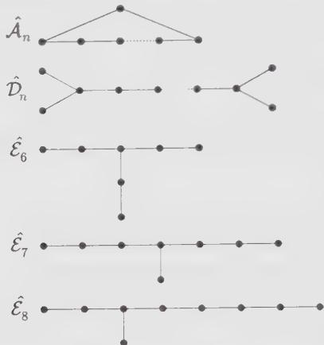

g) From these graphs, deduce that: (i) $\mathcal{G}$ has no internal cycle, i.e., it is a tree; and (ii) except for at most one trivalent node, it only has one- or two-valent nodes. Conclude, by inspection of the last three cases, that $\mathcal{G}$ is necessarily of the form $\mathcal{A},\mathcal{D}$ or $\mathcal{E}$ of Fig. 10.3.

10.11 Fusion rules of several minimal models

Use the Verlinde formula (10.171) to compute the fusion rules of the following models. (The reader can write a simple computer program to generate the fusion numbers.)

a) The Yang–Lee model $\mathcal{M}(5,2)$ .

b) The Ising model $\mathcal{M}(4,3)$ .

c) The tricritical Ising model $\mathcal{M}(5,4)$ .

10.12 Fusion rules for the models $(A_{p^{\prime} - 1},D_{p / 2 + 1}),p = 4m + 2$ and $(D_{p^{\prime} / 2 + 1},A_{p - 1}),p^{\prime} = 4m + 2$

a) Let $p = 4m + 2$ . Write the fusion rules for the subset of fields $\phi_{(r,2s + 1)}, r = 1,2,\ldots,(p' - 1)/2, s = 0,1,\ldots,p/2 - 1$ of the $\mathcal{M}(p,p')$ model.

b) Taking into account the multiplicity 2 of the fields $\phi_{(r,p/2-1)}, r = 1,2,\ldots,(p'-1)/2$ , obtain fusion rules that are invariant under the $\mathbb{Z}_2$ symmetry, which leaves all the fields invariant except one of the two copies of each degenerate field, which is changed into its opposite.

c) Repeat the above analysis with the $(D_{p'/2+1}, A_{p-1})$ models, for $p' = 4m + 2$ .

10.13 Extended fusion rules of the tricritical three-state Potts model from the Verlinde formula

The tricritical three-state Potts model is the $(A_{6}, D_{4})$ theory, with $p' = 7, p = 6$ .

a) Write the modular transformations of the extended characters of the theory.

b) Following the three-state Potts example treated in Sect. 10.8.5, split the doubly degenerate characters in such a way that the symmetry and unitarity of the S matrix are restored.

c) Compute the conjugation matrix $\mathcal{C} = S^2$ . Check that the conjugation interchanges the two copies of each degenerate field and leaves the other extended fields invariant.

d) Write the one-dimensional representations $\rho_{\alpha}(\lambda)$ of the extended fusion rules of the model.

e) Compute the extended fusion rules of the tricritical three-state Potts model.

10.14 Extended fusion rules of the $(E_6, A_{p-1})$ model

a) Compute the matrix elements of the modular transformation S of the extended characters

$$
C _ {1, s} = \chi_ {1, s} + \chi_ {7, s}, \quad C _ {4, s} = \chi_ {4, s} + \chi_ {8, s}, \quad C _ {5, s} = \chi_ {5, s} + \chi_ {1 1, s}
$$

for $1 \leq s \leq (p - 1)/2$ .

b) Write the corresponding one-dimensional representations of the extended fusion algebra of the model (cf. Sect. 10.8.5).

c) Deduce the extended fusion rules of the $(E_{6}, A_{p-1})$ model.

10.15 Extended fusion rules of the $(E_{8}, A_{p-1})$ model

a) Compute the matrix elements of the modular transformation S of the extended characters

$$
C _ {1, s} = \chi_ {1, s} + \chi_ {1 1, s} + \chi_ {1 9, s} + \chi_ {2 9, s},
$$

$$
C _ {7, s} = \chi_ {7, s} + \chi_ {1 3, s} + \chi_ {1 7, s} + \chi_ {2 3, s}
$$

for $1 \leq s \leq (p - 1)/2$ .

b) Write the corresponding one-dimensional representations of the extended fusion algebra of the model (cf. Sect. 10.8.5).

c) Deduce the extended fusion rules of the $(E_{8}, A_{p-1})$ model.

## 10.16 Constraints on an RCFT from the data of its fusion rules

We start with an RCFT having two (extended) primary fields $\mathbb{I}$ and $\phi$ , satisfying the fusion rule

$$
\phi \times \phi = \mathbb {I} + \phi
$$

a) Compute the matrix S using the Verlinde formula (10.201).

Hint: The Verlinde formula should be used in the reverse order: The matrix S is the matrix of the change of basis that diagonalizes the above fusion rules.

b) Use the condition (10.216) to find constraints on the central charge $c$ and on the conformal dimension $h$ of $\phi$ .

Result: 12h - c = 2 mod 8 and $h = \frac{m}{5} \mod 1$ , with m = 1, 2, 3, or 4.

c) Check these constraints for the minimal model $\mathcal{M}(2,5)$ .

Result: $h_{\phi} = h_{2,1} = -1 / 5$ and $12h_{\phi} - c = 2$ .

d) Check these constraints on the extended theory of the $(E_{8}, A_{2})$ model (cf. Ex. 10.15, with p = 3): First prove that the extended fusion rules of this theory are indeed $\phi \times \phi = I + \phi$ , where I and $\phi$ have the respective extended characters

$$
C _ {I} \equiv C _ {1, 1} = \chi_ {1, 1} + \chi_ {1 1, 1} + \chi_ {1 9, 1} + \chi_ {2 9, 1}
$$

$$
C _ {\phi} \equiv C _ {7, 1} = \chi_ {7, 1} + \chi_ {1 3, 1} + \chi_ {1 7, 1} + \chi_ {2 3, 1}
$$

Result: $h_{\phi} = h_{7,1} = -9/5$ and $12h_{\phi} - c = 26$ .

## 10.17 Constraints on a general RCFT

We start from an arbitrary RCFT, with extended modular transformation matrices S and T. Let $h_{i}, i = 1, \ldots, N$ denote the conformal dimensions of the corresponding blocks ( $h_{i}$ is the smallest conformal dimension of the fields forming the i-th block).

a) Using the identity $(\mathcal{ST})^3 = \mathcal{C}$ , show that the matrix $\mathcal{T}$ satisfies

$$
\det \left[ (\mathcal {T}) ^ {6} \right] = 1
$$

b) Using the result of (a), derive the general sum rule

$$
N c / 4 = 6 \sum_ {i = 1} ^ {N} h _ {i} \bmod 1
$$

c) Check this result for the (diagonal) minimal models $\mathcal{M}(p,p')$ , and for the three-state Potts model.

d) Check the above sum rule for the extended theories of $(D_4, A_4)$ (three-state Potts model), $(E_6, A_{p-1})$ , and $(E_8, A_{p-1})$ (cf. Sect. 10.8.5, and Exs. 10.14, 10.15).

e) Check the above sum rule for the extended (nonminimal) theory of the free boson compactified on a circle of self-dual radius (cf. Sect. 10.8.6).

Result: 2c/4 = 1/2 = 6(0 + 1/4) mod 1.

## 10.18 Verlinde formula for a finite group

Let $G$ be a finite group, with unit $e$ and multiplication law $\circ$ . The conjugacy class of an element $g$ of $G$ is defined as

$$
C (g) = \{x \in G \mid \exists y \in G, x = y g y ^ {- 1} \}
$$

The irreducible linear unitary representations of G are denoted by $\rho_{j}, j = 1, 2, \ldots, d_{G}$ . One can think of them as unitary matrices $\rho_{j}(x)$ attached to each element x of G (with size $dim_{j} \times dim_{j}$ , where $dim_{j}$ is the dimension of the representation) such that

$$
\rho_ {j} (x) \rho_ {j} (y) = \rho_ {j} (x \circ y)
$$

for any two group elements x and y. In other words, a representation translates the group multiplication o into matrix multiplication. For a given representation $\rho_{i}$ , we define the corresponding character by the function

$$
g \in G \rightarrow \chi_ {j} (g) = \operatorname{Tr} \rho_ {j} (g) = \sum_ {i = 1} ^ {\dim_ {j}} [ \rho_ {j} (g) ] _ {i i}
$$

where the trace yields a function independent of the choice of basis of the representation.

a) Show that the distinct conjugacy classes of the elements of G (called simply the classes of G from now on) form a partition of G. We choose a representative $\alpha \in G$ in each class and denote by $C_{\alpha}$ the corresponding class. We take for granted that there are $d_{G}$ distinct classes, where $d_{G}$ is also the number of irreducible representations of G. As an illustrative example, enumerate the classes of the permutation group of three objects, $S_{3}$ , and compute the corresponding value of $d_{S_{3}}$ .

b) Show that the characters $\chi_{j}$ are constant functions on each class $C_{\alpha}$ . We now denote by $\chi_{j}(\alpha)$ the corresponding functions. Compute $\chi_{j}(e)$ and $\chi_{0}(\alpha)$ , where 0 denotes the identity representation.

Result: $\chi_j(e) = \dim_j$ , the size of the corresponding matrix, and $\chi_0(\alpha) = 1$ for all classes $C_\alpha$ .

c) Assume the following orthogonality relations for characters

$$
\begin{array}{l} \sum_ {j = 1} ^ {d _ {G}} \chi_ {j} (\alpha) \bar {\chi} _ {j} (\beta) = \frac {| G |}{| C _ {\alpha} |} \delta_ {\alpha , \beta} \\ \sum_ {\alpha} | C _ {\alpha} | \chi_ {j} (\alpha) \bar {\chi} _ {k} (\alpha) = | G | \delta_ {j, k} \end{array}\tag{10.274}
$$

where $|G|$ and $|C_{\alpha}|$ denote, respectively, the orders of $G$ and of the conjugacy class $C_{\alpha}$ . The last identity is actually a particular case of the following

$$
\sum_ {\alpha} | C _ {\alpha} | \chi_ {j} (\alpha) \bar {\chi} _ {k} (\alpha \beta) = | G | \frac {\chi_ {j} (\beta)}{\dim_ {j}} \delta_ {j, k}\tag{10.275}
$$

Prove the following relations

$$
\begin{array}{l} \sum_ {j = 1} ^ {d _ {G}} (\dim_ {j}) ^ {2} = | G | \\ \sum_ {\alpha} | C _ {\alpha} | = | G | \end{array}
$$

and deduce the dimensions $\dim_{j}$ of the irreducible representations of $S_{3}$ . Use the orthogonality relations (10.274) to compute all the characters of $S_{3}$ .

d) The tensor product of two representations $\rho_{i}(\alpha)$ and $\rho_{j}(\alpha)$ is a reducible representation of G of dimension $dim_{i} + dim_{j}$ . It can be decomposed onto irreducible ones, as

$$
\rho_ {i} \otimes \rho_ {j} = \bigoplus_ {k} \mathcal {N} _ {i j} ^ {k} \rho_ {k}
$$

where the $N_{ij}^{k}$ 's are nonnegative integer multiplicities, independent of the class (this is why we dropped the class index $\alpha$ in the decomposition formula). From this relation, deduce a product decomposition formula for characters. Check it in the case of $S_{3}$ , and compute the numbers $N_{ij}^{k}$ .

Hint: Take the trace of the tensor product decomposition formula. This yields

$$
\chi_ {i} (\alpha) \chi_ {j} (\alpha) = \sum_ {k} \mathcal {N} _ {i j} ^ {k} \chi_ {k} (\alpha)
$$

for any class $C_{\alpha}$ .

e) From the orthogonality relations (10.274) between characters, deduce an expression for $N_{ij}^{k}$ in terms of characters. This is the group Verlinde formula for tensor products of irreducible representations.

Result:

$$
\boxed {\mathcal {N} _ {i j} ^ {k} = \frac {1}{| G |} \sum_ {\alpha} | C _ {\alpha} | \chi_ {i} (\alpha) \chi_ {j} (\alpha) \bar {\chi} _ {k} (\alpha)}\tag{10.276}
$$

f) We define the group S matrix as

$$
\mathcal {S} _ {j} (\alpha) = \left(\frac {| C _ {\alpha} |}{| G |}\right) ^ {\frac {1}{2}} \chi_ {j} (\alpha)\tag{10.277}
$$

Show that $S$ is unitary. Rewrite the formula (10.276) in terms of $S$ . Is the matrix $S$ symmetric in the case of $S_3$ ?

Result:

$$
\mathcal {N} _ {i j} ^ {k} = \sum_ {\alpha} \mathcal {S} _ {i} (\alpha) \frac {\mathcal {S} _ {j} (\alpha)}{\mathcal {S} _ {0} (\alpha)} \bar {\mathcal {S}} _ {k} (\alpha)
$$

g) Multiplying two classes $C_{\alpha}$ and $C_{\beta}$ just means performing the group product

$$
[ \sum_ {x \in C _ {\alpha}} x ] \circ [ \sum_ {y \in C _ {\beta}} y ]
$$

Together with the usual addition of classes, this endows the group with an algebra structure, called the group algebra. We denote by $C_{\alpha} * C_{\beta}$ the corresponding product. Decompose this product in $G$ and reorganize the result into sums of elements of $G$ over classes to get the class algebra

$$
C _ {\alpha} * C _ {\beta} = \sum_ {\gamma} \mathcal {N} _ {\alpha \beta} ^ {\gamma} C _ {\gamma}
$$

where $N_{\alpha\beta}^{\gamma}$ are integer multiplicities. Find the numbers $N_{\alpha\beta}^{\gamma}$ for $S_{3}$ .

h) Using the class algebra of (g), find another decomposition formula for characters.

Hint: Take first the representation $\rho_{j}$ of the class algebra relation, then compute its trace in terms of characters. The result reads

$$
\chi_ {j} (\alpha \beta) = \sum_ {\gamma} \mathcal {N} _ {\alpha \beta} ^ {\gamma} \chi_ {j} (\gamma)
$$

i) Using the orthogonality relations for characters (10.275) and (10.274), deduce an expression of the numbers $N_{\alpha\beta}^{\gamma}$ in terms of characters. This is the group Verlinde formula for products of classes.

Result:

$$
\mathcal {N} _ {\alpha \beta} ^ {\gamma} = \frac {| C _ {\alpha} | | C _ {\beta} |}{| G |} \sum_ {j} \chi_ {j} (\alpha) \frac {\chi_ {j} (\beta)}{\dim_ {j}} \bar {\chi} _ {j} (\gamma)
$$

j) Rewrite this in terms of the group S matrix (10.277).

Result:

$$
\mathcal {N} _ {\alpha \beta} ^ {\gamma} = \left(\frac {| C _ {\alpha} | | C _ {\beta} |}{| C _ {\gamma} |}\right) ^ {\frac {1}{2}} \sum_ {j} \mathcal {S} _ {j} (\alpha) \frac {\mathcal {S} _ {j} (\beta)}{\mathcal {S} _ {j} (e)} \bar {\mathcal {S}} _ {j} (\gamma)
$$

k) Conclude that, in general, the numbers

$$
\mathcal {M} _ {\alpha \beta} ^ {\gamma} = \sum_ {j} \mathcal {S} _ {j} (\alpha) \frac {\mathcal {S} _ {j} (\beta)}{\mathcal {S} _ {j} (e)} \bar {\mathcal {S}} _ {j} (\gamma)
$$

and the numbers $\mathcal{N}_{\alpha \beta}^{\gamma}$ cannot be simultaneously integers. Exemplify this with $S_{3}$ . Therefore in general the tensor product algebra for irreducible representations of a group $G$ is a bad candidate for the fusion algebra of a conformal theory. Show however that when $G$ is Abelian, then

$$
\mathcal {N} _ {\alpha \beta} ^ {\gamma} = \mathcal {M} _ {\alpha \beta} ^ {\gamma}
$$

In that case, representations and classes are isomorphic, and the matrix S is symmetric. Therefore only Abelian groups provide good candidates for conformal fusion rules. However, many conformal fusion rules have no Abelian group interpretation. In this respect, one can think of the structure of the fusion rules in conformal theory as generalizing that of an Abelian group.

## 10.19 Conformal blocks and $\phi^{3}$ diagrams

a) We study the crossing transformation acting on a given $\phi^{3}$ diagram of genus h. This is a local transformation, which acts on pairs of neighboring trivalent vertices, linked by a propagator, as

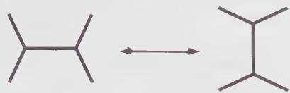

Argue heuristically that this connects all the possible genus $h \phi^{3}$ diagrams.

b) Prove that the number of conformal blocks in a basis for some correlation function on a surface of genus $h$ is independent on the (genus $h$ )- $\phi^3$ diagram encoding the basis elements.

10.20 Modular invariance of the $c = 1$ theory at the self-dual radius $R = \sqrt{2}$

a) Express the extended characters $C_{0}$ and $C_{1}$ of Eq. (10.233) in terms of Jacobi theta functions at the value $\tau$ (instead of $2\tau$ ) by using the doubling formulae (10.272).

b) Using the fact that

$$
\theta_ {2} (\tau) ^ {4} = \theta_ {3} (\tau) ^ {4} - \theta_ {4} (\tau) ^ {4}\tag{10.278}
$$

deduce the modular invariance of the partition function, and check the modular transformations of the characters $C_{0}$ and $C_{1}$ .

## 10.21 Examples of RCFTs: the boson on a circle of rational square radius

a) Prove that the $c = 1$ bosonic theory on a circle of radius $R = \sqrt{2n}$ is rational.

Hint: The extended characters are the functions $K_{\lambda}, \lambda = 0,1,\ldots,N - 1$ defined in Eq. (10.109), with $N = 2n$ , and the partition function reads

$$
\boxed {Z (\sqrt {2 n}) = \sum_ {\lambda = 0} ^ {N - 1} | K _ {\lambda} (\tau) | ^ {2}}
$$

b) Check the following sum rule for the dimensions of the extended operators (cf. Ex. 10.17)

$$
(1 + N / 2) c / 4 = 6 \sum_ {\lambda} h _ {\lambda} \bmod 1.
$$

c) Compute the conjugation matrix $\mathcal{C} = S^2$

Result: $C_{\lambda,\mu} = \delta_{\mu,N-\lambda} (\lambda = 0 \text{ is self-conjugate})$ .

d) Compute the extended fusion rules of this RCFT.

Result: $\mathcal{N}_{\lambda \mu}^{\nu} = \delta_{\nu, \lambda + \mu \bmod N}$ , for any $0 \leq \lambda, \mu, \nu \leq N - 1$ .

e) We now consider the bosonic $c = 1$ theory on a circle of radius $R = \sqrt{2p' / p}$ . Let $N = 2pp'$ and $K_{\lambda}$ as in (10.109). Show that the partition function on the torus reads

$$
\boxed {Z (\sqrt {\frac {2 p ^ {\prime}}{p}}) = \sum_ {\lambda = 0} ^ {N - 1} K _ {\lambda} (\tau) K _ {\omega_ {0} \lambda} (\bar {\tau})}
$$

with $\omega_0$ defined in Eqs. (10.118)-(10.119). Conclude that for $p'$ and $p \neq 1$ , the corresponding RCFT is nondiagonal.

## 10.22 Bosonic representation of minimal theories on a torus

Using the expression (10.122) for the minimal characters, prove that the partition function of the $(A_{p' - 1}, A_{p - 1})$ minimal theory can be reexpressed as the half difference of two $c = 1$ bosonic theories on circles of respective radii $\sqrt{2pp'}$ and $\sqrt{2p'/p}$ .

Hint: Use the results of the previous exercise. This representation may be generalized to all the modular invariants of the ADE classification. The results read

$$
\begin{array}{r l} {Z _ {A _ {p ^ {\prime} - 1}, A _ {p - 1}}} & {= \frac {1}{2} (Z (\sqrt {2 p p ^ {\prime}}) - Z (\sqrt {2 p ^ {\prime} / p}))} \\ {Z _ {A _ {p - 1}, D _ {p / 2 + 1}}} & {= \frac {1}{2} (Z (\sqrt {8 p ^ {\prime} / p}) - Z (\sqrt {2 p ^ {\prime} / p}) - Z (\sqrt {p p ^ {\prime} / 2}) + Z (\sqrt {2 p p ^ {\prime}}))} \\ {Z _ {A _ {p - 1}, E _ {6}}} & {= \frac {1}{2} (Z (2 \sqrt {6 p}) - Z (\sqrt {6 p}) - Z (2 \sqrt {2 p / 3})} \\ & {+ Z (\sqrt {2 p / 3}) + Z (2 \sqrt {6 p} / 9) - Z (\sqrt {6 p} / 9))} \\ {Z _ {A _ {p - 1}, E _ {7}}} & {= \frac {1}{2} (Z (6 \sqrt {p}) - Z (3 \sqrt {p}) - Z (2 \sqrt {p})} \\ & {+ Z (\sqrt {p}) - Z (2 \sqrt {p} / 3) + Z (\sqrt {p} / 3))} \\ {Z _ {A _ {p - 1}, E _ {8}}} & {= \frac {1}{2} (Z (2 \sqrt {1 5 p}) - Z (\sqrt {1 5 p}) - Z (2 \sqrt {5 p / 3}) - Z (2 \sqrt {3 p / 5})} \\ & {+ Z (\sqrt {5 p / 3}) + Z (\sqrt {3 p / 5}) + Z (2 \sqrt {p / 1 5}) - Z (\sqrt {p / 1 5}))} \end{array}
$$

## 10.23 Example of bosonic orbifold RCFT: orbifold at radius R = 1

a) Prove the identity

$$
Z _ {I} ^ {2} = Z _ {\mathrm{orb}} (1)
$$

using the expression (10.51) for the partition function $Z_{I}$ of the free fermion (Ising model) on a torus, and the identity (10.260) on theta functions.

b) Deduce that the orbifold bosonic theory on a circle of radius $R = 1$ is a RCFT. Compute the corresponding extended characters and fusion rules.

## 10.24 The $O(n)$ model on a torus, for $-2 \leq n \leq 2$

It is possible to show that the partition function of the $O(n)$ model on a rectangle of size $L \times T$ with periodic boundary conditions in both (time and space) directions has a well-defined thermodynamic limit when $L, T \to \infty$ , while the (purely imaginary) parameter $\tau = iT/L$ is kept fixed. The result reads

$$
Z _ {n} (\tau) = \frac {1}{| \eta (\tau) | ^ {2}} \sum_ {m, m ^ {\prime} \in \mathbb {Z}} \cos \left(\pi e _ {0} \operatorname * {g c d} (| m |, | m ^ {\prime} |)\right) Z _ {m, m ^ {\prime}} (R; \tau)
$$

where $\gcd(|m|, |m'|)$ stands for the greatest common divisor of the two integers $|m|$ and $|m'|$ ,

$$
Z _ {m, m ^ {\prime}} (R; \tau) = \frac {R}{\sqrt {2} | \eta | ^ {2} \operatorname{Im} \tau} \exp - \frac {\pi R ^ {2} | m \tau - m ^ {\prime} | ^ {2}}{2 \operatorname{Im} \tau}
$$

and

$$
\cos (\pi e _ {0}) = n \quad - 2 \cos (\pi R ^ {2} / 2) = n
$$

with $0 \leq e_{0} \leq 1$ and $\sqrt{2} \leq R \leq 2$ .

a) Check the modular invariance of this partition function. Hint: Show that $\gcd(|m|, |m'|)$ is invariant under the action of the modular group.

b) Compute the central charge of the system. Compare the result with Eq. (7.108). Hint: Use the Poisson resummation formula (10.264) to extract the small- $q = \exp(2i\pi\tau)$ behavior of the partition function.

c) Compute the partition function for n = 2, 1, 0.

d) When $R = \sqrt{2p' / p}$ , with $p' > p$ two coprime integers, rewrite the partition function of the $O(n)$ model as

$$
Z _ {n} (\tau) = \frac {1}{2} (Z (\sqrt {2 p p ^ {\prime}}) - Z (\sqrt {2 p ^ {\prime} / p}))
$$

Compare this with the results of Ex. 10.22. Conclude that for $n = -2\cos (\pi p' / p)$ , the continuum limit of the $O(n)$ model is described by the (diagonal) minimal model $(A_{p' - 1}, A_{p - 1})$ .

e) Compute the one-polymer configuration sum on the torus, namely

$$
\left. \frac {\partial Z _ {n} (\tau)}{\partial n} \right| _ {n = 0}
$$

## Notes

The concept of modular invariance in conformal theory was first stressed as a fundamental requirement by Cardy [73], who studied the minimal models in a finite geometry (strip, torus), and derived constraints on the possible operator content. The hunt for modular invariant partition functions started with Refs. [207, 172], and reached a climax with the conjecture of Cappelli, Itzykson, and Zuber on the ADE classification of modular invariants for minimal models [63], subsequently proved in Refs. [64] and [231]. A parallel construction of nondiagonal statistical RSOS models, indexed by the Dynkin ADE diagrams, was performed by Pasquier [289]. It was argued that the continuum limit of the latter are described by the ADE minimal models.

The Coulomb-gas models have been studied (Ref. [224]) in the description of the critical lines of the Ashkin-Teller statistical model (made of two interacting Ising models), and of various integrable lattice models, such as Baxter's eight-vertex model [283]. Modular invariant partition functions for these $c = 1$ theories were built in Refs. [95, 96, 314, 362]. The list of $c = 1$ modular invariant partition functions was further completed in Ref. [288], by the construction of RSOS lattice models based on extended Dynkin diagrams, and in Ref. [176] by using the orbifold procedure to build additional $c = 1$ theories that do not lie on the critical lines of the Ashkin-Teller model, and correspond to the continuum limit of the RSOS models based on the exceptional extended Dynkin diagrams. An extension of these results to arbitrary Riemann surfaces was also performed in Ref. [103].

Making the connection between the modular properties of the minimal characters and their fusion rules, E. Verlinde proposed the celebrated Verlinde formula [340] (Eq. 10.171), which expresses the fusion numbers as a function of the modular S matrix of the theory. A general proof was derived in the extended context of rational conformal theory in Refs. [102, 272] and in Ref. [273] (see Sect. 10.8.3). This formula attracted much attention in the mathematical literature.

The natural notion of extended symmetry first arose in the context of modular invariance, in relation to block-diagonal modular invariants, and was further developed by explicitly constructing enhanced symmetry algebras (called W-algebras) extending the Virasoro algebra, and governing the corresponding theories. The axiomatic definition of rational conformal theories is due to Moore and Seiberg [272].

Many identities on theta functions can be found in Refs. [27, 358]. The ADE classification of integer matrices with largest eigenvalue $< 2$ is due to Cartan, in the context of Lie algebras (see Ref. [185] for a graph-theoretic proof). Exs. 10.16 and 10.17 are based on Ref. [338]. Exs. 10.21, 10.22 and 10.23 are based on Refs. [95, 96].

# Finite-Size Scaling and Boundaries

Until now, with the notable exception of Chap. 10, we have concentrated our attention on conformal field theories defined on the infinite plane, which is equivalent to a sphere. In this chapter we shall study the consequences of conformal invariance on models defined on portions of the plane delimited by one or more boundaries, with various types of boundary conditions. We shall proceed mainly by applying local conformal mappings from the infinite plane or the upper half-plane to these restricted geometries. This will prove to be a particularly useful application of local conformal invariance, as these mappings do not belong to the global conformal group.

The relevance of studying models over a finite-size region is manifold. For instance, a lot of information on two-dimensional statistical models or one-dimensional quantum models is derived from computer simulations, which are necessarily limited to systems of finite size L. The properties of the model in the thermodynamic limit $(L \rightarrow \infty)$ are inferred from the finite-size properties. Conformal invariance can in many cases provide the L-dependence of these properties, thus allowing a more precise inference of the thermodynamic limit. This comparison with numerical work may also provide an otherwise unknown correspondence between a model at criticality and a conformal field theory. In quantum systems (e.g., spin chains), the finite size may be in the (imaginary) time direction, which corresponds to finite temperature (cf. Sect. 3.1.2). Conformal invariance is then useful in studying the finite-temperature behavior of a 1D quantum model, which is critical at T = 0.

Local conformal transformations may also provide the behavior of a critical system near a boundary, when free or fixed boundary conditions are used. The problem is then to find out the effect of the boundary on the decay of correlation functions. The prototype of a manifold with a boundary is the upper half-plane. From there, other geometries with boundaries may be obtained via conformal transformations. Often, such as in the study of percolation across a rectangle, the boundary is part of the definition of the model itself, and not a limitation brought by the finite means of the investigator. The study of conformal field theories defined on an infinite strip has, of course, direct implications in open string theory, which will not be discussed in this work.

This chapter is organized as follows. In Sect. 11.1, we come back to the issue of conformal theories defined on an infinite cylinder. Our aim is to illustrate the effect of the boundary on the two-point function of conformal fields, in particular how it introduces a correlation length along the direction of the cylinder. Section 11.2 discusses the general issue of a conformal theory defined on the upper half-plane—or on a manifold with boundary that can be obtained from the upper half-plane via conformal mapping—with conformally invariant boundary conditions. We describe such a theory with the “method of images”, by which the holomorphic sector of a theory defined on the whole complex plane replaces the coupled holomorphic and antiholomorphic sectors of the theory defined on the upper half-plane, and where each field insertion in the physical region is compensated by the insertion of an “image” in the unphysical region. We apply this method to the Ising model and to the behavior of the spin field two-point function as one approaches the boundary. In Sect. 11.3 we introduce the notion of a boundary operator which, when inserted at a point on the boundary, changes the boundary condition from this point onward. These operators must belong to the same set as the bulk operators, a restriction imposed by the condition of conformal invariance on the boundary conditions. The significance of boundary operators is established by a close analogy with the Verlinde formula. Finally, in Sect. 11.4, we apply these ideas to the study of critical percolation and obtain the aspect-ratio dependence of the crossing probability, an analytic result fully confirmed by numerical simulations and giving spectacular support to the hypothesis of local conformal invariance in two-dimensional critical systems.

## §11.1. Conformal Invariance on a Cylinder

Before embarking on a study of critical systems with boundaries, we consider a field theory or statistical model at criticality defined on an infinite cylinder of circumference L. This geometry is useful in providing a physical motivation for the procedure of radial quantization (cf. Sect. 6.1.1) and for the quantization of free fields (cf. Sects. 6.3 and 6.4). Although the infinite cylinder has no boundary, it is the source of finite-size effects analogous to those observed on other manifolds with boundaries (e.g., the infinite strip). These effects have important implications in the practical study of critical quantum systems at finite temperature or of finite length.

The mapping from the infinite plane (with holomorphic coordinate z) to the cylinder (with coordinate w) is

$$
w = \frac {L}{2 \pi} \ln z \qquad \mathrm{or} \qquad z = e ^ {2 \pi w / L}\tag{11.1}
$$

We have already performed a finite-size scaling analysis in this geometry when we obtained the expression (5.143) in Sect. 5.4.2 for the free energy per unit length $F_{L}$ as a function of L:

$$
F _ {L} = f _ {0} L - \frac {\pi c}{6 L}\tag{11.2}
$$

Here $f_{0}$ is the free energy per unit area in the $L \rightarrow \infty$ limit.

Another quantity of interest is the two-point function of a primary field $\phi$ of conformal dimension h. Its form on the plane (Eq. (5.25)) was fixed by invariance under the global conformal transformations (5.12). Those were defined as one-to-one mappings from the infinite plane onto itself. In order to write the two-point function on the cylinder we need to use the covariance relation (5.24) for primary fields, with the mapping (11.1). Here we write the holomorphic part only:

$$
\begin{array}{r l} \langle \phi (w _ {1}) \phi (w _ {2}) \rangle & = \left(\frac {d w}{d z}\right) _ {w = w _ {1}} ^ {- h} \left(\frac {d w}{d z}\right) _ {w = w _ {2}} ^ {- h} \langle \phi (z _ {1}) \phi (z _ {2}) \rangle \\ & = \left(\frac {2 \pi}{L}\right) ^ {2 h} \frac {e ^ {2 \pi h (w _ {1} + w _ {2}) / L}}{(z _ {1} - z _ {2}) ^ {2 h}} \\ & = \left(\frac {2 \pi}{L}\right) ^ {2 h} \left(2 \sinh [ \pi (w _ {1} - w _ {2}) / L ]\right) ^ {- 2 h} \end{array}\tag{11.3}
$$

The full correlator is the product of the above with its antiholomorphic counterpart:

$$
\begin{array}{l} \langle \phi (w _ {1}, \bar {w} _ {1}) \phi (w _ {2}, \bar {w} _ {2}) \rangle = \\ \left(\frac {2 \pi}{L}\right) ^ {2 h + 2 \bar {h}} \left(2 \sinh [ \pi (w _ {1} - w _ {2}) / L ]\right) ^ {- 2 h} \left(2 \sinh [ \pi (\bar {w} _ {1} - \bar {w} _ {2}) / L ]\right) ^ {- 2 \bar {h}} \end{array}\tag{11.4}
$$

For simplicity, we assume that the field $\phi$ has no spin: $h = h = \Delta / 2$ . Then the above reduces to

$$
\left(\frac {2 \pi}{L}\right) ^ {2 \Delta} \left[ 4 \sinh \frac {\pi w}{L} \sinh \frac {\pi \bar {w}}{L} \right] ^ {- \Delta}\tag{11.5}
$$

where $w \equiv w_{1} - w_{2}$ and $\bar{w} \equiv \bar{w}_{1} - \bar{w}_{2}$ are the relative coordinates. We express this result in terms of real coordinates u and v, respectively, along and across the cylinder: $w = u + iv$ and $\bar{w} = u - iv$ . After using standard identities for hyperbolic functions, we end up with

$$
\langle \phi (u _ {1}, v _ {1}) \phi (u _ {2}, v _ {2}) \rangle = \left(\frac {2 \pi}{L}\right) ^ {2 \Delta} \left[ 2 \cosh \frac {2 \pi u}{L} - 2 \cos \frac {2 \pi v}{L} \right] ^ {- \Delta}\tag{11.6}
$$

As expected, the effect of the finite size L disappears if the distance $|u + iv|$ is much smaller than L. Then $\sinh(\pi w/L) \sim \pi w/L$ and we recover the infinite plane result (5.25). On the other hand, when $u \gg L$ , then $2 \cosh(2\pi u/L) \sim e^{2\pi u/L}$ and the correlator becomes

$$
\langle \phi (u _ {1}, v _ {1}) \phi (u _ {2}, v _ {2}) \rangle \sim \left(\frac {2 \pi}{L}\right) ^ {2 \Delta} \exp - \frac {2 \pi u \Delta}{L} \quad (u \gg L)\tag{11.7}
$$

Thus, correlations along the cylinder decay exponentially, with a correlation length $\xi = L/2\pi\Delta$ , proportional to the size L. The appearance of a correlation length in a critical system is here entirely due to the existence of a macroscopic scale L.

When dealing with a quantum chain, the infinite cylinder geometry may correspond either to a finite chain at zero temperature with periodic boundary conditions, or to an infinite chain at a finite temperature $T = 1 / L$ (cf. Sect. 3.1.2). In the first case, the correlation length $\xi = L / 2\pi \Delta$ in the time direction is the signature of an energy gap between the ground state and the first excited state, a gap induced by the system's finite size, as routinely observed in numerical simulations. To make this point more explicit, we consider the two-point function $\langle \phi (x,0)\phi (x,\tau)\rangle$ , where $x$ and $\tau$ are, respectively, the space and imaginary time coordinates. In the operator formalism, this two-point function may be expressed as a ground-state expectation value:

$$
\begin{array}{r l} \langle \phi (x, 0) \phi (x, \tau) \rangle & = \langle 0 | \phi (x, 0) e ^ {- H \tau} \phi (x, 0) e ^ {H \tau} | 0 \rangle \\ & = \sum_ {n} \langle 0 | \phi (x, 0) e ^ {- H \tau} | n \rangle \langle n | \phi (x, 0) e ^ {H \tau} | 0 \rangle \\ & = \sum_ {n} e ^ {- (E _ {n} - E _ {0}) \tau} | \langle 0 | \phi (x, 0) | n \rangle | ^ {2} \end{array}\tag{11.8}
$$

Here H is the Hamiltonian, the states $|n\rangle$ are the energy eigenstates (in increasing order of energy), and $E_{n}$ is the eigenvalue of H associated with $|n\rangle$ . In the first line we have performed a time translation to make the two fields simultaneous. In the second line we have inserted a completeness relation for the basis of eigenstates of H. In the absence of spontaneous symmetry breaking—which is generally true at the critical point—the expectation value $\langle0|\phi(x,0)|0\rangle$ vanishes. Otherwise, the above equation may be rewritten as follows for the connected two-point function:

$$
\langle \phi (x, 0) \phi (x, \tau) \rangle - \langle \phi (x, 0) \rangle \langle \phi (x, \tau) \rangle = \sum_ {n > 0} e ^ {- (E _ {n} - E _ {0}) \tau} | \langle 0 | \phi (x, 0) | n \rangle | ^ {2}\tag{11.9}
$$

The term that dominates the above sum when $\tau$ is large is associated with the first excited state $|1\rangle$ , with an energy $\delta E = E_{1} - E_{0}$ above the ground state:

$$
\langle \phi (x, 0) \phi (x, \tau) \rangle_ {c} \propto e ^ {- \delta E \tau} (\tau \rightarrow \infty)\tag{11.10}
$$

Comparing Eq. (11.10) with Eq. (11.7), we conclude that

$$
\delta E = \frac {2 \pi \Delta}{L}\tag{11.11}
$$

Of course, this relation holds in “natural units”, in which Planck’s constant and the characteristic velocity v of the system—the equivalent of the speed of light in a Lorentz invariant theory—are set to unity. In order to restore the correct dimensions, one must multiply the r.h.s. by $\hbar\nu$ .

If the finite extent of the system is in the imaginary time direction, the size L is equal to the inverse temperature 1/T and the correlation length $\xi$ becomes

$$
\xi = \frac {1}{2 \pi T \Delta}\tag{11.12}
$$

This length has the physical interpretation of a coherence length, giving the spatial extent over which quantum coherence is not destroyed by thermal fluctuations. It is the thermal de Broglie wavelength characterizing the system at a temperature T. The interpretation of Eq. (11.2) for the free energy is then different: In a one-dimensional quantum system, this formula gives the vacuum functional W per unit length, which is related to the free energy f by W = fL, L being the extent of the time direction. Thus, the free energy per unit length is

$$
f = f _ {0} - \frac {1}{6} \pi c T ^ {2} \quad (\text { quantum   chain })\tag{11.13}
$$

From this we infer the specific heat C per unit length:

$$
C \equiv - T \frac {\partial^ {2} f}{\partial T ^ {2}} = \frac {1}{3} \pi c T\tag{11.14}
$$

Of course, we must divide this result by $\hbar\nu$ to restore the correct units.

## §11.2. Surface Critical Behavior

In this section we apply conformal invariance to a two-dimensional system with a boundary, of which the prototype is the upper half-plane. The goal is to determine the behavior of correlation functions near the boundary when the bulk is critical: we call this surface critical behavior—even though the surface (or boundary) is here a one-dimensional object. A given statistical or quantum model is characterized by a set of boundary conditions at the surface. If the model is to have some form of conformal symmetry at criticality, conformal transformations must map the boundary onto itself and preserve the boundary conditions. This restricts the overall symmetry of the model: holomorphic and antiholomorphic fields no longer decouple and only half of the conformal generators remain.

## 11.2.1. Conformal Field Theory on the Upper Half-Plane

The simplest two-dimensional manifold with a boundary on which to apply the formalism of conformal field theory is the upper half-plane. A model defined on the upper half-plane may have conformal invariance only if the conformal transformations keep the boundary (the real axis) and the boundary conditions invariant. Among the conformal transformations (5.12), those that map the real axis onto itself are obtained by keeping the parameters $a$ , $b$ , and $c$ real. Thus, the global conformal group is half as large as it is for the entire plane. Likewise, infinitesimal local conformal transformations of the form $z \to z + \epsilon(z)$ will map the real axis onto itself if and only if $\epsilon(\bar{z}) = \bar{\epsilon}(z)$ (i.e., $\epsilon$ is real on the real axis). This is a strong constraint that eliminates half of the conformal generators: the holomorphic and antiholomorphic sectors of the theory are no longer independent.

As for the boundary conditions on a scaling field $\phi$ , invariance under conformal transformations requires them to be homogeneous, for instance as follows:

$$
\phi \big | _ {\mathbb {R}} = 0 \qquad , \qquad \phi \big | _ {\mathbb {R}} = \infty \qquad , \qquad \frac {\partial \phi}{d n} \big | _ {\mathbb {R}} = 0\tag{11.15}
$$

Indeed, the transformation law (5.22) for primary fields is multiplicative and therefore leaves the above boundary conditions unchanged. The Dirichlet boundary condition $\phi|_{R}=0$ is also referred to as the “free” boundary condition, since the vanishing of the order parameter at the boundary generally follows from the absence of constraints on the microscopic degrees of freedom. A critical system obeying such a boundary condition is said to undergo an ordinary transition. On the other hand, it may happen in some systems that the surface orders before the bulk, for instance because of stronger interactions at the boundary. In that case the order parameter is infinite $^{1}$ at the boundary ( $\phi|_{R}=\infty$ ) and the system is said to undergo an extraordinary transition.

The conformal Ward identity (5.46) embodies the effects of local conformal invariance on correlation functions:

$$
\delta_ {\epsilon , \bar {\epsilon}} \langle X \rangle = - \frac {1}{2 \pi i} \oint_ {C} d z \epsilon (z) \langle T (z) X \rangle + \frac {1}{2 \pi i} \oint_ {C} d \bar {z} \bar {\epsilon} (\bar {z}) \langle \bar {T} (\bar {z}) X \rangle\tag{11.16}
$$

where, as usual, X stands for a product of local fields. Without loss of generality, we may assume that it is a product of primary fields:

$$
X = \phi_ {h _ {1}, \bar {h} _ {1}} (z _ {1}, \bar {z} _ {1}) \dots \phi_ {h _ {n}, \bar {h} _ {n}} (z _ {n}, \bar {z} _ {n})\tag{11.17}
$$

(the indices on each field are the holomorphic and antiholomorphic conformal dimensions). On the infinite plane, the infinitesimal coordinate variations $\epsilon(z)$ and $\bar{\epsilon}(\bar{z})$ are independent, and therefore this identity is in fact a pair of identities giving the independent variations $\delta_{\epsilon}\langle X\rangle$ and $\delta_{\bar{\epsilon}}\langle X\rangle$ of a correlation function under an infinitesimal conformal transformation. On the upper half-plane the conformal Ward identity is still applicable, except that the integration contour $C$ must lie entirely in the upper half-plane and the coordinate variation $\bar{\epsilon}$ is the complex conjugate of $\epsilon$ : we no longer have a decoupling into holomorphic and antiholomorphic identities.

In order to apply the machinery developed in the previous chapters to a theory defined on the upper half-plane, we shall regard the dependence of the correlators on antiholomorphic coordinates $\bar{z}_{i}$ on the upper half-plane as a dependence on holomorphic coordinates $z_{i}^{*} = \bar{z}_{i}$ on the lower half-plane. We thus introduce a mirror image of the system on the lower half-plane, via a parity transformation. In going from the upper to the lower half-plane, vector and tensor fields change their holomorphic indices into antiholomorphic indices and vice versa. Thus $T(z^{*}) = \bar{T}(z), \bar{T}(z^{*}) = T(z)$ , and so on. Of course, such an extension is compatible with the boundary conditions only if $\bar{T} = T$ on the real axis (and likewise for all vector or tensor fields). The boundary condition $\bar{T} = T$ becomes $T_{xy} = 0$ when expressed in terms of Cartesian coordinates, in which its meaning becomes clear: no energy or momentum flows across the real axis. This general condition is obviously satisfied in a physical system with a boundary, and in particular it is compatible with the homogeneous boundary conditions cited above.

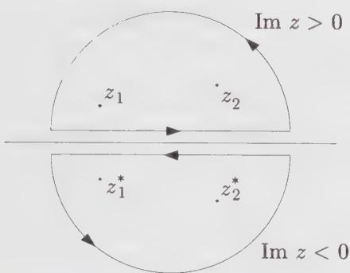  
Figure 11.1. Contour used in the conformal Ward identity for two fields at points $z_{1}$ and $z_{2}$ on the upper half-plane, with the mirror contour and points on the lower half-plane.

It is then possible to rewrite the conformal identity (11.16) on the upper half-plane as a purely holomorphic expression on the infinite plane. The second term of Eq. (11.16) becomes an integration along a mirror image of the contour C, as indicated in Fig. 11.1. That figure shows an example contour to be used with this identity, with singularities of the integrand at the locations $z_{1}$ and $z_{2}$ of two local fields. The “mirror images” of this contour and points on the lower-half plane are also shown. The direction of the mirror contour is reversed, because of the relative sign of the two integrals appearing in the conformal Ward identity (11.16). Since, by hypothesis, $\bar{T} = T$ on the real axis, the two disjoint contours may be fused into one, their horizontal parts canceling each other, and we end up with a single contour circling around twice the number of points. Thus the original conformal Ward identity now takes the simpler form

$$
\delta_ {\epsilon} \langle X \rangle = - \frac {1}{2 \pi i} \oint_ {C} d z \epsilon (z) \langle T (z) X ^ {\prime} \rangle\tag{11.18}
$$

where $X'$ stands for

$$
X ^ {\prime} \equiv \phi_ {h _ {1}} (z _ {1}) \bar {\phi} _ {\bar {h} _ {1}} (z _ {1} ^ {*}) \dots \phi_ {h _ {n}} (z _ {n}) \bar {\phi} _ {\bar {h} _ {n}} (z _ {n} ^ {*})\tag{11.19}
$$

Here $\phi_h(z)$ stands for the holomorphic part of the field $\phi_{h,\bar{h}}(z,\bar{z})$ and $\bar{\phi}_{\bar{h}}(z^{*})$ stands for its antiholomorphic part, after a parity transformation on the lower half-plane making it a holomorphic field with holomorphic dimension $\bar{h}$ . For instance, the parity transformation has the following effect on the free boson and the free fermion:

$$
\begin{array}{r} \bar {\partial} \varphi (\bar {z}) \longrightarrow \pm \partial \varphi (z ^ {*}) \\ \bar {\psi} (\bar {z}) \longrightarrow \pm \psi (z ^ {*}) \end{array}\tag{11.20}
$$

In the free fermion case, the parity transformation interchanges the two components of the spinor $\Psi = (\psi, \bar{\psi})$ . There is a certain freedom in the definition of the parity transformation, which translates into different boundary conditions on the real axis (cf. Ex. 11.6 and 11.8).

In other words, the correlator $\langle X\rangle$ on the upper half-plane, as a function of the 2n variables $z_{1},\bar{z}_{1},\cdots,z_{n},\bar{z}_{n}$ , satisfies the same differential equation (coming from local conformal invariance) as the correlator $\langle X^{\prime}\rangle$ on the entire plane, regarded as a function of the 2n holomorphic variables $z_{1},\cdots,z_{2n}$ where $z_{n+i}=z_{i}^{*}$ . We have effectively replaced the antiholomorphic degrees of freedom on the upper half-plane by holomorphic degrees of freedom on the lower half-plane. $^{2}$ An n-point function on the upper half-plane—the object of interest—is replaced here by the holomorphic part of a 2n-point function on the infinite plane. $^{3}$ The interaction of the local fields with the boundary (in the form of the boundary conditions) is simulated by the interaction between mirror images of the same holomorphic field. Considering Fig. 11.1 for the two-point function, we expect to feel the effect of the boundary when the separation $|z_{1}-z_{2}|$ is larger than the distance from the real axis, while the bulk result is recovered in the other limit. Notice that, even for minimal models, the four-point function and higher correlators are not uniquely determined by conformal invariance and singular vectors: we need to specify some boundary or asymptotic conditions. Here, it is the role of the particular boundary condition on the real axis to determine which linear combinations of the conformal blocks of the 2n-point function is chosen.

All this is reminiscent of the method of images used in electrostatics, in which fictitious electric charges are placed in an unphysical region of space in order to produce, in the physical region, a contribution to the electric potential that fulfills the boundary conditions, without affecting the differential equation obeyed by the potential in the presence of real charges (Poisson's equation). Accordingly, we may call the procedure described above the "method of images."

The simplest application of the method of images is the determination of the order parameter profile near the boundary. By this we mean the dependence of the expectation value $\langle\phi(z)\rangle$ on the distance from the boundary. It is assumed here that the local fields fluctuate about zero, that is, $\langle\phi(z)\rangle = 0$ in the bulk (no symmetry breaking at criticality). However, in an “extraordinary transition”, the boundary condition is that $\phi \to \infty$ on the real axis. According to the above analysis, the one-point function $\langle\phi(z,\bar{z})\rangle$ on the upper half-plane is given by the two-point function $\langle\phi(z)\phi(\bar{z})\rangle$ on the infinite plane. The latter is known to be equal to $(z - \bar{z})^{-2h}$ . Thus, if y is the distance from the real axis and if $h = \bar{h}$ , the order parameter profile is

$$
\langle \phi (y) \rangle \sim \frac {1}{y ^ {\Delta}}\tag{11.21}
$$

where $\Delta = h + \bar{h}$ is the scaling dimension of the field $\phi$ .

## 11.2.2. The Ising Model on the Upper Half-Plane

An interesting, yet simple application of the method of images is the calculation of the spin-spin correlation function of the Ising model on the upper half-plane (UHP). This function may be written as

$$
\begin{array}{r l} G _ {s} (y _ {1}, y _ {2}, \rho) & \equiv \langle \sigma (z _ {1}, \bar {z} _ {1}) \sigma (z _ {2}, \bar {z} _ {2}) \rangle_ {\mathrm{UHP}} \\ & = \langle \sigma (z _ {1}) \sigma (z _ {2}) \sigma (z _ {1} ^ {*}) \sigma (z _ {2} ^ {*}) \rangle \end{array}\tag{11.22}
$$

Here $y_{1}$ and $y_{2}$ are the distances of the two points from the real axis and $\rho \equiv x_{2} - x_{1}$ is the horizontal distance between the two points (cf. Fig. 11.2). The r.h.s. of the second line is the holomorphic part of the four-spin correlator on the infinite plane.

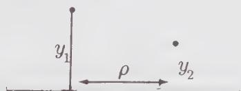  
Figure 11.2. Real coordinates $y_{1}, y_{2}$ , and $\rho$ for the two-point function near the boundary.

The Ising model is one of the minimal models discussed at length in Chaps. 7 and 8. Its correlation functions satisfy special linear differential equations, which allow us, in principle, to write them down explicitly. $^{4}$ For the sake of computing the correlator (11.22), it is preferable to apply the differential equation rather than to borrow directly the result (12.61), because different boundary conditions are needed (cf. also Ex. 8.12). The differential equation obeyed by the four-spin correlation function is particularly simple: it is a special case of Eq. (7.47), in which $X = \sigma(z_{1})\sigma(z_{2})\sigma(z_{3})$ and $\phi = \sigma$ :

$$
\left\{\sum_ {i = 1} ^ {3} \left[ \frac {1}{z - z _ {i}} \frac {\partial}{\partial z _ {i}} + \frac {1 / 1 6}{(z - z _ {i}) ^ {2}} \right] - \frac {4}{3} \frac {\partial^ {2}}{\partial z ^ {2}} \right\} \langle \sigma (z _ {1}) \sigma (z _ {2}) \sigma (z _ {3}) \sigma (z) \rangle = 0\tag{11.23}
$$

Indeed, the primary field $\sigma$ has conformal dimension $h_{1,2} = \frac{1}{16}$ and is precisely the null field studied in Sect. 7.3.1.

We know from Chap. 5 (Eq. (5.31)) that the holomorphic part of the four-point function may be expressed as follows:

$$
\langle \sigma (z _ {1}) \sigma (z _ {2}) \sigma (z _ {3}) \sigma (z _ {4}) \rangle = \left(\frac {z _ {1 3} z _ {2 4}}{z _ {1 2} z _ {2 3} z _ {1 4} z _ {3 4}}\right) ^ {\frac {1}{8}} F (x)\tag{11.24}
$$

where $F$ is some function of the anharmonic ratio $x \equiv z_{12}z_{34}/z_{13}z_{24}$ and where $z_{ij} \equiv z_i - z_j$ (here $z_4 \equiv z$ ). If we substitute this form into Eq. (11.23), we end up with an ordinary differential equation in the variable $x$ :

$$
\left[ x (1 - x) \frac {d ^ {2}}{d x ^ {2}} + (\frac {1}{2} - x) \frac {d}{d x} + \frac {1}{1 6} \right] F (x) = 0\tag{11.25}
$$

This is a special case of the hypergeometric equation, which may be solved by a simple change of variables: $x = \sin^{2}\theta$ ; this substitution yields

$$
\left[ \frac {d ^ {2}}{d \theta^ {2}} + \frac {1}{4} \right] F (\theta) = 0\tag{11.26}
$$

The two linearly independent solutions are $\cos\frac{1}{2}\theta$ and $\sin\frac{1}{2}\theta$ or, equivalently, $\sqrt{1\pm\cos\theta}=\sqrt{1\pm\sqrt{1-x}}$ . Appropriate linear combinations of these two solutions $^{5}$ must be taken in order to satisfy the boundary conditions. Alternately, if one borrows directly the infinite-plane correlation function obtained by different means (e.g., bosonization), the two solutions correspond to two different definitions of the parity transformation on the Ising model (cf. Ex. 11.6).

These boundary conditions are fixed by the asymptotic behavior of the spin-spin correlator (11.22) near the real axis. In a so-called “ordinary transition”, the surface is disordered, which means that $G_{s}(y_{1}, y_{2}, \rho) \to 0$ as $\rho \to \infty$ for fixed values of $y_{1}$ and $y_{2}$ , which corresponds to $x \to -\infty$ . On the other hand, in an “extraordinary transition”, the surface orders before the bulk, which means that, in the same limit,

$$
\begin{array}{c} G _ {s} (y _ {1}, y _ {2}, \rho) \sim \langle \sigma (z _ {1}, \bar {z} _ {1}) \rangle_ {\mathrm{UHP}} \langle \sigma (z _ {2}, \bar {z} _ {2}) \rangle_ {\mathrm{UHP}} \\ \propto \frac {1}{(y _ {1} y _ {2}) ^ {\frac {1}{8}}} \end{array}\tag{11.27}
$$

It follows that the correct linear combinations are

$$
F (x) = \sqrt {\sqrt {1 - x} + 1} \mp \sqrt {\sqrt {1 - x} - 1}\tag{11.28}
$$

where the upper (resp. lower) sign corresponds to the ordinary (resp. extraordinary) transition. If we express these four-point functions in terms of $y_{1}$ , $y_{2}$ , and $\rho$ , we find

$$
G _ {s} (y _ {1}, y _ {2}, \rho) \propto \frac {1}{(y _ {1} y _ {2}) ^ {\frac {1}{8}}} \sqrt {\tau^ {1 / 4} \mp \tau^ {- 1 / 4}}\tag{11.29}
$$

where

$$
\tau \equiv \frac {\rho^ {2} + (y _ {1} + y _ {2}) ^ {2}}{\rho^ {2} + (y _ {1} - y _ {2}) ^ {2}}\tag{11.30}
$$

The asymptotic behavior of the correlator as $\rho \to \infty$ ( $y_{1}$ and $y_{2}$ fixed) is characterized by an exponent $\eta_{\parallel}$ defined as

$$
G _ {s} (y _ {1}, y _ {2}, \rho) \sim \frac {1}{\rho^ {\eta_ {\parallel}}} \quad (\rho \gg y _ {1}, y _ {2})\tag{11.31}
$$

It follows from Eq. (11.29) that

$$
\eta_ {\parallel} = \left\{ \begin{array}{l l} 1 & (\text { ordinary }) \\ 4 & (\text { extraordinary }) \end{array} \right.\tag{11.32}
$$

## 11.2.3. The Infinite Strip

We now consider the infinite strip of width L. It is understood that the strip does not support periodic or antiperiodic boundary conditions across its width, otherwise it would effectively be a cylinder. This manifold may be obtained from the upper half-plane by the following conformal map:

$$
w = \frac {L}{\pi} \ln z\tag{11.33}
$$

where w and z are the holomorphic coordinates on the strip and the upper half-plane, respectively. Notice the difference from the map (11.1), going from the infinite plane to the cylinder. Here the positive real axis is mapped onto the lower edge of the strip and the negative real axis onto the upper edge. Therefore the two edges must support the same boundary conditions (e.g., both fixed to the same value, or both free) if the results obtained on the upper half-plane are to be imported here.

We first determine the order parameter profile near the boundary, in the case of an extraordinary transition. This is obtained by transforming the one-point function

$$
\begin{array}{c} \langle \phi (z, \bar {z}) \rangle_ {\mathrm{UHP}} = \langle \phi (z) \phi (\bar {z}) \rangle \\ = \frac {1}{(z - \bar {z}) ^ {2 h}} \end{array}\tag{11.34}
$$

onto the strip, with the help of Eq. (5.24). The result is

$$
\begin{array}{r l} \langle \phi (w, \bar {w}) \rangle_ {\text { strip }} & = \left(\frac {\pi}{L}\right) ^ {2 h} \frac {e ^ {\pi h (w + \bar {w}) / L}}{\left[ e ^ {\pi w / L} - e ^ {\pi \bar {w} / L} \right] ^ {2 h}} \\ & = \left(\frac {2 i L}{\pi}\right) ^ {- \Delta} \frac {1}{\left[ \sin (\pi v / L) \right] ^ {\Delta}} \end{array}\tag{11.35}
$$

where we have used real coordinates u and v (respectively, longitudinal and transverse) defined by $w = u + iv$ . This profile is symmetric about the middle of the strip, where it reaches its minimum. In the limit $v \ll L$ , we may write

$$
\langle \phi (v) \rangle_ {\text { strip }} \propto \frac {1}{v ^ {\Delta}} \left[ 1 + \frac {1}{6} \pi^ {2} \Delta (v / L) ^ {2} + \dots \right]\tag{11.36}
$$

This is compatible with a more general result of Fisher and de Gennes, obtained through a scaling analysis in dimension d:

$$
\langle \phi (\nu) \rangle \sim \frac {1}{\nu^ {\Delta}} \left[ 1 + \operatorname{const.} (\nu / L) ^ {d} \right] \quad (\nu \ll L)\tag{11.37}
$$

It is also interesting to look at the two-point function of a primary field on the strip. We shall limit ourselves to the spin-spin correlation function in the Ising model, in the limit of large separation u along the strip. We let $w_{1} = u_{1} + iv_{1}$ and $w_{2} = u_{2} + iv_{2}$ be the locations of the two points on the strip and $u = u_{2} - u_{1}$ . According to the covariance relation (5.24), the spin-spin correlation function is

$$
\begin{array}{c} \langle \sigma (w _ {1}, \bar {w} _ {1}) \sigma (w _ {2}, \bar {w} _ {2}) \rangle_ {\text { strip }} = \\ \left(\frac {\pi}{L}\right) ^ {\frac {1}{4}} \left[ e ^ {2 \pi u _ {1} / L} e ^ {\pi u / L} \right] ^ {\frac {1}{8}} \langle \sigma (z _ {1}) \sigma (z _ {2}) \sigma (\bar {z} _ {1}) \sigma (\bar {z} _ {2}) \rangle \end{array}\tag{11.38}
$$

The last factor is given by

$$
\begin{array}{l} \langle \sigma \sigma \sigma \sigma \rangle = \left(\frac {z _ {1 3} z _ {2 4}}{z _ {1 2} z _ {2 3} z _ {1 4} z _ {3 4}}\right) ^ {\frac {1}{8}} F (x) \\ = \frac {1}{(z _ {1 3} z _ {2 4}) ^ {\frac {1}{8}}} \left(\frac {x ^ {3}}{1 - x}\right) ^ {- \frac {1}{8}} F (x) \end{array}\tag{11.39}
$$

In terms of the strip coordinates, the anharmonic ratio $x$ is

$$
x = \frac {z _ {1 2} z _ {3 4}}{z _ {1 3} z _ {2 4}} = - \frac {1 + e ^ {2 \pi u / L} - 2 e ^ {\pi u / L} \cos [ \pi (v _ {2} - v _ {1}) / L ]}{A e ^ {\pi u / L}}\tag{11.40}
$$

where

$$
A \equiv 4 \sin \frac {\pi v _ {1}}{L} \sin \frac {\pi v _ {2}}{L}\tag{11.41}
$$

Likewise,

$$
z _ {1 3} z _ {2 4} = - 4 A e ^ {2 \pi u _ {1} / L} e ^ {\pi u / L}\tag{11.42}
$$

In the limit $u \gg L$ , $x$ is proportional to $e^{\pi u / L}$ . Combining all the factors, we find, in this limit and for an ordinary transition,

$$
\langle \sigma (w _ {1}, \bar {w} _ {1}) \sigma (w _ {2}, \bar {w} _ {2}) \rangle_ {\text { strip }} \propto e ^ {- \pi u / 2 L} \quad (u \gg L)\tag{11.43}
$$

The two-point function decays exponentially in the longitudinal direction, with a correlation length $\xi = 2L/\pi$ . This may be argued to be a special case of the more

general relation

$$
\xi = \frac {2 L}{\pi \eta_ {\parallel}}\tag{11.44}
$$

This is to be compared with the relation $\xi = L / 2\pi \Delta = L / \pi \eta$ on the cylinder geometry. It is the surface exponent $\eta_{\parallel}$ that now determines the correlation length.

Before leaving the strip geometry, we mention the finite-size correction to the free energy. The reasoning leading to Eq. (5.143) is still applicable here, except that the mapping is now slightly different ( $L$ is replaced by $2L$ ). The net result is

$$
F _ {L} = f _ {0} L - \frac {\pi c}{2 4 L}\tag{11.45}
$$

## §11.3. Boundary Operators

## 11.3.1. Introduction

In this section we shall see how the methods of conformal field theory may be applied to a system limited by two (or more) boundaries with possibly different boundary conditions. We shall find an explicit formula, in the operator formalism, for all the boundary conditions compatible with conformal symmetry. The key concept in the treatment of boundary conditions is that of a boundary operator, or boundary field. This will be applied to critical percolation later in this chapter.

The existence of scaling fields living on the boundary appears naturally within the method of images. We consider a bulk scaling field $\phi(z)$ on the upper half-plane, which we bring closer and closer to the boundary (the real axis). As it approaches the real axis, this field interacts with its mirror image $\phi(z^{*})$ (i.e., with the boundary itself) and can be replaced by its OPE with its image:

$$
\phi (z) \phi (z ^ {*}) \approx \sum_ {i} (z - z ^ {*}) ^ {(h _ {i} - 2 h)} \phi_ {B} ^ {(i)} (x)\tag{11.46}
$$

where we have dropped the higher terms and where $x \equiv (z + z^{*})/2$ . The fields $\phi_{B}^{(i)}$ live on the boundary, but belong to the same operator algebra as the bulk fields. As we shall see, these boundary fields, when inserted at a point on the boundary, change the boundary condition thereafter. In fact, the goal of this section is to justify this interpretation.

For the moment, we accept this interpretation of boundary operators and see how it applies in practice. We consider again the infinite strip of width L. We let t and $\sigma$ be the coordinates, respectively, along and across the strip, so that the complex coordinate is $w = t + i\sigma$ . We denote the boundary conditions at $\sigma = 0$ and $\sigma = L$ , respectively, by the symbols $\alpha$ and $\beta$ . In a concrete system such as the Ising model, $\alpha$ and $\beta$ could stand for fixed boundary conditions—under which the boundary spins are +1 or -1—or free boundary conditions. If we choose the time direction to be along the strip, then the Hamiltonian depends on the boundary conditions: we denote it $(\pi/L)H_{\alpha\beta}$ (the prefactor is inserted so that $H_{\alpha\beta}$ has the same normalization as $L_0$ on the plane). We assume that the system has local conformal invariance under those transformations that preserve the boundary conditions.

If we map the strip back to the upper half-plane using the transformation (11.33), the boundary condition on the real axis changes from $\alpha$ to $\beta$ at the origin. According to the above interpretation of boundary operators, this change may be obtained from a uniform boundary condition by the insertion at the origin of a boundary operator $\phi_{\alpha \beta}(0)$ . In this notation, $\phi_{\alpha \beta}(x)$ is a scaling field of dimension $h_{\alpha \beta}$ living on the boundary and which, when inserted at a point $x$ on the real axis, changes the boundary condition from $\alpha$ to $\beta$ . In the context of radial quantization, this means that the vacuum is no longer invariant under translations (i.e., is no longer annihilated by $L_{-1}$ ), but is obtained from the $SL(2,\mathbb{Z})$ -invariant vacuum $|0\rangle$ by the application of $\phi_{\alpha \beta}(0)$ . For an infinite strip, it is clear that a boundary operator $\phi_{\beta \alpha}$ is also inserted at infinity. In fact, the fields $\phi_{\alpha \beta}$ and $\phi_{\beta \alpha}$ are conjugate and the two-point function $\langle \phi_{\alpha \beta}(x_1)\phi_{\beta \alpha}(x_2)\rangle$ is nonzero.

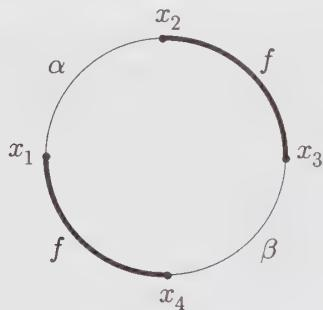  
Figure 11.3. Bounded region with changing boundary conditions.

The introduction of boundary operators allows us to relate the partition function of a system with changing boundary conditions to a correlator of boundary operators on the upper half-plane. We consider a general bounded geometry, such as a rectangle or a circle. The interior of such a region may be mapped onto the upper half-plane, while its boundary is mapped onto the real axis. We suppose that the boundary condition is $\alpha$ on a segment $[x_{1}, x_{2}]$ of the boundary, $\beta$ on a segment $[x_{3}, x_{4}]$ , and free (f) everywhere else (cf. Fig. 11.3). The partition function $Z_{\alpha\beta}$ of this system will be expressed as

$$
Z _ {\alpha \beta} = Z _ {f} \left\langle \phi_ {f \alpha} \left(x _ {1}\right) \phi_ {\alpha f} \left(x _ {2}\right) \phi_ {f \beta} \left(x _ {3}\right) \phi_ {\beta f} \left(x _ {4}\right) \right\rangle\tag{11.47}
$$

where $Z_{f}$ is the partition function for free boundary conditions throughout.

## 11.3.2. Boundary States and the Verlinde Formula

In this subsection we justify the interpretation of boundary operators described above. The basic idea is to describe a conformal field theory defined on a finite cylinder within two equivalent quantization schemes, one in which time flows around the cylinder, another one in which it flows along the cylinder. In the first scheme, the Hamiltonian $H_{\alpha\beta}$ depends on the boundary conditions on the edges of the cylinder. In the second scheme, the boundary conditions are embodied in initial and final states $|a\rangle$ and $|\beta\rangle$ , while the Hamiltonian is obtained directly from the whole complex plane.

If we go back to the strip and impose periodic boundary conditions in the time direction along the strip, after a period T, we have transformed the strip into a finite cylinder of circumference T and length L. The boundary conditions $\alpha$ and $\beta$ are still imposed on the two edges of the cylinder. Because of the finite extent of the system it is now convenient to introduce a partition function

$$
\begin{array}{l} Z _ {\alpha \beta} (q) = \operatorname{Tr} \exp - (\pi T / L) H _ {\alpha \beta} \\ = \operatorname{Tr} q ^ {H _ {\alpha \beta}} \end{array} \quad q \equiv e ^ {2 \pi i \tau}, \tau \equiv i T / 2 L\tag{11.48}
$$

where we have borrowed the notation of Chap. 10. Local conformal invariance implies that the spectrum of $H_{\alpha\beta}$ falls into irreducible representations of the Virasoro algebra (Verma modules). If we call $n_{\alpha\beta}^{i}$ the number of copies of the representation labeled i occurring in the spectrum, then the partition function may be written as

$$
Z _ {\alpha \beta} (q) = \sum_ {i} n _ {\alpha \beta} ^ {i} \chi_ {i} (q)\tag{11.49}
$$

where $\chi_{i}$ is the Virasoro character of the representation i:

$$
\chi_ {i} (q) = q ^ {- c / 2 4} \mathrm{Tr} _ {i} q ^ {L _ {0}}\tag{11.50}
$$

Since the full theory resides on the holomorphic sector only, the partition function is a linear, not bilinear, combination of characters.

In Chap. 10 it was pointed out that there are minimal conformal field theories, termed rational, which are made up of a finite number of Verma modules and for which, under a modular transformation $\tau \rightarrow -1 / \tau$ , the holomorphic characters transform as follows:

$$
\chi_ {i} (q) = \sum_ {j} S _ {i j} \chi_ {j} (\tilde {q}) \quad \tilde {q} \equiv e ^ {- 2 \pi i / \tau}\tag{11.51}
$$

The partition function $Z_{\alpha\beta}(q)$ may therefore be expressed as

$$
Z _ {\alpha \beta} (q) = \sum_ {i j} n _ {\alpha \beta} ^ {i} \mathcal {S} _ {i j} \chi_ {j} (\tilde {q})\tag{11.52}
$$

In the present context, such a modular transformation interchanges the roles of L and T. It is therefore possible to switch axes and to regard the partition function as a trace of a Hamiltonian generating translations along $\sigma$ . To this end, we map the cylinder onto the plane via the coordinate transformation

$$
\zeta = \exp \left\{- 2 \pi i (t + i \sigma) / T \right\} \quad \text { or } \quad w = i \frac {T}{2 \pi} \ln \zeta\tag{11.53}
$$

The $\zeta$ -plane is, of course, distinct from the $z$ -plane defined by the mapping (11.33). We let $L_{n}^{\zeta}$ and $\tilde{L}_{n}^{\zeta}$ be the Virasoro generators on the $\zeta$ -plane. The Hamiltonian $\tilde{H}$ needed to perform the translations in the $\sigma$ -direction is then

$$
\tilde {H} = \frac {2 \pi}{T} \left(L _ {0} ^ {\zeta} + \bar {L} _ {0} ^ {\zeta} - \frac {c}{1 2}\right)\tag{11.54}
$$

On the $\zeta$ -plane the boundaries are concentric circles centered at the origin. In radial quantization, the boundary conditions are imposed by propagating states from an initial state $|\alpha\rangle$ residing on the inner boundary, toward a final state $|\beta\rangle$ on the outer boundary. The precise form of these states depends on the specific boundary conditions used. The partition function is then expressed as

$$
\begin{array}{r} Z _ {\alpha \beta} (q) = \langle \alpha | e ^ {L \tilde {H}} | \beta \rangle \\ = \langle \alpha | (\tilde {q} ^ {1 / 2}) ^ {L _ {0} ^ {\zeta} + \bar {L} _ {0} ^ {\zeta} - c / 1 2} | \beta \rangle \end{array}\tag{11.55}
$$

The advantage of such a formulation is that we are familiar with the Hilbert space on the $\zeta$ -plane, where the holomorphic and antiholomorphic sectors propagate separately.

For all boundary conditions, it is imperative that there be no flow of energy across the edges of the finite cylinder, a condition that translates into

$$
T _ {\mathrm{cyl.}} (0, t) = \bar {T} _ {\mathrm{cyl.}} (0, t) \quad \text { and } \quad T _ {\mathrm{cyl.}} (L, t) = \bar {T} _ {\mathrm{cyl.}} (L, t)\tag{11.56}
$$

Here $T_{cyl.}$ and $\bar{T}_{cyl.}$ are the holomorphic and antiholomorphic components of the energy-momentum tensor on the cylinder. If we map this condition onto the $\zeta$ -plane, it takes the form

$$
T _ {\mathrm{pl.}} (\zeta) \zeta^ {2} = \bar {T} _ {\mathrm{pl.}} (\bar {\zeta}) \bar {\zeta} ^ {2} \quad \zeta = e ^ {- 2 \pi i t / T}\tag{11.57}
$$

on the boundary. In terms of the Virasoro generators acting on the boundary state $|\alpha \rangle$ , this condition becomes

$$
\big (L _ {n} ^ {\zeta} - \bar {L} _ {- n} ^ {\zeta} \big) | \alpha \rangle = 0\tag{11.58}
$$

A similar condition holds on the final state $|\beta\rangle$ . We note that the condition (11.56) also enforces the invariance of the boundary condition (or boundary state) under conformal transformations that leave the boundary unchanged.

It turns out that the constraint (11.58) is quite rigid and that very few states satisfy it. We will give the general solution here, without proving its uniqueness. We let $|j; N\rangle$ be a holomorphic state belonging to the Verma module j (N labels the different states within that module) and $|j; \overline{N}\rangle$ be the corresponding antiholomorphic state. We introduce an antiunitary operator U such that

$$
U | \overline {{j ; 0}} \rangle = | \overline {{j ; 0}} \rangle^ {*} \quad U \bar {L} _ {n} ^ {\zeta} = \bar {L} _ {n} ^ {\zeta} U\tag{11.59}
$$

Then the solution to (11.58) is

$$
| j \rangle \equiv \sum_ {N} | j; N \rangle \otimes U | \overline {{j ; N}} \rangle\tag{11.60}
$$

In order to show that this state is indeed a solution to the constraint (11.58), it is enough to project the constraint onto each basis state of the Hilbert space (cf. Ex. 11.10). We thus have a complete list of boundary states compatible with local conformal invariance.

The boundary states $|\alpha\rangle$ and $|\beta\rangle$ will then be linear combinations of the states $|j\rangle$ associated with different Verma modules. Assuming the states $|j\rangle$ have been normalized in some way, we may then write the partition function as

$$
\begin{array}{c} Z _ {\alpha \beta} (q) = \sum_ {i, j} \langle \alpha | i \rangle \langle i | (\tilde {q} ^ {1 / 2}) ^ {L _ {0} ^ {\zeta} + \tilde {L} _ {0} ^ {\zeta} - c / 1 2} | j \rangle \langle j | \beta \rangle \\ = \sum_ {j} \langle \alpha | j \rangle \langle j | \beta \rangle \chi_ {j} (\tilde {q}) \end{array}\tag{11.61}
$$

In the second line we have restricted ourselves to diagonal theories, that is, theories whose partition function on the torus is a diagonal combination of characters: $Z = \sum_{i} \chi_{i}(\tau) \chi_{i}(\bar{\tau})$ . Because of this, it is $\tilde{q}$ that appears in the last line of the above equation, not $\tilde{q}^{1/2}$ . Comparing the above result with Eq. (11.51) leads to the following relation:

$$
\sum_ {i} \mathcal {S} _ {i j} n _ {\alpha \beta} ^ {i} = \langle \alpha | j \rangle \langle j | \beta \rangle\tag{11.62}
$$

To proceed, we first identify a boundary state $|\tilde{0}\rangle$ such that the only representation occurring in the Hamiltonian $H_{\tilde{0}\tilde{0}}$ is the identity: $n_{\tilde{0}\tilde{0}}^{i} = \delta_{0}^{i}$ . From Eq. (11.62), such a state satisfies the relation $|\langle\tilde{0}|j\rangle|^{2} = S_{0j}$ . In a unitary model, $S_{0j}$ can be shown to be positive (cf Ex. 10.5) and therefore this state indeed exists and can be taken as

$$
| \tilde {0} \rangle = \sum_ {j} \sqrt {\mathcal {S} _ {0 j}} | j \rangle\tag{11.63}
$$

Likewise, we define a state

$$
| \tilde {l} \rangle = \sum_ {j} \frac {\mathcal {S} _ {l j}}{\sqrt {\mathcal {S} _ {0 j}}} | j \rangle\tag{11.64}
$$

From Eq. (11.62), this state is such that $n_{\tilde{0}\tilde{l}}^{i} = \delta_{l}^{i}$ : only the representation l propagates in $H_{\tilde{0}\tilde{l}}$ . We may then apply Eq. (11.62) one last time and find the following relation:

$$
\begin{array}{r} \sum_ {i} \mathcal {S} _ {i j} n _ {\tilde {k} \tilde {l}} ^ {i} = \langle \tilde {k} | j \rangle \langle j | \tilde {l} \rangle \\ = \frac {\mathcal {S} _ {k i} \mathcal {S} _ {l j}}{\mathcal {S} _ {0 j}} \end{array}\tag{11.65}
$$

Here the matrix S is real: the Virasoro representations are self-conjugate. $^{6}$ This relation is identical to the Verlinde formula, which relates fusion coefficients and

the modular matrix:

$$
\sum_ {i} \mathcal {S} _ {i j} \mathcal {N} ^ {i} _ {k l} = \frac {\mathcal {S} _ {k j} \mathcal {S} _ {l j}}{\mathcal {S} _ {0 j}}\tag{11.66}
$$

We conclude from this exercise that

$$
n _ {\tilde {k l}} ^ {i} = \mathcal {N} _ {k l} ^ {i}\tag{11.67}
$$

that is, the number of times representation $i$ occurs in the Hamiltonian $H_{\tilde{k}\tilde{l}}$ is precisely the fusion coefficient $\mathcal{N}^i_{kl}$ .

This result warrants the interpretation that boundary conditions may be changed by inserting a local operator on the boundary. Consider Fig. 11.4. Initially the Hamiltonian is $H_{\tilde{l}\tilde{0}}$ and only the states belonging to representation $l$ propagate. At time $t_0$ there is a change in boundary conditions to $(\tilde{l},\tilde{k})$ and there will be $\mathcal{N}^{i}_{lk}$ copies of representation $i$ that will propagate. Viewed differently, a boundary operator $\phi_{\tilde{0}\tilde{k}}$ has been applied at time $t_0$ on the states of representation $l$ ; since $\phi_{\tilde{0}\tilde{k}}$ transforms in the representation $k$ of the Virasoro algebra, the resulting states will fall into a variety of representations, of which representation $i$ occurs $\mathcal{N}^{i}_{lk}$ times, according to the usual fusion rules.

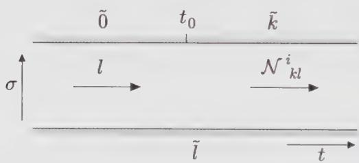  
Figure 11.4. Insertion of the boundary operator $\phi_{\bar{0}\bar{k}}$ at an instant $t_0$ on the strip and consequence on the propagating modes.

## EXAMPLE: THE ISING MODEL

In order to illustrate the above results, we apply them to the Ising model. According to Eq. (10.134) of Chap. 10, the modular matrix S is in this case

$$
\mathcal {S} = \left( \begin{array}{c c c} \frac {1}{2} & \frac {1}{2} & \sqrt {\frac {1}{2}} \\ \frac {1}{2} & \frac {1}{2} & - \sqrt {\frac {1}{2}} \\ \sqrt {\frac {1}{2}} & - \sqrt {\frac {1}{2}} & 0 \end{array} \right)\tag{11.68}
$$

where the three rows correspond, respectively, to the representations with highest weights $h = 0 \, (0)$ , $h = \frac{1}{2} \, (\varepsilon)$ , and $h = \frac{1}{16} \, (\sigma)$ ; we indicated within parentheses the symbols used for the corresponding bulk operators. The number of possible conformally invariant boundary conditions is equal to the number of admissible boundary states defined in Eq. (11.64):

$$
\begin{array}{r l} & {| \tilde {0} \rangle = \frac {1}{\sqrt {2}} | 0 \rangle + \frac {1}{\sqrt {2}} | \varepsilon \rangle + \frac {1}{\sqrt [ 4 ]{2}} | \sigma \rangle} \\ & {| \frac {\tilde {1}}{2} \rangle = \frac {1}{\sqrt {2}} | 0 \rangle + \frac {1}{\sqrt {2}} | \varepsilon \rangle - \frac {1}{\sqrt [ 4 ]{2}} | \sigma \rangle} \\ & {| \frac {\tilde {1}}{1 6} \rangle = | 0 \rangle - | \varepsilon \rangle} \end{array}\tag{11.69}
$$

Here we have designated by $|0\rangle$ , $|\varepsilon\rangle$ , and $|\sigma\rangle$ the three states defined in Eq. (11.60) for the three possible values of j.

Each of the three states defined in Eq. (11.69) is the realization, in radial quantization on the $\zeta$ -plane, of a particular type of conformally invariant boundary condition. In the Ising model, the three possible boundary conditions are to fix the boundary spins at +, -, or to let them free. Since the first two states of (11.69) differ only by the sign of the state associated with the odd operator $\sigma$ , we infer that these two boundary states correspond to the two types of fixed boundary conditions, whereas the third state represents free boundary conditions. Which of the first two states of (11.69) represents the + boundary condition is really a matter of choice.

Identifying the boundary operators $\phi_{\alpha \beta}$ taking us from one boundary condition to the other is not difficult. The operator $\phi_{+ - }$ producing a transition from the (+) boundary condition to the (−) boundary condition could be written $\phi_{\tilde{0}^{\frac{1}{2}}}$ in the notation of this subsection. Thus, it transforms under the representation of weight $\frac{1}{2}$ of the Virasoro algebra. In other words, it is the scaling field $\phi_{(2,1)} = \phi_{(1,3)}$ . Likewise, the boundary operator $\phi_{+f}$ is identified with $\phi_{(1,2)} = \phi_{(2,2)}$ .

## §11.4. Critical Percolation

## 11.4.1. Statement of the Problem

We explain briefly the problem of bond percolation. $^{7}$ We consider a finite lattice (for definiteness, a rectangular lattice) and call G the set of bonds (or links) between nearest-neighbor sites. We suppose now that each bond has a probability p of being “activated”—graphically, one may represent activated bonds by thick lines, and “inert” bonds by thin lines (cf. Fig. 11.5). In a given configuration, activated bonds will fall into clusters. The greater the probability p, the bigger will be the average cluster. The central question of percolation theory is the following: for a given value of p, what is the probability $\pi_{h}(p)$ that there is a cluster spanning the whole lattice, from left to right? In other words, what is the probability that one can cross the lattice by walking continuously on activated bonds? Here the index h stands for horizontal; one also defines the probability $\pi_{\nu}(p)$ for a vertical crossing of the lattice. In fact, more general probabilities may be defined for crossings from a definite portion of the boundary to another. These probabilities depend, of course, on the size and aspect ratio (i.e., width over height) of the lattice. The central result of percolation theory is that in the limit of infinite lattice size (the thermodynamic limit) there exists a critical value $p_{c}$ of the activation probability such that the crossing probability $\pi_{h}(p)$ vanishes if $p < p_{c}$ and is unity if $p > p_{c}$ . At $p = p_{c}$ , the crossing probability depends on the shape (aspect ratio) of the lattice.

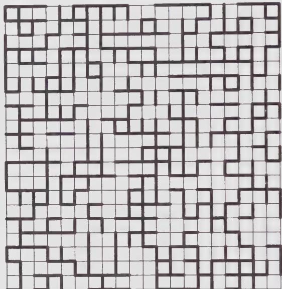  
Figure 11.5. Typical configuration of bonds on a finite rectangular lattice. In this specific case, there is a horizontal crossing but no vertical crossing.

By critical percolation, we mean the study of percolation at the critical value $p = p_{c}$ . For a square lattice, it is known exactly that $p_{c} = \frac{1}{2}.^{8}$ . Let r be the aspect ratio of the rectangular lattice. One of the main questions in the theory of critical percolation is then the calculation of the crossing probability $\pi_{h}(r)$ as a function of aspect ratio, in the thermodynamic limit. This function has been “measured” quite accurately by computer simulations. The goal of this section is to explain how to calculate it with the methods of conformal invariance. As we shall show, the agreement between the theoretical and the measured values is striking and provides a remarkable validation of the assumptions behind conformal field theory, in particular in the treatment of boundaries.

## 11.4.2. Bond Percolation and the Q-state Potts Model

The bond percolation problem fits naturally into the family of Potts models. Recall that the Q-state Potts model is defined as follows: on each site of the lattice lives a discrete variable $\sigma_{i}$ —call it spin—taking one of Q possible values, and the energy of a spin configuration is

$$
E = J \sum_ {\langle i j \rangle} \delta_ {\sigma_ {i} \sigma_ {j}}\tag{11.70}
$$

In other words, each bond linking two like-spins has an energy J, other bonds have no energy. The total energy being a sum over bonds, the partition function may be expressed as follows:

$$
Z = \sum_ {\{\sigma \}} \prod_ {\langle i j \rangle} \left(1 + x \delta_ {\sigma_ {i} \sigma_ {j}}\right)\tag{11.71}
$$

where $x = \exp - \beta J$ . In a generic configuration of spins, the bonds are arranged in clusters containing like-spins. The expression (11.71) for the partition function allows a different interpretation of the Q-state Potts model, closer to the percolation problem: each bond has a probability p of being activated and 1 - p of being inert, with the ratio $x = p / (1 - p)$ . However, each activated bond has a “color” taking Q possible values, so that a given cluster of bonds is “colored” according to the value of $\sigma$ it supports. The partition function (11.71) may in fact be reformulated as follows, up to a multiplicative constant: If we let B be the total number of bonds on the lattice, R the subset of bonds that are activated, $B(R)$ the number of activated bonds, and $N_{c}(R)$ the number of disjoint clusters in the subset R, then, up to a multiplicative constant, the partition function is

$$
Z = \sum_ {R} p ^ {B (R)} (1 - p) ^ {B - B (R)} Q ^ {N _ {c} (R)}\tag{11.72}
$$

where the sum is taken over all possible sets of activated bonds. A given configuration of activated bonds has a probability $p^{B(R)}(1-p)^{B-B(R)}$ of being realized and, once it exists, there are $Q^{N_{c}(R)}$ ways of distributing the Q colors among the $N_{c}(R)$ clusters. In order to have a perfect correspondence with the Q-state Potts model, we must count clusters of size zero (i.e., isolated spins of any color). Thus, the usual bond percolation problem appears as a special case (Q=1) of the Q-state Potts model. $^{9}$ We can easily check that the partition function (11.72) is normalized (i.e., Z=1) if Q=1.

This correspondence between the Q-state Potts model and the bond percolation problem allows us to formulate the problem of the crossing probability $\pi_{h}(r)$ in terms of partition functions of the Q-state Potts model with different boundary conditions. Specifically, we let $Z_{\alpha\beta}$ be the partition function on a rectangular lattice with fixed boundary conditions—spins in state $\alpha$ on the left edge and in state $\beta$ on the right edge—while the boundary conditions are free on the top and bottom edges. We assert that the crossing probability $\pi_{h}(r)$ is given by

$$
\pi_ {h} (r) = \lim _ {n \to 1} \left(Z _ {\alpha \alpha} - Z _ {\alpha \beta}\right)\tag{11.73}
$$

where $\alpha \neq \beta$ . Indeed, the first term $(Z_{\alpha\alpha})$ is a sum over colored-bond configurations containing clusters of color $\alpha$ that cross from left to right, whereas the second term $(Z_{\alpha\beta})$ excludes those very configurations (which fixed boundary conditions are chosen for $\alpha$ and $\beta$ does not matter, provided they are different). The difference $Z_{\alpha\alpha} - Z_{\alpha\beta}$ contains only configurations with crossings of color $\alpha$ , as expressed below with the primed sum:

$$
Z _ {\alpha \alpha} - Z _ {\alpha \beta} = \sum_ {R} ^ {\prime} p ^ {B (R)} (1 - p) ^ {B - B (R)} Q ^ {N _ {c} (R)}\tag{11.74}
$$

Because of the normalization of Eq. (11.72) when Q = 1, this is indeed the crossing probability. Of course, this expression makes no sense if Q is set to one from the start ( $Z_{\alpha\beta}$ has then no meaning), but it yields the correct answer if the limit is taken after having expressed the partition functions in terms of correlators of boundary operators.

## 11.4.3. Boundary Operators and Crossing Probabilities

We have seen earlier in this chapter that partition functions with specific boundary conditions can be expressed as correlators of boundary operators inserted at the points on the boundary where the boundary conditions change from one type to the other. If $x_{1} \ldots x_{4}$ are the coordinates of the four corners of the rectangular lattice in the thermodynamic limit—and, of course, at the critical point $p_{c}$ —the above partition functions have the following representation:

$$
\begin{array}{l} Z _ {\alpha \alpha} = Z _ {f} \langle \phi_ {f \alpha} (x _ {1}) \phi_ {\alpha f} (x _ {2}) \phi_ {f \alpha} (x _ {3}) \phi_ {\alpha f} (x _ {4}) \rangle \\ Z _ {\alpha \beta} = Z _ {f} \langle \phi_ {f \alpha} (x _ {1}) \phi_ {\alpha f} (x _ {2}) \phi_ {f \beta} (x _ {3}) \phi_ {\beta f} (x _ {4}) \rangle \end{array}\tag{11.75}
$$

where $Z_{f}$ is the partition function for free boundary conditions. The problem is now to identify correctly the boundary operators.

We have shown in Chap. 7 how the critical Q-state Potts model is related to the unitary minimal model $\mathcal{M}(m+1,m)$ with m=3 for Q=2 (the Ising model) and m=5 for Q=3. It turns out that the four-state Potts model is related to the c=1 model obtained in the limit $m\to\infty$ . The precise correspondence between Q and m is embodied in the relation $Q=4\cos^{2}(\pi/(m+1))$ , the three cases m=3,5 and $\infty$ , corresponding, respectively, to Q=2,3 and 4. The bond percolation case $(Q=1)$ is thus associated with the minimal theory $\mathcal{M}(3,2)$ , with central charge c=0.

In the absence of any rigorous argument identifying the boundary operator $\phi_{f\alpha}$ with a specific field $\phi_{(r,s)}$ of the minimal theory, one must proceed in a heuristic way. We suppose that the points $x$ and $x'$ on the boundary where the boundary conditions change from $\alpha$ to f, and then from f to $\beta$ , are brought together. This procedure must be equivalent to the following schematic operator product expansion:

$$
\phi_ {\alpha f} \phi_ {f \beta} \sim \delta_ {\alpha \beta} + \phi_ {\alpha \beta} + \dots\tag{11.76}
$$

We notice that the operators $\phi_{\alpha f}$ , $\phi_{\beta f}$ , $\phi_{f\alpha}$ and $\phi_{f\beta}$ are all equivalent in the limit $n \rightarrow 1$ . We have established earlier that the operator $\phi_{\alpha\beta}$ associated with a change of fixed boundary conditions in the Ising model is $\phi_{(1,3)}$ . This turns out to be the case also in the three-state Potts model. The above OPE then leaves no choice but to take $\phi_{\alpha f} = \phi_{(1,2)}$ . The conformal dimension of $\phi_{(1,2)}$ vanishes for c = 0, and this supports our choice. Indeed, the crossing probability should be invariant under uniform scalings of the lattice at $p = p_{c}$ , and the only way the four-point functions $\langle\phi\phi\phi\rangle$ can be invariant under such rescaling is if h = 0.

Since $h_{1,2}=0$ , the four-point functions (11.75) are truly invariant under local conformal transformations. We now map the rectangular boundary of the lattice onto the real axis. This can be done in many ways, in particular using a Schwarz-Christoffel transformation. We let $z_{1}\ldots z_{4}$ be the four points on the real axis corresponding to the four corners $x_{1}\ldots x_{4}$ of the rectangle. After transformation, the four-point function becomes simply

$$
\langle \phi (z _ {1}) \phi (z _ {2}) \phi (z _ {3}) \phi (z _ {4}) \rangle\tag{11.77}
$$

where $\phi = \phi_{(1,2)}$ . This function has been studied before, in particular in the context of the Ising model on the upper half-plane (cf. Sect. 11.2.2). In the present context, h = 0, and Eq. (7.47) becomes

$$
\left\{\mathcal {L} _ {- 2} - \frac {3}{2} \mathcal {L} _ {- 1} ^ {2} \right\} \langle \phi (z _ {1}) \phi (z _ {2}) \phi (z _ {3}) \phi (z _ {4}) \rangle = 0\tag{11.78}
$$

where the operator $\mathcal{L}_{-1}$ stands for $\partial/\partial z_{4}$ and

$$
\mathcal {L} _ {- 2} = \sum_ {1 = 1} ^ {3} \frac {1}{z _ {4} - z _ {i}} \frac {\partial}{\partial z _ {i}}\tag{11.79}
$$

The differential equation obeyed by the correlator (11.77) is thus

$$
\partial_ {4} ^ {2} + \frac {2}{3} \left[ \frac {1}{z _ {1 4}} \partial_ {1} + \frac {1}{z _ {2 4}} \partial_ {2} + \frac {1}{z _ {3 4}} \partial_ {3} \right] \langle \phi (z _ {1}) \phi (z _ {2}) \phi (z _ {3}) \phi (z _ {4}) \rangle = 0\tag{11.80}
$$

where, as usual, $z_{ij} \equiv z_i - z_j$ . Since $h = 0$ , the correlator on the infinite plane is simply a function $g(x)$ of the anharmonic ratio $x = (z_{12}z_{34}) / (z_{13}z_{24})$ . After some algebra, the above differential equation reduces to

$$
x (1 - x) g ^ {\prime \prime} + \frac {2}{3} (1 - 2 x) g ^ {\prime} = 0\tag{11.81}
$$

The two independent solutions to this linear equation are $g(x) = 1$ and $g(x) = x^{1/3}F(\frac{1}{3}, \frac{2}{3}, \frac{4}{3}; x)$ , where F is the hypergeometric function. It remains to determine which linear combination of these two solutions is equal to $Z_{\alpha\alpha} - Z_{\alpha\beta}$ (the crossing probability) in the $n \to 1$ limit.

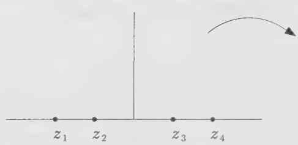

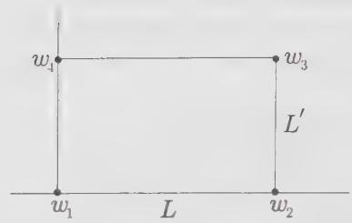  
Figure 11.6. The Schwarz-Christoffel transformation mapping the upper half-plane to the interior of a rectangle.

Before going further, we need the precise correspondence between the aspect ratio r of the rectangle and the anharmonic ratio x. A possible mapping from the upper half-plane to the interior of the rectangle is the following Schwarz-Christoffel transformation:

$$
w = A \int^ {z} \frac {d t}{\sqrt {(t - z _ {1}) (t - z _ {2}) (t - z _ {3}) (t - z _ {4})}}\tag{11.82}
$$

where the four points $z_{i}$ are the images of the four corners $w_{i}$ of the rectangle (cf. Fig. (11.6)) and A is a constant proportional to L. This transformation is singular at the four points $z_{i}$ and is not conformal precisely at these points, since it does not preserve angles there. We let these four points be respectively $z_{1} = -k^{-1}$ , $z_{2} = -1$ , $z_{3} = 1$ and $z_{4} = k^{-1}$ , where 0 < k < 1. It follows that the height of the rectangle is

$$
\begin{array}{l} L ^ {\prime} = \frac {w _ {3} - w _ {2}}{i} \\ = 2 A k \int_ {0} ^ {1} \frac {d t}{\sqrt {(1 - t ^ {2}) (1 - k ^ {2} t ^ {2})}} \\ = 2 A k K (k ^ {2}) \end{array}\tag{11.83}
$$

Likewise, the width is

$$
\begin{array}{r l} & L = w _ {3} - w _ {4} \\ & = A k \int_ {1} ^ {1 / k} \frac {d t}{\sqrt {(1 - k ^ {2} t ^ {2}) (t ^ {2} - 1)}} \\ & = A k K (1 - k ^ {2}) \end{array}\tag{11.84}
$$

Here we have used the definitions of the complete elliptic integrals of the first kind $K$ and $K'$ :

$$
\begin{array}{l} K (k ^ {2}) \equiv \int_ {0} ^ {1} \frac {d t}{\sqrt {(1 - t ^ {2}) (1 - k ^ {2} t ^ {2})}} = \frac {1}{2} \pi F (\frac {1}{2}, \frac {1}{2}, 1; k ^ {2}) \\ K ^ {\prime} (k ^ {2}) \equiv \int_ {1} ^ {1 / k} \frac {d t}{\sqrt {(1 - k ^ {2} t ^ {2}) (t ^ {2} - 1)}} = K (1 - k ^ {2}) \end{array}\tag{11.85}
$$

Therefore, the aspect ratio $r = L'/L$ is

$$
r = \frac {K (1 - k ^ {2})}{2 K (k ^ {2})}\tag{11.86}
$$

The anharmonic ratio x has a simpler expression:

$$
x = \frac {z _ {1 2} z _ {3 4}}{z _ {1 3} z _ {2 4}} = \frac {(1 - k) ^ {2}}{(1 + k) ^ {2}}\tag{11.87}
$$

When $r \to 0$ (infinitely narrow lattice), $k \to 1$ and $x \to 0$ . On the other hand, when $r \to \infty$ (infinitely wide lattice), $k \to 0$ and $x \to 1$ . Obviously, the crossing probability $\pi_{\hat{h}}(r)$ should be 1 if r = 0 (x = 0) and zero if $r = \infty$ (x = 1). However, the hypergeometric function satisfies the following identity:

$$
\frac {3 \Gamma (\frac {2}{3})}{\Gamma (\frac {1}{3}) ^ {2}} x ^ {1 / 3} F (\frac {1}{3}, \frac {2}{3}, \frac {4}{3}; x) = 1 - (1 - x) ^ {1 / 3} F (\frac {1}{3}, \frac {2}{3}, \frac {4}{3}; 1 - x)\tag{11.88}
$$

This identity makes it clear, from the values at $x = 0$ and $x = 1$ , that the appropriate combination describing $\pi_h(r)$ is

$$
\pi_ {h} (r) = \frac {3 \Gamma (\frac {2}{3})}{\Gamma (\frac {1}{3}) ^ {2}} x ^ {1 / 3} F (\frac {1}{3}, \frac {2}{3}, \frac {4}{3}; x)\tag{11.89}
$$

The comparison between this expression and the crossing probabilities obtained in numerical simulations $^{10}$ is illustrated on Fig. 11.7. The striking agreement between simulation and theory is one of the most convincing confirmations to date of the validity of the hypothesis of local conformal invariance in two-dimensional critical systems.

## Exercises

## 11.1 Conformal theory on an infinite cylinder

a) Show that any correlation function on the torus has a well-defined “infinite cylinder” limit by taking $\tau = iT/L \rightarrow i\infty$ (namely $T \rightarrow \infty$ while L, the transverse size of the cylinder, remains fixed).

b) Derive the infinite cylinder limit of the torus Ward identity (12.79). In particular, compute the expectation value of the energy-momentum tensor on the infinite cylinder in terms of the central charge c.

c) Use Eqs. (12.93) and (12.108) to compute the energy and spin two-point functions of the Ising model on an infinite cylinder.

d) Check that the result satisfies the infinite cylinder Ward identity derived in part (b).

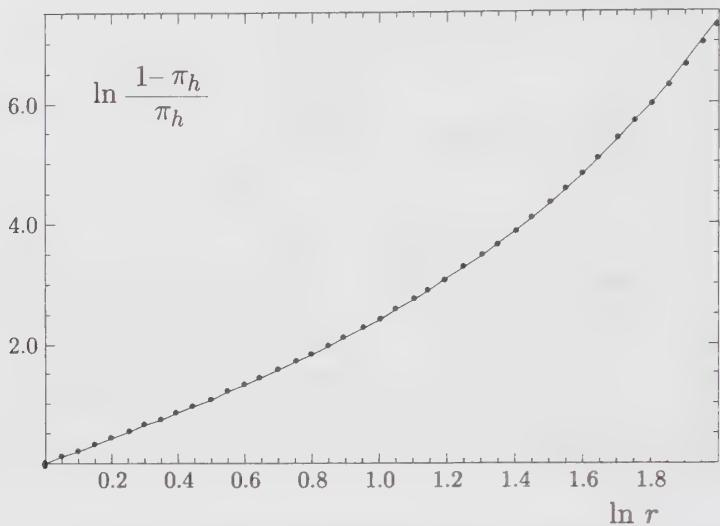  
Figure 11.7. Comparison between the crossing probability $\pi_{h}(r)$ measured in computer simulations (dots) and the prediction of Eq. (11.89). The errors on the simulation data are smaller than the point size used. The last point on the right deviates slightly from the theoretical curve, although this is barely visible on this graph. This deviation may be attributed to the finite number of sites used in the simulation.

## 11.2 Compactified boson on an infinite cylinder

We consider the free bosonic theory compactified on a circle of radius $R$ , with partition function on the torus

$$
Z (R) = \frac {1}{\operatorname{Im} \tau | \eta (\tau) | ^ {2}} \sum_ {m, m ^ {\prime} \in \mathbb {Z}} \exp - \frac {\pi R ^ {2} | m ^ {\prime} - m \tau | ^ {2}}{2 \operatorname{Im} \tau}
$$

corresponding to the possible winding numbers $(m, m')$ of the boson around the a and b-cycles of the torus (see Sect. 10.4.1 for details).

a) In the infinite cylinder limit $\tau = iT/L, T \to \infty, L$ fixed, show that the leading contribution to any correlation function comes from the doubly periodic sector $(m, m') = (0, 0)$ .

b) Use Eq. (12.148) to compute the electromagnetic operator two-point function on the infinite cylinder.

c) Compare this result with the cylinder limit of the same two-point function in the $\mathbb{Z}_2$ -orbifold theory (Eq. (12.152)).

d) Use Eq. (12.150) to compute the n-point function of electromagnetic operators on the cylinder.

11.3 Verify all the steps leading to Eq. (11.29) and check the asymptotic result (11.32).

## 11.4 Conformal invariance on the unit disk

a) Show that the mapping $w = (z - i) / (z + i)$ maps the upper half-plane $(z)$ to the interior of the unit circle $(w)$ centered at the origin.

b) Show that the order parameter profile on the unit disk is the following:

$$
\langle \phi (w, \bar {w}) \rangle_ {\mathrm{disk}} = \frac {1}{(1 - r ^ {2}) ^ {2 h}}\tag{11.90}
$$

where r is the distance from the origin.

c) We denote a generic two-point function on the unit disk by $G(r_{1}, \theta_{1}; r_{2}, \theta_{2})$ where $(r_{i}, \theta_{i})$ (i = 1, 2) are the polar coordinates of the two points considered. Show that conformal invariance implies the following universal ratio:

$$
\frac {G (a , 0 ; a , \pi)}{G (0 , 0 ; 2 a / (1 + a ^ {2}) , 0)} = (1 + a ^ {2}) ^ {2 \Delta}\tag{11.91}
$$

( $\Delta$ is the scaling dimension of the local field under study).

## 11.5 Ising energy correlator on the upper half-plane

a) Show that the energy correlation function of the Ising model on the upper half-plane is

$$
\langle \varepsilon (z, \bar {z}) \varepsilon (w, \bar {w}) \rangle_ {\mathrm{UHP}} = \frac {1}{4 y _ {1} y _ {2}} + \frac {1}{| z - w | ^ {2}} - \frac {1}{| z - w ^ {*} | ^ {2}}\tag{11.92}
$$

up to a multiplicative factor. The energy operator is defined as $\varepsilon(z,\bar{z})=i\psi(z)\bar{\psi}(\bar{z})$ .

b) Show that the corresponding surface exponent $\eta_{\parallel}$ is equal to 4.

c) Show that, once mapped onto the infinite strip, the energy-energy correlator decays with a correlation length $\xi = 2L/\pi\eta_{\parallel}$ .

## 11.6 Parity transformation of the Ising model

The effect of a parity transformation $z \rightarrow \bar{z}$ on the operators of the Ising model is not unique: it is possible to define two such parity transformations, which correspond to different boundary conditions on the real axis and distinguish between ordinary and extraordinary transitions.

a) Show that the parity transformations

$$
\begin{array}{l l} \psi (z) \to \bar {\psi} (\bar {z}) & \sigma (z, \bar {z}) \to \mu (\bar {z}, z) \\ \bar {\psi} (z) \to \psi (\bar {z}) & \mu (z, \bar {z}) \to \sigma (\bar {z}, z) \end{array}\tag{11.93}
$$

leave unchanged the OPEs of $\psi$ , $\bar{\psi}$ , $\sigma$ , and $\mu$ . These OPEs are given in Chap. 12 (Eq. (12.68) and the preceding one). $^{[11]}$ Note that some of those OPEs are defined up to sign, because of a branch cut. This parity transformation amounts to a duality transformation of the Ising model.

b) Show that the parity transformation

$$
\begin{array}{l l} \psi (z) \to - \bar {\psi} (\bar {z}) & \sigma (z, \bar {z}) \to \sigma (\bar {z}, z) \\ \bar {\psi} (z) \to \psi (\bar {z}) & \mu (z, \bar {z}) \to \mu (\bar {z}, z) \end{array}\tag{11.94}
$$

also leaves unchanged the same OPEs, provided it is antiunitary, that is, provided the coefficients of the OPE are complex-conjugated.

c) Let $F_{\pm}(x) = \sqrt{1 \pm \sqrt{1 - x}}$ . Show that the results (12.63) and (12.66) may be, respectively, written as

$$
\begin{array}{l} \langle \sigma (z _ {1}, \bar {z} _ {1}), \sigma (z _ {2}, \bar {z} _ {2}), \sigma (z _ {3}, \bar {z} _ {3}), \sigma (z _ {4}, \bar {z} _ {4}) \rangle = \frac {1}{2} \left| \frac {z _ {1 3} z _ {2 4}}{z _ {1 2} z _ {1 4} z _ {2 3} z _ {3 4}} \right| ^ {\frac {1}{4}} (F _ {+} \bar {F} _ {+} + F _ {-} \bar {F} _ {-}) \\ \langle \sigma (z _ {1}, \bar {z} _ {1}), \mu (z _ {2}, \bar {z} _ {2}), \sigma (z _ {3}, \bar {z} _ {3}), \mu (z _ {4}, \bar {z} _ {4}) \rangle = \frac {i}{2} \left| \frac {z _ {1 3} z _ {2 4}}{z _ {1 2} z _ {1 4} z _ {2 3} z _ {3 4}} \right| ^ {\frac {1}{4}} (F _ {+} \bar {F} _ {-} - F _ {-} \bar {F} _ {+}) \end{array}
$$

d) Referring to Sect. 11.2.2, argue that the holomorphic part of the above correlators correspond, respectively, to the extraordinary and ordinary transitions when applied to the spin-spin correlator on the upper half-plane, and are obtained, respectively, by applying the parity transformations (11.94) and (11.93). Of course, the infinite-plane correlator does not factorize into holomorphic × antiholomorphic factors, but rather like a sum thereof. By “holomorphic part”, we mean what is obtained by setting $\bar{F}_{\pm}(\bar{x})$ to a constant (e.g., unity).

## 11.7 Spin-energy correlator on the upper half-plane

a) On the infinite plane, the spin-energy function $\langle\varepsilon(z,\bar{z})\sigma(w,\bar{w})\rangle$ vanishes. In the case of an ordinary transition, show that this is again the case on the upper half-plane (you must use the parity transformation (11.93)).

b) In the case of an extraordinary transition (with the parity transformation (11.94)), show that, on the upper half-plane, the spin-energy function is

$$
\langle \varepsilon (z, \bar {z}) \sigma (w, \bar {w}) \rangle_ {\mathrm{UHP}} \propto \frac {1}{(\operatorname{Im} z) (\operatorname{Im} w) ^ {1 / 4}} \left\{\left| \frac {z - w}{z - w ^ {*}} \right| + \left| \frac {z - w ^ {*}}{z - w} \right| \right\}
$$

Hint: Use Eq. (12.30).

Extract the corresponding surface exponent $\eta_{\parallel}$ .

Result: $\eta_{\parallel} = 4$

c) The result of part (b) is incompatible with spin-reversal symmetry $\sigma \rightarrow -\sigma$ . Why is this acceptable here, for an extraordinary transition?

## 11.8 Parity transformation of the free boson

a) Show that, under parity, the free boson transforms as

$$
\varphi (z, \bar {z}) \rightarrow \eta \varphi (\bar {z}, z) \quad \eta = \pm 1
$$

and that the choice $\eta = +1$ corresponds to the boundary condition $\partial\varphi = 0$ on the real axis, while the choice $\eta = -1$ corresponds to the boundary condition $\varphi = 0$ on the real axis.

b) With the choice $\eta = +1$ , show that the two-point function of vertex operators on the upper half-plane is

$$
\langle e ^ {i \alpha \varphi (z, \bar {z})} e ^ {i \beta \varphi (w, \bar {w})} \rangle_ {\mathrm{UHP}} = \left\{ \begin{array}{l l} \left(\frac {\operatorname{Im} z \operatorname{Im} w}{| z - w | ^ {2} | z - w ^ {*} | ^ {2}}\right) ^ {\alpha^ {2}} & \text { if } \quad \alpha = - \beta \\ 0 & \text { otherwise } \end{array} \right.\tag{11.95}
$$

and extract the surface exponent $\eta_{\parallel}$ . Does this correspond to an ordinary or extraordinary transition?

c) With the choice $\eta = -1$ , show that

$$
\langle e ^ {i \alpha \varphi (z, \bar {z})} e ^ {i \beta \varphi (w, \bar {w})} \rangle_ {\mathrm{UHP}} \propto \frac {1}{(\operatorname{Im} z) ^ {\alpha^ {2}} (\operatorname{Im} w) ^ {\beta^ {2}}} \left| \frac {z - w}{z - w ^ {*}} \right| ^ {2 \alpha \beta}\tag{11.96}
$$

and extract the surface exponent $\eta_{\parallel}$ . Does this correspond to an ordinary or extraordinary transition? Why is the neutrality condition $\alpha + \beta = 0$ not necessary here?

## 11.9 Free boson on a cylinder with fixed boundary conditions

The aim of this exercise is to compute the partition function of the free boson on a cylinder of size $L \times T$ , that is, subject to the periodicity condition in the space direction $\varphi(x + L, y) = \varphi(x, y)$ , and with fixed boundary conditions $(a, b)$ in the time direction, namely

$$
\varphi (x, 0) = 2 \pi R a \quad \varphi (x, T) = 2 \pi R b \quad \forall x \in \mathbb {R}
$$

( $\varphi$ is compactified on a circle of radius $R$ , and $a, b$ are two integers). The corresponding partition function $Z_{(a,b)}(L,T;R)$ will be computed using the zeta regularization scheme presented in Sect. 10.2.

a) Write the eigenvalues of the Laplace operator $\Delta$ on the cylinder, with the boundary conditions $(a,b) = (0,0)$ . What is the main difference with the doubly periodic case of Sect. 10.2?

b) Follow the lines of Sect. 10.2 to derive the partition function

$$
Z _ {(0, 0)} (L, T; R) = \frac {1}{\eta (i T / L)}
$$

where $\eta$ is the Dedekind eta function (see App. 10.A).

c) Compute the partition function $Z_{(a,b)}(L,T;R)$ with nonzero fixed boundary conditions $(a,b)$ . Show that

$$
Z _ {(a, b)} (L, T) = \frac {q ^ {R ^ {2} (b - a) ^ {2} / 2}}{\eta (i T / L)}
$$

where $q = \exp(-2\pi T/I)$ .

Hint: Use the path integral formulation, with action $S(\varphi) = (1/8\pi)\int (\nabla \varphi)^2 d^2 x$ , and write $\varphi = \tilde{\varphi} + \varphi^{\mathrm{cl}}$ , with $\tilde{\varphi}$ subject to the $(a,b) = (0,0)$ boundary condition, and $\varphi^{\mathrm{cl}}$ a classical solution of the equation of motion $(\Delta \varphi^{\mathrm{cl}} = 0)$ , with the $(a,b)$ boundary condition. When $2R^2$ is not the square of an integer, $Z_{(a,b)}(L,T;R)$ is just the irreducible character of the $c = 1$ representation with highest weight $h = R^2 (b - a)^2 /2$ . This exhibits a collection of $c = 1$ characters as free-boson cylindric partition functions with fixed boundary conditions.

## 11.10 Solution to the reparametrization constraint

Show that the state $|j\rangle$ defined in Eq. (11.60) is indeed a solution to the constraint (11.58). Project the constraint on the generic basis state $\langle k; N_{1}|\otimes U\langle\overline{l};\overline{N_{2}}|$ and show that the result vanishes.

## 11.11 Normalization of the percolation partition function

Show that the partition function (11.72) is normalized $(Z = 1)$ in the simple bond percolation problem $(n = 1)$ . This is a simple combinatoric problem, based on the expansion of $(p + q)^{N}$ , where N is the number of bonds, p is the activation probability of a bond, and q = 1 - p.

## Notes

Finite-size corrections to the free energy and other thermodynamic quantities are discussed by Blöte, Cardy and Nightingale [49] and by Affleck [1]. The name of John Cardy is associated with most applications of conformal invariance to systems with boundaries. Surface critical behavior was discussed in [65] (see also the review article [68]). The restriction on the operator content of a theory imposed by the boundary conditions (the coefficients $n_{\alpha\beta}^{i}$ of Sect. 11.3.2) were discussed in [67]. The relation with the Verlinde formula, described in Sect. 11.3.2, is described in [70]. The application of this formalism to critical percolation is found in [71]. Monte Carlo simulations of critical percolation were performed by Langlands and collaborators [251,252]. The data of Fig. 11.7 are borrowed from [252].

Exercise 11.9 is in part based on [315].

# The Two-Dimensional Ising Model

The two-dimensional Ising model is probably one of the most famous statistical models, and it has been extensively studied in the literature. Our aim in this chapter is to present a detailed study of its continuum limit, in the framework of conformally invariant (free fermionic or bosonic) field theories. After reviewing basic facts on the statistical-mechanical model, we concentrate on its continuum fermionic representation. This framework is particularly suitable for the computation of correlation functions of the energy operator on the plane. For correlations involving the spin operator, it is more convenient to consider a bosonic field theory, made of two independent Ising models. In this bosonic formulation, the spin operator has a simple realization in terms of the free field. To complete the study of correlators, we also present the solution of the continuum Ising model on the torus, and use it as an illustrative example of the general theory of conformal blocks covered in Chaps. 9 and 10.

## §12.1. The Statistical Model

The two-dimensional Ising model is defined as follows (cf. Chap. 3). Spin variables $\sigma_{i} \in \{-1, 1\}$ sit at the nodes of a square lattice of size $N \times M$ , and interact through a nearest-neighbor energy $^{1}$ per link $\langle ij\rangle$

$$
E _ {\langle i j \rangle} = - J \sigma_ {i} \sigma_ {j}\tag{12.1}
$$

leading to the partition function

$$
Z = \sum_ {\{\sigma \}} e ^ {- \beta \sum_ {\langle i j \rangle} E _ {\langle i j \rangle}}\tag{12.2}
$$

where $\beta = 1/(k_{B}T)$ . This system undergoes a second-order phase transition at a critical value $K_{c}$ of the coupling $K = \beta J$ . We are interested mainly in the continuum limit formulation of the model at this critical point. The latter separates a low temperature ordered phase ( $K > K_{c}$ ) from a high-temperature disordered phase ( $K < K_{c}$ ). The partition function can be expanded in power series of 1/K and K, respectively, in these two phases.

In the high-temperature phase (small K), we write

$$
Z = \sum_ {\{\sigma \}} \prod_ {\langle i j \rangle} \cosh (K) (1 + \sigma_ {i} \sigma_ {j} \tanh (K))\tag{12.3}
$$

and expand the product on the r.h.s. into monomials. When summing over all $\sigma_{i} \in \{-1, 1\}$ , the only monomials with a nonvanishing contribution are products of $\sigma_{i}^{2}$ only (a term $\sigma_{i}$ sums to 1 - 1 = 0). These monomials come thus from spins forming closed chains of neighbors. Hence, the sum over all spins can be replaced by a sum over all closed (possibly disconnected) loops on the square lattice, namely

$$
Z _ {\text { high }} = [ 2 \cosh (K) ] ^ {N M} \sum_ {\text { loops }} [ \tanh (K) ] ^ {\text { length }}\tag{12.4}
$$

This is the so-called high-temperature expansion of the Ising model. A typical term in this expansion is illustrated on Fig. 12.1(a).

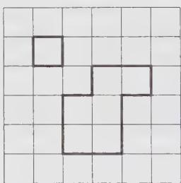  
(a)

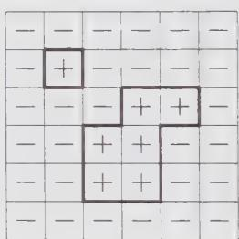  
(b)  
Figure 12.1. A typical term in the high- and low-temperature expansions of the Ising model. We display in (a) a loop configuration on the square lattice, with contribution $[2\cosh K]^{NM}[\tanh K]^{16}$ in the high-temperature expansion, and in (b) a spin configuration corresponding to the same loop configuration in the low-temperature expansion, with contribution $e^{KNM}e^{-32K}$ .

In the low-temperature phase (large K), a given spin configuration is characterized by the borders of, say, all the spin +1 areas in a spin -1 background. Since the borders form loops, the sum (12.2) can be replaced by

$$
Z _ {\text { low }} = 2 e ^ {N M K} \sum_ {\text { loops }} e ^ {- 2 K (\text { length })}\tag{12.5}
$$

where the contribution of all spins down has been factored out of the sum. The factor 2 accounts for the degeneracy under the reversal of all spins. This is the low-temperature expansion of the Ising model. A typical term in this expansion is illustrated on Fig. 12.1(b).

From expressions (12.4) and (12.5), we see that the two phases are mapped into each other through the identification

$$
e ^ {- 2 K ^ {\prime}} = \tanh K\tag{12.6}
$$

which leads to

$$
Z _ {\text { low }} (K ^ {\prime}) = 2 (\sinh 2 K) ^ {- N M / 2} Z _ {\text { high }} (K)\tag{12.7}
$$

At the phase transition point, where singular behavior is expected in the thermodynamic limit $(N, M \rightarrow \infty)$ , we see that the two couplings K and $K'$ of Eq. (12.6) should be identical, since the r.h.s. and l.h.s. of Eq. (12.7) must become simultaneously singular. This defines the critical coupling

$$
K _ {c} = - \frac {1}{2} \ln (\sqrt {2} - 1) \simeq 0. 4 4 0 6 8 6 \dots\tag{12.8}
$$

as the self-dual point of the duality relation (12.6) between the high- and low-temperature phases of the Ising model.

The duality transformation (12.6) relates the ordered and disordered phases of the Ising model. Actually it enables us to define an operator dual to the spin operator, called the disorder operator and denoted by $\mu$ , as follows.

The correlation of two spin operators sitting at positions $r_1$ and $r_2$ on the lattice, reads

$$
\langle \sigma (r _ {1}) \sigma (r _ {2}) \rangle = \frac {1}{Z} \sum_ {\{\sigma \}} \sigma (r _ {1}) \sigma (r _ {2}) \exp \left\{K \sum_ {\langle i j \rangle} \sigma_ {i} \sigma_ {j} \right\}\tag{12.9}
$$

This is equivalent to picking an arbitrary path of n steps from $r_{1}$ to $r_{2}$ along the lattice bonds and changing the coupling $K \rightarrow K + i\pi/2$ for each bond of the path. Indeed, this introduces a factor $e^{i\pi\sigma_{i}\sigma_{j}/2} = i \sigma_{i}\sigma_{j}$ per bond $\langle ij\rangle$ of the path, leaving us with $i^{n} \sigma(r_{1})\sigma(r_{2})$ , as each intermediary spin $\sigma_{i}$ appears twice and $\sigma_{i}^{2} = 1$ . The result is actually independent, up to a sign, of the path chosen (see Ex. 12.4 for a proof).

In the spirit of the low-temperature expansion (12.5) we can also consider a correlation function of disorder operators $\langle\mu(r_{1})\mu(r_{2})\rangle$ defined as follows. We pick any path from $r_{1}$ to $r_{2}$ and change $K\to-K$ on all the bonds along the path; then we compute the sum over spin configurations as in Eq. (12.2), and normalize the result by dividing it by the partition function Z. This operation yields a result independent of the path (see Ex. 12.5). Actually, it is easy to see that the duality transformation (12.6) maps $\langle\sigma(r_{1})\sigma(r_{2})\rangle$ into $\langle\mu(r_{1})\mu(r_{2})\rangle$ . This is a direct consequence of the transformations

$$
(- K) ^ {*} = K ^ {*} + i \frac {\pi}{2} \quad (K + i \frac {\pi}{2}) ^ {*} = - (K ^ {*})\tag{12.10}
$$

where the duality transformation $*$ is defined by Eq. (12.6):

$$
e ^ {- 2 K ^ {*}} = \tanh K\tag{12.11}
$$

Therefore the high-low temperature duality of the Ising model exchanges the spin and disorder operators $\sigma \leftrightarrow \mu$ .

The actual study of the transition requires much more work. It is far beyond the scope of this chapter to describe the original solution of the model by Onsager, or its modern formulation as a particular case of the eight-vertex model due to Baxter.

As our main task will be the study of the continuum limit of the model, we now briefly exhibit its fermionic character. The spin operator is actually not sufficient to describe the continuum limit of the model. The precise solution of the model involves some nonlocal observables, which are built out of the spin variables along a whole line, which crosses the lattice all the way to its border. This is the fermion operator, built out of the spin operator through the Jordan-Wigner transformation. $^{2}$ Whereas the spin operator is local (only defined at a point), the fermion operator is nonlocal because it depends on the values of the spin operator along a whole line starting from the boundary and ending at a given point. Moreover, the correlation function of two fermion operators must depend on their order of insertion, namely on the relative positions of the two lines defining them. It can be shown that the exchange of their positions results in an overall change of sign of the fermion correlator: this justifies the identification of the basic field in the continuum limit of the critical Ising model with a fermionic field.

Moreover, the exact Jordan-Wigner transformation of the partition function results, in the continuum limit, in a real free-fermion action functional. This action will be the subject of our study for the remainder of this chapter. We stress that, in this description, the spin operator is nonlocal with respect to the fermion operator. Although it does not appear explicitly in the free-fermion action, it has an expression (inverse Jordan-Wigner transformation) in terms of the values of the fermion operators along a line ending at the argument of the operator. The effects of nonlocality appear in the OPE of the spin and fermion operators.

## §12.2. The Underlying Fermionic Theory

As mentioned before, the continuum critical Ising model is described by a free massless real fermion, governed by the action

$$
S = \frac {1}{2 \pi} \int d ^ {2} z (\psi \bar {\partial} \psi + \bar {\psi} \partial \bar {\psi})\tag{12.12}
$$

The above action is conformally invariant and was studied in Sect. 5.3.2. Actually, the vicinity of the critical point is also described by a free fermionic action, but with the addition of a mass term $m\psi \bar{\psi} \propto (K - K_{c})\psi \bar{\psi}$ , which spoils the conformal invariance. Here we concentrate on the massless case only.

The conformally invariant action (12.12) leads to a theory with central charge

$$
c _ {\mathrm{Ising}} = c (4, 3) = \frac {1}{2}\tag{12.13}
$$

and the various operators are identified as

$$
\begin{array}{l l} \text {Fermions:} & \psi (z) \quad \propto \phi_ {(2, 1)} (z) \otimes \phi_ {(1, 1)} (\bar {z}) \\ & \bar {\psi} (\bar {z}) \quad \propto \phi_ {(1, 1)} (z) \otimes \phi_ {(2, 1)} (\bar {z}) \\ \text {Spin:} & \sigma (z, \bar {z}) \propto \phi_ {(1, 2)} (z) \otimes \phi_ {(1, 2)} (\bar {z}) \end{array}\tag{12.14}
$$

## 12.2.1. Fermion: Energy and Energy-Momentum Tensor

As shown in Sect. 5.3.2, the free fermion action (12.12) leads to the following propagators

$$
\begin{array}{r l} \langle \psi (z) \psi (w) \rangle & = \frac {1}{z - w} \\ \langle \bar {\psi} (\bar {z}) \bar {\psi} (\bar {w}) \rangle & = \frac {1}{\bar {z} - \bar {w}} \end{array}\tag{12.15}
$$

Both functions are antisymmetric under the exchange of arguments $z \leftrightarrow w$ (resp. $\bar{z} \leftrightarrow \bar{w}$ ), and exhibit the conformal dimensions of $\psi$ ( $h = \frac{1}{2}, \bar{h} = 0$ ) and $\bar{\psi}$ (h = 0, $\bar{h} = \frac{1}{2}$ ). The energy operator is just a composite of the two fermionic fields (with $h = \bar{h} = \frac{1}{2}$ ), namely $^{3}$

$$
\varepsilon (z, \bar {z}) = i: \psi \bar {\psi}: \propto \phi_ {(2, 1)} (z) \otimes \phi_ {(2, 1)} (\bar {z})\tag{12.16}
$$

with the usual convention for the normal-ordered product. The normal ordering is, however, purely formal here, as the OPE of $\psi$ and $\bar{\psi}$ is regular.

The correlation functions of the energy operator on the plane are easily derived by means of the fermionic version of Wick's theorem. Since the latter involves only pairings of the fermion operators, only correlators of an even number of energy operators survive. This is a manifestation of an underlying $Z_{2}$ symmetry under which the sign of the energy operator is reversed $\varepsilon \rightarrow -\varepsilon$ . This symmetry indeed reflects the high-low temperature duality discussed above: slightly away from criticality, the Ising action (12.12) acquires a mass term

$$
i m \int \psi (z) \bar {\psi} (\bar {z}) \propto (K - K _ {c}) \int \varepsilon (z, \bar {z})\tag{12.17}
$$

This can be viewed as a perturbation of the free theory by the energy operator $\varepsilon$ . For $K \simeq K_{c}$ , the high-low temperature duality (12.6) just amounts to $K^{*} - K_{c} = K_{c} - K$ , that is, a change of sign in the perturbation, which can be absorbed into a change of sign of the energy operator. We thus wish to compute

$$
\begin{array}{r c l} E _ {2 n} & = & \langle \varepsilon (z _ {1}, \bar {z} _ {1}) \dots \varepsilon (z _ {2 n}, \bar {z} _ {2 n}) \rangle \\ & = & (- 1) ^ {n} \langle \psi (z _ {1}) \bar {\psi} (\bar {z} _ {1}) \dots \psi (z _ {2 n}) \bar {\psi} (\bar {z} _ {2 n}) \rangle \\ & = & \langle \psi (z _ {1}) \dots \psi (z _ {2 n}) \rangle \langle \bar {\psi} (\bar {z} _ {1}) \dots \bar {\psi} (\bar {z} _ {2 n}) \rangle \end{array}\tag{12.18}
$$

where we used the decoupling and anticommutation of $\psi$ and $\bar{\psi}$ to factorize the correlator into holomorphic $\times$ antiholomorphic parts (the $(-1)^n$ disappeared in the third line after grouping the holomorphic fields together). According to Wick's theorem, we have to sum over all the possible pairings of fermionic operators $\psi$ (resp. $\bar{\psi}$ ), and weigh the contribution of each pairing with the signature of the corresponding permutation. We end up with

$$
E _ {2 n} = \mathrm{Pf} \big [ \langle \psi (z _ {i}) \psi (z _ {j}) \rangle \big ] _ {1 \leq i, j \leq 2 n} \times \mathrm{Pf} \big [ \langle \bar {\psi} (\bar {z} _ {i}) \bar {\psi} (\bar {z} _ {j}) \rangle \big ] _ {1 \leq i, j \leq 2 n}\tag{12.19}
$$

where we used the notation $\mathrm{Pf}(A)$ for the Pfaffian of a $(2n)\times(2n)$ antisymmetric matrix $A_{ij}=-A_{ji}$ , defined as $^{4}$

$$
\operatorname{Pf} (A) = \frac {1}{n ! 2 ^ {n}} \sum_ {\pi \in S _ {2 n}} \operatorname{sgn} (\pi) \prod_ {i = 1} ^ {n} A _ {\pi (2 i - 1), \pi (2 i)}\tag{12.20}
$$

where the sum extends over the permutation group of the 2n indices, $S_{2n}$ , and $\operatorname{sgn}(\pi)$ denotes the signature of the permutation $\pi$ . The prefactor avoids overcounting pairs. In Eq. (12.19), it is understood that the matrix $A_{ij} = \langle \psi(z_i) \psi(z_j) \rangle$ has vanishing diagonal elements. By using the propagators (12.15), we finally obtain

$$
\langle \varepsilon (z _ {1}, \bar {z} _ {1}) \dots \varepsilon (z _ {2 n}, \bar {z} _ {2 n}) \rangle = \left| \operatorname{Pf} \left[ \frac {1}{z _ {i} - z _ {j}} \right] _ {1 \leq i, j \leq 2 n} \right| ^ {2}\tag{12.21}
$$

The energy-momentum tensor for the real free fermion reads

$$
\begin{array}{l} T (z) = - \frac {1}{2}: \psi (z) \partial_ {z} \psi (z): \\ = - \frac {1}{2} \lim _ {w \to z} \left[ \frac {1}{2} (\psi (z) \partial_ {w} \psi (w) - \partial_ {z} \psi (z) \psi (w)) - \frac {1}{(z - w) ^ {2}} \right] \end{array}\tag{12.22}
$$

and a similar expression for $\bar{T}$ in terms of $\bar{\psi}$ . Here the normal ordering prescription amounts to subtracting the divergence when the two points z and w coincide. It is easy to recover the Ward identities (5.41) of Chap. 5 expressing the insertion of the energy-momentum operator in an energy correlator by direct use of Wick's theorem (see Ex. 12.6 below).

## 12.2.2. Spin

The spin operator $\sigma(z,\bar{z})$ is in many respects more subtle to deal with. From the knowledge of its conformal dimensions $\bar{h}=\bar{h}=1/16$ , we immediately write the two-point correlator

$$
\langle \sigma (z _ {1}, \bar {z} _ {1}) \sigma (z _ {2}, \bar {z} _ {2}) \rangle = \frac {1}{| z _ {1} - z _ {2} | ^ {\frac {1}{4}}}\tag{12.23}
$$

The $Z_{2}$ symmetry of the Ising model (under reversal of all spins) implies that the correlators should all be invariant under the change $\sigma \rightarrow -\sigma$ . Hence only the correlators involving an even number of spin operators will survive. To compute higher-order correlators, we need the OPE of the various fields. The fusion rules predicted by conformal theory, namely

$$
\sigma \sigma \rightarrow \mathbb {I} + \varepsilon \qquad \varepsilon \varepsilon \rightarrow \mathbb {I}\tag{12.24}
$$

are expressed as

$$
\begin{array}{l} \varepsilon (z, \bar {z}) \varepsilon (w, \bar {w}) = \frac {1}{| z - w | ^ {2}} + \dots \\ \sigma (z, \bar {z}) \sigma (w, \bar {w}) = \frac {1}{| z - w | ^ {\frac {1}{4}}} + C _ {\sigma \sigma \varepsilon} | z - w | ^ {\frac {3}{4}} \varepsilon (w, \bar {w}) + \dots \end{array}\tag{12.25}
$$

The structure constant $C_{\sigma\sigma\varepsilon}$ will be computed later as a limit of the four-spin correlator. The OPE with fermion operators expected from the statistical-model analysis read (up to some multiplicative factors, which will be derived later)

$$
\begin{array}{l} \psi (z) \sigma (w, \bar {w}) \sim \frac {1}{(z - w) ^ {\frac {1}{2}}} \mu (w, \bar {w}) \\ \bar {\psi} (\bar {z}) \mu (w, \bar {w}) \sim \frac {1}{(\bar {z} - \bar {w}) ^ {\frac {1}{2}}} \sigma (w, \bar {w}) \end{array}\tag{12.26}
$$

where $\mu$ denotes the disorder operator dual to the spin operator. $\mu$ has the same OPE and conformal dimensions as $\sigma$ , except for a sign: $C_{\mu\mu\varepsilon} = -C_{\sigma\sigma\varepsilon}$ , since the sign of the thermal operator $\varepsilon$ must change in the duality transformation. The relative nonlocality of the fermion and spin operators translates into the noninteger power ( $\frac{1}{2}$ ) of the singular term. Inside a correlator, circulating the argument of the fermion around that of the spin, will result in a phase $e^{2i\pi/2} = -1$ , hence a global change of sign.

We now illustrate the use of the OPE (12.26) in the computation of the mixed correlator

$$
G (z, w | z _ {1}, \bar {z} _ {1}, z _ {2}, \bar {z} _ {2}) = \frac {\langle \psi (z) \psi (w) \sigma (z _ {1} , \bar {z} _ {1}) \sigma (z _ {2} , \bar {z} _ {2}) \rangle}{\langle \sigma (z _ {1} , \bar {z} _ {1}) \sigma (z _ {2} , \bar {z} _ {2}) \rangle}\tag{12.27}
$$

When $z \to w$ , we should get the limit

$$
G \rightarrow \frac {1}{z - w}\tag{12.28}
$$

When $z \to z_1$ , we have

$$
G \rightarrow \frac {1}{(z - z _ {1}) ^ {\frac {1}{2}} | z _ {1} - z _ {2} | ^ {\frac {1}{4}}} \langle \psi (w) \mu (z _ {1}, \bar {z} _ {1}) \sigma (z _ {2}, \bar {z} _ {2}) \rangle\tag{12.29}
$$

and a similar expression when $z \rightarrow z_{2}$ . Moreover, G must be antisymmetric under the exchange of $z \leftrightarrow w$ . These properties fix the function G. By global conformal invariance, $(z - w)G$ must be a function of the cross ratio of the four points. The precise dependence on the cross-ratio is completely determined by the above limits and the fact that G is antisymmetric under the exchange $z \leftrightarrow w$ . We find

$$
G = \frac {1}{2 (z - w)} \left[ \sqrt {\frac {(z - z _ {1}) (w - z _ {2})}{(z - z _ {2}) (w - z _ {1})}} + \sqrt {\frac {(z - z _ {2}) (w - z _ {1})}{(z - z _ {1}) (w - z _ {2})}} \right]\tag{12.30}
$$

As a nontrivial check of the coherence of the theory, we recover the dimension $h_{\sigma} = 1/16$ of the spin operator by computing

$$
\frac {\langle T (z) \sigma \left(z _ {1} , \bar {z} _ {1}\right) \sigma \left(z _ {2} , \bar {z} _ {2}\right) \rangle}{\langle \sigma \left(z _ {1} , \bar {z} _ {1}\right) \sigma \left(z _ {2} , \bar {z} _ {2}\right) \rangle} = - \frac {1}{4} \lim _ {z \rightarrow w} \left(\partial_ {w} G - \partial_ {z} G - \frac {1}{(z - w) ^ {2}}\right)\tag{12.31}
$$

and taking the $z \rightarrow z_{1}$ limit, with the leading term identified as

$$
\frac {h _ {\sigma}}{(z - z _ {1})}\tag{12.32}
$$

A direct way of computing more general correlators is by solving the differential equations they satisfy. We recall that these differential equations are consequences of the singular vector structure of the Verma modules associated with the primary fields $\varepsilon,\sigma$ . Actually, both the energy and the spin fields are degenerate at level 2, so that the associated highest weight vectors $|h\rangle$ have to satisfy the null vector condition

$$
\left[ L _ {- 2} - \frac {3}{2 (2 h + 1)} L _ {- 1} ^ {2} \right] | h \rangle = 0\tag{12.33}
$$

with

$$
h _ {\varepsilon} = h _ {2, 1} = \frac {1}{2} \quad h _ {\sigma} = h _ {1, 2} = \frac {1}{1 6}\tag{12.34}
$$

Combined with the Ward identity (5.41), this yields a second-order differential equation of the form (8.71) for any correlator involving $\varepsilon$ or $\sigma$ (see Ex. 12.8 for an illustrative example). But, instead of pursuing this rather technical program, we present below a simpler alternative for computing Ising correlators on the plane.

## §12.3. Correlation Functions on the Plane by Bosonization

## 12.3.1. The Bosonization Rules

The superposition of two critical continuum Ising models on the same square lattice must have central charge $c = \frac{1}{2} + \frac{1}{2} = 1$ . Indeed, since the two theories do not interact with each other, the total energy-momentum tensor is the sum of the energy-momentum tensors of each theory, and the central charges simply add up. This is the essence of the bosonization of the Ising model: to take two copies of the Ising model and to find a description of all the operators in terms of the free bosonic field at c = 1.

One way of explicitly realizing this is to consider the theory of a free Dirac (complex) fermion,

$$
\mathcal {D} (z, \bar {z}) = \binom{D (z)}{\bar {D} (\bar {z})} = \frac {1}{\sqrt {2}} \binom{\psi_ {1} + i \psi_ {2}}{\bar {\psi} _ {1} + i \bar {\psi} _ {2}}\tag{12.35}
$$

the components of which are expressed in terms of two real fermions (indexed by 1 and 2). This theory is conformally invariant, with central charge c = 1: its energy-momentum tensor T is the sum of the energy-momentum tensors associated with the real fermions $\psi_{1}$ and $\psi_{2}$ (cf. Ex. 5.5):

$$
T (z) = \frac {1}{2} (\partial D ^ {\dagger} D - D ^ {\dagger} \partial D) = - \frac {1}{2} \psi_ {1} \partial \psi_ {1} - \frac {1}{2} \psi_ {2} \partial \psi_ {2}\tag{12.36}
$$

where $D^{\dagger}(z)=(\psi_{1}-i\psi_{2})/\sqrt{2}$ .

Since the Dirac fermion is a c = 1 theory, a relation with the free boson may seem reasonable. Such a representation of the free complex fermion in terms of a free boson is the object of bosonization. We write

$$
D (z) = e ^ {i \phi (z)} \qquad \bar {D} (\bar {z}) = e ^ {i \bar {\phi} (\bar {z})}\tag{12.37}
$$

where $\phi(z)$ is a chiral (holomorphic) bosonic field with propagator

$$
\langle \phi (z) \phi (0) \rangle = - \ln z\tag{12.38}
$$

The fields $\phi$ and $\bar{\phi}$ are the chiral components of the free boson of Sect. 6.3: $^{5}$

$$
\varphi (z, \bar {z}) = \phi (z) - \bar {\phi} (\bar {z}) \qquad \langle \varphi (z, \bar {z}) \varphi (w, \bar {w}) \rangle = - \ln | z - w | ^ {2}\tag{12.39}
$$

The properties of the chiral vertex operator $e^{i\alpha\phi(z)}$ are those found in Sect. 6.3, except that they pertain to the holomorphic sector only: its conformal dimension is $\frac{1}{2}\alpha^{2}$ (with the normalization chosen above for the propagator) and its OPE is

$$
e ^ {i \alpha \phi (z)} e ^ {i \beta \phi (w)} \sim e ^ {i (\alpha \phi (z) + \beta \phi (w))} (z - w) ^ {\alpha \beta}\tag{12.40}
$$

The vertex operators of Eq. (12.37) have conformal dimensions $\left(\frac{1}{2},0\right)$ and $(0,\frac{1}{2})$ respectively and their OPEs are indeed compatible with those of complex fermions:

$$
\begin{array}{c} e ^ {i \phi (z)} e ^ {i \phi (w)} \sim e ^ {i (\phi (z) + \phi (w))} (z - w) \\ e ^ {i \phi (z)} e ^ {- i \phi (w)} \sim e ^ {i (\phi (z) - \phi (w))} \frac {1}{z - w} \end{array}\tag{12.41}
$$

In the limit $z \to w$ , the first equation corresponds to $D(z)^2 = 0$ , whereas the second gives

$$
D (z) D ^ {\dagger} (w) \sim \frac {1}{z - w} + i \partial \phi (w)\tag{12.42}
$$

The relation between the Dirac fermion and the boson $\varphi$ may also be expressed in terms of the Dirac current $J^{\mu}$ :

$$
J ^ {\mu} = \bar {\mathcal {D}} \gamma^ {\mu} \mathcal {D} = i \varepsilon^ {\mu \nu} \partial_ {\nu} \varphi\tag{12.43}
$$

where $\bar{D} = D^{\dagger}\gamma^{0}$ . Indeed, if we adopt the convention of Sect. 5.3.2 for Dirac matrices, then

$$
\begin{array}{r} J ^ {0} = i \psi_ {1} \psi_ {2} + i \bar {\psi} _ {1} \bar {\psi} _ {2} \\ J ^ {1} = - \psi_ {1} \psi_ {2} + \bar {\psi} _ {1} \bar {\psi} _ {2} \end{array}\tag{12.44}
$$

But

$$
\begin{array}{l} \psi_ {1} (z) \psi_ {2} (z) = - \frac {1}{2} i (D ^ {\dagger} (z) D (z) - D (z) D ^ {\dagger} (z)) \\ \qquad = - \frac {1}{2} i \lim _ {w \to z} \left\{e ^ {- i \phi (z)} e ^ {i \phi (w)} - e ^ {i \phi (z)} e ^ {- i \phi (w)} \right\} \\ \qquad = i \partial \phi (z) \end{array}\tag{12.45}
$$

and, likewise, $\bar{\psi}_1\bar{\psi}_2 = i\bar{\partial}\bar{\phi}$ . Therefore, the holomorphic components of the current are (cf. Eqs. (5.7) and (5.8))

$$
J _ {z} = \frac {1}{2} (J ^ {0} - i J ^ {1}) = - \partial \phi = - \partial \varphi\tag{12.46}
$$

$$
J _ {\bar {z}} = \frac {1}{2} (J ^ {0} + i J ^ {1}) = - \bar {\partial} \bar {\phi} = + \bar {\partial} \varphi
$$

This confirms Eq. (12.43).

## 12.3.2. Energy Correlators

Two different mass terms may be considered for the Dirac fermion D. The usual Dirac mass term is

$$
\bar {\mathcal {D}} \mathcal {D} = \mathcal {D} \gamma^ {0} \mathcal {D} = D ^ {\dagger} \bar {D} + \bar {D} ^ {\dagger} D = i (\psi_ {1} \bar {\psi} _ {2} + \bar {\psi} _ {1} \psi_ {2})\tag{12.47}
$$

On the other hand, another (pseudoscalar) mass term exists:

$$
\bar {\mathcal {D}} \gamma^ {5} \mathcal {D} = \mathcal {D} \gamma^ {0} \gamma^ {5} \mathcal {D} = D ^ {\dagger} \bar {D} - \bar {D} ^ {\dagger} D = - (\psi_ {1} \bar {\psi} _ {1} + \psi_ {2} \bar {\psi} _ {2})\tag{12.48}
$$

where $\gamma^{5} \equiv i\gamma^{0}\gamma^{1} = -\sigma_{3}$ . This mass term is proportional to the total energy operator of the two copies of the Ising model:

$$
\varepsilon_ {1} + \varepsilon_ {2} = i (\psi_ {1} \bar {\psi} _ {1} + \psi_ {2} \bar {\psi} _ {2}) = - i \bar {\mathcal {D}} \gamma^ {5} \mathcal {D}\tag{12.49}
$$

On the other hand,

$$
\begin{array}{r l} - i \bar {\mathcal {D}} \gamma^ {5} \mathcal {D} & = - i (D ^ {\dagger} \bar {D} - \bar {D} ^ {\dagger} D) \\ & = - i (D ^ {\dagger} \bar {D} + D \bar {D} ^ {\dagger}) \\ & = - i \left(e ^ {- i \phi} e ^ {i \bar {\phi}} + e ^ {i \phi} e ^ {- i \bar {\phi}}\right) \\ & = - 2 i \cos \varphi (z, \bar {z}) \end{array}\tag{12.50}
$$

Hence we may represent the correlation functions of the energy operator using the bosonic field $\varphi$ in the form

$$
\langle (\varepsilon_ {1} + \varepsilon_ {2}) (z _ {1}, \bar {z} _ {1}) \dots (\varepsilon_ {1} + \varepsilon_ {2}) (z _ {2 n}, \bar {z} _ {2 n}) \rangle = M _ {n} \left\langle \prod_ {i = 1} ^ {2 n} \cos \varphi (z _ {i}, \bar {z} _ {i}) \right\rangle\tag{12.51}
$$

Of course, the mixed correlators of $\varepsilon_{1}$ and $\varepsilon_{2}$ factorize into a product of correlators pertaining to each Ising model. Hence, the l.h.s. of Eq. (12.51) decomposes into a sum of products of energy correlators of each theory. The normalization factor $M_{n}$ is fixed by the short-distance limits (see Ex. 12.9).

There is a more direct relation between the energy correlators of the Ising model and those of the free field $\varphi$ , which uses the result (12.19). Guided by the idea of duplication of the Ising model in order to bosonize it, we compute the square of the energy correlator

$$
\langle \varepsilon (z _ {1}, \bar {z} _ {1}) \dots \varepsilon (z _ {2 n}, \bar {z} _ {2 n}) \rangle^ {2} = \left| \operatorname{Pf} \left[ \frac {1}{z _ {i} - z _ {j}} \right] \right| ^ {4}\tag{12.52}
$$

The square of the Pfaffian of an antisymmetric matrix $A$ is equal to its determinant. Actually we can write

$$
\det \left[ \frac {1}{z _ {i} - z _ {j}} \right] = \operatorname{Pf} ^ {2} \left[ \frac {1}{z _ {i} - z _ {j}} \right] = \operatorname{Hf} \left[ \frac {1}{(z _ {i} - z _ {j}) ^ {2}} \right]\tag{12.53}
$$

where $\mathrm{Hf}(B)$ denotes the Haffnian $^{6}$ of a symmetric matrix B

$$
\operatorname{Hf} (B) = \frac {1}{2 ^ {n} n !} \sum_ {\sigma \in S _ {2 n}} \prod_ {i = 1} ^ {n} B _ {\sigma (2 i - 1) \sigma (2 i)}\tag{12.54}
$$

The Haffnian expression for Eq. (12.52) enables us to rewrite the square of Eq. (12.19) as the free-field correlator

$$
\langle \varepsilon (z _ {1}, \bar {z} _ {1}) \dots \varepsilon (z _ {2 n}, \bar {z} _ {2 n}) \rangle^ {2} = P _ {n} \left\langle \prod_ {i = 1} ^ {2 n} (\nabla \varphi / 2) ^ {2} (z _ {i}, \bar {z} _ {i}) \right\rangle
$$

(12.55)

where

$$
(\nabla \varphi / 2) ^ {2} = \partial \varphi \bar {\partial} \varphi\tag{12.56}
$$

Again, the normalization factor $P_{n}$ is fixed by the short-distance behavior. This suggests that the composite energy operator $\varepsilon_{1} \times \varepsilon_{2}$ should be identified with the operator $(\nabla\varphi)^{2}$ in the bosonized Dirac theory. Indeed, a correlator of composite energies factorizes into the product of the corresponding correlators in the two Ising theories

$$
\begin{array}{r l} \langle \varepsilon_ {1} \varepsilon_ {2} (1) \dots \varepsilon_ {1} \varepsilon_ {2} (2 n) \rangle & = \langle \varepsilon_ {1} (1) \dots \varepsilon_ {1} (2 n) \rangle \times \langle \varepsilon_ {2} (1) \dots \varepsilon_ {2} (2 n) \rangle \\ & = \langle \varepsilon (1) \dots \varepsilon (2 n) \rangle^ {2} \end{array}\tag{12.57}
$$

The identification of $\varepsilon_{1}\varepsilon_{2}$ with $\partial\varphi\partial\varphi$ may also be obtained directly from the bosonization procedure. Since $\psi_{1}\psi_{2}=i\partial\phi$ , we find

$$
\begin{array}{c} \varepsilon_ {1} \varepsilon_ {2} = (i \psi_ {1} \bar {\psi} _ {1}) (i \psi_ {2} \bar {\psi} _ {2}) = \psi_ {1} \psi_ {2} \bar {\psi} _ {1} \bar {\psi} _ {2} \\ = - \partial \phi \bar {\partial} \bar {\phi} = \partial \varphi \bar {\partial} \varphi \end{array}\tag{12.58}
$$

## 12.3.3. Spin and General Correlators

A careful study of the Jordan-Wigner transformation (see Ex. 12.2) enables us to rewrite the correlation function of spin operators directly in terms of the bosonic field $\varphi$ . We do not work out the detail of this calculation here, but simply give the result. The spin-spin correlation function actually appears only squared, because of the duplication of the model, just like in the energy case: the correlation functions of the composite spin operator $\sigma_{1} \times \sigma_{2}$ factorize into a product of the correlators for each Ising theory. The result reads

$$
\langle \sigma (z, \bar {z}) \sigma (w, \bar {w}) \rangle^ {2} = N _ {1} \left\langle \cos \frac {\varphi}{2} (z, \bar {z}) \cos \frac {\varphi}{2} (w, \bar {w}) \right\rangle\tag{12.59}
$$

By using the free-field propagator (12.39) and the spin-spin OPE, we can fix the normalization constant $N_{1} = 2$ and recover

$$
\langle \sigma (z, \bar {z}) \sigma (w, \bar {w}) \rangle^ {2} = \frac {1}{| z - w | ^ {\frac {1}{2}}}\tag{12.60}
$$

This generalizes to

$$
\begin{array}{l}\langle \sigma (z_{1},\bar{z}_{1})\dots \sigma (z_{2n},\bar{z}_{2n})\rangle^{2} = N_{n}\left\langle \prod_{j = 1}^{2n}\cos \frac{\varphi}{2} (z_{j},\bar{z}_{j})\right\rangle \\ = \frac{N_{n}}{2^{2n}}\left\langle \prod_{j = 1}^{2n}(e^{i\varphi (j) / 2} + e^{-i\varphi (j) / 2})\right\rangle \\ = \frac{N_{n}}{2^{2n}}\sum_{\substack{\varepsilon_{i} = \pm 1\\ \Sigma \varepsilon_{i} = 0}}\prod_{i <   j}|z_{i} - z_{j}|^{\varepsilon_{i}\varepsilon_{j} / 2} \end{array}\tag{12.61}
$$

where we used the notation $\varphi(j) \equiv \varphi(z_j, \bar{z}_j)$ , and the last equation is simply the sum over all the charge-neutral products of vertex operators, computed by Wick's theorem. The overall normalization is fixed to

$$
N _ {n} = 2 ^ {n}\tag{12.62}
$$

by the OPE. Note that we did not use all the information contained in the OPE (12.25). Actually we can compute the structure constant $C_{\sigma\sigma\varepsilon}$ from the above result (12.61). We take the four-spin correlator (n = 2) and let $z_{1} \rightarrow z_{2}$ and $z_{3} \rightarrow z_{4}$ , then $^{7}$

$$
\begin{array}{l} \langle \sigma (z _ {1}, \bar {z} _ {1}) \sigma (z _ {2}, \bar {z} _ {2}) \sigma (z _ {3}, \bar {z} _ {3}) \sigma (z _ {4}, \bar {z} _ {4}) \rangle^ {2} \\ = \frac {1}{2} \frac {| z _ {1 3} z _ {2 4} | ^ {\frac {1}{2}}}{| z _ {1 4} z _ {2 3} z _ {1 2} z _ {3 4} | ^ {\frac {1}{2}}} \left[ 1 + \frac {| z _ {1 2} z _ {3 4} |}{| z _ {1 3} z _ {2 4} |} + \frac {| z _ {1 4} z _ {2 3} |}{| z _ {1 3} z _ {2 4} |} \right] \\ \simeq \frac {1}{| z _ {1 2} z _ {3 4} | ^ {\frac {1}{2}}} \left[ 1 + \frac {1}{2} \frac {| z _ {1 2} z _ {3 4} |}{| z _ {2 4} | ^ {2}} \right] \\ = \frac {1}{| z _ {1 2} z _ {3 4} | ^ {\frac {1}{2}}} \left[ C _ {\sigma \sigma \mathbb {I}} ^ {2} + 2 | z _ {1 2} z _ {3 4} | C _ {\sigma \sigma \varepsilon} ^ {2} \langle \varepsilon (z _ {2}, \bar {z} _ {2}) \varepsilon (z _ {4}, \bar {z} _ {4}) \rangle \right] \end{array}\tag{12.63}
$$

This shows that $C_{\sigma \sigma \mathbb{I}}^2 = 1$ and $C_{\sigma \sigma \varepsilon}^2 = 1 / 4$ . Hence, up to a multiplicative redefinition of the operator $\varepsilon$ , we find

$$
C _ {\sigma \sigma \mathbb {I}} = 1 \quad \text { and } \quad C _ {\sigma \sigma \varepsilon} = \frac {1}{2}\tag{12.64}
$$

The high-low temperature duality of the Ising model reverses the sign of the energy operator, whereas it exchanges spin and disorder operators. It is therefore easily identified as $\varphi \rightarrow \pi - \varphi$ in the bosonized Dirac fermion theory. Consequently, replacing $\sigma$ by $\mu$ in the square of a correlator just amounts to replacing $\cos\varphi/2 \rightarrow \sin\varphi/2$ in the corresponding free-field correlator. This results in

$$
\begin{array}{l}\langle \sigma (z_{1},\bar{z}_{1})\dots \sigma (z_{2n},\bar{z}_{2n})\mu (w_{1},\bar{w}_{1})\dots \mu (w_{2m},\bar{w}_{2m})\rangle^{2}\\ = 2^{n + m}\left\langle \prod_{i = 1}^{2n}\cos \frac{\varphi}{2} (z_{i},\bar{z}_{i})\prod_{j = 1}^{2m}\sin \frac{\varphi}{2} (w_{j},\bar{w}_{j})\right\rangle \\ = \frac{(-1)^{m}}{2^{n + m}}\sum_{\substack{\varepsilon_{i},\eta_{k} = \pm 1\\ \Sigma \varepsilon_{i} + \Sigma \eta_{k} = 0}}\prod_{k}\eta_{k}\prod_{i <   j}|z_{i} - z_{j}|^{\varepsilon_{i}\varepsilon_{j} / 2}\\ \times \prod_{k <   l}|w_{k} - w_{l}|^{\eta_{k}\eta_{l} / 2}\prod_{r,s}|z_{r} - w_{s}|^{\varepsilon_{r}\eta_{s} / 2} \end{array}\tag{12.65}
$$

For example, in the case $m = n = 1$ , we find (see also Eq. (5.31))

$$
\begin{array}{l} \langle \sigma (z _ {1}, \bar {z} _ {1}) \mu (z _ {2}, \bar {z} _ {2}) \sigma (z _ {3}, \bar {z} _ {3}) \mu (z _ {4}, \bar {z} _ {4}) \rangle^ {2} \\ = \frac {1}{2} \frac {| z _ {1 3} z _ {2 4} | ^ {\frac {1}{2}}}{| z _ {1 4} z _ {2 3} z _ {1 2} z _ {3 4} | ^ {\frac {1}{2}}} \left[ - 1 + \frac {| z _ {1 2} z _ {3 4} |}{| z _ {1 3} z _ {2 4} |} + \frac {| z _ {1 4} z _ {2 3} |}{| z _ {1 3} z _ {2 4} |} \right] \end{array}\tag{12.66}
$$

We note the change of sign for the first term when compared to the four-spin result (12.63). This again teaches us something about the OPE of $\sigma$ and $\mu$ . Considering for instance the above expression in the limit $z_{1} \rightarrow z_{2}$ and $z_{3} \rightarrow z_{4}$ , we find

$$
\sigma (z, \bar {z}) \mu (w, \bar {w}) = \frac {e ^ {i \pi / 4} (z - w) ^ {\frac {1}{2}} \psi (w) + e ^ {- i \pi / 4} (\bar {z} - \bar {w}) ^ {\frac {1}{2}} \bar {\psi} (\bar {w})}{\sqrt {2} | z - w | ^ {\frac {1}{4}}} + \dots\tag{12.67}
$$

Using the associativity of the OPE, we deduce the exact multiplicative normalization factors in the OPE (12.26), which read

$$
\begin{array}{r l} & {\psi (z) \sigma (w, \bar {w}) = \frac {e ^ {i \pi / 4}}{\sqrt {2} (z - w) ^ {\frac {1}{2}}} \mu (w, \bar {w})} \\ & {\psi (z) \mu (w, \bar {w}) = \frac {e ^ {- i \pi / 4}}{\sqrt {2} (z - w) ^ {\frac {1}{2}}} \sigma (w, \bar {w})} \\ & {\bar {\psi} (\bar {z}) \sigma (w, \bar {w}) = \frac {e ^ {- i \pi / 4}}{\sqrt {2} (\bar {z} - \bar {w}) ^ {\frac {1}{2}}} \mu (w, \bar {w})} \\ & {\bar {\psi} (\bar {z}) \mu (w, \bar {w}) = \frac {e ^ {i \pi / 4}}{\sqrt {2} (\bar {z} - \bar {w}) ^ {\frac {1}{2}}} \sigma (w, \bar {w})} \end{array}\tag{12.68}
$$

Note that the phase factors agree with the definition of the energy operator as $\varepsilon = i: \psi \bar{\psi}$ , and guarantee that the operators $\varepsilon, \sigma$ , and $\mu$ are real. For instance, we recover

$$
\begin{array}{l} \varepsilon (z, \bar {z}) \sigma (w, \bar {w}) = i \psi (z) [ \bar {\psi} (\bar {z}) \sigma (w, \bar {w}) ] \\ = i \psi (z) \frac {e ^ {- i \pi / 4}}{(\bar {z} - \bar {w}) ^ {\frac {1}{2}}} \mu (w, \bar {w}) \\ = i \frac {e ^ {- i \pi / 4}}{\sqrt {2} (\bar {z} - \bar {w}) ^ {\frac {1}{2}}} [ \psi (z) \mu (w, \bar {w}) ] \\ = i \frac {e ^ {- i \pi / 4}}{\sqrt {2} (\bar {z} - \bar {w}) ^ {\frac {1}{2}}} \frac {e ^ {- i \pi / 4}}{\sqrt {2} (z - w) ^ {\frac {1}{2}}} \sigma (w, \bar {w}) \\ = \frac {1}{2 | z - w |} \sigma (w, \bar {w}) \end{array}\tag{12.69}
$$

hence $C_{\varepsilon\sigma}^{\sigma} = \frac{1}{2}$ .

The bosonization formulae for the Ising correlation functions may be summarized in a unique equation

$$
\begin{array}{l} \langle \sigma (1) \dots \sigma (2 m) \mu (2 m + 1) \dots \mu (2 n) \varepsilon (2 n + 1) \dots \varepsilon (2 n + p) \rangle^ {2} \\ = N _ {n, p} \left\langle \prod_ {i = 1} ^ {2 m} \cos \frac {\varphi}{2} (i) \prod_ {j = 2 m + 1} ^ {2 n} \sin \frac {\varphi}{2} (j) \prod_ {k = 2 n + 1} ^ {2 n + p} (\nabla \varphi / 2) ^ {2} (k) \right\rangle \end{array}\tag{12.70}
$$

where we used again the notation $\sigma(j) \equiv \sigma(z_j, \bar{z}_j)$ and similarly for $\mu$ and $\varepsilon$ . The normalization factor is again fixed to be

$$
N _ {n, p} = (- 1) ^ {p} 2 ^ {n}\tag{12.71}
$$

by the short-distance limit.

## §12.4. The Ising Model on the Torus

So far we have dealt with the Ising theory only on the complex plane. However, with this completely solvable case, it is interesting to study the effect of finite geometry. Actually, numerical calculations for spin models are always carried out, using the transfer matrix method, on strips of finite width (related to the size of the transfer matrix). If no transfer matrix is available, the calculations must be performed on some finite rectangle of size, say, $N \times M$ . In each case, various boundary conditions can be imposed.

In fact, we can define the square Ising model on any closed Riemann surface by replacing the surface by a “quadrangulation”, namely, a tessellation with possibly slightly deformed squares, which wraps around the handles of the surface, incorporating thus the effect of topology. To include also the effects of curvature, a given vertex of the tessellation may be common to an arbitrary number of deformed squares (not necessarily 4; for instance, a vertex common to only 3 squares in the tessellation looks like the vertex of a cube and therefore indicates some positive curvature, whereas a vertex common to 5 or more squares indicates negative curvature). Such spin models are instrumental in investigations of quantum gravity, more precisely of the coupling of a matter theory (here the Ising model) to fluctuations of space-time geometry (topology and curvature). These are actually toy models for quantum string theory. In this sense, conformal theories on the plane are often considered as string vacua, namely the nonfluctuating flat space version of some string theories.

The simplest example of a surface with nontrivial topology (one handle) is the torus or, equivalently, a parallelogram with doubly periodic boundary conditions (cf. Chap. 10). One example is the rectangle of $N \times M$ bonds with the identification of the N horizontal bonds at the top and bottom of the rectangle and the identification of the M vertical ones at the left and right of the rectangle. Such a torus is parametrized by a complex parameter, $\tau = iM/N$ . When taking a suitable thermodynamic limit $(M, N \rightarrow \infty, M/N \text{ finite})$ , we end up with a continuum model with doubly periodic boundary conditions on the fields. The most general torus is characterized by a complex parameter $\tau$ , with Im $\tau > 0$ (a nonvanishing real part of $\tau$ means that the two lines, along which periodic boundary conditions are to be taken, form an angle $\alpha \neq \pi/2$ ).

## 12.4.1. The Partition Function

The partition function of the free real fermion on the torus was calculated in Chap. 10. We recall some relevant results. Along the two directions of the torus (1 and $\tau$ ), the fermions may have periodic (R) or antiperiodic (NS) boundary conditions. This leads to four sectors denoted by $(v, u)$ , $u, v \in \{0, \frac{1}{2}\}$ , according to the boundary conditions

$$
\psi (z + 1) = e ^ {2 i \pi v} \psi (z) \qquad \psi (z + \tau) = e ^ {2 i \pi u} \psi (z)\tag{12.72}
$$

and hence four contributions $Z_{v,u}$ to the partition function. According to Eq. (10.46), $Z_{0,0}$ vanishes identically, and we are left with

$$
\begin{array}{r l} Z _ {\text {Ising}} & = Z _ {0, \frac {1}{2}} + Z _ {\frac {1}{2}, \frac {1}{2}} + Z _ {\frac {1}{2}, 0} \\ & = \frac {1}{2} \left[ \left| \frac {\theta_ {2} (0 | \tau)}{\eta (\tau)} \right| + \left| \frac {\theta_ {3} (0 | \tau)}{\eta (\tau)} \right| + \left| \frac {\theta_ {4} (0 | \tau)}{\eta (\tau)} \right| \right] \\ & = | \chi_ {1, 1} (\tau) | ^ {2} + | \chi_ {2, 1} (\tau) | ^ {2} + | \chi_ {1, 2} (\tau) | ^ {2} \end{array}\tag{12.73}
$$

The notations for the $\theta$ functions are defined in App. 10.A. The conformal characters of the identity, energy, and spin operators are respectively identified as

$$
\begin{array}{l} \chi_ {1, 1} (\tau) = \frac {1}{2 \sqrt {\eta (\tau)}} \left[ \sqrt {\theta_ {3} (0 | \tau)} + \sqrt {\theta_ {4} (0 | \tau)} \right] \\ \chi_ {2, 1} (\tau) = \frac {1}{2 \sqrt {\eta (\tau)}} \left[ \sqrt {\theta_ {3} (0 | \tau)} - \sqrt {\theta_ {4} (0 | \tau)} \right] \\ \chi_ {1, 2} (\tau) = \frac {1}{\sqrt {2 \eta (\tau)}} \sqrt {\theta_ {2} (0 | \tau)} \end{array}\tag{12.74}
$$

These are also the three conformal blocks of any correlation of the identity operator on the torus.

The vanishing of the partition function $Z_{0,0}$ in the periodic-periodic sector is simply due to the zero-mode of the Laplacian in this sector, namely, the contribution of the Grassmannian integral $\int d\psi_{0}=0$ . However, some correlation functions will receive nonvanishing contributions from this sector whenever some field insertion compensates the zero-mode, simply because $\int\psi_{0}d\psi_{0}=1$ . This is the case for the expectation value of the energy operator in the periodic-periodic sector

$$
Z _ {0, 0} \langle \varepsilon (z, \bar {z}) \rangle_ {0, 0} = \int d \psi d \bar {\psi} \psi \bar {\psi} e ^ {- S}\tag{12.75}
$$

The insertion of the fermions has the effect of canceling exactly the zero-mode contribution n = 0 responsible for the vanishing of $d_{0,0}$ (cf. Eq. (10.46)), and we are left with

$$
\left| d _ {0, 0} ^ {\prime} \right| ^ {2} = \left| q ^ {1 / 2 4} \prod_ {n = 1} ^ {\infty} \left(1 - q ^ {n}\right) \right| ^ {2} = | \eta (\tau) | ^ {2}\tag{12.76}
$$

Conversely, the insertion of $\varepsilon$ introduces zero-modes in the other sectors $(v,u)\neq(0,0)$ , causing their contributions to vanish. As a result, the expectation value of the energy operator receives contributions only from the $(0,0)$ sector, so that

$$
Z _ {\text { Ising }} \langle \varepsilon (z, \bar {z}) \rangle \propto | \eta (\tau) | ^ {2}\tag{12.77}
$$

We note that the expectation value (12.77) is identified with the modulus square of the only conformal block of the one-point function of the energy on the torus, namely

$$
\eta (\tau) = \bigcirc_ {\sigma} ^ {\varepsilon}\tag{12.78}
$$

also expressing the fusion rule $\sigma \times \sigma \rightarrow \varepsilon$ . In general, all four sectors are expected to contribute to correlation functions.

## 12.4.2. General Ward Identities on the Torus

The conformal Ward identity (5.41) of Chap. 5 admits an extension on any Riemann surface. It expresses the transformation of correlators under a change of coordinates. On the torus, two new ingredients must be incorporated: (i) since the correlation functions are now elliptic (doubly periodic) functions, short-distance singularities give rise to an infinite number of poles on a doubly periodic lattice; (ii) reparametrizations of the torus (i.e., changes of $\tau$ ) have to be incorporated. A direct consequence of the presence of this new parameter $\tau$ is that the expectation value of the energy-momentum tensor does not vanish on the torus. In fact, the energy-momentum tensor generates the reparametrizations of the torus itself and its expectation value is related to the variation of the partition function with respect to $\tau$ . The torus Ward identity for the insertion of the energy-momentum tensor, in a correlator of primary fields $\phi_i$ with conformal dimensions $h_i$ , reads

$$
\begin{array}{r l} & {\langle T (z) \phi_ {1} (z _ {1}, \bar {z} _ {1}) \dots \phi_ {n} (z _ {n}, \bar {z} _ {n}) \rangle - \langle T \rangle \langle \phi_ {1} (z _ {1}, \bar {z} _ {1}) \dots \phi_ {n} (z _ {n}, \bar {z} _ {n}) \rangle} \\ & {\quad = \Bigg \{\sum_ {i = 1} ^ {n} \big [ h _ {i} (\wp (z - z _ {i}) + 2 \eta_ {1}) + (\zeta (z - z _ {i}) + 2 \eta_ {1} z _ {i}) \partial_ {z _ {i}} \big ]} \\ & {\qquad + 2 i \pi \partial_ {\tau} \Bigg \} \langle \phi_ {1} (z _ {1}, \bar {z} _ {1}) \dots \phi_ {n} (z _ {n}, \bar {z} _ {n}) \rangle} \end{array}\tag{12.79}
$$

with

$$
\langle T \rangle = 2 i \pi \partial_ {\tau} \ln Z\tag{12.80}
$$

where Z is the torus partition function of the theory. The zeta function $\zeta$ and the Weierstrass function $\wp$ are the elliptic generalizations of 1/z and $1/z^{2}$ , respectively, namely

$$
\begin{array}{r l} \zeta (z) & = \frac {\partial_ {z} \theta_ {1} (z | \tau)}{\theta_ {1} (z | \tau)} + 2 \eta_ {1} z \\ \wp (z) & = - \partial_ {z} \zeta (z) \end{array}\tag{12.81}
$$

with

$$
\eta_ {1} = \zeta (\frac {1}{2}) = (2 \pi) ^ {2} \left(\frac {1}{2 4} - \sum_ {n \geq 1} \frac {n q ^ {n}}{(1 - q ^ {n})}\right) = - \frac {1}{6} \frac {\partial_ {z} ^ {3} \theta_ {1} (0 | \tau)}{\partial_ {z} \theta_ {1} (0 | \tau)}\tag{12.82}
$$

We will not prove the Ward identities (12.79) here. However, it will be an instructive exercise for the reader to directly check that they are indeed satisfied by the Ising torus correlators calculated below (see, e.g., Ex. 12.20). In the Ising case, we have, sector by sector,

$$
\langle T \rangle_ {\nu} = 2 i \pi \partial_ {\tau} \ln Z _ {\nu} = i \pi \partial_ {\tau} \ln \frac {\theta_ {\nu} (0 | \tau)}{\eta (\tau)}\tag{12.83}
$$

for $v = 2,3,4$ (corresponding resp. to $(v,u) = (0,\frac{1}{2}),(\frac{1}{2},\frac{1}{2}),(\frac{1}{2},0)$ ). Summing over all sectors yields

$$
\langle T \rangle = 2 i \pi \partial_ {\tau} \ln Z _ {\text { Ising }}\tag{12.84}
$$

We see that the periodic-periodic sector $\nu = 1$ does not contribute: $Z_{1}\langle T\rangle_{1} = 0$ .

When combined with the singular-vector conditions for primary fields, the Ward identity (12.79) leads to elliptic differential equations for correlators on the torus. In the case of a field $\phi$ with conformal dimension $h = h_{1,2}$ or $h_{2,1}$ , where the highest weight vector $|h\rangle$ is degenerate at level 2, this leads to

$$
\boxed { \begin{array}{l} \left[ \frac {3}{2 (2 h + 1)} \partial_ {z} ^ {2} - 2 \eta_ {1} (h + z \partial_ {z}) - 2 i \pi \partial_ {\tau} - \sum_ {i = 1} ^ {n} (\zeta (z - z _ {i}) + 2 \eta_ {1} z _ {i}) \partial_ {z _ {i}} \right. \\ \left. - \sum_ {i = 1} ^ {n} (\wp (z - z _ {i}) + 2 \eta_ {1}) \right] \left\{Z \langle \phi (z, \bar {z}) \phi_ {1} (z _ {1}, \bar {z} _ {1}) \dots \phi_ {n} (z _ {n}, \bar {z} _ {n}) \rangle \right\} = 0 \end{array} }\tag{12.85}
$$

where the differential operator acts on $Z \times \langle \cdots \rangle$ . Instead of trying to solve Eq. (12.85) directly, we will resort to other methods for computing the correlators. Checking that these equations are indeed satisfied will result from/in a variety of theta function identities.

## §12.5. Correlation Functions on the Torus

## 12.5.1. Fermion and Energy Correlators

The fermion propagator

$$
G _ {\nu} (z - w) = \langle \psi (z) \psi (w) \rangle_ {\nu}\tag{12.86}
$$

on the torus in a given sector $\nu\equiv(v,u)$ has the following properties:

(i) it has a single pole at $z \to w$ , with residue 1 (at short distances, we must recover the propagator on the plane).

(ii) it is a meromorphic function with periodicity conditions

$$
G _ {\nu} (z + 1) = e ^ {2 i \pi \nu} G _ {\nu} (z) \quad G _ {\nu} (z + \tau) = e ^ {2 i \pi u} G _ {\nu} (z)\tag{12.87}
$$

The function

$$
\wp_ {\nu} (z) = \frac {\theta_ {\nu} (z | \tau) \partial_ {z} \theta_ {1} (0 | \tau)}{\theta_ {\nu} (0 | \tau) \theta_ {1} (z | \tau)} \quad (\nu = 2, 3, 4)\tag{12.88}
$$

satisfies (i) and (ii), due to the theta function transformation properties under $z \rightarrow z + 1, z + \tau$ (cf. App. 10.A). Therefore, the ratio

$$
r _ {\nu} = G _ {\nu} / \wp_ {\nu}\tag{12.89}
$$

is an elliptic (doubly periodic) function, whose possible poles could come only from the zeros of $\wp_{\nu}$ . But $\wp_{\nu}$ has only one zero on the torus, as a consequence of Eq. (12.190), hence the ratio $r_{\nu}$ has at most one pole. By the standard theory of elliptic functions, $^{8}$ this implies that the ratio $r_{\nu}$ is a constant, fixed by the residue condition (i) and hence $r_{\nu} = 1$ . Therefore, in the three sectors $\nu = 2,3,4$ , the fermion propagator reads

$$
\langle \psi (z) \psi (w) \rangle_ {\nu} = \wp_ {\nu} (z - w) = \frac {\theta_ {\nu} (z - w | \tau) \partial_ {z} \theta_ {1} (0 | \tau)}{\theta_ {\nu} (0 | \tau) \theta_ {1} (z - w | \tau)} (\nu = 2, 3, 4)\tag{12.90}
$$

The fermion propagator receives no contribution from the doubly periodic sector $\nu = 1$ , because of the fermion zero-modes. Hence, the total propagator on the torus reads

$$
\langle \psi (z) \psi (w) \rangle = \frac {1}{Z _ {\text { Ising }}} \sum_ {\nu = 2} ^ {4} Z _ {\nu} \wp_ {\nu} (z - w)\tag{12.91}
$$

The propagator of $\bar{\psi}$ is simply the complex conjugate of that of $\psi$ . It is instructive to check that, sector by sector, the propagator (12.90) satisfies the differential equation (12.85) for $h = \frac{1}{2}$ (cf. Ex. 12.13).

From the expression (12.90), we derive the expectation value of the energy-momentum tensor in each sector $\nu = 2, 3, 4$ , by applying the definition (12.22)

$$
\begin{array}{l}\langle T \rangle_ {\nu} = - \frac {1}{2} \left\langle \lim _ {z \rightarrow w} \left[ \frac {1}{2} (\psi (z) \partial_ {w} \psi (w) - \partial_ {z} \psi (z) \psi (w)) - \frac {1}{(z - w) ^ {2}} \right]\right\rangle_ {\nu}\\= \frac {1}{2} \lim _ {z \rightarrow 0} \left[ \partial_ {z} G _ {\nu} (z) - \frac {1}{z ^ {2}} \right]\\= \frac {1}{4} \frac {\partial_ {z} ^ {2} \theta_ {\nu} (0 | \tau)}{\theta_ {\nu} (0 | \tau)} - \frac {1}{1 2} \frac {\partial_ {z} ^ {3} \theta_ {1} (0 | \tau)}{\partial_ {z} \theta_ {1} (0 | \tau)}\end{array}\tag{12.92}
$$

By using the results of App. 10.A, we can readily check Eq. (12.92) to be in agreement with Eq. (12.83).

The torus correlators of an even number of energy operators follow directly from Wick's theorem, using the propagators (12.90). Only the sectors $\nu = 2,3,4$ contribute. For the two-point function, this gives

$$
\begin{array}{l} \langle \varepsilon (z, \bar {z}) \varepsilon (0, 0) \rangle_ {\nu} = | \wp_ {\nu} (z) | ^ {2} \\ \langle \varepsilon (z, \bar {z}) \varepsilon (0, 0) \rangle = \frac {1}{Z _ {\mathrm{Ising}}} \sum_ {\nu = 2} ^ {4} Z _ {\nu} | \wp_ {\nu} (z) | ^ {2} \\ = \frac {1}{Z _ {\mathrm{Ising}}} \left| \frac {\partial_ {z} \theta_ {1} (0 | \tau)}{\theta_ {1} (z | \tau)} \right| ^ {2} \sum_ {\nu = 2} ^ {4} \left| \frac {\theta_ {\nu} (z | \tau) ^ {2}}{2 \eta (\tau) \theta_ {\nu} (0 | \tau)} \right| \end{array}\tag{12.93}
$$

We easily identify this equation as the sum of the moduli squared of the three conformal blocks of the energy two-point function on the torus, which read respectively

$$
\begin{array}{l l} \varepsilon & = \frac {1}{2 \sqrt {\eta (\tau)}} \frac {\partial_ {z} \theta_ {1} (0 | \tau)}{\theta_ {1} (z | \tau)} \left(\frac {\theta_ {3} (z | \tau)}{\sqrt {\theta_ {3} (0 | \tau)}} + \frac {\theta_ {4} (z | \tau)}{\sqrt {\theta_ {4} (0 | \tau)}}\right) \\ \varepsilon & = \frac {1}{2 \sqrt {\eta (\tau)}} \frac {\partial_ {z} \theta_ {1} (0 | \tau)}{\theta_ {1} (z | \tau)} \left(\frac {\theta_ {3} (z | \tau)}{\sqrt {\theta_ {3} (0 | \tau)}} - \frac {\theta_ {4} (z | \tau)}{\sqrt {\theta_ {4} (0 | \tau)}}\right) \\ \varepsilon & = \frac {1}{\sqrt {2 \eta (\tau)}} \frac {\partial_ {z} \theta_ {1} (0 | \tau)}{\theta_ {1} (z | \tau)} \frac {\theta_ {2} (z | \tau)}{\sqrt {\theta_ {2} (0 | \tau)}} \end{array}\tag{12.94}
$$

in agreement with the Ising fusion rules

$$
\begin{array}{r l} \varepsilon \times \mathbb {I} & = \varepsilon \\ \varepsilon \times \varepsilon & = \mathbb {I} \\ \varepsilon \times \sigma & = \sigma \end{array}\tag{12.95}
$$

We note that the blocks (12.94) are normalized in such a way that the corresponding Ising characters (12.74) are recovered in the $z \rightarrow 0$ limit. We also note that the monodromy properties of these blocks along the homology cycles a and b of the torus agree with the general analysis of Sect. 10.8.3. More precisely, using the transformations of ratios of $\theta$ functions given in Eq. (12.188), we find that the monodromy is diagonal along the cycle a (i.e., the transformation $z \rightarrow z + 1$ leaves the blocks unchanged up to a multiplicative phase factor), whereas the monodromy along the cycle b ( $z \rightarrow z + \tau$ ) exchanges the two first blocks in Eq. (12.94) and leaves the third one unchanged up to a multiplicative phase. The latter agrees with the interpretation of the circle as the time (cycle b) direction in the pictorial representation of the conformal blocks. Letting the variable z circulate along this cycle indeed results in the exchange of the upper and lower intermediate states.

The torus generalization of Eq. (12.21) for the $2n$ -point function in each sector $\nu = 2,3,4$ , is

$$
\langle \varepsilon (z _ {1}, \bar {z} _ {1}) \dots \varepsilon (z _ {2 n}, \bar {z} _ {2 n}) \rangle_ {\nu} = \left| \operatorname{Pf} \left[ \wp_ {\nu} (z _ {i} - z _ {j}) \right] \right| ^ {2}\tag{12.96}
$$

where the matrix of propagators is understood to have vanishing diagonal entries, and the total energy correlator is then

$$
\langle \varepsilon (z _ {1}, \bar {z} _ {1}) \dots \varepsilon (z _ {2 n}, \bar {z} _ {2 n}) \rangle = \frac {1}{Z _ {\text { Ising }}} \sum_ {\nu = 2} ^ {4} Z _ {\nu} \langle \varepsilon (z _ {1}, \bar {z} _ {1}) \dots \varepsilon (z _ {2 n}, \bar {z} _ {2 n}) \rangle_ {\nu}\tag{12.97}
$$

As mentioned above, the one-point function of the energy on the torus receives a contribution only from the $\nu = 1$ doubly periodic sector. Actually, the computation of the correlator of an odd number of energy operators requires more work. This will be treated in the next section by means of bosonization techniques.

## 12.5.2. Spin and Disorder-Field Correlators

As pointed out previously, the spin correlations are more involved, due to the non-locality of the spin operator with respect to the fermion operator (cf. Eq. (12.26)). In this section, we use a trick, known as the energy-momentum-tensor technique, to compute directly the two-point function of the spin operator on the torus. It is some straightforward elliptic generalization of the plane calculation performed in Sect. 12.2.2. It is simpler to first compute the insertion of the energy-momentum tensor in the spin-spin correlator, and then deduce the spin-spin correlator by short-distance limits.

The first step is the computation of the ratio of correlators

$$
G _ {v} (z, w, z _ {1}, \bar {z} _ {1}, z _ {2}, \bar {z} _ {2}) = \frac {\langle \psi (z) \psi (w) \sigma (z _ {1} , \bar {z} _ {1}) \sigma (z _ {2} , \bar {z} _ {2}) \rangle_ {v}}{\langle \sigma (z _ {1} , \bar {z} _ {1}) \sigma (z _ {2} , \bar {z} _ {2}) \rangle_ {v}}\tag{12.98}
$$

sector by sector, for $\nu = 1,2,3,4$ . This function $G_{\nu}$ satisfies the following properties as a function of the complex variable $z$ :

(i) It is an analytic function, except for a single pole at $z = w$ with residue 1, and some inverse square root branch cuts at $z = z_{1}, z_{2}$ (due to the OPE (12.26).

(ii) Under $z \to z + 1, z + \tau$ , it transforms with the (anti-)periodic boundary conditions pertaining to the sector $\nu$ , and is antisymmetric under the exchange $z \leftrightarrow w$ .

These properties fix the value of $G_{\nu}$ . It is not too difficult to figure out how to modify the plane solution (12.30) in order to satisfy these conditions. We find the candidate

$$
\begin{array}{l} H _ {\nu} (z, w, z _ {1}, \bar {z} _ {1}, z _ {2}, \bar {z} _ {2}) = \frac {1}{2} \frac {\partial_ {z} \theta (0 | \tau)}{\theta_ {1} (z - w | \tau)} \\ \times \left[ \frac {\theta_ {\nu} (z - w + (z _ {1 2} / 2) | \tau)}{\theta_ {\nu} (z _ {1 2} / 2 | \tau)} \left(\frac {\theta_ {1} (z - z _ {1} | \tau) \theta_ {1} (w - z _ {2} | \tau)}{\theta_ {1} (z - z _ {2} | \tau) \theta_ {1} (w - z _ {1} | \tau)}\right) ^ {\frac {1}{2}} + (z \leftrightarrow w) \right] \end{array}\tag{12.99}
$$

where $z_{12} = z_1 - z_2$ . The reader will easily check the properties (i)-(ii) using Apps. 10.A and 12.A. We introduce the auxiliary function

$$
\alpha_ {\nu} (z) = \frac {\theta_ {\nu} \left(z - \frac {1}{2} \left(z _ {1} + z _ {2}\right) | \tau\right)}{\left[ \theta_ {1} \left(z - z _ {1} | \tau\right) \theta_ {1} \left(z - z _ {2} | \tau\right) \right] ^ {\frac {1}{2}}}\tag{12.100}
$$

and consider the normalized difference

$$
\frac {G _ {\nu} - H _ {\nu}}{\alpha_ {\nu} (z) \alpha_ {\nu} (w)}\tag{12.101}
$$

This is an elliptic function of z, with at most one pole, located at z = w. By standard elliptic function theory, this must be a constant. Due to the requirement of antisymmetry under the exchange $z \leftrightarrow w$ (property (ii)), this constant must vanish. We have thus proven that $G_{\nu} = H_{\nu}$ .

In a second step, we use the fermionic expression of the energy-momentum tensor (12.22) to derive

$$
\frac {\langle T (z) \sigma \left(z _ {1} , \bar {z} _ {1}\right) \sigma \left(z _ {2} , \bar {z} _ {2}\right) \rangle_ {v}}{\langle \sigma \left(z _ {1} , \bar {z} _ {1}\right) \sigma \left(z _ {2} , \bar {z} _ {2}\right) \rangle_ {v}} = \frac {1}{2} \lim _ {z \rightarrow w} \left[ \partial_ {z} G _ {v} \left(z, w, z _ {1}, \bar {z} _ {1}, z _ {2}, \bar {z} _ {2}\right) + \frac {1}{(z - w) ^ {2}} \right]\tag{12.102}
$$

The expansion of the l.h.s. of (12.102) around $z \to z_1$ and the usual expression for the OPE of $T(z)$ with the primary field $\sigma$ lead to

$$
\begin{array}{l} \frac {\langle T (z) \sigma (z _ {1} , \bar {z} _ {1}) \sigma (z _ {2} , \bar {z} _ {2}) \rangle_ {\nu}}{\langle \sigma (z _ {1} , \bar {z} _ {1}) \sigma (z _ {2} , \bar {z} _ {2}) \rangle_ {\nu}} = \frac {h _ {\sigma}}{(z - z _ {1}) ^ {2}} \\ + \frac {1}{z - z _ {1}} \partial_ {z _ {1}} \ln \langle \sigma (z _ {1}, \bar {z} _ {1}) \sigma (z _ {2}, \bar {z} _ {2}) \rangle_ {\nu} + \text { reg }. \end{array}\tag{12.103}
$$

Expanding the r.h.s. of (12.102) using the exact expression (12.99), we identify $h_{\sigma} = \frac{1}{16}$ (we recover the planar case) and the $z_{1}, z_{2}$ -dependence of the spin-spin correlator:

$$
\langle \sigma (z _ {1}, \bar {z} _ {1}) \sigma (z _ {2}, \bar {z} _ {2}) \rangle_ {\nu} \propto C _ {\nu} \frac {\theta_ {\nu} (z _ {1 2} / 2 | \tau) ^ {\frac {1}{2}}}{\theta_ {1} (z _ {1 2} | \tau) ^ {\frac {1}{8}}}\tag{12.104}
$$

where $C_{\nu}$ is a proportionality constant (possibly a function of $\tau$ ), not fixed by the above limiting procedure. A similar argument yields the antiholomorphic part of the correlator. For $\nu = 2, 3, 4$ , the normalization of the two-point function is fixed by the planar limit (12.23) when $z_{1} \rightarrow z_{2}$ , which fixes

$$
\left| C _ {v} \right| ^ {2} = \frac {\left| \partial_ {z} \theta_ {1} (0 | \tau) \right| ^ {\frac {1}{4}}}{\left| \theta_ {v} (0 | \tau) \right|}\tag{12.105}
$$

We end up with

$$
\langle \sigma (z _ {1}, \bar {z} _ {1}) \sigma (z _ {2}, \bar {z} _ {2}) \rangle_ {\nu} = \left| \frac {\theta_ {\nu} (z _ {1 2} / 2 | \tau)}{\theta_ {\nu} (0 | \tau)} \right| \left| \frac {\partial_ {z} \theta_ {1} (0 | \tau)}{\theta_ {1} (z _ {1 2} | \tau)} \right| ^ {\frac {1}{4}}\tag{12.106}
$$

This expression would lead naively to an infinite contribution of the $\nu = 1$ sector. However, in the full correlator, this should be weighed by $Z_{1} = 0$ . Indeed, the $\nu = 1$ sector must contribute, because the OPE (12.25) of two spin operators contains the energy operator, and the latter has a nonvanishing expectation value (Eq. (12.77)). Therefore, the limit $z_{1} \to z_{2}$ of the total spin-spin correlator must lead to the energy expectation value (12.77), which receives contributions from the $\nu = 1$ sector only. To fix the contribution of the $\nu = 1$ sector to the spin-spin correlator, we first notice that the functions $\langle \sigma \sigma \rangle_{\nu}(z_{12}, \tilde{z}_{12})$ are not periodic under $z_{1} \to z_{1} + 1, z_{1} + \tau$ (cf. Ex. 12.15). This is again a manifestation of the nonlocality of the spin operator with respect to the fermion. Letting $z_{1} \to z_{1} + 1, z_{1} + \tau$ creates a "frustration line" winding around the torus, which reverses the sign of the boundary condition for the fermion. As a result, this exchanges the various sectors $\nu$ . This involves the $\nu = 1$ sector as well and fixes its normalization (see Ex. 12.15 for details). We finally get the general answer for $\nu = 1, 2, 3, 4$ :

$$
Z _ {v} \left\langle \sigma \left(z _ {1}, \bar {z} _ {1}\right) \sigma \left(z _ {2}, \bar {z} _ {2}\right) \right\rangle_ {v} = \frac {1}{2} (2 \pi) ^ {\frac {1}{3}} \left| \partial_ {z} \theta_ {1} (0 | \tau) \right| ^ {- \frac {1}{1 2}} \frac {\left| \theta_ {v} \left(z _ {1 2} / 2 | \tau\right) \right|}{\left| \theta_ {1} \left(z _ {1 2} | \tau\right) \right| ^ {\frac {1}{4}}}\tag{12.107}
$$

This function is indeed a solution of the differential equation (12.85), sector by sector (see Ex. 12.16 for a proof). Furthermore, in the $\nu = 1$ sector, it gives the precise normalization of the energy expectation value (12.77) (see Ex. 12.17).

Finally the complete spin-spin correlator on the torus reads

$$
\langle \sigma (z, \bar {z}) \sigma (0, 0) \rangle = \left| \frac {\partial_ {z} \theta_ {1} (0 | \tau)}{\theta_ {1} (z | \tau)} \right| ^ {\frac {1}{4}} \frac {\sum_ {\nu = 1} ^ {4} | \theta_ {\nu} (z / 2 | \tau) |}{\sum_ {\nu = 2} ^ {4} | \theta_ {\nu} (0 | \tau) |}\tag{12.108}
$$

We identify the four conformal blocks of the spin-spin correlator on the torus as

$$
\bigotimes_ {1} ^ {\sigma} \frac {\sigma}{\sigma} = \frac {1}{2 \sqrt {\eta (\tau)}} \left(\frac {\partial_ {z} \theta_ {1} (0 | \tau)}{\theta_ {1} (z | \tau)}\right) ^ {\frac {1}{8}} \left[ \sqrt {\theta_ {3} (z / 2 | \tau)} + \sqrt {\theta_ {4} (z / 2 | \tau)} \right]
$$

$$
\begin{array}{r c l} \sigma & 1 & \\ & \sigma & = \frac {1}{2 \sqrt {\eta (\tau)}} \left(\frac {\partial_ {z} \theta_ {1} (0 | \tau)}{\theta_ {1} (z | \tau)}\right) ^ {\frac {1}{8}} \left[ \sqrt {\theta_ {3} (z / 2 | \tau)} - \sqrt {\theta_ {4} (z / 2 | \tau)} \right] \\ \sigma & \sigma & = \frac {1}{2 \sqrt {\eta (\tau)}} \left(\frac {\partial_ {z} \theta_ {1} (0 | \tau)}{\theta_ {1} (z | \tau)}\right) ^ {\frac {1}{8}} \left[ \sqrt {\theta_ {2} (z / 2 | \tau)} + e ^ {i \pi / 4} \sqrt {\theta_ {1} (z / 2 | \tau)} \right] \\ & \varepsilon & \\ \sigma & \sigma & = \frac {1}{2 \sqrt {\eta (\tau)}} \left(\frac {\partial_ {z} \theta_ {1} (0 | \tau)}{\theta_ {1} (z | \tau)}\right) ^ {\frac {1}{8}} \left[ \sqrt {\theta_ {2} (z / 2 | \tau)} - e ^ {i \pi / 4} \sqrt {\theta_ {1} (z / 2 | \tau)} \right] \\ & \sigma & = \frac {1}{2 \sqrt {\eta (\tau)}} \left(\frac {\partial_ {z} \theta_ {1} (0 | \tau)}{\theta_ {1} (z | \tau)}\right) ^ {\frac {1}{8}} \end{array}\tag{12.109}
$$

Again the blocks are normalized so as to recover the corresponding characters in the limit $z \rightarrow 0$ (an extra factor $1/\sqrt{2}$ is added in the two last blocks, each of which contributes to the spin character in this limit). The precise relative normalization of the terms $\sqrt{\theta_{1}}$ in the two last blocks is fixed by the monodromy properties of the blocks, when $z \rightarrow z + 1$ and $z \rightarrow z + \tau$ . We recall that, from the general analysis of Sect. 10.8.3, we expect the monodromy to be diagonal around the cycle a (i.e., under $z \rightarrow z + 1$ ), and to exchange the upper and lower intermediate states around the cycle b (i.e., under $z \rightarrow z + \tau$ ). To compute the monodromy of the conformal blocks of Eq. (12.109), we need the transformation properties of the $\theta$ functions under shifts of z by half periods listed in Eq. (12.189). Under the monodromy transformation $z \rightarrow z + 1$ , we have

$$
\begin{array}{l l} \sqrt {\theta_ {3} (z / 2 | \tau)} & \to \sqrt {\theta_ {4} (z / 2 | \tau)} \\ \sqrt {\theta_ {4} (z / 2 | \tau)} & \to \sqrt {\theta_ {3} (z / 2 | \tau)} \\ \sqrt {\theta_ {2} (z / 2 | \tau)} & \to i \sqrt {\theta_ {1} (z / 2 | \tau)} \\ \sqrt {\theta_ {1} (z / 2 | \tau)} & \to \sqrt {\theta_ {2} (z / 2 | \tau)} \end{array}\tag{12.110}
$$

This transformation is diagonalized by taking the combinations

$$
\begin{array}{l} \sqrt {\theta_ {3} (z / 2 | \tau)} \pm \sqrt {\theta_ {4} (z / 2 | \tau)} \\ \sqrt {\theta_ {2} (z / 2 | \tau)} \pm e ^ {i \pi / 4} \sqrt {\theta_ {1} (z / 2 | \tau)} \end{array}\tag{12.111}
$$

which fix, up to a global normalization, the form of the four conformal blocks in Eq. (12.109). With these combinations, the monodromy transformation $z \rightarrow z + \tau$ is readily seen to exchange, up to global multiplicative phases, the first and second blocks in Eq. (12.109), as well as the third and the fourth. The above blocks agree with the conformal fusion rule $\sigma \times \sigma = I + \varepsilon$ .

The two-point correlation function for the disorder operator on the torus is easily obtained from the function $G_{\nu}$ (12.98). From the OPE (cf. Eq. (12.68))

$$
\psi (z) \sigma (w, \bar {w}) = \frac {e ^ {i \pi / 4}}{\sqrt {2}} \frac {\mu (w , \bar {w})}{(z - w) ^ {\frac {1}{2}}} + \dots\tag{12.112}
$$

we see that the ratio of the disorder-disorder correlator to the spin-spin correlator can be extracted by taking the limits $z \rightarrow z_{2}$ and $w \rightarrow z_{1}$ in $G_{\nu}(z, w, z_{1}, \bar{z}_{1}, z_{2}, \bar{z}_{2})$ . The result is

$$
\frac {\langle \mu (z _ {1} , \bar {z} _ {1}) \mu (z _ {2} , \bar {z} _ {2}) \rangle_ {\nu}}{\langle \sigma (z _ {1} , \bar {z} _ {1}) \sigma (z _ {2} , \bar {z} _ {2}) \rangle_ {\nu}} = \pm \epsilon_ {\nu}\tag{12.113}
$$

where $\epsilon_{\nu}$ is the parity of the function $\theta_{\nu}$ as a function of $z$ , namely $\epsilon_1 = -1$ and $\epsilon_{\nu} = 1$ for $\nu = 2,3,4$ . The overall sign is fixed to be (+) by the OPE

$$
\mu (z _ {1}, \bar {z} _ {1}) \mu (z _ {2}, \bar {z} _ {2}) = \frac {1}{| z _ {1} - z _ {2} | ^ {\frac {1}{4}}} - \frac {1}{2} | z _ {1} - z _ {2} | ^ {\frac {3}{4}} \varepsilon (z _ {2}, \bar {z} _ {2}) + \dots\tag{12.114}
$$

The OPE (12.114) is obtained from the spin-spin one (12.25) by the duality transformation $\sigma \leftrightarrow \mu$ and $\varepsilon \rightarrow -\varepsilon$ . This leads to the total disorder-disorder correlator on the torus:

$$
\langle \mu (z _ {1}, \bar {z} _ {1}) \mu (z _ {2}, \bar {z} _ {2}) \rangle = \left| \frac {\partial_ {z} \theta_ {1} (0 | \tau)}{\theta_ {1} (z | \tau)} \right| ^ {\frac {1}{4}} \frac {\sum_ {\nu = 1} ^ {4} \epsilon_ {\nu} | \theta_ {\nu} (z / 2 | \tau) |}{\sum_ {\nu = 2} ^ {4} | \theta_ {\nu} (0 | \tau) |}\tag{12.115}
$$

This function, however, has a new peculiarity: it is not doubly periodic on the torus. Actually, the transformations $z_{1} \rightarrow z_{1} + 1$ , $z_{1} + \tau$ and $z_{1} + 1 + \tau$ generate three other correlators. As pointed out in Sect. 12.1, the disorder-disorder correlator can be viewed as the ratio of a “frustrated” Ising partition function to the Ising partition function. Indeed, the insertion of the disorder operators creates a frustration line joining $z_{1}$ and $z_{2}$ . In Eq. (12.115), this line is shrunk to a point when $z_{1} \rightarrow z_{2}$ .

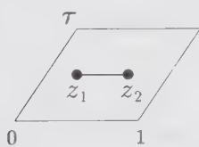  
(1)

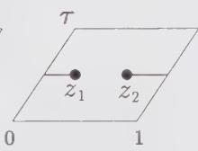  
(2)

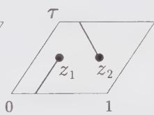  
(3)

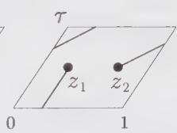  
(4)  
Figure 12.2. The four possible frustration lines for the disorder-disorder correlator on the torus. In (1), the cycle is contractible. In (2), (3), and (4), we get, respectively, the noncontractible cycles a, b, and $a + b$ , corresponding to the translations of $z_{1}$ by 1, $\tau$ , and $1 + \tau$ , respectively.

However, after any of the above three translations, this line winds around the torus and can no longer be shrunk to a point. Actually, the three noncontractible frustration lines correspond respectively to the cycles a, b, and $a + b$ of Fig. 12.2.

The resulting frustrated partition functions are therefore different, since the boundary conditions are affected by the presence of the frustration line. More precisely, letting $z_{1} \rightarrow z_{2}$ after each translation, we get the three limits (labeled by an index $\alpha = 2, 3, 4$ ):

$$
\langle \mu (z _ {1}, \bar {z} _ {1}) \mu (z _ {2}, \bar {z} _ {2}) \rangle^ {(\alpha)} = \frac {1}{| z _ {1} - z _ {2} | ^ {\frac {1}{4}}} \frac {1}{Z _ {\mathrm{Ising}}} \sum_ {\nu = 2} ^ {4} \epsilon_ {\nu} ^ {(\alpha)} Z _ {\nu}\tag{12.116}
$$

where $\epsilon_{\nu}^{(\alpha)} = -1$ if $\alpha = \nu$ and $\epsilon_{\nu}^{(\alpha)} = 1$ otherwise. The numerator in Eq. (12.116) is identified as the corresponding frustrated partition function.

## §12.6. Bosonization on the Torus

Except for the correlation functions of an even number of energy operators, for which Wick's theorem can be applied directly, the techniques sketched so far are not powerful enough to yield the most general torus correlators. In this last section, we show how the bosonization techniques introduced in Sect. 12.3 go over to the torus. Given the relation between a theory made of two copies of the Ising model and a free bosonic field, the main question boils down to the calculation of correlations involving the bosonic field on a torus.

## 12.6.1. The Two Bosonizations of the Ising Model: Partition Functions and Operators

The Dirac field (12.35) is a linear combination of two real fermions $\psi_{1}, \psi_{2}$ and their antiholomorphic counterparts. However, due to the precise relation (12.35), the two real fermions turn out to be coupled in a subtle way. The partition function of the free Dirac fermion on a torus receives contributions from various (anti-)periodicity sectors, again labeled $\nu = 1, 2, 3, 4$ . In each of these sectors, the partition function $Z_{\nu}^{Dirac}$ is the determinant of the Laplace operator squared. It is thus expressed very simply in terms of the Ising partition functions $Z_{\nu}$ as

$$
Z _ {\nu} ^ {\text { Dirac }} \propto Z _ {\nu} ^ {2} \quad \nu = 1, 2, 3, 4\tag{12.117}
$$

we note that, if $\nu = 1$ , the zero-modes of the Dirac fermion cause $Z_{l}^{Dirac}$ to vanish. The result (12.117) shows how the two underlying copies of the Ising model turn out to be coupled in this scheme: the two real fermions $\psi_{1}$ and $\psi_{2}$ must have the same boundary conditions on the torus. This phenomenon could not be observed on the plane, where the two fermions appeared totally decoupled. The total partition function $Z_{Dirac}$ exhibits the central charge c = 1 in its small-q behavior:

$$
Z _ {\mathrm{Dirac}} = 2 \sum_ {\nu = 2} ^ {4} Z _ {\nu} ^ {2} \rightarrow (q \bar {q}) ^ {- 1 / 2 4} (1 + O (q, \bar {q}))\tag{12.118}
$$

The prefactor 2 normalizes the leading term to 1 (the identity operator is nondegenerate in the corresponding conformal theory).

We now show that the partition function (12.118) is equivalent to that of a free boson compactified on a circle of radius R = 1 (cf. Sect. 10.4.1). The partition function of the latter reads

$$
Z (R = 1) \equiv Z (1) = \frac {1}{| \eta (\tau) | ^ {2}} \sum_ {e, m \in \mathbb {Z}} q ^ {(e + m / 2) ^ {2} / 2} \bar {q} ^ {(e - m / 2) ^ {2} / 2}\tag{12.119}
$$

We introduce the new summation variables

$$
\begin{array}{c c c} r = e + m / 2 & s = e - m / 2 & (m \text {   even }) \\ r + \frac {1}{2} = e + m / 2 & s - 1 / 2 = e - m / 2 & (m \text {   odd }) \end{array}\tag{12.120}
$$

The only constraint left on $r$ and $s$ is that they must have the same parity; hence we rewrite

$$
Z(1) = \frac{1}{|\eta(\tau)|^{2}}\sum_{\substack{r,s\\ r - s = 0\bmod 2}}\left[q^{r^{2 / 2}}\bar{q}^{s^{2 / 2}} + q^{(r + \frac{1}{2})^{2 / 2}}\bar{q}^{(s - \frac{1}{2})^{2 / 2}}\right]\tag{12.121}
$$

On the other hand, using the expressions $Z_{\nu} = |\theta_{\nu}(0|\tau)/2\eta(\tau)|$ and the series expansions for the Jacobi theta function of App. 10.A, we have

$$
\begin{aligned} Z_{\text{Dirac}} & = \frac{1}{2|\eta(\tau)|^{2}}\sum_{\nu = 2}^{4}|\theta_{\nu}(0|\tau)|^{2}\\ & = \frac{1}{2|\eta(\tau)|^{2}}\left[\left|\sum_{n}q^{(n + 1 / 2)^{2} / 2}\right|^{2} + \left|\sum_{n}q^{n^{2} / 2}\right|^{2} + \left|\sum_{n}(-1)^{n}q^{n^{2} / 2}\right|^{2}\right]\\ & = \frac{1}{2|\eta(\tau)|^{2}}\left[\left|\sum_{n}q^{(n + 1 / 2)^{2} / 2}\right|^{2} + 2\sum_{\substack{n,m\\ n - m = 0\bmod 2}}q^{n^{2} / 2}\bar{q}^{m^{2} / 2}\right]\\ & = Z(1) \end{aligned}\tag{12.122}
$$

by direct comparison with Eq. (12.121).

This c = 1 conformal theory is somewhat different from the ordinary square of the Ising model, with partition function

$$
Z _ {\text { Ising }} ^ {2} = \left(\sum_ {\nu = 2} ^ {4} Z _ {\nu}\right) ^ {2}\tag{12.123}
$$

since in this case the two real fermions are completely decoupled. The decoupling leads to 16 possible boundary conditions (among which only 9 contribute to the torus partition function) instead of 4 for the Dirac case (among which only 3 contribute to the torus partition function). The partition function (12.123) is actually the $\mathbb{Z}_2$ orbifold partition function of the free boson compactified on a circle of radius $R = 1$ introduced in Sect. 10.4.3. Indeed, from the expression (10.84),

$$
\begin{array}{r l} Z _ {\mathrm{orb}} (1) & = \frac {1}{2} \left[ Z (1) + 4 (Z _ {2} Z _ {3} + Z _ {2} Z _ {4} + Z _ {3} Z _ {4}) \right] \\ & = Z _ {\mathrm{Ising}} ^ {2} \end{array}\tag{12.124}
$$

where we used $Z(1) = 2(Z_2^2 + Z_3^2 + Z_4^2)$ . In the following, we will use the notation

$$
\tilde{Z}_{v} = 4\prod_{\substack{v^{\prime}\in \{2,3,4\} \\ v^{\prime}\neq v}}Z_{v^{\prime}}\tag{12.125}
$$

for the partition function of the twisted $\nu\equiv(v,u)$ sector of the boson.

Therefore, we have at our disposal two different ways of bosonizing the Ising model, which, of course, must lead to the same correlators. The operator correspondence with the Ising observables within the two bosonization schemes is summarized in Table 12.1. The main difference between the two schemes is that for the Dirac bosonization, the correlators will be obtained in the form of squares sector by sector ( $\nu = 1, 2, 3, 4$ ), whereas for the Ising squared they will appear as a whole, and squared.

Table 12.1. Ising model observables in the two bosonization schemes.

<table><tr><td>Dirac:</td><td>Operator</td><td>Ising 1 and 2</td><td>boson at R = 1</td></tr><tr><td rowspan="3"></td><td>energy</td><td> $\varepsilon_1 \times \varepsilon_2$ </td><td> $(\nabla\varphi/2)^2$ </td></tr><tr><td>spin</td><td> $\sigma_1 \times \sigma_2$ </td><td> $\cos\varphi/2$ </td></tr><tr><td>disorder</td><td> $\mu_1 \times \mu_2$ </td><td> $\sin\varphi/2$ </td></tr><tr><td>Ising2:</td><td>Operator</td><td>Ising 1 and 2</td><td>orb. boson at R = 1</td></tr><tr><td rowspan="4"></td><td>tot. energy</td><td> $\varepsilon_1 + \varepsilon_2$ </td><td> $\cos\varphi$ </td></tr><tr><td>energy</td><td> $\varepsilon_1 \times \varepsilon_2$ </td><td> $(\nabla\varphi/2)^2$ </td></tr><tr><td>spin</td><td> $\sigma_1 \times \sigma_2$ </td><td> $\cos\varphi/2$ </td></tr><tr><td>disorder</td><td> $\mu_1 \times \mu_2$ </td><td> $\sin\varphi/2$ </td></tr></table>

## 12.6.2. Compactified Boson Correlations on the Plane and on the Torus

Before applying the bosonization scheme, we must first explain how to compute correlators in a c = 1 bosonic theory on the torus. In this subsection, we derive the torus two-point functions of electromagnetic operators for the bosonic theory compactified on a circle of radius R, as well as for the $Z_{2}$ orbifold of this theory.

We start from the free boson compactified on a circle of radius $R$ , with torus partition function (10.62)

$$
Z (R) = \frac {1}{| \eta (\tau) | ^ {2}} \sum_ {e, m} q ^ {h _ {e, m}} \bar {q} ^ {\bar {h} _ {e, m}}\tag{12.126}
$$

which exhibits the “electromagnetic” operator content, namely an infinite collection of operators $O_{e,m}$ , e, m arbitrary relative integers, with conformal dimensions

$$
h _ {e, m} = \frac {1}{2} (e / R + m R / 2) ^ {2} \qquad \bar {h} _ {e, m} = \frac {1}{2} (e / R - m R / 2) ^ {2}\tag{12.127}
$$

In Sect. 10.4.1, we have identified the integers e, m as the electric and magnetic charges in the following sense. Returning to the plane for a while, we see that the purely electric operator of charge $e \in Z$ is identified as

$$
\mathcal {O} _ {e, 0} = e ^ {i e \varphi / R}\tag{12.128}
$$

This is indeed a single-valued function on the range $\varphi \in \mathbb{R} / 2\pi \mathbb{Z}$ for any integer $e$ . On the other hand, the purely magnetic operator $\mathcal{O}_{0,m}(z,\bar{z})$ creates a semi-infinite line of defect starting at the point $z$ , along which the bosonic field $\varphi$ has a jump discontinuity of $2\pi Rm$ . The general operator $\mathcal{O}_{e,m}$ is a combination of these two basic operators. From this definition, we get very simple fusion rules, namely the charges are additive under the short-distance product

$$
\mathcal {O} _ {e, m} \times \mathcal {O} _ {e ^ {\prime}, m ^ {\prime}} \rightarrow \mathcal {O} _ {e + e ^ {\prime}, m + m ^ {\prime}}\tag{12.129}
$$

The conformal dimensions (12.127) can be read off the two-point function on the plane

$$
\langle \mathcal {O} _ {e, m} (z _ {1}, \bar {z} _ {1}) \mathcal {O} _ {- e, - m} (z _ {2}, \bar {z} _ {2}) \rangle = \frac {1}{z _ {1 2} ^ {2 h _ {e , m}} \bar {z} _ {1 2} ^ {2 \bar {h} _ {e , m}}}\tag{12.130}
$$

In this correlator, the magnetic charges create a discontinuity of $2\pi m$ along a segment joining $z_{1}$ to $z_{2}$ . Electric and magnetic neutrality force the total charges to be zero.

We now prove Eq. (12.130). The correlator (12.130) has the following path-integral expression

$$
\int d \varphi e ^ {- S (\varphi)} \mathcal {O} _ {e, m} (z _ {1}, \bar {z} _ {1}) \mathcal {O} _ {- e, - m} (z _ {2}, \bar {z} _ {2})\tag{12.131}
$$

with the usual free bosonic action

$$
S (\varphi) = (1 / 8 \pi) \int (\nabla \varphi) ^ {2} d ^ {2} x\tag{12.132}
$$

If $m = 0$ (Eq. (12.131)), we get the usual two-point function of vertex operators

$$
\langle e ^ {i e \varphi (z _ {1}, z b _ {1}) / R} e ^ {- i e \varphi (z _ {2}, \bar {z} _ {2}) / R} \rangle = | z _ {1} - z _ {2} | ^ {- 2 e ^ {2} / R ^ {2}}\tag{12.133}
$$

The difficulty arises when $m \neq 0$ , as the boson $\varphi$ is no longer free but constrained because it must have a discontinuity of $2\pi mR$ along the segment joining $z_{1}$ to $z_{2}$ .

To incorporate this constraint in the path-integral calculation, we first decompose the bosonic field into $^{9}$

$$
\varphi = \varphi_ {m} ^ {\mathrm{cl}} + \tilde {\varphi}\tag{12.134}
$$

The classical part $\varphi_{m}^{cl}$ has a vanishing Laplacian (we take it to be the imaginary part of an holomorphic function), and it incorporates the discontinuity condition. This classical solution of the equation of motion reads

$$
\varphi_ {m} ^ {\mathrm{cl}} (z, \bar {z}) = m R \operatorname{Im} \ln \left(\frac {z - z _ {1}}{z - z _ {2}}\right)\tag{12.135}
$$

It has a branch cut joining $z_{1}$ to $z_{2}$ , across which it satisfies the desired discontinuity property. $\tilde{\varphi}$ is the “free part” of the boson (i.e., since the field $\varphi_{m}^{cl}$ incorporates all the boundary conditions, $\tilde{\varphi}$ is periodic), with propagator

$$
\langle \tilde {\varphi} (z, \bar {z}) \tilde {\varphi} (0, 0) \rangle = - \ln | z | ^ {2}\tag{12.136}
$$

We have the following decomposition of the action

$$
\begin{array}{r l} {S (\varphi)} & {= S (\varphi_ {m} ^ {\mathrm{cl}}) + S (\tilde {\varphi}) - (1 / 4 \pi) \int \tilde {\varphi} \Delta \varphi_ {m} ^ {\mathrm{cl}}} \\ & {= S (\varphi_ {m} ^ {\mathrm{cl}}) + S (\tilde {\varphi})} \end{array}\tag{12.137}
$$

due to the vanishing of the Laplacian of $\varphi_{m}^{\mathrm{cl}}$ . It is then straightforward to reproduce Eq. (12.130).

For the purpose of this chapter, we will need to compute only correlations of purely electric operators of electric charges 1 and 2, at radius R = 1 (see Table 12.1), and correlations including square gradient terms $(\nabla\varphi/2)^{2}$ . It is, however, instructive to compute the generalization of Eq. (12.130) on the torus. It can be expressed as

$$
\begin{array}{r l} & {\langle \mathcal {O} _ {e, m} (z _ {1}, \bar {z} _ {1}) \mathcal {O} _ {- e, - m} (z _ {2}, \bar {z} _ {2}) \rangle} \\ & {\qquad = \frac {1}{Z (R)} \sum_ {n, n ^ {\prime}} Z _ {n, n ^ {\prime}} \langle \mathcal {O} _ {e, m} (z _ {1}, \bar {z} _ {1}) \mathcal {O} _ {- e, - m} (z _ {2}, \bar {z} _ {2}) \rangle_ {n, n ^ {\prime}}} \end{array}\tag{12.138}
$$

expressed as a sum over the periodicity sectors $(n, n')$ of the compactified boson

$$
(n, n ^ {\prime}): \varphi (z + 1) = \varphi (z) + 2 \pi R n \quad \varphi (z + \tau) = \varphi (z) + 2 \pi R n ^ {\prime}\tag{12.139}
$$

The partition functions $Z_{n,n'}$ were obtained in Sect. 10.4.1. To compute the corresponding path integral in the sector $(n,n')$ , we again decompose $\varphi$ into

$$
\varphi = \varphi_ {n, n ^ {\prime}} ^ {\mathrm{cl}} + \varphi_ {m} ^ {\mathrm{cl}} + \tilde {\varphi}\tag{12.140}
$$

The $\varphi^{\mathrm{cl}}$ 's are the classical solutions of the Laplace equation $\Delta \varphi^{\mathrm{cl}} = 0$ on the torus, which incorporate respectively the $(n,n')$ boundary conditions, and the defect line condition $m$ :

$$
\begin{array}{l} \varphi_ {n, n ^ {\prime}} ^ {\mathrm{cl}} (z, \bar {z}) = 2 \pi R \operatorname{Im} \left(z \frac {n ^ {\prime} - n \bar {\tau}}{\operatorname{Im} \tau}\right) \\ \varphi_ {m} ^ {\mathrm{cl}} (z, \bar {z}) = m R \operatorname{Im} \left[ \ln \frac {\theta_ {1} (z - z _ {1} | \tau)}{\theta_ {1} (z - z _ {2} | \tau)} - \frac {2 \pi}{\operatorname{Im} \tau} z \operatorname{Re} z _ {1 2} \right] \end{array}\tag{12.141}
$$

$\tilde{\varphi}$ is the doubly periodic free part of the boson, with propagator

$$
\begin{array}{r} \langle \tilde {\varphi} (z, \bar {z}) \tilde {\varphi} (0, 0) \rangle = - \ln \left| \frac {\theta_ {1} (z | \tau)}{\partial_ {z} \theta_ {1} (0 | \tau)} e ^ {- \pi \frac {(\mathrm{Im} z) ^ {2}}{\mathrm{Im} \tau}} \right| ^ {2} \\ \equiv \ln | \mathcal {E} (z | \tau) | ^ {2} \end{array}\tag{12.142}
$$

This last expression is the doubly periodic elementary solution of the Laplacian on the torus, often called the prime form, namely

$$
- \Delta \langle \tilde {\varphi} (z, \bar {z}) \tilde {\varphi} (0, 0) \rangle = 2 \pi \delta^ {(2)} (z) - \frac {4 \pi}{\operatorname{Im} \tau}\tag{12.143}
$$

where

$$
\delta^ {(2)} (z) = \sum_ {n, n ^ {\prime} \in \mathbb {Z}} \delta (z - n - n ^ {\prime} \tau)\tag{12.144}
$$

is the doubly periodic delta function on the torus, and the subtraction takes care of the zero modes of the Laplacian on the torus. This is just a more physical reformulation of the computation carried out in Sect. 10.4.1. We now compute the path integral (12.131) on the torus, with the total action

$$
S (\varphi) = S (\varphi_ {n, n ^ {\prime}} ^ {\mathrm{cl}}) + S (\varphi_ {m} ^ {\mathrm{cl}}) + S (\tilde {\varphi})\tag{12.145}
$$

We obtain

$$
\begin{array}{l} \langle \mathcal {O} _ {e, m} (z _ {1}, \bar {z} _ {1}) \mathcal {O} _ {- e, - m} (z _ {2}, \bar {z} _ {2}) \rangle_ {n, n ^ {\prime}} = \langle \mathcal {O} _ {e, m} (z _ {1}, \bar {z} _ {1}) \mathcal {O} _ {- e, - m} (z _ {2}, \bar {z} _ {2}) \rangle_ {0, 0} \\ \times \exp \left[ 2 i \pi e \frac {\operatorname{Im} (z _ {1 2} (n ^ {\prime} - n \bar {\tau}))}{\operatorname{Im} \tau} + \pi m R \frac {\operatorname{Re} (z _ {1 2} (n ^ {\prime} - n \bar {\tau}))}{\operatorname{Im} \tau} \right] \end{array}\tag{12.146}
$$

and the $(0,0)$ sector contribution reads

$$
\begin{array}{l} \langle \mathcal {O} _ {e, m} (z _ {1}, \bar {z} _ {1}) \mathcal {O} _ {- e, - m} (z _ {2}, \bar {z} _ {2}) \rangle_ {0, 0} = \left(\frac {\partial_ {z} \theta_ {1} (0 | \tau)}{\theta_ {1} (z _ {1 2} | \tau)}\right) ^ {2 h _ {e, m}} \times c. c. \\ \qquad \times \exp \left[ \frac {8 \pi}{R ^ {2} \operatorname{Im} \tau} \big (e \operatorname{Im} z _ {1 2} - i m \frac {R ^ {2}}{8} \operatorname{Re} z _ {1 2} \big) ^ {2} \right] \end{array}\tag{12.147}
$$

where by “c.c.” we mean the corresponding antiholomorphic counterpart, with barred quantities. Applying the Poisson resummation formula (10.264) of App. 10.A in the final result, we can trade the sum over the winding numbers $n'$ for a sum over electric charges $e'$ (we also rename the winding numbers $n \rightarrow m'$ ).

This enables us to write the final result for the correlator (12.138) in a symmetric form

$$
\begin{array}{l} Z (R) \langle \mathcal {O} _ {e, m} (z _ {1}, \bar {z} _ {1}) \mathcal {O} _ {- e, - m} (z _ {2}, \bar {z} _ {2}) \rangle = \left| \frac {\partial_ {z} \theta_ {1} (0 | \tau)}{\theta_ {1} (z _ {1 2} | \tau)} \right| ^ {4 h _ {e, m}} \\ \times \frac {1}{| \eta (\tau) | ^ {2}} \sum_ {e ^ {\prime}, m ^ {\prime}} q ^ {h _ {e ^ {\prime}, m ^ {\prime}}} \vec {q} ^ {\bar {h} _ {e ^ {\prime}, m ^ {\prime}}} e ^ {4 i \pi [ \alpha_ {e ^ {\prime}, m ^ {\prime}} \alpha_ {e, m} z _ {1 2} - \bar {\alpha} _ {e ^ {\prime}, m ^ {\prime}} \bar {\alpha} _ {e, m} \bar {z} _ {1 2} ]} \end{array}\tag{12.148}
$$

where

$$
\alpha_ {e, m} = \frac {1}{\sqrt {2}} (e / R + R m / 2) \quad \bar {\alpha} _ {e, m} = \frac {1}{\sqrt {2}} (e / R - R m / 2)\tag{12.149}
$$

The formula (12.148) can be generalized to any number of electromagnetic operators. We leave its detailed derivation as an exercise to the courageous reader. The result reads

$$
\begin{array}{r l} & Z (R) \langle \mathcal {O} _ {1} (z _ {1}, \bar {z} _ {1}) \dots \mathcal {O} _ {n} (z _ {n}, \bar {z} _ {n}) \rangle = \prod_ {i <   j} \left| \frac {\partial_ {z} \theta_ {1} (0 | \tau)}{\theta_ {1} (z _ {i j} | \tau)} \right| ^ {4 \alpha_ {i} \alpha_ {j}} \\ & \qquad \times \frac {1}{| \eta (\tau) | ^ {2}} \sum_ {e, m} q ^ {h _ {e, m}} \bar {q} ^ {\bar {h} _ {e, m}} e ^ {4 i \pi [ \Sigma_ {k} \alpha_ {e, m} \alpha_ {k} z _ {k} - \bar {a} _ {e, m} \bar {\alpha} _ {e, m} \bar {\alpha} _ {k} \bar {z} _ {k} ]} \end{array}\tag{12.150}
$$

with the obvious notations $\mathcal{O}_k\equiv \mathcal{O}_{e_k,m_k}$ and $\alpha_{k}\equiv \alpha_{e_{k},m_{k}}$ and the condition of global electric and magnetic neutrality

$$
\sum_ {k = 1} ^ {n} e _ {k} = \sum_ {k = 1} ^ {n} m _ {k} = 0\tag{12.151}
$$

Since the square of the Ising theory is described by a $Z_{2}$ orbifold theory at c = 1, we must also explain how to calculate correlators in the twisted sectors v = 2, 3, 4. More precisely, the total orbifold correlator decomposes into

$$
\begin{array}{l} Z _ {\mathrm{orb}} (R) \langle \mathcal {O} _ {e, m} (z _ {1}, \bar {z} _ {1}) \mathcal {O} _ {- e, - m} (z _ {2}, \bar {z} _ {2}) \rangle_ {\mathrm{orb}} \\ = \frac {1}{2} \left[ Z (R) \langle \mathcal {O} _ {e, m} (z _ {1}, \bar {z} _ {1}) \mathcal {O} _ {- e, - m} (z _ {2}, \bar {z} _ {2}) \rangle + \sum_ {\nu = 2} ^ {4} \tilde {Z} _ {\nu} \langle \mathcal {O} _ {e, m} (z _ {1}, \bar {z} _ {1}) \mathcal {O} _ {- e, - m} (z _ {2}, \bar {z} _ {2}) \rangle_ {\nu} \right] \end{array}\tag{12.152}
$$

The three sectors $v = 2, 3, 4$ correspond to (anti-)periodic boundary conditions on the boson, namely

$$
\nu = 2, (v, u) = (0, \frac {1}{2}): \varphi (z + 1) = - \varphi (z) \quad \varphi (z + \tau) = \varphi (z)
$$

$$
\nu = 3, (\nu , u) = (\frac {1}{2}, \frac {1}{2}): \varphi (z + 1) = - \varphi (z) \qquad \varphi (z + \tau) = - \varphi (z)\tag{12.153}
$$

$$
\nu = 4, (\nu , u) = (\frac {1}{2}, 0): \varphi (z + 1) = \varphi (z) \quad \varphi (z + \tau) = - \varphi (z)
$$

The corresponding partition functions (12.125) read

$$
\tilde {Z} _ {\nu} = 4 \prod_ {\substack {\nu^ {\prime} \in \{2,3,4 \} \\ \nu^ {\prime} \neq \nu}} Z _ {\nu^ {\prime}} = 4 \left| \frac {\eta (\tau)}{\theta_ {\nu} (0 | \tau)} \right|\tag{12.154}
$$

In order to compute the correlator of two electromagnetic operators in the sector v, we must perform the corresponding path integral, with twisted boundary conditions on $\varphi$ . As usual, we decompose $\varphi$ into

$$
\varphi = \varphi_ {m, v} ^ {\mathrm{cl}} + \tilde {\varphi} _ {v}\tag{12.155}
$$

where the classical part is a solution of the Laplace equation on the torus, with the (anti-)periodicity conditions pertaining to the sector v, that is

$$
\varphi_ {m, v} ^ {\mathrm{cl}} (z, \bar {z}) = m R \operatorname{Im} \ln \left(\frac {\theta_ {1} ((z - z _ {1}) / 2 | \tau / 2) \theta_ {v} ((z - z _ {2}) / 2 | \tau / 2)}{\theta_ {1} ((z - z _ {2}) / 2 | \tau / 2) \theta_ {v} ((z - z _ {1}) / 2 | \tau / 2)}\right)\tag{12.156}
$$

and the free part of the boson in the sector $\nu=(\nu,u)$ has the propagator

$$
\langle \tilde {\varphi} (z, \bar {z}) \tilde {\varphi} (0, 0) \rangle_ {v} = - \ln \left| \frac {\mathcal {E} (z / 2 | \tau / 2)}{\mathcal {E} (z / 2 + v + u \tau | \tau / 2)} \right| ^ {2}\tag{12.157}
$$

The prime form $\mathcal{E}(z|\tau)$ is defined in Eq. (12.142). We thus finally get

$$
\begin{array}{l} \langle \mathcal {O} _ {e, m} (z _ {1}, \bar {z} _ {1}) \mathcal {O} _ {- e, - m} (z _ {2}, \bar {z} _ {2}) \rangle_ {v} \\ = \left(\frac {\theta_ {v} (z _ {1 2} / 2 | \tau / 2) \partial_ {z} \theta_ {1} (0 | \tau)}{2 \theta_ {v} (0 | \tau / 2) \theta_ {1} (z _ {1 2} / 2 | \tau)}\right) ^ {2 h _ {e, m}} \times c. c. \end{array}\tag{12.158}
$$

This has a straightforward generalization to the n-point correlator

$$
\begin{array}{l} \langle \mathcal {O} _ {1} (z _ {1}, \bar {z} _ {1}) \dots \mathcal {O} _ {n} (z _ {n}, \bar {z} _ {n}) \rangle_ {\nu} \\ = \prod_ {1 \leq i <   j \leq n} \left(\frac {\theta_ {\nu} (z _ {i j} / 2 | \tau / 2) \partial_ {z} \theta_ {1} (0 | \tau)}{2 \theta_ {\nu} (0 | \tau / 2) \theta_ {1} (z _ {i j} / 2 | \tau)}\right) ^ {2 \alpha_ {i} \alpha_ {j}} \times c. c. \end{array}\tag{12.159}
$$

with the same notations as in Eq. (12.150) and under the condition (12.151).

## 12.6.3. Ising Correlators from the Bosonization of the Dirac Fermion

In principle, the correspondence between operators in the Ising models and in the bosonized Dirac fermion theory (Table 12.1) enables us to compute, sector by sector, the square of any Ising correlator. The only problem is to relate a given sector v for the fermion to some particular subset of the boson winding modes. But this can be done easily by examining the partition function (12.118), sector by sector. We have

$$
Z _ {\nu} = \left| \frac {\theta_ {\nu} (0 | \tau)}{2 \eta (\tau)} \right| = \left| \frac {1}{2 \eta (\tau)} \sum_ {n \in \mathbb {Z}} q ^ {\frac {1}{2} (n + \nu + \frac {1}{2}) ^ {2}} e ^ {2 i \pi (n + \nu + \frac {1}{2}) (u + \frac {1}{2})} \right|\tag{12.160}
$$

for all $\nu\equiv(v,u)$ . This readily specifies the set of winding sectors of the boson that reproduces the sector $\nu$ for the Dirac fermion and builds the corresponding piece of the boson partition function:

$$
Z _ {\nu} ^ {\text { bos }} = 2 Z _ {\nu} ^ {2}\tag{12.161}
$$

with

$$
\sum_ {\nu = 2} ^ {4} Z _ {\nu} ^ {\text { bos }} = 2 \sum_ {\nu = 2} ^ {4} Z _ {\nu} ^ {2} = Z (1)\tag{12.162}
$$

$Z(1)$ is the compactified boson partition function at radius R = 1. In particular, a total correlator of observables in the bosonic theory can be expressed as the sum over the four sectors $\nu = 1, 2, 3, 4$ of the squares of the corresponding Ising model correlators (through Table 12.1) as

$$
Z (1) \langle \dots \rangle = \sum_ {\nu = 1} ^ {4} 2 Z _ {\nu} ^ {2} \langle \dots \rangle_ {\nu}\tag{12.163}
$$

Instead of computing the total correlator in the bosonic theory, it is desirable to get it sector by sector. This is done by the so-called chiral bosonization procedure. Before we proceed any further, we should recall the duality $R \leftrightarrow 2/R$ of the bosonic theory on a circle of radius R, under which electric and magnetic charges are exchanged. Since this leaves the partition function invariant, we have

$$
Z (1) = Z (2)\tag{12.164}
$$

To represent the Ising correlation functions, according to Table 12.1, we will need only the electric operators

$$
e ^ {\pm i \varphi / 2} \quad \mathrm{and} \quad e ^ {\pm i \varphi}\tag{12.165}
$$

Comparing Eq. (12.165) with Eq. (12.128), these operators correspond to electric charges of $\pm1$ and $\pm2$ , respectively, provided we work in the framework of the R = 2 theory. For this reason, we shall use the R = 2 bosonic theory in the following discussion. $^{10}$

Guided by the expression (12.160), we get a set of rules for computing the bosonic correlator in each sector $\nu$ . We start from the bosonization formula (12.37). To compute any correlator in the sector $\nu \equiv (\nu, u)$ , we expand the chiral (holomorphic) component $\phi(z)$ of the boson $\varphi(z, \bar{z}) = \phi(z) - \bar{\phi}(\bar{z})$ into

$$
\phi (z) = 2 \pi z P + \hat {\phi} (z)\tag{12.166}
$$

The operator P has eigenvalues $n + v + \frac{1}{2}$ , $n \in Z$ , and $\hat{\phi}$ is the “free part” of the boson, with propagator

$$
\langle \hat {\phi} (z) \hat {\phi} (0) \rangle = - \ln \frac {\theta_ {1} (z | \tau)}{\partial_ {z} \theta_ {1} (0 | \tau)}\tag{12.167}
$$

which approaches the plane expression (12.38) when $z \to 0$ . We must weigh each eigenvalue $n + v + \frac{1}{2}$ by the factor

$$
\frac {1}{2 \eta (\tau)} q ^ {\frac {1}{2} (n + \nu + \frac {1}{2}) ^ {2}} e ^ {2 i \pi (n + \nu + \frac {1}{2}) (u + \frac {1}{2})}\tag{12.168}
$$

The operation is repeated for the antiholomorphic part of the boson $\bar{\phi}$ , and the total answer is the product of the two. This set of rules enables us to compute the bosonic correlators in each sector v. They have been defined in order to be compatible with the result of the direct calculation of the total correlators (12.163), using Sect. 12.6.2.

For instance, for the purely electric correlator with $e_{1} + \cdots + e_{n} = 0$ , R = 2, we find

$$
\begin{array}{l} Z _ {\nu} ^ {\mathrm{bos}} \langle \mathcal {O} _ {e _ {1}, 0} (z _ {1}, \bar {z} _ {1}) \dots \mathcal {O} _ {e _ {n}, 0} (z _ {n}, \bar {z} _ {n}) \rangle_ {\nu} = \left[ \frac {1}{2 \eta (\tau)} \sum_ {n} q ^ {\frac {1}{2} (n + \nu + \frac {1}{2}) ^ {2}} \right. \\ \left. \times e ^ {2 i \pi (n + \nu + \frac {1}{2}) (u + \frac {1}{2})} e ^ {i \pi (n + \nu + \frac {1}{2}) (\Sigma e _ {i} z _ {i})} \prod_ {i <   j} \left(\frac {\partial_ {z} \theta_ {1} (0 | \tau)}{\theta_ {1} (z _ {i j} | \tau)}\right) ^ {e _ {i} e _ {j} / 4} \right] \times c. c. \end{array}\tag{12.169}
$$

We have decomposed the contributions according to the above rules into the weighing factor (12.168), the contribution of the $P$ operator, and the free part of the correlator obtained by using Wick's theorem with the propagator (12.167). By $\times$ c.c., we mean the product by the corresponding antiholomorphic part with $\phi \rightarrow \bar{\phi}$ . The result (12.169) agrees with the total correlator (12.150) for $m_{i} = 0$ and $R = 2$ . We note in particular that when $n = 2$ and $e_1 = -e_2 = e$ , Eq. (12.169) takes the simple form

$$
\begin{array}{l} Z _ {\nu} ^ {\mathrm{bos}} \langle \mathcal {O} _ {e, 0} (z _ {1}, \bar {z} _ {1}) \mathcal {O} _ {- e, 0} (z _ {2}, \bar {z} _ {2}) \rangle_ {\nu} \\ = \left[ \frac {1}{2 \eta (\tau)} \theta_ {\nu} (e z _ {1 2} / 2 | \tau) \left(\frac {\partial_ {z} \theta_ {1} (0 | \tau)}{\theta_ {1} (z _ {1 2} | \tau)}\right) ^ {e ^ {2} / 4} \right] \times \texttt {c . c .} \end{array}\tag{12.170}
$$

As a first application of the above rules, we rederive the expression (12.107) for the spin-spin correlator in the sector $\nu$ . In the bosonized version, it reads

$$
\begin{array}{r l} \left[ Z _ {\nu} \langle \sigma (z _ {1}, \bar {z} _ {1}) \sigma (z _ {2}, \bar {z} _ {2}) \rangle_ {\nu} \right] ^ {2} & = 2 Z _ {\nu} ^ {2} \langle \cos \frac {\varphi}{2} (z _ {1}, \bar {z} _ {1}) \cos \frac {\varphi}{2} (z _ {2}, \bar {z} _ {2}) \rangle_ {\nu} \\ & = Z _ {\nu} ^ {\text { bos }} \langle \mathcal {O} _ {1, 0} (z _ {1}, \bar {z} _ {1}) \mathcal {O} _ {- 1, 0} (z _ {2}, \bar {z} _ {2}) \rangle_ {\nu} \\ & = \left| \frac {1}{2 \eta (\tau)} \theta_ {\nu} (z _ {1 2} / 2 | \tau) \right| ^ {2} \left| \frac {\partial_ {z} \theta_ {1} (0 | \tau)}{\theta_ {1} (z _ {1 2} | \tau)} \right| ^ {\frac {1}{2}} \end{array}\tag{12.171}
$$

where the first equality is simply Eq. (12.59), valid in each sector v with $N_{1}=2$ . The second equality uses Eq. (12.161) and the definition of the purely electric operators (12.128). The last equality is a direct application of Eq. (12.170) for e=1. This result agrees with the previous expression (12.107), due to the identity

$$
\eta (\tau) = \left[ \frac {\partial_ {z} \theta_ {1} (0 | \tau)}{2 \pi} \right] ^ {1 / 3}\tag{12.172}
$$

We are now in position to compute more general correlation functions. The square of the correlator of an arbitrary even number of spin operators reads, for $\nu = 1, 2, 3, 4$ ,

$$
\begin{array}{l} \left[ Z _ {\nu} \langle \sigma (z _ {1}, \bar {z} _ {1}) \dots \sigma (z _ {2 n}, \bar {z} _ {2 n}) \rangle_ {\nu} \right] ^ {2} \\ = 2 ^ {n} Z _ {\nu} ^ {2} \langle \cos \frac {\varphi}{2} (z _ {1}, \bar {z} _ {1}) \dots \cos \frac {\varphi}{2} (z _ {2 n}, \bar {z} _ {2 n}) \rangle_ {\nu} \\ = \frac {1}{| \eta (\tau) | ^ {2}} \sum_ {\substack {\epsilon_ {1}, \ldots , \epsilon_ {2 n} = \pm 1 \\ \Sigma_ {i} \epsilon_ {i} = 0}} | \theta_ {\nu} ((\Sigma_ {i} \epsilon_ {i} z _ {i}) / 2 | \tau) | ^ {2} \prod_ {i <   j} \left| \frac {\theta_ {1} (z _ {i j} | \tau)}{\partial_ {z} \theta_ {1} (0 | \tau)} \right| ^ {\epsilon_ {i}, \epsilon_ {j} / 2} \end{array}\tag{12.173}
$$

Similarly, the square of the correlator of an even number of energy operators is easily obtained by direct application of the chiral bosonization rules and of Wick's theorem:

$$
\begin{array}{l} \left[ Z _ {\nu} \langle \varepsilon (z _ {1}, \bar {z} _ {1}) \dots \varepsilon (z _ {2 n}, \bar {z} _ {2 n}) \rangle_ {\nu} \right] ^ {2} \\ = Z _ {\nu} ^ {2} \langle (\nabla \varphi (z _ {1}, \bar {z} _ {1}) / 2) ^ {2} \dots (\nabla \varphi (z _ {2 n}, \bar {z} _ {2 n}) / 2) ^ {2} \\ = \left| \sum_ {k = 0} ^ {n} \frac {\partial_ {z} ^ {2 n - 2 k} \theta_ {\nu} (0 | \tau)}{2 \eta (\tau)} \sum_ {\sigma \in S _ {2 n}} \prod_ {i = 1} ^ {n} [ \wp (z _ {\sigma (2 i - 1)} - z _ {\sigma (2 i)}) + 2 \eta_ {1} ] \right| ^ {2} \end{array}\tag{12.174}
$$

The last sum extends over the permutation group $S_{2n}$ of the 2n indices. The identity between this result and the previous expression (12.96) follows from the torus version of the Cauchy determinant formula (see Ex. 12.19 for a detailed proof). The advantage of the chiral bosonization approach is that it gives the correlator of an odd number of energy operators as well. The latter receives contributions from the v = 1 sector only and reads

$$
\begin{array}{l} \left[ Z _ {1} \langle \varepsilon (z _ {1}, \bar {z} _ {1}) \dots \varepsilon (z _ {2 n + 1}, \bar {z} _ {2 n + 1}) \rangle_ {1} \right] ^ {2} \\ = - Z _ {1} ^ {2} \langle (\nabla \varphi (z _ {1}, \bar {z} _ {1}) / 2) ^ {2} \dots (\nabla \varphi (z _ {2 n + 1}, \bar {z} _ {2 n + 1}) / 2) ^ {2} \\ = \left| \sum_ {k = 0} ^ {n} \frac {\partial_ {z} ^ {2 n - 2 k + 1} \theta_ {\nu} (0 | \tau)}{2 \eta (\tau)} \sum_ {\sigma \in S _ {2 n + 1}} \prod_ {i = 1} ^ {n} [ \wp (z _ {\sigma (2 i - 1)} - z _ {\sigma (2 i)}) + 2 \eta_ {1} ] \right| ^ {2} \end{array}\tag{12.175}
$$

so that the total energy correlator reads

$$
\begin{array}{l} \langle \varepsilon (z _ {1}, \bar {z} _ {1}) \dots \varepsilon (z _ {2 n + 1}, \bar {z} _ {2 n + 1}) \rangle \\ = \frac {1}{Z _ {\text {Ising}}} \left| \sum_ {k = 0} ^ {n} \frac {\partial_ {z} ^ {2 n - 2 k + 1} \theta_ {v} (0 | \tau)}{2 \eta (\tau)} \sum_ {\sigma \in S _ {2 n + 1}} \prod_ {i = 1} ^ {n} [ \wp (z _ {\sigma (2 i - 1)} - z _ {\sigma (2 i)}) + 2 \eta_ {1} ] \right| \end{array}\tag{12.176}
$$

More generally, the square of the mixed spin and energy correlator reads

$$
\begin{array}{l} \left[ Z _ {\nu} \langle \sigma (1) \dots \sigma (2 n) \varepsilon (2 n + 1) \dots \varepsilon (2 n + p) \rangle_ {\nu} \right] ^ {2} \\ = 2 ^ {n} (- 1) ^ {p} Z _ {\nu} ^ {2} \Big \langle \cos \frac {\varphi}{2} (1) \dots \cos \frac {\varphi}{2} (2 n) \\ \times (\nabla \varphi (2 n + 1) / 2) ^ {2} \dots (\nabla \varphi (2 n + p) / 2) ^ {2} \Big \rangle_ {\nu} \end{array}\tag{12.177}
$$

and it is readily evaluated using the chiral bosonization prescriptions.

## 12.6.4. Ising Correlators from the Bosonization of Two Real Fermions

In this section, we use the direct bosonization scheme for the product of two decoupled Ising models. As already shown in Sect. 12.6.1, this is precisely the $c = 1$ orbifold model of a boson compactified on a circle of radius $R = 1$ , quotiented by the extra $\mathbb{Z}_2$ symmetry $\varphi \rightarrow -\varphi$ . As in the previous section, we shall work within the dual theory at radius $R = 2$ , for which $Z_{\mathrm{orb}}(2) = Z_{\mathrm{orb}}(1)$ . A first quantity of interest is the total energy operator which is, according to Table 12.1, $\varepsilon_{\mathrm{tot}} = \varepsilon_1 + \varepsilon_2 = \cos \varphi$ . Using the bosonic correlators (12.148) in the untwisted sector and (12.158) in the twisted ones for $\nu = 2,3,4$ , and setting $e = 1,m = 0,R = 2$ , we obtain the respective contributions to the total two-point correlator of total energy:

$$
\begin{array}{l} Z _ {\text { orb }} (2) \langle \varepsilon_ {\text { tot }} (z _ {1}, \bar {z} _ {1}) \varepsilon_ {\text { tot }} (z _ {2}, \bar {z} _ {2}) \rangle_ {\text { orb }} \\ = \frac {1}{2} \left[ Z (2) \langle \varepsilon_ {\text { tot }} (z _ {1}, \bar {z} _ {1}) \varepsilon_ {\text { tot }} (z _ {2}, \bar {z} _ {2}) \rangle + \sum_ {\nu = 2} ^ {4} \tilde {Z} _ {\nu} \langle \varepsilon_ {\text { tot }} (z _ {1}, \bar {z} _ {1}) \varepsilon_ {\text { tot }} (z _ {2}, \bar {z} _ {2}) \rangle_ {\nu} \right] \end{array}\tag{12.178}
$$

The contributing parts are

$$
\begin{array}{r l} Z (2) \langle \varepsilon_ {\text {tot}} (z _ {1}, \bar {z} _ {1}) \varepsilon_ {\text {tot}} (z _ {2}, \bar {z} _ {2}) \rangle & = 2 Z (2) \langle \cos \varphi (z _ {1}, \bar {z} _ {1}) \cos \varphi (z _ {2}, \bar {z} _ {2}) \rangle \\ & = \frac {1}{4 | \eta (\tau) | ^ {2}} \left| \frac {\partial_ {z} \theta_ {1} (0 | \tau)}{\theta_ {1} (z _ {1 2} | \tau)} \right| ^ {2} \sum_ {\nu = 2} ^ {4} | \theta_ {\nu} (z _ {1 2} | \tau) | ^ {2} \end{array}\tag{12.179}
$$

and

$$
\begin{array}{l} \tilde {Z} _ {\nu} \langle \varepsilon_ {\text {tot}} (z _ {1}, \bar {z} _ {1}) \varepsilon_ {\text {tot}} (z _ {2}, \bar {z} _ {2}) \rangle_ {\nu} \\ = \tilde {Z} _ {\nu} \left[ \left| \frac {\theta_ {\nu} (z _ {1 2} / 2 | \tau / 2) \partial_ {z} \theta_ {1} (0 | \tau)}{\theta_ {\nu} (0 | \tau) \theta_ {1} (z _ {1 2} | \tau)} \right| ^ {2} + \left| \frac {\theta_ {\nu} (0 | \tau) \theta_ {1} (z _ {1 2} | \tau)}{\theta_ {\nu} (z _ {1 2} / 2 | \tau / 2) \partial_ {z} \theta_ {1} (0 | \tau)} \right| ^ {2} \right] \end{array}\tag{12.180}
$$

In the twisted sector, we have included both contributions $\exp-4\langle\varphi\varphi\rangle_{\nu}$ and $\exp4\langle\varphi\varphi\rangle_{\nu}$ since neither of the two is periodic by itself, whereas the result must be periodic. This amounts to including electrically nonneutral contributions to the correlator, which are now allowed as we work in a twisted sector (with antiperiodic boundary conditions on the field $\varphi$ , which do not affect $\varepsilon_{tot}\propto\cos\varphi$ ).

We can check that this agrees with the interpretation of $\varepsilon$ as the total energy operator, namely, that

$$
\begin{array}{r l} & Z _ {\mathrm{orb}} (2) \langle \varepsilon_ {\mathrm{tot}} (z _ {1}, \bar {z} _ {1}) \varepsilon_ {\mathrm{tot}} (z _ {2}, \bar {z} _ {2}) \rangle_ {\mathrm{orb}} \\ & \qquad = 2 Z _ {\mathrm{Ising}} ^ {2} \big [ \langle \varepsilon (z _ {1}, \bar {z} _ {1}) \varepsilon (z _ {2}, \bar {z} _ {2}) \rangle_ {\mathrm{Ising}} + \langle \varepsilon \rangle_ {\mathrm{Ising}} ^ {2} \big ] \end{array}\tag{12.181}
$$

The untwisted sector contribution of Eq. (12.180) is easily identified as

$$
\begin{array}{l} Z (2) \langle \varepsilon_ {\text {tot}} (z _ {1}, \bar {z} _ {1}) \varepsilon_ {\text {tot}} (z _ {2}, \bar {z} _ {2}) \rangle \\ = 2 \sum_ {\nu = 2} ^ {4} Z _ {\nu} ^ {2} \langle \varepsilon (z _ {1}, \bar {z} _ {1}) \varepsilon (z _ {2}, \bar {z} _ {2}) \rangle_ {\nu} + 2 [ Z _ {1} \langle \varepsilon \rangle_ {1} ] ^ {2} \end{array}\tag{12.182}
$$

On the other hand, we can show that the twisted sectors contribute for

$$
\begin{array}{l}\tilde{Z}_{\nu}\langle \varepsilon_{\mathrm{tot}}(z_{1},\bar{z}_{1})\varepsilon_{\mathrm{tot}}(z_{2},\bar{z}_{2})\rangle_{\nu}\\ = \frac{1}{2}\tilde{Z}_{\nu}\sum_{\substack{\nu^{\prime}\in \{2,3,4\} \\ \nu^{\prime}\neq \nu}}\langle \varepsilon (z_{1},\bar{z}_{1})\varepsilon (z_{2},\bar{z}_{2})\rangle_{\nu^{\prime}} \end{array}\tag{12.183}
$$

This is easily checked by means of the doubling identities of App. 12.A. For instance, in the sector $\nu = 4$ , by substituting the values of $\theta_{2}(z|\tau)$ and $\theta_{3}(z|\tau)$ in terms of theta functions evaluated at $z/2$ , $\tau$ (cf. Eq. (12.191)), we can rewrite

$$
\begin{array}{r l} & {\langle \varepsilon (1) \varepsilon (2) \rangle_ {2} + \langle \varepsilon (1) \varepsilon (2) \rangle_ {3}} \\ & {\qquad = \left| \frac {\partial_ {z} \theta_ {1} (0 | \tau)}{\theta_ {1} (z _ {1 2} | \tau)} \right| ^ {2} \left[ \left| \frac {\theta_ {2} (z _ {1 2} | \tau)}{\theta_ {2} (0 | \tau)} \right| ^ {2} + \left| \frac {\theta_ {3} (z _ {1 2} | \tau)}{\theta_ {3} (0 | \tau)} \right| ^ {2} \right]} \\ & {\qquad = 2 \pi^ {2} \frac {| \theta_ {4} (0 | \tau) | ^ {2}}{| \theta_ {2} (0 | \tau) \theta_ {3} (0 | \tau) | ^ {2}}} \\ & {\qquad \times \frac {| \theta_ {2} (z _ {1 2} / 2 | \tau) \theta_ {3} (z _ {1 2} / 2 | \tau) | ^ {4} + | \theta_ {1} (z _ {1 2} / 2 | \tau) \theta_ {4} (z _ {1 2} / 2 | \tau) | ^ {4}}{| \theta_ {1} (z _ {1 2} | \tau) | ^ {2}}} \end{array}\tag{12.184}
$$

By using the expressions of the theta functions of period $\tau$ in terms of those of half period $\tau/2$ (Eq. (12.192)), we get the desired result (12.183) for $\nu = 4$ . The other sectors are obtained by modular transformations of the variable $\tau: \tau \to \tau + 1$ gives the $\nu = 3$ contribution, whereas $\tau \to -1/\tau$ gives the $\nu = 2$ one, up to an overall factor $|\tau|^2$ . This completes the general proof of Eq. (12.183). Together with the untwisted sector correspondence (12.182), this entails the compatibility (12.181) between the direct computation of one- and two-point functions of the Ising energy operator (12.77)-(12.93) and the $c = 1$ orbifold bosonization result.

The comparison of the expressions obtained from the two bosonization methods leads to very interesting and nontrivial identities between theta functions. Clearly, higher correlators become more and more involved, although in principle the results (12.150) and (12.159) can be used directly to write the most general Ising correlators, through the correspondence of Table 12.1. However the analysis of the resulting identities goes beyond the scope of this work.

## Appendix 12.A. Elliptic and Theta Function Identities

## 12.A.1. Generalities on Elliptic Functions

A meromorphic $^{11}$ function $f(z|\tau)$ of z is said to be elliptic if it is doubly periodic on the torus, namely

$$
f (z + 1 | \tau) = f (z | \tau) \quad f (z + \tau | \tau) = f (z | \tau)\tag{12.185}
$$

The finite zero and pole structure of such a function on the torus is infinitely duplicated, by periodicity, in the whole complex plane. However, the Cauchy residue theorem holds, namely

$$
\oint_ {\mathcal {C}} d z f (z | \tau) = 2 i \pi \sum_ {j} \operatorname{Res} _ {j} (f)\tag{12.186}
$$

where the sum extends over all the residues of the poles encompassed by the closed (counterclockwise) contour C. What makes the use of this theorem particularly interesting on the torus is the possibility of nontrivial closed contours C.

For instance, take C to be the closed boundary of the torus, made of the segments $[0,1]$ , $[1,1+\tau]$ , $[1+\tau,\tau]$ and $[\tau,1]$ . Computing the above integral (12.186), we find

$$
\begin{array}{l} \oint_ {\mathcal {C}} d z f (z | \tau) = \left[ \int_ {[ 0, 1 ]} + \int_ {[ 1, 1 + \tau ]} + \int_ {[ 1 + \tau , \tau ]} + \int_ {[ \tau , 1 ]} \right] d z f (z | \tau) \\ = 0 \\ = 2 i \pi \sum_ {j} \operatorname{Res} _ {j} (f) \end{array}\tag{12.187}
$$

The second equality follows by grouping the first and third integrals and the second and fourth respectively: by periodicity, the value of the function is the same along any two opposed edges of C; but since the direction of circulation is opposite, the contributions cancel each other. This leads to a first theorem on elliptic functions: The sum of residues of the poles of an elliptic function on the torus vanishes.

We now relate the numbers of zeros and poles of $f$ . By applying the above result (12.187) to the elliptic function $\partial_z f / f$ , we find

$$
\oint_ {\mathcal {C}} d z \frac {\partial_ {z} f (z | \tau)}{f (z | \tau)} = 0
$$

The pole structure of $\partial_{z}f/f$ is entirely determined by the zeros and poles of f. More precisely, near a zero $z_{0}$ of f, with order n, we have

$$
\frac {\partial_ {z} f (z | \tau)}{f (z | \tau)} = \frac {n}{z - z _ {0}} + \mathrm{reg}.
$$

Near a pole $z_{1}$ of order m, we have

$$
\frac {\partial_ {z} f (z | \tau)}{f (z | \tau)} = - \frac {m}{z - z _ {1}} + \text { reg. }
$$

Hence, applying the Cauchy formula (12.186), we find the second theorem on elliptic functions:

An elliptic function has same number of zeros and poles, counted with their multiplicities.

Combining the two above theorems, we see that a nonconstant elliptic function must have at least two poles. Indeed, if it has no pole, it is an analytic function, which is bounded on the compact fundamental domain of the torus. By periodicity, it is bounded on the whole complex plane; it is therefore a constant by Liouville's theorem. An elliptic function cannot have a single pole, because the first theorem implies that its residue vanishes. So we get the third theorem:

An elliptic function with at most one pole must be a constant.

## 12.A.2. Periodicity and Zeros of the Jacobi Theta Functions

The Jacobi theta functions $\theta_{v}(z|\tau)$ have been defined in App. 10.A. Here we list a number of their properties, as functions of the complex variable z, which are useful when dealing with torus correlation functions.

The periodicity relations (10.255) induce the following behavior of the ratios $r_{\nu}(z|\tau) = \theta_{\nu}(z|\tau) / \theta_1(z|\tau)$ under translations of $z$ by 1 and $\tau$

$$
\begin{array}{l l} r _ {2} (z + 1 | \tau) = & r _ {2} (z | \tau) \\ r _ {3} (z + 1 | \tau) = & - r _ {3} (z | \tau) \\ r _ {4} (z + 1 | \tau) = & - r _ {4} (z | \tau) \end{array} \qquad \begin{array}{l l} r _ {2} (z + \tau | \tau) = & - r _ {2} (z | \tau) \\ r _ {3} (z + \tau | \tau) = & - r _ {3} (z | \tau) \\ r _ {4} (z + \tau | \tau) = & r _ {4} (z | \tau) \end{array}\tag{12.188}
$$

The $\theta$ functions also have simple transformations under translations of half periods (see Eq. (10.254)). These transformations read

$$
\theta_ {1} (z + \frac {1}{2} | \tau) = \theta_ {2} (z | \tau) \quad \theta_ {1} (z + \tau / 2 | \tau) = i e ^ {- i \pi z} q ^ {- 1 / 8} \theta_ {4} (z | \tau)
$$

$$
\theta_ {2} (z + \frac {1}{2} | \tau) = - \theta_ {1} (z | \tau) \qquad \theta_ {2} (z + \tau / 2 | \tau) = e ^ {- i \pi z} q ^ {- 1 / 8} \theta_ {3} (z | \tau)
$$

$$
\theta_ {3} (z + \frac {1}{2} | \tau) = \theta_ {4} (z | \tau) \qquad \theta_ {3} (z + \tau / 2 | \tau) = e ^ {- i \pi z} q ^ {- 1 / 8} \theta_ {2} (z | \tau)\tag{12.189}
$$

$$
\theta_ {4} (z + \frac {1}{2} | \tau) = \theta_ {3} (z | \tau) \qquad \theta_ {4} (z + \tau / 2 | \tau) = i e ^ {- i \pi z} q ^ {- 1 / 8} \theta_ {1} (z | \tau)
$$

The expression of $\theta_{1}(z|\tau)$ as an infinite product (10.253) shows explicitly that its zeros are all simple and lie on the lattice $m + n\tau$ , for $m, n$ arbitrary relative integers. Hence, when restricted to the torus, the function $\theta_{1}(z|\tau)$ has only one single zero at $z = 0$ . Together with the half-period translation identities (12.189), this shows immediately that the other $\theta_{1}(z|\tau)$ have one single zero on the torus

lying, respectively, at

$$
\begin{array}{l} \theta_ {2}: z = \frac {1}{2} \\ \theta_ {3}: z = \frac {1}{2} (1 + \tau) \\ \theta_ {4}: z = \frac {1}{2} \tau \end{array}\tag{12.190}
$$

## 12.A.3. Doubling Identities

The direct application of the theorems of Sect. 12.A.1 leads to a number of identities between Jacobi theta functions. Of particular interest are the so-called doubling identities. Their proof is left as an exercise to the reader. It goes generically as follows: we first identify the zero and pole structure of the two expressions we want to equate. It is usually a straightforward calculation to get the exact residues and check that they coincide for the two expressions. In a second step, we study the periodicity of the functions, to finally conclude that the ratio of the two is elliptic and has no pole, hence it is a constant, fixed to be 1 by the residue identity. In this way, we get the following doubling identities:

$$
\frac {\theta_ {2} (z | \tau)}{\theta_ {2} (0 | \tau)} = \frac {[ \theta_ {2} (z / 2 | \tau) \theta_ {3} (z / 2 | \tau) ] ^ {2} - [ \theta_ {1} (z / 2 | \tau) \theta_ {4} (z / 2 | \tau) ] ^ {2}}{[ \theta_ {2} (0 | \tau) \theta_ {3} (0 | \tau) ] ^ {2}}
$$

$$
\begin{array}{l} \frac {\theta_ {3} (z | \tau)}{\theta_ {3} (0 | \tau)} = \frac {[ \theta_ {2} (z / 2 | \tau) \theta_ {3} (z / 2 | \tau) ] ^ {2} + [ \theta_ {1} (z / 2 | \tau) \theta_ {4} (z / 2 | \tau) ] ^ {2}}{[ \theta_ {2} (0 | \tau) \theta_ {3} (0 | \tau) ] ^ {2}} \\ = \frac {[ \theta_ {3} (z / 2 | \tau) \theta_ {4} (z / 2 | \tau) ] ^ {2} - [ \theta_ {1} (z / 2 | \tau) \theta_ {2} (z / 2 | \tau) ] ^ {2}}{[ \theta_ {3} (0 | \tau) \theta_ {4} (0 | \tau) ] ^ {2}} \\ \frac {\theta_ {4} (z | \tau)}{\theta_ {4} (0 | \tau)} = \frac {[ \theta_ {3} (z / 2 | \tau) \theta_ {4} (z / 2 | \tau) ] ^ {2} + [ \theta_ {1} (z / 2 | \tau) \theta_ {2} (z / 2 | \tau) ] ^ {2}}{[ \theta_ {3} (0 | \tau) \theta_ {4} (0 | \tau) ] ^ {2}} \end{array}\tag{12.191}
$$

and

$$
\begin{array}{l} \theta_ {2} (z / 2 | \tau) \theta_ {3} (z / 2 | \tau) = \left(\frac {\theta_ {2} (0 | \tau) \theta_ {3} (0 | \tau)}{2}\right) ^ {\frac {1}{2}} \theta_ {2} (z / 2 | \tau / 2) \\ \theta_ {1} (z / 2 | \tau) \theta_ {4} (z / 2 | \tau) = \left(\frac {\theta_ {2} (0 | \tau) \theta_ {3} (0 | \tau)}{2}\right) ^ {\frac {1}{2}} \theta_ {1} (z / 2 | \tau / 2) \end{array}\tag{12.192}
$$

The latter can also be derived directly by using the infinite product expressions (10.253) of App. 10.A.

## Exercises

12.1 The correspondence between the quantum Ising spin chain and the XZ spin chain The transfer matrix of the two-dimensional Ising model is related to the one-dimensional quantum Ising spin-chain Hamiltonian in a transverse magnetic field. (Through Eq. (3.114), the logarithm of the two-dimensional Ising transfer matrix is actually proportional to the Ising spin chain Hamiltonian in a scaling region around $T_{c}$ . The latter model is defined as follows. On each site $i = 1, \ldots, N$ of a finite one-dimensional lattice, we consider a two-component spin- $\frac{1}{2}$ variable $S_{i}^{a}, a = x, z$ , where

$$
S _ {i} ^ {x} = \left( \begin{array}{c c} 0 & 1 \\ 1 & 0 \end{array} \right) \qquad S _ {i} ^ {z} = \left( \begin{array}{c c} 1 & 0 \\ 0 & - 1 \end{array} \right)
$$

The Ising quantum spin-chain Hamiltonian reads

$$
H _ {\mathrm{Ising}} = \sum_ {i = 1} ^ {N} K S _ {i} ^ {z} S _ {i + 1} ^ {z} + \gamma S _ {i} ^ {x}
$$

$(S_{N+1}^{a} \equiv 0)$ . The aim of this exercise is to prove the equivalence of this model with the XZ spin chain, defined with the same spin variables by the Hamiltonian

$$
H _ {X Z} = \sum_ {i = 1} ^ {N} K _ {x} S _ {i} ^ {x} S _ {i + 1} ^ {x} + K _ {z} S _ {i} ^ {z} S _ {i + 1} ^ {z}
$$

In order to prove the equivalence, we define new spin variables $T_{j}^{a}, a = x, z$ , as

$$
T _ {j} ^ {x} = S _ {j} ^ {z} S _ {j + 1} ^ {z}, \quad j = 1, 2,..., N - 1, \qquad T _ {N} ^ {x} = S _ {N} ^ {z}
$$

and

$$
T _ {j} ^ {z} = \prod_ {k = 1} ^ {j} S _ {k} ^ {x}
$$

a) Show that these new variables have the same commutation relations as the $S$ 's.

b) Reexpress the Hamiltonian $H_{XZ}$ in terms of these new variables. Show that, up to unimportant boundary terms, it reads

$$
H _ {X Z} ^ {\prime} = \sum_ {j = 1} ^ {N} K _ {x} T _ {j - 1} ^ {z} T _ {j + 1} ^ {z} + K _ {z} S _ {j} ^ {x}
$$

c) Show that the Hamiltonian $H_{XZ}^{\prime}$ obtained above splits into the sum of two noninteracting Hamiltonians of the form $H_{Ising}$ for the sets of spin variables $T_{2j}^{a}$ and $T_{2j-1}^{a}$ , respectively.

## 12.2 Jordan-Wigner transformation in the Heisenberg model

The Heisenberg XY model is a one-dimensional quantum two-component spin chain. More precisely, on each site $i = 1, \ldots, N$ of a finite one-dimensional lattice, we consider a two-component spin $\frac{1}{2}$ variable $S_{i}^{a}, a = x, y$ , represented by Pauli matrices as:

$$
S _ {i} ^ {x} = \frac {1}{2} \left( \begin{array}{c c} 0 & 1 \\ 1 & 0 \end{array} \right) \qquad S _ {i} ^ {y} = \frac {1}{2} \left( \begin{array}{c c} 0 & - i \\ i & 0 \end{array} \right)
$$

The XY model Hamiltonian contains only nearest-neighbor interactions. It reads

$$
H = \sum_ {i = 1} ^ {N - 1} (1 + \gamma) S _ {i} ^ {x} S _ {i + 1} ^ {x} + (1 - \gamma) S _ {i} ^ {y} S _ {i + 1} ^ {y}
$$

where $\gamma$ is a real parameter.

a) Show that

$$
\{a _ {j}, a _ {j} ^ {\dagger} \} = 1, (a _ {j}) ^ {2} = (a _ {j} ^ {\dagger}) ^ {2} = 0
$$

$$
[ a _ {i} ^ {\dagger}, a _ {j} ] = [ a _ {i} ^ {\dagger}, a _ {j} ^ {\dagger} ] = [ a _ {i}, a _ {j} ] = 0 \quad i \neq j
$$

The $a$ 's and $a^{\dagger}$ 's have both fermionic (anti-commuting) and bosonic (commuting) characters. b) The Jordan-Wigner transformation consists in rewriting the Hamiltonian $H$ in terms of new variables $c_{j}, c_{j}^{\dagger}$ , defined as

$$
\begin{array}{r l} & c _ {j} = \left(e ^ {i \pi \sum_ {k = 1} ^ {j - 1} a _ {k} ^ {\dagger} a _ {k}}\right) a _ {j} \\ & c _ {j} ^ {\dagger} = a _ {j} ^ {\dagger} \left(e ^ {i \pi \sum_ {k = 1} ^ {j - 1} a _ {k} ^ {\dagger} a _ {k}}\right) \end{array}
$$

(This is a nonlocal transformation; these fermionic operators go over to a free-fermion field in the continuum limit.) Show that

$$
c _ {j} c _ {j} ^ {\dagger} = a _ {j} a _ {j} ^ {\dagger}
$$

c) Show further that $c_{j}$ and $c_{j}^{\dagger}$ are true fermionic operators, namely that

$$
\{c _ {i}, c _ {j} ^ {\dagger} \} = \delta_ {i, j} \qquad \{c _ {i}, c _ {j} \} = \{c _ {i} ^ {\dagger}, c _ {j} ^ {\dagger} \} = 0
$$

d) Show that

$$
\begin{array}{r} a _ {i} ^ {\dagger} a _ {i + 1} = c _ {i} ^ {\dagger} c _ {i + 1} \\ a _ {i} ^ {\dagger} a _ {i + 1} ^ {\dagger} = c _ {i} ^ {\dagger} c _ {i + 1} ^ {\dagger} \end{array}
$$

e) Deduce that

$$
H = \frac {1}{2} \sum_ {i = 1} ^ {N - 1} (c _ {i} ^ {\dagger} c _ {i + 1} + \gamma c _ {i} ^ {\dagger} c _ {i + 1} ^ {\dagger} + \mathrm{h.c.})
$$

The Hamiltonian is therefore expressed, through the Jordan-Wigner transformation, as a bilinear form of the fermion operators $c_{i}$ , $c_{i}^{\dagger}$ . This transformation is instrumental in the diagonalization of H.

12.3 Write explicitly the high-temperature expansion of the Ising model up to degree 8 in tanh K. Show that the corresponding infinite series expansion of the partition function is an even function of K.

12.4 We consider the correlation function of two Ising spins $\langle \sigma (r_1)\sigma (r_2)\rangle$ (12.9) on the lattice, obtained by changing $K\to K + i\pi /2$ for each bond of a path joining $r_1$ to $r_2$ . Show that the result is independent, up to a sign, of the choice of path joining $r_1$ to $r_2$ .

Hint: A path of length n contributes for $i^{n}\sigma(r_{1})\sigma(r_{2}), i^{2} = -1$ . Any two paths have lengths differing by a multiple of 2.

12.5 Prove that the correlation function $\langle\mu(r_{1})\mu(r_{2})\rangle$ of disorder operators is actually independent of the choice of path from $r_{1}$ to $r_{2}$ along which the couplings K are reversed. Hint: Consider two paths from $r_{1}$ to $r_{2}$ ; the corresponding correlations are exchanged by reversing the sign of all spins along both paths, but this operation leaves the result invariant.

12.6 Derive the Ward identity for the insertion of the energy-momentum tensor in a correlator of 2n energy operators.

12.7 Ising energy and spin four-point correlation functions on the plane and conformal blocks

a) Write the four-point energy correlator on the plane (12.21) in terms of the cross-ratio $z = z_{12}z_{34} / z_{13}z_{24}$ of the four points. Deduce the form of the corresponding unique conformal block. Compare this result with that of Ex. 8.12.

Result:

$$
\langle \varepsilon (1) \varepsilon (2) \varepsilon (3) \varepsilon (4) \rangle = \frac {1}{| z (1 - z) | ^ {2}} | H (z) | ^ {2}
$$

with the conformal block $H(z) = 1 - z + z^2$ , corresponding to the fusion rule $\varepsilon \times \varepsilon \to \mathbb{I}$ . b) Write the four-point spin correlator on the plane (12.63) in terms of the cross-ratio $z$ . Deduce the form of the corresponding two conformal blocks. Compare this result with that of Ex. 8.12.

Result:

$$
\langle \sigma (1) \sigma (2) \sigma (3) \sigma (4) \rangle = \frac {1}{| z (1 - z) | ^ {\frac {1}{2}}} (| H _ {1} (z) | ^ {2} + \frac {1}{4} | z | | H _ {2} (z) | ^ {2})
$$

with the conformal blocks

$$
H _ {1} (z) = \left(\frac {1 + \sqrt {1 - z}}{2}\right) ^ {\frac {1}{2}} \quad H _ {2} (z) = \left(2 \frac {1 - \sqrt {1 - z}}{z}\right) ^ {\frac {1}{2}}
$$

12.8 Write a differential equation for the correlator $\langle \psi \psi \sigma \sigma \rangle$ , expressing the presence of a singular vector of level 2 in the Verma module $V_{2,1}$ of $\psi$ . Check that the function $G$ of Eq. (12.30) is indeed a solution of this equation.

12.9 Express the l.h.s. of Eq. (12.51) as a sum of products of energy correlators of one Ising model only. Using the expression (12.19), derive the most singular contribution of this sum when all arguments approach each other. Compute the free-field correlator on the r.h.s. of Eq. (12.51). Compare the two sides of the equation to deduce the value of the normalization factor $M_{n}=2^{n-1}$ .

12.10 Along the lines of Ex. 12.9, check that the normalization factor $P_{n}$ of Eq. (12.55) is $(-1)^{n}$ .

## 12.11 Ward identity for the plane 2n-spin correlator

a) Express the Ising energy-momentum tensor in terms of the real fermion.

b) Express the Dirac energy-momentum tensor in terms of the Dirac fermion.

Result: We set $D = \frac{1}{\sqrt{2}} (\psi_1 + i\psi_2)$ and $D^{\dagger} = \frac{1}{\sqrt{2}} (\psi_1 - i\psi_2)$ . The energy-momentum tensor reads

$$
T _ {\text { Dir }} (z) = - \lim _ {z \rightarrow w} \left[ \frac {1}{2} \left(D ^ {\dagger} (z) \partial_ {w} D (w) - \partial_ {z} D ^ {\dagger} (z) D (w)\right) - \frac {1}{(z - w) ^ {2}} \right]\tag{12.193}
$$

c) Use the bosonization formulae (12.37) to reexpress Eq. (12.193) in terms of the free field $\varphi$ .

Result:

$$
T _ {\mathrm{Dir}} (z) = - \frac {1}{2} \lim _ {z \rightarrow w} \left[ \partial_ {z} \varphi (z, \bar {z}) \partial_ {w} \varphi (w, \bar {w}) + \frac {1}{(z - w) ^ {2}} \right]\tag{12.194}
$$

d) Express the correlator of the (bosonized) Dirac theory with insertions of the Dirac fermion

$$
G (z, w) = \langle D ^ {\dagger} (z) D (w) \cos \frac {\varphi}{2} (1) \dots \cos \frac {\varphi}{2} (2 n) \rangle
$$

in terms of Ising spin correlators with real fermion insertions only.

$$
G (z, w) = \frac {1}{2 ^ {n}} \langle \psi (z) \psi (w) \sigma (1) \dots \sigma (2 n) \rangle \langle \sigma (1) \dots \sigma (2 n) \rangle .
$$

e) Relate the insertion of the Ising energy-momentum tensor $T_{\mathrm{Ising}}(z)$ in a correlator of 2n spins for the Ising model to that of the c = 1 energy-momentum tensor $T_{\mathrm{Dir}}(z)$ of the Dirac theory in the corresponding correlator of 2n cos(φ) operators.

$$
\langle T _ {\text { Dir }} (z) \cos \frac {\varphi}{2} (1) \dots \cos \frac {\varphi}{2} (2 n) \rangle = 2 ^ {n - 1} \langle T _ {\text { Ising }} (z) \sigma (1) \dots \sigma (2 n) \rangle .
$$

f) Deduce that the conformal Ward identity (5.41) of Chap. 5 is satisfied for the insertion of the Ising energy-momentum tensor in the Ising spin correlator iff it is satisfied for the insertion of the Dirac energy-momentum tensor in the cos $\varphi$ correlator. Check the latter.

## 12.12 Cauchy determinant formula, Pfaffian, and Haffnian.

a) Prove the Cauchy determinant formula

$$
\det \left[ \frac {1}{z _ {i} - w _ {j}} \right] _ {1 \leq i, j \leq n} = (- 1) ^ {n (n - 1) / 2} \frac {\prod_ {i <   j} \left(z _ {i} - z _ {j}\right) \left(w _ {i} - w _ {j}\right)}{\prod_ {i , j} \left(z _ {i} - w _ {j}\right)}\tag{12.195}
$$

Hint: Consider the above determinant as a function of the complex variable $z = z_{1}$ and analyze its pole and zero structures. Conclude by using Liouville's theorem (a bounded analytic function is necessarily constant).

b) Setting $w_{j} = z_{j} + \epsilon_{j}$ in Eq. (12.195), compute the limit when all $\epsilon_{i} \rightarrow 0$ . Deduce the relation between determinant, Pfaffian, and Haffnian expressed in Eq. (12.53).

## 12.13 Differential equation for the fermion propagator

a) Write the differential equation satisfied by the nonnormalized fermion propagator $Z_{\nu}\langle \psi (z)\psi (0)\rangle_{\nu}$ in any sector $\nu \in \{2,3,4\}$ .

b) From the definition of the Jacobi theta functions (App. 10.A) show that

$$
i \pi \partial_ {\tau} \theta_ {\nu} = \partial_ {z} ^ {2} \theta_ {\nu}
$$

c) Using

$$
\zeta (z) - 2 \eta_ {1} z = \partial_ {z} \ln \theta_ {1}, \quad \wp (z) + 2 \eta_ {1} = - \partial_ {z} ^ {2} \ln \theta_ {1}
$$

rewrite the differential equation of (a) in terms of theta functions only.

d) Use the results for the partition function $Z_{\nu}$ and the expression for the fermion propagator $\langle\psi(z)\psi(0)\rangle_{\nu}$ to rewrite the differential equation as a differential relation between $\theta_{\nu}$ and $\theta_{1}$ . Hint: For the differential equation to be satisfied, the following relation must hold

$$
2 i \pi \partial_ {\tau} \ln \left[ \frac {\partial_ {z} \theta_ {1} (0 | \tau)}{\theta_ {v} (0 | \tau) ^ {\frac {1}{2}}} \right] = \left[ \frac {\partial_ {z} ^ {2} \theta_ {1} \theta_ {v} + \theta_ {1} \partial_ {z} ^ {2} \theta_ {v} - 2 \partial_ {z} \theta_ {1} \partial_ {z} \theta_ {v} - \eta_ {1} \theta_ {1} \theta_ {v}}{\theta_ {1} ^ {2}} \right] (z | \tau)\tag{12.196}
$$

e) Prove this last relation using the standard property of elliptic functions, namely that an elliptic function with at most one pole must be a constant.

Hint: Show that the r.h.s. of Eq. (12.196) is doubly periodic in z and that the residue of the double pole at $z \rightarrow 0$ vanishes. Conclude by the standard ellipticity argument.

12.14 Torus conformal blocks and the proof of the Verlinde formula for the Ising model Notations are as in Chap. 10, Sect. 10.8.3.

a) Using the conformal blocks (12.94) of the energy-energy correlation on the torus, compute the monodromy transformations $\phi_{\varepsilon}(\mathbf{a})$ and $\phi_{\varepsilon}(\mathbf{b})$ of Eq. (10.188) on any Ising character. Check Eqs. (10.189)–(10.192).

b) Repeat the calculation with the conformal blocks (12.109) of the spin-spin correlation function. Recover the Ising fusion rules and the Verlinde formula.

Hint: The monodromy transformations $\phi_i(a)$ and $\phi_i(b)$ are generated by letting $z \to z + 1$ and $z \to z + \tau$ , respectively, in the conformal blocks of the torus two-point correlator $\langle ii\rangle$ , $i = \varepsilon, \sigma$ . The action on characters is obtained by letting $z \to 0$ in the end.

## 12.15 Modular covariance of the spin-spin correlator

a) Using App. 10.A, derive the transformations of the three functions

$$
Z _ {\nu} \langle \sigma (z, \bar {z}) \sigma (0, 0) \rangle_ {\nu} \quad (\nu = 2, 3, 4)
$$

of Eq. (12.106) under $z \to z + 1$ and $z \to z + \tau$ .

b) Show that (a) fixes $Z_{1}\langle\sigma\sigma\rangle_{1}$ uniquely. Compare with Eq. (12.107).

c) For $\nu = 1, 2, 3, 4$ , relate the functions $Z_{\nu} \langle \sigma \sigma \rangle_{\nu}(z, \bar{z}, \tau)$ to their “modular transforms” $Z_{\nu} \langle \sigma \sigma \rangle_{\nu}(z / \tau; -1 / \tau)$ . Deduce the “modular covariance” of the spin-spin correlator

$$
\langle \sigma (z / \tau , \bar {z} / \bar {\tau}) \sigma (0, 0) \rangle_ {- 1 / \tau} = | z | ^ {\frac {1}{4}} \langle \sigma (z, \bar {z}) \sigma (0, 0) \rangle
$$

## 12.16 Differential equation for the spin-spin correlator

a) Write the differential equation for the torus spin-spin correlator $Z_{v}\langle\sigma\sigma\rangle_{v}$ in each sector $\nu=1,2,3,4$ .

b) Prove that this equation is indeed satisfied by $Z_{\nu}\langle\sigma\sigma\rangle_{\nu}$ , given by Eq. (12.107).

Hint: The differential equation reduces to the identity

$$
\left[ \frac {\partial_ {z} ^ {2} \theta_ {\nu} (z / 2 | \tau)}{\theta_ {\nu} (z / 2 | \tau)} + \left(\frac {\partial_ {z} \theta_ {\nu} (z / 2 | \tau)}{\theta_ {\nu} (z / 2 | \tau)}\right) ^ {2} - \frac {\partial_ {z} \theta_ {1} (z | \tau)}{\theta_ {1} (z | \tau)} \frac {\partial_ {z} \theta_ {\nu} (z / 2 | \tau)}{\theta_ {\nu} (z / 2 | \tau)} \right] + \frac {\partial_ {z} ^ {2} \theta_ {1} (z | \tau)}{\theta_ {1} (z | \tau)} + 6 \eta_ {1} = 0
$$

This identity is proven by standard elliptic function techniques: We show that the l.h.s. is doubly periodic, with at most one pole, hence a constant, which is readily evaluated.

## 12.17 Energy expectation value from the spin-spin correlator

a) In the sector $\nu = 1$ , show that the short-distance limit

$$
\lim _ {z _ {1} \rightarrow z _ {2}} | z _ {1 2} | ^ {- \frac {3}{4}} Z _ {1} \left\langle \sigma \left(z _ {1}, \bar {z} _ {1}\right) \sigma \left(z _ {2}, \bar {z} _ {2}\right)\right\rangle_ {1}
$$

is proportional to the energy one-point function $Z_{1}\langle\varepsilon\rangle_{1}$ .

b) Deduce the energy expectation value $\langle\varepsilon\rangle$ on the torus.

Result: $\langle \varepsilon \rangle = \pi |\eta (\tau)|^2 /Z_{\mathrm{Ising}}.$

## 12.18 Correlators for rational c = 1 theories on the torus

This exercise is a sequel of Ex. 10.21. Consider here the $c = 1$ theory of a boson compactified on a circle of radius $R = \sqrt{2p' / p}$ . Recall that this theory is a rational conformal theory, namely it can be reorganized into a finite number of sectors indexed by $2pp'$ integers $\lambda \equiv \lambda_{e,m} = pe - p'm \mod 2pp'$ . The torus conformal blocks have been derived in Ex. 10.21, and read

$$
K _ {\lambda} (\tau) = \frac {1}{\eta (\tau)} \sum_ {n} q ^ {(2 p p ^ {\prime} n + \lambda) ^ {2} / 4 p p ^ {\prime}}
$$

for $\lambda = 0,1,\dots,2pp' - 1$ . The torus partition function can be reexpressed as a finite sum

$$
Z (\sqrt {\frac {2 p ^ {\prime}}{p}}) = \sum_ {\lambda = 0} ^ {2 p p ^ {\prime} - 1} K _ {\lambda} (\tau) \bar {K} _ {\omega_ {0} \lambda} (\bar {\tau})
$$

where $\omega_0$ is defined by

$$
p r _ {0} - p ^ {\prime} s _ {0} = 1 \quad \text { and } \quad \omega_ {0} = p r _ {0} + p ^ {\prime} s _ {0} \mod 2 p p ^ {\prime}
$$

a) Rewrite the correlator (12.148) as a finite sum over the conformal blocks of the corresponding rational conformal theory.

Result: The conformal blocks of the torus two-point function read

$$
\begin{array}{l} O _ {(\epsilon , m)} \qquad O _ {(e, m)} \\ \bigg \backslash \lambda + \lambda_ {\epsilon , m} \bigg / \\ \lambda \end{array} \equiv \mathcal {F} _ {\lambda} ^ {e, m} (z) = K _ {\lambda} (4 \alpha_ {e, m} z _ {1 2} | \tau) \left(\frac {\partial_ {z} \theta_ {1} (0 | \tau)}{\theta_ {1} (z | \tau)}\right) ^ {2 h _ {e, m}}
$$

with $\alpha_{e,m}$ defined in Eq. (12.149), with $R = \sqrt{2p' / p}$ , and

$$
K _ {\lambda} (z | \tau) = \frac {1}{\eta (\tau)} \sum_ {n} q ^ {(2 p p ^ {\prime} n + \lambda) ^ {2} / 4 p p ^ {\prime}} e ^ {i \pi (2 p p ^ {\prime} n + \lambda) z / 2 \sqrt {p p ^ {\prime}}}
$$

The correlator reads

$$
Z (\sqrt {\frac {2 p ^ {\prime}}{p}}) \langle \mathcal {O} _ {e, m} (z, \bar {z}) \mathcal {O} _ {- e, - m} (0, 0) \rangle = \sum_ {\lambda = 0} ^ {2 p p ^ {\prime} - 1} \mathcal {F} _ {\lambda} ^ {e, m} (z) \times \bar {\mathcal {F}} _ {\omega_ {0} \lambda} ^ {- e, - m} (\bar {z})
$$

b) Check that the monodromy of the conformal block $\mathcal{F}_{\lambda}^{e,m}(z)$ along the a cycle is diagonal.
c) Check that the monodromy transformation of $\mathcal{F}_{\lambda}^{e,m}(z)$ along the cycle b exchanges the upper and lower intermediate states $\lambda \leftrightarrow \lambda + \lambda_{e,m}$ .

d) Compute the torus conformal blocks of the n-point function (12.150).

12.19 Energy correlators and Cauchy determinant formula on the torus.

a) Prove the Cauchy determinant formula on the torus

$$
\begin{array}{l} \det [ \wp_ {\nu} (z _ {i} - w _ {j}) ] _ {1 \leq i, j \leq n} = (- 1) ^ {n (n - 1) / 2} (\partial_ {z} \theta_ {1} (0 | \tau)) ^ {n} \frac {\theta_ {\nu} (\Sigma z _ {i} - w _ {i} | \tau)}{\theta_ {\nu} (0 | \tau)} \\ \times \frac {\prod_ {i <   j} \theta_ {1} (z _ {i j} | \tau) \theta_ {1} (w _ {i j} | \tau)}{\prod_ {i , j} \theta_ {1} (z _ {i} - w _ {j} | \tau)} \end{array}\tag{12.197}
$$

Hint: Examine the zero and pole structure of the l.h.s. of Eq. (12.197) using the short-distance behavior, given by Eq. (12.195). Conclude by the standard elliptic function argument.

b) Prove the identity between Eqs. (12.96) and (12.174).

Hint: Take the multiple limit $\epsilon_1, \ldots, \epsilon_n \to 0$ after the substitution $w_i = z_i + \epsilon_i$ in the Cauchy determinant formula (12.197).

## 12.20 Ward identity for the torus 2n-spin correlator

This is the torus version of Ex. 12.11, whose results are assumed here.

a) First take n = 1. Using chiral bosonization, compute the insertion of the Dirac energy-momentum tensor in the correlation of two cos $\varphi$ operators in any sector v of the bosonized Dirac-fermion theory.

Result:

$$
\begin{array}{l} Z _ {\nu} ^ {2} \langle T _ {\text {Dir}} (z) \cos \frac {\varphi}{2} (z _ {1}, \bar {z} _ {1}) \cos \frac {\varphi}{2} (z _ {2}, \bar {z} _ {2}) \rangle_ {\nu} = 2 \left[ \eta_ {1} + \frac {\partial_ {z _ {1}} ^ {2} \theta_ {\nu} (z _ {1 2} / 2 | \tau)}{\theta_ {\nu} (z _ {1 2} / 2 | \tau)} \right. \\ + \frac {1}{2} \frac {\partial_ {z _ {1}} \theta_ {\nu} (z _ {1 2} / 2 | \tau)}{\theta_ {\nu} (z _ {1 2} / 2 | \tau)} \left(\frac {\partial_ {z} \theta_ {1} (z - z _ {1} | \tau)}{\theta_ {1} (z - z _ {1} | \tau)} - \frac {\partial_ {z} \theta_ {1} (z - z _ {2} | \tau)}{\theta_ {1} (z - z _ {2} | \tau)}\right) \\ + \frac {1}{1 6} \left(\frac {\partial_ {z} \theta_ {1} (z - z _ {1} | \tau)}{\theta_ {1} (z - z _ {1} | \tau)} - \frac {\partial_ {z} \theta_ {1} (z - z _ {2} | \tau)}{\theta_ {1} (z - z _ {2} | \tau)}\right) ^ {2} \Bigg ] Z _ {\nu} ^ {2} \langle \cos \frac {\varphi}{2} (z _ {1}, \bar {z} _ {1}) \cos \frac {\varphi}{2} (z _ {2}, \bar {z} _ {2}) \rangle_ {\nu}. \end{array}\tag{12.198}
$$

b) Prove the Ward identity (12.79) on the torus, in the case of the $\cos\varphi$ two-point correlator.

c) Deduce the analogous result for the Ising spin-spin correlator on the torus.

d) Repeat the above calculation for arbitrary n.

## Notes

The two-dimensional Ising model on a square lattice was solved by Onsager in 1944 [286] by diagonalization of the transfer matrix. Several combinatorial improvements, among which the rewriting of the partition function as a determinant, have simplified the solution and prepared the route for the contact with a fermionic theory in the continuum limit [211, 229]. In the late 1970s, Baxter and Enting [32] gave yet another solution, based on some recursion relations for commuting transfer matrices, granting the integrability of the model. This treatment could actually be generalized [31] to a large class of models, including the six- and eight-vertex models. In this respect, the Ising model is the simplest example of an integrable lattice model.

The fermionic continuum formulation arises from the use of the Jordan-Wigner transformation of the original spin variables, to build a set of anticommuting variables $[325, 262]$ . These were identified in the continuum as the two components of a free real (Majorana) fermion field. In this presentation, the spin operator is a nonlocal observable, as well as its dual operator under high/low temperature duality, the disorder operator $[225]$ . Whereas the correlation functions for the fermionic operators, or composites such as the energy operator, are very easily calculated, the correlations of spin or disorder fields are more difficult to obtain.

The conformal invariance of the free fermionic theory provides, however, a powerful machinery to unify all these results $[36]$ . In this framework, the energy-momentum technique was introduced in Ref. $[105]$ . The concept of bosonization was first applied to the Ising model in Ref. $[206]$ .

The continuum Ising model on a torus was extensively studied in Ref. [97], where most correlation functions were computed either using the chiral bosonization techniques of Refs. [119, 341] or some direct bosonization scheme in the framework of c = 1 Coulomb gas on the torus. In Ref. [97], use is also made of the torus version of the energy-momentum technique [15]. An interesting issue was the elliptic differential equations satisfied by the torus correlators, due to a combination of the torus Ward identities [120], and the singular vector structure of the energy and spin Virasoro modules. In fact, just like in the plane case, the general solutions of these differential equations can be written à la Feigin-Fuchs, as complex contour integrals, with screening operator insertions [128].

PART C

# CONFORMAL FIELD THEORIES WITH LIE-GROUP SYMMETRY

-

# Simple Lie Algebras

This chapter presents a survey of the theory of Lie algebras. This might appear somewhat remote from our main subject of interest: affine Lie algebras and their applications to conformal field theory. However, it turns out that in many respects the theory of affine Lie algebras is a natural extension of the theory of simple Lie algebras, and as such cannot be studied efficiently in isolation. This is an immediate motivation for devoting a complete chapter to Lie algebras. But as subsequent developments will show, conformal field theories with nonaffine additional symmetries, such as W algebras, parafermions, and son on, as well as related exactly solvable statistical models, also have a deep Lie-algebraic underlying structure, which can only be appreciated with a minimal background on simple Lie algebras.

No previous knowledge on Lie algebras is assumed except for a first encounter with $su(2)$ and the theory of angular momentum in quantum mechanics. Admittedly, for those readers unfamiliar with the subject, this chapter will appear to be somewhat dense. Nevertheless the presentation is conceptually self-contained. This is not so at the technical level, since some statements and constructions are given without proofs. Furthermore, the choice of material is not completely standard, being dictated by our subsequent applications.

Section 13.1 covers the basic elements of the theory of simple Lie algebras: roots, weights, Cartan matrices, Dynkin diagrams, and the Weyl group. The subsequent section is devoted to the study of highest-weight representations. This is followed by an explicit description of states in $su(N)$ highest-weight representations, in terms of tableaux and patterns. Characters of irreducible representations are introduced in Sect. 13.4. From the results of Part B, it should already be clear that characters play a central role in some aspects of conformal field theory, such as modular invariance.

One of the central problems in conformal field theory is the calculation of fusion rules. Given that most conformal field theories have a Lie-algebraic core, the fusion rules are, to a large extent, determined by the tensor-product coefficients of this Lie algebra. It is thus mandatory to review in detail some methods for calculating tensor products. This is the subject of two sections, Sects 13.5 and 13.6. In the first we present efficient techniques for tensor-product calculations, and in the second one we reconsider the problem from a conformal-field-theoretical angle.

Quotienting two affine Lie algebras will prove to be one the key tools in constructing conformal field theories. At the heart of this construction, there is a finite Lie algebra embedding, to which Sect. 13.7 is dedicated.

The basic properties of simple Lie algebras are displayed in App. 13.A, in a form that should facilitate later consultation. Finally, all symbols used in this chapter are collected in App. 13.B.

Readers familiar with Lie algebras may skip this chapter and use it only as a reference—except for a glance at App. 13.B in order to fix the notations. To those readers, we indicate that only Sects. 13.5.4 and 13.6 do not present standard material. On the other hand, those who wish to learn the basics of Lie algebra in this chapter should not necessarily read it linearly. Sections 13.1, 13.2, and 13.4.1 are essential and must be read sequentially. But the rest can be consulted when needed. Furthermore, it is not essential to master all the techniques for calculating tensor products in order to proceed. The description in the main text of tools particular to $su(N)$ (tableaux, the Littlewood-Richardson rule, Berenstein-Zelevinsky triangles) has the main purpose of lightening the presentation.

## §13.1. The Structure of Simple Lie Algebras

## 13.1.1. The Cartan-Weyl Basis

A Lie algebra $g$ is a vector space equipped with an antisymmetric binary operation [, ], called a commutator, mapping $g \times g$ into $g$ , and further constrained to satisfy the Jacobi identity

$$
[ X, [ Y, Z ] ] + [ Z, [ X, Y ] ] + [ Y, [ Z, X ] ] = 0 \quad \text { for } \quad X, Y, Z \in \mathfrak {g}\tag{13.1}
$$

Roughly speaking, the exponential of g is the Lie group G (more precisely, its connected component containing the unit element): to $X \in g$ , there corresponds the group elements $e^{iaX}$ where a is some parameter and the exponential is defined from its power expansion. Hence, the algebra describes the group in the vicinity of the identity.

A representation refers to the association of every element of g to a linear operator acting on some vector space V, which respects the commutation relations of the algebra. The maximal number of linearly independent states that generate V is the dimension of the representation. Relative to a given basis, each element of g can thus be represented in terms of a square matrix and the basis vectors are represented by column matrices. (In the representation, the commutator corresponds to the usual matrix commutation.) A representation is said to be irreducible if the matrices representing the elements of g cannot all be brought in a block-diagonal form by a change of basis.

These elementary notions are sufficient to start analyzing the structure of Lie algebras. A Lie algebra can be specified by a set of generators $\{J^a\}$ and their

commutation relations

$$
[ J ^ {a}, J ^ {b} ] = \sum_ {c} i f _ {c} ^ {a b} J ^ {c}\tag{13.2}
$$

The number of generators is the dimension of the algebra. The constants $f^{ab}_{c}$ are the structure constants, real parameters when $(J^{a})^{\dagger}=J^{a}$ . We are concerned with simple Lie algebras, that is, Lie algebras that contain no proper ideal (meaning no proper subset of generators $\{L^{a}\}$ such that $[L^{a},J^{b}]\in\{L^{a}\}$ for any $J^{b}$ ). A direct sum of simple algebras is said to be semisimple.

In the standard Cartan-Weyl basis, the generators are constructed as follows. We first find the maximal set of commuting Hermitian generators $H^{i}, i = 1, \cdots, r$ (r is the rank of the algebra):

$$
[ H ^ {i}, H ^ {j} ] = 0\tag{13.3}
$$

This set of generators form the Cartan subalgebra h. The generators of the Cartan subalgebra can all be diagonalized simultaneously. The remaining generators are chosen to be those particular combinations of the $J^{a}$ 's that satisfy the following eigenvalue equation:

$$
[ H ^ {i}, E ^ {\alpha} ] = \alpha^ {i} E ^ {\alpha}\tag{13.4}
$$

The vector $\alpha = (\alpha^{1}, \cdots, \alpha^{r})$ is called a root and $E^{\alpha}$ is the corresponding ladder operator. Because h is the maximal Abelian subalgebra of g, the roots are nondegenerate. The root $\alpha$ naturally maps an element $H^{i} \in h$ to the number $\alpha^{i}$ by $\alpha(H^{i}) = \alpha^{i}$ . Hence, the roots are elements of the dual of the Cartan subalgebra: $\alpha \in h^{*}$ .

Equation (13.4), through its Hermitian conjugate, shows that $-\alpha$ is necessarily a root whenever $\alpha$ is, with

$$
E ^ {- \alpha} = (E ^ {\alpha}) ^ {\dagger}\tag{13.5}
$$

In the following, $\Delta$ will denote the set of all roots.

Root components can be regarded as the nonzero eigenvalues of the $H^{i}$ in the particular representation, called the adjoint, for which the Lie algebra itself serves as the vector space on which the generators act. In this representation, we have an identification

$$
\begin{array}{c c c} E ^ {\alpha} & \longmapsto & | E ^ {\alpha} \rangle \equiv | \alpha \rangle \\ H ^ {i} & \longmapsto & | H ^ {i} \rangle \end{array}\tag{13.6}
$$

between the generators and the states of the representation. It follows from Eq. (13.4) that in the adjoint representation the action of a generator X is represented by $\operatorname{ad}(X)$ , defined as

$$
\operatorname{ad} (X) Y = [ X, Y ]\tag{13.7}
$$

so that

$$
\operatorname{ad} (H ^ {i}) E ^ {\alpha} = \alpha^ {i} E ^ {\alpha} \quad \longmapsto \quad H ^ {i} | \alpha \rangle = \alpha^ {i} | \alpha \rangle\tag{13.8}
$$

The one-to-one correspondence between the states $|\alpha\rangle$ and the ladder operators $E^{\alpha}$ reflects the nondegenerate character of roots. In this representation, the zero eigenvalue has degeneracy r (associated with the different states $|H^{i}\rangle$ ). By construction, the dimension of the adjoint is equal to the dimension of the algebra, itself equal to the total number of roots plus r.

In view of specifying the remaining commutators, we first observe that the Jacobi identity implies

$$
[ H ^ {i}, [ E ^ {\alpha}, E ^ {\beta} ] ] = (\alpha^ {i} + \beta^ {i}) [ E ^ {\alpha}, E ^ {\beta} ]\tag{13.9}
$$

If $\alpha + \beta \in \Delta$ , the commutator $[E^{\alpha}, E^{\beta}]$ must be proportional to $E^{\alpha + \beta}$ , and it must vanish if $\alpha + \beta \notin \Delta$ . When $\alpha = -\beta$ , $[E^{\alpha}, E^{-\alpha}]$ commutes with all $H^{i}$ , which is possible only if it is a linear combination of the generators of the Cartan subalgebra. The normalization of the ladder operators is fixed by setting this commutator equal to $2\alpha \cdot H / |\alpha|^2$ , where

$$
\alpha \cdot H = \sum_ {i = 1} ^ {r} \alpha^ {i} H ^ {i} \quad | \alpha | ^ {2} = \sum_ {i = 1} ^ {r} \alpha^ {i} \alpha^ {i}\tag{13.10}
$$

Summarizing, the full set of commutation relations in the Cartan-Weyl basis is

$$
\begin{array}{r l} {[ H ^ {i}, H ^ {j} ] = 0} \\ {[ H ^ {i}, E ^ {\alpha} ] = \alpha^ {i} E ^ {\alpha}} \\ {[ E ^ {\alpha}, E ^ {\beta} ] = N _ {\alpha , \beta} E ^ {\alpha + \beta}} & {\text { if } \quad \alpha + \beta \in \Delta} \\ {= \frac {2}{| \alpha | ^ {2}} \alpha \cdot H} & {\text { if } \quad \alpha = - \beta} \\ {= 0} & {\text { otherwise }} \end{array}\tag{13.11}
$$

where $N_{\alpha,\beta}$ is a constant.

## 13.1.2. The Killing Form

The normalization used to fix the commutators is usually introduced by means of the Killing form

$$
\tilde {K} (X, Y) = \operatorname{Tr} (\operatorname{ad} X \operatorname{ad} Y)\tag{13.12}
$$

which gives a sort of scalar product for the Lie algebra. To calculate this trace in some basis of generators $\{T^{a}\}$ , we first evaluate $[X, [Y, T^{b}]]$ in terms of the elements of this basis; the coefficient of $T^{b}$ in the result gives the contribution of this term to the trace. For semisimple Lie algebras, the Killing form is nondegenerate: $\tilde{K}(X, Y) = 0$ for all Y implies that X = 0. This is in fact an alternate way of defining semisimplicity.

In the following, we will mainly use a renormalized version of the Killing form defined as

$$
\boxed {K (X, Y) \equiv \frac {1}{2 g} \operatorname{Tr} (\operatorname{ad} X \operatorname{ad} Y)}\tag{13.13}
$$

where g is a constant that will be defined later (it is the dual Coxeter number of the algebra g). The standard basis $\{J^{a}\}$ is understood to be orthonormal with respect to K:

$$
K (J ^ {a}, J ^ {b}) = \delta^ {a, b}\tag{13.14}
$$

The same normalization holds for the generators of the Cartan subalgebra

$$
K (H ^ {i}, H ^ {j}) = \delta^ {i, j}\tag{13.15}
$$

Since the Killing form defines a scalar product, it can be used to lower or raise the indices, e.g.,

$$
f _ {a b c} = \sum_ {d} f ^ {a d} _ {c} [ K (J ^ {d}, J ^ {b}) ] ^ {- 1}\tag{13.16}
$$

We note that $f_{abc}$ is antisymmetric in all three indices. In the $\{J^{a}\}$ orthonormal basis, the position of the indices (up or down) is thus irrelevant.

The cyclic property of the trace yields the identity

$$
K ([ Z, X ], Y) + K (X, [ Z, Y ]) = 0\tag{13.17}
$$

The Killing form is actually uniquely characterized by this property. With appropriate choices for $X, Y, Z \in \mathfrak{g}$ , it follows that

$$
[ E ^ {\alpha}, E ^ {- \alpha} ] = K (E ^ {\alpha}, E ^ {- \alpha}) \alpha \cdot H\tag{13.18}
$$

(all other pairs involving a ladder operator have zero Killing form). Hence, the previously introduced normalization corresponds to

$$
K (E ^ {\alpha}, E ^ {- \alpha}) = \frac {2}{| \alpha | ^ {2}}\tag{13.19}
$$

However, the fundamental role of the Killing form is to establish an isomorphism between the Cartan subalgebra h and its dual $h^{*}$ : the form $K(H^{i}, \cdot)$ (i fixed) maps every element of the Cartan subalgebra onto a number. Hence, to every element $\gamma \in h^{*}$ , there corresponds a $H^{\gamma} \in h$ through

$$
\gamma (H ^ {i}) = K (H ^ {i}, H ^ {\gamma})\tag{13.20}
$$

(in particular for a root $\alpha$ , $H^{\alpha} = \alpha \cdot H = \sum_{i} \alpha^{i} H^{i}$ ). With this isomorphism, the Killing form can be transferred into a positive definite scalar product in the dual space

$$
(\gamma , \beta) = K (H ^ {\beta}, H ^ {\gamma})\tag{13.21}
$$

Since roots are elements of $h^{*}$ , this defines a scalar product in the root space. From now on, the scalar product between roots will be denoted as above, with the understanding that $|\alpha|^{2} = (\alpha, \alpha)$ .

## 13.1.3. Weights

Up to this point, we have analyzed the structure of the algebra from the point of view of a particular representation (the adjoint), that for which the algebra itself plays the role of the vector space. $^{2}$ In this representation, the eigenvalues of the Cartan generators are called the roots and the scalar product between roots is induced by the Killing form. Since the essential structure of the algebra is coded in this representation, it needs to be studied in more detail. For this, it is useful to first recast the problem in the general context of a finite-dimensional representation.

For an arbitrary representation, a basis $\{|\lambda\rangle\}$ can always be found such that

$$
H ^ {i} | \lambda \rangle = \lambda^ {i} | \lambda \rangle\tag{13.22}
$$

The eigenvalues $\lambda^{i}$ build the vector $\lambda = (\lambda^{1}, \cdots, \lambda^{r})$ , called a weight. Weights live in the space $h^{*}: \lambda(H^{i}) = \lambda^{i}$ . Hence, the scalar product between weights is also fixed by the Killing form. In the adjoint representation, the weights deserve the special name of roots. The commutator (13.4) shows that $E^{\alpha}$ changes the eigenvalue of a state by $\alpha$ :

$$
H ^ {i} E ^ {\alpha} | \lambda \rangle = [ H ^ {i}, E ^ {\alpha} ] | \lambda \rangle + E ^ {\alpha} H ^ {i} | \lambda \rangle = (\lambda^ {i} + \alpha^ {i}) E ^ {\alpha} | \lambda \rangle\tag{13.23}
$$

so that $E^{\alpha}|\lambda \rangle$ , if nonzero, must be proportional to a state $|\lambda +\alpha \rangle$ . This justifies the name ladder (or step) operator for $E^{\alpha}$ .

Representations of interest are the finite-dimensional ones. For these, we will derive an important relation, to be used shortly for the adjoint representation. For any state $|\lambda\rangle$ in a finite-dimensional representation, there are necessarily two positive integers p and q, such that

$$
\begin{array}{c} (E ^ {\alpha}) ^ {p + 1} | \lambda \rangle \sim E ^ {\alpha} | \lambda + p \alpha \rangle = 0 \\ (E ^ {- \alpha}) ^ {q + 1} | \lambda \rangle \sim E ^ {\alpha} | \lambda - q \alpha \rangle = 0 \end{array}\tag{13.24}
$$

for any root $\alpha$ . Indeed, notice that the triplet of generators $E^{\alpha}, E^{-\alpha}$ , and $\alpha \cdot H / |\alpha|^2$ forms an $su(2)$ subalgebra analogue to the set $\{J^{+}, J^{-}, J^{3}\}$ , with commutation relations

$$
[ J ^ {+}, J ^ {-} ] = 2 J ^ {3}, \qquad [ J ^ {3}, J ^ {\pm} ] = \pm J ^ {\pm}\tag{13.25}
$$

Therefore, if $|\lambda\rangle$ belongs to a finite-dimensional representation, its projection onto the $su(2)$ subalgebra associated with the root $\alpha$ must also be finite dimensional. Let the dimension of the latter be $2j + 1$ ; then from the state $|\lambda\rangle$ , the state with highest $J^{3} = \alpha \cdot H/|\alpha|^{2}$ projection (m = j) can be reached by a finite number, say p, applications of $J^{+} = E^{\alpha}$ , whereas, say, q applications of $J^{-} = E^{-\alpha}$ lead to the

state with $m = -j$ :

$$
j = \frac {(\alpha , \lambda)}{| \alpha | ^ {2}} + p, \quad - j = \frac {(\alpha , \lambda)}{| \alpha | ^ {2}} - q\tag{13.26}
$$

Eliminating j from the above two equations yields

$$
2 \frac {(\alpha , \lambda)}{| \alpha | ^ {2}} = - (p - q)\tag{13.27}
$$

This is the relation we were looking for: any weight $\lambda$ in a finite-dimensional representation is such that $(\alpha,\lambda)/|\alpha|^{2}$ is an integer. This is true in particular for $\lambda=\beta$ , where $\beta$ is any root of the algebra. We now return to the analysis of the root properties.

## 13.1.4. Simple Roots and the Cartan Matrix

As already mentioned, the number of roots is equal to the dimension of the algebra minus its rank, and this number is in general much larger than the rank itself. This means that the roots are linearly dependent. We then fix a basis $\{\beta_{1},\beta_{2},\cdots,\beta_{r}\}$ in the space $h^{*}$ , so that any root can be expanded as

$$
\alpha = \sum_ {i = 1} ^ {r} n _ {i} \beta_ {i}\tag{13.28}
$$

In this basis, an ordering can be defined as follows: $\alpha$ is said to be positive if the first nonzero number in the sequence $(n_{1}, n_{2}, \cdots, n_{r})$ is positive. Denote by $\Delta_{+}$ the set of positive roots. The set of negative roots $\Delta_{-}$ is defined in the obvious way. We have already observed that whenever $\alpha$ is a root, $-\alpha$ is also a root; hence $\Delta_{-} = -\Delta_{+}$ .

A simple root $\alpha_{i}$ is defined to be a root that cannot be written as the sum of two positive roots. There are necessarily r simple roots, and their set $\{\alpha_{1},\cdots,\alpha_{r}\}$ provides the most convenient basis for the r-dimensional space of roots. Notice that the subindex is a labeling index: it does not refer to a root component. Two immediate consequences of the definition of simple roots are: (i) $\alpha_{i}-\alpha_{j}\notin\Delta$ (otherwise, if $\alpha_{i}-\alpha_{j}>0$ , say, we would conclude that $\alpha_{i}=\alpha_{j}+(\alpha_{i}-\alpha_{j})$ , a contradiction); (ii) any positive root is a sum of positive roots (indeed, if a positive root is not simple, it can be written as a sum of two positive roots, which, if not simple, can also be written as the sum of two positive roots, and so on). $^{3}$

The scalar products of simple roots define the Cartan matrix

$$
A _ {i j} = \frac {2 (\alpha_ {i} , \alpha_ {j})}{\alpha_ {j} ^ {2}}\tag{13.29}
$$

In view of Eq. (13.27), the entries of this matrix are necessarily integers. Its diagonal elements are all equal to 2 and it is not symmetric in general. The Schwarz inequality implies that $A_{ij}A_{ji} < 4$ for $i \neq j$ . Since $\alpha_i - \alpha_j$ is not a root, $E^{-\alpha_j}|\alpha_i\rangle = 0$ , and $q = 0$ in Eq. (13.24) for $\lambda = \alpha_i$ and $\alpha = \alpha_j$ . Hence, from Eq. (13.27) it follows that

$$
(\alpha_ {i}, \alpha_ {j}) \leq 0, \quad i \neq j\tag{13.30}
$$

Thus for $i \neq j$ , $A_{ij}$ is a nonpositive integer, and in view of the above inequality, it can only be 0, -1, -2, or -3. If $A_{ij} \neq 0$ , the inequality forces at least one of $A_{ij}$ or $A_{ji}$ to be -1.

It can be shown that in the set of roots of a simple Lie algebra, at most two different lengths (long and short) are possible. The ratio of the length of the long roots over the short roots is bound to be 2 or 3, if different from 1. When all the roots have the same length, the algebra is said to be simply laced.

It is convenient for us to introduce a special notation for the quantity $2\alpha_{i} / |\alpha_{i}|^{2}$ :

$$
\alpha_ {i} ^ {\vee} = \frac {2 \alpha_ {i}}{| \alpha_ {i} | ^ {2}}\tag{13.31}
$$

$\alpha_{i}^{\vee}$ is called the coroot associated with the root $\alpha_{i}$ . The scalar product between roots and coroots is thus always an integer. The Cartan matrix now takes the compact form

$$
\boxed {A _ {i j} = (\alpha_ {i}, \alpha_ {j} ^ {\vee})}\tag{13.32}
$$

A distinguished element of $\Delta$ is the highest root $\theta$ . It is the unique root for which, in the expansion $\sum m_{i}\alpha_{i}$ , the sum $\sum m_{i}$ is maximized. All elements of $\Delta$ can be obtained by repeated subtraction of simple roots from $\theta$ . The coefficients of the decomposition of $\theta$ in the bases $\{\alpha_{i}\}$ and $\{\alpha_{i}^{\vee}\}$ bear special names, being called, respectively, the marks $(a_{i})$ and the comarks $(a_{i}^{\vee}):^{4}$

$$
\left| \theta = \sum_ {i = 1} ^ {r} a _ {i} \alpha_ {i} = \sum_ {i = 1} ^ {r} a _ {i} ^ {\vee} \alpha_ {i} ^ {\vee}, \quad a _ {i}, a _ {i} ^ {\vee} \in \mathbb {N} \right|\tag{13.33}
$$

Marks and comarks are related by

$$
a _ {i} = a _ {i} ^ {\vee} \frac {2}{| \alpha_ {i} | ^ {2}}\tag{13.34}
$$

The dual Coxeter number is defined as

$$
\boxed {g = \sum_ {i = 1} ^ {r} a _ {i} ^ {\vee} + 1}\tag{13.35}
$$

(The Coxeter number can be defined similarly, but it will not be used here. The superscript $\vee$ , which would naturally appear in the notation for the dual Coxeter number, is thus omitted.)

## 13.1.5. The Chevalley Basis

As will be shown below, the full set of roots can be reconstructed from the set of simple roots, and the latter can be extracted from the Cartan matrix in a very simple way. Moreover, the Cartan matrix fixes completely the commutation relations of the algebra. This point is made fully manifest in the Chevalley basis where to each simple root $\alpha_{i}$ there corresponds the three generators

$$
e ^ {i} = E ^ {\alpha_ {i}} \quad f ^ {i} = E ^ {- \alpha_ {i}} \quad h ^ {i} = \frac {2 \alpha_ {i} \cdot H}{| \alpha_ {i} | ^ {2}}\tag{13.36}
$$

whose commutation relations are

$$
\boxed { \begin{array}{l} [ h ^ {i}, h ^ {j} ] = 0 \\ [ h ^ {i}, e ^ {j} ] = A _ {j i} e ^ {j} \\ [ h ^ {i}, f ^ {j} ] = - A _ {j i} f ^ {j} \\ [ e ^ {i}, f ^ {j} ] = \delta_ {i j} h ^ {j} \end{array} }\tag{13.37}
$$

The remaining step operators are obtained by repeated commutations of these basic generators, subject to the Serre relations

$$
\begin{array}{l} {[ \mathrm{ad} (e ^ {i}) ] ^ {1 - A _ {j i}} e ^ {j} = 0} \\ {[ \mathrm{ad} (f ^ {i}) ] ^ {1 - A _ {j i}} f ^ {j} = 0} \end{array}\tag{13.38}
$$

For instance, $[\mathrm{ad}(e^{i})]^{2}e^{j}=[e^{i},[e^{i},e^{j}]]$ . These constraints—the analogues of relations (13.24) for the adjoint representation—encode the rules for reconstructing the full root system from the simple roots. (For this specific problem, still another approach will be presented later.) The Serre relations do not mix the $e^{i}$ 's and the $f^{i}$ 's and this reflects the separation of the roots into two disjoint sets $\Delta_{\pm}$ . That the Serre relations and the basic commutation relations can be expressed in terms of the Cartan matrix shows that A contains all the information on the structure of g. Actually, the abstract formulation of Lie algebras in terms of Cartan matrices is the most efficient starting point for generalizations.

The Killing form of the generators of the Cartan subalgebra is easily transcribed from the Cartan-Weyl to the Chevalley basis:

$$
K (h ^ {i}, h ^ {j}) = (\alpha_ {i} ^ {\vee}, \alpha_ {j} ^ {\vee})\tag{13.39}
$$

## 13.1.6. Dynkin Diagrams

All the information contained in the Cartan matrix can be encapsulated in a simple planar diagram: the Dynkin diagram. To every simple root $\alpha_{i}$ , we associate a node (white for a long root and black for a short one) and join the nodes i and j with $A_{ij}A_{ji}$ lines. Hence orthogonal simple roots are disconnected, and those sustaining an angle of 120, 135, or 150 degrees are linked by one, two, or three lines, respectively.

The classification of simple Lie algebras boils down to a classification of Dynkin diagrams. The complete list contains four infinite families, the algebras $A_{r}, B_{r}, C_{r}$ and $D_{r}$ (the classical algebras, whose compact real forms are respectively $su(r + 1), so(2r + 1), sp(2r)$ , and $so(2r)$ ), and five exceptional cases: $E_{6}, E_{7}, E_{8}, F_{4}$ , and $G_{2}$ .⁵ The subscript gives the rank of the algebra. The Dynkin diagrams as well as basic properties of these Lie algebras are displayed in App. 13.A. Note that the A, D, E algebras are simply laced. (The classification of simply-laced algebras has already been considered in Ex. 10.10.)

## 13.1.7. Fundamental Weights

As already pointed out, weights and roots live in the same r-dimensional vector space. The weights can thus be expanded in the basis of simple roots. However, this expansion is not very useful since for irreducible finite-dimensional representations—the representations of interest—its coefficients are not integers. The convenient basis for weights is in fact the one dual to the simple coroot basis. It is denoted by $\{\omega_{i}\}$ and defined by

$$
(\omega_ {i}, \alpha_ {j} ^ {\vee}) = \delta_ {i j}\tag{13.40}
$$

The $\omega_{i}$ are called the fundamental weights.

The expansion coefficients $\lambda_{i}$ of a weight $\lambda$ in the fundamental weight basis are called Dynkin labels. Hence,

$$
\boxed {\lambda = \sum_ {i = 1} ^ {r} \lambda_ {i} \omega_ {i} \quad \Longleftrightarrow \quad \lambda_ {i} = (\lambda , \alpha_ {i} ^ {\vee})}\tag{13.41}
$$

The Dynkin labels of weights in finite-dimensional irreducible representations are always integers (this follows from Eq. (13.27) and it will be made explicit in the next section); such weights are said to be integral. From now on, whenever a weight is written in component form

$$
\lambda = (\lambda_ {1}, \dots , \lambda_ {r})\tag{13.42}
$$

(with entries separated by commas) it is understood that these components are the Dynkin labels. Note that the elements of the Cartan matrix are the Dynkin labels

of the simple roots

$$
\alpha_ {i} = \sum_ {j} A _ {i j} \omega_ {j}\tag{13.43}
$$

that is, the $i$ -th row of $A$ is the set of Dynkin labels for the simple root $\alpha_{i}$ .

The Dynkin labels are the eigenvalues of the Chevalley generators of the Cartan subalgebra:

$$
h ^ {i} | \lambda \rangle = \lambda (h ^ {i}) | \lambda \rangle = (\lambda , \alpha_ {i} ^ {\vee}) | \lambda \rangle\tag{13.44}
$$

that is

$$
\boxed {h ^ {i} | \lambda \rangle = \lambda_ {i} | \lambda \rangle}\tag{13.45}
$$

The position of the index has the following meaning: $\lambda_{i}$ refers to an eigenvalue of $h^i$ (a Dynkin label), whereas $\lambda^i$ is an eigenvalue of $H^i$ .)

A weight of special importance, thus deserving a special notation, is the one for which all Dynkin labels are unity:

$$
\rho = \sum_ {i} \omega_ {i} = (1, 1, \dots , 1)\tag{13.46}
$$

This is called the Weyl vector (or principal vector) and has the following alternate definition (to be proved later):

$$
\rho = \frac {1}{2} \sum_ {\alpha \in \Delta_ {+}} \alpha\tag{13.47}
$$

The scalar product of weights can be expressed in terms of a symmetric quadratic form matrix $F_{ij}$

$$
(\omega_ {i}, \omega_ {j}) = F _ {i j}\tag{13.48}
$$

The definition implies that $F_{ij}$ is the transformation matrix relating the two bases $\{\omega_i\}$ and $\{\alpha_i^\vee\}$

$$
\omega_ {i} = \sum_ {j} F _ {i j} \alpha_ {j} ^ {\vee}\tag{13.49}
$$

Indeed, the product of this equation with $\alpha_{j}^{\vee}$ reproduces (13.48). Hence $F_{ij}$ is the inverse of the matrix whose rows are the Dynkin labels of the simple coroots, and these can be read off the following rescaled version of (13.43)

$$
\alpha_ {i} ^ {\vee} = \sum_ {j} \frac {2}{| \alpha_ {i} | ^ {2}} A _ {i j} \omega_ {j}\tag{13.50}
$$

This leads to an explicit relation between the quadratic form and the Cartan matrix:

$$
F _ {i j} = (A ^ {- 1}) _ {i j} \frac {\alpha_ {j} ^ {2}}{2}\tag{13.51}
$$

The scalar product of the two weights $\lambda = \sum \lambda_{i} \omega_{i}$ and $\mu = \sum \mu_{i} \omega_{i}$ reads

$$
(\lambda , \mu) = \sum_ {i, j} \lambda_ {i} \mu_ {j} (\omega_ {i}, \omega_ {j}) = \sum_ {i, j} \lambda_ {i} \mu_ {j} F _ {i j}\tag{13.52}
$$

The quadratic form matrices of all the simple Lie algebras are tabulated in App. 13.A, with the normalization convention defined in Sect. 13.1.10.

## 13.1.8. The Weyl Group

We return for a moment to the projection of the adjoint representation onto the $su(2)$ subalgebra associated with the root $\alpha$ . Let m be the eigenvalue of the $J^{3}$ operator $\alpha \cdot H/|\alpha|^{2}$ on the state $|\beta\rangle$ ; that is,

$$
2 m = (\alpha^ {\vee}, \beta)\tag{13.53}
$$

If $m \neq 0$ , this state must be paired with another one with $J^{3}$ eigenvalue -m. Therefore, there must exist another state in the multiplet, say $|\beta + \ell\alpha\rangle$ , whose projection on the $J^{3}$ axis is equal to

$$
(\alpha^ {\vee}, \beta + \ell \alpha) = (\alpha^ {\vee}, \beta) + 2 \ell = - (\alpha^ {\vee}, \beta)\tag{13.54}
$$

This shows that if $\beta$ is a root, $\beta - (\alpha^{\vee}, \beta)\alpha$ is also a root.

The operation $s_{\alpha}$ defined by

$$
s _ {\alpha} \beta = \beta - (\alpha^ {\vee}, \beta) \alpha\tag{13.55}
$$

is a reflection with respect to the hyperplane perpendicular to $\alpha$ . The set of all such reflections with respect to roots forms a group, called the Weyl group of the algebra, denoted W. It is generated by the r elements $s_{i}$ , the simple Weyl reflections,

$$
S _ {i} \equiv S _ {\alpha_ {i}}\tag{13.56}
$$

in the sense that every element $w \in W$ can be decomposed as

$$
w = s _ {i} s _ {j} \dots s _ {k}\tag{13.57}
$$

For the simple Weyl reflections, the following relations are easily checked

$$
s _ {i} ^ {2} = 1, \qquad s _ {i} s _ {j} = s _ {j} s _ {i} \quad \mathrm{if} \quad A _ {i j} = 0\tag{13.58}
$$

These generalize to $^{6}$

$$
(s _ {i} s _ {j}) ^ {m _ {i j}} = 1 \qquad \text { where } \quad m _ {i j} = \left\{ \begin{array}{c c c} 2 & \text { if } & i = j \\ \frac {\pi}{\pi - \theta_ {i j}} & \text { if } & i \neq j \end{array} \right.\tag{13.59}
$$

with $\theta_{ij}$ the angle between the simple root $\alpha_{i}$ and $\alpha_{j}$ . Eq. (13.59) can be regarded as the defining relation of the Weyl group. We note again that it is expressed in terms of data directly related to the Cartan matrix. On the simple roots, the action of $s_{i}$ takes the simple form

$$
\boxed {s _ {i} \alpha_ {j} = \alpha_ {j} - A _ {j i} \alpha_ {i}}\tag{13.60}
$$

It has just been shown that W maps $\Delta$ into itself. In fact, it provides a simple way to generate the complete set $\Delta$ from the simple roots by acting with all the elements of W on the set $\{\alpha_{i}\}$ :

$$
\Delta = \{w \alpha_ {1}, \dots , w \alpha_ {r} | w \in W \}\tag{13.61}
$$

From this construction, it is clear that any set $\{w'\alpha_{i}\}$ with $w'$ fixed, could serve as a basis of simple roots. (This gives the announced relation between the different bases of simple roots.)

As a short digression, we now prove, using the Weyl group, the equivalence between (13.46) and (13.47). From (13.46) it follows that $(\rho,\alpha_{i}^{\vee})=1$ for all i. We want to show that the same result follows from the second definition. We set $\sigma=\sum_{\alpha>0}\alpha/2$ and consider $s_{i}\sigma$ . Since $s_{i}$ permutes all the positive roots—that is, $A_{ij}\leq0$ if $i\neq j$ (except $\alpha_{i}$ which is mapped to $-\alpha_{i}$ ), we can write

$$
s_{i}\sigma = \frac{1}{2}\sum_{\substack{\alpha >0\\ \alpha \neq \alpha_{i}}}\alpha -\frac{1}{2}\alpha_{i} = \frac{1}{2}\sum_{\alpha >0}\alpha -\alpha_{i}\tag{13.62}
$$

implying that

$$
(s _ {i} \sigma , \alpha_ {i} ^ {\vee}) = (\sigma - \alpha_ {i}, \alpha_ {i} ^ {\vee}) = (\sigma , \alpha_ {i} ^ {\vee}) - 2\tag{13.63}
$$

On the other hand, from the invariance of the scalar product with respect to Weyl transformations, the same product can be written as

$$
(s _ {i} \sigma , \alpha_ {i} ^ {\vee}) = (\sigma , s _ {i} \alpha_ {i} ^ {\vee}) = - (\sigma , \alpha_ {i} ^ {\vee})\tag{13.64}
$$

The compatibility of these two equations gives the desired result, namely $(\sigma, \alpha_i^\vee) = 1$ and thus $\sigma = \rho$ .

The action of the Weyl group, defined so far only for roots, extends naturally to weights:

$$
\boxed {s _ {\alpha} \lambda = \lambda - (\alpha^ {\vee}, \lambda) \alpha}\tag{13.65}
$$

It is straightforward to verify from the above relation that the Weyl group leaves the scalar product invariant

$$
(s _ {\alpha} \lambda , s _ {\alpha} \mu) = (\lambda , \mu)\tag{13.66}
$$

or more generally

$$
(w \lambda , \mu) = (\lambda , w ^ {- 1} \mu)\tag{13.67}
$$

The Weyl group induces a natural splitting of the r-dimensional weight vector space into chambers, whose number is equal to the order of W. These are simplicial cones defined as

$$
C _ {w} = \{\lambda | (w \lambda , \alpha_ {i}) \geq 0, i = 1, \dots , r \}, \quad w \in W\tag{13.68}
$$

These chambers intersect only at their boundaries $(w\lambda,\alpha_{i})=0$ , the reflecting hyperplanes of the $s_{i}$ 's. The chamber corresponding to the identity element of the Weyl group is called the fundamental chamber, and it will be denoted by $C_{0}$ . An obvious but fundamental consequence of this splitting is that for any weight $\lambda\notin C_{0}$ , there exists a $w\in W$ such that $w\lambda\in C_{0}$ . More precisely, the W orbit of every weight has exactly one point in the fundamental chamber. The W orbit of $\lambda$ is the set of all weights $\{w\lambda|w\in W\}$ . A weight in the fundamental chamber and whose Dynkin labels are all integers, $\lambda_{i}\in Z_{+}$ , is said to be dominant. (A dominant weight is thus understood to be integral.) $\theta$ is an example of a dominant weight.

To conclude this section, we present some notation that will be used extensively in the sequel. The modified Weyl reflection

$$
w \cdot \lambda \equiv w (\lambda + \rho) - \rho\tag{13.69}
$$

denoted by a dot, will be referred to as a shifted Weyl reflection. Here $\rho$ is the Weyl vector. It is simple to verify that

$$
w \cdot (w ^ {\prime} \cdot \lambda) = (w w ^ {\prime}) \cdot \lambda\tag{13.70}
$$

The length of $w$ , denoted $\ell(w)$ , is the minimum number of $s_i$ among all possible decompositions of $w = \prod_{i} s_i$ . The signature of $w$ is defined as

$$
\epsilon (w) = (- 1) ^ {\ell (w)}\tag{13.71}
$$

In the linear representation of w, this is simply $\det(w)$ (cf. Ex. 13.3). Finally, the longest element of the Weyl group will be denoted by $w_{0}$ . It is the unique element of W that maps $\Delta_{+}$ to $\Delta_{-}$ .

## 13.1.9. Lattices

In terms of a basis $(\epsilon_{1},\cdots,\epsilon_{d})$ of the d-dimensional Euclidean space $R^{d}$ , a lattice is the set of all points whose expansion coefficients, in terms of the specified basis, are all integers:

$$
\mathbb {Z} \epsilon_ {1} + \mathbb {Z} \epsilon_ {2} + \dots + \mathbb {Z} \epsilon_ {d}\tag{13.72}
$$

In other words, it is the $\mathbb{Z}$ span of $\{\epsilon_i\}$ . Three $r$ -dimensional lattices are important for Lie algebras. These are the weight lattice

$$
P = \mathbb {Z} \omega_ {1} + \dots + \mathbb {Z} \omega_ {r}\tag{13.73}
$$

the root lattice

$$
Q = \mathbb {Z} \alpha_ {1} + \dots + \mathbb {Z} \alpha_ {r}\tag{13.74}
$$

and the coroot lattice

$$
Q ^ {\vee} = \mathbb {Z} \alpha_ {1} ^ {\vee} + \dots + \mathbb {Z} \alpha_ {r} ^ {\vee}\tag{13.75}
$$

The relevance of the weight lattice lies in that the weights in finite-dimensional representations have integer Dynkin labels (cf. Eq. (13.27)), hence they belong to P. The connection between P and the generators of g is twofold. First, the integers specifying the position of a weight in P are the eigenvalues of the Chevalley generators $h^{i}$ . Second, the effect of the other generators is to shift the eigenvalues by an element of the root lattice Q. Since roots are weights in a particular finite-dimensional representation, $Q \subseteq P$ . Hence, upon the action of $E^{\alpha}$ , a point of P is translated to another point of P. In the following, we denote by $P_{+}$ the set of dominant weights

$$
P _ {+} = \mathbb {Z} _ {+} \omega_ {1} + \dots + \mathbb {Z} _ {+} \omega_ {r}\tag{13.76}
$$

For the algebras $G_{2}, F_{4}$ , and $E_{8}$ , it turns out that Q = P. In all other cases, Q is a proper subset of P, and the ratio P/Q is a finite group. Its order, $|P/Q|$ , is equal to the determinant of the Cartan matrix. Actually, it is isomorphic to the center of the group of the algebra under consideration (whose structure will be studied in more detail later). The distinct elements of the coset P/Q define the so-called congruence classes (often called conjugacy classes). A weight $\lambda$ lies in exactly one congruence class. For instance, for $su(2)$ there are two congruence classes given by $\lambda_{1} \mod 2$ (integer or half-integer spins). For $su(3)$ , there are three classes, defined by the triality: $\lambda_{1} + 2\lambda_{2} \mod 3$ . The $su(N)$ generalization is

$$
\lambda_ {1} + 2 \lambda_ {2} + \dots + (N - 1) \lambda_ {N - 1} \bmod N\tag{13.77}
$$

For any algebra g, the congruence classes take the form

$$
\lambda \cdot v = \sum_ {i = 1} ^ {r} \lambda_ {i} v _ {i} \mod | P / Q | (\mathrm{mod} \mathbb {Z} _ {2} \quad \text { for } \quad g = D _ {2 \ell})\tag{13.78}
$$

where the vector $(v_{1},\cdots,v_{r})$ , equal to $(1,2,\cdots,N-1)$ for $su(N)$ , is called the congruence vector. The congruence classes are tabulated in App. 13.A for all simple Lie algebras.

On the other hand, since the bases $\{\omega_{i}\}$ and $\{\alpha_{i}^{\vee}\}$ are dual, P and $Q^{\vee}$ are dual lattices. A lattice is said to be self-dual if it is equal to its dual. For simple Lie algebras, the weight lattice is self-dual only for $E_{8}$ .

## 13.1.10. Normalization Convention

Up to now, all the normalizations have been fixed with respect to the root square lengths. In order to fully fix the normalization, it is necessary to give a specific value to these lengths. We follow the standard convention in which the square length of the long roots is set equal to two. Given that $\theta$ is necessarily a long root, we thus fix our normalization by setting

$$
| \theta | ^ {2} = 2\tag{13.79}
$$

With $|\alpha_i|^2 \leq 2$ , it follows from Eq. (13.34) that

$$
a _ {i} \geq a _ {i} ^ {\vee} \quad \Rightarrow \quad a _ {i} ^ {\vee} = 1 \quad \text { if } \quad a _ {i} = 1\tag{13.80}
$$

and similarly

$$
\alpha_ {i} ^ {\vee} = \alpha_ {i} \frac {a _ {i}}{a _ {i} ^ {\vee}} \quad \Rightarrow \quad \alpha_ {i} ^ {\vee} \geq \alpha_ {i}\tag{13.81}
$$

## 13.1.11. Examples

EXAMPLE 1: su(2)

This is the only simple Lie algebra of rank 1. Its Cartan matrix is $A = (2)$ , meaning that the simple root $\alpha_{1}$ is related to the fundamental weight $\omega_{1}$ by

$$
\alpha_ {1} = 2 \omega_ {1}\tag{13.82}
$$

Since $|\alpha_1|^2 = 2$ , it follows that

$$
(\omega_ {1}, \omega_ {1}) = \frac {1}{2}\tag{13.83}
$$

The Weyl group is generated by the simple reflection $s_1$ , whose action on a weight $\lambda = \lambda_1\omega_1$ is

$$
s _ {1} \left(\lambda_ {1} \omega_ {1}\right) = \lambda_ {1} \omega_ {1} - \lambda_ {1} \alpha_ {1} = - \lambda_ {1} \omega_ {1}\tag{13.84}
$$

Because $s_1^2 = 1$ , $W$ contains only the two elements $\{1, s_1\}$ . The full system of roots is then seen to be given by $\Delta = \{\alpha_1, -\alpha_1\}$ .

The weight and the root lattices are displayed in Fig. 13.1. The weight lattice is composed of all the nodes, whereas the root lattice contains only those with a cross. The fundamental Weyl chamber is the positive part of the weight lattice (here one-dimensional).

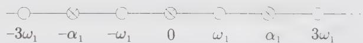  
Figure 13.1. Weight and root lattices for $su(2)$ .

For subsequent reference, we give the explicit form of the commutation relations in different bases. In the Chevalley basis, it reads (dropping the superscript 1):

$$
[ e, f ] = h \quad , \qquad [ h, e ] = 2 e \quad , \qquad [ h, f ] = - 2 f\tag{13.85}
$$

On a state $|\lambda\rangle$ of weight $\lambda$ , the action of h is:

$$
h | \lambda \rangle = \lambda_ {1} | \lambda \rangle\tag{13.86}
$$

In the Cartan-Weyl basis, the generators are (cf. Eq. (13.36) with $\alpha_{1} = \sqrt{2}$ ):

$$
H = h / \sqrt {2}, E ^ {+} = e, E ^ {-} = f\tag{13.87}
$$

with $E^{\pm} \equiv E^{\pm \alpha_{1}}$ . The commutation relations are thus

$$
[ E ^ {+}, E ^ {-} ] = \sqrt {2} H, [ H, E ^ {\pm} ] = \pm \sqrt {2} E ^ {\pm}\tag{13.88}
$$

and

$$
H | \lambda \rangle = \lambda^ {1} | \lambda \rangle = (\lambda_ {1} / \sqrt {2}) | \lambda \rangle\tag{13.89}
$$

Another frequently used basis in the case of $su(2)$ , which we call the spin basis, is defined by

$$
J ^ {0} = H / \sqrt {2}, \quad J ^ {\pm} = E ^ {\pm}\tag{13.90}
$$

This yields

$$
[ J ^ {+}, J ^ {-} ] = 2 J ^ {0} \quad , \qquad [ J ^ {0}, J ^ {\pm} ] = \pm J ^ {\pm}\tag{13.91}
$$

and on the state $|\lambda\rangle = |j, m\rangle$ , the action of the generators is

$$
\begin{array}{l} J ^ {0} \left| j, m \right\rangle = m \left| j, m \right\rangle \\ J ^ {\pm} \left| j, m \right\rangle = \sqrt {(j (j + 1) - m (m \pm 1)} \left| j, m \pm 1 \right\rangle \end{array}\tag{13.92}
$$

EXAMPLE 2: $su(3)$

The Cartan matrix for this rank-2 algebra is

$$
A = \left( \begin{array}{c c} 2 & - 1 \\ - 1 & 2 \end{array} \right)\tag{13.93}
$$

The simple roots $\alpha_{1}$ and $\alpha_{2}$ have the same length (the algebra is simply laced) and they are related to the fundamental weights by

$$
\begin{array}{l} \alpha_ {1} = \alpha_ {1} ^ {\vee} = 2 \omega_ {1} - \omega_ {2} = (2, - 1) \\ \alpha_ {2} = \alpha_ {2} ^ {\vee} = - \omega_ {1} + 2 \omega_ {2} = (- 1, 2) \end{array}\tag{13.94}
$$

The scalar products between fundamental weights are

$$
\left(\omega_ {1}, \omega_ {1}\right) = \left(\omega_ {2}, \omega_ {2}\right) = \frac {2}{3}, \quad \left(\omega_ {1}, \omega_ {2}\right) = \frac {1}{3}\tag{13.95}
$$

The full Weyl group is given by

$$
W = \{1, s _ {1}, s _ {2}, s _ {1} s _ {2}, s _ {2} s _ {1}, s _ {1} s _ {2} s _ {1} \}\tag{13.96}
$$

This follows from the relation

$$
(s _ {1} s _ {2}) ^ {3} = 1 \quad \Longrightarrow \quad s _ {1} s _ {2} s _ {1} = s _ {2} s _ {1} s _ {2}\tag{13.97}
$$

a consequence of Eq. (13.59), which implies that there are no strings of $s_{i}$ with more than three elements. This identity can also be checked directly by acting on

an arbitrary weight:

$$
\begin{array}{l} s _ {1} (\lambda_ {1}, \lambda_ {2}) = (\lambda_ {1}, \lambda_ {2}) - \lambda_ {1} \alpha_ {1} = (- \lambda_ {1}, \lambda_ {1} + \lambda_ {2}) \\ s _ {2} (\lambda_ {1}, \lambda_ {2}) = (\lambda_ {1}, \lambda_ {2}) - \lambda_ {2} \alpha_ {2} = (\lambda_ {1} + \lambda_ {2}, - \lambda_ {2}) \\ s _ {1} s _ {2} (\lambda_ {1}, \lambda_ {2}) = (- \lambda_ {1} - \lambda_ {2}, \lambda_ {1}) \\ s _ {2} s _ {1} (\lambda_ {1}, \lambda_ {2}) = (\lambda_ {2}, - \lambda_ {1} - \lambda_ {2}) \\ s _ {1} s _ {2} s _ {1} (\lambda_ {1}, \lambda_ {2}) = s _ {2} s _ {1} s _ {2} (\lambda_ {1}, \lambda_ {2}) = (- \lambda_ {2}, - \lambda_ {1}) \end{array}\tag{13.98}
$$

The action of the different elements of the Weyl group on the two simple roots gives all possible roots. For instance, $-\alpha_{1}$ and $\alpha_{1} + \alpha_{2}$ are roots because

$$
s _ {1} \alpha_ {1} = - \alpha_ {1}, \quad s _ {1} \alpha_ {2} = \alpha_ {1} + \alpha_ {2}\tag{13.99}
$$

In this way, $\Delta$ is found to be

$$
\Delta = \{\alpha_ {1}, \alpha_ {2}, \alpha_ {1} + \alpha_ {2}, - \alpha_ {1}, - \alpha_ {2}, - \alpha_ {1} - \alpha_ {2} \}\tag{13.100}
$$

The highest root is

$$
\theta = \alpha_ {1} + \alpha_ {2} \quad \Longrightarrow \quad a _ {i} = a _ {i} ^ {\vee} = 1, i = 1, 2\tag{13.101}
$$

The root system and the Weyl chambers are presented in Fig. 13.2. The Weyl chambers are the regions separated by the dashed lines and they are specified here in terms of the elements of the Weyl group.

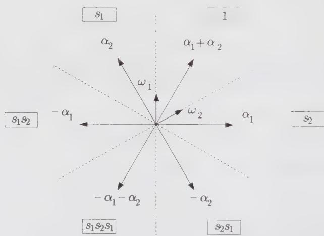  
Figure 13.2. Root system and Weyl chambers $su(3)$ .

EXAMPLE 3: sp(4)

This is again a rank-2 algebra, but it is not simply laced. The Cartan matrix is

$$
A = \left( \begin{array}{c c} 2 & - 1 \\ - 2 & 2 \end{array} \right)\tag{13.102}
$$

so that

$$
\alpha_ {1} = \frac {1}{2} \alpha_ {1} ^ {\vee} = 2 \omega_ {1} - \omega_ {2} = (2, - 1)\tag{13.103}
$$

$$
\alpha_ {2} = \alpha_ {2} ^ {\vee} = - 2 \omega_ {1} + 2 \omega_ {2} = (- 2, 2)
$$

Because the long root is $\alpha_{2}$ ,

$$
\left| \alpha_ {2} \right| ^ {2} = 2 \quad \Longrightarrow \quad \left| \alpha_ {1} \right| ^ {2} = 1\tag{13.104}
$$

The components of the quadratic form matrix are

$$
\left(\omega_ {1}, \omega_ {1}\right) = \left(\omega_ {1}, \omega_ {2}\right) = \frac {1}{2}, \quad \left(\omega_ {2}, \omega_ {2}\right) = 1\tag{13.105}
$$

On the other hand, the complete structure of the Weyl group is easily recovered from the equality

$$
(s _ {1} s _ {2}) ^ {4} = 1\tag{13.106}
$$

meaning that the longest element is $s_{1}s_{2}s_{1}s_{2}$ ; hence,

$$
W = \{1, s _ {1}, s _ {2}, s _ {1} s _ {2}, s _ {2} s _ {1}, s _ {1} s _ {2} s _ {1}, s _ {2} s _ {1} s _ {2}, s _ {1} s _ {2} s _ {1} s _ {2} \}\tag{13.107}
$$

Having determined the Weyl group, the set $\Delta$ can be constructed

$$
\Delta = \left\{\alpha_ {1}, \alpha_ {2}, \alpha_ {1} + \alpha_ {2}, 2 \alpha_ {1} + \alpha_ {2}, - \alpha_ {1}, - \alpha_ {2}, - \alpha_ {1} - \alpha_ {2}, - 2 \alpha_ {1} - \alpha_ {2} \right\}\tag{13.108}
$$

The highest root is thus

$$
\theta = 2 \alpha_ {1} + \alpha_ {2} = 2 \alpha_ {1} ^ {\vee} + \alpha_ {2} ^ {\vee} \quad \Longrightarrow \quad a _ {1} = 2, a _ {2} = a _ {1} ^ {\vee} = a _ {2} ^ {\vee} = 1\tag{13.109}
$$

In this case, the root vectors separate the Weyl chambers, as can be seen in Fig. 13.3.

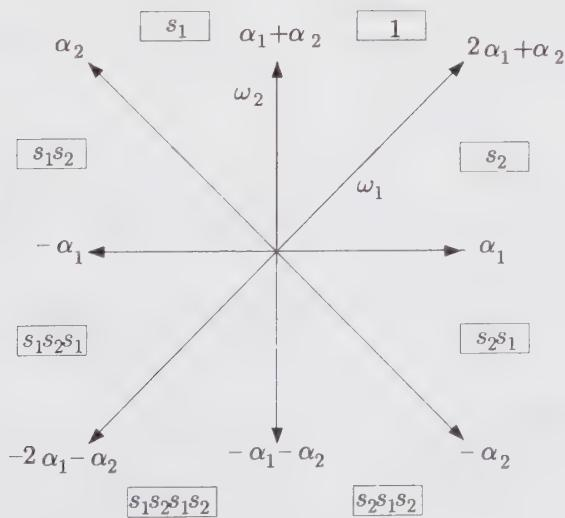  
Figure 13.3. Root system and Weyl chambers $sp(4)$ .

## §13.2. Highest-Weight Representations

Any finite-dimensional irreducible representation has a unique highest-weight state $|\lambda\rangle$ . Being nondegenerate, $|\lambda\rangle$ is completely specified by its eigenvalues (Dynkin labels) $\lambda(h^{i}) = \lambda_{i}$ . Among all the weights in the representation, the highest weight is the one for which the sum of the coefficient expansions in the basis of simple roots is maximal. As a result, for any $\alpha > 0$ , $\lambda + \alpha$ cannot be a weight in the representation, so that

$$
E ^ {\alpha} | \lambda \rangle = 0, \quad \forall \alpha > 0\tag{13.110}
$$

From Eq. (13.27), it is clear that the highest weight of a finite-dimensional representation is necessarily dominant (i.e., with positive-integer Dynkin labels). Moreover, to each dominant weight $\lambda$ there corresponds a unique irreducible finite-dimensional representation $L_{\lambda}$ whose highest weight is $\lambda$ . By abuse of notation, we will often specify a representation by its highest weight. The highest weight for the adjoint representation is $\theta$ .

## 13.2.1. Weights and Their Multiplicities

Starting from the highest-weight state $|\lambda\rangle$ , all the states in the representation space (or irreducible module) $L_{\lambda}$ can be obtained by the action of the lowering operators of g as

$$
E ^ {- \beta} E ^ {- \gamma} \dots E ^ {- \eta} | \lambda \rangle \quad \text { for } \quad \beta , \gamma , \eta \in \Delta_ {+}\tag{13.111}
$$

The set of eigenvalues of all the states in $L_{\lambda}$ is the weight system, written $\Omega_{\lambda}$ . Any weight $\lambda'$ in the set $\Omega_{\lambda}$ is such that $\lambda - \lambda' \in \Delta_{+}$ . An immediate consequence is that all the weights of a given representation lie in exactly one congruence class, that is, one element of the coset P/Q.

In order to find all the weights $\lambda' \in \Omega_{\lambda}$ , the key relation is again Eq. (13.27), which can be rewritten as

$$
(\lambda^ {\prime}, \alpha_ {i} ^ {\vee}) = \lambda_ {i} ^ {\prime} = - (p _ {i} - q _ {i}), \qquad p _ {i}, q _ {i} \in \mathbb {Z} _ {+}\tag{13.112}
$$

As already mentioned, $\lambda'$ is necessarily of the form $\lambda - \sum n_i \alpha_i$ , with $n_i \in \mathbb{Z}_+$ . If we call $\sum n_i$ the level of the weight $\lambda'$ in the representation $\lambda$ , proceeding level by level, we know at each step the value of $p_i$ . Clearly, $\lambda' - \alpha_i$ is also a weight if $q_i$ is nonzero, that is, if $\lambda_i' - p_i > 0$ .

With this criterion, the systematic construction of all the weights in the representation can be done by means of the following algorithm. We start with the highest weight $\lambda = (\lambda_{1}, \cdots, \lambda_{r})$ . For each positive Dynkin label $\lambda_{i} > 0$ , we construct the sequence of weights $\lambda - \alpha_{i}, \lambda - 2\alpha_{i}, \cdots, \lambda - \lambda_{i}\alpha_{i}$ , which all belong to $\Omega_{\lambda}$ . The process is then repeated with $\lambda$ replaced by each of the weights just obtained, and iterated until no more weights with positive Dynkin labels are produced. Simple examples will clarify the method. Consider the adjoint representation of $su(3)$ , whose highest weight is (1, 1). The weights obtained at each step can be read from

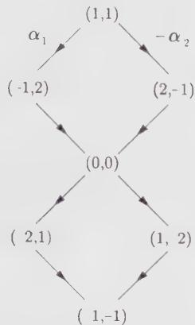  
Figure 13.4. Weights in the adjoint representation of $su(3)$ .

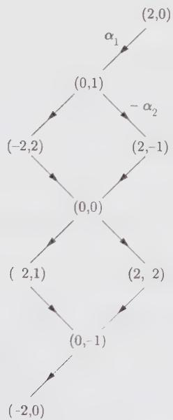  
Figure 13.5. Weights in the adjoint representation of $sp(4)$ .

Fig. 13.4. Similarly, Fig. 13.5 displays the weights in the adjoint representation of $sp(4)$ .

However, this procedure does not keep track of multiplicities. For this, one can use the Freudenthal recursion formula, whose origin will be indicated in Sect. 13.2.3, and which gives the multiplicity of $\lambda'$ in the representation $\lambda$ in terms of the multiplicity of all the weights above it:

$$
\boxed {\left[ | \lambda + \rho | ^ {2} - | \lambda^ {\prime} + \rho | ^ {2} \right] \operatorname{mult} _ {\lambda} (\lambda^ {\prime}) = 2 \sum_ {\alpha > 0} \sum_ {k = 1} ^ {\infty} \left(\lambda^ {\prime} + k \alpha , \alpha\right) \operatorname{mult} _ {\lambda} \left(\lambda^ {\prime} + k \alpha\right)}\tag{13.113}
$$

To illustrate the formula, we calculate the multiplicity of the weight $(0,0)$ in the adjoint representation of $su(3)$ . Having proceeded recursively, we know that k can only be 1 and the three weights above $(0,0)$ have multiplicity 1. Furthermore, $(\lambda' + \alpha, \alpha) = 2$ for the three positive roots. Then, using $\lambda = \theta = \rho = \alpha_{1} + \alpha_{2}$ , we easily find that

$$
(8 - 2) \operatorname{mult} _ {\theta} (0, 0) = 2 (2 + 2 + 2) \quad \Longrightarrow \quad \operatorname{mult} _ {\theta} (0, 0) = 2\tag{13.114}
$$

Indeed, the zero eigenvalue in the adjoint representation always has multiplicity $r$ , being associated with the generators of the Cartan subalgebra (whereas the nonzero weights (roots) are nondegenerate). Another multiplicity formula is presented in Ex. 13.17.

We note that all the weights in a given $W$ orbit have the same multiplicity:

$$
\operatorname{mult} _ {\lambda} (w \lambda^ {\prime}) = \operatorname{mult} _ {\lambda} (\lambda^ {\prime}) \quad \text { for   all } \quad w \in W\tag{13.115}
$$

This ultimately reflects the arbitrariness of the basis of simple roots, that is, that any set $\{w\alpha_{i}\}$ with $w$ fixed, could serve as a basis.

Finally, we mention that a finite-dimensional irreducible module $L_{\lambda}$ is always unitary. This means that, with $(H^{i})^{\dagger}=H^{i}$ and $(E^{\alpha})^{\dagger}=E^{-\alpha}$ , the norm of any state $|\lambda^{\prime}\rangle$ in $L_{\lambda}$ is positive definite:

$$
\left| \lambda^ {\prime} \right\rangle = E ^ {- \beta} \dots E ^ {- \gamma} | \lambda \rangle \Longrightarrow \left\langle \lambda^ {\prime} \mid \lambda^ {\prime} \right\rangle = \left\langle \lambda \mid E ^ {\gamma} \dots E ^ {\beta} E ^ {- \beta} \dots E ^ {- \gamma} \mid \lambda \right\rangle > 0\tag{13.116}
$$

with $\beta, \gamma \in \Delta_{+}$ . This also holds for linear combinations of such states.

## 13.2.2. Conjugate Representations

In an irreducible finite-dimensional representation, there is obviously a lowest state, also unique. It lies in the W orbit of the highest state, in the chamber exactly opposite to the fundamental one. This chamber is specified by the longest element of the Weyl group $w_{0}$ . In terms of the highest state $\lambda$ , the lowest state is thus given by $w_{0}\lambda$ . Turning a representation “upside down” produces the conjugate representation, indicated by $\lambda^{*}$ . Its highest-weight state is the negative of the lowest state of the original representation

$$
\lambda^ {*} = - (w _ {0} \lambda) = (- w _ {0}) \cdot \lambda\tag{13.117}
$$

since $\rho$ is the highest weight of a self-conjugate representation: $\rho = -w_0\rho$ . More generally, all the weights in $\Omega_{\lambda}$ are the negatives of those in $\Omega_{\lambda}$ . For $su(N), w_0$ is given by

$$
w _ {0} = s _ {1} s _ {2} \dots s _ {N - 1} s _ {1} s _ {2} \dots s _ {N - 2} \dots s _ {1} s _ {2} s _ {1}\tag{13.118}
$$

$$
\begin{array}{l} \text { With   } N = 3, \text {   it   yields } \\ \quad (- w _ {0}) \cdot (\lambda_ {1}, \lambda_ {2}) = - s _ {1} s _ {2} s _ {1} (\lambda_ {1} + 1, \lambda_ {2} + 1) - (1, 1) = (\lambda_ {2}, \lambda_ {1}) \end{array}\tag{13.119}
$$

The conjugation is related to the reflection symmetry of the Dynkin diagram. This readily shows that for $su(N)$ , the conjugation amounts to reversing the order of the finite Dynkin labels. Because the Dynkin diagram of $so(2r+1)$ , $sp(2r)$ , $so(4r)$ , $G_{2}$ , $F_{4}$ , $E_{7}$ , and $E_{8}$ have no symmetry, all representations of these algebras are self-conjugate. For the other algebras, self-conjugate representations are those with highest weight satisfying:

$$
\begin{array}{l l} s u (r + 1): & \lambda_ {i} = \lambda_ {r - i} \\ s o (4 r + 2): & \lambda_ {r} = \lambda_ {r - 1} \\ E _ {6}: & \lambda_ {1} = \lambda_ {5}, \quad \lambda_ {2} = \lambda_ {4} \end{array}\tag{13.120}
$$

## 13.2.3. Quadratic Casimir Operator

A generalization of the $su(2)$ quadratic Casimir operator Q can be constructed for any semisimple Lie algebra. Up to a scale factor, it is uniquely characterized by its commutativity with all the generators of the algebra. In a generic basis $\{L^{a}\}$ , it can be checked to be given by

$$
\boxed {\mathcal {Q} = \sum_ {a, b} [ K (\mathcal {L} ^ {a}, \mathcal {L} ^ {b}) ] ^ {- 1} \mathcal {L} ^ {a} \mathcal {L} ^ {b}}\tag{13.121}
$$

where K is the Killing form (which, as already mentioned, is nondegenerate for semisimple Lie algebras). In the orthonormal $\{J^{a}\}$ basis, it is thus

$$
\mathcal {Q} = \sum_ {a} J ^ {a} J ^ {a}\tag{13.122}
$$

On the other hand, in the Cartan-Weyl basis, it reads

$$
\mathcal {Q} = \sum_ {i} H ^ {i} H ^ {i} + \sum_ {\alpha > 0} \frac {| \alpha | ^ {2}}{2} (E ^ {\alpha} E ^ {- \alpha} + E ^ {- \alpha} E ^ {\alpha})\tag{13.123}
$$

We note that $\mathcal{Q}$ is not an element of $g$ itself; it lies in its universal enveloping algebra, which is the set of all formal power series in elements of $g$ .

Since Q commutes with all the generators of the algebra, its eigenvalue is the same on all the states of an irreducible representation. It is most easily evaluated on the highest-weight state, using the Cartan-Weyl basis. First, we have

$$
\sum_ {i} H ^ {i} H ^ {i} | \lambda \rangle = \sum_ {i} \lambda^ {i} \lambda^ {i} | \lambda \rangle = (\lambda , \lambda) | \lambda \rangle\tag{13.124}
$$

Because $E^{\alpha}|\lambda\rangle = 0$ for $\alpha > 0$ , the term $E^{-\alpha}E^{\alpha}$ does not contribute. For the remaining term, we move $E^{\alpha}$ to the right of $E^{-\alpha}$ using

$$
[ E ^ {\alpha}, E ^ {- \alpha} ] | \lambda \rangle = \frac {2}{| \alpha | ^ {2}} \alpha \cdot H | \lambda \rangle = \frac {2}{| \alpha | ^ {2}} (\alpha , \lambda) | \lambda \rangle\tag{13.125}
$$

The result is

$$
\mathcal {Q} | \lambda \rangle = [ (\lambda , \lambda) + \sum_ {\alpha > 0} (\alpha , \lambda) ] | \lambda \rangle\tag{13.126}
$$

By using the definition (13.47) of the Weyl vector, we can write

$$
\boxed {\mathcal {Q} | \lambda \rangle = (\lambda , \lambda + 2 \rho) | \lambda \rangle}\tag{13.127}
$$

In the adjoint representation, the eigenvalue of the Casimir operator is

$$
\begin{array}{c} (\theta , \theta + 2 \rho) = 2 + 2 (\theta , \rho) = 2 + 2 \sum_ {i, j} a _ {i} ^ {\vee} (\alpha_ {i} ^ {\vee}, \omega_ {j}) \\ = 2 + 2 \sum_ {i} \alpha_ {i} ^ {\vee} = 2 + 2 (g - 1) = 2 g \end{array}\tag{13.128}
$$

The quadratic Casimir operator does not distinguish a representation from its conjugate

$$
\mathcal {Q} | \lambda^ {*} \rangle = \mathcal {Q} | \lambda \rangle\tag{13.129}
$$

This follows from the equality

$$
| \lambda^ {*} + \rho | ^ {2} = | \lambda + \rho | ^ {2}\tag{13.130}
$$

which is itself a simple consequence of Eq. (13.117):

$$
\lambda^ {*} + \rho = (- w _ {0}) \cdot \lambda + \rho = - w _ {0} (\lambda + \rho)\tag{13.131}
$$

and of the invariance of the scalar product with respect to the Weyl group: $|w\mu|^2 = |\mu|^2$ .

The Freudenthal formula (13.113) is obtained by evaluating the trace of Q in the subspace associated with the weight $\lambda'$ , first using the eigenvalue just obtained and then using the explicit form of Q in the Cartan-Weyl basis.

For $su(2)$ , the quadratic Casimir operator is the unique operator that commutes with all the generators. However, we mention that for higher-rank algebras there exist Casimir operators of higher degree. Their degrees minus one are called the exponents of the algebras (tabulated in App. 13.A). $^{8}$

## 13.2.4. Index of a Representation

The quadratic Casimir operator enters in the definition of an important quantity, the index of a representation, which gives the relative normalization of invariant bilinear products taken in different representations.

As already stressed, once a normalization is fixed for the length of the long roots, every product is uniquely determined. In particular, the normalization of the invariant bilinear form $\mathrm{Tr}_{\lambda}(\mathcal{R}(J^{a})\mathcal{R}(J^{b}))$ , for $\mathcal{R}(J^{a})$ standing for a matrix representation of the generator $J^{a}$ , must be fixed. Here the trace is evaluated in $L_{\lambda}$ . The relative normalization of this product with respect to $|\theta|^{2}$ defines the Dynkin index $x_{\lambda}$ of the representation $\lambda$

$$
\mathrm{Tr} _ {\lambda} (\mathcal {R} (J ^ {a}) \mathcal {R} (J ^ {b})) = | \theta | ^ {2} x _ {\lambda} \delta_ {a b} = 2 x _ {\lambda} \delta_ {a b}\tag{13.132}
$$

An explicit expression for $x_{\lambda}$ can be easily obtained by setting a = b and summing over all values of a. The l.h.s. becomes equal to the trace of the quadratic Casimir, so that

$$
x _ {\lambda} = \frac {\dim | \lambda | (\lambda , \lambda + 2 \rho)}{2 \dim g}\tag{13.133}
$$

We note that the Dynkin index of the adjoint representation, $\lambda = \theta$ , is simply the dual Coxeter number

$$
x _ {\theta} = g\tag{13.134}
$$

since $\dim |\theta| = \dim g$ and $(\theta, \rho) = g - 1$ (cf. Eq (13.128)).

## §13.3. Tableaux and Patterns (su(N))

In this section, we introduce a useful diagrammatic representation of highest weights, which will also turn out to be a powerful combinatorial tool, particularly efficient in tensor-product calculations. A refinement of this diagrammatic representation leads to the simple construction of a complete basis of states in a finite-dimensional representation. This will be shown to be equivalent to a description of states in terms of triangular arrays of numbers, the so-called Gelfand-Tsetlin patterns. For simplicity, we restrict the whole discussion to $su(N)$ .

## 13.3.1. Young Tableaux

A $su(N)$ integrable highest weight $\lambda$ , with Dynkin labels

$$
\lambda = (\lambda_ {1}, \dots , \lambda_ {N - 1})\tag{13.135}
$$

can equally well be specified in terms of its partition

$$
\lambda = \{\ell_ {1}; \ell_ {2}; \dots ; \ell_ {N - 1} \}\tag{13.136}
$$

where

$$
\ell_ {i} = \lambda_ {i} + \lambda_ {i + 1} + \dots + \lambda_ {N - 1}\tag{13.137}
$$

To a partition, we associate a Young tableau, which is a box array of rows lined up on the left, such that the length of the $i$ -th row is equal to $\ell_i$ . For example, to the $su(5)$ weight

$$
\lambda = (2, 0, 2, 0) = \{4; 2; 2 \}\tag{13.138}
$$

(zero entries in partitions being generally omitted) corresponds the Young tableau


(13.139)

Dynkin labels provide a dual description of the tableau: $\lambda_{i}$ gives the number of columns of i boxes. The fundamental representation $\omega_{\ell}$ is described by a single column of $\ell$ boxes. To the scalar representation corresponds a void tableau or, equivalently, a single column of N boxes. Allowing for columns of N boxes, partitions are fixed by N integers. But clearly, when $\ell_{N} \neq 0$ , we can always subtract $\{\ell_{N}; \ell_{N}; \cdots; \ell_{N}\}$ (N entries) from the partition, which just amounts to eliminating columns of N boxes; for instance,

$$
\{5; 3; 3; 1; 1 \} = \{4; 2; 2 \}\tag{13.140}
$$

Tableaux with $\ell_N = 0$ will be referred to as reduced tableaux, and likewise for partitions.

The transpose of a Young tableau is obtained by interchanging rows and columns. We denote by $\lambda^t$ the corresponding weight. For instance, the transpose of $\lambda = \{4; 2; 2\}$ is

$$
\begin{array}{c c c} \hline & & \\ \hline & & \\ \hline & & \\ \hline & & \end{array} \leftrightarrow \lambda^ {t} = \{3; 3; 1; 1 \}\tag{13.141}
$$

With

$$
\lambda^ {t} = \{\tilde {\ell_ {1}}; \tilde {\ell_ {2}}; \dots \}\tag{13.142}
$$

it is not difficult to see that

$$
\tilde {\ell} _ {i} = \quad \text { number   of } \ell_ {j} \text { such   that } \ell_ {j} \geq i\tag{13.143}
$$

## 13.3.2. Partitions and Orthonormal Bases

The entries of the partition (13.136) are the expansion coefficients of a dominant weight in a certain basis, which we now describe. We also indicate how partitions can be associated with nondominant integral weights, providing a rationale for the construction of the next section.

Elements of $su(N)$ can be represented by $N \times N$ traceless matrices. In this representation, the Cartan subalgebra is spanned by the set of all diagonal traceless matrices. We let $e_{ij}$ stand for the matrix with 0 everywhere, except for a single 1 at position $(i,j)$ (i-th row, j-th column). With this notation, the elements of the Cartan subalgebra are of the form $\sum_{i=1}^{N} \epsilon_i e_{ii}$ with $\sum_{i=1}^{N} \epsilon_i = 0$ . The ladder operators are represented by the matrices $e_{ij}, i \neq j$ . The roots are then given by $\epsilon_i - \epsilon_j, i \neq j$ , and a basis of simple roots is

$$
\alpha_ {i} = \epsilon_ {i} - \epsilon_ {i + 1}, \quad i = 1, \dots , N - 1\tag{13.144}
$$

Generalizing this point of view, we can consider the $\epsilon_{i}$ as orthonormal vectors in an $(r + 1)$ -dimensional space, and in terms of these vectors, the root lattice is simply

$$
Q = \sum_ {i = 1} ^ {N} n _ {i} \epsilon_ {i} \quad \text { with } \quad n _ {i} \in \mathbb {Z} \quad \text { and } \quad \sum_ {i = 1} ^ {N} n _ {i} = 0\tag{13.145}
$$

With $\epsilon_{i}^{2}=1$ and $\epsilon_{i}\cdot\epsilon_{j}=0$ for $i\neq j$ , we see that $|\alpha|^{2}=2$ for any root. The fundamental weights are related to the simple roots by the quadratic form matrix (since here roots are the same as coroots), which leads to

$$
\omega_ {i} = \epsilon_ {1} + \epsilon_ {2} + \dots + \epsilon_ {i} - \frac {i}{N} \sum_ {i = 1} ^ {N} \epsilon_ {i}\tag{13.146}
$$

Hence, the expansion coefficients of a highest weight in the $\{\epsilon_i\}$ basis are exactly the entries of the partition

$$
\lambda = \sum_ {i = 1} ^ {N - 1} \lambda_ {i} \omega_ {i} = \sum_ {i = 1} ^ {N} (\ell_ {i} - \kappa) \epsilon_ {i}\tag{13.147}
$$

where the $\ell_{i}$ are related to the Dynkin labels by Eq. (13.137) and $\kappa$ is

$$
\kappa = \frac {1}{N} \sum_ {j = 1} ^ {N - 1} j \lambda_ {j}\tag{13.148}
$$

A well-defined partition is thus associated with the highest weight $\lambda$ of each representation. The other weights in the representation are obtained by subtracting from $\lambda$ the positive roots $\epsilon_{i}-\epsilon_{j}, i<j$ . This construction gives directly their expansion coefficients in the $\{\epsilon_{i}\}$ basis. A weight $\lambda'$ can thus be described by a partition $\{\ell_{1}^{\prime};\ell_{2}^{\prime};\cdots;\ell_{N}^{\prime}\}$ . We stress that the partition of a weight that is not a highest weight is not related to the shape of a Young tableau. In particular, such a partition is no longer bound to satisfy $\ell_{i}^{\prime}\geq\ell_{i+1}^{\prime}$ .

## 13.3.3. Semistandard Tableaux

We now indicate how tableau techniques can be used to explicitly describe all the states in a representation. This involves filling the boxes of a Young tableau with positive integers, generating the so-called semistandard tableaux. They are defined as follows. We let $c_{i,j}$ be the integer appearing in the box on the i-th row (from top) and the j-th column (from left), and satisfying

$$
1 \leq c _ {i, j} \leq N, c _ {i, j} \leq c _ {i, j + 1}, c _ {i, j} <   c _ {i + 1, j}\tag{13.149}
$$

In other words, the numbers are nondecreasing from left to right and strictly increasing from top to bottom.

Semistandard tableaux of shape $\lambda$ are in one-to-one correspondence with the states in the module $L_{\lambda}$ . The numbering in the semistandard tableaux encodes the partition of the corresponding weight. We can think of a box with number i as representing $\epsilon_{i}$ . The number of i's in the semistandard tableau of weight $\lambda' = \{\ell_{1}', \cdots, \ell_{N}'\}$ is given by $\ell_{i}'$ . In the semistandard tableau representing the highest weight $\lambda$ , all boxes of the i-th row have number i. The weight of a semistandard tableau is clearly obtained by adding the weights of all its boxes. The weight of a box marked with a i is

$$
\epsilon_ {i} = \omega_ {i} - \omega_ {i - 1}, \qquad i = 1, \dots , N\tag{13.150}
$$

(modulo $\sum \epsilon_{i} / N$ ) with $\omega_0 = \omega_N = 0$ .

The number of semistandard tableaux of a fixed shape that can be constructed with a given partition gives the multiplicity of the corresponding weight in the representation. In other words, the rules for constructing semistandard tableaux provide a combinatorial realization of the Freudenthal multiplicity formula (13.113).

We consider for example $su(3)$ . The semistandard tableaux of the three states in the representation $\omega_{1}$ are

$$
\boxed {1} \leftrightarrow (1, 0), \quad \boxed {2} \leftrightarrow (- 1, 1), \quad \boxed {3} \leftrightarrow (0, - 1)\tag{13.151}
$$

whereas those in the representation $\omega_{2}$ are

$$
\boxed {\frac {1}{2}} \leftrightarrow (0, 1), \quad \boxed {\frac {1}{3}} \leftrightarrow (1, - 1), \quad \boxed {\frac {2}{3}} \leftrightarrow (- 1, 0)\tag{13.152}
$$

The adjoint representation (1, 1) contains the 8 semistandard tableaux:

$$
\begin{array}{c c} \framebox {1} & 1 \\ \framebox {2} \end{array}
$$

(1, 1)

$$
\begin{array}{c} \framebox {1} \framebox {2} \\ \framebox {2} \\ (- 1, 2) \end{array}
$$

$$
\begin{array}{c c} \framebox {1} & 3 \\ \framebox {2} \\ (0, 0) \end{array}
$$

$$
\begin{array}{c c} \framebox {1} & 1 \\ \framebox {3} \end{array}
$$

$$
\begin{array}{c c} \framebox {1} & 2 \\ \framebox {3} \end{array}
$$

(0, 0)

$$
\begin{array}{c c} \hline 1 & 3 \\ \hline 3 \end{array}
$$

(1,-2)

$$
\begin{array}{c c} \hline 2 & 2 \\ \hline 3 \end{array}
$$

(-2,1)

$$
\begin{array}{c c} \hline 2 & 3 \\ \hline 3 \end{array}\tag{13.153}
$$

Two distinct semistandard tableaux, that is, two distinct states, correspond to the doubly degenerate weight $(0,0)$ . Similarly, to the weight $(0,0,0)$ of the $su(4)$ representation $(2,0,2)$ (with partition $\{2;2;2;2\}$ ) correspond 6 semistandard tableaux:

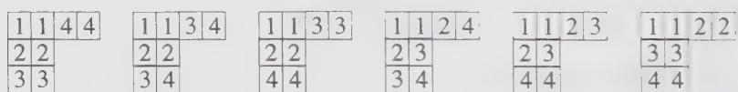

(13.154)

## 13.3.4. Gelfand-Tsetlin Patterns

An equivalent representation of the basis of semistandard tableaux is given by the Gelfand-Tsetlin patterns. To a given semistandard tableau we associate the following triangular array of numbers:

$$
\begin{array}{c} \beta_ {1} ^ {(N)}   \beta_ {2} ^ {(N)}   \dots \dots   \beta_ {N} ^ {(N)} \\ \beta_ {1} ^ {(N - 1)}   \dots   \beta_ {N - 1} ^ {(N - 1)} \end{array}
$$

$$
\begin{array}{c} \beta_ {1} ^ {(2)}   \beta_ {2} ^ {(2)} \\ \beta_ {1} ^ {(1)} \end{array}\tag{13.155}
$$

such that $\beta_{i}^{(j)}$ is the number of boxes containing numbers less or equal to j in the i-th row (from top) of the semistandard tableau. $^{9}$ For instance, the following semistandard tableau and Gelfand-Tsetlin pattern corresponding to the weight $(-2,1,0)$ in the representation $(1,2,1)$ of $su(4)$ are equivalent:

$$
\begin{array}{c c} \framebox {1} & 2 \\ \framebox {2} & 3 \\ \framebox {3} \end{array} \quad \leftrightarrow \quad \begin{array}{c c} 4 & 3 \\ 3 & 2 \\ 3 & 1 \\ 1 \end{array}\tag{13.156}
$$

The first line in the Gelfand-Tsetlin pattern is common to all patterns in the representation, being simply the partition of the tableau

$$
\beta_ {i} ^ {(N)} = \ell_ {i}\tag{13.157}
$$

All the states in a representation are then generated by filling a triangular array of $N$ lines with integers $\beta_{i}^{(j)}$ satisfying

$$
\beta_ {i} ^ {(j)} \geq \beta_ {i + 1} ^ {(j)} \quad \beta_ {i} ^ {(j)} \geq \beta_ {i + 1} ^ {(j + 1)}\tag{13.158}
$$

with the first line fixed by the partition. In this way, the 8 patterns of the (1,1) representation of $su(3)$ are found to be

$$
\begin{array}{c c c c c c c c} 2   1   0 & 2   1   0 & 2   1   0 & 2   1   0 & 2   1   0 & 2   1   0 & 2   1   0 & 2   1   0 \\ 2   1 & 2   1 & 1   1 & 2   0 & 2   0 & 1   0 & 2   0 & 1   0 \\ 2 & 1 & 1 & 2 & 1 & 1 & 0 & 0 \end{array}\tag{13.159}
$$

Their ordering corresponds to the semistandard tableaux (13.153). We note that the Gelfand-Tsetlin pattern of the highest-weight state in the representation is completely fixed by the partition, being

$$
\begin{array}{c} \ell_ {1}   \ell_ {2}   \dots \dots   \ell_ {N} \\ \ell_ {1}   \dots   \ell_ {N - 1} \\ \dots \dots \\ \ell_ {1}   \ell_ {2} \\ \ell_ {1} \end{array}\tag{13.160}
$$

## §13.4. Characters

## 13.4.1. Weyl's Character Formula

A character is a useful functional way of coding the whole content of a representation. The character of the representation of highest weight $\lambda$ is formally defined

as

$$
\boxed {\chi_ {\lambda} = \sum_ {\lambda^ {\prime} \in \Omega_ {\lambda}} \operatorname{mult} _ {\lambda} (\lambda^ {\prime}) e ^ {\lambda^ {\prime}}}\tag{13.161}
$$

where the sum is over all the weights of the representation. $e^{\lambda}$ denotes a formal exponential satisfying

$$
e ^ {\lambda} e ^ {\mu} = e ^ {\lambda + \mu}
$$

$$
e ^ {\lambda} (\xi) = e ^ {(\lambda , \xi)}\tag{13.162}
$$

On the r.h.s. of the last expression, $e$ is a genuine exponential function, and $\xi$ is an arbitrary element of the dual Cartan subalgebra (i.e., an arbitrary weight).

This formal character is related to the familiar character in the representation theory of groups as follows. Let G be the Lie group of g and H an element of the Cartan subgroup of G. The character of H in some representation is simply its trace evaluated in the corresponding module V:

$$
\operatorname{Tr} _ {V} H = \sum_ {\gamma} \operatorname{mult} (\gamma) [ \gamma (H) ]\tag{13.163}
$$

where $\gamma(H)$ denotes the eigenvalues of H. Complete information about the representation is obtained by considering the group character as restricted to the full Cartan subgroup. Since H is associated with an element h of the Cartan subalgebra of g by $H = \exp(h)$ , spanning the full Cartan subgroup amounts to replacing the single element h by the vector $\tilde{h} = (h^{1}, h^{2}, \cdots, h^{r})$ . Thus $\gamma(H)$ is replaced by $e^{\lambda'(\tilde{h})} = e^{(\lambda_{1}', \cdots, \lambda_{r}')}$ where $\lambda'$ is a weight. For a vector exponent, e must be regarded as a formal exponential.

The expression (13.161) for the character can be brought into a more manageable form in two steps (we omit the details). At first, the auxiliary quantity

$$
D _ {\rho} = \prod_ {\alpha > 0} (e ^ {\alpha / 2} - e ^ {- \alpha / 2})\tag{13.164}
$$

is introduced, and shown to be expressible as a sum over the elements of the Weyl group

$$
D _ {\rho} = \sum_ {w \in W} \epsilon (w) e ^ {w \rho}\tag{13.165}
$$

The second step (more involved) consists of showing, using the Freudenthal multiplicity formula (13.113), that

$$
D _ {\rho} \chi_ {\lambda} = D _ {\lambda + \rho}\tag{13.166}
$$

where $D_{\lambda + \rho}$ is defined from Eq. (13.165) with $\rho$ replaced by $\lambda + \rho$ . This last result is the famous Weyl character formula

$$
\chi_ {\lambda} = \frac {D _ {\lambda + \rho}}{D _ {\rho}} = \frac {\sum_ {w \in W} \epsilon (w) e ^ {w (\lambda + \rho)}}{\sum_ {w \in W} \epsilon (w) e ^ {w _ {\rho}}}\tag{13.167}
$$

For $su(2)$ , with $t = e^{\omega_1}$ , this becomes

$$
\chi_ {\lambda} = \frac {t ^ {\lambda_ {1} + 1} - t ^ {- \lambda_ {1} - 1}}{t - t ^ {- 1}} = t ^ {\lambda_ {1}} + t ^ {\lambda_ {1} - 2} + \dots + t ^ {- \lambda_ {1}}\tag{13.168}
$$

For some manipulations, it is more convenient to work with the character evaluated at a special but arbitrary value $\xi$

$$
\chi_ {\lambda} (\xi) = \frac {\sum_ {w \in W} \epsilon (w) e ^ {(w (\lambda + \rho) , \xi)}}{\sum_ {w \in W} \epsilon (w) e ^ {(w \rho , \xi)}}\tag{13.169}
$$

## 13.4.2. The Dimension and the Strange Formulae

As an immediate application, we derive a formula for the dimension of a representation. From Eq. (13.161), it is clear that this amounts to evaluating the character at the special point $\xi = 0$ . But setting $\xi = 0$ in Eq. (13.169) leads to an indeterminate expression since $\sum \epsilon(w) = 0$ (W has the same number of even and odd elements). Rather, a limiting process must be used. For this we set $\xi = t\rho$ and consider the limit $t \to 0$ . For $\xi$ proportional to $\rho$ , the character takes the simple form

$$
\chi_ {\lambda} (t \rho) = \frac {D _ {\lambda + \rho} (t \rho)}{D _ {\rho} (t \rho)} = \frac {D _ {\rho} (t (\lambda + \rho))}{D _ {\rho} (t \rho)} = \prod_ {\alpha > 0} \frac {\sinh (\alpha , (\lambda + \rho) t / 2)}{\sinh (\alpha , \rho t / 2)}\tag{13.170}
$$

which yields

$$
\dim | \lambda | = \lim _ {t \rightarrow 0} \chi_ {\lambda} (t \rho) = \prod_ {\alpha > 0} \frac {(\lambda + \rho , \alpha)}{(\rho , \alpha)}\tag{13.171}
$$

For instance, the application of this formula to $su(2), su(3)$ , and $sp(4)$ gives

$su(2):\quad \dim |\lambda | = \lambda_{1} + 1$

$$
s u (3): \quad \dim | \lambda | = \frac {1}{2} (\lambda_ {1} + 1) (\lambda_ {2} + 1) (\lambda_ {1} + \lambda_ {2} + 2)\tag{13.172}
$$

$$
s p (4): \quad \dim | \lambda | = \frac {1}{6} (\lambda_ {1} + 1) (\lambda_ {2} + 1) (\lambda_ {1} + 2 \lambda_ {2} + 3) (\lambda_ {1} + \lambda_ {2} + 2)
$$

Keeping track of the subleading term in Eq. (13.170) leads to another interesting formula. At first, we have

$$
\begin{array}{l} \chi_ {\lambda} (t \rho) = \prod_ {\alpha > 0} \frac {(\lambda + \rho , \alpha)}{(\rho , \alpha)} \left\{1 + \frac {t ^ {2}}{2 4} [ (\alpha , \lambda + \rho) ^ {2} - (\alpha , \rho) ^ {2} ] \right\} \\ = \dim | \lambda | \left\{1 + \frac {t ^ {2}}{2 4} \sum_ {\alpha > 0} [ (\alpha , \lambda + \rho) ^ {2} - (\alpha , \rho) ^ {2} ] \right\} \end{array}\tag{13.173}
$$

Now, as demonstrated in the following paragraph, we can always write

$$
(\lambda , \mu) = \frac {1}{y} \sum_ {\alpha \in \Delta} (\lambda , \alpha) (\alpha , \mu) = \frac {2}{y} \sum_ {\alpha \in \Delta_ {+}} (\lambda , \alpha) (\alpha , \mu)\tag{13.174}
$$

where the constant $y$ , evaluated below, depends upon the algebra. Thus we have

$$
\chi_ {\lambda} (t \rho) = \dim | \lambda | \left\{1 + \frac {t ^ {2} y}{4 8} [ | \lambda + \rho | ^ {2} - | \rho | ^ {2} ] \right\}\tag{13.175}
$$

The comparison of this expression with the t expansion of

$$
\chi_ {\lambda} (t \rho) = \sum_ {\lambda^ {\prime} \in \Omega_ {\lambda}} \operatorname{mult} _ {\lambda} (\lambda^ {\prime}) e ^ {(\lambda^ {\prime}, \rho) t}\tag{13.176}
$$

yields

$$
\frac {1}{2} \sum_ {\lambda^ {\prime} \in \Omega_ {\lambda}} \operatorname{mult} _ {\lambda} \left(\lambda^ {\prime}\right) \left(\lambda^ {\prime}, \rho\right) ^ {2} = \frac {y}{4 8} \dim | \lambda | [ | \lambda + \rho | ^ {2} - | \rho | ^ {2} ]\tag{13.177}
$$

For the adjoint representation, $\lambda = \theta$ , and the different nonzero weights $\lambda'$ are the roots, which all have multiplicity 1; the l.h.s. then becomes

$$
\frac {1}{2} \sum_ {\lambda^ {\prime} \in \Omega_ {\theta}} \operatorname{mult} _ {\theta} (\lambda^ {\prime}) (\lambda^ {\prime}, \rho) ^ {2} = \frac {1}{2} \sum_ {\alpha \in \Delta} (\rho , \alpha) (\alpha , \rho) = \frac {1}{2} y | \rho | ^ {2}
$$

where in the last step we used Eq. (13.174). The r.h.s. is

$$
\frac {y}{4 8} \mathrm{dim} | \theta | (\theta , \theta + 2 \rho) = \frac {y g}{2 4} \mathrm{dimg}\tag{13.178}
$$

(cf. Eq. (13.128)). This yields the Freudenthal–de Vries strange formula:

$$
\boxed {| \rho | ^ {2} = \frac {g}{1 2} \dim g}\tag{13.179}
$$

We now return to Eq. (13.174). The product $\sum_{\alpha\in\Delta}\alpha\alpha^{t}$ (where $\alpha^{t}$ stands for the transpose of $\alpha$ ) is necessarily proportional to the $r\times r$ identity matrix $I_{r}$ :

$$
\sum_ {\alpha \in \Delta} \alpha \alpha^ {t} = y I _ {r}\tag{13.180}
$$

Indeed, the l.h.s. commutes with any element of the Weyl group since the action of the latter simply amounts to a permutation of the roots. Since the action of the Weyl group on $\sum_{\alpha\in\Delta}\alpha\alpha^{t}$ is irreducible, this latter quantity must then be proportional to the identity. The proportionality constant y is evaluated by taking the trace of this equation. With $\operatorname{Tr}\alpha\alpha^{t}=|\alpha|^{2}$ , this yields

$$
\sum_ {\alpha \in \Delta} | \alpha | ^ {2} = y r\tag{13.181}
$$

The l.h.s. can be evaluated from Eq. (13.132) restricted to the generators of the Cartan subalgebra:

$$
\mathrm{Tr} _ {\theta} H ^ {i} H ^ {j} = 2 g \delta^ {i j}\tag{13.182}
$$

Setting j = i and summing over i yields

$$
\sum_ {i} \sum_ {\alpha \in \Delta} \alpha^ {i} \alpha^ {i} = \sum_ {\alpha \in \Delta} | \alpha | ^ {2} = 2 g r\tag{13.183}
$$

This fixes the value of y:

$$
y = 2 g\tag{13.184}
$$

## 13.4.3. Schur Functions

In the $su(N)$ orthogonal basis $\{\epsilon_{i}\}$ introduced in Sect. 13.3.2, the characters are called Schur functions. In this basis, there is a simple combinatorial formula for the dimension of a representation.

In the orthonormal basis, the Weyl group acts as the permutation group $S_{N}$ of the N basis vectors. For instance, the action of $s_{\alpha}$ with $\alpha = \epsilon_{i} - \epsilon_{j}$ simply amounts to interchanging $\epsilon_{i}$ and $\epsilon_{j}$ . This observation allows us to rewrite the character as a ratio of matrix determinants, that is, as a Schur function. To this end we introduce the variables

$$
q _ {i} = e ^ {\epsilon_ {i}}\tag{13.185}
$$

subject to the constraint

$$
\prod_ {i = 1} ^ {N} q _ {i} = 1\tag{13.186}
$$

The formal exponential can thus be written as

$$
e ^ {\lambda} = q _ {1} ^ {\ell_ {1}} q _ {2} ^ {\ell_ {2}} \dots q _ {N} ^ {\ell_ {N}}\tag{13.187}
$$

and we have

$$
D _ {\lambda} = \sum_ {w \in W} e ^ {w \lambda} = \sum_ {\sigma \in S _ {N}} \epsilon (\sigma) \prod_ {i = 1} ^ {N} q ^ {\ell_ {\sigma (i)}} = \det q _ {j} ^ {\ell_ {i}}\tag{13.188}
$$

Since the i-th entry of the partition of $\rho$ is N - i, the character can be written as

$$
\chi_ {\lambda} = S _ {\lambda} \left(q _ {1}, \dots , q _ {N}\right) = \frac {\det q _ {j} ^ {\ell_ {i} + N - i}}{\det q _ {j} ^ {N - i}}\tag{13.189}
$$

where $S_{\lambda}$ stands for the Schur function. The above denominator is the ubiquitous Vandermonde determinant:

$$
\det q _ {j} ^ {N - i} = \det q _ {j} ^ {i - 1} = \det \left( \begin{array}{c c c c} 1 & 1 & \dots & 1 \\ q _ {1} & q _ {2} & \dots & q _ {N} \\ \vdots & & & \\ q _ {1} ^ {N - 1} & q _ {2} ^ {N - 1} & \dots & q _ {N} ^ {N - 1} \end{array} \right)\tag{13.190}
$$

which can also be written under the more familiar form

$$
\det q _ {j} ^ {N - i} = \prod_ {1 \leq i <   j \leq N} (q _ {i} - q _ {j})\tag{13.191}
$$

The dimension of the representation is calculated by letting all $q_{i}$ approach 1 in the expression for the character, with the result

$$
\dim | \lambda | = \prod_ {1 \leq i <   j \leq N} \frac {\left(\ell_ {i} - \ell_ {j} + j - i\right)}{(j - i)}\tag{13.192}
$$

For $su(2)$ and $su(3)$ reduced tableaux, this is easily seen to reproduce Eq. (13.172). (See also Ex. 13.13 for another dimension formula.)

## §13.5. Tensor Products: Computational Tools

In principle, the problem of calculating tensor products is straightforward. In order to calculate the product $L_{\lambda} \otimes L_{\mu}$ , usually written as $\lambda \otimes \mu$ , we simply add together all pairs of weights $\lambda'$ , $\mu'$ (belonging respectively to the weight systems $\Omega_{\lambda}$ and $\Omega_{\mu}$ ), taking care of their multiplicities, and reorganize the full set of dim $|\lambda| \times \dim |\mu|$ resulting weights in irreducible representations. We write the result under the form

$$
\lambda \otimes \mu = \bigoplus_ {\nu \in P _ {+}} \mathcal {N} _ {\lambda \mu} ^ {\nu} \nu\tag{13.193}
$$

where the sum is taken over all dominant weights, and $N_{\lambda\mu}^{\nu}$ , called a tensor-product coefficient, gives the multiplicity of the representation $\nu$ in the decomposition of the tensor product $\lambda \otimes \mu$ .

In practice, this method is obviously too cumbersome, and more efficient techniques are required. Such methods are described in the next subsections. The first one follows directly from manipulations of the Weyl character formula and it is completely general. Although theoretically important, as a computational tool it is not very powerful. For this reason we introduce two other methods, which, however, are presented more like recipes. These are the famous Littlewood-Richardson rule and the more novel Berenstein-Zelevinsky method of triangles. For these, however, the discussion is again restricted to $su(N)$ . Another motivation for introducing these last two methods is that they allow us to determine precisely those very states that contribute to the tensor product, a point on which we will expand in due time. Furthermore, in their framework, a particular tensor-product coefficient can be studied in isolation, that is without necessarily having to compute the full tensor-product decomposition.

But before turning to techniques, we list some general properties of tensor-product coefficients. It is clear that

$$
\mathcal {N} _ {\lambda 0} ^ {\nu} = \delta_ {\lambda} ^ {\nu}\tag{13.194}
$$

where 0 stands for the scalar representation (i.e., the representation whose highest weight has all Dynkin labels equal to zero and which thus contains a single state). On the other hand, the tensor product of a representation with its conjugate always contains the scalar representation. It is obtained from the pairing of all the states of $\lambda$ with their negatives, which necessarily lie in $\lambda^{*}$ . In other words,

$$
\mathcal {N} _ {\lambda \lambda^ {*}} ^ {0} = 1\tag{13.195}
$$

These two relations show that lower and upper indices in $\mathcal{N}$ can be interchanged by means of the conjugate operation:

$$
\mathcal {N} _ {\lambda \mu} ^ {\nu} = \mathcal {N} _ {\lambda \nu^ {*}} ^ {\mu^ {*}}\tag{13.196}
$$

Let the coefficient $\mathcal{N}_{\lambda \mu \sigma}$ , with three lower indices, correspond to the multiplicity of the scalar representation in the triple product $\lambda \otimes \mu \otimes \sigma$ . We thus have

$$
\mathcal {N} _ {\lambda \mu} ^ {\nu} = \mathcal {N} _ {\lambda \mu \nu^ {*}}\tag{13.197}
$$

## 13.5.1. The Character Method

The first method that will be described is based on the specification of a representation by its character. In consequence, Eq. (13.193) must also hold in character form (since the trace of a tensor product is the product of the trace)

$$
\chi_ {\lambda} \chi_ {\mu} = \sum_ {\nu \in P _ {+}} \mathcal {N} _ {\lambda \mu} ^ {\nu} \chi_ {\nu}\tag{13.198}
$$

Using this character equation, we can derive a simple relation between $N_{\lambda\mu}$ and the multiplicities of the weights $\mu'$ in the representation $\mu$ , which will lead to an efficient way of calculating tensor-product coefficients. We rewrite Eq. (13.198) under the form

$$
\sum_ {w \in W} \epsilon (w) e ^ {w (\lambda + \rho)} \sum_ {\mu^ {\prime} \in \Omega_ {\mu}} \operatorname{mult} _ {\mu} \left(\mu^ {\prime}\right) e ^ {\mu^ {\prime}} = \sum_ {v \in P _ {+}} \mathcal {N} _ {\lambda \mu} ^ {v} \sum_ {w \in W} \epsilon (w) e ^ {w (v + \rho)}\tag{13.199}
$$

(using Eq. (13.167) for $\chi_{\lambda}$ and $\chi_{\nu}$ and Eq. (13.161) for $\chi_{\mu}$ ) and compare the contributions of both sides restricted to the fundamental chamber. Since $\nu \in P_{+}$ , only the identity element of the Weyl group contributes on the r.h.s. If $\lambda + \mu' \in P_{+}$ on the l.h.s., then again only $w = 1$ contributes. Otherwise, we first rewrite the second sum on the l.h.s. as

$$
\sum_ {\mu^ {\prime} \in \Omega_ {\mu}} \operatorname{mult} _ {\mu} (\mu^ {\prime}) e ^ {\mu^ {\prime}} = \sum_ {\mu^ {\prime} \in \Omega_ {\mu}} \operatorname{mult} _ {\mu} (\mu^ {\prime}) e ^ {w _ {\mu^ {\prime}} \mu^ {\prime}}\tag{13.200}
$$

for any $w_{\mu'} \in W$ (the multiplicity being constant along a W orbit). The contributing element is the particular element of the Weyl group $w_{\mu'}$ that reflects the weight $\lambda + \mu'$ in the fundamental chamber; it contributes with the sign $\epsilon(w_{\mu'})$ . This proves the relation

$$
\mathcal{N}_{\lambda \mu}{}^{\nu} = \sum_{\substack{\mu^{\prime}\in \Omega_{\mu}\\ w\in W\\ w(\lambda +\mu^{\prime}) = v\in P_{+}}}\epsilon (w)\operatorname{mult}_{\mu}(\mu^{\prime})\tag{13.201}
$$

where we dropped the index $\mu'$ from $w$ for simplicity. There are two summations here: a sum over all the weights in the representation $\mu$ and a sum over those elements of the Weyl group that satisfy the condition $w \cdot (\lambda + \mu') = \nu \in P_+$ . The result can be rewritten more simply, with a single summation, as

$$
\mathcal {N} _ {\lambda \mu} ^ {\nu} = \sum_ {w \in W} \epsilon (w) \operatorname{mult} _ {\mu} (w \cdot \nu - \lambda)\tag{13.202}
$$

This method will be referred to as the character method. Its theoretical interest lies in its generality and in that it has a direct extension for affine fusion rules.

## 13.5.2. Algorithm for the Calculation of Tensor Products

Formula (13.202) can be translated into the following algorithm. In order to calculate the product $\lambda \otimes \mu$ , we first write down all the weights $\mu'$ in the representation $\mu$ and add each of them to $\lambda + \rho$ . Degenerate weights are treated separately. The resulting weights $\lambda + \rho + \mu'$ are of two types:

(i) those that can be reflected into dominant weights by an element $w \in W$ of the finite Weyl group;

(ii) those in the W orbit of a weight with some vanishing Dynkin labels.

Weights of type (i) contribute $\epsilon(w)$ to the tensor-product coefficient $\mathcal{N}_{\lambda\mu}{}^{\nu}$ , where $\nu$ is the resulting dominant weight. $\mathcal{N}_{\lambda\mu}{}^{\nu}$ is obtained from the sum of all these contributions.

By definition, a weight $\xi$ of type (ii) is such that there is a $w \in W$ for which $w\xi$ has at least one vanishing Dynkin label. If, for instance, $(w\xi)_i = 0$ , then $s_i(w\xi) = 0$ . Such weights can be ignored since they could be counted with both $\epsilon(w)$ and $\epsilon(s_i w) = -\epsilon(w)$ . They are located at one boundary, or a Weyl reflection thereof, of the fundamental chamber.

It should be stressed that reflecting a weight in the fundamental chamber is a finite process: at most $|\Delta_{+}|$ (the number of positive roots) reflections are needed.

Reformulated in terms of the shifted action of the Weyl group, the procedure is as follows: If $\lambda + \mu'$ can be reflected into a dominant weight by the shifted action of the Weyl group—that is, if there exists a $w \in W$ such that $w \cdot (\lambda + \mu') \in P_+$ —it contributes $\epsilon(w)$ to $\mathcal{N}_{\lambda \mu}^{\nu}$ ; if it cannot, it is ignored.

## su(2) EXAMPLE

As a simple illustration of this procedure, consider the $su(2)$ tensor product (2)⊗ (7). We display on the $su(2)$ weight lattice all the weights of the representation (7), $(-7\omega_{1}, -5\omega_{1}, \cdots, 7\omega_{1})$ , augmented by $2\omega_{1}$ . A shifted Weyl reflection here is a reflection with respect to the weight $-\omega_{1}$ (as $\rho = \omega_{1}$ ). The weight $-\omega_{1}$ is of type (ii) and it is thus ignored. By reflection, the nondominant weights $-5\omega_{1}$ and $-3\omega_{1}$ are sent respectively onto $3\omega_{1}$ and $\omega_{1}$ , and contribute with a minus sign, which cancels the contribution of the representations (1) and (3). This is illustrated in Fig. 13.6, from which the result of the tensor-product decomposition is directly read off:

$$
(2) \otimes (7) = (5) \oplus (7) \oplus (9)\tag{13.203}
$$

This agrees with the familiar rules of angular-momentum addition.

## su(3) EXAMPLE

Consider the $su(3)$ tensor product $(1,0)\otimes (2,0)$ . The six weights in the representation $(2,0)$ are $\{(2,0),(0,1),(1, - 1),(-2,2),(-1,0),(0, - 2)\}$ . Adding $(1,0)$

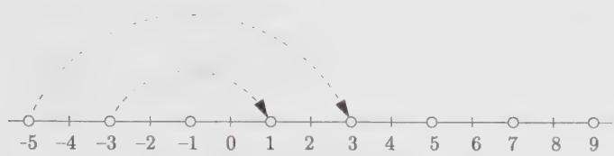  
Figure 13.6. The $su(2)$ tensor product $(2) \otimes (7)$ . The weights of the representation (7) are centered around $2\omega_{1}$ and the nondominant weights are Weyl reflected back into the dominant sector.

to each of them yields:

$$
(3, 0), (1, 1), (2, - 1), (- 1, 2), (0, 0), (1, - 2)\tag{13.204}
$$

The third and fourth of the weights (13.204) are ignored since they are respectively invariant under the shifted action of $s_{2}$ and $s_{1}$ (and are therefore of type (ii)). Acting on the sixth one with $s_{2}$ yields

$$
s _ {2} \cdot (1, - 2) = s _ {2} (2, - 1) - (1, 1) = (2, - 1) + (- 1, 2) - (1, 1) = (0, 0)
$$

Hence the reflection of the sixth weight into the fundamental chamber contributes to $\epsilon(s_{2})(0,0) = -(0,0)$ , and consequently cancels the contribution of the fifth weight in (13.204). The final result is

$$
(1, 0) \otimes (2, 0) = (3, 0) \oplus (1, 1)\tag{13.205}
$$

as illustrated on Fig. 13.7.

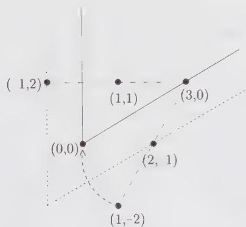  
Figure 13.7. The $su(3)$ tensor product $(1,0)\otimes (2,0)$ by the method of Weyl reflections.

In these two examples, it would have been wiser to interchange the roles of the two representations. For instance, adding $(2,0)$ to the three weights of the representation $(1,0)$ gives directly $(3,0)$ , $(1,1)$ , $(2,-1)$ , and the last one is ignored. Choosing for $\mu$ the highest weight of the smallest of the two representations simplifies the calculation in two respects: fewer states need to be considered and most of the weights in the representation $\mu$ , when added to $\lambda$ , are dominant.

## 13.5.3. The Littlewood-Richardson Rule

The Littlewood-Richardson rule is a simple and powerful algorithm, formulated in terms of the product of Young tableaux. This algorithm proceeds as follows: In the second tableau, we fill the first row with 1's, the second row with 2's, and so on. Then we add all the boxes with a 1 to the first tableau and keep only the resulting tableaux that satisfy the following two conditions:

(i) They must be regular: the number of boxes in a given row must be smaller or equal to the number of boxes in the row just above.

(ii) They must not contain two boxes marked by 1 in the same column.

Tableaux that do not satisfy these conditions are ignored. To the resulting tableaux, we then add all the boxes marked by a 2 and again we keep only the tableaux that satisfy (i) and (ii), where in (ii), 1 is replaced by 2. We continue until all the boxes of the second tableau in the original product have been used. In this process an additional rule must be respected:

(iii) In counting from right to left and top to bottom, the number of 1's must always be greater or equal to the number of 2's, the number of 2's must always be greater or equal to the number of 3's, and so on.

The resulting Littlewood-Richardson tableaux are the Young tableaux of the irreducible representations occurring in the decomposition.

A warning: In this process, we do not construct semistandard tableaux! However, in Littlewood-Richardson tableaux it is clear that the numbers are strictly increasing in each column and they are nondecreasing in rows.

For example, consider the $su(3)$ tensor product $(2,0)\otimes(1,1)$ :

$$
\boxed { \begin{array}{c c} \hline \end{array} } \otimes \boxed { \begin{array}{c c} 1 & 1 \\ \hline 2 \end{array} }
$$

The tableaux obtained after the first step are

$$
\boxed { \begin{array}{c c c c} \hline & & 1 & 1 \\ \hline \end{array} },
$$

$$
\begin{array}{c c c} \hline & & 1 \\ \hline 1 \end{array} ,
$$

$$
\begin{array}{c c} \hline & \\ \hline 1 & 1 \end{array}
$$

Adding now the box marked by a 2 yields $^{10}$

$$
\begin{array}{c c c c} \hline & & 1 & 1 \\ \hline 2 & & \end{array} ,
$$

$$
\begin{array}{c c c} \hline & & 1 \\ \hline 1 & 2 \end{array} ,
$$

$$
\begin{array}{c c c} \hline & & 1 \\ \hline 1 \\ \hline 2 \end{array} ,
$$

$$
\begin{array}{c c} \hline & \\ \hline 1 & 1 \\ \hline 2 & \end{array}
$$

from which we read off

$$
(2, 0) \otimes (1, 1) = (3, 1) \oplus (1, 2) \oplus (2, 0) \oplus (0, 1)\tag{13.206}
$$

(for $su(3)$ , columns of three boxes are ignored).

The multiplicity of a given representation $\nu$ in the tensor product $\lambda \otimes \mu$ can be evaluated directly, without necessarily having to calculate the full decomposition. For this we simply add to the Young tableau representing $\lambda$ all boxes of the tableau $\mu$ such that the resulting tableau has weight $\nu$ . The added boxes are then filled with the following set of numbers: 1 ( $\mu_{1}+\cdots+\mu_{N-1}$ times), 2 ( $\mu_{2}+\cdots+\mu_{N-1}$ times), up to N-1 ( $\mu_{N-1}$ times), in a way that respects the Littlewood-Richardson rule. $N_{\lambda\mu}^{v}$ is the number of distinct Littlewood-Richardson tableaux that can be produced in this way.

For instance, to the $su(4)$ tensor product $(1,2,1)\otimes (1,2,1)\supset (1,2,1)$ , there correspond 5 Littlewood-Richardson tableaux:

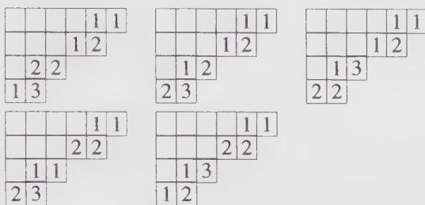

which means that the tensor-product coefficient $\mathcal{N}_{(121)(121)}^{(121)}$ is 5.

In some applications, it is necessary to know which states contribute to the tensor product. It turns out that this information is coded in the Littlewood-Richardson tableaux. More precisely, there is a one-to-one correspondence between a Littlewood-Richardson tableau associated with the product $\lambda \otimes \mu \supset \nu$ and a Gelfand-Tsetlin pattern $\{\beta_j^{(i)}\}$ of weight $\mu' = \nu - \lambda$ in the representation $\mu$ . The entries $\beta_j^{(i)}$ of the Gelfand-Tsetlin pattern can be read off the Littlewood-Richardson tableau as follows:

$$
\beta_ {j} ^ {(i)} = \text {   number   of   } j \text { 's   in   the   first   } i \text {   rows   of   }\tag{13.207}
$$

the Littlewood-Richardson tableau

The states associated with each Littlewood-Richardson tableau in the previous example are

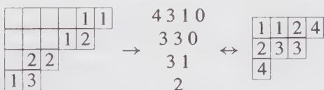

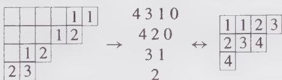

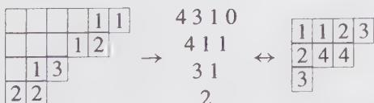

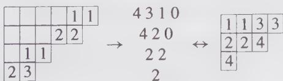

$$
\begin{array}{c c c c c}\hline&&&1&1\\\hline&&&2&2\\\hline&1&3\\\hline 1&2\end{array}\quad \rightarrow \quad\begin{array}{c c c c c}4&3&1&0\\3&2&1\\2&2\\2\end{array}\leftrightarrow \quad\begin{array}{c c c c c}\hline 1&1&3&4\\\hline 2&2&4\\\hline 3\end{array}\tag{13.208}
$$

The weight $\mu' = \nu - \lambda = (0, 0, 0)$ in the representation $(1, 2, 1)$ has multiplicity 7. The two states that do not contribute to the tensor product are

$$
\begin{array}{c c} 4   3   1   0 \\ 3   2   1 \\ 3   1 \\ 2 \end{array} \leftrightarrow \begin{array}{c c} \framebox {1}   1   2   4 \\ \framebox {2}   3   4 \\ \framebox {3} \end{array} \qquad \begin{array}{c c} 4   3   1   0 \\ 4   2   0 \\ 4   0 \\ 2 \end{array} \leftrightarrow \begin{array}{c c} \framebox {1}   1   2   2 \\ \framebox {3}   3   4 \\ \framebox {4} \end{array}
$$

For completeness, we mention that this relationship between states and Littlewood-Richardson tableaux can be used to obtain an algebraic description of the tensor-product coefficients:

$$
\begin{array}{l} \mathcal {N} _ {\lambda \mu} ^ {\nu} = \text { number   of   Gelfand - Tsetlin   patterns } \{\beta_ {j} ^ {(i)} \} \\ \text { of   weight } \mu^ {\prime} = \nu - \lambda \text { in   the   representation } \\ \mu \text { that   satisfy   the   conditions } \hat {d} _ {j} ^ {(i)} \leq \lambda_ {i} \text { for } \\ \text { all   values   of } j, 1 \leq j \leq i \leq N - 1 \end{array}\tag{13.209}
$$

where

$$
d _ {j} ^ {(i)} = \sum_ {1 \leq n <   j} (\beta_ {n} ^ {(i + 1)} - 2 \beta_ {n} ^ {(i)} + \beta_ {n} ^ {(i - 1)}) + (\beta_ {j} ^ {(i + 1)} - \beta_ {j} ^ {(i)})\tag{13.210}
$$

For the first noncontributing pattern of the previous example: $d_{2}^{(3)} = 2 > \lambda_{3} = 1$ , and for the other one: $d_{1}^{(1)} = 2 > \lambda_{1} = 1$ .

## 13.5.4. Berenstein-Zelevinsky Triangles

Berenstein-Zelevinsky triangles (BZ) provide a powerful way to calculate the multiplicity of a triple product, that is, the multiplicity of the scalar representation in $\lambda \otimes \mu \otimes \nu$ . (We point out the slight change in the notation for the third weight: we take it to be $\nu$ instead of $\nu^{*}$ .) They also contain information on the states contributing to the product. We first describe the construction for $su(3)$ .

We consider the set of three $su(3)$ highest weights $(\lambda_1,\lambda_2)$ , $(\mu_1,\mu_2)$ , and $(\nu_{1},\nu_{2})$ . We construct triangles according to the following rules:

$$
\begin{array}{c c c c} & m _ {1 3} \\ & n _ {1 2} & l _ {2 3} \\ & m _ {2 3} & m _ {1 2} \\ n _ {1 3} & l _ {1 2} & n _ {2 3} & l _ {1 3} \end{array}\tag{13.211}
$$

where the nine nonnegative integers $l_{ij}, m_{ij}, n_{ij}$ are related to the Dynkin labels of the three integrable weights by

$$
\begin{array}{l l l} m _ {1 3} + n _ {1 2} = \lambda_ {1} & n _ {1 3} + l _ {1 2} = \mu_ {1} & l _ {1 3} + m _ {1 2} = \nu_ {1} \\ m _ {2 3} + n _ {1 3} = \lambda_ {2} & n _ {2 3} + l _ {1 3} = \mu_ {2} & l _ {2 3} + m _ {1 3} = \nu_ {2} \end{array}\tag{13.212}
$$

They must further satisfy the so-called hexagon conditions

$$
\begin{array}{c} n _ {1 2} + m _ {2 3} = n _ {2 3} + m _ {1 2} \\ l _ {1 2} + m _ {2 3} = l _ {2 3} + m _ {1 2} \\ l _ {1 2} + n _ {2 3} = l _ {2 3} + n _ {1 2} \end{array}\tag{13.213}
$$

This means that the length of opposite sides in the hexagon formed by $n_{12}$ , $l_{23}$ , $m_{12}$ , $n_{23}$ , $l_{12}$ and $m_{23}$ in (13.211) are equal, the length of a segment being defined as the sum of its two vertices.

The number of such triangles gives the value of $N_{\lambda\mu\nu}$ . If it is not possible to construct such a triangle, it means that $\nu^{*}$ does not occur in the tensor product $\lambda\otimes\mu$ .

The integers in the BZ triangles have the following origin. Each pair of indices $ij$ , $i < j$ , on the labels of the triangle is related to a positive root of $su(3)$ . We recall that the positive roots of $su(N)$ can be written as $\epsilon_i - \epsilon_j$ , $1 \leq i < j \leq N$ in terms of orthonormal vectors $\epsilon_i$ in $\mathbb{R}^N$ . The triangle encodes three sums of positive roots:

$$
\begin{array}{l} \mu + \nu - \lambda^ {*} = \sum_ {i <   j} l _ {i j} (\epsilon_ {i} - \epsilon_ {j}) \\ \nu + \lambda - \mu^ {*} = \sum_ {i <   j} m _ {i j} (\epsilon_ {i} - \epsilon_ {j}) \\ \lambda + \mu - \nu^ {*} = \sum_ {i <   j} n _ {i j} (\epsilon_ {i} - \epsilon_ {j}) \end{array}\tag{13.214}
$$

The hexagon relations (13.213) can be seen as consistency conditions for these three expansions.

The four triangles for the example (13.206) are

$$
\begin{array}{c c c c c c c c c c c c c c} & 2 & & & & 1 & & & & 1 & & & & 0 \\ & 0 & 1 & & & 1 & 0 & & & 1 & 1 & & & 2 & 0 \\ & 0 & & 0 & & 0 & & 1 & & 0 & & 0 & & 0 & & 1 \\ & 0 & 1 & 0 & 1 & 0 & 1 & 0 & 1 & 0 & 0 & 1 & 1 & 0 \end{array}\tag{13.215}
$$

On the other hand, corresponding to the coupling $(2,2)\otimes (2,2)\otimes (2,2)$ , three triangles can be constructed:

$$
\begin{array}{c c c c c c c c c} & 0 & & & & 1 & & & & 2 \\ & 2 & 2 & & & 1 & 1 & & & 0 & 0 \\ & 2 & & 2 & & 1 & & 1 & & 0 & & 0 \\ 0 & 2 & 2 & 0 & & 1 & 1 & 1 & 1 & 2 & 0 & 0 & 2 \end{array}\tag{13.216}
$$

and accordingly the multiplicity of the scalar representation in this triple product is 3.

The states involved in a specific coupling can be read off a triangle as follows. Consider the product $\lambda\otimes\mu\supset\nu^{*}$ associated with the triangle (13.211). The state of weight $\mu' = \nu^{*} - \lambda$ in this coupling is described by the Gelfand-Tsetlin pattern

$$
\begin{array}{c c c} \mu_ {1} + \mu_ {2} & \mu_ {2} & 0 \\ \mu_ {1} + \mu_ {2} - n _ {1 3} & \mu_ {2} - n _ {2 3} \\ \mu_ {1} + \mu_ {2} - n _ {1 3} - n _ {1 2} \end{array}\tag{13.217}
$$

For example, the Gelfand-Tsetlin patterns and corresponding semistandard tableaux in the representation $\mu = (2, 2)$ associated with the three triangles of the last example (13.216) are (in the same order)

$$
\begin{array}{c c c} 4   2   0 \\ 4   0 \\ 2 \end{array} \leftrightarrow \begin{array}{c c c} \framebox {1}   \framebox {1}   \framebox {2}   \framebox {2} \\ \framebox {3}   \framebox {3} \\ 2 \end{array} \qquad \begin{array}{c c c} 4   2   0 \\ 3   1 \\ 2 \end{array} \leftrightarrow \begin{array}{c c c} \framebox {1}   \framebox {1}   \framebox {2}   \framebox {3} \\ \framebox {2}   \framebox {3} \\ 2 \end{array} \qquad \begin{array}{c c c} 4   2   0 \\ 2   2 \\ 2 \end{array} \leftrightarrow \begin{array}{c c c} \framebox {1}   \framebox {1}   \framebox {3}   \framebox {3} \\ \framebox {2}   \framebox {2} \\ 2 \end{array}
$$

For $su(4)$ , the BZ triangles are defined in a similar way, in terms of eighteen nonnegative integers:

$$
\begin{array}{c c c c c c} & & m _ {1 4} \\ & & n _ {1 2} & l _ {3 4} \\ & & m _ {2 4} & & m _ {1 3} \\ & n _ {1 3} & l _ {2 3} & n _ {2 3} & l _ {2 4} \\ m _ {3 4} & & m _ {2 3} & & m _ {1 2} \\ n _ {1 4} & l _ {1 2} & n _ {2 4} & l _ {1 3} & n _ {3 4} & l _ {1 4} \end{array}\tag{13.218}
$$

related to the Dynkin labels by

$$
\begin{array}{l l l} m _ {1 4} + n _ {1 2} = \lambda_ {1} & n _ {1 4} + l _ {1 2} = \mu_ {1} & l _ {1 4} + m _ {1 2} = \nu_ {1} \\ m _ {2 4} + n _ {1 3} = \lambda_ {2} & n _ {2 4} + l _ {1 3} = \mu_ {2} & l _ {2 4} + m _ {1 3} = \nu_ {2} \\ m _ {3 4} + n _ {1 4} = \lambda_ {3} & n _ {3 4} + l _ {1 4} = \mu_ {3} & l _ {3 4} + m _ {1 4} = \nu_ {3} \end{array}\tag{13.219}
$$

Furthermore, a $su(4)$ BZ triangle has 3 hexagons:

$$
\begin{array}{c c c} n _ {1 2} + m _ {2 4} = m _ {1 3} + n _ {2 3} & n _ {1 3} + l _ {2 3} = l _ {1 2} + n _ {2 4} & l _ {2 4} + n _ {2 3} = l _ {1 3} + n _ {3 4} \\ n _ {1 2} + l _ {3 4} = l _ {2 3} + n _ {2 3} & n _ {1 3} + m _ {3 4} = n _ {2 4} + m _ {2 3} & n _ {2 3} + m _ {2 3} = m _ {1 2} + n _ {3 4} \\ m _ {2 4} + l _ {2 3} = l _ {3 4} + m _ {1 3} & m _ {3 4} + l _ {1 2} = l _ {2 3} + m _ {2 3} & l _ {1 3} + m _ {2 3} = l _ {2 4} + m _ {1 2} \end{array}\tag{13.220}
$$

The $su(N)$ generalization is straightforward; the triangles are built out of $(N - 1)(N - 2)/2$ hexagons and three corner points. On the other hand, for $su(2)$ there are no hexagons: the tensor products are described by the simple triangles

$$
\begin{array}{c} m _ {1 2} \\ n _ {1 2} \quad l _ {1 2} \end{array}\tag{13.221}
$$

written in terms of three nonnegative integers constrained by

$$
\begin{array}{c} m _ {1 2} + n _ {1 2} = \lambda_ {1} \\ n _ {1 2} + l _ {1 2} = \mu_ {1} \\ l _ {1 2} + m _ {1 2} = \nu_ {1} \end{array}\tag{13.222}
$$

With $\lambda_{1}$ and $\mu_{1}$ fixed, $\nu_{1}$ satisfies

$$
\nu_ {1} = \lambda_ {1} + \mu_ {1} - 2 n _ {1 2}\tag{13.223}
$$

which reproduces the rule for $su(2)$ tensor products in a very simple way.

With the last two methods described, it is possible to study a particular triple product in isolation, that is, without necessarily computing the full product $\lambda\otimes\mu$ . This is a clear advantage when reasonably large representations are involved. The BZ triangles have the further advantage of preserving most of the symmetries of the tensor-product coefficients. In fact, the only symmetry that is not manifest is $N_{\lambda\mu\nu}=N_{\mu\lambda\nu}$ .

We note finally that, in contradistinction with the Littlewood-Richardson rule, the generalization of the BZ triangles to $so(N)$ and $sp(N)$ is unknown at this time.

## §13.6. Tensor Products: A Fusion-Rule Point of View

In this section we discuss tensor products from a point of view close in spirit to the approach used in fusion-rule calculations. At first, we indicate how generic tensor-product coefficients are fixed by associativity in terms of tensor-product coefficients involving the fundamental representations. We recall that for minimal models, the fusion ring was found to be generated by $\phi_{(1,2)}$ and $\phi_{(2,1)}$ . In that context, Chebyshev polynomials appeared naturally. These polynomials and their generalizations resurface here. In a second step, we derive the Lie algebra version of the Verlinde formula (10.201).

The associativity of tensor products translates into the following condition

$$
\sum_ {\sigma} \mathcal {N} _ {\lambda \mu} ^ {\sigma} \mathcal {N} _ {\sigma \nu \xi} = \sum_ {\zeta} \mathcal {N} _ {\mu \nu} ^ {\zeta} \mathcal {N} _ {\zeta \lambda \xi}\tag{13.224}
$$

It is clear that if $\lambda$ and $\mu$ are fundamental representations, any general coefficient $N_{\sigma\nu\xi}$ can be deduced from this condition whenever all tensor-product coefficients involving at least one fundamental representation are known. Again, by introducing a matrix $N_{\lambda}$ with entries

$$
(N _ {\lambda}) _ {\mu} ^ {\sigma} = \mathcal {N} _ {\lambda \mu} ^ {\sigma}\tag{13.225}
$$

we see that the associativity requirement boils down to the commutativity of the matrices $N$ :

$$
(N _ {\lambda} N _ {\nu}) _ {\mu \xi} = (N _ {\nu} N _ {\lambda}) _ {\mu \xi}\tag{13.226}
$$

These matrices provide a representation of the tensor-product algebra:

$$
N _ {\lambda} N _ {\nu} = \sum_ {\sigma \in P _ {+}} \mathcal {N} _ {\lambda \nu} ^ {\sigma} N _ {\sigma}\tag{13.227}
$$

Here we did nothing but rewrite (13.224) in matrix form. We note that these matrices are infinite.

We will now see how Chebyshev-like polynomials arise in this picture. We consider first the $su(2)$ case. From the Littlewood-Richardson rule (or the angular-momentum addition theory), we easily see that

$$
(1) \otimes (n) = (n + 1) \oplus (n - 1)\tag{13.228}
$$

where it is understood that if the Dynkin label n - 1 is negative, the second representation on the r.h.s. is omitted. The comparison of this product rule with Eq. (13.227) shows that the matrix $N_{1}$ is simply:

$$
(N _ {1}) _ {j} ^ {k} = \delta_ {j, k + 1} + \delta_ {j, k - 1}\tag{13.229}
$$

Mutually commuting matrices associated with other representations can be constructed as follows. One first observes that Eq. (13.228) translates into the following relation

$$
N _ {1} N _ {n} = N _ {n + 1} + N _ {n - 1}\tag{13.230}
$$

which can be regarded as a recurrence relation to be solved for $N_{n}$ in terms of $N_{1}$ . This becomes clearer if we replace $N_{1}$ by x, $N_{n}$ by $U_{n}(x)$ and rewrite the above equation in the form

$$
x U _ {n} = U _ {n + 1} + U _ {n - 1}\tag{13.231}
$$

With $U_{0}=1$ , $U_{1}=x$ , this is the defining relation for Chebyshev polynomials of the second kind, which already arose in the context of minimal-model fusion rules (cf. Eq. (8.101)). The desired expression for $N_{n}$ is thus

$$
N _ {n} = U _ {n} (N _ {1})\tag{13.232}
$$

For instance, given the matrix $N_{1}$ —which fixes all tensor products with the fundamental representation—the matrix $N_{2}$ describing the products with the adjoint representation is

$$
N _ {2} = N _ {1} ^ {2} - 1\tag{13.233}
$$

That is,

$$
N _ {1} = \left( \begin{array}{c c c c c c} 0 & 1 & 0 & 0 & 0 & \dots \\ 1 & 0 & 1 & 0 & 0 & \dots \\ 0 & 1 & 0 & 1 & 0 & \dots \\ 0 & 0 & 1 & 0 & 1 & \dots \\ \dots & \dots & \dots \end{array} \right) \Longrightarrow N _ {2} = \left( \begin{array}{c c c c c c} 0 & 0 & 1 & 0 & 0 & \dots \\ 0 & 1 & 0 & 1 & 0 & \dots \\ 1 & 0 & 1 & 0 & 1 & \dots \\ 0 & 1 & 0 & 1 & 0 & \dots \\ \dots & \dots & \dots \end{array} \right)
$$

from which we read off directly that

(13.234)

$$
\begin{array}{l} (2) \otimes (0) = (2) \\ (2) \otimes (1) = (1) \oplus (3) \\ (2) \otimes (2) = (0) \oplus (2) \oplus (4) \end{array}\tag{13.235}
$$

and so on. Because they are all constructed out of polynomials in $N_{1}$ , the matrices $N_{n}$ necessarily commute among themselves.

It is interesting to construct the generating function of the Chebyshev polynomials. This is done in the standard way: one multiplies Eq. (13.231) by $t^{n}$ and sums the result from n = 0 to $n = \infty$ ; by simple manipulations, each term can be reexpressed in terms of

$$
F (x; t) = \sum_ {n = 0} ^ {\infty} U _ {n} t ^ {n}\tag{13.236}
$$

with the result

$$
x F = (F - 1) / t + t F\tag{13.237}
$$

that is,

$$
F (x; t) = \frac {1}{1 - x t + t ^ {2}}\tag{13.238}
$$

A similar analysis can be done for any Lie algebra. For instance, for $su(3)$ , the Littlewood-Richardson rule immediately tells us that

$$
\begin{array}{l} (1, 0) \otimes (\lambda_ {1}, \lambda_ {2}) = (\lambda_ {1} + 1, \lambda_ {2}) \oplus (\lambda_ {1}, \lambda_ {2} - 1) \oplus (\lambda_ {1} - 1, \lambda_ {2} + 1) \\ (0, 1) \otimes (\lambda_ {1}, \lambda_ {2}) = (\lambda_ {1}, \lambda_ {2} + 1) \oplus (\lambda_ {1} - 1, \lambda_ {2}) \oplus (\lambda_ {1} + 1, \lambda_ {2} - 1) \end{array}\tag{13.239}
$$

Again, we can replace the representations in these expressions by their corresponding tensor-product matrices $N_{(\lambda_{1},\lambda_{2})}$ . These matrices turn out be expressible in terms of some generalized Chebyshev polynomials $U_{(\lambda_{1},\lambda_{2})}$ , a function of two variables $x_{1}, x_{2}$ associated respectively with $N_{(1,0)}$ and $N_{(0,1)}$ , as follows:

$$
N _ {(\lambda_ {1}, \lambda_ {2})} = U _ {(\lambda_ {1}, \lambda_ {2})} (N _ {(1, 0)}, N _ {(0, 1)}) \equiv U _ {(\lambda_ {1}, \lambda_ {2})} (x _ {1}, x _ {2})\tag{13.240}
$$

These polynomials are defined in terms of the generating function

$$
\begin{array}{r l} F (x _ {1}, x _ {2}; t, s) & = \sum_ {\lambda_ {1}, \lambda_ {2} = 0} ^ {\infty} U _ {(\lambda_ {1}, \lambda_ {2})} (x _ {1}, x _ {2}) t ^ {\lambda_ {1}} s ^ {\lambda_ {2}} \\ & = \frac {1 - t s}{(1 - t x _ {1} + t ^ {2} x _ {2} - t ^ {3}) (1 - s x _ {2} + s ^ {2} x _ {1} - s ^ {3})} \end{array}\tag{13.241}
$$

The details of this analysis are left to the reader (cf. Ex. 13.20).

We now turn to a Lie algebra version of the Verlinde formula (10.201). The starting point is the character product form (13.198), in which all the characters are supposed to be evaluated at the particular point

$$
X = - 2 \pi i \sum_ {i = 1} ^ {r} t _ {i} \alpha_ {i} ^ {\vee}\tag{13.242}
$$

where the $t_i$ 's are real numbers valued in the range [0, 1]. With $\chi_{\lambda} = D_{\lambda + \rho} / D_{\rho}$ , this becomes

$$
\frac {D _ {\lambda + \rho} (X) D _ {\mu + \rho} (X)}{D _ {\rho} (X)} = \sum_ {\nu} \mathcal {N} _ {\lambda \mu} ^ {\nu} D _ {\nu + \rho} (X)\tag{13.243}
$$

The $D_{\lambda + \rho}(X)$ 's satisfy the following orthogonality relation

$$
\int_ {0} ^ {1} \left(\prod_ {i} d t _ {i}\right) D _ {\lambda + \rho} (X) D _ {\mu + \rho} (X) = | W | \delta_ {\mu , \lambda^ {*}}\tag{13.244}
$$

where $|W|$ is the order of the Weyl group. This follows directly from the definition (13.165) and the expression (13.117) for the conjugate of a representation, which implies that $D_{\lambda^{*} + \rho}(X)$ is the complex conjugate of $D_{\lambda + \rho}(X)$ . To proceed, we multiply Eq. (13.243) by $D_{\sigma^{*} + \rho}(X)$ and integrate the result over $X$ (i.e., integrate over all $t_i$ 's from 0 to 1). This gives the desired Verlinde-type formula

$$
\mathcal {N} _ {\lambda \mu} ^ {\sigma} = \int_ {0} ^ {1} (\prod_ {i} d t _ {i}) \frac {\mathcal {S} _ {\lambda} (X) \mathcal {S} _ {\mu} (X) \bar {\mathcal {S}} _ {\sigma} (X)}{\mathcal {S} _ {0} (X)}\tag{13.245}
$$

where

$$
\mathcal {S} _ {\lambda} (X) = \frac {1}{\sqrt {| W |}} D _ {\lambda + \rho} (X)\tag{13.246}
$$

Such an S matrix is analogous to the one obtained for a finite group in Ex. 10.18: it is indexed by r discrete numbers, the Dynkin labels $\lambda_{i}$ , and r continuous ones, the $t_{i}$ . This immediately tells us that such an S matrix cannot be a transformation matrix of characters into themselves, like the modular transformation matrix. For $su(2)$ , it takes the simple form

$$
\mathcal {S} _ {\lambda_ {1}} (t _ {1}) = - i \sqrt {2} \sin [ 2 \pi t _ {1} (\lambda_ {1} + 1) ]\tag{13.247}
$$

## §13.7. Algebra Embeddings and Branching Rules

As mentioned in the introduction, we will often encounter “affine” generalizations of simple Lie algebra embeddings. This fact motivates the general remarks of this section.

## 13.7.1. Embedding Index

We first present different ways of characterizing an embedding $p \subset g$ , deferring classification issues to the next subsection.

i) Branching rules:

Viewed from the standpoint of the smaller algebra p, an irreducible representation of g usually breaks down into many irreducible representations of p. Such decompositions are called branching rules and are noted as

$$
\mathsf {L} _ {\lambda} \mapsto \bigoplus_ {\mu \in P _ {+}} b _ {\lambda \mu} \mathsf {L} _ {\mu}\tag{13.248}
$$

or simply as

$$
\lambda \mapsto \bigoplus_ {\mu \in P _ {+}} b _ {\lambda \mu} \mu\tag{13.249}
$$

The branching coefficient $b_{\lambda\mu}$ gives the multiplicity of the irreducible representation $\mu$ of p in the decomposition of the irreducible representation $\lambda$ of g. The decomposition of the lowest-dimensional nontrivial representation is sufficient to characterize an embedding. To each of its inequivalent branching rules corresponds a distinct embedding.

## ii) Projection matrix:

A projection matrix P gives the explicit projection of every weight of g onto a weight of p. Hence, to calculate the branching rules one first projects all the weights of a given irreducible representation of g into p-weights and reorganizes them into irreducible representations. Projection matrices are not unique: a Weyl reflection of the root diagram modifies them without affecting the embedding.

iii) Embedding index:

The embedding index $x_{e}$ is defined as the ratio of the square length of the projection of $\theta$ , the highest root of g, to the square length of the highest root of p, which is denoted by $\vartheta$ :

$$
x _ {e} = \frac {| \mathcal {P} \theta | ^ {2}}{| \vartheta | ^ {2}}\tag{13.250}
$$

Given a branching rule, the embedding index can also be calculated from

$$
\boxed {x _ {e} = \sum_ {\mu \in P _ {+}} b _ {\lambda \mu} \frac {x _ {\mu}}{x _ {\lambda}}}\tag{13.251}
$$

where $x_{\lambda}$ is the index of the representation $\lambda$ of $g$ defined in Eq. (13.133). The proof of this relation is left as an exercise (cf. Ex. 13.22).

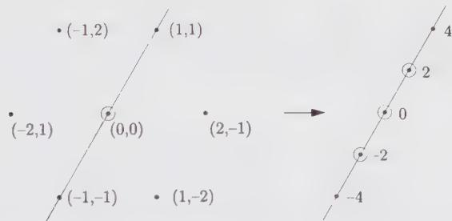  
Figure 13.8. Projection of the $su(3)$ adjoint representation onto $su(2)$ .

As an example, we show how $su(2)$ can be embedded into $su(3)$ . Fig. 13.8 shows how the $su(3)$ root system is projected along the highest root vector and gives a possible assignment of the $su(2)$ weights. The representation (1, 1) of $su(3)$ decomposes into the $su(2)$ representations (2) $\oplus$ (4) (of respective dimension 3 and 5); it is thus characterized by the branching rule:

$$
(1, 1) \mapsto (4) \oplus (2)\tag{13.252}
$$

The embedding index is easily found by noticing that the highest weight of $su(3)$ , $\alpha_{1} + \alpha_{2}$ , is projected onto $2\alpha_{1}$ . The ratio of highest roots is thus 4, and $x_{e} = 4$ . This can also be seen from Eq. (13.251) using the branching rule (13.252). The required representation indices are:

$$
\begin{array}{l} s u (3): x _ {(1, 1)} = 3 \\ s u (2): x _ {(4)} = 1 0, \quad x _ {(2)} = 2 \end{array}\tag{13.253}
$$

Their substitution in Eq. (13.251) reproduces the value $x_{e} = 4$ . The projection matrix for this embedding can be chosen as

$$
\mathcal {P} _ {(4)} = (2, 2)\tag{13.254}
$$

if the $su(3)$ weight is written in a column matrix whose entries are its Dynkin labels. Hence, the $su(3)$ weight $(\lambda_{1},\lambda_{2})$ is projected into the $su(2)$ weight of Dynkin label $2\lambda_{1}+2\lambda_{2}$ (which is thus always even):

$$
(2, 2) \binom{\lambda_ {1}}{\lambda_ {2}} = (2 \lambda_ {1} + 2 \lambda_ {2})\tag{13.255}
$$

Using this matrix, the branching rules $(1,0)\mapsto(2)$ , $(0,1)\mapsto(2)$ are easily derived. $^{11}$

Dividing all $su(2)$ Dynkin labels by 2 in Fig 13.8 leads to another possible assignment for the $su(2)$ weights. The branching rule specifying this embedding is

$$
(1, 1) \mapsto (2) \oplus 2 (1) \oplus (0)\tag{13.256}
$$

Because $\alpha_{1}+\alpha_{2}$ is projected onto $\alpha_{1}$ , the embedding index is equal to 1. A candidate projection matrix for this embedding is

$$
\mathcal {P} _ {(1)} = (1, 1)\tag{13.257}
$$

The basic branching rule is $(1,0)\mapsto(1)+(0)$ .

These two embeddings are most conveniently described by means of the following generating functions:

$$
\begin{array}{l} F _ {(1)} = \frac {1}{(1 - L _ {1} M) (1 - L _ {2} M) (1 - L _ {1}) (1 - L _ {2})} \\ F _ {(4)} = \frac {(1 + L _ {1} L _ {2} M ^ {2})}{(1 - L _ {1} M ^ {2}) (1 - L _ {2} M ^ {2}) (1 - L _ {1} ^ {2}) (1 - L _ {2} ^ {2})} \end{array}\tag{13.258}
$$

where the subscript indicates the embedding index. To obtain the decomposition of the $su(3)$ weight $(\lambda_{1},\lambda_{2})$ , we expand F and collect all the terms multiplying $L_{1}^{\lambda_{1}}L_{2}^{\lambda_{2}}$ ; its coefficient, of the form $aM^{m} + bM^{n} + \cdots$ , codes the decomposition of $(\lambda_{1},\lambda_{2})$ :

$$
(\lambda_ {1}, \lambda_ {2}) \mapsto a (m) \oplus b (n) \oplus \dots\tag{13.259}
$$

We take for instance the embedding with $x_{e} = 4$ . In the power expansion of $F_{(4)}$ , the term $L_1^3 L_2^0$ is multiplied by $M^6 + M^2$ , so that

$$
(3, 0) \mapsto (6) \oplus (2)\tag{13.260}
$$

A few remarks complete this discussion. An obvious necessary condition for the branching coefficient $b_{\lambda \mu}$ to be nonzero is

$$
\mathcal {P} \lambda - \mu \in \mathcal {P} Q\tag{13.261}
$$

where Q is the root lattice of g. This simply means that the integrable weight $\mu$ must lie somewhere in the integrable representation $\lambda$ , after projection; since any weight in $\Omega_{\lambda}$ can be obtained from $\lambda$ by subtracting an appropriate number of positive roots, the condition follows. In the examples above, the root lattice projects as follows. For the first embedding,

$$
x _ {e} = 4: \quad \mathcal {P} Q _ {s u (3)} = Q _ {s u (2)}\tag{13.262}
$$

since the $su(3)$ roots $\alpha_{1}$ and $\alpha_{2}$ are projected onto the $su(2)$ weight $2\omega_{1}$ , that is, onto the $su(2)$ simple root $\alpha_{1}$ . The condition (13.261) forces then

$$
(\mathcal {P} \lambda) _ {1} = \mu_ {1} \bmod 2\tag{13.263}
$$

where $(\mathcal{P}\lambda)_{1}$ is the Dynkin label of the projected $su(3)$ weight. For the other embedding, we find that both $\alpha_{1}$ and $\alpha_{2}$ are mapped onto $\omega_{1}$ of $su(2)$ , so that

$$
x _ {e} = 1: \quad \mathcal {P} Q _ {s u (3)} = P _ {s u (2)}\tag{13.264}
$$

where, as usual, (noncalligraphic) P stands for the weight lattice. As a result Eq. (13.261) gives no constraint: both $\lambda$ and $\mu$ are integrable weights.

We note finally that a useful tool for the computation of branching rules uses tensor products. If

$$
\lambda \mapsto \bigoplus_ {\mu} b _ {\lambda \mu} \mu \quad \text { and } \quad \xi \mapsto \bigoplus_ {\nu} b _ {\xi \nu} \nu\tag{13.265}
$$

then

$$
\lambda \otimes \xi \mapsto \bigoplus_ {\mu , \nu} b _ {\lambda \mu} b _ {\xi \nu} \mu \otimes \nu\tag{13.266}
$$

For instance, given the branching rules $(1,0)\mapsto(1)\oplus(0)$ and $(0,1)\mapsto(1)\oplus(0)$ for $su(2)\subset su(3)$ with $x_{e}=1$ , we find the branching rule for $(2,0)$ from

$$
(1, 0) \otimes (1, 0) = (2, 0) \oplus (0, 1) \mapsto [ (1) \oplus (0) ] \otimes [ (1) \oplus (0) ] = (2) \oplus 2 (1) \oplus 2 (0)\tag{13.267}
$$

that is, $(2,0)\mapsto(2)\oplus(1)\oplus(0)$ .

## 13.7.2. Classification of Embeddings

We now briefly address the question of classifying the possible embeddings. The following discussion is restricted to maximal embeddings; these are embeddings $p \subset g$ for which there is no $p'$ such that $p \subset p' \subset g$ . All nonmaximal embeddings can be obtained from a chain of maximal ones. We also suppose that $g$ is semisimple; that also makes $p$ semisimple up to a possible $u(1)$ factor.

The simplest embeddings are those for which there exists a basis of g in which a subset of generators form the generators of p. In other words, if the p generators are denoted by a tilde, we have $\{\tilde{E}^{\alpha}\}\subset\{E^{\alpha}\}$ and $\{\tilde{H}^{i}\}\subset\{H^{i}\}$ . These are called the regular subalgebras. The maximal regular subalgebras have the same rank as the algebra g and they are easily described in terms of the root system of g.

We first construct the extended Dynkin diagram of g by adding an extra node, associated with $-\theta$ . The extended Dynkin diagrams are displayed in Fig. 14.1 of Chap. 14. Promoting $-\theta$ to a “simple root” preserves the characteristic property that the difference between two simple roots is not a root (i.e., $\alpha_{i} + \theta$ cannot be a root since $\theta$ is the highest root). However in order to restore the linear independence of the simple roots, at least one $\alpha_{i}$ has to be removed from this augmented set of simple roots. All semisimple maximal regular subalgebras are obtained by removing from the extended Dynkin diagram of g any node whose mark is a prime number. $^{12}$ Maximal regular algebras that are not semisimple are constructed from the removal of two nodes with mark $a_{i} = 1$ and the addition of a $u(1)$ factor. The embedding $su(2) \subset su(3)$ with $x_{e} = 1$ is a regular embedding because it can be obtained from $su(3)$ by dropping one simple root (hence two simple roots with unit mark from the extended $su(3)$ diagram). However, it is not a maximal embedding, being associated with the regular chain $su(2) \subset su(2) \oplus u(1) \subset su(3)$ . As another example, consider the extended Dynkin diagram of $E_{8}$ out of which one of the simple roots $\{\alpha_{1}, \alpha_{2}, \alpha_{4}, \alpha_{7}, \alpha_{8}\}$ is removed. The resulting algebras in each case are, respectively, $su(2) \oplus E_{7}$ , $su(3) \oplus E_{6}$ , $su(4) \oplus so(11)$ , $so(16)$ and $su(9)$ . Since $E_{8}$ has no simple root with unit mark, its maximal regular subalgebras are all semisimple.

The calculation of branching rules in a regular embedding proceeds as follows. We first add to all the weights in the representation $L_{\lambda}$ an extra Dynkin label, associated with the extra simple root $-\theta$ . Since the decomposition of $\theta$ in terms of the simple coroots is known (the expansion coefficients being the comarks), this extra Dynkin label is simply

$$
\lambda_ {- \theta} = - \sum_ {i} a _ {i} ^ {\vee} \lambda_ {i}\tag{13.268}
$$

If the regular subalgebra p is obtained by deleting the simple root $\alpha_{j}$ , we simply delete the Dynkin label $\lambda_{j}$ from all the weights. The resulting weights are exactly the projected weights, and they can be reorganized into irreducible representations of p. This is illustrated in Ex. 13.25. The same procedure works for the semisimple algebra obtained from the removal of two nodes.

Table 13.1. Maximal semisimple special algebras of exceptional Lie algebras. The upper index gives the value of the embedding index.

<table><tr><td>Exceptional g</td><td>Maximal special p</td></tr><tr><td> $G_2$ </td><td> $A_{1}^{(28)}$ </td></tr><tr><td> $F_4$ </td><td> $A_{1}^{(156)}, G_{2}^{(1)} \oplus A_{1}^{(8)}$ </td></tr><tr><td> $E_6$ </td><td> $A_{1}^{(9)}, G_{2}^{(3)}, C_{4}^{(1)}, G_{2}^{(1)} \oplus A_{2}^{(2)}, F_{4}^{(1)}$ </td></tr><tr><td> $E_7$ </td><td> $A_{1}^{(399)}, A_{1}^{(231)}, A_{2}^{(21)}, G_{2}^{(1)} \oplus C_{3}^{(1)}, F_{4}^{(1)} \oplus A_{2}^{(3)},$  $G_{2}^{(2)} \oplus A_{1}^{(7)}, A_{1}^{(24)} \oplus A_{1}^{(15)}$ </td></tr><tr><td> $E_8$ </td><td> $A_{1}^{(1240)}, A_{1}^{(760)}, A_{1}^{(520)}, G_{2}^{(1)} \oplus F_{4}^{(1)}, A_{2}^{(6)} \oplus A_{1}^{(16)}, B_{2}^{(12)}$ </td></tr></table>

Nonregular subalgebras are called special subalgebras. There is still a general method for obtaining the special embeddings of the classical algebras, but the exceptional ones require a case-by-case analysis, whose result is given in Table 13.1. For the classical algebras, we use the realization of the corresponding compact groups as a group of matrices. This makes the following embeddings almost immediate:

$$
s u (p) \oplus s u (q) \subset s u (p q)
$$

$$
s o (p) \oplus s o (q) \subset s o (p q)
$$

$$
s p (2 p) \oplus s p (2 q) \subset s o (4 p q)
$$

$$
s p (2 p) \oplus s o (q) \subset s p (2 p q)\tag{13.269}
$$

$$
s o (p) \oplus s o (q) \subset s o (p + q)
$$

On the other hand, if the algebra p has an N-dimensional representation with an invariant bilinear form, p can be embedded in $so(N)$ (resp. $sp(N)$ ) if this bilinear form is symmetric (resp. antisymmetric). If the representation has no invariant bilinear form, it realizes an embedding into $su(N)$ .¹³ A necessary condition for $L_{\lambda}$ to have an invariant bilinear form is that $-\lambda \in \Omega_{\lambda}$ , which means that $L_{\lambda}$ must be self-conjugate. These representations have already been identified in Sect. 13.2.2. The symmetry of the bilinear form is determined by the height of the representation, defined in terms of a height vector u, tabulated in App. 13.A. The form is symmetric (resp. antisymmetric) if $\lambda \cdot u = \sum_{i} \lambda_{i} u_{i} = 0$ (resp. 1) mod 2. For instance, all representations of $su(2)$ are self-conjugate ( $u_{1} = 1$ ), so the representation $L_{\lambda}$ is symmetric when $\lambda_{1}$ is even, in which case it leads to the special embeddings $su(2) \subset so(\lambda_{1} + 1)$ . An interesting generic example is $p \subset so(\dim p)$ . Indeed, the adjoint representation is always self-conjugate (i.e., the highest weight is $\theta$ and $-\theta$ is also a root) and it has a symmetric bilinear form (the Killing form).

In the following chapters we often encounter a special embedding, which, although not maximal, deserves a particular mention. This is the diagonal embedding $g \subset g \oplus g$ , in which the two weights $(\lambda, \mu)$ of $g \oplus g$ are projected onto the weight $\lambda + \mu$ . Because the highest root is of the same length for the algebra and its subalgebra, the embedding index of a diagonal embedding is always equal to 1.

## Appendix 13.A. Properties of Simple Lie Algebras

The following summaries present the essential information needed for all simple Lie algebras. The Cartan notation is used, and, for the classical algebras, the compact real form is also given in parentheses. For each algebra, we present the Dynkin diagram, a short list of basic properties, the Cartan matrix and the quadratic form matrix. Black nodes in the Dynkin diagrams refer to short roots. The numbers appearing beside the nodes of the Dynkin diagrams give (in this order) the numbering of the corresponding simple root, its mark, and its comark. For simply laced algebras, the third entry is omitted (marks and comarks are identical). The numbering of the simple roots also gives the numbering of the fundamental weights; this is the numbering used when a weight is specified in terms of a sequence of Dynkin labels as $\lambda = (\lambda_{1}, \cdots, \lambda_{r})$ . Marks and comarks are defined in Eq. (13.33). The list of properties includes the dimension of the algebra, the dual Coxeter number g, the order of the Weyl group $|W|$ , the highest root $\theta$ (in Dynkin label notation), the finite group that corresponds to the ratio of the weight lattice P to the root lattice Q, the associated congruence vector (v, defined in Sect. 13.1.9), the height vector (u, defined in Sect. 13.7.2) and the exponents (defined at the end of Sect. 13.2.3). For some algebras, the entry “P/Q” and “congruence vector” do not appear; for those cases, P/Q = I.

$$
\mathbf {A} _ {\mathbf {r} \geq 2} (s u (r + 1))
$$

(1;1)

$$
\dim \mathrm{g} = r ^ {2} + 2 r
$$

(2;1)

$$
g = r + 1
$$

$$
| W | = (r + 1)!
$$

(3;1)

$$
\theta = (1, 0, \dots , 1)
$$

$$
P / Q = Z _ {r + 1}
$$

$$
v = (1, 2, \dots , r)
$$

$(r;1)$

$$
u = (r, 2 (r - 1), \dots , r)
$$

$$
\text { exponents } = 1, 2, \dots , r
$$

Cartan matrix:

$$
\left( \begin{array}{c c c c c c} 2 & - 1 & 0 & \dots & 0 & 0 \\ - 1 & 2 & - 1 & \dots & 0 & 0 \\ 0 & - 1 & 2 & \dots & 0 & 0 \\ . & . & . & \dots & . & . \\ 0 & 0 & 0 & \dots & 2 & - 1 \\ 0 & 0 & 0 & \dots & - 1 & 2 \end{array} \right)
$$

Quadratic form matrix:

$$
\frac {1}{r + 1} \left( \begin{array}{c c c c c c} r & r - 1 & r - 2 & \dots & 2 & 1 \\ r - 1 & 2 (r - 1) & 2 (r - 2) & \dots & 4 & 2 \\ r - 2 & 2 (r - 2) & 3 (r - 2) & \dots & 6 & 3 \\ . & . & . & \dots & . & . \\ 2 & 4 & 2 (r - 1) & \dots & 2 (r - 1) & r - 1 \\ 1 & 2 & r - 1 & \dots & r - 1 & r \end{array} \right)
$$

$\mathbf{B}_{\mathbf{r}\geq 3}(so(2r + 1))$

○ (1;1;1)
○ (2;2;2)

$$
\begin{array}{l} \dim g = 2 r ^ {2} + r \\ g = 2 r - 1 \\ | W | = 2 ^ {r} r! \\ \theta = (0, 1, \dots , 0) \\ P / Q = \mathbb {Z} _ {2} \\ v = (0, \dots , 0, 1) \\ u = (2 r, 2 (2 r - 1), \dots , (r - 1) (r + 2), \frac {1}{2} r (r + 1)) \\ \text { exponents } = 1, 3, \dots , 2 r - 1 \end{array}
$$

$$
\begin{array}{c} (r - 1; 2; 2) \\ (r; 2; 1) \end{array}
$$

Cartan matrix:

$$
\left( \begin{array}{c c c c c c} 2 & - 1 & 0 & \dots & 0 & 0 \\ - 1 & 2 & - 1 & \dots & 0 & 0 \\ 0 & - 1 & 2 & \dots & 0 & 0 \\ . & . & . & \dots & . & . \\ 0 & 0 & 0 & \dots & 2 & - 2 \\ 0 & 0 & 0 & \dots & - 1 & 2 \end{array} \right)
$$

Quadratic form matrix:

$$
\frac {1}{2} \left( \begin{array}{c c c c c c} 2 & 2 & 2 & \dots & 2 & 1 \\ 2 & 4 & 4 & \dots & 4 & 2 \\ 2 & 4 & 6 & \dots & 6 & 3 \\ . & . & . & \dots & . & . \\ 2 & 4 & 6 & \dots & 2 (r - 1) & r - 1 \\ 1 & 2 & 3 & \dots & r - 1 & r / 2 \end{array} \right)
$$

$\mathbf{C}_{\mathbf{r}\geq 2}(sp(2r))$

$$
\dim g = 2 r ^ {2} + r
$$

$$
u = ((2 r - 2), 2 (2 r - 2), \dots , (r - 1) (r + 1), r ^ {2})
$$

Cartan matrix:

$$
\left( \begin{array}{c c c c c c} 2 & - 1 & 0 & \dots & 0 & 0 \\ - 1 & 2 & - 1 & \dots & 0 & 0 \\ 0 & - 1 & 2 & \dots & 0 & 0 \\ . & . & . & \dots & . & . \\ 0 & 0 & 0 & \dots & 2 & - 1 \\ 0 & 0 & 0 & \dots & - 2 & 2 \end{array} \right)
$$

Quadratic form matrix:

$$
\frac {1}{2} \left( \begin{array}{c c c c c c} 1 & 1 & 1 & \dots & 1 & 1 \\ 1 & 2 & 2 & \dots & 2 & 2 \\ 1 & 2 & 3 & \dots & 3 & 3 \\ . & . & . & \dots & . & . \\ 1 & 2 & 3 & \dots & r - 1 & r - 1 \\ 1 & 2 & 3 & \dots & r - 1 & r \end{array} \right)
$$

$\mathbf{D}_{\mathbf{r}\geq 4}(so(2r))$

$$
\begin{array}{l} \dim g = 2 r ^ {2} - r \\ g = 2 r - 2 \\ | W | = 2 ^ {r - 1} r! \\ \theta = (0, 1, \dots , 0) \\ P / Q = \mathbb {Z} _ {4} (r \text {odd}) \\ \qquad = \mathbb {Z} _ {2} \times \mathbb {Z} _ {2} (r \text {even}) \\ v = (2, 4, \dots , 2 r - 4, r - 2, r) (r \text {odd}) \\ \qquad = (0, \dots , 0, 1, 1) (r \text {even}) \\ u = ((2 r - 2), 2 (2 r - 3), \dots , \\ \qquad (r - 2) (r + 1), \frac {1}{2} r (r - 1), \frac {1}{2} r (r - 1)) \\ \text {exponents} = 1, 3, \dots , 2 r - 3, r - 1 \end{array}
$$

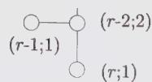

Cartan matrix:

$$
\left( \begin{array}{c c c c c c c c} 2 & - 1 & 0 & \dots & 0 & 0 & 0 \\ - 1 & 2 & - 1 & \dots & 0 & 0 & 0 \\ 0 & - 1 & 2 & \dots & 0 & 0 & 0 \\ . & . & . & \dots & . & . & . \\ 0 & 0 & 0 & \dots & 2 & - 1 & - 1 \\ 0 & 0 & 0 & \dots & - 1 & 2 & 0 \\ 0 & 0 & 0 & \dots & - 1 & 0 & 2 \end{array} \right)
$$

Quadratic form matrix:

$$
\frac {1}{2} \left( \begin{array}{c c c c c c c} 2 & 2 & 2 & \dots & 2 & 1 & 1 \\ 2 & 4 & 4 & \dots & 4 & 2 & 2 \\ 2 & 4 & 6 & \dots & 6 & 3 & 3 \\ . & . & . & \dots & . & . & . \\ 2 & 4 & 6 & \dots & 2 (r - 2) & r - 2 & r - 2 \\ 1 & 2 & 3 & \dots & r - 2 & r / 2 & (r - 2) / 2 \\ 1 & 2 & 3 & \dots & r - 2 & (r - 2) / 2 & r / 2 \end{array} \right)
$$

$\mathbf{E}_{8}$

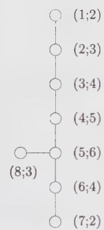

```txt
dim g = 248
g = 30
|W| = 696729600
θ = (1, 0, ···, 0)
u = (58, 114, 168, 220, 270, 182, 92, 136)
exponents = 1, 7, 11, 13, 17, 19, 23, 29
```

Cartan matrix:

$$
\left( \begin{array}{c c c c c c c c} 2 & - 1 & 0 & 0 & 0 & 0 & 0 & 0 \\ - 1 & 2 & - 1 & 0 & 0 & 0 & 0 & 0 \\ 0 & - 1 & 2 & - 1 & 0 & 0 & 0 & 0 \\ 0 & 0 & - 1 & 2 & - 1 & 0 & 0 & 0 \\ 0 & 0 & 0 & - 1 & 2 & - 1 & 0 & - 1 \\ 0 & 0 & 0 & 0 & - 1 & 2 & - 1 & 0 \\ 0 & 0 & 0 & 0 & 0 & - 1 & 2 & 0 \\ 0 & 0 & 0 & 0 & - 1 & 0 & 0 & 2 \end{array} \right)
$$

Quadratic form matrix:

$$
\left( \begin{array}{c c c c c c c c} 2 & 3 & 4 & 5 & 6 & 4 & 2 & 3 \\ 3 & 6 & 8 & 1 0 & 1 2 & 8 & 4 & 6 \\ 4 & 8 & 1 2 & 1 5 & 1 8 & 1 2 & 6 & 9 \\ 5 & 1 0 & 1 5 & 2 0 & 2 4 & 1 6 & 8 & 1 2 \\ 6 & 1 2 & 1 8 & 2 4 & 3 0 & 2 0 & 1 0 & 1 5 \\ 4 & 8 & 1 2 & 1 6 & 2 0 & 1 4 & 7 & 1 0 \\ 2 & 4 & 6 & 8 & 1 0 & 7 & 4 & 5 \\ 3 & 6 & 9 & 1 2 & 1 5 & 1 0 & 5 & 8 \end{array} \right)
$$

$\mathbf{E}_7$

(1;2)

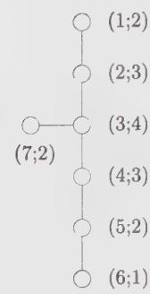

(2;3)

(3;4)

(4;3)

$$
\dim \mathrm{g} = 1 3 3\tag{5;2}
$$

(6;1)

Cartan matrix:

$$
\left( \begin{array}{c c c c c c c} 2 & - 1 & 0 & 0 & 0 & 0 & 0 \\ - 1 & 2 & - 1 & 0 & 0 & 0 & 0 \\ 0 & - 1 & 2 & - 1 & 0 & 0 & - 1 \\ 0 & 0 & - 1 & 2 & - 1 & 0 & 0 \\ 0 & 0 & 0 & - 1 & 2 & - 1 & 0 \\ 0 & 0 & 0 & 0 & - 1 & 2 & 0 \\ 0 & 0 & - 1 & 0 & 0 & 0 & 2 \end{array} \right)
$$

Quadratic form matrix:

$$
\frac {1}{2} \left( \begin{array}{c c c c c c c} 4 & 6 & 8 & 6 & 4 & 2 & 4 \\ 6 & 1 2 & 1 6 & 1 2 & 8 & 4 & 8 \\ 8 & 1 6 & 2 4 & 1 8 & 1 2 & 6 & 1 2 \\ 6 & 1 2 & 1 8 & 1 5 & 1 0 & 5 & 9 \\ 4 & 8 & 1 2 & 1 0 & 8 & 4 & 6 \\ 2 & 4 & 6 & 5 & 4 & 3 & 3 \\ 4 & 8 & 1 2 & 9 & 6 & 3 & 7 \end{array} \right)
$$

$\mathbf{E}_6$

(1;1)

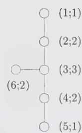

(2;2)

(3;3)

$$
\theta = (0, 0, \dots , 1)\tag{4;2}
$$

$$
\nu = (1, 2, 0, 1, 2, 0)\tag{5;1}
$$

Cartan matrix:

$$
\left( \begin{array}{c c c c c c} 2 & - 1 & 0 & 0 & 0 & 0 \\ - 1 & 2 & - 1 & 0 & 0 & 0 \\ 0 & - 1 & 2 & - 1 & 0 & - 1 \\ 0 & 0 & - 1 & 2 & - 1 & 0 \\ 0 & 0 & 0 & - 1 & 2 & 0 \\ 0 & 0 & - 1 & 0 & 0 & 2 \end{array} \right)
$$


Quadratic form matrix:

$$
\frac {1}{3} \left( \begin{array}{c c c c c c} 4 & 5 & 6 & 4 & 2 & 3 \\ 5 & 1 0 & 1 2 & 8 & 4 & 6 \\ 6 & 1 2 & 1 8 & 1 2 & 6 & 9 \\ 4 & 8 & 1 2 & 1 0 & 5 & 6 \\ 2 & 4 & 6 & 5 & 4 & 3 \\ 3 & 6 & 9 & 6 & 3 & 6 \end{array} \right)
$$

$\mathbf{F}_4$

(1;2;2)


(2;3;3)

(3;4;2)

(4;2;1)

Cartan matrix:

<div class="mineru-algorithm" style="white-space: pre-wrap; font-family:monospace;">
dim g = 52
g = 9
 $|W| = 1152$ $\theta = (1, 0, 0, 0)$ $u = (22, 42, 30, 16)$ 
exponents = 1, 5, 7, 11
</div>

$$
\left( \begin{array}{c c c c} 2 & - 1 & 0 & 0 \\ - 1 & 2 & - 2 & 0 \\ 0 & - 1 & 2 & - 1 \\ 0 & 0 & - 1 & 2 \end{array} \right)
$$

Quadratic form matrix:

$$
\left( \begin{array}{c c c c} 2 & 3 & 2 & 1 \\ 3 & 6 & 4 & 2 \\ 2 & 4 & 3 & \frac {3}{2} \\ 1 & 2 & \frac {3}{2} & 1 \end{array} \right)
$$

$\mathbf{G}_{2}$

$$
\begin{array}{l} \dim g = 1 4 \\ g = 4 \\ | W | = 1 2 \\ \theta = (1, 0) \\ u = (1 0, 6) \\ \text { exponents } = 1, 5 \end{array}
$$

Cartan matrix:

$$
\left( \begin{array}{c c} 2 & - 3 \\ - 1 & 2 \end{array} \right)
$$

Quadratic form matrix:

$$
\frac {1}{3} \left( \begin{array}{c c} 6 & 3 \\ 3 & 2 \end{array} \right)
$$

## Appendix 13.B. Notation for Simple Lie Algebras

<div class="mineru-algorithm" style="white-space: pre-wrap; font-family:monospace;">
Appendix 13.B. Notation for Simple Lie Algebras
g, h: finite Lie algebras
G, H: corresponding Lie groups
dim g: dimension of the algebra g
r: rank
$J^a (a = 1,\cdots ,\dim g)$ : generators of g
$H^i (i = 1,\cdots ,r)$ : generators of the Cartan subalgebra in the Cartan-Weyl basis
$E^\alpha$ : ladder generators in the Cartan-Weyl basis
$h^i (i = 1,\cdots ,r)$ : generators of the Cartan subalgebra in the Chevalley basis
$e^i,f^i (i = 1,\cdots ,r)$ : raising and lowering operators associated with the simple roots in the Chevalley basis
α,β: roots
α$^i$: i-th component of α in the Cartan-Weyl basis
α$_i$: simple roots
α$_i^\vee$: simple coroots = 2α$_i$/α$_i^2$
A$_{ij}$: Cartan matrix element = 2(α$_i$, α$_j^\vee$)
Δ: set of roots
Δ+, Δ−: set of positive, negative roots
|Δ|, |Δ+|: number of roots, number of positive roots
θ: highest root
a$_i$, a$_i^\vee$: marks and comarks; θ = ∑$_{i=1}^{r} a_i$α$_i$ = ∑$_{i=1}^{r} a_i^\vee$ α$_i^\vee$
g: dual Coxeter number = ∑$_{i=1}^{r} a_i^\vee$ + 1
λ, μ, ν: finite weights (usually highest weights)
dim|λ|: dimension of the representation of highest weight λ
Ωλ: weight system of the representation of highest weight λ
Lλ: irreducible module of highest weight λ
λ', λ'': particular weights in Ωλ
|λ'⟩: particular state, of weight λ', in the module Lλ
multλ(λ') : multiplicity of λ' in the highest-weight representation λ
ρ: Weyl vector (half-sum of positive roots)
ωi: fundamental weights
Fij: quadratic form matrix = (ωi, ωj)
λi: Dynkin labels: λ = ∑$_{i=1}^{r}$ λiωi = (λ1, ..., λr); h$^i$ eigenvalues of |λ⟩
λ$^i$: H$^i$ eigenvalues of |λ⟩
εi: orthonormal vectors
{ℓ1; ℓ2; ...; ℓr}: partition of the Young tableau associated with the su(N) weight λ = ∑i ℓiεi = ∑i λiωi so that ℓi = λi + λi+1 + ... + λr = length of the i-th row (from top)
</div>

$\{\tilde{\ell}_1;\tilde{\ell}_2;\dots ;\tilde{\ell}_s\}$ : transposed partition (change rows and columns)

$\lambda^t$ : transposed weight

$\lambda^{*}$ : conjugate of $\lambda$

$\chi_{\lambda}$ : character of the representation $\lambda$

W : Weyl group

|W| : order of the Weyl group

$s_{\alpha}$ : reflection with respect to the root $\alpha$

$s_{i}$ : reflection with respect to the simple root $\alpha_{i}$ (a simple Weyl reflection)

w : element of the Weyl group (a Weyl reflection)

$w_{0}$ : longest element of the Weyl group

$\epsilon (w)$ : signature of $w$

$\ell (w)$ : length of $w$

$w\cdot$ : shifted Weyl reflection: $w \cdot \lambda = w(\lambda + \rho) - \rho$

$C_{w}$ : Weyl chamber associated with the element w

Q: root lattice

$Q^{\vee}$ : coroot lattice

P: weight lattice

$P_{+}$ : set of dominant weights (= set of highest weights for irreducible representations)

$\mathcal{N}_{\lambda \mu \nu} = \mathcal{N}_{\lambda \mu}^{\nu^{*}}$ : tensor-product coefficients

Q: quadratic Casimir operator

ad : adjoint operator; ad(X)Y = [X, Y]

$K( , ) : (\text{normalized}) \text{ Killing form}; K(X, Y) = \text{Tr}(\text{ad}X, \text{ad}Y)/2g$

K : Kostant partition function

$x_{\lambda}$ : Dynkin index of the representation $\lambda$

$x_{e}$ : embedding index

$b_{\lambda\mu}$ : branching coefficient (multiplicity of $L_{\mu}$ in $L_{\lambda}$ )

v : congruence vector

u : height vector

$B(G)$ : center of the group $G^{14}$

## Exercises

## 13.1 The Killing form

a) Verify Eq. (13.18) and check that the only nonzero Killing norms are $K(H^i, H^i)$ and $K(E^\alpha, E^{-\alpha})$ .

b) Calculate the $su(2)$ Killing form $\tilde{K}$ in the Chevalley basis (13.85).

Result: With the ordering e, h, f, it reads

$$
\tilde {K} = \left( \begin{array}{c c c} 0 & 0 & 4 \\ 0 & 8 & 0 \\ 4 & 0 & 0 \end{array} \right)
$$

A rescaling by a factor $\frac{1}{4}=1/(2g)$ yields the standard normalization:

$$
K (e, f) = K (f, e) = \frac {1}{2} K (h, h) = 1
$$

## 13.2 Weyl group for $G_{2}$ and $su(4)$

Starting from the corresponding Cartan matrix given in App. 13.A, find the Weyl group and the set of all roots for:

a) $G_{2}$

b) $su(4)$

## 13.3 Linear representation of the Weyl group

The linear representation of the simple Weyl reflection $s_{j}$ is the $r \times r$ matrix that maps the column vector with components $\lambda_{i}$ to that with components $(s_{j}\lambda)_{i}$ .

a) Show that $\det s_{j} = -1$ . Deduce that for a general Weyl reflection w,

$$
\det w = (- 1) ^ {\ell}
$$

where $\ell$ is the number of simple reflections in the decomposition of $w$ .

b) Find the matrix representation of the simple reflections of $G_{2}$ and verify the relations (13.59).

c) Same as (b) for the algebra $F_{4}$ .

## 13.4 Order of the Weyl group

Verify the following formula for the order of the Weyl group of a simple Lie algebra of rank $r$ with marks $\{a_i\}$ :

$$
| W | = | P / Q | r! \prod_ {i = 1} ^ {r} a _ {i}
$$

Proceed case by case, using the data of App. 13.A.

## 13.5 Weight systems

Write all weights in the representation of highest weight:

a) $(1,0)$ of $G_{2}$ ,

b) $(0,0,1)$ of so(7),

c) $(0,0,0,0,1)$ of so(10).

## 13.6 Weight multiplicities

Find the multiplicity of the $su(4)$ weight $(-2,3,0)$ in the representation $(3,1,1)$ using:

a) the Freudenthal formula (13.113);

b) semistandard tableaux (cf. Sect. 13.3.3).

Hint: The calculation in (a) is greatly simplified if the weight is first transformed into a dominant one.

## 13.7 su(3) Gelfand-Tsetlin patterns

a) Write all the Gelfand-Tsetlin patterns for the $su(3)$ representation of highest weight (2,2).

b) For a $su(3)$ weight $\lambda' \in \Omega_{\lambda}$ , there corresponds $\mathrm{mult}_{\lambda}(\lambda')$ Gelfand-Tsetlin patterns of the form

$$
\begin{array}{c} \lambda_ {1} + \lambda_ {2} \lambda_ {2} 0 \\ a b \\ c \end{array}
$$

Relate the parameters $a, b, c$ to the two Dynkin labels $\lambda_1', \lambda_2'$ . Find inequalities satisfied by the free parameter of the Gelfand-Tsetlin pattern, and deduce a simple formula for $\mathrm{mult}_{\lambda}(\lambda')$ . Compare with the example of part (a).

## 13.8 The Demazure character formula

An expression equivalent to Eq. (13.167) is given by

$$
\chi_ {\lambda} = M _ {w _ {0}} (e ^ {\lambda})
$$

where $w_{0}$ is the longest element of the Weyl group, and for $w_{0} = s_{i} \cdots s_{j}$ , $M_{w_{0}}(e^{\lambda})$ is defined by

$$
M _ {w _ {0}} = M _ {i} \dots M _ {j}
$$

with

$$
M _ {i} (e ^ {\lambda}) = \frac {e ^ {\lambda} - e ^ {s _ {i} \cdot \lambda}}{1 - e ^ {- \alpha_ {i}}}
$$

(notice that the Weyl reflection is shifted), where, as usual, $\alpha_{i}$ stands for a simple root and

$$
M _ {i} M _ {j} (e ^ {\lambda}) \equiv M _ {i} (M _ {j} (e ^ {\lambda}))
$$

This is called the Demazure character formula.

a) Verify the following properties of $M_{i}$ :

$$
\begin{array}{l l} M _ {i} (e ^ {\lambda}) = e ^ {\lambda} + e ^ {\lambda + 1} + \dots + e ^ {\lambda - \lambda_ {i} \alpha_ {i}} & \text { if } \quad \lambda_ {i} \geq 0 \\ = 0 & \text { if } \quad \lambda_ {i} = - 1 \\ = - e ^ {\lambda + \alpha_ {i}} - e ^ {\lambda + \alpha_ {i} + 1} - \dots - e ^ {\lambda - (\lambda_ {i} + 1) \alpha_ {i}} & \text { if } \quad \lambda_ {i} \leq - 2 \end{array}
$$

and

$$
(M _ {i}) ^ {2} = M _ {i}
$$

b) For $su(2)$ , show that the Demazure formula is equivalent to the Weyl character formula.

c) Check the formula for the $su(3)$ representation (1,2) (compare the result with Eq. (13.161)). For this representation, verify also that

$$
M _ {s _ {1} s _ {2} s _ {1}} (e ^ {\lambda}) = M _ {s _ {2} s _ {1} s _ {2}} (e ^ {\lambda})
$$

d) Another version of the Demazure formula is

$$
\chi_ {\lambda} = \sum_ {w \in W} N _ {w} (e ^ {\lambda})
$$

where, in terms of a (minimal) decomposition of w in simple Weyl reflections, e.g., if $w = s_{l} \cdots s_{k}$ , $N_{w}$ is given by

$$
N _ {w} (e ^ {\lambda}) = N _ {l} \dots N _ {k} (e ^ {\lambda})
$$

and

$$
N _ {i} (e ^ {\lambda}) = \frac {e ^ {s _ {i} \lambda} - e ^ {\lambda}}{1 - e ^ {\alpha_ {i}}}
$$

Express $N_{i}$ as a sum, as done in part (a) for $M_{i}$ .

e) Evaluate the different $N_w(e^\lambda)'s$ for the $su(3)$ highest weight $\lambda = (1,2)$ . Observe that each $N_w(e^\lambda)$ is a positive sum.

f) Prove the relation:

$$
(1 + N _ {i}) (e ^ {\lambda}) = M _ {i} (e ^ {\lambda})
$$

## 13.9 Dimension of $G_{2}$ representations

Derive the dimension formula for the irreducible representations of $G_{2}$ and check that $\mathsf{L}_{(0,1)}$ and $\mathsf{L}_{(1,0)}$ have respective dimensions 7 and 14.

## 13.10 Another expression for the dual Coxeter number

Equations (13.181) and (13.184) lead to the following expression for the dual Coxeter number:

$$
\begin{array}{r l} g = (2 n _ {L} + n _ {S}) / 2 r & \qquad \text { for } \quad g \neq G _ {2} \\ = (3 n _ {L} + n _ {S}) / 3 r & \qquad \text { for } \quad G _ {2} \end{array}
$$

where $n_{L,S}$ denotes the number of long and short roots, respectively. Verify this result for $sp(4)$ and $G_2$ .

Remark: For simply laced algebras, this reduces to the relation: $|\Delta| = gr$ .

## 13.11 Cauchy determinant and Schur functions

a) Show that

$$
\phi (\{x \}, \{y \}) = \frac {\Delta (y)}{\prod_ {1 \leq i , j \leq N} (1 - x _ {i} y _ {j})}
$$

where $\Delta (x) = \prod_{1\leq i < j\leq N}(x_i - x_j)$ , is a generating function for the Schur functions (13.189), namely

$$
\phi (\{x \}, \{y \}) = \sum_ {m _ {1}, m _ {2}, \dots , m _ {N} \geq 0} y _ {1} ^ {m _ {1}} \dots y _ {N} ^ {m _ {N}} S _ {\lambda} (x _ {1}, \dots , x _ {N})
$$

where $\lambda=\{\ell_{i}\}$ , and $\ell_{i}=m_{i}+i-N$ .

b) By means of the Cauchy determinant formula (see Ex. 12.12 for a proof; take $z_{i} = 1 / x_{i}$ and $w_{j} = y_{j}$ in the formula (12.195))

$$
\det \left[ \frac {1}{1 - x _ {i} y _ {j}} \right] _ {1 \leq i, j \leq N} = \frac {\Delta (x) \Delta (y)}{\prod_ {1 \leq i , j \leq N} \left(1 - x _ {i} y _ {j}\right)}
$$

rewrite the generating function $\phi(\{x\},\{y\})$ as the single determinant

$$
\begin{array}{l} \phi (\{x \}, \{y \}) = \frac {\Delta (y)}{\prod_ {1 \leq i , j \leq N} (1 - x _ {i} y _ {j})} \\ = \det \left[ \frac {y _ {i} ^ {N - j}}{\prod_ {k = 1} ^ {N} (1 - y _ {i} x _ {k})} \right] _ {1 \leq i, j \leq N} \end{array}
$$

Hint: Represent the quantity $\Delta(y)$ as a determinant (13.191).

c) The Schur polynomials of the variables $t_1, t_2, \ldots$ are defined through the generating function

$$
F (y) = \sum_ {m \geq 0} y ^ {m} P _ {m} (t.) = e ^ {\sum_ {k = 1} ^ {\infty} y ^ {k} \frac {t _ {k}}{k}}
$$

This definition is supplemented by the convention that $P_{m}(t) = 0$ for $m \leq -1$ . Show that

$$
F (y) = \prod_ {k = 1} ^ {N} \frac {1}{(1 - y x _ {k})}
$$

iff the $t_{k}$ are expressed as

$$
t _ {k} = \sum_ {i = 1} ^ {N} x _ {i} ^ {k}
$$

for some integer N.

d) Prove the following properties of the Schur polynomials

$$
\frac {\partial}{\partial t _ {k}} P _ {m} (t _ {.}) = P _ {m - k} (t _ {.})
$$

$$
P _ {m} (1) = \frac {1}{m !}
$$

where 1 stands for $t_{k}=1$ for all $k\geq1$ .

e) Express the generating function $\phi(\{x\},\{y\})$ in terms of Schur polynomials. Deduce the following formula expressing the Schur functions as determinants of Schur polynomials of the variable $t_k = \sum_{i=1}^{N} x_i^k$ .

$$
S _ {\lambda} (x _ {1}, \dots , x _ {N}) = \det \left[ P _ {\ell_ {i} + j - i} (t _ {.}) \right] _ {1 \leq i, j \leq N}
$$

## 13.12 Partitions and Schur functions

a) Work out the details of the derivation of Eqs. (13.189) and (13.192).

b) Prove directly the equivalence of Eqs. (13.192) and (13.172) by evaluating the scalar products in Eq. (13.172) in the orthogonal basis.

c) Find the action of the $s_i$ 's on the partitions.

## 13.13 Dimension of $su(N)$ representations and hooks

The dimension of a representation can be read off a Young tableau in a rather simple way using hooks. The hook associated with the box at position $(i,j)$ (i-th row, j-th column) is composed of two lines joined at right angle in the box $(i,j)$ and leaving the tableau downward and toward the right. Its length, denoted by $h_{i,j}$ , is the number of boxes it crosses. The following tableau is filled with the numbers $h_{i,j}$

$$
h _ {i, j}: \quad \begin{array}{c c c c} \hline 6 & 5 & 2 & 1 \\ \hline 3 & 2 \\ \hline 2 & 1 \\ \hline \end{array}
$$

In terms of hooks, the dimension of a $su(N)$ representation reads

$$
\dim | \lambda | = \prod_ {i, j} \frac {(N - i + j)}{h _ {i , j}}
$$

where the product is taken over all the boxes of the tableau.

a) Verify the equivalence of this formula with Eq. (13.192) for the above $su(4)$ tableau.

b) Using this expression, reproduce the $su(2)$ and $su(3)$ dimension formulae (13.172).

## 13.14 sp(4) tensor product: character method

Calculate the $sp(4)$ tensor product $(1, 1) \otimes (2, 0)$ using the character method and check the result by calculating the total dimension of each sides.

## 13.15 Weyl-group folding in the character method

Extending the validity of Eq. (13.171) to nondominant weights, prove that

$$
\dim | w \cdot \lambda | = \epsilon (w) \dim | \lambda |
$$

In the character method for tensor-product calculations, this shows that weights that are ignored have zero dimension, and two weights cancel each other if their dimensions add up to zero. Check this explicitly for the $su(3)$ example $(3,2)\otimes(2,4)$ , to be worked out graphically using the algorithm underlying the character method.

## 13.16 Littlewood-Richardson and Berenstein-Zelevinsky methods

a) Using the Littlewood-Richardson method once and then the BZ triangles, calculate the following tensor products:

$$
\begin{array}{l} s u (3): (3, 2) \otimes (0, 3) \\ s u (4): (1, 0, 1) \otimes (1, 0, 1) \end{array}
$$

b) Using Littlewood-Richardson tableaux once and then the BZ triangles, find the multiplicity of the scalar representation in the following triple tensor products

$$
\begin{array}{l} s u (3): (4, 4) \otimes (4, 4) \otimes (4, 4) \\ s u (4): (2, 1, 1) \otimes (1, 2, 1) \otimes (1, 1, 2) \end{array}
$$

c) Observe that all the $su(3)$ triangles in (b) are related to each other by addition or subtraction of the "basic" triangle

$$
\Omega = \begin{array}{c c c c} & 1 \\ & - 1 & - 1 \\ & - 1 & - 1 \\ 1 & - 1 & - 1 & 1 \end{array}
$$

Hence, once a triangle is found, all the others are readily generated. Relate this to a one-parameter indeterminacy in (13.212). Find the analogous result for $su(4)$ and compare with the example worked out in (b).

d) Prove, using either Littlewood-Richardson tableaux or BZ triangles, that the $su(3)$ tensor-product coefficient $\mathcal{N}_{\lambda \mu \nu}$ is at most 1 if one of the three weights has at least one vanishing Dynkin label.

## 13.17 Kostant's multiplicity formula

The Weyl character formula leads directly to a new expression for weight multiplicities, Kostant's formula. For this, we introduce the partition function $\mathcal{K}(\mu)$ defined to be the number of distinct decompositions of $\mu$ in terms of positive roots. In other words, $\mathcal{K}(\mu)$ is the number of solutions $\{k_{\alpha}\}$ , $\alpha \in \Delta_{+}$ of the equation $\sum_{\alpha > 0} k_{\alpha} \alpha = \mu$ , with all $k_{\alpha} \geq 0$ . Of course, if there is no such decomposition, $\mathcal{K}(\mu) = 0$ . Setting $\mathcal{K}(0) = 1$ , we have

$$
\prod_ {\alpha > 0} \frac {1}{1 - e ^ {\alpha}} = \sum_ {\mu} \mathcal {K} (\mu) e ^ {\mu}
$$

In terms of this partition function, show that the multiplicity of the weight $\lambda'$ in the representation $\lambda$ is given by

$$
\operatorname{mult} _ {\lambda} \left(\lambda^ {\prime}\right) = \sum_ {w \in W} \epsilon (w) \mathcal {K} \left(w (\lambda + \rho) - \left(\lambda^ {\prime} + \rho\right)\right)
$$

Hint: Use the product form of $D_{\rho}^{-1}$ to relate it to the partition function $\mathcal{K}$ .

The advantage of Kostant's formula over Freudenthal's is that a given weight can be treated in isolation. The price that has to be paid is a sum over the whole Weyl group. Nevertheless, in favorable circumstances only a few terms contribute. Illustrate this by calculating the multiplicity of the weight $(0,0)$ in the adjoint representation of $su(3)$ .

## 13.18 Steinberg formula for tensor products

Use the Kostant multiplicity formula to obtain the Steinberg formula for tensor-product coefficients:

$$
\mathcal {N} _ {\lambda \mu} ^ {\nu} = \sum_ {w, w ^ {\prime} \in W} \epsilon (w w ^ {\prime}) \mathcal {K} (w \cdot \lambda + w ^ {\prime} \cdot \mu - \nu)
$$

## 13.19 Associativity in tensor products

Tensor product coefficients can be calculated from the fusion coefficients involving fundamental weights, that is, $\{N_{\lambda,\mu}^{\omega_{t}}\}$ for $i = 1, \cdots, r$ and any $\lambda, \mu$ , and the associativity condition (13.224). Illustrate this by calculating, from these data, the $su(3)$ coefficient $\mathcal{N}_{(1,1)(1,1)}^{(1,1)}$ .

## 13.20 Generalized Chebyshev polynomials and tensor products

a) Verify the relations (13.239), regarded as the defining recursion relations for the generalized Chebyshev polynomials $U_{(\lambda_{1},\lambda_{2})}$ , associated with the tensor-product matrix $N_{(\lambda_{1},\lambda_{2})}$ . Check further that

$$
U _ {(\lambda_ {1}, \lambda_ {2})} = U _ {(\lambda_ {1}, 0)} U _ {(0, \lambda_ {2})} - U _ {(\lambda_ {1} - 1, 0)} U _ {(0, \lambda_ {2} - 1)}
$$

for $\lambda_1, \lambda_2 > 1$ . Argue that the matrices $N_{(1,0)}$ and $N_{(0,1)}$ must commute. Use these relations to obtain the generating function (13.241).

b) Derive analogous results for $sp(4)$ . With $N_{(1,0)} = x_1$ and $N_{(0,1)} = x_2$ , the generating function $F(x_1, x_2; t, s)$ is

$$
\frac {1 + s \left(t ^ {2} + 1\right) + s ^ {2} t ^ {2} - t s x _ {1}}{\left(1 + t ^ {2} + t ^ {4} - x _ {1} \left(t ^ {3} + t\right) + t ^ {2} x _ {2}\right) \left(1 + s + s ^ {3} + s ^ {4} - x _ {2} \left(s + 2 s ^ {2} + s ^ {3}\right) + s ^ {2} x _ {1} ^ {2}\right)}
$$

## 13.21 Verlinde formula for a Lie algebra

Check carefully the derivation of the orthogonality relation (13.244). Use the Verlinde formula (13.245) to recover the $su(2)$ tensor-product matrices $N_{1}$ and $N_{2}$ .

## 13.22 Embedding index

a) Prove the relation (13.251).

b) For the embedding $E_8 \supset su(2) \oplus su(3)$ , calculate the embedding index, using the branching rule:

$$
(1, 0, 0, 0, 0, 0, 0, 0) \mapsto \{(6) \otimes (1, 1) \} \oplus \{(4) \otimes (3, 0) \}
$$

c) For the embedding $so(7) \supset su(4)$ , calculate the embedding index, using the projection matrix:

$$
\mathcal {P} = \left( \begin{array}{c c c} 0 & 1 & 1 \\ 1 & 0 & 0 \\ 0 & 1 & 0 \end{array} \right)
$$

## 13.23 Embeddings of su(2)

a) Describe all possible embeddings of $su(2)$ in $sp(4)$ . In each case, find the branching rule for (1,0), the projection matrix and the embedding index.

b) Same as (a) for the embeddings $su(2) \subset G_2$ , using the representation $(0,1)$ .

## 13.24 Regular maximal subalgebras

Find all regular maximal subalgebras of $F_{4}, E_{6}$ , and $E_{7}$ .

## 13.25 Branching rules in regular embeddings

a) Consider the regular embedding $su(3) \subset G_{2}$ . Draw the extended Dynkin diagram of $G_{2}$ (i.e., calculate the number of links between the new root $-\theta$ and $\alpha_{1}, \alpha_{2}$ ). Identify the node that must be deleted to recover the $su(3)$ Dynkin diagram. Write all the weights in the $(0, 1)$ representation of $G_{2}$ and their extended Dynkin labels $[\lambda_{-\theta}, \lambda_{1}, \lambda_{2}]$ , where

$$
\lambda_ {- \theta} = - 2 \lambda_ {1} - \lambda_ {2}
$$

(cf. Eq. (13.268)). Delete the Dynkin label appropriate for the $su(3)$ embedding and reorganize the resulting $su(3)$ weights in irreducible representations. This gives the branching of the $(0,1)G_{2}$ representation into $su(3)$ ones.

b) By proceeding similarly for the regular embedding $su(4) \subset so(7)$ , find the branching of the $so(7)$ representation $(1, 0, 0)$ .

## Notes

Except for some aspects of tensor-product calculations and tableaux techniques, the content of this chapter is rather standard. It is covered, for instance, in Cahn [61], Wybourne [361], Fulton and Harris [155], Jacobson [209], Humphreys [196], Bourbaki [56], and Zelobenko [368]. The book of Cahn provides a clear and concise first introduction to the subject, and that of Fulton and Harris is a particularly readable mathematical textbook; tableaux techniques are well covered there. A sharp focus on the material presented in Sects. 13.1 and 13.2 can be found in those sections of Kass et al. [228] related to finite Lie algebras. The theory of semisimple Lie algebras is also well summarized in the first chapter of Fuchs [148]. The proof of the strange formula follows Freudenthal and de Vries [138]. The relation between semistandard tableaux and Gelfand-Tsetlin patterns can be found in Ref. [193].

The character method for tensor products is presented in Racah [301], Speiser [329], and Klimyk [239]. The relation between Littlewood-Richardson tableaux and Gelfand-Tsetlin patterns can be found in Gelfand and Zelevinsky [164]. It is equivalent to the method for calculating tensor-product coefficients by means of semistandard tableaux, which is presented in [257, 354, 278]. Berenstein-Zelevinsky triangles were introduced in Ref. [38] and further developed in Refs. [74, 39].

The basics of algebra embeddings are explained in Cahn [61]. For a more detailed discussion, the reader is referred to the original articles of Dynkin [117, 118]. The generating functions for the embeddings of $su(2)$ into $su(3)$ (and many others) can be found in Patera and Sharp [291].

The Demazure formula of Ex. 13.8 is proved in Ref. [90] (see also Ref. [163]).

Our conventions and most of our notations follow mainly that of Patera and collaborators [268, 59], which makes easier the consultation of these extensive and very useful tables of weight multiplicities, dimensions of representations, branching rules, and so forth.

# Affine Lie Algebras

This chapter is a basic introduction to affine Lie algebras, preparing the stage for their application to conformal field theory. In Sect. 14.1.1, after having introduced the affine Lie algebras per se, we show how the fundamental concepts of roots, weights, Cartan matrices, and Weyl groups are extended to the affine case. Section 14.2 introduces the outer automorphism group of affine Lie algebras, which is generated by the new symmetry transformations of the extended Dynkin diagram. The following section describes highest-weight representations, focusing on those whose highest weight is dominant. Characters for these representations are introduced in Sect. 14.4. Their modular properties are presented in the following sections, where various properties of their modular S matrices are also reported. The affine extension of finite Lie algebra embeddings is presented in Sect. 14.7. Four appendices complete the chapter. The first one contains the proof of a technical identity related to outer automorphism groups. The second appendix displays an explicit basis (in terms of semi-infinite paths) for the states in integrable representations of affine $su(N)$ . In the third one, the modular transformation properties of the affine characters are derived. The final appendix lists all the symbols pertaining to affine Lie algebras.

The minimal background required for proceeding to Chap. 15, which initiates the analysis of affine Lie algebras in the context of conformal field theory, is contained in Sects. 14.1.1, 14.3.1, 14.4.1, and 14.5. The remaining sections could be consulted when needed.

The next few sentences give a flavor of the relevant aspects of the theory of affine Lie algebras. To every (finite) Lie algebra g, we associate an affine extension $\hat{g}$ by adding to the Dynkin diagram of g an extra node, related to the highest root $\theta$ . The introduction of this particular simple root has the immediate effect of making the root system (and thereby the Weyl group) of $\hat{g}$ infinite. As a result, highest-weight representations are infinite dimensional. However, as a simplifying feature, these representations are organized in terms of a new parameter, called the level, which plays a role analogous to that of the central charge in the Virasoro algebra. The level of a weight, described now by $r + 1$ Dynkin labels, is the sum of all its Dynkin labels, each multiplied by its corresponding comark. For affine algebras, comarks are thus data of prime importance. Integrable highest-weight representations occur for positive integer values of the level. Moreover, the corresponding highest weights have nonnegative integer Dynkin labels. For a fixed level, there is thus a finite number of integrable representations. Quite remarkably, their characters transform into each other under modular transformations.

## §14.1. The Structure of Affine Lie Algebras

## 14.1.1. From Simple Lie Algebras to Affine Lie Algebras

We consider the generalization of g in which the elements of the algebra are also Laurent polynomials in some variable t. The set of such polynomials is denoted by $C[t, t^{-1}]$ . This generalization is called the loop algebra $\tilde{g}:^{1}$

$$
\tilde {\mathbf {g}} = \mathbf {g} \otimes \mathbb {C} [ t, t ^ {- 1} ]\tag{14.1}
$$

with generators $J^a \otimes t^n$ . The algebra multiplication rule extends naturally from $g$ to $\tilde{g}$ as

$$
[ J ^ {a} \otimes t ^ {n}, J ^ {b} \otimes t ^ {m} ] = \sum_ {c} i f _ {c} ^ {a b} J ^ {c} \otimes t ^ {n + m}\tag{14.2}
$$

A central extension is obtained by adjoining to $\tilde{g}$ a central element

$$
[ J ^ {a} \otimes t ^ {n}, J ^ {b} \otimes t ^ {m} ] = \sum_ {c} i f _ {c} ^ {a b} J ^ {c} \otimes t ^ {n + m} + \hat {k} n K (J ^ {a}, J ^ {b}) \delta_ {n + m, 0}\tag{14.3}
$$

where $\hat{k}$ commutes with all $J^{a}$ 's, and K is the Killing form of g. Assuming as usual that the generators $J^{a}$ are orthonormal with respect to the Killing form, and using the notation

$$
J _ {n} ^ {a} \equiv J ^ {a} \otimes t ^ {n}\tag{14.4}
$$

we can rewrite the above commutation relation in the form

$$
[ J _ {n} ^ {a}, J _ {m} ^ {b} ] = \sum_ {c} i f ^ {a b} _ {c} J _ {n + m} ^ {c} + \hat {k} n \delta_ {a b} \delta_ {n + m, 0}\tag{14.5}
$$

This must be supplemented by

$$
[ J _ {n} ^ {a}, \hat {k} ] = 0\tag{14.6}
$$

The above introduction of the central extension may appear to be somewhat ad hoc. The following considerations demonstrate its uniqueness. We start with the generic commutator

$$
[ J _ {n} ^ {a}, J _ {m} ^ {b} ] = \sum_ {c} i f ^ {a b} _ {c} J _ {n + m} ^ {c} + \sum_ {i = 1} ^ {\ell} \hat {k} ^ {i} (d _ {i} ^ {a b}) _ {n m}\tag{14.7}
$$

containing $\ell$ central terms. With the representation (14.4), it is clear that the central terms can occur only for $n + m = 0$ . (Otherwise they could be eliminated by a redefinition of the generators, exactly as in the finite case in which central extensions are trivial.) This shows that

$$
[ J _ {0} ^ {a}, J _ {n} ^ {b} ] = \sum_ {c} i f ^ {a b} _ {c} J _ {n} ^ {c}\tag{14.8}
$$

meaning that the generators $\{J_{n}^{a}\}$ transform in the adjoint representation of g (i.e., under the action of $\mathrm{ad}(J_{0}^{a})$ , where $\mathrm{ad}(X)Y = [X, Y]$ , $J_{n}^{b}$ transforms exactly like $J_{0}^{b}$ ). That the central extensions commute with all the generators $J_{n}^{a}$ means that they are invariant tensors of the adjoint representation. But up to normalization, there is only one such tensor, the Killing form itself. $^{2}$ Hence, only one central element can possibly be added to the loop extension of a simple Lie algebra. In a basis in which the generators are orthonormal with respect to the Killing form, it is simple to check that the only central extension compatible with the antisymmetry of the commutators and the Jacobi identities is the one given in Eq. (14.5).

To analyze this new algebra, it is useful to rewrite the commutation relations (14.5) in the affine Cartan-Weyl basis. With the nonzero Killing norms being

$$
K (H ^ {i}, H ^ {j}) = \delta^ {i, j}, K (E ^ {\alpha}, E ^ {- \alpha}) = \frac {2}{| \alpha | ^ {2}}\tag{14.9}
$$

the commutation relations read

$$
\begin{array}{l l} \hline [ H _ {n} ^ {i}, H _ {m} ^ {j} ] = \hat {k} n \delta^ {i j} \delta_ {n + m, 0} \\ [ H _ {n} ^ {i}, E _ {m} ^ {\alpha} ] = \alpha^ {i} E _ {n + m} ^ {\alpha} \\ [ E _ {n} ^ {\alpha}, E _ {m} ^ {\beta} ] = \frac {2}{\alpha^ {2}} \left(\alpha \cdot H _ {n + m} + \hat {k} n \delta_ {n + m, 0}\right) & \text {if} \quad \alpha = - \beta \\ = \mathcal {N} _ {\alpha , \beta}   E _ {n + m} ^ {\alpha + \beta} & \text {if} \quad \alpha + \beta \in \Delta \\ = 0 & \text {otherwise} \end{array}\tag{14.10}
$$

with the generators $H_{n}^{i}$ and $E_{n}^{\alpha}$ defined as in Eq. (14.4) ( $\Delta$ is the set of roots of g).

The set of generators $\{H_{0}^{1},\cdots,H_{0}^{r},\hat{k}\}$ is manifestly Abelian. In the adjoint representation, in which the action of a generator X is represented by $\operatorname{ad}(X)$ , the eigenvalues of $\operatorname{ad}(H_{0}^{i})$ and $\operatorname{ad}(\hat{k})$ on the generator $E_{n}^{\alpha}$ are respectively $\alpha^{i}$ and 0. Being independent of n, the eigenvector $(\alpha^{1},\cdots,\alpha^{r},0)$ is thus infinitely degenerate (i.e., it is the same for all the $E_{m}^{\alpha}$ 's). Hence, $\{H_{0}^{1},\cdots,H_{0}^{r},\hat{k}\}$ is not a maximal Abelian subalgebra. It must be augmented by the addition of a new grading operator $L_{0}$ , whose eigenvalues in the adjoint representation depend upon n; it is defined as follows: $^{3}$

$$
L _ {0} = - t \frac {d}{d t}\tag{14.11}
$$

Its action on the generators is

$$
\operatorname{ad} \left(L _ {0}\right) J ^ {a} \otimes t ^ {n} = \left[ L _ {0}, J ^ {a} \otimes t ^ {n} \right] = - n J ^ {a} \otimes t ^ {n} \quad \Longrightarrow \quad \left[ L _ {0}, J _ {n} ^ {a} \right] = - n J _ {n} ^ {a}\tag{14.12}
$$

The maximal Cartan subalgebra is generated by $\{H_{0}^{1},\cdots,H_{0}^{r},\hat{k},L_{0}\}$ . The other generators, $E_{n}^{\alpha}$ for any n and $H_{n}^{i}$ for $n\neq0$ , play the role of ladder operators.

With the addition of the operator $L_{0}$ , the resulting algebra is denoted by $\hat{g}$

$$
\hat {\mathbf {g}} = \tilde {\mathbf {g}} \oplus \mathbb {C} \hat {k} \oplus \mathbb {C} L _ {0}\tag{14.13}
$$

It will be referred to as an affine Lie algebra. $^{4}$ It is clearly an infinite dimensional algebra, given that it has an infinite number of generators $\{J_{n}^{a}\}, n \in Z$ . From the perspective of the affine algebra, g will be referred to as the corresponding finite algebra. Its generators are the zero modes $\{J_{0}^{a}\}$ .

An already familiar infinite-dimensional algebra is the one generated by the modes of a free boson:

$$
[ a _ {n}, a _ {m} ] = n \delta_ {n + m, o}\tag{14.14}
$$

It is usually referred to as the Heisenberg algebra, and is simply the affine extension of the $u(1)$ algebra generated by the element $a_0$ . Comparison of the above commutation relation with Eq. (14.5) seems to indicate that the level is equal to one. However, the central term can be changed at will by a rescaling of the modes: this shows that the level has no meaning in the $\widehat{u}(1)$ case.

## 14.1.2. The Killing Form

To parallel the development of the theory of Lie algebra, we must first equip $\hat{\mathbf{g}}$ with a scalar product. This amounts to extending the definition of the Killing form from $\mathbf{g}$ to $\hat{\mathbf{g}}$ . Again the key relation is the extension of (13.17) to $\hat{\mathbf{g}}$ , which expresses the $\hat{\mathbf{g}}$ invariance of this bilinear form—with now $X, Y, Z \in \hat{\mathbf{g}}$ . With $X, Y \in \{J_n^a\}$ and $Z = L_0$ , we have

$$
K (J _ {n} ^ {a}, J _ {m} ^ {b}) = 0 \quad \text { unless } \quad n + m = 0\tag{14.15}
$$

The identification (14.4) shows that when $n + m = 0$ the t factors disappear; we are thus left with the g Killing form, implying that

$$
K (J _ {n} ^ {a}, J _ {m} ^ {b}) = \delta^ {a b} \delta_ {n + m, 0}\tag{14.16}
$$

We note that the affine Killing form is still orthonormal with respect to the finite algebra indices; from now on, we will no longer care about the position of these indices. $^{5}$ The choice $X, Z \in \{J_{n}^{a}\}$ and $Y = \hat{k}$ yields

$$
K (J _ {n} ^ {a}, \hat {k}) = 0 \quad \text { and } \quad K (\hat {k}, \hat {k}) = 0\tag{14.17}
$$

whereas $Y = L_0$ leads to

$$
K (J _ {n} ^ {a}, L _ {0}) = 0 \qquad \text { and } \qquad K (L _ {0}, \hat {k}) = - 1\tag{14.18}
$$

The only unspecified norm is $K(L_0, L_0)$ , which, by convention, is chosen to be zero

$$
K (L _ {0}, L _ {0}) = 0\tag{14.19}
$$

The arbitrariness of this norm is related to the possibility of redefining $L_{0}$ as

$$
L _ {0} \rightarrow L _ {0} ^ {\prime} = L _ {0} + a \hat {k}\tag{14.20}
$$

where $a$ is some constant, without affecting the algebra. It changes its Killing norm by only $-2a$ .

As in the finite case, the Killing form leads to an isomorphism between the elements of the Cartan subalgebra and those of its dual, and defines for the latter a scalar product. Let the components of the vector $\hat{\lambda}$ be the eigenvalues of a state that is a simultaneous eigenvector of all the generators of the Cartan subalgebra:

$$
\hat {\lambda} = (\hat {\lambda} (H _ {0} ^ {1}), \hat {\lambda} (H _ {0} ^ {2}), \dots , \hat {\lambda} (H _ {0} ^ {r}); \hat {\lambda} (\hat {k}); \hat {\lambda} (- L _ {0}))\tag{14.21}
$$

The first r components characterize the finite part $\lambda$ of the weight $\hat{\lambda}^{6}$

$$
\hat {\lambda} = (\lambda ; k _ {\lambda}; n _ {\lambda})\tag{14.22}
$$

(We note that the last entry refers to $-L_0$ ). The scalar product induced by the extended Killing form is

$$
(\hat {\lambda}, \hat {\mu}) = (\lambda , \mu) + k _ {\lambda} n _ {\mu} + k _ {\mu} n _ {\lambda}\tag{14.23}
$$

$\hat{\lambda}$ is called an affine weight.

As for Lie algebras, weights in the adjoint representation are called roots. Since $\hat{k}$ commutes with all the generators of $\hat{g}$ , its eigenvalue on the states of the adjoint representation is equal to zero. Hence, affine roots are of the form

$$
\hat {\beta} = (\beta ; 0; n)\tag{14.24}
$$

Their scalar product is thus exactly the same as in the finite case

$$
(\hat {\beta}, \hat {\alpha}) = (\beta , \alpha)\tag{14.25}
$$

The affine root associated with the generator $E_{n}^{\alpha}$ is

$$
\hat {\alpha} = (\alpha ; 0; n) \qquad n \in \mathbb {Z}, \quad \alpha \in \Delta\tag{14.26}
$$

If we let

$$
\delta = (0; 0; 1)\tag{14.27}
$$

then, $n\delta$ is the root associated with $H_{n}^{i}$ . In the following we write

$$
\alpha \equiv (\alpha ; 0; 0)\tag{14.28}
$$

so that the roots (14.26) can be reexpressed as

$$
\hat {\alpha} = \alpha + n \delta\tag{14.29}
$$

The full set of roots is

$$
\hat {\Delta} = \{\alpha + n \delta | n \in \mathbb {Z}, \alpha \in \Delta \} \cup \{n \delta | n \in \mathbb {Z}, n \neq 0 \}\tag{14.30}
$$

The root $\delta$ is rather unusual since it has zero length

$$
(\delta , \delta) = 0\tag{14.31}
$$

For this reason, it is often called an imaginary root. Likewise all the roots in the set $\{n\delta\}$ are imaginary and $(n\delta,m\delta)=0$ for all n,m. All these imaginary roots have multiplicity r. The other roots are then said to be real, and they have multiplicity 1.

## 14.1.3. Simple Roots, the Cartan Matrix and Dynkin Diagrams

The next step is the identification of a basis of simple roots for the affine algebra. In such a basis, the expansion coefficients of any root are either all positive or all negative. This basis must contain $r + 1$ elements, r of which are necessarily the finite simple roots $\alpha_{i}$ , whereas the remaining simple root must be a linear combination involving $\delta$ . The proper choice for this extra simple root is

$$
\boxed {\alpha_ {0} \equiv (- \theta ; 0; 1) = - \theta + \delta}\tag{14.32}
$$

where $\theta$ is the highest root of g. The correct basis of simple roots is thus $\{\alpha_{i}\}, i = 0, \cdots, r$ . The set of positive roots is

$$
\hat {\Delta} _ {+} = \{\alpha + n \delta | n > 0, \alpha \in \Delta \} \cup \{\alpha | \alpha \in \Delta_ {+} \}\tag{14.33}
$$

Indeed, for n > 0 and $\alpha \in \Delta$ ,

$$
\alpha + n \delta = \alpha + n \alpha_ {0} + n \theta = n \alpha_ {0} + (n - 1) \theta + (\theta + \alpha)\tag{14.34}
$$

and the expansion coefficients of the last two factors in terms of finite simple roots are necessarily nonnegative. Notice that in the affine case there is no highest root (i.e., the adjoint representation is not a highest-weight representation).

Given a set of affine simple roots and a scalar product, we can define the extended Cartan matrix as

$$
\boxed {\widehat {A} _ {i j} = (\alpha_ {i}, \alpha_ {j} ^ {\vee}) \qquad 0 \leq i, j \leq r}\tag{14.35}
$$

where affine coroots are given by

$$
\hat {\alpha} ^ {\vee} = \frac {2}{| \hat {\alpha} | ^ {2}} (\alpha ; 0; n) = \frac {2}{| \alpha | ^ {2}} (\alpha ; 0; n) = (\alpha^ {\vee}; 0; \frac {2}{| \alpha | ^ {2}} n)\tag{14.36}
$$

As for simple roots, the hat is omitted over the simple coroots, e.g.,

$$
\alpha_ {0} ^ {\vee} = \alpha_ {0} \qquad \alpha_ {i} ^ {\vee} \equiv (\alpha_ {i} ^ {\vee}; 0; 0) \quad i \neq 0\tag{14.37}
$$

Compared to the finite Cartan matrix, $\widehat{A}_{ij}$ contains an extra row and column. These additional entries are easily calculated in terms of the marks defined in Eq. (13.33) since $(\alpha_0, \alpha_0^\vee) = |\theta|^2 = 2$ and

$$
(\alpha_ {0}, \alpha_ {j} ^ {\vee}) = - (\theta , \alpha_ {j} ^ {\vee}) = - \sum_ {i = 1} ^ {r} a _ {i} (\alpha_ {i}, \alpha_ {j} ^ {\vee})\tag{14.38}
$$

Again, all the information contained in extended Cartan matrices can be encoded in extended Dynkin diagrams. The Dynkin diagram of $\hat{\mathbf{g}}$ is obtained from that of $\mathbf{g}$ by the addition of an extra node representing $\alpha_0$ . This extra node is linked to the $\alpha_i$ -nodes by $\widehat{A}_{0i}\widehat{A}_{i0}$ lines. Since the finite part of $\alpha_0$ is not linearly independent of the finite simple roots, the product $\widehat{A}_{0i}\widehat{A}_{i0}$ can now take the value 4 (although this occurs only for $\widehat{s u}(2)$ ). The affine extension of the simple Lie Dynkin diagrams are displayed in Fig. 14.1. The numbers next to each node are respectively the numbering of the simple roots, the marks, and the comarks. For simply-laced algebras, for which marks and comarks are identical, the third entry is omitted. Extended Dynkin diagrams obviously have more symmetry than their finite version, a point we will discuss in some detail later.

For future reference, we mention that the zeroth mark $a_{0}$ is defined to be 1. Since the finite part of $\alpha_{0}$ is a long root, so that $|\alpha_{0}|^{2}=2$ , the zeroth comark is also 1:

$$
a _ {0} ^ {\vee} = a _ {0} \frac {| \alpha_ {0} | ^ {2}}{2} = 1\tag{14.39}
$$

By construction the extended Cartan matrix satisfies

$$
\sum_ {i = 0} ^ {r} a _ {i} \widehat {A} _ {i j} = \sum_ {i = 0} ^ {r} \widehat {A} _ {i j} a _ {j} ^ {\vee} = 0\tag{14.40}
$$

The linear dependence between the rows of the extended Cartan matrix means that it has one zero eigenvalue, a reflection of the semipositive character of the affine scalar product. $^{7}$ The imaginary root can now be written in the form

$$
\delta = \sum_ {i = 0} ^ {r} a _ {i} \alpha_ {i} = \sum_ {i = 0} ^ {r} a _ {i} ^ {\vee} \alpha_ {i} ^ {\vee}\tag{14.41}
$$

Similarly, the dual Coxeter number reads

$$
g = \sum_ {i = 0} ^ {r} a _ {i} ^ {\vee}\tag{14.42}
$$

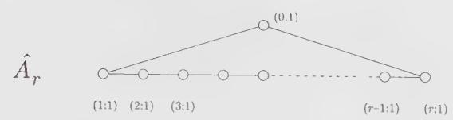

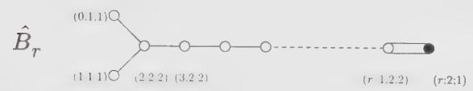

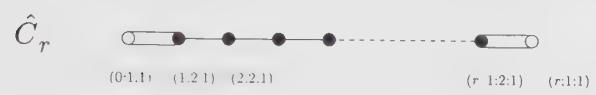

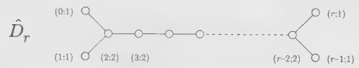

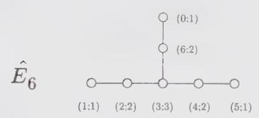

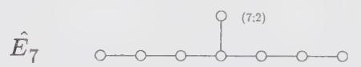  
(0;1) (1:2) (2:3) (3:4) (4:3) (5:2) (6:1)

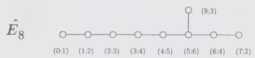

$$
\hat {F} _ {4}
$$

(0:1:1) (1:2:2) (2:3:3) (3:4:2) (4:2:1)

(0:1:1) (1:2:2) (2:3:1)

Figure 14.1. Affine Dynkin diagrams. The numbers give respectively the ordering of the simple roots, their mark, and comark (written only for the nonsimply-laced algebras). Black dots refer to short roots.

## 14.1.4. The Chevalley Basis

The commutation relations of the generators in the Chevalley basis have the following affine extension

$$
\begin{array}{r l} & [ h _ {n} ^ {i}, h _ {m} ^ {j} ] = (\alpha_ {i} ^ {\vee}, \alpha_ {j} ^ {\vee}) k n \delta_ {i j} \delta_ {n + m, 0} = \frac {4}{\alpha_ {i} ^ {2}} k n \delta_ {i j} \delta_ {n + m, 0} \\ & [ h _ {n} ^ {i}, e _ {m} ^ {j} ] = A _ {j i} e _ {n + m} ^ {j} \\ & [ h _ {n} ^ {i}, f _ {m} ^ {j} ] = - A _ {j i} f _ {n + m} ^ {j} \\ & [ e _ {n} ^ {i}, f _ {m} ^ {j} ] = \delta_ {i j} h _ {n + m} ^ {i} + \frac {2}{\alpha_ {i} ^ {2}} k n \delta_ {i j} \delta_ {n + m, 0} \end{array}\tag{14.43}
$$

with $i,j=1,\cdots,r$ . However, these relations are not really the affine analogues of the finite Chevalley commutation relations in the sense that they do not involve only the generators of the $r+1$ simple roots of $\hat{g}$ and they are not expressed in terms of the $\hat{g}$ Cartan matrix. In order to construct a genuine affine Chevalley basis, we need only to add the generators

$$
e ^ {0} = E _ {1} ^ {- \theta}, \qquad f ^ {0} = E _ {- 1} ^ {\theta}, \qquad h ^ {0} = \hat {k} - \theta \cdot H _ {0}\tag{14.44}
$$

to the set of finite generators $e^{i}$ and $f^{i}$ (i.e., $e^{0}$ and $f^{0}$ are respectively the raising and lowering operators for $\alpha_{0}$ ). From now on, we will omit the mode index of $e_{0}^{i}$ and $f_{0}^{i}$ with $i \neq 0$ (the g Chevalley generators). The commutation relation for the generators associated with the simple roots of $\hat{g}$ can be written as

$$
\boxed { \begin{array}{l} [ h ^ {i}, h ^ {j} ] = 0 \\ [ h ^ {i}, e ^ {j} ] = \widehat {A} _ {j i} e ^ {j} \\ [ h ^ {i}, f ^ {j} ] = - \widehat {A} _ {j i} f ^ {j} \\ [ e ^ {i}, f ^ {j} ] = \delta_ {i j} h ^ {j} \end{array} }\tag{14.45}
$$

where now $i, j = 0, 1, \cdots, r$ . For instance, $[e^{0}, f^{i}] = 0$ if $i \neq 0$ because $-\theta - \alpha_{i}$ is not a root. These are to be supplemented by the affine Serre relations

$$
\begin{array}{r} [ \mathrm{ad} (e ^ {i}) ] ^ {1 - \widehat {A} _ {j i}} e ^ {j} = 0 \\ [ \mathrm{ad} (f ^ {i}) ] ^ {1 - \widehat {A} _ {j i}} f ^ {j} = 0 \end{array}\tag{14.46}
$$

with $i \neq j$ . This form makes manifest that $\widehat{A}$ encodes the whole structure of $\hat{g}$ . However, it does not make apparent the infinite-dimensional nature of $\hat{g}$ .

## 14.1.5. Fundamental Weights

As in the finite case, the fundamental weights $\{\hat{\omega}_{i}\}, 0 \leq i \leq r$ are defined to be the elements of the basis dual to the simple coroots. The fundamental weights are assumed to be eigenstates of $L_{0}$ with zero eigenvalue. For $i \neq 0$ , these are

$$
\boxed {\hat {\omega} _ {i} = (\omega_ {i}; a _ {i} ^ {\vee}; 0) \quad (i \neq 0)}\tag{14.47}
$$

Their finite part makes them dual to the finite simple roots, while the $\hat{k}$ eigenvalue is fixed by the condition

$$
(\hat {\omega} _ {i}, \alpha_ {0} ^ {\vee}) = 0 (i \neq 0)\tag{14.48}
$$

The zeroth fundamental weight, on the other hand, must have zero scalar product with all finite $\alpha_{i}$ 's and satisfy $(\hat{\omega}_0,\alpha_0^\vee) = 1$ . Hence, it must be

$$
\hat {\omega} _ {0} = (0; 1; 0)\tag{14.49}
$$

It is called the basic fundamental weight. With

$$
\omega_ {i} \equiv (\omega_ {i}; 0; 0)\tag{14.50}
$$

it follows that

$$
\hat {\omega} _ {i} = a _ {i} ^ {\vee} \hat {\omega} _ {0} + \omega_ {i}\tag{14.51}
$$

The scalar product between the fundamental weights is

$$
\begin{array}{l l} (\hat {\omega} _ {i}, \hat {\omega} _ {j}) = (\omega_ {i}, \omega_ {j}) = F _ {i j} & (i, j \neq 0) \\ (\hat {\omega} _ {0}, \hat {\omega} _ {i}) = (\hat {\omega} _ {0}, \hat {\omega} _ {0}) = 0 & (i \neq 0) \end{array}\tag{14.52}
$$

where $F_{ij}$ is the quadratic form matrix of g.

Affine weights can thus be expanded in terms of the affine fundamental weights and $\delta$ as

$$
\hat {\lambda} = \sum_ {i = 0} ^ {r} \lambda_ {i} \hat {\omega} _ {i} + \ell \delta \qquad \ell \in \mathbb {R}\tag{14.53}
$$

Since each fundamental weight contributes to the $\hat{k}$ eigenvalue by a factor $a_{i}^{\vee}$ , we have

$$
\boxed {k \equiv \hat {\lambda} (\hat {k}) = \sum_ {i = 0} ^ {r} a _ {i} ^ {\vee} \lambda_ {i}}\tag{14.54}
$$

k is called the level. This relation could also have been derived directly as follows:

$$
(\hat {\lambda}, \delta) = \hat {\lambda} (\hat {k}) = \sum_ {i = 0} ^ {r} a _ {i} ^ {\vee} (\hat {\lambda}, \alpha_ {i} ^ {\vee}) = \sum_ {i = 0} ^ {r} a _ {i} ^ {\vee} \lambda_ {i}\tag{14.55}
$$

The first equality is obtained from $\delta = (0;0;1)$ , $\hat{\lambda}$ defined by Eq. (14.21) and the scalar product (14.23), whereas the second one uses $\delta = \sum_{i=0}^{r} a_i^\vee \alpha_i^\vee$ and the expansion of $\hat{\lambda}$ in terms of fundamental weights. It implies that the zeroth Dynkin label $\lambda_{0}$ is related to the finite Dynkin labels $\{\lambda_{i}\}, i = 1, \cdots, r$ and the level by

$$
\lambda_ {0} = \hat {\lambda} (\hat {k}) - \sum_ {i = 1} ^ {r} a _ {i} ^ {\vee} \lambda_ {i}\tag{14.56}
$$

(because $a_0^\vee = 1$ ), that is,

$$
\lambda_ {0} = k - (\lambda , \theta)\tag{14.57}
$$

Modulo a possible $\delta$ factor, the relation between $\hat{\lambda}$ and its finite counterpart is simply

$$
\hat {\lambda} = k \hat {\omega} _ {0} + \lambda\tag{14.58}
$$

We note that roots are weights at level zero.

Affine weights will generally be given in terms of Dynkin labels under the form

$$
\hat {\lambda} = [ \lambda_ {0}, \lambda_ {1}, \dots , \lambda_ {r} ]\tag{14.59}
$$

(However, we stress that this notation does not keep track of the eigenvalue of $L_0$ .) For instance,

$$
\hat {\omega} _ {0} = [ 1, 0, \dots , 0 ], \quad \hat {\omega} _ {1} = [ 0, 1, \dots , 0 ], \quad \hat {\omega} _ {r} = [ 0, 0, \dots , 1 ]\tag{14.60}
$$

The Dynkin labels of simple roots are given by the rows of the affine Cartan matrix

$$
\alpha_ {i} = [ \widehat {A} _ {i 0}, \widehat {A} _ {i 1}, \dots , \widehat {A} _ {i r} ]\tag{14.61}
$$

Finally, the affine Weyl vector is defined as

$$
\hat {\rho} = \sum_ {i = 0} ^ {r} \hat {\omega} _ {i} = [ 1, 1, \dots , 1 ], \quad \hat {\rho} (\hat {k}) = g\tag{14.62}
$$

We note that it cannot be written as the half sum of the positive affine roots.

As in the finite case, affine weights whose Dynkin labels are all nonnegative integers will play a special role (cf. Sect. 14.3). These weights are called dominant. Since the zeroth Dynkin label is fixed by k and the finite Dynkin labels through Eq.(14.57), this characteristic is clearly level-dependent. The set of all dominant weights at level k is denoted $P_{+}^{k}$ . Clearly, the finite part of an affine dominant weight is itself a dominant weight: $\hat{\lambda} \in P_{+}^{k}$ implies that $\lambda \in P_{+}$ (but not vice versa).

## 14.1.6. The Affine Weyl Group

The Weyl reflection with respect to the real affine root $\hat{\alpha}$ is defined exactly as in the finite case:

$$
s _ {\hat {\alpha}} \hat {\lambda} = \hat {\lambda} - (\hat {\lambda}, \hat {\alpha} ^ {\vee}) \hat {\alpha}\tag{14.63}
$$

and the set of all such reflections generates the affine Weyl group $\hat{W}$ . With $\hat{\lambda} = (\lambda; k; n)$ and $\hat{\alpha} = (\alpha; 0; m)$ , a direct calculation yields

$$
\begin{array}{r l} s _ {\hat {\alpha}} \hat {\lambda} & = (\lambda - [ (\lambda , \alpha) + k m ] \alpha^ {\vee}; k; n - [ (\lambda , \alpha) + k m ] \frac {2 m}{| \alpha | ^ {2}}) \\ & = (s _ {\alpha} (\lambda + k m \alpha^ {\vee}); k; n - [ (\lambda , \alpha) + k m ] \frac {2 m}{| \alpha | ^ {2}}) \end{array}\tag{14.64}
$$

As a consistency check, we see that for $\hat{\lambda} = \hat{\alpha}$ ,

$$
s _ {\hat {\alpha}} \hat {\alpha} = (s _ {\alpha} \alpha ; 0; m - (\alpha , \alpha^ {\vee}) m) = (- \alpha ; 0; - m) = - \hat {\alpha}\tag{14.65}
$$

On the other hand, since $(\delta, \hat{\alpha}) = 0$ , imaginary roots are unaffected by affine Weyl reflections

$$
s _ {\hat {\alpha}} \delta = \delta\tag{14.66}
$$

To analyze the structure of $\hat{W}$ , we rewrite Eq. (14.64) under the form

$$
s _ {\hat {\alpha}} \hat {\lambda} = s _ {\alpha} (t _ {\alpha^ {\vee}}) ^ {m} \hat {\lambda}\tag{14.67}
$$

with $t_{\alpha^{\vee}}$ defined as

$$
t _ {\alpha^ {\vee}} = s _ {- \alpha + \delta} s _ {\alpha} = s _ {\alpha} s _ {\alpha + \delta}\tag{14.68}
$$

That is,

$$
t _ {\alpha^ {\vee}} \hat {\lambda} = (\lambda + k \alpha^ {\vee}; k; n + [ | \lambda | ^ {2} - | \lambda + k \alpha^ {\vee} | ^ {2} ] / 2 k)\tag{14.69}
$$

The action of $t_{\alpha^{\vee}}$ on the finite part $\lambda$ of $\hat{\lambda}$ corresponds to a translation by the coroot $\alpha^{\vee}$ . Since

$$
(t _ {\alpha^ {\vee}}) (t _ {\beta^ {\vee}}) = t _ {\alpha^ {\vee} + \beta^ {\vee}}\tag{14.70}
$$

(and in particular $(t_{\alpha^{\vee}})^{m} = t_{m\alpha^{\vee}})$ the set of all $t_{\alpha^{\vee}}$ 's generates the coroot lattice $Q^{\vee}$ . An affine Weyl reflection is thus a product of a finite Weyl reflection times a translation by an appropriate coroot. The group of such translations being infinite, the affine Weyl group is infinite dimensional. Actually, the affine Weyl group has a semidirect product structure since $Q^{\vee}$ and $W$ have only the identity in common and $Q^{\vee}$ is an invariant subgroup of $\hat{W}$ :

$$
w \left(t _ {\alpha^ {\vee}}\right) w ^ {- 1} = t _ {w \alpha^ {\vee}} \quad \forall w \in \hat {W}\tag{14.71}
$$

a relation easily verified. We note its following implication:

$$
w ^ {\prime} \left(t _ {\alpha^ {\vee}}\right) w \left(t _ {\beta^ {\vee}}\right) = w ^ {\prime} w \left(t _ {w ^ {- 1} \alpha^ {\vee}}\right) \left(t _ {\beta^ {\vee}}\right)\tag{14.72}
$$

The generators for the group $\hat{W}$ are the reflections $s_i$ with respect to the simple roots. For $i \neq 0$ , the definition of $s_i$ does not differ from the finite case, whereas for $s_0$ , Eq. (14.64) gives

$$
s _ {0} \hat {\lambda} = (\lambda + k \theta - (\lambda , \theta) \theta ; k; n - k + (\lambda , \theta)) = s _ {\theta} t _ {- \theta} (\hat {\lambda})\tag{14.73}
$$

(Clearly $s_{-\theta} = s_{\theta}$ .) With $s_{\theta}\theta = -\theta$ , the finite part of $s_0\hat{\lambda}$ is $s_{\theta}\lambda + k\theta$ .

The affine Weyl group divides the vector space of affine weights in an infinite number of affine Weyl chambers defined as

$$
\hat {C} _ {w} = \{\hat {\lambda} | (w \hat {\lambda}, \alpha_ {i}) \geq 0, i = 0, 1, \dots , r \}, w \in \hat {W}\tag{14.74}
$$

The fundamental chamber corresponds to the element w = 1. Weights in the fundamental chamber are then of the form

$$
\hat {\lambda} = \sum_ {i = 0} ^ {r} \lambda_ {i} \hat {\omega} _ {i} + \ell \delta , \quad \text { with } \quad \lambda_ {i} \geq 0, \quad \ell \in \mathbb {R}\tag{14.75}
$$

Once the $\delta$ part of the weights is projected out, affine Weyl chambers have finite area, in contrast to the finite case where the chambers are simplicial cones extending to infinity.

By definition, the affine Weyl group preserves the scalar product (14.23), e.g., using Eq. (14.64)

$$
\begin{array}{l} (s _ {\hat {\alpha}} \hat {\lambda}, s _ {\hat {\alpha}} \hat {\lambda}) = (s _ {\alpha} (\lambda + k m \alpha^ {\vee}), s _ {\alpha} (\lambda + k m \alpha^ {\vee})) + 2 k (n - [ (\lambda , \alpha) + k m ] \frac {2 m}{| \alpha | ^ {2}}) \\ \qquad = (\lambda , \lambda) + 2 k n \\ \qquad = (\hat {\lambda}, \hat {\lambda}) \end{array}\tag{14.76}
$$

Thus, all the weights in a given Weyl orbit have the same length. A $\hat{W}$ orbit contains an infinite number of weights and it has a unique weight in the fundamental chamber.

We note finally that shifted Weyl reflections are defined as in the finite case, but now in terms of the affine Weyl vector:

$$
w \cdot \hat {\lambda} = w (\hat {\lambda} + \hat {\rho}) - \hat {\rho}\tag{14.77}
$$

## 14.1.7. Examples

EXAMPLE 1: $\widehat{su}(2)$

Here $\theta = \alpha_{1}$ , the only positive root of $su(2)$ . Since

$$
\left(\alpha_ {0}, \alpha_ {1} ^ {\vee}\right) = \left(\alpha_ {1}, \alpha_ {0} ^ {\vee}\right) = \left(\alpha_ {1}, \alpha_ {0}\right) = - \alpha_ {1} ^ {2} = - 2\tag{14.78}
$$

the extended Cartan matrix reads

$$
\widehat {A} = \left( \begin{array}{c c} 2 & - 2 \\ - 2 & 2 \end{array} \right)\tag{14.79}
$$

The Dynkin labels of the simple roots are then

$$
\alpha_ {0} = [ 2, - 2 ], \quad \alpha_ {1} = [ - 2, 2 ]\tag{14.80}
$$

For $\widehat{su}(N)$ , all marks and comarks are one. The level is thus obtained from the sum of all Dynkin labels. For the $\widehat{su}(2)$ simple roots, these add up to zero as they should. The complete set of roots is

$$
\hat {\Delta} = \{\pm \alpha_ {1}, \pm \alpha_ {1} + n \delta , n \delta | n \in \mathbb {Z}, n \neq 0 \}\tag{14.81}
$$

With $\delta = \alpha_0 + \alpha_1$ , this is the same as

$$
\hat {\Delta} = \{n \alpha_ {0} + m \alpha_ {1} | | n - m | \leq 1, n, m \in \mathbb {Z} \}\tag{14.82}
$$

This structure is also encoded in the Serre relations (14.46). For instance, since $\alpha_{1} + 3\alpha_{0}$ , associated with the commutator $[e^0, [e^0, [e^0, e^1]]]$ , is not a root, means that

$$
[ e ^ {0}, [ e ^ {0}, [ e ^ {0}, e ^ {1} ] ] ] = [ \mathrm{ad} (e ^ {0}) ] ^ {3} e ^ {1} = 0\tag{14.83}
$$

But this is a consequence of the Serre relations since $1 - \widehat{A}_{10} = 3$ ,

The affine Weyl group is generated by the reflections $s_0, s_1$ , whose actions on a weight $\hat{\lambda} = [\lambda_0, \lambda_1]$ read

$$
\begin{array}{l} s _ {0} \hat {\lambda} = \hat {\lambda} - \lambda_ {0} \alpha_ {0} = [ \lambda_ {0}, \lambda_ {1} ] - \lambda_ {0} [ 2, - 2 ] = [ - \lambda_ {0}, \lambda_ {1} + 2 \lambda_ {0} ] \\ s _ {1} \hat {\lambda} = \hat {\lambda} - \lambda_ {1} \alpha_ {1} = [ \lambda_ {0}, \lambda_ {1} ] - \lambda_ {1} [ - 2, 2 ] = [ \lambda_ {0} + 2 \lambda_ {1}, - \lambda_ {1} ] \end{array}\tag{14.84}
$$

The action of $s_0$ amounts to subtracting $\lambda_0$ copies of $\alpha_0$ from $\hat{\lambda}$ . Since the $L_0$ eigenvalue of $\alpha_0$ is $-1$ , $s_0\hat{\lambda}$ increases the $L_0$ eigenvalue of $\hat{\lambda}$ by $\lambda_0$ . Let the level of $\hat{\lambda}$ be $k$ . The zeroth Dynkin label is thus

$$
\lambda_ {0} = k - \lambda_ {1}\tag{14.85}
$$

and the simple affine Weyl reflections can be written as

$$
s _ {0} \hat {\lambda} = [ - k + \lambda_ {1}, 2 k - \lambda_ {1} ], \quad s _ {1} \hat {\lambda} = [ k + \lambda_ {1}, - \lambda_ {1} ]\tag{14.86}
$$

so that

$$
s _ {0} s _ {1} \hat {\lambda} = [ - k - \lambda_ {1}, 2 k + \lambda_ {1} ]\tag{14.87}
$$

This shows that $s_{0}s_{1}$ translates the finite part of $\hat{\lambda}$ by $2k\omega_{1}$ , that is by $k\alpha_{1}=k\alpha_{1}^{\vee}$ . Therefore, it is the basic translation operator $t_{\alpha_{1}^{\vee}}$

$$
t _ {\alpha_ {1} ^ {\vee}} = s _ {0} s _ {1}\tag{14.88}
$$

The structure of the affine Weyl group is thus

$$
\hat {W} = \{(s _ {0} s _ {1}) ^ {n}, s _ {1} (s _ {0} s _ {1}) ^ {n} | n \in \mathbb {Z} \}\tag{14.89}
$$

In the particular case of $\widehat{su}(2)$ , Eq. (13.59) implies that the Weyl group is infinite: the angle between the finite parts of the simple roots is $\pi$ , and therefore $(s_{0}s_{1})$ has no finite order.

A few affine chambers at various integer levels are displayed in Fig. 14.2 (modulo $\mathbb{R}\delta$ ). The affine Weyl chambers at level $k \in \mathbb{Z}_+$ are the segments of the weight axis at level $k$ that are separated by the dashed lines. The size of the chambers obviously increases with the level. In the limit $k \to \infty$ , if we can restrict ourselves to “small weights”, there is effectively no difference between the affine and the finite fundamental chambers.

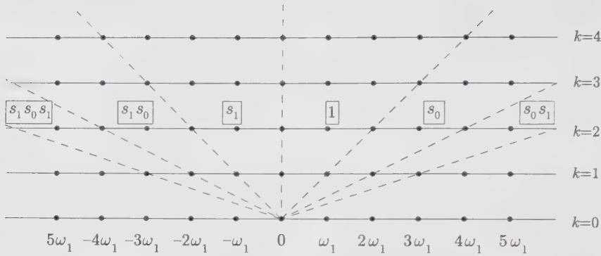  
Figure 14.2. Affine Weyl chambers for $\widehat{su}(2)$ .

EXAMPLE 2: $\widehat{su}(3)$

With $\theta = \alpha_{1} + \alpha_{2}$ , the extended Cartan matrix is

$$
\widehat {A} = \left( \begin{array}{c c c} 2 & - 1 & - 1 \\ - 1 & 2 & - 1 \\ - 1 & - 1 & 2 \end{array} \right)\tag{14.90}
$$

so that

$$
\alpha_ {0} = [ 2, - 1, - 1 ], \quad \alpha_ {1} = [ - 1, 2, - 1 ], \quad \alpha_ {2} = [ - 1, - 1, 2 ]\tag{14.91}
$$

The full set of roots can be described by an infinite pile of hexagons, each layer representing the roots of $su(3)$ , with two adjacent hexagons being separated by $\delta$ .

The reflections of $\hat{\lambda} = [\lambda_0, \lambda_1, \lambda_2]$ with respect to the simple roots are

$$
\begin{array}{l} s _ {0} \hat {\lambda} = [ - \lambda_ {0}, \lambda_ {0} + \lambda_ {1}, \lambda_ {0} + \lambda_ {2} ] \\ s _ {1} \hat {\lambda} = [ \lambda_ {0} + \lambda_ {1}, - \lambda_ {1}, \lambda_ {1} + \lambda_ {2} ] \\ s _ {2} \hat {\lambda} = [ \lambda_ {0} + \lambda_ {2}, \lambda_ {1} + \lambda_ {2}, - \lambda_ {2} ] \end{array}\tag{14.92}
$$

With $\lambda_0 = k - \lambda_1 - \lambda_2$ , the basic translation operators are found to be

$$
\begin{array}{l} t _ {\alpha_ {1} ^ {\vee}} = s _ {2} s _ {0} s _ {2} s _ {1} \\ t _ {\alpha_ {2} ^ {\vee}} = s _ {1} s _ {0} s _ {1} s _ {2} \end{array}\tag{14.93}
$$

The relations

$$
(s _ {0} s _ {1} s _ {0}) ^ {3} = (s _ {0} s _ {2} s _ {0}) ^ {3} = (s _ {1} s _ {2} s _ {1}) ^ {3} = 1\tag{14.94}
$$

are easily checked (cf. Eq. (13.59)). However they do not make manifest the infinite order of the Weyl group.

## §14.2. Outer Automorphisms

In this section, we introduce outer automorphisms from the symmetry properties of Dynkin diagrams. Although this is a somewhat technical issue, it will turn out to be an important tool in many applications.

## 14.2.1. Symmetry of the Extended Diagram and Group of Outer Automorphisms

We let $D(\mathrm{g})$ and $D(\hat{\mathrm{g}})$ stand, respectively, for the symmetry group of the $\mathbf{g}$ and $\hat{\mathbf{g}}$ Dynkin diagrams. These are the sets of symmetry transformations of the simple roots that preserve the scalar products, hence the Cartan matrices. In the affine case, we need to consider only the finite projection of the system of simple roots since scalar products of roots depend only on their finite parts. This also implies that a simple root is mapped into another simple root having the same mark and comark. By inspection, we see that $D(\mathrm{g}) = 1$ except for $A_{r > 1}, D_{r > 4}, E_6$ , for which it is respectively $\mathbb{Z}_2, D_4$ , and $S_3$ , the permutation group of three objects.

  
Figure 14.3. Outer automorphisms of affine Dynkin diagrams.

Define the group of outer automorphisms of $\hat{g}$ , $\mathcal{O}(\hat{g})$ , as

$$
\mathcal {O} (\hat {\mathbf {g}}) = D (\hat {\mathbf {g}}) / D (\mathbf {g})\tag{14.95}
$$

This quotient is sensible because $D(\mathrm{g})$ is the set of elements of $D(\hat{\mathrm{g}})$ that leaves the zeroth node of the extended Dynkin diagram fixed, that is, $D(\mathrm{g})$ is a subgroup of $D(\hat{\mathrm{g}})$ . $\mathcal{O}(\hat{\mathrm{g}})$ is thus the set of symmetry transformations of the Dynkin diagram of $\hat{g}$ that are not symmetry transformations of the Dynkin diagram of $g$ . For instance, for $\widehat{s\widehat{u}}(N)$ , we do not consider reflections leaving the zeroth root fixed; the only remaining symmetry transformations are the cyclic permutations. The symmetry transformations of the extended Dynkin diagrams are displayed in Fig. 14.3, when $\mathcal{O}(\hat{g})$ is not simply the identity.

An explicit description of outer-automorphism groups of affine Lie algebras in terms of their generating element on an arbitrary weight $\hat{\lambda} = [\lambda_{0}, \cdots, \lambda_{r}]$ is presented in Table 14.1.

Table 14.1. Outer automorphisms of affine Lie algebras

<table><tr><td>g</td><td> $\mathcal{O}(\hat{\mathrm{g}})$ </td><td>Action of the  $\mathcal{O}(\hat{\mathrm{g}})$  generators</td></tr><tr><td> $A_r$ </td><td> $\mathbb{Z}_{r+1}$ </td><td> $a[\lambda_0, \lambda_1, \cdots, \lambda_{r-1}, \lambda_r] = [\lambda_r, \lambda_0, \cdots, \lambda_{r-2}, \lambda_{r-1}]$ </td></tr><tr><td> $B_r$ </td><td> $\mathbb{Z}_2$ </td><td> $a[\lambda_0, \lambda_1, \cdots, \lambda_{r-1}, \lambda_r] = [\lambda_1, \lambda_0, \cdots, \lambda_{r-1}, \lambda_r]$ </td></tr><tr><td> $C_r$ </td><td> $\mathbb{Z}_2$ </td><td> $a[\lambda_0, \lambda_1, \cdots, \lambda_{r-1}, \lambda_r] = [\lambda_r, \lambda_{r-1}, \cdots, \lambda_1, \lambda_0]$ </td></tr><tr><td> $D_{r=2\ell}$ </td><td> $\mathbb{Z}_2 \times \mathbb{Z}_2$ </td><td> $a[\lambda_0, \lambda_1, \lambda_2, \cdots, \lambda_{r-1}, \lambda_r] = [\lambda_1, \lambda_0, \lambda_2, \cdots, \lambda_r, \lambda_{r-1}]$  $\tilde{a}[\lambda_0, \lambda_1, \lambda_2, \cdots, \lambda_{r-1}, \lambda_r] = [\lambda_r, \lambda_{r-1}, \lambda_{r-2}, \cdots, \lambda_1, \lambda_0]$ </td></tr><tr><td> $D_{r=2\ell+1}$ </td><td> $\mathbb{Z}_4$ </td><td> $a[\lambda_0, \lambda_1, \lambda_2, \cdots, \lambda_{r-1}, \lambda_r] = [\lambda_{r-1}, \lambda_r, \lambda_{r-2}, \cdots, \lambda_1, \lambda_0]$ </td></tr><tr><td> $E_6$ </td><td> $\mathbb{Z}_3$ </td><td> $a[\lambda_0, \lambda_1, \cdots, \lambda_6] = [\lambda_1, \lambda_5, \lambda_4, \lambda_3, \lambda_6, \lambda_0, \lambda_2]$ </td></tr><tr><td> $E_7$ </td><td> $\mathbb{Z}_2$ </td><td> $a[\lambda_0, \lambda_1, \cdots, \lambda_7] = [\lambda_6, \lambda_5, \lambda_4, \lambda_3, \lambda_2, \lambda_1, \lambda_0, \lambda_7]$ </td></tr></table>

Since every fundamental weight is mapped into another fundamental weight having the same comark, the action of A does not change the level. Moreover, it is clear that $\mathcal{O}(\hat{\mathrm{g}})$ maps the set of dominant weights $P_{+}^{k}$ into itself. It thus preserves the affine fundamental chamber.

## 14.2.2. Action of Outer Automorphisms on Weights

We let $A\hat{\omega}_0$ denote the fundamental weight to which $\hat{\omega}_0$ is mapped by the action of $A$ , a generic element of $\mathcal{O}(\hat{\mathrm{g}})$ . Its action on an affine weight is written as

$$
A \hat {\lambda} = k A \hat {\omega} _ {0} + \sum_ {i = 1} ^ {r} \lambda_ {i} A (\hat {\omega} _ {i} - a _ {i} ^ {\vee} \hat {\omega} _ {0})\tag{14.96}
$$

where k is the level of $\hat{\lambda}$ . This result follows directly from the definition of $\lambda_{0}$ as

$$
\lambda_ {0} = k - \sum_ {i = 1} ^ {r} a _ {i} ^ {\vee} \lambda_ {i}\tag{14.97}
$$

The second term in the r.h.s. of Eq. (14.96) acts, on the finite part of $\hat{\lambda}$ , like an automorphism of the finite weight lattice that leaves its origin fixed. It is actually an element of the finite Weyl group. $^{8}$ We denote this element by $w_{A}$ (it is described below). The sum in Eq. (14.96) can then be written as $w_{A}\lambda$ . More precisely, it is the affine extension of $w_{A}\lambda$ at level zero, which is equivalent to $w_{A}\hat{\lambda}-k\hat{\omega}_{0}$ . This yields

$$
\left| A \hat {\lambda} = k (A - 1) \hat {\omega} _ {0} + w _ {A} \hat {\lambda} \right|\tag{14.98}
$$

This important relation will have many applications.

It is usually easy to find the element $w_{A}$ associated with a given A by a simple calculation. But there is a general way of characterizing $w_{A}$ . Define $w_{i}$ to be the longest element of $W_{(i)}$ , the subgroup of the finite Weyl group generated by all $s_{j}$ ( $j \neq i$ ). Then

$$
w _ {A} = w _ {i} w _ {0} \quad \text { for   } i \text {   such   that   } A \hat {\omega} _ {0} = \hat {\omega} _ {i}\tag{14.99}
$$

(as before, $w_0$ stands for the longest element of $W$ ). In future calculations, we will often need to know the sign of the element $w_A$ . In App. 14.A, it is shown to be

$$
\epsilon (w _ {A}) = e ^ {2 \pi i (A \hat {\omega} _ {0}, \rho)} = e ^ {- \pi i g | A \hat {\omega} _ {0} | ^ {2}}\tag{14.100}
$$

Consider some examples. For $\widehat{s\mathcal{U}}(2)$ , the only nontrivial outer automorphism is $a : \hat{\omega}_{0} \leftrightarrow \hat{\omega}_{1}$ . Since $W = \{1, s_{1}\}$ , $w_{a}$ is simply $s_{1}$ . The comparison of

$$
a [ \lambda_ {0}, \lambda_ {1} ] = [ \lambda_ {1}, \lambda_ {0} ] = [ \lambda_ {1}, k - \lambda_ {1} ]\tag{14.101}
$$

with

$$
\begin{array}{r l} a [ \lambda_ {0}, \lambda_ {1} ] & = k (a - 1) \hat {\omega} _ {0} + s _ {1} [ \lambda_ {0}, \lambda_ {1} ] \\ & = k (\hat {\omega} _ {1} - \hat {\omega} _ {0}) + [ \lambda_ {0} + 2 \lambda_ {1}, - \lambda_ {1} ] \\ & = [ \lambda_ {1}, k - \lambda_ {1} ] \end{array}\tag{14.102}
$$

shows that this is indeed correct. We turn to $\widehat{su}(3)$ , in which the basic element $a$ maps $\hat{\omega}_0 \to \hat{\omega}_1 \to \hat{\omega}_2 \to \hat{\omega}_0$ . Here $i = 1$ and the longest element of the group $W_{(1)}$ is $s_2$ . Recalling that $w_0 = s_1s_2s_1 = s_2s_1s_2$ , the above construction yields

$$
w _ {a} = s _ {2} s _ {2} s _ {1} s _ {2} = s _ {1} s _ {2}\tag{14.103}
$$

This is again easily confirmed by a direct calculation:

$$
\begin{array}{r l} a [ \lambda_ {0}, \lambda_ {1}, \lambda_ {2} ] & = k (a - 1) \hat {\omega} _ {0} + s _ {1} s _ {2} [ \lambda_ {0}, \lambda_ {1}, \lambda_ {2} ] \\ & = k (\hat {\omega} _ {1} - \hat {\omega} _ {0}) + [ \lambda_ {0} + 2 \lambda_ {2} + \lambda_ {1}, - \lambda_ {1} - \lambda_ {2}, \lambda_ {1} ] \\ & = [ \lambda_ {2}, k - \lambda_ {1} - \lambda_ {2}, \lambda_ {1} ] \\ & = [ \lambda_ {2}, \lambda_ {0}, \lambda_ {1} ] \end{array}\tag{14.104}
$$

It is also simple to verify that $a^{2}$ corresponds to the element $s_{2}s_{1}$ :

$$
w _ {a ^ {2}} = \left(w _ {a}\right) ^ {2} = \left(s _ {1} s _ {2}\right) ^ {2} = s _ {1} s _ {2} s _ {1} s _ {2} = s _ {1} s _ {1} s _ {2} s _ {1} = s _ {2} s _ {1} = \left(w _ {a}\right) ^ {- 1} = w _ {a ^ {- 1}}\tag{14.105}
$$

The general result for $\widehat{su}(N)$ is

$$
w _ {a} = s _ {1} s _ {2} \dots s _ {N - 1}\tag{14.106}
$$

where the action of a is defined in Table 14.1.

We finally stress that outer automorphisms must preserve the commutation relations of the algebra. We illustrate this feature by rederiving for $\widehat{su}(2)$ the action of a on weights by enforcing the invariance of the commutator under the interchange $\alpha_{0} \leftrightarrow \alpha_{1}$ . We use the spin basis, in which the commutation relations read:

$$
\begin{array}{r l} & {[ J _ {m} ^ {0}, J _ {n} ^ {0} ] = 2 k m \delta_ {m + n, 0}} \\ & {[ J _ {m} ^ {0}, J _ {n} ^ {\pm} ] = \pm J _ {n + m} ^ {\pm}} \\ & {[ J _ {m} ^ {+}, J _ {n} ^ {-} ] = 2 J _ {n + m} ^ {0} + k m \delta_ {m + n, 0}} \end{array}\tag{14.107}
$$

with $2J^{0}|\lambda\rangle=\lambda_{1}|\lambda\rangle$ . Acting on a weight, $J_{0}^{+}$ adds $\alpha_{1}$ whereas $J_{1}^{-}$ adds $\alpha_{0}$ (the superscript - because the finite part of $\alpha_{0}$ is $-\alpha_{1}$ and the subscript 1 because $\alpha_{0}$ has grade 1). Hence, the interchange $\alpha_{0}\leftrightarrow\alpha_{1}$ translates into $J_{0}^{+}\leftrightarrow J_{1}^{-}$ , or more generally $J_{m}^{+}\leftrightarrow J_{m+1}^{-}$ . The commutator $[J_{m}^{+},J_{n}^{-}]$ is thus transformed into

$$
\begin{array}{r l}&{[ J _ {m} ^ {+}, J _ {n} ^ {-} ] \rightarrow [ J _ {m + 1} ^ {-}, J _ {n - 1} ^ {+} ]}\\&{\qquad = - 2 J _ {n + m} ^ {0} + k (m + 1) \delta_ {m + n, 0}}\end{array}\tag{14.108}
$$

In order to preserve the third commutator, $J_{m}^{0}$ must transform as

$$
J _ {m} ^ {0} \rightarrow k \delta_ {m, 0} - 2 J _ {m} ^ {0}\tag{14.109}
$$

which means that $\lambda_{1} \rightarrow k - \lambda_{1}$ under the action of a. (The other two commutators are also invariant under this transformation.)

## 14.2.3. Relation with the Center of the Group

It is easily checked, case by case, that $\mathcal{O}(\hat{\mathbf{g}})$ is isomorphic to the center of the group of $\mathbf{g}$ , denoted $B(G)$

$$
\mathcal {O} (\hat {\mathfrak {g}}) \simeq B (G)\tag{14.110}
$$

The center $B(G)$ is composed of those particular elements of G that commute with all the elements of the group. This set is easily obtained in terms of a matrix representation of the group. Consider, for instance, the group $SU(N)$ represented by unitary matrices of determinant one. The elements of the center are the unit matrices multiplied by any N-th root of unity, so that $B(SU(N)) = \mathbb{Z}_{N}$ . The centers of the other groups can be read from Table 14.1.

The isomorphism between $B(G)$ and $\mathcal{O}(\hat{\mathfrak{g}})$ can be realized as follows. To every element $A \in \mathcal{O}(\hat{\mathfrak{g}})$ , there corresponds an element $b \in B(G)$ , given by

$$
b = e ^ {- 2 \pi i A \hat {\omega} _ {0} \cdot H}\tag{14.111}
$$