This manifestly commutes with the generators of the Cartan subalgebra. Moreover, since

$$
b E ^ {\beta} = e ^ {- 2 \pi i (A \hat {\omega} _ {0}, \beta)} E ^ {\beta} b\tag{14.112}
$$

commutativity with a ladder operator requires

$$
(A \hat {\omega} _ {0}, \beta) \in \mathbb {Z} \quad \text {   for   any   } \quad \beta \in Q\tag{14.113}
$$

But this is certainly true, being a direct consequence of $A\hat{\omega}_{0}$ having unit mark: the simple coroot to which it is dual is equal to its corresponding root. Thus, $A\hat{\omega}_{0}$ is dual to the root lattice, from which the result follows. (We note here a special case of this relation, which will be used frequently in the following discussion:

$$
(A \hat {\omega} _ {0}, \xi - w \xi) \in \mathbb {Z}\tag{14.114}
$$

valid for any integral weight $\xi$ and $w\in W$ .) The action of $b$ on any state $|\lambda^{\prime}\rangle$ in the highest-weight module $L_{\lambda}$ of $g$ is given by

$$
b | \lambda^ {\prime} \rangle = e ^ {- 2 \pi i (A \hat {\omega} _ {0}, \lambda^ {\prime})} | \lambda^ {\prime} \rangle\tag{14.115}
$$

or equivalently

$$
b \lambda^ {\prime} = \lambda^ {\prime} e ^ {- 2 \pi i (A \hat {\omega} _ {0}, \lambda^ {\prime})} = \lambda^ {\prime} e ^ {- 2 \pi i (A \hat {\omega} _ {0}, \lambda)}\tag{14.116}
$$

Indeed, all the states in the representation have the same eigenvalue because the generators of the algebra are unaffected by the action of the center.

Since the center element $b$ commutes also with all the affine generators, the action (14.116) extends uniquely to the affine case, with the same eigenvalue:

$$
b \hat {\lambda} ^ {\prime} = \hat {\lambda} ^ {\prime} e ^ {- 2 \pi i (A \hat {\omega} _ {0}, \lambda)}\tag{14.117}
$$

If b corresponds to A, $b^{q}$ will correspond to $A^{q}$ . The comparison of Eq. (14.117), with b replaced by $b^{q}$ , with the same equation applied q times, yields the relation

$$
(A ^ {q} \hat {\omega} _ {0}, \lambda) = q (A \hat {\omega} _ {0}, \lambda) \mod 1\tag{14.118}
$$

If $\mathcal{O}(\hat{\mathfrak{g}})$ is a cyclic group of order $N$ , $A^{N} = 1$ so that $(A^{N}\hat{\omega}_{0},\lambda) = 0$ . Together with the above equation, this implies that

$$
N \left(A \hat {\omega} _ {0}, \lambda\right) \in \mathbb {Z}\tag{14.119}
$$

This verifies that the eigenvalue of b is a N-th root of unity.

## §14.3. Highest-Weight Representations

Highest-weight representations are characterized by a unique highest state $|\hat{\lambda}\rangle$ annihilated by the action of all ladder operators for positive roots

$$
E _ {0} ^ {\alpha} | \hat {\lambda} \rangle = E _ {n} ^ {\pm \alpha} | \hat {\lambda} \rangle = H _ {n} ^ {i} | \hat {\lambda} \rangle = 0, \quad \mathrm{for} \quad n > 0, \alpha > 0\tag{14.120}
$$

The eigenvalue of this state, $\hat{\lambda}$ , is the highest weight of the representation

$$
H _ {0} ^ {i} | \hat {\lambda} \rangle = \lambda^ {i} | \hat {\lambda} \rangle (i \neq 0), \quad \hat {k} | \hat {\lambda} \rangle = k | \hat {\lambda} \rangle , \quad L _ {0} | \hat {\lambda} \rangle = 0\tag{14.121}
$$

Setting the $L_{0}$ eigenvalue to zero is merely a matter of convention; a redefinition of $L_{0}$ would yield any desired value. In the Chevalley basis, the eigenvalues are the Dynkin labels:

$$
h ^ {i} | \hat {\lambda} \rangle = \lambda_ {i} | \hat {\lambda} \rangle \quad i = 0, 1, \dots , r\tag{14.122}
$$

All the states in the module are generated by the action of the lowering operators on $|\hat{\lambda}\rangle$ . They obviously have the same $\hat{k}$ -eigenvalue, given that $\hat{k}$ commutes with all the generators. From now on, $\hat{k}$ will be identified with its eigenvalue k, the level. In most applications of interest, k is fixed from the outset.

## 14.3.1. Integrable Highest-Weight Representations

The analogues of the irreducible finite-dimensional representations of g are those representations whose projections onto the $su(2)$ algebra associated with any real root are finite. It is clearly sufficient to concentrate on simple roots. An analysis in all points similar to the one that led to Eq. (13.27) shows that any weight $\hat{\lambda}'$ in the weight system $\Omega_{\hat{\lambda}}$ (the set of all weights in the representation of highest-weight state $|\hat{\lambda}\rangle$ ) satisfies

$$
(\hat {\lambda} ^ {\prime}, \alpha_ {i} ^ {\vee}) = - (p _ {i} - q _ {i}) \quad i = 0, 1, \dots , r\tag{14.123}
$$

for some positive integers $p_i, q_i$ , which thereby implies that

$$
\lambda_ {i} ^ {\prime} \in \mathbb {Z}, \qquad i = 0, 1, \dots , r\tag{14.124}
$$

For the highest weight $\hat{\lambda}$ , all $p_i$ 's are zero, and therefore

$$
\lambda_ {i} \in \mathbb {Z} _ {+}, \qquad i = 0, 1, \dots , r\tag{14.125}
$$

This requires in particular that (cf. Eq. (14.57))

$$
\lambda_ {0} = k - (\lambda , \theta) \in \mathbb {Z} _ {+}\tag{14.126}
$$

With $(\lambda, \theta) \in \mathbb{Z}_+$ , this immediately shows that $k$ must be a positive integer, bounded from below by $(\lambda, \theta)$ :

$$
\boxed {k \in \mathbb {Z} _ {+}, \quad k \geq (\lambda , \theta)}\tag{14.127}
$$

As we already mentioned, an affine weight for which all Dynkin labels are nonnegative integers is said to be dominant, and the set of all dominant weights will be denoted $P_{+}^{k}$ .

A far-reaching consequence of the constraints (14.127) is that for a fixed value of k, there can be only a finite number of dominant highest-weight representations. For instance, for k = 1, the only such representations are those with highest weight $\hat{\omega}_{i}$ such that the corresponding simple root $\alpha_{i}$ has unit comark. Since $a_{0}^{\vee} = 1$ for all $\hat{g}, \hat{\omega}_{0}$ is always dominant. The level-1 representation of highest weight $\hat{\omega}_{0}$ is called the basic representation. For $\widehat{s\widehat{u}}(N)$ , all comarks are one; there are thus N possible dominant highest-weight representations at level 1 whose highest weights are the $\hat{\omega}_{i}$ 's, $i = 0, \cdots, r$ . As another example, the set of all dominant highest-weight representations of $\widehat{s}\widehat{u}(3)$ at level 2 is:

$$
[ 2, 0, 0 ], \quad [ 0, 2, 0 ], \quad [ 0, 0, 2 ], \quad [ 1, 1, 0 ], \quad [ 1, 0, 1 ], \quad [ 0, 1, 1 ]\tag{14.128}
$$

On the other hand, the possibilities for $\widehat{G}_2$ at level 2 are

$$
[ 2, 0, 0 ], \quad [ 0, 1, 0 ], \quad [ 0, 0, 2 ], \quad [ 1, 0, 1 ]\tag{14.129}
$$

since $a_1^\vee = 2a_0^\vee = 2a_2^\vee = 2$ . In the following, the algebra $\hat{\mathbf{g}}$ at level $k$ will be denoted $\hat{\mathbf{g}}_k$ .

Representations that decompose into finite irreducible representations of $su(2)$ and can further be written as a direct sum of finite-dimensional weight spaces are said to be integrable. The adjoint representation, although not a highest-weight representation, is integrable. The first condition is obviously satisfied and the direct-sum decomposition in the second requirement is simply the root-space decomposition (i.e., the decomposition of the root space into a sum of finite roots and imaginary roots). Dominant highest-weight representations are also integrable. We will show shortly that the second condition is verified. Moreover, if

$$
(J _ {n} ^ {a}) ^ {\dagger} = J _ {- n} ^ {a}, \qquad \text {or} \qquad (H _ {n} ^ {i}) ^ {\dagger} = H _ {- n} ^ {i} \qquad (E _ {n} ^ {\alpha}) ^ {\dagger} = E _ {- n} ^ {- \alpha}\tag{14.130}
$$

dominant highest-weight representations are easily checked to be unitary. For instance,

$$
\begin{array}{r l} | E _ {- n} ^ {\alpha} | \hat {\lambda} \rangle | ^ {2} & = \langle \hat {\lambda} | E _ {n} ^ {- \alpha} E _ {- n} ^ {\alpha} | \hat {\lambda} \rangle \\ & = \frac {2}{| \alpha | ^ {2}} [ n k - (\alpha , \lambda) ] \langle \hat {\lambda} | \hat {\lambda} \rangle \geq 0 \end{array}\tag{14.131}
$$

since for n > 0, any $\alpha$ , and $\hat{\lambda}$ dominant,

$$
n k - (\alpha , \lambda) = [ k - (\theta , \lambda) ] + (n - 1) k + (\theta - \alpha , \lambda) \geq 0\tag{14.132}
$$

For dominant highest weights, the conditions (13.27) are equivalent to the existence of the following singular vectors in the Verma module $V_{\hat{\lambda}}$ of highest-weight state $|\hat{\lambda}\rangle$ :

$$
E _ {0} ^ {\alpha_ {i}} | \hat {\lambda} \rangle = E _ {1} ^ {- \theta} | \hat {\lambda} \rangle = 0\tag{14.133}
$$

and

$$
(E _ {0} ^ {- \alpha_ {i}}) ^ {\lambda_ {i} + 1} | \hat {\lambda} \rangle = (E _ {- 1} ^ {\theta}) ^ {k - (\lambda , \theta) + 1} | \hat {\lambda} \rangle = 0\tag{14.134}
$$

with $i \neq 0$ . In the Chevalley basis, these vectors read

$$
e ^ {i} | \hat {\lambda} \rangle = (f ^ {i}) ^ {\lambda_ {i} + 1} | \hat {\lambda} \rangle = 0, \quad i = 0, 1, \dots , r\tag{14.135}
$$

In sharp contrast with simple Lie algebras, when these singular vectors are quotiented out from the dominant highest-weight Verma module $V_{\hat{\lambda}}$ (modulo their intersections), the resulting irreducible module, to be denoted $L_{\hat{\lambda}}$ , is not finite-dimensional. The imaginary root can be subtracted from any weight without leaving the representation, that is, if $\hat{\lambda}' \in \Omega_{\hat{\lambda}}$ , then $\hat{\lambda}' - n\delta \in \Omega_{\hat{\lambda}}$ for any $n > 0$ .

The source of infinity clearly lies in the absence of a singular vector similar to Eq.(14.134) related to the imaginary root $\delta$ , that is, a singular vector that would involve $H_{n}^{i}$ for $n < 0$ .

We now show how the various weights in $\Omega_{\hat{\lambda}}$ can be obtained. The algorithm that gives the list of weights in irreducible highest-weight representations of $g$ also works for $\hat{g}$ . We simply have to keep track of an additional Dynkin label. However, in the affine case this algorithm never terminates.

We define the grade to be the $L_{0}$ eigenvalue, shifted so that $L_{0}|\hat{\lambda}\rangle = 0$ for the highest state $|\hat{\lambda}\rangle$ . At grade zero, the various states are obtained from $|\hat{\lambda}\rangle$ by applications of the finite Lie algebra generators (the only generators of $\hat{g}$ that do not change the $L_{0}$ eigenvalue). Hence, the finite projection of weights at grade zero are all the weights in the g irreducible finite-dimensional representation of highest weight $\lambda$ . Weights at grade one are obtained from those weights at grade zero that have positive zeroth Dynkin labels, by the subtraction of $\alpha_{0}$ (which augments the $L_{0}$ eigenvalue by one), followed again by all possible subtractions of the finite simple roots. The analysis of the higher grades proceeds along the same lines. An important point is that the finite projections of the affine weights at a fixed value of the grade are organized into a direct sum of irreducible finite-dimensional representations of g.

Since at each grade there is a finite number of weights, the weight space decomposes into a direct sum of finite dimensional weight spaces, which shows that dominant highest-weight representations are integrable.

To complete the description of the representation, we must give the multiplicity of each weight. The multiplicity of weights, when the $L_{0}$ eigenvalue is taken into account, is clearly finite. In fact, it can be calculated from the following modification of the Freudenthal recursion formula, which keeps track of the root multiplicities,

$$
\begin{array}{l} [ | \hat {\lambda} + \hat {\rho} | ^ {2} - | \hat {\lambda} ^ {\prime} + \hat {\rho} | ^ {2} ] \operatorname{mult} _ {\hat {\lambda}} (\hat {\lambda} ^ {\prime}) = 2 \sum_ {\hat {\alpha} > 0} \operatorname{mult} (\hat {\alpha}) \\ \qquad \times \sum_ {p = 1} ^ {\infty} (\hat {\lambda} ^ {\prime} + p \hat {\alpha}, \hat {\alpha}) \operatorname{mult} _ {\hat {\lambda}} (\hat {\lambda} ^ {\prime} + p \hat {\alpha}) \end{array}\tag{14.136}
$$

We recall that real roots have multiplicity one whereas imaginary ones have multiplicity r. (We stress that the scalar product in this formula is the one defined in Eq. (14.23).) With our convention for the $L_{0}$ eigenvalue of highest-weight states, the scalar product of two affine highest weights does not differ from its finite form:

$$
(\hat {\lambda}, \hat {\mu}) = (\lambda , \mu), \quad \text { for } \quad \hat {\lambda} (L _ {0}) = \hat {\mu} (L _ {0}) = 0\tag{14.137}
$$

Thus, with $\hat{\lambda} = (\lambda; k; 0)$ and $\hat{\rho} = (\rho; g; 0)$ ,

$$
| \hat {\lambda} + \hat {\rho} | ^ {2} = | \lambda + \rho | ^ {2}\tag{14.138}
$$

However, for a weight at grade $m$ , $\hat{\lambda}' = (\lambda'; k; -m)$ and

$$
| \hat {\lambda} ^ {\prime} + \hat {\rho} | ^ {2} = | \lambda^ {\prime} + \rho | ^ {2} - 2 m (k + g)\tag{14.139}
$$

## 14.3.2. The Basic Representation of $\widehat{s\mathcal{U}}(2)_1$

We now consider a detailed example, the basic representation of $\widehat{s\mathcal{u}}(2)_{1}$ , of highest weight [1, 0]. Using the algorithm mentioned above, it is simple to write down the different weights at the first few grades. These are displayed in Fig. 14.4, with their multiplicities given by subscripts. The three weights at grade one can be reached in only one way. Their multiplicity is thus bounded to be one. The same applies for the weights at grade two, except for [1, 0] which can be obtained in two distinct ways. This means that its multiplicity can be either one or two. We can calculate it with the Freudenthal formula (14.136). With $\hat{\lambda} = (0; 1; 0)$ and $\hat{\lambda}' = (0; 1; -2)$ , we have

$$
\begin{array}{l} | \hat {\lambda} + \hat {\rho} | ^ {2} = | \rho | ^ {2} = \frac {1}{2} \\ | \hat {\lambda} ^ {\prime} + \hat {\rho} | ^ {2} = | \rho | ^ {2} - 4 (1 + 2) = \frac {1}{2} - 1 2 \end{array}\tag{14.140}
$$

Hence, the l.h.s. of Eq. (14.136) reads

$$
[ | \hat {\lambda} + \hat {\rho} | ^ {2} - | \hat {\lambda} ^ {\prime} + \hat {\rho} | ^ {2} ] \operatorname{mult} _ {\hat {\lambda}} (\hat {\lambda} ^ {\prime}) = 1 2 \operatorname{mult} _ {\hat {\lambda}} (0; 1; - 2)\tag{14.141}
$$

To calculate the r.h.s., we need to consider all the weights $\hat{\lambda}^{\prime} + p\hat{\alpha}$ for $p, \hat{\alpha} > 0$ , up to grade zero. We recall that the positive roots of $\widehat{s}\widehat{u}(2)$ are $\alpha_{1}, \pm\alpha_{1} + n\delta$ , $n\delta$ with n > 0, and they all have multiplicity one. The list of all possible contributions is given in Table 14.2, with their multiplicities and the required scalar products. From it, the r.h.s. of Eq. (14.136) is seen to be

$$
\sum_ {\hat {\alpha} > 0} \sum_ {p = 1} ^ {\infty} (\hat {\lambda} ^ {\prime} + p \hat {\alpha}, \hat {\alpha}) \operatorname{mult} _ {\hat {\lambda}} (\hat {\lambda} ^ {\prime} + p \hat {\alpha}) = 2 4\tag{14.142}
$$

We thus find that $\mathrm{mult}_{\hat{\lambda}}(0;1;-2)=2$ .

## 14.3.3. String Functions

Needless to say, multiplicity calculations are rather involved. However, the constancy of the weight multiplicities along $\hat{W}$ orbits greatly simplifies the analysis. For instance, in the above example, all the weights in the representation can be obtained from the different weights (0; 1; $-m$ ) by Weyl reflections. This is easily seen, at least at the first few grades. Therefore, the information on the multiplicities of all the weights in the representation is coded in $\mathrm{mult}(0;1;-m)$ for all $m \geq 0$ . The generating function for such multiplicities is called a string function. More precisely, let $\hat{\mu}$ be a weight in $\Omega_{\hat{\lambda}}$ such that $\hat{\mu} + \delta \notin \Omega_{\hat{\lambda}}$ , and denote the set of such weights as $\Omega_{\hat{\lambda}}^{\max}$ . The multiplicity of the various weights in the string $\hat{\mu}, \hat{\mu} - \delta, \hat{\mu} - 2\delta, \cdots$ is given by the string function

$$
\sigma_ {\hat {\mu}} ^ {(\hat {\lambda})} (q) = \sum_ {n = 0} ^ {\infty} \operatorname{mult} _ {\hat {\lambda}} (\hat {\mu} - n \delta) q ^ {n}\tag{14.143}
$$

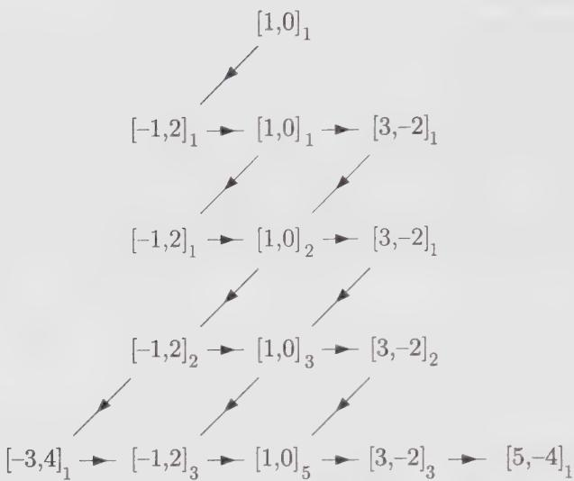  
Figure 14.4. Weights at the first few grades of the basic representation of $\widehat{su}(2)_1$ . The subscript gives the multiplicity.

Table 14.2. Weights above (0; 1; -2) in the basic module of $\widehat{su}(2)_1$

<table><tr><td>p</td><td> $\hat{\alpha}$ </td><td> $\hat{\lambda}' + p\hat{\alpha}$ </td><td> $(\hat{\lambda}' + p\hat{\alpha}, \hat{\alpha})$ </td><td> $\text{mult}_{\hat{\lambda}}(\hat{\lambda}' + p\hat{\alpha})$ </td></tr><tr><td>1</td><td> $(\alpha_1; 0; 0)$ </td><td> $(\alpha_1; 1; -2)$ </td><td>2</td><td>1</td></tr><tr><td>1</td><td> $(\alpha_1; 0; 1)$ </td><td> $(\alpha_1; 1; -1)$ </td><td>3</td><td>1</td></tr><tr><td>1</td><td> $(\alpha_1; 0; 2)$ </td><td> $(\alpha_1; 1; 0)$ </td><td>4</td><td>0</td></tr><tr><td>1</td><td> $(-\alpha_1; 0; 1)$ </td><td> $(-\alpha_1; 1; -1)$ </td><td>3</td><td>1</td></tr><tr><td>1</td><td> $(-\alpha_1; 0; 2)$ </td><td> $(-\alpha_1; 1; 0)$ </td><td>4</td><td>0</td></tr><tr><td>1</td><td> $(0; 0; 1)$ </td><td> $(0; 1; -1)$ </td><td>1</td><td>1</td></tr><tr><td>1</td><td> $(0; 0; 2)$ </td><td> $(0; 1; 0)$ </td><td>2</td><td>1</td></tr><tr><td>2</td><td> $(\alpha_1; 0; 0)$ </td><td> $(2\alpha_1; 1; -2)$ </td><td>4</td><td>0</td></tr><tr><td>2</td><td> $(\alpha_1; 0; 1)$ </td><td> $(2\alpha_1; 1; 0)$ </td><td>5</td><td>0</td></tr><tr><td>2</td><td> $(-\alpha_1; 0; 1)$ </td><td> $(-2\alpha_1; 1; 0)$ </td><td>5</td><td>0</td></tr><tr><td>2</td><td> $(0; 0; 1)$ </td><td> $(0; 1; 0)$ </td><td>2</td><td>1</td></tr></table>

The string function for the weight $[1,0]$ in our example turns out to be the inverse of the Euler function (this will be demonstrated later):

$$
\sigma_ {[ 1, 0 ]} ^ {([ 1, 0 ])} (q) = \varphi (q) ^ {- 1} = \prod_ {n = 1} ^ {\infty} (1 - q ^ {n}) ^ {- 1} = \sum_ {n = 0} ^ {\infty} p (n) q ^ {n}\tag{14.144}
$$

where $p(n)$ is the number of inequivalent decompositions of n into positive integers. The first few coefficients are 1, 1, 2, 3, 5, 7, 11, 15, $\cdots$ .

For more complicated representations, more than one string function will be required. We now see how many of them are actually needed. The complete information about the multiplicity of all the weights in the representation is contained in the set of string functions $\sigma_{\hat{\mu}}^{(\hat{\lambda})}(q)$ for all $\hat{\mu} \in \Omega_{\hat{\lambda}}^{\max}$ . However, since weight multiplicities are constant along Weyl orbits, that is,

$$
\sigma_ {w \hat {\mu}} ^ {(\hat {\lambda})} (q) = \sigma_ {\hat {\mu}} ^ {(\hat {\lambda})} (q)\tag{14.145}
$$

it is sufficient to know the string functions for those weights in $\Omega_{\hat{\lambda}}^{\max}$ that are also dominant. (Recall that a Weyl orbit contains exactly one element in the fundamental chamber.) We note further that all the weights in $\Omega_{\hat{\lambda}}$ must also be in the same congruence class as $\hat{\lambda}$ (or $\lambda$ ). The number of independent string functions required to fully specify the representation of highest weight $\hat{\lambda}$ is thus equal to the number of integrable weights at level k that are in the same congruence class as $\hat{\lambda}$ . Take for instance $\widehat{s\widehat{u}(2)_2}$ ; there are three integrable weights: [2,0], [0,2], [1,1]. The first two belong to the same class. Thus, two string functions are required for the module $L_{[2,0]}$ .

The consideration of string functions brings us naturally to the characters of the integrable representations.

## §14.4. Characters

## 14.4.1. Weyl-Kac Character Formula

The character of an integrable highest-weight representation is defined as

$$
\operatorname{ch} _ {\hat {\lambda}} = \sum_ {\hat {\lambda} ^ {\prime} \in \Omega_ {\hat {\lambda}}} \operatorname{mult} _ {\hat {\lambda}} \left(\hat {\lambda} ^ {\prime}\right) e ^ {\hat {\lambda} ^ {\prime}}\tag{14.146}
$$

In terms of string functions, this is just

$$
\mathrm{ch} _ {\hat {\lambda}} = \sum_ {\hat {\mu} \in \Omega_ {\hat {\lambda}} ^ {\max}} \sigma_ {\hat {\mu}} ^ {(\hat {\lambda})} (e ^ {- \delta}) e ^ {\hat {\mu}}\tag{14.147}
$$

This expression can be rewritten as

$$
\mathbf {c h} _ {\hat {\lambda}} = \frac {\sum_ {w \in \hat {W}} \epsilon (w) e ^ {w (\hat {\lambda} + \hat {\rho})}}{\sum_ {w \in \hat {W}} \epsilon (w) e ^ {w \hat {\rho}}}\tag{14.148}
$$

a formula known as the Weyl-Kac character formula. An alternate expression of the character is

$$
\mathbf {c h} _ {\hat {\lambda}} = \frac {\sum_ {w \in \hat {W}} \epsilon (w) e ^ {w (\hat {\lambda} + \hat {\rho})}}{e ^ {\hat {\rho}} \prod_ {\hat {\alpha} > 0} (1 - e ^ {- \hat {\alpha}}) ^ {\mathrm{mult} (\hat {\alpha})}}\tag{14.149}
$$

Since the character for the representation of highest weight $\hat{\lambda}=0$ is 1, there follows the famous Macdonald-Weyl denominator identity

$$
\boxed {\sum_ {w \in \hat {W}} \epsilon (w) e ^ {w \hat {\rho}} = e ^ {\hat {\rho}} \prod_ {\hat {\alpha} > 0} (1 - e ^ {- \hat {\alpha}}) ^ {\operatorname{mult} (\hat {\alpha})}}\tag{14.150}
$$

which is the root of many combinatorial formulae. For instance, applying it to $\widehat{s\mathfrak{u}}(2)$ ,

$$
\prod_ {n = 1} ^ {\infty} (1 - x ^ {n} y ^ {n}) (1 - x ^ {n} y ^ {n - 1}) (1 - x ^ {n - 1} y ^ {n}) = \sum_ {n \in \mathbb {Z}} (- 1) ^ {n} x ^ {n (n + 1) / 2} y ^ {n (n - 1) / 2}\tag{14.151}
$$

with $x = e^{-\alpha_{0}}$ and $y = e^{-\alpha_{1}}$ . Upon specialization, it reduces to various classical partition identities, including the Jacobi triple-product identity (cf. Exs. 14.7 and 14.8).

In terms of summations over the full affine Weyl group, the character formula (14.148) is not very useful. A more convenient expression is obtained by taking advantage of the semidirect product structure of the affine Weyl group, which allows factorization of a summation over the finite Weyl group:

$$
\sum_ {w \in \hat {W}} \epsilon (w) e ^ {w \hat {\lambda}} = \sum_ {w \in W} \epsilon (w) \sum_ {\alpha^ {\vee} \in Q ^ {\vee}} e ^ {w (t _ {\alpha^ {\vee}}) \hat {\lambda}} = \sum_ {w \in W} \epsilon (w) \sum_ {\alpha^ {\vee} \in Q ^ {\vee}} e ^ {(t _ {\alpha^ {\vee}}) w \hat {\lambda}}\tag{14.152}
$$

In the last equality, we have used the identity

$$
w (t _ {\hat {\alpha} ^ {\vee}}) = (t _ {w \hat {\alpha} ^ {\vee}}) w\tag{14.153}
$$

and the invariance of the coroot lattice under the action of the finite Weyl group. Next, we introduce the generalized theta function

$$
\boxed {\Theta_ {\hat {\lambda}} = e ^ {- \frac {1}{2 k} | \hat {\lambda} | ^ {2} \delta} \sum_ {\alpha^ {\vee} \in Q ^ {\vee}} e ^ {(t _ {\alpha^ {\vee}}) \hat {\lambda}}}\tag{14.154}
$$

With $\hat{\lambda} = (\lambda; k; 0)$ and the explicit expression (14.69) for $t_{\hat{\alpha}^{\vee}}$ , the above expression can be manipulated as follows:

$$
\begin{array}{l} \Theta_ {\hat {\lambda}} = \sum_ {\alpha^ {\vee} \in Q ^ {\vee}} e ^ {(\lambda + k \alpha^ {\vee}; k; - \frac {1}{2 k} | \lambda + k \alpha^ {\vee} | ^ {2})} \\ = e ^ {k \hat {\omega} _ {0}} \sum_ {\alpha^ {\vee} \in Q ^ {\vee}} e ^ {k (\alpha^ {\vee} + \lambda / k; 0; - \frac {1}{2} | \alpha^ {\vee} + \lambda / k | ^ {2})} \\ = e ^ {k \hat {\omega} _ {0}} \sum_ {\alpha^ {\vee} \in Q ^ {\vee} + \lambda / k} e ^ {k [ \alpha^ {\vee} - \frac {1}{2} | \alpha^ {\vee} | ^ {2} \delta ]} \end{array}\tag{14.155}
$$

In the second and third equality we used $\hat{\omega}_{0}=(0;1;0)$ and $\alpha^{\vee}=(\alpha^{\vee};0;0)$ , $\alpha^{\vee}$ being a finite coroot. This result has been obtained for a highest weight such that $\hat{\lambda}(L_{0})=0$ . But since the action of an element of the finite Weyl group cannot change the $L_{0}$ eigenvalue, we write

$$
\sum_ {w \in \hat {W}} \epsilon (w) e ^ {w \hat {\lambda}} = \sum_ {w \in W} \epsilon (w) e ^ {\frac {1}{2 k} | \lambda | ^ {2} \delta} \Theta_ {w \hat {\lambda}}\tag{14.156}
$$

If the level of $\hat{\lambda}$ is $k$ , that of $\hat{\lambda} + \hat{\rho}$ is $k + g$ , and the character takes the compact form

$$
\boxed {\operatorname{ch} _ {\hat {\lambda}} = e ^ {m _ {\hat {\lambda}} \delta} \frac {\sum_ {w \in W} \epsilon (w) \Theta_ {w (\hat {\lambda} + \hat {\rho})}}{\sum_ {w \in W} \epsilon (w) \Theta_ {w \hat {\rho}}}}\tag{14.157}
$$

where the quantity $m_{\hat{\lambda}}$ , the modular anomaly, is defined as

$$
m _ {\hat {\lambda}} = \frac {| \hat {\lambda} + \hat {\rho} | ^ {2}}{2 (k + g)} - \frac {| \hat {\rho} | ^ {2}}{2 g} = \frac {| \lambda + \rho | ^ {2}}{2 (k + g)} - \frac {| \rho | ^ {2}}{2 g}\tag{14.158}
$$

As in the finite case, it is often useful to evaluate the characters at an arbitrary point, denoted

$$
\hat {\xi} = - 2 \pi i (\zeta ; \tau ; t)\tag{14.159}
$$

We then use the notation

$$
\mathbf {c h} _ {\hat {\lambda}} (\hat {\xi}) \equiv \mathbf {c h} _ {\hat {\lambda}} (\zeta ; \tau ; t)\tag{14.160}
$$

The explicit expression of the theta function at this point is

$$
\Theta_ {\hat {\lambda}} (\hat {\xi}) = e ^ {- 2 \pi i k t} \sum_ {\alpha^ {\vee} \in Q ^ {\vee}} e ^ {- \pi i [ 2 k (\alpha^ {\vee}, \zeta) + 2 (\lambda , \zeta) - \tau k | \alpha^ {\vee} + \lambda / k | ^ {2} ]}\tag{14.161}
$$

Another widely used form for the character evaluated at a special point follows from expanding $\zeta$ as

$$
\zeta = \sum_ {i = 1} ^ {r} z _ {i} \alpha_ {i} ^ {\vee}\tag{14.162}
$$

so that

$$
(\lambda , \zeta) = \lambda \cdot z = \sum_ {i = 1} ^ {r} z _ {i} \lambda_ {i}\tag{14.163}
$$

Since little information is contained in the t dependence of the characters, they are usually presented as functions of the parameters $\tau$ and $z = (z_{1}, z_{2}, \cdots, z_{r})$ :

$$
\operatorname{ch} _ {\hat {\lambda}} (z; \tau) \equiv \operatorname{ch} _ {\hat {\lambda}} \left(\sum_ {i = 1} ^ {r} z _ {i} \lambda_ {i}; \tau ; 0\right)\tag{14.164}
$$

This expression is the same as

$$
\begin{array}{l} \operatorname{ch} _ {\hat {\lambda}} (z; \tau) = \sum_ {\hat {\lambda} ^ {\prime}} \operatorname{mult} _ {\hat {\lambda}} (\hat {\lambda} ^ {\prime}) e ^ {- 2 \pi i \tau (\hat {\lambda} ^ {\prime}, \hat {\omega} _ {0})} e ^ {- 2 \pi i z _ {i} \lambda_ {i} ^ {\prime}} \\ = \sum_ {n} \sum_ {\lambda^ {\prime}} \operatorname{mult} _ {\hat {\lambda}} (\lambda^ {\prime}) | _ {n} e ^ {2 \pi i \tau n} e ^ {- 2 \pi i z _ {i} \lambda_ {i} ^ {\prime}} \end{array}\tag{14.165}
$$

where, in the second equation, we used $\hat{\lambda}' = (\lambda'; k; -n)$ , and denoted by $\mathrm{mult}_{\hat{\lambda}}(\lambda')|_n$ the multiplicity of $\lambda'$ at grade $n$ . More compactly, it reads

$$
\boxed {\mathbf {c h} _ {\hat {\lambda}} (z; \tau) = \mathbf {T r} _ {\hat {\lambda}} e ^ {2 \pi i \tau L _ {0}} e ^ {- 2 \pi i \sum_ {j} z _ {j} h ^ {j}}}\tag{14.166}
$$

where $h^{j}$ is a Chevalley generator, whose action on $|\hat{\lambda}^{\prime}\rangle$ yields $\lambda_{j}^{\prime}$ . For $\widehat{su}(2)$ , it is more standard to write $2z_{1}=z$ , since in the spin basis $J^{0}=h/2$ :

$$
\widehat {s u} (2): \quad \operatorname{ch} _ {\hat {\lambda}} (z; \tau) = \operatorname{Tr} _ {\hat {\lambda}} e ^ {2 \pi i \tau L _ {0}} e ^ {- 2 \pi i z J ^ {0}}\tag{14.167}
$$

When evaluated at $\zeta = t = 0$ , that is for $\hat{\xi} = -2\pi i\tau\hat{\omega}_{0}$ , the character is said to be specialized:

$$
\operatorname{ch} _ {\hat {\lambda}} (\tau) \equiv \operatorname{ch} _ {\hat {\lambda}} (0; \tau ; 0) = \sum_ {n \geq 0} d (n) q ^ {n} \quad (q = e ^ {2 \pi i \tau})\tag{14.168}
$$

where $d(n)$ gives the total number of states at grade $n$ . Another useful specialization is

$$
\hat {\xi} = - 2 \pi i \hat {\rho} x\tag{14.169}
$$

where x is some constant. This is called the principal specialization. By means of the denominator identity, the principally specialized character can be expressed in a product form, hence its usefulness.

Expression (14.157) makes natural the introduction of the normalized characters defined as

$$
\chi_ {\hat {\lambda}} = e ^ {- m _ {\hat {\lambda}} \delta} \mathrm{ch} _ {\hat {\lambda}} = \frac {\sum_ {w \in W} \epsilon (w) \Theta_ {w (\hat {\lambda} + \hat {\rho})}}{\sum_ {w \in W} \epsilon (w) \Theta_ {w \hat {\rho}}} \Bigg |\tag{14.170}
$$

The specialized form of $\chi_{\hat{\lambda}}$ is

$$
\chi_ {\hat {\lambda}} (q) = q ^ {m _ {\hat {\lambda}}} \operatorname{Tr} _ {\hat {\lambda}} q ^ {L _ {0}}\tag{14.171}
$$

From now on we will mostly use the normalized characters, and the epithet normalized will frequently be omitted.

Extending the validity of the formula (14.170) to arbitrary weights (i.e., not necessarily dominant ones), and using the relation

$$
w \cdot \hat {\lambda} + \hat {\rho} = w (\hat {\lambda} + \hat {\rho})\tag{14.172}
$$

leads directly to

$$
\chi_ {w \cdot \hat {\lambda}} = \epsilon (w) \chi_ {\hat {\lambda}}\tag{14.173}
$$

This simple formula will be used extensively. It has the following remarkable implication: if a weight $\hat{\lambda}$ is fixed under the action of an odd element of the Weyl group, which means that there is a $w \in \hat{W}$ with $\epsilon(w) = -1$ such that $\hat{\lambda} = w \cdot \hat{\lambda}$ , then $\chi_{\hat{\lambda}} = 0$ .

## 14.4.2. The $\widehat{s\mathcal{u}}(2)_{k}$ Characters

The character of the $\widehat{su}(2)_{k}$ integrable module $L_{\hat{\lambda}}$ is

$$
\chi_ {\lambda_ {1}} ^ {(k)} = \frac {\Theta_ {\lambda_ {1} + 1} ^ {(k + 2)} - \Theta_ {- \lambda_ {1} - 1} ^ {(k + 2)}}{\Theta_ {1} ^ {(2)} - \Theta_ {- 1} ^ {(2)}}\tag{14.174}
$$

with the notation

$$
\chi_ {\lambda_ {1}} ^ {(k)} \equiv \chi_ {\hat {\lambda}} \quad \text { and } \quad \Theta_ {\lambda_ {1}} ^ {(k)} \equiv \Theta_ {\hat {\lambda}} \quad (\hat {\lambda} = [ k - \lambda_ {1}, \lambda_ {1} ])\tag{14.175}
$$

Although it is not manifest, the specialized form of this character is indeterminate. Indeed, consider the generic expression (14.161) for the $\widehat{su}(2)_{k}$ theta function evaluated at $\hat{\xi}$ , where $\alpha^{\vee}=n\alpha_{1}$ and $\alpha_{1}^{2}=2$ , with $\zeta=z\omega_{1}$ :

$$
\begin{array}{l} \Theta_ {\lambda_ {1}} ^ {(k)} (\zeta ; \tau ; t) = e ^ {- 2 \pi i k t} \sum_ {n \in \mathbb {Z} + \lambda_ {1} / 2 k} e ^ {2 \pi i k \tau n ^ {2}} e ^ {- 2 \pi i k n z} \\ = e ^ {- 2 \pi i k t} \sum_ {n \in \mathbb {Z}} e ^ {- 2 \pi i [ k n z + \frac {1}{2} \lambda_ {1} z - k n ^ {2} \tau - n \lambda_ {1} \tau - \lambda_ {1} ^ {2} \tau / 4 k ]} \end{array}\tag{14.176}
$$

For z = 0 and t = 0, changing the sign of $\lambda_{1}$ affects only the sign of the exponent of $e^{2\pi ikn\lambda_{1}\tau}$ ; however, this is irrelevant given that n is summed over all integers. Therefore, both the numerator and the denominator of the specialized character vanish. The specialized form of Eq. (14.174) must be obtained in a limit process, with $z \to 0$ . We find

$$
\chi_ {\lambda_ {1}} ^ {(k)} (\tau) = \frac {\sum_ {n \in \mathbb {Z}} [ \lambda_ {1} + 1 + 2 n (k + 2) ] e ^ {2 \pi i \tau [ \lambda_ {1} + 1 + 2 (k + 2) n ] ^ {2} / 4 (k + 2)}}{\sum_ {n \in \mathbb {Z}} [ 1 + 4 n ] e ^ {2 \pi i \tau [ 1 + 4 n ] ^ {2} / 8}}\tag{14.177}
$$

In terms of $q$ , it reads:

$$
\chi_ {\lambda_ {1}} ^ {(k)} (q) = q ^ {(\lambda_ {1} + 1) ^ {2} / 4 (k + 2) - \frac {1}{8}} \frac {\sum_ {n \in \mathbb {Z}} [ \lambda_ {1} + 1 + 2 n (k + 2) ] q ^ {n [ \lambda_ {1} + 1 + (k + 2) n ]}}{\sum_ {n \in \mathbb {Z}} [ 1 + 4 n ] q ^ {n [ 1 + 2 n ]}}\tag{14.178}
$$

where the prefactor is recognized as being $q^{m_{\lambda}}$ .

The first few terms of the simple case $k = \lambda_{1} = 1$ are:

$$
\begin{array}{r l} \chi_ {1} ^ {(1)} (q) & = q ^ {\frac {5}{2 4}} \frac {(2 - 4 q + 8 q ^ {5} - 1 0 q ^ {8} + \cdots)}{(1 - 3 q + 5 q ^ {3} + 9 q ^ {1 0} + \cdots)} \\ & = q ^ {\frac {5}{2 4}} (2 - 4 q + 8 q ^ {5} - 1 0 q ^ {8} + \dots) (1 + 3 q + 9 q ^ {2} + 2 2 q ^ {3} + \dots) \\ & = q ^ {\frac {5}{2 4}} (2 + 2 q + 6 q ^ {2} + 8 q ^ {3} + \dots) \end{array}\tag{14.179}
$$

The $su(2)$ irreducible content of the module $\mathsf{L}_{[0,1]}$ for the first four grades is: (1), (1), (3) ⊕ (1), (3) ⊕ 2(1), so that the number of states at these different grades is indeed 2, 2, 6, and 8.

We note finally that by means of the Jacobi identity $^{9}$

$$
[ \varphi (q) ] ^ {3} = \sum_ {n \in \mathbb {Z} _ {+}} (- 1) ^ {n} (2 n + 1) q ^ {n (n + 1) / 2}\tag{14.180}
$$

the $\widehat{su}(2)_k$ characters can be written somewhat more compactly. First, we express the above sum with even and odd terms separated:

$$
[ \varphi (q) ] ^ {3} = \sum_ {n \in \mathbb {Z}} (1 + 4 n) q ^ {2 n (n + 1)}\tag{14.181}
$$

Then, by using the relation between the Dedekind and the Euler functions

$$
\eta (q) = q ^ {\frac {1}{2 4}} \varphi (q)\tag{14.182}
$$

we find

$$
\chi_ {\lambda_ {1}} ^ {(k)} (q) = \frac {q ^ {(\lambda_ {1} + 1) ^ {2} / 4 (k + 2)}}{[ \eta (q) ] ^ {3}} \sum_ {n \in \mathbb {Z}} [ \lambda_ {1} + 1 + 2 n (k + 2) ] q ^ {n [ \lambda_ {1} + 1 + (k + 2) n ]}\tag{14.183}
$$

## 14.4.3. Characters of Heisenberg Algebra Modules

To finalize the presentation of the affine algebra characters, we consider the $\widehat{u}(1)$ case, also called the Heisenberg algebra. The module of the Heisenberg algebra is simply the usual Fock space of a free boson (cf. Sect. 6.3.3). The highest-weight state of the Fock space is $|\ell; \{0\} \rangle$ for any fixed eigenvalue $\ell$ of the operator $a_0$ . It is annihilated by all raising operators $a_{n>0}$ . Such modules are always irreducible, and states are of the form

$$
a _ {- 1} ^ {n _ {1}} a _ {- 2} ^ {n _ {2}} \dots | \ell ; \{0 \} \rangle \propto | \ell ; n _ {1}, n _ {2}, \dots \rangle\tag{14.184}
$$

As for affine simple Lie algebras, the differentiation operator $L_{0}$ is included in the Cartan subalgebra of the affine extension of $u(1)$ . The $L_{0}$ eigenvalue of a state in the Fock space is simply the sum of all occupation numbers $n_{i}$ .¹⁰ The number of states at a fixed grade m is thus given by the number of partitions of m (written $p(m)$ ) into positive integers, the occupation numbers $n_{i}$ . The specialized character of the Heisenberg module is thus equal to the inverse of the Euler function:

$$
\boxed {\operatorname{ch} _ {\widehat {u} (1)} (q) = \sum_ {n = 0} ^ {\infty} p (n) q ^ {n} = \varphi (q) ^ {- 1}}\tag{14.185}
$$

We note that Eq. (14.185) is equal to the string function $\sigma_{[1,0]}^{([1,0])}(q)$ ; this equivalence will be explained in Sect. 15.6.2.

With $r$ copies of Eq. (14.14), we construct an $r$ -fold Heisenberg algebra, with the defining commutation relations

$$
[ a _ {n} ^ {i}, a _ {m} ^ {j} ] = n \delta_ {n + m, 0} \delta_ {i, j} \qquad i, j = 1,, r\tag{14.186}
$$

The restricted character for the module of a r-fold Heisenberg algebra is

$$
\operatorname{ch} _ {\widehat {u} (1) ^ {r}} (q) = \left[ \operatorname{ch} _ {\widehat {u} (1)} (q) \right] ^ {r} = \varphi (q) ^ {- r} = \sum_ {n = 0} ^ {\infty} p _ {r} (n) q ^ {n}\tag{14.187}
$$

where $p_{r}(m)$ is the number of ways of separating m into positive integers of “r colors.” This character is the same as the string function for the weight $\hat{\omega}_{0}$ in the basic module of all simply-laced algebras of rank r.

## 14.4.4. The $\widehat{u}(1)$ Characters Associated with the Free Boson on a Circle of Rational Square Radius

A complete discussion of $\widehat{u}(1)$ characters requires a brief field-theoretical digression. A $\widehat{u}(1)$ current algebra is simply the commutation relations for the modes of a free boson. However, if the boson is compactified on a circle of radius R, possible windings must be taken into account (cf. Sect. 10.4.1). The corresponding partition function has already been evaluated in Eq. (10.62). Writing it in the form

$$
Z = \sum_ {n, m} \chi_ {n, m} (q) \bar {\chi} _ {n, m} (\bar {q})\tag{14.188}
$$

we can extract the chiral character $\chi_{n,m}(q)$ as

$$
\chi_ {n, m} (q) = \frac {1}{\eta (q)} q ^ {\frac {1}{2} (n / R + m R / 2) ^ {2}}\tag{14.189}
$$

This is a simple $\widehat{u}(1)$ character, related to that of the previous section by

$$
\chi_ {n, m} (q) = q ^ {h _ {n, m} - 1 / 2 4} \mathrm{ch} (q)\tag{14.190}
$$

with

$$
h _ {n, m} = \frac {1}{2} (n / R + m R / 2) ^ {2}\tag{14.191}
$$

The extra power of $q$ has to be equal to the modular anomaly for $\chi_{n,m}$ to be a genuine affine normalized character. This is indeed the case, as indicated at the end of this section.

It turns out that when $R^{2}$ is rational, say $^{11}$

$$
R = \sqrt {\frac {2 p ^ {\prime}}{p}}\tag{14.192}
$$

this infinite number of $\widehat{u}(1)$ characters can be reorganized into a finite number of generalized characters (cf. also Ex. 10.21). With Eq. (14.192), the character reads:

$$
\chi_ {n, m} (q) = \frac {1}{\eta (q)} q ^ {p p ^ {\prime} (n / 2 p ^ {\prime} + m / 2 p) ^ {2}}\tag{14.193}
$$

Introducing then the new integers

$$
n = 2 p ^ {\prime} n ^ {\prime} + r \quad 0 \leq r \leq 2 p ^ {\prime} - 1 \quad n ^ {\prime} \in \mathbb {Z}\tag{14.194}
$$

$$
m = 2 p m ^ {\prime} + s \quad 0 \leq s \leq 2 p - 1 \quad m ^ {\prime} \in \mathbb {Z}
$$

and setting

$$
\begin{array}{r} u = n ^ {\prime} + m ^ {\prime} \in \mathbb {Z} \\ \ell = p r + p ^ {\prime} s \in \mathbb {Z} \end{array}\tag{14.195}
$$

so that $0 \leq \ell \leq 4pp' - p - p'$ , we find

$$
\chi_ {\ell , u} (q) = \frac {1}{\eta (q)} q ^ {p p ^ {\prime} (u + \ell / 2 p p ^ {\prime}) ^ {2}}\tag{14.196}
$$

The announced reorganization is obtained by summing over u: $^{12}$

$$
\boxed {\chi_ {\ell} ^ {(p p ^ {\prime})} (q) = \frac {1}{\eta (q)} \sum_ {u \in \mathbb {Z}} q ^ {p p ^ {\prime} (u + \ell / 2 p p ^ {\prime}) ^ {2}}}\tag{14.197}
$$

The range of $\ell$ can be further restricted to $0 \leq \ell < 2pp'$ , or equivalently

$$
- p p ^ {\prime} + 1 \leq \ell \leq p p ^ {\prime}\tag{14.198}
$$

since

$$
\chi_ {\ell + 2 p p ^ {\prime}} (q) = \chi_ {\ell} (q)\tag{14.199}
$$

These generalized characters are no longer simple $\widehat{u}(1)$ characters. The latter have been rearranged in terms of an extended algebra. This extended algebra is generated by the $\widehat{u}(1)$ current $i\partial\varphi$ , whose modes yield the Heisenberg algebra, together with some extra currents. These currents are necessarily vertex operators of the form $e^{i\alpha\varphi}$ , since these are the only available operators in a free-boson theory. Simple conditions fix the value of $\alpha$ . At first, these operators must be well defined when $\varphi$ is replaced by $\varphi + 2\pi R$ ; this forces $\alpha R \in Z$ . Moreover, the currents generating an extended algebra are required to have integer conformal dimension: $|\alpha|^{2}/2 \in Z$ . Finally, the dimension of these currents must be symmetric in $p, p'$ in order to respect the duality $R \leftrightarrow 2/R$ , which amounts to the interchange $p \leftrightarrow p'$ . Looking for the lowest nonzero dimensional solution of these requirements, we find

$$
\alpha = \pm \sqrt {2 p p ^ {\prime}}\tag{14.200}
$$

Hence, the generators of the extended algebras are

$$
i \partial \varphi \quad \text { and } \quad \Gamma^ {\pm} = e ^ {\pm i \sqrt {2 p p ^ {\prime}} \varphi}\tag{14.201}
$$

(For $p = p' = 1$ , this extended algebra is simply $\widehat{s\widehat{u}}(2)_1$ , as shown in Sect. 15.6). The primary fields of the extended theory are those vertex operators $e^{i\gamma \varphi}$ whose operator product expansions with the generators are local. In other words, they must have trivial monodromy with the currents. This fixes $\gamma$ to be

$$
\gamma = \frac {\ell}{\sqrt {2 p p ^ {\prime}}} \qquad \ell \in \mathbb {Z}\tag{14.202}
$$

Their conformal dimension is

$$
h _ {\ell} = \frac {\ell^ {2}}{4 p p ^ {\prime}}\tag{14.203}
$$

For primary fields, the range of $\ell$ must be restricted to Eq. (14.198) since a shift of $\ell$ by $2pp'$ in $e^{i\ell \varphi / \sqrt{2pp'}}$ amounts to an insertion of the ladder operator $\Gamma^{+}$ , which thereby produces a descendant field.

From the point of view of the extended conformal field theory, the characters are easily derived. A factor $q^{h_{\ell}-1/24}/\eta(q)$ —since the central charge is unity—takes care of the action of the free boson generators. To account for the effect of the distinct multiple applications of the generators $\Gamma^{\pm}$ , which yield shifts of the momentum $\ell$ by integer multiples of $2pp'$ , we must replace $\ell$ by $\ell+m2pp'$ and sum over m. The net result is

$$
\begin{array}{c} \chi_ {\ell} ^ {(p p ^ {\prime})} (q) = \frac {1}{\eta (q)} \sum_ {m \in \mathbb {Z}} q ^ {\frac {1}{4 p p ^ {\prime}} (\ell + m 2 p p ^ {\prime}) ^ {2}} \\ = \frac {1}{\eta (q)} \sum_ {m \in \mathbb {Z}} q ^ {p p ^ {\prime} (m + \ell / 2 p p ^ {\prime}) ^ {2}} \end{array}\tag{14.204}
$$

This is exactly Eq. (14.197).

In the following, the extended $\widehat{u}(1)$ theory defined on a rational square radius $R = \sqrt{2p' / p}$ will be denoted by $\widehat{u}(1)_{pp'}$ . For an ordinary $\widehat{u}(1)$ theory, there is no notion of level.

We now reinterpret the extended chiral structure in a Lie-algebraic language. The action of $\Gamma^{+}$ on $e^{iy\varphi}$ amounts to adding a “simple root” $\alpha = \sqrt{2pp'}$ to the weight $\gamma$ . There is thus a natural root lattice:

$$
Q = \sqrt {2 p p ^ {\prime}} \mathbb {Z}\tag{14.205}
$$

whose dual is the weight lattice:

$$
P = \mathbb {Z} / \sqrt {2 p p ^ {\prime}}\tag{14.206}
$$

The ratio $P / Q = \mathbb{Z} / 2pp'$ shows that there are $2pp'$ congruence classes, which can be labeled by an integer $\ell$ restricted by Eq. (14.198). To $\ell$ , we can associate the state $|\ell; \{0\}$ , which is a highest-weight state with respect to the Heisenberg algebra.

The full representation is obtained by adding all positive and negative roots and taking into account all distinct actions of the $a_{n<0}$ 's.

There is still another Lie-algebraic approach to the construction of the $\widehat{u}(1)_{pp'}$ characters, this time rooted in a $\widehat{s\widehat{u}}(2)_k$ framework. When positive, $\ell$ can be viewed as the finite Dynkin label of an integrable $\widehat{s\widehat{u}}(2)_{pp'}$ weight. This suggests evaluating the character $\mathrm{ch}_{\ell}^{(pp')}$ from the $\widehat{s\widehat{u}}(2)_{pp'}$ character $\mathrm{ch}_{\lambda}$ , by ignoring the finite roots and their corresponding Weyl reflections. Equation (14.156) with $\rho = 0$ and $w = 1$ as the only finite Weyl contribution gives

$$
\sum_ {w \in \hat {W}} \epsilon (w) e ^ {w \hat {\lambda}} = e ^ {\frac {1}{2 p p ^ {\prime}} | \lambda | ^ {2} \delta} \Theta_ {\hat {\lambda}}\tag{14.207}
$$

For the denominator, we use the product form (14.150), with $\hat{\rho}=0$ and $\hat{\alpha}=n\delta$ :

$$
e ^ {\hat {\rho}} \prod_ {\hat {\alpha} > 0} (1 - e ^ {- \hat {\alpha}}) ^ {\operatorname{mult} (\hat {\alpha})} = (1 - e ^ {- n \delta})\tag{14.208}
$$

When evaluated at $\xi = -2\pi i(z\omega_1;\tau ;0)$ , this becomes $\varphi (q)$ , and the full character is

$$
\mathrm{ch} _ {\ell} ^ {(p p ^ {\prime})} (z; q) = \frac {q ^ {- \ell^ {2} / 4 p p ^ {\prime}}}{\varphi (q)} \Theta_ {\ell} ^ {(p p ^ {\prime})} (z; \tau)\tag{14.209}
$$

where $\Theta_{\ell}^{(pp^{\prime})}(z;\tau)$ is $\Theta_{\lambda_1}^{(k)}(\zeta ;\tau ;t)$ defined in Eq. (14.176), with $k = pp'$ , $\lambda_1 = \ell$ , $\zeta = z\omega_1$ , and $t = 0$ .

In the present context, the evaluation of the modular anomaly $m_{\lambda} \equiv m_{\ell}$ looks ambiguous. By using a relation to be derived later (Eq. (15.122), with $pp'$ playing the role of k), we can show $m_{\ell}$ to be

$$
m _ {\ell} = \frac {\ell^ {2}}{4 p p ^ {\prime}} - \frac {1}{2 4}\tag{14.210}
$$

The normalized character thus reads

$$
\chi_ {\ell} ^ {(p p ^ {\prime})} (z; q) = \frac {1}{\eta (q)} \Theta_ {\ell} ^ {(p p ^ {\prime})} (z; \tau)\tag{14.211}
$$

This expression holds for $\ell$ negative as well. At $z = 0$ , it takes the simple form

$$
\chi_ {\ell} ^ {(p p ^ {\prime})} (q) = \frac {1}{\eta (q)} \sum_ {m \in \mathbb {Z} + \ell / 2 p p ^ {\prime}} q ^ {p p ^ {\prime} m ^ {2}}\tag{14.212}
$$

This is again the same as Eq. (14.197).

This equivalence relies on the fact that the modular anomaly is simply $h - c / 24$ . As already mentioned, this links the nonnormalized $\widehat{u}(1)$ characters derived in the previous section to the normalized $\widehat{u}(1)$ characters written at the beginning of the present section. However, to understand this relation, we must be able to associate a conformal dimension to the highest weight of an integrable representation of an affine algebra. This will be done in the following chapter.

## §14.5. Modular Transformations

The action of the modular group

$$
\tau \rightarrow \frac {a \tau + b}{c \tau + d}\tag{14.213}
$$

on the weight (ζ; τ; t) is defined as

$$
(\zeta ; \tau ; t) \rightarrow \left(\frac {\zeta}{c \tau + d}; \frac {a \tau + b}{c \tau + d}; t + \frac {c | \zeta | ^ {2}}{2 (c \tau + d)}\right)\tag{14.214}
$$

The modular transformation properties of the characters $\chi_{\lambda}$ are derived in App. 14.B. They take the form

$$
\begin{array}{l} \chi_ {\hat {\lambda}} (\zeta ; \tau + 1; t) = \sum_ {\hat {\mu} \in P _ {+} ^ {k}} T _ {\hat {\lambda} \hat {\mu}}   \chi_ {\hat {\mu}} (\zeta ; \tau ; t) \\ \chi_ {\hat {\lambda}} (\zeta / \tau ; - 1 / \tau ; t + | \zeta | ^ {2} / 2 \tau) = \sum_ {\hat {\mu} \in P _ {+} ^ {k}} S _ {\hat {\lambda} \hat {\mu}}   \chi_ {\hat {\mu}} (\zeta ; \tau ; t) \end{array}\tag{14.215}
$$

Even before looking at the explicit expressions for the matrices T and S, the crucial observation we should make from these transformation properties is that the characters of dominant highest-weight representations at some fixed level k transform into each other under the action of the modular group, that is, the summation on the r.h.s. is restricted to weights in $P_{+}^{k}$ . This fact turns out to be at the core of modular covariance in (unitary) rational conformal field theories.

The matrix $\mathcal{T}$ is given by

$$
\boxed {T _ {\hat {\lambda} \hat {\mu}} = \delta_ {\hat {\lambda} \hat {\mu}} e ^ {2 \pi i m _ {\hat {\lambda}}}}\tag{14.216}
$$

showing that the transformation $\tau \to \tau + 1$ induces only a phase change. The matrix $S$ reads

$$
\mathcal {S} _ {\hat {\lambda}, \hat {\mu}} = i ^ {| \Delta_ {+} |} | P / Q ^ {\vee} | ^ {- \frac {1}{2}} (k + g) ^ {- r / 2} \sum_ {w \in W} \epsilon (w) e ^ {- 2 \pi i (w (\lambda + \rho), \mu + \rho) / (k + g)}\tag{14.217}
$$

where $P/Q^{\vee}$ stands for the set of lattice points of P lying in an elementary cell of $Q^{\vee}$ ; $|P/Q^{\vee}|$ is the number of points in this set (e.g., for $su(2)$ , it is 2 since $\alpha_{1}^{\vee} = \alpha_{1} = 2\omega_{1}$ ). This number is easily calculated from the determinant of the matrix whose rows are the Dynkin labels of the coroots (cf. Eqs. (14.296)–(14.319) in App. 14.B):

$$
\left| P / Q ^ {\vee} \right| = \det \left(\alpha_ {i} ^ {\vee}, \alpha_ {j} ^ {\vee}\right) = \det \left[ \left(\alpha_ {i} ^ {\vee}\right) _ {j} \right]\tag{14.218}
$$

For simply-laced algebras, this is the determinant of the Cartan matrix:

$$
| P / Q ^ {\vee} | = | P / Q | = \det A _ {i j} \quad (\text { simply - laced })\tag{14.219}
$$

As before, $|\Delta_{+}|$ is the number of positive roots in the finite Lie algebra g.

Both matrices are unitary:

$$
\boxed {\mathcal {T} ^ {- 1} = \mathcal {T} ^ {\dagger}, \qquad \mathcal {S} ^ {- 1} = \mathcal {S} ^ {\dagger}}\tag{14.220}
$$

For the T matrix, this is obvious. For S, it follows from the unitarity of the $\tilde{S}$ matrices of theta functions, a verification that is left as an exercise (cf. Ex. 14.13).

Some simple examples of modular $\mathcal{S}$ matrices are presented next. For $\widehat{su}(2)_k$ , since $|\Delta_{+}| = 1$ , $|P / Q^{\vee}| = 2$ , $g = 2$ , and $|\omega_1|^2 = \frac{1}{2}$ , the $\mathcal{S}$ matrix becomes

$$
\mathcal {S} _ {\hat {\lambda} \hat {\mu}} = \left[ \frac {2}{k + 2} \right] ^ {\frac {1}{2}} \sin \left[ \frac {\pi (\lambda_ {1} + 1) (\mu_ {1} + 1)}{(k + 2)} \right] \quad 0 \leq \lambda_ {1}, \mu_ {1} \leq k\tag{14.221}
$$

On the other hand, the S matrix for $\widehat{su}(3)_{1}$ is

$$
\mathcal {S} = \frac {1}{\sqrt {3}} \left( \begin{array}{c c c} 1 & 1 & 1 \\ 1 & \kappa & \kappa^ {2} \\ 1 & \kappa^ {2} & \kappa \end{array} \right) \qquad \kappa = e ^ {2 \pi i / 3}\tag{14.222}
$$

where the fields are ordered as $[1,0,0]$ , $[0,1,0]$ , $[0,0,1]$ .

It should be stressed that these are the normalized characters that transform covariantly with respect to modular transformations. The string functions can be made modular covariant by a simple rescaling. These normalized string functions are defined as follows:

$$
\boxed {c _ {\hat {\mu}} ^ {(\hat {\lambda})} (q) \equiv q ^ {m _ {\hat {\lambda}} (\hat {\mu})} \sigma_ {\hat {\mu}} ^ {(\hat {\lambda})} (q)}\tag{14.223}
$$

where $m_{\hat{\lambda}}(\hat{\mu})$ is the relative modular anomaly,

$$
m _ {\hat {\lambda}} (\hat {\mu}) = m _ {\hat {\lambda}} - \frac {| \mu | ^ {2}}{2 k}\tag{14.224}
$$

with $m_{\hat{\lambda}}$ defined in Eq. (14.158). The various $c_{\hat{\mu}}^{(\hat{\lambda})}(q)$ with $\hat{\lambda}, \hat{\mu} \in P_{+}^{k}$ transform into themselves under modular transformations.

## §14.6. Properties of the Modular S Matrix

## 14.6.1. The S Matrix and the Charge Conjugation Matrix

From the explicit form of the modular transformation $S$ , we see that $S^2 \neq 1$ . Indeed, under two successive transformations $\tau \to -1/\tau$ ,

$$
\begin{array}{r l}(\zeta ; \tau ; t)&\rightarrow (\frac {\zeta}{\tau}; \frac {- 1}{\tau}; t + \frac {| \zeta | ^ {2}}{2 \tau})\\&\rightarrow (- \zeta ; \tau ; t + \frac {| \zeta | ^ {2}}{2 \tau} + \frac {| \zeta / \tau | ^ {2}}{2 (- 1 / \tau)})\\&= (- \zeta ; \tau ; t)\end{array}\tag{14.225}
$$

Evaluating $\chi_{\hat{\lambda}}$ at $-2\pi i(-\zeta; \tau; t)$ yields the same result as evaluating $\chi_{\hat{\lambda}^*}$ at $-2\pi i(\zeta; \tau; t)$ :

$$
\chi_ {\hat {\lambda}} (- \zeta ; \tau ; t) = \chi_ {\hat {\lambda} ^ {*}} (\zeta ; \tau ; t)\tag{14.226}
$$

This can be seen from the expression (14.170): the minus sign in front of $\zeta$ can be absorbed in a redefinition of the summation variable $w\to -\tilde{w} w_0$ , so that

$$
\boldsymbol {w} \cdot \hat {\lambda} = (- \tilde {w} w _ {0}) \cdot \hat {\lambda} = \tilde {w} \cdot (- w _ {0}) \cdot \hat {\lambda} = \tilde {w} \cdot \hat {\lambda} ^ {*}\tag{14.227}
$$

This produces an extra phase $\epsilon(w_{0})$ in both the numerator and the denominator, which cancels out. This shows that $S^{2}$ is indeed the charge conjugation matrix (cf. Eq. (10.206))

$$
\boxed {\mathcal {S} ^ {2} = \mathcal {C}}\tag{14.228}
$$

with

$$
\mathcal {C} \chi_ {\hat {\lambda}} = \chi_ {\hat {\lambda} ^ {*}}\tag{14.229}
$$

This is simply illustrated with the $\widehat{su}(3)_{1}$ S matrix (14.222):

$$
\mathcal {S} ^ {2} = \left( \begin{array}{c c c} 1 & 0 & 0 \\ 0 & 0 & 1 \\ 0 & 1 & 0 \end{array} \right)\tag{14.230}
$$

On S, the action of C is simply the usual complex conjugation:

$$
\bar {\mathcal {S}} = \mathcal {C S} = \mathcal {S C}\tag{14.231}
$$

which is equivalent to

$$
\bar {\mathcal {S}} _ {\hat {\lambda} \hat {\mu}} = \mathcal {S} _ {\hat {\lambda} ^ {*}, \hat {\mu}} = \mathcal {S} _ {\hat {\lambda}, \hat {\mu} ^ {*}}\tag{14.232}
$$

An alternative direct check of the above relation is obtained by comparing

$$
\bar {\mathcal {S}} _ {\hat {\lambda} \hat {\mu}} = (- i) ^ {| \Delta_ {+} |} C \sum_ {w \in W} \epsilon (w) e ^ {2 \pi i (w (\lambda + \rho), \mu + \rho) / (k + g)}\tag{14.233}
$$

with

$$
\mathcal {S} _ {\hat {\lambda} ^ {*} \hat {\mu}} = i ^ {| \Delta_ {+} |} C \sum_ {w \in W} \epsilon (w) e ^ {- 2 \pi i (w (\lambda^ {*} + \rho), \mu + \rho) / (k + g)}\tag{14.234}
$$

where C is some real constant. With $\lambda^{*} = -w_{0} \cdot \lambda$ , the change of the summation variable from w to $ww_{0}$ yields a residual factor $\epsilon(w_{0})$ . This factor is simply equal to $(-1)^{|\Delta_{+}|}$ (see App. 14.A), exactly what is needed to change $(-i)^{|\Delta_{+}|}$ into $i^{|\Delta_{+}|}$ .

## 14.6.2. The S Matrix and the Asymptotic Form of Characters

For restricted characters, the second part of Eq. (14.215) reduces to:

$$
\chi_ {\hat {\lambda}} (- 1 / \tau) = \sum_ {\hat {\mu} \in P _ {+} ^ {k}} \mathcal {S} _ {\hat {\lambda} \hat {\mu}} \chi_ {\hat {\mu}} (\tau)\tag{14.235}
$$

which can also be written as

$$
\chi_ {\hat {\lambda}} (\tau) = \sum_ {\hat {\mu} \in P _ {+} ^ {k}} S _ {\hat {\lambda} \hat {\mu}} \chi_ {\hat {\mu}} (- 1 / \tau)\tag{14.236}
$$

In this latter form, consider the limit $\tau \rightarrow i0^{+}$ :

$$
\lim _ {\tau \rightarrow i 0 ^ {+}} \chi_ {\hat {\mu}} (- 1 / \tau) = e ^ {- (2 \pi i m _ {\hat {\mu}} / \tau)} [ \dim | \mu | + O (e ^ {- 2 \pi i / \tau}) ]\tag{14.237}
$$

The dominant term in the sum (14.236) comes from the contribution of the representation with lowest modular anomaly, namely $\hat{\mu} = k\hat{\omega}_{0}$ , whose representation contains only one term at grade zero. This yields

$$
\boxed {\lim _ {\tau \rightarrow i 0 ^ {+}} \chi_ {\hat {\lambda}} (\tau) = \mathcal {S} _ {\hat {\lambda} 0} e ^ {\pi i c / 1 2 \tau}}\tag{14.238}
$$

where the parameter c is given by:

$$
c = - 2 4 m _ {k \hat {\omega} _ {0}} = \frac {k \dim g}{(k + g)}\tag{14.239}
$$

(for the second equality, we used the strange formula (13.179)).

Equation (14.238) shows that the matrix element $S_{\lambda0}$ is a real positive number (cf. the argument leading to Eq. (10.213)). That $S_{\lambda0}$ is real is actually a simple consequence of Eq. (14.232) and the fact that the vacuum representation is self-conjugate. It can also be seen as follows. From Eq. (14.217), $S_{\lambda0}$ is seen to be proportional to the sum over the finite Weyl group of $\epsilon(w)e^{w\rho}$ , evaluated at the point $\xi_{\sigma}$ :

$$
\xi_ {\sigma} = \frac {- 2 \pi i}{k + g} (\sigma + \rho)\tag{14.240}
$$

This sum can be rewritten in product form by means of the Weyl denominator formula (13.165) (where $D_{\rho}$ is defined in Eq. (13.164)):

$$
\mathcal {S} _ {\hat {\lambda} 0} = | P / Q ^ {\vee} | ^ {- \frac {1}{2}} (k + g) ^ {- r / 2} \prod_ {\alpha \in \Delta_ {+}} 2 \sin \left(\frac {\pi (\alpha , \lambda + \rho)}{k + g}\right)\tag{14.241}
$$

All factors of $i$ have disappeared, as expected. Furthermore, for any positive root $\alpha$ , and $\hat{\lambda}$ an integrable weight, we have

$$
0 \leq (\alpha , \lambda + \rho) \leq k + g\tag{14.242}
$$

which shows that

$$
\mathcal {S} _ {\hat {\lambda} 0} > 0\tag{14.243}
$$

Actually, the following, stronger result is also a direct consequence of Eq. (14.241):

$$
\boxed {\mathcal {S} _ {\hat {\lambda} 0} \geq \mathcal {S} _ {0 0} > 0}\tag{14.244}
$$

We note that the 0-th row of S is the only positive one.

## 14.6.3. The S Matrix and Finite Characters

By comparing the ratio

$$
\gamma_ {\hat {\lambda}} ^ {(\hat {\sigma})} \equiv \frac {\mathcal {S} _ {\hat {\sigma} \hat {\lambda}}}{\mathcal {S} _ {\hat {\sigma} 0}} = \frac {\sum_ {w \in W} \epsilon (w) e ^ {- 2 \pi i (\sigma + \rho , w (\lambda + \rho)) / (k + g)}}{\sum_ {w \in W} \epsilon (w) e ^ {- 2 \pi i (\sigma + \rho , w \rho) / (k + g)}}\tag{14.245}
$$

with the finite character formula for the g representation of highest weight v evaluated at $\zeta$

$$
\chi_ {\lambda} (\zeta) = \frac {\sum_ {w \in W} \epsilon (w) e ^ {(w (\lambda + \rho) , \zeta)}}{\sum_ {w \in W} \epsilon (w) e ^ {(w \rho , \zeta)}}\tag{14.246}
$$

we conclude that

$$
\boxed {\gamma_ {\hat {\lambda}} ^ {(\hat {\sigma})} = \chi_ {\lambda} (\xi_ {\sigma})}\tag{14.247}
$$

where the character is evaluated at the special point $\xi_{\sigma}$ defined in Eq. (14.240). In due course, we will extract important consequences from this remarkable relationship.

## 14.6.4. Outer Automorphisms and the Modular S Matrix

We now evaluate the action of the outer-automorphism group on the S matrix. This will bring new light on the isomorphism between the center of the group $B(G)$ and the outer-automorphism group $\mathcal{O}(\hat{g})$ .

We consider then the action of $A \in \mathcal{O}(\hat{\mathfrak{g}})$ on the modular matrix $S$

$$
\begin{array}{c} A \mathcal {S} _ {\hat {\lambda} \hat {\mu}} = \mathcal {S} _ {A (\hat {\lambda}) \hat {\mu}} \propto \sum_ {w \in W} \epsilon (w) e ^ {- 2 \pi i (w A (\hat {\lambda} + \hat {\rho}), \mu + \rho) / (k + g)} \\ \propto \sum_ {w \in W} \epsilon (w) e ^ {- 2 \pi i ((k + g) w A \hat {\omega} _ {0} + w w _ {A} (\lambda + \rho), \mu + \rho) / (k + g)} \end{array}\tag{14.248}
$$

In the first step, we use the invariance of $\hat{\rho}$ under the action of $A$ , so that

$$
A \hat {\lambda} + \hat {\rho} = A (\hat {\lambda} + \hat {\rho})\tag{14.249}
$$

We then apply the formula (14.98), with $\hat{\lambda}$ replaced by $\hat{\lambda} + \hat{\rho}$ (whose level is $k + g$ ):

$$
A (\hat {\lambda} + \hat {\rho}) = (k + g) (A - 1) \hat {\omega} _ {0} + w _ {A} (\hat {\lambda} + \hat {\rho})\tag{14.250}
$$

Since, from Eq. (14.114),

$$
(w A \hat {\omega} _ {0}, \mu + \rho) = (A \hat {\omega} _ {0}, \mu + \rho) \mod \mathbb {Z}\tag{14.251}
$$

the first exponential factor can be put outside the sum. Then, we let $\tilde{w} = ww_A$ , with

$$
\epsilon (\tilde {w}) = \epsilon (w w _ {A}) = \epsilon (w) \epsilon (w _ {A})\tag{14.252}
$$

and sum over $\tilde{w}$ , to obtain

$$
A \mathcal {S} _ {\hat {\lambda} \hat {\mu}} = \epsilon (w _ {A}) \mathcal {S} _ {\hat {\lambda} \hat {\mu}} e ^ {- 2 \pi i (A \hat {\omega} _ {0}, \mu + \rho)}\tag{14.253}
$$

Recall that the signature of $w_{A}$ can be written explicitly as

$$
\epsilon (w _ {A}) = e ^ {2 \pi i (A \hat {\omega} _ {0}, \rho)}\tag{14.254}
$$

(cf. Eq. (14.100)), so that

$$
\boxed {A \mathcal {S} _ {\hat {\lambda} \hat {\mu}} = \mathcal {S} _ {\hat {\lambda} \hat {\mu}} e ^ {- 2 \pi i (A \hat {\omega} _ {0}, \mu)}}\tag{14.255}
$$

The remaining phase factor is exactly the eigenvalue b, the element of the center associated with A (cf. Sect. 14.2.3 and in particular Eq. (14.117)) on $\hat{\mu}$ , the second label of the modular S matrix. In a matrix notation, we can thus write

$$
A S = S b\tag{14.256}
$$

or, equivalently,

$$
\boxed {\mathcal {S} ^ {\dagger} A \mathcal {S} = b}\tag{14.257}
$$

This shows that the outer-automorphism group $\mathcal{O}(\hat{\mathbf{g}})$ and the center $B(G)$ are not only isomorphic, they are also exactly S duals of each other! This key relation will be the cornerstone of a general method for the construction of modular-invariant partition functions in conformal field theories with Lie group symmetry.

## §14.7. Affine Embeddings

## 14.7.1. Level of the Embedded Algebra

We consider an embedding of semisimple Lie algebras $p \subset g$ . Since the generators of the Lie algebra p are linear combinations of those of g, this finite Lie algebra embedding has an affine extension of the form $\hat{p}_{\tilde{k}} \subset \hat{g}_{k}$ . What has to be determined is the exact relationship between the levels $\tilde{k}$ and k, which amounts to a comparison of normalizations in two different algebras. Hence, the first step is to reinsert the appropriate factors of $|\theta|^{2}$ in the commutation relation (14.5). Recall that the level is obtained from the scalar product of $\hat{\lambda}$ with $\delta$ (see Eq. (14.55)), and that all scalar products have been normalized in terms of $|\theta|^{2} = 2$ . If we avoid fixing the normalization, we must write

$$
k = k ^ {\prime} \frac {| \theta | ^ {2}}{2}\tag{14.258}
$$

where now $k'$ is called the level. It is still an integer given by

$$
k ^ {\prime} = \sum_ {i = 0} ^ {r} a _ {i} ^ {\vee} \lambda_ {i} \in \mathbb {Z} _ {+}\tag{14.259}
$$

With this modification, the commutator (14.5) takes the form

$$
[ J _ {n} ^ {a}, J _ {m} ^ {b} ] = i f _ {a b c} J _ {n + m} ^ {c} + k ^ {\prime} n \frac {| \theta | ^ {2}}{2} \delta_ {a, b} \delta_ {n + m, 0}\tag{14.260}
$$

We denote the p generators by $\tilde{J}^{a'}$ (in an orthonormal basis), with $a' = 1, \cdots, \dim p$ . They are generically related to the g generators through a linear combination of the form

$$
\tilde {J} ^ {a ^ {\prime}} = \sum_ {a} m _ {a ^ {\prime} a} J ^ {a}\tag{14.261}
$$

Orthonormality with respect to the Killing form forces

$$
\sum_ {a} m _ {a ^ {\prime} a} m _ {b ^ {\prime} a} = \delta_ {a ^ {\prime} b ^ {\prime}}\tag{14.262}
$$

These expressions together with Eq. (14.260) give the $\hat{p}$ commutation relations. The coefficient of the central term remains unaffected (now proportional to $\delta_{a',b'}\delta_{n+m,0}$ ). This coefficient can be expressed in terms of $\vartheta$ , the highest root of $p$ :

$$
k ^ {\prime} \frac {| \theta | ^ {2}}{2} = k ^ {\prime} \frac {| \vartheta | ^ {2}}{2} \frac {| \theta | ^ {2}}{| \vartheta | ^ {2}} \equiv \tilde {k} ^ {\prime} \frac {| \vartheta | ^ {2}}{2}\tag{14.263}
$$

In other words, the level k of the embedded affine algebra $\hat{p}$ is related to that of $\hat{g}$ by the simple relation

$$
\tilde {k} = k \frac {| \theta | ^ {2}}{| \vartheta | ^ {2}}\tag{14.264}
$$

Of course, in order to compare the length of the two roots, we should project the g root onto the p algebra. The ratio $|\mathcal{P}\theta|^2 / |\vartheta|^2$ is simply the embedding index $x_e$ defined in Eq. (13.250):

$$
\boxed {\tilde {k} = k x _ {e}}\tag{14.265}
$$

Clearly, $x_{e} \geq 1$ , which implies that $\vec{k} \geq k$ . (Note also that $x_{e}$ is always an integer, which is made manifest by Eq. (13.251).)

## 14.7.2. Affine Branching Rules

The next point of interest is the calculation of affine branching rules, that is, the coefficients $b_{\hat{\lambda},\hat{\mu}}$ in the decomposition

$$
\mathsf {L} _ {\hat {\lambda}} \mapsto \bigoplus_ {\hat {\mu}} b _ {\hat {\lambda}, \hat {\mu}} \mathsf {L} _ {\hat {\mu}}\tag{14.266}
$$

In principle, this calculation is straightforward but tedious. We decompose grade by grade the module $L_{\hat{\lambda}}$ into irreducible representations of p and then reorganize the results into a direct sum of affine $\hat{p}$ modules $L_{\hat{\mu}}$ . A few simple examples will clarify the procedure.

Consider first the decomposition of the $\widehat{su}(3)_{1}$ module $L_{[1,0,0]}$ into the $\widehat{su}(2)_{1}$ modules $L_{[1,0]}$ and $L_{[0,1]}$ . (This is the affine extension of the regular embedding $su(2) \subset su(3)$ with $x_{e} = 1$ .) The first step is the construction of the modules under consideration. The result is presented in Tables 14.3 and 14.4, for the first five grades. The third column of Table 14.3 gives the appropriate grade-by-grade $su(2)$ decomposition of the irreducible $su(3)$ representations of the module $\mathsf{L}_{[1,0,0]}$ . These states should then be reorganized in terms of the two integrable $\widehat{su}(2)_1$ modules $\mathsf{L}_{[1,0]}$ and $\mathsf{L}_{[0,1]}$ . To proceed, it is convenient to express a module decomposition into irreducible representations of the corresponding finite Lie algebra:

$$
\mathsf {L} _ {\hat {\lambda}} = \sum_ {n} q ^ {n} \bigoplus_ {i} \mathsf {L} _ {\lambda^ {(i, n)}}\tag{14.267}
$$

where $q$ is a parameter keeping track of the grade and the $L_{\lambda^{(i,n)}}$ 's denote the irreducible representations of $g$ at grade $n$ . For instance,

$$
[ 1, 0, 0 ] = (0, 0) + q (1, 1) + q ^ {2} [ 2 (1, 1) \oplus (0, 0) ] + \dots\tag{14.268}
$$

Hence, for the embedding under consideration,

$$
[ 1, 0, 0 ] \mapsto (0) + q [ (2) \oplus 2 (1) \oplus (0) ] + q ^ {2} [ 2 (2) \oplus 4 (1) \oplus 3 (0) ] + \dots\tag{14.269}
$$

This has to be reexpressed in terms of the $\widehat{su}(2)_{1}$ representations [1, 0] and [0, 1]. Using the decomposition presented in Table 14.4, we find

$$
\begin{array}{c} [ 1, 0, 0 ] \mapsto (1 + q + 2 q ^ {2} + 5 q ^ {3} + 6 q ^ {4} + \dots) [ 1, 0 ] \\ \oplus (2 q + 2 q ^ {2} + 4 q ^ {3} + 6 q ^ {4} + \dots) [ 0, 1 ] \end{array}\tag{14.270}
$$

The branching functions are thus:

$$
\begin{array}{l} b _ {[ 1, 0, 0 ], [ 1, 0 ]} = (1 + q + 2 q ^ {2} + 5 q ^ {3} + 6 q ^ {4} + \dots) \\ b _ {[ 1, 0, 0 ], [ 0, 1 ]} = (2 q + 2 q ^ {2} + 4 q ^ {3} + 6 q ^ {4} + \dots) \end{array}\tag{14.271}
$$

These are infinite series in q, meaning that there is an infinite number of terms in the decomposition of $L_{[1,0,0]}$ . This is a generic feature. However, there are exceptions, as the next example demonstrates.

Table 14.3. The $su(2)$ decomposition of each grade of the $\widehat{su}(3)_1$ module $\mathsf{L}_{\{1,0,0\}}$ for the two embeddings $su(2) \subset su(3)$ .

<table><tr><td rowspan="2">Grade</td><td rowspan="2"> $L_{[1,0,0]}$ su(3) content</td><td colspan="2">module su(2) decomposition</td></tr><tr><td> $x_e = 1$ </td><td> $x_e = 4$ </td></tr><tr><td>0</td><td>(0,0)</td><td>(0)</td><td>(0)</td></tr><tr><td>1</td><td>(1,1)</td><td>(2) ⊕ 2(1) ⊕ (0)</td><td>(4) ⊕ (2)</td></tr><tr><td>2</td><td>2(1,1) ⊕ (0,0)</td><td>2(2) ⊕ 4(1) ⊕ 3(0)</td><td>2(4) ⊕ 2(2) ⊕ (0)</td></tr><tr><td>3</td><td>(3,0) ⊕ (0,3)</td><td>2(3) ⊕ 5(2)</td><td>2(6) ⊕ 3(4)</td></tr><tr><td></td><td>⊕3(1,1) ⊕ 2(0,0)</td><td>⊕8(1) ⊕ 7(0)</td><td>⊕5(2) ⊕ 2(0)</td></tr><tr><td>4</td><td>(2,2) ⊕ (3,0) ⊕ (0,3)</td><td>(4) ⊕ 4(3) ⊕ 11(2)</td><td>(8) ⊕ 3(6) ⊕ 8(4)</td></tr><tr><td></td><td>⊕6(1,1) ⊕ 3(0,0)</td><td>⊕16(1) ⊕ 12(0)</td><td>⊕8(2) ⊕ 4(0)</td></tr></table>

Table 14.4. The $su(2)$ irreducible representations of the first five grades in the two integrable $\widehat{su}(2)_1$ modules.

<table><tr><td>Grade</td><td> $L_{[1,0]}$ </td><td> $L_{[0,1]}$ </td></tr><tr><td>0</td><td>(0)</td><td>(1)</td></tr><tr><td>1</td><td>(2)</td><td>(1)</td></tr><tr><td>2</td><td>(2) ⊕ (0)</td><td>(3) ⊕ (1)</td></tr><tr><td>3</td><td>2(2) ⊕ (0)</td><td>(3) ⊕ 2(1)</td></tr><tr><td>4</td><td>(4) ⊕ 2(2) ⊕ 2(0)</td><td>2(3) ⊕ 3(1)</td></tr></table>

Consider now the affine extension of the special embedding $su(2) \subset su(3)$ (for which $x_{e} = 4$ ) at level 1, that is, the affine embedding $\widehat{su}(2)_{4} \subset \widehat{su}(3)_{1}$ . We again concentrate our attention on the module $L_{[1,0,0]}$ . The appropriate $su(2)$ decomposition at the first five grades is given by the fourth column of Table 14.3. Since the corresponding finite embedding is really an embedding of $so(3)$ into $su(3)$ , all $su(3)$ weights are projected onto $su(2)$ weights with even finite Dynkin labels. Hence, only the modules $L_{[4,0]}$ , $L_{[0,4]}$ , and $L_{[2,2]}$ are relevant in the decomposition of $L_{[1,0,0]}$ . Their $su(2)$ decomposition is presented in Table (14.5). Quite remarkably, we find that

$$
[ 1, 0, 0 ] \mapsto [ 4, 0 ] \oplus q [ 0, 4 ]\tag{14.272}
$$

so that the two branching functions contain a single term. A similar analysis with the other integrable modules $\widehat{s\widehat{u}}(3)_1$ $\mathsf{L}_{[0,1,0]}$ and $\mathsf{L}_{[0,0,1]}$ yields

$$
[ 0, 1, 0 ] \mapsto [ 2, 2 ], \qquad [ 0, 0, 1 ] \mapsto [ 2, 2 ]\tag{14.273}
$$

This finite reducibility is particular to the level-1 decomposition of the $\widehat{su}(3)$ modules: for all k > 1, the branching functions for $\widehat{su}(2)_{4k} \subset \widehat{su}(3)_{k}$ contain an infinite number of terms. The precise conditions under which finite reducibility is possible will be presented in Sect. 17.5.

## 14.7.3. Branching of Outer Automorphism Groups

The construction of conformal field theories in terms of affine Lie algebra embeddings will raise a tricky issue concerning the precise determination of the physical spectra. To address this technicality, we need to know how group centers branch.

To an element $b \in B(G)$ , there corresponds an element $b$ in the center of the group of $p$ if, for any $\hat{\lambda} \in \hat{g}$ , the eigenvalue of $b$ on $\hat{\lambda}$ equals the eigenvalue of $\tilde{b}$ on the projection of $\hat{\lambda}$ onto a $p$ weight. This relation is noted as follows:

$$
b \hat {\lambda} \mapsto \tilde {b} \mathcal {P} \hat {\lambda}, \quad \forall \hat {\lambda} \in \hat {\mathbf {g}}\tag{14.274}
$$

Table 14.5. $su(2)$ irreducible representations of each grade for the three integrable $\widehat{su}(2)_4$ modules with even finite Dynkin labels.

<table><tr><td>Grade</td><td> $L_{[4,0]}$ </td><td> $L_{[0,4]}$ </td><td> $L_{[2,2]}$ </td></tr><tr><td>0</td><td>(0)</td><td>(4)</td><td>(2)</td></tr><tr><td>1</td><td>(2)</td><td>(4) ⊕ (2)</td><td>(4) ⊕ (2) ⊕ (0)</td></tr><tr><td rowspan="2">2</td><td>(4) ⊕ (2)</td><td>(6) ⊕ 2(4)</td><td>(6) ⊕ 2(4)</td></tr><tr><td>⊕(0)</td><td>⊕2(2) ⊕ (0)</td><td>⊕3(2) ⊕ (0)</td></tr><tr><td rowspan="2">3</td><td>(6) ⊕ (4)</td><td>2(6) ⊕ 4(4)</td><td>2(6) ⊕ 5(4)</td></tr><tr><td>⊕3(2) ⊕ (0)</td><td>⊕4(2) ⊕ (0)</td><td>⊕5(2) ⊕ 3(0)</td></tr><tr><td rowspan="2">4</td><td>(8) ⊕ (6) ⊕ 4(4)</td><td>(8) ⊕ 4(6) ⊕ 8(4)</td><td>(8) ⊕ 5(6) ⊕ 9(4)</td></tr><tr><td>⊕4(2) ⊕ 3(0)</td><td>⊕7(2) ⊕ 3(0)</td><td>⊕11(2) ⊕ 4(0)</td></tr></table>

This implies

$$
\mathcal {P} b \hat {\lambda} = \tilde {b} \mathcal {P} \hat {\lambda}, \quad \forall \hat {\lambda} \in \hat {\mathbf {g}}\tag{14.275}
$$

or, more compactly,

$$
\mathcal {P} b = \tilde {b} \mathcal {P}\tag{14.276}
$$

Let $A$ (resp. $\tilde{A}$ ) be the element of $\mathcal{O}(\hat{\mathfrak{g}})$ (resp. $\mathcal{O}(\hat{\mathfrak{p}})$ ) related to $b$ (resp. $\tilde{b}$ ) through the eigenvalue equation

$$
\begin{array}{l} b \hat {\lambda} = \hat {\lambda} e ^ {2 \pi i (A \hat {\omega} _ {0}, \lambda)} \\ \tilde {b} \mathcal {P} \hat {\lambda} = \mathcal {P} \hat {\lambda} e ^ {2 \pi i (\tilde {A} \hat {\omega} _ {0}, \mathcal {P} \lambda)} \end{array}\tag{14.277}
$$

These eigenvalues are equal if and only if

$$
(A \hat {\omega} _ {0}, \lambda) = (\tilde {A} \hat {\omega} _ {0}, \mathcal {P} \lambda) \quad \text {   mod   1   } \quad \forall \hat {\lambda} \in \hat {\mathrm{g}}\tag{14.278}
$$

This correspondence between elements of $\mathcal{O}(\hat{\mathfrak{g}})$ and $\mathcal{O}(\hat{\mathfrak{p}})$ will be written under either the form

$$
A \mapsto \tilde {A} \qquad \text { or } \qquad \mathcal {P} A = \tilde {A} \mathcal {P}\tag{14.279}
$$

We note that such relations are level independent. From the center point of view, they characterize the finite embeddings as well as their affine extensions.

We look again at our familiar $su(2) \subset su(3)$ embeddings. For $su(3), A$ can be either $1, a$ , or $a^2$ , and

$$
(\hat {\omega} _ {0}, \lambda) = 0 \quad (a \hat {\omega} _ {0}, \lambda) = \frac {1}{3} (\lambda_ {1} + 2 \lambda_ {2}) \quad (a ^ {2} \hat {\omega} _ {0}, \lambda) = \frac {1}{3} (2 \lambda_ {1} + \lambda_ {2})\tag{14.280}
$$

In the regular embedding $(x_{e} = 1)$ , $\mathcal{P}_{(1)}\lambda = (\lambda_1 + \lambda_2)\omega_1$ , and

$$
(\hat {\omega} _ {0}, \mathcal {P} _ {(1)} \lambda) = 0 \qquad (\tilde {a} \hat {\omega} _ {0}, \mathcal {P} _ {(1)} \lambda) = \frac {1}{2} (\lambda_ {1} + \lambda_ {2})\tag{14.281}
$$

since for $su(2)\tilde{A}$ can be 1 or $\tilde{a}$ . The comparison of these results shows the nonexistence of relations between $\mathcal{O}(\widehat{s u}(2))$ and $\mathcal{O}(\widehat{s u}(3))$ for the regular embedding, besides $1\mapsto 1$ . However, for the special embedding, $\mathcal{P}_{(4)}\lambda = 2(\lambda_1 + \lambda_2)\omega_1$ so that

$$
(\tilde {a} \hat {\omega} _ {0}, \mathcal {P} _ {(4)} \lambda) = \lambda_ {1} + \lambda_ {2} = 0 \bmod 1\tag{14.282}
$$

which reveals a nontrivial branching $1 \mapsto \tilde{a}$ . $^{13}$

There may exist more than one nontrivial relation, as the following diagonal embedding example shows. A diagonal embedding is of the form

$$
\hat {\mathbf {g}} _ {k + k ^ {\prime}} \subset \hat {\mathbf {g}} _ {k} \oplus \hat {\mathbf {g}} _ {k ^ {\prime}}\tag{14.283}
$$

Here, the pair of weights $\hat{\lambda}$ , $\hat{\mu}$ of $\hat{g}_k \oplus \hat{g}_{k'}$ is projected onto the weight $\hat{\lambda} + \hat{\mu}$ of $\hat{g}_{k+k'}$ . It is then easily checked that to any element $A$ of $\mathcal{O}(\hat{g})$ corresponds the element $A \otimes A$ of $\mathcal{O}(\hat{g} \oplus \hat{g})$ , because in that case Eq. (14.278) becomes

$$
(A \hat {\omega} _ {0}, \lambda) + (A \hat {\omega} _ {0}, \mu) = (A \hat {\omega} _ {0}, \lambda + \mu)\tag{14.284}
$$

If $\mathcal{O}(\hat{\mathbf{g}})$ has order N, this produces N - 1 nontrivial relations.

## Appendix 14.A. A Technical Identity

In this appendix, we show that the signature of $w_{A}$ , the element of the Weyl group associated with the outer automorphism A through Eq. (14.98), is

$$
\epsilon (w _ {A}) = e ^ {2 \pi i (A \hat {\omega} _ {0}, \rho)} = e ^ {- \pi i g | A \hat {\omega} _ {0} | ^ {2}}\tag{14.285}
$$

We recall that $w_{A} = w_{i}w_{0}$ , where $w_{0}$ is the longest element of W, $w_{i}$ is the longest element of $W_{(i)}$ , and i is such that $A\hat{\omega}_{0} = \hat{\omega}_{i}$ . The signature of $w_{A}$ is thus

$$
\epsilon (w _ {A}) = (- 1) ^ {\ell (w _ {0})} (- 1) ^ {\ell (w _ {i})}\tag{14.286}
$$

where $\ell(w)$ stands for the length of w. It is clear that

$$
\ell (w _ {0}) = | \Delta_ {+} |\tag{14.287}
$$

where $|\Delta_{+}|$ is the number of positive roots. Indeed, the weight space is divided into $2|\Delta_{+}|$ chambers. The chamber that is the farthest from the fundamental one is associated with $w_{0}$ , which is thus an element of length $|\Delta_{+}|$ . Similarly, $\ell(w_{i}) = |\Delta_{+}^{(i)}|$ , where $\Delta_{+}^{(i)}$ is the set of positive roots generated by all simple roots except $\alpha_{i}$ :

$$
\Delta_ {+} ^ {(i)} = \{\alpha \in \Delta_ {+} | (\alpha , \omega_ {i}) = 0 \}\tag{14.288}
$$

The roots of $\Delta_{+}$ not belonging to $\Delta_{+}^{(i)}$ necessarily satisfy $(\alpha,\omega_{i})=1$ since $a_{i}=1.^{14}$ We can thus write

$$
\begin{array}{l}|\Delta_{+}^{(i)}| = |\Delta_{+}| - \sum_{\substack{\alpha \in \Delta_{+}\\ (\alpha ,\omega_{i}) = 1}}(\alpha ,\omega_{i})\\ = |\Delta_{+}| - \sum_{\alpha \in \Delta_{+}}(\alpha ,\omega_{i})\\ = |\Delta_{+}| - 2(\rho ,\omega_{i}) \end{array}\tag{14.289}
$$

In the second equality we removed out the constraint $(\alpha, \omega_{i}) = 1$ since it does not affect the sum, and in the last step we used the definition of the Weyl vector as the half sum of positive roots. With $\hat{\omega}_{i} = A\hat{\omega}_{0}$ , this verifies the first part of Eq. (14.285). Consider now Eq. (14.98) with $\hat{\lambda} = \hat{\rho} = \sum_{i=0}^{r} \hat{\omega}_{i}$ . Using the invariance of $\hat{\rho}$ under A, we find

$$
\hat {\rho} - w _ {A} \hat {\rho} = g (A - 1) \hat {\omega} _ {0}\tag{14.290}
$$

Taking the scalar product of both sides with $A\hat{\omega}_{0}$ yields

$$
(\rho - w _ {A} \rho , A \hat {\omega} _ {0}) = g | A \hat {\omega} _ {0} | ^ {2}\tag{14.291}
$$

(We recall that in the scalar product of an affine weight with a finite one, only the finite part of the former weight contributes.) Another property of $\rho$ is that it is self-conjugate:

$$
\rho^ {*} = - w _ {0} \rho = \rho\tag{14.292}
$$

so that $\rho - w_A \rho = \rho + w_i \rho$ . But since $w_i$ involves reflections with respect to roots orthogonal to $\omega_i$ , $(w_i \rho, \omega_i) = (\rho, \omega_i)$ , and finally

$$
2 (\rho , A \hat {\omega} _ {0}) = g | A \hat {\omega} _ {0} | ^ {2}\tag{14.293}
$$

completing the proof of Eq. (14.285).

## Appendix 14.B. Modular Transformation Properties of Affine Characters

We recall that a $d$ -dimensional Euclidean lattice $\Gamma$ is defined in terms of some basis $\{\epsilon_i\}$ of $\mathbb{R}^d$ as

$$
\Gamma = \left\{\sum_ {i = 1} ^ {d} n _ {i} \epsilon_ {i} | n _ {i} \in \mathbb {Z} \right\}\tag{14.294}
$$

Its unit cell $\Gamma_0$ is

$$
\Gamma_ {0} = \left\{\sum_ {i = 1} ^ {d} x _ {i} \epsilon_ {i} | 0 \leq x _ {i} <   1 \right\}\tag{14.295}
$$

so that the intersection $\Gamma_0\cap \Gamma$ contains a single point, the origin. The volume of the cell is

$$
\operatorname{vol} (\Gamma) = \sqrt {\det g _ {i j}}\tag{14.296}
$$

(it is standard to not write the subindex zero in the volume) where the metric $g_{ij}$ is naturally given by

$$
g _ {i j} = \epsilon_ {i} \cdot \epsilon_ {j}\tag{14.297}
$$

The dual lattice $\Gamma^{*}$ is similarly defined, in terms of the dual basis $\{\epsilon_{i}\}$ :

$$
\epsilon_ {i} \cdot \epsilon_ {j} ^ {*} = \delta_ {i j}\tag{14.298}
$$

The volume of the unit cell of the dual lattice is related to that of $\Gamma$ by

$$
\operatorname{vol} (\Gamma^ {*}) = [ \operatorname{vol} (\Gamma) ] ^ {- 1}\tag{14.299}
$$

The main tool in the analysis of modular properties of functions defined by a summation over a lattice is the Poisson resummation formula:

$$
\sum_ {x \in \Gamma} f (x) = \frac {1}{\operatorname{vol} (\Gamma)} \sum_ {p \in \Gamma^ {*}} \tilde {f} (p)\tag{14.300}
$$

where $\tilde{f}(p)$ is the Fourier transform of $f(x)$ :

$$
\tilde {f} (p) = \int_ {\mathbb {R} ^ {d}} d x e ^ {2 \pi i x \cdot p} f (x)\tag{14.301}
$$

To prove this relation, we introduce the auxiliary function

$$
F (z) = \sum_ {x \in \Gamma} f (x + z)\tag{14.302}
$$

This is manifestly a periodic function of $z$ , which can thus be Fourier expanded as

$$
F (z) = \sum_ {p \in \Gamma^ {*}} e ^ {- 2 \pi i z \cdot p} \tilde {F} (p)\tag{14.303}
$$

with

$$
\tilde {F} (p) = \frac {1}{\operatorname{vol} (\Gamma)} \int_ {\Gamma_ {0}} d y e ^ {2 \pi i y \cdot p} F (y)\tag{14.304}
$$

We note that the range of integration is restricted to $\Gamma_{0}$ , the fundamental period of $F(z)$ . Substituting Eq. (14.302) into Eq. (14.304) and feeding back the result in Eq. (14.303) yields

$$
F (z) = \sum_ {p \in \Gamma^ {*}} \frac {e ^ {- 2 \pi i z \cdot p}}{\operatorname{vol} (\Gamma)} \int_ {\Gamma_ {0}} d y \sum_ {x \in \Gamma} e ^ {2 \pi i y \cdot p} f (x + y)\tag{14.305}
$$

The integration over $\Gamma_0$ combined with the summation over all lattice points produces an integration over the whole space $\mathbb{R}^d$ :

$$
\int_ {\Gamma_ {0}} d y \sum_ {x \in \Gamma} e ^ {2 \pi i y \cdot p} f (x + y) = \int_ {\mathbb {R} ^ {d}} d x ^ {\prime} e ^ {2 \pi i x ^ {\prime} \cdot p} f (x ^ {\prime}) = \tilde {f} (p)\tag{14.306}
$$

Here we used the fact that $x \cdot p \in \mathbb{Z}$ to replace $y \cdot p$ by $(x + y) \cdot p$ in the exponential factor. Thus,

$$
\sum_ {x \in \Gamma} f (x + z) = \frac {1}{\operatorname{vol} (\Gamma)} \sum_ {p \in \Gamma^ {*}} e ^ {- 2 \pi i z \cdot p} \tilde {f} (p)\tag{14.307}
$$

and the desired result follows by setting z = 0. Applied to a Gaussian-like function of the form

$$
f (x) = e ^ {- i \pi x ^ {2} / \tau + 2 \pi i x \cdot a}\tag{14.308}
$$

Eq. (14.307) yields

$$
\sum_ {x \in \Gamma} e ^ {- i \pi x ^ {2} / \tau + 2 \pi i x \cdot a} = \frac {1}{\operatorname{vol} (\Gamma)} (- i \tau) ^ {d / 2} \sum_ {p \in \Gamma^ {*}} e ^ {i \pi \tau (p + a) ^ {2}}\tag{14.309}
$$

We recall that $x$ is a $d$ -dimensional vector; the factor $(-i\tau)^{d / 2}$ comes from the $d$ -independent Gaussian integrals of the Fourier transform:

$$
\int_ {\mathbb {R} ^ {d}} d x e ^ {- i x ^ {2} \pi / \tau} = \int_ {- \infty} ^ {+ \infty} (\prod_ {i = 1} ^ {d} d x ^ {i}) e ^ {- i \pi \sum_ {j = 1} ^ {d} x ^ {j} x ^ {j} / \tau} = (- i \tau) ^ {d / 2}\tag{14.310}
$$

The use of Gaussian integrals is justified since the imaginary part of $\tau$ is assumed to be positive.

We are now in a position to study the modular properties of the theta function

$$
\Theta_ {\hat {\lambda}} \equiv \Theta_ {\lambda} ^ {(k)}\tag{14.311}
$$

evaluated at $\hat{\xi} \equiv -2\pi i(\zeta; \tau; t)$ :

$$
\Theta_ {\lambda} ^ {(k)} (\zeta ; \tau ; t) = e ^ {- 2 \pi i k t} \sum_ {\alpha^ {\vee} \in Q ^ {\vee}} e ^ {- 2 \pi i k (\alpha^ {\vee} + \lambda / k, \zeta)} e ^ {i \pi k \tau | \alpha^ {\vee} + \lambda / k | ^ {2}}\tag{14.312}
$$

We consider first the S transformation:

$$
\Theta_ {\lambda} ^ {(k)} \left(\frac {\zeta}{\tau}; - \frac {1}{\tau}; t + \frac {| \zeta | ^ {2}}{2 \tau}\right) = e ^ {- 2 \pi i t} \sum_ {\alpha^ {\vee} \in Q ^ {\vee}} e ^ {- i \pi k | \alpha^ {\vee} + \lambda / k + \zeta | ^ {2} / \tau}\tag{14.313}
$$

The Fourier transform of the function $f(\alpha^{\vee})$ that follows the summation symbol is

$$
\begin{array}{l} \tilde {f} (p) = \int_ {\mathbb {R} ^ {r}} d \alpha^ {\vee} e ^ {2 \pi i (\alpha^ {\vee}, p)} e ^ {- i \pi k | \alpha^ {\vee} + \lambda / k + \zeta | ^ {2} / \tau} \\ = \left(- \frac {i \tau}{k}\right) ^ {r / 2} e ^ {- 2 \pi i (p, \zeta + \lambda / k)} e ^ {i \pi \tau | p | ^ {2} / k} \end{array}\tag{14.314}
$$

(The dimension of the Euclidean lattice is now $r$ , the rank of $g$ ). A direct application of Eq. (14.309) yields

$$
\Theta_ {\lambda} ^ {(k)} \left(\frac {\zeta}{\tau}; - \frac {1}{\tau}, t + \frac {| \zeta | ^ {2}}{2 \tau}\right) = \left(- \frac {i \tau}{k}\right) ^ {r / 2} \frac {e ^ {- 2 \pi i k t}}{\operatorname{vol} (Q ^ {\vee})} \sum_ {p \in P} e ^ {- 2 \pi i (p, \zeta + \lambda / k) + i \pi | p | ^ {2} \tau / k}\tag{14.315}
$$

the weight lattice $P$ being the dual of $Q^{\vee}$ . Note that $Q^{\vee} \subset P$ and a fortiori $kQ^{\vee} \subset P$ for any positive integer $k$ . This allows a separation of the summation over $P$ into two parts:

$$
\sum_ {p \in P} \tilde {f} (p) = \sum_ {\beta^ {\vee} \in k Q ^ {\vee}} \sum_ {\mu \in P / k Q ^ {\vee}} \tilde {f} (\beta^ {\vee} + \mu) = \sum_ {\alpha^ {\vee} \in Q ^ {\vee}} \sum_ {\mu \in P / k Q ^ {\vee}} \tilde {f} (k \alpha^ {\vee} + \mu)\tag{14.316}
$$

In this way, the $S$ transform of $\Theta_{\lambda}^{(k)}$ can be reexpressed as

$$
\begin{array}{l} \Theta_ {\lambda} ^ {(k)} (\frac {\zeta}{\tau}; - \frac {1}{\tau}, t + \frac {| \zeta | ^ {2}}{2 \tau}) = \left(- \frac {i \tau}{k}\right) ^ {r / 2} \frac {e ^ {- 2 \pi i k t}}{\operatorname{vol} (Q ^ {\vee})} \sum_ {\mu \in P / k Q ^ {\vee}} e ^ {- 2 \pi i (\mu , \lambda) / k} \\ \times \sum_ {\alpha^ {\vee} \in Q ^ {\vee}} e ^ {- 2 \pi i (\alpha^ {\vee}, \lambda)} e ^ {- 2 \pi i k | \alpha^ {\vee} + \mu / k, \zeta |} e ^ {i \pi k \tau | \alpha^ {\vee} + \mu / k | ^ {2}} \end{array}\tag{14.317}
$$

Since $\lambda$ is an integrable weight, $(\alpha^{\vee},\lambda)\in \mathbb{Z}$ and $e^{-2\pi i(\alpha^{\vee},\lambda)} = 1$ ; the function that is summed over $Q^{\vee}$ is then just $\Theta_{\mu}^{(k)}$ (up to a multiplicative factor) evaluated at $\hat{\xi}$ :

$$
\Theta_ {\lambda} ^ {(k)} \left(\frac {\zeta}{\tau}; - \frac {1}{\tau}; t + \frac {| \zeta | ^ {2}}{2 \tau}\right) = \left(- \frac {i \tau}{k}\right) ^ {r / 2} \frac {1}{\operatorname{vol} (Q ^ {\vee})} \sum_ {\mu \in P / k Q ^ {\vee}} e ^ {- 2 \pi i (\mu , \lambda) / k} \Theta_ {\mu} ^ {(k)} (\zeta ; \tau ; t)\tag{14.318}
$$

The factor $[\mathrm{vol}(Q^{\vee})]^{-1}$ can be written as

$$
\frac {1}{\operatorname{vol} (Q ^ {\vee})} = \left[ \frac {\operatorname{vol} (P)}{\operatorname{vol} (Q ^ {\vee})} \right] ^ {\frac {1}{2}} \equiv | P / Q ^ {\vee} | ^ {- \frac {1}{2}}\tag{14.319}
$$

This is a direct consequence of Eq. (14.299). $|P / Q^{\vee}|$ is the number of points of $P$ in a unit cell of $Q^{\vee}$ .

It turns out that the S matrix defined by

$$
\Theta_ {\lambda} ^ {(k)} \left(\frac {\zeta}{\tau}; - \frac {1}{\tau}; t + \frac {| \zeta | ^ {2}}{2 \tau}\right) = \sum_ {\mu \in P / k Q ^ {\vee}} \tilde {S} _ {\lambda \mu} ^ {(k)} \Theta_ {\mu} ^ {(k)} (\zeta ; \tau ; t)\tag{14.320}
$$

is unitary. This can be justified as follows (dropping the superscript k):

$$
(\tilde {\mathcal {S}} \tilde {\mathcal {S}} ^ {\dagger}) _ {\lambda \mu} = \sum_ {\sigma \in P / k Q ^ {\vee}} \mathcal {S} _ {\lambda \sigma} \bar {\mathcal {S}} _ {\sigma \mu} = \left| P / Q ^ {\vee} \right| ^ {- 1} k ^ {- r} \sum_ {\sigma \in P / k Q ^ {\vee}} e ^ {- 2 \pi i (\lambda - \mu , \sigma) / k}\tag{14.321}
$$

The sum over $\sigma$ can be decomposed into different sums over roots of unity, which all vanish when $\lambda - \mu = 0.^{15}$ In that case, the contribution of the sum is simply

the number of terms it contains, namely

$$
\sum_ {\sigma \in (P / k Q ^ {\vee})} 1 = \frac {\operatorname{vol} (k Q ^ {\vee})}{\operatorname{vol} (P)} = k ^ {r} \frac {\operatorname{vol} (Q ^ {\vee})}{\operatorname{vol} (P)} \equiv k ^ {r} \left| P / Q ^ {\vee} \right|\tag{14.322}
$$

from which it follows that

$$
\tilde {\mathcal {S}} \tilde {\mathcal {S}} ^ {\dagger} = I\tag{14.323}
$$

We are actually interested in the modular transformation properties of the sum:

$$
F _ {\hat {\lambda} + \hat {\rho}} \equiv \sum_ {w \in W} \epsilon (w) \Theta_ {w (\lambda + \rho)} ^ {(k + g)}\tag{14.324}
$$

From Eq. (14.318) it follows that

$$
\begin{array}{c} F _ {\hat {\lambda} + \hat {p}} (\frac {\zeta}{\tau}; - \frac {1}{\tau}; t + \frac {| \zeta | ^ {2}}{2 \tau}) = \left(- \frac {i \tau}{k + g}\right) ^ {r / 2} | P / Q ^ {\vee} | ^ {- \frac {1}{2}} \sum_ {w \in W} \epsilon (w) \\ \times \sum_ {\mu \in P / (k + g) Q ^ {\vee}} e ^ {- 2 \pi i (w (\lambda + \rho), \mu) / (k + g)} \Theta_ {\mu} ^ {(k + g)} (\zeta ; \tau ; t) \end{array}\tag{14.325}
$$

Since $\mu \in P$ , it is an integral weight. Further, it lives within a unit cell of $(k + g)Q^{\vee}$ , which, for convenience, is supposed to be centered on the origin of $P$ . All $\mu$ in $P / (k + g)Q^{\vee}$ satisfy $(\theta, \mu) \leq (k + g)$ . Notice that $\mu = 0$ does not contribute in Eq. (14.325) since in that case the summation over the finite Weyl group reduces to $\sum_{w \in W} \epsilon(w) = 0$ . The sum over all $\mu \neq 0$ within $P / (k + g)Q^{\vee}$ can then be split into a sum over all $\mu$ in that part of the fundamental (finite) chamber delimited by $(k + g)Q^{\vee}$ , plus a sum over the finite Weyl group

$$
\sum_{\mu \in P / (k + g)Q^{\vee}}f(\mu) = \sum_{\substack{\nu \in P_{+}\\ (\nu ,\theta)\leq k}}\sum_{w^{\prime}\in W}f(w^{\prime}(\nu +\rho))\tag{14.326}
$$

The weight $\nu$ extends to integrable affine weight at level $k$ . This yields

$$
\begin{array}{l}F_{\hat{\lambda} +\hat{\rho}}\big(\frac{\zeta}{\tau}; - \frac{1}{\tau};t + \frac{|\zeta|^{2}}{2\tau}\big)\\ = K\sum_{w^{\prime},w\in W}\epsilon (w)\sum_{\substack{v\in P_{+}\\ (v,\theta)\leq k}}e^{\frac{-2\pi i}{(k + g)} (w(\lambda +\rho),w^{\prime}(v + \rho))}\Theta_{w^{\prime}(v + \rho)}^{(k + g)}(\zeta ;\tau ;t)\\ = K\sum_{\substack{v\in P_{+}\\ (v,\theta)\leq k}}\sum_{w^{\prime \prime}\in W}\epsilon (w^{\prime \prime})e^{-2\pi i(w^{\prime \prime}(\lambda +\rho),v + \rho) / (k + g)}F_{\hat{v} +\hat{\rho}}(\zeta ;\tau ;t) \end{array}\tag{14.327}
$$

where

$$
K = \left(- \frac {i \tau}{k + g}\right) ^ {r / 2} \left| P / Q ^ {\vee} \right| ^ {- \frac {1}{2}}\tag{14.328}
$$

To obtain the second equality, we set $w'' = (w')^{-1}w$ so that $\epsilon(w) = \epsilon(w')\epsilon(w'')$ .

This takes care of the modular transformation property of the numerator of the normalized character. For the denominator, $\lambda = 0$ , so that in Eq. (14.327) only $\nu = 0$ contributes:

$$
\begin{array}{l} F _ {\hat {\rho}} (\frac {\zeta}{\tau}; - \frac {1}{\tau}; t + \frac {| \zeta | ^ {2}}{2 \tau}) = \\ \left(- \frac {i \tau}{g}\right) ^ {r / 2} | P / Q ^ {\vee} | ^ {- \frac {1}{2}} \Big (\sum_ {w \in W} \epsilon (w) e ^ {- 2 \pi i (w \rho , \rho) / g} \Big) F _ {\hat {\rho}} (\zeta ; \tau ; t) \end{array}\tag{14.329}
$$

Performing another $S$ transformation yields $F_{\hat{\rho}}(-\zeta; \tau; t)$ , whose absolute value equals that of $F_{\hat{\rho}}(\zeta; \tau; t)$ . This forces

$$
\left| \sum_ {w \in W} \epsilon (w) e ^ {- 2 \pi i (w \rho , \rho) / g} \right| \equiv | D _ {\rho} (- 2 \pi i \rho / g) | = g ^ {r / 2} \left| P / Q ^ {\vee} \right| ^ {\frac {1}{2}}\tag{14.330}
$$

where we used the notation (13.165). The phase of $D_{\rho}(-2\pi i\rho/g)$ can be extracted as follows. From Eq. (13.165),

$$
D _ {\rho} (- 2 \pi i \rho / g) = \prod_ {\alpha > 0} (- 2 i) \sin (\pi (\alpha , \rho) / g)\tag{14.331}
$$

For any positive root $\alpha$ , $(\alpha, \rho) > 0$ . Furthermore, since

$$
(\alpha , \rho) \leq (\theta , \rho) = g - 1\tag{14.332}
$$

it follows that

$$
0 <   \sin (\pi (\alpha , \rho) / g) <   1 \quad \text { for } \quad \alpha > 0\tag{14.333}
$$

This implies

$$
\begin{array}{r l} D _ {\rho} (- 2 \pi i \rho / g) & = (- i) ^ {| \Delta_ {+} |} \left| \prod_ {\alpha > 0} 2 \sin (\pi (\alpha , \rho) / g) \right| \\ & = (- i) ^ {| \Delta_ {+} |} \left| D _ {\rho} (- 2 \pi i \rho / g) \right| \end{array}\tag{14.334}
$$

and leads us to

$$
F _ {\hat {\rho}} (\frac {\zeta}{\tau}; - \frac {1}{\tau}; t + \frac {| \zeta | ^ {2}}{2 \tau}) = (- i \tau) ^ {r / 2} (- i) ^ {| \Delta_ {+} |} F _ {\hat {\rho}} (\zeta ; \tau ; t)\tag{14.335}
$$

The final result is obtained from the ratio of Eqs. (14.327) and (14.335):

$$
\begin{array}{l} \chi_ {\hat {\lambda}} (\frac {\zeta}{\tau}; - \frac {1}{\tau}; t + \frac {| \zeta | ^ {2}}{2 \tau}) = i ^ {| \Delta_ {+} |} | P / Q ^ {\vee} | ^ {- \frac {1}{2}} (k + g) ^ {- r / 2} \\ \times \sum_ {\hat {v} \in P _ {+} ^ {k}} \sum_ {w \in W} \epsilon (w) e ^ {- 2 \pi i (w (\lambda + \rho), v + \rho) / (k + g)} \chi_ {\hat {v}} (\zeta ; \tau ; t) \end{array}\tag{14.336}
$$

The unitarity of this S matrix follows directly from that of $\tilde{S}$ (cf. Ex. 14.13).

For the $\mathcal{T}$ transformation, the analysis is much simpler. The replacement $\tau \rightarrow \tau + 1$ in Eq. (14.312) produces the extra factor $e^{i\pi k|\alpha^{\vee} + \lambda / k|^2}$ , which reduces to $e^{i\pi |\lambda|^2 /k}$ because $|\alpha^{\vee}|^{2}\in 2\mathbb{Z}$ and $(\alpha^{\vee},\lambda)\in \mathbb{Z}$ . Since this factor is unaffected by the replacement $\lambda \to w\lambda$ , we have

$$
F _ {\hat {\lambda} + \hat {\rho}} (\zeta ; \tau + 1; t) = e ^ {i \pi | \lambda + \rho | ^ {2} / (k + g)} F _ {\hat {\lambda} + \hat {\rho}} (\zeta ; \tau ; t)\tag{14.337}
$$

and therefore

$$
\chi_ {\hat {\lambda}} (\zeta ; \tau + 1; t) = e ^ {2 \pi i m _ {\hat {\lambda}}} \chi_ {\hat {\lambda}} (\zeta ; \tau ; t)\tag{14.338}
$$

where $m_{\hat{\lambda}}$ is given by Eq. (14.158).

## Appendix 14.C. Paths as a Basis of States

## 14.C.1. Basis for the Integrable Representations of $\widehat{su}(2)_{1}$

We now present an explicit basis for the $\widehat{su}(2)_{1}$ representation of highest weight [1, 0]. The states are associated with the various integer-spin excitations of a semi-infinite spin- $\frac{1}{2}$ quantum Ising chain in the antiferromagnetic regime. One of the two possible ground states is

$$
\left| 0 \right\rangle = - + - + - + - + \dots\tag{14.339}
$$

where $+$ or $-$ refer to spin up or down, respectively. We define the action of some generators $\tilde{f}^i$ and $\tilde{e}^i$ on the semiinfinite spin chain as follows:

$f^{0}$ : freezes all pairs $(+ -)$ (in this order) and changes the rightmost (unfrozen) – into a +. $^{16}$

$f^{1}$ : freezes all pairs $(- + )$ (in this order) and changes the rightmost (unfrozen) $+$ into a $-$ .

In the first case, if there are no $-$ 's left, the state is annihilated by $\tilde{f}^0$ . A similar statement applies for the action of $\tilde{f}^1$ . The action of the generators $\tilde{e}^0$ and $\tilde{e}^1$ is identical except that rightmost is replaced by leftmost and $+$ by $-$ (but the frozen pairs are the same). The freezing operation starts with adjacent pairs, but nonadjacent ones must also be considered. For instance, in order to calculate the action of $\tilde{f}^0$ on

$$
+ + - + - + + - - + - \dots
$$

the pairs (+ -) must be frozen as follows

$$
+ (+ -) (+ -) (+ (+ -) -) (+ -) \dots
$$

so that only the initial + is left.

Applied on the highest state, the $\tilde{f}^{i}$ 's generate all the states in the representation. The highest state of the representation is the ground state $|0\rangle$ of the semiinfinite spin chain. Indeed, at grade zero this is the only state since $|0\rangle$ is annihilated by the action of $\tilde{f}^1$ :

$$
\begin{array}{r l} \tilde {f} ^ {1} | 0 \rangle & = \tilde {f} ^ {1} - + - + - + - + \dots \\ & = \tilde {f} ^ {1} (- +) (- +) (- +) (- +) \dots = 0 \end{array}\tag{14.340}
$$

The different states at grade one are

$$
\begin{array}{r} \tilde {f} ^ {0} | 0 \rangle = \tilde {f} ^ {0} - (+ -) (+ -) (+ -) \dots = + + - + - + - \dots \\ \tilde {f} ^ {1} \tilde {f} ^ {0} | 0 \rangle = \tilde {f} ^ {1} + + (- +) (- +) (- +) \dots = + - - + - + - \dots \\ (\tilde {f} ^ {1}) ^ {2} \tilde {f} ^ {0} | 0 \rangle = \tilde {f} ^ {1} + - (- +) (- +) (- +) \dots = - - - + - + - \dots \end{array}\tag{14.341}
$$

The action of $f^{0}$ on the second state generates a string of three states at grade two

$$
\begin{array}{r} \tilde {f} ^ {0} \tilde {f} ^ {1} \tilde {f} ^ {0} | 0 \rangle = + - + + - + \dots \\ \tilde {f} ^ {1} \tilde {f} ^ {0} \tilde {f} ^ {1} \tilde {f} ^ {0} | 0 \rangle = + - + - - + \dots \\ (\tilde {f} ^ {1}) ^ {2} \tilde {f} ^ {0} \tilde {f} ^ {1} \tilde {f} ^ {0} | 0 \rangle = - - + - - + \dots \end{array}\tag{14.342}
$$

The last state is annihilated by a further action of $\tilde{f}^{1}$ . However, there is another state at grade two, obtained from the action of $\tilde{f}^{0}$ on $(\tilde{f}^{1})^{2}\tilde{f}^{0}|0\rangle$ ,

$$
\tilde {f} ^ {0} (\tilde {f} ^ {1}) ^ {2} \tilde {f} ^ {0} | 0 \rangle = - - + + - + \dots\tag{14.343}
$$

We thus find two distinct states at grade two corresponding to the weight [1, 0], namely

$$
+ - + - - + \dots , \quad - - + + - + \dots\tag{14.344}
$$

(The finite weight is given by twice the number of $\tilde{f}^0$ 's minus the number of $\tilde{f}^1$ 's.) Similarly, at grade three this weight is associated with the three different states:

$$
\begin{array}{l} + - + - + - - + \dots \\ - + + - - + - + \dots \\ - - + - + + - + \dots \end{array}\tag{14.345}
$$

The states of the other integrable representations of $\widehat{su}(2)_{1}$ are obtained by application of the operators $\tilde{f}^{i}$ on the vacuum

$$
| \tilde {0} \rangle = + - + - + - + - \dots\tag{14.346}
$$

## 14.C.2. $\widehat{su}(N)_{1}$ Paths

The semiinfinite spin chains provide examples of $\widehat{su}(N)_{1}$ paths. Such a path is a sequence of positive integers taking values in the set $\{1,\cdots,N\}$ (for $su(2)$ replace - and + by 2 and 1, respectively) such that at large distances the path is a periodic repetition, in appropriate position, of the basic sequence $N,N-1,\cdots,1$ . These paths provide a basis for the integrable modules of $\widehat{su}(N)_{1}$ .

Given a path representation for the highest state, the explicit path for the other states in the module can be obtained from the action of the operators $\tilde{f}^{i}$ defined as follows:

$\tilde{f}^{i}$ : freezes all pairs $(i+1, i)$ (in this order) and changes the rightmost (unfrozen) i into a $i+1$ .

Here i is defined modulo N, so that $\tilde{f}^{0} = \tilde{f}^{N}$ .

Stripping off the “vacuum tail” of a path, (i.e., the repeated sequences of N, N - 1, $\cdots$ , 1), leaves a finite sequence of numbers, called a word, which characterizes a particular state in an irreducible representation of $su(N)$ . Indeed, there is a one-to-one relation between a word and a semistandard tableau: the word of a semistandard tableau is the sequence of numbers appearing in the tableau, read column after column from bottom to top and from left to right. For instance, to the semistandard tableau

$$
\begin{array}{c c c c c} \hline 1 & 1 & 2 & 3 & 5 \\ \hline 3 & 4 & 4 \\ \hline 5 \\ \hline \end{array}
$$

we associate the word [531414235]. On the other hand, given a word, we can reconstruct the corresponding semistandard tableau by the “bumping” method. We place the leftmost number in the upper left box of the tableau being constructed. For the next number we proceed as follows: If it is greater than, or equal to, the number already placed in the first box, it is put in the second box of the first row; otherwise it takes the place of the first number in the first box, the latter being bumped in the first box of the second row. Proceeding in this way for all numbers of the word and allowing bumping in every row, we easily reconstruct the corresponding semistandard tableau. This relation between semistandard tableaux and words is known as the Robinson-Schensted correspondence. The step-by-step reconstruction of the tableau associated with the word [3121] is thus:

$$
\boxed {3} \leftarrow [ 1 2 1 ] = \boxed {\frac {1}{3}} \leftarrow [ 2 1 ] = \boxed {\frac {1}{3}} \leftarrow [ 1 ] = \boxed {\frac {1}{2}} \boxed {1}
$$

In this way, the relation path $\rightarrow$ word $\rightarrow$ semistandard tableau for the two spin-zero states at grade two in the $\widehat{su}(2)_1$ module $L_{[1,0]}$ is:

$$
\begin{array}{l l l l l}1 2 1 2 2 1 2 1 \dots&\rightarrow&1 2 1 2&\rightarrow&\boxed {\begin{array}{c c c}1&1&2\\\hline 2\end{array}} = \boxed {\begin{array}{c c c}1&2\end{array}} \in (2)\\2 2 1 1 2 1 2 1 \dots&\rightarrow&2 2 1 1&\rightarrow&\boxed {\begin{array}{c c c}1&1\\\hline 2&2\end{array}} \in (0)\end{array}\tag{14.347}
$$

This procedure provides a very nice way of recovering the irreducible $su(N)$ content of the representation at a fixed grade.

The path construction has a generalization for all positive levels but this will not be considered here.

## Appendix 14.D. Notation for Affine Lie Algebras

$\tilde{\mathbf{g}}$ : loop extension of g  
$\hat{k}$ : central extension  
$k$ : level ($\hat{k}$ eigenvalue)  
$\hat{\mathbf{g}}_k$, $\hat{\mathbf{h}}_k$ : affine Lie algebras at fixed level $k$ $J_n^a$ : generators of the affine Lie algebra  
$E_n^\alpha$, $H_n^i$ ($i = 1, \cdots, r$): generators in the Cartan-Weyl basis  
$e^i$, $f^i$, $h^i$ ($i = 0, \cdots, r$): generators in the affine Chevalley basis  
$\hat{\lambda}$, $\hat{\mu}$, $\hat{\nu}$ : affine weights; $\hat{\lambda} = (\lambda; \hat{\lambda}(\hat{k}); \hat{\lambda}(-L_0))$ where $\lambda$ is a finite weight  
$\hat{\omega}_i \equiv (\omega_i; a_i^\vee; 0)$, $\hat{\omega}_0 = (0; 1; 0)$: fundamental weights  
$\hat{\lambda} = \sum_{i=0}^{r} \lambda_i \hat{\omega}_i = [\lambda_0, \lambda_1, \ldots, \lambda_r]$: affine Dynkin labels  
$\Omega_\hat{\lambda}$ : weight system for the representation of highest weight $\hat{\lambda}$ $\mathsf{L}_{\hat{\lambda}}$ : irreducible module of highest weight $\hat{\lambda}$ $P_+^k$ : set of integrable affine weights at level $k$ $\hat{\alpha} = (\alpha; 0; n)$ (for $\alpha \in \Delta$): real root  
$\delta = (0; 0; 1)$: imaginary root  
$\alpha_i \equiv (\alpha_i; 0; 0)$, $\alpha_0 = (-\theta; 0; 1)$: simple roots  
$\hat{\Delta}$ : set of affine roots  
$\hat{\Delta}_+$ : set of positive affine roots  
$\hat{A}_{ij}$ : affine Cartan matrix  
$\hat{W}$ : affine Weyl group  
$\operatorname{ch}_{\hat{\lambda}}$, $\chi_\hat{\lambda}$ : character and normalized character of the module $\mathsf{L}_{\hat{\lambda}}$ $\mathcal{S}$, $\mathcal{T}$ : modular matrices  
$\mathcal{C}$ : charge conjugation matrix: $\mathcal{C} = \mathcal{S}^2$ $\mathcal{O}(\hat{\mathbf{g}})$ : group of outer automorphisms  
$a$ : generator of the outer-automorphism group (except for $D_{2\ell}$).  
$A$ : generic element of the outer-automorphism group  
$w_A$ : element of the finite Weyl group associated with $A$

## Exercises

## 14.1 Central extensions

a) Prove that the central extension of a finite Lie algebra is necessarily trivial.

b) Verify the uniqueness of the central term in Eq. (14.5).

14.2 Translation generators

For $\widehat{sp}(4)$ and $\widehat{G}_2$ , express the translation generators $t_{\alpha_1^\vee}$ and $t_{\alpha_2^\vee}$ in terms of the simple affine Weyl reflections $s_0, s_1, s_2$ .

## 14.3 Basic representation of $\widehat{su}(2)_{1}$

Extend Fig. 14.4 up to $L_{0} = 6$ and relate together weights that are on the same Weyl orbit.

## 14.4 Grade decompositions

Find the finite Lie algebra irreducible content of the following representations at grade 1:

a) $(\widehat{G}_2)_2:[0,1,0]$

b) $(\hat{B}_{3})_{1}$ : [0, 1, 0, 0].

## 14.5 Fixed points of the outer automorphisms

A fixed point of an outer automorphism $A$ is a weight $\hat{\lambda}$ such that $A\hat{\lambda} = \hat{\lambda}$ . For instance, all $\widehat{su}(2)$ weights of the form $[n,n]$ are fixed points of the outer-automorphism group. For each simple affine algebra, find the general form of all integrable weights that are fixed under the generating element $a$ whose action is described in Table 14.1.

## 14.6 Identity involving outer automorphisms

Prove the identity (14.293) by a case-by-case analysis.

## 14.7 Euler-Jacobi identities

a) Check the expression (14.151), using Eqs. (14.152) and (14.69).

b) By appropriate specialization of this identity, obtain the Jacobi triple-product identity, as well as

$$
\varphi (q) = \sum_ {n \in \mathbb {Z}} (- 1) ^ {n} q ^ {n (3 n - 1) / 2}
$$

$$
[ \varphi (q) ] ^ {3} = \sum_ {n \in \mathbb {Z} _ {+}} (- 1) ^ {n} (2 n + 1) q ^ {n (n + 1) / 2}
$$

(respectively due to Euler and Jacobi).

## 14.8 Rogers-Ramanujan-Gordon identities

a) Evaluate Eq. (14.151) at the special point $-2\pi i\tau(\hat{\lambda} + \hat{\rho})$ . Setting $\hat{\lambda} = k\hat{\omega}_{0}$ and $q = e^{2\pi i\tau}$ yields identities related to the Gordon identities (k > 3) and the Rogers-Ramanujan identity (k = 3). (Generalizations follow by considering a $\hat{\lambda} \in P_{+}^{k}$ different from $k\hat{\omega}_{0}$ .)

b) Show that the expression obtained in (a) is invariant under the action of the outer-automorphism group (i.e., under the substitution $\lambda_1 \to k - \lambda_1$ ).

c) The character evaluated at the particular point $-2\pi i\tau\hat{\rho}$ is expressible as the ratio of the sum $\sum_{w\in\hat{W}}\epsilon(w)e^{w\hat{\rho}}$ evaluated once at the point $-2\pi i\tau(\hat{\lambda}+\hat{\rho})$ and then at $-2\pi i\tau\hat{\rho}$ . Using the denominator identity, rewrite the characters for the modules $L_{[3,0]}$ and $L_{[2,1]}$ in a product form. (According to (b), these are the two independent irreducible characters for $\widehat{s u}(2)_{3}$ in this particular specialization.) Compare the results with the characters of two irreducible representations of the Yang-Lee singularity (i.e., the Virasoro minimal model of central charge $c=-\frac{22}{5}$ ).

## 14.9 Macdonald identities for $\widehat{su}(2)_{k}$

Given that the character of the representation with highest weight $\lambda = 0$ at $k = 0$ is one:

$$
\chi_ {[ 0, 0 ]} (q) = 1 = \eta^ {- 3} (q) \sum_ {n \in \mathbb {Z}} (1 + 4 n) q ^ {(1 + 4 n) ^ {2} / 8}
$$

derive the following identity:

$$
\sum_ {j = 0} ^ {p - 1} \chi_ {[ 2 p ^ {2} - 1 - (4 j + 1) p, (4 j + 1) p - 1 ]} (q) = p
$$

(Hint: Set $n = pm + j$ for some fixed positive integer $p, m \in Z$ and $j = 0, 1, 2, \cdots, p - 1$ .) If $(4j + 1)p - 1 > k = 2p^{2} - 2$ , we can perform a shifted Weyl reflection. Check then that the explicit form of this identity for the cases p = 2, 3 reads:

$$
\chi_ {[ 5, 1 ]} (q) - \chi_ {[ 1, 5 ]} (q) = 2
$$

$$
\chi_ {[ 1 4, 2 ]} (q) + \chi_ {[ 2, 1 4 ]} (q) - \chi_ {[ 8, 8 ]} (q) = 3
$$

Similar identities can be obtained for higher-rank algebras.

## 14.10 Affine Kostant multiplicity formula

The affine Kostant partition function is defined similarly as in the finite case:

$$
\prod_ {\hat {\alpha} \in \hat {\Delta} _ {+}} (1 - e ^ {\hat {\alpha}}) ^ {- \operatorname{mult} (\hat {\alpha})} = \sum_ {\hat {\mu}} \hat {\mathcal {K}} (\hat {\mu}) e ^ {\hat {\mu}}
$$

a) Show that for $\widehat{su}(2)$ it reads

$$
\hat {\mathcal {K}} (n _ {0} \alpha_ {0} + n _ {1} \alpha_ {1}) = \sum_ {k \geq 0} (- 1) ^ {k} p _ {3} ((k + 1) n _ {0} - k n _ {1} - \frac {1}{2} k (k + 1))
$$

where $p_3(n)$ is defined by $\sum_{n\geq 0}p_3(n)q^n = [\varphi (q)]^{-3}$ .

b) Derive the affine form of the Kostant multiplicity formula and use it to calculate $\mathrm{mult}(0;1; - 2)$ in the module $L_{[1,0]}$ .

## 14.11 String functions

The three independent $\widehat{su}(2)_{2}$ normalized string functions are

$$
c _ {1} \equiv c _ {[ 2, 0 ]} ^ {([ 2, 0 ])} (q) = q ^ {\frac {- 1}{1 6}} (1 + q + 3 q ^ {2} + 5 q ^ {3} + 1 0 q ^ {4} + \dots)
$$

$$
c _ {2} \equiv c _ {[ 0, 2 ]} ^ {([ 2, 0 ])} (q) = q ^ {\frac {- 9}{1 6}} (q + 2 q ^ {2} + 4 q ^ {3} + 7 q ^ {4} + 1 3 q ^ {5} + \dots)
$$

$$
c _ {3} \equiv c _ {[ 1, 1 ]} ^ {([ 1, 1 ])} (q) = (1 + q + 2 q ^ {2} + 3 q ^ {3} + 5 q ^ {4} + \dots)
$$

a) Check the correctness of the prefactors and the coefficient of $q^{2}$ in $c_{3}$ using the Freudenthal multiplicity formula.

b) The exact form of these string functions is

$$
c _ {+} \equiv c _ {1} + c _ {2} = \frac {\eta (q)}{\eta (\sqrt {q}) \eta (q ^ {2})}, \quad c _ {-} \equiv c _ {1} - c _ {2} = \frac {\eta (\sqrt {q})}{[ \eta (q) ] ^ {2}}, \quad c _ {3} = \frac {\eta (q ^ {2})}{[ \eta (q) ] ^ {2}}
$$

where $\eta$ is the Dedekind function $\eta(q) = q^{\frac{1}{24}}\prod_{1}^{\infty}(1 - q^{n})$ . Use the modular transformation properties of $\eta(q)$ (cf. Eq. (10.12)) to derive those of $c_{+}, c_{-}$ , and $c_{3}$ .

## 14.12 Generalized and Jacobi theta functions

Find the relation between the $su(2)$ version (14.176) of the generalized theta function and the Jacobi theta function $\theta_{1}(z,\tau)$ defined in Eq. (10.252).

## 14.13 Modular transformation matrices

a) Using the unitarity of the modular transformation matrix $\mathcal{S}$ for the theta functions (given in Eq. (14.318)), prove the unitarity of the $S$ matrix (14.217) for the affine characters.

b) From the modular transformation matrices for the characters, derive those of the normalized string functions.

## 14.14 $\widehat{s u}(3)_1$ modular matrix

For $\widehat{s\widehat{u}}(3)_1$ , verify that the $S$ matrix is indeed given by Eq. (14.222) and that $(ST)^3 = C$ .

## 14.15 Action of outer automorphisms on the modular T matrix

Find the relation between $\mathcal{T}_{A(\hat{\lambda})\hat{\mu}}$ and $T_{\hat{\lambda}\hat{\mu}}$ , where A is an outer automorphism and T is the modular matrix (14.216).

## 14.16 Branching of outer automorphisms

For the following embeddings, find relations between elements of the corresponding outer-automorphism groups:

$$
\mathbf {a}) s u (2) \subset s p (4), \quad \mathcal {P} = (3, 4)
$$

$$
\mathbf {b})   s u (4) \subset s o (7), \qquad \mathcal {P} = \left( \begin{array}{c c c} 0 & 1 & 1 \\ 1 & 0 & 0 \\ 0 & 1 & 0 \end{array} \right)
$$

$$
\mathfrak {c})   s u (2) \oplus s u (3) \subset s u (6), \qquad \mathcal {P} = \left( \begin{array}{c c c c c} 1 & 0 & 1 & 0 & 1 \\ 1 & 2 & 1 & 0 & 0 \\ 0 & 0 & 1 & 2 & 1 \end{array} \right)
$$

14.17 A regular embedding in $E_{6}$

Consider the regular embedding:

$$
s u (2) \oplus s u (6) \subset E _ {6}
$$

obtained by deleting from the extended Dynkin diagram of $E_{6}$ the simple root $\alpha_{6}$ . The projection of an $E_{6}$ weight $\lambda$ onto $su(2)\oplus su(6)$ is then easily described: the $su(2)$ Dynkin label is the zeroth label of the affine extension of the $E_{6}$ weight at level zero, namely $-\sum_{i=1}^{6}a_{i}^{\vee}\lambda_{i}$ , and the first 5 Dynkin labels of $\lambda$ are the labels of the $su(6)$ weight. For instance, it is easily checked that

$$
(1 0 0 0 0 0) \mapsto (1) - (1 0 0 0 0) \oplus (0) - (0 0 0 1 0)
$$

a) Calculate the embedding index, directly from Eq. (13.250).

b) Show that the outer automorphism $a$ of $\widehat{E}_6$ , which maps $\hat{\omega}_0$ to $\hat{\omega}_1$ , branches to

$$
a \mapsto 1 \otimes \tilde {a} ^ {4}
$$

and moreover that

$$
1 \mapsto a ^ {\prime} \otimes \tilde {a} ^ {3}
$$

where $a'$ and $\tilde{a}$ stand, respectively, for the $\widehat{s\widehat{u}}(2)$ and $\widehat{s\widehat{u}}(6)$ basic outer automorphisms.

## 14.18 The special embedding $\widehat{s\mathfrak{u}}(2)_8\subset \widehat{s\mathfrak{u}}(3)_2$

Find the irreducible $su(3)$ content of the $\widehat{su}(3)_2$ modules $\mathsf{L}_{[2,0,0]}$ and $\mathsf{L}_{[1,1,0]}$ and the irreducible $su(2)$ content of the $\widehat{su}(2)_8$ modules $\mathsf{L}_{[8,0]},\mathsf{L}_{[2,6]},\mathsf{L}_{[4,4]},\mathsf{L}_{[6,2]}$ , and $\mathsf{L}_{[0,8]}$ at grades 0, 1, 2 and obtain the first few terms in the branching rule of [2, 0, 0] and [1, 1, 0].

## 14.19 Branching functions

a) Show that Eq. (14.266) implies the character identity:

$$
\chi_ {\mathcal {P} \hat {\lambda}} (\zeta , \tau , t) = \sum_ {\hat {\mu} \in P _ {+} ^ {\hat {k}}} \chi_ {\{\hat {\lambda}; \hat {\mu} \}} (\tau) \chi_ {\hat {\mu}} (\zeta , \tau , t)
$$

with $\zeta$ an element of the $\mathbb{C}$ span of the p weight lattice and where we have introduced the new notation

$$
\chi_ {\{\hat {\lambda}; \hat {\mu} \}} (\tau) = e ^ {2 \pi i \tau (m _ {\hat {\lambda}} - m _ {\hat {\mu}})} b _ {\hat {\lambda} \hat {\mu}} (\tau)
$$

with $m_{\hat{\lambda}}$ defined in Eq. (14.158). Argue that the normalized branching function $\chi_{\{\hat{\lambda},\hat{\mu}\}}(\tau)$ must be independent of the parameters $\zeta$ and $t$ . With $q = e^{2\pi i\tau}$ , find

$$
\chi_ {\{[ 1, 0, 0 ]; [ 4, 0 ] \}} \quad \text { and } \quad \chi_ {\{[ 1, 0, 0 ]; [ 0, 4 ] \}}
$$

for the embedding $\widehat{s\widehat{u}(2)_4}\subset \widehat{s\widehat{u}(3)_1}$ , using the branching functions already calculated in Sect. 14.7.2.

b) By using the simple modular transformation properties of the normalized affine characters, find the relation between $\chi_{\{\hat{\lambda};\hat{\mu}\}}(\tau+1)$ and $\chi_{\{\hat{\lambda};\hat{\mu}\}}(\tau)$ . From this result, obtain a simple necessary condition for having a constant normalized branching function. (This condition illustrates neatly the fact that finite reducibility depends crucially upon the level.)

## 14.20 $\widehat{su}(3)_1$ paths

For the three integrable $\widehat{su}(3)_{1}$ modules, write the path associated with each highest weight. (Hint: The highest weight $\widehat{\omega}_{i}$ is annihilated by all $f^{j}$ with $j \neq i$ .) Using the action of the $\widehat{f}^{i}$ 's, obtain all the states at grade 0 and 1. Write the finite word and the semistandard tableau corresponding to each of these paths, and from this recover the irreducible $su(3)$ content of three representations at grade 1.

## 14.21 Paths and bicolored tableaux

There exists a one-to-one correspondence between semiinfinite spin chains of the modules $L_{[1,0]}$ and $L_{[0,1]}$ , defined by the sequence $(\varepsilon_{i}), i \geq 1$ , with $\varepsilon_{i} \in \{+, -\}$ , and bicolored tableaux. These are tableaux with boxes marked by 0 or 1, such that:

(i) the first box (i.e., the box in the upper left corner) has 0 for tableaux in the module $\mathsf{L}_{[1,0]}$ and 1 for those in $\mathsf{L}_{[0,1]}$ ;

(ii) the box numbers must alternate in rows and in columns;

(iii) the row lengths must be strictly decreasing.

(Warning: These are not Young tableaux: even though we are dealing with $su(2)$ , columns of arbitrary length are allowed. Furthermore, rows of equal length are forbidden. The $su(2)$ character of the construction lies in the number of colors.) The correspondence is simply:

$$
\varepsilon_ {i} = (- 1) ^ {i + g _ {i}}
$$

where $g_{i}$ is the length of the i-th column.

a) Write down all bicolored tableaux associated with the states at the first few grades $(L_{0} \leq 3)$ of the modules $L_{[1,0]}$ and $L_{[0,1]}$ .

b) What is the weight and the grade of a bicolored tableau in terms of the number of boxes of each color?

c) The bicolored tableau representation of states leads to a simple combinatorial description of the weight multiplicities. Let $n_i$ stand for the number of boxes marked with an $i$ in a given tableau. Then, the number of partitions of $n_0 + n_1$ into distinct positive integers and compatible with the coloring appropriate to the module under consideration gives the multiplicity of the weight characterized by the pair $(n_0, n_1)$ in that module. In this way, check that in $L_{[1,0]}$ , the multiplicity of the weight [1, 0] at grade 6 is 7.

## Notes

Affine Lie algebras were discovered independently in mathematics (by V. Kac [212] and R.V. Moody [270] in 1967) and in physics (by Bardacki and Halpern [25]) in the context of dual models, the string ancestors. Actually, the occurrence of affine Lie algebras in physics (in disguised form) can be traced back to the early 1960s, with the introduction by Gell-Mann of charge algebras, later extended to current algebras. They were used to derive interaction-independent results, to circumvent the absence of suitable dynamical models for the description of nonelectromagnetic interactions. Curiously, the central extension was introduced even earlier (1959) by Schwinger.

The standard mathematical reference on affine Lie algebras is the book of Kac [214], which also contains an extensive list of references to the mathematical literature. The recent book of Moody and Pianzola [271] provides detailed coverage of the more general Kac-Moody algebras. A good introduction to affine Lie algebras is the book of Fuchs [148]. Another very readable text is Kass et al. [228], in which the first part is a “physicist’s run”; the second volume provides extensive tables, in particular of string functions and branching rules (part of the latter can be interpreted as the decomposition of integrable affine representations into a sum of finite ones, grade by grade). A succinct survey of affine Lie algebras, which has been very influential in the physics literature, is the article of Goddard and Olive [183].

Modular transformation properties of characters of integrable representations were derived by Kac and Peterson in [215] (see also Ref. [214]). Related results on lattices are discussed thoroughly in the review paper of Lerche, Schellekens, and Warner [254]. The group of outer automorphisms for extended Dynkin diagrams is described in Olive and Turok [285] and Bernard [41] (from which expressions for $\epsilon(w_A)$ have first been obtained); the standard mathematical reference is Bourbaki [56]. Our presentation of the isomorphism between the group of outer automorphisms and the center of the group follows that of Ahn and Walton [5]. Further technical details can be found in the work of Felder, Gawedzki, and Kupiainen [129] (from which the result of App. 14.A has been extracted). The path basis for the integrable $\widehat{su}(N)$ modules has been discovered by Date et al. [87] (Ex 14.21 on bicolored tableaux is adapted from this reference). However, the action of the tilde generators is the one appropriate for a crystal base—see, for instance, Ref. [132]. The Robinson-Schensted correspondence is described in Schensted [323] and Knuth [241].

# WZW Models

This chapter initiates the analysis of conformal field theories with Lie-algebraic symmetry, for which an affine Lie algebra $\hat{\mathfrak{g}}$ arises as the spectrum-generating algebra. Such models are somewhat peculiar among conformal field theories in that they can be formulated directly in terms of an action. We will thus introduce them by means of this action and show how to extract from it their algebraic structure, which provides them with an alternative algebraic definition. Special emphasis is placed on the formulation of the concept of primary field, and its relation with the integrable representations of the affine algebra $\hat{\mathfrak{g}}$ . A key construction along this program is that of the Sugawara energy-momentum tensor, which is presented in great detail. It leads directly to a differential equation for the correlation functions, the Knizhnik-Zamolodchikov equation, of which simple solutions are presented. In the second part of the chapter, we present various free-field representations. In addition to being extremely useful computational tools, they provide an illustration of the different concepts introduced in the first part.

## §15.1. Introducing WZW Models

## 15.1.1. Nonlinear Sigma Models

In searching for an explicit conformal field theory with additional conserved currents generating an affine Lie algebra, it is natural to first consider the nonlinear sigma model

$$
S _ {0} = \frac {1}{4 a ^ {2}} \int d ^ {2} x \operatorname{Tr} ^ {\prime} (\partial^ {\mu} g ^ {- 1} \partial_ {\mu} g)\tag{15.1}
$$

where $a^{2}$ is a positive, dimensionless coupling constant. This action describes a matrix bosonic field $g(x)$ living on the (semisimple) group manifold G associated with the Lie algebra g.

For the action to be real, $g(x)$ must be valued in a unitary representation. The trace is thus taken in such a representation; the prime indicates a representation-

independent normalization, namely $^{1}$

$$
\operatorname{Tr} ^ {\prime} \left(t ^ {a} t ^ {b}\right) = 2 \delta_ {a, b} \quad \text {where} \quad \left[ t ^ {a}, t ^ {b} \right] = \sum_ {c} i f _ {a b c} t ^ {c}\tag{15.2}
$$

and the $t^a$ 's stand for any matrix representation of the Lie algebra generators. This trace is related to the usual trace by

$$
\mathrm{Tr} ^ {\prime} = \frac {1}{x _ {\mathrm{rep}}} \mathrm{Tr}\tag{15.3}
$$

where $x_{rep}$ is the Dynkin index of the representation, which has been defined in Eq. (13.133).

With g unitary, $g^{-1}\partial_{\mu}g$ is antihermitian:

$$
(g ^ {- 1} \partial_ {\mu} g) ^ {\dagger} = \partial_ {\mu} g ^ {- 1} g = - g ^ {- 1} \partial_ {\mu} g\tag{15.4}
$$

since $\partial_{\mu}g^{-1} = -g^{-1}\partial_{\mu}gg^{-1}$ , a direct consequence of $\partial_{\mu}(gg^{-1}) = 0$ . This in turn ensures the positivity of the action, since the Lagrangian density is proportional to

$$
\mathrm{Tr} ^ {\prime} (\partial^ {\mu} g ^ {- 1} \partial_ {\mu} g) = \mathrm{Tr} ^ {\prime} ((\partial^ {\mu} g) ^ {\dagger} \partial_ {\mu} g) \geq 0\tag{15.5}
$$

Although conformally invariant classically, it has been known for a while that this theory is effectively massive: the dimensionless coupling constant acquires a scale dependence at the quantum level. Therefore, the $\beta$ function is nonzero and the quantum theory is not scale invariant. (In fact, it is asymptotically free.)

That this is not the kind of theory we are looking for can also be seen classically, at the level of conserved currents. Due to the holomorphic factorization property of a conformal field theory, these conserved currents must similarly factorize into a holomorphic and an antiholomorphic part. From the equation of motion, it is simple to check that there are not two conserved currents, one independent of $z$ and the other independent of $\bar{z}$ , where as usual

$$
z = x ^ {0} + i x ^ {1} \quad \bar {z} = x ^ {0} - i x ^ {1}\tag{15.6}
$$

Indeed, under the substitution $g \rightarrow g + \delta g$ , the variation of the action is

$$
\delta S _ {0} = \frac {1}{2 a ^ {2}} \int d ^ {2} x \operatorname{Tr} ^ {\prime} \left(g ^ {- 1} \delta g \partial^ {\mu} (g ^ {- 1} \partial_ {\mu} g)\right)\tag{15.7}
$$

which results in the following equation of motion

$$
\partial^ {\mu} (g ^ {- 1} \partial_ {\mu} g) = 0\tag{15.8}
$$

Some technical aspects of the above derivation deserve clarification. First, to calculate $\frac{\delta}{\delta g}\operatorname{Tr}^{\prime}[Ag^{-1}B]$ for A, B independent of g, we should proceed as follows:

$$
\delta \mathrm{Tr} ^ {\prime} [ A g ^ {- 1} B ] = - \mathrm{Tr} ^ {\prime} [ A g ^ {- 1} \delta g g ^ {- 1} B ] = - \mathrm{Tr} ^ {\prime} [ \delta g g ^ {- 1} B A g ^ {- 1} ]\tag{15.9}
$$

(since $\delta (gg^{-1}) = 0$ ) so that

$$
\frac {\delta}{\delta g} \mathrm{Tr} ^ {\prime} [ A g ^ {- 1} B ] = - \frac {1}{x _ {\mathrm{rep}}} g ^ {- 1} B A g ^ {- 1}\tag{15.10}
$$

Also, we stress that we use a matrix notation; when we differentiate with respect to g, we mean differentiation with respect to a particular matrix element of g.

The equation of motion implies the conservation of the currents

$$
J _ {\mu} = g ^ {- 1} \partial_ {\mu} g\tag{15.11}
$$

Thus, if we write $\tilde{J}_{z}=g^{-1}\partial_{z}g$ and $\tilde{J}_{\bar{z}}=g^{-1}\partial_{\bar{z}}g$ , we find

$$
\partial_ {z} \tilde {J} _ {\bar {z}} + \partial_ {\bar {z}} \tilde {J} _ {z} = 0\tag{15.12}
$$

For the holomorphic and antiholomorphic currents to be separately conserved, the two terms of the above equation need to vanish separately. For this, the dual current $\epsilon^{\mu\nu}J_{\nu}$ must also be conserved ( $\epsilon^{\mu\nu}$ is the rank-two antisymmetric tensor). However, the definition of $J_{\mu}$ implies that

$$
\left[ J _ {\mu}, J _ {\nu} \right] + \partial_ {\mu} J _ {\nu} - \partial_ {\nu} J _ {\mu} = 0\tag{15.13}
$$

which yields

$$
\partial_ {\mu} (\epsilon^ {\mu \nu} J _ {\nu}) = - \epsilon^ {\mu \nu} J _ {\mu} J _ {\nu} \neq 0\tag{15.14}
$$

Actually, the separate conservation of the two currents $\tilde{J}_{z}$ and $\tilde{J}_{\bar{z}}$ would be inconsistent in that $\partial_{z}(g^{-1}\partial_{\bar{z}}g)=0$ would force:

$$
\partial_ {z} \partial_ {\bar {z}} g = \partial_ {\bar {z}} g g ^ {- 1} \partial_ {z} g\tag{15.15}
$$

Since the l.h.s. is symmetric with respect to the interchange of z and $\bar{z}$ , it implies that

$$
\partial_ {\bar {z}} g g ^ {- 1} \partial_ {z} g = \partial_ {z} g g ^ {- 1} \partial_ {\bar {z}} g\tag{15.16}
$$

This is an equality of the form $abc = cba$ for some group elements, which is not expected to hold in general for a non-Abelian algebra.

The correct choice for these conserved currents turns out to be:

$$
J _ {z} = \partial_ {z} g g ^ {- 1} J _ {\bar {z}} = g ^ {- 1} \partial_ {\bar {z}} g\tag{15.17}
$$

(or the dual of these expressions, obtained by interchanging z and $\bar{z}$ .) The conservation of either $J_{z}$ or $J_{\bar{z}}$ implies that of the other:

$$
\partial_ {z} (g ^ {- 1} \partial_ {\bar {z}} g) = g ^ {- 1} \partial_ {\bar {z}} (\partial_ {z} g g ^ {- 1}) g\tag{15.18}
$$

However, neither of these is conserved separately in the sigma model (15.1).

## 15.1.2. Wess-Zumino-Witten Models

A more complicated action must be considered in order to enhance the symmetry and recover the conserved currents (15.17). The solution is not entirely obvious:

we should add to the above action a Wess-Zumino term,

$$
\boxed {\Gamma = \frac {- i}{2 4 \pi} \int_ {B} d ^ {3} y \epsilon_ {\alpha \beta \gamma} \mathrm{Tr} ^ {\prime} (\tilde {g} ^ {- 1} \partial^ {\alpha} \tilde {g} \tilde {g} ^ {- 1} \partial^ {\beta} \tilde {g} \tilde {g} ^ {- 1} \partial^ {\gamma} \tilde {g})}\tag{15.19}
$$

This is defined on a three-dimensional manifold B, whose boundary is the compactification of our original two-dimensional space. We have denoted by $\tilde{g}$ the extension of the field g to this three-dimensional manifold. However, this extension is not unique, hence there is a potential ambiguity in the definition of $\Gamma$ . Indeed, in a compactified three-dimensional space, a compact two-dimensional space delimits two distinct three-manifolds. The difference between these two choices quantifies the ambiguity. Taking the orientation into account, this difference $\Delta\Gamma$ is given by the r.h.s. of Eq. (15.19) but with the integration range extended over the whole compact three-dimensional space. Since the latter is topologically equivalent to the three-sphere, we can write

$$
\Delta \Gamma = \frac {- i}{2 4 \pi} \int_ {S ^ {1}} d ^ {3} y \epsilon_ {\alpha \beta \gamma} \mathrm{Tr} ^ {\prime} (\tilde {g} ^ {- 1} \partial^ {\alpha} \tilde {g} \tilde {g} ^ {- 1} \partial^ {\beta} \tilde {g} \tilde {g} ^ {- 1} \partial^ {\gamma} \tilde {g})\tag{15.20}
$$

It is shown in App. 15.A that our choice of normalization for $\mathrm{Tr}'$ ensures that $\Delta \Gamma$ is defined modulo $2\pi i$ ( $\pi i$ for $SO(3)$ ). Therefore the Euclidean functional integral, with weight $\exp(-\Gamma)$ , is perfectly well defined. Clearly, any coupling constant multiplying this term must be "quantized": it has to be an integer (or an even integer for $SO(3)$ ).

We then consider the action

$$
S = S _ {0} + k \Gamma\tag{15.21}
$$

where k is an integer. Although the Wess-Zumino term is expressed as a three-dimensional integral, its variation under $g \rightarrow g + \delta g$ is a two-dimensional functional, because the variation of its density can be written as a total derivative and

$$
\int_ {B} d ^ {3} y \epsilon_ {\alpha \beta \gamma} \partial^ {\gamma} (\dots) = \int d ^ {2} x \epsilon_ {\alpha \beta} (\dots)\tag{15.22}
$$

The details of this derivation are left as an exercise (see Ex. 15.1). The final result is

$$
\delta \Gamma = \frac {i}{8 \pi} \int d ^ {2} x \epsilon_ {\mu \nu} \mathrm{Tr} ^ {\prime} (g ^ {- 1} \delta g \partial^ {\mu} (g ^ {- 1} \partial^ {\nu} g))\tag{15.23}
$$

The equation of motion for the full action (15.21) is then

$$
\partial^ {\mu} (g ^ {- 1} \partial_ {\mu} g) + \frac {a ^ {2} i k}{4 \pi} \epsilon_ {\mu \nu} \partial^ {\mu} (g ^ {- 1} \partial^ {\nu} g) = 0\tag{15.24}
$$

In terms of the complex variables $z, \bar{z}$ (with $\partial^{\tilde{z}} = 2\partial_{\tilde{z}}, \epsilon_{zz} = i/2$ , etc.), the equation of motion becomes

$$
\left(1 + \frac {a ^ {2} k}{4 \pi}\right) \partial_ {\bar {z}} (g ^ {- 1} \partial_ {\bar {z}} g) + \left(1 - \frac {a ^ {2} k}{4 \pi}\right) \partial_ {\bar {z}} (g ^ {- 1} \partial_ {\bar {z}} g) = 0\tag{15.25}
$$

Thus, for

$$
a ^ {2} = 4 \pi / k\tag{15.26}
$$

we find the desired conservation law

$$
\partial_ {z} (g ^ {- 1} \partial_ {\bar {z}} g) = 0\tag{15.27}
$$

Since $a^2$ is positive, $k$ must be a positive integer. The other solution $a^2 = -4\pi / k$ , which requires $k < 0$ , implies the conservation of the dual currents.

The solution of the classical field equation is simply

$$
g (z, \bar {z}) = f (z) \bar {f} (\bar {z})\tag{15.28}
$$

for arbitrary functions $f(z)$ and $\bar{f}(\bar{z})$ . This factorization indicates that this model is very much like a free-field theory. Actually, it is reminiscent of a “bilinear” fermion free-field theory, a point that will be pursued below.

The separate conservation of the currents $J_{z}$ and $J_{\bar{z}}$ implies the invariance of the action under

$$
g (z, \bar {z}) \rightarrow \Omega (z) g (z, \bar {z}) \bar {\Omega} ^ {- 1} (\bar {z})\tag{15.29}
$$

where $\Omega$ and $\bar{\Omega}$ are two arbitrary matrices valued in $G$ . Indeed, under the infinitesimal transformation

$$
\Omega (z) = 1 + \omega (z) \quad \bar {\Omega} (\bar {z}) = 1 + \bar {\omega} (\bar {z})\tag{15.30}
$$

g transforms as follows

$$
\delta_ {\omega} g = \omega g \quad \delta_ {\bar {\omega}} g = - g \bar {\omega}\tag{15.31}
$$

With $a^{2}=4\pi/k$ , the variation of the action for $g\to g+\delta_{\omega}g+\delta_{\bar{\omega}}g$ is

$$
\begin{array}{l} \delta S = \frac {k}{2 \pi} \int d ^ {2} x \operatorname{Tr} ^ {\prime} (g ^ {- 1} \delta g [ \partial_ {z} (g ^ {- 1} \partial_ {\bar {z}} g) ]) \\ = \frac {k}{2 \pi} \int d ^ {2} x \operatorname{Tr} ^ {\prime} [ \omega (z) \partial_ {\bar {z}} (\partial_ {z} g g ^ {- 1}) - \bar {\omega} (\bar {z}) \partial_ {z} (g ^ {- 1} \partial_ {\bar {z}} g) ] \end{array}\tag{15.32}
$$

which clearly vanishes after an integration by parts. The global $G \times G$ invariance of the sigma model has thus been extended to a local $G(z) \times G(\bar{z})$ invariance.

The holomorphic factorization of the conserved currents is the first signal that Eq. (15.21), together with Eq. (15.26), is indeed the desired model. From now on this model will be referred to as the Wess-Zumino-Witten (WZW) model, or more precisely, the $\hat{g}_{k}$ WZW model. $^{2}$ For later reference, we rewrite its action

$$
S ^ {\mathrm{WZW}} = \frac {k}{1 6 \pi} \int d ^ {2} x \operatorname{Tr} ^ {\prime} (\partial^ {\mu} g ^ {- 1} \partial_ {\mu} g) + k \Gamma\tag{15.33}
$$

We now carry the analysis to the quantum level.

## 15.1.3. Ward Identity and Affine Lie Algebras

By rescaling the conserved currents as

$$
\begin{array}{r l} & J (z) \equiv - k J _ {z} (z) = - k \partial_ {z} g g ^ {- 1} \\ & \bar {J} (\bar {z}) \equiv k J _ {\bar {z}} (\bar {z}) = k g ^ {- 1} \partial_ {\bar {z}} g \end{array}\tag{15.34}
$$

we can rewrite Eq. (15.32) in the form

$$
\delta S = - \frac {1}{2 \pi} \int d ^ {2} x \left\{\partial_ {\bar {z}} (\mathrm{Tr} ^ {\prime} [ \omega (z) J (z) ]) + \partial_ {z} (\mathrm{Tr} ^ {\prime} [ \bar {\omega} (\bar {z}) \bar {J} (\bar {z}) ]) \right\}\tag{15.35}
$$

We replace $d^{2}x$ by $(-i/2)dz\bar{d}\bar{z}$ , and, after integration by parts, take the holomorphic contour to be counterclockwise and the antiholomorphic contour to be clockwise (compare with Eq. (5.35)). This leads to

$$
\delta_ {\omega , \bar {\omega}} S = \frac {i}{4 \pi} \oint d z \operatorname{Tr} ^ {\prime} [ \omega (z) J (z) ] - \frac {i}{4 \pi} \oint d \bar {z} \operatorname{Tr} ^ {\prime} [ \bar {\omega} (\bar {z}) \bar {J} (\bar {z}) ]\tag{15.36}
$$

where both contours are understood to be counterclockwise, which explains the relative sign between the two terms. With

$$
J = \sum_ {a} J ^ {a} t ^ {a}, \quad \omega = \sum_ {a} \omega^ {a} t ^ {a}\tag{15.37}
$$

and the normalization (15.2) for $\mathrm{Tr}^{\prime}$ , this yields

$$
\delta_ {\omega , \bar {\omega}} S = - \frac {1}{2 \pi i} \oint d z \sum_ {a} \omega^ {a} J ^ {a} + \frac {1}{2 \pi i} \oint d \bar {z} \sum_ {a} \bar {\omega} ^ {a} \bar {J} ^ {a}\tag{15.38}
$$

Finally, following the method of Sect. 5.2.2, we have

$$
\delta \langle X \rangle = \langle (\delta s) X \rangle\tag{15.39}
$$

where $\delta s$ means the density of $\delta S$ and as usual, $\langle X\rangle$ stands for the correlation function of a number of fields, which leads to the Ward identity

$$
\delta_ {\omega , \bar {\omega}} \langle X \rangle = - \frac {1}{2 \pi i} \oint d z \sum_ {a} \omega^ {a} \langle J ^ {a} X \rangle + \frac {1}{2 \pi i} \oint d \bar {z} \sum_ {a} \bar {\omega} ^ {a} \langle \bar {J} ^ {a} X \rangle\tag{15.40}
$$

The transformation law for the current follows from Eqs. (15.34) and (15.31):

$$
\begin{array}{r l} \delta_ {\omega} J & = - k \left[ \partial_ {z} (\delta_ {\omega} g) g ^ {- 1} - \partial_ {z} g g ^ {- 1} \delta_ {\omega} g g ^ {- 1} \right] \\ & = - k (\partial_ {z} \omega g + \omega \partial_ {z} g) g ^ {- 1} + k \partial_ {z} g g ^ {- 1} \omega \\ & = [ \omega , J ] - k \partial_ {z} \omega \end{array}\tag{15.41}
$$

It can be rewritten as

$$
\delta_ {\omega} J ^ {a} = \sum_ {b, c} i f _ {a b c} \omega^ {b} J ^ {c} - k \partial_ {z} \omega^ {a}\tag{15.42}
$$

The substitution of this transformation into Eq. (15.40) leads to the OPE

$$
\boxed {J ^ {a} (z) J ^ {b} (w) \sim \frac {k \delta_ {a b}}{(z - w) ^ {2}} + \sum_ {c} i f _ {a b c} \frac {J ^ {c} (w)}{(z - w)}}\tag{15.43}
$$

This will be called a current algebra. Introducing the modes $J_{n}^{a}$ from the Laurent expansion

$$
J ^ {a} (z) = \sum_ {n \in \mathbb {Z}} z ^ {- n - 1} J _ {n} ^ {a}\tag{15.44}
$$

we can easily check (proceeding as in the analysis of the Virasoro case, cf. Eq. (6.25)) the equivalence between Eq. (15.43) and the commutation relations of the $\hat{\mathbf{g}}$ affine Lie algebra at level $k$

$$
\left[ J _ {n} ^ {a}, J _ {m} ^ {b} \right] = \sum_ {c} i f _ {a b c} J _ {n + m} ^ {c} + k n \delta_ {a b} \delta_ {n + m, 0}\tag{15.45}
$$

The transformation property of $\bar{J}$ is

$$
\delta_ {\bar {\omega}} \bar {J} = [ \bar {\omega}, \bar {J} ] - k \partial_ {z} \bar {\omega}\tag{15.46}
$$

This yields another copy of the affine algebra (15.45) for the modes $\bar{J}_m^b$ . Since $\bar{\omega} (\bar{z})$ is independent of $z$ ,

$$
\delta_ {\bar {\omega}} J = 0\tag{15.47}
$$

Eq. (15.47) implies that the OPE of $J^{a}(z)$ with $\bar{J}^{b}(\bar{w})$ contains only regular terms, so that the corresponding modes commute:

$$
\left[ J _ {n} ^ {a}, \bar {J} _ {m} ^ {b} \right] = 0\tag{15.48}
$$

The two algebras are thus independent.

The occurrence of two independent conserved currents generating independent affine Lie algebras is the fundamental property of the model (15.33). As will be seen in the next section, this leads directly to conformal invariance.

We conclude this section with a clarifying remark concerning the field $g(z,\bar{z})$ . We mentioned earlier that $g(z,\bar{z})$ transforms in some unitary representation of G. In fact, we just said that it transforms independently with respect to left and right G transformations. However, we need not specify these representations since the WZW action is formulated in a representation-independent way. The full spectrum of the quantum theory is uniquely fixed by the group G (which need not be simply connected). This spectrum can in principle be obtained by canonical quantization, and global considerations determine which combinations of left and right representations can appear in the physical spectrum. But this approach will not be followed here. Instead, we will turn to an algebraic formulation of WZW models that parallels the development of minimal models. Once primary fields are identified, physical spectra will be obtained from modular invariance.

Nevertheless, it is useful to bear in mind some sort of effective description of WZW models (although not adequate for all cases) in which $g(z, \bar{z})$ is a basic field and the different fields of the theory are obtained by appropriate multiple products of $g(z,\bar{z})$ with itself. In this view, it is natural to regard $g(z,\bar{z})$ as transforming in the lowest-dimensional fundamental representation of the algebra g. This representation will be called the minimal representation. In the following, $g(z,\bar{z})$ will be understood in this sense.

## §15.2. The Sugawara Construction

In this section, we initiate the analysis of the conformal aspects of the WZW models. The starting point is the construction of the energy-momentum tensor, with classical form $(1/2k)\sum_{a}J^{a}J^{a}$ (see Ex. 15.1). We look for a normal-ordered version thereof, namely

$$
T (z) = \gamma \sum_ {a} (J ^ {a} J ^ {a}) (z)\tag{15.49}
$$

where, as usual, $(\cdots)$ stands for the normal ordering defined in Eq. (6.130). However, the constant $\gamma$ cannot be fixed from the classical theory since it is renormalized by quantum effects (because the currents are not free fields). It can be fixed uniquely by requiring the OPE of the above T with itself to be of the form

$$
T (z) T (w) = \frac {c / 2}{(z - w) ^ {4}} + \frac {2 T (w)}{(z - w) ^ {2}} + \frac {\partial T (w)}{(z - w)}\tag{15.50}
$$

for some c, or, equivalently, by requiring $J^{a}$ to be a primary field of dimension 1. Since this is both important and an interesting example of OPE techniques, we present this calculation in some detail. First, we need to calculate the contraction

$$
\begin{array}{l} \overline {{J ^ {a} (z) (J ^ {b}}} J ^ {b}) (w) = \frac {1}{2 \pi i} \oint_ {w} \frac {d x}{x - w} \left[ \overline {{J ^ {a} (z) J ^ {b}}} (x) J ^ {b} (w) + J ^ {b} (x) \overline {{J ^ {a} (z) J ^ {b}}} (w) \right] \\ = \frac {1}{2 \pi i} \oint_ {w} \frac {d x}{x - w} \left\{\left[ \frac {k \delta_ {a b}}{(z - x) ^ {2}} + \sum_ {c} i f _ {a b c} \frac {J ^ {c} (x)}{(z - x)} \right] J ^ {b} (w) \right. \\ \left. + J ^ {b} (x) \left[ \frac {k \delta_ {a b}}{(z - w) ^ {2}} + \sum_ {c} i f _ {a b c} \frac {J ^ {c} (w)}{(z - w)} \right] \right\} \end{array}\tag{15.51}
$$

We recall that the remaining products are not just contractions but full OPEs, for which the first regular term contributes (cf. the discussion in App. 6.B). We recall also the simplification that arises for the OPE $J^{b}(x)J^{c}(w)$ . It produces field-dependent terms evaluated at $w$ ; hence nothing depends upon $x$ except for inverse powers of $(x - w)$ . As a result, only the single pole gives a nonzero contribution, and since one factor of $(x - w)^{-1}$ is already present, only the first regular term in $J^{b}(x)J^{c}(w)$ survives—i.e., $(J^{b}J^{c})(w)$ . Accordingly, after developing the OPEs,

we obtain:

$$
\begin{array}{l} \overline {{J ^ {a} (z) (J ^ {b} J ^ {b}) (w)}} = \frac {1}{2 \pi i} \oint_ {w} \frac {d x}{x - w} \left\{\frac {k \delta_ {a b} J ^ {b} (w)}{(z - x) ^ {2}} \right. \\ \left. + \sum_ {c} \frac {i f _ {a b c}}{(z - x)} \left[ i f _ {c b d} \frac {J ^ {d} (w)}{(x - w)} + \frac {k \delta_ {c b}}{(x - w) ^ {2}} + (J ^ {c} J ^ {b}) (w) \right] \right. \\ \left. + \frac {k \delta_ {a b} J ^ {b} (w)}{(z - w) ^ {2}} + \sum_ {c} i f _ {a b c} \frac {(J ^ {b} J ^ {c}) (w)}{(z - w)} \right\} \end{array}\tag{15.52}
$$

Due to the antisymmetry of the structure constants $f_{abc}$ , the term $f_{abc}\delta_{bc}$ vanishes. We now sum the result over $b$ and use

$$
- \sum_ {b, c} f _ {a b c} f _ {c b d} = \sum_ {b, c} f _ {a b c} f _ {d b c} = 2 g \delta_ {a d}\tag{15.53}
$$

where g is the dual Coxeter number $^{3}$ (not to be confused with the field $g(z,\bar{z})$ ). Moreover, we also have

$$
\sum_ {b, c} f _ {a b c} [ (J ^ {b} J ^ {c}) + (J ^ {c} J ^ {b}) ] = 0\tag{15.55}
$$

We thus end up with

$$
\sqrt {J ^ {a} (z) \sum_ {b} (J ^ {b}} J ^ {b}) (w) = 2 (k + g) \frac {J ^ {a} (w)}{(z - w) ^ {2}}\tag{15.56}
$$

By inverting the order of the two contracted fields (with $z \leftrightarrow w$ ) and multiplying the result by $\gamma$ , we find that

$$
\begin{array}{l} \overline {{T (z) J ^ {a}}} (w) = 2 \gamma (k + g) \frac {J ^ {a} (z)}{(z - w) ^ {2}} \\ \qquad = 2 \gamma (k + g) \left\{\frac {J ^ {a} (w)}{(z - w) ^ {2}} + \frac {\partial J ^ {a} (w)}{(z - w)} \right\} \end{array}\tag{15.57}
$$

For $T$ to be a genuine energy-momentum tensor, the coefficient of the second term in the last expression must be 1, which fixes $\gamma$ to be

$$
\gamma = \frac {1}{2 (k + g)}\tag{15.58}
$$

(15.54)

that is,

$$
\boxed {T (z) = \frac {1}{2 (k + g)} \sum_ {a} (J ^ {a} J ^ {a}) (z)}\tag{15.59}
$$

This also implies that $J^a$ has conformal dimension 1, as expected, and that it is a Virasoro primary field.

It is clear from Eq. (15.51) that the factor g in Eq. (15.58) arises from a double contraction, which means that it is a quantum effect. $^{4}$ Hence, in the quantum case, the product $J^{a}J^{a}$ becomes normal ordered and the multiplicative factor is renormalized by $k \rightarrow k + g$ .

Having calculated $T(z)J^{a}(w)$ , we are in position to compute the singular terms in the product $T(z)T(w)$ :

$$
\begin{array}{l} \overline {{T (z) T}} (w) = \frac {1}{2 (k + g)} \frac {1}{2 \pi i} \oint_ {w} \frac {d x}{x - w} \sum_ {a} \left\{\overline {{T (z) J ^ {a}}} (x) J ^ {a} (w) \right. \\ \qquad \qquad \qquad \qquad \qquad \qquad \qquad \qquad \qquad \qquad + J ^ {a} (x) \overline {{T (z) J ^ {a}}} (w) \Bigg \} \\ = \frac {c / 2}{(z - w) ^ {4}} + \frac {2 T (w)}{(z - w) ^ {2}} + \frac {\partial T (w)}{(z - w)} \end{array}\tag{15.60}
$$

with T given by Eq. (15.59) and

$$
\boxed {c \equiv c (\hat {\mathbf {g}} _ {k}) = \frac {k \dim g}{k + g}}\tag{15.61}
$$

$\dim g = \delta_{aa}$ . To obtain this last OPE, we used

$$
\partial J ^ {a} (z) J ^ {b} (w) \sim \frac {- 2 k \delta_ {a b}}{(z - w) ^ {3}} - \sum_ {c} i f _ {a b c} \frac {J ^ {c} (w)}{(z - w) ^ {2}}\tag{15.62}
$$

and its analogue with the operators exchanged.

Of course, the OPE of $\tilde{T}$ with itself has the same form, with exactly the same value of the central charge. The above calculation establishes indirectly the scale invariance of WZW models. Actually, the expression (15.59) for the energy-momentum tensor can be regarded as an alternative definition of the $\hat{\mathbf{g}}_k$ WZW model.

It should be clear that the result we just proved goes much beyond WZW models. Stated in full generality, we have shown that the Virasoro algebra belongs to the enveloping algebra of the affine Lie algebra $\hat{\mathbf{g}}_k$ , a result known in the physics literature as the Sugawara construction.

For later use, we will express the Sugawara energy-momentum tensor in terms of modes. Using Eq. (6.144), we obtain

$$
L _ {n} = \frac {1}{2 (k + g)} \sum_ {a} \left\{\sum_ {m \leq - 1} J _ {m} ^ {a} J _ {n - m} ^ {a} + \sum_ {m \geq 0} J _ {n - m} ^ {a} J _ {m} ^ {a} \right\}\tag{15.63}
$$

For $n \neq 0$ , $J_{m}^{a}$ and $J_{n-m}^{a}$ commute, and so the order of the terms is irrelevant. However, for n = 0 the above expression shows that the term with larger subindex must be placed at the rightmost position. But this is just the definition of the usual normal ordering for modes. We can thus write

$$
L _ {n} = \frac {1}{2 (k + g)} \sum_ {a} \sum_ {m}: J _ {m} ^ {a} J _ {n - m} ^ {a}:\tag{15.64}
$$

In terms of modes, the complete affine Lie and Virasoro algebra is

$$
\begin{array}{r l} & {[ L _ {n}, L _ {m} ] = (n - m) L _ {n + m} + \frac {c}{1 2} (n ^ {3} - n) \delta_ {n + m, 0}} \\ & {\left[ L _ {n}, J _ {m} ^ {a} \right] = - m J _ {n + m} ^ {a}} \\ & {\left[ J _ {n} ^ {a}, J _ {m} ^ {b} \right] = \sum_ {c} i f _ {a b c} J _ {n + m} ^ {c} + k n \delta_ {a b} \delta_ {n + m, 0}} \end{array}\tag{15.65}
$$

The commutativity of the zero modes of the affine algebra with the Virasoro generators (and in particular with $L_{0}$ ) reflects the built-in g invariance. However, the full affine Lie algebra is not a symmetry algebra since its generators do not all commute with $L_{0}$ . It will turn out to be the spectrum-generating algebra of the theory.

The Sugawara construction has been presented in terms of the particular currents $J^{a}(z)$ whose modes are orthonormal with respect to the Killing form, that is

$$
K (J _ {n} ^ {a}, J _ {m} ^ {b}) = K (J _ {0} ^ {a}, J _ {0} ^ {b}) \delta_ {n + m, 0} = \delta^ {a, b} \delta_ {n + m, 0}\tag{15.66}
$$

In a generic basis $J^{a}$ , the affine Lie commutator is changed to

$$
[ \mathcal {J} _ {n} ^ {a}, \mathcal {J} _ {m} ^ {b} ] = \sum_ {c} i \tilde {f} ^ {a b} _ {c} \mathcal {J} _ {n + m} ^ {c} + k n K (\mathcal {J} _ {0} ^ {a}, \mathcal {J} _ {0} ^ {b}) \delta_ {n + m, 0}\tag{15.67}
$$

where $\tilde{f}^{ab}_c$ are the corresponding structure constants. The energy-momentum tensor reads then

$$
T (z) = \frac {1}{2 (k + g)} \sum_ {a, b} [ K (\mathcal {J} _ {0} ^ {a}, \mathcal {J} _ {0} ^ {b}) ] ^ {- 1} (\mathcal {J} ^ {a} \mathcal {J} ^ {b}) (z)\tag{15.68}
$$

Indeed, $L_0$ contains the (normal-ordered) quadratic Casimir operator of $g$ , itself defined in terms of the inverse of the Killing form; this directly implies the above generalization. In the Cartan-Weyl basis, $T$ becomes

$$
T (z) = \frac {1}{2 (k + g)} \left\{\sum_ {i} \left(H ^ {i} H ^ {i}\right) (z) + \sum_ {\alpha > 0} \frac {| \alpha | ^ {2}}{2} \left[ \left(E ^ {\alpha} E ^ {- \alpha}\right) (z) + \left(E ^ {- \alpha} E ^ {\alpha}\right) (z) \right] \right\}\tag{15.69}
$$

For further illustration, the $\widehat{su}(2)_{k}$ energy-momentum tensor in the Chevalley basis (13.85) is (cf. Eqs. (13.36)–(13.39))

$$
T (z) = \frac {1}{2 (k + 2)} \left\{\frac {1}{2} (h h) (z) + (e f) (z) + (f e) (z) \right\}\tag{15.70}
$$

This could also have been written directly from the relation between the generators in the Chevalley and the Cartan-Weyl bases:

$$
h = \sqrt {2} H, \quad e = E ^ {+}, \quad f = E ^ {-}\tag{15.71}
$$

with $E^{\pm} \equiv E^{\pm\alpha_{1}}$ , and $\alpha_{1} = \sqrt{2}$ . In the spin basis, defined by

$$
J ^ {0} = H / \sqrt {2}, \quad J ^ {\pm} = E ^ {\pm}\tag{15.72}
$$

the OPEs take the form

$$
J ^ {0} (z) J ^ {0} (w) \sim \frac {k / 2}{(z - w) ^ {2}}
$$

$$
J ^ {0} (z) J ^ {\pm} (w) \sim \frac {\pm J ^ {\pm} (w)}{(z - w)}\tag{15.73}
$$

$$
J ^ {+} (z) J ^ {-} (w) \sim \frac {k}{(z - w) ^ {2}} + \frac {2 J ^ {0} (w)}{(z - w)}
$$

and $T$ reads

$$
T (z) = \frac {1}{2 (k + 2)} \left\{2 (J ^ {0} J ^ {0}) (z) + (J ^ {+} J ^ {-}) (z) + (J ^ {-} J ^ {+}) (z) \right\}\tag{15.74}
$$

The Sugawara construction generalizes directly to the case of a semisimple Lie algebra $g = \oplus_{i} g_{i}$ . Then, the energy-momentum tensor is the sum of the Sugawara energy-momentum tensors associated with each simple Lie algebra in the direct sum. Since these distinct energy-momentum tensors all commute among themselves, the total central charge is the sum of the central charges of the contributing pieces.

We note that the central charge (15.61) is bounded by

$$
r \leq c \leq \dim g\tag{15.75}
$$

The lower bound is saturated only for the simply-laced algebras at k = 1. The upper bound is obtained in the limit $k \to \infty$ .

## §15.3. WZW Primary Fields

## 15.3.1. Primary Fields as Covariant Fields

By analogy with the purely conformal case, where a primary field transforms covariantly with respect to a scale transformation, a WZW primary field is defined as a field that transforms covariantly with respect to a $G(z) \times G(\bar{z})$ transformation, exactly as $g(z, \bar{z})$ in Eq. (15.29). From Eqs. (15.31) and (15.40), we reformulate this property for the field $g(z, \bar{z})$ in terms of the OPE

$$
\begin{array}{l} J ^ {a} (z) g (w, \bar {w}) \sim \frac {- t ^ {a} g (w , \bar {w})}{z - w} \\ \bar {J} ^ {a} (z) g (w, \bar {w}) \sim \frac {g (w , \bar {w}) t ^ {a}}{z - w} \end{array}\tag{15.76}
$$

The field $g(z,\bar{z})$ transforms in the minimal representation of g, to which $t^{a}$ refers, for both the z and $\bar{z}$ sectors. More generally, any field $\phi_{\lambda,\mu}$ transforming covariantly with respect to some representation specified by $\lambda$ in the holomorphic sector and by $\mu$ in the antiholomorphic sector (i.e., $\lambda$ and $\mu$ are the highest weights of the representations), will be a WZW primary field. It can be characterized by the OPE

$$
\begin{array}{l} J ^ {a} (z) \phi_ {\lambda , \mu} (w, \bar {w}) \sim \frac {- t _ {\lambda} ^ {a} \phi_ {\lambda , \mu} (w , \bar {w})}{z - w} \\ \bar {J} ^ {a} (\bar {z}) \phi_ {\lambda , \mu} (w, \bar {w}) \sim \frac {\phi_ {\lambda , \mu} (w , \bar {w}) t _ {\mu} ^ {a}}{\bar {z} - \bar {w}} \end{array}\tag{15.77}
$$

where $t_{\lambda}^{a}$ is the matrix $t^{a}$ in the $\lambda$ representation and similarly for $t_{\mu}^{a}$ . In principle, $\lambda$ and $\mu$ can be different, which is certainly the case for nonscalar fields (i.e., fields with nonzero spin). It should be stressed that here we use a compact matrix notation. With all indices reinserted, Eq. (15.77) would read

$$
J ^ {a} (z) \left(\phi_ {\lambda , \mu}\right) _ {r u} (w, \bar {w}) \sim - \sum_ {s} \frac {\left(t _ {\lambda} ^ {a}\right) _ {r s} \left(\phi_ {\lambda , \mu}\right) _ {s u} (w , \bar {w})}{z - w}\tag{15.78}
$$

with $r, s = 1, \cdots, \dim |\lambda|$ and $u = 1, \cdots, \dim |\mu|$ .

We have implicitly assumed that primary fields are associated with finite-dimensional representations of g. This is certainly natural in our effective description: $g(z, \bar{z})$ is associated with a finite-dimensional matrix, and since the other fields are some sort of composites of $g(z, \bar{z})$ , they also transform in finite-dimensional representations. More generally, we will show below that fields transforming in Lie algebra representations that are not finite dimensional simply decouple in correlation functions.

By expanding the currents in terms of the modes evaluated at w,

$$
J ^ {a} (z) = \sum_ {n} (z - w) ^ {- n - 1} J _ {n} ^ {a} (w)\tag{15.79}
$$

we write their OPE with an arbitrary field A as (cf. Eq. (6.134) in the Virasoro case):

$$
J ^ {a} (z) A (w) = \sum_ {n} (z - w) ^ {- n - 1} \left(J _ {n} ^ {a} A\right) (w)\tag{15.80}
$$

Thus, for the primary field $\phi_{\lambda}$ (from now on we concentrate on the holomorphic sector) we have

$$
\begin{array}{l} (J _ {0} ^ {a} \phi_ {\lambda}) = - t _ {\lambda} ^ {a} \phi_ {\lambda} \\ (J _ {n} ^ {a} \phi_ {\lambda}) = 0 \qquad \text { for } \quad n > 0 \end{array}\tag{15.81}
$$

Associating the state $|\phi_{\lambda}\rangle$ to the field $\phi_{\lambda}$ via

$$
\phi_ {\lambda} (0) | 0 \rangle = | \phi_ {\lambda} \rangle\tag{15.82}
$$

the conditions for a WZW primary field translate into $^{5}$

$$
\boxed { \begin{array}{l} J _ {0} ^ {a}   | \phi_ {\lambda} \rangle = - t _ {\lambda} ^ {a}   | \phi_ {\lambda} \rangle \\ J _ {n} ^ {a}   | \phi_ {\lambda} \rangle = 0 \qquad \text { for } \quad n > 0 \end{array} }\tag{15.83}
$$

A remarkable aspect of WZW models is that WZW primary fields are also Virasoro primary fields. Indeed, from Eq. (15.64) we see that in the expression for $L_{n}$ with n > 0, the rightmost factor $J_{m}^{a}$ has m > 0, which implies that

$$
L _ {n} | \phi_ {\lambda} \rangle = 0 \quad \mathrm{for} \quad n > 0\tag{15.84}
$$

On the other hand, the action of $L_{0}$ on $|\phi_{\lambda}\rangle$ becomes very simple since only the zero modes of the current contribute:

$$
L _ {0} \left| \phi_ {\lambda} \right\rangle = \frac {1}{2 (k + g)} \sum_ {a} J _ {0} ^ {a} J _ {0} ^ {a} \left| \phi_ {\lambda} \right\rangle\tag{15.85}
$$

Thus, $L_0$ acting on $|\phi_{\lambda}\rangle$ is proportional to the quadratic Casimir operator of the finite Lie algebra. Associating a conformal weight to $|\phi_{\lambda}\rangle$ according to

$$
L _ {0} \left| \phi_ {\lambda} \right\rangle = h _ {\lambda} \left| \phi_ {\lambda} \right\rangle\tag{15.86}
$$

we find

$$
h _ {\lambda} = \frac {\sum_ {a} t _ {\lambda} ^ {a} t _ {\lambda} ^ {a}}{2 (k + g)} = \frac {(\lambda , \lambda + 2 \rho)}{2 (k + g)}\tag{15.87}
$$

In the last equality we used the explicit form of the quadratic Casimir eigenvalue obtained in Eq. (13.127). Equations (15.84) and (15.86) show that $\phi_{\lambda}$ is indeed a Virasoro primary field. However, the inverse is not true: a Virasoro primary field can be a WZW descendant. The field $J^{a}$ is such an example:

$$
J ^ {a} (z) = (J _ {- 1} ^ {a} \mathbb {I}) (z)\tag{15.88}
$$

The other states in the theory are then of the form

$$
J _ {- n _ {1}} ^ {a} J _ {- n _ {2}} ^ {b} \dots | \phi_ {\lambda} \rangle\tag{15.89}
$$

with $n_{1}, n_{2}, \cdots$ positive integers. These states are associated with descendant fields. The insertion of negative Virasoro modes is unnecessary because the energy-momentum tensor is constructed out of the currents.

## 15.3.2. The Knizhnik-Zamolodchikov Equation

As usual, the Virasoro primary nature of the fields $\phi_{i}$ (here i is used to denote the representation) leads directly to the Ward identities (see Eq. 5.51)

$$
\sum_ {i = 1} ^ {n} \left\{z _ {i} ^ {m} \left(z _ {i} \partial_ {z _ {i}} + (m + 1) h _ {i}\right) \right\} \left\langle \phi_ {1} \left(z _ {1}\right) \dots \phi_ {n} \left(z _ {n}\right) \right\rangle = 0 \quad \text { for } \quad m = 0, \pm 1\tag{15.90}
$$

expressing the global $SL(2,\mathbb{C})$ invariance of the theory. On the other hand, the global $G$ invariance requires that

$$
\delta_ {\omega} \langle \phi_ {1} (z _ {1}) \dots \phi_ {n} (z _ {n}) \rangle = 0\tag{15.91}
$$

for a constant $\omega$ . From the Ward identity (15.40), one can rewrite this condition in the form

$$
\begin{array}{l} \oint d z \sum_ {a} \omega^ {a} \langle J ^ {a} (z) \phi_ {1} (z _ {1}) \dots . \phi_ {n} (z _ {n}) \rangle \\ = - \sum_ {i = 1} ^ {n} \frac {1}{2 \pi i} \oint \frac {d z}{z - z _ {i}} \sum_ {a} \omega^ {a} t _ {i} ^ {a} \langle \phi_ {1} (z _ {1}) \dots . \phi_ {n} (z _ {n}) \rangle = 0 \end{array}\tag{15.92}
$$

Since $\omega$ is independent of z and otherwise arbitrary, it becomes

$$
\boxed {\sum_ {i = 1} ^ {n} t _ {i} ^ {a} \left\langle \phi_ {1} \left(z _ {1}\right) \dots \phi_ {n} \left(z _ {n}\right) \right\rangle = 0}\tag{15.93}
$$

Here $t_{i}^{a}$ is a matrix acting on the vector field $\phi_{i}$ , in the representation labeled by i. These Ward identities fix the structure of the two- and three-point functions.

We note that to avoid a contributing pole at infinity in Eq. (15.92), the following asymptotic behavior

$$
J ^ {a} (z) \sim \frac {1}{z ^ {2}} \quad \text { as } \quad z \to \infty\tag{15.94}
$$

needs to be assumed.

Further constraints follow from the null fields in the primary field representation, that is, the affine singular vectors. $^{6}$ These will be considered later.

Also, additional constraints are rooted in the very definition of the Sugawara energy-momentum tensor. In particular, acting on a state $|\phi_{i}\rangle$ satisfying Eq.(15.83),

Eq. (15.64) yields, for $n = -1$

$$
L _ {- 1} \left| \phi_ {i} \right\rangle = \frac {1}{k + g} \sum_ {a} (J _ {- 1} ^ {a} J _ {0} ^ {a}) \left| \phi_ {i} \right\rangle = \frac {- 1}{k + g} \sum_ {a} (J _ {- 1} ^ {a} t _ {i} ^ {a}) \left| \phi_ {i} \right\rangle\tag{15.95}
$$

We consider the insertion of the zero vector

$$
| \chi \rangle = \left[ L _ {- 1} + \frac {1}{k + g} \sum_ {a} (J _ {- 1} ^ {a} t _ {i} ^ {a}) \right] | \phi_ {i} \rangle = 0\tag{15.96}
$$

inside the correlation function of a set of primary fields. We note that the insertion of the operator $J_{-1}^{a}$ in the correlator can be expressed as

$$
\begin{array}{l} \langle \phi_ {1} (z _ {1}) \dots (J _ {- 1} ^ {a} \phi_ {i}) (z _ {i}) \dots \phi_ {n} (z _ {n}) \rangle \\ = \frac {1}{2 \pi i} \oint_ {z _ {i}} \frac {d z}{z - z _ {i}} \langle J ^ {a} (z) \phi_ {1} (z _ {1}) \dots \phi_ {n} (z _ {n}) \rangle \\ = \frac {1}{2 \pi i} \oint_ {z _ {i}, j \neq i} \frac {d z}{z - z _ {i}} \sum_ {j \neq i} \frac {t _ {j} ^ {a}}{z - z _ {j}} \langle \phi_ {1} (z _ {1}) \dots \phi_ {n} (z _ {n}) \rangle \\ = \sum_ {j \neq i} \frac {t _ {j} ^ {a}}{z _ {i} - z _ {j}} \langle \phi_ {1} (z _ {1}) \dots \phi_ {n} (z _ {n}) \rangle \end{array}\tag{15.97}
$$

For the second equality, the integration contour has been reversed in order to circle around all $z_{j} \neq z_{i}$ . This produces a minus sign. Another minus sign comes from the use of the OPE (15.77). Therefore $^{7}$

$$
\begin{array}{l} \langle \phi_ {1} (z _ {1}) \dots \chi (z _ {i}) \dots \phi_ {n} (z _ {n}) \rangle \\ = \left[ \partial_ {z _ {i}} + \frac {1}{k + g} \sum_ {j \neq i} \frac {\sum_ {a} t _ {i} ^ {a} \otimes t _ {j} ^ {a}}{z _ {i} - z _ {j}} \right] \langle \phi_ {1} (z _ {1}) \dots \phi_ {n} (z _ {n}) \rangle \end{array}\tag{15.98}
$$

and by construction this must vanish:

$$
\left[ \partial_ {z _ {i}} + \frac {1}{k + g} \sum_ {j \neq i} \frac {\sum_ {a} t _ {i} ^ {a} \otimes t _ {j} ^ {a}}{z _ {i} - z _ {j}} \right] \langle \phi_ {1} (z _ {1}) \dots \phi_ {n} (z _ {n}) \rangle = 0\tag{15.99}
$$

This is the Knizhnik-Zamolodchikov equation. The solutions to this equation are the correlation functions of primary fields. However, in practice they are rather difficult to solve directly, except for the four-point functions, in which case the partial differential equation can be reduced to an ordinary differential equation by means of the global $SL(2,\mathbb{C})$ invariance. An example is worked out in the next section. As in the purely Virasoro case, the correlation functions involving the descendant fields (15.89) can be obtained directly from those of the primary fields.

## 15.3.3. Primary Fields as Highest-Weight States

Before analyzing the affine singular vectors, the concept of a WZW primary field has to be sharpened. Up to now we have characterized a primary field by two properties: (i) it is annihilated by all the raising operators for positive roots of nonzero grade, that is, by the operators $H_{n}^{i}, E_{n}^{\alpha}, (n > 0)$ ; and (ii) it is valued in some Lie algebra representation. However, all the states in a highest-weight representation can be obtained from the highest-weight state by application of the various (zero-grade) lowering operators. (We note that the application of zero-grade operators on a state does not change its conformal dimension since such operators commute with $L_{0}$ .) Hence the genuine primary fields, that is the fundamental fields from which all other fields can be obtained by application of the Virasoro or affine Lie generators, are those associated with the highest-weight states of g representations. Denote by $|\lambda\rangle$ such a highest-weight state, and by $|\hat{\lambda}\rangle$ its extension to $\hat{g}_{k}$ . Since $|\hat{\lambda}\rangle$ can be used to characterize a primary field, we denote the corresponding field by the same symbol $\hat{\lambda}(z)$ :

$$
\hat {\lambda} (z) | 0 \rangle = | \hat {\lambda} \rangle\tag{15.100}
$$

This state satisfies the following conditions,

$$
E _ {n} ^ {\pm \alpha} | \hat {\lambda} \rangle = H _ {n} ^ {i} | \hat {\lambda} \rangle = E _ {0} ^ {\alpha} | \hat {\lambda} \rangle = 0 \quad \mathrm{for} \quad n, \alpha > 0\tag{15.101}
$$

which means that it is annihilated by all raising operators for positive roots, together with

$$
H _ {0} ^ {i} | \hat {\lambda} \rangle = \lambda^ {i} | \hat {\lambda} \rangle\tag{15.102}
$$

or, in the Chevalley basis,

$$
h _ {0} ^ {i} | \hat {\lambda} \rangle = \lambda_ {i} | \hat {\lambda} \rangle\tag{15.103}
$$

(we recall that $\lambda^i$ is not a Dynkin label, but $\lambda_i$ is.)

From now on, by a WZW primary state we will mean a state that satisfies Eqs. (15.101) and (15.102), and we write (cf. Eq. (15.87))

$$
\boxed {h _ {\hat {\lambda}} \equiv h _ {\lambda} = \frac {(\lambda , \lambda + 2 \rho)}{2 (k + g)}}\tag{15.104}
$$

With this clarification concerning primary fields, we see that the basic n-point functions of the theory, from which those incorporating positive-grade descendants can be derived, are of the form

$$
\langle \hat {\mu} ^ {\prime} (z _ {1}) \dots \hat {\nu} ^ {\prime} (z _ {n}) \rangle\tag{15.105}
$$

where here the prime indicates a zero-grade descendant of the corresponding (unprimed) primary field, that is

$$
| \hat {\mu} ^ {\prime} \rangle = E _ {0} ^ {- \alpha} \dots E _ {0} ^ {- \beta} | \hat {\mu} \rangle\tag{15.106}
$$

for $\alpha,\cdots,\beta>0$ . In other words, $\mu'$ is some finite weight in the highest-weight representation $\mu$ of g: $\mu'\in\Omega_{\mu}$ . That basic correlation functions contain zero-grade descendants and not just primary fields is forced by the requirement of global G invariance (cf. Eq. (15.93)). This implies the vanishing of the sum of the finite weights associated with the fields in the correlator:

$$
\mu^ {\prime} + \dots + \nu^ {\prime} = 0\tag{15.107}
$$

which is the non-Abelian analogue of the charge neutrality condition in the Coulomb-gas formalism (cf. Eq. (9.9)). This condition can be rederived directly from a global G transformation for which the only nonzero transformation parameters $\omega^{a}$ are those associated with the generators of the Cartan subalgebra. The condition (15.107) can obviously not be satisfied when the Dynkin labels of all the fields are positive.

## 15.3.4. Affine Lie Algebra Singular Vectors

A special class of primary fields is formed by the highest-weight states of integrable representations $\hat{\lambda} \in P_{+}^{k}$ . Those states generate finite representations with respect to any $su(2)$ subalgebra of $\hat{g}_k$ , which implies the conditions

$$
(E _ {0} ^ {- \alpha}) ^ {(\alpha^ {\vee}, \lambda) + 1} | \hat {\lambda} \rangle = 0, \quad \alpha > 0\tag{15.108}
$$

$$
(E _ {- n} ^ {\alpha}) ^ {2 k n / | \alpha | ^ {2} - (\alpha^ {\vee}, \lambda) + 1} | \hat {\lambda} \rangle = 0, \qquad n > 0\tag{15.109}
$$

Equation (15.109) defines purely affine singular vectors in the Verma module of highest-weight state $|\hat{\lambda}\rangle$ , for $\hat{\lambda} \in P_{+}^{k}$ . An example of such a state is provided by the vacuum $|0\rangle = |k\hat{\omega}_{0}\rangle$ .

Since all $su(2)$ subalgebras of nonzero grade (i.e., with generators $E_{-n}^{\alpha}, E_{n}^{-\alpha}$ , and $\alpha \cdot H_{0}/|\alpha|^{2}$ ) are equivalent, we can consider only the case n = 1 in Eq. (15.109), which gives the most stringent constraint (smallest number of applications of the lowering operator). In the same respect, the condition is obviously optimized for $\alpha = \theta$ . Actually, all the conditions (15.109) are properly taken into account by

$$
\left(E _ {- 1} ^ {\theta}\right) ^ {k - (\theta , \lambda) + 1} | \hat {\lambda} \rangle = 0\tag{15.110}
$$

together with the set (15.108). In other words, for singular vectors involving nonzero modes, it is sufficient to consider the generator associated with the simple root $\alpha_{0}$ .

Consider the constraints on the correlation functions that follow from the singular vector (15.110). Inserting Eq. (15.110) into Eq. (15.105), we find

$$
\langle ((E _ {- 1} ^ {\theta}) ^ {p} \hat {\lambda}) (z) \hat {\mu} ^ {\prime} (z _ {1}) \dots . \hat {\nu} ^ {\prime} (z _ {n}) \rangle = 0 \quad \text { with } \quad p \geq k - (\lambda , \theta) + 1\tag{15.111}
$$

Together with

$$
E _ {- 1} ^ {\theta} (z) = \frac {1}{2 \pi i} \oint_ {z} \frac {d \zeta}{\zeta - z} E ^ {\theta} (\zeta)\tag{15.112}
$$

Eq. (15.111) can be rewritten as

$$
\oint_ {z} \frac {d \zeta_ {1}}{\zeta_ {1} - z} \dots \oint_ {z} \frac {d \zeta_ {p}}{\zeta_ {p} - z} \left\langle E ^ {\theta} \left(\zeta_ {1}\right) \dots E ^ {\theta} \left(\zeta_ {p}\right) \hat {\lambda} (z) \hat {\mu} ^ {\prime} \left(z _ {1}\right) \dots . \hat {v} ^ {\prime} \left(z _ {n}\right) \right\rangle = 0\tag{15.113}
$$

We now deform the integration contour of every variable $\zeta_{i}$ such that it circles around the singular points $z_{1},\cdots,z_{n}$ . Hence, only the singular terms in the OPE of the various $E^{\theta}(\zeta_{i})$ with $\mu'(z_{1})\cdots\nu'(z_{n})$ will contribute. By expanding the fields $E^{\theta}(\zeta_{i})$ in terms of their modes and performing the integrations (in which only the mode m=0 contributes), we obtain

$$
\begin{array}{l} \sum_ {l _ {i} = 0 \atop l _ {1} + \dots + l _ {n} = p} ^ {p} \frac {p !}{l _ {1} ! \cdots l _ {n} !} \frac {1}{(z - z _ {1}) ^ {l _ {1}}} \dots \frac {1}{(z - z _ {n}) ^ {l _ {n}}} \\ \times \langle \hat {\lambda} (z) [ (E _ {0} ^ {\theta}) ^ {l _ {1}} \hat {\mu} ^ {\prime} ] (z _ {1}) \dots [ (E _ {0} ^ {\theta}) ^ {l _ {n}} \hat {\nu} ^ {\prime} ] (z _ {n}) \rangle = 0 \end{array}\tag{15.114}
$$

Let $\hat{\lambda}(z)$ be the identity field: $\hat{\lambda} = \mathbb{I}$ . By multiplying the above result by $(z - z_n)^{p-1}$ and integrating with respect to $z$ , we pick up the term with all $l_i = 0$ , except for $l_n = p$ , which finally yields

$$
\langle \hat {\mu} ^ {\prime} (z _ {1}) \dots \hat {\nu} ^ {\prime \prime} (z _ {n}) \rangle = 0\tag{15.115}
$$

where the state $|\hat{v}^{\prime\prime}\rangle$ is defined as

$$
| \nu^ {\prime \prime} \rangle = (E _ {0} ^ {\theta}) ^ {p} | \hat {\nu} ^ {\prime} \rangle\tag{15.116}
$$

This state $|\hat{v}^{\prime\prime}\rangle$ , if nonzero, can be acted on with $(E_{0}^{-\theta})^{p}$ , with an integer p as large as desired, without leaving the module $L_{\hat{v}}$ . That means that $|\hat{v}^{\prime\prime}\rangle$ does not belong to an integrable representation. Eq. (15.115) shows that correlation functions involving states in nonintegrable representations vanish.

Starting with a correlation function of which all the fields belong to highest-weight representations, we thus obtain the very remarkable result that all the states in nonintegrable representations decouple from the theory; that is, their correlations with arbitrary fields vanish.

We stress that the above derivation is quite general in that it requires only the existence in the theory of at least one field in an integrable representation. As already pointed out, the identity field is such an example. Therefore, the basic assumption boils down to the existence of a vacuum state.

One more comment is warranted before leaving the analysis of general constraints on correlation functions. By means of OPEs, an n-point function can be reduced to a sum of lower-point functions, and ultimately to a sum of one-point functions. From the global G invariance, we know that the only contributing one-point function is that associated with the scalar representation. Therefore, global G invariance entails a constraint slightly stronger than Eq. (15.107), namely that the tensor product of all the fields involved in the correlator must contain at least one copy of the scalar representation,

$$
\mu \otimes \dots \otimes \nu = 0 \oplus \dots\tag{15.117}
$$

Condition (15.107) ensures that the zero weight will occur in the product of all the representations of the correlator, but Eq. (15.117) is stronger in that it forces at least one copy of the zero weight to be the highest weight of the scalar representation.

We now look at the consequences of this for two-point functions. We consider $\langle \hat{\lambda}'(z)\phi(w)\rangle$ , where $\lambda'$ is in the integrable representation $\lambda$ , and look for the field $\phi$ , which yields a nonzero correlator. Global $SL(2,\mathbb{C})$ invariance requires $h_{\phi} = h_{\hat{\lambda}}$ , which implies that $\phi$ belongs to the highest-weight representation $\lambda$ or its conjugate (because $h_{\hat{\lambda}} = h_{\hat{\lambda}*}$ ). Condition (15.107) shows that $\phi$ must correspond to the finite weight $-\lambda'$ . But generically, if $\lambda'$ is in the representation $\lambda$ , $-\lambda'$ is in the conjugate representation $\lambda^*$ . This thus fixes $\phi$ , up to weight degeneracies. We note that the tensor product of a representation with its conjugate always contains the scalar representation, and Eqs. (15.107) and (15.117) are identical in this case.

We have not exhausted all the information contained in Eq.(15.114). It leads to very interesting constraints on the OPE of primary fields, which, in favorable circumstances, allow us to determine completely the fusion rules of the theory. These additional implications of Eq. (15.114) will be analyzed in Chap. 16.

## 15.3.5. WZW Models as Rational Conformal Field Theories

We now come back to the description of the WZW primary fields. Having established the decoupling of all the states in nonintegrable representations, we conclude that the only physically relevant fields are those in integrable representations. Therefore, for the WZW model with underlying $\hat{g}_{k}$ affine structure, the primary fields are in correspondence with the weights $\hat{\lambda} \in P_{+}^{k}$ , the highest weights of integrable representations. Since there is a finite number of such weights for a fixed positive integer k, we end up with the important conclusion that there is a finite number of primary fields in the $\hat{g}_{k}$ WZW model.

We stress that, even though there is a finite number of WZW primary fields, that is, primary fields with respect to the affine Lie algebra, there is an infinite number of Virasoro primary fields. Indeed, as shown in Sect. 10.5, only for very special values of the central charge, all strictly less than 1, is a finite number of Virasoro primary fields possible. For WZW models, c is necessarily greater than or equal to 1 (cf. Eq. (15.75)).

But where are all these Virasoro primary fields? Take, for instance, the $\widehat{su}(2)_{1}$ model, for which the first few states in the vacuum module are displayed in Fig. 14.4. In this representation, we can already see an infinite number of Virasoro primary states: these are the top states in each vertical strip of the module. $^{9}$ Indeed, each vertical string of states (i.e., the set of all the states with the same finite weight at different grades) forms an irreducible Virasoro representation at $c = 1$ . For instance, the state $[-1,2]$ at grade 1, that is, $J_{-1}^{+}|[1,0] \rangle$ , is a Virasoro primary state:

$$
L _ {n} J _ {- 1} ^ {+} | [ 1, 0 ] \rangle = J _ {- 1} ^ {+} L _ {n} | [ 1, 0 ] \rangle + J _ {n - 1} ^ {+} | [ 1, 0 ] \rangle = 0 \quad \text { for } \quad n \geq 1\tag{15.118}
$$

where we used the commutation relation (15.65). However, it is easily checked that the action of $L_{1}$ on the state $[-1,2]$ at grade 2, which can be written as $J_{-1}^{+}J_{0}^{-}J_{-1}^{+}|[1,0]\rangle$ , is not zero, showing that it is not a Virasoro highest-weight state.

That each vertical string of states corresponds to exactly one Virasoro module is particular to the $\widehat{su}(2)_{1}$ case. Generally, there is more than one Virasoro module in each string. But the key point is that all those states at the tip of vertical strings are necessarily Virasoro highest-weight states. These are the states whose weights $\hat{\mu}$ in $\Omega_{\hat{\lambda}}$ are such that $\hat{\mu} + \delta \notin \Omega_{\hat{\lambda}}$ . And this set, called $\Omega_{\hat{\lambda}}^{max}$ previously, is infinite: Fix a $\hat{\mu} \in \Omega_{\hat{\lambda}}^{max}$ ; acting with the affine Weyl group (whose order is infinite) on $\hat{\mu}$ still produces an element of $\Omega_{\hat{\lambda}}^{max}$ .

In WZW models, the infinite number of Virasoro primary fields are thus reorganized into a finite number of affine Lie algebra representations. The rational character of a conformal theory with an additional symmetry entails a rearrangement of the fields with respect to the full extended algebra. In the present context, because the Virasoro algebra belongs to the universal enveloping algebra of the affine algebra, it suffices to classify the fields in terms of the irreducible representations of the latter.

Having identified the primary fields of the theory, we should inquire about modular covariance. In analogy with the Virasoro case, we introduce the character of the integrable representation of $|\hat{\lambda}\rangle$ as

$$
\chi_ {\hat {\lambda}} (\tau) = \mathrm{Tr} _ {\hat {\lambda}} e ^ {[ 2 \pi i \tau (L _ {0} - c / 2 4) ]}\tag{15.119}
$$

with $L_{0}$ given by Eq. (15.64) and c by Eq. (15.61). Since the states at level n in the module of $|\hat{\lambda}\rangle$ have dimension $h_{\hat{\lambda}} + n$ , where $h_{\hat{\lambda}}$ is given by Eq. (15.104), we can rewrite the expression for the character as

$$
\chi_ {\hat {\lambda}} (\tau) = e ^ {[ 2 \pi i \tau (h _ {\hat {\lambda}} - c / 2 4) ]} \sum_ {n} d (n) e ^ {2 \pi i n \tau}\tag{15.120}
$$

where $d(n)$ is the number of states at level $n$ . Using the Freudenthal-de Vries strange formula

$$
1 2 | \rho | ^ {2} = g \dim \mathrm{g}\tag{15.121}
$$

it is easy to check that

$$
\boxed {h _ {\hat {\lambda}} - c / 2 4 = m _ {\hat {\lambda}}}\tag{15.122}
$$

Thus, Eq. (15.120) is simply the expression for the specialized (and normalized) characters of the irreducible highest-weight representations of the affine Lie algebra $\hat{\mathbf{g}}_k$ . We recall that in our study of affine Lie algebras, we found the $L_0$ eigenvalue of the highest-weight states to be arbitrary, and conventionally chosen to be zero.

This is obviously no longer the case here since $L_0$ also appears in the Virasoro algebra, and its eigenvalue is unambiguously fixed to be $h_{\lambda}$ . To distinguish conjugate representations, we introduce, as usual, a $\zeta$ dependence; with $\zeta = \sum_{i=1}^{r} z_i \alpha_i^\vee$ , this gives

$$
\chi_ {\hat {\lambda}} (z; \tau) = \mathrm{Tr} _ {\hat {\lambda}} e ^ {2 \pi i \tau (L _ {0} - c / 2 4)} e ^ {- 2 \pi i \sum_ {j} z _ {j} h _ {j}}\tag{15.123}
$$

where here $h_{i}$ is a Chevalley generator.

The identification of the WZW characters with those of the integrable representations of $\hat{g}_{k}$ readily tells us that the characters of WZW primary fields transform into each other under modular transformations, with the explicit form of the modular matrices given by Eqs. (14.215), (14.216), and (14.217). Hence, the modular covariance of the $\hat{g}_{k}$ WZW model in each sector is established automatically. From the Verlinde formula, this also implies that the set of holomorphic and antiholomorphic primary fields are closed independently under OPE. (The detailed analysis of fusion rules is reported in the next chapter.)

A WZW model is thus very similar to a minimal Virasoro model. Actually, it is also a unitary theory. This follows from the unitarity of the integrable representations of an affine Lie algebra at integer level. This is also manifest from the positivity of the conformal dimensions of the WZW primary fields, Eq. (15.104): to each primary field there corresponds a module with $h \geq 0$ and c > 1, and these are always unitary (cf. Sect. 7.3.4).

To obtain physical spectra, we have to determine how left and right representations are tied together. This amounts to constructing a modular-invariant partition function. This subject will be studied in full in Chap. 17. However, from our past experience with modular invariants, we can guess that a diagonal theory, in which all the primary fields transform with respect to the same representation in the holomorphic and antiholomorphic sectors, with each integrable representation appearing exactly once, is always possible.

## §15.4. Four-Point Functions and the Knizhnik-Zamolodchikov Equation

In this section we present the detailed calculation of the four-point function

$$
\mathcal {G} (z _ {i}, \bar {z} _ {i}) = \langle g (z _ {1}, \bar {z} _ {1}) g ^ {- 1} (z _ {2}, \bar {z} _ {2}) g ^ {- 1} (z _ {3}, \bar {z} _ {3}) g (z _ {4}, \bar {z} _ {4}) \rangle\tag{15.124}
$$

for $\widehat{su}(N)_{k}$ . We note that in order for correlations of $g(z,\bar{z})$ fields to be $SU(N)$ invariants, $g(z,\bar{z})$ and $g^{-1}(z,\bar{z})$ must appear in equal numbers. $^{10}$

## 15.4.1. Introductory Comments

In preparation for this calculation, we present a series of preliminary remarks. First, we recall that $g(z,\bar{z})$ transforms in the fundamental representation $\omega_{1}$ in both sectors:

$$
g (z, \bar {z}): \quad (\omega_ {1}; \omega_ {1})\tag{15.125}
$$

Since $g(z,\bar{z})$ is unitary, $g^{-1} = g^{\dagger}$ , $g^{-1}(z,\bar{z})$ transforms in the representation conjugate to $\omega_{1}$ :

$$
g ^ {- 1} (z, \bar {z}): \quad (\omega_ {1} ^ {*}; \omega_ {1} ^ {*}) = (\omega_ {N - 1}; \omega_ {N - 1})\tag{15.126}
$$

Moreover, in the Knizhnik-Zamolodchikov equation, a factor $t^{a}$ associated with a $g(z,\bar{z})$ factor acts from the left, whereas if it is associated with a $g^{-1}$ factor, it acts from the right (and it is the same $t^{a}$ in both cases because $(t^{a})^{\dagger}=t^{a}$ ); that is,

$$
t _ {1} ^ {a} \otimes t _ {2} ^ {a} \langle g (z _ {1}, \bar {z} _ {1}) g ^ {- 1} (z _ {2}, \bar {z} _ {2}) \dots \rangle = \langle [ t ^ {a} g (z _ {1}, \bar {z} _ {1}) ] [ g ^ {- 1} (z _ {2}, \bar {z} _ {2}) t ^ {a} ] \dots \rangle\tag{15.127}
$$

The matrix $g(z,\bar{z})$ is actually a tensor product of a column vector made from the fields associated with all the states in the fundamental representation $\omega_{1}$ times a row vector made out of the same states:

$$
g (z, \bar {z}) = \left( \begin{array}{c} \omega_ {1} (z) \\ (\omega_ {1} - \alpha_ {1}) (z) \\ \dots \\ \dots \\ (\omega_ {1} - \theta) (z) \end{array} \right) \otimes (\omega_ {1} (\bar {z}), (\omega_ {1} - \alpha_ {1}) (\bar {z}), \dots , (\omega_ {1} - \theta) (\bar {z}))\tag{15.128}
$$

Here fields and weights are denoted by the same symbol since all weights have multiplicity 1. Take, for instance, $\widehat{su}(2)_1$ : in terms of the fields

$$
(\phi_ {j = \frac {1}{2}, m} (z); \bar {\phi} _ {j = \frac {1}{2}, \bar {m}} (\bar {z})) \equiv (m; \bar {m})\tag{15.129}
$$

$g(z,\bar{z})$ reads

$$
g (z, \tilde {z}) = \left( \begin{array}{c c} (\frac {1}{2}; \frac {1}{2}) & (\frac {1}{2}; - \frac {1}{2}) \\ (- \frac {1}{2}; \frac {1}{2}) & (- \frac {1}{2}; - \frac {1}{2}) \end{array} \right)\tag{15.130}
$$

From now on, the matrix entries of $g(z_{i}, \bar{z}_{i})$ will be written as $g_{m_{i}, \bar{m}_{i}}(z_{i}, \bar{z}_{i})$ with $m_{i}$ (resp. $\bar{m}_{i}$ ) referring to the holomorphic (resp. antiholomorphic) sector.

The group theoretical content of the correlator (15.124) is coded in the tensor product

$$
\omega_ {1} \otimes \omega_ {N - 1} \otimes \omega_ {N - 1} \otimes \omega_ {1}\tag{15.131}
$$

Using the Littlewood-Richardson rule described in Sect. 13.5.3, it is easy to verify that:

$$
\omega_ {1} \otimes \omega_ {N - 1} = \theta \oplus \mathbb {I}\tag{15.132}
$$

where $\theta$ refers to the adjoint representation and I to the scalar representation of zero weight. The above four-term tensor product reduces then to

$$
\begin{array}{c} (\theta \oplus \mathbb {I}) \otimes (\theta \oplus \mathbb {I}) = \mathbb {I} \oplus 2 \theta \oplus (\theta \otimes \theta) \\ = 2 \mathbb {I} \oplus 2 \theta \oplus \dots \end{array}\tag{15.133}
$$

since, in the product of two adjoint representations, the scalar representation appears only once. Thus, in the product (15.131), the identity occurs twice. Equivalently, the two identities could be characterized as follows: one comes from the identity in each of the two products

$$
g (z _ {1}, \bar {z} _ {1}) g ^ {- 1} (z _ {2}, \bar {z} _ {2}) \quad \text { and } \quad g ^ {- 1} (z _ {3}, \bar {z} _ {3}) g (z _ {4}, \bar {z} _ {4})\tag{15.134}
$$

and the other from similar terms with the indices 2 and 3 interchanged. Therefore, each conformal block of the four-point function, in addition to being decomposable into holomorphic and antiholomorphic sectors as

$$
\mathcal {F} (z _ {i}, \bar {z} _ {i}) = \mathcal {F} (z _ {i}) \bar {\mathcal {F}} (\bar {z} _ {i})\tag{15.135}
$$

also decomposes into the $SU(N)$ invariant factors

$$
I _ {1} \equiv \delta_ {m _ {1}, m _ {2}} \delta_ {m _ {3}, m _ {4}}, \qquad I _ {2} \equiv \delta_ {m _ {1}, m _ {3}} \delta_ {m _ {2}, m _ {4}}\tag{15.136}
$$

(where, by an abuse of notation, we identify the matrix with its components) as

$$
\mathcal {F} (z _ {i}) = I _ {1} \mathcal {F} _ {1} (z _ {i}) + I _ {2} \mathcal {F} _ {2} (z _ {i})\tag{15.137}
$$

and likewise for $\bar{\mathcal{F}}(\bar{z}_i)$ .

The product (15.131) yields two copies of the identity, which means that the correlation function (15.124) will decompose into a linear combination of at most two conformal blocks. To obtain the precise number of contributing blocks, we need to evaluate the level k fusion rules

$$
\hat {\lambda} \times \hat {\lambda} ^ {*} \times \hat {\lambda} ^ {*} \times \hat {\lambda}\tag{15.138}
$$

with

$$
\hat {\lambda} = [ k - 1, 1, 0, \dots , 0 ] = (k - 1) \hat {\omega} _ {0} + \hat {\omega} _ {1}\tag{15.139}
$$

Techniques for calculating fusion rules will be presented in the next chapter. However, it is not difficult to convince oneself that for k > 1,

$$
\hat {\lambda} \times \hat {\lambda} ^ {*} = \mathbb {I} + \hat {\theta} \quad (k > 1)\tag{15.140}
$$

with

$$
\hat {\theta} = k \hat {\omega} _ {0} + \theta\tag{15.141}
$$

This means that there is no truncation of the tensor product. The complete four-term fusion rule then produces two copies of the identity. However, for k = 1, the field transforming in the adjoint representation decouples since it is no longer primary (i.e., $\hat{\theta}$ at level 1 is $[-1, 1, 0, \cdots, 0, 1]$ , and it has one negative Dynkin label); we thus have

$$
\hat {\lambda} \times \hat {\lambda} ^ {*} = \mathbb {I} \quad (k = 1)\tag{15.142}
$$

or, equivalently,

$$
\hat {\omega} _ {1} \times \hat {\omega} _ {N - 1} = \mathbb {I}\tag{15.143}
$$

so that for $k = 1$ there is only one channel, that is, only one contributing conformal block.

## 15.4.2. The Four-Point $\widehat{su}(N)_k$ Knizhnik-Zamolodchikov Equation

As usual, the projective Ward identities allow us to write

$$
\mathcal {G} (z _ {i}, \bar {z} _ {i}) = [ (z _ {1} - z _ {4}) (z _ {2} - z _ {3}) (\bar {z} _ {1} - \bar {z} _ {4}) (\bar {z} _ {2} - \bar {z} _ {3}) ] ^ {- 2 h} \mathcal {G} (x, \bar {x})\tag{15.144}
$$

where h is the dimension of the field $g(z, \bar{z})$ : $^{11}$

$$
h = \bar {h} \equiv h _ {g} = \frac {\left(\omega_ {1} , \omega_ {1} + 2 \rho\right)}{2 (k + N)} = \frac {N ^ {2} - 1}{2 N (k + N)}\tag{15.145}
$$

and

$$
x = \frac {(z _ {1} - z _ {2}) (z _ {3} - z _ {4})}{(z _ {1} - z _ {4}) (z _ {3} - z _ {2})} \quad \bar {x} = \frac {(\bar {z} _ {1} - \bar {z} _ {2}) (\bar {z} _ {3} - \bar {z} _ {4})}{(\bar {z} _ {1} - \bar {z} _ {4}) (\bar {z} _ {3} - \bar {z} _ {3})}\tag{15.146}
$$

In the following, we set $z_{ij} = z_i - z_j$ .

In terms of the variables $F_{j}(x)$ defined by

$$
\mathcal {F} _ {j} (z _ {i}) = [ z _ {1 4} z _ {2 3} ] ^ {- 2 h} F _ {j} (x) \qquad j = 1, 2\tag{15.147}
$$

the holomorphic part of the Knizhnik-Zamolodchikov equation (15.99) becomes

$$
\left(\partial_ {z _ {i}} + \frac {1}{k + N} \sum_ {j \neq i} \frac {\sum_ {a} t _ {i} ^ {a} \otimes t _ {j} ^ {a}}{z _ {i} - z _ {j}}\right) [ z _ {1 4} z _ {2 3} ] ^ {- 4 h} (I _ {1} F _ {1} (x) + I _ {2} F _ {2} (x)) = 0\tag{15.148}
$$

The next step is to transform these partial differential equations into an ordinary differential equation in the variable x. Consider the case i = 1; since

$$
\partial_ {z _ {1}} = \left(\frac {x}{z _ {1 2}} - \frac {x}{z _ {1 4}}\right) \partial_ {x}\tag{15.149}
$$

the equation takes the form

$$
\left\{\frac {- 2 h}{z _ {1 4}} + \left(\frac {x}{z _ {1 2}} - \frac {x}{z _ {1 4}}\right) \partial_ {x} + \frac {1}{k + N} \sum_ {j = 2, 3, 4} \frac {\sum_ {a} t _ {1} ^ {a} \otimes t _ {j} ^ {a}}{z _ {1} - z _ {j}} \right\} \left(I _ {1} F _ {1} (x) + I _ {2} F _ {2} (x)\right) = 0\tag{15.150}
$$

Once the $z_{1}$ derivative has been evaluated explicitly, and after taking out the common factor $[z_{14}z_{23}]^{-2h}$ , we can fix three values of the $z_{i}$ 's. A convenient choice is

$$
z _ {1} = x, \quad z _ {2} = 0, \quad z _ {3} = 1, \quad z _ {2} = \infty\tag{15.151}
$$

This reduces the equation to

$$
\left\{\partial_ {x} + \frac {1}{k + N} \frac {\sum_ {a} t _ {1} ^ {a} \otimes t _ {2} ^ {a}}{x} + \frac {1}{k + N} \frac {\sum_ {a} t _ {1} ^ {a} \otimes t _ {3} ^ {a}}{x - 1} \right\} (I _ {1} F _ {1} (x) + I _ {2} F _ {2} (x)) = 0 \tag {15.1}\tag{15.152}
$$

The next step is to evaluate the various terms $\sum_{a} t_{i}^{a} \otimes t_{i}^{a}$ on the $I_{i}$ 's. For this, we must recall that when $t^{a}$ is associated with a $g$ (resp. $g^{-1}$ ) factor, it acts on the left (resp. right). Thus, for instance,

$$
t _ {1} ^ {a} \otimes t _ {4} ^ {a} I _ {1} = \sum_ {m _ {1} ^ {\prime}, m _ {4} ^ {\prime}} t _ {m _ {1}, m _ {1} ^ {\prime}} ^ {a} t _ {m _ {4}, m _ {4} ^ {\prime}} ^ {a} \delta_ {m _ {1} ^ {\prime}, m _ {2}} \delta_ {m _ {4} ^ {\prime}, m _ {3}} = t _ {m _ {1}, m _ {2}} ^ {a} t _ {m _ {4}, m _ {3}} ^ {a}\tag{15.153}
$$

On the other hand, if say i = 1 j = 3, we should write:

$$
t _ {1} ^ {a} \otimes t _ {3} ^ {a} I _ {1} = \sum_ {m _ {1} ^ {\prime}, m _ {3} ^ {\prime}} t _ {m _ {1}, m _ {1} ^ {\prime}} ^ {a} t _ {m _ {3} ^ {\prime}, m _ {3}} ^ {a} \delta_ {m _ {1} ^ {\prime}, m _ {2}} \delta_ {m _ {4}, m _ {3} ^ {\prime}} = t _ {m _ {1}, m _ {2}} ^ {a} t _ {m _ {4}, m _ {3}} ^ {a}\tag{15.154}
$$

(We note the position of the repeated indices in each case.) To decompose the product $t^{a}t^{a}$ in terms of $I_{1}$ and $I_{2}$ , we need the formula:

$$
\sum_ {a} t _ {i j} ^ {a} t _ {k l} ^ {a} = \delta_ {i l} \delta_ {j k} - \frac {1}{N} \delta_ {i j} \delta_ {k l}\tag{15.155}
$$

which holds for $su(N)$ matrices in the fundamental representation. The quadratic Casimir operator is

$$
\sum_ {a} (t ^ {a} t ^ {a}) _ {i j} = (\omega_ {1}, \omega_ {1} + 2 \rho) \delta_ {i j} = \frac {N ^ {2} - 1}{N} \delta_ {i j}\tag{15.156}
$$

We are now in position to evaluate the different terms occurring in Eq. (15.152):

$$
\begin{array}{r l} \sum_ {a} t _ {1} ^ {a} \otimes t _ {2} ^ {a} I _ {1} & = \sum_ {a} (t ^ {a} t ^ {a}) _ {m _ {1}, m _ {2}} \delta_ {m _ {3}, m _ {4}} \\ & = \frac {N ^ {2} - 1}{N} \delta_ {m _ {1}, m _ {2}} \delta_ {m _ {4}, m _ {3}} = \frac {N ^ {2} - 1}{N} I _ {1} \\ \sum_ {a} t _ {1} ^ {a} \otimes t _ {2} ^ {a} I _ {2} & = \sum_ {a} t _ {m _ {1}, m _ {3}} ^ {a} t _ {m _ {4}, m _ {2}} \\ & = \delta_ {m _ {1}, m _ {2}} \delta_ {m _ {3}, m _ {4}} - \frac {1}{N} \delta_ {m _ {1}, m _ {3}} \delta_ {m _ {2}, m _ {4}} = I _ {1} - \frac {1}{N} I _ {2} \\ \sum_ {a} t _ {1} ^ {a} \otimes t _ {3} ^ {a} I _ {1} & = \sum_ {a} t _ {m _ {1}, m _ {2}} ^ {a} t _ {m _ {4}, m _ {2}} \\ & = \delta_ {m _ {1}, m _ {3}} \delta_ {m _ {2}, m _ {4}} - \frac {1}{N} \delta_ {m _ {1}, m _ {2}} \delta_ {m _ {3}, m _ {4}} = I _ {2} - \frac {1}{N} I _ {1} \\ \sum_ {a} t _ {1} ^ {a} \otimes t _ {2} ^ {a} I _ {2} & = \sum_ {a} (t ^ {a} t ^ {a}) _ {m _ {1}, m _ {3}} \delta_ {m _ {2}, m _ {4}} \\ & = \frac {N ^ {2} - 1}{N} \delta_ {m _ {1}, m _ {3}} \delta_ {m _ {2}, m _ {4}} = \frac {N ^ {2} - 1}{N} I _ {2} \end{array}\tag{15.157}
$$

After substituting these results into Eq. (15.152), since the terms $I_{1}$ and $I_{2}$ are independent—so that their multiplying factors must vanish separately—, we obtain the two equations:

$$
\begin{array}{l} \partial_ {x} F _ {1} = \frac {- 1}{k + N} \left\{\frac {(N ^ {2} - 1)}{N} \frac {F _ {1}}{x} + \frac {F _ {2}}{x} - \frac {1}{N} \frac {F _ {1}}{x - 1} \right\} \\ \partial_ {x} F _ {2} = \frac {- 1}{k + N} \left\{\frac {(N ^ {2} - 1)}{N} \frac {F _ {2}}{x - 1} + \frac {F _ {1}}{x - 1} - \frac {1}{N} \frac {F _ {2}}{x} \right\} \end{array}\tag{15.158}
$$

To proceed, we use the first of these equations to express $F_{2}$ in terms of $F_{1}$ and substitute the result into the second equation. We then set

$$
F _ {1} = x ^ {r} (1 - x) ^ {s} f _ {1}\tag{15.159}
$$

to obtain the following second-order differential equation for $f_{1}$ :

$$
\frac {x (1 - x)}{N ^ {2}} \left\{N ^ {2} \kappa^ {2} \partial_ {x} ^ {2} + A (x) \partial_ {x} + B (x) \right\} f _ {1} = 0\tag{15.160}
$$

where $\kappa = k + N$ ,

$$
A (x) = \left(\frac {2 r \kappa N + N ^ {2} - 2 + \kappa N}{x} - \frac {2 s \kappa N + N ^ {2} - 2}{1 - x}\right) N \kappa\tag{15.161}
$$

and

$$
\begin{array}{l} B (x) = \left(\frac {\kappa^ {2} N ^ {2} r (r - 1) + r \kappa N (N ^ {2} - 2) + r \kappa^ {2} N ^ {2} - (N ^ {2} - 1)}{x ^ {2}}\right) \\ \quad + \left(\frac {\kappa^ {2} N ^ {2} s (s - 1) + s \kappa N (N ^ {2} - 2) + \kappa N - (N ^ {2} - 1)}{(1 - x) ^ {2}}\right) \\ \quad + \left(\frac {- 2 r s \kappa^ {2} N ^ {2} - (s + r) \kappa N (N ^ {2} - 1) - s \kappa^ {2} N ^ {2}}{x (1 - x)}\right) \\ \quad + \left(\frac {\kappa N - 1 - (N ^ {2} - 1) ^ {2}}{x (1 - x)}\right) + \frac {N ^ {2}}{x (1 - x)} \end{array}\tag{15.162}
$$

Any solution of a linear second-order differential equation can be expressed in terms of two independent ones. Simple solutions can be obtained by making appropriate choices of the parameters r and s. In this way, the above equation can be transformed into the hypergeometric equation (cf. Ex. 8.9):

$$
x (1 - x) \partial_ {x} ^ {2} f + [ c - (a + b + 1) ] \partial_ {x} f - a b f = 0\tag{15.163}
$$

For this, we must eliminate the coefficients of the $x^{-2}$ and $(1 - x)^{-2}$ terms; this fixes the possible values of $r$ and $s$ to be

$$
r = r _ {+} = \frac {1}{\kappa N} \quad \text { or } \quad r = r _ {-} = - \frac {N ^ {2} - 1}{\kappa N}\tag{15.164}
$$

and

$$
s = s _ {+} = \frac {1}{\kappa N} \quad \text { or } \quad s = s _ {-} = 1 - \frac {N ^ {2} - 1}{\kappa N}\tag{15.165}
$$

Out of these four possible choices, two are independent. We then fix the value of s to be $s_{+}$ . For the two choices of r, the solutions are:

$$
\begin{array}{l l} r = r _ {-}: & f _ {1} ^ {(-)} = F \left(\frac {1}{\kappa}, - \frac {1}{\kappa}; 1 - \frac {N}{\kappa}; x\right) \\ r = r _ {+}: & f _ {1} ^ {(+)} = F \left(\frac {N - 1}{\kappa}, \frac {N + 1}{\kappa}; 1 + \frac {N}{\kappa}; x\right) \end{array}\tag{15.166}
$$

where $F(a,b;c;x)$ is the hypergeometric function (defined in Ex. 8.9). Notice that $r_{-}=2h$ , where h is the dimension of the field $g(z,\bar{z})$ given in Eq. (15.145). In the same vein, we can express $r_{+}$ in terms of the dimension of the adjoint field (with weight $\hat{\theta}$ ) and that of $g(z,\bar{z})$ : Since

$$
h _ {\hat {\theta}} = \frac {(\theta , \theta + 2 \rho)}{2 (N + k)} = \frac {N}{N + k}\tag{15.167}
$$

where we used Eq. (13.128) with g = N, we can write

$$
r _ {+} = s _ {+} = h _ {\hat {\theta}} - 2 h\tag{15.168}
$$

The two solutions for $F_{1}$ are thus:

$$
\begin{array}{l} F _ {1} ^ {(-)} = x ^ {- 2 h} (1 - x) ^ {h _ {\hat {\theta}} - 2 h} F \left(\frac {1}{\kappa}, - \frac {1}{\kappa}; 1 - \frac {N}{\kappa}; x\right) \\ F _ {1} ^ {(+)} = x ^ {h _ {\hat {\theta}} - 2 h} (1 - x) ^ {h _ {\hat {\theta}} - 2 h} F \left(\frac {N - 1}{\kappa}, \frac {N + 1}{\kappa}; 1 + \frac {N}{\kappa}; x\right) \end{array}\tag{15.169}
$$

Solutions for $F_{2}$ are obtained in exactly the same way. A suitable choice of solutions (incorporating a convenient normalization) is

$$
F _ {2} ^ {(-)} = \frac {1}{k} x ^ {1 - 2 h} (1 - x) ^ {h _ {\hat {\theta}} - 2 h} F \left(1 + \frac {1}{\kappa}, 1 - \frac {1}{\kappa}; 1 - \frac {N}{\kappa}; x\right)
$$

$$
F _ {2} ^ {(+)} = - N x ^ {h _ {\hat {\theta}} - 2 h} (1 - x) ^ {h _ {\hat {\theta}} - 2 h} F \left(\frac {N - 1}{\kappa}, \frac {N + 1}{\kappa}; \frac {N}{\kappa}; x\right)\tag{15.170}
$$

From the leading $x$ power, we can identify the two conformal blocks, which have two components each, as follows:

$$
\mathcal {F} _ {\mathbb {I}} \equiv \mathcal {F} ^ {(-)} = \binom{F _ {1} ^ {(-)}}{F _ {2} ^ {(-)}}\tag{15.171}
$$

is the identity conformal block, while

$$
\mathcal {F} _ {\hat {\theta}} \equiv \mathcal {F} ^ {(+)} = \binom{F _ {1} ^ {(+)}}{F _ {2} ^ {(+)}}\tag{15.172}
$$

is the adjoint-field conformal block.

## 15.4.3. The Crossing-Symmetry Constraint

The final step of the calculation consists in fixing the appropriate linear combination of our solutions making the correlator well-defined. As illustrated in Sect. 9.2.3, this amounts to enforcing the monodromy invariance of the correlator. Equivalently, the emphasis can be placed on crossing symmetry. More precisely, we require the correlator to be single valued and invariant under the crossing symmetry:

$$
\mathcal {G} (x, \bar {x}) = \mathcal {G} (1 - x, 1 - \bar {x})\tag{15.173}
$$

where $\mathcal{G}(x,\bar{x})$ has been defined in Eq. (15.144). This is the point of view adopted in the present calculation.

Let

$$
\mathcal {G} (x, \bar {x}) = \sum_ {i j = 1, 2} I _ {i} \bar {I} _ {j} \mathcal {G} _ {i, j} (x, \bar {x})\tag{15.174}
$$

and

$$
\mathcal {G} _ {i, j} (x, \bar {x}) = \sum_ {n, m = -, +} X _ {n m} F _ {i} ^ {(n)} (x) F _ {j} ^ {(m)} (\bar {x})\tag{15.175}
$$

A first condition on the constants $X_{nm}$ follows from the requirement of single-valuedness. Consider the sector where x is very small; for a single valued solution, a fractional power of x is permitted only if it appears in absolute value. This forces

$$
X _ {- +} = X _ {+ -} = 0\tag{15.176}
$$

Crossing symmetry requires:

$$
\mathcal {G} _ {i, j} (x, \bar {x}) = \mathcal {G} _ {3 - i, 3 - j} (1 - x, 1 - \bar {x})\tag{15.177}
$$

This equality simply translates the fact $x \leftrightarrow 1 - x$ interchanges the channels $I_{1}$ and $I_{2}$ . We now look for the particular linear combinations of our solutions which satisfy Eq. (15.177). For this, we need the following transformation property of the hypergeometric functions:

$$
\begin{array}{l} F (a, b; c; x) = A _ {1}   F (a, b; a + b - c + 1; 1 - x) \\ \qquad + A _ {2}   (1 - x) ^ {c - a - b}   F (c - a, c - b; c - a - b + 1; 1 - x) \end{array}\tag{15.178}
$$

with

$$
A _ {1} = \frac {\Gamma (c) \Gamma (c - a - b)}{\Gamma (c - a) \Gamma (c - b)} \quad A _ {2} = \frac {\Gamma (c) \Gamma (a + b - c)}{\Gamma (a) \Gamma (b)}\tag{15.179}
$$

To characterize the transformation properties of the conformal block, we introduce the coefficients $c_{nm}$ defined by:

$$
F _ {i} ^ {(n)} (x) = \sum_ {m} c _ {n m} F _ {3 - i} ^ {(m)} (1 - x)\tag{15.180}
$$

They are determined from the explicit expressions of the conformal-block components and by Eq. (15.178). Consistency requirements on these coefficients follow from a double use of Eq. (15.178):

$$
c _ {- -} = - c _ {+ +} \qquad c _ {- +} c _ {+ -} + c _ {+ +} c _ {+ +} = 1\tag{15.181}
$$

Hence, only two coefficients need to be evaluated. A simple calculation gives

$$
c _ {- -} = N \frac {\Gamma (N / \kappa) \Gamma (- N / \kappa)}{\Gamma (1 / \kappa) \Gamma (- 1 / \kappa)}\tag{15.182}
$$

and

$$
c _ {+ -} = - N \frac {\Gamma^ {2} (N / \kappa)}{\Gamma ((N + 1) / \kappa) \Gamma ((N - 1) / \kappa)}\tag{15.183}
$$

The crossing-symmetry requirement takes the following form. To avoid terms mixing the two conformal blocks we must have:

$$
X _ {- -} c _ {- -} c _ {- +} + X _ {+ +} c _ {+ -} c _ {+ +} = 0\tag{15.184}
$$

and the equality of the nonmixed terms forces

$$
\begin{array}{r} X _ {- - } c _ {- - } ^ {2} + X _ {+ +} c _ {+ -} ^ {2} = X _ {- - } \\ X _ {- - } c _ {- +} ^ {2} + X _ {+ +} c _ {+ +} ^ {2} = X _ {+ +} \end{array}\tag{15.185}
$$

In view of Eq. (15.181), all these requirements are compatible. We then set

$$
X _ {+ +} = \frac {c _ {- - } ^ {2} - 1}{c _ {+ -} ^ {2}} X _ {- -}\tag{15.186}
$$

With our choice of normalization for the solutions of the differential equations, the correlation function is properly normalized when

$$
X _ {- -} = 1\tag{15.187}
$$

The final result is then

$$
\mathcal {G} _ {i, j} (x, \bar {x}) = F _ {i} ^ {(-)} (x) F _ {j} ^ {(-)} (\bar {x}) + \frac {c _ {- - } ^ {2} - 1}{c _ {+ -} ^ {2}} F _ {i} ^ {(+)} (x) F _ {j} ^ {(+)} (\bar {x})\tag{15.188}
$$

We have argued previously that for $k = 1$ , the contribution of the second conformal block should decouple. It is indeed easily verified that for $k = 1, c_{- - } = 1$ .

## §15.5. Free-Fermion Representations

## 15.5.1. Free-Field Representations and Quantum Equivalence

In the study of the Virasoro algebra, we found various representations in terms of free fields, based on bosons, fermions, and ghosts. In particular, the free-boson representation, including vertex operators, proved to be very useful for practical calculations, especially for the evaluation of correlation functions. In this section and the next two, we show that similar representations exist for WZW models. The simplest ones are the free-fermion representations of the $\widehat{so}(N)_{1}$ and $\widehat{su}(N)_{1} \times \widehat{u}(1) \equiv \widehat{u}(N)_{1}$ WZW models, famous examples of non-Abelian bosonization.

For models with simply-laced algebras at level 1, there is also a representation in terms of $r$ (=rank) free bosons and vertex operators, the so-called vertex representation. Its extension to nonsimply-laced algebras requires the introduction of a suitable set of fermionic fields. This type of representation also exists for $k \neq 1$ , but it is much more complicated and will not be discussed here.

A generic representation for all $\hat{g}_k$ WZW models, in terms of $r$ free bosons and $|\Delta_{+}|$ pairs of ghosts, will be described in Sect. 15.7.

It is certainly a remarkable fact that two theories with completely different classical actions can be equivalent at the quantum level. We stress that the quantum equivalence of two theories means the equivalence of their correlation functions. This implies directly that the two theories have the same symmetry algebra (which means the same Ward identities associated with the symmetry) and the same primary-field spectrum (which is encoded in the two-point correlation functions).

Although these last two characteristics are in general easily compared, this is not so for the full set of correlation functions. Even though it is sufficient to restrict ourselves to four-point correlation functions of primary fields (out of which the various operator coefficients can be extracted), the evaluation of these functions remains a tedious task. In practice, it appears that establishing the equivalence of the two (quantum) energy-momentum tensors is generally sufficient $^{12}$ and from now on we will understand quantum equivalence in this weak sense. An easily verified necessary condition for the equivalence of the energy-momentum tensors of two theories is the equality of their central charges.

## 15.5.2. The $\widehat{so}(N)_1$ Current Algebra From Real Free Fermions

Consider N real independent free fermions, with OPEs

$$
\psi_ {i} (z) \psi_ {j} (w) \sim \frac {\delta_ {i j}}{(z - w)}\tag{15.189}
$$

transforming in the vector representation of $so(N)$ (i.e., with highest weight $\omega_{1}$ ), with transformation matrices $t_{ij}^{a}$ . In this case, the index a actually stands for a pair of integers $(r,s)$ such that $1 \leq r < s \leq N$ and an explicit realization of these matrices is given by:

$$
\begin{array}{r l} & t _ {i j} ^ {a} \equiv t _ {i j} ^ {(r s)} = i (\delta_ {i} ^ {r} \delta_ {j} ^ {s} - \delta_ {j} ^ {r} \delta_ {i} ^ {s}) \\ & \mathrm{Tr} (t ^ {a} t ^ {b}) = 2 \delta_ {a b} \\ & \sum_ {a} t _ {i j} ^ {a} t _ {k l} ^ {a} = - \delta_ {i k} \delta_ {j l} + \delta_ {i l} \delta_ {j k} \end{array}\tag{15.190}
$$

They satisfy $[t^a, t^b] = \sum_c if_{abc} t^c$ with

$$
f _ {a b c} \equiv f _ {(r s) (p q) (m n)} = \delta_ {m r} (\delta_ {n q} \delta_ {s p} - \delta_ {n p} \delta_ {s q}) + \delta_ {m s} (\delta_ {r q} \delta_ {n p} - \delta_ {n q} \delta_ {r p})\tag{15.191}
$$

$$
\sum_ {a, b} f _ {a b c} f _ {a b d} = 2 (N - 2) \delta_ {c d}\tag{15.192}
$$

This is indeed consistent with our normalization $|\theta|^{2} = 2$ (see, for instance, Eq. (15.53)), since for $so(N)g$ is equal to N - 2.

Out of these fermions, a bosonic spin-1 field is easily constructed as

$$
J ^ {a} (z) = \beta \sum_ {i, j} (\psi_ {i} t _ {i j} ^ {a} \psi_ {j}) (z)\tag{15.193}
$$

for some constant $\beta$ . We now check that this provides a realization of the OPE (15.43), thereby fixing $\beta$ and the level. Since we have free fields, we can use Wick's theorem to calculate contractions:

$$
\begin{array}{l} \overline {{J ^ {a} (z) J ^ {b}}} (w) = \beta^ {2} \sum_ {i, j, k, l} t _ {i j} ^ {a} t _ {k l} ^ {b} \left[ \frac {1}{(z - w)} \{- \delta_ {i k} (\psi_ {j} (z) \psi_ {l} (w)) + \delta_ {i l} (\psi_ {j} (z) \psi_ {k} (w)) \right. \\ \left. + \delta_ {j k} (\psi_ {i} (z) \psi_ {l} (w)) - \delta_ {j l} (\psi_ {i} (z) \psi_ {k} (w)) \right\} \\ + \frac {1}{(z - w) ^ {2}} \{- \delta_ {i k} \delta_ {j l} + \delta_ {i l} \delta_ {j k} \} ] \end{array} \tag {15-1}\tag{15.194}
$$

The two brackets result from the single and double contractions, respectively. (We recall that in order to contract $\psi_{k}$ with $\psi_{i}$ , we must pass $\psi_{k}$ over $\psi_{j}$ , and this induces a minus sign.) By Taylor-expanding the fields evaluated at z around the point w, we obtain

$$
\overline {{J ^ {a} (z) J ^ {b}}} (w) = 2 \beta \sum_ {c} \frac {i f _ {a b c} J ^ {c} (w)}{(z - w)} + 2 \beta^ {2} \frac {\operatorname{Tr} \left(t ^ {a} t ^ {b}\right)}{(z - w) ^ {2}}\tag{15.195}
$$

From the first term, we see that $\beta$ must be equal to $\frac{1}{2}$ , and since by Eq. (15.190) the trace is 2 when a = b, we conclude from the second term that k = 1. The corresponding Sugawara central charge is given by (cf. Eq. (15.61))

$$
c (\widehat {s o} (N) _ {1}) = \frac {\frac {1}{2} N (N - 1)}{(N - 2) + 1} = \frac {N}{2}\tag{15.196}
$$

This certainly looks natural at first sight since a real free fermion is known to contribute $\frac{1}{2}$ to the Virasoro central charge. But this result has been derived previously from an energy-momentum tensor of the form

$$
T (z) = - \frac {1}{2} \sum_ {i} (\psi_ {i} \partial \psi_ {i}) (z)\tag{15.197}
$$

while here the energy-momentum tensor is given by the Sugawara construction, which is quartic in the fermion fields:

$$
\begin{array}{l} T (z) = \frac {1}{8 (N - 1)} \sum_ {a} \sum_ {i, j, k, l} ((\psi_ {i} t _ {i j} ^ {a} \psi_ {j}) (\psi_ {k} t _ {k l} ^ {a} \psi_ {l})) (z) \\ = \frac {1}{8 (N - 1)} \sum_ {i, j, k, l} \left[ - \delta_ {i k} \delta_ {j l} + \delta_ {i l} \delta_ {j k} \right] ((\psi_ {i} \psi_ {j}) (\psi_ {k} \psi_ {l})) (z) \end{array}\tag{15.198}
$$

In fact, these expressions are only superficially different. The exact equivalence of Eqs. (15.197) and (15.198) can be established by means of the rearrangement lemma of App. 6.C, which we reproduce for convenience:

$$
\begin{array}{r l} ((A B) (C D)) & = (A (B (C D))) + (A ([ (C D), B ])) \\ & \quad + (([ (C D), A ]) B) + ([ (A B), (C D) ]) \end{array}\tag{15.199}
$$

Note however that this result was derived for bosonic fields. Since it is to be applied to fermionic fields, the signs of the different terms must be reconsidered. But in the present context (CD) is bilinear in the fermionic fields, thus bosonic, and because the order of the factors A and B is nowhere changed, the formula is not modified. We then rewrite Eq. (15.199) as

$$
\begin{array}{c} ((\psi_ {i} \psi_ {j}) (\psi_ {k} \psi_ {l})) = (\psi_ {i} (\psi_ {j} (\psi_ {k} \psi_ {l}))) + ([ (\psi_ {i} \psi_ {j}), (\psi_ {k} \psi_ {l}) ]) \\ + (([ (\psi_ {k} \psi_ {l}), \psi_ {i}) \psi_ {j}) + (\psi_ {i} ([ (\psi_ {k} \psi_ {l}), \psi_ {j} ])) \end{array}\tag{15.200}
$$

From Eqs. (6.222) and (15.194), we find

$$
([ (\psi_ {i} \psi_ {j}), (\psi_ {k} \psi_ {l}) ]) = \partial [ \delta_ {j k} (\psi_ {i} \psi_ {l}) - \delta_ {j l} (\psi_ {i} \psi_ {k}) + \delta_ {i l} (\psi_ {j} \psi_ {k}) - \delta_ {i k} (\psi_ {j} \psi_ {l}) ]\tag{15.201}
$$

Similarly, with

$$
(\psi_ {k} \psi_ {l}) (z) \psi_ {i} (w) \sim \frac {1}{z - w} (\delta_ {l i} \psi_ {k} (w) - \delta_ {k i} \psi_ {l} (w))\tag{15.202}
$$

we have

$$
([ (\psi_ {k} \psi_ {l}), \psi_ {i} ]) = \partial [ \delta_ {l i} \psi_ {k} - \delta_ {i k} \psi_ {l} ]\tag{15.203}
$$

Collecting all these results, a simple calculation shows that

$$
\sum_ {i, j, k, l} \left[ - \delta_ {i k} \delta_ {j l} + \delta_ {i l} \delta_ {j k} \right] \left(\left(\psi_ {i} \psi_ {j}\right) \left(\psi_ {k} \psi_ {l}\right)\right) = \sum_ {i} - 4 (N - 1) \left(\psi_ {i} \partial \psi_ {i}\right)\tag{15.204}
$$

whose substitution into Eq. (15.198) reproduces exactly Eq. (15.197).

## 15.5.3. Description of the $\widehat{so}(N)_1$ Primary Fields

As a first application of a current algebra free-field representation, we present a description of the WZW primary fields for the $\widehat{so}(N)_{1}$ model in terms of the fields in the free-fermion theory. It turns out that not all the primary fields can be expressed directly in terms of the free fermions. But a free-fermion theory is in fact equivalent to the Ising model. It is then in terms of the primary fields of N decoupled Ising models that all the WZW primaries for the $\widehat{so}(N)_{1}$ model can be written. The dimension spectrum of the $\widehat{so}(N)_{1}$ model is easily calculated, using the quadratic form matrix given in App. 13.A, to be

$$
\begin{array}{l l} N = 2 r + 1: & h _ {\hat {\omega} _ {1}} = \frac {1}{2} \quad h _ {\hat {\omega} _ {r}} = \frac {2 r + 1}{1 6} \\ N = 2 r: & h _ {\hat {\omega} _ {1}} = \frac {1}{2} \quad h _ {\hat {\omega} _ {r}} = h _ {\hat {\omega} _ {r - 1}} = \frac {r}{8} \end{array}\tag{15.205}
$$

together with the vacuum state, related to the weight $\hat{\omega}_{0}$ . (We recall that the only integrable representations of $\widehat{s\tilde{o}}(N)_{1}$ are $\hat{\omega}_{0}, \hat{\omega}_{1}$ , and $\hat{\omega}_{r}$ for $B_{r}$ , and $\hat{\omega}_{0}, \hat{\omega}_{1}, \hat{\omega}_{r-1}$ , and $\hat{\omega}_{r}$ , for $D_{r}$ . The corresponding nodes in the Dynkin diagram have comark equal to one.) The primary field transforming in the vector representation must be $g(z, \bar{z})$ itself. Since it has holomorphic and antiholomorphic dimension $\frac{1}{2}$ , it should be $^{13}$

$$
g _ {k l} (z, \bar {z}) = \psi_ {k} (z) \bar {\psi} _ {l} (\bar {z})\tag{15.206}
$$

This must reproduce the OPE

$$
g _ {k l} (z, \bar {z}) J ^ {a} (w) \sim \sum_ {n} \frac {t _ {k n} ^ {a} g _ {n l} (w , \bar {z})}{z - w}\tag{15.207}
$$

In terms of free fermions, this reads

$$
\psi_ {k} (z) \frac {1}{2} \sum_ {i, j} (\psi_ {i} t _ {i j} ^ {a} \psi_ {j}) (w) \sim \sum_ {l} \frac {t _ {k l} ^ {a} \psi_ {l} (w)}{z - w}\tag{15.208}
$$

and is indeed easily checked to be true. The remaining fields (transforming in the spinor representations of $so(N)$ ) all have conformal dimension $\frac{1}{16}N$ . Hence, they must be made of N copies of the Ising spin field $\sigma(z,\bar{z})$ or its dual $\mu(z,\bar{z})$ , which both have conformal dimension $\frac{1}{16}$ . The number of possible fields that can be constructed in this way from N copies of the Ising model is $2^{N}$ . This number matches exactly the dimension of the associated representations:

$$
B _ {r}: \dim | \hat {\omega} _ {r} | = 2 ^ {2 r + 1} D _ {r}: \dim | \hat {\omega} _ {r - 1} | = \dim | \hat {\omega} _ {r} | = 2 ^ {2 r - 1}\tag{15.209}
$$

## 15.5.4. $\widehat{so}(N)_1$ Characters

A free-field representation provides a simple way of finding an expression for the characters of the theory. Since $\widehat{so}(N)_{1}$ can be represented in terms of N free fermions with the same boundary conditions (ensuring the periodicity of the different components $g_{kl}(z,\bar{z})$ as given by Eq. (15.206)), its partition function must be of the form

$$
Z \propto \sum_ {\nu = 2, 3, 4} Z _ {\nu} ^ {N}\tag{15.210}
$$

where

$$
Z _ {\nu} = \frac {1}{2} \left| \frac {\theta_ {\nu}}{\eta} \right|\tag{15.211}
$$

(a notation used frequently in Chap. 12). The characters are obtained by rewriting this equality in the form

$$
Z = \sum_ {\hat {\lambda} \in P _ {+} ^ {1}} | \chi_ {\hat {\lambda}} | ^ {2}\tag{15.212}
$$

by requiring the $\chi_{\lambda}$ 's to transform covariantly among themselves. For $\widehat{so}(2r)_1$ , the primary-field characters are thus found to be

$$
\begin{array}{l} \chi_ {\hat {\omega} _ {0}} = \frac {1}{2} \left(\frac {\theta_ {3} ^ {r} + \theta_ {4} ^ {r}}{\eta^ {r}}\right) \\ \chi_ {\hat {\omega} _ {1}} = \frac {1}{2} \left(\frac {\theta_ {3} ^ {r} - \theta_ {4} ^ {r}}{\eta^ {r}}\right) \\ \chi_ {\hat {\omega} _ {r - 1}} = \chi_ {\hat {\omega} _ {r}} = \frac {1}{2} \frac {\theta_ {2} ^ {r}}{\eta^ {r}} \end{array}\tag{15.213}
$$

All functions are understood to be evaluated at $q = e^{2\pi i\tau}$ and $\theta_{\nu}(q) \equiv \theta_{\nu}(0|\tau)$ , $\nu = 2, 3, 4$ stand for the Jacobi theta functions defined in App. 10.A. The relative normalizations of the characters are fixed by modular invariance, and the absolute normalization of $\chi_{\hat{\omega}_{0}}$ is fixed from the first two terms of its expansion:

$$
\chi_ {\hat {\omega} _ {0}} = 1 + [ \dim s o (N) ] q + \dots\tag{15.214}
$$

For $\widehat{so}(2r+1)_{1}$ the characters are

$$
\chi_ {\hat {\omega} _ {0}} = \frac {1}{2} \left(\frac {\theta_ {3} ^ {r + \frac {1}{2}} + \theta_ {4} ^ {r + \frac {1}{2}}}{\eta^ {r + \frac {1}{2}}}\right)
$$

$$
\chi_ {\hat {\omega} _ {1}} = \frac {1}{2} \left(\frac {\theta_ {3} ^ {r + \frac {1}{2}} - \theta_ {4} ^ {r + \frac {1}{2}}}{\eta^ {r + \frac {1}{2}}}\right)\tag{15.215}
$$

$$
\chi_ {\hat {\omega} _ {r}} = \frac {1}{\sqrt {2}} \left(\frac {\theta_ {2}}{\eta}\right) ^ {r + \frac {1}{2}}
$$

For N = 1, we recover the Ising characters, as we should.

## 15.5.5. $\widehat{so}(N)$ Representations at Higher Levels

With N free fermions transforming in the vector representation of $so(N)$ , we have constructed a representation of the $\widehat{so}(N)_{1}$ affine algebra. Is it possible to obtain higher levels, by considering other representations than the vectorial one? Clearly, the derivation of Eq. (15.195) is representation independent, so that the whole dependence upon a specific representation is encapsulated in the value of the level read off the equality: $Tr t^{a}t^{b}=2k\delta_{ab}$ . We know that this trace, evaluated in the highest-weight representation $\lambda$ , is related to the Dynkin index $x_{\lambda}$ defined by

$$
\mathrm{Tr} t _ {\lambda} ^ {a} t _ {\lambda} ^ {b} = 2 x _ {\lambda} \delta_ {a b}\tag{15.216}
$$

and for which we already found the explicit expression (13.133). (For $so(N), x_{\lambda}$ is always an integer.) Therefore Eq. (15.193) with $\beta = \frac{1}{2}$ and $t^a = t_{\lambda}^a$ yields a representation of $\widehat{so}(N)_{x_{\lambda}}$ .

A particularly interesting case is $\widehat{so}(3)$ . It is equivalent to $\widehat{su}(2)$ with its representations restricted to those whose highest weights have even finite Dynkin label. For the adjoint representation, the index is found to be 2. Hence, $\widehat{su}(2)_2$ has a representation in terms of three real fermions.

## 15.5.6. Complex Free-Fermion Representations: $\widehat{u}(N)_k$

Consider now N complex free fermions $\psi_{i}, \psi_{i}^{\dagger}$ , with OPEs

$$
\begin{array}{l l} \psi_ {i} (z) \psi_ {j} ^ {\dagger} (w) \sim \frac {\delta_ {i j}}{z - w} & \psi_ {i} ^ {\dagger} (z) \psi_ {j} (w) \sim \frac {\delta_ {i j}}{z - w} \\ \psi_ {i} (z) \psi_ {j} (w) \sim 0 & \psi_ {i} ^ {\dagger} (z) \psi_ {j} ^ {\dagger} (w) \sim 0 \end{array}\tag{15.217}
$$

They provide a natural realization of $\widehat{u}(1)$ by

$$
J ^ {0} (z) = \beta \sum_ {i} (\psi_ {i} ^ {\dagger} \psi_ {i}) (z)\tag{15.218}
$$

where $\beta$ is some constant. The level is found to be $\beta^{2}N$ . It is clear that $\beta$ is not fixed, which makes the value of the level arbitrary. In spite of this, the contribution of such a $\widehat{u}(1)$ factor to the Virasoro central charge is unambiguous and equal to 1. This can be seen from Eq. (15.61), with g = 0 and dim g = 1. The corresponding Sugawara energy-momentum tensor is

$$
T _ {\widehat {u} (1)} (z) = \frac {1 ^ {-}}{2 \beta^ {2} N} (J ^ {0} J ^ {0}) (z) = \frac {1}{2 N} \sum_ {i, j} ((\psi_ {i} ^ {\dagger} \psi_ {i}) (\psi_ {j} ^ {\dagger} \psi_ {j})) (z)\tag{15.219}
$$

and the arbitrary factor $\beta$ has disappeared.

If these fields transform in the defining representation of $su(N)$ (i.e., with highest weight $\omega_{1}$ ), with transformation matrices $t_{ij}^{a}$ such that

$$
\begin{array}{l} \operatorname{Tr} t ^ {a} t ^ {b} = \delta_ {a b} \\ \sum_ {a} t _ {i j} ^ {a} t _ {k l} ^ {a} = \delta_ {i l} \delta_ {j k} - \frac {1}{N} \delta_ {i j} \delta_ {k l} \\ \sum_ {a, b} f _ {a b c} f _ {a b d} = 2 N \delta_ {c d} \end{array}\tag{15.220}
$$

we can construct a representation of $\widehat{su}(N)$ with

$$
J ^ {a} (z) = \sum_ {i, j} (\psi_ {i} ^ {\dagger} t _ {i j} ^ {a} \psi_ {j}) (z)\tag{15.221}
$$

This is readily checked, and the level is found to be 1. It is also simple to verify that

$$
J ^ {0} (z) J ^ {a} (w) \sim 0\tag{15.222}
$$

so that from $N$ complex free fermions, we actually get a representation of $\widehat{u}(N)_1$ .

The relation with a standard theory of complex free fermions can be obtained as in the $so(N)$ case. The starting point is again the rearrangement lemma (6.226), which yields

$$
\begin{array}{c} ((\psi_ {i} ^ {\dagger} \psi_ {j}) (\psi_ {k} ^ {\dagger} \psi_ {l})) = (\psi_ {i} ^ {\dagger} (\psi_ {j} (\psi_ {k} ^ {\dagger} \psi_ {l}))) + \partial [ \delta_ {j k} (\psi_ {i} ^ {\dagger} \psi_ {l}) - \delta_ {i l} (\psi_ {k} ^ {\dagger} \psi_ {j}) ] \\ + (\partial \psi_ {k} ^ {\dagger} \psi_ {j}) \delta_ {i l} - (\psi_ {i} ^ {\dagger} \partial \psi_ {l}) \delta_ {k j} \end{array}\tag{15.223}
$$

Notice that for N > 1, the quartic term is nonzero. Using this relation, the $\widehat{u}(1)$ Sugawara energy-momentum tensor (15.219) and that for $\widehat{s\widehat{u}(N)}_{1}$ , namely

$$
T _ {\widehat {s t} (N) _ {1}} (z) = \frac {1}{2 (N + 1)} \sum_ {a} \sum_ {i, j, k, l} ((\psi_ {i} ^ {\dagger} t _ {i j} ^ {a} \psi_ {j}) (\psi_ {k} ^ {\dagger} t _ {k l} ^ {a} \psi_ {l})) (z)\tag{15.224}
$$

can be reexpressed respectively as

$$
T _ {\widehat {u} (1)} = \frac {1}{2 N} \sum_ {i, j} (\psi_ {i} ^ {\dagger} (\psi_ {i} (\psi_ {j} ^ {\dagger} \psi_ {j}))) + \frac {1}{2 N} \sum_ {i} [ (\partial \psi_ {i} ^ {\dagger} \psi_ {i}) - (\psi_ {i} ^ {\dagger} \partial \psi_ {i}) ]\tag{15.225}
$$

$$
T _ {\widehat {s l u} (N) _ {1}} = - \frac {1}{2 N} \sum_ {i, j} (\psi_ {i} ^ {\dagger} (\psi_ {i} (\psi_ {j} ^ {\dagger} \psi_ {j}))) + \frac {(N - 1)}{2 N} \sum_ {i} [ (\partial \psi_ {i} ^ {\dagger} \psi_ {i}) - (\psi_ {i} ^ {\dagger} \partial \psi_ {i}) ]\tag{15.226}
$$

Adding these, we find that the quartic piece cancels out, with the result

$$
T _ {\widehat {u} (1)} + T _ {s \widehat {u} (N) _ {!}} = \frac {1}{2} \sum_ {i} [ (\partial \psi_ {i} ^ {\dagger} \psi_ {i}) - (\psi_ {i} ^ {\dagger} \partial \psi_ {i}) ]\tag{15.227}
$$

This is exactly the energy-momentum tensor for N free complex fermions. Since a free complex fermion (which is equivalent to two real fermions) contributes to c = 1, the central charge for Eq. (15.227) is equal to N. This agrees with the sum of the Sugawara central charges

$$
c (\widehat {u} (1)) + c (\widehat {s u} (N) _ {1}) = 1 + \frac {N ^ {2} - 1}{N + 1} = N\tag{15.228}
$$

Here again, higher levels can be obtained from $su(N)$ representations larger than the defining representation.

## §15.6. Vertex Representations

## 15.6.1. The $\widehat{s}\widehat{u}(2)_{1}$ Case

Consider a theory with a single free boson $\varphi(z)$ , $^{14}$ where as usual

$$
\varphi (z) \varphi (w) \sim - \ln (z - w)\tag{15.229}
$$

Clearly $i\partial \varphi (z)$ defines a $\widehat{u}(1)$ current. But as we know, this is not the only spin-1 operator that can be constructed from this free boson: the vertex operators $e^{\pm i\sqrt{2}\varphi}$ also have conformal dimension 1 (cf. Sect. 6.3.2). It turns out that these three spin-1 operators

$$
H = i \partial \varphi E ^ {\pm} = e ^ {\pm i \sqrt {2} \varphi}\tag{15.230}
$$

satisfy the $\widehat{s\widehat{u}}(2)$ algebra at level 1. Using, for instance (cf. App. 6.A),

$$
\begin{array}{r l} E ^ {+} (z) E ^ {-} (w) & = \exp \{2 \sqrt {\varphi (z) \varphi (w)} \} \exp \{i \sqrt {2} (\varphi (z) - \varphi (w)) \} \\ & = \frac {1}{(z - w) ^ {2}} \exp \left\{i \sqrt {2} \sum_ {n \geq 1} \frac {(z - w) ^ {n}}{n !} \partial^ {n} \varphi (w) \right\} \end{array}\tag{15.231}
$$

the full set of OPE is readily found to be

$$
\begin{array}{l} E ^ {+} (z) E ^ {-} (w) \sim \frac {1}{(z - w) ^ {2}} + \frac {\sqrt {2} H}{z - w} \\ H (z) E ^ {\pm} (w) \sim \frac {\pm \sqrt {2} E ^ {\pm} (w)}{z - w} \\ H (z) H (w) \sim \frac {1}{(z - w) ^ {2}} \end{array}\tag{15.232}
$$

These are the expected OPE in the Cartan-Weyl basis (with $E^{\pm} \equiv E^{\pm \alpha_1}$ ), since $\alpha_{1}$ is $\sqrt{2}$ . (Unpleasant factors of $\sqrt{2}$ can be avoided by moving to either the Chevalley or the spin basis.)

The Sugawara central charge is equal to 1 (cf. Eq. (15.61) with k = 1 and g = 2), as expected for a theory with a single boson. Indeed, a direct calculation shows that the Sugawara energy-momentum tensor reduces to that of a free boson:

$$
\begin{array}{l} T (z) = \frac {1}{6} \left[ (H H) + (E ^ {+} E ^ {-}) + (E ^ {-} E ^ {+}) \right] \\ = \frac {1}{6} \left[ - (\partial \varphi \partial \varphi) + \frac {i}{\sqrt {2}} \partial^ {2} \varphi - (\partial \varphi \partial \varphi) - \frac {i}{\sqrt {2}} \partial^ {2} \varphi - (\partial \varphi \partial \varphi) \right] \\ = - \frac {1}{2} (\partial \varphi \partial \varphi) \end{array}\tag{15.233}
$$

where $(E^{+}E^{-})$ can be read off the first regular term in the OPE (15.231), and similarly for $(E^{-}E^{+})$ .

For this WZW model, there is only one field beside the identity, and it is bound to be $g(z,\bar{z})$ itself, with conformal dimension $h=\bar{h}=\frac{1}{4}$ . It has four components, two for each sector. Those in the holomorphic sector are $e^{\pm i\varphi(z)/\sqrt{2}}$ , corresponding, respectively, to the two states $j=\frac{1}{2}, m=\pm\frac{1}{2}$ (where $j=\lambda_{1}/2$ ):

$$
E ^ {+} (z) e ^ {i \varphi (w) / \sqrt {2}} = (z - w) e ^ {i (\varphi (z) + \frac {1}{2} \varphi (w)) / \sqrt {2}} \sim 0
$$

$$
E ^ {-} (z) e ^ {i \varphi (w) / \sqrt {2}} \sim \frac {e ^ {- i \varphi (w) / \sqrt {2}}}{z - w}\tag{15.234}
$$

In the first OPE, the absence of a pole and of a nonzero regular term as $z \to w$ implies that

$$
(E _ {0} ^ {+} e ^ {i \varphi / \sqrt {2}}) = 0 (E _ {- 1} ^ {+} e ^ {i \varphi / \sqrt {2}}) = 0\tag{15.235}
$$

They correspond respectively to the last condition in Eq. (15.101) (the other equalities of condition (15.101) are trivially checked) and the singular vector (15.110) (since here $k = (\lambda, \theta) = 1$ ).

## 15.6.2. Fock Construction of the $\widehat{su}(2)_{1}$ Integrable Modules

We now show that the above construction provides a representation of the integrable $\widehat{su}(2)_1$ modules. We start with a description of the identity module $L_{[1,0]}$ (i.e., $\lambda_1 = 0$ ).

We consider then the Fock space generated by the states

$$
| p; \{n _ {i} \} \rangle = N _ {\{n _ {i} \}} a _ {- 1} ^ {n _ {1}} a _ {- 2} ^ {n _ {2}} \dots | p; \{0 \} \rangle\tag{15.236}
$$

where $N_{\{n_i\}}$ is some constant, and $|p; \{0\} \rangle$ is obtained from the vacuum state $|0; \{0\} \rangle$ by

$$
\begin{array}{l l} | p; \{0 \} \rangle = (E ^ {+} (0)) ^ {m}   | 0; \{0 \} \rangle & \text { if } \quad p = \sqrt {2} m > 0 \\ | p; \{0 \} \rangle = (E ^ {-} (0)) ^ {m}   | 0; \{0 \} \rangle & \text { if } \quad p = - \sqrt {2} m <   0 \end{array}\tag{15.237}
$$

for some positive integer m. The $L_{0}$ eigenvalue of these states is (cf. Eq. (6.72)):

$$
\begin{array}{c} L _ {0} | p; \{n _ {i} \} \rangle = \left[ \frac {1}{2} p ^ {2} + \sum_ {k = 1} ^ {\infty} k n _ {k} \right] | p; \{n _ {i} \} \rangle \\ = \left[ m ^ {2} + \sum_ {k = 1} ^ {\infty} k n _ {k} \right] | \sqrt {2} m; \{n _ {i} \} \rangle \end{array}\tag{15.238}
$$

now with $m \in Z$ . For the first few values of m, the number of distinct states at each grade (i.e., at each eigenvalue of $L_{0}$ ) is given in Table 15.1. For instance, the five states with m = 0 and $L_{0} = 4$ are

$$
\begin{array}{l l l} | 0;   4, 0, \dots \rangle & | 0;   2, 1, 0, \dots \rangle & | 0;   1, 0, 1, 0, \dots \rangle \\ | 0;   0, 2, 0, \dots \rangle & | 0;   0, 0, 0, 1, 0, \dots \rangle \end{array}\tag{15.239}
$$

The states $|p; \{n_i\} \rangle$ are seen to build up the module $L_{[1,0]}$ . They are associated with weights whose finite part is $2m\omega_1$ . (Note that since the $su(2)$ root $\alpha_1$ can be taken to be $\sqrt{2}$ , we can reinterpret $p = \sqrt{2}m$ as $p = \alpha_1m = 2m\omega_1$ .) At each grade, the finite weights are easily reorganized into irreducible representations.

This field theoretical construction of the module $L_{[1,0]}$ shows clearly that the string function for the weight [1,0] is given by the inverse of the Euler function: the states with m = 0 and $L_{0} = N$ are in one-to-one correspondence with the various partitions of the integer N. This demonstrates the identity (14.144).

Table 15.1. States in the lowest grades of the $\widehat{su}(2)_1$ module $L_{[1,0]}$ .

<table><tr><td rowspan="2"> $L_0$ </td><td></td><td></td><td>m</td><td></td><td></td><td>su(2)</td></tr><tr><td>-2</td><td>-1</td><td>0</td><td>1</td><td>2</td><td>decomposition</td></tr><tr><td>0</td><td></td><td></td><td>1</td><td></td><td></td><td>(0)</td></tr><tr><td>1</td><td></td><td>1</td><td>1</td><td>1</td><td></td><td>(2)</td></tr><tr><td>2</td><td></td><td>1</td><td>2</td><td>1</td><td></td><td>(2)+(0)</td></tr><tr><td>3</td><td></td><td>2</td><td>3</td><td>2</td><td></td><td>2(2)+(0)</td></tr><tr><td>4</td><td>1</td><td>3</td><td>5</td><td>3</td><td>1</td><td>(4)+2(2)+2(0)</td></tr><tr><td>5</td><td>1</td><td>5</td><td>7</td><td>5</td><td>1</td><td>(4)+4(2)+2(0)</td></tr><tr><td>6</td><td>2</td><td>7</td><td>11</td><td>7</td><td>2</td><td>2(4)+5(2)+4(0)</td></tr></table>

For the construction of the module $L_{[0,1]}$ , with highest weight state $e^{i\varphi(0)/\sqrt{2}}|0\rangle$ (i.e., $\lambda_{1}=1$ ), the procedure is similar. We consider again states of the form (15.236) with now

$$
p \rightarrow p ^ {\prime} = p + \frac {1}{\sqrt {2}}\tag{15.240}
$$

and $p$ still living in the root lattice (i.e., the eigenvalue $p$ has been shifted by $\omega_1$ ). The action of $L_0$ is then

$$
L _ {0} | p ^ {\prime}; \{n _ {i} \} \rangle = [ \frac {1}{4} + m ^ {2} - m + \sum_ {k = 1} ^ {\infty} k n _ {k} ] | \sqrt {2} m + \frac {1}{\sqrt {2}}; \{n _ {i} \} \rangle\tag{15.241}
$$

There are two states of lowest energy, with $L_{0}$ eigenvalue $\frac{1}{4}$ ; they both have all $n_{i}=0$ and they are distinguished by their value of m, which can be 0 or 1. The number of states and their $su(2)$ decomposition at the first few values of $L_{0}$ are given in Table 15.2.

For these two representations, the vertex construction leads to a simple expression for the characters. Using

$$
\chi_ {\hat {\lambda}} (z; \tau) = \mathrm{Tr} _ {\hat {\lambda}} e ^ {2 \pi i \tau (L _ {0} - c / 2 4)} e ^ {- 2 \pi i z J ^ {0}}\tag{15.242}
$$

with

$$
q = e ^ {2 \pi i \tau} x = e ^ {- 2 \pi i z}\tag{15.243}
$$

the characters read

$$
\chi_ {[ 1 - \lambda_ {1}, \lambda_ {1} ]} (z; \tau) = \eta (q) ^ {- 1} \sum_ {m \in \mathbb {Z} + \lambda_ {1} / 2} q ^ {m ^ {2}} x ^ {m}\tag{15.244}
$$

Their specialized forms, obtained by setting z = 0, are exactly the extended characters of a free-boson theory compactified on a circle of radius $R = \sqrt{2}$ (compare with Eq. (10.233)). This is actually the only value of R that leaves both the generators and the primary fields invariant under $\varphi \rightarrow \varphi + 2\pi R$ .

Table 15.2. States in the lowest grades of the $\widehat{su}(2)_1$ module $L_{[0,1]}$ .

<table><tr><td rowspan="2"> $L_0$ </td><td colspan="6">m</td><td rowspan="2">su(2) decomposition</td></tr><tr><td>-2</td><td>-1</td><td>0</td><td>1</td><td>2</td><td>3</td></tr><tr><td> $\frac{1}{4}$ </td><td></td><td></td><td>1</td><td>1</td><td></td><td></td><td>(1)</td></tr><tr><td> $\frac{5}{4}$ </td><td></td><td></td><td>1</td><td>1</td><td></td><td></td><td>(1)</td></tr><tr><td> $\frac{9}{4}$ </td><td></td><td>1</td><td>2</td><td>2</td><td>1</td><td></td><td>(3)+(1)</td></tr><tr><td> $\frac{13}{4}$ </td><td></td><td>1</td><td>3</td><td>3</td><td>1</td><td></td><td>(3)+2(1)</td></tr><tr><td> $\frac{17}{4}$ </td><td></td><td>2</td><td>5</td><td>5</td><td>2</td><td></td><td>2(3)+3(1)</td></tr><tr><td> $\frac{21}{4}$ </td><td></td><td>3</td><td>7</td><td>7</td><td>3</td><td></td><td>3(3)+4(1)</td></tr><tr><td> $\frac{25}{4}$ </td><td>1</td><td>5</td><td>11</td><td>11</td><td>5</td><td>1</td><td>(5)+4(3)+6(1)</td></tr></table>

## 15.6.3. Generalization: Vertex Representations of Simply-Laced Algebras at Level 1

The above construction has a natural generalization for all simply-laced algebras, where to every simple root we associate an independent free boson $\varphi^{i}$ , with

$$
\varphi^ {i} (z) \varphi^ {j} (w) \sim - \delta_ {i j} \ln (z - w)\tag{15.245}
$$

The Cartan currents are

$$
H ^ {j} (z) = i \partial \varphi^ {j} (z)\tag{15.246}
$$

For the other generators, the natural guess is

$$
\tilde {E} ^ {\alpha} (z) = e ^ {i \alpha \cdot \varphi (z)}\tag{15.247}
$$

with $^{15}$

$$
\alpha \cdot \varphi = \sum_ {i = 1} ^ {r} \alpha^ {i} \varphi^ {i}\tag{15.248}
$$

(This almost works, but since this is not the final story, we have put a tilde over $E^{\alpha}$ .) For a simply-laced algebra, $|\alpha|^2 = 2$ for all roots $\alpha$ ; the dimension of all the $\tilde{E}^{\alpha}$ 's is thus 1. This vertex has the right OPE with $H^i$ :

$$
H ^ {i} (z) \tilde {E} ^ {\alpha} (w) \sim \frac {\alpha^ {i} \tilde {E} ^ {\alpha} (w)}{z - w}\tag{15.249}
$$

For the product $\tilde{E}^{\alpha}$ and $\tilde{E}^{\beta}$ , proceeding as for $E^{+}(z)E^{-}(w)$ in Eq. (15.232), we find

$$
\tilde {E} ^ {\alpha} (z) \tilde {E} ^ {\beta} (w) \sim (z - w) ^ {(\alpha , \beta)} \tilde {E} ^ {\alpha + \beta} (w) + (z - w) ^ {(\alpha , \beta) - 1} \alpha \cdot i \partial \varphi \tilde {E} ^ {\alpha + \beta} (w) + \dots\tag{15.250}
$$

Singular terms can appear only if $(\alpha, \beta) = -1$ , in which case $\alpha + \beta$ is a root (i.e., $\alpha + \beta \neq 0$ ), or if $(\alpha, \beta) = -2$ , which means that $\beta = -\alpha$ . When $(\alpha, \beta) = -2$ , Eq. (15.250) yields the expected result

$$
\tilde {E} ^ {\alpha} (z) \tilde {E} ^ {- \alpha} (w) \sim \frac {1}{(z - w) ^ {2}} + \frac {\alpha \cdot H}{z - w}\tag{15.251}
$$

and when $(\alpha, \beta) = -1$ , it gives

$$
\tilde {E} ^ {\alpha} (z) \tilde {E} ^ {\beta} (w) \sim \frac {\tilde {E} ^ {\alpha + \beta}}{z - w}\tag{15.252}
$$

This may seem right at first sight. However, we note that the interchange of $\tilde{E}^{\alpha}(z)$ and $\tilde{E}^{\beta}(w)$ , with $z \leftrightarrow w$ , should leave the result invariant, but that is not the case here since the simple pole picks up a minus sign. The cure is to introduce a correction factor $c_{\alpha}$ to compensate for the extra sign:

$$
E ^ {\alpha} (z) = c _ {\alpha} \tilde {E} ^ {\alpha} (z)\tag{15.253}
$$

$c_{\alpha}$ is an operator acting on the Fock space and it depends only upon the momentum part of the free-boson zero modes. Explicitly, if the mode expansion of $\varphi^{j}$ is written in the form (cf. Eq. (6.54))

$$
\varphi^ {j} (z) = \hat {q} ^ {j} - i \hat {p} ^ {j} \ln z + i \sum_ {n \neq 0} \frac {a _ {n} ^ {j}}{n} z ^ {- n}\tag{15.254}
$$

where in particular

$$
[ \hat {p} ^ {j}, \hat {q} ^ {k} ] = - i \delta_ {j k}\tag{15.255}
$$

then $c_{\alpha} = c_{\alpha}(\hat{p})$ . As a result, when $c_{\alpha}(\hat{p})$ passes over a vertex, its argument is shifted:

$$
e ^ {i \alpha \cdot \varphi} c _ {\beta} (\hat {p}) = c _ {\beta} (\hat {p} - \alpha) e ^ {i \alpha \cdot \varphi}\tag{15.256}
$$

To have all signs right in the OPE, we thus need

$$
c _ {\alpha} (\hat {p}) c _ {\beta} (\hat {p} - \alpha) = (- 1) ^ {(\alpha , \beta)} c _ {\beta} (\hat {p}) c _ {\alpha} (\hat {p} - \beta)\tag{15.257}
$$

Furthermore, in order to obtain a closed algebra, we also require that

$$
c _ {\alpha} (\hat {p}) c _ {\beta} (\hat {p} - \alpha) = \epsilon (\alpha , \beta) c _ {\alpha + \beta} (\hat {p})\tag{15.258}
$$

with $\epsilon(\alpha,\beta)=\pm1.^{16}$ We now present a simple solution to these conditions. For $\alpha,\beta\in Q$ ,

$$
\alpha = \sum n _ {i} \alpha_ {i}, \quad \beta = \sum m _ {i} \alpha_ {i}, \quad n _ {i}, m _ {i} \in \mathbb {Z}\tag{15.259}
$$

we introduce the product

$$
\alpha * \beta = \sum_ {i > j} n _ {i} m _ {j} (\alpha_ {i}, \alpha_ {j})\tag{15.260}
$$

Now we denote by $p = (p^{1}, \cdots, p^{r})$ the eigenvalues of $(\hat{p}^{1}, \cdots, \hat{p}^{r})$ . First we consider the basic representation (i.e., with highest weight $\hat{\omega}_{0}$ ). In that case, consistency forces p to lie in the root lattice Q. This makes the following definition sensible

$$
c _ {\alpha} (\hat {p}) = (- 1) ^ {\hat {p} * \alpha}\tag{15.261}
$$

Since $\alpha * \beta \in \mathbb{Z}$ and $|\alpha_i|^2 = 2$ for all $i$ , it is easy to check that Eq. (15.257) is satisfied, and that further

$$
\epsilon (\alpha , \beta) = (- 1) ^ {\alpha * \beta}\tag{15.262}
$$

As indicated in Ex. 15.19, $\epsilon (\alpha ,\beta)$ is a $\mathbb{Z}_2$ -valued two-cocycle.

For the other level-1 representations, the highest weight is a fundamental weight $\tilde{\omega}_{i}$ with unit comark. For these representations, the $\hat{p}$ eigenvalue must lie in $Q + \tilde{\omega}_{i}$ . This requires a slight modification of the correction factor, namely

$$
c _ {\alpha} (\hat {p}) = (- 1) ^ {(\hat {p} - \tilde {\omega} _ {i}) * \alpha}\tag{15.263}
$$

The quantum equivalence between the theory of r free bosons and the (simply-laced) $\hat{g}_{1}$ WZW model can again be established directly at the level of the energy-momentum tensors. For the WZW model, it reads

$$
T (z) = \frac {1}{2 (1 + g)} \left\{\sum_ {i} \left(H ^ {i} H ^ {i}\right) (z) + \sum_ {\alpha > 0} \left[ \left(E ^ {\alpha} E ^ {- \alpha}\right) (z) + \left(E ^ {- \alpha} E ^ {\alpha}\right) (z) \right] \right\}\tag{15.264}
$$

The evaluation the first regular term in the OPE $E^{\alpha}(z)E^{-\alpha}(w)$ shows that the second member in the r.h.s. of the above equation is equal to

$$
\sum_ {\alpha \in \Delta_ {+}} (\alpha \cdot H) ^ {2} = \frac {1}{2} H ^ {i} (\sum_ {\alpha \in \Delta} \alpha^ {i} \alpha^ {j}) H ^ {j} = g H ^ {i} H ^ {j} \delta_ {i j} = g H \cdot H\tag{15.265}
$$

For the last equality we have used Eqs. (13.180) and (13.184). This readily implies that

$$
T (z) = \frac {1}{2} (H \cdot H) (z) = - \frac {1}{2} (\partial \varphi^ {i} \partial \varphi^ {i}) (z)\tag{15.266}
$$

as expected. The equality of the corresponding central charges is a consequence of the identity

$$
\dim g = r (g + 1)\tag{15.267}
$$

valid for simply-laced algebras.

For nonsimply-laced algebras, the situation is more complicated due to the presence of short roots. For these, the operators $e^{\pm i\alpha \cdot \varphi}$ have conformal dimension $\frac{1}{2}$ . To produce an operator of dimension 1, we must multiply it by a free fermion.

For instance, a vertex representation of the $B_{r}$ algebra requires r bosons and one fermion.

For k > 1, vertex representations still exist. The level-k Cartan generators can be represented by $H^{i} = i\sqrt{k}\partial\varphi_{i}$ . We then expect that $E^{\pm\alpha}$ will contain the piece $e^{\pm i\alpha\cdot\varphi/\sqrt{k}}$ , which indeed reproduces the OPE $H^{i}(z)E^{\pm\alpha}(w)$ . However, this vertex operator has dimension $|\alpha|^{2}/2k$ . In order to build a spin-1 current, it has to be combined with a field of spin $1 - |\alpha|^{2}/2k$ . This representation requires thus the introduction of fields that are neither fermions nor bosons (the so-called parafermions). We will not pursue this matter, and consider instead a third type of free-field representation, whose field content is level independent.

## §15.7. The Wakimoto Free-Field Representation

We now turn to the generic free-field representation of affine Lie algebras. This is the starting point for a systematic analysis of WZW models, which parallels the Coulomb-gas description of the Virasoro minimal models.

## 15.7.1. From the $su(2)$ Monomial Representation to the Affine Case

The free-field representation to be introduced presently can be regarded as an affine extension of the monomial representation of finite Lie algebras. For $su(2)$ , the spin-j irreducible representation is spanned by the $2j + 1$ monomials $\{1, x, x^{2}, \cdots, x^{2j}\}$ in some complex variable x. In this basis, the Chevalley generators are represented as

$$
\begin{array}{l} e _ {0} = \frac {\partial}{\partial x} \\ h _ {0} = 2 j - 2 x \frac {\partial}{\partial x} \\ f _ {0} = 2 j x - x ^ {2} \frac {\partial}{\partial x} \end{array}\tag{15.268}
$$

and their action on the monomial $x^{j - m}$ , representing the state $|j, m\rangle$ , is

$$
\begin{array}{l} {e _ {0} x ^ {j - m} = (j - m) x ^ {j - m - 1}} \\ {h _ {0} x ^ {j - m} = 2 m x ^ {j - m}} \\ {f _ {0} x ^ {j - m} = (j + m) x ^ {j - m + 1}} \end{array}\tag{15.269}
$$

In view of constructing a Fock space, the operators x and $\partial/\partial x$ can be interpreted as creation and annihilation operators denoted respectively by $-\gamma_{0}$ and $\beta_{0}$ , with $[\gamma_{0},\beta_{0}]=1$ . In addition, we introduce a pair of canonical variables $\hat{p},\hat{q}$ with commutation relation $[\hat{p},\hat{q}]=-i$ . A Fock space can be constructed by the repeated application of the creation operator $\gamma_{0}$ on the vacuum state $|p;0\rangle$ . This vacuum state is characterized by its momentum eigenvalue p, which takes its values in the weight lattice (i.e., $p = 2j\omega_{1} \leftrightarrow \sqrt{2}j$ ), and its property of being annihilated by $\beta_{0}$ . Henceforth, with $(x, \partial/\partial x, 2j)$ replaced by $(- \gamma_{0}, \beta_{0}, \sqrt{2}p)$ , the above relation for the generators reads

$$
\begin{array}{l} e _ {0} = \beta_ {0} \\ h _ {0} = \sqrt {2} \hat {p} + 2 \gamma_ {0} \beta_ {0} \\ f _ {0} = - \sqrt {2} \hat {p} \gamma_ {0} - \gamma_ {0} ^ {2} \beta_ {0} \end{array}\tag{15.270}
$$

When supplemented with the singular vector

$$
f _ {0} ^ {2 j + 1} | p; 0 \rangle = 0\tag{15.271}
$$

the Fock space is equivalent to the representation space of the spin-j module of $su(2)$ .

We consider the affine extension of this representation. In the same way as the finite Lie algebra generators correspond to the zero modes of the affine generators, we interpret the set of operators $\{\gamma_{0},\beta_{0},\hat{p},\hat{q}\}$ as the zero modes of appropriate free fields and replace these zero modes by the corresponding fields. In this way, the operators $\gamma_{0}$ and $\beta_{0}$ are transformed into bosonic ghosts $\beta(z)$ and $\gamma(z)$ (of respective spins 1 and 0) (cf. Sect. 5.3.3)

$$
\beta (z) = \sum_ {n} \beta_ {n} z ^ {- n - 1} \quad \gamma (z) = \sum_ {n} \gamma_ {n} z ^ {- n}\tag{15.272}
$$

with

$$
\gamma (z) \beta (w) \sim \frac {1}{z - w}\tag{15.273}
$$

Similarly, the conjugate variables $\hat{q}$ and $\hat{p}$ are identified with the zero modes of a free-bosonic field $\varphi(z)$ , whose mode expansion takes the form (cf. Eq. (6.54))

$$
\varphi (z) = \hat {q} - i \hat {p} \ln z + i \sum_ {n \neq 0} \frac {a _ {n}}{n} z ^ {- n}\tag{15.274}
$$

The commutator $[\hat{q},\hat{p}]$ fixes the normalization of the OPE to be

$$
\varphi (z) \varphi (w) \sim - \ln (z - w)\tag{15.275}
$$

The affine extension consists in replacing $\hat{p}$ by $i\partial\varphi/\alpha_{+}$ , where $\alpha_{+}$ is some multiplicative factor to be fixed below. This process yields the following candidate for the $\widehat{su}(2)_{k}$ currents in the Chevalley basis

$$
\begin{array}{l} \tilde {e} (z) = \beta (z) \\ \tilde {h} (z) = \frac {i \sqrt {2}}{\alpha_ {+}} \partial \varphi (z) + 2 (\gamma \beta) (z) \\ \tilde {f} (z) = \frac {- i \sqrt {2}}{\alpha_ {+}} (\partial \varphi \gamma) (z) - (\beta (\gamma \gamma))) (z) \end{array}\tag{15.276}
$$

where the tilde reminds us of their tentative character. Of course, as for the zero modes, the products are normal ordered. The OPE of $\tilde{h}(z)$ with itself is

$$
\tilde {h} (z) \tilde {h} (w) \sim \frac {2 (\alpha_ {+} ^ {- 2} - 2)}{(z - w) ^ {2}}\tag{15.277}
$$

In order to reproduce the desired factor $2k$ on the numerator (the 2 because we are in the Chevalley basis), we must set

$$
\alpha_ {+} ^ {2} = \frac {1}{k + 2}\tag{15.278}
$$

Next, calculating the OPE of $\tilde{e}(z)$ with $\tilde{f}(w)$ , we find the correct first singular term, $\tilde{h}(w)/(z-w)$ , but the central term is missing. To cure this, we add an extra term in $f(z)$ , proportional to $\partial\gamma$ (the proportionality factor is easily found to be -k). Such a term could not have been predicted from the finite representation since its zero mode contribution vanishes. The correct form of the currents is thus

$$
\boxed { \begin{array}{l} e (z) = \beta (z) \\ h (z) = \frac {i \sqrt {2}}{\alpha_ {+}} \partial \varphi (z) + 2 (\gamma \beta) (z) \\ f (z) = \frac {- i \sqrt {2}}{\alpha_ {+}} (\partial \varphi \gamma) (z) - k \partial \gamma - (\beta (\gamma \gamma)) (z) \end{array} }\tag{15.279}
$$

and the full set of OPEs reads

$$
\begin{array}{l} h (z) h (w) \sim \frac {2 k}{(z - w) ^ {2}} \\ h (z) e (w) \sim \frac {2 e (w)}{z - w} \\ h (z) f (w) \sim \frac {- 2 f (w)}{z - w} \\ e (z) f (w) \sim \frac {k}{(z - w) ^ {2}} + \frac {h (w)}{z - w} \end{array}\tag{15.280}
$$

This shows that the currents in Eq. (15.279) are indeed $\widehat{su}(2)_k$ generators. The representation (15.279) is usually referred to as a Wakimoto representation.

Here again, it is possible to check, at the level of the energy-momentum tensor, the equivalence with a theory of free fields. With the (by now familiar) rearrangements

$$
\begin{array}{l} ((\gamma \beta) \partial \varphi) = (\partial \varphi (\gamma \beta)) = (\partial \varphi (\beta \gamma)) = (\beta (\partial \varphi \gamma)) \\ ((\gamma \partial \varphi) \beta) = (\beta (\gamma \partial \varphi)) + \partial^ {2} \varphi \\ ((\gamma \beta) (\gamma \beta)) = (\beta (\beta (\gamma \gamma))) + (\partial \beta \gamma) - (\beta \partial \gamma) \\ ((\beta (\gamma \gamma)) \beta) = (\beta (\beta (\gamma \gamma))) + 2 (\partial \beta \gamma) + 2 (\beta \partial \gamma) \end{array}\tag{15.281}
$$

the Sugawara energy-momentum tensor becomes

$$
\begin{array}{c} T = \frac {1}{2 (k + 2)} \left[ \frac {1}{2} (h h) + (e f) + (f e) \right] \\ = - (\beta \partial \gamma) - \frac {1}{2} (\partial \varphi \partial \varphi) - \frac {i \alpha_ {+}}{\sqrt {2}} \partial^ {2} \varphi \end{array}\tag{15.282}
$$

If we express the free-boson part of the energy-momentum tensor as in Chap. 9 (cf. Eq. (9.30)):

$$
T _ {\varphi} = - \frac {1}{2} (\partial \varphi \partial \varphi) + i \sqrt {2} \tilde {\alpha} _ {0} \partial^ {2} \varphi\tag{15.283}
$$

(the tilde over $\alpha_{0}$ is designed to avoid confusion with a simple root), we see that for the bosonic field, there is a nonzero background charge $-\alpha_{+}/2$ . The contribution to the central charge of each term in the total energy-momentum tensor is

$$
c = 2 + 1 - 2 4 \tilde {\alpha} _ {0} ^ {2} = \frac {3 k}{k + 2}\tag{15.284}
$$

whose sum reproduces the Sugawara central charge.

## 15.7.2. $\widehat{s\mathfrak{u}} (2)_k$ Primary Fields

We now turn to a description of the primary fields for the $\widehat{su}(2)_{k}$ WZW model. From the $su(2)$ monomial basis, we expect the spin-j irreducible vacuum representation to be spanned by the $2j + 1$ monomials $(-\gamma)^{j-m}$ . However, in order to have a nonzero conformal dimension (and actually, the correct $su(2)$ spin as probed by the affine generators), it must be accompanied by a vertex operator. We recall that for a free boson with a background charge $\tilde{\alpha}_{0}$ , the dimension of the vertex $e^{ia\varphi}$ is $a^{2}/2 - \sqrt{2}a\tilde{\alpha}_{0}$ . To reproduce the conformal dimension (15.104), we require

$$
\frac {a ^ {2}}{2} + \frac {a \alpha_ {+}}{\sqrt {2}} = \frac {j (j + 1)}{k + 2}\tag{15.285}
$$

which fixes a to be

$$
a = \sqrt {2} j \alpha_ {+}\tag{15.286}
$$

The primary field of finite weight $2j\omega_{1}$ at level $k$ is then $e^{i\sqrt{2j\alpha_{+}\varphi}}$ and successive OPEs with the field $f(z)$ generate the fields

$$
\phi_ {j, m} \equiv (- \gamma) ^ {j - m} e ^ {i \sqrt {2} j \alpha_ {+} \varphi}\tag{15.287}
$$

The action of the currents on $\phi_{j,m}$ is

$$
\begin{array}{l} f (z) \phi_ {j, m} (w) \sim \frac {(j + m) \phi_ {j , m - 1} (w)}{z - w} \\ h (z) \phi_ {j, m} (w) \sim \frac {2 m \phi_ {j , m} (w)}{z - w} \\ e (z) \phi_ {j, m} (w) \sim \frac {(j - m) \phi_ {j , m + 1} (w)}{z - w} \end{array}\tag{15.288}
$$

## 15.7.3. Calculation of Correlation Functions

Since the Wakimoto representation provides the simplest way of evaluating correlation functions, we outline the calculation procedure for the $\widehat{\mathcal{U}}(2)_k$ case.

We recall that in the Coulomb-gas formalism, for calculating correlation functions, it proves convenient to introduce a dual description of the fields: a vertex operator $V_{a} = e^{i\sqrt{2}a \varphi}$ is equally well described by the dual vertex $\tilde{V}_{a} \equiv V_{2\tilde{\alpha}_{0}-a}$ . Hence the two-point correlation function $\langle V_{a}\tilde{V}_{a}\rangle = \langle V_{a}V_{2\tilde{\alpha}_{0}-a}\rangle$ satisfies the charge neutrality condition.

The first step in the $\widehat{su}(2)_{k}$ WZW model is to find the analogue of this dual description for the primary fields $\phi_{j,m}$ . A simple calculation shows that

$$
\tilde {\phi} _ {j, j} = \beta^ {s + 2 j} e ^ {- i \sqrt {2} \alpha_ {+} (s + j) \varphi}\tag{15.289}
$$

with

$$
s = - k - 1\tag{15.290}
$$

has dimension $j(j+1)/(k+2)$ . Moreover, the OPE

$$
\begin{array}{l} e (z) \tilde {\phi} _ {j, j} (w) \sim 0 \\ h (z) \tilde {\phi} _ {j, j} (w) \sim \frac {2 j \tilde {\phi} _ {j , j} (w)}{z - w} \end{array}\tag{15.291}
$$

indicates that it also transforms as the highest weight of a spin-j representation. $\tilde{\phi}_{j,j}$ is uniquely determined by these requirements (cf. Ex. 15.22). The two-point correlation function is reproduced provided we project out (i.e., ignore) the extra $\beta^{s}$ factors:

$$
\begin{array}{c} \langle \phi_ {j, - j} (z) \tilde {\phi} _ {j, j} (w) \rangle \sim \langle \gamma^ {2 j} (z) \beta^ {2 j} (w) \rangle \langle V _ {\alpha_ {+} j} (z) V _ {\alpha_ {+} (- s - j)} (w) \rangle \\ \sim \frac {C}{(z - w) ^ {2 j (j + 1) / (k + 2)}} \end{array}\tag{15.292}
$$

where $C$ is a constant. The different $\tilde{\phi}_{j,m}$ 's are obtained by successive applications of $f(z)$ on $\tilde{\phi}_{j,j}$ .

The dual of the vertex operator part of $\phi_{j,j}$ is found to be

$$
\tilde {V} _ {\alpha_ {+} j} = V _ {\alpha_ {+} (- s - j)} = V _ {2 \tilde {\alpha} _ {0} s - \alpha_ {+} j}\tag{15.293}
$$

From the example of the two-point function, we see that the Coulomb-gas charge-neutrality condition (i.e., $\sum_{i}\alpha_{i}=2\tilde{\alpha}_{0}$ ) is now replaced by the requirement

$$
\sum_ {i} \alpha_ {i} = 2 \tilde {\alpha} _ {0} s\tag{15.294}
$$

where s is the difference between the number of $\beta$ and $\gamma$ factors:

$$
s = \# \beta - \# \gamma\tag{15.295}
$$

It is left as an exercise (see Ex. 15.23) to verify that the above prescription reproduces the $\widehat{su}(2)_k$ three-point functions (in which one of the fields is represented by its dual). For four-point functions, as in the Coulomb-gas formalism, a screening charge is required. This is the integral of a dimension-1 field that commutes, up to a total derivative, with the three current generators. Such a field is easily found to be:

$$
V _ {+} = \beta e ^ {- i \sqrt {2} \alpha_ {+} \varphi}\tag{15.296}
$$

since it satisfies

$$
\begin{array}{l} e (z) V _ {+} (w) \sim 0 \\ h (z) V _ {+} (w) \sim 0 \\ f (z) V _ {+} (w) \sim (k + 2) \partial_ {w} \left(\frac {e ^ {- i \sqrt {2} \alpha_ {+} \varphi (w)}}{z - w}\right) \end{array}\tag{15.297}
$$

The method for calculating four-point functions with proper insertions of screening charges is then essentially the same as for Virasoro primary fields and it will not be detailed.

## 15.7.4. Wakimoto Representation for $\widehat{su}(3)_{k}$

We now consider the generalization of the Wakimoto free-field representation to the $\widehat{s\mathcal{U}}(3)$ case.

The finite-dimensional description of the $su(3)$ states requires three variables $x_{1}, x_{2}$ , and $x_{3}$ , one for each positive root (with $x_{1,2}$ associated with $\alpha_{1,2}$ , and $x_{3}$ with $\alpha_{1} + \alpha_{2}$ ). We can start by looking at the simplest possible form for the raising operator $e_{0}^{i}$ satisfying the commutation relations

$$
[ e _ {0} ^ {1}, e _ {0} ^ {2} ] = e _ {0} ^ {3}, \qquad [ e _ {0} ^ {1}, e _ {0} ^ {3} ] = [ e _ {0} ^ {2}, e _ {0} ^ {3} ] = 0\tag{15.298}
$$

with $e_{0}^{i} = \partial/\partial x_{i} + \cdots$ . A simple solution is

$$
e _ {0} ^ {1} = \frac {\partial}{\partial x _ {1}} \quad e _ {0} ^ {2} = \frac {\partial}{\partial x _ {2}} + x _ {1} \frac {\partial}{\partial x _ {3}} \quad e _ {0} ^ {3} = \frac {\partial}{\partial x _ {3}}\tag{15.299}
$$

By searching for the Cartan generators $h_0^i$ in the form $c_{ij}x_j\partial/\partial x_j + \alpha_i \cdot p$ , for some constants $c_{ij}$ and $p = (p_1, p_2)$ , we readily find

$$
h _ {0} ^ {1} = \alpha_ {1} \cdot p - 2 x _ {1} \frac {\partial}{\partial x _ {1}} + x _ {2} \frac {\partial}{\partial x _ {2}} - x _ {3} \frac {\partial}{\partial x _ {3}}
$$

$$
h _ {0} ^ {2} = \alpha_ {2} \cdot p + x _ {1} \frac {\partial}{\partial x _ {1}} - 2 x _ {2} \frac {\partial}{\partial x _ {2}} - x _ {3} \frac {\partial}{\partial x _ {3}}\tag{15.300}
$$

The lowering operators are now completely determined by the remaining commutators:

$$
\begin{array}{l} f _ {0} ^ {1} = \alpha_ {1} \cdot p x _ {1} - x _ {3} \frac {\partial}{\partial x _ {2}} - x _ {1} ^ {2} \frac {\partial}{\partial x _ {1}} - x _ {1} x _ {3} \frac {\partial}{\partial x _ {3}} + x _ {1} x _ {2} \frac {\partial}{\partial x _ {2}} \\ f _ {0} ^ {2} = \alpha_ {2} \cdot p x _ {2} + x _ {3} \frac {\partial}{\partial x _ {1}} - x _ {2} ^ {2} \frac {\partial}{\partial x _ {2}} \\ f _ {0} ^ {3} = (\alpha_ {1} + \alpha_ {2}) \cdot p x _ {3} - \alpha_ {2} \cdot p x _ {1} x _ {2} - x _ {1} x _ {3} \frac {\partial}{\partial x _ {1}} \\ \qquad - x _ {2} x _ {3} \frac {\partial}{\partial x _ {2}} - x _ {3} ^ {2} \frac {\partial}{\partial x _ {3}} + x _ {1} x _ {2} ^ {2} \frac {\partial}{\partial x _ {2}} \end{array}\tag{15.301}
$$

With this choice of basis, the states are generated by monomials of the form $x_{1}^{r}x_{2}^{s}x_{3}^{t}$ with $r + t\leq \alpha_{1}\cdot p$ and $s\leq \alpha_{2}\cdot p$ . It is easily verified that when the bounds are saturated, the action of $f_{i}$ on such monomials vanishes.

With the relabeling $x_{i} \rightarrow -\gamma_{0}^{i}$ , $\partial/\partial x_{i} \rightarrow \beta_{0}^{i}$ , and the replacement

$$
(\gamma_ {0} ^ {i}, \beta_ {0} ^ {i}, p _ {j}) \rightarrow (\gamma^ {i} (z), \beta^ {i} (z), \frac {i}{\alpha_ {+}} \partial \varphi^ {j} (z))\tag{15.302}
$$

with

$$
\begin{array}{r l} \partial \varphi^ {i} (z) \partial \varphi^ {j} (w) \sim - \frac {\delta_ {i j}}{(z - w) ^ {2}} & i, j = 1, 2 \\ \gamma^ {i} (z) \beta^ {j} (w) \sim \frac {\delta_ {i j}}{z - w} & i, j = 1, 2, 3 \end{array}\tag{15.303}
$$

we lift this representation to a representation of the full affine Lie algebra, up to a finite number of terms of the form $\gamma^{n}\partial\gamma$ (for some power n) in $f_{i}$ , which are uniquely determined by forcing the OPEs to reproduce the $\widehat{su}(3)_{k}$ algebra. The final result is (cf. Ex.15.26):

$$
\begin{array}{l} e ^ {1} = \beta^ {1} \\ e ^ {2} = \beta^ {2} - \gamma^ {1} \beta^ {3} \\ e ^ {3} = \beta^ {3} \\ h ^ {1} = \frac {i}{\alpha_ {+}} \alpha_ {1} \cdot \partial \varphi + 2 \gamma^ {1} \beta^ {1} - \gamma^ {2} \beta^ {2} + \gamma^ {3} \beta^ {3} \\ h ^ {2} = \frac {i}{\alpha_ {+}} \alpha_ {2} \cdot \partial \varphi - \gamma^ {1} \beta^ {1} + 2 \gamma^ {2} \beta^ {2} + \gamma^ {3} \beta^ {3} \\ f ^ {1} = - \frac {i}{\alpha_ {+}} \alpha_ {1} \cdot \partial \varphi \gamma^ {1} - k \partial \gamma^ {1} + \gamma^ {3} \beta^ {2} - \gamma^ {1} \gamma^ {1} \beta^ {1} + \gamma^ {1} \gamma^ {2} \beta^ {2} - \gamma^ {1} \gamma^ {3} \beta^ {3} \\ f ^ {2} = - \frac {i}{\alpha_ {+}} \alpha_ {2} \cdot \partial \varphi \gamma^ {2} - (k + 1) \partial \gamma^ {2} - \gamma^ {3} \beta^ {1} - \gamma^ {2} \gamma^ {2} \beta^ {2} \\ f ^ {3} = - \frac {i}{\alpha_ {+}} (\alpha_ {1} + \alpha_ {2}) \cdot \partial \varphi \gamma^ {3} - \frac {i}{\alpha_ {+}} \alpha_ {2} \cdot \partial \varphi \gamma^ {1} \gamma^ {2} - k \partial \gamma^ {3} - (k + 1) \gamma^ {1} \partial \gamma^ {2}. \end{array} (1 5. 7)\tag{15.304}
$$

$$
- \gamma^ {1} \gamma^ {3} \beta^ {1} - \gamma^ {2} \gamma^ {3} \beta^ {2} - \gamma^ {3} \gamma^ {3} \beta^ {3} - \gamma^ {1} \gamma^ {2} \gamma^ {2} \beta^ {2}
$$

where now $\alpha_{+}^{2}=1/(k+3)$ . Here, in order to lighten the notation, we have omitted the parentheses indicating the normal ordering, but these are understood, with the usual nesting toward the right. We note further that since the bosonic fields are orthogonal, the scalar products are naturally evaluated in the orthonormal basis, where

$$
\alpha_ {1} = \frac {1}{\sqrt {2}} (1, \sqrt {3}), \quad \alpha_ {2} = \frac {1}{\sqrt {2}} (1, - \sqrt {3})\tag{15.305}
$$

## 15.7.5. Generalization

Representations similar to those described for $su(2)$ and $su(3)$ exist for any finite Lie algebra: it requires $|\Delta_{+}|$ variables $x_{\alpha}$ and r pairs of conjugate variables $\hat{p}_{i}, \hat{q}_{i}$ . For the Fock space construction, we also need vacua that are eigenstates of $\hat{p}_{i}$ and annihilated by the modes $\beta_{n\geq0}$ and $\gamma_{n>0}$ . The passage from the finite Lie algebra representation to the free-field representation is done in the general case exactly as in the above two examples. Although this will not be proven in full generality, the Sugawara form of the energy-momentum tensor can be reduced to that of the corresponding free fields, as

$$
T = - \frac {1}{2} (\partial \varphi \cdot \partial \varphi) - i \alpha_ {+} \rho \cdot \partial^ {2} \varphi + \sum_ {\alpha \in \Delta_ {+}} (\gamma_ {\alpha} \beta_ {\alpha})\tag{15.306}
$$

where the generic expression of $\alpha_{+}$ is

$$
\alpha_ {+} ^ {2} = \frac {1}{k + g}\tag{15.307}
$$

and

$$
\partial \varphi^ {i} (z) \partial \varphi^ {j} (w) \sim - \frac {\delta_ {i j}}{(z - w) ^ {2}} \quad \gamma_ {\alpha} (z) \beta_ {\alpha^ {\prime}} (w) \sim \frac {\delta_ {\alpha , \alpha^ {\prime}}}{z - w}\tag{15.308}
$$

We will be content here with a simple “numerical” check, at the level of the central charge. The respective contribution of each term in the above expression of T is

$$
c = r - 1 2 \alpha_ {+} ^ {2} | \rho | ^ {2} + 2 | \Delta_ {+} |\tag{15.309}
$$

By using the Freudenthal–de Vries strange formula (15.121) and the obvious equality

$$
\dim g = 2 | \Delta_ {+} | + r\tag{15.310}
$$

we see that these terms add up to the expected value of c, namely k dim g/(k + g).

## Appendix 15.A. Normalization of the Wess-Zumino Term

In this appendix, we demonstrate that the ambiguity in the Wess-Zumino term

$$
\Delta \Gamma = \frac {- i}{2 4 \pi} \int_ {S ^ {3}} d ^ {3} y \epsilon_ {\alpha \beta \gamma} \mathrm{Tr} ^ {\prime} (\tilde {g} ^ {- 1} \partial^ {\alpha} \tilde {g} \tilde {g} ^ {- 1} \partial^ {\beta} \tilde {g} \tilde {g} ^ {- 1} \partial^ {\gamma} \tilde {g})\tag{15.311}
$$

is an integer multiple of $2\pi i$ . It is sufficient to focus on a $SU(2)$ subgroup of the symmetry group G. $^{17}$ We take a point $y \in S^{3}$ (assumed to be of radius 1) to be parametrized by the variables $y^{0,1,2,3}$ satisfying $(y^{0})^{2} + (y^{i})^{2} = 1$ and introduce the uniform map

$$
\tilde {g} (y) = y ^ {0} - i y ^ {k} \sigma_ {k}\tag{15.312}
$$

appropriate to the $su(2)$ lowest-dimensional representation: here the $\sigma$ 's are the usual Pauli matrices

$$
\sigma_ {1} = \left( \begin{array}{c c} 0 & 1 \\ 1 & 0 \end{array} \right) \qquad \sigma_ {2} = \left( \begin{array}{c c} 0 & - i \\ i & 0 \end{array} \right) \qquad \sigma_ {3} = \left( \begin{array}{c c} 1 & 0 \\ 0 & - 1 \end{array} \right)\tag{15.313}
$$

The index of the $su(2)$ fundamental representation (cf. Eq. (13.133)) is:

$$
x _ {\omega_ {1}} = \frac {\dim | \omega_ {1} | (\omega_ {1} , 3 \omega_ {1})}{2 \dim [ s u (2) ]} = \frac {1}{2}\tag{15.314}
$$

so that

$$
\mathrm{Tr} ^ {\prime} \sigma_ {i} \sigma_ {j} = 2 \mathrm{Tr} \sigma_ {i} \sigma_ {j} = 4 \delta_ {i j}\tag{15.315}
$$

The uniformity of the map allows us to evaluate the integrand at one particular point, say $y^{0} = 1$ and all $y^{i} = 0$ , where it is

$$
\sum_ {i, j, k} \frac {1}{2 4 \pi} \epsilon_ {i j k} \mathrm{Tr} ^ {\prime} (\sigma_ {i} \sigma_ {j} \sigma_ {k}) = \frac {i}{\pi}\tag{15.316}
$$

Since

$$
\int_ {S ^ {3}} d ^ {3} y = 2 \pi^ {2}\tag{15.317}
$$

the anticipated result follows:

$$
\Delta \Gamma = 2 \pi i\tag{15.318}
$$

Here we have considered a situation in which the physical space $S^{3}$ is mapped once onto the group $SU(2)$ , itself topologically equivalent to $S^{3}$ . The n-th power of this application would have described n coverings of $S^{3}$ by $S^{3}$ , affecting $\Delta\Gamma$ by an extra multiplicative factor n.

The argument fails when G has no $SU(2)$ subgroup, namely for $SO(3)$ . That case can be dealt with easily by noticing that $SO(3)$ is like $SU(2)$ , but with a short root, so that $|\theta|^2 = 1$ . Referring to Eq. (15.216), we see that the index of the representation is proportional to $1 / |\theta|^2$ . Hence for $SO(3)$ , $\Delta \Gamma = \pi i$ .

## Exercises

## 15.1 Classical aspects of WZW models

a) Derive explicitly the equations of motion for the $\hat{g}_k$ WZW model, obtaining first Eq. (15.23).

b) Derive the classical energy-momentum tensor in terms of the currents (15.34).

## 15.2 Polyakov-Wiegman identity

Writing the action (15.33) as $S(g)$ , show that

$$
S (g h ^ {- 1}) = S (g) + S (h ^ {- 1}) + \frac {k}{2 \pi} \int d ^ {2} x \operatorname{Tr} ^ {\prime} \left(g ^ {- 1} \partial_ {\bar {z}} g h ^ {- 1} \partial_ {z} h\right)
$$

which makes manifest the invariance property (15.29).

## 15.3 Sugawara construction in terms of modes

Verify the Sugawara construction directly at the level of modes, that is, check that the $L_{n}$ 's given by Eq. (15.64) satisfy the Virasoro algebra with central charge (15.61), where the commutation relation for the current modes is given by Eq. (15.45).

## 15.4 Normalization of the energy-momentum tensor in the Sugawara construction

a) Given that $J^{a}$ is a primary field of conformal dimension 1, which translates into

$$
\left[ L _ {n}, J _ {m} ^ {a} \right] = - m J _ {n + m} ^ {a}
$$

obtain the value of $\gamma$ in

$$
L _ {n} = \gamma \sum_ {a} \sum_ {m}: J _ {m} ^ {a} J _ {n - m} ^ {a}:
$$

simply from the application of $J_{1}^{b}L_{-1}$ on a state $|\phi_{\lambda}\rangle$ satisfying Eq. (15.83).

b) Similarly, obtain the central charge by evaluating the norm of $L_{-2}|0\rangle$ , first using the Virasoro commutation relations and then using the expression of $L_{-2}$ in terms of the affine modes.

## 15.5 Action of the $\hat{g}_k$ outer automorphism on the energy-momentum tensor

Find the action of the $\widehat{su}(2)_{k}$ outer automorphism a on the Sugawara Virasoro modes. Note that on the affine generators, this action is (see the end of Sect. 14.2.2):

$$
J _ {m} ^ {+} \leftrightarrow J _ {m + 1} ^ {-}, \quad 2 J _ {m} ^ {0} \rightarrow k \delta_ {m, 0} - 2 J _ {m} ^ {0}\tag{15.319}
$$

## 15.6 Generalized Sugawara construction

a) Show that the following deformed Sugawara construction

$$
T = \sum_ {a} \left\{\frac {1}{2 (k + g)} \left(J ^ {a} J ^ {a}\right) + p ^ {a} \partial J ^ {a} \right\}
$$

where the $p^{a}$ are some constants, still defines an energy-momentum tensor. Calculate the corresponding central charge.

b) In its full generality, this construction is not physically interesting. Why? For the relevant specialization, the constants $p^a$ are nonzero only for the generators of the Cartan subalgebra:

$$
T = T ^ {\text { Sug }} + p ^ {i} \partial H ^ {i}
$$

Evaluate the change in the conformal dimension of primary fields induced by this modification.

## 15.7 Current four-point function

Calculate the current four-point function $\langle J^{a}(z_{1})J^{b}(z_{2})J^{c}(z_{3})J^{d}(z_{4})\rangle$ .

## 15.8 Ward identities and the Knizhnik-Zamolodchikov equation

Show that the Knizhnik-Zamolodchikov equation (15.99), with Eq. (15.91) expressing the global $G$ invariance of the correlation functions, implies the projective Ward identities (15.90).

## 15.9 Integrability of the Knizhnik-Zamolodchikov equation

Check the integrability condition of the Knizhnik-Zamolodchikov equation, i.e., that

$$
[ \partial_ {z _ {i}}, \partial_ {z _ {j}} ] = 0
$$

when evaluated on a correlation of primary fields. This integrability condition is equivalent to the infinitesimal braiding relations:

$$
[ A _ {i j}, A _ {k l} ] = 0 \qquad [ A _ {i j}, A _ {i k} + A _ {j k} ] = 0
$$

for i, j, k, l all distinct, where here $A_{ij} = t_i \otimes t_j$ .

## 15.10 The $\widehat{su}(N)_{k}$ Knizhnik-Zamolodchikov equation

a) Derive the $i = 2,3,4$ analogue of Eq. (15.152) and show that the resulting equations are not independent.

b) Work out the details of the derivation of the $F_{1}$ and $F_{2}$ solutions.

c) Verify that the normalization used for the $F_{2}$ solutions makes the correlation function (15.188) compatible with

$$
\langle g (z, \bar {z}) g ^ {- 1} (0, 0) \rangle = (z \bar {z}) ^ {- 2 h}
$$

d) Determine the leading behavior of the correlation function (15.188) in the limit $x \rightarrow \infty$ . Identify the contribution of the conformal blocks of fields with finite weights $2\omega_{1}$ and $\omega_{2}$ . (The corresponding conformal dimensions will then have to be determined.)

## 15.11 $\widehat{su}(N)_k$ correlators and complex free fermions

a) Write down explicitly the correlation function (15.188) for $k = 1$ . Redefine each field $g(z, \bar{z})$ by a free-boson vertex, that is

$$
f (z, \bar {z}) = e ^ {i p \phi (z, \bar {z})} g (z, \bar {z})
$$

and find the expression for the correlation function $\langle ff^{-1}f^{-1}f\rangle$ .

b) Find the representation of the field $f$ in terms of the complex free fermions described in Sect. 15.5.6, and fix the value of $p$ . (To fix the fermionic dependence of $g(z, \bar{z})$ , and thereby $f$ , force the OPE of the currents with $g(z, \bar{z})$ to be of the form (15.76). The parameter $p$ is fixed by the dimension.)

c) Recalculate the correlator of four f-fields in terms of complex free fermions and compare with the result of part (a).

## 15.12 The $\widehat{su}(2)_1$ four-point correlation and free boson

Compare the correlation function (15.188) for the $\widehat{su}(2)_1$ case with that obtained from the vertex representation of Sect. 15.6.

## 15.13 The $\widehat{so}(N)_1$ Knizhnik-Zamolodchikov equation and real fermions

a) Calculate the correlation functions for four fields in the defining $(\omega_{1})$ representation of $\widehat{so}(N)_1$ , by solving the Knizhnik-Zamolodchikov equation.

b) Compare the result with the correlation function calculated in terms of the free-fermion representation of Sect. 15.5.2.

## 15.14 Free-fermion representation of $\widehat{so}(N)_g$

Verify that real free fermions transforming in the adjoint representation of $so(N)$ realize the OPE (15.43) for $k = g$ . Consider

$$
J ^ {a} (z) = \beta \sum_ {b, c} f _ {a b c} (\psi_ {b} \psi_ {c}) (z)
$$

for some constant $\beta$ , and check the equivalence with a theory of $\frac{1}{2} N(N - 1)$ free fermions.

## 15.15 Free-fermion representation of $\widehat{su}(2)_{2}$

a) In terms of three real fermions, construct explicitly the operators $E^{+}, E^{-}$ , and H satisfying the level-2 version of Eq. (15.232). (Hint: Introduce $\psi_{\pm} = \psi_{1} \pm i \psi_{2}$ ).

b) Write down all possible states that can be obtained from three sets of Neveu-Schwarz fermionic modes, up to grade $L_{0}=2$ , and decompose them into irreducible representations of $su(2)$ . Display their relationship through the action of the modes of the current. Verify that the states at integer grades build up the module $L_{[2,0]}$ whereas those at half-integer grades build up $L_{[0,2]}$ .

c) Find another representation of the $\widehat{su}(2)_2$ current algebra, in terms of a free fermion and a free boson.

## 15.16 $\widehat{su}(2)_2$ characters from the free-fermion representation

Given that $\widehat{su}(2)_{2}$ can be represented by three fermions (cf. Ex. 15.15), obtain the characters of the irreducible representations. Hint: Proceed as in the $\widehat{so}(N)_{1}$ case, and start from the partition function

$$
Z \propto \sum_ {\nu = 2, 3, 4} Z _ {\nu} ^ {3}\tag{15.320}
$$

with $Z_{\nu}$ defined in Eq. (15.211).

15.17 Decomposition of the irreducible $\widehat{su}(2)_1$ representations into an infinite number of Virasoro irreducible modules

In terms of the Virasoro irreducible characters at c = 1, which are (cf. Ex. 8.3):

$$
\begin{array}{l l} \chi_ {h} (q) = \frac {q ^ {h}}{\eta (q)} & \text { for } h \neq n ^ {2} / 4 \\ \chi_ {h} ^ {\prime} (q) = \frac {q ^ {n ^ {2} / 4} - q ^ {(n + 2) ^ {2} / 4}}{\eta (q)} & \text { for } h = n ^ {2} / 4 \end{array}
$$

show that the specialized $\widehat{su}(2)_1$ characters (15.244) can be expressed as

$$
\chi_{[1 - \lambda_{1},\lambda_{1}]}(\tau) = \sum_{\substack{m\geq 0\\ m\in \mathbb{Z} + \lambda_{1} / 2}}(2m + 1)\chi^{\prime}_{m^{2}}(q)
$$

This illustrates neatly the reducibility of affine Lie algebra representations in terms of an infinite number of Virasoro irreducible representations, or, equivalently, that there is an infinite number of Virasoro primary fields in $c \geq 1$ theories.

## 15.18 $\widehat{su}(3)_1$ modules from the vertex representations

In the framework of the vertex representation, construct all the states

$$
| p; \{n _ {i} ^ {(1)} \}, \{n _ {j} ^ {(2)} \} \rangle
$$

with $L_0 < 3$ in the $\widehat{su}(3)_1$ modules $L_{[1,0,0]}$ and $L_{[0,1,0]}$ ; at each grade, organize the states into $su(3)$ irreducible representations.

## 15.19 Cocycles

Using Eq. (15.258), evaluate the product

$$
c _ {\alpha} (p - \beta - \gamma) c _ {\beta} (p - \gamma) c _ {\gamma} (p)
$$

in different orders and show that

$$
\epsilon (\alpha , \beta) \epsilon (\alpha + \beta , \gamma) = \epsilon (\beta , \gamma) \epsilon (\alpha , \beta + \gamma)
$$

This is the characterizing property of a two-cocycle.

## 15.20 Sugawara form of $L_{-1}$

In the $su(2)$ spin basis, the expression for $L_{-1}$ is

$$
L _ {- 1} = \frac {1}{k + 2} (2 J _ {- 1} ^ {0} J _ {0} ^ {0} + J _ {- 1} ^ {+} J _ {0} ^ {-} + J _ {- 1} ^ {-} J _ {0} ^ {+})
$$

a) Using the free-boson representation at level 1, verify that the action of the r.h.s. on $e^{\pm i\varphi (z) / \sqrt{2}}$ is indeed the same as $\partial_z$ .

b) Generalize the computation to an arbitrary level k, by using the Wakimoto representation and by considering the action on a primary field $\phi_{j,m}$ .

## 15.21 Bosonic version of the Wakimoto representation

a) Verify the following ghost bosonization:

$$
\beta = i \partial v e ^ {- u + i v} \quad \gamma = e ^ {u - i v}
$$

where u and v are standard free bosons

$$
u (z) u (w) \sim - \ln (z - w) \quad v (z) v (w) \sim - \ln (z - w)
$$

b) In terms of the three bosons $u$ , $v$ , and $\varphi$ , show that the currents and the energy-momentum tensor become

$$
e (z) = i \partial v e ^ {- u + i v}
$$

$$
h (z) = \frac {i \sqrt {2}}{\alpha_ {+}} \partial \varphi + 2 \partial u
$$

$$
f (z) = \left[ \frac {- i \sqrt {2}}{\alpha_ {+}} \partial \varphi - (k + 2) \partial u + (k + 1) \partial v \right] e ^ {u - i v}
$$

$$
T (z) = - \frac {1}{2} (\partial \varphi \partial \varphi) - \frac {- i \alpha_ {+}}{\sqrt {2}} \partial^ {2} \varphi - \frac {1}{2} (\partial u \partial u) - \frac {1}{2} \partial^ {2} u - \frac {1}{2} (\partial v \partial v) + \frac {i}{2} \partial^ {2} v
$$

(Warning: The normal-ordered product ( $\beta\gamma$ ) must be understood as follows:

$$
\beta \gamma = ((i \partial v e ^ {- u + i v}) e ^ {u - i v}) = (i \partial v (e ^ {- u + i v} e ^ {u - i v})) + \dots = i \partial v + \dots
$$

where the dots stand for terms resulting from the necessary rearrangements.)

c) Consider the vertex operator

$$
V _ {(a, b, b ^ {\prime})} = e ^ {i a \varphi - b u + i b ^ {\prime} v}
$$

What is its conformal dimension? Calculate the most singular term of its product with the currents and find the values of the constants a, b, and $b'$ for which such vertex operators generate an irreducible spin-j representation.

## 15.22 Dual $\widehat{su}(2)_{k}$ fields

a) Argue that Eq. (15.289) is the only possible choice for the dual of the field $\phi_{j,j}$ .

b) Find the explicit expression of $\tilde{\phi}_{1/2,-1/2}$ .

## 15.23 $\widehat{su}(2)_{k}$ three-point correlation functions

Show that the three-point function of $\widehat{su}(2)_{k}$ fields are appropriately reproduced by the Wakimoto free-field representation, when the correlation is evaluated under the form $\langle\phi\phi\tilde{\phi}\rangle$ by projecting out extra factors $\beta^{s}$ (cf. Sect. 15.7.3).

## 15.24 A second $\widehat{su}(2)_{k}$ screening field

For the $\widehat{su}(2)_{k}$ WZW model in the Wakimoto representation, test the following candidate screening field

$$
V _ {-} = \beta^ {- k - 2} e ^ {i \sqrt {2} \alpha_ {+} (k + 2) \varphi}
$$

Prove that $V_{+}$ and $V_{-}$ exhaust the possibilities for screening fields.

## 15.25 Screening operators

Show that the operator $e^{i\sqrt{2}\hat{q}}$ , for the representation (15.270) of the $su(2)$ generators, is the finite analogue of the screening field $V_{+}$ defined in Eq. (15.296). Find the two analogous operators for $su(3)$ and their affine extension.

## 15.26 $\widehat{su}(3)_{k}$ Wakimoto representation

a) Verify that Eq. (15.304) yields the correct $\widehat{su}(3)_k$ current commutation relations.

b) Check that for this $\widehat{su}(3)_{k}$ representation, the energy-momentum tensor can be brought into the form (15.306).

15.27 Generators of the Cartan subalgebra in the Wakimoto free-field representation For a general algebra $\hat{g}$ , the Wakimoto free-field expression of the Chevalley generators of the Cartan subalgebra is

$$
h ^ {i} = \sum_ {\alpha \in \Delta_ {+}} (\alpha_ {i} ^ {\vee}, \alpha) (\gamma^ {\alpha} \beta^ {\alpha}) + \frac {i}{\alpha_ {+}} \alpha_ {i} ^ {\vee} \cdot \partial \varphi
$$

with $\alpha_{+}^{2} = 1 / (k + g)$ . Check that these are genuine primary fields of dimension 1 with respect to the energy-momentum tensor (15.306), and calculate the OPE $h^i (z)h^j (w)$ .

## Notes

The sigma model (15.1) was solved exactly by Polyakov and Wiegman [299]. Its property of asymptotic freedom, akin to QCD, was a partial motivation for its study. The Wess-Zumino term was first introduced in a four-dimensional context by Wess and Zumino in 1971 [352]. Ten years later, Novikov [284] pointed out its multivaluedness, which forces the coupling constant of such a topological term to be an integer for the quantum consistency of the theory. The topological theorem of Bott mentioned in App. 15.A can be found in Ref. [57].

The consideration of a Wess-Zumino term in the framework of the two-dimensional sigma model is due to Witten [359], who was also the first to notice the necessary asymmetry of the conserved currents $J_{z}$ and $J_{\bar{z}}$ (cf. Eq. (15.17)). In the same work, he derived the current algebra commutation relations canonically at the level of Poisson brackets, and presented the first evidence for the conformal invariance of WZW models by displaying, through a one-loop calculation, the vanishing of the $\beta$ function. The model was further studied by Polyakov and Wiegman [300] who derived in particular the relation given in Ex. 15.2.

The Sugawara construction goes back to the late 1960s, discovered independently by Sugawara [332] and Sommerfield [328]. However its correct quantum version, that is, the correct value of $\gamma$ in Eq. (15.49), was found somewhat later: by Dashen and Frishman [86] for $\widehat{s u}(N)$ at level 1, and by Goddard and Olive [182], Knizhnik and Zamolodchikov [240], and Todorov [336] for the general case. (The method used in Ref. [240] is presented in Ex. 15.4.) This construction also appeared in mathematics (Ref. [326]).

The study of the conformal aspects of WZW models was initiated by Knizhnik and Zamolodchikov [240]. They introduced key concepts such as WZW primary fields, the basic equation which bears their name and they calculated the $\widehat{su}(N)_1$ correlation functions. Section 15.4 follows rather closely (but with much more detail) their presentation. (Actually, the Knizhnik-Zamolodchikov equation first appeared in Ref. [86].) This important work was extended by Gepner and Witten [172]. They elucidated the structure of the WZW primary fields and derived the constraints that follow from affine singular vectors. The works of Tsuchiya and Kanie [337] and Felder, Gawedzki, and Kupiainen [129] presented significant developments.

The solutions of the Knizhnik-Zamolodchikov equation for the $\widehat{su}(2)_{k}$ WZW model were obtained by Zamolodchikov and Fateev [365] and Christe and Flume [75].

The first free-fermion representation of a current algebra was found by Bardacki and Halpern in 1971 [25]. The quantum equivalence between the $\widehat{so}(N)_1$ WZW model and a theory of $N$ real free fermions was shown in Ref. [359], while the analogous statement for $\widehat{su}(N)_1$ was proved in Ref. [240]. General conditions for the equivalence of the $\hat{g}_k$ WZW model and a theory of free fermions were derived by Goddard, Nahm, and Olive [180]. Many aspects of Sects. 15.2-15.5 are covered in the book of Fuchs [148].

Vertex operators originated from string theory (see, for instance, the book of Green, Schwarz and Witten [187]). Their use in the representation of current algebras goes back to the work of Halpern [190] and Banks, Horn, and Neuberger [23]. This construction was generalized by Frenkel and Kac [137] and Segal [326]. Vertex representations for nonsimply-laced algebras were found in Ref. [181, 43]. The cocycle construction presented here is taken from [187] and the construction of the $\widehat{su}(2)_1$ representations follows [228]. Free-fermion and vertex representations are reviewed in Ref. [183].

The $\widehat{su}(2)$ Wakimoto free-field representation spaces appeared in Wakimoto [345], and the Feigen-Fuchs-type construction is due to A.B. Zamolodchikov (unpublished). Further analysis of the $\widehat{su}(2)_{k}$ model can be found in Bernard and Felder [42] (in particular, the analysis of the BRST cohomology). The generalization to higher-rank algebras was found by various groups (Refs. [125, 126, 46, 174, 53, 55]). Our presentation follows Refs. [174, 55] for the most part. (Exercise 15.21 is taken from the first of these references.) The calculation of the $\widehat{su}(2)_{k}$ correlation functions was done by Dotsenko [108, 109] (the second screening operator presented in Ex. 15.24 is mentioned in the second of these references and in Ref. [46]).

# Fusion Rules in WZW Models

This chapter is mainly concerned with the calculation of fusion rules in WZW models. As in any rational conformal field theory, fusion rules can be calculated from the Verlinde formula, in terms of the modular transformation matrices S. For WZW models, all these matrices are known explicitly. However, working out a few examples is convincing enough that the Verlinde formula is not very convenient for explicit calculations. Indeed, the dimension of the matrix S grows very quickly with the level and the rank of the algebra. Nevertheless, the formula itself allows us to derive useful identities (which is done in Sect. 16.1), in addition to being the starting point for a more efficient approach: the affine extension of the character method used for the calculation of tensor products in finite Lie algebra. This method is described in Sect. 16.2. It leads to a very nice relation between tensor-product coefficients and fusion coefficients. The concept of quantum dimension, naturally related to the character method, is introduced in Sect. 16.3.

Another method of calculating WZW fusion rules—historically the first technique to be found—amounts to implementing the vanishing of three-point functions containing affine singular vectors. It leads to the so-called depth rule (Sect. 16.4). Although not very practical, this method leads to the useful concept of a threshold level $k_{0}^{(i)}$ , below which the coupling indexed by i is absent and above which it is always present. The knowledge of threshold levels and ordinary tensor-product coefficients suffices to fully determine the fusion coefficients.

The depth rule boils down to a formula for threshold levels, but in terms of quantities difficult to evaluate. On the other hand, there is a very explicit approach to the calculation of fusion rules based on the idea that any coupling can be decomposed into a finite number of basic or elementary couplings, such that the threshold level of a given coupling is simply the sum of the threshold levels of the elementary couplings occurring in its decomposition. This method is described in App. 16.A. However, it is limited to the lower-rank algebras, namely those algebras for which the basis of elementary couplings can be described explicitly.

In Sect. 16.5, the interesting concept of fusion potential is introduced. It provides a framework in which fusion rule calculations are reduced to polynomial multiplications, subject to some constraints. These constraints are captured in the simple conditions that the derivatives of some function (the fusion potential) with respect to each variable (one for each fundamental weight) should vanish.

In the final section, a remarkable quantum symmetry (with no classical, i.e., infinite-level, analogue) is exhibited. It relates theories whose level and rank are interchanged. The most spectacular manifestation of this duality is an exact equivalence between the fusion coefficients of the two models.

At this stage, the importance of fusion rules should be clear. Not only do they give the structure of the operator product algebra, but, in theories with boundaries, they are closely related to partition functions. Subsequent developments, in particular the construction of modular-invariant partition functions presented in Chap. 17, will provide further applications.

Finally, we stress that only diagonal theories will be considered in this chapter. We recall that in diagonal theories each primary field transforms in the same representation of g in both holomorphic and antiholomorphic sectors, and each integrable representation has multiplicity one. The naturalness of such a spectrum was already indicated in Sect. 15.3.5 and its modular invariance will be proved in Chap. 17. The necessity of this assumption reflects the intrinsically chiral nature of fusion rules. In a chiral sector, the unitarity of the S matrix requires each representation to be present. The whole presentation is further restricted to the holomorphic sector.

Readers who are not interested in all the facets of fusion rule calculations may restrict themselves to the first two sections. The remaining sections are all independent of each other.

## §16.1. Symmetries of Fusion Coefficients

We first recall that, in a rational conformal field theory, the fusion coefficient $N_{\phi_{i},\phi_{j},\phi_{k}}$ counts the number of independent couplings between the three primary fields $\phi_{i},\phi_{j}$ , and $\phi_{k}$ . This is equivalent to the multiplicity of the conjugate field $\phi_{k}^{*}$ in the operator product expansion of $\phi_{i}(z)$ with $\phi_{j}(w)$ . Indeed, the substitution of this OPE in the three-point function transforms it into a sum of two-point functions involving $\phi_{k}$ , which are nonzero only when the other field is $\phi_{k}^{*}$ . The fusion coefficients can thus be described as the decomposition coefficients of the formal product × defined as

$$
\phi_ {i} \times \phi_ {j} = \sum_ {\phi_ {k} ^ {*}} \mathcal {N} _ {\phi_ {i} \phi_ {j}} ^ {\phi_ {k} ^ {*}} \phi_ {k} ^ {*}\tag{16.1}
$$

Such a decomposition is known as a fusion rule.

For the WZW model with $\hat{g}_{k}$ spectrum-generating algebra, we know that the primary fields correspond to the integrable representations $\hat{\lambda} \in P_{+}^{k}$ of $\hat{g}_{k}$ . The

fusion rules thus take the form:

$$
\hat {\lambda} \times \hat {\mu} = \bigoplus_ {\hat {\nu} \in P _ {+} ^ {k}} \mathcal {N} _ {\hat {\lambda} \hat {\mu}} ^ {(k) \hat {\nu}} \hat {\nu}\tag{16.2}
$$

and the fusion coefficients can be calculated from the Verlinde formula:

$$
\boxed {\mathcal {N} _ {\hat {\lambda} \hat {\mu}} ^ {(k) \hat {\nu}} = \sum_ {\hat {\sigma} \in P _ {+} ^ {k}} \frac {\mathcal {S} _ {\hat {\lambda} \hat {\sigma}} \mathcal {S} _ {\hat {\mu} \hat {\sigma}} \bar {\mathcal {S}} _ {\hat {\nu} \hat {\sigma}}}{\mathcal {S} _ {0 \hat {\sigma}}}}\tag{16.3}
$$

where, as usual, 0 stands for $k\hat{\omega}_{0}$ , the weight associated with the identity field.

In this section, we derive simple properties of fusion coefficients, derived mostly from the Verlinde formula. In order to simplify the notation in the following, we omit the index k.

We recall that the unitarity of S implies directly that

$$
\mathcal {N} _ {0 \hat {\mu}} ^ {\hat {\nu}} = \delta_ {\hat {\mu}} ^ {\hat {\nu}}\tag{16.4}
$$

which means that the identity field is the neutral element of fusions.

In Eq. (16.3), the lower indices of $N_{\hat{\lambda}\hat{\mu}}^{\hat{\nu}}$ are associated with S whereas the upper index is associated with $\bar{S}$ . Since

$$
\bar {\mathcal {S}} _ {\hat {\lambda} \hat {\mu}} = \mathcal {S} _ {\hat {\lambda} ^ {*}, \hat {\mu}}\tag{16.5}
$$

(cf. Eq. (14.232)), this implies

$$
\mathcal {N} _ {\hat {\lambda} \hat {\mu}} ^ {\hat {\nu}} = \mathcal {N} _ {\hat {\lambda} \hat {\mu} \hat {\nu} ^ {*}} = \mathcal {N} _ {\hat {\lambda} \hat {\nu} ^ {*}} ^ {\hat {\mu} ^ {*}}\tag{16.6}
$$

where, as before, $\hat{\nu}^{*}$ denotes the affine weight whose finite part $\nu^{*}$ is the weight conjugate to $\nu$ . Hence, in WZW models as in any general conformal field theory, indices are raised and lowered by the (charge) conjugation matrix $C = S^{2}$ .

We consider now the action of the outer automorphism group on fusion rules. For $A \in \mathcal{O}(\hat{\mathfrak{g}})$ , we have shown (cf. Eq. (14.255)) that

$$
A \mathcal {S} _ {\hat {\lambda} \hat {\sigma}} = \mathcal {S} _ {A (\hat {\lambda}) \hat {\sigma}} = \mathcal {S} _ {\hat {\lambda} \hat {\sigma}} e ^ {- 2 \pi i (A \hat {\omega} _ {0}, \sigma)}\tag{16.7}
$$

Consequently,

$$
\mathcal {N} _ {A (\hat {\lambda}) \hat {\mu}} ^ {A (\hat {\nu})} = \mathcal {N} _ {\hat {\lambda} \hat {\mu}} ^ {\hat {\nu}} \quad \text { and } \quad \mathcal {N} _ {\hat {\lambda} A ^ {\prime} (\hat {\mu})} ^ {A ^ {\prime} (\hat {\nu})} = \mathcal {N} _ {\hat {\lambda} \hat {\mu}} ^ {\hat {\nu}}\tag{16.8}
$$

implying that

$$
\boxed {\mathcal {N} _ {A (\hat {\lambda}) A ^ {\prime} (\hat {\mu})} ^ {A A ^ {\prime} (\hat {\nu})} = \mathcal {N} _ {\hat {\lambda} \hat {\mu}} ^ {\hat {\nu}}}\tag{16.9}
$$

A similar argument leads to

$$
\mathcal {N} _ {A (\hat {\lambda}) \hat {\mu}} ^ {\hat {\nu}} = \mathcal {N} _ {\hat {\lambda} A (\hat {\mu})} ^ {\hat {\nu}}\tag{16.10}
$$

of which a special case is

$$
\mathcal {N} _ {A (0) \hat {\mu}} ^ {\hat {\nu}} = \mathcal {N} _ {0 A (\hat {\mu})} ^ {\hat {\nu}} = \delta_ {A (\hat {\mu})} ^ {\hat {\nu}}\tag{16.11}
$$

Thus, the fusion rule of the field $A(0) = kA\hat{\omega}_{0}$ with any field $\hat{\mu}$ contains a single term, which is simply the field obtained by the action of A on $\hat{\mu}$ . In other words, the field $A(0)$ acts in fusion rules in exactly the same way as A does on the weights.

On the other hand, if we replace $\hat{\sigma}$ by $A\hat{\sigma}$ in the summation (16.3)—which is perfectly justified, since whenever $\hat{\sigma} \in P_{+}^{k}$ , it automatically follows that $A\hat{\sigma} \in P_{+}^{k}$ —we find

$$
\mathcal {N} _ {\hat {\lambda} \hat {\mu}} ^ {\hat {\nu}} = \mathcal {N} _ {\hat {\lambda} \hat {\mu}} ^ {\hat {\nu}} e ^ {- 2 \pi i (A \hat {\omega} _ {0}, \lambda + \mu - \nu)}\tag{16.12}
$$

For the fusion coefficient to be nonzero, the phase factor must necessarily be one, that is,

$$
(A \hat {\omega} _ {0}, \lambda + \mu - \nu) \in \mathbb {Z}\tag{16.13}
$$

This translates into the condition

$$
\lambda + \mu - \nu \in Q\tag{16.14}
$$

where Q is the root lattice of g. We recall (cf. the analysis following Eq. (14.114)) that we can write Q instead of $Q^{\vee}$ because the mark associated with the dual of $A\hat{\omega}_{0}$ is 1, meaning that the corresponding root equals its coroot. It is certainly very natural to recover this condition, since it is also necessary for the nonvanishing of the corresponding tensor-product coefficient $N_{\lambda\mu}^{\nu}$ .

We now work out a simple application of the above results. We first calculate the fusion rules in the $\widehat{so}(2N+1)_{1}$ model, for which the modular S matrix is

$$
\mathcal {S} = \frac {1}{2} \left( \begin{array}{c c c} 1 & 1 & \sqrt {2} \\ 1 & 1 & - \sqrt {2} \\ \sqrt {2} & - \sqrt {2} & 0 \end{array} \right)\tag{16.15}
$$

with the ordering $\hat{\omega}_{0}, \hat{\omega}_{1}, \hat{\omega}_{N}$ (which are the only integrable representations at level one). A direct calculation using the Verlinde formula gives

$$
\begin{array}{l} \hat {\omega} _ {0} \times \hat {\omega} _ {0} = \hat {\omega} _ {0} \\ \hat {\omega} _ {0} \times \hat {\omega} _ {1} = \hat {\omega} _ {1} \\ \hat {\omega} _ {0} \times \hat {\omega} _ {N} = \hat {\omega} _ {N} \\ \hat {\omega} _ {1} \times \hat {\omega} _ {1} = \hat {\omega} _ {0} \\ \hat {\omega} _ {1} \times \hat {\omega} _ {N} = \hat {\omega} _ {N} \\ \hat {\omega} _ {N} \times \hat {\omega} _ {N} = \hat {\omega} _ {0} + \hat {\omega} _ {1} \end{array}\tag{16.16}
$$

A sample calculation follows:

$$
\mathcal {N} _ {\hat {\omega} _ {N} \hat {\omega} _ {N}} ^ {\hat {\omega} _ {1}} = \sum_ {i = \hat {\omega} _ {0}, \hat {\omega} _ {1}, \hat {\omega} _ {N}} \frac {\mathcal {S} _ {\hat {\omega} _ {N} , i} \mathcal {S} _ {\hat {\omega} _ {N} , i} \bar {\mathcal {S}} _ {\hat {\omega} _ {1} , i}}{\mathcal {S} _ {\hat {\omega} _ {0} , i}} = \frac {1}{2} + \frac {1}{2} + 0 = 1\tag{16.17}
$$

The first three relations could have been written directly from Eq. (16.4). All others are consequences of the first three and of the relations (16.6) and (16.9). Indeed, for the $B_r$ algebra, the only nontrivial outer automorphism $a$ exchanges $\hat{\omega}_0$ and $\hat{\omega}_1$ , without affecting $\hat{\omega}_N$ . Therefore, from $\hat{\omega}_0 \times \hat{\omega}_0 = \hat{\omega}_0$ and $a^2 = 1$ , we find

$$
a \hat {\omega} _ {0} \times a \hat {\omega} _ {0} = \hat {\omega} _ {1} \times \hat {\omega} _ {1} = \hat {\omega} _ {0}\tag{16.18}
$$

Similarly, we have

$$
a \hat {\omega} _ {0} \times \hat {\omega} _ {N} = \hat {\omega} _ {1} \times \hat {\omega} _ {N} = a \hat {\omega} _ {N} = \hat {\omega} _ {N}\tag{16.19}
$$

Finally, since C = I,

$$
\mathcal {N} _ {\hat {\omega} _ {N} \hat {\omega} _ {N}} ^ {\hat {\sigma}} = \mathcal {N} _ {\hat {\omega} _ {N} \hat {\sigma}} ^ {\hat {\omega} _ {N}}\tag{16.20}
$$

We already know that the rightmost fusion coefficient in the above formula is unity if $\hat{\sigma}$ is $\hat{\omega}_0$ or $\hat{\omega}_1$ , and this gives the last fusion rule in Eq. (16.16).

We conclude this preliminary section with a general comment. Fields that act as permutations in fusion rules are usually called simple currents. $A(0)$ is thus an example of simple current. For WZW models based on simple Lie algebras, it turns out that all simple currents are related to outer automorphisms, with a single exception at level 2 in the $\hat{E}_{8}$ model. Simple currents provide a way of defining the center of a rational conformal field theory as the set of elements that are dual to simple currents. The center of a WZW model is simply the center of the corresponding symmetry group.

## §16.2. Fusion Rules Using the Affine Weyl Group

## 16.2.1. The Kac-Walton Formula

We now derive a precise relation between tensor-product and fusion coefficients. It essentially follows from a straightforward affine extension of the character method for tensor products. But there is a shortcut: the simple connection that exists between fusion and tensor-product coefficients is actually rooted in the remarkable relation between ratios of elements of the modular S matrix and characters of integrable representations of the finite Lie algebra, evaluated at special points. This observation has already been recorded in Sect. 14.6.3. Its symbolic transcription is:

$$
\gamma_ {\hat {\mu}} ^ {(\hat {\sigma})} \equiv \frac {\mathcal {S} _ {\hat {\sigma} \hat {\mu}}}{\mathcal {S} _ {\hat {\sigma} 0}} = \chi_ {\mu} (\xi_ {\sigma})\tag{16.21}
$$

where the character is evaluated at the special point

$$
\xi_ {\sigma} = \frac {- 2 \pi i}{k + g} (\sigma + \rho)\tag{16.22}
$$

There is a direct relation between the fusion and tensor-product coefficients since the $\gamma_{\hat{\mu}}^{(\hat{\sigma})}$ satisfy the fusion algebra (cf. Sect. 10.8.3):

$$
\gamma_ {\hat {\lambda}} ^ {(\hat {\sigma})} \gamma_ {\hat {\mu}} ^ {(\hat {\sigma})} = \sum_ {\hat {\nu} \in P _ {+} ^ {k}} \mathcal {N} _ {\hat {\lambda} \hat {\mu}} ^ {(k)} \hat {\nu} \gamma_ {\hat {\nu}} ^ {(\hat {\sigma})}\tag{16.23}
$$

This identity is easily verified by substituting the expression (16.3) for $\mathcal{N}_{\hat{\lambda}\hat{\mu}}^{(k)\hat{\nu}}$ and using the unitarity of $S$ . The $\chi_{\mu}(\xi_{\sigma})$ satisfy the tensor-product algebra

$$
\chi_ {\lambda} (\zeta) \chi_ {\mu} (\zeta) = \sum_ {\varphi \in P _ {+}} \mathcal {N} _ {\lambda \mu} ^ {\varphi} \chi_ {\varphi} (\zeta)\tag{16.24}
$$

When evaluated at $\zeta = \xi_{\sigma}$ , the last expression must be equivalent to Eq. (16.23). We conclude that

$$
\sum_ {\hat {v} \in P _ {+} ^ {k}} \mathcal {N} _ {\hat {\lambda} \hat {\mu}} ^ {(k) \hat {v}} \chi_ {v} (\xi_ {\sigma}) = \sum_ {\varphi \in P _ {+}} \mathcal {N} _ {\lambda \mu} ^ {\varphi} \chi_ {\varphi} (\xi_ {\sigma})\tag{16.25}
$$

A relation between $\mathcal{N}_{\hat{\lambda}\hat{\mu}}^{(k)\hat{\nu}}$ and $\mathcal{N}_{\lambda \mu}{}^{\nu}$ follows once the two summations are made comparable. The clue for this lies in the following observation. Any weight $\varphi$ in the fundamental chamber (defined by $\varphi \in P_{+}$ ) can be mapped into a weight in the affine fundamental chamber (defined by $\nu \in P_{+}$ and $(\nu ,\theta)\leq k$ , i.e., $\hat{\nu}\in P_{+}^{k}$ ) by an appropriate affine Weyl reflection. (This, of course, is not true for weights that lie on the boundary of $P_{+}^{k}$ . But in view of Eq. (14.173), these weights can be ignored: they have zero character.) Hence, for any $\varphi \in P_{+}$ not on the boundary of $P_{+}^{k}$ (or a Weyl reflection thereof), there is a $w\in \hat{W}$ and a $\nu \in P_{+}$ satisfying $(\nu ,\theta)\leq k$ , related by

$$
\hat {\varphi} = w \cdot \hat {\nu} \equiv w (\hat {\nu} + \hat {\rho}) - \hat {\rho}\tag{16.26}
$$

where as usual $\hat{\nu}$ and $\hat{\varphi}$ are the affine extension of $\nu$ and $\varphi$ at level k.

Denoting the finite part of $\hat{\varphi} = w\cdot \hat{\nu}$ as $\varphi = w\cdot \nu$ , we can rewrite the right-hand side of Eq. (16.25) as

$$
\sum_{\varphi \in P_{+}}\mathcal{N}_{\lambda \mu}{}^{\varphi}\chi_{\varphi}(\xi_{\sigma}) = \sum_{\hat{v}\in P_{+}^{k}}\sum_{\substack{w\in \hat{W}\\ w\cdot v\in P_{+}}}\mathcal{N}_{\lambda \mu}{}^{w\cdot v}\chi_{w\cdot v}(\xi_{\sigma})\tag{16.27}
$$

The replacement of $\mu$ by $w\cdot \mu$ in the Weyl character formula (14.246):

$$
\chi_ {\mu} (\xi_ {\sigma}) = \frac {\sum_ {w \in W} \epsilon (w) e ^ {(w (\mu + \rho) , \xi_ {\sigma})}}{\sum_ {w \in W} \epsilon (w) e ^ {(w \rho , \xi_ {\sigma})}}\tag{16.28}
$$

with $w \cdot \mu + \rho = w(\mu + \rho)$ and a redefinition of the summation variable, yield

$$
\chi_ {w \cdot \mu} (\xi_ {\sigma}) = \epsilon (w) \chi_ {\mu} (\xi_ {\sigma})\tag{16.29}
$$

This allows us to rewrite Eq. (16.25) in the form

$$
\sum_{\hat{v}\in P_{+}^{i}}\mathcal{N}_{\hat{\lambda}\hat{\mu}}^{(k)}^{\hat{v}}\chi_{\nu}(\xi_{\sigma}) = \sum_{\hat{v}\in P_{+}^{i}}\sum_{\substack{w\in \hat{W}\\ w\cdot v\in P_{+}}}\mathcal{N}_{\lambda \mu}{}^{w\cdot v}\epsilon (w)\chi_{\nu}(\xi_{\sigma})\tag{16.30}
$$

from which we obtain

$$
\boxed{\mathcal{N}_{\hat{\lambda}\hat{\mu}}^{(k)\hat{\nu}} = \sum_{\substack{w\in \hat{W}\\ w\cdot \nu \in P_{+}}}\mathcal{N}_{\lambda \mu}^{w\cdot \nu}\epsilon (w)}\tag{16.31}
$$

This is the Kac-Walton formula. $^{1}$

## 16.2.2. Algorithm for Fusion Rules

The Kac-Walton formula leads to a simple algorithm for the calculation of fusion coefficients, which is a direct extension of the character method for tensor products (described in Sect. 13.5.1), in which the finite Weyl group is replaced by its affine extension.

The procedure for evaluating the fusion rules $\hat{\lambda} \times \hat{\mu}$ for $\hat{\lambda}, \hat{\mu} \in P_{+}^{k}$ may be formulated as follows. We first add each weight $\mu'$ of the representation $\mu$ to $\lambda$ , and sets $\varphi = \lambda + \mu'$ . Next, we construct the affine extension $\hat{\varphi}$ of $\varphi$ at level k. Then there are two possibilities:

(i) $\hat{\varphi}$ can be reflected into the affine fundamental chamber, in which all Dynkin labels (including the zeroth one) are nonnegative integers, by the shifted action of the affine Weyl group. Hence, there is a $w \in \hat{W}$ such that $w \cdot \hat{\varphi} = \hat{\nu} \in P_{+}^{k}$ . Then $\hat{\nu}$ gives a contribution $\epsilon(w)$ to the fusion coefficient $\mathcal{N}_{\hat{\lambda}\hat{\mu}}^{(k)\hat{\nu}}$ .

(ii) $\hat{\varphi}$ is in the W orbit of some weight fixed under the shifted action of a simple reflection. This means that $(s_{i}w) \cdot \hat{\varphi} = w \cdot \hat{\varphi}$ for some $w \in \hat{W}$ and some $s_{i}, i = 0, 1, \cdots, r$ . Such weights are ignored: their characters simply vanish.

In practical calculations, the algorithm is broken into two parts, the contribution of the finite Weyl group being first considered. In other words, in the first step we simply calculate tensor-product coefficients. Next, for a fusion at some fixed level k, we write the affine extension of every weight $\nu$ occurring in the tensor product $\lambda \otimes \mu$ . Those with a negative zeroth Dynkin label are reflected into the affine fundamental chamber by means of the shifted action of an element w of the affine Weyl group, whose rightmost part is now necessarily $s_{0}$ . The result gives a contribution $\epsilon(w)$ to the fusion coefficient. Furthermore, weights with $v_{0} = -1$ are ignored since

$$
s _ {0} \cdot [ - 1, \nu ] = s _ {0} [ 0, \nu + \rho ] - [ 1, \rho ] = [ - 1, \nu ]\tag{16.32}
$$

so that the same weight would contribute with signatures $\epsilon(1)=1$ and $\epsilon(s_{0})=-1$ . The same holds for all weights that can be reflected into a weight having -1 as one of its Dynkin labels.

Consider for instance the $su(3)$ fusion

$$
[ k - 3, 2, 1 ] \times [ k - 3, 1, 2 ]\tag{16.33}
$$

The corresponding tensor product is easily evaluated by means of the Littlewood-Richardson rule

$$
(2, 1) \otimes (1, 2) = (0, 0) \oplus (0, 3) \oplus 2 (1, 1) \oplus (1, 4) \oplus 2 (2, 2) \oplus (3, 0) \oplus (3, 3) \oplus (4, 1)\tag{16.34}
$$

We let k = 3, the lowest level for which the affine extension of the weights on the l.h.s. are integrable. The affine extensions of those on the r.h.s. are respectively

$$
[ 3, 0, 0 ], [ 0, 0, 3 ], 2 [ 1, 1, 1 ], [ - 2, 1, 4 ],
$$

$$
2 [ - 1, 2, 2 ], [ 0, 3, 0 ], [ - 3, 3, 3 ], [ - 2, 4, 1 ]\tag{16.35}
$$

The two weights $[-1,2,2]$ are ignored. For the other integrable weights, we use

$$
s _ {0} \cdot \hat {\lambda} = \hat {\lambda} + \hat {\rho} - (\lambda_ {0} + 1) \alpha_ {0} - \hat {\rho}\tag{16.36}
$$

with

$$
\alpha_ {0} = [ 2, - 1, - 1 ] \quad \text { and } \quad \hat {\rho} = [ 1, 1, 1 ]\tag{16.37}
$$

to find

$$
s _ {0} \cdot [ - 2, 1, 4 ] = [ - 1, 2, 5 ] + [ 2, - 1, - 1 ] - [ 1, 1, 1 ] = [ 0, 0, 3 ]
$$

$$
s _ {0} \cdot [ - 2, 4, 1 ] = [ 0, 3, 0 ]\tag{16.38}
$$

$$
s _ {0} \cdot [ - 3, 3, 3 ] = [ 1, 1, 1 ]
$$

The complete fusion rule is then

$$
[ 0, 2, 1 ] \times [ 0, 1, 2 ] = [ 3, 0, 0 ] + [ 1, 1, 1 ]\tag{16.39}
$$

This result is illustrated in Fig. 16.1. Similarly, at $k = 4$ we find

$$
[ 1, 2, 1 ] \times [ 1, 1, 2 ] = [ 4, 0, 0 ] + [ 1, 0, 3 ] + 2 [ 2, 1, 1 ] + [ 0, 2, 2 ] + [ 1, 3, 0 ]\tag{16.40}
$$

At $k = 5$ , only the affine extension of (3, 3) is absent, whereas for $k = 6$ , all weights appearing in the tensor product are also present in the fusion rule.

In general, the sole action of $s_{0}$ is not sufficient to transform nonintegrable weights with $v_{0} < -1$ into integrable ones. Take, for instance, the $\widehat{s\widehat{u}}(3)$ weight $[-3, 6, 0]$ :

$$
s _ {0} \cdot [ - 3, 6, 0 ] = [ 1, 4, - 2 ]\tag{16.41}
$$

while

$$
s _ {2} s _ {0} \cdot [ - 3, 6, 0 ] = [ 0, 3, 0 ]\tag{16.42}
$$

An example of weight $\hat{\nu}$ that would be ignored in the present context, even though $\nu_0 < -1$ , is $[-2, 0, 6]$ , since

$$
s _ {0} \cdot [ - 2, 0, 6 ] = [ 0, - 1, 5 ]\tag{16.43}
$$

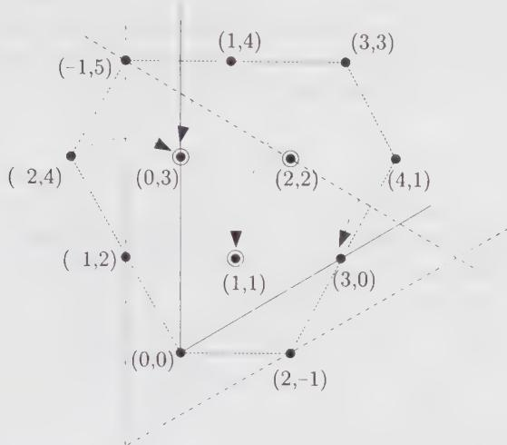  
Figure 16.1. The $\widehat{su}(3)_{3}$ fusion rule $[0,2,1]\times[0,1,2]$ . Weights are reflected with respect to the lines $[-1,\cdot,\cdot]$ , $[\cdot,-1,\cdot]$ , $[\cdot,\cdot,-1]$ ; weights sitting on those lines are ignored (circled dots correspond to weights with multiplicity 2).

The Kac-Walton formula makes transparent a certain number of fundamental properties of fusion coefficients. First, we see that fusion coefficients reduce to tensor-product coefficients in the limit $k \rightarrow \infty$ :

$$
\lim _ {k \to \infty} \mathcal {N} _ {\hat {\lambda} \hat {\mu}} ^ {(k) \hat {\nu}} = \mathcal {N} _ {\lambda \mu} ^ {\nu}\tag{16.44}
$$

In that limit the affine fundamental chamber and the finite Lie algebra fundamental chamber become essentially equivalent. (To be more precise, here we consider the limit where k is large with respect to $(\lambda,\theta)$ and $(\nu,\theta)$ , such that only a small part of the affine fundamental Weyl chamber is probed.) In that case, there is no need for affine Weyl reflection. Second, that the fusion coefficients are some sort of truncated tensor-product coefficients, where the degree of truncation is a sole function of the level, is very neatly illustrated by Eq. (16.31).

However, this approach has an obvious drawback: in order to calculate a specific fusion coefficient $\mathcal{N}_{\lambda\hat{\mu}}^{(k)\hat{\nu}}$ , we have to first evaluate the full product $\lambda\otimes\mu$ , and reflect all the terms in the decomposition whose affine extension at a fixed level k are not in $P_{+}^{k}$ . This is a rather long process when reasonably large representations are involved. Furthermore, the formula does not make manifest the nonnegativity of fusion coefficients.

This is a good place to stress that a fusion rule differs from a standard tensor product. Indeed, in order to calculate the tensor product of two affine weights $\hat{\lambda}$ and $\hat{\mu}$ , both at level k, we can proceed as in the finite case, by adding all the weights $\hat{\mu}'$ of the representation $L_{\hat{\mu}}$ to $\hat{\lambda}$ and decomposing the result into irreducible representations $L_{\hat{v}}$ . However, the mere addition of two affine weights shows that in this process the levels add up, that is, the decomposed representations are at level 2k. But this is clearly not suited to the physical problem at hand, for which we want to describe the general pattern of operator products in a theory with a fixed value of the central charge, hence a fixed value of the level k.

## 16.2.3. The $\widehat{s u}(2)_{k}$ Fusion Coefficients

It is very easy to obtain a general formula for the $\widehat{su}(2)_{k}$ fusion coefficients by the above method. The starting point is the well-known formula for angular momentum tensor-product coefficients:

$$
\lambda \otimes \mu = \bigoplus_{\substack{\nu_{1} = |\lambda_{1} - \mu_{1}|\\ \lambda_{1} + \mu_{1} + \nu_{1} = 0\text{mod} 2}}^{\lambda_{1} + \mu_{1}}\nu\tag{16.45}
$$

We fix the level k so that:

$$
k \geq \max \left\{\lambda_ {1}, \mu_ {1} \right\}\tag{16.46}
$$

ensuring the integrability of both $\hat{\lambda}$ and $\hat{\mu}$ . If $\lambda_{1} + \mu_{1} \leq k$ , the affine extension of all the weights on the r.h.s. is integrable and the above expression extends without modification to the affine case. If, however, $\lambda_{1} + \mu_{1} > k$ , it is necessary to perform a shifted Weyl reflection of some weights on the r.h.s. to recover integrable weights. The boundary weight $v_{1} = k + 1$ , if allowed by the parity constraint, is ignored as usual. For the other ones, it is clearly sufficient to act with $(s_{0}\cdot)$ . Indeed

$$
s _ {0} \cdot [ k - v _ {1}, v _ {1} ] = [ - k - 2 + v _ {1}, 2 k + 2 - v _ {1} ]\tag{16.47}
$$

Even though $\lambda_{1}+\mu_{1}>k+1$ , it is nevertheless true that $2k\geq\lambda_{1}+\mu_{1}$ (which follows from Eq. (16.46)), so that $2k+2\geq\nu_{1}$ for all $\nu_{1}$ appearing in Eq. (16.45). Hence, all weights with $\nu_{1}>k+1$ are reflected back into the dominant sector and contribute with a negative sign. They thus cancel all terms in the range $2k+2-\lambda_{1}-\mu_{1}\leq\nu_{1}\leq k$ . The final result for the fusion coefficient is

$$
\dot {\mathcal {N}} _ {\hat {\lambda} \hat {\mu}} ^ {(k) \hat {v}} = \left\{ \begin{array}{l l} 1 & \text { if } | \lambda_ {1} - \mu_ {1} | \leq v _ {1} \leq \min \{\lambda_ {1} + \mu_ {1}, 2 k - \lambda_ {1} - \mu_ {1} \} \\ & \text { and } \lambda_ {1} + \mu_ {1} + v _ {1} = 0 \mod 2 \\ 0 & \text { otherwise } \end{array} \right.
$$

This expression illustrates neatly the relation (16.44).

(16.48)

## 16.2.4. $\widehat{su}(N)_{k}$ Fusion Rules: Combinatorial Description

The algorithm described in Sect. 16.2.2 has a simple combinatorial interpretation in terms of Young tableaux. For simplicity, we only describe the $\widehat{s\mathfrak{u}}(N)_k$ case. The tensor product of the fusion rules under consideration is first calculated by the Littlewood-Richardson rule. Those tableaux whose first row has length $\ell_1 \leq k$ correspond to integrable $\widehat{su}(N)_{k}$ affine weights. Otherwise, the weights either lie on the boundary of an affine Weyl chamber (and are ignored) or can be reflected back into integrable weights by appropriate shifted Weyl reflections. Such a transformation is described combinatorially as follows. We remove a boundary strip of length

$$
t = \ell_ {1} - k - 1 \geq 0\tag{16.49}
$$

starting from the end of the first row and moving downward and to the left; then, we add a boundary strip of the same length at the bottom of the first column, starting from the N-th row and moving upward and to the right. We repeat these modifications until either $t \leq 0$ or an irregular tableau is produced. (t = 0 or the occurrence of an irregular tableau signals a boundary weight.) The sign of the corresponding Weyl reflection is given by $(-1)^{r_{-} + r_{+} + 1}$ , where $r_{-}$ is the number of columns crossed by the removed strip and $r_{+}$ is the number of columns crossed by the added strip. An example will clarify the rule: we consider the $su(4)$ weight (3, 6, 4) at level 5, whose tableau has rows of length $\ell_{1} = 3 + 6 + 4 = 13$ , $\ell_{2} = 3 + 6 = 9$ , $\ell_{3} = 3$ . This is not integrable since $\ell_{1} > k$ ; the strip to be removed has length t = 13 - 5 - 1 = 7 and it is indicated by boxes marked by 0's:

(16.50)

We now add a strip of length 7 at the bottom of the tableau (again indicated with boxes [0]):

(16.51)

where in the last step, columns of 4 boxes have been deleted. The sign of the Weyl reflection is -1:6 columns have been crossed in each step. This result is confirmed by a direct calculation:

$$
\left(s _ {2} s _ {1} s _ {0}\right) \cdot [ - 8, 3, 6, 4 ] = [ 1, 2, 1, 1 ]\tag{16.52}
$$

Boundary weights are easily identified by this procedure: for instance, $6\omega_{4}$ is a boundary affine weight for $\widehat{su}(N>5)_{2}$ , since t=6-2-1=3<4= $\tilde{\ell}_{1}$ , so that the strip removal produces an irregular tableau:

(16.53)

Returning to the $\widehat{s\widehat{u}(3)_{3}}$ example (16.34), the three relevant “nonintegrable tableaux” and their modifications are

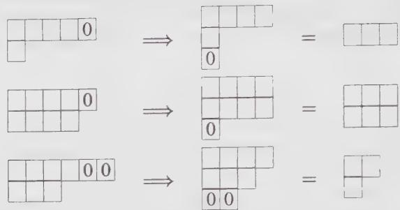

(16.54)

and they all contribute with a minus sign. In all the above examples, the $(N-1)$ -th row is always present. A final example deals with a different case: we consider the $\widehat{su}(3)_{3}$ weight $[-3,6,0]$ and its modification:

$$
\boxed { \begin{array}{c c c c c} \hline & & & & 0 \\ \hline \end{array} } \quad \Longrightarrow \quad \boxed { \begin{array}{c c c c c} \hline & & & & \\ \hline 0 \\ \hline 0 \\ \hline \end{array} } = \quad \boxed { \begin{array}{c c c c c} \hline & & & & \\ \hline \end{array} }\tag{16.55}
$$

We observe that the added strip must start at the third row $(N = 3)$ of the first column. The sign of the corresponding Weyl reflection is positive. This agrees with a previous calculation: $s_{2}s_{0} \cdot [-3, 6, 0] = [0, 3, 0]$ .

## §16.3. Quantum Dimensions

Verifying the equality

$$
(\dim | \lambda |) \times (\dim | \mu |) = \sum_ {\nu \in P _ {+}} \mathcal {N} _ {\lambda \mu} ^ {\nu} \dim | \nu |\tag{16.56}
$$

is a simple consistency check in tensor-product calculations. At first sight, it might seem that it has no analogue for fusion rules, given that the highest-weight representations are infinite dimensional. However, we can define a dimension, relative to the reference vacuum representation, as

$$
\mathcal {D} _ {\hat {\lambda}} = \frac {\operatorname{Tr} _ {\hat {\lambda}} (1)}{\operatorname{Tr} _ {0} (1)}\tag{16.57}
$$

This can be reexpressed in terms of specialized characters evaluated in the limit $q \to 1^{-}$ or $\tau \to i0^{+}$

$$
\mathcal {D} _ {\hat {\lambda}} = \lim _ {q \rightarrow 1 ^ {-}} \frac {\chi_ {\hat {\lambda}} (q)}{\chi_ {0} (q)} = \lim _ {\tau \rightarrow i 0 ^ {+}} \frac {\chi_ {\hat {\lambda}} (\tau)}{\chi_ {0} (\tau)}\tag{16.58}
$$

By using the asymptotic behavior of the characters (14.238), the relative dimension can be written as a ratio of $S$ matrix elements

$$
\boxed {\mathcal {D} _ {\hat {\lambda}} = \frac {\mathcal {S} _ {\hat {\lambda} 0}}{\mathcal {S} _ {0 0}}}\tag{16.59}
$$

This last expression shows that $\mathcal{D}_{\hat{\lambda}}$ is merely the $\gamma_{\hat{\lambda}}^{(0)}$ defined in Eq. (16.21). The desired dimension formula for fusion coefficients is thus simply Eq. (16.23) for $\sigma = 0$

$$
\mathcal {D} _ {\hat {\lambda}} \mathcal {D} _ {\hat {\mu}} = \sum_ {\hat {\nu} \in P _ {+} ^ {k}} \mathcal {N} _ {\hat {\lambda} \hat {\mu}} ^ {(k) \hat {\nu}} \mathcal {D} _ {\hat {\nu}}\tag{16.60}
$$

(which is simply the one-dimensional representation of fusion rules). For reasons to become clear later, $\mathcal{D}_{\lambda}$ is referred to as a quantum dimension.

Intuitively, we expect $D_{\hat{\lambda}}$ to be a real number, greater or equal to one. We showed the reality of $D_{\hat{\lambda}}$ in Sect. 14.6.2; in the same section, we proved the inequality $S_{\hat{\lambda}0} \geq S_{00} \geq 0$ , which ensures that $D_{\hat{\lambda}} \geq 1$ . Being the reference representation, the vacuum has quantum dimension one. The same is true for all fields obtained from the vacuum by the action of the elements of the outer-automorphism group. This is a direct outcome of Eq. (14.255):

$$
A \mathcal {S} _ {\hat {\lambda} 0} = \mathcal {S} _ {A \hat {\lambda}, 0} = \mathcal {S} _ {\hat {\lambda} 0} e ^ {- 2 \pi i (A \hat {\omega} _ {0}, 0)} = \mathcal {S} _ {\hat {\lambda} 0}\tag{16.61}
$$

which implies that

$$
\mathcal {D} _ {A \hat {\lambda}} = \mathcal {D} _ {\hat {\lambda}}\tag{16.62}
$$

That $S_{\lambda 0}$ is real also has the consequence that conjugate fields have the same quantum dimension

$$
\mathcal {D} _ {\hat {\lambda} ^ {*}} = \mathcal {D} _ {\hat {\lambda}}\tag{16.63}
$$

Whenever there is a small number of fields, the sum rule (16.60) may be sufficient to fix the fusion coefficients. For instance, we can consider $\widehat{G}_2$ at level 1, for which the $S$ matrix is

$$
\mathcal {S} = \sqrt {\frac {4}{5}} \left( \begin{array}{c c} \sin \frac {\pi}{5} & \sin \frac {3 \pi}{5} \\ \sin \frac {3 \pi}{5} & - \sin \frac {\pi}{5} \end{array} \right)\tag{16.64}
$$

The two fields are $\hat{\omega}_{0}$ and $\hat{\omega}_{2}$ , with respective quantum dimensions 1 and $(1+\sqrt{5})/2$ . Equation (16.60) implies directly the “Yang-Lee” type fusion rules

$$
\hat {\omega} _ {2} \times \hat {\omega} _ {2} = \hat {\omega} _ {0} + \hat {\omega} _ {2}\tag{16.65}
$$

An apparent flaw of the above example is that we need to calculate the S matrix to extract the quantum dimensions before applying the sum rule. But when the theory is simple, it is just as simple to use the Verlinde formula directly. However, we stress that only one column of the S matrix is actually required in order to calculate the quantum dimensions. Furthermore, there is a more direct way to calculate the quantum dimensions, which ultimately does not rely on the modular S matrix.

A simple expression for the quantum dimension comes from Eqs. (16.59) and (14.241):

$$
\mathcal {D} _ {\hat {\lambda}} = \prod_ {\alpha > 0} \frac {\sin \left(\frac {\pi (\lambda + \rho , \alpha)}{k + g}\right)}{\sin \left(\frac {\pi (\rho , \alpha)}{k + g}\right)}\tag{16.66}
$$

To proceed further, we introduce the so-called q-numbers defined by

$$
[ x ] = \frac {\mathsf {q} ^ {x / 2} - \mathsf {q} ^ {- x / 2}}{\mathsf {q} ^ {1 / 2} - \mathsf {q} ^ {- 1 / 2}}, \quad \text { where } \quad \mathsf {q} = e ^ {2 \pi i / (k + g)}\tag{16.67}
$$

Some obvious properties of these numbers are: $^{2}$

$$
[ x ] = [ k + g - x ], \quad [ - x ] = - [ x ], \quad [ k + g ] = 0\tag{16.68}
$$

In terms of q-numbers, the quantum dimension takes the compact form

$$
\mathcal {D} _ {\hat {\lambda}} = \prod_ {\alpha > 0} \frac {[ (\lambda + \rho , \alpha) ]}{[ (\rho , \alpha) ]}\tag{16.69}
$$

In the limit $\mathsf{q} \to 1 (k \to \infty)$ , this reduces to the usual Weyl dimension formula, since

$$
\lim _ {q \to 1} [ x ] = x\tag{16.70}
$$

For $su(N)$ , the Weyl formula has a simple transcription in terms of partitions (cf. Eq. (13.192)), which is simply obtained by evaluating the scalar products in the orthonormal basis. Its “quantum” or affine counterpart is

$$
\mathcal {D} _ {\hat {\lambda}} = \prod_ {1 \leq i <   j \leq N} \frac {[ \ell_ {i} - \ell_ {j} + j - i ]}{[ j - i ]}\tag{16.71}
$$

Apart from $q \neq 1$ , the affine aspect of this formula lies in the integrability requirement on $\hat{\lambda}$ , which translates into the constraint $\ell_{1} - \ell_{N} \leq k$ .

The quantum dimensions of nonintegrable weights need not be positive. Actually, from the explicit expression of the S matrix or directly from Eq. (16.29), we find

$$
\mathcal {D} _ {w \cdot \hat {\lambda}} = \epsilon (w) \mathcal {D} _ {\hat {\lambda}}\tag{16.72}
$$

for any element w of the affine Weyl group. Hence, all weights in the Weyl orbit of a weight fixed under the action of the affine Weyl group necessarily have zero quantum dimension. In the approach described in the previous section, where fusion coefficients are obtained from tensor products, we see that those weights that are ignored are exactly those with quantum dimension equal to zero. From Eqs. (16.71) and (16.68), it is manifest that representations with $\ell_{1}-\ell_{N}=k+1$ have zero quantum dimension since the above product contains a factor $[k+N]=0$ in that case. Furthermore, the cancellation resulting from shifted affine Weyl reflections is a cancellation between weights in the same orbit and with opposite quantum dimensions.

An example will illustrate the cancellation of representations with opposite quantum dimensions in fusion rules. We consider the affine extension of the tensor product

$$
(2) \otimes (2) = (0) \oplus (2) \oplus (4)\tag{16.73}
$$

at $k = 2$ . Since the $\widehat{s u}(2)_k$ representation with finite Dynkin label $\lambda_1$ has quantum dimension $[\lambda_1 + 1]$ , the quantum dimensions of the various terms on the r.h.s. are:

$$
\begin{array}{l} \mathcal {D} _ {[ 2, 0 ]} = [ 1 ] = 1 \\ \mathcal {D} _ {[ 0, 2 ]} = [ 3 ] = [ 4 - 3 ] = [ 1 ] = 1 \\ \mathcal {D} _ {[ - 2, 4 ]} = [ 5 ] = [ 4 - 5 ] = [ - 1 ] = - 1 \end{array}\tag{16.74}
$$

The representations $[0,2]$ and $[-2,4]$ are on the same $s_{0}$ orbit

$$
s _ {0} \cdot [ - 2, 4 ] = s _ {0} [ - 1, 5 ] - [ 1, 1 ] = [ 0, 2 ]\tag{16.75}
$$

so that they cancel each other; that is, their quantum dimensions add up to zero.

## §16.4. The Depth Rule and Threshold Levels

## 16.4.1. The Depth Rule

We now complete the analysis, initiated in Sect. 15.3.4, of the constraints imposed by the affine Lie singular vectors on the correlation functions. Concentrating on the three-point functions, we saw that

$$
\langle ((E _ {- 1} ^ {\theta}) ^ {p} \hat {\lambda}) (z) \hat {\mu} ^ {\prime} (z _ {1}) \hat {\nu} ^ {\prime} (z _ {2}) \rangle = 0 \quad \mathrm{if} \quad p \geq k - (\lambda , \theta) + 1\tag{16.76}
$$

since it incorporates a singular vector. We recall that the primed field is obtained from the (unprimed) primary field associated with the highest-weight state by application of some finite Lie algebra lowering operators. We have seen that Eq. (16.76) implies that

$$
\sum_{\substack{l_{1},l_{2} = 0\\ l_{1} + l_{2} = p}}^{p}\frac{p!}{l_{1}!l_{2}!}\frac{1}{(z - z_{1})^{l_{1}}}\frac{1}{(z - z_{2})^{l_{2}}}\langle \hat{\lambda} (z)[(E_{0}^{\theta})^{l_{1}}\hat{\mu}^{\prime}](z_{1})[(E_{0}^{\theta})^{l_{2}}\hat{\nu}^{\prime}](z_{2})\rangle = 0\tag{16.77}
$$

The three-point functions are particularly simple in that all the terms in the sum are independent. Indeed, a three-point function contains a single term whose dependence upon the variables $z, z_{1}$ , and $z_{2}$ is given by powers of their differences, powers that are sole functions of the conformal dimensions of the three fields.

Since the action of finite Lie generators does not modify the conformal dimension, these powers are thus independent of the $l_{i}$ 's. Therefore, the coefficients of the different terms $(z - z_{i})^{-l_{i}}$ in the above equation must vanish separately:

$$
\langle \hat {\lambda} (z) [ (E _ {0} ^ {\theta}) ^ {l _ {1}} \hat {\mu} ^ {\prime} ] (z _ {1}) [ (E _ {0} ^ {\theta}) ^ {l _ {2}} \hat {\nu} ^ {\prime} ] (z _ {2}) \rangle = 0
$$

$$
\text { if } \quad l _ {1} + l _ {2} = p > k - (\lambda , \theta)\tag{16.78}
$$

Therefore, whenever

$$
\begin{array}{l} (E _ {0} ^ {\theta}) ^ {l _ {1}} | \hat {\mu} ^ {\prime} \rangle \equiv | \hat {\mu} ^ {\prime \prime} \rangle \neq 0 \\ (E _ {0} ^ {\theta}) ^ {l _ {2}} | \hat {\nu} ^ {\prime} \rangle \equiv | \hat {\nu} ^ {\prime \prime} \rangle \neq 0 \end{array}\tag{16.79}
$$

for integers $l_{1}, l_{2}$ satisfying Eq. (16.78), the nontrivial three-point function

$$
\langle \hat {\lambda} (z) \hat {\mu} ^ {\prime \prime} (z _ {1}) \hat {\nu} ^ {\prime \prime} (z _ {2}) \rangle\tag{16.80}
$$

must vanish. The relevant characterizing property of the state $|\hat{\mu}^{\prime\prime}\rangle$ is that $(E_{0}^{-\theta})^{l_{1}}|\hat{\mu}^{\prime\prime}\rangle$ , for some value of $l_{1}$ , is still in the representation $\hat{\mu}$ (i.e., it is a nonzero state, $|\hat{\mu}^{\prime}\rangle$ )—and similarly for $|\hat{\nu}^{\prime\prime}\rangle$ .

The condition we just obtained can be formulated in a more intrinsic way by introducing the depth $d_{\mu''}$ of the state $|\hat{\mu}''\rangle$ , as the maximal value of $l_{1}$ for which Eq. (16.79) is true for $|\hat{\mu}''\rangle$ fixed. However, this definition needs to be made more precise since the depth is a property of a state, and not that of the associated weight; in general, the finite weights in a highest-weight representation of g can be degenerate. Therefore, we have to introduce a subindex i distinguishing the different fields that could be associated with the same finite weight. The proper definition of the depth is thus

$$
d _ {\mu_ {(i)} ^ {\prime \prime}} = \max (l) \quad \text { such   that } \quad (E _ {0} ^ {- \theta}) ^ {l} | \hat {\mu} _ {(i)} ^ {\prime \prime} \rangle \neq 0\tag{16.81}
$$

The different states sharing the same finite weight generically have different depths. For instance, in the $su(3)$ representation of highest weight $(1,1)$ , the weight $(0,0)$ has multiplicity two, corresponding to the two distinct states $E^{-\alpha_1}E^{-\alpha_2}|(1,1)\rangle$ and $E^{-\alpha_2}E^{-\alpha_1}|(1,1)\rangle$ . From a linear combination of these states, we can form a $su(2)_{\theta}$ -singlet and a $su(2)_{\theta}$ -triplet, with respective depths of zero and one.

Therefore, a coupling should really be denoted as $\langle \hat{\lambda} \hat{\mu}_{(j)}^{\prime \prime} \hat{\nu}_{(\ell)}^{\prime \prime} \rangle$ , and the doublet $(j, \ell)$ can take $\mathcal{N}_{\lambda \mu \nu}$ values. Since

$$
l _ {1} + l _ {2} \leq d _ {\mu_ {(j)} ^ {\prime \prime}} + d _ {\nu_ {(\ell)} ^ {\prime \prime}}\tag{16.82}
$$

we are forced to conclude that

$$
\langle \hat {\lambda} (z) \hat {\mu} _ {(j)} ^ {\prime \prime} (z _ {1}) \hat {v} _ {(\ell)} ^ {\prime \prime} (z _ {2}) \rangle = 0 \quad \mathrm{if} \quad k <   d _ {\mu_ {(j)} ^ {\prime \prime}} + d _ {v _ {(\ell)} ^ {\prime \prime}} + (\lambda , \theta)\tag{16.83}
$$

This is the explicit form of the constraint we were looking for. It is called the depth rule.

The depth constraint can be simplified by using the g-invariance of the three-point function to fix one of the two primed states. Indeed, $|\hat{v}_{(j)}^{\prime \prime}\rangle$ can always be expressed in terms of the action of some raising operators on the lowest state of the representation, $|-\hat{\nu}^{*}\rangle$ ; that is,

$$
| \hat {\nu} _ {(j)} ^ {\prime \prime} \rangle = E ^ {\alpha_ {\ell_ {1}}} E ^ {\alpha_ {\ell_ {2}}} \dots | - \hat {\nu} ^ {*} \rangle\tag{16.84}
$$

with $\alpha_{\ell}$ , some positive roots. Then, by moving the action of these finite Lie algebra generators on the other two states in the three-point function, and recalling that their action on $\hat{\lambda}$ vanishes because $\lambda$ is a highest weight, we can rewrite $\langle \hat{\lambda} \hat{\mu}_{(j)}^{\prime \prime} \hat{\nu}_{(\ell)}^{\prime \prime} \rangle$ in the form $\langle \hat{\lambda} \hat{\mu}_{(i)}^{\prime} (-\hat{\nu}^{*}) \rangle$ for some state $|\hat{\mu}_{(i)}^{\prime}\rangle$ (from now on we drop one prime to lighten the notation). Hence, there is now only one state that is neither a highest nor a lowest state. The different states $|\hat{\mu}_{(i)}^{\prime}\rangle$ characterize the $\mathcal{N}_{\lambda \mu \nu}$ couplings. Since the depth of the lowest state in a representation is necessarily zero, the constraint (16.83) can be reexpressed as

$$
\langle \hat {\lambda} (z) \hat {\mu} _ {(i)} ^ {\prime} (z _ {1}) (- \hat {\nu} ^ {*}) (z _ {2}) \rangle = 0 \quad \mathrm{if} \quad k <   k _ {0} ^ {(i)}\tag{16.85}
$$

where

$$
k _ {0} ^ {(i)} \equiv d _ {\mu_ {(i)} ^ {\prime}} + (\lambda , \theta)\tag{16.86}
$$

Clearly, the different couplings associated with a given triple product are characterized by (a priori) different constraints, that is, different values of $k_0^{(i)}$ .

We now look at what happens when $k \geq k_{0}^{(i)}$ . In that case, there are no more affine constraints, no possibility of hitting an affine singular vector. The only constraints are those associated with the finite Lie algebra singular vectors. These, in turn, fix completely the tensor-product coefficient $N_{\lambda\mu\nu}$ . Thus, for $k \geq k_{0}^{(i)}$ ,

$$
\langle \hat {\lambda} (z) \hat {\mu} _ {(i)} ^ {\prime} (z _ {1}) (- \hat {\nu} ^ {*}) (z _ {2}) \rangle \neq 0 \quad \text { if } \quad \mathcal {N} _ {\lambda \mu \nu} \neq 0\tag{16.87}
$$

which means that $k_0^{(i)}$ is the threshold level for this coupling. Of course, irrespective of the value of $k$ , it is always true that

$$
\langle \hat {\lambda} (z) \hat {\mu} _ {(i)} ^ {\prime} (z _ {1}) (- v ^ {*}) (z _ {2}) \rangle = 0 \quad \text { if } \quad \mathcal {N} _ {\lambda \mu \nu} = 0\tag{16.88}
$$

Finally, how do we read off fusion coefficients in this approach? For fixed $k$ , the number of allowed couplings is simply determined by the number of values of $k_0^{(i)}$ that lie below $k$ . Suppose that the set $\{k_0^{(i)}\}$ is ordered such that $k_0^{(i)} \leq k_0^{(i + 1)}$ . Then

$$
\mathcal {N} _ {\hat {\lambda} \hat {\mu}} ^ {(k) \hat {\nu}} = \left\{ \begin{array}{l} \max (i) \text {   such   that   } k \geq k _ {0} ^ {(i)} \text {   and   } \mathcal {N} _ {\lambda \mu \nu} \neq 0 \\ 0 \text {   if   } k <   k _ {0} ^ {(1)} \text {   or   } \mathcal {N} _ {\lambda \mu \nu} = 0 \end{array} \right.\tag{16.89}
$$

with $k_{0}^{(i)}$ defined by Eq. (16.86), in terms of the depth (16.81).

This is a manifestly positive expression for the fusion coefficients. Furthermore, it implies the following remarkable inequality:

$$
\mathcal {N} _ {\hat {\lambda} \hat {\mu}} ^ {(k) \hat {\nu}} \leq \mathcal {N} _ {\hat {\lambda} \hat {\mu}} ^ {(k + 1) \hat {\nu}}\tag{16.90}
$$

which, from the point of view of the Kac-Walton formula, was totally unexpected.

For practical calculations, the rule (16.89) is not very useful because in general the depth is difficult to calculate. Furthermore, the determination of a proper basis, appropriate for the calculation of both the tensor-product coefficients and the depth constraint, is still an open problem. This difficulty is obviously absent for $su(2)$ , where finite weights always have multiplicity 1. In that case, the depth is also easily calculated. $^{3}$

We rederive the $\widehat{su}(2)_{k}$ fusion rules from the depth rule. We consider the fusion $\hat{\lambda} \times \hat{\mu} \times \hat{\nu}$ . For the coupling to be nonvanishing, the following equality must be satisfied

$$
\lambda_ {1} + \mu_ {1} ^ {\prime} + \nu_ {1} ^ {\prime} = 0\tag{16.91}
$$

The fusion coefficient $\mathcal{N}_{\hat{\lambda}\hat{\mu}\hat{\nu}}^{(k)}$ will be nonzero (and then the only value it can take is one) if

$$
\left| \lambda_ {1} - \mu_ {1} \right| \leq \nu_ {1} \leq \lambda_ {1} + \mu_ {1} \quad \text { and } \quad \lambda_ {1} + \mu_ {1} + \nu_ {1} = 0 \mod 2\tag{16.92}
$$

and

$$
k \geq (\lambda , \theta) + d _ {\mu^ {\prime}} + d _ {\nu}\tag{16.93}
$$

The depth of $\mu'$ is the number of times we can subtract $\theta = \alpha_1$ from $\mu'$ without leaving the representation, whose limit is $-\mu$ :

$$
\mu_ {1} ^ {\prime} - 2 d _ {\mu^ {\prime}} = - \mu_ {1}\tag{16.94}
$$

so that

$$
d _ {\mu^ {\prime}} = \frac {\mu_ {1}}{2} + \frac {\mu_ {1} ^ {\prime}}{2}\tag{16.95}
$$

Therefore, using Eq. (16.91), we find

$$
k \geq \frac {1}{2} (\lambda_ {1} + \mu_ {1} + \nu_ {1}) \equiv k _ {0}\tag{16.96}
$$

The expression for the $\widehat{su}(2)$ threshold level is thus very simple. Adding the constraint

$$
\nu_ {1} \leq 2 k - \lambda_ {1} - \mu_ {1}\tag{16.97}
$$

to Eq. (16.92), we recover the $\widehat{s\widehat{u}}(2)_k$ fusion rules (16.48).

There is another circumstance in which the depth is easily calculated, namely for weights in fundamental representations. Consider for instance the fundamental representation of highest weight $\omega_{1}$ of $su(N)$ . The lowest state is obtained by subtracting $\theta$ from $\omega_{1}$ . This means that the depth of $\omega_{1}$ is one. For all other weights in the representation the depth vanishes. Other fundamental representations are treated similarly.

In terms of semistandard tableaux, the different weights $\omega_{\ell}^{\prime}$ in the representation $\omega_{\ell}$ of $su(N)$ are obtained by filling, in all possible ways, the $\ell$ boxes with numbers $i_{1},\cdots,i_{\ell}$ such that

$$
1 \leq i _ {1} <   i _ {2} <   \dots <   i _ {\ell} \leq N\tag{16.98}
$$

In terms of this numbering, it is not difficult to check that the depth is simply

$$
d _ {\omega_ {\ell} ^ {\prime}} = \frac {1}{2} [ | 1 ^ {\prime} s - N ^ {\prime} s | + (\omega_ {\ell} ^ {\prime}, \theta) ]\tag{16.99}
$$

where $|1's - N's|$ means the absolute value of the number of 1's minus the number of $N$ 's.

## 16.4.2. Threshold Levels and $\widehat{su}(3)_{k}$ Fusion Coefficients

The depth rule, through Eq. (16.89), shows clearly that the fusion coefficients are fully determined by the data $N_{\lambda\mu\nu}$ and $\{k_{0}^{(i)}\}$ . Hence, fusion coefficients can be encoded in expressions for tensor products by simply introducing a subindex indicating the threshold level of the various possible couplings. For instance, the fusion rules for Eq. (16.33) at different levels are easily recovered from

$$
\begin{array}{c} (2, 1) \otimes (1, 2) = (0, 0) _ {3} \oplus (0, 3) _ {4} \oplus 2 (1, 1) _ {3, 4} \oplus (1, 4) _ {5} \\ \oplus 2 (2, 2) _ {4, 5} \oplus (3, 0) _ {4} \oplus (3, 3) _ {6} \oplus (4, 1) _ {5} \end{array}\tag{16.100}
$$

The notation $2(2,2)_{4,5}$ means that one copy of $(2,2)$ appears at level 4 and the other one appears at level 5 (so that for $k \geq 5$ , the two copies are always present). Fusion coefficients at a fixed value of the level k are obtained by considering all terms with subindex $\leq k$ .

We note that the very existence of a threshold level for each coupling is in fact a consequence of Eq. (16.90). This inequality in turn can be established directly as follows. The truncation on tensor-product coefficients is solely governed by the extra singular vector (15.109). The strength of this constraint decreases as k increases, which implies the inequality (16.90).

Unfortunately, as already pointed out, we do not know how to calculate the set of values $k_{0}^{(i)}$ from the depth rule. Nevertheless, another approach is possible, based on the concept of elementary couplings. The idea is to decompose a coupling into a set of elementary couplings in such a way that the threshold level for the coupling under consideration is simply the sum of the threshold levels of the elementary couplings appearing in the decomposition. The latter are always easily calculated. Explicit expressions for the set $\{k_{0}^{(i)}\}$ can be obtained in this way for low-rank algebras.

For $su(N)$ , this idea is most neatly formulated in terms of the Berenstein-Zelevinsky triangles. In App. 16.A, the complete analysis for the $su(3)$ case is presented. It culminates in an explicit formula for both $N_{\lambda\mu\nu}$ and $\{k_{0}^{(i)}\}$ , which we report here.

The number of scalars contained in the $su(3)$ triple product $\lambda \otimes \mu \otimes \nu$ is

$$
\mathcal {N} _ {\lambda \mu \nu} = \delta_ {k _ {0}} (k _ {0} ^ {\mathrm{max}} - k _ {0} ^ {\mathrm{min}} + 1)\tag{16.101}
$$

where

$$
\begin{array}{c} k _ {0} ^ {\min} = \max \big (\lambda_ {1} + \lambda_ {2}, \mu_ {1} + \mu_ {2}, \nu_ {1} + \nu_ {2}, L _ {1} - \min (\lambda_ {1}, \mu_ {1}, \nu_ {1}), \\ L _ {2} - \min (\lambda_ {2}, \mu_ {2}, \nu_ {2}) \big) \end{array}\tag{16.102}
$$

$$
k _ {0} ^ {\max} = \min (L _ {1}, L _ {2})
$$

and

$$
\delta_ {k _ {0}} = \left\{ \begin{array}{l l} 1 & \text { if } k _ {0} ^ {\max} \geq k _ {0} ^ {\min} \quad \text { and } L _ {1}, L _ {2} \in \mathbb {Z} _ {+} \\ 0 & \text { otherwise } \end{array} \right.\tag{16.103}
$$

The quantities $L_{i}$ are defined as

$$
L _ {i} = (\lambda + \mu + \nu , \omega_ {i})\tag{16.104}
$$

that is,

$$
\begin{array}{l} L _ {1} = \frac {1}{3} [ 2 (\lambda_ {1} + \mu_ {1} + \nu_ {1}) + \lambda_ {2} + \mu_ {2} + \nu_ {2} ] \\ L _ {2} = \frac {1}{3} [ \lambda_ {1} + \mu_ {1} + \nu_ {1} + 2 (\lambda_ {2} + \mu_ {2} + \nu_ {2}) ] \end{array}\tag{16.105}
$$

The corresponding fusion coefficients are given by Eq. (16.89) with the above $\mathcal{N}_{\lambda \mu \nu}$ and the following values of $k_0^{(i)}$ :

$$
\{k _ {0} ^ {(i)} \} (\lambda \otimes \mu \otimes \nu) = \{k _ {0} ^ {\min}, k _ {0} ^ {\min} + 1, k _ {0} ^ {\min} + 2, \dots , k _ {0} ^ {\max} \}\tag{16.106}
$$

where $k_{0}^{min}$ and $k_{0}^{max}$ are given in Eq. (16.102). This yields

$$
\mathcal {N} _ {\hat {\lambda} \hat {\mu} \hat {v}} ^ {(k)} = \delta_ {k _ {0}} \left\{ \begin{array}{l l} 0 & \text { if } k <   k _ {0} ^ {\min} \\ \mathcal {N} _ {\lambda \mu v} - (k _ {0} ^ {\max} - k) & \text { if } k _ {0} ^ {\min} \leq k \leq k _ {0} ^ {\max} \\ \mathcal {N} _ {\lambda \mu v} & \text { if } k > k _ {0} ^ {\max} \end{array} \right.\tag{16.107}
$$

In a sense, the degeneracy of the tensor product is completely lifted in the $\widehat{su}(3)$ fusion rules in that all $N_{\lambda\mu\nu}$ values $k_{0}^{(i)}$ are distinct. In fact, $k_{0}^{(i+1)} - k_{0}^{(i)}$ is always equal to one, a special property of $\widehat{su}(3)$ .

Notice that the inequality

$$
k _ {0} ^ {\min} \geq \max (\lambda_ {1} + \lambda_ {2}, \mu_ {1} + \mu_ {2}, \nu_ {1} + \nu_ {2})\tag{16.108}
$$

simply means that the three affine weights $\hat{\lambda}, \hat{\mu}, \hat{\nu}$ must be integrable.

To illustrate the power of this formula, consider the product of $\lambda = \mu = \nu = (8, 8)$ . In this case, $L_{i} = 24$ , so that $k_{0}^{\min} = 16$ and $k_{0}^{\max} = 24$ . The multiplicity of the product is then 9, and the fusion coefficient at level 22, say, is equal to 7.

## §16.5. Fusion Potentials (ŝu(N))

An established result in group theory is that tensor products can be reduced to products of polynomials in r variables, one for each fundamental weight. This is based on two formulae: the Pieri formula, which gives the decomposition of the tensor product of any representation with a fundamental weight, and the Giambelli (or Jacobi-Trudy) formula, which gives the polynomial representation of any irreducible representation. Extended to affine Lie algebras, this leads to a conceptually very interesting approach to fusion rules. The level-dependent truncation of tensor-product coefficients induces polynomial constraints among the r variables. Quite remarkably, these constraints can be integrated to a potential. To simplify the presentation of these results, we restrict the whole discussion to $\widehat{su}(N)$ .

## 16.5.1. Tensor-Product Coefficients Revisited

We start by reviewing the classical results mentioned above. These are most naturally formulated in terms of Young tableaux. We recall that the Young tableau for the highest weight $\lambda = (\lambda_{1}, \cdots, \lambda_{N-1})$ is specified by the partition $^{4}$

$$
\lambda = \{\ell_ {1}; \ell_ {2}; \dots ; \ell_ {N - 1} \} = \{\lambda_ {1} + \lambda_ {2} + \dots \lambda_ {N - 1}; \dots ; \lambda_ {N - 1} \}\tag{16.109}
$$

where $\ell_{i}$ is the length of the i-th row. We recall that $\lambda^{t}=\{\tilde{\ell}_{1};\tilde{\ell}_{2};\ldots;\tilde{\ell}_{N-1}\}$ stands for the partition of its transpose, obtained by interchanging rows and columns. A special notation is introduced for the fundamental weights

$$
x _ {j} = \{1; 1; \dots ; 1 \} \quad (j \text {   entries })\tag{16.110}
$$

described by a column of j boxes, and their transpose,

$$
y _ {j} = \{j \}\tag{16.111}
$$

a single row of j boxes.

The Pieri formula reads

$$
x_{j}\otimes \{\ell_{1};\ldots ;\ell_{n}\} = \bigoplus_{\substack{\ell_{i}\leq p_{i}\leq \ell_{i} + 1\leq p_{i - 1}\\ \sum p_{i} = \sum \ell_{i} + j}}\{p_{1};\ldots ;p_{N}\}\tag{16.112}
$$

where the missing entries $\ell_{n+1},\ldots,\ell_{N-1}$ are just zero. This is simply a specialization of the Littlewood-Richardson rule. Here j boxes are added to the tableau with partition $\{\ell_{1};\cdots;\ell_{N-1}\}$ , with at most one box per row. A simple $su(3)$ example

is

$$
\begin{array}{c}x_{2}\otimes \{2;1\} = \bigoplus_{\substack{2\leq p_{1}\leq 3\\ 1\leq p_{2}\leq 2\\ 0\leq p_{3}\leq 1\\ p_{1} + p_{2} + p_{3} = 5}}\{p_{1};p_{2};p_{3}\} = \{3;2\} \oplus \{3;1;1\} \oplus \{2;2;1\} \\ \\ = \{3;2\} \oplus \{2\} \oplus \{1;1\} \end{array}\tag{16.113}
$$

where the last equality is obtained by dropping columns of 3 boxes, whose partition is $\{1; 1; 1\}$ .

On the other hand, the Giambelli formula gives the polynomial decomposition of a partition $\{\ell_1; \ldots; \ell_n\}$ as a matrix determinant whose entries are specified in terms of the transposed partition: $\{\tilde{\ell}_1; \ldots; \tilde{\ell}_s\}$

$$
\{\ell_ {1}; \ldots ; \ell_ {n} \} = \det x _ {\bar {\ell} _ {i} + j - i} = \det \left( \begin{array}{c c c c} x _ {\bar {\ell} _ {1}} & x _ {\bar {\ell} _ {1} + 1} & \dots & x _ {\bar {\ell} _ {1} + s - 1} \\ x _ {\bar {\ell} _ {2} - 1} & x _ {\bar {\ell} _ {2}} & \dots & \\ \vdots & & & \\ x _ {\bar {\ell} _ {s - s + 1}} & & \dots & x _ {\bar {\ell} _ {s}} \end{array} \right)\tag{16.114}
$$

Here the convention is that $x_{0} = x_{N} = 1$ and $x_{i} = 0$ for i < 0 and i > N. $^{5}$ For example, with N = 5, the decomposition of the partition $\{3; 3; 1\}$ , whose transpose is $\{3; 2; 2\}$ , is

$$
\{3; 3; 1 \} = \det \left( \begin{array}{c c c} x _ {3} & x _ {4} & 1 \\ x _ {1} & x _ {2} & x _ {3} \\ 1 & x _ {1} & x _ {2} \end{array} \right)\tag{16.115}
$$

A simple inductive argument shows that this formula is a direct consequence of Eq. (16.112). We start by expanding the determinants of the $s \times s$ matrix in terms of $(s - 1) \times (s - 1)$ determinants, multiplying elements of the first column. For these lower-order determinants, the validity of the formula is assumed and, as a consequence, they can be rewritten as partitions. The final step amounts to multiplying the resulting partitions with the appropriate $x_{\tilde{i}_{i}-i+1}$ using the Pieri formula.

To calculate a given tensor product $\lambda \otimes \mu$ , the formulae are used as follows. The weight $\lambda$ is first expressed as a polynomial in the $x_{j}$ 's via Eq. (16.114) and then the product of the $x_{j}$ 's with the partition corresponding to $\mu$ is calculated by means of Eq. (16.112). Consider the simple $su(3)$ example:

$$
(2, 0) \otimes (0, 2) = \{2 \} \otimes \{2; 2 \}
$$

Since the transpose of the partition $\{2\}$ is $\{1; 1\}$ ,

$$
\{2 \} = \det \left( \begin{array}{c c} x _ {1} & x _ {2} \\ 1 & x _ {1} \end{array} \right) = x _ {1} ^ {2} - x _ {2}\tag{16.116}
$$

## §16.5. Fusion Potentials ( $\widehat{su}(N)$ )

This result should be obvious to the reader:

$$
\square \otimes \square = \square \square \oplus \boxed {-} \Rightarrow \square \square = \square \otimes \square \ominus \boxed {-}\tag{16.117}
$$

Hence, from Eq. (16.112)

$$
x _ {1} \otimes \{2; 2 \} = \{3; 2 \} \oplus \{1; 1 \}
$$

$$
x _ {1} ^ {2} \otimes \{2; 2 \} = \{4; 2 \} \oplus \{3; 3 \} \oplus 2 \{2; 1 \} \oplus \{0 \}\tag{16.118}
$$

$$
x _ {2} \otimes \{2; 2 \} = \{3; 3 \} \oplus \{2; 1 \}
$$

(the results being given in terms of reduced partitions, i.e., after subtracting $\{1; 1; 1\}$ from partitions whose third entry is one), so that

$$
\{2 \} \otimes \{2; 2 \} = (x _ {1} ^ {2} - x _ {2}) \otimes \{2; 2 \} = \{0 \} \oplus \{2; 1 \} \oplus \{4; 2 \}\tag{16.119}
$$

which, in terms of tableaux, reads

$$
\begin{array}{c c} \square & \square \\ \hline & \square \end{array} \otimes \square = 1 \oplus \begin{array}{c c} \square & \square \\ \hline & \square \end{array} \oplus \begin{array}{c c} \square & \square \\ \hline & \square \end{array}
$$

This way of calculating tensor products is sometimes referred to as the Weyl determinant method.

## 16.5.2. Level Truncation in the Determinant Method

We now show how this extends to fusion rules. Clearly, the only required modification is at the level of the Pieri formula. An integrable representation of $\widehat{su}(N)$ at level k is associated with a reduced tableau with at most k boxes in the first row. Its product with a fundamental weight gives tableaux with at most $k + 1$ boxes in the first row. The affine weight at level k associated with a reduced tableau with $k + 1$ boxes in the first row has its zeroth Dynkin label equal to

$$
\lambda_ {0} = k - \left(\lambda_ {1} + \dots + \lambda_ {N - 1}\right) = k - \ell_ {1} = - 1\tag{16.120}
$$

According to the Kac-Walton formula, such weights are ignored (these are representations with vanishing quantum dimension or, equivalently, those representations whose characters vanish). Hence, the level-k truncation of the Pieri formula (16.112) is obtained simply by imposing the extra condition on the resulting partition $\{p_{1};\ldots;p_{n}\}$ :

$$
p _ {1} - p _ {N} \leq k\tag{16.121}
$$

Fusion rule calculations can thus be done exactly as in the Weyl determinant method described above, by taking into account, at each step, this very simple constraint. For instance, in the above example, it is easily seen that only the scalar representation survives the k = 2 truncation.

Formulated differently, the truncation amounts to setting equal to zero all reduced tableaux with $\ell_{1}=k+1$ . This turns out to be equivalent to the condition

$$
y _ {k + 1} = y _ {k + 2} = \dots = y _ {k + N - 1} = 0\tag{16.122}
$$

This is a straightforward consequence of another determinant formula, essentially the transposed version of the above Giambelli formula:

$$
\left\{\ell_ {1}; \dots ; \ell_ {N - 1} \right\} = \det y _ {\ell_ {i} + j - i} = \det \left( \begin{array}{c c c c} y _ {\ell_ {1}} & y _ {\ell_ {1} + 1} & \dots & y _ {\ell_ {1} + N - 2} \\ y _ {\ell_ {2} - 1} & y _ {\ell_ {2}} & & \dots \\ \vdots & & & \\ y _ {\ell_ {N - 1} - N + 2} & \dots & & y _ {\ell_ {N - 1}} \end{array} \right) \tag {16.1}\tag{16.123}
$$

It is then clear that all partitions with a fixed value of $\ell_1$ vanish whenever $y_{\ell_1} = \ldots = y_{\ell_1 + N - 2} = 0$ .

With N = 3, k = 2, the fusion constraints are

$$
y _ {3} = \det \left( \begin{array}{c c c} x _ {1} & x _ {2} & 1 \\ 1 & x _ {1} & x _ {2} \\ 0 & 1 & x _ {1} \end{array} \right) = x _ {1} ^ {3} - 2 x _ {1} x _ {2} + 1 = 0
$$

$$
y _ {4} = \det \left( \begin{array}{c c c c} x _ {1} & x _ {2} & 1 & 0 \\ 1 & x _ {1} & x _ {2} & 1 \\ 0 & 1 & x _ {1} & x _ {2} \\ 0 & 0 & 1 & x _ {1} \end{array} \right) = x _ {1} ^ {4} - 3 x _ {1} ^ {2} x _ {2} + x _ {2} ^ {2} + 2 x _ {1} = 0\tag{16.124}
$$

These imply in particular that

$$
x _ {2} ^ {2} = x _ {1} ^ {2} x _ {2} - x _ {1}\tag{16.125}
$$

There are thus only 6 independent monomials:

$$
1, x _ {1}, x _ {1} ^ {2}, x _ {2}, x _ {1} x _ {2}, x _ {1} ^ {2} x _ {2}\tag{16.126}
$$

corresponding to the 6 integrable representations of $\widehat{s\mathcal{U}}(3)_2$ :

$$
\begin{array}{l l l} [ 2, 0, 0 ] = 1, & [ 1, 1, 0 ] = x _ {1}, & [ 1, 0, 1 ] = x _ {2} \\ [ 0, 1, 1 ] = x _ {1} x _ {2} - 1, & [ 0, 2, 0 ] = x _ {1} ^ {2} - x _ {2}, & [ 0, 0, 2 ] = x _ {2} ^ {2} - x _ {1} \end{array}\tag{16.127}
$$

Returning once more to the $\widehat{su}(3)_{2}$ product $\{2\}\times\{2;2\}$ , taking into account the above constraints, we find:

$$
\begin{array}{c} \{2 \} \times \{2; 2 \} = (x _ {1} ^ {2} - x _ {2}) (x _ {2} ^ {2} - x _ {1}) \\ = x _ {1} ^ {2} x _ {2} ^ {2} - x _ {1} ^ {3} - x _ {2} ^ {3} + x _ {1} x _ {2} \\ = 1 + x _ {2} (x _ {1} ^ {2} x _ {2} - x _ {1} - x _ {2} ^ {2}) = 1 \end{array}\tag{16.128}
$$

As another example, we consider how the $\widehat{su}(2)_{k}$ fusion rules fit into this framework. The irreducible representation with Dynkin label $\lambda_{1}=n$ is associated with a single row of n boxes, that is, with $y_{n}$ . In this case, the Pieri formula reduces to the recursion relation $(x=x_{1})$

$$
x y _ {n} = y _ {n + 1} + y _ {n - 1}\tag{16.129}
$$

Given that there is only one variable, this is must also be the exact content of the Giambelli formula. The recurrence is fixed by the conditions

$$
y _ {0} = 1 \quad y _ {1} = x\tag{16.130}
$$

These relations define the Chebyshev polynomials of the second kind (cf. Eq. (8.101)):

$$
y _ {n} (2 \cos \theta) = \frac {\sin (n + 1) \theta}{\sin \theta}\tag{16.131}
$$

The fusion constraint is simply

$$
y _ {k + 1} (x) = 0\tag{16.132}
$$

The $\widehat{su}(2)_{k}$ truncated Pieri formula has a simple representation in terms of an A-type Dynkin diagram with $k + 1$ nodes, as illustrated in Fig. 16.2.

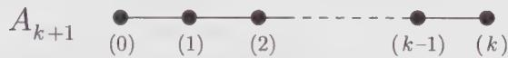  
Figure 16.2. The $A_{k+1}$ Dynkin diagram coding the $\widehat{su}(2)_{k}$ fusion rule by the fundamental representation (1). Vertices are associated with integrable representations of $\widehat{su}(2)_{k}$ . The fusion $(1) \times (j)$ is given by the sum of those representation vertices that are directly linked to the vertex j.

The diagram encodes fusion by the fundamental representation (1). Its adjacency matrix is $G_{ij} = 2 - A_{ij} = N_{1i}^{j}$ . It encodes as well higher fusions by $(j)$ , j > 1 as follows. The corresponding matrix $N_{j}$ with elements $[N_{j}]_{kl} = N_{jk}^{l}$ (with $N_{1} = G$ ) reads

$$
N _ {j} = y _ {j} (N _ {1})\tag{16.133}
$$

## 16.5.3. The Constraint-Generating Function

As a computational tool, the reformulation of the simple constraint (16.121) in the form (16.122) may seem to be a step backward. However, the real theoretical significance of this second point of view lies in that the various constraints $y_{j}=0$ , $k+1\leq j\leq N-1$ , can be integrated to a potential $V_{k+N}$ , the fusion potential, defined as

$$
\boxed {y _ {k + N - i} = (- 1) ^ {i + 1} \frac {\partial V _ {k + N}}{\partial x _ {i}}}\tag{16.134}
$$

Indeed, in our $\widehat{su}(3)_2$ example, the two constraints (16.124) correspond to the extrema of the potential:

$$
V _ {5} = \frac {1}{5} x _ {1} ^ {5} - x _ {1} ^ {3} x _ {2} + x _ {1} x _ {2} ^ {2} + x _ {1} ^ {2} - x _ {2}\tag{16.135}
$$

In order to derive Eq. (16.134), we first perform a change of variable. Introduce the variables $q_{i}, i = 1, \ldots, N$ satisfying

$$
\prod_ {i = 1} ^ {N} q _ {i} = 1\tag{16.136}
$$

and defined in terms of the $x_{\ell}$ by

$$
x _ {\ell} = \sum_ {1 \leq i _ {1} <   i _ {2} \dots <   i _ {\ell} \leq N} q _ {i _ {1}} \dots q _ {i _ {\ell}}\tag{16.137}
$$

The variables $q_{i}$ are simply the character variables introduced previously in Eq. (13.185) to define the Schur functions. We recall that $q_{i}$ is related to the orthonormal vector $\epsilon_{i}$ by $q_{i}=e^{\epsilon_{i}}$ . In terms of semistandard tableaux, where a box marked by i is associated with a factor $\epsilon_{i}$ , and hence a factor $q_{i}$ , the left-hand side has the following interpretation. Filling a column of $\ell$ boxes with the increasing sequence of numbers $i_{1},\ldots,i_{\ell}$ , such that $1\leq i_{1}<i_{2}\ldots<i_{\ell}\leq N$ , in all possible ways, generates all the states in the representation $x_{\ell}$ . The constraint (16.136) simply means that the unique semistandard tableau associated with the Young tableau with a single column of N boxes represents the scalar representation. In this way, it is clear that the expression of the variables $y_{\ell}$ in terms of the $q_{i}$ is

$$
y _ {\ell} = \sum_ {1 \leq i _ {1} \leq \dots \leq i _ {\ell} \leq N} q _ {i _ {1}} \dots q _ {i _ {\ell}}\tag{16.138}
$$

corresponding to all semistandard tableaux obtained by filling a row of $\ell$ boxes with a nondecreasing sequence of integers ranging from 1 to N. The generating functions for these expansions are easily found to be

$$
\sum_ {i = 0} ^ {N} x _ {i} t ^ {i} = \prod_ {i = 1} ^ {N} (1 + q _ {i} t)\tag{16.139}
$$

$$
\sum_ {i = 0} ^ {\infty} y _ {i} t ^ {i} = \prod_ {i = 1} ^ {N} (1 - q _ {i} t) ^ {- 1}\tag{16.140}
$$

We now define the potential $V_{m}$ by

$$
V _ {m} = \frac {1}{m} \sum_ {i = 1} ^ {N} q _ {i} ^ {m}\tag{16.141}
$$

(corresponding to the sum of all possible semistandard tableaux of m boxes, each filled with the same number), whose generating function is

$$
V (t) = \sum_ {m = 1} ^ {\infty} (- 1) ^ {m - 1} V _ {m} t ^ {m} = \sum_ {m = 1} ^ {\infty} \sum_ {i = 1} ^ {N} \frac {1}{m} (- 1) ^ {m - 1} q _ {i} ^ {m} t ^ {m}\tag{16.142}
$$

Interchanging the summations and summing over $m$ gives

$$
V (t) = \sum_ {i = 1} ^ {N} \ln (1 + q _ {i} t) = \ln \prod_ {i = 1} ^ {N} (1 + q _ {i} t) = \ln \sum_ {i = 0} ^ {N} x _ {i} t ^ {i}\tag{16.143}
$$

The derivative of $V(t)$ with respect to $q_{i}$ computed from Eq. (16.142) is

$$
\frac {\partial V (t)}{\partial q _ {i}} = \sum_ {m = 1} ^ {\infty} (- 1) ^ {m - 1} t ^ {m} q _ {i} ^ {m - 1}\tag{16.144}
$$

whereas Eq. (16.143) leads to

$$
\begin{array}{l} \frac {\partial V (t)}{\partial q _ {i}} = \left(\prod_ {n = 1} ^ {N} (1 + q _ {n} t) ^ {- 1}\right) \frac {\partial}{\partial q _ {i}} \left(\prod_ {j = 1} ^ {N} (1 + q _ {j} t)\right) \\ = \sum_ {\ell = 0} ^ {\infty} (- 1) ^ {\ell} y _ {\ell} t ^ {\ell} \sum_ {j = 0} ^ {N} t ^ {j} \frac {\partial x _ {j}}{\partial q _ {i}} \end{array}\tag{16.145}
$$

The compatibility of these two expressions forces the equality

$$
(- 1) ^ {m - 1} q _ {i} ^ {m - 1} = \sum_ {\ell + j = m} (- 1) ^ {\ell} y _ {\ell} \frac {\partial x _ {j}}{\partial q _ {i}}\tag{16.146}
$$

Multiplying the result by $\partial q_{i}/\partial x_{n}$ and summing over i yields

$$
\begin{array}{l} \sum_ {i} (- 1) ^ {m - 1} q _ {i} ^ {m - 1} \frac {\partial q _ {i}}{\partial x _ {n}} = \sum_ {\ell + j = m} (- 1) ^ {\ell} y _ {\ell} \sum_ {i} \frac {\partial q _ {i}}{\partial x _ {n}} \frac {\partial x _ {j}}{\partial q _ {i}} \\ = \sum_ {\ell + j = m} (- 1) ^ {\ell} y _ {\ell} \delta_ {n, j} \\ = (- 1) ^ {m - n} y _ {m - n} \end{array}\tag{16.147}
$$

Finally, the definition of the potential leads to Eq. (16.134).

We note that the equivalence between Eq. (16.142) and Eq. (16.143) provides an explicit expression of $V_{m}$ as a function of the variables $x_{i}$ :

$$
V _ {m} = \frac {(- 1) ^ {m - 1}}{m !} \frac {d ^ {m}}{d t ^ {m}} \ln \left(\sum_ {i = 0} ^ {N} x _ {i} t ^ {i}\right) | _ {t = 0}\tag{16.148}
$$

For $su(2)$ and $su(3)$ , Eq. (16.148) reads respectively

$$
\begin{array}{l} V _ {k + 2} = \frac {(- 1) ^ {k + 1}}{(k + 2) !} \frac {d ^ {k + 2}}{d t ^ {k + 2}} \ln (1 + x t + t ^ {2}) | _ {t = 0} \\ V _ {k + 3} = \frac {(- 1) ^ {k}}{(k + 3) !} \frac {d ^ {k + 3}}{d t ^ {k + 3}} \ln (1 + x _ {1} t + x _ {2} t ^ {2} + t ^ {3}) | _ {t = 0} \end{array}\tag{16.149}
$$

We detail the two simplest $\widehat{su}(2)_{k}$ examples. For k = 1, with $[0, 1] = x$ , the only nontrivial fusion rule is $x^{2} = 1$ ; the constraint is thus

$$
x ^ {2} - 1 = 0\tag{16.150}
$$

which is the extremum of the potential

$$
V _ {3} = \frac {1}{3} x ^ {3} - x\tag{16.151}
$$

For k = 2, with $[1, 1] = x$ and $[0, 2] = z$ , the fusion rules take the form

$$
x ^ {2} = 1 + z, \qquad x z = x, \qquad z ^ {2} = 1\tag{16.152}
$$

Hence, $z = x^{2} - 1$ , and the fusion constraint is

$$
x ^ {3} = 2 x\tag{16.153}
$$

(needed to reproduce $zx = x$ ), so that the associated potential is

$$
V _ {4} = \frac {1}{4} x ^ {4} - x ^ {2}\tag{16.154}
$$

which is in agreement with Eq. (16.148), up to an irrelevant additive constant.

In summary, we have found that the precise level of truncation on tensor-product coefficients is captured in a set of r constraints, which can be expressed as the vanishing of the potential (16.141) with respect to its r independent variables.

It should be stressed that the fusion potential is not unique. To see this, let us return to the $\widehat{su}(3)_{2}$ example. Eliminating the variable $x_{2}$ from the two constraints (16.124) leaves the single condition

$$
x _ {1} ^ {6} - 4 x _ {1} ^ {3} - 1 = 0\tag{16.155}
$$

associated with the potential

$$
V = \frac {1}{7} x _ {1} ^ {7} - x _ {1} ^ {4} - x _ {1}\tag{16.156}
$$

Hence, the $\widehat{su}(3)_{2}$ fusion constraints can be described by two different fusion potentials. This situation is not exceptional: in fact all $\widehat{su}(3)$ fusion rules can be reformulated in terms of a single-variable potential (cf. Ex. 16.11). A generic sufficient condition for the existence of a one-variable description is the nondegeneracy of all the eigenvalues of the fusion matrix of at least one primary field. To finish with our example, notice that with the condition (16.155), $x_{2} = (x_{1}^{3} + 1)/2x_{1}$ can be rewritten as

$$
x _ {2} = \frac {1}{2} (x _ {1} ^ {5} - 3 x _ {1} ^ {2})\tag{16.157}
$$

The expression for the different integrable representations of $\widehat{su}(3)_2$ , in terms of the single variable $x_{1}$ , is then

$$
[ 2, 0, 0 ] = 1, \qquad [ 1, 1, 0 ] = x _ {1}, \qquad [ 1, 0, 1 ] = \frac {1}{2} (x _ {1} ^ {5} - 3 x _ {1} ^ {2})
$$

$$
[ 0, 1, 1 ] = \frac {1}{2} (x _ {1} ^ {3} - 1), \quad [ 0, 2, 0 ] = \frac {1}{2} (5 x _ {1} ^ {2} - x _ {1} ^ {5}), \quad [ 0, 0, 2 ] = \frac {1}{2} (x _ {1} ^ {4} - 3 x _ {1})\tag{16.158}
$$

## §16.6. Level-Rank Duality

In this section, we introduce a remarkable level-rank duality relation between WZW models associated with classical Lie algebras. For simplicity, the discussion is restricted to $su(N)$ algebras.

A first hint for the existence of a relation between the $\widehat{su}(N)_k$ and $\widehat{su}(k)_N$ models is provided by the following observation. An integrable representation $\hat{\lambda}$ of $\widehat{su}(N)_{k}$ is associated with a Young tableau whose first row contains at most k boxes. (We recall that the Dynkin label $\lambda_{i}$ gives the number of columns of i boxes in the tableau. Therefore the sum of all finite Dynkin labels gives the number of boxes in the first row. For an integrable representation, $\sum_{i=1}^{N-1}\lambda_{i}\leq k$ . Here the tableau is assumed to be reduced, i.e., there are no columns of N boxes.) The transposed tableau, obtained by interchanging rows and columns, has at most N-1 boxes in the first row and no columns with more than k boxes. It can thus be associated with an integrable weight of $\widehat{su}(k)_{N-1}$ , and therefore of $\widehat{su}(k)_{N}$ . A simple counting argument shows that the number of integrable representations in $\widehat{su}(N)_{k}$ and $\widehat{su}(k)_{N}$ are

$$
\widehat {s u} (N) _ {k}: \quad \frac {(k + N - 1) !}{k ! (N - 1) !}, \qquad \widehat {s u} (k) _ {N}: \quad \frac {(k + N - 1) !}{N ! (k - 1) !}\tag{16.159}
$$

Because these numbers are distinct, the relation between integrable weights of the two models cannot be one-to-one. However, if the above numbers are divided, respectively, by N and k, they become equal. This division amounts to factorizing the algebras by the action of their respective centers, which is equivalent to considering only equivalence classes of the outer-automorphism groups: $\hat{\lambda} \sim \hat{\mu}$ if $\hat{\mu} = a^{j}\hat{\lambda}$ for some j, with a standing for the basic outer automorphism. The numerical coincidence just found suggests that the objects that can be made in one-to-one correspondence are the orbits of the outer-automorphism groups. The following direct argument shows that this is indeed so.

We construct a circle divided into $N+k$ equal parts by means of dashed lines. We consider an integrable weight $\hat{\lambda}\in\widehat{s\widehat{u}}(N)_{k}$ . Starting anywhere on the circle, fill the dashed lines separating $\lambda_{0}+1,\lambda_{1}+1,\cdots,\lambda_{N-1}+1$ pieces, in a clockwise ordering. That the initial position on the circle is irrelevant shows that this splitting of the circle describes a full $Z_{N}$ orbit rather than a single weight. Now, the dual splitting, namely the sequence of slices separated by dashed lines and read counterclockwise, represents the affine Dynkin labels of a weight $\hat{\mu}+\hat{\rho}$ , with $\hat{\mu}\in\widehat{s\widehat{u}}(k)_{N}$ lying in the orbit of the $\widehat{s\widehat{u}}(k)_{N}$ affine extension of $\lambda^{t}$ .

As is an illustrative example, let N = 5, k = 3 and

$$
\lambda = (1, 0, 1, 0) \longleftrightarrow \begin{array}{c c} \square & \square \\ \square & \square \\ \square & \end{array} \Rightarrow \quad \hat {\lambda} + \hat {\rho} = [ 2, 2, 1, 2, 1 ]\tag{16.160}
$$

The corresponding splitting of the circle is displayed in Fig. 16.3; the dual splitting is seen to be [3, 2, 3]:

$$
\hat {\mu} + \hat {\rho} = [ 3, 2, 3 ] \quad \Rightarrow \quad \hat {\mu} = [ 2, 1, 2 ]\tag{16.161}
$$

The transpose of $\lambda$ is

$$
\lambda^ {t} = \begin{array}{c c c} \square & \square & \square \\ \hline \square & \end{array} \longleftrightarrow (2, 1)\tag{16.162}
$$

whose affine $\widehat{su}(3)_{5}$ extension [2, 2, 1] belongs to the orbits

$$
\{[ 2, 2, 1 ], [ 1, 2, 2 ], [ 2, 1, 2 ] \}\tag{16.163}
$$

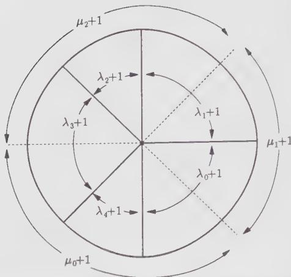  
Figure 16.3. The shifted affine $\widehat{su}(5)_3$ weights are the number of slices enclosed within the full lines. Reading the diagram from its lowest point in a clockwise direction, we obtain [2, 2, 1, 2, 1]. Read in the opposite direction, the diagram gives the shifted affine $\widehat{su}(3)_5$ weights as the number of slices enclosed within the dashed lines; starting from the leftmost one, we have [3, 2, 3].

which, indeed, also contains [2, 1, 2].

As a side remark, we point out that the action of the outer automorphism has a direct transcription in terms of Young tableaux. The action of $a$ —the basic outer automorphism of $\widehat{su}(N)$ —on a reduced tableau associated with an affine weight at level $k$ , amounts to adding on the top of the tableau a row of $k$ boxes. Indeed, the Dynkin labels $\lambda_i$ are related to the partition's entries by

$$
\lambda_ {i} = \ell_ {i} - \ell_ {i + 1}\tag{16.164}
$$

where $\ell_{i}$ gives the length of the i-th row:

$$
\ell_ {i} = \lambda_ {1} + \dots + \lambda_ {N - 1}\tag{16.165}
$$

We denote by $\ell_i^a$ the partition entries of the finite part of the affine weight $a\hat{\lambda}$ ,

$$
a \hat {\lambda} = a [ k - \sum_ {i = 1} ^ {N - 1} \lambda_ {i}, \lambda_ {1}, \dots , \lambda_ {N - 1} ] = [ \lambda_ {N - 1}, k - \sum_ {i = 1} ^ {N - 1} \lambda_ {i}, \lambda_ {1}, \dots , \lambda_ {N - 2} ]\tag{16.166}
$$

Starting with a reduced tableau, with $\ell_{N}=0$ , we obtain

$$
\ell_ {1} ^ {a} = k, \quad \ell_ {i + 1} ^ {a} = \ell_ {i}, \quad \text { for } \quad i \geq 1\tag{16.167}
$$

For repeated applications of $a$ , the tableau must be reduced after each step. In this way, $\mathcal{O}(\widehat{s}\widehat{u}(N))$ orbits of tableaux are easily constructed.

That outer-automorphism orbits are one-to-one in theories related by level-rank duality is interesting. But more interesting is that fusion coefficients can be made equal. This relation is rooted in the S matrix duality

$$
\mathcal {S} _ {\hat {\lambda} \hat {\mu}} = \sqrt {\frac {k}{N}} e ^ {\{2 \pi i | \lambda | | \mu | / N k \}} \bar {\mathcal {S}} _ {\hat {\lambda} ^ {\prime} \hat {\mu} ^ {\prime}}\tag{16.168}
$$

for

$$
\hat {\lambda}, \hat {\mu} \in \widehat {s u} (N) _ {k}, \quad \hat {\lambda} ^ {t}, \hat {\mu} ^ {t} \in \widehat {s u} (k) _ {N}\tag{16.169}
$$

and $|\lambda|$ stands for the total number of boxes in the tableau representing $\lambda$ . The proof of this relation, being somewhat technical, is omitted.

In the expression for the fusion rules of the $\widehat{su}(N)_{k}$ theory, the sum over all integrable representations can be decomposed into orbits of the outer-automorphism groups as follows:

$$
\begin{array}{l} \mathcal {N} _ {\hat {\lambda} \hat {\mu}} ^ {(k) \hat {\nu}} = \sum_ {\hat {\sigma} \in P _ {+} ^ {k}} \frac {\mathcal {S} _ {\hat {\lambda} \hat {\sigma}} \mathcal {S} _ {\hat {\mu} \hat {\sigma}} \bar {\mathcal {S}} _ {\hat {\nu} \hat {\sigma}}}{\mathcal {S} _ {0 \hat {\sigma}}} \\ = \sum_ {\hat {\sigma} \in P _ {+} ^ {k} / \mathbb {Z} _ {N}} \frac {1}{m _ {N} (\hat {\sigma})} \sum_ {\ell = 0} ^ {N - 1} \frac {\mathcal {S} _ {\hat {\lambda} , a ^ {\ell} (\hat {\sigma})} \mathcal {S} _ {\hat {\mu} , a ^ {\ell} (\hat {\sigma})} \bar {\mathcal {S}} _ {\hat {\nu} , a ^ {\ell} (\hat {\sigma})}}{\mathcal {S} _ {0 , a ^ {\ell} (\hat {\sigma})}} \end{array}\tag{16.170}
$$

Here $m_{N}(\hat{\sigma})$ denotes the multiplicity of $\hat{\sigma}$ in the orbit $\{\hat{\sigma}, a\hat{\sigma}, \cdots, a^{N-1}\hat{\sigma}\}$ (necessarily a divisor of N). Observe that

$$
\mathcal {S} _ {a ^ {\ell} (\hat {\sigma}), \hat {\mu}} = \mathcal {S} _ {\hat {\sigma} \hat {\mu}} e ^ {- 2 \pi i \ell (a \hat {\omega} _ {0}, \mu)} = \mathcal {S} _ {\hat {\sigma} \hat {\mu}} e ^ {2 \pi i \ell | \mu | / N}\tag{16.171}
$$

Indeed

$$
(a \hat {\omega} _ {0}, \mu) = (\omega_ {1}, \mu) = \sum_ {j = 1} ^ {N - 1} \mu_ {j} \frac {(N - j)}{N}\tag{16.172}
$$

and with $\mu_{j}=m_{j}-m_{j+1}$ (i.e., $\mu=\{m_{1};\cdots;m_{N-1}\}$ ), this becomes

$$
\left(\omega_ {1}, \mu\right) = \sum_ {j = 1} ^ {N - 1} \mu_ {j} - \frac {1}{N} \sum_ {j = 1} ^ {N - 1} m _ {j} = - \frac {1}{N} | \mu | \bmod 1\tag{16.173}
$$

The expression for fusion coefficients then reduces to

$$
\mathcal {N} _ {\hat {\lambda} \hat {\mu}} ^ {(k) \hat {\nu}} = \sum_ {\hat {\sigma} \in P _ {+} ^ {k} / \mathbb {Z} _ {N}} \frac {1}{m _ {N} (\hat {\sigma})} \frac {\mathcal {S} _ {\hat {\lambda} \hat {\sigma}} \mathcal {S} _ {\hat {\mu} , \hat {\sigma}} \bar {\mathcal {S}} _ {\hat {\nu} , \hat {\sigma}}}{\mathcal {S} _ {0 , \hat {\sigma}}} \sum_ {\ell = 0} ^ {N - 1} e ^ {(2 \pi i \ell / N) (| \lambda | + | \mu | - | \nu |)}\tag{16.174}
$$

If the corresponding tensor-product coefficient is nonzero, an immediate consequence of the Littlewood-Richardson rule is that

$$
| \lambda | + | \mu | - | \nu | = 0 \mod N\tag{16.175}
$$

so the last sum contributes to a factor $N$ . Since there is a one-to-one correspondence between orbits of $\widehat{su}(N)_k$ and $\widehat{su}(k)_N$ , we can write

$$
\sum_ {\hat {\sigma} \in P _ {+} ^ {k} / \mathbb {Z} _ {N}} = \sum_ {\hat {\sigma} ^ {t} \in P _ {+} ^ {N} / \mathbb {Z} _ {k}}\tag{16.176}
$$

The substitution of Eq. (16.168) into the expression for fusion coefficients leads to

$$
\begin{array}{l} \mathcal {N} _ {\hat {\lambda} \hat {\mu}} ^ {(k) \hat {\nu}} = \sum_ {\hat {\sigma} ^ {t} \in P _ {+} ^ {N} / \mathbb {Z} _ {k}} \frac {k}{m _ {N} (\hat {\sigma})} e ^ {(2 \pi i / N k) | \sigma | (| \lambda | + | \mu | - | \nu |)} \frac {\bar {\mathcal {S}} _ {\hat {\lambda} ^ {t} \hat {\sigma} ^ {t}} \bar {\mathcal {S}} _ {\hat {\mu} ^ {t} \hat {\sigma} ^ {t}} \mathcal {S} _ {\hat {\nu} ^ {t} \hat {\sigma} ^ {t}}}{\bar {\mathcal {S}} _ {0 \hat {\sigma} ^ {t}}} \\ = \sum_ {\hat {\sigma} ^ {t} \in P _ {+} ^ {N} / \mathbb {Z} _ {k}} \frac {1}{m _ {k} (\hat {\sigma} ^ {t})} e ^ {(2 \pi i / N k) | \sigma | (| \lambda | + | \mu | - | \nu |)} \\ \sum_ {\ell = 0} ^ {k - 1} \frac {\bar {\mathcal {S}} _ {\hat {\lambda} ^ {t} , \tilde {a} ^ {t} (\hat {\sigma} ^ {t})} \bar {\mathcal {S}} _ {\hat {\mu} ^ {t} , \tilde {a} ^ {\ell} (\hat {\sigma} ^ {t})} \mathcal {S} _ {\hat {\nu} ^ {t} , \tilde {a} ^ {\ell} (\hat {\sigma} ^ {t})}}{\bar {\mathcal {S}} _ {0 , \tilde {a} ^ {t} (\hat {\sigma} ^ {t})}} \\ = \sum_ {\hat {\sigma} ^ {t} \in P _ {+} ^ {N}} \frac {\bar {\mathcal {S}} _ {\hat {\lambda} ^ {t} \hat {\sigma} ^ {t}} \bar {\mathcal {S}} _ {\hat {\mu} ^ {t} \hat {\sigma} ^ {t}} \mathcal {S} _ {\hat {\nu} ^ {t} \hat {\sigma} ^ {t}}}{\bar {\mathcal {S}} _ {0 \hat {\sigma} ^{t}}} e ^ {(2 \pi i / N k) | \sigma | (| \lambda | + | \mu | - | \nu |)} \end{array}\tag{16.177}
$$

where $\tilde{a}$ denotes the basic outer automorphism of $\widehat{s\mathcal{u}}(\mathcal{k})$ . In the second equality, we used the identity $m_{N}(\widehat{\sigma}) = m_{k}(\widehat{\sigma}^{t})$ (see Ex. 16.14) and a reorganization of the result into orbits of the $\mathcal{O}(\widehat{s\mathcal{u}}(\mathcal{k}))$ outer-automorphism group. The extra phase factor can be absorbed as follows

$$
\mathcal {S} _ {\hat {\nu} ^ {t} \hat {\sigma} ^ {t}} e ^ {(2 \pi i / N k) | \sigma | (| \lambda | + | \mu | - | \nu |)} = \mathcal {S} _ {\bar {a} ^ {p} (\hat {\nu} ^ {t}) \hat {\sigma} ^ {t}}\tag{16.178}
$$

with

$$
p = \frac {1}{N} (| \lambda | + | \mu | - | \nu |)\tag{16.179}
$$

Finally, the reality of fusion coefficients allows us to write

$$
\boxed {\mathcal {N} _ {\hat {\lambda} \hat {\mu}} ^ {(k) \hat {\nu}} = \mathcal {N} _ {\hat {\lambda} ^ {t} \hat {\mu} ^ {t}} ^ {(N) \bar {a} ^ {p} \hat {\nu} ^ {t}}}\tag{16.180}
$$

As a simple illustration of this formula, consider the case $N = 3$ , $k = 5$ , and the fusion

$$
[ 1, 3, 1 ] \times [ 2, 1, 2 ] = [ 4, 1, 0 ] + [ 3, 0, 2 ] + [ 1, 4, 0 ] + 2 [ 2, 2, 1 ] + [ 1, 1, 3 ] + [ 0, 3, 2 ]\tag{16.181}
$$

whose tableau representation reads:

$$
\begin{array}{r l} \square & \square \square \\ \square & \square \square \end{array} \times \begin{array}{l} \square \\ \square \end{array} = \square + \square + \square \square \square + 2 \begin{array}{l} \square \\ \square \end{array}\tag{16.182}
$$

The transposed product, with appropriate action of $\tilde{a}$ on the right-hand side terms (the required powers of $\tilde{a}$ being respectively 3, 2, 2, 2, 1, 1), is

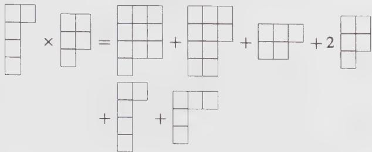

(16.183)

or equivalently

$$
\begin{array}{c} [ 1, 1, 0, 0, 1 ] \times [ 1, 0, 1, 1, 0 ] = [ 0, 0, 0, 2, 1 ] + [ 0, 0, 1, 0, 2 ] + [ 0, 1, 2, 0, 0 ] \\ + 2 [ 1, 0, 1, 1, 0 ] + [ 1, 1, 0, 0, 1 ] + [ 0, 2, 0, 1, 0 ] \end{array}\tag{16.184}
$$

The relation (16.180) has the following interesting consequences:

(i) The fusion coefficients for $\widehat{su}(N)_2$ , for any value of $N$ , can be only 0 or 1, as for $\widehat{su}(2)$ .

(ii) The threshold levels for all $\widehat{su}(N)_{3}$ fusion rules are always nondegenerate.

## Appendix 16.A. Fusion Elementary Couplings in $\widehat{su}(N)$

In order to introduce the idea of fusion elementary couplings, we consider first $su(2)$ tensor products. In that case, the elementary couplings are

$$
E _ {1} = (1) (1) (0), E _ {2} = (1) (0) (1), E _ {3} = (0) (1) (1)\tag{16.185}
$$

where the notation $(1)(1)(0)$ stands for $(1)\otimes(1)\otimes(0)\supset(0)$ . Notice that elementary couplings that differ by a permutation of the weights are considered as distinct. The $su(2)$ elementary couplings are just the various permutations of the product of the fundamental representation with the scalar one. In products of the $E_{i}$ 's, the corresponding Dynkin labels are added. The decomposition of a generic coupling into elementary ones is then

$$
\lambda \otimes \mu \otimes \nu = E _ {1} ^ {\frac {1}{2} (\lambda_ {1} + \mu_ {1} - \nu_ {1})} E _ {2} ^ {\frac {1}{2} (\nu_ {1} + \lambda_ {1} - \mu_ {1})} E _ {3} ^ {\frac {1}{2} (\mu_ {1} + \nu_ {1} - \lambda_ {1})}\tag{16.186}
$$

Of course, for the coupling to be allowed, each exponent must be a positive integer. With $\lambda_{1}$ and $\mu_{1}$ fixed, this sole condition determines the possible values of $\nu_{1}$ .

To extend this construction to fusion rules, we need the following assumption: the threshold level for the coupling is the sum of the threshold levels in the decomposition into elementary couplings. $^{6}$ Translated into equations, this means that the

coupling

$$
\{\lambda \otimes \mu \otimes \nu \} ^ {(i)} = \prod_ {\ell} E _ {\ell} ^ {e _ {\ell}}\tag{16.187}
$$

(where (i) is a degeneracy label) has threshold level

$$
k _ {0} ^ {(i)} (\lambda \otimes \mu \otimes \nu) = \sum_ {\ell} e _ {\ell} k _ {0} (E _ {\ell})\tag{16.188}
$$

where $k_{0}(E_{\ell})$ is the threshold level for the elementary coupling $E_{\ell}$ .

Applying this to $su(2)$ , we must first calculate the value of $k_0(E_t)$ , using for instance the Kac-Walton formula. This gives

$$
k _ {0} (E _ {\ell}) = 1 \quad \text { for } \quad \ell = 1, 2, 3\tag{16.189}
$$

From Eqs. (16.188) and (16.186), it then follows that

$$
k _ {0} (\lambda \otimes \mu \otimes \nu) = \frac {1}{2} (\lambda_ {1} + \mu_ {1} + \nu_ {1})\tag{16.190}
$$

which, of course, reproduces Eq. (16.48).

The Berenstein-Zelevinsky triangles corresponding to elementary couplings, for which the counterclockwise ordering $\lambda$ , $\mu$ , $\nu$ is assumed, are respectively

$$
\begin{array}{c c c c c} 0 & & 1 & & 0 \\ 1 & 0 & 0 & 0 & 0 \end{array}\tag{16.191}
$$

A decomposition into a product of elementary couplings is equivalent to a decomposition into a sum of the corresponding basic triangles. In terms of the triangle data (13.221), the formula (16.190) reads

$$
k _ {0} (\lambda \otimes \mu \otimes \nu) = m _ {1 2} + n _ {1 2} + l _ {1 2}\tag{16.192}
$$

We consider now the $su(3)$ case, for which there are eight elementary couplings:

$$
\begin{array}{c c c} E _ {1} = (1, 0) (0, 1) (0, 0) & E _ {3} = (0, 1) (0, 0) (1, 0) & E _ {5} = (0, 0) (1, 0) (0, 1) \\ \begin{array}{c c c} 0 & & 0 \\ 1 & 0 & \\ 0 & & 0 \\ 0 & 0 & 1 & 0 \end{array} & \begin{array}{c c c} 0 & & 0 \\ 0 & 0 & \\ 1 & & 1 \\ 0 & 0 & 0 & 0 \end{array} & \begin{array}{c c c} 0 & 1 \\ 0 & & 0 \\ 0 & 1 & 0 & 0 \end{array} \\ E _ {2} = (1, 0) (0, 0) (0, 1) & E _ {4} = (0, 1) (1, 0) (0, 0) & E _ {6} = (0, 0) (0, 1) (1, 0) \\ \begin{array}{c c c} 1 & & 0 \\ 0 & 0 & \\ 0 & & 0 \\ 0 & 0 & 0 \end{array} & \begin{array}{c c c} 0 & & 0 \\ 0 & 0 & \\ 0 & & 0 \\ 1 & 0 & 0 \end{array} & \begin{array}{c c c} 0 & \\ 0 & 0 \\ 0 & & 0 \\ 0 & 0 & 1 \end{array} \end{array}
$$

$$
\begin{array}{c c} E _ {7} = (1, 0) (1, 0) (1, 0) & E _ {8} = (0, 1) (0, 1) (0, 1) \\ \begin{array}{c c c c c c c c c} 0 & & & & & & & & \\ 1 & 0 & & & & & & & \\ 0 & & 1 & & & & & & \\ 0 & 1 & 0 & 0 & & & & & \end{array} & \begin{array}{c c c c c c c c c} 0 & & & & & & & \\ 0 & 1 & & & & & & \\ 1 & & 0 & & & & & \\ 0 & 0 & 1 & 0 \end{array} \end{array}
$$

The direct extension of the $su(2)$ approach faces an immediate problem in that the decomposition of a generic coupling into elementary ones is no longer unique. Indeed, the two products $E_{1}E_{3}E_{5}$ and $E_{7}E_{8}$ are equivalent since they yield exactly the same triangle:

$$
\begin{array}{c} E _ {1} E _ {3} E _ {5} = E _ {7} E _ {8} \\ \begin{array}{c c c c} 0 & & \\ 1 & 1 & & \\ 1 & & 1 & \\ 0 & 1 & 1 & 0 \end{array} \end{array}\tag{16.193}
$$

For $su(3)$ this is the only redundancy. In order to proceed, it must be eliminated by forbidding either $E_{1}E_{3}E_{5}$ or $E_{7}E_{8}$ . For tensor products, whichever is eliminated is immaterial. However, for fusion rules, the situation is quite different. First, the threshold level of all the elementary couplings is easily found to be equal to one, exactly as in the $\widehat{su}(2)$ case. Then, according to the above assumption, the two products $E_{1}E_{3}E_{5}$ and $E_{7}E_{8}$ have different threshold levels

$$
k _ {0} (E _ {7} E _ {8}) = 2, \qquad k _ {0} (E _ {1} E _ {3} E _ {5}) = 3\tag{16.194}
$$

We must then determine which one must be eliminated in order for the decomposition into elementary couplings to reproduce the correct threshold level. These two products give two equivalent descriptions of a single coupling describing the tensor product $(1,1)(1,1)(1,1)$ . Using the algorithm described in Sect. 16.2.2, it is simple to check that

$$
(1, 1) \otimes (1, 1) = (0, 0) _ {2} \oplus 2 (1, 1) _ {2, 3} \oplus (3, 0) _ {3} \oplus (0, 3) _ {3} \oplus (2, 2) _ {4}\tag{16.195}
$$

Hence, the triple product (1, 1)(1, 1)(1, 1) has multiplicity 2, with threshold levels 2 and 3. The representation of these two couplings in terms of Berenstein-Zelevinsky triangles is

$$
\begin{array}{c c c c c} & 1 & & & 0 \\ & 0 & 0 & & 1 & 1 \\ & 0 & 0 & & 1 & 1 \\ 1 & 0 & 0 & 1 & 0 & 1 & 1 & 0 \end{array}\tag{16.196}
$$

The first triangle is unambiguously associated with the product $E_{2}E_{4}E_{6}$ , and consequently its threshold level is $k_{0}=3$ . The second triangle must then necessarily be decomposable into a product of two elementary couplings in order to have $k_{0}=2$ . Hence, it must correspond to $E_{7}E_{8}$ , which means that the product $E_{1}E_{3}E_{5}$ must be forbidden. This eliminates all possible redundancies, and as such the decomposition of any coupling into elementary ones is unique. The decomposition is either of the form

$$
E _ {2} ^ {a} E _ {3} ^ {b} E _ {4} ^ {c} E _ {5} ^ {d} E _ {6} ^ {e} E _ {7} ^ {f} E _ {8} ^ {g}\tag{16.197}
$$

where $a, \cdots, g$ are nonnegative integers, or one of its two rotated versions, obtained by the replacements $(E_{3}, E_{5}) \to (E_{5}, E_{1}) \to (E_{1}, E_{3})$ . Whichever form is realized is uniquely fixed by the values of the weights under consideration. The threshold level of the above decomposition is simply the sum of all the exponents

$$
k _ {0} = a + b + c + d + e + f + g\tag{16.198}
$$

We let this decomposition describe a particular coupling of the triple product $(\lambda_{1},\lambda_{2})\otimes(\mu_{1},\mu_{2})\otimes(\nu_{1},\nu_{2})$ . From the expressions for the elementary couplings in terms of the Dynkin labels, it follows that

$$
\begin{array}{l l l} a + f = \lambda_ {1} & b + c + g = \lambda_ {2} & c + d + f = \mu_ {1} \\ e + g = \mu_ {2} & b + e + f = \nu_ {1} & a + d + g = \nu_ {2} \end{array}\tag{16.199}
$$

Having six relations for seven parameters, we can express everything in terms of one parameter, say $c$ . In particular, $k_{0}$ can be rewritten as

$$
k _ {0} = c + \nu_ {1} + \nu_ {2}\tag{16.200}
$$

However, c is not a completely free parameter. It is constrained by a set of inequalities, consequences of Eq. (16.199) and the positivity requirement imposed on all the parameters. Let the result be of the form

$$
c _ {\min} \leq c \leq c _ {\max}\tag{16.201}
$$

Clearly, any integer satisfying these bounds leads to an allowed decomposition. This immediately implies that the multiplicity of the tensor product is $c_{max} - c_{min} + 1$ . With c fixed, the decomposition and the associated triangle are uniquely specified. Denote the corresponding triangle as $\Delta_{c}$ . All triangles associated with the triple product under consideration are given by

$$
\Delta_ {c _ {\min}} + n \Omega , \quad 0 \leq n \leq c _ {\max} - c _ {\min}\tag{16.202}
$$

where

$$
\Omega = \begin{array}{c c c c} & 1 \\ & - 1 & - 1 \\ & - 1 & - 1 \\ 1 & - 1 & - 1 & 1 \end{array}\tag{16.203}
$$

Since $k_{0}$ is a linear function of $c$ , the threshold level of the different couplings reads

$$
\left\{k _ {0} \right\} ^ {(i)} = \left(c _ {\min} + v _ {1} + v _ {2}, c _ {\min} + v _ {1} + v _ {2} + 1, \dots , c _ {\max} + v _ {1} + v _ {2}\right)\tag{16.204}
$$

Evaluating explicitly the range of values of c, and considering the two other possible decompositions, leads to formulae(16.101)-(16.106). Filling the gaps in the argument is left as an exercise.

Formulated in general terms, the assumption underlying this construction is the existence of a set of forbidden couplings ensuring that the threshold levels in the decomposition into elementary couplings can simply be added. This assumption has been proved for $\widehat{s\widehat{u}}(3)$ , which places the above results on a firm basis.

Finally, it should be pointed out that the threshold level of a particular coupling is not an observable. The only observable is the full set of values of $k_{0}^{(i)}$ , or equivalently, the fusion coefficients. Here we used a particular basis for the couplings, namely the Berenstein-Zelevinsky triangles. Any other basis will lead to the same set of values of $k_{0}^{(i)}$ . However, two different descriptions of the same coupling, that is, two representations in different bases, may yield a different value for a specific threshold level $k_{0}^{(i)}$ (i.e., the results in a given basis can be permuted in another one).

## Exercises

## 16.1 Applications of the Verlinde formula

Use the Verlinde formula to calculate the fusion rules for:

a) $\widehat{so}(2N)_{1}$ ;

b) $(\widehat{F}_4)_1$

16.2 A simple derivation of the $\widehat{su}(2)_{k}$ fusion rules using the outer automorphism. Show that the $\widehat{su}(2)_{k}$ fusion rules can be obtained from the intersection of the tensor product of $\lambda_{1}\omega_{1}\otimes\mu_{1}\omega_{1}$ and $(k-\lambda_{1})\omega_{1}\otimes(k-\mu_{1})\omega_{1}$ .

## 16.3 Aspects of $\widehat{su}(3)_k$ fusion rules

Prove that the affine extension of any finite weight $\nu$ occurring in a tensor product of two weights whose extensions at some level k are integrable is itself always integrable at level 2k. Use this to identify the $\widehat{su}(3)$ affine chambers, in terms of elements of the affine Weyl group, which can contribute to fusion coefficients, when the latter are expressed in terms of tensor-product coefficients.

## 16.4 Multiple fusions and Fibonacci numbers

For $\widehat{su}(2)_3$ , show that the coefficients of the decomposition of the multiple product

$$
[ 1, 2 ] ^ {\times \ell} = [ 1, 2 ] \times [ 1, 2 ] \times \dots \times [ 1, 2 ]
$$

in terms of the integrable $\widehat{su}(2)_{3}$ representations, are given by the Fibonacci numbers, defined by the recursion relation

$$
a _ {\ell + 1} = a _ {\ell - 1} + a _ {\ell} \quad a _ {0} = a _ {1} = 1
$$

Find the analogous decomposition of [2, 2] at level 4.

## 16.5 $\widehat{su}(4)$ fusion rules by combinatorial methods

Use the Littlewood-Richardson rule and strip alterations (cf. Sect.16.2.4) to calculate the fusion rules at levels 3 and 4 associated with the $su(4)$ tensor product $(1,1,1)\otimes (1,1,1)$ . Result:

$$
\begin{array}{l l} k = 3: & (0, 0, 0) \oplus (0, 1, 2) \oplus (0, 2, 0) \oplus 2 (1, 0, 1) \oplus (2, 1, 0) \\ k = 4: & (0, 0, 0) \oplus (0, 0, 4) \oplus 3 (0, 1, 2) \oplus 2 (0, 2, 0) \oplus (0, 4, 0) \oplus 3 (1, 0, 1) \\ & \oplus 3 (1, 2, 1) \oplus 2 (2, 0, 2) \oplus 3 (2, 1, 0) \oplus (4, 0, 0) \end{array}
$$

## 16.6 Threshold level calculations

a) With the algorithm underlying the Kac-Walton formula, calculate the threshold level of the various terms occurring in the $su(3)$ tensor products

$$
\begin{array}{l} (3, 1) \otimes (3, 1) \\ (2, 2) \otimes (2, 2) \end{array}
$$

and check the results by means of the formulae(16.101)-(16.106).

b) Find the fusion coefficients (or equivalently, the threshold levels) associated with the $sp(4)$ tensor product

$$
(1, 1) \otimes (1, 1) = (0, 0) \oplus (0, 1) \oplus (0, 2) \oplus (0, 3) \oplus 2 (2, 0) \oplus 2 (2, 1) \oplus (2, 2) \oplus (4, 0)
$$

c) Same as (b) for the $G_{2}$ tensor product

$$
(0, 1) \otimes (0, 1) = (0, 0) \oplus (1, 0) \oplus (0, 1) \oplus (0, 2)
$$

## 16.7 Fusions and quantum dimensions

a) Show that simple currents have quantum dimension one, directly from their definition as fields that act as permutations in fusion rules.

b) From the dimension sum rule for fusions (cf. Eq. (16.60)), argue that the smallest possible quantum dimension, apart from one, is $\sqrt{2}$ .

c) Calculate the quantum dimension of the primary fields in the $\widehat{E}_{8}$ model at level two, and show how they fix the fusion rules. Identify the simple current, which is not of the outer automorphism type. Compare the fusion rules with those of the Ising model (cf. Sect. 7.4).

## 16.8 Handle operators

The handle operator is defined in terms of the fusion matrices by

$$
R = \sum_ {\hat {v} \in P _ {+} ^ {k}} N ^ {\hat {v}} \operatorname{Tr} (N _ {\hat {v}})
$$

The component $R_{\hat{\lambda}}^{\hat{\mu}}$ has the following graphical representation:

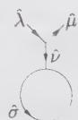

The inverse of $R$ turns out to have a simple Lie-algebraic expression:

$$
R ^ {- 1} = \frac {(- 1) ^ {| \Delta_ {+} |}}{| P / Q ^ {\vee} | (k + g) ^ {r}} D _ {\rho} ^ {2} \Big | _ {\chi_ {\lambda} \rightarrow N _ {\lambda} ^ {(k)}}\tag{16.205}
$$

where as before (cf. Eq. (13.165)) $D_{\rho}$ is defined by

$$
D _ {\rho} = \sum_ {w \in W} e ^ {w \rho}
$$

and the meaning of $\chi_{\lambda}\to N_{\lambda}^{(k)}$ is the following: $D_{\rho}^{2}$ is first reorganized in terms of the irreducible formal characters and each $\chi_{\lambda}$ is then replaced by the corresponding fusion matrix at level k. (This general result is established in the last part of the exercise.) For instance, for $su(2)$ ,

$$
\begin{array}{c} D _ {\rho} ^ {2} = (e ^ {(1)} - e ^ {(- 1)}) ^ {2} = (e ^ {(2)} - 2 e ^ {(0)} + e ^ {(- 2)}) \\ = \chi_ {(2)} - 3 \chi_ {(0)} \end{array}
$$

so that $R^{-1}$ reads

$$
R _ {\widehat {s u} (2) _ {k}} ^ {- 1} = \frac {1}{2 (k + 2)} \{3 N _ {(0)} ^ {(k)} - N _ {(2)} ^ {(k)} \}
$$

For a fixed value of $k$ , if the affine extension of the weight $\lambda$ is not integrable, $N_{\lambda}^{(k)}$ is replaced by $\epsilon(w)N_{w,\lambda}^{(k)}$ for the particular element of the affine Weyl group $w$ that makes $w\cdot\hat{\lambda}$ integrable, and it is ignored if this is not possible. For instance, at $k=1$ , $N_{(2)}^{(k=1)}\equiv N_{[-1,2]}$ must be dropped, so that

$$
R _ {\widehat {s u} (2) _ {1}} ^ {- 1} = \frac {1}{2} N _ {(0)}
$$

The result is easily verified: the $\widehat{su}(2)_{1}$ fusion matrices are

$$
N _ {(0)} = \left( \begin{array}{c c} 1 & 0 \\ 0 & 1 \end{array} \right), \quad N _ {(1)} = \left( \begin{array}{c c} 0 & 1 \\ 1 & 0 \end{array} \right)
$$

so that $R = 2N_{(0)}$ , hence $R^{-1} = N_{(0)}/2$ .

a) Prove the general form of the $\widehat{su}(2)_k$ expression (16.205) for $R^{-1}$ . Hint: First, observe that $\operatorname{Tr} N_{(n)}$ vanishes if $n$ is odd. For $n$ even, show that $\operatorname{Tr} N_{(n)} = k + 1 - n$ , so that

$$
R = \sum_{\substack{0\leq n\leq k\\ n\text{even}}} (k + 1 - n)N_{(n)}
$$

Then, using the $\widehat{su}(2)_{k}$ fusion rules, show directly that

$$
\frac{1}{2(k + 2)} \left\{3N_{(0)} - N_{(2)}\right\} \sum_{\substack{0\leq n\leq k\\ n\text{even}}} (k + 1 - n)N_{(n)} = 1
$$

b) Check that for $\widehat{su}(3)_{k}$ , the expression (16.205) for $R^{-1}$ reduces to

$$
R _ {\widehat {s u} (3) _ {k}} ^ {- 1} = \frac {1}{3 (k + 3) ^ {2}} \{1 5 N _ {(0, 0)} - 6 N _ {(1, 1)} + 3 N _ {(0, 3)} + 3 N _ {(3, 0)} - N _ {(2, 2)} \}
$$

To facilitate the reorganization of $D_{\rho}^{2}$ in terms of characters, we display the dominant-weight multiplicities for the relevant representations:

$$
\chi_ {(2, 2)} ^ {\mathrm{dom}} = 3 e ^ {(0, 0)} + 2 e ^ {(1, 1)} + e ^ {(3, 0)} + e ^ {(0, 3)} + e ^ {(2, 2)}
$$

$$
\chi_ {(0, 3)} ^ {\mathrm{dom}} = e ^ {(0, 0)} + e ^ {(1, 1)} + e ^ {(0, 3)}
$$

$$
\chi_ {(3, 0)} ^ {\mathrm{dom}} = e ^ {(0, 0)} + e ^ {(1, 1)} + e ^ {(3, 0)}
$$

$$
\chi_ {(1, 1)} ^ {\mathrm{dom}} = 2 e ^ {(0, 0)} + e ^ {(1, 1)}
$$

$$
\chi_ {(0, 0)} ^ {\mathrm{dom}} = e ^ {(1, 1)}
$$

c) Verify explicitly the $\widehat{su}(3)_k$ result by calculating $R$ for $k = 1,2$ and inverting the result. d) Using the $sp(4)$ multiplicities:

$$
\chi_ {(2, 2)} ^ {\mathrm{dom}} = 5 e ^ {(0, 0)} + 4 e ^ {(0, 1)} + 4 e ^ {(2, 0)} + 3 e ^ {(0, 2)} + 2 e ^ {(2, 1)} + e ^ {(0, 3)} + e ^ {(4, 0)} + e ^ {(2, 2)}
$$

$$
\chi_ {(4, 0)} ^ {\mathrm{dom}} = 3 e ^ {(0, 0)} + 2 e ^ {(0, 1)} + 2 e ^ {(2, 0)} + e ^ {(0, 2)} + e ^ {(2, 1)} + e ^ {(4, 0)}
$$

$$
\chi_ {(0, 3)} ^ {\mathrm{dom}} = 2 e ^ {(0, 0)} + 2 e ^ {(0, 1)} + e ^ {(2, 0)} + e ^ {(0, 2)} + e ^ {(2, 1)} + e ^ {(0, 3)}
$$

$$
\chi_ {(2, 1)} ^ {\mathrm{dom}} = 3 e ^ {(0, 0)} + 3 e ^ {(0, 1)} + 2 e ^ {(2, 0)} + e ^ {(0, 2)} + e ^ {(2, 1)}
$$

$$
\chi_ {(0, 2)} ^ {\mathrm{dom}} = 2 e ^ {(0, 0)} + e ^ {(0, 1)} + e ^ {(2, 0)} + e ^ {(0, 2)}
$$

$$
\chi_ {(2, 0)} ^ {\mathrm{dom}} = 2 e ^ {(0, 0)} + e ^ {(0, 1)} + e ^ {(2, 0)}
$$

$$
\chi_ {(0, 1)} ^ {\mathrm{dom}} = e ^ {(0, 0)} + e ^ {(0, 1)}
$$

$$
\chi_ {(0, 0)} ^ {\mathrm{dom}} = e ^ {(0, 0)}
$$

show that for $\widehat{sp}(4)_{k}, R^{-1}$ takes the form

$$
\begin{array}{r l} R _ {\widehat {s p} (4) _ {k}} ^ {- 1} = \frac {1}{4 (k + 3) ^ {2}} \{2 1 N _ {(0, 0)} - 3 N _ {(0, 1)} - 6 N _ {(0, 2)} - 3 N _ {(0, 3)} \\ & + 6 N _ {(2, 1)} - 3 N _ {(4, 0)} - 3 N _ {(0, 3)} + N _ {(2, 2)} \} \end{array}
$$

e) Check this result for k = 1, 2.

f) The aim of the last part of the exercise is to demonstrate the general expression of $R^{-1}$ . Use the Verlinde formula to obtain:

$$
R _ {\hat {\lambda} \hat {\mu}} = \sum_ {\hat {v}, \hat {\sigma}} \mathcal {N} _ {\hat {\lambda} \hat {\mu}} ^ {\hat {v}} \mathcal {N} _ {\hat {v} \hat {\sigma}} ^ {\hat {\sigma}} = \sum_ {\hat {\xi}} \frac {\mathcal {S} _ {\hat {\lambda} \hat {\xi}} \mathcal {S} _ {\hat {\mu} \hat {\xi}}}{\mathcal {S} _ {0 \hat {\xi}} ^ {2}}
$$

Deduce the following form for $(R^{-1})_{\hat{\lambda}}^{\hat{\mu}}$ :

$$
(R ^ {- 1}) _ {\hat {\lambda}} ^ {\hat {\mu}} = \sum_ {\hat {\zeta}} \mathcal {S} _ {\hat {\lambda} \hat {\zeta}} \bar {\mathcal {S}} _ {\hat {\mu} \hat {\zeta}} \mathcal {S} _ {0 \hat {\zeta}} ^ {2}
$$

Finally, observe that $D_{\rho}$ evaluated at the special point

$$
\xi_ {\zeta} = - \frac {2 \pi i}{k + g} (\zeta , \rho)
$$

is related to $S_{0\hat{\zeta}}^{2}$ :

$$
\frac {(- 1) ^ {| \Delta_ {+} |}}{| P / Q ^ {\vee} | (k + g) ^ {r}} [ D _ {\rho} (\xi_ {\zeta}) ] ^ {2} = \mathcal {S} _ {0 \hat {\zeta}} ^ {2}
$$

$S_{0\hat{\zeta}}^{2}$ can thus be expanded in terms of the finite characters. Setting

$$
\mathcal {S} _ {0 \hat {\zeta}} ^ {2} = \sum_ {\gamma \in P _ {+}} d ^ {\gamma} \chi_ {\gamma} (\xi_ {\zeta})
$$

for some numbers $d^{\gamma}$ , obtain

$$
(R ^ {- 1}) _ {\hat {\lambda}} ^ {\hat {\mu}} x = \sum_ {\gamma \in P _ {+}} d ^ {\gamma} \mathcal {N} _ {\hat {\lambda} \gamma} ^ {\hat {\mu}}
$$

which, in matrix notation, reads

$$
R ^ {- 1} = \sum_ {\gamma \in P _ {+}} d ^ {\gamma} N _ {\gamma} ^ {(k)}
$$

## 16.9 su(N) depths

Prove that the depth of the weights in the $su(N)$ fundamental representations is given by Eq. (16.99).

## 16.10 Pieri and Giambelli formulae

a) Complete the detail of the proof of the Giambelli formula (16.114) from Eq. (16.112).

b) From the Littlewood-Richardson rule, derive the Pieri formula for the product

$$
y _ {j} \otimes \{\ell_ {1}; \dots ; \ell_ {n} \}
$$

c) Using this new Pieri formula, prove Eq. (16.123).

## 16.11 One-variable description of the fusion ring

We recall that the associativity of fusion rules implies that the fusion matrices $N_{\hat{\lambda}}^{(k)}$ , with entries $\mathcal{N}_{\hat{\lambda}\hat{\mu}}^{(k)\hat{\nu}}$ , form a representation of the fusion algebra

$$
N _ {\hat {\lambda}} ^ {(k)} N _ {\hat {\mu}} ^ {(k)} = \sum_ {\hat {\nu} \in P _ {+} ^ {k}} \mathcal {N} _ {\hat {\lambda} \hat {\mu}} ^ {(k) \hat {\nu}} N _ {\hat {\nu}} ^ {(k)}
$$

and that their eigenvalues are the numbers $\gamma_{\hat{\lambda}}^{(\hat{\sigma})}$ .

a) Show that a sufficient condition for the existence of a one-variable polynomial ring is the nondegeneracy of all the eigenvalues of at least one fusion matrix.

Hint: The minimal polynomial of this matrix (see Ex. 8.18) is equal to its characteristic polynomial, hence the dimension of the ring it generates is equal to the degree of this polynomial, and therefore to that of the full fusion ring.

b) We wish now to use this criterion to prove that $\widehat{su}(3)_{k}$ fusion rules can always be described in terms of a single variable. Show that the eigenvalues $\gamma_{\lambda}^{(\hat{\sigma})}, \hat{\sigma} \in P_{+}^{k}$ and $\hat{\lambda} = k\hat{\omega}_{0} + \omega_{1}$ , of the fundamental fusion matrix may be expressed as the sum of three complex numbers of modulus 1, whose product is 1.

c) Show that if

$$
e ^ {i a} + e ^ {i b} + e ^ {- i (a + b)} = e ^ {i c} + e ^ {i d} + e ^ {- i (c + d)}\tag{16.206}
$$

for some real numbers $a, b, c, d$ , then

$$
\sin \left(c ^ {\prime} - d ^ {\prime}\right) \sin \left(a ^ {\prime} + b ^ {\prime}\right) = \sin \left(b ^ {\prime} - a ^ {\prime}\right) \sin \left(c ^ {\prime} + d ^ {\prime}\right)
$$

$$
\sin a ^ {\prime} \sin b ^ {\prime} \sin (c ^ {\prime} - d ^ {\prime}) = \sin c ^ {\prime} \sin d ^ {\prime} \sin (b ^ {\prime} - a ^ {\prime})
$$

with

$$
a ^ {\prime} = \frac {1}{2} (a + b + c) \quad b ^ {\prime} = \frac {1}{2} (c + d + a)
$$

$$
c ^ {\prime} = \frac {1}{2} (a + b + d) \quad d ^ {\prime} = \frac {1}{2} (c + d + b)
$$

Hint: Multiply both sides of Eq. (16.206) by $e^{i(a + b + c + d) / 2}$ and take the real and imaginary parts.

d) Conclude that necessarily $(c,d)=(a,b)\bmod\pi$ (or any of the five other permutations of $(b,a),(a,-a-b),(-a-b,a),(b,-a-b),(-a-b,b))$ and deduce the property (a) for $\widehat{su}(3)_{k}$ fusions.

e) Use Eq. (14.255) to argue that the condition of (a) always fails for $su(N)$ when N > 2 and k are both even, due to the presence of pairs of fixed points associated with the zero eigenvalue (again for a fundamental fusion matrix, with $\lambda = \omega_{i}$ for some i). Generalize this statement to all values of N for which the center of $su(N)$ has a nontrivial subgroup.

## 16.12 Fusion coefficients by level-rank duality

Using the $\widehat{su}(3)$ fusion rules given in Eq. (16.195) at level 4, obtain the fusion coefficients for

$$
[ 1, 2, 1 ] \times [ 2, 1, 1 ]
$$

by an appropriate action of the outer automorphism and derive, by level-rank duality, the $\widehat{su}(4)_3$ coefficients for

$$
[ 1, 1, 0, 1 ] \times [ 1, 1, 1, 0 ]
$$

16.13 Level-rank duality of quantum dimensions
Show that

$$
\mathcal {D} _ {\hat {\lambda}} = \mathcal {D} _ {\hat {\lambda} ^ {l}}
$$

with $\hat{\lambda} \in \widehat{s\widehat{u}}(N)_k$ and $\hat{\lambda}' \in \widehat{s\widehat{u}}(k)_N$ . Use this relation to compute the quantum dimension of an arbitrary $\widehat{s\widehat{u}}(N)_2$ integrable weight.

16.14 Level-rank duality for multiplicities on outer-automorphism orbits For $\hat{\lambda} \in \widehat{s\widehat{u}}(N)_{k}$ and $\hat{\lambda}^{t} \in \widehat{s\widehat{u}}(k)_{N}$ , show that

$$
m _ {N} (\hat {\lambda}) = m _ {k} (\hat {\lambda} ^ {t})
$$

where $m_{N}(\hat{\lambda})$ denotes the multiplicity of $\hat{\lambda}$ in the orbit $\{\hat{\lambda}, a\hat{\lambda}, \cdots, a^{N-1}\hat{\lambda}\}$ and $m_{k}(\hat{\lambda}^{t})$ is the multiplicity of $\hat{\lambda}^{t}$ in the orbit $\{\hat{\lambda}^{t}, \tilde{a}\hat{\lambda}^{t}, \cdots, \tilde{a}^{k-1}\hat{\lambda}^{t}\}$ .

## 16.15 $\widehat{su}(3)$ fusion threshold level

Complete the derivation of the formulae (16.101)-(16.106) sketched in App. 16.A. In particular, show that when the product of elementary couplings $E_{1}E_{3}E_{5}$ is forbidden, whichever of $E_{1}, E_{3}$ , or $E_{5}$ does not appear in the decomposition can be determined in terms of the Dynkin labels of the weights of the triple product. Obtain the explicit values of $c_{\mathrm{min}}$ and $c_{\mathrm{max}}$ , derive similar bounds for $a$ and $e$ associated with the other possible decompositions, and recover Eq. (16.106) with $k_0^{\mathrm{min}}$ and $k_0^{\mathrm{max}}$ defined in Eq. (16.102). Finally, show that the threshold level associated with the coupling described by the $su(3)$ Berenstein-Zelevinsky triangle (13.211) can be written explicitly in terms of the entries of the triangle as

$$
k _ {0} = \max (l _ {1 3} + \lambda_ {1} + \lambda_ {2}, m _ {1 3} + \mu_ {1} + \mu_ {2}, n _ {1 3} + \nu_ {1} + \nu_ {2})
$$

## 16.16 Generating function for fusion rules

The generating function for tensor-product coefficients is given by a sum over all possible couplings

$$
G (L, M, N) = \sum_ {\lambda , \mu , v \in P _ {+}} \mathcal {N} _ {\lambda \mu v} L ^ {\lambda} M ^ {\mu} N ^ {v}
$$

in terms of some dummy variables $L_{i}, M_{i}, N_{i}$ , where

$$
L ^ {\lambda} = \prod_ {i = 1} ^ {r} L _ {i} ^ {\lambda_ {i}}
$$

and similarly for $M^{\mu}$ and $N^{\nu}$ . The $su(2)$ generating function reads

$$
G = \left[ \left(1 - L _ {1} M _ {1}\right) \left(1 - L _ {1} N _ {1}\right) \left(1 - M _ {1} N _ {1}\right) \right] ^ {- 1} = \prod_ {i = 1} ^ {3} \left(1 - E _ {i}\right) ^ {- 1}
$$

in terms of the elementary couplings (16.185). (More precisely, the elementary couplings are $E_{1} = L_{1}M_{1}$ , $E_{2} = L_{1}N_{1}$ , $E_{3} = M_{1}N_{1}$ . This shows why when taking products of the $E_{i}$ 's, we add the corresponding Dynkin labels.) Fusion rule generating functions can be defined in a similar way as

$$
\hat {G} (L, M, N; d) = \sum_ {k = 0} ^ {\infty} d ^ {k} \sum_ {\lambda , \mu , v \in P _ {+} ^ {k}} \mathcal {N} _ {\hat {\lambda}, \hat {\mu}, \hat {v}} ^ {(k)} L ^ {\lambda} M ^ {\mu} N ^ {v}
$$

where the extra dummy variable d keeps track of the level.

a) Prove that for $\widehat{s\widehat{u}}(2)_k$

$$
\hat {G} (L, M, N; d) = (1 - d) ^ {- 1} \prod_ {i = 1} ^ {3} (1 - d E _ {i}) ^ {- 1}
$$

by showing that this reproduces the $\widehat{su}(2)_{k}$ fusion rules.

b) What is the origin of the prefactor $(1 - d)^{-1}$ ? Argue that it must be present for any affine Lie algebra, and that it automatically implies the inequality (16.90).

c) Obtain the fusion rule generating function for $\widehat{s\widehat{u}}(3)$ .

Hint: The generating function for tensor products can be written as

$$
G = (\prod_ {i = 1} ^ {8} (1 - E _ {i}) ^ {- 1} (1 - F)
$$

where F denotes the forbidden coupling.

## Notes

The simple way outer automorphisms act on fusion coefficients was found by Gepner and Fuchs [169]. The Kac-Walton formula was discovered in Refs. [348, 214] and proved in Ref. [349, 153]. The same result has been obtained independently in Ref. [156, 184] from the point of view of quantum groups. The construction was also anticipated in Ref. [330]. (Exercise 16.2 is in the spirit of a conjecture of Ref. [156], which turned out to be wrong: a counterexample is given in the footnote to Ex. 16.2, which is taken from Ref. [246].) The concept of quantum dimension in conformal field theory is due to Verlinde [340] (see also Refs. [11, 290] and the review [147]). It was used in fusion rules by Fuchs and van Driel [154] (Ex. 16.7 is adapted from this reference). The depth rule is due to Gepner and Witten [172] and its formulation was sharpened by Kirillov et al. [237]. The idea of a threshold level first appeared in the work of Cummins, Mathieu, and Walton [84], where fusion-generating functions are also introduced (cf. Ex. 16.16).

The explicit formula for the $\widehat{su}(2)_k$ fusion coefficients was obtained by Gepner and Witten [172] and by Zamolodchikov and Fateev [365]. (Exercise 16.4 is taken from Ref. [236].) The $\widehat{su}(3)_k$ formula was derived by Bégin, Mathieu, and Walton [34]. (The related Ex. 16.15 is adapted from this reference and Ref. [237]). Berenstein-Zelevinsky triangles were applied to fusion-rule calculations in Ref. [237] and this was further developed in Ref. [33]. The combinatorial description of fusion rules presented in Sect. 16.2.4 is taken from Refs. [184, 83]. Handle operators are studied along the lines of Ex. 16.8 in Refs. [81, 82, 200].

The concept of simple currents is due to Intriligator [199] and Schellekens and Yankielowicz [319, 320]. Simple currents can be used to define the center of a rational conformal field theory by S duality. The complete classification of simple currents in WZW models is due to Fuchs [146].

Fusion potentials were introduced by Gepner [168]. Some of the underlying ideas can also be found in the mathematical literature (Ref. [184]). Our presentation follows closely the spirit of Ref. [168], but the notation and the discussion of the classical results are in the line of Fulton and Harris [155]. Further developments on fusion potentials (as far as WZW models are directly concerned) can be found in Refs. [100, 51, 81, 171, 200, 3, 28] (Ex. 16.11 is taken from the first reference).

The theoretical importance of fusion potentials has not been addressed in the main text. It points in two main directions. One is a close connection with the chiral algebra in N = 2 supersymmetric conformal field theories and the $\hat{g}_{k}$ fusion algebra. The other related object is more mathematical: the cohomology of Grassmannian manifolds (the set of all L-dimensional planes in $C^{L+M}$ ; see for instance Ref. [188]). Briefly stated, the determinant method for tensor-product calculations is simply the multiplication structure giving a ring structure to the cohomology group of these manifolds. The multiplication in this context is dual to the intersection of the basic homology cycles (the so-called Schubert cycles). Hence, to the k truncation, we can associate a new geometric object, the quantum cohomology of Grassmannians (Refs. [200, 339, 360]).

Level-rank duality was first discovered in mathematics, in the context of affine branching rules (see the notes for the following chapter). A level-rank duality was later observed for the Boltzmann weights of a generic class of two-dimensional statistical models (RSOS) based on $\widehat{su}(N)_{k}$ by Kuniba and Nakanishi [247], and it was shown that this equivalence implies the equality of the fusion coefficients of the dual theories. The duality between $\widehat{su}(N)_{k}$ and $\widehat{su}(k)_{N}$ WZW models was discovered independently by Naculich and Schnitzer [276] from a different point of view, namely, as a duality between holomorphic blocks of four-point functions. Generalizations are presented in Mlawer et al. [269]. The proof of Eq. (16.168) can be found in Altschuler, Bauer, and Itzykson [9]. A method for calculating $\widehat{su}(N)_{k}$ and $\widehat{sp}(N)_{k}$ fusion rules by exploiting the level-rank duality is presented in Ref. [83].

# Modular Invariants in WZW Models

The characters of the integrable representations of an affine Lie algebra at fixed level have been shown to be covariant under modular transformations. These characters have subsequently been identified with those of the WZW primary fields. More precisely, a WZW primary field is associated with both a left and a right integrable highest weight, and its descendants are associated with the different states in the tensor product of the two modules. To a large extent, the holomorphic and the antiholomorphic sectors can be studied independently. However, they must ultimately be combined to form a modular-invariant partition function. The construction of modular invariant partition functions is the subject of the present chapter.

There is a natural way of combining the holomorphic and antiholomorphic sectors in the WZW model with spectrum-generating algebra $\hat{g}_{k}$ for which each primary field has the same transformation property (i.e., it transforms in the same representation of g) in both sectors and each integrable representation occurs once and only once. As previously stressed, in order to see whether this can produce a physically sensible theory, we must verify the modular invariance of the corresponding partition function. We show in Sect. 17.1.2 that it is indeed so. This should not be too surprising: it is a feature that has already been encountered with minimal models. But this reference also suggests that other spectra could be compatible with modular invariance. Indeed, we recall that for some values of the central charge, it has been found that a subset of the fields in the Kac table can be closed under fusion and have a modular-invariant partition function. The physical spectrum of the three-state Potts model provides the simplest example of this phenomenon. It also illustrates the physical importance of nondiagonal spectra. The essence of this chapter is the elaboration of techniques for generating analogous invariants in the class of WZW models. $^{1}$

In a first stage, two general ways of producing physical nondiagonal modular invariants are presented in detail: one is based on outer-automorphism groups (Sect. 17.3) and the other relies on algebra embeddings (Sect. 17.5). Almost all modular invariants can be produced by one of these two methods. The complete list of modular invariants in the $\hat{g}_k$ -WZW model is known only for $\widehat{s\mathcal{u}}(2)$ and $\widehat{s\mathcal{u}}(3)$ . In the $\widehat{s\mathcal{u}}(2)$ case, a remarkable relation with ADE algebras emerges. The result of these classifications is given in Sect. 17.7 (but their completeness is not proven).

The classification of modular-invariant WZW partition functions is an important problem. Anticipating the basic role of conformal-model building blocks played by WZW models, we can glimpse that the classification of rational conformal field theories with affine Lie spectrum-generating algebra is a key step in the classification of all physical modular invariants. In particular, once the $\widehat{su}(2)$ structure underlying the minimal models has been unraveled (cf. Chap. 18), the results presented here on the classification of the $\widehat{su}(2)_{k}$ modular invariants will be directly reinterpreted as a classification of minimal models modular invariants. On the other hand, despite limited success on the general classification issue, the results for $\widehat{su}(2)$ and $\widehat{su}(3)$ hint at the existence of a deep and rich mathematical structure underlying these problems.

On this subject of classification, a powerful result states that any modular invariant is either obtained from a diagonal invariant by a permutation of the fields in one sector (necessarily an automorphism of the fusion rules), or it is a diagonal invariant (more generally a permutation thereof) in a hidden form, namely in a theory with a larger symmetry algebra. This result is discussed in Sect. 17.8. Although remarkably simple and general, it marks out neatly the limit of our understanding of the fine structure of the theories underlying nondiagonal modular invariants: most of these extended algebras are not affine Lie algebras, and almost nothing is known about their structure.

A straightforward way of generating permutation invariants is to use the Galois symmetries of the WZW models. Galois symmetries are introduced in Sect. 17.9. In addition to being a constructive tool for obtaining new invariants, these symmetries yield efficient constraints in modular-invariant hunting.

In a final section, we describe a striking relationship between graphs and modular invariants. In particular, we show that the ADE structure underlying the $\widehat{su}(2)_{k}$ modular invariants can be traced back to the basic properties of the adjacency matrix of the corresponding Dynkin diagrams. This observation allows us to associate a generalized Dynkin diagram with each $\widehat{su}(3)_{k}$ invariant. For those $\widehat{su}(2)_{k}$ and $\widehat{su}(3)_{k}$ invariants that do not originate from an automorphism of the fusion rules, it is also found that the graph algebra coded in the adjacency matrix (which is viewed as the fusion matrix of the fundamental representation) has a graph subalgebra that is exactly the same as the fusion algebra of the extended theory.

A method for calculating the branching rules in semisimple conformal embeddings (defined in Sect. 17.5) is revealed in App. 17.A and illustrated for $su(N)$ algebras. In App. 17.B, we present the classification of the $c = 1$ theories, by using orbifold techniques; it reveals another remarkable ADE classification scheme. The operator content of these different theories is also displayed.

## §17.1. Modular Invariance in WZW Models

## 17.1.1. The Construction of Modular-Invariant Partition Functions

In a theory with affine spectrum-generating algebra $\hat{\mathbf{g}}_k$ , the full Hilbert space $\mathcal{H}$ decomposes as:

$$
\mathcal {H} = \bigoplus_ {\hat {\lambda}, \hat {\xi} \in P _ {+} ^ {(k)}} \mathcal {M} _ {\hat {\lambda} \hat {\xi}} \mathsf {L} _ {\hat {\lambda}} \otimes \mathsf {L} _ {\hat {\xi}}\tag{17.1}
$$

where, as usual, the tensor product reflects the separation into holomorphic and antiholomorphic sectors and $M_{\hat{\lambda}\hat{\xi}}$ gives the multiplicity of the combined modules $L_{\hat{\lambda}} \otimes L_{\hat{\xi}}$ in the Hilbert space. The partition function of a conformal field theory takes the form

$$
Z (q) = \mathrm{Tr} _ {\mathcal {H}} q ^ {L _ {0} - c / 2 4} \bar {q} ^ {\bar {L} _ {0} - c / 2 4}\tag{17.2}
$$

In the present case, the trace over H can be broken into a sum of traces over irreducible affine modules. The partition function can thus be expressed in terms of the affine characters. With $q = e^{2\pi i\tau}$ and $\bar{q} = e^{-2\pi i\bar{\tau}}$ , it reads:

$$
Z (\tau) = \sum_ {\hat {\lambda}, \hat {\xi} \in P _ {+} ^ {k}} \chi_ {\hat {\lambda}} (\tau) \mathcal {M} _ {\hat {\lambda} \hat {\xi}} \bar {\chi} _ {\hat {\xi}} (\bar {\tau})\tag{17.3}
$$

where $M_{\hat{\lambda}\hat{\xi}}$ can be reinterpreted as the multiplicity of the primary field which, under $G(z) \times G(\bar{z})$ , transforms with respect to the $\lambda$ and $\xi$ representations of g, respectively. Since it specifies the physical spectrum of the model, M is usually called the mass matrix. This form of the partition function is not quite satisfying for WZW models because the extra Lie algebra symmetry is not fully taken into account. In other words, some parameters required for a full characterization of the spectrum are missing. These are simply the parameters $\zeta$ and t appearing in the expression of the specialized characters (cf. Sect. 14.4). Although t is not necessary, the $\zeta$ dependence is needed to distinguish charge conjugate characters. However, in order to lighten the notation, we omit these extra parameters in most of the following expressions. $^{2}$

We recall the modular transformation matrices for the characters of the integrable representations of $\hat{g}_k$ :

$$
\begin{array}{l} \chi_ {\hat {\lambda}} (\tau + 1) = \sum_ {\hat {\mu} \in P _ {+} ^ {k}} \mathcal {T} _ {\hat {\lambda}, \hat {\mu}} \chi_ {\hat {\mu}} (\tau) \\ \chi_ {\hat {\lambda}} (- 1 / \tau) = \sum_ {\hat {\mu} \in P _ {+} ^ {k}} \mathcal {S} _ {\hat {\lambda}, \hat {\mu}} \chi_ {\hat {\mu}} (\tau) \end{array}\tag{17.4}
$$

where

$$
\begin{array}{l} \mathcal {T} _ {\hat {\lambda} \hat {\mu}} = \delta_ {\hat {\lambda} \hat {\mu}} e ^ {2 \pi i (h _ {\hat {\lambda}} - c / 2 4)} \\ \mathcal {S} _ {\hat {\lambda} \hat {\mu}} = K \sum_ {w \in W} \epsilon (w) \exp \left\{- \frac {2 \pi i}{k + g} (w (\lambda + \rho), \mu + \rho) \right\} \end{array}\tag{17.5}
$$

The multiplicative constant $K$ is fixed by unitarity and the requirement $S_{00} > 0$ .

We recall also, from the general discussion of Chap. 10, that the modular invariance of the partition function translates into the following conditions on $\mathcal{M}$ :

$$
\mathcal {T} ^ {\dagger} \mathcal {M T} = \mathcal {S} ^ {\dagger} \mathcal {M S} = \mathcal {M}\tag{17.6}
$$

or equivalently

$$
[ \mathcal {M}, \mathcal {S} ] = [ \mathcal {M}, \mathcal {T} ] = 0\tag{17.7}
$$

Hence, M must lie in the commutant of S and T.

In addition to being modular invariant the partition functions must satisfy the following obvious physical conditions:

(a) $\mathcal{M}_{\hat{\lambda}\hat{\xi}}$ must be a nonnegative integer.

(b) $\mathcal{M}_{00} = 1$ for the vacuum state to be unique.

(As usual, 0 stands for $k\hat{\omega}_0$ .) An invariant satisfying conditions (a) and (b), is said to be a physical invariant. $^3$ The next subsection deals with the simplest physical invariant.

## 17.1.2. Diagonal Modular Invariants

The natural spectrum alluded to in the introduction corresponds to a mass matrix with entries

$$
\mathcal {M} _ {\hat {\lambda} \hat {\xi}} = \delta_ {\hat {\lambda} \hat {\xi}}\tag{17.8}
$$

that is, M = I. The partition function is thus simply

$$
Z (\tau) = \sum_ {\hat {\lambda} \in P _ {+} ^ {\lambda}} \chi_ {\hat {\lambda}} (\tau) \bar {\chi} _ {\hat {\lambda}} (\bar {\tau})\tag{17.9}
$$

Given the unitarity of both T and S, this partition function is obviously modular invariant, i.e., T and S obviously commute with I. Such a theory, in which all integrable representations appear exactly once and all the fields have equal holomorphic and antiholomorphic conformal dimensions, is said to be diagonal.

$\mathcal{M} = I$ gives thus an example of a mass matrix associated with a physical invariant. Modular invariants with $\mathcal{M}$ different from $I$ will be called nondiagonal.

## 17.1.3. The Search for New Modular Invariants

A direct and constructive attack to the problem of finding all modular invariants would consist in first obtaining all the mass matrices that lie in the commutant of the modular group and then selecting among the solutions those for which the above two physical conditions are satisfied. Although tractable for $\widehat{su}(2)_{k}$ , this approach is not useful in general because the dimension of the commutant grows very rapidly with the rank and the level. For instance, for $\widehat{su}(N)_{k}$ , it behaves like $(k+N)^{2N}$ for large k and N. In sharp contrast, the number of physical solutions at each level is very small (typically 1 or 2). This clearly indicates the inefficiency of this approach. $^{4}$

We will instead approach this problem from a more modest (and more physical) point of view, by developing methods by which new physical invariants can be constructed out of the diagonal ones just found. Three such methods are known: one involves a sort of twisting (the method of outer automorphisms, which is an Abelian orbifold construction), another one amounts to an immersion into a larger theory (conformal embeddings), and the third one corresponds to a modular-invariant permutation of the fields associated with an automorphism of the fusion rules (Galois permutations). These methods always produce sensible physical theories. Unfortunately, none of these prove to be complete; that is, all known physical invariants cannot be generated by only one of these techniques. There are other methods for generating modular invariants (for example, block-diagonal invariants can be obtained by Galois symmetries), but these are not guaranteed to be physical.

## §17.2. A Simple Nondiagonal Modular Invariant

The first method for constructing nondiagonal modular invariants will be introduced in a very pedestrian way, by means of a simple $\widehat{su}(2)$ example.

Consider the $\widehat{su}(2)_{2}$ modular S matrix

$$
\mathcal {S} = \frac {1}{2} \left( \begin{array}{c c c} 1 & \sqrt {2} & 1 \\ \sqrt {2} & 0 & - \sqrt {2} \\ 1 & - \sqrt {2} & 1 \end{array} \right)\tag{17.10}
$$

where fields are ordered by increasing values of their finite Dynkin labels: (0), (1), (2), of respective conformal dimension 0, $\frac{3}{16}$ , $\frac{1}{2}$ . Looking at the first and third rows of the matrix, we see that the combination $\chi_{0} + \chi_{2}$ decouples from $\chi_{1}$ . (The subscript gives the value of the corresponding finite Dynkin label and parentheses are omitted.) Thus, at first sight, it seems that

$$
| \chi_ {0} + \chi_ {2} | ^ {2} = | \chi_ {0} | ^ {2} + | \chi_ {2} | ^ {2} + \chi_ {0} \bar {\chi} _ {2} + \chi_ {2} \bar {\chi} _ {0}\tag{17.11}
$$

could qualify as a modular-invariant partition function. It would then describe a theory containing fields transforming differently in the holomorphic and anti-holomorphic sectors, corresponding to the last two terms in the above equation.

However, it is not quite modular invariant: under $\tau \to \tau + 1$ , it transforms into $|\chi_0 - \chi_2|^2$ because $h_2 - h_0 = \frac{1}{2}$ .

The $\widehat{s\widehat{u}(2)_3}$ model offers no analogous possibilities (and this generalizes to all odd values of $k$ ), so we turn to the $\widehat{s\widehat{u}(2)_4}$ model:

$$
\mathcal {S} = \frac {1}{2 \sqrt {3}} \left( \begin{array}{c c c c c} 1 & \sqrt {3} & 2 & \sqrt {3} & 1 \\ \sqrt {3} & \sqrt {3} & 0 & - \sqrt {3} & - \sqrt {3} \\ 2 & 0 & - 2 & 0 & 2 \\ \sqrt {3} & - \sqrt {3} & 0 & \sqrt {3} & - \sqrt {3} \\ 1 & - \sqrt {3} & 2 & - \sqrt {3} & 1 \end{array} \right)\tag{17.12}
$$

Again fields are ordered in increasing values of the conformal dimension: 0, $\frac{1}{8}$ , $\frac{1}{3}$ , $\frac{5}{8}$ , 1. Here we see that $\chi_0 + \chi_4$ together with $\chi_2$ decouple from $\chi_1$ and $\chi_3$ and so transform among themselves. Furthermore, since $h_4 - h_0 \in \mathbb{Z}$ , the combination

$$
c _ {1} | \chi_ {0} + \chi_ {4} | ^ {2} + c _ {2} | \chi_ {2} | ^ {2}\tag{17.13}
$$

is $\mathcal{T}$ invariant. Under a $S$ transformation, it is changed into

$$
\frac {c _ {1}}{3} \left| \chi_ {0} + \chi_ {4} + 2 \chi_ {2} \right| ^ {2} + \frac {c _ {2}}{3} \left| \chi_ {0} + \chi_ {4} - \chi_ {2} \right| ^ {2}\tag{17.14}
$$

Hence, the ratio $c_{2} / c_{1}$ is fixed by $S$ invariance to be 2. Finally, $c_{1}$ must be unity for the vacuum to be unique. As a result, the partition function

$$
Z = | \chi_ {0} | ^ {2} + | \chi_ {4} | ^ {2} + 2 | \chi_ {2} | ^ {2} + \chi_ {0} \bar {\chi} _ {4} + \chi_ {4} \bar {\chi} _ {0}\tag{17.15}
$$

is modular invariant and satisfies all our physical requirements. Compared to diagonal theories, its field content differs in two respects: some fields are not spinless $(h \neq \bar{h})$ , and one field appears more than once. Although it has a field content different from that of the diagonal $\widehat{su}(2)_{4}$ model, it has the same central charge. $^{5}$ Hence, as for the minimal models, the central charge of the WZW model is not sufficient in general to characterize a theory uniquely.

It should be clear that the fields that have been discarded in this operation, associated with the characters $\chi_{1}$ and $\chi_{3}$ , cannot be used to form a sensible theory by themselves since there would be no vacuum.

The mechanism behind the decoupling of some of the fields and the occurrence of multiplicity-2 fields described here is identical to the one at work in the three-state Potts model. More than that: from the coset construction to be introduced in the following chapter, it turns out that the invariant (17.15) is actually a building block of the partition function for the three-state Potts model! From this point of view, the fact that the partition function (17.15) is the simplest $\widehat{s\mathcal{U}}(2)$ nondiagonal invariant shows that the Potts model is the simplest unitary minimal model that has a nondiagonal partition function.

We now analyze the structure of this new modular invariant. First we notice that “odd” fields, those with odd finite Dynkin labels, do not appear in the spectrum of the new theory. Comparing Eq. (17.15) with the $\widehat{su}(2)_{4}$ diagonal invariant, we see not only that “odd” fields are absent, but extra fields have been introduced: $\chi_{0}\bar{\chi}_{4}$ , $\chi_{4}\bar{\chi}_{0}$ and $\chi_{2}\bar{\chi}_{2}$ . Since k = 4, we observe that the two fields that are combined in the square modulus, namely [4, 0] and [0, 4], are related to each other by a permutation of their Dynkin labels, that is, by an action of the outer automorphism a, where:

$$
a \hat {\lambda} = a [ k - n, n ] = [ n, k - n ]\tag{17.16}
$$

On the other hand, the field [2, 2] is neutral under the action of $a$ . The extra fields are thus all of the form $\chi_n \bar{\chi}_{k-n}$ .

These are the key features of a general method for constructing nondiagonal modular invariants out of diagonal ones:

(i) a projection onto states invariant under some discrete group $H$ (here a projection onto even states, the discrete group being thus $\mathbb{Z}_2$ );

(ii) the incorporation of additional fields transforming differently with respect to left and right transformations of G, called twisted fields.

To preserve the finite Lie group symmetry of the theory, the discrete group, under which part of the states are invariant, must be chosen among the subgroups of the center $B(G)$ of G, where G is the symmetry group of the initial diagonal theory. $^{6}$ Indeed, $B(G)$ is the largest possible discrete invariance group of the model. In our example, $G = SU(2)$ and $H = B(SU(2)) = \mathbb{Z}_{2}$ .

Removing some states in a modular-invariant theory is bound to break modular invariance. To restore it, we have to introduce extra states, the twisted sector. The operators responsible for this twisting, the operators that generalize $a$ , must be some sort of dual of the elements of the center, in order to maintain a compatibility between the projection operation and the twisting. From the above example, these are expected to be the outer automorphisms of $\hat{g}$ . That these are the right objects can be guessed also from the isomorphism between $B(G)$ and the group of outer automorphisms $\mathcal{O}(\hat{g})$ described in Sect. 14.2.3, which actually makes elements of $B(G)$ and $\mathcal{O}(\hat{g})$ “ $S$ duals” of each other, as shown in Sect. 14.6.4.

Before turning to the general procedure, we point out that exactly the same construction found above for k = 4 is possible for all values of $k = 4\ell$ , that is,

$$
Z = \sum_ {n = 0 \atop n \in 2 \mathbb {Z}} ^ {2 \ell - 2} | \chi_ {n} + \chi_ {4 \ell - n} | ^ {2} + 2 | \chi_ {2 \ell} | ^ {2}\tag{17.17}
$$

is modular invariant. In the terminology of Chap. 10 (cf. Sect. 10.7.3), this invariant is block-diagonal. For $k = 4\ell - 2$ there is also a nondiagonal modular invariant (which, in contrast, cannot be put in a block-diagonal form). However, in this case the situation is slightly more complicated, as odd fields reappear in the twisted sector. The detailed structure of these theories will be derived later.

## §17.3. Modular Invariants Using Outer Automorphisms

## 17.3.1. The General Construction

We now present the general method underlying the $\widehat{su}(2)_{4}$ nondiagonal invariant, considered from the point of view of outer automorphisms. This method gives a systematic way of obtaining physical nondiagonal modular invariants from the diagonal ones.

The first step of the construction consists in projecting the Hilbert space of the diagonal theory onto the $B(G)$ invariant states. (Clearly, any discrete $H \subset B(G)$ could be considered. For definiteness, we will choose $H = B(G)$ , but the possible generalizations should be kept in mind.) If we let b be a generator of $B(G)$ of order N, that is, $b^{N} = 1$ , the desired projection is

$$
\mathcal {B} = \frac {1}{N} \sum_ {q = 0} ^ {N - 1} b ^ {q}\tag{17.18}
$$

The action of b on characters is defined naturally by:

$$
b \chi_ {\hat {\lambda}} = \chi_ {\hat {\lambda}} b (\hat {\lambda})\tag{17.19}
$$

where $b(\hat{\lambda})$ is the b eigenvalue on $\hat{\lambda}$ . Indeed, the action of b on a highest-weight state can be lifted to the character because it commutes with the algebra generators; hence, all the states in a representation share the same b eigenvalue. As a result, the projection operation does not break up any representations; it simply excludes some. For instance, $B(SU(2)) = \{1, b\}$ with

$$
b \hat {\lambda} = \hat {\lambda} e ^ {- \pi i \lambda_ {1}}\tag{17.20}
$$

so that

$$
\mathcal {B} \chi_ {\hat {\lambda}} = \frac {1}{2} (1 + (- 1) ^ {\lambda_ {1}}) \chi_ {\hat {\lambda}}\tag{17.21}
$$

Thus, from the diagonal theory, only those primary fields that are $B(G)$ invariants are preserved:

$$
\sum_{\hat{\lambda}\in P^{k}_{+}}\chi_{\hat{\lambda}}(\tau)  \mathcal{B}  \bar{\chi}_{\hat{\lambda}}(\bar{\tau}) = \sum_{\substack{\hat{\lambda}\in P^{k}_{+}\\ \mathcal{B}\hat{\lambda} = \hat{\lambda}}}\chi_{\hat{\lambda}}(\tau)  \bar{\chi}_{\hat{\lambda}}(\bar{\tau})\tag{17.22}
$$

As already mentioned, the natural operator description of the twisted sectors is provided by

$$
\mathcal {A} = \sum_ {p = 0} ^ {N - 1} A ^ {p}\tag{17.23}
$$

acting on the diagonal invariant projected onto $B(G)$ invariant states, with

$$
A \chi_ {\hat {\lambda}} = \chi_ {A \hat {\lambda}}\tag{17.24}
$$

Here A is any nontrivial element of the outer-automorphism group $\mathcal{O}(\hat{\mathbf{g}})$ (cf. Sect. 14.2). This leads to the candidate mass matrix M = AB. We already know that the role of A and b get interchanged by an S transformation. Thus, under $\tau \to -1/\tau$ , M will transform into BA. But the point is that $BA \neq AB$ simply because in general $Ab \neq bA$ . (This noncommutativity does not show up in the simple example we have considered above.) Indeed, the b eigenvalue depends upon the finite Dynkin labels, and these are modified by the action of A. Therefore, we need to introduce some sort of symmetrized product o, such that

$$
A \circ b = b \circ A\tag{17.25}
$$

We will show below how this product can be defined. Granting its existence, we now expect the following mass matrix

$$
\tilde {\mathcal {M}} \equiv \mathcal {A} \circ \mathcal {B} = \frac {1}{N} \sum_ {p, q = 0} ^ {N - 1} A ^ {p} \circ b ^ {q}\tag{17.26}
$$

to produce a modular-invariant theory. This is indeed the correct result. $^{8}$

The rest of this subsection is divided into two parts. We first introduce the product $\circ$ and then we establish the modular invariance of Eq. (17.26). In the following subsection, we will verify the additional constraints $\mathcal{M}_{\hat{\lambda},\hat{\xi}} \in \mathbb{N}, \mathcal{M}_{00} = 1$ and derive a consistency condition for this whole procedure. Finally, these results will be used to derive nondiagonal $\widehat{s\widehat{u}}(2)$ invariants.

## A SYMMETRIZED PRODUCT

We recall that to every element $b \in B(G)$ , there corresponds an element $A \in \mathcal{O}(\hat{\mathfrak{g}})$ via

$$
b \hat {\lambda} = \hat {\lambda} b (\lambda) = \hat {\lambda} e ^ {- 2 \pi i (A \hat {\omega} _ {0}, \lambda)}\tag{17.28}
$$

We consider now the commutation of $b$ , associated with $A$ , with another element of the group of outer automorphism, $A'$ . For this, we evaluate the product $bA'$ on some $\hat{\lambda} \in P_{+}^{k}$ , using the explicit form of $A' \hat{\lambda}$ given in Eq. (14.98):

$$
\begin{array}{r l} & b A ^ {\prime} \hat {\lambda} = A ^ {\prime} \hat {\lambda} b (A ^ {\prime} \hat {\lambda}) \\ & \qquad = A ^ {\prime} \hat {\lambda} e ^ {- 2 \pi i (A \hat {\omega} _ {0}, A ^ {\prime} \hat {\lambda})} \\ & \qquad = A ^ {\prime} \hat {\lambda} e ^ {- 2 \pi i k (A \hat {\omega} _ {0}, A ^ {\prime} \hat {\omega} _ {0})} e ^ {- 2 \pi i (A \hat {\omega} _ {0}, w _ {A ^ {\prime}} \lambda)} \end{array}\tag{17.29}
$$

According to Eq. (14.114), in the second exponential factor of the last equality, we can simply let $w_{A'} = 1$ , since $\lambda$ is an integrable weight:

$$
e ^ {- 2 \pi i (A \hat {\omega} _ {0}, w _ {A ^ {\prime}} \lambda)} = e ^ {- 2 \pi i (A \hat {\omega} _ {0}, \lambda)}\tag{17.30}
$$

Since this is just the eigenvalue of b on $\hat{\lambda}$ , we can write

$$
b A ^ {\prime} = A ^ {\prime} b e ^ {- 2 \pi i k (A \hat {\omega} _ {0}, A ^ {\prime} \hat {\omega} _ {0})}\tag{17.31}
$$

Therefore the actions of $\mathcal{O}(\hat{\mathbf{g}})$ and $B(G)$ do not commute. But this shows precisely how the symmetrized product o can be defined:

$$
\begin{array}{l} A ^ {\prime} \circ b \equiv A ^ {\prime} b   e ^ {- i k \pi (A \hat {\omega} _ {0}, A ^ {\prime} \hat {\omega} _ {0}))} \\ b \circ A ^ {\prime} \equiv b A ^ {\prime}   e ^ {i k \pi (A \hat {\omega} _ {0}, A ^ {\prime} \hat {\omega} _ {0}))} \end{array}\tag{17.32}
$$

leading to the desired result:

$$
A ^ {\prime} \circ b = b \circ A ^ {\prime}\tag{17.33}
$$

We note in particular that by using

$$
(A ^ {p} \hat {\omega} _ {0}, A ^ {q} \hat {\omega} _ {0}) = p q | A \hat {\omega} _ {0} | ^ {2} \mod 1\tag{17.34}
$$

which follows directly from Eq. (14.118), we have

$$
A ^ {p} \circ b ^ {q} = A ^ {p} b ^ {q} e ^ {- \pi i q p k | A \hat {\omega} _ {0} | ^ {2}}\tag{17.35}
$$

The particular element A appearing in the expression (17.26) is precisely the one related to b via Eq. (17.28). This does not induce any restriction because any other element $A'$ can be written as an appropriate power of A, and the two summations in Eq. (17.26) are independent. Thus, in terms of an arbitrary nontrivial element A of the outer-automorphism group, the partition function $\tilde{Z}$ is

$$
\begin{array}{l} \tilde {Z} = \sum_ {\hat {\lambda}, \hat {\xi} \in P _ {+} ^ {k}} \chi_ {\hat {\lambda}} \tilde {\mathcal {M}} _ {\hat {\lambda} \hat {\xi}} \bar {\chi} _ {\hat {\xi}} \\ = \frac {1}{N} \sum_ {\hat {\lambda}, \hat {\xi} \in P _ {+} ^ {k}} \sum_ {p, q = 0} ^ {N - 1} \chi_ {\hat {\lambda}} \bar {\chi} _ {A ^ {p} \hat {\xi}} e ^ {- 2 \pi i q (A \hat {\omega} _ {0}, \xi)} e ^ {- \pi i p q k | A \hat {\omega} _ {0} | ^ {2}} \end{array}\tag{17.36}
$$

The first phase factor corresponds to the $b^q$ eigenvalue, and the second one comes from the newly defined product $\circ$ .

## MODULAR INVARIANCE OF THE PARTITION FUNCTION

We first recall how $A$ acts on the modular matrix $\mathcal{S}$ (cf. Eq. (14.255) of Sect. 14.6.4):

$$
A \mathcal {S} _ {\hat {\lambda} \hat {\mu}} = \mathcal {S} _ {\hat {\lambda} \hat {\mu}} e ^ {- 2 \pi i (A \hat {\omega} _ {0}, \mu)}\tag{17.37}
$$

More compactly, this is just $S^{\dagger}AS = b$ , whose transposition reads

$$
\mathcal {S} A ^ {t} \mathcal {S} ^ {\dagger} = b \quad \Longrightarrow \quad \mathcal {S} ^ {\dagger} b \mathcal {S} = A ^ {- 1}\tag{17.38}
$$

since both $S$ and $b$ are symmetric matrices (thus unaffected by a transposition) and $A^t = A^{-1}$ , which is always so for a permutation matrix.

We can now check the $S$ invariance of Eq. (17.26) in a few straightforward steps:

$$
\begin{array}{l} \mathcal {S} ^ {\dagger} \tilde {\mathcal {M}} \mathcal {S} = \frac {1}{N} \sum_ {p, q = 0} ^ {N - 1} \mathcal {S} ^ {\dagger} A ^ {p} \mathcal {S} \circ \mathcal {S} ^ {\dagger} b ^ {q} \mathcal {S} \\ = \frac {1}{N} \sum_ {p, q = 0} ^ {N - 1} b ^ {p} \circ A ^ {- q} \\ = \tilde {\mathcal {M}} \end{array}\tag{17.39}
$$

Indeed, the $\circ$ product is symmetric, and $A^{-q} = A^{N - q} = A^{\ell}$ for $\ell = N - q$ .

For the T transformation, we start from

$$
(\mathcal {T} ^ {\dagger} A \mathcal {T}) _ {\hat {\lambda} \hat {\mu}} = \delta_ {\hat {\lambda}, A \hat {\mu}} e ^ {- 2 \pi i [ h _ {A \hat {\mu}} - h _ {\hat {\mu}} ]}\tag{17.40}
$$

With another application of Eq. (14.250), we see that

$$
\begin{array}{l} h _ {A \hat {\mu}} = \frac {| A (\hat {\mu} + \hat {\rho}) | ^ {2} - | \rho | ^ {2}}{2 (k + g)} \\ = h _ {\hat {\mu}} + \frac {(k + g)}{2} | A \hat {\omega} _ {0} | ^ {2} + (A \hat {\omega} _ {0}, w _ {A} (\mu + \rho)) \end{array}\tag{17.41}
$$

Substituting Eq. (17.41) into Eq. (17.40) and again ignoring the factor $w_{A}$ , we see that the identity (cf. Eq. (14.285))

$$
e ^ {- 2 \pi i (A \hat {\omega} _ {0}, \rho)} = e ^ {2 \pi i (A \hat {\omega} _ {0}, \rho)} = e ^ {- \pi i g | A \hat {\omega} _ {0} | ^ {2}}\tag{17.42}
$$

(the first equality holds because the phase is $\pm1$ ) leads to

$$
(\mathcal {T} ^ {\dagger} A \mathcal {T}) _ {\hat {\lambda}, \hat {\mu}} = \delta_ {\hat {\lambda}, A \hat {\mu}} e ^ {- \pi i k | A \hat {\omega} _ {0} | ^ {2} - 2 \pi i (A \hat {\omega} _ {0}, \mu)}\tag{17.43}
$$

This result can be written compactly as

$$
\mathcal {T} ^ {\dagger} A \mathcal {T} = A \circ b\tag{17.44}
$$

On the other hand, b, being a diagonal matrix with entries $^{9}$

$$
(b) _ {\hat {\lambda} \hat {\lambda}} = e ^ {- 2 \pi i (A \hat {\omega} _ {0}, \lambda)}\tag{17.45}
$$

is clearly unaffected by the action of T, so that

$$
T ^ {\dagger} b T = b\tag{17.46}
$$

These two equations make the $\mathcal{T}$ invariance of $\tilde{\mathcal{M}}$ obvious.

## 17.3.2. Constraints on the Partition Function

## UNIQUENESS OF THE VACUUM

The vacuum state belongs to the diagonal part of the partition function, namely the untwisted sector:

$$
\sum_ {\hat {\lambda} \in P _ {+} ^ {k}} \chi_ {\hat {\lambda}} (\tau) \mathcal {B} \bar {\chi} _ {\hat {\lambda}} (\bar {\tau}) = \frac {1}{N} \sum_ {\hat {\lambda} \in P _ {+} ^ {k}} \chi_ {\hat {\lambda}} (\tau) \left(\sum_ {q = 0} ^ {N - 1} (b ^ {q}) _ {\hat {\lambda}, \hat {\lambda}}\right) \bar {\chi} _ {\hat {\lambda}} (\bar {\tau})\tag{17.47}
$$

Since $(b^{q})_{00} = 1$ for all $q$ (cf. Eq. (17.45)), the constraint $\tilde{\mathcal{M}}_{00} = 1$ is automatically implemented by the construction.

## INTEGRALITY OF THE MASS MATRIX

An explicit mass-matrix element reads

$$
\tilde {\mathcal {M}} _ {\hat {\lambda} \hat {\mu}} = \frac {1}{N} \sum_ {p = 0} ^ {N - 1} \delta_ {\hat {\lambda}, A ^ {p} \hat {\mu}} \sum_ {q = 0} ^ {N - 1} e ^ {- 2 \pi i q (A \hat {\omega} _ {0}, \mu) - \pi i p q k | A \hat {\omega} _ {0} | ^ {2}}\tag{17.48}
$$

Each term in the summation over $q$ is an $N$ -th root of unity. Thus, the sum over $q$ vanishes unless

$$
e ^ {- 2 \pi i (A \hat {\omega} _ {0}, \mu) - \pi i p k | A \hat {\omega} _ {0} | ^ {2}} = 1\tag{17.49}
$$

in which case the sum is equal to N. Hence $\tilde{M}_{\hat{\lambda}\hat{\mu}}$ can be rewritten as

$$
\tilde {\mathcal {M}} _ {\hat {\lambda} \hat {\mu}} = \sum_ {p = 0} ^ {N - 1} \delta_ {\hat {\lambda}, A ^ {p} \hat {\mu}} \delta_ {1} ((A \hat {\omega} _ {0}, \mu + \frac {p k}{2} A \hat {\omega} _ {0}))\tag{17.50}
$$

where

$$
\delta_ {1} (x) = \left\{ \begin{array}{l l} 1 & \text { if } \quad x \in \mathbb {Z} \\ 0 & \text { otherwise } \end{array} \right.\tag{17.51}
$$

The form (17.50) makes manifest that $\tilde{\mathcal{M}}_{\tilde{\lambda}\tilde{\mu}}$ is a nonnegative integer. So the integrality of the mass matrix is also guaranteed by the construction.

## A CONSISTENCY CONDITION

Since $b^{N} = 1$ , $\tilde{\mathcal{M}}_{\hat{\lambda}_{\hat{\mu}}}$ must not be affected by the replacement $b^q \to b^{q + N}$ . This clearly forces

$$
N (A \hat {\omega} _ {0}, \mu + \frac {p k}{2} A \hat {\omega} _ {0}) = 0 \bmod 1\tag{17.52}
$$

We have already checked that $N(A\hat{\omega}_0,\mu)$ must be an integer (Eq. (14.119)). We are thus left with the constraint:

$$
\frac {N k}{2} | A \hat {\omega} _ {0} | ^ {2} \in \mathbb {Z}\tag{17.53}
$$

This condition will place some restrictions on the level.

## 17.3.3. $\widehat{s}\widehat{u}(2)$ Modular Invariants by Outer Automorphisms

We now apply the general technique developed in the previous subsection to obtain nondiagonal $\widehat{su}(2)$ modular invariants. The center of $SU(2)$ is $Z_{2}$ . To the two elements of the center, there correspond two outer automorphisms, the identity and a, defined in Eq. (17.16), which interchanges the two Dynkin labels of the $\widehat{su}(2)_{k}$ affine weights. Obviously, the identity $(A = I)$ is associated with the diagonal modular invariant: the conditions (17.50) and (17.53) give no constraints. We consider then the modular invariant generated by the nontrivial outer automorphism A = a. Since

$$
| a \hat {\omega} _ {0} | ^ {2} = | \hat {\omega} _ {1} | ^ {2} = \frac {1}{2}\tag{17.54}
$$

Eq. (17.53) requires $k$ to be even. With $\hat{\mu} = [k - n, n]$ , the argument of $\delta_1$ in Eq. (17.50) is

$$
(a \hat {\omega} _ {0}, \mu + \frac {p k}{2} a \hat {\omega} _ {0}) = \frac {n}{2} + \frac {k p}{4}\tag{17.55}
$$

We will treat separately the cases $k = 4\ell$ and $k = 4\ell - 2$ , with $\ell$ a positive integer. a) $k = 4\ell \geq 4$

Mass matrix:

$$
\tilde {\mathcal {M}} _ {n ^ {\prime} n} = \delta_ {n ^ {\prime} n} \delta_ {1} (\frac {n}{2}) + \delta_ {n ^ {\prime}, k - n} \delta_ {1} (\frac {n}{2})\tag{17.56}
$$

Partition function:

$$
\begin{array}{l}\tilde{Z} = \sum_{\substack{n = 0\\ n\in 2\mathbb{Z}}}^{4\ell}(\chi_{n}\bar{\chi}_{n} + \chi_{n}\bar{\chi}_{4\ell -n})\\ = \sum_{\substack{n = 0\\ n\in 2\mathbb{Z}}}^{2\ell -2}|\chi_{n} + \chi_{4\ell -n}|^{2} + 2|\chi_{2\ell}|^{2} \end{array}\tag{17.57}
$$

b) $k = 4\ell - 2 \geq 6$

Mass matrix:

$$
\tilde {\mathcal {M}} _ {n ^ {\prime} n} = \delta_ {n ^ {\prime} n} \delta_ {1} (\frac {n}{2}) + \delta_ {n ^ {\prime}, k - n} \delta_ {1} (\frac {n + 1}{2})\tag{17.58}
$$

Partition function:

$$
\begin{aligned} \tilde{Z} & = \sum_{\substack{n = 0\\ n\in 2\mathbb{Z}}}^{4\ell -2}\chi_{n}\bar{\chi}_{n} + \sum_{\substack{n = 1\\ n\in 2\mathbb{Z} + 1}}^{4\ell -3}\chi_{n}\bar{\chi}_{4\ell -2 - n}\\ & = \sum_{\substack{n = 0\\ n\in 2\mathbb{Z}}}^{4\ell -2}|\chi_{n}|^{2} + |\chi_{2\ell -1}|^{2} + \sum_{\substack{n = 1\\ n\in 2\mathbb{Z} + 1}}^{2\ell -3}(\chi_{n}\bar{\chi}_{4\ell -2 - n} + \chi_{4\ell -2 - n}\bar{\chi}_{n}) \end{aligned}\tag{17.59}
$$

Thus, we get two infinite sequences of nondiagonal modular-invariant partition functions. We note that these two sequences have a rather different structure: in the first case one field has multiplicity two and the vacuum couples to another field, whereas in the second case a spinless odd field reappears in the spectrum as a result of the twisting process. Moreover, the modular invariants of Eq. (17.57) are block-diagonal and those of Eq. (17.59) are not.

Other algebras can be treated in a similar way.

## §17.4. The $\widehat{s\mathfrak{u}}(2)_{4}$ Nondiagonal Invariant Revisited

In order to motivate the next general method for constructing nondiagonal modular invariants, we reconsider the $\widehat{su}(2)_{4}$ example from a new point of view. In this example, the vacuum sector is mixed with the representation of highest weight [0,4], associated with a primary field of conformal dimension 1. By T invariance, only fields with integer dimension can be mixed with the identity, and the lowest value of the level at which the $\widehat{su}(2)_{k}$ model has primary fields with integer conformal dimensions is 4.

We have already encountered a theory in which there occur extra dimension-1 fields at a particular value of the defining parameter. This is the free-boson theory compactified on a circle of radius R. At generic values of R there is only one dimension-1 field (namely $i\partial\phi$ ), but for $R = \sqrt{2}$ two new dimension-1 fields appear: $e^{\pm i\sqrt{2}\phi}$ . These two extra fields, together with $i\partial\phi$ , generate the $\widehat{s u}(2)_{1}$ algebra. Thus, in that case, the presence of extra dimension-1 fields translates into an enhancement of the spectrum-generating algebra, from $\widehat{u}(1)$ to $\widehat{s u}(2)_{1}$ . Note that both affine algebras have the same Sugawara central charge, namely c = 1.

We now try a similar interpretation for the $\widehat{su}(2)_{4}$ case. The five states of the module $L_{[0,4]}$ at grade 0, which have conformal dimension 1, are then reinterpreted as five states occurring at grade 1 in the new vacuum module considered from the point of view of the enlarged algebra. The number of states at grade 1 in the vacuum module gives the dimension of the adjoint representation (i.e., the number of generators) of the corresponding finite algebra. Hence, these extra five states should correspond to five new generators which, together with the three $su(2)$ generators already present, form the generators of the extended algebra. That yields eight independent current-algebra generating fields. It hints that this new algebra is $\widehat{su}(3)$ . But at which level? This is easily answered by comparing the central charge for $\widehat{su}(3)_{k}$ with that of $\widehat{su}(2)_{4}$ :

$$
\frac {8 k}{k + 3} = 2 \Rightarrow k = 1\tag{17.60}
$$

To test the consistency of this interpretation, we look at the second part of the $\widehat{su}(2)_{4}$ invariant: $2|\chi_{2}|^{2}$ . It naturally suggests an interpretation in terms of two conjugate $\widehat{su}(3)$ fields, which singles out [0, 1, 0] and [0, 0, 1]. This identification is supported by the equality of the involved conformal dimensions

$$
h _ {[ 2, 2 ]} = h _ {[ 0, 1, 0 ]} = h _ {[ 0, 0, 1 ]} = \frac {1}{3}\tag{17.61}
$$

As a decisive confirmation, the (restricted) character identities

$$
\begin{array}{l} \chi_ {[ 4, 0 ]} + \chi_ {[ 0, 4 ]} = \chi_ {[ 1, 0, 0 ]} \\ \chi_ {[ 2, 2 ]} = \chi_ {[ 0, 1, 0 ]} = \chi_ {[ 0, 0, 1 ]} \end{array}\tag{17.62}
$$

can be checked in perturbative expansion of q. Actually, these character relations are nothing but the branching rules found in Eqs. (14.272) and (14.273), rewritten in terms of the normalized characters.

We have thus found a new interpretation of the nondiagonal $\widehat{su}(2)_{4}$ in terms of the $\widehat{su}(3)_{1}$ diagonal invariant. Finding the general mechanism to go in the reverse direction will provide us with a method for generating nondiagonal invariants from diagonal ones (and this will always produce block-diagonal invariants). Obviously, the above interpretation is possible because $su(2)$ can be embedded into $su(3)$ . Moreover, the affine extension of this embedding must preserve the Sugawara central charge. This turns out to be a very restrictive condition. Embeddings having this special property are the key to the general method we are looking for: their branching rules yield directly new nondiagonal invariants out of diagonal ones. But before getting to the heart of this new construction, various aspects of such embeddings must first be described.

## §17.5. Conformal Embeddings

Affine embeddings have been introduced in Sect. 14.7. Here we are interested in the subclass of affine embeddings that preserves the conformal invariance, a rather limited set, as the previous considerations suggest. In the first step, we derive a simple characterizing property for such embeddings, expressed in terms of the Sugawara central charge of the corresponding WZW models. Next, we display techniques for calculating branching rules well suited to these embeddings.

## 17.5.1. Conformally Invariant Embeddings

The representation space of the $\hat{g}_{k}$ -WZW model is spanned by states of the form

$$
J _ {- n _ {1}} ^ {a} J _ {- n _ {2}} ^ {b} \dots | \lambda \rangle\tag{17.63}
$$

with $n_{1} \geq n_{2} \geq \ldots > 0$ , and the vacuum being g invariant

$$
J _ {0} ^ {a} | 0 \rangle = 0\tag{17.64}
$$

A subalgebra truncation refers to a truncation of the space of states spanned by Eq. (17.63) to that generated by

$$
\tilde {\boldsymbol {J}} _ {- n _ {1}} ^ {a ^ {\prime}} \tilde {\boldsymbol {J}} _ {- n _ {2}} ^ {b ^ {\prime}} \dots | \mathcal {P} \lambda \rangle\tag{17.65}
$$

where $\tilde{J}^{a'}$ are the p generators (the indices $a', b' \ldots$ run from 1 to dim p) and $\mathcal{P}$ is the projection matrix (i.e., $\mathcal{P}\lambda$ is the projection of $\lambda \in g$ onto p). Clearly the g-invariance of the vacuum entails its p-invariance. However, nothing ensures that such a truncation will preserve the conformal invariance, as the consideration of the energy-momentum tensor shows. Indeed, in the Sugawara energy-momentum tensor for the $\hat{g}_k$ -WZW model, we can isolate a part formed by those combinations of generators of g that are in p. But there is a remainder. Due to the latter, the application of the Virasoro modes on states of the form (17.65) creates states that generically lie outside of this set. Whenever this is the case, the truncation breaks the conformal invariance. This is in fact the generic situation.

However there are exceptions. We have already seen that for simply-laced algebras at level 1, the Sugawara energy-momentum tensor is equivalent to that obtained solely from the generators of the Cartan subalgebra. Therefore, in this particular case $T_{\hat{g}_k}$ can be reexpressed only in terms of the generators of the subalgebra, and the conformal invariance is manifestly preserved.

A truncation preserving conformal invariance must thus necessarily satisfy

$$
T _ {\hat {\mathbf {g}} _ {k}} = T _ {\hat {\mathbf {p}} _ {\bar {k}}}\tag{17.66}
$$

This equality can hold only when the corresponding central charges are the same:

$$
c (\hat {\mathbf {g}} _ {k}) = c (\hat {\mathbf {p}} _ {\bar {k}})\tag{17.67}
$$

that is,

$$
\frac {k \dim g}{k + g} = \frac {x _ {e} k \dim p}{x _ {e} k + p}\tag{17.68}
$$

where we used the relation $k = x_{e}k$ derived in Sect. 14.7 ( $x_{e}$ is the embedding index defined in Eq. (13.250)) and we denoted by $p$ the dual Coxeter number of $p$ . The following argument shows that Eq. (17.67) is indeed a sufficient condition for Eq. (17.66). If two theories have the same central charge, their difference (in the sense of the coset construction, to be introduced in Chap. 18) has zero central charge. Both theories under consideration are unitary by construction. Thus, their difference is also unitary and, having zero central charge, it is trivial.

Embeddings that satisfy the condition (17.68) are called conformal embeddings.

Quite remarkably, conformal embeddings exist only when $k = 1$ . Indeed, consider the ratio:

$$
f (k) \equiv \frac {c (\hat {\mathrm{g}} _ {k})}{c (\hat {\mathrm{p}} _ {\bar {k}})} = \frac {x _ {e} k + p}{k + g} \frac {\dim \mathrm{g}}{x _ {e} \dim \mathrm{p}}\tag{17.69}
$$

On the one hand, $f(k)$ is a monotonically increasing function of $k$ :

$$
\frac {d f}{d k} = \frac {x _ {e} g - p}{(k + g) ^ {2}} \frac {\dim g}{x _ {e} \dim p} > 0\tag{17.70}
$$

since for $\mathfrak{p} \subset \mathfrak{g}$ , $p$ is smaller than $g$ and $x_e \geq 1$ . On the other hand,

$$
c (\hat {g} _ {k}) \geq c (\hat {p} _ {\tilde {k}}) \quad \Rightarrow \quad f (k) \geq 1 \quad \forall k\tag{17.71}
$$

Now suppose that there is an integer $k' > 1$ such that $f(k') = 1$ . Then, for all $k < k'$ , we would have $f(k) < f(k')$ ; hence $f(k) < 1$ , in contradiction with the above inequality. Therefore, the only possible solutions of Eq. (17.68) are at k = 1. Thus, there is a finite number of possible conformal embeddings, and they have been fully classified.

According to the above criterion, the embedding $su(2) \subset su(3)$ with $x_{e} = 4$ considered above is conformal. Other interesting examples with future applications are:

$$
\widehat {s u} (2) _ {1 0} \subset \widehat {s p} (4) _ {1}, \quad \widehat {s u} (2) _ {2 8} \subset (\widehat {G} _ {2}) _ {1}, \quad \widehat {s u} (2) _ {1 6} \oplus \widehat {s u} (3) _ {6} \subset (\widehat {E} _ {8}) _ {1}\tag{17.72}
$$

## 17.5.2. Conformal Branching Rules

The problem of computing affine branching rules

$$
\hat {\lambda} \mapsto \bigoplus_ {\hat {\mu}} b _ {\hat {\lambda} \hat {\mu}} \hat {\mu}\tag{17.73}
$$

has been addressed in general terms in Sect. 14.7.2. For conformal embeddings, there are more efficient ways to proceed, which we now indicate.

First, we observe that the nonvanishing of $b_{\hat{\lambda}\hat{\mu}}$ means that the finite weight $\mu$ , the tip of the module $L_{\hat{\mu}}$ , can be found at some grade n in the infinite-dimensional highest-weight representation $L_{\hat{\lambda}}$ at level 1. The assumed preservation of the conformal structure by the embedding implies that the conformal dimensions of the corresponding fields can be compared. This translates into the equality

$$
h _ {\hat {\lambda}} + n = h _ {\hat {\mu}}\tag{17.74}
$$

equivalent to

$$
\frac {(\lambda , \lambda + 2 \rho)}{2 (1 + g)} + n = \frac {(\mu , \mu + 2 \rho)}{2 (x _ {e} + p)}\tag{17.75}
$$

A simple way of obtaining the branching rules is to compute the dimension spectrum of all integrable representations of the two algebras under consideration and find the triplets $(\lambda, \mu, n)$ satisfying Eq. (17.75). Then, we look at the decomposition of the module $L_{\hat{\lambda}}$ at grade n in terms of irreducible representations of g, and write down all the finite branching rules of these irreducible g representations into irreducible representations of p. (This is a finite process, since the difference in the conformal dimensions is always bounded.) The number of times the particular representation $\mu$ appears in all these finite branching rules at grade n is precisely the coefficient $b_{\hat{\lambda}\hat{\mu}}$ .

Some examples will clarify the procedure. Consider again the embedding $\widehat{su}(2)_4\subset \widehat{su} (3)_1$ . The corresponding lists of conformal dimensions are:

$$
\widehat {s u} (2) _ {4}: \quad h _ {[ 4, 0 ]} = 0, h _ {[ 3, 1 ]} = \frac {1}{8}, h _ {[ 2, 2 ]} = \frac {1}{3}, h _ {[ 1, 3 ]} = \frac {5}{8}, h _ {[ 0, 4 ]} = 1
$$

$$
\widehat {s u} (3) _ {1}: \quad h _ {[ 1, 0, 0 ]} = 0,   h _ {[ 0, 1, 0 ]} = h _ {[ 0, 0, 1 ]} = \frac {1}{3}\tag{17.76}
$$

which leads directly to

$$
\begin{array}{l} [ 1, 0, 0 ] \mapsto c _ {1} [ 4, 0 ] _ {0} \oplus c _ {2} [ 0, 4 ] _ {1} \\ [ 0, 1, 0 ] \mapsto c _ {3} [ 2, 2 ] _ {0} \\ [ 0, 0, 1 ] \mapsto c _ {4} [ 2, 2 ] _ {0} \end{array}\tag{17.77}
$$

where the $c_{i}$ 's are integers to be determined; the subscript indicates the value of $n$ . The coefficients $c_{1}, c_{3}$ , and $c_{4}$ can thus be obtained from the finite branching rules at grade zero. The $g$ irreducible content of $\mathsf{L}_{\hat{\lambda}}$ at grade zero is just $\mathsf{L}_{\lambda}$ . Thus, from the finite branching rules

$$
(0, 0) \mapsto (0), \qquad (1, 0) \mapsto (2), \qquad (0, 1) \mapsto (2)\tag{17.78}
$$

we conclude that $c_{1} = c_{3} = c_{4} = 1$ . To find $c_{2}$ , it is necessary to consider the vacuum representation at grade 1, whose $su(3)$ irreducible content is simply $(1, 1)$ (obtained by adding to $(0, 0)$ , the only weight at grade 0, all the weights of the representation $L_{\theta}$ ). The branching rule

$$
(1, 1) \mapsto (4) \oplus (2)\tag{17.79}
$$

shows that $c_{2}$ is also equal to unity.

A slightly more complicated example is $\widehat{su}(2)_{10} \subset \widehat{sp}(4)_{1}$ , for which the finite projection matrix is $\mathcal{P} = (3, 4)$ . The conformal dimension of the integrable representations of $\widehat{sp}(4)$ are

$$
\widehat {s p} (4) _ {1}: \quad h _ {[ 1, 0, 0 ]} = 0, h _ {[ 0, 1, 0 ]} = \frac {5}{1 6}, h _ {[ 0, 0, 1 ]} = \frac {1}{2}\tag{17.80}
$$

Comparing these with the set of dimensions of the integrable representations of $\widehat{su}(2)_{10}$ :

$$
\widehat {s u} (2) _ {1 0}: \quad h _ {[ 1 0 - \lambda_ {1}, \lambda_ {1} ]} = \{0, \frac {1}{1 6}, \frac {5}{2 4}, \frac {5}{1 6}, \frac {1}{2}, \frac {3 5}{4 8}, 1, \frac {2 1}{1 6}, \frac {5}{3}, \frac {3 3}{1 6}, \frac {5}{2} \}\tag{17.81}
$$

(with the ordering $0 \leq \lambda_1 \leq 10$ ), we find

$$
\begin{array}{l} [ 1, 0, 0 ] \mapsto c _ {1} [ 1 0, 0 ] _ {0} \oplus c _ {2} [ 4, 6 ] _ {1} \\ [ 0, 1, 0 ] \mapsto c _ {3} [ 7, 3 ] _ {0} \oplus c _ {4} [ 3, 7 ] _ {1} \\ [ 0, 0, 1 ] \mapsto c _ {5} [ 6, 4 ] _ {0} \oplus c _ {6} [ 0, 1 0 ] _ {2} \end{array}\tag{17.82}
$$

where again the $c_{i}$ are positive integers. The finite branching rules

$$
(0, 0) \mapsto (0), \quad (1, 0) \mapsto (3), \quad (0, 1) \mapsto (4)\tag{17.83}
$$

imply that $c_{1} = c_{3} = c_{5} = 1$ . The representation [1,0,0] at grade 1 contains only the finite representation (2,0) (the adjoint), and the branching rule

$$
(2, 0) \rightarrow (6) \oplus (2)\tag{17.84}
$$

yields $c_{2} = 1$ . On the other hand, the weights in the finite representation (1,0) are

$$
\Omega_ {(1, 0)} = \{(1, 0), (- 1, 1), (1, - 1), (- 1, 0) \}\tag{17.85}
$$

and they all have multiplicity one. Since the zeroth Dynkin label of the affine extension of the last three weights is positive, we can subtract $\alpha_{0}$ from these weights. From the resulting weights, we subtract $\alpha_{1,2}$ in all possible ways. The finite projection of all weights at grade 1 can then be reorganized in two irreducible representations, of highest weights (1,1) and (1,0). It may then be checked that (7) occurs with multiplicity 1 in the decomposition of (1,1): Hence $c_{4}=1$ . To obtain $c_{6}$ , we should consider the irreducible content of [0,0,1] at grade 2, which is somewhat involved. But there is a shortcut which uses the relation between the outer-automorphism groups $\mathcal{O}(\widehat{s\boldsymbol{u}}(2))$ and $\mathcal{O}(\widehat{s\boldsymbol{p}}(4))$ . Both outer-automorphism groups are isomorphic to $Z_{2}$ . For $\widehat{s\boldsymbol{p}}(4)$ , the action of its generator $\tilde{a}$ amounts to exchanging the zeroth and second Dynkin labels, leaving the first one unaffected. For $\widehat{s\boldsymbol{u}}(2)$ , it interchanges the two affine Dynkin labels. It is simple to check that (cf. Eq. (14.278)):

$$
s p (4): \quad (\tilde {a} \hat {\omega} _ {0}, \lambda) = (\omega_ {2}, \lambda) = \frac {1}{2} \lambda_ {1} + \lambda_ {2} = \frac {1}{2} \lambda_ {1} \mod 1\tag{17.86}
$$

while

$$
s u (2): \quad (a \hat {\omega} _ {0}, \mathcal {P} \lambda) = (\omega_ {1}, (3 \lambda_ {1} + 4 \lambda_ {2}) \omega_ {1}) = \frac {3}{2} \lambda_ {1} + 2 \lambda_ {2} = \frac {1}{2} \lambda_ {1}\tag{mod 1}
$$

(17.87)

This shows that the two generators of the outer-automorphism groups are in correspondence, that is, $\tilde{a} \mapsto a$ . At this point, we have found

$$
\begin{array}{l} [ 1, 0, 0 ] \mapsto [ 1 0, 0 ] \oplus [ 4, 6 ] \\ [ 0, 1, 0 ] \mapsto [ 7, 3 ] \oplus [ 3, 7 ] \end{array}\tag{17.88}
$$

The second branching rule above is seen to be invariant under the action of $\tilde{a}$ , but on the first one it yields

$$
[ 0, 0, 1 ] \mapsto [ 0, 1 0 ] \oplus [ 6, 4 ]\tag{17.89}
$$

which shows that $c_{6}=1.^{10}$

The branching coefficients satisfy a simple sum rule, which can also be used for their determination. We recall that to the branching rule (17.73) corresponds the (normalized) character identity:

$$
\chi_ {\mathcal {P} \hat {\lambda}} (\zeta ; \tau ; t) = \sum_ {\hat {\mu} \in P _ {+} ^ {k x _ {e}}} \chi_ {\{\hat {\lambda}; \hat {\mu} \}} (\tau) \chi_ {\hat {\mu}} (\zeta ; \tau ; t)\tag{17.90}
$$

where

$$
\chi_ {\{\hat {\lambda}; \hat {\mu} \}} (\tau) = e ^ {2 \pi i \tau (m _ {\hat {\lambda}} - m _ {\hat {\mu}})} b _ {\hat {\lambda} \hat {\mu}} (\tau)\tag{17.91}
$$

with

$$
m _ {\hat {\lambda}} = h _ {\hat {\lambda}} - \frac {c}{2 4}\tag{17.92}
$$

(cf. Eq. (15.122)). (It should be clear that $\zeta$ in Eq. (17.90) must be a p weight.) For a conformal embedding, the central charges appearing in $m_{\hat{\lambda}}$ and $m_{\hat{\mu}}$ are the same and since the conformal dimensions are related by Eq. (17.74), we find

$$
\chi_ {\{\hat {\lambda}; \hat {\mu} \}} (\tau) = e ^ {- 2 \pi i n \tau} b _ {\hat {\lambda} \hat {\mu}} (\tau)\tag{17.93}
$$

The sum rule we are looking for is obtained by evaluating Eq. (17.90) in the limit $\tau \rightarrow 0$ , with $\zeta = t = 0$ (and when $\zeta = 0$ , the projection operator on the l.h.s. of Eq. (17.90) is no longer required). For this, we use the asymptotic relation appropriate to characters of integrable representations:

$$
\chi_ {\hat {\lambda}} (\tau \rightarrow i 0 ^ {+}) \sim \mathcal {S} _ {\hat {\lambda} 0} e ^ {i \pi c / 1 2 \tau}\tag{17.94}
$$

The desired formula is

$$
\mathcal {S} _ {\hat {\lambda} 0} = \sum_ {\hat {\mu}} b _ {\hat {\lambda} \hat {\mu}} \mathcal {S} _ {\hat {\mu} 0}\tag{17.95}
$$

This can be used to fix the final form of the branching rules once a few coefficients have been found (e.g., those that can be fixed at grade zero). For instance, for $\widehat{su}(2)_{4} \subset \widehat{su}(3)_{1}$ , we found the branching rules (17.77) and the analysis at level 0 fixes $c_{1} = c_{3} = c_{4} = 1$ . Then, by comparing the first rows of the two S matrices

$$
\widehat {s u} (3) _ {1}: \qquad \mathcal {S} = \frac {1}{\sqrt {3}} \left( \begin{array}{c c c} 1 & 1 & 1 \\ 1 & - \frac {1}{2} + \frac {i \sqrt {3}}{2} & - \frac {1}{2} - \frac {i \sqrt {3}}{2} \\ 1 & - \frac {1}{2} - \frac {i \sqrt {3}}{2} & - \frac {1}{2} + \frac {i \sqrt {3}}{2} \end{array} \right)\tag{17.96}
$$

(with the ordering $[1,0,0]$ , $[0,1,0]$ and $[0,0,1]$ ) and

$$
\widehat {s u} (2) _ {4}: \qquad \mathcal {S} = \frac {1}{2 \sqrt {3}} \left( \begin{array}{c c c c c} 1 & \sqrt {3} & 2 & \sqrt {3} & 1 \\ \sqrt {3} & \sqrt {3} & 0 & - \sqrt {3} & - \sqrt {3} \\ 2 & 0 & - 2 & 0 & 2 \\ \sqrt {3} & - \sqrt {3} & 0 & \sqrt {3} & - \sqrt {3} \\ 1 & - \sqrt {3} & 2 & - \sqrt {3} & 1 \end{array} \right)\tag{17.97}
$$

(with the ordering $0 \leq \lambda_1 \leq 4$ ), we see that in

$$
[ 1, 0, 0 ] \rightarrow [ 4, 0 ] \oplus c _ {2} [ 0, 4 ]\tag{17.98}
$$

$c_{2}$ must satisfy

$$
\frac {1}{\sqrt {3}} = \frac {1}{2 \sqrt {3}} + c _ {2} \frac {1}{2 \sqrt {3}} \Rightarrow c _ {2} = 1\tag{17.99}
$$

The presence of only a finite number of terms in Eq. (17.90) is directly linked to the conformal nature of the embedding, i.e., that the Sugawara central charge is the same in the two theories. Indeed, if

$$
\Delta c \equiv c (\hat {\mathbf {g}} _ {k}) - c (\hat {\mathbf {p}} _ {\bar {k}}) \neq 0\tag{17.100}
$$

in which case $\Delta c > 0,^{11}$ then, for the following equality to hold in the limit $\tau \rightarrow i0^{+}$ ,

$$
\mathcal {S} _ {\hat {\lambda} 0} = \sum_ {\hat {\mu}} e ^ {- i \pi \Delta c / 1 2 \tau} \chi_ {\{\hat {\lambda}; \hat {\mu} \}} \mathcal {S} _ {\hat {\mu} 0}\tag{17.101}
$$

there must necessarily be an infinite number of terms in the sum. These are all the terms in the infinite series expansion of $\chi_{\{\hat{\lambda},\hat{\mu}\}}(q)$ evaluated in the limit $q \to 1^{-}$ . This result is sometimes called the finite reducibility theorem.

Finally, it should be stressed that the naive methods presented above are not always sufficient to fully determine the conformal branching rules. A typical case occurs when p is not simple, for instance in the embedding $\widehat{su}(p)_{q} \oplus \widehat{su}(q)_{p} \subset \widehat{su}(pq)_{1}$ . However, this case (and similar infinite series) can be treated by means of Young tableau techniques and the use of outer automorphisms, as illustrated in App. 17.A.

## §17.6. Modular Invariants From Conformal Embeddings

We are now in a position to see how nondiagonal modular invariants can be constructed out of diagonal ones (or, more generally, any known modular invariant) through conformal embeddings. The construction is very simple: we just substitute, in the $\hat{g}_{1}$ -WZW diagonal modular invariant, the branching rules in character form. Modular invariance is manifestly preserved in this process: the modular invariance of the nondiagonal theory is inherited from that of the diagonal theory.

For instance, the branching rules (17.82) for the embedding $\widehat{su}(2)_{10} \subset \widehat{sp}(4)_1$ lead to

$$
Z = | \chi_ {[ 1 0, 0 ]} + \chi_ {[ 4, 6 ]} | ^ {2} + | \chi_ {[ 7, 3 ]} + \chi_ {[ 3, 7 ]} | ^ {2} + | \chi_ {[ 6, 4 ]} + \chi_ {[ 0, 1 0 ]} | ^ {2}\tag{17.102}
$$

In contradistinction to the $\widehat{su}(2)_4\subset \widehat{su} (3)_1$ example, this invariant cannot be obtained by the method of outer automorphisms.

Another example of interest is $\widehat{su}(2)_{28} \subset (\widehat{G}_2)_1$ , for which the conformal branching rules are

$$
\begin{array}{l} [ 1, 0, 0 ] \mapsto [ 2 8, 0 ] \oplus [ 1 8, 1 0 ] \oplus [ 1 0, 1 8 ] \oplus [ 0, 2 8 ] \\ [ 0, 0, 1 ] \mapsto [ 2 2, 6 ] \oplus [ 1 6, 1 2 ] \oplus [ 1 2, 1 6 ] \oplus [ 6, 2 2 ] \end{array}\tag{17.103}
$$

(the above $(\widehat{G}_2)_1$ weights are the only integrable weights at level one). The replacement of the rules (17.103) in the $(\widehat{G}_2)_1$ diagonal modular invariant yields

$$
\begin{array}{c} Z = | \chi_ {[ 2 8, 0 ]} + \chi_ {[ 1 8, 1 0 ]} + \chi_ {[ 1 0, 1 8 ]} + \chi_ {[ 0, 2 8 ]} | ^ {2} \\ + | \chi_ {[ 2 2, 6 ]} + \chi_ {[ 1 6, 1 2 ]} + \chi_ {[ 1 2, 1 6 ]} + \chi_ {[ 6, 2 2 ]} | ^ {2}. \end{array}\tag{17.104}
$$

This is another example of a partition function that cannot be interpreted in terms of outer automorphisms.

Up to now, we have considered only the case for which the embedded algebra is simple. Whenever it is semisimple (e.g., $p = p^{(1)} \oplus p^{(2)}$ ), another construction is possible. It consists in contracting the result obtained by substituting the branching rules for $\hat{p}_{\tilde{k}_1}^{(1)} \oplus \hat{p}_{\tilde{k}_2}^{(2)} \subset \hat{g}_1$ into the $\hat{g}_1$ invariant, with a known $\hat{p}^{(2)}$ modular invariant, producing then a $\hat{p}^{(1)}$ invariant. We denote the nondiagonal $\hat{p}_{\tilde{k}_1}^{(1)} \oplus \hat{p}_{\tilde{k}_2}^{(2)}$ mass matrix by:

$$
\mathcal {M} _ {\hat {\lambda} ^ {(1)} \hat {\xi} ^ {(2)}, \hat {\mu} ^ {(1)} \hat {\nu} ^ {(2)}} \quad \text { with } \quad \hat {\lambda} ^ {(1)}, \hat {\mu} ^ {(1)} \in \hat {p} _ {\bar {k} _ {1}} ^ {(1)}, \quad \hat {\xi} ^ {(2)}, \hat {\nu} ^ {(2)} \in \hat {p} _ {\bar {k} _ {2}} ^ {(2)}\tag{17.105}
$$

and the known $\hat{\mathfrak{p}}^{(2)}$ mass matrix by $\mathcal{M}_{\hat{\xi}^{(2)},\hat{\nu}^{(2)}}^{(2)}$ . A new $\hat{\mathfrak{p}}_{\vec{k}_1}^{(1)}$ invariant mass matrix is found by the following contraction:

$$
\mathcal {M} _ {\hat {\lambda} ^ {(1)}, \hat {\mu} ^ {(1)}} ^ {(1)} = \sum_ {\hat {\xi} ^ {(2)}, \hat {\nu} ^ {(2)} \in P _ {+} ^ {\bar {k} _ {2}}} \mathcal {M} _ {\hat {\lambda} ^ {(1)} \hat {\xi} ^ {(2)}, \hat {\mu} ^ {(1)} \hat {\nu} ^ {(2)}} \mathcal {M} _ {\hat {\xi} ^ {(2)}, \hat {\nu} ^ {(2)}} ^ {(2)}\tag{17.106}
$$

In practice, we usually choose the $\hat{\mathfrak{p}}^{(2)}$ invariant to be diagonal. In that case, the new mass matrix takes the form

$$
\mathcal {M} _ {\hat {\lambda} ^ {(1)}, \hat {\mu} ^ {(1)}} ^ {(1)} = \sum_ {\hat {\nu} ^ {(2)} \in P _ {+} ^ {\tilde {k} _ {2}}} \mathcal {M} _ {\hat {\lambda} ^ {(1)} \hat {\nu} ^ {(2)}, \hat {\mu} ^ {(1)} \hat {\nu} ^ {(2)}}\tag{17.107}
$$

This implies that whatever multiplies the $\hat{\mathfrak{p}}^{(2)}$ singlet part—that is, the set of all terms of the form $\chi_{\hat{\nu}^{(2)}}\bar{\chi}_{\hat{\nu}^{(2)}}$ , for any integrable weights $\hat{\nu}^{(2)}$ of $\hat{\mathfrak{p}}_{\tilde{k}_2}^{(2)}$ —is by construction modular invariant.

However, this construction does not guarantee the uniqueness of the vacuum, and to obtain a physically admissible modular invariant, we generally have to subtract from the result a known invariant, or divide it by a positive integer, or both.

To illustrate this method, we consider the conformal embedding

$$
\widehat {s u} (2) _ {1 6} \oplus \widehat {s u} (3) _ {6} \subset (\widehat {E} _ {8}) _ {1}\tag{17.108}
$$

The unique $\widehat{E}_8$ integrable representation at level 1 is the vacuum. We take for granted that its branching rule is

$$
[ 1, 0, 0, 0, 0, 0, 0, 0, 0 ] \mapsto ([ 1 6, 0 ] \oplus [ 0, 1 6 ]) \otimes ([ 6, 0, 0 ] \oplus [ 0, 6, 0 ] \oplus [ 0, 0, 6 ])
$$

$$
\oplus ([ 1 2, 4 ] \oplus [ 4, 1 2 ]) \otimes ([ 3, 3, 0 ] \oplus [ 0, 3, 3 ] \oplus [ 3, 0, 3 ])
$$

$$
\oplus ([ 1 4, 2 ] \oplus [ 2, 1 4 ] \oplus 2 [ 8, 8 ]) \otimes ([ 2, 2, 2 ])
$$

$$
\oplus ([ 1 0, 6 ] \oplus [ 6, 1 0 ]) \otimes ([ 4, 1, 1 ] \oplus [ 1, 4, 1 ] \oplus [ 1, 1, 4 ])\tag{17.109}
$$

Extracting the $\widehat{su}(3)$ singlet part from the absolute square value of the character form of this expression yields

$$
\begin{array}{c} Z = 3 | \chi_ {[ 1 6, 0 ]} + \chi_ {[ 0, 1 6 ]} | ^ {2} + 3 | \chi_ {[ 1 0, 6 ]} + \chi_ {[ 6, 1 0 ]} | ^ {2} \\ + 3 | \chi_ {[ 1 2, 4 ]} + \chi_ {[ 4, 1 2 ]} | ^ {2} + | \chi_ {[ 1 4, 2 ]} + \chi_ {[ 2, 1 4 ]} + 2 \chi_ {[ 8, 8 ]} | ^ {2} \end{array}\tag{17.110}
$$

At this point, the vacuum (represented by $\chi_{[16,0]}\bar{\chi}_{[16,0]}$ ) has multiplicity three. However, Eq. (17.110) contains the combination (17.57) for $\ell = 4$ :

$$
\begin{array}{c} | \chi_ {[ 1 6, 0 ]} + \chi_ {[ 0, 1 6 ]} | ^ {2} + | \chi_ {[ 1 4, 2 ]} + \chi_ {[ 2, 1 4 ]} | ^ {2} \\ + | \chi_ {[ 1 2, 4 ]} + \chi_ {[ 4, 1 2 ]} | ^ {2} + | \chi_ {[ 1 0, 6 ]} + \chi_ {[ 6, 1 0 ]} | ^ {2} + 2 | \chi_ {[ 8, 8 ]} | ^ {2} \end{array}\tag{17.111}
$$

By subtracting Eq. (17.111) from Eq. (17.110), we find that a common factor of 2 can now be divided out, producing the new $\widehat{su}(2)$ modular invariant:

$$
\begin{array}{c} Z = | \chi_ {[ 1 6, 0 ]} + \chi_ {[ 0, 1 6 ]} | ^ {2} + | \chi_ {[ 1 2, 4 ]} + \chi_ {[ 4, 1 2 ]} | ^ {2} + | \chi_ {[ 1 0, 6 ]} + \chi_ {[ 6, 1 0 ]} | ^ {2} \\ + | \chi_ {[ 8, 8 ]} | ^ {2} + \chi_ {[ 8, 8 ]} (\bar {\chi} _ {[ 1 4, 2 ]} + \bar {\chi} _ {[ 2, 1 4 ]}) + (\chi_ {[ 1 4, 2 ]} + \chi_ {[ 2, 1 4 ]}) \bar {\chi} _ {[ 8, 8 ]}. \end{array}\tag{17.112}
$$

With this second method, it is possible to rederive the infinite sequences of modular invariants obtained by the method of outer automorphisms, although the present approach is more tedious. The difficulty with the method of conformal embeddings is rooted in the computation of branching rules. However, it is important to understand that it produces modular invariants that cannot be obtained by the method of outer automorphisms.

It might seem that all nondiagonal modular invariants can be obtained from conformal embeddings of affine Lie algebras. This is almost true, but a few counterexamples are known. One of them is the $(\widehat{F}_{4})_{3}$ invariant:

$$
\begin{array}{l} \left| \chi_ {[ 3, 0, 0, 0, 0 ]} \right| ^ {2} + \left| \chi_ {[ 1, 0, 0, 0, 2 ]} \right| ^ {2} + \left| \chi_ {[ 1, 0, 0, 1, 0 ]} \right| ^ {2} + \left| \chi_ {[ 0, 0, 0, 1, 1 ]} \right| ^ {2} + \left| \chi_ {[ 0, 1, 0, 0, 1 ]} \right| ^ {2} \\ + \left\{\chi_ {[ 0, 0, 0, 0, 1 ]} \bar {\chi} _ {[ 0, 0, 1, 0, 0 ]} + \chi_ {[ 0, 0, 0, 0, 3 ]} \bar {\chi} _ {[ 1, 1, 0, 0, 0 ]} + c. c. \right\} \end{array}\tag{17.113}
$$

Since it is trivial, the outer-automorphism group of $\widehat{F}_{4}$ cannot be obtained by the method of outer automorphisms and, being a permutation invariant, it cannot be obtained by a conformal embedding. Hence none of these methods is complete, nor is their union. A third general method will be presented in Sect. 17.9. Unfortunately, these three methods together do not explain all known invariants.

## §17.7. Some Classification Results

## 17.7.1. The ADE Classification of the $\widehat{su}(2)$ Modular Invariants

The complete list of all distinct $\widehat{su}(2)$ modular invariants found in the previous sections is

$$
\begin{array}{l l} k, (A _ {k + 1}): & \sum_ {\substack {n = 0 \\ n \in \mathbb {Z}}} ^ {k} | \chi_ {n} | ^ {2} \\ k = 4 \ell , (D _ {2 \ell + 2}): & \sum_ {\substack {n = 0 \\ n \in 2 \mathbb {Z}}} ^ {2 \ell - 2} | \chi_ {n} + \chi_ {4 \ell - n} | ^ {2} + 2 | \chi_ {2 \ell} | ^ {2} \\ k = 4 \ell - 2, (D _ {2 \ell + 1}): & \sum_ {\substack {n = 0 \\ n \in 2 \mathbb {Z}}} ^ {4 \ell - 2} | \chi_ {n} | ^ {2} + | \chi_ {2 \ell - 1} | ^ {2} \\ & + \sum_ {\substack {n = 1 \\ n \in 2 \mathbb {Z} + 1}} ^ {2 \ell - 3} (\chi_ {n} \bar {\chi} _ {4 \ell - 2 - n} + \chi_ {4 \ell - 2 - n} \bar {\chi} _ {n}) \\ k = 10, (E _ {6}): & | \chi_ {0} + \chi_ {6} | ^ {2} + | \chi_ {3} + \chi_ {7} | ^ {2} + | \chi_ {4} + \chi_ {10} | ^ {2} \\ k = 16, (E _ {7}): & | \chi_ {0} + \chi_ {16} | ^ {2} + | \chi_ {4} + \chi_ {12} | ^ {2} + | \chi_ {6} + \chi_ {10} | ^ {2} + | \chi_ {8} | ^ {2} \\ & + \chi_ {8} (\bar {\chi} _ {2} + \bar {\chi} _ {14}) + (\chi_ {2} + \chi_ {14}) \bar {\chi} _ {8} \\ k = 28, (E _ {8}): & | \chi_ {0} + \chi_ {10} + \chi_ {18} + \chi_ {28} | ^ {2} \\ & + | \chi_ {6} + \chi_ {12} + \chi_ {16} + \chi_ {22} | ^ {2} \end{array}\tag{17.114}
$$

(Here we return to the notation where the subindex gives the finite Dynkin label.)

This list has been proven to be exhaustive. Quite remarkably, each of these partition functions can be associated with a simply-laced simple Lie algebra (as indicated above), and all simply-laced simple Lie algebras are represented in the list. The relation consists of the following: (1) $k + 2$ is the dual Coxeter number of the associated Lie algebra and (2) the Dynkin labels of the diagonal fields appearing in a given modular invariant, taking their multiplicities into account, are exactly the exponents (minus one) of the associated Lie algebra (the exponents listed in App. 13.A).

Needless to say, this interrelation is purely structural. The simply-laced Lie algebra is not a symmetry of its corresponding modular invariant.

How can we understand the ADE classification underlying $\widehat{su}(2)$ modular invariants? Unfortunately, this must still be regarded as a mystery. A posteriori, some arguments justifying a connection between simply-laced algebras and $\widehat{su}(2)$ modular invariants have been found. But these arguments certainly do not capture the essence of this classification: this is evident by their inability to generalize it to other $\hat{g}$ invariants. $^{12}$

By analogy with the $\widehat{su}(2)$ case, the diagonal invariant of a generic WZW model is said to be of $A$ -type; nondiagonal invariants that can be obtained by the method of outer automorphism are called D-type invariants; and the other invariants are called exceptional.

## 17.7.2. The Classification of the $\widehat{s\widehat{u}}(3)$ Modular Invariants

The $\widehat{su}(3)$ modular invariants have also been the object of a classification, which we present here without proof. In addition to the $A$ and $D$ series, five exceptional invariants have been found. Two of them appear at level 5:

$$
\begin{array}{c} Z _ {\mathcal {E} _ {5}} = | \chi_ {(0, 0)} + \chi_ {(2, 2)} | ^ {2} + | \chi_ {(0, 2)} + \chi_ {(3, 2)} | ^ {2} + | \chi_ {(2, 0)} + \chi_ {(2, 3)} | ^ {2} \\ + | \chi_ {(2, 1)} + \chi_ {(0, 5)} | ^ {2} + | \chi_ {(3, 0)} + \chi_ {(0, 3)} | ^ {2} + | \chi_ {(1, 2)} + \chi_ {(5, 0)} | ^ {2} \end{array}\tag{17.115}
$$

and

$$
\begin{array}{r l} Z _ {\mathcal {E} _ {5}} ^ {c} = & | \chi_ {(0, 0)} + \chi_ {(2, 2)} | ^ {2} + | \chi_ {(3, 0)} + \chi_ {(0, 3)} | ^ {2} \\ & + \left\{(\chi_ {(0, 2)} + \chi_ {(3, 2)}) (\bar {\chi} _ {(2, 0)} + \bar {\chi} _ {(2, 3)}) + \mathrm{c.c.} \right\} \\ & + \left\{(\chi_ {(1, 2)} + \chi_ {(5, 0)}) (\bar {\chi} _ {(2, 1)} + \bar {\chi} _ {(0, 5)}) + \mathrm{c.c.} \right\} \end{array}\tag{17.116}
$$

These two invariants are related by charge conjugation, that is, $M \rightarrow CM$ (cf. the analysis of the next section), and $Z_{\mathcal{E}_{5}}$ can be obtained from the conformal embedding $\widehat{\widehat{u}}(3)_{5} \subset \widehat{s\widehat{u}}(6)_{1}$ . (The meaning of the subindex $E_{5}$ will be clarified in Sect. 17.10). There are two additional exceptional invariants at level 9. One is given by

$$
\begin{array}{c} Z _ {\mathcal {E} _ {9}} = | \chi_ {(0, 0)} + \chi_ {(0, 9)} + \chi_ {(9, 0)} + \chi_ {(4, 4)} + \chi_ {(4, 1)} + \chi_ {(1, 4)} | ^ {2} \\ + 2 | \chi_ {(2, 2)} + \chi_ {(2, 5)} + \chi_ {(5, 2)} | ^ {2} \end{array}\tag{17.117}
$$

which follows directly from the conformal embedding $\widehat{su}(3)_9\subset (\widehat{E}_6)_1$ . The other is

$$
\begin{array}{l} Z _ {\mathcal {E} _ {9}} ^ {\prime} = | \chi_ {(0, 0)} + \chi_ {(0, 9)} + \chi_ {(9, 0)} | ^ {2} + | \chi_ {(2, 2)} + \chi_ {(2, 5)} + \chi_ {(5, 2)} | ^ {2} \\ \quad + | \chi_ {(0, 3)} + \chi_ {(6, 0)} + \chi_ {(3, 6)} | ^ {2} + | \chi_ {(3, 0)} + \chi_ {(0, 6)} + \chi_ {(6, 3)} | ^ {2} \\ \quad + | \chi_ {(4, 4)} + \chi_ {(4, 1)} + \chi_ {(1, 4)} | ^ {2} + + 2 | \chi_ {(3, 3)} | ^ {2} \\ \quad + \left\{\left(\chi_ {(1, 1)} + \chi_ {(1, 7)} + \chi_ {(7, 1)}\right) \bar {\chi} _ {(3, 3)} + c. c. \right\} \end{array}\tag{17.118}
$$

and its origin will be discussed in the following section. The final exceptional invariant shows up at level 21:

$$
\begin{array}{r l} Z _ {\mathcal {E} _ {2 1}} = & | \chi_ {(0, 0)} + \chi_ {(4, 4)} + \chi_ {(6, 6)} + \chi_ {(1 0, 1 0)} + \chi_ {(2 1, 0)} + \chi_ {(0, 2 1)} \\ & + \chi_ {(1 3, 4)} + \chi_ {(4, 1 3)} + \chi_ {(1 0, 1)} + \chi_ {(1, 1 0)} + \chi_ {(9, 6)} + \chi_ {(6, 9)} | ^ {2} \\ & + | \chi_ {(1 5, 6)} + \chi_ {(6, 1 5)} + \chi_ {(1 5, 0)} + \chi_ {(0, 1 5)} + \chi_ {(1 0, 7)} + \chi_ {(7, 1 0)} \\ & + \chi_ {(1 0, 4)} + \chi_ {(4, 1 0)} + \chi_ {(7, 4)} + \chi_ {(4, 7)} + \chi_ {(6, 0)} + \chi_ {(0, 6)} | ^ {2} \end{array}\tag{17.119}
$$

This invariant corresponds to the conformal embedding $\widehat{s\mathcal{U}}(3)_{21}\subset (\widehat{E}_7)_1$

## §17.8. Permutation Invariants and Extended Chiral Algebras

In view of classifying modular invariants, a useful concept is that of permutation invariants (already encountered in Sect. 10.7.4). These are of the form:

$$
Z (\tau) = \sum_ {\hat {\lambda} \in P _ {+} ^ {k}} \chi_ {\hat {\lambda}} (\tau) \bar {\chi} _ {\Pi (\hat {\lambda})} (\bar {\tau})\tag{17.120}
$$

where $\Pi(\hat{\lambda})$ stands for a permutation of the weights $\hat{\lambda} \in P_{+}^{(k)}$ satisfying

$$
\mathcal {S} _ {\hat {\lambda}, \hat {\mu}} = \mathcal {S} _ {\Pi (\hat {\lambda}), \Pi (\hat {\mu})} \quad \mathcal {T} _ {\hat {\lambda}, \hat {\mu}} = \mathcal {T} _ {\Pi (\hat {\lambda}), \Pi (\hat {\mu})}\tag{17.121}
$$

A diagonal invariant is thus a trivial permutation invariant. Another example of a permutation invariant is obtained by replacing the unit mass matrix in the diagonal invariant by the charge conjugation matrix. Since $C\chi_{\lambda} = \chi_{\lambda^{*}}$ , this yields

$$
Z ^ {c} (\tau , \bar {\tau}) = \sum_ {\hat {\lambda} \in P _ {+} ^ {k}} \chi_ {\hat {\lambda}} (\tau) \bar {\chi} _ {\hat {\lambda} ^ {*}} (\bar {\tau})\tag{17.122}
$$

Its modular invariance is easily checked: since $h_{\lambda} = h_{\lambda*}$ , the invariance under $\tau \to \tau + 1$ is obvious; for $\tau \to -1 / \tau$ , it follows from

$$
\mathcal {S C} \bar {\mathcal {S}} = \mathcal {S} ^ {3} \bar {\mathcal {S}} = \mathcal {S} ^ {- 1} \bar {\mathcal {S}} = \mathcal {S} ^ {- 2} = \mathcal {C}\tag{17.123}
$$

using the unitarity of the S matrix and $S^{4} = 1$ . If no “angle” is introduced to distinguish the eigenvalues of the Cartan subalgebra (i.e., no $\zeta$ dependence in the specialized characters), this partition function is numerically equal to the diagonal one, even though it has a different field content.

The $\widehat{su}(2)$ permutation invariants are $\{A_{k+1}, D_{2\ell+1}\}$ . We now consider how the $D_{2\ell+1}$ series is obtained from the diagonal series by means of a permutation of the odd fields. For $\widehat{su}(2)$ , a way of permuting the weights in $P_{+}^{(k)}$ is to act with some power of the basic outer automorphism a (defined by $a[\lambda_{0}, \lambda_{1}] = [\lambda_{1}, \lambda_{0}]$ ). A permutation whose action is restricted to the odd sector is:

$$
\Pi (\hat {\lambda}) = a ^ {\lambda_ {1}} (\hat {\lambda})\tag{17.124}
$$

T invariance forces the condition

$$
h _ {a ^ {\lambda_ {1}} \hat {\lambda}} - h _ {\hat {\lambda}} \in \mathbb {Z} \quad \text { with } \quad h _ {\hat {\lambda}} = \frac {\lambda_ {1} (\lambda_ {1} + 2)}{4 (k + 2)}\tag{17.125}
$$

This requires $k + 2 \in 4\mathbb{Z}_{+}$ . The $S$ invariance is also verified: a direct application of Eq. (14.255) yields

$$
\mathcal {S} _ {a ^ {\lambda_ {1}} (\hat {\lambda}), a ^ {\mu_ {1}} (\hat {\mu})} = \mathcal {S} _ {\hat {\lambda} \hat {\mu}} e ^ {- 2 \pi i [ (a ^ {\lambda_ {1}} \hat {\omega} _ {0}, a ^ {\mu_ {1}} \mu) + (a ^ {\mu_ {1}} \hat {\omega} _ {0}, \lambda) ]}\tag{17.126}
$$

and a simple analysis of the different possibilities shows that the extra phase factor is always unity. Thus, the permutation (17.124) preserves the modular transformation matrices when $k = 4\ell - 2$ . Replacing the identity mass matrix in the diagonal invariant by this permutation matrix directly yields the $D_{2\ell+1}$ series.

Most permutation invariants are of this form, namely

$$
\Pi (\hat {\lambda}) = a ^ {p \nu \cdot \lambda} (\hat {\lambda})\tag{17.127}
$$

where a is the generating element of the outer-automorphism group, v is the congruence vector defined in Eq. (13.78) (see also App. 13.A), and p is some integer constrained by the conditions (17.121). All these cases are covered by our general construction based on the outer automorphism group. However, Eq. (17.127) is not exhaustive, as the following $(\widehat{G}_{2})_{4}$ example shows:

$$
\begin{array}{l} | \chi_ {[ 4, 0, 0 ]} | ^ {2} + | \chi_ {[ 1, 0, 3 ]} | ^ {2} + | \chi_ {[ 1, 1, 1 ]} | ^ {2} + | \chi_ {[ 2, 0, 2 ]} | ^ {2} + | \chi_ {[ 0, 1, 2 ]} | ^ {2} \\ + \chi_ {[ 2, 1, 0 ]} \bar {\chi} _ {[ 0, 0, 4 ]} + \chi_ {[ 0, 0, 4 ]} \bar {\chi} _ {[ 2, 1, 0 ]} + \chi_ {[ 0, 2, 0 ]} \bar {\chi} _ {[ 2, 0, 1 ]} + \chi_ {[ 2, 0, 1 ]} \bar {\chi} _ {[ 0, 2, 0 ]} \end{array}\tag{17.128}
$$

It is obtained from the diagonal invariant by the interchange

$$
[ 2, 1, 0 ] \leftrightarrow [ 0, 0, 4 ] \quad \text { and } \quad [ 0, 2, 0 ] \leftrightarrow [ 2, 0, 1 ]\tag{17.129}
$$

in one sector. Such a permutation cannot be related to an outer automorphism since $\mathcal{O}(\widehat{G}_2)$ is trivial. Another example of the same type is the $\widehat{F}_4$ invariant (17.113).

For a permutation invariant to be physical, the simple condition

$$
\Pi (0) = 0\tag{17.130}
$$

must obviously be satisfied; this ensures the existence of a vacuum $(\mathcal{M}_{00}=1)$ . But this is not a further requirement to be imposed on $\Pi\colon S_{0,\hat{\mu}}=S_{\Pi(0),\Pi(\hat{\mu})}$ requires $\Pi(0)=0$ since the 0-th row of the S matrix is the only positive one. The condition

$$
\mathcal {M} _ {\hat {\lambda}, 0} = \mathcal {M} _ {0, \hat {\lambda}} = \delta_ {\hat {\lambda}, 0}\tag{17.131}
$$

provides a simple characterization of permutation invariants (as opposed to block-diagonal invariants, for which the vacuum couples to at least one other field).

Those invariants that are not of the type (17.120) necessarily contain more than one chiral field in the “vacuum block”: they are of the form

$$
Z = | \chi_ {0} + \chi_ {n _ {1}} + \dots + \chi_ {n _ {i}} | ^ {2} + \dots\tag{17.132}
$$

Most of such invariants are in fact sums of squares (they are the invariants $D_{2\ell+2}, E_{6}, E_{8}$ for $\widehat{su}(2)$ ), but there are exceptions ( $E_{7}$ ). The structure (17.132) signals a symmetry enhancement, an extended chiral algebra. Candidates for the extra conserved currents are exactly those fields associated with the characters $\chi_{n_{i}}$ , which appear in the vacuum block (and the built-in T invariance immediately implies that their dimensions are integers).

When the fields are reorganized with respect to this larger algebra, the invariants (17.132) also become permutation invariants. This means that every chiral primary field of the extended chiral theory (denoted by a Latin index) appears once and only once, and every holomorphic primary field is paired with exactly one antiholomorphic primary field. Setting $\ell = 0$ in the condition

$$
\mathcal {S} _ {i, j} \mathcal {M} _ {j, \ell} = \mathcal {M} _ {i, j} \mathcal {S} _ {j, \ell}\tag{17.133}
$$

using Eq. (17.131), and dividing the result by $S_{00}$ yields

$$
\mathcal {D} (i) = \mathcal {M} _ {i, j} \mathcal {D} (j)\tag{17.134}
$$

where $\mathcal{D}(i)$ denotes the quantum dimension of the field i, defined by Eq. (16.59). Since $\mathcal{D}(i) \geq 1$ (cf. Eq. (14.244) if the extended theory is a WZW model), the i-th row of the mass matrix must have at least one nonzero entry. Thus, every extended primary field $\phi_{i}$ contributes to the partition function. Moreover, requiring the inversion of Eq. (17.134) and the interchange of i and j to yield identical results forces

$$
\mathcal {M} ^ {- 1} = \mathcal {M} ^ {t}\tag{17.135}
$$

Hence, M must provide a one-to-one correspondence between the primary fields of the left and right sectors, that is, M must be a permutation matrix.

In summary, every invariant can be viewed as a permutation invariant! In particular, sums of squares become diagonal in the extended formalism.

What is the structure of this extended algebra? There is one circumstance for which it can be determined without any effort, namely when the invariant is obtained by a conformal embedding. Then, the extended algebra is simply the higher-rank affine Lie algebra in which the original theory has been embedded. These cases are easily detected by the presence of a dimension-1 field in the vacuum block. (We note that there could be additional integral spin fields in the vacuum block, as the $E_{8}$ example shows.)

However, the extended algebras are generally not affine Lie algebras. That they fall outside the field of affine Lie algebras substantially complicates their study.

We illustrate these considerations with the $\widehat{su}(2)D_{2\ell+2}$ series, with level $k=4\ell$ . The vacuum is coupled to the field of weight $[0,k]$ . We thus add this field to the set of current generators $(J^{\pm},J^{0})$ and reorganize the fields with respect to this larger algebra. This simply amounts to combining into a single field all those fields that lie in the same block. We define

$$
\begin{array}{l} \phi_ {n} \equiv (2 n \oplus k - 2 n; 2 n \oplus k - 2 n) \\ = (2 n; 2 n) \oplus (k - 2 n; 2 n) \oplus (2 n; k - 2 n) \oplus (k - 2 n; k - 2 n) \end{array}\tag{17.136}
$$

for $n < \ell$ and

$$
\phi_ {\ell} = (2 \ell ; 2 \ell) \quad \phi_ {\ell} ^ {\prime} = (2 \ell ; 2 \ell)\tag{17.137}
$$

In the notation $(n; m)$ , $n$ and $m$ are, respectively, the left and right finite Dynkin labels. The two copies of $(2\ell; 2\ell)$ are related by a $\mathbb{Z}_2$ automorphism rooted in the sign ambiguity for the choice of the extra current. The $\phi_n$ 's are invariant under this $\mathbb{Z}_2$ automorphism. With respect to the extended algebra, the $D_{2\ell+2}$ invariant takes the diagonal form

$$
\sum_ {i = 1} ^ {\ell - 1} | \chi_ {\phi_ {i}} | ^ {2} + | \chi_ {\phi_ {\ell}} | ^ {2} + | \chi_ {\phi_ {\ell} ^ {\prime}} | ^ {2}\tag{17.138}
$$

We now consider how the invariant $E_7$ could fit into this scheme. According to the above general statement, it is bound to be related to a permutation of the fields in the extended algebra. It is actually related to $D_{10}$ in this precise way. To see it,

we rewrite $D_{10}$ in the form:

$$
\begin{array}{r l} Z _ {D _ {1 0}} & = | \chi_ {0} + \chi_ {1 6} | ^ {2} + | \chi_ {2} + \chi_ {1 4} | ^ {2} + | \chi_ {4} + \chi_ {1 2} | ^ {2} + | \chi_ {6} + \chi_ {1 0} | ^ {2} + 2 | \chi_ {8} | ^ {2} \\ & = | \chi_ {\phi_ {0}} | ^ {2} + | \chi_ {\phi_ {1}} | ^ {2} + | \chi_ {\phi_ {2}} | ^ {2} + | \chi_ {\phi_ {3}} | ^ {2} + | \chi_ {\phi_ {4}} | ^ {2} + | \chi_ {\phi_ {4} ^ {\prime}} | ^ {2} \end{array}\tag{17.139}
$$

The interchange of $\chi_{\phi_4'}$ with $\chi_{\phi_1}$ in the holomorphic sector yields

$$
| \chi_ {\phi_ {0}} | ^ {2} + | \chi_ {\phi_ {2}} | ^ {2} + | \chi_ {\phi_ {3}} | ^ {2} + | \chi_ {\phi_ {4}} | ^ {2} + (\chi_ {\phi_ {4} ^ {\prime}} \bar {\chi} _ {\phi_ {1}}) + (\chi_ {\phi_ {1}} \bar {\chi} _ {\phi_ {4} ^ {\prime}})\tag{17.140}
$$

which, when rewritten in terms of the $\widehat{su}(2)$ fields, becomes exactly the $E_7$ invariant:

$$
Z _ {E _ {7}} = \left| \chi_ {0} + \chi_ {1 6} \right| ^ {2} + \left| \chi_ {4} + \chi_ {1 2} \right| ^ {2} + \left| \chi_ {6} + \chi_ {1 0} \right| ^ {2} + \left| \chi_ {8} \right| ^ {2} + \chi_ {8} (\bar {\chi} _ {2} + \bar {\chi} _ {1 4}) + (\chi_ {2} + \chi_ {1 4}) \bar {\chi} _ {8}\tag{17.141}
$$

That this permutation preserves the modular invariance is a direct consequence of the Macdonald identity (see Ex. 14.9 for a proof),

$$
\chi_ {2} + \chi_ {1 4} - \chi_ {8} = 3 \quad (k = 1 6)\tag{17.142}
$$

which ensures that $\chi_{2} + \chi_{14}$ transforms in the same way as $\chi_{8}$ . The relation between the two partition functions is

$$
Z _ {D _ {1 0}} - | \chi_ {2} + \chi_ {1 4} - \chi_ {8} | ^ {2} = Z _ {E _ {7}}\tag{17.143}
$$

Their difference is a constant—trivially modular invariant—which, at this particular level, has a rather nontrivial representation in terms of linear combination of characters. $^{13}$

In the same vein, the $\widehat{su}(3)_9$ invariant (17.118) is related to the $D$ invariant at level 9 through the interchange:

$$
\chi_ {(3, 3)} \leftrightarrow \chi_ {(1, 7)} + \chi_ {(7, 1)} + \chi_ {(1, 1)}\tag{17.144}
$$

validated by the Macdonald identity:

$$
\chi_ {(1, 7)} + \chi_ {(7, 1)} + \chi_ {(1, 1)} - \chi_ {(3, 3)} = 8\tag{17.145}
$$

To find the permutations of the extended fields that preserve modular invariance is in general a difficult problem, essentially because the general structure of the extended algebras is not known. A constructive characterization of these invariants is still lacking. However, very few solutions are to be expected since we are looking for linear combinations of (nonextended) fields having identical modular transformation properties, a rather tight constraint. Consequently, no infinite series can be produced in this way: permutation invariants of extended algebras are always exceptional invariants. For $\widehat{su}(2)$ , we can show that there are no solutions, other than the one already found by going through the Macdonald identities and searching for those relating the precise field combinations of interest, namely $\chi_{n} + \chi_{k-2n}$ or $\chi_{\ell}$ . This procedure is clearly limited to low-rank algebras, where these identities can be made explicit. For $\widehat{su}(3)$ , there is only one exceptional permutation invariant, and it can also be obtained in that way.

Given a permutation $\Pi$ , the difficult step is to prove its commutativity with S. A simple necessary condition for this has already been reported in Sect. 10.8.4; such a permutation must be an automorphism of the fusion rules:

$$
\mathcal {N} _ {\hat {\lambda} \hat {\mu}} ^ {(k) \hat {\nu}} = \mathcal {N} _ {\Pi (\hat {\lambda}) \Pi (\hat {\mu})} ^ {(k) \Pi (\hat {\nu})}\tag{17.146}
$$

(This is a direct consequence of the Verlinde formula.) This condition, however, is not sufficient to ensure commutativity with S. But we recall that since $\Pi$ commutes with S, it preserves the quantum dimensions (cf. Eq. 17.134). Finding permutations of fields of second-lowest quantum dimensions that yield fusion automorphisms has proven to be a powerful and reliable criterion.

We present a simple illustration of this approach for the case where the extended algebra is still a current algebra. The following result will be used: A $\Pi$ -invariant permutation that leaves all the fundamental weights $\omega_{i}$ fixed (here $\omega_{i}$ is the finite part of the affine weight $k\hat{\omega}_{0} + \omega_{i}$ ) must fix all the integrable weights $\hat{\lambda} \in P_{+}^{k}$ . This is not trivial since $\Pi(p\omega_{i}) \neq p\Pi(\omega_{i})$ . For our illustrative example, it is sufficient to prove this for $k \geq \max\{a_{i}^{\vee}\}$ (i.e., at a level sufficiently large that the affine extension of all the fundamental weights are integrable). For any Lie algebra, there is a Giambelli-type formula (cf. Eq. (16.114) for $su(N)$ ) that gives the character of an arbitrary representation $\lambda$ in terms of a polynomial $P_{\lambda}$ in the characters of the fundamental representations:

$$
\chi_ {\lambda} = P _ {\lambda} (\chi_ {\omega_ {i}})\tag{17.147}
$$

Evaluated at $\xi_{\mu} = -2\pi i(\mu + \rho)/k + g$ , the finite characters become ratios of S matrix elements (cf. Eq. (14.247)):

$$
\frac {\mathcal {S} _ {\hat {\lambda} \hat {\mu}}}{\mathcal {S} _ {0 \hat {\mu}}} = P _ {\lambda} \left(\frac {\mathcal {S} _ {\omega_ {i} \hat {\mu}}}{\mathcal {S} _ {0 \hat {\mu}}}\right)\tag{17.148}
$$

Since, by assumption, $\Pi$ is a permutation invariant (which thus satisfies Eq. (17.121)) that leaves all fundamental weights and the vacuum fixed (and in particular $S_{0,\Pi(\hat{\mu})} = S_{\Pi^{-1}(0),\hat{\mu}} = S_{0\hat{\mu}}$ ), the above relation implies the equality

$$
\mathcal {S} _ {\hat {\lambda} \hat {\mu}} = \mathcal {S} _ {\hat {\lambda} \Pi (\hat {\mu})} \quad \forall \hat {\lambda}, \hat {\mu} \in P _ {+} ^ {k} \quad \Rightarrow \quad \Pi (\hat {\mu}) = \hat {\mu}\tag{17.149}
$$

since otherwise the S matrix would be singular.

Consider, for instance, $\widehat{G}_{2}$ at level 4. The vacuum is the unique state with quantum dimension 1, and the set of weights with second-lowest quantum dimension is $\{\omega_{2}, 2\omega_{1}\}$ . The possible permutations are then $\Pi(\omega_{2}) = \omega_{2}$ and $\Pi'(\omega_{2}) = 2\omega_{1}$ . Since $\Pi$ is an automorphism of the fusion rules, it must leave the fusion

$$
\omega_ {2} \times \omega_ {2} = 0 + \omega_ {1} + \omega_ {2} + 2 \omega_ {2}\tag{17.150}
$$

invariant, which means that either $\Pi(\omega_{1}) = \omega_{1}$ or $\Pi(\omega_{1}) = 2\omega_{2}$ . The second possibility is ruled out by T invariance. $\Pi$ thus leaves both fundamental weights unchanged, i.e., $\Pi = id$ . The other permutation, when used in fusion rules, yields $\Pi'(\omega_{1}) = 4\omega_{2}$ . This is exactly the permutation underlying the invariant (17.128). The present analysis shows that there can be no further permutation invariants at level 4. Another example is presented in Ex. 17.9.

## §17.9. Galois Symmetry

All (but one) permutation invariants of WZW models can be obtained either from an outer automorphism—as already discussed—or from a permutation akin to the permutations of the roots of a polynomial equation (the so-called Galois transformations). The study of these permutations is the subject of the present section. Galois transformations are defined in the first subsection. In the context of modular invariant partition functions, they are used to: (i) constrain the mass matrix; (ii) build new block-diagonal invariants (not necessarily physical, however); and (iii) build new permutation invariants.

## 17.9.1. Galois Transformations on S Matrices

We consider a polynomial equation $f(x)=0$ with coefficients defined in a certain field K but whose roots lie in an extension L of this field. For instance, if the polynomial coefficients are in Q, the roots can be complex numbers or involve roots of rational numbers. The transformations $\sigma$ that permute the roots of the polynomial equation but leave its coefficients fixed are called Galois transformations. For the equation $x^{n}-1=0$ , these are

$$
\begin{array}{l l} \sigma : \zeta \mapsto \zeta^ {\ell} & \zeta = \exp (2 \pi i / n) \quad (\ell , n) = 1 \\ \sigma : x \mapsto x & x \in \mathbb {Q} \end{array}\tag{17.151}
$$

(i.e., $\ell$ and n coprime). These transformations form a group, with composition as group multiplication, and preserve addition and multiplication:

$$
\begin{array}{c} \sigma (x + y) = \sigma (x) + \sigma (y) \\ \sigma (x y) = \sigma (x) \sigma (y) \end{array}\tag{17.152}
$$

Galois transformations are relevant in conformal field theory because the ratios of $S$ matrix elements

$$
\gamma_ {i} ^ {(j)} = \frac {\mathcal {S} _ {i , j}}{\mathcal {S} _ {0 , j}}\tag{17.153}
$$

are the roots of the characteristic equation

$$
\det (\lambda \mathbb {I} - N _ {i}) = 0\tag{17.154}
$$

where $N_{i}$ is the fusion matrix for the field i. The matrix entries of $N_{i}$ being integers, the number field K can be chosen to be Q. Since ratios of S matrix elements are usually not rational numbers, nontrivial Galois transformations can be associated with this equation. To a permutation of the roots $\gamma_i^{(j)}\mapsto \sigma (\gamma_i^{(j)})$ , there corresponds the field permutation $j\mapsto \sigma (j) = j^{\sigma}$ :

$$
\sigma (\frac {\mathcal {S} _ {i , j}}{\mathcal {S} _ {0 , j}}) = \frac {\sigma (\mathcal {S} _ {i , j})}{\sigma (\mathcal {S} _ {0 , j})} = \frac {\mathcal {S} _ {i , j ^ {\sigma}}}{\mathcal {S} _ {0 , j ^ {\sigma}}}\tag{17.155}
$$

Actually, the following stronger result holds: $^{14}$

$$
\sigma (\mathcal {S} _ {i, j}) = \epsilon_ {\sigma} (j) \mathcal {S} _ {i, j ^ {\sigma}}\tag{17.156}
$$

with $\epsilon_{\sigma}(i) = \pm 1$ . This is most easily proven for WZW models, in which the $S$ matrix takes the form

$$
\mathcal {S} _ {\hat {\lambda}, \hat {\mu}} = K \sum_ {w \in W} \epsilon (w) \mathrm{exp} \left\{- \frac {2 \pi i}{k + g} (w (\lambda + \rho), \mu + \rho) \right\}\tag{17.157}
$$

where K is a constant. Let M be the smallest integer for which

$$
M (w \lambda , \mu) \in \mathbb {Z} \quad \forall \lambda , \mu \in P _ {+}, w \in W\tag{17.158}
$$

For instance, M = N for $su(N)$ ; in general $^{15}$

$$
M = | P / Q ^ {\vee} |\tag{17.161}
$$

Then, up to the prefactor $K$ , $S$ is a linear combination of the $n$ -th roots of unity, with

$$
n = M (k + g)\tag{17.162}
$$

The extended field L in which the S matrix elements live is thus a cyclotomic field $\mathbb{Q}(\xi)$ , that is, the field Q extended by the addition of a fundamental root of unity. $^{16}$ A permutation of the fields is simply related to the transformation

$$
(\lambda + \rho) \mapsto \ell (\lambda + \rho), \quad (\ell , n) = 1\tag{17.163}
$$

We denote the corresponding Galois transformation by $\sigma_{\ell}$ . Since the prefactor K is not a rational number (it involves square roots and a power of i), $\sigma_{\ell}$ acts nontrivially on it. But $K^{2}$ is rational, hence not affected by $\sigma$ :

$$
K ^ {2} = \sigma (K ^ {2}) = \sigma (K) \sigma (K) \quad \Longrightarrow \quad \sigma (K) = \eta_ {\ell} K\tag{17.164}
$$

with $\eta_{\ell} = \pm1$ . Hence, the action of $\sigma$ on S takes the form

$$
\sigma_ {\ell} \left(\mathcal {S} _ {\hat {\lambda}, \hat {\mu}}\right) = \eta_ {\ell} K \sum_ {w \in W} \epsilon (w) \exp \left\{- \frac {2 \pi i}{k + g} (w \ell (\lambda + \rho), \mu + \rho) \right\}\tag{17.165}
$$

For $\ell \neq 1$ , $\ell (\lambda +\rho) - \rho$ is not necessarily the finite part of an integrable weight at level $k + g$ . If not, the affine weight

$$
\hat {\xi} = \left(k - \sum_ {i = 1} ^ {r} [ \ell (\lambda_ {i} + 1) - 1 ] a _ {i} ^ {\vee}\right) \hat {\omega} _ {0} + \ell (\lambda + \rho) - \rho\tag{17.166}
$$

must be reflected back into the fundamental affine Weyl chamber by means of an appropriate shifted affine Weyl reflection. Let $w_{\ell}^{(\lambda)}$ be the element of $\hat{W}$ such that

$$
w _ {\ell} ^ {(\lambda)} \cdot \hat {\xi} = \hat {\lambda} ^ {\sigma_ {\ell}}, \quad \text { with } \quad \hat {\lambda} ^ {\sigma_ {\ell}} \in P _ {+} ^ {(k)}\tag{17.167}
$$

(Since $\ell$ and $k + g$ are coprime, such a Weyl reflection always exists, i.e., the weight cannot be reflected onto the boundary of the fundamental chamber—cf. Ex. 17.11.) By a standard redefinition of the summation variable in the expression for $S$ , we find

$$
\sigma_ {\ell} (\mathcal {S} _ {\hat {\lambda}, \hat {\mu}}) = \eta_ {\ell} \epsilon (w _ {\ell} ^ {(\lambda)}) \mathcal {S} _ {\hat {\lambda} ^ {\sigma_ {\ell}}, \hat {\mu}}\tag{17.168}
$$

This is indeed of the form (17.156), with

$$
\epsilon_ {\sigma_ {\ell}} (\lambda) = \eta_ {\ell} \epsilon (w _ {\ell} ^ {(\lambda)})\tag{17.169}
$$

When $\ell = -1$ , $\sigma_{\ell}$ acts as the usual charge conjugation. Galois transformations can thus be viewed as generalized charge conjugations. The group generated by the $\sigma_{\ell}$ 's is denoted $\mathbb{Z}_n^*$ ; it is the multiplicative group comprised of the elements $\ell$ of $\mathbb{Z}_n$ that are coprime to $n$ . For instance,

$$
\mathbb {Z} _ {2 4} ^ {*} = \{1, 5, 7, 1 1, 1 3, 1 7, 1 9, 2 3 \}\tag{17.170}
$$

## 17.9.2. The Parity Rule

Galois transformations induce a simple and rather powerful constraint on physical mass matrices. Such a matrix must commute with S and be integer valued. Acting on both sides of the equality $MS = SM$ with $\sigma$ (which does not affect M) yields

$$
\begin{array}{r l} \sum_ {\hat {\mu}} \epsilon_ {\sigma} (\mu)   \mathcal {M} _ {\hat {\lambda}, \hat {\mu}}   \mathcal {S} _ {\hat {\mu} ^ {\sigma}, \hat {\nu}} & = \sum_ {\hat {\mu}} \epsilon_ {\sigma} (\lambda)   \mathcal {S} _ {\hat {\lambda} ^ {\sigma}, \hat {\mu}}   \mathcal {M} _ {\hat {\mu}, \hat {\nu}} \\ & = \sum_ {\hat {\mu}} \epsilon_ {\sigma} (\lambda)   \mathcal {M} _ {\hat {\lambda} ^ {\sigma}, \hat {\mu}}   \mathcal {S} _ {\hat {\mu}, \hat {\nu}} \\ & = \sum_ {\hat {\mu} ^ {\sigma}} \epsilon_ {\sigma} (\lambda)   \mathcal {M} _ {\hat {\lambda} ^ {\sigma}, \hat {\mu} ^ {\sigma}}   \mathcal {S} _ {\hat {\mu} ^ {\sigma}, \hat {\nu}} \end{array}
$$

In the second line we used $\mathcal{SM} = \mathcal{MS}$ , and in the third one we have simply redefined the summation variable. With $\sigma = \sigma_{\ell}$ , this implies that

$$
\mathcal {M} _ {\hat {\lambda} ^ {\sigma_ {\ell}}, \hat {\mu} ^ {\sigma_ {\ell}}} = \epsilon_ {\sigma_ {\ell}} (\lambda) \epsilon_ {\sigma_ {\ell}} (\mu) \mathcal {M} _ {\hat {\lambda}, \hat {\mu}}\tag{17.171}
$$

All elements $\mathcal{M}_{\hat{\lambda}^{\sigma_{\ell}},\hat{\mu}^{\sigma_{\ell}}}$ in the Galois $\mathbb{Z}_n^*$ orbit are thus related to each other. For a physical invariant, all these elements must be positive. Therefore, the product of signs must be positive for all values of $\ell$ :

$$
\epsilon_ {\sigma_ {\ell}} (\lambda) \epsilon_ {\sigma_ {\ell}} (\mu) = \epsilon (w _ {\ell} ^ {(\lambda)}) \epsilon (w _ {\ell} ^ {(\mu)}) = 1 \quad \forall \ell \in \mathbb {Z} _ {n} ^ {*}\tag{17.172}
$$

If $\epsilon(w_{\ell}^{(\lambda)})\epsilon(w_{\ell}^{(\mu)}) = -1$ for some $\ell \in \mathbb{Z}_n^*$ , then all $\mathcal{M}_{\hat{\lambda}^{\sigma_t},\hat{\mu}^{\sigma_t}}$ 's, and in particular $\mathcal{M}_{\hat{\lambda},\hat{\mu}}$ , must vanish. The condition (17.172) will be referred to as the parity rule.

This constraint is particularly useful for probing nondiagonal invariants related to extensions of the chiral algebra. In that case, we look for chiral fields $\hat{\lambda}$ that could couple to the identity, that is, $\hat{\lambda}$ 's such that $\mathcal{M}_{0,\hat{\lambda}} = 1$ . This is illustrated in Ex. 17.12.

## 17.9.3. Modular Invariants From Galois Symmetry

Galois transformations not only put constraints on the mass matrices but also can be used to construct modular invariants. A candidate mass matrix is

$$
\mathcal {M} _ {\sigma} = G _ {\sigma} + G _ {\sigma} ^ {t}\tag{17.173}
$$

where $G_{\sigma}^{t}$ is the transpose of $G_{\sigma}$ and

$$
(G _ {\sigma}) _ {\hat {\lambda}, \hat {\mu}} = \epsilon_ {\sigma} (\mu) \delta_ {\hat {\lambda}, \hat {\mu} ^ {\sigma}}\tag{17.174}
$$

This can also be written as

$$
(G _ {\sigma}) _ {\hat {\lambda}, \hat {\mu}} = \epsilon_ {\sigma} (\lambda^ {\sigma^ {- 1}}) \delta_ {\hat {\lambda} ^ {\sigma^ {- 1}}, \hat {\mu}} = \epsilon_ {\sigma^ {- 1}} (\lambda) \delta_ {\hat {\lambda} ^ {\sigma^ {- 1}}, \hat {\mu}}\tag{17.175}
$$

For the second equality we used

$$
\mathcal {S} _ {\hat {\lambda}, \hat {\mu}} = \sigma   \sigma^ {- 1} (\mathcal {S} _ {\hat {\lambda}, \hat {\mu}}) = \sigma (\epsilon_ {\sigma^ {- 1}} (\lambda)   \mathcal {S} _ {\hat {\lambda} ^ {\sigma^ {- 1}}, \hat {\mu}}) = \epsilon_ {\sigma^ {- 1}} (\lambda)   \epsilon_ {\sigma} (\lambda^ {\sigma^ {- 1}})   \mathcal {S} _ {\hat {\lambda}, \hat {\mu}}\tag{17.176}
$$

which shows the equality of $\epsilon_{\sigma}:(\lambda)$ and $\epsilon_{\sigma}(\lambda^{\sigma^{-1}})$ . It is then clear that

$$
G _ {\sigma} ^ {- 1} = G _ {\sigma^ {- 1}} = G _ {\sigma} ^ {t}\tag{17.177}
$$

The commutativity of $M_{\sigma}$ with S is readily checked:

$$
\begin{array}{l} \sum_ {\hat {\mu}} (\mathcal {M} _ {\sigma}) _ {\hat {\lambda}, \hat {\mu}}   \mathcal {S} _ {\hat {\mu}, \hat {\nu}} = \sum_ {\hat {\mu}} [ \epsilon_ {\sigma} (\mu)   \delta_ {\hat {\lambda}, \hat {\mu} ^ {\sigma}} + \epsilon_ {\sigma} (\lambda)   \delta_ {\hat {\lambda} ^ {\sigma}, \hat {\mu}} ]   \mathcal {S} _ {\hat {\mu}, \hat {\nu}} \\ \qquad = \sigma^ {- 1} \left(\sum_ {\hat {\mu} ^ {\sigma}} [   \delta_ {\hat {\lambda}, \hat {\mu} ^ {\sigma}}   \mathcal {S} _ {\hat {\mu} ^ {\sigma}, \hat {\nu}} ]\right) + \epsilon_ {\sigma} (\lambda)   \mathcal {S} _ {\hat {\lambda} ^ {\sigma}, \hat {\nu}} \\ \qquad = \sigma^ {- 1} (\mathcal {S} _ {\hat {\lambda}, \hat {\nu}}) + \sigma (\mathcal {S} _ {\hat {\lambda}, \hat {\nu}}) \end{array}\tag{17.178}
$$

(in the second line we used $\epsilon_{\sigma}(\mu)S_{\hat{\mu},\hat{\nu}} = \sigma^{-1}(S_{\hat{\mu}^{\sigma},\hat{\nu}})$ , and

$$
\begin{array}{l} \sum_ {\hat {\mu}} \mathcal {S} _ {\hat {\lambda}, \hat {\mu}} (\mathcal {M} _ {\sigma}) _ {\hat {\mu}, \hat {\nu}} = \sum_ {\hat {\mu}} \mathcal {S} _ {\hat {\lambda}, \hat {\mu}} [ \epsilon_ {\sigma} (\nu) \delta_ {\hat {\mu}, \hat {\nu} ^ {\sigma}} + \epsilon_ {\sigma} (\mu) \delta_ {\hat {\mu} ^ {\sigma}, \hat {\nu}} ] \\ \qquad = \epsilon_ {\sigma} (\nu) \mathcal {S} _ {\hat {\lambda}, \hat {\nu} ^ {\sigma}} + \sigma^ {- 1} \left(\sum_ {\hat {\mu} ^ {\sigma}} \mathcal {S} _ {\hat {\lambda}, \hat {\mu} ^ {\sigma}} \delta_ {\hat {\mu} ^ {\sigma}, \hat {\nu}}\right) \\ \qquad = \sigma (\mathcal {S} _ {\hat {\lambda}, \hat {\nu}}) + \sigma^ {- 1} (\mathcal {S} _ {\hat {\lambda}, \hat {\nu}}) \end{array}\tag{17.179}
$$

establishing thereby the desired result.

In the above derivation, the order of the transformation $\sigma$ is arbitrary. But in order for Eq. (17.173) to commute with $T$ , $\sigma$ must necessarily be of order 2, that is, $\sigma^2 = 1$ (or, with $\sigma = \sigma_{\ell}$ , $\ell^2 = 1 \bmod M(k + g)$ ). We now prove this statement. The starting point is the relation $(\mathcal{ST})^3 = \mathcal{S}^2$ , which we write in the form

$$
\mathcal {T} _ {\hat {\lambda}} ^ {- 1} \mathcal {S} _ {\hat {\lambda} \hat {\mu}} \mathcal {T} _ {\hat {\mu}} ^ {- 1} = \sum_ {\hat {\nu}} \mathcal {S} _ {\hat {\lambda} \hat {\nu}} \mathcal {T} _ {\hat {\nu}} \mathcal {S} _ {\hat {\nu} \hat {\mu}}\tag{17.180}
$$

The $\mathcal{T}_{\hat{\lambda}}$ 's stand for the diagonal elements of the $\mathcal{T}$ matrix. Using the equality

$$
\mathcal {S} _ {\hat {\lambda} \hat {\mu}} = \sigma \sigma^ {- 1} (\mathcal {S} _ {\hat {\lambda} \hat {\mu}}) = \epsilon_ {\sigma} (\lambda) \epsilon_ {\sigma^ {- 1}} (\mu) \mathcal {S} _ {\hat {\lambda} ^ {\sigma}, \hat {\mu} ^ {\sigma^ {- 1}}}\tag{17.181}
$$

(in the last step, the symmetry of $S$ is used to permute the two labels), this relation becomes

$$
\begin{array}{r l} \epsilon_ {\sigma} (\lambda) \epsilon_ {\sigma^ {- 1}} (\mu) T _ {\hat {\lambda}} ^ {- 1} S _ {\hat {\lambda} ^ {\sigma} \hat {\mu} ^ {\sigma^ {- 1}}} T _ {\hat {\mu}} ^ {- 1} & = \epsilon_ {\sigma^ {- 1}} (\mu) \epsilon_ {\sigma^ {- 1}} (\lambda) \sum_ {\hat {v}} S _ {\hat {\lambda} ^ {\sigma^ {- 1}}, \hat {v} ^ {\sigma}} T _ {\hat {v}} S _ {\hat {v} ^ {\sigma}, \hat {\mu} ^ {\sigma^ {- 1}}} \\ & = \epsilon_ {\sigma^ {- 1}} (\mu) \epsilon_ {\sigma^ {- 1}} (\lambda) T _ {\hat {\lambda}} ^ {- 1} S _ {\hat {\lambda} ^ {\sigma^ {- 1}}, \hat {\mu} ^ {\sigma^ {- 1}}} T _ {\hat {\mu}} ^ {- 1} \end{array} \tag {47}\tag{17.182}
$$

In the second equality, we used the assumed $\mathcal{T}$ invariance under the action of $\sigma$ to write $\mathcal{T}_{\hat{\nu}} = \mathcal{T}_{\hat{\nu}^{\sigma}}$ and used again the relation $\mathcal{T}^{-1}ST^{-1} = STS$ . We conclude that

$$
\mathcal {S} _ {\hat {\lambda} ^ {\sigma}, \hat {\mu} ^ {\sigma - 1}} = \epsilon_ {\sigma^ {- 1}} (\lambda) \epsilon_ {\sigma} (\lambda) \mathcal {S} _ {\hat {\lambda} ^ {\sigma - 1}, \hat {\mu} ^ {\sigma - 1}}\tag{17.183}
$$

Since S is unitary, its rows must be linearly independent; this forces

$$
\hat {\lambda} ^ {\sigma} = \hat {\lambda} ^ {\sigma^ {- 1}}, \quad \text {   that   is,   } \quad \sigma = \sigma^ {- 1}\tag{17.184}
$$

or, with $\sigma = \sigma_{\ell}$ ,

$$
\ell^ {2} = 1 \bmod M (k + g)\tag{17.185}
$$

This is a necessary condition for T invariance, but usually not sufficient. The sufficient condition for T invariance is simply

$$
h _ {\hat {\lambda} ^ {\sigma}} - h _ {\hat {\lambda}} \in \mathbb {Z}\tag{17.186}
$$

that is,

$$
(\ell^ {2} - 1) \frac {| \lambda + \rho | ^ {2}}{2 (k + g)} \in \mathbb {Z}\tag{17.187}
$$

This requires

$$
\begin{array}{r l} \ell^ {2} = 1 \bmod 2 M ^ {\prime} (k + g) & \text { if } M ^ {\prime} | \lambda + \rho | ^ {2} \quad \text { is   odd } \\ = 1 \bmod M ^ {\prime} (k + g) & \text { if } M ^ {\prime} | \lambda + \rho | ^ {2} \quad \text { is   even } \end{array}\tag{17.188}
$$

with $M'$ defined by Eq. (17.159).

The mass matrix $M_{\sigma_{t}}$ is modular invariant if the condition (17.188) is satisfied, but it is not positive definite. However, it can be combined with another invariant, such as the identity mass matrix (associated with the diagonal invariant), to produce a new, and possibly physical, invariant:

$$
\mathcal {M} = I + \mathcal {M} _ {\sigma} = I + G _ {\sigma} + G _ {\sigma} ^ {t}\tag{17.189}
$$

Such an invariant will be referred to as a block-diagonal Galois invariant. We note that whenever $G_{\sigma}$ is symmetric, it is clearly sufficient to take $M_{\sigma} = G_{\sigma}$ . The potential generalization, in which $M_{\sigma}$ could be combined with invariants other than the diagonal, should also be kept in mind.

We illustrate this construction by an example, the $\widehat{su}(2)_{4}$ nondiagonal invariant: we verify that it can be viewed as a block-diagonal Galois invariant, with $M = I + G_{\sigma}$ . For $su(2)$ , M = 2 and therefore $n = M(k + g) = 12$ . The group $Z_{12}^{*}$ is $\{1, 5, 7, 11\}$ . All its elements satisfy $\ell^{2} = 1 \mod 12$ as well as $\ell^{2} = 1 \mod 24$ (the second condition ensures the T invariance). The choices $\ell = 7, 11$ do not produce physical invariants: $\ell = 7$ yields $M_{0,4} = -1$ and $\ell = 11$ yields $M_{0,0} = 0$ . We consider then $\ell = 5$ . The different entries of $G_{\sigma}$ are easily calculated. Denoting by $\hat{\Lambda}_{(\lambda_{1})}$ the affine extension of $5(\lambda + \rho)$ at level 6, we find

$$
\begin{array}{r l} (0) ^ {\sigma}: \hat {\Lambda} _ {(0)} = [ 1, 5 ], & \quad \hat {\Lambda} _ {(0)} - \hat {\rho} = [ 0, 4 ] \\ & \quad \Rightarrow (0) ^ {\sigma} = (4),   \epsilon_ {\sigma} (0) = 1 \\ (1) ^ {\sigma}: \hat {\Lambda} _ {(1)} = [ - 4, 1 0 ], & s _ {0} \hat {\Lambda} _ {(1)} - \hat {\rho} = [ 3, 1 ] \\ & \quad \Rightarrow (1) ^ {\sigma} = (1),   \epsilon_ {\sigma} (1) = - 1 \\ (2) ^ {\sigma}: \hat {\Lambda} _ {(2)} = [ - 9, 1 5 ], & s _ {1} s _ {0} \hat {\Lambda} _ {(2)} - \hat {\rho} = [ 2, 2 ] \\ & \quad \Rightarrow (2) ^ {\sigma} = (2),   \epsilon_ {\sigma} (2) = 1 \\ (3) ^ {\sigma}: \hat {\Lambda} _ {(3)} = [ - 1 4, 2 0 ], & s _ {0} s _ {1} s _ {0} \hat {\Lambda} _ {(3)} - \hat {\rho} = [ 1, 3 ] \\ & \quad \Rightarrow (3) ^ {\sigma} = (3),   \epsilon_ {\sigma} (3) = - 1 \\ (4) ^ {\sigma}: \hat {\Lambda} _ {(4)} = [ - 1 9, 2 5 ], & s _ {1} s _ {0} s _ {1} s _ {0} \hat {\Lambda} _ {(4)} - \hat {\rho} = [ 4, 0 ] \\ & \quad \Rightarrow (4) ^ {\sigma} = (0),   \epsilon_ {\sigma} (4) = 1 \end{array}\tag{17.190}
$$

and we indeed recover the invariant (17.15). Further examples are presented in the exercises.

## 17.9.4. Galois Permutation Invariants

In the previous construction, neither the positivity of the mass matrix nor the uniqueness of the vacuum is guaranteed. In this subsection, we show that, to any order-2 Galois transformation that leaves the vacuum fixed—that is, $0^{\sigma} = 0$ —there corresponds a physical permutation invariant with mass matrix

$$
\mathcal {M} _ {\hat {\lambda}, \hat {\mu}} = \delta_ {\hat {\lambda}, \hat {\mu} ^ {\sigma}}\tag{17.191}
$$

provided that $\mathcal{T}_{\hat{\lambda}} = \mathcal{T}_{\hat{\lambda}^{\sigma}}$ . It will be referred to as a Galois permutation invariant.

First, we observe that when the vacuum is a fixed point of $\sigma$ , all fields have the same value of $\epsilon_{\sigma}(\lambda)$ . This follows directly from the invariance of the quantum dimensions:

$$
\sigma \left(\frac {\mathcal {S} _ {0 \hat {\lambda}}}{\mathcal {S} _ {0 0}}\right) = \frac {\mathcal {S} _ {0 \hat {\lambda}}}{\mathcal {S} _ {0 0}} = \frac {\epsilon_ {\sigma} (\lambda) \mathcal {S} _ {\hat {\lambda} 0}}{\epsilon_ {\sigma} (0) \mathcal {S} _ {0 0}}\tag{17.192}
$$

Hence, $\epsilon_{\sigma}(\lambda) = \epsilon_{\sigma}(0)$ for any $\lambda$ . The application of $\sigma$ on the Verlinde formula shows that $\sigma$ is a fusion automorphism:

$$
\mathcal {N} _ {\hat {\lambda} \hat {\mu}} ^ {\hat {\nu}} = \mathcal {N} _ {\hat {\lambda} ^ {\sigma} \hat {\mu} ^ {\sigma}} ^ {\hat {\nu} ^ {\sigma}} (0 ^ {\sigma} = 0)\tag{17.193}
$$

This holds for transformations of arbitrary order. However, if the order is greater than 2, we have shown previously that $\sigma$ cannot commute with $T$ . Hence, not every fusion automorphism yields a permutation invariant.

If $\sigma$ is of order 2, it necessarily commutes with S:

$$
\begin{array}{r l} S _ {\hat {\lambda} \hat {\mu}} & = \epsilon_ {\sigma} (\lambda) \epsilon_ {\sigma^ {- 1}} (\mu)   S _ {\hat {\lambda} ^ {\sigma}, \hat {\mu} ^ {\sigma^ {- 1}}} \\ & = \epsilon_ {\sigma} (0) \epsilon_ {\sigma} (0)   S _ {\hat {\lambda} ^ {\sigma}, \hat {\mu} ^ {\sigma}} \\ & = S _ {\hat {\lambda} ^ {\sigma}, \hat {\mu} ^ {\sigma}} \end{array}\tag{17.194}
$$

(cf. Eq. (17.121)). It only remains to verify that $\sigma$ also commutes with T. An example of a permutation invariant related to a Galois transformation is presented in Ex. 17.14.

A generalization of the above construction amounts to replacing the condition $0^{\sigma} = 0$ by the weaker one:

$$
0 ^ {\sigma} = A (0)\tag{17.195}
$$

for some outer automorphism A. If $\sigma$ commutes with T, then the permutation

$$
\Pi (\hat {\lambda}) = \left\{ \begin{array}{c c c} A (\hat {\lambda} ^ {\sigma}) & \text { if } & \epsilon_ {\sigma} (\lambda) = \epsilon_ {\sigma} (0) \\ \hat {\lambda} ^ {\sigma} & \text { if } & \epsilon_ {\sigma} (\lambda) = - \epsilon_ {\sigma} (0) \end{array} \right.\tag{17.196}
$$

is modular invariant. Of course, if $A$ is trivial, we recover the previous case. The analysis of this generalized construction is left as an exercise (see Ex. 17.16).

To summarize, Galois transformations provide a third general approach to the construction of modular invariants. Together, these three methods—outer automorphisms, conformal embeddings, and Galois transformations—explain almost all the known invariants. But there remain “very exceptional” invariants, which have not been explained yet. A famous example is the following $(\widehat{F}_4)_6$ invariant:

$$
\begin{array}{r l} & {| \chi_ {[ 6, 0, 0, 0, 0 ]} + \chi_ {[ 2, 0, 0, 0, 4 ]} + \chi_ {[ 1, 1, 1, 0, 0 ]} + \chi_ {[ 0, 0, 0, 3, 0 ]} | ^ {2}} \\ & {+ | \chi_ {[ 2, 0, 1, 0, 1 ]} + \chi_ {[ 0, 1, 0, 1, 2 ]} | ^ {2} + | \chi_ {[ 3, 0, 0, 0, 3 ]} + \chi_ {[ 0, 0, 0, 0, 6 ]}} \\ & {+ \chi_ {[ 1, 0, 0, 2, 1 ]} + \chi_ {[ 0, 2, 0, 1, 0 ]} | ^ {2} + | \chi_ {[ 1, 0, 1, 0, 2 ]} + \chi_ {[ 2, 2, 0, 0, 0 ]} | ^ {2}} \end{array}\tag{17.197}
$$

We stress again that all physical modular invariants do not necessarily correspond to genuine conformal field theories since the underlying requirements by themselves do not guarantee positive integer-valued fusion numbers (for example).

## §17.10. Modular Invariants, Generalized ADE Diagrams and Fusion Rules

In this section, we investigate in some detail the observed one-to-one relation between $\widehat{su}(2)_{k}$ modular invariants and ADE algebras (i.e., that the spinless $h = \bar{h}$ operators in the modular-invariant theory are indexed by the exponents of the corresponding algebra—cf. Sect. 17.7). We are motivated by the observation that a large class of fusion algebras can be coded into a single graph (this construction is reviewed below). The first natural question is: Do the graphs at hand, namely the ADE Dynkin diagrams, actually code some fusion algebra relevant to the conformal theories associated with the corresponding modular invariants? Indeed, for the block-diagonal invariants, namely the $(A_{n}, D_{2n}, E_{6}, E_{8})$ cases, this will turn out to be so: the resulting fusion algebra reproduces the fusion algebra of the extended theory. (As argued below, this construction is not suitable for the nondiagonal invariants obtained by a permutation of the fusion rules.)

This connection can be described roughly as follows. To each of these $(A_{n}, D_{2n}, E_{6}, E_{8})$ diagrams, we associate a commutative algebra (the graph algebra), whose generators are indexed by the vertices of the diagram. In all cases, this algebra has a nontrivial subalgebra, generated by a subset of the graph vertices, called the marked vertices. This subalgebra happens to be the fusion algebra of the extended theory. But this is not all: a striking duality relation allows us to translate the information contained in the fusion algebra of the extended theory into a well-defined prescription for the reconstruction of the modular invariants.

Quite remarkably, this correspondence can be generalized to $\widehat{su}(3)$ . The graphs associated with the block-diagonal $\widehat{su}(3)$ modular invariants are found to be some generalizations of the Dynkin diagrams.

## 17.10.1. Graph Algebra

We have already seen in Sect. 10.7.6 (see also Ex. 8.19), how the fusion rules of minimal or rational conformal theories can be encoded in some graphs. In the simplest cases, the fusion rules are generated entirely by the fusions of a single (fundamental) representation (f), namely

$$
(f) \times (j) = \bigoplus_ {k} \mathcal {N} _ {f j} ^ {k} (k)\tag{17.198}
$$

To the matrix $N_{f}$ , with entries $[N_{f}]_{jk} = N_{fj}^{k}$ , we associate a graph whose vertices are indexed by the representations, such that a given vertex j is linked to the vertex k by $N_{fj}^{k}$ links. $N_{f}$ is called the adjacency matrix of the corresponding graph. In particular, the identity representation (0) must correspond to an endpoint of the graph and be linked only to the vertex f. This follows from the identity

$$
\mathcal {N} _ {0 i} ^ {j} = \delta_ {i, j} \quad \Longrightarrow \quad \mathcal {N} _ {0 f} ^ {j} = \delta_ {f, j}\tag{17.199}
$$

which implies that there is exactly one link between the vertices 0 and f.

Conversely, we can attach a kind of fusion algebra to any connected graph $\mathcal{G}$ . Let $G$ denote the corresponding adjacency matrix, with nonnegative integer entries

$G_{rs}$ = number of links from vertex r to vertex s

(17.200)

For nonoriented graphs, G is therefore an indecomposable symmetric matrix with nonnegative integer entries. We would like to view the matrix G as the fundamental generator of some sort of fusion rules in the adjoint (matrix) representation, building up, by multiple fusions, matrices $N_{r}$ with entries $[N_{r}]_{st} = N_{rs}^{t}$ . The “initial conditions” in this construction are

$$
N _ {0} = \mathbb {I} \qquad N _ {f} = G\tag{17.201}
$$

The algebra admits thus a unit (or identity) element, indexed by a vertex 0 of G, and a fundamental generator, indexed by a vertex f of G, such that $G_{rs} = N_{fr}^{s}$ . In particular

$$
G _ {0 r} = \mathcal {N} _ {f 0} ^ {r} = N _ {0 f} ^ {r} = \delta_ {f, r}\tag{17.202}
$$

Hence, the unit vertex 0 is linked to the fundamental vertex f only, with one link. This means that the unit vertex must be an endpoint of G. We conclude that, for a graph algebra to exist, G must have at least one endpoint. Given such a graph, we fix the unit and fundamental vertices 0 and f.

In order to derive the full graph algebra out of the adjacency matrix G, we follow a strategy akin to the one used to obtain the Verlinde formula (10.171). Namely, we define the graph-algebra fusion coefficients $N_{rs}^{t}$ in terms of the matrix S, which diagonalizes the adjacency matrix $G.^{17}$ . The symmetric matrix G can be diagonalized in an orthonormal basis as

$$
\Delta = S ^ {- 1} G S\tag{17.203}
$$

where $\Delta$ is a diagonal matrix, and $S$ some orthogonal matrix. This can also be written as

$$
\sum_ {s} G _ {r s} S _ {s t} = S _ {r t} \Delta_ {t}\tag{17.204}
$$

Setting $r = 0$ in Eq. (17.204) yields

$$
S _ {f t} = \Delta_ {t} S _ {0 t}\tag{17.205}
$$

Supposing that all $S_{0t} \neq 0,^{18}$ we may write

$$
\Delta_ {t} = \frac {S _ {f t}}{S _ {0 t}}\tag{17.206}
$$

Inspired by the Verlinde formula (10.171), we now define

$$
\mathcal {N} _ {r s} ^ {t} = \sum_ {m} \frac {S _ {r m} S _ {s m} (S ^ {- 1}) _ {m t}}{S _ {0 m}}\tag{17.207}
$$

where the sum runs over all eigenvalues of $G$ . It is a simple exercise to check that the matrices $N_r$ , with entries $[N_r]_{st} = \mathcal{N}_{rs}^t$ , generate a commutative algebra, called the graph algebra.

This definition is not unique, since it relies (i) on the choice of a unit vertex 0 on G, and (ii) on the particular form chosen for the matrix S. Indeed, if some eigenvalue $\Delta_{m}$ of G is p times degenerate, there is a free $O(p)$ ambiguity in the definition of the corresponding S matrix elements $S_{am_{1}}, \cdots, S_{am_{p}}$ . This is just a rotation in the dimension-p eigenspace for $\Delta_{m}$ . Different choices for this rotation lead to different numbers $N_{rs}^{t}$ through Eq. (17.207).

For the analogy with fusion rules to be complete, we would like the numbers $N_{rs}^{t}$ to be nonnegative integers. This turns out to be a nontrivial constraint on the possible graphs G.

## 17.10.2. Positivity Constraints on Fusion Coefficients

We start from the list of ADE diagrams of Fig. 10.3. $^{19}$ A natural choice for the unit vertex is the end of the longest leg of the diagram. $^{20}$ With this choice, the graph algebras of $D_{2n+1}$ and $E_7$ have some negative fusion numbers $N_{rs}^l$ (for $E_7$ , a proof is sketched in Ex. 17.21). We note that the corresponding modular invariants are not block-diagonal. They are obtained by an automorphism of the fusion rules of some block-diagonal theories, here $A_{4n-1}$ and $D_{10}$ . Since our discussion will concentrate on the fusion rules, it is natural to exclude these somewhat redundant cases.

On the other hand, the question of eigenvalue degeneracy occurs only for the $D_{2n}$ diagrams, for which the eigenvalue 0 is twice degenerate. However, in all cases, there exists a particular rotation in the two-dimensional eigenspace for the eigenvalue 0 leading to nonnegative integer numbers $N_{rs}^{t}$ (see Ex. 8.19 for the $D_{4}$ example).

## 17.10.3. Graph Subalgebra and Extended ADE Fusion Rules

In this subsection, we describe the precise relation between the $\widehat{su}(2)_{k}$ block-diagonal modular invariants and the $A_{n}, D_{2n}, E_{6}$ , and $E_{8}$ Dynkin diagrams through their attached graph algebras.

To specify a block-diagonal modular invariant, all we need is the sets of representations that form the extended blocks. The representations occurring in the modular invariants are indexed by the exponents $m_{i}$ (minus 1) of the corresponding Dynkin diagram. (As already noted, the exponents of the simply-laced Lie algebras also index the eigenvalues of the adjacency matrices of the Dynkin diagrams as $\Delta_{m_{i}} = 2 \cos \pi m_{i}/g$ .) For instance, the $E_{6}$ WZW modular invariant reads

$$
Z _ {E _ {6}} = | \chi_ {0} + \chi_ {6} | ^ {2} + | \chi_ {3} + \chi_ {7} | ^ {2} + | \chi_ {4} + \chi_ {1 0} | ^ {2}\tag{17.208}
$$

whereas the eigenvalues of the adjacency matrix of the $E_6$ Dynkin diagram of Fig. 17.1 read

$$
\Delta_ {m} = 2 \cos \pi \frac {m}{g} m = 1, 4, 5, 7, 8, 1 1 g = 1 2\tag{17.209}
$$

Thus, the three blocks of the modular invariant (17.208) are specified by the pairs of eigenvalues $\{1, 7\}, \{4, 8\}$ , and $\{5, 11\}$ . As we now show, there exists a very simple and elegant way of encoding these data in the diagram itself.

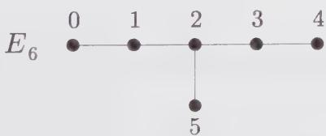  
Figure 17.1. A labeling of the vertices of the $E_{6}$ diagram.

We first construct the graph algebra of $E_6$ . We take the vertex 0 of Fig. 17.1 as the unit (hence $N_0 = \mathbb{I}$ ) and 1 as the fundamental vertex, so that the matrix $N_1$

reads

$$
N _ {1} = G = \left( \begin{array}{c c c c c c} 0 & 1 & 0 & 0 & 0 & 0 \\ 1 & 0 & 1 & 0 & 0 & 0 \\ 0 & 1 & 0 & 1 & 0 & 1 \\ 0 & 0 & 1 & 0 & 1 & 0 \\ 0 & 0 & 0 & 1 & 0 & 0 \\ 0 & 0 & 1 & 0 & 0 & 0 \end{array} \right)\tag{17.210}
$$

The algebra encoded in $G$ is

$$
\begin{array}{r l} G ^ {2} & = \mathbb {I} + N _ {2} \\ G N _ {2} & = G + N _ {3} + N _ {5} \\ G N _ {3} & = N _ {2} + N _ {4} \\ G N _ {4} & = N _ {3} \\ G N _ {5} & = N _ {2} \end{array}\tag{17.211}
$$

that is, the product $GN_{i}$ is the sum of all $N_{j}$ such that j is linked to i. From these relations, it is possible to express all the matrices $N_{i}$ solely in terms of G:

$$
\begin{array}{l} N _ {2} = G ^ {2} - \mathbb {I} \\ N _ {3} = G (G ^ {4} - 4 G ^ {2} + 2 \mathbb {I}) \\ N _ {4} = (G ^ {4} - 4 G ^ {2} + 2 \mathbb {I}) \\ N _ {5} = G (- G ^ {4} + 5 G ^ {2} - 4 \mathbb {I}) \end{array}\tag{17.212}
$$

It is then straightforward to show that all these matrices are integral matrices with nonnegative integer entries. Notice that the matrix G is a solution of the characteristic equation

$$
P (G) = (G ^ {2} - \mathbb {I}) (G ^ {4} - 4 G ^ {2} + \mathbb {I}) = 0\tag{17.213}
$$

which simply reexpresses the relation $G N_{5} = N_{2}$ . Here P denotes the characteristic polynomial of G,

$$
P (x) = \det (x \mathbb {I} - G)\tag{17.214}
$$

The $E_6$ graph algebra is in fact isomorphic to the algebra $\mathbb{C}[x] / P(x)$ of polynomials modulo $P$ .

It is easy to see that the matrices $N_{0}$ , $N_{4}$ , and $N_{5}$ form a subalgebra of the $E_{6}$ graph algebra. For instance,

$$
\begin{array}{r l} N _ {4} ^ {2} - \mathbb {I} & = (N _ {4} + \mathbb {I}) (N _ {4} - \mathbb {I}) \\ & = (G ^ {4} - 4 G ^ {2} + 3 \mathbb {I}) (G ^ {4} - 4 G ^ {2} + \mathbb {I}) \\ & = (G ^ {2} - 3 \mathbb {I}) P (G) = 0 \end{array}\tag{17.215}
$$

We find the relations

$$
\begin{array}{r} N _ {5} ^ {2} = N _ {0} + N _ {4} \\ N _ {5}   N _ {4} = N _ {5} \\ N _ {4} ^ {2} = N _ {0} \end{array}\tag{17.216}
$$

These are exactly the fusion rules of the extended diagonal theory associated with the invariant $Z_{E_{6}}$ , namely $\widehat{sp}(4)_{1}$ (we recall that this invariant is obtained by the conformal embedding of $\widehat{su}(2)_{10}$ in $\widehat{sp}(4)_{1}$ ). Moreover, the fusion rules of $\widehat{sp}(4)_{1}$ are isomorphic to those of the Ising model. The identifications read

$$
\begin{array}{c c c c c} 0 & \leftrightarrow & [ 1 0, 0 ] \oplus [ 4, 6 ] & \leftrightarrow & \mathbb {I} \\ 4 & \leftrightarrow & [ 6, 4 ] \oplus [ 0, 1 0 ] & \leftrightarrow & \epsilon \\ 5 & \leftrightarrow & [ 7, 3 ] \oplus [ 3, 7 ] & \leftrightarrow & \sigma \end{array}\tag{17.217}
$$

In the following, we denote by $\mathcal{U} = \{0,4,5\}$ the set of vertices corresponding to this subalgebra.

The generalizations of this subset U for the other ADE algebras associated with block-diagonal invariants are indicated in Fig. 17.2, where the corresponding subsets of vertices of G are circled. In each case, the fusion rules associated with the graph subalgebras reproduce the extended fusion algebra of the corresponding WZW modular invariant theory.

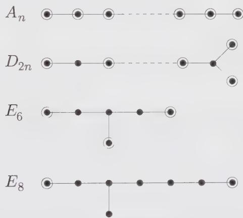  
Figure 17.2. The sets U of circled vertices for each of the graphs $A_{n}, D_{2n}, E_{6}$ , and $E_{8}$ , giving rise to a subalgebra of the graph algebra, identical to the extended fusion algebra of the corresponding WZW model.

Therefore, by supplementing the graphs with a particular subset of their vertices, we have been able to encode more than just the set of exponents (i.e., the set of spinless operators in the theory). We will show now that, quite remarkably, this additional information actually encodes the whole structure of the corresponding modular invariant.

We need to introduce a duality relation between a graph subalgebra, with elements indexed by a subset U of the vertices of the graph G, and its dual algebra, indexed by eigenvalue labels of the corresponding adjacency matrix $G^{21}$ . In concrete terms, we use the subset U to define an equivalence relation, denoted by $\approx$ , between the eigenvalue labels of G. This equivalence relation is defined in terms of the quantities

$$
f _ {m, n} = \sum_ {r \in \mathcal {U}} S _ {r m} S _ {m}\tag{17.218}
$$

to be

$$
m \approx n \mathrm{iff} f _ {m, n} \neq 0\tag{17.219}
$$

It can be shown that $\approx$ is indeed reflexive, symmetric, and transitive. $^{22}$ This provides an equivalence relation between the eigenvalue labels of G. The connection with the block-diagonal modular invariants is the following: all eigenvalues in a given equivalence class are the elements of a block and to each equivalence class there corresponds one block.

We now examine this equivalence relation in the $E_{6}$ case. The eigenvalues $\Delta_{m}$ and eigenvectors $S_{rm}$ of the $E_{6}$ adjacency matrix are displayed in Table 17.1. With $U = \{0, 4, 5\}$ , the computation of the quantities $f_{m,n} = f_{n,m}$ through Eq. (17.218) is straightforward. For instance,

$$
f _ {1, 7} = a _ {-} a _ {+} + a _ {-} a _ {+} + 2 a _ {-} a _ {+} = 4 \frac {\sqrt {(3 + \sqrt {3}) (3 - \sqrt {3})}}{2 4} = \frac {1}{\sqrt {6}}
$$

For $f_{m,n}$ ( $m \leq n$ ), we find

$$
f _ {1, 1} = f _ {1 1, 1 1} = \frac {3 - \sqrt {3}}{6}
$$

$$
f _ {5, 5} = f _ {7, 7} = \frac {3 + \sqrt {3}}{6}
$$

$$
f _ {1, 7} = f _ {5, 1 1} = \frac {1}{\sqrt {6}}\tag{17.220}
$$

$$
f _ {4, 4} = f _ {8, 8} = f _ {4, 8} = \frac {1}{2}
$$

and all the other $f$ 's vanish. Therefore $1 \approx 7, 5 \approx 11$ , and $4 \approx 8$ , and the equivalence relation $\approx$ has three equivalence classes:

$$
\{1, 7 \} \quad \{5, 1 1 \} \quad \{4, 8 \}\tag{17.221}
$$

They match exactly (up to the usual shift of each exponent by $-1$ ) the three blocks of the modular invariant (17.208).

Table 17.1. Eigenvalues and eigenvectors of $E_6$ . We display line by line the eigenvalue $2\cos \pi m / 12$ , the exponent $m$ , and the six eigenvector components $S_{rm}, r = 0, \dots, 5$ , corresponding to the six vertices of $E_6$ . Notation: $a_{\pm} = \sqrt{3 \pm \sqrt{3}} / 2\sqrt{6}$ .

<table><tr><td>Eigenvalue</td><td>Exponent</td><td>0</td><td>1</td><td>2</td><td>3</td><td>4</td><td>5</td></tr><tr><td> $\frac{\sqrt{3}+1}{\sqrt{2}}$ </td><td>1</td><td> $a_{-}$ </td><td> $a_{+}$ </td><td> $\sqrt{2}a_{+}$ </td><td> $a_{+}$ </td><td> $a_{-}$ </td><td> $\sqrt{2}a_{-}$ </td></tr><tr><td>1</td><td>4</td><td> $\frac{1}{2}$ </td><td> $\frac{1}{2}$ </td><td>0</td><td> $-\frac{1}{2}$ </td><td> $-\frac{1}{2}$ </td><td>0</td></tr><tr><td> $\frac{\sqrt{3}-1}{\sqrt{2}}$ </td><td>5</td><td> $a_{+}$ </td><td> $a_{-}$ </td><td> $\sqrt{2}a_{-}$ </td><td> $a_{-}$ </td><td> $a_{+}$ </td><td> $-\sqrt{2}a_{+}$ </td></tr><tr><td> $-\frac{\sqrt{3}-1}{\sqrt{2}}$ </td><td>7</td><td> $a_{+}$ </td><td> $-a_{-}$ </td><td> $-\sqrt{2}a_{-}$ </td><td> $-a_{-}$ </td><td> $a_{+}$ </td><td> $\sqrt{2}a_{+}$ </td></tr><tr><td>-1</td><td>8</td><td> $\frac{1}{2}$ </td><td> $-\frac{1}{2}$ </td><td>0</td><td> $\frac{1}{2}$ </td><td> $-\frac{1}{2}$ </td><td>0</td></tr><tr><td> $-\frac{\sqrt{3}+1}{\sqrt{2}}$ </td><td>11</td><td> $a_{-}$ </td><td> $-a_{+}$ </td><td> $\sqrt{2}a_{+}$ </td><td> $-a_{+}$ </td><td> $a_{-}$ </td><td> $-\sqrt{2}a_{-}$ </td></tr></table>

By repeating this calculation with $A_{n}, D_{2n}$ , and $E_{8}$ , we find that the equivalence classes dual to the sets U indicated by the circled vertices of Fig. 17.2 all reproduce the extended blocks of the corresponding WZW modular invariants. The detailed analysis of the $E_{8}$ case is presented in Ex. 17.22.

For later use in the $\widehat{su}(3)$ generalization, we stress the importance of the S matrix, which diagonalizes G. For the $A_{n}$ diagrams, this matrix coincides with the S matrix of the modular transformation $\tau \rightarrow -1/\tau$ of the WZW characters at level k = n - 1. In particular, the eigenvalues of the $A_{n}$ adjacency matrix are

$$
\Delta_ {\mu} = \gamma_ {f} ^ {(\hat {\mu})} = \frac {\mathcal {S} _ {f \hat {\mu}}}{\mathcal {S} _ {0 \hat {\mu}}}\tag{17.222}
$$

Here $f$ denotes the affine extension of the fundamental weight $\omega_{1}$ at level $k$ , and $\gamma_{\hat{\lambda}}^{(\hat{\mu})}$ has been defined in Eq. (14.245). It is left as an exercise to check that

$$
\Delta_ {\mu} = \frac {\sin [ 2 \pi (\mu_ {1} + 1) / (k + 2) ]}{\sin [ \pi (\mu_ {1} + 1) / (k + 2) ]} = 2 \cos \left[ \frac {\pi (\mu_ {1} + 1)}{(k + 2)} \right]\tag{17.223}
$$

## 17.10.4. Generalized ADE Diagrams for $\widehat{s\widehat{u}}(3)$

We now to generalize the above construction to the $\widehat{su}(3)$ case. In contradistinction with $\widehat{su}(2)$ , here we have no diagram at hand from which we can construct the modular invariants by means of the above duality argument. The first step is to try to construct these diagrams, guided by the $\widehat{su}(2)$ results. A natural starting point is to generalize the $A_{n}$ diagrams, which correspond to the diagonal invariants. We recall that for $\widehat{su}(2)_{k}$ , all the vertices of the $A_{k+1}$ diagram are circled. This means that the diagram itself encodes the fusions of the theory by the fundamental representation (1). This suggests defining the corresponding diagram in the $\widehat{su}(3)_{k}$ theory, denoted by $A_{k}$ , as the one encoding the fusions by the fundamental representation (1,0). The $A_{k}$ diagram is depicted in Fig. 17.3. Because the representation (1,0) is not self-conjugate, the diagram is now oriented. Moreover, its vertices have a natural $Z_{3}$ -grading, namely the triality of the corresponding representation. $^{23}$ Although not symmetric, the adjacency matrix of $A_{k}$ can be shown to be diagonalizable in an orthonormal basis. As in the $\widehat{su}(2)_{k}$ case, the eigenvalues and eigenvectors of this diagram are simply expressed in terms of the $\widehat{su}(3)_{k}$ modular matrices. The eigenvectors are the S matrix elements (Eq. (14.217)):

$$
\mathcal {S} _ {(\lambda_ {1}, \lambda_ {2}), (\mu_ {1}, \mu_ {2})} \equiv \mathcal {S} _ {[ k - \lambda_ {1} - \lambda_ {2}, \lambda_ {1}, \lambda_ {2} ], [ k - \mu_ {1} - \mu_ {2}, \mu_ {1}, \mu_ {2} ]}\tag{17.224}
$$

and the eigenvalues are given by the ratios

$$
\Delta_ {(\mu_ {1}, \mu_ {2})} = \frac {\mathcal {S} _ {(1 , 0) , (\mu_ {1} , \mu_ {2})}}{\mathcal {S} _ {(0 , 0) , (\mu_ {1} , \mu_ {2})}} = \sum_ {j = 1} ^ {3} e ^ {2 i \pi (\epsilon_ {j}, \mu + \rho) / 3 (k + 3)}\tag{17.225}
$$

where the $\epsilon_{i}$ are related to the fundamental weights by

$$
\epsilon_ {1} = \omega_ {1} \qquad \epsilon_ {2} = \omega_ {2} - \omega_ {1} \qquad \epsilon_ {3} = - \omega_ {2}
$$

In Eqs. (17.224)-(17.225), both the vertex and eigenvalue labels run over the set $P_{+}^{k}$ of integral weights of level $\dot{k}$

$$
P _ {+} ^ {k} = \left\{\left(\lambda_ {1}, \lambda_ {2}\right) \mid \lambda_ {1}, \lambda_ {2} \geq 0 \quad \lambda_ {1} + \lambda_ {2} \leq k \right\}\tag{17.226}
$$

and the indices $(\lambda_{1}+1,\lambda_{2}+1)=\lambda+\rho$ now play the role of the exponents of the $A_{k+1}$ diagram. We will still call them the exponents of $A_{k}$ . Equation (17.225) is actually the $\widehat{su}(3)$ generalization, for $A_{k}$ , of the formula (17.209) for the eigenvalues of A. Its proof is left as an exercise (Ex. 17.26).

Our program is now clear: reversing the logic of the $\widehat{su}(2)$ association between modular invariants and graphs, we wish to construct an oriented graph for each $\widehat{su}(3)$ block-diagonal $^{24}$ modular invariant, whose eigenvalues are indexed by the spinless fields of the theory. These fields are indexed by a certain list of integral weights (actually a subset of Eq. (17.226) with possible repetitions), which must be the exponents of the desired graph. This can actually be done (with a little intuition and much work) and leads to the graphs of Fig. 17.4. For completeness, the list of exponents is displayed on Table 17.2.

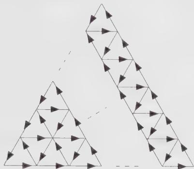  
Figure 17.3. The $\mathcal{A}_k$ diagram for $su(3)$ , with $(k + 1)(k + 2)/2$ vertices.

Table 17.2. Graphs and exponents for the block-diagonal WZW $\widehat{su}(3)_k$ modular invariants.

<table><tr><td>Graph</td><td>Exponents</td></tr><tr><td> $\mathcal{A}_{k}$ </td><td> $\{\lambda + \rho\}, \lambda \in P_{+}^{k}$ </td></tr><tr><td> $\mathcal{D}_{3k}$ </td><td> $\{\lambda + \rho\}, \lambda \in Q \cap P_{+}^{3k}, 2 \times (k + 1, k + 1)$ </td></tr><tr><td> $\mathcal{E}_{5}$ </td><td> $\{(1, 1), (3, 3), (3, 2), (1, 6), (2, 3), (6, 1), (4, 1), (1, 4), (1, 3), (4, 3), (3, 1), (3, 4)\}$ </td></tr><tr><td> $\mathcal{E}_{9}$ </td><td> $\{(1, 1), (10, 1), (1, 10), (5, 5), (5, 2), (2, 5), (3, 3), (3, 6), (6, 3), (3, 3), (3, 6), (6, 3)\}$ </td></tr><tr><td> $\mathcal{E}_{21}$ </td><td> $\{(1, 1), (22, 1), (1, 22), (5, 5), (5, 14), (14, 5), (11, 11), (11, 2), (2, 11), (7, 7), (7, 10), (10, 7), (7, 1), (16, 7), (1, 16), (1, 7), (7, 16), (16, 1), (5, 8), (11, 5), (8, 11), (8, 5), (5, 11), (11, 8)\}$ </td></tr></table>

The construction presented here is not unique: several different graphs may share the same eigenvalues, hence the same set of exponents. (Some examples are worked out in Ex. 17.24.) The choice leading to Fig. 17.4 is actually justified by the relation to the extended fusion rules, which is the subject of the next section.

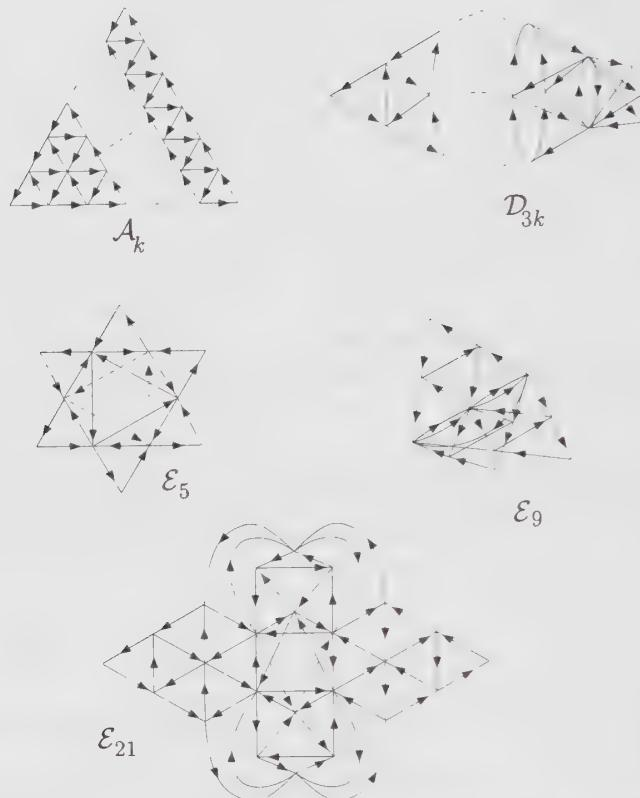  
Figure 17.4. The generalized Dynkin diagrams for the $\widehat{su}(3)_k$ WZW block-diagonal invariants. The names of the diagrams are indexed by the value of the level $k$ .

## 17.10.5. Graph Subalgebras and Modular Invariants for $\widehat{su}(3)$

When constructing the generalized Dynkin diagrams of Fig. 17.4, an important guideline is the parallel construction of a coherent graph algebra, whose coefficients $N_{rs}^{t}$ are all nonnegative integer numbers: this property of positivity will again restrict the result to block-diagonal modular invariants only. Coherence also forces the existence of a unit vertex, namely a vertex with only one link pointing out to the fundamental one on G. Notice, moreover, that the graphs of Fig. 17.4 all have some particular symmetry properties. They all have the $Z_{3}$ grading mentioned above in the A case. Moreover, the adjacency matrices G satisfy the normality condition $^{25}$

$$
[ G, G ^ {t} ] = 0\tag{17.227}
$$

which ensures their diagonalizability in an orthonormal basis. This statement is proven in Ex. 17.23.

The main property of all these diagrams is that there exists a subalgebra of the graph algebra, isomorphic to the fusion algebra of the extended version of the corresponding WZW theory.

Consider, for example, the case of the diagram $E_{5}$ of Fig. 17.4, with 12 vertices. We choose one of the external vertices as the unit and denote it by $0 \equiv 1_{0}$ . We label by $1_{1}, 1_{2}, 1_{3}, 1_{4}, 1_{5}$ the other external vertices counted clockwise from $1_{0}$ . We also label by $f \equiv 2_{0}$ and $2_{1}, 2_{2}, 2_{3}, 2_{4}$ , and $2_{5}$ the internal vertices, starting from the fundamental one and also counted clockwise. The graph algebra relations read

$$
\begin{array}{l} N _ {f}   N _ {1 _ {j}}   =   N _ {2 _ {j}} \\ N _ {f}   N _ {2 _ {j}}   =   N _ {2 _ {j + 1}} + N _ {2 _ {j + 4}} + N _ {1 _ {j - 1}} \end{array}\tag{17.228}
$$

where the indices $j$ are considered as elements of $\mathbb{Z}_6$ . After some algebra, it can be shown that the subset of matrices corresponding to the external vertices

$$
\{N _ {1 _ {j}} \}, j \in \mathbb {Z} _ {6}\tag{17.229}
$$

forms a closed subalgebra, namely (cf. Ex. 17.25)

$$
N _ {1 _ {j}} N _ {1 _ {k}} = N _ {1 _ {j + k}}\tag{17.230}
$$

which is isomorphic to the $\widehat{su}(6)_{1}$ fusion algebra. Since the $Z_{E_{5}}$ modular invariant is obtained by the conformal embedding $\widehat{su}(3)_{5} \subset \widehat{su}(6)_{1}$ , this fusion algebra is precisely the extended fusion algebra of the $E_{5}$ WZW model.

We have displayed, in Fig. 17.5, the generalized ADE graphs, with their circled vertices denoting the subalgebras reproducing the extended fusion rules of the block-diagonal $\widehat{su}(3)$ WZW modular-invariant theories. By means of the duality described in Sect. 17.10.3, each subalgebra can be mapped to a partition of the set of exponents (eigenvalue labels) that correspond precisely to the extended blocks of the modular invariant.

To illustrate the whole construction, we pursue the analysis of the $E_{5}$ example and derive the corresponding partition of the set of exponents. To diagonalize the adjacency matrix G of $E_{5}$ , we use the $Z_{3}$ grading property. With the unit $1_{0} \equiv 0$ and the fundamental $2_{0} \equiv f$ having triality 0 and 1, respectively, we find that all the vertices in the set $\{1_{j}, 1_{j+3}, 2_{j+1}, 2_{j+4}\}$ have triality j, with j = 0, 1, 2. (Triality is additive in tensor products, hence in fusions.) The matrix G maps the set of triality j onto that of triality $j + 1$ . Therefore, in the basis

$$
\{1 _ {j}, 1 _ {j + 3}, 2 _ {j + 1}, 2 _ {j + 4} \} \quad j = 0, 1, 2\tag{17.231}
$$

the matrix G takes the block form

$$
G = \left( \begin{array}{c c c} 0 & 0 & H \\ H & 0 & 0 \\ 0 & H & 0 \end{array} \right)\tag{17.232}
$$

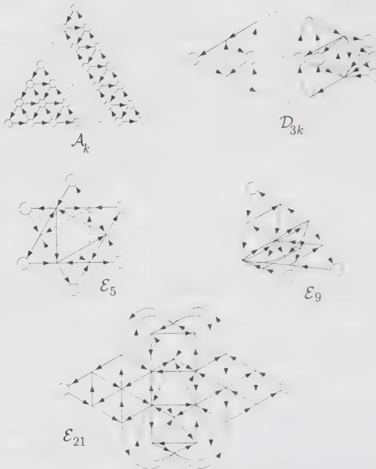  
Figure 17.5. Generalized ADE graphs, with the circled vertices defining the relevant graph subalgebras, which encode the extended fusion rules of the block-diagonal $\widehat{su}(3)_k$ WZW theories.

where

$$
H = \left( \begin{array}{c c c c} 0 & 0 & 1 & 0 \\ 0 & 0 & 0 & 1 \\ 1 & 0 & 1 & 1 \\ 0 & 1 & 1 & 1 \end{array} \right)\tag{17.233}
$$

All the eigenvectors and eigenvalues of $G$ may be found by diagonalizing $H$ . We suppose that $v$ is an eigenvector of $H$ with eigenvalue $x$ :

$$
H \nu = x \nu\tag{17.234}
$$

Then, the vector $(\nu, \nu, \nu)$ , with 12 components, is clearly an eigenvector of $G$ for the same eigenvalue $x$ . Let $\omega = e^{2i\pi / 3}$ be the fundamental third root of unity. Then the vectors $(\nu, \omega\nu, \omega^2\nu)$ and $(\nu, \omega^2\nu, \omega\nu)$ are also eigenvectors of $G$ with respective eigenvalues $\omega^2 x$ and $\omega x$ . This completes the diagonalization of $G$ . The eigenvalues $\Delta_{(m,n)}$ and eigenvectors $P_{r,(m,n)}$ of $H$ are listed in Table 17.3, with the corresponding $\mathcal{E}_5$ exponents, that is, the eigenvalue labels in Eq. (17.225). We note that if the eigenvalue $x$ corresponds to the exponent $(m,n)$ (i.e., is given by

Eq. (17.225) with $(\mu_{1}+1,\mu_{2}+1)=(m,n)$ , then the exponents corresponding to the “rotated” eigenvalues $\omega x$ (resp. $\omega^{2}x$ ) are also “rotated” through $\sigma(m,n)$ (resp. $\sigma^{2}(m,n)$ ), where $\sigma$ is the rotation by $2\pi/3$ of the corresponding weight $^{26}$

$$
\sigma (m, n) = (8 - m - n, m)\tag{17.235}
$$

For $(m,n)$ as in Table 17.3, the eigenvalues and eigenvectors of $G$ read, respectively,

$$
\omega^ {j} \Delta_ {(m, n)}, j = 0, 1, 2\tag{17.236}
$$

and

$$
S _ {v (r, j), \sigma^ {j} (m, n)} = \frac {1}{\sqrt {3}} (P _ {r, (m, n)}, \omega^ {2 j} P _ {r, (m, n)}, \omega^ {j} P _ {r, (m, n)})\tag{17.237}
$$

for $j = 0,1,2$ ; $r = 1,2,3,4$ ; and $(m,n)$ as in Table 17.3. We have denoted by

$$
\{v (r, j) \} _ {1 \leq r \leq 4} = \{1 _ {j}, 1 _ {j + 3}, 2 _ {j + 1}, 2 _ {j + 4} \}\tag{17.238}
$$

the corresponding vertices of $E_{5}$ .

Table 17.3. Eigenvalues and eigenvectors of $H$ . We display line by line the eigenvalue $\Delta_{(m,n)}$ , the corresponding exponent $(m,n)$ of $\mathcal{E}_5$ , and the four eigenvector components, $P_{r,(m,n)}, r = 1,2,3,4$ . Notation: $b_{\pm} = \sqrt{2 \pm \sqrt{2}} / 2\sqrt{2}$ .

<table><tr><td>Eigenvalue</td><td>Exponent</td><td>1</td><td>2</td><td>3</td><td>4</td></tr><tr><td> $1 + \sqrt{2}$ </td><td>(1,1)</td><td> $b_{-}$ </td><td> $b_{-}$ </td><td> $b_{+}$ </td><td> $b_{+}$ </td></tr><tr><td> $1 - \sqrt{2}$ </td><td>(3,3)</td><td> $b_{+}$ </td><td> $b_{+}$ </td><td> $-b_{-}$ </td><td> $-b_{-}$ </td></tr><tr><td>1</td><td>(4,1)</td><td> $-\frac{1}{2}$ </td><td> $\frac{1}{2}$ </td><td> $-\frac{1}{2}$ </td><td> $\frac{1}{2}$ </td></tr><tr><td>-1</td><td>(1,4)</td><td> $\frac{1}{2}$ </td><td> $-\frac{1}{2}$ </td><td> $-\frac{1}{2}$ </td><td> $\frac{1}{2}$ </td></tr></table>

It is now easy to compute the quantities

$$
f _ {(m, n), (p, q)} = \sum_ {v \in \mathcal {U}} S _ {v, (m, n)} \bar {S} _ {v, (p, q)}\tag{17.239}
$$

where U denotes the set of vertices $1_{j}, j \in Z_{6}$ . Applying the rule (17.219), which defines the equivalence relation $\approx$ , we find that

$$
\begin{array}{l l l} (1, 1) \approx (3, 3) & (4, 1) \approx (1, 4) & (3, 2) \approx (1, 6) \\ (2, 3) \approx (6, 1) & (1, 3) \approx (4, 3) & (3, 1) \approx (3, 4) \end{array}\tag{17.240}
$$

so that the equivalence classes are

$$
\begin{array}{l l l} \{(1, 1), (3, 3) \} & \{(4, 1), (1, 4) \} & \{(3, 2), (1, 6) \}, \\ \{(2, 3), (6, 1) \} & \{(1, 3), (4, 3) \} & \{(3, 1), (3, 4) \} \end{array}\tag{17.241}
$$

They match exactly (up to the usual shift of all the indices by $-1$ ) the blocks of the $\mathcal{E}_5$ modular invariant (17.115)

$$
\begin{array}{r l} Z _ {\mathcal {E} _ {5}} = & | \chi_ {0, 0} + \chi_ {2, 2} | ^ {2} + | \chi_ {3, 0} + \chi_ {0, 3} | ^ {2} + | \chi_ {2, 1} + \chi_ {0, 5} | ^ {2} \\ & + | \chi_ {1, 2} + \chi_ {5, 0} | ^ {2} + | \chi_ {0, 2} + \chi_ {3, 2} | ^ {2} + | \chi_ {2, 0} + \chi_ {2, 3} | ^ {2} \end{array}\tag{17.242}
$$

The results presented in this section generalize to any Lie algebra. For higher-rank algebras, we have already indicated that the fusions by the fundamental representation do not generate all the fusion rules (cf. Ex. 16.11). Typically, for $\widehat{su}(N)$ , we need to know the fusions by the $N/2$ first fundamental representations (the fusions by their conjugates follow by transposition of the fusion matrices $N_{f_i}$ ). Therefore, the $\mathcal{A}$ graph must be replaced by a collection of graphs, each corresponding to one of these fundamental representations. However, we believe that the above results can be adapted to these cases too. The general classification problem of modular invariants for WZW theories can therefore be rephrased in terms of a classification problem of graphs, with some particular properties relating them to the original problem. It would seem that the graph classification problem is simpler, and this is certainly the case for $\widehat{su}(2)$ . However, the precise link between the two problems is still missing, and the emergence of the generalized Dynkin diagrams must still be regarded as a phenomenological observation. Nevertheless, deep relations between modular invariance, number theory, and graph theory should be expected.

We make a final remark on the generalized Dynkin diagrams for $\widehat{su}(3)$ . Although they have no direct Lie-algebraic interpretation, these diagrams are the outcome of some well-defined classification problem. Just like the ADE diagrams, which have many different interpretations in mathematics and physics (e.g., Platonic solids, simply-laced Lie algebras, $\widehat{su}(2)$ modular invariants, finite subgroups of $su(2)$ , catastrophes, integrable lattice models), the $\widehat{su}(3)$ diagrams may still be hiding some of their mysteries.

## Appendix 17.A. $\widehat{s\widehat{u}}(p)_q \oplus \widehat{s\widehat{u}}(q)_p \subset \widehat{s\widehat{u}}(pq)_1$ Branching Rules

In this appendix, a simple and powerful method is presented for the calculation of the conformal branching rules of $\widehat{su}(p)_{q} \oplus \widehat{su}(q)_{p} \subset \widehat{su}(pq)_{1}$ . First, we explain how the corresponding finite branching rules are evaluated. Let $\lambda$ be the highest weight of an irreducible representation of $su(pq)$ , represented by a Young tableau of $|\lambda|$ boxes. Its decomposition into $su(p) \oplus su(q)$ is given by all pairs of $su(p)$ and $su(q)$ Young tableaux of $|\lambda|$ boxes each, which are related by transposition, that is, by interchanging rows and columns. The rule is to be understood in the sense that if the transpose of a $su(p)$ Young tableau has more than $q$ rows, it is not a $su(q)$ Young tableau, and this pair of tableaux does not appear in the decomposition. For instance, the decomposition of $\omega_5$ of $su(6)$ into $su(2) \oplus su(3)$ is

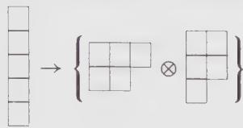

(17.243)

that is,

$$
(0, 0, 0, 0, 1) \rightarrow (1) \otimes (0, 1)\tag{17.244}
$$

Indeed, for the other two $su(2)$ tableaux of five boxes

$$
\begin{array}{c c c c c} \hline & & & & \\ \hline & & & & \\ \hline & & & & \\ \hline & & & & \\ \hline & & & & \\ \hline & & & & \\ \hline & & & & \\ \hline & & & & \\ \hline & & & & \\ \hline & & & & \\ \hline & & & & \\ \hline & & & & \\ \hline \end{array} ,\tag{17.245}
$$

the interchange of rows and columns leads to tableaux of more than three rows, that is, nonregular Young tableaux for $su(3)$ .

Part of the affine branching rules can be obtained by a similar procedure, except that the level must be taken into account. This forces the transposition transformation to be slightly modified. We first describe this modification and indicate later how the complete branching rules can be found. Since we are interested only in conformal embeddings, which restricts the level of the $\widehat{su}(pq)$ algebra to one, only the branching rules for the fundamental representations are needed. The Young tableau representing $\hat{\omega}_{\ell}$ for $\ell \neq 0$ is a single column of $\ell$ boxes, and a column of pq boxes for $\hat{\omega}_{0}$ . To obtain the decomposition of a tableau of $\ell$ boxes, we first look for $su(p)$ tableaux with exactly q columns (the level constraint), containing $\ell - np$ boxes, where n is a nonnegative integer. This subtraction takes into account the fact that extra columns are allowed if they have exactly p boxes each (these do not contribute to the level). Of course, the transposed tableau has the same number of boxes, namely $\ell - np$ . However, we are looking for a tableau with $\ell - mq$ boxes (with m a nonnegative integer). This means that when $n, m \neq 0$ , the transposition transformation must be adjusted. The required adjustment relies on the following fact: there always exists a single element of the outer-automorphism group of $\widehat{su}(q)_{p}$ that transforms the integrable weight associated with the Young tableau of $\ell - np$ boxes, into another integrable weight whose finite part is represented by a Young tableau of $\ell - mq$ boxes. The resulting affine weight is the second of two weights occurring in the decomposition of $\hat{\omega}_{\ell}$ .

The above statement, concerning the existence of an element of $\mathcal{O}(\widehat{s\boldsymbol{u}}(q)_{p})$ that can transform a Young tableau of $\ell - np$ boxes into another one of $\ell - mq$ boxes, is very simple to establish. We let $\tilde{a}$ be the basic outer automorphism of $\widehat{s\tilde{u}}(q)$ . We recall that the action of $\tilde{a}$ on a reduced tableau (one for which columns of q boxes have been stripped off) associated with an affine weight at level p, amounts to adding on the top of the tableau a row of p boxes (cf. Eq. (16.167)). For repeated applications of $\tilde{a}$ , the tableau has to be reduced at each step. Therefore, n applications of $\tilde{a}$ on a tableau of $\ell - np$ boxes transform it into a tableau of $\ell$ boxes, and m reductions leave a resulting tableau of $\ell - mq$ boxes, as desired.

We illustrate this procedure by the example of the branching of $\hat{\omega}_0$ of $\widehat{s\widehat{u}}(12)_1$ into $\widehat{s\widehat{u}}(3)_4 \oplus \widehat{s\widehat{u}}(4)_3$ , which gives:

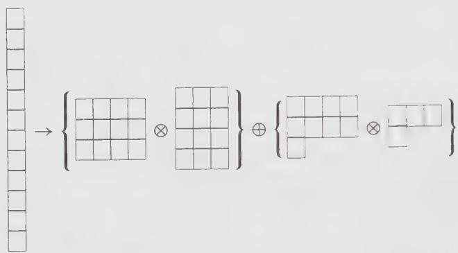

(17.246)

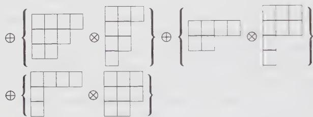

The above $su(3)$ tableaux (the first members of each pair) are all the possible tableaux with at most 3 rows, 4 columns, and 12 - 3n boxes. (Here we choose to write tableaux such that they all have exactly 4 columns, by filling with the appropriate number of columns of three boxes.) The transpose of the $su(3)$ tableau in the second pair is

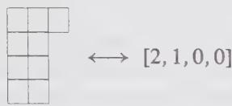

(17.247)

Since the number of boxes is 9, which cannot be written as $12 - 4m$ , this is not an eligible $\widehat{s u}(4)_3$ tableau in the present context. Application of the various powers of the basic element $\tilde{a}$ of the $\widehat{s u}(4)$ outer automorphism group to the reduced tableau yields (performing the necessary reductions after each step):

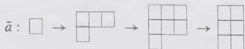

(17.248)

§17.A. $\widehat{s\widehat{u}}(p)_{q} \oplus \widehat{s\widehat{u}}(q)_{p} \subset \widehat{s\widehat{u}}(pq)_{1}$ Branching Rules

Among these, only the second one has the right number of boxes, hence

$$
\begin{array}{c c c} \hline & & \\ \hline & & \end{array} \longleftrightarrow [ 0, 2, 1, 0 ]\tag{17.249}
$$

must be chosen. Similar manipulations on the transpose of the first tableau in the third, fourth, and fifth pairs above show that eligible tableaux are obtained respectively from the action of $\tilde{a}, \tilde{a}^{2}$ and $\tilde{a}^{2}$ .

The weight transcription of $(17.246)$ is:

$$
\begin{array}{l} [ 1, 0, 0, 0, 0, 0, 0, 0, 0, 0, 0, 0 ] \\ \mapsto \{[ 4, 0, 0 ] \otimes [ 3, 0, 0, 0 ] \} \oplus \{[ 1, 0, 3 ] \otimes [ 0, 2, 1, 0 ] \} \\ \oplus \{[ 2, 1, 1 ] \otimes [ 1, 1, 0, 1 ] \} \oplus \{[ 0, 2, 2 ] \otimes [ 1, 0, 2, 0 ]) \} \\ \oplus \{[ 1, 3, 0 ] \otimes [ 0, 0, 1, 2 ] \} \end{array}\tag{17.250}
$$

As previously mentioned, there is no guarantee at this point that this is the complete answer. Nevertheless, we can check, by verifying the sum rule (17.95), that for this case this is indeed the full branching rule.

To proceed, we need the branchings of the outer-automorphism groups. We denote by A, a, and $\tilde{a}$ , respectively, the basic elements of the outer-automorphism group of $\widehat{s\tilde{u}}(pq)$ , $\widehat{s\tilde{u}}(p)$ , and $\widehat{s\tilde{u}}(q)$ . The relation

$$
\mathcal {P} A ^ {p q} = (a ^ {p} \otimes 1) \mathcal {P} = (1 \otimes \tilde {a} ^ {q}) \mathcal {P} = 1\tag{17.251}
$$

(where P is the projection matrix) allows the correspondence

$$
A ^ {q} \mapsto a \otimes 1, A ^ {p} \mapsto 1 \otimes \tilde {a}\tag{17.252}
$$

Now, the affine branching rules are obtained from the union of the action by Eq. (17.252) in all possible ways on the partial branching rules obtained in the previous step. (We give this result without proof.) In this way, we could check that Eq. (17.250) is complete. This is left as an exercise, and a simpler example will now be considered, namely $\widehat{su}(2)_{3} \oplus \widehat{su}(3)_{2} \subset \widehat{su}(6)_{1}$ . The partial branching rules obtained after the first step are:

$$
\begin{array}{l} \hat {\omega} _ {0} \mapsto \{[ 1, 2 ] \otimes [ 0, 1, 1 ] \} \oplus \{[ 3, 0 ] \otimes [ 2, 0, 0 ] \} \oplus \dots \\ \hat {\omega} _ {1} \mapsto \{[ 2, 1 ] \otimes [ 1, 1, 0 ] \} \oplus \dots \\ \hat {\omega} _ {2} \mapsto \{[ 1, 2 ] \otimes [ 1, 0, 1 ] \} \oplus \{[ 3, 0 ] \otimes [ 0, 2, 0 ] \} \oplus \dots \\ \hat {\omega} _ {3} \mapsto \{[ 2, 1 ] \otimes [ 0, 1, 1 ] \} \oplus \{[ 0, 3 ] \otimes [ 2, 0, 0 ] \} \oplus \dots \\ \hat {\omega} _ {4} \mapsto \{[ 1, 2 ] \otimes [ 1, 1, 0 ] \} \oplus \{[ 3, 0 ] \otimes [ 0, 0, 2 ] \} \oplus \dots \\ \hat {\omega} _ {5} \mapsto \{[ 2, 1 ] \otimes [ 1, 0, 1 ] \} \oplus \{[ 0, 3 ] \otimes [ 0, 2, 0 ] \} \oplus \dots \end{array}\tag{17.253}
$$

It follows from Eq. (17.252) that $A^{3} \mapsto a \otimes 1$ and $A^{2} \mapsto 1 \otimes \tilde{a}$ . In particular, by applying $A^{3}$ on the $\hat{\omega}_{4}$ branching rule, we find an additional term in the $\hat{\omega}_{1}$ branching rule, namely $\{[3,0] \otimes [0,0,2]\}$ . Further actions of A produce no additional terms.

In general, $A$ itself has no image into $\widehat{s\widehat{u}}(p) \oplus \widehat{s\widehat{u}}(q)$ . In fact, it is only for $p$ and $q$ relatively prime that $A$ has such an image, and it is given by

$$
A \mapsto a ^ {r} \otimes \tilde {a} ^ {s}\tag{17.254}
$$

where the integers r and s are fixed by $^{27}$

$$
p s = 1 \bmod q, \quad q r = 1 \bmod p\tag{17.255}
$$

This follows from the substitution of relation (17.254) into relation (17.252). These conditions are met in the above example, for which

$$
A \mapsto a \otimes \tilde {a} ^ {2}\tag{17.256}
$$

An efficient use of this relation reduces substantially the number of branching rules that have to be explicitly evaluated.

The present method provides another way of deriving $\widehat{su}(N)$ modular invariants of the outer-automorphism type. Furthermore, it can be used to find new exceptional modular invariants: the contraction on a known exceptional invariant for $\widehat{su}(p)_q$ yields an exceptional invariant for $\widehat{su}(q)_p$ .

With appropriate modifications, this approach can be applied to the analysis of other infinite sequences of conformal embeddings.

## Appendix 17.B. General Orbifolds: Fine Structure of the c = 1 Models

In this appendix, we generalize the notion of the $Z_{2}$ orbifold encountered in Chap. 10. Whenever a conformal theory possesses some additional invariance under a finite group G, it is possible to quotient this symmetry and to produce an orbifold theory.

As an illustration, we apply the orbifold technique to the $c = 1$ bosonic theory on a circle at the self-dual point:

$$
R = \frac {2}{R} = \sqrt {2}\tag{17.257}
$$

at which there is an additional spectrum-generating $\widehat{su}(2)_{1}$ symmetry algebra. This is simply the vertex representation of the $\widehat{su}(2)_{1}$ model described in Sect. 15.6 (see in particular the discussion following Eq. (15.244). The $SU(2)$ symmetry of the model enables us to consider orbifolds under finite subgroups of $SU(2)$ whose conjugate action leaves the current algebra invariant (although the action on the algebra generators is nontrivial). In fact, they leave the bosonic action on the circle invariant.