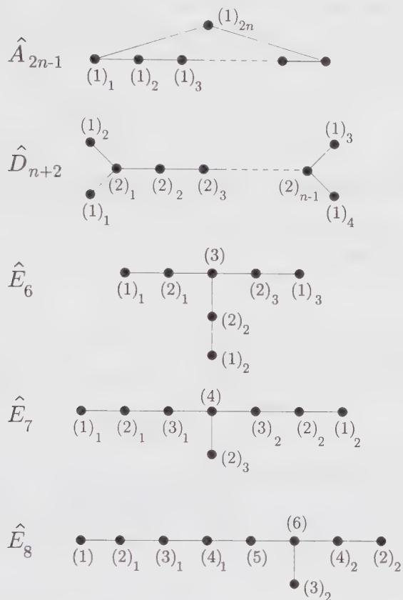
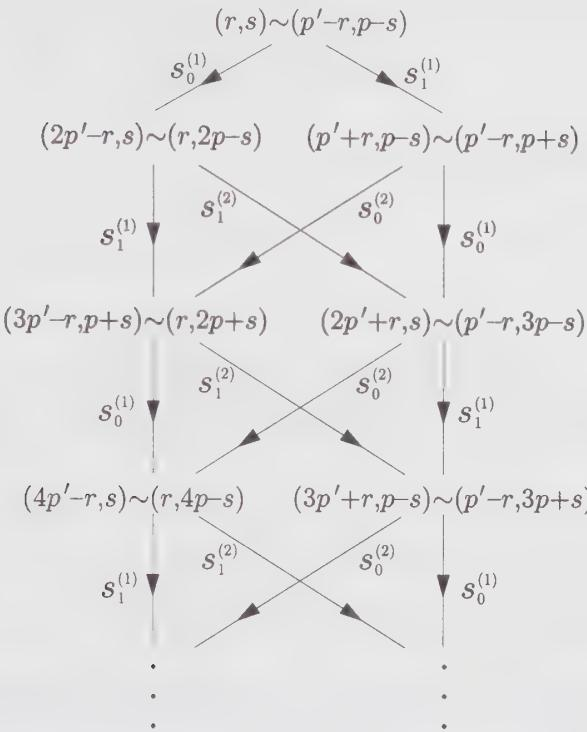
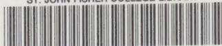
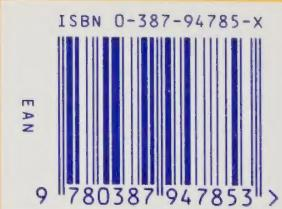

## 17.B.1. Orbifold Based on a Group G

The $\mathbb{Z}_2$ orbifold procedure described in Sect. 10.4.3 (also applied to minimal models in Sect. 10.7.5), can be generalized to any subgroup $G$ of the symmetry group of the initial theory. It consists of the following steps:

(i) We first consider a “twisted” partition function on the torus. This corresponds, in the Lagrangian language, to imposing boundary conditions that are not periodic, but twisted by elements a, b of G along the “space” direction 1 and the “time” direction $\tau$ of the torus, respectively. $^{28}$ The bosonic field $\varphi$ then must satisfy boundary conditions of the form

$$
\begin{array}{r l} \varphi (z + 1) & = \mathsf {a} \varphi (z) \\ \varphi (z + \tau) & = \mathsf {b} \varphi (z) \end{array}\tag{17.258}
$$

This produces a partition function $Z_{a,b}(\tau)$ .

(ii) We next sum over all compatible boundary conditions. More precisely, if the group $G$ is Abelian, the full orbifold partition function reads

$$
Z _ {\mathrm{orb}} = \frac {1}{| G |} \sum_ {\mathbf {a}, \mathbf {b} \in G} Z _ {\mathbf {a}, \mathbf {b}}\tag{17.259}
$$

However, if the group $G$ is non-Abelian, the above sum must extend only to commuting couples $(\mathbf{a},\mathbf{b})\in G^2$ .

In Eq. (17.259), the sum over a corresponds to the various twisted sectors of the Hilbert space of the theory, that is, in a fixed “time” slice, whereas the sum over b produces a group-invariant projection in each sector

$$
\mathcal {B} = \frac {1}{| G |} \sum_ {\mathsf {b} \in G} \mathsf {b}\tag{17.260}
$$

The fact that the sum (17.259) produces a modular-invariant partition function is a consequence of the $\mathcal{T}$ and $S$ actions on $Z_{\mathrm{a,b}}$ , which, from Eq. (17.258), are directly found to be

$$
\begin{array}{l} \mathcal {T} Z _ {\mathrm{a,b}} = Z _ {\mathrm{a,ab}} \\ \mathcal {S} Z _ {\mathrm{a,b}} = Z _ {\mathrm{b,a}} \end{array}\tag{17.261}
$$

We see that the commutativity requirement on (a,b) for non-Abelian groups ensures that the above action of $\mathcal{T}$ is well-defined.

Reformulated concisely, the construction of an orbifold starts with a projection of the Hilbert space states onto a G-invariant subspace

$$
Z _ {\text { proj }} = \frac {1}{| G |} \sum_ {b \in G} Z _ {1, b}\tag{17.262}
$$

where the partition function remains periodic in the space direction (a twist by the identity of the group, 1, has no effect). Modular invariance is then reinforced by summing over all possible space twists a that commute with b.

We illustrate this procedure in the case $G = \mathbb{Z}_2 = \{1, -1\}$ , considered as a multiplicative group. We start with the projection

$$
Z _ {\text { proj }} = \frac {1}{2} (Z _ {1, 1} + Z _ {1, - 1})\tag{17.263}
$$

It is transformed under the action of S and T into

$$
\begin{array}{r l} \mathcal {S} Z _ {\text { proj }} & = \frac {1}{2} (Z _ {1, 1} + Z _ {- 1, 1}) \\ \mathcal {T} \mathcal {S} Z _ {\text { proj }} & = \frac {1}{2} (Z _ {1, 1} + Z _ {- 1, - 1}) \end{array}\tag{17.264}
$$

Hence we find that the combination $^{29}$

$$
Z _ {\mathrm{orb}} = (1 + \mathcal {S} + \mathcal {T S}) Z _ {\mathrm{proj}} - Z\tag{17.265}
$$

is modular invariant. We have subtracted the untwisted partition function $Z = Z_{1,1}$ to avoid overcounting the untwisted sector.

The $\widehat{su}(2)_{1}$ structure of the self-dual c = 1 model on a circle of radius $R = \sqrt{2}$ allows for a variety of orbifolds, based on symmetry under the action of finite subgroups of $SU(2)$ .

## 17.B.2. Orbifolds and the Method of Outer Automorphisms

We digress briefly from our main line of argument, in order to comment on the relation between the orbifold and the outer-automorphism methods. Manifestly, the construction of nondiagonal theories using outer automorphisms, described in Sect. 17.3, is a special case of the orbifold construction. Moreover, the way modular invariance is recovered after the projection B is simpler to describe in the orbifold construction than in the one based on outer automorphisms. However, it should be stressed that in the latter method, the group that is quotiented is rather special, being the center of the symmetry group. $^{30}$ Therefore, its action commutes with the algebra generators. This has the following important implication: upon projection, the affine characters are not broken; a complete representation either survives the projection or is eliminated. As a result, the orbifold partition function can still be expressed as a bilinear combination of the affine Lie algebra characters. Thus, formulating the construction in terms of outer automorphisms keeps us closer to the affine Lie algebra structure. Moreover, generic formulas are as simple for arbitrary G as for $G = Z_{2}$ , which is not the case with the orbifold method (cf. Ex. 17.30).

Quotienting a WZW model by a group that is not in the center is thus bound to break all the affine integrable representations—and these cannot be reconstructed in the twisting process; therefore, the partition function cannot be described in terms of affine characters. In the present case, the free-boson representation of the $\widehat{\mathcal{U}}(2)_1$ model:

$$
H = i \partial \varphi E ^ {\pm} = e ^ {\pm i \sqrt {2} \varphi}\tag{17.266}
$$

allows us to express the orbifold partition function in terms of bosonic ones.

17.B.3. $Z_{2}$ Orbifold of the $c = 1 \widehat{s\widehat{u}(2)}_{1}$ Theory

The $c = 1$ theory has an obvious $\mathbb{Z}_2$ symmetry generated by the transformation

$$
\mathsf {a}: \varphi \to - \varphi\tag{17.267}
$$

Its action on the affine generators is

$$
\mathsf {a}: \quad H \to - H \qquad E ^ {\pm} \to E ^ {\mp}\tag{17.268}
$$

Equivalently, with $H = \sqrt{2}J^{0} \equiv \sqrt{2}J^{3}$ and $E^{\pm} = J^{1} \pm iJ^{2}$ , it reads

$$
\mathsf {a}: \quad J ^ {1} \to J ^ {1} \quad J ^ {2} \to - J ^ {2} \quad J ^ {3} \to - J ^ {3}\tag{17.269}
$$

This transformation obviously preserves the structure of the current algebra.

We note that the currents are invariant under the transformation

$$
\varphi \rightarrow \varphi + \pi \sqrt {2} = \varphi + \pi R\tag{17.270}
$$

Since this $Z_{2}$ transformation does not affect the generators, it must lie in the center of $SU(2)$ . $^{31}$ Being interested in transformations that act nontrivially on the generators, we need to quotient the symmetry group by its center. This amounts to identifying the field configurations $\varphi$ and $\varphi + \pi\sqrt{2}$ . We now define

$$
a ^ {\prime}: \varphi \rightarrow \varphi + \pi \frac {\sqrt {2}}{2}\tag{17.271}
$$

whose action on the generators is

$$
\mathsf {a} ^ {\prime}: \quad J ^ {1} \to - J ^ {1}, \quad J ^ {2} \to - J ^ {2}, \quad J ^ {3} \to J ^ {3}\tag{17.272}
$$

This action can be obtained from that of a by a cyclic permutation of the generators. Such a cyclic permutation can be described by a $SU(2)$ rotation. Because $SU(2)$ is a symmetry of the model, the action of a must be equivalent to that of $a'$ . Quotienting the action of a amounts to constructing the orbifold of Sect. 10.4.3, leading to the partition function $Z_{\mathrm{orb}}(\sqrt{2})$ of Eq. (10.84). Quotienting the action of $a'$ simply reduces the radius of the circle by a factor of 2, leading to the partition function $Z(\sqrt{2}/2)$ . This proves the equivalence

$$
Z _ {\mathrm{orb}} (\sqrt {2}) = Z (\sqrt {2} / 2)\tag{17.273}
$$

In the expression Eq. (10.84), $Z_{orb}$ appears as the half sum of $Z(R)$ and of the R-independent twisted sector contribution, namely

$$
Z _ {\mathrm{orb}} (R) = \frac {1}{2} (Z (R) + Z _ {\mathrm{twist}})\tag{17.274}
$$

At $R = \sqrt{2}$ , this yields, using the equivalence (17.273),

$$
Z _ {\mathrm{twist}} = 2 Z (\sqrt {2} / 2) - Z (\sqrt {2})\tag{17.275}
$$

and hence

$$
Z _ {\text { orb }} (R) = \frac {1}{2} \left(Z (R) + 2 Z (\sqrt {2} / 2) - Z (\sqrt {2})\right)\tag{17.276}
$$

This relation can also be checked directly using the expressions of $Z(R)$ and $Z_{twist}$ , given in Eq. (10.84).

## 17.B.4. Quotienting by Subgroups of $SU(2)$

The above construction has a natural generalization in which $Z_{2}$ ( $\neq$ the center) is replaced by some finite subgroup $G \subset SU(2)$ . G acts on $SU(2)$ through the inner automorphisms $c \to aca^{-1}$ , $a \in G$ . As already indicated, the center $Z_{2} \subset SU(2)$ always acts trivially by inner automorphisms, and only $G/Z_{2}$ has a nontrivial effective action. We can thus restrict our study to the finite subgroups $\Gamma$ of $SO(3) = SU(2)/Z_{2}$ . These are in one-to-one correspondence with the symmetry groups of regular solids in three dimensions: the cyclic group with n elements $C_{n}$ ; the dihedral group with 2n elements $D_{n}$ ; and the tetrahedron T, octahedron O, and icosahedron I groups, with respective numbers of elements 12, 24, and 60. Their double coverings in $SU(2)$ are known as the finite binary subgroups of $SU(2)$ , namely the cyclic group $C_{2n}$ with 2n elements; binary dihedral $D_{n}$ with 4n elements; and tetrahedral, octahedral, and icosahedral groups T, O, and I, with respective numbers of elements 24, 48, and 120.

## CYCLIC GROUP $C_n$

The cyclic group $C_n$ of $SO(3)$ is generated by an $n$ -fold symmetry around a given axis. In the Cartan-Weyl basis $\{H, E^{\pm}\}$ , it is generated by the element

$$
\mathbf {a} _ {n}: \varphi \rightarrow \varphi + \pi \frac {\sqrt {2}}{n}\tag{17.277}
$$

with action

$$
\mathsf {a} _ {n}: \quad H \to H \qquad E ^ {\pm} \to e ^ {\pm \frac {2 i \pi}{n}} E ^ {\pm}\tag{17.278}
$$

The translation by $1 / n$ times the original period reduces the radius of the initial theory by a factor $1 / n$ , leading to the partition function

$$
Z _ {n} \equiv Z (\frac {\sqrt {2}}{n})\tag{17.279}
$$

## DIHEDRAL GROUP $D_{n}$

The dihedral group $D_{n}$ of $SO(3)$ is realized by $n$ axes of two-fold rotation symmetry, perpendicular to one axis of $n$ -fold rotation symmetry. It is generated by the adjunction of the $\mathbb{Z}_2$ generator $\mathbf{a}$ defined in Eq. (17.267) to the $\mathbb{Z}_n$ generator $\mathbf{a}_n$ of Eq. (17.277). According to the discussion of $\mathbb{Z}_2$ orbifolds, the resulting theory is the $\mathbb{Z}_2$ orbifold of the theory at radius $\sqrt{2}/n$ , with partition function $Z_{\mathrm{orb}}(\sqrt{2}/n)$ .

This result can also be obtained by following the procedure described in Sect. 17.B.1. The problem essentially boils down to the determination of the mutually commuting elements of the group $D_{n}$ . For odd $n$ , they fall into one cyclic subgroup $C_{n}$ of order $n$ , and $n$ cyclic subgroups $C_{2}$ of order 2. The sum (17.259) becomes here

$$
Z _ {D _ {n}} = \frac {1}{2 n} \left(n Z _ {n} + n (2 Z _ {2} - Z _ {1})\right) = \frac {1}{2} \left(Z _ {n} + 2 Z _ {2} - Z _ {1}\right)\tag{17.280}
$$

The subtraction of $Z_{1}=Z_{1,1}$ from the second term avoids overcounting the contribution from the identity element, which is common to all the Abelian subgroups we summed over. For even n, the mutually commuting elements of $D_{n}$ fall into one cyclic subgroup $Z_{n}$ and n/2 dihedral subgroups $D_{2}$ , which in turn contain the same $C_{2}$ as $C_{n}\sim C_{n/2}\times C_{2}$ . This leads to

$$
Z _ {D _ {n}} = \frac {1}{2 n} \left(n Z _ {n} + \frac {n}{2} \left(4 Z _ {D _ {2}} - 2 Z _ {2}\right)\right)\tag{17.281}
$$

But since $D_{2} \sim Z_{2} \times Z_{2}$ is Abelian, the two $Z_{2}$ quotients can be performed successively: one of them reduces the radius to $\sqrt{2}/2$ , and the other transforms the partition function into

$$
Z _ {D _ {2}} = Z _ {\mathrm{orb}} \left(\frac {1}{\sqrt {2}}\right) = \frac {1}{2} (3 Z _ {2} - Z _ {1})\tag{17.282}
$$

Substituting into Eq. (17.281), we again find the expression (17.280). Hence, irrespectively of the parity of $n$ , we have

$$
Z _ {D _ {n}} = \frac {1}{2} \left(Z _ {n} + 2 Z _ {2} - Z _ {1}\right) = Z _ {\mathrm{orb}} \left(\frac {\sqrt {2}}{n}\right)\tag{17.283}
$$

The relation to $Z_{\mathrm{orb}}(\sqrt{2}/n)$ follows from Eq. (17.276).

## EXCEPTIONAL GROUPS T, O, I

A thorough study of the mutually commuting elements of the three subgroups $T$ , $O$ , and $I$ leads to the following results:

$$
\begin{array}{r l} Z _ {T} & = \frac {1}{1 2} \big (4 Z _ {D _ {2}} + 4 (3 Z _ {3} - Z _ {1}) \big) \\ & = \frac {1}{2} \big (2 Z _ {3} + Z _ {2} - Z _ {1} \big) \\ Z _ {O} & = \frac {1}{2 4} \big (3 (4 Z _ {4} - 2 Z _ {2}) + 4 (3 Z _ {3} - Z _ {1}) + 3 (4 Z _ {D _ {2}} - 2 Z _ {2}) \big) \end{array}\tag{17.284}
$$

$$
\begin{array}{r l} & = \frac {1}{2} (Z _ {4} + Z _ {3} + Z _ {2} - Z _ {1}) \\ Z _ {I} & = \frac {1}{6 0} (6 (5 Z _ {5} - Z _ {1}) + 1 0 (3 Z _ {3} - Z _ {1}) + 5 (4 Z _ {D _ {2}} - Z _ {1}) + Z _ {1}) \\ & = \frac {1}{2} (Z _ {5} + Z _ {3} + Z _ {2} - Z _ {1}) \end{array}
$$

where the first sum exhibits the structure of the mutually commuting elements of the various groups. These last three theories are exceptional in many respects. None of them lies on the line $Z(R)$ , nor on its orbifold line $Z_{\mathrm{orb}}(R)$ . They form three isolated points in the space of c = 1 theories. The complete classification of modular-invariant partition functions at c = 1 consists simply of: $^{32}$

$$
\begin{array}{r l} {Z (R)} & {R \in ] 0, \sqrt {2} ]} \\ {Z _ {\mathrm{orb}} (R)} & {R \in ] 0, \sqrt {2} [} \\ {Z _ {T}} & {Z _ {O} \quad Z _ {I}.} \end{array}\tag{17.285}
$$

Any c = 1 conformal theory we can think of must thus be in this set. As a simple example, the square of the Ising model (the superposition of two noninteracting copies of the Ising model, with total central charge $c = \frac{1}{2} + \frac{1}{2} = 1$ ) is identified as

$$
Z _ {\mathrm{Ising}} ^ {2} = Z _ {\mathrm{orb}} (1)\tag{17.286}
$$

(See Ex. 10.23 for a detailed proof.)

## 17.B.5. The Finite Subgroups of $SU(2)$ and $\hat{A},\hat{D},\hat{E}$

There is a remarkable relation between the extended Dynkin diagrams of the simply-laced affine Lie algebras (of type A, D, E) and the finite binary subgroups of $SU(2)$ . Let $\ell = 1, 2, \cdots, d_{G}$ denote the irreducible representations of a finite binary subgroup of $SU(2)$ . Fix $\ell = 1$ to be the identity representation, and $\ell = 2$ some two-dimensional faithful self-conjugate representation of G in $SU(2)$ . The tensor products between representations

$$
(2) \otimes (\ell) = \bigoplus_ {s} \hat {G} _ {\ell s} (s)\tag{17.287}
$$

define uniquely some nonnegative integer valued matrix $\hat{G}$ of size $d_{G} \times d_{G}$ . $\hat{G}$ can then be viewed as the adjacency matrix of a graph, with nodes labeled by the representations $\ell = 1, 2, \cdots, d_{G}$ , and with $\hat{G}_{ts}$ links between any pair of nodes ( $\ell, s$ ). With these definitions, we have the following result, known as the McKay correspondence: The finite binary subgroups of $SU(2)$ , namely the cyclic $C_{2n}$ , dihedral $D_{4n}$ , and exceptional T, O, and I, are in one-to-one correspondence with the affine diagrams $^{33}$ $\hat{A}_{2n-1}$ , $\hat{D}_{n}$ , $\hat{E}_{6}$ $\hat{E}_{7}$ , and $\hat{E}_{8}$ , with respectively $2n, n+1, 7, 8$ , and 9 nodes. These diagrams are depicted on Fig. 17.6.

  
Figure 17.6. The $\hat{A},\hat{D},\hat{E}$ affine Dynkin diagrams corresponding to the finite binary subgroups of $SU(2)$ . The index, borrowed from the ordinary $A,D,E$ Dynkin diagrams, denotes the number of nodes minus one. The nodes are indexed by the corresponding group representations, denoted by their dimension $d$ as $(d)_i$ .

There is thus a close connection between the G-orbifold models constructed in this appendix and the $\hat{A}, \hat{D}, \hat{E}$ algebras. This provides a surprising remnant of the ADE classification of the modular invariants for the $\widehat{su}(2)_{k}$ models and the Virasoro minimal models.

We could wonder whether the affine diagrams of Fig. 17.6 have anything to do with the extended fusion rules of the rational theories obtained by the orbifold method. Actually, the extended fusion numbers of the $C_{2n}$ orbifolds, with partition function $Z(\sqrt{2}/n)$ on the torus, are easily seen to be $N_{rs}^{t} = \delta_{t,r+s \mod 2n^{2}}$ (see Ex. 10.21). They are encoded in the diagram $\hat{A}_{2n^{2}-1}$ , whose adjacency matrix is $\hat{A}_{rs} = N_{1r}^{s}$ . There is thus a mismatch between the group fusion diagram $\hat{A}_{2n-1}$ and the corresponding RCFT fusion diagram $\hat{A}_{2n^{2}-1}$ . There is no such relation for the other orbifold theories. $^{34}$

The McKay correspondence is illustrated in the case of the icosahedral group I in Ex. 17.31.

## 17.B.6. Operator Content of the $c = 1$ Theories

## BOSON COMPACTIFIED OPERATOR CONTENT

The torus partition function of the ordinary bosonic theories compactified on a circle of radius R is (see Sect. 12.6.2)

$$
Z (R) = \frac {1}{| \eta (q) | ^ {2}} \sum_ {e, m \in \mathbb {Z}} q ^ {h _ {e, m}} \bar {q} ^ {\bar {h} _ {e, m}}\tag{17.288}
$$

It exhibits the full electromagnetic operator content: each operator $O_{e,m}$ is a mixture of the purely electric vertex operator

$$
\mathcal {O} _ {e, 0} = e ^ {i e \varphi / R}\tag{17.289}
$$

with electric charge e, and the purely magnetic operator $O_{0,m}$ which creates a line of defect along which $\varphi$ has a jump discontinuity of $2\pi m$ .

When $R^{2}$ is a rational number, the theory is rational, that is, the partition function can be reorganized in terms of a finite number of extended characters. More precisely, for

$$
R = \sqrt {\frac {2 p ^ {\prime}}{p}}\tag{17.290}
$$

with $p, p'$ two positive, coprime integers, the partition function (17.288) can be rewritten as (see Ex. 10.21 for a proof)

$$
Z (\sqrt {2 p ^ {\prime} / p}) = \sum_ {\lambda = 0} ^ {N - 1} K _ {\lambda} ^ {(N)} (\tau) \bar {K} _ {\omega_ {0} \lambda} ^ {(N)} (\bar {\tau})\tag{17.291}
$$

with

$$
K _ {\lambda} ^ {(N)} (\tau) = \frac {1}{\eta (\tau)} \sum_ {n \in \mathbb {Z}} q ^ {(n N + \lambda) ^ {2} / 2 N}, \quad N = 2 p p ^ {\prime}\tag{17.292}
$$

and $\omega_0$ defined as

$$
\omega_ {0} = p r _ {0} + p ^ {\prime} s _ {0} \mod N\tag{17.293}
$$

where $(r_0, s_0)$ is any Bezout couple for $p$ and $p'$ (see Ex. 10.1), that is, any couple of integers such that

$$
p r _ {0} - p ^ {\prime} s _ {0} = 1\tag{17.294}
$$

The functions $K_{\lambda}^{(N)}(\tau)$ are the extended characters of this rational conformal theory. Note that the partition function (17.292) is nondiagonal (see Sect.10.8.7) unless $\omega_0 = 1$ , which is realized only if $p = 1$ (or $p' = 1$ by the duality $R \leftrightarrow 2 / R$ of Eq. (10.65)). In that case, Eq. (17.292) becomes diagonal

$$
Z (\sqrt {2 p ^ {\prime}}) = \sum_ {\lambda = 0} ^ {2 p ^ {\prime} - 1} | K _ {\lambda} ^ {(2 p ^ {\prime})} (\tau) | ^ {2}\tag{17.295}
$$

This exhibits clearly the rational structure of the theory, with a finite collection of extended fields $\phi_{\lambda}, \lambda = 0, 1, \ldots, 2p' - 1$ , with conformal dimensions

$$
h _ {\lambda} = \frac {\lambda^ {2}}{4 p ^ {\prime}}\tag{17.296}
$$

Their fusion rules are easily obtained from the modular transformations of the extended characters (10.126) by applying the extended version (10.219) of the Verlinde formula. They read (see Ex. 10.21):

$$
\mathcal {N} _ {\lambda \mu} ^ {\nu} = \delta_ {\nu , \lambda + \mu \bmod 2 p ^ {\prime}}\tag{17.297}
$$

and therefore coincide with those of $\widehat{s\widehat{u}}(2p')_{1}$ .

## $\mathbb{Z}_2$ ORBIFOLD OF THE BOSON COMPACTIFIED ON A CIRCLE OF RADIUS $R$

The $Z_{2}$ orbifold of the bosonic theory compactified on a circle of radius R has the torus partition function (see Eq. (17.276))

$$
Z _ {\mathrm{orb}} (R) = \frac {1}{2} (Z (R) + 2 Z (\sqrt {2 \cdot 4}) - Z (\sqrt {2 \cdot 1}))\tag{17.298}
$$

According to Eq. (17.295), we can rewrite

$$
Z (\sqrt {2 \cdot 4}) = \sum_ {\lambda = 0} ^ {7} | K _ {\lambda} ^ {(8)} | ^ {2} = \sum_ {\lambda = 0} ^ {7} \left| \frac {1}{\eta} \sum_ {n \in \mathbb {Z}} q ^ {(8 n + \lambda) ^ {2} / 1 6} \right| ^ {2}\tag{17.299}
$$

and

$$
Z (\sqrt {2 \cdot 1}) = \sum_ {\lambda = 0} ^ {1} | K _ {\lambda} ^ {(2)} | ^ {2} = \sum_ {\lambda = 0} ^ {1} \left| \frac {1}{\eta} \sum_ {n \in \mathbb {Z}} q ^ {(2 n + \lambda) ^ {2} / 4} \right| ^ {2}\tag{17.300}
$$

The particular combination $2Z(\sqrt{8}) - Z(\sqrt{2})$ actually subtracts some of the terms in Eq. (17.299). Indeed, we have

$$
\begin{array}{l} 2 \sum_ {\lambda = 2, 6} | K _ {\lambda} ^ {(8)} | ^ {2} = 2 \sum_ {\lambda = 2, 6} \left| \frac {1}{\eta} \sum_ {n \in \mathbb {Z}} q ^ {(8 n + \lambda) ^ {2} / 1 6} \right| ^ {2} = 2 \sum_ {\lambda = 1, 3} \left| \frac {1}{\eta} \sum_ {n \in \mathbb {Z}} q ^ {(4 n + \lambda) ^ {2} / 4} \right| ^ {2} \\ = 4 \left| \frac {1}{\eta} \sum_ {n \in \mathbb {Z}} q ^ {(4 n + 1) ^ {2} / 4} \right| ^ {2} = \left| \sum_ {\lambda = 1, 3} \frac {1}{\eta} \sum_ {n \in \mathbb {Z}} q ^ {(4 n + \lambda) ^ {2} / 4} \right| ^ {2} \\ = \left| \frac {1}{\eta} \sum_ {n \in \mathbb {Z}} q ^ {(2 n + 1) ^ {2} / 4} \right| ^ {2} = | K _ {1} ^ {(2)} | ^ {2} \end{array}\tag{17.301}
$$

Analogously, the terms $\lambda = 0,4$ in Eq. (17.299) combine with the term $\lambda = 0$ in Eq. (17.300) to yield

$$
\sum_ {\lambda = 0, 4} | K _ {\lambda} ^ {(8)} | ^ {2} - | K _ {0} ^ {(2)} | ^ {2} = \left| \frac {1}{\eta} (\sum_ {n \in \mathbb {Z}} q ^ {(2 n) ^ {2}} - q ^ {(2 n + 1) ^ {2}}) \right| ^ {2}\tag{17.302}
$$

Finally, the partition function (17.298) reads

$$
Z _ {\text { orb }} (R) = \frac {1}{2} Z (R) + \sum_ {\lambda = 1, 3, 5, 7} | K _ {\lambda} ^ {(8)} | ^ {2} + \frac {1}{2} \left| \frac {1}{\eta} \sum_ {n \in \mathbb {Z}} (- 1) ^ {n} q ^ {n ^ {2}} \right| ^ {2}\tag{17.303}
$$

It exhibits the following operator content. The spectrum of the original bosonic theory appears with a coefficient $\frac{1}{2}$ , but we note that $h_{e,m} = h_{-e,-m}$ . Except for the case e = m = 0, the terms in Eq. (17.288) can be grouped two by two, factoring out a multiplicity 2 (which is canceled by the prefactor $\frac{1}{2}$ ). The corresponding operator $O_{e,m}^{orb} = \frac{1}{2}(O_{e,m} + O_{-e,-m})$ is $Z_{2}$ -even (invariant under $\varphi \to -\varphi$ ). Note in particular that the electric part of the operator is $\cos(e\varphi/R)$ instead of $e^{i\varphi/R}$ in the nonorbifold model. The term e = m = 0 actually combines with the last term of Eq. (17.303) to give the contribution of the identity I and of a field $\Theta$ of dimension 1 (the appearance of this field will become clear below). In addition, the second term of Eq. (17.303) corresponds to two twice-degenerate fields $\sigma^{(i)}$ and $\tau^{(i)}, i = 1, 2$ , with respective dimensions $\frac{1}{16}$ and $\frac{9}{16}$ . These are the so-called $Z_{2}$ -twist operators of the orbifold theory. They create line discontinuities across which $\varphi$ changes to $-\varphi$ .

When the theory is rational and diagonal, that is, when

$$
R = \sqrt {2 p ^ {\prime}}\tag{17.304}
$$

we may write

$$
Z _ {\mathrm{orb}} \left(\sqrt {2 p ^ {\prime}}\right) = \frac {1}{2} \sum_ {\lambda = 0} ^ {2 p ^ {\prime} - 1} \left| K _ {\lambda} ^ {(2 p ^ {\prime})} \right| ^ {2} + \sum_ {\lambda = 1, 3, 5, 7} \left| K _ {\lambda} ^ {(8)} \right| ^ {2} + \frac {1}{2} \left| \frac {1}{\eta} \sum_ {n \in \mathbb {Z}} (- 1) ^ {n} q ^ {n ^ {2}} \right| ^ {2}\tag{17.305}
$$

By using the symmetry $K_{\lambda}^{(2p')}=K_{2p'-\lambda}^{(2p')}$ , we finally obtain

$$
\begin{array}{l} Z _ {\mathrm{orb}} (\sqrt {2 p ^ {\prime}}) = \sum_ {\lambda = 1} ^ {p ^ {\prime} - 1} | K _ {\lambda} ^ {(2 p ^ {\prime})} | ^ {2} + 2 | \frac {1}{2} K _ {p ^ {\prime}} ^ {(2 p ^ {\prime})} | ^ {2} + 2 \sum_ {\lambda = 1, 3} | K _ {\lambda} ^ {(8)} | ^ {2} \\ \quad + \left| \frac {1}{2 \eta} \sum_ {n \in \mathbb {Z}} q ^ {p ^ {\prime} n ^ {2}} + (- 1) ^ {n} q ^ {n ^ {2}} \right| ^ {2} + \left| \frac {1}{2 \eta} \sum_ {n \in \mathbb {Z}} q ^ {p ^ {\prime} n ^ {2}} - (- 1) ^ {n} q ^ {n ^ {2}} \right| ^ {2} \end{array}\tag{17.306}
$$

This exhibits the full operator content of the diagonal rational orbifold theories. More specifically, by order of appearance in Eq. (17.306), it reads:

(i) $\Phi_{\lambda},\lambda = 1,2,\dots,p^{\prime} - 1$ with dimension $h_\lambda = \lambda^2 /4p'$ .

(ii) A twice-degenerate operator $\Phi_{p'}^{(i)}, i = 1,2$ , with dimension $h_{p'} = p'/4$ , and character

$$
\frac {1}{2} K _ {p ^ {\prime}} ^ {(2 p ^ {\prime})} (\tau) = \frac {1}{2 \eta (\tau)} \sum_ {n \in \mathbb {Z}} q ^ {p ^ {\prime} (2 n + 1) ^ {2} / 4} = \frac {1}{\eta (\tau)} \sum_ {n = 0} ^ {\infty} q ^ {p ^ {\prime} (2 n + 1) ^ {2} / 4}
$$

where the prefactor $\frac{1}{2}$ has been canceled by grouping the n and -n - 1 terms in the first sum.

(iii) The twist operators $\sigma^{(i)}$ and $\tau^{(i)}, i = 1,2$ , with respective dimensions $\frac{1}{16}$ and $\frac{9}{16}$ .

(iv) The identity operator $\mathbb{I}$ with dimension 0.

(v) The operator $\Theta$ of dimension 1.

For $p' = 2$ , the orbifold model is merely the square of the Ising model

$$
Z _ {\mathrm{orb}} (2) = Z _ {\mathrm{Ising}} ^ {2}\tag{17.307}
$$

(see Ex. 10.23 for a detailed proof). The above operator content indeed reproduces that of the square of the Ising model; the nine operators $(\mathbb{I}_1, \sigma_1, \epsilon_1) \otimes (\mathbb{I}_2, \sigma_2, \epsilon_2)$ are

$$
\Phi_ {1} = \sigma_ {1} \otimes \sigma_ {2} (h = \frac {1}{8})
$$

$$
\Phi_ {2} ^ {(i)} = \epsilon_ {i} \otimes \mathbb {I} _ {2 - i} (h = \frac {1}{2})
$$

$$
\sigma^ {(i)} = \sigma_ {i} \otimes \mathbb {I} _ {2 - i} (h = \frac {1}{1 6})
$$

$$
\tau^ {(i)} = \sigma_ {i} \otimes \epsilon_ {2 - i} (h = \frac {9}{1 6})
$$

$$
\mathbb {I} = \mathbb {I} _ {1} \otimes \mathbb {I} _ {2} \quad (h = 0)
$$

$$
\Theta = \epsilon_ {1} \otimes \epsilon_ {2} (h = 1)
$$

By using the modular transformations of the extended characters appearing in (17.306), we can compute the extended fusion rules of the rational diagonal orbifold theories. For $p'$ even, the result is (see Ex. 17.32 for a proof):

$$
\begin{array}{r l} \phi_ {\lambda} \times \phi_ {\mu} & = \phi_ {\lambda + \mu} + \phi_ {\lambda - \mu} \quad \text {for} \mu \neq \lambda , 2 p ^ {\prime} - \lambda \\ \phi_ {\lambda} \times \phi_ {\lambda} & = \mathbb {I} + \Theta + \phi_ {2 \lambda} \\ \phi_ {2 p ^ {\prime} - \lambda} \times \phi_ {\lambda} & = \phi_ {2 \lambda} + \phi_ {p ^ {\prime}} ^ {(1)} + \phi_ {p ^ {\prime}} ^ {(2)} \\ \Theta \times \phi_ {\lambda} & = \phi_ {\lambda} \\ \Theta \times \Theta & = \mathbb {I} \\ \phi_ {p ^ {\prime}} ^ {(i)} \times \phi_ {p ^ {\prime}} ^ {(i)} & = \mathbb {I} \\ \phi_ {p ^ {\prime}} ^ {(1)} \times \phi_ {p ^ {\prime}} ^ {(2)} & = \Theta \\ \sigma^ {(i)} \times \sigma^ {(i)} & = \mathbb {I} + \phi_ {p ^ {\prime}} ^ {(i)} + \sum_ {\lambda \text {even}} \phi_ {\lambda} \\ \sigma^ {(1)} \times \sigma^ {(2)} & = \sum_ {\lambda \text {odd}} \phi_ {\lambda} \\ \Theta \times \sigma^ {(i)} & = \tau^ {(i)} \end{array}\tag{17.308}
$$

where the index of $\phi$ is defined modulo $p'$ and takes the values $1, 2, \ldots, p' - 1$ , and the index $i$ takes the values $1, 2$ .

When $p'$ is odd, the fusions involving $\phi_{\lambda}$ (the first four lines of Eq. (17.308)) are unchanged, but those of the other fields become

$$
\begin{array}{r l} \Theta \times \Theta & = \mathbb {I} \\ \phi_ {p ^ {\prime}} ^ {(i)} \times \phi_ {p ^ {\prime}} ^ {(i)} & = \Theta \\ \phi_ {p ^ {\prime}} ^ {(1)} \times \phi_ {p ^ {\prime}} ^ {(2)} & = \mathbb {I} \\ \sigma^ {(i)} \times \sigma^ {(i)} & = \mathbb {I} + \phi_ {p ^ {\prime}} ^ {(i)} + \sum_ {\lambda \text {odd}} \phi_ {\lambda} \\ \sigma^ {(1)} \times \sigma^ {(2)} & = \mathbb {I} + \sum_ {\lambda \text {even}} \phi_ {\lambda} \end{array}\tag{17.309}
$$

whereas $\Theta \times \sigma^{(i)} = \tau^{(i)}$ is unchanged.

The operator content of the exceptional theories T, O, I may also be deduced from a similar analysis of their partition functions on a torus.

## Exercises

17.1 $\widehat{su}(3)_k$ invariants by outer automorphisms and permutations

a) Write down explicitly all $\widehat{su}(3)$ nondiagonal modular invariants that can be obtained by the method of outer automorphisms.

b) Use the D-invariant at level 9 and the identity (17.144) to obtain the invariant (17.119).
c) In the D-series, identify the permutation invariants and obtain the explicit form of the permutation operator.

## 17.2 $\widehat{s}\widehat{u}(4)_k$ invariants by outer automorphisms

Obtain all nondiagonal $\widehat{su}(4)$ mass matrices that can be found by the method of outer automorphism. Note that in this case, the projection procedure can also be done with a subgroup of the center, namely $Z_{2}$ .

## 17.3 Properties of $\widehat{su}(N)_k$ invariants by outer automorphisms

a) Show that all outer-automorphism $\widehat{su}(N)_k$ invariants are permutation invariants when $N$ and $k$ are coprime. Give the explicit form of $\Pi(\hat{\lambda})$ .

b) Show that the outer-automorphism $\widehat{su}(N)_k$ invariants are block-diagonal when $N$ and $k$ are not coprime. Characterize the weights that survive the projection.

## 17.4 $\widehat{so}(7)$ invariants by outer automorphisms

Write the $\widehat{so}(7)$ nondiagonal modular-invariant partition functions obtained by the method of outer automorphisms for:

a) k = 2;

b) k = 3.

## 17.5 Properties of conformal embeddings

a) Argue that for the embedding $\hat{\mathrm{p}}_{x_e}\subset \hat{\mathrm{g}}_1$ to be conformal, $\mathbf{g}$ must necessarily be simple.

b) For a chain of embeddings $\hat{p}^{(1)}\subset\hat{p}^{(2)}\cdots\subset\hat{g}$ , show that all embedding indices but one, and all values of k but one, must be equal to 1.

## 17.6 Application of the sum rule for conformal branching rules

Calculate the first row of the $\widehat{sp}(4)_{1}$ and $\widehat{su}(2)_{10}$ modular S matrix, and use Eq. (17.95) to complete the determination of the branching rules

$$
[ 1, 0, 0 ] \mapsto [ 1 0, 0 ] \oplus c _ {2} [ 4, 6 ]
$$

$$
[ 0, 1, 0 ] \mapsto [ 7, 3 ] \oplus c _ {4} [ 3, 7 ]
$$

$$
[ 0, 0, 1 ] \mapsto [ 6, 4 ] \oplus c _ {6} [ 0, 1 0 ]
$$

which follow from an analysis of the conformal dimensions and finite branching rules at grade zero.

## 17.7 Some conformal branching rules

a) Using the following projection matrix of $so(8)$ onto $su(3)$

$$
\mathcal {P} = \left( \begin{array}{c c c c} 1 & 0 & 1 & 1 \\ 1 & 3 & 1 & 1 \end{array} \right)\tag{17.310}
$$

derive an $\widehat{s\widehat{u}}(3)$ nondiagonal invariant.

b) From the $\widehat{su}(6)$ diagonal modular invariant and the embedding $su(3) \subset su(6)$ with finite branching rules

$$
\begin{array}{l} (0, 0, 0, 0, 1) \mapsto (2, 0) \\ (0, 0, 0, 1, 0) \mapsto (2, 1) \\ (0, 0, 1, 0, 0) \mapsto (3, 0) \oplus (0, 3) \end{array}
$$

(together with their conjugates), obtain Eq. (17.115).

## 17.8 Fine structure of the conformal embedding $\widehat{s\mathfrak{u}}(2)_4\subset \widehat{s\mathfrak{u}}(3)_1$

a) For the embedding $su(2) \subset su(3)$ with $x_{e} = 4$ , express the $su(2)$ generators, in the $J^{a}$ basis, in terms of those of $su(3)$ . From the current extension of this equality, show directly the equivalence of the Sugawara energy-momentum tensors of the $\widehat{su}(2)_{4}$ and $\widehat{su}(3)_{1}$ theories.

b) Find the representation of those $\widehat{su}(2)_{4}$ fields at grade zero that transform in the adjoint representation in both sectors in terms of the three free complex fermions that provide a representation of $\widehat{su}(3)_{1}$ .

## 17.9 A $\widehat{sp}(4)_3$ permutation invariant

In this exercise, we look for a possible $\widehat{sp}(4)_{3}$ permutation invariant following the strategy proposed at the end of Sect. 17.8. The set of finite weights whose affine extension have second-lowest quantum dimension is

$$
\{\omega_ {1}, 3 \omega_ {1}, \omega_ {1} + 2 \omega_ {2}, \omega_ {2}, 2 \omega_ {2} \}
$$

a) Show that the only permutations of this set that are compatible with $\mathcal{T}$ invariance are

$$
\Pi (\omega_ {1}) = \omega_ {1} \quad \text { and } \quad \Pi^ {\prime} (\omega_ {1}) = \omega_ {1} + 2 \omega_ {2}
$$

b) Derive the fusion rule:

$$
\omega_ {1} \times \omega_ {1} = 0 + \omega_ {2} + 2 \omega_ {1}
$$

Conclude that $\Pi$ must leave $\omega_{2}$ fixed, hence $\Pi = id$ .

c) The other permutation $\Pi'$ is certainly an automorphism of the fusion rules, acting as a genuine $\widehat{sp}(4)_3$ outer automorphism on $\omega_1$ : $\Pi'([2, 1, 0]) = [0, 1, 2]$ . Describe the action of $\Pi'$ on all the weights and relate it to the basic outer automorphism $a$ .

## 17.10 Galois symmetry and fusion rules

a) Acting on both sides of the equation

$$
\frac {\mathcal {S} _ {i n}}{\mathcal {S} _ {0 n}} \frac {\mathcal {S} _ {j n}}{\mathcal {S} _ {0 n}} = \sum_ {k} \mathcal {N} _ {i j} ^ {k} \frac {\mathcal {S} _ {k n}}{\mathcal {S} _ {0 n}}\tag{17.311}
$$

with a Galois transformation $\sigma$ (whose action on $S$ is given by Eq. (17.156)), show that

$$
\mathcal {N} _ {i ^ {\sigma} j ^ {\sigma}} ^ {n ^ {\sigma}} = \sum_ {k} \epsilon_ {\sigma} (0) \epsilon_ {\sigma} (i) \epsilon_ {\sigma} (j) \epsilon_ {\sigma} (k) \mathcal {N} _ {i j} ^ {k} \mathcal {N} _ {0 ^ {\sigma} k ^ {\sigma}} ^ {n ^ {\sigma}}
$$

(To emphasize that this result generalizes to any RCFT, we use the general field labels $i,j,\ldots$ instead of integrable weights.)

b) In terms of the matrix $G_{\sigma}$ with components

$$
(G _ {\sigma}) _ {i j} = \epsilon_ {\sigma} (j) \delta_ {i, j ^ {\sigma}}
$$

show that the result can be written compactly as

$$
\mathcal {N} _ {i ^ {\sigma}} = \epsilon_ {\sigma} (0) \epsilon_ {\sigma} (i) G _ {\sigma} ^ {- 1} \mathcal {N} _ {i} G _ {\sigma} \mathcal {N} _ {o ^ {\sigma}}
$$

c) Illustrate this formula with the different Galois transformations of the $\widehat{su}(2)_{3}$ WZW model.

## 17.11 Weyl reflection associated with Galois transformations

Prove that when $(\ell, k + g) = 1$ (which is necessarily true whenever $(\ell, M(k + g)) = 1$ ), the affine extension of the weight $\ell(\lambda + \rho)$ can always be reflected inside the fundamental chamber.

## 17.12 Parity rule

a) Use the parity rule to probe a possible extension of the $\widehat{su}(3)_2$ chiral algebra.

b) For $\widehat{su}(3)_{k}$ with k = 0 mod 3, verify the compatibility of the parity rule and the outer-automorphism construction, that is, check that

$$
\epsilon (w _ {\ell} ^ {\lambda}) = \epsilon (w _ {\ell} ^ {a ^ {n} \lambda})
$$

where $a^{n}\lambda$ stands for the finite part of $a^{n}\hat{\lambda}$ .

17.13 Exceptional $\widehat{su}(3)_5$ invariant from Galois symmetry

Show that the $\widehat{su}(3)_5$ exceptional invariant (17.115) can be described as a block-diagonal Galois invariant.

17.14 $\widehat{G}_2$ Galois invariants

Obtain the following three $\widehat{G}_2$ invariants from Galois transformations:

$$
k = 3: \quad Z = | \chi_ {(0, 0)} + \chi_ {(1, 1)} | ^ {2} + 2 | \chi_ {(0, 2)} | ^ {2}
$$

$$
k = 4: \quad Z ^ {\prime} = | \chi_ {(0, 0)} + \chi_ {(0, 3)} | ^ {2} + | \chi_ {(0, 4)} + \chi_ {(1, 0)} | ^ {2} + 2 | \chi_ {(1, 1)} | ^ {2}
$$

$$
\begin{array}{l l} k = 4: & Z ^ {\prime \prime} = | \chi_ {(0, 0)} | ^ {2} + | \chi_ {(0, 3)} | ^ {2} + | \chi_ {(1, 1)} | ^ {2} + | \chi_ {(0, 2)} | ^ {2} + | \chi_ {(1, 2)} | ^ {2} \\ & \qquad + \chi_ {(0, 1)} \bar {\chi} _ {(2, 0)} + \chi_ {(2, 0)} \bar {\chi} _ {(0, 1)} + \chi_ {(0, 4)} \bar {\chi} _ {(1, 0)} + \chi_ {(1, 0)} \bar {\chi} _ {(0, 4)} \end{array}\tag{17.312}
$$

The first two invariants can also be obtained from conformal embeddings (in $(\widehat{E}_{6})_{1}$ and $\widehat{s o}(14)_{1}$ respectively), but the third one cannot be obtained from a conformal embedding nor by the outer-automorphism construction.

## 17.15 Galois symmetry and the $\widehat{su}(2)$ nondiagonal invariants

a) Show that all the $\widehat{su}(2)_{4m}$ invariants (called $D_{2m + 2}$ in Eq. (17.114)) can be obtained by an appropriate Galois transformation.

b) Show that the $\widehat{su}(2)_6$ permutation invariant cannot be described by a Galois transformation.

## 17.16 Generalized Galois permutation invariants

a) For the generalized permutation invariant (17.196), for which it is assumed only that $\sigma$ commutes with T and $A(0)=0^{\sigma}$ , prove that A must be of order 2.

b) Verify the following consequence of the assumed commutativity of $\sigma$ with $T$ :

$$
\mathcal {T} _ {0} = \mathcal {T} _ {0 ^ {\sigma}} = \mathcal {T} _ {A (0)} \quad \Longrightarrow \frac {k}{2} | A \hat {\omega} _ {0} | ^ {2} = 0 \bmod 1
$$

c) Derive the equality

$$
\mathcal {S} _ {0, \hat {\lambda}} = e ^ {2 \pi i (A \hat {\omega} _ {0}, \lambda)} \epsilon_ {\sigma} (0) \epsilon_ {\sigma} (\lambda) \mathcal {S} _ {0, \hat {\lambda} ^ {\sigma}}
$$

and conclude from this that

$$
e ^ {- 2 \pi i (A \hat {\omega} _ {0}, \lambda)} = \epsilon_ {\sigma} (0) \epsilon_ {\sigma} (\lambda)
$$

d) With similar manipulations, show that $\epsilon_{\sigma}(\lambda) = \epsilon_{\sigma}(A(\lambda))$ , where $A(\lambda)$ is the finite part of $A\hat{\lambda}$ .

e) Use $\mathcal{S}_{0\hat{\lambda}} = \sigma^2 (\mathcal{S}_{0\hat{\lambda}})$ , to obtain

$$
(A \hat {\omega} _ {0}, \lambda) = (A \hat {\omega} _ {0}, \lambda^ {\sigma}) \bmod 1
$$

f) Prove the $\mathcal{T}$ invariance of the generalized Galois permutation $\Pi$ of Eq. (17.196), that is, $\mathcal{T}_{\Pi(\hat{\lambda})} = \mathcal{T}_{\hat{\lambda}}$

g) Prove its S invariance: $\mathcal{S}_{\Pi(\hat{\lambda}),\Pi(\hat{\mu})} = \mathcal{S}_{\hat{\lambda},\hat{\mu}}$

17.17 An infinite sequence of permutation invariants for $\widehat{so}(2r + 1)_2$ The integrable weights for the $\widehat{so}(2r + 1)$ affine algebra at level 2 are

$$
\hat {\omega} _ {0}, 2 \hat {\omega} _ {1}, \hat {\omega} _ {0} + \hat {\omega} _ {r}, \hat {\omega} _ {1} + \hat {\omega} _ {r}, \hat {\omega} _ {0} + \hat {\omega} _ {1}, \hat {\omega} _ {j}, 2 \hat {\omega} _ {r}
$$

with $2 \leq j \leq r - 1$ . Denote the last r weights by $\hat{v}^{(i)}$ in this order, with $1 \leq i \leq r$ , that is

$$
\begin{array}{l} \hat {\nu} ^ {(1)} = \hat {\omega} _ {1} + \hat {\omega} _ {r} \\ \hat {\nu} ^ {(j)} = \hat {\omega} _ {j}, \qquad 2 \leq j \leq r - 1 \\ \hat {\nu} ^ {(r)} = 2 \hat {\omega} _ {r} \end{array}
$$

All the permutation invariants of $\widehat{so}(2r + 1)_2$ can be proven to be of the form:

$$
\begin{array}{l} \Pi_ {\ell} (\hat {\nu} ^ {(i)}) = \hat {\nu} ^ {([ i \ell ])} \\ \Pi_ {\ell} (\hat {\lambda}) = \hat {\lambda} \qquad \text {if} \quad \hat {\lambda} \in \{2 \hat {\omega} _ {0}, 2 \hat {\omega} _ {1}, \hat {\omega} _ {0} + \hat {\omega} _ {r}, \hat {\omega} _ {1} + \hat {\omega} _ {r} \} \end{array}
$$

where $\ell$ is an integer such that $\ell^2 = 1 \mod (2r + 1)$ and $[x]$ is the unique integer in the range $0 \leq [x] \leq r$ satisfying $x = \pm[x]$ for either sign. These are all generalized Galois permutation invariants.

a) Verify that the lowest rank at which a nontrivial invariant occurs is for $r = 7$ and find the explicit form of this new permutation invariant.

b) Show that any solution $\ell$ of the equation

$$
\ell^ {2} = 1 \bmod (2 r + 1)
$$

may be written in the form

$$
\begin{array}{l} \ell + 1 = \rho \alpha \\ \ell - 1 = \sigma \beta \end{array}
$$

where $\alpha$ and $\beta$ are two coprime integers such that $\alpha\beta = 2r + 1$ , and $\rho$ and $\sigma$ are some nonnegative integers.

c) Using the Bezout lemma (Ex. 10.1), show that $\rho$ and $\sigma$ are necessarily even integers modulo $(2r + 1)$ , and compute their values in terms of the Bezout couple for $\alpha$ and $\beta$ , namely the integers $r$ and $s$ such that

$$
r \alpha - s \beta = 1
$$

Result: $\rho = 2r, \sigma = 2s.$

d) Let $p$ denote the number of distinct prime divisors of

$$
2 r + 1 = \prod_ {i = 1} ^ {p - 1} \rho_ {i} ^ {m _ {i}}
$$

(the divisor 1 is omitted from the product). Show that the number of solutions of the equation $\ell^2 = 1 \bmod (2r + 1)$ is exactly $2^{p-1}$ .

Hint: There is one solution $\ell = 2r\alpha - 1$ for each divisor $\alpha$ of $2r + 1$ which is coprime with $(2r + 1)/\alpha$ . There are exactly

$$
\sum_ {k = 0} ^ {p - 1} \binom {k} {p - 1} = 2 ^ {p - 1}
$$

such divisors. The number of permutation invariants is therefore $2^{p - 1}$ , including the diagonal one. The next values of $r$ where new invariants arise are then 10, 16, 17, 19, 22, 25, etc. There is a similar sequence of permutation invariants for the algebras $\widehat{so}(2r)_2$ .

## 17.18 Extended fusion rules

a) Using the $\widehat{su}(2)_k$ fusion rules, derive the fusion rules for the extended fields (17.136) and (17.137). (Ambiguities related to the $\phi_{\ell}, \phi_{\ell}'$ factors are lifted by imposing invariance under the $\mathbb{Z}_2$ automorphism $\phi_{\ell} \to \phi_{\ell}'$ , which leaves the $\phi_{n < \ell}$ 's unaffected.)

b) Prove that these fusion rules have a nontrivial automorphism only at $k = 16$ , corresponding to the interchange

$$
\chi_ {2} + \chi_ {1 4} \leftrightarrow \chi_ {8}
$$

## 17.19 Eigenvalues of adjacency matrices

Diagonalize the adjacency matrices of some graphs of Fig. 17.4 and check that the eigenvalues are given by Eq. (17.225) with the sets of exponents listed in Table 17.2.

## 17.20 A wrong choice for the unit vertex on $E_{6}$

We consider the $E_6$ diagram of Fig. 17.1, but we choose the vertex 5 as the unit vertex.

a) What is the new fundamental vertex $f$ ?

b) Write the graph-algebra relations in terms of the matrix $G = N_{f}$ .

c) Show that $G$ satisfies the polynomial relation of degree 4:

$$
G ^ {4} - 5 G ^ {2} + \mathbb {I} = 0
$$

d) Conclude that this choice of unit vertex cannot lead to a good graph algebra.

Hint: The dimension of the polynomial algebra generated by $G$ is at most 4, whereas a good graph algebra should have dimension 6.

## 17.21 Negative fusion numbers for the $E_{7}$ graph

We consider the $E_{7}$ graph algebra, with unit vertex at the end of the longest leg and fundamental vertex directly linked to it. Let $G = N_{f}$ denote the fundamental matrix generator, also equal to the adjacency matrix of $E_{7}$ .

a) Write all the generators $N_{r}$ of the $E_{7}$ graph algebra as polynomials of the matrix G.

b) Compute the entries of the matrix generators $N_r$ , and show that some of them are negative.

## 17.22 $E_{8}$ graph algebra and its modular invariant

We consider the $E_{8}$ graph algebra, with unit vertex at the end of the longest leg and fundamental vertex directly linked to it. Let $G = N_{f}$ denote the fundamental matrix generator, also equal to the adjacency matrix of $E_{8}$ .

a) Write all the generators $N_r$ of the $E_8$ graph algebra as polynomials of the matrix $G$ .

b) Check that the consistency between the graph-algebra relations yields the vanishing of $P(G)$ , where P is the characteristic polynomial of G.

c) Compute the equivalence classes for the relation $\approx$ for the choice of subalgebra indicated by the circled vertices in Fig. 17.2.

d) Compare the two classes with the blocks of the $\widehat{su}(2)_{28}$ E $_{8}$ -type modular invariant given in Eq. (17.114).

## 17.23 Normal matrices

a) Let $G$ be a normal matrix, that is, $[G, G'] = 0$ . Show that if two eigenvalues of $G$ are distinct, then the corresponding eigenspaces are orthogonal.

b) Deduce that a normal matrix can be diagonalized in an orthonormal basis.

## 17.24 Isospectral graphs

a) Compute the eigenvalues of the adjacency matrix of the $D_{3}$ diagram of Fig. 17.4.

b) Diagonalize the following matrix

$$
G = \left( \begin{array}{c c c c c c} 0 & 0 & 0 & 0 & 1 & 1 \\ 0 & 0 & 0 & 0 & 1 & 1 \\ 1 & 1 & 0 & 0 & 0 & 0 \\ 1 & 1 & 0 & 0 & 0 & 0 \\ 0 & 0 & 1 & 1 & 0 & 0 \\ 0 & 0 & 1 & 1 & 0 & 0 \end{array} \right)
$$

Deduce that the associated graph has the same exponents as $\mathcal{D}_3$ .

c) Why is this graph a bad candidate for the graph-subalgebra treatment? Hint: Look for a unit vertex.

17.25 $\mathcal{E}_5$ graph subalgebra and extended fusion algebra

Write explicitly all the $12 \times 12$ matrices $N_{1_j}$ and $N_{2_j}, j \in \mathbb{Z}_6$ for the graph algebra of the $\mathcal{E}_5$ diagram and show that the $N_1$ 's are just permutation matrices, generating the multiplicative group of the 6-th roots of unity. Show also that this fusion algebra is isomorphic to the $\widehat{\mathsf{su}}(6)_1$ fusion algebra.

## 17.26 Eigenvalues of the fundamental $\widehat{su}(2)$ and $\widehat{su}(3)$ fusion matrices

17.26 Eigenvalues of the fundamental $\widehat{su}(2)$ and $\widehat{su}(3)$ fusion matrices Calculate the ratio $\gamma_f^{(\lambda)}$ of $S$ matrix elements (14.245) for the affine extension $f$ of the fundamental representation of $\widehat{s}\widehat{u}(2)$ and $\widehat{s}\widehat{u}(3)$ :

a) In the $\widehat{su}(2)_{k}$ case, show that

$$
\gamma_ {f} ^ {(\bar {\lambda})} = 2 \cos \pi \frac {\lambda_ {1} + 1}{k + 2}
$$

b) In the $\widehat{su}(3)_{k}$ case, show that

$$
\gamma_ {f} ^ {(\hat {\lambda})} = \sum_ {j = 1} ^ {3} e ^ {2 i \pi (\epsilon_ {j}, \lambda + \rho) / 3 (k + 3)}
$$

where $\epsilon_{1} = \omega_{1}$ , $\epsilon_{2} = \omega_{2} - \omega_{1}$ and $\epsilon_{3} = -\omega_{2}$ , where $\omega_{1}$ , and $\omega_{2}$ are the $su(3)$ fundamental weights.

## 17.27 $\mathcal{E}_9$ and $\mathcal{E}_{21}$ graph algebras and their modular invariants

a) Using a computer, diagonalize the adjacency matrices for the $E_{9}$ and $E_{21}$ diagrams of Fig. 17.4. Using the Verlinde formula, compute the matrices $N_{r}$ . (A good check for the validity of the computer program is that we should get matrices with nonnegative integer entries only.)

b) Determine the classes of the equivalence relation $\approx$ by Eqs. (17.218)-(17.219). Compare the result to the blocks of the $\mathcal{E}_9$ and $\mathcal{E}_{21}$ modular invariants of Eqs. (17.117) and (17.119).

17.28 Some $\widehat{s\widehat{u}}(p)_q\oplus \widehat{s\widehat{u}}(q)_p\subset \widehat{s\widehat{u}}(pq)_1$ branching rules

a) Calculate the embedding indices for $su(p)\oplus su(q)\subset su(pq)$ by considering the branching rule of some fundamental weight $\hat{\omega}_{\iota}$ with $p,q\geq \ell$ , using Young tableaux.

b) Check that the branching rules obtained in App. 17.A when $(p,q) = (2,3)$ are complete by verifying the sum rule (17.95).

c) Calculate the full set of branching rules for the case $(p,q) = (2,4)$ .

d) Same as (c) for the case $(p,q)=(3,4)$ .

## 17.29 The $A - D\widehat{s} u(2)$ modular invariants from conformal embeddings

a) Derive the complete A-D sequences of $\widehat{su}(2)$ modular invariants by an appropriate projection of the $\widehat{su}(2)_q\oplus \widehat{su}(q)_2$ invariant, obtained from the $\widehat{su} (pq)_1$ diagonal one. Hint: The required branching rules should be calculated by the method detailed in App. 17.A. The results are:

$$
\begin{array}{l}\hat{\omega}_{\ell}\mapsto \bigoplus_{\substack{n = 0\\ n\in 2\mathbb{Z}}}^{q}a^{\ell}\otimes \tilde{a}^{\ell (q + 1) / 2}\{[(q - n)\hat{\omega}_{0} + n\hat{\omega}_{1}]\otimes [\hat{\omega}_{n / 2} + \hat{\omega}_{q - n / 2} ]\} \quad (q\text{odd})\\ \\ \hat{\omega}_{2\ell}\mapsto \bigoplus_{\substack{n = 0\\ n\in 2\mathbb{Z}}}^{q}1\otimes \tilde{a}^{\ell}\{[n\hat{\omega}_{0} + (q - n)\hat{\omega}_{1}] \otimes [\hat{\omega}_{(q - n) / 2} + \hat{\omega}_{(q + n) / 2}] \} \quad (q\text{even})\\ \\ \hat{\omega}_{2\iota +1}\mapsto \bigoplus_{\substack{n = 1\\ n\in 2\mathbb{Z} + 1}}^{q}\otimes \tilde{a}^{\ell}\{[n\hat{\omega}_{0} + (q - n)\hat{\omega}_{1}] \otimes [\hat{\omega}_{(q - n + 1) / 2} + \hat{\omega}_{(q + n + 1) / 2}] \} \quad (q\text{even}) \end{array}
$$

b) Find an exceptional $\widehat{su}(10)_{2}$ invariant by projecting the $\widehat{su}(20)_{1}$ diagonal invariant onto the $E_{6}$ -type $\widehat{su}(2)_{10}$ invariant.

## 17.30 $\mathbb{Z}_N$ orbifold for $N$ prime

a) We denote by $Z_{\mathrm{a,b}}$ the twisted partition functions, $\mathsf{a},\mathsf{b}\in \mathbb{Z}_N$ , and use the additive group structure of $\mathbb{Z}_N$ . Write the projected partition function $Z_{\mathrm{proj}}$ of Eq. (17.262) in terms of $Z_{\mathrm{a,b}}$ .

b) Show that the T and S transformations on $Z_{a,b}$ act on the twists (a, b) as

$$
\mathcal {T}: (a, b) \rightarrow (a, a + b \bmod N) \quad \mathcal {S}: (a, b) \rightarrow (b, a)
$$

c) Compute the action of $T^{m}S$ on the twists $(0,b)$ , for any $b\in Z_{N}, m=0,1,\cdots,N-1$ .

d) Show that if N is prime, and $b \neq 0$ , then $T^{m}S(0, b)$ generates the twists $(a, b)$ , $a \in Z_{N}$ exactly once, for $m = 0, 1, \cdots, N - 1$ . Why is it crucial that N be prime? What happens to the twist $(0, 0)$ ?

e) Show that the form of the $\mathbb{Z}_N$ orbifold modular invariant (17.259) in terms of $Z_{\mathrm{proj}}$ , which generalizes Eq. (17.265) is

$$
Z _ {\mathrm{orb}} ^ {(\mathbb {Z} _ {N})} = \left(1 + \sum_ {m = 0} ^ {N - 1} T ^ {m} S\right) Z _ {\mathrm{proj}} - Z _ {0, 0}
$$

## 17.31 McKay correspondence for the icosahedral subgroup of SU(2)

Exercise 10.18 might be a good prerequisite for generalities on group theory. The character table of the binary icosahedral subgroup of $SU(2)$ , of order 120, is listed on Table 17.4. For any finite group, the group tensor-product-algebra coefficients $\mathcal{N}_{r\Delta}^{\prime}$ are expressed as

$$
\mathcal {N} _ {i j} ^ {k} = \frac {1}{| G |} \sum_ {\alpha} | C _ {\alpha} | \chi_ {i} (\alpha) \chi_ {j} (\alpha) \bar {\chi} _ {k} (\alpha)
$$

(The proof of this group Verlinde formula is detailed in Ex. 10.18.) The sum extends over the classes $C_{\alpha}$ of the group, $|G|$ denotes the order of the group, $|C_{\alpha}|$ the order of the class $C_{\alpha}$ , and $\chi_i(\alpha)$ the value of the character of the irreducible representation $i$ over the class $C_{\alpha}$ .

a) With the data of Table 17.4, check the orthogonality of the characters

$$
\sum_ {j} \chi_ {j} (\alpha) \bar {\chi} _ {j} (\beta) = \frac {| G |}{| C _ {\alpha} |} \delta_ {\alpha , \beta}
$$

$$
\sum_ {\alpha} | C _ {\alpha} | \chi_ {j} (\alpha) \bar {\chi} _ {k} (\alpha) = | G | \delta_ {j, k}
$$

b) Compute the tensor-product algebra of the icosahedral group $\mathcal{I}$ .

c) Find a two-dimensional representation leading to the affine diagram $\hat{E}_8$ of Fig. 17.6.

Table 17.4. The character table of the binary icosahedral subgroup $\mathcal{I}$ of $SU(2)$ . The columns correspond to classes (denoted by their number of elements), and the rows to representations (denoted by their dimension). We check that $\Sigma$ (card. of classes) = $\Sigma$ (dim. of reps.) $^2$ = 120. Here $\alpha = (1 + \sqrt{5})/2$ is the golden ratio, and $\bar{\alpha} = (1 - \sqrt{5})/2$ its conjugate in $\mathbb{Q}[\sqrt{5}]$ , the quadratic extension of $\mathbb{Q}$ in which the characters take their values.

<table><tr><td>Classes : [1] $_{1}$ </td><td>[1] $_{2}$ </td><td>[12] $_{1}$ </td><td>[12] $_{2}$ </td><td>[12] $_{3}$ </td><td>[12] $_{4}$ </td><td>[20] $_{1}$ </td><td>[20] $_{2}$ </td><td>[30]</td></tr><tr><td colspan="9">Reps</td></tr><tr><td>(1)</td><td>1</td><td>1</td><td>1</td><td>1</td><td>1</td><td>1</td><td>1</td><td>1</td></tr><tr><td>(2) $_{1}$ </td><td>2</td><td>-2</td><td> $-\bar{\alpha}$ </td><td> $-\alpha$ </td><td> $\alpha$ </td><td> $\bar{\alpha}$ </td><td>1</td><td>-1</td></tr><tr><td>(2) $_{2}$ </td><td>2</td><td>-2</td><td> $-\alpha$ </td><td> $-\bar{\alpha}$ </td><td> $\bar{\alpha}$ </td><td> $\alpha$ </td><td>1</td><td>-1</td></tr><tr><td>(3) $_{1}$ </td><td>3</td><td>3</td><td> $\bar{\alpha}$ </td><td> $\alpha$ </td><td> $\alpha$ </td><td> $\bar{\alpha}$ </td><td>0</td><td>0</td></tr><tr><td>(3) $_{2}$ </td><td>3</td><td>3</td><td> $\alpha$ </td><td> $\bar{\alpha}$ </td><td> $\bar{\alpha}$ </td><td> $\alpha$ </td><td>0</td><td>0</td></tr><tr><td>(4) $_{1}$ </td><td>4</td><td>-4</td><td>-1</td><td>-1</td><td>1</td><td>1</td><td>-1</td><td>1</td></tr><tr><td>(4) $_{2}$ </td><td>4</td><td>4</td><td>-1</td><td>-1</td><td>-1</td><td>-1</td><td>1</td><td>1</td></tr><tr><td>(5)</td><td>5</td><td>5</td><td>0</td><td>0</td><td>0</td><td>0</td><td>-1</td><td>-1</td></tr><tr><td>(6)</td><td>6</td><td>-6</td><td>1</td><td>1</td><td>-1</td><td>-1</td><td>0</td><td>0</td></tr></table>

17.32 Extended fusion rules of the rational block-diagonal $c = 1$ orbifold theory The aim of this exercise is the derivation of Eqs. (17.308)-(17.309), by means of the extended Verlinde formula (10.219) for RCFTs.

a) For $p'$ even, write the extended $S$ matrix of the modular transformations of the extended characters appearing in Eq. (17.306).

Result: In the extended basis $(\mathbb{I},\Theta ,\phi_{p^{\prime}}^{(i)},\phi_{\lambda},\sigma^{(i)},\tau^{(i)})$ , the $S$ matrix reads

$$
\begin{array}{l} \mathcal {S} = \frac {1}{\sqrt {8 p ^ {\prime}}} \\ \times \left( \begin{array}{c c c c c c} 1 & 1 & 1 & 2 & \sqrt {p ^ {\prime}} & \sqrt {p ^ {\prime}} \\ 1 & 1 & 1 & 2 & - \sqrt {p ^ {\prime}} & - \sqrt {p ^ {\prime}} \\ 1 & 1 & 1 & 2 (- 1) ^ {\mu} & (- 1) ^ {i - j ^ {\prime}} \sqrt {p ^ {\prime}} & - (- 1) ^ {i - j ^ {\prime \prime}} \sqrt {p ^ {\prime}} \\ 2 & 2 & 2 (- 1) ^ {\lambda} & 4 \cos \pi^ {\frac {\lambda \mu}{2 p ^ {\prime}}} & 0 & 0 \\ \sqrt {p ^ {\prime}} & - \sqrt {p ^ {\prime}} & (- 1) ^ {i ^ {\prime} - j} \sqrt {p ^ {\prime}} & 0 & \delta_ {i ^ {\prime}, j ^ {\prime}} \sqrt {2 p ^ {\prime}} & - \delta_ {i ^ {\prime}, j ^ {\prime \prime}} \sqrt {2 p ^ {\prime}} \\ \sqrt {p ^ {\prime}} & - \sqrt {p ^ {\prime}} & (- 1) ^ {i ^ {\prime \prime} - j} \sqrt {p ^ {\prime}} & 0 & - \delta_ {i ^ {\prime \prime}, j ^ {\prime}} \sqrt {2 p ^ {\prime}} & \delta_ {i ^ {\prime \prime}, j ^ {\prime \prime}} \sqrt {2 p ^ {\prime}} \end{array} \right) \end{array}
$$

where the matrix elements are taken between operators $(\mathbb{I},\Theta,\phi_{p^{\prime}}^{(i)},\phi_{\lambda},\sigma^{(i^{\prime})},\tau^{(i^{\prime\prime})})$ and $(\mathbb{I},\Theta,\phi_{p^{\prime}}^{(j)},\phi_{\mu},\sigma^{(j^{\prime})},\tau^{(j^{\prime\prime})})$ .

b) Repeat the calculation in the case $p'$ odd. Show that the matrix elements of $S$ differ from the even case only by some phases, which are 8-th roots of unity.

c) Deduce the extended fusion rules (17.308)-(17.309) by applying the extended Verlinde formula (10.219) for RCFTs.

## Notes

The two infinite sequences of $\widehat{su}(2)$ nondiagonal modular invariants were first obtained by Gepner and Witten [172] and independently by Bernard and Thierry-Mieg [44], by projecting out odd states and reinforcing modular invariance with the introduction of extra states. The generalization of this construction, using outer automorphisms, is due to Bernard [41]. His results were further generalized by Altschuler, Lacki, and Zaugg [8]. The full list of invariants that can be obtained by the method of outer automorphisms was given in the work of Felder, Gawedzki and Kupiainen [129], using the canonical quantization of WZW models defined on nonsimply-connected manifolds. These results were confirmed by Ahn and Walton [4], who obtained them by the orbifold method; our presentation follows mainly this last reference. For WZW models, the method of outer automorphisms is essentially equivalent to that based on simple currents, advocated by Schellekens and Yankielowicz [319, 320, 321]. The latter method extends straightforwardly to any rational conformal field theory with simple currents.

Conformal embeddings first appeared in the work of Bais et al. [21]. They were completely classified by Bais and Bouwknegt [19] and Schellekens and Warner [318]. The use of conformal embeddings for the construction of nondiagonal modular invariants is originally due to Bais and Taormina [22]. It was systematized and generalized by Bouwknegt and Nahm [52]. The derivation of the $\widehat{su}(2)$ exceptional invariants from conformal embeddings was first presented in this last reference and found independently by Bernard and Thierry-Mieg (unpublished). Our presentation follows rather closely these pioneer works.

The conformal embedding $\widehat{su}(p)_q\oplus \widehat{su} (q)_p\subset \widehat{su} (pq)_1$ was first analyzed by mathematicians (Refs. [136, 210]; see also Refs. [192, 279]). The underlying level-rank duality was noted from the beginning. The same embedding was considered independently in the physics literature—without mention of level-rank duality, however—by Walton [346] (from which App. 17.A is adapted). Further developments and a more rigorous presentation can be found in the work of Altschuler, Bauer, and Itzykson [9]. Other infinite sequences of branching rules were obtained in Refs. [347, 343]. Additional results on conformal embeddings are presented in Kac and Wakimoto [218].

Conformal branching rules can easily be extracted from the existing tables: the finite branching rules can be read off (Ref. [268]), while the decomposition of a $\hat{\mathfrak{g}}$ -irreducible highest-weight module into irreducible representations of the corresponding finite algebra at each grade can be found in Ref. [228].

The classification of $\widehat{su}(2)_{k}$ modular invariants was obtained by Cappelli, Itzykson, and Zuber [64] and independently by Kato [231]. An interesting relation between the $\widehat{su}(2)_{k}$ modular invariants and quaternionic coset spaces was noticed by Nahm [277]. Further mathematical curiosities related to these invariants are described in Ref. [202]. The list of $\widehat{su}(3)$ invariants was first written by Christe and Ravanini [77], except for Eq. (17.118), which was discovered by Moore and Seiberg [273]. The completeness of this list was proven by Gannon [158,159]. Partial results in this direction (Ref. [311]) displayed a curious relation between a parity symmetry in the $\widehat{su}(3)$ invariants and Fermat curves. Invariants in affine Lie algebras at level 1 were also fully classified (Refs. [201, 89, 157]).

The main result of Sect. 17.8 on the classification of modular invariants is due to Moore and Seiberg [273]. That nondiagonal invariants reveal nontrivial automorphisms of the fusion algebra was also shown by Dijkgraaf and Verlinde [102]. Fusion automorphisms were classified only for $\widehat{su}(2)$ in the above references and for $\widehat{s\widehat{u}}(3)$ by Ruelle [309]. Permutation invariants were first introduced in Ref. [8]. Their full classification for models whose extended chiral algebra is an affine algebra was completed by Gannon, Ruelle, and Walton [161] (following the method presented at the end of Sect. 17.8; see also Ex. 17.9). Further results are presented in Ref. [160].

A powerful method for obtaining modular invariants is described in Warner [350] and Roberts and Terao [307]. It is essentially a lattice construction, in which we first translate the diagonal invariant partition function in terms of a lattice partition function and then deforms it in all possible ways that preserve the modular invariance. The completeness of this method is proven in Ref. [157], but it does not lead directly to physical models (i.e., the mass matrix entries are integers but not necessarily positive). The problem is then reduced to finding linear combinations of deformed lattice partition functions satisfying the usual physical conditions. The proof of completeness is based on the description of the commutant given in Ref. [157], generalizing the construction of the $su(N)$ commutant worked out by Bauer and Itzykson [30] (whose dimension was calculated in Ref. [310]).

The relevance of Galois symmetry in conformal field theory was first noticed by de Boer and Goeree [88] for ratios of $S$ matrix elements. These considerations were extended to $S$ matrix elements by Coste and Gannon [80] (from which Ex. 17.10 is taken). The parity rule has been found by Gannon [157] and independently by Ruelle, Thiran, and Weyers [311]. Galois transformations were used for constructing modular invariants by Fuchs et al. [149, 150]. Exercises 17.11, 17.13, and 17.14 are lifted from the second of these references. Quasi-Galois transformations, for which the scaling factor $\ell$ is not forced to be coprime with $M(k + g)$ , were considered by the same group in Ref. [151]. Further results on the relation between Galois symmetry and modular invariants are presented in Ref. [161] (cf. Exs. 17.16 and 17.17). Finally, we mention the book of Stewart [331], which provides a simple and lively introduction to the Galois theory.

The ideas presented in Sect 17.10 on the interrelation between graphs, fusion of the extended algebras, and modular invariants are due to Kostov [245] and Di Francesco and Zuber [99, 98] (see also the review Ref. [91]). Recent developments can be found in the work of Petkova and Zuber [294]. The mathematics of $C$ -algebra is presented in Ref. [24].

Further results on modular invariants can be found in Ref. [317, 6, 133]. Many invariants were obtained first by numerical methods. For instance, the $\widehat{F}_4$ invariant (17.113) and the $\widehat{G}_2$ invariant (17.128) were first found in Ref. [342]. The counterexample (17.197) was found in Ref. [319].

The classification of $c = 1$ theories was obtained by Pasquier [288] from the statistical mechanics point of view, and by Ginsparg [176] from the orbifold method. Appendix 17.B is based essentially on this latter reference. The completeness of this classification was proven by Kiritsis [238]. The orbifold construction of the $\widehat{su}(2)_1$ model was also considered by Harris [191]. The operator content of these orbifolds was studied by Dijkgraaf et al. [101]. General references on orbifolds can be found at the end of Chap 10. The McKay correspondence is described in Ref. [263, 244]. A readable exposition of the different manifestations of the ADE algebras in mathematics can be found in Ref. [327].

# Cosets

Up to this point, we have discussed two general classes of RCFTs: the minimal models, with central charge:

$$
c = 1 - \frac {(p ^ {\prime} - p) ^ {2}}{p p ^ {\prime}} <   1\tag{18.1}
$$

and the much larger class of models with Lie group symmetry, the $\hat{\mathbf{g}}_k$ -WZW models, with central charge:

$$
c = \frac {k \dim g}{k + g} \geq 1\tag{18.2}
$$

Actually, the second class is substantially enlarged by considering models invariant under Lie group tensor products $G_{1} \otimes G_{2} \otimes \cdots$ , for which the spectrum-generating algebra is the direct sum of the corresponding affine algebras $(\hat{g}_{1})_{k_{1}} \oplus (\hat{g}_{2})_{k_{2}} \oplus \cdots$ . To each affine algebra, we can assign a Sugawara energy-momentum tensor, and the total energy-momentum tensor is the sum of all these components. As a result, the central charges of all components add up to give the total central charge.

In this chapter, we introduce the coset construction, which increases tremendously the number of solvable models at hand. A coset is a quotient of two WZW models (or more generally, of direct sums of WZW models). This construction is expected to provide the framework for the complete classification of all RCFT, the WZW models being themselves represented by trivial cosets.

The description of coset conformal theories will be heavily based on the theory of WZW models developed so far. In fact, once the basic mechanism of the construction is explained, it will become evident that most results derived in previous chapters—in particular the calculation of fusion rules and the construction of modular invariants—still pertain to coset models.

The central charge of a coset is the difference of the central charges of the WZW components. This implies that models with central charge lower than one may be represented by the coset construction. On the other hand, all RCFTs with c < 1 are known to fall within the classification of minimal models (cf. Sect. 10.5).

Any coset with $c < 1$ must therefore provide a new representation of a minimal model. Some properties of minimal models could be established more directly from this new point of view. This is so in particular for the proof of unitarity of the minimal models with $|p' - p| = 1$ . In fact, the coset construction was introduced in conformal field theory as a tool tailor-made to demonstrate this very result. In that respect, we should recall that WZW models are well-defined quantum field theories when their parameter $k$ , which plays the role of the level in the spectrum-generating affine algebra, is a positive integer. This automatically implies unitarity, and this property is preserved by the coset construction.

Regarding unitarity, it should be stressed that minimal and WZW models differ in a fundamental way in that the former can be nonunitary. Nonunitary models cannot be represented as a quotient of unitary models. This seems to clash with the previous statement concerning the presumed completeness of coset models. As will be detailed below, a simple argument, based on the central charge, shows that a coset description of nonunitary minimal models requires WZW models with fractional values of k. Quite remarkably, for an affine Lie algebra at fractional level, there exists a finite number of so-called admissible representations whose characters transform among each other under modular transformations. The concept of admissible representation is the cornerstone of the coset description of nonunitary minimal models.

This chapter is organized as follows. In Sect. 18.1, the genuine conformal nature of the coset theory is established by writing the coset Virasoro algebra. Section 18.2 is concerned with the precise relation between branching functions and coset characters. This requires introducing the concept of field identification (already encountered in the minimal models) and its dual manifestation in the form of coset selection rules.

We mentioned previously that, in generic situations, the properties of the constituent WZW models can be transposed almost directly to the coset model. However, this is not always so. Problems arise when, in the WZW models, there are fixed points under the action of the outer-automorphism group. The presence of fixed points raises rather subtle issues related to the precise determination of the actual character of the coset model. This problem is an active subject of current research and is only briefly addressed in Sect. 18.2.2.

These generalities are followed, in Sect. 18.3, by a detailed presentation of the coset formulation of unitary minimal models based on a diagonal $\widehat{su}(2)_{k}$ coset: derivation of the primary field characters, their modular matrices and their fusion rules.

The coset description of minimal models is not unique. The complete unitary sequence can also be reproduced in two other quotienting schemes beside the diagonal $\widehat{su}(2)_{k}$ coset. Moreover, there are additional exceptional descriptions of the first few models. Some of these realizations are presented in Sects. 18.4 and 18.5.

The rest of the chapter is concerned with nonunitary models. In the main text, we focus on $\widehat{su}(2)$ and relegate to App. 18.B the presentation of the general case. Relevant results on the representation theory of covariant (or admissible) representations of $\widehat{su}(2)$ at fractional levels are introduced in Sect. 18.6. These results are then used in Sect. 18.7 to describe nonunitary minimal models in the coset language. More general nonunitary diagonal cosets are considered in App. 18.B.

We should stress that there are properties of the coset model that are not easily described in terms of the WZW constituents. Since the coset characters are related to the branching functions, which themselves cannot be expressed as ratios of WZW characters, the coset construction does not lead to an expression for the coset primary fields. As a result, the coset correlation functions cannot be expressed in terms of the WZW correlators in a simple product form. However, the computation of, say, the minimal model correlation functions from the coset point of view is rather academic, given that $\widehat{su}(2)_{k}$ correlation functions are more difficult to calculate than those of minimal models—the free-field representation requires both free bosons and ghosts in the former case, whereas only bosons are needed in the Virasoro case. The best way of calculating correlation functions of coset primary fields is to use a free-field representation of the coset model. Some representations are presented in the exercises.

In the same way, it appears difficult to derive the singular vectors of the coset model from those of the WZW theories. A general discussion of this problem is not included here. In App. 18.A, we present a Lie-algebraic transcription of the Verma submodule inclusions for the Virasoro minimal model representations.

## §18.1. The Coset Construction

Consider an affine Lie algebra $\hat{\mathbf{g}}$ and let $\hat{\mathbf{p}}$ be a subalgebra of $\hat{\mathbf{g}}$ . We recall that if the level of $\hat{\mathbf{g}}$ is $k$ , that of $\hat{\mathbf{p}}$ is given by $x_{e}k$ , where $x_{e}$ is the embedding index (cf. Eq. (14.265)). In the following, we indicate by a tilde the generators of $\hat{\mathbf{p}}$ and denote by $L_{m}^{g}$ and $L_{m}^{p}$ the Virasoro modes obtained respectively from the $\hat{\mathbf{g}}$ and $\hat{\mathbf{p}}$ Sugawara construction.

Our primary objective is to show that the modes $L_{m}^{g}-L_{m}^{p}$ satisfy the Virasoro algebra. For this, we first recall that the $\hat{p}$ generators $\tilde{J}_{n}^{a'}$ are linear combinations of the generators of $\hat{g}$ (cf. Eq. (14.261)):

$$
\tilde {J} _ {n} ^ {a ^ {\prime}} = \sum_ {a} m _ {a ^ {\prime} a} J _ {n} ^ {a}\tag{18.3}
$$

It follows directly from Eq. (15.65) that

$$
[ L _ {m} ^ {g}, m _ {a ^ {\prime} a} J _ {n} ^ {a} ] = - n m _ {a ^ {\prime} a} J _ {n} ^ {a}\tag{18.4}
$$

which, when summed over $a$ , yields

$$
[ L _ {m} ^ {g}, \tilde {J} _ {n} ^ {a ^ {\prime}} ] = - n \tilde {J} _ {n} ^ {a ^ {\prime}}\tag{18.5}
$$

Moreover,

$$
[ L _ {m} ^ {p}, \tilde {J} _ {n} ^ {a ^ {\prime}} ] = - n \tilde {J} _ {n} ^ {a ^ {\prime}}\tag{18.6}
$$

and these two relations imply that the $\hat{\mathfrak{p}}$ generators commute with the difference $L_{m}^{g} - L_{m}^{p}$ :

$$
[ L _ {m} ^ {g} - L _ {m} ^ {p}, \tilde {J} _ {n} ^ {a ^ {\prime}} ] = 0\tag{18.7}
$$

An immediate consequence is

$$
[ L _ {m} ^ {g} - L _ {m} ^ {p}, L _ {n} ^ {p} ] = 0\tag{18.8}
$$

that is,

$$
[ L _ {m} ^ {g}, L _ {n} ^ {p} ] = [ L _ {m} ^ {p}, L _ {n} ^ {p} ]\tag{18.9}
$$

Defining

$$
L _ {m} ^ {(g / p)} \equiv L _ {m} ^ {g} - L _ {m} ^ {p}\tag{18.10}
$$

leads to the commutation relation:

$$
\begin{array}{r l} & {[ L _ {m} ^ {(g / p)}, L _ {n} ^ {(g / p)} ] = [ L _ {m} ^ {g}, L _ {n} ^ {g} ] - [ L _ {m} ^ {p}, L _ {n} ^ {p} ]} \\ & {\qquad = (m - n) L _ {m + n} ^ {g / p} + (c (\hat {g} _ {k}) - c (\hat {p} _ {x _ {e} k})) \frac {(m ^ {3} - m)}{1 2} \delta_ {m + n, 0}} \end{array}\tag{18.11}
$$

Therefore $L_{m}^{(g/p)}$ satisfies the Virasoro algebra, and its central charge is the difference of the central charges of the constituent models:

$$
\boxed {c \left(\hat {\mathrm{g}} _ {k} / \hat {\mathrm{p}} _ {x _ {e} k}\right) = \frac {k \dim \mathrm{g}}{k + g} - \frac {x _ {e} k \dim \mathrm{p}}{x _ {e} k + p}}\tag{18.12}
$$

where p stands for the dual Coxeter of p. This construction is often called the Goddard-Kent-Olive (GKO) construction. From now on, the quotient theory, characterized by the energy-momentum tensor $T^{g} - T^{p}$ , will be referred to as the coset $\hat{g}/\hat{p}$ .

In the following, we frequently encounter cosets of the form $(\hat{\mathbf{g}}\oplus\hat{\mathbf{g}})/\hat{\mathbf{g}}$ . They are called diagonal coset models. The name “diagonal” refers to the way the single copy of $\hat{g}$ is embedded into the direct sum: its generators are simply the sum of the generators of each copy of $\hat{g}$ (indexed by 1 and 2):

$$
J _ {\mathrm{diag}} ^ {a} = J _ {(1)} ^ {a} + J _ {(2)} ^ {a}\tag{18.13}
$$

Since

$$
[ J _ {(1)} ^ {a}, J _ {(2)} ^ {a} ] = 0\tag{18.14}
$$

it follows that the level of the diagonal algebra is simply the sum of the other two. In other words, the embedding index is 1. Such cosets will be denoted as

$$
\frac {\hat {\mathbf {g}} _ {k _ {1}} \oplus \hat {\mathbf {g}} _ {k _ {2}}}{\hat {\mathbf {g}} _ {k _ {1} + k _ {2}}}\tag{18.15}
$$

and their central charge is

$$
c = \dim g \left(\frac {k _ {1}}{k _ {1} + g} + \frac {k _ {2}}{k _ {2} + g} - \frac {k _ {1} + k _ {2}}{k _ {1} + k _ {2} + g}\right)\tag{18.16}
$$

## §18.2. Branching Functions and Characters

To extract the $\hat{\mathbf{g}} / \hat{\mathbf{p}}$ coset conformal theory from the $\hat{\mathbf{g}}$ -WZW model, we must strip off its $\hat{\mathbf{p}}$ content. In practice, this means that we should decompose the various representations $\hat{\lambda}$ of $\hat{\mathbf{g}}$ into a direct sum of representations $\hat{\mu}$ of $\hat{\mathbf{p}}$ :

$$
\hat {\lambda} \mapsto \bigoplus_ {\hat {\mu}} b _ {\hat {\lambda} \hat {\mu}} \hat {\mu}\tag{18.17}
$$

The various characters of the coset model should emerge from this decomposition. In other words, the branching functions are the natural candidates for the coset characters. However, this is not quite exact and we must first consider the precise relationship between characters and branching functions.

## 18.2.1. Field Identifications and Selection Rules

To the decomposition (18.17) corresponds the character identity

$$
\mathrm{ch} _ {\mathcal {P} \hat {\lambda}} = \sum_ {\hat {\mu} \in P _ {+} ^ {k x _ {e}}} b _ {\hat {\lambda} \hat {\mu}} \mathrm{ch} _ {\hat {\mu}}\tag{18.18}
$$

where P is the projection matrix of the embedding $p \subset g$ (cf. Sect. 13.7.1). In terms of the normalized characters evaluated at $\hat{\xi} = -2\pi i(\zeta; \tau; t)$ , with $\zeta$ an arbitrary p weight, it can be written as

$$
\chi_ {\mathcal {P} \hat {\lambda}} (\zeta ; \tau ; t) = \sum_ {\hat {\mu} \in P _ {+} ^ {k x _ {e}}} \chi_ {\{\hat {\lambda}; \hat {\mu} \}} (\tau) \chi_ {\hat {\mu}} (\zeta ; \tau ; t)\tag{18.19}
$$

where

$$
\chi_ {\{\hat {\lambda}; \hat {\mu} \}} (\tau) = e ^ {2 \pi i \tau (m _ {\hat {\lambda}} - m _ {\hat {\mu}})} b _ {\hat {\lambda} \hat {\mu}} (\tau)\tag{18.20}
$$

with $m_{\hat{\lambda}}$ defined in Eq. (14.158). The independence of the normalized branching function $\chi_{\{\hat{\lambda};\hat{\mu}\}}(\tau)$ upon the parameters $\zeta$ and t should be clear. Indeed, since at fixed grade the g weights are reorganized into p weights, all the $\zeta$ dependence of $\chi_{\mathcal{P}\hat{\lambda}}(\zeta,\tau,t)$ is captured by the different $\chi_{\hat{\mu}}$ 's. $\chi_{\{\hat{\lambda};\hat{\mu}\}}$ is simply a multiplicity factor. Considering all grades induces a $\tau$ dependence in $\chi_{\{\hat{\lambda};\hat{\mu}\}}$ . On the other hand, t in $\chi_{\hat{\lambda}}(\zeta;\tau;t)$ appears only in the overall phase factor $e^{2\pi ikt}$ (cf. Eq. (14.161)). But since $P\hat{\lambda}$ is projected onto a $\hat{p}$ weight at level $kx_{e}$ , the t-dependent phase factors in $\chi_{\mathcal{P}\hat{\lambda}}(\zeta;\tau;t)$ and $\chi_{\hat{\mu}}(\zeta;\tau;t)$ are exactly the same. In character identities such as Eq. (18.19) the projection operator P is often omitted but always understood.

In the absence of nontrivial branching between elements of the outer automorphism groups of $\hat{\mathbf{g}}$ and $\hat{\mathbf{p}}$ , $\chi_{\{\hat{\lambda};\hat{\mu}\}}(\tau)$ is the character for the coset field $\{\hat{\lambda};\hat{\mu}\}$ . Subtleties arise when there are branchings of outer-automorphism groups as (cf. Sect. 14.7.3):

$$
A \mapsto \tilde {A} \quad \text {   for   } \quad A \in \mathcal {O} (\hat {\mathrm{g}}), \quad \tilde {A} \in \mathcal {O} (\hat {\mathrm{p}})\tag{18.21}
$$

which can be expressed equivalently under the form (14.278):

$$
(A \hat {\omega} _ {0}, \lambda) = (\tilde {A} \hat {\omega} _ {0}, \mathcal {P} \lambda) \quad \text {   mod   1   } \quad \forall \lambda \in \mathrm{g}\tag{18.22}
$$

For normalized branching functions, this implies

$$
\boxed {\chi_ {\{\hat {\lambda}; \hat {\mu} \}} (\tau) = \chi_ {\{A \hat {\lambda}; \bar {A} \hat {\mu} \}} (\tau)}\tag{18.23}
$$

This equality is actually most directly proven at the level of modular matrices: $\chi_{\{\hat{\lambda};\hat{\mu}\}}(\tau)$ and $\chi_{\{A\hat{\lambda};\tilde{A}\hat{\mu}\}}(\tau)$ transform identically under modular transformations, which is demonstrated below, and this implies the above equality (at least up to modular invariants—e.g., constants). To these two normalized branching functions, there must correspond a single coset field $\{\hat{\lambda};\hat{\mu}\}$ . Indeed, suppose that there are no fixed points, i.e., no coset field $\{\hat{\lambda};\hat{\mu}\}$ such that

$$
\hat {\lambda} = A \hat {\lambda}, \qquad \text { and } \qquad \hat {\mu} = \tilde {A} \hat {\mu}\tag{18.24}
$$

Then the number N of states in the string $A\hat{\lambda}$ generated by all allowed A is the same for all $\hat{\lambda}$ . N is the number of elements of $\mathcal{O}(\hat{\mathbf{g}})$ that branch to elements of $\mathcal{O}(\hat{\mathbf{p}})$ . Regarding branching functions as coset characters, we find that each field, and in particular the vacuum, has multiplicity N. To make the theory physical, the cure is clear: we simply divide the partition function (which codes the field content) by a factor N. In other words, we identify the fields $\{\hat{\lambda};\hat{\mu}\}$ and $\{A\hat{\lambda};\tilde{A}\hat{\mu}\}$ . From now on, this will be denoted as:

$$
\{\hat {\lambda}; \hat {\mu} \} \sim \{A \hat {\lambda}; \tilde {A} \hat {\mu} \}\tag{18.25}
$$

An immediate consequence of the identification of characters with branching functions is that not all pairs of fields can be combined into a coset field. Indeed, for the branching function $\chi_{\{\hat{\lambda};\hat{\mu}\}}$ to be nonzero, the following condition must be satisfied:

$$
\boxed {\mathcal {P} \lambda - \mu \in \mathcal {P Q}}\tag{18.26}
$$

where $Q$ is the g root lattice. This is the branching condition (13.261) already encountered.

Field identifications and selection rules are intimately related, as the comparison of Eqs. (18.26) and (18.22) shows. The branching condition requires $P\lambda$ and $\mu$ to be in the same congruence class. These classes are isomorphic to the elements of the center, which are themselves S duals (in the sense of Eq. (14.256)) to the elements of the outer-automorphism group. Hence, the selection rules appear as the S duals of the field identifications.

For the diagonal cosets (18.15), the field identifications and the selection rules take a particularly simple form. Coset fields are specified in terms of three $\hat{\mathbf{g}}$ weights, e.g., $\{\hat{\lambda},\hat{\mu};\hat{\nu}\}$ , and the branching functions $\chi_{\{\hat{\lambda},\hat{\mu};\hat{\nu}\}}$ , which we identify with the coset characters, are obtained from the decomposition of $\chi_{\hat{\lambda}}\chi_{\hat{\mu}}$ in terms of $\chi_{\hat{\nu}}$ , where $\hat{\lambda},\hat{\mu},\hat{\nu}$ are $\hat{\mathbf{g}}$ integrable highest weights at respective levels $k_{1}, k_{2}, k_{1} + k_{2}$ . Since

$$
\mathcal {P} (Q \oplus Q) = Q\tag{18.27}
$$

with Q the root lattice of g, the selection rule is now simply

$$
\lambda + \mu - \nu \in Q\tag{18.28}
$$

Also, since for any $A$

$$
A \otimes A \mapsto A\tag{18.29}
$$

the fields are always identified according to

$$
\{\hat {\lambda}, \hat {\mu}; \hat {\nu} \} \sim \{A \hat {\lambda}, A \hat {\mu}; A \hat {\nu} \} \quad \forall A \in \mathcal {O} (\hat {g})\tag{18.30}
$$

## 18.2.2. Fixed Points and Their Resolutions

In the presence of fixed points, not all orbits of A have the same length (i.e., the same number of distinct elements). For instance, if $A^{N} = 1$ , some orbits will have length $N_{0} < N$ , where $N_{0}$ is a divisor of N. As a result, a mere division of the partition function by a constant is no longer possible: dividing by $N_{0}$ yields a vacuum with multiplicity $N/N_{0} > 1$ , whereas dividing by N leads to characters with fractional coefficients in their q expansion. To cure the theory, we need to introduce extra characters—not expressible in terms of the branching functions but nevertheless compatible with modular covariance—to make the division by N meaningful. This process is called the resolution of fixed points.

The search for adequate and general techniques for resolving fixed points is still an active field of research and this question will not be studied further in this work. But we stress that it is a very important issue in coset conformal field theories since fixed points arise quite frequently (see, e.g., Exs. 18.10 and 18.11).

## 18.2.3. Maverick Cosets

Generically, Eq. (18.26) represents the only selection rules. But there are exceptional situations for which additional selection rules appear. In that case, additional field identifications also appear. The simplest of these exceptional cases are the conformal embeddings. Take, for instance, the embedding $\widehat{su}(2)_{4} \subset \widehat{su}(3)_{1}$ , for which we found (cf. Eqs. (14.272) and (14.273))

$$
[ 1, 0, 0 ] \mapsto [ 4, 0 ] \oplus q [ 0, 4 ] \qquad [ 0, 1, 0 ] \mapsto [ 2, 2 ], \qquad [ 0, 0, 1 ] \mapsto [ 2, 2 ]\tag{18.31}
$$

Hence the branching functions $\chi_{\{[1,0,0];[2,2]\}}$ and $\chi_{\{[0,1,0];[4,0]\}}$ (among others) are not ruled out by the selection rule (18.26) (we recall that here $\mathcal{P}Q_{su(3)} = Q_{su(2)}$ ), but they nevertheless vanish. Moreover, since the resulting coset is a unitary c = 0 theory, whose whole field content is the identity, all coset characters are identical and equal to 1. These are the additional field identifications announced in the introduction. Since in these examples, the numerator of the coset has level 1, we could suspect that the occurrence of extra selection rules is a low-level feature. Indeed, the only other models for which it has been found to occur are:

$$
\begin{array}{l} \widehat {s u} (N) _ {2} / \widehat {s o} (N) _ {4} \\ \widehat {s o} (2 N) _ {2} / \widehat {s o} (N) _ {2} \oplus \widehat {s o} (N) _ {2} \\ (\widehat {E} _ {6}) _ {2} / \widehat {s p} (8) _ {2} \end{array}
$$

$$
\begin{array}{l} (\widehat {E} _ {7}) _ {2} / \widehat {s u} (8) _ {2} \\ (\widehat {E} _ {8}) _ {2} / \widehat {s o} (1 6) _ {2} \\ (\widehat {E} _ {8}) _ {2} / \widehat {s u} (2) _ {2} \oplus (\widehat {E} _ {7}) _ {2} \end{array}\tag{18.32}
$$

These are called maverick cosets. In all cases, the numerator has level 2, and, quite remarkably, it is always a simply-laced algebra. The simplest maverick is studied in Ex. 18.8. The Lie-algebraic mechanism underlying the extra selection rules and field identifications is not fully understood yet. $^{1}$

## 18.2.4. Modular Transformation Properties of Coset Characters

Consider now the modular transformation properties of the branching functions. The simple modular transformation properties of the normalized affine characters lead to $^{2}$

$$
\chi_{\{\hat{\lambda};  \hat{\mu}\}}(-1 / \tau) = \sum_{\substack{\hat{\lambda}^{\prime}\in P^{k}_{+}\\ \hat{\mu}^{\prime}\in P^{k}}}S_{\hat{\lambda}\hat{\lambda}^{\prime}}^{(k)}  S_{\hat{\mu}\hat{\mu}^{\prime}}^{(kx_{e})^{-1}}\chi_{\{\hat{\lambda}^{\prime};  \hat{\mu}^{\prime}\}}(\tau)\tag{18.33}
$$

where $\hat{\lambda}'$ and $\hat{\mu}'$ are $\hat{g}$ and $\hat{p}$ integrable weights respectively, and

$$
\chi_ {\{\hat {\lambda}; \hat {\mu} \}} (\tau + 1) = e ^ {2 \pi i (m _ {\hat {\lambda}} - m _ {\hat {\mu}})} \chi_ {\{\hat {\lambda}; \hat {\mu} \}} (\tau)\tag{18.34}
$$

These relations are proven as follows. We first write

$$
\begin{array}{r l} \chi_ {\mathcal {P} \hat {\lambda}} (\zeta / \tau ; - 1 / \tau ; t + | \zeta | ^ {2} / 2 \tau) = & \sum_ {\hat {\lambda} ^ {\prime} \in P _ {+} ^ {k}} \mathcal {S} _ {\hat {\lambda} \hat {\lambda} ^ {\prime}} ^ {(k)} \chi_ {\mathcal {P} \hat {\lambda} ^ {\prime}} (\zeta ; \tau ; t) \\ = & \sum_ {\hat {\lambda} ^ {\prime} \in P _ {+} ^ {k} \atop \hat {\mu} ^ {\prime} \in P _ {+} ^ {k \times e}} \mathcal {S} _ {\hat {\lambda} \hat {\lambda} ^ {\prime}} ^ {(k)} \chi_ {\{\hat {\lambda} ^ {\prime}; \hat {\mu} ^ {\prime} \}} (\tau) \chi_ {\hat {\mu} ^ {\prime}} (\zeta ; \tau ; t) \end{array}\tag{18.35}
$$

The projection operator has been omitted from the S matrix indices because $\chi_{P\hat{\lambda}}$ and $\chi_{\hat{\lambda}}$ have identical modular transformation properties (i.e., S does not depend upon $\zeta$ ). We also have

$$
\begin{array}{l} \chi_ {\mathcal {P} \hat {\lambda}} (\zeta / \tau ; - 1 / \tau ; t + | \zeta | ^ {2} / 2 \tau) = \\ \sum_ {\hat {\mu} \in P _ {+} ^ {k x _ {e}}} \chi_ {\{\hat {\lambda}; \hat {\mu} \}} (- 1 / \tau)   \chi_ {\hat {\mu}} (\zeta / \tau ; - 1 / \tau ; t + | \zeta | ^ {2} / 2 \tau) \\ = \sum_ {\hat {\mu}, \hat {\mu} ^ {\prime} \in P _ {+} ^ {k x _ {e}}} \chi_ {\{\hat {\lambda}; \hat {\mu} \}} (- 1 / \tau)   S _ {\hat {\mu} \hat {\mu} ^ {\prime}} ^ {(k x _ {e})}   \chi_ {\hat {\mu} ^ {\prime}} (\zeta , \tau , t) \end{array}\tag{18.36}
$$

Since the characters $\chi_{\hat{\mu}}(\zeta,\tau,t)$ are linearly independent, $^{3}$ the comparison of the above two equations yields

$$
\sum_ {\hat {\lambda} ^ {\prime} \in P _ {+} ^ {k}} \mathcal {S} _ {\hat {\lambda} \hat {\lambda} ^ {\prime}} ^ {(k)} \chi_ {\{\hat {\lambda} ^ {\prime}; \hat {\mu} ^ {\prime} \}} (\tau) = \sum_ {\hat {\mu} \in P _ {+} ^ {k x _ {e}}} \mathcal {S} _ {\hat {\mu} \hat {\mu} ^ {\prime}} ^ {(k x _ {e})} \chi_ {\{\hat {\lambda}; \hat {\mu} \}} (- 1 / \tau)\tag{18.37}
$$

By multiplying both sides by $\mathcal{S}_{\hat{\mu}^{\prime}\hat{\sigma}}^{(kx_{e})^{-1}}$ , summing over $\hat{\mu}^{\prime}$ , and using

$$
\sum_ {\hat {\mu} ^ {\prime} \in P _ {+} ^ {k x _ {e}}} \mathcal {S} _ {\hat {\mu} \hat {\mu} ^ {\prime}} ^ {(k x _ {e})} \mathcal {S} _ {\hat {\mu} ^ {\prime} \hat {\sigma}} ^ {(k x _ {e}) ^ {- 1}} = \delta_ {\hat {\mu} \hat {\sigma}}\tag{18.38}
$$

we get Eq. (18.33).

The relation (18.34) is proven in the same way. We recall that the modular anomaly is related to the conformal dimension and the central charge by Eq. (15.122); it follows that the $\mathcal{T}$ transformation matrix for $\chi_{\{\hat{\lambda};\hat{\mu}\}}$ is given by

$$
\chi_ {\{\hat {\lambda}; \hat {\mu} \}} (\tau + 1) = e ^ {2 \pi i (h _ {\hat {\lambda}} - h _ {\hat {\mu}} - c / 2 4)} \chi_ {\{\hat {\lambda}; \hat {\mu} \}} (\tau)\tag{18.39}
$$

where c is the coset central charge. From Eq. (18.19), there actually follows a simple expression for the fractional part of the conformal dimension for the coset field $\{\hat{\lambda};\hat{\mu}\}$ . If the tip of the $\hat{\mu}$ representation of $\hat{p}$ lies at grade n in the $\hat{\lambda}$ representation of $\hat{g}$ , then

$$
h _ {\{\hat {\lambda}; \hat {\mu} \}} = h _ {\hat {\lambda}} - h _ {\hat {\mu}} + n\tag{18.40}
$$

(This also follows directly from Eq. (18.10).) To find $n$ requires much work: the actual computation of the branching functions. However, the fractional part of $h_{\{\hat{\lambda};\hat{\mu}\}}$ is just $h_{\hat{\lambda}} - h_{\hat{\mu}}$ . Hence, as expected,

$$
\chi_ {\{\hat {\lambda}; \hat {\mu} \}} (\tau + 1) = e ^ {2 \pi i (h _ {(\hat {\lambda}; \hat {\mu})} - c / 2 4)} \chi_ {\{\hat {\lambda}; \hat {\mu} \}} (\tau)\tag{18.41}
$$

We have thus shown that the transformation matrices for the $\chi_{\{\hat{\lambda};\hat{\mu}\}}$ 's are simply

$$
\boxed { \begin{array}{c} \mathcal {S} _ {\{\hat {\lambda};   \hat {\mu} \}, \{\hat {\lambda} ^ {\prime};   \hat {\mu} ^ {\prime} \}} = \mathcal {S} _ {\hat {\lambda} \hat {\lambda} ^ {\prime}} ^ {(k)}   \bar {\mathcal {S}} _ {\hat {\mu} \hat {\mu} ^ {\prime}} ^ {(k x _ {e})} \\ \mathcal {T} _ {\{\hat {\lambda};   \hat {\mu} \}, \{\hat {\lambda} ^ {\prime};   \hat {\mu} ^ {\prime} \}} = \mathcal {T} _ {\hat {\lambda} \hat {\lambda} ^ {\prime}} ^ {(k)}   \bar {\mathcal {T}} _ {\hat {\mu} \hat {\mu} ^ {\prime}} ^ {(k x _ {e})} \end{array} }\tag{18.42}
$$

where in these relations, thanks to unitarity, we have replaced inverse matrices by their complex conjugates.

Unitarity of the branching-function modular matrices is inherited from the unitarity of the WZW modular matrices. Taking field identifications into account (in the absence of fixed points) simply amounts to rescaling the coset S matrix (an example is worked out in the following section).

The study of field identifications is most conveniently formulated at the level of modular matrices: if

$$
\mathcal {S} _ {i j} = \mathcal {S} _ {i ^ {\prime} j}, \quad \mathcal {T} _ {i j} = \mathcal {T} _ {i ^ {\prime} j} \quad \forall j\tag{18.43}
$$

then the fields $\phi_i$ and $\phi_{i'}$ must be identified since their characters are identical. From this point of view, the result (18.23) is easily established. The action (14.255) of the outer-automorphism group on $S$ ,

$$
\begin{array}{r l} & {\mathcal {S} _ {\tilde {A} \hat {\lambda}, \hat {\lambda} ^ {\prime}} ^ {(k)} = \mathcal {S} _ {\hat {\lambda} \hat {\lambda} ^ {\prime}} ^ {(k)} e ^ {- 2 \pi i (A \hat {\omega} _ {0}, \lambda^ {\prime})}} \\ & {\bar {\mathcal {S}} _ {\tilde {A} \hat {\mu}, \hat {\mu} ^ {\prime}} ^ {(k x _ {e})} = \bar {\mathcal {S}} _ {\hat {\mu} \hat {\mu} ^ {\prime}} ^ {(k x _ {e})} e ^ {2 \pi i (\tilde {A} \hat {\omega} _ {0}, \mu^ {\prime})}} \end{array}\tag{18.44}
$$

implies that

$$
\mathcal {S} _ {\{A \hat {\lambda}; \tilde {A} \hat {\mu} \}, \{\hat {\lambda} ^ {\prime}; \hat {\mu} ^ {\prime} \}} = \mathcal {S} _ {\{\hat {\lambda}; \hat {\mu} \}, \{\hat {\lambda} ^ {\prime}; \hat {\mu} ^ {\prime} \}} e ^ {- 2 \pi i [ (A \hat {\omega} _ {0}, \lambda^ {\prime}) - (\tilde {A} \hat {\omega} _ {0}, \mu^ {\prime}) ]}\tag{18.45}
$$

Moreover, it follows from Eq. (18.22) that

$$
(A \hat {\omega} _ {0}, \lambda^ {\prime}) - (\tilde {A} \hat {\omega} _ {0}, \mu^ {\prime}) = (\tilde {A} \hat {\omega} _ {0}, \mathcal {P} \lambda^ {\prime} - \mu^ {\prime}) \bmod 1\tag{18.46}
$$

By assumption, $\lambda'$ and $\mu'$ are combined into a coset field, which means they must satisfy the condition (18.26). Since the comark of $\tilde{A}\hat{\omega}_{0}$ is necessarily 1, the above scalar product is an integer, that is, $^{4}$

$$
(\tilde {A} \hat {\omega} _ {0}, \mathcal {P} \lambda^ {\prime} - \mu^ {\prime}) = 0 \bmod 1\tag{18.47}
$$

Therefore, the phase in Eq. (18.45) is 1. It is not difficult to verify the same result at the level of the T matrices. This allows us to conclude directly that the fields $\{A\hat{\lambda};\tilde{A}\hat{\mu}\}$ and $\{\hat{\lambda};\hat{\mu}\}$ are identical.

By construction, coset models are thus rational conformal field theories. Indeed, since there is a finite number of primary fields in both the $\hat{g}$ and $\hat{p}$ WZW models, there is a finite number of branching rules, and thus a finite number of coset primary fields. As demonstrated in the next subsection, modular invariance is also built in, because the modular transformation properties of the branching functions are directly related to the modular transformation properties of the WZW model constituents, and also because of the dual relation between selection rules and field identifications. It is certainly quite pleasant to find that the coset and WZW modular matrices can be linked in such a simple way in spite of the rather complicated relation between their characters.

## 18.2.5. Modular Invariants

Given the modular transformation properties of the coset characters, the next step is to construct modular-invariant partition functions. At first sight, a straightforward way of constructing modular invariants in the coset theory is simply to take, for the coset mass matrix M, the product

$$
\mathcal {M} = \mathcal {M} ^ {(k)} \mathcal {M} ^ {(k x _ {e})}\tag{18.48}
$$

where $\mathcal{M}^{(k)}$ and $\mathcal{M}^{(kx_{e})}$ denote invariant mass matrices for the $\hat{g}_{k}$ - and $\hat{p}_{kx_{e}}$ -WZW models, respectively, that is,

$$
\begin{array}{l} Z ^ {(k)} = \sum_ {\hat {\lambda}, \hat {\lambda} ^ {\prime} \in P _ {+} ^ {(k)}} \chi_ {\hat {\lambda}} (\tau)   \mathcal {M} _ {\hat {\lambda}, \hat {\lambda} ^ {\prime}} ^ {(k)}   \bar {\chi} _ {\hat {\lambda} ^ {\prime}} (\bar {\tau}) \\ Z ^ {(k x _ {e})} = \sum_ {\hat {\mu}, \hat {\mu} ^ {\prime} \in P _ {+} ^ {(k x _ {e})}} \chi_ {\hat {\mu}} (\tau)   \mathcal {M} _ {\hat {\mu}, \hat {\mu} ^ {\prime}} ^ {(k x _ {e})}   \bar {\chi} _ {\hat {\mu} ^ {\prime}} (\bar {\tau}) \end{array}\tag{18.49}
$$

The separate modular invariance of $\mathcal{M}^{(k)}$ and $\mathcal{M}^{(kx_{e})}$ ensures automatically the invariance of their product. However, this simple product mass matrix does not give the coset partition function, since the branching conditions—which impose constraints on the summations—are not taken into account. Furthermore, field identifications must be considered. If all orbits of field identifications have length N, this last point simply requires dividing the partition function by N. The candidate partition function is then

$$
Z = \frac{1}{N}\sum_{\substack{\hat{\lambda},\hat{\lambda}^{\prime}\in P^{(k)}_{+}(\hat{\mu},\hat{\mu}^{\prime}\in P^{(k,x_{e})}_{+}\\ \mathcal{P}_{\lambda -\mu} = \mathcal{P}\lambda^{\prime} - \mu^{\prime} = 0\bmod Q}}\chi_{\{\hat{\lambda}; \hat{\mu}\}}(\tau)\mathcal{M}^{(k)}_{\hat{\lambda},\hat{\lambda}^{\prime}}\mathcal{M}^{(k x_{e})}_{\hat{\mu},\hat{\mu}^{\prime}}\bar{\chi}_{\{\hat{\lambda}^{\prime}; \hat{\mu}^{\prime}\}}(\bar{\tau})\tag{18.50}
$$

Due to the constraints, this no longer has a product form, and modular invariance is not guaranteed from the onset. But this is indeed modular invariant: roughly, the S transformation changes the branching constraints into field identifications! This should be compared with the construction of nondiagonal modular invariants by outer automorphisms. We first introduced a selection rule (a projection operation) and restored modular invariance by an appropriate twisting, that is, by the insertion of outer automorphisms. What happens here is that the twisting is trivial due to the field identifications.

A large class of coset modular-invariant partition functions for the coset model can thus be obtained in this way. A posteriori, this is a further justification for the efforts devoted to the construction of modular invariants for WZW models.

## §18.3. Coset Description of Unitary Minimal Models

We consider the $\widehat{su}(2)$ diagonal coset:

$$
\frac {\widehat {s u} (2) _ {k} \oplus \widehat {s u} (2) _ {1}}{\widehat {s u} (2) _ {k + 1}}\tag{18.51}
$$

Its central charge is

$$
c = \frac {3 k}{k + 2} + 1 - \frac {3 (k + 1)}{k + 3} = 1 - \frac {6}{(k + 2) (k + 3)}\tag{18.52}
$$

with

$$
k + 2 = p \geq 3\tag{18.53}
$$

This is precisely the central charge of the unitary minimal series. This suggests that the unitary minimal models can be described by the coset (18.51). To establish this equivalence, we need to prove that, for a fixed value of k, the characters of all primary fields of the minimal model $(p+1,p)$ appear in the decomposition of the products $\chi_{\hat{\lambda}}\chi_{\hat{\mu}}$ ( $\hat{\lambda},\hat{\mu}$ at level k and 1 respectively) in terms of $\chi_{\hat{\nu}}$ , with $\hat{\nu}$ at level $k+1$ . This will be our first concern.

## 18.3.1. Character Decomposition

We then evaluate the characters $\chi_{\{\hat{\lambda}, \hat{\mu}; \hat{\nu}\}}$ defined by the decomposition

$$
\chi_ {\hat {\lambda}} \chi_ {\hat {\mu}} = \sum_ {\hat {\nu} \in P _ {+} ^ {k + 1}} \chi_ {\{\hat {\lambda}, \hat {\mu}; \hat {\nu} \}} \chi_ {\hat {\nu}}\tag{18.54}
$$

where $\hat{\lambda} \in P_{+}^{k}$ , $\hat{\mu} \in P_{+}^{1}$ . In the character formula

$$
\chi_ {\hat {\lambda}} = \frac {\sum_ {w \in \hat {W}} \epsilon (w) \Theta_ {w (\hat {\lambda} + \hat {\rho})}}{\sum_ {w \in \hat {W}} \epsilon (w) \Theta_ {w \hat {\rho}}} \equiv \frac {D _ {\hat {\lambda} + \hat {\rho}}}{D _ {\hat {\rho}}}\tag{18.55}
$$

the denominator is common to all representations, irrespective of their level. This means that Eq. (18.54) reduces to

$$
D _ {\hat {\lambda} + \hat {\rho}} \chi_ {\hat {\mu}} = \sum_ {\hat {v} \in P _ {+} ^ {k + 1}} \chi_ {\{\hat {\lambda}, \hat {\mu}; \hat {v} \}} D _ {\hat {v} + \hat {\rho}}\tag{18.56}
$$

We now concentrate on the specialized form of this decomposition, where as usual characters are evaluated at $\hat{\xi} = -2\pi i(\zeta; \tau; t)$ . Clearly, $\chi_{\{\hat{\lambda}, \hat{\mu}; \hat{\nu}\}}$ depends only upon $\tau$ . Without loss of generality, we can set t = 0. With $\zeta = z\omega_{1}$ and $p = k + 2$ , we have (cf. Eq. (14.176)):

$$
\begin{array}{l} \Theta_ {\hat {\lambda} + \rho} (\zeta ; \tau ; 0) = \Theta_ {\lambda_ {1} + 1} ^ {(p)} (z; \tau) \\ \qquad = \sum_ {n \in \mathbb {Z}} e ^ {- 2 \pi i [ p n z + z (\lambda_ {1} + 1) / 2 - p n ^ {2} \tau - n (\lambda_ {1} + 1) \tau - \tau (\lambda_ {1} + 1) ^ {2} / 4 p ]} \\ \qquad = q ^ {(\lambda_ {1} + 1) ^ {2} / 4 p} \sum_ {n \in \mathbb {Z}} q ^ {n (\lambda_ {1} + 1) + p n ^ {2}} x ^ {p n + (\lambda_ {1} + 1) / 2} \end{array}\tag{18.57}
$$

where

$$
q = e ^ {2 \pi i \tau}, \qquad x = e ^ {- 2 \pi i z}\tag{18.58}
$$

so that

$$
\begin{array}{l} D _ {\lambda_ {1} + 1} ^ {(p)} = \Theta_ {\lambda_ {1} + 1} ^ {(p)} - \Theta_ {- \lambda_ {1} - 1} ^ {(p)} \\ = q ^ {(\lambda_ {1} + 1) ^ {2} / 4 p} \sum_ {n \in \mathbb {Z}} q ^ {n (\lambda_ {1} + 1) + p n ^ {2}} (x ^ {p n + (\lambda_ {1} + 1) / 2} - x ^ {- p n - (\lambda_ {1} + 1) / 2}) \end{array}\tag{18.59}
$$

On the other hand, for the character of the representations at level 1, we will use the expression derived from the vertex construction in Sect. 15.6.2, Eq. (15.244):

$$
\chi_ {\hat {\mu}} (z; \tau) = \eta (q) ^ {- 1} \sum_ {n \in \mathbb {Z} + \mu_ {1} / 2} q ^ {n ^ {2}} x ^ {n}\tag{18.60}
$$

We can thus write

$$
\begin{array}{l} \chi_ {\hat {\mu}} (z; \tau) D _ {\hat {\lambda} + \hat {\rho}} (z; \tau) = \frac {q ^ {(\lambda_ {1} + 1) ^ {2} / 4 p}}{\eta (q)} \sum_ {n, n ^ {\prime} \in \mathbb {Z}} q ^ {n ^ {\prime} (\lambda_ {1} + 1) + p n ^ {\prime 2} + (n + \mu_ {1} / 2) ^ {2}} \\ \times (x ^ {p n ^ {\prime} + (\lambda_ {1} + 1) / 2 + n + \mu_ {1} / 2} - x ^ {- p n ^ {\prime} - (\lambda_ {1} + 1) / 2 - n - \mu_ {1} / 2}) \end{array}\tag{18.61}
$$

This expression must now be reorganized into a sum of characters for integrable representations at level $k + 1$ . In this view, we trade the summation index n by a new index $v_{1}^{\prime}$ , defined in such a way that the power of the x terms in Eq. (18.61) becomes

$$
\pm [ (\frac {1}{2} (v _ {1} ^ {\prime} + 1) + (p + 1) n ^ {\prime} ]\tag{18.62}
$$

This fixes $v_{1}^{\prime}$ to be

$$
\nu_ {1} ^ {\prime} = \lambda_ {1} + \mu_ {1} + 2 (n - n ^ {\prime})\tag{18.63}
$$

showing that

$$
\lambda_ {1} + \mu_ {1} + v _ {1} ^ {\prime} = 0 \mod 2\tag{18.64}
$$

By replacing $n + \mu_{1}/2$ by $(\nu_{1}^{\prime} - \lambda_{1})/2 + n^{\prime}$ in the r.h.s. of Eq. (18.61), we get

$$
\chi_{\hat{\mu}}(z;\tau)D_{\hat{\lambda} +\hat{\rho}}(z;\tau) = \eta (q)^{-1}\sum_{\substack{\nu_{1}^{\prime}\in \mathbb{Z}\\ \nu_{1}^{\prime} + \lambda_{1} + \mu_{1} = 0\bmod 2}}q^{\Delta_{\lambda_{1},\nu_{1}^{\prime}}}D^{(p + 1)}_{\nu_{1}^{\prime} + 1}\tag{18.65}
$$

with

$$
\Delta_ {\lambda_ {1}, \nu_ {1} ^ {\prime}} = \left(\frac {(\lambda_ {1} + 1) ^ {2}}{4 p} + \frac {(\nu_ {1} ^ {\prime} - \lambda_ {1}) ^ {2}}{4} - \frac {(\nu_ {1} ^ {\prime} + 1) ^ {2}}{4 (p + 1)}\right)\tag{18.66}
$$

We now set

$$
\nu_ {1} ^ {\prime} = \nu_ {1} + 2 (p + 1) t\tag{18.67}
$$

with

$$
t \in \mathbb {Z}, \quad 0 \leq v _ {1} \leq 2 p + 1\tag{18.68}
$$

The condition (18.64) becomes

$$
\lambda_ {1} + \mu_ {1} + \nu_ {1} = 0 \mod 2\tag{18.69}
$$

Since

$$
D _ {\nu_ {1} ^ {\prime} + 1} ^ {(p + 1)} = D _ {\nu_ {1} ^ {\prime} + 1 + 2 t (p + 1)} ^ {(p + 1)}\tag{18.70}
$$

we have

$$
\chi_{\hat{\mu}}(z;\tau)D_{\hat{\lambda} +\hat{\rho}}(z;\tau) = \eta (q)^{-1}\sum_{\substack{\nu_{1} = 0\\ \nu_{1} + \lambda_{1} + \mu_{1} = 0\bmod 2}}^{2p + 1}D_{\nu_{1} + 1}^{(p + 1)}\sum_{t\in \mathbb{Z}}q^{\Lambda_{\lambda_{1},\nu_{1}}(t)}\tag{18.71}
$$

where the power of $q$ is now

$$
\Lambda_ {\lambda_ {1}, \nu_ {1}} (t) = \frac {[ (\lambda_ {1} + 1) (p + 1) - (\nu_ {1} + 1) p + 2 t p (p + 1) ] ^ {2}}{4 p (p + 1)}\tag{18.72}
$$

We are almost done: we only need to reduce by half the range of $\nu_{1}$ . For this, we use the relations

$$
D _ {- \nu_ {1} - 1} ^ {(p + 1)} = - D _ {\nu_ {1} + 1} ^ {(p + 1)}, \quad D _ {- \nu_ {1} - 1} ^ {(p + 1)} = D _ {2 (p + 1) - \nu_ {1} - 1} ^ {(p + 1)}\tag{18.73}
$$

With $\nu_{1}$ restricted to $0 \leq \nu_{1} \leq k + 1$ , the desired range, $2(p + 1) - \nu_{1} - 2$ covers the other values needed to fill the complete interval $0 \leq \nu_{1} \leq 2p + 1$ , except for $\nu_{1} = k + 2$ . But this value does not contribute because

$$
D _ {k + 3} ^ {(p + 1)} = D _ {k + 3} ^ {(k + 3)} = 0\tag{18.74}
$$

The effect of replacing $\nu_{1}$ by $2(p+1)-\nu_{1}$ in $\Lambda_{\lambda_{1},\nu_{1}}$ is simply

$$
\Lambda_ {\lambda_ {1}, 2 (p + 1) - \nu_ {1}} (t) = \Lambda_ {\lambda_ {1}, - \nu_ {1} - 2} (t - 1)\tag{18.75}
$$

We thus finally reach

$$
\chi_{\hat{\mu}}(z;\tau)D_{\hat{\lambda} +\hat{\rho}}(z;\tau) = \sum_{\substack{\hat{v}\in P^{k + 1}_{+}\\ v_{1} + \lambda_{1} + \mu_{1} = 0\bmod 2}}D_{\hat{v} +\hat{\rho}}\left\{\sum_{t\in \mathbb{Z}}\frac{(q^{\Lambda_{\lambda_{1},v_{1}}(t)} - q^{\Lambda_{\lambda_{1}, - v_{1} - 2}(t)})}{\eta(q)}\right\}\tag{18.76}
$$

Setting

$$
r = \lambda_ {1} + 1 \quad s = v _ {1} + 1\tag{18.77}
$$

we have thus derived Eq. (18.54), with the following expression for the normalized branching functions $\chi_{\{\hat{\lambda},\hat{\mu};\hat{v}\}}$ :

$$
\chi_ {\{\hat {\lambda}, \hat {\mu}; \hat {\nu} \}} (\tau) \equiv \chi_ {(r, s)} (q)\tag{18.78}
$$

with

$$
\chi_ {(r, s)} (q) = K _ {r, s} ^ {(p + 1, p)} (q) - K _ {r, - s} ^ {(p + 1, p)} (q)\tag{18.79}
$$

and

$$
\begin{array}{l} K _ {r, s} ^ {(p + 1, p)} (q) = \eta (q) ^ {- 1} \sum_ {n \in \mathbb {Z}} q ^ {(2 n p (p + 1) + r (p + 1) - s p) ^ {2} / 4 p (p + 1)} \\ = \frac {q ^ {- c / 2 4}}{\varphi (q)} \sum_ {n \in \mathbb {Z}} q ^ {[ (2 n p (p + 1) + r (p + 1) - s p) ^ {2} - 1 ] / 4 p (p + 1)} \end{array}\tag{18.80}
$$

$$
(r, s)
$$

$$
(p + 1, p)
$$

$$
c = 1 - 6 / p (p + 1)
$$

$$
(8. 1 6) ^ {5})
$$

At first sight, it is somewhat surprising to find that the coset fields actually depend upon only two $\widehat{su}(2)$ weights. But this is so because the third weight is at level 1. Given $\hat{\lambda}$ and $\hat{v}$ , there is a unique $\hat{\mu} \in P_{+}^{1}$ fixed by Eq. (18.69) (which, of course, is simply Eq. (18.28)). So we can eliminate $\hat{\mu}$ and forget about the constraint (18.69): every pair $\{\lambda_1; \nu_1\}$ leads to a unique coset field $\{\hat{\lambda}, \hat{\mu}; \hat{\nu}\}$ .

With $\lambda_{1}$ and $\nu_{1}$ ranging over

$$
0 \leq \lambda_ {1} \leq k, \quad 0 \leq \nu_ {1} \leq k + 1\tag{18.81}
$$

so that

$$
1 \leq r \leq k + 1 = p - 1 \quad 1 \leq s \leq k + 2 = p\tag{18.82}
$$

and with all combinations $\{\lambda_{1};\nu_{1}\}$ allowed, we indeed find that all values $h_{r,s}$ of the $(p+1,p)$ Kac table are covered. For the minimal models, we know that the fields $\phi_{r,s}$ and $\phi_{p-r,p+1-s}$ must be identified. This is simply the field identification (18.30), whose outer-automorphism transcription is

$$
\{\hat {\lambda}, \hat {\mu}; \hat {\nu} \} \sim \{a \hat {\lambda}, a \hat {\mu}; a \hat {\nu} \}\tag{18.83}
$$

where $a$ exchanges the two Dynkin labels. We note that this equivalence is compatible with Eq. (18.64) since

$$
\lambda_ {1} + \mu_ {1} + \nu_ {1} = 0 \bmod 2 \quad \Rightarrow k - \lambda_ {1} + 1 - \mu_ {1} + k + 1 - \nu_ {1} = 0 \bmod 2\tag{18.84}
$$

## 18.3.2. Modular S Matrix

The modular $S$ matrix for the coset character is simply

$$
\mathcal {S} _ {\{\hat {\lambda}, \hat {\mu}; \hat {\nu} \}, \{\hat {\lambda} ^ {\prime}, \hat {\mu} ^ {\prime}; \hat {\nu} ^ {\prime} \}} = \mathcal {S} _ {\hat {\lambda} \hat {\lambda} ^ {\prime}} ^ {(k)} \mathcal {S} _ {\hat {\mu} \hat {\mu} ^ {\prime}} ^ {(1)} \mathcal {S} _ {\hat {\nu} \hat {\nu} ^ {\prime}} ^ {(k + 1)}\tag{18.85}
$$

with

$$
\hat {\lambda}, \hat {\lambda} ^ {\prime} \in P _ {+} ^ {k}, \quad \hat {\mu}, \hat {\mu} ^ {\prime} \in P _ {+} ^ {1}, \quad \hat {\nu}, \hat {\nu} ^ {\prime} \in P _ {+} ^ {(k + 1)}\tag{18.86}
$$

Here we used the reality of the $\widehat{su}(2)\mathcal{S}$ matrices to omit the complex conjugation from the last $\mathcal{S}$ factor. We recall that

$$
\mathcal {S} _ {\hat {\lambda} \hat {\lambda} ^ {\prime}} ^ {(k)} = \sqrt {\frac {2}{k + 2}} \sin \left(\frac {\pi (\lambda_ {1} + 1) (\lambda_ {1} ^ {\prime} + 1)}{k + 2}\right)
$$

which at k = 1 reduces to

$$
\mathcal {S} _ {\hat {\mu} \hat {\mu} ^ {\prime}} ^ {(1)} = \frac {1}{\sqrt {2}} (- 1) ^ {\mu_ {1} \mu_ {1} ^ {\prime}}\tag{18.87}
$$

Using Eq. (18.69), this last expression can be written as

$$
\mathcal {S} _ {\hat {\mu} \hat {\mu} ^ {\prime}} ^ {(1)} = \frac {1}{\sqrt {2}} (- 1) ^ {(\lambda_ {1} + \nu_ {1}) (\lambda_ {1} ^ {\prime} + \nu_ {1} ^ {\prime})}\tag{18.88}
$$

The coset matrix is thus given by

$$
\begin{array}{l} \mathcal {S} _ {\{\hat {\lambda}, \hat {\mu}; \hat {\nu} \}, \{\hat {\lambda} ^ {\prime}, \hat {\mu} ^ {\prime}; \hat {\nu} \}} = \sqrt {\frac {2}{(k + 2) (k + 3)}} (- 1) ^ {(\lambda_ {1} + \nu_ {1}) (\lambda_ {1} ^ {\prime} + \nu_ {1} ^ {\prime})} \\ \times \sin \left(\frac {\pi (\lambda_ {1} + 1) (\lambda_ {1} ^ {\prime} + 1)}{k + 2}\right) \sin \left(\frac {\pi (\nu_ {1} + 1) (\nu_ {1} ^ {\prime} + 1)}{k + 3}\right) \end{array}\tag{18.89}
$$

With

$$
\begin{array}{l l} r = \lambda_ {1} + 1 & r ^ {\prime} = \lambda_ {1} ^ {\prime} + 1 \\ s = \nu_ {1} + 1 & s ^ {\prime} = \nu_ {1} ^ {\prime} + 1 \end{array}\tag{18.90}
$$

and $p = k + 2$ , Eq. (18.89) reduces to

$$
\mathcal {S} _ {(r s), (r ^ {\prime} s ^ {\prime})} = \sqrt {\frac {2}{p (p + 1)}} (- 1) ^ {(r + s) (r ^ {\prime} + s ^ {\prime})} \sin \left(\frac {\pi r r ^ {\prime}}{p}\right) \sin \left(\frac {\pi s s ^ {\prime}}{p + 1}\right)\tag{18.91}
$$

with the ranges of r and s given by Eq. (18.82). This is to be compared with the expression derived previously, namely Eq. (10.134), equivalently expressed as

$$
\mathcal {S} _ {(r s), (r ^ {\prime} s ^ {\prime})} = 2 \sqrt {\frac {2}{p (p + 1)}} (- 1) ^ {(r + s) (r ^ {\prime} + s ^ {\prime})} \sin \left(\frac {\pi r r ^ {\prime}}{p}\right) \sin \left(\frac {\pi s s ^ {\prime}}{p + 1}\right)\tag{18.92}
$$

which has been obtained for a fundamental range, defined by Eq. (18.82), with the additional constraint $ps < (p + 1)r$ . The difference between Eq. (18.91) and Eq. (18.92), a factor of 2, is to be accounted by this different range for values of r and s. Implementing the constraint $ps < (p + 1)r$ , we see that Eq. (18.91) requires a renormalization of the S matrix by precisely a factor of 2.

## 18.3.3. Fusion Rules

The substitution of Eq. (18.85) into the Verlinde formula leads directly to the following formula for the coset fusion coefficients:

$$
\mathcal {N} _ {\{\hat {\lambda}, \hat {\mu}; \hat {\nu} \}, \{\hat {\lambda} ^ {\prime}, \hat {\mu} ^ {\prime}; \hat {\nu} ^ {\prime} \}} ^ {\{\hat {\lambda} ^ {\prime \prime}, \hat {\mu} ^ {\prime \prime}; \hat {\nu} ^ {\prime \prime} \}} = \mathcal {N} _ {\hat {\lambda} \hat {\lambda} ^ {\prime}} ^ {(k) \hat {\lambda} ^ {\prime \prime}} \mathcal {N} _ {\hat {\mu} \hat {\mu} ^ {\prime}} ^ {(1) \hat {\mu} ^ {\prime \prime}} \mathcal {N} _ {\hat {\nu} \hat {\nu} ^ {\prime}} ^ {(k + 1) \hat {\nu} ^ {\prime \prime}}\tag{18.93}
$$

We now argue that the factor $\mathcal{N}_{\hat{\mu}\hat{\mu}^{\prime}}^{(1)\hat{\mu}^{\prime \prime}}$ is irrelevant. To fixed values of $\hat{\lambda},\hat{\lambda}^{\prime},\hat{\nu},\hat{\nu}^{\prime}$ , there correspond unique $\hat{\mu}$ and $\hat{\mu}^{\prime}$ . On the other hand, $\mathcal{N}_{\hat{\lambda}\hat{\lambda}^{\prime}}^{(k)\hat{\lambda}^{\prime \prime}}$ and $\mathcal{N}_{\hat{\nu}\hat{\nu}^{\prime}}^{(k + 1)\hat{\nu}^{\prime \prime}}$ are nonzero only if

$$
\begin{array}{l} \lambda_ {1} + \lambda_ {1} ^ {\prime} + \lambda_ {1} ^ {\prime \prime} = 0 \bmod 2 \\ \nu_ {1} + \nu_ {1} ^ {\prime} + \nu_ {1} ^ {\prime \prime} = 0 \bmod 2 \end{array}\tag{18.94}
$$

(cf. Eq. (16.48)), which, in connection with the double prime version of Eq. (18.69), forces

$$
\mu_ {1} ^ {\prime \prime} + \lambda_ {1} + \nu_ {1} + \lambda_ {1} ^ {\prime} + \nu_ {1} ^ {\prime} = \mu_ {1} ^ {\prime \prime} + \mu_ {1} + \mu_ {1} ^ {\prime} = 0 \bmod 2\tag{18.95}
$$

Moreover, since there is only one term in the decomposition of the $\widehat{s\widehat{u}}(2)_1$ fusion $\hat{\mu} \times \hat{\mu}'$ , it follows that

$$
\mathcal {N} _ {\hat {\mu} \hat {\mu} ^ {\prime}} ^ {(1) \hat {\mu} ^ {\prime \prime}} = 1\tag{18.96}
$$

Translating the formula (16.48) for the $\widehat{su}(2)_k$ fusion coefficients in terms of the variables $r, s$ , and $p = k + 2$ , gives

$$
\begin{array}{l l} \mathcal {N} _ {(r s) (r ^ {\prime} s ^ {\prime})} ^ {(r ^ {\prime \prime} s ^ {\prime \prime})} = 1 & \text {if} \quad r ^ {\prime \prime} \in \delta_ {p} ^ {(r, r ^ {\prime})} \quad \text {and} \quad s ^ {\prime \prime} \in \delta_ {p + 1} ^ {(s, s ^ {\prime})} \\ = 0 & \text {otherwise} \end{array}\tag{18.97}
$$

with

$$
\begin{array}{c} \delta_ {p} ^ {(r, r ^ {\prime})} = \{r ^ {\prime \prime} | r + r ^ {\prime} + r ^ {\prime \prime} = 1 \bmod 2, \\ | r - r ^ {\prime} | + 1 \leq r ^ {\prime \prime} \leq \min (r + r ^ {\prime} - 1, 2 p - 1 - r - r ^ {\prime}) \} \end{array}\tag{18.98}
$$

These are exactly the fusion rules for the unitary minimal models given by Eq. (8.131) with $p' \rightarrow p$ , $p \rightarrow p + 1$ , or Eq. (7.114) with m = p.

## 18.3.4. Modular Invariants

Modular invariant partition functions for the minimal models can be constructed from $\widehat{su}(2)$ invariant mass matrices as

$$
\mathcal {M} = \mathcal {M} ^ {(1)} \mathcal {M} ^ {(k)} \mathcal {M} ^ {(k + 1)}\tag{18.99}
$$

taking into account the branching conditions and the field identifications. All $\widehat{su}(2)$ invariant mass matrices have been classified; the complete list is presented in Sect. 17.7. Since at level 1, as for all odd values of the level, there is only one invariant, $\mathcal{M}^{(1)} = I$ . Ignoring the level 1 factor also allows us to ignore the selection rule (18.69). Field identifications are then simply accounted for by dividing the result by 2. The coset mass matrix reduces to

$$
\mathcal {M} = \frac {1}{2} \mathcal {M} ^ {(k)} \mathcal {M} ^ {(k + 1)}\tag{18.100}
$$

Since one of $k$ or $k + 1$ is necessarily odd, an $A$ -type (i.e., diagonal) invariant always appears in the product (18.100). For the other mass matrix, one can take either an $A$ - or a $D$ -type invariant (obtained by the action of the outer automorphism), or even an exceptional one if the level is 10, 16, or 28. Listing all possible pairs, we recover the invariant partition functions listed in Eqs. (10.3) and (10.4), pertaining to the case $|p - p'| = 1$ (and this justifies a posteriori their labeling in terms of two Lie algebras).

## §18.4. Other Coset Representations of Minimal Models

To further illustrate the coset construction, we present other realizations of two simple minimal models (a few more examples are given in the exercises). For the character decomposition of these examples, we content ourself with a check of the first few terms in the expansion in powers of q.

## 18.4.1. The $\widehat{E}_8$ Formulation of the Ising Model

We consider the diagonal coset

$$
\frac {(\widehat {E} _ {8}) _ {1} \oplus (\widehat {E} _ {8}) _ {1}}{(\widehat {E} _ {8}) _ {2}}\tag{18.101}
$$

Since $\dim E_{8} = 248$ and g = 30, its central charge is found from Eq. (18.16) to be $c = \frac{1}{2}$ . It is thus bound to be another description of the Ising model. The only integrable representation at level 1 is $\hat{\omega}_{0}$ ; at level 2, these are $2\hat{\omega}_{0}, \hat{\omega}_{1}$ , and $\hat{\omega}_{7}$ . Their conformal dimensions are easily evaluated by means of the quadratic form matrix given in App. 13.A. For instance,

$$
(\omega_ {1}, \omega_ {1} + 2 \rho) = 6 0 (\omega_ {7}, \omega_ {7} + 2 \rho) = 9 6\tag{18.102}
$$

so that

$$
h _ {\hat {\omega} _ {1}} = \frac {1 5}{1 6} h _ {\hat {\omega} _ {7}} = \frac {3}{2}\tag{18.103}
$$

(the dimension of the vacuum representation vanishes). Because the $E_{8}$ weight and root lattices are the same, no restriction comes from Eq. (18.26). Hence, there are three coset triplets, whose fractional dimensions are

$$
\begin{array}{l l} h _ {\{\hat {\omega} _ {0}, \hat {\omega} _ {0}; 2 \hat {\omega} _ {0} \}} = 0 & \text { mod   1 } \\ h _ {\{\hat {\omega} _ {0}, \hat {\omega} _ {0}; \hat {\omega} _ {1} \}} = \frac {1}{1 6} & \text { mod   1 } \\ h _ {\{\hat {\omega} _ {0}, \hat {\omega} _ {0}; \hat {\omega} _ {7} \}} = \frac {1}{2} & \text { mod   1 } \end{array}\tag{18.104}
$$

The correspondence with the Ising fields is thus:

$$
\begin{array}{l l} \chi_ {\{\hat {\omega} _ {0}, \hat {\omega} _ {0}; 2 \hat {\omega} _ {0} \}} & = \phi_ {(1, 1)} \\ \chi_ {\{\hat {\omega} _ {0}, \hat {\omega} _ {0}; \hat {\omega} _ {1} \}} & = \phi_ {(1, 2)} \\ \chi_ {\{\hat {\omega} _ {0}, \hat {\omega} _ {0}; \hat {\omega} _ {7} \}} & = \phi_ {(2, 1)} \end{array}\tag{18.105}
$$

In other words, we get the following character decomposition

$$
\chi_ {\hat {\omega} _ {0}} \chi_ {\hat {\omega} _ {0}} = \chi_ {(1, 1)} ^ {\mathrm{Vir}} \chi_ {2 \hat {\omega} _ {0}} + \chi_ {(1, 2)} ^ {\mathrm{Vir}} \chi_ {\hat {\omega} _ {1}} + \chi_ {(2, 1)} ^ {\mathrm{Vir}} \chi_ {\hat {\omega} _ {7}}\tag{18.106}
$$

Because the fusion rules of $(\widehat{E}_{8})_{1}$ are trivial (there is only $\hat{\omega}_{0} \times \hat{\omega}_{0} = \hat{\omega}_{0}$ ), the coset fusion rules are simply those of $(\widehat{E}_{8})_{2}$ . This explains why the $(\widehat{E}_{8})_{2}$ WZW model has the same fusion rules as the Ising model (cf. Ex. 16.7).

## 18.4.2. The $\widehat{su}(3)$ Formulation of the Three-State Potts Model

We consider now the diagonal coset

$$
\frac {\widehat {s u} (3) _ {1} \oplus \widehat {s u} (3) _ {1}}{\widehat {s u} (3) _ {2}}\tag{18.107}
$$

whose central charge is $c = \frac{4}{5}$ . Here the central charge does not completely specify the model: at $c = \frac{4}{5}$ , there are two minimal models, the diagonal theory and the Potts model.

We first identify the different coset fields. For $su(3)$ , the condition $\lambda \in Q$ translates into the requirement

$$
2 \lambda_ {1} + \lambda_ {2} = 0 \bmod 3\tag{18.108}
$$

For instance, the two triplets

$$
\{[ 1, 0, 0 ], [ 0, 1, 0 ]; [ 0, 0, 2 ] \} \quad \text { and } \quad \{[ 0, 1, 0 ], [ 0, 0, 1 ]; [ 2, 0, 0 ] \}\tag{18.109}
$$

are allowed. However, they are not distinct coset fields because they are related by the outer automorphism $a$ (cf. Eq. (18.30)); they must be identified:

$$
\{[ 1, 0, 0 ], [ 0, 1, 0 ]; [ 0, 0, 2 ] \} \sim \{[ 0, 1, 0 ], [ 0, 0, 1 ]; [ 2, 0, 0 ] \}\tag{18.110}
$$

The set of inequivalent fields is presented in Table 18.1. $^{6}$ The comparison of the coset-field fractional dimensions with those of the $\mathcal{M}(6,5)$ Kac table leads to the field correspondence of the last column. This correspondence is not unique, since the Kac table contains dimensions differing by an integer $(h_{(4,1)} - h_{(1,1)} = 3$ and $h_{(3,1)} - h_{(2,1)} = 1)$ . Notice also the double occurrence of the fields $\phi_{(3,3)}$ and $\phi_{(4,3)}$ . In the coset model, the two copies of each field are not identical; they are related by charge conjugation:

$$
\{[ 1, 0, 0 ], [ 0, 1, 0 ]; [ 1, 1, 0 ] \} = \{[ 1, 0, 0 ], [ 0, 0, 1 ]; [ 1, 0, 1 ] \} ^ {*}\tag{18.111}
$$

The field content appearing in Table 18.1 is exactly the one pertaining to the three-state Potts model. In addition, the multiplicities are in agreement with those required to build the nondiagonal modular invariant $(A_4, D_4)$ of Table 10.3:

$$
Z _ {A _ {4}, D _ {4}} = \left| \chi_ {(1, 1)} + \chi_ {(4, 1)} \right| ^ {2} + \left| \chi_ {(2, 1)} + \chi_ {(3, 1)} \right| ^ {2} + 2 \left| \chi_ {(3, 3)} \right| ^ {2} + 2 \left| \chi_ {(4, 3)} \right| ^ {2}\tag{18.112}
$$

The appropriate character decompositions are

$$
\chi_ {[ 1, 0, 0 ]} \chi_ {[ 1, 0, 0 ]} = [ \chi_ {(1, 1)} ^ {\mathrm{Vir}} + \chi_ {(4, 1)} ^ {\mathrm{Vir}} ] \chi_ {[ 2, 0, 0 ]} + [ \chi_ {(3, 3)} ^ {\mathrm{Vir}} + \chi_ {(4, 3)} ^ {\mathrm{Vir}} ] \chi_ {[ 0, 1, 1 ]}
$$

$$
\chi_ {[ 1, 0, 0 ]} \chi_ {[ 0, 1, 0 ]} = \chi_ {(4, 3)} ^ {\mathrm{Vir}} \chi_ {[ 0, 2, 0 ]} + \chi_ {(3, 3)} ^ {\mathrm{Vir}} \chi_ {[ 1, 1, 0 ]}\tag{18.113}
$$

and the conjugate version of the last one. The first decomposition can be checked as follows. The $su(3)$ content at the first few grades of the modules $L_{[1,0,0]}$ , $L_{[2,0,0]}$ , and

Table 18.1. Coset fields for the $\widehat{su}(3)$ diagonal coset at levels (1,1;2), their fractional conformal dimensions, and their corresponding fields in the minimal model with $c = \frac{4}{5}$ .

<table><tr><td>Cosetfields</td><td>h mod 1</td><td>Minimalmodelfields</td></tr><tr><td>{[1,0,0], [1,0,0]; [2,0,0]}</td><td>0</td><td> $\phi_{(1,1)},\phi_{(4,1)}$ </td></tr><tr><td>{[1,0,0], [0,1,0]; [1,1,0]}</td><td> $\frac{1}{15}$ </td><td> $\phi_{(3,3)}$ </td></tr><tr><td>{[1,0,0], [0,0,1]; [1,0,1]}</td><td> $\frac{1}{15}$ </td><td> $\phi'_{(3,3)}$ </td></tr><tr><td>{[1,0,0], [1,0,0]; [0,1,1]}</td><td> $\frac{2}{5}$ </td><td> $\phi_{(2,1)},\phi_{(3,1)}$ </td></tr><tr><td>{[1,0,0], [0,1,0]; [0,0,2]}</td><td> $\frac{2}{3}$ </td><td> $\phi_{(4,3)}$ </td></tr><tr><td>{[1,0,0], [0,0,1]; [0,2,0]}</td><td> $\frac{2}{3}$ </td><td> $\phi'_{(4,3)}$ </td></tr></table>

$L_{[0,1,1]}$ in Tables 14.3, 18.2, and 18.3, gives the leading terms in the development of the various $\widehat{s\widehat{u}}(3)$ characters. From Eq. (8.17) (see also Table 8.1), we have

$$
\begin{array}{l} \chi_ {(1, 1)} ^ {\mathrm{Vir}} (q) = q ^ {- 1 / 3 0} (1 + q ^ {2} + q ^ {3} + 2 q ^ {4} + \dots) \\ \chi_ {(4, 1)} ^ {\mathrm{Vir}} (q) = q ^ {3 - 1 / 3 0} (1 + q + 2 q ^ {2} + 3 q ^ {3} + 4 q ^ {4} + \dots) \\ \chi_ {(2, 1)} ^ {\mathrm{Vir}} (q) = q ^ {2 / 5 - 1 / 3 0} (1 + q + q ^ {2} + 2 q ^ {3} + 3 q ^ {4} + \dots) \\ \chi_ {(3, 1)} ^ {\mathrm{Vir}} (q) = q ^ {7 / 5 - 1 / 3 0} (1 + q + 2 q ^ {2} + 2 q ^ {3} + 4 q ^ {4} + \dots) \end{array}\tag{18.114}
$$

from which the first few terms of the decomposition can be verified. The other ones can be worked out in the same way.

Table 18.2. The $\widehat{s\widehat{u}}(3)_2$ module $L_{[2,0,0]}$ , for which $h - c/24 = -\frac{2}{15}$ .

<table><tr><td>Grade</td><td> $L_{[2,0,0]} : su(3) content$ </td><td>Number of states</td></tr><tr><td>0</td><td>(0,0)</td><td>1</td></tr><tr><td>1</td><td>(1,1)</td><td>8</td></tr><tr><td>2</td><td>(2,2) ⊕ 2(1,1) ⊕ (0,0)</td><td>44</td></tr><tr><td>3</td><td>2(2,2) ⊕ 2(3,0) ⊕ 2(0,3) ⊕ 4(1,1) ⊕ 2(0,0)</td><td>128</td></tr></table>

Table 18.3. The $\widehat{su}(3)_2$ module $\mathsf{L}_{[0,1,1]}$ for which $h - c / 24 = \frac{3}{5} -\frac{2}{15}$ .

<table><tr><td>Grade</td><td> $L_{[1,1,0]} : su(3) content$ </td><td>Number of states</td></tr><tr><td>0</td><td>(1,1)</td><td>8</td></tr><tr><td>1</td><td>(3,0) ⊕ (0,3) ⊕ 2(1,1) ⊕ (0,0)</td><td>37</td></tr><tr><td>2</td><td>2(2,2) ⊕ 2(3,0) ⊕ 2(0,3) ⊕ 5(1,1) ⊕ 2(0,0)</td><td>136</td></tr><tr><td>3</td><td>(4,1) ⊕ (1,4) ⊕ 5(2,2) ⊕ 5(3,0)</td><td></td></tr><tr><td></td><td>⊕5(0,3) ⊕ 12(1,1) ⊕ 3(0,0)</td><td>440</td></tr></table>

## §18.5. The Coset $\widehat{s\widehat{u}(2)_{k}/\widehat{u}(1)}$ and Parafermions

## 18.5.1. Character Decomposition and String Functions

A simple, yet interesting coset model is

$$
\frac {\widehat {s u} (2) _ {k}}{\widehat {u} (1)}\tag{18.115}
$$

with central charge

$$
c = \frac {3 k}{k + 2} - 1 = \frac {2 (k - 1)}{k + 2}\tag{18.116}
$$

For $k = 1,2,3$ , and 4, it describes respectively the trivial $c = 0$ theory, the Ising model, the three-state Potts model, and a rational $c = 1$ theory.

The first step in the analysis of this coset is to understand how the $su(2)$ irreducible representations decompose into $u(1)$ factors. This is rather simple: each weight in a representation of $su(2)$ is by itself a $u(1)$ representation, usually called a charge, that is,

$$
(\lambda_ {1}) \mapsto (\lambda_ {1}) _ {1} \oplus (\lambda_ {1} - 2) _ {1} \oplus \dots (- \lambda_ {1}) _ {1}\tag{18.117}
$$

where representations on the l.h.s. refer to $u(1)$ and the index 1 reminds us that they have dimension 1. In this section, we denote the finite Dynkin label $\lambda_{1}$ by $\ell$ (which is, in fact, the same as the partition entry $\ell_{1}$ ). The above decomposition then reads

$$
(\ell) \mapsto \bigoplus_ {m = - \ell} ^ {\ell} (m) _ {1} \quad (\ell + m = 0 \bmod 2)\tag{18.118}
$$

The affine extension of this $u(1)$ algebra is $\widehat{u}(1)_k$ . More precisely, it is an extended $\widehat{u}(1)$ theory corresponding to a free boson living on a circle of radius $\sqrt{2k}$ (or $\sqrt{2/k}$ by duality); the $u(1)$ charge is interpreted as the boson momentum. The concept of level is inherited from the covering $\widehat{s u}(2)_k$ algebra. The distinct (extended) fields of $\widehat{u}(1)_k$ have charge (or finite Dynkin label) ranging over:

$$
- k + 1 \leq m \leq k\tag{18.119}
$$

and dimension

$$
h _ {m} = \frac {m ^ {2}}{4 k}\tag{18.120}
$$

(This can be calculated from the usual dimension formula (15.104), with $\lambda = m\omega_{1}$ , $\omega_1^2 = \frac{1}{2}$ , $\rho = g = 0$ , and level $k$ .) These representations can be viewed as the integrable representations of $\widehat{u}(1)_k$ , into which the $\widehat{s u}(2)_k$ representations must be decomposed. That these are the only distinct representations is most directly seen from the characters, which have already been calculated in Sect. 14.4.4. To avoid notational confusion with the $\widehat{s u}(2)_k$ characters $\chi_\ell^{(k)}(q)$ , we will indicate the $\widehat{u}(1)_k$ characters by $K_m^{(k)}(q)$ :

$$
K _ {m} ^ {(k)} (q) = \frac {\Theta_ {m} ^ {(k)} (q)}{\eta (q)}\tag{18.121}
$$

where $\Theta_{m}^{(k)}(q)$ is the standard generalized theta function:

$$
\Theta_ {m} ^ {(k)} (q) = \sum_ {n \in \mathbb {Z}} q ^ {k (n + m / 2 k) ^ {2}}\tag{18.122}
$$

(cf. Eq. (14.176)). The invariance of the theta function under a shift of $m$ by $2k$ implies that

$$
K _ {m} ^ {(k)} (q) = K _ {m + 2 k} ^ {(k)} (q)\tag{18.123}
$$

so that the range of $m$ can be restricted as in Eq. (18.119). Since representations differing by a sign are charge conjugates of each other, the restricted characters also satisfy

$$
K _ {- m} ^ {(k)} (q) = K _ {m} ^ {(k)} (q)\tag{18.124}
$$

(but when the z dependence is reinserted, this last equality no longer holds).

The character decomposition appropriate to this coset is thus

$$
\chi_ {\ell} ^ {(k)} (q) = \sum_ {m = - k + 1} ^ {k} \chi_ {\{\ell , m \}} (q) K _ {m} ^ {(k)} (q)\tag{18.125}
$$

where $\chi_{\{\ell,m\}}(q)$ stands for a coset character. The branching condition is $m + \ell = 0 \mod 2$ . As we will show, the characters for this coset turn out to be expressible directly in terms of the $\widehat{su}(2)_{k}$ string functions.

We first recall the relation (14.147) between (nonnormalized) characters and string functions, which we reproduce for convenience:

$$
\mathrm{ch} _ {\hat {\lambda}} = \sum_ {\hat {\mu} \in \Omega_ {\hat {\lambda}} ^ {\max}} \sigma_ {\hat {\mu}} ^ {(\hat {\lambda})} (e ^ {- \delta}) e ^ {\hat {\mu}}\tag{18.126}
$$

$\sigma_{\hat{\mu}}^{(\hat{\lambda})}$ is the string function of the weight $\hat{\mu}$ in the representation $\hat{\lambda}$ , and $\Omega_{\hat{\lambda}}^{\max}$ is the set of the weights $\hat{\mu}$ in the representation $\hat{\lambda}$ , such that $\hat{\mu} + \delta$ is not in the representation. This set is infinite. But all weights in $\Omega_{\hat{\lambda}}^{\max}$ can be Weyl reflected—or more precisely translated—into a weight $\hat{\nu}$ such that $-k + 1 \leq \nu_1 \leq k$ . In other words, any $\hat{\mu} \in \Omega_{\hat{\lambda}}^{\max}$ can be written as $t_{\alpha^{\vee}}\hat{\nu}$ for an appropriate $\hat{\nu}$ —corresponding to an integrable $\widehat{u}(1)_k$ charge—and an appropriate affine coroot. Since the string function satisfies (cf. Eq. (14.145))

$$
\sigma_ {\hat {\mu}} ^ {(\hat {\lambda})} = \sigma_ {t _ {\alpha} \vee \hat {\nu}} ^ {(\hat {\lambda})} = \sigma_ {\hat {\nu}} ^ {(\hat {\lambda})}\tag{18.127}
$$

we can write

$$
\sum_ {\hat {\mu} \in \Omega_ {\hat {\lambda}} ^ {\max}} \sigma_ {\hat {\mu}} ^ {(\hat {\lambda})} (e ^ {- \delta}) e ^ {\hat {\mu}} = \sum_ {- k + 1 \leq \nu_ {1} \leq k} \sigma_ {\hat {\nu}} ^ {(\hat {\lambda})} (e ^ {- \delta}) \sum_ {\alpha^ {\vee} \in Q ^ {\vee}} e ^ {t _ {\alpha^ {\vee}} \hat {\nu}}\tag{18.128}
$$

Up to a factor, this sum is a theta function (cf. Eq. (14.154)). Its specialized version is

$$
\sum_ {\alpha^ {\vee} \in Q ^ {\vee}} e ^ {- 2 \pi i (t _ {\alpha^ {\vee}} \hat {\nu}, (0; \tau ; 0))} = q ^ {- v _ {1} ^ {2} / 4 k} \Theta_ {v _ {1}} ^ {(k)} (q)\tag{18.129}
$$

To avoid keeping track of the subscript 1, we redefine

$$
\lambda_ {1} \equiv \ell \qquad \nu_ {1} \equiv m\tag{18.130}
$$

and set

$$
\sigma_ {\hat {\nu}} ^ {(\hat {\lambda})} \equiv \sigma_ {m} ^ {\ell}\tag{18.131}
$$

We have thus obtained:

$$
\mathrm{ch} _ {\hat {\lambda}} (q) \equiv \mathrm{ch} _ {\ell} ^ {(k)} (q) = \sum_ {m = - k + 1} ^ {k} \sigma_ {m} ^ {\ell} (q) q ^ {- m ^ {2} / 4 k} \Theta_ {m} ^ {(k)} (q)\tag{18.132}
$$

The normalized character then reads

$$
\chi_ {\ell} ^ {(k)} (q) = \sum_ {m = - k + 1} ^ {k} q ^ {h _ {\ell} - h _ {m} - 3 k / 2 4 (k + 2)} \sigma_ {m} ^ {\ell} (q) \Theta_ {m} ^ {(k)} (q)\tag{18.133}
$$

(with $h_{\ell} = h_{\lambda}$ and $h_m = m^2 / 4k$ ). Expressed in terms of the normalized string function, defined by Eqs. (14.223) and (14.224), that is,

$$
c _ {m} ^ {\ell} (q) = q ^ {h _ {\ell} - h _ {m} - 3 k / (k + 2)} \sigma_ {m} ^ {\ell} (q)\tag{18.134}
$$

Eq. (18.133) takes the form

$$
\begin{array}{l} \chi_ {\ell} ^ {(k)} (q) = \sum_ {m = - k + 1} ^ {k} c _ {m} ^ {\ell} (q)   \Theta_ {m} ^ {(k)} (q) \\ = \sum_ {m = - k + 1} ^ {k} \eta (q)   c _ {m} ^ {\ell} (q)   K _ {m} ^ {(k)} (q) \end{array}\tag{18.135}
$$

This gives exactly the character decomposition of $\widehat{s\widehat{u}(2)_k}$ representations in terms of $\widehat{u}(1)_k$ ones. The coset characters are thus

$$
\chi_ {\{\ell ; m \}} (q) = \eta (q) c _ {m} ^ {\ell} (q)\tag{18.136}
$$

The determination of the coset characters has been reduced to reorganizing the known $\widehat{s\mathcal{U}}(2)_k$ characters in sums of theta functions. The calculation of string functions is somewhat tedious and we will not evaluate them directly. Instead, we will take a field-theoretical point of view and use the correspondence between the coset $\widehat{s\mathcal{U}}(2)_k / \widehat{u}(1)$ and known minimal models to extract the string functions for $k \leq 3$ .

Before turning to examples, we will settle the question of field identification. This amounts to finding the branching of the basic $\widehat{su}(2)$ automorphism a into an operation on the “integrable” charges. We recall that the action of a is to replace $\ell$ by $k - \ell$ . From the finite algebra branching rules, it follows that a must branch to an operator $\tilde{a}$ that maps m to k - m. Under this transformation, the parity requirement $\ell - m = 0 \mod 2$ is preserved. This yields the field identification

$$
\chi_ {\{\ell ; m \}} (q) = \chi_ {\{k - \ell ; k - m \}} (q)\tag{18.137}
$$

Given that

$$
\chi_ {\{\ell ; m \}} (q) = \chi_ {\{\ell ; - m \}} (q) = \chi_ {\{\ell ; m + 2 k \}} (q)\tag{18.138}
$$

the character identity (18.137) takes the form

$$
\chi_ {\{\ell ; m \}} (q) = \chi_ {\{k - \ell ; k + m \}} (q) = \chi_ {\{k - \ell ; m - k \}} (q)\tag{18.139}
$$

Whichever relation is used is dictated by the particular value of m at hand: either $m + k$ or m - k will be in the fundamental range (18.119). The net result is that half of all allowed coset pairs make distinct coset fields.

## 18.5.2. A Few Special Cases

EXAMPLE 1: k = 1

For $k = 1$ , the resulting coset is a trivial unitary $c = 0$ theory, whose whole field content is the identity with no descendants. The two coset fields are

$$
\{[ 1, 0 ]; (0) \} \equiv \{0; 0 \} \quad \text { and } \quad \{[ 0, 1 ]; (1) \} \equiv \{1; 1 \}\tag{18.140}
$$

where the second expression uses the $\{\ell; m\}$ notation. Both have zero fractional conformal dimension. According to Eq. (18.139), these must be identified. There is therefore a single coset character, which must be equal to unity:

$$
\chi_ {\{0; 0 \}} (q) = 1\tag{18.141}
$$

Equation (18.136) implies that

$$
\eta (q) c _ {0} ^ {0} (q) = 1 \quad \Longrightarrow \quad c _ {0} ^ {0} (q) = \eta (q) ^ {- 1}\tag{18.142}
$$

This agrees with the result found in Sect. 15.6.2, namely that

$$
\sigma_ {[ 1, 0 ]} ^ {([ 1, 0 ])} (q) = \varphi (q) ^ {- 1}\tag{18.143}
$$

since in the present case the relative modular anomaly is $-\frac{1}{24}$ .

This coset description based on $\widehat{su}(2)_1$ allows us to recover in a very simple way the expressions for the characters of the two integrable representations already derived from the vertex construction. Since there is only one term in each character decomposition, we have

$$
\begin{array}{l} \chi_ {0} ^ {(1)} (q) = K _ {0} ^ {(1)} (q) \\ \chi_ {1} ^ {(1)} (q) = K _ {1} ^ {(1)} (q) \end{array}\tag{18.144}
$$

$K_{i}^{(1)}$ takes a simple form in terms of Jacobi theta functions since

$$
\begin{array}{l} \Theta_ {0} ^ {(1)} (q) = \sum_ {n \in \mathbb {Z}} q ^ {n ^ {2}} = \theta_ {3} (q ^ {2}) \\ \Theta_ {1} ^ {(1)} (q) = \sum_ {n \in \mathbb {Z}} q ^ {(n + \frac {1}{2}) ^ {2}} = \theta_ {2} (q ^ {2}) \end{array}\tag{18.145}
$$

This leads to

$$
\begin{array}{l} \chi_ {0} ^ {(1)} (q) = \frac {\theta_ {3} (q ^ {2})}{\eta (q)} = \sqrt {\frac {\theta_ {3} ^ {2} (q) + \theta_ {4} ^ {2} (q)}{2 \eta^ {2} (q)}} \\ \chi_ {1} ^ {(1)} (q) = \frac {\theta_ {2} (q ^ {2})}{\eta (q)} = \sqrt {\frac {\theta_ {3} ^ {2} (q) - \theta_ {4} ^ {2} (q)}{2 \eta^ {2} (q)}} \end{array}\tag{18.146}
$$

(cf. Eq. (10.233)).

EXAMPLE 2: k = 2

For k = 2, the distinct coset fields and their fractional dimension are

$$
\begin{array}{l l} \{[ 2, 0 ]; (0) \} \equiv \{0; 0 \} & h = 0 \bmod 1 \\ \{[ 2, 0 ]; (2) \} \equiv \{0; 2 \} & h = \frac {1}{2} \bmod 1 \\ \{[ 1, 1 ]; (1) \} \equiv \{1; 1 \} & h = \frac {1}{1 6} \bmod 1 \end{array}\tag{18.147}
$$

and they can be identified unambiguously with the Ising primary fields $\mathbb{I}=\phi_{(1,1)}$ , $\epsilon=\phi_{(2,1)}$ , and $\sigma=\phi_{(1,2)}$ , respectively. These identifications lead to the character identities:

$$
\chi_ {(1, 1)} (q) = \frac {1}{2} \left(\sqrt {\frac {\theta_ {3} (q)}{\eta (q)}} + \sqrt {\frac {\theta_ {4} (q)}{\eta (q)}}\right) = \eta (q) c _ {0} ^ {0} (q)
$$

$$
\chi_ {(2, 1)} (q) = \frac {1}{2} \left(\sqrt {\frac {\theta_ {3} (q)}{\eta (q)}} - \sqrt {\frac {\theta_ {4} (q)}{\eta (q)}}\right) = \eta (q) c _ {2} ^ {0} (q)\tag{18.148}
$$

$$
\chi_ {(1, 2)} (q) = \sqrt {\frac {\theta_ {2} (q)}{\eta (q)}} = \eta (q) c _ {1} ^ {1} (q)
$$

(Equivalent expressions for the $\widehat{su}(2)_2$ string functions are presented in Ex. 14.11.)

Again, this construction provides nice expressions for the $\widehat{su}(2)_2$ characters. The character decompositions read

$$
\begin{array}{l} \chi_ {[ 2, 0 ]} \equiv \chi_ {0} ^ {(2)} = \eta (c _ {0} ^ {0} K _ {0} ^ {(2)} + c _ {2} ^ {0} K _ {2} ^ {(2)}) \\ \chi_ {[ 0, 2 ]} \equiv \chi_ {2} ^ {(2)} = \eta (c _ {0} ^ {2} K _ {0} ^ {(2)} + c _ {2} ^ {2} K _ {2} ^ {(2)}) \\ \chi_ {[ 1, 1 ]} \equiv \chi_ {1} ^ {(2)} = \eta (c _ {1} ^ {1} K _ {1} ^ {(2)} + c _ {- 1} ^ {1} K _ {- 1} ^ {(2)}) \end{array}\tag{18.149}
$$

where these functions are understood to be evaluated at q. Using the identities

$$
c _ {m} ^ {\ell} = c _ {- m} ^ {\ell} = c _ {m - k} ^ {\ell} = c _ {m + k} ^ {\ell}\tag{18.150}
$$

and the relation between K and the generalized theta functions, we write

$$
\begin{array}{l} \chi_ {0} ^ {(2)} = c _ {0} ^ {0} \Theta_ {0} ^ {(2)} + c _ {2} ^ {0} \Theta_ {2} ^ {(2)} \\ \chi_ {2} ^ {(2)} = c _ {0} ^ {0} \Theta_ {2} ^ {(2)} + c _ {2} ^ {0} \Theta_ {0} ^ {(2)} \\ \chi_ {1} ^ {(2)} = 2 c _ {1} ^ {1} \Theta_ {1} ^ {(2)} \end{array}\tag{18.151}
$$

Again, the generalized theta functions are expressible in terms of the Jacobi theta functions as follows:

$$
\begin{array}{l} \Theta_ {0} ^ {(2)} + \Theta_ {2} ^ {(2)} = \sum_ {n \in \mathbb {Z}} \left(q ^ {(2 n) ^ {2} / 2} + q ^ {(2 n + 1) ^ {2} / 2}\right) = \theta_ {3} (q) \\ \Theta_ {0} ^ {(2)} - \Theta_ {2} ^ {(2)} = \sum_ {n \in \mathbb {Z}} \left(q ^ {(2 n) ^ {2} / 2} - q ^ {(2 n + 1) ^ {2} / 2}\right) = \theta_ {4} (q) \\ \Theta_ {1} ^ {(2)} = \sum_ {n \in \mathbb {Z}} q ^ {2 (n + 1 / 4) ^ {2}} = \frac {1}{2} \sum_ {n \in \mathbb {Z}} \left(q ^ {(2 n + \frac {1}{2}) ^ {2} / 2} + q ^ {(2 n + 1 + \frac {1}{2}) ^ {2} / 2}\right) = \frac {1}{2} \theta_ {2} (q) \end{array}\tag{18.152}
$$

With the string functions given by Eq. (18.148), we find

$$
\begin{array}{l} \chi_ {0} ^ {(2)} = \frac {1}{2} \left(\left[ \frac {\theta_ {3}}{\eta} \right] ^ {\frac {3}{2}} + \left[ \frac {\theta_ {4}}{\eta} \right] ^ {\frac {3}{2}}\right) \\ \chi_ {2} ^ {(2)} = \frac {1}{2} \left(\left[ \frac {\theta_ {3}}{\eta} \right] ^ {\frac {3}{2}} - \left[ \frac {\theta_ {4}}{\eta} \right] ^ {\frac {3}{2}}\right) \\ \chi_ {1} ^ {(2)} = \left[ \frac {\theta_ {2}}{2 \eta} \right] ^ {\frac {3}{2}} \end{array}\tag{18.153}
$$

The corresponding partition function takes the form

$$
\begin{array}{l} Z = \frac {1}{2 | \eta | ^ {3}} \left(| \theta_ {2} | ^ {3} + | \theta_ {2} | ^ {3} + | \theta_ {2} | ^ {3}\right) \\ = 4 \sum_ {\nu = 2, 3, 4} Z _ {\nu} ^ {3} \end{array}\tag{18.154}
$$

where

$$
Z _ {\nu} = \frac {1}{2} \left| \frac {\theta_ {\nu}}{\eta} \right|\tag{18.155}
$$

(cf. Chap. 12). $Z_{\nu}$ gives the partition function of a free fermion: $\nu = 2,3$ , and 4 corresponds respectively to the (NS,R), (R,NS), and (NS,NS) boundary conditions (cf. Eq. (10.51)). The $\widehat{s\bar{u}}(2)_2$ theory is known to be realized in terms of three fermions (cf. Ex. 15.15). The above partition function provides another way of seeing this equivalence. It further implies that the three fermions must have the same periodicity or antiperiodicity conditions on the torus.

## EXAMPLE 3: $k = 3$

For k = 3, the central charge is $\frac{4}{5}$ , but again this does not uniquely fix the field content of the theory. The appropriate minimal model can be identified from the values of the fractional dimensions of the distinct coset fields:

$$
\begin{array}{l l} \{0; 0 \} & h = 0 \bmod 1 \\ \{0; 2 \} & h = \frac {2}{3} \bmod 1 \\ \{0; - 2 \} & h = \frac {2}{3} \bmod 1 \\ \{1; 3 \} & h = \frac {2}{5} \bmod 1 \\ \{1; 1 \} & h = \frac {1}{1 5} \bmod 1 \\ \{1; - 1 \} & h = \frac {1}{1 5} \bmod 1 \end{array}\tag{18.156}
$$

This reproduces exactly the (fractional) spectrum of the three-state Potts model, with the required multiplicities. In the coset description, fields with multiplicity larger than 1 are seen to be genuine charge conjugates of each other—here the conjugation is inherited from the $u(1)$ sector. The identification of the Virasoro and coset characters leads to the following expressions for the level-3 string functions:

$$
\begin{array}{c} \chi_ {(1, 1)} + \chi_ {(4, 1)} = \eta   c _ {0} ^ {0} \\ \chi_ {(2, 1)} + \chi_ {(3, 1)} = \eta   c _ {3} ^ {1} \\ \chi_ {(4, 3)} = \eta   c _ {2} ^ {0} \\ \chi_ {(3, 3)} = \eta   c _ {1} ^ {1} \end{array}\tag{18.157}
$$

## 18.5.3. Parafermions

The coset (18.116) is usually called a parafermionic model. Without embarking on the analysis of conformal theories whose symmetry is enhanced by the conservation of parafermionic currents, we simply give the rationale for the epithet parafermion. The $\widehat{su}(2)_{k}$ WZW model can be viewed as composed of two building blocks: an $\widehat{su}(2)_{k}/\widehat{u}(1)$ piece, associated with parafermions, and a $\widehat{u}(1)$ factor, associated with a free boson. This must reflect itself in the composition of the $\widehat{su}(2)_{k}$ generators,

which should then be expressible as

$$
\begin{array}{r l} & J ^ {+} (z) = \sqrt {k} \psi_ {\mathrm{par}} (z) e ^ {i \sqrt {2 / k} \varphi (z)} \\ & J ^ {-} (z) = \sqrt {k} \psi_ {\mathrm{par}} ^ {\dagger} (z) e ^ {- i \sqrt {2 / k} \varphi (z)} \\ & J ^ {0} (z) = i \sqrt {2 k} \partial_ {z} \varphi (z) \end{array}\tag{18.158}
$$

where $\psi_{par}$ and $\psi_{par}^{\dagger}$ stand for conserved parafermionic fields, and $\varphi$ is a standard free boson:

$$
\varphi (z) \varphi (w) \sim - \ln (z - w)\tag{18.159}
$$

Since $e^{\pm i\sqrt{2 / k}\varphi (z)}$ has dimension $1 / k$ , the parafermions must have dimension $(k - 1) / k$ . For $k = 1$ , parafermions are absent: the $\widehat{s\widehat{u}} (2)_1$ WZW model is realized in terms of a single free boson (cf. Sect. 15.6); for $k = 2$ they are genuine fermions. With $k > 2$ , parafermions do not have integer or half-integer fractional dimensions; they satisfy a $\mathbb{Z}_k$ parastatistics, hence their name.

To complete the study of these cosets, we mention the relation between the coset—or parafermionic—fields $f_{m,\bar{m}}^{\ell,\bar{\ell}}(z,\bar{z})$ and the $s\widehat{u}(2)_k$ WZW fields $\phi_{m,\bar{m}}^{\ell,\bar{\ell}}(z,\bar{z})$ :

$$
\phi_ {m, \bar {m}} ^ {\ell , \bar {\ell}} (z, \bar {z}) = f _ {m, \bar {m}} ^ {\ell , \bar {\ell}} (z, \bar {z}) e ^ {i m \varphi (z) / \sqrt {2 k} + i \bar {m} \bar {\varphi} (\bar {z}) / \sqrt {2 k}}\tag{18.160}
$$

Correlations of parafermionic fields can therefore be computed from those of the $\widehat{su}(2)_k$ theory.

For reference, we write the holomorphic conformal dimension of the parafermionic fields $f_{m}^{\ell}$ :

$$
h _ {m} ^ {\ell} = \frac {\ell (\ell + 2)}{4 (k + 2)} - \frac {m ^ {2}}{4 k}\tag{18.161}
$$

The fields that are primary with respect to the parafermionic algebra are the $f_{\ell}^{\ell}$ 's.

## 18.5.4. Parafermionic Formulation of the General $\widehat{su}(2)$ Diagonal Cosets

As an application of our study of the coset $\widehat{su}(2)_k / \widehat{u}(1)$ , we now show that it can be viewed as the building block for the general $\widehat{su}(2)$ diagonal coset

$$
\frac {\widehat {s u} (2) _ {k} \oplus \widehat {s u} (2) _ {l}}{\widehat {s u} (2) _ {k + l}}\tag{18.162}
$$

More precisely, the characters of the diagonal coset will be shown to have a natural decomposition in terms of the $\widehat{su}(2)$ string functions. We write the character decomposition of Eq. (18.162) in the form

$$
\chi_ {\ell} ^ {(k)} \chi_ {r - 1} ^ {(l)} = \sum_ {s = 1} ^ {l + k + 1} \chi_ {\{\ell , r; s \}} \chi_ {s - 1} ^ {(l + k)}\tag{18.163}
$$

For two characters, we choose to write the Dynkin label in a form that will facilitate the comparison with the Virasoro characters for l = 1 and the expressions obtained in the Coulomb-gas representation for all $l$ (Ex. 18.15). Note, in particular, that $1 \leq r \leq l + 1$ . The starting point in our quest for an explicit formula for $\chi_{\{\ell,r;s\}}$ consists in rewriting $\chi_{\ell}^{(k)}$ as a sum over string functions, as in Eq. (18.135):

$$
\chi_ {\ell} ^ {(k)} (x, q) = \sum_ {m = - k + 1} ^ {k} c _ {m} ^ {\ell} (q) \Theta_ {m} ^ {(k)} (x, q)\tag{18.164}
$$

with $x = e^{-2\pi iz}$ . This key step makes the following character derivation as simple as in the $l = 1$ case presented in Sect. 18.3.1. With

$$
\chi_ {r - 1} ^ {(l)} = \frac {\Theta_ {r} ^ {(l + 2)} - \Theta_ {- r} ^ {(l + 2)}}{\Theta_ {1} ^ {(2)} - \Theta_ {- 1} ^ {(2)}} = \frac {D _ {r} ^ {(l + 2)}}{D _ {1} ^ {(2)}}\tag{18.165}
$$

Eq. (18.163) becomes

$$
\sum_ {m = - k + 1} ^ {k} c _ {m} ^ {\ell} (q) \Theta_ {m} ^ {(k)} (x, q) D _ {r} ^ {(l + 2)} (x, q) = \sum_ {s = 1} ^ {l + k + 1} \chi_ {\{\ell , r; s \}} D _ {s} ^ {(l + k + 2)} (x, q)\tag{18.166}
$$

We concentrate first on the product:

$$
\begin{array}{l} \Theta_ {m} ^ {(k)} (x, q)   \Theta_ {r} ^ {(l + 2)} (x, q) = \sum_ {n, n ^ {\prime} \in \mathbb {Z}} x ^ {k (n + m / 2 k) + (l + 2) (n ^ {\prime} + r / (2 l + 4))} \\ \qquad \qquad \times q ^ {k (n + m / 2 k) ^ {2} + (l + 2) (n ^ {\prime} + r / (2 l + 4)) ^ {2}} \end{array}\tag{18.167}
$$

To reexpress the exponent of $x$ in the form $(l + k + 2)n + s' / 2$ for some $s' \in \mathbb{Z}$ , we must set

$$
s ^ {\prime} = m + r + 2 (l + 2) \left(n ^ {\prime} - n\right)\tag{18.168}
$$

The integer $s'$ is then decomposed in two parts as

$$
s ^ {\prime} = s + 2 t (k + l + 2)\tag{18.169}
$$

with

$$
1 \leq s \leq 2 (k + l + 2) + 1 \quad \text { and } \quad t \in \mathbb {Z}\tag{18.170}
$$

This yields

$$
\Theta_ {m} ^ {(k)} (x, q) \Theta_ {r} ^ {(l + 2)} (x, q) = \sum_ {s = 1} ^ {2 (k + l + 1) + 1} \sum_ {t \in \mathbb {Z}} \Theta_ {s} ^ {(l + k + 2)} (x, q) q ^ {\beta_ {r, s} (t)}\tag{18.171}
$$

with

$$
\beta_ {r, s} = \frac {[ (k + l + 2) r - (l + 2) s + 2 (k + l + 2) (l + 2) t ] ^ {2}}{4 k (l + 2) (l + k + 2)}\tag{18.172}
$$

The same result holds with the signs of $m, r$ and $s$ reversed; using $c_m^\ell = c_{-m}^\ell$ , we obtain

$$
\sum_ {m = - k + 1} ^ {k} c _ {m} ^ {\ell} (q) \Theta_ {m} ^ {(k)} (x, q) D _ {r} ^ {(l + 2)} = \sum_ {m = - k + 1} ^ {k} \sum_ {s = 1} ^ {2 (l + k + 1) + 1} \sum_ {t \in \mathbb {Z}} c _ {m} ^ {\ell} (q) q ^ {\beta_ {r, s} (t)} D _ {s} ^ {(l + k + 2)} \tag {18.173}\tag{18.173}
$$

This is close to the desired result; we need only to restrict the range of s appropriately, using $D_{-s}^{(l+k+2)} = -D_{s}^{(l+k+2)}$ . With

$$
\chi_ {\{\ell , r; s \}} (q) = \sum_ {m = - k + 1} ^ {k} c _ {m} ^ {\ell} (q) F _ {m} (q)\tag{18.174}
$$

this yields

$$
F _ {m} (q) = \sum_ {t \in \mathbb {Z}} \left(\delta_ {m, m ^ {\prime}} q ^ {\beta_ {r, s} (t)} - \delta_ {m, m ^ {\prime \prime}} q ^ {\beta_ {r, - s} (t)}\right)\tag{18.175}
$$

with

$$
\begin{array}{l} m ^ {\prime} = | s - r - 2 t (l + 2) | \bmod 2 k \\ m ^ {\prime \prime} = | s + r - 2 t (l + 2) | \bmod 2 k \end{array}\tag{18.176}
$$

The present derivation provides a rationale for the Coulomb-gas construction presented in Ex. 18.15: the coset characters are naturally decomposed into parafermionic characters, $\eta c_{m}^{\ell}$ , and a piece that looks like a deformed minimal Virasoro character or, more properly formulated, a deformed Coulomb-gas contribution.

## §18.6. Conformal Theories With Fractional $\widehat{s u}(2)$ Spectrum-generating Algebra

To complete the coset description of the minimal models, we now have to consider nonunitary models. In order to reproduce

$$
c = 1 - \frac {6 (p - p ^ {\prime}) ^ {2}}{p p ^ {\prime}}\tag{18.177}
$$

with a coset of the form (18.51), we clearly need

$$
k = \frac {3 p ^ {\prime} - 2 p}{p - p ^ {\prime}}\tag{18.178}
$$

With $p - p' \neq 1$ , the level is fractional!

At first sight, WZW models at fractional levels are not well-defined: the Wess-Zumino action is not single valued. In spite of this, we can set up an algebraic formulation of these WZW models starting from the current algebra. There are no immediate problems with such a formulation: the Sugawara energy-momentum tensor can be constructed exactly as before, primary fields are again associated with highest-weight states and their conformal dimension is still evaluated by means of the formula (15.104). As for the integrable case, not every highest-weight state qualifies as a state associated with a primary field. These are only those states that are the highest-weight states of the admissible representations introduced below. For a fixed value of k, there is a finite number of admissible representations. Their characterizing property is modular covariance: they all transform linearly into each other under modular transformations.

A priori, the algebraic formulation of a fractional-level WZW model is not to be viewed as a cure for the intrinsic “sickness” of the model defined in terms of an action. Although there are no problems in the mere algebraic formulation of the theory, inconsistencies could very well arise at some point. Indeed, the fusion rules of the theory calculated from the Verlinde formula are not positive! $^{8}$

Our position here with regard to these models is the following: our immediate purpose is not to make physical sense of fractional-level WZW models for themselves; they will be used as coset building blocks and it is only the final coset theory that really has to be well-defined.

Since our primary objective is to complete the coset description of the minimal models, we restrict ourselves to the presentation of the $\widehat{su}(2)$ admissible representations, deferring consideration of the general case to App. 18.B.

## 18.6.1. Admissible Representations of $\widehat{s\mathcal{U}}(2)_k$

In this section we return to the theory of representations for affine Lie algebras, in order to characterize those $\widehat{su}(2)$ representations at fractional levels that are modular covariant.

Let the fractional level be of the form

$$
k = \frac {t}{u}\tag{18.179}
$$

where

$$
u \in \mathbb {N}, \qquad t \in \mathbb {Z} / \{0 \}, \qquad (t, u) = 1\tag{18.180}
$$

That is, $u$ is a positive integer, $t$ is a positive or negative (but nonzero) integer, and $t$ and $u$ are relatively prime. Notice that $k$ can be negative. We define the admissible representations of $\widehat{su}(2)_k$ as highest-weight representations whose highest weight $\hat{\lambda}$ can be broken into two integrable weights $\hat{\lambda}^I$ and $\hat{\lambda}^F$ as $^9$

$$
\hat {\lambda} = \hat {\lambda} ^ {I} - (k + 2) \hat {\lambda} ^ {F}\tag{18.181}
$$

at respective levels $k^{I}$ and $k^{F}$ given by

$$
\begin{array}{l} k ^ {I} = u (k + 2) - 2 \geq 0 \\ k ^ {F} = u - 1 \geq 0 \end{array}\tag{18.182}
$$

(Since the level is additive upon weight addition, we verify that the level of $\hat{\lambda}$ is indeed $k$ .) The superscript $I$ or $F$ refers to integer or fractional, but we stress that even though $\hat{\lambda}^F$ is responsible for the fractional part of $\hat{\lambda}$ , it is itself an integrable weight, i.e., $\hat{\lambda}_i^F \in \mathbb{Z}_+$ . The integrability of $\hat{\lambda}^I$ and $\hat{\lambda}^F$ forces the above inequalities on the levels. The condition $u - 1 \geq 0$ is always satisfied but the other condition provides a lower bound on the value of $t$ :

$$
t \geq 2 - 2 u\tag{18.183}
$$

Because t and u must be relatively prime, t can take the lower bound value only when u is odd. When u = 1, admissible representations reduce to integrable ones: $k^{F} = 0$ , $\hat{\lambda}^{F} = 0$ , $k^{I} = k$ .

Because $\hat{\lambda}$ is built from two integrable weights at finite positive levels, there is a finite number of admissible representations at each fractional level. Actually, this number is simply $(k^{I}+1)(k^{F}+1)$ . The list of admissible representations for $k=-\frac{4}{3},-\frac{1}{2}$ and $-\frac{1}{3}$ is given in Tables 18.4, 18.5, and 18.6, respectively, together with their conformal dimensions:

$$
h _ {\hat {\lambda}} = \frac {\lambda_ {1} (\lambda_ {1} + 2)}{4 (k + 2)}\tag{18.184}
$$

We note the occurrence of negative conformal dimensions, the clearest signal of nonunitarity.

Table 18.4. Admissible  
representations of $\widehat{s\mathcal{U}} (2)_{-\frac{4}{3}}$

<table><tr><td> $\hat{\lambda}$ </td><td> $\hat{\lambda}^{I}$ </td><td> $\hat{\lambda}^{F}$ </td><td>h</td></tr><tr><td> $[-\frac{4}{3},0]$ </td><td> $[0,0]$ </td><td> $[2,0]$ </td><td>0</td></tr><tr><td> $[-\frac{2}{3},-\frac{2}{3}]$ </td><td> $[0,0]$ </td><td> $[1,1]$ </td><td> $-\frac{1}{3}$ </td></tr><tr><td> $[0,-\frac{4}{3}]$ </td><td> $[0,0]$ </td><td> $[0,2]$ </td><td> $-\frac{1}{3}$ </td></tr></table>

## 18.6.2. Character of Admissible Representations

The character of the $\widehat{su}(2)_k$ admissible representations, evaluated at the special point $\hat{\xi} = -2\pi i(\zeta; \tau, 0)$ , with $\zeta = z\omega_1$ , is

$$
\chi_ {\hat {\lambda}} (z; \tau) = \frac {\Theta_ {b _ {+}} ^ {(d)} (z / u ; \tau) - \Theta_ {b _ {-}} ^ {(d)} (z / u ; \tau)}{\Theta_ {1} ^ {(2)} (z ; \tau) - \Theta_ {- 1} ^ {(2)} (z ; \tau)}\tag{18.185}
$$

Table 18.5. Admissible representations of $\widehat{su}(2)_{-\frac{1}{2}}$

<table><tr><td> $\hat{\lambda}$ </td><td> $\hat{\lambda}^{I}$ </td><td> $\hat{\lambda}^{F}$ </td><td>h</td></tr><tr><td> $[-\frac{1}{2},0]$ </td><td> $[1,0]$ </td><td> $[1,0]$ </td><td>0</td></tr><tr><td> $[1,-\frac{3}{2}]$ </td><td> $[1,0]$ </td><td> $[0,1]$ </td><td> $-\frac{1}{8}$ </td></tr><tr><td> $[-\frac{3}{2},1]$ </td><td> $[0,1]$ </td><td> $[1,0]$ </td><td> $\frac{1}{2}$ </td></tr><tr><td> $[0,-\frac{1}{2}]$ </td><td> $[0,1]$ </td><td> $[0,1]$ </td><td> $-\frac{1}{8}$ </td></tr></table>

Table 18.6. Admissible representations of $\widehat{su}(2)_{-\frac{1}{3}}$

<table><tr><td> $\hat{\lambda}$ </td><td> $\hat{\lambda}^{I}$ </td><td> $\hat{\lambda}^{F}$ </td><td>h</td></tr><tr><td> $[-\frac{1}{3},0]$ </td><td>[3,0]</td><td>[2,0]</td><td>0</td></tr><tr><td> $[\frac{4}{3},-\frac{5}{3}]$ </td><td>[3,0]</td><td>[1,1]</td><td> $-\frac{1}{12}$ </td></tr><tr><td> $[3,-\frac{10}{3}]$ </td><td>[3,0]</td><td>[0,2]</td><td> $\frac{2}{3}$ </td></tr><tr><td> $[-\frac{4}{3},1]$ </td><td>[2,1]</td><td>[2,0]</td><td> $\frac{9}{20}$ </td></tr><tr><td> $[\frac{1}{3},-\frac{2}{3}]$ </td><td>[2,1]</td><td>[1,1]</td><td> $-\frac{2}{15}$ </td></tr><tr><td> $[2,-\frac{7}{3}]$ </td><td>[2,1]</td><td>[0,2]</td><td> $\frac{7}{60}$ </td></tr><tr><td> $[-\frac{7}{3},2]$ </td><td>[1,2]</td><td>[2,0]</td><td> $\frac{6}{5}$ </td></tr><tr><td> $[-\frac{2}{3},\frac{1}{3}]$ </td><td>[1,2]</td><td>[1,1]</td><td> $\frac{7}{60}$ </td></tr><tr><td> $[1,-\frac{4}{3}]$ </td><td>[1,2]</td><td>[0,2]</td><td> $-\frac{2}{15}$ </td></tr><tr><td> $[-\frac{10}{3},3]$ </td><td>[0,3]</td><td>[2,0]</td><td> $\frac{9}{4}$ </td></tr><tr><td> $[-\frac{5}{3},\frac{4}{3}]$ </td><td>[0,3]</td><td>[1,1]</td><td> $\frac{2}{3}$ </td></tr><tr><td> $[0,-\frac{1}{3}]$ </td><td>[0,3]</td><td>[0,2]</td><td> $-\frac{1}{12}$ </td></tr></table>

where

$$
\Theta_ {b} ^ {(d)} (z; \tau) = \sum_ {\ell \in \mathbb {Z} + b / 2 d} q ^ {d \ell^ {2}} x ^ {d \ell}\tag{18.186}
$$

and $q = e^{2\pi i\tau}$ , $x = e^{-2\pi iz}$ . The parameters $d$ and $b_{\pm}$ are given by

$$
\begin{array}{c} {d = u ^ {2} (k + 2)} \\ {b _ {\pm} = u [ \pm (\lambda_ {1} ^ {I} + 1) - (k + 2) \lambda_ {1} ^ {F} ]} \end{array}\tag{18.187}
$$

We note that

$$
\begin{array}{l} b _ {+} \omega_ {1} = 1 \cdot (\lambda^ {I} + \hat {\rho}) - (k + 2) \lambda^ {F} \\ b _ {-} \omega_ {1} = s _ {1} \cdot (\lambda^ {I} + \hat {\rho}) - (k + 2) \lambda^ {F} \end{array}\tag{18.188}
$$

which means that the character can be expressed as a sum over the Weyl group as in the integrable case, but with the action of the Weyl group restricted to the integral part of the weight. Actually, when u = 1, Eq. (18.185) reduces to Eq. (14.174).

We consider the limit $z \rightarrow 0$ of the above character. It is simple to see that the denominator vanishes linearly in z:

$$
\Theta_ {1} ^ {(2)} (z; \tau) - \Theta_ {- 1} ^ {(2)} (z; \tau) = - 2 \pi i z q ^ {1 / 8} \sum_ {s \in \mathbb {Z}} q ^ {2 s ^ {2} + s} (4 s + 1) + O (z ^ {2})\tag{18.189}
$$

But this is not so for the numerator:

$$
\begin{array}{c} \Theta_ {b _ {+}} ^ {(d)} (z / u; \tau) - \Theta_ {b _ {-}} ^ {(d)} (z / u; \tau) = q ^ {b _ {+} ^ {2} / 4 d} x ^ {b _ {+} / 2 u} \sum_ {s \in \mathbb {Z}} q ^ {s ^ {2} d + s b _ {+}} \\ \times (x ^ {d s / u} - q ^ {\lambda_ {1} ^ {F} [ 2 u s (k + 2) + \lambda_ {1} ^ {I} + 1 ]} x ^ {- \lambda_ {1} ^ {I} - 1 - d s / u}) \end{array}\tag{18.190}
$$

When $\lambda_1^F \neq 0$ , this expression remains finite as $z \to 0$ . As a result, the specialized character of admissible representations with fractional finite weight is infinite.

To understand this feature, we recall that the specialized character codes the number of states at each grade. In the integrable case, the number of states at each grade is finite and these states are organized in $su(2)$ finite dimensional representations. The specialized character is thus finite. In the fractional case, states at each grade are also organized in $su(2)$ representations; but $su(2)$ representations with fractional highest weights are infinite dimensional. Consequently, the specialized character is infinite.

## 18.6.3. Modular Covariance of Admissible Representations

The modular S matrix for admissible representations can be obtained as before, by means of the Poisson resummation formula. The details of the derivation are left to the reader (see Ex. 18.16); the result is

$$
\begin{array}{l} \mathcal {S} _ {\hat {\lambda}, \hat {\mu}} = \sqrt {\frac {2}{u ^ {2} (k + 2)}} (- 1) ^ {\mu_ {1} ^ {F} (\lambda_ {1} ^ {I} + 1) + \lambda_ {1} ^ {F} (\mu_ {1} ^ {I} + 1)} \\ \times e ^ {- i \pi \mu_ {1} ^ {F} \lambda_ {1} ^ {F} (k + 2)} \sin \left[ \frac {\pi (\lambda_ {1} ^ {I} + 1) (\mu_ {1} ^ {I} + 1)}{k + 2} \right] \end{array}\tag{18.191}
$$

The T matrix is (as usual) given by

$$
\mathcal {T} _ {\hat {\lambda} \hat {\mu}} = \delta_ {\hat {\lambda} \hat {\mu}} e ^ {2 \pi i (h _ {\hat {\lambda}} - c / 2 4)}\tag{18.192}
$$

Both matrices are unitary.

Take, for instance, the model at level $-\frac{4}{3}$ . Because the finite integer part of all the fields is zero, only the phase prefactor contributes to the S matrix. With the fields ordered as in Table 18.4, we find

$$
\mathcal {S} = \frac {- 1}{\sqrt {3}} \left( \begin{array}{c c c} 1 & - 1 & 1 \\ - 1 & \epsilon^ {2} & - \epsilon \\ 1 & - \epsilon & \epsilon^ {2} \end{array} \right), \qquad \epsilon = e ^ {2 \pi i / 3}\tag{18.193}
$$

whose unitarity is easily verified.

## 18.6.4. Charge Conjugation

From the list of primary fields given in Tables 18.4–18.6, we notice that there are distinct fields with the same conformal dimension. For WZW models at integer level, this is a frequent feature: primary fields associated with conjugate representations always have the same dimension, and fields with the same dimension are necessarily conjugates of each other. The conjugation of these fields is inherited from the conjugation of the Lie algebra representations. This, in turn, reflects the automorphism of the Dynkin diagram.

But here there appears to be a sort of conjugation for the fractional-level representations with no integer-level analogue $(su(2)$ representations are always self-conjugate), hence with no relation to the Dynkin diagram automorphisms.

These examples reveal that states in conjugate pairs all have nonzero fractional parts. The other states, with integral finite parts, are self-conjugate, as expected. Since the dimension formula is invariant under the transformation $\lambda \rightarrow \lambda - 2\rho$ , it is natural to guess that

$$
\hat {\lambda} ^ {*} = \hat {\lambda} \delta_ {\lambda_ {1} ^ {F}, 0} + (- \hat {\lambda} - 2 \hat {\rho}) (1 - \delta_ {\lambda_ {1} ^ {F}, 0})\tag{18.194}
$$

This will be confirmed below from the calculation of $S^{2} = C$ . We first prove that when $\lambda_{1}^{F} \neq 0, -\hat{\lambda} - 2\hat{\rho}$ is admissible if $\hat{\lambda}$ is so. This shows that conjugate states in the fractional sector always occur in pairs. When $\lambda_{1}^{F} \neq 0$ , the conjugate transformation is

$$
\begin{array}{l} \lambda_ {1} ^ {I} \to k ^ {I} - \lambda_ {1} ^ {I} \\ \lambda_ {1} ^ {F} \to u - \lambda_ {1} ^ {F} \end{array}\tag{18.195}
$$

or equivalently

$$
\begin{array}{r l}&{\hat {\lambda} ^ {I} \rightarrow a \hat {\lambda} ^ {I}}\\&{\hat {\lambda} ^ {F} \rightarrow a (\hat {\lambda} ^ {F} + \hat {\omega} _ {0}) - \hat {\omega} _ {0}}\end{array}\tag{18.196}
$$

where $a$ is the $\widehat{s\widehat{u}}(2)$ outer automorphism. If $\hat{\lambda}^{I}$ is integrable, $a\hat{\lambda}^{I}$ is also integrable. Similarly, if $\hat{\lambda}^{F}$ is integrable and $\lambda_{1}^{F} \geq 1$ , this means that

$$
1 \leq \lambda_ {1} ^ {F} \leq u - 1 \quad \Longrightarrow \quad 1 \leq u - \lambda_ {1} ^ {F} \leq u - 1\tag{18.197}
$$

that is, $u - \lambda_{1}^{F}$ is the nonzero finite part of an integrable weight at level u - 1. Finally, we show that there can be no self-conjugate state with $\lambda_{1}^{F} \neq 0$ , resulting from fixed points in the I and F sector. That would correspond to states such that

$$
\lambda_ {1} ^ {I} = k ^ {I} - \lambda_ {1} ^ {I} \quad \text { and } \quad \lambda_ {1} ^ {F} = k ^ {I} - \lambda_ {1} ^ {F}\tag{18.198}
$$

This requires $k^I$ and $k^F$ both to be even. But, since $k^I = t - 2u - 2$ , this contradicts the condition $(t,u) = 1$ .

The transformation (18.194) implies that

$$
b _ {\pm} \rightarrow - b _ {\pm}\tag{18.199}
$$

when $\lambda_1^F \neq 0$ . From the expression (18.186) for the theta function, it is readily seen that

$$
\Theta_ {- b} ^ {(d)} (z; \tau) = \Theta_ {b} ^ {(d)} (- z; \tau)\tag{18.200}
$$

The denominator of the character is not affected by this conjugate transformation because it involves only integer weights. But if we want to express the character at the point -z, it picks up a minus sign:

$$
\Theta_ {1} ^ {(2)} (z; \tau) - \Theta_ {- 1} ^ {(2)} (z; \tau) = - [ \Theta_ {1} ^ {(2)} (- z; \tau) - \Theta_ {- 1} ^ {(2)} (- z; \tau) ]\tag{18.201}
$$

This leads to

$$
\chi_ {\hat {\lambda}} (- z; \tau) = (- 1) ^ {\delta_ {\hat {\lambda} _ {1} ^ {F}, 0}} \chi_ {\hat {\lambda} ^ {*}} (z; \tau)\tag{18.202}
$$

Writing this relation under the form (cf. Eqs. (14.226) and (14.229))

$$
\chi_ {\hat {\lambda}} (- z; \tau) = \mathcal {C} _ {\hat {\lambda}, \hat {\mu}} \chi_ {\hat {\mu}} (z; \tau)\tag{18.203}
$$

allows us to read off the charge conjugation matrix:

$$
\mathcal {C} _ {\hat {\lambda}, \hat {\mu}} = \delta_ {\hat {\lambda} ^ {*}, \hat {\mu}} (- 1) ^ {\delta_ {\hat {\lambda} _ {1} ^ {F}, 0}}\tag{18.204}
$$

Since $z \to -z$ can be obtained from two applications of $\tau \to -1 / \tau$ (cf. Sect. 14.6), we have thus essentially checked that $S^2 = C$ , with $C$ given above. With our simple example at level $-\frac{4}{3}$ , we obtain

$$
\mathcal {S} ^ {2} = \mathcal {C} = \left( \begin{array}{c c c} 1 & 0 & 0 \\ 0 & 0 & - 1 \\ 0 & - 1 & 0 \end{array} \right)\tag{18.205}
$$

## 18.6.5. Fusion Rules

We have already indicated that for WZW models at fractional levels the fusion coefficients calculated from the Verlinde formula are negative. For a simple illustration, take the model at level- $\frac{4}{3}$ whose S matrix is given in Eq. (18.193). Applying the Verlinde formula directly, we find

$$
[ - \frac {2}{3}, - \frac {2}{3} ] \times [ 0, - \frac {4}{3} ] = - [ - \frac {4}{3}, 0 ]\tag{18.206}
$$

It is not too difficult to derive, from the Verlinde formula, a closed expression for the fusion coefficients. However, in the following, we will need fusion rules only for fields with vanishing finite fractional parts. This case is easily treated because

$$
\gamma_ {\hat {\lambda}} ^ {(\hat {\sigma})} = \frac {S _ {\hat {\lambda} , \hat {\sigma}}}{S _ {0 , \hat {\sigma}}} = \chi_ {\lambda} (\xi_ {\sigma})\tag{18.207}
$$

where $\chi_{\lambda}(\xi_{\sigma})$ is the $su(2)$ finite character evaluated at the special point $\xi_{\sigma} = -2\pi i(\sigma + \rho)/(k + 2)$ . The method of Sect. 16.2 applies and we end up with the very simple relation

$$
\lambda_ {1} ^ {F} = \mu_ {1} ^ {F} = 0: \quad \mathcal {N} _ {\hat {\lambda}, \hat {\mu}} ^ {(k)} \hat {\nu} = \left. \mathcal {N} _ {\hat {\lambda}, \hat {\mu}} ^ {(k)} \hat {\nu} \right| _ {\nu_ {1} ^ {F} = 0} = \mathcal {N} _ {\hat {\lambda} ^ {I}, \hat {\mu} ^ {I}} ^ {(k I)} \hat {\nu} ^ {I}\tag{18.208}
$$

The fact that the fusion rules at level k, for weights with zero finite fractional part, are given by the fusion of their integral parts at level $u(k+2)-2$ will be used in the coset construction of nonunitary minimal models, once it will be proven, from field-identification considerations, that fields with zero finite fractional parts are suitable coset representatives.

## §18.7. Coset Description of Nonunitary Minimal Models

Armed with these results on fractional-level representations of $\widehat{su}(2)$ , we now turn to the coset description of nonunitary minimal models. As already pointed out, with a coset of the form (18.51), we need

$$
k = \frac {3 p ^ {\prime} - 2 p}{p - p ^ {\prime}}\tag{18.209}
$$

so that p and $p'$ are related to k by

$$
p = u (k + 2) + u, \qquad p ^ {\prime} = u (k + 2)\tag{18.210}
$$

Characters of coset fields are still given by normalized branching functions $\chi_{\{\hat{\lambda},\hat{\mu};\hat{\nu}\}}$ where $\hat{\lambda},\hat{\mu}$ and $\hat{\nu}$ are admissible weights at levels $k$ , 1 and $k + 1$ respectively. Again, this implies a selection condition of the form Eq. (18.26) which, in the present case, takes the form

$$
\lambda_ {1} ^ {I} - (k + 2) \lambda_ {1} ^ {F} + \mu_ {1} - \nu_ {1} ^ {I} + (k + 3) \nu_ {1} ^ {F} = 0 \mod 2\tag{18.211}
$$

Because $k$ is fractional, this can be satisfied only if

$$
\lambda_ {1} ^ {F} = \nu_ {1} ^ {F}\tag{18.212}
$$

Actually, this needs to be verified only modulo $u$ . But since changing $k$ by $k + 1$ does not change the value of $u$ , the level of both $\hat{\lambda}^F$ and $\hat{v}^F$ is $u - 1$ ; since both weights are integrable, $\lambda_1^F$ and $v_1^F$ cannot differ by a nonzero multiple of $u$ . The $I$ -part of the weights must then satisfy

$$
\lambda_ {1} ^ {I} + \mu_ {1} - v _ {1} ^ {I} = 0 \mod 2\tag{18.213}
$$

We note that the levels of $\hat{\lambda}^{\prime}$ and $\hat{v}^{\prime}$ differ by u > 1. The derivation of the coset characters from the character decomposition (18.54) goes through exactly as in the unitary case. However, the derivation can be simplified once the problem of field identification is under control. To appreciate the novelties brought by nonunitarity in this respect, we consider the simplest nonunitary model, the Yang-Lee singularity, with $(p, p') = (5, 2)$ .

## 18.7.1. The Coset Description of the Yang-Lee Model

We first list all the admissible weights at levels $-\frac{4}{3}$ and $-\frac{1}{3}$ . This has been done in Tables 18.4 and 18.6. Next, we look at all triplets $\hat{\lambda}, \hat{\mu}, \hat{\nu}$ at levels $-\frac{4}{3}$ , 1 and $-\frac{1}{3}$ respectively that satisfy Eqs. (18.212) and (18.213), and evaluate their fractional dimension from $h_{\hat{\lambda}} + h_{\hat{\mu}} - h_{\hat{\nu}}$ . Collecting fields with the same fractional dimension leads to the results presented in Table 18.7, where triplets are labeled by their finite parts.

This model has central charge $-\frac{22}{5}$ and, since there is a unique minimal model for this value of c, it is bound to be the Yang-Lee model. It must have two primary fields of dimension 0 and $-\frac{1}{5}$ . Therefore, fields in Table 18.7 within each set have to be identified. Clearly, the way fields are identified goes beyond the mere action of the outer automorphism a since that can account for only two field identifications (since $a^{2}=1$ ), whereas six are required here.

Table 18.7. Coset fields for $k = -\frac{4}{3}$

<table><tr><td rowspan="2"> $h = 0$ </td><td> $\{0; 0; 0\}$ </td><td> $\{-\frac{4}{3}, 1; -\frac{1}{3}\}$ </td><td> $\{-\frac{2}{3}, 1; -\frac{5}{3}\}$ </td></tr><tr><td> $\{-\frac{2}{3}, 0; \frac{4}{3}\}$ </td><td> $\{-\frac{4}{3}, 0; -\frac{10}{3}\}$ </td><td> $\{0; 1; 3\}$ </td></tr><tr><td rowspan="2"> $h = -\frac{1}{5}$ </td><td> $\{0; 1; 1\}$ </td><td> $\{-\frac{4}{3}, 0; -\frac{4}{3}\}$ </td><td> $\{-\frac{2}{3}, 0; -\frac{2}{3}\}$ </td></tr><tr><td> $\{-\frac{2}{3}, 1; \frac{1}{3}\}$ </td><td> $\{-\frac{4}{3}, 1; -\frac{7}{3}\}$ </td><td> $\{0; 0; 2\}$ </td></tr></table>

## 18.7.2. Field Identification in the Nonunitary Case

Using the S matrix (18.191), it is easily verified that

$$
\begin{array}{r l} & {\mathcal {S} _ {\hat {\lambda} ^ {*}, \hat {\lambda} ^ {\prime}} ^ {(k)} = - e ^ {2 \pi i k \lambda_ {1} ^ {F} \lambda_ {1} ^ {\prime F}} \mathcal {S} _ {\hat {\lambda}, \hat {\lambda} ^ {\prime}} ^ {(k)}} \\ & {\mathcal {S} _ {a \hat {\lambda}, \hat {\lambda} ^ {\prime}} ^ {(k)} = (- 1) ^ {\lambda_ {1} ^ {\prime F}} e ^ {2 \pi i k (\lambda_ {1} ^ {F} + \frac {1}{2}) \lambda_ {1} ^ {\prime F}} \mathcal {S} _ {\hat {\lambda}, \hat {\lambda}} ^ {(k)}} \end{array}\tag{18.214}
$$

In turn, this implies

$$
\mathcal {S} _ {\{\hat {\lambda} ^ {*}, \hat {\mu}; \hat {\nu} ^ {*} \}, \{\hat {\lambda} ^ {\prime}, \hat {\mu} ^ {\prime}; \hat {\nu} \}} = \mathcal {S} _ {\{\hat {\lambda}, \hat {\mu}; \hat {\nu} \}, \{\hat {\lambda} ^ {\prime}, \hat {\mu} ^ {\prime}; \hat {\nu} \}} e ^ {2 \pi i k (\lambda_ {1} ^ {F} \lambda_ {1} ^ {F} - \nu_ {1} ^ {F} \nu_ {1} ^ {F})}\tag{18.215}
$$

Because $\lambda_{1}^{F} = \nu_{1}^{F}$ and $\lambda_{1}^{\prime F} = \nu_{1}^{\prime F}$ , the phase factor is unity. Since the conformal dimension is not affected by conjugation, we find the field identification

$$
\{\hat {\lambda} ^ {*}, \hat {\mu}; \hat {\nu} ^ {*} \} \sim \{\hat {\lambda}, \hat {\mu}; \hat {\nu} \}\tag{18.216}
$$

This is compatible with the branching conditions (18.212)-(18.213). Similarly, since

$$
\mathcal {S} _ {\{a \hat {\lambda}, a \hat {\mu}; a \hat {\nu} \}, \{\hat {\lambda} ^ {\prime}, \hat {\mu} ^ {\prime}; \hat {\nu} ^ {\prime} \}} = \mathcal {S} _ {\{\hat {\lambda}, \hat {\mu}; \hat {\nu} \}, \{\hat {\lambda} ^ {\prime}, \hat {\mu} ^ {\prime}; \hat {\nu} ^ {\prime} \}}\tag{18.217}
$$

we conclude that the outer automorphism still yields a field identification:

$$
\{a \hat {\lambda}, a \hat {\mu}; a \hat {\nu} \} \sim \{\hat {\lambda}, \hat {\mu}; \hat {\nu} \}\tag{18.218}
$$

We now return to the Yang-Lee model. We recall that the coset fields are given in the form $\{\lambda_{1},\mu_{1};\nu_{1}\}$ , which are the finite parts of affine weights at respective levels $-\frac{4}{3}$ , 1 and $-\frac{1}{3}$ . Therefore,

$$
a \{\lambda_ {1}, \mu_ {1}; \nu_ {1} \} = \{- \frac {4}{3} - \lambda_ {1}, 1 - \mu_ {1}; - \frac {1}{3} - \nu_ {1} \}\tag{18.219}
$$

On the other hand, if $\lambda_{1}$ is an integer, $\lambda_{1}^{*} = \lambda_{1}$ . However, if it is fractional, $\lambda_{1}^{*} = -\lambda_{1} - 2$ (cf. Eq. (18.194)). In that case, with

$$
\mathbf {c} \lambda \equiv \lambda^ {*}\tag{18.220}
$$

we have

$$
\mathsf {C} \{\lambda_ {1}, \mu_ {1}; \nu_ {1} \} \equiv \{\lambda_ {1} ^ {*}, \mu_ {1}; \nu_ {1} ^ {*} \} = \{- \lambda_ {1} - 2, \mu_ {1}; - \nu_ {1} - 2 \}\tag{18.221}
$$

Consider the action of a and c on the fields with fractional conformal dimension 0 in Table 18.7:

$$
\begin{array}{l l} a \{0, 0; 0 \} & = \{- \frac {4}{3}, 1; - \frac {1}{3} \} \\ c \{- \frac {4}{3}, 1; - \frac {1}{3} \} & = \{- \frac {2}{3}, 1; - \frac {5}{3} \} \\ a \{- \frac {2}{3}, 1; - \frac {5}{3} \} & = \{- \frac {2}{3}, 0; \frac {4}{3} \} \\ c \{- \frac {2}{3}, 0; \frac {4}{3} \} & = \{- \frac {4}{3}, 0; - \frac {1 0}{3} \} \\ a \{- \frac {4}{3}, 0; - \frac {1 0}{3} \} & = \{0, 0; 3 \} \end{array}\tag{18.222}
$$

All these fields are then identified through the chain $acaca$ . Exactly the same chain relates the six fields with $h = -\frac{1}{5} \mod 1$ in Table 18.7. Note that in this chain, we start and end with a coset field of zero fractional part.

It is not difficult to show that, for the diagonal coset

$$
\frac {\widehat {s u} (2) _ {t / u} \oplus \widehat {s u} (2) _ {1}}{\widehat {s u} (2) _ {t / u + 1}}
$$

and starting from a coset field with $\lambda_{1}^{F}=0$ , fields can be identified according to the sequence or canonical chain:

$$
(a \mathbb {C}) ^ {u - 1} a\tag{18.223}
$$

which reduces to the previous chain when u = 3. The proof of this result is left as an exercise (Ex. 18.22). Since there are 2u - 1 elements in the chain, 2u fields are identified. We now count the number of distinct coset fields. For $\lambda_{1}^{I}, \lambda_{1}^{F}$ and $\nu_{1}^{I}$ , there are respectively $k^{I} + 1$ , u, and $k^{I} + u + 1$ possible choices; $\mu_{1}$ is uniquely fixed by $\lambda_{1}^{I}$ and $\nu_{1}^{I}$ , whereas $\nu_{1}^{F}$ must be equal to $\lambda_{1}^{F}$ . Dividing the total number by 2u yields

$$
\frac {1}{2} (k ^ {I} + u + 1) (k ^ {I} + 1) = \frac {1}{2} (p - 1) (p ^ {\prime} - 1)\tag{18.224}
$$

which is precisely the number of distinct primary fields in the minimal model $(p,p')$ .

A coset field can be represented by any triplet of weights in the orbit of the canonical chain. Since every chain contains two sets of weights with zero fractional parts, any one of these provides a convenient choice of coset representatives. In the subclass of coset fields with zero fractional part—i.e., of the form $\{\hat{\lambda}^{I}, \hat{\mu}; \hat{v}^{I}\}$ —there is now only one field identification, relating the two fields at the ends of the canonical chain:

$$
\{\hat {\lambda} ^ {I}, \hat {\mu}; \hat {\nu} ^ {I} \} \sim (a \mathsf {c}) ^ {u - 1} a \{\hat {\lambda} ^ {I}, \hat {\mu}; \hat {\nu} ^ {I} \}\tag{18.225}
$$

As far as the integer parts are concerned, we then act $u$ times on $\hat{\mu}$ with $a$ , but $2u + 1$ times on both $\hat{\lambda}^I$ and $\hat{\nu}^I$ (since the action of $c$ on the $I$ part is simply $a$ ). Because $a^2 = 1$ , this produces

$$
\{\hat {\lambda} ^ {I}, \hat {\mu}; \hat {\nu} ^ {I} \} \sim \{a \hat {\lambda} ^ {I}, a ^ {u} \hat {\mu}; a \hat {\nu} ^ {I} \}\tag{18.226}
$$

and this is compatible with the branching condition since

$$
\lambda_ {1} ^ {I} + \mu_ {1} - v _ {1} ^ {I} = 0 \mod 2 \Rightarrow k ^ {I} - \lambda_ {1} ^ {I} + u (1 - \mu_ {1}) - k ^ {I} - u + v _ {1} ^ {I} = 0\tag{mod 2}
$$

(18.227)

Without the factor of u in Eq. (18.226), the branching conditions are not satisfied, and to obtain this factor, we have to go through the full analysis of field identification using all admissible representations.

## 18.7.3. Character Decomposition, Modular Matrices, and Modular Invariants

The results of the preceding subsection indicate that the character of primary fields in nonunitary minimal models can be obtained directly from the decomposition of the character product $\chi_{\hat{\lambda}^{\prime}}^{(k)}\chi_{\hat{\mu}}^{(1)}$ into a sum of characters $\chi_{\hat{\nu}^{\prime}}^{(k+1)}$ . Since this derivation is in all points similar to the one pertaining to the unitary case, it is left to the reader (see Ex. 18.23).

Coset fields can thus be specified by two integrable weights, $\hat{\lambda}^{I}$ and $\hat{v}^{I}$ , at levels $k^{I}$ and $k^{I} + u$ , respectively or, equivalently, by two labels $(r, s)$ defined by

$$
\begin{array}{l l l} r = \lambda_ {1} ^ {I} + 1 & 1 \leq r \leq p ^ {\prime} - 1 & p ^ {\prime} = k ^ {I} + 2 \\ s = v _ {1} ^ {I} + 1 & 1 \leq s \leq p - 1 & p ^ {\prime} = k ^ {I} + 2 + u \end{array}\tag{18.228}
$$

The S matrix for Virasoro primary fields is easily recovered from that of its WZW components. This can then be used to show, following the analysis of the unitary case, that the Virasoro fusion coefficients are simply the products of two $\widehat{su}(2)$ coefficients, one at level $k^{l}$ and the other at level $k^{l} + u$ , in perfect agreement with the result (8.131).

Modular invariants for the nonunitary minimal models can be obtained, again exactly as in the unitary case, by the product-form mass matrix:

$$
\mathcal {M} = \frac {1}{2} \mathcal {M} ^ {(k ^ {I})} \mathcal {M} ^ {(k ^ {I} + u)}\tag{18.229}
$$

Since t and u are relatively prime, so are $k^{I}$ and $k^{I} + u$ . Hence, one of $k^{I}$ or $k^{I} + u$ must be odd, and one factor in Eq. (18.229) must be of the A-type. Listing all pairs of invariants containing at least one A-type factor leads to the full list of invariant partition functions presented in Eqs. (10.3) and (10.4).

## Appendix 18.A. Lie-Algebraic Structure of the Virasoro Singular Vectors

The coset construction described in Sect. 18.3.1 yields the characters of the irreducible Virasoro modules directly. As seen in Chap. 8, these characters code the subtractions of the different singular-vector submodules from the original reducible Verma module. This plain fact naturally raises the following question: How are these singular vectors described from the Lie-algebraic point of view? This appendix addresses this question. $^{11}$

In a finite simple Lie algebra, the integrable representation of highest weight $\lambda$ is obtained from a reducible Verma module $V_{\lambda}$ by quotienting the singular vectors

$$
(E _ {0} ^ {\alpha_ {i}}) ^ {\lambda_ {i} + 1} | \lambda \rangle = | s _ {i} \cdot \lambda \rangle\tag{18.230}
$$

adding the intersection of their submodules, and so on. The Verma module $V_{\lambda}$ is generated by the free action of the lowering generators $E^{-\alpha}, \alpha > 0$ . The corresponding character is thus

$$
\chi (V _ {\lambda}) = \frac {e ^ {\lambda}}{\prod_ {\alpha > 0} (1 - e ^ {- \alpha})}\tag{18.231}
$$

The character of the irreducible module $L_{\lambda}$ encodes the submodule embeddings:

$$
\chi (L _ {\lambda}) \equiv \chi_ {\lambda} = \sum_ {w \in W} \epsilon (w) \chi (V _ {w \cdot \lambda})\tag{18.232}
$$

Similarly, for an affine integrable representation described in terms of a reducible Verma module $V_{\hat{\lambda}}$ ,

$$
(E _ {0} ^ {\alpha_ {i}}) ^ {\lambda_ {i} + 1} | \hat {\lambda} \rangle = | s _ {i} \cdot \hat {\lambda} \rangle (i \neq 0)\tag{18.233}
$$

and

$$
(E _ {- 1} ^ {\theta}) ^ {k - (\lambda , \theta) + 1} | \hat {\lambda} \rangle = | s _ {0} \cdot \hat {\lambda} \rangle\tag{18.234}
$$

are singular vectors $^{12}$ (cf. Sects. 14.3.1 and 15.3.4). The irreducible character is

$$
\operatorname{ch} \left(L _ {\hat {\lambda}}\right) \equiv \operatorname{ch} _ {\hat {\lambda}} = \sum_ {w \in \hat {W}} \epsilon (w) \operatorname{ch} \left(V _ {w \cdot \hat {\lambda}}\right)\tag{18.235}
$$

with

$$
\operatorname{ch} \left(V _ {\hat {\lambda}}\right) = \frac {e ^ {\hat {\lambda}}}{\prod_ {\hat {\alpha} > 0} \left(1 - e ^ {- \hat {\alpha}}\right) ^ {\operatorname{mult} (\hat {\alpha})}}\tag{18.236}
$$

Since the modular anomaly of the various terms $w \cdot \hat{\lambda}$ is independent of $w$ (i.e., $h_{\hat{\lambda}} = h_{w \cdot \hat{\lambda}}$ ), Eq. (18.235) holds for the normalized characters also. For $\widehat{s u}(2)$ , the structure of module embeddings is easily described: the module $V_{w \cdot \hat{\lambda}}$ is embedded in the module $V_{w' \cdot \hat{\lambda}}$ if the (minimal) length of $w$ is longer than that of $w'$ .

As we will now see, the structure of $\chi(L_{\hat{\lambda}})$ (or any of the three weights) is directly transposed to the coset field $\{\hat{\lambda}, \hat{\mu}; \hat{\nu}\}$ . For the present purpose, it is more convenient to label the coset field by the pair of shifted weights $\{\hat{\lambda} + \hat{\rho}; \hat{\nu} + \hat{\rho}\}$ . We denote the Virasoro Verma module character by

$$
\chi (V _ {\{\hat {\lambda} + \hat {\rho}; \hat {\nu} + \hat {\rho} \}}) \equiv \chi (V _ {(r, s)}) = \frac {q ^ {h _ {(r , s)}}}{\eta (q)}\tag{18.237}
$$

where, as usual, the labels r and s stand for the finite Dynkin labels of the weights $\hat{\lambda} + \hat{\rho}$ and $\hat{\nu} + \hat{\rho}$ . More precisely, in order to take into account the nonunitary

where $\hat{\theta}$ is the level-zero affine extension of $\theta$ , and we used the relation $(\rho, \theta) = g - 1$ . This is indeed equal to the weight obtained by subtracting $k - (\lambda, \theta) + 1$ times $\theta$ from $\hat{\lambda}$ .

as well as the unitary cases, we identify r and s with finite Dynkin labels of the weights $\hat{\lambda}^{l} + \hat{\rho}$ and $\hat{v}^{l} + \hat{\rho}$ , respectively, as in Eq. (18.228) (u = 1 corresponds to the unitary case). The conformal dimension $h_{r,s}$ is

$$
h _ {r, s} = \frac {\left| p \left(\lambda^ {I} + \rho\right) - p ^ {\prime} \left(v ^ {I} + \rho\right) \right| ^ {2} - \left| p \rho - p ^ {\prime} \rho \right| ^ {2}}{2 p p ^ {\prime}} = \frac {(p r - p ^ {\prime} s) ^ {2} - (p - p ^ {\prime}) ^ {2}}{4 p p ^ {\prime}} \tag {18-33}\tag{18.238}
$$

The character of the irreducible representation can be written as

$$
\chi_ {\{\hat {\lambda} + \hat {\rho}; \hat {v} + \hat {\rho} \}} = \sum_ {w \in \hat {W}} \epsilon (w) \chi (V _ {\{w (\hat {\lambda} + \hat {\rho}); \hat {v} + \hat {\rho} \}})\tag{18.239}
$$

This gives a series of embedded submodules that reproduces exactly the tower obtained in Sect. 8.1 for the reducible Virasoro modules (cf. Fig. 8.1). This correspondence is displayed in more detail in the next paragraph.

In the following, we set

$$
\{\hat {\lambda} + \hat {\rho}; \hat {\nu} + \hat {\rho} \} \equiv \{[ p ^ {\prime} - r, r ]; [ p - s, s ] \} \equiv (r, s) \sim (p ^ {\prime} - r, p - s)\tag{18.240}
$$

and denote by $s_{i}^{(1)}$ (resp. $s_{i}^{(2)}$ ) the action of $s_{i}$ on the first (resp. second) weight of the coset pair. By acting successively on the $(r,s)$ state with $s_{0}^{(1)}$ and $s_{1}^{(1)}$ , we obtain the following sequence of singular vectors:

$$
\begin{array}{r l} \{[ p ^ {\prime} - r, r ]; [ p - s, s ] \} \xrightarrow {s _ {0} ^ {(1)}} & \{[ - p ^ {\prime} + r, 2 p ^ {\prime} - r ]; [ p - s, s ] \} \\ \xrightarrow {s _ {1} ^ {(1)}} & \{[ 3 p ^ {\prime} - r, - 2 p ^ {\prime} + r ]; [ p - s, s ] \} \\ \xrightarrow {s _ {0} ^ {(1)}} & \{[ - 3 p ^ {\prime} + r, 4 p ^ {\prime} - r ]; [ p - s, s ] \} \\ \xrightarrow {s _ {1} ^ {(1)}} & \dots \end{array}\tag{18.241}
$$

This reproduces the left side of the tower of Fig. 18.1. It is conventional to choose, between the zeroth and first Dynkin labels, those which are positive for the two weights. The right side of the figure is obtained by modifying the ordering of the applications of the two basic Weyl reflections:

$$
\begin{array}{r l} \{[ p ^ {\prime} - r, r ]; [ p - s, s ] \} \xrightarrow {s _ {1} ^ {(1)}} & \{[ p ^ {\prime} + r, - r ]; [ p - s, s ] \} \\ \xrightarrow {s _ {0} ^ {(1)}} & \{[ - p ^ {\prime} - r, 2 p ^ {\prime} + r ]; [ p - s, s ] \} \\ \xrightarrow {s _ {1} ^ {(1)}} & \{[ 3 p ^ {\prime} + r, - 2 p ^ {\prime} - r ]; [ p - s, s ] \} \\ \xrightarrow {s _ {0} ^ {(1)}} & \dots \end{array}\tag{18.242}
$$

The second set of labels appearing in Fig. 18.1 is obtained by means of the identities

$$
h _ {r, s} = h _ {- r, - s} = h _ {p ^ {\prime} + r, p + s}, \qquad h _ {p ^ {\prime} + r, s} = h _ {r, - p + s}\tag{18.243}
$$

which are trivial consequences of the formula (18.238). The embedding of the submodules on the different sides are obtained by acting with $s_{0}^{(2)}$ and $s_{1}^{(2)}$ on the second set of labels given in Fig. 18.1: $s_0^{(2)}$ acts from left to right and $s_1^{(2)}$ from right to left. $^{13}$ For example:

$$
s _ {0} ^ {(2)} s _ {1} ^ {(1)} \{[ p ^ {\prime} - r, r ]; [ p - s, s ] \} = s _ {0} ^ {(2)} \{[ p ^ {\prime} + r, - r ]; [ p - s, s ] \}\tag{18.244}
$$

According to our convention, the state on which $s_{0}^{(2)}$ acts is denoted by $(p'+r,p-s)$ . An equivalent labeling, obtained by means of the identities (18.243), is

$$
(p ^ {\prime} + r, p - s) \sim (- p ^ {\prime} - r, - p + s) \sim (p ^ {\prime} - r, p + s)\tag{18.245}
$$

therefore

$$
\{[ p ^ {\prime} + r, - r ]; [ p - s, s ] \} \sim \{[ p ^ {\prime} - r, r ]; [ p + s, - s ] \}\tag{18.246}
$$

It is on this last field that we must act with $s_0^{(2)}$ , with the result

$$
s _ {0} ^ {(2)} \{[ p ^ {\prime} - r, r ]; [ p + s, - s ] \} = \{[ p ^ {\prime} - r, r ]; [ - p - s, 2 p + s ] \}\tag{18.247}
$$

denoted by $(r,2p+s)$ . Using $s_{0}^{(2)}s_{1}^{(1)}$ , we have then moved from the top of the module to the first submodule on the right, and from then, to the second submodule on the left.

## Appendix 18.B. Affine Lie Algebras at Fractional Levels and General Nonunitary Coset Models

## 18.B.1. Admissible Representations of Affine Lie Algebras at Fractional Levels

In this section we present the general characterization of admissible representations of any affine Lie algebra at fractional levels

$$
k = \frac {t}{u}\tag{18.248}
$$

where t is a nonzero integer (positive or negative), u is a positive integer, and t and u are relatively prime. To every element y of the subgroup $W/W(A)$ of the finite Weyl group W is associated a set of possible admissible highest weights $\hat{\lambda}$ . $W(A)$ is the subgroup of W isomorphic to the outer-automorphism group $O(\hat{\mathbf{g}})$ of $\hat{g}$ , that is, it is generated by all the elements $w_{A}$ associated with $A \in \mathcal{O}(\hat{\mathbf{g}})$ via

  
Figure 18.1. Embedding of submodules in the $V_{r,s}(p,p')$ Verma module from the coset approach.

Eq. (14.98). Furthermore, each of these weights may be broken up into an integer $(I)$ and a fractional $(F)$ part:

$$
\hat {\lambda} = y \cdot \left(\hat {\lambda} ^ {I} - (k + g) \hat {\lambda} ^ {F, y}\right)\tag{18.249}
$$

where $\hat{\lambda}^{I}$ and $\hat{\lambda}^{F,y}$ are both integral weights. The level of the integer part $\hat{\lambda}^{I}$ is

$$
k ^ {I} = u (k + g) - g \geq 0\tag{18.250}
$$

and that of the fractional part $\hat{\lambda}^{F,y}$ is

$$
k ^ {F} = u - 1 \geq 0\tag{18.251}
$$

The integer part $\hat{\lambda}^{\prime}$ is the highest weight of an integrable representation,

$$
\hat {\lambda} ^ {I} \in P _ {+} ^ {k ^ {\prime}}\tag{18.252}
$$

On the other hand, the Dynkin labels of $\hat{\lambda}^{F,\nu}$ must satisfy the following two conditions:

$$
\lambda_ {j} ^ {F, y} \in \frac {a _ {j}}{a _ {j} ^ {\vee}} \mathbb {Z} j = 0, 1,., r\tag{18.253}
$$

(we recall that $a_{j} / a_{j}^{\vee}$ is always an integer) and

$$
\lambda_ {j} ^ {F, y} \sum_ {i = 0} ^ {r} a _ {i} ^ {\vee} \alpha_ {i} ^ {\vee} + y (\alpha_ {j} ^ {\vee}) \in \hat {Q} _ {+} ^ {\vee}\tag{18.254}
$$

where $\hat{Q}_{+}^{\vee}$ is the set of real coroots of $\hat{g}$ :

$$
\hat {Q} _ {+} ^ {\vee} = \sum_ {i = 0} ^ {r} n _ {i} \alpha_ {i} ^ {\vee}, \quad n _ {i} \in \mathbb {Z} _ {+} \quad \text { and   at   least   one } \quad n _ {j} \neq 0\tag{18.255}
$$

Thus, given $y \in W$ , we can determine the possible values of $\lambda_{j}^{F,y}$ at a given level $k^{F}$ and then construct the admissible weights $\hat{\lambda}$ at level k corresponding to the choice of y. This set of admissible highest weights for a fixed y will be denoted $P_{y}^{k}$ . The set of all admissible highest weights at level k is just the union of these:

$$
P ^ {k} = \bigcup_ {y \in W / W (A)} P _ {y} ^ {k}\tag{18.256}
$$

When $u = 1$ , we find $P^k = P_{+}^k$ .

We illustrate the construction of admissible weights for $\widehat{su}(2)$ , $\widehat{su}(3)$ , and $\widehat{so}(5)$ . For $\widehat{su}(2)$ , all marks and comarks being 1, $\lambda_{j}^{F,y}$ is an integer. We first pick an element $y \in W/W(A)$ and derives the corresponding restrictions on the values of $\widehat{\lambda}_{1}^{F,y}$ from Eq. (18.254). Since $W = W(A)$ for $su(2)$ , the only choice for y is the identity. Then Eq. (18.254) reduces to the following two requirements:

$$
\begin{array}{l} (\lambda_ {0} ^ {F} + 1) \alpha_ {0} ^ {\vee} + \lambda_ {0} ^ {F} \alpha_ {1} ^ {\vee} \in \hat {Q} _ {+} ^ {\vee} \\ \lambda_ {1} ^ {F} + \alpha_ {0} ^ {\vee} + (\lambda_ {1} ^ {F} + 1) \alpha_ {1} ^ {\vee} \in \hat {Q} _ {+} ^ {\vee} \end{array}\tag{18.257}
$$

The coefficients of the coroots must be greater than or equal to zero, with at least one being positive. This forces

$$
\lambda_ {0} ^ {F} \geq 0 \quad \text { and } \quad \lambda_ {1} ^ {F} \geq 0\tag{18.258}
$$

Therefore, the two Dynkin labels must be positive definite, and any $\widehat{su}(2)$ admissible weight is of the form

$$
\hat {\lambda} = \hat {\lambda} ^ {I} - (k + 2) \hat {\lambda} ^ {F} \quad \text { with } \quad \hat {\lambda} ^ {I} \in P _ {+} ^ {k ^ {I}}, \quad \hat {\lambda} ^ {F} \in P _ {+} ^ {k ^ {F}}\tag{18.259}
$$

This is the way $\widehat{s\widehat{u}}(2)$ admissible weights have been presented in Sect. 18.6.1.

For $\widehat{su}(3)$ , the Dynkin labels of $\hat{\lambda}^F$ are still elements of $\mathbb{Z}$ . The $su(3)$ finite Weyl group is

$$
W = \{1, s _ {1}, s _ {2}, s _ {1} s _ {2}, s _ {2} s _ {1}, s _ {1} s _ {2} s _ {1} \}\tag{18.260}
$$

The elements of $W(A)$ are

$$
W (A) = \{1, s _ {1} s _ {2}, s _ {2} s _ {1} \}\tag{18.261}
$$

corresponding respectively to the outer automorphisms 1, a and $a^{2}$ (a is a cyclic permutation of the affine Dynkin labels). Therefore, we can restrict y to the set $\{1, s_{1}\}$ . The conditions (18.254) take the form:

$$
\begin{array}{l l} y = 1: & \lambda_ {0, 1, 2} ^ {F, 1} \geq 0 \\ y = s _ {1}: & \lambda_ {0, 2} ^ {F, s _ {1}} \geq 0, \quad \lambda_ {1} ^ {F, s _ {1}} \geq 1 \end{array}\tag{18.262}
$$

We take, for instance, the simplest $\widehat{s\widehat{u}}(3)$ nonunitary model, at level $-\frac{3}{2}$ (u = 2, $k^{F} = 1$ and $k^{I} = 0$ ); the allowed $\hat{\lambda}^{F,y}$ are

$$
\begin{array}{l l} \hat {\lambda} ^ {F, 1}: [ 1, 0, 0 ], & [ 0, 1, 0 ], \quad [ 0, 0, 1 ] \\ \hat {\lambda} ^ {F, s _ {1}}: [ 0, 1, 0 ]. \end{array}\tag{18.263}
$$

Therefore there are four admissible highest weights:

$$
[ - \frac {3}{2}, 0, 0 ], [ 0, - \frac {3}{2}, 0 ], [ 0, 0, - \frac {3}{2} ], [ - \frac {1}{2}, - \frac {1}{2}, - \frac {1}{2} ]\tag{18.264}
$$

where the first three are obtained from $y = 1$ and the last one from $y = s_1$ .

We now consider $\widehat{so}(5)$ . The simple roots are

$$
\alpha_ {0} = [ 2, 0, - 2 ], \quad \alpha_ {1} = [ 0, 2, - 2 ], \quad \alpha_ {2} = [ - 1, - 1, 2 ]\tag{18.265}
$$

the last one being the short root. All marks and comarks are equal to unity except $a_2 = 2$ . This implies that $\lambda_{0,1}^{F,y} \in \mathbb{Z}$ and $\lambda_2^{F,y} \in 2\mathbb{Z}$ . The sets $W, W(A)$ , and $W / W(A)$ are, respectively

$$
\begin{array}{c} W = \{1, s _ {1}, s _ {2}, s _ {1} s _ {2}, s _ {2} s _ {1}, s _ {1} s _ {2} s _ {1}, s _ {2} s _ {1} s _ {2}, s _ {1} s _ {2} s _ {1} s _ {2} \} \\ W (A) = \{1, s _ {1} s _ {2} s _ {1} \} \\ W / W (A) = \{1, s _ {1}, s _ {2}, s _ {1} s _ {2} \} \end{array}\tag{18.266}
$$

The constraints on the $\lambda_i^{F,y}$ 's with $y \in W / W(A)$ are found to be

$$
\begin{array}{l} \lambda_ {0, 1, 2} ^ {F, 1} \geq 0, \\ \lambda_ {0, 2} ^ {F, s _ {1}} \geq 0 , \quad \lambda_ {1} ^ {F, s _ {1}} \geq 1 \\ \lambda_ {0, 1} ^ {F, s _ {2}} \geq 0 , \quad \lambda_ {2} ^ {F, s _ {2}} \geq 1 \\ \lambda_ {0} ^ {F, s _ {1} s _ {2}} \geq - 1 , \lambda_ {1} ^ {F, s _ {1} s _ {2}} \geq 0 , \lambda_ {2} ^ {F, s _ {1} s _ {2}} \geq 2 , \end{array}\tag{18.267}
$$

We note that $\lambda_2^{F,s_2} \geq 2$ and, since the other two Dynkin labels must be positive, the sector $y = s_2$ is allowed only for $u \geq 3$ . For the simple case $k^I = 0, u = 2$ , the list of admissible weights is thus

$$
[ - \frac {3}{2}, 0, 0 ], [ 0, - \frac {3}{2}, 0 ], [ 0, - \frac {1}{2}, - 1 ], [ - \frac {1}{2}, 0, - 1 ]\tag{18.268}
$$

with y respectively equal to 1, 1, $s_{1}$ , and $s_{1}s_{2}$ .

## 18.B.2. Modular Properties of Characters for Admissible Representations

Since we will not need the explicit expressions for the characters of admissible representations, we only present their S modular transformation matrix: $^{14}$

$$
\begin{array}{l} \mathcal {S} _ {\hat {\lambda} \hat {\mu}} = i ^ {| \Delta_ {+} |} | P / Q ^ {\vee} | ^ {- \frac {1}{2}} [ u ^ {2} (k + g) ] ^ {- r / 2} \epsilon (y y ^ {\prime}) \\ \quad \times \exp \left\{2 \pi i [ (\lambda^ {I} + \rho , \mu^ {F}) + (\lambda^ {F}, \mu^ {I} + \rho) - (k + g) (\lambda^ {F}, \mu^ {F}) ] \right\} \\ \quad \times \sum_ {w \in W} \epsilon (w) e ^ {- 2 \pi i (w (\lambda^ {I} + \rho), \mu^ {I} + \rho) / (k + g)} \end{array}\tag{18.269}
$$

Here $\hat{\lambda} \in P_y^k$ and $\hat{\mu} \in P_{y'}^k$ and the fractional parts $\lambda^F$ and $\mu^F$ are defined by

$$
\hat {\lambda} ^ {F} = y (\hat {\lambda} ^ {F, y})\tag{18.270}
$$

As usual, $\epsilon(y)$ stands for the signature of the Weyl group element $y$ . This matrix is unitary. For $\widehat{su}(2)$ , it reduces to Eq. (18.191). When $k^F = 0$ , we have to consider only $y = 1$ , and the modular matrix $S$ of integrable representations is recovered.

Because the summand depends only on the integer part $\hat{\lambda}^I$ , the fusion rules (calculated by the Verlinde formula) are essentially determined by the integer part of the weights.

## 18.B.3. Charge Conjugation and the Associated Weyl Group

Given the S matrix, we can calculate the charge conjugation matrix C from $S^{2}$ . But since the result is most neatly presented in terms of a particular subgroup of W, we first introduce the appropriate concept.

To the finite part $\lambda$ of an admissible weight $\hat{\lambda}$ , there corresponds a subgroup of the finite Weyl group, called the associated Weyl group $W^{\wedge}$ . It is generated by the reflections with respect to all positive roots $\alpha$ such that $(\lambda, \alpha^{\vee}) \in \mathbb{Z}$ . If all finite Dynkin labels are integers, it coincides with the full finite Weyl group. However, if some of the finite Dynkin labels are not integers, $W^{\wedge}$ will be a proper subgroup of $W$ . A simple $su(3)$ example is:

$$
(\frac {1}{2}, - \frac {3}{2}): W ^ {\lambda} = \{1, s _ {1} s _ {2} s _ {1} = s _ {\theta} \}\tag{18.271}
$$

As another example, consider the $su(4)$ weights and their associated Weyl group:

$$
(- \frac {1}{3}, 0, - \frac {5}{3}): \quad W ^ {\lambda} = \{1, s _ {2}, s _ {1} s _ {2} s _ {3} s _ {1} s _ {2} s _ {1} \}
$$

$$
(- \frac {1}{3}, - \frac {2}{3}, - \frac {5}{3}): W ^ {\lambda} = \{1, s _ {1} s _ {2} s _ {1} \}\tag{18.272}
$$

In the first case the two positive roots such that $(\lambda, \alpha^{\vee}) \in \mathbb{Z}$ are $\alpha_{2}$ and $\theta$ , and in the second case, the corresponding set of positive roots is $\{\alpha_{1} + \alpha_{2}\}$ .

We denote by $w_{\lambda}$ the longest element of $W^{\lambda}$ and, as before, $w_{0}$ stands for the longest element of W. Then $S^{2} = C$ yields:

$$
\mathcal {C} _ {\hat {\lambda}, \hat {\mu}} = \epsilon (w _ {0}) \epsilon (w _ {\lambda}) \delta_ {\hat {\lambda} ^ {*}, \hat {\mu}}\tag{18.273}
$$

where

$$
\hat {\lambda} ^ {*} = (- w _ {\lambda}) \cdot \hat {\lambda}\tag{18.274}
$$

For $\widehat{su}(2)$ , this is equivalent to Eq. (18.194). We stress that charge conjugation in the fractional case is not related to symmetries of the finite Dynkin diagram. We illustrate this formula with two $su(4)$ examples:

$$
\begin{array}{l} (- \frac {1}{3}, 0, - \frac {5}{3}) ^ {*} = (- s _ {1} s _ {2} s _ {3} s _ {1} s _ {2} s _ {1}) \cdot (- \frac {1}{3}, 0, - \frac {5}{3}) = (- \frac {5}{3}, 0, - \frac {1}{3}) \\ (- \frac {1}{3}, - \frac {2}{3}, - \frac {5}{3}) ^ {*} = (- s _ {1} s _ {2} s _ {1}) \cdot (- \frac {1}{3}, - \frac {2}{3}, - \frac {5}{3}) = (- \frac {1}{3}, - \frac {4}{3}, - \frac {1}{3}) \end{array}\tag{18.275}
$$

## 18.B.4. Nonunitary Diagonal Coset Models

We now consider diagonal cosets of the form

$$
\frac {\hat {\mathbf {g}} _ {k} \oplus \hat {\mathbf {g}} _ {l}}{\hat {\mathbf {g}} _ {k + l}}\tag{18.276}
$$

where

$$
k = t / u, \quad l \in \mathbb {N}\tag{18.277}
$$

The corresponding central charge is

$$
c = \frac {l \dim g}{l + g} \left\{1 - \frac {g (g + l) \left(p ^ {\prime} - p\right) ^ {2}}{l ^ {2} p p ^ {\prime}} \right\}\tag{18.278}
$$

where we have introduced the integers p and $p'$ defined by

$$
k + g = \frac {l p ^ {\prime}}{(p - p ^ {\prime})}, \quad p - p ^ {\prime} = l u\tag{18.279}
$$

Note that for $l = 1$ , requiring $(t, u) = 1$ forces $p$ and $p'$ to be relatively prime.

In the following, we denote a diagonal coset primary field by $\{\hat{\lambda},\hat{\mu};\hat{\nu}\}$ , with $\hat{\lambda}\in P_y^k$ , $\hat{\mu}\in P_+^l$ , and $\hat{\nu}\in P_{y'}^{k + l}$ . Fixed points are ignored throughout. Coset characters are obtained from the decomposition

$$
\chi_ {\hat {\lambda}} ^ {(k)} \chi_ {\hat {\mu}} ^ {(l)} = \sum_ {\hat {\nu} \in P _ {\nu} ^ {(k + 1)}} \chi_ {\{\hat {\lambda}, \hat {\mu}; \hat {\nu} \}} \chi_ {\hat {\nu}} ^ {(k + l)}\tag{18.280}
$$

and a necessary condition for their nonvanishing is

$$
\hat {\lambda} + \hat {\mu} - \hat {\nu} \in Q, \quad y = y ^ {\prime}, \quad \hat {\lambda} ^ {F} = \hat {\nu} ^ {F}\tag{18.281}
$$

where $Q$ is the root lattice of $g$ . Two important aspects of this decomposition must be emphasized. The first is that $\hat{\lambda}$ and $\hat{\nu}$ are associated with the same Weyl group element $y$ . The second is the equality of the fractional parts of $\hat{\lambda}$ and $\hat{\nu}$ . This identification is made possible because $\hat{\lambda}^F$ and $\hat{\nu}^F$ have the same level $(u - 1)$ , even though the levels of $\hat{\lambda}$ and $\hat{\nu}$ are different. The fractional part appears then as a conserved charge under tensor-product decomposition.

The fractional part of the conformal dimension of the coset primary field, given by

$$
h = h _ {\hat {\lambda}} + h _ {\hat {\mu}} - h _ {\hat {\nu}} \mod 1\tag{18.282}
$$

can be written in the form

$$
h = \frac {| p (\lambda + \rho) - p ^ {\prime} (\nu + \rho) | ^ {2} - (p ^ {\prime} - p) ^ {2} | \rho | ^ {2}}{2 l p p ^ {\prime}} + \frac {(\mu , \mu + 2 \rho)}{2 (l + g)} - \frac {| \lambda - \nu | ^ {2}}{2 l}\tag{mod 1}
$$

(18.283)

in terms of the coprime numbers $p$ and $p'$ introduced in Eq. (18.279), or equivalently

$$
p = k ^ {I} + g + l u, \qquad p ^ {\prime} = k ^ {I} + g\tag{18.284}
$$

For $l = 1$ and simply-laced algebras, it can be checked that the last two terms in Eq. (18.283) cancel.

The coset S matrix can be calculated from Eq. (18.269), and used as the starting point for the study of field identifications. This analysis proceeds as in the unitary case or $\widehat{su}(2)$ at fractional level. Accordingly, the results will be presented rather briefly. Outer automorphisms still yield field identifications:

$$
\{\hat {\lambda}, \hat {\mu}; \hat {\nu} \} \sim \{A \hat {\lambda}, A \hat {\mu}; A \hat {\nu} \}\tag{18.285}
$$

It turns out that the coset S matrix does not depend upon y and $\hat{\lambda}^{F,y}$ . This immediately shows that the two coset fields $\{\hat{\lambda},\hat{\mu};\hat{\nu}\}$ and $\{\hat{\lambda}^{\prime},\hat{\mu}^{\prime};\hat{\nu}^{\prime}\}$ can be identified if

$$
\begin{array}{l} \hat {\mu} = \hat {\mu} ^ {\prime}, \quad \hat {\lambda} ^ {I} = (\hat {\lambda} ^ {\prime}) ^ {I}, \quad \hat {\nu} ^ {I} = (\hat {\nu} ^ {\prime}) ^ {I}, \\ \hat {\lambda} ^ {F, y} = (\hat {\lambda} ^ {\prime}) ^ {F, y} \bmod Q ^ {\vee} \end{array}\tag{18.286}
$$

Equality of the fractional parts modulo the coroot lattice $Q^{\vee}$ , instead of the root lattice, is required in order to preserve the conformal dimension. This can be seen from Eq. (18.283).

A large class of field identifications can be obtained by assuming that $\hat{\lambda}^{F,y} = (\hat{\lambda}')^{F,y'}$ and $y \neq y'$ . Then $\hat{\lambda}' = w \cdot \hat{\lambda}$ and $\hat{v}' = w \cdot \hat{v}$ , where $w = y'y^{-1}$ . Given an admissible weight $\hat{\lambda}$ , it is always possible to find elements $w$ of the Weyl group such that $w \cdot \hat{\lambda}$ is also admissible. In fact, these elements belong to the coset $W/W^{\lambda}$ . Since $\hat{\lambda}$ and $\hat{v}$ have the same fractional part, they share the same associated subgroup $W^{\lambda}$ . Thus, if $w \cdot \hat{\lambda}$ is admissible, so is $w \cdot \hat{v}$ . Furthermore, it is clear that if $\hat{\mu}, \hat{\lambda}$ and $\hat{v}$ satisfy the branching condition (18.281), this condition is also satisfied by the weights $\hat{\mu}, w \cdot \hat{\lambda}$ , and $w \cdot \hat{v}$ . Finally, the conformal dimension (18.282) of the coset field is not affected by a simultaneous shifted action of the Weyl group on any weight of the coset field. Thus, we have the identification

$$
\{\hat {\lambda}, \hat {\mu}; \hat {\nu} \} \sim \{w \cdot \hat {\lambda}, \hat {\mu}; w \cdot \hat {\nu} \}\tag{18.287}
$$

We stress that such field identifications arise only in the fractional sector (i.e., the sector with noninteger finite weights) since it requires $w \in W/W^{\lambda}$ . For integrable weights $W^{\lambda} = W$ , and this yields no identification.

This class of field identifications, together with identifications from outer automorphisms, appears to perform all necessary field identifications. A special case of identifications by the shifted action of W is particularly useful for $\widehat{su}(N)$ cosets. We associate with each element $A \in O(\hat{\mathbf{g}})$ an operator $C_{A}$ whose action on a weight $\lambda$ is defined by

$$
C _ {A} \hat {\lambda} = \left\{ \begin{array}{l l} (y w _ {A} y ^ {- 1}) \cdot \hat {\lambda} & \text {   if   the   result   is   admissible   with   the   same   } y \\ \hat {\lambda} & \text {   otherwise   } \end{array} \right.\tag{18.288}
$$

We note that

$$
\left(y w _ {A} y ^ {- 1}\right) \cdot \hat {\lambda} = y \cdot \left(A \hat {\lambda} ^ {I} - (k + g) \left(A \left(\hat {\lambda} ^ {F, y} + \hat {\omega} ^ {0}\right) - \hat {\omega} ^ {0}\right)\right)\tag{18.289}
$$

For $\widehat{su}(2)$ , y = 1; this is simply the charge conjugation (18.194). This particular shifted action of W, together with outer automorphisms, is sufficient to perform all field identifications for $su(N)$ diagonal cosets.

We consider now the possibility that inequivalent coset primary fields can be chosen with a vanishing finite fractional part, i.e., can be of the form

$$
\{\hat {\lambda} ^ {I}, \hat {\mu}; \hat {\nu} ^ {I} \} \quad \text { with } \quad \lambda^ {I} + \mu - \nu^ {I} = 0 \bmod Q\tag{18.290}
$$

modulo the action of the outer-automorphism group. For $su(N)$ , it turns out that it is always possible to choose inequivalent $^{15}$ y's such that all $\hat{\lambda}^{F,y} \in P_{+}^{u-1}$ . If $y \neq 1$ , some Dynkin labels must satisfy a stronger constraint than $\lambda_{i}^{F,y} \geq 0$ . As a result, for $su(N)$ , the set of admissible $\lambda^{F,y}$ for $y \neq 1$ is a proper subset of the set of admissible $\lambda^{F,1}$ . From Eq. (18.286), it is therefore manifest in this case that all fields from the $y \neq 1$ sectors can be identified with fields of the y = 1 sector, and it is sufficient to consider this sector only. Moreover, in the y = 1 sector, all fields with $\lambda^{F,1} \neq 0$ can be related to fields with $\lambda^{F,1} = 0$ by using the operators A and $C_{A}$ . This is illustrated in Ex. 18.27, with an $\widehat{su}(3)$ coset realization of the Yang-Lee model.

For other classical Lie algebras, the group of outer automorphisms is not sufficiently large to relate all fields with $\lambda^{F,y} \neq 0$ to those with $\lambda^{F,y} = 0$ , even in the y = 1 sector. Furthermore, we cannot choose representative y's in $W/W(A)$ such that $\hat{\lambda}^{F,y} \in P_{+}^{u-1}$ , so that a priori we have no reason to restrict ourselves to the y = 1 sector. Nevertheless, we can still use Eq. (18.286) to identify coset fields, and for all examples that have been considered, it is possible to pick a set of primary field representatives by restricting the search to y = 1 and $\lambda^{F,1} = 0$ .

## Exercises

18.1 Field identification: T matrix part

Check that when $A \mapsto \tilde{A}$ , with $A \in \mathcal{O}(\hat{\mathfrak{g}})$ and $\tilde{A} \in \mathcal{O}(\hat{\mathfrak{p}})$ ,

$$
\mathcal {T} _ {\{A \hat {\lambda}; \bar {A} \hat {\mu} \}, \{\hat {\lambda} ^ {\prime}; \hat {\mu} ^ {\prime} \}} = \mathcal {T} _ {\{\hat {\lambda}; \hat {\mu} \}, \{\hat {\lambda} ^ {\prime}; \hat {\mu} ^ {\prime} \}}
$$

for $\hat{\lambda},\hat{\lambda}^{\prime}\in P_{+}^{k}(\hat{\mathbf{g}}),\hat{\mu},\hat{\mu}^{\prime}\in P_{+}^{(kx_{e})}(\hat{\mathbf{p}})$ .

## 18.2 Partition functions for minimal models

Derive the partition function for the Ising and the three-state Potts models starting from Eq. (18.100), using the appropriate $\widehat{su}(2)_k$ mass matrices.

## 18.3 Two coset descriptions of the unitary series

Verify that the central charges of the following two infinite sequences span the whole unitary minimal series:

$$
\frac {\widehat {s u} (N + 1) _ {2}}{\widehat {s u} (N) _ {2} \oplus \widehat {u} (1)} \quad \text { and } \quad \frac {\widehat {s p} (2 N + 2) _ {1}}{\widehat {s p} (2 N) _ {1} \oplus \widehat {s p} (2) _ {1}}
$$

18.4 Some exceptional coset realizations of the minimal models

Identify the minimal models corresponding to the following cosets:

$$
\frac {(\widehat {E} _ {7}) _ {1} \oplus (\widehat {E} _ {7}) _ {1}}{(\widehat {E} _ {7}) _ {2}}, \quad \frac {(\widehat {E} _ {6}) _ {1} \oplus (\widehat {E} _ {6}) _ {1}}{(\widehat {E} _ {6}) _ {2}}, \quad \frac {(\widehat {G} _ {2}) _ {1}}{\widehat {s u} (3) _ {1}}, \quad \frac {(\widehat {F} _ {4}) _ {1}}{\widehat {s o} (9) _ {1}}
$$

If the central charge does not fix the theory uniquely, whether it is an A - A or A - D block-diagonal invariant can be inferred from the presence of Virasoro primary fields of multiplicity 2, rooted here in a nontrivial conjugation of at least one WZW constituent. (Obviously, a safer but more tedious approach consists in calculating the fractional dimensions of the different coset fields.)

## 18.5 Some character decompositions

a) Check the character decomposition (18.106) to order $q^2$ , using the following $\widehat{E}_8$ characters:

$$
\operatorname{ch} _ {\hat {\omega} _ {0}} (q) = 1 + 2 4 8 q + 4 1 2 4 q ^ {2} + \dots
$$

$$
\operatorname{ch} _ {2 \hat {\omega} _ {0}} (q) = 1 + 2 4 8 q + 3 1 1 2 4 q ^ {2} + \dots
$$

$$
\mathrm{ch} _ {\hat {\omega} _ {1}} (q) = 2 4 8 + 3 4 5 0 4 q + \dots
$$

$$
\operatorname{ch} _ {\hat {\omega} _ {7}} (q) = 3 8 7 5 + 1 8 1 7 5 3 q + \dots
$$

b) Verify the expressions given in Eq. (18.114) and complete the calculation of the first decomposition in Eq. (18.113), to order $q^{3}$ .

c) Verify the second decomposition in Eq. (18.113). For that case, the relevant affine modules must first be worked out.

## 18.6 An $E_{6}$ nondiagonal coset

The projection matrix and outer-automorphism branching rules appropriate to the coset

$$
\frac {(\widehat {E} _ {6}) _ {2}}{\widehat {s u} (2) _ {2} \oplus \widehat {s u} (6) _ {2}}
$$

have been described in Ex. 14.17. List all allowed coset fields and indicate those fields that have to be identified. Determine the corresponding minimal model.

## 18.7 Quantum dimensions of coset fields

a) Defining the coset field quantum dimension directly from a ratio of S matrices (cf. Eq. (16.59)):

$$
\mathcal {D} _ {\{\hat {\lambda}; \hat {\nu} \}} = \frac {\mathcal {S} _ {\{\hat {\lambda} ; \hat {\nu} \} ; \{0 ; 0 \}}}{\mathcal {S} _ {\{0 ; 0 \} ; \{0 ; 0 \}}}
$$

show that

$$
\mathcal {D} _ {\{\hat {\lambda}; \hat {\nu} \}} = \mathcal {D} _ {\hat {\lambda}} \mathcal {D} _ {\hat {\nu}}
$$

b) Prove that for the $\widehat{su}(2)$ diagonal cosets at levels 1, k, and $k+1$ , the level 1 field does not contribute to the quantum dimension. Calculate the quantum dimension of the Ising model primary fields.

c) Consider the $\widehat{s\widehat{u}}(2)$ nondiagonal coset realization of the Potts model, where in

$$
\frac {\widehat {s u} (2) _ {3} \oplus \widehat {s u} (2) _ {1}}{\widehat {s u} (2) _ {4}}
$$

the $\widehat{su}(2)_{4}$ factor is described by the corresponding nondiagonal invariant. Write the Virasoro primary fields in terms of the coset characters and calculate the quantum dimension of the three-states Potts primary fields.

d) Generalize the result observed in part (c): when the identity block contains more than one term, the quantum dimensions, as calculated from the coset characters, must be rescaled by the number of terms in the block.

e) Verify the decompositions (18.113) from the matching of the quantum dimensions.

18.8 A maverick formulation of the three-state Potts model: $\widehat{su}(3)_2 / \widehat{s}\widehat{u}(2)_8$

a) Consider the coset $\widehat{su}(3)_{2}/\widehat{su}(2)_{8}$ , whose central charge is $\frac{4}{5}$ . List all coset fields compatible with Eq. (18.26) and their fractional dimensions. Compare these dimensions with the Kac table for the minimal model $\mathcal{M}(6,5)$ . Indicate the coset fields that should be absent in order that the set of coset dimensions be a subset of the Kac table.

b) Use the outer-automorphism branching rule $1 \mapsto a$ (cf. Sect. 14.7.3) to find all the fields that can be identified with the outer automorphisms. By comparing the resulting set of a priori distinct fields with the spectrum of the three-state Potts models, show that there must be further field identifications, and list them.

c) Show, up to the order $q^{3}$ (included), that

$$
\begin{array}{r l} \chi_ {\{[ 2, 0, 0 ]; [ 8, 0 ] \}} & = \chi_ {\{[ 2, 0, 0 ]; [ 0, 8 ] \}} = \chi_ {\{[ 0, 1, 1 ]; [ 4, 4 ] \}} \\ & = q ^ {- 1 / 3 0} (1 + q ^ {2} + 2 q ^ {3} + 3 q ^ {4} + 4 q ^ {5} + \dots) \\ & = \chi_ {(1, 1)} ^ {\mathrm{Vir}} + \chi_ {(4, 1)} ^ {\mathrm{Vir}} \end{array}
$$

(the additional two terms are given for reference). To proceed, decompose the $su(3)$ content of the modules $\mathsf{L}_{[2,0,0]}$ and $\mathsf{L}_{[0,1,1]}$ given in Tables 18.2-18.3 into $su(2)$ representations. Construct the various $\widehat{s\widehat{u}(2)_8}$ modules with even finite parts and find the decomposition the $\widehat{s\widehat{u}(3)}$ modules in terms of $\widehat{s\widehat{u}(2)}$ ones. (To speed up the last step, observe that in the first few grades, in the absence of singular-vector constraints, the irreducible content at grade $n$ is obtained from the tensor product of the irreducible content at grade $n - 1$ with the adjoint representation.) As a side result, $\chi_{\{[2,0,0];[6,2]\}}$ and $\chi_{\{[2,0,0];[2,6]\}}$ vanish up to $\mathcal{O}(q^3)$ . As the above relation between coset and Virasoro characters indicates, this coset description is equivalent to the diagonal $\widehat{s\widehat{u}(3)}$ coset at levels (1,1;2). In fact, all but the last $\hat{\mathfrak{g}}_2 / \hat{\mathfrak{p}}_{2x_e}$ maverick models listed in Eq. (18.32) have an equivalent description in terms of the diagonal coset $(\hat{\mathbf{g}}_1\oplus \hat{\mathbf{g}}_1) / \hat{\mathbf{g}}_2$

18.9 Wakimoto free-field representation for the coset $\hat{g} / \hat{p}$

Find the expression for the coset energy-momentum tensor in the Wakimoto free-field representation.

Hint: Start with the expression

$$
T ^ {g} = - \frac {1}{2} (\partial \varphi \cdot \partial \varphi) - i \alpha_ {+} \rho \cdot \partial^ {2} \varphi + \sum_ {\alpha \in \Delta_ {+}} (\gamma_ {\alpha} \beta_ {\alpha})
$$

for the energy-momentum tensor of the $\hat{g}_k$ WZW model, and the analogous expression for the $\hat{p}_{kx_e}$ WZW model. Distinguishing the quantities related to $p$ by a tilde $(\cap)$ , identify

$$
\tilde {\beta} ^ {\alpha} = \beta^ {\alpha}, \quad \tilde {\gamma} ^ {\alpha} = \gamma^ {\alpha}
$$

for those $\alpha$ that are roots of $p \subset g$ . To find the relation between $\tilde{\varphi}^t$ and $\varphi^t$ , enforce the equality

$$
\tilde {h} ^ {i} = h ^ {i} \quad i = 1, \dots \tilde {r}
$$

using the general form of $h^{i}$ given in Ex. 15.27.

18.10 A c = 1 coset with fixed points

a) For the diagonal coset

$$
\frac {\widehat {s u} (2) _ {2} \oplus \widehat {s u} (2) _ {2}}{\widehat {s u} (2) _ {4}}
$$

write all the distinct coset fields and calculate their fractional dimension.

b) Identify the free bosonic c = 1 theory that has the same operator content as this parafermionic coset (cf. the last subsection of App. 17.B).

Result: $Z_{\mathrm{orb}}(\sqrt{12})$

Observe that the operator contents of the two theories do not match exactly: the multiplicity of the coset field of conformal dimension $\frac{1}{24}$ , corresponding to the triplet

$$
\{\hat {\lambda}, \hat {\mu}; \hat {\nu} \} = \{[ 1, 1 ], [ 1, 1 ]; [ 2, 2 ] \}
$$

is 1 whereas the field of (fractional) dimension $\frac{1}{24}$ has multiplicity 2 in the bosonic theory (i.e., one copy has dimension $\frac{1}{24}$ and the other has dimension $\frac{25}{24}$ ). This reflects the fact that the coset field is a fixed point of the outer automorphism. To define the theory properly, the fixed point must be resolved, which, in the present case, amounts to replacing

$$
\chi_ {\frac {1}{2 4}} \rightarrow \frac {1}{2} \left(\chi_ {\frac {1}{2 4}} + 1\right) + \frac {1}{2} \left(\chi_ {\frac {1}{2 4}} - 1\right)
$$

This modifies the partition function by a constant.

c) For the general $\widehat{su}(N)$ diagonal coset

$$
\frac {\widehat {s u} (N) _ {k _ {1}} \oplus \widehat {s u} (N) _ {k _ {2}}}{\widehat {s u} (N) _ {k _ {1} + k _ {2}}}
$$

find the values of $k_{1}$ and $k_{2}$ at which there are fixed points.

## 18.11 Rational c = 1 models from $\widehat{so}(N)$ diagonal cosets

a) Verify that the different cosets

$$
\frac {\widehat {s o} (N) _ {1} \oplus \widehat {s o} (N) _ {1}}{\widehat {s o} (N) _ {2}}
$$

are rational theories at $c = 1$ . Prove their equivalence with $\widehat{u}(1)$ models on an appropriate rational square radius. Observe first that, for $N = 3$ , this corresponds to the previous example (cf. Ex. 18.10) since $\widehat{so}(3)_1$ is essentially the same as $\widehat{su}(2)_2$ ; it is equivalent to $Z_{\mathrm{orb}}(\sqrt{12})$ . For $N = 4$ , the coset reduces to two copies of the Ising model since $so(4) = su(2) \oplus su(2)$ , and it is thus equivalent to $Z_{\mathrm{orb}}(2)$ .

b) For N = 5, write the 15 distinct coset fields and calculate their fractional dimension. Find the corresponding c = 1 theory. Observe that the multiplicities do not match exactly; identify the source of this difficulty (cf. Ex. 18.10). Note that $so(5)$ is the same as $sp(4)$ with $\omega_{1}$ and $\omega_{2}$ interchanged.

c) For $N = 2r + 1$ , the three finite weights corresponding to the coset field of lowest dimension are

$$
\{\omega_ {r}, \omega_ {r}; 2 \omega_ {r} \}
$$

Check that this field has dimension

$$
h = \frac {1}{8 (2 r + 1)}
$$

and argue that this fixes the value of the radius of the corresponding free-boson theory to be

$$
R = 2 \sqrt {2 r + 1}
$$

Show also that there are two coset fields of dimensions $\frac{1}{16}$ , with finite weights

$$
\{\omega_ {1}, 0; \omega_ {1} \} \quad \{0, \omega_ {1}; \omega_ {1} \}
$$

These data uniquely identify the equivalent $\widehat{u}(1)$ theory as $Z_{\mathrm{orb}}(2\sqrt{2r + 1})$ . (For $N = 3$ , this agrees with the conclusion of part (a).)

d) For $N = 2r$ , the three finite weights corresponding to the coset field of lowest dimension are

$$
\{\omega_ {1}, 0; \omega_ {1} \}
$$

Check that this field has dimension

$$
h = \frac {1}{4 r}
$$

Calculate the dimension of the two fields

$$
\{0, \omega_ {r}; \omega_ {r} \} \quad \{0, \omega_ {r - 1}; \omega_ {r - 1} \}
$$

Conclude that the coset is equivalent to $Z_{\mathrm{orb}}(\sqrt{2r})$ . (For $N = 4$ , this agrees with the conclusion of part (a); for $N = 6$ , since $su(4) \approx so(6)$ , the coset is equivalent to $\widehat{su}(2)_4 / \widehat{u}(1)$ (cf. Ex. 18.13), and this is shown to be equivalent to $Z_{\mathrm{orb}}(\sqrt{6})$ in Ex. 18.12). Remark: These results reveal the surprising $B - D$ duality:

$$
\frac {\widehat {s o} (2 r + 1) _ {1} \oplus \widehat {s o} (2 r + 1) _ {1}}{\widehat {s o} (2 r + 1) _ {2}} \approx \frac {\widehat {s o} (8 r + 4) _ {1} \oplus \widehat {s o} (8 r + 4) _ {1}}{\widehat {s o} (8 r + 4) _ {2}}
$$

## 18.12 The parafermionic coset $\widehat{su}(2)_4 / \widehat{u}(1)$

a) Verify the equivalence

$$
\frac {\widehat {s u} (2) _ {4}}{\widehat {u} (1)} \approx Z _ {\mathrm{orb}} (\sqrt {6})
$$

b) By replacing the diagonal $\widehat{su}(2)_4$ modular invariant by the nondiagonal one, the coset invariant becomes:

$$
| \chi_ {0} + \chi_ {1} | ^ {2} + 2 | \chi_ {1 / 1 2} | ^ {2} + 2 | \chi_ {1 / 3} | ^ {2} + | \chi_ {3 / 4} + \chi_ {3 / 4} ^ {\prime} | ^ {2}
$$

(the index gives the conformal dimension). The fields corresponding to each term are, respectively:

$$
\{0; 0 \} \oplus \{4; 0 \}, 2 \{2; 0 \}, 2 \{2; 2 \}, \{0; 2 \} \oplus \{4, 2 \})
$$

in the $\{\ell; m\}$ notation of Sect. 18.5. Find the equivalent c = 1 theory. Result: $Z(\sqrt{6})$ .

c) Using the identification obtained in part (b), derive explicit expressions for the string functions $c_0^0 + c_0^4, c_2^0 + c_2^4, c_0^2$ , and $c_2^2$ .

## 18.13 Equivalent parafermionic cosets

a) Prove the equivalence of the following two coset models:

$$
\frac {\widehat {s u} (2) _ {k}}{\widehat {u} (1)} \quad \text { and } \quad \frac {\widehat {s u} (k) _ {1} \oplus \widehat {s u} (k) _ {1}}{\widehat {s u} (k) _ {2}}
$$

by comparing their central charge and the number of distinct fields and charge conjugated fields in each case. To simplify the analysis of the second coset, prove first that, given two arbitrary weights $\hat{\lambda} \in P_{+}^{1}$ and $\hat{\nu} \in P_{+}^{2}$ , there is a unique $\hat{\mu} \in P_{+}^{1}$ such that the three weights satisfy Eq. (18.30). Hence, the number of coset triplets is the number of independent pairs $\{\hat{\lambda}; \hat{\nu}\}$ .

Remark: The exact spectra of these two coset families have already been shown to be identical for k = 1,2,3 in Sect. 18.5.2; for k = 4, this follows from Ex. 18.12 and Ex. 18.11.

b) The $su(N)$ generalization of the $su(2)$ -type parafermionic models analyzed in Sect. 18.5 is

$$
\frac {\widehat {s u} (N) _ {k}}{[ \widehat {u} (1) ] ^ {N - 1}}
$$

where $[\widehat{u}(1)]^{N-1} = \widehat{u}(1) \oplus \widehat{u}(1) \oplus \cdots \oplus \widehat{u}(1)$ (N - 1 factors). Argue that an equivalent coset realization based on $\widehat{s u}(k)$ algebras is

$$
\frac {[ \widehat {s u} (k) _ {1} ] ^ {N}}{\widehat {s u} (k) _ {N}}
$$

where $[\widehat{su}(k)_{1}]^{N}$ stands for the direct sum of $N\widehat{su}(k)_{1}$ factors, by comparing the central charge of the two cosets.

c) A simple argument, based on conformal branchings, proves coset equivalences at the level of the energy-momentum tensor. Given two distinct semisimple conformal embeddings into $\hat{\mathbf{g}}_1$ , that is,

$$
\hat {\mathbf {g}} _ {1} \supset \hat {\mathbf {p}} _ {k _ {1}} ^ {(1)} \oplus \hat {\mathbf {p}} _ {k _ {2}} ^ {(2)}
$$

$$
\hat {\mathbf {g}} _ {1} \supset \hat {\mathbf {h}} _ {k _ {1} ^ {\prime}} ^ {(1)} \oplus \hat {\mathbf {h}} _ {k _ {2} ^ {\prime}} ^ {(2)}
$$

there follows the equality

$$
T _ {1} ^ {g} = T _ {k _ {1}} ^ {p ^ {(1)}} + T _ {k _ {2}} ^ {p ^ {(2)}} = T _ {k _ {1} ^ {\prime}} ^ {h ^ {(1)}} + T _ {k _ {2} ^ {\prime}} ^ {h ^ {(2)}}
$$

If $\mathbf{h}^{(2)}\subset \mathbf{p}^{(1)}$ and $\mathbf{p}^{(2)}\subset \mathbf{h}^{(1)}$ , we obtain

$$
T _ {k _ {1}} ^ {p ^ {(1)}} - T _ {k _ {2} ^ {\prime}} ^ {h ^ {(2)}} = T _ {k _ {1} ^ {\prime}} ^ {h ^ {(1)}} - T _ {k _ {2}} ^ {p ^ {(2)}}
$$

and this proves the equality of the energy-momentum tensors for the two cosets $\hat{\mathbf{p}}_{k_1}^{(1)} / \hat{\mathbf{h}}_{k_2}'$ and $\hat{\mathbf{h}}_{k_1'}^{(1)} / \hat{\mathbf{p}}_{k_2}^{(2)}$ . Reconsider the problem in part (b) using this argument and the conformal embeddings

$$
\begin{array}{c} \widehat {s u} (p q) _ {1} \supset \widehat {s u} (p) _ {q} \oplus \widehat {s u} (q) _ {p} \\ \widehat {s u} (p + q) _ {1} \supset \widehat {s u} (p) _ {1} \oplus \widehat {s u} (q) _ {1} \oplus \widehat {u} (1) \end{array}
$$

## 18.14 Bosonization of parafermions

From the bosonization of the $\widehat{su}(2)_k$ current generators (cf. Ex. 15.21 with $J_0 = h / 2$ , $J^+ = e, J^- = f$ ):

$$
\begin{array}{l} J ^ {+} (z) = i \partial v e ^ {- u + i v} \\ J ^ {0} (z) = \frac {i}{\sqrt {2} \alpha_ {+}} \partial \varphi + \partial u \\ J ^ {-} (z) = \left[ \frac {- i \sqrt {2}}{\alpha_ {+}} \partial \varphi - (k + 2) \partial u + (k + 1) \partial v \right] e ^ {u - i v} \end{array}
$$

obtain the expression of the parafermions $\psi_{\mathrm{par}}$ and $\psi_{\mathrm{par}}^{\dagger}$ defined by Eq. (18.158).

Hint: $\psi_{\mathrm{par}}$ and $\psi_{\mathrm{par}}^{\dagger}$ must commute with the $\widehat{u}(1)$ subalgebra of $s\widehat{u}(2)_k$ , that is, with $J^0$ . Express the result in terms of $\nu$ and the linear combination of $u$ and $\varphi$ that is orthogonal to $J^0$ .

a) Find the energy-momentum tensor $T_{\mathrm{par}}$ of the parafermionic theory by quotienting the $\widehat{u}(1)$ piece generated by $J^0$ from the $s\widehat{u}(2)_k$ energy-momentum tensor.

b) Using the chiral version of the relation (18.160) and the bosonized version for the WZW primary fields (15.287), obtain the expression for the parafermionic fields $f_{m}^{\ell}$ . Calculate the OPE $T_{\mathrm{par}}(z)f_{m}^{\ell}(w)$ and find the value of $h_{m}^{\ell}$ .

## 18.15 Generalized $\widehat{su}(2)$ diagonal cosets and Coulomb-gas representation

a) Show that the central charge of the general coset

$$
\frac {\widehat {s u} (2) _ {k} \oplus \widehat {s u} (2) _ {l}}{\widehat {s u} (2) _ {k + l}}
$$

factorizes as

$$
c = 1 - \frac {6 k}{(l + 2) (k + l + 2)} + \frac {2 (k - 1)}{k + 2}
$$

When k = 1, the third term disappears and we recover the coset realization of the unitary minimal models, which can be described by a Coulomb-gas formalism with an appropriate background charge. The third term is the central charge of the parafermionic $\widehat{su}(2)_{k}/\widehat{u}(1)$ theory. Together, these two pieces (boson and parafermionic coset) provide a generalized Coulomb-gas representation of the above coset model.

b) The screening charges of the theory are

$$
Q _ {+} = \int d z \psi_ {\mathrm{par}} (z) e ^ {i \alpha_ {+} \varphi (z)}
$$

$$
Q _ {-} = \int d z \psi_ {\mathrm{par}} ^ {\dagger} (z) e ^ {i \alpha_ {-} \varphi (z)}
$$

where $\psi_{\mathrm{par}}$ and $\psi_{\mathrm{par}}^{\dagger}$ are the parafermionic fields of dimension $(k - 1)/k$ introduced in the representation of the $\widehat{s u}(2)_k$ generators of Eq. (18.158). The field $\varphi$ is a standard free boson:

$$
\varphi (z) \varphi (w) \sim - \ln (z - w)
$$

Determine $\alpha_{\pm}$ . Fix the indeterminate signs from the requirement that in the limit $l \to \infty$ —where the coset reduces to a simple $\widehat{s\widehat{u}(2)_k}$ theory—the screening charges become the zero modes of the $\widehat{s\widehat{u}(2)_k}$ ladder operators:

$$
Q _ {\pm} \rightarrow J _ {0} ^ {\pm} \quad \text { as } \quad l \rightarrow \infty
$$

c) From the Coulomb-gas representation, the coset primary fields are:

$$
\Phi_ {r, s} = f _ {\ell} ^ {\ell} e ^ {i \alpha_ {r, s} \psi}
$$

with

$$
\alpha_ {r, s} = \frac {1}{2} (1 - r) \alpha_ {+} + \frac {1}{2} (1 - s) \alpha_ {-}
$$

$$
\ell = | s - r \bmod 2 k |
$$

$$
1 \leq r \leq l + 1, \quad 1 \leq s \leq k + l + 1, \quad 0 \leq \ell \leq k
$$

where the $f_{\ell}^{\ell}$ 's are the primary fields of the parafermionic theory, of dimension

$$
h _ {\ell} ^ {\ell} = \frac {\ell (\ell + 2)}{4 (k + 2)} - \frac {\ell^ {2}}{4 k}
$$

Using this representation, calculate the dimensions of the coset primary fields.

d) Compare the result with the dimensions extracted from the character decomposition worked out in Sect. 18.5.4, Eqs. (18.174) and (18.175) (treating the factors -c/24 carefully).

e) The coset can equally well be described in term of an $\widehat{su}(2)_{l}/\widehat{u}(1)$ parafermionic theory and a modified background charge. Find the primary-field conformal dimensions in the dual formulation obtained by interchanging the values of k and l, and compare with the results of part (c).

## 18.16 $\widehat{su}(2)_{k}$ modular S matrix at fractional level

From the expression (18.185) for the character of admissible representations, derive the S matrix (18.191).

18.17 $\widehat{su}(2)_k$ charge conjugation matrix at fractional level

Starting directly from the $S$ matrix (18.191), obtain the charge conjugation matrix (18.204).

18.18 The $\widehat{su}(2)_{-\frac{1}{2}}$ model

a) Calculate explicitly the $S$ and $T$ matrices of the admissible representations at level $-\frac{1}{2}$ and check the relations

$$
\mathcal {S S} ^ {\dagger} = 1, \qquad \mathcal {S} ^ {2} = (\mathcal {S T}) ^ {3} = \mathcal {C}
$$

b) Use the Verlinde formula to calculate the fusion rules in the theory. Verify associativity, that is, the commutativity of the fusion matrices.

## 18.19 $\widehat{su}(2)_k$ modular invariants at fractional level

a) We recall the S duality relation $AS = Sb$ , where A is an element of the outer automorphism group (1 or a here) and b is the corresponding element of the center (not to be confused with a branching function):

$$
(b) _ {\mu , \mu} = e ^ {- 2 \pi i (A \hat {\omega} _ {0}, \mu)}
$$

Show that its generalization at fractional level is

$$
A ^ {I} \mathcal {S} = \mathcal {S} b ^ {I}
$$

where $A^{I}$ acts only on $\hat{\lambda}^{I}$ , that is,

$$
A ^ {I} \hat {\lambda} = A \hat {\lambda} ^ {I} - (k + 2) \hat {\lambda} ^ {F}
$$

and $b^{I}$ is

$$
(b ^ {I}) _ {\mu , \mu} = e ^ {- 2 \pi i (A \hat {\omega} _ {0}, u (\mu + \rho) - \rho)} = [ (b) _ {\mu , \mu} ] ^ {u} [ \epsilon (w _ {A}) ] ^ {u - 1}
$$

(No relations of that form are obtained by restricting the action of $A$ to the fractional part.) b) Show that the appropriate generalization of the symmetrized product (17.35) takes the form

$$
(A ^ {I}) ^ {p} \circ (b ^ {I}) ^ {q} = (A ^ {I}) ^ {p} (b ^ {I}) ^ {q} e ^ {- \pi i q p k ^ {I} u | A \hat {\omega} _ {0} | ^ {2}}
$$

c) Following the analysis of Sect. 17.3, establish the modular invariance of the partition function whose mass matrix is

$$
\mathcal {M} = \frac {1}{2} \sum_ {p, q = 0, 1} (A ^ {I}) ^ {p} \circ (b ^ {I}) ^ {q}
$$

d) Show that for the vacuum to have multiplicity 1, u must be odd and for the other multiplicities to be positive integers,

$$
u k ^ {I} | A \hat {\omega} _ {0} | ^ {2} \in \mathbb {Z}
$$

must hold.

e) Derive the following sequences of modular invariants (where $\lambda_1^I = n$ , $\lambda_1^F = m$ and $\chi_{\hat{\lambda}} \equiv \chi_{n,m}$ ): the $A_{k^I + 1}$ series for all values of $k$ ,

$$
Z _ {A _ {k ^ {I} + 1}} = \sum_ {m = 0} ^ {u - 1} \sum_ {n = 0} ^ {k ^ {I}} | \chi_ {n, m} | ^ {2}
$$

the $D_{2\ell+2}$ series for k such that $k^{I}=4\ell$ ,

$$
Z_{D_{2\ell +2}} = \sum_{m = 0}^{u - 1}\sum_{\substack{n = 0\\ n\in 2\mathbb{Z}}}^{2\ell -1}|\chi_{n,m} + \chi_{4\ell -n,m}|^{2} + 2|\chi_{2\ell ,m}|^{2}
$$

and the $D_{2\ell+1}$ series for $k^{l}=4\ell-2\geq6$ ,

$$
\begin{array}{l}Z_{D_{2\ell +1}} = \sum_{m = 0}^{u - 1}\Bigg(\sum_{\substack{n = 0\\ n\in 2\mathbb{Z}}}^{4\ell -2}|\chi_{n,m}|^{2} + |\chi_{2\ell -1,m}|^{2}\\ \qquad \qquad \qquad \qquad \qquad \qquad \qquad \qquad \qquad +\sum_{\substack{n = 1\\ n\in 2\mathbb{Z} + 1}}^{2\ell -3}[\chi_{n,m}\bar{\chi}_{4\ell -2 - n,m} + \chi_{4\ell -2 - n,m}\bar{\chi}_{n,m}]\Bigg) \end{array}
$$

f) Modular invariants that mix the fractional parts of the weights are obtained by multiplying the above mass matrix by the charge conjugation matrix. Write the charge conjugate versions of the above series.

18.20 A remarkable relation between $\widehat{su}(2)$ $S$ matrices at fractional level and the minimal model $S$ matrices

Verify the following relation at the level of S matrices

$$
\sum_ {w \in W} \epsilon (w) S _ {w ^ {F} \hat {\lambda}, \hat {\mu}} ^ {(k)} = i S _ {(\lambda_ {1} ^ {I} + 1, \lambda_ {1} ^ {F}), (\mu_ {1} ^ {I} + 1, \mu_ {1} ^ {F})} ^ {\mathrm{Vir} (p, p ^ {\prime})}\tag{18.291}
$$

where $w^{F}$ means that the finite Weyl reflection w acts only on the fractional part:

$$
w ^ {F} \hat {\lambda} = \hat {\lambda} ^ {I} - (k + 2) w \hat {\lambda} ^ {F}
$$

$S^{\mathrm{Vir}(p,p')}$ is given in Eq. (10.134), with parameters $p, p'$ related to the level $k$ by

$$
p ^ {\prime} = u, \quad p = 2 u + t
$$

Observe that when $\lambda_1^F = 0$ , the sum vanishes so that the index $\lambda_1^F$ in $S^{\mathrm{Vir}(p,p')}$ is actually a nonzero positive integer.

18.21 A remarkable relation between $\widehat{su}(2)$ characters at fractional level and the minimal model characters

Show that the residue of the character of an admissible $\widehat{su}(2)_k$ representation, multiplied by $\eta^2 (q)$ , that is,

$$
\begin{array}{l}\tilde {\chi} _ {\hat {\lambda}} (\tau) \equiv \eta^ {2} (q) 2 \pi i \lim _ {z \rightarrow 0} z \chi_ {\hat {\lambda}} (z; \tau)\\= \eta^ {2} (q) \frac {q ^ {b _ {+} ^ {2} / 4 d} \sum_ {s \in \mathbb {Z}} q ^ {s ^ {2} d + s b _ {+}} (1 - q ^ {\lambda_ {1} ^ {F} [ 2 u s (k + 2) + \lambda_ {1} ^ {I} + 1 ]})}{q ^ {1 / 8} \sum_ {s \in \mathbb {Z}} q ^ {2 s ^ {2} + s} (4 s + 1)}\end{array}\tag{18.292}
$$

is exactly a minimal Virasoro character, for a model with $p' = u$ and $p = 2u + t$ .

18.22 Canonical chain of field identifications in $\widehat{su}(2)$ diagonal nonunitary coset a) For the coset

$$
\frac {\widehat {s u} (2) _ {k} \oplus \widehat {s u} (2) _ {1}}{\widehat {s u} (2) _ {k + 1}}
$$

with fractional k, starting from a coset field with zero fractional part, show that 2u fields can be identified through the canonical chain

$$
(a \mathbb {C}) ^ {u - 1} a
$$

Show in particular that all triplets of weights in this string are distinct and that the last triplet has a zero fractional part.

b) For $k = -\frac{1}{2}$ , list all triplets of weights satisfying the branching conditions and calculate the fractional conformal dimension of the corresponding coset fields. Compare with the dimensions in the Kac table of the corresponding minimal model. Identify fields with the same fractional dimension using the operations a and c. Compare with the canonical chain obtained in part (a).

c) The presence of fixed points does not preclude fields to be identified from their S matrix. Verify that for the coset

$$
\frac {\widehat {s u} (2) _ {k} \oplus \widehat {s u} (2) _ {l}}{\widehat {s u} (2) _ {k + l}}
$$

fields can still be identified with $a$ and $c$ . Consider the particular case where $l = 2$ and $k = -\frac{4}{3}$ . Obtain all triplets with fractional conformal dimension 0 and $-\frac{7}{32}$ . Obtain the canonical chain of identification in each case. How does the presence of fixed points reflected itself in this chain?

## 18.23 Character decomposition in the nonunitary case $(\widehat{s}\widehat{u}(2)_{k})$

a) Obtain the character of primary fields in nonunitary minimal models $(p, p')$ from the decomposition

$$
\chi_ {\hat {\lambda} ^ {I}} ^ {(k)} \chi_ {\hat {\mu}} ^ {(1)} = \sum_ {\hat {\nu} ^ {I} \in P _ {+} ^ {k I + u}} \chi_ {\{\hat {\lambda} ^ {I}, \hat {\mu}; \hat {\nu} ^ {I} \}} \chi_ {\hat {\nu} ^ {I}} ^ {(k + 1)}
$$

with $p = k^{I} + 2 + u$ , $p' = k^{I} + 2$ .

Hint: Follow closely the derivation of Sect. 18.3.1.

b) Find the corresponding S matrices.

18.24 Examples of admissible representations

List the admissible weights of:

a) $\widehat{G}_2$ at $k = -\frac{8}{3}$ (there are 6 of them);

b) $\widehat{so}(7)$ at $k = -\frac{5}{2}$ (there are 8 of them).

18.25 Admissibility condition

Prove that if $\hat{\lambda} = y\cdot (\hat{\lambda}^I -(k + g)\hat{\lambda}^F)$ is admissible, so is $\nu \cdot (\hat{\lambda}^I -(k + g)\hat{\lambda}^F)$ with $\nu$ related to $y$ by $y = \nu w_{A}$ , for any $w_{A}$ .

## 18.26 The $\widehat{su}(3)_{-\frac{3}{4}}$ model

Calculate the S and C matrices for the $\widehat{su}(3)_{-\frac{3}{2}}$ model. Verify that the admissible representations in the y = 1 sector do not transform covariantly among themselves. This illustrates the necessity of the $y \neq 1$ sectors.

18.27 Another coset realization of the Yang-Lee model

Consider the coset

$$
\frac {\widehat {s u} (3) _ {- \frac {3}{2}} \oplus \widehat {s u} (3) _ {1}}{\widehat {s u} (3) _ {- \frac {1}{2}}}
$$

Use the results of App. 18.B to obtain all the admissible weights for each WZW model, and find all triplets that satisfy the branching conditions. Organize fields in classes according to the fractional value of their conformal dimension. Show that all coset fields which involve weights in the $y \neq 1$ sector can be related to fields with $y = 1$ . Compare with Eq. (18.287). In the class $y = 1$ , find the canonical chain of field identification in terms of $A$ and $C_A$ defined in Eq. (18.288). Show that fields with zero fractional finite weights provide convenient coset representatives. In this subclass of coset fields, find the residual field identifications.

## 18.28 A duality relation for cosets

Argue, at the level of the central charge, that for a particular value of $k'$ , the following two diagonal cosets are equivalent:

$$
\frac {\widehat {s u} (N) _ {k} \oplus \widehat {s u} (N) _ {1}}{\widehat {s u} (N) _ {k + 1}} \quad \text { and } \quad \frac {\widehat {s u} (u) _ {k ^ {\prime}} \oplus \widehat {s u} (u) _ {1}}{\widehat {s u} (u) _ {k ^ {\prime} + 1}}
$$

with $k = t / u$ . Characterize this $u \leftrightarrow N$ duality in terms of $k'$ . The simplest example of this duality is furnished by the two coset representations of the Yang-Lee model, corresponding to the pair $(N, u) = (2, 3)$ .

## 18.29 Technical aspects of nonunitary diagonal cosets

a) From the diagonal coset (18.276), prove that the last two terms in Eq. (18.283) cancel (mod 1) when $l = 1$ and $g$ is simply laced.

b) For manipulations of the numerous phase factors in nonunitary WZW-model S matrices, the following result is useful: If $\zeta$ and v are integrable weights, then for any $w \in W$ we have

$$
\left((w - 1) \zeta , v\right) = 0 \bmod 1
$$

provided

$$
\zeta_ {i} \mathrm{or} v _ {i} \in (a _ {i} \alpha_ {i} ^ {\vee}) \mathbb {Z}
$$

a condition satisfied by the fractional parts of admissible weights. Prove this statement.

c) Write the explicit form of the coset $S$ matrix $\mathcal{S}_{\{\hat{\lambda},\hat{\mu};\hat{\nu}\} ,[\hat{\lambda}',\hat{\mu}';\hat{\nu}']}$ , with $\hat{\lambda}\in P_y^k$ , $\hat{\mu}\in P_+^l$ , $\hat{\nu}\in P_y^{k + l}$ and $\hat{\lambda}^F = \hat{\nu}^F$ . Verify that it depends neither upon $y$ nor $\hat{\lambda}^{F,y}$ .

d) Prove that fields related by Eq. (18.286) have the same $\mathcal{T}$ matrix, i.e., same value of the fractional conformal dimension.

e) Verify that Eq. (18.287) is compatible with the branching condition (18.281). The results of parts (c)-(e) establish the equivalence of fields related by Eq. (18.286).

## Notes

The coset construction goes back to the work of Bardacki and Halpern [25, 189]. It appeared in conformal field theory in the seminal paper of Goddard, Kent, and Olive [178], where the general construction of the coset energy-momentum tensor was first exposed and used to prove the unitarity of the sequences $\mathcal{M}(m + 1,m)$ . The character decomposition presented in Sect. 18.3 follows closely the original derivation in Ref. [179]. Further properties of minimal models, viewed from the coset angle, were worked out by Gepner [165]. Although there the coset framework is not made completely manifest, it is shown that minimal models can be viewed as a product of two $\widehat{s\widehat{u}}(2)$ theories at appropriate levels. Additional results can be found in Bowcock and Goddard [58]. This reference also contains the complete list of coset realizations of the unitary minimal models. Most of the explicit character decompositions pertaining to these exceptional representations were derived by Kac and Wakimoto [221, 218]. More decompositions are presented in Refs. [218, 221, 179, 54, 113, 198, 306]. Mavericks were discovered by Dundar and Joshi [113, 114] (Ex. 18.8 is adapted from these references). The last example in Eq. (18.32) is due to Fuchs, Schellekens, and Schweigert [152]. The calculation of correlation functions in the coset framework, mainly illustrated with the minimal models, is discussed in the work of Douglas [112]. Not all the coset modular invariants have the simple product form described in Sect. 18.2.5; further solutions are explored in Ref. [162].

The detailed analysis of the coset $\widehat{su}(2)_{k}/u(1)$ is due to Gepner and Qiu [170]. The related character decompositions, that is, the string functions, are worked out in Refs. [195, 215]. Zamolodchikov and Fateev [366] studied the underlying parafermionic theory, and they first noticed the relation with an $\widehat{su}(2)$ coset. Generalized parafermions, defined in terms of the coset $\hat{g}_{k}/u(1)^{r}$ , were introduced in Ref. [166].

The issue of field identification, and its relation to selection rules, was addressed first by Gepner [167] and Moore and Seiberg [274]; it was further analyzed by Lerche, Vafa, and

Warner [255] and Ahn and Walton [5]. Resolution of fixed points was studied thoroughly in the works of Schellekens and Yankielowicz [321, 322] and recent progress is reported by Fuchs, Schellekens, and Schweigert [152] (it is shown, for diagonal cosets, that the WZW models do actually code all the information required for the fixed-point resolutions).

The necessity of having fractional-level affine algebra for a coset description of the nonunitary models was first noticed by Kent [234]. Admissible representations and their modular properties were discovered by Kac and Wakimoto [219, 220]. A somewhat simplified description of the admissible weights and some aspects of the nonunitary minimal models from the coset approach are given in Ref. [265]. The Fock representation of the $\widehat{su}(2)$ models at fractional level is studied in Ref. [42]. Modular invariants for $\widehat{su}(2)_k$ at fractional levels were considered by Koh and Sorba [243] and fully classified by Lu [258]. The construction based on outer automorphisms sketched in Ex. 18.19 is due to Ref. [265] (where the result is given for any affine algebra). Fusion rules in nonunitary $\widehat{su}(2)$ -WZW models are discussed in Ref. [265, 243] (see also [42]) from the point of view of the Verlinde formula and in Refs. [16, 293] from an OPE approach (and with different results).

A general analysis of nonunitary diagonal coset models, with a focus on the question of field identification, can be found in Ref. [266] (from which most aspects of the nonunitary coset discussion are borrowed). The duality presented in Ex. 18.28 was found in Ref. [248] (see also Refs. [246, 10]).

There is a large literature on the relation of fractional-level Lie algebras with minimal models, based on Hamiltonian reduction (see, for instance, Refs. [46, 124, 135]). Hints of such a connection follow from Ex. 18.20 (Refs. [265, 78]) and Ex. 18.21 (Ref. [275]).

The parafermionic description of the diagonal $\widehat{su}(2)$ coset models in Ex. 18.15 is based on Refs. [230, 17, 304]; the Wakimoto free-field representation for cosets in Ex. 18.9 is described in Refs. [232, 173]; the bosonization of parafermions of Ex. 18.14 is taken from Refs. [173, 104, 280]. The general method discovered by Altschuler [7] to establishing the equivalence of some coset models is illustrated in part (c) of Ex. 18.13 (see also Ref. [18] for this exercise). Finally, Ex. 18.7 is partly based on Ref. [242].

-

## References

[1] I. Affleck, Universal term in the free energy at a critical point and the conformal anomaly, Phys. Rev. Lett. 56, 746 (1986).

[2] I. Affleck, Field theory methods and quantum critical phenomena, in Les Houches, session XLIX, Champs, Cordes et Phénomènes Critiques/Fields, strings and critical phenomena, Elsevier, New York, 1989.

[3] O. Ahanory, Generalized fusion potentials, Phys. Lett. 306B, 276 (1993).

[4] C. Ahn and M.A. Walton, Spectra of strings on nonsimply connected manifolds, Phys. Lett. 223B, 343 (1989).

[5] C. Ahn and M.A. Walton, Field identifications in coset conformal theories from projection matrices, Phys. Rev. D41, 2558 (1990).

[6] M.R. Albolhassani and F. Ardalan, A unified scheme for modular invariant partition functions of WZW models, Int. J. Mod. Phys. A9, 2707 (1994).

[7] D. Altschuler, Quantum equivalence of coset space models, Nucl. Phys. B313, 293 (1989).

[8] D. Altschuler, J. Lacki, and Ph. Zaugg, The affine Weyl group and modular invariant partition functions, Phys. Lett. 205B, 281 (1988).

[9] D. Altschuler, M. Bauer, and C. Itzykson, The branching rules of conformal embeddings, Commun. Math. Phys. 132, 349 (1990).

[10] D. Altschuler, M. Bauer, and H. Saleur, Level-rank duality in non-unitary coset theories, J. Phys. A: Math. Gen. A23, 1789 (1990).

[11] L. Alvarez-Gaumé, C. Gómez, and G. Sierra, Duality and quantum groups, Nucl. Phys. B330, 347 (1990).

[12] L. Alvarez-Gaumé, G. Sierra, and C. Gómez, Topics in conformal field theory, in Physics and mathematics of strings, Eds. L. Brink, D. Friedan, and A.M. Polyakov, World Scientific, Singapore, 1990.

[13] A.J. Amit, Field theory, the renormalization group and critical phenomena, World Scientific, Singapore, 1984.

[14] G.E. Andrews, R.J. Baxter, and P.J. Forrester, Eight-vertex SOS model and generalized Rogers-Ramanujan-type identities, J. Stat. Phys. 35, 193 (1984).

[15] J. Atick and A. Sen, Correlation functions of spin operators on a torus, Nucl. Phys. B286, 189 (1987).

[16] H. Awata and Y. Yamada, Fusion rules for the fractional level $sl(2)$ algebra, Mod. Phys. Lett. A7, 1185 (1992).

[17] J. Bagger, D. Nemeschansky, and S. Yankielowicz, Virasoro algebras with central charge $c > 1$ , Phys. Rev. Lett. 60, 389 (1988).

[18] J. Bagger and D. Nemeschansky, Coset construction of chiral algebras, Proceedings of the Maryland Superstring Workshop, Eds. G. Gates et al., World Scientific, Singapore, 1988.

[19] F.A. Bais and P.G. Bouwknegt, A classification of subgroup truncations of the bosonic string, Nucl. Phys. B279, 561 (1987).

[20] F.A. Bais, P. Bouwknegt, M. Surridge, and K. Schoutens, Extensions of the Virasoro algebra constructed from Kac-Moody algebras using higher order Casimir invariants, Nucl. Phys. 304, 348 (1988).

[21] F.A. Bais, F. Englert, A. Taormina, and P. Zizzi, Torus compactification for non-simply laced groups, Nucl. Phys. B279, 529 (1987).

[22] F.A. Bais and A. Taormina, Accidental degeneracies in string compactification, Phys. Lett. 181B, 87 (1986).

[23] T. Banks, D. Horn, and H. Neuberger, Bosonization of the su(N) Thirring models, Nucl. Phys. B108, 119 (1976).

[24] E. Bannai and T. Ito, Algebraic combinatorics 1: Association schemes, Benjamin-Cummings, Menlo Park, CA, 1984.

[25] K. Bardacki and M.B. Halpern, New dual quark model, Phys. Rev. D3, 2493 (1971).

[26] H. Bateman, The transformation of the electrodynamical equations, Proc. London Math. Soc. 8, 223 (1909).

[27] H. Bateman, Higher transcendental functions, Vol. II, McGraw-Hill, Toronto, 1953.

[28] M. Bauer, Quelques applications de la théorie des groupes à des problèmes bidimensionnels, Mémoire d'habilitation, 1995.

[29] M. Bauer, P. Di Francesco, C. Itzykson, and J.-B. Zuber, Covariant differential equations and singular vectors in Virasoro representations, Nucl. Phys. B362, 515 (1991).

[30] M. Bauer and C. Itzykson, Modular transformations of $su(N)$ affine characters and their commutants, Commun. Math. Phys. 127, 617 (1990).

[31] R.J. Baxter, Exactly solved models in statistical mechanics, Academic Press, New York, 1982.

[32] R.J. Baxter and I. Enting, 399th solution of the Ising model, J. Phys. A: Math. Gen. 11, 2463 (1978).

[33] L. Bégin, A.N. Kirillov, P. Mathieu, and M.A. Walton, Berenstein-Zelevinsky triangles, elementary couplings and fusion rules, Lett. Math. Phys. 28, 257 (1993).

[34] L. Bégin, P. Mathieu, and M.A. Walton, $\widehat{su}(3)_{k}$ fusion coefficients, Mod. Phys. Lett. A7, 3255 (1992).

[35] A.A. Belavin, A.M. Polyakov, and A.B. Zamolodchikov, Infinite conformal symmetry of critical fluctuations in two dimensions, J. Stat. Phys. 34, 763 (1984).

[36] A.A. Belavin, A.M. Polyakov, and A.B. Zamolodchikov, Infinite conformal symmetry in two-dimensional quantum field theory, Nucl. Phys. B241, 333 (1984).

[37] L. Benoit and Y. Saint-Aubin, Degenerate conformal field theories and explicit expressions for some null vectors, Phys. Lett. 215B, 517 (1988).

[38] A.D. Berenstein and A.N. Zelevinsky, Triple product multiplicities of $sl(r + 1)$ and the spectrum of the exterior algebra of the adjoint representation of $sl(r + 1)$ , J. Alg. Combinatorics 1, 7 (1992).

[39] A.D. Berenstein and A.N. Kirillov, Groups generated by involutions, Gelfand-Tsetlin patterns and the combinatorics of Young tableaux, RIMS preprint 866 (1992).

[40] F.A. Berezin, The method of second quantization, Academic Press, New York, 1966.

[41] D. Bernard, String characters from Kac-Moody automorphisms, Nucl. Phys. B288, 389 (1987).

[42] D. Bernard and G. Felder, Fock representations and BRST cohomology in $SL(2)$ current algebra, Commun. Math. Phys. 127, 145 (1990).

[43] D. Bernard and J. Thierry-Mieg, Level one representations of the simple affine KacMoody algebras in their homogeneous gradations, Commun. Math. Phys. 111, 181 (1987).

[44] D. Bernard and J. Thierry-Mieg, Bosonic Kac-Moody string theories, Phys. Lett. 185B, 65 (1987).

[45] M.A. Bershadsky, V.G. Knizhnik, and M.G. Teitelman, Superconformal symmetry in two dimensions, Phys. Lett. 151B, 31 (1985).

[46] M. Bershadsky and H. Ooguri, Hidden $sl(n)$ symmetry in conformal theory, Commun. Math. Phys. 126, 49 (1986).

[47] J.J. Binney, N.J. Dowrick, A.J. Fischer, and M.E.J. Newman, The theory of critical phenomena, Oxford University Press, Oxford, 1992.

[48] J.D. Bjorken and S.D. Drell, Relativistic Quantum Fields, McGraw-Hill, New York 1965.

[49] H.W.J. Blöte, J.L. Cardy, and M.P. Nightingale, Conformal invariance, the central charge, and universal finite-size amplitudes at criticality, Phys. Rev. Lett. 56, 742 (1986).

[50] L. Boltzmann, Über eine von Herrn Bartoli entdeckte Beziehung der Wärmestrahlung zum zweiten Hauptsatze, Ann. d. Phys. 22, 31 (1884).

[51] M. Bourdeau, E. J. Malzer, H. Riggs, and H. J. Schnitzer, Topological Landau-Ginzburg matter from $SP(N)_{K}$ fusion rings, Mod. Phys. Lett. A7, 689 (1992).

[52] P.G. Bouwknegt and W. Nahm, Realizations of the exceptional modular invariant $A_{1}^{(1)}$ partition functions, Phys. Lett. 184B, 359 (1987).

[53] P. Bouwknegt, J. McCarthy, and K. Pilch, Free field realizations of WZNW models; The BRST complex and its quantum group structure, Phys. Lett. 234B, 297 (1990).

[54] P. Bouwknegt, J. McCarthy, and K. Pilch, On the free field resolutions for coset conformal field theories, Nucl. Phys. B352, 139 (1991).

[55] P. Bouwknegt, J. McCarthy, and K. Pilch, Free field approach to two-dimensional conformal field theories, Prog. Theo. Phys. Suppl. 102, 67 (1990).

[56] N. Bourbaki, Groupes et algèbres de Lie, Chapters 4, 5, and 6, Masson, Paris, 1981.

[57] R. Bott, An application of the Morse theory to the topology of Lie groups, Bull. Soc. Math. France 84, 251 (1956).

[58] P. Bowcock and P. Goddard, Virasoro algebras with central charge $c < 1$ , Nucl. Phys. B285, 651 (1987).

[59] M. Bremmer, R.V. Moody, and J. Patera, Tables of dominant weight multiplicities for representations of simple Lie algebras, M. Dekker, New York, 1985.

[60] L.S. Brown, Quantum field theory, Cambridge University Press, Cambridge, 1992.

[61] R.N. Cahn, Semi-simple Lie algebras and their representations, Benjamin Cummins, Merlo Park CA, 1984.

[62] C.G. Callan, S. Coleman, and R. Jackiw, A new improved energy-momentum tensor, Ann. Phys. (NY) 59, 42 (1970).

[63] A. Cappelli, C. Itzykson, and J.-B. Zuber, Modular invariant partition functions in two dimensions, Nucl. Phys. B280, 445 (1987).

[64] A. Cappelli, C. Itzykson, and J.-B. Zuber, The A-D-E classification of minimal and $A_{1}^{(1)}$ conformal invariant theories, Commun. Math. Phys. 13, 1 (1987).

[65] J.L. Cardy, Conformal invariance and critical surface behavior, Nucl. Phys. B240,

514 (1984).

[66] J.L. Cardy, Conformal invariance and the Yang-Lee edge singularity in two dimensions, Phys. Rev. Lett. 54, 1354 (1985).

[67] J. Cardy, Effect of the boundary conditions on the operator content of two-dimensional conformally invariant theories, Nucl. Phys. 275, 200 (1986).

[68] J.L. Cardy, Conformal invariance, in Phase transitions by C. Domb and J.L. Lebowitz, vol. 11, Academic Press, New York, 1987.

[69] J.L. Cardy, Conformal invariance and Statistical Mechanics, in Les Houches, session XLIX, 1988, Champs, cordes et phénomènes critiques/Fields, strings and critical phenomena, Eds. E. Brézin and J. Zinn-Justin, Elsevier, New York, 1989.

[70] J. Cardy, Boundary conditions, fusion rules and the Verlinde formula, Nucl. Phys. 324, 581 (1989).

[71] J. Cardy, Critical percolation in finite geometries, J. Phys. A: Math. Gen. 25, L201 (1992).

[72] J. Cardy, Conformal field theory comes of age, Physics World, (June 1993) p.29.

[73] J. Cardy, Operator content of two-dimensional conformally invariant theories, Nucl. Phys. B270, 186 (1986).

[74] C. Carre, Littlewood-Richardson rule in a Berenstein-Zelevinsky construction, preprint (1991).

[75] P. Christe and R. Flume, The four-point correlations of all primary operators of the d = 2 conformally invariant SU(2)- $\sigma$ model with Wess-Zumino term, Nucl. Phys. B282, 219 (1987).

[76] P. Christe and M. Henkel, Introduction to conformal invariance and its applications to critical phenomena, Lecture Notes in Physics, Springer-Verlag, Berlin, 1993.

[77] P. Christe and F. Ravanini, $G_{N} \otimes G_{L}/G_{N+L}$ conformal field theories and their modular invariant partition functions, Int. J. Mod. Phys. A4, 897 (1989).

[78] J.D. Cohn, Nonunitarity in rational conformal field theory, Phys. Lett. 226B, 267 (1989).

[79] J. Collins, Renormalization, Cambridge University Press, Cambridge, 1984.

[80] A. Coste and T. Gannon, Remarks on Galois symmetry in RCFT, Phys. Lett. B323, 316 (1994).

[81] M. Crescimanno, Fusion potentials for $G_{k}$ and handle squashing, Nucl. Phys. B293, 361 (1993).

[82] M. Crescimanno, Handle operators in RCFT, hep-th/9312135.

[83] C.J. Cummins, $\widehat{su}(N)$ and $\widehat{sp}(N)$ WZW fusion rules, J. Phys. A: Math. Gen. 24, 391 (1991).

[84] C.J. Cummins, P. Mathieu, and M.A. Walton, Generating functions for WZNW fusion rules, Phys. Lett. 254B, 386 (1991).

[85] E. Cunningham, The principle of relativity in electrodynamics and an extension thereof, Proc. London Math. Soc. 8, 77 (1909).

[86] R. Dashen and Y. Frishman, Four-fermion interactions and scale invariance, Phys. Rev. D11, 2781 (1975).

[87] E. Date, M. Jimbo, A. Kuniba, T. Miwa, and M. Okado, Paths, Maya diagrams and representations of $sl(r, C)$ , Adv. Stud. in Pure Math. 19, 149 (1989).

[88] J. de Boer and J. Goeree, Markov traces and $II_{1}$ factors in conformal field theory, Commun. Math. Phys. 139, 267 (1991).

[89] P. Degiovanni, Z/NZ conformal field theories, Commun. Math. Phys. 127, 71 (1990).

[90] M. Demazure, Une nouvelle formule des caractères, Bull. Sci. Mat. 2 $^{e}$ série 98, 163 (1974).

[91] P. Di Francesco, Integrable lattice models, graphs and modular invariant conformal field theories, Int. J. Mod. Phys. A7, 407 (1992).

[92] P. Di Francesco, C. Itzykson, and J.-B. Zuber, Classical W-algebras, Commun. Math. Phys. 140, 543 (1991).

[93] P. Di Francesco and P. Mathieu, Singular vectors and conservation laws of the quantum KdV type equations, Phys. Lett. B278, 79 (1992).

[94] P. Di Francesco, P. Mathieu, and D. Sénéchal, Integrability of the quantum KdV equation at $c = -2$ , Mod. Phys. Lett. A7, 701 (1992).

[95] P. Di Francesco, H. Saleur, and J.-B. Zuber, Modular invariance in non-minimal two-dimensional conformal theories, Nucl. Phys. B285, 454 (1987).

[96] P. Di Francesco, H. Saleur, and J.-B. Zuber, Relations between the Coulomb-gas picture and conformal invariance in two-dimensional critical models, J. Stat. Phys. 49, 57 (1987).

[97] P. Di Francesco, H. Saleur, and J.-B. Zuber, Critical Ising correlation functions in the plane and on the torus, Nucl. Phys. B290, 527 (1987).

[98] P. Di Francesco and J.-B. Zuber, SU(N) lattice integrable models and modular inavriance, in Recent Developments in Conformal Field Theory, Eds. E. Gava et al., World Scientific, 1989.

[99] P. Di Francesco and J.-B. Zuber, SU(N) lattice integrable models associated with graphs, Nucl. Phys. B338, 602 (1990).

[100] P. Di Francesco and J.-B. Zuber, Fusion Potentials: I, J. Phys. A: Math. Gen. 26, 1441 (1993).

[101] R. Dijkgraaf, C. Vafa, E. Verlinde, and H. Verlinde, The operator algebra of orbifold models, Commun. Math. Phys. 123, 485 (1989).

[102] R. Dijkgraaf and E. Verlinde, Modular invariance and the fusion algebras, Nucl. Phys. (Proc. Suppl.) 5B, 110 (1988).

[103] R. Dijkgraaf, E. Verlinde, and H. Verlinde, c=1 conformal field theories on Riemann surfaces, Commun. Math. Phys. 115, 649 (1988).

[104] J. Distler and Z. Qiu, BRS cohomology and a Feigin-Fuchs representation of KacMoody and parafermionic theories, Nucl. Phys. B336, 533 (1990).

[105] L. Dixon, D. Friedman, E. Martinec, and S. Shenker, The conformal field theory of orbifolds, Nucl. Phys. B282, 13 (1987).

[106] B. Diu, C. Guthmann, D. Lederer, and R. Roulet, Physique statistique, Hermann, Paris, 1989.

[107] V.S. Dotsenko, Critical behavior and associated conformal algebra of the $\mathbb{Z}_3$ Potts model, Nucl. Phys. 235, 54 (1984).

[108] V.S. Dotsenko, The free field representation of the $su(2)$ conformal field theory, Nucl. Phys. B338, 747 (1990).

[109] V.S. Dotsenko, Solving the su(2) conformal field theory with the Wakimoto free field representation, Nucl. Phys. B358, 547 (1990).

[110] S. Dotsenko and V. Fateev, Conformal algebra and multipoint correlation functions in 2D statistical models, Nucl. Phys. B240, 312 (1984).

[111] S. Dotsenko and V. Fateev, Four-point correlation functions and the operator algebra in 2D conformal invariant theories, Nucl. Phys. B251, 691 (1985).

[112] M.R. Douglas, G/H conformal field theory, preprint Calt-86-1453.

[113] D. Dundar and K. G. Joshi, Characters for coset conformal field theories and maverick examples, Int. J. Mod. Phys. A8, 4103 (1993).

[114] D. Dundar and K. G. Joshi, Maverick examples of coset conformal field theories, Int. J. Mod. Phys. A8, 2803 (1993).

[115] B. Duplantier and H. Saleur, Exact surface and wedge exponents for polymers in two dimensions, Phys. Rev. Lett. 57, 3179 (1986).

[116] B. Duplantier and H. Saleur, Exact tricritical exponents for polymers at the theta point in two dimensions, Phys. Rev. Lett. 59, 539 (1987).

[117] E. B. Dynkin, Semi-simple algebras of semi-simple Lie algebras, Am. Math. Soc. Trans. Ser. 2 6, 111 (1957).

[118] E. B. Dynkin, Maximal subgroups of the classical groups, Am. Math. Soc. Trans. Ser. 2 6, 245 (1957).

[119] T. Eguchi and H. Ooguri, Chiral bosonization on Riemann surface, Phys. Lett. 187B, 127 (1987).

[120] T. Eguchi and H. Ooguri, Conformal and current algebras on general Riemann surface, Nucl. Phys. B282, 308 (1987).

[121] T. Eguchi and S.K. Yang, Deformations of conformal field theories and soliton equations, Phys. Lett. B224, 373 (1989).

[122] H. Eichenherr, Minimal operator algebras in superconformal quantum field theory, Phys. Lett. 151B, 26 (1985).

[123] V.A. Fateev and A.B. Zamolodchikov, Conformal quantum field theory models in two dimensions having $Z_{3}$ symmetry, Nucl. Phys. 280, 644 (1987).

[124] L. Feher, L. O'Raifeartaigh, P. Ruelle, I. Tsutsui, and A. Wipf, On Hamiltonian reductions of the Wess-Zumino-Novikov-Witten theories, Physics Reports 222, 1 (1992).

[125] B.L. Feigen and E.V. Frenkel, A family of representations of affine Lie algebras, Russ. Math. Surv. 43, 221 (1988).

[126] B.L. Feigen and E.V. Frenkel, Representations of affine Lie algebras, in Physics and mathematics of strings Eds. L. Brink, D. Friedan and A.M. Polyakov, World Scientific, Singapore, 1990.

[127] B.L. Feigin and D.B. Fuchs, Skew-symmetric differential operators on the line and Verma modules over the Virasoro algebra, Funct. Anal. and Appl. 17, 114 (1982).

[128] G. Felder, BRST approach to minimal models, Nucl. Phys. B317, 215 (1989).

[129] G. Felder, K. Gawedzki, and A. Kupiainen, Spectra of Wess-Zumino-Witten models with arbitrary simple groups, Commun. Math. Phys. 117, 127 (1988).

[130] R.P. Feynman and A.R. Hibbs, Quantum mechanics and path integrals, McGraw-Hill, New York, 1965.

[131] M.E. Fisher, Yang-Lee edge singularity and $\varphi^{3}$ field theory, Phys. Rev. Lett. 40, 1610 (1978).

[132] O. Foda and T. Miwa, Corner transfer matrix and quantum affine algebras, Int. J. Mod. Phys. A7 (Suppl.1A), 279 (1992).

[133] A. Font, Automorphism fixed points and exceptional modular invariants, Mod. Phys. Lett. A6, 3265 (1991).

[134] E.S. Fradkin and A.A. Tseytlin, Conformal supergravity, Physics Reports 119, 234 (1985).

[135] E. Frenkel, V. Kac, and M. Wakimoto, Characters and fusion rules for W-algebras via quantized Drinfeld-Sokolov reduction, Commun. Math. Phys. 147, 295 (1992).

[136] I. Frenkel, Representations of affine Lie algebras, Hecke modular forms and Korteweg-de Vries equations, in Lecture Notes in Mathematics, vol. 93, p. 71, Springer-Verlag, Berlin, 1982.

[137] I.B. Frenkel and V.G. Kac, Basic representations of affine Lie algebras and dual resonnance models, Inv. Math. 62, 23 (1980).

[138] H. Freudenthal and H. de Vries, Linear Lie groups, Academic Press, New York,

1969.

[139] D. Friedan, Introduction to Polyakov's string theory, in Les Houches, session XXXIX, Développements récents en théorie des champs et mécanique statistique/Recent advances in field theory and statistical mechanics, Eds. J.-B. Zuber and R. Stora, Elsevier, New York, 1984.

[140] D. Friedan, Z. Qiu, and S. Shenker, Conformal invariance, unitarity and critical exponents in two dimensions, Phys. Rev. Lett. 52, 1575 (1984).

[141] D. Friedan, Z. Qiu, and S. Shenker, Superconformal invariance in two dimensions and the tricritical Ising model, Phys. Lett. 151B, 37 (1984).

[142] D. Friedan, E. Martinec, and S. Shenker, Conformal invariance, supersymmetry and string theory, Nucl. Phys. B271, 93 (1986).

[143] D. Friedan, Z. Qiu, and S. Shenker, Details of the non-unitarity proof for highest weight representations of the Virasoro algebra, Commun. Math. Phys. 107, 535 (1986).

[144] S. Fubini and G. Veneziano, Duality in operator formalism, Nuovo Cimento 67A, 29 (1970).

[145] S. Fubini, A.J. Hanson, and R. Jackiw, New approach to field theory, Phys. Rev. D7, 1932 (1973).

[146] J. Fuchs, Simple WZW currents, Commun. Math. Phys. 136, 345 (1991).

[147] J. Fuchs, Quantum dimensions, Commun. Theor. Phys. 1, 59 (1991).

[148] J. Fuchs, Affine Lie algebras and quantum groups, Cambridge University Press, Cambridge, 1992.

[149] J. Fuchs, B. Gato-Rivera, A.N. Schellekens, and C. Schweigert, Modular invariants and fusion rule automorphism from Galois theory, Phys. Lett. B334, 113 (1994).

[150] J. Fuchs, A.N. Schellekens, and C. Schweigert, Galois modular invariants of WZW models, Nucl. Phys. B437, 667 (1995).

[151] J. Fuchs, A.N. Schellekens, and C. Schweigert, Quasi-Galois symmetries of the modular S-matrix, Commun. Math. Phys. 176, 447 (1996).

[152] J. Fuchs, B. Schellekens, and C. Schweigert, The resolution of field identification fixed points in diagonal coset theories, Nucl. Phys. B461, 371 (1996).

[153] J. Fuchs and P. van Driel, WZW fusion rules, quantum groups and the modular matrix S, Nucl. Phys. B346, 632 (1990).

[154] J. Fuchs and P. van Driel, Some symmetries of quantum dimensions, J. Math. Phys. 31, 1770 (1990).

[155] W. Fulton and J. Harris, Representation Theory, Springer Verlag, New York, 1992.

[156] P. Furlan, A.Ch. Sanchez, and V.B. Petkova, Quantum groups and fusion rule multiplicities, Nucl. Phys. B343, 205 (1990).

[157] T. Gannon, WZW commutants, lattices, and level 1 partition functions, Nucl. Phys. B396, 708 (1993).

[158] T. Gannon, The classification of affine $su(3)$ modular invariant partition functions, Commun. Math. Phys. 161, 233 (1994).

[159] T. Gannon, The classification of $su(3)$ modular invariant revisited, hep-th/9404185.

[160] T. Gannon, Kac-Peterson, Perron-Frobenius, and the classification of conformal field theories, q-alg/9510026.

[161] T. Gannon, P. Ruelle, and M. Walton, Automorphism modular invariants of current algebras, hep-th/9503141.

[162] T. Gannon and M. Walton, On the classification of diagonal coset modular invariants, Commun. Math. Phys. 173, 175 (1995).

[163] R.W. Gaskel, Character generators for compact semisimple Lie groups, J. Math. Phys. 24, 2379 (1983).

[164] I. Gelfand and A. Zelevinsky, Multiplicities and proper bases for $gl_{n}$ , in Group theoretical methods in physics, Proceedings of the Third Seminar Yurmala, North-Holland, Amsterdam, 1985.

[165] D. Gepner, On the spectrum of 2D conformal field theories, Nucl. Phys. B287, 111 (1987).

[166] D. Gepner, New conformal field theories associated with Lie algebras and their partition functions, Nucl. Phys. B290, 10 (1987).

[167] D. Gepner, Field identification in coset conformal field theories, Phys. Lett. 222B, 207 (1989).

[168] D. Gepner, Fusion rings and geometry, Commun. Math. Phys. 141, 381 (1991).

[169] D. Gepner and J. Fuchs, On the connection between WZW and free field theories, Nucl. Phys. B294, 30 (1987).

[170] D. Gepner and Z. Qiu, Modular invariant partition functions for parafermionic field theories, Nucl. Phys. B285, 423 (1987).

[171] D. Gepner and A. Schwimmer, Symplectic fusion rings and their metric, Nucl. Phys. B380, 147 (1992).

[172] D. Gepner and E. Witten, String theory on group manifold, Nucl. Phys. B278, 493 (1986).

[173] A. Gerasimov, A. Marshakov, and A. Morozov, Free field representations of parafermions and related coset models, Nucl. Phys. B328, 664 (1989).

[174] A. Gerasimov, A. Morozov, M. Olshanetsky, A. Marshakov, and S. Shatashvili, Wess-Zumino-Witten model as a theory of free fields, Int. J. Mod. Phys. A5, 2495 (1990).

[175] J.-L. Gervais, Infinite family of polynomial functions of the Virasoro generators with vanishing Poisson brackets, Phys. Lett. B160, 277 (1985).

[176] P. Ginsparg, Curiosities at $c = 1$ , Nucl. Phys. B295, 153 (1988).

[177] P. Ginsparg, Applied conformal field theory, in Les Houches, session XLIX, Champs, cordes et phénomènes critiques/Fields, strings and critical phenomena, Eds. E. Brézin and J. Zinn-Justin, Elsevier, New York, 1989.

[178] P. Goddard, A. Kent, and D. Olive, Virasoro algebras and coset space models, Phys. Lett. 152B, 88 (1985).

[179] P. Goddard, A. Kent, and D. Olive, Unitary representations of the Virasoro and super-Virasoro algebras, Commun. Math. Phys. 103, 105 (1986).

[180] P. Goddard, W. Nahm, and D. Olive, Symmetric spaces, Sugawara's energy-momentum tensor in two dimensions and free fermions, Phys. Lett. 160B, 111 (1985).

[181] P. Goddard, W. Nahm, D. Olive, and A. Schwimmer, Vertex operators for non-simply-laced algebras, Commun. Math. Phys. 107, 179 (1986).

[182] P. Goddard and D. Olive, Kac-Moody algebras, conformal symmetry and critical exponents, Nucl. Phys. B257, 226 (1985).

[183] P. Goddard and D. Olive, Kac-Moody and Virasoro algebras in relation to quantum physics, Int. J. Mod. Phys. A1, 303 (1986).

[184] F.M. Goodman and H. Wenzl, Littlewood Richardson coefficients for Hecke algebras at roots of unity, Adv. Math. 82, 244 (1990).

[185] F.M. Goodman, P. de la Harpe, and V. Jones, Coxeter-Dynkin diagrams and towers of algebras, Springer Verlag, New York, 1989.

[186] M.B. Green and J.H. Schwarz, Anomaly cancellations in supersymmetric $D = 10$

gauge theory and superstring theory, Phys. Lett. 149B, 117 (1984).

[187] M.B. Green, J.H. Schwarz, and E. Witten, Superstring theory, Cambridge University Press, Cambridge, 1987.

[188] P. Griffiths and J. Harris, Principles of algebraic geometry, Wiley Interscience, New York, 1978.

[189] M.B. Halpern, The two faces of a dual pion-quark model, Phys. Rev. D4, 2398 (1971).

[190] M.B. Halpern, Quantum "solitons" which are su(N) fermions, Phys. Rev. D12, 1684 (1975).

[191] G. Harris, SU(2) current algebra orbifolds and the Gaussian model, Nucl. Phys. B300, 588 (1988).

[192] K. Hasegawa, Spin module version of Weyl's reciprocity theorem for classical KacMoody algebras: An application to branching rule duality, Publ. RIMS, Kyoto Univ. 25, 741 (1989).

[193] W.J. Holman III and L.C. Biedenharn, The representations and tensor operators of the unitary groups $U(n)$ , in Group theory and its applications, Ed. E.M. Loebl, Academic Press, New York, 1971.

[194] K. Huang, Statistical Mechanics, Wiley, New York, 1963.

[195] K. Huitu, D. Nemeschansky and S. Yankielowicz, $N = 2$ supersymmetry, coset models and characters, Phys. Lett. B246, 105 (1990).

[196] J.E. Humphreys, Introduction to Lie algebras and representation theory, Springer Verlag, New York, 1972.

[197] D.A. Huse, Exact exponents for infinitely many new multicritical points, Phys. Rev. B486, 3908 (1984).

[198] S. Hwang and H. Rhedin, General branching functions of affine Lie algebras, Mod. Phys. Lett. A10, 823 (1995).

[199] K. Intriligator, Bonus symmetry in conformal field theory, Nucl. Phys. B332, 541 (1990).

[200] K. Intriligator, Fusion residues, Mod. Phys. Lett. A6, 3543 (1991).

[201] C. Itzykson, Level one Kac-Moody characters and modular invariance, Nucl. Phys. (Proc. Suppl.) 5B, 150 (1988).

[202] C. Itzykson, From the harmonic oscillator to the A-D-E classification of conformal models, Adv. Stud. in Pure Math. 19, 287 (1989).

[203] C. Itzykson and J.-M. Drouffe, Statistical field theory, Cambridge University Press, 1989. In French: Théorie statistique des champs, InterÉditions/Éditions du CNRS, 1989.

[204] C. Itzykson, H. Saleur, and J.-B. Zuber, Conformal invariance and applications to statistical mechanics, World Scientific, Singapore, 1988.

[205] C. Itzykson and J.-B. Zuber, Quantum field theory, McGraw-Hill, New York, 1980.

[206] C. Itzykson and J.-B. Zuber, Quantum field theory and the two-dimensional Ising model, Phys. Rev. D15, 2875 (1977).

[207] C. Itzykson and J.-B. Zuber, Two-dimensional conformal invariant theories on a torus, Nucl. Phys. B275, 580 (1986).

[208] R. Jackiw, Field theoretic investigations in current algebra, in Lectures on current algebra and its applications, by S.B. Treiman, R. Jackiw, and D.J. Gross, Princeton University Press, Princeton, NJ, 1972.

[209] N. Jacobson, Lie algebras, J. Wiley Interscience, New York, 1962; Dover Publications, New York, 1979.

[210] M. Jimbo and T. Miwa, A duality of branching rules for affine Lie algebras, Adv.

Stud. in Pure Math. 6, 17 (1985).

[211] M. Kac and J. Ward, Introduction of the idea that calculating $Z_{Ising}$ is a matter of counting closed loops, Phys. Rev. 88, 1332 (1952).

[212] V.G. Kac, Simple graded Lie algebras of finite growth, Func. Anal. Appl. 1, 328 (1967).

[213] V.G. Kac, Contravariant form for infinite dimensional Lie algebras and superalgebras, Lecture Notes in Physics, vol. 94, Springer-Verlag, Berlin, 1979.

[214] V.G. Kac, Infinite dimensional Lie algebras, 3rd edition, Cambridge University Press, Cambridge, 1990.

[215] V.G. Kac and D. Peterson, Infinite dimensional Lie algebras, theta functions and modular forms, Adv. Math. 53, 125 (1984).

[216] V.G. Kac and A.K. Raina, Bombay lectures on highest weight representations of infinite dimensional Lie algebras, World Scientific, Singapore, 1987.

[217] V. Kac and M. Wakimoto, Unitarizable highest weight representations of the Virasoro, Neveu-Schwarz and Ramond algebras, in Proceedings of the symposium on conformal groups and structures, Claustal, 1985, Lecture Notes in Physics, vol. 261, Springer-Verlag, Berlin, 1986.

[218] V.G. Kac and M. Wakimoto, Modular and conformal invariance constraints in representation theory of affine Lie algebras, Adv. Math. 70, 156 (1988).

[219] V. Kac and M. Wakimoto, Modular invariant representations of infinite-dimensional Lie algebras and superalgebras, Proc. Nat. Acad. Sci. USA, 85, 4956 (1988).

[220] V. Kac and M. Wakimoto, Classification of modular invariant representations of affine algebras, in Infinite-dimensional Lie algebras and groups Adv. Ser. Math. Phys. 7, 138 (1988).

[221] V. Kac and M. Wakimoto, Branching functions for winding subalgebras and tensor products, Acta Appl. Math. 21, 3 (1990).

[222] L.P. Kadanoff, The introduction of the idea that exponents could be derived from real-space scaling arguments, Physics, 2, 263 (1966).

[223] L.P. Kadanoff, Operator algebra and the determination of critical indices, Phys. Rev. Lett. 23, 1430 (1969).

[224] L.P. Kadanoff and A.C. Brown, Correlation functions on the critical lines of the Baxter and Ashkin-Teller models, Annals of Physics 121, 318 (1979).

[225] L. Kadanoff and H. Ceva, Determination of an operator algebra for the two-dimensional Ising model, Phys. Rev. B3, 3918 (1971).

[226] M. Kaku, Introduction to superstrings, Springer-Verlag, New York, 1988.

[227] M. Kaku, Strings, conformal fields and topology, Springer-Verlag, New York, 1991.

[228] S. Kass, R.V. Moody, J. Patera, and R. Slansky, Affine Lie algebras, weight multiplicities and branching rules, University of California Press, Berkeley, 1990.

[229] P. Kasteleyn, Dimer statistics and phase transitions, J. Math. Phys. 4, 287 (1963).

[230] D. Kastor, E. Martinec, and Z. Qiu, Current algebra and conformal discrete series, Phys. Lett. B200, 434 (1988).

[231] A. Kato, Classification of modular invariant partition functions in two dimensions, Mod. Phys. Lett. A2, 585 (1987).

[232] M. Kuwahara, N. Ohta and H. Suzuki, Free field realization of coset conformal theories, Phys. Lett. B235, 57 (1990).

[233] H. Kawai, Superstrings, Graduate course at Cornell University, 1986 (unpublished).

[234] A. Kent, PhD thesis, Department of applied mathematics and theoretical physics, Cambridge University, 1986.

[235] S.V. Ketov, Conformal field theory, World Scientific, Singapore, 1994.

[236] A.N. Kirillov, Fusion algebra and the Verlinde formula, hep-th/9212084.

[237] A.N. Kirillov, P. Mathieu, D. Sénéchal, and M.A. Walton, Can fusion coefficients be calculated from the depth rule?, Nucl. Phys. B391, 651 (1993).

[238] E.B. Kiritsis, Proof of the classification of rational conformal field theories with $c = 1$ , Phys. Lett. B217, 427 (1989).

[239] A.U. Klimyk, Decomposition of a direct product of irreducible representations of a semisimple Lie algebra into a direct sum of irreducible representations, Amer. Math. Soc. Trans. Series 2, 76, 63 (1968).

[240] V.G. Knizhnik and A.B. Zamolodchikov, Current algebras and Wess-Zumino model in two dimensions, Nucl. Phys. B247, 83 (1984).

[241] D.E. Knuth, Permutations, matrices and generalized Young tableaux, Pacific J. Math. 34, 709 (1970).

[242] I.G. Koh, S. Ouvry, and I.T. Todorov, Quantum dimensions and modular forms in chiral conformal theory, Phys. Lett. B242, 205 (1990).

[243] I.G. Koh and P. Sorba, Fusion rules and (sub)-modular invariant partition functions in non-unitary theories, Phys. Lett. B215, 723 (1988).

[244] B. Kostant, On the finite subgroups of SU(2), simple Lie algebras, and the McKay correspondence, Proc. Nat. Acad. Sci. USA 81, 5275 (1984).

[245] I. Kostov, Free field representation of the $A(N)$ coset models on the torus, Nucl. Phys. B300, 559 (1988).

[246] A. Kuniba and T. Nakanishi, Fusion RSOS and rational coset models, in Quantum Groups, Proceedings of the Euler International Mathematical Institute (Leningrad, 1990), Ed. P.P. Kulish, Lecture Notes in Mathematics, vol. 1510, Springer-Verlag, Berlin, 1992.

[247] A. Kuniba and T. Nakanishi, Level-rank duality in fusion RSOS models, in Proceedings of the International colloquium on modern quantum field theory, Bombay, Eds. S. Das et al., World Scientific, 1991.

[248] A. Kuniba, T. Nakanishi, and J. Suzuki, Ferro- and antiferromagnetization in RSOS models, Nucl. Phys. B356, 750 (1990).

[249] B.A. Kuperschmidt and P. Mathieu, Quantum Korteweg–de Vries like equations and perturbed conformal field theories, Phys. Lett. B227, 245 (1989).

[250] R. Langlands, On unitary representations of the Virasoro algebra, in Infinite-dimension Lie algebras and applications, Ed. S.N. Kass, World Scientific, Singapore, 1988.

[251] R. Langlands, C. Pichet, Ph. Pouliot, and Y. Saint-Aubin, On the universality of crossing probabilities in two-dimensional percolation, J. Stat. Phys. 67, 553 (1992).

[252] R. Langlands, Ph. Pouliot, and Y. Saint-Aubin, Conformal invariance in two-dimensional percolation, Bull. Amer. Math. Soc. 30, 1 (1994).

[253] M. Le Bellac, Des phénomènes critiques aux champs de jauge, InterEditions, Paris, 1988.

[254] W. Lerche, A.N. Schellekens, and N.P. Warner, Lattices and strings, Physics Reports 177, 1 (1989).

[255] W. Lerche, C. Vafa, and N.P. Warner, Chiral rings in $N = 2$ superconformal theories, Nucl. Phys. B324, 4 (1989)27.

[256] S. Lie, Theorie der Transformationsgruppen, Chelsea Publ. Co., New York, 1970.

[257] P. Littelman, A generalization of the Littlewood-Richardson rule, J. Algebra 130, 328 (1990).

[258] S. Lu, On modular invariant partition functions in non-unitary theories, Phys. Lett. B218, 46 (1989).

[259] M. Lüscher and G. Mack, Global conformal invariance in quantum field theory, Commun. Math. Phys. 41, 203 (1975).

[260] S.-K. Ma, Modern theory of critical phenomena, Benjamin/Cummings, Reading, MA, 1976.

[261] S.-K. Ma, Statistical mechanics, World Scientific, Singapore, 1985.

[262] B. McCoy and T.T. Wu, The two dimensional Ising model, Oxford University Press, Oxford, 1973.

[263] J. McKay, Graphs, singularities, and finite groups, Proc. Symp. Pure Math. 37, 183 (1980).

[264] G. Mack and A. Salam, Finite component field representations of the conformal group, Ann. Phys. (NY) 53, 174 (1969).

[265] P. Mathieu and M. Walton, Fractional Kac-Moody algebras and nonunitary coset conformal theories, Prog. Theor. Phys. Supp. 102, 229 (1990).

[266] P. Mathieu, D. Sénéchal, and M. Walton, Field identification in nonunitary diagonal cosets, Int. J. Mod Phys A7 Suppl. 1B, 731 (1992), and in Proceedings of the RIMS Research Project 1991 Infinite Analysis, Adv. Series in Math. Phys., vol 16 (1992).

[267] P. Mathieu and G.M.T. Watts, Probing integrable perturbations of conformal field theories using singular vectors, hep-th/9603088.

[268] W.G. Mckay and J. Patera, Tables of dimensions, indices and branching rules for representations of simple Lie algebras, M. Dekker, New York, 1981.

[269] E.J. Mlawer, S.G. Naculich, H.A. Riggs, and H.J. Schnitzer, Group-level rank duality of WZNW fusion coefficients and Chern-Simons observables, Nucl. Phys. B352, 863 (1991).

[270] R.V. Moody, Lie algebras associated with general Cartan matrices, Bull. Am. Math. Soc. 73, 217 (1967).

[271] R.V. Moody and A. Pianzola, Lie algebras with triangular decompositions, Wiley, New York, 1995.

[272] G. Moore and N. Seiberg, Polynomial equations for rational conformal theories, Phys. Lett. 212B, 451 (1988).

[273] G. Moore and N. Seiberg, Naturality in conformal field theory, Nucl. Phys. B313, 16 (1989).

[274] G. Moore and N. Seiberg, Taming the conformal zoo, Phys. Lett. 220B, 422 (1989).

[275] S. Mukhi and S. Penda, Fractional current algebras and the classification of characters, Nucl. Phys. B338, 263 (1990).

[276] S. Naculich and H.J. Schnitzer, Duality between $\widehat{su}(N)_{k}$ and $\widehat{su}(k)_{N}$ WZW models, Nucl. Phys. B347, 687 (1990).

[277] W. Nahm, Lie groups exponents and $\widehat{su}(2)$ current algebras, Commun. Math. Phys. 118, 171 (1988).

[278] T. Nakashima, Crystal base and a generalization of the Littlewood-Richardson rule for classical Lie algebras, Commun. Math. Phys. 154, 215 (1993).

[279] T. Nakanishi and A. Tsuchiya, Level-rank duality of WZW models in conformal field theory, Commun. Math. Phys. 144, 351 (1992).

[280] D. Nemeschanshy, Feigin-Fuchs representation of $\widehat{su}(2)_k$ Kac-Moody algebra, Phys. Lett. B224, 121 (1989).

[281] A. Neveu and J.H. Schwarz, Factorizable dual models of pions, Nucl. Phys. 31, 86 (1971).

[282] T. Niemeijer and J.M.J. van Leeuwen, Wilson theory for spin systems on a triangular lattice, Phys. Rev. Lett. 31, 1973 (1411).

[283] B. Nienhuis, Critical behavior of two-dimensional spin models and charge

asymmetry in the Coulomb gas, J. Stat. Phys. 34, 731 (1984).

[284] S.P. Novikov, Multivalued functions and functionals. An analogue of Morse theory, Sov. Math. Dock. 24, 222 (1981).

[285] D. Olive and N. Turok, The symmetry of Dynkin diagrams and the reduction of Toda field equations, Nucl. Phys. B215, 470 (1983).

[286] L. Onsager, The first solution of the $d = 2$ Ising model, Phys. Rev. D65, 117 (1944).

[287] G. Parisi, Statistical field theory, Addison-Wesley, Redwood City, CA, 1988.

[288] V. Pasquier, Lattice derivation of modular invariant partition functions on the torus, J. Phys. A: Math. Gen. 20, L1229 (1987).

[289] V. Pasquier, Two-dimensional critical systems labelled by Dynkin diagrams, Nucl. Phys. B285, 162 (1987).

[290] V. Pasquier and H. Saleur, Commun structures between finite systems and conformal field theories through quantum groups, Nucl. Phys. B330, 523 (1990).

[291] J. Patera and R.T. Sharp, Generating functions for plethysms of finite and continuous groups, J. Phys. A: Math. Gen. 13, 1925 (1980).

[292] R.K. Pathria, Statistical mechanics, Pergamon Press, Oxford, 1972.

[293] J.L. Petersen, J. Rasmussen, and M. Yu, Conformal blocks for admissible representations in SL(2) current algebra, Nucl. Phys. B457, 309 (1995).

[294] V.B. Petkova and J. B. Zuber, From CFT to graphs, Nucl. Phys. 463, 161 (1996).

[295] A.M. Polyakov, Conformal symmetry of critical fluctuations, JETP Lett. 12, 381 (1970).

[296] A.M. Polyakov, Non-Hamiltonian approach to conformal quantum field theory, Sov. JETP 39, 10 (1974).

[297] A.M. Polyakov, Quantum geometry of bosonic strings, Phys. Lett. 103B, 207 (1981).

[298] A.M. Polyakov, Quantum geometry of fermionic strings, Phys. Lett. 103B, 213 (1981).

[299] A.M. Polyakov and P.B. Wiegman, Theory of nonabelian Golstone bosons in two dimensions, Phys. Lett. 131B, 121 (1983).

[300] A.M. Polyakov and P.B. Wiegman, Golstone fields in two dimensions with multivalued actions, Phys. Lett. 141B, 223 (1984).

[301] G. Racah, Lectures on Lie groups, in Group theoretical concepts and methods in elementary particle physics, Ed. F. Gursey, Gordon and Breach, New York, 1964.

[302] P. Ramond, Dual theory for free fermions, Phys. Rev. D3, 2415 (1971).

[303] P. Ramond, Field theory: A modern primer, revised printing, Addison-Wesley, Redwood City, CA, 1990.

[304] F. Ravanini, An infinite class of new conformal field theories with extended algebras, Mod. Phys. Lett. A3, 397 (1988).

[305] K.H. Rehren and B. Schroer, Einstein causality and Artin braids, Nucl. Phys. B295, 229 (1988).

[306] H. Rhedin, BRST invariant characters of G/H coset models, hep-th/ 9407082.

[307] P. Roberts and H. Terao, Modular invariants of Kac-Moody algebras, Int. J. Mod. Phys. A7, 2207 (1992).

[308] A. Rocha-Caridi, Vacuum vector representations of the Virasoro algebra, in Vertex Operators in Mathematics and Physics, Eds. J. Lepowsky, S. Mandelstam and I. Singer, Publ. Math. Sciences Res. Inst.# 3, Springer-Verlag, New York, 451 (1985).

[309] Ph. Ruelle, Automorphisms of the affine SU(3) fusion rules, Commun. Math. Phys. 160, 475 (1994).

[310] Ph. Ruelle, Dimension of the commutant for the $su(N)$ affine algebras, Commun. Math. Phys. 133, 181 (1990).

[311] Ph. Ruelle, E. Thiran, and J. Weyers, Implications of an arithmetical symmetry of the commutant for modular invariants, Nucl. Phys. B402, 693 (1993).

[312] Y. Saint-Aubin, Phénomènes critiques en deux dimensions et invariance conforme, Université de Montréal preprint CRM-1472 (1987).

[313] Y. Saint-Aubin, The Virasoro algebra and its representation theory, École d'été du Centre de Recherches Mathématiques, Université de Montréal (1990).

[314] H. Saleur, Partition function of the two-dimensional Ashkin-Teller model on the critical line, J. Phys. A: Math. Gen. 20, L1127 (1987).

[315] H. Saleur and M. Bauer, On some relations between local height probabilities and conformal invariance, Nucl. Phys. B320, 591 (1989).

[316] R. Sasaki and I. Yamanaka, Virasoro algebra, vertex operators, quantum sine-Gordon and solvable quantum field theories, Adv. Stud. in Pure Math. 16, 271 (1988).

[317] A.N. Schellekens, Meromorphic $c = 24$ conformal field theories, Commun. Math. Phys. 153, 159 (1993).

[318] A.N. Schellekens and N P. Warner, Conformal subalgebras of Kac-Moody algebras, Phys. Rev. D34, 3092 (1986).

[319] A.N. Schellekens and S. Yankielowicz, Extended chiral algebras and modular invariant partition functions, Nucl. Phys. B327, 673 (1989).

[320] A.N. Schellekens and S. Yankielowicz, Modular invariants from simple currents: An explicit proof, Phys. Lett. 227B, 387 (1989).

[321] A.N. Schellekens and S. Yankielowicz, Simple currents, modular invariants and fixed points, Int. J. Mod. Phys. A5, 2903 (1990).

[322] A.N. Schellekens and S. Yankielowicz, Field identification fixed points in the coset construction, Nucl. Phys. B334, 67 (1990).

[323] C. Schensted, Longest increasing and decreasing subsequences, Can. J. Math. 272, 179 (1971).

[324] B. Schroer and J.A. Swieca, Conformal transformations for quantized fields, Phys. Rev. D10, 480 (1974).

[325] T. Schultz, D. Mattis, and E. Lieb, Two-dimensional Ising model as a soluble model of many fermions, Rev. Mod. Phys. 36, 856 (1964).

[326] G. Segal, Unitary representations of some infinite dimensional groups, Commun. Math. Phys. 80, 301 (1981).

[327] P. Slodowy, Platonic solids, Kleinian singularities and Lie groups, in Algebraic Geometry, Lecture Notes in Mathematics, vol. 1008, Springer-Verlag, Berlin, 1983.

[328] C. Sommerfield, Currents as dynamical variables, Phys. Rev. 176, 2019 (1968).

[329] D. Speiser, Theory of compact Lie groups and some applications to elementary particle physics, in Group theoretical concepts and methods in elementary particle physics, Ed. F. Gursey, Gordon and Breach, New York, 1964.

[330] M. Spiegelglas, Filling algorithm for angular momenta addition, Phys. Lett. 245B, 169 (1990).

[331] I. Stewart, Galois theory, 2nd ed, Chapman and Hall, London, 1989.

[332] H. Sugawara, A field theory of currents, Phys. Rev. 170, 1659 (1968).

[333] N. Temperly and E. Lieb, Relations between the “percolation” and the “colouring” problem and other graph-theoretical problems associated with regular planar lattices: Some exact results for the “percolation” problem, Proc. Roy. Soc. Ser. A 322, 251 (1971).

[334] C.B. Thorn, Computing the Kac determinant using dual model techniques and more about the no-ghost theorem, Nucl. Phys. B248, 551 (1984).

[335] I.T. Todorov, M.C. Mintchev, and V.B. Petkova, Conformal invariance in quantum field theory, Scuola normale superiore, Pisa, 1978.

[336] I.T. Todorov, Current algebra approach to conformal invariant two-dimensional models, Phys. Lett. 153B, 77 (1985).

[337] A. Tsuchiya and Y. Kanie, Vertex operators in conformal field theory on $P^{1}$ and monodromy representations of braid group, Adv. Stud. in Pure Math. 16, 297 (1988).

[338] C. Vafa, Toward classification of conformal theories, Phys. Lett. B206, 421 (1988).

[339] C. Vafa, Topological mirrors and quantum rings, in Essays on mirror manifolds, Ed. S.-T. Yau, International Press, 1992.

[340] E. Verlinde, Fusion rules and modular transformations in conformal field theory, Nucl. Phys. B300, 360 (1988).

[341] E. Verlinde and H. Verlinde, Chiral bosonization, determinants and the string partition function, Nucl. Phys. B288, 357 (1987).

[342] D. Verstegen, New exceptional modular invariant partition functions for simple Kac-Moody algebras, Nucl. Phys. B346, 349 (1990).

[343] D. Verstegen, Conformal embeddings, rank-level duality and exceptional modular invariants, Commun. Math. Phys. 137, 567 (1991).

[344] M.A. Virasoro, Subsidiary conditions and ghosts in dual resonance models, Phys. Rev. D1, 2933 (1970).

[345] M. Wakimoto, Fock representation of the algebra $A_1^{(1)}$ , Commun. Math. Phys. 104, 605 (1986).

[346] M.A. Walton, Conformal branching rules and modular invariants, Nucl. Phys. B322, 775 (1989).

[347] M.A. Walton, Conformal branching rules from Kac-Moody automorphisms, J. Math. Phys. 30, 1408 (1989).

[348] M.A. Walton, Fusion rules in Wess-Zumino-Witten models, Nucl. Phys. B340, 777 (1990).

[349] M.A. Walton, Algorithm for WZW fusion rules: A proof, Phys. Lett. 241B, 365 (1990).

[350] N.P. Warner, The supersymmetry index and the construction of modular invariants, Commun. Math. Phys. 130, 205 (1990).

[351] S. Weinberg, The quantum theory of fields, Cambridge University Press, Cambridge, 1995.

[352] J. Wess and B. Zumino, Consequences of anomalous Ward identities, Phys. Lett. 37B, 95 (1971).

[353] H. Weyl, Gravitation und Elektrizität, Sitz. Preuss. Akad. Wiss., 465 (1918).

[354] J. Weyman, Pieri's formula for classical groups, Contemporary Mathematics, 88, 177 (1988).

[355] B. Widom, Introduction to the eponymous scaling hypothesis, J. Chem. Phys. 43, 3892 (1965).

[356] K.G. Wilson, Non Lagrangian models of current algebra, Phys. Rev. 179, 1499 (1969).

[357] K.G. Wilson and J. Kogut, The renormalization group and the $\epsilon$ expansion, Physics Reports C12, 75 (1974).

[358] E. Whittaker and G. Watson, A course in modern analysis, Cambridge University Press, Cambridge, 1992.

[359] E. Witten, Nonabelian bosonization, Commun. Math. Phys. 92, 455 (1984).

[360] E. Witten, The Verlinde algebra and the cohomology of the Grassmannian, hep-th/9312104.

[361] B.G. Wybourne, Classical groups for physicists, Wiley, New York, 1974.

[362] S.-K. Yang, Modular invariant partition function of the Ashkin-Teller model on the critical line and $N = 2$ superconformal invariance, Nucl. Phys. B285, 183 (1987).

[363] A.B. Zamolodchikov, Irreversibility of the flux of the renormalization group in a 2D field theory, JETP Lett. 43, 731 (1986).

[364] A.B. Zamolodchikov, Conformal symmetry and multicritical points in two-dimensional quantum field theory, Sov. J. Nucl. Phys. 44, 530 (1986).

[365] A.B. Zamolodchikov and V A. Fateev, Operator algebra and correlation functions in the two-dimensional $SU(2) \times SU(2)$ chiral Wess-Zumino model, Sov. J. Nucl. Phys. 43, 657 (1986).

[366] A.B. Zamolodchikov and V.A. Fateev, Nonlocal (parafermion) currents in two-dimensional conformal quantum field theory and self-dual critical points in $Z_{N}$ -symmetric statistical systems, Sov. Phys. JETP 62, 215 (1985).

[367] A.B. Zamolodchikov and Al.B. Zamolodchikov, Conformal field theory and critical phenomena in two-dimensional systems, Sov. Sci. Rev. A. Phys. 10, 269 (1989).

[368] D.P. Zelobenko, Compact Lie groups and their representations, American Mathematical Society, Providence, 1973.

[369] J. Zinn-Justin, Quantum field theory and critical phenomena, Oxford Science Publications, Oxford, 1989.

[370] J.-B. Zuber, L'invariance conforme et la physique à deux dimensions, La Recherche, 24, 142 (1993).

## Index

ADE classification, 813  
of graphs, 372  
of integer matrices, 399  
of minimal models, 265  
of modular invariants, 372 $\widehat{s u}(2)$ modular invariants, 756  
of $\widehat{s u}(2)$ modular invariants, 741  
of $\widehat{s u}(3)$ modular invariants, 743  
adjacency matrix, 373, 512, 757  
adjoint representation, 491  
admissible representations  
character of, 828  
conjugated, 831  
fusion rules of, 832  
of generic affine Lie algebra, 840  
of $\widehat{s u}(2)$ , 827  
affine branching rules, 597  
affine Cartan-Weyl basis, 558  
affine character, 581  
modular properties, 591  
affine Chevalley basis, 564  
affine coroots, 561  
affine Dynkin diagram, 562  
affine Dynkin label, 566  
affine embedding, 596, 733  
level of the embedded algebra, 596  
affine fundamental weights, 564  
affine Kostant multiplicity formula, 613  
affine Lie algebra, 559, 623  
modular $S$ matrix, 591  
modular $T$ matrix, 591  
singular vectors in, 634  
affine roots, 560

affine Serre relations, 564  
affine simple roots, 561  
affine singular vector, 577  
affine weight, 560  
affine weight multiplicities, 578  
affine weight system, 578  
affine Weyl chamber, 567  
affine Weyl group, 566  
affine Weyl vector, 566  
anharmonic ratio, 99, 106, 117  
anticommutator, 21, 131  
antiperiodic boundary conditions  
boson, 164  
fermions, 169  
associated Weyl group, 844  
asymptotic field, 152  

Basic fundamental weight, 565  
basic representation, 576  
Belinfante tensor, 46  
Berenstein-Zelevinsky triangles, 528, 708  
Bernoulli polynomials, 173  
Bessel function, 34  
beta function, 83  
Bezout's lemma, 396  
binomial distribution, 90  
Boltzmann distribution, 61  
bond percolation, 427  
bootstrap, 185  
boson, 15–21, 128–129, 159–168  
at self-dual radius, 388  
charged Fock space of, 321  
compactified, 167, 349, 774, 817

boson (cont.)
at rational square radius, 405, 587
character, 587
on a cylinder, 434
multicomponent, 352
on the cylinder, 159
on the cylinder, with fixed boundary conditions, 437
parity transformation of, 436
partition function of, 340
propagator, 33
Verma module of, 203
vertex operators, see Vertex operators
bosonization
non-Abelian, 646
on the plane, 447
on the torus, 464
boundary conditions
fixed, 421, 437
homogeneous, 413
Neveu-Schwarz, see Neveu-Schwarz, 169
Ramond, see Ramond, 169
boundary operators, 421–427
percolation and, 430
branching
of group centers, 599
of outer automorphism groups, 599
branching functions, 801
modular transformations, 804
branching rules, 534
affine, 597
generating function, 536
regular embedding, 538
BRST charge in minimal models, 324
BRST cohomology, 320
BRST symmetry, 320
in minimal models, 325

C-algebra, 761
c = 1 models, 349–356
classification, 779
correlators, on the torus, 484
operator content, 782
canonical ensemble, 62
Cartan matrix, 495, 540
affine, 561
Cartan subalgebra, 491

affine, 559  
Cartan-Weyl basis, 491  
affine, 558  
Casimir energy, see Free energy, finite-size correction  
Casimir operator, 511  
Cauchy determinant formula on the plane, 483  
on the torus, 485  
center of a Lie group, 574 relation with the group of outer automorphisms, 574, 596  
center of RCFT, 679  
central charge, 135 coset models, 797 of minimal models, 216 physical meaning of, 138 trace anomaly and, 140 transformation of the EM tensor and, 136 in Virasoro algebra, 156 WZW models, 626  
central element, 557  
chamber, 501  
character, 517 of admissible representations modular transformations, 830 $\widehat{s\widehat{u}(2)}$ , 828 block-, 365 boson compactified on a circle, 587 coset, 801 Demazure formula, 549 extended, 365, 385 Heisenberg module, 587 highest-weight representation (Lie algebra), 517 in WZW model, 637 of integrable highest-weight representations, 581 of irreducible Verma module, 242 minimal models, 810 modular transformation of, 359 normalized, 584 specialized, 584 $\widehat{s\widehat{u}(2)_k}$ , 585 Virasoro, 203 Weyl formula, 518 Weyl-Kac formula, 581

character decomposition, 801  
for nonunitary $\widehat{su}(2)$ diagonal cosets, 837  
character method, 523  
affine extension, 679  
charge  
conserved, 41  
generator of symmetries, 44  
charge conjugation for admissible representations, 831, 845  
charge conjugation matrix, 593  
of admissible representations, 832  
charged bosonic Fock space, 321, 332  
Chebyshev polynomials, 260, 531, 699  
generalized, 533, 553  
generating function, 532  
Chevalley basis, 497  
affine, 564  
chiral bosonization  
on the plane, 447  
on the torus, 471  
chiral vertex operators, 295  
classical algebra, 498  
classical limit, 27  
of the quantum KdV equation, 195  
of the Virasoro algebra, 197, 243  
classification  
ADE, see ADE classification  
of conformal field theories, 9  
of embeddings, 537  
of minimal models, 372  
of modular-invariant partition functions, 12  
of modular-invariant WZW partition functions, 720  
of RCFTs, 390, 797  
of simple Lie algebras, 498  
of universality classes, 6  
clock model, 225  
cluster property, 147  
cocycle, 672  
coherent states  
of fermions, 28  
of harmonic oscillator, 187  
comark, 496, 540  
affine, 562  
commutator  
contour integrals and, 154

compact real form, 498  
compactification (string theory), 354  
complex coordinates, 112  
conformal algebra, in $d \geq 3$ , 98  
conformal anomaly, see Central charge  
conformal blocks, 185, 376, 405  
of bosonic electromagnetic operator two-point function on a torus, 484  
in Coulomb-gas representation, 327  
of four-point functions, 314  
involving $\phi_{(1,3)}$ , 330  
involving $\phi_{(2,1)}$ , 308  
on higher genus, 318  
in WZW models, 644  
of Ising energy one-point function on the torus, 455  
of Ising energy two-point function on a torus, 458  
of Ising spin two-point function on a torus, 461  
monodromy properties on the torus, 379  
of $n$ -point functions, 315  
conformal bootstrap, 9, 185  
conformal branching rules, 735  
conformal charge, 155  
conformal dimension, 116  
in minimal models, 216  
of WZW primary fields, 630  
conformal embedding, 733, 734  
branching rules, 735, 770  
modular invariants, 739  
conformal families, 178  
conformal gauge, 144  
conformal generators  
in $d = 2$ , 114, 155  
in $d \geq 3$ , 98  
conformal group, 95–99  
in $d = 2$ , 112  
representations in $d \geq 3$ , 99  
conformal invariance  
on the cylinder, 410  
on the unit disk, 434  
on the upper half-plane, 413  
conformal invariants, see Anharmonic ratio  
conformal transformation, 95  
of energy-momentum tensor, 136

conformal transformation (cont.)
global, 113
in d = 2, 113
in d ≥ 3, 97
local, 113
special, 97
conformal Ward identity, see Ward identity
congruence classes, 503
congruence vector, 503, 540
conjugacy classes, 503
conjugate representation, 510
conjugation invariant, 744
connected functional, 51, 141
continuum limit, 19, 23, 65, 82
coroot lattice, 502
coroots, 496
affine, 561
correlation functions, 30
connected, 64
equations of motion for, 58
four-point, see Four-point function in WZW model, 638
three-point, see Three-point function transformation of, 42
two-point, see Two-point function of vertex operators, 328
correlation length, 68
divergence of, 5, 69
of massive boson, 35
relation with mass, 90
coset S matrix, 805
coset T matrix, 805
coset construction, 799
coset description
of nonunitary minimal models, 833
of unitary minimal models
character decomposition, 808
fusion rules, 812
modular S matrix, 811
modular invariant partition functions, 813
coset partition function, 807
coset rational conformal field theory, 806
coset unitary minimal models, 807
Coulomb-gas representation, 294–328
conformal blocks in, 327
minimal models on a torus, 406

Coxeter group, 500   
critical exponents, 69 $\eta$ ,105   
surface,419   
critical phenomena,4,67-74   
quantum,6   
critical surface,76   
cross-ratios,see Anharmonic ratios   
crossing probabilities (percolation),430   
crossing symmetry,186,644   
cumulant expansion,79   
current dilation,or scale-invariance,102 for massless boson,297 Noether,41   
current algebra,623   
curvature,57,140   
cyclic group,778   
cylinder theory defined on a,139,410   
Dedekind $\eta$ function,204,394   
deep inelastic scattering,7   
defect line (magnetic),351   
Dehn twists,339   
Demazure character formula,549   
denominator identity (Macdonald-Weyl), 582   
density operator,66   
depth,690   
depth rule,690   
descendant states,158   
diagonal coset,800,802   
diagonal invariant,722   
diagram of dimensions,215   
differential equations for correlation functions,247 for correlation functions on a torus,456   
diffusion equation,145   
dihedral group,778,779   
dilation,38 conserved current for,102,109 dimension of a Lie algebra,490,540 of a representation,519,522,551 dimensional analysis,84 Dirac fermion,447 disorder operator,441,451

two-point function on a torus, 463  
dispersion relation, 19, 23  
divergences in quantum field theory, 20  
dominant affine weight, 566, 576  
dominant weight, 502  
doubling identities, 479  
dual Coxeter number, 496, 540, 625  
dual lattice, 503, 603  
duality, 237, 332, 673  
boson, 352  
in Ising model, 441  
level-rank, 702  
Dynkin diagram, 497, 540  
affine, 562  
Dynkin index of a representation, 512  
Dynkin label, 498  
affine, 566  

Electric charges (boson), 351  
electromagnetic operator, 467  
elementary couplings  
Berenstein-Zelevinsky triangles, 708  
for fusion rules, 707  
for tensor products, 707  
elementary excitations, 19  
elliptic functions, 477–479  
elliptic integrals, 432  
embedding  
branching rules, 534  
conformal, 733, 770  
index, 535, 597, 799  
Lie algebra, 534  
maximal, 537  
projection matrix, 535  
regular subalgebra, 538  
semisimple, 770  
special subalgebra, 539  
Verma modules coset, 839  
energy  
average, 62  
gap, and finite sizes, 412  
energy-momentum tensor, 45  
as variation of the action, 49  
Belinfante, 46, 109  
of complex fermion, 147  
conformal transformation of, 136  
of free boson, 128  
mode expansion of, 155

on the cylinder, 139
OPE of, 129, 132
quantum definition of, 51
of real fermion, 131
of reparametrization ghosts, 134
of simple ghosts, 135
Sugawara construction, 626
T and T̄, 120
technique, for torus correlators, 459
traceless, 101, 107, 110
equations of motion, 58
ergodic hypothesis, 61
Euclidian formalism, 31
Euclidian lattice, 602
Euler function, 158, 204
Euler-Jacobi identities, 612
even lattice, 352
evolution operator, 26
exceptional algebra, 498
exceptional groups, 779
exponent, 512
critical, see Critical exponents
Lie algebra, 540
extended S matrix
of three-state Potts model, 386
extended algebra, 589
extended Cartan matrix, 561
extended characters, 365, 385
extended chiral algebra, 745
extended Dynkin diagram, 538
extended fusion rules, 783
in (E₆, Aₚ₋₁) model, 401
in (E₈, Aₚ₋₁) model, 401
in Potts model, 387
in tricritical Potts model, 400
extended symmetries
fusion rules and, 384

Fermion, 21–25, 109, 129–132, 168–173
coherent states of, 28
complex, 147, 447
Dirac, 447
doubling, 24
Ising model and, 221
modular-invariant partition function,
349
on a cylinder, 168
on the torus, 344

fermion (cont.)
propagator on a torus, 457
Feynman diagrams, 20
field
decoupling of, 212
meaning of, 104
primary, 115
quasi-primary, 116
secondary, 116, 179
field identification, 801
canonical chain of, 836
nonunitary $\widehat{su}(2)$ diagonal cosets, 835
finite Lie algebra, 559
finite reducibility, 599
theorem, 739
finite subgroups $SU(2)$ , 778, 780
finite-size scaling, 412
finite-temperature corrections, 412
first intersections, 211
Fisher's law, 73
fixed point, 76, 99, 803
hyperbolic, 76
Fock modules $\widehat{su}(2)_1$ , 655
Fock space, 20, 163
four-point function
of free boson, 147
general form in $d = 2$ , 117
in $d \geq 2$ , 106
involving $\phi_{(1,3)}$ , 330
involving $\phi_{(2,1)}$ , 311
of Ising energy and spin fields, 287,
331, 481
of WZW current, 670
of Yang-Lee model, 287
free energy, 62
finite size correction, 413, 421
finite-size correction, 139
free-fermion representation $\widehat{so}(N)_1$ , 647 $\widehat{so}(N)_1$ characters, 650 $\widehat{so}(N)_1$ primary fields, 649 $\widehat{su}(N)_1$ , 652
of WZW models, 647
WZW models, 652
free-field representation of WZW models,
646

Freudenthal multiplicity formula, 509
Freudenthal-de Vries strange formula, 520
functional integrals, see Path integrals
fundamental affine Weyl chamber, 567
fundamental chamber, 501
fundamental domain, 339
fundamental weight, 498
fundamental weights
affine, 564
fusion algebra, 258
associativity of, 258
attached to a graph, 290
matrix form of, 258
fusion coefficients, 676 $\widehat{su}(2)_k$ , 684
action of outer automorphism, 677
relation to tensor-product coefficients, 679 $\widehat{su}(3)_k$ , 693
symmetries, 677
threshold level, 691
fusion numbers, 257
fusion potential, 699
fusion rules, 214, 676
algorithm, 681
character method, 679
compactified boson, 783
depth rule, 690
elementary couplings, 707
extended symmetries and, 384
for admissible representations, 832
in Ising model, 235
Kac-Walton formula, 681
in minimal models, 217, 255, 400
modular invariance and, 374
Weyl determinant method, 697

Galois block-diagonal invariant, 754
Galois permutation invariant, 755
Galois symmetry, 749
Galois transformation, 749
Gaussian Integrals, 51
Gaussian model, 65, 84
Gelfand-Tsetlin pattern, 516
generalized ADE diagrams, 764, 767
generalized Chebyshev polynomials, 533, 553

generalized theta functions, 582  
modular transformation properties, 604  
generating function  
for branching rules, 536  
fusion coefficients, 716  
tensor-product coefficients, 716  
generating function for Chebyshev polynomials, 532  
generating functional, 33  
generator  
conformal, see Conformal generators  
of modular group, 339  
of rotations, 40  
of symmetry transformation, 39  
of translations, 39  
ghosts, 132–135, 661  
generalized, 148  
reparametrization, 132  
simple, 135  
Giambelli formula, 696, 697, 715  
Goddard-Kent-Olive (GKO) construction, 800  
Gordon identities, 612  
grade, 578  
grading operator, 558  
Gram matrix, 206, 235  
graph algebra, 756  
graph subalgebra  
extended fusion rules and, 759, 767  
modular invariants for $\widehat{s\bar{u}}(3)$ and, 766  
graph subalgebra duality, 761  
equivalence relation, 761  
graphs  
ADE classification of, 372  
Grassmann variables, 52  
complex, 24  
dynamics of, 21  
group center  
branching rules, 599  
group of outer automorphisms, 571  

Haffnian, 449, 483  
heat capacity, 62  
heat kernel, 143, 145, 148  
height of a representation, 539  
height vector, 539, 540  
Heisenberg algebra, 559  
Heisenberg model, 6, 480

classical, 64
Hermitian conjugation, 152
Hermitian product, 152
highest root, 496, 540
highest-weight representation, 201, 508
affine, 575
character (Lie algebra), 517
highest-weight state, 204, 508
hook, 551
Hypergeometric equation, 285
hypergeometric equation, 329
Hypergeometric function, 308
properties, 285

Icosahedral group, 778, 779
ideal, 289
images, method of, 416
imaginary root, 561
index of a representation, 512
index of embedding, 535
integrable representation, 577, 634
integral weight, 498
irreducible module, 508
irreducible representation, 490
irrelevant parameter, 77
Ising model, 62, 439–476 $E_{8}$ diagonal coset description, 814
as minimal model, 221
boundary operators of, 426
characters in, 242
disorder operator, 441, 451
energy correlator, upper half-plane,
435
one-dimensional, 91
orbifold formulation, 785
parafermionic description, 821
parity transformation of, 435
phase transition, 68
singular vectors of, 236
spin-energy correlator, 436
transfer matrix, 92
on a triangular lattice, 77
tricritical, 222
with a boundary, 417
Ising spin chain, 479, 608

Jacobi triple-product identity, 390, 612
Jordan-Wigner transformation, 480

Josephson's law, 73   
Kac determinant, 207, 240   
Kac table, 217   
Kac-Moody algebra, 559   
Kac-Walton formula, 681   
Killing form, 492   
Knizhnik-Zamolodchikov equation, 632, 638   
Kostant multiplicity formula, 552   
Ladder operator, 491   
Landau-Ginzburg theory for minimal models, 231 for the Yang-Lee singularity, 220   
Laplacian, 140   
lattice, 352, 502, 602 coroot, 502 dual, 503, 603 Euclidian, 602 root, 502 self-dual, 503 weight, 502   
length of state in a Verma module, 210 of Weyl reflection, 502   
level, 158 in Verma module, 202   
level (affine Lie algebras), 565   
level-rank duality, 702   
Lie algebra, 490 affine, 559 dimension of, 490 properties, 540 semisimple, 491 simple, 491 simply laced, 496 stucture constants, 490 universal enveloping, 511   
Lie algebra embedding, 534   
Lie group, 39, 490 center, 574   
Liouville field theory, 110   
Littlewood-Richardson rule, 526   
Littlewood-Richardson rule tableau, 526 locality, 117 loop algebra, 557   
Lorentz transformation, 37

Macdonald identities, 612, 747  
Macdonald-Weyl denominator identity, 582  
magnetic charges (boson), 351  
magnetization, 63  
marginal parameter, 77  
mark, 496, 540  
affine, 562  
maverick coset, 804, 849  
maximal embedding, 537  
McKay correspondence, 780  
Mermin-Wagner-Coleman theorem, 74  
metric tensor  
convention for, 32  
microcanonical ensemble, 61  
minimal models, 200  
ADE classification of, 265  
characters of, 242  
coset description, 807  
definition of, 217  
Ising model, 221  
modular invariance, 356  
partition function, 364  
Potts model, 225  
RSOS models, 227  
tricritical Ising model, 222  
unitary, 218  
Verlinde formula for, 289, 375  
Yang-Lee, 219  
minimal representation, 624  
minimality  
proof of, from modular invariance, 358  
mode expansion  
of boson in an external potential, 58  
of compactified boson, 167  
of energy-momentum tensor, 155  
of fermion on a cylinder, 169  
of free boson, 161  
of primary field, 152  
modular S matrix, 423  
in affine Lie algebra, 591  
for nonunitary $\widehat{su}(2)$ diagonal cosets, 837  
of minimal models, 363  
properties, 383  
relation to the asymptotic form of characters, 594

relation to the charge conjugation matrix, 593   
relation to the finite characters, 595 relation to the outer automorphism, 595   
modular $\mathcal{T}$ matrix of minimal models, 360 in affine Lie algebra, 591   
modular anomaly, 583   
modular covariance of spin-spin correlator in Ising model, 484   
modular group, 338 double covering of, 383 generators of, 339, 396   
modular invariance, 722 fusion rules and, 374 in minimal models, 356   
modular invariants ADE classification of, 372 automorphisms, 370 block-diagonal, 368 block-diagonal Galois, 754 conjugation, 744 coset, 807 diagonal, 365, 722 for nonunitary $\widehat{su}(2)$ diagonal cosets, 837 from conformal embeddings, 739 Galois permutation, 755 method of outer automorphisms, 726 nondiagonal, 365, 722 permutation, 370, 744 permutation by outer automorphism, 744 physical, 722   
modular parameter, 336   
modular transformation admissible representations, 844 of affine characters, 591 of generalized theta functions, 604 in WZW model, 638   
monodromy invariance, 644   
monodromy of conformal blocks Ising energy two-point function on the torus, 459 Ising spin two-point function on a torus, 462

monomial representation of finite algebras, 660  
multicritical point, 228, 232  
multiple fusions  
Fibonacci numbers, 711  

Neutrality condition, 296, 437  
Neveu-Schwarz  
algebra, 224  
boundary conditions, 24, 169, 337, 345  
Noether's theorem, 39, 40  
non-Abelian bosonization, 646  
non-Abelian orbifold, 775  
nondiagonal invariant, 722  
nonlinear sigma model, 617  
nonunitary diagonal coset, 845  
nonunitary models  
Yang-Lee, 220  
normal ordering, 20, 166, 173, 194  
rearrangement lemma, 190, 194  
normality condition, 767  
normalized character, 584  
normalized string function, 592  
notation  
for Lie algebras, 546  
for metric tensor, 32  
null state, see Singular vector  
null vector, see Singular vector  

Octahedral group, 778, 779  
O(n) model, 229, 406  
operator algebra, 180  
truncation of, 214  
operator product expansion, 127  
calculation of coefficients from covariance, 266  
contour integrals and, 154  
covariance of, 265  
of energy-momentum tensor, 135  
of free boson, 128  
of free fermion, 131  
of ghosts, 133  
of Ising fields, 452  
of vertex operators, 162  
orbifold, 354, 774  
non-Abelian, 775  
operator content, 783  
partition function of, 356, 775

orbifold (cont.) $Z_{2}$ , see $Z_{2}$ orbifold
orbit of an outer automorphism, 703
order parameter, 73
profile near a boundary, 416, 419
orthonormal basis, 514
outer automorphism, 571
action on a Young tableau, 704
action on fusion coefficient, 677
action on the modular S matrix, 595
action on weights, 572
branching rules, 599
orbit, 703
relation with the center of the group, 574, 596
outer automorphism modular invariants, 726
for $\widehat{su}(2)_{k}$ , 731
outer-automorphism permutation invariant, 744

Parafermionic formulation of $\widehat{su}(2)$ diagonal cosets, 824
parafermions, 117, 823
parity rule, 752
parity transformation, 22, 414
of boson, 164, 436
of Ising model, 435
partial waves, 184
partition, 513
reduced, 514
partition function, 33, 61
of boson on the torus, 340
of boson with fixed boundary conditions, 437
coset, 807
of fermion, 349
of fermion on the torus, 344
of minimal models, 364
modular invariance, 722
of multicomponent chiral boson, 353
multiplicities, 357
on the torus, 337
orbifold construction, 775
twisted, 775
with changing boundary conditions, 422
WZW models, 721

of $\mathbb{Z}_2$ orbifold, 356  
partition numbers, 158, 193  
path, 609  
path integrals, 25-30  
of quantum field, 28  
pentagon identity, 332  
percolation, 427-433  
illustration of, 428  
Monte Carlo simulation, 434  
permutation invariant, 744  
outer-automorphism, 744  
Pfaffian, 55, 345, 444, 483  
phase transition, 67  
extraordinary, 414, 416, 436  
ordinary, 414 $\varphi^4$ theory, 65  
renormalization of, 86  
physical invariant, 722  
Pieri formula, 695, 715  
level truncation, 697  
Planck's constant, 27  
Poincaré group, 95  
Poisson resummation formula, 394, 603  
Polyakov-Wiegman identity, 669  
polymers, 231, 406  
positive and negative frequencies, 20  
Potts model, 64 $\widehat{s\widehat{u}}(3)$ diagonal coset description, 814  
as minimal model, 225  
characters in, 242  
extended $S$ matrix of, 386  
extended fusion rules, 387  
fusion rules in, 367  
modular-invariant, 365  
one-dimensional, 91  
parafermionic description, 823 $Q$ -state, and percolation, 429  
primary field, see Field, primary  
principal specialization, 584  
projection matrix, 535  
projective transformations, 114  
propagator, 26  

Quadratic-form matrix, 499, 540  
quanta, 20  
quantum chain, 412  
quantum dimension, 687  
coset field, 849

quantum equivalence, 646  
quantum gravity and random surfaces, 453  
quantum KdV equation, 195, 196, 198, 333  
quasi-primary field, see Field, quasi-primary  
Radial ordering, 153  
radial quantization, 151  
Ramond  
algebra, 224  
boundary conditions, 24, 169, 337, 345  
rank, 491  
rational conformal field theory, 375, 423  
boson on a circle of rational square radius, 405  
center of, 679  
coset, 806  
definition, 389  
WZW model as, 636 $\mathbb{Z}_2$ -orbifold at rational square radius, 406  
RCFT, see Rational conformal field theory  
real root, 561  
reduced partition, 514  
reduced tableau, 514  
reduction formulas, 30  
regular embedding branching rules, 538  
regular subalgebra, 538  
regularization, 21, 82, 128 see also Normal ordering  
relative modular anomaly, 592  
relevant parameter, 77  
renormalization, 20  
renormalization group, 234 momentum-space, 82-87 real-space, 71, 74-82  
reparametrization invariance, 124  
representation, 490 adjoint, 491 admissible, 827 affine highest-weight, 575 of conformal group in $d \geq 3$ , 99 conjugate, 510 dimension of, 519, 522, 551

finite-dimensional, 494  
height of, 539  
highest-weight, see Highest-weight representation  
index of, 512  
integrable, 577, 634  
irreducible, 490  
reducible, 204  
unitary, 510, 577  
resolution of fixed point, 803  
Riemannian manifold, 123  
ring, 289  
Robinson-Schensted correspondence, 610  
Rogers-Ramanujan identities, 612  
root, 491  
affine, 560  
imaginary, 561  
real, 561  
root lattice, 502  
rotation, 38  
RSOS models, 227  
Rushbrooke's law, 73  

Scalar product  
for affine weights, 560  
for roots, 493  
scale invariance, 4–9  
fixed points and, 84  
in momentum space, 109  
scale transformations, see Dilation scaling, 70  
tree-level, 84  
scaling dimension, 38, 83  
Schrödinger equation, 28  
Schur function, 521  
Schwarz-Christoffel transformation, 432  
Schwarzian derivative, 136  
Schwinger function, 107, 110, 144  
screened vertex operators, 323  
secondary field, see Field, secondary selection rule, 802  
self-dual lattice, 352, 503  
semisimple Lie algebra, 491  
semistandard tableau, 515, 610  
Serre relations, 497  
affine, 564  
shifted affine Weyl reflection, 568  
shifted Weyl reflection, 502

signature of a Weyl reflection, 502  
simple current, 679  
simple Lie algebra, 491  
simple root, 495  
affine, 561  
simply laced Lie algebra, 496  
singular vector, 204, 240  
affine, 577, 837  
complete derivation of, 265  
explicit expression of, 246  
formal determinant for, 244  
Lie algebra, 837  
sum rule for, 288  
in WZW model, 634  
SL(2, C), 114, 147  
SL(2, Z)  
modular group, 338  
SOS model, 230  
SOS models, 227  
special conformal group, 114  
special conformal transformation, 97  
special subalgebra, 539  
specialized character, 584  
specific heat, 62  
and central charge, see Free energy, finite size  
spectrum-generating algebra, 627  
spherical model, 65  
spin basis, 505  
spin structure, 345  
Steinberg formula for tensor product, 553  
strange formula, 520  
string function, 579, 818, 824  
normalized, 592  
string theory, 161  
strip geometry, 419  
structure constants, 490  
subgroups of SU(2), 778  
Sugawara construction, 624, 799  
Sugawara energy-momentum tensor, 626  
Sum rule for singular vectors, 288  
super-Virasoro algebra, 223  
superconformal models, 223  
supersymmetry, 223  
surface critical behavior, 413  
surface exponents, 419

of Ising energy field, 435
susceptibility, 63
symmetries of fusion coefficient, 677
symmetry, 3
broken, 73
generator of, 39
infinitesimal transformation, 39
transformation, 36

Temperature, 61, 66, 67
finite, 412
tensor product, 522
associativity of, 531
Berenstein-Zelevinsky triangle, 528
character method, 523
elementary couplings, 707
Littlewood-Richardson rule, 526
Steinberg formula, 553
tensor-product coefficients, 522, 695
tessellations, 453
tetrad, 51, 56, 123
tetrahedral group, 778, 779
thermodynamic limit, 62
phase transitions and, 67
theta functions, 347, 390, 477–479
doubling identities, 395
generalized, 582
three-point function
general form in d = 2, 117
in d ≥ 2, 105
threshold level, 691
elementary couplings, 707
ŝu(2), 692
ŝu(3), 693
time ordering, 30
trace anomaly, 140
transfer matrix, 87–90, 92, 151
translation, 37
triality, 503
tricritical Ising model, 222, 363
characters in, 242
tricritical point, 223
tricritical Potts model, 235
truncation of the operator algebra, 214
twisted boundary conditions, 164
twisted partition function, 775
two-point function
of disorder operator on a torus, 463

of electromagnetic operator on a torus, 484
of fermion on a torus, 457
general form in d = 2, 117
in d ≥ 2, 104
in Ising model with a boundary, 417
on the cylinder, 411
on the strip, 420
of spin-spin correlator in Ising model, 484
of spin-spin correlator on the torus, 484

Unitarity
c < 1 representations, 210
c ≥ 1 representations, 209
minimal models, 218
unitary representation, 510, 577
universal enveloping algebra, 511
universality, 77

Vacuum energy, 20, 166, 171
vacuum state, 163
of boson, 18
of fermion, 23
in operator formalism, 151
Vandermonde determinant, 521
vanishing curves, 209
Verlinde formula, 677
boundary states and, 422
for a finite group, 402
for the Ising model, 483
Lie algebra version, 533
for minimal models, 289, 375
proof of, 378
Verma module, 158, 202
irreducible, 240
reducible, 204
vertex operators, 161, 447
chiral, 295
contraction of, 194
correlation functions of, 187, 328, 329
screened, 323
vertex representation, 653 $\widehat{su}(2)_1$ , 653
simply-laced algebras at level 1, 657
vicinity of the critical point, 234
Virasoro algebra, 156

classical limit of, 244
Virasoro character, see Character,
Virasoro
virial, 102 $W_{3}$ algebra, 227
Wakimoto free-field representation, 660 $\widehat{s\widehat{u}(2)_{k}}$ , 661
correlation functions ( $\widehat{s\widehat{u}(2)_{k}}$ ), 664
primary fields ( $\widehat{s\widehat{u}(2)_{k}}$ ), 663 $\widehat{s\widehat{u}(3)_{k}}$ , 665

Ward identities, 43
conformal form of, 121
on the cylinder, 433
holomorphic form of, 119
in d = 2, 118–126
in d ≥ 2, 106
for Ising spin correlator, 482, 485
on upper half-plane, 414
special conformal group and, 122
on the torus, 455
WZW model, 622, 631

weight, 494
affine, 560
dominant, 502, 566, 576
highest, 508
integral, 498
partition of, 513

weight lattice, 502
weight multiplicity, 509
affine, 578
affine Kostant formula, 613
Freudenthal formula, 509
Kostant formula, 552

weight system, 508
affine, 578

Wess-Zumino action, 619
Wess-Zumino-Witten model, see WZW model

Weyl chamber
affine, 567

Weyl character formula, 518
Weyl determinant method, 697

Weyl group, 500
affine, 566
longest element of, 502
order of, 540

Weyl reflection

Weyl reflection (cont.)  
length of, 502  
shifted, 502  
signature of, 502  
simple, 500  
Weyl vector, 499  
affine, 566  
Weyl-Kac character formula, 581  
Wick contraction, 35  
Wick rotation, 66  
Wick's theorem, 35, 52  
generalized, 188  
Widom's law, 73  
winding number, 167, 349  
word, 610  
WZW model, 621  
free-field representation, 646  
modular transformations, 638  
normalization, 668  
rational conformal field theory, 636

unitarity, 638  
WZW primary field, 628, 633  
conformal dimension, 630

XY spin chain, 479

Yang-Baxter equation, 332  
Yang-Lee edge singularity, 219  
characters in, 242  
equations of motion, 236 $\widehat{su}(2)$ diagonal coset description, 834  
Young tableau, 513, 695, 702, 770  
reduced, 514

$\mathbb{Z}_2$ orbifold, 354, 370, 777 at rational square radius, 406 operator content, 783 zero-mode, 160, 164, 169 $\zeta$ -function regularization, 172, 341

ST. JOHN FISHER COLLEGE LIBRARY

  
0 1220 0024311 5

## DATE DUE

<table><tr><td></td><td></td></tr><tr><td>MAY 09 13:00</td><td></td></tr><tr><td></td><td></td></tr><tr><td></td><td></td></tr><tr><td></td><td></td></tr><tr><td></td><td></td></tr><tr><td></td><td></td></tr><tr><td></td><td></td></tr><tr><td></td><td></td></tr><tr><td></td><td></td></tr><tr><td></td><td></td></tr><tr><td></td><td></td></tr><tr><td></td><td></td></tr><tr><td></td><td></td></tr><tr><td></td><td></td></tr><tr><td></td><td></td></tr></table>

DEMCO, INC. 38-2931

Filling an important gap in the literature, this comprehensive text develops conformal field theory from first principles. The treatment is self-contained, pedagogical, and exhaustive and includes a great deal of background material on quantum field theory, statistical mechanics, Lie algebras, and affine Lie algebras. The many exercises, with a wide spectrum of difficulty and subjects, complement and in many cases extend the text. The text is thus not only an excellent tool for classroom teaching but also for individual study.

Intended primarily for graduate students and researchers in theoretical high-energy physics, mathematical physics, condensed matter theory, or statistical physics, the book will also be of interest in other areas of theoretical physics and mathematics. It will prepare the reader for original research in this very active field of theoretical and mathematical physics.

