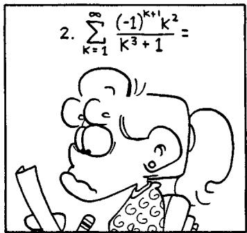

## Special Functions

Special functions, which include the trigonometric functions, have been used for centuries. Their role in the solution of differential equations was exploited by Newton and Leibniz, and the subject of special functions has been in continuous development ever since. In just the past thirty years several new special functions and applications have been discovered.

This treatise presents an overview of the area of special functions, focusing primarily on the hypergeometric functions and the associated hypergeometric series. It includes both important historical results and recent developments and shows how these arise from several areas of mathematics and mathematical physics. Particular emphasis is placed on formulas that can be used in computation.

The book begins with a thorough treatment of the gamma and beta functions, which are essential to understanding hypergeometric functions. Later chapters discuss Bessel functions, orthogonal polynomials and transformations, the Selberg integral and its applications, spherical harmonics, q-series, partitions, and Bailey chains.

This clear, authoritative work will be a lasting reference for students and researchers in number theory, algebra, combinatorics, differential equations, mathematical computing, and mathematical physics.

George E. Andrews is Evan Pugh Professor of Mathematics at The Pennsylvania State University.

Richard Askey is Professor of Mathematics at the University of Wisconsin-Madison.

Ranjan Roy is Professor of Mathematics at Beloit College in Wisconsin.

EDITED BY G.-C. ROTA

Editorial Board

B. Doran, M. Ismail, T.-Y. Lam, E. Lutwak

Volume 71

## Special Functions

27 N. H. Bingham, C. M. Goldie, and J. L. Teugels Regular Variation

28 P. P. Petrushev and V. A. Popov Rational Approximation of Real Functions

29 N. White (ed.) Combinatorial Geometries

30 M. Pohst and H. Zassenhaus Algorithmic Algebraic Number Theory

31 J. Aczel and J. Dhombres Functional Equations in Several Variables

32 M. Kuczma, B. Choczewski, and R. Ger Iterative Functional Equations

33 R. V. Ambartzumian Factorization Calculus and Geometric Probability

34 G. Gripenberg, S.-O. Londen, and O. Staffans Volterra Integral and Functional Equations

35 G. Gasper and M. Rahman Basic Hypergeometric Series

36 E. Torgersen Comparison of Statistical Experiments

37 A. Neumaier Interval Methods for Systems of Equations

38 N. Korneichuk Exact Constants in Approximation Theory

39 R. Brualdi and H. Ryser Combinatorial Matrix Theory

40 N. White (ed.) Matroid Applications

41 S. Sakai Operator Algebras in Dynamical Systems

42 W. Hodges Basic Model Theory

43 H. Stahl and V. Totik General Orthogonal Polynomials

45 G. Da Prato and J. Zabczyk Stochastic Equations in Infinite Dimensions

46 A. Björner et al. Oriented Matroids

47 G. Edgar and L. Sucheston Stopping Times and Directed Processes

48 C. Sims Computation with Finitely Presented Groups

49 T. Palmer Banach Algebras and the General Theory of \*-Algebras

50 F. Borceux Handbook of Categorical Algebra I

51 F. Borceux Handbook of Categorical Algebra II

52 F. Borceux Handbook of Categorical Algebra III

54 A. Katok and B. Hasselblatt Introduction to the Modern Theory of Dynamical Systems

55 V. N. Sachkov Combinatorial Methods in Discrete Mathematics

56 V. N. Sachkov Probabilistic Methods in Discrete Mathematics

57 P.M.Cohn Skew Fields

58 R. Gardner Geometric Topography

59 G. A. Baker Jr. and P. Graves-Morris Padé Approximants

60 J. Krajicek Bounded Arithmetic, Propositional Logic, and Complexity Theory

61 H. Groemer Geometric Applications of Fourier Series and Spherical Harmonics

62 H. O. Fattorini Infinite Dimensional Optimization and Control Theory

63 A. C. Thompson Minkowski Geometry

64 R. B. Bapat and T. E. S. Raghavan Nonnegative Matrices with Applications

65 K. Engel Sperner Theory

66 D. Cverkovic, P. Rowlinson, S. Simic Eigenspaces of Graphs

67 F. Bergeron, G. Labelle, and P. Leroux Combinatorial Species and Tree-Like Structures

68 R. Goodman and N. Wallach Representations and Invariants of the Classical Groups

## Special Functions

GEORGE E. ANDREWS RICHARD ASKEY RANJAN ROY

CAMBRIDGE UNIVERSITY PRESS
Cambridge, New York, Melbourne, Madrid, Cape Town, Singapore,
São Paulo, Delhi, Dubai, Tokyo, Mexico City

Cambridge University Press
The Edinburgh Building, Cambridge CB2 8RU, UK

Published in the United States of America by Cambridge University Press, New York

www.cambridge.org
Information on this title: www.cambridge.org/9780521789882

© George E. Andrews, Richard Askey, and Ranjan Roy 1999

This publication is in copyright. Subject to statutory exception and to the provisions of relevant collective licensing agreements, no reproduction of any part may take place without the written permission of Cambridge University Press.

First published 1999
First paperback edition 2000

A catalogue record for this publication is available from the British Library

ISBN 978-0-521-62321-6 Hardback
ISBN 978-0-521-78988-2 Paperback

Cambridge University Press has no responsibility for the persistence or accuracy of URLs for external or third-party internet websites referred to in this publication, and does not guarantee that any content on such websites is, or will remain, accurate or appropriate. Information regarding prices, travel timetables, and other factual information given in this work are correct at the time of first printing but Cambridge University Press does not guarantee the accuracy of such information thereafter.

To Leonard Carlitz, Om Prakash Juneja, and Irwin Kra

## Contents

Preface page xiii
1 The Gamma and Beta Functions 1
1.1 The Gamma and Beta Integrals and Functions 2
1.2 The Euler Reflection Formula 9
1.3 The Hurwitz and Riemann Zeta Functions 15
1.4 Stirling's Asymptotic Formula 18
1.5 Gauss's Multiplication Formula for Γ(mx) 22
1.6 Integral Representations for Log Γ(x) and ψ(x) 26
1.7 Kummer's Fourier Expansion of Log Γ(x) 29
1.8 Integrals of Dirichlet and Volumes of Ellipsoids 32
1.9 The Bohr–Mollerup Theorem 34
1.10 Gauss and Jacobi Sums 36
1.11 A Probabilistic Evaluation of the Beta Function 43
1.12 The p-adic Gamma Function 44
Exercises 46
2 The Hypergeometric Functions 61
2.1 The Hypergeometric Series 61
2.2 Euler's Integral Representation 65
2.3 The Hypergeometric Equation 73
2.4 The Barnes Integral for the Hypergeometric Function 85
2.5 Contiguous Relations 94
2.6 Dilogarithms 102
2.7 Binomial Sums 107
2.8 Dougall's Bilateral Sum 109
2.9 Fractional Integration by Parts and Hypergeometric Integrals 111
Exercises 114

viii Contents
3 Hypergeometric Transformations and Identities 124
3.1 Quadratic Transformations 125
3.2 The Arithmetic-Geometric Mean and Elliptic Integrals 132
3.3 Transformations of Balanced Series 140
3.4 Whipple's Transformation 143
3.5 Dougall's Formula and Hypergeometric Identities 147
3.6 Integral Analogs of Hypergeometric Sums 150
3.7 Contiguous Relations 154
3.8 The Wilson Polynomials 157
3.9 Quadratic Transformations – Riemann's View 160
3.10 Indefinite Hypergeometric Summation 163
3.11 The W–Z Method 166
3.12 Contiguous Relations and Summation Methods 174
Exercises 176
4 Bessel Functions and Confluent Hypergeometric Functions 187
4.1 The Confluent Hypergeometric Equation 188
4.2 Barnes's Integral for $_{1}F_{1}$ 192
4.3 Whittaker Functions 195
4.4 Examples of $_{1}F_{1}$ and Whittaker Functions 196
4.5 Bessel's Equation and Bessel Functions 199
4.6 Recurrence Relations 202
4.7 Integral Representations of Bessel Functions 203
4.8 Asymptotic Expansions 209
4.9 Fourier Transforms and Bessel Functions 210
4.10 Addition Theorems 213
4.11 Integrals of Bessel Functions 216
4.12 The Modified Bessel Functions 222
4.13 Nicholson's Integral 223
4.14 Zeros of Bessel Functions 225
4.15 Monotonicity Properties of Bessel Functions 229
4.16 Zero-Free Regions for $_{1}F_{1}$ Functions 231
Exercises 234
5 Orthogonal Polynomials 240
5.1 Chebyshev Polynomials 240
5.2 Recurrence 244
5.3 Gauss Quadrature 248
5.4 Zeros of Orthogonal Polynomials 253
5.5 Continued Fractions 256

## Contents

Contents ix
5.6 Kernel Polynomials 259
5.7 Parseval's Formula 263
5.8 The Moment-Generating Function 266
Exercises 269
6 Special Orthogonal Polynomials 277
6.1 Hermite Polynomials 278
6.2 Laguerre Polynomials 282
6.3 Jacobi Polynomials and Gram Determinants 293
6.4 Generating Functions for Jacobi Polynomials 297
6.5 Completeness of Orthogonal Polynomials 306
6.6 Asymptotic Behavior of $P_n^{(\alpha,\beta)}(x)$ for Large n 310
6.7 Integral Representations of Jacobi Polynomials 313
6.8 Linearization of Products of Orthogonal Polynomials 316
6.9 Matching Polynomials 323
6.10 The Hypergeometric Orthogonal Polynomials 330
6.11 An Extension of the Ultraspherical Polynomials 334
Exercises 339
7 Topics in Orthogonal Polynomials 355
7.1 Connection Coefficients 356
7.2 Rational Functions with Positive Power Series Coefficients 363
7.3 Positive Polynomial Sums from Quadrature and Vietoris's Inequality 371
7.4 Positive Polynomial Sums and the Bieberback Conjecture 381
7.5 A Theorem of Turán 384
7.6 Positive Summability of Ultraspherical Polynomials 388
7.7 The Irrationality of $\zeta(3)$ 391
Exercises 395
8 The Selberg Integral and Its Applications 401
8.1 Selberg's and Aomoto's Integrals 402
8.2 Aomoto's Proof of Selberg's Formula 402
8.3 Extensions of Aomoto's Integral Formula 407
8.4 Anderson's Proof of Selberg's Formula 411
8.5 A Problem of Stieltjes and the Discriminant of a Jacobi Polynomial 415
8.6 Siegel's Inequality 419
8.7 The Stieltjes Problem on the Unit Circle 425
8.8 Constant-Term Identities 426
8.9 Nearly Poised $_{3}F_{2}$ Identities 428
8.10 The Hasse-Davenport Relation 430

x Contents
8.11 A Finite-Field Analog of Selberg's Integral 434
Exercises 439
9 Spherical Harmonics 445
9.1 Harmonic Polynomials 445
9.2 The Laplace Equation in Three Dimensions 447
9.3 Dimension of the Space of Harmonic Polynomials of Degree k 449
9.4 Orthogonality of Harmonic Polynomials 451
9.5 Action of an Orthogonal Matrix 452
9.6 The Addition Theorem 454
9.7 The Funk–Hecke Formula 458
9.8 The Addition Theorem for Ultraspherical Polynomials 459
9.9 The Poisson Kernel and Dirichlet Problem 463
9.10 Fourier Transforms 464
9.11 Finite-Dimensional Representations of Compact Groups 466
9.12 The Group SU(2) 469
9.13 Representations of SU(2) 471
9.14 Jacobi Polynomials as Matrix Entries 473
9.15 An Addition Theorem 474
9.16 Relation of SU(2) to the Rotation Group SO(3) 476
Exercises 478
10 Introduction to q-Series 481
10.1 The q-Integral 485
10.2 The q-Binomial Theorem 487
10.3 The q-Gamma Function 493
10.4 The Triple Product Identity 496
10.5 Ramanujan's Summation Formula 501
10.6 Representations of Numbers as Sums of Squares 506
10.7 Elliptic and Theta Functions 508
10.8 q-Beta Integrals 513
10.9 Basic Hypergeometric Series 520
10.10 Basic Hypergeometric Identities 523
10.11 q-Ultraspherical Polynomials 527
10.12 Mellin Transforms 532
Exercises 542
11 Partitions 553
11.1 Background on Partitions 553
11.2 Partition Analysis 555
11.3 A Library for the Partition Analysis Algorithm 557

## Contents

11.4 Generating Functions 559  
11.5 Some Results on Partitions 563  
11.6 Graphical Methods 565  
11.7 Congruence Properties of Partitions 569  
Exercises 573  

12 Bailey Chains 577  
12.1 Rogers's Second Proof of the Rogers-Ramanujan Identities 577  
12.2 Bailey's Lemma 582  
12.3 Watson's Transformation Formula 586  
12.4 Other Applications 589  
Exercises 590  

A Infinite Products 595  
A.1 Infinite Products 595  
Exercises 597  

B Summability and Fractional Integration 599  
B.1 Abel and Cešaro Means 599  
B.2 The Cešaro Means $(C, \alpha)$ 602  
B.3 Fractional Integrals 604  
B.4 Historical Remarks 605  
Exercises 607  

C Asymptotic Expansions 611  
C.1 Asymptotic Expansion 611  
C.2 Properties of Asymptotic Expansions 612  
C.3 Watson's Lemma 614  
C.4 The Ratio of Two Gamma Functions 615  
Exercises 616  

D Euler-Maclaurin Summation Formula 617  
D.1 Introduction 617  
D.2 The Euler-Maclaurin Formula 619  
D.3 Applications 621  
D.4 The Poisson Summation Formula 623  
Exercises 627  

E Lagrange Inversion Formula 629  
E.1 Reversion of Series 629  
E.2 A Basic Lemma 630  
E.3 Lambert's Identity 631  
E.4 Whipple's Transformation 632  
Exercises 634

xii Contents
F Series Solutions of Differential Equations 637
F.1 Ordinary Points 637
F.2 Singular Points 638
F.3 Regular Singular Points 639
Bibliography 641
Index 655
Subject Index 659
Symbol Index 661

Paul Turán once remarked that special functions would be more appropriately labeled “useful functions.” Because of their remarkable properties, special functions have been used for centuries. For example, since they have numerous applications in astronomy, trigonometric functions have been studied for over a thousand years. Even the series expansions for sine and cosine (and probably the arc tangent) were known to Madhava in the fourteenth century. These series were rediscovered by Newton and Leibniz in the seventeenth century. Since then, the subject of special functions has been continuously developed, with contributions by a host of mathematicians, including Euler, Legendre, Laplace, Gauss, Kummer, Eisenstein, Riemann, and Ramanujan.

In the past thirty years, the discoveries of new special functions and of applications of special functions to new areas of mathematics have initiated a resurgence of interest in this field. These discoveries include work in combinatorics initiated by Schützenberger and Foata. Moreover, in recent years, particular cases of long familiar special functions have been clearly defined and applied as orthogonal polynomials.

As a result of this prolific activity and long history one is pulled different directions when writing a book on special functions. First, there are important results from the past that must be included because they are so useful. Second, there are recent developments that should be brought to the attention of those who could use them. One also would wish to help educate the new generation of mathematicians and scientists so that they can further develop and apply this subject. We have tried to do all this, and to include some of the older results that seem to us to have been overlooked. However, we have slighted some of the very important recent developments because a book that did them justice would have to be much longer. Fortunately, specialized books dealing with some of these developments have recently appeared: Petkovšek, Wilf, and Zeilberger [1996], Macdonald [1995], Heckman and Schlicktkrull [1994], and Vilenkin and Klimyk [1992]. Additionally, I. G. Macdonald is writing a new book on his polynomials in several variables and A. N. Kirillov is writing on $R$ -matrix theory.

It is clear that the amount of knowledge about special functions is so great that only a small fraction of it can be included in one book. We have decided to focus primarily on the best understood class of functions, hypergeometric functions, and the associated hypergeometric series. A hypergeometric series is a series $\Sigma a_{n}$ with $a_{n+1}/a_{n}$ a rational function of n. Unfortunately, knowledge of these functions is not as widespread as is warranted by their importance and usefulness. Most of the power series treated in calculus are hypergeometric, so some facts about them are well known. However, many mathematicians and scientists who encounter such functions in their work are unaware of the general case that could simplify their work. To them a Bessel function and a parabolic cylinder function are types of functions different from the 3-j or 6-j symbols that arise in quantum angular momentum theory. In fact these are all hypergeometric functions and many of their elementary properties are best understood when considered as such.

Several important facts about hypergeometric series were first found by Euler and an important identity was discovered by Pfaff, one of Gauss's teachers. However, it was Gauss himself who fully recognized their significance and gave a systematic account in two important papers, one of which was published posthumously. One reason for his interest in these functions was that the elementary functions and several other important functions in mathematics are expressible in terms of hypergeometric functions. A half century after Gauss, Riemann developed hypergeometric functions from a different point of view, which made available the basic formulas with a minimum of computation. Another approach to hypergeometric functions using contour integrals was presented by the English mathematician E. W. Barnes in the first decade of this century. Each of these different approaches has its advantages.

Hypergeometric functions have two very significant properties that add to their usefulness: They satisfy certain identities for special values of the function and they have transformation formulas. We present many applications of these properties. For example, in combinatorial analysis hypergeometric identities classify single sums of products of binomial coefficients. Further, quadratic transformations of hypergeometric functions give insight into the relationship (known to Gauss) of elliptic integrals to the arithmetic-geometric mean. The arithmetic-geometric mean has recently been used to compute $\pi$ to several million decimal places, and earlier it played a pivotal role in Gauss's theory of elliptic functions.

The gamma function and beta integrals dealt with in the first chapter are essential to understanding hypergeometric functions. The gamma function was introduced into mathematics by Euler when he solved the problem of extending the factorial function to all real or complex numbers. He could not have foreseen the extent of its importance in mathematics. There are extensions of gamma and beta functions that are also very important. The text contains a short treatment of Gauss and Jacobi sums, which are finite field analogs of gamma and beta functions. Gauss sums were encountered by Gauss in his work on the constructibility of regular polygons where they arose as “Lagrange resolvents,” a concept used by Lagrange to study algebraic equations. Gauss understood the tremendous value of these sums for number theory. We discuss the derivation of Fermat’s theorem on primes of the form $4n + 1$ from a formula connecting Gauss and Jacobi sums, which is analogous to Euler’s famous formula relating beta integrals with gamma functions.

There are also multidimensional gamma and beta integrals. The first of these was introduced by Dirichlet, though it is really an iterated version of the one-dimensional integral. Genuine multidimensional gamma and beta functions were introduced in the 1930s, by both statisticians and number theorists. In the early 1940s, Atle Selberg found a very important multidimensional beta integral in the course of research in entire functions. However, owing to the Second World War and the fact that the first statement and also the proof appeared in journals that were not widely circulated, knowledge of this integral before the 1980s was restricted to a few people around the world. We present two different evaluations of Selberg's integral as well as some of its uses.

In addition to the above mentioned extensions, there are q-extensions of the gamma function and beta integrals that are very fundamental because they lead to basic hypergeometric functions and series. These are series $\Sigma c_{n}$ where $c_{n+1}/c_{n}$ is a rational function of $q^{n}$ for a fixed parameter q. Here the sum may run over all integers, instead of only nonnegative ones. One important example is the theta function $\sum_{-\infty}^{\infty} q^{n^{2}} x^{n}$ . This and other similar series were used by Gauss and Jacobi to study elliptic and elliptic modular functions. Series of this sort are very useful in many areas of combinatorial analysis, a fact already glimpsed by Euler and Legendre, and they also arise in some branches of physics. For example, the work of the physicist R. J. Baxter on the Yang–Baxter equation led a group in St. Petersburg to the notion of a quantum group. Independently, M. Jimbo in Japan was led by a study of Baxter's work to a related structure.

Many basic hypergeometric series (or q-hypergeometric series), both polynomials and infinite series, can be studied using Hopf algebras, which make up quantum groups. Unfortunately, we could not include this very important new approach to basic series. It was also not possible to include results on the multidimensional $U(n)$ generalizations of theorems on basic series, which have been studied extensively in recent years. For some of this work, the reader may refer to Milne [1988] and Milne and Lilly [1995]. We briefly discuss the q-gamma function and some important q-beta integrals; we show that series and products that arise in this theory have applications in number theory, combinatorics, and partition theory. We highlight the method of partition analysis.

P. A. MacMahon, who developed this powerful technique, devoted several chapters to it in his monumental Combinatory Analysis, but its significance was not realized until recently.

The theory of special functions with its numerous beautiful formulas is very well suited to an algorithmic approach to mathematics. In the nineteenth century, it was the ideal of Eisenstein and Kronecker to express and develop mathematical results by means of formulas. Before them, this attitude was common and best exemplified in the works of Euler, Jacobi, and sometimes Gauss. In the twentieth century, mathematics moved from this approach toward a more abstract and existential method. In fact, agreeing with Hardy that Ramanujan came 100 years too late, Littlewood once wrote that “the great day of formulae seem to be over” (see Littlewood [1986, p. 95]). However, with the advent of computers and the consequent reemergence of computational mathematics, formulas are now once again playing a larger role in mathematics. We present this book against this background, pointing out that beautiful, interesting, and important formulas have been discovered since Ramanujan’s time. These formulas are proving fertile and fruitful; we suggest that the day of formulas may be experiencing a new dawn. Finally, we hope that the reader finds as much pleasure studying the formulas in this book as we have found in explaining them.

We thank the following people for reading and commenting on various chapters during the writing of the book: Bruce Berndt, David and Gregory Chudnovsky, George Gasper, Warren Johnson, and Mizan Rahman. Special thanks to Mourad Ismail for encouragement and many detailed suggestions for the improvement of this book. We are also grateful to Dee Frana and Diane Reppert for preparing the manuscript with precision, humor, and patience.

# The Gamma and Beta Functions

Euler discovered the gamma function, $\Gamma(x)$ , when he extended the domain of the factorial function. Thus $\Gamma(x)$ is a meromorphic function equal to $(x-1)!$ when x is a positive integer. The gamma function has several representations, but the two most important, found by Euler, represent it as an infinite integral and as a limit of a finite product. We take the second as the definition.

Instead of viewing the beta function as a function, it is more illuminating to think of it as a class of integrals - integrals that can be evaluated in terms of gamma functions. We therefore often refer to beta functions as beta integrals.

In this chapter, we develop some elementary properties of the beta and gamma functions. We give more than one proof for some results. Often, one proof generalizes and others do not. We briefly discuss the finite field analogs of the gamma and beta functions. These are called Gauss and Jacobi sums and are important in number theory. We show how they can be used to prove Fermat's theorem that a prime of the form $4n + 1$ is expressible as a sum of two squares. We also treat a simple multidimensional extension of a beta integral, due to Dirichlet, from which the volume of an n-dimensional ellipsoid can be deduced.

We present an elementary derivation of Stirling's asymptotic formula for $n!$ but give a complex analytic proof of Euler's beautiful reflection formula. However, two real analytic proofs due to Dedekind and Herglotz are included in the exercises. The reflection formula serves to connect the gamma function with the trigonometric functions. The gamma function has simple poles at zero and at the negative integers, whereas $\csc \pi x$ has poles at all the integers. The partial fraction expansions of the logarithmic derivatives of $\Gamma(x)$ motivate us to consider the Hurwitz and Riemann zeta functions. The latter function is of fundamental importance in the theory of distribution of primes. We have included a short discussion of the functional equation satisfied by the Riemann zeta function since it involves the gamma function.

In this chapter we also present Kummer's proof of his result on the Fourier expansion of $\log \Gamma(x)$ . This formula is useful in number theory. The proof given uses Dirichlet's integral representations of $\log \Gamma(x)$ and its derivative. Thus, we have included these results of Dirichlet and the related theorems of Gauss.

## 1.1 The Gamma and Beta Integrals and Functions

The problem of finding a function of a continuous variable x that equals $n!$ when x = n, an integer, was investigated by Euler in the late 1720s. This problem was apparently suggested by Daniel Bernoulli and Goldbach. Its solution is contained in Euler's letter of October 13, 1729, to Goldbach. See Fuss [1843, pp. 1–18]. To arrive at Euler's generalization of the factorial, suppose that $x \geq 0$ and $n \geq 0$ are integers. Write

$$
x! = \frac {(x + n) !}{(x + 1) _ {n}},\tag{1.1.1}
$$

where $(a)_{n}$ denotes the shifted factorial defined by

$$
(a) _ {n} = a (a + 1) \dots (a + n - 1) \quad \text { for } n > 0, (a) _ {0} = 1,\tag{1.1.2}
$$

and $a$ is any real or complex number. Rewrite (1.1.1) as

$$
x! = \frac {n ! (n + 1) _ {x}}{(x + 1) _ {n}} = \frac {n ! n ^ {x}}{(x + 1) _ {n}} \cdot \frac {(n + 1) _ {x}}{n ^ {x}}.
$$

Since

$$
\lim _ {n \to \infty} \frac {(n + 1) _ {x}}{n ^ {x}} = 1,
$$

we conclude that

$$
x! = \lim _ {n \rightarrow \infty} \frac {n ! n ^ {x}}{(x + 1) _ {n}}.\tag{1.1.3}
$$

Observe that, as long as $x$ is a complex number not equal to a negative integer, the limit in (1.1.3) exists, for

$$
\frac {n ! n ^ {x}}{(x + 1) _ {n}} = \left(\frac {n}{n + 1}\right) ^ {x} \prod_ {j = 1} ^ {n} \left(1 + \frac {x}{j}\right) ^ {- 1} \left(1 + \frac {1}{j}\right) ^ {x}
$$

and

$$
\left(1 + \frac {x}{j}\right) ^ {- 1} \left(1 + \frac {1}{j}\right) ^ {x} = 1 + \frac {x (x - 1)}{2 j ^ {2}} + O \left(\frac {1}{j ^ {3}}\right).
$$

Therefore, the infinite product

$$
\prod_ {j = 1} ^ {\infty} \left(1 + \frac {x}{j}\right) ^ {- 1} \left(1 + \frac {1}{j}\right) ^ {x}
$$

converges and the limit (1.1.3) exists. (Readers who are unfamiliar with infinite products should consult Appendix A.) Thus we have a function

$$
\Pi (x) = \lim _ {k \rightarrow \infty} \frac {k ! k ^ {x}}{(x + 1) _ {k}}\tag{1.1.4}
$$

defined for all complex $x \neq -1, -2, -3, \ldots$ and $\Pi(n) = n!$ .

Definition 1.1.1 For all complex numbers $x \neq 0, -1, -2, \ldots$ , the gamma function $\Gamma(x)$ is defined by

$$
\Gamma (x) = \lim _ {k \rightarrow \infty} \frac {k ! k ^ {x - 1}}{(x) _ {k}}.\tag{1.1.5}
$$

An immediate consequence of Definition 1.1.1 is

$$
\Gamma (x + 1) = x \Gamma (x).\tag{1.1.6}
$$

Also,

$$
\Gamma (n + 1) = n!\tag{1.1.7}
$$

follows immediately from the above argument or from iteration of $(1.1.6)$ and use of

$$
\Gamma (1) = 1.\tag{1.1.8}
$$

From (1.1.5) it follows that the gamma function has poles at zero and the negative integers, but $1 / \Gamma(x)$ is an entire function with zeros at these points. Every entire function has a product representation; the product representation of $1 / \Gamma(x)$ is particularly nice.

Theorem 1.1.2

$$
\frac {1}{\Gamma (x)} = x e ^ {\gamma x} \prod_ {n = 1} ^ {\infty} \left\{\left(1 + \frac {x}{n}\right) e ^ {- x / n} \right\},\tag{1.1.9}
$$

where $\gamma$ is Euler's constant given by

$$
\gamma = \lim _ {n \rightarrow \infty} \left(\sum_ {k = 1} ^ {n} \frac {1}{k} - \log n\right).\tag{1.1.10}
$$

Proof.

$$
\begin{array}{r l}\frac {1}{\Gamma (x)}&= \lim _ {n \rightarrow \infty} \frac {x (x + 1) \cdots (x + n - 1)}{n ! n ^ {x - 1}}\\&= \lim _ {n \rightarrow \infty} x \left(1 + \frac {x}{1}\right)\left(1 + \frac {x}{2}\right) \dots \left(1 + \frac {x}{n}\right) e ^ {- x \log n}\\&= \lim _ {n \rightarrow \infty} x e ^ {x \left(1 + \frac {1}{2} + \dots + \frac {1}{n} - \log n\right)} \prod_ {k = 1} ^ {n} \left\{\left(1 + \frac {x}{k}\right) e ^ {- x / k} \right\}\\&= x e ^ {\gamma x} \prod_ {n = 1} ^ {\infty} \left\{\left(1 + \frac {x}{n}\right) e ^ {- x / n} \right\}.\end{array}
$$

The infinite product in (1.1.9) exists because

$$
\left(1 + \frac {x}{n}\right) e ^ {- x / n} = \left(1 + \frac {x}{n}\right) \left(1 - \frac {x}{n} + \frac {x ^ {2}}{2 n ^ {2}} \dots\right) = 1 - \frac {x ^ {2}}{2 n ^ {2}} + O \left(\frac {1}{n ^ {3}}\right),
$$

and the factor $e^{-x/n}$ was introduced to make this possible. The limit in (1.1.10) exists because the other limits exist, or its existence can be shown directly. One way to do this is to show that the difference between adjacent expressions under the limit sign decay in a way similar to $1/n^{2}$ . ■

One may take (1.1.9) as a definition of $\Gamma(x)$ as Weierstrass did, though the formula had been found earlier by Schlömilch and Newman. See Nielsen [1906, p. 10].

Over seventy years before Euler, Wallis [1656] attempted to compute the integral $\int_{0}^{1}\sqrt{1-x^{2}}dx=\frac{1}{2}\int_{-1}^{+1}(1-x)^{1/2}(1+x)^{1/2}dx$ . Since this integral gives the area of a quarter circle, Wallis's aim was to obtain an expression for $\pi$ . The only integral he could actually evaluate was $\int_{0}^{1}x^{p}(1-x)^{q}dx$ , where p and q are integers or q=0 and p is rational. He used the value of this integral and some audacious guesswork to suggest that

$$
\frac {\pi}{4} = \int_ {0} ^ {1} \sqrt {1 - x ^ {2}} d x = \frac {1}{4} \lim _ {n \rightarrow \infty} \left[ \frac {2 \cdot 4 \cdot 6 \cdots 2 n}{1 \cdot 3 \cdot 5 \cdots (2 n - 1)} \cdot \frac {1}{\sqrt {n}} \right] ^ {2} = \Gamma \left(\frac {3}{2}\right) \Gamma \left(\frac {3}{2}\right).\tag{1.1.11}
$$

Of course, he did not write it as a limit or use the gamma function. Still, this result may have led Euler to consider the relation between the gamma function and integrals of the form $\int_{0}^{1} x^{p}(1 - x)^{q} dx$ where p and q are not necessarily integers.

Definition 1.1.3 The beta integral is defined for $\operatorname{Re} x > 0$ , $\operatorname{Re} y > 0$ by

$$
B (x, y) = \int_ {0} ^ {1} t ^ {x - 1} (1 - t) ^ {y - 1} d t.\tag{1.1.12}
$$

One may also speak of the beta function $B(x, y)$ , which is obtained from the integral by analytic continuation.

The integral (1.1.12) is symmetric in $x$ and $y$ as may be seen by the change of variables $u = 1 - t$ .

Theorem 1.1.4

$$
B (x, y) = \frac {\Gamma (x) \Gamma (y)}{\Gamma (x + y)}.\tag{1.1.13}
$$

Remark 1.1.1 The essential idea of the proof given below goes back to Euler [1730, 1739] and consists of first setting up a functional relation for the beta function and then iterating the relation. An integral representation for $\Gamma(x)$ is obtained as a byproduct. The functional equation technique is useful for evaluating certain integrals and infinite series; we shall see some of its power in subsequent chapters.

Proof. The functional relation we need is

$$
B (x, y) = \frac {x + y}{y} B (x, y + 1).\tag{1.1.14}
$$

First note that for $\operatorname{Re} x > 0$ and $\operatorname{Re} y > 0$ ,

$$
\begin{array}{r l} B (x, y + 1) & = \int_ {0} ^ {1} t ^ {x - 1} (1 - t) (1 - t) ^ {y - 1} d t \\ & = B (x, y) - B (x + 1, y). \end{array}\tag{1.1.15}
$$

However, integration by parts gives

$$
\begin{array}{r l} B (x, y + 1) & = \left[ \frac {1}{x} t ^ {x} (1 - t) ^ {y} \right] _ {0} ^ {1} + \frac {y}{x} \int_ {0} ^ {1} t ^ {x} (1 - t) ^ {y - 1} d t \\ & = \frac {y}{x} B (x + 1, y). \end{array}\tag{1.1.16}
$$

Combine (1.1.15) and (1.1.16) to get the functional relation (1.1.14). Other proofs of (1.1.14) are given in problems at the end of this chapter. Now iterate (1.1.14) to obtain

$$
B (x, y) = \frac {(x + y) (x + y + 1)}{y (y + 1)} B (x, y + 2) = \dots = \frac {(x + y) _ {n}}{(y) _ {n}} B (x, y + n).
$$

Rewrite this relation as

$$
\begin{array}{r l} B (x, y) & = \frac {(x + y) _ {n}}{n !} \frac {n !}{(y) _ {n}} \int_ {0} ^ {n} \left(\frac {t}{n}\right) ^ {x - 1} \left(1 - \frac {t}{n}\right) ^ {y + n - 1} \frac {d t}{n} \\ & = \frac {(x + y) _ {n}}{n ! n ^ {x + y - 1}} \frac {n ! n ^ {y - 1}}{(y) _ {n}} \int_ {0} ^ {n} t ^ {x - 1} \left(1 - \frac {t}{n}\right) ^ {n + y - 1} d t. \end{array}
$$

As $n \to \infty$ , the integral tends to $\int_{0}^{\infty} t^{x-1} e^{-t} dt$ . This may be justified by the Lebesgue dominated convergence theorem. Thus

$$
B (x, y) = \frac {\Gamma (y)}{\Gamma (x + y)} \int_ {0} ^ {\infty} t ^ {x - 1} e ^ {- t} d t.\tag{1.1.17}
$$

Set $y = 1$ in (1.1.12) and (1.1.17) to get

$$
{\frac {1}{x}} = \int_ {0} ^ {1} t ^ {x - 1} d t = B (x, 1) = {\frac {\Gamma (1)}{\Gamma (x + 1)}} \int_ {0} ^ {\infty} t ^ {x - 1} e ^ {- t} d t.
$$

Then (1.1.6) and (1.1.8) imply that $\int_{0}^{\infty} t^{x-1} e^{-t} dt = \Gamma(x)$ for Re x > 0. Now use this in (1.1.17) to prove the theorem for Re x > 0 and Re y > 0. The analytic continuation is immediate from the value of this integral, since the gamma function can be analytically continued.

Remark 1.1.2 Euler's argument in [1739] for (1.1.13) used a recurrence relation in $x$ rather than in $y$ . This leads to divergent infinite products and an integral that is zero. He took two such integrals, with $y$ and $y = m$ , divided them, and argued that the resulting "vanishing" integrals were the same. These canceled each other when he took the quotient of the two integrals with $y$ and $y = m$ . The result was an infinite product that converges and gives the correct answer. Euler's extraordinary intuition guided him to correct results, even when his arguments were as bold as this one.

Earlier, in 1730, Euler had evaluated (1.1.13) by a different method. He expanded $(1 - t)^{y - 1}$ in a series and integrated term by term. When $y = n + 1$ , he stated the value of this sum in product form.

An important consequence of the proof is the following corollary:

Corollary 1.1.5 For $\operatorname{Re} x > 0$

$$
\Gamma (x) = \int_ {0} ^ {\infty} t ^ {x - 1} e ^ {- t} d t.\tag{1.1.18}
$$

The above integral for $\Gamma(x)$ is sometimes called the Eulerian integral of the second kind. It is often taken as the definition of $\Gamma(x)$ for $\operatorname{Re} x > 0$ . The Eulerian integral of the first kind is (1.1.12). Legendre introduced this notation. Legendre's $\Gamma(x)$ is preferred over Gauss's function $\Pi(x)$ given by (1.1.4), because Theorem 1.1.4 does not have as nice a form in terms of $\Pi(x)$ . For another reason, see Section 1.10.

The gamma function has poles at zero and at the negative integers. It is easy to use the integral representation (1.1.18) to explicitly represent the poles and the

analytic continuation of $\Gamma (x)$ :

$$
\begin{array}{l} \Gamma (x) = \int_ {0} ^ {1} t ^ {x - 1} e ^ {- t} d t + \int_ {1} ^ {\infty} t ^ {x - 1} e ^ {- t} d t \\ = \sum_ {n = 0} ^ {\infty} \frac {(- 1) ^ {n}}{(n + x) n !} + \int_ {1} ^ {\infty} t ^ {x - 1} e ^ {- t} d t. \end{array}\tag{1.1.19}
$$

The second function on the right-hand side is an entire function, and the first shows that the poles are as claimed, with $(-1)^{n}/n!$ being the residue at x = -n, $n = 0, 1, \ldots$ .

The beta integral has several useful forms that can be obtained by a change of variables. For example, set $t = s/(s + 1)$ in (1.1.12) to obtain the beta integral on a half line,

$$
\int_ {0} ^ {\infty} \frac {s ^ {x - 1}}{(1 + s) ^ {x + y}} d s = \frac {\Gamma (x) \Gamma (y)}{\Gamma (x + y)}.\tag{1.1.20}
$$

Then again, take $t = \sin^2\theta$ to get

$$
\int_ {0} ^ {\pi / 2} \sin^ {2 x - 1} \theta \cos^ {2 y - 1} \theta d \theta = \frac {\Gamma (x) \Gamma (y)}{2 \Gamma (x + y)}.\tag{1.1.21}
$$

Put $x = y = 1 / 2$ . The result is

$$
\frac {\left[ \Gamma \left(\frac {1}{2}\right) \right] ^ {2}}{2 \Gamma (1)} = \frac {\pi}{2},
$$

or

$$
\Gamma (1 / 2) = \sqrt {\pi}.\tag{1.1.22}
$$

Since this implies $[\Gamma (\frac{3}{2})]^2 = \pi /4$ , we have a proof of Wallis's formula (1.1.11). We also have the value of the normal integral

$$
\int_ {- \infty} ^ {\infty} e ^ {- x ^ {2}} d x = 2 \int_ {0} ^ {\infty} e ^ {- x ^ {2}} d x = \int_ {0} ^ {\infty} t ^ {- 1 / 2} e ^ {- t} d t = \Gamma (1 / 2) = \sqrt {\pi}.\tag{1.1.23}
$$

Finally, the substitution $t = (u - a) / (b - a)$ in (1.1.12) gives

$$
\int_ {a} ^ {b} (b - u) ^ {x - 1} (u - a) ^ {y - 1} d u = (b - a) ^ {x + y - 1} B (x, y) = (b - a) ^ {x + y - 1} \frac {\Gamma (x) \Gamma (y)}{\Gamma (x + y)}.\tag{1.1.24}
$$

The special case $a = -1$ , $b = 1$ is worth noting as it is often used:

$$
\int_ {- 1} ^ {1} (1 + t) ^ {x - 1} (1 - t) ^ {y - 1} d t = 2 ^ {x + y - 1} \frac {\Gamma (x) \Gamma (y)}{\Gamma (x + y)}.\tag{1.1.25}
$$

A useful representation of the analytically continued beta function is

$$
B (x, y) = \frac {\Gamma (x) \Gamma (y)}{\Gamma (x + y)} = \frac {(x + y)}{x y} \prod_ {n = 1} ^ {\infty} \frac {\left(1 + \frac {x + y}{n}\right)}{\left(1 + \frac {x}{n}\right) \left(1 + \frac {y}{n}\right)}.\tag{1.1.26}
$$

This follows immediately from Theorem 1.1.2. Observe that $B(x, y)$ has poles at $x$ and $y$ equal to zero or negative integers, and it is analytic elsewhere.

As mentioned before, the integral formula for $\Gamma(x)$ is often taken as the definition of the gamma function. One reason is that the gamma function very frequently appears in this form. Moreover, the basic properties of the function can be developed easily from the integral. We have the powerful tools of integration by parts and change of variables that can be applied to integrals. As an example, we give another derivation of Theorem 1.1.4. This proof is also important because it can be applied to obtain the finite field analog of Theorem 1.1.4. In that situation one works with a finite sum instead of an integral.

Poisson [1823] and independently Jacobi [1834] had the idea of starting with an appropriate double integral and evaluating it in two different ways. Thus, since the integrals involved are absolutely convergent,

$$
\int_ {0} ^ {\infty} \int_ {0} ^ {\infty} t ^ {x - 1} s ^ {y - 1} e ^ {- (s + t)} d s d t = \int_ {0} ^ {\infty} t ^ {x - 1} e ^ {- t} d t \int_ {0} ^ {\infty} s ^ {y - 1} e ^ {- s} d s = \Gamma (x) \Gamma (y).
$$

Apply the change of variables s = uv and $t = u(1 - v)$ to the double integral, and observe that 0 < u < $\infty$ and 0 < v < 1 when 0 < s, $t < \infty$ . This change of variables is suggested by first setting $s + t = u$ . Computation of the Jacobian gives dsdt = ududv and the double integral is transformed to

$$
\int_ {0} ^ {\infty} e ^ {- u} u ^ {x + y - 1} d u \int_ {0} ^ {1} v ^ {x - 1} (1 - v) ^ {y - 1} d v = \Gamma (x + y) B (x, y).
$$

A comparison of two evaluations of the double integral gives the necessary result. This is Jacobi's proof. Poisson's proof is similar except that he applies the change of variables $t = r$ and $s = ur$ to the double integral. In this case the beta integral obtained is on the interval $(0, \infty)$ as in (1.1.20). See Exercise 1.

To complete this section we show how the limit formula for $\Gamma(x)$ can be derived from an integral representation of $\Gamma(x)$ . We first prove that when $n$ is an integer $\geq 0$ and $\operatorname{Re} x > 0$ ,

$$
\int_ {0} ^ {1} t ^ {x - 1} (1 - t) ^ {n} d t = \frac {n !}{x (x + 1) \cdots (x + n)}.\tag{1.1.27}
$$

This is actually a special case of Theorem 1.1.4 but we give a direct proof by induction, in order to avoid circularity in reasoning. Clearly (1.1.27) is true for

$n = 0$ , and

$$
\begin{array}{r l} \int_ {0} ^ {1} t ^ {x - 1} (1 - t) ^ {n + 1} d t & = \int_ {0} ^ {1} t ^ {x - 1} (1 - t) (1 - t) ^ {n} d t \\ & = \frac {n !}{(x) _ {n + 1}} - \frac {n !}{(x + 1) _ {n + 1}} \\ & = \frac {(n + 1) !}{(x) _ {n + 2}}. \end{array}
$$

This proves (1.1.27) inductively. Now set t = u/n and let $n \to \infty$ . By the Lebesgue dominated convergence theorem it follows that

$$
\int_ {0} ^ {\infty} t ^ {x - 1} e ^ {- t} d t = \lim _ {n \rightarrow \infty} \frac {n ! n ^ {x - 1}}{(x) _ {n}} \quad \text { for   } \operatorname{Re} x > 0.
$$

Thus, if we begin with the integral definition for $\Gamma(x)$ then the above formula can be used to extend it to other values of x (i.e., those not equal to 0, -1, -2, ...).

Remark 1.1.3 It is traditional to call the integral (1.1.12) the beta function. A better terminology might call this Euler's first beta integral and call (1.1.20) the second beta integral. We call the integral in Exercise 13 Cauchy's beta integral. We shall study other beta integrals in later chapters, but the common form of these three is $\int_{C}[\ell_1(t)]^{p}[\ell_2(t)]^{q}dt$ , where $\ell_1(t)$ and $\ell_2(t)$ are linear functions of $t$ , and $C$ is an appropriate curve. For Euler's first beta integral, the curve consists of a line segment connecting the two zeros; for the second beta integral, it is a half line joining one zero with infinity such that the other zero is not on this line; and for Cauchy's beta integral, it is a line with zeros on opposite sides. See Whittaker and Watson [1940, §12.43] for some examples of beta integrals that contain curves of integration different from those mentioned above. An important one is given in Exercise 54.

## 1.2 The Euler Reflection Formula

Among the many beautiful formulas involving the gamma function, the Euler reflection formula is particularly significant, as it connects the gamma function with the sine function. In this section, we derive this formula and briefly describe how product and partial fraction expansions for the trigonometric functions can be obtained from it. Euler's formula given in Theorem 1.2.1 shows that, in a sense, the function $1 / \Gamma(x)$ is half of the sine function.

Theorem 1.2.1 Euler's reflection formula:

$$
\Gamma (x) \Gamma (1 - x) = \frac {\pi}{\sin \pi x}.\tag{1.2.1}
$$

Remark The proof given here uses contour integration. Since the gamma function is a real variable function in the sense that many of its important characterizations occur within that theory, three real variable proofs are outlined in the Exercises. See Exercises 15, 16, and 26–27.

Since we shall show how some of the theory of trigonometric functions can be derived from (1.2.1), we now state that $\sin x$ is here defined by the series

$$
\sin x = \frac {e ^ {i x} - e ^ {- i x}}{2 i} = x - \frac {x ^ {3}}{3 !} + \frac {x ^ {5}}{5 !} - \dots .
$$

The cosine function is defined similarly. It is easy to show from this definition that sine and cosine have period $2\pi$ and that $e^{\pi i} = -1$ . See Rudin [1976, pp. 182–184].

Proof. Set $y = 1 - x, 0 < x < 1$ in (1.1.20) to obtain

$$
\Gamma (x) \Gamma (1 - x) = \int_ {0} ^ {\infty} \frac {t ^ {x - 1}}{1 + t} d t.\tag{1.2.2}
$$

To compute the integral in (1.2.2), consider the integral

$$
\int_ {C} \frac {z ^ {x - 1}}{1 - z} d z,
$$

where C consists of two circles about the origin of radii R and $\epsilon$ respectively, which are joined along the negative real axis from -R to $-\epsilon$ . Move along the outer circle in the counterclockwise direction, and along the inner circle in the clockwise direction. By the residue theorem

$$
\int_ {C} \frac {z ^ {x - 1}}{1 - z} d z = - 2 \pi i,\tag{1.2.3}
$$

when $z^{x - 1}$ has its principal value. Thus

$$
- 2 \pi i = \int_ {- \pi} ^ {\pi} \frac {i R ^ {x} e ^ {i x \theta}}{1 - R e ^ {i \theta}} d \theta + \int_ {R} ^ {\epsilon} \frac {t ^ {x - 1} e ^ {i x \pi}}{1 + t} d t + \int_ {\pi} ^ {- \pi} \frac {i \epsilon^ {x} e ^ {i x \theta}}{1 - \epsilon e ^ {i \theta}} d \theta + \int_ {\epsilon} ^ {R} \frac {t ^ {x - 1} e ^ {- i x \pi}}{1 + t} d t.
$$

Let $R \to \infty$ and $\epsilon \to 0$ so that the first and third integrals tend to zero and the second and fourth combine to give (1.2.1) for $0 < x < 1$ . The full result follows by analytic continuation. One could also argue as follows: Equality of (1.2.1) for $0 < x < 1$ implies equality in $0 < \operatorname{Re} x < 1$ by analyticity; for $\operatorname{Re} x = 0, x \neq 0$ by continuity; and then for $x$ shifted by integers using $\Gamma(x + 1) = x\Gamma(x)$ and $\sin(x + \pi) = -\sin x$ .

The next theorem is an immediate consequence of Theorem 1.2.1.

Theorem 1.2.2

$$
\sin \pi x = \pi x \prod_ {n = 1} ^ {\infty} \left(1 - \frac {x ^ {2}}{n ^ {2}}\right),\tag{1.2.4}
$$

$$
\pi \cot \pi x = \frac {1}{x} + \sum_ {n = 1} ^ {\infty} \left(\frac {1}{x + n} + \frac {1}{x - n}\right) = \lim _ {n \rightarrow \infty} \sum_ {k = - n} ^ {n} \frac {1}{x - k},\tag{1.2.5}
$$

$$
\frac {\pi}{\sin \pi x} = \frac {1}{x} + 2 x \sum_ {n = 1} ^ {\infty} \frac {(- 1) ^ {n}}{x ^ {2} - n ^ {2}} = \lim _ {n \rightarrow \infty} \sum_ {k = - n} ^ {n} \frac {(- 1) ^ {k}}{x - k},\tag{1.2.6}
$$

$$
\pi \tan \pi x = \lim _ {n \rightarrow \infty} \sum_ {k = - n} ^ {n} \frac {1}{k + \frac {1}{2} - x},\tag{1.2.7}
$$

$$
\pi \sec \pi x = \lim _ {n \rightarrow \infty} \sum_ {k = - n} ^ {n} \frac {(- 1) ^ {k}}{k + x + \frac {1}{2}},\tag{1.2.8}
$$

$$
\frac {\pi^ {2}}{\sin^ {2} \pi x} = \sum_ {n = - \infty} ^ {\infty} \frac {1}{(x + n) ^ {2}}.\tag{1.2.9}
$$

Proof. Formula (1.2.4) follows from the product formula

$$
\frac {1}{\Gamma (x)} = x e ^ {\gamma x} \prod_ {n = 1} ^ {\infty} \left(1 + \frac {x}{n}\right) e ^ {- x / n}
$$

proved in the previous section and from Theorem 1.2.1 in the form $\Gamma(x)\Gamma(1 - x) = -x\Gamma(x)\Gamma(-x) = \pi / \sin \pi x$ .

Formula (1.2.5) is the logarithmic derivative of (1.2.4), and (1.2.6) follows from (1.2.5) since $\csc x = \cot \frac{x}{2} -\cot x$ . The two formulas (1.2.7) and (1.2.8) are merely variations of (1.2.5) and (1.2.6). Formula (1.2.9) is the derivative of (1.2.5).

It is worth noting that (1.2.6) follows directly from (1.2.1) without the product formula. We have

$$
\begin{array}{r l} x \csc \pi x & = \int_ {0} ^ {\infty} \frac {t ^ {x - 1}}{1 + t} d t = \int_ {0} ^ {1} \frac {t ^ {x - 1}}{1 + t} d t + \int_ {1} ^ {\infty} \frac {t ^ {x - 1}}{1 + t} d t \\ & = \int_ {0} ^ {1} \frac {t ^ {x - 1} + t ^ {- x}}{1 + t} d t = \int_ {0} ^ {1} (t ^ {x - 1} + t ^ {- x}) \left[ \sum_ {k = 0} ^ {n} (- 1) ^ {k} t ^ {k} + \frac {(- 1) ^ {n + 1} t ^ {n + 1}}{1 + t} \right] d t \\ & = \sum_ {k = - n} ^ {n + 1} \frac {(- 1) ^ {k}}{x - k} + R _ {n}, \end{array}
$$

where

$$
\left| R _ {n} \right| \leq \left| \int_ {0} ^ {1} \left(t ^ {n + x} + t ^ {n - x + 1}\right) d t \right| \leq \frac {1}{n + x + 1} + \frac {1}{n - x + 2}.
$$

Thus (1.2.6) has been derived from (1.2.1).

Before going back to the study of the gamma function we note an important consequence of (1.2.5).

Definition 1.2.3 The Bernoulli numbers $B_{n}$ are defined by the power series expansion

$$
\frac {x}{e ^ {x} - 1} = \sum_ {n = 0} ^ {\infty} B _ {n} \frac {x ^ {n}}{n !} = 1 - \frac {x}{2} + \sum_ {k = 1} ^ {\infty} B _ {2 k} \frac {x ^ {2 k}}{(2 k) !}.\tag{1.2.10}
$$

It is easy to check that $\frac{x}{e^{x}-1} + \frac{x}{2}$ is an even function. The first few Bernoulli numbers are $B_{1} = -1/2$ , $B_{2} = 1/6$ , $B_{4} = -1/30$ , $B_{6} = 1/42$ .

Theorem 1.2.4 For each positive integer k,

$$
\sum_ {n = 1} ^ {\infty} \frac {1}{n ^ {2 k}} = \frac {(- 1) ^ {k + 1} 2 ^ {2 k - 1}}{(2 k) !} B _ {2 k} \pi^ {2 k}.\tag{1.2.11}
$$

Proof. By (1.2.10)

$$
x \cot x = i x \frac {e ^ {i x} + e ^ {- i x}}{e ^ {i x} - e ^ {- i x}} = i x + \frac {2 i x}{e ^ {2 i x} - 1} = 1 - \sum_ {k = 1} ^ {\infty} (- 1) ^ {k + 1} B _ {2 k} \frac {2 ^ {2 k} x ^ {2 k}}{(2 k) !},
$$

and (1.2.5) gives the expansion

$$
x \cot x = 1 + 2 \sum_ {n = 1} ^ {\infty} \frac {x ^ {2}}{x ^ {2} - n ^ {2} \pi^ {2}} = 1 - 2 \sum_ {n = 1} ^ {\infty} \sum_ {k = 1} ^ {\infty} \frac {x ^ {2 k}}{n ^ {2 k} \pi^ {2 k}}.
$$

Now equate the coefficients of $x^{2k}$ in the two series for x cot x to complete the proof. ■

Eisenstein [1847] showed that a theory of trigonometric functions could be systematically developed from the partial fractions expansion of $\cot x$ , taking (1.2.5) as a starting point. According to Weil [1976, p. 6] this method provides the simplest proofs of a series of important results on trigonometric functions originally due to Euler. Eisenstein's actual aim was to provide a theory of elliptic functions along similar lines. A very accessible account of this work and its relation to modern number theory is contained in Weil's book. Weil refers to $\lim_{n\to \infty}\sum_{-n}^{n}a_k$ as Eisenstein summation.

Theorem 1.2.2 shows that series of the form

$$
\sum_ {- \infty} ^ {\infty} \frac {1}{(x + n) ^ {k}},
$$

where k is an integer, are related to trigonometric functions. As we shall see next, the “half series”

$$
\sum_ {0} ^ {\infty} \frac {1}{(x + n) ^ {k}}
$$

bears a similar relationship to the gamma function. In fact, one may start the study of the gamma function with these half series.

Theorem 1.2.5

$$
\Gamma^ {\prime} (1) = - \gamma ,\tag{1.2.12}
$$

$$
\frac {\Gamma^ {\prime} (x)}{\Gamma (x)} - \frac {\Gamma^ {\prime} (1)}{\Gamma (1)} = - \sum_ {k = 0} ^ {\infty} \left(\frac {1}{x + k} - \frac {1}{k + 1}\right),\tag{1.2.13}
$$

$$
\frac {d ^ {2} \log \Gamma (x)}{d x ^ {2}} = \sum_ {k = 0} ^ {\infty} \frac {1}{(x + k) ^ {2}}.\tag{1.2.14}
$$

Proof. Take the logarithmic derivative of the product for $1/\Gamma(x)$ . This gives

$$
\frac {- \Gamma^ {\prime} (x)}{\Gamma (x)} = \gamma + \sum_ {k = 1} ^ {\infty} \left(\frac {1}{x + k - 1} - \frac {1}{k}\right).
$$

The case $x = 1$ gives (1.2.12). The other two formulas follow immediately.

Corollary 1.2.6 Log $\Gamma(x)$ is a convex function of $x$ for $x > 0$ .

Proof. The right side of $(1.2.14)$ is obviously positive. ■

Remark The functional equation (1.1.6) and logarithmic convexity can be used to derive the basic results about the gamma function. See Section 1.9.

We denote $\Gamma'(x)/\Gamma(x)$ by $\psi(x)$ . This is sometimes called the digamma function. Gauss proved that $\psi(x)$ can be evaluated by elementary functions when x is a rational number. This result is contained in the next theorem.

Theorem 1.2.7

$$
\psi (x + n) = \frac {1}{x} + \frac {1}{x + 1} + \dots + \frac {1}{x + n - 1} + \psi (x), \quad n = 1, 2, 3, \dots ,\tag{1.2.15}
$$

$$
\psi \left(\frac {p}{q}\right) = - \gamma - \frac {\pi}{2} \cot \frac {\pi p}{q} - \log q + 2 \sum_ {n = 1} ^ {\lfloor q / 2 \rfloor} \cos \frac {2 \pi n p}{q} \log \left(2 \sin \frac {\pi n}{q}\right),\tag{1.2.16}
$$

where $0 < p < q$ ; $\sum'$ means that when $q$ is even the term with index $n = q/2$ is divided by 2. Here $\lfloor q/2 \rfloor$ denotes the greatest integer in $q/2$ .

Proof. The first formula is the logarithmic derivative of

$$
\Gamma (x + n) = (x + n - 1) (x + n - 2) \dots x \Gamma (x).
$$

We derive Gauss's formula (1.2.16) by an argument of Jensen [1915-1916] using roots of unity. Begin with Simpson's dissection [1759]:

If $f(x) = \sum_{n=0}^{\infty} a_n x^n$ , then

$$
\sum_ {n = 0} ^ {\infty} a _ {k n + m} x ^ {k n + m} = \frac {1}{k} \sum_ {j = 0} ^ {k - 1} w ^ {- j m} f (w ^ {j} x),
$$

where $w = e^{2\pi i / k}$ is a primitive $k$ th root of unity. This is a consequence of $\sum_{j=0}^{k-1} w^{jm} = 0, m \not\equiv 0 (\bmod k)$ . Now by (1.2.13)

$$
\begin{array}{r l}\psi (p / q) - \psi (1)&= \sum_ {n = 0} ^ {\infty} \left(\frac {1}{n + 1} - \frac {q}{p + n q}\right)\\&= \lim _ {t \rightarrow 1 ^ {-}} \sum_ {n = 0} ^ {\infty} \left(\frac {1}{n + 1} - \frac {q}{p + n q}\right) t ^ {p + n q} =: \lim _ {t \rightarrow 1 ^ {-}} s (t)\end{array}
$$

by Abel's continuity theorem for power series. From the series $-\log(1-t) = \sum_{n=1}^{\infty} t^n / n$ , and Simpson's dissection with $\omega = e^{2\pi i / q}$ , we get

$$
\begin{array}{r l} & {s (t) = - t ^ {p - q} \log (1 - t ^ {q}) + \sum_ {n = 0} ^ {q - 1} \omega^ {- n p} \log (1 - \omega^ {n} t)} \\ & {\qquad = - t ^ {p - q} \log \frac {1 - t ^ {q}}{1 - t} - (t ^ {p - q} - 1) \log (1 - t) + \sum_ {n = 1} ^ {q - 1} \omega^ {- n p} \log (1 - \omega^ {n} t).} \end{array}
$$

Let $t \to 1^{-}$ to get

$$
\psi (p / q) = - \gamma - \log q + \sum_ {n = 1} ^ {q - 1} \omega^ {- n p} \log (1 - \omega^ {n}).
$$

Replace $p$ by $q - p$ and add the two expressions to obtain

$$
\psi \left(\frac {p}{q}\right) + \psi \left(\frac {q - p}{q}\right) = - 2 \gamma - 2 \log q + 2 \sum_ {n = 1} ^ {q - 1} \cos \left(\frac {2 \pi n p}{q}\right) \log (1 - \omega^ {n}).
$$

The left side is real, so it is equal to the real part of the right side. Thus

$$
\psi \left(\frac {p}{q}\right) + \psi \left(\frac {q - p}{q}\right) = - 2 \gamma - 2 \log q + \sum_ {n = 1} ^ {q - 1} \cos \frac {2 \pi n p}{q} \log \left(2 - 2 \cos \frac {2 \pi n}{q}\right).\tag{1.2.17}
$$

But

$$
\psi (x) - \psi (1 - x) = \frac {d}{d x} \log \Gamma (x) \Gamma (1 - x) = - \pi \cot \pi x.
$$

So

$$
\psi (p / q) - \psi (1 - (p / q)) = - \pi \cot \pi p / q.\tag{1.2.18}
$$

Add this identity to (1.2.17) to get

$$
\psi \left(\frac {p}{q}\right) = - \gamma - \frac {\pi}{2} \cot \frac {\pi p}{q} - \log q + \frac {1}{2} \sum_ {n = 1} ^ {q - 1} \cos \frac {2 \pi n p}{q} \log \left(2 - 2 \cos \frac {2 \pi n}{q}\right).\tag{1.2.19}
$$

But $\cos 2\pi (q - n) / q = \cos 2\pi n / q$ , so the sum can be cut in half, going from 1 to $\lfloor q / 2\rfloor$ , where $\lfloor x\rfloor$ denotes the greatest integer in $x$ . Thus

$$
\begin{array}{c} \psi \left(\frac {p}{q}\right) = - \gamma - \frac {\pi}{2} \cot \frac {\pi p}{q} - \log q + \sum_ {n = 1} ^ {\lfloor q / 2 \rfloor^ {\prime}} \cos \frac {2 \pi n p}{q} \log \left(2 - 2 \cos \frac {2 \pi n}{q}\right) \\ = - \gamma - \frac {\pi}{2} \cot \frac {\pi p}{q} - \log q + 2 \sum_ {n = 1} ^ {\lfloor q / 2 \rfloor^ {\prime}} \cos \frac {2 \pi n p}{q} \log \left(2 \sin \frac {\pi n}{q}\right). \end{array}
$$

## 1.3 The Hurwitz and Riemann Zeta Functions

The half series

$$
\zeta (x, s) = \sum_ {n = 0} ^ {\infty} \frac {1}{(n + x) ^ {s}} \quad \text { for } x > 0,\tag{1.3.1}
$$

called the Hurwitz zeta function, is of great interest. We have seen its connection with the gamma function for positive integer values of s in the previous section. Here we view the series essentially as a function of s and give a very brief discussion of how the gamma function comes into the picture.

The case x = 1 is called the Riemann zeta function and is denoted by $\zeta(s)$ . It plays a very important role in the theory of the distribution of primes. The series converges for Re s > 1 and defines an analytic function in that region. It has a continuation to the whole complex plane with a simple pole at s = 1. The analytic continuation of $\zeta(s)$ up to Re s > 0 is not difficult to obtain. Write the series for $\zeta(s)$ as a Stieltjes integral involving $\lfloor x \rfloor$ . Thus for Re s > 1

$$
\begin{array}{l} \sum_ {n = 1} ^ {\infty} \frac {1}{n ^ {s}} = 1 + \int_ {1 ^ {+}} ^ {\infty} \frac {d \lfloor x \rfloor}{x ^ {s}} = 1 + \frac {\lfloor x \rfloor}{x ^ {s}} \Bigg | _ {1} ^ {\infty} + s \int_ {1} ^ {\infty} \frac {\lfloor x \rfloor d x}{x ^ {s + 1}} \\ = 1 + \frac {1}{s - 1} + s \int_ {1} ^ {\infty} \frac {\lfloor x \rfloor - x}{x ^ {s + 1}} d x. \end{array}
$$

The last integral converges absolutely for Re s > 0 and we have the required

continuation. The pole at $s = 1$ has residue 1 and, moreover,

$$
\begin{array}{r l} \lim _ {s \to 1} \left\{\zeta (s) - \frac {1}{s - 1} \right\} & = 1 + \int_ {1} ^ {\infty} \frac {\lfloor x \rfloor - x}{x ^ {2}} d x \\ & = \lim _ {n \to \infty} \left(1 + \int_ {1} ^ {n} \frac {\lfloor x \rfloor - x}{x ^ {2}} d x\right) \\ & = \lim _ {n \to \infty} \left(\sum_ {m = 1} ^ {n} \frac {1}{m} - \log n\right) = \gamma . \end{array}\tag{1.3.2}
$$

The best way to obtain analytic continuation to the rest of the plane is from the functional relation for the zeta function. We state the result here, since the gamma function is also involved. There are several different proofs of this result and we give a nice one due to Hardy [1922], as well as some others, in the exercises. In Chapter 10 we give yet another proof.

Theorem 1.3.1 For all complex $s$ ,

$$
\pi^ {- s / 2} \Gamma (s / 2) \zeta (s) = \pi^ {- ((1 - s) / 2)} \Gamma ((1 - s) / 2) \zeta (1 - s).\tag{1.3.3}
$$

If s < 0, then 1 - s > 1 and the right side provides the value of $\zeta(s)$ . This relation was demonstrated by Euler for integer values of s as well as for s = 1/2 and s = 3/2. He had proofs for integer values of s, using Abel means. An interesting historical discussion is contained in Hardy [1949, pp. 23–26]. The importance of $\zeta(s)$ as a function of a complex variable in studying the distribution of primes was first recognized by Riemann [1859].

The last section contained the result

$$
\zeta (2 k) = \frac {(- 1) ^ {k - 1} 2 ^ {2 k - 1}}{(2 k) !} B _ {2 k} \pi^ {2 k}.
$$

The following corollary is then easy to prove.

Corollary 1.3.2

$$
\zeta (1 - 2 k) = \frac {- 1}{2 k} B _ {2 k}, \zeta (0) = - \frac {1}{2} a n d \zeta (- 2 k) = 0 f o r k = 1, 2, 3, \dots .\tag{1.3.4}
$$

Corollary 1.3.3

$$
\zeta^ {\prime} (0) = - \frac {1}{2} \log 2 \pi .\tag{1.3.5}
$$

Proof. From the functional equation and the fact that

$$
\Gamma \left(\frac {1 - s}{2}\right) = \frac {2}{1 - s} \Gamma \left(\frac {3 - s}{2}\right)
$$

we have

$$
- \zeta (1 - s) = \pi^ {- s + 1 / 2} \frac {\Gamma (s / 2)}{2 \Gamma ((3 - s) / 2)} (s - 1) \zeta (s).\tag{1.3.6}
$$

Now (1.3.2) implies that $(s-1)\zeta(s)=1+\gamma(s-1)+A(s-1)^{2}+\cdots$ . So take the logarithmic derivative of (1.3.6) to get

$$
\frac {\zeta^ {\prime} (1 - s)}{\zeta (1 - s)} = \log \pi - \frac {1}{2} \psi \left(\frac {1}{2} s\right) - \frac {1}{2} \psi \left(\frac {3 - s}{2}\right) - \frac {\gamma + 2 A (s - 1) + \cdots}{1 + \gamma (s - 1) + \cdots}.
$$

Set $s = 1$ and use Gauss's result in Theorem 1.2.7 with $p = 1$ and $q = 2$ . This proves the corollary.

There is a generalization of the last corollary to the Hurwitz zeta function $\zeta(x, s)$ . A functional equation for this function exists, which would define it for all complex s, but we need only the continuation up to some point to the left of Re s = 0. This can be done by using the function $\zeta(s)$ . Start with the identity

$$
\zeta (x, s) - (\zeta (s) - s x \zeta (s + 1)) = x ^ {- s} + \sum_ {n = 1} ^ {\infty} n ^ {- s} [ (1 + x / n) ^ {- s} - (1 - s x / n) ].
$$

The sum on the right converges for $\operatorname{Re}s > -1$ , and because $\zeta(s)$ is defined for all $s$ , we have the continuation of $\zeta(x, s)$ to $\operatorname{Re}s > -1$ .

The following theorem is due to Lerch.

Theorem 1.3.4

$$
\left(\frac {\partial \zeta (x , s)}{\partial s}\right) _ {s = 0} = \log \frac {\Gamma (x)}{\sqrt {2 \pi}}.\tag{1.3.7}
$$

Proof. The derivative of the equation $\zeta(x + 1, s) = \zeta(x, s) - x^{-s}$ with respect to $s$ at $s = 0$ gives

$$
\left(\frac {\partial \zeta (x + 1 , s)}{\partial s}\right) _ {s = 0} - \left(\frac {\partial \zeta (x , s)}{\partial s}\right) _ {s = 0} = \log x.\tag{1.3.8}
$$

For Re s > 1,

$$
\frac {\partial^ {2} \zeta (x , s)}{\partial x ^ {2}} = s (s + 1) \sum_ {n = 0} ^ {\infty} \frac {1}{(n + x) ^ {s + 2}},
$$

so

$$
\frac {d ^ {2}}{d x ^ {2}} \left(\frac {\partial \zeta (x , s)}{\partial s}\right) _ {s = 0} = \sum_ {n = 0} ^ {\infty} \frac {1}{(x + n) ^ {2}}.\tag{1.3.9}
$$

Now (1.3.8) and (1.3.9) together with (1.2.14) of Theorem 1.2.5 imply that

$$
\left(\frac {\partial \zeta (x , s)}{\partial s}\right) _ {s = 0} = C + \log \Gamma (x).
$$

To determine that the constant $C = -\frac{1}{2} \log 2\pi$ , set $x = 1$ and use Corollary 1.3.3. This completes the proof of Lerch's theorem.

For a reference to Lerch's paper and also for a slightly different proof of Theorem 1.3.4, see Weil [1976, p. 60].

## 1.4 Stirling's Asymptotic Formula

De Moivre [1730] found that $n!$ behaves like $Cn^{n+1/2}e^{-n}$ for large $n$ , where $C$ is some constant. Stirling [1730] determined $C$ to be $\sqrt{2\pi}$ ; de Moivre then used a result of Stirling to give a proof of this claim. See Tweddle [1988, pp. 9-19]. This formula is extremely useful and it is very likely that the reader has seen applications of it. In this section we give an asymptotic formula for $\Gamma(x)$ for Re $x$ large, when Im $x$ is fixed. First note that $\log \Gamma(x + n + 1) = \sum_{k=1}^{n} \log(k + x) + \log \Gamma(x + 1)$ . We then employ the idea that an integral often gives the dominant part of the sum of a series so that if the integral is subtracted from the series the resulting quantity is of a lower order of magnitude than the original series. (We have already used this idea in Equation (1.3.2) of the preceding section.) In Appendix D we prove the Euler-Maclaurin summation formula, a very precise form of this idea when the function being integrated is smooth. Two fuller accounts of the Euler-Maclaurin summation formula are given by Hardy [1949, pp. 318-348] and by Olver [1974, pp. 279-289].

## Theorem 1.4.1

$$
\Gamma (x) \sim \sqrt {2 \pi} x ^ {x - 1 / 2} e ^ {- x} \quad a s \quad \mathrm{Re} x \rightarrow \infty .
$$

Proof. Denote the right side of the equation

$$
\log \Gamma (x + n) = \sum_ {k = 1} ^ {n - 1} \log (k + x) + \log \Gamma (x + 1)
$$

by $c_{n}$ , so that

$$
c _ {n + 1} - c _ {n} = \log (x + n).
$$

By the analogy between the derivative and the finite difference we consider $c_{n}$ to be approximately the integral of $\log(x + n)$ and set

$$
c _ {n} = (n + x) \log (n + x) - (n + x) + d _ {n}.
$$

Substitute this in the previous equation to obtain

$$
\log (x + n) = (n + 1 + x) \log (n + 1 + x) - (n + x) \log (n + x) + d _ {n + 1} - d _ {n} - 1.
$$

Thus

$$
\begin{array}{r l} d _ {n + 1} - d _ {n} & = 1 - (n + x + 1) \log \left(1 + \frac {1}{n + x}\right) \\ & = 1 - (n + x + 1) \left[ \frac {1}{n + x} - \frac {1}{2 (n + x) ^ {2}} + \frac {1}{3 (n + x) ^ {3}} + \dots \right] \\ & = - \frac {1}{2 (n + x)} + \frac {1}{6 (n + x) ^ {2}} + \dots . \end{array}
$$

Proceeding as before, take

$$
d _ {n} = e _ {n} - \frac {1}{2} \log (n + x),
$$

and substitute in the previous equation to get

$$
\begin{array}{r l} e _ {n + 1} - e _ {n} & = \frac {1}{2} \log \left(1 + \frac {1}{n + x}\right) - \frac {1}{2 (n + x)} + \frac {1}{6 (n + x) ^ {2}} + \dots \\ & = - \frac {1}{1 2 (n + x) ^ {2}} + O \left(\frac {1}{(n + x) ^ {3}}\right). \end{array}
$$

Now

$$
e _ {n} - e _ {0} = \sum_ {k = 0} ^ {n - 1} \left(e _ {k + 1} - e _ {k}\right) = \sum_ {k = 0} ^ {n - 1} \left[ - \frac {1}{1 2 (k + x) ^ {2}} + O \left(\frac {1}{(k + x) ^ {3}}\right) \right];\tag{1.4.1}
$$

therefore, $\lim_{n\to \infty}(e_n - e_0) = K_1(x)$ exists. Set

$$
e _ {n} = K (x) + \frac {1}{1 2 (n + x)} + O \left(\frac {1}{(n + x) ^ {2}}\right),
$$

where $K(x) = K_{1}(x) + e_{0}$ . The term $(n + x)^{-1}$ comes from completing the sum in (1.4.1) to infinity and approximating the added sum by an integral. So we can write

$$
\begin{array}{l} c _ {n} = (n + x) \log (n + x) - (n + x) - \frac {1}{2} \log (n + x) \\ \qquad + \log C (x) + \frac {1}{1 2 (n + x)} + O \left(\frac {1}{(n + x) ^ {2}}\right), \end{array}
$$

where $K(x) = \log C(x)$ . This implies that

$$
\Gamma (x + n) = C (x) (n + x) ^ {n + x - \frac {1}{2}} \exp \left[ - (n + x) + \frac {1}{1 2 (n + x)} + O \left(\frac {1}{(n + x) ^ {2}}\right) \right].\tag{1.4.2}
$$

We claim $C(x)$ is independent of $x$ . By the definition of the gamma function

$$
\lim _ {n \rightarrow \infty} \frac {\Gamma (n + x)}{\Gamma (n + y)} n ^ {y - x} = \frac {\Gamma (x)}{\Gamma (y)} \lim _ {n \rightarrow \infty} \frac {(x) _ {n}}{(y) _ {n}} n ^ {y - x} = \frac {\Gamma (x)}{\Gamma (y)} \cdot \frac {\Gamma (y)}{\Gamma (x)} = 1.\tag{1.4.3}
$$

Now, from (1.4.2) and (1.4.3) we can conclude that

$$
1 = \lim _ {n \rightarrow \infty} n ^ {- x} \frac {\Gamma (n + x)}{\Gamma (n)} = \frac {C (x)}{C (0)} \lim _ {n \rightarrow \infty} \left(1 + \frac {x}{n}\right) ^ {n} e ^ {- x} = \frac {C (x)}{C (0)}.
$$

Thus $C(x)$ is a constant and

$$
\Gamma (x) \sim C x ^ {x - 1 / 2} e ^ {- x} \quad \text { as } \quad \operatorname{Re} x \to \infty .
$$

To find $C$ , use Wallis's formula:

$$
\begin{array}{r l} \sqrt {\pi} & = \lim _ {n \to \infty} \frac {2 ^ {2 n} (n !) ^ {2}}{(2 n) !} \frac {1}{\sqrt {n}} \\ & = \lim _ {n \to \infty} \frac {2 ^ {2 n} C ^ {2} n ^ {2 n + 1} e ^ {- 2 n + O (\frac {1}{n})}}{C (2 n) ^ {2 n + \frac {1}{2}} e ^ {- 2 n + O (\frac {1}{n})}} \cdot \frac {1}{\sqrt {n}} \\ & = \frac {C}{\sqrt {2}}. \end{array}
$$

This gives $C = \sqrt{2\pi}$ and proves the theorem. Observe that the proof gives the first term of an error estimate.

We next state a more general result and deduce some interesting consequences. A proof is given in Appendix D. For this we need a definition. The Bernoulli polynomials $B_{n}(x)$ are defined by

$$
\frac {t e ^ {x t}}{e ^ {t} - 1} = \sum_ {n = 0} ^ {\infty} B _ {n} (x) \frac {t ^ {n}}{n !}.\tag{1.4.4}
$$

The Bernoulli numbers are given by $B_{n}(0) = B_{n}$ for $n \geq 1$ .

Theorem 1.4.2 For a complex number $x$ not equal to zero or a negative real number,

$$
\begin{array}{l} \log \Gamma (x) = \frac {1}{2} \log 2 \pi + \left(x - \frac {1}{2}\right) \log x - x + \sum_ {j = 1} ^ {m} \frac {B _ {2 j}}{(2 j - 1) 2 j} \frac {1}{x ^ {2 j - 1}} \\ - \frac {1}{2 m} \int_ {0} ^ {\infty} \frac {B _ {2 m} (t - [ t ])}{(x + t) ^ {2 m}} d t. \end{array} \tag {C}\tag{1.4.5}
$$

The value of $\log x$ is the branch with $\log x$ real when x is real and positive.

The expansion of $\log \Gamma(x)$ in (1.4.5) is an asymptotic series since the integral is easily seen to be $O(x^{-2m+1})$ for $|\arg x| \leq \pi - \delta, \delta > 0$ .

From this theorem the following corollary is immediately obtained.

Corollary 1.4.3 For $\delta > 0$ and $|\arg x| \leq \pi - \delta$ ,

$$
\Gamma (x) \sim \sqrt {2 \pi} x ^ {x - 1 / 2} e ^ {- x} \quad a s \quad | x | \rightarrow \infty .
$$

Corollary 1.4.4 When $x = a + ib, a_1 \leq a \leq a_2$ and $|b| \to \infty$ , then

$$
| \Gamma (a + i b) | = \sqrt {2 \pi} | b | ^ {a - 1 / 2} e ^ {- \pi | b | / 2} [ 1 + O (1 / | b |) ],
$$

where the constant implied by $O$ depends only on $a_1$ and $a_2$ .

Proof. Take $|b| > 1, a > 0$ . It is easy to check that the Bernoulli polynomial $B_2 - B_2(t) = t - t^2$ . Thus $\frac{1}{2}|B_2 - B_2(t)| \leq \frac{1}{2}|t(1 - t)| \leq \frac{1}{8}$ for $0 \leq t \leq 1$ . So (1.4.5) with $m = 1$ is

$$
\log \Gamma (a + i b) = \left(a + i b - \frac {1}{2}\right) \log (a + i b) - (a + i b) + \frac {1}{2} \log 2 \pi + R (x),
$$

and

$$
| R (x) | \leq \frac {1}{8} \int_ {0} ^ {\infty} \frac {d t}{| t + x | ^ {2}} = \frac {1}{8} \int_ {0} ^ {\infty} \frac {d t}{(a + t) ^ {2} + b ^ {2}} = \frac {1}{8 | b |} \tan^ {- 1} \frac {| b |}{a}, \quad b \neq 0.
$$

Now

$$
\operatorname{Re} \left[ \left(a + i b - \frac {1}{2}\right) \log (a + i b) \right] = \left(a - \frac {1}{2}\right) \log \left(a ^ {2} + b ^ {2}\right) ^ {1 / 2} - b \arctan \frac {b}{a}.
$$

Also,

$$
\log (a ^ {2} + b ^ {2}) ^ {1 / 2} = \frac {1}{2} \log b ^ {2} + \frac {1}{2} \log \left(1 + \frac {a ^ {2}}{b ^ {2}}\right) = \log | b | + O \left(\frac {1}{b ^ {2}}\right).
$$

Moreover,

$$
\arctan \frac {b}{a} + \arctan \frac {a}{b} = \left\{ \begin{array}{l l} \frac {\pi_ {,}}{2}, & \text { if } b > 0, \\ - \frac {\pi}{2}, & \text { if } b <   0. \end{array} \right.
$$

This gives

$$
\begin{array}{c} - b \arctan \frac {b}{a} = - b \left[ \pm \frac {\pi}{2} - \frac {a}{b} + O \left(\frac {1}{b ^ {2}}\right) \right] \\ = - \frac {\pi}{2} | b | + a + O \left(\frac {1}{b ^ {2}}\right). \end{array}
$$

Putting all this together gives

$$
\log | \Gamma (a + i b) | = \left(a - \frac {1}{2}\right) \log | b | - \frac {\pi}{2} | b | + \frac {1}{2} \log 2 \pi + O \left(\frac {1}{| b |}\right).
$$

The condition a > 0 is removed by a finite number of uses of the functional equation (1.1.6) and the corollary follows. Observe that the proof only uses $a = o(|b|)$ rather than a bounded. ■

Corollary 1.4.5 For $|\arg x| \leq \pi - \delta, \delta > 0$ ,

$$
\psi (x) = \log x - \frac {1}{2 x} - \sum_ {j = 1} ^ {m} \frac {B _ {2 j}}{(2 j)} \frac {1}{x ^ {2 j}} + O \left(\frac {1}{x ^ {2 m}}\right).
$$

Corollary 1.4.4 shows that $\Gamma(a + ib)$ decays exponentially in the imaginary direction. This can be anticipated from the reflection formula, for

$$
\Gamma \left(\frac {1}{2} + i b\right) \Gamma \left(\frac {1}{2} - i b\right) = \frac {\pi}{\cosh \pi b},
$$

or

$$
\left| \Gamma \left(\frac {1}{2} + i b\right)\right| ^ {2} = \frac {2 \pi}{e ^ {\pi b} + e ^ {- \pi b}} \sim 2 \pi e ^ {- \pi | b |} \quad \text {as} \quad b \rightarrow \pm \infty ,
$$

or

$$
\left| \Gamma \left(\frac {1}{2} + i b\right) \right| \sim \sqrt {2 \pi} e ^ {- \pi | b | / 2} \quad \text { as } \quad b \to \pm \infty .
$$

Similarly,

$$
\Gamma (i b) \Gamma (- i b) = \frac {\pi}{- i b \sin \pi b i} = \frac {2 \pi}{b (e ^ {\pi b} - e ^ {- \pi b})}
$$

and

$$
| \Gamma (i b) | \sim \sqrt {2 \pi} | b | ^ {- 1 / 2} e ^ {- \pi | b | / 2} \quad \text { as } \quad b \to \pm \infty .
$$

Since $\Gamma(x)$ increases rapidly on the positive real axis and decreases rapidly in the imaginary direction, there should be curves going to infinity on which a normalized version of $\Gamma(x)$ has a nondegenerate limit. Indeed, there are. See Exercise 18.

## 1.5 Gauss's Multiplication Formula for $\Gamma(mx)$

The factorization

$$
(a) _ {2 n} = 2 ^ {2 n} \left(\frac {a}{2}\right) _ {n} \left(\frac {a + 1}{2}\right) _ {n}
$$

together with the definition of the gamma function leads immediately to Legendre's duplication formula contained in the next theorem.

Theorem 1.5.1

$$
\Gamma (2 a) \Gamma \left(\frac {1}{2}\right) = 2 ^ {2 a - 1} \Gamma (a) \Gamma \left(a + \frac {1}{2}\right).\tag{1.5.1}
$$

This proof suggests that one should consider the more general case: the factorization of $(a)_{mn}$ , where $m$ is a positive integer. This gives Guass's formula.

## Theorem 1.5.2

$$
\Gamma (m a) (2 \pi) ^ {(m - 1) / 2} = m ^ {m a - 1 / 2} \Gamma (a) \Gamma \left(a + \frac {1}{m}\right) \dots \Gamma \left(a + \frac {m - 1}{m}\right).\tag{1.5.2}
$$

Proof. The same argument almost gives (1.5.2). What it gives is (1.5.2) but with

$$
(2 \pi) ^ {\frac {m - 1}{2}} m ^ {- \frac {1}{2}} \quad \text { replaced   by } \quad \Gamma \left(\frac {1}{m}\right) \dots \Gamma \left(\frac {m - 1}{m}\right) =: P.\tag{1.5.3}
$$

To show that (1.5.3) is true, we show that

$$
P ^ {2} = \frac {(2 \pi) ^ {m - 1}}{m}.
$$

By the reflection formula

$$
\Gamma \left(\frac {k}{m}\right) \Gamma \left(1 - \frac {k}{m}\right) = \frac {\pi}{\sin \frac {\pi k}{m}}.
$$

So it is enough to prove

$$
2 ^ {m - 1} \sin \frac {\pi}{m} \sin \frac {2 \pi}{m} \dots \sin \frac {(m - 1) \pi}{m} = m.
$$

Start with the factorization

$$
\frac {x ^ {m} - 1}{x - 1} = \prod_ {k = 1} ^ {m - 1} (x - \exp (2 k \pi i / m)).
$$

Let $x \to 1$ to obtain

$$
\begin{array}{l} m = \prod_ {k = 1} ^ {m - 1} (1 - \exp (2 k \pi i / m)) \\ = 2 ^ {m - 1} \sin \frac {\pi}{m} \sin \frac {2 \pi}{m} \dots \sin \frac {(m - 1) \pi}{m}. \end{array}
$$

This proves (1.5.3).

Remark 1.5.1 A different proof of (1.5.1) or (1.5.2) that uses the asymptotic formula for $\Gamma(x)$ and the elementary property $\Gamma(x + 1) = x\Gamma(x)$ is also possible. In fact it is easily verified that

$$
g (x) = 2 ^ {2 x - 1} \frac {\Gamma (x) \Gamma (x + 1 / 2)}{\Gamma (1 / 2) \Gamma (2 x)}
$$

satisfies the relation $g(x + 1) = g(x)$ . Stirling's formula implies that $g(x) \sim 1$ as $x \to \infty$ so that $\lim_{n \to \infty} g(x + n) = 1$ when $n$ is an integer. Since $g(x + n) = g(x)$ we can conclude that $g(x) = 1$ . A similar proof may be given for Gauss's formula. This is left to the reader.

An elegant proof of the multiplication formula using the integral definition of the gamma function is due to Liouville [1855]. We reproduce it here.

The product of the gamma functions on the right side of (1.5.2) is

$$
\begin{array}{l} \int_ {0} ^ {\infty} e ^ {- x _ {1}} x _ {1} ^ {a - 1} d x _ {1} \int_ {0} ^ {\infty} e ^ {- x _ {2}} x _ {2} ^ {a + (1 / m) - 1} d x _ {2} \dots \int_ {0} ^ {\infty} e ^ {- x _ {m}} x _ {m} ^ {a + ((m - 1) / m) - 1} d x _ {m} \\ = \int_ {0} ^ {\infty} \int_ {0} ^ {\infty} \dots \int_ {0} ^ {\infty} e ^ {- (x _ {1} + x _ {2} + \dots + x _ {m})} x _ {1} ^ {a - 1} x _ {2} ^ {a + (1 / m) - 1} \\ \dots x _ {m} ^ {a + ((m - 1) / m) - 1} d x _ {1} d x _ {2} \dots d x _ {m}. \end{array}
$$

Introduce a change of variables:

$$
x _ {1} = \frac {z ^ {m}}{x _ {2} \cdots x _ {m}}, x _ {2} = x _ {2}, \dots , x _ {m} = x _ {m}.
$$

The Jacobian is easily seen to be

$$
\frac {m z ^ {m - 1}}{x _ {2} x _ {3} \cdots x _ {m}}
$$

and the integral can be written

$$
\begin{array}{l} \int_ {0} ^ {\infty} \dots \int_ {0} ^ {\infty} \exp \left[ - \left(x _ {2} + x _ {3} + \dots + x _ {m} + \frac {z ^ {m}}{x _ {2} x _ {3} \cdots x _ {m}}\right) \right] \\ \times \left(\frac {z ^ {m}}{x _ {2} \cdots x _ {m}}\right) ^ {a - 1} x _ {2} ^ {a + (1 / m) - 1} \dots x _ {m} ^ {a + ((m - 1) / m) - 1} \frac {m z ^ {m - 1}}{x _ {2} x _ {3} \cdots x _ {m}} d z d x _ {2} \dots d x _ {m}. \end{array}
$$

Set $t = x_{2} + x_{3} + \cdots + x_{m} + z^{m}/(x_{2}x_{3}\cdots x_{m})$ , and rewrite the integral as

$$
m \int_ {0} ^ {\infty} \int_ {0} ^ {\infty} \dots \int_ {0} ^ {\infty} e ^ {- t} z ^ {m a - 1} x _ {2} ^ {(1 / m) - 1} x _ {3} ^ {(2 / m) - 1} \dots x _ {m} ^ {((m - 1) / m) - 1} d z d x _ {2} \dots d x _ {m}.\tag{1.5.4}
$$

First compute

$$
I = \int_ {0} ^ {\infty} \dots \int_ {0} ^ {\infty} e ^ {- t} \prod_ {j = 1} ^ {m - 1} x _ {j + 1} ^ {(j / m) - 1} d x _ {2} d x _ {3} \dots d x _ {m}.
$$

Clearly,

$$
\frac {d I}{d z} = - m z ^ {m - 1} \int_ {0} ^ {\infty} \dots \int_ {0} ^ {\infty} e ^ {- t} \prod_ {j = 1} ^ {m - 1} x _ {j + 1} ^ {(j / m) - 1} \frac {d x _ {2} \cdots d x _ {m}}{x _ {2} \cdots x _ {m}}.
$$

Now introduce a change of variables,

$$
x _ {2} = z ^ {m} / (x _ {1} x _ {3} \cdot \cdot \cdot x _ {m}), x _ {3} = x _ {3}, \ldots , x _ {m} = x _ {m},
$$

and

$$
t _ {1} = x _ {3} + x _ {4} + \dots + x _ {m} + x _ {1} + z ^ {m} / (x _ {3} \cdot \cdot \cdot x _ {m} x _ {1}).
$$

The Jacobian is

$$
J = \frac {- z ^ {m}}{x _ {1} ^ {2} x _ {3} \cdots x _ {m - 1}},
$$

and $\frac{dI}{dz}$ is given by

$$
\begin{array}{l} \frac {d I}{d z} = m z ^ {m - 1} \int_ {0} ^ {\infty} \dots \int_ {0} ^ {\infty} e ^ {- t _ {1}} | J | \left(\frac {z ^ {m}}{x _ {1} x _ {3} \cdots x _ {m}}\right) ^ {(1 / m) - 1} \\ \cdot \prod_ {j = 2} ^ {m - 1} x _ {j + 1} ^ {(j / m) - 1} \frac {d x _ {1} d x _ {3} \cdots d x _ {m}}{z ^ {m} / x _ {1}} \\ = - m \int_ {0} ^ {\infty} \dots \int_ {0} ^ {\infty} e ^ {- t _ {1}} \prod_ {j = 2} ^ {m - 1} x _ {j + 1} ^ {(j / m) - 1} x _ {1} ^ {((m - 1) / m) - 1} d x _ {3} \dots d x _ {m} d x _ {1} \\ = - m I. \end{array}
$$

Therefore,

$$
I = C e ^ {- m z}.
$$

To find C, set z = 0 in the integral for I as well as in the above equation and equate to get

$$
\Gamma \left(\frac {1}{m}\right) \Gamma \left(\frac {2}{m}\right) \dots \Gamma \left(\frac {m - 1}{m}\right) = C.
$$

By (1.5.3), $C = (2\pi)^{(m - 1) / 2}m^{-1 / 2}$ and $I = (2\pi)^{(m - 1) / 2}m^{-1 / 2}e^{-mz}$ . Substitution in (1.5.4) gives

$$
\begin{array}{r l} \Gamma (a) \Gamma (a + 1 / m) \dots \Gamma (a + (m - 1) / m) & = m ^ {1 / 2} (2 \pi) ^ {(m - 1) / 2} \int_ {0} ^ {\infty} e ^ {- m z} z ^ {m a - 1} d z \\ & = m ^ {1 / 2 - m a} (2 \pi) ^ {\frac {m - 1}{2}} \Gamma (m a), \end{array}
$$

which is Gauss's formula.

Remark 1.5.2 We pointed out earlier that $1 / \Gamma(x)$ is a half of $\sin \pi x$ . In this sense the duplication formula is the analog of the double angle formula

$$
\sin 2 \pi x = 2 \sin \pi x \sin \pi \left(x + \frac {1}{2}\right).
$$

This is usually written as $\sin2\pi x = 2\sin\pi x\cos\pi x$ and so is thought of as a special case of the addition for $\sin(x + y)$ . The gamma function does not have an addition formula.

## 1.6 Integral Representations for Log $\Gamma(x)$ and $\psi(x)$

In (1.2.13), we obtained

$$
\psi (x) - \psi (1) = \sum_ {k = 0} ^ {\infty} \left(\frac {1}{k + 1} - \frac {1}{x + k}\right) = \sum_ {k = 0} ^ {\infty} \frac {x - 1}{(k + 1) (x + k)}
$$

from the product for $1/\Gamma(x)$ . We start this section by rederiving it from the beta integral. Note that, for x > 1,

$$
- (x - 1) \int_ {0} ^ {1 - \epsilon} t ^ {x - 2} \log (1 - t) d t = \sum_ {k = 0} ^ {\infty} \frac {(x - 1) (1 - \epsilon) ^ {x + k}}{(k + 1) (x + k)}
$$

by term-by-term integration, which is valid because of uniform convergence in $[0, 1 - \epsilon]$ . Now let $\epsilon \to 0$ . By Abel's continuity theorem for power series,

$$
- (x - 1) \int_ {0} ^ {1} t ^ {x - 2} \log (1 - t) d t = \sum_ {k = 0} ^ {\infty} \frac {(x - 1)}{(k + 1) (x + k)}.
$$

We can introduce $\log (1 - t)$ in the beta integral $\int_0^1 t^{x - 2}(1 - t)^y dt$ by taking the derivative with respect to $y$ . In that case,

$$
(x - 1) \frac {\partial}{\partial y} \int_ {0} ^ {1} t ^ {x - 2} (1 - t) ^ {y} d t = \frac {\partial}{\partial y} \frac {\Gamma (x) \Gamma (y + 1)}{\Gamma (x + y)},
$$

or

$$
\begin{array}{l} (x - 1) \int_ {0} ^ {1} t ^ {x - 2} (1 - t) ^ {y} \log (1 - t) d t \\ = \frac {\Gamma (x) \Gamma^ {\prime} (y + 1) \Gamma (x + y) - \Gamma (x) \Gamma (y + 1) \Gamma^ {\prime} (x + y)}{\Gamma (x + y) ^ {2}}. \end{array}
$$

The case y = 0 gives the necessary result. The differentiation is justified since the integrands involved are continuous. Some care should also be taken of the fact that the integrals are improper. The details are easy and left to the reader. The next theorem gives the integral representations of $\psi(x)$ due to Dirichlet and Gauss.

Theorem 1.6.1 For $\operatorname{Re} x > 0$ ,

$$
\psi (x) = \int_ {0} ^ {\infty} \frac {1}{z} \left(e ^ {- z} - \frac {1}{(1 + z) ^ {x}}\right) d z \quad (\text { Dirichlet }),\tag{i}
$$

(ii)

$$
\psi (x) = \int_ {0} ^ {\infty} \left(\frac {e ^ {- z}}{z} - \frac {e ^ {- x z}}{1 - e ^ {- z}}\right) d z \quad (\text { Gauss }).
$$

Proof. (i) Evaluate the integral $\int_{0}^{\infty}\int_{1}^{s}e^{-tz}dtdz$ in two different ways by changing the order of integration to get the formula

$$
\int_ {0} ^ {\infty} \frac {e ^ {- z} - e ^ {- s z}}{z} d z = \log s.\tag{1.6.1}
$$

Similarly, the double integral

$$
\int_ {0} ^ {\infty} \int_ {0} ^ {\infty} s ^ {x - 1} \frac {e ^ {- s - z} - e ^ {- s (1 + z)}}{z} d s d z
$$

when first integrated with respect to z yields (by (1.6.1))

$$
\int_ {0} ^ {\infty} e ^ {- s} s ^ {x - 1} \log s d s = \frac {d}{d x} \int_ {0} ^ {\infty} e ^ {- s} s ^ {x - 1} d s = \Gamma^ {\prime} (x).
$$

If we integrate the double integral with respect to $s$ we get

$$
\Gamma (x) \int_ {0} ^ {\infty} \frac {1}{z} \left(e ^ {- z} - \frac {1}{(1 + z) ^ {x}}\right) d z.
$$

Equate the last two expressions to get Dirichlet's formula.

(ii) Gauss's formula is obtained from Dirichlet's by a change of variables:

$$
\begin{array}{l} \psi (x) = \lim _ {\delta \to 0 ^ {+}} \left(\int_ {\delta} ^ {\infty} \frac {e ^ {- z}}{z} d z - \int_ {\delta} ^ {\infty} \frac {d z}{z (1 + z) ^ {x}}\right) \\ = \lim _ {\delta \to 0 ^ {+}} \left(\int_ {\delta} ^ {\infty} \frac {e ^ {- z}}{z} d z - \int_ {\log (1 + \delta)} ^ {\infty} \frac {e ^ {- t x}}{1 - e ^ {- t}} d t\right) \\ = \lim _ {\delta \to 0 ^ {+}} \left\{\int_ {\delta} ^ {\log (1 + \delta)} \frac {e ^ {- z}}{z} d z + \int_ {\log (1 + \delta)} ^ {\infty} \left(\frac {e ^ {- t}}{t} - \frac {e ^ {- t x}}{1 - e ^ {- t}}\right) d t \right\} \\ = \int_ {0} ^ {\infty} \left(\frac {e ^ {- z}}{z} - \frac {e ^ {- x z}}{1 - e ^ {- z}}\right) d z, \end{array}
$$

since

$$
\left| \int_ {\delta} ^ {\log (1 + \delta)} \frac {e ^ {- z}}{z} d z \right| <   \int_ {\log (1 + \delta)} ^ {\delta} \frac {1}{z} d z = \log \frac {\delta}{\log (1 + \delta)} \rightarrow 0 \quad \text {as} \quad \delta \rightarrow 0.
$$

This proves (ii). ■

The integrated form of the last theorem is given in the next result.

Theorem 1.6.2 For $\operatorname{Re} x > 0$ ,

(i)

$$
\log \Gamma (x) = \int_ {0} ^ {\infty} \left((x - 1) e ^ {- t} - \frac {(1 + t) ^ {- 1} - (1 + t) ^ {- x}}{\log (1 + t)}\right) \frac {d t}{t}
$$

and

(ii)

$$
\log \Gamma (x) = \int_ {0} ^ {\infty} \left((x - 1) e ^ {- t} - \frac {e ^ {- t} - e ^ {- x t}}{1 - e ^ {- t}}\right) \frac {d t}{t}.
$$

Proof. The integrals in Theorem 1.6.1 are uniformly convergent for $\operatorname{Re} x \geq \delta > 0$ , so we can integrate from 1 to $x$ under the sign of integration. The integrals in Theorem 1.6.2 are the corresponding integrated forms.

A change of variables $u = e^{-t}$ in (ii) gives

$$
\log \Gamma (x) = \int_ {0} ^ {1} \left(\frac {1 - u ^ {x - 1}}{1 - u} - x + 1\right) \frac {d u}{\log u}.\tag{1.6.2}
$$

There are two other integrals for $\log \Gamma(x)$ due to Binet that are of interest. These are given in the next theorem. A proof of one of them is sketched and the other is left as an exercise. See Exercise 43. ■

Theorem 1.6.3 For $\operatorname{Re} x > 0$ ,

$$
\log \Gamma (x) = \left(x - \frac {1}{2}\right) \log x - x + \frac {1}{2} \log 2 \pi + \int_ {0} ^ {\infty} \left(\frac {1}{2} - \frac {1}{t} + \frac {1}{e ^ {t} - 1}\right) \frac {e ^ {- t x}}{t} d t\tag{i}
$$

and

(ii)

$$
\log \Gamma (x) = \left(x - \frac {1}{2}\right) \log x - x + \frac {1}{2} \log 2 \pi + 2 \int_ {0} ^ {\infty} \frac {\arctan (t / x)}{e ^ {2 \pi t} - 1} d t.
$$

Proof. Gauss's formula in Theorem 1.6.1 together with Equation (1.6.1) give

$$
\psi (x + 1) = \frac {d}{d x} \log \Gamma (x + 1) = \frac {1}{2 x} + \log x - \int_ {0} ^ {\infty} \left(\frac {1}{2} - \frac {1}{t} + \frac {1}{e ^ {t} - 1}\right) e ^ {- t x} d t.
$$

Integrate from 1 to x, changing the order of integration to get

$$
\log \Gamma (x + 1) = \left(x + \frac {1}{2}\right) \log x - x + 1 + \int_ {0} ^ {\infty} \left(\frac {1}{2} - \frac {1}{t} + \frac {1}{e ^ {t} - 1}\right) \frac {e ^ {- t x} - e ^ {- t}}{t} d t.
$$

Use $\log \Gamma (x + 1) = \log \Gamma (x) + \log x$ to rewrite the above formula as

$$
\log \Gamma (x) = \left(x - \frac {1}{2}\right) \log x - x + 1 + \int_ {0} ^ {\infty} \left(\frac {1}{2} - \frac {1}{t} + \frac {1}{e ^ {t} - 1}\right) \frac {e ^ {- t x}}{t} d t - I,
$$

where

$$
I = \int_ {0} ^ {\infty} \left(\frac {1}{2} - \frac {1}{t} + \frac {1}{e ^ {t} - 1}\right) \frac {e ^ {- t}}{t} d t.\tag{1.6.3}
$$

Stirling's formula applied above gives $I = 1 - (1/2) \log 2\pi$ .

The second Binet formula can be used to derive the asymptotic expansion for $\log \Gamma(x)$ contained in Corollary 1.4.5.

Expand $1 / (e^{2\pi t} - 1)$ by the geometric series and integrate term by term to see that

$$
\int_ {0} ^ {\infty} \frac {t ^ {2 k - 1}}{e ^ {2 \pi t} - 1} d t = \frac {\Gamma (2 k) \zeta (2 k)}{(2 \pi) ^ {2 k}} = (- 1) ^ {k - 1} \frac {B _ {2 k}}{4 k}.\tag{1.6.4}
$$

The last equality comes from Theorem 1.2.4. Now,

$$
\frac {1}{1 + z ^ {2}} = 1 - z ^ {2} + z ^ {4} - \dots + (- 1) ^ {n - 1} z ^ {2 n - 2} + (- 1) ^ {n} \frac {z ^ {2 n}}{1 + z ^ {2}}
$$

gives, after integration,

$$
\arctan (t / x) = \frac {t}{x} - \frac {1}{3} \frac {t ^ {3}}{x ^ {3}} + \frac {1}{5} \frac {t ^ {5}}{x ^ {5}} \dots + \frac {(- 1) ^ {n - 1}}{2 n - 1} \frac {t ^ {2 n - 1}}{x ^ {2 n - 1}} + \frac {(- 1) ^ {n}}{x ^ {2 n - 1}} \int_ {0} ^ {t} \frac {z ^ {2 n} d z}{x ^ {2} + z ^ {2}}.
$$

Substitute this in Binet's formula (ii) and use (1.6.4) to arrive at

$$
\begin{array}{l} \log \Gamma (x) = \left(x - \frac {1}{2}\right) \log x - x + \frac {1}{2} \log 2 \pi + \sum_ {j = 1} ^ {n} \frac {B _ {2 j}}{2 j (2 j - 1) x ^ {2 j - 1}} \\ \qquad + \frac {2 (- 1) ^ {n}}{x ^ {2 n - 1}} \int_ {0} ^ {\infty} \left(\int_ {0} ^ {t} \frac {z ^ {2 n}}{x ^ {2} + z ^ {2}} d z\right) \frac {d t}{e ^ {2 \pi t} - 1}. \end{array}
$$

For $|\arg x| \leq \frac{\pi}{2} - \epsilon, \epsilon > 0$ , it can be seen that $| \frac{x^2}{x^2 + z^2} | \leq \csc z\epsilon$ for all $z \geq 0$ . This implies that the last term involving the integral is $O(\frac{1}{|x|^{{2n} + 1}})$ . So we have the asymptotic series but only for $|\arg x| \leq \frac{\pi}{2} - \epsilon$ instead of $|\arg x| \leq \pi - \epsilon$ . Whittaker and Watson [1940, §13.6] show how to extend the range of validity. It is also possible to derive an asymptotic formula for $\log \Gamma(x)$ from Binet's first formula. See Wang and Guo [1989, §3.12]. For references to the works of Gauss, Dirichlet, Binet, and others, see Whittaker and Watson [1940, pp. 235-259].

## 1.7 Kummer's Fourier Expansion of Log $\Gamma(x)$

Kummer [1847] discovered the following theorem:

Theorem 1.7.1 For $0 < x < 1$

$$
\log \frac {\Gamma (x)}{\sqrt {2 \pi}} = - \frac {1}{2} \log (2 \sin \pi x) + \frac {1}{2} (\gamma + \log 2 \pi) (1 - 2 x) + \frac {1}{\pi} \sum_ {k = 1} ^ {\infty} \frac {\log k}{k} \sin 2 \pi k x,
$$

where $\gamma$ is Euler's constant.

Proof. Start with the identity

$$
- \log (1 - e ^ {2 \pi i x}) = e ^ {2 \pi i x} + \frac {e ^ {4 \pi i x}}{2} + \frac {e ^ {6 \pi i x}}{3} + \dots , \quad 0 <   x <   1.
$$

The real and imaginary parts are

$$
- \log (2 \sin \pi x) = \sum_ {k = 1} ^ {\infty} \frac {\cos 2 k \pi x}{k}\tag{1.7.1}
$$

and

$$
\frac {\pi}{2} (1 - 2 x) = \sum_ {k = 1} ^ {\infty} \frac {\sin 2 k \pi x}{k}.\tag{1.7.2}
$$

Since $\log \Gamma(x)$ is differentiable in $0 < x < 1$ , it has a Fourier expansion

$$
\log \Gamma (x) = C _ {0} + 2 \sum_ {k = 1} ^ {\infty} C _ {k} \cos 2 k \pi x + 2 \sum_ {k = 1} ^ {\infty} D _ {k} \sin 2 k \pi x,
$$

where

$$
C _ {k} = \int_ {0} ^ {1} \log \Gamma (x) \cos 2 k \pi x d x \quad \text { and } \quad D _ {k} = \int_ {0} ^ {1} \log \Gamma (x) \sin 2 k \pi x d x.\tag{1.7.3}
$$

We use Kummer's method to compute $C_k$ and $D_k$ . The $C_k$ are easy to find. Take the logarithm of Euler's reflection formula (1.2.1):

$$
\begin{array}{r l} \log \Gamma (x) + \log \Gamma (1 - x) & = \log 2 \pi - \log (2 \sin \pi x) \\ & = \log 2 \pi + \cos 2 \pi x + \frac {1}{2} \cos 4 \pi x + \dots . \end{array}
$$

The Fourier series of $\log \Gamma(x)$ gives

$$
\log \Gamma (x) + \log \Gamma (1 - x) = 2 C _ {0} + 4 C _ {1} \cos 2 \pi x + 4 C _ {2} \cos 4 \pi x + \dots .
$$

Equating the last two relations gives

$$
C _ {0} = \frac {1}{2} \log 2 \pi \quad \text { and } \quad C _ {k} = \frac {1}{4 k} \quad \text { for   } k \geq 1.
$$

Now use integral (1.6.2) for $\log \Gamma(x)$ in (1.7.3) so that

$$
D _ {k} = \int_ {0} ^ {1} \int_ {0} ^ {1} \left(\frac {1 - u ^ {x - 1}}{1 - u} - x + 1\right) \frac {\sin 2 k \pi x d u d x}{\log u}.
$$

But

$$
\int_ {0} ^ {1} \sin 2 k \pi x d x = 0, \quad \int_ {0} ^ {1} x \sin 2 k \pi x d x = - \frac {1}{2 k \pi},
$$

and

$$
\int_ {0} ^ {1} u ^ {x - 1} \sin 2 k \pi x d x = \frac {(1 - u) 2 k \pi}{u ((\log u) ^ {2} + 4 k ^ {2} \pi^ {2})}.
$$

The first two integrals are easy to solve and the third is the imaginary part of

$$
\frac {1}{u} \int_ {0} ^ {1} e ^ {x (\log u + 2 k \pi i)} d x = \frac {1}{u} \cdot \frac {u - 1}{\log u + 2 k \pi i}.
$$

Therefore,

$$
D _ {k} = \int_ {0} ^ {1} \left(\frac {- 2 k \pi}{u ((\log u) ^ {2} + 4 k ^ {2} \pi^ {2})} + \frac {1}{2 k \pi}\right) \frac {d u}{\log u},
$$

or, with $u = e^{-2k\pi t}$ ,

$$
D _ {k} = \frac {1}{2 k \pi} \int_ {0} ^ {\infty} \left(\frac {1}{1 + t ^ {2}} - e ^ {- 2 k \pi t}\right) \frac {d t}{t}.
$$

Take $k = 1$ and we have

$$
D _ {1} = \frac {1}{2 \pi} \int_ {0} ^ {\infty} \left(\frac {1}{1 + t ^ {2}} - e ^ {- 2 \pi t}\right) \frac {d t}{t}.
$$

Moreover, $x = 1$ in Dirichlet's formula (Theorem 1.6.1) gives

$$
- \frac {\gamma}{2 \pi} = \frac {1}{2 \pi} \int_ {0} ^ {\infty} \left(e ^ {- t} - \frac {1}{1 + t}\right) \frac {d t}{t},
$$

where $\gamma$ is Euler's constant. Therefore,

$$
D _ {1} - \frac {\gamma}{2 \pi} = \frac {1}{2 \pi} \int_ {0} ^ {\infty} \frac {e ^ {- t} - e ^ {- 2 \pi t}}{t} d t + \frac {1}{2 \pi} \int_ {0} ^ {\infty} \left(\frac {1}{1 + t ^ {2}} - \frac {1}{1 + t}\right) \frac {d t}{t}.
$$

By (1.6.1), the first integral is $\log 2\pi$ and a change of variables from t to 1/t shows that the second integral is 0. Thus

$$
D _ {1} = \frac {\gamma}{2 \pi} + \frac {1}{2 \pi} \log 2 \pi .
$$

To find $D_{k}$ , observe that

$$
k D _ {k} - D _ {1} = \frac {1}{2 \pi} \int_ {0} ^ {\infty} \frac {e ^ {- 2 \pi t} - e ^ {- 2 k \pi t}}{t} d t = \frac {1}{2 \pi} \log k,
$$

where the integral is once again evaluated by $(1.6.1)$ . Thus

$$
D _ {k} = \frac {1}{2 k \pi} (\gamma + \log 2 k \pi), \quad k = 1, 2, 3, \ldots .
$$

The Fourier expansion is then

$$
\begin{array}{l} \log \Gamma (x) = \frac {1}{2} \log 2 \pi + \sum_ {k = 1} ^ {\infty} \frac {\cos 2 \pi k x}{2 k} + \frac {1}{\pi} (\gamma + \log 2 \pi) \sum_ {k = 1} ^ {\infty} \frac {\sin 2 k \pi x}{2 k} \\ \qquad + \frac {1}{\pi} \sum_ {k = 1} ^ {\infty} \frac {\log k}{k} \sin 2 k \pi x. \end{array}
$$

Apply (1.7.1) and (1.7.2) to get the result.

Kummer's expansion for $\log (\Gamma (x) / \sqrt{2\pi})$ and Theorem 1.3.4 have applications in number theory. Usually they give different ways of deriving the same result. This suggests that the Hurwitz zeta function itself has a Fourier expansion from which Kummer's result can be obtained. Such a result exists and is simply the functional equation for the Hurwitz function:

$$
\zeta (x, s) = \frac {2 \Gamma (1 - s)}{(2 \pi) ^ {1 - s}} \left\{\sin \frac {1}{2} \pi s \sum_ {m = 1} ^ {\infty} \frac {\cos 2 m \pi x}{m ^ {1 - s}} + \cos \frac {1}{2} \pi s \sum_ {m = 1} ^ {\infty} \frac {\sin 2 m \pi x}{m ^ {1 - s}} \right\}.\tag{1.7.4}
$$

The functional equation for the Riemann zeta function is a particular case of this when $x = 1$ . See Exercises 24 and 25 for a proof of (1.7.4) and another derivation of Kummer's formula.

## 1.8 Integrals of Dirichlet and Volumes of Ellipsoids

Dirichlet found a multidimensional extension of the beta integral which is useful in computing volumes. We follow Liouville's exposition of Dirichlet's work. Liouville's [1839] presentation was inspired by the double integral evaluation of the beta function by Jacobi and Poisson.

Theorem 1.8.1 If $V$ is a region defined by $x_{i} \geq 0$ , $i = 1,2,\ldots,n$ ; and $\sum x_{i} \leq 1$ , then for $\operatorname{Re} \alpha_{i} > 0$ ,

$$
\int \dots \int_ {V} x _ {1} ^ {\alpha_ {1} - 1} x _ {2} ^ {\alpha_ {2} - 1} \dots x _ {n} ^ {\alpha_ {n} - 1} d x _ {1} \dots d x _ {n} = \frac {\prod_ {i = 1} ^ {n} \Gamma (\alpha_ {i})}{\Gamma (1 + \sum \alpha_ {i})}.
$$

Proof. The proof is by induction. The formula is clearly true for $n = 1$ . Assume it is true for $n = k$ . Then for a $(k + 1)$ -dimensional $V$

$$
\begin{array}{l} \int \dots \int_ {V} x _ {1} ^ {\alpha_ {1} - 1} x _ {2} ^ {\alpha_ {2} - 1} \dots x _ {k + 1} ^ {\alpha_ {k + 1} - 1} d x _ {1} d x _ {2} \dots d x _ {k + 1} \\ = \int_ {0} ^ {1} \int_ {0} ^ {1 - x _ {1}} \dots \int_ {0} ^ {1 - x _ {1} - x _ {2} - \dots - x _ {k}} x _ {1} ^ {\alpha_ {1} - 1} x _ {2} ^ {\alpha_ {2} - 1} \dots x _ {k + 1} ^ {\alpha_ {k + 1} - 1} d x _ {k + 1} \dots d x _ {1} \\ = \frac {1}{\alpha_ {k + 1}} \int_ {0} ^ {1} \dots \int_ {0} ^ {1 - x _ {1} \dots - x _ {k - 1}} x _ {1} ^ {\alpha_ {1} - 1} \dots x _ {k} ^ {\alpha_ {k} - 1} \\ \cdot (1 - x _ {1} - \dots - x _ {k}) ^ {\alpha_ {k + 1}} d x _ {k} d x _ {k - 1} \dots d x _ {1}. \end{array}
$$

Now set $x_{k} = (1 - x_{1} - \dots - x_{k-1})t$ to get

$$
\begin{array}{l} \frac {1}{\alpha_ {k + 1}} \int_ {0} ^ {1} \int_ {0} ^ {1 - x _ {1}} \dots \int_ {0} ^ {1 - x _ {1} \dots - x _ {k - 2}} \int_ {0} ^ {1} x _ {1} ^ {\alpha_ {1} - 1} \dots x _ {k - 1} ^ {\alpha_ {k - 1} - 1} \\ \quad \cdot (1 - x _ {1} - \dots - x _ {k - 1}) ^ {\alpha_ {k} + \alpha_ {k + 1}} t ^ {\alpha_ {k} - 1} (1 - t) ^ {\alpha_ {k + 1}} d t d x _ {k - 1} \dots d x _ {1} \\ = \frac {\Gamma (\alpha_ {k}) \Gamma (\alpha_ {k + 1} + 1)}{\alpha_ {k + 1} \Gamma (\alpha_ {k} + \alpha_ {k + 1} + 1)} \int_ {0} ^ {1} \int_ {0} ^ {1 - x _ {1}} \dots \int_ {0} ^ {1 - x _ {1} - \dots - x _ {k - 2}} \\ \quad \cdot x _ {1} ^ {\alpha_ {1} - 1} \dots x _ {k - 1} ^ {\alpha_ {k - 1} - 1} (1 - x _ {1} - \dots - x _ {k - 1}) ^ {\alpha_ {k} + \alpha_ {k + 1}} d x _ {k - 1} \dots d x _ {1}. \end{array}
$$

Compare this with the integral to which the change of variables was applied and use induction to get

$$
\frac {\Gamma (\alpha_ {k}) \Gamma (\alpha_ {k + 1} + 1)}{\alpha_ {k + 1} \Gamma (\alpha_ {k} + \alpha_ {k + 1} + 1)} \cdot \frac {(\alpha_ {k} + \alpha_ {k + 1}) \left(\prod_ {i = 1} ^ {k - 1} \Gamma (\alpha_ {i})\right) \Gamma (\alpha_ {k} + \alpha_ {k + 1})}{\Gamma (1 + \sum_ {i = 1} ^ {k + 1} \alpha_ {i})}.
$$

This reduces to the expression in the theorem. ■

Corollary 1.8.2 If $V$ is the region enclosed by $x_{i} \geq 0$ and $\sum (x_{i} / a_{i})^{p_{i}} \leq 1$ , then

$$
\int \dots \int_ {V} x _ {1} ^ {\alpha_ {1} - 1} x _ {2} ^ {\alpha_ {2} - 1} \dots x _ {n} ^ {\alpha_ {n} - 1} d x _ {1} \dots d x _ {n} = \frac {\prod \left(a _ {i} ^ {\alpha_ {i}} / p _ {i}\right) \Gamma ((\alpha_ {i} / p _ {i}))}{\Gamma (1 + \sum (\alpha_ {i} / p _ {i}))}.
$$

Proof. Apply the change of variables, $y_{i} = (x_{i} / a_{i})^{p_{i}}$ , $i = 1, \ldots, n$ . Then

$$
\frac {\partial x _ {i}}{\partial y _ {i}} = \frac {1}{p _ {i}} \frac {x _ {i}}{y _ {i}}
$$

and the Jacobian is

$$
\frac {1}{p _ {1} p _ {2} \cdots p _ {n}} \cdot \frac {x _ {1} x _ {2} \cdots x _ {n}}{y _ {1} y _ {2} \cdots y _ {n}}.
$$

The integral becomes

$$
\frac {a _ {1} ^ {\alpha_ {1}} a _ {2} ^ {\alpha_ {2}} \cdots a _ {n} ^ {\alpha_ {n}}}{p _ {1} p _ {2} \cdots p _ {n}} \int \dots \int_ {\tilde {V}} y _ {1} ^ {(\alpha_ {1} / p _ {1}) - 1} \dots y _ {n} ^ {(\alpha_ {n} / p _ {n}) - 1} d y _ {1} d y _ {2} \dots d y _ {n},
$$

where $\tilde{V}$ is defined by $y_{i} \geq 0$ and $\sum y_{i} \leq 1$ . The corollary now follows from the theorem. ■

Corollary 1.8.3 The volume enclosed by $\sum (x_{i} / a_{i})^{p_{i}}\leq 1, x_{i}\geq 0$ is $\frac{\prod_{i = 1}^{n}a_i\Gamma(1 + 1 / p_i)}{\Gamma(1 + \sum 1 / p_i)}$ . In particular the volume of the $n$ -dimensional ellipsoid $\sum (x_{i} / a_{i})^{2}\leq 1$ is

$$
\frac {\pi^ {n / 2} a _ {1} a _ {2} \cdots a _ {n}}{\Gamma (1 + n / 2)}.
$$

Proof. For the first part of the corollary take $\alpha_{i} = 1$ . For the particular case take $p_i = 2$ and use the fact that $\Gamma(\frac{3}{2}) = \frac{1}{2}\sqrt{\pi}$ .

Corollary 1.8.4 If $V$ is given by $x_{i} \geq 0$ and $\sum (\frac{x_i}{a_i})^{p_i} \leq \lambda$ in Dirichlet's integral, then its value is

$$
\lambda^ {\Sigma \left(\alpha_ {i} / p _ {i}\right)} \frac {\prod \left(a _ {i} ^ {\alpha_ {i}} / p _ {i}\right) \Gamma \left(\alpha_ {i} / p _ {i}\right)}{\Gamma \left(1 + \sum \left(\alpha_ {i} / p _ {i}\right)\right)}.
$$

Liouville also gave the following extension of Dirichlet's result, which can be proven in the same way.

Theorem 1.8.5 If $V$ consists of $x_{i} \geq 0$ , $t_{1} \leq \sum (x_{i} / a_{i})^{p_{i}} \leq t_{2}$ and $f$ is a continuous function on $(t_1, t_2)$ , then

$$
\begin{array}{l} \int \dots \int_ {V} x _ {1} ^ {\alpha_ {1} - 1} \dots x _ {n} ^ {\alpha_ {n} - 1} f \{(x _ {1} / a _ {1}) ^ {p _ {1}} + \dots + (x _ {n} / a _ {n}) ^ {p _ {n}} \} d x _ {1} \dots d x _ {n} \\ = \frac {\Pi a _ {i} ^ {\alpha_ {i}} \Gamma (\alpha_ {i} / p _ {i}) / p _ {i}}{\Gamma (\Sigma \alpha_ {i} / p _ {i})} \int_ {t _ {1}} ^ {t _ {2}} u ^ {\Sigma (\alpha_ {i} / p _ {i}) - 1} f (u) d u. \end{array}
$$

A related integral is given next.

Theorem 1.8.6 If $V$ is the set $x_{i} \geq 0$ , $\sum_{i=1}^{n} x_{i} = 1$ , then

$$
\int \dots \int_ {V} x _ {1} ^ {\alpha_ {1} - 1} \dots x _ {n} ^ {\alpha_ {n} - 1} d x _ {1} \dots d x _ {n - 1} = \frac {\Pi \Gamma (\alpha_ {i})}{\Gamma (\Sigma \alpha_ {i})}.
$$

This is a surface integral rather than a volume integral, but it can be evaluated directly by induction or from Corollary 1.8.2. It is also a special case of Theorem 1.8.5 when $f(u)$ is taken to be the delta function at u = 1. This function is not continuous, but it can be approximated by continuous functions.

## 1.9 The Bohr-Mollerup Theorem

The problem posed by Euler was to find a continuous function of x > 0 that equaled n! at x = n, an integer. Clearly, the gamma function is not the unique solution to this problem. The condition of convexity (defined below) is not enough, but the fact that the gamma function occurs so frequently gives some indication that it must be unique in some sense. The correct conditions for uniqueness were found by Bohr and Mollerup [1922]. In fact, the notion of logarithmic convexity was extracted from their work by Artin [1964] (the original German edition appeared in 1931) whose treatment we follow here.

Definition 1.9.1 A real valued function $f$ on $(a, b)$ is convex if

$$
f (\lambda x + (1 - \lambda) y) \leq \lambda f (x) + (1 - \lambda) f (y)
$$

for $x, y \in (a, b)$ and $0 < \lambda < 1$ .

Definition 1.9.2 A positive function $f$ on $(a, b)$ is logarithmically convex if $\log f$ is convex on $(a, b)$ .

It is easy to verify that if $f$ is convex in $(a, b)$ and $a < x < y < z < b$ , then

$$
\frac {f (y) - f (x)}{y - x} \leq \frac {f (z) - f (x)}{z - x} \leq \frac {f (z) - f (y)}{z - y}.\tag{1.9.1}
$$

With these definitions we can state the Bohr–Mollerup theorem:

Theorem 1.9.3 If $f$ is a positive function on $x > 0$ and (i) $f(1) = 1$ , (ii) $f(x + 1) = xf(x)$ , and (iii) $f$ is logarithmically convex, then $f(x) = \Gamma(x)$ for $x > 0$ .

Proof. Suppose $n$ is a positive integer and $0 < x < 1$ . By conditions (i) and (ii) it is sufficient to prove the theorem for such $x$ . Consider the intervals $[n, n + 1]$ , $[n + 1, n + 1 + x]$ , and $[n + 1, n + 2]$ . Apply (1.9.1) to see that the difference quotient of $\log f(x)$ on these intervals is increasing. Thus

$$
\log \frac {f (n + 1)}{f (n)} \leq \frac {1}{x} \log \frac {f (n + 1 + x)}{f (n + 1)} \leq \log \frac {f (n + 2)}{f (n + 1)}.
$$

Simplify this by conditions (i) and (ii) to get

$$
x \log n \leq \log \left[ \frac {(x + n) (x + n - 1) \cdots x f (x)}{n !} \right] \leq x \log (n + 1).
$$

Rearrange the inequalities as follows:

$$
0 \leq \log \frac {x (x + 1) \cdots (x + n)}{n ! n ^ {x}} + \log f (x) \leq x \log \left(1 + \frac {1}{n}\right).
$$

Therefore,

$$
f (x) = \lim _ {n \rightarrow \infty} \frac {n ! n ^ {x}}{x (x + 1) \cdots (x + n)} = \Gamma (x),
$$

and the theorem is proved.

This theorem can be made the basis for the development of the theory of the gamma and beta functions. As examples, we show how to derive the formulas

$$
\Gamma (x) = \int_ {0} ^ {\infty} e ^ {- t} t ^ {x - 1} d t, \quad x > 0,
$$

and

$$
\int_ {0} ^ {1} t ^ {x - 1} (1 - t) ^ {y - 1} d t = \frac {\Gamma (x) \Gamma (y)}{\Gamma (x + y)}, \quad x > 0 \quad \text { and } \quad y > 0.\tag{1.9.2}
$$

We require Hölder's inequality, a proof of which is sketched in Exercise 6. We state the inequality here for the reader's convenience. If $f$ and $g$ are measurable nonnegative functions on $(a, b)$ , so that the integrals on the right in (1.9.3) are finite, and $p$ and $q$ positive real numbers such that $1/p + 1/q = 1$ , then

$$
\int_ {a} ^ {b} f g d x \leq \left(\int_ {a} ^ {b} f ^ {p} d x\right) ^ {1 / p} \left(\int_ {a} ^ {b} g ^ {q} d x\right) ^ {1 / q}.\tag{1.9.3}
$$

It is clear that we need to check only condition (iii) for $\log \Gamma(x)$ . This condition can be written as

$$
\Gamma (\alpha x + \beta y) \leq \Gamma (x) ^ {\alpha} \Gamma (y) ^ {\beta}, \quad \alpha > 0, \beta > 0 \quad \text { and } \quad \alpha + \beta = 1.\tag{1.9.4}
$$

Now observe that

$$
\Gamma (\alpha x + \beta y) = \int_ {0} ^ {\infty} (e ^ {- t} t ^ {x - 1}) ^ {\alpha} (e ^ {- t} t ^ {y - 1}) ^ {\beta} d t
$$

and apply Hölder's inequality with $\alpha = 1 / p$ and $\beta = 1 / q$ to get (1.9.4).

To prove (1.9.2) consider the function

$$
f (x) = \frac {\Gamma (x + y) B (x , y)}{\Gamma (y)}.
$$

Once again we require the functional relation (1.1.14) for $B(x, y)$ . This is needed to prove that $f(x + 1) = xf(x)$ . It is evident that $f(1) = 1$ and we need only check the convexity of $\log f(x)$ . The proof again uses Hölder's inequality in exactly the same way as for the gamma function.

We state another uniqueness theorem, the proof of which is left to the reader.

Theorem 1.9.4 If $f(x)$ is defined for $x > 0$ and satisfies (i) $f(1) = 1$ , (ii) $f(x + 1) = xf(x)$ , and (iii) $\lim_{n\to \infty}f(x + n) / [n^x f(n)] = 1$ , then $f(x) = \Gamma (x)$ .

For other uniqueness theorems the reader may consult Artin [1964] or Anastassiadis [1964]. See Exercises 26–30 at the end of the chapter. Finally, we note that Ahern and Rudin [1996] have shown that $\log |\Gamma(x + iy)|$ is a convex function of x in $Re x \geq 1/2$ . See Exercise 55.

## 1.10 Gauss and Jacobi Sums

The integral representation of the gamma function is

$$
\frac {\Gamma (x)}{c ^ {x}} = \int_ {0} ^ {\infty} e ^ {- c t} t ^ {x} \frac {d t}{t}.
$$

Here dt/t should be regarded as the invariant measure on the multiplicative group $(0, \infty)$ , since

$$
\frac {d (c t)}{c t} = \frac {d t}{t}.
$$

To find the finite field analog one should, therefore, look at the integrand $e^{-ct}t^{x}$ . The functions $e^{-ct}$ and $t^{x}$ can be viewed as solutions of certain functional relations. This point of view suggests the following analogs.

Theorem 1.10.1 Suppose $f$ is a homomorphism from the additive group of real numbers $R$ to the multiplicative group of nonzero complex numbers $\mathbb{C}^*$ , that is,

$$
f \colon R \to \mathbb {C} ^ {*}
$$

and

$$
f (x + y) = f (x) f (y).\tag{1.10.1}
$$

If $f$ is differentiable with $f'(0) = c \neq 0$ , then $f(x) = e^{cx}$ .

Remark 1.10.1 We have assumed that $f(x) \neq 0$ for any $x$ but, in fact, the relation $g(x + y) = g(x)g(y)$ , where $g: R \to \mathbb{C}$ , implies that if $g$ is zero at one point it vanishes everywhere.

Proof. First observe that $f(0+0)=f(0)^{2}$ by (1.10.1). So $f(0)=1$ , since $f(0)$ cannot be 0. Now, by the definition of the derivative,

$$
\begin{array}{r l} f ^ {\prime} (x) & = \lim _ {t \to 0} \frac {f (x + t) - f (x)}{t} = \lim _ {t \to 0} \frac {f (x) f (t) - f (x)}{t} \\ & = f (x) \lim _ {t \to 0} \frac {f (t) - f (0)}{t} \\ & = c f (x). \end{array}
$$

So $f(x) = e^{cx}$ .

Remark 1.10.2 In the above theorem it is enough to assume that $f$ is continuous or just integrable. To see this, choose a $y \in R$ such that $\int_0^y f(t)dt \neq 0$ . Then $f(x)\int_0^y f(t)dt = \int_0^y f(x + t)dt = \int_x^{x + y}f(t)dt$ . So

$$
f (x) = \frac {\int_ {x} ^ {x + y} f (t) d t}{\int_ {0} ^ {y} f (t) d t}.
$$

This equation implies that if $f$ is integrable, then it must be continuous and hence differentiable.

Corollary 1.10.2 Suppose $g$ is a homomorphism from the multiplicative group of positive reals $R^{+}$ to $\mathbb{C}^*$ , that is,

$$
g (x y) = g (x) g (y).\tag{1.10.2}
$$

Then $g(x) = x^{c}$ for some $c$ .

Proof. Consider the map $f = g \circ \exp : R \to C^{*}$ , where $\exp(x) = e^{x}$ . Then f satisfies (1.10.1) and $g(e^{x}) = e^{cx}$ . This implies the result. ■

A finite field has $p^n$ elements, where $p$ is prime and $n$ is a positive integer. For simplicity we take $n = 1$ , so the field is isomorphic to $\mathbb{Z}(p)$ , the integers modulo $p$ . The analog of $f$ in (1.10.1) is a homomorphism

$$
\psi : \mathbb {Z} (p) \to \mathbb {C} ^ {*}.
$$

Since $\mathbb{Z}(p)$ is a cyclic group of order $p$ generated by 1 we need only specify $\psi(1)$ . Also, $\psi(1)^p = \psi(0) = 1$ and we can choose any of the $p$ th roots of unity as the value of $\psi(1)$ . We therefore have p different homomorphisms

$$
\psi_ {j} (x) = e ^ {2 \pi i j x / p}, \quad j = 0, 1, \dots , p - 1.\tag{1.10.3}
$$

These are called the additive characters of the field. In a similar way the multiplicative characters are the p-1 characters defined by the homomorphisms from $\mathbb{Z}(p)^{*}$ to $C^{*}$ . Here $\mathbb{Z}(p)^{*} = \mathbb{Z}(p) - \{0\}$ . Since $\mathbb{Z}(p)^{*}$ is a cyclic group of order p-1, we have an isomorphism $\mathbb{Z}(p)^{*} \cong \mathbb{Z}(p-1)$ . The p-1 characters on $\mathbb{Z}(p)^{*}$ can be defined by means of this isomorphism and (1.10.3). We denote a multiplicative character by either $\chi$ or $\eta$ , unless otherwise stated.

It is now clear how to define the “gamma” function for a finite field.

Definition 1.10.3 For an additive character $\psi_{i}$ and multiplicative character $\chi_{i}$ we define the Gauss sums $g_{j}(\chi_{i}), j = 0,1,\ldots,p - 1$ by the formula

$$
g _ {j} (\chi_ {i}) = \sum_ {x = 0} ^ {p - 1} \chi_ {i} (x) \psi_ {j} (x),\tag{1.10.4}
$$

where we extend the domain of $\chi_{i}$ by setting $\chi_{i}(0) = 0$ .

It is sufficient to consider $g(\chi) := g_{1}(\chi)$ , for when $j \neq 0$ ,

$$
\begin{array}{l} g _ {j} (\chi) = \sum_ {x} \chi (x) \psi_ {j} (x) = \sum_ {x} \chi (x) e ^ {2 \pi i j x / p} \\ \qquad = \overline {{\chi (j)}} \chi (j) \sum_ {x} \chi (x) e ^ {2 \pi i j x / p} \\ \qquad = \overline {{\chi (j)}} \sum_ {x} \chi (j x) e ^ {2 \pi i j x / p} \\ \qquad = \overline {{\chi (j)}} g (\chi). \end{array}\tag{1.10.5}
$$

This formula corresponds to $\int_0^\infty e^{-jx}x^{s - 1}dx = \Gamma (s) / j^s$ , where $j$ is a nonzero complex number with positive real part. When $j = 0$ in (1.10.4) the sum is $\sum_{x}\chi (x)$ , which can be shown to be zero when $\chi (x)\neq 1$ for at least one value of $x$ .

Theorem 1.10.4 For a character $\chi$ ,

$$
\sum_ {x} \chi (x) = \left\{ \begin{array}{l l} 0 & \text {if} \chi \neq i d, \\ p - 1 & \text {if} \chi = i d. \end{array} \right.\tag{1.10.6}
$$

Remark 1.10.3 The identity character is the one that takes the value 1 at each point in $\mathbb{Z}(p)^*$ .

Proof. The result is obvious for $\chi = id$ . If $\chi \neq id$ , there is a $y \in \mathbb{Z}(p)^*$ such that $\chi(y) \neq 1$ . Then

$$
\chi (y) \sum_ {x} \chi (x) = \sum_ {x} \chi (x y) = \sum_ {x} \chi (x),
$$

which implies the theorem. There is a dual to (1.10.6) given by the following theorem: ■

Theorem 1.10.5 For the sum over all characters we have

$$
\sum_ {\chi} \chi (x) = \left\{ \begin{array}{l l} 0 & \text {   if   } x \neq 1, \\ p - 1 & \text {   if   } x = 1. \end{array} \right.\tag{1.10.7}
$$

Proof. It is sufficient to observe that if $x \neq 1$ , then there is a character $\chi$ such that $\chi(x) \neq 1$ . The theorem may now be proved as before. ■

We now define the analog of the beta function.

Definition 1.10.6 For two multiplicative characters $\chi$ and $\eta$ the Jacobi sum is defined by

$$
J (\chi , \eta) = \sum_ {x + y = 1} \chi (x) \eta (y).\tag{1.10.8}
$$

The following theorem gives some elementary properties of the Jacobi sum. We denote the trivial or identity character by e. The reader should notice that the last result is the analog of the formula $B(x, y) = \Gamma(x)\Gamma(y)/[\Gamma(x + y)]$ .

Theorem 1.10.7 For nontrivial characters $\chi$ and $\eta$ , the following properties hold:

$$
J (e, \chi) = 0.\tag{1.10.9}
$$

$$
J (e, e) = p - 2.\tag{1.10.10}
$$

$$
J (\chi , \chi^ {- 1}) = - \chi (- 1).\tag{1.10.11}
$$

$$
I f \chi \eta \neq e, \quad t h e n \quad J (\chi , \eta) = \frac {g (\chi) g (\eta)}{g (\chi \eta)}.\tag{1.10.12}
$$

Remark 1.10.4 From the definition of characters it is clear that the product of two characters is itself a character and so the set of characters forms a group. The additive characters form a cyclic group of order p and the multiplicative characters a cyclic group of order p - 1. Also, $\chi^{-1}(x) = \chi(x^{-1}) = 1/\chi(x)$ and since $|\chi(x)| = 1$ it follows that $\chi^{-1}(x) = \bar{\chi}(x)$ .

Proof. The first part of the theorem is a restatement of Theorem 1.10.3 and the second part is obvious. To prove (1.10.11), begin with the definition

$$
J (\chi , \chi^ {- 1}) = \sum_ {x} \chi (x) \chi^ {- 1} (1 - x) = \sum_ {x \neq 0, 1} \chi (x (1 - x) ^ {- 1}).
$$

Now note that as $x$ runs through $2, \ldots, p - 1$ , then $x(1 - x)$ runs through $1, \ldots, p - 2$ . The value $y = p - 1 \equiv -1 (\bmod p)$ is not assumed because $x = y(1 + y)^{-1}$ . Therefore,

$$
J (\chi , \chi^ {- 1}) = \sum_ {y \neq - 1} \chi (y) = - \chi (- 1),
$$

by Theorem 1.10.4. This proves the third part. The proof of the fourth part is very similar to Poisson's or Jacobi's proofs of the analogous formula for the beta function. Here one multiplies two Gauss sums and by a change of variables arrives at a product of a Jacobi sum and a Gauss sum. Thus, for $\chi \eta \neq e$ ,

$$
\begin{array}{r l} g (\chi) g (\eta) & = \sum_ {x} \chi (x) e ^ {2 \pi i x / p} \sum_ {y} \eta (y) e ^ {2 \pi i y / p} \\ & = \sum_ {x, y} \chi (x) \eta (y) e ^ {2 \pi i (x + y) / p} \\ & = \sum_ {x + y = 0} \chi (x) \eta (y) + \sum_ {t = x + y \neq 0} \chi (x) \eta (t - x) e ^ {2 \pi i t / p}. \end{array}
$$

The first sum is $\sum_{x} \chi(x) \eta(-x) = \eta(-1) \sum_{x} \chi \eta(x) = 0$ since $\chi \eta \neq id$ . The second sum with $x = st$ is

$$
\begin{array}{c} \sum_ {t \neq 0, s} \chi (s) \chi (t) \eta (t) \eta (1 - s) e ^ {2 \pi i t / p} = \sum_ {t} \chi \eta (t) e ^ {2 \pi i t / p} \sum_ {s} \chi (s) \eta (1 - s) \\ = g (\chi \eta) J (\chi , \eta). \end{array}
$$

This proves the fourth part of the theorem. ■

We were able to evaluate $\Gamma(s)$ in a nice form for positive integer values and half-integer values of s. Evaluations of special cases of Gauss sums are also possible and important, but in any case the magnitude of the Gauss sum can always be found.

Theorem 1.10.8 For nontrivial multiplicative and additive characters $\chi$ and $\psi$ ,

$$
\left| \sum_ {x} \chi (x) \psi (x) \right| = \sqrt {p}.
$$

Proof. By (1.10.5) it is enough to prove that $|g_1(\chi)|^2 \equiv |g(\chi)|^2 = p$ :

$$
\begin{array}{c} | g (\chi) | ^ {2} = \sum_ {x} \chi (x) e ^ {2 \pi i x / p} \sum_ {y} \bar {\chi} (y) e ^ {- 2 \pi i y / p} \\ = \sum_ {x y \neq 0} \chi (x y ^ {- 1}) e ^ {2 \pi i (x - y) / p}. \end{array}
$$

Set $x = ty$ . Then

$$
\begin{array}{l} | g (\chi) | ^ {2} = \sum_ {t y \neq 0} \chi (t) e ^ {2 \pi i y (t - 1) / p} \\ = \sum_ {1} ^ {p - 1} \chi (1) + \sum_ {t \neq 0 \text { or } 1} \chi (t) \sum_ {y \neq 0} e ^ {2 \pi i y (t - 1) / p}. \end{array}
$$

The first sum is p - 1 and the inner sum in the second term is -1. Thus

$$
| g (\chi) | ^ {2} = p - 1 - \sum_ {t \neq 1} \chi (t) = p - 1 + 1 = p,
$$

and the result is proved.

Corollary 1.10.9 If $\chi, \eta$ and $\chi \eta$ are nontrivial characters, then

$$
| J (\chi , \eta) | = \sqrt {p}.\tag{1.10.13}
$$

Proof. This follows from Theorems 1.10.7 and 1.10.8.

As an interesting consequence we have:

Corollary 1.10.10 If $p = 4n + 1$ is a prime, then there exist integers $a$ and $b$ such that $p = a^2 + b^2$ .

Proof. The group $\mathbb{Z}(p)^{*}$ is of order p-1=4n, which is also isomorphic to the group of multiplicative characters on $\mathbb{Z}(p)^{*}$ . Since the latter group is cyclic there exists a character $\chi$ of order 4 that takes the value $\pm1,\pm i$ . It follows that $J(\chi,\chi)=a+bi$ for integers a and b. Since $\chi^{2}\neq id$ , apply Corollary 1.10.9 to obtain the desired result. ■

Corollary 1.10.10 is a theorem of Fermat, though Euler was the first to publish a proof. See Weil [1983, pp. 66–69]. Later we shall prove a more refined result that gives the number of representations of a positive integer as a sum of two squares. This will come from a formula that involves yet another analog of the beta integral.

We have seen that characters can be defined for cyclic groups. Since any abelian group is a direct product of cyclic groups, it is not difficult to find all the characters of an abelian group and their structure. The following observation may be sufficient here:

If $\chi_{1}$ is a character of a abelian group $G_{1}$ , and $\chi_{2}$ of $G_{2}$ , then we can define a character $\chi : G_{1} \times G_{2} \to \mathbb{C}^{*}$ by $\chi(x, y) = \chi_{1}(x)\chi_{2}(y)$ .

We thus obtain n additive characters of $\mathbb{Z}(n)$ and $\phi(n)$ multiplicative characters of $\mathbb{Z}(n)^{*}$ . The Gauss and Jacobi sums for these more general characters can be defined in the same way as before. Gauss [1808] found one derivation of the law of quadratic reciprocity by evaluating the Gauss sum arising from the quadratic character. (A character $\chi \neq id$ is a quadratic character when $\chi^{2} = id$ .) Details of this connection are in Exercise 37 at the end of the chapter. One problem that arises here, and which Gauss dealt with, is evaluating the sum $G = \sum_{x=0}^{N-1} e^{2\pi ix^{2}/N}$ . As in Theorem 1.10.8 one can show that $G^{2} = \pm N$ depending on whether $N \equiv 1$ (4) or 3 (4). The problem is to determine the appropriate square root for obtaining G. According to Gauss, it took him four years to settle this question. Dirichlet's evaluation of $\sum_{x=0}^{N=1} e^{2\pi ix^{2}/N}$ by means of Fourier series is given in Exercise 32.

Jacobi and Eisenstein also considered the more general Jacobi sum

$$
J \left(\chi_ {1}, \chi_ {2}, \dots , \chi_ {\ell}\right) = \sum_ {t _ {1} + \dots + t _ {\ell} = 1} \chi_ {1} \left(t _ {1}\right) \chi_ {2} \left(t _ {2}\right) \dots \chi_ {\ell} \left(t _ {\ell}\right).\tag{1.10.14}
$$

This is the analog of the general beta integral in Theorem 1.8.6. Eisenstein's result, corresponding to the formula in Theorem 1.8.6, follows.

Theorem 1.10.11 If $\chi_1, \chi_2, \ldots, \chi_\ell$ are nontrivial characters and $\chi_1\chi_2 \cdots \chi_\ell$ is nontrivial, then

$$
J \left(\chi_ {1}, \chi_ {2}, \dots , \chi_ {\ell}\right) = \frac {g \left(\chi_ {1}\right) g \left(\chi_ {2}\right) \cdots g \left(\chi_ {\ell}\right)}{g \left(\chi_ {1} \chi_ {2} \cdots \chi_ {\ell}\right)}.\tag{1.10.15}
$$

The proof of this is similar to that of Theorem 1.10.7, and the reader should fill in the details.

In Section 1.8 the volume of n-dimensional objects of the form $a_{1}x_{1}^{s_{1}} + a_{2}x_{2}^{s_{2}} + \cdots + a_{k}x_{k}^{s_{k}} \leq b$ was determined by means of the gamma function. In the same way, for finite fields, the number of points satisfying $a_{1}x_{1}^{s_{1}} + a_{2}x_{2}^{s_{2}} + \cdots + a_{k}x_{k}^{s_{k}} = b$ can be found in terms of Gauss sums. Gauss himself first found the number of points on such (but simpler) hypersurfaces and used this to evaluate some specific Gauss sums. Weil [1949] observed that it is easier to reverse the process and obtain the number of points in terms of Gauss sums. For an account of this the reader should see Weil [1974]. It may be mentioned that Weil's famous conjectures concerning the zeta function of algebraic varieties over finite fields are contained in his 1949 paper. It also contains the references to Gauss's works. One may also consult Ireland and Rosen [1991] for more on Jacobi and Gauss sums and for references to the papers of Jacobi and Eisenstein.

The form of the Gauss sums also suggests that they are connected with Fourier transforms. Let F denote the vector space of all complex valued functions on $\mathbb{Z}(N)$ , the integers modulo N. Let F be the Fourier transform on F defined by

$$
(F f) (n) = \frac {1}{\sqrt {N}} \sum_ {x = 0} ^ {N - 1} f (x) e ^ {2 \pi i n x / N}.\tag{1.10.16}
$$

It can be shown that the trace of this Fourier transform with respect to the basis $\{\delta_0,\delta_1,\dots ,\delta_N\}$ , where

$$
\delta_ {x} (y) = \left\{ \begin{array}{l l} 0, & x \neq y, \\ 1, & x = y, \end{array} \right.
$$

is the quadratic Gauss sum $\sum_{x=0}^{N-1}e^{2\pi ix^{2}/N}$ . Schur [1921] gave another evaluation of this sum from this fact. The details are given in Exercise 47. One first proves that the fourth power of F is the identity so that the eigenvalues are $\pm1$ , $\pm i$ and the essential problem is to find the multiplicity of these eigenvalues.

Discrete or finite Fourier analysis was not applied extensively before 1965 because of the difficulty of numerical computation. This changed when Cooley and Tukey [1965] introduced an algorithm they called the Fast Fourier Transform (FFT) to reduce the computation by several orders of magnitude. The reader may wish to consult the paper of Auslander and Tolimieri [1979] for an introduction to FFT, which emphasizes the connection with group theory. Some of the earlier instances of an FFT algorithm are mentioned here. Computational aspects are also interesting. See de Boor [1980] and Van Loan [1992, §1.3].

## 1.11 A Probabilistic Evaluation of the Beta Function

When $\alpha$ and $\beta$ are positive integers,

$$
\int_ {0} ^ {1} x ^ {\alpha - 1} (1 - x) ^ {\beta - 1} d x = \frac {(\alpha - 1) ! (\beta - 1) !}{(\alpha + \beta - 1) !}.
$$

It seems that it should be possible to arrive at this result by a combinatorial argument. But working with only a finite number of objects could not give an integral. Here is a combinatorial-cum-probabilistic argument that evaluates the integral. Choose points at random from the unit interval [0, 1]. Assume that the probability that a point lies in a subinterval $(a, b)$ is $b - a$ . Fix an integer $n$ and let $P(x_k < t)$ denote the probability that, of $n$ points chosen at random, exactly $k$ of them have values less than $t$ . The probability density function for $P(x_k < t)$ is

$$
\rho (t) = \lim _ {\Delta t \rightarrow 0} \frac {P (x _ {k} <   t + \Delta t) - P (x _ {k} <   t)}{\Delta t}.
$$

Now

$$
P (x _ {k} <   t + \Delta t) - P (x _ {k} <   t)
$$

$$
= \text { the   probability   that   one   point   lies   in } (t, t + \Delta t),
$$

$k - 1$ points less than $t$ and $n - k$ points greater than $t + \Delta t$ ,

\+ the probability that two points lie in $(t, t + \Delta t)$ ,

$k - 2$ points less than $t$ and $n - k$ points greater than $t + \Delta t$ ,

Since there are n points, the number of ways that one point is in $(t, t + \Delta t)$ , k - 1 points are less than t, and n - k, are greater than $t + \Delta t$ is

$$
\binom {n} {1} \binom {n - 1} {k - 1} \binom {n - k} {n - k} = n \binom {n - 1} {k - 1}.
$$

The probability of each such event is $\Delta tt^{k-1}(1-t-\Delta t)^{n-k}$ , and since the events are mutually exclusive, we get

$$
\begin{array}{l} P (x _ {k} <   t + \Delta t) - P (x _ {k} <   t) \\ = n \binom {n - 1} {k - 1} \Delta t t ^ {k - 1} (1 - t - \Delta t) ^ {n - k} \\ \quad + \frac {n (n - 1)}{2} \binom {n - 2} {k - 2} (\Delta t) ^ {2} t ^ {k - 2} (1 - t - \Delta t) ^ {n - k} \\ \quad + \dots \\ = n \binom {n - 1} {k - 1} t ^ {k - 1} (1 - t - \Delta t) ^ {n - k} \Delta t + O ((\Delta t) ^ {2}). \end{array}
$$

Therefore,

$$
\rho (t) = n \binom {n - 1} {k - 1} t ^ {k - 1} (1 - t) ^ {n - k}.
$$

Since

$$
\int_ {0} ^ {1} \rho (t) d t = 1,
$$

we obtain

$$
\int_ {0} ^ {1} t ^ {k - 1} (1 - t) ^ {n - k} d t = \frac {(k - 1) ! (n - k) !}{n !} = \frac {\Gamma (k) \Gamma (n - k + 1)}{\Gamma (n + 1)}.
$$

We made use of probability theory here to indicate its relationship with the beta function. Though we do not use it elsewhere, probability theory can be used to derive formulas involving some extensions of the beta function.

## 1.12 The $p$ -adic Gamma Function

In number theory there are completions of the rationals other than the reals that are of great importance. These are the p-adic completions of the rationals. There is an analog of the gamma function defined on the p-adic numbers that is useful. The following is a very brief account of the p-adic gamma function. The interested reader should consult the references given later.

Suppose $a$ is an integer and $p$ a prime. Define $\operatorname{ord}_p a$ to be the highest power of $p$ that divides $a$ . Let $Q$ be the set of rational numbers. For $x = a / b \in Q$ , where $a$ and $b$ are integers, define $\operatorname{ord}_p x = \operatorname{ord}_p a - \operatorname{ord}_p b$ . The $p$ -adic norm $| \cdot |_p$ on $Q$ is defined by

$$
| x | _ {p} = \left\{ \begin{array}{l l} 1 / p ^ {\mathrm{ord} _ {\mathrm{p}} \mathrm{x}}, & x \neq 0, \\ 0, & x = 0. \end{array} \right.
$$

Thus in the p-adic norm, $p^{n}$ gets small as n gets large. In contrast, for negative values of n, $p^{n}$ becomes big. So it is reasonable to write numbers in powers of p. An integer would have an expansion of the form

$$
a _ {0} + a _ {1} p + a _ {2} p ^ {2} + \dots + a _ {n} p ^ {n},
$$

where $a_{i} \in \{0, 1, 2, \ldots, p - 1\}$ . For rational numbers negative powers of p will also be involved. The p-adic norm is non-Archimedean, that is,

$$
\| x + y \| _ {p} \leq \max (\| x \| _ {p}, \| y \| _ {p}),
$$

and so the triangle inequality holds. This gives a metric on Q.

We can then obtain a completion of Q with this metric in the same way as we get the real numbers by taking the ordinary metric on Q. This involves taking the Cauchy sequence of rationals. The p-adic completion is denoted by $Q_{p}$ . The p-adic numbers can be represented by the series

$$
\frac {b _ {- m}}{p ^ {m}} + \frac {b _ {- m + 1}}{p ^ {m - 1}} + \dots + \frac {b _ {- 1}}{p} + b _ {0} + b _ {1} p + b _ {2} p ^ {2} + \dots .
$$

The subset of $Q_{p}$ which contains all numbers with nonnegative powers of p forms a ring denoted by $Z_{p}$ . This is the ring of p-adic integers. The positive integers $Z^{+}$ form a dense subset of $Z_{p}$ . This makes sense because a member of $Z_{p}$ can be represented as an infinite series

$$
a _ {0} + a _ {1} p + a _ {2} p ^ {2} + \dots , \quad a _ {i} \in \{0, 1, \dots p - 1 \},
$$

and the partial sums are integers that converge to the p-adic number. So, if there is a function f defined on the positive integers and the values of f at two integers that are p-adically close are close to each other, then f has a unique continuous extension to $Z_{p}$ .

Define a function f on the positive integers n by the formula

$$
f(n) = (-1)^{n}\prod_{\substack{k = 1\\ p\nmid k}}^{n}k.
$$

It is not difficult to show that $f(n + p^{m}\ell) \equiv f(n) \mod p^{m}$ , where n, m, and $\ell$ are positive integers. Now $n + p^{n}\ell$ and n are p-adically close to each other and the values of f at these points are also p-adically close. Consequently, f has an extension to $Z_{p}$ . This extension gives the p-adic gamma function due to Morita [1975]. The p-adic gamma function is defined by $\Gamma_{p}(x) = -f(x - 1)$ . This function also has a functional relation and other useful properties. There is a formula of Gross and Koblitz [1979] that gives the Gauss sum as a product of values of the p-adic gamma function.

A good treatment of the p-adic numbers and functions is given in Koblitz [1977]. An account of the p-adic gamma function and the Gross–Koblitz formula is available in Lang [1980], including a reference to a paper by “Boyarsky” [1980]. In fact, p-adic extensions of the beta function, and more generally, the Mellin transform, are also available.

## Exercises

1. Use the change of variables $s = ut$ to show that

$$
\Gamma (x) \Gamma (y) = \int_ {0} ^ {\infty} \int_ {0} ^ {\infty} t ^ {x - 1} s ^ {y - 1} e ^ {- (s + t)} d t d s
$$

is $\Gamma(x + y)B(x, y)$ .

(Poisson)

2. Let $I = \int_0^\infty e^{-x^2} dx$ . Observe that $I^2 = \int_0^\infty \int_0^\infty e^{-(x^2 + y^2)} dxdy$ . Evaluate this double integral by converting to polar coordinates and show that $I = \sqrt{\pi}/2$ .

3. A proof of Wallis's formula is sketched below:

(a) Show that

$$
\int_ {0} ^ {\infty} \frac {d x}{x ^ {2} + a} = \frac {\pi}{2 \sqrt {a}}.
$$

(b) Take the derivative of both sides $n$ times with respect to the parameter $a$ to conclude that

$$
\int_ {0} ^ {\infty} \frac {d x}{(x ^ {2} + a) ^ {n + 1}} = \frac {1 \cdot 3 \cdot 5 \cdots 2 n - 1}{2 \cdot 4 \cdot 6 \cdots 2 n} \frac {\pi}{2} \frac {1}{a ^ {n + (1 / 2)}}.
$$

(c) Set $x = y / \sqrt{n}$ , $a = 1$ , let $n \to \infty$ , and use Exercise 2 to obtain Wallis's formula.

4. Evaluate $\int_{-1}^{1}(1 - t^2)^{x - 1}dt$ in two different ways to prove the duplication formula given in Theorem 1.5.1. To get another proof evaluate

$$
\int_ {0} ^ {\pi / 2} \sin^ {2 x - 1} 2 \theta d \theta
$$

in two ways.

5. Suppose that $f$ is twice differentiable. Show that $f'' \geq 0$ is equivalent to $f(\alpha x + \beta y) \leq \alpha f(x) + \beta f(y)$ for $\alpha$ and $\beta$ nonnegative and $\alpha + \beta = 1$ .

6. Convexity can be used to prove some important inequalities, for example, Hölder's inequality:

$$
\left| \int_ {a} ^ {b} f g d x \right| \leq \left\{\int_ {a} ^ {b} | f | ^ {p} d x \right\} ^ {1 / p} \left\{\int_ {a} ^ {b} | g | ^ {q} d x \right\} ^ {1 / q},
$$

where $f$ and $g$ are integrable functions and $\frac{1}{p} + \frac{1}{q} = 1$ . We sketch a proof here.

(a) Note that $e^x$ is a convex function; use this and the result of Exercise 5 to show that if $u$ and $v$ are nonegative real numbers then

$$
u v \leq \frac {u ^ {p}}{p} + \frac {v ^ {q}}{q}.
$$

Equality holds if and only if $u^p = v^q$ .

(b) Deduce Hölder's inequality from (a).

It might be appropriate to call this the Rogers–Hölder inequality since Rogers [1888] had the result before Hölder [1889]. Other important results of L. J. Rogers are discussed later in the book.

7. Here is another proof of the functional relation

$$
B (x, y) = \frac {x + y}{y} B (x, y + 1).
$$

Write

$$
B (x, y + 1) = \int_ {0} ^ {1} t ^ {x + y - 1} \left(\frac {1 - t}{t}\right) ^ {y} d t
$$

and perform an integration by parts to show that

$$
B (x, y + 1) = \frac {y}{x + y} B (x, y).
$$

8. Show that

$$
\frac {B (x , y)}{c ^ {y}} = \int_ {0} ^ {\infty} \frac {t ^ {x - 1} d t}{(c + t) ^ {x + y}}.
$$

Take the derivative with respect to c and derive the functional equation

$$
B (x, y) = \frac {x + y}{y} B (x, y + 1).
$$

Give a similar argument using

$$
\int_ {0} ^ {c} t ^ {x - 1} (c - t) ^ {y} d t.
$$

9. Write Gauss's formula as

$$
\Gamma (x) = \frac {\prod_ {k = 0} ^ {n - 1} \Gamma ((x + k) / n)}{(2 \pi) ^ {(n - 1) / 2} n ^ {(1 / 2) - x}}.
$$

Show that the right side satisfies all the conditions of the Bohr–Mollerup theorem. This proves the formula.

10. Give a proof of Gauss's formula by using the definition of $\Gamma(x)$ .

11. Prove Gauss's formula by the method given in the remark after Theorem 1.5.2.

12. It is clear from $\Gamma(x + 1) = x\Gamma(x)$ that $\int_x^{x + 1}\log \Gamma(t)dt = x\log x - x + C$ . Show that $C = \frac{1}{2}\log 2\pi$ . Stirling's formula will work, but there is a more elegant argument using Gauss's multiplication formula first.

13. There is another beta integral due to Cauchy defined by

$$
C (x, y) = \int_ {- \infty} ^ {\infty} \frac {d t}{(1 + i t) ^ {x} (1 - i t) ^ {y}} = \frac {\pi 2 ^ {2 - x - y} \Gamma (x + y - 1)}{\Gamma (x) \Gamma (y)}, \quad \operatorname{Re} (x + y) > 1.
$$

(a) To prove this, show:

(i) Integration by parts gives $C(x, y + 1) - \frac{x}{y} C(x + 1, y)$ .

(ii) Write

$$
\begin{array}{l} C (x, y) = \int_ {- \infty} ^ {\infty} \frac {(- 1 - i t) + 2}{(1 + i t) ^ {x} (1 - i t) ^ {y + 1}} d t \\ = 2 C (x, y + 1) - C (x - 1, y + 1). \end{array}
$$

This together with (i) gives

$$
C (x, y) = \frac {2 y}{x + y - 1} C (x, y + 1).
$$

(iii) Iteration gives

$$
C (x, y) = \frac {2 ^ {2 n} (x) _ {n} (y) _ {n}}{(x + y - 1) _ {2 n}} C (x + n, y + n).
$$

$$
\begin{array}{r l} C (x + n, y + n) & = \int_ {- \infty} ^ {\infty} \frac {d t}{(1 + i t) ^ {x + n} (1 - i t) ^ {y + n}}, \\ & = \int_ {- \infty} ^ {\infty} \frac {d t}{(1 + t ^ {2}) ^ {n} (1 + i t) ^ {x} (1 - i t) ^ {y}}. \end{array}
$$

Set $t \to t / \sqrt{n}$ in the second integral and let $n \to \infty$ .

(b) The substitution $t = \tan \theta$ leads to an important integral. Find it.

14. Use the method for obtaining Stirling's formula to show that

$$
\frac {1}{\sqrt {1}} + \frac {1}{\sqrt {2}} + \dots + \frac {1}{\sqrt {n}} = 2 \sqrt {n} + C + \frac {1}{2 \sqrt {n}} + O \left(\frac {1}{n ^ {3 / 2}}\right),
$$

where

$$
C = - (1 + \sqrt {2}) \left(1 - \frac {1}{\sqrt {2}} + \frac {1}{\sqrt {3}} - \frac {1}{\sqrt {4}} + \dots\right).
$$

Sum

$$
c _ {n} = \sum_ {k = 1} ^ {n} (c _ {k} - c _ {k - 1}) \quad \text { with } \quad c _ {n} = \sum_ {k = 1} ^ {n} \frac {1}{\sqrt {k}} - 2 \sqrt {n},
$$

and use some algebra to change $c_{n} - c_{n-1}$ to an expression that goes to zero like $n^{-3/2}$ to show that

$$
\sum_ {n = 1} ^ {\infty} \frac {1}{\sqrt {n} [ \sqrt {n} + \sqrt {n - 1} ] ^ {2}} = (\sqrt {2} + 1) \sum_ {n = 1} ^ {\infty} \frac {(- 1) ^ {n + 1}}{\sqrt {n}}.
$$

See Ramanujan [1927, papers 9 and 13] for further results of this type.

(c)

15. Here is an outline of a real variable proof of (1.2.1). Let

$$
g (x) = \frac {\pi}{\tan \pi x} - \lim _ {N \to \infty} \sum_ {- N} ^ {N} \frac {1}{n + x}.\tag{a}
$$

$$
g ^ {\prime} (x) = - \pi^ {2} / \sin^ {2} \pi x + \sum_ {- \infty} ^ {\infty} 1 / (n + x) ^ {2}.
$$

(b) $g'(x)$ is continuous for $0 \leq x \leq 1$ if $g'(0) = g'(1) = 0$ .

$$
g ^ {\prime} (x / 2) + g ^ {\prime} ((x + 1) / 2) = 4 g ^ {\prime} (x).
$$

(d) Let $M = \max_{0 \leq x \leq 1} |g'(x)|$ . Then $M \leq M / 2$ so $M = 0$ .

$$
g (x / 2) - g ((x + 1) / 2) = 2 \pi / (\sin \pi x) - 2 \sum_ {- \infty} ^ {\infty} (- 1) ^ {n} / (n + x).
$$

(f) $g(x + 1) = g(x)$ .

(g) $g(x) = \text{constant}$ .

$$
\begin{array}{r l} \int_ {0} ^ {\infty} t ^ {x - 1} / (1 + t) d t & = \sum_ {n = 0} ^ {\infty} (- 1) ^ {n} / (n + x) + \sum_ {n = 0} ^ {\infty} (- 1) ^ {n} / (n + 1 - x) \\ & = \sum_ {- \infty} ^ {\infty} (- 1) ^ {n} / (n + x), \end{array}
$$

so (1.2.1) holds. This proof, due to Herglotz, was published by Carathéodory [1954, pp. 269–270]. Bochner's [1979] review of the collected works of Herglotz also includes this proof.

16. The following is Dedekind's [1853] proof of $\Gamma(x)\Gamma(1 - x) = \pi/\sin\pi x$ . Set

$$
\phi (x) = \int_ {0} ^ {\infty} \frac {t ^ {x - 1}}{1 + t} d t.
$$

(a) Show that

$$
\int_ {0} ^ {\infty} \frac {t ^ {x - 1}}{s t + 1} d t = \phi (x) s ^ {- x}
$$

and

$$
\int_ {0} ^ {\infty} \frac {t ^ {x - 1}}{t + s} d t = \phi (x) s ^ {x - 1}.
$$

(b) Deduce that

$$
\phi (x) \frac {\left(s ^ {x - 1} - s ^ {- x}\right)}{s - 1} = \int_ {0} ^ {\infty} \frac {t ^ {x - 1} (t - 1)}{(s t + 1) (t + s)} d t.
$$

(c) Use the second formula in (a) to get

$$
[ \phi (x) ] ^ {2} = \int_ {0} ^ {\infty} \frac {1}{s + 1} \left(\int_ {0} ^ {\infty} \frac {t ^ {x - 1}}{t + s} d t\right) d s;
$$

then change the order of integration to obtain

$$
[ \phi (x) ] ^ {2} = \int_ {0} ^ {\infty} \frac {t ^ {x - 1} \log t}{t - 1} d t.
$$

(d) Deduce

$$
\int_ {1 - y} ^ {y} [ \phi (x) ] ^ {2} d x = \int_ {0} ^ {\infty} \frac {t ^ {y - 1} - t ^ {- y}}{t - 1} d t.
$$

(e) Integrate (b) with respect to $s$ over $(0, \infty)$ and use (d) to derive

$$
\phi (x) \int_ {1 - x} ^ {x} [ \phi (t) ] ^ {2} d t = 2 \int_ {0} ^ {\infty} \frac {t ^ {x - 1} \log t}{1 + t} d t = 2 \phi^ {\prime} (x).
$$

(f) Show that $\phi(x) = \phi(1 - x)$ implies $\phi'(\frac{1}{2}) = 0$ and

$$
\int_ {1 - x} ^ {x} [ \phi (t) ] ^ {2} d t = 2 \int_ {1 / 2} ^ {x} [ \phi (t) ] ^ {2} d t.
$$

(g) Deduce that

$$
\phi (x) \int_ {1 / 2} ^ {x} [ \phi (t) ] ^ {2} d t = \phi^ {\prime} (x).
$$

(h) Show that $\phi$ satisfies the differential equation $\phi \phi'' - (\phi')^2 = \phi^4$ .

(i) Solve the differential equation with initial condition $\phi\left(\frac{1}{2}\right)=\pi$ and $\phi^{\prime}\left(\frac{1}{2}\right)=0$ to get $\phi(x)=\pi\csc\pi x$ .

17. Show that

$$
\int_ {0} ^ {1} \frac {t ^ {x - 1} (1 - t) ^ {y - 1} d t}{[ a t + b (1 - t) ] ^ {x + y}} = \frac {\Gamma (x) \Gamma (y)}{a ^ {x} b ^ {y} \Gamma (x + y)}, \operatorname{Re} x > 0, \operatorname{Re} y > 0, a > 0.
$$

18. Show that

$$
\lim _ {t \rightarrow \infty} \frac {\Gamma (t + i x \sqrt {t}) \Gamma (t - i x \sqrt {t})}{\Gamma (t) \Gamma (t)} = e ^ {- x ^ {2}}.
$$

19. Prove that for $a > 0$ ,

$$
\int_ {0} ^ {\infty} \frac {\sin a x}{x ^ {b}} d x = \frac {1}{2} \pi a ^ {b - 1} \frac {\csc (\pi b / 2)}{\Gamma (b)}, \quad 0 <   \operatorname{Re} b <   2,
$$

and

$$
\int_ {0} ^ {\infty} \frac {\cos a x}{x ^ {b}} d x = \frac {1}{2} \pi a ^ {b - 1} \frac {\sec (\pi b / 2)}{\Gamma (b)}, \quad 0 <   \operatorname{Re} b <   1.
$$

20. For $\lambda > 0$ , $x > 0$ and $-\pi / 2 < \alpha < \pi / 2$ , prove that

$$
\int_ {0} ^ {\infty} t ^ {x - 1} e ^ {- \lambda t \cos \alpha} \cos (\lambda t \sin \alpha) d t = \lambda^ {- x} \Gamma (x) \cos \alpha x
$$

and

$$
\int_ {0} ^ {\infty} t ^ {x - 1} e ^ {- \lambda t \cos \alpha} \sin (\lambda t \sin \alpha) d t = \lambda^ {- x} \Gamma (x) \sin \alpha x.
$$

21. Prove that $\pi^{-s/2}\Gamma(s/2)\zeta(s) = \pi^{-(1-s)/2}\Gamma((1-s)/2)\zeta(1-s)$ as follows:

(a) Observe that

$$
\sum_ {n = 1} ^ {\infty} \frac {\sin (2 n + 1) x}{2 n + 1} = (- 1) ^ {m} \pi / 4 \quad \text { for } m \pi <   x <   (m + 1) \pi , m = 0, 1, \dots .
$$

(b) Multiply the equation by $x^{s - 1}(0 < s < 1)$ and integrate over $(0, \infty)$ . Show that the left side is $\Gamma(s)\sin (s\pi / 2)(1 - 2^{-s - 1})\zeta(s + 1)$ and that the right represents an analytic function for $\operatorname{Re}s < 1$ and is equal to $2(1 - 2^{s + 1})\zeta(1 - s)$ for $\operatorname{Re}s < 0$ .

(c) Deduce the functional equation for the zeta function.

(Hardy)

22. Let $C$ be a contour that starts at infinity on the negative real axis, encircles the origin once in the positive direction, and returns to negative infinity. Prove that

$$
\frac {1}{\Gamma (s)} = \frac {1}{2 \pi i} \int_ {C} e ^ {t} t ^ {- s} d t.
$$

This formula holds for all complex $s$ .

(a) Note that the integral represents an analytic function of $s$ .

(b) C may be taken to be a line from $-\infty$ to $-\delta$ , then a circle of radius $\delta$ in the positive direction, and finally a line from $-\delta$ to $-\infty$ . Show that

$$
\int_ {C} e ^ {t} t ^ {- s} d t = 2 i \sin \pi s \int_ {\delta} ^ {\infty} e ^ {- u} u ^ {- s} d u + I,
$$

where $I$ is the integral on the circle $|t| = \delta$ .

This representation of the gamma function is due to Hankel; see Whittaker and Watson [1940, p. 244].

## 23. Prove that

$$
\zeta (x, s) = \frac {e ^ {- i \pi s} \Gamma (1 - s)}{2 \pi i} \int_ {C} \frac {t ^ {s - 1} e ^ {- x t}}{1 - e ^ {- t}} d t,
$$

where C starts at infinity on the positive real axis, encircles the origin once in the positive direction, excluding the points $\pm2n\pi i$ , $n \geq 1$ an integer, and returns to positive infinity.

Hint: First prove that

$$
\zeta (x, s) = \frac {1}{\Gamma (s)} \int_ {0} ^ {\infty} \frac {t ^ {s - 1} e ^ {- x t}}{1 - e ^ {- t}} d t
$$

and then apply the ideas of the previous exercise. Note also that $\zeta(x, s)$ is now defined as a meromorphic function by the contour integral with a simple pole at s = 1.

24. Prove the functional equation

$$
\zeta (x, s) = \frac {2 \Gamma (1 - s)}{(2 \pi) ^ {1 - s}} \left\{\sin (\pi s / 2) \sum_ {m = 1} ^ {\infty} \frac {\cos 2 m \pi x}{m ^ {1 - s}} + \cos (s \pi / 2) \sum_ {m = 1} ^ {\infty} \frac {\sin 2 m \pi x}{m ^ {1 - s}} \right\}.
$$

Hint: Let $C_{n}$ denote the line along the positive real axis from $\infty$ to $(2n+1)\pi$ , then a square with corners $(2n+1)\pi(\pm1\pm i)$ , and then the line from $(2n+1)$ to $\infty$ . Show that

$$
\int_ {C} \frac {t ^ {s - 1} e ^ {- x t}}{1 - e ^ {- t}} d t = \int_ {C _ {n}} \frac {t ^ {s - 1} e ^ {- x t}}{1 - e ^ {- t}} d t
$$

\- the sum of the residues at $\pm 2m\pi i, m = 1, \ldots, n$ ,

where $C$ is the curve in the previous exercise.

Note that the sum of the residues at $\pm2m\pi i$ is

$$
- 2 (2 m \pi) ^ {s - 1} e ^ {i \pi s} \sin (2 m \pi x + \pi s / 2).
$$

Now let $n \to \infty$ and show that $\int_{C_n} \to 0$ .

25. Show that the functional equation for $\zeta(x,s)$ easily implies

(a) the functional equation for $\zeta(s)$ ,

(b) Kummer's Fourier expansion for $\log \Gamma(x) / \sqrt{2\pi}$ .

The next five problems are taken from Artin [1964].

26. For $0 < x < \infty$ , let $\phi(x)$ be positive and continuously twice differentiable satisfying (a) $\phi(x + 1) = \phi(x)$ , (b) $\phi(\frac{x}{2})\phi(\frac{x + 1}{2}) = d\phi(x)$ , where $d$ is a constant. Prove that $\phi$ is a constant.

Hint: Let $g(x) = \frac{d^2}{dx^2} \log \phi(x)$ . Observe that $g(x + 1) = g(x)$ and $\frac{1}{4}(g(\frac{x}{2}) + g(\frac{x + 1}{2})) = g(x)$ .

27. Show that $\phi(x) = \Gamma(x)\Gamma(1 - x)\sin\pi x$ satisfies the conditions of the previous problem. Deduce Euler's reflection formula.

28. Prove that a twice continuously differentiable function $f$ that is positive in $0 < x < \infty$ and satisfies (a) $f(x + 1) = xf(x)$ and (b) $2^{2x - 1}f(x)f(x + \frac{1}{2}) = \sqrt{\pi} f(2x)$ is identical to $\Gamma (x)$ .

29. It is enough to assume that $f$ is continuously differentiable in the previous problem. This is implied by the following: If $g$ is continuously differentiable, $g(x + 1) = g(x)$ , and $g\left(\frac{x}{2}\right) + g\left(\frac{x + 1}{2}\right) = g(x)$ , then $g \equiv 0$ .

Hint: Observe that

$$
\frac {1}{2 ^ {n}} \sum_ {k = 0} ^ {2 ^ {n} - 1} g ^ {\prime} ((x + k) / 2 ^ {n}) = g ^ {\prime} (x).
$$

The left side tends to $\int_0^1 g'(x)dx = g(1) - g(0) = 0$ as $n\to \infty$ .

30. Prove that the example $g(x) = \sum_{n=1}^{\infty} \frac{1}{2^n} \sin(2^n \pi x)$ shows that just continuity is insufficient in the previous problem.

31. Suppose $f$ and $g$ are differentiable functions such that $f(x + y) = f(x)f(y) - g(x)g(y)$ and $g(x + y) = f(x)g(y) + g(x)f(y)$ . Prove that $f(x) = e^{ax}\cos bx$ and $g(x) = e^{ax}\sin bx$ , unless $f(x) = g(x) \equiv 0$ .

32. Prove that $\sum_{x=0}^{N-1} e^{2\pi ix^2/N} = \frac{1+i^{-N}}{1-i}\sqrt{N}$ , where $i = \sqrt{-1}$ .

(a) Set $f(t) = \sum_{x=0}^{N-1} e^{2\pi i(x+t)^2 / N}, 0 \leq t \leq 1$ . Note that $f(0) = f(1)$ and extend $f(t)$ as a periodic function to the whole real line.

(b) Note that $f(t) = \sum_{-\infty}^{\infty} a_n e^{2\pi int}$ , where $a_n = \int_0^1 f(t)e^{-2\pi int} dt$ . Conclude that $f(0) = \sum_{x=0}^{N-1} e^{2\pi ix^2 / N} = \sum_{-\infty}^{\infty} a_n$ .

(c) Show that $a_{n} = e^{-2\pi iNn^{2} / 4}\int_{-Nn / 2}^{N(1 - n / 2)}e^{2\pi iy^{2} / N}dy$ .

(d) Show that

$$
\begin{array}{l} \sum_ {- \infty} ^ {\infty} a _ {n} = \left(\sum_ {n _ {\text {even}}} \int_ {- N n / 2} ^ {N - n N / 2} + i ^ {- N} \sum_ {n _ {\text {odd}}} \int_ {- N n / 2} ^ {N - n N / 2}\right) e ^ {2 \pi i y ^ {2} / N} d y \\ = (1 + i ^ {- N}) \int_ {- \infty} ^ {\infty} e ^ {2 \pi i y ^ {2} / N} d y. \end{array}
$$

(e) Use Exercise 19 to evaluate the integral. Another way is to take $N = 1$ in (d). (Dirichlet)

33. If $p$ is an odd prime, then there is exactly one character $\chi_2$ that maps $\mathbb{Z}(p)^*$ onto $\{\pm 1\}$ . Recall that $\mathbb{Z}(p)^*$ is the integers modulo $p$ without 0. Prove that $\chi_2(a) = 1$ if and only if $x^2 = a \mod p$ is solvable, that is, $a$ is a square in $\mathbb{Z}(p)^*$ . Usually one writes $\chi_2(a) = (\frac{a}{p})$ , which is called the Legendre symbol.

34. Prove that if $a$ is a positive integer prime to $p$ , then $a^{p - 1/2} \equiv (\frac{a}{p}) \pmod{p}$ . Here $p$ is an odd prime. (Use the fact that $\mathbb{Z}(p)^*$ is a cyclic group.)

35. For $p$ an odd prime, use the previous problem to prove that $(\frac{-1}{p}) = (-1)^{(p-1)/2}$ and $(\frac{2}{p}) = (-1)^{(p^2 - 1)/8}$ . (Use $2^{p/2} = (e^{\pi i/4} + e^{-\pi i/4})^p \equiv (e^{p\pi i/4} + e^{-p\pi i/4}) \pmod{p}$ . Consider the two cases $p \equiv \pm 1 \pmod{8}$ and $p \equiv \pm 3 \pmod{8}$ separately.)

36. Prove the law of quadratic reciprocity: For odd primes $p$ and $q$ , $(\frac{p}{q})(\frac{q}{p}) = (-1)^{\frac{p - 1}{2} \cdot \frac{q - 1}{2}}$ .

(a) For $S = \sum_{x=1}^{p-1} \left( \frac{x}{p} \right) e^{2\pi ix / p}$ , show that $S^2 = (-\frac{1}{p}) p$ . (The proof is similar to that of Theorem 1.10.8.)

(b) Use (a) and Exercise 34 to prove that $S^{q - 1} \equiv (-1)^{\frac{p - 1}{2} \cdot \frac{q - 1}{2}}(\frac{p}{q}) \pmod{q}$ .

(c) Show that $S^q \equiv \sum_{x=1}^{p-1} (\frac{x}{p}) e^{2\pi i qx / p} \equiv (\frac{q}{p}) S \pmod{q}$ .

(d) Deduce the reciprocity theorem from (b) and (c).

37. For integers $a$ and $N$ with $N > 0$ , define $G(a, N) = \sum_{x=0}^{N-1} e^{2\pi iax^2 / N}$ .

(a) For $p$ prime, show that $G(1, p) = \sum_{x=1}^{p-1} \left( \frac{x}{p} \right) e^{2\pi ix / p}$ .

(b) For $p$ prime show that $G(a, p) = (\frac{a}{p})G(1, p)$ .

(c) Prove that $G(q, p)G(p, q) = G(1, pq)$ when $p$ and $q$ are odd primes.

(d) Now use the result of Exercise 32 to deduce the reciprocity law. (Gauss) For a discussion of Exercises 32–37 and for references, see Scharlau and Opolka [1985, Chapters 6 and 8].

38. Prove Theorems 1.8.5 and 1.8.6.

39. Prove Theorem 1.9.4.

40. Weierstrass's approximation theorem: Suppose $f$ is a continuous function on a closed and bounded interval, which we can choose to be [0, 1] without any loss of generality. The following exercise shows that $f$ can be uniformly approximated by polynomials on [0, 1].

(a) Show that it is enough to prove the result for $f(0) = f(1) = 0$ . Now extend $f$ continuously to the whole real line by taking $f \equiv 0$ on $x < 0$ and $x > 1$ .

(b) Observe that

$$
Q _ {n} (t) = \frac {(2 n + 1) !}{2 ^ {2 n + 1} (n !) ^ {2}} (1 - t ^ {2}) ^ {n}
$$

is a polynomial such that

$$
\int_ {- 1} ^ {1} Q _ {n} (t) d t = 1.
$$

Show that $P_{n}(x) = \int_{-1}^{1} f(x + t) Q_{n}(t) dt$ is a polynomial in $x$ for $x \in [0, 1]$ .

(c) Use Stirling's formula to show that for $\delta > 0$ and $\delta < |t| < 1$ , $Q_{n}(t) \to 0$ uniformly as $n \to \infty$ .

(d) Note that for $0 \leq x \leq 1$ , $P_{n}(x) - f(x) = \int_{-1}^{1}[f(x + t) - f(x)]Q_{n}(t)dt$ . To show that $P_{n}(x) \to f(x)$ uniformly on $[0, 1]$ , break up the integral into three parts, $\int_{-1}^{-\delta} + \int_{-\delta}^{\delta} + \int_{\delta}^{1}$ , and use (c).

41. Prove Plana's formula (see Whittaker and Watson [1940, p. 145] for references to Plana): For positive integers $m$ and $n$

$$
\begin{array}{r l} \sum_ {k = m} ^ {n} \phi (k) & = \frac {\phi (m) + \phi (n)}{2} + \int_ {m} ^ {n} \phi (x) d x - i \int_ {0} ^ {\infty} \\ & \times \frac {\phi (n + i y) - \phi (m + i y) - \phi (n - i y) + \phi (m - i y)}{e ^ {2 \pi y} - 1} d y, \end{array}
$$

where $\phi(x + iy)$ is a bounded analytic function in $m \leq x \leq n$ . Hint:

(a) Consider the integral $\int_{C} \phi(z)/(e^{-2\pi iz} - 1) dz$ where $C$ is a suitable indented rectangle with vertices $k, k + 1, k + 1 + Li$ , and $k + Li$ . Then let $L \to \infty$ .

(b) Now replace $i$ with $-i$ in the contour $C$ and repeat the process in (a).

(c) Add the results in (a) and (b) and sum over $k$ .

42. (i) In Plana's formula let $m = 0, n \to \infty$ , and suppose that $\phi(n) \to 0$ , $\phi(n \pm iy) \to 0$ , to get

$$
\sum_ {k = 0} ^ {\infty} \phi (k) = \frac {1}{2} \phi (0) + \int_ {0} ^ {\infty} \phi (x) d x + i \int_ {0} ^ {\infty} \frac {\phi (i y) - \phi (- i y)}{e ^ {2 \pi y} - 1} d y.
$$

(ii) Deduce Hermite's formula (for reference, see Whittaker and Watson, [1940, p. 269])

$$
\zeta (x, s) = \frac {x ^ {- s}}{2} + \frac {x ^ {1 - s}}{s - 1} + 2 \int_ {0} ^ {\infty} \frac {(x ^ {2} + t ^ {2}) ^ {- s / 2} \sin (s \arctan t / x)}{e ^ {2 \pi t} - 1} d t.
$$

(iii) Conclude that $\zeta(x,2) = \frac{1}{2x^2} +\frac{1}{x} +\int_0^\infty \frac{4xtdt}{(x^2 + t^2)^2(e^{2\pi t} - 1)}.$

43. (a) For $\psi(x) = \Gamma'(x) / \Gamma(x)$ , note that $\psi'(x) = \zeta(x, 2)$ .

(b) Deduce that

$$
\psi (x) = \ln x - \frac {1}{2 x} - \int_ {0} ^ {\infty} \frac {2 t d t}{(x ^ {2} + t ^ {2}) (e ^ {2 \pi t} - 1)}.
$$

(Use part (iii) of the previous exercise.)

(c) Deduce Binet's second formula

$$
\ln \Gamma (x) = \left(x - \frac {1}{2}\right) \ln x - x + \frac {1}{2} \ln (2 \pi) + 2 \int_ {0} ^ {\infty} \frac {\arctan (t / x)}{e ^ {2 \pi t} - 1} d t,
$$

where $x$ is complex and $\operatorname{Re} x > 0$ .

(d) Use Hermite's formula in the previous problem to obtain Lerch's formula (1.3.7) for $(\frac{\partial}{\partial s}\zeta (x,s))_{s = 0}$ .

44. Prove the following properties of Bernoulli polynomials:

(a) $B_{q}(x+1)-B_{q}(x)=qx^{q-1}.$

(b)

$$
\sum_ {n = M} ^ {N - 1} n ^ {q} = \frac {1}{q + 1} \{B _ {q + 1} (N) - B _ {q + 1} (M) \}.
$$

(c)

$$
B _ {n} (x) = \sum_ {k = 0} ^ {n} {\binom {n} {k}} B _ {k} x ^ {n - k}.
$$

(d) $B_{n}(1 - x) = (-1)^{n}B_{n}(x).$

(e)

$$
B _ {n} (\ell x) = \ell^ {n - 1} \sum_ {k = 0} ^ {\ell - 1} B _ {n} \left(x + \frac {k}{\ell}\right).
$$

45. Prove that

(a)

$$
B _ {2 q - 1} (x - [ x ]) = 2 (- 1) ^ {q} (2 q - 1)! \sum_ {n = 1} ^ {\infty} \frac {\sin 2 \pi n x}{(2 \pi n) ^ {2 q - 1}}, \quad q \geq 1,
$$

and

$$
B _ {2 q} (x - [ x ]) = 2 (- 1) ^ {q - 1} (2 q)! \sum_ {n = 1} ^ {\infty} \frac {\cos 2 \pi n x}{(2 \pi n) ^ {2 q}}.
$$

(b) Deduce

$$
\zeta (2 q) = (- 1) ^ {q - 1} \frac {(2 \pi) ^ {2 q}}{(2 q) !} \frac {B _ {2 q}}{2}, \quad q \geq 1,
$$

and

$$
\sum_ {n = 0} ^ {\infty} \frac {(- 1) ^ {n}}{(2 n + 1) ^ {2 q - 1}} = (- 1) ^ {q} \frac {(2 \pi) ^ {2 q - 1}}{2 (2 q - 1) !} B _ {2 q - 1} (1 / 4), q \geq 1.
$$

46. Prove that

$$
B _ {2 n} = G _ {2 n} - \sum_ {(p - 1) | 2 n} \frac {1}{p},
$$

where $G_{2n}$ is some integer and p is a prime such that p - 1 divides 2n.

(Clausen–von Staudt)

Hint: Define $\sum_{n=0}^{\infty} \frac{a_n}{n!} x^n \equiv \sum_{n=0}^{\infty} \frac{b_n}{n!} x^n (\text{mod } k)$ if $k$ divides $a_n - b_n$ for all $n \geq 0$ . Show that

(a) $(e^{z}-1)^{3}\equiv2\left(\frac{z^{3}}{3!}+\frac{z^{5}}{5!}+\frac{z^{7}}{7!}+\cdots\right)\pmod{4}.$

(b) For prime $p$ ,

$$
(e ^ {z} - 1) ^ {p - 1} \equiv - \left(\frac {z ^ {p - 1}}{(p - 1) !} + \frac {z ^ {2 (p - 1)}}{(2 p - 2) !} + \frac {z ^ {3 (p - 1)}}{(3 p - 3) !} + \dots\right) (\mathrm{mod} p).
$$

(c) For composite $m > 4$

$$
(e ^ {z} - 1) ^ {m - 1} \equiv 0 \pmod {m}.
$$

(d)

$$
\frac {z}{e ^ {z} - 1} = 1 - \frac {e ^ {z} - 1}{2} + \frac {(e ^ {z} - 1) ^ {2}}{3} - \frac {(e ^ {z} - 1) ^ {3}}{4} + \dots .
$$

Deduce the result on Bernoulli numbers. (See Pólya and Szegö [1972, Vol. II, p. 339].

47. Let $C(\mathbb{Z}(n))$ , where $\mathbb{Z}(n)$ is the integers modulo $n$ , be the set of all complex functions on $\mathbb{Z}(n)$ , where $n$ is an odd positive integer. Define $F: C(\mathbb{Z}(n)) \to C(\mathbb{Z}(n))$ by

$$
(F f) (x) = \frac {1}{\sqrt {n}} \sum_ {k = 0} ^ {n - 1} f (k) e ^ {2 \pi i k x / n} \quad \text { for } x \in \mathbb {Z} (n).
$$

(a) Show that Trace $F = \frac{1}{\sqrt{n}}\sum_{k = 0}^{n - 1}e^{2\pi ik^2 /n}$ .

Hint: Use the functions $\delta_x, x \in \mathbb{Z}(n)$ , where $\delta_x(y) = 0$ , $x \neq y$ , and $\delta_x(x) = 1$ , as a basis for $\mathbb{Z}(n)$ .

(b) Prove that $(F^2 f)(x) = f(-x)$ . Conclude that $F^4 = id$ and hence that $\pm 1, \pm i$ are the eigenvalues of $F$ . Let $m_1, m_2, m_3, m_4$ be the multiplicities of $1, i, -1$ , and $-i$ respectively. Thus $m_1 + m_2 + m_3 + m_4 = 1$ .

(c) Show that Trace $F^2 = 1$ and conclude that $m_1 - m_2 + m_3 - m_4 = 1$ .

(d) Show that $|\frac{1}{\sqrt{n}} \sum_{k=0}^{n-1} e^{2\pi ik^2/n}|^2 = 1$ . Use (a) to get $(m_1 - m_2)^2 + (m_3 - m_4)^2 = 1$ .

(e) Prove that

$$
\det F = i ^ {(m _ {2} - m _ {4}) + (m _ {1} - m _ {3}) - (n + 1) / 2} = \left\{ \begin{array}{l l} (m _ {1} - m _ {3}) i ^ {(1 - n) / 2}, & n \equiv 1 (4), \\ (m _ {2} - m _ {4}) i ^ {(1 - n) / 2}, & n \equiv 3 (4), \end{array} \right.
$$

and also

$$
\det F = \det \left(\frac {1}{\sqrt {n}} e ^ {2 \pi i x y / n}\right) _ {0 \leq x, y \leq n - 1} = K i ^ {(1 - n) / 2},
$$

where $K$ is a positive number.

(f) Show that $m_1 = a + 1$ , and $m_2 = m_3 = m_4 = a$ when $n = 4a + 1$ and $m_1 = m_2 = m_3 = a$ and $m_4 = a - 1$ when $n = 4a - 1$ .

(g) Obtain the value of $\frac{1}{\sqrt{n}}\sum_{k = 0}^{n - 1}e^{2\pi ik^2 /n}$ for $n$ odd.

(Schur)

Let $m$ be a positive integer and let $\chi$ be a character on the group $\mathbb{Z}(m)^*$ . The function $\chi$ can then be defined on all the integers by setting $\chi(k) = 0$ when $\gcd(k, m) > 1$ . Clearly $\chi$ has period $m$ . We call $\chi$ primitive if it does not have a smaller period. Also, $\chi$ is even if $\chi(-1) = 1$ and odd if $\chi(-1) = -1$ .

Also, define

$$
g _ {k} (\chi) = \sum_ {n = 0} ^ {m - 1} \chi (n) e ^ {2 \pi i k n / m} \quad \text { and } \quad g _ {1} (\chi) = g (\chi).
$$

48. For $a \in \mathbb{Z}(p)$ , let $N(x^n = a)$ denote the number of solutions of the equation $x^n = a$ . If $n \mid p - 1$ , then prove that

$$
N (x ^ {n} = a) = 1 + \sum_ {\substack {\chi^ {n} = i d \\ \chi \neq i d}} \chi (a),
$$

where the sum is over all nontrivial characters of order dividing n.

Let $a$ be a nonzero integer. Consider the elliptic curve $E$ defined by $x_0x_2^2 - x_1^3 - ax_0^3 = 0$ , which in affine coordinates is $y^2 = x^3 + a$ . Suppose $p \neq 2$ or 3 is a prime that does not divide $a$ . Then $y^2 = x^3 + a$ is an elliptic curve over $\mathbb{Z}(p)$ with a point at infinity. If $N_p$ denotes the number of $\mathbb{Z}(p)$ points on the curve, then $N_p = 1 + N(y^2 = x^3 + a)$ .

(a) Show that if $p \equiv 2 \pmod{3}$ , then $N_p = p + 1$ .

(b) Let $p \equiv 1 \pmod{3}$ and let $\chi_3$ and $\chi_2$ denote the cubic and quadratic characters of $\mathbb{Z}(p)^*$ . Note that $N(y^2 = x^3 + a) = \sum_{u+v=a} N(y^2 = u)$

$N(x^{3} = -v)$ . Deduce that

$$
N _ {p} = p + 1 + \chi_ {2} \chi_ {3} (a) J (\chi_ {2}, \chi_ {3}) + \overline {{\chi_ {2} \chi_ {3} (a)}} \overline {{J (\chi_ {2} , \chi_ {3})}}.
$$

(c) Show that if $N_{p} = p + 1 - a_{p}$ then $|a_{p}| \leq 2\sqrt{p}$ .

49. By the method used in the previous problem, show that

$$
| N (x ^ {3} + y ^ {3} = 1) - p + 2 | \leq 2 \sqrt {p}.
$$

For Exercises 48 and 49, see Ireland and Rosen [1991, Chapters 8 and 18]. 50. Prove that if $\chi$ is primitive, then

$$
g _ {k} (\chi) = \left\{ \begin{array}{l l} \bar {\chi} (k) g (x) & \text { when } \quad \operatorname * {g c d} (k, m) = 1, \\ 0 & \text { when } \quad \operatorname * {g c d} (k, m) > 1. \end{array} \right.
$$

Define the Dirichlet $L$ -function by

$$
L (\chi , s) := \sum_ {n = 1} ^ {\infty} \frac {\chi (n)}{n ^ {s}}.
$$

The series converges for $\operatorname{Re}s > 0$ , when $\chi$ is a nontrivial character, that is, $\chi(n) \neq 1$ for at least one $n \in \mathbb{Z}(m)^*$ .

51. (a) Prove that when $\chi$ is nontrivial

$$
L (\chi , 1) = \frac {- 1}{m} \sum_ {k = 1} ^ {m - 1} g _ {k} (\chi) \log (1 - e ^ {- 2 \pi i k / m}).
$$

(b) Show that if $\chi$ is primitive

$$
\begin{array}{l} L (\chi , 1) = - \frac {\chi (- 1) g (\chi)}{m} \sum_ {k \in \mathbb {Z} (m) ^ {*}} \bar {\chi} (k) \log (1 - e ^ {- 2 \pi i k / m}) \\ = - \frac {\chi (- 1) g (\chi)}{m} \sum_ {k \in \mathbb {Z} (m) ^ {*}} \bar {\chi} (k) \left(\log \sin \frac {k \pi}{m} + \frac {k \pi i}{m}\right). \end{array}
$$

(c) Prove that when $\chi$ is even, $\sum \bar{\chi}(k)k = 0$ , and also, when $\chi$ is odd, $\sum \bar{\chi}(k)\log \sin \frac{k\pi}{m} = 0$ .

(d) Prove that

$$
L(\chi ,1) = \left\{ \begin{array}{l} - \frac{2g(\chi)}{m}\sum_{\substack{k\in Z(m)^{*}\\ k <   m / 2}}\bar{\chi} (k)\log \sin \frac{k\pi}{m},\quad \text{when $\chi$ is even,}\\ \frac{\pi ig(\chi)}{m^{2}}\sum_{k\in \mathbb{Z}(m)^{*}}\bar{\chi} (k)k,\quad \text{when $\chi$ is odd.} \end{array} \right.
$$

52. Prove that

$$
1 - \frac {1}{3} + \frac {1}{5} - \frac {1}{7} + \dots = \frac {\pi}{4}
$$

(Madhava–Leibniz)

$$
\text { (b) } 1 + \frac {1}{3} - \frac {1}{5} - \frac {1}{7} + \frac {1}{9} + \frac {1}{1 1} - \dots = \frac {\pi}{2 \sqrt {2}}\tag{Newton}
$$

$$
(c) 1 - \frac {1}{2} + \frac {1}{4} - \frac {1}{5} + \frac {1}{7} - \frac {1}{8} + \dots = \frac {\pi}{3 \sqrt {3}}\tag{Euler}
$$

$$
(d) 1 + \frac {1}{2} - \frac {1}{3} + \frac {1}{4} - \frac {1}{5} - \frac {1}{6} + \frac {1}{8} + \dots = \frac {\pi}{\sqrt {7}}\tag{Euler}
$$

$$
\text {(e)} 1 - \frac {1}{2} - \frac {1}{3} + \frac {1}{4} + \frac {1}{6} - \frac {1}{7} - \frac {1}{8} + \frac {1}{9} + \frac {1}{1 1} - \dots = \frac {2}{\sqrt {5}} \log \frac {1 + \sqrt {5}}{2}
$$

The series for $\pi /4$ , usually called Leibniz's formula, was known to Madhava in the fourteenth century. See Roy [1990]. Newton [1960, p. 156] produced his series in response to Leibniz's formula by evaluating the integral

$$
\int_ {0} ^ {1} \frac {1 + x ^ {2}}{1 + x ^ {4}} d x
$$

in two different ways. Series (c) and (d) are attributed to Euler by Scharlau and Opolka [1985, pp. 30 and 83].

Define the generalized Bernoulli numbers by the formula

$$
\sum_ {a = 1} ^ {m} \frac {\chi (a) x e ^ {a x}}{e ^ {m x} - 1} = \sum_ {n = 0} ^ {\infty} B _ {n, \chi} \frac {x ^ {n}}{n !}.
$$

53. (a) Prove the following functional equation for $L(\chi, s)$ , $\chi$ primitive:

$$
L (\chi , s) = \frac {g (\chi)}{2 i ^ {\delta}} \left(\frac {2 \pi}{m}\right) ^ {s} \frac {L (\bar {\chi} , 1 - s)}{\Gamma (s) \cos \frac {\pi (s - \delta)}{2}},
$$

where $\delta = 0$ or 1 according as $\chi$ is even or odd.

Hint: Consider the integral

$$
\int_ {C} \frac {t ^ {s - 1} \sum_ {a = 1} ^ {m} \chi (a) e ^ {a t}}{e ^ {m t} - 1} d t,
$$

where $C$ is as in problems 23 and 24. Follow the procedure given in those problems.

(b) For any integer $n \geq 1$ , show that

$$
L (\chi , 1 - n) = - \frac {B _ {n} , \chi}{n}.
$$

(c) For $n \geq 1$ and $n \equiv \delta \pmod{2}$ ( $\delta$ as defined in (a)), prove that

$$
L (\chi , n) = (- 1) ^ {\frac {n - \delta}{2} + 1} \frac {g (\chi)}{2 i ^ {\delta}} \left(\frac {2 \pi}{m}\right) ^ {n} \frac {B _ {n} , \bar {\chi}}{n !}.
$$

54. Let $P$ be any point between 0 and 1. Show that

$$
\int_ {P} ^ {(1 +, 0 +, 1 -, 0 -)} t ^ {\alpha - 1} (1 - t) ^ {\beta - 1} d t = \frac {- 4 \pi^ {2} e ^ {\pi i (\alpha + \beta)}}{\Gamma (1 - \alpha) \Gamma (1 - \beta) \Gamma (\alpha + \beta)}.
$$

The notation implies that the integration is over a contour that starts at P, encircles the point 1 in the positive (counterclockwise) direction, returns to P, then encircles the origin in the positive direction, and returns to P. The 1-, 0- indicates that now the path of integration is in the clockwise direction, first around 1 and then 0. See Whittaker and Watson [1940, pp. 256–257].

55. Let $G(z) = \log \Gamma(z)$ . Show that

(a) If $x \geq 1/2$ , then $\operatorname{Re} G''(x + iy) > 0$ for all real $y$ .

(b) If $x \leq 1/2$ , then $\operatorname{Re} G''(x + iy) < 0$ for all sufficiently large $y$ .

(c) If $1 / 2 \leq a < b$ , then

$$
\arg \frac {\Gamma (b + i y)}{\Gamma (a + i y)}
$$

is an increasing function of $y$ on $(-\infty, \infty)$ .

(d) The conclusion in (c) also holds if $0 < a < 1/2$ and $b > 1 - a$ .

(Ahern and Rudin)

## 56. Show that

$$
\frac {1}{3} - \frac {1}{3} \log 2 + \frac {\pi}{3} \operatorname{sech} (\pi \sqrt {3} / 2).
$$

This problem was given without the value by Amend [1996]. FOXTROT © 1996 Bill Amend. Reprinted with permission of Universal Press Syndicate. All rights reserved.

# The Hypergeometric Functions

Almost all of the elementary functions of mathematics are either hypergeometric or ratios of hypergeometric functions. A series $\Sigma c_{n}$ is hypergeometric if the ratio $c_{n+1}/c_{n}$ is a rational function of n. Many of the nonelementary functions that arise in mathematics and physics also have representations as hypergeometric series.

In this chapter, we introduce three important approaches to hypergeometric functions. First, Euler's fractional integral representation leads easily to the derivation of essential identities and transformations of hypergeometric functions. A second-order linear differential equation satisfied by a hypergeometric function provides a second method. This equation was also found by Euler and then studied by Gauss. Still later, Riemann observed that a characterization of second-order equations with three regular singularities gives a powerful technique, involving minimal calculation, for obtaining formulas for hypergeometric functions. Third, Barnes expressed a hypergeometric function as a contour integral, which can be seen as a Mellin inversion formula. Some integrals that arise here are really extensions of beta integrals. They also appear in the orthogonality relations for some special orthogonal polynomials.

Perceiving their significance, Gauss gave a complete list of contiguous relations for $_{2}F_{1}$ functions. These have numerous applications. We show how they imply some continued fraction expansions for hypergeometric functions and also contain three-term recurrence relations for hypergeometric orthogonal polynomials. We discuss one case of the latter in this chapter, namely, Jacobi polynomials.

## 2.1 The Hypergeometric Series

A hypergeometric series is a series $\sum c_{n}$ such that $c_{n + 1} / c_n$ is a rational function of $n$ . On factorizing the polynomials in $n$ , we obtain

$$
\frac {c _ {n + 1}}{c _ {n}} = \frac {(n + a _ {1}) (n + a _ {2}) \cdots (n + a _ {p}) x}{(n + b _ {1}) (n + b _ {2}) \cdots (n + b _ {q}) (n + 1)}.\tag{2.1.1}
$$

The x occurs because the polynomial may not be monic. The factor $(n+1)$ may result from the factorization, or it may not. If not, add it along with the compensating factor $(n+1)$ in the numerator. At present, a reason for inserting this factor is to introduce $n!$ in the hypergeometric series $\sum c_{n}$ . This is a convenient factor to have in a hypergeometric series, since it often occurs naturally for many cases that are significant enough to have been given names. Later in this chapter we shall give a more intrinsic reason.

From (2.1.1) we have

$$
\sum_ {n = 0} ^ {\infty} c _ {n} = c _ {0} \sum_ {n = 0} ^ {\infty} \frac {(a _ {1}) _ {n} \cdots (a _ {p}) _ {n}}{(b _ {1}) _ {n} \cdots (b _ {q}) _ {n}} \frac {x ^ {n}}{n !} =: c _ {0 p} F _ {q} \binom{a _ {1}, \ldots , a _ {p}}{b _ {1}, \ldots , b _ {q}}; x).\tag{2.1.2}
$$

Here the $b_{i}$ are not negative integers or zero, as that would make the denominator zero. For typographical reasons, we shall sometimes denote the sum on the right side of (2.1.2) by $_{p}F_{q}(a_{1},\ldots,a_{p};b_{1},\ldots,b_{q};x)$ or by $_{p}F_{q}$ . It is natural to apply the ratio test to determine the convergence of the series (2.1.2). Thus,

$$
\left| \frac {c _ {n + 1}}{c _ {n}} \right| \leq \frac {| x | n ^ {p - q - 1} (1 + | a _ {1} | / n) \cdots (1 + | a _ {p} | / n)}{| (1 + 1 / n) (1 + b _ {1} / n) \cdots (1 + b _ {q} / n) |}.
$$

An immediate consequence of this is the following:

Theorem 2.1.1 The series ${}_pF_q(a_1,\dots ,a_p;b_1,\dots ,b_q;x)$ converges absolutely for all $x$ if $p\leq q$ and for $|x| < 1$ if $p = q + 1$ , and it diverges for all $x\neq 0$ if $p > q + 1$ and the series does not terminate.

Proof. It is clear that $|c_{n+1} / c_n| \to 0$ as $n \to \infty$ if $p < q$ . For $p = q + 1$ , $\lim_{n \to \infty} |c_{n+1} / c_n| = |x|$ , and for $p > q + 1$ , $|c_{n+1} / c_n| \to \infty$ as $n \to \infty$ . This proves the theorem.

The case $|x| = 1$ when $p = q + 1$ is of great interest. The next result gives the conditions for convergence in this case.

Theorem 2.1.2 The series $_{q+1}F_q(a_1, \ldots, a_{q+1}; b_1, \ldots, b_q; x)$ with $|x| = 1$ converges absolutely if $\operatorname{Re}(\sum b_i - \sum a_i) > 0$ . The series converges conditionally if $x = e^{i\theta} \neq 1$ and $0 \geq \operatorname{Re}(\sum b_i - \sum a_i) > -1$ and the series diverges if $\operatorname{Re}(\sum b_i - \sum a_i) \leq -1$ .

Proof. The coefficient of $n$ th term in $_{q+1}F_q$ is

$$
\frac {(a _ {1}) _ {n} \cdots (a _ {q + 1}) _ {n}}{(b _ {1}) _ {n} \cdots (b _ {q}) _ {n} n !},
$$

and the definition of the gamma function implies that this term is

$$
\sim \frac {\Pi \Gamma (b _ {i})}{\Pi \Gamma (a _ {i})} n ^ {\Sigma a - \Sigma b - 1}
$$

as $n \to \infty$ . Usually one invokes Stirling's formula to obtain this, but that is not necessary. See Formula (1.4.3). The statements about absolute convergence and divergence follow immediately. The part of the theorem concerning conditional convergence can be proved by summation by parts.

This chapter will focus on a study of the special case $_{2}F_{1}(a,b;c;x)$ , though more general series will be considered in a few places. The $_{2}F_{1}$ series was studied extensively by Euler, Pfaff, Gauss, Kummer, and Riemann and most of the present chapter and the next one is a discussion of their fundamental ideas.

We saw that ${}_{2}F_{1}(a,b;c;x)$ diverges in general for $x = 1$ and $\operatorname{Re}(c - a - b) \leq 0$ . The next theorem due to Gauss describes the behavior of the series as $x \to 1^{-}$ . A proof is given later in the text, where it arises naturally.

Theorem 2.1.3 If $\operatorname{Re}(c - a - b) < 0$ , then

$$
\lim _ {x \rightarrow 1 ^ {-}} \frac {_ 2 F _ {1} (a , b ; c ; x)}{(1 - x) ^ {c - a - b}} = \frac {\Gamma (c) \Gamma (a + b - c)}{\Gamma (a) \Gamma (b)};
$$

and for $c = a + b$ ,

$$
\lim _ {x \rightarrow 1 ^ {-}} \frac {{} _ {2} F _ {1} (a , b ; a + b ; x)}{\log (1 / (1 - x))} = \frac {\Gamma (a + b)}{\Gamma (a) \Gamma (b)}.
$$

The next result about partial sums of $_{2}F_{1}(a,b;c;1)$ is due to Hill [1908]. It can be stated more generally for $_{p+1}F_{p}$ . The proof is left as an exercise.

Theorem 2.1.4 Let $s_n$ denote the $n$ th partial sum of ${}_2F_1(a, b; c; 1)$ . For $\operatorname{Re}(c - a - b) < 0$ ,

$$
s _ {n} \sim \frac {\Gamma (c) n ^ {a + b - c}}{\Gamma (a) \Gamma (b) (a + b - c)},
$$

and for $c = a + b$ ,

$$
s _ {n} \sim \frac {\Gamma (c) \log n}{\Gamma (a) \Gamma (b)}.
$$

The theorem is easily believable when we note that the nth term is

$$
\sim \frac {\Gamma (c)}{\Gamma (a) \Gamma (b)} n ^ {a + b - c - 1}.
$$

The necessary result would now follow if we replace the sum with an integral.

Many of the elementary functions have representations as hypergeometric series. Here are some examples:

$$
\log (1 + x) = x _ {2} F _ {1} \binom {1, 1} {2}; - x);\tag{2.1.3}
$$

$$
\tan^ {- 1} x = x _ {2} F _ {1} \left( \begin{array}{l} 1 / 2, 1 \\ 3 / 2 \end{array} ; - x ^ {2}\right);\tag{2.1.4}
$$

$$
\sin^ {- 1} x = x _ {2} F _ {1} \binom {1 / 2, 1 / 2} {3 / 2}; x ^ {2});\tag{2.1.5}
$$

$$
(1 - x) ^ {- a} = _ {1} F _ {0} \binom {a} {\underline {{\quad}}}; x).\tag{2.1.6}
$$

This last relation is merely the binomial theorem. We also have

$$
\sin x = x _ {0} F _ {1} \biggl ( \begin{array}{l} {{-}} \\ {{3 / 2}} \end{array} ; - x ^ {2} / 4 \biggr);\tag{2.1.7}
$$

$$
\cos x = _ {0} F _ {1} \left(\frac {-}{1 / 2}; \frac {- x ^ {2}}{4}\right);\tag{2.1.8}
$$

$$
e ^ {x} = _ {0} F _ {0} \left(\overline {{\_}}; x\right).\tag{2.1.9}
$$

The next set of examples uses limits:

$$
e ^ {x} = \lim  F _ {1} \left( \begin{array}{c} 1, b \\ 1 \end{array} ; \frac {x}{b}\right);\tag{2.1.10}
$$

$$
\cosh x = \lim _ {a, b \rightarrow \infty} ^ {2} F _ {1} \left(\begin{array}{l}a, b\\1 / 2\end{array}; \frac {x ^ {2}}{4 a b}\right);\tag{2.1.11}
$$

$$
{ } _ { 1 } F _ { 1 } \binom { a } { c } ; x ) = \operatorname* { l i m } _ { b \to \infty } { } _ { 2 } F _ { 1 } \binom { a , b } { c } ; \frac { x } { b } ) ;\tag{2.1.12}
$$

$$
{ } _ { 0 } F _ { 1 } \left( \begin{array} { c } - \\ c \end{array} ; x \right) = \operatorname* { l i m } _ { a , b \to \infty } { } _ { 2 } F _ { 1 } \left( \begin{array} { c } a , b \\ c \end{array} ; \frac { x } { a b } \right) .\tag{2.1.13}
$$

The example of $\log(1-x)=-x_{2}F_{1}(1,1;2;x)$ shows that though the series converges for $|x|<1$ , it has a continuation as a single-valued function in the complex plane from which a line joining 1 to $\infty$ is deleted. This describes the general situation; a $_{2}F_{1}$ function has a continuation to the complex plane with branch points at 1 and $\infty$ .

Definition 2.1.5 The hypergeometric function ${}_{2}F_{1}(a,b;c;x)$ is defined by the series

$$
\sum_ {n = 0} ^ {\infty} \frac {(a) _ {n} (b) _ {n}}{(c) _ {n} n !} x ^ {n}
$$

for $|x| < 1$ , and by continuation elsewhere.

When the words “hypergeometric function” are used, they usually refer to the function $_{2}F_{1}(a,b;c;x)$ . We will usually follow this tradition, but when referring to a hypergeometric series it will not necessarily mean just $_{2}F_{1}$ . Hypergeometric series will be the series defined in (2.1.2).

## 2.2 Euler's Integral Representation

Contained in the following theorem is an important integral representation of the $_{2}F_{1}$ function due to Euler [1769, Vol. 12, pp. 221–230]. This integral also has an interpretation as a fractional integral as discussed in Section 2.9.

Theorem 2.2.1 If $\operatorname{Re} c > \operatorname{Re} b > 0$ , then

$$
{ } _ { 2 } F _ { 1 } \binom { a , b } { c } ; x ) = \frac { \Gamma ( c ) } { \Gamma ( b ) \Gamma ( c - b ) } \int _ { 0 } ^ { 1 } t ^ { b - 1 } ( 1 - t ) ^ { c - b - 1 } ( 1 - x t ) ^ { - a } d t
$$

in the $x$ plane cut along the real axis from 1 to $\infty$ . Here it is understood that $\arg t = \arg (1 - t) = 0$ and $(1 - xt)^{-a}$ has its principal value.

Proof. Suppose at first that $|x| < 1$ . Expand $(1 - xt)^{-a}$ by the binomial theorem given in (2.1.6) so that the right side of the formula becomes

$$
\frac {\Gamma (c)}{\Gamma (b) \Gamma (c - b)} \sum_ {n = 0} ^ {\infty} \frac {(a) _ {n}}{n !} x ^ {n} \int_ {0} ^ {1} t ^ {n + b - 1} (1 - t) ^ {c - b - 1} d t.
$$

This is a beta integral, which in terms of the gamma function is

$$
\frac {\Gamma (n + b) \Gamma (c - b)}{\Gamma (n + c)}.
$$

Substitute this in the last expression to get

$$
\frac {\Gamma (c)}{\Gamma (b)} \sum_ {n = 0} ^ {\infty} \frac {(a) _ {n} \Gamma (n + b)}{n ! \Gamma (n + c)} x ^ {n} = _ {2} F _ {1} \binom {a, b} {c}; x).
$$

This proves the result for $|x| < 1$ . Since the integral is analytic in the cut plane, the theorem holds for x in this region as well. ■

The integral in Theorem 2.2.1 may be viewed as the analytic continuation of the ${}_2F_1$ series, but only when $\operatorname{Re} c > \operatorname{Re} b > 0$ . The function $(1 - xt)^{-a}$ in the integrand is in general multivalued and one may study the multivalued nature of ${}_2F_1(a, b; c; x)$ using this integral. To discuss analytic continuation more deeply would require some ideas from the theory of Riemann surfaces, which goes beyond the scope of this book. See Klein [1894].

It is also important to note that we view ${}_2F_1(a,b;c;x)$ as a function of four complex variables $a,b,c$ , and $x$ instead of just $x$ . It is easy to see that $\frac{1}{\Gamma(c)}{}_2F_1(a,b;c;x)$ is an entire function of $a,b,c$ if $x$ is fixed and $|x| < 1$ , for in this case the series converges uniformly in every compact domain of the a, b, c space. Analytic continuation may be applied to the parameters a, b, c. The results may at first be obtained under some restrictions, and then extended. For example:

Theorem 2.2.2 (Gauss [1812]) For $\operatorname{Re}(c - a - b) > 0$ , we have

$$
\sum_ {n = 0} ^ {\infty} \frac {(a) _ {n} (b) _ {n}}{n ! (c) _ {n}} = _ {2} F _ {1} \binom {a, b} {c}; 1) = \frac {\Gamma (c) \Gamma (c - a - b)}{\Gamma (c - a) \Gamma (c - b)}.
$$

Proof. Let $x \to 1^{-}$ in Euler's integral for ${}_{2}F_{1}$ . The result is, by Abel's continuity theorem,

$$
\begin{array}{r l} _ {2} F _ {1} \binom {a, b} {c}; 1 & = \frac {\Gamma (c)}{\Gamma (b) \Gamma (c - b)} \int_ {0} ^ {1} t ^ {b - 1} (1 - t) ^ {c - a - b - 1} d t \\ & = \frac {\Gamma (c) \Gamma (c - a - b)}{\Gamma (c - a) \Gamma (c - b)}, \end{array}
$$

when Re c > Re b > 0 and Re(c - a - b) > 0. The condition Re c > Re b > 0 may be removed by continuation. It is, however, instructive to give a proof that does not appeal to the principle of analytic continuation.

Our first goal is to prove the relationship

$$
{ } _ { 2 } F _ { 1 } \binom { a , b } { c } ; 1 ) = \frac { ( c - a ) ( c - b ) } { c ( c - a - b ) } { } _ { 2 } F _ { 1 } \binom { a , b } { c + 1 } ; 1 ) .\tag{2.2.1}
$$

If

$$
A _ {n} = \frac {(a) _ {n} (b) _ {n}}{n ! (c) _ {n}} \quad \text { and } \quad B _ {n} = \frac {(a) _ {n} (b) _ {n}}{n ! (c + 1) _ {n}},
$$

then

$$
c (c - a - b) A _ {n} - (c - a) (c - b) B _ {n} = \frac {(a) _ {n} (b) _ {n}}{n ! (c + 1) _ {n - 1}} \left[ c - a - b - \frac {(c - a) (c - b)}{c + n} \right]
$$

and

$$
c (n A _ {n} - (n + 1) A _ {n + 1}) = \frac {(a) _ {n} (b) _ {n}}{n ! (c + 1) _ {n - 1}} \left[ n - \frac {(a + n) (b + n)}{c + n} \right].
$$

So, since the right sides in the last two expressions are equal,

$$
c (c - a - b) A _ {n} = (c - a) (c - b) B _ {n} + c n A _ {n} - c (n + 1) A _ {n + 1}
$$

and

$$
c (c - a - b) \sum_ {0} ^ {N} A _ {n} = (c - a) (c - b) \sum_ {0} ^ {N} B _ {n} - c (N + 1) A _ {N + 1}.
$$

Now let $N \to \infty$ and observe that $(N + 1)A_{N + 1} \sim 1 / N^{c - a - b} \to 0$ , because $\operatorname{Re}(c - a - b) > 0$ . This proves (2.2.1). Iterate this relation $n$ times to get

$$
\frac {\Gamma (c - a) \Gamma (c - b)}{\Gamma (c) \Gamma (c - a - b)} _ {2} F _ {1} \binom {a, b} {c}; 1) = \frac {\Gamma (c + n - a) \Gamma (c + n - b)}{\Gamma (c + n) \Gamma (c + n - a - b)} _ {2} F _ {1} \binom {a, b} {c + n}; 1).
$$

It is an easy verification that the right side $\rightarrow 1$ as $n\to \infty$ . This proves the theorem for $\operatorname {Re}(c - a - b) > 0$ . The theorem is called Gauss's summation formula.

The case where one of the upper parameters is a negative integer, thereby making the $_{2}F_{1}$ a finite sum, is worthy of note. This result was essentially known to the thirteenth century Chinese mathematician Chu and rediscovered later. See Askey [1975, Chapter 7].

Corollary 2.2.3 (Chu-Vandermonde)

$$
{ } _ { 2 } F _ { 1 } \left( \begin{array} { c } - n , a \\ c \end{array} ; 1 \right) = \frac { ( c - a ) _ { n } } { ( c ) _ { n } } .
$$

Euler's integral for ${}_{2}F_{1}$ can be generalized to ${}_{p}F_{q}$ . Rewrite it as

$$
{ } _ { 2 } F _ { 1 } \binom { a , b } { c } ; x \Bigg ) = \frac { \Gamma ( c ) } { \Gamma ( b ) \Gamma ( c - b ) } \int _ { 0 } ^ { 1 } t ^ { b - 1 } ( 1 - t ) ^ { c - b - 1 } { } _ { 1 } F _ { 0 } ( a ; x t ) d t .
$$

Thus, integrating a $_{1}F_{0}$ with respect to the beta distribution $t^{b-1}(1-t)^{c-b-1}$ gives a $_{2}F_{1}$ , that is, a parameter b is added in the numerator and c in the denominator of the original $_{1}F_{0}(a;t)$ .

More generally, we have

$$
{ } _ { p + 1 } F _ { q + 1 } \left( \begin{array} { c } a _ { 1 } , \ldots , a _ { p } , a _ { p + 1 } \\ b _ { 1 } , \ldots , b _ { q } , b _ { q + 1 } \end{array} ; x \right) = \frac { \Gamma ( b _ { q + 1 } ) } { \Gamma ( a _ { p + 1 } ) \Gamma ( b _ { q + 1 } - a _ { p + 1 } ) } \int _ { 0 } ^ { 1 } t ^ { a _ { p + 1 } - 1 }
$$

$$
\cdot (1 - t) ^ {b _ {q + 1} - a _ {p + 1} - 1} _ {p} F _ {q} \binom{a _ {1}, \ldots , a _ {p}}{b _ {1}, \ldots , b _ {q}}; x t \Bigg) d t\tag{2.2.2}
$$

when $Re b_{q+1} > Re a_{p+1} > 0$ . This condition is needed for the convergence of the integral. By a change of variables the expression on the right of (2.2.2) also equals

$$
\frac {\Gamma (b _ {q + 1}) x ^ {1 - b _ {q + 1}}}{\Gamma (a _ {p + 1}) \Gamma (b _ {q + 1} - a _ {p + 1})} \int_ {0} ^ {x} t ^ {a _ {p + 1} - 1} (x - t) ^ {b _ {q + 1} - a _ {p + 1} - 1} _ {p} F _ {q} \binom{a _ {1}, \ldots , a _ {p}}{b _ {1}; \ldots , b _ {q}}; t \Bigg) d t.\tag{2.2.3}
$$

Note also that (2.2.2) can be used to change the value of a denominator or numerator parameter in ${}_pF_q(a_1,\dots ,a_p;b_1,\dots ,b_q;x)$ . For example, take $a_{p + 1} = b_q$ in

(2.2.2) to get

$$
\begin{array}{l} _ {p} F _ {q} \left( \begin{array}{c} a _ {1}, \ldots , a _ {p} \\ b _ {1}, \ldots , b _ {q - 1}, b _ {q + 1} \end{array} ; x\right) = \frac {\Gamma (b _ {q + 1})}{\Gamma (b _ {q}) \Gamma (b _ {q + 1} - b _ {q})} \\ \cdot \int_ {0} ^ {1} t ^ {b _ {q} - 1} (1 - t) ^ {b _ {q + 1} - b _ {q} - 1} _ {p} F _ {q} \left( \begin{array}{c} a _ {1}, \ldots , a _ {p} \\ b _ {1}, \ldots , b _ {q} \end{array} ; x t\right) d t. \end{array}\tag{2.2.4}
$$

It should be remarked that when x is a complex variable in (2.2.2) to (2.2.4), then the $_{p}F_{q}$ is in general a multivalued function. Thus, the variable x has to be restricted to a domain where the $_{p}F_{q}$ in the integrand is single valued. One must take care to state the conditions for single-valuedness. We note a special case of (2.2.4).

Theorem 2.2.4 For $\operatorname{Re} c > \operatorname{Re} d > 0, x \neq 1$ , and $|\arg(1 - x)| < \pi$ ,

$$
{ } _ { 2 } F _ { 1 } \biggl ( \begin{array} { c } a , b \\ c \end{array} ; x \biggr ) = \frac { \Gamma ( c ) } { \Gamma ( d ) \Gamma ( c - d ) } \int _ { 0 } ^ { 1 } t ^ { d - 1 } ( 1 - t ) ^ { c - d - 1 } { } _ { 2 } F _ { 1 } \biggl ( \begin{array} { c } a , b \\ d \end{array} ; x t \biggr ) d t .
$$

One pecularity of Euler's integral for ${}_2F_1$ is that the ${}_2F_1$ is obviously symmetric in the upper parameters $a$ and $b$ , whereas it is not evident that the integral remains the same when $a$ and $b$ are interchanged. Erdélyi [1937] has presented a double integral from which the two representations can be obtained:

$$
\begin{array}{l} \frac {[ \Gamma (c) ] ^ {2}}{\Gamma (a) \Gamma (b) \Gamma (c - a) \Gamma (c - b)} \int_ {0} ^ {1} \int_ {0} ^ {1} t ^ {b - 1} s ^ {a - 1} (1 - t) ^ {c - b - 1} \\ \cdot (1 - s) ^ {c - a - 1} (1 - t s x) ^ {- c} d t d s. \end{array}\tag{2.2.5}
$$

The next theorem gives an important application of Euler's integral to the derivation of two transformation formulas of hypergeometric functions.

Theorem 2.2.5

$$
{ } _ { 2 } F _ { 1 } \binom{a , b}{c} ; x = ( 1 - x ) ^ { - a } { } _ { 2 } F _ { 1 } \binom{a , c - b}{c} ; \frac {x}{x - 1} \quad \text {   (Pfaff)   },\tag{2.2.6}
$$

$$
{ } _ { 2 } F _ { 1 } \binom { a , b } { c } ; x = ( 1 - x ) ^ { c - a - b } { } _ { 2 } F _ { 1 } \binom { c - a , c - b } { c } ; x \quad \text {   (Euler)   } .\tag{2.2.7}
$$

Proof. Replace $t$ with $1 - s$ in Euler's integral (Theorem 2.2.1) to obtain

$$
\begin{array}{c} _ {2} F _ {1} \binom {a, b} {c}; x \\ = \frac {\Gamma (c)}{\Gamma (b) \Gamma (c - b)} \int_ {0} ^ {1} (1 - x + x s) ^ {- a} (1 - s) ^ {b - 1} s ^ {c - b - 1} d s \\ = \frac {(1 - x) ^ {- a} \Gamma (c)}{\Gamma (b) \Gamma (c - b)} \int_ {0} ^ {1} \left(1 - \frac {x s}{x - 1}\right) ^ {- a} s ^ {c - b - 1} (1 - s) ^ {b - 1} d s. \end{array}
$$

This proves Pfaff's [1797] transformation for $\operatorname{Re} c > \operatorname{Re} b > 0$ . The complete result follows by continuation of $c$ and $b$ .

The hypergeometric function is symmetric in the parameters $a$ and $b$ , so we apply Pfaff's transformation to itself:

$$
{ } _ { 2 } F _ { 1 } \binom { a , b } { c } ; x ) = ( 1 - x ) ^ { - a } \left( 1 - \frac { x } { x - 1 } \right) ^ { - c + b } { } _ { 2 } F _ { 1 } \binom { c - a , c - b } { c } ; x ) .
$$

This is Euler's [1794] formula and the theorem is proved.

The right-hand series in Pfaff's transformation converges for $|x / (x - 1)| < 1$ . This condition is implied by $\operatorname{Re} x < 1/2$ ; so we have a continuation of the series ${}_2F_1(a, b; c; x)$ to this region by Pfaff's formula.

The following two examples give an indication of the power of the transformation formulas. By Pfaff's transformation,

$$
\begin{array}{c} \tan^ {- 1} x = x _ {2} F _ {1} \left( \begin{array}{c} 1 / 2, 1 \\ 3 / 2 \end{array} ; - x ^ {2}\right) = \frac {x}{\sqrt {1 + x ^ {2}}} _ {2} F _ {1} \left( \begin{array}{c} 1 / 2, 1 / 2 \\ 3 / 2 \end{array} ; \frac {x ^ {2}}{1 + x ^ {2}}\right) \\ = \sin^ {- 1} \frac {x}{\sqrt {1 + x ^ {2}}}. \end{array}
$$

In Chapter 1 we showed how the gamma function could be used to develop some aspects of trigonometric functions, starting with the series definitions of the sine and cosine functions. The above relation can now be the basis for the connection between the trigonometric functions and a right triangle.

For the second example, write Euler's transformation as

$$
(1 - x) ^ {a + b - c} _ {2} F _ {1} \binom {a, b} {c}; x) = _ {2} F _ {1} \binom {c - a, c - b} {c}; x).
$$

Equate the coefficient of $x^n$ on both sides to get

$$
\sum_ {j = 0} ^ {n} \frac {(a) _ {j} (b) _ {j} (c - a - b) _ {n - j}}{j ! (c) _ {j} (n - j) !} = \frac {(c - a) _ {n} (c - b) _ {n}}{n ! (c) _ {n}}.
$$

Rewrite this as:

Theorem 2.2.6 (Pfaff–Saalschütz)

$$
{ } _ { 3 } F _ { 2 } \left( \begin{array} { c } - n , a , b \\ c , 1 + a + b - c - n \end{array} ; 1 \right) = \frac { ( c - a ) _ { n } ( c - b ) _ { n } } { ( c ) _ { n } ( c - a - b ) _ { n } } .\tag{2.2.8}
$$

Gauss's ${}_2F_1$ sum (Theorem 2.2.2) follows from this by letting $n\to \infty$ . The limiting procedure may be justified by Tannery's theorem, which is a discrete form of Lebesgue's dominated convergence theorem. Theorem 2.2.6 was first discovered by Pfaff [1797a] and rediscovered by Saalschütz [1890]. It is often called Saalschütz's theorem but this nomenclature does not give due credit to

Pfaff. Surprisingly, a special case seems to have been found by Chu. See Takács [1973].

Remark 2.2.1 The Chu–Vandermonde identity (Corollary 2.2.3) gives the sum of a terminating $_{2}F_{1}$ . The Pfaff–Saalschütz identity involves a special type of terminating $_{3}F_{2}$ . The sum of denominator parameters is one more than the sum of the numerator parameters. Such a series is called balanced. This identity was obtained by a factorization of a $_{2}F_{1}$ and it is worth noting that the Chu–Vandermonde identity can be derived from a factorization of a $_{1}F_{0}$ . Thus, one may equate the coefficients of $x^{n}$ in

$$
(1 - x) ^ {- a} (1 - x) ^ {- b} = (1 - x) ^ {- (a + b)}
$$

to get an equivalent identity:

$$
\sum_ {k = 0} ^ {n} \frac {(a) _ {k} (b) _ {n - k}}{k ! (n - k) !} = \frac {(a + b) _ {n}}{n !}.
$$

The right side of Pfaff's transformation formula when expanded as a series equals

$$
\begin{array}{l} \sum_ {k = 0} ^ {\infty} \frac {(a) _ {k} (c - b) _ {k}}{(c) _ {k} k !} (- x) ^ {k} (1 - x) ^ {- k - a} \\ = \sum_ {k = 0} ^ {\infty} \sum_ {j = 0} ^ {\infty} \frac {(a) _ {k} (c - b) _ {k}}{(c) _ {k} k !} (- x) ^ {k} \frac {(a + k) _ {j}}{j !} x ^ {j}. \end{array}
$$

Note that $(a)_k(a + k)_j = (a)_{j + k}$ ; then write $j + k = n$ to see that the sum is

$$
\sum_ {n = 0} ^ {\infty} \frac {(a) _ {n}}{n !} \sum_ {k = 0} ^ {n} \frac {(- n) _ {k} (c - b) _ {k}}{(c) _ {k} k !} x ^ {n} = \sum_ {n = 0} ^ {\infty} \frac {(a) _ {n} (b) _ {n}}{n ! (c) _ {n}} x ^ {n},
$$

where the inner sum was evaluated by the Chu–Vandermonde identity. This gives another proof of Pfaff's transformation.

The following definition is suggested by the Pfaff–Saalschütz formula.

Definition 2.2.7 A series

$$
_ {p + 1} F _ {p} \left( \begin{array}{c} a _ {1}, \ldots , a _ {p + 1} \\ b _ {1}, \ldots , b _ {p} \end{array} ; x\right)
$$

is called balanced if x = 1, one of the numerator parameters is a negative integer, and $a_{1} + \cdots + a_{p+1} + 1 = b_{1} + \cdots + b_{p}$ .

Remark 2.2.2 The Pfaff–Saalschütz identity can be written as

$$
(c) _ {n} (c + a + b) _ {n 3} F _ {2} \binom{- n, - a, - b}{c, 1 - a - b - n - c}; 1 \Bigg) = (c + a) _ {n} (c + b) _ {n}.
$$

This is a polynomial identity in $a, b, c$ . Dougall [1907] took the view that both sides of this equation are polynomials of degree $n$ in $a$ . Therefore, the identity is true if both sides are equal for $n + 1$ distinct values of $a$ . Clearly the result is true when $n = 0$ . Assume the result true for $n = 0, 1, \ldots, k - 1$ . Now set $n = k$ . By symmetry in $a$ and $n$ , it follows that the identity is true for $a = 0, 1, \ldots, k - 1$ . These are $k$ values, so if we can find one more value of $a$ for which the identity holds, then it is proved. Note that

$$
\frac {(c + a + b) _ {n}}{(1 - a - b - n - c) _ {j}} = (- 1) ^ {j} (c + a + b) _ {n - j}.
$$

So, if a = -b - c then both sides of the identity are equal to $(-a)_{n}(-b)_{n}$ . This proves the identity. Dougall showed that a more general identity could be proved by this method. The identity is

$$
\begin{array}{c} _ {7} F _ {6} \left( \begin{array}{c} a, 1 + \frac {1}{2} a, - b, - c, - d, - e, - n \\ \frac {1}{2} a, 1 + a + b, 1 + a + c, 1 + a + d, 1 + d + e, 1 + a + n \end{array} ; 1\right) \\ = \frac {(1 + a) _ {n} (1 + a + b + c) _ {n} (1 + a + b + d) _ {n} (1 + a + c + d) _ {n}}{(1 + a + b) _ {n} (1 + a + c) _ {n} (1 + a + d) _ {n} (1 + a + b + c + d) _ {n}}, \end{array}\tag{2.2.9}
$$

where $1 + 2a + b + c + d + e + n = 0$ and n is a positive integer. This condition means that the series terminates and the sum of the denominator parameters is 2 more than the sum of the numerator parameter. Such a series is called 2-balanced. (A 1-balanced series is balanced as in Pfaff–Saalschütz.) Note that the sum of the parameters in a column in this $_{7}F_{6}$ add up to the same quantity. Thus, $1 + a = 1 + \frac{1}{2}a + \frac{1}{2}a = 1 + a + b - b = 1 + a + c - c$ and so on. This type of series is called well poised. Dougall's identity thus gives the sum of a class of well-poised 2-balanced $_{7}F_{6}$ . These series are called very well poised because the series contains the factor

$$
\frac {\left(\frac {a}{2} + 1\right) _ {k}}{\left(\frac {a}{2}\right) _ {k}} = \frac {a + 2 k}{a}.
$$

This identity was also discovered by Ramanujan at around the same time as Dougall's discovery. See Hardy [1940, p. 102]. A proof of the sum (2.2.9) is given later. To obtain another important identity from Dougall, let $n \to \infty$ to get

$$
\begin{array}{l} _ {5} F _ {4} \binom {a, a / 2 + 1, - b, - c, - d} {a / 2, a + b + 1, a + c + 1, a + d + 1}; 1 \\ = \frac {\Gamma (a + b + 1) \Gamma (a + c + 1) \Gamma (a + d + 1) \Gamma (a + b + c + d + 1)}{\Gamma (a + 1) \Gamma (a + b + c + 1) \Gamma (a + b + d + 1) \Gamma (a + c + d + 1)} \end{array}\tag{2.2.10}
$$

when $\operatorname{Re}(a + b + c + d + 1) > 0$ . Then take $d = -a / 2$ to get

$$
\begin{array}{l} _ {3} F _ {2} \binom {a, - b, - c} {a + b + 1, a + c + 1}; 1 \\ = \frac {\Gamma \left(\frac {a}{2} + 1\right) \Gamma (a + b + 1) \Gamma (a + c + 1) \Gamma \left(\frac {a}{2} + b + c + 1\right)}{\Gamma (a + 1) \Gamma \left(\frac {a}{2} + b + 1\right) \Gamma (\frac {a}{2} + c + 1) \Gamma (a + b + c + 1)}. \end{array}\tag{2.2.11}
$$

This gives the sum of a general well-poised $_{3}F_{2}$ series. It is due to Dixon [1903]. The limiting procedure above may be justified by Tannery's theorem. A more general result than (2.2.10) had been found by Rogers [1895]. This will be given later.

Remark 2.2.3 We have seen that the Chu–Vandermonde identity can be obtained from the Euler's integral in Theorem 2.2.1, which is an immediate consequence of the value of the beta function. A type of converse holds. The Chu–Vandermonde identity is a discrete form of the beta integral formula,

$$
\int_ {0} ^ {1} t ^ {a - 1} (1 - t) ^ {b - 1} d t = \frac {\Gamma (a) \Gamma (b)}{\Gamma (a + b)}.
$$

By Remark 2.2.1, we have

$$
\frac {n !}{(a + b) _ {n}} \sum_ {k = 0} ^ {n} \frac {(a) _ {k} (b) _ {n - k}}{k ! (n - k) !} = 1.
$$

We briefly sketch the argument showing that a limiting form of this identity is the beta integral formula. Rewrite the identity as

$$
\frac {(n + 1) !}{(a + b) _ {n}} \cdot \frac {1}{n + 1} \sum_ {k = 0} ^ {n} \frac {(a) _ {k} (b) _ {n - k}}{k ! (n - k) !} = 1
$$

or

$$
\begin{array}{l}\lim _ {n \rightarrow \infty} \frac {1}{n + 1} \sum_ {k = 0} ^ {n} \frac {[ (k + 1) ^ {1 - a} (a) _ {k} / k ! ] [ (n + 1 - k) ^ {1 - b} (b) _ {n - k} / (n - k) ! ]}{(n + 1) ^ {1 - a - b} (a + b) _ {n} / n !}\\\cdot \left(\frac {k + 1}{n + 1}\right) ^ {a - 1} \left(1 - \frac {k}{n + 1}\right) ^ {b - 1} = 1.\end{array}
$$

Recall that by definition

$$
\lim _ {k \rightarrow \infty} \frac {(a) _ {k} (k + 1) ^ {1 - a}}{k !} = \frac {1}{\Gamma (a)}.
$$

If we break up the sum as

$$
\sum_ {k = 0} ^ {\log n} + \sum_ {\log n} ^ {n - \log n} + \sum_ {n - \log n} ^ {n},
$$

the first and third sums go to zero and the second tends to

$$
\frac {\Gamma (a + b)}{\Gamma (a) \Gamma (b)} \int_ {0} ^ {1} t ^ {a - 1} (1 - t) ^ {b - 1} d t \quad \text { as } \quad n \to \infty .
$$

This expression equals 1 and we have the result. The reader should try to find the beta integral that corresponds to Gauss's formula for $_2F_1$ at $x = 1$ .

## 2.3 The Hypergeometric Equation

The hypergeometric function satisfies a second-order differential equation with three regular singular points. This equation was found by Euler [1769] and was extensively studied by Gauss [1812] and Kummer [1836]. Riemann [1857] introduced a more abstract approach, which is very important. Our treatment will basically follow Riemann, in a more explicit form given by Papperitz [1889]. The reader who has never seen series solutions of differential equations with regular singular points might find it helpful to read Appendix F first.

Let $p(x)$ and $q(x)$ be meromorphic functions. Suppose that the equation

$$
\frac {d ^ {2} y}{d x ^ {2}} + p (x) \frac {d y}{d x} + q (x) y = 0\tag{2.3.1}
$$

has regular singularities at the finite points $\alpha$ , $\beta$ , $\gamma$ and that the indicial equations at these points have solutions $a_{1}$ , $a_{2}$ ; $b_{1}$ , $b_{2}$ ; and $c_{1}$ , $c_{2}$ respectively. Assume that $a_{1} - a_{2}$ , $b_{1} - b_{2}$ , and $c_{1} - c_{2}$ are not integers. Set x = 1/t so that the differential equation is transformed to

$$
{\frac {d ^ {2} y}{d t ^ {2}}} + \left({\frac {2}{t}} - {\frac {1}{t ^ {2}}} p (1 / t)\right) {\frac {d y}{d t}} + {\frac {1}{t ^ {4}}} q (1 / t) y = 0.\tag{2.3.2}
$$

Since $\infty$ is an ordinary point, $2x - x^{2}p(x)$ and $x^{4}q(x)$ are analytic at $\infty$ . Moreover, since $\alpha, \beta, \gamma$ are regular singular points,

$$
p (x) = \frac {A}{x - \alpha} + \frac {B}{x - \beta} + \frac {C}{x - \gamma} + u _ {1} (x)
$$

and

$$
(x - \alpha) (x - \beta) (x - \gamma) q (x) = \frac {D}{x - \alpha} + \frac {E}{x - \beta} + \frac {F}{x - \gamma} + u _ {2} (x),
$$

where $u_{1}(x)$ and $u_{2}(x)$ are analytic functions.

The last two relations together with the analyticity of $2x - x^{2}p(x)$ and $x^{4}q(x)$ at infinity imply that $A + B + C = 2$ and $u_{1}(x) = u_{2}(x) \equiv 0$ . Suppose a solution has the form $\sum_{n=0}^{\infty} a_{n}(x - \alpha)^{n+\lambda}$ , where the exponent $\lambda$ satisfies the indicial equation

$$
\lambda (\lambda - 1) + \lambda A + \frac {D}{(\alpha - \beta) (\alpha - \gamma)} = 0.
$$

Since $a_{1}$ and $a_{2}$ are roots of this equation,

$$
a _ {1} + a _ {2} = 1 - A
$$

and

$$
a _ {1} a _ {2} = \frac {D}{(\alpha - \beta) (\alpha - \gamma)}.
$$

Therefore,

$$
A = 1 - a _ {1} - a _ {2} \quad \text { and } \quad D = (\alpha - \beta) (\alpha - \gamma) a _ {1} a _ {2}.
$$

Similarly,

$$
B = 1 - b _ {1} - b _ {2} \quad \text { and } \quad E = (\beta - \alpha) (\beta - \gamma) b _ {1} b _ {2},
$$

and

$$
C = 1 - c _ {1} - c _ {2} \quad \text { and } \quad F = (\gamma - \alpha) (\gamma - \beta) c _ {1} c _ {2}.
$$

Since $A + B + C = 2$ , it follows that the exponents of the differential equation are related by the equation

$$
a _ {1} + a _ {2} + b _ {1} + b _ {2} + c _ {1} + c _ {2} = 1.\tag{2.3.3}
$$

We summarize the results in the following theorem due to Papperitz [1889].

Theorem 2.3.1 A differential equation with three singular points $\alpha, \beta, \gamma$ and exponents $a_1, a_2$ ; $b_1, b_2$ ; and $c_1, c_2$ respectively has the form

$$
\begin{array}{l} \frac {d ^ {2} y}{d x ^ {2}} + \left\{\frac {1 - a _ {1} - a _ {2}}{x - \alpha} + \frac {1 - b _ {1} - b _ {2}}{x - \beta} + \frac {1 - c _ {1} - c _ {2}}{x - \gamma} \right\} \frac {d y}{d x} \\ \quad + \frac {y}{(x - \alpha) (x - \beta) (x - \gamma)} \left\{\frac {(\alpha - \beta) (\alpha - \gamma) a _ {1} a _ {2}}{x - \alpha} \right. \\ \quad + \frac {(\beta - \alpha) (\beta - \gamma) b _ {1} b _ {2}}{x - \beta} + \frac {(\gamma - \alpha) (\gamma - \beta) c _ {1} c _ {2}}{x - \gamma} \Bigg \} = 0, \end{array}
$$

and the exponents satisfy (2.3.3).

It is customary to take the regular singularities at 0, 1, and $\infty$ . So let $\alpha = 0$ , $\beta = 1$ , and $\gamma \to \infty$ in the above differential equation to obtain

$$
\begin{array}{l} x ^ {2} (x - 1) ^ {2} \frac {d ^ {2} y}{d x ^ {2}} + \{(1 - a _ {1} - a _ {2}) x (x - 1) ^ {2} + (1 - b _ {1} - b _ {2}) x ^ {2} (x - 1) \} \frac {d y}{d x} \\ + \left\{a _ {1} a _ {2} (1 - x) + b _ {1} b _ {2} x + c _ {1} c _ {2} x (x - 1) \right\} y = 0. \end{array} \tag {2.3}\tag{2.3.4}
$$

The hypergeometric equation is obtained from this one by another simplification. Write this equation in the form (2.3.1). If y satisfies (2.3.1) and $y = x^{\lambda} f$ , then f satisfies

$$
\frac {d ^ {2} f}{d x ^ {2}} + \left(p (x) + \frac {2 \lambda}{x}\right) \frac {d f}{d x} + \left(q (x) + \frac {\lambda p (x)}{x} + \frac {\lambda (\lambda - 1)}{x ^ {2}}\right) f = 0.
$$

This equation also has 0, 1, $\infty$ as singular points, but the exponents are different. Equation (2.3.4) has exponents $a_{1}$ and $a_{2}$ at 0; the new equation has exponents $a_{1}-\lambda$ and $a_{2}-\lambda$ at zero. The exponents at $\infty$ , however, are $c_{1}+\lambda$ and $c_{2}+\lambda$ . By this procedure we can arrange that one exponent at 0 and one exponent at 1 be equal to 0. (At x=1, we set $y=(1-x)^{\lambda}f(x)$ .) Thus the new equation has exponents 0, $a_{2}-a_{1}$ ; 0, $b_{2}-b_{1}$ ; $c_{1}+a_{1}+b_{1}$ , $c_{2}+a_{1}+b_{1}$ . This brings considerable simplification in (2.3.4) since the terms $a_{1}a_{2}$ and $b_{1}b_{2}$ vanish. It is traditional to write $a=c_{1}+a_{1}+b_{1}$ , $b=c_{2}+a_{1}+b_{1}$ , and $c=1+a_{1}-a_{2}$ . After simplification, the equation becomes

$$
x (1 - x) \frac {d ^ {2} y}{d x ^ {2}} + [ c - (a + b + 1) x ] \frac {d y}{d x} - a b y = 0.\tag{2.3.5}
$$

This is Euler's hypergeometric differential equation. It has regular singularities at 0, 1, and $\infty$ with exponents $0, 1 - c$ ; $0, c - a - b$ ; and $a, b$ respectively. Unless specifically stated, we assume that $c, a - b$ , and $c - a - b$ are not integers.

Riemann [1857] denoted the set of all solutions of the equation in Theorem 2.3.1 by

$$
P \left\{ \begin{array}{c c c c} \alpha & \beta & \gamma \\ a _ {1} & b _ {1} & c _ {1} & x \\ a _ {2} & b _ {2} & c _ {2} \end{array} \right\}.\tag{2.3.6}
$$

In particular, the set of solutions of $(2.3.5)$ is denoted by

$$
P \left\{ \begin{array}{c c c c} 0 & \infty & 1 \\ 0 & a & 0 & x \\ 1 - c & b & c - a - b \end{array} \right\}.
$$

Our earlier discussion implies that

$$
\begin{array}{c} x ^ {\lambda} (1 - x) ^ {\mu} P \left\{ \begin{array}{c c c c} 0 & \infty & 1 \\ a _ {1} & c _ {1} & b _ {1} & x \\ a _ {2} & c _ {2} & b _ {2} \end{array} \right\} \\ = P \left\{ \begin{array}{c c c c} 0 & \infty & 1 \\ a _ {1} + \lambda & c _ {1} - \lambda - \mu & b _ {1} + \mu & x \\ a _ {2} + \lambda & c _ {2} - \lambda - \mu & b _ {2} + \mu \end{array} \right\}. \end{array}\tag{2.3.7}
$$

Every conformal mapping of the Riemann sphere $\mathbb{C} \cup \{\infty\}$ is of the form

$$
t = \frac {\lambda x + \mu}{\delta x + \nu},
$$

where $\lambda \nu - \mu \delta = 1$ . Such a mapping takes any set of three distinct points $\{\alpha, \beta, \gamma\}$ to another set of three distinct points $\{\alpha_1, \beta_1, \gamma_1\}$ . In this case

$$
P \left\{ \begin{array}{c c c c} \alpha & \beta & \gamma \\ a _ {1} & b _ {1} & c _ {1} & x \\ a _ {2} & b _ {2} & c _ {2} \end{array} \right\} = P \left\{ \begin{array}{c c c c} \alpha_ {1} & \beta_ {1} & \gamma_ {1} \\ a _ {1} & b _ {1} & c _ {1} & t \\ a _ {2} & b _ {2} & c _ {2} \end{array} \right\}.\tag{2.3.8}
$$

This is easily checked. Moreover, there are six linear fractional transformations that will map a set of three points to a permutation of the three points. For example, the set $\{0, 1, \infty\}$ will be mapped to itself by the mappings

$$
x \rightarrow x, 1 - x, \frac {1}{x}, \frac {1}{1 - x}, 1 - \frac {1}{x} = \frac {x - 1}{x}, \frac {1}{1 - 1 / x} = \frac {x}{x - 1}.\tag{2.3.9}
$$

We note a few particular cases of (2.3.7)-(2.3.9):

$$
P \left\{ \begin{array}{c c c c} 0 & \infty & 1 \\ 0 & a & 0 \\ 1 - c & b & c - a - b \end{array} \right. x \Bigg \} = P \left\{ \begin{array}{c c c c} 0 & \infty & 1 \\ 0 & a & 0 & 1 - x \\ c - a - b & b & 1 - c \end{array} \right\}\tag{2.3.10}
$$

$$
\begin{array}{l} = P \left\{ \begin{array}{c c c c} 0 & \infty & 1 \\ 0 & 0 & a & \frac {x}{x - 1} \\ 1 - c & c - a - b & b \end{array} \right\} \\ = (1 - x) ^ {- a} P \left\{ \begin{array}{c c c c} 0 & \infty & 1 \\ 0 & a & 0 \\ 1 - c & c - b & b - a \end{array} \right. \frac {x}{x - 1} \end{array}\tag{A}
$$

$$
\text {(Note:} \left(1 - \frac {x}{x - 1}\right) ^ {a} = (1 - x) ^ {- a}.)\tag{B}
$$

$$
= P \left\{ \begin{array}{c c c c} 0 & \infty & 1 \\ a & 0 & 0 & \frac {1}{x} \\ b & 1 - c & c - a - b \end{array} \right\}\tag{C}
$$

$$
= x ^ {- a} P \left\{ \begin{array}{c c c c} 0 & \infty & 1 \\ 0 & a & 0 & \frac {1}{x} \\ b - a & 1 - c + a & c - a - b \end{array} \right\}\tag{D}
$$

$$
= x ^ {- b} P \left\{ \begin{array}{c c c c} 0 & \infty & 1 & \\ 0 & b & 0 & \frac {1}{x} \\ a - b & 1 - c + b & c - a - b \end{array} \right\}\tag{E}
$$

$$
= (1 - x) ^ {c - a - b} P \left\{ \begin{array}{c c c c} 0 & \infty & 1 \\ 0 & c - a & 0 \\ 1 - c & c - b & a + b - c \end{array} \right. x \Bigg \}\tag{F}
$$

$$
= x ^ {1 - c} P \left\{ \begin{array}{c c c c} 0 & \infty & 1 \\ 0 & 1 + a - c & 0 \\ c - 1 & 1 + b - c & c - a - b \end{array} \right. x \Bigg \}.\tag{G}
$$

Now from the full set of solutions $P\{\}$ of (2.3.5) we choose two solutions about $x = 0$ which form a basis. For a solution of the form $x^{\lambda} \sum_{0}^{\infty} a_n x^n$ , $\lambda$ is either 0 or $1 - c$ . When $\lambda = 0$ , the coefficients $a_n$ satisfy

$$
a _ {n} = \frac {(a) _ {n} (b) _ {n}}{(1) _ {n} (c) _ {n}}.
$$

So one solution is $_{2}F_{1}(a,b;c;x)$ . If c is not an integer, then the hypergeometric equation has only one independent solution analytic at x = 0. In particular, $_{2}F_{1}(a,b;c;x)$ is the only solution analytic at x = 0 and with value 1 at x = 0. The other solution is of the form $W = x^{1-c}g$ , where g is analytic at x = 0. It follows from (2.3.10G) that $g = k_{2}F_{1}(a + 1 - c, b + 1 - c; 2 - c; x)$ , where k is a constant. Therefore, the independent solutions are $_{2}F_{1}(a,b;c;x)$ and $x^{1-c}_{2}F_{1}(a + 1 - c, b + 1 - c; 2 - c; x)$ . In a similar way, (2.3.10) immediately implies that two independent solutions at x = 1 are

$$
{ } _ { 2 } F _ { 1 } ( a , b ; a + b + 1 - c ; 1 - x )
$$

and

$$
(1 - x) ^ {c - a - b} _ {2} F _ {1} (c - a, c - b; c + 1 - a - b; 1 - x)
$$

and at $\infty$ are

$$
(- x) ^ {- a} _ {2} F _ {1} (a, a + 1 - c; a + 1 - b; 1 / x)
$$

and

$$
(- x) ^ {- b} _ {2} F _ {1} (b, b + 1 - c; b + 1 - a; 1 / x).
$$

The powers of $-1$ have been introduced for convenience in expressing some later formulas.

It is important to note that some of the hypergeometric transformation formulas can also be obtained from (2.3.10). Pfaff's transformation ${}_2F_1(a,b;c;x) = (1 - x)^{-a}{}_2F_1(a,c - b;c;x / (x - 1))$ is an immediate consequence of (2.3.10B), combined with the fact that there is only one solution analytic and equal to 1 at $x = 0$ . Euler's transformation ${}_2F_1(a,b;c;x) = (1 - x)^{c - a - b}{}_2F_1(c - a,c - b;c;x)$ follows from (2.3.10F).

A number of relations involving hypergeometric functions arise from the fact that the hypergeometric equation has two independent solutions, so that any three solutions must be linearly related.

## Theorem 2.3.2

$$
\begin{array}{l} _ {2} F _ {1} \binom {a, b} {a + b + 1 - c}; 1 - x \\ = A _ {2} F _ {1} \binom {a, b} {c}; x) + B x ^ {1 - c} _ {2} F _ {1} \binom {1 + a - c, 1 + b - c} {2 - c}; x), \end{array}\tag{2.3.11}
$$

where

$$
A = \frac {\Gamma (a + b + 1 - c) \Gamma (1 - c)}{\Gamma (a + 1 - c) \Gamma (b + 1 - c)} \quad a n d \quad B = \frac {\Gamma (c - 1) \Gamma (a + b + 1 - c)}{\Gamma (a) \Gamma (b)}.
$$

$$
\begin{array}{c} _ {2} F _ {1} \binom {a, b} {c}; x \\ + D (- x) ^ {- b} _ {2} F _ {1} \binom {a, a - c + 1} {a - b + 1}; \frac {1}{x} \end{array}\tag{2.3.12}
$$

where

$$
C = \frac {\Gamma (c) \Gamma (b - a)}{\Gamma (c - a) \Gamma (b)} \quad a n d \quad D = \frac {\Gamma (c) \Gamma (a - b)}{\Gamma (c - b) \Gamma (a)}.
$$

Proof. When $x = 0$ and $\operatorname{Re} c < 1$ , Gauss's summation formula gives

$$
A = \frac {\Gamma (a + b + 1 - c) \Gamma (1 - c)}{\Gamma (a + 1 - c) \Gamma (b + 1 - c)}.
$$

Observe that $\operatorname{Re} c < 1$ was used twice. First it was used to make the second term on the right vanish; it is also the condition for the series on the left to converge at $x = 0$ . Then $x = 1$ gives (for $\operatorname{Re}(c - a - b) > 0$ )

$$
1 = A \frac {\Gamma (c) \Gamma (c - a - b)}{\Gamma (c - a) \Gamma (c - b)} + B \frac {\Gamma (2 - c) \Gamma (c - a - b)}{\Gamma (1 - a) \Gamma (1 - b)}.
$$

After some tedious trigonometric calculation, which comes in after applying Euler's reflection formula to the second term on the right, we arrive at the value of $B$ required by the theorem. This proves (2.3.11).

Suppose $\operatorname{Re} b > \operatorname{Re} a$ . The right side of (2.3.12) as $x \to \infty$ is $\sim C(-x)^{-a}$ . To see the behavior of the left side, apply Pfaff's transformation. Then

$$
\begin{array}{r l} _ {2} F _ {1} \binom {a, b} {c}; x & = (1 - x) ^ {- a} _ {2} F _ {1} \binom {a, c - b} {c}; \frac {x}{x - 1} \\ & \sim (- x) ^ {- a} _ {2} F _ {1} \binom {a, c - b} {c}; 1 \\ & = (- x) ^ {- a} \frac {\Gamma (c) \Gamma (b - a)}{\Gamma (c - a) \Gamma (b)}. \end{array}
$$

The assumption that $\operatorname{Re} b > \operatorname{Re} a$ was used in the last step to evaluate the ${}_2F_1$ by Gauss's formula. It follows that

$$
C = \frac {\Gamma (c) \Gamma (b - a)}{\Gamma (c - a) \Gamma (b)}.
$$

The value of D follows from the symmetry in a and b. ■

Corollary 2.3.3

$$
\begin{array}{l} _ {2} F _ {1} \binom {a, b} {c}; x) = \frac {\Gamma (c) \Gamma (c - a - b)}{\Gamma (c - a) \Gamma (c - b)} _ {2} F _ {1} \binom {a, b} {a + b + 1 - c}; 1 - x) \\ \qquad + \frac {\Gamma (c) \Gamma (a + b - c)}{\Gamma (a) \Gamma (b)} (1 - x) ^ {c - a - b} _ {2} F _ {1} \binom {c - a, c - b} {1 + c - a - b}; 1 - x). \end{array}\tag{2.3.13}
$$

$$
{ } _ { 2 } F _ { 1 } \left( \begin{array} { c } - n , b \\ c \end{array} ; x \right) = \frac { ( c - b ) _ { n } } { ( c ) _ { n } } { } _ { 2 } F _ { 1 } \left( \begin{array} { c } - n , b \\ b + 1 - n - c \end{array} ; 1 - x \right)\tag{2.3.14}
$$

Proof. In (2.3.11), replace $x$ by $1 - x$ and $c$ by $a + b + 1 - c$ . Then (2.3.14) follows from (2.3.13). Just take $a = -n$ and recall that $\frac{1}{\Gamma(-n)} = 0$ when $n$ is a nonnegative integer.

The first part of Theorem 2.1.3 also follows from (2.3.13) above. It should also be noted that, since Pfaff's formula

$$
{ } _ { 2 } F _ { 1 } ( a , b ; c ; x ) = ( 1 - x ) ^ { - a } { } _ { 2 } F _ { 1 } ( a , c - b ; c ; x / ( x - 1 ) )
$$

gives a continuation of $_{2}F_{1}$ from $|x| < 1$ to $Re x < \frac{1}{2}$ , then (2.3.13) gives the continuation to $Re x > 1/2$ cut along the real axis from x = 1 to $x = \infty$ . The cut comes from the branch points of $(1 - x)^{c - a - b}$ , and once this function is defined on a Riemann surface, $_{2}F_{1}(a, b; c; x)$ is also defined there.

Now consider the function

$$
S (x) = \int_ {0} ^ {\infty} \frac {d t}{(1 + t) ^ {1 / 3} (x + t)}.
$$

We show how Theorem 2.3.2 can be employed to find the asymptotic expansion of the function given above. Wong [1989, p. 18] used this function to demonstrate that a certain amount of care should be taken when finding the asymptotic expansion of a function. In this instance, when the method of integration by parts is applied, one gets the expansion

$$
S (x) \sim - \sum_ {n = 1} ^ {\infty} \frac {3 ^ {n} (n - 1) !}{2 \cdot 5 \cdots (3 n - 1)} x ^ {- n} \quad \text { as } \quad x \rightarrow + \infty ,\tag{2.3.15}
$$

which is obviously incorrect, since the integral is positive and every term of the expansion is negative. However, for t > 1 we have

$$
(1 + t) ^ {- 1 / 3} = \sum_ {n = 0} ^ {\infty} \frac {(1 / 3) _ {n} (- 1) ^ {n}}{n !} t ^ {- n - 1 / 3}.
$$

If this series is substituted in the integral, then term-by-term integration produces the divergent integrals

$$
\int_ {0} ^ {\infty} \frac {t ^ {- n - 1 / 3}}{x + t} d t.
$$

If these are interpreted in a “distributional” sense the value of the above integral can be set equal to

$$
\frac {2 \pi}{\sqrt {3}} \frac {(- 1) ^ {n}}{x ^ {n + 1 / 3}}.
$$

With this interpretation, $S(x)$ has the expansion (after termwise integration)

$$
S (x) \sim \frac {2 \pi}{\sqrt {3}} \sum_ {n = 0} ^ {\infty} \frac {\left(\frac {1}{3}\right) _ {n}}{n !} x ^ {- n - 1 / 3} \quad \text { as } \quad x \rightarrow \infty .\tag{2.3.16}
$$

The correct result is, however, the sum of the two expansions in (2.3.15) and (2.3.16). We obtain this from Theorem 2.3.2. First note that for $\operatorname{Re}(a + 1 - c) > 0$ and $\operatorname{Re} b > 0$ ,

$$
\begin{array}{l} \int_ {0} ^ {\infty} t ^ {b - 1} (1 + t) ^ {c - b - 1} (1 + x t) ^ {- a} d t \\ = \frac {\Gamma (a + 1 - c) \Gamma (b)}{\Gamma (a + b + 1 - c)} _ {2} F _ {1} \binom {a, b} {a + b + 1 - c}; 1 - x. \end{array}\tag{2.3.17}
$$

This follows from Euler's integral representation of a $_2F_1$ given in Theorem 2.2.1. To reduce this integral to Euler's form, set $t = u / (1 - u)$ . From (2.3.17) it follows

that

$$
\begin{array}{l} S (x) = \frac {1}{x} \int_ {0} ^ {\infty} (1 + t) ^ {- 1 / 3} (1 + t / x) ^ {- 1} d t \\ \qquad = \frac {\Gamma (1) \Gamma \left(\frac {1}{3}\right)}{x \Gamma \left(\frac {4}{3}\right)} _ {2} F _ {1} \binom {1, 1} {4 / 3}; 1 - \frac {1}{x} \\ \qquad = \frac {3}{x} _ {2} F _ {1} \binom {1, 1} {4 / 3}; 1 - \frac {1}{x}. \end{array}
$$

Apply (2.3.11) to get

$$
\begin{array}{l} S (x) = \frac {3}{x} \left\{\frac {\Gamma (4 / 3) \Gamma (- 2 / 3)}{\Gamma (1 / 3) \Gamma (1 / 3)} _ {2} F _ {1} \left(\frac {1 , 1}{5 / 3}; \frac {1}{x}\right) \right. \\ \quad + \frac {\Gamma (2 / 3) \Gamma (4 / 3)}{\Gamma (1) \Gamma (1)} x ^ {2 / 3} _ {2} F _ {1} \left(\frac {1 / 3 , 1 / 3}{1 / 3}; \frac {1}{x}\right) \Bigg \} \\ = \frac {3}{x} \left\{- \frac {1}{2} _ {2} F _ {1} \left(\frac {1 , 1}{5 / 3}; \frac {1}{x}\right) + \frac {1}{3} \frac {\pi}{\sin \pi / 3} x ^ {2 / 3} _ {2} F _ {1} \left(\frac {1 / 3 , 1 / 3}{1 / 3}; \frac {1}{x}\right) \right\} \\ = - \frac {3}{2 x} _ {2} F _ {1} \left(\frac {1 , 1}{5 / 3}; \frac {1}{x}\right) + \frac {2 \pi}{\sqrt {3}} \frac {1}{x ^ {1 / 3}} _ {2} F _ {1} \left(\frac {1 / 3 , 1 / 3}{1 / 3}; \frac {1}{x}\right). \end{array}
$$

This is equivalent to the sum of the series in (2.3.15) and (2.3.16).

Remark 2.3.1 We have seen that $_{2}F_{1}(a,b;c;x)$ is one solution of the hypergeometric equation. This fact was used to show that another independent solution is

$$
x ^ {1 - c} _ {2} F _ {1} (a + 1 - c, b + 1 - c; 2 - c; x).
$$

Here we show how the other solutions can be obtained formally from the series for $_{2}F_{1}$ . We should write the hypergeometric series as a bilateral series

$$
\sum_ {n = - \infty} ^ {\infty} \frac {(a) _ {n} (b) _ {n}}{(c) _ {n} \Gamma (n + 1)} x ^ {n}.
$$

Since $\Gamma(1+x)$ has poles at $x=-1,-2,\ldots$ , the series has no negative powers of x. It is clear that a change of variables $n\to n+m$ , where m is an integer, does not change the bilateral series. Consider the transformation $n\to n+\alpha$ , where $\alpha$ is a noninteger. Now the series takes the form

$$
\sum_ {n = - \infty} ^ {\infty} \frac {(a) _ {n + \alpha} (b) _ {n + \alpha} x ^ {n + \alpha}}{(c) _ {n + \alpha} (1) _ {n + \alpha}} = \frac {(a) _ {\alpha} (b) _ {\alpha}}{(c) _ {\alpha} (1) _ {\alpha}} x ^ {\alpha} \sum_ {n = - \infty} ^ {\infty} \frac {(a + \alpha) _ {n} (b + \alpha)}{(c + \alpha) _ {n} (1 + \alpha) _ {n}} x ^ {n}.\tag{A}
$$

In the latter expression, the terms with negative values of n vanish if we set $c + \alpha = 1$ or $1 + \alpha = 1$ . The last condition gives back the original $_{2}F_{1}$ series. The first case, where $\alpha = 1 - c$ , gives

$$
x ^ {1 - c} \sum_ {n = 0} ^ {\infty} \frac {(a + 1 - c) _ {n} (b + 1 - c) _ {n}}{(1) _ {n} (2 - c) _ {n}} = x ^ {1 - c} _ {2} F _ {1} \binom {a + 1 - c, b + 1 - c} {2 - c}; x),
$$

which is the second independent solution. The solutions at $\infty$ are obtained in a similar manner by changing n to -n. In this case (A) becomes

$$
k x ^ {\alpha} \sum_ {n = - \infty} ^ {\infty} \frac {(a + \alpha) _ {- n} (b + \alpha) _ {- n}}{(c + \alpha) _ {- n} (1 + \alpha) _ {- n}} x ^ {- n},
$$

where $k$ is a constant. Since $(a + \alpha)_{-n} = (-1)^n / (1 - \alpha - a)_n$ , write the last series as

$$
k x ^ {\alpha} \sum_ {n = - \infty} ^ {\infty} \frac {(1 - c - \alpha) _ {n} x ^ {- n} (- \alpha) _ {n}}{(1 - a - \alpha) _ {n} (1 - b - \alpha) _ {n}} x ^ {- n}.
$$

Once again, to eliminate that portion of the sum involving negative values of n, take either $\alpha = -a$ or $\alpha = -b$ . In the first case we get $cx^{-a}_{2}F_{1}(a + 1 - c, a; a + 1 - b; 1/x)$ and in the second case $cx^{-b}_{2}F_{1}(b + 1 - c, b; b + 1 - a; 1/x)$ .

Remark 2.3.2 In Section 2.1 we proved that the series ${}_2F_1(a,b;c;x)$ has radius of convergence 1. We now reverse the point of view taken in Remark 2.3.1 and see how to obtain convergence from the theory of differential equations. Since the singularities of the equation are at 0, 1, and $\infty$ , the radius of convergence is at least 1. If it is more than 1, then the series is an entire function. Moreover, by (2.3.12) it is a linear combination of $x^{-a}f_{1}(x)$ and $x^{-b}f_{2}(x)$ , which are solutions at $\infty$ . This is possible only if either $a$ or $b$ is an integer. Otherwise, both solutions at $\infty$ are multivalued. (Both $a$ and $b$ cannot be integers since $a - b$ is not an integer.) Liouville's theorem shows us that the integer must be negative and that the ${}_2F_1$ is a polynomial. Hence, if the ${}_2F_1$ is an infinite series then the radius of convergence must be 1.

We now consider the case where $c$ is an integer. Suppose $c$ is a positive integer; then

$$
F _ {1} := \frac {\Gamma (a) \Gamma (b)}{\Gamma (c)} _ {2} F _ {1} \binom {a, b} {c}; x = \sum_ {k = 0} ^ {\infty} \frac {\Gamma (a + k) \Gamma (b + k)}{k ! \Gamma (c + k)} x ^ {k}
$$

and

$$
\begin{array}{l} F _ {2} := \frac {\Gamma (a + 1 - c) \Gamma (b + 1 - c)}{\Gamma (2 - c)} x ^ {1 - c} _ {2} F _ {1} \binom {a + c - 1, b + 1 - c} {2 - c}; x \\ = x ^ {1 - c} \sum_ {k = 0} ^ {\infty} \frac {\Gamma (a + 1 - c + k) \Gamma (b + 1 - c + k)}{k ! \Gamma (2 - c + k)} x ^ {k} \end{array}
$$

are equal. To find the second solution in this case, suppose $a$ and $b$ are not negative integers. Consider the limit

$$
\begin{array}{l}\lim _ {c \rightarrow n} \frac {F _ {1} - F _ {2}}{c - n} = \frac {\partial}{\partial c} (F _ {1} - F _ {2}) | _ {c = n}\\\qquad = - \sum_ {k = 0} ^ {\infty} \frac {\Gamma (a + k) \Gamma (b + k) \Gamma^ {\prime} (n + k)}{k ! \Gamma (n + k) \Gamma (n + k)} x ^ {k}\\\qquad + x ^ {1 - n} \log x \sum_ {k = 0} ^ {\infty} \frac {\Gamma (a + 1 - n + k) \Gamma (b + 1 - n + k)}{k ! \Gamma (2 - n + k)} x ^ {k}\\\qquad + x ^ {1 - n} \sum_ {k = 0} ^ {\infty} \frac {\Gamma (a + 1 - n + k) \Gamma (b + 1 - n + k)}{k ! \Gamma (2 - n + k)}\\\qquad \cdot \left[ \frac {\Gamma^ {\prime} (a + 1 - n + k)}{\Gamma (a + 1 - n + k)} + \frac {\Gamma^ {\prime} (b + 1 - n + k)}{\Gamma (b + 1 - n + k)} \right] x ^ {k}\\\qquad - \lim _ {c \rightarrow n} x ^ {1 - n} \sum_ {k = 0} ^ {\infty} \frac {\Gamma (a + 1 - c + k) \Gamma (b + 1 - c + k)}{k ! \Gamma (2 - c + k)}\\\qquad \cdot \frac {\Gamma^ {\prime} (2 - c + k)}{\Gamma (2 - c + k)} x ^ {k}.\end{array}
$$

The second series is

$$
\frac {\Gamma (a) \Gamma (b)}{\Gamma (n)} \log x _ {2} F _ {1} \binom{a, b}{n}; x)
$$

and the first $n - 1$ terms in the third series are zero because $\frac{1}{\Gamma(2-n+k)} = 0$ for $k = 0, 1, \ldots, n - 2$ . The same is not true in the fourth series, because $\Gamma'(2-c+k)/\Gamma(2-c+k)$ has poles at these points. By Euler's reflection formula,

$$
\frac {\Gamma^ {\prime} (1 - x)}{[ \Gamma (1 - x) ] ^ {2}} = \frac {\Gamma^ {\prime} (x)}{\Gamma (x) \Gamma (1 - x)} + \cos \pi x \Gamma (x).
$$

Set $x = n - k - 1$ to get

$$
\lim _ {c \to n} \frac {\Gamma^ {\prime} (2 - c + k)}{[ \Gamma (2 - c + k) ] ^ {2}} = (- 1) ^ {n - k - 1} \Gamma (n - k - 1).
$$

The fourth series can now be written as

$$
\begin{array}{l} \sum_ {k = 1} ^ {n - 1} (- 1) ^ {k - 1} \frac {(k - 1) ! \Gamma (a - k) \Gamma (b - k)}{(n - k - 1) !} x ^ {- k} \\ - \sum_ {k = 0} ^ {\infty} \frac {\Gamma (a + 1 - n + k) \Gamma (b + 1 - n + k)}{k ! \Gamma (n + k)} x ^ {k}. \end{array}
$$

So, when a and b are not negative integers, the second solution is

$$
\begin{array}{l} _ {2} F _ {1} \binom {a, b} {n}; x) \log x \\ + \sum_ {k = 0} ^ {\infty} \frac {(a) _ {k} (b) _ {k}}{k ! (n) _ {k}} \left\{\psi (a + k) + \psi (b + k) - \psi (1 + k) - \psi (n + k) \right\} x ^ {k} \\ + \frac {(n - 1) !}{\Gamma (a) \Gamma (b)} \sum_ {k = 1} ^ {n - 1} (- 1) ^ {k - 1} \frac {(k - 1) ! \Gamma (a - k) \Gamma (b - k)}{(n - k - 1) !} x ^ {- k}, \end{array} \tag {2.3}\tag{2.3.18}
$$

where $\psi (x) = \Gamma '(x) / \Gamma (x).$

If a is a negative integer, say -m, then $\psi(a+k)$ is undefined for some values of k. Consequently, the solution given above does not work. To resolve this difficulty observe that

$$
\lim _ {a \rightarrow - m} \{\psi (a + k) - \psi (a) \} = \psi (1 + m - k) - \psi (1 + m) \quad \text { for } k \leq m.\tag{2.3.19}
$$

Now, if $\psi(a)_{2}F_{1}(a,b;c;x)$ is subtracted from the second term in (2.3.18), then the resulting series is again a solution of the hypergeometric equation except that now we may let a tend to the negative integer -m. The reader should verify (2.3.19) and also that in this case the second solution is

$$
\begin{array}{l} _ {2} F _ {1} \binom {- m, b} {n}; x \log x \\ + \sum_ {k = 0} ^ {m} \frac {(- m) _ {k} (b) _ {k}}{k ! (n) _ {k}} \left\{\psi (1 + m - k) + \psi (b + k) - \psi (n + k) - \psi (1 + k) \right\} x ^ {k} \\ - \frac {(n - 1) !}{\Gamma (b)} \sum_ {k = 1} ^ {n - 1} \frac {(k - 1) ! \Gamma (b - k)}{(n - k - 1) ! (m + 1) _ {k}} x ^ {- k}. \end{array} \tag {2.3.20}
$$

The case where both $a$ and $b$ are negative integers may be treated in the same way. When $c = 0, -1, -2, \ldots$ , then the indicial equation shows that the first solution is

$$
x ^ {1 - c} _ {2} F _ {1} \binom {a - c + 1, b - c + 1} {2 - c}; x).
$$

The second solution in this case can be obtained from (2.3.18) by replacing a and b with $a - c + 1$ and $b - c + 1$ respectively.

Theorem 2.3.2 and its corollary must be modified when c, a - b, or c - a - b is an integer. The reader should work out the necessary changes.

An interesting history of the hypergeometric equation is contained in Gray [1986].

## 2.4 The Barnes Integral for the Hypergeometric Function

In a sequence of papers published in the period 1904–1910, Barnes developed an alternative method of treating the hypergeometric function $_{2}F_{1}$ . A cornerstone of this structure is a contour integral representation of $_{2}F_{1}(a,b;c;x)$ . An understanding of this representation can be obtained through the concept of a Mellin transform. We begin with a simple and familiar example: $\Gamma(s)=\int_{0}^{\infty}x^{s-1}e^{-x}dx$ . It turns out that it is possible to recover the integrated function $e^{-x}$ in terms of a complex integral involving $\Gamma(s)$ . This inversion formula is given by

$$
e ^ {- x} = \frac {1}{2 \pi i} \int_ {c - i \infty} ^ {c + i \infty} x ^ {- s} \Gamma (s) d s, \quad c > 0.\tag{2.4.1}
$$

This can be proved by Cauchy's residue theorem. Take a rectangular contour $L$ with vertices $c \pm iR$ , $c - (N + \frac{1}{2}) \pm iR$ , where $N$ is a positive integer. The poles of $\Gamma(s)$ inside this contour are at $0, -1, \ldots, -N$ and the residues are $(-1)^j / j!$ at $j = 0, 1, \ldots, N$ . Cauchy's theorem gives $\frac{1}{2\pi i} \int_L x^{-s} \Gamma(s) ds = \sum_{j=0}^{N} (-1)^j x^j / j!$ . Now let $R$ and $N$ tend to infinity and use Theorem 1.4.1 and Corollary 1.4.4 to show that the integral on $L$ minus the line joining $c - iR$ to $c + iR$ tends to zero. This proves (2.4.1).

The Mellin transform of a function $f(x)$ is defined by the integral $F(s) = \int_0^\infty x^{s-1}f(x)dx$ . We have studied other examples of Mellin transforms in Chapter 1. The integral $\int_0^1 x^{s-1}(1 - x)^{t-1}dx$ is the transform of

$$
(1 - x) _ {+} ^ {t - 1} = \left\{ \begin{array}{l l} (1 - x) ^ {t - 1}, & 0 <   x <   1, \\ 0, & x \geq 1, \end{array} \right.
$$

and

$$
\int_ {0} ^ {\infty} \frac {x ^ {s - 1}}{(1 + x) ^ {t}} d x
$$

is the transform of $f(x) = 1 / (1 + x)^t$ . Once again, one can prove that

$$
(1 - x) _ {+} ^ {t - 1} = \frac {\Gamma (t)}{2 \pi i} \int_ {c - i \infty} ^ {c + i \infty} x ^ {- s} \frac {\Gamma (s)}{\Gamma (s + t)} d s, \quad \text { Re } t > 0 \quad \text { and } \quad c > 0,\tag{2.4.2}
$$

and

$$
\frac {1}{(1 + x) ^ {t}} = \frac {1}{2 \pi i \Gamma (t)} \int_ {c - i \infty} ^ {c + i \infty} x ^ {- s} \Gamma (s) \Gamma (t - s) d s, \quad 0 <   c <   \operatorname{Re} t.\tag{2.4.3}
$$

The phenomenon exhibited by (2.4.1) through (2.4.3) continues to hold for a fairly large class of functions $f(x)$ . Thus, if $F(x) = \int_{0}^{\infty} x^{s-1} f(x) dx$ then $f(x) = \frac{1}{2\pi i} \int_{c-i\infty}^{c+i\infty} x^{-s} F(s) ds$ is true for a class of functions. We do not develop this theory as a whole but prove a few interesting cases. The Mellin transform is further discussed in Chapter 10 with a different motivation.

The above discussion shows that if we want a complex integral representation for the hypergeometric function we should find its Mellin transform. Now,

$$
\begin{array}{l} \int_ {0} ^ {\infty} x ^ {s - 1} _ {2} F _ {1} \binom {a, b} {c}; - x) d x \\ = \int_ {0} ^ {\infty} x ^ {s - 1} \frac {\Gamma (c)}{\Gamma (b) \Gamma (c - b)} \int_ {0} ^ {1} t ^ {b - 1} (1 - t) ^ {c - b - 1} (1 + x t) ^ {- a} d t d x \\ = \frac {\Gamma (c)}{\Gamma (b) (c - b)} \int_ {0} ^ {1} t ^ {b - 1} (1 - t) ^ {c - b - 1} \int_ {0} ^ {\infty} \frac {x ^ {s - 1}}{(1 + x t) ^ {a}} d x d t \\ = \frac {\Gamma (s) \Gamma (a - s) \Gamma (c)}{\Gamma (a) \Gamma (b) \Gamma (c - b)} \int_ {0} ^ {1} t ^ {b - s - 1} (1 - t) ^ {c - b - 1} d t \\ = \frac {\Gamma (s) \Gamma (a - s) \Gamma (c)}{\Gamma (a) \Gamma (b) \Gamma (c - b)} \frac {\Gamma (b - s) \Gamma (c - b)}{\Gamma (c - s)} \\ = \frac {\Gamma (c)}{\Gamma (a) \Gamma (b)} \frac {\Gamma (s) \Gamma (a - s) \Gamma (b - s)}{\Gamma (c - s)}. \end{array}\tag{2.4.4}
$$

These formal steps can be justified by assuming $\min(\operatorname{Re}a, \operatorname{Re}b) > \operatorname{Re}s > 0$ . The auxiliary condition $Re c > Re b$ can be removed by analytic continuation or via contiguous relations, which are treated in Section 2.5. Note that we integrated $_{2}F_{1}$ at -x because, in general, $_{2}F_{1}(a, b; c; x)$ has branch points at x = 1 and $x = \infty$ and in (2.4.4) the integral is over the positive real axis. There is another proof of (2.4.4) in Exercise 35.

We expect, by inversion, that

$$
\frac {\Gamma (a) \Gamma (b)}{\Gamma (c)} _ {2} F _ {1} \binom {a, b} {c}; x = \frac {1}{2 \pi i} \int_ {k - i \infty} ^ {k + i \infty} \frac {\Gamma (s) \Gamma (a - s) \Gamma (b - s)}{\Gamma (c - s)} (- x) ^ {- s} d s,\tag{2.4.5}
$$

where $\min (\operatorname{Re}a,\operatorname{Re}b) > k > 0$ and $c\neq 0, - 1, - 2,\ldots$ . This is Barnes's formula and it is the basis for an alternative development of the theory of hypergeometric functions. It should be clear that we can represent a $pF_{q}$ by a similar integral. The precise form of Barnes's [1908] theorem is given next.

## Theorem 2.4.1

$$
\frac {\Gamma (a) \Gamma (b)}{\Gamma (c)} _ {2} F _ {1} \binom {a, b} {c}; x = \frac {1}{2 \pi i} \int_ {- i \infty} ^ {i \infty} \frac {\Gamma (a + s) \Gamma (b + s) \Gamma (- s)}{\Gamma (c + s)} (- x) ^ {s} d s,
$$

$|\arg(-x)| < \pi$ . The path of integration is curved, if necessary, to separate the poles s = -a - n, s = -b - n, from the poles s = n, where n is an integer $\geq 0$ . (Such a contour can always be drawn if a and b are not negative integers.)

Proof. Let L be the closed contour formed by a part of the curve used in the theorem from $-(N+\frac{1}{2})i$ to $(N+\frac{1}{2})i$ together with the semicircle of radius $N+\frac{1}{2}$ drawn to the right with 0 as center. We first show that the above integral defines an analytic function in $|\arg(-x)| \leq \pi - \delta, \delta > 0$ . By Euler's reflection formula, write the integrand as

$$
- \frac {\Gamma (a + s) \Gamma (b + s) (- x) ^ {s} \pi}{\Gamma (c + s) \Gamma (1 + s) \sin s \pi}.
$$

By Corollary 1.4.3, this expression is asymptotic to

$$
- s ^ {a + b - c - 1} \frac {\pi (- x) ^ {s}}{\sin s \pi}.
$$

Set $s = it$ to get

$$
- (i t) ^ {a + b - c - 1} 2 \pi i \frac {e ^ {i t (\log | x | + i \arg (- x))}}{e ^ {- \pi t} - e ^ {\pi t}} = O (| t | ^ {a + b - c - 1} e ^ {- | t | \delta})
$$

for $|\arg(-x)| \leq \pi - \delta$ . This estimate shows that the integral represents an analytic function in $|\arg(-x)| \leq \pi - \delta$ for every $\delta > 0$ , and hence it is analytic in $|\arg(-x)| < \pi$ . We now show that the integral represents the series

$$
\sum_ {n = 0} ^ {\infty} \frac {\Gamma (a + n) \Gamma (b + n)}{n ! \Gamma (c + n)} x ^ {n} \quad \text { for } | x | <   1.
$$

This will prove the theorem by continuation. (Note that, if we start with the series for ${}_{2}F_{1}(a,b;c;x)$ , then Barnes's integral gives the continuation to the cut region $|\arg (-x)| < \pi$ .)

On the semicircular part of the contour L the integrand is

$$
O (N ^ {a + b - c - 1}) \frac {(- x) ^ {s}}{\sin s \pi}
$$

for large $N$ . For $s = (N + \frac{1}{2})e^{i\theta}$ and $|x| < 1$ ,

$$
\frac {(- x) ^ {s}}{\sin s \pi} = O \left[ e ^ {\left(N + \frac {1}{2}\right) (\cos \theta \log | x | - \sin \theta \arg (- x) - \pi | \sin \theta |)} \right].
$$

Since $-\pi + \delta \leq \arg (-x) \leq \pi - \delta$ , the last expression is

$$
O \left[ e ^ {\left(N + \frac {1}{2}\right) (\cos \theta \log | x | - \delta | \sin \theta |)} \right].
$$

In $0 \leq |\theta| \leq \frac{\pi}{4}$ , $\cos \theta \geq \frac{1}{\sqrt{2}}$ and in $\frac{\pi}{4} \leq |\theta| \leq \frac{\pi}{2}$ , $|\sin \theta| \geq \frac{1}{\sqrt{2}}$ . So, since $\log |x| < 0$ , the integrand is $O(N^{a+b-c-1} e^{\frac{1}{\sqrt{2}} (N+\frac{1}{2}) \log |x|})$ for $0 \leq |\theta| \leq \frac{\pi}{4}$ and $O(N^{a+b-c-1} e^{-\frac{1}{\sqrt{2}} \delta (N+\frac{1}{2})})$ for $\frac{\pi}{4} \leq |\theta| \leq \frac{\pi}{2}$ . This implies that the integral on the semicircle $\rightarrow 0$ as $N \to \infty$ . Since the pole $s = n$ of the integrand has residue

$$
\frac {\Gamma (a + n) \Gamma (b + n)}{n ! \Gamma (c + n)} x ^ {n},
$$

the theorem is proved. ■

We can recover the asymptotic expansion contained in (2.3.12) from Barnes's integral quite easily. Suppose a - b is not an integer. Move the line of integration to the left by m units and collect the residues at s = -a - n and s = -b - n. The residue at s = -a - n is

$$
\begin{array}{l} (- 1) ^ {n} \frac {\Gamma (b - a - n) \Gamma (a + n) (- x) ^ {- a - n}}{n ! \Gamma (c - a - n)} \\ = (- x) ^ {- a} \frac {\Gamma (a) \Gamma (b - a)}{\Gamma (c - a)} \cdot \frac {(a) _ {n} (1 + a - c) _ {n}}{n ! (1 + a - b) _ {n}} (x) ^ {- n} \end{array}
$$

after a little simplification. Thus,

$$
\begin{array}{l} \frac {\Gamma (a) \Gamma (b)}{\Gamma (c)} _ {2} F _ {1} \binom {a, b} {c}; x) = \frac {1}{2 \pi i} \int_ {- m - i \infty} ^ {- m + i \infty} \frac {\Gamma (a + s) \Gamma (b + s) \Gamma (- s) (- x) ^ {s}}{\Gamma (c + s)} d s \\ \qquad + (- x) ^ {- a} \frac {\Gamma (a) \Gamma (b - a)}{\Gamma (c - a)} \sum_ {0} ^ {m (a)} \frac {(a) _ {n} (1 + a - c) _ {n}}{n ! (1 + a - b) _ {n}} x ^ {- n} \\ \qquad + (- x) ^ {- b} \frac {\Gamma (b) \Gamma (a - b)}{\Gamma (c - b)} \sum_ {0} ^ {m (b)} \frac {(b) _ {n} (1 + b - c) _ {n}}{n ! (1 + b - a) _ {n}} x ^ {- n}, \end{array}\tag{2.4.6}
$$

where $m(a)$ is the largest integer $n$ such that $a + n \leq m$ . We define $m(b)$ similarly. The integral is equal to

$$
- \frac {1}{2 \pi i} x ^ {- m} \int_ {- i \infty} ^ {i \infty} \frac {\Gamma (a - m + s) \Gamma (b - m + s) \pi}{\Gamma (c - m + s) \Gamma (1 - m + s) \sin \pi s} (- x) ^ {s} d s.
$$

For $|\arg(-x)| \leq \pi - \delta, \delta > 0$ , the last integral is a bounded function of m and x. This implies that the expression is $O(1/x^{m})$ , so that we have an asymptotic expansion for $_{2}F_{1}(a, b; c; x)$ in (2.4.6). If a - b is an integer, then some of the poles of $\Gamma(a + s)\Gamma(b + s)$ are double poles and logarithmic terms are involved. The reader should work out this case as an exercise.

To gain insight into the next result of Barnes [1910], suppose $F(s)$ and $G(s)$ are the Mellin transforms of $f(x)$ and $g(x)$ respectively. The problem is to determine how the Mellin transform of $f(x)g(x)$ is related to $F(s)$ and $G(s)$ . Formally, it is easily seen that

$$
\begin{array}{r l} \int_ {0} ^ {\infty} x ^ {s - 1} f (x) g (x) d x & = \frac {1}{2 \pi i} \int_ {0} ^ {\infty} x ^ {s - 1} g (x) \int_ {c - i \infty} ^ {c + i \infty} F (t) x ^ {- t} d t d x \\ & = \frac {1}{2 \pi i} \int_ {c - i \infty} ^ {c + i \infty} F (t) \int_ {0} ^ {\infty} x ^ {s - t - 1} g (x) d x d t \\ & = \frac {1}{2 \pi i} \int_ {c - i \infty} ^ {c + i \infty} F (t) G (s - t) d t. \end{array}\tag{2.4.7}
$$

The case of interest to us is where $s = 1$ . Then

$$
\int_ {0} ^ {\infty} f (x) g (x) d x = \frac {1}{2 \pi i} \int_ {c - i \infty} ^ {c + i \infty} F (t) G (1 - t) d t.\tag{2.4.8}
$$

Apply this to the Mellin pairs

$$
f (x) = \frac {x ^ {b}}{(1 + x) ^ {a}}, \quad F (s) = \frac {\Gamma (b + s) \Gamma (a - b - s)}{\Gamma (a)}
$$

and

$$
g (x) = \frac {x ^ {d}}{(1 + x) ^ {c}}, \quad G (s) = \frac {\Gamma (d + s) \Gamma (c - d - s)}{\Gamma (c)}
$$

to obtain

$$
\begin{array}{l} \frac {1}{2 \pi i} \int_ {k - i \infty} ^ {k + i \infty} \frac {\Gamma (b + s) \Gamma (a - b - s) \Gamma (d + 1 - s) \Gamma (c - d - 1 + s)}{\Gamma (a) \Gamma (c)} d s \\ = \int_ {0} ^ {\infty} \frac {x ^ {b + d}}{(1 + x) ^ {a + c}} d x = \frac {\Gamma (b + d + 1) \Gamma (a + c - b - d - 1)}{\Gamma (a + c)} \end{array}
$$

for a suitable k. By renaming the parameters, this can be written as

$$
\begin{array}{l} \frac {1}{2 \pi i} \int_ {- i \infty} ^ {i \infty} \Gamma (a + s) \Gamma (b + s) \Gamma (c - s) \Gamma (d - s) d s \\ = \frac {\Gamma (a + c) \Gamma (a + d) \Gamma (b + c) \Gamma (b + d)}{\Gamma (a + b + c + d)}. \end{array}\tag{2.4.9}
$$

This formula is due to Barnes and the above proof is due to Titchmarsh [1937]. It is correct when $\operatorname{Re}(a,b,c,d)>0$ . We give another proof, because we have not developed the general theory of Mellin transforms in a rigorous way here. But first note that, if we take $f(x)=x_{+}^{a}(1-x)_{+}^{b-a-1}$ and $g(x)=x_{+}^{c-1}(1-x)_{+}^{d-c-1}$ in (2.4.8), we get

$$
\begin{array}{c} \frac {1}{2 \pi i} \int_ {k - i \infty} ^ {k + i \infty} \frac {\Gamma (a + s) \Gamma (c - s)}{\Gamma (b + s) \Gamma (d - s)} d s = \frac {\Gamma (a + c) \Gamma (b + d - a - c - 1)}{\Gamma (b - a) \Gamma (d - c) \Gamma (b + d - 1)}, \\ \max (- a, - b) <   k <   \min (c, d). \end{array}\tag{2.4.10}
$$

Theorem 2.4.2 If the path of integration is curved to separate the poles of $\Gamma (a + s)\Gamma (b + s)$ from the poles of $\Gamma (c - s)\Gamma (d - s)$ , then

$$
\begin{array}{l} I := \frac {1}{2 \pi i} \int_ {- i \infty} ^ {i \infty} \Gamma (a + s) \Gamma (b + s) \Gamma (c - s) \Gamma (d - s) d s \\ = \frac {\Gamma (a + c) \Gamma (a + d) \Gamma (b + c) \Gamma (b + d)}{\Gamma (a + b + c + d)}. \end{array}
$$

Note that $a + c, a + d, b + c, b + d$ cannot be 0 or a negative integer.

Proof. As in the proof of the previous theorem, use Euler's reflection formula to write the integrand as

$$
\frac {\Gamma (a + s) \Gamma (b + s)}{\Gamma (1 - c + s) (1 - d + s)} \cdot \frac {\pi^ {2}}{\sin \pi (c - s) \sin \pi (d - s)}.
$$

Also, let $L$ be a closed contour formed by a part of the curve in the theorem together with a semicircle of radius $R$ to the right of the imaginary axis. By Stirling's theorem (Corollary 1.4.3), the integrand is $O(s^{a + b + c + d - 2}e^{-2\pi |\operatorname{Im}s|})$ as $|s|\to \infty$ on $L$ . So the integral in Theorem 2.4.2 converges, but for $\int_{L}$ we see that $\operatorname{Im}s$ can be arbitrarily small when $|s|$ is large. Thus, we have to assume that $\operatorname{Re}(a + b + c + d - 1) < 0$ to ensure that $\int_{L}$ on the semicircle tends to 0 as $R\to \infty$ . By Cauchy's residue theorem,

$$
\begin{array}{l} I = \sum_ {n = 0} ^ {\infty} \frac {\Gamma (a + c + n) \Gamma (b + c + n) \Gamma (d - c - n) (- 1) ^ {n}}{n !} \\ \qquad + \sum_ {n = 0} ^ {\infty} \frac {\Gamma (a + d + n) \Gamma (b + d + n) \Gamma (c - d - n) (- 1) ^ {n}}{n !} \\ \qquad = \Gamma (a + c) \Gamma (b + c) \Gamma (d - c) _ {2} F _ {1} \binom {a + c, b + c} {1 + c - d}; 1 \\ \qquad + \Gamma (a + d) \Gamma (b + d) \Gamma (c - d) _ {2} F _ {1} \binom {a + d, b + d} {1 + d - c}; 1. \end{array}
$$

The ${}_{2}F_{1}$ s can be summed by Gauss's formula. After some simplification using Euler's reflection formula and trigonometry, the right side of the theorem is obtained. This is under the condition $\operatorname{Re}(a + b + c + d - 1) < 0$ . The complete result follows by analytic continuation of the parameters $a, b, c, d$ .

Theorem 2.4.2 is the integral analog of Gauss's summation of the ${}_2F_1$ at $x = 1$ . Moreover, if we let $b = e - it$ , $d = f - it$ , and $s = itx$ in the theorem and let $t \to \infty$ , we get, after some reduction employing Stirling's formula,

$$
\int_ {0} ^ {1} x ^ {a + c - 1} (1 - x) ^ {e + f - 1} d x = \frac {\Gamma (a + c) \Gamma (e + f)}{\Gamma (a + c + e + f)}.
$$

Thus, Barnes's integral formula is an extension of the beta integral on $(0,1)$ and so will be called Barnes's beta integral. It is also called Barnes's first lemma.

Theorem 2.4.2 can also be used to prove that

$$
\begin{array}{l} _ {2} F _ {1} \binom {a, b} {c}; x) = \frac {\Gamma (c) \Gamma (c - a - b)}{\Gamma (c - a) \Gamma (c - b)} _ {2} F _ {1} \binom {a, b} {a + b - c + 1}; 1 - x) \\ \qquad + \frac {\Gamma (c) \Gamma (a + b - c)}{\Gamma (a) \Gamma (b)} (1 - x) ^ {c - a - b} _ {2} F _ {1} \binom {c - a, c - b} {c - a - b + 1}; 1 - x), \end{array}
$$

$c - a - b \neq$ integer. The proof is an exercise. This result was derived from the hypergeometric differential equation in the previous section.

The next theorem gives an integral analog of the Pfaff–Saalschütz identity.

Theorem 2.4.3 For a suitably curved line of integration, so that the decreasing sequences of poles lie to the left and the increasing sequence of poles lies to the right of the contour:

$$
\begin{array}{l} \frac {1}{2 \pi i} \int_ {- i \infty} ^ {i \infty} \frac {\Gamma (a + s) \Gamma (b + s) \Gamma (c + s) \Gamma (1 - d - s) \Gamma (- s)}{\Gamma (e + s)} d s \\ = \frac {\Gamma (a) \Gamma (b) \Gamma (c) \Gamma (1 - d + a) \Gamma (1 - d + b) \Gamma (1 - d + c)}{\Gamma (e - a) \Gamma (e - b) \Gamma (e - c)} \end{array}
$$

where $d + e = a + b + c + 1$ .

Proof. Start with the following special case of Theorem 2.4.2:

$$
\begin{array}{l} \frac {\Gamma (c - a) \Gamma (c - b) \Gamma (a + n) \Gamma (b + n)}{\Gamma (c + n)} \\ = \frac {1}{2 \pi i} \int_ {- i \infty} ^ {i \infty} \Gamma (a + s) \Gamma (b + s) \Gamma (n - s) \Gamma (c - a - b - s) d s. \end{array}
$$

Multiply both sides by $(d)_n / [n!(e)_n]$ and sum with respect to $n$ . The result is

$$
\begin{array}{l} \frac {\Gamma (c - a) \Gamma (c - b) \Gamma (a) \Gamma (b)}{\Gamma (c)} _ {3} F _ {2} \binom {a, b, d} {c, e}; 1 \\ = \frac {1}{2 \pi i} \int_ {- i \infty} ^ {i \infty} \sum_ {n = 0} ^ {\infty} \frac {(d) _ {n}}{n ! (e) _ {n}} \Gamma (a + s) \Gamma (b + s) \Gamma (n - s) \Gamma (c - a - b - s) d s \\ = \frac {1}{2 \pi i} \int_ {- i \infty} ^ {i \infty} \Gamma (a + s) \Gamma (b + s) \Gamma (c - a - b - s) \Gamma (- s) _ {2} F _ {1} \binom {- s, d} {e}; 1 \\ = \frac {1}{2 \pi i} \int_ {- i \infty} ^ {i \infty} \frac {\Gamma (e)}{\Gamma (e - d)} \frac {\Gamma (a + s) \Gamma (b + s) \Gamma (e - d + s) \Gamma (c - a - b - s) \Gamma (- s)}{\Gamma (e + s)} d s \end{array}\tag{2.4.11}
$$

Take $c = d$ , so that the ${}_{3}F_{2}$ on the left becomes ${}_{2}F_{1}$ . Thus we have

$$
\begin{array}{l} \frac {\Gamma (a) \Gamma (b) \Gamma (e) \Gamma (e - a - b) \Gamma (c - a) \Gamma (c - b)}{\Gamma (c) \Gamma (e - a) \Gamma (e - b)} \\ = \frac {\Gamma (e)}{\Gamma (e - c)} \frac {1}{2 \pi i} \int_ {- i \infty} ^ {i \infty} \frac {\Gamma (a + s) \Gamma (b + s) \Gamma (e - c + s) \Gamma (c - a - b - s) \Gamma (- s)}{\Gamma (e + s)} d s. \end{array}
$$

This is the required result after renaming the parameters. Note that some of the operations carried out in the proof can be done only after appropriate restrictions on the parameters. These restrictions can be removed later by analytic continuation. The reader can check the details.

A corollary of the proof of the previous theorem is the following interesting formula:

Theorem 2.4.4

$$
\begin{array}{l} _ {3} F _ {2} \binom {a, b, c} {d, e}; 1 \Bigg) = \frac {\Gamma (d) \Gamma (d - a - b)}{\Gamma (d - a) \Gamma (d - b)} _ {3} F _ {2} \binom {a, b, e - c} {e, 1 + a + b - d}; 1 \Bigg) \\ \qquad + \frac {\Gamma (d) \Gamma (e) \Gamma (d + e - a - b - c) \Gamma (a + b - d)}{\Gamma (a) \Gamma (b) \Gamma (d + e - a - b) \Gamma (e - c)} \\ \cdot {} _ {3} F _ {2} \binom {d - a, d - b, d + e - a - b - c} {d + e - a - b, d + 1 - a - b}; 1 \Bigg). \end{array}
$$

Proof. As a consequence of Cauchy's theorem, (2.4.11) is equal to

$$
\begin{array}{l} \frac {\Gamma (e)}{\Gamma (e - d)} \left[ \sum_ {n = 0} ^ {\infty} \frac {\Gamma (a + n) \Gamma (b + n) \Gamma (e - d + n) \Gamma (c - a - b - n) (- 1) ^ {n}}{n ! \Gamma (e + n)} + \sum_ {n = 0} ^ {\infty} \right. \\ \cdot \frac {\Gamma (c - b + n) \Gamma (c - a + n) \Gamma (c + e - a - b - d + n) \Gamma (a + b - c - n) (- 1) ^ {n}}{n ! \Gamma (c + e - a - b + n)} \Bigg ]. \end{array}
$$

Set this equal to the $_{3}F_{2}$ on the left of (2.4.11) and the theorem is obtained after reduction. ■

Corollary 2.4.5 If $d + e = a + b + c + 1$ , then

$$
\begin{array}{l} _ {3} F _ {2} \binom {a, b, c} {d, e}; 1 \Bigg) = \frac {\Gamma (d) \Gamma (e) \Gamma (d - a - b) \Gamma (e - a - b)}{\Gamma (d - a) \Gamma (d - b) \Gamma (e - a) \Gamma (e - b)} \\ \qquad + \frac {1}{a + b - d} \frac {\Gamma (d) \Gamma (e)}{\Gamma (a) \Gamma (b) \Gamma (d + e - a - b)} \\ \qquad \times {} _ {3} F _ {2} \binom {d - a, d - b, 1} {d + e - a - b, d + 1 - a - b}; 1 \Bigg). \end{array}
$$

Proof. When $d + e = a + b + c + 1$ , the first ${}_3F_2$ on the right in Theorem 2.4.4 becomes ${}_2F_1$ . Evaluate the ${}_2F_1$ by Gauss's formula and get the result.

Note that when $a$ or $b$ is a negative integer the second expression on the right vanishes because of the factor $1 / [\Gamma(a)\Gamma(b)]$ and we recover the Pfaff–Saalschütz formula. Thus this result is the nonterminating form of the Pfaff–Saalschütz identity.

The second term on the right in Theorem 2.4.4 vanishes if we take $c = e + n - 1$ , where $n \geq 1$ is an integer. The formula obtained is

$$
{ } _ { 3 } F _ { 2 } \left( \begin{array} { c } a , b , e + n - 1 \\ d , e \end{array} ; 1 \right) = \frac { \Gamma ( d ) \Gamma ( d - a - b ) } { \Gamma ( d - a ) \Gamma ( d - b ) } { } _ { 3 } F _ { 2 } \left( \begin{array} { c } a , b , 1 - n \\ a + b - d + 1 , e \end{array} ; 1 \right) .\tag{2.4.12}
$$

This leads to an interesting result about the partial sums of ${}_2F_1(a,b;e;1)$ . Set $d = a + b + n + \epsilon$ and let $\epsilon \to 0$ to get

$$
{ } _ { 2 } F _ { 1 } \binom { a , b } { e } ; 1 \bigg ) [ \text {   to   } n \text {   terms   } ] = \frac { \Gamma ( a + n ) \Gamma ( b + n ) } { \Gamma ( a + b + n ) \Gamma ( n ) } { } _ { 3 } F _ { 2 } \binom { a , b , e + n - 1 } { e , a + b + n } ; 1 \bigg ) .\tag{2.4.13}
$$

A particular case, where $a = b = \frac{1}{2}$ and e = 1, was given by Ramanujan in the following striking form:

$$
\begin{array}{l} \frac {1}{n} + \left(\frac {1}{2}\right) ^ {2} \frac {1}{n + 1} + \left(\frac {1 . 3}{2 . 4}\right) ^ {2} \frac {1}{n + 2} + \dots \\ = \left\{\frac {\Gamma (n)}{\Gamma (n + \frac {1}{2})} \right\} ^ {2} \left\{1 + \left(\frac {1}{2}\right) ^ {2} + \left(\frac {1 . 3}{2 . 4}\right) ^ {2} + \dots \quad \text {to} \quad n \quad \text {terms} \right\}. \end{array}
$$

Bailey [1931, 1932] also proved the next, more general, theorem.

Theorem 2.4.6

$$
\begin{array}{l} \frac {\Gamma (x + m) \Gamma (y + m)}{\Gamma (m) \Gamma (x + y + m)} _ {3} F _ {2} \binom {x, y, u + m - 1} {u, x + y + m}; 1 \quad t o \quad n \quad t e r m s \\ = \frac {\Gamma (x + n) \Gamma (y + n)}{\Gamma (n) \Gamma (x + y + n)} _ {3} F _ {2} \binom {x, y, u + n - 1} {u, x + y + n}; 1 \quad t o \quad m \quad t e r m s. \end{array}
$$

There is a simple proof from Theorem 3.3.3.

Remark The Mellin transform can be seen as the Fourier transform carried over to the multiplicative group $(0,\infty)$ by means of the exponential function. In $F(s)=\int_{0}^{\infty}x^{s-1}f(x)dx$ , write $s=\sigma+it$ and $x=e^{2\pi u}$ to get $F(\sigma+it)=2\pi\int_{-\infty}^{\infty}(f(e^{2\pi u})\cdot e^{2\pi\sigma u})e^{2\pi itu}du=:2\pi\int_{-\infty}^{\infty}g(u)e^{2\pi itu}du$ . A new feature in the theory of Mellin transforms is that $F(s)$ is analytic in a vertical strip.

Just as the gamma function, a special case of a Mellin transform, has a finite field analog, so does the more general case. Let $F_{q}$ denote a finite field with $q$ elements and $F_{q}^{*}$ its multiplicative part. Let $f$ be a complex-valued function on $F_{q}^{*}$ . Its Mellin transform is defined on the group of characters of $F_{q}^{*}$ as $F(\chi) = \sum_{a \in F_{q}^{*}} \chi(a)f(a)$ . The reader may verify that this has an inversion given by $f(s) = \frac{1}{q-1} \sum_{\chi} \bar{\chi}(a)F(\chi)$ . There is also an analog of Barnes's formula (Theorem 2.4.2) due to Helversen–Pasotto [1978]. A proof based on Mellin transforms is given in Helversen–Pasotto and Solé [1993].

## 2.5 Contiguous Relations

Gauss defined two hypergeometric functions to be contiguous if they have the same power-series variable, if two of the parameters are pairwise equal, and if the third pair differ by 1. We use $F(a \pm)$ to denote ${}_2F_1(a \pm 1, b; c; x)$ respectively. $F(b \pm)$ and $F(c \pm)$ are defined similarly. Gauss [1812] showed that a hypergeometric function and any two others contiguous to it are linearly related. Since there are six functions contiguous to a given ${}_2F_1$ , we get $(\frac{6}{2}) = 15$ relations. In fact, there are only nine different relations, if the symmetry in $a$ and $b$ is taken into account. These relations can be iterated, so any three hypergeometric functions whose parameters differ by integers are linearly related. These relations are called contiguous relations. In this section we show how Gauss's fifteen relations are derived. Then we briefly point out connections with continued fractions and orthogonal polynomials.

Contiguous relations can be iterated and we use the word contiguous in the more general sense when the parameters differ by integers. It is easily verified that

$$
\frac {d}{d x} _ {2} F _ {1} \binom{a, b}{c}; x) = \frac {a b}{c} _ {2} F _ {1} \binom{a + 1, b + 1}{c + 1}; x).\tag{2.5.1}
$$

Since this $_{2}F_{1}$ satisfies the equation

$$
x (1 - x) y ^ {\prime \prime} + [ c - (a + b + 1) x ] y ^ {\prime} - a b y = 0,
$$

we get the contiguous relation

$$
\begin{array}{l} x (1 - x) \frac {(a + 1) (b + 1)}{c (c + 1)} _ {2} F _ {1} \binom {a + 2, b + 2} {c + 2}; x \\ \quad + \frac {(c - (a + b + 1) x)}{c} _ {2} F _ {1} \binom {a + 1, b + 1} {c + 1}; x \Bigg) - _ {2} F _ {1} \binom {a, b} {c}; x \Bigg) = 0. \end{array}\tag{2.5.2}
$$

By means of transformation formulas, this can be changed into other contiguous relations.

Apply Pfaff's transformation

$$
{ } _ { 2 } F _ { 1 } \binom { a , b } { c } ; x ) = ( 1 - x ) ^ { - a } { } _ { 2 } F _ { 1 } \binom { a , c - b } { c } ; \frac { x } { x - 1 }
$$

to each term in the above equation. After a little simplification where we set $u = x / (x - 1)$ and replace $c - b$ by $b$ , the result is

$$
\begin{array}{c} _ {2} F _ {1} \binom {a, b} {c}; u \\ - \frac {(a + 1) (c - b + 1) u}{c (c + 1)} _ {2} F _ {1} \binom {a + 2, b} {c + 2}; u \end{array}\tag{2.5.3}
$$

This is a contiguous relation due to Euler, who derived it in a different way. If we apply Euler's transformation

$$
{ } _ { 2 } F _ { 1 } \binom { a , b } { c } ; x ) = ( 1 - x ) ^ { c - a - b } \cdot { } _ { 2 } F _ { 1 } \binom { c - a , c - b } { c } ; x )
$$

to (2.5.2), then we get another contiguous relation:

$$
\begin{array}{c} (1 - x) _ {2} F _ {1} \binom {a, b} {c}; x \\ + \frac {(c - a + 1) (c - b + 1)}{c (c + 1)} _ {2} F _ {1} \binom {a, b} {c + 2}; x \end{array}\tag{2.5.4}
$$

This is one of the relations Gauss obtained. Euler's method for obtaining (2.5.3) was to use his integral representation of ${}_2F_1$ . By direct integration he found a formula of which the following is a particular case:

$$
\begin{array}{l} a \int_ {0} ^ {1} t ^ {a - 1} (1 - t) ^ {c - a - 1} (1 - t x) ^ {- b} d t \\ = (c + (a + 1 - b) x) \int_ {0} ^ {1} t ^ {a} (1 - t) ^ {c - a - 1} (1 - t x) ^ {- b} d t \\ - (c - b + 1) x \int_ {0} ^ {1} t ^ {a + 1} (1 - t) ^ {c - a - 1} (1 - t x) ^ {- b} d t. \end{array}\tag{2.5.3'}
$$

This is identical with $(2.5.3)$ . See Exercise 23 for a simple way of proving this identity. As another example of how the integral can be used, observe that

$$
(1 - x t) ^ {- a} = (1 - x t) ^ {- a - 1} (1 - x t) = (1 - x t) ^ {- a - 1} [ 1 - x + (1 - t) x ].
$$

Substitute the right side in

$$
{ } _ { 2 } F _ { 1 } \binom { a , b } { c } ; x = \frac { \Gamma ( c ) } { \Gamma ( b ) \Gamma ( c - b ) } \int _ { 0 } ^ { 1 } ( 1 - x t ) ^ { - a } t ^ { b - 1 } ( 1 - t ) ^ { c - b - 1 } d t
$$

to obtain

$$
{ } _ { 2 } F _ { 1 } \binom { a , b } { c } ; x ) = ( 1 - x ) { } _ { 2 } F _ { 1 } \binom { a + 1 , b } { c } ; x ) + \frac { ( c - b ) x } { c } { } _ { 2 } F _ { 1 } \binom { a + 1 , b } { c + 1 } ; x ) .
$$

The above examples show how contiguous relations arise. Now we give a derivation of Gauss's basic contiguous relations. It is enough to obtain a set of six relations from which Gauss's fifteen are obtained by equating the $\binom{6}{2}$ pairs of

them. The first three in this set are

$$
x \frac {d F}{d x} = a (F (a +) - F),\tag{2.5.5}
$$

$$
x \frac {d F}{d x} = b (F (b +) - F),\tag{2.5.6}
$$

$$
x \frac {d F}{d x} = (c - 1) (F (c -) - F),\tag{2.5.7}
$$

where

$$
F := {} _ {2} F _ {1} \binom {a, b} {c}; x) \quad \text { and } \quad F (a +) := {} _ {2} F _ {1} \binom {a + 1, b} {c}; x)
$$

and so on. The $n$ th term of $F(a + ) - F$ is

$$
\begin{array}{r l} \left[ \frac {(a + 1) _ {n} (b) _ {n}}{n ! (c) _ {n}} - \frac {(a) _ {n} (b) _ {n}}{n ! (c) _ {n}} \right] x ^ {n} & = \frac {(a + 1) _ {n - 1} (b) _ {n}}{n ! (c) _ {n}} (a + n - a) x ^ {n} \\ & = \frac {n}{a} \frac {(a) _ {n} (b) _ {n}}{n ! (c) _ {n}} x ^ {n}, \end{array}
$$

and

$$
x \frac {d F}{d x} = \sum_ {n = 0} ^ {\infty} \frac {n (a) _ {n} (b) _ {n}}{n ! (c) _ {n}} x ^ {n}.
$$

This proves (2.5.5). Formula (2.5.6) follows by symmetry in a and b, and (2.5.7) is proved similarly. To obtain the other three equations, set $\delta := x \frac{d}{dx}$ and verify that the hypergeometric equation can be written as

$$
[ \delta (\delta + c - 1) - x (\delta + a) (\delta + b) ] y = 0.
$$

So,

$$
[ \delta (\delta + c - 1) - x (\delta + a - 1) (\delta + b) ] F (a -) = 0.
$$

Now

$$
\delta (\delta + c - 1) = (\delta + a - 1) (\delta + c - a) - (a - 1) (c - a)
$$

so that

$$
[ (\delta + c - a) - x (\delta + b) ] (\delta + a - 1) F (a -) = (c - a) (a - 1) F (a -).
$$

Apply (2.5.5) in the form $(\delta + a - 1)F(a - ) = (a - 1)F$ to the above equation to get

$$
[ (\delta + c - a) - x (\delta + b) ] F = (c - a) F (a -),
$$

or

$$
x (1 - x) \frac {d F}{d x} = (c - a) F (a -) + (a - c + b x) F.\tag{2.5.8}
$$

The remaining two relations are

$$
x (1 - x) \frac {d F}{d x} = (c - b) F (b -) + (b - c + a x) F,\tag{2.5.9}
$$

$$
c (1 - x) \frac {d F}{d x} = (c - a) (c - b) F (c +) + c (a + b - c) F.\tag{2.5.10}
$$

Formula (2.5.9) is obtained from (2.5.8) by symmetry in $a$ and $b$ , and (2.5.10) is proved in a manner similar to (2.5.8). Gauss's fifteen contiguous relations are obtained by equating two values of $x\frac{dF}{dx}$ in (2.5.5) to (2.5.7) and in (2.5.8) to (2.5.10). For example,

$$
[ c - 2 a - (b - a) x ] F + a (1 - x) F (a +) - (c - a) F (a -) = 0
$$

follows from (2.5.5) and (2.5.8), whereas (2.5.5) and (2.5.10) give

$$
c [ a - (c - b) x ] F - a c (1 - x) F (a +) + (c - a) (c - b) x F (c +) = 0.
$$

We have seen a special case of the last contiguous relation. Set $x = 1$ to obtain

$$
c (c - a - b) F \binom {a, b} {c}; 1 \Bigg) = (c - a) (c - b) F \binom {a, b} {c + 1}; 1 \Bigg).
$$

We used this relation in Section 2.2 to derive Gauss's formula for ${}_2F_1(a,b;c;1)$ . The reader should derive a few more contiguous relations as an exercise. It must also be clear that once a contiguous relation is given, it is very easy to verify by considering the coefficient of $x^n$ in each term. For example,

$$
{ } _ { 2 } F _ { 1 } \binom { a , b } { c } ; x ) = { } _ { 2 } F _ { 1 } \binom { a , b + 1 } { c + 1 } ; x ) - \frac { a ( c - b ) } { c ( c + 1 ) } x _ { 2 } F _ { 1 } \binom { a + 1 , b + 1 } { c + 2 } ; x )\tag{2.5.11}
$$

is true because

$$
\frac {(a) _ {n} (b + 1) _ {n}}{n ! (c + 1) _ {n}} - \frac {a (c - b)}{c (c + 1)} \frac {(a + 1) _ {n - 1} (b + 1) _ {n - 1}}{(n - 1) ! (c + 2) _ {n - 1}} = \frac {(a) _ {n} (b) _ {n}}{n ! (c) _ {n}}.
$$

Gauss used (2.5.11) to obtain an interesting continued fraction for the ratio of two associated hypergeometric series. Rewrite (2.5.11) as

$$
\begin{array}{r l} \frac {{} _ {2} F _ {1} (a , b ; c ; x)}{{} _ {2} F _ {1} (a , b + 1 ; c + 1 ; x)} & = 1 - \frac {a (c - b)}{c (c + 1)} x \cdot \frac {1}{\frac {{} _ {2} F _ {1} (a , b + 1 ; c + 1 ; x)}{{} _ {2} F _ {1} (a + 1 , b + 1 ; c + 2 ; x)}} \\ & = 1 - \frac {u _ {1} x}{1 - \frac {v _ {1} x}{}} \\ & \quad 1 - \frac {u _ {2} x}{1 - \frac {v _ {2} x}{}} \dots , \end{array}
$$

where

$$
u _ {n} = \frac {(a + n - 1) (c - b + n - 1)}{(c + 2 n - 2) (c + 2 n - 1)} \quad \text { and } \quad v _ {n} = \frac {(b + n) (c - a + n)}{(c + 2 n - 1) (c + 2 n)}.
$$

Surprisingly, Euler had earlier found a different continued fraction for $_{2}F_{1}(a,b;c;x)/_{2}F_{1}(a,b+1;c+1;x)$ . This comes from (2.5.3). Interchange a and b in (2.5.3) and rewrite it as

$$
c \frac {{} _ {2} F _ {1} (a , b ; c ; x)}{{} _ {2} F _ {1} (a , b + 1 ; c + 1 ; x)} = c + (1 + b - a) x - \frac {(b + 1) (c - a + 1) x}{(c + 1) \frac {{} _ {2} F _ {1} (a , b + 1 ; c + 1 ; x)}{{} _ {2} F _ {1} (a , b + 2 ; c + 2 ; x)}}.
$$

We now have the continued fraction

$$
c + (1 + b - a) x - \frac {(b + 1) (c - a + 1) x}{(c + 1 + (2 + b - a) x) _ {-}} \frac {(b + 2) (c - a + 2) x}{(c + 2 + (3 + b - a) x) _ {-}} \dots .
$$

It is clear that numerous examples of continued fractions for appropriate ratios of hypergeometric functions can be obtained in this way. Note that (2.5.2), which is just the differential equation for the hypergeometric equation, also gives a continued fraction for $_{2}F_{1}(a+1,b+1;c+1;x)/_{2}F_{1}(a,b;c;x)$ . It involves quadratic terms in x and is given in Exercise 26. We have not given conditions for convergence of these infinite continued fractions. The reader should see Lorentzen and Waadeland [1992] for a discussion of convergence of continued fractions. Also see Berndt [1985, pp. 136–137] for the reference to Euler's continued fraction and for the work of Ramanujan on this topic.

One way of arriving at a connection between hypergeometric functions and orthogonal polynomials (defined below) is through a formula of Jacobi, which we now derive. Multiply the hypergeometric equation by $x^{c-1}(1-x)^{a+b-c}$ and write it as

$$
\frac {d}{d x} [ x (1 - x) x ^ {c - 1} (1 - x) ^ {a + b - c} y ^ {\prime} ] = a b x ^ {c - 1} (1 - x) ^ {a + b - c} y,
$$

where $y = {}_{2}F_{1}(a,b;c;x)$ .

From (2.5.1) it follows that the derivative of a hypergeometric function is again hypergeometric, so that it satisfies the differential equation with $a, b, c$ changed to $a + 1, b + 1, c + 1$ . By induction, this implies that

$$
\frac {d}{d x} \left[ x ^ {k} (1 - x) ^ {k} M y ^ {(k)} \right] = (a + k - 1) (b + k - 1) x ^ {k - 1} (1 - x) ^ {k - 1} M y ^ {(k - 1)},
$$

where $M = x^{c - 1}(1 - x)^{a + b - c}$ . Consequently, we have the recurrence relation

$$
\begin{array}{r l} \frac {d ^ {k}}{d x ^ {k}} \big [ x ^ {k} (1 - x) ^ {k} M y ^ {(k)} \big ] & = (a + k - 1) (b + k - 1) \frac {d ^ {k - 1}}{d x ^ {k - 1}} \\ & \cdot \big [ x ^ {k - 1} (1 - x) ^ {k - 1} M y ^ {(k - 1)} \big ] \\ & = (a) _ {k} (b) _ {k} M y. \end{array}
$$

Substitute

$$
y ^ {(k)} = \frac {(a) _ {k} (b) _ {k}}{(c) _ {k}} _ {2} F _ {1} \binom {a + k, b + k} {c + k}; x
$$

in the above equation to get

$$
\frac {d ^ {k}}{d x ^ {k}} \left[ x ^ {k} (1 - x) ^ {k} M _ {2} F _ {1} \binom {a + k, b + k} {c + k}; x \right] = (c) _ {k} M _ {2} F _ {1} \binom {a, b} {c}; x).
$$

If $b$ is a negative integer $-n$ , then for $k = n$ we have Jacobi's formula

$$
{ } _ { 2 } F _ { 1 } \left( \begin{array} { c } - n , a \\ c \end{array} ; x \right) = \frac { x ^ { 1 - c } ( 1 - x ) ^ { c + n - a } } { ( c ) _ { n } } \frac { d ^ { n } } { d x ^ { n } } [ x ^ { c + n - 1 } ( 1 - x ) ^ { a - c } ] .\tag{2.5.12}
$$

For a more symmetrical expression in (2.5.12) set $x = (1 - y) / 2$ , $c = \alpha + 1$ , and $a = n + \alpha + \beta + 1$ to get

$$
\begin{array}{l} _ {2} F _ {1} \left( \begin{array}{c} - n, n + \alpha + \beta + 1 \\ \alpha + 1 \end{array} ; \frac {1 - y}{2}\right) \\ = \frac {(1 - y) ^ {- \alpha} (1 + y) ^ {- \beta}}{(\alpha + 1) _ {n} 2 ^ {n}} (- 1) ^ {n} \frac {d ^ {n}}{d x ^ {n}} [ (1 - y) ^ {n + \alpha} (1 + y) ^ {n + \beta} ]. \end{array}\tag{2.5.13}
$$

Definition 2.5.1 The Jacobi polynomial of degree n is defined by

$$
P _ {n} ^ {(\alpha , \beta)} (x) := \frac {(\alpha + 1) _ {n}}{n !} _ {2} F _ {1} \left( \begin{array}{c} - n, n + \alpha + \beta + 1 \\ \alpha + 1 \end{array} ; \frac {1 - x}{2}\right).
$$

One of its fundamental properties is that

$$
\begin{array}{l} \int_ {- 1} ^ {+ 1} P _ {n} ^ {(\alpha , \beta)} (x) P _ {m} ^ {(\alpha , \beta)} (x) (1 - x) ^ {\alpha} (1 + x) ^ {\beta} d x \\ = \frac {2 ^ {\alpha + \beta + 1} \Gamma (n + \alpha + 1) \Gamma (n + \beta + 1)}{(2 n + \alpha + \beta + 1) \Gamma (n + \alpha + \beta + 1) n !} \delta_ {m n}. \end{array}\tag{2.5.14}
$$

This is easy to prove. Use $(2.5.13)$ and integration by parts.

Remark 2.5.1 Formula (5.13), which can be written as

$$
(1 - x) ^ {\alpha} (1 + x) ^ {\beta} P _ {n} ^ {(\alpha , \beta)} (x) = \frac {(- 1) ^ {n}}{2 ^ {n} n !} \frac {d ^ {n}}{d x ^ {n}} [ (1 - x) ^ {n + \alpha} (1 + x) ^ {n + \beta} ],\tag{2.5.13'}
$$

is often called the Rodrigues formula for Jacobi polynomials. The particular case for Legendre polynomials, where $\alpha = \beta = 0$ , was published by O. Rodrigues in 1816 in an Ecole Polytechnique journal. Unfortunately, Rodrigues's paper did not receive much attention. The formula was rediscovered independently by J. Ivory in 1822 and Jacobi in 1827. It is amusing to note that Jacobi later suggested to Ivory that they write a joint paper on this important formula and publish it in France as it was not known there. Their paper appeared in Liouville's journal in 1837.

Interestingly, Rodrigues's teacher, Laplace, in the course of his work in probability (1810–11), found a similar formula [see (6.1.3)] for Hermite polynomials. For references, see Roy [1993].

A set of polynomials $\{p_n(x)\}$ is called orthogonal if there is a positive measure $d\mu (x)$ with finite moments of all orders so that

$$
\int_ {- \infty} ^ {\infty} p _ {n} (x) p _ {m} (x) d \mu (x) = 0, \quad m \neq n.
$$

Thus, the Jacobi polynomials are orthogonal with respect to the measure

$$
d \mu (x) = \left\{ \begin{array}{l l} (1 - x) ^ {\alpha} (1 + x) ^ {\beta} d x, & - 1 <   x <   1, \\ 0, & \text { otherwise }. \end{array} \right.
$$

We shall see in Chapter 5 that any set of orthogonal polynomials satisfies a three-term recurrence relation:

$$
\begin{array}{c} x p _ {n} (x) = A _ {n} p _ {n + 1} (x) + B _ {n} p _ {n} (x) + C _ {n} p _ {n - 1} (x), \\ p _ {0} (x) = 1,   p _ {- 1} (x) = 0, \\ A _ {n}, B _ {n}, C _ {n + 1} \text {real}, \qquad A _ {n} C _ {n + 1} > 0, \quad n = 0, 1, \ldots . \end{array}
$$

Conversely, any set of polynomials that satisfies this recurrence relation is orthogonal with respect to a positive measure, which may not be unique.

The three-term recurrence relation for Jacobi polynomials comes from the contiguous relation

$$
\begin{array}{l} 2 b (c - a) (b - a - 1) _ {2} F _ {1} \binom {a - 1, b + 1} {c}; x \\ \quad - [ (1 - 2 x) (b - a - 1) _ {3} + (b - a) (b + a - 1) (2 c - b - a - 1) ] _ {2} F _ {1} \binom {a, b} {c}; x \\ \quad - 2 a (b - c) (b - a + 1) _ {2} F _ {1} \binom {a + 1, b - 1} {c}; x = 0, \end{array} \tag {2.5.15}
$$

after proper identification. In particular we require that a = -n, where n is a positive integer. But (2.5.15) continues to hold when the series does not terminate. Another contiguous relation that gives a set of orthogonal polynomials is

$$
\begin{array}{r l} & a (1 - x) _ {2} F _ {1} \binom {a + 1, b} {c}; x) + [ c - 2 a - (b - a) x ] _ {2} F _ {1} \binom {a, b} {c}; x) \\ & - (c - a) _ {2} F _ {1} \binom {a - 1, b} {c}; x) = 0. \end{array} \tag {1}\tag{2.5.16}
$$

We shall study orthogonal polynomials in detail in later chapters. That will provide the natural setting for some of the contiguous relations in the sense implied by the above remarks.

Kummer [1836] considered the problem of extending the contiguous relations to $_{p}F_{q}$ , but he stopped with the remark that for $_{3}F_{2}$ (a, b, c; d, e; x) the formulas are more complicated. In particular, the linear contiguous relations require four functions, a $_{3}F_{2}$ and three contiguous to it. Kummer also noted that only when x = 1 did the formulas simplify. That is the key to three-term relations for some higher p and q. These will be discussed in the next chapter.

Remark 2.5.2 It should be noted that the continued fraction from Gauss's relation (2.5.11) contains a continued fraction for $\arctan x$ as a special case. The Taylor series for $\arctan x$ converges very slowly when $x = 1$ , but the convergence of the continued fraction is extremely rapid and was once useful in computing approximations of $\pi$ . See Exercise 25.

Remark 2.5.3 The orthogonality relation (2.5.14) is a generalization of the well-known fact from trigonometry:

$$
\int_ {0} ^ {\pi} \cos m \theta \cos n \theta d \theta = 0 \quad \mathrm{for} m \neq n.\tag{2.5.17}
$$

This becomes clear by setting $x = \cos\theta$ and $\cos n\theta = T_{n}(x)$ . Then $T_{n}(x)$ is a polynomial of degree n and (2.5.17) becomes

$$
\int_ {- 1} ^ {1} T _ {m} (x) T _ {n} (x) (1 - x) ^ {- 1 / 2} (1 + x) ^ {- 1 / 2} d x = 0 \quad \text { for } m \neq n.
$$

It is not difficult to show that $T_{n}(x) = CP_{n}^{(-1 / 2, -1 / 2)}(x)$ , where $C = (2n)! / [2^{2n}(n!)^2]$ . Another set of polynomials is

$$
U _ {n} (\cos \theta) = \frac {\sin (n + 1) \theta}{\sin \theta}.
$$

$T_{n}(x)$ and $U_{n}(x)$ are called Chebyshev polynomials of the first and second kind respectively. The three-term recurrence relation for $T_{n}(x)$ is

$$
x T _ {n} (x) = \frac {1}{2} T _ {n + 1} (x) + \frac {1}{2} T _ {n - 1} (x).
$$

This is the trigonometric identity

$$
2 \cos \theta \cos n \theta = \cos (n + 1) \theta + \cos (n - 1) \theta .
$$

Several properties of the Chebyshev polynomials translate to elementary trigonometric identities and they form the starting point for generalizations to Jacobi and other sets of orthogonal polynomials. For this reason the reader should keep them in mind when studying the “classical” orthogonal polynomials. A number of exercises at the end of this chapter deal with Chebyshev polynomials. We also

refer to

$$
V _ {n} (\cos \theta) = \frac {\sin \{(2 n + 1) \theta / 2 \}}{\sin \theta / 2} \quad a n d \quad W _ {n} (\cos \theta) = \frac {\cos \{(2 n + 1) \theta / 2 \}}{\cos \theta / 2}
$$

as Chebyshev polynomials of the third and fourth kinds respectively. These polynomials are of lesser importance.

## 2.6 Dilogarithms

All the examples given in Section 2.1 of special functions expressible as hyper-geometric functions were either ${}_{2}F_{1}$ or of lower level. The dilogarithm function is an example of a ${}_{3}F_{2}$ . This function was first discussed by Euler and later by many other mathematicians including Abel and Kummer. But it is only in the past two decades that it has begun to appear in several different mathematical contexts. Its growing importance is reflected in the two books devoted to it and its generalization, the polylogarithm. See Lewin [1981, 1981a]. Here we give a few elementary properties of dilogarithms. The reader may also wish to see Kirillov [1994] and Zagier [1989]. The latter paper gives a number of interesting applications in number theory and geometry.

The dilogarithm is defined by the series

$$
\operatorname{Li} _ {2} (x) := \sum_ {n = 1} ^ {\infty} \frac {x ^ {n}}{n ^ {2}}, \quad \text { for } | x | \leq 1.\tag{2.6.1}
$$

From the Taylor expansion of $\log (1 - t)$ it follows that

$$
\operatorname{Li} _ {2} (x) = - \int_ {0} ^ {x} \frac {\log (1 - t)}{t} d t.\tag{2.6.2}
$$

The integral is defined as a single-valued function in the cut plane $C - [1, \infty)$ ; so we have an analytic continuation of $\operatorname{Li}_{2}(x)$ to this region. The multivaluedness of $\operatorname{Li}_{2}(x)$ can also be studied easily. There are branch points at 1 and $\infty$ . If $\operatorname{Li}_{2}(x)$ is continued along a loop that winds around x = 1 once, then the value of $Li_{2}$ changes to $\operatorname{Li}_{2}(x) - 2\pi i \log x$ . This is easily seen from the integral definition.

We now obtain the hypergeometric representation from the integral

$$
\operatorname{Li} _ {2} (x) = \int_ {0} ^ {x} _ {2} F _ {1} \binom {1, 1} {2}; t) d t = x \int_ {0} ^ {1} _ {2} F _ {1} \binom {1, 1} {2}; x u) d u = x _ {3} F _ {2} \binom {1, 1, 1} {2, 2}; x)
$$

by formula (2.2.2). Though it is possible to develop the properties of the dilogarithm without any reference to the theory of hypergeometric series, we note one example where Pfaff's transformation is applicable.

Theorem 2.6.1 $\mathrm{Li}_2(x) + \mathrm{Li}_2(x / (x - 1)) = -\frac{1}{2} [\log (1 - x)]^2$ (Landen's transformation).

Proof. By Pfaff's transformation (Theorem 2.2.5)

$$
\operatorname{Li} _ {2} (x) = \int_ {0} ^ {x} _ {2} F _ {1} \binom {1, 1} {2}; t) d t = \int_ {0} ^ {x} _ {2} F _ {1} \binom {1, 1} {2}; \frac {t}{t - 1}) \frac {d t}{1 - t}.
$$

Set $u = t / (t - 1)$ in the last integral to get

$$
\begin{array}{l} - \int_ {0} ^ {x / (x - 1)} _ {2} F _ {1} \left( \begin{array}{c} 1, 1 \\ 2 \end{array} ; u\right) \frac {d u}{1 - u} \\ = - \int_ {0} ^ {x / (x - 1)} _ {2} F _ {1} \left( \begin{array}{c} 1, 1 \\ 2 \end{array} ; u\right) d u - \int_ {0} ^ {x / (x - 1)} \frac {u}{u - 1} _ {2} F _ {1} \left( \begin{array}{c} 1, 1 \\ 2 \end{array} ; u\right) d u. \end{array}
$$

The first integral is $\mathrm{Li}_{2}(x/(x-1))$ and the second integral is

$$
- \int_ {0} ^ {x / (x - 1)} \frac {\log (1 - u)}{1 - u} d u = - \frac {1}{2} [ \log (1 - x) ] ^ {2}.
$$

This proves the result.

We give another proof since it involves a different expression for the dilogarithm as a hypergeometric function. This expression is given by

$$
\operatorname{Li} _ {2} (x) = \lim _ {\epsilon \rightarrow 0} \frac {1}{\epsilon^ {2}} \left\{ \right._ {2} F _ {1} \binom{\epsilon , \epsilon}{1 + \epsilon}; x\left. \right) - 1 \Bigg \}.\tag{2.6.3}
$$

Let $x$ be in the region $\{x||x| \leq \delta < 1\} \cap \{x||x / (x - 1)| \leq \delta < 1\} = S_{\delta}$ , where $\delta > 0$ . Apply Pfaff's transformation to (2.6.3) to get

$$
\begin{array}{l}\operatorname{Li} _ {2} (x) = \lim _ {\epsilon \rightarrow 0} \frac {1}{\epsilon^ {2}} \left\{(1 - x) ^ {- \epsilon} _ {2} F _ {1} \binom {\epsilon , 1} {1 + \epsilon}; \frac {x}{x - 1} \right\} - 1\\= \lim _ {\epsilon \rightarrow 0} \frac {1}{\epsilon^ {2}} \left\{\left(1 - \epsilon \log (1 - x) + \frac {\epsilon^ {2}}{2} [ \log (1 - x) ] ^ {2} + O (\epsilon^ {3})\right) \cdot \left(1 + \epsilon \sum_ {n = 1} ^ {\infty} \frac {1}{n + \epsilon} \left(\frac {x}{x - 1}\right) ^ {n}\right) - 1 \right\}.\end{array}
$$

Now,

$$
\begin{array}{r l} \sum_ {n = 1} ^ {\infty} \frac {1}{n + \epsilon} \left(\frac {x}{x - 1}\right) ^ {n} & = \sum_ {n = 1} ^ {\infty} \frac {1}{n} \left(\frac {x}{x - 1}\right) ^ {n} + \sum_ {n = 1} ^ {\infty} \left(\frac {1}{n + \epsilon} - \frac {1}{n}\right) \left(\frac {x}{x - 1}\right) ^ {n} \\ & = - \log \left(1 - \frac {x}{x - 1}\right) - \epsilon \sum_ {n = 1} ^ {\infty} \frac {1}{n (n + \epsilon)} \left(\frac {x}{x - 1}\right) ^ {n}. \end{array}
$$

Thus,

$$
\begin{array}{l} \operatorname{Li} _ {2} (x) = \lim _ {\epsilon \to 0} \frac {1}{\epsilon^ {2}} \Bigg \{\left(1 - \epsilon \log (1 - x) + \frac {\epsilon^ {2}}{2} [ \log (1 - x) ] ^ {2} + O (\epsilon^ {3})\right) \\ \qquad \cdot \left(1 + \epsilon \log (1 - x) - \epsilon^ {2} \sum_ {n = 1} ^ {\infty} \frac {1}{n (n + \epsilon)} \left(\frac {x}{x - 1}\right) ^ {n} + O (\epsilon^ {3})\right) - 1 \Bigg \} \\ = \lim _ {\epsilon \to 0} \frac {1}{\epsilon^ {2}} \left\{- \frac {\epsilon^ {2}}{2} [ \log (1 - x) ] ^ {2} - \epsilon^ {2} \sum_ {n = 1} ^ {\infty} \frac {1}{n (n + \epsilon)} \left(\frac {x}{x - 1}\right) ^ {n} + O (\epsilon^ {3}) \right\} \\ = - \frac {1}{2} [ \log (1 - x) ] ^ {2} - \operatorname{Li} _ {2} \bigg (\frac {x}{x - 1} \bigg). \end{array}
$$

The limit operation may be justified by the fact that for $x \in S_{\delta}$ and $|\epsilon| < 1/2$ , the relevant series represent analytic functions of x and $\epsilon$ . This proves the theorem again. There is another proof in Exercise 38.

Theorem 2.6.2

$$
I f \omega^ {n} = 1, \quad t h e n \quad \frac {1}{n} \mathrm{Li} _ {2} (x ^ {n}) = \sum_ {k = 0} ^ {n - 1} \mathrm{Li} _ {2} (\omega^ {k} x).\tag{2.6.4}
$$

$$
\frac {1}{2} \mathrm{Li} _ {2} (x ^ {2}) = \mathrm{Li} _ {2} (x) + \mathrm{Li} _ {2} (- x).\tag{2.6.5}
$$

$$
\operatorname{Li} _ {2} (x) + \operatorname{Li} _ {2} (1 - x) = \frac {\pi^ {2}}{6} - \log x \log (1 - x).\tag{2.6.6}
$$

Proof. To prove (2.6.4) start with the factorization $(1-t^{n})=(1-t)(1-\omega t)\cdots(1-\omega^{n-1}t)$ . Take the logarithm and integrate to get

$$
\begin{array}{r l} - \int_ {0} ^ {x} \frac {\log (1 - t ^ {n})}{t} d t & = - \int_ {0} ^ {x} \frac {\log (1 - t)}{t} d t \\ & - \int_ {0} ^ {x} \frac {\log (1 - \omega t)}{t} d t \dots - \int_ {0} ^ {x} \frac {\log (1 - \omega^ {n - 1} t)}{t} d t. \end{array}
$$

A change of variables shows that the integral on the left is $\frac{1}{n}\mathrm{Li}_2(x^n)$ . This proves (2.6.4), and (2.6.5) follows by taking $n = 2$ .

To derive (2.6.6) integrate by parts:

$$
\operatorname{Li} _ {2} (x) = - \int_ {0} ^ {x} \frac {\log (1 - t)}{t} d t = - \log x \log (1 - x) - \int_ {0} ^ {x} \frac {\log t}{1 - t} d t.
$$

The last integral, after a change of variables $u = 1 - t$ , is

$$
- \int_ {1} ^ {1 - x} \frac {\log (1 - u)}{u} d u = \operatorname{Li} _ {2} (1 - x) - \operatorname{Li} _ {2} (1).
$$

But

$$
\operatorname{Li} _ {2} (1) = \sum_ {1} ^ {\infty} \frac {1}{n ^ {2}} = \zeta (2) = \frac {\pi^ {2}}{6}
$$

by Theorem 1.2.4. The proof of the theorem is complete. ■

Apparently, the only values x at which $\mathrm{Li}_{2}(x)$ can be computed in terms of more elementary functions are the eight values $x = 0, \pm1, \frac{1}{2}, \frac{-1\pm\sqrt{5}}{2}, \frac{1-\sqrt{5}}{2}, \frac{3-\sqrt{5}}{2}$ .

Theorem 2.6.3

$$
\operatorname{Li} _ {2} (0) = 0,\tag{2.6.7}
$$

$$
\mathrm{Li} _ {2} (1) = \frac {\pi^ {2}}{6},\tag{2.6.8}
$$

$$
\operatorname{Li} _ {2} (- 1) = - \frac {\pi^ {2}}{1 2},\tag{2.6.9}
$$

$$
\operatorname{Li} _ {2} \left(\frac {1}{2}\right) = \frac {\pi^ {2}}{1 2} - \frac {1}{2} [ \log 2 ] ^ {2},\tag{2.6.10}
$$

$$
\operatorname{Li} _ {2} \left(\frac {3 - \sqrt {5}}{2}\right) = \frac {\pi^ {2}}{1 5} - \frac {1}{4} \left[ \log \left(\frac {3 - \sqrt {5}}{2}\right) \right] ^ {2},\tag{2.6.11}
$$

$$
\operatorname{Li} _ {2} \left(\frac {\sqrt {5} - 1}{2}\right) = \frac {\pi^ {2}}{1 0} - \left[ \log \left(\frac {\sqrt {5} - 1}{2}\right) \right] ^ {2},\tag{2.6.12}
$$

$$
\operatorname{Li} _ {2} \left(\frac {1 - \sqrt {5}}{2}\right) = - \frac {\pi^ {2}}{1 5} + \frac {1}{2} \left[ \log \left(\frac {\sqrt {5} - 1}{2}\right) \right] ^ {2},\tag{2.6.13}
$$

$$
\operatorname{Li} _ {2} \left(- \frac {1 + \sqrt {5}}{2}\right) = \frac {- \pi^ {2}}{1 0} + \frac {1}{2} \left[ \log \left(\frac {\sqrt {5} + 1}{2}\right) \right] ^ {2}.\tag{2.6.14}
$$

Proof. Relation (2.6.7) is obvious and (2.6.8) was done in the proof of Theorem 2.6.2.

For (2.6.9), observe that

$$
\begin{array}{r l} \mathrm{Li} _ {2} (- 1) & = \sum_ {1} ^ {\infty} \frac {(- 1) ^ {n}}{n ^ {2}} = - \left(1 - \frac {1}{2 ^ {2}} + \frac {1}{3 ^ {2}} - \frac {1}{4 ^ {2}} + \dots\right) \\ & = - \left[ 1 + \frac {1}{2 ^ {2}} + \frac {1}{3 ^ {2}} + \frac {1}{4 ^ {2}} + \dots - 2 \left(\frac {1}{2 ^ {2}} + \frac {1}{4 ^ {2}} + \dots\right) \right] \\ & = - \left[ \frac {\pi^ {2}}{6} - \frac {2}{2 ^ {2}} \cdot \frac {\pi^ {2}}{6} \right] = \frac {- \pi^ {2}}{1 2}. \end{array}
$$

Set $x = \frac{1}{2}$ in (2.6.6) to get (2.6.10).

The identities (2.6.11) and (2.6.12) can be derived as follows: Landen's transformation and (2.6.5) combine to give

$$
\operatorname{Li} _ {2} \left(\frac {x}{x - 1}\right) + \frac {1}{2} \operatorname{Li} _ {2} (x ^ {2}) - \operatorname{Li} _ {2} (- x) = - \frac {1}{2} [ \log (1 - x) ] ^ {2}.\tag{2.6.15}
$$

Set the variables in the first two dilogarithmic functions equal to each other. Then $x / (x - 1) = x^2$ and $x^2 - x - 1 = 0$ . A solution of this is $x = (1 - \sqrt{5}) / 2$ . Substitute this $x$ in (2.6.15) to obtain

$$
\frac {3}{2} \mathrm{Li} _ {2} \left(\frac {3 - \sqrt {5}}{2}\right) - \mathrm{Li} _ {2} \left(\frac {\sqrt {5} - 1}{2}\right) = - \frac {1}{2} \left[ \log \left(\frac {\sqrt {5} + 1}{2}\right) \right] ^ {2}.
$$

To find another equation involving $\mathrm{Li}_2((3 - \sqrt{5}) / 2)$ and $\mathrm{Li}_2((1 - \sqrt{5}) / 2)$ take $x = (3 - \sqrt{5}) / 2$ in (2.6.6) to arrive at

$$
\operatorname{Li} _ {2} \left(\frac {3 - \sqrt {5}}{2}\right) + \operatorname{Li} _ {2} \left(\frac {\sqrt {5} - 1}{2}\right) = \frac {\pi^ {2}}{6} - \log \left(\frac {3 - \sqrt {5}}{2}\right) \log \left(\frac {\sqrt {5} - 1}{2}\right).
$$

Now solve these equations to obtain the necessary result. The proofs of the formulas (2.6.13) and (2.6.14) are left as exercises. ■

There are also two variable equations for the dilogarithm. The following is usually attributed to Abel though it was published earlier by Spence. See Lewin [1981a] for references. The formula is

$$
\begin{array}{r l} \mathrm{Li} _ {2} \left[ \frac {x}{1 - x} \cdot \frac {y}{1 - y} \right] & = \mathrm{Li} _ {2} \left[ \frac {x}{1 - y} \right] + \mathrm{Li} _ {2} \left[ \frac {y}{1 - x} \right] - \mathrm{Li} _ {2} (x) - \mathrm{Li} _ {2} (y) \\ & - \log (1 - x) \log (1 - y). \end{array} \tag {2.}\tag{2.6.16}
$$

This is easily verified by partial differentiation with respect to x or y and is left to the reader.

More generally we can define the polylogarithm by the series

$$
\operatorname{Li} _ {m} x := \sum_ {n = 1} ^ {\infty} \frac {x ^ {n}}{n ^ {m}} \quad \text { for } | x | \leq 1, m = 2, 3, \dots .\tag{2.6.17}
$$

The relation

$$
\frac {d}{d x} \mathrm{Li} _ {m} (x) = \frac {1}{x} \mathrm{Li} _ {m - 1} (x)
$$

is easy to show and one can use this to define the analytic continuation of $\operatorname{Li}_{m}(x)$ . The polylogarithm can be expressed as a hypergeometric function as well. The formula is

$$
\operatorname{Li} _ {m} (x) = x _ {m + 1} F _ {m} \binom {1, 1, \dots , 1} {2, \dots , 2}; x).
$$

We do not go into the properties of this function any further but instead refer the reader to Zagier's [1989] article and the books mentioned earlier.

## 2.7 Binomial Sums

One area where hypergeometric identities are very useful is in the evaluation of single sums of products of binomial coefficients. The essential character of such sums is revealed by writing them as hypergeometric series. Sums of binomial coefficients that appear to be very different from one another turn out to be examples of the same hypergeometric series. One reason for this is that binomial coefficients can be taken apart and then rearranged to take many different forms. A few examples given below will explain these points.

Consider the sum

$$
S = \sum_ {j = 0} ^ {n} (- 1) ^ {j} \frac {\binom {k} {j} \binom {k - 1 - j} {n - j}}{j + 1} = \sum_ {j = 0} ^ {n} c _ {j}.
$$

To write this as a hypergeometric series, look at the ratio $c_{j + 1} / c_j$ as we did when we defined these series. A simple calculation shows that

$$
\frac {c _ {j + 1}}{c _ {j}} = \frac {(j - k) (j - n)}{(j - k + 1) (j + 2)}.
$$

So

$$
S = c _ {0} \sum_ {j = 0} ^ {n} \frac {(- k) _ {j} (- n) _ {j}}{(- k + 1) _ {j} (2) _ {j}} \quad \text { and } \quad c _ {0} = \binom {k - 1} {n}.
$$

Now, as explained in Section 2.1, we could introduce $j! = (1)_j$ in the numerator and denominator to get

$$
S = \binom {k - 1} {n} _ {3} F _ {2} \binom {- n, - k, 1} {- k + 1, 2}; 1).
$$

We have learned to sum two $_{3}F_{2}$ series: the balanced and the well-poised series (see Section 2.2). This is neither though it is actually “nearly” poised. However, we have not yet considered this type of series. But there is another way out. Note that the denominator has $(2)_{j}$ , which can be written as $(1)_{j+1}$ . Then

$$
\begin{array}{l} S = \binom {k - 1} {n} \frac {(- k)}{(n + 1) (k + 1)} \sum_ {j = 0} ^ {n} \frac {(- k - 1) _ {j + 1} (- n - 1) _ {j + 1}}{(1) _ {j + 1} (- k) _ {j + 1}} \\ = \binom {k - 1} {n} \frac {(- k)}{(n + 1) (k + 1)} \sum_ {\ell = 1} ^ {n + 1} \frac {(- k - 1) _ {\ell} (- n - 1) _ {\ell}}{(1) _ {\ell} (- k) _ {\ell}} \\ = \binom {k - 1} {n} \frac {(- k)}{(n + 1) (k + 1)} \left[ _ {2} F _ {1} \binom {- n - 1, - k - 1} {- k}; 1 \right] - 1 \Bigg ]. \end{array}
$$

The $_2F_1$ can be evaluated by the Chu-Vandermonde formula and after simplification we get

$$
S = \frac {1}{k + 1} \left[ \binom {k} {n + 1} + (- 1) ^ {n} \right].
$$

As another example take the sum

$$
S = \sum_ {k \geq 0} \binom {n + k} {m + 2 k} \binom {2 k} {k} \frac {(- 1) ^ {k}}{k + 1} = \sum_ {k \geq 0} c _ {k}.
$$

Here

$$
\frac {c _ {k + 1}}{c _ {k}} = \frac {(k + n + 1) (k + \frac {1}{2}) (k - m + n)}{(k + \frac {m}{2} + 1) (k + \frac {m + 1}{2}) (k + 2)},
$$

after simplification. Thus

$$
S = \binom {n} {m} \left[ _ {3} F _ {2} \binom {- 1 - n + m, n, - \frac {1}{2}} {\frac {m - 1}{2}, \frac {m}{2}}; 1\right) - 1 \Bigg ].
$$

The $_{3}F_{2}$ is balanced and we can apply the Pfaff–Saalschütz identity. We get

$$
S = \binom {n} {m} \left[ \frac {\left(\frac {m - 1}{2} - n\right) _ {n + 1 - m} \left(\frac {m}{2}\right) _ {n + 1 - m}}{\left(\frac {m - 1}{2}\right) _ {n + 1 - m} \left(\frac {m}{2} - n\right) _ {n + 1 - m}} - 1 \right],
$$

which simplifies to $\binom{n-1}{m-1}$ . The reader may verify that

$$
\sum_ {k \geq 0} \binom {m - r + s} {k} \binom {n + r - s} {n - k} \binom {r + k} {m + n}
$$

also reduces to an example of a Pfaff–Saalschütz series.

As the final example take the series

$$
\sum_ {k = - \ell} ^ {\ell} (- 1) ^ {k} \binom {2 \ell} {\ell + k} \binom {2 m} {m + k} \binom {2 n} {n + k} = S,
$$

where we are assuming that $\ell = \min (\ell ,m,n)$ . This reduces to the series

$$
\frac {(- 1) ^ {\ell} (2 m) ! (2 n) !}{(m - \ell) ! (m + \ell) ! (n - \ell) ! (n + \ell) !} _ {3} F _ {2} \bigg ( \begin{array}{c} - 2 \ell , - m - \ell , - n - \ell \\ m - \ell + 1, n - \ell + 1 \end{array} ; 1 \bigg).
$$

This is a well-poised series (see Section 2.2) that can be summed by Dixon's formula. However, this result cannot be applied directly because we get a term $\Gamma(1 - \ell) / \Gamma(1 - 2\ell)$ that is undefined. A way around this is to use the following case of Dixon's formula:

$$
\begin{array}{l} _ {3} F _ {2} \left( \begin{array}{c} - 2 \ell - 2 \epsilon , - m - \ell - \epsilon , - n - \ell - \epsilon \\ m - \ell - \epsilon + 1, n - \ell - \epsilon + 1 \end{array} ; 1\right) \\ = \frac {\Gamma (1 - \ell - \epsilon) \Gamma (1 + m - \ell - \epsilon) \Gamma (1 + m + n + \ell + \epsilon)}{\Gamma (1 - 2 \ell - 2 \epsilon) \Gamma (1 + m) \Gamma (1 + n) \Gamma (1 + m + n)}. \end{array}
$$

Apply Euler's reflection formula to the right side to get

$$
\begin{array}{l} \frac {\sin \pi (2 \ell + 2 \epsilon)}{\sin \pi (\ell + \epsilon)} \frac {\Gamma (2 \ell + 2 \epsilon)}{\Gamma (\ell + \epsilon)} \\ \cdot \frac {\Gamma (1 + m - \ell - \epsilon) \Gamma (1 + n - \ell - \epsilon) \Gamma (1 + m + n + \ell + \epsilon)}{\Gamma (1 + m) \Gamma (1 + n) \Gamma (1 + m + n)}. \end{array}
$$

In the limit as $\epsilon \to 0$ , this expression is

$$
2 (- 1) ^ {\ell} \frac {(2 \ell - 1) !}{(\ell - 1) !} \frac {(m - \ell) ! (n - \ell) ! (m + n + \ell) !}{m ! n ! (m + n) !}.
$$

Thus

$$
S = \frac {(\ell + m + n) ! (2 \ell) ! (2 m) ! (2 n) !}{(\ell + m) ! (\ell + n) ! (m + n) ! \ell ! m ! n !}.
$$

Another example that gives a well-poised $_{3}F_{2}$ is $\sum_{k=1}^{n}2k(\frac{2p}{k+p})(\frac{2n}{k+n})$ . Examples can be multiplied but the discussion above is sufficient to explain how hypergeometric identities apply to the evaluation of binomial sums. See Exercise 29 in Chapter 3.

## 2.8 Dougall's Bilateral Sum

The bilateral series

$$
\sum_ {- \infty} ^ {\infty} \frac {\Gamma (a + n) \Gamma (b + n)}{\Gamma (c + n) \Gamma (d + n)}
$$

is the subject of this section. In fact, the hypergeometric series $_{2}F_{2}(a,b;c;1)$ should be regarded as a special case of the bilateral series where d=1, since $1/\Gamma(n)=0$ for nonpositive integers n. This explains why we introduced $1/n!$ in the nth term of the hypergeometric series.

The above remark gives us a way of evaluating the above bilateral series. For $d = 1, 2, \ldots$ , the sum reduces to a series that can be evaluated by Gauss's summation of $_{2}F_{1}(a, b; c; 1)$ . The following theorem of Carlson allows one to evaluate the bilateral series from its values at $d = 1, 2, \ldots$ .

Theorem 2.8.1 If $f(z)$ is analytic and bounded for $\operatorname{Re} z \geq 0$ and if $f(z) = 0$ for $z = 0, 1, 2, \ldots$ , then $f(z)$ is identically zero.

Remark The boundedness condition can be relaxed. We need only assume that $f(z) = O(e^{k|z|})$ , where $k < \pi$ . The simple proof given below of the particular case is due to Selberg [1944].

Proof. As a consequence of Cauchy's residue theorem,

$$
f (a) = \frac {(a - 1) (a - 2) \cdots (a - n)}{2 \pi i} \int_ {- i \infty} ^ {i \infty} \frac {f (z)}{(z - a) (z - 1) \cdots (z - n)} d z
$$

for $n > a > 0$ . Then, for $a \geq 1$ ,

$$
\begin{array}{r l} | f (a) | & \leq \frac {[ a ] ! (n - [ a ]) !}{2 \pi} \int_ {- \infty} ^ {\infty} \frac {| f (i t) | d t}{\sqrt {(a ^ {2} + t ^ {2}) (1 + t ^ {2}) \cdots (n ^ {2} + t ^ {2})}} \\ & \leq \frac {[ a ] ! (n - [ a ]) !}{2 \pi n !} \int_ {- \infty} ^ {\infty} \frac {| f (i t) |}{1 + t ^ {2}} d t. \end{array}
$$

Let $n \to \infty$ to see that $f(a) = 0$ for all real $a \geq 1$ . This implies the theorem.

Theorem 2.8.2 (Dougall) For $1 + \operatorname{Re}(a + b) < \operatorname{Re}(c + d)$ ,

$$
\sum_ {n = - \infty} ^ {\infty} \frac {\Gamma (a + n) \Gamma (b + n)}{\Gamma (c + n) \Gamma (d + n)} = \frac {\pi^ {2}}{\sin \pi a \sin \pi b} \frac {\Gamma (c + d - a - b - 1)}{\Gamma (c - a) \Gamma (d - a) \Gamma (c - b) \Gamma (d - b)}.
$$

Proof. For $\operatorname{Re} d > \operatorname{Re}(a + b - c) + 1$ , the functions on both sides are bounded analytic functions of d. Let m be an integer in this half plane. For d = m the series on the left is

$$
\begin{array}{l} \sum_ {n = - m + 1} ^ {\infty} \frac {\Gamma (a + n) \Gamma (b + n)}{\Gamma (c + n) \Gamma (m + n)} \\ = \frac {\Gamma (a - m + 1) \Gamma (b - m + 1)}{\Gamma (c - m + 1)} \sum_ {\ell = 0} ^ {\infty} \frac {(a - m + 1) _ {\ell} (b - m + 1) _ {\ell}}{(c - m + 1) _ {\ell} \ell !}. \end{array}
$$

This series can be summed by Gauss's $_2F_1$ formula. Thus Dougall's result can be verified for $d$ equal to an integer in the half plane. Carlson's theorem now implies Theorem 2.8.2.

Gauss's ${}_{2}{F}_{1}$ sum is itself a consequence of Theorem 2.8.1. We have to prove that

$$
{ } _ { 2 } F _ { 1 } \binom { - b , a } { c } ; 1 \bigg ) = \frac { \Gamma ( c ) \Gamma ( c - a + b ) } { \Gamma ( c - a ) \Gamma ( c + b ) } .
$$

This relation is true for $b = 1,2,\ldots$ by the Chu-Vandermonde identity, and then by the above argument the general case follows.

For a different example where Carlson's theorem applies, consider the formula

$$
\int_ {0} ^ {1} x ^ {\alpha - 1} (1 - x) ^ {\beta - 1} d s = \frac {\Gamma (\alpha) \Gamma (\beta)}{\Gamma (\alpha + \beta)}.
$$

It is easy to prove this by induction when $\alpha$ is a positive integer. We saw this in Chapter 1. The integral is bounded and analytic in $Re\alpha \geq \delta > 0$ and so is the right side of the formula. This proves the result.

## 2.9 Fractional Integration by Parts and Hypergeometric Integrals

Theorem 2.2.1 gives Euler's integral representation for a hypergeometric function. One drawback of this representation is that the symmetry in the parameters $a$ and $b$ of the function is not obvious in the integral. We observed that Erdélyi's double integral (2.2.5) gives the two different representations by changing the order of integration. In this section, we show how fractional integration by parts can be used to transform the integral for ${}_{2}F_{1}(a,b;c;x)$ to another integral in which $a$ and $b$ have been interchanged. In fact, fractional integration by parts is a powerful tool and we also use it to prove a formula of Erdélyi. This contains some of the integral formulas considered in this chapter as special cases. It also has implications in the theory of orthogonal polynomials, which will be discussed in Chapter 6.

Let

$$
(I f) (x) := \int_ {a} ^ {x} f (t) d t
$$

and

$$
(I _ {2} f) (x) := \int_ {a} ^ {x} \int_ {a} ^ {t} f (t _ {1}) d t _ {1} d t = \int_ {a} ^ {x} (x - t) f (t) d t.
$$

Inductively, it follows that, for a positive integer $n$ ,

$$
\begin{array}{r l} (I _ {n} f) (x) & := \int_ {a} ^ {x} \int_ {a} ^ {t} \dots \int_ {a} ^ {t _ {n - 1}} f (t _ {n - 1}) d t _ {n - 1} \dots d t _ {1} d t \\ & = \frac {1}{(n - 1) !} \int_ {a} ^ {x} (x - t) ^ {n - 1} f (t) d t. \end{array}
$$

A fractional integral $I_{\alpha}$ , for $\operatorname{Re} \alpha > 0$ , is then defined by

$$
(I _ {\alpha} f) (x) := \frac {1}{\Gamma (\alpha)} \int_ {a} ^ {x} (x - t) ^ {\alpha - 1} f (t) d t.\tag{2.9.1}
$$

The restriction $Re\alpha > 0$ can be removed by using contour integrals. An interpretation of Euler's integral for $_{2}F_{1}(a, b; c; x)$ as a fractional integral is now evident.

The fractional derivatives can also be defined by the formal relation

$$
\frac {d ^ {\nu} w ^ {\mu}}{d w ^ {\nu}} = \frac {\Gamma (\mu + 1)}{\Gamma (\mu - \nu + 1)} w ^ {\mu - \nu},\tag{2.9.2}
$$

when the right side is meaningful.

To state the formula for fractional integration by parts, suppose u and v are functions defined by

$$
u = \sum_ {r = 0} ^ {\infty} A _ {r} (x - a) ^ {\rho + r - 1}, \quad v = \sum_ {s = 0} ^ {\infty} B _ {s} (b - x) ^ {\sigma + s - 1}.
$$

Then

$$
\int_ {a} ^ {b} u \frac {d ^ {\nu} v}{d (b - x) ^ {\nu}} d x = \int_ {a} ^ {b} v \frac {d ^ {\nu} u}{d (x - a) ^ {\nu}} d x,\tag{2.9.3}
$$

provided that the integrals exist. This can be verified directly by substituting the series for u and v and their derivatives, which are obtained by applying (2.9.2) term by term. The two are seen to be identical after integration term by term. It is noteworthy that if Re v < 0 in (2.9.3), then (2.9.3) is equivalent to the identity

$$
\int_ {a} ^ {b} u (x) \left[ \int_ {x} ^ {b} (y - x) ^ {\alpha - 1} v (y) d y \right] d x = \int_ {a} ^ {b} v (x) \left[ \int_ {a} ^ {x} (x - y) ^ {\alpha - 1} u (y) d y \right] d x,
$$

where $\nu = -\alpha$ . This formula holds because both sides equal the double integral

$$
\iint u (x) v (y) (y - x) ^ {\alpha - 1} d x d y.
$$

We now show how to transform one integral representation of $_{2}F_{1}(a,b;c;x)$ to the other. It is clear from (2.9.2) that

$$
\begin{array}{l} \frac {\Gamma (c)}{\Gamma (b) \Gamma (c - b)} \int_ {0} ^ {1} t ^ {b - 1} (1 - t) ^ {c - b - 1} (1 - x t) ^ {- a} d t \\ = \frac {\Gamma (c)}{\Gamma (b) \Gamma (c - a)} \int_ {0} ^ {1} t ^ {b - 1} (1 - x t) ^ {- a} \frac {d ^ {b - a} (1 - t) ^ {c - a - 1}}{d (1 - t) ^ {b - a}} d t. \end{array}\tag{2.9.4}
$$

By the integration by parts formula (2.9.3), we get

$$
\frac {\Gamma (c)}{\Gamma (b) \Gamma (c - a)} \int_ {0} ^ {1} (1 - t) ^ {c - a - 1} \frac {d ^ {b - a} t ^ {b - 1} (1 - x t) ^ {- a}}{d t ^ {b - a}} d t.\tag{2.9.5}
$$

The binomial theorem and (2.9.2) give

$$
\begin{array}{c} \frac {d ^ {b - a} t ^ {b - 1} (1 - x t) ^ {- a}}{d t ^ {b - a}} = \frac {d ^ {b - a}}{d t ^ {b - a}} \sum_ {r = 0} ^ {\infty} \frac {\Gamma (a + r) t ^ {b + r - 1} x ^ {r}}{\Gamma (a) r !} \\ = \sum_ {r = 0} ^ {\infty} \frac {\Gamma (b + r) t ^ {a + r - 1} x ^ {r}}{\Gamma (a) r !} \\ = \frac {\Gamma (b)}{\Gamma (a)} t ^ {a - 1} (1 - x t) ^ {- b}. \end{array}
$$

Substitute this in (2.9.5) to obtain

$$
\frac {\Gamma (c)}{\Gamma (a) \Gamma (c - a)} \int_ {0} ^ {1} t ^ {a - 1} (1 - t) ^ {c - a - 1} (1 - x t) ^ {- b} d t.
$$

This is the expression in $(2.9.4)$ with a and b interchanged; our claim is proved.

As another example of the use of fractional integration by parts, we re-prove the following formula contained in Theorem 2.2.4:

$$
{ } _ { 2 } F _ { 1 } \binom { a , b } { c } ; x = \frac { \Gamma ( c ) } { \Gamma ( d ) \Gamma ( c - d ) } \int _ { 0 } ^ { 1 } t ^ { d - 1 } ( 1 - t ) ^ { c - d - 1 } { } _ { 2 } F _ { 1 } \binom { a , b } { d } ; x t \Bigg ) d t ,\tag{2.9.6}
$$

when $\operatorname{Re} c > \operatorname{Re} d > 0, x \neq 1$ , $|\arg(1 - x)| < \pi$ . Use (2.9.2) to see that (2.9.4) is equal to

$$
\begin{array}{l} \frac {\Gamma (c)}{\Gamma (b) \Gamma (c - d)} \int_ {0} ^ {1} t ^ {b - 1} (1 - x t) ^ {- a} \frac {d ^ {b - d} (1 - t) ^ {c - d - 1}}{d (1 - t) ^ {b - d}} d t \\ = \frac {\Gamma (c)}{\Gamma (b) \Gamma (c - d)} \int_ {0} ^ {1} (1 - t) ^ {c - d - 1} \frac {d ^ {b - d} t ^ {b - 1} (1 - x t) ^ {- a}}{d t ^ {b - d}} d t. \end{array}
$$

Also,

$$
\begin{array}{r l} \frac {d ^ {b - d} t ^ {b - 1} (1 - x t) ^ {- a}}{d t ^ {b - d}} & = \frac {d ^ {b - d}}{d t ^ {b - d}} \sum_ {r = 0} ^ {\infty} \frac {\Gamma (a + r) t ^ {b + r - 1} x ^ {r}}{\Gamma (a) r !} \\ & = \sum_ {r = 0} ^ {\infty} \frac {\Gamma (a + r) \Gamma (b + r) t ^ {d + r - 1} x ^ {r}}{\Gamma (a) \Gamma (d + r) r !} \\ & = \frac {\Gamma (b)}{\Gamma (d)} t ^ {d - 1} _ {2} F _ {1} \left( \begin{array}{c} a, b \\ d \end{array} ; x t\right). \end{array}
$$

Substitute this in the last integral to complete the proof of $(2.9.6)$ .

We now state and prove the formula of Erdélyi [1939] mentioned earlier.

Theorem 2.9.1 For $\operatorname{Re} c > \operatorname{Re} \mu > 0, x \neq 1$ , $|\arg(1 - x)| < \pi$ , we have

$$
\begin{array}{l} _ {2} F _ {1} \binom {a, b} {c}; x \\ \cdot_ {2} F _ {1} \binom {\lambda - a, \lambda - b} {\mu}; x t \end{array} \int_ {0} ^ {1} t ^ {\mu - 1} (1 - t) ^ {c - \mu - 1} (1 - x t) ^ {\lambda - a - b}
$$

Proof. Apply Euler's transformation in Theorem 2.2.5 to the ${}_2F_1$ inside the integral in (2.9.6). The result is

$$
\begin{array}{c} _ {2} F _ {1} \binom {a, b} {c}; x) = \frac {\Gamma (c)}{\Gamma (\lambda) \Gamma (c - \lambda)} \int_ {0} ^ {1} t ^ {\lambda - 1} (1 - t) ^ {c - \lambda - 1} \\ \cdot (1 - x t) ^ {\lambda - a - b} _ {2} F _ {1} \binom {\lambda - a, \lambda - b} {\lambda}; x t) d t. \end{array}
$$

By (2.9.2) and the series representation of $_{2}F_{1}$ , we see that

$$
\frac {t ^ {\lambda - 1}}{\Gamma (\lambda)} _ {2} F _ {1} \biggl ( \begin{array}{c} \lambda - a, \lambda - b \\ \lambda \end{array} ; x t \biggr) = \frac {d ^ {\mu - \lambda}}{d t ^ {\mu - \lambda}} \biggl \{\frac {t ^ {\mu - 1}}{\Gamma (\mu)} _ {2} F _ {1} \biggl ( \begin{array}{c} \lambda - a, \lambda - b \\ \mu \end{array} ; x t \biggr) \biggr \}.
$$

Substitute this in the last integral and use the fractional-integration-by-parts formula (2.9.3) to get

$$
\begin{array}{l} _ {2} F _ {1} \binom {a, b} {c}; x) = \frac {\Gamma (c)}{\Gamma (\mu)} \int_ {0} ^ {1} t ^ {\mu - 1} _ {2} F _ {1} \binom {\lambda - a, \lambda - b} {\mu}; x t) \\ \cdot \frac {d ^ {\mu - \lambda}}{d (1 - t) ^ {\mu - \lambda}} \left\{\frac {(1 - t) ^ {c - \lambda - 1}}{\Gamma (c - \lambda)} (1 - x t) ^ {\lambda - a - b} \right\} d t. \end{array}
$$

Write the expression in curly braces as

$$
\begin{array}{l} (1 - x) ^ {\lambda - a - b} \frac {(1 - t) ^ {c - \lambda - 1}}{\Gamma (c - \lambda)} \left(1 + \frac {1 - t}{1 - x} x\right) ^ {\lambda - a - b} \\ = (1 - x) ^ {\lambda - a - b} \sum \frac {(a + b - \lambda) _ {r}}{r ! \Gamma (c - \lambda)} \left(\frac {x}{x - 1}\right) ^ {r} (1 - t) ^ {c - \lambda + r - 1}. \end{array}
$$

Take the $(\mu - \lambda)$ th derivative of this expression to obtain

$$
(1 - x) ^ {\lambda - a - b} \frac {(1 - t) ^ {c - \mu - 1}}{\Gamma (c - \mu)} _ {2} F _ {1} \binom {a + b - \lambda , c - \lambda} {c - \mu}; \frac {(1 - t) x}{x - 1}.
$$

By Pfaff's transformation (Theorem 2.2.5), this is equal to

$$
(1 - x t) ^ {\lambda - a - b} \frac {(1 - t) ^ {c - \mu - 1}}{\Gamma (c - \mu)} _ {2} F _ {1} \binom {a + b - \lambda , \lambda - \mu} {c - \mu}; \frac {(1 - t) x}{1 - x t}.
$$

Substitute this in the last integral. The result is proved.

## Exercises

1. Complete the proof of the second part of Theorem 2.1.2 concerning conditional convergence.

2. Suppose that $\left|\sum_{k=1}^{n} a_k\right|$ and $\sum_{k=1}^{n} |a_k|$ tend to infinity in the same way, that is,

$$
\sum_ {k = 1} ^ {n} \left| a _ {k} \right| <   K \left| \sum_ {k = 1} ^ {n} a _ {k} \right|
$$

for all $n$ and $K$ is independent of $n$ . Prove that

$$
\lim _ {n \rightarrow \infty} \frac {\sum_ {k = 1} ^ {n} b _ {k}}{\sum_ {k = 1} ^ {n} a _ {k}} = \lim _ {n \rightarrow \infty} \frac {b _ {n}}{a _ {n}},
$$

provided that the right-hand limit exists.

3. Use the result in Exercise 2 to prove Theorem 2.1.4.

4. (a) Show that $\frac{1}{2} ((1 + x)^n + (1 - x)^n) = {}_2 F_1(-n/2, -(n+1)/2; 1/2; x^2)$ . Find a similar expression for $\frac{1}{2} ((1 + x)^n - (1 - x)^n)$ .

(b) Show that $(1 + x)^n = 1 + nx_2F_1(1 - n,1;2; - x)$ .

5. Derive the Chu-Vandermonde identity by equating the coefficient of $x^n$ on each side of $(1 - x)^{-a}(1 - x)^{-b} = (1 - x)^{-(a + b)}$ .

6. Suppose that $\log (1 + x)$ is defined by the series (2.1.3). Use Pfaff's transformation (Theorem 2.2.5) to show that $\log (1 + x) = -\log (1 + x)^{-1}$ .

7. Show that Pfaff's transformation is equivalent to

$$
{ } _ { 2 } F _ { 1 } \left( \begin{array} { c } - n , c - b \\ c \end{array} ; 1 \right) = \frac { ( b ) _ { n } } { ( c ) _ { n } } , \quad n = 0 , 1 , \dots .
$$

This is one way of removing the restriction $\operatorname{Re} c > \operatorname{Re} b > 0$ used in the proof of Theorem 2.2.5.

8. Prove the identities (2.1.10) to (2.1.13).

9. Show that ${}_{1}{F}_{1}\left( {a;c};x\right)  = {e}^{x}\;{}_{1}{F}_{1}\left( {c - a;c; - x}\right)$ .

10. Suppose $x$ is a complex number not equal to zero or a negative integer. Show that

$$
\begin{array}{l} \Gamma (x) = \frac {1}{x ^ {1}} F _ {1} \binom {x} {x + 1}; - 1) + \int_ {1} ^ {\infty} t ^ {x - 1} e ^ {- t} d t \\ = \sum_ {n = 0} ^ {\infty} \frac {(- 1) ^ {n}}{n ! (n + x)} + \int_ {1} ^ {\infty} t ^ {x - 1} e ^ {- t} d t. \end{array}
$$

Note that the $_1F_1$ series exhibits the poles and residues of $\Gamma(x)$ .

11. Show that

$$
\begin{array}{l} \int_ {0} ^ {\infty} e ^ {- s t} t _ {p} ^ {\alpha - 1} F _ {q} \binom {a _ {1}, \dots , a _ {p}} {b _ {1}, \dots , b _ {q}} d t \\ = \frac {\Gamma (\alpha)}{s ^ {\alpha}} _ {p + 1} F _ {q} \binom {a _ {1}, \dots , a _ {p}, \alpha} {b _ {1}, \dots , b _ {q}}; \frac {x}{s}, \end{array}
$$

when $p \leq q$ , Re $s > 0$ , Re $\alpha > 0$ , and term-by-term integration is permitted.

12. Show that

$$
\cos m x = _ {2} F _ {1} \left( \begin{array}{c} \frac {m}{2}, - \frac {m}{2} \\ \frac {1}{2} \end{array} ; \sin^ {2} x\right),
$$

$$
\sin m x = m \sin x _ {2} F _ {1} \left( \begin{array}{c} \frac {1 + m}{2}, \frac {1 - m}{2} \\ \frac {3}{2} \end{array} ; \sin^ {2} x\right).
$$

## 13. Prove that the functions

$$
y _ {1} = \left\{_ 2 F _ {1} \binom {a, b} {a + b + \frac {1}{2}; x} \right\} ^ {2}
$$

and

$$
y _ {2} = _ {3} F _ {2} \binom {2 a, 2 b, a + b} {2 a + 2 b, a + b + \frac {1}{2}; x}
$$

both satisfy the differential equation

$$
\begin{array}{l} x ^ {2} (x - 1) y ^ {\prime \prime \prime} - 3 x \left(a + b + \frac {1}{2} - (a + b + 1) x\right) y ^ {\prime \prime} \\ \quad + \{[ 2 (a ^ {2} + b ^ {2} + 4 a b) + 3 (a + b) + 1) ] x - (a + b) (2 a + 2 b + 1) \} y ^ {\prime} \\ \quad + 4 a b (a + b) y = 0. \end{array}
$$

Thus prove Clausen's identity (see Clausen [1828]),

$$
\left\{_ {2} F _ {1} \binom{a, b}{a + b + \frac {1}{2}; x} \right\} ^ {2} = _ {3} F _ {2} \binom{2 a, 2 b, a + b}{2 a + 2 b, a + b + \frac {1}{2}; x}.
$$

Also prove that

$$
\begin{array}{c} _ {2} F _ {1} \binom {a, b} {a + b + \frac {1}{2}; x} _ {2} F _ {1} \binom {\frac {1}{2} - a, \frac {1}{2} - b} {\frac {3}{2} - a - b}; x \\ = _ {3} F _ {2} \binom {a - b + \frac {1}{2}, b - a + \frac {1}{2}, \frac {1}{2}} {a + b + \frac {1}{2}, \frac {3}{2} - a - b}; x. \end{array}
$$

14. Show that the Pfaff–Saalschütz identity (2.2.8) can be written in a completely symmetric form as

$$
{ } _ { 3 } F _ { 2 } \binom { a , b , c } { d , e } ; 1 ) = \frac { \pi ^ { 2 } \Gamma ( d ) \Gamma ( e ) [ \cos \pi d \cos \pi e + \cos \pi a \cos \pi b \cos \pi c ] } { \Gamma ( d - a ) \Gamma ( d - b ) \Gamma ( d - c ) \Gamma ( e - a ) \Gamma ( e - b ) \Gamma ( e - c ) }
$$

when the series terminates naturally and $d + e = a + b + c + 1$ . This observation was made by R. William Gosper.

## 15. Prove that

$$
T _ {n} (x) = \sum_ {k = 0} ^ {[ n / 2 ]} \binom {n} {2 k} x ^ {n - 2 k} (x ^ {2} - 1) ^ {k},
$$

where $T_{n}(x)$ is the Chebyshev polynomial of the first kind. Find a similar expression for $U_{n}(x)$ , the Chebyshev polynomial of the second kind.

16. Prove the following analog of Fermat's little theorem: If $x$ is a positive integer and $p$ an odd prime then $T_{p}(x) \equiv T_{1}(x) \pmod{p}$ .

17. Pell's equation is $x^{2} - Dy^{2} = 1$ , where $D$ is a square free positive integer. Let $S$ be the set of all positive solutions $(x, y)$ of Pell's equation. Let $(x_{1}, y_{1})$ be the solution with least $x$ in $S$ . Show that $(T_{n}(x_{1}), y_{1}U_{n-1}(x_{1}))$ , $n \geq 1$ , is a solution and thus that Pell's equation has infinitely many solutions, if it has one.

18. Let $S_{n}(x) = U_{n - 1}(x)$ with $U_{-1}(x) = 0$ . Prove that $\gcd(S_n(x), S_m(x)) = S_{\gcd(m,n)}(x)$ , where $x, m$ , and $n$ are positive integers.

19. (a) Show that

$$
\int_ {- 1} ^ {1} P _ {n} ^ {(\alpha , - 1 / 2)} (2 x ^ {2} - 1) p (x) (1 - x ^ {2}) ^ {\alpha} d x = 0,
$$

where $p(x)$ is any polynomial of degree $\leq 2n - 1$ . Deduce that

$$
P _ {2 n} ^ {(\alpha , \alpha)} (x) = \frac {\Gamma (2 n + \alpha + 1) n !}{\Gamma (n + \alpha + 1) (2 n) !} P _ {n} ^ {(\alpha , - 1 / 2)} (2 x ^ {2} - 1).
$$

(b) Show that

$$
P _ {2 n + 1} ^ {(\alpha , \alpha)} (x) = \frac {\Gamma (2 n + \alpha + 2) n !}{\Gamma (n + \alpha + 1) (2 n + 1) !} x P _ {n} ^ {(\alpha , 1 / 2)} (2 x ^ {2} - 1).
$$

(c) What do (a) and (b) mean for the Chebyshev polynomials of the first and second kind respectively?

20. Prove that

$$
\begin{array}{r l} P _ {n} ^ {(\alpha , \beta)} (x) & = (- 1) ^ {n} \frac {(\beta + 1) _ {n}}{n !} _ {2} F _ {1} \left( \begin{array}{c} - n, n + \alpha + \beta + 1 \\ \beta + 1 \end{array} ; \frac {1 + x}{2}\right) \\ & = (- 1) ^ {n} P _ {n} ^ {(\beta , \alpha)} (- x) \\ & = \frac {(\alpha + 1) _ {n}}{n !} \left(\frac {1 + x}{2}\right) _ {2} ^ {n} F _ {1} \left( \begin{array}{c} - n, - n - \beta \\ \alpha + 1 \end{array} ; \frac {x - 1}{x + 1}\right) \\ & = \frac {(n + \alpha + \beta + 1) _ {n}}{n !} \left(\frac {x - 1}{2}\right) _ {2} ^ {n} F _ {1} \left( \begin{array}{c} - n, - n - \alpha \\ - \alpha - \beta - 2 n \end{array} ; \frac {2}{1 - x}\right). \end{array}
$$

21. Let $x = \cos \theta$ . Prove that

$$
\frac {d ^ {n - 1} \sin^ {2 n - 1} \theta}{d x ^ {n - 1}} = \frac {(- 1) ^ {n - 1}}{n} \cdot \frac {(2 n) !}{2 ^ {n} n !} \sin n \theta .\tag{Jacobi}
$$

22. Prove that the Jacobi polynomials $P_{n}^{(\alpha, \beta)}(x)$ satisfy the three-term recurrence relation

$$
\begin{array}{r l} & 2 (n + 1) (n + \alpha + \beta + 1) (2 n + \alpha + \beta) P _ {n + 1} ^ {(\alpha , \beta)} (x) \\ & \quad = (2 n + \alpha + \beta + 1) \{(2 n + \alpha + \beta + 2) (2 n + \alpha + \beta) x + \alpha^ {2} - \beta^ {2} \} \\ & \quad \times P _ {n} ^ {(\alpha , \beta)} (x) - 2 (n + \alpha) (n + \beta) \\ & \quad \times (2 n + \alpha + \beta + 2) P _ {n - 1} ^ {(\alpha , \beta)} (x) = 0, \quad n = 1, 2, 3, \ldots . \end{array}
$$

(Compare this with (2.5.15).)

23. Prove Euler's contiguous relation expressed as the integral formula (2.5.3') by observing that

$$
0 = \int_ {0} ^ {1} \frac {d}{d t} (t ^ {a} (1 - t) ^ {c - a} (1 - t x) ^ {1 - b}) d t, \quad \operatorname{Re} c > \operatorname{Re} a > 0.
$$

24. Prove the following contiguous relations:

$$
(c - 2 a - (b - a) x) F + a (1 - x) F (a +) - (c - a) F (a -) = 0.
$$

(b) $(c - a - 1)F + aF(a + ) - (c - 1)F(c - ) = 0.$

(c) $(b - a)(1 - x)F - (c - a)F(a - ) + (c - b)F(b - ) = 0.$

$$
c (b - (c - a) x) F - b c (1 - x) F (b +) - (c - b) F (b -) = 0.
$$

25. Prove

(a)

$$
{ } _ { 2 } F _ { 1 } \biggl ( \begin{array} { c } a , 1 \\ c \end{array} ; x \biggr ) = \frac { 1 } { 1 - } \frac { \frac { a } { c } x } { 1 - } \frac { \frac { ( c - a ) x } { c ( c + 1 ) } } { 1 - } \cdots .
$$

(b)

$$
\log (1 + x) = \frac {x}{1 +} \frac {1 ^ {2} x}{2 +} \frac {1 ^ {2} x}{3 +} \frac {2 ^ {2} x}{4 +} \frac {2 ^ {2} x}{5 +} \dots .
$$

(c)

$$
\arctan x = \frac {x}{1 +} \frac {1 ^ {2} x ^ {2}}{3 +} \frac {2 ^ {2} x ^ {2}}{5 +} \frac {3 ^ {2} x ^ {2}}{7 +} \dots .
$$

(d)

$$
\frac {\pi}{4} = \frac {1}{1 +} \frac {1 ^ {2}}{3 +} \frac {2 ^ {2}}{5 +} \frac {3 ^ {2}}{7 +} \dots .
$$

The 9th approximant gives $\pi/4$ correctly up to seven decimal places.

(e)

$$
\log \frac {x + 1}{x - 1} = \frac {2}{x -} \frac {\frac {1}{2}}{\frac {3}{2} x -} \frac {\frac {2}{3}}{\frac {5}{3} x -} \frac {\frac {3}{4}}{\frac {7}{4} x -} \dots .
$$

(f)

$$
\frac {\arcsin x}{\sqrt {1 - x ^ {2}}} = \frac {x}{1 -} \quad \frac {1 \cdot 2 x ^ {2}}{3 -} \quad \frac {1 \cdot 2 x ^ {2}}{5 -} \quad \frac {3 \cdot 4 x ^ {2}}{7 -} \quad \frac {3 \cdot 4 x ^ {2}}{9 -} \dots .
$$

26. Show that

$$
\begin{array}{l} _ {2} F _ {1} \binom {a, b} {c}; x) / _ {2} F _ {1} \binom {a + 1, b + 1} {c + 1}; x) \\ = \frac {c - (a + b + 1) x}{c} + \frac {x (1 - x) \frac {(a + 1) (b + 1)}{c (c + 1)}}{\frac {c + 1 - (a + b + 3) x}{c + 1}} + \frac {x (1 - x) \frac {(a + 2) (b + 2)}{(c + 1) (c + 2)}}{\frac {c + 2 - (a + b + 5) x}{c + 2}} + \dots . \end{array}
$$

27. Use Barnes's integral representation of ${}_2F_1$ and Barnes's beta integral (Theorem 2.4.2) to prove formula (2.3.13). Also consider the case where $c - a - b$ is an integer.

28. Multiply the equation in (2.3.13) by $x^{d - 1}(1 - x)^{e - d - 1}$ and integrate over (0, 1) to obtain another proof of Theorem 2.4.4.

29. Prove the following formulas of Ramanujan [1927, paper 11]

(a)

$$
\begin{array}{l} \int_ {0} ^ {\infty} \frac {1 + (x / (b + 1)) ^ {2}}{1 + (x / a) ^ {2}} \cdot \frac {1 + (x / (b + 2)) ^ {2}}{1 + (x / (a + 1)) ^ {2}} \dots d x \\ = \frac {\sqrt {\pi}}{2} \quad \frac {\Gamma \left(a + \frac {1}{2}\right) \Gamma (b + 1) \Gamma \left(b - a + \frac {1}{2}\right)}{\Gamma (a) \Gamma \left(b + \frac {1}{2}\right) \Gamma (b - a + 1)} \quad \text {for} 0 <   a <   b - \frac {1}{2}. \end{array}
$$

$$
\begin{array}{l} \text {(b)} \quad \int_ {0} ^ {\infty} \frac {d x}{(1 + (x / a) ^ {2}) (1 + (x / (a + 1)) ^ {2}) \cdots (1 + (x / b) ^ {2}) (1 + (x / (b + 1)) ^ {2}) \cdots} \\ = \frac {\sqrt {\pi}}{2} \frac {\Gamma (a) \Gamma \left(a + \frac {1}{2}\right) \Gamma (b) \Gamma \left(b + \frac {1}{2}\right) \Gamma (a + b)}{\Gamma \left(a + b + \frac {1}{2}\right)}, \quad a > 0, b > 0. \end{array}
$$

30. Prove that for $\operatorname{Re} t > 0$

$$
\sum_ {n = - \infty} ^ {\infty} e ^ {- (n + a) ^ {2} \pi t} = \frac {1}{\sqrt {t}} \sum_ {n = - \infty} ^ {\infty} e ^ {- n ^ {2} \pi / t} e ^ {2 \pi i n a}.
$$

Hint: Denote the left side by $f(a)$ and note that $f$ has period one. Expand $f$ as a Fourier series

$$
\sum_ {n = - \infty} ^ {\infty} A _ {n} e ^ {2 \pi i n a}
$$

and observe that

$$
A _ {n} = \int_ {- \infty} ^ {\infty} e ^ {- \pi t y ^ {2}} e ^ {- 2 \pi i n y} d y.
$$

31. (a) Let $\chi$ be a nontrivial even primitive character (mod $N$ ). Prove that

$$
\sum_ {n = - \infty} ^ {\infty} \chi (n) e ^ {- n ^ {2} \pi t} = \frac {g (\chi)}{\sqrt {N ^ {2} t}} \sum_ {n = - \infty} ^ {\infty} \bar {\chi} (n) e ^ {- n ^ {2} \pi / (N ^ {2} t)},
$$

where $\operatorname{Re} t > 0$ and

$$
g (\chi) = \sum_ {a = 1} ^ {N} \chi (a) e ^ {2 \pi i a / N}.
$$

Hint: First observe that

$$
\sum_ {n = - \infty} ^ {\infty} \chi (n) e ^ {- n ^ {2} \pi t} = \sum_ {a = 1} ^ {N} \chi (a) \sum_ {n = - \infty} ^ {\infty} e ^ {- \pi t (N n + a) ^ {2}}.
$$

Then apply the result of the previous exercise.

(b) Let $\chi$ be a nontrivial odd primitive character (mod $N$ ). Prove that

$$
\sum_ {n = - \infty} ^ {\infty} n \chi (n) e ^ {- n ^ {2} \pi t} = \frac {- i g (\chi)}{N ^ {2} t ^ {3 / 2}} \sum_ {n = - \infty} ^ {\infty} n \bar {\chi} (n) e ^ {- n ^ {2} \pi / (N ^ {2} t)}.
$$

32. (a) Show that $\pi^{-s}\Gamma(s)\zeta(2s)$ is the Mellin transform of

$$
\sum_ {n = 1} ^ {\infty} e ^ {- n ^ {2} \pi t} \quad \text { for   } \operatorname{Re} s > 1.
$$

(b) Use Exercise 30 to show that

$$
\begin{array}{l} \pi^ {- s / 2} \Gamma \left(\frac {s}{2}\right) \zeta (s) = \int_ {1} ^ {\infty} \left(t ^ {(s / 2) - 1} + t ^ {((1 - s) / 2) - 1}\right) \sum_ {n = 1} ^ {\infty} e ^ {- n ^ {2} \pi t} d t \\ - \frac {1}{s} - \frac {1}{1 - s}. \end{array}
$$

(c) Observe that the expression on the right in (b) does not change under $s \to 1 - s$ . Deduce the analytic continuation and functional equations of the zeta function.

33. Obtain the functional equation of $L(\chi, s)$ , $\chi$ primitive (mod $N$ ), using Exercise 31 and the idea of Exercise 32. (By Exercise 1.53 the functional equation is

$$
L (\chi , s) = \frac {g (\chi)}{2 i ^ {\delta}} \left(\frac {2 \pi}{N}\right) ^ {s} \frac {L (\bar {\chi} , 1 - s)}{\Gamma (s) \cos \pi (s - \delta) / 2},
$$

where $\delta = 0$ or 1 depending on whether $\chi$ is even or odd.)

34. Assuming the functional equation of the zeta function, apply Mellin inversion to prove that

$$
\sum_ {n = - \infty} ^ {\infty} e ^ {- n ^ {2} \pi t} = \frac {1}{\sqrt {t}} \sum_ {n = - \infty} ^ {\infty} e ^ {- n ^ {2} \pi / t}.
$$

35. Evaluate the Mellin transform of $_{2}F_{1}(a, b; c; -x)$ as follows:

$$
\begin{array}{l} \int_ {0} ^ {\infty} x ^ {s - 1} _ {2} F _ {1} \binom {a, b} {c}; - x) d x \\ = \int_ {0} ^ {\infty} x ^ {s - 1} (1 + x) ^ {- a} _ {2} F _ {1} \binom {a, c - b} {c}; \frac {x}{x + 1}) d x. \end{array}
$$

Set $u = x / (x + 1)$ and integrate the ${}_2F_1$ series term by term.

36. Let $F_{i}(s)$ be the Mellin transform of $f_{i}(x)$ . Show that

$$
\begin{array}{l} \frac {1}{2 \pi i} \int_ {k - i \infty} ^ {k + i \infty} F _ {1} (s) F _ {2} (s) F _ {3} (s) d s \\ = \int_ {0} ^ {\infty} \int_ {0} ^ {\infty} f _ {1} (u) f _ {2} (u) f _ {3} \left(\frac {1}{u v}\right) \frac {d u d v}{u v}. \end{array}
$$

Deduce Barnes's continuous extension (Theorem 2.4.3) of the Pfaff–Saalschütz identity.

37. (a) Prove that

$$
\sum_ {n = 1} ^ {\infty} n ^ {s - 1} e ^ {2 \pi i n a} = \Gamma (s) (2 \pi) ^ {- s} e ^ {i s \pi / 2} \sum_ {n = - \infty} ^ {\infty} (a + n) ^ {- s}, \quad \operatorname{Im} a > 0, \operatorname{Re} s > 1,
$$

by using Carlson's theorem. (The formula is due to Lipschitz.)

(b) Expand $\sum_{-\infty}^{\infty}(a + n)^{-s}$ , Im $a > 0$ , as a Fourier series $\Sigma A_m e^{2\pi ima}$ . Express $A_m$ as an integral over $(- \infty, \infty)$ . Use the result in (a) to deduce Hankel's formula for $1 / \Gamma(s)$ . See Exercise 1.22.

38. (a) Verify Theorem 2.6.1 by differentiating both sides of the equation.

(b) Verify the Abel–Spence identity (2.6.16).

(c) Prove the identities (2.6.13) and (2.6.14).

39. (a) Prove that

$$
\begin{array}{l} \operatorname{Li} _ {2} (x) - \operatorname{Li} _ {2} (y) + \operatorname{Li} _ {2} \left(\frac {y}{x}\right) + \operatorname{Li} _ {2} \left[ \frac {1 - x}{1 - y} \right] - \operatorname{Li} _ {2} \left[ \frac {y (1 - x)}{x (1 - y)} \right] \\ = \frac {\pi^ {2}}{6} - \log x \log \left[ \frac {1 - x}{1 - y} \right]. \end{array}
$$

(b) Prove that

$$
\begin{array}{r l} & \text { Prove   that } \mathrm{Li} _ {2} \left[ \frac {x (1 - y) ^ {2}}{y (1 - x) ^ {2}} \right] = \mathrm{Li} _ {2} \left[ - x \cdot \frac {1 - y}{1 - x} \right] + \mathrm{Li} _ {2} \left[ - \frac {1}{y} \frac {1 - y}{1 - x} \right] \\ & \quad + \frac {x (1 - y)}{y (1 - x)} \bigg ] + \mathrm{Li} _ {2} \left[ \frac {1 - y}{1 - x} \right] + \frac {1}{2} \log 2 y. \end{array} \tag {Kummer}
$$

See Lewin [1981a].

(c) Prove that

$$
\begin{array}{r l} & {\mathrm{Li} _ {2} (x) + \mathrm{Li} _ {2} (y) - \mathrm{Li} _ {2} (x y)} \\ & {\quad = \mathrm{Li} _ {2} \left(\frac {x (1 - y)}{1 - x y}\right) + \mathrm{Li} _ {2} \left(\frac {y (1 - x)}{1 - x y}\right)} \\ & {\quad + \log \left(\frac {1 - x}{1 - x y}\right) \log \left(\frac {1 - y}{1 - x y}\right).} \end{array}\tag{Rogers}
$$

(d) Show that if $0 < x < 1$ and $f(x) \in C^2((0,1))$ and satisfies (2.6.6) and the functional relation in part (c), then $f(x) = \operatorname{Li}_2(x)$ . See Rogers [1907].

40. Suppose $\chi$ is a primitive Dirichlet character mod $N$ . Show that

$$
L (\chi , 2) = \sum_ {n = 1} ^ {\infty} \frac {\chi (n)}{n ^ {2}} = \frac {g (\chi)}{N} \sum_ {n = 1} ^ {N} \bar {\chi} (n) \mathrm{Li} _ {2} \left(e ^ {- 2 \pi i n / N}\right),
$$

where $g(\chi)$ is the Gauss sum defined in Exercise 31.

41. Suppose $n$ is a positive integer. Define

$$
\Lambda (n) = \left\{ \begin{array}{l l} \log p, n = p ^ {k}, & \text { a   power   of   a   prime }, \\ 0, & \text { otherwise }. \end{array} \right.
$$

(a) Show $\zeta(s) = \prod_{p}(1 - p^{-s})^{-1}$ for $\operatorname{Re}s > 1$ .

(b) Show that

$$
- \frac {\zeta^ {\prime} (s)}{\zeta (s)} = \sum_ {n = 1} ^ {\infty} \frac {\Lambda (n)}{n ^ {s}} \quad \text { for   } \operatorname{Re} s > 1.
$$

(c) Let $\psi(x) = \sum_{n\leq x}\Lambda(n)$ . Show that $\psi(x) = 0(x)$ and

$$
\int_ {0} ^ {\infty} x ^ {- s - 1} \psi (x) d x = - \frac {1}{s} \frac {\zeta^ {\prime} (s)}{\zeta (s)}, \quad \operatorname{Re} s > 1.
$$

(d) Prove the inversion formula

$$
\psi (x) = - \frac {1}{2 \pi i} \int_ {c - i \infty} ^ {c + i \infty} \frac {x ^ {s}}{s} \frac {\zeta^ {\prime} (s)}{\zeta (s)} d s, c > 1 \text {and} x \text {not an integer.}
$$

(e) Let

$$
\psi_ {1} (x) = \frac {1}{x} \int_ {0} ^ {x} \psi (t) d t.
$$

Show that

$$
\int_ {0} ^ {\infty} x ^ {- s - 1} \psi_ {1} (x) d x = - \frac {1}{s (s + 1)} \frac {\zeta^ {\prime} (s)}{\zeta (s)}, \quad \operatorname{Re} s > 1.
$$

(f) Prove the inversion of (e),

$$
\psi_ {1} (x) = - \frac {1}{2 \pi i} \int_ {c - i \infty} ^ {c + i \infty} \frac {x ^ {s}}{s (s + 1)} \frac {\zeta^ {\prime} (s)}{\zeta (s)} d s, c > 1 \text { and } x \text { not   an   integer. }
$$

(g) Show that the Mellin transform of $\sum_{n=1}^{\infty}\Lambda(n)e^{-nx}$ is $-\Gamma(s)\zeta'(s)/\zeta(s)$ .

(h) Prove the Mellin inversion formula of (g), that is,

$$
- \frac {1}{2 \pi i} \int_ {c - i \infty} ^ {c + i \infty} x ^ {- s} \Gamma (s) \frac {\zeta^ {\prime} (s)}{\zeta (s)} d s = \sum_ {1} ^ {\infty} \Lambda (n) e ^ {- n x}, \quad c > 1, x > 0.
$$

42. Let $a, b, c, d$ be complex numbers.

(a) Suppose $c \neq$ an integer and $\operatorname{Re}(a + b) > -1$ . Prove that

$$
\begin{array}{l} \sum_ {k = - \infty} ^ {\infty} \frac {(- 1) ^ {k}}{(c + k) \Gamma (a + 1 - k) \Gamma (b + 1 + k)} \\ = \frac {\pi}{\sin c \pi \Gamma (a + c + 1) \Gamma (b - c + 1)}. \end{array}
$$

(b) Suppose $\operatorname{Re}(a + b + c + d) > -1$ . Prove that

$$
\begin{array}{c} \sum_ {k = - \infty} ^ {\infty} \frac {1}{\Gamma (a - k + 1) \Gamma (b - k + 1) \Gamma (c + k + 1) \Gamma (d + k + 1)} \\ = \frac {\Gamma (a + b + c + d + 1)}{\Gamma (a + c + 1) \Gamma (b + c + 1) \Gamma (a + d + 1) \Gamma (b + d + 1)}. \end{array}
$$

(c) Which beta integral is extended to the sum in part (b)?

43. This problem gives a quick way of obtaining the differential equation for $y = {}_{2}F_{1}(a,b;c;x)$ . From the series for $y$ and Euler's transformation, we have

(a)

$$
\begin{array}{l} y ^ {\prime} = \frac {a b}{c} _ {2} F _ {1} (a + 1, b + 1; c + 1; x) \\ = \frac {a b}{c} (1 - x) ^ {c - a - b - 1} _ {2} F _ {1} (c - a, c - b; c + 1; x), \end{array}
$$

and

(b)

$$
\frac {d}{d x} \left[ x ^ {c - 1} _ {2} F _ {1} (a, b; c; x) \right] = (c - 1) x ^ {c - 2} _ {2} F _ {1} (a, b; c - 1; x).
$$

Use (a) and (b) to see that

$$
\begin{array}{r l} \frac {d}{d x} [ x ^ {c} (1 - x) ^ {a + b + 1 - c} y ^ {\prime} ] & = a b x ^ {c - 1} _ {2} F _ {1} (c - a, c - b; c; x) \\ & = a b x ^ {c - 1} (1 - x) ^ {a + b - c} y. \end{array}
$$

The differential equation is obtained after computing the derivative on the left side.

44. Evaluate

$$
\int_ {- \pi / 2} ^ {\pi / 2} (1 + e ^ {2 i \theta}) ^ {\alpha} (1 + e ^ {- 2 i \theta}) ^ {\beta} d \theta
$$

by use of the binomial theorem and Theorem 2.2.1, and so show that

$$
\int_ {0} ^ {\pi / 2} (\cos \theta) ^ {\alpha + \beta} \cos (\alpha - \beta) \theta d \theta = \frac {\pi \Gamma (\alpha + \beta + 1)}{2 ^ {\alpha + \beta + 1} \Gamma (\alpha + 1) \Gamma (\beta + 1)}.
$$

# Hypergeometric Transformations and Identities

Gauss's work on the hypergeometric equation contains a discussion of the monodromy question for the solutions of this equation. Gauss found and analyzed a quadratic transformation of hypergeometric functions; this apparently led him to the problem of monodromy. Unlike the linear (fractional) transformations of these functions, of which Pfaff's formula in Theorem 2.2.5 is an example, quadratic transformations exist only under certain conditions on the parameters. Nevertheless, they are important and useful. We have given some applications of these transformations after deriving a few basic formulas. An interesting application deals with the problem of proving Gauss's arithmetic-geometric mean to be expressible as an elliptic integral.

This chapter also contains a discussion of some methods for the summation of certain types of hypergeometric series. We use a quadratic transformation to obtain Dixon's identity for a well-poised $_{3}F_{2}$ at x = 1. We then apply a method of Bailey to derive identities for special types of $_{p+1}F_{p}$ with $2 \leq p \leq 6$ , including Dougall's identity, which was mentioned in Remark 2.2.2 in the previous chapter. An important transformation formula due to Whipple is obtained by the same method. Just as Barnes's integral on the product of gamma functions was an analog of Gauss's $_{2}F_{1}$ sum, these identities also have integral analogs and we discuss them. The hypergeometric identities provide a systematic approach to the evaluation of single sums of binomial coefficients.

Contiguous relations for hypergeometric series contain an enormous amount of hidden information. There are three-term relations for balanced $_{4}F_{3}$ functions as noted by Wilson [1977] and independently by Raynal [1979] and for $_{3}F_{2}$ functions at x=1, a fact pointed out much earlier by Kummer. We describe Wilson's simple technique for deriving the contiguous relations that contain the three-term recurrence for Wilson polynomials. These $_{4}F_{3}$ polynomials contain a whole range of classical orthogonal polynomials as special or limiting cases. We devote a section of this chapter to the definition and orthogonality of Wilson polynomials. They are orthogonal with respect to a weight function that occurs as the integrand in an integral analog of a $_{5}F_{4}$ identity.

Gosper, Zeilberger, and Wilf have done significant work toward devising computer algorithms for finding and proving hypergeometric identities. We discuss the Wilf–Zeilberger method and compare it with that of Pfaff; both are applications of contiguous relations.

## 3.1 Quadratic Transformations

Exercise 2.19 asks the reader to prove the following relation satisfied by Jacobi polynomials:

$$
P _ {2 n} ^ {(\alpha , \alpha)} (x) = \frac {n ! (\alpha + 1) _ {2 n}}{(2 n) ! (\alpha + 1) _ {n}} P _ {n} ^ {(\alpha , - 1 / 2)} (2 x ^ {2} - 1).\tag{3.1.1}
$$

This important formula can be stated in hypergeometric form as

$$
{ } _ { 2 } F _ { 1 } \biggl ( \begin{array} { c } - 2 n , 2 n + 2 \alpha + 1 \\ \alpha + 1 \end{array} ; ( 1 - x ) / 2 \biggr ) = { } _ { 2 } F _ { 1 } \biggl ( \begin{array} { c } - n , n + \alpha + \frac { 1 } { 2 } \\ \alpha + 1 \end{array} ; 1 - x ^ { 2 } \biggr ) .\tag{3.1.2}
$$

Note that the $_{2}F_{1}$ on the left is linear in x and the one on the right is quadratic in x. This is an example of a quadratic transformation. In this section we give the fundamental results on quadratic transformations with two free parameters.

It is natural to suspect that $(3.1.2)$ continues to hold when the two series do not terminate. This can be shown directly by rewriting $(3.1.2)$ as

$$
{ } _ { 2 } F _ { 1 } \left( \begin{array} { c } 2 a , 2 b \\ a + b + \frac { 1 } { 2 } \end{array} ; x \right) = { } _ { 2 } F _ { 1 } \left( \begin{array} { c } a , b \\ a + b + \frac { 1 } { 2 } \end{array} ; 4 x ( 1 - x ) \right)\tag{3.1.3}
$$

and expanding the right-hand side as a power series in x. The coefficient of $x^{n}$ is a balanced $_{3}F_{2}$ , which can be summed by the Pfaff–Saalschütz identity (Theorem 2.2.6). However, two cases have to be considered: n even and n odd. An equivalent identity (3.1.4) does not have this problem.

Apply Pfaff's transformation (Theorem 2.2.5) to the left-hand side and re-label the parameters and variable. The result we want to prove is

Theorem 3.1.1 For all $x$ where the two series converge,

$$
{ } _ { 2 } F _ { 1 } \binom { a , b } { a - b + 1 } ; x ) = ( 1 - x ) ^ { - a } { } _ { 2 } F _ { 1 } \binom { a / 2 , ( 1 + a ) / 2 - b } { a - b + 1 } ; \frac { - 4 x } { ( 1 - x ) ^ { 2 } } \Bigg ) .\tag{3.1.4}
$$

Proof. Write the series on the right as

$$
\begin{array}{l} \sum_ {k = 0} ^ {\infty} \frac {(a / 2) _ {k} (- b + (a + 1) / 2) _ {k}}{k ! (a - b + 1) _ {k}} (- 4 x) ^ {k} (1 - x) ^ {- a + 2 k} \\ = \sum_ {k = 0} ^ {\infty} \frac {(a / 2) _ {k} (- b + (a + 1) / 2) _ {k}}{k ! (a - b + 1) _ {k}} (- 4 x) ^ {k} \sum_ {j = 0} ^ {\infty} \frac {(a + 2 k) _ {j}}{j !} x ^ {j}. \end{array}
$$

It is easy to see that the coefficient of $x^n$ in the last expression is

$$
\sum_ {k = 0} ^ {n} \frac {(a / 2) _ {k} (- b + (a + 1) / 2) _ {k} (- 4) ^ {k} (a + 2 k) _ {n - k}}{(a - b + 1) _ {k} k ! (n - k) !}.\tag{3.1.5}
$$

Now observe that

$$
(a + 2 k) _ {n - k} = \frac {(a) _ {n + k}}{(a) _ {2 _ {k}}} = \frac {(a) _ {n} (a + n) _ {k}}{2 ^ {2 k} (a / 2) _ {k} ((a + 1) / 2) _ {k}}.
$$

So (3.1.5) is the same as

$$
\frac {(a) _ {n}}{n !} \sum_ {k = 0} ^ {n} \frac {(- b + (a + 1) / 2) _ {k} (a + n) _ {k} (- n) _ {k}}{(a - b + 1) _ {k} ((a + 1) / 2) _ {k} k !}.
$$

Application of the Pfaff–Saalschütz identity shows that this balanced $_{3}F_{2}$ is equal to

$$
\frac {(a) _ {n} (b) _ {n}}{n ! (a - b + 1) _ {n}}.
$$

Clearly, this is also the coefficient of $x^n$ on the left side of (3.1.4). This proves the theorem.

Corollary 3.1.2 (Kummer [1836])

$$
{ } _ { 2 } F _ { 1 } \left( \begin{array} { c } a , b \\ a - b + 1 \end{array} ; - 1 \right) = \frac { \Gamma ( a - b + 1 ) \Gamma ( ( a / 2 ) + 1 ) } { \Gamma ( a + 1 ) \Gamma ( ( a / 2 ) - b + 1 ) } .
$$

Proof. Let $x \to -1$ in (3.1.4) and conclude by Abel's continuity theorem that

$$
{ } _ { 2 } F _ { 1 } \bigg ( \begin{array} { c } a , b \\ a - b + 1 \end{array} ; - 1 \bigg ) = 2 ^ { - a } { } _ { 2 } F _ { 1 } \bigg ( \begin{array} { c } a / 2 , \frac { 1 } { 2 } ( a + 1 ) - b \\ a - b + 1 \end{array} ; 1 \bigg ) .
$$

Now sum the ${}_2F_1$ on the right by Gauss's summation formula (Theorem 2.2.2). The corollary follows after an application of Legendre's duplication formula (Theorem 1.5.1).

The quadratic transformation in Theorem 3.1.1 holds when the two series converge. This is no longer true for (3.1.3). Both sides of (3.1.3) converge for $\frac{1}{2} < x < 1$ . Letting $x \to 1$ on both sides gives

$$
{ } _ { 2 } F _ { 1 } \biggl ( \begin{array} { c } 2 a , 2 b \\ a + b + \frac { 1 } { 2 } \end{array} ; 1 \biggr ) = 1 .
$$

This implies, by Gauss's summation, that

$$
\frac {\Gamma (a + b + \frac {1}{2}) \Gamma (\frac {1}{2} - a - b)}{\Gamma (b - a + \frac {1}{2}) \Gamma (a - b + \frac {1}{2})} = \frac {\cos \pi (a - b)}{\cos \pi (a + b)} = 1.\tag{3.1.6}
$$

This identity is not true in general, although it is true when a or b is an integer. When a or b is a negative integer, (3.1.3) holds for all x. Otherwise it holds in the connected component of x = 0 when both $|x| < 1$ and $|4x(1 - x)| < 1$ . Gauss was the first to remark on this, although his paper remained unpublished until after analytic continuation was discovered. Gauss understood that a hypergeometric function is many valued, citing $\sin^{-1} x$ as a similar case; thus, he saw that (3.1.3) does not hold for all $x$ where the two sides converge. See Exercise 6 for the correct identity when $\frac{1}{2} < x < 1$ .

The set $\frac{1}{2}<x<1$ in (3.1.3) maps to x<-1 in (3.1.4). The function on the right-hand side is evaluated at a point inside the unit circle, but on the left an analytic continuation is needed to make sense of the function.

Our first evaluation of ${}_2F_1(a,b;c;x)$ at $x = 1$ depended on Euler's integral representation

$$
{ } _ { 2 } F _ { 1 } \binom { a , b } { c } ; x \Bigg ) = \frac { \Gamma ( c ) } { \Gamma ( a ) \Gamma ( c - a ) } \int _ { 0 } ^ { 1 } t ^ { a - 1 } ( 1 - t ) ^ { c - a - 1 } ( 1 - x t ) ^ { - b } d t .
$$

It is possible to derive Kummer's identity in Corollary 3.1.2 by taking x = -1 in the integral. In this case, $c = a - b + 1$ , which makes the powers of 1 - t and 1 - xt equal. The other fundamental quadratic transformation comes from taking the powers of t and 1 - t to be the same, that is, c = 2a.

Theorem 3.1.3 For all $x$ where the series converge

$$
{ } _ { 2 } F _ { 1 } \bigg ( \begin{array} { c } a , b \\ 2 a \end{array} ; x \bigg ) = \bigg ( 1 - \frac { x } { 2 } \bigg ) ^ { - b } { } _ { 2 } F _ { 1 } \bigg ( \begin{array} { c } b / 2 , ( b + 1 ) / 2 \\ a + \frac { 1 } { 2 } \end{array} ; \bigg ( \frac { x } { 2 - x } \bigg ) ^ { 2 } \bigg ) .\tag{3.1.7}
$$

Proof. The left side equals

$$
\frac {\Gamma (2 a)}{\Gamma (a) \Gamma (a)} \int_ {0} ^ {1} (1 - x t) ^ {- b} \left[ \frac {1}{4} - \left(\frac {1}{2} - t\right) \right] ^ {a - 1} d t.
$$

Substitute $s = 1 - 2t$ or $t = (1 - s) / 2$ and simplify to get

$$
\begin{array}{l} \frac {\Gamma (2 a) (1 - (x / 2)) ^ {- b}}{2 ^ {2 a - 1} \Gamma (a) ^ {2}} \int_ {- 1} ^ {1} \left(1 - \frac {s x}{x - 2}\right) ^ {- b} (1 - s ^ {2}) ^ {a - 1} d s \\ = \frac {\Gamma (2 a) (1 - (x / 2)) ^ {- b}}{2 ^ {2 a - 1} \Gamma (a) ^ {2}} \sum_ {n = 0} ^ {\infty} \frac {(b) _ {n}}{n !} \left(\frac {x}{x - 2}\right) ^ {n} \int_ {- 1} ^ {1} s ^ {n} (1 - s ^ {2}) ^ {a - 1} d s. \end{array}
$$

When n is odd, the last integral is zero. Otherwise it is

$$
\int_ {0} ^ {1} u ^ {m - \frac {1}{2}} (1 - u) ^ {a - 1} d u = \frac {\Gamma \left(m + \frac {1}{2}\right) \Gamma (a)}{\Gamma \left(m + a + \frac {1}{2}\right)},
$$

where $n = 2m$ . So

$$
\begin{array}{c} _ {2} F _ {1} \binom {a, b} {2 a}; x) = \frac {\Gamma (2 a) (1 - (x / 2)) ^ {- b}}{\Gamma (a) ^ {2} 2 ^ {2 a - 1}} \sum_ {m = 0} ^ {\infty} \frac {(b) _ {2 m} \Gamma \left(m + \frac {1}{2}\right) \Gamma (a)}{(1) _ {2 m} \Gamma \left(m + a + \frac {1}{2}\right)} \left(\frac {x}{2 - x}\right) ^ {2 m} \\ = \frac {\Gamma (2 a) \Gamma \left(\frac {1}{2}\right) (1 - (x / 2)) ^ {- b}}{\Gamma (a) \Gamma \left(a + \frac {1}{2}\right) 2 ^ {2 a - 1}} _ {2} F _ {1} \binom {b / 2, (b + 1) / 2} {a + \frac {1}{2}}; \left(\frac {x}{2 - x}\right) ^ {2}). \end{array}\tag{3.1.8}
$$

An application of Legendre's duplication formula proves the theorem.

Remark It is worth observing that Legendre's duplication formula follows from (3.1.8) by taking $x = 0$ .

Theorems 3.1.1 and 3.1.3 contain the basic quadratic transformations. Others can be derived from these two by using the fractional linear transformations or the three-term relations connecting different solutions of the hypergeometric differential equation.

Apply Pfaff's transformation to the right side of (3.1.4) to obtain

$$
{ } _ { 2 } F _ { 1 } \bigg ( \begin{array} { c } a , b \\ a - b + 1 \end{array} ; x \bigg ) = ( 1 + x ) ^ { - a } { } _ { 2 } F _ { 1 } \bigg ( \begin{array} { c } a / 2 , ( a + 1 ) / 2 \\ a - b + 1 \end{array} ; \frac { 4 x } { ( 1 + x ) ^ { 2 } } \bigg ) .\tag{3.1.9}
$$

Replace $4x/(1+x)^{2}$ with x to derive the equivalent formula

$$
{ } _ { 2 } F _ { 1 } \bigg ( \begin{array} { c } a / 2 , ( a + 1 ) / 2 \\ a - b + 1 \end{array} ; x \bigg ) = 2 ^ { a } ( 1 + \sqrt { 1 - x } ) ^ { - a } { } _ { 2 } F _ { 1 } \bigg ( \begin{array} { c } a , b \\ a - b + 1 \end{array} ; \frac { 1 - \sqrt { 1 - x } } { 1 + \sqrt { 1 - x } } \bigg ) .\tag{3.1.10}
$$

A combination of $(3.1.10)$ and $(3.1.7)$ is another useful transformation, namely,

$$
{ } _ { 2 } F _ { 1 } \left( \begin{array} { c } a , b \\ 2 b \end{array} ; \frac { 4 x } { ( 1 + x ) ^ { 2 } } \right) = ( 1 + x ) ^ { 2 a } { } _ { 2 } F _ { 1 } \left( \begin{array} { c } a , a + \frac { 1 } { 2 } - b \\ b + \frac { 1 } { 2 } \end{array} ; x ^ { 2 } \right) .\tag{3.1.11}
$$

To prove this, replace $x$ with $4x / (1 + x)^2$ in (3.1.7) and interchange $a$ and $b$ to get

$$
{ } _ { 2 } F _ { 1 } \left( \begin{array} { c } a , b \\ 2 b \end{array} ; \frac { 4 x } { ( 1 + x ) ^ { 2 } } \right) = ( 1 + x ) ^ { 2 a } ( 1 + x ^ { 2 } ) ^ { - a } { } _ { 2 } F _ { 1 } \left( \begin{array} { c } a / 2 , ( a + 1 ) / 2 \\ b + \frac { 1 } { 2 } \end{array} ; \left( \frac { 2 x } { 1 + x ^ { 2 } } \right) ^ { 2 } \right)
$$

By (3.1.10) it follows that the right side of the last formula is equal to the right side of (3.1.11). This proves (3.1.11).

To see how three-term relations can be used to derive more quadratic transformations, recall formula $(2.3.13)$ ,

$$
\begin{array}{l} _ {2} F _ {1} \binom {a, b} {c}; x) = \frac {\Gamma (c) \Gamma (c - a - b)}{\Gamma (c - a) \Gamma (c - b)} _ {2} F _ {1} \binom {a, b} {a + b - c + 1}; 1 - x) \\ \qquad + \frac {\Gamma (c) \Gamma (a + b - c)}{\Gamma (a) \Gamma (b)} (1 - x) ^ {c - a - b} _ {2} F _ {1} \binom {c - a, c - b} {c - a - b + 1}; 1 - x). \end{array}
$$

Apply this to (3.1.3). The result is

$$
\begin{array}{c} _ {2} F _ {1} \bigg ( \begin{array}{c} 2 a, 2 b \\ a + b + \frac {1}{2} \end{array} ; \frac {x + 1}{2} \bigg) = \frac {\Gamma \big (a + b + \frac {1}{2} \big) \Gamma \big (\frac {1}{2} \big)}{\Gamma \big (a + \frac {1}{2} \big) \Gamma \big (b + \frac {1}{2} \big)} _ {2} F _ {1} \bigg ( \begin{array}{c} a, b \\ 1 / 2 \end{array} ; x ^ {2} \bigg) \\ - x \frac {\Gamma \big (a + b + \frac {1}{2} \big) \Gamma \big (- \frac {1}{2} \big)}{\Gamma (a) \Gamma (b)} _ {2} F _ {1} \bigg ( \begin{array}{c} a + \frac {1}{2}, b + \frac {1}{2} \\ 3 / 2 \end{array} ; x ^ {2} \bigg). \end{array}\tag{3.1.12}
$$

Some general remarks about quadratic transformations are now in order. There are two sides to the standard quadratic transformations: the linear side and the quadratic side. On the linear side, the variable is linear or the image of linear under the linear fractional transformation $x(x-1)^{-1}$ . The parameters on the linear side are restricted by one condition, which comes from writing the $_{2}F_{1}$ as an integral and equating two of the exponents of the functions in the integrand. This gives c=2a, $c=a-b+1$ , and $a+b=1$ . To obtain the complete list, symmetry in the parameters a and b and the Pfaff transformation are used. The complete list of conditions is

$$
c = 2 a, c = 2 b, c = a - b + 1, c = b - a + 1, a + b = 1, c = \frac {a + b + 1}{2}.\tag{3.1.13}
$$

On the quadratic side, the variable appears in a quadratic form; the parameters are restricted by requiring that those in the numerator differ by $\frac{1}{2}$ , or the denominator parameters differ by $\frac{1}{2}$ (that is, $c = \frac{1}{2}$ or $c = \frac{3}{2}$ ), or the Pfaff transformation is used. The conditions are

$$
a = b + \frac {1}{2}, b = a + \frac {1}{2}, c = a + b + \frac {1}{2}, c = a + b - \frac {1}{2}, c = \frac {1}{2}, c = \frac {3}{2}.\tag{3.1.14}
$$

Note that we use $a, b, c$ to denote generic parameters and that they may differ in a specific formula.

The two sides of the quadratic transformation are split into two groups; one has c = 2a or c = 2b on the linear side and any of the other conditions (3.1.13) in the other group. On the quadratic side, one set has $c = \frac{1}{2}$ or $c = \frac{3}{2}$ , and the other set has the remaining conditions in (3.1.14). Notice that (3.1.7) connects c = 2a with $b = a + \frac{1}{2}$ and that (3.1.4) connects $c = a - b + 1$ with $c = (a + b + 1)/2$ . The transformations that go to the group $c = \frac{1}{2}$ and $c = \frac{3}{2}$ come from three-term relations. An example of this is (3.1.12).

Notice a simple way to distinguish those quadratic transformations that come from $(3.1.4)$ from those that come from $(3.1.7)$ via linear transformations. In $(3.1.4)$ the denominator parameters are equal; in $(3.1.7)$ they differ except for one value. Observe that $(3.1.11)$ is not one of these quadratic transformations. Both sides have conditions in $(3.1.13)$ , and they were shown to be equal by showing that each is equal to a function with one of the conditions in $(3.1.14)$ satisfied.

Let us return to the proof of Theorem 3.1.1 and note that the balanced ${}_3F_2$ that occurs in its proof has one specialization not needed to sum it. There is likely to be a more general quadratic transformation with one more degree of freedom. It would be nice if this were a transformation of a general ${}_2F_1$ , but our discussion of the connection between the quadratic transformation and Euler's integral makes this unlikely. The extra freedom comes at the $_3F_2$ level. Whipple found the following quadratic transformation:

$$
\begin{array}{c} _ {3} F _ {2} \bigg ( \begin{array}{c} a, b, c \\ a - b + 1, a - c + 1 \end{array} ; x \bigg) \\ = (1 - x) ^ {- a} _ {3} F _ {2} \bigg ( \begin{array}{c} a - b - c + 1, a / 2, (a + 1) / 2 \\ a - b + 1, a - c + 1 \end{array} ; \frac {- 4 x}{(1 - x) ^ {2}} \bigg). \end{array}\tag{3.1.15}
$$

The proof of this formula is very similar to that of Theorem 3.1.1. The coefficient of $x^n$ in the expression on the right of (3.1.15) is again a balanced ${}_3F_2$ . The details are left to the reader. There exist examples of cubic transformations, though these are not as well understood as quadratic transformations. Two examples are given in Exercise 38.

Kummer [1836] gave some quadratic transformations of $_{2}F_{1}$ s with one free parameter. The parameter was chosen so that more than one transformation could be applied to the $_{2}F_{1}$ function. Consider the following two fundamental transformations:

$$
{ } _ { 2 } F _ { 1 } \left( \begin{array} { c } a , b \\ a - b + 1 \end{array} ; x \right) = ( 1 + x ) ^ { - a } { } _ { 2 } F _ { 1 } \left( \begin{array} { c } a / 2 , ( a + 1 ) / 2 \\ a - b + 1 \end{array} ; 4 x / ( 1 + x ) ^ { 2 } \right)
$$

and

$$
{ } _ { 2 } F _ { 1 } \bigg ( \begin{array} { c } a , b \\ 2 b \end{array} ; x \bigg ) = \bigg ( 1 - \frac { x } { 2 } \bigg ) ^ { - a } { } _ { 2 } F _ { 1 } \bigg ( \begin{array} { c } a / 2 , ( a + 1 ) / 2 \\ b + ( 1 / 2 ) \end{array} ; \bigg ( \frac { x } { 2 - x } \bigg ) ^ { 2 } \bigg ) .
$$

The ${}_{2}{F}_{1}$ s on the left become identical when we make the denominator parameters equal. This means ${2b} = a - b + 1$ or $b = \left( {a + 1}\right) /3$ . In this case

$$
\begin{array}{l} \left(1 - \frac {x}{2}\right) _ {2} ^ {- a} F _ {1} \Bigg ( \begin{array}{c} a / 2, (a + 1) / 2 \\ b + (1 / 2) \end{array} ; \left(\frac {x}{2 - x}\right) ^ {2} \Bigg) \\ = _ {2} F _ {1} \Bigg ( \begin{array}{c} a, (a + 1) / 3 \\ (2 a + 2) / 3 \end{array} ; x \Bigg) \\ = (1 + x) _ {2} ^ {- a} F _ {1} \Bigg ( \begin{array}{c} a / 2, (a + 1) / 2 \\ (2 a + 2) / 3 \end{array} ; \frac {4 x}{(1 + x) ^ {2}} \Bigg) \\ = (1 - x) _ {2} ^ {- a} F _ {1} \Bigg ( \begin{array}{c} a / 2, (a + 1) / 6 \\ (2 a + 2) / 3 \end{array} ; - \frac {4 x}{(1 - x) ^ {2}} \Bigg). \end{array}\tag{3.1.16}
$$

The last equation was obtained by an application of the Pfaff transformation. Let

$x \to -1$ in the first and last expressions of (3.1.16) to get

$$
\begin{array}{c} _ {2} F _ {1} \bigg ( \begin{array}{c} a / 2, (a + 1) / 2 \\ (2 a + 5) / 6 \end{array} ; \frac {1}{9} \bigg) = \bigg (\frac {4}{3} \bigg) ^ {- a} _ {2} F _ {1} \bigg ( \begin{array}{c} a / 2, (a + 1) / 6 \\ 2 (a + 1) / 3 \end{array} ; 1 \bigg) \\ = \bigg (\frac {3}{4} \bigg) ^ {a} \frac {\sqrt {\pi} \Gamma ((2 a + 2) / 3)}{\Gamma ((a + 4) / 6) \Gamma ((a + 1) / 2)}. \end{array}\tag{3.1.17}
$$

Now use Gauss's quadratic transformation (3.1.3) and then Pfaff's transformation (2.2.6) to obtain

$$
\begin{array}{l} _ {2} F _ {1} \binom {a, (a + 1) / 3} {2 (a + 1) / 3}; x \\ = _ {2} F _ {1} \binom {a / 2, (a + 1) / 6} {2 (a + 1) / 3}; 4 x (1 - x) \\ = (1 - 4 x + 4 x ^ {2}) ^ {- a / 2} _ {2} F _ {1} \binom {a / 2, (a + 1) / 2} {2 (a + 1) / 3}; \frac {4 x ^ {2} - 4 x}{4 x ^ {2} - 4 x + 1}. \end{array}\tag{3.1.18}
$$

Recall that Gauss's formula holds in the connected component of the region $|4x(1 - x)| < 1$ that contains the origin. Thus $\sqrt{1 - 4x + 4x^2} = 1 - 2x$ . (A similar argument applies in the derivation of the last equation in (3.1.16).) Combine (3.1.16) and (3.1.17) to get

$$
\begin{array}{l} (1 + x) ^ {- a} _ {2} F _ {1} \left( \begin{array}{c} a / 2, (a + 1) / 2 \\ 2 (a + 1) / 3 \end{array} ; \frac {4 x}{(1 + x) ^ {2}}\right) \\ = _ {2} F _ {1} \left( \begin{array}{c} a / 2, (a + 1) / 6 \\ 2 (a + 1) / 3 \end{array} ; 4 x (1 - x)\right) \\ = (1 - 2 x) ^ {- a} _ {2} F _ {1} \left( \begin{array}{c} a / 2, (a + 1) / 2 \\ 2 (a + 1) / 3 \end{array} ; \frac {4 x ^ {2} - 4 x}{4 x ^ {2} - 4 x + 1}\right). \end{array}\tag{3.1.19}
$$

Let $x \to \frac{1}{2}$ in the first equation to arrive at

$$
\begin{array}{c} _ {2} F _ {1} \bigg ( \begin{array}{c} a / 2, (a + 1) / 2 \\ 2 (a + 1) / 3 \end{array} ; \frac {8}{9} \bigg) = \bigg (\frac {2}{3} \bigg) ^ {- a} _ {2} F _ {1} \bigg ( \begin{array}{c} a / 2, (a + 1) / 6 \\ 2 (a + 1) / 3 \end{array} ; 1 \bigg) \\ = \bigg (\frac {3}{2} \bigg) ^ {a} \frac {\sqrt {\pi} \Gamma ((2 a + 2) / 3)}{\Gamma ((a + 4) / 6) \Gamma ((a + 1) / 2)}. \end{array}\tag{3.1.20}
$$

The result in (2.3.13) connects the following three $_{2}F_{1}$ s:

$$
{ } _ { 2 } F _ { 1 } \bigg ( \begin{array} { c } a / 2 , ( a + 1 ) / 2 \\ 2 ( a + 1 ) / 3 \end{array} ; 8 / 9 \bigg ) , \quad { } _ { 2 } F _ { 1 } \bigg ( \begin{array} { c } a / 2 , ( a + 1 ) / 2 \\ ( 2 a + 5 ) / 6 \end{array} ; 1 / 9 \bigg ) ,
$$

and

$$
{ } _ { 2 } F _ { 1 } \bigg ( \begin{array} { c } ( a + 4 ) / 6 , ( a + 1 ) / 6 \\ ( 7 - 2 a ) / 6 \end{array} ; 1 / 9 \bigg ) .
$$

Thus the third $_{2}F_{1}$ can also be computed. In Exercise 2 we give a few more results of Kummer on quadratic transformations with one free parameter.

## 3.2 The Arithmetic-Geometric Mean and Elliptic Integrals

Definition 3.2.1 Let $0 < k < 1$ . Following Legendre, the integral

$$
\int_ {0} ^ {x} \frac {d t}{\sqrt {(1 - t ^ {2}) (1 - k ^ {2} t ^ {2})}}, \quad f o r x \in [ - 1, 1 ]\tag{3.2.1}
$$

is called an elliptic integral of the first kind. If $x = 1$ , this definite integral is called a complete elliptic integral and denoted by $K$ . Thus

$$
K := K (k) := \int_ {0} ^ {1} \frac {d t}{\sqrt {(1 - t ^ {2}) (1 - k ^ {2} t ^ {2})}} = \int_ {0} ^ {\pi / 2} \frac {d \theta}{\sqrt {1 - k ^ {2} \sin^ {2} \theta}}.\tag{3.2.2}
$$

To fully understand the integral (3.2.1), one has to study its inverse, which is a Jacobi elliptic function. This is similar to looking at the integral $\int_{0}^{x}(1-t^{2})^{-1/2}dt$ as the inverse of the sine function. We shall take a very brief look at the Jacobi elliptic functions in Chapter 10. Here we consider how some theory of hypergeometric functions can be used to obtain interesting results about integral (3.2.2). First note that the binomial expansion of the integrand $(1-k^{2}\sin^{2}\theta)^{-1/2}$ , integrated term by term, gives

$$
K (k) = \frac {\pi}{2}   _ {2} F _ {1} \biggl ( \begin{array}{c} 1 / 2,   1 / 2 \\ 1 \end{array} ; k ^ {2} \biggr).\tag{3.2.3}
$$

Now replace $x$ with $(1 - \sqrt{1 - x^2}) / (1 + \sqrt{1 - x^2})$ in the quadratic transformation (3.1.11) to obtain

$$
{ } _ { 2 } F _ { 1 } \binom { a , b } { 2 b } ; x ^ { 2 } = \left( \frac { 1 + \sqrt { 1 - x ^ { 2 } } } { 2 } \right) ^ { - 2 a } { } _ { 2 } F _ { 1 } \left( a , a - b + 1 / 2 ; \left( \frac { 1 - \sqrt { 1 - x ^ { 2 } } } { 1 + \sqrt { 1 - x ^ { 2 } } } \right) ^ { 2 } \right) .
$$

Apply this to the hypergeometric function in $(3.2.3)$ . The result is

$$
K (k) = \frac {2}{1 + k ^ {\prime}} K \left(\frac {1 - k ^ {\prime}}{1 + k ^ {\prime}}\right),\tag{3.2.4}
$$

where $k'^{2} = 1 - k^{2}$ . To iterate this result, we introduce the following notation:

$$
k _ {0} := k, k _ {m} ^ {\prime} := \sqrt {1 - k _ {m} ^ {2}}, \quad \text { and } \quad k _ {m + 1} := \frac {1 - k _ {m} ^ {\prime}}{1 + k _ {m} ^ {\prime}}, \quad m = 0, 1, 2, \dots .\tag{3.2.5}
$$

It follows from (3.2.4) and (3.2.5) that

$$
K (k) = \prod_ {m = 0} ^ {n} \frac {2}{1 + k _ {m} ^ {\prime}} K (k _ {m + 1}).
$$

Observe that

$$
k _ {m + 1} = \frac {1 - \sqrt {1 - k _ {m} ^ {2}}}{1 + \sqrt {1 - k _ {m} ^ {2}}} <   1 - \sqrt {1 - k _ {m} ^ {2}} <   1 - (1 - k _ {m} ^ {2}) <   k _ {m} ^ {2}.
$$

So

$$
k _ {m} <   k ^ {2 ^ {m}} \quad \text { and } \quad k _ {m} \to 0 \quad \text { as } \quad m \to \infty .
$$

Moreover,

$$
\prod_ {m = 0} ^ {\infty} \frac {1 + k _ {m} ^ {\prime}}{2} = \prod_ {m = 0} ^ {\infty} \left(1 - \frac {1 - k _ {m} ^ {\prime}}{2}\right)
$$

converges, since $\sum_{m=0}^{\infty}(1 - \sqrt{1 - k_m^2}) < \sum_{m=0}^{\infty} k^{2^m}$ converges. Thus

$$
K (k) = \prod_ {m = 0} ^ {\infty} \frac {2}{1 + k _ {m} ^ {\prime}} K (0) = \frac {\pi}{2} \prod_ {m = 0} ^ {\infty} \frac {2}{1 + k _ {m} ^ {\prime}}.
$$

The $k_{m}^{\prime}$ s can be obtained successively from

$$
k _ {m + 1} ^ {\prime} = \frac {2 \sqrt {k _ {m} ^ {\prime}}}{1 + k _ {m} ^ {\prime}}.\tag{3.2.6}
$$

The right side is the ratio of the geometric mean and the arithmetic mean of 1 and $k_{m}^{\prime}$ .

Now suppose there are two sequences $\{a_n\}$ and $\{b_n\}$ with $a_0 = 1$ and $b_0 = k'$ such that

$$
\frac {b _ {n}}{a _ {n}} = k _ {n} ^ {\prime} \quad \text { and } \quad \frac {a _ {n + 1}}{a _ {n}} = \frac {1 + k _ {n} ^ {\prime}}{2}.\tag{3.2.7}
$$

Then

$$
a _ {n} = \frac {a _ {n}}{a _ {n - 1}} \cdot \frac {a _ {n - 1}}{a _ {n - 2}} \dots \frac {a _ {1}}{a _ {0}} = \prod_ {m = 0} ^ {n - 1} \frac {1 + k _ {m} ^ {\prime}}{2}
$$

and

$$
\lim _ {n \rightarrow \infty} a _ {n} = \prod_ {m = 0} ^ {\infty} \frac {1 + k _ {m} ^ {\prime}}{2}.
$$

Moreover, $k_{m}^{\prime} \rightarrow 1$ implies that

$$
\lim _ {n \rightarrow \infty} b _ {n} = \lim _ {n \rightarrow \infty} a _ {n}.
$$

From (3.2.6) and (3.2.7) it follows that

$$
a _ {n + 1} = \frac {a _ {n} + b _ {n}}{2} \quad \text { and } \quad b _ {n + 1} = \sqrt {a _ {n} b _ {n}}.\tag{3.2.8}
$$

Conversely, it is easy to see that if two sequences $\{a_{n}\}$ and $\{b_{n}\}$ satisfy (3.2.8) with $a_{0}=1$ and $b_{0}=k'$ , then (3.2.7) also holds. The common limit of the two sequences is called the arithmetic-geometric mean of the sequences and it is equal to

$$
\left[ \frac {2}{\pi} \int_ {0} ^ {1} \frac {d t}{\sqrt {(1 - t ^ {2}) (1 - k ^ {2} t ^ {2})}} \right] ^ {- 1}.
$$

This result is due to Lagrange and Gauss independently. See Cox [1984]. We state it as a theorem after formally defining the arithmetic-geometric mean.

Definition 3.2.2 Suppose $\{a_n\}$ and $\{b_n\}$ are two sequences such that $a =: a_0$ and $b =: b_0$ are real with $a \geq b > 0$ and $a_{n+1} = (a_n + b_n)/2$ , $b_{n+1} = \sqrt{a_nb_n}$ . Then the two sequences converge to a common limit $M(a, b)$ , called the arithmetic-geometric mean.

Theorem 3.2.3

$$
{\frac {1}{M (a , b)}} = {\frac {2}{\pi}} \int_ {0} ^ {\pi / 2} {\frac {d \theta}{(a ^ {2} \cos^ {2} \theta + b ^ {2} \sin^ {2} \theta) ^ {1 / 2}}}.
$$

Proof. It is clear from the definition that $M(\lambda a, \lambda b) = \lambda M(a, b)$ . So $M(a, b) = aM(1, b/a)$ . The theorem follows from the result in the previous paragraph by taking $k' = b/a$ . ■

The fact that the two sequences in Definition 3.2.2 have a common limit can be obtained directly. It is easy to see that

$$
a = a _ {0} \geq a _ {1} \geq a _ {2} \geq \dots \geq a _ {n} \geq \dots \geq b _ {n} \geq b _ {n - 1} \geq \dots \geq b _ {0} = b.
$$

Also,

$$
a _ {n + 1} - b _ {n + 1} \leq a _ {n + 1} - b _ {n} = \frac {a _ {n} + b _ {n}}{2} - b _ {n} = \frac {a _ {n} - b _ {n}}{2}.
$$

Thus

$$
a _ {n} - b _ {n} \leq \frac {a - b}{2 ^ {n}},
$$

and the two sequences converge to the same limit. From the equation

$$
a _ {n + 1} - b _ {n + 1} = \frac {(a _ {n} - b _ {n}) ^ {2}}{4 (a _ {n + 1} + b _ {n + 1})}
$$

it follows that the convergence is quadratic. Gauss saw this rapid convergence by computing the numerical example with $a = \sqrt{2}$ and b = 1. The first few values

of $a_{n}$ and $b_{n}$ are

<table><tr><td>n</td><td>an</td><td>bn</td></tr><tr><td>0</td><td>1.41421356237</td><td>1.00000000000</td></tr><tr><td>1</td><td>1.20710678118</td><td>1.18920711500</td></tr><tr><td>2</td><td>1.19815694809</td><td>1.19812352149</td></tr><tr><td>3</td><td>1.19814023479</td><td>1.19814023467</td></tr><tr><td>4</td><td>1.19814023473</td><td>1.19814023473</td></tr></table>

Gauss calculated up to twenty-one decimal places but the above table is sufficient to illustrate our point. Somewhat later he calculated the ratio $\pi/\tilde{\omega}$ where

$$
\tilde {\omega} = 2 \int_ {0} ^ {1} (1 - x ^ {4}) ^ {- 1 / 2} d x.
$$

On May 30, 1799, he noted in his diary that $M(\sqrt{2}, 1)$ and $\pi / \tilde{\omega}$ agreed to eleven decimal places and he conjectured that they were equal. Later he proved the more general result contained in Theorem 3.2.3. Once one has made this conjecture, however, it is not too difficult to prove the result. If $I(a, b)$ denotes the integral in the theorem, then it is enough to prove

$$
I (a, b) = I \left(a _ {1}, b _ {1}\right),\tag{3.2.9}
$$

for then

$$
I (a, b) = I \left(a _ {1}, b _ {1}\right) = \dots = I \left(a _ {m}, b _ {m}\right) = \dots = \lim _ {m \rightarrow \infty} I \left(a _ {m}, b _ {m}\right).
$$

To prove (3.2.9), Gauss defined a new variable $\theta_{1}$ by

$$
\sin \theta = \frac {2 a \sin \theta_ {1}}{a + b + (a - b) \sin^ {2} \theta_ {1}}
$$

and asserted that

$$
(a ^ {2} \cos^ {2} \theta + b ^ {2} \sin^ {2} \theta) ^ {- 1 / 2} d \theta = \left(a _ {1} ^ {2} \cos^ {2} \theta_ {1} + b _ {1} ^ {2} \sin^ {2} \theta_ {1}\right) ^ {- 1 / 2} d \theta_ {1}.
$$

This requires some computation, and (3.2.9) follows.

We started with an elliptic integral and then introduced the arithmetic-geometric mean. Clearly Gauss was approaching the problem from the opposite direction, as presented above. Let us now consider another way of arriving at the elliptic integral from the arithmetic-geometric mean. Gauss also studied the function

$$
f (x) = \frac {1}{M (1 + x , 1 - x)} = \frac {1}{M (1 , \sqrt {1 - x ^ {2}})}.
$$

Now

$$
\begin{array}{r l} f \left(\frac {2 t}{1 + t ^ {2}}\right) & = \frac {1}{M \left(1 + \frac {2 t}{1 + t ^ {2}} , 1 - \frac {2 t}{1 + t ^ {2}}\right)} = \frac {1}{M \left(1 , \sqrt {1 - \frac {4 t ^ {2}}{(1 + t ^ {2}) ^ {2}}}\right)} \\ & = \frac {1 + t ^ {2}}{M (1 + t ^ {2} , 1 - t ^ {2})} = (1 + t ^ {2}) f (t ^ {2}). \end{array}\tag{3.2.10}
$$

Assume that $f$ is analytic about $t = 0$ . We want the analytic function that satisfies $f(0) = 1$ and the functional relation in (3.2.10). Since $f$ is clearly even, $f(x) = g(x^2)$ for some function $g$ and

$$
g \left(\frac {4 t ^ {2}}{(1 + t ^ {2}) ^ {2}}\right) = (1 + t ^ {2}) g (t ^ {4}).
$$

Replace $t^2$ with $x$ to get

$$
g \left(\frac {4 x}{(1 + x) ^ {2}}\right) = (1 + x) g (x ^ {2}).
$$

Write $g(x) = \sum_{n=0}^{\infty} a_n x^n$ , and use this functional equation to get

$$
a _ {1} = a _ {0} / 4, \quad a _ {2} = \frac {1 ^ {2} \cdot 3 ^ {2}}{2 ^ {2} \cdot 4 ^ {2}} a _ {0}, \quad a _ {3} = \frac {1 ^ {2} \cdot 3 ^ {2} \cdot 5 ^ {2}}{2 ^ {2} \cdot 4 ^ {2} \cdot 6 ^ {2}} a _ {0}.
$$

This suggests that

$$
g (x) = _ {2} F _ {1} \binom {1 / 2, 1 / 2} {1}; x ^ {2}) = \frac {2}{\pi} K.
$$

Formula (3.1.11),

$$
{ } _ { 2 } F _ { 1 } \bigg ( \begin{array} { c } a , b \\ 2 b \end{array} ; 4 x / ( 1 + x ) ^ { 2 } \bigg ) = ( 1 + x ) ^ { 2 a } { } _ { 2 } F _ { 1 } \bigg ( \begin{array} { c } a , a + \frac { 1 } { 2 } - b \\ b + \frac { 1 } { 2 } \end{array} ; x ^ { 2 } \bigg ) ,
$$

suggests the same identity. It is possible to show directly that $f(x) = g(x^{2})$ is analytic. See the first few pages of Borwein and Borwein [1987]. However, it is easier to do the argument in the other direction, as done above.

Definition 3.2.4 The complete elliptic integral of the second kind is defined as

$$
E := E (k) := \int_ {0} ^ {\pi / 2} \left(1 - k ^ {2} \sin^ {2} \theta\right) ^ {1 / 2} d \theta .\tag{3.2.11}
$$

A theorem of Legendre connects the complete elliptic integral of the first kind with that of the second kind. Before proving it we state a lemma about the Wronskian of an hypergeometric equation. (For the reference to Legendre's book, where the result appears, see Whittaker and Watson [1940, p. 520].)

Definition 3.2.5 If $y_{1}$ and $y_{2}$ are two solutions of a second-order differential equation, then their Wronskian is $W(y_{1}, y_{2}) := y_{1}y_{2}' - y_{2}y_{1}'$ .

Lemma 3.2.6 If $y_{1}$ and $y_{2}$ are two independent solutions of the hypergeometric equation $y'' + (c - (a + b + 1)x)y' - aby = 0$ , then

$$
W (y _ {1}, y _ {2}) = \frac {A}{x ^ {c} (1 - x) ^ {a + b - c + 1}},
$$

where A is a constant.

Proof. Multiply the equation

$$
x (1 - x) y _ {2} ^ {\prime \prime} + (c - (a + b + 1) x) y _ {2} ^ {\prime} - a b y _ {2} = 0
$$

by $y_{1}$ and subtract from it the equation obtained by interchanging $y_{1}$ and $y_{2}$ . The result is

$$
x (1 - x) \left(y _ {1} y _ {2} ^ {\prime \prime} - y _ {2} y _ {1} ^ {\prime \prime}\right) + (c - (a + b + 1) x) \left(y _ {1} y _ {2} ^ {\prime} - y _ {2} y _ {1} ^ {\prime}\right) = 0
$$

or

$$
x (1 - x) W ^ {\prime} \left(y _ {1}, y _ {2}\right) + (c - (a + b + 1) x) W = 0.
$$

Now solve this equation to verify the result in the lemma. ■

We shall need particular cases of the following two independent solutions of the general hypergeometric equation:

$$
y _ {1} = _ {2} F _ {1} \binom{a, b}{c}; x),\tag{3.2.12}
$$

$$
y _ {2} = x ^ {1 - c} (1 - x) ^ {c - a - b} _ {2} F _ {1} \bigg ( \begin{array}{c} 1 - a, 1 - b \\ 1 - a - b + c \end{array} ; 1 - x \bigg).\tag{3.2.13}
$$

Observe that from (3.2.11)

$$
E (k) = \frac {\pi}{2} _ {2} F _ {1} \bigg ( \begin{array}{c} \frac {1}{2}, - \frac {1}{2} \\ 1 \end{array} ; k ^ {2} \bigg).\tag{3.2.14}
$$

Theorem 3.2.7 $EK' + E'K - KK' = \frac{\pi}{2}$ , where $K' := K(k')$ , $E' := E(k')$ , and $k'^2 = 1 - k^2$ .

Proof. Set $x = k^2$ so that $1 - x = k'^2$ . The contiguous relation (2.5.9) gives us

$$
x (1 - x) \frac {d K}{d x} = \frac {1}{2} E - \frac {1}{2} (1 - x) K.\tag{3.2.15}
$$

Similarly,

$$
- x (1 - x) \frac {d K ^ {\prime}}{d x} = \frac {1}{2} E ^ {\prime} - \frac {x}{2} K ^ {\prime}.\tag{3.2.16}
$$

Multiply (3.2.15) by $K'$ and (3.2.16) by $K$ and add to get

$$
E K ^ {\prime} + E ^ {\prime} K - K K ^ {\prime} = 2 x (1 - x) W \left(K ^ {\prime}, K\right).
$$

With $a = b = \frac{1}{2}$ and $c = 1$ , Lemma 3.2.6 gives $W(K', K) = A / x(1 - x)$ . So $EK' + E'K - KK'$ is a constant. An examination of the asymptotic behavior of $K$ as $x \to 1$ shows that the constant must be $(\pi/2)$ . This is left to the reader.

It is possible to prove the following more general result of Elliot [1904] in exactly the same way. The proof is left as an exercise. The formula in Theorem 3.2.7 is called Legendre's relation.

## Theorem 3.2.8

$$
\begin{array}{l} _ {2} F _ {1} \bigg ( \begin{array}{c} \frac {1}{2} + a, - \frac {1}{2} - c \\ a + b + 1 \end{array} ; x \bigg) _ {2} F _ {1} \bigg ( \begin{array}{c} \frac {1}{2} - a, c + \frac {1}{2} \\ b + c + 1 \end{array} ; 1 - x \bigg) \\ \qquad + _ {2} F _ {1} \bigg ( \begin{array}{c} a + \frac {1}{2}, \frac {1}{2} - c \\ a + b + 1 \end{array} ; x \bigg) _ {2} F _ {1} \bigg ( \begin{array}{c} - (a + \frac {1}{2}), c + \frac {1}{2} \\ b + c + 1 \end{array} ; 1 - x \bigg) \\ \qquad - _ {2} F _ {1} \bigg ( \begin{array}{c} a + \frac {1}{2}, \frac {1}{2} - c \\ a + b + 1 \end{array} ; x \bigg) _ {2} F _ {1} \bigg ( \begin{array}{c} \frac {1}{2} - a, c + \frac {1}{2} \\ b + c + 1 \end{array} ; 1 - x \bigg) \\ = \frac {\Gamma (a + b + 1) \Gamma (b + c + 1)}{\Gamma (a + b + c + \frac {3}{2}) \Gamma (b + \frac {1}{2})}. \end{array}
$$

Salamin [1976] and Brent [1976] independently combined Legendre's relation with the arithmetic-geometric mean to find an algorithm for approximating $\pi$ . We conclude this section with a brief sketch of this application. Some of the details are left for the reader to work out.

Lemma 3.2.9 If $\{a_{n}\}$ and $\{b_{n}\}$ are sequences in Definition 3.2.2, then

$$
2 J _ {n + 1} - J _ {n} = a _ {n} b _ {n} I _ {n},
$$

where

$$
J _ {n} := \int_ {0} ^ {\pi / 2} \left(a _ {n} ^ {2} \cos^ {2} \theta + b _ {n} ^ {2} \sin^ {2} \theta\right) ^ {1 / 2} d \theta ,
$$

and $I_{n}$ has $-\frac{1}{2}$ as the power in the integrand.

Lemma 3.2.10

$$
E (k) = \left(1 - \sum_ {n = 0} ^ {\infty} 2 ^ {n - 1} c _ {n} ^ {2}\right) K (k),
$$

where $c_{n}^{2} = a_{n}^{2} - b_{n}^{2}$ .

Proof. From (3.2.9) we know that $I_{n} = I(a, b) =: I$ . By Lemma 3.2.9,

$$
\begin{array}{r l} & 2 \big (J _ {n + 1} - a _ {n + 1} ^ {2} I \big) - \big (J _ {n} - a _ {n} ^ {2} I \big) \\ & \quad = \big (a _ {n} b _ {n} - 2 a _ {n + 1} ^ {2} + a _ {n} ^ {2} \big) I \\ & \quad = \frac {1}{2} c _ {n} ^ {2} I. \end{array}
$$

Rewrite this equation as

$$
2 ^ {n + 1} \left(J _ {n + 1} - a _ {n + 1} ^ {2} I\right) - 2 ^ {n} \left(J _ {n} - a _ {n} ^ {2} I\right) = 2 ^ {n - 1} c _ {n} ^ {2} I
$$

and sum it from $n = 0$ to $n = m$ to get

$$
J - 2 ^ {m + 1} \big (J _ {m + 1} - a _ {m + 1} ^ {2} I \big) = \left(a ^ {2} - \sum_ {n = 0} ^ {m} 2 ^ {n - 1} c _ {n} ^ {2}\right) I,\tag{3.2.17}
$$

where $J := J_{0}$ . Now,

$$
2 ^ {m + 1} \left(J _ {m + 1} - a _ {m + 1} ^ {2} I _ {m + 1}\right) = 2 ^ {m + 1} c _ {m + 1} ^ {2} \int_ {0} ^ {\pi / 2} \frac {- \sin^ {2} \theta d \theta}{\sqrt {a _ {m + 1} ^ {2} \cos^ {2} \theta + b _ {m + 1} ^ {2} \sin^ {2} \theta}}.
$$

Since $c_{m+1}^2$ tends to zero quadratically, the last term tends to zero. Let $m \to \infty$ in (3.2.17) and then take $a = 1$ and $b = k'$ . The lemma is proved.

Theorem 3.2.11

$$
\pi = \frac {M ^ {2} (\sqrt {2} , 1)}{1 - \sum_ {n = 0} ^ {\infty} 2 ^ {n} c _ {n} ^ {2}},
$$

where $c_{n}^{2} = a_{n}^{2} - b_{n}^{2}$ with $a_0 = 1$ and $b_{0} = \frac{1}{\sqrt{2}}$ .

Proof. Take $k = \frac{1}{\sqrt{2}}$ . Then $k' = \frac{1}{\sqrt{2}}$ and Legendre's relation becomes

$$
\frac {\pi}{2} = (2 E - K) K, \quad \text { where } E = E \left(\frac {1}{\sqrt {2}}\right) \quad \text { and } \quad K = K \left(\frac {1}{\sqrt {2}}\right).
$$

This implies

$$
\left[ 1 - \sum_ {n = 0} ^ {\infty} 2 ^ {n} c _ {n} ^ {2} \right] K ^ {2} = \frac {\pi}{2}.
$$

Since $K = \pi / (2M(1, \frac{1}{\sqrt{2}}))$ , the result follows.

An algorithm based on this theorem has been used to compute millions of digits of $\pi$ . Define

$$
\pi_ {m} := \frac {2 a _ {m + 1} ^ {2}}{1 - \sum_ {n = 0} ^ {m} 2 ^ {n} c _ {n} ^ {2}}.
$$

Then $\pi_{m}$ increases monotonically to $\pi$ . Note that $c_{n} = \sqrt{a_{n}^{2} - b_{n}^{2}} = c_{n-1}^{2}/4a_{n}$ . The $a_{n}$ and $b_{n}$ are computed by the arithmetic-geometric mean algorithm. For more information on the computation of $\pi$ , see Berggren, Borwein, and Borwein [1997].

## 3.3 Transformations of Balanced Series

In the previous chapter we saw how a general $_{2}F_{1}$ transforms under a fractional linear transformation and how to evaluate the sum of the series when x = 1. In the case of quadratic transformations, there were restrictions on the parameters. For higher $_{p+1}F_{p}$ , transformations and summation formulas do not exist in general. There are, however, two classes of hypergeometric series for which some results can be obtained.

## Definition 3.3.1 A hypergeometric series

$$
_ {p + 1} F _ {p} \biggl ( \begin{array}{c} a _ {0}, \ldots , a _ {p} \\ b _ {1}, \ldots , b _ {p} \end{array} ; x \biggr)
$$

is called $k$ -balanced where $k$ is a positive integer, if $x = 1$ , if one of the $a_i s$ is a negative integer, and if

$$
k + \sum_ {i = 0} ^ {p} a _ {i} = \sum_ {i = 1} ^ {p} b _ {i}.
$$

The condition that the series terminates may seem artificial, but without it many results do not hold. The case k = 1 is very important, and then the series is called balanced or Saalschützian.

Definition 3.3.2 If the parameters in the hypergeometric series satisfy the relations

$$
a _ {0} + 1 = a _ {1} + b _ {1} = \dots = a _ {p} + b _ {p}
$$

the series is called well poised. It is nearly poised if all but one of the pairs of parameters have the same sum.

In Section 3.4 we shall give a connection between the two kinds of series considered in Definitions 3.3.1 and 3.3.2. We begin with a study of balanced series. The main theorem of this section is the following result of Whipple, which transforms a balanced ${}_{4}F_{3}$ to another balanced ${}_{4}F_{3}$ .

## Theorem 3.3.3

$$
\begin{array}{l} _ {4} F _ {3} \binom {- n, a, b, c} {d, e, f}; 1) = \frac {(e - a) _ {n} (f - a) _ {n}}{(e) _ {n} (f) _ {n}} \\ \times {} _ {4} F _ {3} \binom {- n, a, d - b, d - c} {d, a + 1 - n - e, a + 1 - n - f}; 1), \end{array}
$$

where

$$
a + b + c - n + 1 = d + e + f.
$$

Proof. Start with Euler's transformation:

$$
{ } _ { 2 } F _ { 1 } \biggl ( \begin{array} { c } a , b \\ c \end{array} ; x \biggr ) = ( 1 - x ) ^ { c - a - b } { } _ { 2 } F _ { 1 } \biggl ( \begin{array} { c } c - a , c - b \\ c \end{array} ; x \biggr ) .
$$

Rewrite this with different parameters:

$$
(1 - x) ^ {f - d - e} _ {2} F _ {1} \bigg ( \begin{array}{c} f - d, f - e \\ f \end{array} ; x \bigg) = _ {2} F _ {1} \bigg ( \begin{array}{c} d, e \\ f \end{array} ; x \bigg).
$$

Suppose $c - a - b = f - d - e$ and multiply the two identities to get

$$
{ } _ { 2 } F _ { 1 } \binom { a , b } { c } ; x ) _ { 2 } F _ { 1 } \binom { f - d , f - e } { f } ; x ) = { } _ { 2 } F _ { 1 } \binom { c - a , c - b } { c } ; x ) _ { 2 } F _ { 1 } \binom { d , e } { f } ; x ) .
$$

The coefficient of $x^{n}$ on the left side is

$$
\sum_ {k = 0} ^ {n} \frac {(a) _ {k} (b) _ {k} (f - d) _ {n - k} (f - e) _ {n - k}}{(c) _ {k} k ! (f) _ {n - k} (n - k) !}.
$$

This expression can be rewritten as

$$
\frac {(f - d) _ {n} (f - e) _ {n}}{n ! (f) _ {n}} _ {4} F _ {3} \bigg ( \begin{array}{c} a, b, 1 - f - n, - n \\ c, d - f - n + 1, e - f - n + 1 \end{array} ; 1 \bigg).
$$

Equating this to the coefficient of $x^{n}$ on the right side, we obtain

$$
\begin{array}{l} _ {4} F _ {3} \bigg ( \begin{array}{c} - n, a, b, - f - n + 1 \\ c, d - f - n + 1, e - f - n + 1 \end{array} ; 1 \bigg) \\ = \frac {(d) _ {n} (e) _ {n}}{(f - d) _ {n} (f - e) _ {n}} _ {4} F _ {3} \bigg ( \begin{array}{c} - n, c - a, c - b, 1 - f - n \\ c, 1 - d - n, 1 - e - n \end{array} ; 1 \bigg). \end{array}
$$

This is equivalent to the statement of the theorem. This result is due to Whipple [1926]. For a different proof see Remark 3.4.2.

The next result was given by Sheppard [1912].

Corollary 3.3.4

$$
{ } _ { 3 } F _ { 2 } \bigg ( \begin{array} { c } - n , a , b \\ d , e \end{array} ; 1 \bigg ) = \frac { ( d - a ) _ { n } ( e - a ) _ { n } } { ( d ) _ { n } ( e ) _ { n } } { } _ { 3 } F _ { 2 } \bigg ( \begin{array} { c } - n , a , a + b - n - d - e + 1 \\ a - n - d + 1 , a - n - e + 1 \end{array} ; 1 \bigg ) .
$$

Proof. Let $f \to \infty$ but keep $f - c$ fixed in Theorem 3.3.3 so that

$$
{ } _ { 4 } F _ { 3 } \biggl ( \begin{array} { c } - n , a , b , c \\ d , e , f \end{array} ; 1 \biggr ) \to { } _ { 3 } F _ { 2 } \biggl ( \begin{array} { c } - n , a , b \\ d , e \end{array} ; 1 \biggr ) .
$$

A similar change takes place on the right side and the end result is

$$
{ } _ { 3 } F _ { 2 } \biggl ( \begin{array} { c } - n , a , b \\ d , e \end{array} ; 1 \biggr ) = \frac { ( e - a ) _ { n } } { ( e ) _ { n } } { } _ { 3 } F _ { 2 } \biggl ( \begin{array} { c } - n , a , d - b \\ d , a + 1 - n - e \end{array} ; 1 \biggr ) .
$$

Sheppard's transformation is obtained by applying this transformation to itself. The corollary is proved.

The formula in Corollary 3.3.4 has some interesting special cases. For example, suppose the left side is k-balanced, that is,

$$
d + e = k - n + a + b.
$$

Then the right side is a sum of $k$ terms. In particular, $k = 1$ gives back the Pfaff-Saalschütz identity.

## Corollary 3.3.5

$$
{ } _ { 3 } F _ { 2 } \left( \begin{array} { c } a , b , c \\ d , e \end{array} ; 1 \right) = \frac { \Gamma ( e ) \Gamma ( d + e - a - b - c ) } { \Gamma ( e - a ) \Gamma ( d + e - b - c ) } { } _ { 3 } F _ { 2 } \left( \begin{array} { c } a , d - b , d - c \\ d , d + e - b - c \end{array} ; 1 \right)
$$

when the two series converge.

Proof. Let $n \to \infty$ and keep $f + n$ fixed. Since the number of terms of the series tends to infinity, Tannery's theorem may be used to justify the calculation. The left side in Theorem 3.3.3 becomes

$$
{ } _ { 3 } F _ { 2 } \bigg ( \begin{array} { c } a , b , c \\ d , e \end{array} ; 1 \bigg ) .
$$

To find the right side, write

$$
\begin{array}{r l} \frac {(e - a) _ {n} (f - a) _ {n}}{(e) _ {n} (f) _ {n}} & = \frac {\Gamma (e - a + n) \Gamma (f - a + n)}{\Gamma (e - a) \Gamma (f - a)} \cdot \frac {\Gamma (e) \Gamma (f)}{\Gamma (e + n) \Gamma (f + n)} \\ & = \frac {\Gamma (e)}{\Gamma (e - a)} \frac {\Gamma (a - f + 1) \Gamma (- n - f + 1)}{\Gamma (a - f - n + 1) \Gamma (- f + 1)} \cdot \frac {\Gamma (e - a + n)}{\Gamma (e + n)}, \end{array}
$$

where Euler's reflection formula was used to derive the second equality. Recall that $1 - f - n = d + e - a - b - c$ . So

$$
\frac {(e - a) _ {n} (f - a) _ {n}}{(e) _ {n} (f) _ {n}} = \frac {\Gamma (e) \Gamma (d + e - a - b - c)}{\Gamma (e - a) \Gamma (d + e - b - c)} \cdot \left(\frac {\Gamma (a - f + 1) \Gamma (e - a + n)}{\Gamma (- f + 1) \Gamma (e + n)}\right).
$$

As $n \to \infty$ and $n + f$ is fixed, we have $-f \to \infty$ and the expression in parentheses equals 1 in the limit. The corollary follows.

Corollary 3.3.5 was given by Kummer [1836]. If we apply Kummer's transformation to itself we get a theorem of Thomae [1879]:

Corollary 3.3.6

$$
{ } _ { 3 } F _ { 2 } \bigg ( \begin{array} { c } a , b , c \\ d , e \end{array} ; 1 \bigg ) = \frac { \Gamma ( d ) \Gamma ( e ) \Gamma ( s ) } { \Gamma ( a ) \Gamma ( s + b ) \Gamma ( s + c ) } { } _ { 3 } F _ { 2 } \bigg ( \begin{array} { c } d - a , e - a , s \\ s + b , s + c \end{array} ; 1 \bigg ) ,
$$

where $s = d + e - a - b - c$ .

## 3.4 Whipple's Transformation

The main result of this section is an important formula of Whipple [1926] that connects a terminating well-poised $_7F_6$ with a balanced $_4F_3$ . We prove it by a method of Bailey, which requires that we know the value of a general well-poised $_3F_2$ at $x = 1$ . In Chapter 2, we showed that the latter result, known as Dixon's theorem, is a consequence of Dougall's theorem. See Remark 2.2.2 in Chapter 2. Because Dougall's theorem is itself a corollary of Whipple's transformation, it would be nice if we had a direct proof of Dixon's formula, that is, one that does not use Dougall's formula. Several such proofs are known. We give one that follows from a quadratic transformation given in Section 3.1.

Theorem 3.4.1

$$
\begin{array}{l} _ {3} F _ {2} \binom {a, - b, - c} {1 + a + b, 1 + a + c}; 1 \\ = \frac {\Gamma ((a / 2) + 1) \Gamma (a + b + 1) \Gamma (a + c + 1) \Gamma ((a / 2) + b + c + 1)}{\Gamma (a + 1) \Gamma ((a / 2) + b + 1) \Gamma ((a / 2) + c + 1) \Gamma (a + b + c + 1)}. \end{array}
$$

Proof. If a = -n, a negative integer, in the quadratic transformation (3.1.15), then both sides of the equation are polynomials in x. Take x = 1. If a is an even negative integer, then we get

$$
{ } _ { 3 } F _ { 2 } \biggl ( \begin{array} { c } - 2 n , b , c \\ 1 - 2 n - b , 1 - 2 n - c \end{array} ; 1 \biggr ) = \frac { ( 2 n ) ! ( b + c + n ) _ { n } } { ( b + n ) _ { n } ( c + n ) _ { n } n ! } .
$$

If $a$ is an odd negative integer, then

$$
{ } _ { 3 } F _ { 2 } \left( \begin{array} { c } - 2 n - 1 , b , c \\ - 2 n - b , - 2 n - c \end{array} ; 1 \right) = 0 .
$$

Thus Theorem 3.4.1 is verified when $a$ is a negative integer. Now suppose that $c$ is a positive integer and $a$ is arbitrary. In this case both sides are rational functions of $a$ and the identity is true for an infinite number of values of $a$ . Thus, we have shown that the identity holds if $c$ is an integer and $a$ and $b$ are arbitrary. In the general case, for $\operatorname{Re} c > \operatorname{Re}(-a/2 - b - 1)$ , both sides of the identity are bounded analytic functions of $c$ and equal for $c = 1, 2, 3, \ldots$ . By Carlson's theorem the result is proved.

Kummer's identity, which gives the value of a well-poised ${}_2F_1$ at $x = -1$ , is a corollary of Dixon's theorem. To see this, let $c \to \infty$ .

Remark 3.4.1 We noted earlier that the balanced identities in their simplest form come from the factorization

$$
(1 - x) ^ {- a} (1 - x) ^ {- b} = (1 - x) ^ {- a - b}.
$$

In a similar sense, the well-poised series comes from

$$
(1 - x) ^ {- b} (1 + x) ^ {- b} = (1 - x ^ {2}) ^ {- b}.
$$

Equate the coefficient of $x^{2n}$ from both sides to get

$$
\sum_ {k = 0} ^ {2 n} (- 1) ^ {k} \frac {(b) _ {k} (b) _ {2 n - k}}{k ! (2 n - k) !} = \frac {(b) _ {n}}{n !}
$$

or

$$
{ } _ { 2 } F _ { 1 } \left( \begin{array} { c } - 2 n , b \\ 1 - 2 n - b \end{array} ; - 1 \right) = \frac { ( b ) _ { n } ( 2 n ) ! } { n ! ( b ) _ { 2 n } } .
$$

This is Kummer's identity for

$$
{ } _ { 2 } F _ { 1 } \bigg ( \begin{array} { c } a , b ; - 1 \\ a - b + 1 \end{array} \bigg )
$$

when a is a negative even integer. As in the proof of Theorem 3.4.1, we can now obtain the general result of Kummer. The $_{2}F_{1}$ result was so special that Kummer failed to realize that series of a similar nature could be studied at the $_{3}F_{2}$ and higher levels. This is not surprising for well-poised series are not on the surface.

We also need the following lemma to prove Whipple's theorem. It is proved by Bailey's [1935] method mentioned at the beginning of this section.

## Lemma 3.4.2

$$
\begin{array}{l} _ {5} F _ {4} \bigg ( \begin{array}{c} a, b, c, d, - m \\ a - b + 1, a - c + 1, a - d + 1, a + m + 1 \end{array} ; 1 \bigg) \\ = \frac {(a + 1) _ {m} ((a / 2) - d + 1) _ {m}}{\big ((a / 2) + 1 \big) _ {m} (a - d + 1) _ {m}} _ {4} F _ {3} \bigg ( \begin{array}{c} (a / 2), a - b - c + 1, d, - m \\ a - b + 1, a - c + 1, d - m - a / 2 \end{array} ; 1 \bigg). \end{array}
$$

Proof. By the Pfaff–Saalschütz identity for a balanced $_{3}F_{2}$ we have

$$
\sum_ {r = 0} ^ {n} \frac {(- n) _ {r} (a - b - c + 1) _ {r} (a + n) _ {r}}{r ! (a - b + 1) _ {r} (a - c + 1) _ {r}} = \frac {(b) _ {n} (c) _ {n}}{(a - b + 1) _ {n} (a - c + 1) _ {n}}.
$$

So

$$
\begin{array}{l} _ {5} F _ {4} \left( \begin{array}{c} a, b, c, d, - m \\ a - b + 1, a - c + 1, a - d + 1, a + m + 1 \end{array} ; 1\right) \\ = \sum_ {n = 0} ^ {m} \frac {(a) _ {n} (d) _ {n} (- m) _ {n}}{n ! (a - d + 1) _ {n} (a + m + 1) _ {n}} \sum_ {r = 0} ^ {n} \frac {(- n) _ {r} (a - b - c + 1) _ {r} (a + n) _ {r}}{r ! (a - b + 1) _ {r} (a - c + 1) _ {r}} \\ = \sum_ {r = 0} ^ {m} \sum_ {n = r} ^ {m} \frac {(- 1) ^ {r} (a) _ {n + r} (d) _ {n} (- m) _ {n} (a - b - c + 1) _ {r}}{(n - r) ! r ! (a - b + 1) _ {r} (a - c + 1) _ {r} (a - d + 1) _ {n} (a + m + 1) _ {n}} \\ (\text {set t = n - r}), \\ = \sum_ {r = 0} ^ {m} \sum_ {t = 0} ^ {m - r} \frac {(a) _ {t + 2 r} (d) _ {t + r} (- m) _ {t + r} (a - b - c + 1) _ {r} (- 1) ^ {r}}{t ! r ! (a - b + 1) _ {r} (a - c + 1) _ {r} (a - d + 1) _ {t + r} (a + m + 1) _ {t + r}} \\ = \sum_ {r = 0} ^ {m} \frac {(a) _ {2 r} (d) _ {r} (- m) _ {r} (a - b - c + 1) _ {r} (- 1) ^ {r}}{r ! (a - b + 1) _ {r} (a - c + 1) _ {r} (a - d + 1) _ {r} (a + m + 1) _ {r}} \\ \cdot \sum_ {t = 0} ^ {m - r} \frac {(a + 2 r) _ {t} (d + r) _ {t} (- m + r) _ {t}}{t ! (a - d + r + 1) _ {t} (a + m + r + 1) _ {t}}. \end{array}
$$

The inner sum can be computed by Dixon's identity (Theorem 3.4.1). An easy calculation then gives the required relation.

Lemma 3.4.2 transforms a terminating well-poised $_{5}F_{4}$ to a balanced $_{4}F_{3}$ .

Corollary 3.4.3

$$
{ } _ { 5 } F _ { 4 } \left( \begin{array} { c } a , ( a / 2 ) + 1 , c , d , - m \\ a / 2 , a - c + 1 , a - d + 1 , a + m + 1 \end{array} ; 1 \right) = \frac { ( a + 1 ) _ { m } ( a - c - d + 1 ) _ { m } } { ( a - c + 1 ) _ { m } ( a - d + 1 ) _ { m } } .
$$

Proof. Take $b = (a / 2) + 1$ in Lemma 3.4.2. The ${}_4F_3$ reduces to a balanced ${}_3F_2$ .

Theorem 3.4.4

$$
\begin{array}{l} _ {7} F _ {6} \left( \begin{array}{c} a, (a / 2) + 1, b, c, d, e, - m \\ a / 2, a - b + 1, a - c + 1, a - d + 1, a - e + 1, a + m + 1 \end{array} ; 1\right) \\ = \frac {(a + 1) _ {m} (a - d - e + 1) _ {m}}{(a - d + 1) _ {m} (a - e + 1) _ {m}} _ {4} F _ {3} \left( \begin{array}{c} a - b - c + 1, d, e, - m \\ a - b + 1, a - c + 1, d + e - a - m \end{array} ; 1\right). \end{array}
$$

Proof. The proof of this theorem is exactly the same as that of Lemma 3.4.2 except that one uses Corollary 3.4.3 instead of Dixon's theorem. Thus

$$
\begin{array}{l} _ {7} F _ {6} \left( \begin{array}{c} a, (a / 2) + 1, b, c, d, e, - m \\ a / 2, a - b + 1, a - c + 1, a - d + 1, a - e + 1, a + m + 1 \end{array} ; 1\right) \\ = \sum_ {n = 0} ^ {m} \frac {(a) _ {n} ((a / 2) + 1) _ {n} (d) _ {n} (e) _ {n} (- m) _ {n}}{n ! ((a / 2)) _ {n} (a - d + 1) _ {n} (a - e + 1) _ {n} (a + m + 1) _ {n}} \\ \cdot \sum_ {r = 0} ^ {n} \frac {(- n) _ {r} (a - b - c + 1) _ {r} (a + n) _ {r}}{r ! (a - b + 1) _ {r} (a - c + 1) _ {r}}. \end{array}
$$

After a calculation similar to the one in Lemma 3.4.2, this sum equals

$$
\begin{array}{l} \sum_ {r = 0} ^ {m} \frac {(a) _ {2 r} ((a / 2) + 1) _ {r} (d) _ {r} (e) _ {r} (- m) _ {r}}{r ! (a - b + 1) _ {r} (a - c + 1) _ {r} (a - d + 1) _ {r} (a / 2) _ {r} (a - e + 1) _ {r} (a + m + 1) _ {r}} \\ \cdot \sum_ {t = 0} ^ {m - r} \frac {(a + 2 r) _ {t} ((a / 2) + r + 1) _ {t} (d + r) _ {t} (e + r) _ {t} (- m + r) _ {t}}{t ! ((a / 2) + r) _ {t} (a - d + r + 1) _ {t} (a - e + r + 1) _ {t} (a + m + r + 1) _ {t}}. \end{array}
$$

The inner sum can be evaluated by Corollary 3.4.3 and the result follows after a straightforward calculation.

Since the two elementary identities in Remark 3.4.1 are not related, we see the very surprising nature of Whipple's identity. In a later chapter we give a more natural proof of Whipple's theorem as a consequence of some properties of Jacobi polynomials. We refer to the above $_{7}F_{6}$ as a very well poised $_{7}F_{6}$ . The word “very” refers to the factor

$$
\frac {((a / 2) + 1) _ {k}}{(a / 2) _ {k}} = \frac {a + 2 k}{a}.
$$

The $_{5}F_{4}$ in Corollary 3.4.3 is also very well poised.

Remark 3.4.2 Theorem 3.3.2 is a particular case of Theorem 3.4.4 because of the symmetry in the parameters b, c, d, e in the $_{7}F_{6}$ .

Whipple also stated a more general form of Theorem 3.4.4.

Theorem 3.4.5

$$
\begin{array}{c} _ {7} F _ {6} \bigg ( \begin{array}{c} a, (a / 2) + 1, b, c, d, e, f \\ a / 2, a - b + 1, a - c + 1, a - d + 1, a - e + 1, a - f + 1 \end{array} ; 1 \bigg) \\ = \frac {\Gamma (a - d + 1) \Gamma (a - e + 1) \Gamma (a - f + 1) \Gamma (a - d - e - f + 1)}{\Gamma (a + 1) \Gamma (a - e - f + 1) \Gamma (a - d - e + 1) \Gamma (a - d - f + 1)} \\ \cdot {} _ {4} F _ {3} \bigg ( \begin{array}{c} a - b - c + 1, d, e, f \\ a - b + 1, a - c + 1, d + e + f - a \end{array} ; 1 \bigg), \end{array}
$$

provided the series on the right side terminates and the one on the left converges.

Proof. This is a consequence of Carlson's theorem and Theorem 3.4.4. The reader should work out the details or see Bailey [1935, p. 40].

Theorem 3.4.6

$$
\begin{array}{c} _ {6} F _ {5} \bigg ( \begin{array}{c} a, (a / 2) + 1, b, c, d, e \\ a / 2, a - b + 1, a - c + 1, a - d + 1, a - e + 1 \end{array} ; - 1 \bigg) \\ = \frac {\Gamma (a - d + 1) \Gamma (a - e + 1)}{\Gamma (a + 1) \Gamma (a - d - e + 1)} _ {3} F _ {2} \bigg ( \begin{array}{c} a - b - c + 1, d, e \\ a - b + 1, a - c + 1 \end{array} ; 1 \bigg). \end{array}
$$

Proof. Let $m \to \infty$ in Theorem 3.4.4 to prove the result. ■

Observe that Theorem 3.4.6 connects a general ${}_{3}F_{2}$ at $x = 1$ with a very well poised ${}_{6}F_{5}$ at $x = -1$ .

## 3.5 Dougall's Formula and Hypergeometric Identities

Set $2a + 1 = b + c + d + e - m$ in Theorem 3.4.4. The $_4F_3$ reduces to a balanced $_3F_2$ , which can be summed. The result is Dougall's formula.

## Theorem 3.5.1

$$
\begin{array}{c} _ {7} F _ {6} \Bigg ( \begin{array}{c} a, (a / 2) + 1, b, c, d, e, - m \\ a / 2, a - b + 1, a - c + 1, a - d + 1, a - e + 1, a + m + 1 \end{array} ; 1 \Bigg) \\ = \frac {(a + 1) _ {m} (a - b - c + 1) _ {m} (a - b - d + 1) _ {m} (a - c - d + 1) _ {m}}{(a - b + 1) _ {m} (a - c + 1) _ {m} (a - d + 1) _ {m} (a - b - c - d + 1) _ {m}}, \end{array}
$$

when $2a + 1 = b + c + d + e - m$ . This formula sums a 2-balanced very well poised $_{7}F_{6}$ .

In the following identities, convergence conditions need to be imposed. They are not explicitly stated, since they are easy to work out in each case.

## Corollary 3.5.2

$$
\begin{array}{c} _ {5} F _ {4} \Bigg ( \begin{array}{c} a, (a / 2) + 1, c, d, e \\ a / 2, a - c + 1, a - d + 1, a - e + 1 \end{array} ; 1 \Bigg) \\ = \frac {\Gamma (a - c + 1) \Gamma (a - d + 1) \Gamma (a - e + 1) \Gamma (a - c - d - e + 1)}{\Gamma (a + 1) \Gamma (a - d - e + 1) \Gamma (a - c - e + 1) \Gamma (a - c - d + 1)}. \end{array}
$$

Proof. Substitute $b = 2a - c - d - e + m + 1$ in Theorem 3.5.1 and let $m \to \infty$ . This procedure may be justified by Tannery's theorem. The corollary follows.

One may also derive this corollary from Corollary 3.4.3 of the previous section by an application of Carlson's theorem. Dixon's formula follows from Corollary 3.5.2 by taking $e = a / 2$ . The next corollary gives the value of a very well poised ${}_4F_3$ at $x = -1$ .

## Corollary 3.5.3

$$
{ } _ { 4 } F _ { 3 } \biggl ( \begin{array} { c } a , ( a / 2 ) + 1 , c , d \\ a / 2 , a - c + 1 , a - d + 1 \end{array} ; - 1 \biggr ) = \frac { \Gamma ( a - c + 1 ) \Gamma ( a - d + 1 ) } { \Gamma ( a + 1 ) \Gamma ( a - c - d + 1 ) } .
$$

Proof. Let $e \to -\infty$ in Corollary 3.5.2 and the result follows; or else take $b + c = a + 1$ in Theorem 3.4.6.

Here are a few more summation formulas.

## Theorem 3.5.4

(i)

$$
{ } _ { 2 } F _ { 1 } \bigg ( \begin{array} { c } a , b \\ ( a + b + 1 ) / 2 \end{array} ; 1 / 2 \bigg ) = \frac { \Gamma ( 1 / 2 ) \Gamma ( ( a + b + 1 ) / 2 ) } { \Gamma ( ( a + 1 ) / 2 ) \Gamma ( ( b + 1 ) / 2 ) } .\tag{ii}
$$

$$
{ } _ { 2 } F _ { 1 } \bigg ( \begin{array} { c } a , 1 - a \\ c \end{array} ; 1 / 2 \bigg ) = \frac { \Gamma ( c / 2 ) \Gamma ( ( c + 1 ) / 2 ) } { \Gamma ( ( c + a ) / 2 ) \Gamma ( ( c - a + 1 ) / 2 ) } .
$$

Proof. Let $x \to -1$ in Pfaff's transformation (Theorem 2.2.5),

$$
{ } _ { 2 } F _ { 1 } \bigg ( \begin{array} { c } a , c - b \\ c \end{array} ; x \bigg ) = ( 1 - x ) ^ { - a } { } _ { 2 } F _ { 1 } \bigg ( \begin{array} { c } a , b ; \\ c \end{array} ; x / ( x - 1 ) \bigg ) ,
$$

to get

$$
{ } _ { 2 } F _ { 1 } \bigg ( \begin{array} { c } a , c - b \\ c \end{array} ; - 1 \bigg ) = 2 ^ { - a } { } _ { 2 } F _ { 1 } \bigg ( \begin{array} { c } a , b \\ c \end{array} ; 1 / 2 \bigg ) .
$$

There are two ways in which the series on the left becomes well poised so that it can be summed by Kummer's identity (Corollary 3.1.2). These cases are (i) $2c - b = a + 1$ and (ii) $a + c = c - b + 1$ or $a + b = 1$ . The two parts of the theorem follow immediately.

## Theorem 3.5.5

$$
\begin{array}{l} _ {3} F _ {2} \binom {a, b, c} {(a + b + 1) / 2, 2 c}; 1 \\ = \frac {\Gamma (1 / 2) \Gamma (c + (1 / 2)) \Gamma ((a + b + 1) / 2) \Gamma (c - (a + b - 1) / 2)}{\Gamma ((a + 1) / 2) \Gamma ((b + 1) / 2) \Gamma (c - (a - 1) / 2) \Gamma (c - (b - 1) / 2)}. \end{array}\tag{i}
$$

$$
\begin{array}{l} _ {3} F _ {2} \binom {a, b, c} {e, f}; 1 \\ = \frac {\pi \Gamma (e) \Gamma (f)}{2 ^ {2 c - 1} \Gamma ((a + e) / 2) \Gamma ((a + f) / 2) \Gamma ((b + e) / 2) \Gamma ((b + f) / 2)}, \end{array}\tag{ii}
$$

when $a + b = 1$ and $e + f = 2c + 1$ .

Proof. These results follow from Thomae's formula (Corollary 3.3.6) by choosing parameters appropriately. To obtain (i), choose the parameters so that the right side becomes well poised. Thus $d = (a + b + 1)/2$ and $e = 2c$ and Thomae's formula gives

$$
\begin{array}{l} _ {3} F _ {2} \left( \begin{array}{c} a, b, c \\ (a + b + 1) / 2, 2 c \end{array} ; 1\right) = \frac {\Gamma ((a + b + 1) / 2) \Gamma (2 c) \Gamma (c - (a + b - 1) / 2)}{\Gamma (a) \Gamma (c - (a - b - 1) / 2) \Gamma (2 c - (a + b - 1) / 2)} \\ \cdot {} _ {3} F _ {2} \left( \begin{array}{c} 2 c - a, (b - a + 1) / 2, c - (a + b - 1) / 2 \\ 2 c - (a + b - 1) / 2, c - (a - b - 1) / 2 \end{array} ; 1\right). \end{array}
$$

Now apply Dixon's identity to get (i). Note that we require $c > (a + b - 1)/2$ . The $_3F_2$ also exists without this condition when $c = -n$ , a negative integer, if the series is taken to terminate with $n + 1$ terms. The value of this series can be found, but it is not what one gets by letting $c$ tend to $-n$ .

(ii) To prove this identity choose the parameters so that the right side is the $_{3}F_{2}$ given by (i). Thus take $a + b = 1$ and $e + f = 2c + 1$ to get

$$
{ } _ { 3 } F _ { 2 } \binom { a , b , c } { e , f } ; 1 ) = \frac { \Gamma ( e ) \Gamma ( f ) \Gamma ( c ) } { \Gamma ( a ) \Gamma ( b + c ) \Gamma ( 2 c ) } { } _ { 3 } F _ { 2 } \binom { e - a , f - a , c } { b + c , 2 c } ; 1 ) .
$$

An application of (i) at this point gives (ii). ■

Note that Theorem 3.5.4(i) and (ii) are limiting cases of Theorem 3.5.5(i) and (ii) respectively. Let $c \to \infty$ to see this. Part (i) of the last theorem is due to Watson [1925], who proved it for the case where $a = -n$ , a negative integer. Watson's theorem can also be obtained by equating the coefficient of $x^n$ on each side of the quadratic transformation (3.1.11). The general case then follows by Carlson's theorem. Another way is to multiply Equation (3.1.3) by $(x - x^2)^{c-1}$ and integrate over (0, 1). This only works in the terminating case.

Remark We end this section with the following comments on well-poised series. Let

$$
f (x) = _ {q + 1} F _ {q} \biggl ( \begin{array}{c} - n, a _ {1}, a _ {2}, \ldots , a _ {q} \\ 1 - n - a _ {1}, \ldots , 1 - n - a _ {q} \end{array} ; - x \biggr).
$$

Then the polynomial $f(x)$ satisfies the relation

$$
f (x) = (- 1) ^ {q n} x ^ {n} f (1 / x).
$$

A polynomial $g(x)$ that satisfies $g(x) = x^n g(1 / x)$ is called a reciprocal polynomial of degree $n$ . These polynomials have the form

$$
g (x) = a _ {0} + a _ {1} x + a _ {2} x ^ {2} + \dots + a _ {2} x ^ {n - 2} + a _ {1} x ^ {n - 1} + a _ {0} x ^ {n}.
$$

Note that $f(x)$ is reciprocal if either q or n is even. It is easy to check that if g is the reciprocal polynomial given above then

$$
g (x) = \bar {a} _ {0} (1 + x) ^ {n} + \bar {a} _ {1} x (1 + x) ^ {n - 2} + \dots + \bar {a} _ {\nu} x ^ {\nu} (1 + x) ^ {n - 2 \nu}\tag{3.5.1}
$$

for some $\bar{a}_0, \bar{a}_1, \ldots, \bar{a}_\nu$ which can be defined in terms of $a_0, a_1, \ldots$ . Here $\nu = [n/2]$ . It can be shown that

$$
a _ {j} = \sum_ {0 \leq 2 r \leq n} {\binom {n - 2 r} {j - r}} \bar {a} _ {r}\tag{3.5.2}
$$

and

$$
\bar {a} _ {j} = \sum_ {0 \leq i \leq j} (- 1) ^ {j + i} \binom {n - j - i} {j - i} \frac {n - 2 i}{n - j - i} a _ {i}.\tag{3.5.3}
$$

Note that (3.5.1) can also be written as

$$
g (x) = (1 + x) ^ {n} \sum_ {k = 0} ^ {\nu} \bar {a} _ {k} \frac {x ^ {k}}{(1 + x) ^ {2 k}}.\tag{3.5.4}
$$

Observe the connection of $(3.5.4)$ with the quadratic transformations $(3.1.4)$ and $(3.1.15)$ .

## 3.6 Integral Analogs of Hypergeometric Sums

In Chapter 2 we saw two integrals of Barnes that were continuous analogs of Gauss's $_{2}F_{1}$ identity and the Pfaff–Saalschütz $_{3}F_{2}$ identity. There are other Barnes-type integrals that are analogs of the higher $_{p}F_{q}$ sums we have considered in this chapter. The path of integration in the integrals will be parallel to the imaginary axis but suitably deformed so that the increasing sequence of poles of the integrand is separated by the contour from the decreasing sequence of poles.

The following theorem of Bailey is an analog of Corollary 3.5.2, which sums a very well poised $_{5}F_{4}$ at x = 1. See Bailey [1935, p. 47].

Theorem 3.6.1

$$
\begin{array}{l} \frac {1}{2 \pi i} \int \frac {\Gamma (a + s) \Gamma ((a / 2) + 1 + s) \Gamma (b + s) \Gamma (c + s) \Gamma (d + s) \Gamma (b - a - s) \Gamma (- s) d s}{\Gamma ((a / 2) + s) \Gamma (a - c + 1 + s) \Gamma (a - d + 1 + s)} \\ = \frac {\Gamma (b) \Gamma (c) \Gamma (d) \Gamma (b + c - a) \Gamma (b + d - a)}{2 \Gamma (a - c - d + 1) \Gamma (b + c + d - a)}. \end{array}
$$

Proof. The proof is similar to that of Theorem 2.4.2. The reader should fill in the details. The residues at the poles of $\Gamma(b - a - s)\Gamma(-s)$ to the right of contour give the integral as the sum of two very well poised $^5 F_4$ . These can be summed by Corollary 3.5.2. The result follows.

A different and useful form of Theorem 3.6.1 was given by Wilson [1978]. We note it here.

Theorem 3.6.2

$$
\begin{array}{l} \frac {1}{2 \pi i} \int \frac {\Gamma (a + s) \Gamma (a - s) \Gamma (b + s) \Gamma (b - s) \Gamma (c + s) \Gamma (c - s) \Gamma (d + s) \Gamma (d - s)}{\Gamma (2 s) \Gamma (- 2 s)} d s \\ = \frac {2 \Gamma (a + b) \Gamma (a + c) \Gamma (a + d) \Gamma (b + c) \Gamma (b + d) \Gamma (c + d)}{\Gamma (a + b + c + d)}. \end{array}
$$

Here the contour is along the imaginary axis but suitably deformed. As always, we are assuming that $a, b, c, d$ are such that this can be done.

Proof. In Theorem 3.6.1 replace $a$ with $2a$ ; $b, c, d$ with $b + a, c + a$ , and $d + a$ respectively; and $s$ with $s - a$ . We get

$$
\begin{array}{l} \frac {1}{2 \pi i} \int \frac {\Gamma (a + s) \Gamma (s + 1) \Gamma (b + s) \Gamma (c + s) \Gamma (d + s) \Gamma (b - s) \Gamma (a - s)}{\Gamma (s) \Gamma (1 - c + s) \Gamma (1 - d + s)} d s \\ = \frac {\Gamma (a + b) \Gamma (a + c) \Gamma (a + d) \Gamma (b + c) \Gamma (b + d)}{2 \Gamma (1 - c - d) \Gamma (a + b + c + d)}. \end{array}
$$

Use Euler's reflection formula to rewrite this as

$$
\begin{array}{l} \frac {1}{2 \pi i} \int \frac {\Gamma (a + s) \Gamma (b + s) \Gamma (c + s) \Gamma (d + s) \Gamma (a - s) \Gamma (b - s) \Gamma (c - s) \Gamma (d - s)}{\Gamma (2 s) \Gamma (- 2 s)} \\ \cdot \frac {\sin (c - s) \pi \sin (d - s) \pi}{- \sin s \pi \cos s \pi \sin (c + d) \pi} d s \\ = \frac {2 \Gamma (a + b) \Gamma (a + c) \Gamma (a + d) \Gamma (b + c) \Gamma (b + d) \Gamma (c + d)}{\Gamma (a + b + c + d)}. \end{array}
$$

The trigonometric expression in the integrand is

$$
1 - \frac {\sin c \pi \sin d \pi \cos^ {2} s \pi + \cos c \pi \cos d \pi \sin^ {2} s \pi}{\sin (c + d) \pi \sin s \pi \cos s \pi}.
$$

Now observe that the second term involving the trigonometric functions changes sign when s is changed to -s. Hence that part of the integral vanishes and the theorem is proved. ■

If $a, b, c, d$ are positive or $a = \bar{b}$ and/or $c = \bar{d}$ and the real parts are positive, then we can write Wilson's formula as

$$
\begin{array}{l} \frac {1}{2 \pi} \int_ {0} ^ {\infty} \left| \frac {\Gamma (a + i x) \Gamma (b + i x) \Gamma (c + i x) \Gamma (d + i x)}{\Gamma (2 i x)} \right| ^ {2} d x \\ = \frac {\Gamma (a + b) \Gamma (a + c) \Gamma (a + d) \Gamma (b + c) \Gamma (b + d) \Gamma (c + d)}{\Gamma (a + b + c + d)}. \end{array}
$$

The result in (3.6.1) was given also by de Branges [1972, 1972a]. Formula (3.6.1) continues to hold when one of the parameters is zero. The following corollary is the result of letting $d \to \infty$ :

$$
\frac {1}{2 \pi} \int_ {0} ^ {\infty} \left| \frac {\Gamma (a + i x) \Gamma (b + i x) \Gamma (c + i x)}{\Gamma (2 i x)} \right| ^ {2} d x = \Gamma (a + b) \Gamma (a + c) \Gamma (b + c).\tag{3.6.1}
$$

There is also an analog of the Dougall $_{7}F_{6}$ formula. This is the next theorem, also given by Bailey.

## Theorem 3.6.3

$$
\begin{array}{l} \frac {1}{2 \pi i} \int \frac {\Gamma (a + s) \Gamma ((a / 2) + 1 + s) \Gamma (b + s) \Gamma (c + s) \Gamma (d + s)}{\Gamma ((a / 2) + s) \Gamma (a - c + 1 + s) \Gamma (a - d + 1 + s)} \\ \cdot \frac {\Gamma (e + s) \Gamma (f + s) \Gamma (b - a - s) \Gamma (- s)}{\Gamma (a - e + 1 + s) \Gamma (a - f + 1 + s)} d s \\ = \frac {\Gamma (b) \Gamma (c) \Gamma (d) \Gamma (e) \Gamma (f) \Gamma (b + c - a)}{2 \Gamma (a - d - e + 1) \Gamma (a - c - e + 1) \Gamma (a - c - d + 1)} \\ \cdot \frac {\Gamma (b + d - a) \Gamma (b + e - a) \Gamma (b + f - a)}{\Gamma (a - c - f + 1) \Gamma (a - d - f + 1) \Gamma (a - e - f + 1)}, \end{array}\tag{3.6.2}
$$

when $2a + 1 = b + c + d + e + f$ .

Proof. It is not possible to evaluate this integral as in Theorem 3.6.1. The two $_{7}F_{6}$ series cannot be summed by Dougall's formula unless they terminate. However, if they terminate, a contour separating the increasing and decreasing sequences of poles cannot be constructed. It is possible, nonetheless, to give a proof that is the integral analog of the proof of Theorem 3.4.4. Start with the formula in

Theorem 2.4.3 in the following form:

$$
\begin{array}{l} \frac {\Gamma (d + s) \Gamma (e + s) \Gamma (f + s)}{\Gamma (a - d + 1 + s) \Gamma (a - e + 1 + s) \Gamma (a - f + 1 + s)} \\ = \frac {1}{\Gamma (a - d - e + 1) \Gamma (a - d - f + 1) \Gamma (a - e - f + 1)} \\ \cdot \frac {1}{2 \pi i} \int \frac {\Gamma (d + t) \Gamma (e + t) \Gamma (f + t) \Gamma (a - d - e - f + 1 - t) \Gamma (s - t)}{\Gamma (a + 1 + s + t)} d t. \end{array}\tag{3.6.3}
$$

The left side of $(3.6.4)$ is a part of the integrand in $(3.6.3)$ . Substitute this in $(3.6.3)$ to get

$$
\begin{array}{l} \frac {1}{2 \pi i} \int \frac {\Gamma (d + t) \Gamma (e + t) \Gamma (f + t) \Gamma (a - d - e - f + 1 - t)}{\Gamma (a - d - e + 1) \Gamma (a - d - f + 1) \Gamma (a - e - f + 1)} \\ \cdot \frac {1}{2 \pi i} \int \frac {\Gamma (a + s) \Gamma ((a / 2) + 1 + s) \Gamma (b + s) \Gamma (c + s)}{\Gamma ((a / 2) + s) \Gamma (a - c + 1 + s)} \\ \cdot \frac {\Gamma (b - a - s) \Gamma (s - t) \Gamma (- s)}{\Gamma (a + 1 + s + t)} d s d t. \end{array}
$$

Evaluate the inner integral by Theorem 3.6.1. The resulting integral then reduces to 1, which can be computed by (3.6.4) when $2a + 1 = b + c + d + e + f$ . The theorem follows. ■

An analog of Dixon's well-poised ${}_{3}F_{2}$ can also be derived. Take $d = a / 2$ in Theorem 3.6.1 to get the required result:

$$
\begin{array}{l} \frac {1}{2 \pi i} \int \frac {\Gamma (a + s) \Gamma (b + s) \Gamma (c + s) \Gamma (b - a - s) \Gamma (- s)}{\Gamma (a - c + 1 + s)} d s \\ = \frac {\Gamma (b) \Gamma (c) \Gamma (a / 2) \Gamma (b + c - a) \Gamma (b - (a / 2))}{2 \Gamma ((a / 2) - c + 1) \Gamma (b + c - (a / 2))} \end{array}\tag{3.6.4}
$$

To obtain a more symmetrical form, replace $a$ with $2a$ and $b, c$ with $b + a, c + a$ respectively and $s$ with $s - a$ to get

$$
\begin{array}{l} \frac {1}{2 \pi i} \int \frac {\Gamma (a + s) \Gamma (b + s) \Gamma (c + s) \Gamma (b - s) \Gamma (a - s)}{\Gamma (1 - c + s)} d s \\ = \frac {\Gamma (a) \Gamma (b) \Gamma (a + b) \Gamma (a + c) \Gamma (b + c)}{2 \Gamma (1 - c) \Gamma (a + b + c)}. \end{array}\tag{3.6.5}
$$

Now apply the reflection formula and do the simplification (as employed in the

reduction from Theorem 3.6.1 to Wilson's integral) to get

$$
\begin{array}{l} \frac {1}{2 \pi i} \int \Gamma (a + s) \Gamma (b + s) \Gamma (c + s) \Gamma (a - s) \Gamma (b - s) \Gamma (c - s) \cos s \pi d s \\ = \frac {\Gamma (a) \Gamma (b) \Gamma (c) \Gamma (a + b) \Gamma (a + c) \Gamma (b + c)}{2 \Gamma (a + b + c)}. \end{array} \tag {3.}\tag{3.6.6}
$$

If $a, b$ , and $c$ are positive, we can write the formula as

$$
\begin{array}{l} \frac {2}{\pi} \int_ {0} ^ {\infty} | \Gamma (a + i x) \Gamma (b + i x) \Gamma (c + i x) | ^ {2} \cosh \pi x d x \\ = \frac {\Gamma (a) \Gamma (b) \Gamma (c) \Gamma (a + b) \Gamma (a + c) \Gamma (b + c)}{\Gamma (a + b + c)}. \end{array}\tag{3.6.7}
$$

## 3.7 Contiguous Relations

In the previous chapter we gave the three-term contiguous relations of Gauss for the $_{2}F_{1}$ functions. More generally, there are $(q+2)$ -term relations for $_{p}F_{q}s$ with $p\leq q+2$ . Under certain conditions, these relations become three-term relations. Kummer observed that it was possible to obtain such relations for the $_{3}F_{2}s$ when x=1. Bailey [1954] gave a procedure using the differential equation satisfied by the $_{3}F_{2}$ to produce these relations. A simpler method was given by Wilson [1978]. This applies to more general $_{p}F_{q}s$ . In this section we use Wilson's method to derive his results on the three-term contiguous relations for balanced $_{4}F_{3}s$ . These contain the three-term recurrence relations for a set of orthogonal polynomials due to Wilson, which contain the “classical” orthogonal polynomials as special cases.

Before describing Wilson's method, we note that it is possible to obtain three-term relations for the $_3F_2$ s from the contiguous relations for the $_2F_1$ s by integration. For example, multiply the equation

$$
(b - a) F + a F (a +) - b F (b +) = 0
$$

by $x^{d - 1}(1 - x)^{e - d - 1}$ and integrate over $(0,1)$ to get

$$
(b - a) _ {3} F _ {2} \biggl ( \begin{array}{c} a, b, d \\ c, e \end{array} ; 1 \biggr) + a _ {3} F _ {2} \biggl ( \begin{array}{c} a + 1, b, d \\ c, e \end{array} ; 1 \biggr) - b _ {3} F _ {2} \biggl ( \begin{array}{c} a, b + 1, d \\ c, e \end{array} ; 1 \biggr) = 0.
$$

As another example, apply this procedure to

$$
{ } _ { 2 } F _ { 1 } \binom { a , b + 1 } { c + 1 } ; 1 ) - { } _ { 2 } F _ { 1 } \binom { a , b } { c } ; x ) = \frac { ( c - b ) a x } { c ( c + 1 ) } { } _ { 2 } F _ { 1 } \binom { a + 1 , b + 1 } { c + 2 } ; x )
$$

to arrive at

$$
{ } _ { 3 } F _ { 2 } \binom { a , b + 1 , d } { c + 1 , e } ; 1 ) - { } _ { 3 } F _ { 2 } \binom { a , b , d } { c , e } ; 1 ) = \frac { a ( c - b ) d } { c ( c + 1 ) e } { } _ { 3 } F _ { 2 } \binom { a + 1 , b + 1 , d + 1 } { c + 2 , e + 1 } ; 1 ) .
$$

Let us now turn to Wilson's procedure for systematically deriving all the contiguous relations of a balanced ${}_4F_3$ . Note that if only one of the parameters in a balanced ${}_4F_3$ is altered, the new ${}_4F_3$ is not balanced.

Definition 3.7.1 Given a balanced $_{4}F_{3}$ , a contiguous $_{4}F_{3}$ is obtained by altering two parameters by $\pm1$ in such a way that the new series is also balanced. As before, a relation among contiguous functions is called a contiguous relation.

Denote the balanced $_{4}F_{3}(a,b,c,d;e,f,g;1)$ by F. By definition, one of the numerator parameters is -n and the sum of the denominator parameters is one more than the sum of the numerator parameters. There are $2 \times \binom{7}{2} = 42_{4}F_{3}s$ contiguous to F. Consider the difference $F(a-,b+) - F$ . Since

$$
\begin{array}{l} \frac {(a - 1) _ {k} (b + 1) _ {k} (c) _ {k} (d) _ {k}}{k ! (e) _ {k} (f) _ {k} (g) _ {k}} - \frac {(a) _ {k} (b) _ {k} (c) _ {k} (d) _ {k}}{k ! (e) _ {k} (f) _ {k} (g) _ {k}} \\ = \frac {(a) _ {k - 1} (b + 1) _ {k - 1} (c) _ {k} (d) _ {k}}{k ! (e) _ {k} (f) _ {k} (g) _ {k}} [ (a - 1) (b + k) - (a + k - 1) b ] \\ = \frac {(a) _ {k - 1} (b + 1) _ {k - 1} (c) _ {k} (d) _ {k}}{(k - 1) ! (e) _ {k} (f) _ {k} (g) _ {k}} (a - b - 1), \end{array}
$$

we have

$$
F (a -, b +) - F = \frac {(a - b - 1) c d}{e f g} F _ {+} (a -),\tag{3.7.1}
$$

where $F_{+}$ is obtained from F by increasing every parameter by 1. Similarly,

$$
F (a -, e -) - F = \frac {(a - e) b c d}{(e - 1) e f g} F _ {+} (a -),\tag{3.7.2}
$$

$$
F (a +, e +) - F = \frac {(e - a) b c d}{e (e + 1) f g} F _ {+} (e +),\tag{3.7.3}
$$

$$
F (e +, f -) - F = \frac {(e - f + 1) a b c d}{e (e + 1) f g} F _ {+} (e +).\tag{3.7.4}
$$

By symmetry in the parameters, we now have expressions for all the differences between $F$ and a function contiguous to it. Some of the contiguous relations are immediate corollaries of these relations. By (3.7.1),

$$
F (a -, c +) - F = \frac {(a - c - 1) b d}{e f g} F _ {+} (a -).
$$

Therefore, equating the two expressions for $F_{+}(a-)$ , we get

$$
b (a - c - 1) (F (a -, b +) - F) = c (a - b - 1) (F (a -, c +) - F).
$$

The other contiguous relations would follow once we find an equation connecting $F$ with $F_{+}(a-)$ and $F_{+}(e+)$ . Of course, this equation would imply the other necessary relations by symmetry. To derive the required relation, take a = -n and apply the transformation in Theorem 3.3.1 to obtain

$$
\begin{array}{c} \frac {(f) _ {n} (g) _ {n}}{(f - b) _ {n} (g - b) _ {n}} F = _ {4} F _ {3} \biggl ( \begin{array}{c} a, b, e - c, e - d \\ e, e + f - c - d, e + g - c - d \end{array} ; 1 \biggr) =: \tilde {F}, \\ \frac {(f + 1) _ {n} (g + 1) _ {n}}{(f - b) _ {n} (g - b) _ {n}} F _ {+} (a -) = _ {4} F _ {3} \biggl ( \begin{array}{c} a, b + 1, e - c, e - d \\ e + 1, e + f - c - d, e + g - c - d \end{array} ; 1 \biggr) \\ = \tilde {F} (b +, e +), \end{array}
$$

and

$$
\begin{array}{l} \frac {(f + 1) _ {n - 1} (g + 1) _ {n - 1}}{(f - b) _ {n - 1} (g - b) _ {n - 1}} F _ {+} (e +) \\ = _ {4} F _ {3} \left( \begin{array}{c} a + 1, b + 1, e - c + 1, e - d + 1 \\ e + 2, e + f - c - d + 1, e + g - c - d + 1 \end{array} ; 1\right) = \tilde {F} _ {+} (e +). \end{array}
$$

Now the connection between $\tilde{F}$ , $\tilde{F}(b+, e+)$ , and $\tilde{F}_{+}(e+)$ is given by (3.7.3). This implies the relation among F, $F_{+}(a-)$ , and $F_{+}(e+)$ , which is given by

$$
f g F - (f - a) (g - a) F _ {+} (a -) + \frac {a (e - b) (e - c) (e - d)}{e (e + 1)} F _ {+} (e +) = 0.\tag{3.7.5}
$$

In this derivation we also used the fact that $a + b + c + d + 1 = e + f + g$ . We note that for (3.7.5), it does not matter which numerator parameter is a negative integer. This is true because F is a rational function of the five free parameters. Thus we also have

$$
f g F - (f - b) (g - b) F _ {+} (b -) + \frac {b (e - a) (e - c) (e - d)}{e (e + 1)} F _ {+} (e +) = 0.
$$

Eliminate $F_{+}(e+)$ from the last two equations to get

$$
\begin{array}{l} b (e - a) (f - a) (g - a) F _ {+} (a -) - a (e - b) (f - b) (g - b) F _ {+} (b -) \\ + (a - b) e f g F = 0. \end{array} \tag {3}\tag{3.7.6}
$$

The final relation we need is similarly obtained from $(3.7.5)$ . It is

$$
\begin{array}{l} \frac {(e - a) (e - b) (e - c) (e - d)}{e (e + 1)} F _ {+} (e +) \\ - \frac {(f - a) (f - b) (f - c) (f - d)}{f (f + 1)} F _ {+} (f +) + g (e - f) F = 0. \end{array}\tag{3.7.7}
$$

All the contiguous relations can now be obtained from (3.7.1) to (3.7.7). As one more example, substitute the values of $F_{+}(a-)$ and $F_{+}(b-)$ from (3.7.1) into

(3.7.6) to get

$$
\begin{array}{l} \frac {b (e - a) (f - a) (g - a)}{a - b - 1} (F (a -, b +) - F) \\ \quad - \frac {a (e - b) (f - b) (g - b)}{b - a - 1} (F (a +, b -) - F) + c d (a - b) F = 0. \end{array}\tag{3.7.8}
$$

The contiguous relations for the $_{3}F_{2}s$ are found by letting $n \to \infty$ in the relations for the $_{4}F_{3}s$ . One may also write down the fundamental relations corresponding to (3.7.1) to (3.7.7) and derive the others from these. We give a few examples. In (3.7.1), let a = -n and $n \to \infty$ to get, after renaming the parameters,

$$
F (a +) - F = \frac {b c}{d e} F _ {+},\tag{3.7.9}
$$

where $F$ stands for a general ${}_{3}F_{2}$ at $x = 1$ . In (3.7.2), let $d = -n$ and $e = -n + a + b + c - f - g - 1$ and $n\to \infty$ . After renaming parameters,

$$
F (a -) - F = - \frac {b c}{d e} F _ {+} (a -).\tag{3.7.10}
$$

It is possible to get (3.7.10) from (3.7.1) too. Similarly, we have

$$
F (d -) - F = \frac {a b c}{(d - 1) d e} F _ {+}\tag{3.7.11}
$$

and

$$
F (d +) - F = - \frac {a b c}{d (d + 1) e} F _ {+} (d +).\tag{3.7.12}
$$

By taking limits in different ways in (3.7.5) we get two more relations:

$$
d e F - a (d + e - a - b - c - 1) F _ {+} - (d - a) (e - a) F _ {+} (a -) = 0\tag{3.7.13}
$$

and

$$
e F - (e - a) F _ {+} (a -) - \frac {a (d - b) (d - c)}{d (d + 1)} F _ {+} (d +) = 0.\tag{3.7.14}
$$

The rest of the relations can be found in a similar manner. In fact, all the $_{3}F_{2}$ contiguous relations follow from (3.7.9) to (3.7.14) if symmetry in the parameters is also used.

## 3.8 The Wilson Polynomials

Consider the polynomial $p_n$ of degree $n \geq 0$ defined by the relation

$$
\tilde {p} _ {n} (x ^ {2}) = _ {4} F _ {3} \biggl ( \begin{array}{c} - n, n + a + b + c + d - 1, a - i x, a + i x \\ a + b, a + c, a + d \end{array} ; 1 \biggr)\tag{3.8.1}
$$

where $a, b, c, d$ are real and positive. From the contiguous relation (3.7.8) we find that $p_n$ satisfies the three-term recurrence relation

$$
A _ {n} (\tilde {p} _ {n + 1} (x) - \tilde {p} _ {n} (x)) + C _ {n} (\tilde {p} _ {n - 1} (x) - \tilde {p} _ {n} (x)) + (a ^ {2} + x) \tilde {p} _ {n} (x) = 0,\tag{3.8.2}
$$

where

$$
A _ {n} = \frac {(n + a + b + c + d - 1) (n + a + b) (n + a + c) (n + a + d)}{(2 n + a + b + c + d - 1) (2 n + a + b + c + d)}
$$

and

$$
C _ {n} = \frac {n (n + c + d - 1) (n + b + d - 1) (n + b + c - 1)}{(2 n + a + b + c + d - 2) (2 n + a + b + c + d - 1)}.
$$

As we have remarked before, since $A_{n}C_{n+1} > 0$ for $n \geq 0$ , the polynomials $\tilde{p}_{n}$ are orthogonal with respect to some positive weight function. In fact, it will be shown that

$$
\begin{array}{l} \frac {1}{2 \pi} \int_ {0} ^ {\infty} \left| \frac {\Gamma (a + i x) \Gamma (b + i x) \Gamma (c + i x) \Gamma (d + i x)}{\Gamma (2 i x)} \right| ^ {2} p _ {n} \left(x ^ {2}\right) p _ {m} \left(x ^ {2}\right) d x \\ = \delta_ {m, n} n! (n + a + b + c + d - 1) _ {n} \\ \times \frac {\Gamma (a + b + n) \Gamma (a + c + n) \cdots \Gamma (c + d + n)}{\Gamma (a + b + c + d + 2 n)}, \end{array} \tag {3}\tag{3.8.3}
$$

where

$$
p _ {n} (x ^ {2}) = (a + b) _ {n} (a + c) _ {n} (a + d) _ {n} \tilde {p} _ {n} (x ^ {2}).
$$

The relations given above continue to hold when $a = \bar{b}$ and/or $c = \bar{d}$ and the real parts of these parameters are positive.

Definition 3.8.1 The Wilson polynomials $p_{n}(x)$ are defined by

$$
\begin{array}{c} p _ {n} (x ^ {2}) = (a + b) _ {n} (a + c) _ {n} (a + d) _ {n} \\ \cdot {} _ {4} F _ {3} \bigg ( \begin{array}{c} - n, n + a + b + c + d - 1, a - i x, a + i x \\ a + b, a + c, a + d \end{array} ; 1 \bigg) \end{array}
$$

where $a, b, c, d$ are complex parameters.

It is evident from the definition that $p_{n}(x)$ is symmetric in b, c, and d. An application of Theorem 3.3.3 shows that symmetry in all four parameters a, b, c, and d exists. The Wilson polynomials are orthogonal with respect to the integrand of Theorem 3.6.2 as a weight function. We denote the integrand by $f(s)$ .

Theorem 3.8.2 With the contour and the parameters $a, b, c$ , and $d$ as in Theorem 3.6.2,

$$
\begin{array}{l} \frac {1}{2 \pi i} \int f (s) p _ {n} (- s ^ {2}) p _ {m} (- s ^ {2}) d s = \delta_ {m, n} 2 n! (n + a + b + c + d - 1) _ {n} \\ \cdot \frac {\Gamma (a + b + n) \Gamma (a + c + n) \Gamma (a + d + n) \Gamma (b + c + n) \Gamma (b + d + n) \Gamma (c + d + n)}{\Gamma (a + b + c + d + 2 n)}. \end{array}
$$

Proof. First observe that we can write

$$
p _ {m} (- s ^ {2}) = \sum_ {k = 0} ^ {m} A _ {k} (b - s) _ {k} (b + s) _ {k},
$$

where $A_{k}$ are suitable constants. We compute

$$
\begin{array}{l} \frac {1}{2 \pi i} \int f (s) p _ {n} (- s ^ {2}) (b - s) _ {k} (b + s) _ {k} d s \\ = (a + b) _ {n} (a + c) _ {n} (b + c) _ {n} \sum_ {j = 0} ^ {n} \frac {(- n) _ {j} (n + a + b + c + d - 1) _ {j}}{(a + b) _ {j} (a + c) _ {j} (b + c) _ {j} j !} \\ \cdot \frac {1}{2 \pi i} \int_ {C} f (s) (a - s) _ {j} (a + s) _ {j} (b - s) _ {k} (b + s) _ {k} d s. \end{array}\tag{3.8.4}
$$

The integral in the sum can be rewritten as

$$
\frac {1}{2 \pi i} \int_ {c} \frac {\Gamma (a + j + s) \Gamma (a + j - s) \Gamma (b + k + s) \Gamma (b + k - s) \Gamma (c + s) \Gamma (c - s) \Gamma (d + s) \Gamma (d - s)}{\Gamma (2 s) \Gamma (- 2 s)} d s.
$$

This integral can be evaluated by Theorem 3.6.2. After a little simplification we see that (3.8.4) is equal to

$$
\begin{array}{c} 2 \Gamma (a + b + k) \Gamma (a + c + n) \Gamma (a + d + n) \Gamma (b + c + k) \Gamma (b + d + k) \Gamma (c + d) (a + b) _ {n} \\ \hline \Gamma (a + b + c + d + k) \\ \cdot_ {3} F _ {2} \left( \begin{array}{c} - n, n + a + b + c + d - 1, a + b + k \\ a + b, a + b + c + d + k \end{array} ; 1\right). \end{array}
$$

This $_{3}F_{2}$ is balanced and so can be summed by the Pfaff–Saalschütz identity. We then get

$$
\begin{array}{l} \frac {1}{2 \pi i} \int f (s) p _ {n} (- s ^ {2}) (b - s) _ {k} (b + s) _ {k} d s = 2 (- k) _ {n} \\ \cdot \frac {\Gamma (a + b + k) \Gamma (a + c + n) \Gamma (a + d + n) \Gamma (b + c + k) \Gamma (b + d + k) \Gamma (c + d + n)}{\Gamma (a + b + c + d + n + k)}. \end{array}
$$

The factor $(-k)_n$ is zero for $k < n$ . By symmetry in $a$ and $b$ we know that

$$
\begin{array}{l} p _ {n} (- s ^ {2}) = \frac {(- n) _ {n}}{n !} (n + a + b + c + d - 1) _ {n} (b - s) _ {n} (b + s) _ {n} \\ \qquad + \sum_ {k = 0} ^ {n - 1} A _ {k} (b - s) _ {k} (b + s) _ {k}. \end{array}
$$

This completes the proof of the theorem. ■

The result in (3.8.3) follows from Theorem 3.8.2 when a, b, c, and d are positive or when $a = \bar{b}$ , $c = \bar{d}$ , and the parameters have positive real parts. The Wilson polynomials contain many sets of orthogonal polynomials as limiting or special cases. Here we show how the Jacobi polynomials (introduced in the previous chapter) are derived.

Set $a = b = (\alpha + 1)/2$ , $c = \bar{d} = (\beta + 1)/2 + i\omega$ , and $x = \omega\sqrt{(1 - t)/2}$ in the $_{4}F_{3}$ in Definition 3.8.1. Let $\omega \to \infty$ . We get, except for a constant factor, the Jacobi polynomial

$$
{ } _ { 2 } F _ { 1 } \left( \begin{array} { c } - n , n + \alpha + \beta + 1 \\ \alpha + 1 \end{array} ; \frac { 1 - t } { 2 } \right) .
$$

## 3.9 Quadratic Transformations - Riemann's View

Riemann exploited to the fullest degree the idea that a function is determined to a large extent by its singularities. An example of this was given in the previous chapter in a discussion of the hypergeometric differential equation. Here we show how the ideas developed there give Riemann's basic result on quadratic transformations.

The hypergeometric equation has regular singularities at 0, 1, and $\infty$ but no other singularities. Suppose the exponents at 0 are 0 and 1/2. By a change of variables $x = t^{2}$ , the solutions at 0 become analytic. But now singularities are introduced at $t = \pm1$ and we get another hypergeometric equation. To see the details, note that (2.3.4) of Chapter 2 shows that

$$
P \left\{ \begin{array}{c c c c} 0 & \infty & 1 \\ 0 & c _ {1} & b _ {1} & x \\ 1 / 2 & c _ {2} & b _ {2} \end{array} \right\}\tag{3.9.1}
$$

is the set of solutions of the equation

$$
\frac {d ^ {2} y}{d x ^ {2}} + \left(\frac {1}{2 x} + \frac {1 - b _ {1} - b _ {2}}{x - 1}\right) \frac {d y}{d x} + \left(\frac {b _ {1} b _ {2}}{x - 1} + c _ {1} c _ {2}\right) \frac {y}{x (x - 1)} = 0.\tag{3.9.2}
$$

The change of variables $x = t^2$ implies

$$
\frac {d y}{d x} = \frac {1}{2 t} \frac {d y}{d t} \quad \text {and} \quad \frac {d ^ {2} y}{d x ^ {2}} = \frac {1}{2 t} \left[ \frac {- 1}{2 t ^ {2}} \frac {d y}{d t} + \frac {1}{2 t} \frac {d ^ {2} y}{d t ^ {2}} \right].
$$

Substitute this in (3.9.2) to obtain an equation that can be written as

$$
\begin{array}{l} \frac {d ^ {2} y}{d t ^ {2}} + \left(\frac {1 - b _ {1} - b _ {2}}{t - 1} + \frac {1 - b _ {1} - b _ {2}}{t + 1}\right) \frac {d y}{d t} \\ \qquad + \left(\frac {2 b _ {1} b _ {2}}{t - 1} + \frac {2 b _ {1} b _ {2}}{t + 1} + 4 c _ {1} c _ {2}\right) \frac {y}{t ^ {2} - 1} = 0. \end{array}\tag{3.9.3}
$$

Apply Theorem 2.3.1 to conclude that the set of solutions of (3.9.3) is

$$
P \left\{ \begin{array}{c c c c} - 1 & \infty & 1 \\ b _ {1} & 2 c _ {1} & b _ {1} & t \\ b _ {2} & 2 c _ {2} & b _ {2} \end{array} \right\}.
$$

It follows that

Theorem 3.9.1

$$
\begin{array}{r l} P \left\{ \begin{array}{c c c c} 0 & \infty & 1 \\ 0 & c _ {1} & b _ {1} & t ^ {2} \\ 1 / 2 & c _ {2} & b _ {2} \end{array} \right\} & = P \left\{ \begin{array}{c c c c} - 1 & \infty & 1 \\ b _ {1} & 2 c _ {1} & b _ {1} & t \\ b _ {2} & 2 c _ {2} & b _ {2} \end{array} \right\} \\ & = P \left\{ \begin{array}{c c c c} 0 & \infty & 1 \\ b _ {1} & 2 c _ {1} & b _ {1} & \frac {1 + t}{2} \\ b _ {2} & 2 c _ {2} & b _ {2} \end{array} \right\}. \end{array}\tag{3.9.4}
$$

This is Riemann's theorem on quadratic transformations. Let us derive the two basic quadratic transformations for the $_2F_1$ contained in Theorems 3.1.1 and 3.1.3. Write (3.9.4) as

$$
P \left\{ \begin{array}{c c c c} 0 & \infty & 1 \\ c & c & 2 a & \frac {x + 1}{x - 1} \\ d & d & 2 b \end{array} \right\} = P \left\{ \begin{array}{c c c c} 0 & \infty & 1 \\ c & a & 0 & 1 - x ^ {2} \\ d & b & 1 / 2 \end{array} \right\}.
$$

Set $c = 0$ , and replace $2b$ with $1 - 2b + a$ , $2a$ with $a$ , and $d$ with $b - a$ to get

$$
\begin{array}{l} P \left\{ \begin{array}{c c c c} 0 & \infty & 1 \\ 0 & 0 & a & x \\ b - a & b - a & a - 2 b + 1 \end{array} \right\} \\ = P \left\{ \begin{array}{c c c c} 0 & \infty & 1 \\ 0 & a / 2 & 0 \\ b - a & \frac {a + 1}{2} - b & 1 / 2 \end{array} \right. - \frac {4 x}{(1 - x) ^ {2}} \Bigg \} \end{array}
$$

or

$$
\begin{array}{l} (1 - x) ^ {a} P \left\{ \begin{array}{c c c c} 0 & \infty & 1 \\ 0 & a & 0 \\ b - a & b & 1 - 2 b \end{array} \right. x \\ = P \left\{ \begin{array}{c c c c} 0 & \infty & 1 \\ 0 & a / 2 & 0 \\ b - a & \frac {a + 1}{2} - b & 1 / 2 \end{array} \right. - \frac {4 x}{(1 - x) ^ {2}} \Bigg \}. \end{array}
$$

Since there is only one solution analytic at 0 with value 1 at that point, we get

$$
(1 - x) _ {2} ^ {a} F _ {1} \binom {a, b} {a - b + 1}; x = _ {2} F _ {1} \binom {a / 2, (a + 1) / 2 - b} {a - b + 1}; - \frac {4 x}{(1 - x) ^ {2}}).
$$

This is the result of Theorem 3.1.1. Similarly, we have

$$
P \left\{ \begin{array}{c c c c} 0 & \infty & 1 \\ a & 0 & c & \frac {1}{x ^ {2}} \\ b & 1 / 2 & d \end{array} \right\} = P \left\{ \begin{array}{c c c c} 0 & \infty & 1 & \frac {2}{1 + x} \\ 2 a & c & c \\ 2 b & d & d \end{array} \right\}
$$

or

$$
P \left\{ \begin{array}{c c c c} 0 & \infty & 1 \\ 2 a & c & c & x \\ 2 b & d & d \end{array} \right\} = P \left\{ \begin{array}{c c c c} 0 & \infty & 1 \\ a & 0 & c \\ b & 1 / 2 & d \end{array} \right. \left(\frac {x}{2 - x}\right) ^ {2} \Bigg \}.
$$

With appropriate changes in the parameters we can write this as

$$
\begin{array}{l} (1 - x) ^ {a / 2} P \left\{ \begin{array}{c c c c} 0 & \infty & 1 \\ 0 & a & 0 & x \\ 1 - 2 b & b & b - a \end{array} \right\} \\ = \left(1 - \left(\frac {x}{2 - x}\right) ^ {2}\right) ^ {a / 2} P \left\{ \begin{array}{c c c c} 0 & \infty & 1 \\ 0 & a / 2 & 0 \\ \frac {1}{2} - b & (a + 1) / 2 & b - a \end{array} \quad \left(\frac {x}{2 - x}\right) ^ {2} \right\} \end{array}
$$

or

$$
{ } _ { 2 } F _ { 1 } \bigg ( \begin{array} { c } a , b \\ 2 b \end{array} ; x \bigg ) = \bigg ( 1 - \frac { x } { 2 } \bigg ) ^ { - a } { } _ { 2 } F _ { 1 } \bigg ( \begin{array} { c } a / 2 , ( a + 1 ) / 2 \\ b + \frac { 1 } { 2 } \end{array} ; \bigg ( \frac { x } { 2 - x } \bigg ) ^ { 2 } \bigg ) .
$$

This proves Theorem 3.1.3 once again.

The differential equation with regular singularities at -1, 1, and $\infty$ but no other regular singularities when written as

$$
(1 - x ^ {2}) y ^ {\prime \prime} - 2 x y ^ {\prime} + \left[ \nu (\nu + 1) - \frac {\mu^ {2}}{1 - x ^ {2}} \right] y = 0
$$

is called Legendre's differential equation. It is clear that the set of solutions is

$$
P \left\{ \begin{array}{c c c c} - 1 & \infty & 1 \\ \mu / 2 & \nu + 1 & \mu / 2 & x \\ - \mu / 2 & - \nu & - \mu / 2 \end{array} \right\}.\tag{3.9.5}
$$

A comparison of $(3.9.5)$ with $(3.9.4)$ shows that quadratic transformations apply to the solutions of the Legendre equation.

## 3.10 Indefinite Hypergeometric Summation

We have derived a number of hypergeometric identities in this chapter. In this section we consider the problem of evaluating partial sums of hypergeometric series. Gosper [1978] has given an algorithm that yields the value of such a sum provided it is a hypergeometric term. To make this more precise, suppose that $\sum_{k=1}^{n}c_{k}$ is a partial sum of a hypergeometric series. The problem is to find a function $S_{n}$ such that

$$
c _ {k} = \mathcal {S} _ {k} - \mathcal {S} _ {k - 1},\tag{3.10.1}
$$

when it is assumed that $S_{k}/S_{k-1}$ is a rational function of k. We refer to such an $S_{k}$ as a hypergeometric term. From (3.10.1) it is clear that

$$
\sum_ {k = 1} ^ {n} c _ {k} = \mathcal {S} _ {n} - \mathcal {S} _ {0}.
$$

Write

$$
\frac {c _ {k}}{c _ {k - 1}} = \frac {p _ {k}}{p _ {k - 1}} \cdot \frac {q _ {k}}{r _ {k}},\tag{3.10.2}
$$

where $p_{k}$ , $q_{k}$ , and $r_{k}$ are polynomials in k satisfying

$$
\operatorname * {g c d} (q _ {k}, r _ {k + j}) = 1,\tag{3.10.3}
$$

for all integers $j \geq 0$ . The necessity of this condition will become evident later, but $q_{k}$ and $r_{k}$ can be chosen so that (3.10.3) is true. Condition (3.10.3) implies that if $k + \alpha$ and $k + \beta$ are factors of $q_{k}$ and $r_{k}$ respectively, then $\alpha - \beta$ cannot be a nonnegative integer. Suppose that, initially in the decomposition (3.10.2), $\gcd(q_{k}, r_{k+j}) = g_{k}$ . Then replace $q_{k}, r_{k}$ , and $p_{k}$ with

$$
q _ {k} ^ {\prime} = \frac {q _ {k}}{g _ {k}}, \quad r _ {k} ^ {\prime} = \frac {r _ {k}}{g _ {k - j}}, \quad \text { and } p _ {k} ^ {\prime} = p _ {k} g _ {k} g _ {k - 1} \dots g _ {k - j + 1}.
$$

It is easy to check that

$$
\frac {c _ {k}}{c _ {k - 1}} = \frac {p _ {k} ^ {\prime}}{p _ {k - 1} ^ {\prime}} \cdot \frac {q _ {k} ^ {\prime}}{r _ {k} ^ {\prime}} \quad \text { and } \quad \operatorname * {g c d} \left(q _ {k} ^ {\prime}, r _ {k + j} ^ {\prime}\right) = 1.
$$

It is now clear that after a finite number of repetitions of this process, condition (3.10.3) will hold for all $j \geq 0$ . The next step is to write

$$
\mathcal {S} _ {k} = \frac {q _ {k + 1}}{p _ {k}} f _ {k} c _ {k}.\tag{3.10.4}
$$

Substitute in (3.10.1) and use (3.10.2) to find a relation for $f_{k}$ , which is the only unknown in (3.10.4). Then

$$
p _ {k} = q _ {k + 1} f _ {k} - r _ {k} f _ {k - 1}.\tag{3.10.5}
$$

By the condition on $\mathcal{S}_k$ , we see that $f_{k}$ is a rational function of $k$ . We show that it is a polynomial. Let

$$
f _ {k} = \ell_ {k} / m _ {k},
$$

where $\ell_{k}$ and $m_{k}$ are polynomials in k with no common factors. Suppose $m_{k}$ is not independent of k. Let j be the largest nonnegative integer such that $k + \lambda$ and $k + \lambda + j$ are both factors of $m_{k}$ . Substitute the expression for $f_{k}$ in (3.10.5) to get

$$
p _ {k} m _ {k} m _ {k - 1} = q _ {k + 1} \ell_ {k} m _ {k - 1} - r _ {k} \ell_ {k - 1} m _ {k}.\tag{3.10.6}
$$

Since $k + \lambda - 1 \mid m_{k-1}$ , the last equation implies that $k + \lambda - 1 \mid r_k \ell_{k-1} m_k$ . But $\gcd(m_{k-1}, \ell_{k-1}) = 1$ and $k + \lambda - 1$ does not divide $m_k$ by the maximality of $j$ . So

$$
k + \lambda - 1 \mid r _ {k}.\tag{3.10.7}
$$

Similarly, the fact that $k + \lambda + j \mid q_{k+1} \ell_k m_{k-1}$ implies that

$$
k + \lambda + j \mid q _ {k + 1} \text { or } k + \lambda + j - 1 \mid q _ {k}.\tag{3.10.8}
$$

By (3.10.7) and (3.10.8), $\gcd(q_{k}, r_{k+j}) \neq 1$ . This contradicts (3.10.3) and we can conclude that f is a polynomial of degree d, say, given by

$$
f _ {k} = a _ {0} k ^ {d} + a _ {1} k ^ {d - 1} + \dots + a _ {d}.\tag{3.10.9}
$$

Substitute this expression for $f_{k}$ in (3.10.5) to obtain a system of linear equations satisfied by $a_0, a_1, \ldots, a_d$ . If this is a consistent system the values $a_0, a_1, \ldots, a_d$ are obtained by solving the equations. From $f_{k}$ we get $S_{k}$ by (3.10.4).

To obtain the possible degrees of the polynomial $f_{k}$ , write (3.10.5) as

$$
p _ {k} = \left(q _ {k + 1} - r _ {k}\right) \frac {\left(f _ {k} + f _ {k - 1}\right)}{2} + \left(q _ {k + 1} + r _ {k}\right) \frac {\left(f _ {k} - f _ {k - 1}\right)}{2}.\tag{3.10.10}
$$

There are two cases. First suppose that

$$
\deg (q _ {k + 1} + r _ {k}) \leq \deg (q _ {k + 1} - r _ {k}) = d ^ {\prime}.
$$

Since $\deg (f_k - f_{k - 1}) / 2 < d$ , it follows that

$$
d = \deg p _ {k} - d ^ {\prime}.
$$

Now suppose that

$$
(q _ {k + 1} + r _ {k}) / 2 = b k ^ {d ^ {\prime}} + \dots , \quad b \neq 0
$$

and

$$
(q _ {k + 1} - r _ {k}) / 2 = c k ^ {d ^ {\prime} - 1} + \dots .
$$

Use these expressions in (3.10.10) to obtain

$$
p _ {k} = (a _ {0} c + a _ {0} b d / 2) k ^ {d + d ^ {\prime} - 1} + \dots .
$$

If $a_0c + a_0bd / 2 \neq 0$ , then

$$
d = \deg p _ {k} - d ^ {\prime} + 1.
$$

Otherwise,

$$
d = - 2 c / b \quad \text { and } \quad d > \deg p _ {k} - d ^ {\prime} + 1.
$$

The last value of d is used only if it is an integer greater than $\deg p_{k}-d'+1$ . This completes Gosper's algorithm. It decides whether a partial sum of a hypergeometric series can be expressed as a hypergeometric term and gives its value if it does.

Zeilberger [1982] extended the scope of this algorithm by taking $c_{k}$ as a function of two variables n and k rather than just k. We discuss the Wilf–Zeilberger method here and in the next section. This method is very powerful in proving hypergeometric identities.

Suppose the identity to be proved can be written as

$$
\sum_ {k} T (n, k) = A (n),
$$

where $A(n) \neq 0$ and $n \geq 0$ . Divide both sides by $A(n)$ and write the identity as

$$
\sum_ {k} F (n, k) = 1.\tag{3.10.11}
$$

This implies that

$$
\sum_ {k} (F (n + 1, k) - F (n, k)) = 0.
$$

Earlier we were trying to express $F(n, k)$ , or rather $T(n, k)$ , as the difference $S_{k+1} - S_k$ , but this is often not possible. As an example, consider the sum

$$
\sum_ {k = 0} ^ {j} \frac {(- 1) ^ {k} (- n) _ {k}}{k !}
$$

when $j < n$ . By going through the steps in Gosper's algorithm, it can be seen that this sum is not expressible as a hypergeometric term.

In Zeilberger's method one tries to write the difference $F(n + 1, k) - F(n, k)$ as $S_{k + 1} - S_k$ . This improves the situation. Suppose there is a function $G(n, k)$ such that

$$
F (n + 1, k) - F (n, k) = G (n, k + 1) - G (n, k).\tag{3.10.12}
$$

This function $G$ can be determined by Gosper's algorithm. Then

$$
\sum_ {k = - L} ^ {K} (F (n + 1, k) - F (n, k)) = G (n, K + 1) - G (n, - L).\tag{3.10.13}
$$

If we assume that $G$ satisfies the property

$$
\lim _ {k \to \pm \infty} G (n, k) = 0,\tag{3.10.14}
$$

then it follows that

$$
\sum_ {k} F (n, k) = \text { constant }.
$$

It is then sufficient to verify the identity for one value of n, say n = 0.

Thus to prove (3.10.11), find a G that satisfies (3.10.12) and (3.10.14). If this G exists, then (3.10.11) is known to be true after it is verified for n = 0. This method works for a very large class of identities. The reader may consult Petkovšek, Wilf, and Zeilberger [1996] and Nemes, Petkovšek, Wilf, and Zeilberger [1997] for examples and further results.

As an example, consider the identity

$$
\sum_ {k} \frac {(- 1) ^ {k} (- n) _ {k}}{k ! 2 ^ {n}} = 1.
$$

Here

$$
F (n, k) = \frac {(- 1) ^ {k} (- n) _ {k}}{k ! 2 ^ {n}},
$$

and one can show that

$$
G (n, k) = \frac {(- 1) ^ {k} (- n) _ {k - 1}}{(k - 1) ! 2 ^ {n + 1}}
$$

satisfies (3.10.12) and (3.10.14). The identity is therefore verified since it is true for n = 0.

The next section contains further illustrations of the Wilf–Zeilberger method and a comparison with a related method.

## 3.11 The W-Z Method

In a series of papers, Zeilberger (sometimes jointly with Wilf) developed a technique he called creative telescoping. The method is often referred to as the W–Z method in that an important component of this work was presented in the Wilf–Zeilberger paper. The method is surprisingly easy to describe in full, but for simplicity we shall apply it to some elementary identities and then compare this method with that of Pfaff.

Suppose that there is a linear, homogeneous recurrence relation that we wish to prove for a particular sum. In other words, suppose

$$
S (n) = \sum_ {k = - \infty} ^ {\infty} F (n, k),
$$

where for each $n$ , $F(n, k)$ is zero for all but finitely many $k$ . Suppose we expect that

$$
\alpha (n) S (n) = \beta (n) S (n - 1)
$$

(so that in fact $S(n) = S(0)\prod_{j=1}^{n}(\beta(j)/\alpha(j))$ . Then the W-Z method constructs a function $G(n,k)$ (which again for each $n$ is 0 for all but finitely many $k$ ) so that

$$
\alpha (n) F (n, k) - \beta (n) F (n - 1, k) = G (n, k) - G (n, k - 1).
$$

Then the desired recurrence follows immediately. Therefore,

$$
\begin{array}{r l} \alpha (n) S (n) - \beta (n) S (n - 1) & = \sum_ {k} (\alpha (n) F (n, k) - \beta (n) F (n - 1, k)) \\ & = \sum_ {k} (G (n, k) - G (n, k - 1)) \\ & = 0 \end{array}
$$

because the final sum telescopes. This example illustrates the appropriateness of the label “creative telescoping.”

The best way to appreciate this is through some examples. Consider the Chu-Vandermonde summation. We wish to prove

$$
S _ {v} (n) = \frac {(b - a) _ {n}}{(b) _ {n}}, \quad \text { where } S _ {v} (n) = \sum_ {k = 0} ^ {n} F _ {v} (n, k)
$$

and

$$
F _ {v} (n, k) = \frac {(- n) _ {k} (a) _ {k}}{k ! (b) _ {k}}.
$$

In other words, we wish to find $G(n, k)$ so that

$$
(b + n - 1) F _ {v} (n, k) - (b - a + n - 1) F _ {v} (n - 1, k) = G (n, k) - G (n, k - 1).\tag{3.11.1}
$$

Zeilberger has fully implemented on the computer an algorithm for finding $G(n, k)$ . For problems involving hypergeometric series such as $S_{v}(n)$ , $G(n, k)$ has been shown by Zeilberger to be of the following form:

$$
G (n, k) = R (n, k) F (n - 1, k).
$$

However, we can easily work out the value of $G(n, k)$ by inspection. In (3.11.1) set $k = 0$ . Then, assuming $G(n, -1) = 0$ , we see

$$
\begin{array}{r l} G (n, 0) & = (b + n - 1) F _ {v} (n, 0) - (b - a + n - 1) F _ {v} (n - 1, 0) \\ & = (b + n - 1) - (b - a + n - 1) \\ & = a. \end{array}
$$

Set $k = 1$ in (3.11.1). Then

$$
\begin{array}{r l} G (n, 1) & = G (n, 0) + (b + n - 1) F _ {v} (n, 1) - (b - a + n - 1) F _ {v} (n - 1, 1) \\ & = a + (b + n - 1) \left(- \frac {n a}{b}\right) - (b - a + n - 1) \left(- \frac {(n - 1) a}{b}\right) \\ & = \frac {(- n + 1) a}{b} (a + 1) \\ & = (a + 1) F _ {v} (n - 1, 1). \end{array}
$$

In this manner we can work out (either by hand or with the use of a computer algebra system) the conjecture that in fact

$$
G (n, k) = (a + k) F _ {v} (n - 1, k).\tag{3.11.2}
$$

Once conjectured, the proof of (3.11.2) is pure algebra. We have

$$
\begin{array}{l} (b + n - 1) F _ {v} (n, k) - (b - a + n - 1) F _ {v} (n - 1, k) \\ = \frac {(b + n - 1) (- n) _ {k} (a) _ {k}}{k ! (b) _ {k}} - \frac {(b - a + n - 1) (- n + 1) _ {k} (a) _ {k}}{k ! (b) _ {k}} \\ = \frac {(- n + 1) _ {k - 1} (a) _ {k}}{k ! (b) _ {k}} [ (b + n - 1) (- n) - (b - a + n - 1) (- n + k) ] \\ = \frac {(- n + 1) _ {k - 1} (a) _ {k}}{k ! (b) _ {k}} (- a n - k (b - a + n - 1)). \end{array} \tag {3.1}\tag{3.11.3}
$$

However,

$$
\begin{array}{l} G (n, k) - G (n, k - 1) \\ = \frac {(a + k) (1 - n) _ {k} (a) _ {k}}{k ! (b) _ {k}} - \frac {(a + k - 1) (1 - n) _ {k - 1} (a) _ {k - 1}}{(k - 1) ! (b) _ {k - 1}} \\ = \frac {(- n + 1) _ {k - 1} (a) _ {k}}{k ! (b) _ {k}} [ - a n - k (b - a + n - 1) ] \\ = (b + n - 1) F _ {v} (n, k) - (b - a + n - 1) F _ {v} (n - 1, k), \end{array}
$$

(by (3.11.3)). Hence creative telescoping shows us that

$$
(b + n - 1) S _ {v} (n) = (b - a + n - 1) S _ {v} (n - 1),
$$

and so by iteration $S_v(n) = (b - a)_n / (b)_n$ , as desired.

Now turn to the Pfaff–Saalschütz summation. This summation was initially treated in Chapter 2. It may be stated as follows:

$$
\begin{array}{c} S _ {p} (n) = \frac {(c - a) _ {n} (c - b) _ {n}}{(c) _ {n} (c - a - b) _ {n}}, \\ \text { where } S _ {p} (n) = \sum_ {k = 0} ^ {n} F _ {p} (n, k) \quad \text { with } \\ F _ {p} (n, k) = \frac {(- n) _ {k} (a) _ {k} (b) _ {k}}{k ! (c) _ {k} (1 - n + a + b - c) _ {k}}. \end{array}\tag{3.11.4}
$$

Note that (3.11.4) is clearly equivalent to

$$
\begin{array}{r l} & {(c + n - 1) (c - a - b + n - 1) S _ {p} (n)} \\ & {\quad = (c - a + n - 1) (c - b + n - 1) S _ {p} (n - 1).} \end{array}
$$

We proceed as before. We let

$$
G _ {p} (n, k) = R _ {p} (n, k) F _ {p} (n - 1, k)
$$

and we wish to construct the rational function $R_{p}(n,k)$ so that

$$
\begin{array}{l} (c + n - 1) (c - a - b + n - 1) F _ {p} (n, k) \\ \qquad - (c - a + n - 1) (c - b + n - 1) F _ {p} (n - 1, k) = G _ {p} (n, k) - G _ {p} (n, k - 1). \end{array}\tag{3.11.5}
$$

Consequently, with $k = 0$ in (3.11.5) we get

$$
\begin{array}{r l} G _ {p} (n, 0) & = (c + n - 1) (c - a - b + n - 1) - (c - a + n - 1) (c - b + n - 1) \\ & = (c + n - \dot {1}) (- a) + a (c - b + n - 1) \\ & = - a b. \end{array}
$$

Now by (3.11.5) with $k = 1$ ,

$$
\begin{array}{r l} G _ {p} (n, 1) & = G _ {p} (n, 0) + (c + n - 1) (c - a - b + n - 1) \frac {a b (1 - n)}{c (2 - n + a + b - c)} \\ & \quad - (c - a + n - 1) (c - b + n - 1) \frac {(2 - n) a b}{c (3 - n + a + b - c)} \\ & = - (a + 1) (b + 1) F _ {p} (n - 1, 1). \end{array}
$$

Thus as in (3.11.2) we may conjecture

$$
G _ {p} (n, k) = - (a + k) (b + k) F _ {p} (n - 1, k).\tag{3.11.6}
$$

The proof of this conjecture is again merely an algebraic exercise. In each case it

turns out that

$$
\begin{array}{l} (c + n - 1) (c - a - b + n - 1) - (c - a + n - 1) (c - b + n - 1) F _ {p} (n - 1, k) \\ = G _ {p} (n, k) - G _ {p} (n, k - 1) \\ = \left(- \frac {(a + k) (b + k) (1 - n) _ {k} (a) _ {k} (b) _ {k}}{k ! (c) _ {k} (2 - n + a + b - c) _ {k}} \right. \\ \left. + \frac {(a + k - 1) (b + k - 1) (1 - n) _ {k - 1} (a) _ {k - 1} (b) _ {k - 1}}{(k - 1) ! (c) _ {k - 1} (2 - n + a + b - c) _ {k - 1}}\right), \end{array}
$$

which simplifies to our desired result. So (3.11.4) has been proved by the W-Z method.

We now turn to Bailey's $_4F_3$ summation, which is somewhat more difficult. Our object here is to prove

$$
{ } _ { 4 } F _ { 3 } \bigg ( \begin{array} { c } a / 2 , ( a + 1 ) / 2 , b + n , - n \\ b / 2 , ( b + 1 ) / 2 , a + 1 \end{array} ; 1 \bigg ) = \frac { ( b - a ) _ { n } } { ( b ) _ { n } } .\tag{3.11.7}
$$

Note that this is a balanced $_{4}F_{3}$ . In notation suitable for the W–Z method, we wish to prove

$$
S _ {B} (n) = \frac {(b - a) _ {n}}{(b) _ {n}},
$$

where $S_B(n) = \sum_{k=0}^{n} F_B(n, k)$ with

$$
F _ {B} (n, k) = \frac {(a) _ {2 k} (b + n) _ {k} (- n) _ {k}}{k ! (b) _ {2 k} (a + 1) _ {k}}.
$$

In this instance, our first expectation is that we can prove

$$
(b + n - 1) S _ {B} (n) - (b - a + n - 1) S _ {B} (n - 1) = 0.
$$

However, the method utilized in the previous two cases fails initially. It is at this moment that we realize how useful computer algebra is in such matters. It turns out that we can use the W–Z method to obtain a second-order recurrence, namely

$$
\begin{array}{l} (n + 1) (- n - b + a) F _ {B} (n, k) \\ \qquad + (- a ^ {2} + b a - a + 2 n b + 3 b + 2 + 4 n + 2 n ^ {2}) F _ {B} (n + 1, k) \\ \qquad - (b + n + 1) (a + n + 2) F _ {B} (n + 2, k) \\ \qquad = G _ {B} (n, k) - G _ {B} (n, k - 1), \end{array}
$$

where

$$
G _ {B} (n, k) = - \frac {(a + 1 + 2 k) (a + 2 k) (b + n + k) (n + 1)}{(b + n) (n - k + 1)} F _ {B} (n, k).
$$

This implies that

$$
\begin{array}{r l} & {(n + 1) (- n - b + a) S _ {B} (n) + (- a ^ {2} + b a - a + 2 n b + 3 b + 2} \\ & {\quad + 4 n + 2 n ^ {2}) S _ {B} (n + 1) - (b + n + 1) (a + n + 2) S _ {B} (n + 2) = 0.} \end{array}\tag{3.11.8}
$$

Also, since $S_B(0) = 1$ , $S_B(1) = (b - a) / b$ , and since $(b - a)_n / (b)_n$ satisfies the above recurrence, we see that (3.11.7) is proved.

A couple of observations should be made here. First, an identity like (3.11.7) often arises in practice as a conjecture. In other words, if (3.11.7) is true, then something useful follows (c.f. Andrews and Burge [1993]). Consequently, one usually knows the form of the desired summation identity before looking for a proof. Second, suppose that we are dealing with a more complicated identity where we perhaps had not determined exactly what the summation should be like. Here Marco Petkovšek has produced an auxiliary algorithm for the W–Z method. It finds the minimal recurrence satisfied by the sum in question. Thus in this instance Petkovšek's algorithm applied to (3.11.7) would reveal (3.11.8).

There is a somewhat different summation method due to Pfaff. This method is less algorithmic than the W–Z method. However, it spreads out the algebraic complications to systems of recurrences. Consequently, it may provide new summations in addition to the one we wish to prove and it may allow the required algebra to be considerably simpler than that required by the W–Z method. Pfaff's method rather resembles the W–Z method; however, it allows the various additional parameters in the summation to play an important role. Pfaff's method begins very simply. We merely subtract term by term the sum at n - 1 from the sum at n.

Consider the Chu–Vandermonde summation once again. We phrase the problem slightly differently. Let

$$
S _ {v} (n, a, b) = \sum_ {j = 0} ^ {n} \frac {(- n) _ {j} (a) _ {j}}{j ! (b) _ {j}}.
$$

Now we note

$$
\begin{array}{l} S _ {v} (n, a, b) - S _ {v} (n - 1, a, b) = \sum_ {j = 0} ^ {n} \left(\frac {(- n) _ {j} (a) _ {j}}{j ! (b) _ {j}} - \frac {(1 - n) _ {j} (a) _ {j}}{j ! (b) _ {j}}\right) \\ = \sum_ {j = 0} ^ {n} \frac {(a) _ {j} (1 - n) _ {j - 1}}{j ! (b) _ {j}} ((- n) - (- n + j)) \\ = - \sum_ {j = 1} ^ {n} \frac {(a) _ {j} (1 - n) _ {j - 1}}{(j - 1) ! (b) _ {j}} \\ = - \frac {a}{b} \sum_ {j = 1} ^ {n - 1} \frac {(a + 1) _ {j} (1 - n) _ {j}}{j ! (b + 1) _ {j}} \\ = - \frac {a}{b} S _ {v} (n - 1, a + 1, b + 1). \end{array} \tag {3.1}\tag{3.11.9}
$$

Note that (3.11.9) together with $S_v(0, a, b) = 1$ uniquely defines $S_v(n, a, b)$ . But if

$$
\sigma_ {v} (n, a, b) = \frac {(b - a) _ {n}}{(b) _ {n}},
$$

then

$$
\begin{array}{r l} \sigma_ {v} (n, a, b) - \sigma_ {v} (n - 1, a, b) & = \frac {(b - a) _ {n}}{(b) _ {n}} - \frac {(b - a) _ {n - 1}}{(b) _ {n - 1}} \\ & = \frac {(b - a) _ {n - 1}}{(b) _ {n}} (- a) \\ & = - \frac {a}{b} \frac {(b - a) _ {n - 1}}{(b + 1) _ {n - 1}} = - \frac {a}{b} S _ {v} (n - 1, a + 1, b + 1). \end{array}
$$

Hence

$$
S _ {v} (n, a, b) = \sigma_ {v} (n, a, b) = (b - a) _ {n} / (b) _ {n}
$$

as desired.

Pfaff–Saalschütz summation by Pfaff's method is as follows: Let

$$
S _ {p} (n, a, b, c) = \sum_ {j = 0} ^ {n} \frac {(- n) _ {j} (a) _ {j} (b) _ {j}}{j ! (c) _ {j} (1 - n + a + b - c) _ {j}}.
$$

Now we note

$$
\begin{array}{l} S _ {p} (n, a, b, c) - S _ {p} (n - 1, a, b, c) \\ = \sum_ {j = 0} ^ {n} \frac {(- n) _ {j} (a) _ {j} (b) _ {j}}{j ! (c) _ {j} (1 - n + a + b - c) _ {j}} - \frac {(1 - n) _ {j} (a) _ {j} (b) _ {j}}{j ! (c) _ {j} (2 - n + a + b - c) _ {j}} \\ = \sum_ {j = 0} ^ {n} \frac {(a) _ {j} (b) _ {j} (1 - n) _ {j - 1}}{j ! (c) _ {j} (1 - n + a + b - c) _ {j - 1}} ((- n) (1 - n + a + b - c + j) \\ \quad - (n + j) (1 - n + a + b - c)) \\ = n (a + b + 1 - c) \sum_ {j = 1} ^ {n} \cdot \frac {(a) _ {j} (b) _ {j} (1 - n) _ {j - 1}}{(j - 1) ! (c) _ {j} (1 - n + a + b - c) _ {j - 1}} \\ = \frac {n (a + b + 1 - c) a b}{c (1 - n + a + b - c) (2 - n + a + b - c)} \\ \quad \cdot \sum_ {j = 0} ^ {n - 1} \frac {(1 - n) _ {j} (a + 1) _ {j} (b + 1) _ {j}}{j ! (c + 1) _ {j} (3 - n + a + b - c) _ {j}} \\ = \frac {- (a + b + 1 - c) a b}{c (1 - n + a + b - c) (2 - n + a + b - c)} S _ {p} (n - 1, a + 1, b + 1, c + 1). \end{array}\tag{3.11.10}
$$

The rest follows by showing that $(c - a)_n(c - b)_n / [(c)_n(c - a - b)_n]$ satisfies the same recurrence and is equal to 1 when $n$ equals 0.

This is precisely the proof given by Pfaff for this formula in 1797. We finally look at Bailey's ${}_4F_3$ summation by Pfaff's method.

Just as the W–Z method did not work as expected, so too does Pfaff's method require a new twist. Here we wish to prove that

$$
S _ {B} (n, a, b) = \frac {(b - a) _ {n}}{(b) _ {n}},\tag{3.11.11}
$$

where

$$
S _ {B} (n, a, b) = \sum_ {j = 0} ^ {n} \frac {(a) _ {2 j} (b + n) _ {j} (- n) _ {j}}{j ! (b) _ {2 j} (a + 1) _ {j}}.
$$

Subtracting term by term we find

$$
\begin{array}{l} S _ {B} (n, a, b) - S _ {B} (n - 1, a, b) \\ = \frac {a (1 - b - 2 n)}{b (b + 1)} T _ {B} (n - 1, a + 2, b + 2), \end{array}\tag{3.11.12}
$$

where

$$
T _ {B} (n, a, b) = \sum_ {j = 0} ^ {n} \frac {(a) _ {2 j} (b + n - 1) _ {j} (- n) _ {j}}{j ! (b) _ {2 j} (a) _ {j}}.\tag{3.11.13}
$$

We have thus introduced a new sum. Calculation of this sum for $n = 1, 2$ , and 3 suggests that

$$
T _ {B} (n, a, b) = \frac {(b - a) _ {n}}{(b + 2 n - 1) (b) _ {n - 1}}.\tag{3.11.14}
$$

We now try term-by-term comparison of $T_B(n, a, b)$ with $S_B(n, a, b)$ and $S_B(n - 1, a, b)$ . The second comparison yields

$$
T _ {B} (n, a, b) - S _ {B} (n - 1, a, b) = - \frac {(b + n - 1) (a + n)}{b (b + 1)} T _ {B} (n - 1, a + 2, b + 2).\tag{3.11.15}
$$

The two recurrences (3.11.12) and (3.11.15) together with the initial values $S_{B}(0,a,b)=T_{B}(0,a,b)=1$ completely define $S_{B}(n,a,b)$ and $T_{B}(n,a,b)$ . It is now again an easy algebraic exercise to see that $(b-a)_{n}/(b)_{n}$ and $(b-a)_{n}/((b+2n-1)(b)_{n-1})$ satisfy the same recurrences and initial conditions. Consequently, we have not only proved (3.11.11) but we have also proved (3.11.14).

## 3.12 Contiguous Relations and Summation Methods

From (2.5.6) and (2.5.8) we get one of Gauss's contiguous relations, namely

$$
(c - a - b) F = (c - a) F (a -) - b (1 - x) F (b +).
$$

Set $a = -n + 1$ to find

$$
\begin{array}{l} (c + n - 1) _ {2} F _ {1} (- n, b; c; x) - (c - b + n - 1) _ {2} F _ {1} (- n + 1, b; c; x) \\ = b (1 - x) \sum_ {j \geq 0} \frac {(- n + 1) _ {j} (b + 1) _ {j}}{j ! (c) _ {j}} x ^ {j} \\ = \sum_ {j \geq 0} \left(\frac {(- n + 1) _ {j} (b) _ {j + 1}}{j ! (c) _ {j}} - \frac {(- n + 1) _ {j - 1} (b) _ {j}}{(j - 1) ! (c) _ {j - 1}}\right) x ^ {j}. \end{array}
$$

Now put x=1 to see that precisely the creative telescoping of Zeilberger reduces the right-hand side to 0, and we have produced the W-Z proof of the Chu-Vandermonde sum. Similarly,

$$
\begin{array}{l} (c + n - 1) (c - a - b + n - 1) _ {3} F _ {2} (- n, a, b; c, 1 - n + a + b - c; x) \\ \quad - (c - a + n - 1) (c - b + n - 1) _ {3} F _ {2} (- n + 1, a, b; c, 2 - n + a + b - c; x) \\ = - (1 - x) \sum_ {j \geq 0} \frac {(1 - n) _ {j} (a) _ {j + 1} (b) _ {j + 1} x ^ {j}}{j ! (c) _ {j} (2 - n + a + b - c) _ {j}} \\ = \sum_ {j \geq 0} \left(- \frac {(1 - n) _ {j - 1} (a) _ {j} (b) _ {j}}{(j - 1) ! (c) _ {j - 1} (2 - n + a + b - c) _ {j - 1}} \right. \\ \quad \left. + \frac {(1 - n) _ {j} (a) _ {j + 1} (b) _ {j + 1}}{j ! (c) _ {j} (2 - n + a + b - c) _ {j}}\right) x ^ {j} \\ = - a b (1 - x) _ {3} F _ {2} (1 - n, a + 1, b + 1; c, 2 - n + a + b - c; x), \end{array}
$$

and if we set x = 1 we get the W-Z proof of the Pfaff–Saalschütz summation. Thus we see how the W-Z method is an effective algorithm for discovering useful instances of contiguous relations. In the case of Bailey's $_{4}F_{3}$ , the W-Z method fails to find a first-order recurrence because there is no three-term contiguous relation relating

$$
\begin{array}{c} (b + n - 1) _ {4} F _ {3} \bigg ( \begin{array}{c} a / 2, (a + 1) / 2, b + n, - n \\ b / 2, (b + 1) / 2, a + 1 \end{array} ; x \bigg) \\ - (b - a + n - 1) _ {4} F _ {3} \bigg ( \begin{array}{c} a / 2, (a + 1) / 2, b + n - 1, 1 - n \\ b / 2, (b + 1) / 2, a + 1 \end{array} ; x \bigg) \end{array}
$$

to a third $_4F_3$ multiplied by a factor including $(1 - x)$ . However, when one moves to four terms, such a relation holds and the W-Z proof of Bailey's summation follows by setting $x = 1$ .

Pfaff's is even more obviously a method of contiguous relations. In his method $x$ is set equal to 1 before we begin. The full Pfaff proof of Chu-Vandermonde is given by directly establishing the contiguous relation

$$
{ } _ { 2 } F _ { 1 } \bigg ( \begin{array} { c } - n , a \\ b \end{array} ; 1 \bigg ) - { } _ { 2 } F _ { 1 } \bigg ( \begin{array} { c } - n + 1 , a \\ b \end{array} ; 1 \bigg ) = - \frac { a } { b } { } _ { 2 } F _ { 1 } \bigg ( \begin{array} { c } - n + 1 , a + 1 \\ b + 1 \end{array} ; 1 \bigg ) .
$$

The Pfaff proof of Pfaff–Saalschütz is just

$$
\begin{array}{l} _ {3} F _ {2} \binom {- n, a, b} {c, 1 - n + a + b - c}; 1) - _ {3} F _ {2} \binom {1 - n, a, b} {c, 2 - n + a + b - c}; 1) \\ = \frac {n (a + b + 1 - c) a b}{c (1 - n + a + b - c) (2 - n + a + b - c)} _ {3} F _ {2} \binom {1 - n, a + 1, b + 1} {c + 1, 3 - n + a + b - c}; 1). \end{array}
$$

The proof of Bailey's formula relies entirely on two contiguous relations:

$$
\begin{array}{l} _ {4} F _ {3} \left( \begin{array}{c} a / 2, (a + 1) / 2, b + n, - n \\ b / 2, (b + 1) / 2, a + 1 \end{array} ; 1\right) - _ {4} F _ {3} \left( \begin{array}{c} a / 2, (a + 1) / 2, b + n - 1, 1 - n \\ b / 2, (b + 1) / 2, a + 1 \end{array} ; 1\right) \\ = \frac {a (1 - b - 2 n)}{b (b + 1)} _ {4} F _ {3} \left( \begin{array}{c} (a / 2) + 1, (a + 3) / 2, b + n, 1 - n \\ b / 2 + 1, (b + 3) / 2, a + 2 \end{array} ; 1\right) \end{array}
$$

and

$$
\begin{array}{r l} _ {4} F _ {3} & \binom {a / 2, (a + 1) / 2, b + n - 1, - n} {b / 2, (b + 1) / 2, a}; 1 \\ & - _ {4} F _ {3} \binom {a / 2, (a + 1) / 2, b + n - 1, 1 - n} {b / 2, (b + 1) / 2, a + 1}; 1 \\ & = - \frac {(b + n - 1) (a + n)}{b (b + 1)} _ {4} F _ {3} \binom {(a / 2) + 1, (a + 3) / 2, b + n, 1 - n} {(b / 2) + 1, (b + 3) / 2, a + 2}; 1 \end{array}
$$

The discoveries of Wilf and Zeilberger truly revolutionized the study of summations of terminating hypergeometric series. An important offshoot of this work is the MAPLE implementations of these algorithms also prepared by Zeilberger. Peripheral to this accomplishment has been a philosophical debate by one of us (Andrews [1994]) with Zeilberger [1994] about the implication of these discoveries for artificial intelligence.

Currently the internal constraints in MAPLE have prevented a W-Z proof of

$$
\begin{array}{c} _ {5} F _ {4} \bigg ( \begin{array}{c} - 2 n, x + 2 n + 1, x - z + \frac {1}{2}, x + n - 1, z + n + 1 \\ (x / 2) + 1, (x + 1) / 2, 2 z + 2 n + 1, 2 x - 2 z \end{array} ; 1 \bigg) \\ = \frac {(1 / 2) _ {n} (2 z - x) _ {n} (2 z - x + n + 2) _ {n}}{(x + 1) _ {n - 3} (x + 2 n - 2) _ {3} (x - z) _ {n} \left(z + n + \frac {1}{2}\right) _ {n}}. \end{array}\tag{3.12.1}
$$

The Pfaff-method proof involves a gigantic simultaneous treatment of twenty identities established in the manner discussed earlier. Undoubtedly, the improvements of software and hardware will eventually yield a W–Z proof of $(3.12.1)$ .

It is to be hoped that this contest between methods will serve to make clear that progress occurs when human thought aided by machines applies itself to any given problem. What should not get lost in the shuffle, however, is the observation that the Pfaff and W-Z methods are valuable applications of the classical theory of contiguous relations to summation problems. It would be hard to believe that these are the only such methods buried in contiguous relations, and further investigations are clearly merited.

## Exercises

1. Verify the following quadratic transformation formulas:

(a)

$$
{ } _ { 2 } F _ { 1 } \biggl ( \begin{array} { c } 2 a , 2 b \\ a + b + \frac { 1 } { 2 } \end{array} ; x \biggr ) = ( 1 - 2 x ) ^ { - 2 a } { } _ { 2 } F _ { 1 } \biggl ( \begin{array} { c } a , a + \frac { 1 } { 2 } \\ a + b + \frac { 1 } { 2 } \end{array} ; \frac { 4 x ( x - 1 ) } { ( 2 x - 1 ) ^ { 2 } } \biggr ) .\tag{b}
$$

$$
{ } _ { 2 } F _ { 1 } \bigg ( \begin{array} { c } 2 a , b \\ 2 b \end{array} ; x \bigg ) = ( 1 - x ) ^ { - a } { } _ { 2 } F _ { 1 } \bigg ( \begin{array} { c } a , b - a \\ b + \frac { 1 } { 2 } \end{array} ; \frac { x ^ { 2 } } { 4 ( x - 1 ) } \bigg ) .
$$

$$
\text {(c)} \quad {} _ {2} F _ {1} \left( \begin{array}{l} a, b \\ 2 b \end{array} ; x\right) = (1 - x) ^ {- a / 2} _ {2} F _ {1} \left( \begin{array}{l} a, 2 b - a \\ b + \frac {1}{2} \end{array} ; - \frac {(1 - \sqrt {1 - x}) ^ {2}}{4 \sqrt {1 - x}}\right).
$$

$$
\text {(d)} _ {2} F _ {1} \binom{a, b}{a - b + 1}; x) = (1 + \sqrt {x}) ^ {- 2 a} _ {2} F _ {1} \binom{a, a - b + \frac {1}{2}}{2 a - 2 b + 1}; \frac {4 \sqrt {x}}{(1 + \sqrt {x}) ^ {2}}).
$$

(e)

$$
\begin{array}{l} \frac {2 \sqrt {\pi} \Gamma (a - b + 1)}{\Gamma \left(a + \frac {1}{2}\right) \Gamma (- b + 1)} (1 + x) ^ {a} _ {2} F _ {1} \binom {a, b} {1 / 2}; - x \\ = _ {2} F _ {1} \binom {2 a, - 2 b + 1} {a - b + 1}; \frac {1}{2} \sqrt {\frac {x}{1 + x}} + \frac {1}{2} \\ + _ {2} F _ {1} \binom {2 a, - 2 b + 1} {a - b + 1}; - \frac {1}{2} \sqrt {\frac {x}{1 + x}} + \frac {1}{2}. \end{array}
$$

2. Verify the following one-parameter transformations of Kummer [1836]:

$$
\begin{array}{c} \left(\frac {1 + \sqrt {(1 - x)}}{2}\right) ^ {- 2 a} _ {2} F _ {1} \bigg ( \begin{array}{c} a, (4 a + 1) / 6 \\ (2 a + 5) / 6 \end{array} ; \left(\frac {1 - \sqrt {1 - x}}{1 + \sqrt {1 - x}}\right) ^ {2} \bigg) \\ = (1 + x) ^ {- a} _ {2} F _ {1} \bigg ( \begin{array}{c} (a / 2), (a + 1) / 2 \\ (2 (a + 1)) / 3 \end{array} ; \frac {4 x}{(1 + x) ^ {2}} \bigg). \end{array}\tag{a}
$$

Exercises

(b)

(c)

$$
\begin{array}{r l} & {(1 + \sqrt {x}) ^ {- 2 a} _ {2} F _ {1} \biggl ( \begin{array}{c} a, (4 a + 1) / 6 \\ (4 a + 1) / 3 \end{array} ; \frac {4 \sqrt {x}}{(1 + \sqrt {x}) ^ {2}} \biggr)} \\ & {\qquad = \biggl (1 - \frac {x}{2} \biggr) ^ {- a} _ {2} F _ {1} \biggl ( \begin{array}{c} a / 2, (a + 1) / 2 \\ (2 a + 5) / 6 \end{array} ; \biggl (\frac {x}{2 - x} \biggr) ^ {2} \biggr).} \\ & {\biggl (\frac {1 + \sqrt {(1 - x)}}{2} \biggr) ^ {- 2 a} _ {2} F _ {1} \biggl ( \begin{array}{c} 2 a, a + \frac {1}{4} \\ a + \frac {3}{4} \end{array} ; \frac {\sqrt {(1 - x)} - 1}{\sqrt {1 - x} + 1} \biggr)} \\ & {\qquad = (1 + x) ^ {- a} _ {2} F _ {1} \biggl ( \begin{array}{c} a / 2, (a + 1) / 2 \\ a + (3 / 4) \end{array} ; \frac {4 x}{(1 + x) ^ {2}} \biggr).} \end{array}
$$

3. Show that

(a)

$$
\begin{array}{r l} _ {2} F _ {1} \binom {a / 2, (2 - a) / 6} {(2 a + 5) / 6}; - 1 / 8 & = 2 ^ {- a / 2} _ {2} F _ {1} \binom {a / 2, (a + 1) / 6} {2 (a + 1) / 3}; 1 \\ & = 2 ^ {- a / 2} \frac {\Gamma ((2 a + 2) / 3) \Gamma (1 / 2)}{\Gamma ((a + 1) / 2) \Gamma ((a + 4) / 6)}. \end{array}
$$

(b)

$$
\begin{array}{l} _ {2} F _ {1} \binom {2 a, a + \frac {1}{4}} {a + \frac {3}{4}}; \frac {\sqrt {2} - 1}{\sqrt {2} + 1} \\ = (4 - 2 \sqrt {2}) ^ {- 2 a} \frac {\Gamma \left(a + \frac {3}{4}\right) \Gamma (1 / 4)}{\Gamma ((2 a + 3) / 4) \Gamma ((2 a + 1) / 4)}. \end{array}
$$

4. Deduce Kummer's identity in Corollary 3.1.2 from Euler's integral for ${}_{2}F_{1}$ .

5. Note that (3.1.2) is equivalent to

(a)

$$
{ } _ { 2 } F _ { 1 } \biggl ( \begin{array} { c } - 2 n , 2 b \\ - n + b + \frac { 1 } { 2 } \end{array} ; x \biggr ) = { } _ { 2 } F _ { 1 } \biggl ( \begin{array} { c } - n , b \\ - n + b + \frac { 1 } { 2 } \end{array} ; 4 x ( 1 - x ) \biggr ) .
$$

Here $n$ is a positive integer.

Multiply by $x^{c - 1}(1 - x)^{d - c - 1}$ and integrate over (0, 1) to get

(b)

$$
{ } _ { 3 } F _ { 2 } \bigg ( \begin{array} { c } - 2 n , 2 b , c \\ - n + b + \frac { 1 } { 2 } , d \end{array} ; 1 \bigg ) = { } _ { 4 } F _ { 3 } \bigg ( \begin{array} { c } - n , b , c , d - c \\ - n + b + \frac { 1 } { 2 } , d / 2 , ( d + 1 ) / 2 \end{array} ; 1 \bigg ) .
$$

Deduce that

(c)

$$
{ } _ { 3 } F _ { 2 } \bigg ( \begin{array} { c } 2 a , 2 b , - k \\ a + b + \frac { 1 } { 2 } , d \end{array} ; 1 \bigg ) = { } _ { 4 } F _ { 3 } \bigg ( \begin{array} { c } a , b , - k , d + k \\ a + b + \frac { 1 } { 2 } , d / 2 , ( d + 1 ) / 2 \end{array} ; 1 \bigg ) ,
$$

where $k$ is a positive integer.

(d) Let $d = -\frac{k}{x} + \epsilon$ and $k \to \infty$ to see that (a) holds without restriction on $n$ .

6. Show that for $0 < x < \frac{1}{2}$ ,

$$
\begin{array}{l} _ {2} F _ {1} \binom {2 a, 2 b} {a + b + \frac {1}{2}; 1 - x} \\ = \frac {\Gamma (a + b + \frac {1}{2}) \Gamma (\frac {1}{2} - a - b)}{\Gamma (a - b + \frac {1}{2}) \Gamma (b - a + \frac {1}{2})} _ {2} F _ {1} \binom {a, b} {a + b + \frac {1}{2}; 4 x (1 - x)} \\ + \frac {\Gamma (a + b + \frac {1}{2}) \Gamma (a + b - \frac {1}{2})}{\Gamma (2 a) \Gamma (2 b)} x ^ {\frac {1}{2} - a - b} (1 - x) ^ {\frac {1}{2}} - a - b \\ \cdot {} _ {2} F _ {1} \binom {\frac {1}{2} - a, \frac {1}{2} - b} {\frac {3}{2} - a - b}; 4 x (1 - x) \Bigg). \end{array}
$$

7. Prove formulas (3.2.3) and (3.2.14) for the elliptic integrals $E$ and $K$ .

8. Prove Elliot's result contained in Theorem 3.2.8.

9. Prove Lemma 3.2.9.

10. Let $\theta_{2}(q):=\sum_{-\infty}^{\infty}q^{(n+\frac{1}{2})^{2}},\theta_{3}(q):=\sum_{-\infty}^{\infty}q^{n^{2}},\theta_{4}(q):=\sum_{-\infty}^{\infty}(-1)^{n}q^{n^{2}}$ for $|q|<1$ .

(a) Prove that $(\theta_3^2 (q) + \theta_4^2 (q)) / 2 = \theta_3^2 (q^2)$ and $\sqrt{\theta_3^2(q)\theta_4^2(q)} = \theta_4^2 (q^2)$ .

(b) Deduce that the arithmetic-geometric mean of $\theta_3^2 (q)$ and $\theta_4^2 (q)$ is 1 (i.e., $M(\theta_2^2 (q),\theta_4^2 (q)) = 1)$ .

(c) Prove that $\theta_3^2 (q) - \theta_3^2 (q^2) = \theta_2^2 (q^2)$ .

(d) Deduce from (c) and (a) that $\theta_3^2 (q^2) - \theta_2^2 (q^2) = \theta_4^2 (q)$ and $\theta_3^4 (q) = \theta_4^4 (q) + \theta_2^4 (q)$ .

(e) For $0 < q < 1$ , let $k := k(q) := \theta_2^2(q)/\theta_3^2(q)$ . Prove that $0 < k < 1$ and $M(1, k') = \theta_3^{-2}(q)$ , where $k'^2 = 1 - k^2$ . Also prove that

$$
K (k) = \frac {\pi}{2} \theta_ {3} ^ {2} (q).
$$

11. (a) Use Exercise 2.30 to show that $\sqrt{x}\theta_3(e^{-\pi x}) = \theta_3(e^{-\pi /x})$ and $\sqrt{x}\theta_{2}(e^{-\pi x}) = \theta_{4}(e^{-\pi /x})$

(b) With $k(q)$ as in Exercise 10, show that $k(e^{-\pi x}) = k'(e^{-\pi /x})$ .

(c) Prove that $\frac{M(1,k^{\prime})}{M(1,k)} = x$ or $\frac{K'(k)}{K(k)} = x$ .

(d) Show that the unique solution of $\theta_2^2 (q) / \theta_3^2 (q) = k$ for $0 < k < 1$ is $q = e^{-\pi K' / K}$ .

12. Prove formula (3.2.9), that $I(a, b) = I((a + b) / 2, \sqrt{ab})$ .

13. Let $a < b < c$ . Prove that

$$
\int_ {a} ^ {b} \frac {d x}{\sqrt {(x - a) (x - b) (x - c)}} = \frac {\pi}{M (\sqrt {c - a} , \sqrt {c - b})},
$$

$$
\int_ {b} ^ {c} \frac {d x}{\sqrt {(x - a) (x - b) (x - c)}} = \frac {i \pi}{M (\sqrt {c - a} , \sqrt {b - a})}.
$$

14. Multiply Euler's transformation

$$
{ } _ { 2 } F _ { 1 } \bigg ( \begin{array} { c } a , b \\ c \end{array} ; x \bigg ) = ( 1 - x ) ^ { c - a - b } { } _ { 2 } F _ { 1 } \bigg ( \begin{array} { c } c - a , c - b \\ c \end{array} ; x \bigg )
$$

by $x^{d - 1}(1 - x)^{e - d - 1}$ and integrate over (0, 1) to obtain Corollary 3.3.5.

15. Prove that

$$
\begin{array}{r l} _ {3} F _ {2} \binom {- n, - a, - b} {c, 2 - n - a - b - c}; 1 & = \frac {(b + c - 1) _ {n} (a + c) _ {n}}{(a + b + c - 1) _ {n} (c) _ {n}} \\ & \cdot \left[ 1 + \frac {a n}{(b + c - 1) (a + c + n - 1)} \right]. \end{array}
$$

16. Prove Watson's identity in Theorem 3.5.5(i) by multiplying Equation (3.1.2),

$$
{ } _ { 2 } F _ { 1 } \bigg ( \begin{array} { c } - 2 n , 2 b \\ b - n + \frac { 1 } { 2 } \end{array} ; x \bigg ) = { } _ { 2 } F _ { 1 } \bigg ( \begin{array} { c } - n , b \\ b - n + \frac { 1 } { 2 } \end{array} ; 4 x ( 1 - x ) \bigg ) ,
$$

by $x^{c-1}(1 - x)^{c-1}$ and then integrating over $(0, 1)$ . (Note that n is a nonnegative integer in the above formula. Otherwise the formula does not hold over $(0, 1)$ .)

17. (a) Show that

$$
\begin{array}{c} _ {5} F _ {4} \left( \begin{array}{c} a, b, c, d, - n \\ 1 + a - b, 1 + a - c, 1 + a - d, 1 + a + n \end{array} ; 1\right) \\ = \frac {(1 + a) _ {n} (1 + a - b - c) _ {n} \left(\frac {a}{2} - b + 1\right) _ {n} \left(\frac {a}{2} - c + 1\right) _ {n}}{(1 + a - b) _ {n} (1 + a - c) _ {n} \left(\frac {a}{2} + 1\right) _ {n} \left(\frac {a}{2} - b - c + 1\right) _ {n}}, \end{array}
$$

when $3a + 2 = 2(b + c + d - n)$ .

(b) Prove that

$$
\begin{array}{l} _ {4} F _ {3} \binom {a, b, c, - n} {1 + a - b, 1 + a - c, 1 + a + n ^ {; 1}} \\ = \frac {(a + 1) _ {n} (a + 1 - 2 b) _ {2 n} \left(\frac {1}{2}\right) _ {n}}{(a + 1 - b) _ {n} (a + 1) _ {2 n} \left(\frac {1}{2} - b\right) _ {n}} \\ = \frac {\Gamma (a - 2 b + 2 n + 1) \Gamma \left(n + \frac {1}{2}\right) \Gamma (a - b + 1) \Gamma (a + n + 1) \Gamma \left(\frac {1}{2} - b\right)}{\Gamma (a - 2 b + 1) \Gamma \left(\frac {1}{2}\right) \Gamma (a - b + n + 1) \Gamma (a + 2 n + 1) \Gamma \left(\frac {1}{2} - b + n\right)}, \end{array}
$$

when $1 + 2a = 2b + 2c - 2n$ .

(c) Deduce that

$$
{ } _ { 4 } F _ { 3 } \biggl ( \begin{array} { c } - k , a , b , c \\ 1 - a - k , 1 - b - k , 1 - c - k \end{array} ; 1 \biggr ) = \frac { ( 2 a ) _ { k } ( 2 b ) _ { k } ( a + b ) _ { k } } { ( a ) _ { k } ( b ) _ { k } ( 2 a + 2 b ) _ { k } } ,
$$

when $1 - 2c = 2a + 2b + 2k$ .

(d) Deduce Clausen's identity:

$$
\left[ _ {2} F _ {1} \binom {a, b} {a + b + \frac {1}{2}; x} \right] ^ {2} = _ {3} F _ {2} \binom {2 a, 2 b, a + b} {a + b + \frac {1}{2}, 2 a + 2 b; x}.
$$

(Hint: Equate the coefficient of $x^n$ on both sides.) Note that a different proof of this identity was given in Exercise 2.13.

18. Prove that

$$
\begin{array}{l l} \text {(a)} & \frac {(a - d - e + 1) _ {n}}{(a - d + 1) _ {n} (a - e + 1) _ {n}} \\ & \cdot {} _ {4} F _ {3} \binom {a - b - c + 1, d, e, - n} {a - b + 1, a - c + 1, d + e - a - n}; 1 \\ & = \frac {(a - b - c + 1) _ {n}}{(a - b + 1) _ {n} (a - c + 1) _ {n}} \\ & \cdot {} _ {4} F _ {3} \binom {a - d - e + 1, b, c, - n} {a - d + 1, a - e + 1, b + c - a - n}; 1. \\ \text {(b)} & ^ 4 F _ {3} \binom {a, (a / 2) + 1, b, c} {a / 2, a - b + 1, a - c + 1}; - 1 \end{array}
$$

19. (a) Use the method of Lemma 3.4.2 to prove that

$$
\begin{array}{l} _ {4} F _ {3} \biggl ( \begin{array}{c} a, b, c, - n \\ a - b + 1, a - c + 1, d \end{array} ; 1 \biggr) = \frac {(d - a) _ {n}}{(d) _ {n}} \\ \cdot_ {5} F _ {4} \biggl ( \begin{array}{c} a - d + 1, a / 2, (a + 1) / 2, a - b - c + 1, - n \\ a - b + 1, a - c + 1, a - d - n + 1) / 2, (a - d - n) / 2 + 1 \end{array} ; 1 \biggr). \end{array}
$$

This transforms a nearly poised $_{4}F_{3}$ into a balanced $_{5}F_{4}$ . Deduce that

$$
{ } _ { 3 } F _ { 2 } \left( \begin{array} { c } a , ( a / 2 ) + 1 , - n \\ a / 2 , d \end{array} ; 1 \right) = \frac { ( d - a - n - 1 ) ( d - a ) _ { n - 1 } } { ( d ) _ { n } } .\tag{b}
$$

$$
\text {(c)} _ {3} F _ {2} \binom {a, b, - n} {a - b + 1, 2 b - n + 1}; 1) = \frac {(a - 2 b) _ {n} ((a / 2) + 1 - b) _ {n} (- b) _ {n}}{(a - b + 1) _ {n} ((a / 2) - b) _ {n} (- 2 b) _ {n}}.\tag{d}
$$

$$
{ } _ { 4 } F _ { 3 } \left( \begin{array} { c } a , ( a / 2 ) + 1 , b , - n \\ a / 2 , a - b + 1 , 2 b - n + 1 \end{array} ; 1 \right) = \frac { ( a - 2 b ) _ { n } ( - b ) _ { n } } { ( a - b + 1 ) _ { n } ( - 2 b ) _ { n } } .\tag{e}
$$

$$
\begin{array}{l} _ {4} F _ {3} \left( \begin{array}{c} a, (a / 2) + 1, b, - n \\ a / 2, a - b + 1, 2 b + 2 - n \end{array} ; 1\right) \\ = \frac {(a - 2 b - 1) _ {n} ((a + 1) / 2 - b) _ {n} (- b - 1) _ {n}}{(a - b + 1) _ {n} ((a / 2) - b - (1 / 2)) _ {n} (- 2 b - 1) _ {n}}. \end{array}
$$

$$
\begin{array}{l} \text {(f)} _ {4} F _ {3} \binom {- n, b, c, e} {1 - n - b, 1 - n - c, d}; 1) = \frac {(d - e) _ {n}}{(d) _ {n}}. \\ \cdot {} _ {5} F _ {4} \binom {e, 1 - n - b - c, - n / 2, (1 - n) / 2, 1 - n - d} {1 - n - b, 1 - n - c, (1 + e - d - n) / 2, (e - d - n) / 2 + 1}; 1). \end{array}
$$

(Whipple)

See Bailey [1935, §§ 4.5 and 4.7] for the reference to Whipple.

20. Prove that

$$
\begin{array}{c} \left[ _ {2} F _ {1} \binom {a, b} {c}; x\right) ^ {2} = \sum_ {n = 0} ^ {\infty} \frac {(2 a) _ {n} (2 b) _ {n} \left(c - \frac {1}{2}\right) _ {n}}{(c) _ {n} (2 c - 1) _ {n} n !} \\ \cdot {} _ {4} F _ {3} \binom {- n / 2, (1 - n) / 2, \frac {1}{2}, a + b + \frac {1}{2} - c} {a + \frac {1}{2}, b + \frac {1}{2}, \frac {3}{2} - n - c}; 1) x ^ {n}. \end{array}
$$

(Hint: Apply Exercise 19(f) to the ${}_4F_3$ that appears after squaring the ${}_2F_1$ . Then apply Theorem 3.3.3.)

21. Obtain the transformation in Exercise 19(a) by multiplying Whipple's quadratic transformation for ${}_{3}F_{2}$ in (3.1.15) by $x^{d + n - 1}$ and equating the coefficients of $x^n$ .

22. Derive the formula

$$
\begin{array}{c} _ {5} F _ {4} \binom {a, a / 2 + 1, b, c, - n} {a / 2, a - b + 1, a - c + 1, d}; 1 \Bigg) = \frac {(d - a - n - 1) (d - a) _ {n - 1}}{(d) _ {n}} \\ \cdot_ {5} F _ {4} \binom {a / 2 + 1, (a + 1) / 2, a - b - c + 1, a - d + 1, - n} {(a - d - n + 3) / 2, (a - d - n + 2) / 2, a - b + 1, a - c + 1}; 1 \Bigg) \end{array}
$$

by using the formula in Exercise 19(b) instead of Dixon's theorem in the proof of Lemma 3.4.2. The above formula transforms a nearly poised ${}_5F_4$ into a balanced ${}_5F_4$ . See Bailey [1935, §4.5].

23. (a) By letting $a \to 0$ in Corollary 3.5.2, evaluate the sum

$$
\sum_ {- \infty} ^ {\infty} \frac {(b) _ {n} (c) _ {n} (d) _ {n}}{(1 - b) _ {n} (1 - c) _ {n} (1 - d) _ {n}}.
$$

(b) More generally, show that

$$
\begin{array}{l} \sum_ {- \infty} ^ {\infty} \frac {(a + b) _ {n} (a + c) _ {n} (a + d) _ {n}}{(a - b + 1) _ {n} (a - c + 1) _ {n} (a - d + 1) _ {n}} \\ = \frac {\Gamma (a - b + 1) \Gamma (a - c + 1) \Gamma (a - d + 1) \Gamma (1 - b - c - d) \Gamma (b) \Gamma (c) \Gamma (d)}{\Gamma (a + b) \Gamma (a + c) \Gamma (a + d) \Gamma (1 - b - c) \Gamma (1 - b - d) \Gamma (1 - c - d)}. \end{array}
$$

24. (a) Observe that Dougall's formula can be written as

$$
\begin{array}{l} _ {7} F _ {6} \binom {k, k / 2 + 1, k + b - a, k + c - a, k + d - a, a + n, - n} {k / 2, a - b + 1, a - c + 1, a - d + 1, k - a - n + 1, k + n + 1}; 1 \\ = \frac {(k + 1) _ {n} (b) _ {n} (c) _ {n} (d) _ {n}}{(a - k) _ {n} (a - b + 1) _ {n} (a - c + 1) _ {n} (a - d + 1) _ {n}}, \end{array}
$$

when $k = 2a - b - c - d + 1$ .

(b) In the proof of Lemma 3.4.2 use (a) instead of the Pfaff–Saalschütz's identity to get

$$
\begin{array}{l} _ {9} F _ {8} \left( \begin{array}{c} a, a / 2 + 1, b, c, d, e, f, g, - n \\ a / 2, a - b + 1, a - c + 1, a - d + 1, a - e + 1, a - f + 1, a - g + 1, a + n + 1 \end{array} ; 1\right) \\ = \frac {(a + 1) _ {n} (k - e + 1) _ {n} (k - f + 1) _ {n} (k - g + 1) _ {n}}{(k + 1) _ {n} (a - e + 1) _ {n} (a - f + 1) _ {n} (a - g + 1) _ {n}} \\ \cdot_ {9} F _ {8} \left( \begin{array}{c} k, k / 2 + 1, k + b - a, k + c - a, k + d - a, e, f, g, - n \\ k / 2, a - b + 1, a - c + 1, a - d + 1, k - e + 1, k - f + 1, k - g + 1, k + n + 1 \end{array} ; 1\right), \end{array}
$$

when $k = 2a - b - c - d + 1$ and $b + c + d + e + f + g - n = 3a + 2$ .

(c) Deduce Theorem 3.4.5 from (b). See Bailey [1935, §4.3].

25. (a) Show that

$$
\begin{array}{l} _ {4} F _ {3} \binom {a, a / 2 + 1, b, c} {a / 2, a - b + 1, a - c + 1}; 1 \\ = \frac {\Gamma (a - b + 1) \Gamma (a - c + 1) \Gamma ((a + 1) / 2) \Gamma ((a + 1) / 2 - b - c)}{\Gamma (a + 1) \Gamma (a - b - c + 1) \Gamma ((a + 1) / 2 - b) \Gamma ((a + 1) / 2 - c)}. \end{array}
$$

(b) Add this identity to the one in 18(b) to obtain a formula for

$$
{ } _ { 7 } F _ { 6 } \left( \begin{array} { c } \frac { a } { 2 } , \frac { a + 1 } { 2 } , \frac { a } { 4 } + 1 , \frac { b } { 2 } , \frac { b + 1 } { 2 } , \frac { c } { 2 } , \frac { d + 1 } { 2 } \\ \frac { a } { 4 } , \frac { a - b } { 2 } + 1 , \frac { a - b + 1 } { 2 } , \frac { 1 } { 2 } , \frac { a - c } { 2 } + 1 , \frac { a - c + 1 } { 2 } \end{array} ; 1 \right) .
$$

26. Show that

(a)

$$
1 - 5 \left(\frac {1}{2}\right) ^ {3} + 9 \left(\frac {1 \cdot 3}{2 \cdot 4}\right) ^ {3} - 1 3 \left(\frac {1 \cdot 3 \cdot 5}{2 \cdot 4 \cdot 6}\right) ^ {3} + \dots = \frac {2}{\pi}.
$$

$$
\text {(b)} 1 + 9 \left(\frac {1}{4}\right) ^ {4} + 1 7 \left(\frac {1 \cdot 5}{4 \cdot 8}\right) ^ {4} + 2 5 \left(\frac {1 \cdot 5 \cdot 9}{4 \cdot 8 \cdot 1 2}\right) ^ {4} + \dots = \frac {2 ^ {3 / 2}}{\sqrt {\pi} \{\Gamma (3 / 4) \} ^ {2}}.
$$

$$
\text { (c) } \quad 1 - 5 \left(\frac {1}{2}\right) ^ {5} + 9 \left(\frac {1 \cdot 3}{2 \cdot 4}\right) ^ {5} - 1 3 \left(\frac {1 \cdot 3 \cdot 5}{2 \cdot 4 \cdot 6}\right) ^ {5} + \dots = \frac {2}{\{\Gamma (3 / 4) \} ^ {4}}.
$$

$$
\text {(d)} \quad 1 - \left(\frac {1}{2}\right) ^ {3} + \left(\frac {1 \cdot 3}{2 \cdot 4}\right) ^ {3} - \dots = \left\{\frac {\Gamma (9 / 8)}{\Gamma (5 / 4) \Gamma (7 / 8)} \right\} ^ {2}. \quad (\text {Ramanujan})
$$

27. Show that

(a)

$$
\begin{array}{l} s + (s + 2) \left(\frac {s}{1}\right) ^ {3} + (s + 4) \left\{\frac {s (s + 1)}{1 \cdot 2} \right\} ^ {3} + \dots \\ = \frac {\sin s \pi}{\pi} \cdot \frac {\Gamma ((s + 1) / 2) \Gamma ((1 - 3 s) / 2)}{[ \Gamma ((1 - s) / 2) ] ^ {2}}. \end{array}\tag{b}
$$

$$
s - (s + 2) \left(\frac {s}{1}\right) ^ {3} + (s + 4) \left\{\frac {s (s + 1)}{1 \cdot 2} \right\} ^ {3} - \dots = \frac {\sin s \pi}{\pi}.\tag{Dougall}
$$

For Exercises 26 and 27, see Hardy [1940, pp. 105–6] or Bailey [1935, p. 96].

28. Prove that

$$
{\frac {\pi^ {2}}{4}} = 1 + \sum_ {n = 1} ^ {\infty} {\frac {2 ^ {2 n + 1} (n !) ^ {2}}{(2 n + 2) !}}.
$$

(Takebe Kenko)

See Roy [1990] for reference.

29. Evaluate the sums

(a)

$$
\sum_ {k \geq 0} \binom {n + k} {m + 2 k} \binom {2 k} {k} \frac {(- 1) ^ {k}}{k + 1},\tag{b}
$$

$$
\sum_ {k = 0} ^ {n} \binom {n} {k} \binom {r} {k} \binom {x + n + r - k} {n + r},\tag{c}
$$

$$
\sum_ {k \geq 0} \binom {n} {k} \binom {2 k} {k} (- 1 / 2) ^ {k},\tag{d}
$$

$$
\sum_ {k \geq 0} \binom {2 n + 1} {2 p + 2 k + 1} \binom {p + k} {k},\tag{e}
$$

$$
\sum_ {k \geq 0} \binom {2 n} {2 p + 2 k} \binom {p + k} {k},\tag{f}
$$

$$
\sum_ {k \geq 0} \binom {m} {k} \binom {n} {k - j} \binom {p + k} {m + n},\tag{g}
$$

$$
\sum_ {k = 0} ^ {2 n} (- 1) ^ {k} \binom {2 n} {k} \binom {2 a} {a - n + k} \binom {2 b} {b - n + k},\tag{h}
$$

$$
\sum_ {k \geq 0} \binom {m - r + s} {k} \binom {n + r - s} {n - k} \binom {r + k} {m + n},
$$

(i)

$$
\sum_ {k = 0} ^ {n} \binom {n} {k} ^ {2} \binom {m + 2 n - k} {2 n},
$$

(j)

$$
\sum_ {k = 0} ^ {n} \frac {2 n}{n + k} \binom {n + k} {2 k} \binom {2 k} {k} \frac {(- 1) ^ {k}}{k + p},
$$

(k)

$$
\sum_ {k = 0} ^ {n} (- 1) ^ {k} \binom {n} {k} \binom {2 n + m} {k} \binom {2 n} {k} ^ {- 1}.
$$

30. Prove that

$$
\begin{array}{l} _ {7} F _ {6} \Bigg ( \begin{array}{c} a, 1 + a / 2, d / 2, (d + 1) / 2, a - d, 1 + 2 a - d + m, - m \\ a / 2, 1 + a - d / 2, a + (1 - d) / 2, 1 + d, d - a - m, 1 + a + m \end{array} ; 1 \Bigg) \\ = \frac {(1 + a) _ {m} (1 + 2 a - 2 d) _ {m}}{1 + a - d) _ {m} (1 + 2 a - d) _ {m}}. \end{array}
$$

See Bailey [1935, p. 98].

31. Prove that

(a)

$$
\begin{array}{c} _ {2} F _ {1} \bigg ( \begin{array}{c} a, b \\ a + b - \frac {1}{2} \end{array} ; x \bigg) _ {2} F _ {1} \bigg ( \begin{array}{c} a, b \\ a + b + \frac {1}{2} \end{array} ; x \bigg) \\ = _ {3} F _ {2} \bigg ( \begin{array}{c} 2 a, 2 b, a + b \\ 2 a + 2 b - 1, a + b + \frac {1}{2} \end{array} ; x \bigg), \end{array}
$$

(b)

$$
\begin{array}{c} _ {2} F _ {1} \bigg ( \begin{array}{c} a, b \\ a + b - \frac {1}{2} \end{array} ; x \bigg) _ {2} F _ {1} \bigg ( \begin{array}{c} a, b - 1 \\ a + b - \frac {1}{2} \end{array} ; x \bigg) \\ = _ {3} F _ {2} \bigg ( \begin{array}{c} 2 a, 2 b - 1, a + b - 1 \\ 2 a + 2 b - 2, a + b - \frac {1}{2} \end{array} ; x \bigg). \end{array}\tag{Orr}
$$

See Bailey [1935, p. 86].

32. Prove Theorem 3.6.1.

33. Prove that

$$
\begin{array}{l} \frac {\Gamma (x + m) \Gamma (y + m)}{\Gamma (m) \Gamma (x + y + m)} _ {3} F _ {2} \left( \begin{array}{c} x, y, v + m - 1 \\ v, x + y + m \end{array} ; 1\right) \text {to} n \text {terms} \\ = \frac {\Gamma (x + n) \Gamma (y + n)}{\Gamma (n) \Gamma (x + y + n)} _ {3} F _ {2} \left( \begin{array}{c} x, y, v + n - 1 \\ v, x + y + n \end{array} ; 1\right) \text {to} m \text {terms}. \end{array}
$$

34. Prove formula (3.8.2).

35. Prove that Wilson's polynomial in Definition 8.1 is symmetric in $a, b, c$ , and $d$ .