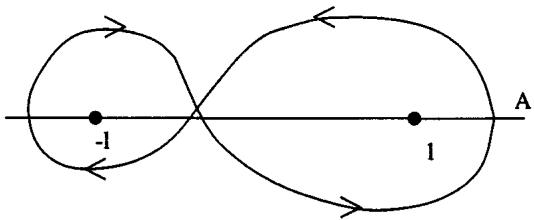
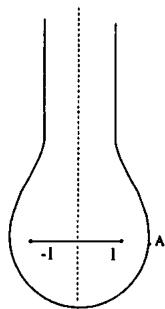
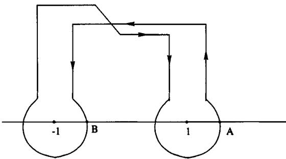
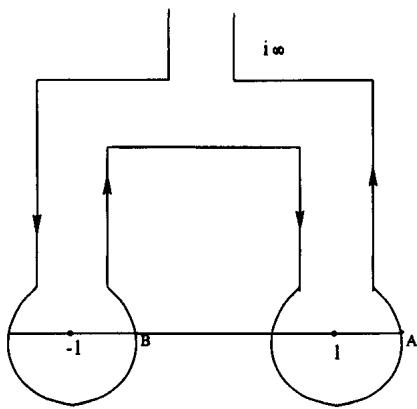
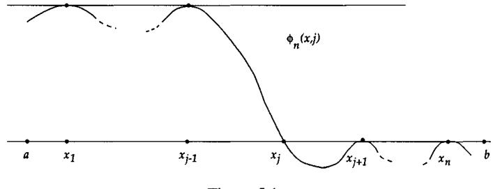
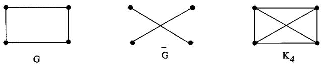
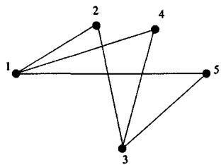
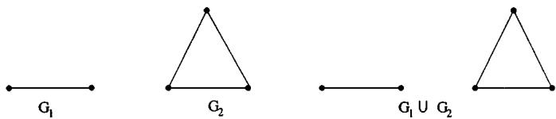

36. Show that

$$
\begin{array}{l} _ {7} F _ {6} \left( \begin{array}{c} a, (a + 2) / 2, b, c, d, e, - n \\ (a / 2), a + 1 - b, a + 1 - c, a + 1 - d, a + 1 - e, a + 1 + n \end{array} ; 1\right) \\ = \frac {(a + 1) _ {n} (a - b - c) _ {n} (a - b - d) _ {n} (a - c - d) _ {n}}{(a + 1 - b) _ {n} (a + 1 - c) _ {n} (a + 1 - d) _ {n} (a - b - c - d) _ {n}} \\ \cdot \left[ 1 + \frac {n (n + 2 a - b - c - d) (a - b - c - d)}{(a - b - c) (a - b - d) (a - c - d)} \right], \end{array}
$$

when $e = 2a + n - b - c - d$ . The $_7F_6$ is 4-balanced and very well poised.

37. Prove formulas (3.5.2), (3.5.3), and (3.5.4) connected with reciprocal polynomials.

38. Prove Bailey's cubic transformations:

(a)

(b)

$$
\begin{array}{l} _ {3} F _ {2} \left( \begin{array}{c} a, 2 b - a - 1, a + 2 - 2 b \\ b, a + \frac {3}{2} - b \end{array} ; \frac {x}{4}\right) \\ = (1 - x) ^ {- a} _ {3} F _ {2} \left( \begin{array}{c} \frac {a}{3}, \frac {a + 1}{3}, \frac {a + 2}{3} \\ b, a - b + \frac {3}{2} \end{array} ; \frac {- 2 7 x}{4 (1 - x) ^ {3}}\right). \\ _ {3} F _ {2} \left( \begin{array}{c} a, b - \frac {1}{2}, a + 1 - b \\ 2 b, 2 a + 2 - 2 b \end{array} ; x\right) \\ = \left(1 - \frac {x}{4}\right) ^ {- a} _ {3} F _ {2} \left( \begin{array}{c} \frac {a}{3}, \frac {a + 1}{3}, \frac {a + 2}{3} \\ b, a + \frac {3}{2} - b \end{array} ; \frac {2 7 x ^ {2}}{(4 - x) ^ {3}}\right). \end{array}
$$

For comments on these cubic transformations and for the reference to Bailey, see Askey [1994].

39. Show that

$$
{ } _ { 2 } F _ { 1 } \left( \begin{array} { c } a , a + 1 / 2 \\ 2 a + 1 \end{array} ; x \right) = \left( \frac { 2 } { 1 + \sqrt { 1 - x } } \right) ^ { 2 a }
$$

and

$$
{ } _ { 2 } F _ { 1 } \left( \begin{array} { c } a , a + 1 / 2 \\ 2 a \end{array} ; x \right) = \frac { 1 } { \sqrt { 1 - x } } \left( \frac { 2 } { 1 + \sqrt { 1 - x } } \right) ^ { 2 a - 1 } .
$$

40. Define

$$
\phi (x; n) = \prod_ {j = 0} ^ {n - 1} \left(a _ {j} + x b _ {j}\right),
$$

$$
\phi (x; 0) = 1.
$$

If

$$
f (n) = \sum_ {k = 0} ^ {n} (- 1) ^ {k} \binom {n} {k} \phi (k; n) g (k),
$$

show that

$$
g (n) = \sum_ {k = 0} ^ {n} (- 1) ^ {k} \binom {n} {k} \frac {q _ {k} + k b _ {k}}{\phi (n ; k + 1)} f (k).
$$

See Gould and Hsu [1973].

41. By appropriate choices of $g(k)$ and $\phi(k; n)$ , show that

$$
{ } _ { 3 } F _ { 2 } \left( \begin{array} { c } - n , n + a , 1 + a - b - c \\ 1 + a - b , 1 + a - c \end{array} ; 1 \right) = \frac { ( b ) _ { n } ( c ) _ { n } } { ( 1 + a - b ) _ { n } ( 1 + a - c ) _ { n } }
$$

gives the sum of the terminating very well poised $_{5}F_{4}$ .

# Bessel Functions and Confluent Hypergeometric Functions

In this chapter, we discuss the confluent hypergeometric equation and the related Bessel and Whittaker equations. The Bessel equation is important in mathematical physics because it arises from the Laplace equation when there is cylindrical symmetry. The confluent hypergeometric equation is obtained when we start with a second-order differential equation whose only singularities are regular singularities at 0, b, and $\infty$ ; we let $b \to \infty$ . The resulting equation has $\infty$ as an irregular singular point obtained from a confluence of two regular singularities. Thus, the confluent equation can be derived from the hypergeometric equation by changing the independent variable x to x/b and letting $b \to \infty$ . The solutions are $_{1}F_{1}$ functions, and some properties of these functions are limits of properties of $_{2}F_{1}$ functions. However, it is often easier to derive the results directly than to justify the limiting procedures.

Whittaker transformed the confluent equation to one in which the coefficient of the first derivative is zero. Solutions of this equation are called Whittaker functions. We find their series and integral representations and their asymptotic behavior and then give some important examples such as the error function and the parabolic cylinder function.

The Bessel equation can be derived from a particular Whittaker equation and can be solved to obtain the Bessel functions to which we devote a good portion of this chapter. These functions are also important for their role in Fourier transforms in several variables. We present some integral representations of Bessel functions due to Poisson, Gegenbauer, and others. Later, we discuss some interesting finite and infinite integrals involving Bessel functions as integrands. Some of these are really limits of generating functions for Jacobi polynomials.

The sine and cosine functions are particular cases of Bessel functions. Thus, it is useful to look for generalizations of formulas for these trigonometric functions to Bessel functions. Nicholson found a remarkable extension of $\sin^2 x + \cos^2 x = 1$ to Bessel functions; he expressed it as an integral formula. We present Nicholson's formula and later show how Lorch and Szego used it to derive results about zeros of Bessel functions.

We end this chapter with a discussion of some work of Saff and Varga on zero-free regions for the sequence of polynomials that are partial sums of the exponential function and, more generally, of the $_{1}F_{1}$ functions.

## 4.1 The Confluent Hypergeometric Equation

It is easily seen that the hypergeometric series

$$
y = \mathbf {\Phi} _ {p} F _ {q} \binom{a _ {1}, \ldots , a _ {p}}{b _ {1}, \ldots , b _ {q}}; x\tag{4.1.1}
$$

is a formal solution of the differential equation

$$
\{\delta (\delta + b _ {1} - 1) \dots (\delta + b _ {q} - 1) - x (\delta + a _ {1}) \dots (\delta + a _ {p}) \} y = 0,\tag{4.1.2}
$$

where

$$
\delta = x \frac {d}{d x}.
$$

When p > 2 or q > 1, this equation is of order $\max(p, q + 1) > 2$ , and the resulting equation is not as useful as the hypergeometric equation. When q = 1 and p = 0 or 1, the equation is still of second order with a regular singular point at x = 0, but the other singular point is at $x = \infty$ and is an irregular singular point. Although irregular singular points cause serious problems, it is still possible to say something about the solutions near them.

We consider the case where $p = q = 1$ . Then the equation is

$$
\left. \left\{x \frac {d}{d x} \left(x \frac {d}{d x} + c - 1\right) - x \left(x \frac {d}{d x} + a\right) \right\} y = 0, \right.
$$

or

$$
x y ^ {\prime \prime} + (c - x) y ^ {\prime} - a y = 0.\tag{4.1.3}
$$

This equation can be obtained from the hypergeometric equation

$$
x (1 - x) y ^ {\prime \prime} + \{c - (a + b + 1) x \} y ^ {\prime} - a b y = 0
$$

by the following process. Replace x with x/b, so that the new equation has singular points at 0, b, and $\infty$ . Now let $b \to \infty$ so that infinity is a confluence of two singularities. The resulting Equation (4.1.3) is called the confluent hypergeometric equation.

When $c$ is not an integer, two independent solutions of the hypergeometric equation around $x = 0$ are

$$
{ } _ { 2 } F _ { 1 } \left( \begin{array} { c } a , b \\ c \end{array} ; x \right) \quad \text {   and   } \quad x ^ { 1 - c } { } _ { 2 } F _ { 1 } \left( \begin{array} { c } a + 1 - c , b + 1 - c \\ 2 - c \end{array} ; x \right) .
$$

Replace $x$ with $x / b$ in these expressions and let $b \to \infty$ to get

$$
{ } _ { 1 } F _ { 1 } \binom { a } { c } ; x ) \quad \text {   and   } \quad x ^ { 1 - c } { } _ { 1 } F _ { 1 } \binom { a + 1 - c } { 2 - c } ; x ) .\tag{4.1.4}
$$

These are two independent solutions of (4.1.3) around x = 0. They are valid over the whole complex plane, since $_{1}F_{1}$ is an entire function. One has to be somewhat more careful to find the solutions around infinity. A solution of the hypergeometric equation about infinity is given by

$$
x ^ {- a} _ {2} F _ {1} \binom {a, a + 1 - c} {a + 1 - b}; \frac {1}{x} \bigg).
$$

When x is changed to x/b and $b \rightarrow \infty$ , this expression tends termwise to

$$
x ^ {- a} _ {2} F _ {0} \binom {a, a + 1 - c} {-}; - \frac {1}{x}.
$$

This series diverges, so it does not directly give a solution of Equation (4.1.3). However, it is possible to find an integral representation of a solution of (4.1.3) that has this series as an asymptotic expansion. To find this integral representation, start with Euler's hypergeometric integral

$$
\begin{array}{l} x ^ {- a} _ {2} F _ {1} \left( \begin{array}{c} a + 1 - c, a \\ a + 1 - b \end{array} ; \frac {b}{x}\right) \\ = x ^ {- a} \frac {\Gamma (a + 1 - b) (- b) ^ {- a}}{\Gamma (a) \Gamma (1 - b)} \int_ {0} ^ {- b} \left(1 + \frac {t}{x}\right) ^ {c - a - 1} t ^ {a - 1} \left(1 + \frac {t}{b}\right) ^ {- b} d t. \end{array}\tag{4.1.5}
$$

It is possible to let $b \to -\infty$ in the integral, though (4.1.5) no longer makes sense in the limit. The right side of (4.1.5) tends to

$$
\frac {x ^ {- a}}{\Gamma (a)} \int_ {0} ^ {\infty} e ^ {- t} t ^ {a - 1} \left(1 + \frac {t}{x}\right) ^ {c - a - 1} d t = \frac {1}{\Gamma (a)} \int_ {0} ^ {\infty} e ^ {- x t} t ^ {a - 1} (1 + t) ^ {c - a - 1} d t.\tag{4.1.6}
$$

This integral converges for $\operatorname{Re} a > 0$ and $\operatorname{Re} x > 0$ . It is easy to verify that (4.1.6) is a solution of the confluent equation (4.1.3).

Remark 4.1.1 Here is another way of arriving at (4.1.6). Let

$$
y (x) = \int_ {0} ^ {\infty} e ^ {- x t} f (t) d t.
$$

Then

$$
\begin{array}{l} x y ^ {\prime \prime} + (c - x) y ^ {\prime} - a y \\ = \int_ {0} ^ {\infty} (x t ^ {2} - (c - x) t - a) e ^ {- x t} f (t) d t \\ = \int_ {0} ^ {\infty} \left[ \left(- \frac {\partial}{\partial t} e ^ {- x t}\right) t ^ {2} - \left(\frac {\partial}{\partial t} e ^ {- x t}\right) t - (a + c t) e ^ {- x t} \right] f (t) d t \\ = \int_ {0} ^ {\infty} e ^ {- x t} \{[ t ^ {2} f (t) ] ^ {\prime} + [ t f (t) ] ^ {\prime} - (a + c t) f (t) \} d t = 0. \end{array}
$$

The last equation holds when

$$
\frac {f ^ {\prime} (t)}{f (t)} = \frac {a - 1 + (c - 2) t}{t (t + 1)} = \frac {a - 1}{t} + \frac {c - a - 1}{t + 1}
$$

or

$$
f (t) = t ^ {a - 1} (1 + t) ^ {c - a - 1},
$$

and we get integral (4.1.6) once again.

Suppose $x \geq 1$ in (4.1.6). By Taylor's theorem

$$
\begin{array}{l} \left(1 + \frac {t}{x}\right) ^ {c - a - 1} = 1 + \sum_ {k = 1} ^ {n - 1} \frac {(- 1) ^ {k} (a + 1 - c) _ {k}}{k !} \frac {t ^ {k}}{x ^ {k}} \\ \qquad + \frac {(- 1) ^ {n} (a + 1 - c) _ {n}}{n !} \frac {t ^ {n}}{x ^ {n}} \left(1 + \frac {\theta t}{x}\right) ^ {c - a - n - 1}, \end{array}\tag{4.1.7}
$$

where $0 < \theta < 1$ . So

$$
\frac {1}{\Gamma (a)} \int_ {0} ^ {\infty} e ^ {- t} t ^ {a - 1} \left(1 + \frac {t}{x}\right) ^ {c - a - 1} d t = \sum_ {k = 0} ^ {n - 1} \frac {(a + 1 - c) _ {k} (a) _ {k}}{k !} \left(- \frac {1}{x}\right) ^ {k} + R _ {n} (x),
$$

where

$$
R _ {n} (x) = \frac {(- 1) ^ {n} (a + 1 - c) _ {n}}{n ! \Gamma (a) x ^ {n}} \int_ {0} ^ {\infty} e ^ {- t} t ^ {a + n - 1} \left(1 + \frac {\theta t}{x}\right) ^ {c - a - n - 1} d t.
$$

The integral converges and

$$
R _ {n} (x) = 0 \left(\frac {1}{x ^ {n}}\right).
$$

Thus we see that, except for a constant factor,

$$
(- x) _ {2} ^ {- a} F _ {0} \binom {a, a + 1 - c} {-}; - \frac {1}{x}
$$

gives an asymptotic expansion of a solution of the confluent hypergeometric equation when x > 1 is large. In fact, we need not restrict ourselves to positive x if

instead of (4.1.7) we use

$$
\left(1 + \frac {t}{x}\right) ^ {- m} = \sum_ {k = 0} ^ {n - 1} \frac {(m) _ {k}}{k !} \left(- \frac {t}{x}\right) ^ {k} + \frac {(m) _ {n}}{n !} \left(1 + \frac {t}{x}\right) ^ {- m} \int_ {0} ^ {t / x} u ^ {n} (1 + u) ^ {m - 1} d u.\tag{4.1.8}
$$

This holds as long as $1 + \frac{t}{x}$ is not a negative real number. To remove the restriction Re x > 0, which is necessary for convergence in (4.1.6), consider the integral

$$
\int_ {\infty} ^ {(0 +)} e ^ {- x t} t ^ {a - 1} (1 + t) ^ {c - a - 1} d t\tag{4.1.9}
$$

or

$$
x ^ {- a} \int_ {\infty} ^ {(0 +)} e ^ {- t} t ^ {a - 1} \left(1 + \frac {t}{x}\right) ^ {c - a - 1} d t.\tag{4.1.10}
$$

These integrals are also solutions of the confluent equation, but without the restrictions on x and a needed in (4.1.6). From (4.1.10) and (4.1.8), we can once again obtain the $_{2}F_{0}$ asymptotic expansion for large $|x|$ , when $|\arg x| \leq \pi - \delta < \pi$ .

Relations among solutions of the hypergeometric equation suggest corresponding relations among solutions of the confluent equation. These can then be proved rigorously. Similarly, transformations of hypergeometric functions imply transformations of the $_{1}F_{1}$ function. The following are a few examples.

In Pfaff's transformation,

$$
{ } _ { 2 } F _ { 1 } \bigg ( \begin{array} { c } a , b \\ c \end{array} ; x \bigg ) = ( 1 - x ) ^ { - b } { } _ { 2 } F _ { 1 } \bigg ( \begin{array} { c } b , c - a \\ c \end{array} ; \frac { x } { x - 1 } \bigg ) ,\tag{2.2.6}
$$

change $x$ to $x / b$ and let $b \to \infty$ to get Kummer's first transformation,

$$
{ } _ { 1 } F _ { 1 } \binom { a } { c } ; x ) = e ^ { x } { } _ { 1 } F _ { 1 } \binom { c - a } { a } ; - x ) .\tag{4.1.11}
$$

A similar procedure applied to the quadratic transformation,

$$
{ } _ { 2 } F _ { 1 } \left( \begin{array} { c } a , b \\ 2 a \end{array} ; \frac { 4 x } { ( 1 + x ) ^ { 2 } } \right) = ( 1 + x ) ^ { 2 a } { } _ { 2 } F _ { 1 } \left( \begin{array} { c } a , a + \frac { 1 } { 2 } - b \\ b + \frac { 1 } { 2 } \end{array} ; x ^ { 2 } \right) ,\tag{3.1.11}
$$

leads to Kummer's second transformation,

$$
{ } _ { 1 } F _ { 1 } \binom { a } { 2 a } ; 4 x \Bigg ) = e ^ { 2 x } { } _ { 0 } F _ { 1 } \binom { - } { a + 1 / 2 } ; x ^ { 2 } \Bigg ) .\tag{4.1.12}
$$

Finally, the three-term relation

$$
\begin{array}{l} (- x) ^ {- a} _ {2} F _ {1} \binom {a, a + 1 - c} {a + 1 - b}; \frac {1}{x} \\ = \frac {\Gamma (1 - c) \Gamma (a + 1 - b)}{\Gamma (a + 1 - c) \Gamma (1 - b)} _ {2} F _ {1} \binom {a, b} {c}; x \\ + \frac {\Gamma (c - 1) \Gamma (a + 1 - b)}{\Gamma (a) \Gamma (c - b)} (- x) ^ {1 - c} _ {2} F _ {1} \binom {a + 1 - c, b + 1 - c} {2 - c}; x \end{array}
$$

suggests that

$$
\begin{array}{l} \frac {\Gamma (1 - c)}{\Gamma (a + 1 - c)} _ {1} F _ {1} \binom {a} {c}; x) + \frac {\Gamma (c - 1)}{\Gamma (a)} x ^ {1 - c} _ {1} F _ {1} \binom {a + 1 - c} {2 - c}; x) \\ \sim x ^ {- a} _ {2} F _ {0} \binom {a, a + 1 - c} {-}; - \frac {1}{x}). \end{array}\tag{4.1.13}
$$

Formulas (4.1.11) and (4.1.12) can be proved directly. Thus, the coefficient of $x^n$ on the right side of (4.1.11) is

$$
\begin{array}{r l} \sum_ {k = 0} ^ {n} \frac {(c - a) _ {k} (- 1) ^ {k}}{(c) _ {k} k ! (n - k) !} & = \frac {1}{n !} _ {2} F _ {1} \binom {- n, c - a} {c}; 1 \\ & = \frac {(a) _ {n}}{n ! (c) _ {n}}, \end{array}
$$

which is the coefficient of $x^{n}$ on the left side. There is a similar proof of (4.1.12). We give a proof of (4.1.13) in the next section where we approach this topic from a different point of view.

## 4.2 Barnes's Integral for $_{1}F_{1}$

We can find the contour integral representation for $_{1}F_{1}(a;c;x)$ by computing its Mellin transform. This is similar to finding such a representation for the hypergeometric function. Let

$$
I = \int_ {0} ^ {\infty} x ^ {s - 1} _ {1} F _ {1} \binom{a}{c}; - x) d x.
$$

By Kummer's first transformation (4.1.11),

$$
\begin{array}{l} I = \int_ {0} ^ {\infty} x ^ {s - 1} e _ {1} ^ {- x} F _ {1} \binom {c - a} {c}; x) d x \\ = \int_ {0} ^ {\infty} \sum_ {n = 0} ^ {\infty} \frac {(c - a) _ {n}}{(c) _ {n} n !} e ^ {- x} x ^ {s + n - 1} d x \\ = \Gamma (s) _ {2} F _ {1} \binom {c - a, s} {c}; 1) = \frac {\Gamma (c)}{\Gamma (a)} \frac {\Gamma (s) \Gamma (a - s)}{\Gamma (c - s)}. \end{array}
$$

By Mellin inversion, we should have

$$
\Gamma (a) _ {1} F _ {1} \binom {a} {c}; - x = \frac {\Gamma (c)}{2 \pi i} \int_ {- i \infty} ^ {i \infty} \frac {\Gamma (a - s) \Gamma (s)}{\Gamma (c - s)} x ^ {- s} d s\tag{4.2.1}
$$

or

$$
\Gamma (a) _ {1} F _ {1} \binom{a}{c}; x) = \frac {\Gamma (c)}{2 \pi i} \int_ {- i \infty} ^ {i \infty} \frac {\Gamma (a + s) \Gamma (- s)}{\Gamma (c + s)} (- x) ^ {s} d s.\tag{4.2.2}
$$

Of course, once we have seen Barnes's integral for a $_2F_1$ , this can be written by analogy. In (4.2.2) we have $-x > 0$ , but this can be extended. The next theorem gives the extension and is due to Barnes.

Theorem 4.2.1 For $|\arg (-x)| < \pi / 2$ and a not a negative integer or zero,

$$
\Gamma (a) _ {1} F _ {1} (a; c; x) = \frac {\Gamma (c)}{2 \pi i} \int_ {- i \infty} ^ {i \infty} \frac {\Gamma (a + s)}{\Gamma (c + s)} \Gamma (- s) (- x) ^ {s} d s,
$$

where the path of integration is curved, if necessary, to separate the negative poles from the positive ones.

The proof follows the same lines as that of Theorem 2.4.1. The reader should work out the details.

Again as in Chapter 2, this representation of $_{1}F_{1}$ can be used to obtain an asymptotic expansion by moving the line of integration to the left. The residues come from the poles of $\Gamma(a+s)$ at s = -a - n. The result is contained in the next theorem.

Theorem 4.2.2 For $\operatorname{Re} x < 0$ ,

$$
{ } _ { 1 } F _ { 1 } ( a ; c ; x ) \sim \frac { \Gamma ( c ) } { \Gamma ( c - a ) } ( - x ) ^ { - a } { } _ { 2 } F _ { 0 } \left( \begin{array} { c } a , a + 1 - c \\ - \end{array} ; - \frac { 1 } { x } \right) .
$$

Corollary 4.2.3 For $\operatorname{Re} x > 0$ ,

$$
{ } _ { 1 } F _ { 1 } ( a ; c ; x ) \sim \frac { \Gamma ( c ) e ^ { x } } { \Gamma ( a ) x ^ { c - a } } { } _ { 2 } F _ { 0 } \bigg ( \begin{array} { c } c - a , 1 - a \\ - \end{array} ; \frac { 1 } { x } \bigg ) .
$$

Proof. This follows from Theorem 4.2.2 after an application of (4.1.11).

Now note that the $_{2}F_{0}$ in Theorem 4.2.2 suggests the integral

$$
J = \frac {1}{2 \pi i} \int_ {- i \infty} ^ {i \infty} \Gamma (- s) \Gamma (1 - c - s) \Gamma (a + s) x ^ {s} d s.\tag{4.2.3}
$$

Again the line of integration is suitably curved. By moving the line of integration to the left and picking up the residues at s = -k - a, where $k \geq 0$ is an integer, we get

$$
\begin{array}{l} J = \Gamma (a) \Gamma (1 + a - c) x ^ {- a} \sum_ {k = 0} ^ {n} \frac {(a) _ {n} (1 + a - c) _ {n}}{n !} \left(- \frac {1}{x}\right) ^ {n} \\ \qquad + \frac {1}{2 \pi i} \int_ {- a - n - i \infty} ^ {- a - n + i \infty} \Gamma (- s) \Gamma (1 - c - s) \Gamma (a + s) x ^ {s} d s. \end{array}\tag{4.2.4}
$$

To ensure the validity of this formula, we need an estimate of the integrand on $s = \sigma + iT$ , where $T$ is large and $-a - n \leq \sigma \leq 0$ . By Stirling's formula (see

Corollary 1.4.4),

$$
\begin{array}{l} \left| \Gamma (- s) \Gamma (1 - c - s) \Gamma (a + s) x ^ {s} \right| \\ \sim (2 \pi) ^ {3 / 2} T ^ {\operatorname{Re} (a - c - 1 / 2)} e ^ {- T (\arg x + 3 \pi / 2)} e ^ {- \frac {\pi}{2} | \operatorname{Im} (a + c) |} \left| \frac {x}{M} \right| ^ {\sigma}. \end{array}
$$

The expression on the right-hand side dies out exponentially when $\left|\arg x\right| \leq 3\pi/2 - \delta < 3\pi/2$ . We assume this condition and (4.2.4) is then true. The last integral in (4.2.4) is equal to

$$
\frac {x ^ {- a - n}}{2 \pi i} \int_ {- i \infty} ^ {i \infty} \Gamma (a + n - s) \Gamma (1 + a - c + n - s) \Gamma (s - n) x ^ {s} d s = 0 (x ^ {- a - n})
$$

when $|x|$ is large. Thus

$$
J \sim \Gamma (a) \Gamma (1 + a - c) x ^ {- a} _ {2} F _ {0} \binom {a, 1 + a - c} {-}; - \frac {1}{x},\tag{4.2.5}
$$

the asymptotic expansion being valid for $\left|\arg x\right| < 3\pi/2$ .

However, when the line of integration is moved to the right, it can be seen that

$$
J = \Gamma (a) \Gamma (1 - c) _ {1} F _ {1} \binom{a}{c}; x) + \Gamma (a + 1 - c) \Gamma (c - 1) x ^ {1 - c} _ {1} F _ {1} \binom{a + 1 - c}{2 - c}; x)\tag{4.2.6}
$$

when $|\arg x| < 3\pi / 2$ . This proves the next theorem.

Theorem 4.2.4 For $|\arg x| < 3\pi / 2$ , (4.2.5) and (4.2.6) hold and

$$
\begin{array}{l} \Gamma (a) \Gamma (1 - c) _ {1} F _ {1} \binom {a} {c}; x \\ \sim \Gamma (a) \Gamma (a + 1 - c) x ^ {- a} _ {2} F _ {0} \binom {a, a + 1 - c} {-}; \frac {- 1}{x}. \end{array}
$$

Observe that this is the same as relation (4.1.13).

This theorem gives the linear combination of the two independent $_{1}F_{1}$ that produce the recessive solution of the confluent equation. This is of special interest in numerical work. To clarify this point, consider the simpler equation $y'' - y = 0$ , which has independent solutions $\sinh x$ and $\cosh x$ as well as $e^{x}$ and $e^{-x}$ . This equation has an essential singularity at $\infty$ and, in the neighborhood of this point for Re x > 0, $e^{-x}$ is the recessive solution. Any other solution independent of $e^{-x}$ is a dominant solution. Thus the combination $Ae^{x} + Be^{-x}$ can be computed very accurately from values of $e^{x}$ and $e^{-x}$ . However, A $\cosh x - B \sinh x$ creates problems, especially when $A \approx B$ and x has a large positive real part.

## 4.3 Whittaker Functions

## 4.3 Whittaker Functions

Whittaker [1904] gave another important form of the confluent equation. This is obtained from Kummer's equation (4.1.3) by a transformation that eliminates the first derivative from the equation. Set $y = e^{x/2} x^{-c/2} \omega(x)$ in (4.1.3). The equation satisfied by $\omega$ is

$$
\omega^ {\prime \prime} + \left[ - \frac {1}{4} + \left(\frac {c}{2} - a\right) \frac {1}{x} + \frac {c}{2} \left(1 - \frac {c}{2}\right) \frac {1}{x ^ {2}} \right] \omega = 0.
$$

Two independent solutions of this equation can have a more symmetric form if we set

$$
c = 1 + 2 m, \quad \frac {c}{2} - a = k
$$

or

$$
m = \frac {c - 1}{2}, \qquad a = \frac {1}{2} + m - k.
$$

The result is Whittaker's equation:

$$
W ^ {\prime \prime} + \left\{- \frac {1}{4} + \frac {k}{x} + \frac {\frac {1}{4} - m ^ {2}}{x ^ {2}} \right\} W = 0.\tag{4.3.1}
$$

From the solutions (4.1.4) of (4.1.3), it is clear that when 2m is not an integer, two independent solutions of (4.3.1) are

$$
M _ {k, m} (x) = e ^ {- x / 2} x ^ {\frac {1}{2} + m} _ {1} F _ {1} \binom {\frac {1}{2} + m - k} {1 + 2 m}; x\tag{4.3.2}
$$

and

$$
M _ {k, - m} (x) = e ^ {- x / 2} x ^ {\frac {1}{2} - m} _ {1} F _ {1} \bigg ( \begin{array}{c} \frac {1}{2} - m - k \\ 1 - 2 m \end{array} ; x \bigg).\tag{4.3.3}
$$

The solutions $M_{k,\pm m}(x)$ are called Whittaker functions. Because of the factors $x^{\frac{1}{2}\pm m}$ , the functions are not single valued in the complex plane. Usually one restricts x to $|\arg x| < \pi$ .

Formulas for ${}_{1}{F}_{1}$ obviously carry over to the Whittaker functions. Kummer's first formula,for example,takes the form

$$
x ^ {- \frac {1}{2} - m} M _ {k, m} (x) = (- x) ^ {- \frac {1}{2} - m} M _ {- k, m} (- x).\tag{4.3.4}
$$

A drawback of the functions $M_{k,\pm m}(x)$ is that one of them is not defined when 2m is an integer. Moreover, the asymptotic behavior of the solution of Whittaker's equation is not easily obtained from these functions. So we use the integral in (4.1.10) to derive another Whittaker function, $W_{k,m}(x)$ . This is defined by

$$
\begin{array}{l} W _ {k, m} (x) := - \frac {1}{2 \pi i} \Gamma \left(k + \frac {1}{2} - m\right) e ^ {- x / 2} x ^ {k} \\ \cdot \int_ {\infty} ^ {(0 +)} (- t) ^ {- k - \frac {1}{2} + m} \left(1 + \frac {t}{x}\right) ^ {k - \frac {1}{2} + m} e ^ {- t} d t, \end{array}\tag{4.3.5}
$$

where $\arg x$ takes its principal value and the contour does not contain the point $t = -x$ . Moreover, $|\arg (-t)| \leq \pi$ , and when $t$ approaches 0 along the contour, $\arg (1 + t / x) \to 0$ . This makes the integrand single valued. It is easily verified that $W_{k,m}(x)$ is also a solution of (4.3.1). Note that Whittaker's equation (4.3.1) is unchanged when $x$ and $k$ change sign. Thus $W_{-k,m}(-x)$ is also a solution and is independent of $W_{k,m}(x)$ . This is clear when one considers the asymptotic expansion for $W_{k,m}(x)$ . The reader should verify that the remarks after (4.1.10) imply that

$$
W _ {k, m} (x) \sim e ^ {- x / 2} x ^ {k}   _ {2} F _ {0} \bigg ( \begin{array}{c} \frac {1}{2} - k + m, \frac {1}{2} - k - m \\ - \end{array} ; - \frac {1}{x} \bigg), \quad | x | \to \infty ,\tag{4.3.6}
$$

when $|\arg x| \leq \pi - \delta < \pi$ . Consequently,

$$
W _ {\pm k, m} (\pm x) = e ^ {\pm x / 2} (\pm x) ^ {\pm k} \left\{1 + 0 \left(\frac {1}{x}\right) \right\}.
$$

This shows that $W_{k,m}(x)$ and $W_{-k,m}(-x)$ are linearly independent.

## 4.4 Examples of $_{1}F_{1}$ and Whittaker Functions

This section contains some important examples of $_{1}F_{1}$ and Whittaker functions that occur frequently enough in mathematics, statistics, and physics to be given names.

(a) The simplest example is given by

$$
e ^ {x} = _ {1} F _ {1} (a; a; x).\tag{4.4.1}
$$

(b) The error function is defined by

$$
\operatorname{erf} x = \frac {2}{\sqrt {\pi}} \int_ {0} ^ {x} e ^ {- t ^ {2}} d t = 1 - \operatorname{erfc} x (x \text {   real }),\tag{4.4.2}
$$

where

$$
\operatorname{erfc} x = \frac {2}{\sqrt {\pi}} \int_ {x} ^ {\infty} e ^ {- t ^ {2}} d t.
$$

It is easy to see that $\operatorname{erf} x = \frac{2x}{\sqrt{\pi}}_1 F_1(1/2; 3/2; x)$ .

To express the error function in terms of $W_{k,m}(x)$ we need to write (4.3.5) as an integral over $(0,\infty)$ . Assume that $\operatorname{Re}\left(k-\frac{1}{2}-m\right)<0$ ; then (4.3.5) can be written as

$$
\begin{array}{l} W _ {k, m} (x) = e ^ {- x / 2} x ^ {k} \Gamma \left(k + \frac {1}{2} - m\right) \frac {\sin \pi \left(k + \frac {1}{2} - m\right)}{\pi} \\ \cdot \int_ {0} ^ {\infty} e ^ {- t} t ^ {- k - \frac {1}{2} + m} (1 + t / x) ^ {k - \frac {1}{2} + m} d t \\ = \frac {e ^ {- x / 2} x ^ {k}}{\Gamma \left(\frac {1}{2} - k + m\right)} \int_ {0} ^ {\infty} e ^ {- t} t ^ {- k - \frac {1}{2} + m} (1 + t / x) ^ {k - \frac {1}{2} + m} d t. \end{array}\tag{4.4.3}
$$

The integral converges for $\operatorname{Re}\left(k-\frac{1}{2}-m\right)<0$ and $\operatorname{Re}x>0$ . Note the relation of (4.4.3) with the integral in (4.1.6). Now set $t=u^{2}-s^{2}$ , where u is the new variable. Then

$$
W _ {k, m} (x) = \frac {e ^ {- x / 2} x ^ {k} 2 e ^ {s ^ {2}}}{\Gamma \left(\frac {1}{2} - k + m\right)} \int_ {s} ^ {\infty} \left(u ^ {2} - s ^ {2}\right) ^ {- k - \frac {1}{2} + m} \left(\frac {x + u ^ {2} - s ^ {2}}{x}\right) ^ {k - \frac {1}{2} + m} e ^ {- u ^ {2}} u d u.
$$

Set $k = -1/4$ , $m = 1/4$ , and $x = s^2$ to get

$$
W _ {- 1 / 4, 1 / 4} (s ^ {2}) = 2 e ^ {s ^ {2} / 2} \sqrt {s} \int_ {s} ^ {\infty} e ^ {- u ^ {2}} d u.
$$

Thus

$$
\operatorname{erf} x = 1 - \frac {1}{\sqrt {\pi}} e ^ {- x ^ {2} / 2} x ^ {- 1 / 2} W _ {- 1 / 4, 1 / 4} (x ^ {2}).\tag{4.4.4}
$$

An asymptotic expansion for erf $x$ can be derived from this formula and (4.3.6). (c) The incomplete gamma function is defined by

$$
\gamma (a, x) = \int_ {0} ^ {x} e ^ {- t} t ^ {a - 1} d t = \Gamma (a) - \int_ {x} ^ {\infty} e ^ {- t} t ^ {a - 1} d t = \Gamma (a) - \Gamma (a, x).\tag{4.4.5}
$$

After expanding $e^{-t}$ as a series in t and term-by-term integration, it is clear that

$$
\gamma (a, x) = \frac {x ^ {a}}{a} _ {1} F _ {1} (a; a + 1; x).\tag{4.4.6}
$$

The reader may also verify that

$$
\Gamma (a, x) = e ^ {- x / 2} x ^ {\frac {a - 1}{2}} W _ {\frac {a - 1}{2}, \frac {a}{2}} (x).\tag{4.4.7}
$$

(d) The logarithmic integral $\operatorname{li}(x)$ is defined by

$$
\operatorname{li} (x) = \int_ {0} ^ {x} \frac {d t}{\log t}.
$$

Check that

$$
\operatorname{li} (x) = - (- \log x) ^ {- 1 / 2} x ^ {1 / 2} W _ {- 1 / 2, 0} (- \log x).
$$

If $x$ is complex, take $|\arg (-\log x)| < \pi$ .

Additional examples of Whittaker functions such as the integral sine and cosine and Fresnel integrals are given in Exercise 4.

(e) The parabolic cylinder functions are also particular cases of the Whittaker functions. To see how these functions arise, consider the Laplace equation

$$
\frac {\partial^ {2} u}{\partial x ^ {2}} + \frac {\partial^ {2} u}{\partial y ^ {2}} + \frac {\partial^ {2} u}{\partial z ^ {2}} = 0.\tag{4.4.8}
$$

The coordinates of the parabolic cylinder $\xi$ , $\eta$ , z are defined by

$$
x = \frac {1}{2} (\xi^ {2} - \eta^ {2}), \quad y = \xi \eta , \quad z = z.\tag{4.4.9}
$$

Apply the change of variables (4.4.9) to the Laplace equation. The result after some calculation is

$$
\frac {1}{\xi^ {2} + \eta^ {2}} \left(\frac {\partial^ {2} u}{\partial \xi^ {2}} + \frac {\partial^ {2} u}{\partial \eta^ {2}}\right) + \frac {\partial^ {2} u}{\partial z ^ {2}} = 0.
$$

This equation has particular solutions of the form $U(\xi)V(\eta)W(z)$ , which can be obtained by separation of variables. The equation satisfied by U, for example, has the form

$$
\frac {d ^ {2} U}{d \xi^ {2}} + (\sigma \xi^ {2} + \lambda) U = 0,
$$

where $\sigma$ and $\lambda$ are constants. After a slight change in variables, this equation can be written as

$$
\frac {d ^ {2} y}{d x ^ {2}} + \left(n + \frac {1}{2} - \frac {1}{4} x ^ {2}\right) y = 0.\tag{4.4.10}
$$

Equation (4.4.10) is called Weber's equation. It can be checked that

$$
D _ {n} (x) = 2 ^ {\frac {n}{2} + \frac {1}{4}} x ^ {- \frac {1}{2}} W _ {\frac {n}{2} + \frac {1}{4}, - \frac {1}{4}} \left(x ^ {2} / 2\right) \quad \left(\left| \arg x \right| <   3 \pi / 4\right)\tag{4.4.11}
$$

is a solution of (4.4.10). The constant factor is chosen to make the coefficient of the first term in the asymptotic expansion of $D_{n}(x)$ equal to one. $D_{n}(x)$ is called the parabolic cylinder function. When n is a positive integer, $D_{n}(x)$ is $e^{-\frac{1}{4}x^{2}}$ times a polynomial, which, except for a constant factor, is $H_{n}(x/\sqrt{2})$ , where $H_{n}(x)$ is the Hermite polynomial of degree n. These polynomials will be studied in Chapter 6.

(f) In the study of scattering of charged particles by spherically symmetric potentials, we can take (see Schiff [1947, Chapter V]) the solution of the Schrödinger equation

$$
- \frac {\hbar^ {2}}{2 \mu} \nabla^ {2} u + V u = E u
$$

to be of the form

$$
u (r, \theta) = \sum_ {\ell = 0} ^ {\infty} \frac {y _ {\ell} (r)}{r} P _ {\ell} (\cos \theta),
$$

where $P_{\ell}$ is the Legendre polynomial of degree $\ell$ and $y_{\ell}$ satisfies the equation

$$
\frac {d ^ {2} y}{d r ^ {2}} + \left[ k ^ {2} - U (r) - \frac {\ell (\ell + 1)}{r ^ {2}} \right] y = 0,
$$

$$
k ^ {2} = \frac {2 \mu E}{\hbar^ {2}}, U (r) = \frac {2 \mu V (r)}{\hbar^ {2}}.
$$

By a change of variables we can take $k = 1$ . The Coulomb potential is given by $U(r) = 2\eta / r$ , so the equation for $y$ is

$$
\frac {d ^ {2} y}{d r ^ {2}} + \Big [ 1 - \frac {2 \eta}{r} - \frac {\ell (\ell + 1)}{r ^ {2}} \Big ] y = 0.
$$

Comparison of this equation with Whittaker's equation (4.3.1) shows that

$$
y _ {\ell} = r ^ {\ell + 1} e ^ {- i r} _ {1} F _ {1} (\ell + 1 - i \eta ; 2 \ell + 2; 2 i r).
$$

The function

$$
\Phi_ {\ell} (\eta , r) := e ^ {- i r} _ {1} F _ {1} (\ell + 1 - i \eta ; 2 \ell + 2; 2 i r)
$$

is called the Coulomb wave function.

## 4.5 Bessel's Equation and Bessel Functions

Bessel functions are important in mathematical physics because they are solutions of the Bessel equation, which is obtained from Laplace's equation when there is cylindrical symmetry. The rest of this chapter gives an account of some elementary properties of Bessel functions.

When $k = 0$ and $m = \alpha$ in Whittaker's equation (4.3.1), we get

$$
\frac {d ^ {2} W}{d \xi^ {2}} + \left[ - \frac {1}{4} + \frac {1 / 4 - \alpha^ {2}}{\xi^ {2}} \right] W = 0.
$$

If we set $y(x) = \sqrt{x} W(2ix)$ , then $y$ satisfies the equation

$$
\frac {d ^ {2} y}{d x ^ {2}} + \frac {1}{x} \frac {d y}{d x} + (1 - \alpha^ {2} / x ^ {2}) y = 0.\tag{4.5.1}
$$

This equation is called Bessel's equation of order $\alpha$ . It is easily verified that

$$
J _ {\alpha} (x) := \frac {(x / 2) ^ {\alpha}}{\Gamma (\alpha + 1)} _ {0} F _ {1} \left(\underset {\alpha + 1} {-}; - \left(\frac {x}{2}\right) ^ {2}\right)\tag{4.5.2}
$$

is a solution of (4.5.1). $J_{\alpha}(x)$ is the Bessel function of the first kind of order $\alpha$ . From (4.1.12), we have another representation of $J_{\alpha}(x)$ . This is

$$
J _ {\alpha} (x) = \frac {(x / 2) ^ {\alpha}}{\Gamma (\alpha + 1)} e _ {1} ^ {- i x} F _ {1} \binom {\alpha + 1 / 2} {2 \alpha + 1}; 2 i x).\tag{4.5.3}
$$

Equation (4.5.1) is unchanged when $\alpha$ is replaced by $-\alpha$ . This means that $J_{-\alpha}(x)$ is also a solution of (4.5.1). One can check directly that when $\alpha$ is not an integer, $J_{\alpha}(x)$ and $J_{-\alpha}(x)$ are linearly independent solutions. When $\alpha$ is an integer, say $\alpha = n$ , then

$$
J _ {- n} (x) = (- 1) ^ {n} J _ {n} (x).\tag{4.5.4}
$$

Therefore $J_{-n}(x)$ is linearly dependent on $J_{n}(x)$ . A second linearly independent solution can be found as follows. Since $(-1)^{n} = \cos n\pi$ , we see that $J_{\alpha}(x) \cos \pi \alpha - J_{-\alpha}(x)$ is a solution of (4.5.1), which vanishes when $\alpha$ is an integer. Define

$$
Y _ {\alpha} (x) := \frac {J _ {\alpha} (x) \cos \pi \alpha - J _ {- \alpha} (x)}{\sin \pi \alpha}.\tag{4.5.5}
$$

When $\alpha = n$ is an integer, $Y_{\alpha}(x)$ is defined as a limit. By L'Hopital's rule,

$$
Y _ {n} (x) = \lim _ {\alpha \rightarrow n} Y _ {\alpha} (x) = \frac {1}{\pi} \left\{\frac {\partial J _ {\alpha}}{\partial \alpha} - (- 1) ^ {n} \frac {\partial J _ {- \alpha}}{\partial \alpha} \right\} \Bigg | _ {\alpha = n}.\tag{4.5.6}
$$

Note that

$$
J _ {\alpha} (x) = \sum_ {k = 0} ^ {\infty} \frac {(- 1) ^ {k} (x / 2) ^ {2 k + \alpha}}{k ! \Gamma (k + \alpha + 1)}.
$$

This implies that $J_{\alpha}(x)$ is an entire function in $\alpha$ . Thus the functions $\frac{\partial J_{\alpha}}{\partial \alpha}$ and $\frac{\partial J_{-\alpha}}{\partial \alpha}$ in (4.5.6) are meaningful. Moreover, as functions of $x$ , $J_{\alpha}(x)$ are analytic functions of $x$ in a cut plane. Thus we can verify that $Y_{n}(x)$ is a solution of Bessel's equation (4.5.1) when $\alpha = n$ is an integer. We can conclude that (4.5.5) is a solution of (4.5.1) in all cases. $Y_{\alpha}(x)$ is called a Bessel function of the second kind.

Substitution of the series for $J_{\alpha}(x)$ in (4.5.6) gives, after simplification,

$$
\begin{array}{l} Y _ {n} (x) = \frac {2}{\pi} J _ {n} (x) \ln \frac {x}{2} - \frac {1}{\pi} \sum_ {k = 0} ^ {n - 1} \frac {(n - k - 1) !}{k !} (x / 2) ^ {2 k - n} \\ \qquad - \frac {1}{\pi} \sum_ {k = 0} ^ {\infty} \frac {(- 1) ^ {k}}{k ! (n + k) !} [ \psi (n + k + 1) + \psi (k + 1) ] (x / 2) ^ {2 k + n}. \end{array}\tag{4.5.7}
$$

Here $n$ is a nonnegative integer, $\left|\arg x\right| < \pi$ , and $\psi(x) = \Gamma'(x) / \Gamma(x)$ .

Note that Bessel's equation can be written

$$
\frac {d}{d x} \left(x \frac {d y}{d x}\right) + \left(x - \frac {\alpha^ {2}}{x}\right) y = 0.\tag{4.5.8}
$$

Suppose $\alpha$ is not an integer. It is easy to deduce from (4.5.8) that

$$
J _ {- \alpha} (x) \frac {d}{d x} \left(x \frac {d J _ {\alpha} (x)}{d x}\right) - J _ {\alpha} (x) \frac {d}{d x} \left(x \frac {d J _ {- \alpha} (x)}{d x}\right) = 0
$$

or

$$
x \left[ J _ {- \alpha} (x) J _ {\alpha} ^ {\prime} (x) - J _ {\alpha} (x) J _ {- \alpha} ^ {\prime} (x) \right] = C = \text { constant }.
$$

To find $C$ , let $x \to 0$ and use the series (4.5.2) and Euler's reflection formula. The result is

$$
C = 2 \sin \alpha \pi / \pi .
$$

Thus the Wronskian $W(J_{\alpha}(x), J_{-\alpha}(x)) = J_{\alpha}(x)J_{-\alpha}'(x) - J_{-\alpha}(x)J_{\alpha}'(x)$ is given by

$$
W (J _ {\alpha} (x), J _ {- \alpha} (x)) = - 2 \sin \alpha \pi / \pi x,
$$

for $\alpha \neq$ integer, and

$$
W (J _ {\alpha} (x), Y _ {\alpha} (x)) = 2 / \pi x
$$

not only when $\alpha \neq$ integer, but also for $\alpha = n$ by continuity.

Many differential equations can be reduced to the Bessel equation (4.5.1). For example,

$$
u = x ^ {a} J _ {\alpha} (b x ^ {c})
$$

satisfies

$$
u ^ {\prime \prime} + \frac {(1 - 2 a)}{x} u ^ {\prime} + \left[ (b c x ^ {c - 1}) ^ {2} + \frac {a ^ {2} - \alpha^ {2} c ^ {2}}{x ^ {2}} \right] u = 0.\tag{4.5.9}
$$

When $x = 1/2$ , $b = 2/3$ , $c = 3/2$ , and $\alpha^2 = 1/a$ , this equation reduces to

$$
u ^ {\prime \prime} + x u = 0.\tag{4.5.10}
$$

This is the Airy equation and it has a turning point at x = 0, so solutions oscillate for x > 0 and are eventually monotonic when x < 0. As such, solutions of the Airy equation can be used to approximate solutions to many other more complicated differential equations that have a turning point. For example, the differential equation after (6.1.12) has $x = \sqrt{2n + 1}$ as a turning point. Airy functions can be used to uniformly approximate Hermite polynomials in a two-sided neighborhood of the turning point. See Erdélyi [1960].

## 4.6 Recurrence Relations

There are two important differentiation formulas for Bessel functions:

$$
\begin{array}{c} \frac {d}{d x} x ^ {\alpha} J _ {\alpha} (x) = \sum_ {n = 0} ^ {\infty} \frac {(- 1) ^ {n} (2 n + 2 \alpha) x ^ {2 n + 2 \alpha - 1}}{\Gamma (n + \alpha + 1) n ! 2 ^ {2 n + \alpha}} \\ = \sum_ {n = 0} ^ {\infty} \frac {(- 1) ^ {n} x ^ {2 n + 2 \alpha - 1}}{\Gamma (n + \alpha) n ! 2 ^ {2 n + \alpha - 1}} = x ^ {\alpha} J _ {\alpha - 1} (x) \end{array}\tag{4.6.1}
$$

and, similarly,

$$
\frac {d}{d x} x ^ {- \alpha} J _ {\alpha} (x) = - x ^ {- \alpha} J _ {\alpha + 1} (x).\tag{4.6.2}
$$

From the series for cosine and sine,

$$
J _ {1 / 2} (x) = \sqrt {\frac {2}{\pi x}} \sin x\tag{4.6.3}
$$

and

$$
J _ {- 1 / 2} (x) = \sqrt {\frac {2}{\pi x}} \cos x.\tag{4.6.4}
$$

Rewrite (4.6.1) and (4.6.2) as

$$
\alpha J _ {\alpha} (x) + x J _ {\alpha} ^ {\prime} (x) = x J _ {\alpha - 1} (x)
$$

and

$$
- \alpha J _ {\alpha} (x) + x J _ {\alpha} ^ {\prime} (x) = - x J _ {\alpha + 1} (x).
$$

Elimination of the derivative $J_{\alpha}^{\prime}$ gives

$$
J _ {\alpha - 1} (x) + J _ {\alpha + 1} (x) = \frac {2 \alpha}{x} J _ {\alpha} (x).\tag{4.6.5}
$$

Elimination of $J_{\alpha}(x)$ gives

$$
J _ {\alpha - 1} (x) - J _ {\alpha + 1} (x) = 2 J _ {\alpha} ^ {\prime} (x).\tag{4.6.6}
$$

It follows from (4.6.1) and (4.6.2) that

$$
\left(\frac {1}{x} \frac {d}{d x}\right) ^ {n} (x ^ {\alpha} J _ {\alpha} (x)) = x ^ {\alpha - n} J _ {\alpha - n} (x)\tag{4.6.7}
$$

and

$$
\left(\frac {1}{x} \frac {d}{d x}\right) ^ {n} (x ^ {- \alpha} J _ {\alpha} (x)) = (- 1) ^ {n} x ^ {- \alpha - n} J _ {\alpha + n} (x).\tag{4.6.8}
$$

When these are applied to (4.6.3) and (4.6.4), we obtain

$$
J _ {n + 1 / 2} (x) = (- 1) ^ {n} \sqrt {\frac {2}{\pi x}} x ^ {n + 1} \left(\frac {1}{x} \frac {d}{d x}\right) ^ {n} \left(\frac {\sin x}{x}\right)\tag{4.6.9}
$$

and

$$
J _ {- n - 1 / 2} (x) = \sqrt {\frac {2}{\pi x}} x ^ {n + 1} \left(\frac {1}{x} \frac {d}{d x}\right) ^ {n} \left(\frac {\cos x}{x}\right).\tag{4.6.10}
$$

The following two formulas can now be proved by induction (the details are left to the reader):

$$
\begin{array}{l} J _ {n + 1 / 2} (x) = \sqrt {\frac {2}{\pi x}} \Bigg \{\sin (x - n \pi / 2) \sum_ {k = 0} ^ {[ n / 2 ]} \frac {(- 1) ^ {k} (n + 2 k) !}{(2 k) ! (n - 2 k) ! (2 x) ^ {2 k}} \\ \qquad + \cos (x - n \pi / 2) \sum_ {k = 0} ^ {[ (n - 1) / 2 ]} \frac {(- 1) ^ {k} (n + 2 k + 1) !}{(2 k + 1) ! (n - 2 k - 1) ! (2 x) ^ {2 k + 1}} \Bigg \}, \end{array}\tag{4.6.11}
$$

$$
\begin{array}{c} J _ {- n - 1 / 2} (x) = \sqrt {\frac {2}{\pi x}} \Bigg \{\cos (x + n \pi / 2) \sum_ {k = 0} ^ {[ n / 2 ]} \frac {(- 1) ^ {k} (n + 2 k) !}{(2 k) ! (n - 2 k) ! (2 x) ^ {2 k}} \\ - \sin (x + n \pi / 2) \sum_ {k = 0} ^ {[ (n - 1) / 2 ]} \frac {(- 1) ^ {k} (n + 2 k + 1) !}{(2 k + 1) ! (n - 2 k - 1) ! (2 x) ^ {2 k + 1}} \Bigg \}. \end{array}\tag{4.6.12}
$$

## 4.7 Integral Representations of Bessel Functions

Set $y = x^{\alpha}u$ in Bessel's equation

$$
y ^ {\prime \prime} + \frac {1}{x} y ^ {\prime} + (1 - \alpha^ {2} / x ^ {2}) y = 0.
$$

Then $u$ satisfies the equation

$$
x u ^ {\prime \prime} + (2 \alpha + 1) u ^ {\prime} + x u = 0.\tag{4.7.1}
$$

Since equations with linear coefficients have Laplace integrals as solutions, let

$$
u = A \int_ {C} e ^ {x t} f (t) d t,
$$

where $A$ is a constant. Substitute this in (4.7.1). Then

$$
\begin{array}{l} 0 = \int_ {C} f (t) (x t ^ {2} + (2 \alpha + 1) t + x) e ^ {x t} d t \\ \qquad = \int_ {C} f (t) \bigg [ (t ^ {2} + 1) \frac {\partial}{\partial t} + (2 \alpha + 1) t \bigg ] e ^ {x t} d t \\ \qquad = [ e ^ {x t} (t ^ {2} + 1) f (t) ] _ {C} + \int_ {C} e ^ {x t} \bigg \{- \frac {\partial}{\partial t} [ (t ^ {2} + 1) f (t) ] + (2 \alpha + 1) t f (t) \bigg \} d t \end{array}
$$

after integration by parts. This equation is satisfied when

$$
[ e ^ {x t} (t ^ {2} + 1) f (t) ] _ {C} = 0\tag{4.7.2}
$$

and

$$
\frac {\partial}{\partial t} [ (t ^ {2} + 1) f (t) ] = (2 \alpha + 1) f (t).\tag{4.7.3}
$$

Equation (4.7.3) holds when $f(t) = (t^{2} + 1)^{\alpha - 1/2}$ . Replace t with $\sqrt{-1}t$ so that (4.7.2) holds when C is the line joining -1 and 1 and Re $\alpha > -1/2$ . The above calculations imply that

$$
y = A x ^ {\alpha} \int_ {- 1} ^ {1} e ^ {i x t} (1 - t ^ {2}) ^ {\alpha - 1 / 2} d t\tag{4.7.4}
$$

is a solution of Bessel's equation. We assume that $\arg(1-t^{2})=0$ . To see that (4.7.4) gives an integral representation of $J_{\alpha}(x)$ for $Re\alpha > -1/2$ , expand the exponential function in the integrand as a series and integrate. The result, after an easy calculation involving beta integrals, is

$$
y (x) = A x ^ {\alpha} \Gamma (\alpha + 1 / 2) \sum_ {k = 0} ^ {\infty} \frac {(- 1) ^ {k} x ^ {2 k} \Gamma (k + 1 / 2)}{(2 k) ! \Gamma (\alpha + k + 1)}.
$$

An application of Legendre's duplication formula (Theorem 1.5.1),

$$
2 ^ {2 k} \Gamma (k + 1) \Gamma (k + 1 / 2) = \sqrt {\pi} (2 k)!,
$$

gives

$$
y (x) = A \sqrt {\pi} \Gamma (\alpha + 1 / 2) 2 ^ {\alpha} J _ {\alpha} (x).
$$

Therefore,

$$
J _ {\alpha} (x) = \frac {1}{\sqrt {\pi} \Gamma (\alpha + 1 / 2)} (x / 2) ^ {\alpha} \int_ {- 1} ^ {1} e ^ {i x t} (1 - t ^ {2}) ^ {\alpha - 1 / 2}\tag{4.7.5}
$$

when $\operatorname{Re} \alpha > -1/2$ . Put $t = \cos \theta$ to get the Poisson integral representation

$$
\begin{array}{r l} J _ {\alpha} (x) & = \frac {1}{\sqrt {\pi} \Gamma (\alpha + 1 / 2)} (x / 2) ^ {\alpha} \int_ {0} ^ {\pi} e ^ {i x \cos \theta} \sin^ {2 \alpha} \theta d \theta \\ & = \frac {1}{\sqrt {\pi} \Gamma (\alpha + 1 / 2)} (x / 2) ^ {\alpha} \int_ {0} ^ {\pi} \cos (x \cos \theta) \sin^ {2 \alpha} \theta d \theta , \end{array}\tag{4.7.6}
$$

for $\operatorname{Re} \alpha > -1/2$ . An important consequence of (4.7.5) is Gegenbauer's formula, which gives a Bessel function as an integral of an ultraspherical polynomial. The formula is

$$
J _ {\nu + n} (x) = \frac {(- i) ^ {n} \Gamma (2 \nu) n ! (x / 2) ^ {\nu}}{\Gamma (\nu + 1 / 2) \Gamma (1 / 2) \Gamma (2 \nu + n)} \int_ {0} ^ {\pi} e ^ {i x \cos \theta} \sin^ {2 \nu} \theta C _ {n} ^ {\nu} (\cos \theta) d \theta\tag{4.7.7}
$$

for $\operatorname{Re} \nu > -1/2$ . When $\nu \to 0$ , we get Bessel's integral (4.9.11) for $J_n(x)$ .

To prove this, take $\alpha = \nu + n$ in (4.7.5) and integrate by parts $n$ times to get

$$
J _ {\nu + n} (x) = \frac {(i) ^ {n} (x / 2) ^ {\nu}}{2 ^ {n} \Gamma (\nu + n + 1 / 2) \Gamma (1 / 2)} \int_ {- 1} ^ {1} e ^ {i x t} \frac {d ^ {n}}{d t ^ {n}} (1 - t ^ {2}) ^ {\nu + n - 1 / 2} d t.
$$

By Rodrigues's formula (2.5.13),

$$
\frac {d ^ {n} (1 - t ^ {2}) ^ {\nu + n - 1 / 2}}{d t ^ {n}} = \frac {(- 2) ^ {n} n ! \Gamma (\nu + n + 1 / 2) \Gamma (2 \nu)}{\Gamma (\nu + 1 / 2) \Gamma (2 \nu + n)} (1 - t ^ {2}) ^ {\nu - 1 / 2} C _ {n} ^ {\nu} (t).
$$

Use of this in the previous integral gives Gegenbauer's formula (4.7.7).

Condition (4.7.2) is also valid when C is a closed contour on which $e^{ixt}(t^{2}-1)^{\alpha+1/2}$ returns to its initial value after t moves around the curve once. We take C as shown in Figure 4.1, and write an integral on C as

$$
\int_ {A} ^ {(1 +, - 1 -)} f (t) d t.
$$

Here 1+ means that 1 is circled in the positive direction, and -1- means -1 is circled in the negative direction. We are interested in the integral

$$
y (x) = x ^ {\alpha} \int_ {A} ^ {(1 +, - 1 -)} e ^ {i x t} (t ^ {2} - 1) ^ {\alpha - 1 / 2} d t,
$$

which is defined for all $\alpha$ , since C does not pass through any singularity of the integrand. When $Re\alpha > -1/2$ , we can deform C into a pair of lines from -1 to 1 and back. We choose $\arg(t^{2}-1)=0$ at A; then

$$
\begin{array}{l} y (x) = x ^ {\alpha} \left[ \int_ {- 1} ^ {1} e ^ {i x t} [ (1 - t ^ {2}) e ^ {- \pi i} ] ^ {\alpha - 1 / 2} d t + \int_ {1} ^ {- 1} e ^ {i x t} [ (1 - t ^ {2}) e ^ {\pi i} ] ^ {\alpha - 1 / 2} d t \right] \\ = x ^ {\alpha} 2 i \sin \left(\frac {1}{2} - \alpha\right) \pi \int_ {- 1} ^ {1} e ^ {i x t} (1 - t ^ {2}) ^ {\alpha - 1 / 2} d t \\ = \frac {2 \pi i \sqrt {\pi}}{\Gamma (\frac {1}{2} - \alpha)} J _ {\alpha} (x). \end{array}
$$

  
Figure 4.1

This gives Hankel's formula:

$$
J _ {\alpha} (x) = \frac {\Gamma \left(\frac {1}{2} - \alpha\right)}{\sqrt {\pi}} (x / 2) ^ {\alpha} \frac {1}{2 \pi i} \int_ {A} ^ {(1 +, - 1 -)} e ^ {i x t} (t ^ {2} - 1) ^ {\alpha - 1 / 2} d t,\tag{4.7.8}
$$

when $\alpha \neq \frac{2n + 1}{2}, n = 0, 1, 2, \ldots$ , and $\arg(t^2 - 1) = 0$ at $A$ .

We now prove another formula of Hankel,

$$
J _ {- \alpha} (x) = \frac {\Gamma (1 / 2 - \alpha) e ^ {\pi i \alpha} (x / 2) ^ {\alpha}}{\sqrt {\pi}} \frac {1}{2 \pi i} \int_ {i \infty} ^ {(- 1 +, 1 +)} e ^ {i x t} (t ^ {2} - 1) ^ {\alpha - 1 / 2} d t,\tag{4.7.9}
$$

when $\operatorname{Re} x > 0, -3\pi < \arg(t^2 - 1) < \pi$ , and $\alpha + \frac{1}{2} \neq 1, 2, \ldots$ . The contour in (4.7.9) is shown in Figure 4.2. It is assumed that the contour lies outside the unit circle.

To prove (4.7.9) we need the following formula of Hankel (see Exercise 1.22):

$$
\frac {1}{\Gamma (z)} = \frac {1}{2 \pi i} \int_ {- \infty} ^ {(0 +)} e ^ {t} t ^ {- z} d t = \frac {1}{2 \pi i} \int_ {- \infty e ^ {i \theta}} ^ {(0 +)} e ^ {t} t ^ {- z} d t,\tag{4.7.10}
$$

for $|\theta| < \pi / 2$ .

The expansion of $(t^{2}-1)^{\alpha-1/2}$ in powers of 1/t converges uniformly on the contour. We have

$$
(t ^ {2} - 1) ^ {\alpha - 1 / 2} = t ^ {2 \alpha - 1} \sum_ {k = 0} ^ {\infty} \frac {\left(\frac {1}{2} - \alpha\right) _ {k}}{k !} t ^ {- 2 k},
$$

and $-\frac{3\pi}{2} < \arg t < \frac{\pi}{2}$ . So

$$
x ^ {\alpha} \int_ {i \infty} ^ {(- 1 +, 1 +)} e ^ {i x t} (t ^ {2} - 1) ^ {\alpha - 1 / 2} d t = \sum_ {k = 0} ^ {\infty} \frac {x ^ {\alpha} \left(\frac {1}{2} - \alpha\right) _ {k}}{k !} \int_ {i \infty} ^ {(- 1 +, 1 +)} t ^ {2 \alpha - 1 - 2 k} e ^ {i x t} d t.\tag{4.7.11}
$$

  
Figure 4.2

  
Figure 4.3

  
Figure 4.4

Since $\operatorname{Re} x > 0$ , we have $|\arg x| = |\theta| < \frac{1}{2}\pi$ . Set $u = e^{i\pi/2}xt$ . Then

$$
\begin{array}{r l} \int_ {i \infty} ^ {(- 1 +, 1 +)} t ^ {2 \alpha - 1 - 2 k} e ^ {i x t} d t & = (- 1) ^ {k} e ^ {- \alpha \pi i} x ^ {2 k - 2 \alpha} \int_ {- \infty e ^ {i \theta}} ^ {(0 +)} e ^ {u} u ^ {2 \alpha - 1 - 2 k} d u \\ & = (- 1) ^ {k} e ^ {- \alpha \pi i} x ^ {2 k - 2 \alpha} \frac {2 \pi i}{\Gamma (1 - 2 \alpha + 2 k)}. \end{array}
$$

Substitute this in (4.7.11) and apply Legendre's duplication formula. This proves (4.7.9).

Now modify the paths in (4.7.7) and (4.7.8) to those shown in Figures 4.3 and 4.4 respectively. Take $\operatorname{Re} x > 0$ in (4.7.7) and (4.7.8). When the horizontal parts of these curves are made to go to infinity we get

$$
J _ {\alpha} (x) = \frac {\Gamma \left(\frac {1}{2} - \alpha\right) (x / 2) ^ {\alpha}}{\sqrt {\pi}} \frac {1}{2 \pi i} \left[ \int_ {1 + i \infty} ^ {(1 +)} + \int_ {- 1 + i \infty} ^ {(- 1 -)} e ^ {i x t} \left(t ^ {2} - 1\right) ^ {\alpha - 1 / 2} d t \right]\tag{4.7.12}
$$

and

$$
J _ {- \alpha} (x) = \frac {\Gamma (\frac {1}{2} - \alpha) (x / 2) ^ {\alpha}}{\sqrt {\pi}} \frac {e ^ {\alpha \pi i}}{2 \pi i} \left[ \int_ {1 + i \infty} ^ {(1 +)} + \int_ {- 1 + i \infty} ^ {(- 1 +)} e ^ {i x t} (t ^ {2} - 1) ^ {\alpha - 1 / 2} d t \right].\tag{4.7.13}
$$

In (4.7.12) $\arg(t^2 - 1)$ is 0 at $A$ and $\pi$ at $B$ , whereas in (4.7.13) $\arg(t^2 - 1)$ is 0 at $A$ and $-\pi$ at $B$ . To make $\arg(t^2 - 1) = \pi$ at $B$ in (4.7.13), we multiply $(t^2 - 1)^{\alpha - 1/2}$ in the second integral by the factor $e^{-2(\alpha - 1/2)\pi i}$ . Formula (4.7.13) may now be written (after reversing the direction of the contour in the second integral) as

$$
\begin{array}{c} J _ {- \alpha} (x) = \frac {\Gamma \left(\frac {1}{2} - \alpha\right) (x / 2) ^ {\alpha}}{\sqrt {\pi} 2 \pi i} \cdot \bigg [ e ^ {\pi \alpha i} \int_ {1 + i \infty} ^ {(1 +)} e ^ {i x t} (t ^ {2} - 1) ^ {\alpha - 1 / 2} d t \\ + e ^ {- \pi \alpha i} \int_ {- 1 + i \infty} ^ {(- 1 -)} e ^ {i x t} (t ^ {2} - 1) ^ {\alpha - \frac {1}{2}} d t \bigg ]. \end{array}\tag{4.7.14}
$$

The form of (4.7.12) and (4.7.14) suggests the following two functions, which are called Bessel functions of the third kind or Hankel functions:

$$
H _ {\alpha} ^ {(1)} (x) := \frac {i}{\sin \alpha \pi} [ e ^ {- \alpha \pi i} J _ {\alpha} (x) - J _ {- \alpha} (x) ]\tag{4.7.15}
$$

and

$$
H _ {\alpha} ^ {(2)} (x) := \frac {- i}{\sin \alpha \pi} [ e ^ {\alpha \pi i} J _ {\alpha} (x) - J _ {- \alpha} (x) ].\tag{4.7.16}
$$

These are more simply written in terms of $J_{\alpha}(x)$ and of $Y_{\alpha}(x)$ , the Bessel function of the second kind. Thus,

$$
H _ {\alpha} ^ {(1)} (x) = J _ {\alpha} (x) + i Y _ {\alpha} (x),\tag{4.7.17}
$$

$$
H _ {\alpha} ^ {(2)} (x) = J _ {\alpha} (x) - i Y _ {\alpha} (x),\tag{4.7.18}
$$

$$
H _ {\alpha} ^ {(1)} (x) = \frac {\Gamma \left(\frac {1}{2} - \alpha\right)}{\sqrt {\pi} \pi i} (x / 2) ^ {\alpha} \int_ {1 + i \infty} ^ {(1 +)} e ^ {i x t} (t ^ {2} - 1) ^ {\alpha - 1 / 2} d t,\tag{4.7.19}
$$

and

$$
H _ {\alpha} ^ {(2)} (x) = \frac {\Gamma \left(\frac {1}{2} - \alpha\right)}{\sqrt {\pi} \pi i} (x / 2) ^ {\alpha} \int_ {- 1 + i \infty} ^ {(- 1 -)} e ^ {i x t} (t ^ {2} - 1) ^ {\alpha - 1 / 2} d t.\tag{4.7.20}
$$

The integral formulas for $H_{\alpha}^{(1)}(x)$ and $H_{\alpha}^{(2)}(x)$ hold when $\operatorname{Re} x > 0, \alpha + \frac{1}{2} \neq 1, 2, \ldots$ . Moreover, $\arg(t^2 - 1) = -\pi$ at $1 + i\infty$ and $\arg(t^2 - 1) = \pi$ at $-1 + i\infty$ . Note also that

$$
H _ {- 1 / 2} ^ {(1)} (x) = \sqrt {\frac {2}{\pi x}} (\cos x + i \sin x) = \sqrt {\frac {2}{\pi x}} e ^ {i x} = H _ {1 / 2} ^ {(2)} (x)\tag{4.7.21}
$$

and

$$
H _ {1 / 2} ^ {(1)} (x) = \sqrt {\frac {2}{\pi x}} e ^ {- i x} = H _ {- 1 / 2} ^ {(2)} (x).\tag{4.7.22}
$$

References to the work of Bessel, Poisson, Gegenbauer, and Hankel can be found in Watson [1944, Chapters 2, 3, and 6].

## 4.8 Asymptotic Expansions

Set $t = 1 + iu / x$ in (4.7.19). The integral becomes

$$
- e ^ {i x} \left(e ^ {\pi i / 2} x\right) ^ {- \alpha - 1 / 2} 2 ^ {\alpha - 1 / 2} \int_ {\infty} ^ {(0 +)} e ^ {- u} (- u) ^ {\alpha - 1 / 2} \left(1 + \frac {i u}{2 x}\right) ^ {\alpha - 1 / 2} d u.\tag{4.8.1}
$$

Compare this with $(4.3.5)$ and $(4.3.6)$ to obtain the asymptotic expansion

$$
H _ {\alpha} ^ {(1)} (x) \sim \sqrt {\frac {2}{\pi x}} e ^ {i \left(x - \frac {\alpha \pi}{2} - \frac {\pi}{4}\right)} _ {2} F _ {0} \binom{\frac {1}{2} + \alpha , \frac {1}{2} - \alpha}{-}; \frac {1}{2 i x}.\tag{4.8.2}
$$

Hankel introduced the notation

$$
\begin{array}{r l} (\alpha , k) & := (- 1) ^ {k} \frac {\left(\frac {1}{2} - \alpha\right) _ {k} \left(\frac {1}{2} + \alpha\right) _ {k}}{k !} \\ & = \frac {(4 \alpha^ {2} - 1 ^ {2}) (4 \alpha^ {2} - 3 ^ {2}) \cdots (4 \alpha^ {2} - (2 k - 1) ^ {2})}{2 ^ {2 k} k !}. \end{array}
$$

Then (4.8.2) can be written as

$$
H _ {\alpha} ^ {(1)} (x) = \sqrt {\frac {2}{\pi x}} e ^ {i \left(x - \frac {\alpha \pi}{2} - \frac {\pi}{4}\right)} \left[ \sum_ {j = 0} ^ {k - 1} \frac {(- 1) ^ {j} (\alpha , j)}{(2 i x) ^ {j}} + O (x ^ {- k}) \right].\tag{4.8.3}
$$

A similar argument gives

$$
H _ {\alpha} ^ {(2)} (x) = \sqrt {\frac {2}{\pi x}} e ^ {- i \left(x - \frac {\alpha \pi}{2} - \frac {\pi}{4}\right)} \left[ \sum_ {j = 0} ^ {k - 1} \frac {(\alpha , j)}{(2 i x) ^ {j}} + O (x ^ {- k}) \right].\tag{4.8.4}
$$

Since

$$
J _ {\alpha} (x) = \frac {H _ {\alpha} ^ {(1)} (x) + H _ {\alpha} ^ {(2)} (x)}{2} \quad \text { and } \quad Y _ {\alpha} (x) = \frac {H _ {\alpha} ^ {(1)} (x) - H _ {\alpha} ^ {(2)} (x)}{2 i},
$$

we have from (4.8.3) and (4.8.4)

$$
\begin{array}{r l} J _ {\alpha} (x) & \sim \sqrt {\frac {2}{\pi x}} \left[ \cos \left(x - \frac {\alpha \pi}{2} - \frac {\pi}{4}\right) \sum_ {j = 0} ^ {\infty} \frac {(- 1) ^ {j} (\alpha , 2 j)}{(2 x) ^ {2 j}} \right. \\ & \left. - \sin \left(x - \frac {\alpha \pi}{2} - \frac {\pi}{4}\right) \sum_ {j = 0} ^ {\infty} \frac {(- 1) ^ {j} (\alpha , 2 j + 1)}{(2 x) ^ {2 j + 1}} \right] \end{array}\tag{4.8.5}
$$

and

$$
\begin{array}{l} Y _ {\alpha} (x) \sim \sqrt {\frac {2}{\pi x}} \left[ \sin \left(x - \frac {\alpha \pi}{2} - \frac {\pi}{4}\right) \sum_ {j = 0} ^ {\infty} (- 1) ^ {j} \frac {(\alpha , 2 j)}{(2 x) ^ {2 j}} \right. \\ \left. + \cos \left(x - \frac {\alpha \pi}{2} - \frac {\pi}{4}\right) \sum_ {j = 0} ^ {\infty} (- 1) ^ {j} \frac {(\alpha , 2 j + 1)}{(2 x) ^ {2 j + 1}} \right] \end{array}\tag{4.8.6}
$$

when $|\arg x| < \pi$ . Note that (4.6.11) and (4.6.12) are special cases of (4.8.5).

## 4.9 Fourier Transforms and Bessel Functions

Many special functions arise in the study of Fourier transforms. In Chapter 6, we shall see a connection between Hermite polynomials, which were mentioned in Section 4.4, and Fourier transforms in one variable. Here we consider a connection with Bessel functions and as a byproduct obtain a generating function for $J_{n}(x)$ . Start with the Fourier transform in two dimensions. We have

$$
F (u, v) = \frac {1}{2 \pi} \int_ {- \infty} ^ {\infty} \int_ {- \infty} ^ {\infty} f (x, y) e ^ {i (x u + y v)} d x d y.\tag{4.9.1}
$$

Introduce polar coordinates in both $(x, y)$ and $(u, v)$ by

$$
x = r \cos \theta , \quad y = r \sin \theta ; \quad u = R \cos \phi , \quad v = R \sin \phi .
$$

Then

$$
F (u, v) = \frac {1}{2 \pi} \int_ {0} ^ {\infty} \int_ {0} ^ {2 \pi} f (r \cos \theta , r \sin \theta) e ^ {i r R \cos (\theta - \phi)} r d \theta d r.
$$

Expand $f$ as a Fourier series in $\theta$ ,

$$
f (r \cos \theta , r \sin \theta) = \sum_ {n = - \infty} ^ {\infty} f _ {n} (r) e ^ {i n \theta},
$$

to get

$$
F (u, v) = \sum_ {n = - \infty} ^ {\infty} \int_ {0} ^ {\infty} f _ {n} (r) r \left[ \frac {1}{2 \pi} \int_ {0} ^ {2 \pi} e ^ {i n \theta} e ^ {i r R \cos (\theta - \phi)} d \theta \right] d r.\tag{4.9.2}
$$

The relation with Bessel functions comes from the inner integral. Since the integrand is periodic (of period $2\pi$ ) it is sufficient to consider the integral

$$
F _ {n} (x) = \frac {1}{2 \pi} \int_ {0} ^ {2 \pi} e ^ {i x \cos \theta} e ^ {i n \theta} d \theta .\tag{4.9.3}
$$

Expand the exponential and integrate term by term to get

$$
F _ {n} (x) = \frac {1}{2 \pi} \sum_ {k = 0} ^ {\infty} \frac {i ^ {k} x ^ {k}}{k !} \int_ {0} ^ {2 \pi} \cos^ {k} \theta e ^ {i n \theta} d \theta .\tag{4.9.4}
$$

Now

$$
2 ^ {k} \cos^ {k} \theta = (e ^ {i \theta} + e ^ {- i \theta}) ^ {k} = e ^ {i k \theta} + \binom{k}{1} e ^ {i (k - 2) \theta} + \dots + \binom{k}{1} e ^ {- i (k - 2) \theta} + e ^ {- i k \theta}.
$$

So, writing $k = n + 2m$ we have

$$
\begin{array}{r l} F _ {n} (x) & = \sum_ {m = 0} ^ {\infty} \frac {i ^ {n + 2 m} x ^ {n + 2 m}}{(n + 2 m) ! 2 ^ {n + 2 m}} \binom {n + 2 m} {m} \\ & = i ^ {n} J _ {n} (x) \end{array}\tag{4.9.5}
$$

This relation is interesting as it gives the Fourier expansion of $e^{ix\cos\theta}$ :

$$
\begin{array}{r l} e ^ {i x \cos \theta} & = \sum_ {n = - \infty} ^ {\infty} i ^ {n} J _ {n} (x) e ^ {i n \theta} \\ & = J _ {0} (x) + 2 \sum_ {n = 1} ^ {\infty} i ^ {n} J _ {n} (x) \cos n \theta . \end{array}\tag{4.9.6}
$$

The last equation follows from $J_{-n}(x) = (-1)^n J_n(x)$ . Equating the real and imaginary parts gives

$$
\cos (x \cos \theta) = J _ {0} (x) + 2 \sum_ {n = 1} ^ {\infty} (- 1) ^ {n} J _ {2 n} (x) \cos 2 n \theta\tag{4.9.7}
$$

and

$$
\sin (x \cos \theta) = 2 \sum_ {n = 0} ^ {\infty} (- 1) ^ {n} J _ {2 n + 1} (x) \cos (2 n + 1) \theta .\tag{4.9.8}
$$

For an interesting special case, take $\theta = \pi / 2$ in (4.9.7) to get

$$
1 = J _ {0} (x) + 2 \sum_ {n = 1} ^ {\infty} J _ {2 n} (x).\tag{4.9.9}
$$

It is worth mentioning Miller's algorithm at this point. The series (4.9.9) shows that for any given $x = x_0$ and sufficiently large $n$ , $J_{2n}(x_0)$ is small. So take $J_{2n}(x_0)$ to be 0 and $J_{2(n-1)}(x_0) = c$ , which is to be determined. Use the recurrence relation (4.6.5) to compute $J_{2(n-2)}(x_0)$ and so on down to $J_2(x_0)$ and $J_0(x_0)$ as multiples of $c$ . Since (4.9.9) can be approximated by

$$
J _ {0} (x _ {0}) + 2 \sum_ {k = 1} ^ {n} J _ {2 k} (x _ {0}) \approx 1,
$$

we obtain an approximate value of $c$ and hence also of the values of the Bessel functions $J_{2k}(x_0)$ . This is an example of Miller's algorithm. See Gautschi [1967, p. 46].

There is another way of looking at (4.9.6). Put $t = ie^{i\theta}$ . Then

$$
\exp (x (t - 1 / t) / 2) = \sum_ {n = - \infty} ^ {\infty} J _ {n} (x) t ^ {n}.\tag{4.9.10}
$$

Thus, $\exp (x(t - 1 / t) / 2)$ is the generating function for Bessel functions of integer order.

Replace $\theta$ with $\frac{\pi}{2} -\theta$ in (4.9.3); then use (4.9.5) and the periodicity of the integrand to get Bessel's formula

$$
\begin{array}{r l} J _ {n} (x) & = \frac {1}{2 \pi} \int_ {- \pi} ^ {\pi} \exp (- i n \theta + i x \sin \theta) d \theta \\ & = \frac {1}{2 \pi} \int_ {0} ^ {\pi} \exp (- i n \theta + i x \sin \theta) d \theta + \frac {1}{2 \pi} \int_ {0} ^ {\pi} \exp (i n \theta - i x \sin \theta) d \theta \\ & = \frac {1}{\pi} \int_ {0} ^ {\pi} \cos (n \theta - x \sin \theta) d \theta . \end{array} \tag {4.9.1}\tag{4.9.11}
$$

In Section 4.7, we obtained this from Poisson's integral formula. We can go in the opposite direction and derive

$$
J _ {n} (x) = \frac {(x / 2) ^ {n}}{\pi (1 / 2) _ {n}} \int_ {0} ^ {\pi} \cos (x \cos \theta) \sin^ {2 n} \theta d \theta\tag{4.9.12}
$$

from (4.9.11) by using Jacobi's formula given in Exercise 2.21,

$$
\frac {d ^ {n - 1} \sin^ {2 n - 1} \theta}{d y ^ {n - 1}} = \frac {(- 1) ^ {n - 1}}{n} 2 ^ {n} (1 / 2) _ {n} \sin n \theta , \quad y = \cos \theta .
$$

In (4.9.12), $n$ is a nonnegative integer. But this restriction can be removed. First multiply both sides of (4.9.12) by $(2 / x)^n\Gamma (n + 1)$ . Then both sides are bounded analytic functions of $n$ for $\operatorname{Re} n > -1/2$ . By Carlson's theorem, we can conclude that (4.9.12) is true for these values of $n$ .

We end this section with a proof of the inequalities:

$$
\text { For   } x \text {   real,   } | J _ {0} (x) | \leq 1, \quad \text { and } \quad | J _ {m} (x) | \leq 1 / \sqrt {2} \quad \text { for   } m = 1, 2, 3, \dots .\tag{4.9.13}
$$

The first inequality follows from (4.9.12), but we have another proof which verifies them all at once. Change t to -t in the generating function (4.9.10) to get

$$
\exp (- x (t - 1 / t) / 2) = \sum_ {n = - \infty} ^ {\infty} (- 1) ^ {n} J _ {n} (x) t ^ {n}.\tag{4.9.14}
$$

Multiply (4.9.10) by (4.9.14) to get

$$
\begin{array}{l} 1 = \sum_ {n = - \infty} ^ {\infty} J _ {m} (x) t ^ {m} \sum_ {n = - \infty} ^ {\infty} (- 1) ^ {n} J _ {n} (x) t ^ {n} \\ = \sum_ {n = - \infty} ^ {\infty} t ^ {n} \sum_ {m = - \infty} ^ {\infty} (- 1) ^ {m} J _ {m} (x) J _ {n - m} (x). \end{array}
$$

Equate the coefficients of the powers of $t$ and use $J_{-n}(x) = (-1)^n J_n(x)$ to obtain

$$
\sum_ {n = - \infty} ^ {\infty} J _ {n} ^ {2} (x) = J _ {0} ^ {2} (x) + 2 \sum_ {n = 1} ^ {\infty} J _ {n} ^ {2} (x) = 1\tag{4.9.15}
$$

and

$$
\sum_ {m = - \infty} ^ {\infty} (- 1) ^ {m} J _ {m} (x) J _ {n - m} (x) = 0 \quad \text {for} n \neq 0.\tag{4.9.16}
$$

The inequalities in (4.9.13) follow from (4.9.15).

Remark 4.9.1 Observe that, in Bessel's formula (4.9.11), n has to be an integer, for when $n = \alpha$ , a noninteger, the integral on the right side of (4.9.11) is no longer a solution of Bessel's equation (4.5.1). However, Poisson's integral formula (4.9.12) holds for all n as long as Re n > -1/2. We also remark that Jacobi obtained the direct transformation of (4.9.12) to (4.9.11) by the argument given here in reverse. For references and details of Jacobi's proof, see Watson [1944, §§2.3–2.32]. Note also that Jacobi's formula mentioned after (4.9.12) is really a consequence of Rodrigues's formula (2.5.13') when applied to Chebyshev polynomials of the second kind.

## 4.10 Addition Theorems

In this section, we prove a useful addition theorem of Gegenbauer. First we show that

$$
J _ {n} (x + y) = \sum_ {m = - \infty} ^ {\infty} J _ {m} (x) J _ {n - m} (y).\tag{4.10.1}
$$

This follows immediately from the fact that

$$
\exp ((x + y) (t - 1 / t) / 2) = \exp (x (t - 1 / t) / 2) \exp (y (t - 1 / t) / 2),
$$

for this implies

$$
\sum_ {n = - \infty} ^ {\infty} J _ {n} (x + y) t ^ {n} = \sum_ {m = - \infty} ^ {\infty} J _ {m} (x) t ^ {m} \sum_ {n = - \infty} ^ {\infty} J _ {n} (x) t ^ {n}.
$$

The result in (4.10.1) is obtained by equating the coefficients of $t^n$ . Observe that (4.9.16) follows from this addition formula.

To state the second addition theorem, suppose a, b, and c are lengths of sides of a triangle and $c^{2} = a^{2} + b^{2} - 2ab \cos \theta$ . Then

$$
J _ {0} (c) = \sum_ {m = - \infty} ^ {\infty} J _ {m} (a) J _ {m} (b) e ^ {i m \theta}.\tag{4.10.2}
$$

Set

$$
d = a e ^ {i \theta} - b.
$$

Then $c^2 = d\overline{d}$ , so $c$ and $d$ have the same absolute value. Thus there is a real $\psi$ such that

$$
c = (a e ^ {i \theta} - b) e ^ {i \psi}.
$$

A short calculation shows that the last relation implies

$$
c \sin \phi = a \sin (\theta + \psi + \phi) - b \sin (\psi + \phi).
$$

By (4.9.11),

$$
\begin{array}{c} J _ {0} (c) = \frac {1}{2 \pi} \int_ {0} ^ {2 \pi} e ^ {i c \sin \phi} d \phi \\ = \frac {1}{2 \pi} \int_ {0} ^ {2 \pi} e ^ {i [ a \sin (\theta + \psi + \phi) - b \sin (\psi + \phi) ]} d \phi . \end{array}
$$

Since $\psi$ is independent of $\phi$ and the integrand is periodic, by (4.9.10),

$$
\begin{array}{l} J _ {0} (c) = \frac {1}{2 \pi} \int_ {0} ^ {2 \pi} e ^ {i [ a \sin (\theta + \phi) - b \sin \phi ]} d \phi \\ \qquad = \sum_ {m = - \infty} ^ {\infty} J _ {m} (a) e ^ {i m \theta} \frac {1}{2 \pi} \int_ {0} ^ {2 \pi} e ^ {- i b \sin \phi} e ^ {i m \phi} d \phi \\ \qquad = \sum_ {m = - \infty} ^ {\infty} J _ {m} (a) e ^ {i m \theta} \frac {1}{2 \pi} \int_ {0} ^ {2 \pi} e ^ {i b \sin \phi} e ^ {- i m \phi} d \phi \\ \qquad = \sum_ {m = - \infty} ^ {\infty} J _ {m} (a) J _ {m} (b) e ^ {i m \theta}. \end{array}
$$

The last equation comes from (4.9.11).

Since $J_{-m}(x) = (-1)^{m}J_{m}(x)$ , we can write the addition formula in the following form:

$$
J _ {0} (c) = J _ {0} (a) J _ {0} (b) + 2 \sum_ {m = 1} ^ {\infty} J _ {m} (a) J _ {m} (b) \cos m \theta .\tag{4.10.3}
$$

Observe that

$$
\frac {1}{c} \frac {d}{d c} = \frac {1}{a b \sin \theta} \frac {d}{d \theta},\tag{4.10.4}
$$

then apply this operator to $(4.10.3)$ , and use $(4.6.2)$ to get

$$
\frac {J _ {1} (c)}{c} = 2 \sum_ {m = 1} ^ {\infty} m J _ {m} (a) J _ {m} (b) \frac {\sin m \theta}{\sin \theta}.
$$

Rewrite this as

$$
\frac {J _ {1} (c)}{c} = 2 \sum_ {m = 0} ^ {\infty} (m + 1) \frac {J _ {1 + m} (a)}{a} \frac {J _ {1 + m} (b)}{b} C _ {m} ^ {1} (\cos \theta).
$$

Apply (4.10.4) to the last formula; use (4.6.2) again to get

$$
\frac {J _ {2} (c)}{c ^ {2}} = 2 ^ {2} \sum_ {m = 0} ^ {\infty} (m + 2) \frac {J _ {2 + m} (a)}{a ^ {2}} \frac {J _ {2 + m} (b)}{b ^ {2}} C _ {m} ^ {2} (\cos \theta).
$$

In general, we have the following result for derivatives of ultraspherical polynomials:

$$
\frac {d}{d \theta} C _ {n} ^ {\lambda} (\cos \theta) = - 2 \lambda \sin \theta C _ {n - 1} ^ {\lambda + 1} (\cos \theta).
$$

Now apply induction to see that

$$
\frac {J _ {\alpha} (c)}{c ^ {\alpha}} = 2 ^ {\alpha} \Gamma (\alpha) \sum_ {m = 0} ^ {\infty} (m + \alpha) \frac {J _ {\alpha + m} (a)}{a ^ {\alpha}} \frac {J _ {\alpha + m} (b)}{b ^ {\alpha}} C _ {m} ^ {\alpha} (\cos \theta),\tag{4.10.5}
$$

when $\alpha = 0, 1, 2, \ldots$ . By (6.4.11), $C_m^\alpha(\cos \theta)$ is a polynomial in $\alpha$ ; hence by the remarks we made after formula (4.9.12) the two sides of (4.10.5) are bounded analytic functions in a right half plane. Carlson's theorem now implies the truth of (4.10.5) for values of $\alpha$ in this half plane. By analytic continuation, (4.10.5) is then true for all $\alpha$ except $\alpha = 0, -1, -2, \ldots$ . Equation (4.10.5) is called Gegenbauer's addition formula.

We state without proof the following result of Graf:

$$
J _ {\alpha} (c) \left(\frac {a - b e ^ {- i \theta}}{a - b e ^ {i \theta}}\right) ^ {\alpha / 2} = \sum_ {m = - \infty} ^ {\infty} J _ {\alpha + m} (a) J _ {m} (b) e ^ {i m \theta}\tag{4.10.6}
$$

when $b < a$ . When $a, b$ , and $\theta$ are complex, we require that $|be^{\pm i\theta} / a| < 1$ and $c \to a$ as $b \to 0$ . Graf's formula contains (4.10.1) and (4.10.2) as special cases. See Watson [1944, §11.3]. Exercise 29 gives a proof of (4.10.6) when $\alpha$ is an integer.

## 4.11 Integrals of Bessel Functions

Expand the function $F(u, v)$ in (4.9.2) as a Fourier series:

$$
\begin{array}{l} F (u, v) = \sum_ {n = - \infty} ^ {\infty} F _ {n} (R) e ^ {i n \phi} \\ = \int_ {0} ^ {\infty} \frac {1}{2 \pi} \int_ {0} ^ {2 \pi} e ^ {i R r \cos (\theta - \phi)} \sum_ {n = - \infty} ^ {\infty} f _ {n} (r) e ^ {i n \theta} d \theta r d r \\ = \int_ {0} ^ {\infty} \frac {1}{2 \pi} \int_ {0} ^ {2 \pi} e ^ {i R r \cos \theta} \sum_ {n = - \infty} ^ {\infty} f _ {n} (r) e ^ {i n (\theta + \phi)} d \theta r d r \\ = \int_ {0} ^ {\infty} \frac {1}{2 \pi} \int_ {0} ^ {2 \pi} \sum_ {m = - \infty} ^ {\infty} i ^ {m} J _ {m} (R r) e ^ {i n \theta} \sum_ {n = - \infty} ^ {\infty} f _ {n} (r) e ^ {i n (\theta + \phi)} d \theta r d r \\ = \sum_ {n = - \infty} ^ {\infty} i ^ {n} \left[ \int_ {0} ^ {\infty} J _ {n} (R r) f _ {n} (r) r d r \right] e ^ {i n \phi}. \end{array}\tag{[by (4.9.6)]}
$$

(4.11.1)

Hence

$$
(- i) ^ {n} F _ {n} (R) = \int_ {0} ^ {\infty} f _ {n} (r) J _ {n} (R r) r d r.\tag{4.11.2}
$$

The inverse Fourier transform of (4.9.1) is

$$
f (x, y) = \frac {1}{2 \pi} \int_ {- \infty} ^ {\infty} \int_ {- \infty} ^ {\infty} F (u, v) e ^ {- i (x u + y v)} d u d v.
$$

If a calculation similar to (4.11.1) is performed, we obtain

$$
f _ {n} (r) = (- i) ^ {n} \int_ {0} ^ {\infty} F _ {n} (R) J _ {n} (R r) R d R.\tag{4.11.3}
$$

The integral in (4.11.2) is called the Hankel transform of order n of the function $f_{n}(r)$ . Then (4.11.3) is called the inverse Hankel transform. For a function $f(x)$ that is smooth enough and vanishes sufficiently fast at infinity, we have more generally the Hankel pair of order $\alpha$ :

$$
F (y) = \int_ {0} ^ {\infty} f (x) J _ {\alpha} (y x) x d x\tag{4.11.4}
$$

and

$$
f (x) = \int_ {0} ^ {\infty} F (y) J _ {\alpha} (x y) y d y.\tag{4.11.5}
$$

To obtain an interesting integral, multiply Gegenbauer's formula (4.10.5) by $C_n^\alpha (\cos \theta)$ and use the orthogonality relation which follows from (2.5.14), namely

$$
\int_ {- 1} ^ {1} C _ {m} ^ {\alpha} (x) C _ {n} ^ {\alpha} (x) \left(1 - x ^ {2}\right) ^ {\alpha - \frac {1}{2}} d x = \frac {2 ^ {1 - 2 \alpha} \pi \Gamma (n + 2 \alpha)}{\left[ \Gamma (\alpha) \right] ^ {2} (n + \alpha) n !} \delta_ {m n}.
$$

The result is

$$
\int_ {0} ^ {\pi} \frac {J _ {\alpha} (c)}{c ^ {\alpha}} C _ {n} ^ {\alpha} (\cos \theta) \sin^ {2 \alpha} \theta d \theta = \frac {2 ^ {1 - \alpha} \pi \Gamma (n + 2 \alpha)}{n ! \Gamma (\alpha)} \frac {J _ {\alpha + n} (a) J _ {\alpha + n} (b)}{a ^ {\alpha} b ^ {\alpha}},\tag{4.11.6}
$$

where $a, b$ , and $c$ are sides of a triangle, that is, $c^2 = a^2 + b^2 - 2ab\cos \theta$ . Rescale $a, b$ , and $c$ and take $n = 0$ to arrive at

$$
\int_ {0} ^ {\pi} \frac {J _ {\alpha} (c x)}{c ^ {\alpha}} \sin^ {2 \alpha} \theta d \theta = \frac {\pi \Gamma (2 \alpha)}{2 ^ {\alpha - 1} \Gamma (\alpha)} \frac {J _ {\alpha} (a x) J _ {\alpha} (b x)}{x ^ {\alpha} (a b) ^ {\alpha}}.
$$

Rewrite this as

$$
\begin{array}{l} \int_ {| a - b |} ^ {a + b} \frac {[ (a + b) ^ {2} - c ^ {2} ] ^ {\alpha - \frac {1}{2}} [ c ^ {2} - (a - b) ^ {2} ] ^ {\alpha - \frac {1}{2}}}{c ^ {\alpha}} J _ {\alpha} (c x) c d c \\ = \frac {2 ^ {3 \alpha - 1} \sqrt {\pi} \Gamma (\alpha + 1 / 2) J _ {\alpha} (a x) J _ {\alpha} (b x) (a b) ^ {\alpha}}{x ^ {\alpha}}. \end{array}\tag{4.11.7}
$$

Then, by the Hankel inversion formula, for Re a > -1/2,

$$
\int_ {0} ^ {\infty} J _ {\alpha} (a x) J _ {\alpha} (b x) J _ {\alpha} (c x) x ^ {1 - \alpha} d x = \frac {[ c ^ {2} - (a - b) ^ {2} ] ^ {\alpha - \frac {1}{2}} [ (a + b) ^ {2} - c ^ {2} ] ^ {\alpha - \frac {1}{2}}}{2 ^ {3 \alpha - 1} \sqrt {\pi} \Gamma (\alpha + 1 / 2) (a b c) ^ {\alpha}}\tag{4.11.8}
$$

for $|a - b| < c < a + b$ . The value of the integral is 0 otherwise. If the formula for the area of a triangle (denoted by $\Delta$ ) in terms of its sides is used, then the right side of (4.11.8) can be written

$$
\frac {2 ^ {\alpha - 1} \Delta^ {2 \alpha - 1}}{\sqrt {\pi} \Gamma \left(\alpha + \frac {1}{2}\right) (a b c) ^ {\alpha}}.
$$

There are important generalizations of integral $(4.7.6)$ due to Sonine. These are contained in the next theorem.

Theorem 4.11.1 For Re $\mu > -1$ and Re $\nu > -1$ ,

$$
J _ {\mu + \nu + 1} (x) = \frac {x ^ {\nu + 1}}{2 ^ {\nu} \Gamma (\nu + 1)} \int_ {0} ^ {\pi / 2} J _ {\mu} (x \sin \theta) \sin^ {\mu + 1} \theta \cos^ {2 \nu + 1} \theta d \theta\tag{4.11.9}
$$

and

$$
\frac {x ^ {\mu} y ^ {\nu} J _ {\mu + \nu + 1} \left\{\left(x ^ {2} + y ^ {2}\right) ^ {1 / 2} \right\}}{\left(x ^ {2} + y ^ {2}\right) ^ {(\mu + \nu + 1) / 2}} = \int_ {0} ^ {\pi / 2} J _ {\mu} (x \sin \theta) J _ {\nu} (y \cos \theta) \sin^ {\mu + 1} \theta \cos^ {\nu + 1} \theta d \theta .\tag{4.11.10}
$$

The integrals (4.11.9) and (4.11.10) are referred to as Sonine's first and second integrals.

Proof. (i) The proof is simple. Expand $J_{\mu}(x \sin \theta)$ as a power series and integrate term by term. Thus

$$
\begin{array}{l} \frac {x ^ {\nu + 1}}{2 ^ {\nu} \Gamma (\nu + 1)} \int_ {0} ^ {\pi / 2} J _ {\mu} (x \sin \theta) \sin^ {\mu + 1} \theta \cos^ {2 \nu + 1} \theta d \theta \\ = \sum_ {m = 0} ^ {\infty} \frac {(- 1) ^ {m} x ^ {\mu + \nu + 2 m + 1}}{2 ^ {\mu + \nu + 2 m} m ! \Gamma (\mu + m + 1) \Gamma (\nu + 1)} \int_ {0} ^ {\pi / 2} \sin^ {2 \mu + 2 m + 1} \theta \cos^ {2 \nu + 1} \theta d \theta . \end{array}
$$

The last integral is a beta integral equal to

$$
\frac {1}{2} \int_ {0} ^ {1} (1 - t) ^ {\mu + m} t ^ {\nu} d t = \frac {\Gamma (\mu + m + 1) \Gamma (\nu + 1)}{2 \Gamma (\mu + m + 2)}.
$$

Substitution of this in the above series gives the result.

(ii) In this case expand both $J_{\mu}(x \sin \theta)$ and $J_{\nu}(y \cos \theta)$ in power series and integrate term by term. The details are left to the reader.

Observe that (4.11.9) is a special case of (4.11.10). Divide both sides of (4.11.10) by $y^{\nu}$ and let $y \to 0$ . The result is (4.11.9). ■

Corollary 4.11.2 For Re $\alpha > -1/2$ ,

$$
J _ {\alpha} (x) = \frac {(x / 2) ^ {\alpha}}{\Gamma (\alpha + 1 / 2) \sqrt {\pi}} \int_ {0} ^ {\pi} \cos (x \cos \theta) \sin^ {2 \alpha} \theta d \theta .\tag{4.7.6}
$$

Proof. Take $\mu = -1/2$ , $\nu + 1/2 = \alpha$ and recall that

$$
J _ {- 1 / 2} (x) = \sqrt {\frac {2}{\pi x}} \cos x.
$$

Sonine's first integral (4.11.9) can also be written as

$$
J _ {\mu + \nu + 1} (x) = \frac {x ^ {\nu + 1}}{2 ^ {\nu} \Gamma (\nu + 1)} \int_ {0} ^ {\infty} t ^ {\mu} (1 - t ^ {2}) _ {+} ^ {\nu} J _ {\mu} (x t) t d t.\tag{4.11.11}
$$

By Hankel inversion,

$$
2 ^ {\nu} \Gamma (\nu + 1) \int_ {0} ^ {\infty} \frac {J _ {\mu + \nu + 1} (x)}{x ^ {\nu + 1}} J _ {\mu} (x t) x d x = t ^ {\mu} (1 - t ^ {2}) _ {+} ^ {\nu}\tag{4.11.12}
$$

for $\operatorname{Re} \mu > -1$ , $\operatorname{Re} \nu > -1$ .

We now turn to the computation of the Laplace transform of Bessel functions. Hankel evaluated the transform of $t^{\mu-1}J_{\alpha}(yt)$ in terms of a $_{2}F_{1}$ function. For special values of $\alpha$ and $\mu$ , the $_{2}F_{1}$ reduces to more elementary functions. We consider this class of integrals next. The simplest integral of this kind was found by Lipschitz. His result is the following: For $\operatorname{Re}(x \pm iy) > 0$ ,

$$
\int_ {0} ^ {\infty} e ^ {- x t} J _ {0} (y t) d t = \frac {1}{\sqrt {(x ^ {2} + y ^ {2})}}.\tag{4.11.13}
$$

From the asymptotic expansion for Bessel functions (4.8.5), it is clear that $\operatorname{Re}(x \pm iy) > 0$ is sufficient for the convergence of the integral. Use (4.9.11) to see that

$$
\begin{array}{r l} \int_ {0} ^ {\infty} e ^ {- x t} J _ {0} (y t) d t & = \frac {1}{\pi} \int_ {0} ^ {\infty} e ^ {- x t} \int_ {0} ^ {\pi} e ^ {i y t \cos \theta} d \theta d t \\ & = \frac {1}{\pi} \int_ {0} ^ {\pi} \frac {d \theta}{x - i y \cos \theta} \\ & = \frac {1}{(x ^ {2} + y ^ {2}) ^ {1 / 2}}. \end{array}
$$

The more general result, which gives the Laplace transform of $t^{\mu-1}J_{\alpha}(yt)$ , is due to Hankel [1875].

Theorem 4.11.3 For $\operatorname{Re}(\alpha + \mu) > 0$ and $\operatorname{Re}(x \pm iy) > 0$ ,

$$
\begin{array}{l} \int_ {0} ^ {\infty} e ^ {- x t} J _ {\alpha} (y t) t ^ {\mu - 1} d t = \frac {(y / 2 x) ^ {\alpha} \Gamma (\alpha + \mu)}{x ^ {\mu} \Gamma (\alpha + 1)} \\ \cdot {} _ {2} F _ {1} \left( \begin{array}{c} (\alpha + \mu) / 2, (\alpha + \mu + 1) / 2 \\ \alpha + 1 \end{array} ; - \frac {y ^ {2}}{x ^ {2}}\right). \end{array}\tag{4.11.14}
$$

Proof. First assume that $|y / x| < 1$ . Substitute the series for $J_{v}(yt)$ in the integral to get

$$
\begin{array}{l} \sum_ {m = 0} ^ {\infty} \frac {(- 1) ^ {m} (y / 2) ^ {\alpha + 2 m}}{m ! \Gamma (\alpha + m + 1)} \int_ {0} ^ {\infty} t ^ {\mu + \alpha + 2 m - 1} e ^ {- x t} d t \\ = \sum_ {m = 0} ^ {\infty} \frac {(- 1) ^ {m} (y / 2) ^ {\alpha + 2 m}}{m ! \Gamma (\alpha + m + 1)} \frac {\Gamma (\alpha + \mu + 2 m)}{x ^ {\alpha + \mu + 2 m}}. \end{array}
$$

Since $|y/x| < 1$ , the final series is absolutely convergent. This justifies the term-by-term integration. So we have (4.11.14) under the restriction $|y/x| < 1$ . The complete result follows upon analytic continuation, since both sides of (4.11.14) are analytic functions of y when $\operatorname{Re}(x \pm iy) > 0$ . This proves the theorem. ■

When $\mu=\alpha+1$ or $\alpha+2$ , the $_{2}F_{1}$ in (4.11.14) reduces to a $_{1}F_{0}$ , which can be summed by the binomial theorem for $|y/x|<1$ . The results are in the next corollary.

Corollary 4.11.4 For $\operatorname{Re}(x \pm iy) > 0$ ,

$$
\int_ {0} ^ {\infty} e ^ {- x t} J _ {\alpha} (y t) t ^ {\alpha} d t = \frac {(2 y) ^ {\alpha} \Gamma (\alpha + 1 / 2)}{(x ^ {2} + y ^ {2}) ^ {\alpha + 1 / 2} \sqrt {\pi}}, \quad \text { when } \operatorname{Re} \alpha > - 1 / 2,\tag{4.11.15}
$$

and

$$
\int_ {0} ^ {\infty} e ^ {- x t} J _ {\alpha} (y t) t ^ {\alpha + 1} d t = \frac {2 y (2 x) ^ {\alpha} \Gamma (\alpha + 3 / 2)}{(x ^ {2} + y ^ {2}) ^ {\alpha + 3 / 2} \sqrt {\pi}}, \quad \text { when } \operatorname{Re} \alpha > - 1.\tag{4.11.16}
$$

Corollary 4.11.5 For $\operatorname{Re}(x \pm iy) > 0$ ,

$$
\int_ {0} ^ {\infty} e ^ {- x t} J _ {\alpha} (y t) t ^ {- 1} d t = \frac {[ (x ^ {2} + y ^ {2}) ^ {1 / 2} - x ] ^ {\alpha}}{\alpha y ^ {\alpha}}, \quad w h e n \operatorname{Re} \alpha > 0,\tag{4.11.17}
$$

and

$$
\int_ {0} ^ {\infty} e ^ {- x t} J _ {\alpha} (y t) d t = \frac {[ (x ^ {2} + y ^ {2}) ^ {1 / 2} - x ] ^ {\alpha}}{y ^ {\alpha} (x ^ {2} + y ^ {2}) ^ {1 / 2}}, \quad w h e n \operatorname{Re} \alpha > - 1.\tag{4.11.18}
$$

Proof. Apply Exercise 3.39.

The formulas in the two corollaries are limits of some formulas for Jacobi polynomials introduced in Chapter 2. Recall that these are defined by

$$
P _ {n} ^ {(\alpha , \beta)} (x) = \frac {(\alpha + 1) _ {n}}{n !} _ {2} F _ {1} \left( \begin{array}{c} - n, n + \alpha + \beta + 1 \\ \alpha + 1 \end{array} ; \frac {1 - x}{2}\right), \quad n = 0, 1, 2, \dots .
$$

Theorem 4.11.6 For real $\alpha$ and $\beta$ ,

$$
\lim _ {n \rightarrow \infty} n ^ {- \alpha} P _ {n} ^ {(\alpha , \beta)} \left(\cos \frac {x}{n}\right) = \lim _ {n \rightarrow \infty} n ^ {- \alpha} P _ {n} ^ {(\alpha , \beta)} \left(1 - \frac {x ^ {2}}{2 n ^ {2}}\right) = (x / 2) ^ {- \alpha} J _ {\alpha} (x).
$$

Proof. This follows easily from Tannery's theorem (or the Lebesgue dominated convergence theorem). Suppose $\alpha$ is not a negative integer. Termwise convergence is easily checked. Moreover, domination by a convergent series is seen from the fact that, for large $n$ ,

$$
\frac {n ^ {- \alpha} (n + \alpha + \beta + 1) _ {k} (\alpha + 1) _ {n}}{k ! (n - k) ! (\alpha + 1) _ {k} 2 ^ {k} n ^ {2 k}} \leq \frac {(2 n + \alpha + \beta) ^ {k} (\alpha + 1) _ {n} n ^ {- \alpha}}{k ! (\alpha + 1) _ {k} (2 n) ^ {k} n !} \leq \frac {C}{k ! (\alpha + 1) _ {k}},
$$

where $C$ is a constant that holds for all $k, 0 \leq k \leq n$ .

When $\alpha = -\ell$ is a negative integer, use the fact that

$$
\binom {n} {\ell} P _ {n} ^ {(- \ell , \beta)} (x) = \binom {n + \beta} {\ell} \left(\frac {x - 1}{2}\right) ^ {\ell} P _ {n - \ell} ^ {(\ell , \beta)} (x) \quad \text { for } \ell \leq n
$$

to obtain the desired result. ■

The integral formulas (4.11.15) to (4.11.18) are limits of generating-function formulas for Jacobi polynomials, three of which will be proved in Chapter 6. The corresponding formulas are

$$
\sum_ {n = 0} ^ {\infty} \frac {(\alpha + \beta + 1) _ {n} P _ {n} ^ {(\alpha , \beta)} (x) r ^ {n}}{(\alpha + 1) _ {n}} = (1 - r) ^ {- \alpha - \beta - 1} _ {2} F _ {1} \left( \begin{array}{c} \frac {\alpha + \beta + 1}{2}, \frac {\alpha + \beta + 2}{2} \\ \alpha + 1 \end{array} ; \frac {2 r (x - 1)}{(1 - r) ^ {2}}\right)\tag{4.11.19}
$$

$$
\begin{array}{l} \sum_ {n = 0} ^ {\infty} \frac {(2 n + \alpha + \beta + 1) \Gamma (n + \alpha + \beta + 1) P _ {n} ^ {(\alpha , \beta)} (x) r ^ {n}}{\Gamma (n + \beta + 1)} \\ = \frac {\Gamma (\alpha + \beta + 2) (1 - r)}{\Gamma (\beta + 1) (1 + r) ^ {\alpha + \beta + 2}} _ {2} F _ {1} \left( \begin{array}{c} \frac {\alpha + \beta + 2}{2}, \frac {\alpha + \beta + 3}{2} \\ \beta + 1 \end{array} ; \frac {2 r (1 + x)}{(1 + r) ^ {2}}\right), \end{array}\tag{4.11.20}
$$

$$
\sum_ {n = 0} ^ {\infty} \frac {\alpha}{n + \alpha} P _ {n} ^ {(\alpha , - 1)} (x) r ^ {n} = 2 ^ {\alpha} (1 - r + R) ^ {- \alpha},\tag{4.11.21}
$$

where $R = (1 - 2xr + r^2)^{1 / 2}$ , and

$$
\sum_ {n = 0} ^ {\infty} P _ {n} ^ {(\alpha , \beta)} (x) r ^ {n} = 2 ^ {\alpha + \beta} R ^ {- 1} (1 - r + R) ^ {- \alpha} (1 + r + R) ^ {- \beta}.\tag{4.11.22}
$$

A proof of a result more general than $(4.11.21)$ is sketched in Exercise 7.31. The other generating-function formulas are proved in Chapter 6 (Section 6.4).

The next theorem gives another infinite integral of a Bessel function due to Hankel.

Theorem 4.11.7 For $\operatorname{Re}(\mu + \nu) > 0$ ,

$$
\int_ {0} ^ {\infty} J _ {\nu} (a t) t ^ {\mu - 1} e ^ {- p ^ {2} t ^ {2}} d t = \frac {\Gamma \left(\frac {\mu + \nu}{2}\right) (a / 2 p) ^ {\nu}}{2 p ^ {\mu} \Gamma (\nu + 1)} _ {1} F _ {1} \binom {(\mu + \nu) / 2} {\nu + 1}; - \frac {a ^ {2}}{4 p ^ {2}}.\tag{4.11.23}
$$

Proof. The condition $\operatorname{Re}\left(\mu+\nu\right)>0$ is necessary for convergence at zero. The asymptotic behavior of $J_{\nu}(x)$ given by (4.8.5) shows that the integral converges absolutely. Thus the integral can be evaluated using term by term integration. This gives

$$
\int_ {0} ^ {\infty} J _ {\nu} (a t) e ^ {- p ^ {2} t ^ {2}} t ^ {\mu - 1} d t = \sum_ {m = 0} ^ {\infty} \frac {(- 1) ^ {m} (a / 2) ^ {\nu + 2 m}}{m ! \Gamma (\nu + m + 1)} \int_ {0} ^ {\infty} t ^ {\nu + \mu + 2 m - 1} e ^ {- p ^ {2} t ^ {2}} d t.
$$

Since the integral on the right-hand side equals

$$
\Gamma \left(\frac {\mu + \nu}{2} + m\right) / 2 p ^ {\nu + \mu + 2 m},
$$

the result follows. ■

Corollary 4.11.8 For $\operatorname{Re}(\mu + \nu) > 0$ ,

$$
\int_ {0} ^ {\infty} J _ {\nu} (a t) t ^ {\mu - 1} e ^ {- p ^ {2} t ^ {2}} d t = \frac {\Gamma \left(\frac {\mu + \nu}{2}\right) (a / 2 p) ^ {\nu} e ^ {- a ^ {2} / 4 p ^ {2}}}{2 p ^ {\mu} \Gamma (\nu + 1)} _ {1} F _ {1} \binom{\frac {\nu - \mu}{2} + 1}{\nu + 1}; \frac {a ^ {2}}{4 p ^ {2}}.\tag{4.11.24}
$$

Proof. Apply Kummer's first ${}_{1}{F}_{1}$ transformation (4.1.11) to Hankel's formula in Theorem 4.11.7.

An important particular case we use later is

$$
\int_ {0} ^ {\infty} J _ {\nu} (a t) t ^ {\nu + 1} e ^ {- p ^ {2} t ^ {2}} d t = \frac {a ^ {\nu}}{(2 p ^ {2}) ^ {\nu + 1}} e ^ {- a ^ {2} / 4 p ^ {2}}, \quad \operatorname{Re} \nu > - 1.\tag{4.11.25}
$$

See Watson [1944, Chapters 12 and 13] for references.

## 4.12 The Modified Bessel Functions

The differential equation

$$
{\frac {d ^ {2} y}{d x ^ {2}}} + {\frac {1}{x}} {\frac {d y}{d x}} - \left(1 + {\frac {\alpha^ {2}}{x ^ {2}}}\right) y = 0,\tag{4.12.1}
$$

where x is real, arises frequently in mathematical physics. It is easily seen that $J_{\alpha}(ix)$ is a solution of this equation. Moreover, for x, real $e^{-\alpha\pi i/2}J_{\alpha}(xe^{\pi i/2})$ is a real function. We then define the modified Bessel function of the first kind as

$$
\begin{array}{l} I _ {\alpha} (x) = e ^ {- \alpha \pi i / 2} J _ {\alpha} (x e ^ {\pi i / 2}) \qquad (- \pi <   \arg x \leq \pi / 2) \\ \qquad = e ^ {3 \alpha \pi i / 2} J _ {\alpha} (x e ^ {- 3 \pi i / 2}) \qquad \left(\frac {1}{2} \pi <   \arg x \leq \pi\right) \\ \qquad = (x / 2) ^ {\alpha} \sum_ {k = 0} ^ {\infty} \frac {(x / 2) ^ {2 k}}{k ! \Gamma (\alpha + k + 1)}. \end{array}\tag{4.12.2}
$$

When $\alpha$ is not an integer, $I_{\alpha}(x)$ and $I_{-\alpha}(x)$ are two independent solutions of (4.12.1). When $\alpha = n$ is an integer, then

$$
I _ {n} (x) = I _ {- n} (x).
$$

To deal with this situation, define the modified Bessel function of the second kind:

$$
K _ {\alpha} (x) := \frac {\pi}{2 \sin \alpha \pi} [ I _ {- \alpha} (x) - I _ {\alpha} (x) ].\tag{4.12.3}
$$

It is immediately verified that

$$
I _ {1 / 2} (x) = \sqrt {\frac {2}{\pi x}} \sinh x \quad \text { and } \quad I _ {- 1 / 2} (x) = \sqrt {\frac {2}{\pi x}} \cosh x.\tag{4.12.4}
$$

Thus

$$
K _ {1 / 2} (x) = \sqrt {\frac {\pi}{2 x}} e ^ {- x}.\tag{4.12.5}
$$

We see that $J_{\alpha}(x)$ corresponds to the sine and cosine functions whereas $I_{\alpha}(x)$ corresponds to the exponential function. Perhaps this is why the nineteenth century British mathematician, George Stokes, took $I_{\alpha}(x)$ , rather than the Bessel function, as the fundamental function.

The asymptotic expansions for $I_{\alpha}(x)$ and $K_{\alpha}(x)$ can be obtained in the same way as those for $J_{\alpha}(x)$ and $Y_{\alpha}(x)$ . Thus

$$
K _ {\alpha} (x) \sim \sqrt {\frac {\pi}{2 x}} e ^ {- x} \left[ 1 + \sum_ {n = 1} ^ {\infty} \frac {(\alpha , n)}{(2 x) ^ {n}} \right], \quad (| \arg x | <   3 \pi / 2),\tag{4.12.6}
$$

$$
\begin{array}{c} I _ {\alpha} (x) \sim \frac {e ^ {x}}{\sqrt {2 \pi x}} \sum_ {n = 0} ^ {\infty} \frac {(- 1) ^ {n} (\alpha , n)}{(2 x) ^ {n}} + \frac {e ^ {- x + \left(\alpha + \frac {1}{2}\right) \pi i}}{\sqrt {2 \pi x}} \sum_ {n = 0} ^ {\infty} \frac {(\alpha , n)}{(2 x) ^ {n}}, \\ (- \pi / 2 <   \arg x <   3 \pi / 2), \end{array}\tag{4.12.7}
$$

and

$$
\begin{array}{c} I _ {\alpha} (x) \sim \frac {e ^ {x}}{\sqrt {2 \pi x}} \sum_ {n = 0} ^ {\infty} \frac {(- 1) ^ {n} (\alpha , n)}{(2 x) ^ {n}} + \frac {e ^ {- x - \left(\alpha + \frac {1}{2}\right) \pi i}}{\sqrt {2 \pi x}} \sum_ {n = 0} ^ {\infty} \frac {(\alpha , n)}{(2 x) ^ {n}}, \\ (- 3 \pi / 2 <   \arg x <   \pi / 2). \end{array}\tag{4.12.8}
$$

Here $(\alpha, n) = (-1)^n (\alpha + 1/2)_n (-\alpha + 1/2)_n / n!$ .

## 4.13 Nicholson's Integral

Integral representations for modified Bessel functions can be obtained from those for Bessel functions. Similarly, there are formulas for integrals of modified Bessel functions. As one example, take y = i and Re x > 1 in (4.11.18) to get

$$
\int_ {0} ^ {\infty} e ^ {- x t} I _ {\alpha} (t) d t = \frac {[ x - \sqrt {(x ^ {2} - 1)} ] ^ {\alpha}}{\sqrt {(x ^ {2} - 1)}}.\tag{4.13.1}
$$

Set $x = \cosh \beta$ ; then (4.13.1) can be written as

$$
\int_ {0} ^ {\infty} e ^ {- t \cosh \beta} I _ {\alpha} (t) d t = \frac {e ^ {- \alpha \beta}}{\sinh \beta}.\tag{4.13.2}
$$

Now, since

$$
K _ {\alpha} (t) \sim \sqrt {\frac {\pi}{2 t}} e ^ {- t} \quad \text { as } t \to \infty ,\tag{4.13.3}
$$

we see from (4.13.2), on replacing $\alpha$ with $-\alpha$ , that

$$
\int_ {0} ^ {\infty} e ^ {- t \cosh \beta} K _ {\alpha} (t) d t = \frac {\pi}{\sin \alpha \pi} \frac {\sinh \alpha \beta}{\sinh \beta}, \quad \text { when } \operatorname{Re} (\cosh \beta) > - 1.\tag{4.13.4}
$$

Let $\alpha \to 0$ to get

$$
\int_ {0} ^ {\infty} e ^ {- t \cosh \beta} K _ {0} (t) d t = \frac {\beta}{\sinh \beta}.\tag{4.13.5}
$$

When $\beta = i\pi /2$ , we have

$$
\int_ {0} ^ {\infty} K _ {0} (t) d t = \frac {\pi}{2}.\tag{4.13.6}
$$

Nicholson's formula,

$$
N (x) = \frac {8}{\pi^ {2}} \int_ {0} ^ {\infty} K _ {0} (2 x \sinh t) \cosh (2 \alpha t) d t = J _ {\alpha} ^ {2} (x) + Y _ {\alpha} ^ {2} (x), \quad \operatorname{Re} x > 0,\tag{4.13.7}
$$

generalizes the trigonometric identity $\sin^{2}x + \cos^{2}x = 1$ as can be seen by taking $\alpha = 1/2$ and applying (4.13.6). We present Wilkins's [1948] verification of (4.13.7). This is done by showing that both sides of (4.13.7) satisfy the same differential equation and then analyzing their asymptotic behavior.

We show first that

$$
N (x) \sim \frac {2}{\pi x} \quad \text { as } \quad x \to \infty ,\tag{4.13.8}
$$

where $N(x)$ denotes the left side of (4.13.7). It is sufficient to prove that

$$
\lim _ {x \rightarrow \infty} x N (x) = \lim _ {x \rightarrow \infty} \frac {8}{\pi^ {2}} \int_ {0} ^ {\infty} x K _ {0} (2 x \sinh t) \cosh t d t = \frac {2}{\pi}.\tag{4.13.9}
$$

The second equation follows from $(4.13.6)$ . For the first equation, we show that

$$
F (x, t) = x K _ {0} (2 x \sinh t) (\cosh 2 \alpha t - \cosh t)
$$

converges boundedly to 0. The dominated convergence theorem then implies (4.13.9). From (4.13.3) we have

$$
\begin{array}{l} | F (x, t) | \leq A _ {0} (x \operatorname{csch} t) ^ {1 / 2} e ^ {- 2 x \sinh t} | \cosh 2 \alpha t - \cosh t | \\ \qquad \qquad \qquad \qquad \qquad \qquad \qquad \qquad \qquad \qquad \qquad \qquad \qquad \qquad \qquad \qquad \qquad \qquad \qquad \qquad \qquad \qquad \qquad \qquad \qquad \qquad \qquad \qquad \qquad \qquad \qquad \qquad \qquad \qquad \\ \qquad \qquad \qquad \qquad \qquad \qquad \qquad \qquad \qquad \qquad \qquad \qquad \qquad \qquad \qquad \qquad \qquad \qquad \qquad \qquad \qquad \qquad \qquad \qquad \qquad \qquad \qquad \qquad \qquad \qquad \qquad \qquad \qend{array}
$$

The second inequality follows upon an application of the mean value theorem to $\cosh 2\alpha t - \cosh t$ , recalling the fact that $\operatorname{csch} t \leq 1/t$ . Let $x \geq 1$ . Since $\sinh t \geq t$ and $(xt)^{1/2}e^{-xt}$ is bounded, we have

$$
\begin{array}{r l} | F (x, t) | & \leq A (\sinh 2 | \alpha | t + \sinh t) e ^ {- x \sinh t} \\ & \leq A (\sinh 2 | \alpha | t + \sinh t) e ^ {- \sinh t}. \end{array}
$$

This proves (4.13.9).

For the next step, check that the product of any two solutions of $y'' + py' + qy = 0$ satisfies the equation $y''' + 3py'' + (2p^2 + p' + 4q)y' + (4pq + 2q')y = 0$ . Apply this to Bessel's equation to see that $\{H_{\nu}^{(1)}(x)\}^2$ , $\{H_{\nu}^{(2)}(x)\}^2$ and $J_{\nu}^2(x) + Y_{\nu}^2(x)$ are independent solutions of

$$
y ^ {\prime \prime \prime} + \frac {3}{x} y ^ {\prime \prime} + \left(4 + \frac {1 - 4 \alpha^ {2}}{x ^ {2}}\right) y ^ {\prime} + \frac {4}{x} y = 0.
$$

Using differentiation under the integral sign, the reader should verify that $N(x)$ satisfies this differential equation. The differential equation

$$
x K _ {0} ^ {\prime \prime} (x) + K _ {0} ^ {\prime} (x) - x K _ {0} (x) = 0
$$

satisfied by $K_{0}(x)$ is also required in the calculation.

Thus we have

$$
N (x) = A \left\{J _ {\alpha} ^ {2} (x) + Y _ {\alpha} ^ {2} (x) \right\} + B \left\{H _ {\alpha} ^ {(1)} (x) \right\} ^ {2} + C \left\{H _ {\alpha} ^ {(2)} (x) \right\} ^ {2}.
$$

Let $x \to \infty$ and use (4.8.3) to (4.8.6) to obtain

$$
1 = A + e ^ {2 i \left(x - \frac {1}{2} \alpha \pi - \frac {1}{4} \pi\right)} B + e ^ {- 2 i \left(x - \frac {1}{2} \alpha \pi - \frac {1}{4} \pi\right)} C + o (1).
$$

Hence $B = C = 0$ , $A = 1$ , and Nicholson's formula is proved.

## 4.14 Zeros of Bessel Functions

It is easily seen that all nontrivial solutions of the Bessel equation (4.5.1) have simple zeros except possibly at zero. The first derivatives of such solutions also have simple zeros except possibly at zero and $\pm\alpha$ .

From (4.8.5) we can conclude that for real $\alpha$ , $J_{\alpha}(x)$ changes sign infinitely often as $x \to \infty$ . This implies that $J_{\alpha}(x)$ and $J_{\alpha}'(x)$ have infinitely many positive zeros. The conclusion for $J_{\alpha}'(x)$ follows from the mean value theorem.

Suppose that $j_{\alpha,1}, j_{\alpha,2}, \ldots$ are the positive zeros of $J_{\alpha}(x)$ in ascending order. Then, for $\alpha > -1$ ,

$$
0 <   j _ {\alpha , 1} <   j _ {\alpha + 1, 1} <   j _ {\alpha , 2} <   j _ {\alpha + 1, 2} <   j _ {\alpha , 3} <   \dots .\tag{4.14.1}
$$

From (4.6.1) and the mean value theorem it follows that between two zeros of $x^{\alpha + 1}J_{\alpha + 1}(x)$ there is a zero of $x^{\alpha + 1}J_{\alpha}(x)$ . Similarly, (4.6.2) implies that between two zeros of $x^{-\alpha}J_{\alpha}(x)$ there is a zero of $x^{-\alpha}J_{\alpha + 1}(x)$ . This proves (4.14.1).

When $\alpha \leq -1$ , the zeros of $J_{\alpha}(x)$ and $J_{\alpha+1}(x)$ are still interlaced by the above argument, but the smallest zero of $J_{\alpha+1}(x)$ is closer to zero than that of $J_{\alpha}(x)$ . It can also be proved that for $-2s < \alpha < -(2s + 1)$ , s a positive integer, $J_{\alpha}(x)$ has 4s complex zeros all with nonzero real parts. In contrast, when $-(2s + 1) < \alpha < -2(s + 1)$ , s a nonnegative integer, $J_{\alpha}(x)$ has $4s + 2$ complex zeros, two of which are purely imaginary. See Watson [1944, p. 483] for a proof.

Theorem 4.11.6 and Theorem 5.4.1 imply the following theorem about Bessel functions.

Theorem 4.14.1 Let $x_{1n} > x_{2n} > \cdots$ be the zeros of $P_{n}^{(\alpha,\beta)}(x)$ in [-1, 1] and let $x_{kn} = \cos \theta_{kn}, \quad 0 < \theta_{kn} < \pi$ . Then for a fixed k,

$$
\lim _ {n \to \infty} n \theta_ {k n} = j _ {\alpha , k}.
$$

In particular, $J_{\alpha}(x)$ has an infinite number of positive zeros.

In the next chapter, we prove that all zeros of $P_{n}^{(\alpha, \beta)}(x)$ lie in $(-1, 1)$ when $\alpha, \beta > -1$ . This, combined with Hurwitz's theorem, shows that $x^{-\alpha}J_{\alpha}(x)$ has only real zeros for $\alpha > -1$ . For Hurwitz's theorem one may consult Hille [1962, p. 180].

Another method of obtaining the reality of the zeros of $J_{\alpha}(x)$ for $\alpha > -1$ is to establish the formula

$$
(b ^ {2} - a ^ {2}) \int_ {0} ^ {x} t J _ {\alpha} (a t) J _ {\alpha} (b t) d t = x \left[ J _ {\alpha} (b x) J _ {\alpha} ^ {\prime} (a x) - J _ {\alpha} (a x) J _ {\alpha} ^ {\prime} (b x) \right].\tag{4.14.2}
$$

To prove this, note that $J_{\alpha}(ax)$ satisfies the differential equation

$$
\frac {1}{x} \frac {d}{d x} \left(x \frac {d y}{d x}\right) + \left(a ^ {2} - \frac {\alpha^ {2}}{x ^ {2}}\right) y = 0.
$$

Multiply this equation by $J_{\alpha}(bx)$ and multiply the corresponding equation for $J_{\alpha}(bx)$ by $J_{\alpha}(ax)$ ; subtract to get

$$
J _ {\alpha} (b x) \frac {d}{d x} \left(x \frac {d J _ {\alpha} (a x)}{d x}\right) - J _ {\alpha} (a x) \frac {d}{d x} \left(x \frac {d J _ {\alpha} (b x)}{d x}\right) = \left(b ^ {2} - a ^ {2}\right) x J _ {\alpha} (a x) J _ {\alpha} (b x)
$$

or

$$
\frac {d}{d x} \left[ x J _ {\alpha} (b x) J _ {\alpha} ^ {\prime} (a x) - x J _ {\alpha} (a x) J _ {\alpha} ^ {\prime} (b x) \right] = (b ^ {2} - a ^ {2}) x J _ {\alpha} (a x) J _ {\alpha} (b x).
$$

Formula (4.14.2) is simply an integrated form of this. Now if a is a complex zero of $J_{\alpha}(x)$ , then so is $\bar{a}$ . Take x = 1, $b = \bar{a}$ in (4.14.2) and note that the integrand $tJ_{\alpha}(at)J_{\alpha}(\bar{a}t) > 0$ . Hence the left side of (4.14.2) is nonzero but the right side is zero. This contradiction implies that $J_{\alpha}(x)$ has no complex zeros.

An argument using differential equations can also be given to show that $J_{\alpha}(x)$ has an infinity of positive real solutions for real $\alpha$ . This technique goes back to Sturm. The version of Sturm's comparison theorem given below is due to Watson [1944, p. 518].

Theorem 4.14.2 Let $u_{1}(x)$ and $u_{2}(x)$ be the solutions of the equations

$$
\frac {d ^ {2} u _ {1}}{d x ^ {2}} + \phi_ {1} (x) u _ {1} = 0, \quad \frac {d ^ {2} u _ {2}}{d x ^ {2}} + \phi_ {2} (x) u _ {2} = 0
$$

such that when $x = a$

$$
u _ {1} (a) = u _ {2} (a), \quad u _ {1} ^ {\prime} (a) = u _ {2} ^ {\prime} (a).
$$

Let $\phi_1(x)$ and $\phi_2(x)$ be continuous in the interval $a \leq x \leq b$ , and $u_1'(x)$ and $u_2'(x)$ be continuous in the same interval. Then, if $\phi_1(x) \geq \phi_2(x)$ throughout the interval, $|u_2(x)|$ exceeds $|u_1(x)|$ as long as $x$ lies between $a$ and the first zero of $u_1(x)$ in the interval. Thus the first zero of $u_1(x)$ in the interval is on the left of the first zero of $u_2(x)$ .

Proof. Without loss of generality, we assume that $u_{1}(x)$ and $u_{2}(x)$ are both positive immediately to the right of x=a. Subtract $u_{2}$ times the first equation from $u_{1}$ times the second to get

$$
u _ {1} \frac {d ^ {2} u _ {2}}{d x ^ {2}} - u _ {2} \frac {d ^ {2} u _ {1}}{d x ^ {2}} = (\phi_ {1} (x) - \phi_ {2} (x)) u _ {1} u _ {2} \geq 0.
$$

Integration gives

$$
\left[ u _ {1} \frac {d u _ {2}}{d x} - u _ {2} \frac {d u _ {1}}{d x} \right] _ {a} ^ {x} \geq 0.
$$

Since the expression in the brackets vanishes at a, we have

$$
u _ {1} \frac {d u _ {2}}{d x} - u _ {2} \frac {d u _ {1}}{d x} \geq 0.
$$

Hence

$$
\frac {d (u _ {2} / u _ {1})}{d x} \geq 0
$$

or

$$
\left[ \frac {u _ {2}}{u _ {1}} \right] _ {a} ^ {x} \geq 0,
$$

which implies that $u_{2}(x) \geq u_{1}(x)$ . This proves the theorem. ■

Suppose $|\alpha| > \frac{1}{2}$ , $\alpha$ real, and take $\phi_1(x) = 1 - (\alpha^2 - 1/4)/x^2$ and $\phi_2(x) = 1 - (\alpha^2 - 1/4)/c^2$ . Then for $x \geq c$ , we have $\phi_1(x) \geq \phi_2(x)$ . Note that $u_1 = x^{1/2}J_\alpha(x)$ is a solution of $u_1'' + \phi_1(x)u_1 = 0$ . Denote the general solution by $x^{1/2}C_\alpha(x)$ . It is clear that $u_2 = A\cos\omega x + B\sin\omega x$ , where $\omega^2 = 1 - (\alpha^2 - 1/4)/c^2$ . It follows from Theorem 4.14.2 that if $c$ is any zero of $C_\alpha(x)$ then the next larger zero is at most $c + \pi/\omega$ . When $|\alpha| \leq 1/2$ , take $\phi_2(x) = \omega^2 < 1$ . Thus for real $\alpha$ , $J_\alpha(x)$ has an infinite number of real zeros. Essentially, Sturm's theorem says that the greater the value of $\phi$ , the more rapid are the oscillations of the solutions of the equation as $x$ increases.

Theorem 4.14.2 can also be used to prove that the forward differences of the positive zeros of $J_{\alpha}(x)$ are decreasing for $|\alpha| > 1/2$ and increasing for $|\alpha| < 1/2$ . Suppose $|\alpha| > 1/2$ and let $j_{\alpha,n-1} < j_{\alpha n} < j_{\alpha,n+1}$ be three successive positive zeros of $J_{\alpha}(x)$ . Now set $\phi_1(x) = 1 - (\alpha^2 - 1/4)/x^2$ and $\phi_2(x) = \phi_1(x - k)$ , where $k = j_{\alpha n} - j_{\alpha,n-1}$ . Now $\phi_1(x)$ is an increasing function, so $\phi_1(x) \geq \phi_2(x)$ . Consider the interval $[j_{\alpha n}, j_{\alpha,n+1}]$ . At $x = j_{\alpha n}$ , $u_1 = J_{\alpha}(x) = 0$ and $u_2 = J_{\alpha}(x - k) = 0$ . By Sturm's theorem, $u_1$ oscillates more rapidly and hence $j_{\alpha,n+1} - j_{\alpha,n} < j_{\alpha,n} < j_{\alpha,n-1}$ . A similar argument applies to the case $|\alpha| < 1/2$ . It should be clear that the same argument works for the general solution of Bessel's equation.

We end this section with an infinite product formula for $J_{\alpha}(x)$ , $\alpha$ real. For large x, the asymptotic formula (4.8.5) for $J_{\alpha}(x)$ suggests that the asymptotic behavior of the zeros is given by

$$
x \sim (m + (2 \alpha + 1) / 4) \pi .\tag{4.14.3}
$$

Since the zeros of $J_{\alpha}(x)$ are real and simple, one expects that the number of zeros of $x^{-\alpha}J_{\alpha}(x)$ between the imaginary axis and the line $\operatorname{Re} x = (m + (\alpha + 1)/4)\pi$ , for large x, is m. This is true. See Watson [1944, §15.4]. It follows that the entire function $x^{-\alpha}J_{\alpha}(x)$ has the product formula

$$
\begin{array}{l} \Gamma (\alpha + 1) (x / 2) ^ {- \alpha} J _ {\alpha} (x) \\ = \prod_ {n = 1} ^ {\infty} \{(1 - x / j _ {\alpha , n}) \exp (x / j _ {\alpha , n}) \} \prod_ {n = 1} ^ {\infty} \{(1 + x / j _ {\alpha , n}) \exp (- x / j _ {\alpha , n}) \}. \end{array}\tag{4.14.4}
$$

This result continues to hold when $\alpha$ is not real. See Watson [1944, §15.41].

## 4.15 Monotonicity Properties of Bessel Functions

Sturm's comparison theorem for differential equations stated in the previous section gave information about the zeros of the solutions of the differential equation

$$
\frac {d ^ {2} y}{d x ^ {2}} + \left(1 - \frac {\nu^ {2} - 1 / 4}{x ^ {2}}\right) y = 0.\tag{4.15.1}
$$

Sturm also used his theorem to prove that the second forward differences of the positive zeros of any nontrivial solution of the above equation are all positive if $|\nu| < 1/2$ and all negative if $|\nu| > 1/2$ . Lorch and Szego [1963] have greatly extended this result to higher-order differences. In this section we present one of their theorems. For further generalizations and other related results, the reader should see the references section.

Consider the differential equation

$$
y ^ {\prime \prime} + f (x) y = 0,\tag{4.15.2}
$$

where $x \in I$ , an open interval. Let $\lambda > -1$ and let $y(x)$ be an arbitrary solution of (4.15.2) with zeros at $x_{1}, x_{2}, \ldots$ in ascending order. Set

$$
M _ {k} = \int_ {x _ {k}} ^ {x _ {k + 1}} | y (x) | ^ {\lambda} d x, \quad k = 1, 2, \dots .\tag{4.15.3}
$$

Observe that when $\lambda = 0$ , $M_{k} = \Delta x_{k}$ , the difference of the successive zeros of $y(x)$ . When $\lambda = 1$ , then $M_{k}$ gives the area under the arch formed by $y(x)$ from $x_{k}$ to $x_{k+1}$ .

We state the theorem of Lorch and Szego without proof. The reader may consult the original paper for a proof, which is somewhat lengthy. In the statement of the theorem, the notation $\Delta^{n}\mu_{k}$ is used to denote the nth forward difference of the sequence $\{\mu_{k}\}$ . Thus,

$$
\Delta^ {n} \mu_ {k} = \Delta^ {n - 1} \mu_ {k + 1} - \Delta^ {n - 1} \mu_ {k} \quad \text { and } \quad \Delta^ {0} \mu_ {k} = \mu_ {k}.
$$

Theorem 4.15.1 Let $y_{1}$ and $y_{2}$ be two independent solutions of the differential equation (4.15.2) in a closed interval $\bar{I}$ . Suppose that

$$
(- 1) ^ {n} \frac {d ^ {n}}{d x ^ {n}} \left\{\left[ y _ {1} (x) \right] ^ {2} + \left[ y _ {2} (x) \right] ^ {2} \right\} > 0 \quad f o r n = 0, 1, \dots , N,
$$

where the Nth derivative exists in the open interval I, and the lower-order derivatives are continuous in $\bar{I}$ . Then

$$
(- 1) ^ {n} \Delta^ {n} M _ {k} > 0 \quad f o r n = 0, \dots , N; \quad k = 1, 2, \dots .
$$

In particular

$$
(- 1) ^ {n - 1} \Delta^ {n} x _ {k} > 0 \quad f o r n = 1, \dots , N + 1; k = 1, 2, \dots .
$$

Moreover, if $\bar{y}(x)$ denotes another solution of (4.15.2) with zeros at $\bar{x}_1, \bar{x}_2, \ldots$ and if $x_1 > \bar{x}_1$ , then

$$
(- 1) ^ {n} \Delta^ {n} (x _ {k} - \bar {x} _ {k}) > 0 \quad f o r n = 0, \dots , N; \quad k = 1, 2, \dots .
$$

This theorem yields results on Bessel functions when applied to equation (4.15.1). Two independent solutions of this equation are $\sqrt{x}J_{\nu}(x)$ and $\sqrt{x}Y_{\nu}(x)$ . Let $\sqrt{x}C_{\nu}(x)$ denote the general solution. To apply Theorem 4.15.1, we have to study the expression

$$
p (x) = x [ J _ {\nu} (x) ] ^ {2} + x [ Y _ {\nu} (x) ] ^ {2},\tag{4.15.4}
$$

which can be represented by Nicholson's integral (4.13.7).

We need the following formula below:

$$
K _ {0} (x) = \int_ {0} ^ {\infty} e ^ {- x \cosh t} d t.\tag{4.15.5}
$$

For a proof, see Exercise 11. Now, by (4.13.7),

$$
\begin{array}{l} p ^ {\prime} (x) = \frac {d}{d x} \left[ x \left\{J _ {\nu} ^ {2} (x) + Y _ {\nu} ^ {2} (x) \right\} \right] \\ = \frac {8}{\pi^ {2}} \int_ {0} ^ {\infty} \left[ K _ {0} (2 x \sinh t) + 2 x \sinh t K _ {0} ^ {\prime} (2 x \sinh t) \right] \cosh 2 \nu t d t. \end{array}
$$

Integrate the second term by parts to get

$$
\begin{array}{l} p ^ {\prime} (x) = \frac {8}{\pi^ {2}} [ K _ {0} (2 x \sinh t) \tanh t \cosh 2 \nu t ] _ {0} ^ {\infty} \\ \qquad + \frac {8}{\pi^ {2}} \int_ {0} ^ {\infty} K _ {0} (2 x \sinh t) \left(\cosh 2 \nu t - \frac {d}{d t} (\tanh t \cosh 2 \nu t)\right) d t. \end{array}
$$

The first term on the right is zero, for by definition (4.12.3), it follows that $K_0(x)$ behaves like $\log x$ as $x \to 0$ , while (4.12.6) gives the behavior of $K_0(x)$ as $x \to \infty$ . Thus

$$
p ^ {\prime} (x) = \frac {8}{\pi^ {2}} \int_ {0} ^ {\infty} K _ {0} (2 x \sinh t) \tanh t \cosh 2 \nu t [ \tanh t - 2 \nu \tanh 2 \nu t ] d t.
$$

It is easy to check that the expression in brackets is negative for $|v| > 1/2$ and the rest of the integrand is positive. So $p'(x) < 0$ . Similarly, it can be shown that

$$
\begin{array}{l} p ^ {(n)} (x) = \frac {8}{\pi^ {2}} \int_ {0} ^ {\infty} K _ {0} ^ {(n - 1)} (2 x \sinh t) (2 \sinh t) ^ {n - 1} \tanh t \cosh 2 \nu t \\ \cdot \{\tanh t - 2 \nu \tanh 2 \nu t \} d t. \end{array}
$$

It is clear from (4.15.5) that $(-1)^{n}K_{0}^{(n)}(x)>0$ for x>0, $n=0,1,2,\ldots$ . Thus, the conditions of Theorem 4.15.1 hold for Equation (4.15.1) when $|v|>1/2$ . So we have the following corollary:

Corollary 4.15.2 Let $c_{vk}, \bar{c}_{vk}$ denote the kth positive zeros in ascending order of any pair of nontrivial solutions of Bessel's equation (4.15.1) with $|\nu| > 1/2$ . Suppose $\lambda > -1$ and set

$$
M _ {k} = \int_ {c _ {\nu k}} ^ {c _ {\nu , k + 1}} x ^ {\lambda / 2} | C _ {\nu} (x) | ^ {\lambda} d x.
$$

Then, for $k = 1,2,\ldots$ ,

$$
(- 1) ^ {n} \Delta^ {n} M _ {k} > 0 \quad f o r n = 0, 1, \dots ,
$$

$$
(- 1) ^ {n - 1} \Delta^ {n} c _ {\nu k} > 0 \quad f o r n = 1, 2, \dots ,
$$

$$
(- 1) ^ {n} \Delta^ {n} (c _ {\nu , m + k} - \bar {c} _ {\nu k}) > 0 \quad f o r n = 0, 1, \dots
$$

with $m$ a fixed nonnegative integer, provided that $c_{v,m+1} > \bar{c}_{v1}$ .

In particular,

$$
(- 1) ^ {n - 1} \Delta^ {n} j _ {\nu k} > 0, \quad (- 1) ^ {n - 1} \Delta^ {n} y _ {\nu k} > 0 \quad f o r n = 1, 2, \dots
$$

and

$$
(- 1) ^ {n} \Delta^ {n} (j _ {\nu k} - y _ {\nu k}) > 0 \quad f o r n = 0, 1, \dots ,
$$

where $j_{vk}$ , $y_{vk}$ denote the kth positive zeros of $J_{\nu}(x)$ and $Y_{\nu}(x)$ respectively.

Remark 4.15.1 Lorch, Muldoon, and Szego [1970] have extended Theorem 4.15.1 to a study of higher monotonicity properties of

$$
M _ {k} = \int_ {x _ {k}} ^ {x _ {k + 1}} W (x) | y (x) | ^ {\lambda} d x,
$$

where $W(x)$ is a function subject to some restrictions. As an example, it is possible to take $W(x) = x^{-1/2}$ when y is a solution of (4.15.1). This implies the monotonicity of

$$
(- 1) ^ {n} \Delta^ {n} \int_ {c _ {v k}} ^ {c _ {v k + 1}} | C _ {v} (x) | d x,
$$

where the integral is the area contained by an arch of a general Bessel function instead of $x^{1/2}$ times a Bessel function. For further extensions of the results see also Lorch, Muldoon, and Szego [1972].

## 4.16 Zero-Free Regions for $_{1}F_{1}$ Functions

We end this chapter with some results of Saff and Varga [1976] on zero-free regions for sequences of polynomials satisfying three-term recurrence relations. These polynomials can be partial sums of $_{1}F_{1}$ functions, so we may invoke a theorem of Hurwitz on zeros of an analytic function which is the limit of a sequence of analytic functions to obtain zero-free regions for $_{1}F_{1}$ functions.

Saff and Varga's basic theorem is the following:

## Theorem 4.16.1 Let $\{p_k(z)\}_0^n$ be a finite sequence of polynomials satisfying

$$
p _ {k} (z) = \left(\frac {z}{b _ {k}} + 1\right) p _ {k - 1} (z) - \frac {z}{c _ {k}} p _ {k - 2} (z), \quad k = 1, 2, \dots , n,\tag{4.16.1}
$$

where $p_{-1}(z) := 0$ , $p_{0}(z) = p_{0} \neq 0$ , and the $b_{k}$ and $c_{k}$ are positive real numbers. Let

$$
\alpha := \min \left\{b _ {k} \left(1 - b _ {k - 1} / c _ {k}\right): k = 1, 2, \dots , n \right\}, \quad b _ {0} = 0.\tag{4.16.2}
$$

Then, if $\alpha > 0$ , the parabolic region

$$
P _ {\alpha} = \{z = x + i y: y ^ {2} \leq 4 \alpha (x + \alpha), x > - \alpha \}\tag{4.16.3}
$$

contains no zeros of $p_{k}(z)$ , $k = 1, 2, \ldots, n$ .

Proof. Suppose $\tilde{z} \in P_{\alpha}$ is a fixed complex number that is not a zero of any $p_{k}(z), k = 1, \ldots, n$ . Set

$$
\mu_ {k} := \mu_ {k} (\tilde {z}) := \tilde {z} p _ {k - 1} (\tilde {z}) / b _ {k} p _ {k} (\tilde {z}) \quad \text { for } k = 1, \dots , n.
$$

The proof depends on the following two facts:

1. The polynomials $p_k(z)$ and $p_{k-1}(z)$ have no zeros in common for each $k$ , $k = 1, \ldots, n$ .

2. $\operatorname{Re} \mu_k \leq 1$ for $k = 1, \ldots, n$ .

Assume these results for now and suppose that for some $k$ , $p_k(z)$ is zero at a point $z_0 \in P_\alpha$ . Observe that $k \neq 1$ , for, $p_1(z) = p_0(z + b_1) / b_1$ has a zero at $-b_1$ , which by (4.16.2) is $\leq -\alpha$ and hence cannot be in $P_\alpha$ . Suppose $2 \leq k \leq n$ . Since $p_k(z_0) = 0$ , it follows from (4.16.1) that

$$
(z _ {0} / b _ {k} + 1) p _ {k - 1} (z _ {0}) = (z _ {0} / c _ {k}) p _ {k - 2} (z _ {0}).
$$

Fact 1 implies that $p_{k-1}(z_0) \neq 0$ because $p_k$ and $p_{k-1}$ have no common zeros. So we can divide by $p_{k-1}(z_0)$ to get

$$
\frac {c _ {k}}{b _ {k - 1} b _ {k}} \left(z _ {0} + b _ {k}\right) = \frac {z _ {0} p _ {k - 2} \left(z _ {0}\right)}{b _ {k - 1} p _ {k - 1} \left(z _ {0}\right)} = \mu_ {k - 1} \left(z _ {0}\right).\tag{4.16.4}
$$

The second fact and the continuity of $\mu$ give $\operatorname{Re} \mu_{k-1}(z_0) \leq 1$ . Then by (4.16.4)

$$
\operatorname{Re} z _ {0} \leq - b _ {k} (1 - b _ {k - 1} / c _ {k}) \leq - \alpha ,
$$

which contradicts the assumption that $z_{0} \in P_{\alpha}$ . This means that $p_{k}(z)(k = 1, \ldots, n)$ have no zeros in $P_{\alpha}$ . It remains only to prove our two assumptions. It is evident from (4.16.1) that none of the polynomials $p_{k}(z), k = 0, 1, \ldots, n$ vanish at 0. So suppose $p_{k}(z_{0}) = p_{k-1}(z_{0}) = 0$ , where $z_{0} \neq 0$ , for some $k \geq 1$ . By a repeated application of (4.16.1) we get $p_{0}(z_{0}) = 0$ , which contradicts the assumption that $p_{0} \neq 0$ . Thus $p_{k}(z)$ and $p_{k-1}(z)$ have no common zeros.

We now prove that $\operatorname{Re} \mu_k(\tilde{z}) \leq 1$ by induction. Clearly,

$$
\mu_ {1} = \frac {\tilde {z}}{\tilde {z} + b _ {1}}.
$$

Since $\tilde{z} \in P_{\alpha}$ , $\operatorname{Re} \tilde{z} > -\alpha \geq -b_1$ . Thus $\operatorname{Re} \mu_1 \leq 1$ . Now, it follows easily from (4.16.1) that

$$
\mu_ {k} = \frac {\tilde {z}}{\tilde {z} + b _ {k} - b _ {k} c _ {k} ^ {- 1} b _ {k - 1} \mu_ {k - 1}},
$$

or

$$
\mu_ {k} = T _ {k} (\mu_ {k - 1}),
$$

where $T_{k}(w)$ is a fractional linear transformation defined by

$$
\xi = T _ {k} (w) = \frac {\tilde {z}}{\tilde {z} + b _ {k} - b _ {k} c _ {k} ^ {- 1} b _ {k - 1} w}.
$$

The function $T_{k}$ has a pole at the point $w_{k} = (\tilde{z} + b_{k}) / (b_{k}c_{k}^{-1}b_{k - 1})$ whose real part, by (4.16.2) and (4.16.3), is seen to be $>1$ . So $T_{k}$ maps $\operatorname{Re} w \leq 1$ into a bounded disk with center $\xi_{k}^{1} = T_{k}(2 - \bar{w}_{k})$ , where $2 - \bar{w}_{k}$ is the point symmetric to the pole $w_{k}$ with respect to the line $\operatorname{Re} w = 1$ . By the definition of $T_{k}$

$$
\xi_ {k} = \frac {\tilde {z}}{2 \operatorname{Re} \tilde {z} + 2 b _ {k} \left(1 - b _ {k - 1} c _ {k} ^ {- 1}\right)}.
$$

Moreover, the point $0 = T_{k}(\infty)$ lies on the boundary of this disk so its radius is $|\xi_k|$ . Thus the real part of any point in the disk does not exceed

$$
\operatorname{Re} \xi_ {k} + | \xi_ {k} | = \frac {\operatorname{Re} \tilde {z} + | \tilde {z} |}{2 \operatorname{Re} \tilde {z} + 2 b _ {k} (1 - b _ {k - 1} c _ {k} ^ {- 1})} \leq \frac {\operatorname{Re} \tilde {z} + | \tilde {z} |}{2 (\operatorname{Re} \tilde {z} + \alpha)} \leq 1,
$$

where the first inequality follows from (4.16.2) and the second from (4.16.3). Now, by the induction hypothesis, $Re \mu_{k-1} \leq 1$ ; thus $Re \mu_k = Re T_k(\mu_{k-1}) \leq 1$ . This proves the theorem. ■

Corollary 4.16.2 For an infinite sequence of polynomials $\{p_k(z)\}_{0}^{\infty}$ satisfying the three-term relation (4.16.1), suppose that

$$
\alpha = \inf _ {k \geq 1} \left\{b _ {k} \left(1 - b _ {k - 1} c _ {k} ^ {- 1}\right) \right\} > 0.
$$

Then the region $P_{\alpha}$ defined in the theorem is zero-free for the polynomials $p_{k}(z)$ . Moreover, if $p_{k}(z) \to f(z) \neq 0$ uniformly on compact subsets of $P_{\alpha}$ , then $f(z)$ is also zero-free in $P_{\alpha}$ .

Proof. The first part is obvious. For the second part use Hurwitz's theorem.

The next corollary applies to the polynomial sequence obtained from the partial sums of a power series.

Corollary 4.16.3 Suppose $s_k(z) := \sum_{j=0}^{k} a_j z^j$ have strictly positive coefficients and

$$
\alpha := \min _ {1 \leq k \leq n} \left\{\left(\frac {a _ {k - 1}}{a _ {k}} - \frac {a _ {k - 2}}{a _ {k - 1}}\right) \right\} > 0, \quad \text { where } a _ {- 1} / a _ {0} = 0.
$$

Then the polynomials $s_k(z), k = 1, 2, \ldots, n$ have no zeros in $P_{\alpha}$ .

Proof. First observe that

$$
s _ {k} (z) = \left(\frac {a _ {k} z}{a _ {k - 1}} + 1\right) s _ {k - 1} (z) - \frac {a _ {k} z}{a _ {k - 1}} s _ {k - 2} (z), \quad k = 1, 2, \ldots , n,
$$

when $s_{-1} = 0$ . Then apply Theorem 4.16.1 to obtain the required result.

Note that a consequence of the above results is that the partial sums $s_{n}(z) = \sum_{0}^{n} z^{n}/n!$ of the exponential function have the parabolic region, $y^{2} \leq 4(x+1)$ , x > -1, as a zero-free region. This region is sharp, both because of the zero at z = -1 for $s_{1}(z) = 1 + z$ and asymptotically as $n \to \infty$ in $s_{n}(z)$ . The next corollary concerns the more general $_{1}F_{1}$ confluent hypergeometric function. The proof is left to the reader.

Corollary 4.16.4 Suppose $s_n(z)$ is the $n$ th partial sum of ${}_1F_1(c;d;z)$ . Then $s_n(z), n = 0,1,2,\ldots$ have no zeros in the region

(i) $P_{d / c}$ , if $0 < d \leq c$ ,

(ii) $P_{1}$ , if $1 \leq c \leq d$ ,

(iii) $P_{\alpha}, \alpha = (2c - d + cd) / (c^2 + c)$ , if $0 < c < 1$ and $c \leq d < 2c / (1 - c)$ .

Moreover, ${}_{1}{F}_{1}\left( {c;d;z}\right)$ has no zeros in the corresponding interior region.

For other applications of Theorem 4.16.1 see de Bruin, Saff, and Varga [1981].

## Exercises

## 1. Show that

$$
{ } _ { 1 } F _ { 1 } ( a ; c ; x ) = \frac { \Gamma ( c ) } { \Gamma ( a ) \Gamma ( c - a ) } \int _ { 0 } ^ { 1 } e ^ { x t } t ^ { a - 1 } ( 1 - t ) ^ { c - a - 1 } d t
$$

when $\operatorname{Re} c > \operatorname{Re} a > 0$ .

2. Let ${}_{1}F_{1}(a-) = {}_{1}F_{1}(a-1;c;x)$ and define ${}_{1}F_{1}(a+)$ etc. in a similar way. Prove the contiguous relations:

(a) $(c - a)_{1}F_{1}(a - ) + (2a - c + x)_{1}F_{1} - a_{1}F_{1}(a + ) = 0,$

$$
c (c - 1) _ {1} F _ {1} (c -) - c (c - 1 + x) _ {1} F _ {1} + (c - a) x _ {1} F _ {1} (c +) = 0,
$$

(c) $(a - c + 1)_{1}F_{1} - a_{1}F_{1}(a + ) + (c - 1)_{1}F_{1}(c - ) = 0,$

(d) $c_{1}F_{1} - c_{1}F_{1}(a - ) - x_{1}F_{1}(c + ) = 0,$

$$
c (a + x) _ {1} F _ {1} - (c - a) x _ {1} F _ {1} (c +) - a c _ {1} F _ {1} (a +) = 0,
$$

(f) $(a - 1 + x)_{1}F_{1} + (c - a)_{1}F_{1}(a - ) - (c - 1)_{1}F_{1}(c - ) = 0.$

3. Prove the formulas

(a)

$$
\frac {d ^ {n}}{d x ^ {n}} _ {1} F _ {1} (a; c; x) = \frac {(a) _ {n}}{(c) _ {n}} _ {1} F _ {1} (a + n; c + n; x),\tag{b}
$$

$$
\frac {d ^ {n}}{d x ^ {n}} \left[ e _ {1} ^ {- x} F _ {1} (a; c; x) \right] = (- 1) ^ {n} \frac {(c - a) _ {n}}{(c) _ {n}} e _ {1} ^ {- x} F _ {1} (a; c + n; x).
$$

4. Express the following functions in terms of Whittaker functions:

(a) The sine integral $\operatorname{Si}(x) = \int_0^x t^{-1}\sin tdt$ .

(b) The cosine integral $\operatorname{Ci}(x) = -\int_x^\infty t^{-1}\cos tdt$ .

(c) The Fresnel integrals

$$
C (x) = \int_ {0} ^ {x} t ^ {- 1 / 2} \cos t d t / \sqrt {2 \pi},
$$

$$
S (x) = \int_ {0} ^ {x} t ^ {- 1 / 2} \sin t d t / \sqrt {2} \pi .
$$

(d) The exponential integral

$$
E _ {1} (x) = \int_ {x} ^ {\infty} \frac {e ^ {- t}}{t} d t.
$$

5. Use (4.3.6) and (4.4.4) to derive an asymptotic expansion for erf x.

6. Prove that

$$
\begin{array}{l} \int_ {0} ^ {\infty} e ^ {- s x} x ^ {c - 1} _ {1} F _ {1} (a; c; x) _ {1} F _ {1} (a _ {1}; c; \lambda x) d x \\ = \Gamma (c) (s - 1) ^ {- a} (s - \lambda) ^ {- a _ {1}} s ^ {a + a _ {1} - c} _ {2} F _ {1} (a, a _ {1}; c; \lambda / [ (s - 1) (s - \lambda) ]). \end{array}
$$

7. Show that, for the parabolic cylinder function $D_{n}(x)$ given by (4.4.11), the following properties hold:

$$
\begin{array}{r l} (a) D _ {n} (x) = & \sqrt {\pi} 2 ^ {n / 2} e ^ {- x ^ {2} / 2} _ {1} F _ {1} (- n / 2; 1 / 2; x ^ {2} / 2) / \Gamma ((1 - n) / 2) \\ & - \sqrt {\pi} 2 ^ {(n + 1) / 2} x e ^ {- x ^ {2} / 4} _ {1} F _ {1} ((1 - n) / 2; 3 / 2; x ^ {2} / 2) / \Gamma (- n / 2). \end{array}
$$

$$
(b) D _ {n} (x) = (- 1) ^ {n} e ^ {x ^ {2} / 4} \frac {d ^ {n}}{d x ^ {n}} (e ^ {- x ^ {2} / 2}).
$$

8. Prove the formulas (4.6.11) and (4.6.12) for $J_{n + 1 / 2}(x)$ and $J_{-n - 1 / 2}(x)$ .

9. Show that for $\operatorname{Re} \alpha > -1/2$ ,

$$
\Gamma (\alpha + 1 / 2) J _ {\alpha} (x) = \frac {2}{\sqrt {\pi}} (x / 2) ^ {\alpha} \int_ {0} ^ {\pi / 2} \cos (x \sin \theta) (\cos \theta) ^ {2 \alpha} d \theta
$$

and

$$
\Gamma (\alpha + 1 / 2) I _ {\alpha} (x) = \frac {1}{\sqrt {\pi}} (x / 2) ^ {\alpha} \int_ {- 1} ^ {1} e ^ {- x t} (1 - t ^ {2}) ^ {\alpha - 1 / 2} d t.
$$

Deduce that

$$
\left| J _ {\alpha} (x) \right| \leq | x / 2 | ^ {\alpha} e ^ {| v |} / \Gamma (\alpha + 1), \quad \text { where } \quad x = u + i v.
$$

10. Use (4.9.11) to obtain Neumann's formulas (Watson [1944, p. 32]):

$$
J _ {n} ^ {2} (x) = \frac {1}{\pi} \int_ {0} ^ {\pi} J _ {2 n} (2 x \sin \theta) d \theta = \frac {1}{\pi} \int_ {0} ^ {\pi} J _ {0} (2 x \sin \theta) \cos 2 n \theta d \theta .
$$

11. Show that, for $|\arg x| < \pi / 2$ ,

$$
I _ {- \alpha} (x) = \frac {\Gamma (1 / 2 - \alpha) e ^ {2 \pi i \alpha} (x / 2) ^ {\alpha}}{2 \pi i \Gamma (1 / 2)} \int_ {\infty} ^ {(1 +, - 1 +)} e ^ {- x t} (t ^ {2} - 1) ^ {\alpha - 1 / 2} d t.
$$

Deduce that, when $\operatorname{Re} \alpha > -1/2$ ,

$$
\begin{array}{l} I _ {- \alpha} (x) = \frac {\Gamma (1 / 2 - \alpha) e ^ {2 \pi i \alpha} (x / 2) ^ {\alpha}}{2 \pi i \Gamma (1 / 2)} \left[ (1 - e ^ {- 4 \pi i \alpha}) \int_ {1} ^ {\infty} e ^ {- x t} (t ^ {2} - 1) ^ {\alpha - 1 / 2} d t \right. \\ \left. + i (e ^ {- \pi i \alpha} + e ^ {- 3 \pi i \alpha}) \int_ {- 1} ^ {1} e ^ {- x t} (1 - t ^ {2}) ^ {\alpha - 1 / 2} d t \right]. \end{array}
$$

Hence

$$
\begin{array}{r l} K _ {\alpha} (x) & = \frac {\sqrt {\pi} (x / 2) ^ {\alpha}}{\Gamma (\alpha + 1 / 2)} \int_ {1} ^ {\infty} e ^ {- x t} (t ^ {2} - 1) ^ {\alpha - 1 / 2} d t \\ & = \frac {\sqrt {\pi} (x / 2) ^ {\alpha}}{\Gamma (\alpha + 1 / 2)} \int_ {0} ^ {\infty} e ^ {- x \cosh \theta} \sinh^ {2 \alpha} \theta d \theta . \end{array}
$$

12. Prove that for $x > 0$ and $\alpha > -1/2$

$$
K _ {\alpha} (x) = \frac {2 ^ {\alpha} \Gamma (\alpha + 1 / 2)}{x ^ {\alpha} \sqrt {\pi}} \int_ {0} ^ {\infty} \frac {\cos x t}{(1 + t ^ {2}) ^ {\alpha + 1 / 2}} d t.
$$

13. Show that for $\alpha > -1$ and $c > 0$

$$
J _ {\alpha} (x) = \frac {(x / 2) ^ {\alpha}}{2 \pi i} \int_ {c - i \infty} ^ {c + i \infty} t ^ {- \alpha - 1} \exp \left(t - \frac {x ^ {2}}{4 t}\right) d t.
$$

14. Prove the following result of Sonine and Schafheitlin:

$$
\begin{array}{l} S := \int_ {0} ^ {\infty} \frac {J _ {\alpha - \beta} (a t) J _ {\gamma - 1} (b t)}{t ^ {\gamma - \alpha - \beta}} d t \\ = \frac {b ^ {\gamma - 1} \Gamma (\alpha)}{2 ^ {\gamma - \alpha - \beta} a ^ {\alpha + \beta} \Gamma (\gamma) \Gamma (1 - \beta)} _ {2} F _ {1} \left( \begin{array}{c} \alpha , \beta \\ \gamma \end{array} ; \frac {b ^ {2}}{a ^ {2}}\right) \quad \text { for } 0 <   b <   a \end{array}
$$

and

$$
\begin{array}{l} S = \frac {a ^ {\alpha - \beta} \Gamma (\alpha)}{2 ^ {\gamma - \alpha - \beta} b ^ {2 \alpha - \gamma + 1} \Gamma (\gamma - \alpha) \Gamma (\alpha - \beta + 1)} \\ \cdot {} _ {2} F _ {1} \binom {\alpha , \alpha - \gamma + 1} {\alpha - \beta + 1}; \frac {a ^ {2}}{b ^ {2}}) \quad \text { for } 0 <   a <   b, \end{array}
$$

provided the integral is convergent.

Consider the particular cases (a) $\beta = 0, \gamma - \alpha = 1$ ; (b) $\gamma = 3/2, \alpha + \beta = 1/2$ ; (c) $\gamma = 1/2, \alpha + \beta = -1/2$ ; (d) $\gamma = 3/2, \alpha + \beta = 3/2$ ; (e) $\gamma = 1/2, \alpha + \beta = 1/2$ .

See Watson [1944, §13.4].

15. Show that when $a = b$ in Exercise 14, the result is

$$
\int_ {0} ^ {\infty} \frac {J _ {\alpha - \beta} (a t) J _ {\gamma - 1} (a t) d t}{t ^ {\gamma - \alpha - \beta}} = \frac {(a / 2) ^ {\gamma - \alpha - \beta - 1} \Gamma (\gamma - \alpha - \beta) \Gamma (\alpha)}{2 \Gamma (1 - \beta) \Gamma (\gamma - \alpha) \Gamma (\gamma - \beta)},
$$

provided that $\operatorname{Re} \alpha > 0$ and $\operatorname{Re} (\gamma - \alpha - \beta) > 0$ .

16. Show that

$$
\begin{array}{l} J _ {\alpha} (a x) J _ {\beta} (b x) = \frac {(a x / 2) ^ {\alpha} (b x / 2) ^ {\beta}}{\Gamma (\beta + 1) \Gamma (\alpha + 1)} \\ \cdot \sum_ {n = 0} ^ {\infty} \frac {(- 1) ^ {n} {} _ {2} F _ {1} (- n , - \alpha - n ; \beta + 1 ; b ^ {2} / a ^ {2}) (a x / 2) ^ {2 n}}{n ! (\alpha + 1) _ {n}}. \end{array}
$$

Deduce that

$$
J _ {\alpha} (x) J _ {\beta} (x) = \frac {(x / 2) ^ {\alpha + \beta}}{\Gamma (\alpha + 1) \Gamma (\beta + 1)} \sum_ {n = 0} ^ {\infty} \frac {(- 1) ^ {n} (\alpha + \beta + 1) _ {2 n} (x / 2) ^ {2 n}}{(\alpha + 1) _ {n} (\beta + 1) _ {n} (\alpha + \beta + 1) _ {n}}.
$$

17. Show that for $a, b > 0$ and $-1 < \operatorname{Re} \alpha < 2\operatorname{Re} \beta + 3/2$

$$
\int_ {0} ^ {\infty} \frac {x ^ {\alpha + 1} J _ {\alpha} (b x)}{(x ^ {2} + a ^ {2}) ^ {\beta + 1}} d x = \frac {a ^ {\alpha - \beta} b ^ {\beta}}{2 ^ {\alpha} \Gamma (\alpha + 1)} K _ {\alpha - \beta} (a b).
$$

(Note that $\int_0^\infty e^{-(x^2 + a^2)t}t^\beta dt = \frac{\Gamma(\beta + 1)}{(x^2 + a^2)^{\beta + 1}}$ for $\operatorname {Re}\beta > - 1.$ )

18. Show that

$$
K _ {\alpha} (x) = \frac {(x / 2) ^ {\alpha}}{2} \int_ {0} ^ {\infty} e ^ {- t - x ^ {2} / 4 t} t ^ {- \alpha - 1} d t, \quad | \arg x | <   \pi / 4.
$$

19. Prove that for $a > 0$ , $b > 0$ , $y > 0$ , and $\operatorname{Re} \beta > -1$

$$
\begin{array}{l} \int_ {0} ^ {\infty} \frac {K _ {\alpha} (a \sqrt {x ^ {2} + y ^ {2}})}{(x ^ {2} + y ^ {2}) ^ {\alpha / 2}} J _ {\beta} (b x) x ^ {\beta + 1} d x \\ = \frac {b ^ {\beta}}{a ^ {\alpha}} \left(\sqrt {\frac {a ^ {2} + b ^ {2}}{y}}\right) ^ {\alpha - \beta - 1} K _ {\alpha - \beta - 1} (y \sqrt {a ^ {2} + b ^ {2}}). \end{array}
$$

Consider the case $\alpha = 1 / 2, \beta = 0$ .

20. Prove the following formula for Airy's integral:

$$
\operatorname{Ai} (x) := \frac {1}{\pi} \int_ {0} ^ {\infty} \cos \left(t ^ {3} + x t\right) d t = \frac {\sqrt {x}}{3 \pi} K _ {1 / 3} \left(\frac {2 x \sqrt {x}}{3 \sqrt {3}}\right).
$$

See Watson [1944, §6.4].

21. Let $\phi(x)$ be a positive monotonic function in $C^1(a, b)$ and let $y(x)$ be any solution of the differential equation

$$
y ^ {\prime \prime} + \phi (x) y = 0.
$$

Show that the relative maxima of $|y|$ , as x increases from a to b, form an increasing or decreasing sequence accordingly as $\phi(x)$ decreases or increases.

[Hint: For $f(x) = \{y(x)\}^2 + \{y'(x)\}^2 / \phi(x)$ show that $\operatorname{sgn} f'(x) = -\operatorname{sgn} \phi'(x).$ ] (Sonine)

22. Suppose that $k(x)$ and $\phi(x)$ are positive and belong to $C'(a, b)$ . If $y(x)$ is a solution of the equation

$$
\{k (x) y ^ {\prime} \} + \phi (x) y = 0,
$$

then show that the relative maxima of $|y|$ form an increasing or decreasing sequence accordingly as $k(x)\phi (x)$ is decreasing or increasing. (Butlewski)

23. Show that $u = x^{a}J_{\alpha}(bx^{c})$ satisfies the differential equation

$$
u ^ {\prime \prime} + \frac {1 - 2 a}{x} u ^ {\prime} + \left[ (b c x ^ {c - 1}) ^ {2} + \frac {a ^ {2} - \alpha^ {2} c ^ {2}}{x ^ {2}} \right] u = 0.
$$

24. Take $\phi(x) = 1 + \frac{1/4 - \alpha^2}{x^2}$ . Use (4.8.5) and Exercise 21 to prove that

$$
\sup _ {x \geq 0} \sqrt {x} | J _ {\alpha} (x) | = \left\{ \begin{array}{l l} \sqrt {2 / \pi} & \text { if } - 1 / 2 \leq \alpha \leq 1 / 2, \\ \text { finite   and } > \sqrt {2 / \pi} & \text { if } \alpha > 1 / 2. \end{array} \right.
$$

For Exercises 21, 22, and 24 and the references to Sonine and Butlewski, see Szegö [1975, pp. 166–167].

25. Let $\alpha=\lambda-1/2,0<\lambda<1$ . Denote the positive zeros of $J_{\alpha}(x)$ by $j_{1}<j_{2}<j_{3}<\cdots$ and the zeros of the ultraspherical polynomial $C_{n}^{\lambda}(\cos\theta)$ by $\theta_{1}<\theta_{2}<\cdots<\theta_{n}$ . Use Theorem 4.14.2 to show that

$$
\theta_ {k} <   j _ {k} / (n + \lambda), \quad k = 1, 2, \dots , n.
$$

[Note that $u = (\sin \theta)^{\lambda} C_n^{\lambda}(\cos \theta)$ satisfies the equation

$$
\frac {d ^ {2} u}{d \theta^ {2}} + \left\{(n + \lambda) ^ {2} + \frac {\lambda (1 - \lambda)}{\sin^ {2} \theta} \right\} u = 0,
$$

and compare this with the equation satisfied by $\sqrt{\theta} J_{\alpha}\{(n + \lambda)\theta \} .]$

26. Suppose $-1/2 < \alpha \leq 1/2$ and $m\pi < x < (m + 1/2)\pi$ , $m = 0, 1, 2, \ldots$ . Show that $J_{\nu}(x)$ is positive for even $m$ and negative for odd $m$ . [Note that when $x = (m + \theta/2)\pi$ with $0 \leq \theta \leq 1$ ,

$$
J _ {\alpha} (x) = \frac {2 (\pi / 4) ^ {\alpha}}{\Gamma (\alpha + 1 / 2) \sqrt {\pi} (2 m + \theta) ^ {\alpha}} \int_ {0} ^ {2 m + \theta} \frac {\cos (\pi u / 2)}{\{(2 m + \theta) ^ {2} - u ^ {2} \} ^ {1 / 2 - \alpha}} d u
$$

and show that

$$
\begin{array}{c} \operatorname{sgn} J _ {\alpha} (m \pi + \theta \pi / 2) = \operatorname{sgn} \left[ (- 1) ^ {m} \left\{v _ {m} ^ {\prime} + (v _ {m} - v _ {m - 1}) \right. \right. \\ \qquad \qquad \qquad \qquad \qquad \qquad \qquad \qquad \qquad \qquad \qquad \qquad \qquad + (v _ {m - 2} - v _ {m - 3}) + \dots \Big \} \Big ] \\ = \operatorname{sgn} (- 1) ^ {m}, \end{array}
$$

where

$$
(- 1) ^ {r} v _ {r} = \int_ {2 r - 2} ^ {2 r} \frac {\cos (\pi u / 2)}{\{(2 m + \theta) ^ {2} - u ^ {2} \} ^ {1 / 2 - \alpha}} d u
$$

and

$$
(- 1) ^ {m} v _ {m} ^ {\prime} = \int_ {2 m} ^ {2 m + \theta} \frac {\cos (\pi u / 2) d u}{\{(2 m + \theta) ^ {2} - u ^ {2} \} ^ {1 / 2 - \alpha}}. \Biggr ]
$$

27. Show that

$$
\int_ {0} ^ {x} t J _ {\alpha} ^ {2} (t) d t = \frac {x}{2} \left[ x \left\{J _ {\alpha} ^ {\prime} (x) \right\} ^ {2} - J _ {\alpha} (x) \frac {d}{d x} \left\{x J _ {\alpha} ^ {\prime} (x) \right\} \right].
$$

Deduce that $f(x) = AJ_{\alpha}(x) + BxJ_{\alpha}'(x) \neq 0$ has no repeated zeros other than $x = 0$ . (This result is due to Dixon. See Watson [1944, p. 480].)

28. Let $f(x) = AJ_{\alpha}(x) + BxJ_{\alpha}'(x)$ and $g(x) = CJ_{\alpha}(x) + DxJ_{\alpha}'(x)$ with $AD - BC \neq 0$ . Prove that the positive zeros of $f(x)$ are interlaced with those of $g(x)$ . (Show that $\phi(x) = f(x)/g(x)$ is monotonic.)

29. Prove Graf's formula (4.10.6) when $\alpha$ is an integer by using the identity

$$
e ^ {a (t - 1 / t) / 2} e ^ {- b (t e ^ {- i \theta} - 1 / (t e ^ {- i \theta})) / 2} = e ^ {c (t u - 1 / (t u)) / 2},
$$

where $u = (a - be^{-i\theta}) / c$ .

# Orthogonal Polynomials

Although Murphy [1835] first defined orthogonal functions (which he called reciprocal functions), Chebyshev must be given credit for recognizing their importance. His work, done from 1855 on, was motivated by the analogy with Fourier series and by the theory of continued fractions and approximation theory. We start this chapter with a discussion of the Chebyshev polynomials of the first and second kinds. Some of their elementary properties suggest areas of study in the general situation. The rest of this chapter is devoted to the study of the properties of general orthogonal polynomials.

Orthogonal polynomials satisfy three-term recurrence relations; this illustrates their connection with continued fractions. We present some consequences of the three-term relations, such as the Christoffel–Darboux formula and its implications for the zeros of orthogonal polynomials. We also give Stieltjes's integral representation for continued fractions which arise from orthogonal polynomials.

In his theory on approximate quadrature, Gauss used polynomials that arise from the successive convergents of the continued fraction expansion of $\log(1+x)/(1-x)$ . Later, Jacobi [1826] observed that these polynomials are Legendre polynomials and that their orthogonality played a fundamental role. We devote a section of this chapter to the Gauss quadrature formula and some of its consequences, especially for zeros of orthogonal polynomials. We also prove the Markov–Stieltjes inequalities for the constants that appear in Gauss's formula.

Finally, we employ a little elementary graph theory to find a continued fraction expansion for the moment-generating function. In the past two decades, combinatorial methods have been used quite successfully to study orthogonal polynomials.

## 5.1 Chebyshev Polynomials

We noted earlier that the example of the Chebyshev polynomials should be kept in mind when studying orthogonal polynomials. The Chebyshev polynomials of the first and second kinds, denoted respectively by $T_{n}(x)$ and $U_{n}(x)$ , are defined

by the formulas

$$
P _ {n} ^ {(- 1 / 2, - 1 / 2)} (x) = \frac {(2 n) !}{2 ^ {2 n} (n !) ^ {2}} T _ {n} (x) = \frac {(2 n) !}{2 ^ {2 n} (n !) ^ {2}} \cos n \theta\tag{5.1.1}
$$

and

$$
P _ {n} ^ {(1 / 2, 1 / 2)} (x) = \frac {(2 n + 2) !}{2 ^ {2 n + 1} [ (n + 1) ! ] ^ {2}} U _ {n} (x) = \frac {(2 n + 2) !}{2 ^ {2 n + 1} [ (n + 1) ! ] ^ {2}} \frac {\sin (n + 1) \theta}{\sin \theta},\tag{5.1.2}
$$

where $x = \cos \theta$ .

The orthogonality relation satisfied by $T_{n}(x)$ is given by

$$
\int_ {- 1} ^ {+ 1} T _ {n} (x) T _ {m} (x) \left(1 - x ^ {2}\right) ^ {- 1 / 2} d x = 0, \quad \text { when } \quad m \neq n.
$$

For $x = \cos \theta$ , this is the elementary result:

$$
\int_ {0} ^ {\pi} \cos m \theta \cos n \theta d \theta = 0, \quad \text { when } \quad m \neq n.
$$

Similarly, the orthogonality for $(5.1.2)$ is contained in

$$
\int_ {0} ^ {\pi} \sin (n + 1) \theta \sin (m + 1) \theta d \theta = 0, \quad \text { when } \quad m \neq n.
$$

To motivate our later discussion of orthogonal polynomials, we note a few results about Chebyshev polynomials. The three-term recurrence relation, for example, is given by

$$
2 x T _ {m} (x) = T _ {m + 1} (x) + T _ {m - 1} (x),\tag{5.1.3}
$$

which is equivalent to

$$
2 \cos \theta \cos m \theta = \cos (m + 1) \theta + \cos (m - 1) \theta .\tag{5.1.4}
$$

The last relation is contained in the linearization formula

$$
2 \cos m \theta \cos n \theta = \cos (m + n) \theta + \cos (m - n) \theta\tag{5.1.5}
$$

or

$$
T _ {m} (x) T _ {n} (x) = \frac {1}{2} (T _ {m + n} (x) + T _ {m - n} (x)).\tag{5.1.6}
$$

In a more general context, one is interested in the problem of determining the coefficients $a(k, m, n)$ in

$$
p _ {m} (x) p _ {n} (x) = \sum_ {k = 0} ^ {m + n} a (k, m, n) p _ {k} (x),\tag{5.1.7}
$$

where $\{p_n(x)\}$ is a sequence of polynomials with $p_n(x)$ of degree $n$ exactly. A simple but important special case of this is

$$
x ^ {m} x ^ {n} = x ^ {m + n}.
$$

It is usually difficult to say very much about the coefficients $a(k, m, n)$ . Later we shall see an important example which generalizes (5.1.5) and the next formula about Chebyshev polynomials of the second kind $U_{n}(x)$ :

$$
\frac {\sin (m + 1) \theta}{\sin \theta} \frac {\sin (n + 1) \theta}{\sin \theta} = \sum_ {k = 0} ^ {m \wedge n} \frac {\sin (m + n + 1 - 2 k) \theta}{\sin \theta},\tag{5.1.8}
$$

where $m \wedge n = \min(m, n)$ . This formula is easily verified by noting that $\sin(m + n + 1 - 2k)\theta \sin\theta = \frac{1}{2}[\cos(m + n - 2k)\theta - \cos(m + n - 2k + 2)\theta]$ . The dual of (5.1.8) is given by

$$
\sin (n + 1) \theta \sin (n + 1) \phi = \frac {n + 1}{2} \int_ {\theta - \phi} ^ {\theta + \phi} \sin (n + 1) \psi d \psi ,\tag{5.1.9}
$$

whereas the dual of (5.1.5) is essentially the same formula, that is,

$$
\cos n \theta \cos n \phi = \frac {1}{2} (\cos n (\theta + \phi) + \cos n (\theta - \phi)).
$$

In Fourier analysis, one represents a periodic function $f(x)$ by a series of sines and cosines. This involves analyzing partial sums of the form

$$
\frac {1}{2} a _ {0} + \sum_ {m = 1} ^ {n} (a _ {m} \cos m \theta + b _ {m} \sin m \theta),
$$

where

$$
a _ {m} = \frac {1}{\pi} \int_ {0} ^ {2 \pi} f (\phi) \cos m \phi d \phi \quad \text { and } \quad b _ {m} = \frac {1}{\pi} \int_ {0} ^ {2 \pi} f (\phi) \sin m \phi d \phi .
$$

Therefore,

$$
\begin{array}{l} \frac {1}{2} a _ {0} + \sum_ {m = 1} ^ {n} (a _ {m} \cos m \theta + b _ {m} \sin m \theta) \\ = \frac {1}{\pi} \int_ {0} ^ {2 \pi} \left[ \frac {1}{2} + \sum_ {m = 1} ^ {n} (\cos m \theta \cos m \phi + \sin m \theta \sin m \phi) \right] f (\phi) d \phi \\ = \frac {1}{\pi} \int_ {0} ^ {2 \pi} \left[ \frac {1}{2} + \sum_ {m = 1} ^ {n} \cos m (\phi - \theta) \right] f (\phi) d \phi . \end{array}
$$

By using the trigonometric identity

$$
2 \sin (\theta / 2) \cos m \theta = \sin (m + 1 / 2) \theta - \sin (m - 1 / 2) \theta ,
$$

it can be verified that

$$
\frac {1}{2} + \sum_ {m = 1} ^ {n} \cos m \theta = \frac {\sin (n + \frac {1}{2}) \theta}{2 \sin (\theta / 2)} =: D _ {n} (\theta).\tag{5.1.10}
$$

Thus, the sum inside the last integral is $D_{n}(\theta - \phi)$ . The function $D_{n}(\theta)$ is called the Dirichlet kernel. Define the Chebyshev polynomials of the third kind by

$$
V _ {n} (x) = 2 D _ {n} (\theta), \quad \text { where } \quad x = \cos \theta .\tag{5.1.11}
$$

It is easy to check that the sequence $V_{n}(x)$ is orthogonal with respect to $(1 - x)^{\frac{1}{2}}(1 + x)^{-\frac{1}{2}}$ on $(-1, 1)$ . Polynomials equivalent to $V_{n}(x)$ were studied by Viète. See Edwards [1987, p. 8].

A generalization of (5.1.10) is given by

$$
1 + \sum_ {m = 1} ^ {n} 2 \cos m \theta \cos m \phi = \frac {\cos (n + 1) \theta \cos n \phi - \cos n \theta \cos (n + 1) \phi}{\cos \theta - \cos \phi}.\tag{5.1.12}
$$

This is in fact a particular case of the Christoffel–Darboux formula, which holds for general orthogonal polynomials. Note that the three-term recurrence (5.1.4) implies

$$
\begin{array}{r l} 2 \cos m \theta \cos m \phi (\cos \theta - \cos \phi) & = [ \cos (m + 1) \theta + \cos (m - 1) \theta ] \cos m \phi \\ & - [ \cos (m + 1) \phi + \cos (m - 1) \phi ] \cos m \theta . \end{array}\tag{5.1.13}
$$

Adding this equation for the various values of m gives (5.1.12). To understand the reason for the factor 2 in the sum (5.1.12), observe that

$$
\int_ {0} ^ {\pi} \cos^ {2} m \theta d \theta = \left\{ \begin{array}{l l} \frac {\pi}{2} \text {   for   } m \neq 0, \\ \pi \text {   for   } m = 0. \end{array} \right.\tag{5.1.14}
$$

The normalized function is, therefore, $\sqrt{\frac{2}{\pi}}\cos m\theta$ when $m\neq 0$ and $\frac{1}{\sqrt{\pi}}$ when $m = 0$ .

The Poisson kernel for the Chebyshev polynomials defined by $\cos nx$ is given by the sum

$$
1 + \sum_ {m = 1} ^ {\infty} (2 \cos m \theta \cos m \phi) r ^ {m} =: P _ {r} (\cos \theta , \cos \phi).\tag{5.1.15}
$$

When $\phi = 0$ , we have

$$
1 + \sum_ {m = 1} ^ {\infty} 2 \cos m \theta r ^ {m} = \frac {1 - r ^ {2}}{1 - 2 r \cos \theta + r ^ {2}},\tag{5.1.16}
$$

which shows the positivity of the sum $P_{r}(\cos\theta,1)$ for $|r|<1$ . This implies the positivity of $P_{r}(\cos\theta,\cos\phi)$ in $|r|<1$ , since

$$
2 \cos m \theta \cos m \phi = \cos m (\theta + \phi) + \cos m (\theta - \phi).
$$

We end this section with some results concerning the zeros of $T_{m}(x)$ , which can be given explicitly since we are dealing with $\cos m\theta$ . Since $\cos m\theta = 0$ when $\theta = (2n + 1)\pi/2m$ , it follows that $T_{m}(x)$ has m simple zeros in $(-1, 1)$ , given by $\cos(2n + 1)\pi/2m$ , for $n = 0, 1, 2, \ldots, m - 1$ . Moreover, the zeros of $T_{m}(x)$ and $T_{m+1}(x)$ mutually separate each other. Also observe that between two successive zeros of $T_{m}(x)$ , $\cos[(2k + 3)\pi/2m]$ and $\cos[(2k + 1)\pi/2m]$ , there is a zero of $T_{n}(x)$ for n > m. This follows from the fact that we can always find a nonnegative integer $\ell \leq n - 1$ such that

$$
\frac {2 k + 1}{2 m} <   \frac {2 \ell + 1}{2 n} <   \frac {2 k + 3}{2 m}.
$$

These properties of the zeros of $T_{n}(x)$ have generalizations to general orthogonal polynomials.

## 5.2 Recurrence

Let $\alpha(x)$ denote a nondecreasing function with an infinite number of points of increase in the interval $[a, b]$ . The latter interval may be infinite. We assume that moments of all orders exist, that is, $\int_{a}^{b} x^{n} d\alpha(x)$ exists for $n = 0, 1, 2, \ldots$ .

Definition 5.2.1 We say that a sequence of polynomials $\{p_n(x)\}_{0}^{\infty}$ , where $p_n(x)$ has exact degree $n$ , is orthogonal with respect to the distribution $d\alpha(x)$ if

$$
\int_ {a} ^ {b} p _ {n} (x) p _ {m} (x) d \alpha (x) = h _ {n} \delta_ {m n}.\tag{5.2.1}
$$

In effect the next theorem says that $\{p_n(x)\}$ satisfies a three-term recurrence relation.

Theorem 5.2.2 A sequence of orthogonal polynomials $\{p_n(x)\}$ satisfies

$$
p _ {n + 1} (x) = \left(A _ {n} x + B _ {n}\right) p _ {n} (x) - C _ {n} p _ {n - 1} (x) \quad f o r \quad n \geq 0,\tag{5.2.2}
$$

where we set $p_{-1}(x) = 0$ . Here $A_{n}, B_{n}$ , and $C_{n}$ are real constants, $n = 0, 1, 2, \ldots$ , and $A_{n-1}A_nC_n > 0$ , $n = 1, 2, \ldots$ . If the highest coefficient of $p_n(x)$ is $k_n > 0$ , then

$$
A _ {n} = \frac {k _ {n + 1}}{k _ {n}}, \quad C _ {n + 1} = \frac {A _ {n + 1}}{A _ {n}} \frac {h _ {n + 1}}{h _ {n}},
$$

where $h_n$ is given by (5.2.1).

Proof. First determine $A_{n}$ so that $p_{n + 1}(x) - A_nxp_n(x)$ is a polynomial of degree $n$ . Then

$$
p _ {n + 1} (x) - A _ {n} x p _ {n} (x) = \sum_ {k = 0} ^ {n} b _ {k} p _ {k} (x)\tag{5.2.3}
$$

for some constants $b_{k}$ . Note that, if $Q(x)$ is a polynomial of degree $m < n$ , then by (5.2.1)

$$
\int_ {a} ^ {b} p _ {n} (x) Q (x) d \alpha (x) = 0.
$$

This implies that $b_{k}=0$ for k<n-1, as can be seen by multiplying both sides of (5.2.3) by $p_{k}(x)$ and integrating. This proves (5.2.2). It is clear that $A_{n}=k_{n+1}/k_{n}$ . To derive the final result, multiply (5.2.2) by $p_{n-1}(x)$ and integrate to get

$$
0 = A _ {n} \int_ {a} ^ {b} p _ {n} (x) x p _ {n - 1} (x) d \alpha (x) - C _ {n} \int_ {a} ^ {b} p _ {n - 1} ^ {2} (x) d \alpha (x).
$$

Since

$$
x p _ {n - 1} (x) = \frac {k _ {n - 1}}{k _ {n}} p _ {n} (x) + \sum_ {k = 0} ^ {n - 1} d _ {k} p _ {k} (x),
$$

we get

$$
\frac {A _ {n}}{A _ {n - 1}} h _ {n} - C _ {n} h _ {n - 1} = 0.
$$

This proves the theorem.

Corollary 5.2.3 $h_n = (A_0 / A_n)C_1C_2\cdots C_nh_0.$

This follows from the equation $h_{n} = A_{n-1}C_{n}h_{n-1}/A_{n}$ by iteration.

Corollary 5.2.3 shows that the $L^2$ norm of $p_n(x)$ can be computed from the recurrence relation. A converse of Theorem 5.2.2 also holds. If a sequence of polynomials $\{p_n(x)\}$ satisfies (5.2.2) then $\{p_n(x)\}$ is orthogonal with respect to a positive measure. This is usually called Favard's theorem. See Szegö [1975, §3.2] or Chihara [1978, p. 21].

Remark 5.2.1 The form of the recurrence relation given in (5.2.2) is the most useful when finding $p_{n+1}(x)$ from $p_{n}(x)$ and $p_{n-1}(x)$ . However, there are other reasons for considering the three-term recurrence relation satisfied by orthogonal polynomials. Another useful form is

$$
x p _ {n} (x) = a _ {n} p _ {n + 1} (x) + b _ {n} p _ {n} (x) + c _ {n} p _ {n - 1} (x),
$$

where $a_{n}, b_{n}$ , and $c_{n}$ are real. A similar calculation gives the relation

$$
a _ {n - 1} h _ {n} = c _ {n} h _ {n - 1}.
$$

This implies that $a_{n-1}c_n > 0, n = 1, 2, \ldots$ . The $L^2$ norm of $p_n(x)$ , that is, $h_n$ , now has the form

$$
h _ {n} = h _ {0} \frac {c _ {1} c _ {2} \cdots c _ {n}}{a _ {0} a _ {1} \cdots a _ {n - 1}}.
$$

An important consequence of the recurrence relation in Theorem 5.2.2 is the following result, called the Christoffel–Darboux formula.

Theorem 5.2.4 Suppose that the $p_n(x)$ are normalized so that

$$
h _ {n} = \int_ {a} ^ {b} p _ {n} ^ {2} (x) d \alpha (x) = 1.
$$

Then

$$
\sum_ {m = 0} ^ {n} p _ {m} (y) p _ {m} (x) = \frac {k _ {n}}{k _ {n + 1}} \frac {p _ {n + 1} (x) p _ {n} (y) - p _ {n + 1} (y) p _ {n} (x)}{x - y},\tag{5.2.4}
$$

where $k_{n}$ is the highest coefficient of $p_{n}(x)$ .

Proof. The recurrence relation (5.2.2) implies that

$$
p _ {n} (y) p _ {n + 1} (x) = \left(A _ {n} x + B _ {n}\right) p _ {n} (x) p _ {n} (y) - C _ {n} p _ {n - 1} (x) p _ {n} (y)
$$

and

$$
p _ {n} (x) p _ {n + 1} (y) = \left(A _ {n} y + B _ {n}\right) p _ {n} (y) p _ {n} (x) - C _ {n} p _ {n - 1} (y) p _ {n} (x).
$$

Subtract and divide by $A_{n}(x - y)$ to get

$$
\begin{array}{l} \frac {1}{A _ {n}} \frac {p _ {n} (y) p _ {n + 1} (x) - p _ {n} (x) p _ {n + 1} (y)}{x - y} \\ = p _ {n} (x) p _ {n} (y) + \frac {1}{A _ {n - 1}} \frac {p _ {n - 1} (y) p _ {n} (x) - p _ {n - 1} (x) p _ {n} (y)}{x - y}. \end{array}\tag{5.2.5}
$$

We have used the fact that $C_{n}=A_{n}/A_{n-1}$ , since $h_{n}=1$ . Repeated application of (5.2.5) gives the required result when we observe that $A_{n}=k_{n+1}/k_{n}$ . ■

Remark 5.2.2 If $h_n \neq 1$ , then (5.2.4) takes the form

$$
\sum_ {m = 0} ^ {n} \frac {p _ {m} (y) p _ {m} (x)}{h _ {m}} = \frac {k _ {n}}{k _ {n + 1}} \frac {p _ {n + 1} (x) p _ {n} (y) - p _ {n + 1} (y) p _ {n} (x)}{(x - y) h _ {n}}.
$$

The following theorem gives the confluent form of (5.2.4), that is, when $x = y$ .

Theorem 5.2.5 When $h_n = 1$ , then

$$
\sum_ {k = 0} ^ {n} p _ {k} ^ {2} (x) = \frac {k _ {n}}{k _ {n + 1}} \left(p _ {n + 1} ^ {\prime} (x) p _ {n} (x) - p _ {n + 1} (x) p _ {n} ^ {\prime} (x)\right).\tag{5.2.6}
$$

Proof. Write the right side of (5.2.4) as

$$
\frac {k _ {n}}{k _ {n + 1}} \frac {\left(p _ {n + 1} (x) - p _ {n + 1} (y)\right) p _ {n} (y) - \left(p _ {n} (x) - p _ {n} (y)\right) p _ {n + 1} (y)}{(x - y)}
$$

and let $y \to x$ . The result follows.

Corollary 5.2.6 $p_{n+1}'(x)p_n(x) - p_{n+1}(x)p_n'(x) > 0$ for all $x$ .

To conclude this section, we show how the three-term recurrence relation for Jacobi polynomials can be found. Earlier, we derived this formula from a contiguous relation, but this is hardly a practical idea. The methods given below can be extended to other hypergeometric orthogonal polynomials.

Consider the polynomials

$$
p _ {n} (x) = \frac {n !}{(\alpha + 1) _ {n}} P _ {n} ^ {(\alpha , \beta)} (x) = _ {2} F _ {1} \bigg ( \begin{array}{c} - n, n + \alpha + \beta + 1 \\ \alpha + 1 \end{array} ; \frac {1 - x}{2} \bigg),\tag{5.2.7}
$$

$n = 0,1,2,\ldots$ .Write the recurrence relation as

$$
(1 - x) p _ {n} (x) = A _ {n} p _ {n + 1} (x) + B _ {n} p _ {n} (x) + C _ {n} p _ {n - 1} (x), \quad n = 0, 1, \dots ,
$$

where $p_{-1}(x) = 0$ . To obtain $A_{n}$ , equate the coefficients of $(1 - x)^{n + 1}$ . It remains to find $B_{n}$ and $C_n$ . Take $x = 1$ to get

$$
0 = A _ {n} + B _ {n} + C _ {n}
$$

or

$$
B _ {n} = - (A _ {n} + C _ {n}).
$$

From Remark 5.2.1, we see that

$$
C _ {n} = A _ {n - 1} h _ {n} / h _ {n - 1},
$$

where $h_{n}$ is the $L^{2}$ norm of $p_{n}(x)$ and its value follows from the $L^{2}$ norm for Jacobi polynomials given in (2.5.14). Thus the recurrence relation is obtained.

The next method simultaneously yields the recurrence and the orthogonality of Jacobi polynomials. It is clear that

$$
\left(\frac {1 - x}{2}\right) p _ {n} (x) = A _ {n + 1} p _ {n + 1} (x) + A _ {n} p _ {n} (x) + A _ {n - 1} p _ {n - 1} (x) + \dots + A _ {0} p _ {0} (x).\tag{5.2.8}
$$

Set $x = 1$ to get

$$
A _ {n} = - (A _ {n + 1} + A _ {n - 1} + A _ {n - 2} + \dots + A _ {0}).\tag{5.2.9}
$$

This implies that

$$
\begin{array}{r l} \left(\frac {1 - x}{2}\right) p _ {n} (x) & = A _ {n + 1} (p _ {n + 1} (x) - p _ {n} (x)) - A _ {n - 1} (p _ {n} (x) \\ & - p _ {n - 1} (x)) + \text { other   terms }. \end{array}
$$

A short calculation shows that

$$
\begin{array}{r l} p _ {n + 1} (x) - p _ {n} (x) & = - \frac {2 n + \alpha + \beta + 2}{\alpha + 1} \left(\frac {1 - x}{2}\right) \\ & \cdot {} _ {2} F _ {1} \left( \begin{array}{c} - n, n + \alpha + \beta + 2 \\ \alpha + 2 \end{array} ; \frac {1 - x}{2}\right). \end{array}\tag{5.2.10}
$$

Therefore,

$$
\begin{array}{l} \left(\frac {1 - x}{2}\right) p _ {n} (x) = - \frac {1 - x}{2} \frac {2 n + \alpha + \beta + 2}{\alpha + 1} A _ {n + 1 2} F _ {1} \binom {- n, n + \alpha + \beta + 2} {\alpha + 2}; \frac {1 - x}{2} \\ \quad + \frac {1 - x}{2} \frac {2 n + \alpha + \beta}{\alpha + 1} A _ {n - 1 2} F _ {1} \binom {- n + 1, n + \alpha + \beta + 1} {\alpha + 2}; \frac {1 - x}{2} \\ \quad + \text { other   terms. } \end{array}
$$

Equating the highest power of $\frac{1 - x}{2}$ gives

$$
A _ {n + 1} = - \frac {(n + \alpha + 1) (n + \alpha + \beta + 1)}{(2 n + \alpha + \beta + 1) (2 n + \alpha + \beta + 2)}.
$$

The next highest power gives

$$
A _ {n - 1} = - \frac {n (n + \beta)}{(2 n + \alpha + \beta) (2 n + \alpha + \beta + 1)}.
$$

Now one finds that with these values of $A_{n}$ and $A_{n-1}$ the sum of the first two terms on the right equals the polynomial on the left. Thus $A_{n-2} = A_{n-3} = \cdots = A_{0} = 0$ , and we have the three-term recurrence relation. Moreover, we have also proved the orthogonality of these polynomials, since by Favard's theorem such recurrence relations are satisfied only by polynomials orthogonal with respect to some positive measure.

## 5.3 Gauss Quadrature

The need to approximate an integral that cannot be evaluated exactly has existed since the start of calculus. Newton used the method of interpolating a function at n points and then integrating the interpolating function. He used polynomials to do the interpolation.

We use Lagrange interpolation polynomials here. Suppose $x_{1} < x_{2} < \cdots < x_{n}$ is a set of n numbers in an increasing sequence and $y_{1}, y_{2}, \ldots, y_{n}$ is an arbitrary set of numbers.

Definition 5.3.1 The Lagrange interpolation polynomial is a polynomial of degree n - 1 that takes the value $y_{i}$ at $x_{i}$ for $i = 1, \ldots, n$ . This polynomial is given by

$$
L _ {n} (x) = \sum_ {j = 1} ^ {n} \frac {P (x) y _ {j}}{P ^ {\prime} (x _ {j}) (x - x _ {j})},\tag{5.3.1}
$$

where

$$
P (x) = \left(x - x _ {1}\right) \dots \left(x - x _ {n}\right).
$$

We write

$$
\ell_ {j} (x) := \frac {P (x)}{P ^ {\prime} (x _ {j}) (x - x _ {j})} \quad \text { for } j = 1, 2, \dots , n.\tag{5.3.2}
$$

It is clear that

$$
\ell_ {j} (x _ {k}) = \delta_ {j k}.
$$

Thus if $f(x)$ is a continuous function whose values $f(x_{i})$ are known at the points $x_{i}, i = 1,2,\ldots ,n$ in an interval $[a,b]$ , then

$$
L _ {n} (x) = \sum_ {j = 1} ^ {n} \ell_ {j} (x) f (x _ {j})\tag{5.3.3}
$$

is a polynomial of degree $\leq n - 1$ which interpolates the function $f$ in $[a, b]$ . Formula (5.3.3) can be applied to approximate integration. We have

$$
\int_ {a} ^ {b} f (x) d \alpha (x) \approx \sum_ {j = 1} ^ {n} f (x _ {j}) \int_ {a} ^ {b} \ell_ {j} (x) d \alpha (x) = \sum_ {j = 1} ^ {n} \lambda_ {j} f (x _ {j}),\tag{5.3.4}
$$

where

$$
\lambda_ {j} := \int_ {a} ^ {b} \ell_ {j} (x) d \alpha (x).\tag{5.3.5}
$$

It is evident that (5.3.4) is exact if $f(x)$ is a polynomial of degree $\leq n - 1$ . For, in this case $L_{n}(x) = f(x)$ . There are a number of ways to measure how well the quadrature method approximates the integral. The most obvious is to see how large the difference is. There is another way that has been very fruitful: Require that the quadrature method be exact for as large a class of functions as possible.

For the interpolation method above, there are 2n parameters, $\lambda_{k}$ and $x_{k}$ . When the $x_{k}$ are given in advance, it is easy to determine $\lambda_{k}$ so that there is equality in (5.3.4) for all functions $f(x)$ that are polynomials of degree at most n - 1. One simply requires that the approximating polynomial agree with f at n points, so that the two are identically equal when f is a polynomial of degree at most n - 1. This is as far as one can go by means of Lagrange interpolation at fixed points. However, if one does not require that the points $x_{k}$ be fixed, there is a possibility of increasing the degree of the polynomial by one for each $x_{k}$ , which is allowed to vary. The maximum degree should be 2n - 1 when all the $x_{k}$ s are allowed to vary.

This appears to be a difficult nonlinear problem, for we seem to need to solve 2n equations that are linear in the $\lambda_{k}s$ but nonlinear in the $x_{k}s$ :

$$
\sum_ {k = 1} ^ {n} \lambda_ {k} x _ {k} ^ {j} = \int_ {a} ^ {b} x ^ {j} d \alpha (x), \quad j = 0, 1, \dots , 2 n - 1.
$$

The solution is contained in the next theorem, known as the Gauss quadrature formula. Before stating it we introduce some notation. Suppose $\{P_{n}(x)\}$ is a sequence of polynomials orthogonal with respect to the distribution $d\alpha(x)$ , that is,

$$
\int_ {a} ^ {b} P _ {n} (x) P _ {m} (x) d \alpha (x) = 0 \quad \text { for } m \neq n.\tag{5.3.6}
$$

Let $x_{j} = x_{jn} = x_{j,n}$ , $j = 1, 2, \ldots, n$ , denote the zeros of $P_{n}(x)$ . We prove in the next section that these zeros are simple and lie in the interval $[a, b]$ used in (5.3.6). We saw an example of this in the Cheybshev polynomials of the first kind, $T_{n}(x)$ , which had $n$ simple zeros in $[-1, 1]$ .

Theorem 5.3.2 There are positive numbers $\lambda_1, \lambda_2, \ldots, \lambda_n$ such that for every polynomial $f(x)$ of degree at most $2n - 1$

$$
\int_ {a} ^ {b} f (x) d \alpha (x) = \sum_ {j = 1} ^ {n} \lambda_ {j} f (x _ {j}),\tag{5.3.7}
$$

where $x_{j}, j = 1, \ldots, n$ are as defined after (5.3.6), and $\lambda_{j} = \lambda_{jn} = \lambda_{j,n}$ .

Proof. Let $f(x)$ be an arbitrary polynomial of any degree. Then by the division algorithm,

$$
f (x) = P _ {n} (x) Q (x) + R (x),
$$

where $P_{n}(x)$ is as in (5.3.6) and $\deg R \leq n - 1$ .

Since $x_{j}$ are the zeros of $P_{n}(x)$ , we have

$$
f (x _ {j}) = R (x _ {j}) \quad \text { for } j = 1, 2, \dots , n
$$

and

$$
\int_ {a} ^ {b} f (x) d \alpha (x) = \int_ {a} ^ {b} P _ {n} (x) Q (x) d \alpha (x) + \sum_ {j = 1} ^ {n} \lambda_ {j} f (x _ {j}),\tag{5.3.8}
$$

where $\lambda_{j}$ is defined in (5.3.5). Now (5.3.7) is exact if

$$
\int_ {a} ^ {b} P _ {n} (x) Q (x) d \alpha (x) = 0.\tag{5.3.9}
$$

Since (5.3.8) is true for $\deg Q(x) \leq n - 1$ , it follows that (5.3.7) is exact for polynomials $f(x)$ of degree $\leq 2n - 1$ . We have only to show the positivity of $\lambda_{j}$ . For this, note that $\ell_{j}^{2} - \ell_{j}$ is a polynomial of degree 2n - 2 which vanishes at $x_{k}$ , $k = 1, 2, \ldots, n$ . So,

$$
\ell_ {j} ^ {2} - \ell_ {j} = P _ {n} (x) Q (x),
$$

where $\deg Q \leq n - 2$ . Thus

$$
\int_ {a} ^ {b} \left(\ell_ {j} ^ {2} - \ell_ {j}\right) d \alpha (x) = \int_ {a} ^ {b} P _ {n} (x) Q (x) d \alpha (x) = 0
$$

and

$$
\lambda_ {j} = \int_ {a} ^ {b} \ell_ {j} (x) d \alpha (x) = \int_ {a} ^ {b} \ell_ {j} ^ {2} (x) d \alpha (x) > 0.
$$

This proves the theorem.

Now, if $f(x)$ is not a polynomial of degree $\leq 2n - 1$ , then (5.3.7) is not exact, but we can use the right side as an approximation for the left side. Here the question of the error involved is of great importance. We do not go into this question in depth but merely prove that the right side of (5.3.7) tends to the left side as $n \to \infty$ if $f(x)$ is a continuous function.

Theorem 5.3.3 If $f(x)$ is continuous on a finite interval $[a, b]$ , then

$$
\lim _ {n \rightarrow \infty} \sum_ {j = 1} ^ {n} \lambda_ {j n} f (x _ {j n}) = \int_ {a} ^ {b} f (x) d \alpha (x),
$$

where $\lambda_{jn}$ and $x_{jn}$ are as in Theorem 5.3.2.

Proof. First note that by Weierstrass's approximation theorem (see Exercise 1.40), for every $\epsilon > 0$ , there is a polynomial $p(x)$ such that

$$
| f (x) - p (x) | <   \epsilon / (2 S) \quad \text { for   all } \quad x \in [ a, b ].
$$

Here

$$
S = \sum_ {k = 1} ^ {n} \lambda_ {n k} = \int_ {a} ^ {b} d \alpha (x).
$$

For notational convenience, denote

$$
I (g) = \int_ {a} ^ {b} g (x) d \alpha (x) \quad \text { and } \quad I _ {n} (g) = \sum_ {j = 1} ^ {n} \lambda_ {j n} g (x _ {j n}),
$$

where g is any continuous function in $[a, b]$ . Then

$$
| I (f) - I (p) | \leq \int_ {a} ^ {b} | f (x) - p (x) | d \alpha (x) <   \epsilon / 2
$$

and

$$
\left| I _ {n} (f) - I _ {n} (p) \right| \leq \sum_ {j = 1} ^ {n} \lambda_ {j n} \left| f \left(x _ {j n}\right) - p \left(x _ {j n}\right) \right| <   \epsilon / 2,
$$

so that

$$
\left| I _ {n} (f) - I (f) \right| \leq \left| I _ {n} (f) - I _ {n} (p) \right| + \left| I _ {n} (p) - I (p) \right| + \left| I (p) - I (f) \right|.
$$

Take $2n - 1 \geq \deg p(x)$ so that $I_{n}(p) = I(p)$ and

$$
\left| I _ {n} (f) - I (f) \right| <   \epsilon .
$$

The conclusion of the theorem follows immediately from this inequality. ■

Remark 5.3.1 Gauss considered the case where $d\alpha(x) = dx$ in Theorem 5.3.2. The orthogonal polynomials are then Legendre polynomials given by

$$
P _ {n} (x) = P _ {n} ^ {(0, 0)} (x) = \frac {(- 1) ^ {n}}{2 ^ {n} n !} \frac {d ^ {n}}{d x ^ {n}} (1 - x ^ {2}) ^ {n}
$$

for the interval $[-1, 1]$ .

Remark 5.3.2 When $d\alpha(x) = dx / \sqrt{1 - x^2}$ , we get the Chebyshev polynomials of the first kind. In this case, one can prove that

$$
\lambda_ {1} = \lambda_ {2} = \dots = \lambda_ {n}
$$

and (5.3.7) reduces to

$$
\int_ {- 1} ^ {1} f (x) \frac {d x}{\sqrt {1 - x ^ {2}}} = \frac {\pi}{n} \sum_ {j = 1} ^ {n} f \left(\cos \frac {2 j - 1}{2 n} \pi\right),
$$

when $f$ is a polynomial of degree $\leq 2n - 1$ . A converse of this result is also true. See Natanson [1965] for this and for Exercises 3-10.

## 5.4 Zeros of Orthogonal Polynomials

We have seen that the Chebyshev polynomial $T_{n}(x)$ has $n$ simple zeros in $[-1, 1]$ . More generally, one can prove the same about Jacobi polynomials by using the representation $C(1 - x)^{-\alpha}(1 + x)^{-\beta} \frac{d^n}{dx^n}\{(1 - x)^{n + \alpha}(1 + x)^{n + \beta}\}$ and Rolle's theorem together with induction. The next theorem shows that a similar result is true for orthogonal polynomials in general.

Theorem 5.4.1 Suppose that $\{P_{n}(x)\}$ is a sequence of orthogonal polynomials with respect to the distribution $d\alpha(x)$ on the interval $[a, b]$ . Then $P_{n}(x)$ has n simple zeros in $[a, b]$ .

Proof. Suppose $P_{n}(x)$ has m distinct zeros $x_{1}, x_{2}, \ldots, x_{m}$ in [a, b] that are of odd order. In that case

$$
Q (x) = P _ {n} (x) \left(x - x _ {1}\right) \left(x - x _ {2}\right) \dots \left(x - x _ {m}\right) \geq 0\tag{5.4.1}
$$

for all $x$ in $[a, b]$ . If $m < n$ , then by orthogonality

$$
\int_ {a} ^ {b} Q (x) d x = 0.\tag{5.4.2}
$$

However, the inequality in (5.4.1) implies that the integral in (5.4.2) should be strictly positive. This contradiction implies that m = n and that the zeros are simple, yielding our result. ■

For the next theorem we denote the zeros of $P_{n}(x)$ in increasing order by $x_{1n} < x_{2n} < \cdots < x_{nn}$ .

Theorem 5.4.2 The zeros of $P_{n}(x)$ and $P_{n + 1}(x)$ separate each other.

Proof. From Corollary 5.2.6,

$$
P _ {n + 1} (x) P _ {n} ^ {\prime} (x) - P _ {n} (x) P _ {n + 1} ^ {\prime} (x) <   0.
$$

Since $x_{k,n + 1}$ is a zero of $P_{n + 1}(x)$ , we get

$$
P _ {n} (x _ {k, n + 1}) P _ {n + 1} ^ {\prime} (x _ {k, n + 1}) > 0.
$$

The simplicity of the zeros implies that $P_{n+1}^{\prime}(x_{k,n+1})$ and $P_{n+1}^{\prime}(x_{k+1,n+1})$ have different signs. It follows that $P_{n}(x_{k,n+1})$ and $P_{n}(x_{k+1,n+1})$ have different signs. By the continuity of $P_{n}$ , we know it has a zero between $x_{k,n+1}$ and $x_{k+1,n+1}$ for $k=1,2,\ldots,n$ , and our result follows. ■

We can obtain an extension of Theorem 5.4.2 by using the Gauss quadrature formula.

Theorem 5.4.3 Let $m < n$ . Between any two zeros of $P_{m}(x)$ there is a zero of $P_{n}(x)$ .

Proof. Suppose there is no zero of $P_{n}(x)$ between $x_{km}$ and $x_{k+1,m}$ . Consider the polynomial

$$
g (x) = \frac {P _ {m} (x)}{(x - x _ {k m}) (x - x _ {k + 1 , m})}.
$$

It is clear that $g(x)P_m(x) \geq 0$ for $x \notin (x_{km}, x_{k+1,m})$ . By the Gauss quadrature formula

$$
\int_ {a} ^ {b} g (x) P _ {m} (x) d \alpha (x) = \sum_ {j = 1} ^ {n} g (x _ {j n}) P _ {m} (x _ {j n}).
$$

Since $g(x_{jn})P_{m}(x_{jn}) \geq 0$ and cannot vanish for all $j = 1, \ldots, n$ , and $\lambda_{j} > 0$ for all j, we see that the sum is positive. The integral, however, is zero by orthogonality. This contradiction proves the result. ■

We conclude this section with the Markov–Stieltjes inequalities for the sums $\sum_{k=1}^{j}\lambda_{k}$ , where $j\leq n$ . Once again we let $x_{j}, j=1,2,\ldots,n$ , denote the zeros of $P_{n}(x)$ in increasing order.

Theorem 5.4.4 The Markov–Stieltjes inequalities

$$
\sum_ {k = 1} ^ {j - 1} \lambda_ {k} \leq \int_ {a} ^ {x _ {j}} d \alpha (x) \leq \sum_ {k = 1} ^ {j} \lambda_ {k}
$$

hold for $j = 1, 2, \ldots, n$ .

Proof. The Gauss quadrature formula is

$$
\int_ {a} ^ {b} f (x) d \alpha (x) = \sum_ {k = 1} ^ {n} \lambda_ {k} f (x _ {k}),\tag{5.4.3}
$$

where $f$ is a polynomial of degree $\leq 2n - 1$ . We have already noted that $f(x) \equiv 1$ gives

$$
\sum_ {k = 1} ^ {n} \lambda_ {k} = \int_ {a} ^ {b} d \alpha (x).
$$

If (5.4.3) were exact for the step function

$$
f _ {j} (x) = \left\{ \begin{array}{l l} 1, & x \leq x _ {j}, \\ 0, & x > x _ {j}, \end{array} \right.
$$

we would have the value of $\sum_{k=1}^{j} \lambda_k$ as $\int_{a}^{x_j} d\alpha(x)$ . But $f_j(x)$ is not a polynomial of degree $\leq 2n - 1$ , so we use the following idea. Define polynomials $\phi_n(x, j)$

  
Figure 5.1

and $\Phi_n(x, j)$ (see Fig. 5.1) of degree $\leq 2n - 2$ such that

$$
\phi_ {n} (x _ {k}, j) = \left\{ \begin{array}{l l} 1, & k = 1, \dots , j - 1, \\ 0, & k = j, \dots , n; \end{array} \right.\tag{5.4.4}
$$

$$
\Phi_ {n} (x _ {k}, j) = \left\{ \begin{array}{l l} 1, & k = 1, \ldots , j, \\ 0, & k = j + 1, \ldots , n; \end{array} \right.\tag{5.4.5}
$$

and

$$
\phi_ {n} (x, j) \leq f _ {j} (x) \leq \Phi_ {n} (x, j).\tag{5.4.6}
$$

We first assume the existence of these polynomials to derive the Markov-Stieltjes inequalities; we then prove that they exist. Use $\phi_n(x, j)$ , a polynomial of degree $< 2n - 1$ , in the Gauss quadrature formula (5.4.3), to get

$$
\begin{array}{l} \sum_ {k = 1} ^ {j - 1} \lambda_ {k} = \int_ {a} ^ {b} \phi_ {n} (x, j) d \alpha (x) \\ \leq \int_ {a} ^ {b} f _ {j} (x) d \alpha (x) = \int_ {a} ^ {x _ {j}} d \alpha (x). \end{array}
$$

Use of $\Phi_n(x,j)$ gives

$$
\sum_ {k = 1} ^ {j} \lambda_ {k} \geq \int_ {a} ^ {x _ {j}} d \alpha (x).
$$

These inequalities may be written as

$$
\sum_ {k = 1} ^ {j - 1} \lambda_ {k} \leq \int_ {a} ^ {x _ {j}} d \alpha (x) \leq \sum_ {k = 1} ^ {j} \lambda_ {k},
$$

and we have the Markov–Stieltjes inequalities.

To show the existence of $\phi_n(x, j)$ , note that the conditions (5.4.4) together with

$$
\phi_ {n} ^ {\prime} (x _ {k}, j) = 0, \quad k \neq j,\tag{5.4.7}
$$

determine a polynomial of degree $\leq 2n - 2$ . It is now sufficient to prove that $\phi_n(x, j)$ touches but does not cross the line $y = 1$ and crosses $y = 0$ at $x_j$ and does not cross it again after that. Observe that, if $\phi_n(x, j)$ crosses $y = 1$ at $\nu_1$ points and $y = 0$ at $\nu_2 + 1$ points, then by (5.4.4) and (5.4.7), $\phi_n(x, j) - 1$ has at least $2(j - 1) + \nu_1$ zeros for $x \leq x_j$ and $\phi_n(x, j)$ has at least $2(n - j) + \nu_2 + 1$ zeros for $x > x_j$ counting multiplicity. Thus $\phi_n'(x, j)$ has at least $2(j - 1) + \nu_1 - 1 + 2(n - j) + \nu_2 = 2n - 3 + \nu_1 + \nu_2$ zeros. Since $\phi_n'$ is of degree $2n - 3$ , $\nu_1$ and $\nu_2$ must be zero. This proves one part of the inequality (5.4.6). The other part is done in the same way and the theorem is proved. The second part is also a consequence of the first part; replace $x_k$ with $b - x_k$ and $\phi$ with $1 - \phi$ .

## 5.5 Continued Fractions

Continued fractions of a certain type are closely connected with orthogonal polynomials. This connection has been extensively studied. We shall merely touch on this topic and prove an interesting result of Stieltjes.

Suppose $\{a_n\}_1^\infty$ and $\{b_n\}_0^\infty$ are sequences of complex numbers. One notation for an infinite continued fraction is

$$
b _ {0} + \frac {a _ {1}}{b _ {1} +} \frac {a _ {2}}{b _ {2} +} \frac {a _ {3}}{b _ {3} +} \dots .\tag{5.5.1}
$$

We shall denote the $n$ th convergent of this continued fraction by $C_n$ . So

$$
\begin{array}{l} C _ {0} = b _ {0} =: \frac {A _ {0}}{B _ {0}}, C _ {1} = b _ {0} + \frac {a _ {1}}{b _ {1}} = \frac {b _ {0} b _ {1} + a _ {1}}{b _ {1}} =: \frac {A _ {1}}{B _ {1}}, \\ C _ {2} = b _ {0} + \frac {a _ {1}}{b _ {1} +} \frac {a _ {2}}{b _ {2}} = b _ {0} + \frac {a _ {1}}{b _ {1} + a _ {2} / b _ {2}} = \frac {b _ {0} (b _ {1} b _ {2} + a _ {2}) + a _ {1} b _ {2}}{b _ {1} b _ {2} + a _ {2}} =: \frac {A _ {2}}{B _ {2}}. \end{array}
$$

Definition 5.5.1 We say that the continued fraction (5.5.1) converges, if at most a finite number of $C_n$ are undefined and $\lim_{n \to \infty} C_n$ exists. (In the above example, $C_2$ is undefined if $B_2 = b_1b_2 + a_2 = 0$ .)

The sequences $\{A_n\}$ and $\{B_n\}$ defined above satisfy the three-term recurrence relations given in the next lemma.

Lemma 5.5.2 For $n \geq 1$ ,

$$
A _ {n} = b _ {n} A _ {n - 1} + a _ {n} A _ {n - 2}, \quad A _ {- 1} = 1\tag{5.5.2}
$$

and

$$
B _ {n} = b _ {n} B _ {n - 1} + a _ {n} B _ {n - 2}, \quad B _ {- 1} = 0.\tag{5.5.3}
$$

Proof. Since

$$
C _ {n} = b _ {0} + \frac {a _ {1}}{b _ {1} +} \frac {a _ {2}}{b _ {2} +} \dots \frac {a _ {n}}{b _ {n}}
$$

and

$$
C _ {n + 1} = b _ {0} + \frac {a _ {1}}{b _ {1} +} \frac {a _ {2}}{b _ {2} +} \dots \frac {a _ {n}}{b _ {n} +} \frac {a _ {n + 1}}{b _ {n + 1}},
$$

we see that $C_{n+1}$ is obtained from $C_n$ by replacing $a_n$ with $a_nb_{n+1}$ and $b_n$ with $b_nb_{n+1} + a_{n+1}$ . Suppose the result of the lemma is true up to $n$ (it is clearly true for $n = 1$ ); we have

$$
\begin{array}{r l} & A _ {n + 1} = (b _ {n} b _ {n + 1} + a _ {n + 1}) A _ {n - 1} + a _ {n} b _ {n + 1} A _ {n - 2} \\ & \qquad = b _ {n + 1} (b _ {n} A _ {n - 1} + a _ {n} A _ {n - 2}) + a _ {n + 1} A _ {n - 1} \\ & \qquad = b _ {n + 1} A _ {n} + a _ {n + 1} A _ {n - 1}. \end{array}
$$

This proves the result for $A_{n}$ by induction; the proof for the sequence $\{B_{n}\}$ is similar. The lemma is proved. ■

We prove the following lemma by a method similar to the proof of the Christoffel-Darboux identity.

## Lemma 5.5.3

$$
A _ {n} B _ {n - 1} - B _ {n} A _ {n - 1} = (- 1) ^ {n + 1} a _ {1} a _ {2} \dots a _ {n}, \quad n \geq 1.
$$

Proof. Multiply (5.5.2) by $B_{n-1}$ and (5.5.3) by $A_{n-1}$ and subtract to get

$$
A _ {n} B _ {n - 1} - B _ {n} A _ {n - 1} = - a _ {n} (A _ {n - 1} B _ {n - 2} - B _ {n - 1} A _ {n - 2}).
$$

Now iterate to get the result.

The recurrence relation (5.2.2) satisfied by a sequence of orthogonal polynomials $\{P_n(x)\}$ when compared with (5.5.3) suggests the consideration of the continued fraction

$$
\frac {A _ {0}}{A _ {0} x + B _ {0} -} \frac {C _ {1}}{A _ {1} x + B _ {1} -} \frac {C _ {2}}{A _ {2} x + B _ {2} -} \dots .\tag{5.5.4}
$$

In this case the $n$ th convergent is a rational function whose denominator is $P_{n}(x)$ . We denote the numerator by $P_{n}^{*}(x)$ . The sequence $\{P_{n}^{*}(x)\}$ satisfies the same recursion, namely

$$
P _ {n + 1} ^ {*} (x) = \left(A _ {n} x + B _ {n}\right) P _ {n} ^ {*} (x) - C _ {n} P _ {n - 1} ^ {*} (x), n \geq 1,\tag{5.5.5}
$$

but

$$
P _ {0} ^ {*} (x) = 0, \quad P _ {1} ^ {*} (x) = A _ {0}.
$$

Suppose that the sequence $\{P_{n}(x)\}$ is orthogonal with respect to the distribution $d\alpha(x)$ on $[a, b]$ . The next result relates $P_{n}^{*}(x)$ to $P_{n}(x)$ .

Theorem 5.5.4 With $P_{n}(x)$ and $P_{n}^{*}(x)$ as defined above, we have

$$
P _ {n} ^ {*} (x) = \delta \int_ {a} ^ {b} \frac {P _ {n} (x) - P _ {n} (t)}{x - t} d \alpha (t), \quad n \geq 0,\tag{5.5.6}
$$

where $\delta$ is a constant.

Proof. The result holds for n = 0 because in that case $P_{0}(x) = \text{constant}$ . For n = 1, $P_{1}(x) = k_{1}x + \text{constant}$ . Thus the result holds in this case as well, if we adjust $\delta$ .

If $n \geq 2$ , then denote the right side of (5.5.6) by $R_{n}(x)$ and observe that

$$
\begin{array}{l} R _ {n} (x) - (A _ {n - 1} x + B _ {n - 1}) R _ {n - 1} (x) + C _ {n - 1} R _ {n - 2} (x) \\ = \delta \int_ {a} ^ {b} \frac {P _ {n} (x) - P _ {n} (t) - (A _ {n - 1} x + B _ {n - 1}) (P _ {n - 1} (x) - P _ {n - 1} (t))}{x - t} \\ \quad + \frac {C _ {n - 1} (P _ {n - 2} (x) - P _ {n - 2} (t))}{x - t} d \alpha (t) \\ = \delta \int_ {a} ^ {b} \frac {- (A _ {n - 1} t + B _ {n - 1}) P _ {n - 1} (t) + (A _ {n - 1} x + B _ {n - 1}) P _ {n - 1} (t)}{x - t} d \alpha (t) \\ = \delta A _ {n - 1} \int_ {a} ^ {b} P _ {n - 1} (t) d \alpha (t) = 0. \end{array}
$$

This means that $R_{n}(x)$ , which is the right side of (5.5.6), satisfies the same recurrence relation as $P_{n}^{*}$ with identical initial values. This proves the theorem. ■

The next result is an application of the Gauss quadrature formula. Let $x_{k}, k = 1, 2, \ldots, n$ , denote the zeros of $P_{n}(x)$ .

Theorem 5.5.5 Using the notation of Theorems 5.3.2 and 5.3.3, we have

$$
\frac {P _ {n} ^ {*} (x)}{P _ {n} (x)} = \delta \sum_ {k = 1} ^ {n} \frac {\lambda_ {k}}{x - x _ {k}},\tag{5.5.7}
$$

where $\delta$ is the constant appearing in (5.5.6).

Proof. The rational function $P_{n}^{*}(x)/P_{n}(x)$ , expressed as a partial fraction, is

$$
\frac {P _ {n} ^ {*} (x)}{P _ {n} (x)} = \sum_ {k = 1} ^ {n} \frac {P _ {n} ^ {*} (x _ {k})}{P _ {n} ^ {\prime} (x _ {k}) (x - x _ {k})}.
$$

(Note that the degree of $P_{n}^{*}(x)$ is less than the degree of $P_{n}(x)$ .) By Theorem 5.5.4, it follows that

$$
\frac {P _ {n} ^ {*} (x _ {k})}{P _ {n} ^ {\prime} (x _ {k})} = \delta \int_ {a} ^ {b} \frac {P _ {n} (t)}{P _ {n} ^ {\prime} (x _ {k}) (t - x _ {k})} d \alpha (t) = \delta \lambda_ {k}.\tag{5.5.8}
$$

The last equality follows from the Gauss quadrature formula in Theorem 5.3.2. The result is proved.

Theorem 5.5.5 is due to Stieltjes [1993, paper LXXXI]. The next theorem was presented by Markov [1895, p. 89].

Theorem 5.5.6 Let $[a, b]$ be a finite interval. For any $x \notin [a, b]$

$$
\lim _ {n \rightarrow \infty} \frac {P _ {n} ^ {*} (x)}{P _ {n} (x)} = \delta \int_ {a} ^ {b} \frac {d \alpha (t)}{x - t}.\tag{5.5.9}
$$

Proof. For any $x \notin [a, b]$ , the function $\frac{1}{x-t}$ is a continuous function of t in [a, b]. This observation taken together with Theorems 5.3.3 and 5.5.5 imply the result. ■

Remark 5.5.1 Since $\lambda_{k} > 0$ , it is an immediate consequence of (5.5.8) that the zeros of $P_{n}^{*}$ and $P_{n}$ alternate.

Remark 5.5.2 In Theorem 5.5.6, we may take x to be a complex number that does not lie in $[a, b]$ . If we denote the right side of (5.5.9) by $F(x)$ , then the inversion formula of Stieltjes is given by

$$
\alpha (c) - \alpha (d) = - \frac {1}{\pi} \lim _ {v \rightarrow 0 ^ {+}} \int_ {c} ^ {d} \operatorname{Im} \{F (u + i v) \} d u.
$$

Thus, the distribution can be recovered from F.

## 5.6 Kernel Polynomials

In Section 5.1 we saw that the partial sum of the Fourier series of a function when expressed as an integral gave us the Chebyshev polynomials of the third kind: $V_{n}(x) = \sin(n + 1/2)\theta/\sin(\theta/2)$ , where $x = \cos\theta$ . More generally, we get the kernel polynomials when we study partial sums involving orthogonal polynomials.

Let $\{p_n(x)\}$ be a sequence of polynomials orthogonal with respect to the distribution $d\alpha(t)$ on an interval $[a, b]$ . As before, $-\infty \leq a < b \leq \infty$ . Let $f$ be a function such that $\int_{a}^{b} f(t)p_n(t)d\alpha(t)$ exists for all $n$ .

The series corresponding to the Fourier series is given by

$$
a _ {0} p _ {0} (x) + a _ {1} p _ {1} (x) + \dots + a _ {n} p _ {n} (x) + \dots ,\tag{5.6.1}
$$

where

$$
a _ {n} = \int_ {a} ^ {b} f (t) p _ {n} (t) d \alpha (t) / \int_ {a} ^ {b} \left\{p _ {n} (t) \right\} ^ {2} d \alpha (t).\tag{5.6.2}
$$

In this section we assume that the denominator of $a_{n}$ is one, that is, the sequence $\{p_n(x)\}$ is orthonormal. Then the $n$ th partial sum $S_{n}(x)$ is given by

$$
\begin{array}{r l} S _ {n} (x) & = \sum_ {k = 0} ^ {n} p _ {k} (x) \int_ {a} ^ {b} f (t) p _ {k} (t) d \alpha (t) \\ & = \int_ {a} ^ {b} f (t) K _ {n} (t, x) d \alpha (t), \end{array}\tag{5.6.3}
$$

where

$$
K _ {n} (t, x) = \sum_ {k = 0} ^ {n} p _ {k} (t) p _ {k} (x).\tag{5.6.4}
$$

Definition 5.6.1 For a sequence of orthonormal polynomials $\{p_n(x)\}$ , the sequence $\{K_n(x_0, x)\}$ , where

$$
K _ {n} (x _ {0}, x) = \sum_ {k = 0} ^ {n} p _ {k} (x _ {0}) p _ {k} (x),
$$

is called the kernel polynomial sequence.

Lemma 5.6.2 If $Q(x)$ is a polynomial of degree $\leq n$ , then

$$
Q (x) = \int_ {a} ^ {b} K _ {n} (t, x) Q (t) d \alpha (t).
$$

Proof. Clearly,

$$
Q (x) = \sum_ {k = 0} ^ {n} a _ {k} p _ {k} (x)
$$

for some constants $a_{k}$ . Multiply both sides by $p_{j}(x)$ and integrate. Orthogonality gives us

$$
\int_ {a} ^ {b} Q (t) p _ {j} (t) d \alpha (t) = a _ {j}.
$$

The lemma follows immediately. ■

Theorem 5.6.3 Suppose $x_{0} \leq a$ are both finite. The sequence $\{K_{n}(x_{0}, x)\}$ is orthogonal with respect to the distribution $(t - x_{0})d\alpha(t)$ .

Proof. In Lemma 5.6.2, let $Q(t) = (t - x_0)Q_{n-1}(t)$ , where $Q_{n-1}$ is an arbitrary polynomial of degree $n - 1$ . The theorem follows.

Remark 5.6.1 A similar result is obtained when $b \leq x_0$ are both finite.

Remark 5.6.2 In the case of the Chebyshev polynomials $T_{n}(x)$ with $x_0 = a = -1$ , we see that for $x = \cos \theta$ ,

$$
\begin{array}{r l} K _ {n} (- 1, \cos \theta) & = \frac {1}{2} - \cos \theta + \cos 2 \theta - \dots + (- 1) ^ {n} \cos n \theta \\ & = (- 1) ^ {n} \frac {\cos (n + 1 / 2) \theta}{\cos (\theta / 2)}. \end{array}
$$

The polynomials

$$
W _ {n} (x) = \frac {\cos \left(n + \frac {1}{2}\right) \theta}{\cos \frac {\theta}{2}}, x = \cos \theta
$$

are the Chebyshev polynomials of the fourth kind and Theorem 5.6.3 implies that the sequence $\{W_n(x)\}$ is orthogonal with respect to the weight function $\sqrt{\frac{1 + x}{1 - x}}$ . If we choose $x_0 = b = 1$ , then we get the Chebyshev polynomials of the third kind, $V_{n}(x)$ , which are orthogonal with respect to the weight $[(1 - x) / (1 + x)]^{1/2}$ .

Remark 5.6.3 Another straightforward consequence of Theorem 5.6.3 is that if $\{p_n(x)\}$ is orthogonal on $[a, b]$ , then

$$
\frac {p _ {n} (x)}{p _ {n} (a)} - \frac {p _ {n + 1} (x)}{p _ {n + 1} (a)} = \lambda_ {n} q _ {n} (x) (x - a),
$$

where $\{q_n(x)\}$ is orthogonal with respect to $(t - a)d\alpha(t)$ , for we have

$$
\begin{array}{r l} K _ {n} (a, x) & = \sum_ {k = 0} ^ {n} \frac {p _ {k} (x) p _ {k} (a)}{h _ {k}} \\ & = \frac {A _ {n} p _ {n} (a) p _ {n + 1} (a)}{(x - a) h _ {n}} \left[ \frac {p _ {n + 1} (x)}{p _ {n + 1} (a)} - \frac {p _ {n} (x)}{p _ {n} (a)} \right] \\ & = \mu_ {n} q _ {n} (x), \end{array}
$$

for a constant $\mu_{n}$ . The last equation also implies that

$$
\mu_ {n} q _ {n} (x) - \mu_ {n - 1} q _ {n - 1} (x) = \frac {p _ {n} (x) p _ {n} (a)}{h _ {n}}.
$$

These results will be used in Chapter 6, Section 6.4.

The Christoffel–Darboux formula (Theorem 5.2.4) gives a compact expression for the kernel polynomials:

$$
K _ {n} (x _ {0}, x) = \frac {k _ {n}}{k _ {n + 1}} \frac {p _ {n + 1} (x) p _ {n} (x _ {0}) - p _ {n + 1} (x _ {0}) p _ {n} (x)}{x - x _ {0}}.\tag{5.6.5}
$$

If we choose $x_0$ to be the $k$ th root of $p_n(x)$ , that is, $x_0 = x_k$ , then we can write

$$
K _ {n} (x _ {k}, x) = - \frac {k _ {n}}{k _ {n + 1}} \frac {p _ {n + 1} (x _ {k}) p _ {n} (x)}{x - x _ {k}}.\tag{5.6.6}
$$

This expression for $K_{n}$ suggests a connection with the Gauss quadrature formula. In fact, we have the following theorem:

Theorem 5.6.4 The numbers $\lambda_{k}$ (or $\lambda_{kn}$ ) occurring in the Gauss quadrature formula are given by

$$
\lambda_ {k} = - \frac {k _ {n + 1}}{k _ {n}} \frac {1}{p _ {n + 1} (x _ {k}) p _ {n} ^ {\prime} (x _ {k})};\tag{5.6.7}
$$

their reciprocal is

$$
1 / \lambda_ {k} = K _ {n} (x _ {k}, x _ {k}) = \sum_ {k = 0} ^ {n} (p _ {k} (x _ {k})) ^ {2}.\tag{5.6.8}
$$

Proof. The expression for $\lambda_{k}$ in Gauss's formula is

$$
\lambda_ {k} = \int_ {a} ^ {b} \frac {p _ {n} (t) d \alpha (t)}{p _ {n} ^ {\prime} (x _ {k}) (t - x _ {k})}.
$$

By (5.6.6) and Lemma 5.6.2,

$$
\begin{array}{c} \lambda_ {k} = - \frac {k _ {n + 1}}{k _ {n}} \cdot \frac {1}{p _ {n + 1} (x _ {k}) p _ {n} ^ {\prime} (x _ {k})} \int_ {a} ^ {b} K _ {n} (x _ {k}, t) d \alpha (t) \\ = - \frac {k _ {n + 1}}{k _ {n}} \frac {1}{p _ {n + 1} (x _ {k}) p _ {n} ^ {\prime} (x _ {k})}. \end{array}
$$

This proves (5.6.7). To derive (5.6.8), let $x \to x_k$ in (5.6.6). Thus,

$$
K (x _ {k}, x _ {k}) = - \frac {k _ {n}}{k _ {n + 1}} p _ {n + 1} (x _ {k}) p _ {n} ^ {\prime} (x _ {k}).
$$

This proves (5.6.8).

The kernel polynomials also have a maximum property, as contained in the next theorem.

Theorem 5.6.5 Let $x_0$ be any real number and $Q(x)$ an arbitrary polynomial of degree $\leq n$ , normalized by the condition

$$
\int_ {a} ^ {b} (Q (t)) ^ {2} d \alpha (t) = 1.
$$

The maximum value of $(Q(x_0))^2$ is given by the polynomial

$$
Q (x) = \pm K _ {n} (x _ {0}, x) / \sqrt {K _ {n} (x _ {0} , x _ {0})}
$$

and the maximum itself is $K_{n}(x_{0}, x_{0})$ .

Proof. Since $Q(x)$ is of degree $\leq n$ , we have

$$
Q (x) = a _ {0} p _ {0} (x) + a _ {1} p _ {1} (x) + \dots + a _ {n} p _ {n} (x).
$$

The normalization condition gives

$$
a _ {0} ^ {2} + a _ {1} ^ {2} + \dots + a _ {n} ^ {2} = 1.
$$

By the Cauchy–Schwartz inequality

$$
[ Q (x _ {0}) ] ^ {2} \leq \sum a _ {k} ^ {2} \sum p _ {k} ^ {2} = \sum_ {k = 0} ^ {n} p _ {k} ^ {2} (x _ {0}) = K _ {n} (x _ {0}, x _ {0}).
$$

Equality holds when $a_k = Ap_k(x_0)$ , where $A$ is determined by

$$
A ^ {2} \sum_ {k = 0} ^ {n} p _ {k} ^ {2} (x _ {0}) = 1.
$$

This proves the theorem. ■

## 5.7 Parseval's Formula

Let $L_{\alpha}^{p}(a,b)$ denote the class of functions $f$ such that

$$
\int_ {a} ^ {b} | f | ^ {p} d \alpha (x) <   \infty .
$$

As always, we assume that $\int_{a}^{b}x^{n}d\alpha(x)<\infty$ for $n\geq0$ . In this section, we are interested in the space $L_{\alpha}^{2}(a,b)$ . By the Cauchy–Schwartz inequality, we infer the existence of

$$
\int_ {a} ^ {b} f (x) x ^ {n} d \alpha (x),
$$

for $n \geq 0$ .

Theorem 5.7.1 Suppose $f \in L_{\alpha}^{2}(a, b)$ . Let $Q(x)$ be a polynomial of degree $n$ , such that

$$
Q (x) = \sum_ {k = 0} ^ {n} a _ {k} p _ {k} (x),
$$

where $\{p_n(x)\}$ is the orthonormal sequence of polynomials for $d\alpha$ . The integral

$$
\int_ {a} ^ {b} [ f (x) - Q (x) ] ^ {2} d \alpha (x)\tag{5.7.1}
$$

becomes a minimum when

$$
a _ {k} = \int_ {a} ^ {b} f (x) p _ {k} (x) d \alpha (x).\tag{5.7.2}
$$

Moreover, with $a_{k}$ as in (5.7.2),

$$
\sum_ {k = 0} ^ {n} a _ {k} ^ {2} \leq \int_ {a} ^ {b} [ f (x) ] ^ {2} d \alpha (x).\tag{5.7.3}
$$

Proof. Let $c_k = \int_a^b f(x)p_k(x)d\alpha (x)$ . By the orthonormality of $\{p_n(x)\}$ , we get

$$
\begin{array}{l} 0 \leq \int_ {a} ^ {b} [ f (x) - Q (x) ] ^ {2} d \alpha (x) = \int_ {a} ^ {b} \left[ f (x) - \sum_ {k = 0} ^ {n} a _ {k} p _ {k} (x) \right] ^ {2} d \alpha (x) \\ \qquad = \int_ {a} ^ {b} [ f (x) ] ^ {2} d \alpha (x) - 2 \sum_ {k = 0} ^ {n} a _ {k} c _ {k} + \sum_ {k = 0} ^ {n} a _ {k} ^ {2} \\ \qquad = \int_ {a} ^ {b} [ f (x) ] ^ {2} d \alpha (x) - \sum_ {k = 0} ^ {n} c _ {k} ^ {2} + \sum_ {k = 0} ^ {n} (a _ {k} - c _ {k}) ^ {2}. \end{array}
$$

The last expression assumes its least value when $a_{k} = c_{k}$ . This proves both parts of the theorem. ■

Corollary 5.7.2 For $f \in L_{\alpha}^{2}(a, b)$ and $a_{k}$ as in (5.7.3), we have

$$
\sum_ {n = 0} ^ {\infty} a _ {n} ^ {2} \leq \int_ {a} ^ {b} [ f (x) ] ^ {2} d \alpha (x).\tag{5.7.4}
$$

Proof. The sequence of partial sums $s_n = \sum_{k=0}^{n} a_k^2$ is increasing and bounded.

The inequality (5.7.4) is called Bessel's inequality. We now seek the situation where equality holds. Assume that $[a, b]$ is a finite interval. We shall use the following result from the theory of integration.

Lemma 5.7.3 For $f \in L_{\alpha}^{2}(a, b)$ , and a given $\epsilon > 0$ , there exists a continuous function $g$ such that

$$
\int_ {a} ^ {b} [ f (x) - g (x) ] ^ {2} d \alpha (x) <   \epsilon .
$$

Theorem 5.7.4 Let $[a, b]$ be a finite interval. With the notation of Theorem 5.7.1, we have Parseval's formula:

$$
\sum_ {k = 0} ^ {\infty} a _ {k} ^ {2} = \int_ {a} ^ {b} [ f (x) ] ^ {2} d \alpha (\dot {x}).\tag{5.7.5}
$$

Proof. Suppose g is as in Lemma 5.7.3. By Weierstrass's approximation theorem, for a given $\epsilon > 0$ there exists a polynomial $Q_{n}(x)$ such that

$$
\int_ {a} ^ {b} [ g (x) - Q _ {n} (x) ] ^ {2} d \alpha (x) <   \epsilon .
$$

This implies

$$
\int_ {a} ^ {b} [ f (x) - Q _ {n} (x) ] ^ {2} d \alpha (x) <   4 \epsilon .\tag{5.7.6}
$$

By Theorem 5.7.1, we may choose $Q_{n}(x) = \sum_{k=0}^{n} a_{k} p_{k}(x)$ , where $a_{k}$ is given by (5.7.2). As in the proof of Theorem 5.7.1, it follows from (5.7.6) that

$$
\int_ {a} ^ {b} [ f (x) ] ^ {2} d \alpha (x) - \sum_ {k = 0} ^ {n} a _ {k} ^ {2} <   4 \epsilon .
$$

Since $\epsilon$ is arbitrary, we have proved the theorem.

Corollary 5.7.5 Suppose $f \in L_{\alpha}^{2}(a, b)$ , where $[a, b]$ is a finite interval. If

$$
\int_ {a} ^ {b} f (x) x ^ {n} d \alpha (x) = 0 \quad \text {   for   all   integers   } \quad n \geq 0,\tag{5.7.7}
$$

then $f = 0$ almost everywhere.

Proof. Since $a_k = 0$ for all $k$ , it follows from Parseval's formula (5.7.5) that

$$
\int_ {a} ^ {b} [ f (x) ] ^ {2} d \alpha (x) = 0.
$$

This implies the result.

Exercises 24–28 give results similar to Corollary 5.7.5 for infinite intervals. Stone [1962] contains proofs of these results.

Remark 5.7.1 We could also argue as follows: With $Q_{n}(x)$ as in (5.7.6) it follows from (5.7.7) and the Cauchy-Schwartz inequality that

$$
\begin{array}{l} \left(\int_ {a} ^ {b} [ f (x) ] ^ {2} d \alpha (x)\right) ^ {2} = \left(\int_ {a} ^ {b} f (x) [ f (x) - Q _ {n} (x) ] d \alpha (x)\right) ^ {2} \\ \qquad \leq \int_ {a} ^ {b} [ f (x) ] ^ {2} d \alpha (x) \int_ {a} ^ {b} [ f (x) - Q _ {n} (x) ] ^ {2} d \alpha (x). \end{array}
$$

So

$$
\int_ {a} ^ {b} [ f (x) ] ^ {2} d \alpha (x) \leq 4 \epsilon
$$

and the result follows.

Corollary 5.7.6 With f as in Corollary 5.7.5 and $s_{n}(x)=\sum_{k=0}^{n}a_{k}p_{k}(x)$ , where $a_{k}$ is given by (5.7.2), it follows that

$$
\| s _ {n} (x) - f (x) \| _ {2} ^ {2} = \int_ {a} ^ {b} [ s _ {n} (x) - f (x) ] ^ {2} d \alpha (x) \rightarrow 0 \quad a s \quad n \rightarrow \infty .
$$

Proof. This result is contained in the proof of Theorem 5.7.4.

The results of Theorem 5.7.4 and its corollaries are in general false when $[a, b]$ is not finite. As an example (see Exercise 1.20), one may take

$$
d \alpha (x) = \exp (- x ^ {\mu} \cos \mu \pi) d x, f (x) = \sin (x ^ {\mu} \sin \mu \pi), 0 <   \mu <   1 / 2.
$$

There are, however, important examples of orthogonal polynomials over infinite intervals, such as the Laguerre polynomials on $(0,\infty)$ and Hermite polynomials on $(-\infty,\infty)$ . We prove in the next chapter that Theorem 5.7.4 continues to hold in these cases.

## 5.8 The Moment-Generating Function

In this section we obtain a continued fraction expansion for the moment-generating function $\sum_{n\geq 0}\mu_nx^n$ , where

$$
\mu_ {n} = (1, t ^ {n}) = \int_ {a} ^ {b} t ^ {n} d \alpha (t).\tag{5.8.1}
$$

The treatment here follows Godsil [1993] and the reader should consult this book for further information on the methods of algebraic combinatorics in the theory of orthogonal polynomials. We assume a minimal knowledge of graph theoretical terminology.

Let G be a graph with n vertices. The adjacency matrix $A = A(G)$ is the $n \times n$ matrix defined as follows: If the ith vertex is adjacent to the jth vertex, $A_{ij} = 1$ ; otherwise it is zero. An edge $\{i, j\}$ in G is considered to be composed of two arcs, $(i, j)$ and $(j, i)$ . A walk in a graph is an alternating sequence of vertices and arcs where each arc joins the vertices before and after it in the sequence. If the first vertex is the same as the last one in the sequence, then it is a closed walk. The number of arcs in a walk is called the length of the walk. The following result is easily checked by induction: The number of walks in G from vertex i to vertex j of length m is given by $(A^{m})_{ij}$ , that is, the entry in the ith row and jth column of the matrix $A^{m}$ .

We shall have to consider graphs with weighted arcs so that the entry $(A)_{ij}$ is the weight of the arc $(i, j)$ . We continue to denote this matrix by $A = A(G)$ . Let

$$
\phi (G, x) = \det (x I - A (G))
$$

and

$$
W _ {i j} (G, x) = \sum_ {n \geq 0} (A ^ {n}) _ {i j} x ^ {n}.
$$

Thus $W_{ij}(G, x)$ is the generating function for the set of all walks in $G$ from vertex $i$ to vertex $j$ . Let $W(G, x)$ be the matrix whose entries are $W_{ij}(G, x)$ . Then

$$
W (G, x) = \sum_ {n \geq 0} A ^ {n} x ^ {n}.
$$

From the fact that $A \operatorname{adj}(A) = \det(A)I$ , where $\operatorname{adj}(A)$ is the adjoint of $A$ , it follows that

$$
W (G, x) = x ^ {- 1} \phi (G, x ^ {- 1}) ^ {- 1} \mathrm{adj} (x ^ {- 1} I - A).\tag{5.8.2}
$$

This implies that

$$
W _ {i i} (G, x) = x ^ {- 1} \phi (G \backslash i, x ^ {- 1}) / \phi (G, x ^ {- 1}),\tag{5.8.3}
$$

where $G \backslash i$ is the graph obtained from $G$ by removing vertex $i$ .

The connection of the above discussion with orthogonal polynomials is obtained as follows: Suppose $\{p_{n}(x)\}$ is an orthogonal polynomial sequence satisfying the three-term recurrence

$$
p _ {n + 1} (x) = \left(x - a _ {n}\right) p _ {n} (x) - b _ {n} p _ {n - 1} (x), \quad n \geq 1.\tag{5.8.4}
$$

It is assumed that the polynomials are monic. Let $A$ denote the matrix

$$
\left( \begin{array}{c c c c c} a _ {0} & b _ {1} & & & \\ 1 & a _ {1} & b _ {2} & & \\ & 1 & a _ {2} & b _ {3} & \\ & & & \ddots & \ddots \end{array} \right),
$$

where the rows and columns of the matrix are indexed by the nonnegative integers. Let $A_{n}$ denote the square matrix obtained from A but taking the first n rows and columns. Observe that when $\det(xI - A_{n})$ is expanded about the last row, we get

$$
\det (x I - A _ {n}) = (x - a _ {n - 1}) p _ {n - 1} (x) - b _ {n - 1} p _ {n - 2} (x) = p _ {n} (x).
$$

Thus $p_n(x)$ is the characteristic polynomial of $A_n$ .

Observe that matrix A is the adjacency matrix of a particular weighted directed graph G whose vertex set is indexed by the nonnegative integers. If only the first n vertices of G are taken, then the adjacency matrix of the subgraph is $A_{n}$ . Denote this subgraph by $G_{n}$ .

We need the next lemma to derive the continued-fraction expression for the moment-generating function $\sum_{n\geq0}(1,t^{n})x^{n}$ , which is understood in the sense of a formal power series. We assume that $\mu_{0}=(1,1)=1$ .

Lemma 5.8.1 For nonnegative integers $n$ ,

$$
\mu_ {n} = (1, x ^ {n}) = (A ^ {n}) _ {0 0}.
$$

Proof. First note that $(A^{k})_{00} = (A_{n}^{k})_{00}$ for $k \leq 2n + 1$ , because no closed walk starting at 0 and of length $\leq 2n + 1$ can include a vertex beyond the nth vertex. This implies $(p_{n}(A))_{00} = (p_{n}(A_{n}))_{00}$ . We have already noted that for $n \geq 1$ , $p_{n}(x)$ is the characteristic polynomial of $A_{n}$ . By the Cayley–Hamilton theorem, $p_{n}(A_{n}) = 0$ , and hence

$$
(1, p _ {n}) = (p _ {n} (A)) _ {0 0}
$$

for $n \geq 1$ and for n = 0 by definition. Now $x^{n}$ is a linear combination of $p_{0}, p_{1}, \ldots, p_{n}$ , so the result follows. ■

Theorem 5.8.2 With $a_{n}$ and $b_{n}$ as in (5.8.4),

$$
\sum_ {n \geq 0} (1, t ^ {n}) x ^ {n} = \frac {1}{1 - x a _ {0} -} \frac {x ^ {2} b _ {1}}{1 - x a _ {1} -} \frac {x ^ {2} b _ {2}}{1 - x a _ {2} -} \dots .
$$

Proof. Let $A_{n,k}$ be the matrix obtained from $A_{n}$ by removing the first k rows and columns. Set

$$
q _ {n - k} (x) = \det (I - x A _ {n, k}).
$$

Observe that

$$
\phi (G _ {n}, x) = \det (x I - A _ {n}) = x ^ {n} \det (I - x ^ {- 1} A _ {n, 0}) = x ^ {n} q _ {n} (x ^ {- 1})
$$

and

$$
\phi (G _ {n} \backslash 0, x) = \det (x I - A _ {n, 1}) = x ^ {n - 1} \det (I - x ^ {- 1} A _ {n, 1}) = x ^ {n - 1} q _ {n - 1} (x ^ {- 1}).
$$

By (5.8.3), we can conclude that

$$
x ^ {- 1} W _ {0 0} (G _ {n}, x ^ {- 1}) = \frac {\phi (G _ {n} \backslash 0 , x)}{\phi (G _ {n} , x)} = x ^ {- 1} \frac {q _ {n - 1} (x ^ {- 1})}{q _ {n} (x ^ {- 1})}.\tag{5.8.5}
$$

Expansion of $\det(I - xA_{n})$ about the first row gives

$$
q _ {n} (x) = \left(1 - x a _ {0}\right) q _ {n - 1} (x) - x ^ {2} b _ {1} q _ {n - 2} (x)
$$

or

$$
\frac {q _ {n - 1} (x)}{q _ {n} (x)} = \frac {1}{1 - x a _ {0} - x ^ {2} b _ {1} q _ {n - 2} (x) / q _ {n - 1} (x)}.\tag{5.8.6}
$$

By Lemma 5.8.1,

$$
\sum_ {n \geq 0} (1, t ^ {n}) x ^ {n} = \sum_ {n \geq 0} (A ^ {n}) _ {0 0} x ^ {n} = W _ {0 0} (G, x) = \lim _ {n \rightarrow \infty} \frac {q _ {n - 1} (x)}{q _ {n} (x)}.
$$

This combined with (5.8.6) proves the theorem. ■

## Exercises

1. (a) Prove the positivity of the Poisson kernel for $T_{n}(x)$ in the interval $-1 < r < 1$ by showing that

$$
1 + \sum_ {m = 1} ^ {\infty} 2 \cos m \theta r ^ {m} = \frac {1 - r ^ {2}}{1 - 2 r \cos \theta + r ^ {2}}.
$$

(b) Compute

$$
\sum_ {m = 0} ^ {\infty} \frac {\sin (m + 1) \theta}{\sin \theta} \frac {\sin (m + 1) \phi}{\sin \phi} r ^ {m},
$$

which is the Poisson kernel for $U_{n}(x)$ . Observe that it is positive in the interval -1 < r < 1.

(c) Show that the Poisson kernel for $\sin (n + 1 / 2)\theta$ is

$$
\begin{array}{l} \sum_ {n = 0} ^ {\infty} r ^ {n} \sin (n + 1 / 2) \theta \sin (n + 1 / 2) \phi \\ = \frac {(1 - r) \sin (\theta / 2) \sin (\phi / 2) [ (1 - r) ^ {2} + 4 r (1 - \cos (\theta + \varphi)) / 2 \cos (\theta - \phi) / 2 ]}{[ 1 - 2 r \cos (\theta + \phi) / 2 + r ^ {2} ] [ 1 - 2 r \cos (\theta - \phi) / 2 + r ^ {2} ]}. \end{array}
$$

2. Suppose f has continuous derivatives up to order n in $[a, b]$ and $x_{1} < x_{2} < \cdots < x_{n}$ are points in this interval. Prove the following Lagrange interpolation formula with remainder:

$$
f (x) = L _ {n} (x) + \frac {f ^ {(n)} (\xi)}{n !} (x - x _ {1}) (x - x _ {2}) \dots (x - x _ {n}),
$$

where $a \leq \min(x, x_{1}, x_{2}, \ldots, x_{n}) < \xi < \max(x, x_{1}, \ldots, x_{n}) \leq b$ . Here $L_{n}(x)$ is the Lagrange interpolation polynomial (defined by (5.3.1)) that takes the value $f(x_{i})$ at $x_{i}$ , $i = 1, 2, \ldots, n$ .

A discussion of the results in Exercises 3–10 can be found in Natanson [1965]. This book also contains the references to the works of Hermite and Fejér mentioned in the exercises.

3. With the notation of Exercise 2, suppose that

$$
L _ {n} (x) = \sum_ {k = 0} ^ {n} A _ {k} (x - x _ {1}) (x - x _ {2}) \dots (x - x _ {k}).
$$

Show that

$$
A _ {k - 1} = \sum_ {j = 1} ^ {k} \frac {f (x _ {j})}{(x _ {j} - x _ {1}) \cdots (x _ {j} - x _ {j - 1}) (x _ {j} - x _ {j + 1}) \cdots (x _ {j} - x _ {k})}.
$$

Now let $x_{j} = a + (j - 1)h$ for $j = 1,2,\ldots ,n$ . Show that

$$
A _ {k - 1} = \frac {\Delta^ {k - 1} f (x _ {1})}{h ^ {k - 1} (k - 1) !},
$$

where

$$
\Delta f (x _ {j}) = f (x _ {j + 1}) - f (x _ {j})
$$

and

$$
\Delta^ {\ell} f (x _ {j}) = \Delta (\Delta^ {\ell - 1} f (x _ {j})).
$$

4. Let $\ell_{j}(x)$ be defined by (5.3.2) with $P(x)=(x-x_{1})(x-x_{2})\cdots(x-x_{n})$ . Check that $\ell_{j}^{\prime}(x_{j})=P^{\prime\prime}(x_{j})/2P^{\prime}(x_{j})$ . Now show that the function $H(x)$ defined by

$$
H (x) = \sum_ {j = 1} ^ {n} y _ {j} \left[ 1 - \frac {P ^ {\prime \prime} (x _ {j})}{P ^ {\prime} (x _ {j})} (x - x _ {j}) \right] \ell_ {j} ^ {2} (x) + \sum_ {j = 1} ^ {n} y _ {j} ^ {\prime} (x - x _ {j}) \ell_ {j} ^ {2} (x)
$$

(where $y_1, y_2, \ldots, y_n, y_1', \ldots, y_n'$ is a given set of $2n$ real numbers) satisfies $H(x_j) = y_j$ and $H'(x_j) = y_j'$ , where $H'$ denotes the derivative of $H$ . Prove also that if $f$ is as in the previous problem with derivatives of order $2n$ , then

$$
f (x) = H (x) + \frac {f ^ {(2 n)} (\xi)}{(2 n) !} P ^ {2} (x),
$$

where $y_{j} = f(x_{j})$ and $y_{j}^{\prime} = f^{\prime}(x_{j})$ in the definition of H. Again $\xi$ lies in the same interval as before.

5. Apply Gauss quadrature to the formula for $f(x)$ in the previous problem to obtain

$$
\int_ {a} ^ {b} f (x) d \alpha (x) = \sum_ {k = 1} ^ {n} \lambda_ {k} f (x _ {k}) + \frac {f ^ {(2 n)} (\eta)}{(2 n) !} \int_ {a} ^ {b} P _ {n} ^ {2} (x) d \alpha (x), \quad a \leq \eta \leq b.
$$

Here $\{P_n(x)\}$ is a sequence of polynomials orthogonal with respect to $d\alpha(x)$ on $[a, b]$ and the leading coefficient of $P_n(x)$ is one.

6. (a) Prove that, for the Legendre polynomials,

$$
P _ {n} (x) = \frac {(- 1) ^ {n}}{2 ^ {n} n !} \frac {d ^ {n}}{d x ^ {n}} (1 - x ^ {2}) ^ {n},
$$

$$
\int_ {- 1} ^ {1} P _ {n} ^ {2} (x) d x = \frac {2}{2 n + 1}.
$$

(b) Use the Christoffel–Darboux formula to prove that

$$
\int_ {- 1} ^ {1} \frac {P _ {n} (t) P _ {n - 1} (x) - P _ {n} (x) P _ {n - 1} (t)}{t - x} d t = \frac {2}{n}.
$$

(c) Deduce from (b) that if $x_{k}, k = 1, \ldots, n$ are the zeros of $P_{n}(x)$ , then

$$
\int_ {- 1} ^ {1} \frac {P _ {n} (t)}{t - x _ {k}} d t = \frac {2}{n P _ {n - 1} (x _ {k})}.
$$

(d) Use Exercise 5 and the above to obtain the formula

$$
\int_ {- 1} ^ {1} f (x) d x = \sum_ {k = 1} ^ {n} \frac {2 f (x _ {k})}{n P _ {n - 1} (x _ {k}) P _ {n} ^ {\prime} (x _ {k})} + \frac {2 ^ {2 n + 1} (n !) ^ {4}}{[ (2 n) ! ] ^ {3}} \frac {f ^ {(2 n)} (\xi)}{2 n + 1},
$$

where $-1 \leq \xi \leq 1$ .

7. Use Chebyshev polynomials to prove the following formula, which is similar to Exercise 6(d):

$$
\int_ {- 1} ^ {1} \frac {f (x)}{\sqrt {1 - x ^ {2}}} d x = \frac {\pi}{n} \sum_ {k = 1} ^ {n} f \left(\cos \frac {(2 k - 1) \pi}{2 n}\right) + \frac {\pi}{(2 n) ! 2 ^ {2 n - 1}} f ^ {(2 n)} (\xi)
$$

with $-1 \leq \xi \leq 1$ . Note that all the $\lambda_k$ equal $\frac{\pi}{n}$ in this case. (Hermite)

8. (a) Show that the roots of the Chebyshev polynomials $U_{n}(x)$ are $\cos \frac{k\pi}{n + 1}$ , $k = 1,2,\ldots ,n$ and those of $V_{n}(x)$ are $\cos \frac{2k\pi}{2n + 1}$ , $k = 1,2,\ldots ,n$ . [Recall $T_{n}(\cos \theta) = \cos n\theta$ and $U_{n}(\cos \theta) = \sin n\theta /\sin \theta ]$ .

(b) Prove the quadrature formulas

$$
\begin{array}{r l} \int_ {- 1} ^ {1} \sqrt {1 - x ^ {2}} f (x) d x & = \frac {\pi}{n + 1} \sum_ {k = 1} ^ {n} \sin^ {2} \frac {k \pi}{n + 1} f \left(\cos \frac {k \pi}{n + 1}\right) \\ & + \frac {\pi}{(2 n) ! 2 ^ {2 n + 1}} f ^ {(2 n)} (\xi), \end{array}
$$

and

$$
\begin{array}{l} \int_ {- 1} ^ {1} \sqrt {\frac {1 - x}{1 + x}} f (x) d x = \frac {4 \pi}{2 n + 1} \sum_ {k = 1} ^ {n} \sin^ {2} \frac {k \pi}{2 n + 1} f \left(\cos \frac {2 k \pi}{2 n + 1}\right) \\ \qquad + \frac {\pi}{(2 n) ! 2 ^ {2 n}} f ^ {(2 n)} (\xi), \end{array}
$$

where $-1 \leq \xi \leq 1$ . Obviously the various $\xi$ are not necessarily the same.

9. Prove that

$$
\int_ {- 1} ^ {1} \frac {T _ {n} (x) d x}{T _ {n} ^ {\prime} (x _ {k}) (x - x _ {k})} > 0,
$$

where $x_{k} = \cos \frac{(2k - 1)\pi}{2n}$ .

Hint: Write the integral as

$$
(- 1) ^ {k - 1} \frac {\sin \theta_ {k}}{n} \int_ {0} ^ {\pi} \frac {\cos n \theta}{\cos \theta - \cos \theta_ {k}} \sin \theta d \theta ,
$$

where $\theta_{k} = \frac{(2k - 1)\pi}{2n}$ . Apply the Christoffel-Darboux formula and integrate term by term. (Fejér)

10. Prove that

$$
\int_ {- 1} ^ {1} \frac {U _ {n} (x)}{U _ {n} ^ {\prime} (x _ {k}) (x - x _ {k})} d x > 0,\tag{Fejér}
$$

where $U_{n}(x_{k})=0$ .

11. Suppose $\{P_n(x)\}$ is an orthogonal polynomial sequence. Let $x_k$ , $k = 1,2,\ldots$ , $n$ , denote the zeros of $P_n(x)$ . Suppose that

$$
\frac {P _ {n - 1} (x)}{P _ {n} (x)} = \sum_ {k = 1} ^ {n} \frac {a _ {k}}{x - x _ {k}}
$$

is a partial fraction decomposition of $P_{n-1}(x) / P_n(x)$ . Prove that $a_k > 0$ .

12. With the notation used in Lemma 9.5.2, show that

$$
\frac {A _ {n}}{B _ {n}} = b _ {0} + \sum_ {k = 1} ^ {n} (- 1) ^ {k + 1} \frac {a _ {1} a _ {2} \cdots a _ {k}}{B _ {k - 1} B _ {k}}
$$

provided $b_{i} \neq 0, B_{i} \neq 0 (1 \leq i \leq n)$ .

13. Show that if $\{P_n(x)\}$ satisfies

$$
P _ {n} (x) = \left(A _ {n - 1} x + B _ {n - 1}\right) P _ {n - 1} (x) - C _ {n - 1} P _ {n - 2} (x) \quad \text { for } \quad n \geq 1
$$

and $P_{-1}(x) = 0$ , then

$$
P _ {n} (x) = \left| \begin{array}{c c c c c c c} A _ {0} x + B _ {0} & 1 & 0 & 0 & 0 \\ C _ {1} & A _ {1} x + B _ {1} & 1 & 0 & 0 \\ 0 & C _ {2} & A _ {2} x + B _ {2} & 1 & 0 \\ \vdots & & \ddots & \ddots & \ddots & \vdots \\ & & & A _ {n - 2} x + B _ {n - 2} & 1 \\ 0 & & & C _ {n - 1} & A _ {n - 1} x + B _ {n - 1} \end{array} \right|.
$$

14. Suppose $A_{n}=1$ for all n in Exercise 13 and let $C_{n}=|d_{n}|^{2}=d_{n}\overline{d}_{n}$ . Then the zeros of $P_{n}(x)$ are the eigenvalues of the matrix:

$$
\left[ \begin{array}{c c c c c c c c} - B _ {0} & d _ {1} & 0 & \dots & 0 & 0 & 0 & 0 \\ d _ {1} ^ {-} & - B _ {1} & d _ {2} & \dots & & 0 & 0 & 0 \\ 0 & \bar {d} _ {2} & - B _ {2} & d _ {3} & & & & \vdots \\ \vdots & & \ddots & \ddots & & \ddots & & \\ & & & & & & 0 & 0 \\ 0 & & & & \bar {d} _ {n - 2} & - B _ {n - 2} & d _ {n - 1} \\ 0 & & & & 0 & \bar {d} _ {n - 1} & - B _ {n - 1} \end{array} \right].
$$

15. Prove the following recurrence relations for Laguerre and Hermite polynomials respectively:

$$
\begin{array}{r l} \text {(a)} & (n + 1) L _ {n + 1} ^ {\alpha} (x) = (- x + 2 n + \alpha + 1) L _ {n} ^ {\alpha} (x) - (n + \alpha) L _ {n - 1} ^ {\alpha} (x), \\ & n = 0, 1, 2, 3, \ldots \end{array}
$$

(b)

$$
\begin{array}{c} H _ {n + 1} (x) = 2 x H _ {n} (x) - 2 n H _ {n - 1} (x), \quad n = 0, 1, 2, \ldots , \\ H _ {0} (x) = 1, H _ {- 1} (x) = 0. \end{array}
$$

16. Let $\{p_n(x)\}_{0}^{\infty}$ be an orthonormal sequence of polynomials with respect to the distribution $d\alpha(x)$ . Let

$$
\mu_ {n} = \int_ {a} ^ {b} x ^ {n} d \alpha (x), n = 0, 1, 2, \dots .
$$

Show that

$$
p _ {n} (x) = C _ {n} \left| \begin{array}{c c c c c} \mu_ {0} & \mu_ {1} & \mu_ {2} & \dots & \mu_ {n} \\ \mu_ {1} & \mu_ {2} & \mu_ {3} & \dots & \mu_ {n + 1} \\ \vdots & \vdots & & & \\ \mu_ {n - 1} & \mu_ {n} & \mu_ {n + 1} & \dots & \mu_ {2 n - 1} \\ 1 & x & x ^ {2} & \dots & x ^ {n} \end{array} \right|,
$$

where $C_n$ is a constant given by $C_n = (D_{n-1}D_n)^{-1/2}$ , when $D_n$ is the positive-valued determinant $[\mu_{k+m}]_{k,m=0,1,\ldots,n}$ .

17. With the notation of Exercise 16, prove that

$$
p _ {n} (x) = C _ {n} \left| \begin{array}{c c c c} \mu_ {0} x - \mu_ {1} & \mu_ {1} x - \mu_ {2} & \dots & \mu_ {n - 1} x - \mu_ {n} \\ \mu_ {1} x - \mu_ {2} & \mu_ {2} x - \mu_ {3} & \dots & \mu_ {n} x - \mu_ {n + 1} \\ \vdots & \vdots & & \vdots \\ \mu_ {n - 1} x - \mu_ {n} & \mu_ {n} x - \mu_ {n + 1} & \dots & \mu_ {2 n - 2} x - \mu_ {2 n - 1} \end{array} \right|.
$$

18. With the notation of Exercise 16, prove that

$$
\begin{array}{l} p _ {n} (x) = \frac {C _ {n}}{n !} \int_ {a} ^ {b} \dots \int_ {a} ^ {b} \prod_ {i = 0} ^ {n - 1} (x - x _ {i}) \\ \cdot \prod_ {0 \leq i <   j \leq n - 1} (x _ {i} - x _ {j}) ^ {2} d \alpha (x _ {0}) d \alpha (x _ {1}) \dots d \alpha (x _ {n - 1}) \end{array}
$$

and

$$
D _ {n} = \frac {1}{(n + 1) !} \int_ {a} ^ {b} \dots \int_ {a} ^ {b} \prod_ {0 \leq i <   j \leq n} (x _ {i} - x _ {j}) ^ {2} d \alpha (x _ {0}) d \alpha (x _ {1}) \dots d \alpha (x _ {n}).
$$

(For the reference to Heine, see Szegö [1975, p. 27].)

(Heine)

19. Let $1 > x_{1}(\alpha, \beta) > x_{2}(\alpha, \beta) \cdots > x_{n}(\alpha, \beta) > -1$ be the roots of the Jacobi polynomial $P_{n}^{(\alpha, \beta)}(x)$ . Show that, for $\alpha > -1$ and $\beta > -1$ ,

$$
\frac {\partial x _ {k}}{\partial \alpha} <   0, \frac {\partial x _ {k}}{\partial \beta} > 0, \quad k = 1, 2, \dots , n.
$$

Proceed as follows:

(a) Take $a = -1, b = 1$ , and $d\alpha(x) = (1 - x)^{\alpha}(1 + x)^{\beta}$ in the Gauss quadrature formula (Theorem 5.3.2). Take the derivative with respect to $\alpha$ to get

$$
\begin{array}{l} \int_ {- 1} ^ {1} f (x) (1 - x) ^ {\alpha} (1 + x) ^ {\beta} \log (1 - x) d x \\ = \sum_ {j = 1} ^ {n} \lambda_ {j} f ^ {\prime} (x _ {j}) x _ {j} ^ {\prime} (\alpha) + \sum_ {j = 1} ^ {n} \lambda_ {j} ^ {\prime} f (x _ {j}). \end{array}
$$

(b) Take $f(x) = \{P_n^{(\alpha, \beta)}(x)\}^2 / (x - x_k)$ to show that

$$
\begin{array}{l} \int_ {- 1} ^ {1} \{\log (1 - x) - \log (1 - x _ {k}) \} (1 - x) ^ {\alpha} (1 + x) ^ {\beta} \frac {\left(P _ {n} ^ {(\alpha , \beta)} (x)\right) ^ {2}}{x - x _ {k}} d x \\ = \lambda_ {k} (\alpha) \frac {\partial x _ {k}}{\partial \alpha} \left(\frac {d P _ {n} ^ {(\alpha , \beta)}}{d x} (x _ {k})\right) ^ {2}. \end{array}
$$

Now observe that the expression in curly braces and $x - x_{k}$ have opposite signs. Prove $\frac{\partial x_k}{\partial \beta} > 0$ in a similar way. (Stieltjes)

20. This result generalizes Exercise 19. Let $\omega(x, \tau)$ be a weight function dependent on a parameter $\tau$ such that $\omega(x, \tau)$ is positive and continuous for $a < x < b$ , $\tau_1 < \tau < \tau_2$ . Assume that the continuity of the partial derivative $\frac{\partial \omega}{\partial \tau}$ for $a < x < b$ , $\tau_1 < \tau < \tau_2$ and the convergence of the integrals

$$
\int_ {a} ^ {b} x ^ {k} \frac {\partial \omega (x , \tau)}{\partial \tau} d x, \quad k = 0, 1, \dots , 2 n - 1,
$$

occur uniformly in every closed subinterval $\tau^{\prime}\leq\tau\leq\tau^{\prime\prime}$ of $(\tau_{1},\tau_{2})$ . If the zeros of $P_{n}(x)=P_{n}(x,\tau)$ (the polynomials orthogonal with respect to $\omega(x,\tau)$ ) are $x_{1}(\tau)>x_{2}(\tau)>\cdots>x_{n}(\tau)$ , then the kth zero $x_{k}(\tau)$ is an increasing function of $\tau$ provided that $\frac{\partial\omega}{\partial\tau}/\omega$ is an increasing function of x, a<x<b.

(Markov)

21. Let $\omega(x)$ and $W(x)$ be two positive, continuous weight functions on $[a, b]$ . Let $W(x)/\omega(x)$ be increasing. Prove that if $\{x_{k}\}$ and $\{X_{k}\}$ denote the zeros of the corresponding orthogonal polynomials of degree n in decreasing order, then

$$
x _ {k} <   X _ {k}, \quad k = 1, \dots , n.
$$

Hint: Take $\omega(x, \tau) = (1 - \tau)\omega(x) + \tau W(x)$ in Exercise 20.

See Szegö [1975, §§ 6.12 and 6.21] for Exercises 19–21 and for references.

22. Use the result of Exercise 20 to show that if the parameters $\alpha$ and $\beta$ of the Jacobi polynomials lie in $[-1/2, 1/2]$ , then the zeros of $P_n^{(\alpha, \beta)}(x)$ satisfy

$$
\frac {2 k - 1}{2 n + 1} \pi \leq x _ {k} \leq \frac {2 k}{2 n + 1} \pi , \quad k = 1, 2, \dots , n.
$$

23. Suppose $\{p_n(x)\}_{0}^{\infty}$ is an orthonormal sequence of polynomials with respect to the distribution $d\alpha(x)$ . Let

$$
s _ {n} (x, f) = s _ {n} (x) = \sum_ {k = 0} ^ {n} c _ {k} p _ {k} (x), \quad \text { where } \quad c _ {k} = \int_ {a} ^ {b} f (x) p _ {k} (x) d \alpha (x).
$$

Prove that

$$
f (x _ {0}) - s _ {n} (x _ {0}) = \int_ {a} ^ {b} [ f (x _ {0}) - f (x) ] K _ {n} (x, x _ {0}) d \alpha (x).
$$

24. Suppose $f: [0, \infty) \to R$ is continuous and $\lim_{x \to \infty} f(x) = 0$ . Show that $f$ can be uniformly approximated by functions of the form $e^{-\alpha x} p(x)$ where $p(x)$ is a polynomial, when $\alpha$ is a fixed positive number.

25. Prove that if $f \in L^{p}(0, \infty)$ , $p \geq 1$ (or $f$ is a bounded measurable function), and (for a given $\alpha > 0$ )

$$
\int_ {0} ^ {\infty} f (x) e ^ {- \alpha x} x ^ {n} d x = 0 \quad \text { for } \quad n = 0, 1, 2, \dots ,
$$

then $f(x) \equiv 0$ a.e.

26. Suppose $f: (-\infty, \infty) \to R$ is continuous and $\lim_{x \to \pm \infty} f(x) = 0$ . Prove that $f$ can be uniformly approximated by functions of the form $e^{-\alpha^2 x^2} p(x)$ where $p(x)$ is a polynomial.

27. Show that if $f \in L^{p}(-\infty, \infty)$ , $p \geq 1$ , and

$$
\int_ {- \infty} ^ {\infty} f (x) e ^ {- \alpha^ {2} x ^ {2}} x ^ {n} d x = 0, \quad n = 0, 1, 2, \dots ,
$$

then $f(x) \equiv 0$ a.e.

28. Show that

$$
\begin{array}{l} K _ {n} ^ {(\alpha , \beta)} (x, y) = \sum_ {k = 0} ^ {n} P _ {k} ^ {(\alpha , \beta)} (x) P _ {k} ^ {(\alpha , \beta)} (y) / h _ {k} ^ {\alpha , \beta} \\ = \frac {2 ^ {- \alpha - \beta}}{2 n + \alpha + \beta + 2} \times \frac {\Gamma (n + 2) \Gamma (n + \alpha + \beta + 2)}{\Gamma (n + \alpha + 1) \Gamma (n + \beta + 1)} \\ . \frac {P _ {n + 1} ^ {(\alpha , \beta)} (x) P _ {n} ^ {(\alpha , \beta)} (y) - P _ {n} ^ {(\alpha , \beta)} (x) P _ {n + 1} ^ {(\alpha , \beta)} (y)}{x - y}. \end{array}
$$

29. (a) Show that the Legendre polynomial $P_{n}(x)$ is a solution of

$$
(1 - x ^ {2}) y ^ {\prime \prime} - 2 x y ^ {\prime} + n (n + 1) y = 0.
$$

(b) Show that $Q_{n}(x) = \frac{1}{2}\int_{-1}^{1}\frac{P_{n}(t)}{x - t} dt, x\notin [-1,1]$ is another solution of the differential equation in (a).

(c) Show that $Q_{n}(x) = P_{n}(x)Q_{0}(x) - W_{n - 1}(x)$ , where $W_{n - 1}(x)$ is a polynomial of degree $n - 1$ given by

$$
W _ {n - 1} (x) = \frac {1}{2} \int_ {- 1} ^ {1} \frac {P _ {n} (x) - P _ {n} (t)}{x - t} d t.
$$

For $-1 < x < 1$ , define $Q_{n}(x) = P_{n}(x)Q_{0}(x) - W_{n-1}(x)$ with $Q_{0}(x) = \frac{1}{2}\log \frac{1 + x}{1 - x}$ .

(d) Prove the following recurrence relations:

$$
(2 n + 1) x P _ {n} (x) = (n + 1) P _ {n + 1} (x) + n P _ {n - 1} (x), \quad n = 0, 1, \dots ,
$$

$$
(2 n + 1) x Q _ {n} (x) = (n + 1) Q _ {n + 1} (x) + n Q _ {n - 1} (x), \quad n = 1, 2, \dots .
$$

(e) Prove that

$$
\begin{array}{r l} \sum_ {k = 0} ^ {n} (2 k + 1) Q _ {k} (x) Q _ {k} (y) & = \frac {Q _ {0} (y) - Q _ {0} (x)}{x - y} \\ & + (n + 1) \left[ \frac {Q _ {n + 1} (x) Q _ {n} (y) - Q _ {n} (x) Q _ {n + 1} (y)}{x - y} \right] \end{array}
$$

and

$$
\begin{array}{l} \frac {1}{1 - x ^ {2}} + \sum_ {k = 0} ^ {n} (2 k + 1) [ Q _ {k} (x) ] ^ {2} \\ = (n + 1) \left[ Q _ {n + 1} ^ {\prime} (x) Q _ {n} (x) - Q _ {n} ^ {\prime} (x) Q _ {n + 1} (x) \right]. \end{array}
$$

(f) Show that $Q_{n}(x)$ has $n + 1$ zeros in $-1 < x < 1$ . See Frobenius [1871].

# Special Orthogonal Polynomials

Special orthogonal polynomials began appearing in mathematics before the significance of such a concept became clear. Thus, Laplace used Hermite polynomials in his studies in probability while Legendre and Laplace utilized Legendre polynomials in celestial mechanics. We devote most of this chapter to Hermite, Laguerre, and Jacobi polynomials because these are the most extensively studied and have the longest history.

We reproduce Wilson's amazing derivation of the hypergeometric representation of Jacobi polynomials from the Gram determinant. This chapter also contains the derivation of the generating function of Jacobi polynomials, by two distinct methods. One method, due to Jacobi, uses Lagrange inversion. The other employs Hermite's beautiful idea on the form of the integral of the product of the generating function and a polynomial. This generating function is then used to obtain the behavior of the Jacobi polynomial $P_{n}^{(\alpha,\beta)}(x)$ for large $n$ . We quote a theorem of Nevai to show how the asymptotic behavior of $P_{n}^{(\alpha,\beta)}(x)$ gives its weight function.

It is important to remember that the classical orthogonal polynomials are hypergeometric. We apply Bateman's fractional integral formula for hypergeometric functions, developed in Chapter 2, to derive integral representations of Jacobi polynomials. These are useful in proving positivity results about sums of Jacobi polynomials. We then use Whipple's transformation to obtain the linearization formula for the product of two ultraspherical polynomials. This clever idea is due to Bailey. One of the simplest examples of linearization is the formula

$$
\cos m \theta \cos n \theta = \frac {1}{2} [ \cos (m + n) \theta + \cos (m - n) \theta ].
$$

We observe that a linearization formula for a set of orthogonal polynomials is equivalent to the formula for an integral of the product of three of these polynomials.

We briefly discuss the connection between combinatorics and orthogonal polynomials. In recent years, this topic has been studied extensively by Viennot, Godsil, and many others. We content ourselves with two combinatorial evaluations of an integral of a product of three Hermite polynomials.

This chapter concludes with a brief introduction to q-ultraspherical polynomials. This discussion is motivated by a question raised and also answered by Feldheim and Lanzewizky: Suppose $f(z)$ is analytic and $|f(re^{i\theta})|^{2}$ is a generating function for a sequence of polynomials $p_{n}(\cos\theta)$ . Do the $p_{n}(\cos\theta)$ produce an orthogonal polynomial sequence other than the ultraspherical polynomials? The answer involves an interesting nonlinear difference equation that can be neatly solved.

## 6.1 Hermite Polynomials

The normal integral $\int_{-\infty}^{\infty} e^{-x^2} dx$ , which plays an important role in probability theory and other areas of mathematics, was computed in Chapter 1. The integrand $e^{-x^2}$ has several interesting properties. For instance, it is essentially its own Fourier transform. In fact,

$$
e ^ {- x ^ {2}} = \frac {1}{\sqrt {\pi}} \int_ {- \infty} ^ {\infty} e ^ {- t ^ {2}} e ^ {2 i x t} d t.\tag{6.1.1}
$$

This can be proved in several ways. (See Exercise 1.) The integral is uniformly convergent in any disk $|x| \leq r$ and is majorized in that region by the convergent integral

$$
\frac {1}{\sqrt {\pi}} \int_ {- \infty} ^ {\infty} e ^ {- t ^ {2}} e ^ {2 r t} d t.
$$

Thus the integral can be repeatedly differentiated with respect to x, and we have

$$
\frac {d ^ {n} e ^ {- x ^ {2}}}{d x ^ {n}} = \frac {(2 i) ^ {n}}{\sqrt {\pi}} \int_ {- \infty} ^ {\infty} e ^ {- t ^ {2}} t ^ {n} e ^ {2 i x t} d t.\tag{6.1.2}
$$

The polynomials orthogonal with respect to the normal distribution $e^{-x^{2}}$ are the Hermite polynomials. They can be defined by the formula

$$
H _ {n} (x) = (- 1) ^ {n} e ^ {x ^ {2}} \frac {d ^ {n} e ^ {- x ^ {2}}}{d x ^ {n}}.\tag{6.1.3}
$$

It is easy to check that $H_{n}(x)$ is a polynomial of degree $n$ .

By (6.1.2), it is seen that

$$
H _ {n} (x) = \frac {(- 2 i) ^ {n} e ^ {x ^ {2}}}{\sqrt {\pi}} \int_ {- \infty} ^ {\infty} e ^ {- t ^ {2}} t ^ {n} e ^ {2 i x t} d t.\tag{6.1.4}
$$

Let us first prove the orthogonality property of $H_{n}(x)$ , namely

$$
\int_ {- \infty} ^ {\infty} e ^ {- x ^ {2}} H _ {n} (x) H _ {m} (x) d x = 2 ^ {n} n! \sqrt {\pi} \delta_ {m n}.\tag{6.1.5}
$$

Consequent from the definition (6.1.3), we can write this integral as

$$
(- 1) ^ {n} \int_ {- \infty} ^ {\infty} \frac {d ^ {n} e ^ {- x ^ {2}}}{d x ^ {n}} H _ {m} (x) d x.
$$

Suppose n > m and integrate by parts n times. This shows that the integral is zero. The m = n case will be considered a little later.

The Hermite polynomials have a simple generating function. Observe that the term $t^{n}$ in the integrand suggests that we consider

$$
\sum_ {n = 0} ^ {\infty} \frac {H _ {n} (x)}{n !} r ^ {n} = \frac {e ^ {x ^ {2}}}{\sqrt {\pi}} \int_ {- \infty} ^ {\infty} e ^ {- t ^ {2}} e ^ {2 i t (x - r)} d t.\tag{6.1.6}
$$

The integral can be computed by (6.1.1). The result is the generating function for $H_{n}(x)$ :

$$
\sum_ {n = 0} ^ {\infty} \frac {H _ {n} (x)}{n !} r ^ {n} = e ^ {2 x r - r ^ {2}}.\tag{6.1.7}
$$

This generating function is useful for deriving several properties of Hermite polynomials. For example, we have the following expression for these polynomials:

$$
H _ {n} (x) = \sum_ {k = 0} ^ {\lfloor n / 2 \rfloor} \frac {(- 1) ^ {k} n !}{k ! (n - 2 k) !} (2 x) ^ {n - 2 k}.\tag{6.1.8}
$$

This can be obtained by writing

$$
e ^ {2 x r - r ^ {2}} = \sum_ {p = 0} ^ {\infty} \frac {(2 x) ^ {p}}{p !} r ^ {p} \sum_ {q = 0} ^ {\infty} \frac {(- 1) ^ {q} r ^ {2 q}}{(2 q) !}
$$

and equating the coefficient of $r^{n}$ on each side.

From (6.1.8), it follows that

$$
\frac {d ^ {n} H _ {n} (x)}{d x ^ {n}} = 2 ^ {n} n!.\tag{6.1.9}
$$

We can now complete the proof of $(6.1.5)$ . Integration by parts shows that

$$
(- 1) ^ {n} \int_ {- \infty} ^ {\infty} \frac {d ^ {n}}{d x ^ {n}} e ^ {- x ^ {2}} H _ {n} (x) d x = \int_ {- \infty} ^ {\infty} e ^ {- x ^ {2}} \frac {d ^ {n} H _ {n} (x)}{d x ^ {n}} d x = 2 ^ {n} n! \sqrt {\pi},
$$

where $(6.1.9)$ is used in the final step.

We learned in the previous chapter that orthogonal polynomials satisfy three-term recurrence relations. To find this relation for Hermite polynomials, note that

$$
F (x, r) = e ^ {2 x r - r ^ {2}}
$$

satisfies

$$
\frac {\partial F}{\partial r} - (2 x - 2 r) F = 0.
$$

Substitute the series in (6.1.7) for $F$ to get

$$
H _ {n + 1} (x) - 2 x H _ {n} (x) + 2 n H _ {n - 1} (x) = 0, \quad n = 1, 2, \dots .\tag{6.1.10}
$$

This is the recurrence relation for Hermite polynomials. Another recurrence relation comes from

$$
\frac {\partial F}{\partial x} - 2 r F = 0.
$$

This implies

$$
H _ {n} ^ {\prime} (x) = 2 n H _ {n - 1} (x), \quad n = 1, 2, \dots .\tag{6.1.11}
$$

Eliminate $H_{n-1}(x)$ from (6.1.10) and (6.1.11) to obtain

$$
H _ {n + 1} (x) - 2 x H _ {n} (x) + H _ {n} ^ {\prime} (x) = 0.
$$

Differentiate this equation and use (6.1.11) again to get

$$
H _ {n} ^ {\prime \prime} (x) - 2 x H _ {n} ^ {\prime} (x) + 2 n H _ {n} (x) = 0, \quad n = 0, 1, 2, \ldots .
$$

Thus the Hermite polynomials $H_{n}(x)$ satisfy the second-order linear differential equation

$$
u ^ {\prime \prime} - 2 x u ^ {\prime} + 2 n u = 0.\tag{6.1.12}
$$

It is also worth noting here that the function

$$
V (x) = e ^ {- x ^ {2} / 2} H _ {n} (x)
$$

satisfies the differential equation

$$
V ^ {\prime \prime} + (2 n + 1 - x ^ {2}) V = 0.
$$

As another application of the integral representation (6.1.4) for $H_{n}(x)$ , we derive a closed expression for the Poisson kernel for Hermite polynomials, namely

$$
\sum_ {n = 0} ^ {\infty} \frac {H _ {n} (x) H _ {n} (y)}{2 ^ {n} n !} r ^ {n} = (1 - r ^ {2}) ^ {- 1 / 2} e ^ {[ 2 x y r - (x ^ {2} + y ^ {2}) r ^ {2} ] / (1 - r ^ {2})}.\tag{6.1.13}
$$

By (6.1.4),

$$
H _ {n} (y) = \frac {(- 2 i) ^ {n} e ^ {y ^ {2}}}{\sqrt {\pi}} \int_ {- \infty} ^ {\infty} e ^ {- s ^ {2}} s ^ {n} e ^ {2 i y s} d s.
$$

So for $|r| < 1$ , the left-hand side of (6.1.13) becomes

$$
\frac {e ^ {x ^ {2} + y ^ {2}}}{\pi} \int_ {- \infty} ^ {\infty} \int_ {- \infty} ^ {\infty} e ^ {- s ^ {2} - t ^ {2} + 2 i y s + 2 i t x - 2 s t r} d s d t.
$$

Now use the formula

$$
\int_ {- \infty} ^ {\infty} e ^ {- a ^ {2} x ^ {2} - 2 b x} d x = \frac {\sqrt {\pi}}{a} e ^ {b ^ {2} / a ^ {2}}
$$

twice in the double integral and (6.1.13) follows. The various formal processes can be justified by the absolute convergence of the integrals involved.

A different approach to the proof of (6.1.13) using the three-term recurrence is as follows: Denote the series on the left of (6.1.13) by $K(r, x, y)$ . By (6.1.10) and (6.1.11),

$$
\begin{array}{r l} \frac {\partial K}{\partial x} & = \sum_ {n = 1} ^ {\infty} \frac {H _ {n - 1} (x) H _ {n} (y)}{2 ^ {n - 1} (n - 1) !} r ^ {n} = r \sum_ {n = 0} ^ {\infty} \frac {H _ {n} (x) H _ {n + 1} (y)}{2 ^ {n} n !} r ^ {n} \\ & = 2 r y \sum_ {n = 0} ^ {\infty} \frac {H _ {n} (x) H _ {n} (y)}{2 ^ {n} n !} - r \sum_ {n = 1} ^ {\infty} \frac {H _ {n} (x) H _ {n - 1} (y)}{2 ^ {n - 1} (n - 1) !} r ^ {n}. \end{array}
$$

Thus

$$
\frac {\partial K}{\partial x} = 2 r y K - r \frac {\partial K}{\partial y}
$$

and by the symmetry in $x$ and $y$

$$
\frac {\partial K}{\partial y} = 2 r x K - r \frac {\partial K}{\partial x}.
$$

The last two equations imply that

$$
\frac {1}{K} \frac {\partial K}{\partial x} = \frac {2 r y - 2 r ^ {2} x}{1 - r ^ {2}},
$$

and so

$$
\log K = \frac {2 r x y - r ^ {2} x ^ {2}}{1 - r ^ {2}} + g (y, r)
$$

or

$$
K = h (y, r) e ^ {(2 r x y - r ^ {2} x ^ {2}) / (1 - r ^ {2})}.
$$

Again by the symmetry in $x$ and $y$ , we can conclude that

$$
K = c (r) e ^ {[ 2 x y r - (x ^ {2} + y ^ {2}) r ^ {2} ] / (1 - r ^ {2})}.
$$

To find $c(r)$ , set $x = y = 0$ to get

$$
c (r) = \sum_ {n = 0} ^ {\infty} \frac {H _ {n} ^ {2} (0) r ^ {n}}{2 ^ {n} n !}.
$$

From (6.1.8),

$$
H _ {2 n} (0) = (- 1) ^ {n} \frac {(2 n) !}{n !} \quad \text { and } \quad H _ {2 n + 1} (0) = 0.\tag{6.1.14}
$$

Therefore,

$$
c (r) = \sum_ {n = 0} ^ {\infty} \frac {(2 n) ! r ^ {2 n}}{2 ^ {2 n} n ! n !} = \sum_ {n = 0} ^ {\infty} \frac {(1 / 2) _ {n}}{n !} r ^ {2 n} = (1 - r ^ {2}) ^ {- 1 / 2}.
$$

This proves (6.1.13) once again.

Remark 6.1.1 An interesting formula for Fourier transforms can be formally obtained from formula (6.1.13). Multiply both sides of (6.1.13) by $H_{n}(y)e^{-y^{2}}$ and integrate over $(-\infty, \infty)$ to get

$$
\frac {1}{\sqrt {\pi}} \int_ {- \infty} ^ {\infty} \frac {e ^ {- y ^ {2} + [ 2 x y r - (x ^ {2} + y ^ {2}) r ^ {2} ] / (1 - r ^ {2})}}{\sqrt {1 - r ^ {2}}} H _ {n} (y) d y = H _ {n} (x) r ^ {n}.
$$

The validity of this formula for $|r| < 1$ can be proven. Let $r \rightarrow i$ and we have, at least formally,

$$
\frac {1}{\sqrt {2 \pi}} \int_ {- \infty} ^ {\infty} e ^ {i x y} e ^ {- y ^ {2} / 2} H _ {n} (y) d y = i ^ {n} e ^ {- x ^ {2} / 2} H _ {n} (x).\tag{6.1.15}
$$

This equation embodies the self-reciprocity of Hermite polynomials. It gives $e^{-x^{2}/2}H_{n}(x)$ as an eigenfunction of the Fourier transform with eigenvalue $i^{n}$ . There are various ways of proving (6.1.15). See Exercise 11 for one method. Also see Exercise 12, which reproduces de Bruin's [1967] proof of Heisenberg's inequality using (6.1.15).

## 6.2 Laguerre Polynomials

The Laguerre polynomials are orthogonal with respect to the gamma distribution $e^{-x}x^{\alpha}dx$ , where $\alpha > -1$ . The definition of the Hermite polynomials and the proof of their orthogonality given by (6.1.5) suggest consideration of the polynomial

$$
x ^ {- \alpha} e ^ {x} \frac {d ^ {n}}{d x ^ {n}} (e ^ {- x} x ^ {n + \alpha}).
$$

An application of Leibniz's rule for derivatives shows that this expression is a polynomial of degree n. The Laguerre polynomial $L_{n}^{\alpha}(x)$ is defined by the formula

$$
L _ {n} ^ {\alpha} (x) := \frac {x ^ {- \alpha} e ^ {x}}{n !} \frac {d ^ {n}}{d x ^ {n}} (e ^ {- x} x ^ {n + \alpha}), \quad \text { for } n \geq 0.\tag{6.2.1}
$$

It is easy to check that

$$
L _ {n} ^ {\alpha} (x) = \frac {(\alpha + 1) _ {n}}{n !} \sum_ {k = 0} ^ {n} \frac {(- n) _ {k} x ^ {k}}{(\alpha + 1) _ {k} k !} = \frac {(\alpha + 1) _ {n}}{n !} _ {1} F _ {1} (- n; \alpha + 1; x).\tag{6.2.2}
$$

The orthogonality relation for the Laguerre polynomials is contained in

$$
\int_ {0} ^ {\infty} L _ {m} ^ {\alpha} (x) L _ {n} ^ {\alpha} (x) x ^ {\alpha} e ^ {- x} d x = \frac {\Gamma (\alpha + n + 1)}{n !} \delta_ {m n}, \quad \alpha > - 1.\tag{6.2.3}
$$

The integral on the left is

$$
\frac {1}{n !} \int_ {0} ^ {\infty} \frac {d ^ {n}}{d x ^ {n}} (e ^ {- x} x ^ {n + \alpha}) L _ {m} ^ {\alpha} (x) d x.
$$

Suppose $n > m$ and integrate by parts $n$ times to see that its value is 0. For $n = m$ , first observe that, by (6.2.2),

$$
\frac {d ^ {n}}{d x ^ {n}} L _ {n} ^ {\alpha} (x) = (- 1) ^ {n},
$$

so that $n$ integration by parts gives (6.2.3) after an evaluation of the gamma integral at the last step.

The generating-function formula for $L_{n}^{\alpha}(x)$ is given by

$$
\begin{array}{r l} \sum_ {n = 0} ^ {\infty} L _ {n} ^ {\alpha} (x) r ^ {n} & = \sum_ {n = 0} ^ {\infty} \frac {r ^ {n} (\alpha + 1) _ {n}}{n !} \sum_ {k = 0} ^ {n} \frac {(- n) _ {k} x ^ {k}}{(\alpha + 1) _ {k} k !} \\ & = \sum_ {k = 0} ^ {\infty} \frac {(- x) ^ {k}}{(\alpha + 1) _ {k} k !} \sum_ {n = k} ^ {\infty} \frac {(\alpha + 1) _ {n} r ^ {n}}{(n - k) !} \\ & = \sum_ {k = 0} ^ {\infty} \frac {(- x) ^ {k} r ^ {k}}{k !} \sum_ {n = 0} ^ {\infty} \frac {(\alpha + k + 1) _ {n} r ^ {n}}{n !} \\ & = (1 - r) ^ {- \alpha - 1} \sum_ {k = 0} ^ {\infty} \frac {(- x r) ^ {k}}{k ! (1 - r) ^ {k}} \\ & = (1 - r) ^ {- \alpha - 1} \exp (- x r / (1 - r)). \end{array}\tag{6.2.4}
$$

Denote the generating function in (6.2.4) by $F(x, r)$ . It is readily verified that

$$
(1 - r ^ {2}) \frac {\partial F}{\partial r} + [ x - (1 + \alpha) (1 - r) ] F = 0.
$$

This gives the three-term recurrence relation

$$
(n + 1) L _ {n + 1} ^ {\alpha} (x) + (x - \alpha - 2 n - 1) L _ {n} ^ {\alpha} (x) + (n + \alpha) L _ {n - 1} ^ {\alpha} (x) = 0,\tag{6.2.5}
$$

where $n = 1,2,3,\ldots$

Before deriving the differential equation for $L_{n}^{\alpha}(x)$ , we obtain an interesting formula for the derivative of $L_{n}^{\alpha}(x)$ . The formula is

$$
x \frac {d L _ {n} ^ {\alpha} (x)}{d x} = n L _ {n} ^ {\alpha} (x) - (n + \alpha) L _ {n - 1} ^ {\alpha} (x), \quad \text { for } n \geq 1.\tag{6.2.6}
$$

This arises from the identity

$$
(1 - r) \frac {\partial F}{\partial x} + r F = 0,
$$

which implies

$$
\frac {d L _ {n} ^ {\alpha} (x)}{d x} - \frac {d L _ {n - 1} ^ {\alpha} (x)}{d x} + L _ {n - 1} ^ {\alpha} (x) = 0, \quad \text { for } n \geq 1.\tag{6.2.7}
$$

Eliminate $L_{n - 1}^{\alpha}(x)$ from (6.2.5) and (6.2.7) to get

$$
\begin{array}{l} (x - n - 1) \frac {d L _ {n} ^ {\alpha} (x)}{d x} + (n + 1) \frac {d L _ {n + 1} ^ {\alpha} (x)}{d x} \\ \qquad + (2 n + 2 + \alpha - x) L _ {n} ^ {\alpha} (x) - (n + 1) L _ {n + 1} ^ {\alpha} (x) = 0, \end{array}
$$

for $n \geq 0$ . Replace $n$ by $n - 1$ in this equation and eliminate $(d / dx)L_{n-1}^{\alpha}(x)$ by means of (6.2.7) to get (6.2.6), the required result.

Now differentiate (6.2.6) and then apply (6.2.6) and (6.2.7) to arrive at

$$
x \frac {d ^ {2} L _ {n} ^ {\alpha} (x)}{d x ^ {2}} + (\alpha + 1 - x) \frac {d L _ {n} ^ {\alpha} (x)}{d x} + n L _ {n} ^ {\alpha} (x) = 0, \quad \text {for} n \geq 0,\tag{6.2.8}
$$

Thus $u = L_{n}^{\alpha}(x)$ satisfies the second-order linear differential equation

$$
x u ^ {\prime \prime} + (\alpha + 1 - x) u ^ {\prime} + n u = 0.\tag{6.2.9}
$$

Because the normal integral is a particular case of the gamma integral, it should be possible to express Hermite polynomials in terms of Laguerre polynomials. Such a relationship exists and is given by

$$
H _ {2 m} (x) = (- 1) ^ {m} 2 ^ {2 m} m! L _ {m} ^ {- 1 / 2} (x ^ {2})\tag{6.2.10}
$$

and

$$
H _ {2 m + 1} (x) = (- 1) ^ {m} 2 ^ {2 m + 1} m! x L _ {m} ^ {1 / 2} \left(x ^ {2}\right).\tag{6.2.11}
$$

To prove that $H_{2m}(x) = CL_{m}^{-1/2}(x^{2})$ for some constant C, it is sufficient to show that, for any polynomial $q(x)$ of degree $\leq 2m - 1$ ,

$$
\int_ {- \infty} ^ {\infty} L _ {m} ^ {- 1 / 2} (x ^ {2}) q (x) e ^ {- x ^ {2}} d x = 0.
$$

A general polynomial is the sum of an even and an odd polynomial. When q is odd, the integral is obviously zero. When q is even, it can be written as $q(x) = r(x^{2})$ , where r is a polynomial of degree $\leq m - 1$ . Then for $y = x^{2}$ , the above integral becomes

$$
\int_ {0} ^ {\infty} L _ {m} ^ {- 1 / 2} (y) r (y) y ^ {- 1 / 2} e ^ {- y} d y = 0,
$$

by the orthogonality of $L_{m}^{-1/2}(y)$ . The value of $C$ can be found by setting $x = 0$ . Relation (6.2.11) can be proved in the same way, or by differentiating (6.2.10).

There is another way in which the normal integral is related to the gamma integral. The normal integral is a limit of the gamma integral. This gives another connection between Laguerre and Hermite polynomials.

By Stirling's formula,

$$
\int_ {0} ^ {\infty} \left(\frac {x}{\alpha}\right) ^ {\alpha} e ^ {- (x - \alpha)} \frac {d x}{\sqrt {2 \alpha}} \longrightarrow \sqrt {\pi} = \int_ {- \infty} ^ {\infty} e ^ {- x ^ {2}} d x \quad \text { as } \alpha \rightarrow \infty .
$$

A change of variables $x = \alpha + t / \sqrt{2\alpha}$ gives

$$
\int_ {- \sqrt {\alpha / 2}} ^ {\infty} \left(1 + \sqrt {\frac {2}{\alpha}} u\right) ^ {\alpha} e ^ {- \sqrt {2 \alpha} u} d u \longrightarrow \int_ {- \infty} ^ {\infty} e ^ {- x ^ {2}} d x \quad \text { as } \alpha \rightarrow \infty .\tag{6.2.12}
$$

The orthogonality relation for $L_{n}^{\alpha}(x)$ implies

$$
\int_ {0} ^ {\infty} L _ {n} ^ {\alpha} (x) ^ {2} x ^ {\alpha} e ^ {- x} d x = \frac {\Gamma (n + \alpha + 1)}{n !}.
$$

Set $x = \alpha + \sqrt{2\alpha} u$ . Then, by Stirling's formula,

$$
\begin{array}{l}\int_ {- \sqrt {\alpha / 2}} ^ {\infty} \left(\frac {2}{\alpha}\right) ^ {n} \left[ L _ {n} ^ {\alpha} (\alpha + \sqrt {2 \alpha} u) \right] ^ {2} \left(1 + \sqrt {\frac {2}{\alpha}} u\right) ^ {\alpha} e ^ {- \sqrt {2 \alpha} u} d u\\\sim \sqrt {\pi} \frac {2 ^ {n} (1 + n / \alpha) ^ {n + \alpha + 1 / 2} e ^ {- n}}{n !} \quad \text { as } \alpha \rightarrow \infty .\end{array}\tag{6.2.13}
$$

A comparison of (6.2.12) and (6.2.13) suggests that

$$
\lim _ {\alpha \rightarrow \infty} \left(\frac {2}{\alpha}\right) ^ {n / 2} L _ {n} ^ {\alpha} (\alpha + \sqrt {2 \alpha} x) = (- 1) ^ {n} \frac {H _ {n} (x)}{n !}.\tag{6.2.14}
$$

This may be verified by using the generating functions for the Laguerre and Hermite polynomials and is left to the reader. Recurrence relations or the definitions (6.2.1) and (6.1.3) can also be used to give easy derivations.

We started the treatment of Hermite polynomials by expressing $e^{-x^{2}}$ as an integral. A similar approach can be taken for Laguerre polynomials. It follows from (4.11.25) that

$$
e ^ {- x} x ^ {n + \alpha} = \int_ {0} ^ {\infty} (\sqrt {x t}) ^ {n + \alpha} e ^ {- t} J _ {n + \alpha} (2 \sqrt {x t}) d t.
$$

By (4.6.1), this leads to the integral representation of $L_{n}^{\alpha}(x)$ given by

$$
L _ {n} ^ {\alpha} (x) = \frac {e ^ {x} x ^ {- \alpha / 2}}{n !} \int_ {0} ^ {\infty} t ^ {n + \alpha / 2} J _ {\alpha} (2 \sqrt {x t}) e ^ {- t} d t,\tag{6.2.15}
$$

for $\alpha > -1$ .

The reader should verify that the generating function for Laguerre polynomials follows easily from this. Also, since

$$
J _ {1 / 2} (x) = \sqrt {\frac {2}{\pi x}} \sin x \quad \text { and } \quad J _ {- 1 / 2} (x) = \sqrt {\frac {2}{\pi x}} \cos x,
$$

one gets

$$
L _ {n} ^ {- 1 / 2} (x) = \frac {2 e ^ {x}}{n ! \sqrt {\pi}} \int_ {0} ^ {\infty} e ^ {- t ^ {2}} t ^ {2 n} \cos (2 \sqrt {x} t) d t
$$

and

$$
L _ {n} ^ {1 / 2} (x) = \frac {2 e ^ {x}}{n ! \sqrt {\pi x}} \int_ {0} ^ {\infty} e ^ {- t ^ {2}} t ^ {2 n + 1} \sin (2 \sqrt {x} t) d t.
$$

Compare these with (6.1.4) to get alternative proofs of (6.2.10) and (6.2.11).

We note a few elementary formulas that are useful:

$$
\frac {d}{d x} L _ {n} ^ {\alpha} (x) = - L _ {n - 1} ^ {\alpha + 1} (x),\tag{6.2.16}
$$

$$
\frac {d}{d x} \left[ x ^ {\alpha} L _ {n} ^ {\alpha} (x) \right] = (n + \alpha) x ^ {\alpha - 1} L _ {n} ^ {\alpha - 1} (x),\tag{6.2.17}
$$

$$
\frac {d}{d x} \left[ e ^ {- x} L _ {n} ^ {\alpha} (x) \right] = - e ^ {- x} L _ {n} ^ {\alpha + 1} (x),\tag{6.2.18}
$$

$$
\frac {d}{d x} \left[ x ^ {\alpha} e ^ {- x} L _ {n} ^ {\alpha} (x) \right] = (n + 1) x ^ {\alpha - 1} e ^ {- x} L _ {n + 1} ^ {\alpha - 1} (x).\tag{6.2.19}
$$

We now prove (6.2.19); the others can be proved in a similar way. By (6.2.2) and Kummer's transformation (4.1.11), we have

$$
\begin{array}{r l} \frac {d}{d x} \left[ x ^ {\alpha} e ^ {- x} L _ {n} ^ {\alpha} (x) \right] & = \frac {(\alpha + 1) _ {n}}{n !} \frac {d}{d x} [ x ^ {\alpha} e ^ {- x} _ {1} F _ {1} (- n; \alpha + 1; x) ] \\ & = \frac {(\alpha + 1) _ {n}}{n !} \frac {d}{d x} [ x ^ {\alpha} _ {1} F _ {1} (n + \alpha + 1; \alpha + 1; - x) ] \\ & = \frac {(\alpha + 1) _ {n}}{n !} \sum_ {k = 0} ^ {\infty} \frac {(n + \alpha + 1) _ {k} (- 1) ^ {k} (k + \alpha) x ^ {k + \alpha - 1}}{(\alpha + 1) _ {k} k !} \\ & = \frac {\alpha (\alpha + 1) _ {n}}{n !} x ^ {\alpha - 1} \sum_ {k = 0} ^ {\infty} \frac {(n + \alpha + 1) _ {k} (- x) ^ {k}}{(\alpha) _ {k} k !} \\ & = \frac {(\alpha) _ {n + 1}}{n !} x ^ {\alpha - 1} e ^ {- x} _ {1} F _ {1} (- n - 1; \alpha ; x) \\ & = (n + 1) x ^ {\alpha - 1} e ^ {- x} L _ {n + 1} ^ {\alpha - 1} (x). \end{array}
$$

Formulas (6.2.17) and (6.2.18) can be written as integrals and then extended as fractional integrals. Formula (6.2.17) extends to

$$
x ^ {b + \mu - 1} _ {1} F _ {1} (a; b + \mu ; x) = \frac {\Gamma (b + \mu)}{\Gamma (b) \Gamma (\mu)} \int_ {0} ^ {x} (x - t) ^ {\mu - 1} t ^ {b - 1} _ {1} F _ {1} (a; b; t) d t,\tag{6.2.20}
$$

for $\operatorname{Re} \mu > 1$ . (See (2.2.4).) Write this as

$$
x ^ {\beta} L _ {n} ^ {\beta} (x) = \frac {\Gamma (n + \beta + 1)}{\Gamma (\beta - \alpha) \Gamma (n + \alpha + 1)} \int_ {0} ^ {x} (x - t) ^ {\beta - \alpha - 1} t ^ {\alpha} L _ {n} ^ {\alpha} (t) d t,\tag{6.2.21}
$$

when $\beta > \alpha$ . Formula (6.2.18) extends in a slightly different way. The extension is given by

$$
e ^ {- x} L _ {n} ^ {\alpha} (x) = \frac {1}{\Gamma (\beta - \alpha)} \int_ {x} ^ {\infty} (t - x) ^ {\beta - \alpha - 1} e ^ {- t} L _ {n} ^ {\beta} (t) d t,\tag{6.2.22}
$$

when $\beta > \alpha$ . We give a proof below that uses (6.2.21) and the orthogonality and the completeness of $L_{n}^{\alpha}(x)$ . A proof of completeness is in Section 6.5. Observe that

$$
\begin{array}{l} \int_ {0} ^ {\infty} x ^ {\beta} L _ {n} ^ {\beta} (x) L _ {m} ^ {\beta} (x) e ^ {- x} d x \\ = \frac {\Gamma (n + \beta + 1)}{\Gamma (\beta - \alpha) \Gamma (n + \alpha + 1)} \int_ {0} ^ {\infty} L _ {m} ^ {\beta} (x) e ^ {- x} d x \int_ {0} ^ {x} (x - t) ^ {\beta - \alpha - 1} t ^ {\alpha} L _ {n} ^ {\alpha} (t) d t \\ = \frac {\Gamma (n + \beta + 1)}{\Gamma (\beta - \alpha) \Gamma (n + \alpha + 1)} \int_ {0} ^ {\infty} L _ {n} ^ {\alpha} (t) t ^ {\alpha} \left[ \int_ {t} ^ {\infty} L _ {m} ^ {\beta} (x) (x - t) ^ {\beta - \alpha - 1} e ^ {- x} d x \right] d t. \end{array}\tag{6.2.23}
$$

The orthogonality relation (6.2.3) applied to (6.2.23) implies

$$
\begin{array}{l} \int_ {0} ^ {\infty} L _ {n} ^ {\alpha} (t) t ^ {\alpha} \left[ \int_ {t} ^ {\infty} L _ {n} ^ {\beta} (x) (x - t) ^ {\beta - \alpha - 1} e ^ {- x} d x \right] d t \\ = \frac {\Gamma (\beta - \alpha) \Gamma (n + \alpha + 1)}{\Gamma (n + 1)}. \end{array}\tag{6.2.24}
$$

By (6.2.3), (6.2.23), and (6.2.24)

$$
\int_ {0} ^ {\infty} L _ {n} ^ {\alpha} (t) \left[ \frac {1}{\Gamma (\beta - \alpha)} \int_ {t} ^ {\infty} L _ {m} ^ {\beta} (x) (x - t) ^ {\beta - \alpha - 1} e ^ {- x} d x - L _ {m} ^ {\alpha} (t) e ^ {- t} \right] d t = 0
$$

for $n = 0,1,\ldots$ . Now the completeness of $L_{n}^{\alpha}(t)$ gives (6.2.22).

The formula for the Poisson kernel for Laguerre polynomials is given by

$$
\sum_ {n = 0} ^ {\infty} \frac {n ! L _ {n} ^ {\alpha} (x) L _ {n} ^ {\alpha} (y) r ^ {n}}{\Gamma (n + \alpha + 1)} = (1 - r) ^ {- 1} e ^ {- (x + y) r / (1 - r)} (x y r) ^ {- \alpha / 2} I _ {\alpha} \left(\frac {2 \sqrt {x y r}}{1 - r}\right),\tag{6.2.25}
$$

when $|r|<1$ , $\alpha > -1$ , and $I_{\alpha}$ is the modified Bessel function of order $\alpha$ . A simple proof of (6.2.25) is obtained by using the generating function (6.2.4) and the derivative formula (6.2.19). Write the left side of (6.2.25) as

$$
\begin{array}{l} \frac {1}{\Gamma (\alpha + 1)} \sum_ {n = 0} ^ {\infty} L _ {n} ^ {\alpha} (x) r ^ {n} \sum_ {k = 0} ^ {n} \frac {(- n) _ {k} y ^ {k}}{(\alpha + 1) _ {k} k !} \\ = \sum_ {k = 0} ^ {\infty} \frac {(- y r) ^ {k}}{\Gamma (k + \alpha + 1) k !} \sum_ {n = 0} ^ {\infty} (n + 1) _ {k} L _ {n + k} ^ {\alpha} (x) r ^ {n}. \end{array}\tag{6.2.26}
$$

To find a closed form for the inner sum, start with the generating-function formula

$$
\sum_ {n = 0} ^ {\infty} L _ {n} ^ {\alpha + k} (x) r ^ {n} = e ^ {- x r / (1 - r)} \big / (1 - r) ^ {\alpha + k + 1}.
$$

Multiply both sides by $x^{k + \alpha}e^{-x}$ , take the $k$ th derivative, and apply (6.2.19). The result is

$$
\begin{array}{l} x ^ {\alpha} e ^ {- x} \sum_ {n = 0} ^ {\infty} (n + 1) _ {k} L _ {n + k} ^ {\alpha} (x) r ^ {n} \\ \quad = \frac {1}{(1 - r) ^ {\alpha + k + 1}} \frac {d ^ {k}}{d x ^ {k}} \left[ x ^ {k + \alpha} e ^ {- x / (1 - r)} \right] \\ \quad = \frac {1}{(1 - r) ^ {\alpha + k + 1}} \sum_ {n = 0} ^ {\infty} \frac {(- 1) ^ {n} \frac {d ^ {k}}{d x ^ {k}} x ^ {n + k + \alpha}}{(1 - r) ^ {n} n !} \\ \quad = \frac {1}{(1 - r) ^ {\alpha + k + 1}} \sum_ {n = 0} ^ {\infty} \frac {(- x) ^ {n} (n + \alpha + 1) _ {k} x ^ {\alpha}}{(1 - r) ^ {n} n !} \\ \quad = \frac {(\alpha + 1) _ {k} x ^ {\alpha}}{(1 - r) ^ {\alpha + k + 1}} F _ {1} (k + \alpha + 1; \alpha + 1; - x / (1 - r)). \end{array}\tag{6.2.27}
$$

Apply Kummer's transformation (4.1.11) to the ${}_{1}F_{1}$ to see that the expression (6.2.27) is equal to

$$
\begin{array}{l} \frac {x ^ {\alpha}}{(1 - r) ^ {\alpha + k + 1}} (\alpha + 1)  F _ {1} (- k; \alpha + 1; x / (1 - r)) e ^ {- x / (1 - r)} \\ = \frac {x ^ {\alpha}}{(1 - r) ^ {\alpha + k + 1}} k! L _ {k} ^ {\alpha} (x / (1 - r)) e ^ {- x / (1 - r)}. \end{array}
$$

Use this for the inner sum in (6.2.26) to get

$$
\begin{array}{l} \sum_ {n = 0} ^ {\infty} \frac {n ! L _ {n} ^ {\alpha} (x) L _ {n} ^ {\alpha} (y) r ^ {n}}{\Gamma (n + \alpha + 1)} \\ = \frac {e ^ {- x r / (1 - r)}}{(1 - r) ^ {\alpha + 1}} \sum_ {k = 0} ^ {\infty} \frac {L _ {k} ^ {\alpha} (x / (1 - r))}{\Gamma (k + \alpha + 1)} \left(\frac {- y r}{1 - r}\right) ^ {k}. \end{array}\tag{6.2.28}
$$

The sum in the last expression can be written as

$$
\begin{array}{l} \sum_ {k = 0} ^ {\infty} \sum_ {j = 0} ^ {k} \frac {(- k) _ {j}}{\Gamma (j + \alpha + 1) j ! k !} \left(\frac {x}{1 - r}\right) ^ {j} \left(\frac {- y r}{1 - r}\right) ^ {k} \\ = \sum_ {j = 0} ^ {\infty} \frac {(- x / (1 - r)) ^ {j}}{\Gamma (j + \alpha + 1) j !} \sum_ {k = 0} ^ {\infty} \frac {(- y r / (1 - r)) ^ {k + j} (- k - j) _ {j}}{(k + j) !} \\ = \sum_ {j = 0} ^ {\infty} \frac {(x y r / (1 - r) ^ {2}) ^ {j}}{\Gamma (j + \alpha + 1) j !} \sum_ {k = 0} ^ {\infty} \frac {(- y r / (1 - r)) ^ {k}}{k !} \\ = e ^ {- y r / (1 - r)} \left(\frac {1 - r}{\sqrt {x y r}}\right) ^ {\alpha} I _ {\alpha} (2 \sqrt {x y r} / (1 - r)). \end{array}
$$

The last equation follows from the series expansion for the modified Bessel function $I_{\alpha}(x)$ . This proves (6.2.25).

We can obtain the Hankel transform and its inverse from $(6.2.25)$ . The argument given here can be made rigorous. See Wiener [1933, pp. 64–70] where the Fourier inversion formula is derived from the Poisson kernel for Hermite polynomials.

Let

$$
\psi_ {n} (x) = \sqrt {\frac {n !}{\Gamma (n + \alpha + 1)}} x ^ {\alpha / 2} e ^ {- x / 2} L _ {n} ^ {\alpha} (x).
$$

Then (6.2.25) can be written as

$$
\begin{array}{r l} H (x, y, t) & := \frac {e ^ {- (x + y) (1 + t) / (1 - t)} t ^ {- \alpha / 2} I _ {\alpha} (2 \sqrt {x y t} / (1 - t))}{1 - t} \\ & = \sum_ {n = 0} ^ {\infty} \psi_ {n} (x) \psi_ {n} (y) t ^ {n}. \end{array}\tag{6.2.29}
$$

Let $f(x)$ be a sufficiently smooth function that dies away at infinity. Then $f(x)$ has the Fourier-Laguerre expansion

$$
f (x) = \sum_ {n = 0} ^ {\infty} \left(\int_ {0} ^ {\infty} f (y) \psi_ {n} (y) d y\right) \psi_ {n} (x).
$$

Multiply (6.2.29) by $f(y)$ and integrate to get

$$
\int_ {0} ^ {\infty} f (y) H (x, y, t) d y = \sum_ {n = 0} ^ {\infty} \psi_ {n} (x) \int_ {0} ^ {\infty} f (y) \psi_ {n} (y) d y t ^ {n}.
$$

Let $t \to e^{-\pi i}$ to arrive at

$$
\begin{array}{r l} \int_ {0} ^ {\infty} f (y) e ^ {\alpha \pi i / 2} I _ {\alpha} (\sqrt {x y} e ^ {- \pi i / 2}) d y & = \sum_ {n = 0} ^ {\infty} (- 1) ^ {n} \int_ {0} ^ {\infty} f (y) \psi_ {n} (y) d y \psi_ {n} (x) \\ & =: g (x). \end{array} \tag {6.2}\tag{6.2.30}
$$

Thus,

$$
g (x) = \int_ {0} ^ {\infty} f (y) J _ {\alpha} (\sqrt {x y}) d y.\tag{6.2.31}
$$

Now $g(x)$ has a Fourier-Laguerre expansion that, by the definition of $g(x)$ , implies that

$$
\int_ {0} ^ {\infty} g (x) \psi_ {n} (x) d x = (- 1) ^ {n} \int_ {0} ^ {\infty} f (x) \psi_ {n} (x) d x.
$$

By a derivation similar to that of (6.2.31), we have

$$
\begin{array}{c} \int_ {0} ^ {\infty} g (x) J _ {\alpha} (\sqrt {x y}) d x = \sum_ {n = 0} ^ {\infty} (- 1) ^ {n} \int_ {0} ^ {\infty} g (y) \psi_ {n} (y) d y \psi_ {n} (x) \\ = \sum_ {n = 0} ^ {\infty} \int_ {0} ^ {\infty} f (y) \psi_ {n} (y) d y \psi_ {n} (x) \\ = f (x). \end{array}\tag{6.2.32}
$$

We can write (6.2.31) and (6.2.32) as the Hankel pair

$$
\begin{array}{l} \int_ {0} ^ {\infty} f (y ^ {2}) J _ {\alpha} (x y) y d y = g (x ^ {2}), \\ \int_ {0} ^ {\infty} g (x ^ {2}) J _ {\alpha} (x y) x d x = f (y ^ {2}). \end{array}\tag{6.2.33}
$$

This may be the place to point out that (6.2.21) contains Sonine's first integral (4.11.11) as a limiting case. This follows from the fact that

$$
\lim _ {n \rightarrow \infty} n ^ {- \alpha} L _ {n} ^ {\alpha} (x / n) = x ^ {- \alpha / 2} J _ {\alpha} (2 \sqrt {x}).\tag{6.2.34}
$$

If in the Hankel inverse of Sonine's first integral (4.11.12), we change $x$ to $x / t$ and, in the formula thus obtained, change $t$ to $1 / s$ , we get

$$
\int_ {0} ^ {\infty} J _ {\mu} (x) J _ {\lambda} (x s) x ^ {\mu - \lambda} x d x = \frac {1}{\Gamma (\lambda - \mu) 2 ^ {\lambda - \mu - 1}} s ^ {- \lambda} (s ^ {2} - 1) _ {+} ^ {\lambda - \mu - 1},
$$

when $\lambda >\mu > - 1$ . The Hankel inverse of this is

$$
x ^ {\mu - \lambda} J _ {\mu} (x) = \frac {1}{\Gamma (\lambda - \mu) 2 ^ {\lambda - \mu - 1}} \int_ {1} ^ {\infty} s ^ {- \lambda} (s ^ {2} - 1) ^ {\lambda - \mu - 1} J _ {\lambda} (x s) s d s,
$$

for $\mu < \lambda < 2\mu + 3/2$ . Write it as

$$
x ^ {- \mu} J _ {\mu} (x) = \frac {2 ^ {\mu - \lambda + 1}}{\Gamma (\lambda - \mu)} \int_ {x} ^ {\infty} t ^ {- \lambda + 1} J _ {\lambda} (t) (t ^ {2} - x ^ {2}) ^ {\lambda - \mu - 1} d t,
$$

for $-1 < \mu < \lambda < 2\mu + 3/2$ . This is the analog of (6.2.22). Two analogs of Sonine's second integral are

$$
L _ {n} ^ {(\alpha + \beta + 1)} (x + y) = \sum_ {k = 0} ^ {n} L _ {k} ^ {\alpha} (x) L _ {n - k} ^ {\beta} (y)\tag{6.2.35}
$$

and

$$
\begin{array}{l} \frac {L _ {m + n} ^ {\alpha} (x)}{L _ {m + n} ^ {\alpha} (0)} = \frac {\Gamma (\alpha + 1) \Gamma (\beta + 1)}{\Gamma (\alpha - \beta)} \\ \times \int_ {0} ^ {1} t ^ {\beta} (1 - t) ^ {\alpha - \beta - 1} \frac {L _ {m} ^ {\beta} (x t)}{L _ {m} ^ {\beta} (0)} \frac {L _ {n} ^ {\alpha - \beta - 1} [ x (1 - t) ]}{L _ {n} ^ {\alpha - \beta - 1} (0)} d t. \end{array}\tag{6.2.36}
$$

Formula (6.2.36) is due to Feldheim [1943]. Formula (6.2.35) is an immediate consequence of the generating function (6.2.4), and (6.2.36) is proven by using the series representations of Laguerre polynomials, the value of the beta integral, and the Chu–Vandermonde sum. When y = 0, (6.2.35) is equivalent to

$$
L _ {n} ^ {\beta} (x) = \sum_ {k = 0} ^ {n} \frac {\Gamma (n - k + \beta - \alpha)}{\Gamma (n - k + 1) \Gamma (\beta - \alpha)} L _ {k} ^ {\alpha} (x).\tag{6.2.37}
$$

This is an easy consequence of the generating-function formula (6.2.4). The details are given in Section 7.1. This formula is equivalent to

$$
\begin{array}{l} \int_ {0} ^ {\infty} L _ {n} ^ {\beta} (x) L _ {k} ^ {\alpha} (x) x ^ {\alpha} e ^ {- x} d x \\ = \frac {\Gamma (n - k + \beta - \alpha) \Gamma (k + \alpha + 1)}{\Gamma (n - k + 1) \Gamma (\beta - \alpha) \Gamma (k + 1)}. \end{array}\tag{6.2.38}
$$

This can be used to show that the Fourier-Laguerre expansion of $x^{\alpha -\beta}L_k^\alpha (x)$ in terms of $L_n^\beta (x)$ is given by the formula

$$
\begin{array}{l} x ^ {\alpha} e ^ {- x} L _ {k} ^ {\alpha} (x) \\ = \sum_ {n = k} ^ {\infty} \frac {\Gamma (n - k + \beta - \alpha) \Gamma (k + \alpha + 1) \Gamma (n + 1)}{\Gamma (n - k + 1) \Gamma (\beta - \alpha) \Gamma (k + 1) \Gamma (n + \beta + 1)} L _ {n} ^ {\beta} (x) x ^ {\beta} e ^ {- x}, \end{array}\tag{6.2.39}
$$

for $\alpha > (\beta - 1)/2$ . To understand this condition on $\alpha$ and $\beta$ , needed for convergence, see Theorem 6.5.3 and the remark after that. Note that (6.2.39) is the inversion of (6.2.37). Just as the Sonine integral and its inversion can be used to solve dual integral equations, (6.2.37) and (6.2.39) help to solve a dual sequence equation involving Laguerre polynomials.

Theorem 6.2.1 Let $\alpha, \lambda, c$ be given, such that $c > (\lambda - 2\alpha - 1)/2$ , $\alpha, \lambda > -1$ . Then if $a_n, b_n$ are given (and are small enough) and if

$$
\begin{array}{l} a _ {n} = \int_ {0} ^ {\infty} x ^ {c} f (x) L _ {n} ^ {\alpha} (x) x ^ {\alpha} e ^ {- x} d x, \quad n = 0, 1, \ldots , N, \\ b _ {n} = \int_ {0} ^ {\infty} f (x) L _ {n} ^ {\lambda} (x) x ^ {\lambda} e ^ {- x} d x, \quad n = N + 1, N + 2, \ldots , \end{array}
$$

and if $\beta = \alpha + c$ , then

$$
\begin{array}{l} f (x) = \sum_ {n = 0} ^ {N} \sum_ {k = 0} ^ {n} \frac {\Gamma (n - k + \beta - \alpha)}{\Gamma (n - k + 1) \Gamma (\beta - \alpha)} a _ {k} \frac {\Gamma (n + 1)}{\Gamma (n + \beta + 1)} L _ {n} ^ {\beta} (x) \\ \cdot \sum_ {n = N + 1} ^ {\infty} \sum_ {k = n} ^ {\infty} \frac {\Gamma (k - n + \lambda - \beta) \Gamma (k + 1)}{\Gamma (k - n + 1) \Gamma (\lambda - \beta) \Gamma (k + \alpha + 1)} b _ {k} L _ {n} ^ {\beta} (x). \end{array}\tag{6.2.40}
$$

Proof. By (6.2.37), we have

$$
\sum_ {k = 0} ^ {n} \frac {\Gamma (n - k + \beta - \alpha)}{\Gamma (n - k + 1) \Gamma (\beta - \alpha)} a _ {k} = \int_ {0} ^ {\infty} f (x) L _ {n} ^ {\beta} (x) x ^ {\beta} e ^ {- x} d x.
$$

However, by (6.2.39) we have

$$
\begin{array}{l} \sum_ {k = n} ^ {\infty} \frac {\Gamma (k - n + \lambda - \beta) \Gamma (n + \beta + 1) \Gamma (k + 1)}{\Gamma (k - n + 1) \Gamma (\lambda - \beta) \Gamma (n + 1) \Gamma (k + \lambda + 1)} b _ {k} \\ = \int_ {0} ^ {\infty} f (x) L _ {n} ^ {\beta} (x) x ^ {\beta} e ^ {- x} d x. \end{array}
$$

Now use the Fourier–Laguerre expansion of $f(x)$ to get (6.2.40). This makes more than merely formal sense if the $b_{n}s$ are small enough. This proves the theorem.

Similarly, (6.2.21) and (6.2.22) can be used to solve dual-series equations involving Laguerre polynomials.

Theorem 6.2.2 Let $\alpha >\delta > - 1$ , and let $\alpha <   \min (\delta +1,2\delta +1)$ . Suppose that

$$
f (x) = \sum_ {n = 0} ^ {\infty} a _ {n} \frac {\Gamma (n + \delta + 1)}{\Gamma (n + \alpha + 1)} L _ {n} ^ {\alpha} (x), \quad 0 \leq x <   y,
$$

and

$$
g (x) = \sum_ {n = 0} ^ {\infty} a _ {n} L _ {n} ^ {\alpha} (x), \quad x <   y <   \infty .
$$

Then

$$
\begin{array}{l} a _ {n} = \frac {n !}{\Gamma (n + \delta + 1)} \left\{\int_ {0} ^ {y} \frac {1}{\Gamma (\delta - \alpha + 1)} \left[ \frac {d}{d x} \int_ {0} ^ {x} f (t) t ^ {\alpha} (x - t) ^ {\delta - \alpha} d t \right] L _ {n} ^ {\delta} (x) e ^ {- x} d x \right. \\ \left. + \int_ {y} ^ {\infty} \frac {1}{\Gamma (\alpha - \delta)} \left[ \int_ {x} ^ {\infty} g (t) e ^ {- t} (t - x) ^ {\alpha - \delta - 1} d t \right] L _ {m} ^ {\delta} (x) x ^ {\delta} d x \right\}. \end{array}
$$

## 6.3 Jacobi Polynomials and Gram Determinants

If

$$
c _ {n} = \int_ {a} ^ {b} x ^ {n} d \alpha (x)
$$

are the moments with respect to a given distribution $d\alpha(x)$ , then the polynomials

$$
p _ {n} (x) = \left| \begin{array}{c c c c c} c _ {0} & c _ {1} & c _ {2} & \dots & c _ {n} \\ c _ {1} & c _ {2} & c _ {3} & \dots & c _ {n + 1} \\ \vdots & \vdots & & & \\ c _ {n - 1} & c _ {n} & c _ {n + 1} & \dots & c _ {2 n - 1} \\ 1 & x & x ^ {2} & & x ^ {n} \end{array} \right|\tag{6.3.1}
$$

are orthogonal with respect to $d\alpha(x)$ . It appears at first sight that it would be difficult to obtain a more useful representation of the polynomials from the determinant. Wilson [1978, 1991] showed that, in many interesting cases, it is possible and quite easy to get a hypergeometric representation of $p_{n}(x)$ from the determinant. In this section, we give his derivation of the hypergeometric form of the Jacobi polynomials.

We start with the following lemma, which generalizes the result contained in (6.3.1).

Lemma 6.3.1 Suppose $\{\phi_n\}_0^\infty$ is a sequence of independent functions. The sequence of functions $\{p_n(x)\}$ given by

$$
p _ {n} (x) = C _ {n} \left| \begin{array}{c c c c} \mu_ {0, 0} & \mu_ {0, 1} & \dots & \mu_ {0, n} \\ \mu_ {1, 0} & \mu_ {1, 1} & \dots & \mu_ {1, n} \\ \vdots & \vdots & & \vdots \\ \mu_ {n - 1, 0} & \mu_ {n - 1, 1} & \dots & \mu_ {n - 1, n} \\ \phi_ {0} & \phi_ {1} & & \phi_ {n} \end{array} \right|,\tag{6.3.2}
$$

where

$$
\mu_ {i, j} = \int_ {a} ^ {b} \phi_ {i} (x) \phi_ {j} (x) d \alpha (x),
$$

and where $C_n$ is a constant, satisfies the relation

$$
\int_ {a} ^ {b} p _ {n} (x) \phi_ {m} (x) d \alpha (x) = 0, \quad f o r m <   n.
$$

(Here $\alpha(x)$ need not be a positive measure but all the integrals are assumed to exist.)

Proof. Expand the determinant (6.3.2) as

$$
p _ {n} (x) = C _ {n} \sum_ {k = 0} ^ {n} A _ {k} \phi_ {k} (x).
$$

Then

$$
\int_ {a} ^ {b} p _ {n} (x) \phi_ {m} (x) d \alpha (x) = C _ {n} \sum_ {k = 0} ^ {n} A _ {k} \mu_ {m, k}.\tag{6.3.3}
$$

If $m \leq n - 1$ , then the right-hand side of (6.3.3) represents a determinant in which two rows are identical; the value of such a determinant is zero. This proves the lemma. ■

Corollary 6.3.2 Suppose $\{\phi_n\}_0^\infty$ and $\{\psi_n\}_0^\infty$ are two sequences. Define $p_n(x)$ as in (6.3.2) with

$$
\mu_ {i, j} = \int_ {a} ^ {b} \psi_ {i} \phi_ {j} d \alpha (x).
$$

Then

$$
\int_ {a} ^ {b} p _ {n} (x) \psi_ {m} (x) d \alpha (x) = 0, \quad f o r m \leq n - 1.
$$

We now specialize to the situation where the weight function is $\alpha'(x) = (1 - x)^{\alpha}$ $(1 + x)^{\beta}$ over the interval $(-1, 1)$ . Our aim is to find $p_n(x)$ . For this we choose $\phi_k(x) = (1 - x)^k$ and $\psi_k(x) = (1 + x)^k$ . Other choices of $\phi_k$ and $\psi_k$ as polynomials of exact degree $k$ would work, but these make the calculations simpler. In this case

$$
\begin{array}{l} \mu_ {i, j} = \int_ {- 1} ^ {1} (1 - x) ^ {\alpha + j} (1 + x) ^ {\beta + i} d x \\ \qquad = 2 ^ {\alpha + \beta + 1 + i + j} \frac {\Gamma (\alpha + 1 + j) \Gamma (\beta + 1 + i)}{\Gamma (\alpha + \beta + 2 + i + j)} \\ \qquad = 2 ^ {\alpha + \beta + 1 + i} \frac {\Gamma (\alpha + 1) \Gamma (\beta + 1 + i)}{\Gamma (\alpha + \beta + 2 + i)} \cdot \frac {2 ^ {j} (\alpha + 1) _ {j}}{(\alpha + \beta + 2 + i) _ {j}}. \end{array}\tag{6.3.4}
$$

Theorem 6.3.3 The polynomial (6.3.2) with $\mu_{i,j}$ given by (6.3.4) is a constant multiple of the Jacobi polynomial

$$
P _ {n} ^ {(\alpha , \beta)} (x) = \frac {(\alpha + 1) _ {n}}{n !} _ {2} F _ {1} \left( \begin{array}{c} - n, n + \alpha + \beta + 1 \\ \alpha + 1 \end{array} ; \frac {1 - x}{2}\right).\tag{6.3.5}
$$

Proof. From each row, $i=0,\ldots,n-1$ , pull out the first factor in (6.3.4) and absorb it in the constant $C_{n}$ . We will continue to call it $C_{n}$ , so it may differ from one line to the next. Then factor out $2^{j}(\alpha+1)_{j}$ from each of the columns, $j=0,1,\ldots,n$ . The resulting determinant is

$$
C _ {n} \left| \begin{array}{c c c c} \tilde {\mu} _ {0, 0} & \tilde {\mu} _ {0, 1} & \dots & \tilde {\mu} _ {0, n} \\ \tilde {\mu} _ {1, 0} & \tilde {\mu} _ {1, 1} & \dots & \tilde {\mu} _ {1, n} \\ \vdots & \vdots & & \vdots \\ \tilde {\mu} _ {n - 1, 0} & \tilde {\mu} _ {n - 1, 1} & \dots & \tilde {\mu} _ {n - 1, n} \\ \tilde {\phi} _ {0} & \tilde {\phi} _ {1} & & \tilde {\phi} _ {n} \end{array} \right|,
$$

where

$$
\tilde {\mu} _ {i, j} = \frac {1}{(\alpha + \beta + 2 + i) _ {j}} \quad \text { and } \quad \tilde {\phi} _ {j} (x) = \frac {(1 - x) ^ {j}}{2 ^ {j} (1 + \alpha) _ {j}}.
$$

Now expand about the last row to obtain the expression

$$
C_{n}\sum_{k = 0}^{n}\frac{(-1)^{k}}{(\alpha + 1)_{k}}\left(\frac{1 - x}{2}\right)^{k}\det (\tilde{\mu}_{i,j})_{\substack{0\leq i\leq n - 1\\ 0\leq j\leq n,j\neq k}}.\tag{6.3.6}
$$

Set $A = \alpha + \beta + 2$ . The problem now is to compute the determinant

$$
\Delta (A,n,k) = \det \left(\frac{1}{(A + i)_{j}}\right)_{\substack{0\leq i\leq n - 1\\ 0\leq j\leq n,j\neq k}},\quad \Delta (A,0,0) = 1.
$$

Observe that the first column in this determinant consists of 1s when $k \neq 0$ . We shall consider this case first. Subtract row $n - 1$ from row $n$ , then row $n - 2$ from row $n - 1$ , and so on. This makes the first column zero except for the first entry, which is one. Expand the determinant along the first column to get

$$
\Delta (A, n, k) = \det \left[ \frac {1}{(A + i + 1) _ {j + 1}} - \frac {1}{(A + 1) _ {j + 1}} \right] _ {\substack {0 \leq i \leq n - 1 \\ 0 \leq j \leq n - 1, j \neq k - 1}}
$$

But since

$$
\begin{array}{r l} & {\frac {1}{(A + i + 1) _ {j + 1}} - \frac {1}{(A + i) _ {j + 1}} = \frac {1}{(A + i) _ {j + 2}} [ (A + i) - (A + i + j + 1) ]} \\ & {\quad = \frac {- (j + 1)}{(A + i) _ {j + 2}} = \frac {- (j + 1)}{(A + i) (A + i + 1) (A + i + 2) _ {j}},} \end{array}
$$

then

$$
\Delta (A, n, k) = \det \left[ \frac {- (j + 1)}{(A + i) (A + i + 1) (A + i + 2) _ {j}} \right] _ {\substack {0 \leq i \leq n - 2 \\ 0 \leq j \leq n - 1, j \neq k - 1}}
$$

Now $-(j+1)$ is a common factor in the jth column and $1/[(A+i)(A+i+1)]$ is common in the ith row and so these factors can be taken outside the determinant. Thus

$$
\begin{aligned} \Delta (A,n,k) & = \left[(-1)^{n - 1}\prod_{\substack{j = 0\\ j\neq k - 1}}^{n - 1}(j + 1)\Bigg/ \prod_{i = 0}^{n - 2}(A + i)(A + i + 1)\right]\\ & \cdot \Delta (A + 2,n - 1,k - 2) \\ & = \frac{(-1)^{n - 1}n!}{k(A)_{n - 1}(A + 1)_{n - 1}}\Delta (A + 2,n - 1,k - 1). \end{aligned}
$$

Repeat this process $k$ times to get

$$
\begin{array}{l} \Delta (A, n, k) \\ = \left\{\frac {1}{k !} \prod_ {s = 0} ^ {k - 1} \frac {(- 1) ^ {n - s - 1} (n - s) !}{(A + 2 s) _ {n - s - 1} (A + 2 s + 1) _ {n - s - 1}} \right\} \Delta (A + 2 k, n - k, 0). \end{array}\tag{6.3.7}
$$

Recall that we had assumed $k \neq 0$ . The above equations holds trivially for k = 0, provided we assume that the product in the braces is one. In the determinant $\Delta(A + 2k, n - k, 0)$ , the column index j is not 0 so that j goes from 1 to n - k. Therefore,

$$
\begin{aligned} \Delta (A + 2k,n - k,0) & = \det \left(\frac{1}{(A + 2k + i)_{j + 1}}\right)_{\substack{0\leq i\leq n - k - 1\\ 0\leq j\leq n - k - 1}}\\ & = \det \left(\frac{1}{(A + 2k + i)(A + 2k + i + 1)_j}\right)_{\substack{0\leq i\leq n - k - 1\\ 0\leq j\leq n - k - 1}}\\ & = \frac{\Delta(A + 2k + 1,n - k,n - k)}{(A + 2k)_{n - k}}. \end{aligned}
$$

Combine this with $(6.3.7)$ . The result after some rearrangement is

$$
\Delta (A, n, k) = \frac {(A + n - 1) _ {k}}{k ! (n - k) !} \prod_ {s = 0} ^ {n - 1} \frac {(- 1) ^ {n - s - 1} (n - s) !}{(A + 2 s) _ {n - s - 1} (A + 2 s + 1) _ {n - s - 1}}.
$$

The product depends only on $n$ so it can be absorbed in $C_n$ . Substitute this value of the determinant in (6.3.6) to arrive at

$$
\begin{array}{l} C _ {n} \sum_ {k = 0} ^ {n} \frac {(- 1) ^ {k}}{(\alpha + 1) _ {k}} \frac {(\alpha + \beta + n + 1) _ {k}}{k ! (n - k) !} \left(\frac {1 - x}{2}\right) ^ {k} \\ = \frac {C _ {n}}{n !}   _ {2} F _ {1} \left( \begin{array}{c} - n, n + \alpha + \beta + 1 \\ \alpha + 1 \end{array} ; \frac {1 - x}{2}\right). \end{array}
$$

Choose $C_n = (\alpha + 1)_n$ . This gives the hypergeometric representation of $P_n^{(\alpha, \beta)}(x)$ and the theorem is proved.

An immediate consequence of the hypergeometric representation (6.3.5) of Jacobi polynomials is the formula for the derivative:

$$
\frac {d}{d x} \left\{P _ {n} ^ {(\alpha , \beta)} (x) \right\} = \frac {1}{2} (n + \alpha + \beta + 1) P _ {n - 1} ^ {(\alpha + 1, \beta + 1)} (x).\tag{6.3.8}
$$

We have seen in Chapter 3 that ${}_{2}F_{1}(a,b;c;x)$ is a solution of

$$
x (1 - x) \frac {d ^ {2} y}{d x ^ {2}} + \{c - (a + b + 1) x \} \frac {d y}{d x} - a b y = 0.
$$

Therefore, $u = P_{n}^{(\alpha, \beta)}(x)$ is a solution of the differential equation

$$
(1 - x ^ {2}) u ^ {\prime \prime} + \{\beta - \alpha - (\alpha + \beta + 2) x \} u ^ {\prime} + n (n + \alpha + \beta + 1) u = 0.\tag{6.3.9}
$$

Another straightforward result from (6.3.5) is that the coefficient of $x^n$ in $P_n^{(\alpha, \beta)}(x)$ is

$$
\frac {(\alpha + \beta + n + 1) _ {n}}{2 ^ {n} n !}.\tag{6.3.10}
$$

## 6.4 Generating Functions for Jacobi Polynomials

Generating functions are of great importance in the theory of orthogonal polynomials. We have already used them to study Hermite and Laguerre polynomials. In this chapter, we derive Jacobi's form of the generating function by two methods. One is due to Jacobi and uses Lagrange inversion; the other is due to Hermite. A different generating function, particularly useful in studying ultraspherical polynomials, is also derived.

One way of finding the generating function for Jacobi polynomials is to use Lagrange inversion. We use the following lemma. Its derivation and some applications are given in Appendix E.

Lemma 6.4.1 Suppose that $\phi(y)$ is analytic in a neighborhood of $y = x$ ,

$$
r = \frac {y - x}{\phi (y)} = \sum_ {n = 1} ^ {\infty} a _ {n} (y - x) ^ {n} \quad w i t h a _ {1} \neq 0,\tag{6.4.1}
$$

and $f$ is analytic in a neighborhood of $y = x$ . Then $f(y)$ can be expanded in powers of $r$ :

$$
f (y) = f (x) + \sum_ {n = 1} ^ {\infty} \frac {r ^ {n}}{n !} \frac {d ^ {n - 1}}{d x ^ {n - 1}} (f ^ {\prime} (x) (\phi (x)) ^ {n}).\tag{6.4.2}
$$

Theorem 6.4.2 The generating function for the Jacobi polynomials $P_{n}^{(\alpha, \beta)}(x)$ is given by

$$
F (x, r) = 2 ^ {\alpha + \beta} R ^ {- 1} (1 - r + R) ^ {- \alpha} (1 + r + R) ^ {- \beta},\tag{6.4.3}
$$

when

$$
R = (1 - 2 x r + r ^ {2}) ^ {1 / 2}.
$$

Proof. Take $\phi(y) = (y^2 - 1)/2$ in (6.4.1). Then

$$
y = \frac {1}{r} - \frac {(1 - 2 x r + r ^ {2}) ^ {1 / 2}}{r} = \frac {1}{r} - \frac {R}{r}.
$$

The derivative of (6.4.2) with respect to $x$ is

$$
f ^ {\prime} (y) \frac {d y}{d x} = f ^ {\prime} (x) + \sum_ {n = 1} ^ {\infty} \frac {r ^ {n}}{n !} \frac {d ^ {n}}{d x ^ {n}} \left(f ^ {\prime} (x) (\phi (x)) ^ {n}\right).
$$

For $f'(x) = (1 - x)^{\alpha}(1 + x)^{\beta}$ this becomes

$$
\begin{array}{l} \frac {(1 - y) ^ {\alpha} (1 + y) ^ {\beta}}{R} = (1 - x) ^ {\alpha} (1 + x) ^ {\beta} \\ \qquad + \sum_ {n = 1} ^ {\infty} \frac {r ^ {n}}{n !} \frac {d ^ {n}}{d x ^ {n}} ((1 - x) ^ {\alpha} (1 + x) ^ {\beta} (x ^ {2} - 1) ^ {n} / 2 ^ {n}). \end{array}
$$

Use Rodrigues's formula (2.5.13'),

$$
(1 - x) ^ {\alpha} (1 + x) ^ {\beta} P _ {n} ^ {(\alpha , \beta)} (x) = \frac {(- 1) ^ {n}}{2 ^ {n} n !} \frac {d ^ {n}}{d x ^ {n}} \{(1 - x) ^ {n + \alpha} (1 + x) ^ {n + \beta} \},
$$

to arrive at

$$
\frac {1}{R} \left(\frac {1 - y}{1 - x}\right) ^ {\alpha} \left(\frac {1 + y}{1 + x}\right) ^ {\beta} = 1 + \sum_ {n = 1} ^ {\infty} \frac {r ^ {n}}{n !} P _ {n} ^ {(\alpha , \beta)} (x).
$$

A short calculation shows that

$$
\frac {1 - y}{1 - x} = \frac {2}{1 - r + R} \quad \text { and } \quad \frac {1 + y}{1 + x} = \frac {2}{1 + r + R}.
$$

This completes the proof of the theorem. (See Jacobi [1859].) ■

If one were to take the definition of $P_{n}^{(\alpha,\beta)}(x)$ as the polynomials that satisfy

$$
F (x, r) = 2 ^ {\alpha + \beta} R ^ {- 1} (1 - r + R) ^ {- \alpha} (1 + r + R) ^ {- \beta} = \sum_ {0} ^ {\infty} P _ {n} ^ {(\alpha , \beta)} (x) r ^ {n},\tag{6.4.4}
$$

then one would face the problem of proving orthogonality. When $\alpha = \beta = 0$ , we have the Legendre polynomials $P_{n}(x)$ . For these polynomials Legendre observed that

$$
\begin{array}{c} \frac {1}{\sqrt {r s}} \log \frac {1 + \sqrt {r s}}{1 - \sqrt {r s}} = \int_ {- 1} ^ {1} \frac {d x}{\sqrt {1 - 2 x r + r ^ {2}} \sqrt {1 - 2 x s + s ^ {2}}} \\ = \int_ {- 1} ^ {1} \sum_ {m, n} P _ {n} (x) P _ {m} (x) r ^ {n} s ^ {m} d x. \end{array}
$$

This implies orthogonality. Chebyshev [1870] applied the same method to the general Jacobi polynomials. His proof is a tour de force and shows his skill in handling formulas. A simpler proof was given by Hermite [1890]. He treated the Legendre case, but his argument extends in an obvious way to Jacobi polynomials.

Theorem 6.4.3 If $\{P_n^{(\alpha, \beta)}(x)\}$ is given by (6.4.4), then the sequence is orthogonal with respect to the weight function $(1 - x)^{\alpha}(1 + x)^{\beta}$ and conversely.

Proof. Consider the integral

$$
\begin{array}{l} I _ {m} = \int_ {- 1} ^ {1} x ^ {m} F (x, r) (1 - x) ^ {\alpha} (1 + x) ^ {\beta} d x \\ = \sum_ {n = 0} ^ {\infty} r ^ {n} \int_ {- 1} ^ {1} x ^ {m} P _ {n} ^ {(\alpha , \beta)} (x) (1 - x) ^ {\alpha} (1 + x) ^ {\beta} d x. \end{array}
$$

Set

$$
(1 - 2 x r + r ^ {2}) ^ {1 / 2} = 1 - r y
$$

or

$$
x = y + \frac {r}{2} (1 - y ^ {2}).
$$

Then

$$
I _ {m} = \int_ {- 1} ^ {1} \left[ y + \frac {r (1 - y ^ {2})}{2} \right] ^ {m} (1 - y) ^ {\alpha} (1 + y) ^ {\beta} d y.
$$

Clearly, $I_{m}$ is a polynomial in r of degree m. So we must have

$$
\int_ {- 1} ^ {1} x ^ {m} P _ {n} ^ {(\alpha , \beta)} (x) (1 - x) ^ {\alpha} (1 + x) ^ {\beta} d x = 0, \quad n = m + 1, m + 2, \dots .
$$

This is equivalent to

$$
\int_ {- 1} ^ {1} P _ {m} ^ {(\alpha , \beta)} (x) P _ {n} ^ {(\alpha , \beta)} (x) (1 - x) ^ {\alpha} (1 + x) ^ {\beta} d x = 0, \quad m \neq n.
$$

For the converse, consider $I_{m}$ again. The same change of variables gives

$$
I _ {m} = \int_ {- 1} ^ {1} \left[ y + \frac {r (1 - y ^ {2})}{2} \right] ^ {m} F (x, r) \left[ \frac {1 - r + 1 - r y}{2} \right] ^ {\alpha}
$$

$$
\cdot \left[ \frac {1 + r + 1 - r y}{2} \right] ^ {\beta} (1 - r y) (1 - y) ^ {\alpha} (1 + y) ^ {\beta} d y.
$$

This is clearly a polynomial of degree $m$ in $r$ if

$$
F (x, r) = C (1 - r + 1 - r y) ^ {- \alpha} (1 + r + 1 - r y) ^ {- \beta} (1 - r y) ^ {- 1},
$$

where $C$ is a constant. To find $C$ , take $x = 1$ to get

$$
\begin{array}{c} F (1, r) = \sum_ {n = 0} ^ {\infty} P _ {n} ^ {(\alpha , \beta)} (1) r ^ {n} = \sum_ {n = 0} ^ {\infty} \frac {(\alpha + 1) _ {n}}{n !} r ^ {n} \\ = (1 - r) ^ {- \alpha - 1} = C 2 ^ {- \alpha - \beta} (1 - r) ^ {- \alpha - 1}, \end{array}
$$

or $C = 2^{\alpha +\beta}$

Remark 6.4.1 The last theorem gives another way of finding the polynomials orthogonal with respect to the beta distribution $(1-x)^{\alpha}(1+x)^{\beta}dx$ . These polynomials must have $F(x,r)$ in (6.4.4) as their generating function. Then by Lagrange inversion the polynomials must be

$$
\frac {(- 1) ^ {n}}{2 ^ {n} n !} (1 - x) ^ {- \alpha} (1 + x) ^ {- \beta} \frac {d ^ {n}}{d x ^ {n}} \{(1 - x) ^ {n + \alpha} (1 + x) ^ {n + \beta} \}.
$$

The ultraspherical polynomials are the important subclass of the Jacobi polynomials $P_{n}^{(\alpha,\beta)}(x)$ , when $\alpha = \beta$ . These are defined by a different normalization than $P_{n}^{(\alpha,\alpha)}(x)$ , giving a simpler generating function than (6.4.4) when $\alpha = \beta$ . The new generating function is useful in obtaining properties of ultraspherical polynomials. To motivate this generating function consider the Poisson kernel

$$
\sum_ {k = 0} ^ {\infty} P _ {k} ^ {(\alpha , \beta)} (x) P _ {k} ^ {(\alpha , \beta)} (y) r ^ {k} / h _ {k} \quad (\alpha , \beta > - 1),\tag{6.4.5}
$$

where

$$
\begin{array}{c} h _ {k} = \int_ {- 1} ^ {1} [ P _ {k} ^ {(\alpha , \beta)} (x) ] ^ {2} (1 - x) ^ {\alpha} (1 + x) ^ {\beta} d x \\ = \frac {2 ^ {\alpha + \beta + 1} \Gamma (k + \alpha + 1) \Gamma (k + \beta + 1)}{(2 k + \alpha + \beta + 1) \Gamma (k + \alpha + \beta + 1) \Gamma (k + 1)}. \end{array}
$$

Take $y = 1$ in (6.4.5) to get the sum

$$
\frac {\Gamma (\alpha + \beta + 1)}{2 ^ {\alpha + \beta + 1} \Gamma (\alpha + 1) \Gamma (\beta + 1)} \sum_ {k = 0} ^ {\infty} \frac {(2 k + \alpha + \beta + 1) (\alpha + \beta + 1) _ {k}}{(\beta + 1) _ {k}} P _ {k} ^ {(\alpha , \beta)} (x) r ^ {k}.
$$

Observe that the last series, except for a factor, is obtained from

$$
r ^ {(\alpha + \beta + 1) / 2} \sum_ {n = 0} ^ {\infty} \frac {(\alpha + \beta + 1) _ {n} P _ {n} ^ {(\alpha , \beta)} (x) r ^ {n}}{(\beta + 1) _ {n}}\tag{6.4.6}
$$

by differentiation. Rewrite this series with the hypergeometric expression for $P_{n}^{(\alpha, \beta)}(x)$ in powers of $(1 + x)/2$ . We have

$$
\begin{array}{l} \sum_ {n = 0} ^ {\infty} \sum_ {k = 0} ^ {n} \frac {(1 + \alpha + \beta) _ {n + k} ((x + 1) / 2) ^ {k} (- 1) ^ {n} r ^ {n}}{(n - k) ! k ! (1 + \beta) _ {k}} \\ = \sum_ {k, n} \frac {(1 + \alpha + \beta) _ {n + 2 k} (x + 1) ^ {k} (- 1) ^ {n} r ^ {n + k}}{n ! k ! (1 + \beta) _ {k} 2 ^ {k}} \\ = \sum_ {k = 0} ^ {\infty} \sum_ {n = 0} ^ {\infty} \frac {(1 + \alpha + \beta + 2 k) _ {n} (- 1) ^ {n} r ^ {n}}{n !} \cdot \frac {(1 + \alpha + \beta) _ {2 k} (x + 1) ^ {k} r ^ {k}}{k ! (1 + \beta) _ {k} 2 ^ {k}} \\ = \sum_ {k = 0} ^ {\infty} \frac {(1 + \alpha + \beta) _ {2 k} (x + 1) ^ {k} r ^ {k}}{k ! 2 ^ {k} (1 + r) ^ {\alpha + \beta + 1 + 2 k}} \\ = \frac {1}{(1 + r) ^ {\alpha + \beta + 1}} \sum_ {k = 0} ^ {\infty} \frac {((1 + \alpha + \beta) / 2) _ {k} ((2 + \alpha + \beta) / 2) _ {k} 2 ^ {k} (x + 1) ^ {k} r ^ {k}}{k ! (1 + \beta) _ {k} (1 + r) ^ {2 k}}. \end{array}
$$

We used the binomial theorem in this computation, along with the fact that

$$
(a) _ {2 k} = 2 ^ {2 k} (a / 2) _ {k} ((a + 1) / 2) _ {k}.
$$

The final result is

$$
\begin{array}{l} \sum_ {n = 0} ^ {\infty} \frac {(\alpha + \beta + 1) _ {n} P _ {n} ^ {(\alpha , \beta)} (x) r ^ {n}}{(\beta + 1) _ {n}} \\ = \frac {1}{(1 + r) ^ {\alpha + \beta + 1}}   _ {2} F _ {1} \left( \begin{array}{c} (\alpha + \beta + 1) / 2, (\alpha + \beta + 2) / 2 \\ 1 + \beta \end{array} ; 2 r (1 + x) / (1 + r) ^ {2}\right). \end{array}\tag{6.4.7}
$$

This is the other generating function we were looking for. When $\alpha = \beta$ , this gives

$$
\begin{array}{c} \sum_ {n = 0} ^ {\infty} \frac {(2 \alpha + 1) _ {n} P _ {n} ^ {(\alpha , \alpha)} (x) r ^ {n}}{(\alpha + 1) _ {n}} = \frac {1}{(1 + r) ^ {2 \alpha + 1}} \bigg (1 - \frac {2 (1 + x) r}{(1 + r) ^ {2}} \bigg) ^ {- \alpha - \frac {1}{2}} \\ = (1 - 2 x r + r ^ {2}) ^ {- \alpha - \frac {1}{2}}. \end{array}\tag{6.4.8}
$$

It is reasonable to define polynomials

$$
C _ {n} ^ {\lambda} (x) := \frac {(2 \lambda) _ {n}}{(\lambda + (1 / 2)) _ {n}} P _ {n} ^ {(\lambda - (1 / 2), \lambda - (1 / 2))} (x)\tag{6.4.9}
$$

with the generating function

$$
(1 - 2 x r + r ^ {2}) ^ {- \lambda} = \sum_ {n = 0} ^ {\infty} C _ {n} ^ {\lambda} (x) r ^ {n}.\tag{6.4.10}
$$

When $\lambda = 0$ , $C_n^\lambda(x) \equiv 0$ . So the case $\lambda = 0$ has to be considered as $\lambda \to 0$ in the formulas involving $C_n^\lambda(x)$ . The polynomials $C_n^\lambda(x)$ are called ultraspherical polynomials or Gegenbauer polynomials. They are orthogonal with respect to the weight function $(1 - x^2)^{\lambda - (1/2)}$ when $\lambda > -(1/2)$ .

An important expression for $C_{n}^{\lambda}(x)$ follows immediately from the generating function (6.4.10). Let $x = \cos\theta$ , factor the left-hand side using

$$
1 - 2 r \cos \theta + r ^ {2} = (1 - r e ^ {i \theta}) (1 - r e ^ {- i \theta}),
$$

expand by the binomial theorem, and equate the coefficients of $r^{n}$ . The result is

$$
\begin{array}{r l} C _ {n} ^ {\lambda} (\cos \theta) & = \sum_ {k = 0} ^ {n} \frac {(\lambda) _ {k} (\lambda) _ {n - k}}{k ! (n - k) !} e ^ {i (n - 2 k) \theta} \\ & = \sum_ {k = 0} ^ {n} \frac {(\lambda) _ {k} (\lambda) _ {n - k}}{k ! (n - k) !} \cos (n - 2 k) \theta . \end{array}\tag{6.4.11}
$$

The second equation is true because $C_n^\lambda(\cos \theta)$ is real and the real part of $e^{i(n - 2k)\theta}$ is $\cos (n - 2k)\theta$ . When $\lambda > 0$ , (6.4.11) implies

$$
\left| C _ {n} ^ {\lambda} (\cos \theta) \right| \leq C _ {n} ^ {\lambda} (1) = \frac {(2 \lambda) _ {n}}{n !}.
$$

Another hypergeometric representation for $C_n^\lambda(x)$ is obtained by taking a different factorization:

$$
\begin{array}{c} (1 - 2 x r + r ^ {2}) ^ {- \lambda} = (1 + r ^ {2}) ^ {- \lambda} \left(1 - \frac {2 x r}{1 + r ^ {2}}\right) ^ {- \lambda} \\ = \sum_ {k = 0} ^ {\infty} \frac {(\lambda) _ {k}}{k !} \frac {(2 x r) ^ {k}}{(1 + r ^ {2}) ^ {k + \lambda}} \end{array}
$$

$$
\begin{array}{l} = \sum_ {n, k} \frac {(\lambda) _ {k}}{k !} \frac {(\lambda + k) _ {n}}{n !} (- 1) ^ {n} (2 x) ^ {k} r ^ {k + 2 n} \\ = \sum_ {n, k} \frac {(\lambda) _ {k + n}}{k ! n !} (2 x r) ^ {k} (- 1) ^ {n} r ^ {2 n} \\ = \sum_ {n = 0} ^ {\infty} \frac {(\lambda) _ {n}}{n !} r ^ {n} (2 x) ^ {n} _ {2} F _ {1} \binom {- n / 2, (1 - n) / 2} {1 - n - \lambda}; 1 / x ^ {2}. \end{array}
$$

Thus,

$$
C _ {n} ^ {\lambda} (x) = \frac {(\lambda) _ {n}}{n !} (2 x) ^ {n} _ {2} F _ {1} \binom {- n / 2, (1 - n) / 2} {1 - n - \lambda}; \frac {1}{x ^ {2}} \Bigg).\tag{6.4.12}
$$

Even though ultraspherical polynomials are special cases of Jacobi polynomials, their great importance compels us to note and prove some of their properties. When $\lambda \rightarrow 0$ , we get the Chebyshev polynomials of the first kind:

$$
\lim _ {\lambda \rightarrow 0} \frac {n + \lambda}{\lambda} C _ {n} ^ {\lambda} (x) = \left\{\begin{array}{l l}1,&n = 0,\\2 T _ {n} (x),&n = 1, 2, \dots ,\end{array}. \right.\tag{6.4.13}
$$

$$
\lim _ {\lambda \rightarrow 0} \frac {C _ {n} ^ {\lambda} (x)}{C _ {n} ^ {\lambda} (1)} = T _ {n} (x).\tag{6.4.13'}
$$

When $\lambda \to \infty$ , we have

$$
\lim _ {\lambda \rightarrow \infty} \frac {C _ {n} ^ {\lambda} (x)}{C _ {n} ^ {\lambda} (1)} = x ^ {n}.
$$

The Rodrigues formula (2.5.13') takes the form

$$
(1 - x ^ {2}) ^ {\lambda - 1 / 2} C _ {n} ^ {\lambda} (x) = \frac {(- 2) ^ {n} (\lambda) _ {n}}{n ! (n + 2 \lambda) _ {n}} \frac {d ^ {n}}{d x ^ {n}} (1 - x ^ {2}) ^ {\lambda + n - 1 / 2},\tag{6.4.14}
$$

and the formulas for the derivative and the three-term recurrence relation are

$$
\frac {d}{d x} C _ {n} ^ {\lambda} (x) = 2 \lambda C _ {n - 1} ^ {\lambda + 1} (x)\tag{6.4.15}
$$

and

$$
n C _ {n} ^ {\lambda} (x) = 2 (n + \lambda - 1) x C _ {n - 1} ^ {\lambda} (x) - (n + 2 \lambda - 2) C _ {n - 2} ^ {\lambda} (x)\tag{6.4.16}
$$

for $n \geq 2$ and $C_0^\lambda(x) = 1$ , $C_1^\lambda(x) = 2\lambda x$ .

It should also be noted that $u(\theta) = (\sin \theta)^{\lambda} C_{n}^{\lambda} (\cos \theta)$ satisfies the differential equation

$$
\frac {d ^ {2} u}{d \theta^ {2}} + \left\{(n + \lambda) ^ {2} + \frac {\lambda (1 - \lambda)}{\sin^ {2} \theta} \right\} u = 0.\tag{6.4.17}
$$

A proof of (6.4.15) from the generating function for $C_{n}^{\lambda}(x)$ is as follows: The derivative of (6.4.10) with respect to x gives

$$
\begin{array}{r l} \sum_ {n = 0} ^ {\infty} \frac {d}{d x} C _ {n} ^ {\lambda} (x) r ^ {n} & = 2 \lambda r (1 - 2 x r + r ^ {2}) ^ {- (\lambda + 1)} \\ & = 2 \lambda r \sum_ {n = 0} ^ {\infty} C _ {n} ^ {\lambda + 1} (x) r ^ {n} \end{array}
$$

and hence (6.4.15). To get (6.4.16) take the derivative of (6.4.10) with respect to $r$ . The result is

$$
2 \lambda (x - r) (1 - 2 x r + r ^ {2}) ^ {- \lambda} = (1 - 2 x r + r ^ {2}) \sum_ {n = 0} ^ {\infty} n C _ {n} ^ {\lambda} (x) r ^ {n - 1}.
$$

The left side is $2\lambda(x - r) \sum_{n=0}^{\infty} C_n^\lambda(x)r^n$ . Relation (6.4.16) follows on equating the coefficients of $r^n$ on each side.

We now state a property of the relative extrema of ultraspherical polynomials. Let $y_{k,n}^{(\alpha)}, k = 1, \ldots, n - 1$ denote the zeros of the derivative of $P_{n}^{(\alpha,\alpha)}(x)$ . Order the zeros so that $y_{k,n}(\alpha) < y_{k-1,n}(\alpha)$ and set $y_{0,n}(\alpha) = 1$ , $y_{n,n}(\alpha) = -1$ . Define

$$
\mu_ {k, n} (\alpha) = \left| P _ {n} ^ {(\alpha , \alpha)} (y _ {k, n} (\alpha)) \right| / P _ {n} ^ {(\alpha , \alpha)} (1), \quad k = 0, 1, \dots , n.\tag{6.4.18}
$$

These numbers satisfy the inequality

$$
\mu_ {k, n} (\alpha) <   \mu_ {k, n - 1} (\alpha), \quad \alpha > - 1 / 2, \quad k = 1, 2, \dots , n - 1, \quad n = 1, 2, \dots ,\tag{6.4.19}
$$

but the inequality is reversed for $-1 < \alpha < -1/2$ . For $\alpha = -1/2$ , $\mu_{k,n}(\alpha) = 1$ . For $\alpha = 0$ , (6.4.19) was observed by Todd [1950] after studying graphs of Legendre polynomials. Todd's conjecture was proved by Szegö [1950]. We prove (6.4.19) with $\alpha = 0$ by an argument that generalizes to give (6.4.19). It is left to the reader to prove the general case.

We begin by stating some necessary results about Jacobi polynomials. The following two identities follow directly from Remark 5.6.3:

$$
\begin{array}{c} (n + \alpha + 1) P _ {n} ^ {(\alpha , \beta)} (x) - (n + 1) P _ {n + 1} ^ {(\alpha , \beta)} (x) \\ = \frac {(2 n + \alpha + \beta + 2) (1 - x)}{2} P _ {n} ^ {(\alpha + 1, \beta)} (x), \\ (2 n + \alpha + \beta + 1) P _ {n} ^ {(\alpha , \beta)} (x) \\ = (n + \alpha + \beta + 1) P _ {n} ^ {(\alpha + 1, \beta)} (x) - (n + \beta) P _ {n - 1} ^ {(\alpha + 1, \beta)} (x). \end{array}\tag{6.4.20}
$$

(6.4.21)

For the reader's convenience, we again note that

$$
\frac {d}{d x} P _ {n} ^ {(\alpha , \beta)} (x) = \frac {n + \alpha + \beta + 1}{2} P _ {n - 1} ^ {(\alpha + 1, \beta + 1)} (x)\tag{6.4.22}
$$

and

$$
P _ {n} ^ {(\alpha , \beta)} (- x) = (- 1) ^ {n} P _ {n} ^ {(\beta , \alpha)} (x).\tag{6.4.23}
$$

Following convention, we denote the Legendre polynomial $P_{n}^{(0,0)}(x)$ by $P_{n}(x)$ . By (6.4.20), (6.4.23), and then (6.4.21), we have

$$
\begin{array}{l} [ P _ {n} (x) ] ^ {2} - [ P _ {n + 1} (x) ] ^ {2} = [ P _ {n} (x) - P _ {n + 1} (x) ] [ P _ {n} (x) + P _ {n + 1} (x) ] \\ \qquad = (1 - x) P _ {n} ^ {(1, 0)} (x) (1 + x) P _ {n} ^ {(0, 1)} (x) \\ \qquad = (1 - x ^ {2}) \frac {(n + 2) P _ {n} ^ {(1 , 1)} (x) - (n + 1) P _ {n - 1} ^ {(1 , 1)} (x)}{2 (n + 1)} \\ \qquad . \frac {(n + 2) P _ {n} ^ {(1 , 1)} (x) + (n + 1) P _ {n - 1} ^ {(1 , 1)} (x)}{2 (n + 1)} \\ \qquad = \frac {(1 - x ^ {2})}{(n + 1) ^ {2}} \left\{\left[ \frac {d}{d x} P _ {n + 1} (x) \right] ^ {2} - \left[ \frac {d}{d x} P _ {n} (x) \right] ^ {2} \right\}, \end{array}
$$

where the last step follows from (6.4.22).

Thus

$$
\begin{array}{r l} f (x) & := [ P _ {n} (x) ] ^ {2} + \frac {(1 - x ^ {2})}{(n + 1) ^ {2}} \left[ \frac {d}{d x} P _ {n} (x) \right] ^ {2} \\ & = [ P _ {n + 1} (x) ] ^ {2} + \frac {(1 - x ^ {2})}{(n + 1) ^ {2}} \left[ \frac {d}{d x} P _ {n + 1} (x) \right] ^ {2}. \end{array}
$$

The zeros of $f'(x)$ contain the zeros of $P_n'(x) = P_{n-1}^{(1,1)}(x)/2$ as well as the zeros of $P_{n+1}'(x) = P_n^{(1,1)}(x)/2$ . Since $f(x)$ is of degree $2n$ , we must have

$$
f ^ {\prime} (x) = \lambda_ {n} P _ {n} ^ {(1, 1)} (x) P _ {n - 1} ^ {(1, 1)} (x).
$$

By comparing coefficients of highest powers, we see that

$$
\lambda_ {n} = 1 / (4 n + 4).
$$

Because of the separation of the zeros of $P_{n}^{(1,1)}(x)$ and $P_{n-1}^{(1,1)}(x)$ , they take opposite signs for $y_{k,n} < x < y_{k,n+1}$ . Thus $f(x)$ decreases in this interval and (6.4.19) is proved for $\alpha = 0$ .

It is also easy to prove that

$$
\mu_ {k, n} <   \mu_ {k - 1, n}, \quad k = 1, 2, \dots , \lfloor n / 2 \rfloor ,\tag{6.4.24}
$$

where $\mu_{k,n} = \mu_{k,n}(0)$ . Consider the function $f(x)$ defined in Exercise 40 with $\alpha = \beta = 0$ . Then

$$
f (x) = \left[ P _ {n} (x) \right] ^ {2} + \frac {\left(1 - x ^ {2}\right) \left[ P _ {n} ^ {\prime} (x) \right] ^ {2}}{n (n + 1)}.\tag{6.4.25}
$$

Compute $f'(x)$ and check that $f(x)$ is increasing for $0 < x \leq 1$ . This implies (6.4.24).

Szász [1950] proved (6.4.19). His argument also works for the case $-1 < \alpha < -1/2$ , though he did not make this observation. Later he proved a similar result for Hermite functions. See Szász [1951]. Exercise 10 contains a statement of his result.

We close this section with the observation that the Hermite and Laguerre polynomials are limits of Jacobi polynomials. There are a number of ways to obtain these limits. One uses a generating function. Observe that

$$
\lim _ {\lambda \rightarrow \infty} \left(1 - 2 \frac {x r}{\lambda} + \frac {r ^ {2}}{\lambda}\right) ^ {- \lambda} = e ^ {2 x r - r ^ {2}},
$$

and we conclude that

$$
\lim _ {\lambda \rightarrow \infty} \lambda^ {- n / 2} C _ {n} ^ {\lambda} (x / \lambda) = H _ {n} (x) / n!.\tag{6.4.26}
$$

Another method is to use the hypergeometric representations

$$
\lim _ {\beta \rightarrow \infty} P _ {n} ^ {(\alpha , \beta)} (1 - 2 x / \beta) = \lim _ {\beta \rightarrow \infty} \frac {(\alpha + 1) _ {n}}{n !} \sum_ {k = 0} ^ {n} \frac {(- n) _ {k} (n + \alpha + \beta + 1) _ {k}}{(\alpha + 1) _ {k} k ! \beta^ {k}} x ^ {k} = L _ {n} ^ {\alpha} (x).\tag{6.4.27}
$$

This means that it is possible to derive the properties of Laguerre and Hermite polynomials from those of Jacobi polynomials. However, it is usually easier to deal with these polynomials directly as we did in Sections 6.1 and 6.2.

## 6.5 Completeness of Orthogonal Polynomials

The problem of expanding an arbitrary function in terms of orthogonal polynomials was briefly considered in the previous chapter. Here we consider expansion by means of Jacobi, Laguerre, and Hermite polynomials. The latter two are the most interesting as they involve integration over infinite intervals. Just as in the case of Fourier series, the result can be nicely stated for functions in $L^{2}(a, b)$ , that is, the Hilbert space of square integrable functions. We reproduce Hewitt's [1954] proof of the completeness of the Hermite and Laguerre polynomials. This proof depends on the uniqueness of Fourier transforms of integrable functions. For completeness, we give a complex variables proof of the latter result due to Bak and Newman [1982, p. 228].

Theorem 6.5.1 If $f$ is integrable on $(-\infty, \infty)$ and if

$$
\hat {f} (x) = \int_ {- \infty} ^ {\infty} f (t) e ^ {i x t} d t \equiv 0,
$$

then $f = 0$ almost everywhere.

Proof. Clearly,

$$
\int_ {- \infty} ^ {\infty} f (t) e ^ {i x (t - a)} d t \equiv 0.
$$

So, if $a$ is real, then

$$
\int_ {- \infty} ^ {a} f (t) e ^ {i x (t - a)} d t = - \int_ {a} ^ {\infty} f (t) e ^ {i x (t - a)} d t.\tag{6.5.1}
$$

Define two functions of $z = x + iy$ :

$$
L (z) = \int_ {- \infty} ^ {a} f (t) e ^ {i z (t - a)} d t, \quad R (z) = - \int_ {a} ^ {\infty} f (t) e ^ {i z (t - a)} d t.
$$

It is clear that $L(z)$ exists for $\operatorname{Im} z \leq 0$ and is analytic in $\operatorname{Im} z < 0$ . Similarly, $R(z)$ exists for $\operatorname{Im} z \geq 0$ and is analytic in $\operatorname{Im} z > 0$ . Moreover, by the dominated convergence theorem and (6.5.1), we have

$$
\lim _ {y \rightarrow 0} L (x + i y) = \int_ {- \infty} ^ {a} f (t) e ^ {i x (t - a)} d t = \lim _ {y \rightarrow 0} R (x + i y).
$$

This implies that

$$
F (z) = \left\{ \begin{array}{l l} L (z), & \operatorname{Im} z \leq 0, \\ R (z), & \operatorname{Im} z > 0, \end{array} \right.
$$

is a bounded entire function. By Liouville's theorem, $F(z)$ is a constant. Again, by the dominated convergence theorem,

$$
\lim _ {y \rightarrow \infty} F (i y) = \lim _ {y \rightarrow \infty} - \int_ {a} ^ {\infty} f (t) e ^ {- y (t - a)} d t = 0.
$$

Thus $F(z) \equiv 0$ and, in particular, $F(0) = 0$ . This means that for all real $a$ (since $a$ is arbitrary)

$$
\int_ {- \infty} ^ {a} f (t) d t = 0.
$$

This implies that $f = 0$ almost everywhere and the theorem is proved.

Let $p(t)$ denote a square integrable function that dies out exponentially at infinity, that is,

$$
p (t) = 0 \left(e ^ {- \alpha | t |}\right) \quad \text { for   some } \alpha > 0 \text { as } | t | \rightarrow \infty .\tag{6.5.2}
$$

Theorem 6.5.2 Let $-\infty \leq a < b \leq \infty$ . Let $p(t) \in L^2(a, b)$ , with $p(t)$ different from zero almost everywhere, and let $p(t)$ satisfy (6.5.2), if $a = -\infty$ or $b = \infty$ . If $f \in L^2(a, b)$ and

$$
\int_ {a} ^ {b} t ^ {n} f (t) p (t) d t = 0 \quad f o r n = 0, 1, 2, \ldots
$$

then $f = 0$ almost everywhere.

Proof. Let $z = x + iy$ and define

$$
F (z) = \int_ {a} ^ {b} e ^ {i z t} p (t) f (t) d t.
$$

If $-\infty < a < b < \infty$ , then $F$ is an entire function; otherwise, $F$ is analytic in $-\alpha < y < \alpha$ . Therefore,

$$
F ^ {(n)} (z) = i ^ {n} \int_ {a} ^ {b} e ^ {i z t} t ^ {n} p (t) f (t) d t.
$$

By hypothesis $F^{(n)}(0) = 0$ for $n = 0, 1, 2, \ldots$ . This implies $F(z) \equiv 0$ in $-\alpha < y < \alpha$ . In particular,

$$
F (x) = \int_ {a} ^ {b} e ^ {i x t} p (t) f (t) d t = 0.
$$

Since $p(t)f(t)$ is integrable on $(a,b)$ , the uniqueness of the Fourier transform gives $p(t)f(t)=0$ . Since $p(t)$ is different from zero almost everywhere, $f(t)=0$ almost everywhere. This proves the theorem. ■

For the next theorem, let $d\alpha(x)$ denote either $x^{\alpha}e^{-x}dx$ or $e^{-x^{2}}dx$ . In the former case $(a,b)=(0,\infty)$ and in the latter $(a,b)=(-\infty,\infty)$ . Let $\phi_{n}$ denote either the nth Laguerre or Hermite polynomial, normalized so that

$$
\int_ {a} ^ {b} \phi_ {n} ^ {2} d \alpha (x) = 1.
$$

For any function $f$ such that

$$
\int_ {a} ^ {b} f (x) ^ {2} d \alpha (x) <   \infty ,
$$

set

$$
c _ {n} = \int_ {a} ^ {b} f (x) \phi_ {n} (x) d \alpha (x).
$$

Theorem 6.5.3 Suppose $s_n = \sum_{k=0}^n c_k \phi_k$ . Then

$$
\int_ {a} ^ {b} f (x) ^ {2} d \alpha (x) = \sum_ {n = 0} ^ {\infty} | c _ {n} | ^ {2}
$$

and

$$
\lim _ {n \rightarrow \infty} \int_ {a} ^ {b} [ f (x) - s _ {n} (x) ] ^ {2} d \alpha (x) = 0.
$$

Proof. For $n > m$ , it is clear that

$$
\int_ {a} ^ {b} \left(\sum_ {m + 1} ^ {n} c _ {k} \phi_ {k}\right) ^ {2} d \alpha (x) = \sum_ {m + 1} ^ {n} | c _ {k} | ^ {2}.\tag{6.5.3}
$$

Also,

$$
\int_ {a} ^ {b} [ f (x) - s _ {n} (x) ] ^ {2} d \alpha (x) \geq 0
$$

implies that

$$
\sum_ {k = 0} ^ {n} \left| c _ {k} \right| ^ {2} \leq \int_ {a} ^ {b} f (x) ^ {2} d \alpha (x).\tag{6.5.4}
$$

It follows from (6.5.3) and (6.5.4) that $\{s_{n}(x)\}$ is a Cauchy sequence in $L_{\alpha}^{2}(a,b)$ . (Here $L_{\alpha}^{2}$ is the set of all square integrable functions with respect to the measure $d\alpha$ .) There is therefore a function $g \in L_{\alpha}^{2}$ such that

$$
\lim _ {n \rightarrow \infty} \int_ {a} ^ {b} [ g (x) - s _ {n} (x) ] ^ {2} d \alpha (x) = 0.\tag{6.5.5}
$$

Now for n > k,

$$
\begin{array}{l} \int_ {a} ^ {b} g (x) \phi_ {k} (x) d \alpha (x) - c _ {k} \\ = \int_ {a} ^ {b} [ g (x) - s _ {n} (x) ] \phi_ {k} (x) d \alpha (x) \leq \int_ {a} ^ {b} [ g (x) - s _ {n} (x) ] ^ {2} d \alpha (x), \end{array}
$$

by the Cauchy–Schwartz inequality and the fact that the norm of $\phi_{k}$ is 1. Let $n \to \infty$ to get

$$
c _ {k} = \int_ {a} ^ {b} g (x) \phi_ {k} (x) d \alpha (x).
$$

By Theorem 6.5.2, it follows that $f = g$ almost everywhere. By (6.5.5), we arrive at

$$
\lim _ {n \to \infty} \int_ {a} ^ {b} s _ {n} ^ {2} (x) d \alpha (x) = \int_ {a} ^ {b} f (x) ^ {2} d \alpha (x),
$$

so that

$$
\sum_ {n = 0} ^ {\infty} | c _ {n} | ^ {2} = \int_ {a} ^ {b} f (x) ^ {2} d \alpha (x).
$$

This proves the theorem. ■

Remark In the last theorem, the series $\sum_{0}^{\infty} c_{n} \phi_{n}$ converged to $f$ in the $L^{2}$ sense. Pointwise convergence can be obtained, for example, by assuming that $f$ is smooth or piecewise smooth. In the latter case the series converges to $\frac{1}{2}[f(x + 0) + f(x - 0)]$ , when $x$ is a point of discontinuity.

We can use Theorem 6.5.2 to prove the following result: Suppose $\{p_n(x)\}$ is a sequence of polynomials orthogonal with respect to the weight function $w(x) = O(e^{-c\sqrt{w}})$ on $(0,\infty)$ . Then the sequence $\{p_n(x)\}$ is complete.

We can prove this by taking another sequence $\{q_{n}(x)\}$ orthogonal with respect to $xw(x)$ on $(0,\infty)$ . Define a sequence $\{r_{n}(x)\}$ by

$$
r _ {2 n} (x) = p _ {n} (x ^ {2}),
$$

$$
r _ {2 n + 1} (x) = x q _ {n} \left(x ^ {2}\right).
$$

This sequence is orthogonal with respect to $|x|w(x^{2})$ on $(-\infty, \infty)$ . This weight function satisfies the conditions for Theorem 6.5.2. Hence the sequence $\{r_{n}(x)\}$ is complete, which implies the completeness of $\{r_{2n}(x)\}$ for even polynomials. Thus the result is proved.

Compare this result with the comments after Corollary 5.7.6.

## 6.6 Asymptotic Behavior of $P_{n}^{(\alpha, \beta)}(x)$ for Large $n$

Suppose $f(r) = \sum_{n=0}^{\infty} a_n r^n$ is an analytic function in a neighborhood of zero with only a finite number of singularities on the circle of convergence. Suppose, for convenience, that the radius of convergence is one. We would like to have an estimate of $a_n$ for large n. Let us see how $a_n$ can be found approximately by knowing the singularities of f. Assume that the singularities are poles that we take to be of order one for simplicity. Let the singular part of f on the unit circle be

$$
S = \frac {\alpha_ {1}}{1 - \beta_ {1} r} + \frac {\alpha_ {2}}{1 - \beta_ {2} r} + \dots + \frac {\alpha_ {k}}{1 - \beta_ {k} r}.
$$

These functions can be expanded by the binomial theorem, so we know the coefficient of $r^{n}$ , which we call $b_{n}$ . Now $f - S = \Sigma(a_{n} - b_{n})r^{n}$ has a larger radius of convergence than f. This means that

$$
(a _ {n} - b _ {n}) r ^ {n} = o (1)
$$

for some $r > 1$ , or

$$
a _ {n} - b _ {n} = o (r ^ {- n}).
$$

Since $b_{n}$ is known, we have an estimate of $a_{n}$ . This is the idea behind what is known as Darboux's method for finding the asymptotic behavior of $a_{n}$ . The application to orthogonal polynomials is possible because the generating function has the $n$ th polynomial as a coefficient of $r^{n}$ . In this case, there is also a need to consider algebraic singularities. Take as an example $(1 - 2xr + r^{2})^{-1/2}$ , the generating function for the Legendre polynomials. With $x = \cos\theta$ , we have

$$
f (r) = (1 - 2 x r + r ^ {2}) ^ {- 1 / 2} = (1 - r e ^ {i \theta}) ^ {- 1 / 2} (1 - r e ^ {- i \theta}) ^ {- 1 / 2}.
$$

The singularities are at $r = e^{i\theta}$ and $r = e^{-i\theta}$ . In the neighborhood of $r = e^{i\theta}$ , the behavior of $f(r)$ is like

$$
g = (1 - e ^ {2 i \theta}) ^ {- 1 / 2} (1 - r e ^ {- i \theta}) ^ {- 1 / 2}.
$$

In this case $f(r) - g(r) = h(r)(1 - re^{-i\theta})^{1/2}$ , where $h(r)$ is continuous at $e^{i\theta}$ . So f - g still has an algebraic singularity, but it is now continuous. Thus it is possible to say something about $a_{n} - b_{n}$ . The precise result is contained in the theorem below. Before stating it, we consider the case

$$
f (r) = \left(1 - r e ^ {i \theta}\right) ^ {- \lambda} \left(1 - r e ^ {- i \theta}\right) ^ {- \lambda}.
$$

If $\lambda > 1$ , then subtracting a term like $g$ does not make $f - g$ continuous. More terms have to be subtracted. These can be determined by expanding $(1 - re^{i\theta})^{-\lambda}$ in powers of $(1 - re^{-i\theta})$ and vice versa. We have, about $r = e^{i\theta}$ ,

$$
\begin{array}{l} f (r) = (1 - r e ^ {- i \theta}) ^ {- \lambda} \left[ 1 - \frac {e ^ {2 i \theta}}{e ^ {2 i \theta} - 1} (1 - r e ^ {- i \theta}) \right] ^ {- \lambda} (1 - e ^ {2 i \theta}) ^ {- \lambda} \\ = (1 - r e ^ {- i \theta}) ^ {- \lambda} (1 - e ^ {2 i \theta}) ^ {- \lambda} \left[ \sum_ {k = 0} ^ {\infty} \frac {(\lambda) _ {k}}{k !} \left(\frac {e ^ {2 i \theta}}{e ^ {2 i \theta} - 1}\right) ^ {k} (1 - r e ^ {- i \theta}) ^ {k} \right]. \end{array}
$$

If for an integer $n, n - \lambda > 0$ , we can take

$$
g = (1 - r e ^ {- i \theta}) ^ {- \lambda} (1 - e ^ {2 i \theta}) ^ {- \lambda} \sum_ {k = 0} ^ {n} \frac {(\lambda) _ {k}}{k !} \left(\frac {e ^ {2 i \theta}}{e ^ {2 i \theta} - 1}\right) ^ {k} (1 - r e ^ {- i \theta}) ^ {k}.
$$

Theorem 6.6.1 Let $f(z) = \sum_{0}^{\infty} a_n z^n$ be analytic in $|z| < r, r < \infty$ , and have a finite number of singularities on $|z| = r$ . Assume that $g(z) = \sum_{0}^{\infty} b_n z^n$ is also analytic in $|z| < r$ and that $f - g$ is continuous on $|z| = r$ . Then $a_n - b_n = o(r^{-n})$ as $n \to \infty$ .

Proof. By Cauchy's theorem and the hypothesis on $f - g$ ,

$$
a _ {n} - b _ {n} = \frac {1}{2 \pi i} \int_ {| z | = r} \frac {f (z) - g (z)}{z ^ {n + 1}} d z = \frac {1}{2 \pi r ^ {n}} \int_ {0} ^ {2 \pi} [ f (r e ^ {i \theta}) - g (r e ^ {i \theta}) ] e ^ {- i n \theta} d \theta .
$$

The Riemann–Lebesgue lemma for Fourier series implies that the last integral tends to zero as $n \to \infty$ . This proves the theorem. ■

In fact, in the above theorem it is not necessary to assume continuity of f - g on $|z| = r$ . The same conclusion can be obtained by assuming that f - g has a finite number of singularities on $|z| = r$ and at each singularity $z_{j}$ , say,

$$
f (z) - g (z) = O ((z - z _ {j}) ^ {\sigma_ {j} - 1}), \qquad z \to z _ {j},
$$

where $\sigma_{j}$ is a positive constant. For these refinements and further examples, see Olver [1974, §8.9] or Szegö [1975, §8.4].

The generating function for $P_{n}^{(\alpha, \beta)}(x)$ is

$$
2 ^ {\alpha + \beta} (1 - r + \sqrt {1 - 2 r x + r ^ {2}}) ^ {- \alpha} (1 + r + \sqrt {1 - 2 r x + r ^ {2}}) ^ {- \beta} (1 - 2 r x + r ^ {2}) ^ {- 1 / 2}.
$$

Take $x = \cos\theta$ . The above function has singularities at $r = e^{\pm i\theta}$ . In the neighborhood of $r = e^{i\theta}$ , the generating function behaves as

$$
\begin{array}{l} 2 ^ {\alpha + \beta} (1 - e ^ {i \theta}) ^ {- \alpha} (1 + e ^ {i \theta}) ^ {- \beta} (1 - e ^ {2 i \theta}) ^ {- 1 / 2} (1 - r e ^ {- i \theta}) ^ {- 1 / 2} \\ = 2 ^ {\alpha + \beta} (1 - e ^ {i \theta}) ^ {- \alpha - \frac {1}{2}} (1 + e ^ {i \theta}) ^ {- \beta - \frac {1}{2}} \sum_ {0} ^ {\infty} \frac {(1 / 2) _ {n}}{n !} e ^ {- i n \theta} r ^ {n}. \end{array}
$$

This implies that

$$
\begin{array}{l} P _ {n} ^ {(\alpha , \beta)} (\cos \theta) \sim \left[ 2 ^ {\alpha + \beta} (1 - e ^ {i \theta}) ^ {- \alpha - \frac {1}{2}} (1 + e ^ {i \theta}) ^ {- \beta - \frac {1}{2}} e ^ {- i n \theta} \right. \\ \left. + \text {   the   conjugate   } \right] \frac {(1 / 2) _ {n}}{n !}. \end{array}
$$

Write

$$
A = (1 - e ^ {i \theta}) ^ {- \alpha - \frac {1}{2}} (1 + e ^ {i \theta}) ^ {- \beta - \frac {1}{2}} = | A | e ^ {- i \phi},
$$

where

$$
| A | = \frac {1}{2 ^ {(\alpha + \beta + 1) / 2} \sqrt {(1 - x) ^ {\alpha + \frac {1}{2}} (1 + x) ^ {\beta + \frac {1}{2}}}}, \quad x = \cos \theta .
$$

Therefore,

$$
P _ {n} ^ {(\alpha , \beta)} (\cos \theta) \sim \frac {(1 / 2) _ {n}}{n !} 2 ^ {\alpha + \beta + 1} | A | \cos (n \theta + \phi).
$$

Observe that the denominator of $|A|^{2}$ is $(1-x)^{\alpha}(1+x)^{\beta}$ , except for the factor $2^{\alpha+\beta+1}(1-x^{2})^{1/2}$ . This is exactly the weight function for Jacobi polynomials. This is not a coincidence. To state the theorem in a form due to Nevai [1979, pp. 141–143], suppose

$$
P _ {n + 1} (x) = \left(A _ {n} x + B _ {n}\right) P _ {n} (x) - C _ {n} P _ {n - 1} (x), \quad n = 0, 1, \dots ,
$$

$$
P _ {- 1} = 0, P _ {0} = 1, \quad \text { and } \quad A _ {n - 1} A _ {n} C _ {n} > 0 \quad \text { for } n = 1, 2, \dots .
$$

## Theorem 6.6.2 If the series

$$
\sum_ {n = 0} ^ {\infty} \left\{\left| \frac {B _ {n}}{A _ {n}} \right| + \left| \left(\frac {C _ {n + 1}}{A _ {n} A _ {n + 1}}\right) ^ {1 / 2} - \frac {\delta}{2} \right| \right\} c o n v e r g e s,
$$

then $d\psi$ can be expressed in the form

$$
d \psi (x) = \psi^ {\prime} (x) d x + d \psi_ {j} (x).
$$

Here $\psi'(x)$ is continuous and positive in $(- \delta, \delta)$ , $\operatorname{supp} (\psi') = (-\delta, \delta)$ , and $\psi_j(x)$ is a step function constant in $(- \delta, \delta)$ . Furthermore, the limiting relation

$$
\lim _ {n \rightarrow \infty} \sup \left\{\psi^ {\prime} (x) \sqrt {\delta^ {2} - x ^ {2}} P _ {n} ^ {2} (x) / h _ {n} \right\} = \frac {2}{\pi}
$$

holds almost everywhere in supp(dψ).

The singularity in the generating function for Laguerre polynomials is more complex. This makes it difficult to apply Darboux's method. Fejér, however, has shown how this can be done. See Szegö [1975, §§8.2–8.3].

## 6.7 Integral Representations of Jacobi Polynomials

Integral representations for hypergeometric functions imply the existence of such representations for Jacobi polynomials. A few important and useful integral representations are given in this section.

Recall Bateman's [1909] fractional integral formula:

$$
{ } _ { 2 } F _ { 1 } \left( \begin{array} { c } a , b \\ c + \mu \end{array} ; x \right) = \frac { \Gamma ( c + \mu ) x ^ { 1 - ( c + \mu ) } } { \Gamma ( c ) \Gamma ( \mu ) } \int _ { 0 } ^ { x } t ^ { c - 1 } ( x - t ) ^ { \mu - 1 } { } _ { 2 } F _ { 1 } \left( \begin{array} { c } a , b \\ c \end{array} ; t \right) d t ,
$$

where $\operatorname{Re} c > 0$ , $\operatorname{Re} \mu > 0$ , and $|x| < 1$ , if the series is infinite. This formula is a particular case of (2.2.4) and we use it to prove the next theorem, which is called the Dirichlet-Mehler formula.

Theorem 6.7.1 For $0 < \theta < \pi$ , the nth Legendre polynomial is given by

$$
\begin{array}{c} P _ {n} (\cos \theta) = \frac {2}{\pi} \int_ {0} ^ {\theta} \frac {\cos \left(n + \frac {1}{2}\right) \phi}{(2 \cos \phi - 2 \cos \theta) ^ {1 / 2}} d \phi \\ = \frac {2}{\pi} \int_ {\theta} ^ {\pi} \frac {\sin \left(n + \frac {1}{2}\right) \phi}{(2 \cos \theta - 2 \cos \phi) ^ {1 / 2}} d \phi . \end{array}
$$

Proof. Take $a = -n, b = n + 1, c = \mu = 1/2, x = \sin^2(\theta/2)$ , and $t = \sin^2(\phi/2)$ in Bateman's formula. This gives

$$
P _ {n} (\cos \theta) = \frac {1}{\pi} \int_ {0} ^ {\theta} \frac {_ 2 F _ {1} (- n , n + 1 ; 1 / 2 ; \sin^ {2} (\phi / 2)) \cos (\phi / 2) d \phi}{(\sin^ {2} (\theta / 2) - \sin^ {2} (\phi / 2)) ^ {1 / 2}}.
$$

The ${}_{2}{F}_{1}$ in the integral is the hypergeometric form of the fourth Chebyshev polynomial given by

$$
\frac {\cos (n + \frac {1}{2}) \phi}{\cos (\phi / 2)}.
$$

To get the other form of the integral change $\theta$ to $\pi -\theta$ and $\phi$ to $\pi -\phi$ . Then use the fact that $P_{n}(-x) = (-1)^{n}P_{n}(x)$ .

One way to use this theorem is to show, as Fejér did, that the sum of Legendre polynomials, $\sum_{k=0}^{n} P_{k}(x)$ , is greater than or equal to 0 for 0 < x < 1, since

$$
\sum_ {k = 0} ^ {n} \frac {P _ {k} ^ {(1 / 2 , - 1 / 2)} (\cos \theta)}{P _ {k} ^ {(- 1 / 2 , 1 / 2)} (1)} = \sum_ {k = 0} ^ {n} \frac {\sin (k + \frac {1}{2}) \theta}{\sin (\theta / 2)} = \left(\frac {\sin (n + 1 / 2) \theta}{\sin (\theta / 2)}\right) ^ {2} \geq 0.
$$

For the reference to Fejér and other related results, see Askey [1975, Lecture 3].

Theorem 6.7.2 For $\mu > 0, -1 < x < 1$ ,

(a)

$$
\begin{array}{l} (1 - x) ^ {\alpha + \mu} \frac {P _ {n} ^ {(\alpha + \mu , \beta - \mu)} (x)}{P _ {n} ^ {(\alpha + \mu , \beta - \mu)} (1)} \\ = \frac {\Gamma (\alpha + \mu + 1)}{\Gamma (\alpha + 1) \Gamma (\mu)} \int_ {x} ^ {1} (1 - y) ^ {\alpha} \frac {P _ {n} ^ {(\alpha , \beta)} (y)}{P _ {n} ^ {(\alpha , \beta)} (1)} (y - x) ^ {\mu - 1} d y, \quad \alpha > - 1; \end{array}\tag{b}
$$

$$
\begin{array}{l} (1 + x) ^ {\beta + \mu} \frac {P _ {n} ^ {(\alpha - \mu , \beta + \mu)} (x)}{P _ {n} ^ {(\beta + \mu , \alpha - \mu)} (1)} \\ = \frac {\Gamma (\beta + \mu + 1)}{\Gamma (\beta + 1) \Gamma (\mu)} \int_ {- 1} ^ {x} (1 + y) ^ {\beta} \frac {P _ {n} ^ {(\alpha , \beta)} (y)}{P _ {n} ^ {(\alpha , \beta)} (1)} (x - y) ^ {\mu - 1} d y, \quad \beta > - 1; \end{array}
$$

$$
(c) \frac {(1 - x) ^ {\alpha + \mu}}{(1 + x) ^ {n + \alpha + 1}} \frac {P _ {n} ^ {(\alpha + \mu , \beta)} (x)}{P _ {n} ^ {(\alpha + \mu , \beta)} (1)} = \frac {2 ^ {\mu} \Gamma (\alpha + \mu + 1)}{\Gamma (\alpha + 1) \Gamma (\mu)} \int_ {x} ^ {1} \frac {(1 - y) ^ {\alpha}}{(1 + y) ^ {n + \alpha + \mu + 1}} \frac {P _ {n} ^ {(\alpha , \beta)} (y)}{P _ {n} ^ {(\alpha , \beta)} (1)}
$$

$$
\times (y - x) ^ {\mu - 1} d y, \quad \alpha > - 1;
$$

$$
\begin{array}{l} (d) \frac {(1 + x) ^ {\beta + \mu}}{(1 - x) ^ {n + \beta + 1}} \frac {P _ {n} ^ {(\alpha , \beta + \mu)} (x)}{P _ {n} ^ {(\beta + \mu , \alpha)} (1)} = \frac {2 ^ {\mu} \Gamma (\beta + \mu + 1)}{\Gamma (\beta + 1) \Gamma (\mu)} \int_ {- 1} ^ {x} \frac {(1 + y) ^ {\beta}}{(1 - y) ^ {n + \beta + \mu + 1}} \frac {P _ {n} ^ {(\alpha , \beta)} (y)}{P _ {n} ^ {(\beta , \alpha)} (1)} \\ \times (x - y) ^ {\mu - 1} d y, \quad \beta > - 1. \end{array}
$$

Proof. To obtain (a) use the hypergeometric representation of the Jacobi polynomials and apply Bateman's formula with an appropriate change of variables.

(b) now follows from (a). Apply $P_{n}^{(\alpha, \beta)}(-x) = (-1)^{n}P_{n}^{(\beta, \alpha)}(x)$ .

Finally, (c) and (d) are derived from (a) and (b) respectively by an application of the Pfaff transformation:

$$
{ } _ { 2 } F _ { 1 } \biggl ( \begin{array} { c } a , b \\ c \end{array} ; x \biggr ) = ( 1 - x ) ^ { - a } { } _ { 2 } F _ { 1 } \biggl ( \begin{array} { c } a , c - b \\ c \end{array} ; x / ( x - 1 ) \biggr ) .
$$

Note that when this is applied to Bateman's formula we get

$$
\begin{array}{l} x ^ {\mu + c - 1} (1 - x) _ {2} ^ {a - c} F _ {1} \binom {a, b + \mu} {c + \mu}; x \\ = \frac {\Gamma (c + \mu)}{\Gamma (c) \Gamma (\mu)} \int_ {0} ^ {x} (x - t) ^ {\mu - 1} (1 - t) _ {2} ^ {a - c - \mu} t ^ {c - 1} F _ {1} \binom {a, b} {c}; t d t. \end{array}
$$

The theorem is proved. We also note that Bateman's formula and the results in the theorem are all particular cases of Theorem 2.9.1.

An important integral of Feldheim [1963] and Vilenkin [1958] can be obtained from (c) by using the quadratic transformation

$$
\frac {P _ {2 n} ^ {(\alpha , \alpha)} (x)}{P _ {2 n} ^ {(\alpha , \alpha)} (1)} = \frac {P _ {n} ^ {(\alpha , - 1 / 2)} (2 x ^ {2} - 1)}{P _ {n} ^ {(\alpha , - 1 / 2)} (1)}
$$

and

$$
\frac {P _ {2 n + 1} ^ {(\alpha , \alpha)} (x)}{P _ {2 n + 1} ^ {(\alpha , \alpha)} (1)} = \frac {x P _ {n} ^ {(\alpha , 1 / 2)} (2 x ^ {2} - 1)}{P _ {n} ^ {(\alpha , 1 / 2)} (1)},
$$

and taking $\beta = \pm 1 / 2$ . The result is

$$
\begin{array}{r l} & \frac {C _ {n} ^ {\nu} (\cos \theta)}{C _ {n} ^ {\nu} (1)} \frac {\sin^ {2 \nu - 1} \theta}{\cos^ {n + 2 \lambda + 1} \theta} \\ & = \frac {2 \Gamma (\nu + \frac {1}{2})}{\Gamma (\lambda + \frac {1}{2}) \Gamma (\nu - \lambda)} \int_ {0} ^ {\theta} \sin^ {2 \lambda} \phi \frac {[ \cos^ {2} \phi - \cos^ {2} \theta ] ^ {\nu - \lambda - 1}}{\cos^ {n + 2 \nu} \phi} \frac {C _ {n} ^ {\lambda} (\cos \phi)}{C _ {n} ^ {\lambda} (1)} d \phi , \\ & \qquad 0 <   \theta <   \frac {\pi}{2}, \quad \nu > \lambda > - \frac {1}{2}. \end{array}
$$

A change of variables gives

Corollary 6.7.3 For $\nu >\lambda > - 1 / 2,0\leq \theta \leq \pi$

$$
\begin{array}{l} \frac {C _ {n} ^ {\nu} (\cos \theta)}{C _ {n} ^ {\nu} (1)} = \frac {2 \Gamma (\nu + \frac {1}{2})}{\Gamma (\lambda + \frac {1}{2}) \Gamma (\nu - \lambda)} \int_ {0} ^ {\pi / 2} \sin^ {2 \lambda} \phi \cos^ {2 \nu - 2 \lambda - 1} \phi [ 1 - \sin^ {2} \theta \cos^ {2} \phi ] ^ {n / 2} \\ \cdot \frac {C _ {n} ^ {\lambda} (\cos \theta (1 - \sin^ {2} \theta \cos^ {2} \phi) ^ {- 1 / 2})}{C _ {n} ^ {\lambda} (1)} d \phi . \end{array}
$$

Here

$$
\frac {C _ {n} ^ {0} (\cos \theta)}{C _ {n} ^ {0} (1)} = \lim _ {\lambda \rightarrow 0} \frac {C _ {n} ^ {\lambda} (\cos \theta)}{C _ {n} ^ {\lambda} (1)} = \cos n \theta .
$$

The final theorem of this section is the Laplace integral representation for ultraspherical polynomials. It is due to Gegenbauer [1875].

Theorem 6.7.4 For $\lambda > 0$ ,

$$
C _ {n} ^ {\lambda} (\cos \theta) = \frac {\Gamma (n + 2 \lambda)}{2 ^ {2 \lambda - 1} n ! (\Gamma (\lambda)) ^ {2}} \int_ {0} ^ {\pi} [ \cos \theta + i \sin \theta \cos \phi ] ^ {n} \sin^ {2 \lambda - 1} \phi d \phi .
$$

Proof. Recall that

$$
C _ {n} ^ {\lambda} (\cos \theta) = \sum_ {k = 0} ^ {n} \frac {(\lambda) _ {k} (\lambda) _ {n - k}}{k ! (n - k) !} e ^ {i (n - 2 k) \theta}.
$$

Rewrite this using the beta integral. Then

$$
\begin{array}{l} C _ {n} ^ {\lambda} (\cos \theta) \\ = \frac {\Gamma (n + 2 \lambda)}{n ! (\Gamma (\lambda)) ^ {2}} \sum_ {k = 0} ^ {n} \int_ {0} ^ {1} y ^ {\lambda + k - 1} (1 - y) ^ {\lambda + n - k - 1} \binom {n} {k} e ^ {i (n - 2 k) \theta} d y \\ = \frac {\Gamma (n + 2 \lambda)}{n ! (\Gamma (\lambda)) ^ {2}} \int_ {0} ^ {1} y ^ {\lambda - 1} (1 - y) ^ {\lambda - 1} \sum_ {k = 0} ^ {n} \binom {n} {k} y ^ {k} e ^ {i (n - 2 k) \theta} (1 - y) ^ {n - k} d y \\ = \frac {\Gamma (n + 2 \lambda)}{n ! (\Gamma (\lambda)) ^ {2}} \int_ {0} ^ {1} y ^ {\lambda - 1} (1 - y) ^ {\lambda - 1} [ y e ^ {- i \theta} + (1 - y) e ^ {i \theta} ] ^ {n} d y. \end{array}
$$

Set $y = \sin^2\psi$ to get

$$
\begin{array}{l} C _ {n} ^ {\lambda} (\cos \theta) = \frac {2 \Gamma (n + 2 \lambda)}{n ! (\Gamma (\lambda)) ^ {2}} \int_ {0} ^ {\pi / 2} [ \cos \theta + i \sin \theta (\cos^ {2} \psi - \sin^ {2} \psi) ] ^ {n} \\ \times \sin^ {2 \lambda - 1} \psi \cos^ {2 \lambda - 1} \psi d \psi . \end{array}
$$

Now let $\phi = 2\psi$ to get the result in the theorem.

## 6.8 Linearization of Products of Orthogonal Polynomials

The addition theorem for cosines implies the formula

$$
\cos m \theta \cos n \theta = \frac {1}{2} \cos (n + m) \theta + \frac {1}{2} \cos (n - m) \theta .
$$

In the previous chapter, we noted that this result pertains to Chebyshev polynomials of the first kind, $P^{(-1/2,-1/2)}(x)$ , where $x = \cos \theta$ . This is called a linearization formula because it gives a product of two polynomials as a linear combination of other polynomials of the same kind. More generally, given a sequence of polynomials $\{p_{n}(x)\}$ one would like to know something about the coefficients $a(k, m, n)$ in

$$
p _ {m} (x) p _ {n} (x) = \sum_ {k = 0} ^ {m + n} a (k, m, n) p _ {k} (x).\tag{6.8.1}
$$

If the $p_{n}(x)$ are orthogonal with respect to a distribution $d\alpha(x)$ , then

$$
a (k, m, n) = \frac {1}{h _ {k}} \int_ {I} p _ {m} (x) p _ {n} (x) p _ {k} (x) d \alpha (x).\tag{6.8.2}
$$

Thus the problem of the evaluation of the integral of the product of three orthogonal polynomials of the same kind is equivalent to the linearization problem.

As another example of a linerization formula, recall the identity

$$
\frac {\sin (n + 1) \theta}{\sin \theta} \frac {\sin (m + 1) \theta}{\sin \theta} = \sum_ {k = 0} ^ {\min (m, n)} \frac {\sin (n + m + 1 - 2 k) \theta}{\sin \theta}.
$$

This comes from the addition formula for sines. The addition formula is contained in an important special case of (6.8.1), that is,

$$
x ^ {m} x ^ {n} = x ^ {m + n}
$$

when $x = e^{i\theta}$ .

One way of obtaining linearization formulas would be to look for those polynomials for which the integral (6.8.2) can be computed. A simpler integral would involve only the product of two polynomials; but this would yield the orthogonality relation. As we have seen, using the generating function is one way of obtaining orthogonality in some cases. The simplest generating function is for a Hermite polynomial, since it involves only the exponential function, which can be multiplied by itself without resulting in something very complicated. For example, to get orthogonality, note that

$$
\begin{array}{l} \int_ {- \infty} ^ {\infty} \sum_ {m, n} \frac {H _ {m} (x) H _ {n} (x)}{m ! n !} r ^ {m} s ^ {n} e ^ {- x ^ {2}} d x \\ = \int_ {- \infty} ^ {\infty} e ^ {2 x r - r ^ {2} + 2 x s - s ^ {2} - x ^ {2}} d x \\ = \int_ {- \infty} ^ {\infty} e ^ {- (x - r - s) ^ {2}} e ^ {2 r s} d x \\ = \sqrt {\pi} e ^ {2 r s}. \end{array}
$$

Therefore,

$$
\int_ {- \infty} ^ {\infty} H _ {m} (x) H _ {n} (x) e ^ {- x ^ {2}} d x = 2 ^ {m} \sqrt {\pi} m! \delta_ {m n}.
$$

Similarly, to find the integral of the product of three Hermite polynomials, consider

$$
\begin{array}{l} \int_ {- \infty} ^ {\infty} \sum_ {\ell , m, n} \frac {H _ {\ell} (x) H _ {m} (x) H _ {n} (x)}{\ell ! m ! n !} r ^ {\ell} s ^ {m} t ^ {n} e ^ {- x ^ {2}} d x \\ = \int_ {- \infty} ^ {\infty} e ^ {2 x r - r ^ {2} + 2 x s - s ^ {2} + 2 x t - t ^ {2} - x ^ {2}} d x \\ = \int_ {- \infty} ^ {\infty} e ^ {- (x - r - s - t) ^ {2}} d x e ^ {2 (r s + r t + s t)} \\ = \sqrt {\pi} \sum_ {a, b, c} \frac {2 ^ {a + b + c} r ^ {a + b} t ^ {b + c} s ^ {a + c}}{a ! b ! c !}. \end{array}
$$

This shows that

$$
\int_ {- \infty} ^ {\infty} H _ {\ell} (x) H _ {m} (x) H _ {n} (x) e ^ {- x ^ {2}} d x = \frac {2 ^ {(\ell + m + n) / 2} \ell ! m ! n ! \sqrt {\pi}}{\left(\frac {\ell + m - n}{2}\right) ! \left(\frac {m + n - \ell}{2}\right) ! \left(\frac {n + \ell - m}{2}\right) !},\tag{6.8.3}
$$

when $\ell + m + n$ is even and the sum of any two of $\ell, m, n$ is not less than the third. In all other cases the integral is zero.

Theorem 6.8.1

$$
H _ {m} (x) H _ {n} (x) = \sum_ {k = 0} ^ {\min (m, n)} \binom {m} {k} \binom {n} {k} 2 ^ {k} k! H _ {m + n - 2 k} (x).
$$

Proof. This follows from the integral formula (6.8.3) and the orthogonality relation for Hermite polynomials. ■

Remark 6.8.1 An important feature of the coefficients in the linearization formula is their positivity. This property is shared by the integral (6.8.3).

At this point we have linearization formulas for $P_{n}^{(1/2,1/2)}(x)$ , $P_{n}^{(-1/2,-1/2)}(x)$ , and the Hermite polynomials. Symmetric Jacobi polynomials are ultraspherical or Gegenbauer polynomials and the Hermite polynomials are limiting cases, since

$$
\frac {H _ {n} (x)}{n !} = \lim _ {\lambda \rightarrow \infty} \lambda^ {- n / 2} C _ {n} ^ {\lambda} (x / \sqrt {\lambda}).
$$

This suggests the possibility of the existence of a linearization formula for the Gegenbauer polynomials. Of course, there are linearization formulas for $P_{n}^{(1/2, -1/2)} \times (x)$ and $P_{n}^{(-1/2, 1/2)}(x)$ , which are essentially the Chebyshev polynomials of the third and fourth kind, but these are related to $P_{n}^{(1/2, 1/2)}(x)$ and $P_{n}^{(-1/2, -1/2)}(x)$ by quadratic transformations.

The idea of using the generating function $(1-2xr+r^{2})^{-\lambda}$ to obtain a linearization formula for Gegenbauer polynomials does not appear very hopeful, because the product of three of these does not seem tractable. One useful idea, due to Bailey [1933], is to express $C_n^\lambda(x)$ as a hypergeometric series and then use the Whipple transformation for a very well poised ${}_7F_6$ to handle the product $C_m^\lambda(x)C_n^\lambda(x)$ . The resulting linearization formula is due to Dougall [1919]. It is interesting to note that a more general result was known to Rogers [1895]. See formula (10.11.10).

Theorem 6.8.2

$$
C _ {m} ^ {\lambda} (x) C _ {n} ^ {\lambda} (x) = \sum_ {k = 0} ^ {\min (m, n)} a (k, m, n) C _ {m + n - 2 k} ^ {\lambda} (x),\tag{6.8.4}
$$

when

$$
\begin{array}{c} a (k, m, n) = \frac {(m + n + \lambda - 2 k) (\lambda) _ {k} (\lambda) _ {m - k} (\lambda) _ {n - k} (2 \lambda) _ {m + n - k}}{(m + n + \lambda - k) k ! (m - k) ! (n - k) ! (\lambda) _ {m + n - k}} \\ \cdot \frac {(m + n - 2 k) !}{(2 \lambda) _ {m + n - 2 k}}. \end{array}
$$

Proof. Recall that

$$
\begin{array}{l} C _ {n} ^ {\lambda} (\cos \theta) = e ^ {i n \theta} \sum_ {k = 0} ^ {n} \frac {(\lambda) _ {n - k} (\lambda) _ {k}}{(n - k) ! k !} e ^ {- 2 k i \theta} \\ = \frac {(\lambda) _ {n}}{n !} e ^ {i n \theta} _ {2} F _ {1} \binom {- n, \lambda} {1 - n - \lambda}; e ^ {- 2 i \theta}. \end{array}\tag{6.8.5}
$$

Apply Euler's transformation (Theorem 2.2.5) to get

$$
C _ {m} ^ {\lambda} (\cos \theta) = \frac {(\lambda) _ {m}}{m !} e ^ {i m \theta} (1 - e ^ {- 2 i \theta}) ^ {1 - 2 \lambda} _ {2} F _ {1} \binom {1 - \lambda , 1 - 2 \lambda - m} {1 - \lambda - m}; e ^ {- 2 i \theta}).\tag{6.8.6}
$$

Multiply the two equations above to obtain

$$
\begin{array}{l} C _ {m} ^ {\lambda} (\cos \theta) C _ {n} ^ {\lambda} (\cos \theta) \\ = \frac {(\lambda) _ {m} (\lambda) _ {n}}{m ! n !} e ^ {i (m + n) \theta} (1 - e ^ {- 2 i \theta}) ^ {1 - 2 \lambda} \\ \cdot \sum_ {k \geq 0} \frac {(- n) _ {k} (\lambda) _ {k}}{(1 - \lambda - n) _ {k} k !} e ^ {- 2 k \theta i} \sum_ {j \geq 0} \frac {(1 - \lambda) _ {j} (1 - 2 \lambda - m) _ {j}}{j ! (1 - \lambda - m) _ {j}} e ^ {- 2 j i \theta}. \end{array}\tag{6.8.7}
$$

When $s = j + k$ , the two sums can be rewritten as

$$
\begin{array}{l} \sum_ {s \geq 0} \frac {(1 - \lambda) _ {s} (1 - 2 \lambda - m) _ {s}}{(1 - \lambda - m) _ {s}} e ^ {- 2 s i \theta} \sum_ {k \geq 0} \frac {(- n) _ {k} (\lambda) _ {k} (m + \lambda - s) _ {k}}{k ! (1 - \lambda - n) _ {k} (\lambda - s) _ {k} (2 \lambda + m - s) _ {k}} \\ = \sum_ {s \geq 0} \frac {(1 - \lambda) _ {s} (1 - 2 \lambda - m) _ {s}}{(1 - \lambda - m) _ {s}} _ {4} F _ {3} \left( \begin{array}{c} - n, \lambda , - s, m + \lambda - s \\ 1 - \lambda - n, \lambda - s, 2 \lambda + m - s \end{array} ; 1\right) e ^ {- 2 s i \theta}. \end{array}\tag{6.8.8}
$$

This $_{4}F_{3}$ is balanced. Recall Whipple's formula (Theorem 2.4.5), which transforms a balanced $_{4}F_{3}$ to a very well poised $_{7}F_{6}$ :

$$
\begin{array}{c} _ {4} F _ {3} \bigg ( \begin{array}{c} a + 1 - b - c, d, e, - s \\ a + 1 - b, a + 1 - c, d + e - a - s \end{array} ; 1 \bigg) = \frac {(a + 1 - d) _ {s} (a + 1 - e) _ {s}}{(a + 1) _ {s} (a + 1 - d - e) _ {s}} \\ \cdot_ {7} F _ {6} \bigg ( \begin{array}{c} a, 1 + a / 2, b, c, d, e, - s \\ a / 2, a + 1 - b, a + 1 - c, a + 1 - d, a + 1 - e, a + 1 + s \end{array} ; 1 \bigg), \end{array}
$$

when $s = 0, 1, 2, \ldots$ . Take $a = -\lambda - m - n$ , $b = -m$ , $c = 1 - 2\lambda - m - n + s$ , $d = \lambda$ , and $e = -n$ . Then (6.8.8) is transformed to

$$
\begin{array}{l} \sum_ {s} \frac {(1 - \lambda) _ {s} (1 - 2 \lambda - m - n) _ {s} e ^ {- 2 s i \theta}}{s ! (1 - \lambda - m - n) _ {s}} \\ \cdot \sum_ {k} \frac {(- \lambda - m - n) _ {k} (1 - (\lambda + m + n) / 2) _ {k} (- m) _ {k}}{k ! (- (\lambda + m + n) / 2) _ {k} (1 - \lambda - n) _ {k}} \\ \cdot \frac {(1 - 2 \lambda - m - n + s) _ {k} (\lambda) _ {k} (- n) _ {k} (- s) _ {k}}{(\lambda - s) _ {k} (1 - 2 \lambda - m - n) _ {k} (1 - \lambda - m) _ {k} (1 - \lambda - m - n + s) _ {k}}. \end{array}
$$

Reverse the order of summation, set $s = k + \ell$ , and simplify. Put this in (6.8.7) and use (6.8.6) for the inner sum to get an identity that reduces to Dougall's identity (6.8.4). ■

The limit $\lambda \to 0$ gives the identity for $\cos m\theta \cos n\theta$ and $\lambda = 1$ is the identity for $\sin (m + 1)\theta \sin (n + 1)\theta$ . When $\lambda \to \infty$ , Dougall's identity reduces to

$$
x ^ {m + n} = x ^ {m} \cdot x ^ {n}.
$$

The next corollary was given by Ferrers [1877] and Adams [1877].

Corollary 6.8.3 For Legendre polynomials $P_{n}(x)$ ,

$$
\begin{array}{l} P _ {m} (x) P _ {n} (x) = \sum_ {k = 0} ^ {\min (m, n)} \frac {2 m + 2 n + 1 - 4 k}{2 m + 2 n + 1 - 2 k} \\ \cdot \frac {(1 / 2) _ {k} (1 / 2) _ {m - k} (1 / 2) _ {n - k} (m + n - k) !}{k ! (m - k) ! (n - k) ! (1 / 2) _ {m + n - k}} P _ {m + n - 2 k} (x). \end{array}\tag{6.8.9}
$$

Proof. Take $\lambda = 1 / 2$ in Dougall's identity.

Remark 6.8.2 The coefficients $a(k, m, n)$ in (6.8.4) are positive for $\lambda > 0$ . Moreover, Theorem 6.8.2 implies a terminating form of Clausen's formula. See Exercise 3.17(d) for the statement of Clausen's formula.

Corollary 6.8.4 For $\lambda > -1/2$ and $\lambda \neq 0$

$$
\begin{array}{l} \int_ {- 1} ^ {1} C _ {\ell} ^ {\lambda} (x) C _ {m} ^ {\lambda} (x) C _ {n} ^ {\lambda} (x) (1 - x ^ {2}) ^ {\lambda - 1 / 2} d x \\ = \frac {(\lambda) _ {s - \ell} (\lambda) _ {s - m} (\lambda) _ {s - n} s !}{(s - \ell) ! (s - m) ! (s - n) ! (\lambda) _ {s}} \cdot \frac {2 ^ {1 - 2 \lambda} \pi \Gamma (s + 2 \lambda)}{[ \Gamma (\lambda) ] ^ {2} s ! (s + \lambda)}, \end{array}\tag{6.8.10}
$$

when $\ell + m + n = 2s$ is even and the sum of any two of $\ell, m, n$ is not less than the third. The integral is zero in all other cases.

This is straightforward from Dougall's identity. It contains (6.8.3) as a limiting case.

Integrals involving products of some orthogonal polynomials also have combinatorial interpretations. In Section 6.9, we show how (6.8.3) can be computed combinatorially.

The coefficients $a(k, m, n)$ in (6.8.1) can also be computed in terms of gamma functions when $p_{n}(x) = P_{n}^{(\alpha, \beta)}(x)$ and $\alpha, \beta$ differ by one. This once again covers the cases of the third and fourth Chebyshev polynomials.

Hsü [1938] showed how to use the result in Theorem 5.11.6 to go from (6.8.10) to the corresponding integral of Bessel functions:

$$
\begin{array}{l} \int_ {0} ^ {\infty} J _ {\alpha} (a t) J _ {\alpha} (b t) J _ {\alpha} (c t) t ^ {1 - \alpha} d t \\ = \left\{ \begin{array}{l l} 0 & \text { if } a, b, c \text { are   not   sides   of   a   triangle }, \\ \frac {2 ^ {\alpha - 1} \Delta^ {2 \alpha - 1}}{\sqrt {\pi} \Gamma (\alpha + 1 / 2) (a b c) ^ {\alpha}} & \text { if } a, b, c \text { are   sides   of   a   triangle   of   area } \Delta . \end{array} \right. \end{array}
$$

This integral was evaluated by a different method in Section 4.11.

It is possible to define a second solution of the differential equation for ultraspherical polynomials that converges to the second solution $Y_{\alpha}(x)$ of the Bessel equation. In fact, there is an analog of the second solution for general orthogonal polynomials $\{p_{n}(x)\}$ . For simplicity, suppose that the orthogonality measure (or distribution) $d\alpha(t)$ has support in a finite interval $[a, b]$ and that, on $[a, b]$ ,

$$
d \alpha (t) = \omega (t) d t,
$$

where $\omega(t)$ is continuously differentiable and square integrable. Define the function of the second kind $q_{n}$ outside $[a, b]$ by

$$
q _ {n} (z) = \int_ {a} ^ {b} \frac {p _ {n} (t)}{z - t} \omega (t) d t, \quad z \in \mathbb {C}, z \not \in [ a, b ],\tag{6.8.11}
$$

and on the cut $(a,b)$ by

$$
q _ {n} (x) = \lim _ {y \rightarrow 0 ^ {+}} \frac {1}{2} \left(q _ {n} (x + i y) + q _ {n} (x - i y)\right) = \int_ {a} ^ {b} \frac {p _ {n} (t)}{x - t} \omega (t) d t,\tag{6.8.12}
$$

a < x < b. Note that, on the cut, $q_{n}$ is the finite Hilbert transform on $(a, b)$ of the function $\omega p_{n}$ . The ultraspherical function of the second kind, $D_{n}^{\lambda}(x)$ , is defined by

$$
(1 - x ^ {2}) ^ {\lambda - 1 / 2} D _ {n} ^ {\lambda} (x) = \frac {1}{\pi} q _ {n} (x) = \frac {1}{\pi} \int_ {- 1} ^ {1} \frac {C _ {n} ^ {\lambda} (t)}{x - t} (1 - t ^ {2}) ^ {\lambda - 1 / 2} d t.\tag{6.8.13}
$$

It can be shown that

$$
\lim _ {n \rightarrow \infty} n ^ {1 - 2 \lambda} D _ {n} ^ {\lambda} \left(1 - \frac {y}{2 n ^ {2}}\right) = - \frac {\sqrt {\pi}}{\Gamma (\lambda)} 2 ^ {1 / 2 - \lambda} y ^ {1 / 4 - \lambda / 2} Y _ {\lambda - 1 / 2} (\sqrt {y}).\tag{6.8.14}
$$

Askey, Koornwinder, and Rahman [1986] have considered the integral

$$
\int_ {- 1} ^ {1} D _ {n} ^ {\lambda} (x) C _ {m} ^ {\lambda} (x) C _ {\ell} ^ {\lambda} (x) \left(1 - x ^ {2}\right) ^ {2 \lambda - 1} d x.\tag{6.8.15}
$$

It vanishes if the parity of $\ell + m + n$ is even. It also vanishes when $\ell + m + n$ is odd and there is a triangle with sides $\ell, m, n$ . In the other cases its value is

$$
\begin{array}{l} \frac {[ \Gamma (\lambda + 1 / 2) ] ^ {2} (2 \lambda) _ {n} (2 \lambda) _ {\ell} (2 \lambda) _ {m}}{[ \Gamma (\lambda + 1) ] ^ {2} n ! \ell ! m !} \\ \cdot \frac {(\lambda) _ {(n + m + \ell + 1) / 2} ((n + m - \ell - 1) / 2) ! (- \lambda) _ {(n - m - \ell + 1) / 2} ((n - m - \ell + 1) / 2) _ {\ell}}{(2 \lambda) _ {(n + m + \ell + 1) / 2} (\lambda + 1) _ {(n + m - \ell - 1) / 2} (\lambda) _ {(n - m + \ell + 1) / 2}}. \end{array}
$$

They also evaluate a more general integral in which $D_n^\lambda(x)$ is replaced by a function of a different order, $D_n^\mu(x)$ . The proof of these results used Whipple's ${}_7F_6$ transformation. Corresponding integrals for Bessel functions are also derived. For these results and for references, the reader should see their paper. This work arose from a special case studied by Din [1981].

For general Jacobi polynomials, $P_{n}^{(\alpha,\beta)}(x)$ , the linearization coefficients cannot be found as products. Hylleraas [1962] found a three-term recurrence relation for these coefficients from a differential equation satisfied by the product $P_{n}^{(\alpha,\beta)}(x)P_{m}^{(\alpha,\beta)}(x)$ . In addition to the case $\alpha = \beta$ , Hylleraas showed that when $\alpha = \beta + 1$ , the linearization coefficients are products. For many problems, only the nonnegativity of these coefficients is necessary. Gasper used Hylleraas's recurrence relation to determine the values of $(\alpha, \beta)$ with all of the linearization coefficients nonnegative. For many years, the best representation of these coefficients was as a double sum. Finally, Rahman [1981] showed that these coefficients can be written as a very well poised 2-balanced $_{9}F_{8}$ . These series satisfy three-term contiguous relations and comprise the most general class of hypergeometric series that satisfy a three-term recurrence relation. Although Rahman's result was unexpected, in retrospect it would have been natural to expect such a result.

If Jacobi polynomials are normalized to be positive at $x = 1$ , as they are when $\alpha > -1$ , then the linearization coefficients are nonnegative when $\alpha \geq \beta \geq -\frac{1}{2}$ , when $\alpha + \beta \geq 0, -1 < \beta < 1/2$ , and for some $\alpha < -\beta$ when $-1 < \beta < -1/2$ . For the first two of these regions, there is a general maximum principle for hyperbolic difference equations that implies nonnegativity. See Szwarc [1992].

## 6.9 Matching Polynomials

Orthogonal polynomials have connections with some combinatorial objects. These connections have been studied intensively in recent years. Here we shall define matching polynomials of graphs and show their relation to Hermite polynomials. This relationship will then be used to evaluate integrals of products of Hermite polynomials; in particular, it will give their orthogonality. We begin with some definitions from graph theory.

Let G be a graph. We can think of G as an ordered pair $(V, E)$ , where V is a set of vertices (points) and E is a set of edges that join pairs of vertices. We denote the number of vertices by $|v|$ . A graph G is complete if every pair of vertices is joined by an edge. We denote a complete graph on $m = |v|$ vertices by $K_{m}$ . The complement of a graph G is another graph $\overline{G}$ that has the same set of vertices as G but those and only those edges of $K_{|v|}$ that are not in G. See Figure 6.1. A k-match on G is a set of k disjoint edges of G. By disjoint we mean that no two edges meet at the same vertex.

## Example

The set of edges $\{\{1,2\},\{3,4\}\}$ in Figure 6.2 is a 2-match in G. There is no 3-match in this example.

Let $p(G, k)$ denote the number of $k$ -matches in $G$ . We take $p(G, 0) = 1$ and $p(G, -1) = 0$ . It is clear that $p(G, 1)$ is the number of edges in $G$ and that for $k > [m / 2]$ (the greatest integer in $m / 2 = |v| / 2$ ), $p(G, k) = 0$ . A match that uses every vertex of $G$ is called a complete match and is denoted by $p_m(G)$ .

  
Figure 6.1

  
Figure 6.2

For a graph $G$ , we define the matching polynomial of $G$ , $\alpha(G)$ , by

$$
\alpha (G) = \alpha (G, x) = \sum_ {k = 0} ^ {[ m / 2 ]} (- 1) ^ {k} p (G, k) x ^ {m - 2 k},\tag{6.9.1}
$$

where $m = |v|$ .

Theorem 6.9.1 $\alpha(K_m, x) = 2^{-m/2} H_m(x / \sqrt{2})$ .

First Proof. We proved earlier that

$$
2 ^ {- m / 2} H _ {m} (x / \sqrt {2}) = \sum_ {k = 0} ^ {[ m / 2 ]} (- 1) ^ {k} \frac {m !}{k ! (m - 2 k) !} \frac {x ^ {m - 2 k}}{2 ^ {k}}.
$$

It is therefore enough to show that

$$
p (K _ {m}, k) = \frac {1}{2 ^ {k}} \frac {m !}{k ! (m - 2 k) !}.
$$

We have to find the number of k matchings in a complete graph with m vertices. The number of ways of choosing 2k vertices for the k matching from m vertices is $\binom{m}{2k}$ . From a given set of 2k vertices any particular vertex can be joined to 2k - 1 vertices to give a match. Any vertex of the remaining 2k - 2 unmatched vertices can be matched up with 2k - 3 vertices and so on. This implies that

$$
\begin{array}{c} p (K _ {m}, k) = \binom {m} {2 k} (2 k - 1) (2 k - 3) \dots 3 \cdot 1 \\ = \frac {1}{2 ^ {k}} \frac {m !}{k ! (m - 2 k) !}. \end{array}
$$

This proves the theorem.

Second Proof. A more interesting approach is to show that $\alpha(K_{m}, k)$ satisfies the same recurrence relation and initial conditions as $He_{m}(x) := 2^{-m/2}H_{m}(x/\sqrt{2})$ . From the recurrence relation (6.1.10) for $H_{m}(x)$ , we find that

$$
H e _ {m + 1} (x) = x H e _ {m} (x) - m H e _ {m - 1} (x), \quad H e _ {0} (x) = 1, \quad H e _ {1} (x) = x.
$$

We first prove that

$$
p (K _ {m + 1}, k) = p (K _ {m}, k) + m p (K _ {m - 1}, k - 1).
$$

Take a vertex $v \in K_{m+1}$ . This vertex can be a part of a $k$ -match in $m$ ways, and the number of ways to complete each $k$ -match is $p(K_{m-1}, k-1)$ . If $v$ is not in a $k$ -match of $K_{m+1}$ , then the number of such $k$ -matches is $p(K_m, k)$ . This proves the recurrence relation for $p$ . Now

$$
\begin{array}{l} \alpha (K _ {m + 1}, x) = \sum_ {k = 0} ^ {[ (m + 1) / 2 ]} (- 1) ^ {k} p (K _ {m + 1}, k) x ^ {m + 1 - 2 k} \\ = \sum_ {k = 0} ^ {[ (m + 1) / 2 ]} (- 1) ^ {k} p (K _ {m}, k) x ^ {m + 1 - 2 k} \\ \qquad + \sum_ {k = 0} ^ {[ (m + 1) / 2 ]} (- 1) ^ {k} m p (K _ {m - 1}, k - 1) x ^ {m + 1 - 2 k}. \end{array}
$$

If $[(m + 1) / 2] > [m / 2]$ in the first sum, then $p(K_m, [(m + 1) / 2]) = 0$ . So the first sum is

$$
x \sum_ {k = 0} ^ {[ m / 2 ]} (- 1) ^ {k} p (K _ {m}, k) x ^ {m - 2 k} = x \alpha (K _ {m}, x).
$$

In the second sum, change k to $k + 1$ . It becomes

$$
\sum_ {k = 0} ^ {[ (m - 1) / 2 ]} (- 1) ^ {k + 1} m p \left(K _ {m - 1}, k\right) x ^ {m - 1 - 2 k} = - m \alpha \left(K _ {m - 1}, k\right).
$$

This proves the theorem. ■

Our next objective is to give a combinatorial evaluation of the integral

$$
I \left(n _ {1}, n _ {2}, \dots , n _ {k}\right) = \int_ {- \infty} ^ {\infty} H _ {n _ {1}} (x) H _ {n _ {2}} (x) \dots H _ {n _ {k}} (x) e ^ {- x ^ {2}} d x.
$$

For the case k=2, its evaluation will give the orthogonality of the Hermite polynomials. A related integral is

$$
J \left(n _ {1}, n _ {2}, \dots , n _ {k}\right) = \int_ {- \infty} ^ {\infty} H e _ {n _ {1}} (x) H e _ {n _ {2}} (x) \dots H e _ {n _ {k}} (x) e ^ {- x ^ {2} / 2} d x,
$$

where $He_{m}(x) = 2^{-m / 2}H_{m}(x / \sqrt{2})$ . A change of variables shows that

$$
I \left(n _ {1}, n _ {2}, \dots , n _ {k}\right) = 2 ^ {\left(n _ {1} + \dots + n _ {k} - 1\right) / 2} J \left(n _ {1}, n _ {2}, \dots , n _ {k}\right).
$$

It is convenient to shorten the notation by writing $\vec{n} = (n_1, n_2, \ldots, n_k)$ . Also, let

$$
J _ {\vec {n}} ^ {(i)} = J (n _ {1}, \dots , n _ {i - 1}, n _ {i} - 1, n _ {i + 1}, \dots , n _ {k}).
$$

Here the $i$ th parameter $n_i$ is reduced by 1. Similarly, $J_{\vec{n}}^{(i,j)}$ will mean that the $i$ th and $j$ th parameters are reduced by 1. The next lemma gives a recurrence relation for $J_{\vec{n}}$ .

Lemma 6.9.2 $J_{\vec{n}} = \sum_{i=2}^{k} n_i J_{\vec{n}}^{(1,i)}$ and $J_{\vec{o}} = \sqrt{2\pi}$ .

Proof. First observe that the Rodrigues-type formula (6.1.3) for Hermite polynomials gives

$$
H e _ {m} (x) = (- 1) ^ {m} e ^ {x ^ {2} / 2} \frac {d ^ {m}}{d x ^ {m}} e ^ {- x ^ {2} / 2}.
$$

Also, (6.1.11) implies

$$
H ^ {\prime} e _ {m} = \frac {d}{d x} H e _ {m} (x) = m H e _ {m - 1} (x).
$$

Applying integration by parts, we get

$$
\begin{aligned} J_{\vec{n}} & = \int_{-\infty}^{\infty}(-1)^{n_{1}}\frac{d^{n_{1}}}{dx^{n_{1}}} e^{-x^{2} / 2}He_{n_{2}}(x)\dots He_{m_{k}}(x)dx\\ & = (-1)^{n_{1} - 1}\int_{-\infty}^{\infty}\frac{d^{n_{1} - 1}}{dx^{n_{1} - 1}} e^{-x^{2} / 2}\left\{\sum_{i = 2}^{k}H^{\prime}e_{n_{i}}(x)\prod_{\substack{j = 2\\ j\neq i}}^{k}He_{n_{j}}(x)\right\} dx\\ & = \sum_{i = 2}^{k}n_{i}\int_{-\infty}^{\infty}He_{n_{i} - 1}(x)He_{n_{1} - 1}(x)\prod_{\substack{j = 2\\ j\neq i}}^{k}He_{n_{j}}(x)e^{-x^{2} / 2}dx\\ & = \sum_{i = 2}^{k}n_{i}J_{\vec{n}}^{(1,i)}. \end{aligned}
$$

Since $J_{\vec{0}}$ is the normal integral,

$$
\int_ {- \infty} ^ {\infty} e ^ {- x ^ {2} / 2} d x = \sqrt {2 \pi},
$$

the lemma is proved.

A combinatorial object that satisfies the same functional relation as in Lemma 6.9.2 is obtained as follows: Let $V_1, V_2, \ldots, V_k$ be a disjoint set of vertices. Let $V = V_1 \cup V_2 \cup \cdots \cup V_k$ . Let $|V_i| = n_i$ so that $|V| = \sum_{i=1}^k n_i$ . Construct a graph $G$ from $V$ by putting an edge between every pair of vertices that does not belong to the same $V_i$ . $G$ is called the complete $k$ -partite graph on $V_1 \cup V_2 \cup \cdots \cup V_k$ . Let $P(n_1, n_2, \ldots, n_k) = P_{\vec{n}}$ denote the number of complete matches on $G$ , that is, the number of matches that use all the vertices of $G$ . We set $P_{\vec{0}} = 1$ , in accordance with the earlier convention. It is clear that if $\sum_{i=1}^k n_i$ is an odd number, then $P_{\vec{n}} = 0$ . We also define $P_{\vec{n}}^{(i,j)}$ similarly to $J_{\vec{n}}^{(i,j)}$ .

Lemma 6.9.3 $P_{\vec{n}} = \sum_{i=2}^{k} n_i P_{\vec{n}}^{(1,i)}$ and $P_{\vec{0}} = 1$ .

Proof. Choose a specific vertex in $V_{1}$ . This vertex can be matched with any of the $n_{i}$ vertices in $V_{i}, i \neq 1$ . Once one such match is made, the rest can be completed in $P_{\vec{n}}^{(1,i)}$ ways. This implies that

$$
P _ {\vec {n}} = \sum_ {i = 2} ^ {k} n _ {i} P _ {\vec {n}} ^ {(1, i)},
$$

and the proof of the lemma is done.

Since $J_{\vec{n}}$ and $P_{\vec{n}}$ satisfy the same recurrence relation we have the following:

Theorem 6.9.4 $J_{\vec{n}} = \sqrt{2\pi} P_{\vec{n}}, I_{\vec{n}} = (2^{n_1 + n_2 + \dots + n_k}\pi)^{1 / 2}P_{\vec{n}}.$

Theorem 6.9.5 $P(m,n) = m!\delta_{mn}$ .

Proof. In this case $V = V_{1} \cup V_{2}$ , $|V_{1}| = m$ , and $|V_{2}| = n$ . If $m \neq n$ , then the vertices of $V_{1}$ cannot be matched with the vertices of $V_{2}$ to give a complete matching. So $P(m, n) = 0$ for $m \neq n$ . If m = n, then the number of complete matchings is $m!$ and the theorem is proved. ■

This theorem implies the orthogonality of the Hermite polynomials, for we have the well-known result

$$
\int_ {- \infty} ^ {\infty} H _ {m} (x) H _ {n} (x) e ^ {- x ^ {2}} d x = 2 ^ {m} m! \sqrt {\pi} \delta_ {m n}.
$$

Now suppose $V = V_{1} \cup V_{2} \cup V_{3}$ , where $V_{1}, V_{2}, V_{3}$ have $\ell, m, n$ elements respectively. If $\ell + m + n$ is odd, or if $\ell > m + n$ , then it is easy to see that $P(\ell, m, n) = 0$ . The next theorem considers the other situations.

Theorem 6.9.6 Suppose $\ell + m + n$ is even and $s = (\ell + m + n)/2$ . Suppose also that the sum of any two of $\ell, m, n$ is greater than or equal to the third. Then

$$
P (\ell , m, n) = \frac {\ell ! m ! n !}{(s - \ell) ! (s - m) ! (s - n) !}.
$$

Proof. Without loss of generality, we assume $m \geq n$ . After all vertices in $V_{1}$ are matched with vertices in $V_{2}$ and $V_{3}$ , the same number of vertices must be left over in $V_{2}$ and $V_{3}$ for a complete matching to be possible. This means that there are m - n more matchings of $V_{1}$ into $V_{2}$ than $V_{1}$ into $V_{3}$ in a given complete match. So if x denotes the number of $V_{1}$ , $V_{2}$ pairs and y the $V_{1}$ , $V_{3}$ pairs, then $x + y = \ell$ and x - y = m - n. Therefore, x = s - n and y = s - m. This implies that there are $(s - \ell) V_{2}$ , $V_{3}$ pairs. There are $\binom{\ell}{s-n}$ ways of choosing elements in $V_{1}$ to pair with elements in $V_{2}$ . The remaining elements in $V_{1}$ then pair with elements in $V_{3}$ . Moreover, for any given $2(s - n)$ elements, taking s - n from $V_{1}$ and s - n from

$V_{2}$ , there are $(s - n)!$ ways of doing the pairing. All this means that

$$
\begin{array}{r l} P (\ell , m, n) & = \binom {\ell} {s - n} \binom {m} {s - \ell} \binom {n} {s - m} (s - n)! (s - \ell)! (s - m)! \\ & = \frac {\ell ! m ! n !}{(s - \ell) ! (s - m) ! (s - n) !}. \end{array}
$$

The theorem is proved. ■

The theorem implies that

$$
\int_ {- \infty} ^ {\infty} H _ {\ell} (x) H _ {m} (x) H _ {n} (x) e ^ {- x ^ {2}} d x = 2 ^ {(\ell + m + n) / 2} \frac {\ell ! m ! n ! \sqrt {\pi}}{\left(\frac {\ell + m - n}{2}\right) ! \left(\frac {m + n - \ell}{2}\right) ! \left(\frac {n + \ell - m}{2}\right) !},
$$

when $\ell + m + n$ is even and the sum of any two of $\ell, m, n$ is not smaller than the third. Otherwise the above integral is zero. It is possible to compute $P(k, \ell, m, n)$ as well, but the result is a single series rather than a product. The reader should read the paper of Azor, Gillis, and Victor [1982] for this and other results. For further results on matching polynomials see Godsil [1981].

We now give a different approach to the theorem that $J_{\vec{n}} = \sqrt{2\pi} P_{\vec{n}}$ . First observe that the matching polynomial of $G, \alpha(G, x)$ , can be written as

$$
\alpha (G) = \alpha (G, x) = \sum_ {\alpha} (- 1) ^ {| \alpha |} x ^ {m - 2 | \alpha |},
$$

where $\alpha$ runs through all the matchings of G and $|\alpha| =$ the number of edges in the matching $\alpha$ . Let the disjoint union of two graphs $G_{1}$ and $G_{2}$ be denoted by $G_{1} \cup G_{2}$ . See Figure 6.3.

  
Figure 6.3

Lemma 6.9.7 $\alpha (G_1\cup G_2) = \alpha (G_1)\alpha (G_2).$

Proof. Suppose $G_{1}$ has $m$ vertices and $G_{2}$ has $n$ vertices. Then

$$
\begin{array}{c} \alpha (G _ {1}) \alpha (G _ {2}) = \left(\sum_ {\alpha} (- 1) ^ {| \alpha |} x ^ {m - 2 | \alpha |}\right) \left(\sum_ {\beta} (- 1) ^ {| \beta |} x ^ {m - 2 | \beta |}\right) \\ = \sum_ {\gamma} (- 1) ^ {| \gamma |} x ^ {m + n - 2 | \gamma |}. \end{array}
$$

The last relation follows because every matching $\gamma$ breaks up uniquely into a matching $\alpha$ of $G_{1}$ and $\beta$ of $G_{2}$ . The lemma is proved. ■

Let $\phi$ be a linear operator on polynomials defined by

$$
\phi (x ^ {n}) = \frac {1}{\sqrt {2 \pi}} \int_ {- \infty} ^ {\infty} x ^ {n} e ^ {- x ^ {2} / 2} d x.
$$

If $n$ is odd, then $\phi(x^n) = 0$ . When $n$ is even, say $n = 2m$ , then

$$
\phi (x ^ {n}) = (2 m - 1) (2 m - 3) \dots 5 \cdot 3 \cdot 1.
$$

We have seen that this is also the number of perfect matchings on $K_{m}$ . We denote this quantity by $pm(K_{n})$ .

Let $V_{i}$ ( $i = 1, 2, \ldots, k$ ) have $n_{i}$ vertices and $V = V_{1} \cup V_{2} \cup \cdots \cup V_{k}$ be their disjoint union. Let $K_{V}$ be the complete graph on $V$ . An edge of $K_{V}$ is called homogeneous if it joins two vertices in the same $V_{i}$ ; otherwise it is inhomogeneous. With this terminology, $P_{\vec{n}}$ is the number of perfect matchings of $K_{n}$ with no homogeneous edges.

## Lemma 6.9.8

$$
\frac {1}{\sqrt {2 \pi}} J _ {\vec {n}} =: L _ {\vec {n}} = \sum_ {\alpha} (- 1) ^ {| \alpha |} p m (K _ {n - 2 | \alpha |}),
$$

where $\alpha$ runs over all matchings of $G = K_{V_1} \cup K_{V_2} \cup \cdots \cup K_{V_k}$ . Here $n = \sum_{i=1}^{k} n_i$ .

Proof. By the previous lemma and the above remarks

$$
\begin{array}{l} L _ {\vec {n}} = \phi (H e _ {n _ {1}} (x) H e _ {n _ {2}} (x) \dots H e _ {n _ {k}} (x)) \\ \qquad = \phi (\alpha (K _ {n _ {1}}) \alpha (K _ {n _ {2}}) \dots \alpha (K _ {n _ {k}})) \\ \qquad = \phi (\alpha (G, x)) = \phi \left(\sum_ {\alpha} (- 1) ^ {| \alpha |} x ^ {n - 2 | \alpha |}\right) \\ \qquad = \sum_ {\alpha} (- 1) ^ {| \alpha |} p m (K _ {n - 2 | \alpha |}). \end{array}
$$

This proves the lemma. ■

The expression $\sum_{\alpha}(-1)^{|\alpha|}pm(K_{n - 2|\alpha|})$ can also be written as

$$
\sum_ {\alpha_ {1}, \dots , \alpha_ {k}} (- 1) ^ {| \alpha_ {1} | + \dots + | \alpha_ {k} |} p m (K _ {n - 2 | \alpha |}),
$$

where $\alpha_{i}$ is a matching in $K_{V_{i}}$ . Finally, we can rewrite this as

$$
\sum_ {\alpha_ {1}, \dots , \alpha_ {k}, \gamma} (- 1) ^ {| \alpha_ {1} | + \dots + | \alpha_ {k} |},
$$

where $\gamma$ runs through all the complete matchings of $K_{n-2|\alpha|}$ with $|\alpha| = |\alpha_1| + \cdots + |\alpha_k|$ . The matchings $\alpha_1, \alpha_2, \ldots, \alpha_k, \gamma$ , taken together, give a complete matching of $K_V$ .

To complete the final step, we need one more lemma that uses the concept of a colored complete matching of $K_{V}$ . For each matching $\alpha_{1}, \alpha_{2}, \ldots, \alpha_{k}, \gamma$ , color the edges in each $\alpha_{i}$ red and the edges in $\gamma$ blue. Thus all the red edges are homogeneous and the blue edges are either homogeneous or inhomogeneous. The set of all matchings $\alpha_{1}, \ldots, \alpha_{k}, \gamma$ in the summation is the set X of all matchings of $K_{V}$ in which only the homogeneous edges are red. Let $Y \subseteq X$ , where Y is the set of all matchings in which there are no red edges and all the blue edges are inhomogeneous. These are the complete matchings in the k-partite subgraph in $K_{V}$ . If $r(\alpha)$ denotes the number of red edges in $\alpha$ , then by Lemma 6.9.8 we have shown that

$$
L _ {\vec {n}} = \sum_ {\alpha \in X} (- 1) ^ {r (\alpha)}.
$$

Also, by definition

$$
P _ {\vec {n}} = \sum_ {\alpha \in Y} 1.
$$

The next lemma will complete the proof of $P_{\vec{n}} = L_{\vec{n}}$ .

Lemma 6.9.9

$$
\sum_ {\alpha \in X - Y} (- 1) ^ {r (\alpha)} = 0.
$$

Proof. First define an involution $\theta$ on $X - Y$ . Number the edges of $K_V$ arbitrarily. For any $\alpha \in X - Y$ , consider the set of all homogeneous edges of $\alpha$ . This set is nonempty. Consider the smallest edge in this set and change its color from red to blue or from blue to red. This gives a new matching $\alpha' = \theta(\alpha)$ in $X - Y$ . Clearly $\theta(\theta(\alpha)) = \alpha$ . It is also clear that $(-1)^{r(\alpha)} + (-1)^{r(\theta(\alpha))} = 0$ . This proves the lemma and the theorem.

The above proof follows DeSainte-Catherine and Viennot [1983]. Also see Viennot [1983].

## 6.10 The Hypergeometric Orthogonal Polynomials

The hypergeometric representations of the Jacobi, Laguerre, and Hermite polynomials, which we have extensively studied in this chapter, are respectively

given by

$$
\frac {(\alpha + 1) _ {n}}{n !} _ {2} F _ {1} \binom {- n, n + \alpha + \beta + 1} {\alpha + 1}; \frac {1 - x}{2}, \frac {(\alpha + 1) _ {n}}{n !} _ {1} F _ {1} \binom {- n} {\alpha + 1}; x),
$$

and

$$
(2 x) _ {2} ^ {n} F _ {0} \left( \begin{array}{c} - n / 2, - (n - 1) / 2 \\ - \end{array} ; - \frac {1}{x ^ {2}}\right).
$$

In Chapter 3, the Wilson polynomials were introduced. These polynomials can be represented as ${}_4F_3$ hypergeometric functions:

$$
\begin{array}{l} \frac {W _ {n} (x ^ {2} ; a , b , c , d)}{(a + b) _ {n} (a + c) _ {n} (a + d) _ {n}} \\ = _ {4} F _ {3} \binom {- n, n + a + b + c + d - 1, a + i x, a - i x} {a + b, a + c, a + d}; 1 \end{array}\tag{6.10.1}
$$

We saw that Jacobi polynomials are limiting cases of Wilson polynomials and in turn the Laguerre and Hermite polynomials are limits of Jacobi polynomials. A question arises as to whether there are hypergeometric orthogonal polynomials at the $_{3}F_{2}$ level. In fact there are such polynomials. A few are treated in this section and others are given in the exercises. For a more complete treatment the reader should see Koekoek and Swarttouw [1998].

It is easily seen that

$$
\begin{array}{r l}\lim _ {d \rightarrow \infty} \frac {W _ {n} \left(x ^ {2} ; a , b , c , d\right)}{(a + d) _ {n}}&= (a + b) _ {n} (a + c)  F _ {2} \binom {- n, a + i x, a - i x} {a + b, a + c}; 1\\&=: S _ {n} \left(x ^ {2}; a, b, c\right)\end{array}\tag {6.10}\tag{6.10.2}
$$

and

$$
\begin{array}{l}\lim _ {t \rightarrow \infty} \frac {W _ {n} ((x + t) ^ {2} ; a - i t , b - i t , c + i t , d + i t)}{(- 2) ^ {n} n !}\\= i ^ {n} \frac {(a + c) _ {n} (a + d) _ {n}}{n !} _ {3} F _ {2} \left(\begin{array}{c}- n, n + a + b + c + d - 1, a + i x\\a + c, a + d\end{array}; 1\right)\\=: p _ {n} (x; a, b, c, d).\end{array}\tag {6.1}\tag{6.10.3}
$$

The polynomials $S_{n}(x^{2}; a, b, c)$ and $p_{n}(x; a, b, c, d)$ are called the continuous dual Hahn and continuous Hahn polynomials respectively. Their orthogonality and recurrence relations can be obtained from those of Wilson polynomials, which were derived in Chapter 3. We restate them here for convenience. When $\operatorname{Re}(a, b, c, d) > 0$ and the nonreal parameters occur in conjugate pairs, the orthogonality is

given by

$$
\begin{array}{l} \frac {1}{2 \pi} \int_ {0} ^ {\infty} \left| \frac {\Gamma (a + i x) \Gamma (b + i x) \Gamma (c + i x) \Gamma (d + i x)}{\Gamma (2 i x)} \right| ^ {2} \\ \cdot W _ {m} (x ^ {2}; a, b, c, d) W _ {n} (x ^ {2}; a, b, c, d) d x \\ = (n + a + b + c + d - 1) _ {n} n! \\ \cdot \frac {\Gamma (n + a + b) \Gamma (n + a + c) \Gamma (n + a + d) \Gamma (n + b + c) \Gamma (n + b + d) \Gamma (n + c + d)}{\Gamma (2 n + a + b + c + d)} \delta_ {m n}. \end{array} \tag {6.19-4}\tag{6.10.4}
$$

The recurrence relation is

$$
- (a ^ {2} + x ^ {2}) \widetilde {W} _ {n} (x ^ {2}) = A _ {n} \widetilde {W} _ {n + 1} (x ^ {2}) - (A _ {n} + C _ {n}) \widetilde {W} _ {n} (x ^ {2}) + C _ {n} \widetilde {W} _ {n - 1} (x ^ {2}),\tag{6.10.5}
$$

where

$$
\begin{array}{c} \widetilde {W} _ {n} (x ^ {2}) = \widetilde {W} _ {n} (x ^ {2}, a, b, c, d) = \frac {W _ {n} (x ^ {2} ; a , b , c , d)}{(a + b) _ {n} (a + c) _ {n} (a + d) _ {n}}, \\ A _ {n} = \frac {(n + a + b + c + d - 1) (n + a + b) (n + a + c) (n + a + d)}{(2 n + a + b + c + d - 1) (2 n + a + b + c + d)}, \end{array}
$$

and

$$
C _ {n} = \frac {n (n + b + c - 1) (n + b + d - 1) (n + c + d - 1)}{(2 n + a + b + c + d - 2) (2 n + a + b + c + d - 1)}.
$$

These polynomials also satisfy a difference equation that is a dual of the recurrence relation. This is given by

$$
\begin{array}{r l} n (n + a + b + c + d - 1) y (x) & = B (x) y (x + i) - [ B (x) + D (x) ] y (x) \\ & \quad + D (x) y (x - i), \end{array} \tag {6.}\tag{6.10.6}
$$

where

$$
\begin{array}{l} y (x) = W _ {n} (x ^ {2}; a, b, c, d), \\ B (x) = \frac {(a - i x) (b - i x) (c - i x) (d - i x)}{2 i x (2 i x - 1)}, \end{array}
$$

and

$$
D (x) = \frac {(a + i x) (b + i x) (c + i x) (d + i x)}{2 i x (2 i x + 1)}.
$$

The corresponding results for the continuous dual Hahn polynomials are

$$
\begin{array}{l} \frac {1}{2 \pi} \int_ {0} ^ {\infty} \left| \frac {\Gamma (a + i x) \Gamma (b + i x) \Gamma (c + i x)}{\Gamma (2 i x)} \right| ^ {2} S _ {m} (x ^ {2}) S _ {n} (x ^ {2}) d x \\ = \Gamma (n + a + b) \Gamma (n + a + c) \Gamma (n + b + c) n! \delta_ {m n}. \end{array}\tag{6.10.7}
$$

Here $S_{n}(x^{2}) = S_{n}(x^{2}; a, b, c)$ and $a, b, c$ are either all positive or one is positive and the other two are complex conjugates with positive real parts,

$$
- (a ^ {2} + x ^ {2}) \widetilde {S} _ {n} (x ^ {2}) = A _ {n} \widetilde {S} _ {n + 1} (x ^ {2}) - (A _ {n} + C _ {n}) \widetilde {S} _ {n} (x ^ {2}) + C _ {n} \widetilde {S} _ {n - 1} (x ^ {2}),\tag{6.10.8}
$$

where

$$
\widetilde {S} _ {n} (x ^ {2}) = S _ {n} (x ^ {2}) / [ (a + b) _ {n} (a + c) _ {n} ],
$$

$$
A _ {n} = (n + a + b) (n + a + c),
$$

and

$$
C _ {n} = n (n + b + c - 1);
$$

$$
n y (x) = B (x) y (x + i) - [ B (x) + D (x) ] y (x) + D (x) y (x - i),\tag{6.10.9}
$$

where

$$
\begin{array}{l} y (x) = S _ {n} (x ^ {2}), \\ B (x) = \frac {(a - i x) (b - i x) (c - i x)}{2 i x (2 i x - 1)}, \end{array}
$$

and

$$
D (x) = \frac {(a + i x) (b + i x) (c + i x)}{2 i x (2 i x + 1)}.
$$

In the case of the continuous Hahn polynomials, the results are

$$
\begin{array}{l} \frac {1}{2 \pi} \int_ {- \infty} ^ {\infty} \Gamma (a + i x) \Gamma (b + i x) \Gamma (c - i x) \Gamma (d - i x) p _ {m} (x) p _ {n} (x) d x \\ = \frac {\Gamma (n + a + c) \Gamma (n + a + d) \Gamma (n + b + c) \Gamma (n + b + d)}{(2 n + a + b + c + d - 1) \Gamma (n + a + b + c + d - 1)} \delta_ {m n}, \end{array}\tag{6.10.10}
$$

when $\operatorname{Re}(a, b, c, d) > 0$ , $c = \bar{a}$ , and $d = \bar{b}$ ;

$$
(a + i x) \tilde {p} _ {n} (x) = A _ {n} \tilde {p} _ {n + 1} (x) - (A _ {n} + C _ {n}) \tilde {p} _ {n} (x) + C _ {n} \tilde {p} _ {n - 1} (x),\tag{6.10.11}
$$

where

$$
\begin{array}{c} \tilde {p} _ {n} (x) = \frac {n !}{i ^ {n} (a + c) _ {n} (a + d) _ {n}} p _ {n} (x; a, b, c, d), \\ A _ {n} = - \frac {(n + a + b + c + d - 1) (n + a + c) (n + a + d)}{(2 n + a + b + c + d - 1) (2 n + a + b + c + d)}, \\ C _ {n} = \frac {n (n + b + c - 1) (n + b + d - 1)}{(2 n + a + b + c + d - 2) (2 n + a + b + c + d - 1)}; \end{array}
$$

and

$$
\begin{array}{l} n (n + a + b + c + d - 1) y (x) \\ \quad = B (x) y (x + i) - [ B (x) + D (x) ] y (x) + D (x) y (x - i), \end{array}\tag{6.10.12}
$$

where

$$
\begin{array}{l} y (x) = p _ {n} (x; a, b, c, d), \\ B (x) = (c - i x) (d - i x), \end{array}
$$

and

$$
D (x) = (a + i x) (b + i x).
$$

We observed earlier that Jacobi polynomials are limits of Wilson polynomials. In this case, however, the difference equation for the Wilson polynomials becomes the differential equation for Jacobi polynomials. See the exercises for other examples of hypergeometric orthogonal polynomials. For recent developments on some polynomials considered here and their extensions and applications, see Nevai [1990].

## 6.11 An Extension of the Ultraspherical Polynomials

The generating function of the ultraspherical polynomials is given by the product of $(1 - re^{i\theta})^{-\lambda}$ and its conjugate. More generally, Fejér [1925] studied a sequence of polynomials defined as follows.

Let $f(z) = \sum_{n=0}^{\infty} a_n z^n$ be a function that is analytic in a neighborhood of $z = 0$ , with real coefficients. The generalized Legendre polynomials or the Legendre–Fejér polynomials are defined by

$$
\begin{array}{r l} | f (r e ^ {i \theta}) | ^ {2} & = \sum_ {n = 0} ^ {\infty} r ^ {n} \sum_ {k = 0} ^ {n} a _ {k} a _ {n - k} e ^ {i (n - 2 k) \theta} \\ & = \sum_ {n = 0} ^ {\infty} r ^ {n} \sum_ {k = 0} ^ {n} a _ {k} a _ {n - k} \cos (n - 2 k) \theta \\ & := \sum_ {n = 0} ^ {\infty} p _ {n} (\cos \theta) r ^ {n}. \end{array}\tag{6.11.1}
$$

Feldheim [1941a] and Lanzewizky [1941] independently asked whether the $p_{n}(\cos\theta)$ give rise to orthogonal polynomials other than the Gegenbauer polynomials. We know that if the $p_{n}(x)$ are orthogonal with respect to some positive measure, then they must satisfy

$$
x p _ {n} (x) = A _ {n} p _ {n + 1} (x) + B _ {n} p _ {n} (x) + C _ {n} p _ {n - 1} (x), \quad n = 0, 1, 2, \dots\tag{6.11.2}
$$

with $A_{n}C_{n+1}>0$ and $A, B_{n}, C_{n+1}$ real. We can normalize to take $p_{-1}(x)=0$ , $p_{0}(x)=1$ . The converse is also true, although we did not prove it. So, to find polynomials $p_{n}(x)$ that are orthogonal, it is enough to derive those that satisfy the three-term recurrence relation.

Note that if

$$
p _ {n} (\cos \theta) = \sum_ {k = 0} ^ {n} a _ {k} a _ {n - k} \cos (n - 2 k) \theta ,
$$

then by $\theta \to \theta +\pi$ we obtain

$$
p _ {n} (- \cos \theta) = (- 1) ^ {n} p _ {n} (\cos \theta).
$$

Therefore, if $p_{n}(x)$ satisfies (6.11.2), it must, in fact, satisfy

$$
2 x p _ {n} (x) = A _ {n} p _ {n + 1} (x) + C _ {n} p _ {n - 1} (x),
$$

with $A_{n}, C_{n}$ real, $A_{n}C_{n + 1} > 0$ , $n = 0, 1, 2, \ldots$ . This implies that

$$
\begin{array}{r l} 2 \cos \theta \sum_ {k = 0} ^ {n} a _ {k} a _ {n - k} \cos (n - 2 k) \theta & = A _ {n} \sum_ {k = 0} ^ {n + 1} a _ {k} a _ {n + 1 - k} \cos (n + 1 - 2 k) \theta \\ & + C _ {n} \sum_ {k = 0} ^ {n - 1} a _ {k} a _ {n - 1 - k} \cos (n - 1 - 2 k) \theta . \end{array} \tag {6.1}\tag{6.11.3}
$$

Now use the trigonometric identity

$$
2 \cos \theta \cos (n - 2 k) \theta = \cos (n + 1 - 2 k) \theta + \cos (n - 1 - 2 k) \theta
$$

to write the left side of (6.11.3) as

$$
\sum_ {k = 0} ^ {n} a _ {k} a _ {n - k} \cos (n + 1 - 2 k) \theta + \sum_ {k = 0} ^ {n} a _ {k} a _ {n - k} \cos (n - 1 - 2 k) \theta .
$$

Substitute this in (6.11.3) and equate the coefficient of $\cos(n+1)\theta$ to get

$$
A _ {n} a _ {0} a _ {n + 1} = a _ {0} a _ {n}
$$

or

$$
A _ {n} = \frac {a _ {n}}{a _ {n + 1}}.
$$

The coefficient of $\cos (n - 1 - 2k)\theta$ gives

$$
C _ {n} = \frac {a _ {k + 1}}{a _ {k}} + \frac {a _ {n - k}}{a _ {n - k - 1}} - \frac {a _ {n}}{a _ {n + 1}} \frac {a _ {k + 1}}{a _ {k}} \frac {a _ {n - k}}{a _ {n - k - 1}}.
$$

Take $k = 0$ and 1 to obtain an equation for the variables $a$ . To simplify this equation, set $s_n = a_n / a_{n-1}$ . We obtain the nonlinear difference equation

$$
s _ {1} + s _ {n} - \frac {s _ {1} s _ {n}}{s _ {n + 1}} = s _ {2} + s _ {n - 1} - \frac {s _ {2} s _ {n - 1}}{s _ {n + 1}},
$$

or

$$
s _ {n + 1} (s _ {n} - s _ {n - 1} + s _ {1} - s _ {2}) = s _ {1} s _ {n} - s _ {2} s _ {n - 1}.
$$

For further simplification, set $s_{n} = t_{n} + s_{1}$ . The equation becomes

$$
t _ {n + 1} (t _ {n} - t _ {n - 1} - t _ {2}) = - t _ {2} t _ {n - 1}, t _ {1} = 0.
$$

Write $t_n = t_2u_n$ ; then

$$
u _ {n + 1} (u _ {n} - u _ {n - 1} - 1) = - u _ {n - 1}, u _ {1} = 0.
$$

For linear difference equations we get polynomial solutions $\sum A_{n}q^{n}$ . Such a solution is not possible here and as there is no general method for solving nonlinear equations, we try the simplest rational expression as a possible solution, keeping in mind that $u_{1}=0$ . Set

$$
u _ {n} = \frac {A (1 - q ^ {n - 1})}{1 - B q ^ {n}},
$$

with $|q| \leq 1$ , for $u_{n}(q, A, B) = u_{n}(q^{-1}, A / (Bq), B^{-1})$ . Then

$$
\begin{array}{l} \frac {A (1 - q ^ {n})}{1 - B q ^ {n + 1}} \left[ \frac {A (1 - q ^ {n - 1}) - (1 - B q ^ {n})}{1 - B q ^ {n}} \right] \\ = \left[ \frac {A (1 - q ^ {n}) - (1 - B q ^ {n + 1})}{1 - B q ^ {n + 1}} \right] \frac {A (1 - q ^ {n - 2})}{1 - B q ^ {n - 1}}. \end{array}
$$

For this to be true, we must have $B = 1$ and

$$
(1 - q ^ {n - 1}) (A - 1 - (A - q) q ^ {n - 1}) = (1 - q ^ {n - 2}) (A - 1 - (A - q) q ^ {n}).
$$

This is identically true for $A - 1 = q$ . Thus

$$
u _ {n} = \frac {(1 + q) (1 - q ^ {n - 1})}{1 - q ^ {n}}.\tag{6.11.4}
$$

So

$$
s _ {n} = \frac {(1 + q) (1 - q ^ {n - 1}) (s _ {2} - s _ {1})}{1 - q ^ {n}} + s _ {1},
$$

which shows that for some $\alpha$ and $\beta$

$$
s _ {n} = \frac {\alpha (1 - \beta q ^ {n - 1})}{1 - q ^ {n}}.
$$

This gives

$$
A _ {n} = \frac {1 - q ^ {n + 1}}{\alpha (1 - \beta q ^ {n})}\tag{6.11.5}
$$

and after some simplification

$$
C _ {n} = \frac {\alpha (1 - \beta^ {2} q ^ {n - 1})}{1 - \beta q ^ {n}}.\tag{6.11.6}
$$

The recurrence relation for $p_n(x)$ is given by

$$
2 x \alpha (1 - \beta q ^ {n}) p _ {n} = (1 - q ^ {n + 1}) p _ {n + 1} + \alpha^ {2} (1 - \beta^ {2} q ^ {n - 1}) p _ {n - 1},
$$

with

$$
\frac {(1 - q ^ {n + 1}) (1 - \beta^ {2} q ^ {n})}{(1 - \beta q ^ {n}) (1 - \beta q ^ {n + 1})} > 0, \quad n = 0, 1, 2, \dots .
$$

We have taken $|q| \leq 1$ . If q = 1, then the value of $u_{n}$ in (6.11.4) is defined by the limit as $q \to 1$ . This case also gives rise to orthogonal polynomials. For example, if $\beta = q^{\lambda}$ in (6.11.5) and (6.11.6), then $A_{n} = (n + 1)/(n + \lambda)$ , $C_{n} = (n + 2\lambda - 1)/(n + \lambda)$ (with $\alpha = 1$ ), and the recurrence relation for ultraspherical polynomials is obtained. Clearly, there are other cases where division by zero may be involved in (6.11.5) and (6.11.6). These do not lead to orthogonal polynomials of all degrees unless q is a root of unity. Consider the situation where this problem does not arise and let us see what polynomials we get.

We need an expression for $a_{n}$ . We have

$$
\frac {a _ {n}}{a _ {0}} = \frac {1}{A _ {n - 1} A _ {n - 2} \cdots A _ {0}} = \alpha^ {n} \frac {(1 - \beta) (1 - \beta q) \cdots (1 - \beta q ^ {n - 1})}{(1 - q) (1 - q ^ {2}) \cdots (1 - q ^ {n})}.
$$

Therefore,

$$
f (r e ^ {i \theta}) = a _ {0} \sum_ {0} ^ {\infty} \frac {(1 - \beta) (1 - \beta q) \cdots (1 - \beta q ^ {n - 1})}{(1 - q) (1 - q ^ {2}) \cdots (1 - q ^ {n})} \alpha^ {n} r ^ {n} e ^ {i n \theta},
$$

which suggests that we take $a_0 = \alpha = 1$ . In this case, the polynomial is

$$
p _ {n} (\cos \theta) = \sum_ {k = 0} ^ {n} \frac {(1 - \beta) \cdots (1 - \beta q ^ {k - 1}) (1 - \beta) \cdots (1 - \beta q ^ {n - k - 1})}{(1 - q) \cdots (1 - q ^ {k}) (1 - q) \cdots (1 - q ^ {n - k})} \cos (n - 2 k) \theta .
$$

This expression may appear a little strange at this point. As pointed out before, taking $\beta = q^{\lambda}$ and letting $q \to 1$ gives the ultraspherical polynomials. One should keep this procedure in mind. In Chapter 10, we give an introduction to objects of this kind. By the methods developed there, it can be shown that the generating function is given by

$$
\left| f \left(r e ^ {i \theta}\right) \right| ^ {2} = \prod_ {n = 0} ^ {\infty} \frac {\left(1 - \beta r e ^ {i \theta} q ^ {n}\right) \left(1 - \beta r e ^ {- i \theta} q ^ {n}\right)}{\left(1 - r e ^ {i \theta} q ^ {n}\right) \left(1 - r e ^ {- i \theta} q ^ {n}\right)}.
$$

This may appear like a much more complicated expression than the generating function for the ultraspherical polynomials that it is supposed to extend. But there is one sense in which it is simpler. Recall that the singularities of the generating function can be used to get information about the asymptotic behavior of the polynomials and the weight function (see Theorem 6.6.2). The generating function for the ultraspherical polynomials has algebraic singularities, whereas the singularities here are simple poles. These are easier to deal with. The poles closest to the origin are at $r = e^{i\theta}$ and $r = e^{-i\theta}$ . Near $r = e^{i\theta}$ , the generating function behaves like

$$
\prod_ {n = 0} ^ {\infty} \frac {(1 - \beta e ^ {2 i \theta} q ^ {n}) (1 - \beta q ^ {n})}{(1 - e ^ {2 i \theta} q ^ {n}) (1 - q ^ {n + 1})} \cdot \frac {1}{(1 - r e ^ {- i \theta})}.
$$

So,

$$
p _ {n} (\cos \theta) \approx \prod_ {n = 0} ^ {\infty} \frac {(1 - \beta e ^ {2 i \theta} q ^ {n}) (1 - \beta q ^ {n})}{(1 - e ^ {2 i \theta} q ^ {n}) (1 - q ^ {n + 1})} e ^ {- i n \theta} + \text { conjugate }, \quad n \rightarrow \infty .
$$

Write the infinite product as $Re^{i\phi}$ . Then

$$
p _ {n} (\cos \theta) \approx \prod_ {n = 0} ^ {\infty} \frac {(1 - \beta q ^ {n})}{(1 - q ^ {n + 1})} \left[ \prod_ {n = 0} ^ {\infty} \frac {(1 - \beta e ^ {2 i \theta} q ^ {n}) (1 - \beta e ^ {- 2 i \theta} q ^ {n})}{(1 - e ^ {2 i \theta} q ^ {n}) (1 - e ^ {- 2 i \theta} q ^ {n})} \right] ^ {1 / 2} 2 \cos (n \theta - \phi),
$$

as $n\to \infty$

By Theorem 6.6.2, we expect the weight function to be

$$
\begin{array}{l} \omega_ {p} (\cos \theta) = \prod_ {n = 0} ^ {\infty} \frac {(1 - e ^ {2 i \theta} q ^ {n}) (1 - e ^ {- 2 i \theta} q ^ {n})}{(1 - \beta e ^ {2 i \theta} q ^ {n}) (1 - \beta e ^ {- 2 i \theta} q ^ {n})} \\ = \prod_ {n = 0} ^ {\infty} \frac {(1 - 2 \cos 2 \theta q ^ {n} + q ^ {2 n})}{(1 - 2 \beta \cos 2 \theta q ^ {n} + \beta^ {2} q ^ {2 n})}. \end{array}
$$

These infinite products are well known in the theory of elliptic functions. In Chapter 10, we hope to convince the reader that they are quite natural and tractable, unwieldy though they may appear now.

## Exercises

1. Evaluate the integral

$$
I = \int_ {- \infty} ^ {\infty} e ^ {- x ^ {2}} e ^ {2 i x t} d x = 2 \int_ {0} ^ {\infty} e ^ {- x ^ {2}} \cos 2 x t d x
$$

(a) by contour integration, (b) by expanding $\cos 2xt$ in powers of x and integrating term by term, and (c) by showing that the integral satisfies the differential equation

$$
\frac {d I}{d t} = - 2 t I.
$$

2. Prove that $F(x, r) := e^{2xr - r^2} = \sum_{n=0}^{\infty} \frac{H_n(x)}{n!} r^n$ by showing that

$$
\left[ \frac {\partial^ {n} F}{\partial r ^ {n}} \right] _ {r = 0} = H _ {n} (x).
$$

3. Prove that

$$
\lim _ {\alpha \rightarrow \infty} \left(\frac {2}{\alpha}\right) ^ {n / 2} L _ {n} ^ {\alpha} (\alpha + \sqrt {2 \alpha} x) = (- 1) ^ {n} \frac {H _ {n} (x)}{n !}.
$$

Hint: You can use generating functions, recurrence relations, or Rodrigues's formula.

4. Prove that $u_{n} = e^{-x^{2} / 2}H_{n}(x)$ satisfies the equation

$$
u _ {n} ^ {\prime \prime} + (2 n + 1 - x ^ {2}) u _ {n} = 0.
$$

Deduce that

$$
\frac {d}{d x} \left(u _ {n} ^ {\prime} u _ {m} - u _ {m} ^ {\prime} u _ {n}\right) + 2 (n - m) u _ {m} u _ {n} = 0.
$$

Hence prove the orthogonality of Hermite polynomials, that is,

$$
\int_ {- \infty} ^ {\infty} u _ {m} u _ {n} d x = 0 \quad \text { for } m \neq n.
$$

5. Use the generating function for Hermite polynomials in Exercise 2 to prove that

$$
H _ {n} (x \cos u + y \sin u) = n! \sum_ {k = 0} ^ {n} \frac {H _ {k} (x) H _ {n - k} (y)}{k ! (n - k) !} \cos^ {k} u \sin^ {n - k} u.
$$

6. Let $n$ be a nonnegative integer. Show that

$$
x ^ {2 n} = \frac {(2 n) !}{2 ^ {2 n}} \sum_ {k = 0} ^ {n} \frac {H _ {2 k} (x)}{(2 k) ! (n - k) !}
$$

and

$$
x ^ {2 n + 1} = \frac {(2 n + 1) !}{2 ^ {2 n + 1}} \sum_ {k = 0} ^ {n} \frac {H _ {2 k + 1} (x)}{(2 k + 1) ! (n - k) !}.
$$

## 7. Define

$$
\operatorname{sgn} x = \left\{ \begin{array}{l l} 1, & x > 0, \\ - 1, & x <   0. \end{array} \right.
$$

Show that

$$
\operatorname{sgn} x = \frac {1}{\sqrt {\pi}} \sum_ {n = 0} ^ {\infty} \frac {(- 1) ^ {n}}{2 ^ {2 n} (2 n + 1) n !} H _ {2 n + 1} (x).
$$

8. Use the generating function (6.2.4) for Laguerre polynomials to prove that

$$
\sum_ {n = 0} ^ {\infty} \frac {H _ {n} (x)}{\lfloor n / 2 \rfloor !} r ^ {n} = (1 + 4 r ^ {2}) ^ {- 3 / 2} (1 + 2 x r + 4 r ^ {2}) e ^ {4 x ^ {2} r ^ {2} / (1 + 4 r ^ {2})}.
$$

9. Obtain the generating function (6.2.4) from the integral representation (6.2.15) of Laguerre polynomials.

10. Let $\phi_n(x) = e^{-x^2 / 2}H_n(x) / \sqrt{2^n n!}$ , $n = 0, 1, 2, \ldots$ . Denote the relative maxima of $|\phi_n(x)|$ , as $x$ decreases from $+\infty$ to 0, by $\mu_{0,n}, \mu_{1,n}, \mu_{2,n}, \ldots$ . Prove that

$$
\mu_ {r, n} > \mu_ {r, n + 1}, \quad n \geq r \geq 0.
$$

Deduce that $|\phi_n(x)| \leq \max |\phi_0(x)| = 1$ . (See Szász [1951].)

11. Show that the Fourier transform of $u_{n}(x) = e^{-x^{2} / 2}H_{n}(x)$ is $i^n u_n(x)$ by filling in and completing the following steps:

$$
\begin{array}{l} \int_ {- \infty} ^ {\infty} u _ {n} (x) e ^ {i x y} d x = \int_ {- \infty} ^ {\infty} e ^ {- x ^ {2}} \frac {d ^ {n}}{d x ^ {n}} e ^ {i x y + x ^ {2} / 2} d x \\ \qquad = (- i) ^ {n} e ^ {y ^ {2} / 2} \int_ {- \infty} ^ {\infty} e ^ {- x ^ {2}} \frac {d ^ {n}}{d y ^ {n}} e ^ {(x + i y) ^ {2} / 2} d x \\ \qquad = (i) ^ {n} e ^ {y ^ {2} / 2} \frac {d ^ {n}}{d y ^ {n}} \int_ {- \infty} ^ {\infty} e ^ {- (x ^ {2} / 2) + i x y - y ^ {2} / 2} d x \\ \qquad = i ^ {n} \sqrt {2 \pi} u _ {n} (y). \end{array}
$$

12. Let $\psi_n(x) = \frac{1}{(2^{n-1/2} n!)^{1/2}} H_n(\sqrt{2\pi} x)e^{-\pi x^2}$ . Suppose $f$ is square integrable on $(- \infty, \infty)$ and $g$ is its Fourier transform. Let

$$
f (x) \sim \sum_ {n = 0} ^ {\infty} a _ {n} \psi_ {n} (x), \quad g (x) \sim \sum_ {n = 0} ^ {\infty} b _ {n} \psi_ {n} (x),
$$

$$
x f (x) \sim \sum_ {n = 0} ^ {\infty} c _ {n} \psi_ {n} (x), \quad x g (x) \sim \sum_ {n = 0} ^ {\infty} d _ {n} \psi_ {n} (x).
$$

(a) Show that $a_{n} = i^{n}b_{n}$ .

(b) Use the recurrence relation for Hermite polynomials to obtain

$$
\sqrt {4 \pi} x \psi_ {n} (x) = \sqrt {n + 1} \psi_ {n + 1} (x) + \sqrt {n} \psi_ {n - 1} (x).
$$

(c) Use (a) and (b) to show that

$$
\sqrt {4 \pi} c _ {n} = \sqrt {n + 1} a _ {n} + \sqrt {n} a _ {n - 1},
$$

$$
\sqrt {4 \pi} d _ {n} = i ^ {- n - 1} [ \sqrt {n + 1} a _ {n} - \sqrt {n} a _ {n - 1} ].
$$

(d) Deduce that

$$
\int_ {- \infty} ^ {\infty} x ^ {2} | f (x) | ^ {2} d x + \int_ {- \infty} ^ {\infty} x ^ {2} | g (x) | ^ {2} d x \geq \frac {1}{2 \pi} \int_ {- \infty} ^ {\infty} | f (x) | ^ {2} d x
$$

with equality only if $f(x)$ is almost everywhere equal to a constant multiple of $\exp(-\pi x^2)$ .

(e) Rescale to show that (d) implies that (for $p > 0$ )

$$
p ^ {2} \int_ {- \infty} ^ {\infty} x ^ {2} | f (x) | ^ {2} d x + p ^ {- 2} \int_ {- \infty} ^ {\infty} x ^ {2} | g (x) | ^ {2} d x \geq \frac {1}{2 \pi} \int_ {- \infty} ^ {\infty} | f (x) | ^ {2} d x.
$$

(f) Show that (e) implies Heisenberg's inequality:

$$
\left[ \int_ {- \infty} ^ {\infty} x ^ {2} | f (x) | ^ {2} d x \right] ^ {1 / 2} \left[ \int_ {- \infty} ^ {\infty} x ^ {2} | g (x) | ^ {2} d x \right] ^ {1 / 2} \geq \frac {1}{4 \pi} \int_ {- \infty} ^ {\infty} | f (x) | ^ {2} d x.
$$

(See de Bruin [1967].)

13. Show that

$$
\int_ {0} ^ {\infty} e ^ {- s t} t ^ {\alpha} L _ {n} ^ {\alpha} (t) d t = \frac {\Gamma (n + \alpha + 1)}{n !} \frac {(s - 1) ^ {n}}{s ^ {\alpha + n + 1}}.
$$

14. Show that

$$
L _ {n} ^ {\alpha} (x) = \frac {(- 1) ^ {n} \Gamma (n + \alpha + 1)}{\sqrt {\pi} \Gamma (\alpha + 1 / 2) (2 n) !} \int_ {- 1} ^ {1} (1 - t ^ {2}) ^ {\alpha - 1 / 2} H _ {2 n} (\sqrt {x t}) d t, \quad \alpha > - 1 / 2.
$$

15. Prove that

$$
L _ {n} (x ^ {2} + y ^ {2}) = \frac {(- 1) ^ {n}}{2 ^ {2 n}} \sum_ {k = 0} ^ {n} \frac {H _ {2 k} (x) H _ {2 n - 2 k} (y)}{k ! (n - k) !}.
$$

16. Prove that

$$
L _ {n} ^ {\alpha + \beta + 1} (x + y) = \sum_ {k = 0} ^ {n} L _ {k} ^ {\alpha} (x) L _ {n - k} ^ {\beta} (y).
$$

17. For $\operatorname{Re}(\alpha + 1, \beta) > 0$ , prove that

$$
\int_ {0} ^ {1} t ^ {\alpha} (1 - t) ^ {\beta - 1} L _ {n} ^ {\alpha} (x t) d t = \frac {\Gamma (\beta) \Gamma (\alpha + n + 1)}{\Gamma (\beta + \alpha + n + 1)} L _ {n} ^ {\alpha + \beta} (x)
$$

and

$$
\frac {\Gamma (\alpha + 1) \Gamma (\alpha + \beta + 2)}{\Gamma (\beta + 1)} \int_ {0} ^ {1} t ^ {\alpha} \frac {L _ {n} ^ {\alpha} (x t)}{L _ {n} ^ {\alpha} (0)} (1 - t) ^ {\beta} \frac {L _ {m} ^ {\beta} (x (1 - t))}{L _ {m} ^ {\beta} (0)} d t = \frac {L _ {m + n} ^ {\alpha + \beta + 1} (x)}{L _ {m + n} ^ {\alpha + \beta + 1} (0)}.
$$

18. Prove

(a)

$$
\sum_ {k = 0} ^ {n} \binom {n} {k} \frac {L _ {k} ^ {\alpha} (x)}{L _ {k} ^ {\alpha} (0)} y ^ {n - k} = (y + 1) ^ {n} \frac {L _ {n} ^ {\alpha} (x / (y + 1))}{L _ {n} ^ {\alpha} (0)}.
$$

(b)

$$
\sum_ {k = 0} ^ {n} \binom {n} {k} H _ {k} (x) (x y) ^ {n - k} = H _ {n} (x + y).
$$

19. Prove the identity

$$
\sum_ {k = 0} ^ {n} \binom {n} {k} \frac {C _ {k} ^ {\lambda} (x)}{C _ {k} ^ {\lambda} (1)} y ^ {k} = (1 + 2 x y + y ^ {2}) ^ {n / 2} C _ {n} ^ {\lambda} \left(\frac {1 + x y}{(1 + 2 x y + y ^ {2}) ^ {1 / 2}}\right) \Bigg / C _ {n} ^ {\lambda} (1).
$$

20. Show that for $\alpha > -1$ , $r > 0$ , and $x > 0$ ,

$$
J _ {\alpha} (2 \sqrt {r x}) = (r x) ^ {\alpha / 2} e ^ {- r} \sum_ {n = 0} ^ {\infty} \frac {r ^ {n}}{\Gamma (n + \alpha + 1)} L _ {n} ^ {\alpha} (x).
$$

21. Prove that for Legendre polynomials $P_{n}(x)$ ,

$$
\sum_ {n = 0} ^ {\infty} \frac {P _ {n} (x)}{n !} r ^ {n} = e ^ {x r} J _ {0} (\sqrt {1 - x ^ {2}} r).
$$

More generally,

$$
\sum_ {n = 0} ^ {\infty} \frac {C _ {n} ^ {\lambda} (x)}{C _ {n} ^ {\lambda} (1)} \frac {r ^ {n}}{n !} = 2 ^ {\lambda - 1 / 2} \Gamma (\lambda + 1 / 2) e ^ {x r} (\sqrt {1 - x ^ {2}} r) ^ {- \lambda + 1 / 2} \cdot J _ {\lambda} (\sqrt {1 - x ^ {2}} r),
$$

$$
\lambda > - 1 / 2.
$$

22. Suppose $P_{n}(x)$ is the Legendre polynomial of degree $n$ . Then Turán's inequality states that

$$
[ P _ {n} (x) ] ^ {2} - P _ {n - 1} (x) P _ {n + 1} (x) \geq 0, \quad n \geq 1, \quad - 1 \leq x \leq 1.
$$

This exercise sketches a proof of Turán's inequality. See Szegö [1948] on which this is based.

(a) Show that if the polynomial

$$
S _ {n} (y) = u _ {0} + \binom {n} {1} u _ {1} y + \binom {n} {2} u _ {2} y ^ {2} + \dots + \binom {n} {n} u _ {n} y ^ {n}
$$

has all real roots, then

$$
u _ {n - 1} ^ {2} - u _ {n} u _ {n - 2} \geq 0.
$$

(b) The following is a result from entire function theory: Suppose

$$
f (y) = \lim _ {n \rightarrow \infty} S _ {n} (y / n) = \sum_ {n = 0} ^ {\infty} \frac {u _ {n}}{n !} y ^ {n}
$$

is an entire function with the factorization

$$
f (y) = e ^ {- \alpha y ^ {2} + \beta y} \prod_ {n = 0} ^ {\infty} (1 + \beta_ {n} y) e ^ {- \beta_ {n} y},
$$

where $\alpha \geq 0$ , $\beta$ and $\beta_{n}$ are real, and $\sum_{n=0}^{\infty} \beta_{n}^{2}$ is convergent. Then $S_{n}(y)$ has all real roots.

To obtain Turán's inequality, use Exercise 21 and (4.14.3).

23. (a) Use Exercise 19 to show that $S_{n}(y)$ in Exercise 22(a) with

$$
u _ {k} = P _ {k} (x)
$$

has all real roots and thus obtain another proof of Turán's inequality.

(b) Extend Turán's inequality to the polynomials $H_{n}(x), L_{n}^{\alpha}(x)$ , and $C_n^\lambda(x)$ . Prove these inequalities by two different methods.

24. For the Legendre polynomial $P_{n}(x)$ , prove the following results:

(a)

$$
\int_ {- 1} ^ {1} P _ {n} (x) e ^ {- i t x} d x = i ^ {- n} \sqrt {\frac {2 \pi}{t}} J _ {n + 1 / 2} (t).\tag{b}
$$

$$
\int_ {- \infty} ^ {\infty} t ^ {- 1 / 2} J _ {n + 1 / 2} (t) e ^ {i t x} d t = \left\{ \begin{array}{l l} \sqrt {2 \pi} i ^ {n} P _ {n} (x) & \text {if - 1 <   x <   1}, \\ 0 & \text {if x > 1 or x <   - 1}. \end{array} \right.
$$

(c) For a nonnegative integer $k$ ,

$$
\int_ {- 1} ^ {1} P _ {n} (x) x ^ {n + 2 k} d x = \frac {(2 k + 1) _ {n}}{2 ^ {n} (k + 1 / 2) _ {n + 1}}.
$$

25. Suppose $\alpha, \beta > -1$ . Show that

$$
(1 - x ^ {2}) \frac {d ^ {2} y}{d x ^ {2}} + [ \beta - \alpha - (\alpha + \beta + 2) x ] \frac {d y}{d x} + \lambda y = 0
$$

has a nontrivial polynomial solution if and only if $\lambda$ has the form $n(n+\alpha+\beta+1)$ , where n is a nonnegative integer. This solution is $CP_{n}^{(\alpha,\beta)}(x)$ , where C is a constant.

26. Prove the following results for ultraspherical polynomials:

(a)

$$
\lim _ {x \rightarrow \infty} x ^ {- n} C _ {n} ^ {\lambda} (x) = 2 ^ {n} \frac {(\lambda) _ {n}}{n !}.\tag{b}
$$

$$
\sum_ {n = 0} ^ {\infty} \frac {(\lambda + 1 / 2) _ {n}}{(2 \lambda) _ {n}} C _ {n} ^ {\lambda} (x) r ^ {n} = 2 ^ {\lambda - 1 / 2} R ^ {- 1} \{1 - x r + R \} ^ {- \lambda + 1 / 2},
$$

where

$$
R = (1 - 2 x r + r ^ {2}) ^ {1 / 2}.
$$

(c)

$$
\sum_ {k = 0} ^ {n} (k + \lambda) C _ {k} ^ {\lambda} (x) = \frac {(n + 2 \lambda) C _ {n} ^ {\lambda} (x) - (n + 1) C _ {n + 1} ^ {\lambda} (x)}{2 (1 - x)}.
$$

27. Use Rodrigues's formula to prove

(a)

$$
P _ {n} ^ {(\alpha , \beta)} (x) = \frac {1}{2 \pi i} \int_ {(x +)} \left(\frac {t ^ {2} - 1}{2 (t - x)}\right) ^ {n} \left(\frac {1 - t}{1 - x}\right) ^ {\alpha} \left(\frac {1 + t}{1 + x}\right) ^ {\beta} d t
$$

when $x \neq \pm 1$ , and when the contour of integration is a simple closed curve, around $t = x$ in the positive direction, that does not contain $t = \pm 1$ .

(b)

$$
\begin{array}{l} 2 n \int_ {x} ^ {1} (1 - y) ^ {\alpha} (1 + y) ^ {\beta} P _ {n} ^ {(\alpha , \beta)} (y) d y \\ = (1 - x) ^ {\alpha + 1} (1 + x) ^ {\beta + 1} P _ {n - 1} ^ {(\alpha + 1, \beta + 1)} (x). \end{array}
$$

28. Prove that

(a)

$$
\begin{array}{r l} C _ {2 m} ^ {\lambda} (x) & = \frac {(\lambda) _ {m}}{(1 / 2) _ {m}} P _ {m} ^ {(\lambda - 1 / 2, - 1 / 2)} (2 x ^ {2} - 1) \\ & = \frac {(2 \lambda) _ {2 m}}{(2 m) !} _ {2} F _ {1} \left( \begin{array}{c} - m, m + \lambda \\ \lambda + 1 / 2 \end{array} ; 1 - x ^ {2}\right). \end{array}
$$

(b)

$$
\begin{array}{r l} C _ {2 m + 1} ^ {\lambda} (x) & = \frac {(\lambda) _ {m + 1}}{(1 / 2) _ {m + 1}} x P _ {m} ^ {(\lambda - 1 / 2, 1 / 2)} (2 x ^ {2} - 1) \\ & = \frac {(2 \lambda) _ {2 m + 1}}{(2 m + 1) !} x _ {2} F _ {1} \binom {- m, m + \lambda + 1} {\lambda + 1 / 2}; 1 - x ^ {2}. \end{array}
$$

The following problems define some important hypergeometric orthogonal polynomials. For a given nonnegative integer N appearing in the definition of a discrete orthogonal polynomial, we use the notation

$$
{ } _ { p } \tilde { F } _ { q } ( a _ { 1 } , \dots , a _ { p } ; b _ { 1 } , \dots , b _ { q } ; x ) : = \sum _ { k = 0 } ^ { N } \frac { ( a _ { 1 } ) _ { k } \cdots ( a _ { p } ) _ { k } } { k ! ( b _ { 1 } ) _ { k } \cdots ( b _ { q } ) _ { k } } x ^ { k } .
$$

29. The Racah polynomials are defined by

$$
\begin{array}{r l} R _ {n} (\lambda (x)) & := R _ {n} (\lambda (x); \alpha , \beta , \gamma , \delta) \\ & :=_ {4} \tilde {F} _ {3} \left( \begin{array}{c} - n, n + \alpha + \beta + 1, - x, x + \gamma + \delta + 1 \\ \alpha + 1, \beta + \delta + 1, \gamma + 1 \end{array} ; 1\right) \end{array}
$$

for $n = 0,1,2,\ldots ,N$ , and where

$$
\lambda (x) = x (x + \gamma + \delta + 1)
$$

and one of the bottom parameters is $-N$ . Show that the orthogonality relation is given by

$$
\begin{array}{l} \sum_ {x = 0} ^ {N} \frac {(\gamma + \delta + 1) _ {x} ((\gamma + \delta + 3) / 2) _ {x} (\alpha + 1) _ {x} (\beta + \delta + 1) _ {x} (\gamma + 1) _ {x}}{x ! ((\gamma + \delta + 1) / 2) _ {x} (\gamma + \delta - \alpha + 1) _ {x} (\gamma - \beta + 1) _ {x} (\delta + 1) _ {x}} \\ \qquad \cdot R _ {m} (\lambda (x)) R _ {n} (\lambda (x)) \\ = M \frac {(n + \alpha + \beta + 1) _ {n} (\beta + 1) _ {n} (\alpha - \delta + 1) _ {n} (\alpha + \beta - \gamma + 1) _ {n} n !}{(\alpha + \beta + 2) _ {2 n} (\alpha + 1) _ {n} (\beta + \delta + 1) _ {n} (\gamma + 1) _ {n}} \delta_ {m n}, \end{array}
$$

where

$$
M = \left\{ \begin{array}{l l} \frac {(\gamma + \delta + 2) _ {N} (- \beta) _ {N}}{(\gamma - \beta + 1) _ {N} (\delta + 1) _ {N}} & \text { if } \alpha + 1 = - N, \\ \frac {(\gamma + \delta + 2) _ {N} (\delta - \alpha) _ {N}}{(\gamma + \delta - \alpha + 1) _ {N} (\delta + 1) _ {N}} & \text { if } \beta + \delta + 1 = - N, \\ \frac {(- \delta) _ {N} (\alpha + \beta + 2) _ {N}}{(\alpha - \delta + 1) _ {N} (\beta + 1) _ {N}} & \text { if } \gamma + 1 = - N. \end{array} \right.
$$

Show that the recurrence relation is given by

$$
\lambda (x) R _ {n} (\lambda (x)) = A _ {n} R _ {n + 1} (\lambda (x)) - \left(A _ {n} + C _ {n}\right) R _ {n} (\lambda (x)) + C _ {n} R _ {n - 1} (\lambda (x)),
$$

where

$$
A _ {n} = \frac {(n + \alpha + \beta + 1) (n + \alpha + 1) (n + \beta + \delta + 1) (n + \gamma + 1)}{(2 n + \alpha + \beta + 1) (2 n + \alpha + \beta + 2)}
$$

and

$$
C _ {n} = \frac {n (n + \beta) (n + \alpha + \beta - \gamma) (n + \alpha - \delta)}{(2 n + \alpha + \beta) (2 n + \alpha + \beta + 1)}.
$$

Show that the difference equation satisfied by $y(x) = R_n(\lambda(x))$ is

$$
n (n + \alpha + 1) y (x) = B (x) y (x + 1) - [ B (x) + D (x) ] y (x) + D (x) y (x - 1),
$$

with

$$
B (x) = \frac {(x + \alpha + 1) (x + \beta + \delta + 1) (x + \gamma + 1) (x + \gamma + \delta + 1)}{(2 x + \gamma + \delta + 1) (2 x + \gamma + \delta + 2)}
$$

and

$$
D (x) = \frac {x (x + \delta) (x - \beta + \gamma) (x - \alpha + \gamma + \delta)}{(2 x + \gamma + \delta) (2 x + \gamma + \delta + 1)}.
$$

30. The Hahn polynomials are limits of Racah polynomials defined by

$$
\lim _ {\delta \rightarrow \infty} R _ {n} (\lambda (x); \alpha , \beta , - N - 1, \delta) = Q _ {n} (x; \alpha , \beta , N)
$$

or

$$
\lim _ {\gamma \rightarrow \infty} R _ {n} (\lambda (x); \alpha , \beta , \gamma , - \beta - N - 1) = Q _ {n} (x; \alpha , \beta , N).
$$

Show that

(a)

$$
Q _ {n} (x; \alpha , \beta , N) = _ {3} \tilde {F} _ {2} \binom {- n, n + \alpha + \beta + 1, - x} {\alpha + 1, - N}; 1), \quad n = 0, 1, \dots , N.
$$

(b)

$$
\begin{array}{l} \sum_ {x = 0} ^ {N} \frac {(\alpha + 1) _ {x} (\beta + 1) _ {N - x}}{x ! (N - x) !} Q _ {m} (x; \alpha , \beta , N) Q _ {n} (x; \alpha , \beta , N) \\ = \frac {(- 1) ^ {n} n ! (\beta + 1) _ {n} (n + \alpha + \beta + 1) _ {N + 1}}{N ! (2 n + \alpha + \beta + 1) (- N) _ {n} (\alpha + 1) _ {n}} \delta_ {m n}. \end{array}
$$

$$
\text {(c)} \quad - x Q _ {n} (x) = A _ {n} Q _ {n + 1} (x) - (A _ {n} + C _ {n}) Q _ {n} (x) + C _ {n} Q _ {n - 1} (x), \text { where }
$$

$$
A _ {n} = \frac {(n + \alpha + \beta + 1) (n + \alpha + 1) (N - n)}{(2 n + \alpha + \beta + 1) (2 n + \alpha + \beta + 2)},
$$

and

$$
C _ {n} = \frac {n (n + \beta) (n + \alpha + \beta + N + 1)}{(2 n + \alpha + \beta) (2 n + \alpha + \beta + 1)}.
$$

(d) $Q_{n}(x)$ satisfies the difference equation

$$
\begin{array}{c} n (n + \alpha + \beta + 1) y (x) = B (x) y (x + 1) \\ - [ B (x) + D (x) ] y (x) + D (x) y (x - 1), \end{array}
$$

where

$$
\begin{array}{l} B (x) = (x - N) (x + \alpha + 1), \\ D (x) = x (x - \beta - N - 1). \end{array}
$$

(e) Use (b) to show that $Q_{n}(x; \alpha, \beta, N) = C_{n}Q_{n}(N - x; \beta, \alpha, N)$ , where $C_{n} = (-1)^{n}(\alpha + 1)_{n}/(\beta + 1)_{n}$ . Deduce Corollary 3.3.2.

31. Define the dual Hahn polynomials by

$$
R _ {n} (\lambda (x); \gamma , \delta , N) := \lim _ {\beta \rightarrow \infty} R _ {n} (\lambda (x); - N - 1, \beta , \gamma , \delta)
$$

and deduce properties corresponding to (a) through (d) in the previous problem. Observe that dual Hahn is obtained from the Hahn by interchanging n and x.

32. Show that, for the Hahn polynomials $Q_{n}(x)$ defined in Exercise 31, the following limit formula holds:

$$
\lim _ {N \rightarrow \infty} Q _ {n} (N x; \alpha , \beta , N) = \frac {P _ {n} ^ {(\alpha , \beta)} (1 - 2 x)}{P _ {n} ^ {(\alpha , \beta)} (1)}.
$$

33. The Meixner polynomials can be defined by

$$
\lim _ {N \rightarrow \infty} Q _ {n} \left(x; b - 1, \frac {N (1 - c)}{c}, N\right) =: M _ {n} (x; b, c).
$$

Show that

(a)

$$
M _ {n} (x; b, c) = _ {2} F _ {1} (- n, - x; b; 1 - 1 / c).
$$

(b)

$$
\sum_ {x = 0} ^ {\infty} \frac {(b) _ {x}}{x !} c ^ {x} M _ {m} (x; b, c) M _ {n} (x; b, c) = \frac {c ^ {- n} n !}{(b) _ {n} (1 - c) ^ {b}} \delta_ {m n},
$$

$$
b > 0 \quad \text { and } \quad 0 <   c <   1.
$$

$$
(c) (c - 1) x M _ {n} (x) = c (n + b) M _ {n + 1} (x) - [ n + (n + b) c ] M _ {n} (x) + n M _ {n - 1} (x).
$$

(Note that an application of the Pfaff transformation (Theorem 2.2.5) shows that Meixner polynomials satisfy a three-term recurrence, which, by Favard's theorem, implies that they are also orthogonal with respect to a positive measure when $c > 1$ . The reader is encouraged to find this orthogonality relation, which is obtainable from (b).

$$
\begin{array}{l l} \text {(d)} & n (c - 1) M _ {n} (x) = c (x + b) M _ {n} (x + 1) \\ & \qquad - [ x + (x + b) c ] M _ {n} (x) + x M _ {n} (x - 1). \end{array}
$$

Observe the duality in n and x exhibited by relations (c) and (d).

34. A way of defining Krawtchouk polynomials is given by

$$
K _ {n} (x; p, N) := \lim _ {t \rightarrow \infty} Q _ {n} (x; p t, (1 - p) t, N).
$$

Prove the following relations:

$$
\mathrm{(a)} K _ {n} (x; p, N) = _ {2} \tilde {F} _ {1} (- n, - x; - N; 1 / p), \quad n = 0, 1, \ldots , N.
$$

(b)

$$
\begin{array}{l} \sum_ {x = 0} ^ {N} \binom {N} {x} p ^ {x} (1 - p) ^ {N - x} K _ {m} (x; p, N) K _ {n} (x; p, N) \\ = \frac {(- 1) ^ {n} n !}{(- N) _ {n}} \left(\frac {1 - p}{p}\right) ^ {n} \delta_ {m n}. \end{array}
$$

(c)

$$
\begin{array}{c} - x K _ {n} (x) = p (N - n) K _ {n + 1} (x) - [ p (N - n) + n (1 - p) ] K _ {n} (x) \\ \qquad + n (1 - p) K _ {n - 1} (x). \end{array}
$$

$$
\begin{array}{l} \text {(d)} - n K _ {n} (x) = p (N - x) K _ {n} (x + 1) - [ p (N - x) + x (1 - p) ] K _ {n} (x) \\ \qquad + x (1 - p) K _ {n} (x - 1). \end{array}
$$

Note the relationship of (c) and (d) as in the case of the Meixner polynomials given in the previous exercise. In fact

$$
K _ {n} (x; p, N) = M _ {n} (x; - N, p / (p - 1)).
$$

35. Define the Charlier polynomials by

$$
C _ {n} (x; a) := \lim _ {b \rightarrow \infty} M _ {n} (x; b, a / (a + b))
$$

or

$$
C _ {n} (x; a) = \lim _ {N \rightarrow \infty} K _ {n} (x; a / N, N).
$$

Deduce that

(a)

$$
C _ {n} (x; a) = _ {2} F _ {0} (- n, - x; -; - 1 / a).
$$

(b)

$$
\sum_ {x = 0} ^ {\infty} \frac {a ^ {x}}{x !} C _ {m} (x; a) C _ {n} (x; a) = n! a ^ {- n} e ^ {a} \delta_ {m n}, a > 0.
$$

(c)

$$
- x C _ {n} (x) = a C _ {n + 1} (x) - (n + a) C _ {n} (x) + n C _ {n - 1} (x).
$$

$$
- n C _ {n} (x) = a C _ {n} (x + 1) - (x + a) C _ {n} (x) + x C _ {n} (x - 1).\tag{d}
$$

Compare (c) and (d) as in the previous two exercises.

36. Prove that

$$
\lim _ {a \rightarrow \infty} (2 a) ^ {n / 2} C _ {n} (\sqrt {2 a} x + a; a) = (- 1) ^ {n} H _ {n} (x).
$$

37. The hypergeometric representation of the Meixner–Pollaczek polynomials is

$$
P _ {n} ^ {\lambda} (x; \phi) = \frac {(2 \lambda) _ {n}}{n !} e ^ {i n \phi} _ {2} F _ {1} \binom {- n, \lambda + i x} {2 \lambda}; 1 - e ^ {- 2 i \phi}).
$$

These polynomials can be obtained as limits of continuous dual Hahn (or continuous Hahn) polynomials. Show that

$$
P _ {n} ^ {\lambda} (x; \phi) = \lim _ {t \rightarrow \infty} \frac {S _ {n} ((x - t) ^ {2} ; \lambda + i t , \lambda - i t , t \cot \phi)}{n ! (t / \sin \phi) _ {n}}.\tag{a}
$$

(b)

$$
\begin{array}{l} \int_ {- \infty} ^ {\infty} e ^ {(2 \phi - \pi) x} | \Gamma (\lambda + i x) | ^ {2} P _ {m} ^ {\lambda} (x; \phi) P _ {n} ^ {\lambda} (x; \phi) d x \\ = \frac {2 \pi \Gamma (n + 2 \lambda)}{(2 \sin \phi) ^ {2 \lambda} n !} \delta_ {m n}, \quad \lambda > 0, \quad 0 <   \phi <   \pi . \end{array}
$$

(c)

$$
\begin{array}{l} (n + 1) P _ {n + 1} ^ {\lambda} (x) - 2 [ x \sin \phi + (n + \lambda) \cos \phi ] P _ {n} ^ {\lambda} (x) \\ \quad + (n + 2 \lambda - 1) P _ {n - 1} ^ {\lambda} (x) = 0. \end{array}
$$

(d)

$$
\begin{array}{c} e ^ {i \phi} (\lambda - i x) P _ {n} ^ {\lambda} (x + i) + 2 i [ x \cos \phi - (n + \lambda) \sin \phi ] P _ {n} ^ {\lambda} (x) \\ - e ^ {- i \phi} (\lambda + i x) P _ {n} ^ {\lambda} (x - i) = 0. \end{array}
$$

38. This problem gives generating functions for some orthogonal polynomials.

(a) Wilson polynomials:

$$
\begin{array}{l} _ {2} F _ {1} \binom {a + i x, b + i x} {a + b}; t) _ {2} F _ {1} \binom {c - i x, d - i x} {c + d}; t) = \sum_ {n = 0} ^ {\infty} \frac {W _ {n} (x ^ {2} ; a , b , c , d) t ^ {n}}{(a + b) _ {n} (c + d) _ {n} n !} \\ \text { and } \\ (1 - t) ^ {1 - a - b - c - d} \\ \cdot {} _ {4} F _ {3} \left( \begin{array}{c} (a + b + c + d - 1) / 2, (a + b + c + d) / 2, a + i x, a - i x \\ a + b, a + c, a + d \end{array} ; \frac {- 4 t}{(1 - t) ^ {2}}\right) \\ = \sum_ {n = 0} ^ {\infty} \frac {(a + b + c + d - 1) _ {n}}{(a + b) _ {n} (a + c) _ {n} (a + d) _ {n} n !} W _ {n} (x ^ {2}; a, b, c, d). \end{array}
$$

A simple corollary is that

$$
\frac {d ^ {k}}{d x ^ {k}} _ {2} F _ {1} \binom {a + x, b + x} {a + b}; t) _ {2} F _ {1} \binom {c - x, d - x} {c + d}; t) \geq 0
$$

for $-\infty < x < \infty$ when $a, b, c, d > 0$ and $0 < t < 1$ .

(b) Continuous dual Hahn:

$$
(1 - t) ^ {- c + i x} _ {2} F _ {1} \binom {a + i x, b + i x} {a + b}; t) = \sum_ {n = 0} ^ {\infty} \frac {S _ {n} (x ^ {2} ; a , b , c) t ^ {n}}{(a + b) _ {n} n !}
$$

and

$$
e ^ {t} _ {2} F _ {2} \binom{a + i x, a - i x}{a + b, a + c}; - t) = \sum_ {n = 0} ^ {\infty} \frac {S _ {n} (x ^ {2} ; a , b , c) t ^ {n}}{(a + b) _ {n} (a + c) _ {n} n !}.
$$

(c) Continuous Hahn:

$$
{ } _ { 1 } F _ { 1 } \binom { a + i x } { a + c } ; - i t \bigg ) { } _ { 1 } F _ { 1 } \binom { d - i x } { b + d } ; i t \bigg ) = \sum _ { n = 0 } ^ { \infty } \frac { p _ { n } ( x ; a , b , c , d ) t ^ { n } } { ( a + c ) _ { n } ( b + d ) _ { n } }
$$

and

$$
\begin{array}{l} (1 - t) ^ {1 - a - b - c - d} \\ \cdot {} _ {3} F _ {2} \left( \begin{array}{c} (a + b + c + d - 1) / 2, (a + b + c + d) / 2, a + i x \\ a + c, a + d \end{array} ; \frac {- 4 t}{(1 - t) ^ {2}}\right) \\ = \sum_ {n = 0} ^ {\infty} \frac {(a + b + c + d - 1) _ {n}}{(a + c) _ {n} (a + d) _ {n} i ^ {n}} p _ {n} (x; a, b, c, d) t ^ {n}. \end{array}
$$

(d) Meixner–Pollaczek:

$$
(1 - e ^ {i \phi} t) ^ {- \lambda + i x} (1 - e ^ {- i \phi} t) ^ {- \lambda - i x} = \sum_ {n = 0} ^ {\infty} P _ {n} ^ {\lambda} (x; \phi) t ^ {n}
$$

and

$$
e ^ {t} _ {1} F _ {1} \binom {\lambda + i x} {2 \lambda}; (e ^ {- 2 i \phi} - 1) t \Bigg) = \sum_ {n = 0} ^ {\infty} \frac {P _ {n} ^ {\lambda} (x ; \phi)}{(2 \lambda) _ {n} e ^ {i n \phi}} t ^ {n}.
$$

(e) Meixner:

$$
\left(1 - \frac {t}{c}\right) ^ {x} (1 - t) ^ {- x - b} = \sum_ {n = 0} ^ {\infty} \frac {(b) _ {n}}{n !} M _ {n} (x; b, c) t ^ {n}
$$

and

$$
e _ {1} ^ {t} F _ {1} \left(\frac {- x}{b}; \frac {(1 - c) t}{c}\right) = \sum_ {n = 0} ^ {\infty} \frac {M _ {n} (x ; b , c)}{n !} t ^ {n}.
$$

(f) Charlier:

$$
e ^ {t} (1 - t / a) ^ {x} = \sum_ {n = 0} ^ {\infty} \frac {C _ {n} (x ; a)}{n !} t ^ {n}.
$$

For more examples of orthogonal polynomials and their properties, see Chihara [1978, Chapter 6].

39. Prove the inequalities in (6.4.19) for $\alpha > -1/2$ . Prove the corresponding result for $-1/2 > \alpha > -1$ .

40. Suppose $\alpha, \beta > -1$ . Show that

$$
\max _ {- 1 \leq x \leq 1} \left| P _ {n} ^ {(\alpha , \beta)} (x) \right| = \left\{ \begin{array}{l l} \frac {(q + 1) _ {n}}{n !} \sim n ^ {q} & \text {when q = \max (\alpha,\beta)\geq - 1 / 2}, \\ \left| P _ {n} ^ {(\alpha , \beta)} (x _ {1}) \right| \sim 1 / \sqrt {n} & \text {when \max (\alpha,\beta) <   - 1 / 2}. \end{array} \right.
$$

Here $x_{1}$ is one of the two maximum points nearest $(\beta - \alpha) / (\alpha + \beta + 1) = x_{0}$ . (Compare with Exercise 4.18. Take

$$
\begin{array}{c} n (n + \alpha + \beta + 1) f (x) = n (n + \alpha + \beta + 1) \left\{P _ {n} ^ {(\alpha , \beta)} (x) \right\} ^ {2} \\ + (1 - x ^ {2}) \left\{\frac {d}{d x} P _ {n} ^ {(\alpha , \beta)} (x) \right\} ^ {2}, \end{array}
$$

and show that $f'(x)$ can change sign only at $x_0$ .

41. Show that

$$
\max _ {- 1 \leq x \leq 1} \left| C _ {n} ^ {\lambda} (x) \right| = \left\{ \begin{array}{l l} \frac {(2 \lambda) _ {n}}{n !} & \text {if} \lambda > 0, \\ \left| C _ {n} ^ {\lambda} (x _ {1}) \right| & \text {if} \lambda <   0, \lambda \text {nonintegral}. \end{array} \right.
$$

Here $x_{1}$ is one of the two maximum points nearest 0 if $n$ is odd; $x_{1} = 0$ if $n$ is even.

42. Show that for a fixed c and $n \rightarrow \infty$ ,

$$
P _ {n} ^ {(\alpha , \beta)} (\cos \theta) = \left\{ \begin{array}{l l} \theta^ {- \alpha - 1 / 2} O (n ^ {- 1 / 2}) & \text { if } c / n \leq \theta \leq \pi / 2, \\ O (n ^ {\alpha}) & \text { if } 0 \leq \theta \leq c / n. \end{array} \right.
$$

[Use the result on the asymptotic behavior of $P_{n}^{(\alpha, \beta)}(x)$ in Section 6.6. Also apply Exercise 4.18, with

$$
y (x) = (\sin (x / 2)) ^ {\alpha + 1 / 2} (\cos (x / 2)) ^ {\beta + 1 / 2} P _ {n} ^ {(\alpha , \beta)} (\cos x)
$$

and

$$
\phi (x) = \frac {1 / 4 - \alpha^ {2}}{4 \sin^ {2} (x / 2)} + \frac {1 / 4 - \beta^ {2}}{4 \cos^ {2} (x / 2)} + (n + (\alpha + \beta + 1) / 2) ^ {2}. ]
$$

43. Show that the sequence formed by the relative maxima of $|L_n^\alpha (x)|$ and $|L_n^\alpha (0)|$ is decreasing for $x < \alpha + 1/2$ and increasing for $x > \alpha + 1/2$ . (Consider the function $n\{L_n^\alpha (x)\}^2 + x\{\frac{d}{dx} L_n^\alpha (x)\}^2$ .)

44. Prove that the successive relative maxima of $|H_{n}(x)|$ is a decreasing or increasing sequence according as $x \leq 0$ or $x \geq 0$ .

45. Use Theorem 6.7.2(c) and Gegenbauer's integral in Theorem 6.7.4 to obtain Koornwinder's Laplace-type integral for Jacobi polynomials:

$$
\begin{array}{l} \frac {P _ {n} ^ {(\alpha , \beta)} (x)}{P _ {n} ^ {(\alpha , \beta)} (1)} = \frac {2 \Gamma (\alpha + 1)}{\Gamma (\beta + 1 / 2) \Gamma (\alpha - \beta) \sqrt {\pi}} \\ \cdot \int_ {0} ^ {1} \int_ {0} ^ {\pi} \left[ \frac {1 + x - (1 - x) u ^ {2}}{2} + i \sqrt {1 - x ^ {2}} u \cos \theta \right] ^ {n} \\ \cdot u ^ {2 \beta + 1} (1 - u ^ {2}) ^ {\alpha - \beta - 1} (\sin 2 \theta) ^ {2 \beta} d \theta d u, \end{array}
$$

$$
\alpha > \beta > - 1 / 2.
$$

46. Note that $y(x) = e^{-x^2 / 2}H_n(x)$ is a solution of

$$
y ^ {\prime \prime} + (2 n + 1) y = x ^ {2} y.
$$

(a) Hence verify that for $s = \sqrt{2n + 1}$ ,

$$
y (x) = A _ {n} [ \cos (s x - n \pi / 2) + R _ {n} (x) ],
$$

where

$$
R _ {n} (x) = \frac {1}{s A _ {n}} \int_ {0} ^ {x} t ^ {2} y (t) \sin (s (x - t)) d t,
$$

and

$$
A _ {n} = \left\{ \begin{array}{l l} n! / k!, & n = 2 k, \\ (n! / k!) (2 / s), & n = 2 k + 1. \end{array} \right.
$$

(b) Use Schwartz's inequality to prove that

$$
\left| R _ {n} (x) \right| \leq C | x | ^ {5 / 2} n ^ {- 1 / 4},
$$

where $C$ is a constant.

(c) Deduce that

$$
H _ {n} (x) \sim 2 ^ {(n + 1) / 2} n ^ {n / 2} e ^ {- n / 2} e ^ {x ^ {2} / 2} \cos \left(s x - \frac {n \pi}{2}\right) \quad \text { as } n \rightarrow \infty .
$$

47. Show that $y(x) = e^{-x / 2}L_n^\alpha (x)$ satisfies the equation

$$
x y ^ {\prime \prime} + (\alpha + 1) y ^ {\prime} + \left(n + \frac {\alpha + 1}{2}\right) y = \frac {x y}{4}.
$$

(a) Deduce that, for $N = (\alpha + 2n + 1)/2$ ,

$$
\begin{array}{l} y (x) = \frac {\Gamma (n + \alpha + 1)}{n !} y _ {1} (x) \\ \qquad + \frac {\pi}{4 N} \int_ {0} ^ {x} (N t) ^ {\alpha + 1} y (t) [ y _ {1} (t) y _ {2} (x) - y _ {1} (x) y _ {2} (t) ] d t, \end{array}
$$

where

$$
y _ {1} (x) = J _ {\alpha} (2 \sqrt {N x}) / (\sqrt {N x}) ^ {\alpha}, \quad y _ {2} (x) = Y _ {\alpha} (2 \sqrt {N x}) / (\sqrt {N x}) ^ {\alpha}.
$$

(b) As in Exercise 46, but after much more work, it can be shown that the integral divided by $\Gamma (n + \alpha +1) / n!$ tends to zero as $n\to \infty$ . Thus prove that

$$
L _ {n} ^ {\alpha} (x) \sim \frac {\Gamma (n + \alpha + 1)}{n !} e ^ {x / 2} (N x) ^ {- \alpha / 2} J _ {\alpha} (2 \sqrt {N x}) \quad \text { as } n \to \infty .
$$

(c) Use (4.8.5) to conclude that

$$
L _ {n} ^ {\alpha} (x) \sim \frac {n ^ {(\alpha - 1 / 2) / 2} e ^ {x / 2}}{\sqrt {\pi} x ^ {(\alpha + 1 / 2) / 2}} \cos \left(2 \sqrt {n x} - \frac {\alpha \pi}{2} - \frac {\pi}{4}\right) \quad \text { as } n \rightarrow \infty .
$$

48. Let $r_k$ denote the number of ways in which $k$ rooks can be placed in different rows and columns on an $m \times n$ chessboard. Let $R_{m,n} = \sum_{k=0}^{m \wedge n} r_k x^k$ . Prove that, when $\alpha$ is an integer, $R_{n,n+\alpha} = n!x^n L_n^\alpha (-1/x)$ .

49. Use the methods of Section 6.9 to evaluate the integral

$$
\frac {1}{\sqrt {2 \pi}} \int_ {- \infty} ^ {\infty} H e _ {a} (x) H e _ {b} (x) H e _ {c} (x) H e _ {d} (x) e ^ {- x ^ {2} / 2} d x.
$$

Then evaluate it by a different method.

50. Suppose $f(x)$ is expandable in terms of Jacobi polynomials. Let

$$
f (x) = \sum_ {n = 0} ^ {\infty} a (n) h _ {n} ^ {- 1} P _ {n} ^ {(\alpha , \beta)} (x),
$$

where $h_{n}$ is defined in (6.2.5). Let $g(x)$ be an average of $f(x)$ defined by

$$
g (x) = (1 - x) ^ {- \alpha - 1} (1 - x) ^ {- \beta} \int_ {x} ^ {1} f (t) (1 - t) ^ {\alpha} (1 + t) ^ {\beta} d t.
$$

Suppose for simplicity that $a(0) = 0$ . If $b(n)$ and $a(n)$ are the Jacobi coefficients of $g$ and $f$ respectively, show that

$$
\begin{array}{l} b (n) = \frac {a (n)}{n + \alpha + \beta + 1} + \frac {\Gamma (n + \alpha + 1)}{\Gamma (n + 1)} \\ \cdot \sum_ {k = n + 1} ^ {\infty} \frac {a (k) [ 2 k + \alpha + \beta + 1 ]}{k [ k + \alpha + \beta + 1 ]} \frac {\Gamma (k + 1)}{\Gamma (k + \alpha + 1)}, \end{array}
$$

for $n = 0,1,\ldots$

A sufficient condition for the result to hold is the convergence of the series $\Sigma|a(n)|n^{1+\alpha}$ . Similar results hold for Laguerre and Hermite polynomials.

51. This exercise gives a proof of the following theorem of Hardy [1933]: If $f$ and its Fourier transform $g$ are both $O(|x|^m e^{-x^2 / 2})$ for large $x$ and some $m$ , then each is a finite linear combination of functions of the form $e^{-x^2 / 2}H_n(x)$ , where $H_{n}(x)$ is the Hermite polynomial of degree $n$ .

Note that it is enough to prove the theorem for self-reciprocal $(f = g)$ and skew-reciprocal functions $(f = -g)$ . Take f to be self-reciprocal and show that:

(a) For Re $s = \sigma > -1$ ,

$$
\lambda (s) = \int_ {0} ^ {\infty} e ^ {- s x ^ {2} / 2} f (x) d x
$$

satisfies

$$
\lambda (s) = s ^ {- 1 / 2} \lambda (1 / s).
$$

(b) When $\mu(s) = \sqrt{(s + 1)}\lambda(s)$ ,

$$
\mu (s) = \mu (1 / s).
$$

The function $\mu(s)$ may have a singularity at s = -1 but is analytic at all other points including infinity. Hence,

$$
\lambda (s) = \sum_ {n = 0} ^ {\infty} a _ {n} / (s + 1) ^ {n + 1 / 2}.
$$

(c) $\lambda(s) = O(|s + 1|^{-p})$ for some $p$ , near $s = -1$ . This can be proven by the argument below. Let $\sigma + 1 = \tau$ . On the unit circle $|s| = 1$ , $\tau = |s + 1|^2/2$ . For $|s| \leq 1$

$$
\lambda (s) = O \left(\int_ {0} ^ {\infty} e ^ {- \tau x ^ {2} / 2} x ^ {m} d x\right) = O (| s + 1 | ^ {- m - 1}).
$$

(d)

$$
\int_ {0} ^ {\infty} e ^ {- s x ^ {2} / 2} e ^ {- x ^ {2} / 2} H _ {2 n} (x) d x = (- 1) ^ {n} \frac {(2 n) !}{n !} \sqrt {\frac {\pi}{2}} \frac {(s - 1) ^ {n}}{(s + 1) ^ {n + 1 / 2}}.
$$

(e)

$$
\int_ {0} ^ {\infty} e ^ {- s x ^ {2} / 2} (f - \Phi) d x = 0,
$$

where $\Phi$ is an appropriate linear combination of functions of the form $e^{-x^2 / 2}H_n(x)$ .

52. Hardy's theorem given in the previous exercise extends to the following result of Roosenraad [1969]:

Set

$$
c _ {n} ^ {\alpha} = [ n! / \Gamma (n + \alpha + 1) ] ^ {1 / 2}
$$

and define generalized Laguerre functions by

$$
\mathcal {L} _ {2 n} ^ {\alpha} (x) = c _ {n} ^ {\alpha} | x | ^ {\alpha + 1 / 2} e ^ {- x ^ {2} / 2} L _ {n} ^ {\alpha} (x ^ {2}),
$$

$$
\mathcal {L} _ {2 n + 1} ^ {\alpha} (x) = c _ {n} ^ {\alpha + 1} | x | ^ {\alpha + 1 / 2} e ^ {- x ^ {2} / 2} x L _ {n} ^ {\alpha + 1} (x ^ {2}), \quad n = 0, 1, 2, \ldots .
$$

For a function $f$ defined for all real numbers, set

$$
(\mathcal {R} _ {\alpha} f) (t) = \frac {1}{2} \int_ {- \infty} ^ {\infty} f (x) \left\{| x t | ^ {1 / 2} J _ {\alpha} (| x t |) + i \frac {(x t)}{| x t | ^ {1 / 2}} J _ {\alpha + 1} (| x t |) \right\} d x.
$$

Note that $\mathcal{R}_{\alpha}$ is the sum of an even and an odd Hankel transform. Check that $\mathcal{L}_m^\alpha$ are eigenfunctions of $\mathcal{R}_{\alpha}$ , that is,

$$
\mathcal {R} _ {\alpha} \mathcal {L} _ {m} ^ {\alpha} = i ^ {m} \mathcal {L} _ {m} ^ {\alpha}, \quad m = 0, 1, 2, \dots .
$$

Theorem If $f$ and $g_{\alpha} = \mathcal{R}_{\alpha}f$ are both $O(x^{m + \alpha + 1 / 2}e^{-x^2 /2})$ for large $x$ and some $m \geq 0$ , then each is a finite linear combination of the functions $\mathcal{L}_n^\alpha (x)$ .

As before, it is sufficient to consider the cases where $\mathcal{R}_{\alpha}f = \pm f$ . Take $\mathcal{R}_{\alpha}f = f$ . Show that, for $\operatorname{Re}s > -1$ ,

$$
\lambda (s) = \int_ {0} ^ {\infty} x ^ {\alpha + 1 / 2} e ^ {- s x ^ {2} / 2} f (x) d x
$$

satisfies

$$
\lambda (s) = s ^ {- \alpha - 1} \lambda (1 / s).
$$

So, if $\mu(s) = (1 + s)^{\alpha + 1}\lambda(s)$ , then $\mu(s) = \mu(1/s)$ . Now complete the proof as in the previous exercise.

# Topics in Orthogonal Polynomials

As we have seen before, we can gain insight into Jacobi polynomials by using the fact that they are hypergeometric functions. In this chapter, we reverse our procedure and see that Jacobi polynomials can shed light on some aspects of hypergeometric function theory. Thus, we discuss the connection coefficient problem for Jacobi polynomials. We also discuss the positivity of sums of Jacobi polynomials. We mention several methods but here, too, there are situations in which the hypergeometric function plays an important role. Finally, for its intrinsic interest, we present Beukers's use of Legendre polynomials to prove the irrationality of $\zeta(3)$ , a result first proved by Apéry.

It is evident that the Jacobi polynomial $P_{n}^{(\gamma,\delta)}(x)$ can be expressed as a sum: $\sum_{k=0}^{n} c_{nk} P_{k}^{(\alpha,\beta)}(x)$ . The significant point is that the connection coefficient $c_{nk}$ is expressible as a $_{3}F_{2}$ hypergeometric function. This $_{3}F_{2}$ can be evaluated in terms of shifted factorials under conditions on the parameters $\alpha, \beta, \gamma$ , and $\delta$ . Surprisingly, this leads to an illuminating proof of Whipple's $_{7}F_{6}$ transformation. We have seen that, with the exception of Gauss's $_{2}F_{1}$ , most summable hypergeometric series are either balanced or well poised. A puzzling fact is that at the $_{5}F_{4}$ and higher levels, the series are very well poised. The above-mentioned proof of Whipple's transformation sheds light on this fact by showing that very well poisedness arises from the orthogonality relation for Jacobi polynomials.

Fejér used the positivity of the series $\sum_{k=0}^{n}\sin\left(k+\frac{1}{2}\right)\theta$ to prove his famous theorem on the Cesàro summability of Fourier series. The positivity of some other trigonometric series have also been important in mathematics. It turns out that these inequalities are generalizable to inequalities for sums of Jacobi polynomials. The soundness of this generalization is illustrated by the usefulness of the inequalities. A dramatic example is an inequality proved by Gasper that played an unexpected but significant role in de Branges's proof of the Bieberbach conjecture. For this interesting story, see Baernstein et al. [1986]. We also state and prove a trigonometric inequality due to Vietoris.

## 7.1 Connection Coefficients

Suppose V is the vector space of all polynomials over the real or complex numbers and $V_{m}$ is the subspace of polynomials of degree $\leq m$ . Suppose $p_{0}(x)$ , $p_{1}(x)$ , $p_{2}(x)$ , $\ldots$ is a sequence of polynomials such that $p_{n}(x)$ is of exact degree n; let $q_{0}(x)$ , $q_{1}(x)$ , $q_{2}(x)$ , $\ldots$ be another such sequence. Clearly, these sequences form a basis for V. It is also evident that $p_{0}(x)$ , $\ldots$ , $p_{m}(x)$ and $q_{0}(x)$ , $\ldots$ , $q_{m}(x)$ give two bases of $V_{m}$ . It is often necessary in working with finite-dimensional vector spaces to find the matrix that transforms a basis of a given space to another basis. This means that one is interested in the coefficients $c_{nk}$ that satisfy

$$
q _ {n} (x) = \sum_ {k = 0} ^ {n} c _ {n k} p _ {k} (x).\tag{7.1.1}
$$

The choice of $p_{n}$ or $q_{n}$ depends on the situation. For example, suppose

$$
p _ {n} (x) = x ^ {n}, \quad q _ {n} (x) = x (x - 1) \dots (x - n + 1).
$$

Then the coefficients $c_{nk}$ are Stirling numbers of the first kind. If the roles of these $p_{n}$ and $q_{n}$ are interchanged, then we get Stirling numbers of the second kind. These numbers are useful in some combinatorial problems and were defined by Stirling [1730].

Usually, little can be said about these connection coefficients. However, there are some cases where simple formulas can be obtained. For example,

$$
C _ {n} ^ {\lambda} (\cos \theta) = \sum_ {k = 0} ^ {n} \frac {(\lambda) _ {n - k} (\lambda) _ {k}}{(n - k) ! k !} \cos (n - 2 k) \theta\tag{7.1.2}
$$

gives an expansion of $P_{n}^{(\alpha, \alpha)}(x)$ in terms of $P_{k}^{(-1/2, -1/2)}(x)$ . This formula was derived in the previous chapter from the generating function for $C_{n}^{\lambda}(x)$ . See (6.4.11). Another example is

$$
L _ {n} ^ {\beta} (x) = \sum_ {k = 0} ^ {n} \frac {(\beta - \alpha) _ {n - k}}{(n - k) !} L _ {k} ^ {\alpha} (x).\tag{7.1.3}
$$

This can be obtained from the generating function for $L_{n}^{\beta}(x)$ . We have

$$
\begin{array}{r l} \sum_ {n = 0} ^ {\infty} L _ {n} ^ {\beta} (x) r ^ {n} & = (1 - r) ^ {- \beta - 1} \exp (- x r / (1 - r)) \\ & = (1 - r) ^ {- \alpha - 1} \exp (- x r / (1 - r)) (1 - r) ^ {- (\beta - \alpha)} \\ & = \left(\sum_ {k = 0} ^ {\infty} L _ {k} ^ {\alpha} (x) r ^ {k}\right) \left(\sum_ {s = 0} ^ {\infty} \frac {(\beta - \alpha) _ {s}}{s !} r ^ {s}\right) \\ & = \sum_ {n = 0} ^ {\infty} \left(\sum_ {k = 0} ^ {n} \frac {(\beta - \alpha) _ {n - k}}{(n - k) !} L _ {k} ^ {\alpha} (x)\right) r ^ {n}. \end{array}
$$

Notice that in both these cases the polynomials are similar, in that they are orthogonal on the same interval and their weight functions are closely related.

The next lemma is a basic result of this section and gives the connection coefficient $c_{nk}$ when $q_n(x) = P_n^{(\gamma, \delta)}(x)$ and $p_k(x) = P_k^{(\alpha, \beta)}(x)$ .

Lemma 7.1.1 Suppose $P_{n}^{(\gamma, \delta)}(x) = \sum_{k=0}^{n} c_{nk} P_{k}^{(\alpha, \beta)}(x)$ . Then

$$
\begin{array}{c} c _ {n k} = \frac {(n + \gamma + \delta + 1) _ {k} (k + \gamma + 1) _ {n - k} (2 k + \alpha + \beta + 1) \Gamma (k + \alpha + \beta + 1)}{(n - k) ! \Gamma (2 k + \alpha + \beta + 2)} \\ \cdot {} _ {3} F _ {2} \bigg ( \begin{array}{c} - n + k, n + k + \gamma + \delta + 1, k + \alpha + 1 \\ k + \gamma + 1, 2 k + \alpha + \beta + 2 \end{array} ; 1 \bigg). \end{array}
$$

Proof. From the orthogonality of Jacobi polynomials,

$$
c _ {n k} = a _ {n k} / h _ {k},
$$

where

$$
\begin{array}{l} h _ {k} = \int_ {- 1} ^ {1} \left[ P _ {k} ^ {(\alpha , \beta)} (x) \right] ^ {2} (1 - x) ^ {\alpha} (1 + x) ^ {\beta} d x \\ = \frac {2 ^ {\alpha + \beta + 1} \Gamma (k + \alpha + 1) \Gamma (k + \beta + 1)}{(2 k + \alpha + \beta + 1) \Gamma (k + \alpha + \beta + 1) \Gamma (k + 1)} \end{array}\tag{7.1.4}
$$

and

$$
\begin{array}{l} a _ {n k} = \int_ {- 1} ^ {1} P _ {n} ^ {(\gamma , \delta)} (x) P _ {k} ^ {(\alpha , \beta)} (x) (1 - x) ^ {\alpha} (1 + x) ^ {\beta} d x \\ \qquad = \frac {(- 1) ^ {k}}{2 ^ {k} k !} \int_ {- 1} ^ {1} P _ {n} ^ {(\gamma , \delta)} (x) \frac {d ^ {k}}{d x ^ {k}} [ (1 - x) ^ {\alpha + k} (1 + x) ^ {\beta + k} ] d x \\ \qquad = \frac {1}{2 ^ {k} k !} \int_ {- 1} ^ {1} \frac {d ^ {k}}{d x ^ {k}} \big [ P _ {n} ^ {(\gamma , \delta)} (x) \big ] (1 - x) ^ {\alpha + k} (1 + x) ^ {\beta + k} d x. \end{array}
$$

We have seen earlier that

$$
\frac {d}{d x} P _ {n} ^ {(\gamma , \delta)} (x) = \frac {n + \gamma + \delta + 1}{2} P _ {n - 1} ^ {(\gamma + 1, \delta + 1)} (x).\tag{6.3.8}
$$

Therefore,

$$
\frac {d ^ {k}}{d x ^ {k}} P _ {n} ^ {(\gamma , \delta)} (x) = \frac {(n + \gamma + \delta + 1) _ {k}}{2 ^ {k}} P _ {n - k} ^ {(\gamma + k, \delta + k)} (x).
$$

Use this in the integral for $a_{nk}$ to get

$$
\begin{array}{l} a _ {n k} = \frac {(n + \gamma + \delta + 1) _ {k}}{2 ^ {2 k} k !} \int_ {- 1} ^ {1} P _ {n - k} ^ {(\gamma + k, \delta + k)} (x) (1 - x) ^ {\alpha + k} (1 + x) ^ {\beta + k} d x \\ = \frac {(n + \gamma + \delta + 1) _ {k} (\gamma + k + 1) _ {n - k}}{2 ^ {2 k} k ! (n - k) !} \sum_ {j = 0} ^ {n - k} \frac {(- n + k) _ {j} (n + k + \gamma + \delta + 1) _ {j}}{(k + \gamma + 1) _ {j} j ! 2 ^ {j}} \\ \cdot \int_ {- 1} ^ {1} (1 - x) ^ {\alpha + k + j} (1 + x) ^ {\beta + k} d x \\ = \frac {(n + \gamma + \delta + 1) _ {k} (k + \gamma + 1) _ {n - k} \Gamma (k + \alpha + 1) \Gamma (k + \beta + 1) 2 ^ {\alpha + \beta + 1}}{k ! (n - k) ! \Gamma (\alpha + \beta + 2 k + 2)} \\ \cdot {} _ {3} F _ {2} \biggl ( \begin{array}{c} - n + k, n + k + \gamma + \delta + 1, k + \alpha + 1 \\ k + \gamma + 1, 2 k + \alpha + \beta + 2 \end{array} ; 1 \biggr). \end{array}
$$

This is equivalent to the claim in Lemma 7.1.1.

In general, the $_{3}F_{2}$ in the lemma cannot be summed. If we take $\gamma = \alpha$ , then the $_{3}F_{2}$ reduces to a terminating $_{2}F_{1}$ , which can be evaluated by the Chu–Vandermonde formula (Corollary 2.2.3). The $_{3}F_{2}$ can again be summed if $\delta = \beta$ . For in this case we get a balanced $_{3}F_{2}$ whose value is given by the Pfaff–Saalschütz identity (Theorem 2.2.6). Finally, the $_{3}F_{2}$ can be summed by Watson's identity if $\alpha = \beta$ and $\gamma = \delta$ (Theorem 3.5.5). It is, however, sufficient to do the $\alpha = \gamma$ case in Lemma 7.1.1 as the other two cases are consequences of this one.

Theorem 7.1.2

$$
\begin{array}{l} P _ {n} ^ {(\alpha , \delta)} (x) = \frac {(\alpha + 1) _ {n}}{(\alpha + \beta + 2) _ {n}} \cdot \sum_ {k = 0} ^ {n} \\ \cdot \frac {(- 1) ^ {n - k} (\delta - \beta) _ {n - k} (\alpha + \beta + 1) _ {k} (\alpha + \beta + 2 k + 1) (\alpha + \delta + n + 1) _ {k}}{(n - k) ! (\alpha + 1) _ {k} (\alpha + \beta + 1) (\alpha + \beta + n + 2) _ {k}} P _ {k} ^ {(\alpha , \beta)} (x). \end{array}
$$

Proof. Take $\gamma = \alpha$ in Lemma 7.1.1. The ${}_{3}F_{2}$ reduces to

$$
{ } _ { 2 } F _ { 1 } \biggl ( \begin{array} { c } - n + k , n + k + \alpha + \delta + 1 \\ 2 k + \alpha + \beta + 2 \end{array} ; 1 \biggr ) = \frac { ( \beta - \delta - n + k + 1 ) _ { n - k } } { ( \alpha + \beta + 2 k + 2 ) _ { n - k } } .
$$

Use this in Lemma 7.1.1 and simplify to get the result. ■

The case $\delta = \beta$ is a corollary.

Theorem 7.1.3

$$
\begin{array}{l} P _ {n} ^ {(\gamma , \beta)} (x) = \frac {(\beta + 1) _ {n}}{(\alpha + \beta + 2) _ {n}} \\ \cdot \sum_ {k = 0} ^ {n} \frac {(\gamma - \alpha) _ {n - k} (\alpha + \beta + 1) _ {k} (\alpha + \beta + 2 k + 1) (\beta + \gamma + n + 1) _ {k}}{(n - k) ! (\beta + 1) _ {k} (\alpha + \beta + 1) (\alpha + \beta + n + 2) _ {k}} P _ {k} ^ {(\alpha , \beta)} (x). \end{array}
$$

Proof. Use Theorem 7.1.2 and the fact that $P_{n}^{(\alpha, \beta)}(x) = (-1)^{n}P_{n}^{(\beta, \alpha)}(-x)$ .

Theorem 7.1.4

$$
\begin{array}{l} P _ {m} ^ {(\gamma , \gamma)} (x) = \frac {(\gamma + 1) _ {m}}{(2 \gamma + 1) _ {m}} \\ \cdot \sum_ {k = 0} ^ {[ m / 2 ]} \frac {(2 \alpha + 1) _ {m - 2 k} (\gamma + 1 / 2) _ {m - k} (\alpha + 3 / 2) _ {m - 2 k} (\gamma - \alpha) _ {k}}{(\alpha + 1) _ {m - 2 k} (\alpha + 3 / 2) _ {m - k} (\alpha + 1 / 2) _ {m - 2 k} k !} P _ {m - 2 k} ^ {(\alpha , \alpha)} (x). \end{array}
$$

Proof. Replace $x$ with $2x^{2} - 1$ and $\beta = \pm 1/2$ in Theorem 7.1.3. Then

$$
\begin{array}{l} P _ {n} ^ {(\gamma , - 1 / 2)} (2 x ^ {2} - 1) = \frac {(1 / 2) _ {n}}{(\alpha + 3 / 2) _ {n}} \\ \cdot \sum_ {k = 0} ^ {n} \frac {(\gamma - \alpha) _ {n - k} (\alpha + 1 / 2) _ {k} (2 k + \alpha + 1 / 2) (n + \gamma + 1 / 2) _ {k}}{(n - k) ! (1 / 2) _ {k} (\alpha + 1 / 2) (n + \alpha + 3 / 2) _ {k}} P _ {k} ^ {(\alpha , - 1 / 2)} (2 x ^ {2} - 1) \end{array}\tag{7.1.5}
$$

and

$$
\begin{array}{l} x P _ {n} ^ {(\gamma , 1 / 2)} (2 x ^ {2} - 1) = \frac {(3 / 2) _ {n}}{(\alpha + 5 / 2) _ {n}} \\ \cdot \sum_ {k = 0} ^ {n} \frac {(\gamma - \alpha) _ {n - k} (\alpha + 3 / 2) _ {k} (2 k + \alpha + 3 / 2) (n + \gamma + 3 / 2) _ {k}}{(n - k) ! (3 / 2) _ {k} (\alpha + 3 / 2) (n + \alpha + 5 / 2) _ {k}} x P _ {k} ^ {(\alpha , 1 / 2)} (2 x ^ {2} - 1). \end{array}\tag{7.1.6}
$$

Now use the quadratic transformation formula from Chapter 3 (see (3.1.1)) to obtain

$$
P _ {2 n} ^ {(\alpha , \alpha)} (x) = \frac {(\alpha + 1) _ {2 n} n !}{(\alpha + 1) _ {n} (2 n) !} P _ {n} ^ {(\alpha , - 1 / 2)} (2 x ^ {2} - 1)\tag{7.1.7}
$$

and

$$
P _ {2 n + 1} ^ {(\alpha , \alpha)} (x) = \frac {(\alpha + 1) _ {2 n + 1} n !}{(\alpha + 1) _ {n} (2 n + 1) !} x P _ {n} ^ {(\alpha , 1 / 2)} (2 x ^ {2} - 1).\tag{7.1.8}
$$

Take $m = 2n$ and combine (7.1.5) and (7.1.7) and simplify to get

$$
\begin{array}{l} P _ {m} ^ {(\gamma , \gamma)} (x) = \frac {(\gamma + 1) _ {m}}{(2 \gamma + 1) _ {m}} \\ \cdot \sum_ {k = 0} ^ {m / 2} \frac {(\gamma - \alpha) _ {\frac {m}{2} - k} (2 \alpha + 1) _ {2 k} (\alpha + 3 / 2) _ {2 k} (\gamma + 1 / 2) _ {\frac {m}{2} + k}}{\left(\frac {m}{2} - k\right) ! (\alpha + 1) _ {2 k} (\alpha + 3 / 2) _ {\frac {m}{2} + k} (\alpha + 1 / 2) _ {2 k}} P _ {2 k} ^ {(\alpha , \alpha)} (x). \end{array}
$$

The formula in the theorem for even $m$ follows from this by reversing the order of summation, that is, by changing $k$ to $\frac{m}{2} - k$ . The odd case is obtained similarly from (7.1.6) and (7.1.8).

We can also write the previous theorem in terms of ultraspherical polynomials:

Theorem 7.1.4'

$$
C _ {n} ^ {\lambda} (x) = \sum_ {k = 0} ^ {[ n / 2 ]} \frac {(\lambda) _ {n - k} (\lambda - \mu) _ {k} (n + \mu - 2 k)}{(\mu + 1) _ {n - k} k ! \mu} C _ {n - 2 k} ^ {\mu} (x).\tag{7.1.9}
$$

Remark 7.1.1 The relation in (7.1.2) is obtained from the above formula by letting $\mu \to 0$ . Surprisingly, it is easy to obtain Theorem 7.1.4' directly from (7.1.2).

Proof of Theorem 7.1.4' Note that

$$
\frac {d}{d x} C _ {n} ^ {\lambda} (x) = 2 \lambda C _ {n - 1} ^ {\lambda + 1} (x).
$$

Differentiate (7.1.2) with respect to $\theta$ and divide by $-\sin \theta$ to get

$$
2 \lambda C _ {n - 1} ^ {\lambda + 1} (\cos \theta) = \sum_ {k = 0} ^ {n} \frac {(\lambda) _ {n - k} (\lambda) _ {k} (n - 2 k)}{(n - k) ! k !} \frac {\sin (n - 2 k) \theta}{\sin \theta}.\tag{7.1.10}
$$

If k is replaced by n - k, the expression in the summation does not change. So for n odd the terms of the sum can be paired and for n even the same can be done, because the term when n = k is zero. Thus, after changing n - 1 to n and $\lambda$ to $\lambda - 1$ in (7.1.10), we get

$$
C _ {n} ^ {\lambda} (x) = \sum_ {k = 0} ^ {[ n / 2 ]} \frac {(\lambda) _ {n - k} (\lambda - 1) _ {k}}{(2) _ {n - k} k !} \frac {n + 1 - 2 k}{1} C _ {n - 2 k} ^ {1} (x).
$$

Here we used the fact that

$$
C _ {n} ^ {1} (\cos \theta) = \frac {\sin (n + 1) \theta}{\sin \theta}.
$$

Repeat this process, that is, differentiate with respect to x and change n - 1 to n and $\lambda$ to $\lambda - 1$ to get

$$
C _ {n} ^ {\lambda} (x) = \sum_ {k = 0} ^ {[ n / 2 ]} \frac {(\lambda) _ {n - k} (\lambda - 2) _ {k}}{(3) _ {n - k} k !} \frac {n + 2 - 2 k}{2} C _ {n - 2 k} ^ {2} (x).
$$

By induction it follows that

$$
C _ {n} ^ {\lambda} (x) = \sum_ {k = 0} ^ {[ n / 2 ]} \frac {(\lambda) _ {n - k} (\lambda - \mu) _ {k}}{(\mu + 1) _ {n - k} k !} \frac {n + \mu - 2 k}{\mu} C _ {n - 2 k} ^ {\mu} (x)\tag{7.1.11}
$$

for $\mu = 1,2,3,\ldots$ . It is evident from (7.1.2) that $C_{n - 2k}^{\mu}(x)$ is a polynomial in $\mu$ . Hence the right side of (7.1.11) is a rational function of $\mu$ . Since (7.1.11) is true for infinitely many values of $\mu$ , it is identically true. This completes another proof of Theorem 7.1.4'.

It is possible to obtain Dougall's sum of a very well poised ${}_{7}F_{6}$ from Theorem 7.1.3. This evaluation of Dougall's identity gives an insight different from those suggested by earlier evaluations. To start, take $x = 1$ in Theorem 7.1.3 to get

$$
\begin{array}{l} \frac {(\gamma + 1) _ {n} (\alpha + \beta + 2) _ {n}}{(\beta + 1) _ {n} n !} = \frac {(\gamma - \alpha) _ {n}}{n !} \\ \cdot \sum_ {k = 0} ^ {n} \frac {(- n) _ {k} (\alpha + \beta + 1) _ {k} (2 k + \alpha + \beta + 1) (n + \gamma + \beta + 1) _ {k} (\alpha + 1) _ {k}}{(- n - \gamma + \alpha + 1) _ {k} (\beta + 1) _ {k} (\alpha + \beta + 1) (n + \alpha + \beta + 2) _ {k} k !}. \end{array}
$$

Note that

$$
\frac {2 k + \alpha + \beta + 1}{\alpha + \beta + 1} = \frac {(1 + (\alpha + \beta + 1) / 2) _ {k}}{((\alpha + \beta + 1) / 2) _ {k}}.\tag{7.1.12}
$$

So

$$
\begin{array}{l} _ {5} F _ {4} \binom{\alpha + \beta + 1, (\alpha + \beta + 3) / 2, n + \gamma + \beta + 1, \alpha + 1, - n}{(\alpha + \beta + 1) / 2, \alpha - n - \gamma + 1, \beta + 1, n + \alpha + \beta + 2}; 1 \\ = \frac {(\gamma + 1) _ {n} (\alpha + \beta + 2) _ {n}}{(\beta + 1) _ {n} (\gamma - \alpha) _ {n}}. \end{array}
$$

Set $\alpha +\beta +1 = a,\alpha +1 = b$ , and $n + \gamma +\beta +1 = c$ to rewrite this formula as

$$
{ } _ { 5 } F _ { 4 } \left( \begin{array} { c } a , a / 2 + 1 , b , c , - n ; \\ a / 2 , a + 1 - b , a + 1 - c , a + 1 + n \end{array} ; 1 \right) = \frac { ( a + 1 ) _ { n } ( a + 1 - b - c ) _ { n } } { ( a + 1 - b ) _ { n } ( a + 1 - c ) _ { n } } .
$$

This identity gives the sum of a terminating very well poised $_{5}F_{4}$ . It is interesting that after Kummer's sum of the well-poised $_{2}F_{1}$ at x = -1 and Dixon's sum of the well-poised $_{3}F_{2}$ at x = 1, most well-poised series that can be summed have the additional feature of a numerator and denominator parameter differing by one. This makes the series very well poised. In the above series, this followed from (7.1.12), which in turn came from the orthogonality relation for Jacobi polynomials (7.1.4). This partially explains why the summable well-poised series after $_{3}F_{2}$ are very well poised.

The above $_5F_4$ is only a particular case of Dougall's $_7F_6$ . To find the general case, note that evaluation of a function at a point is an example of a linear operator. This was the operator applied to the identity in Theorem 7.1.3 to get the $_5F_4$ . A more general operator is an integral with respect to a measure. To obtain attractive formulas, one chooses the measure suitably. The Jacobi polynomials can be written as $_2F_1$ hypergeometric series and we know that the integration of a hypergeometric function with respect to a beta distribution introduces two new independent parameters into the series. This shows how we may obtain the generalization of the $_{5}F_{4}$ formula. Write Theorem 7.1.3 as

$$
\begin{array}{l} \frac {(\gamma + 1) _ {n}}{n !} _ {2} F _ {1} \binom {- n, \gamma + \beta + n + 1} {\gamma + 1}; u t \\ = \frac {(\beta + 1) _ {n}}{(\alpha + \beta + 2) _ {n}} \sum_ {k = 0} ^ {n} \frac {(\gamma - \alpha) _ {n - k} (\alpha + \beta + 1) _ {k}}{(n - k) !} \\ \cdot \frac {(\alpha + \beta + 2 k + 1) (\gamma + \beta + n + 1) _ {k} (\alpha + 1) _ {k}}{(\beta + 1) _ {k} (\alpha + \beta + 1) (\alpha + \beta + n + 2) _ {k} k !} \\ \cdot {} _ {2} F _ {1} \binom {- k, \alpha + \beta + k + 1} {\alpha + 1}; u t. \end{array}\tag{7.1.13}
$$

Integrate this with respect to two independent beta distributions. The result is

$$
\begin{array}{l} \frac {(\alpha + \beta + 2) _ {n} (\gamma + 1) _ {n}}{(\beta + 1) _ {n} n !} _ {4} F _ {3} \binom {- n, \gamma + \beta + n + 1, a, b} {\gamma + 1, c, d}; 1 \bigg) = \frac {(\beta + 1) _ {n}}{(\alpha + \beta + 2) _ {n}} \\ \cdot \sum_ {k = 0} ^ {n} \frac {(\gamma - \alpha) _ {n - k} (\alpha + \beta + 1) _ {k} (\alpha + \beta + 2 k + 1) (\gamma + \beta + n + 1) _ {k} (\alpha + 1) _ {k}}{(n - k) ! (\beta + 1) _ {k} (\alpha + \beta + 1) (\alpha + \beta + n + 2) _ {k} k !} \\ \cdot {} _ {4} F _ {3} \binom {- k, \alpha + \beta + k + 1, a, b} {\alpha + 1, c, d}; 1 \bigg). \end{array} \tag {7.1.14}
$$

The $_{4}F_{3}s$ here cannot be summed without restriction on the parameters. Observe that the $_{4}F_{3}$ on the left-hand side is balanced if $a + b + \beta + 1 = c + d$ . This is also the condition for the $_{4}F_{3}s$ on the right to be balanced. So assume that the parameters are chosen to balance the $_{4}F_{3}s$ . If we further let $b = \alpha + 1$ , then the $_{4}F_{3}$ on the right side is reduced to a balanced $_{3}F_{2}$ , which can be summed by the Pfaff–Saalschütz formula. The result is the formula

$$
\begin{array}{l} _ {7} F _ {6} \left( \begin{array}{c} - n, \alpha + \beta + 1, (\alpha + \beta + 3) / 2, \gamma + \beta + n + 1, \alpha + 1, \alpha + \beta - c + 2, c - a \\ \alpha - \gamma - n + 1, (\alpha + \beta + 1) / 2, \alpha + \beta + n + 2, \beta + 1, c, a + \alpha + \beta - c + 2 \end{array} ; 1\right) \\ = \frac {(\gamma + 1) _ {n} (\alpha + \beta + 2) _ {n}}{(\beta + 1) _ {n} (\gamma - \alpha) _ {n}} _ {4} F _ {3} \binom {- n, \gamma + \beta + n + 1, a, \alpha + 1} {\gamma + 1, c, d}; 1), \end{array} \tag {7.1.15}
$$

when $\alpha + \beta + a + 2 = c + d$ . This is just Whipple's transformation formula from which Dougall's identity can be obtained, as we have seen earlier.

Remark 7.1.2 The coefficients in Theorem 7.1.4 are nonnegative when $\gamma > \alpha > -1$ . This fact is useful in the proof of the positivity of a certain $^3 F_2$ function. This played a significant role in the first proof of the Bieberbach conjecture. We prove the inequality in a later section. The nonnegativity of the coefficients in Theorem 7.1.3 holds under the same condition, that is, $\gamma > \alpha > -1$ . In Theorem 7.1.2, nonnegativity occurs when $\delta - \beta = -1, -2, \ldots, \delta > -1$ . For general $\alpha, \beta, \gamma, \delta$ the problem of the nonnegativity of the coefficients reduces by Lemma 7.1.1 to that of a certain $_{3}F_{2}$ . One way to deal with this is to use three-term contiguous relations for $_{3}F_{2}s$ . For details the reader may look to Askey and Gasper [1971].

## 7.2 Rational Functions with Positive Power Series Coefficients

We start by showing that

$$
\sum_ {k = 0} ^ {\min (m, n)} \binom {m - k + \alpha} {m - k} \binom {n - k + \alpha} {n - k} \binom {k - \alpha - 2} {k} \geq 0\tag{7.2.1}
$$

for $\alpha \geq 0$ . Lorentz and Zeller [1964] used this to obtain a new proof of a theorem of Hardy and Bohr. The above inequality is not directly related to orthogonal polynomials but its proof gives a nice introduction to the method of generating functions. This method will be used again in this section to prove an inequality involving Laguerre polynomials. Moreover, (7.2.1) is really an inequality for a $_{3}F_{2}$ , a topic we discussed in the previous section. Note that (7.2.1) can be written as

$$
\frac {(\alpha + 1) _ {m} (\alpha + 1) _ {n}}{m ! n !} _ {3} F _ {2} \binom {- m, - n, - \alpha - 1} {- m - \alpha , - n - \alpha}; 1 \geq 0\tag{7.2.2}
$$

for $\alpha \geq 0$ .

We prove a more general result, which is the content of the next theorem, due to Askey, Gasper, and Ismail [1975].

Theorem 7.2.1 If $0 \leq \alpha \leq \min(\beta, \gamma)$ , then

$$
\sum_ {k = 0} ^ {\min (m, n)} \binom {m - k + \beta} {m - k} \binom {n - k + \gamma} {n - k} \binom {k - \alpha - 2} {k} \geq 0,   m, n = 0, 1, 2, \ldots .\tag{7.2.3}
$$

Proof. Observe that

$$
(1 - x) ^ {- (\alpha + 1)} = \sum_ {k = 0} ^ {\infty} \binom {k + \alpha} {k} x ^ {k}.
$$

Thus (7.2.3) must be the coefficient of some term in an expansion obtained as the product of three binomial expansions. In fact, (7.2.3) is the coefficient of $r^{m}s^{n}$ in the product

$$
\sum_ {k = 0} ^ {\infty} \binom {k - \alpha - 2} {k} (r s) ^ {k} \sum_ {m = k} ^ {\infty} \binom {m - k + \beta} {m - k} r ^ {m - k} \sum_ {n = k} ^ {\infty} \binom {n - k + \gamma} {n - k} s ^ {n - k}.
$$

Verify that we can rewrite this product as

$$
\begin{array}{l} \sum_ {m, n = 0} ^ {\infty} \sum_ {k = 0} ^ {\min (m, n)} \binom {m - k + \beta} {m - k} \binom {n - k + \gamma} {n - k} \binom {k - \alpha - 2} {k} r ^ {m - k} s ^ {n - k} (r s) ^ {k} \\ = \frac {(1 - r s) ^ {\alpha + 1}}{(1 - r) ^ {\beta + 1} (1 - r) ^ {\gamma + 1}} \\ = (1 - r) ^ {\alpha - \beta} (1 - s) ^ {\alpha - \gamma} \frac {(1 - r s) ^ {\alpha + 1}}{(1 - r) ^ {\alpha + 1} (1 - s) ^ {\alpha + 1}}. \end{array}
$$

The two factors $(1-r)^{\alpha-\beta}$ and $(1-s)^{\alpha-\gamma}$ have nonnegative power series coefficients when $\beta\geq\alpha$ and $\gamma\geq\alpha$ . This shows that it is sufficient to prove the case where $\alpha=\beta=\gamma$ . Note that

$$
\begin{array}{r l} \frac {1 - r s}{(1 - r) (1 - s)} & = \frac {1}{1 - r} + \frac {1}{1 - s} - 1 \\ & = 1 + \sum_ {n = 1} ^ {\infty} (r ^ {n} + s ^ {n}). \end{array}
$$

Thus the expansion of $(1 - rs)/[(1 - r)(1 - s)]$ has positive coefficients and it follows that any positive integer power of this rational function also has positive power series coefficients. Now write

$$
\left[ \frac {1 - r s}{(1 - r) (1 - s)} \right] ^ {\alpha + 1} = \left[ \frac {1 - r s}{(1 - r) (1 - s)} \right] ^ {[ \alpha ] + 1} \left[ \frac {1 - r s}{(1 - r) (1 - s)} \right] ^ {\alpha - [ \alpha ]}.
$$

Since $0 \leq \alpha - [\alpha] < 1$ , we need only consider the case $\alpha = \beta = \gamma$ and $0 \leq \alpha < 1$ . Observe that the ${}_{3}F_{2}$ in (7.2.2) when written out is

$$
\begin{array}{l} 1 - \frac {m n (\alpha + 1)}{(m + \alpha) (n + \alpha) 1 !} + \frac {m (m - 1) n (n - 1) (\alpha + 1) \alpha}{(m + \alpha) (m + \alpha - 1) (n + \alpha) (n + \alpha - 1) 2 !} \\ - \frac {m (m - 1) (m - 2) n (n - 1) (n - 2) (\alpha + 1) \alpha (\alpha - 1)}{(m + \alpha) (m + \alpha - 1) (m + \alpha - 2) (n + \alpha) (n + \alpha - 1) (n + \alpha - 2) 3 !} + \dots . \end{array}
$$

There are both positive and negative terms in this series, so the sign of the sum is not immediately evident. To show that the series is positive, we transform it into another series, all of whose terms are positive. For this purpose apply to (7.2.2) Thomae's formula (Corollary 3.3.4),

$$
{ } _ { 3 } F _ { 2 } \left( \begin{array} { c } a , b , c \\ d , e \end{array} ; 1 \right) = \frac { \Gamma ( d ) \Gamma ( e ) \Gamma ( s ) } { \Gamma ( a ) \Gamma ( s + b ) \Gamma ( s + c ) } { } _ { 3 } F _ { 2 } \left( \begin{array} { c } d - a , e - a , s \\ s + b , s + c \end{array} ; 1 \right) ,
$$

where $s = d + e - a - b - c$ . The result, after a little simplification, is

$$
\frac {\alpha (\alpha + 1)}{(m + \alpha) (n + \alpha)} _ {3} F _ {2} \binom{1 - m, 1 - n, 1 - \alpha}{1 - m - \alpha , 1 - n - \alpha}; 1).
$$

It is clear that every term of this $_{3}F_{2}$ is positive when $0 < \alpha < 1$ . This proves the theorem. ■

Remark Theorem 7.2.1 is equivalent to the statement that

$$
{ } _ { 3 } F _ { 2 } \left( \begin{array} { c } - m , - n , - \alpha - 1 \\ - m - \beta , - n - \gamma \end{array} ; 1 \right) \geq 0 , \quad m , n = 0 , 1 , 2 , \dots\tag{7.2.4}
$$

when $0 \leq \alpha \leq \min(\beta, \gamma)$ . The condition $0 \leq \alpha \leq \min(\beta, \gamma)$ is necessary. Take $m = 1$ in (7.2.4) to get

$$
{ } _ { 3 } F _ { 2 } \left( \begin{array} { c } - 1 , - n , - \alpha - 1 \\ - 1 - \beta , - n - \gamma \end{array} ; 1 \right) = 1 - \frac { ( \alpha + 1 ) n } { ( 1 + \beta ) ( n + \gamma ) } \geq 0 .
$$

Let $n \to \infty$ to see that $\alpha \leq \beta$ . By symmetry $\alpha \leq \gamma$ .

The next problem is to show the positivity of the coefficients $A(k, m, n)$ in the power series expansion of the rational function

$$
\frac {1}{(1 - r) (1 - s) + (1 - r) (1 - t) + (1 - s) (1 - t)} = \sum_ {k, m, n = 0} ^ {\infty} A (k, m, n) r ^ {k} s ^ {m} t ^ {n}.\tag{7.2.5}
$$

The $A(k,m,n)$ satisfy a finite-difference equation that approximates a two-dimensional wave equation. Friedrichs and Lewy wished to use the positivity of $A(k,m,n)$ to prove the convergence of solutions of finite-difference approximations to solutions of the wave equation. Szegö [1933] gave a proof using Bessel functions. He also translated this problem into an equivalent problem about the positivity of integrals of products of Laguerre polynomials. We follow this direction here.

Rewrite the left-hand side of $(7.2.5)$ as

$$
\begin{array}{l} \frac {1}{(1 - r) (1 - s) (1 - t)} \cdot \frac {1}{\frac {1}{1 - r} + \frac {1}{1 - s} + \frac {1}{1 - t}} \\ = \int_ {0} ^ {\infty} \frac {e ^ {- x / (1 - r)}}{1 - r} \cdot \frac {e ^ {- x / (1 - s)}}{1 - s} \cdot \frac {e ^ {- x / (1 - t)}}{1 - t} d x. \end{array}\tag{7.2.6}
$$

Recall the generating function for the Laguerre polynomials $L_{n}^{\alpha}(x)$ ,

$$
\frac {e ^ {- x r / (1 - r)}}{(1 - r) ^ {\alpha + 1}} = \sum_ {n = 0} ^ {\infty} L _ {n} ^ {\alpha} (x) r ^ {n}.\tag{6.2.4}
$$

Then

$$
\frac {e ^ {- x / (1 - r)}}{1 - r} = e ^ {- x} \cdot \frac {e ^ {- x r / (1 - r)}}{1 - r} = e ^ {- x} \sum_ {n = 0} ^ {\infty} L _ {n} (x) r ^ {n}.
$$

Thus (7.2.6) is equal to

$$
\sum_ {k, m, n} \int_ {0} ^ {\infty} L _ {k} (x) L _ {m} (x) L _ {n} (x) e ^ {- 3 x} d x r ^ {k} s ^ {m} t ^ {n}
$$

and

$$
A (k, m, n) = \int_ {0} ^ {\infty} L _ {k} (x) L _ {m} (x) L _ {n} (x) e ^ {- 3 x} d x.
$$

A more general situation can be treated in a similar way. Note that if $f(x) = (x - r)(x - s)(x - t)$ then the left-hand side of (7.2.5) is $1/f'(1)$ . Write

$$
\frac {1}{[ f ^ {\prime} (1) ] ^ {\alpha + 1}} = \sum_ {k, m, n = 0} ^ {\infty} A ^ {\alpha} (k, m, n) r ^ {k} s ^ {m} t ^ {n},
$$

so that

$$
A ^ {\alpha} (k, m, n) = \frac {1}{\Gamma (\alpha + 1)} \int_ {0} ^ {\infty} L _ {k} ^ {\alpha} (x) L _ {m} ^ {\alpha} (x) L _ {n} ^ {\alpha} (x) x ^ {\alpha} e ^ {- 3 x} d x.\tag{7.2.7}
$$

Theorem 7.2.2 For $\alpha \geq -1/2$ , $A^{\alpha}(k, m, n) \geq 0$ . For $\alpha \geq 0$ , the inequality is strict, that is, $A^{\alpha}(k, m, n) > 0$ .

Proof. In Chapter 6, we computed integrals of the products of three Hermite or three ultraspherical polynomials. This also gave their nonnegativity. These integrals were obtained from corresponding linearization formulas. That method does not work here. But recall that

$$
\lim _ {\beta \rightarrow \infty} P _ {n} ^ {(\alpha , \beta)} (1 - 2 x / \beta) = L _ {n} ^ {\alpha} (x).
$$

Thus it is reasonable to consider the positivity of the integral

$$
\int_ {- 1} ^ {1} P _ {k} ^ {(\alpha , \alpha + j)} (x) P _ {m} ^ {(\alpha , \alpha + j)} (x) P _ {n} ^ {(\alpha , \alpha + j)} (x) (1 - x) ^ {\alpha} (1 + x) ^ {\alpha + 3 j} d x.\tag{7.2.8}
$$

We already know that

$$
\int_ {- 1} ^ {1} P _ {k} ^ {(\alpha , \alpha)} (x) P _ {m} ^ {(\alpha , \alpha)} (x) P _ {n} ^ {(\alpha , \alpha)} (x) (1 - x ^ {2}) ^ {\alpha} d x \geq 0 \quad \text { for } \alpha \geq - 1 / 2.\tag{7.2.9}
$$

The question is: Can one increase the second parameter $\beta$ in $P_{\ell}^{(\alpha,\beta)}(x)$ and still retain positivity in (7.2.8)? In fact, we have the formula

$$
(1 + x) P _ {n} ^ {(\alpha , \beta + 1)} (x) = \frac {2 (n + 1)}{2 n + \alpha + \beta + 2} P _ {n + 1} ^ {(\alpha , \beta)} (x) + \frac {2 (n + \beta + 1)}{2 n + \alpha + \beta + 2} P _ {n} ^ {(\alpha , \beta)} (x).\tag{7.2.10}
$$

Verify this by noting that the right side vanishes when x = -1 and that Jacobi polynomials are orthogonal. Since the coefficients in $(7.2.10)$ are positive, we get the nonnegativity of (7.2.8) from (7.2.9) and (7.2.10). This in turn implies the nonnegativity of $A^{\alpha}(k,m,n)$ for $\alpha\geq-1/2$ .

The strict positivity for $\alpha \geq 0$ comes from

$$
{\frac {1}{[ f ^ {\prime} (1) ] ^ {\alpha + 1}}} = \left[ {\frac {1}{[ f ^ {\prime} (1) ] ^ {(\alpha - 1) / 2 + 1}}} \right] ^ {2}.
$$

This implies

$$
\begin{array}{l} [ \Gamma ((\alpha + 1) / 2) ] ^ {2} \int_ {0} ^ {\infty} L _ {k} ^ {\alpha} (x) L _ {m} ^ {\alpha} (x) L _ {n} ^ {\alpha} (x) x ^ {\alpha} e ^ {- 3 x} d x \\ = \Gamma (\alpha + 1) \sum_ {a = 0} ^ {k} \sum_ {b = 0} ^ {m} \sum_ {c = 0} ^ {n} I (k - a, m - b, n - c) I (a, b, c), \end{array}\tag{7.2.11}
$$

where

$$
I (i, j, k) = \int_ {0} ^ {\infty} L _ {i} ^ {(\alpha - 1) / 2} (x) L _ {j} ^ {(\alpha - 1) / 2} (x) L _ {k} ^ {(\alpha - 1) / 2} (x) x ^ {(\alpha - 1) / 2} e ^ {- 3 x} d x.
$$

When $\alpha \geq 0$ , all terms in (7.2.11) are nonnegative. So it is enough to find one strictly positive term. The positivity of the term a = k, b = m, c = 0 follows from the next lemma, which proves the theorem. ■

Lemma 7.2.3 For $\alpha > -1, \epsilon > 0$ , we have

$$
\int_ {0} ^ {\infty} e ^ {- \epsilon x} L _ {n} ^ {\alpha} (x) L _ {m} ^ {\alpha} (x) x ^ {\alpha} e ^ {- x} d x > 0.\tag{7.2.12}
$$

Proof. Consider the generating function

$$
\begin{array}{l} \sum_ {m, n} ^ {\infty} r ^ {n} s ^ {m} \int_ {0} ^ {\infty} L _ {n} ^ {\alpha} (x) L _ {m} ^ {\alpha} (x) x ^ {\alpha} e ^ {- (1 + \epsilon) x} d x \\ = \int_ {0} ^ {\infty} \frac {x ^ {\alpha} e ^ {- x r / (1 - r) - x s / (1 - s) - (1 + \epsilon) x}}{(1 - r) ^ {\alpha + 1} (1 - s) ^ {\alpha + 1}} d x \\ = \frac {\Gamma (\alpha + 1)}{(1 + \epsilon) ^ {\alpha + 1}} \left[ 1 - \left(\frac {\epsilon}{1 + \epsilon} (r + s) + \frac {1 - \epsilon}{1 + \epsilon} r s\right) \right] ^ {- (\alpha + 1)}. \end{array}
$$

From the last expression it is clear that if $0 < \epsilon < 1$ , then the coefficient of $r^{n}s^{m}$ is positive. The result may be extended to larger values of $\epsilon$ by iteration as follows. Since $e^{-\epsilon x}L_{n}^{\alpha}(x)$ is smooth and integrable, we can expand it in terms of Laguerre polynomials. Let

$$
e ^ {- \epsilon x} L _ {n} ^ {\alpha} (x) = \sum_ {k = 0} ^ {\infty} C _ {k} (\epsilon) L _ {k} ^ {\alpha} (x).
$$

For $0 < \epsilon < 1$ , $C_k(\epsilon) > 0$ by our previous remarks. Now

$$
e ^ {- 2 \epsilon x} L _ {n} ^ {\alpha} (x) = \sum_ {k = 0} ^ {\infty} C _ {k} (\epsilon) e ^ {- \epsilon x} L _ {k} ^ {\alpha} (x).
$$

So $e^{-2\epsilon x}L_{n}^{\alpha}(x)$ can be written as a sum with positive coefficients. Iteration of this process completes the proof of the lemma. Another proof is in Exercises 6 and 7. ■

A consequence of Lemma 7.2.3 is the next result. The proof is left to the reader.

Corollary 7.2.4 Let $\alpha > -1$ , and suppose that $f(x)$ is represented by its Laguerre-Fourier expansion. Suppose also that the coefficients of the expansion are positive, that is,

$$
a _ {n} = \int_ {0} ^ {\infty} f (x) L _ {n} ^ {\alpha} (x) x ^ {\alpha} e ^ {- x} d x \geq 0, \quad n = 0, 1, \dots .
$$

Then

$$
a _ {n} (\epsilon) = \int_ {0} ^ {\infty} f (x) e ^ {- \epsilon x} L _ {n} ^ {\alpha} (x) x ^ {\alpha} e ^ {- x} d x > 0, \quad n = 0, 1, 2, \dots , \epsilon > 0,
$$

unless $f(x) = 0, x \geq 0$ .

Theorem 7.2.2 is surprising when considered from a different point of view, as we shall see below. Consider the following result of Sarmanov [1968].

Theorem 7.2.5 If

$$
f (x, y) = \sum_ {n = 0} ^ {\infty} a _ {n} L _ {n} ^ {\alpha} (x) L _ {n} ^ {\alpha} (y) / L _ {n} ^ {\alpha} (0) \geq 0, \quad 0 \leq x, y <   \infty ,\tag{7.2.13}
$$

then

$$
a _ {n} = \int_ {0} ^ {1} r ^ {n} d \mu (r),
$$

where $d\mu (r)$ is a positive measure.

In fact, the positivity of (7.2.13) for $a_{n} = r^{n}, 0 \leq r < 1$ , is a consequence of (6.2.28). Now Laguerre polynomials satisfy a differential equation in x and a difference equation in n. It frequently happens that a dual result can be obtained by interchanging n and x. For example, Lemma 7.2.3 is the dual of the positivity of (7.2.13) when $a_{n} = r^{n}$ . A dual of Szegö's positive integral (7.2.7) would be

$$
\sum_ {n = 0} ^ {\infty} a _ {n} L _ {n} ^ {\alpha} (x) L _ {n} ^ {\alpha} (y) L _ {n} ^ {\alpha} (z) \geq 0, \quad 0 \leq x, y, z <   \infty ,
$$

for some sequence $a_{n}$ . However, Theorem 7.2.5 shows that

$$
a _ {n} L _ {n} ^ {\alpha} (z) L _ {n} ^ {\alpha} (0) = \int_ {0} ^ {1} r ^ {n} d \mu (r, z),
$$

with $d\mu(r,z) \geq 0$ for all $z, 0 \leq z < \infty$ . This is possible only when $d\mu(r,z)$ is a point mass at r = 0, and when $a_{0} = c \geq 0$ , $a_{n} = 0$ , $n = 1, 2, \ldots$ , since $L_{n}^{\alpha}(z)$ is negative for some z > 0.

Sarmanov's paper contains a proof of Theorem 7.2.5. Another proof that makes more explicit use of special functions is in Askey [1970].

There are some extensions of Theorem 7.2.2 for some $\alpha$ .

Theorem 7.2.6 If $\alpha \geq \alpha_0 = (-5 + \sqrt{17}) / 2$ , then

$$
\int_ {0} ^ {\infty} x ^ {a} L _ {k} ^ {\alpha} (x) L _ {m} ^ {\alpha} (x) L _ {n} ^ {\alpha} (x) e ^ {- 2 x} d x \geq 0, \quad \alpha \geq \alpha_ {0},
$$

$k, m, n = 0, 1, \ldots$ . The only case of equality occurs when $k = m = n = 1$ and $\alpha = \alpha_0$ .

For a proof, see Askey and Gasper [1977]. The case $\alpha = 0, 1, \ldots$ is outlined in Exercise 10. The fact that Theorem 7.2.6 implies Theorem 7.2.2 when $\alpha \geq \alpha_{0}$ follows from Lemma 7.2.3.

Theorem 7.2.7 If $0 < a < 1$ , $a + b = 1$ , and $\alpha \geq 0$ , then

$$
\int_ {0} ^ {\infty} x ^ {a} L _ {k} ^ {\alpha} (a x) L _ {m} ^ {\alpha} (b x) L _ {n} ^ {\alpha} (x) e ^ {- x} d x \geq 0,
$$

$k,m,n = 0,1,\ldots$

For a proof, see Koornwinder [1978]. We sketch a proof of Koornwinder's inequality in Theorem 7.2.7 for nonnegative integer values of $\alpha$ after a discussion of MacMahon's Master Theorem.

The theorem of MacMahon [1917-1918, pp. 93-98], known as the Master Theorem, makes it possible to give combinatorial interpretations of coefficients of series expansions of rational functions in several variables. MacMahon's Master Theorem can be stated as follows: Suppose

$$
V _ {n} = (- 1) ^ {n} x _ {1} \dots x _ {n} \left| \begin{array}{c c c c} a _ {1 1} - 1 / x _ {1} & a _ {1 2} & \dots & a _ {1 n} \\ a _ {2 1} & a _ {2 2} - 1 / x _ {2} & \dots & a _ {2 n} \\ \cdot & \cdot & & \cdot \\ \cdot & \cdot & & \cdot \\ a _ {n 1} & a _ {n 2} & \dots & a _ {n n} - 1 / x _ {n} \end{array} \right|.
$$

Then the coefficient of $x_{1}^{k_{1}}x_{2}^{k_{2}}\cdots x_{n}^{k_{n}}$ in the expansion of $1/V_{n}$ is the same as the coefficient of the same term in

$$
(a _ {1 1} x _ {1} + \dots + a _ {1 n} x _ {n}) ^ {k _ {1}} \dots (a _ {n 1} x _ {1} + \dots + a _ {n n} x _ {n}) ^ {k _ {n}}.
$$

As an application of this theorem, consider the following example. An easy calculation shows that

$$
1 - \frac {1}{2} (r + s + t) + \frac {1}{2} r s t = - r s t \left| \begin{array}{c c c} 1 / 2 - 1 / r & - 1 / 2 & - 1 / 2 \\ - 1 / 2 & 1 / 2 - 1 / s & - 1 / 2 \\ - 1 / 2 & - 1 / 2 & 1 / 2 - 1 / t \end{array} \right|.
$$

The Master Theorem implies that the coefficient of $r^{k}s^{m}t^{n}$ in the series expansion $[1-(r+s+t)/2+rst/2]^{-1}$ is the same as the coefficient of $r^{k}s^{m}t^{n}$ in $(r-s-t)^{k}(-r+s-t)^{m}(-r-s+t)^{n}/2^{k+m+n}$ . The combinatorial interpretation of this result is as follows. Take three boxes with k, m, and n distinguishable objects in them. Rearrange these objects among the boxes so that the number of objects in each box remains the same. Then the coefficient of $r^{k}s^{m}t^{n}$ in $(r-s-t)^{k}(-r+s-t)^{m}(-r-s+t)^{n}$ represents the number of rearrangements where an even number of objects has been moved from one box to a different box minus the number of rearrangements where an odd number of objects has been moved to a different box. By Exercise 10 (where this coefficient has been obtained as an integral of a product of three Laguerre polynomials), this coefficient must be positive. Thus, we see that in the above combinatorial situation, the number of “even” rearrangements exceed the number of “odd” rearrangements.

As another application of the Master Theorem, we outline Ismail and Tamhankar's [1979] proof of Koorwinder's result in Theorem 7.2.7 for $\alpha = 0, 1, 2, \ldots$ . Let

$$
B ^ {\alpha} (k, m, n) = \int_ {0} ^ {\infty} L _ {k} ^ {\alpha} (x) L _ {m} ^ {\alpha} ((1 - \lambda) x) L _ {n} ^ {\alpha} (\lambda x) x ^ {\alpha} e ^ {- x} d x.
$$

A simple calculation, using the generating function for Laguerre polynomials, shows that

$$
\sum_ {k, m, n} B ^ {\alpha} (k, m, n) r ^ {k} s ^ {m} t ^ {n} = \frac {\Gamma (\alpha + 1)}{[ 1 - (1 - \lambda) r - \lambda s - \lambda r t - (1 - \lambda) s t + r s t ] ^ {\alpha + 1}}.
$$

Since $\alpha$ is a nonnegative integer, $B^0 (k,m,n)\geq 0$ implies that $B^{\alpha}(k,m,n)\geq 0$ . So we take $\alpha = 0$ . To apply the Master Theorem observe that

$$
\begin{array}{l} 1 - (1 - \lambda) r - \lambda s - \lambda r t - (1 - \lambda) s t + r s t \\ = - r s t \left| \begin{array}{c c c} (1 - \lambda) - 1 / r & - \sqrt {\lambda (1 - \lambda)} & - \sqrt {\lambda} \\ - \sqrt {\lambda (1 - \lambda)} & \lambda - 1 / s & - \sqrt {1 - \lambda} \\ - \sqrt {\lambda} & - \sqrt {1 - \lambda} & - 1 / t \end{array} \right|. \end{array}
$$

By the Master Theorem, $B^0 (k,m,n)$ is the coefficient of $r^k s^m t^n$ in

$$
\begin{array}{l} {[ (1 - \lambda) r - \sqrt {\lambda (1 - \lambda)} s - \sqrt {\lambda} t ] ^ {k} [ - \sqrt {\lambda (1 - \lambda)} r} \\ {\quad + \lambda s - \sqrt {1 - \lambda} t ] ^ {m} [ - \sqrt {\lambda} r - \sqrt {1 - \lambda} s ] ^ {n}.} \end{array}
$$

By applications of the binomial theorem, Ismail and Tamhankar show that

$$
\begin{array}{l} B ^ {0} (k, m, n) = \lambda^ {2 k + m - n} (1 - \lambda) ^ {n - k} \frac {(k + m - n) ! n !}{k ! m !} \\ \cdot \left[ \sum_ {i} (- 1) ^ {i} \{(1 - \lambda) / \lambda \} ^ {i} \binom {k} {i} \binom {m} {n - k + i} \right] ^ {2} \\ \geq 0. \end{array}\tag{7.2.14}
$$

This proves Koornwinder's theorem for nonnegative integer values of $\alpha$ .

Note that Koornwinder's inequality implies that for $0 < \lambda < 1$ , $\alpha \geq 0$ ,

$$
L _ {m} ^ {\alpha} (\lambda x) L _ {n} ^ {\alpha} ((1 - \lambda) x) = \sum_ {k = 0} ^ {m + n} a _ {k, m, n} L _ {k} ^ {\alpha} (x)\tag{7.2.15}
$$

with $a_{k,m,n} \geq 0$ . This relation can be iterated to give

$$
L _ {n _ {1}} ^ {\alpha} \left(\lambda_ {1} x\right) \dots L _ {n _ {j}} ^ {\alpha} \left(\lambda_ {j} x\right) = \sum_ {k = 0} ^ {n _ {1} + \dots + n _ {j}} a _ {k} L _ {k} ^ {\alpha} (x),\tag{7.2.16}
$$

with $a_{k} \geq 0$ when $\alpha \geq 0$ , $\sum_{i=1}^{j} \lambda_{i} = 1$ , and $\lambda_{i} \geq 0$ , $i = 1, 2, \ldots, j$ .

Several proofs of the Master Theorem now exist. Perhaps the proof that best explains its combinatorial significance is due to Foata [1965]. This proof was later simplified by Cartier and Foata [1969]. A readily accessible treatment of this argument is given by Brualdi and Ryser [1991]. A short proof using a multiple complex variables integral was given by Good [1962].

## 7.3 Positive Polynomial Sums from Quadrature and Vietoris's Inequality

Fejér used the inequality

$$
\sum_ {k = 0} ^ {n} \sin (k + 1 / 2) \theta = \frac {1 - \cos (n + 1) \theta}{2 \sin \theta / 2} = \frac {\sin^ {2} ((n + 1) \theta / 2)}{\sin \theta / 2} \geq 0, \quad 0 \leq \theta \leq 2 \pi ,
$$

to prove that the Fourier series of a continuous function is $(C, 1)$ summable to the function. This inequality can be expressed as

$$
\sum_ {k = 0} ^ {n} \frac {P _ {k} ^ {(1 / 2 , - 1 / 2)} (\cos \theta)}{P _ {k} ^ {(- 1 / 2 , 1 / 2)} (1)} = \left(\frac {\sin ((n + 1) \theta / 2)}{\sin \theta / 2}\right) ^ {2} \geq 0, \quad 0 \leq \theta \leq 2 \pi .\tag{7.3.1}
$$

In Section 6.7, we saw that a similar inequality holds for Legendre polynomials, that is,

$$
\sum_ {k = 0} ^ {n} P _ {k} (x) = \sum_ {k = 0} ^ {n} \frac {P _ {k} (x)}{P _ {k} (1)} > 0, - 1 <   x \leq 1.\tag{7.3.2}
$$

Fejér used this to study the summability of a series of spherical functions. He also conjectured that

$$
\sum_ {k = 0} ^ {n} \frac {\sin (k + 1) \theta}{k + 1} > 0, \quad 0 <   \theta <   \pi .\tag{7.3.3}
$$

These sums are partial sums of the Fourier series

$$
\frac {\pi - \theta}{2} = \sum_ {k = 0} ^ {\infty} \frac {\sin (k + 1) \theta}{k + 1}, \quad 0 <   \theta \leq \pi ,
$$

which was studied because it illustrates the Gibbs phenomenon. It is possible that the graphs of the partial sums suggested the conjecture to Fejér. We can write (7.3.3) as

$$
\sum_ {k = 0} ^ {n} \frac {P _ {k} ^ {(1 / 2 , 1 / 2)} (\cos \theta)}{P _ {k} ^ {(1 / 2 , 1 / 2)} (1)} > 0, \quad 0 <   \theta <   \pi .\tag{7.3.4}
$$

The earliest proofs of (7.3.3) are due to Jackson [1911] and Gronwall [1912]. Recall that (7.3.2) was obtained from (7.3.1) by using Mehler's integral in Section 6.7. There are other integrals in that section that give extensions to sums involving $P_{n}^{(\alpha, \beta)}(x)$ . It is possible to obtain positive sums with terms of either the form $P_{n}^{(\alpha, \beta)}(x) / P_{n}^{(\alpha, \beta)}(1)$ or $P_{n}^{(\alpha, \beta)}(x) / P_{n}^{(\beta, \alpha)}(1)$ . Without some applications in mind, it is difficult to determine which extension is going to be useful. The inequality in (7.3.1) suggests that sums of $P_{n}^{(\alpha, \beta)}(x) / P_{n}^{(\beta, \alpha)}(1)$ may be important. Here we consider a problem in quadrature that provides some confirmation of this.

Let $\{P_{n}(x)\}$ be a sequence of polynomials orthonormal with respect to the distribution $d\alpha(x)$ on $(a,b)$ . As in Gauss quadrature discussed in Chapter 5, interpolation is done at the zeros of the polynomials $P_{n}(x)$ , but now the integration may be with respect to a different distribution. Let $x_{v}, v = 1, \ldots, n$ , denote the zeros of $P_{n}(x)$ . Let $f(x)$ be a continuous function and let the interpolation polynomial be given by

$$
\sum_ {\nu = 1} ^ {n} \ell_ {\nu} (x) f (x _ {\nu}) := \sum_ {\nu = 1} ^ {n} \frac {P _ {n} (x) f (x _ {\nu})}{P _ {n} ^ {\prime} (x _ {\nu}) (x - x _ {\nu})}.\tag{7.3.5}
$$

Then we have the approximate formula

$$
\int_ {a} ^ {b} f (x) d \beta (x) \approx \sum_ {\nu = 1} ^ {n} \lambda_ {\nu} f (x _ {\nu}),\tag{7.3.6}
$$

where

$$
\begin{array}{l} \lambda_ {\nu} = \int_ {a} ^ {b} \frac {P _ {n} (x) d \beta (x)}{P _ {n} ^ {\prime} (x _ {\nu}) (x - x _ {\nu})} \\ = \int_ {a} ^ {b} \frac {P _ {n} (x) P _ {n + 1} (x _ {\nu}) - P _ {n} (x _ {\nu}) P _ {n + 1} (x)}{P _ {n + 1} (x _ {\nu}) P _ {n} ^ {\prime} (x _ {\nu}) (x - x _ {\nu})} d \beta (x) \\ = - \frac {k _ {n + 1}}{k _ {n}} \cdot \frac {1}{P _ {n} ^ {\prime} (x _ {\nu}) P _ {n + 1} (x _ {\nu})} \int_ {a} ^ {b} \sum_ {k = 0} ^ {n} P _ {k} (x _ {\nu}) P _ {k} (x) d \beta (x). \end{array}\tag{7.3.7}
$$

Here $k_{n}$ is the coefficient of $x^{n}$ in $P_{n}(x)$ and the last equation follows from the Christoffel–Darboux formula (Theorem 5.2.4). Now write

$$
K (x) = \sum_ {k = 0} ^ {n} \left[ P _ {k} (x) \int_ {a} ^ {b} P _ {k} (t) d \beta (t) \right].\tag{7.3.8}
$$

Then

$$
\lambda_ {\nu} = - \frac {k _ {n + 1}}{k _ {n}} \cdot \frac {K (x _ {\nu})}{P _ {n} ^ {\prime} (x _ {\nu}) P _ {n + 1} (x _ {\nu})}.\tag{7.3.9}
$$

If $\lambda_{\nu}$ is positive, then it can be shown that the sum on the right-hand side of (7.3.6) converges to the integral as $n \to \infty$ . The proof given for Gaussian quadrature in Chapter 5 works here as well.

Take the case in which $P_{n}(x) = P_{n}^{(\alpha, \beta)}(x)$ , $d\beta(x) = dx$ , and $(a, b) = (-1, 1)$ . Then

$$
K (x) = \sum_ {k = 0} ^ {n} \left[ P _ {k} ^ {(\alpha , \beta)} (x) \int_ {- 1} ^ {1} P _ {k} ^ {(\alpha , \beta)} (t) d t \right] \bigg / h _ {k} ^ {\alpha , \beta},
$$

where $h_k^{\alpha, \beta}$ is given by (7.1.4). Write $P_k^{(\alpha, \beta)}(t)$ in hypergeometric form and integrate term by term to get

$$
\begin{array}{l} \frac {- (\alpha) _ {k + 1}}{(k + \alpha + \beta) (1) _ {k + 1}} \sum_ {j = 0} ^ {k} \frac {(- k - 1) _ {j + 1} (k + \alpha + \beta) _ {j + 1}}{(1) _ {j + 1} (\alpha) _ {j + 1}} \\ = \frac {- (\alpha) _ {k + 1}}{(k + \alpha + \beta) (1) _ {k + 1}} \left[ _ {2} F _ {1} \binom {- k - 1, k + \alpha + \beta} {\alpha}; 1 \right] - 1 \end{array}
$$

This $_{2}F_{1}$ can be evaluated by the Pfaff–Saalschütz identity (Theorem 2.2.6). The result is

$$
\begin{array}{l} K (x) = \sum_ {k = 0} ^ {n} \frac {(2 k + \alpha + \beta + 1) \Gamma (k + \alpha + \beta) k !}{\Gamma (k + \alpha + 1) \Gamma (k + \beta + 1)} \\ \cdot \left[ \frac {\Gamma (k + \alpha + 1)}{\Gamma (\alpha) \Gamma (k + 2)} + \frac {(- 1) ^ {k} \Gamma (k + \beta + 1)}{\Gamma (\beta) \Gamma (k + 2)} \right] P _ {k} ^ {(\alpha , \beta)} (x). \end{array}
$$

This sum is intractable when written as

$$
\sum_ {k = 0} ^ {n} a _ {k} \frac {P _ {k} ^ {(\alpha , \beta)} (x)}{P _ {k} ^ {(\alpha , \beta)} (1)}.
$$

It can, however, be written in the form

$$
\begin{array}{l} K _ {n} (x) = \frac {1}{\Gamma (\alpha + 1) \Gamma (\beta + 1)} \sum_ {k = 0} ^ {n} \frac {(2 k + \alpha + \beta + 1) \Gamma (k + \alpha + \beta)}{(k + 1) !} \\ \cdot \left[ \alpha \frac {P _ {k} ^ {(\alpha , \beta)} (x)}{P _ {k} ^ {(\beta , \alpha)} (1)} + \beta \frac {P _ {k} ^ {(\beta , \alpha)} (- x)}{P _ {k} ^ {(\alpha , \beta)} (1)} \right]. \end{array} \tag {6}\tag{7.3.10}
$$

Assume $k_{n} > 0$ in (7.3.9). By Corollary 5.2.6, it follows that

$$
P _ {n} ^ {\prime} (x _ {\nu}) P _ {n + 1} (x _ {\nu}) <   0.
$$

Thus to show that $\lambda_{\nu} > 0$ in (7.3.9), it is sufficient to prove that

$$
K _ {n} (x) \geq 0, - 1 \leq x \leq 1.
$$

It is easy to check that

$$
c _ {k} = \frac {(2 k + \alpha + \beta + 1) \Gamma (k + \alpha + \beta)}{(k + 1) !}
$$

satisfies $0 \leq c_{k+1} \leq c_k$ when $0 < \alpha + \beta \leq 1$ . So the nonnegativity of $K_n(x)$ in (7.3.10) will follow for $\alpha, \beta \geq 0, \alpha + \beta \leq 1$ upon summation by parts, provided that

$$
D _ {n} ^ {(\alpha , \beta)} (x) = \sum_ {k = 0} ^ {n} \frac {P _ {k} ^ {(\alpha , \beta)} (x)}{P _ {k} ^ {(\beta , \alpha)} (1)} \geq 0, - 1 \leq x \leq 1.\tag{7.3.11}
$$

Observe that $D_{n}^{(\alpha,\beta)}(-1)=0$ when n is odd. Thus (7.3.11) is sharp in the sense that equality holds at some point in [-1, 1] for infinitely many values of n. Proof of the inequality (7.3.11) for some values of $(\alpha, \beta)$ is given in the next section.

Now suppose that $d\beta(x) = (1 - x)^{\alpha - \gamma}(1 + x)^{\beta - \delta}dx$ . We shall look at $\lambda_{\nu}$ for some specific $\alpha, \beta, \gamma, \delta$ . When $\alpha = 1/2$ , $\beta = -1/2$ , $\gamma = 1$ , $\delta = 0$ , the positivity of $\lambda_{v}$ , using the expression (7.3.9), reduces to the positivity of the sum

$$
\sum_ {k = 0} ^ {n} \sin (k + 1 / 2) \theta .
$$

The two cases

$$
\alpha = \beta = - 1 / 2, \quad \gamma = 1 / 4, \quad \delta = - 1 / 4
$$

and

$$
\alpha = \beta = 1 / 2, \quad \gamma = 3 / 4, \quad \delta = 1 / 4
$$

lead to the respective sums

$$
\sum_ {k = 0} ^ {n} c _ {k} \cos k x, \quad \sum_ {k = 1} ^ {n} c _ {k} \sin k x,\tag{7.3.12}
$$

where

$$
c _ {2 k} = c _ {2 k + 1} = \frac {(1 / 2) _ {k}}{k !}, \quad k = 0, 1, 2, \dots .\tag{7.3.13}
$$

Vietoris [1958] proved the strict positivity of these sums for $0 < x < \pi$ . A proof of these inequalities is given below. The inequality

$$
\sum_ {k = 1} ^ {n} c _ {k} \sin k x > 0, \quad 0 <   x <   \pi ,\tag{7.3.14}
$$

extends the inequality (7.3.4) of Jackson and Gronwall. To see this let $\theta \to \pi$ in (7.3.4). The result is

$$
1 - 1 + 1 - 1 + \dots + (- 1) ^ {n + 1},
$$

which vanishes when $n$ is even. So it might appear that the inequality cannot be improved. Now suppose that all we assume about the series in (7.3.14) is that

$$
1 = c _ {1} \geq c _ {2} \geq c _ {3} \geq \dots .
$$

Divide the series (7.3.14) by $\sin x$ and let $x \to \pi$ . We obtain

$$
1 - 2 c _ {2} + 3 c _ {3} - 4 c _ {4} + \dots + (- 1) ^ {n + 1} n c _ {n}.\tag{7.3.15}
$$

For nonnegativity of this series for all n, we require that $c_{2} \leq 1/2$ . Take the largest value of $c_{2} = 1/2$ . Then $c_{3} \leq c_{2} = 1/2$ and the largest value of $c_{3} = 1/2$ . With these values of $c_{1}, c_{2}$ , and $c_{3}$ , we have $4c_{4} \leq 3/2$ or $c_{4} \leq 3/8$ . So take $c_{4} = 3/8$ . If we continue in this manner, we get the sequence $c_{k}$ as defined in (7.3.13).

As a first step in the proof of Vietoris's inequality, we show that the two sums in (7.3.12) are the partial sums of a Fourier series just as (7.3.3) is.

Proposition 7.3.1 If $c_k$ is the sequence defined by (7.3.13), then

$$
\sum_ {k = 1} ^ {\infty} c _ {k} \sin k x = \sum_ {k = 0} ^ {\infty} c _ {k} \cos k x = \left(\frac {1}{2} \cot (x / 2)\right) ^ {1 / 2} \quad \text { for } 0 <   x <   \pi .\tag{7.3.16}
$$

Proof. For $|z| \leq 1, z \neq 0$ , we have

$$
(1 - z) ^ {- 1 / 2} = \sum_ {k = 0} ^ {\infty} c _ {2 k} z ^ {k}.
$$

It follows that

$$
(1 + z) (1 - z ^ {2}) ^ {- 1 / 2} = \sum_ {k = 0} ^ {\infty} c _ {k} z ^ {k}, \quad | z | \leq 1, z \neq \pm 1.
$$

Set $z = e^{ix}$ , $0 < x < \pi$ , and take the real and imaginary parts to get the result of the proposition.

Proposition 7.3.2 For $m \geq 1$ ,

$$
\binom {2 m} {m} <   \frac {2 ^ {2 m}}{\sqrt {\pi m}}.\tag{7.3.17}
$$

Proof. Set

$$
a _ {m} = \frac {\sqrt {m}}{2 ^ {2 m}} \binom{2 m}{m}.
$$

It is easily seen that $a_{m} < a_{m + 1}$ for $m \geq 1$ . Now observe that

$$
\begin{array}{r l} \lim _ {m \to \infty} a _ {m} & = \lim _ {m \to \infty} \frac {(1 / 2) _ {m} \sqrt {m}}{m !} \\ & = \frac {1}{\Gamma (1 / 2)} = \frac {1}{\sqrt {\pi}}. \end{array}
$$

The proof of the next proposition is from Brown and Hewitt [1984].

Proposition 7.3.3 For $c_k$ defined by (7.3.13), we have

$$
2 \sin (\theta / 2) \sum_ {k = 0} ^ {n} c _ {k} \cos k \theta \geq \sqrt {\sin \theta} - 2 c _ {n + 1},\tag{7.3.18}
$$

$$
2 \sin (\theta / 2) \sum_ {k = 1} ^ {n} c _ {k} \sin k \theta \geq \sqrt {\sin \theta} - 2 c _ {n + 1}.\tag{7.3.19}
$$

7.3 Positive Polynomial Sums from Quadrature and Vietoris's Inequality

Proof. Observe that for $m > n$

$$
\begin{array}{l} 2 \sin (\theta / 2) \sum_ {k = n + 1} ^ {m} c _ {k} \cos k \theta = \sum_ {k = n + 1} ^ {m} c _ {k} [ \sin (k + 1 / 2) \theta - \sin (k - 1 / 2) \theta ] \\ = - c _ {n + 1} \sin (n + 1 / 2) \theta + \sum_ {k = n + 1} ^ {m - 1} (c _ {k} - c _ {k + 1}) \sin (k + 1 / 2) \theta \\ \quad + c _ {m} \sin (m + 1 / 2) \theta \\ \leq c _ {n + 1} (1 - \sin (n + 1 / 2) \theta) - c _ {m} (1 - \sin (m + 1 / 2) \theta) \\ \leq 2 c _ {n + 1}. \end{array}
$$

By Proposition 7.3.1,

$$
\begin{array}{l} \sqrt {\sin \theta} = 2 \sin (\theta / 2) \sum_ {k = 0} ^ {\infty} c _ {k} \cos k \theta \\ \qquad = 2 \sin (\theta / 2) \left(\sum_ {k = 0} ^ {n} c _ {k} \cos k \theta + \sum_ {k = n + 1} ^ {\infty} c _ {k} \cos k \theta\right) \\ \qquad \leq 2 \sin (\theta / 2) \sum_ {k = 0} ^ {n} c _ {k} \cos k \theta + 2 c _ {n + 1}. \end{array}
$$

This proves (7.3.18), and the proof of (7.3.19) is similar. The proposition is proved. ■

We are now in a position to prove Vietoris's inequalities, which are explicitly stated in the next theorem.

Theorem 7.3.4 If

$$
c _ {2 k} = c _ {2 k + 1} = \frac {1}{2 ^ {2 k}} \binom {2 k} {k}, \quad k \geq 0,
$$

then

$$
\sigma_ {n} (x) = \sum_ {k = 1} ^ {n} c _ {k} \sin k x > 0, \quad 0 <   x <   \pi ,\tag{7.3.20}
$$

and

$$
r _ {n} (x) = \sum_ {k = 0} ^ {n} c _ {k} \cos k x > 0, \quad 0 <   x <   \pi .\tag{7.3.21}
$$

Proof. Consider (7.3.20) first. The result is clearly true for $n = 1$ . So let $n \geq 2$ . We need a separate argument for each of the three intervals: $0 < x \leq \pi / n, \pi / n < x < \pi - \pi / n$ , and $\pi - \pi / n \leq x < \pi$ .

The positivity of $\sigma_{n}(x)$ for $0 < x \leq \pi / n$ is obvious since each term in the sum is nonnegative and the first term is strictly positive. When $\pi - \pi / n \leq x < \pi$ , set $x = \pi - y$ so that $0 < y \leq \pi / n$ . Suppose $n$ is even, say $n = 2m$ . Then

$$
\begin{array}{r l} \sigma_ {n} (x) & = \sum_ {k = 1} ^ {2 m} (- 1) ^ {k - 1} c _ {k} \sin k y = \sum_ {k = 1} ^ {m} [ c _ {2 k - 1} \sin (2 k - 1) y - c _ {2 k} \sin 2 k y ] \\ & = \sum_ {k = 1} ^ {m} (2 k - 1) c _ {2 k - 1} \left[ \frac {\sin (2 k - 1) y}{2 k - 1} - \frac {\sin 2 k y}{2 k} \right]. \end{array}
$$

The last term in square brackets is positive because $\sin t/t$ is decreasing in $(0,\pi]$ and $2ky\leq2my=ny\leq\pi$ . So $\sigma_{n}(x)>0$ . When n is odd there is an extra term in the sum, $c_{n}=\sin ny$ , which is positive for $0<y<\pi/n$ . Thus $\sigma_{n}(x)>0$ whether n is even or odd.

Now note that

$$
\sin u \geq u - u ^ {3} / 6.
$$

For the interval $\pi / n < x < \pi - \pi / n$ , which is nontrivial for $n \geq 3$ , we then have

$$
\sin x > \sin (\pi / n) \geq (\pi / n) (1 - \pi^ {2} / 6 n ^ {2}).
$$

By (7.3.19)

$$
2 \sin (x / 2) \sigma_ {n} (x) \geq [ (\pi / n) (1 - \pi^ {2} / 6 n ^ {2}) ] ^ {1 / 2} - 2 c _ {n + 1}.\tag{7.3.22}
$$

An easy calculation shows that the term in square brackets decreases for $n \geq \pi / \sqrt{2}$ . So for $n \geq 3$ , and by the definition of $c_{n}$ , the right-hand side of (7.3.22) is positive for n = 2m - 1, if it is positive for n = 2m. For the latter value of n, (7.3.17) implies that the right-hand side of (7.3.22) is at least equal to

$$
\frac {1}{\sqrt {2 \pi m}} [ \pi (1 - \pi^ {2} / 2 4 m ^ {2}) ^ {1 / 2} - 2 \sqrt {2} ].
$$

A simple computation shows that this expression is positive for $m \geq 2$ . This proves the inequality in (7.3.20).

The inequality (7.3.21) is clearly true for $n = 0$ and 1. Moreover,

$$
\begin{array}{r l} r _ {2} (x) & = \frac {1}{2} \cos 2 x + \cos x + 1 \\ & = \cos^ {2} x + \cos x + \frac {1}{2} = \left(\cos x + \frac {1}{2}\right) ^ {2} + \frac {1}{4} > 0. \end{array}
$$

Assume that $n \geq 3$ . For $0 < x \leq \pi / n$ ,

$$
\frac {d r _ {n}}{d x} = - \sum_ {k = 1} ^ {n} k c _ {k} \sin k x <   0, \quad 0 <   x <   \pi / n.
$$

So $r_n(x)$ is decreasing in $0 < x < \pi / n$ , and its value at $\pi / n$ is positive. Note that

$$
r _ {n} (\pi / n) = \sum_ {k = 0} ^ {[ n / 2 ]} (c _ {k} - c _ {n - k}) \cos (k \pi / n) > 0 1.
$$

Thus $r_n(x) > 0$ for $0 < x \leq \pi / n$ . Now let $\pi - \pi / (n + 1) < x < \pi$ and set $y = \pi - x$ so that

$$
r _ {n} (x) = \sum_ {k = 0} ^ {[ (n - 1) / 2 ]} c _ {2 k} [ \cos 2 k y - \cos (2 k + 1) y ] + \epsilon_ {n},
$$

where $\epsilon_{n}=0$ if n=2m-1 and $\epsilon_{n}=c_{2m}\cos2my$ if n=2m. The expression in the sum is positive because $\cos x$ is decreasing in $0\leq x\leq\pi$ . This implies that for n=2m-1, $r_{n}(x)>0$ for $0<y<\pi/n$ . When n=2m, we have

$$
\begin{array}{r l} r _ {n} (x) & \geq c _ {2 m} (1 - \cos y + \cos 2 y - \cos 3 y + \dots + \cos 2 m y) \\ & = c _ {2 m} (1 + \cos x + \cos 2 x + \dots + \cos 2 m x) \\ & = c _ {2 m} \operatorname{Re} \left[ \frac {e ^ {i (2 m + 1) x} - 1}{e ^ {i x} - 1} \right] \\ & = c _ {2 m} \operatorname{Re} \left[ e ^ {i m x} \frac {e ^ {i (m + 1 / 2) x} - e ^ {- i (m + 1 / 2)} x}{e ^ {i x / 2} - e ^ {- i x / 2}} \right] \\ & = c _ {2 m} \frac {\sin (m + 1 / 2) x \cos m x}{\sin (x / 2)} \\ & = c _ {2 m} \frac {\cos (m + 1 / 2) y \cos m y}{\cos (y / 2)}. \end{array}
$$

It follows that $r_{n}(x) > 0$ for $0 < (m+1/2)y < \pi/2$ , that is, for $0 < y < \pi/(n+1)$ . The rest of the argument can be completed as before. Suppose that $n \geq 3$ and $\pi/(n+1) \leq x \leq \pi - \pi/(n+1)$ . As in the case of $\sigma_{n}(x)$ on $\pi/n < x < \pi - \pi/n$ , it is sufficient to show that

$$
\left[ \frac {\pi}{n + 1} \left(1 - \frac {\pi^ {2}}{6 (n + 1) ^ {2}}\right) \right] ^ {1 / 2} - 2 c _ {n + 1} > 0.
$$

Again it suffices to consider even values of n, say n = 2m. The inequality can be directly checked for m = 2 and 3. For $m \geq 4$ , apply (7.3.17) to see that the following inequality is stronger:

$$
\left[ \frac {\pi}{2 m + 1} \left(1 - \frac {\pi^ {2}}{6 (2 m + 1) ^ {2}}\right) \right] ^ {1 / 2} - \frac {2}{\sqrt {\pi m}} > 0.
$$

This is true for m = 4, and when the left side is multiplied by $\sqrt{m}$ , it is an increasing function of m. Thus the inequality holds for $m \geq 4$ , and the theorem is proved. ■

The next theorem, which is apparently a generalization of Theorem 7.3.4, is in fact equivalent to it. It is also due to Vietoris.

Theorem 7.3.5 If $a_{0} \geq a_{1} \geq \cdots \geq a_{n} > 0$ and $2ka_{2k} \leq (2k - 1)a_{2k-1}, k \geq 1$ , then

$$
s _ {n} (x) = \sum_ {k = 1} ^ {n} a _ {k} \sin k x > 0, \quad 0 <   x <   \pi ,\tag{7.3.23}
$$

and

$$
t _ {n} (x) = \sum_ {k = 0} ^ {n} a _ {k} \cos k x > 0, \quad 0 <   x <   \pi .\tag{7.3.24}
$$

Proof. For $c_{k}$ as defined in Theorem 7.3.4, let $a_{k}=c_{k}d_{k}$ . Then $d_{0}\geq d_{1}\geq d_{2}\geq\cdots\geq d_{n}>0$ and summation by parts gives

$$
\begin{array}{l} s _ {n} (x) = \sum_ {k = 1} ^ {n} c _ {k} d _ {k} \sin k x \\ = \sum_ {k = 1} ^ {n - 1} (d _ {k} - d _ {k + 1}) \sigma_ {k} (x) + d _ {n} \sigma_ {n} (x) > 0, \quad 0 <   x <   \pi , \end{array}
$$

by (7.3.20). This proves the theorem since (7.3.24) can be done in a similar way. ■

The Jackson–Gronwall inequality is a consequence of (7.3.23). Just take $a_{k}=1/k$ .

There is a nice application of these inequalities of Vietoris to the problem of finding sufficient conditions on the coefficients of trigonometric polynomials to force all the zeros to be real, and then also yields information about the distribution of these zeros. Szegö [1936] proved the following theorem.

Theorem 7.3.6 If $\lambda_0 > \lambda_1 \geq \lambda_2 \geq \cdots \geq \lambda_n > 0$ , and $s_k$ and $t_k$ denote the zeros of

$$
p (\theta) = \sum_ {k = 0} ^ {n} \lambda_ {k} \cos (n - k) \theta
$$

and

$$
q (\theta) = \sum_ {k = 1} ^ {n - 1} \lambda_ {k} \sin (n - k) \theta
$$

respectively, with their order such that they are increasing in size on $(0, \pi)$ , then

$$
\left(k - \frac {1}{2}\right) \pi / \left(n + \frac {1}{2}\right) <   s _ {k} <   \left(k + \frac {1}{2}\right) \pi / \left(n + \frac {1}{2}\right), \quad k = 1, \dots , n\tag{7.3.25}
$$

and

$$
k \pi / \left(n + \frac {1}{2}\right) <   t _ {k} <   (k + 1) \pi \left(n + \frac {1}{2}\right), \quad k = 1, \dots , n - 1.\tag{7.3.26}
$$

If the $\lambda_{k}$ are not only increasing but satisfy the following convexity-type condition:

$$
2 \lambda_ {0} - \lambda_ {1} > \lambda_ {1} - \lambda_ {2} \geq \lambda_ {2} - \lambda_ {3} \geq \dots \geq \lambda_ {n - 1} - \lambda_ {n} \geq \lambda_ {n} \geq 0,\tag{7.3.27}
$$

then the right-hand sides of (7.3.25) and (7.3.26) can be replaced by $k\pi / n$ and $(k + 1/2)\pi / n$ respectively.

The Vietoris inequalities can be used to obtain two other trigonometric inequalities. See Exercise 17. These two inequalities along with the conditions

$$
(2 k - 1) \lambda_ {k - 1} \geq 2 k \lambda_ {k} > 0, \quad k = 1, 2, \dots ,\tag{7.3.28}
$$

lead to the following different improvements in (7.3.25) and (7.3.26):

$$
\left(k - \frac {1}{2}\right) \pi / \left(n + \frac {1}{4}\right) <   s _ {k} <   k \pi / \left(n + \frac {1}{2}\right), \quad k = 1, \dots , n,\tag{7.3.29}
$$

$$
k \pi / \left(n + \frac {1}{4}\right) <   t _ {k} <   \left(k + \frac {1}{2}\right) \pi / \left(n + \frac {1}{4}\right), \quad k = 1, \dots n - 1.\tag{7.3.30}
$$

For a proof of these inequalities see Askey and Steinig [1974].

## 7.4 Positive Polynomial Sums and the Bieberbach Conjecture

In the previous section, we saw the significance of showing the positivity of the sums

$$
\sum_ {k = 0} ^ {n} \frac {P _ {k} ^ {(\alpha , \beta)} (x)}{P _ {k} ^ {(\beta , \alpha)} (1)}.\tag{7.4.1}
$$

The positivity of some of these sums has turned out to be important. We illustrate this for some specific $\alpha$ and $\beta$ , though much more is known. For more information, see Askey [1975].

The strict positivity of $(7.4.1)$ for $\alpha = \beta = 0, -1 < x \leq 1$ was proved in Chapter 6, Section 6.7. This implies, after summation by parts, that for Legendre

polynomials $P_{k}(x)$ ,

$$
\sum_ {k = 0} ^ {n} a _ {k} P _ {k} (x) > 0, \quad - 1 <   x \leq 1,\tag{7.4.2}
$$

when $a_k \geq a_{k+1} \geq 0, a_0 > 0, k = 0, 1, \ldots, n-1$ . The next result is due to Feldheim [1963] and gives the positivity of (7.4.1) when $\alpha = \beta \geq 0$ .

Theorem 7.4.1 For $0 \leq \theta < \pi$ and $\nu \geq 1/2$ , we have

$$
\sum_ {k = 0} ^ {n} \frac {C _ {k} ^ {\nu} (\cos \theta)}{C _ {k} ^ {\nu} (1)} > 0.\tag{7.4.3}
$$

Proof. By the Feldheim–Vilenkin integral (Corollary 6.7.3), we have for v > 1/2,

$$
\begin{array}{l} \sum_ {k = 0} ^ {n} \frac {C _ {k} ^ {\nu} (\cos \theta)}{C _ {k} ^ {\nu} (1)} = \frac {2 \Gamma (\nu + 1 / 2)}{\Gamma (\nu - 1 / 2)} \int_ {0} ^ {\pi / 2} \sin \phi \cos^ {2 \nu - 2} \phi \\ \cdot \sum_ {k = 0} ^ {n} [ 1 - \sin^ {2} \theta \cos^ {2} \phi ] ^ {k / 2} P _ {k} (\cos \theta (1 - \sin^ {2} \theta \cos^ {2} \phi) ^ {- 1 / 2}) d \phi . \end{array}
$$

Take $a_{k} = [1 - \sin^{2}\theta \cos^{2}\phi]^{k / 2}$ . Then $a_{k} \geq a_{k + 1} \geq 0$ and $a_0 = 1$ . So by (7.4.2) the integral is positive and the theorem is proved.

The Jackson–Gronwall inequality

$$
\sum_ {k = 1} ^ {n} \frac {\sin k \theta}{k} > 0, \quad 0 <   \theta <   \pi ,\tag{7.3.3}
$$

is a corollary of Theorem 7.4.1 when $\nu = 1$ .

The positivity of (7.4.1) for $\beta = 0$ and $\alpha = 0, 1, 2, \ldots$ was needed in the first proof of the Bieberbach conjecture on univalent functions. See de Branges [1985]. More generally, take $\alpha > -1$ .

Since $P_{n}^{(0,\alpha)}(1) = 1$ , the sum we are interested in is

$$
\sum_ {k = 0} ^ {n} P _ {k} ^ {(\alpha , 0)} (x), \quad \alpha > - 1.\tag{7.4.4}
$$

The first step in the proof, due to Gasper, of the positivity of $(7.4.4)$ is to express

it as a hypergeometric series. Thus

$$
\begin{array}{l} \sum_ {k = 0} ^ {n} P _ {k} ^ {(\alpha , 0)} (x) = \sum_ {k = 0} ^ {n} \frac {(\alpha + 1) _ {k}}{k !} \sum_ {j = 0} ^ {k} \frac {(- k) _ {j} (k + \alpha + 1) _ {j}}{(\alpha + 1) _ {j} j !} \left(\frac {1 - x}{2}\right) ^ {j} \\ \qquad = \sum_ {j = 0} ^ {n} \frac {(- 1) ^ {j} ((1 - x) / 2) ^ {j}}{j ! (\alpha + 1) _ {j}} \sum_ {k = j} ^ {n} \frac {(\alpha + 1) _ {k + j}}{(k - j) !} \\ \qquad = \sum_ {j = 0} ^ {n} \frac {(\alpha + 1) _ {2 j} ((x - 1) / 2) ^ {j}}{j ! (\alpha + 1) _ {j}} \sum_ {k = 0} ^ {n - j} \frac {(\alpha + 2 j + 1) _ {k}}{k !}. \end{array}
$$

Since the inner sum is

$$
\frac {(\alpha + 2 j + 2) _ {n - j}}{(n - j) !},
$$

we have

$$
\begin{array}{r l} \sum_ {k = 0} ^ {n} P _ {k} ^ {(\alpha , 0)} (x) & = \sum_ {j = 0} ^ {n} \frac {(\alpha + 1)}{(\alpha + 2 j + 1)} \cdot \frac {(\alpha + 2) _ {n + j} (- n) _ {j}}{(\alpha + 1) _ {j} j ! n !} \left(\frac {1 - x}{2}\right) ^ {j} \\ & = \frac {(\alpha + 2) _ {n}}{n !} _ {3} F _ {2} \left( \begin{array}{c} - n, n + \alpha + 2, (\alpha + 1) / 2 \\ (\alpha + 3) / 2, \alpha + 1 \end{array} ; \frac {1 - x}{2}\right). \end{array}\tag{7.4.5}
$$

There is a formula of Clausen that gives the square of a $_{2}F_{1}$ as a $_{3}F_{2}$ (see Exercise 3.17). The formula is

$$
{ } _ { 3 } F _ { 2 } \binom { 2 a , 2 b , a + b } { a + b + 1 / 2 , 2 a + 2 b } ; x ) = \left[ { } _ { 2 } F _ { 1 } \binom { a , b } { a + b + 1 / 2 } ; x ) \right] ^ { 2 } .\tag{7.4.6}
$$

This $_{3}F_{2}$ is nonnegative because it is a square. The $_{3}F_{2}$ in (7.4.5) is fairly close to this but different in one numerator and one denominator parameter. We have seen before that by fractional integration of a $_{p}F_{q}$ , it is possible to get a $_{p+1}F_{q+1}$ with the necessary extra parameters. So use formula (2.2.2) to write the $_{3}F_{2}$ in (7.4.5) as

$$
\begin{array}{l} _ {3} F _ {2} \left( \begin{array}{c} - n, n + \alpha + 2, (\alpha + 1) / 2 \\ (\alpha + 3) / 2, \alpha + 1 \end{array} ; t\right) \\ = \frac {\Gamma (\alpha + 1)}{\left[ \Gamma ((\alpha + 1) / 2) \right] ^ {2}} \int_ {0} ^ {1} _ {2} F _ {1} \left( \begin{array}{c} - n, n + \alpha + 2 \\ (\alpha + 3) / 2 \end{array} ; s t\right) s ^ {(\alpha - 1) / 2} (1 - s) ^ {(\alpha - 1) / 2} d s, \end{array}\tag{7.4.7}
$$

for $\alpha > -1$ . The $2F_{1}$ in the integral is really the ultraspherical polynomial

$$
C _ {n} ^ {\alpha / 2} (1 - 2 s t) / C _ {n} ^ {\alpha / 2} (1).
$$

This has zeros in $(0,1)$ and so we do not have a positive integrand in $(7.4.7)$ . To get an idea about what should be done, write the $_{3}F_{2}$ in Clausen's formula with

$2a = -k, 2b = k + \alpha + 1$ . Then

$$
\begin{array}{l} _ {3} F _ {2} \left( \begin{array}{c} - k, k + \alpha + 1, (\alpha + 1) / 2 \\ (\alpha + 2) / 2, \alpha + 1 \end{array} ; t\right) \\ = \frac {\Gamma (\alpha + 1)}{[ \Gamma ((\alpha + 1) / 2) ] ^ {2}} \int_ {0} ^ {1} \frac {C _ {k} ^ {(\alpha - 1) / 2} (1 - 2 s t)}{C _ {k} ^ {(\alpha - 1) / 2} (1)} s ^ {(\alpha - 1) / 2} (1 - s) ^ {(\alpha - 1) / 2} d s. \end{array}\tag{7.4.8}
$$

The proof would be complete if it is possible to write $C_{n}^{\alpha/2}(x)$ in terms of $C_{k}^{(\alpha-1)/2}(x)$ using a positive coefficient. However, this is obtainable from the connection coefficient formula (7.1.9). Thus we have proved the next theorem.

Theorem 7.4.2 For $\alpha > -1$ ,

$$
\sum_ {k = 0} ^ {n} P _ {k} ^ {(\alpha , 0)} (x) > 0, \quad - 1 <   x \leq 1.\tag{7.4.9}
$$

The integral in Theorem 6.7.2(b) can be applied to (7.4.9) to give the positivity of (7.4.1) for $-1 < x \leq 1$ when $\beta \geq 0$ , $\alpha + \beta > -1$ . For $\alpha \geq -\beta$ , $-1/2 \leq \beta < 0$ , Gasper [1977] has shown the positivity for $-1 < x \leq 1$ , except when $\alpha = -\beta = -1/2$ , in which case this sum reduces to (7.3.1), when there are cases of equality as well as nonnegativity.

## 7.5 A Theorem of Turán

In the last section we proved the Jackson–Gronwall inequality. There is a theorem of Turán [1952] that shows another way of doing this.

Theorem 7.5.1 If $\sum_{j=0}^{\infty}|a_j|$ converges and

$$
\sum_ {j = 0} ^ {\infty} a _ {j} \sin (j + 1 / 2) \phi \geq 0, \quad 0 \leq \phi \leq \pi ,\tag{7.5.1}
$$

then

$$
\sum_ {j = 0} ^ {\infty} a _ {j} \frac {\sin (j + 1) \theta}{j + 1} > 0, \quad 0 <   \theta <   \pi ,\tag{7.5.2}
$$

unless $a_{j}\equiv 0,j = 0,1,2,\ldots$

Proof. In the integral formula given by Theorem 6.7.2(d), take $\alpha = 1/2$ , $\beta = -1/2$ , and $\mu = 1$ . This gives

$$
\frac {\sin (n + 1) \theta}{2 (n + 1) (\sin (\theta / 2)) ^ {2 n + 2}} = \int_ {\theta / 2} ^ {\pi / 2} \frac {\sin (2 n + 1) \phi}{(\sin \phi) ^ {2 n + 3}} d \phi .\tag{7.5.3}
$$