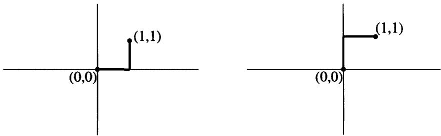
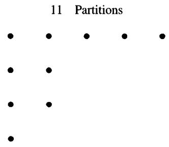
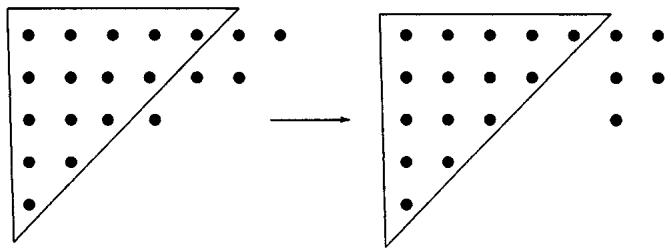
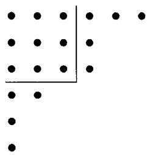
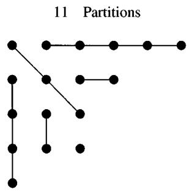

Multiply by $2a_{n}(\sin (\theta /2))^{2n + 2}$ and sum to obtain

$$
\sum_ {n = 0} ^ {\infty} a _ {n} \frac {\sin (n + 1) \theta}{n + 1} = 2 \int_ {\theta / 2} ^ {\pi / 2} \sum_ {n = 0} ^ {\infty} \left(\frac {\sin (\theta / 2)}{\sin \phi}\right) ^ {2 n + 2} \frac {a _ {n} \sin (n + 1 / 2) (2 \phi) d \phi}{\sin \phi}.
$$

Write the integrand as

$$
\begin{array}{l} \frac {\sin^ {2} (\theta / 2)}{\sin^ {3} \phi} \sum_ {n = 0} ^ {\infty} a _ {n} r ^ {n} \sin (n + 1 / 2) (2 \phi), \quad 0 \leq \frac {1}{2} \theta \leq \phi <   \frac {1}{2} \pi , \\ r = \frac {\sin^ {2} (\theta / 2)}{\sin^ {2} \phi} \leq 1. \end{array}
$$

The strict positivity of this sum for $\frac{1}{2}\theta < \phi < \frac{1}{2}\pi$ follows from the fact that

$$
\begin{array}{l} \sum_ {n = 0} ^ {\infty} a _ {n} r ^ {n} \sin \left(n + \frac {1}{2}\right) \varphi \\ = \frac {2}{\pi} \int_ {0} ^ {\pi} \sum_ {n} r ^ {n} \sin \left(n + \frac {1}{2}\right) \phi \sin \left(n + \frac {1}{2}\right) \psi \sum_ {m} a _ {m} \sin \left(m + \frac {1}{2}\right) \psi d \psi . \end{array}\tag{7.5.4}
$$

This formula is obtained by using the orthogonality of the sine function. Now note that the closed form of the Poisson kernel,

$$
\begin{array}{l} \sum_ {n = 0} ^ {\infty} r ^ {n} \sin \left(n + \frac {1}{2}\right) \phi \sin \left(n + \frac {1}{2}\right) \psi \\ = \frac {(1 - r) \sin \frac {1}{2} \phi \sin \frac {1}{2} \psi [ (1 - r) ^ {2} + 4 r (1 - \cos \frac {1}{2} (\phi + \psi) \cos \frac {1}{2} (\phi - \psi)) ]}{[ 1 - 2 r \cos \frac {1}{2} (\phi + \psi) + r ^ {2} ] [ 1 - 2 r \cos \frac {1}{2} (\phi - \psi) + r ^ {2} ]}, \end{array}\tag{7.5.5}
$$

gives its strict positivity for $0 \leq r < 1$ . This and (7.5.1) make the integrand in (7.5.4) nonnegative, and the theorem is proved. ■

There is a generalization of $(7.5.5)$ to Jacobi polynomials due to Watson. The result states that

$$
\begin{array}{l} \sum_ {n = 0} ^ {\infty} \frac {r ^ {k} P _ {k} ^ {(\alpha , \beta)} (\cos 2 \phi) P _ {k} ^ {(\alpha , \beta)} (\cos 2 \theta)}{h _ {k}} \\ = \frac {\Gamma (\alpha + \beta + 2) (1 - r)}{2 ^ {\alpha + \beta + 1} \Gamma (\alpha + 1) \Gamma (\beta + 1) (1 + r) ^ {\alpha + \beta + 2}} \\ \cdot \sum_ {m, n} ^ {\infty} \frac {((\alpha + \beta + 2) / 2) _ {m + n} ((\alpha + \beta + 3) / 2) _ {m + n}}{(\alpha + 1) _ {m} (\beta + 1) _ {n} m ! n !} \\ \cdot \frac {(4 r \sin^ {2} \phi \sin^ {2} \theta) ^ {m} (4 r \cos^ {2} \phi \cos^ {2} \theta) ^ {n}}{(1 + r) ^ {2 m + 2 n}}, \end{array}\tag{7.5.6}
$$

where $h_k$ is given by (7.1.4). We base our proof on a result of Bailey. For the result, see Bailey [1935, p. 81] and for the reference to Watson see Bailey, p. 102, Example 19. Bailey's formula is the following:

$$
\begin{array}{l} _ {2} F _ {1} (\alpha , \beta ; \gamma ; x) _ {2} F _ {1} (\alpha , \beta ; \alpha + \beta + 1 - \gamma ; y) \\ = \sum_ {m, n} \frac {(\alpha) _ {m + n} (\beta) _ {m + n} [ x (1 - y) ] ^ {m} [ y (1 - x) ] ^ {n}}{(\gamma) _ {m} (\alpha + \beta + 1 - \gamma) _ {n} m ! n !}. \end{array}\tag{7.5.7}
$$

We sketch a proof of $(7.5.7)$ leaving some details to the reader. Start with the double series

$$
(1 - s) ^ {- \alpha} (1 - t) ^ {- \beta} \sum_ {j, k} \frac {(\alpha) _ {j + k} (\beta) _ {j + k}}{(\gamma) _ {j} \left(\gamma^ {\prime}\right) _ {k} j ! k !} \left[ \frac {- s}{(1 - s) (1 - t)} \right] ^ {j} \left[ \frac {- t}{(1 - s) (1 - t)} \right] ^ {k}.\tag{7.5.8}
$$

Expand in powers of s and t and show that the coefficient of $s^{m}t^{n}$ is

$$
\frac {(\alpha) _ {m} (\beta) _ {n} (1 + \alpha - \gamma^ {\prime}) _ {m} (1 + \beta - \gamma) _ {n} (\gamma - \beta) _ {m - n}}{m ! n ! (\gamma) _ {m} (\gamma^ {\prime}) _ {n} (1 + \alpha - \gamma^ {\prime}) _ {m - n}}.
$$

When $\gamma + \gamma' = \alpha + \beta + 1$ , the last factor in the numerator cancels the last factor in the denominator and so (7.5.8) is equal to

$$
\begin{array}{l} \sum_ {m = 0} ^ {\infty} \sum_ {n = 0} ^ {\infty} \frac {(\alpha) _ {m} (\beta) _ {n} (\gamma - \beta) _ {m} (\gamma^ {\prime} - \alpha) _ {n}}{m ! n ! (\gamma) _ {m} (\gamma^ {\prime}) _ {n}} s ^ {m} t ^ {n} \\ \qquad =   _ {2} F _ {1} (\alpha , \gamma - \beta ; \gamma ; s) _ {2} F _ {1} (\beta , \gamma^ {\prime} - \alpha ; \gamma^ {\prime}; t) \\ \qquad = (1 - s) ^ {- \alpha} (1 - t) ^ {- \beta} _ {2} F _ {1} (\alpha , \beta ; \gamma ; - s / (1 - s)) _ {2} F _ {1} (\alpha , \beta ; \gamma^ {\prime}; - t / (1 - t)). \end{array}
$$

The last step follows from Pfaff's transformation given in Theorem 2.2.5. This proves (7.5.7).

The left side of (7.5.6) can be written as

$$
\sum_ {k = 0} ^ {\infty} \frac {k ! (\alpha + \beta + 1) _ {k}}{(\alpha + 1) _ {k} (\beta + 1) _ {k}} (2 k + \alpha + \beta + 1) P _ {k} ^ {(\alpha , \beta)} (\cos 2 \phi) P _ {k} ^ {(\alpha , \beta)} (\cos 2 \theta) r ^ {k}.\tag{7.5.9}
$$

First consider the simpler series

$$
\sum_ {k = 0} ^ {\infty} \frac {k ! (\alpha + \beta + 1) _ {k}}{(\alpha + 1) _ {k} (\beta + 1) _ {k}} P _ {k} ^ {(\alpha , \beta)} (\cos 2 \phi) P _ {k} ^ {(\alpha , \beta)} (\cos 2 \theta) r ^ {k}.\tag{7.5.10}
$$

Replace the Jacobi polynomials by their hypergeometric representations and apply

(7.5.7) to get

$$
\begin{array}{l} \sum_ {k = 0} ^ {\infty} \frac {(\alpha + \beta + 1) _ {k}}{k !} (- r) ^ {k} _ {2} F _ {1} \binom {- k, k + \alpha + \beta + 1} {\alpha + 1}; \sin^ {2} \theta \\ \cdot {} _ {2} F _ {1} \binom {- k, k + \alpha + \beta + 1} {\beta + 1}; \cos^ {2} \phi \\ = \sum_ {k = 0} ^ {\infty} \frac {(\alpha + \beta + 1) _ {k}}{k !} (- r) ^ {k} \sum_ {m, n} \frac {(- k) _ {m + n} (k + \alpha + \beta + 1) _ {m + n}}{(\alpha + 1) _ {m} (\beta + 1) _ {n}} \\ \cdot (\sin \theta \sin \phi) ^ {2 m} (\cos \theta \cos \phi) ^ {2 n} \\ = \sum_ {m, n} ^ {\infty} \frac {(\sin^ {2} \theta \sin^ {2} \phi) ^ {m} (\cos^ {2} \theta \cos^ {2} \phi) ^ {n}}{(\alpha + 1) _ {m} (\beta + 1) _ {n} m ! n !} r ^ {m + n} \sum_ {k = 0} ^ {\infty} \frac {(\alpha + \beta + 1) _ {k + 2 m + 2 n}}{k !} (- r) ^ {k} \\ = \sum_ {m, n} ^ {\infty} \frac {(r \sin^ {2} \theta \sin^ {2} \phi) ^ {m} (r \cos^ {2} \theta \cos^ {2} \phi) ^ {n}}{(\alpha + 1) _ {m} (\beta + 1) _ {n} m ! n !} \\ \cdot (\alpha + \beta + 1) _ {2 m + 2 n} (1 + r) ^ {- 2 m - 2 n - \alpha - \beta - 1}. \end{array}
$$

Now multiply (7.5.10) and the last expression by $r^{(\alpha+\beta+1)/2}$ and take the derivative. This introduces the factor $(2k+\alpha+\beta+1)$ needed on the left side of (7.5.9). The right side of Watson's formula follows after an easy calculation. This proves (7.5.6).

Theorem 7.5.2 If $\beta >\alpha > - 1$ and

$$
f (x) = \sum_ {k = 0} ^ {n} a _ {k} \frac {P _ {k} ^ {(\alpha , \alpha)} (x)}{P _ {k} ^ {(\alpha , \alpha)} (1)} \geq 0, - 1 \leq x \leq 1,
$$

then

$$
g (y) = \sum_ {k = 0} ^ {n} a _ {k} \frac {P _ {k} ^ {(\beta , \beta)} (y)}{P _ {k} ^ {(\beta , \beta)} (1)} > 0, - 1 <   y <   1,
$$

unless $a_{k}\equiv 0,k = 0,1,\ldots ,n.$

Proof. As in the proof of Theorem 7.4.1, use the Feldheim–Vilenkin formula to get

$$
\begin{array}{l} g (\cos \theta) = \frac {2 \Gamma (\beta + 1)}{\Gamma (\beta - \alpha) \Gamma (\alpha + 1)} \int_ {0} ^ {\pi / 2} \sin^ {2 \alpha + 1} \phi \cos^ {2 \beta - 2 \alpha - 1} \phi \\ \cdot \sum_ {k = 0} ^ {n} a _ {k} [ 1 - \sin^ {2} \theta \cos^ {2} \phi ] ^ {k / 2} \frac {P _ {k} ^ {(\alpha , \alpha)} (\cos \theta (1 - \sin^ {2} \theta \cos^ {2} \phi) ^ {- 1 / 2})}{P _ {k} ^ {(\alpha , \alpha)} (1)} d \phi . \end{array}
$$

Let $r = (1 - \sin^2\theta \cos^2\phi)^{1/2}$ and $u = \cos\theta(1 - \sin^2\theta \cos^2\phi)^{-1/2}$ . Then for $0 < \theta < \pi$ and $0 \leq \phi < \pi/2$ , we have $0 \leq r < 1$ and $|u| < 1$ . We can conclude from (7.5.6) that the sum inside the integral is strictly positive unless $f(x) \equiv 0$ . We know this because

$$
\sum_ {k = 0} ^ {n} a _ {k} r ^ {k} \frac {P _ {k} ^ {(\alpha , \alpha)} (u)}{P _ {k} ^ {(\alpha , \alpha)} (1)} = \int_ {- 1} ^ {1} \sum_ {0} ^ {\infty} r ^ {k} \frac {P _ {k} ^ {(\alpha , \alpha)} (u) P _ {k} ^ {(\alpha , \alpha)} (y)}{h _ {k} ^ {\alpha , \alpha}} f (y) d y.
$$

Now observe that orthogonality of the Jacobi polynomials implies that $f(x) \equiv 0$ for $-1 \leq x \leq 1$ if and only if $a_{k} \equiv 0$ , $k = 0, 1, 2, \ldots, n$ . This proves the theorem. ■

## 7.6 Positive Summability of Ultraspherical Polynomials

The $(C,1)$ means of the formal series $1 + 2\sum_{k = 1}^{\infty}\cos k\theta$ are

$$
\sigma_ {n} ^ {1} = 1 + 2 \sum_ {k = 1} ^ {n} \left(1 - \frac {k}{n + 1}\right) \cos k \theta = \frac {1}{n + 1} \left\{\frac {\sin \frac {1}{2} (n + 1) \theta}{\sin \frac {1}{2} \theta} \right\} \geq 0.\tag{7.6.1}
$$

Fejér used this positivity to prove the $(C, 1)$ summability of the Fourier series of a continuous function. The generating function for the sequence $\sigma_{n}^{1}$ in (7.6.1) is

$$
(1 - r) ^ {- 2} \left(1 + 2 \sum_ {n = 1} ^ {\infty} \cos n \theta r ^ {n}\right) = \frac {1 + r}{1 - r} \cdot \frac {1}{1 - 2 r \cos \theta + r ^ {2}}.\tag{7.6.2}
$$

The last equality follows from (5.1.16). Now observe that

$$
\lim _ {\nu \to 0} \frac {n + \nu}{\nu} C _ {n} ^ {\nu} (\cos \theta) = \left\{ \begin{array}{l l} 2 \cos n \theta , & n > 0, \\ 1, & n = 0, \end{array} \right.
$$

and the generating function for $\{\frac{n + \nu}{\nu} C_n^\nu (\cos \theta)\}$ is

$$
\sum_ {n = 0} ^ {\infty} \frac {n + \nu}{\nu} C _ {n} ^ {\nu} (\cos \theta) r ^ {n} = \frac {1 - r ^ {2}}{(1 - 2 r \cos \theta + r ^ {2}) ^ {\nu + 1}}.\tag{7.6.3}
$$

This follows from the generating function for ultraspherical polynomials given in Chapter 6, namely,

$$
\sum_ {n = 0} ^ {\infty} C _ {n} ^ {\nu} (\cos \theta) r ^ {n} = \frac {1}{(1 - 2 r \cos \theta + r ^ {2}) ^ {\nu}}.\tag{7.6.4}
$$

Kogbetliantz [1924] proved the following generalization of (7.6.1). For a discussion of Cesàro summability of infinite series, see Appendix B.

Theorem 7.6.1 The $(C,2\nu +1)$ means of the formal series

$$
\sum_ {n = 0} ^ {\infty} \frac {n + \nu}{\nu} C _ {n} ^ {\nu} (x), \quad - 1 \leq x \leq 1, \nu > 0,
$$

are positive. That is,

$$
\sum_ {k = 0} ^ {n} \frac {(2 \nu + 2) _ {n - k}}{(n - k) !} \frac {(k + \nu)}{\nu} C _ {k} ^ {\nu} (x) \geq 0, \quad - 1 \leq x \leq 1, \nu > 0.\tag{7.6.5}
$$

The proof depends on the following lemma.

Definition 7.6.2 A function is called absolutely monotonic if its power series has nonnegative coefficients.

Lemma 7.6.3 The function $1 / [(1 - r)^{2\nu}(1 - 2xr + r^2)^{\nu}]$ is absolutely monotonic for $-1 \leq x \leq 1$ .

Proof. Denote the function by $[g(r)]^{\nu}$ and let $x = \cos \theta$ . Then

$$
\begin{array}{l} h (r) := \log g (r) = - 2 \log (1 - r) - \log (1 - r e ^ {i \theta}) - \log (1 - r e ^ {- i \theta}) \\ = \sum_ {n = 1} ^ {\infty} \frac {(2 + 2 \cos n \theta)}{n} r ^ {n}. \end{array}
$$

Thus $h(r)$ and

$$
[ g (r) ] ^ {\nu} = \sum_ {n = 0} ^ {\infty} \frac {\nu^ {n} [ h (r) ] ^ {n}}{n !}
$$

are absolutely monotonic.

Proof of Theorem 7.6.1 The generating function for (7.6.5) is

$$
\begin{array}{r l} & \frac {1 - r ^ {2}}{(1 - r) ^ {2 \nu + 2} (1 - 2 x r + r ^ {2}) ^ {\nu + 1}} \\ & = \frac {1 - r ^ {2}}{(1 - r) ^ {2} (1 - 2 x r + r ^ {2})} \cdot \frac {1}{(1 - r) ^ {2 \nu} (1 - 2 x r + r ^ {2}) ^ {\nu}}. \end{array}
$$

The first factor is absolutely monotonic by (7.6.1) and (7.6.2). The second factor is absolutely monotonic by Lemma 7.6.3. This proves the inequality (7.6.5) and the theorem.

The lemma has the following corollary.

Corollary 7.6.4 For $\nu > 0, -1 \leq x \leq 1$ ,

$$
\sum_ {k = 0} ^ {n} \frac {(2 \nu) _ {n - k}}{(n - k) !} C _ {k} ^ {\nu} (x) \geq 0.\tag{7.6.6}
$$

## Proof. This follows from (7.6.4) and Lemma 7.6.3.

Similar results have been obtained for Jacobi series. The results are very important, but the proofs involve quite complicated formulas. See Gasper [1977] for many of these inequalities. For example, Gasper proved the following extension of the inequality in Exercise 14:

$$
\sum_ {k = 0} ^ {n} \frac {(\lambda + 1) _ {n - k} (\lambda + 1) _ {k}}{(n - k !) k !} \frac {P ^ {(\alpha , \beta)} (x)}{P _ {k} ^ {(\beta , \alpha)} (1)} \geq 0, \quad - 1 \leq x \leq 1,\tag{7.6.7}
$$

$0 \leq \lambda \leq \alpha + \beta$ and $\alpha \geq \beta \geq 0$ or $\alpha + \beta \geq 0$ and $\beta \geq -1/2$ . Proofs of this inequality use many of the formulas given here for hypergeometric series, as well as some others. Note the particular case $\lambda = 0$ :

$$
\sum_ {k = 0} ^ {n} \frac {P _ {k} ^ {(\alpha , \beta)} (x)}{P _ {k} ^ {(\beta , \alpha)} (1)} \geq 0, - 1 \leq x \leq 1\tag{7.6.8}
$$

for $\alpha + \beta \geq 0$ , $\beta \geq -1/2$ . Inequality is strict in $-1 < x \leq 1$ , when $\alpha = 1/2$ , $\beta = -1/2$ are excluded.

These inequalities have implications for Bessel functions. Using Theorem 5.11.6, it is easy to see that for $\alpha >\beta -1$

$$
\lim _ {n \rightarrow \infty} \left(\frac {\theta}{n}\right) ^ {\alpha + 1 - \beta} \sum_ {k = 0} ^ {n} \frac {P _ {k} ^ {(\alpha , \beta)} \left(\cos \frac {\theta}{n}\right)}{P _ {k} ^ {(\beta , \alpha)} (1)} = 2 ^ {\alpha} \Gamma (\beta + 1) \int_ {0} ^ {\theta} t ^ {- \beta} J _ {\alpha} (t) d t.\tag{7.6.9}
$$

The condition $\alpha > \beta - 1$ is needed for convergence of the integral at t = 0, but it is not needed for the sum. In an appendix to the paper of Feldheim [1963], Szegö considered the limit when $\alpha = \beta$ , and also the resulting integral. He showed that

$$
\int_ {0} ^ {x} t ^ {- \alpha} J _ {\alpha} (t) d t > 0, \quad x > 0\tag{7.6.10}
$$

when $\alpha >\bar{\alpha}$ and when $\bar{\alpha}$ is the solution of

$$
\int_ {0} ^ {j _ {\alpha , 2}} t ^ {- \alpha} J _ {\alpha} (t) d t = 0\tag{7.6.11}
$$

with $j_{\alpha,2}$ the second zero of $J_{\alpha}(t)$ . A similar result holds for

$$
\int_ {0} ^ {x} t ^ {- \beta} J _ {\alpha} (t) d t, - 1 <   \alpha <   1 / 2.
$$

From (7.6.8), we have

$$
\int_ {0} ^ {x} t ^ {- \beta} J _ {\alpha} (t) d t \geq 0, \quad x > 0\tag{7.6.12}
$$

when $\alpha + \beta \geq 0, -1/2 \leq \beta \leq 0$ . In fact, (7.6.8) also holds when $\alpha + \beta \geq -1$ , $\beta \geq 0$ . Thus (7.6.12) holds when $\alpha > \beta - 1$ and $\beta \geq 0$ . Gasper [1975] has shown that the inequality (7.6.12) is strict for these $\alpha, \beta$ except when $\alpha = 1/2$ , $\beta = -1/2$ .

Gasper [1975] derived the following interesting identity when $\beta = -1/2$ and $\alpha > -3/2$ in (7.6.12):

$$
\begin{array}{l} \int_ {0} ^ {x} t ^ {1 / 2} J _ {\alpha} (t) d t = \frac {\left[ \Gamma \left(\frac {\alpha}{2} + \frac {5}{4}\right) \right] ^ {2}}{\left(\alpha + \frac {3}{2}\right) \Gamma (\alpha + 1)} 2 ^ {\alpha + 1} x \\ \cdot \sum_ {n = 0} ^ {\infty} \frac {\left(\frac {1}{2}\right) _ {n} \left(\frac {\alpha}{2} - \frac {1}{4}\right) _ {n} \left(\alpha + \frac {3}{2}\right) _ {n} \left(2 n + \alpha + \frac {1}{2}\right)}{(\alpha + 1) _ {n} \left(\frac {\alpha}{2} + \frac {7}{4}\right) _ {n} n ! \left(n + \alpha + \frac {1}{2}\right)} \left[ J _ {n + \frac {\alpha}{2} + \frac {1}{4}} \left(\frac {x}{2}\right) \right] ^ {2}. \end{array}\tag{7.6.13}
$$

This series is clearly positive when $\alpha > 1/2$ , nonnegative when $\alpha = 1/2$ , and negative when x is a zero of $J_{(2\alpha+1)/4}(x/2)$ , where $-3/2 < \alpha < 1/2$ . Gasper also has a similar result for

$$
\int_ {0} ^ {x} (x - t) ^ {\alpha - 1 / 2} t ^ {\alpha} J _ {\alpha} (t) d t, \quad \alpha > - 1 / 2.
$$

See Exercise 25. This and (7.6.13) are derived by using the identity

$$
x ^ {2 \nu} = \frac {\Gamma^ {2} (\nu + 1) 2 ^ {2 \nu + 1}}{\Gamma (2 \nu + 1)} \sum_ {n = 0} ^ {\infty} \frac {(n + \nu) \Gamma (n + 2 \nu)}{n !} J _ {n + \nu} ^ {2} (x).\tag{7.6.14}
$$

See Watson [1944, §5.1] for (7.6.14). An approach to (7.6.12) via differential equations can be found in Makai [1974]. For more references, see Askey [1975] or Gasper [1975].

## 7.7 The Irrationality of $\zeta(3)$

The topic of this section is unrelated to the earlier parts of this chapter. However, it involves an interesting application of Legendre polynomials and so has been included here.

In Chapter 1, we gave Euler's formula for $\zeta(2n)$ when $n$ is an integer $\geq 1$ . This showed that $\zeta(2n)$ is irrational. In spite of repeated attempts, Euler was unable to evaluate $\zeta(2n+1)$ . Later mathematicians have not had better luck. It was only as recently as 1978 that R. Apéry proved that $\zeta(3)$ is irrational. A simpler proof using Legendre polynomials was given by Beukers [1979]. We follow Beukers's exposition.

The basic lemma is the following:

Lemma 7.7.1 There exist two sequences of integers $\{A_n\}$ and $\{B_n\}$ such that

$$
0 <   \left| A _ {n} + B _ {n} \zeta (3) \right| <   3 (9 / 1 0) ^ {n}.\tag{7.7.1}
$$

This immediately implies the theorem.

## Theorem 7.7.2 $\zeta(3)$ is irrational.

Proof. If $\zeta(3)=p/q$ , where p and q are integers, then the sequence of nonzero rational numbers $|A_{n}+B_{n}\zeta(3)|\geq1/q$ . The second inequality in (7.7.1), however, implies that this sequence becomes arbitrarily small as n increases. This contradiction implies that $\zeta(3)$ is irrational. ■

The proof of Lemma 7.7.1 depends on the following lemmas.

Lemma 7.7.3 For nonnegative integers $r$ and $s$ ,

$$
\begin{array}{l} \int_ {0} ^ {1} \int_ {0} ^ {1} - \frac {\log x y}{1 - x y} x ^ {r} y ^ {s} d x d y = 2 \left\{\zeta (3) - \sum_ {k = 1} ^ {r} \frac {1}{k ^ {3}} \right\} \quad \text {when} \quad r = s \\ \qquad \qquad \qquad = \text {rational number whose denominator divides} d _ {r} ^ {3}, \\ \qquad \qquad \qquad \text {where} d _ {r} = \ell c m (1, 2, \ldots , r), \quad \text {when} \quad r > s. \end{array}
$$

Proof. Note that for $\sigma > 0$ and $r > s$

$$
\begin{array}{r l} \int_ {0} ^ {1} \int_ {0} ^ {1} \frac {x ^ {r + \sigma} y ^ {s + \sigma}}{1 - x y} d x d y & = \sum_ {k = 0} ^ {\infty} \frac {1}{(k + r + \sigma + 1) (k + s + \sigma + 1)} \\ & = \sum_ {k = 0} ^ {\infty} \frac {1}{r - s} \left\{\frac {1}{k + s + \sigma + 1} - \frac {1}{k + r + \sigma + 1} \right\} \\ & = \frac {1}{r - s} \left\{\frac {1}{s + 1 + \sigma} + \dots + \frac {1}{r + \sigma} \right\}. \end{array} \tag {7.7}\tag{7.7.2}
$$

Differentiate with respect to $\sigma$ and then set $\sigma = 0$ to get

$$
\int_ {0} ^ {1} \int_ {0} ^ {1} \frac {\log x y}{1 - x y} x ^ {r} y ^ {s} d x d y = \frac {- 1}{r - s} \left\{\frac {1}{(s + 1) ^ {2}} + \dots + \frac {1}{r ^ {2}} \right\}.
$$

The second equality of the lemma follows from this. Now take r = s in the first equation of $(7.7.2)$ and again differentiate with respect to $\sigma$ and set $\sigma = 0$ . The result is

$$
\int_ {0} ^ {1} \int_ {0} ^ {1} \frac {\log x y}{1 - x y} x ^ {r} y ^ {r} d x d y = - \sum_ {k = 0} ^ {\infty} \frac {2}{(k + r + 1) ^ {3}}.
$$

This is the first equation of the lemma, which is now completely proved. ■

For the next lemma, let

$$
p _ {n} (x) = \frac {1}{n !} \frac {d ^ {n}}{d x ^ {n}} \{x ^ {n} (1 - x) ^ {n} \},
$$

which is essentially the Legendre polynomial on $(0, 1)$ .

Lemma 7.7.4 There exist integers $A_{n}$ and $B_{n}$ such that

$$
0 \neq \int_ {0} ^ {1} \int_ {0} ^ {1} - \frac {\log x y}{1 - x y} p _ {n} (x) p _ {n} (y) d x d y = \left(A _ {n} + B _ {n} \zeta (3)\right) d _ {n} ^ {- 3}.
$$

Here $d_{n} = \ell cm(1,2,\ldots ,n)$

Proof. Since $p_n(x)$ is a polynomial with integer coefficients, the equality follows from Lemma 7.7.3. Now observe that

$$
- \frac {\log x y}{1 - x y} = \int_ {0} ^ {1} \frac {1}{1 - (1 - x y) z} d z.
$$

Then the integral in the lemma can be written as

$$
\int_ {0} ^ {1} \int_ {0} ^ {1} \int_ {0} ^ {1} \frac {p _ {n} (x) p _ {n} (y)}{1 - (1 - x y) z} d x d y d z.
$$

Integrate by parts n times with respect to x to see that this integral is equal to

$$
\int_ {0} ^ {1} \int_ {0} ^ {1} \int_ {0} ^ {1} \frac {(x y z) ^ {n} (1 - x) ^ {n} p _ {n} (y)}{(1 - (1 - x y) z) ^ {n + 1}} d x d y d z.
$$

Set

$$
\omega = \frac {1 - z}{1 - (1 - x y) z}
$$

and rewrite the last integral as

$$
\begin{array}{l} \int_ {0} ^ {1} \int_ {0} ^ {1} \int_ {0} ^ {1} (1 - x) ^ {n} (1 - \omega) ^ {n} \frac {p _ {n} (y)}{1 - (1 - x y) \omega} d x d y d \omega \\ = \int_ {0} ^ {1} \int_ {0} ^ {1} \int_ {0} ^ {1} \frac {\{x (1 - x) y (1 - y) \omega (1 - \omega) \} ^ {n}}{\{1 - (1 - x y) \omega \} ^ {n + 1}} d x d y d \omega . \end{array}\tag{7.7.3}
$$

The last equality uses integration by parts $n$ times. It is clear that the final integral is nonzero and so the lemma is proved.

Lemma 7.7.5 For $A_{n}$ and $B_{n}$ as in Lemma 7.7.4,

$$
0 <   | A _ {n} + B _ {n} \zeta (3) | d _ {n} ^ {- 3} <   2 (\sqrt {2} - 1) ^ {4 n} \zeta (3).
$$

Proof. The integral in Lemma 7.7.4 is equal to integral (7.7.3). We find the maximum value of the integrand in (7.7.3). Let

$$
f (x, y, \omega) = \frac {x (1 - x) y (1 - y) \omega (1 - \omega)}{1 - (1 - x y) \omega}.
$$

By solving the equations

$$
{\frac {\partial f}{\partial x}} = {\frac {\partial f}{\partial y}} = {\frac {\partial f}{\partial \omega}} = 0,
$$

it is easy to see that at the maximum, x = y and $\omega = 1/(1 + x)$ . Thus f is bounded by $x^{2}(1 - x)^{2}/(1 + x)^{2}$ , which is maximized at $x = \sqrt{2} - 1$ . Thus integral (7.7.3) is bounded above by

$$
\begin{array}{l} (\sqrt {2} - 1) ^ {4 n} \int_ {0} ^ {1} \int_ {0} ^ {1} \int_ {0} ^ {1} \frac {1}{1 - (1 - x y) \omega} d x d y d \omega \\ = (\sqrt {2} - 1) ^ {4 n} \int_ {0} ^ {1} \int_ {0} ^ {1} - \frac {\log x y}{1 - x y} d x d y \\ = 2 (\sqrt {2} - 1) ^ {4 n} \zeta (3). \end{array}
$$

This proves the lemma.

We need the following result from elementary number theory due to Chebyshev. Let $\pi(n)$ denote the number of primes less than $n$ . Then

$$
\pi (n) <   1. 0 6 n / \log n.\tag{7.7.4}
$$

See Ingham [1932, p. 15].

Proof of Lemma 7.7.1. Observe that

$$
d_{n} = \prod_{\substack{p\leq n\\ p = \text{prime}}}p^{[\log n / \log p]} <   \prod_{p\leq n}p^{\log n / \log p} = n^{\pi (n)}.
$$

By (7.7.4), it follows that

$$
d _ {n} <   n ^ {1. 0 6 n / \log n} = e ^ {1. 0 6 n} <   3 ^ {n}.
$$

An upper bound for $\zeta(3)$ is given by

$$
\zeta (3) <   1 + \int_ {1} ^ {\infty} \frac {d x}{x ^ {3}} = \frac {3}{2}.
$$

Therefore, Lemma 7.7.5 gives

$$
0 <   \left| A _ {n} + B _ {n} \zeta (3) \right| <   3 \left(\frac {2 7}{(\sqrt {2} + 1) ^ {4}}\right) ^ {n} <   3 \left(\frac {9}{1 0}\right) ^ {n}. \quad \blacksquare
$$

Apéry's proof used some sequences satisfying three-term recurrence relations. For a lively account of Apéry's proof, see van der Poorten [1979]. These sequences were analyzed in terms of contiguous relations by Askey and Wilson [1984]. See Exercises 28 and 29.

## Exercises

1. Let

$$
x (x - 1) \cdot \cdot \cdot (x - n + 1) = \sum_ {r = 0} ^ {n} s (n, r) x ^ {r}
$$

and

$$
x ^ {n} = \sum_ {r = 0} ^ {n} S (n, r) x (x - 1) \dots (x - r + 1).
$$

The integers $s(n, r)$ and $S(n, r)$ are called Stirling numbers of the first and second kind respectively. Show that

$$
\sum_ {r} S (n, r) s (r, m) = \delta_ {n m}.
$$

Use this to prove that

$$
a _ {n} = \sum_ {r} s (n, r) b _ {r}, \quad n \geq 1,
$$

if and only if

$$
b _ {n} = \sum_ {r} S (n, r) a _ {r}, \quad n \geq 1.
$$

2. Derive formulas (7.1.14) and (7.1.15) as indicated in the text.

3. Verify formula (7.2.7).

4. Prove that

$$
P _ {n} ^ {(\alpha + 1, \beta)} (x) = \frac {2}{2 n + \alpha + \beta + 2} \frac {(n + \alpha + 1) P _ {n} ^ {(\alpha , \beta)} (x) - (n + 1) P _ {n + 1} ^ {(\alpha , \beta)} (x)}{1 - x}.
$$

Deduce (7.2.10).

5. Suppose $m(x)$ is a positive integrable function on $(-1, 1)$ ; $\{p_n(x)\}$ a sequence of polynomials orthogonal with respect to $m(x)$ ; and $\{q_n(x)\}$ orthogonal with respect to $(1 + x)m(x)$ . Let $p_n(1) > 0$ and $q_n(1) > 0$ . Prove that

$$
(1 + x) q _ {n} (x) = A _ {n} p _ {n + 1} (x) + B _ {n} p _ {n} (x),
$$

where $A_{n}$ and $B_{n}$ are positive. Determine $A_{n}$ and $B_{n}$ in the case illustrated in (7.2.10).

6. Let $\{p_m(x)\}$ be a sequence of polynomials orthogonal with respect to a distribution $d\alpha(x)$ in $(0, \infty)$ . Let $\xi_1, \xi_2, \ldots, \xi_k$ be zeros of $p_m(x)$ and let

$$
f _ {k} (t) = \int_ {0} ^ {\infty} e ^ {- x t} \{(\xi_ {1} - x) \dots (\xi_ {k} - x) \} ^ {- 1} \{p _ {m} (x) \} ^ {2} d \alpha (x), \quad t > 0.
$$

(a) Show that

$$
f _ {k} (t) = e ^ {- \xi_ {k} t} \int_ {0} ^ {t} e ^ {\xi_ {k} s} f _ {k - 1} (s) d s.
$$

(b) Deduce that $f_{k}(t) > 0$ for $t > 0$ .

7. With $\{p_m(x)\}$ as in the previous problem, assume that $p_m(0) > 0$ . Prove that

$$
\int_ {0} ^ {\infty} e ^ {- x t} p _ {m} (x) p _ {n} (x) d \alpha (x) > 0, \quad t > 0.
$$

For Exercises 6 and 7, see Karlin and McGregor [1957, pp. 507–509].

8. Deduce Lemma 7.2.3 from the previous problem.

9. Prove Corollary 7.2.4.

10. (a) Prove that

$$
\begin{array}{l} \sum_ {k, m, n = 0} ^ {\infty} r ^ {k} s ^ {m} t ^ {n} \frac {\int_ {0} ^ {\infty} L _ {k} ^ {\alpha} (x) L _ {m} ^ {\alpha} (x) L _ {n} ^ {\alpha} (x) x ^ {\alpha} e ^ {- 2 x} d x}{\Gamma (\alpha + 1)} \\ = [ 2 - (r + s + t) + r s t ] ^ {- \alpha - 1}. \end{array}
$$

(b) Use the multinomial theorem to prove that, except for a constant factor, the right side of (a) also equals

$$
\begin{array}{l} \sum_ {k, m, n \geq 0} r ^ {k} s ^ {m} t ^ {n} \frac {(\alpha + 1) _ {k + m + n} 2 ^ {- k - m - n}}{k ! m ! n !} \\ \cdot {} _ {3} F _ {2} \left( \begin{array}{c} - k, - m, - n \\ (- \alpha - k - m - n) / 2, (1 - \alpha - k - m - n) / 2 \end{array} ; 1\right). \end{array}
$$

(c) Let $k \leq \min(m, n)$ . Reverse the order of summation in the above ${}_3F_2$ to get

$$
\begin{array}{l} \frac {(- 1) ^ {k} m ! n ! 2 ^ {2 k} \Gamma (m + n + \alpha + 1 - k)}{(m - k) ! (n - k) ! \Gamma (m + n + k + \alpha + 1)} \\ \cdot {} _ {3} F _ {2} \left( \begin{array}{c} - k, (\alpha + 1 + m + n - k) / 2, (\alpha + 2 + m + n - k) / 2 \\ m + 1 - k, n + 1 - k \end{array} ; 1\right). \end{array}
$$

(d) Apply Kummer's transformation (Corollary 3.3.3) to the $_3F_2$ in (c) to show that the expression in (c) is positive for $\alpha = 0, 1, 2, \ldots$ . This proves (7.2.13) for these values of $\alpha$ .

11. Prove that

(a)

$$
\sum_ {n = 0} ^ {\infty} r ^ {n} \sum_ {k = 0} ^ {n} \sin (k + 1 / 2) \theta = \frac {(1 + r) \sin (\theta / 2)}{(1 - r) (1 - 2 r \cos \theta + r ^ {2})},\tag{b}
$$

$$
\sum_ {n = 0} ^ {\infty} r ^ {n} \sum_ {k = 0} ^ {n} (n + 1 - k) \sin (k + 1) \theta = \frac {\sin \theta}{(1 - r) ^ {2} (1 - 2 r \cos \theta + r ^ {2})}.
$$

12. (a) Deduce from (7.3.1) that

$$
2 \sum_ {k = 1} ^ {n} \sin k \theta + \sin (n + 1) \theta \geq 0 \quad \text { for } 0 \leq \theta \leq \pi .
$$

(b) Use the results in the previous problem to prove that

$$
\sum_ {k = 0} ^ {n} (n + 1 - k) \sin (k + 1) \theta \geq 0 \quad \text { for } 0 \leq \theta \leq \pi .
$$

13. Let $S_{n}(x) = \sum_{k=1}^{n} \frac{\sin kx}{k}$ . Use induction and the fact that the extrema of $S_{n}(x)$ lie at $2k\pi / n$ , where $k$ is an integer, to prove that $S_{n}(x) > 0$ for $0 < x < \pi$ .

14. Use Theorem 7.5.2 and Corollary 7.6.4 to prove that

$$
\sum_ {k = 0} ^ {n} \frac {(2 \nu) _ {n - k} (2 \nu) _ {k}}{(n - k) ! k !} \frac {C _ {k} ^ {\lambda} (x)}{C _ {k} ^ {\lambda} (1)} \geq 0, \quad - 1 \leq x \leq 1, \lambda \geq \nu > 0.
$$

Deduce that

$$
\sum_ {k = 0} ^ {n} \frac {(a) _ {n - k} (a) _ {k}}{(n - k) ! k !} \frac {\sin (k + 1) \theta}{(k + 1) \sin \theta} \geq 0, \quad 0 <   a \leq 2, 0 \leq \theta \leq \pi .
$$

Consider the cases $a = 1,2$ .

15. Define the difference operator $\Delta_h$ by $(\Delta_h f)(t) = (f(t + h) - f(t)) / h$ . Show that $(-h)^k (\Delta_h^k f)(t) = \sum_{\ell=0}^k (-1)^{\ell}\binom{k}{\ell}f(t + \ell h)$ , where $\Delta_h^k$ is the $k$ th iterate of $\Delta_h$ .

Suppose $f$ is continuous on $[0, 1]$ and $f(1) = 1$ . Prove that the following statements are equivalent:

(a) $f$ is absolutely monotonic in $[0,1]$ , that is, $f(t) = \sum_{0}^{\infty} a_{n} t^{n}$ , $a_{n} \geq 0$ , $t \in [0,1]$ ;

(b) $f \in C^{\infty}(0,1)$ and $f^{(k)}(t) \geq 0$ for $k = 0,1,2,\ldots$ and $t \in (0,1)$ ;

(c) $(\Delta_{1 / n}^{m}f)(0)\geq 0$ for $n = 1,2,\ldots$ and $0\leq m\leq n$

One way to show that $(c) \Rightarrow (a)$ is to use the Bernstein polynomials $B_{n}(t; f) = \sum_{k=0}^{n} \binom{n}{k} t^{k} (1 - t)^{n-k} f \left( \frac{k}{n} \right) = \sum_{k=0}^{n} \binom{n}{k} \left( \frac{t}{n} \right)^{k} (\Delta_{1/n}^{k} f)(0)$ , which uniformly approximate f in [0, 1]. To prove the last equality, use the result at the beginning of this problem.

16. Let $a_0 \geq a_1 \geq \cdots \geq a_m > 0$ and $1 \leq n \leq m$ . Show that

$$
\sum_ {k = 0} ^ {m} a _ {k} \cos k \theta \sin (\theta / 2) \geq \sum_ {k = 0} ^ {n - 1} a _ {k} \cos k \theta \sin (\theta / 2) - (a _ {n} / 2) (1 + \sin (n - 1 / 2) \theta)
$$

and

$$
\sum_ {k = 0} ^ {m} a _ {k} \sin k \theta \sin (\theta / 2) \geq \sum_ {k = 0} ^ {n - 1} a _ {k} \sin k \theta \sin (\theta / 2) - (a _ {n} / 2) (1 - \cos (n - 1 / 2) \theta).\tag{Vietoris}
$$

17. Let $c_k = 2^{-2k}\binom{2k}{k}$ . Show that for $0 < x < 2\pi$

$$
\sum_ {k = 0} ^ {n} c _ {k} \sin (k + 1 / 4) x > 0 \quad \text { and } \quad \sum_ {k = 0} ^ {n} c _ {k} \cos (k + 1 / 4) x > 0.
$$

Deduce that the inequalities hold if $c_{k}$ is replaced by $\alpha_{k}$ , satisfying $(2k-1)\alpha_{k-1} \geq 2k\alpha_{k} > 0$ for $k \geq 1$ .

18. Let $\alpha_{k}$ satisfy the conditions given in the previous problem. Prove that if $0 \leq \nu \leq 1/4$ and $0 < x < 2\pi$ or if $-1/4 \leq \nu \leq 1/4$ and $0 < x < \pi$ , then

$$
\sum_ {k = 0} ^ {n} \alpha_ {k} \cos (k + \nu) x > 0.
$$

19. With $\alpha_{k}$ as in Exercise 17, show that if $1/4 \leq \nu \leq 1/2$ and $0 < x < 2\pi$ or if $1/4 \leq \nu \leq 3/4$ and $0 < x < \pi$ , then

$$
\sum_ {k = 0} ^ {n} \alpha_ {k} \sin (k + \nu) x \geq 0.
$$

20. Show that

$$
1 + \sum_ {k = 1} ^ {n} \frac {\cos k x}{k} > 0, \quad 0 \leq x <   \pi .
$$

21. With $c_k$ as in Vietoris's inequalities, show that

$$
\sum_ {k = 0} ^ {n} c _ {k} \frac {C _ {k} ^ {\nu} (x)}{C _ {k} ^ {\nu} (1)} > 0,
$$

for $\nu > 0$ and $0 < x < 1$ .

22. Show that if

$$
\sum_ {k = 0} ^ {n} a _ {k} \frac {P _ {k} ^ {(\alpha , \beta)} (x)}{P _ {k} ^ {(\beta , \alpha)} (1)} \geq 0, - 1 \leq x \leq 1,
$$

then

$$
\sum_ {k = 0} ^ {n} a _ {k} \frac {P _ {k} ^ {(\alpha , \gamma)} (y)}{P _ {k} ^ {(\gamma , \alpha)} (1)} \geq 0, - 1 \leq y \leq 1, \gamma > \beta .
$$

Observe that this implies the terminating form of Theorem 7.5.1.

23. Prove that if

$$
\sum_ {k = \dot {0}} ^ {n} a _ {k} \frac {P _ {k} ^ {(\alpha , \beta)} (x)}{P _ {k} ^ {(\beta , \alpha)} (1)} \geq 0, - 1 \leq x \leq 1,
$$

then

$$
\sum_ {k = 0} ^ {n} a _ {k} \frac {P _ {k} ^ {(\alpha - \mu , \beta + \mu)} (y)}{P _ {k} ^ {(\beta + \mu , \alpha - \mu)} (1)} \geq 0, \quad - 1 \leq y \leq 1, \mu > 0.
$$

24. (a) Show that $[0F_1(c;x)]^2 = {}_1F_2(c - 1 / 2;2c - 1,c;4x)$ .

(b) Prove the formula of Bailey that

$$
\int_ {0} ^ {2 x} J _ {2 \alpha} (t) d t = 2 x \int_ {0} ^ {\pi / 2} [ J _ {\alpha} (x \sin \phi) ] ^ {2} \sin \phi d \phi , \quad \alpha > - 1 / 2
$$

(c) Show that $\int_0^x J_\alpha (t)dt > 0,\alpha > - 1.$

25. (a) Use (6.14) to show that

$$
\begin{array}{l} \int_ {0} ^ {x} (x - t) ^ {\lambda} t ^ {\mu} J _ {\alpha} (t) d t \\ = \frac {\Gamma (\lambda + 1) \Gamma (\alpha + \mu + 1) \Gamma^ {2} (\nu + 1)}{\Gamma (\alpha + 1) \Gamma (\alpha + \lambda + \mu + 2)} 2 ^ {4 \nu - \alpha} x ^ {\alpha + \lambda + \mu + 1 - 2 \nu} \\ \cdot \sum_ {n = 0} ^ {\infty} _ {5} F _ {4} \left[ \begin{array}{c} - n, n + 2 \nu , \nu + 1, (\alpha + \mu + 1) / 2, (\alpha + \mu + 2) / 2 \\ \nu + 1 / 2, \alpha + 1, (\alpha + \lambda + \mu + 2) / 2, (\alpha + \lambda + \mu + 3) / 2 \end{array} ; 1 \right] \\ \cdot \frac {(2 \nu + 1) _ {n}}{n !} \frac {2 n + 2 \nu}{n + 2 \nu} J _ {n + \nu} ^ {2} \left(\frac {x}{2}\right), \end{array}
$$

when $\alpha + \mu > -1$ , $\lambda > -1$ , and $2\nu \neq -1, -2, \ldots$ and the factor $(2n + 2\nu)/(n + 2\nu)$ is replaced by 1 at $n = 0$ .

(b) Take $\mu = \lambda + 1/2$ and set $\nu = (\alpha + \lambda + 1/2)/2$ so that the $F_4$ reduces to a balanced $F_3$ .

(c) Take $\lambda = 0$ to get (6.13).

(d) Take $\lambda = \alpha - 1/2$ to get

$$
\begin{array}{l} \int_ {0} ^ {x} (x - t) ^ {\alpha - 1 / 2} t ^ {\alpha} J _ {\alpha} (t) d t \\ = \frac {\Gamma (\alpha + 1 / 2) \Gamma (2 \alpha + 1) \Gamma (\alpha + 1)}{\Gamma (3 \alpha + 3 / 2)} 2 ^ {3 \alpha} x ^ {\alpha + 1 / 2} \\ \cdot \sum_ {n = 0} ^ {\infty} \frac {((2 \alpha + 1) / 4) _ {n} ((2 \alpha - 1) / 4) _ {n}}{((6 \alpha + 3) / 4) _ {n} ((6 \alpha + 5) / 4) _ {n}} \frac {(2 \alpha + 1) _ {n}}{n !} \frac {2 n + 2 \alpha}{n + 2 \alpha} J _ {n + 2 \alpha} ^ {2} \left(\frac {x}{2}\right), \end{array}
$$

for $\alpha > -1/2$ .

(Gasper)

26. Suppose that $\{p_n(x)\}$ and $\{q_n(x)\}$ are orthonormal polynomials associated with the weights $\omega(x)$ and $\omega_1(x)$ respectively. Prove that if

$$
q _ {n} (x) = \sum_ {k = 0} ^ {n} c _ {k, n} p _ {k} (x),
$$

then

$$
\omega (x) p _ {k} (x) = \sum_ {n = k} ^ {\infty} c _ {k, n} q _ {n} (x) \omega_ {1} (x).
$$

27. Use Exercise 26 and Theorem 7.1.4' to show that for $-1 < x < 1$ and $\mu > (\lambda - 1)/2$ ,

$$
\begin{array}{l} (1 - x ^ {2}) ^ {\mu - 1 / 2} C _ {n} ^ {\mu} (x) = \sum_ {k = 0} ^ {\infty} c _ {k, n} ^ {\mu , \lambda} C _ {n + 2 k} ^ {\lambda} (x) (1 - x ^ {2}) ^ {\lambda - 1 / 2}, \\ \text {where} \\ c _ {k, n} ^ {\mu , \lambda} \\ = \frac {\Gamma (\lambda) 2 ^ {2 \lambda - 2 \mu} (n + 2 k + \lambda) (n + 2 k) ! \Gamma (n + 2 \mu) \Gamma (n + k + \lambda) \Gamma (k + \lambda - \mu)}{\Gamma (\lambda - \mu) \Gamma (\nu) n ! k ! \Gamma (n + k + \mu + 1) \Gamma (n + 2 k + 2 \lambda)}. \end{array}
$$

Note that $c_{k,n}^{\mu,\lambda} > 0$ for $(\lambda - 1)/2 < \mu < \lambda$ . Deduce the special case

$$
(\sin \theta) ^ {2 \lambda - 1} C _ {n} ^ {\mu} (\cos \theta) = \sum_ {k = 0} ^ {\infty} c _ {k, n} ^ {\mu} \sin (n + 2 k + 1) \theta
$$

when $\mu > 0, \mu \neq 1, 2, \ldots$ , and

$$
c _ {k, n} ^ {\mu} = \frac {2 ^ {2 - 2 \mu} (n + k) ! \Gamma (n + 2 \mu) \Gamma (k + 1 - \mu)}{\Gamma (\mu) \Gamma (1 - \mu) k ! n ! \Gamma (n + k + \mu + 1)}.
$$

28. Show that

$$
b _ {n} = \sum_ {k = 0} ^ {n} {\binom {n} {k}} ^ {2} {\binom {n + k} {k}} ^ {2}
$$

satisfies the three-term recurrence relation

$$
n ^ {3} b _ {n} + (n - 1) ^ {3} b _ {n - 2} = (3 4 n ^ {3} - 5 1 n ^ {2} + 2 7 n - 5) b _ {n - 1}.\tag{Apéry}
$$

29. If $a + d = b + c$ ,

$$
g _ {n} = \sum_ {k = 0} ^ {n} \binom {n} {k} \binom {n + a + d} {k + d} \binom {n + k + b + \ell} {k + \ell} \binom {n + k + c + f} {k + f}
$$

satisfies a three-term recurrence relation. Find it.

30. Complete the proof of Bailey's formula (7.5.7).

31. Use (7.5.7) to prove Brafman's [1951] generating-function formula for Jacobi polynomials,

$$
\begin{array}{l} \sum_ {n = 0} ^ {\infty} \frac {(\gamma) _ {n} (\alpha + \beta - \gamma + 1) _ {n} P _ {n} ^ {(\alpha , \beta)} (x) r ^ {n}}{(\alpha + 1) _ {n} (\beta + 1) _ {n}} \\ \qquad = _ {2} F _ {1} (\gamma , \alpha + \beta - \gamma + 1; \alpha + 1; (1 - r - R) / 2) \\ \qquad \cdot {} _ {2} F _ {1} (\gamma , \alpha + \beta - \gamma + 1; \beta + 1; (1 + r - R) / 2), \end{array}
$$

where

$$
R = (1 - 2 x r + r ^ {2}) ^ {1 / 2}.
$$

The case $\gamma = \alpha$ is interesting.

32. Complete the proof of (7.2.14).

33. Show that, if $\alpha > -1, k, m, n = 0, 1, \ldots$ , then

$$
(- 1) ^ {k + m + n} \int_ {0} ^ {\infty} L _ {k} ^ {\alpha} (x) L _ {m} ^ {\alpha} (x) L _ {n} ^ {\alpha} (x) x ^ {\alpha} e ^ {- x} d x \geq 0.
$$

34. If $\alpha \geq 0, j, k, m, n = 0, 1, 2, \ldots$ , then prove that

$$
\int_ {0} ^ {\infty} L _ {j} ^ {\alpha} (x) L _ {k} ^ {\alpha} (x) L _ {m} ^ {\alpha} (x) L _ {n} ^ {\alpha} (x) x ^ {\alpha} e ^ {- 2 x} d x \geq 0.
$$

# The Selberg Integral and Its Applications

Dirichlet's straightforward though useful multidimensional generalization of the beta integral was presented in Chapter 1. In the 1940s, more than 100 years after Dirichlet's work, Selberg found a more interesting generalized beta integral in which the integrand contains a power of the discriminant of the $n$ variables of integration. Recently, Aomoto evaluated a yet slightly more general integral. An important feature of this evaluation is that it provides a simpler proof of Selberg's formula, reminiscent of Euler's evaluation of the beta integral by means of a functional equation. The depth of Selberg's integral formula may be seen in the fact that in two dimensions it implies Dixon's identity for a well-poised ${}_3F_2$ . Bressoud observed that Aomoto's extension implies identities for nearly poised ${}_3F_2$ .

After presenting Aomoto's proof, we give another proof of Selberg's formula due to Anderson. This proof is similar to Jacobi's or Poisson's evaluation of Euler's beta integral in that it depends on the computation of a multidimensional integral in two different ways. The basis for Anderson's proof is Dirichlet's multidimensional integral mentioned above. A very significant aspect of Anderson's method is that it applies to the finite-field analog of Selberg's integral as well. We give a brief treatment of this analog at the end of the chapter.

Stieltjes posed and solved an electrostatic problem that is equivalent to obtaining the maximum of an n variable function very closely related to the integrand in Selberg's formula. Stieltjes's remarkable solution showed that the maximum is attained when the n variables are zeros of a certain Jacobi polynomial of degree n. We devote a section of this chapter to Stieltjes's work and show how his result can be combined with Selberg's formula to derive the discriminants of Jacobi, Laguerre, and Hermite polynomials.

Siegel used the discriminant of the Laguerre polynomial to extend the arithmetic and geometric mean inequality. Siegel's result, which we include, contains an interesting inequality of Schur relating the arithmetic mean and the discriminant.

## 8.1 Selberg's and Aomoto's Integrals

The theorem given below contains Selberg's [1944] extension of the beta integral.

Theorem 8.1.1 If n is a positive integer and $\alpha$ , $\beta$ , $\gamma$ are complex numbers such that Re $\alpha > 0$ , Re $\beta > 0$ , and Re $\gamma > -\min\{1/n, (\operatorname{Re}\alpha)/(n-1), (\operatorname{Re}\beta)/(n-1)\}$ , then

$$
\begin{array}{c} S _ {n} (\alpha , \beta , \gamma) = \int_ {0} ^ {1} \dots \int_ {0} ^ {1} \prod_ {i = 1} ^ {n} \left\{x _ {i} ^ {\alpha - 1} (1 - x _ {i}) ^ {\beta - 1} \right\} | \Delta (x) | ^ {2 \gamma} d x _ {1} \dots d x _ {n} \\ = \prod_ {j = 1} ^ {n} \frac {\Gamma (\alpha + (j - 1) \gamma) \Gamma (\beta + (j - 1) \gamma) \Gamma (1 + j \gamma)}{\Gamma (\alpha + \beta + (n + j - 2) \gamma) \Gamma (1 + \gamma)}, \end{array}
$$

where

$$
\Delta (x) = \prod_ {1 \leq i <   j \leq n} (x _ {i} - x _ {j}).
$$

The conditions on $\alpha, \beta, \gamma$ are needed for the convergence of the integral. For a discussion of this, see Selberg [1944]. Note, however, that the condition on $\gamma$ is related to the first occurrence of a pole of the function on the right-hand side of the integral formula. Selberg's proof of this formula appeared in 1944, but for more than three decades it was not well known. More recently, Aomoto [1987] found a simpler proof which depends on a recurrence relation satisfied by a slightly more general integral.

Theorem 8.1.2 With the same conditions on the parameter $\alpha$ , $\beta$ , $\gamma$ and with $k \leq n$ ,

$$
\begin{array}{l} \int_ {0} ^ {1} \dots \int_ {0} ^ {1} \prod_ {i = 1} ^ {k} x _ {i} \prod_ {i = 1} ^ {n} x _ {i} ^ {\alpha - 1} (1 - x _ {i}) ^ {\beta - 1} \prod_ {1 \leq i <   j \leq n} | x _ {i} - x _ {j} | ^ {2 \gamma} d x _ {1} \dots d x _ {n} \\ = \prod_ {j = 1} ^ {k} \frac {(\alpha + (n - j) \gamma)}{(\alpha + \beta + (2 n - j - 1) \gamma)} S _ {n} (\alpha , \beta , \gamma). \end{array}
$$

Anderson [1990] proved a finite-field analog of Selberg's formula and then noted (Anderson [1991]) that the idea could be carried over to the continuous case.

## 8.2 Aomoto's Proof of Selberg's Formula

To motivate this proof, recall the two basic steps of the proof of the formula $B(\alpha, \beta) = \Gamma(\alpha)\Gamma(\beta)/\Gamma(\alpha + \beta)$ .

Step 1. Obtain the functional equation $B(\alpha, \beta) = \frac{\alpha + \beta}{\beta} B(\alpha, \beta + 1)$ . Though we did this differently in Chapter 1, it can be done as follows: For Re $\alpha > 0$ , Re $\beta > 0$ ,

$$
\begin{array}{l} 0 = \int_ {0} ^ {1} \frac {\partial}{\partial x} [ x ^ {\alpha} (1 - x) ^ {\beta} ] d x \\ \quad = \alpha \int_ {0} ^ {1} x ^ {\alpha - 1} (1 - x) ^ {\beta} d x - \beta \int_ {0} ^ {1} x ^ {\alpha} (1 - x) ^ {\beta - 1} d x \\ \quad = (\alpha + \beta) \int_ {0} ^ {1} x ^ {\alpha - 1} (1 - x) ^ {\beta} d x - \beta \int_ {0} ^ {1} x ^ {\alpha - 1} (1 - x) ^ {\beta - 1} d x \\ \quad = (\alpha + \beta) B (\alpha , \beta + 1) - \beta B (\alpha , \beta) \end{array}
$$

Step 2. Iterate the first step $n$ times to get

$$
B (\alpha , \beta) = \frac {(\alpha + \beta) _ {n}}{(\beta) _ {n}} B (\alpha , \beta + n).
$$

Then apply a change of variables in the integral for $B(\alpha, \beta + n)$ and let $n \to \infty$ to obtain the necessary result.

We apply the same basic procedure to prove a generalization of Selberg's formula. Let

$$
w (x) = w (x; \alpha , \beta , \gamma) = \prod_ {i = 1} ^ {n} x _ {i} ^ {\alpha - 1} (1 - x _ {i}) ^ {\beta - 1} \prod_ {1 \leq i <   j \leq n} | x _ {i} - x _ {j} | ^ {2 \gamma}\tag{8.2.1}
$$

and

$$
I _ {k} = \int_ {C _ {n}} \prod_ {i = 1} ^ {k} x _ {i} w (x; \alpha , \beta , \gamma) d x,\tag{8.2.2}
$$

where $C_{n}$ is the n-dimensional cube and $dx = dx_{1}dx_{2}\cdots dx_{n}$ . By symmetry the product $\prod_{i=1}^{k} x_{i}$ may be replaced by the product of any k distinct variables without changing the value of the integral. Let $I_{0}$ denote the integral without the factor $\prod_{i=1}^{k} x_{i}$ .

To obtain the functional equation start with

$$
\begin{array}{l} 0 = \int_ {C _ {n}} \frac {\partial}{\partial x _ {1}} \left[ (1 - x _ {1}) \prod_ {i = 1} ^ {k} x _ {i} w (x) \right] d x \\ = \alpha \int_ {C _ {n}} (1 - x _ {1}) \prod_ {i = 2} ^ {k} x _ {i} w (x) d x - \beta \int_ {C _ {n}} \prod_ {i - 1} ^ {k} x _ {i} w (x) d x \\ + 2 \gamma \sum_ {j = 2} ^ {n} \int_ {C _ {n}} (1 - x _ {1}) \frac {\prod_ {i = 1} ^ {k} x _ {i} w (x) d x}{x _ {1} - x _ {j}}. \end{array}\tag{8.2.3}
$$

The third term in (8.2.3) is derived from the fact that

$$
\frac {d}{d x} | x | ^ {c} = c | x | ^ {c - 1} \mathrm{sgn} x = \frac {c | x | ^ {c}}{x} \quad \text { if } x \neq 0.
$$

The next lemma shows that the third integral can be written in terms of $I_{k}$ and $I_{k-1}$ .

Lemma 8.2.1

(a)

$$
\int_ {C _ {n}} \frac {\prod_ {i = 1} ^ {k} x _ {i} w (x) d x}{x _ {1} - x _ {j}} = \left\{ \begin{array}{l l} 0 & \text {if} 2 \leq j \leq k, \\ \frac {1}{2} I _ {k - 1} & \text {if} k <   j \leq n. \end{array} \right.
$$

(b)

$$
\int_ {C _ {n}} \frac {x _ {1} \prod_ {i = 1} ^ {k} x _ {i} w (x) d x}{x _ {1} - x _ {j}} = \left\{ \begin{array}{l l} \frac {1}{2} I _ {k} & \text {if} 2 \leq j \leq k, \\ I _ {k} & \text {if} k <   j \leq n. \end{array} \right.
$$

Proof.

(a) In the first case, where $2 \leq j \leq k$ , the transposition $x_{1} \leftrightarrow x_{j}$ changes the sign of the integrand, so the integral vanishes. In the second case the same transposition leads to

$$
\frac {x _ {1}}{x _ {1} - x _ {j}} \longrightarrow \frac {x _ {j}}{x _ {j} - x _ {1}} = 1 - \frac {x _ {1}}{x _ {1} - x _ {j}},
$$

so

$$
2 \int_ {C _ {n}} \frac {\prod_ {1} ^ {k} x _ {i} w (x) d x}{x _ {1} - x _ {j}} = \int_ {C _ {n}} \prod_ {i = 2} ^ {k} x _ {i} w (x) d x = I _ {k - 1}.
$$

(b) For $2 \leq j \leq k$ , the transposition $x_{1} \leftrightarrow x_{j}$ gives

$$
\frac {x _ {1} ^ {2} x _ {j}}{x _ {1} - x _ {j}} \rightarrow \frac {x _ {1} x _ {j} ^ {2}}{x _ {j} - x _ {1}} = x _ {1} x _ {j} - \frac {x _ {1} ^ {2} x _ {j}}{x _ {1} - x _ {j}},
$$

which proves the first part of (b). For the second part observe that

$$
\frac {x _ {1} ^ {2}}{x _ {1} - x _ {j}} = x _ {1} + \frac {x _ {1} x _ {j}}{x _ {1} - x _ {j}}
$$

and the last term changes sign in the transposition $x_{1} \leftrightarrow x_{j}$ . So its presence in the integral makes that part zero. The other part coming from $x_{1}$ gives the necessary result. Thus the lemma is proved. ■

Use this lemma to rewrite (8.2.3) as

$$
0 = \alpha I _ {k - 1} - (\alpha + \beta) I _ {k} + \gamma (n - k) I _ {k - 1} - \gamma (2 n - k - 1) I _ {k}.
$$

This gives

$$
I _ {k} = \frac {\alpha + (n - k) \gamma}{\alpha + \beta + (2 n - k - 1) \gamma} I _ {k - 1}.\tag{8.2.4}
$$

Iterate this functional relation to arrive at

$$
\begin{array}{l} \int_ {C _ {n}} \prod_ {i = 1} ^ {k} x _ {i} w (x; \alpha , \beta , \gamma) d x \\ = \prod_ {i = 1} ^ {k} \frac {\alpha + (n - i) \gamma}{\alpha + \beta + (2 n - i - 1) \gamma} \int_ {C _ {n}} w (x; \alpha , \beta , \gamma) d x. \end{array}
$$

The last integral is Selberg's integral, which we write as $S_{n}(\alpha, \beta, \gamma)$ . The problem now is to evaluate this integral. Fortunately, it is possible to apply the functional equation (8.2.4) to Selberg's integral itself. Note that

$$
S _ {n} (\alpha + 1, \beta , \gamma) = \prod_ {j = 1} ^ {n} \frac {\alpha + (n - j) \gamma}{\alpha + \beta + (2 n - j - 1) \gamma} S _ {n} (\alpha , \beta , \gamma).\tag{8.2.5}
$$

Symmetry in $\alpha$ and $\beta$ and iteration give

$$
\begin{array}{l} S _ {n} (\alpha , \beta , \gamma) = \prod_ {j = 1} ^ {n} \frac {(\alpha + \beta + (2 n - j - 1) \gamma) _ {k}}{(\beta + (n - j) \gamma) _ {k}} S _ {n} (\alpha , \beta + k, \gamma) \\ = \prod_ {j = 1} ^ {n} \frac {(\alpha + \beta + (2 n - j - 1) \gamma) _ {k}}{(\beta + (n - j) \gamma) _ {k}} \\ \cdot \int_ {0} ^ {k} \dots \int_ {0} ^ {k} \prod_ {i = 1} ^ {n} \left(\frac {x _ {i}}{k}\right) ^ {\alpha - 1} \left(1 - \frac {x _ {i}}{k}\right) ^ {\beta + k - 1} \prod_ {1 \leq i <   j \leq n} \left| \frac {x _ {i} - x _ {j}}{k} \right| ^ {2 \gamma} \frac {d x}{k ^ {n}}. \end{array}
$$

Let $k \to \infty$ and use the limit definition of the gamma function to get

$$
\begin{array}{l} S _ {n} (\alpha , \beta , \gamma) = \prod_ {j = 1} ^ {n} \frac {\Gamma (\beta + (n - j) \gamma)}{\Gamma (\alpha + \beta + (2 n - j - 1) \gamma)} \\ \cdot \int_ {0} ^ {\infty} \dots \int_ {0} ^ {\infty} \prod_ {i = 1} ^ {n} x _ {i} ^ {\alpha - 1} e ^ {- x _ {i}} \prod_ {1 \leq i <   j \leq n} | x _ {i} - x _ {j} | ^ {2 \gamma} d x. \end{array}\tag{8.2.6}
$$

Denote the integral in (8.2.6) by $G_{n}(\alpha, \gamma)$ . Then by symmetry in $\alpha$ and $\beta$ , relation (8.2.6) implies that

$$
\frac {G _ {n} (\alpha , \gamma)}{\prod_ {j = 1} ^ {n} \Gamma (\alpha + (n - j) \gamma)} = \frac {G _ {n} (\beta , \gamma)}{\prod_ {j = 1} ^ {n} \Gamma (\beta + (n - j) \gamma)} =: D _ {n} (\gamma).
$$

Thus we can write

$$
S _ {n} (\alpha , \beta , \gamma) = \prod_ {j = 1} ^ {n} \frac {\Gamma (\alpha + (n - j) \gamma) \Gamma (\beta + (n - j) \gamma)}{\Gamma (\alpha + \beta + (2 n - j - 1) \gamma)} D _ {n} (\gamma).\tag{8.2.7}
$$

To compute $D_{n}(\gamma)$ , first note that by the symmetry in the variables $x_{1}, x_{2}, \ldots, x_{n}$

$$
\int_ {C _ {n}} w (x; \alpha , \beta , \gamma) d x = n! \int_ {0} ^ {1} \int_ {x _ {n}} ^ {1} \dots \int_ {x _ {2}} ^ {1} w (x; \alpha , \beta , \gamma) d x _ {1} \dots d x _ {n}.\tag{8.2.8}
$$

Since

$$
\lim _ {\alpha \rightarrow 0 ^ {+}} \alpha \int_ {0} ^ {1} t ^ {\alpha - 1} f (t) d t = f (0)
$$

for a continuous function $f$ (for a proof see Exercise 1 at the end of this chapter), multiply (8.2.8) by $\alpha$ , let $\alpha \to 0^{+}$ , and apply (8.2.7) to get

$$
\begin{array}{l} n \int_ {C _ {n - 1}} \prod_ {i = 1} ^ {n - 1} \left[ x _ {i} ^ {2 \gamma - 1} (1 - x _ {i}) ^ {\beta - 1} \right] \prod_ {1 \leq i <   j \leq n - 1} | x _ {i} - x _ {j} | ^ {2 \gamma} d x \\ = D _ {n} (\gamma) \prod_ {j = 1} ^ {n} \frac {\Gamma (\beta + (n - j) \gamma)}{\Gamma (\beta + (2 n - j - 1) \gamma)} \prod_ {j = 2} ^ {n} \Gamma ((j - 1) \gamma) \\ = D _ {n} (\gamma) \prod_ {j = 1} ^ {n} \frac {\Gamma (\beta + (j - 1) \gamma)}{\Gamma (\beta + (n + j - 2) \gamma)} \prod_ {j = 2} ^ {n} \Gamma ((j - 1) \gamma). \end{array}
$$

Again by (8.2.7), the last integral also equals

$$
D _ {n - 1} (\gamma) \prod_ {j = 1} ^ {n - 1} \frac {\Gamma (2 \gamma + (j - 1) \gamma) \Gamma (\beta + (j - 1) \gamma)}{\Gamma (2 \gamma + \beta + (n + j - 3) \gamma)}.
$$

This gives the functional relation

$$
D _ {n} (\gamma) = \frac {n \Gamma (n \gamma)}{\Gamma (\gamma)} D _ {n - 1} (\gamma) = \frac {\Gamma (n \gamma + 1)}{\Gamma (\gamma + 1)} D _ {n - 1} (\gamma).
$$

This implies

$$
D _ {n} (\gamma) = \prod_ {j = 1} ^ {n} \frac {\Gamma (1 + j \gamma)}{\Gamma (1 + \gamma)}.
$$

Thus, Selberg's formula and Aomoto's extension are both proved.

Applying the change of variables and limiting procedure for obtaining (8.2.6) to Aomoto's integral formula, we get:

Corollary 8.2.2 With the conditions on the parameters $\alpha$ and $\gamma$ as in Theorem 8.1.1,

$$
\begin{array}{l} \int_ {0} ^ {\infty} \dots \int_ {0} ^ {\infty} \prod_ {i = 1} ^ {k} x _ {i} \prod_ {i = 1} ^ {n} x _ {i} ^ {\alpha - 1} e ^ {- x _ {i}} \prod_ {1 \leq i <   j \leq n} | x _ {i} - x _ {j} | ^ {2 \gamma} d x \\ = \prod_ {j = 1} ^ {k} (\alpha + (n - j) \gamma) \prod_ {j = 1} ^ {n} \left(\frac {\Gamma (\alpha + (j - 1) \gamma) \Gamma (1 + j \gamma)}{\Gamma (1 + \gamma)}\right). \end{array}
$$

To derive another corollary from Selberg's formula, take $\alpha = \beta$ and $x_{i} = (1 + t_{i} / \sqrt{2\alpha}) / 2$ , let $\alpha \to \infty$ , and apply Stirling's formula.

Corollary 8.2.3 For Re $\gamma > -1/n$ ,

$$
\int_ {- \infty} ^ {\infty} \dots \int_ {- \infty} ^ {\infty} \exp \left(- \frac {1}{2} \sum_ {i = 1} ^ {n} x _ {i} ^ {2}\right) \prod_ {1 \leq i <   j \leq n} | x _ {i} - x _ {j} | ^ {2 \gamma} d x = (2 \pi) ^ {n / 2} \prod_ {j = 1} ^ {n} \frac {\Gamma (\gamma j + 1)}{\Gamma (\gamma + 1)}.
$$

Remark 8.2.1 One can use Carlson's theorem to prove (8.2.7) without having to let $\beta$ go to infinity. It follows from (8.2.5) that (8.2.7) is true when $\alpha$ and $\beta$ are positive integers. Moreover, both sides of (8.2.7) are analytic functions of $\alpha$ and $\beta$ for $\operatorname{Re} \alpha > 0$ and $\operatorname{Re} \beta > 0$ and they are bounded for $\operatorname{Re} \alpha \geq 1$ , $\operatorname{Re} \beta \geq 1$ .

## 8.3 Extensions of Aomoto's Integral Formula

Aomoto's formula involves the introduction of the extra factors $\prod_{i=1}^{k} x_i, k \leq n$ . One may ask whether extra factors of the type $\Pi(1 - x_j)$ can be inserted in the integrand. The simplest integral of this type occurs when there is no common variable among the two different kinds of factors. Let

$$
B (j, k) := \int_ {C _ {n}} \prod_ {i = 1} ^ {j} x _ {i} \prod_ {i = j + 1} ^ {j + k} (1 - x _ {i}) w (x) d x,
$$

where $j + k\leq n$ and

$$
w (x) = w (x; \alpha , \beta , \gamma) = \prod_ {i = 1} ^ {n} x _ {i} ^ {\alpha - 1} (1 - x _ {i}) ^ {\beta - 1} \prod_ {1 \leq i <   j \leq n} | x _ {i} - x _ {j} | ^ {2 \gamma}.
$$

The formula is

$$
\begin{array}{l} B (j, k) = \prod_ {i = 1} ^ {n} \frac {\Gamma (\alpha + (n - i) \gamma) \Gamma (\beta + (n - i) \gamma) \Gamma (i \gamma + 1)}{\Gamma (\alpha + \beta + (2 n - i - 1) \gamma) \Gamma (\gamma + 1)} \\ \quad . \frac {\prod_ {i = 1} ^ {j} [ \alpha + (n - i) \gamma ] \prod_ {i = 1} ^ {k} [ \beta + (n - i) \gamma ]}{\prod_ {i = 1} ^ {j + k} [ \alpha + \beta + (2 n - i - 1) \gamma ]}. \end{array}\tag{8.3.1}
$$

This is easy to verify. Denote the right side of (8.3.1) by $C(j, k)$ . Observe that Aomoto's integral implies

$$
B (j, 0) = C (j, 0) \quad \text { and } \quad B (0, k) = C (0, k);\tag{8.3.2}
$$

moreover, both B and C satisfy the same recurrence relation

$$
B (j - 1, k - 1) - B (j, k - 1) = B (j - 1, k).\tag{8.3.3}
$$

This proves (8.3.1). Now let

$$
B (j, k, \ell) = \int_ {C _ {n}} \prod_ {i = 1} ^ {j} x _ {i} \prod_ {i = j + 1 - \ell} ^ {j + k - \ell} (1 - x _ {i}) w (x) d x,
$$

so that j represents the number of extra $x_{i}$ factors, k the number of extra $(1 - x_{i})$ factors, and $\ell$ the number of variables that overlap among the extra factors. Here $\ell \leq j$ , $k \leq n$ and $j + k - \ell \leq n$ .

Theorem 8.3.1

$$
\begin{array}{l} B (j, k, \ell) = \prod_ {i = 1} ^ {\ell} \frac {[ \alpha + \beta + (n - i - 1) \gamma ]}{[ \alpha + \beta + 1 + (2 n - i - 1) \gamma ]} \\ \cdot \frac {\prod_ {i = 1} ^ {j} [ \alpha + (n - i) \gamma ] \prod_ {i = 1} ^ {k} [ \beta + (n - i) \gamma ]}{\prod_ {i = 1} ^ {j + k} [ \alpha + \beta + (2 n - i - 1) \gamma ]} S _ {n} (\alpha , \beta , \gamma), \end{array}
$$

where $S_{n}(\alpha, \beta, \gamma)$ is the value of the Selberg integral.

Proof. First consider the case where $k = \ell$ . This integral, after renumbering variables, can be written as

$$
B (j, k, k) = \int_ {C _ {n}} \prod_ {i = 1} ^ {j} x _ {i} \prod_ {i = 1} ^ {k} (1 - x _ {i}) w (x) d x.
$$

It satisfies the functional relation that generalizes (8.2.4):

$$
\begin{array}{r l} & (\alpha + \beta + (2 n - j - k - 1) \gamma) B (j + 1, k - 1, k - 1) \\ & = (\alpha + (n - j - 1) \gamma) B (j, k - 1, k - 1). \end{array}\tag{8.3.4}
$$

To prove (8.3.4), start with

$$
\begin{array}{l} 0 = \int_ {C _ {n}} \frac {\partial}{\partial x _ {1}} \prod_ {i = 1} ^ {j} x _ {i} \prod_ {i = 1} ^ {k} (1 - x _ {i}) w (x) d x \\ = \alpha \int_ {C _ {n}} \prod_ {i = 2} ^ {j} x _ {i} \prod_ {i = 1} ^ {k} (1 - x _ {i}) w (x) d x - \beta \int_ {C _ {n}} \prod_ {i = 1} ^ {j} x _ {i} \prod_ {i = 2} ^ {k} (1 - x _ {i}) w (x) d x \\ + 2 \gamma \sum_ {m = 2} ^ {n} \int_ {C _ {n}} \frac {\prod_ {i = 1} ^ {j} x _ {i} \prod_ {i = 1} ^ {k} (1 - x _ {i})}{x _ {1} - x _ {m}} w (x) d x. \end{array}
$$

The functional equation (8.3.4) now follows from the following lemma.

Lemma 8.3.2

$$
\begin{array}{l} (a) \quad \sum_ {m = 2} ^ {k} \int_ {C _ {n}} \frac {\prod_ {i = 1} ^ {j} x _ {i} \prod_ {i = 1} ^ {k} (1 - x _ {i})}{x _ {1} - x _ {m}} w (x) d x = 0. \\ (b) \quad \sum_ {m = k + 1} ^ {j} \int_ {C _ {n}} \frac {\prod_ {i = 1} ^ {j} x _ {i} \prod_ {i = 1} ^ {k} (1 - x _ {i})}{x _ {1} - x _ {m}} w (x) d x = \frac {(k - j)}{2} B (j, k - 1, k - 1). \\ (c) \quad \sum_ {m = j + 1} ^ {n} \int_ {C _ {n}} \frac {\prod_ {i = 1} ^ {j} x _ {i} \prod_ {i = 1} ^ {k} (1 - x _ {i})}{x _ {1} - x _ {m}} w (x) d x \\ \qquad = (n - j) \left[ \frac {B (j - 1 , k - 1 , k - 1)}{2} - B (j, k - 1, k - 1) \right]. \end{array}
$$

The proof of this lemma is left to the reader.

A direct consequence of (8.3.4) is that

$$
\begin{array}{l} B (j, k, k) = \prod_ {i = j + 1} ^ {n} \frac {[ \alpha + \beta + (2 n - i - k - 1) \gamma ]}{[ \alpha + (n - i) \gamma ]} B (n, k, k) \\ = \prod_ {i = j + 1} ^ {n} \frac {(\alpha + \beta + (2 n - i - k - 1) \gamma)}{(\alpha + (n - i) \gamma)} \\ \cdot \prod_ {i = 1} ^ {k} \frac {(\beta + (n - i) \gamma)}{(\alpha + \beta + 1 + (2 n - i - 1) \gamma)} \\ \cdot \prod_ {i = 1} ^ {n} \frac {(\alpha + (n - i) \gamma)}{(\alpha + \beta + (2 n - i - 1) \gamma)} S _ {n} (\alpha , \beta , \gamma). \end{array}\tag{8.3.5}
$$

The second equation follows from (8.3.1) and the fact that $B(n, k, k)$ is the same as $B(0, k, k)$ except that $\alpha$ is replaced by $\alpha + 1$ . Equation (8.3.5) is, in fact, equivalent to

$$
\begin{array}{l} B (j, k, k) = \prod_ {i = 1} ^ {k} \frac {(\alpha + \beta + (n - i - 1) \gamma)}{(\alpha + \beta + 1 + (2 n - i - 1) \gamma)} \\ \cdot \frac {\prod_ {i = 1} ^ {j} (\alpha + (n - i) \gamma) \prod_ {i = 1} ^ {k} (\beta + (n - i) \gamma)}{\prod_ {i = 1} ^ {j + k} (\alpha + \beta + (2 n - i - 1) \gamma)} S _ {n} (\alpha , \beta , \gamma). \end{array}\tag{8.3.6}
$$

This proves Theorem 8.3.1 for the case $k = \ell$ . By writing $x_{1}$ as $1 - (1 - x_{1})$ in the integral $B(j, k, \ell)$ one verifies that

$$
B (j + 1, k, \ell) = B (j, k, \ell) - B (j, k + 1, \ell) \quad \text { for } j \geq \ell .\tag{8.3.7}
$$

The right side of Theorem 8.3.1 also satisfies this recurrence relation. Thus Theorem 8.3.1 is proved. The above proof is due to Shaun Cooper. ■

We end this section with the statement of another beta integral of Selberg.

Theorem 8.3.3 Let $D_{n} = \{(x_{1},\dots ,x_{n})\mid x_{i}\geq 0,\sum_{i = 1}^{n}x_{i}\leq 1\}$ . Then

$$
\begin{array}{l} \int_ {D _ {n}} \prod_ {i = 1} ^ {k} x _ {i} \prod_ {i = 1} ^ {n} x _ {i} ^ {\alpha - 1} \left(1 - \sum_ {i = 1} ^ {n} x _ {i}\right) ^ {\beta - 1} \prod_ {1 \leq i <   j \leq n} | x _ {i} - x _ {j} | ^ {2 \gamma} d x \\ = \frac {\Gamma (\beta)}{\Gamma (\beta + k + n \alpha + (n - 1) n \gamma)} \prod_ {j = 1} ^ {n} \frac {\Gamma (\alpha + (n - j) \gamma) \Gamma (j \gamma + 1)}{\Gamma (\gamma + 1)}. \end{array}
$$

A proof is outlined in Exercise 5.

Historical Remark Hardy and Pólya independently proved the following theorem on entire functions:

Let $f(z)$ be an entire function of exponential type less than log 2. If $f(n)$ is an integer for $n = 0, 1, 2, \ldots$ , then $f(z)$ is a polynomial.

This theorem can be restated as follows: $2^{z}$ is the smallest transcendental entire function taking integral values at the positive integers.

Gelfond generalized this theorem as follows:

If $f(z)$ is an entire function such that

$$
f (n), f ^ {\prime} (n), \ldots , f ^ {(p - 1)} (n)
$$

are all integers and $f$ is of exponential type less than $p \log(1 + e^{(1-p)/p})$ , then $f$ is a polynomial. The case $p = 1$ is the result of Hardy and Pólya.

Selberg discovered his integral formula when he generalized Gelfond's theorem. He proved that $p \log(1 + e^{(1-p)/p})$ can be replaced by $\log\{\min \prod_{i=1}^{p}(1 + y_{i})\}$ , where $y_{i} > 0$ , $y_{1}y_{2} \cdots y_{p} = e^{1-p}$ , and $|\prod_{1 \leq i < j \leq p} (\frac{1}{y_{i}} - \frac{1}{y_{j}})| = 1$ . To see that this is a generalization, note that since the $y_{j}$ are distinct,

$$
\prod_ {i = 1} ^ {p} (1 + y _ {i}) > (1 + \sqrt [ p ]{y _ {1} y _ {2} \cdots y _ {p}}) ^ {p} = \left(1 + e ^ {\frac {1 - p}{p}}\right) ^ {p}.
$$

For references, see Boas [1954].

Corollary 8.2.3 was conjectured by Mehta and Dyson in the mid-1960s. They considered a gas of N point charges at $x_{1}, x_{2}, \ldots, x_{N}$ , which are free to move on the infinite straight line $-\infty < x < \infty$ . The potential energy of this gas is given by

$$
W = \frac {1}{2} \sum_ {i = 1} ^ {n} x _ {i} ^ {2} - \sum_ {1 \leq i <   j \leq n} \log | x _ {i} - x _ {j} |,
$$

where the first term represents a harmonic potential that attracts each charge independently toward the point x = 0 and the second term represents an electrostatic repulsion between each pair of charges. An important role in the thermodynamical study of this system is played by the partition function

$$
\psi_ {n} (\beta) = \int_ {- \infty} ^ {\infty} \dots \int_ {- \infty} ^ {\infty} e ^ {- \beta W} d x _ {1} \dots d x _ {n}.
$$

It was the value of this integral that was conjectured by Dyson and Mehta. See Mehta [1991]. Mehta's book also contains Selberg's original proof of Selberg's integral formula.

## 8.4 Anderson's Proof of Selberg's Formula

In Chapter 1, we gave two essentially different proofs of the formula $B(\alpha, \beta) = \Gamma(\alpha)\Gamma(\beta)/\Gamma(\alpha + \beta)$ . One was done by constructing a functional equation and the other by evaluating a suitable double integral in two different ways. The second method applied to the finite field analogs of the beta and gamma integrals, that is, to the Jacobi and Gauss sums. Anderson [1991] found a proof of Selberg's formula which involves the computation of a $(2n - 1)$ -dimensional integral in two ways. This proof carries over to a formula for the finite field analog of the Selberg integral. In fact, Anderson [1990] obtained a proof of the latter result first.

Anderson's proof depends on Dirichlet's generalization of the beta integral given in Chapter 1: For $\operatorname{Re} \alpha_i > 0$ ,

$$
\iint \dots \int_ {V} \rho_ {0} ^ {\alpha_ {0} - 1} \rho_ {1} ^ {\alpha_ {1} - 1} \dots \rho_ {n} ^ {\alpha_ {n} - 1} d \rho_ {0} \dots d \rho_ {n - 1} = \frac {\prod_ {i = 0} ^ {n} \Gamma (\alpha_ {i})}{\Gamma (\Sigma \alpha_ {i})},\tag{8.4.1}
$$

where $V$ is the set $\rho_i \geq 0$ , $\sum_{i=0}^{n} \rho_i = 1$ . The formula is used after a change of variables. To see this, first consider Selberg's integral, which may be written as

$$
n! A _ {n} (\alpha , \beta , \gamma) := n! \int_ {0} ^ {1} \int_ {0} ^ {x _ {n}} \dots \int_ {0} ^ {x _ {2}} | F (0) | ^ {\alpha - 1} | F (1) | ^ {\beta - 1} | \Delta_ {F} | ^ {\gamma} d x _ {1} \dots d x _ {n},
$$

where $0 < x_{1} < x_{2} < \cdots < x_{n} < 1$ ,

$$
F (t) = \left(t - x _ {1}\right) \left(t - x _ {2}\right) \dots \left(t - x _ {n}\right) = t ^ {n} - F _ {n - 1} t ^ {n - 1} + \dots + (- 1) ^ {n} F _ {0},
$$

and $\Delta_F$ is the discriminant of $F$ , so that

$$
\left| \Delta_ {F} \right| = \left| \prod_ {i = 1} ^ {n} F ^ {\prime} \left(x _ {i}\right) \right| = \left| \prod_ {i <   j} \left(x _ {i} - x _ {j}\right) \right| ^ {2}.
$$

We now change the variables from $x_{1}, x_{2}, \ldots, x_{n}$ to $F_{0}, F_{1}, \ldots, F_{n-1}$ , which are the elementary symmetric functions of the $x_{i}$ s.

## Lemma 8.4.1

$$
A _ {n} (\alpha , \beta , \gamma) = \int | F (0) | ^ {\alpha - 1} | F (1) | ^ {\beta - 1} | \Delta_ {F} | ^ {\gamma - \frac {1}{2}} d F _ {0} d F _ {1} \dots d F _ {n - 1},
$$

where the integration is over all points $(F_{0}, F_{1}, \ldots, F_{n-1})$ in which the $F_{i}$ are elementary symmetric functions of $x_{1}, \ldots, x_{n}$ with $0 < x_{1} < \cdots < x_{n}$ .

Proof. It is sufficient to prove that the Jacobian

$$
\left| \left(\frac {\partial F _ {i}}{\partial x _ {j}}\right) \right| = | \Delta_ {F} | ^ {1 / 2}.\tag{8.4.2}
$$

Observe that two columns of the Jacobian are equal when $x_{i} = x_{j}$ . Thus $\prod_{i<j}(x_{i} - x_{j})$ is a factor of the determinant. Moreover, the Jacobian and $\prod_{i<j}(x_{i} - x_{j})$ are homogeneous and of the same degree. This proves (8.4.2) and the lemma. ■

We make a similar change of variables in (8.4.1). To accomplish this, set

$$
Z (t) = \left(t - \zeta_ {0}\right) \left(t - \zeta_ {1}\right) \dots \left(t - \zeta_ {n}\right) \quad \left(0 \leq \zeta_ {0} <   \zeta_ {1} <   \dots <   \zeta_ {n} <   1\right)
$$

and let

$$
\mathcal {D} = \left\{\left(t - x _ {1}\right) \left(t - x _ {2}\right) \dots \left(t - x _ {n}\right) \mid \zeta_ {i - 1} <   x _ {i} <   \zeta_ {i}; i = 1, \dots , n \right\}.\tag{8.4.3}
$$

Lemma 8.4.2 For all $F(t) = t^n - F_{n-1}t^{n-1} + \cdots + (-1)^n F_0 \in \mathcal{D}$ , the map

$$
(F _ {0}, F _ {1}, \dots , F _ {n - 1}) \mapsto \left(\frac {F (\zeta_ {0})}{Z ^ {\prime} (\zeta_ {0})}, \dots , \frac {F (\zeta_ {n})}{Z ^ {\prime} (\zeta_ {n})}\right) = (\rho_ {0}, \rho_ {1}, \dots , \rho_ {n}) \in R ^ {n + 1},
$$

where $Z'(t)$ denotes the derivative of $Z(t)$ , is a bijection and $\rho_j > 0$ with $\sum_{i=0}^{n} \rho_j = 1$ .

Proof. Observe that

$$
\rho_ {j} = \frac {F (\zeta_ {j})}{Z ^ {\prime} (\zeta_ {j})} = \frac {(\zeta_ {j} - x _ {1}) (\zeta_ {j} - x _ {2}) \cdots (\zeta_ {j} - x _ {n})}{(\zeta_ {j} - \zeta_ {0}) \cdots (\zeta_ {j} - \zeta_ {j - 1}) (\zeta_ {j} - \zeta_ {j + 1}) \cdots (\zeta_ {j} - \zeta_ {n})} > 0
$$

since the numerator and denominator have exactly n - j negative factors.

Now let

$$
Z _ {j} (t) = \frac {Z (t)}{t - \zeta_ {j}}.
$$

By Lagrange's interpolation formula

$$
F (t) = \sum_ {j = 0} ^ {n} \rho_ {j} Z _ {j} (t) \equiv \sum_ {j = 0} ^ {n} \frac {Z _ {j} (t)}{Z ^ {\prime} (\zeta_ {j})} F (\zeta_ {j}).\tag{8.4.4}
$$

One can directly verify this by checking that both sides of the equation are polynomials of degree n and are equal at $n + 1$ points $t = \zeta_{0}, \zeta_{1}, \ldots, \zeta_{n}$ . Equate the coefficients of $t^{n}$ on both sides to get

$$
1 = \sum_ {j = 0} ^ {n} \rho_ {j}.
$$

Now for a given point $(\rho_{0}, \rho_{1}, \ldots, \rho_{n})$ with $\Sigma\rho_{j} = 1$ and $\rho_{j} > 0$ , $j = 0, \ldots, n$ , define $F(t)$ by (8.4.4). The expressions

$$
F (\zeta_ {i}) = \rho_ {i} Z _ {i} (\zeta_ {i}) = \rho_ {i} (\zeta_ {i} - \zeta_ {0}) \dots (\zeta_ {i} - \zeta_ {i - 1}) (\zeta_ {i} - \zeta_ {i + 1}) \dots (\zeta_ {i} - \zeta_ {n})
$$

and

$$
\begin{array}{r l} F (\zeta_ {i + 1}) & = \rho_ {i + 1} Z _ {i + 1} (\zeta_ {i + 1}) \\ & = \rho_ {i + 1} (\zeta_ {i + 1} - \zeta_ {0}) \dots (\zeta_ {i + 1} - \zeta_ {i}) (\zeta_ {i + 1} - \zeta_ {i + 2}) \dots (\zeta_ {i + 1} - \zeta_ {n}) \end{array}
$$

show that $F(\zeta_{i})$ and $F(\zeta_{i+1})$ have different signs and F vanishes at some point $x_{i+1}$ between $\zeta_{i}$ and $\zeta_{i+1}$ . Thus $F \in D$ by (8.4.3). This proves the bijection. ■

We can now restate Dirichlet's formula (8.4.1).

Lemma 8.4.3 With the notation of Lemma 8.4.2 and $\operatorname{Re} \alpha_i > 0$ ,

$$
\int_ {F (t) \in \mathcal {D}} \prod_ {i = 0} ^ {n} | F (\zeta_ {i}) | ^ {\alpha_ {i} - 1} d F _ {0} \dots d F _ {n - 1} = \frac {\prod_ {i = 0} ^ {n} | Z ^ {\prime} (\zeta_ {i}) | ^ {\alpha_ {i} - \frac {1}{2}} \Gamma (\alpha_ {i})}{\Gamma \left(\sum_ {i = 0} ^ {n} \alpha_ {i}\right)}.
$$

Proof. We need to verify that the Jacobian

$$
\left| \frac {\partial (\rho_ {0} , \dots , \rho_ {n - 1})}{\partial (F _ {0} , \dots , F _ {n - 1})} \right| = \prod_ {i = 0} ^ {n} | Z ^ {\prime} (\zeta_ {i}) | ^ {- 1 / 2}.
$$

Since

$$
\rho_ {i} = \frac {F (\zeta_ {i})}{Z ^ {\prime} (\zeta_ {i})} = \frac {1}{Z ^ {\prime} (\zeta_ {i})} \left(\zeta_ {i} ^ {n} - F _ {n - 1} \zeta_ {i} ^ {n - 1} + \dots + (- 1) ^ {n} F _ {0}\right),
$$

the Jacobian is

$$
\left| \left(\frac {\partial \rho_ {i}}{\partial F _ {j}}\right) \right| = \frac {\left| \left(\zeta_ {i} ^ {j}\right) \right|}{\Pi | Z ^ {\prime} (\zeta_ {i}) |}.
$$

The numerator is a Vandermonde determinant and the result follows. ■

The final step is to obtain the $(2n - 1)$ -dimensional integral. Let $F(t)$ and $G(t)$ be two polynomials such that

$$
\begin{array}{c} F (t) = (t - x _ {1}) (t - x _ {2}) \dots (t - x _ {n - 1}), \\ G (t) = (t - y _ {1}) (t - y _ {2}) \dots (t - y _ {n}), \end{array}\tag{8.4.5}
$$

and

$$
0 <   y _ {1} <   x _ {1} <   y _ {2} <   \dots <   x _ {n - 1} <   y _ {n} <   1.
$$

The resultant of $F$ and $G$ , denoted $R(F, G)$ , is given by

$$
|R(F,G)| = \left|\prod_{\substack{i = 1,\ldots ,n - 1\\ j = 1,\ldots ,n}}(x_{i} - y_{j})\right| = \left|\prod_{j = 1}^{n}F(y_{j})\right| = \left|\prod_{i = 1}^{n - 1}G(x_{i})\right|.\tag{8.4.6}
$$

The absolute value of the discriminant of $F$ can be written as $|R(F, F')|$ . The $(2n - 1)$ -dimensional integral is

$$
\begin{array}{l} \int_ {(F, G)} | G (0) | ^ {\alpha - 1} | G (1) | ^ {\beta - 1} | R (F, G) | ^ {\gamma - 1} d F _ {0} \dots d F _ {n - 2} d G _ {0} \dots d G _ {n - 1} \\ = \int_ {(F, G)} | G (0) | ^ {\alpha - 1} | G (1) | ^ {\beta - 1} \left| \prod_ {j = 1} ^ {n} F (y _ {i}) \right| ^ {\gamma - 1} d F _ {0} \dots d F _ {n - 2} d G _ {0} \dots d G _ {n - 1}. \end{array}\tag{8.4.7}
$$

Here the integration is over all F and G defined by (8.4.6).

Lemma 8.4.4 Selberg's integral $A_{n}(\alpha, \beta, \gamma)$ of Lemma 8.4.1 satisfies the recurrence relation

$$
A _ {n} (\alpha , \beta , \gamma) = \frac {\Gamma (\alpha) \Gamma (\beta) \Gamma (n \gamma)}{\Gamma (\alpha + \beta + (n - 1) \gamma)} A _ {n - 1} (\alpha + \gamma , \beta + \gamma , \gamma).
$$

Proof. Integrate the $(2n-1)$ -dimensional integral (8.4.7) with respect to $dF_{0}\cdots dF_{n-2}$ and use Lemma 8.4.3 with $G(t)$ instead of $Z(t)$ to get

$$
\begin{array}{l} \int_ {G} | G (0) | ^ {\alpha - 1} | G (1) | ^ {\beta - 1} \left| \prod_ {j = 1} ^ {n} G ^ {\prime} (y _ {j}) \right| ^ {\gamma - \frac {1}{2}} d G _ {0} \dots d G _ {n - 1} \frac {\Gamma (\gamma) ^ {n}}{\Gamma (n \gamma)} \\ = A _ {n} (\alpha , \beta , \gamma) \frac {\Gamma (\gamma) ^ {n}}{\Gamma (n \gamma)}. \end{array}
$$

To compute (8.4.7) in another way, set $\tilde{F}(t)=t(t-x_{1})(t-x_{2})\cdots(t-x_{n})$ , $\alpha_{0}=\alpha,\alpha_{n}=\beta,\alpha_{j}=\gamma$ for $j=1,\ldots,n-1,x_{0}=0$ , and $x_{n}=1$ so that (8.4.7) is equal to

$$
\begin{array}{l} \int_ {(F, G)} | G (0) | ^ {\alpha - 1} | G (1) | ^ {\beta - 1} \left| \prod_ {j = 1} ^ {n - 1} G \left(x _ {j}\right) \right| ^ {\gamma - 1} d G _ {0} \dots d G _ {n - 1} d F _ {0} \dots d F _ {n - 2} \\ = \int_ {(F, G)} \prod_ {j = 0} ^ {n} | G \left(x _ {i}\right) | ^ {\alpha_ {i} - 1} d G _ {0} \dots d G _ {n - 1} d F _ {0} \dots d F _ {n - 2}. \end{array} \tag {8.}\tag{8.4.8}
$$

Now integrate (8.4.8) with respect to $dG_{0}\cdots dG_{n-1}$ and use $\tilde{F}(t)$ instead of $Z(t)$ in Lemma 8.4.3 to obtain

$$
\begin{array}{l} \int_ {F} \left| \prod_ {j = 1} ^ {n - 1} \tilde {F} ^ {\prime} (x _ {j}) \right| ^ {\gamma - 1 / 2} | \tilde {F} ^ {\prime} (0) | ^ {\alpha - 1 / 2} | \tilde {F} ^ {\prime} (1) | ^ {\beta - 1 / 2} d F _ {0} \dots d F _ {n - 2} \\ \cdot \frac {\Gamma (\gamma) ^ {n - 1} \Gamma (\alpha) \Gamma (\beta)}{\Gamma (\alpha + \beta + (n - 1) \gamma)}. \end{array}
$$

Since

$$
\begin{array}{l} | \tilde {F} ^ {\prime} (0) | = | x _ {1} x _ {2} \dots x _ {n - 1} |, \\ | \tilde {F} ^ {\prime} (1) | = | (1 - x _ {1}) \dots (1 - x _ {n - 1}) |, \end{array}
$$

and

$$
\prod_ {j = 1} ^ {n} | F ^ {\prime} (x _ {j}) | = \prod_ {j = 1} ^ {n - 1} | x _ {j} | \prod_ {j = 1} ^ {n - 1} | (1 - x _ {j}) | | \Delta_ {F} |,
$$

the last integral can be written as

$$
\begin{array}{l} \frac {\Gamma (\gamma) ^ {n - 1} \Gamma (\alpha) \Gamma (\beta)}{\Gamma (\alpha + \beta + (n - 1) \gamma)} \int_ {F} \prod_ {j = 1} ^ {n - 1} x _ {j} ^ {\alpha + \gamma - 1} \prod_ {j = 1} ^ {n - 1} (1 - x _ {j}) ^ {\beta + \gamma - 1} | \Delta_ {F} | ^ {\gamma - \frac {1}{2}} d F _ {0} \dots d F _ {n - 2} \\ = \frac {\Gamma (\gamma) ^ {n - 1} \Gamma (\alpha) \Gamma (\beta)}{\Gamma (\alpha + \beta + (n - 1) \gamma)} A _ {n - 1} (\alpha + \gamma , \beta + \gamma , \gamma). \end{array}
$$

Equate the two different evaluations of the $(2n-1)$ -dimensional integral to obtain the result in Lemma 8.4.4. ■

Selberg's formula is obtained by iterating Lemma 8.4.4 $n - 1$ times.

R. J. Evans has shown that Aomoto's extension (8.3.1) can also be proved by this method. The idea is sketched in Exercise 21 at the end of this chapter.

## 8.5 A Problem of Stieltjes and the Discriminant of a Jacobi Polynomial

There is a problem of Stieltjes that connects up Jacobi polynomials, the hypergeometric differential equation and Selberg's integral in a very interesting way. It may be stated as a two-dimensional electrostatics problem. Let p > 0 and q > 0 be fixed. Suppose there are charges of size p at 0 and q at 1 and unit charges at $x_{1}, x_{2}, \ldots, x_{n}$ , where $0 < x_{i} < 1, i = 1, \ldots, n$ . Assume the potential is logarithmic to get the energy of the system as

$$
T \left(x _ {1}, x _ {2}, \dots , x _ {n}\right) = - p \sum_ {i = 1} ^ {n} \log x _ {i} - q \sum_ {i = 1} ^ {n} \log \left(1 - x _ {i}\right) - \sum_ {1 \leq i <   j \leq n} \log | x _ {i} - x _ {j} |.\tag{8.5.1}
$$

The problem is to find the location of the charges so that they are in electrostatic equilibrium. The latter occurs when the energy is a minimum, so we either minimize (8.5.1) or maximize

$$
H (x _ {1}, x _ {2}, \dots , x _ {n}) := \prod_ {i = 1} ^ {n} x _ {i} ^ {p} (1 - x _ {i}) ^ {q} \prod_ {1 \leq i <   j \leq n} | x _ {i} - x _ {j} |.\tag{8.5.2}
$$

Theorem 8.5.1 The maximum of (8.5.2) occurs when $x_{1}, x_{2}, \ldots, x_{n}$ are the zeros of the Jacobi polynomial $P_{n}^{(2p - 1,2q - 1)}(1 - 2x)$ .

Proof. Since H is a continuous function of $x_{1}, x_{2}, \ldots, x_{n}$ for $0 \leq x_{i} \leq 1$ , $i = 1, \ldots, n$ , it has a maximum value at some point. If any of the $x_{i}$ is 0 or 1, the value of H is 0. So the minimum of T (or the maximum of H) occurs where

$$
\frac {\partial T}{\partial x _ {i}} = 0, \quad i = 1, 2, \dots , n.
$$

Therefore

$$
\frac {p}{x _ {i}} - \frac {q}{1 - x _ {i}} + \sum_ {j \neq i} \frac {1}{x _ {i} - x _ {j}} = 0, \quad i = 1, 2, \dots , n.\tag{8.5.3}
$$

This is a set of n nonlinear equations in n unknowns. Stieltjes introduces a polynomial f whose zeros $x_{i}, i = 1, \ldots, n$ satisfy (8.5.3), and he shows that f satisfies a specific hypergeometric differential equation. Set

$$
f (x) = \prod_ {i = 1} ^ {n} (x - x _ {i})
$$

so that the discriminant $\Delta$ of $f$ is given by

$$
\Delta = \prod_ {1 \leq i <   j \leq n} (x _ {i} - x _ {j}) ^ {2} = \prod_ {i = 1} ^ {n} f ^ {\prime} (x _ {i}).
$$

Take the logarithmic derivative to obtain

$$
\frac {\partial}{\partial x _ {i}} \log \Delta = 2 \sum_ {j \neq i} \frac {1}{x _ {i} - x _ {j}} = \frac {f ^ {\prime \prime} (x _ {i})}{f ^ {\prime} (x _ {i})}, \quad i = 1, \dots , n.
$$

Write (8.5.3) as

$$
\frac {1}{2} \frac {f ^ {\prime \prime} (x _ {i})}{f ^ {\prime} (x _ {i})} + \frac {p}{x _ {i}} - \frac {q}{1 - x _ {i}} = 0, \quad i = 1, \dots , n,
$$

or

$$
x _ {i} (1 - x _ {i}) f ^ {\prime \prime} (x _ {i}) + 2 [ p - (p + q) x _ {i} ] f ^ {\prime} (x _ {i}) = 0, \quad i = 1, \dots , n.
$$

Now consider the expression

$$
x (1 - x) f ^ {\prime \prime} (x) + 2 [ p - (p + q) x ] f ^ {\prime} (x).
$$

This is a polynomial of degree $\leq n$ , since f is a polynomial of degree n, and it is zero at $x_{i}, i = 1, 2, \ldots, n$ . Thus the expression is a constant multiple of $f(x)$ and we deduce that $y = f(x)$ satisfies the differential equation

$$
x (1 - x) y ^ {\prime \prime} + [ 2 p - 2 (p + q) x ] y ^ {\prime} + \lambda y = 0\tag{8.5.4}
$$

for some constant $\lambda$ . Compare (8.5.4) with the hypergeometric equation

$$
x (1 - x) y ^ {\prime \prime} + [ c - (a + b + 1) x ] y ^ {\prime} - a b y = 0,
$$

which has the two independent solutions

$$
{ } _ { 2 } F _ { 1 } \binom { a , b } { c } ; x ) \quad \text {   and   } \quad x ^ { 1 - c } { } _ { 2 } F _ { 1 } \binom { a + 1 - c , b + 1 - c } { 2 - c } ; x ) .
$$

We see that these are also the independent solutions of (8.5.4) with $c = 2p$ , $a + b = 2p + 2q - 1$ , and $ab = -\lambda$ . We get a polynomial solution of degree $n$ only when $a$ or $b$ is $-n$ . So if $b = -n$ , then $a = n + 2p + 2q - 1$ and $\lambda = -n(n + 2p + 2q - 1)$ and

$$
f (x) = k _ {2} F _ {1} \bigg ( \begin{array}{c} - n, n + 2 p + 2 q - 1 \\ 2 p \end{array} ; x \bigg).\tag{8.5.5}
$$

To find k, note that the coefficient of $x^{n}$ in $f(x)$ is 1. So

$$
k = \frac {(- 1) ^ {n} (2 p) _ {n}}{(n + 2 p + 2 q - 1) _ {n}}.
$$

Except for a constant factor, the hypergeometric polynomial in (8.5.5) is the Jacobi polynomial $P_{n}^{(2p-1,2q-1)}(1-2x)$ . This proves the theorem. ■

It is actually possible to find the maximum value of $H$ from Selberg's integral.

## Theorem 8.5.2

$$
\max _ {0 \leq x _ {i} \leq 1} H ^ {2} \left(x _ {1}, x _ {2}, \dots , x _ {n}\right) = \prod_ {j = 1} ^ {n} \frac {(2 p + j - 1) ^ {2 p + j - 1} (2 q + j - 1) ^ {2 q + j - 1} j ^ {j}}{(2 p + 2 q + n + j - 2) ^ {2 p + 2 q + n + j - 2}},
$$

where $H$ is defined by (8.5.2).

Proof. Recall that if $\mu$ is a positive measure on a measure space X and

$$
\| f \| _ {k} = \left(\int_ {X} | f | ^ {k} d \mu\right) ^ {1 / k} <   \infty , \quad \text { for   some } k \text { in } 0 <   k <   \infty ,
$$

then

$$
\| f \| _ {k} \rightarrow \| f \| _ {\infty} \quad \text { as } k \rightarrow \infty .\tag{8.5.6}
$$

In Selberg's integral, take $\alpha - 1 = 2pk$ , $\beta - 1 = 2qk$ , and $\gamma = k$ and then apply (8.5.6) together with Stirling's formula to obtain the theorem.

Since the expression for $H(x_{1},\ldots ,x_{n})$ involves the discriminant we have the next theorem.

Theorem 8.5.3 The discriminant of the Jacobi polynomial $P_{n}^{(\alpha, \beta)}(x)$ is

$$
2 ^ {n (n - 1)} \prod_ {j = 1} ^ {n} \frac {j ^ {j} (\alpha + j) ^ {j - 1} (\beta + j) ^ {j - 1}}{(\alpha + \beta + n + j) ^ {n + j - 2}}.
$$

Proof. We have

$$
\prod_ {i = 0} ^ {n} x _ {i} ^ {2 p} (1 - x _ {i}) ^ {2 q} = \prod_ {i = 1} ^ {n} ((- 1) ^ {n} f (0)) ^ {2 p} (f (1)) ^ {2 q},
$$

$$
(- 1) ^ {n} f (0) = (- 1) ^ {n} k = \frac {(2 p) _ {n}}{(n + 2 p + 2 q - 1) _ {n}},
$$

and

$$
\begin{array}{c} f (1) = k _ {2} F _ {1} \binom {- n, n + 2 p + 2 q - 1} {2 p}; 1 \\ = \frac {(2 q) _ {n}}{(n + 2 p + 2 q - 1) _ {n}}. \end{array}
$$

The Chu–Vandermonde identity (Corollary 2.2.3) was used to sum the $_{2}F_{1}$ . Combine these results with Theorem 8.5.2 to see that the discriminant of $P_{n}^{(2p-1,2q-1)}$ ( $1-2x$ ) is

$$
\prod_ {j = 1} ^ {n} \frac {(2 p + j - 1) ^ {j - 1} (2 q + j - 1) ^ {j - 1} j ^ {j}}{(2 p + 2 q + n + j - 2) ^ {n + j - 2}}.
$$

Theorem 8.5.3 follows after an appropriate change of variables. ■

Similar theorems can be stated for Laguerre and Hermite polynomials.

Theorem 8.5.4 The maximum of

$$
U \left(x _ {1}, x _ {2}, \dots , x _ {n}\right) = \prod_ {i = 1} ^ {n} x _ {i} ^ {p} e ^ {- x _ {i}} \prod_ {1 \leq i <   j \leq n} \left| x _ {i} - x _ {j} \right|
$$

is obtained when $x_{1}, x_{2}, \ldots, x_{n}$ are the zeros of the Laguerre polynomial $L_{n}^{(2p - 1)}(2x)$ . The discriminant of $L_{n}^{\alpha}(x)$ is

$$
\prod_ {j = 1} ^ {n} j ^ {j} (\alpha + j) ^ {j - 1}.
$$

Theorem 8.5.5 The maximum of

$$
V \left(x _ {1}, x _ {2}, \dots , x _ {n}\right) = \prod_ {i = 1} ^ {n} e ^ {- x _ {i} ^ {2} / 2} \prod_ {1 \leq i <   j \leq n} \left| x _ {i} - x _ {j} \right|
$$

is attained when $x_{1}, \ldots, x_{n}$ are the zeros of the Hermite polynomial $H_{n}(x)$ . The discriminant of $H_{n}(x)$ is

$$
\frac {1}{2 ^ {2 n (n - 1)}} \prod_ {j = 1} ^ {n} j ^ {j}.
$$

The proofs of these theorems require Corollaries 8.2.2 and 8.2.3 and are left to the reader as exercises. Other formulations of Theorems 8.5.4 and 8.5.5 are also possible. These are given in the exercises at the end of the chapter. For references to the work of Stieltjes and to other methods for the calculation of the discriminants of the classical orthogonal polynomials, see Szegö [1975, §§ 6.7–6.71].

Remark 8.5.1 Stieltjes's interpretation that the zeros of the Jacobi polynomials are the equilibrium positions of charges placed in the interval [0,1] is useful for guessing theorems about these zeros. For example, if the zeros of $P_{n}^{(\alpha,\beta)}(1 - 2x)$ are written in increasing order $0 < x_{1} < x_{2} < \dots < x_{n} < 1$ , then $\frac{\partial x_{\nu}}{\partial\alpha} > 0$ and $\frac{\partial x_{\nu}}{\partial\beta} < 0$ . Observe that if $\alpha$ is increased the unit charges in (0,1) are pushed up toward 1, and if $\beta$ is increased they are pushed down toward 0.

## 8.6 Siegel's Inequality

Siegel [1945] derived an inequality that refines the arithmetic and geometric mean inequality. He used it to obtain results about traces of algebraic integers, all of whose conjugates are real and positive.

The idea of the proof is as follows: Let s and p be two positive numbers such that $s^{n} > p$ . Find the maximum of $\Delta = \prod_{1 \leq i < j \leq n}(x_{i} - x_{j})^{2}$ considered as a function of $x_{1}, \ldots, x_{n}$ and subject to the conditions that $x_{1} + \cdots + x_{n} = ns$ and $x_{1}x_{2}\cdots x_{n} = p^{n}, x_{i} > 0$ . It turns out that the maximum lies at the zeros of a certain Laguerre polynomial. In fact, the method by which this is determined is the same as that used in the solution of the Stieltjes problem of the previous section. Siegel's inequality drops out easily after this.

Before stating Siegel's inequality we prove the arithmetic and geometric mean inequality.

Lemma 8.6.1 Let $x_{1}, x_{2}, \ldots, x_{n}$ be $n$ positive numbers. Then

$$
\sqrt [ n ]{x _ {1} x _ {2} \cdots x _ {n}} \leq \frac {x _ {1} + x _ {2} + \cdots + x _ {n}}{n},
$$

where equality holds if and only if $x_{1}=x_{2}=\cdots=x_{n}$

Proof. Start with the inequality in Exercise 1.6. For $\alpha, \beta, u$ , and $v$ nonnegative and $\alpha + \beta = 1$ write the inequality as

$$
u ^ {\alpha} v ^ {\beta} \leq \alpha u + \beta v.\tag{8.6.1}
$$

Here equality holds if and only if u = v. We prove the lemma by induction. It holds for n = 1. Assume the result true up to n. Then, by (8.6.1) and the inductive hypothesis,

$$
\begin{array}{r l} (x _ {1} x _ {2} \dots x _ {n + 1}) ^ {1 / (n + 1)} & = \left(x _ {1} ^ {1 / n} \dots x _ {n} ^ {1 / n}\right) ^ {n / (n + 1)} x _ {n + 1} ^ {1 / (n + 1)} \\ & \leq \frac {n}{n + 1} \sqrt [ n ]{x _ {1} \cdots x _ {n}} + \frac {1}{n + 1} x _ {n + 1} \\ & \leq \frac {n}{n + 1} \left(\frac {x _ {1} + \cdots + x _ {n}}{n}\right) + \frac {x _ {n + 1}}{n + 1} \\ & = \frac {x _ {1} + \cdots + x _ {n + 1}}{n + 1}. \end{array}
$$

It is clear from the proof that equality holds if and only if all the $x_{i}$ are equal. This proves the lemma. ■

To state Siegel's extension, set

$$
P (t) = P _ {n} (t) = \frac {1}{n !} \prod_ {k = 0} ^ {n - 2} \left(\frac {t + k}{n - k}\right) ^ {n - k - 1},\tag{8.6.2}
$$

$$
Q (t) = Q _ {n} (t) = \prod_ {k = 1} ^ {n - 1} \left(1 + \frac {n - k}{t + k - 1}\right),\tag{8.6.3}
$$

and

$$
\Delta = \prod_ {1 \leq i <   j \leq n} (x _ {i} - x _ {j}) ^ {2},
$$

where the $x_{i}$ are positive. For $n \geq 2$ and $\Delta \neq 0$ , let $\mu$ denote the unique positive root of the algebraic equation

$$
P _ {n} (\mu) = (x _ {1} \dots x _ {n}) ^ {n - 1} \Delta^ {- 1}.\tag{8.6.4}
$$

(The polynomial $P(t)$ has only positive coefficients and $P(0) = 0$ , so $\mu$ is uniquely determined.) Siegel's inequality is contained in the next theorem.

Theorem 8.6.2 Let $n \geq 2$ , $\Delta \neq 0$ , and $\mu$ be the positive root of (8.6.4); then

$$
\left(\frac {x _ {1} + \cdots + x _ {n}}{n}\right) ^ {n} \geq x _ {1} \dots x _ {n} Q _ {n} (\mu),
$$

where $Q$ is given by (8.6.3).

Remark 8.6.1 Since $Q_{n}(\mu) > 1$ for positive $\mu$ , Theorem 8.6.2 is a refinement of the arithmetic and geometric mean inequality.

We first prove the following lemma.

Lemma 8.6.3 Let $s$ and $p$ be two positive numbers such that $s^n > p$ . The maximum of $\Delta = \prod (x_i - x_j)^2$ , subject to the conditions

$$
x _ {1} + \dots + x _ {n} = n s \quad a n d \quad x _ {1} \dots x _ {n} = p ^ {n},
$$

occurs when $x_{1},\ldots,x_{n}$ are the zeros of a certain Laguerre polynomial.

Proof. To show the existence of the maximum, observe that for any positive set of values $x_{3}, x_{4}, \ldots, x_{n}$ the equations

$$
x _ {1} + x _ {2} = n s - \left(x _ {3} + \dots + x _ {n}\right), \quad x _ {1} x _ {2} = p \left(x _ {3} \dots x _ {n}\right) ^ {- 1}
$$

have a unique solution that is positive if and only if

$$
x _ {3} + \dots + x _ {n} <   n s \quad \text { and } \quad \{n s - (x _ {3} + \dots + x _ {n}) \} ^ {2} \geq 4 p (x _ {3} \dots x _ {n}) ^ {- 1}.\tag{8.6.5}
$$

Moreover, $x_{1} = x_{2}$ if and only if equality holds in (8.6.5). The conditions (8.6.5) define a compact domain $D$ in a $(n - 2)$ -dimensional space whose points have positive coordinates $x_{3},\ldots ,x_{n}$ . The boundary of $D$ consists of the surface $x_{1} = x_{2}$ so that the maximum of $\Delta$ is inside $D$ . By Lagrange's method of undetermined multipliers, at the maximum point

$$
\frac {\partial \phi}{\partial x _ {k}} = 0, \quad k = 1, \ldots , n,
$$

where

$$
\phi \left(x _ {1}, \dots , x _ {n}\right) = \frac {1}{2} \log \Delta - \lambda \left(x _ {1} + \dots + x _ {n}\right) + \mu \log \left(x _ {1} \dots x _ {n}\right)
$$

and $\lambda$ and $\mu$ are some constants. In fact, $\mu$ will be seen to be the positive root of (8.6.4) when the $x_{i}$ maximize $\Delta$ .

As in the solution of Stieltjes's problem of the previous section, show that $f(x) = \prod_{i=1}^{n}(x - x_i)$ satisfies

$$
\frac {f ^ {\prime \prime} (x _ {k})}{f ^ {\prime} (x _ {k})} - \lambda + \frac {\mu}{x _ {k}} = 0, \quad k = 1, 2, \dots , n.
$$

So $xf''(x) - (\lambda x - \mu)f'(x)$ is a polynomial of degree n that vanishes at $x_{1}, \ldots, x_{n}$ and hence is a constant multiple of $f(x)$ . This constant has to be $-\lambda n$ . Therefore, f satisfies the differential equation

$$
x y ^ {\prime \prime} - (\lambda x - \mu) y ^ {\prime} + \lambda n y = 0.
$$

Set $t = \lambda x$ to transform this equation to

$$
t y ^ {\prime \prime} - (t - \mu) y ^ {\prime} + n y = 0.
$$

This equation is satisfied by the Laguerre polynomial $L_{n}^{(\mu-1)}(t)$ . So we get

$$
f (x) = k L _ {n} ^ {(\mu - 1)} (\lambda x)\tag{8.6.6}
$$

for some constant k. This proves the lemma. ■

We make a few observations necessary to complete the proof of Siegel's inequality. First note that the discriminate of the polynomial in (8.6.6) is, according to Theorem 8.5.4,

$$
\lambda^ {- n (n - 1)} \prod_ {j = 1} ^ {n - 1} \{(\mu + j) ^ {j} (j + 1) ^ {j + 1} \}.\tag{8.6.7}
$$

Also observe that since

$$
L _ {n} ^ {(\mu - 1)} (\lambda x) = \frac {(\mu) _ {n}}{n !} _ {1} F _ {1} \binom{- n}{\mu}; \lambda x),
$$

the constant $k$ in (8.6.6) is $(-1)^{n} n! / \lambda^{n}$ . So

$$
s = \frac {x _ {1} + \cdots + x _ {n}}{n} = \frac {\mu + n - 1}{\lambda}
$$

and

$$
p = x _ {1} x _ {2} \cdot \cdot \cdot x _ {n} = \frac {(\mu) _ {n}}{\lambda^ {n}}.
$$

This implies

$$
s ^ {n} p ^ {- 1} = \frac {(\mu + n - 1) ^ {n}}{(\mu) _ {n}} = \prod_ {k = 1} ^ {n - 1} \left(1 + \frac {n - k}{\mu + k - 1}\right) = Q _ {n} (\mu)\tag{8.6.8}
$$

and (using (8.6.7))

$$
p ^ {n - 1} \Delta^ {- 1} = \frac {1}{n !} \prod_ {k = 0} ^ {n - 2} \left(\frac {\mu + k}{n - k}\right) ^ {n - k - 1} = P _ {n} (\mu).\tag{8.6.9}
$$

Proof of Theorem 8.6.2 Suppose that $y_1, y_2, \ldots, y_n$ are $n$ positive numbers such that

$$
\frac {y _ {1} + \cdots + y _ {n}}{n} = s \quad \text { and } \quad y _ {1} \dots y _ {n} = p.
$$

Let $\mu_{0}$ be the solution of equation (8.6.4) with these y in place of the x and let $\Delta_{0}$ denote the discriminant using the y. Since $P_{n}(t)$ is an increasing function and

$$
P _ {n} (\mu) = p ^ {n - 1} \Delta^ {- 1} \leq p ^ {n - 1} \Delta_ {0} ^ {- 1} = P _ {n} (\mu_ {0})
$$

we have $\mu \leq \mu_0$ . However, $Q_{n}(t)$ is a decreasing function and so

$$
s ^ {n} p ^ {- 1} = Q _ {n} (\mu) \geq Q _ {n} (\mu_ {0}).
$$

This proves Siegel's inequality. ■

The following corollary is due to Schur [1918].

Corollary 8.6.4 For positive numbers $x_{1},\ldots ,x_{n}$

$$
\left(\frac {x _ {1} + x _ {2} + \cdots + x _ {n}}{n}\right) ^ {n (n - 1)} \geq \frac {(n - 1) ^ {n (n - 1)}}{\prod_ {k = 2} ^ {n} k ^ {k} (k - 1) ^ {k - 1}} \prod_ {1 \leq i <   j \leq n} (x _ {i} - x _ {j}) ^ {2}.
$$

Proof. Set

$$
R (t) = P (t) Q ^ {n - 1} (t) = \prod_ {k = 1} ^ {n} \frac {(t + n - 1) ^ {n - 1}}{k ^ {k} (t + k - 1) ^ {k - 1}}.
$$

Use (8.6.4) and the inequality in Theorem 8.6.2 to eliminate $p = x_{1} \cdots x_{n}$ and obtain

$$
s ^ {n (n - 1)} \geq \Delta R (\mu).\tag{8.6.10}
$$

Show that $R(t)$ is an increasing function of $t > 0$ by proving $\frac{d}{dt} \log R(t) > 0$ . Thus $R(\mu) \geq R(0)$ and

$$
s ^ {n (n - 1)} \geq \Delta R (0).
$$

This is Schur's inequality.

Siegel applied his inequality to the derivation of some results on traces of positive algebraic integers with positive conjugates. We include statements of two of these results as they are quite interesting. A proof of one of them is sketched. The details are left to the reader, since they involve an easy application of the Euler–MacLaurin summation formula.

Before we state the next theorem, observe that the equation

$$
g (v) := (1 + v) ^ {2} \log (1 + (1 / v)) + \log v - v - 1 = 0\tag{8.6.11}
$$

has exactly one positive root, say, $\theta$ . This is true since $g(0) = -1$ , $g(\infty) = \infty$ , and

$$
g ^ {\prime} (v) = 2 (1 + v) \log (1 + (1 / v)) - 2 > 0 \quad \text { for } v > 0.
$$

Theorem 8.6.5 Suppose the algebraic equation with integer coefficients

$$
x ^ {n} + a _ {1} x ^ {n - 1} + \dots + a _ {n} = 0
$$

has all positive roots $x_{1}, x_{2}, \ldots, x_{n}$ . Let $\theta$ be the unique positive root of (8.6.11) and let $\lambda_{0} = e(1 + (1 / \theta))^{-\theta}$ ; then for any $\lambda < \lambda_{0}$ , there exists a number $N = N(\lambda)$ such that

$$
x _ {1} + \dots + x _ {n} > \lambda n
$$

for all $n > N$ .

The proof depends on the following lemma.

Lemma 8.6.6 If $t$ is any positive number satisfying $\Delta P_{n}(t) \geq 1$ , then

$$
s ^ {n} \geq Q _ {n} (t).
$$

Proof. Since $p = x_{1}x_{2}\cdots x_{n} = (-1)^{n}a_{n}$ is a positive integer, Theorem 8.6.2 and Corollary 8.6.4 imply that

$$
s ^ {n (n - 1)} \geq \max (Q ^ {n - 1} (\mu), \Delta R (\mu)).
$$

We have seen that $Q(t)$ is decreasing and $R(t)$ is increasing for t > 0. It follows for t > 0 that

$$
\max (Q ^ {n - 1} (\mu), \Delta R (\mu)) \geq \min (Q ^ {n - 1} (t), \Delta R (t)) = Q ^ {n - 1} (t) \min (1, \Delta P (t)).
$$

This proves the lemma. ■

Proof of Theorem 8.6.5 Start with the Euler–Maclaurin summation formula (see Appendix D)

$$
\sum_ {k = 1} ^ {n} f (k) = \frac {f (n) - f (0)}{2} + \int_ {0} ^ {n} f (x) d x + \int_ {0} ^ {n} f ^ {\prime} (x) B _ {1} (x - [ x ]) d x.\tag{8.6.12}
$$

(Recall that $B_{1}(x) = x - \frac{1}{2}$ .) Take $f(x) = (n - x)\log (x + vn - 1)$ in (8.6.12) and show that

$$
\begin{array}{r l} \log P (v n) & = \sum_ {k = 1} ^ {n - 1} (n - k) \log (k + v n - 1) - \sum_ {k = 2} ^ {n} k \log k \\ & = \frac {1}{2} g (v) n ^ {2} + O (n \log n). \end{array}
$$

Since

$$
\lim _ {v \rightarrow \theta} \{1 - v \log (1 + (1 / v)) \} = \log \lambda_ {0},
$$

it follows that $s = (x_{1} + \cdots + x_{n})/n > \lambda$ , for any $\lambda < \lambda_{0}$ and all n greater than some suitably large $N(\lambda)$ . This proves the theorem. ■

Siegel computed the value of $\lambda_{0}=1.7336105\ldots$ . The best possible value of the constant that could replace $\lambda_{0}$ in the theorem is certainly $\leq2$ . This follows from the fact that $4\cos^{2}\frac{\pi}{p}$ , for odd prime p, has trace equal to 2n-1<2n, where $n=(p-1)/2$ . The following theorem was also proved by Siegel, but because its proof is longer we omit it.

Theorem 8.6.7 Suppose $\xi$ is an algebraic integer $\neq 1$ or $\frac{1}{2} (3\pm \sqrt{5})$ . Suppose all the conjugates $x_{1},x_{2},\ldots ,x_{n}$ of $\xi$ are positive. Then

$$
x _ {1} + x _ {2} + \dots + x _ {n} > \frac {3}{2} n.
$$

## 8.7 The Stieltjes Problem on the Unit Circle

In Section 8.5 we considered Stieltjes's problem for the unit interval. Dyson and others have looked at the situation where the freely moving charges lie on a thin circular conductor of unit radius. See Mehta [1991] for references. We work out the case in which n unit charges are placed on the unit circle, although the more general case with a charge of size q at $\theta = 0$ and one of size p at $\theta = \pi$ can also be treated similarly.

The potential energy of the system with n unit charges on the unit circle is

$$
W = - \sum_ {1 \leq j <   k \leq n} \log | e ^ {i \theta_ {k}} - e ^ {i \theta_ {j}} |.\tag{8.7.1}
$$

In the equilibrium position, W is a minimum.

Theorem 8.7.1 The minimum value of $W$ is $-\frac{n}{2} \log n$ and is attained when $e^{i\theta_k}$ for $k = 1, \ldots, n$ are roots of the equation $x^n \pm 1 = 0$ .

Proof. Write $|e^{i\theta_k} - e^{i\theta_j}|$ as follows:

$$
\left| e ^ {i \theta_ {k}} - e ^ {i \theta_ {j}} \right| = 2 \sin \left(\frac {\theta_ {k} - \theta_ {j}}{2}\right) = \frac {1}{i} \left(e ^ {i \theta_ {k}} - e ^ {i \theta_ {j}}\right) e ^ {- i \left(\theta_ {k} + \theta_ {j}\right) / 2} \quad \text { for } \theta_ {k} \geq \theta_ {j}.
$$

This shows that at a minimum

$$
0 = \frac {\partial W}{\partial \theta_ {k}} = - i \left(\frac {n - 1}{2} - \sum_ {j \neq k} \frac {e ^ {i \theta_ {k}}}{e ^ {i \theta_ {k}} - e ^ {i \theta_ {j}}}\right), \quad k = 1, \dots , n.
$$

As in the Stieltjes problem, define

$$
f (x) = \prod_ {j = 1} ^ {n} (x - e ^ {i \theta_ {j}})
$$

so that

$$
\frac {f ^ {\prime \prime} (e ^ {i \theta_ {k}})}{2 f ^ {\prime} (e ^ {i \theta_ {k}})} = \sum_ {j \neq k} \frac {1}{e ^ {i \theta_ {k}} - e ^ {i \theta_ {j}}}.
$$

Thus $f$ satisfies the equation

$$
x y ^ {\prime \prime} - (n - 1) y ^ {\prime} = 0
$$

or

$$
f (x) = C x ^ {n} + D.
$$

Since the coefficient of $x^n$ in $f$ is 1 and the roots lie on the unit circle, $C = 1$ and $D = \pm 1$ . Thus

$$
f (x) = x ^ {n} \pm 1.
$$

The least value of $W$ is $-\frac{1}{2} \log \Delta$ , where $\Delta$ is the discriminant of $f(x)$ . Since

$$
\Delta = \left| \prod_ {k = 1} ^ {n} f ^ {\prime} (e ^ {i \theta_ {k}}) \right| = \left| \prod_ {k = 1} ^ {n} n e ^ {i (n - 1) \theta_ {k}} \right| = n ^ {n},
$$

this minimum is $-\frac{n}{2} \log n$ .

Remark 8.7.1 The partition function for this charge distribution is given by

$$
\begin{array}{l} \psi_ {n} (\beta) = \frac {1}{(2 \pi) ^ {n}} \int_ {- \pi} ^ {\pi} \dots \int_ {- \pi} ^ {\pi} e ^ {- \beta W} d \theta_ {1} \dots d \theta_ {n} \\ = \frac {1}{(2 \pi) ^ {n}} \int_ {- \pi} ^ {\pi} \dots \int_ {- \pi} ^ {\pi} \prod_ {1 \leq j <   k \leq n} | e ^ {i \theta_ {j}} - e ^ {i \theta_ {k}} | d \theta_ {1} \dots d \theta_ {n}. \end{array}
$$

This integral is sometimes called Dyson's integral, but it is a special case of Selberg's integral, as can be seen after a suitable transformation. Its value is $\Gamma(1 + (\beta N/2))/(\Gamma(1 + \beta/2))^{N}$ . Incidentally, one may use the last integral to evaluate the discriminant of $x^{n} \pm 1$ . Forrester and Rogers [1986] have considered a different distribution of charges on the unit circle, which leads to Jacobi polynomials. See Exercise 13.

## 8.8 Constant-Term Identities

Take $\beta = 2k$ , where $k$ is a positive integer, in Dyson's integral (8.7.2). Its value is equal to the constant term in the Laurent expansion of the product

$$
\prod_{\substack{\ell ,j\\ \ell \neq j}}\left(1 - \frac{z_{\ell}}{z_{j}}\right)^{k}.\tag{8.8.1}
$$

To prove this, set $z_{j} = e^{i\theta_{j}}$ , so that

$$
\left| z _ {j} - z _ {\ell} \right| ^ {2 k} = \left(z _ {j} - z _ {\ell}\right) ^ {k} \left(z _ {j} ^ {- 1} - z _ {\ell} ^ {- 1}\right) ^ {k} = \left(1 - \frac {z _ {\ell}}{z _ {j}}\right) ^ {k} \left(1 - \frac {z _ {j}}{z _ {\ell}}\right) ^ {k}.
$$

Now observe that any power other than 0 of $z_{j}$ vanishes on integration. From the value of Dyson's integral given in our last remark, we have

$$
\text{C.T.}\prod_{\substack{\ell ,j\\ \ell \neq j}}\left(1 - \frac{z_{\ell}}{z_{j}}\right)^{k} = \frac{\Gamma(1 + kn)}{\Gamma(1 + k)^{n}} = \frac{(nk)!}{(k!)^{n}},\tag{8.8.2}
$$

where C.T. stands for “constant term of.” More generally, Dyson conjectured the result contained in the next theorem, which was first independently proved by Gunson and Wilson. The elegant proof given below is due to Good [1970].

Theorem 8.8.1 If $a_1, a_2, \ldots, a_n$ are nonnegative integers, then

$$
\text{C.T.}\prod_{\substack{j,\ell \\ j\neq \ell}}\left(1 - \frac{z_{j}}{z_{\ell}}\right)^{a_{j}} = \frac{(a_{1} + a_{2} + \cdots + a_{n})!}{\prod_{j = 1}^{n}(a_{j})!}.
$$

Proof. Let $p(x) = \prod_{i=1}^{n}(x - z_i)$ . Then

$$
\sum_ {j = 1} ^ {n} \frac {p (x)}{(x - z _ {j}) p ^ {\prime} (z _ {j})} \equiv 1,
$$

since the left side is a polynomial of degree $\leq n - 1$ that is equal to 1 at the $n$ points $z_{i}, i = 1,2,\ldots,n$ . Rewrite the identity as

$$
\sum_{j = 1}^{n}\prod_{\substack{1\leq k\leq n\\ j\neq k}}\frac{x - z_{k}}{z_{j} - z_{k}} = 1.
$$

Let $x = 0$ to get

$$
\sum_{j = 1}^{n}\prod_{\substack{1\leq k\leq n\\ j\neq k}}\frac{1}{1 - z_{j} / z_{k}} = 1.\tag{8.8.3}
$$

Now put

$$
F _ {n} \left(a _ {1}, a _ {2}, \dots , a _ {n}\right) = \prod_ {j \neq \ell} \left(1 - \frac {z _ {j}}{z _ {\ell}}\right) ^ {a _ {j}}
$$

and multiply (8.8.3) by $F_{n}(a_{1},\ldots ,a_{n})$ to arrive at the recurrence relation

$$
F _ {n} (a _ {1}, \dots , a _ {n}) = \sum_ {j = 1} ^ {n} F _ {n} (a _ {1}, \dots , a _ {j} - 1, \dots , a _ {n}).
$$

Obviously, C.T. $F_{n}(a_{1},\ldots ,a_{n})$ must satisfy the same relation:

$$
\mathrm{C.T.} F _ {n} \left(a _ {1}, \dots , a _ {n}\right) = \sum_ {j = 1} ^ {n} \mathrm{C.T.} F \left(a _ {1}, \dots , a _ {j - 1}, a _ {j} - 1, a _ {j + 1}, \dots , a _ {k}\right).
$$

Also C.T. $F_{n}(0,0,\ldots ,0) = 1$ and if $a_{k} = 0$ , then

$$
\mathrm{C.T.} F _ {n} \left(a _ {1}, \dots , a _ {n}\right) = \mathrm{C.T.} F _ {n - 1} \left(a _ {1}, \dots , a _ {k - 1}, a _ {k + 1}, \dots , a _ {n}\right).
$$

The last relation holds because $a_{k}=0$ implies that only nonpositive powers of $z_{k}$ appear in $F_{n}(a_{1},\ldots,a_{n})$ . It is easy to check that $(a_{1}+a_{2}+\cdots+a_{n})!/$ $(a_{1}! a_{2}!\cdots a_{n}!)$ also satisfies the same recurrence relations and initial conditions. This proves Theorem 8.8.1 by induction. ■

Morris [1984] derived the following constant-term identity from Selberg's integral.

Theorem 8.8.2 Suppose p, q, and r are nonnegative integers. Then

$$
\begin{array}{l} \text {C.T.} \prod_ {i = 1} ^ {n} (1 - z _ {i}) ^ {p} \left(1 - \frac {1}{z _ {i}}\right) ^ {q} \prod_ {1 \leq j \neq k \leq n} \left(1 - \frac {z _ {j}}{z _ {k}}\right) ^ {r} \\ = \prod_ {j = 1} ^ {n} \frac {(p + q + (j - 1) r) ! (j r) !}{(p + (j - 1) r) ! (q + (j - 1) r) ! r !}. \end{array}
$$

The proof of this identity is left as an exercise.

## 8.9 Nearly Poised $_{3}F_{2}$ Identities

In Chapters 2 and 3 we gave several derivations of Dixon's sum for a well-poised ${}_{3}F_{2}$ . A terminating form of this identity also follows from Selberg's formula. The more general result of Aomoto allows us to sum a few nearly poised ${}_{3}F_{2}$ . Recall that a series is nearly poised if all but one of the pairs of upper and lower parameters have the same sum.

To see that Selberg's formula gives the terminating Dixon sum, take $n = 2$ and $\gamma = y$ to be positive integers in Selberg's integral. We get

$$
\begin{array}{l} \int_ {0} ^ {1} \int_ {0} ^ {1} (x _ {1} x _ {2}) ^ {\alpha - 1} [ (1 - x _ {1}) (1 - x _ {2}) ] ^ {\beta - 1} (x _ {1} - x _ {2}) ^ {2 y} d x _ {1} d x _ {2} \\ = \int_ {0} ^ {1} \int_ {0} ^ {1} x _ {1} ^ {\alpha - 1} x _ {2} ^ {\alpha - 1} (1 - x _ {1}) ^ {\beta - 1} (1 - x _ {2}) ^ {\beta - 1} x _ {1} ^ {2 y} \left(1 - \frac {x _ {2}}{x _ {1}}\right) ^ {2 y} d x _ {1} d x _ {2}. \end{array}
$$

Expand $(1 - x_{2} / x_{1})^{2y}$ by the binomial theorem and integrate term by term with respect to $x_{1}$ to get

$$
\begin{array}{l} \int_ {0} ^ {1} \sum_ {r = 0} ^ {2 y} \frac {\Gamma (2 y + 1)}{\Gamma (r + 1) \Gamma (2 y - r + 1)} \frac {\Gamma (2 y + \alpha - r) \Gamma (\beta)}{\Gamma (2 y + \alpha + \beta - r)} x _ {2} ^ {\alpha + r - 1} (1 - x _ {2}) ^ {\beta - 1} d x _ {2} \\ = \sum_ {r = 0} ^ {2 y} \frac {\Gamma (2 y + 1) \Gamma (2 y + \alpha - r) \Gamma (\beta) \Gamma (\alpha + r) \Gamma (\beta)}{\Gamma (2 r + 1) \Gamma (2 y - r + 1) \Gamma (2 y + \alpha + \beta - r) \Gamma (\alpha + \beta + r)} \\ = \frac {\Gamma (\alpha) \Gamma (\beta) ^ {2} \Gamma (\alpha + 2 y)}{\Gamma (\alpha + \beta) \Gamma (\alpha + \beta + 2 y)} _ {3} F _ {2} \left( \begin{array}{c} - 2 y, \alpha , - \alpha - \beta - 2 y + 1 \\ - \alpha - 2 y + 1, \alpha + \beta \end{array} ; 1\right). \end{array}
$$

This, together with the value of Selberg's integral for $n = 2$ , gives

$$
{ } _ { 3 } F _ { 2 } \bigg ( \begin{array} { c } - 2 y , \alpha , - \alpha - \beta - 2 y + 1 \\ - \alpha - 2 y + 1 , \alpha + \beta \end{array} ; 1 \bigg ) = \frac { \Gamma ( 1 + 2 y ) \Gamma ( \alpha + \beta ) \Gamma ( \beta + y ) \Gamma ( \alpha + \beta ) } { \Gamma ( \beta ) \Gamma ( \alpha + 2 y ) \Gamma ( 1 + y ) \Gamma ( \alpha + \beta + y ) } .
$$

This is the terminating form of Dixon's identity we mentioned earlier.

The next theorem gives the values of some terminating nearly poised series that can be derived from Aomoto's formula and its extension. This theorem was also obtained by Bressoud [1987] in the more general setting of basic hypergeometric series.

Theorem 8.9.1

(a)

$$
{ } _ { 3 } F _ { 2 } \biggl ( \begin{array} { c } - 2 k , \alpha , - \alpha - \beta - 2 k \\ - \alpha - 2 k , \alpha + \beta \end{array} ; 1 \biggr ) = \frac { ( \alpha + 1 ) _ { k } ( \beta ) _ { k } ( 1 ) _ { 2 k } } { ( \alpha + \beta ) _ { k } ( 1 ) _ { k } ( \alpha ) _ { 2 k } } ,
$$

$$
(b) _ {3} F _ {2} \binom {- 2 k, \alpha , 1 - \alpha - \beta - 2 k} {1 - \alpha - 2 k, \alpha + \beta + 1}; 1) = \frac {(\alpha) _ {k} (\beta + 1) _ {k} (1) _ {2 k} (\alpha + \beta)}{(\alpha + \beta) _ {k} (1) _ {k} (\alpha) _ {2 k} (\alpha + \beta + 2 k)},
$$

$$
(c) _ {3} F _ {2} \binom- 2 k, \alpha + 1, 1 - \alpha - \beta - 2 k \\ 1 - \alpha - 2 k, \alpha + \beta + 1 \end{array} ; 1\right) = \frac {(\alpha + 1) _ {k} (\beta) _ {k} (1) _ {2 k} (\alpha + \beta)}{(\alpha + \beta) _ {k} (1) _ {k} (\alpha) _ {2 k} (\alpha + \beta + 2 k)},\tag{d}
$$

$$
{ } _ { 3 } F _ { 2 } \bigg ( \begin{array} { c } - 2 k , \alpha , - \alpha - \beta - 2 k \\ 1 - \alpha - 2 k , \alpha + \beta \end{array} ; 1 \bigg ) = \frac { ( \alpha ) _ { k } ( \beta + 1 ) _ { k } ( 1 ) _ { 2 k } } { ( \alpha + \beta ) _ { k } ( 1 ) _ { k } ( \alpha ) _ { 2 k } } ,\tag{e}
$$

$$
\begin{array}{l} _ {3} F _ {2} \binom {- 2 k, \alpha + 1, 1 - \alpha - \beta - 2 k} {1 - \alpha - 2 k, \alpha + \beta + 2}; 1 \\ = \frac {(\alpha + 1) _ {k} (\beta + 1) _ {k} (1) _ {2 k} (\alpha + \beta) _ {2 k}}{(\alpha + \beta + 1) _ {k} (1) _ {k} (\alpha) _ {2 k} (\alpha + \beta + 2) _ {2 k}}. \end{array}
$$

Proof. Consider the integral

$$
I = \int_ {0} ^ {1} \int_ {0} ^ {1} x _ {1} ^ {\alpha_ {1} - 1} x _ {2} ^ {\alpha_ {2} - 1} (1 - x _ {1}) ^ {\beta_ {1} - 1} (1 - x _ {2}) ^ {\beta_ {2} - 1} (x _ {1} - x _ {2}) ^ {2 k} d x _ {1} d x _ {2},
$$

when $k$ is a nonnegative integer. Expand $(x_{1} - x_{2})^{2k}$ by the binomial theorem and integrate. The result is

$$
I = \frac {\Gamma (\alpha_ {1} + 2 k) \Gamma (\beta_ {1}) \Gamma (\alpha_ {2}) \Gamma (\beta_ {2})}{\Gamma (\alpha_ {1} + \beta_ {1} + 2 k) \Gamma (\alpha_ {2} + \beta_ {2})} _ {3} F _ {2} \binom{- 2 k, 1 - \alpha_ {1} - \beta_ {1} - 2 k, \alpha_ {2}}{1 - \alpha_ {1} - 2 k, \alpha_ {2} + \beta_ {2}}.
$$

The value of $I$ from Aomoto's formula can be found in the following cases:

$$
\alpha_ {1} = \alpha_ {2} + 1 (= \alpha + 1), \beta_ {2} = \beta_ {1} (= \beta), \tag {a}
$$

$$
\alpha_ {1} = \alpha_ {2} (= \alpha), \beta_ {2} = \beta_ {1} + 1 (= \beta + 1), \tag {b}
$$

$$
\alpha_ {2} = \alpha_ {1} + 1 (= \alpha + 1), \beta_ {1} = \beta_ {2} (= \beta), \tag {c}
$$

$$
\alpha_ {1} = \alpha_ {2} (= \alpha), \beta_ {1} = \beta_ {2} + 1 (= \beta + 1). \tag {d}
$$

These give the first four cases of the theorem. Theorem 8.3.1, which extends Aomoto's formula, can be applied when

$$
\alpha_ {2} = \alpha_ {1} + 1 (= \alpha + 1), \beta_ {2} = \beta_ {1} + 1 (= \beta + 1). \tag {e}
$$

Thus the theorem is proved.

The reader may also use Theorem 8.3.1 to work out the case

$$
\alpha_ {1} = \alpha_ {2} + 1 (= \alpha + 1), \quad \beta_ {1} = \beta_ {2} + 1 (= \beta + 1).\tag{8.9.1}
$$

There are nonterminating extensions of the sums in Theorem 8.3.1. See Exercise 15 for one example. It is possible to sum similar, almost very well poised $_{5}F_{4}$ series. See Bressoud [1987] for some terminating cases, again done there for basic hypergeometric series.

## 8.10 The Hasse-Davenport Relation

The finite-field analogs of the gamma and beta integrals are the Gauss and Jacobi sums respectively. It is worthwhile to look into the analog of Selberg's integral. Anderson discovered his idea for the evaluation of the integrals by studying the finite-field analog. Evans [1981] conjectured formulas that are analogs of Selberg's integral formula, and Anderson [1990] proved a special case of it. Later Evans [1991] used Anderson's ideas to obtain the complete result. In this section, we prove the Hasse-Davenport relation, which can be viewed as another finite-field analog of the multivariable beta integral of Dirichlet, which was used in Anderson's proof of the Selberg integral. In the next section, we give the statement and proof of the analog of Selberg's formula due to Anderson. Though this is a particular case of the more general known result, it contains the essential ideas that help explain the origin of the concepts used in Section 8.3. In this and the next section some knowledge of finite fields is assumed.

Every finite field is a finite-dimensional vector space over the field $\mathbb{Z}/p\mathbb{Z} \equiv \mathbb{Z}(p)$ , for some prime $p$ . A finite field $F$ thus has $q = p^m$ elements for some integer $m \geq 0$ and a prime $p$ . Denote by $F_s$ the finite field with $q^s$ elements. For $\alpha \in F_s$ define the trace and norm of $\alpha$ from $F_s$ to $F$ as

$$
\operatorname{Tr} _ {F _ {s} / F} (\alpha) = \alpha + \alpha^ {q} + \alpha^ {q ^ {2}} + \dots + \alpha^ {q ^ {s - 1}}
$$

and

$$
N _ {F _ {s} / F} (\alpha) = \alpha \cdot \alpha^ {q} \cdot \dots \cdot \alpha^ {q ^ {s - 1}}.
$$

Check that the trace and norm of $\alpha$ belong to F and that

$$
N _ {F _ {s} / F} (\alpha + \beta) = N _ {F _ {s} / F} (\alpha) + N _ {F _ {s} / F} (\beta)
$$

and

$$
N _ {F _ {s} / F} (\alpha \beta) = N _ {F _ {s} / F} (\alpha) N _ {F _ {s} / F} (\beta).
$$

We omit $F_{s}/F$ in the notation for trace and norm if the context is clear. For $\alpha \in F$ , $\alpha^{q} = \alpha$ . This implies that $\operatorname{Tr}(\alpha) = s\alpha$ and $N(\alpha) = \alpha^{s}$ when $\alpha$ is viewed as an element of $F_{s}$ . More generally, $\operatorname{Tr}_{F_{s}/F}(\alpha) = \frac{s}{d}\operatorname{Tr}_{F(\alpha)/F}(\alpha)$ and $N_{F_{s}/F}(\alpha) = [N_{F(\alpha)/F}(\alpha)]^{s/d}$ , where $d = [F(\alpha) : F] = \text{the dimension of } F(\alpha) \text{ over } F$ .

Suppose that $\alpha$ is a root of the monic irreducible polynomial

$$
f (x) = x ^ {d} - c _ {1} x ^ {d - 1} + c _ {2} x ^ {d - 2} \dots + (- 1) ^ {d} c _ {d} \in F [ x ].\tag{8.10.1}
$$

## Lemma 8.10.1

(a) The trace and norm of $\alpha$ from $F(\alpha)$ to F are given by

$$
\operatorname{Tr} (\alpha) = c _ {1} \quad a n d \quad N (\alpha) = c _ {d}.
$$

(b) If $\alpha$ is viewed as an element of $F_{s} \supseteq F(\alpha)$ , then

$$
\operatorname{Tr} (\alpha) = \frac {s}{d} c _ {1} \quad a n d \quad N (\alpha) = c _ {d} ^ {s / d}.
$$

Proof.

(a) In this case, $\operatorname{Tr}(\alpha)=\alpha+\alpha^{q}+\cdots+\alpha^{q^{d-1}}$ and $N(\alpha)=\alpha\alpha^{q}\cdots\alpha^{q^{d-1}}$ . Since the automorphism $\beta\to\beta^{q}$ of any finite field, which contains the field F with q elements, fixes F, it follows that $0=(f(\alpha))^{q}=f(\alpha^{q})$ . Thus if $\alpha$ is a root of f, so is $\alpha^{q}$ . This implies (a).

(b) This follows from (a) and the discussion preceding Lemma 8.10.1.

We now extend the idea of a Gauss sum, introduced in Chapter 1 for $\mathbb{Z}(p)$ , to any finite field. For convenience in writing, denote $\mathbb{Z}(p)$ by $F_{p}$ (not to be confused with $F_{s}$ , the finite field of dimension $s$ over $F$ .)

Let $\psi$ denote the additive character on $F$ defined by

$$
\psi (\alpha) = \zeta_ {p} ^ {\operatorname{Tr} _ {F / F _ {p}} (\alpha)}, \quad \text { where } \quad \zeta_ {p} = e ^ {2 \pi i / p}.\tag{8.10.2}
$$

A multiplicative character on $F$ is a homomorphism $\chi$ from $F - \{0\}$ to the complex numbers, that is,

$$
\chi (\alpha \beta) = \chi (\alpha) \chi (\beta).\tag{8.10.3}
$$

By convention $\chi(0) = 0$ . In what follows, let $\chi$ denote a nontrivial multiplicative character. Define the Gauss sum $g(\chi)$ by

$$
g (\chi) = \sum_ {\alpha \in F} \chi (\alpha) \psi (\alpha).\tag{8.10.4}
$$

We are interested in the connection between $g(\chi)$ and

$$
g (\chi^ {\prime}) = \sum_ {\beta \in F _ {s}} \chi^ {\prime} (\beta) \psi^ {\prime} (\beta),\tag{8.10.5}
$$

where

$$
\chi^ {\prime} = \chi \circ N _ {F _ {s} / F} \quad \text { and } \quad \psi^ {\prime} = \psi \circ \mathrm{Tr} _ {F _ {s} / F}.\tag{8.10.6}
$$

Check that $\chi'$ and $\psi'$ are characters of the appropriate kind on $F_{s}$ . A relationship between $g(\chi)$ and $g(\chi')$ was given by Davenport and Hasse [1934]. We state and prove it after a couple of lemmas.

Lemma 8.10.2 Suppose $\alpha \in F_s$ is a root of the irreducible polynomial (8.10.1). Then

$$
\chi^ {\prime} (\alpha) \psi^ {\prime} (\alpha) = [ \chi (c _ {d}) \psi (c _ {1}) ] ^ {s / d},
$$

where $\chi'$ and $\psi'$ are defined by (8.10.6).

Proof.

$$
\begin{array}{r l} \chi^ {\prime} (\alpha) \psi^ {\prime} (\alpha) & = \chi (N (\alpha)) \psi (\mathrm{Tr} (\alpha)) \\ & = \chi \left(c _ {d} ^ {s / d}\right) \psi \left(\frac {s}{d} c _ {1}\right) \quad \text {(by Lemma 8.10.1)} \\ & = [ \chi (c _ {d}) \psi (c _ {1}) ] ^ {s / d}. \end{array}
$$

The next lemma is a well-known result on finite fields.

Lemma 8.10.3 The polynomial $x^{q^{s}} - x$ is the product of all monic irreducible polynomials in $F[x]$ of degrees that divide s. (F has q elements.)

The proof is left to the reader.

The essential idea in the proof of the Hasse–Davenport relation given here is due to Weil [1949]. Weil's proof is much simpler than the original. We follow the account given by Ireland and Rosen [1991, §11.4], which contains a further simplification of Weil's argument by P. Monsky.

The Hasse-Davenport relation is given in the next theorem.

Theorem 8.10.4 $-g(\chi') = (-g(\chi))^s$ .

In order to make the proof more manageable, we break it down into two lemmas followed by the completion of the proof. Suppose f is the monic polynomial $x^{n} - c_{1}x^{n-1} + c_{2}x^{n-2} + \cdots + (-1)^{n}c_{n}$ , where $c_{i} \in F$ . Define a complex-valued function $\lambda$ on the set of monic polynomials with coefficients in F by the equation $\lambda(f) = \chi(c_{n})\psi(c_{1})$ .

Lemma 8.10.5 The function $\lambda$ is multiplicative, that is, if $f$ and $g$ are monic polynomials in $F[x]$ , then $\lambda(fg) = \lambda(f)\lambda(g)$ .

Proof. Suppose $f(x) = x^{n} - c_{1}x^{n-1} + c_{2}x^{n-2} + \cdots + (-1)^{n}c_{n}$ and $g(x) = x^{m} - d_{1}x^{m-1} + \cdots + (-1)^{m}d_{m}$ . Then

$$
f (x) g (x) = x ^ {m + n} - \left(c _ {1} + d _ {1}\right) x ^ {m + n - 1} + \dots + (- 1) ^ {m + n} c _ {n} d _ {m}.
$$

By definition

$$
\begin{array}{r l} \lambda (f g) & = \chi (c _ {n} d _ {m}) \psi (c _ {1} + d _ {1}) \\ & = \chi (c _ {n}) \psi (c _ {1}) \chi (d _ {m}) \psi (d _ {1}) = \lambda (f) \lambda (g). \end{array}
$$

Lemma 8.10.6 $g(\chi') = \sum_{f} (\deg f) \lambda(f)^{s / \deg f}$ , where the sum is over all monic irreducible polynomials in $F[x]$ whose degrees divide $s$ .

Proof. Suppose $\alpha \in F_s$ satisfies an irreducible polynomial $f$ of degree $d$ . Then $\chi'(\alpha)\psi'(\alpha) = [\chi(c_n)\psi(c_1)]^{s/d} = \lambda(f)^{s/d}$ by Lemma 8.10.2. This implies that

$$
\sum_ {\text { conjugates }} \chi^ {\prime} (\alpha) \psi^ {\prime} (\alpha) = (\deg f) \lambda (f) ^ {s / \deg f},
$$

where the summation is over all the conjugates of $\alpha$ . Since every element of $F_{s}$ is the root of a monic irreducible polynomial whose degree divides s and conversely (in fact, these polynomials are the only irreducible factors of $x^{q^{s}} - x$ ), the result is proved. ■

Proof of Theorem 8.10.4. Consider the L-function given by the formal power series $L(\lambda, t) = \sum_{f \text{ monic}} \lambda(f)t^{\deg f}$ , where the summation is over all monic polynomials in F[x]. The following identity is easy to verify:

$$
L (\lambda , t) = \sum_ {f \text {   monic }} \lambda (f) t ^ {\deg f} = \prod_ {f \text {   irred. }} (1 - \lambda (f) t ^ {\deg f}) ^ {- 1},
$$

where the product is over all monic irreducible polynomials. Here it is understood that $\lambda(1) = 1$ . Write the $L$ -function as

$$
L (\lambda , t) = \sum_ {n = 0} ^ {\infty} \left(\sum_ {\deg f = n} \lambda (f)\right) t ^ {n}.
$$

The coefficient of $t$ is

$$
\sum_ {a \in F} \lambda (x - a) = \sum_ {a \in F} \chi (a) \psi (a) = g (\chi),
$$

and the coefficient of $t^n$ for $n > 1$ is

$$
\sum_ {c _ {1}, c _ {n} \in F} \chi (c _ {n}) \psi (c _ {1}) = q ^ {n - 2} \sum_ {c _ {n} \in F} \chi (c _ {n}) \sum_ {c _ {1} \in F} \psi (c _ {1}) = 0.
$$

The factor $q^{n-2}$ arises because, for a given pair $c_{1}, c_{n} \in F$ , there are $q^{n-2}$ ways of writing the other coefficients of a polynomial. We have shown that

$$
L (\lambda , t) = 1 + g (\chi) t = \prod_ {f \text {   irred.   }} (1 - \lambda (f) t ^ {\deg f}) ^ {- 1}.
$$

Take the logarithmic derivative and multiply the equation by t. Then

$$
\frac {t g (\chi)}{1 + g (\chi) t} = \sum_ {f \text {   irred. }} \frac {\lambda (f) (\deg f) t ^ {\deg f}}{1 - \lambda (f) t ^ {\deg f}},
$$

or

$$
\sum_ {s = 1} ^ {\infty} (- 1) ^ {s - 1} g (\chi) ^ {s} t ^ {s} = \sum_ {s = 1} ^ {\infty} \left(\sum_ {f \text {   irred.   }} (\deg f) \lambda (f) ^ {s / \deg f}\right) t ^ {s}.
$$

Equate the coefficients of $t^{s}$ on each side and use Lemma 8.10.6 to complete the proof of the theorem. ■

Remark 8.10.1 In Exercise 1.50, the Dirichlet L-function $\Pi(1-\chi(p)p^{-s})^{-1}$ was introduced. The prime ideals of the ring of integers p are the ideals generated by prime numbers p. The number of elements in the field $\mathbb{Z}(p)$ is p. For the ring of polynomials F[x], the prime ideals are generated by irreducible polynomials. If F has q elements, then $F[x]/(f(x))$ , where f is irreducible, has $q^{\deg f}$ elements. Thus, when $t=q^{-s}$ ,

$$
\prod_ {f \text {   irred.   }} (1 - \lambda (f) q ^ {- s \deg f}) ^ {- 1} = \prod_ {f \text {   irred.   }} (1 - \lambda (f) t ^ {\deg f}) ^ {- 1}
$$

is called an L-function. Note that $\lambda$ is multiplicative on F[x] just as $\chi$ is multiplicative on Z.

## 8.11 A Finite-Field Analog of Selberg's Integral

We begin by recalling the definition and some elementary properties of the resultant of two polynomials. Suppose $K$ is a field and let

$$
\begin{array}{l} {f (x) = a _ {0} x ^ {n} + a _ {1} x ^ {n - 1} + \dots + a _ {n},} \\ {g (x) = b _ {0} x ^ {m} + b _ {1} x ^ {m - 1} + \dots + b _ {m}} \end{array}
$$

be two polynomials in $K[x]$ .

The resultant of $f$ and $g$ , $R(f, g)$ , is defined by the $(m + n) \times (m + n)$ determinant

$$
R (f, g) = \left| \begin{array}{c} a _ {0} a _ {1} \ldots a _ {n} \\ a _ {0} a _ {1} \ldots a _ {n} \\ \ldots \ldots \\ a _ {0} a _ {1} \ldots a _ {n} \\ b _ {0} b _ {1} \ldots b _ {m} \\ b _ {0} b _ {1} \ldots b _ {m} \\ \ldots \ldots \\ b _ {0} b _ {1} \ldots b _ {m} \end{array} \right|.\tag{8.11.1}
$$

It can be shown (an exercise for the reader) that the resultant vanishes if and only if either f and g have a common nonconstant factor or the leading coefficients of f and g are zero.

Suppose that $f$ and $g$ can be factored as

$$
\begin{array}{l} f = a _ {0} (x - x _ {1}) (x - x _ {2}) \dots (x - x _ {n}), \\ g = b _ {0} (x - y _ {1}) (x - y _ {2}) \dots (x - y _ {m}). \end{array}
$$

Then

$$
R (f, g) = a _ {0} ^ {m} b _ {0} ^ {n} \prod_ {i} \prod_ {j} \left(x _ {i} - y _ {j}\right) = a _ {0} ^ {m} \prod_ {i} g \left(x _ {i}\right) = (- 1) ^ {m n} b _ {0} ^ {n} \prod_ {j} f \left(y _ {j}\right).\tag{8.11.2}
$$

It follows that

$$
R (f, g h) = R (f, g) R (f, h).\tag{8.11.3}
$$

It is also clear from the definition that if either g or f is a constant, then

$$
R (f, b _ {0}) = b _ {0} ^ {n}, \quad R (a _ {0}, g) = a _ {0} ^ {m}.\tag{8.11.4}
$$

Now let F be a field with $q = p^{n}$ elements where p is an odd prime. Let $\chi$ and $\psi$ be the multiplicative and additive characters defined in the previous section. For all positive integers $\alpha$ , define the Gauss sum

$$
g \left(\chi^ {\alpha}\right) = g (\alpha) = \sum_ {x \in F} \chi (x) ^ {\alpha} \psi (x).\tag{8.11.5}
$$

Extend the definition to all integers $\alpha$ by the requirement

$$
g (\alpha + q - 1) = g (\alpha), \quad \text { and   let } \quad g ^ {*} (\alpha) = q / g (- \alpha).\tag{8.11.6}
$$

For all positive integers $\alpha$ , $\beta$ , $\gamma$ , n, the Selberg sum is defined by

$$
S _ {n} (\alpha , \beta , \gamma) = \sum_ {f} \chi \left((- 1) ^ {n \alpha} f (0) ^ {\alpha} f (1) ^ {\beta} \Delta_ {f} ^ {\gamma}\right) \delta (\Delta_ {f}),\tag{8.11.7}
$$

where the sum is over all monic polynomials f of degree n in $F[x]$ , $\Delta_{f}$ is the discriminant of f, and $\delta = \chi^{(q-1)/2}$ .

To evaluate this sum we need a property of the following $L$ -function: For a monic polynomial $V \in F[x]$ , let

$$
L (t, V) := \sum_ {W} \chi (R (V, W)) t ^ {\deg W},
$$

where W ranges over the monic polynomials in $F[x]$ . Let G be the product of all distinct monic irreducible polynomials that divide V. Denote the multiplicity of the monic irreducible polynomial f as a factor of V by $ord_{f}V$ . We say that V is primitive if for every factor f of V, q - 1 does not divide $ord_{f}V$ .

The next lemma plays a role in the evaluation of Selberg's sum similar to the role of Lemma 8.4.3, which is a consequence of Dirichlet's beta integral formula, in the evaluation of Selberg's integral. The proof of this lemma employs the Hasse-Davenport relation (proved in the last section).

## Lemma 8.11.1 Suppose V is primitive and of positive degree. Then

$$
\deg L (t, V) \leq \deg G - 1
$$

and the coefficient $\epsilon (V)$ of $t^{\deg G - 1}$ is

$$
\epsilon (V) = \delta (\Delta_ {G}) \chi (R (V, G ^ {\prime})) g ^ {*} (\deg (V)) ^ {- 1} \prod_ {f | G} g ^ {*} (\operatorname{ord} _ {f} V) ^ {\deg f}.
$$

Proof. It follows from (8.11.2) that $R(V, W)$ depends only on the value of W mod G. Suppose m is an integer $\geq \deg G$ . For a given polynomial S of degree $\leq \deg G - 1$ , there are $q^{m - \deg G}$ polynomials Q of $\deg m - \deg G$ such that $GQ + S$ is of $\deg m$ . Write

$$
L (t, V) = \sum_ {m = 0} ^ {\infty} \left(\sum_ {\deg W = m} \chi (R (V, W))\right) t ^ {m}.
$$

Since $V$ is primitive, $\chi(R(V, S)) \neq 1$ for some polynomial $S$ , and hence

$$
\sum_ {\deg W = m} \chi (R (V, W)) = q ^ {m - \deg G} \sum_ {S} \chi (R (V, S)) = 0.
$$

Thus $L(t, V)$ is a polynomial of degree $\leq \deg G - 1$ .

To find $\epsilon(V)$ , consider the double sum

$$
\mu = \sum_ {U} \sum_ {W} \psi \left(- \mathrm{Res} _ {\infty} \frac {U W}{G} d x\right) \bar {\chi} (R (V, U)),
$$

where W ranges over monic polynomials of $\deg G - 1$ and U ranges over polynomials of degree $<\deg G$ and $Res_{\infty}$ denotes the residue at infinity. When U is a

constant, say $a \in F$ , then

$$
- \operatorname{Res} _ {\infty} \frac {U W}{G} d x = \quad \text { coefficient   of } 1 / x \text { in } \quad \frac {U (1 / x) W (1 / x)}{G (1 / x)} \cdot \frac {1}{x ^ {2}} = a.
$$

(The factor $1 / x^2$ comes in because the transformation $x \to 1 / x$ changes $dx$ to $-dx / x^2$ .) By (8.11.4)

$$
\bar {\chi} (R (V, a)) = \bar {\chi} (a) ^ {\deg V}.
$$

When $U$ is not a constant, then, by an argument similar to the one given before, the sum over all $W$ vanishes. Thus

$$
\mu = q ^ {\deg G - 1} \sum_ {a \in F} \psi (a) \bar {\chi} (a) ^ {\deg V} = q ^ {\deg G - 1} g (- \deg (V)).\tag{8.11.8}
$$

To evaluate $\mu$ in another way, start with the fact that the sum of the residues of UW/G at finite points plus the residue at infinity is 0. The finite poles are at the zeros of G. This implies

$$
- \operatorname{Res} _ {\infty} \frac {U W}{G} = \sum_ {\text { Res } \eta_ {f}} \frac {U W}{G}.
$$

Here $\eta_{f}$ denotes a root of G that comes from the irreducible factor f. The residue at $\eta_{f}$ is given by $U(\eta_{f})W(\eta_{f})/G'(\eta_{f})$ , where $G'$ denotes the formal derivative of G. The sum of residues at all the roots of f is then

$$
\operatorname{Tr} \left(\frac {U (\eta_ {f}) W (\eta_ {f})}{G ^ {\prime} (\eta_ {f})}\right).
$$

Use this to write $\mu$ as

$$
\mu = \sum_ {U} \sum_ {W} \prod_ {f | G} \psi \left(\mathrm{Tr} \left(\frac {U (\eta_ {f}) W (\eta_ {f})}{G ^ {\prime} (\eta_ {f})}\right)\right) \bar {\chi} (N (U (\eta_ {f}))) ^ {\mathrm{ord} _ {f} V}.
$$

Here N denotes the norm, and we used (8.11.2) to obtain the expression involving N. To simplify $\mu$ , observe that when $R(V, W) \neq 0$ ,

$$
\begin{array}{r l} & {\psi \left(\mathrm{Tr} \left(\frac {U (\eta_ {f}) W (\eta_ {f})}{G ^ {\prime} (\eta_ {f})}\right)\right) \bar {\chi} (N (U (\eta_ {f}))) ^ {\mathrm{ord} _ {f} V}} \\ & {\quad = \psi \left(\mathrm{Tr} \left(\frac {U (\eta_ {f}) W (\eta_ {f})}{G ^ {\prime} (\eta_ {f})}\right)\right) \bar {\chi} \left(N \left(\frac {U (\eta_ {f}) W (\eta_ {f})}{G ^ {\prime} (\eta_ {f})}\right)\right) ^ {\mathrm{ord} _ {f} V}} \\ & {\qquad \cdot \chi \left(N \left(\frac {W (\eta_ {f})}{G ^ {\prime} (\eta_ {f})}\right)\right) ^ {\mathrm{ord} _ {f} V}.} \end{array}\tag{8.11.9}
$$

It is clear that since V is primitive, the sum over U in $\mu$ vanishes when $R(V, W) = 0$ . Thus the terms in the sum indexed by W that have $R(V, W) = 0$ can be dropped.

This observation, together with (8.11.9), (8.11.2), and (8.11.3), implies that

$$
\mu = \sum_ {W} \chi \left(\frac {R (V , W)}{R (V , G ^ {\prime})}\right) \prod_ {f | G} g _ {f} (- \operatorname{ord} _ {f} V).\tag{8.11.10}
$$

In the above expression the Gauss sum $g_{f}$ is over the field $F(\eta_{f})$ , where $[F(\eta_{f}): F] = \text{degree of } f$ . By the Hasse–Davenport relation,

$$
g _ {f} (- \operatorname{ord} _ {f} V) = (- 1) ^ {\deg f - 1} (g (- \operatorname{ord} _ {f} V)) ^ {\deg f}.
$$

Now observe that $\prod_{f|G}(-1)^{\deg f-1}$ is equal to the sign of the permutation of the roots of G effected by the qth power automorphism of the algebraic closure of the field F. Since q is odd, this value is equal to $\delta(\Delta_{G})$ . Thus

$$
\mu = \epsilon (V) \delta (\Delta_ {G}) \bar {\chi} (R (V, G ^ {\prime})) \prod_ {f | G} g (- \mathrm{ord} _ {f} V) ^ {\deg f}.\tag{8.11.11}
$$

Compare the two expressions for $\mu$ , (8.11.11) and (8.11.8), to prove the lemma.

Theorem 8.11.2 Suppose that the numbers $\alpha, \alpha + \gamma, \ldots, \alpha + (n - 1)\gamma$ ; $\beta, \beta + \gamma, \ldots, \beta + (n - 1)\gamma$ ; $\gamma, 2\gamma, \ldots, n\gamma$ are not divisible by $q - 1$ . Then the Selberg sum can be written as

$$
S _ {n} (\alpha , \beta , \gamma) = \prod_ {j = 0} ^ {n - 1} \frac {g ^ {*} (\alpha + j \gamma) g ^ {*} (\beta + j \gamma) g ^ {*} ((j + 1) \gamma)}{g ^ {*} (\alpha + \beta + (n - 1 + j) \gamma) g ^ {*} (\gamma)}.
$$

Proof. The proof is by induction. It is sufficient to prove that

$$
S _ {n} (\alpha , \beta , \gamma) = \frac {g ^ {*} (\alpha) g ^ {*} (\beta) g ^ {*} (n \gamma)}{g ^ {*} (\alpha + \beta + (n - 1) \gamma) g ^ {*} (\gamma)} \cdot S _ {n - 1} (\alpha + \gamma , \beta + \gamma , \gamma).\tag{8.11.12}
$$

For this purpose, consider the double sum

$$
S = \sum_ {P} \sum_ {Q} \chi (Q (0) ^ {\alpha} Q (1) ^ {\beta} R (P, Q) ^ {\gamma}),
$$

where the sum on P ranges over monic polynomials of degree n - 1 and Q is over monic polynomials of degree n. First note that

$$
\begin{array}{r} \chi (Q (0) ^ {\alpha} Q (1) ^ {\beta} R (P, Q) ^ {\gamma}) = \chi (Q (0) ^ {\alpha} Q (1) ^ {\beta} R (Q ^ {\gamma}, P)) \\ = \chi (R (x ^ {\alpha} (1 - x) ^ {\beta} P ^ {\gamma}, Q)). \end{array}
$$

So we can take $V = Q^{\gamma}$ or $V = x^{\alpha}(x - 1)^{\beta} P^{\gamma}$ in Lemma 8.11.1, since the hypothesis of the theorem implies that V is primitive. The lemma also implies that the sum over P (respectively Q) is zero if Q (respectively P) is not square-free. Therefore, summing over P with Q square-free, Lemma 8.11.1 implies that

$$
S = \sum_ {Q} \chi (Q (0) ^ {\alpha} Q (1) ^ {\beta}) \delta (\Delta_ {Q}) \chi (R (Q, Q ^ {\prime}) ^ {\gamma}) \frac {g ^ {*} (\gamma) ^ {n}}{g ^ {*} (n \gamma)}.
$$

This follows since, if $Q = Q_{1} \cdots Q_{s}$ is a factorization into irreducible polynomials, then $\deg V = \deg Q^{\gamma} = n\gamma$ and $\operatorname{ord}_{Q_{i}} V = \gamma$ . Thus by (8.11.2),

$$
S = \chi (- 1) ^ {n \alpha + n (n - 1) \gamma / 2} S _ {n} (\alpha , \beta , \gamma) g ^ {*} (\gamma) ^ {n} / g ^ {*} (n \gamma).\tag{8.11.13}
$$

Similarly, summation over $Q$ with $P$ square-free and $V = x^{\alpha}(x - 1)^{\beta}P^{\gamma}$ gives

$$
S = \sum_ {P} \delta (\Delta_ {x (x - 1) P}) \chi (R (x ^ {\alpha} (x - 1) ^ {\beta} P ^ {\gamma}, \frac {d}{d x} x (x - 1) P)) \cdot \frac {g ^ {*} (\alpha) g ^ {*} (\beta) g ^ {*} (\gamma) ^ {n - 1}}{g ^ {*} (\alpha + \beta + (n - 1) \gamma)}.
$$

Set

$$
T = \frac {d}{d x} x (x - 1) P = (x - 1) P + x P + x (x - 1) P ^ {\prime}
$$

and observe that

$$
\begin{array}{r l} \chi (R (x ^ {\alpha} (x - 1) ^ {\beta} P ^ {\gamma}, T)) & = \chi (T (0) ^ {\alpha} T (1) ^ {\beta} R (P, T) ^ {\gamma}) \\ & = \chi ((- 1) ^ {\alpha} P (0) ^ {\alpha} P (1) ^ {\beta} R (P, x (x - 1) P ^ {\prime}) ^ {\gamma}) \end{array}
$$

and

$$
\begin{array}{c} R (P, x (x - 1) P ^ {\prime}) = R (P, x) R (P, x - 1) R (P, P ^ {\prime}) \\ = P (0) P (1) R (P, P ^ {\prime}). \end{array}
$$

These relations and the fact that $\delta (\Delta_{x(x - 1)P}) = \delta (\Delta_P)$ give

$$
S = \chi (- 1) ^ {n \alpha + n (n - 1) \gamma / 2} S _ {n - 1} (\alpha + \gamma , \beta + \gamma , \gamma) \frac {g ^ {*} (\alpha) g ^ {*} (\beta) g ^ {*} (\gamma) ^ {n - 1}}{g ^ {*} (\alpha + \beta + (n - 1) \gamma)}.\tag{8.11.14}
$$

A comparison of (8.11.13) and (8.11.14) shows that (8.11.12) is true, which proves the theorem. ■

## Exercises

1. Prove that if $f$ is continuous on $[0, 1]$ , then

$$
\lim _ {\alpha \rightarrow 0 ^ {+}} \alpha \int_ {0} ^ {1} t ^ {\alpha - 1} f (t) d t = f (0).
$$

The case in which f is differentiable is easier and can be done by integration by parts.

2. Suppose that $f$ is a complex measurable function on a measure space $X$ with a positive measure $\mu$ and that $\| f \|_{\infty} > 0$ . Prove that if $\| f \|_p < \infty$ for some $0 < p < \infty$ , then

$$
\| f \| _ {p} \to \| f \| _ {\infty} \quad \mathrm{as} \quad p \to \infty .
$$

3. Work out the details of the proofs of Corollaries 8.2.2 and 8.2.3, that is, prove the formulas

$$
\begin{array}{c} \int_ {0} ^ {\infty} \dots \int_ {0} ^ {\infty} \prod_ {i = 1} ^ {k} x _ {i} \prod_ {i = 1} ^ {n} x _ {i} ^ {\alpha - 1} e ^ {- x _ {i}} \prod_ {1 \leq i <   j \leq n} | x _ {i} - x _ {j} | ^ {2 \gamma} d x \\ = \prod_ {j = 1} ^ {k} (\alpha + (n - j) \gamma) \prod_ {j = 1} ^ {n} \frac {\Gamma (\alpha + (j - 1) \gamma) \Gamma (1 + j \gamma)}{\Gamma (1 + \gamma)} \\ \text { and } \\ \int_ {- \infty} ^ {\infty} \dots \int_ {- \infty} ^ {\infty} \exp \left(- \frac {1}{2} \sum_ {i = 1} ^ {n} x _ {i} ^ {2}\right) \prod_ {1 \leq i <   j \leq n} | x _ {i} - x _ {j} | ^ {2 \gamma} d x = (2 \pi) ^ {n / 2} \prod_ {j = 1} ^ {n} \frac {\Gamma (\gamma j + 1)}{\Gamma (\gamma + 1)}. \end{array}
$$

4. Denote the first integral in Exercise 3 as $G_{n}(k; \alpha, \gamma)$ and employ the method used in proving Aomoto's formula to show that

$$
G _ {n} (k; \alpha , \gamma) = [ \alpha + (n - k) \gamma ] G _ {n} (k - 1; \alpha , \gamma).
$$

Obtain another evaluation of $G_{n}(k;\alpha,\gamma)$ from this recurrence relation.

5. Here is one proof of Selberg's alternative beta integral formula (Theorem 8.3.3). With $R_{+} = [0, \infty)$ , set

$$
G (\lambda) = \int_ {R _ {+} ^ {n}} \left(\prod_ {i = 1} ^ {k} x _ {i}\right) \prod_ {1 \leq i <   j \leq n} | x _ {i} - x _ {j} | ^ {2 \gamma} \prod_ {i = 1} ^ {n} x _ {i} ^ {\alpha - 1} e ^ {- \lambda x _ {i}} d x.
$$

(a) Show that $\lambda^{\beta + k + n\alpha + (n - 1)n\gamma - 1}e^{-\lambda}G(\lambda) = G(1)\lambda^{\beta - 1}e^{-\lambda}$ .

(b) Integrate (a) with respect to $\lambda$ over $[0, \infty)$ and show that

$$
\begin{array}{l} \int_ {R _ {+} ^ {n}} \frac {\left(\prod_ {i = 1} ^ {k} x _ {i}\right) \prod_ {1 \leq i <   j \leq n} | x _ {i} - x _ {j} | ^ {2 \gamma}}{\left[ 1 + \sum_ {1} ^ {n} x _ {i} \right] ^ {\beta + k + n \alpha + n (n - 1) \gamma}} \prod_ {i = 1} ^ {n} x _ {i} ^ {\alpha - 1} d x \\ = \frac {\Gamma (\beta) \prod_ {j = 1} ^ {k} (\alpha + (n - j) \gamma)}{\Gamma (\beta + k + n \alpha + (n - 1) n \gamma)} \prod_ {i = 1} ^ {n} \frac {\Gamma (\alpha + (n - j) \gamma) \Gamma (j \gamma + 1)}{\Gamma (\gamma + 1)}. \end{array}
$$

(c) Change variables so that

$$
x _ {i} = y _ {i} \left(1 - \sum_ {1} ^ {n} y _ {i}\right) ^ {- 1};
$$

show that

$$
\left| \frac {\partial (x _ {1} , \dots , x _ {n})}{\partial (y _ {1} , \dots , y _ {n})} \right| = \left(1 - \sum_ {1} ^ {n} y _ {i}\right) ^ {- n - 1}
$$

and obtain Selberg's formula.

6. Prove Lemma 8.3.2.

7. Verify Equations (8.3.6) and (8.3.7) in the proof of Theorem 8.3.1.

8. Prove Theorems 8.5.4 and 8.5.5.

The next five problems are similar to Steiltjes's maximum problem and have similar solutions.

9. Let there be a positive mass $p$ at the fixed point $x = 0$ and unit masses at the variable points $x_{1}, x_{2}, \ldots, x_{n}$ in $[0, \infty)$ such that

$$
x _ {1} + \dots + x _ {n} \leq n K,
$$

where K is a given positive number. Show that the maximum of

$$
U (x _ {1}, \dots , x _ {n}) = \prod_ {j = 1} ^ {n} x _ {j} ^ {p} \prod_ {1 \leq i <   j \leq n} | x _ {i} - x _ {j} |
$$

is attained if and only if the $\{x_{j}\}$ are zeros of the Laguerre polynomial $L_{n}^{(\alpha)}(cx)$ , where $\alpha = 2p - 1$ and $c = (n + \alpha) / K$ .

10. Suppose there are unit charges at the variable points $x_{1}, \ldots, x_{n}$ in the interval $(-\infty, \infty)$ such that

$$
x _ {1} ^ {2} + \dots + x _ {n} ^ {2} \leq n L,
$$

for a given positive number $L$ . Show that the maximum of

$$
V (x _ {1}, \dots , x _ {n}) = \prod_ {1 \leq i <   j \leq n} | x _ {i} - x _ {j} |
$$

is attained if and only if the $\{x_{i}\}$ are the zeros of the Hermite polynomials $H_{n}(Cx), C = \sqrt{(n - 1) / (2L)}$ .

11. Suppose there are $n$ unit masses, $n \geq 2$ , at the points $x_1, x_2, \ldots, x_n$ in $[-1, 1]$ . Find the positions of these points for which $\prod_{1 \leq i < j \leq n} |x_i - x_j|$ is a maximum.

12. Suppose that the $n$ unit masses exist at $x_{1},\ldots ,x_{n}$ in $[0,\infty)$ and satisfy the condition

$$
x _ {1} + x _ {2} + \dots + x _ {n} \leq n K,
$$

where $K$ is a given positive number. Find the positions of these points for which $\prod_{1\leq i < j\leq n}|x_i - x_j|$ is a maximum.

13. Suppose charges are distributed on a unit circle. At $\theta = 0$ , fix a charge +q and at, $\theta = \pi$ , fix a charge +p. Distribute 2N freely moving unit charges at $\theta_{1}, \ldots, \theta_{2N}$ so that

$$
0 <   \theta_ {j} <   \pi , j = 1, \dots , N \quad \text { and } \quad \pi <   \theta_ {j} <   2 \pi , j = N + 1, \dots , 2 N.
$$

Show that the potential

$$
T = - q \sum_ {k = 1} ^ {2 N} \log | 1 - e ^ {i \theta_ {k}} | - p \sum_ {k = 1} ^ {2 N} \log | 1 + e ^ {i \theta_ {k}} | - \sum_ {1 \leq k <   j \leq 2 N} \log | e ^ {i \theta_ {k}} - e ^ {i \theta_ {j}} |
$$

is a minimum when the $\theta_{i}$ s are zeros of the Jacobi polynomial $P_N^{(q - 1 / 2,p - 1 / 2)}$ ( $\cos \theta$ ), $0 < \theta < 2\pi$ . See Forrester and Rogers [1986].

14. Prove that, with appropriate conditions on the parameters for convergence,

$$
\begin{array}{l} \int_ {0} ^ {\infty} \dots \int_ {0} ^ {\infty} \prod_ {j = 1} ^ {n} x _ {j} ^ {\alpha - 1} (1 + x _ {j}) ^ {- \alpha - \beta - 2 \gamma (n - 1)} \prod_ {1 \leq i <   j \leq n} | (x _ {i} - x _ {j}) | ^ {2 \gamma} d x _ {1} \dots d x _ {n} \\ = \prod_ {j = 1} ^ {n} \frac {\Gamma (\alpha + (j - 1) \gamma) \Gamma (\beta + (j - 1) \gamma) \Gamma (1 + j \gamma)}{\Gamma (\alpha + \beta + (n + j - 2) \gamma) \Gamma (1 + \gamma)} \\ \text {and} \\ \frac {1}{(2 \pi) ^ {n}} \int_ {- \infty} ^ {\infty} \dots \int_ {- \infty} ^ {\infty} \prod_ {j = 1} ^ {n} (a + i x _ {j}) ^ {- \alpha} (b - i x _ {j}) ^ {- \beta} \\ \cdot \prod_ {1 \leq i <   j \leq n} | (x _ {i} - x _ {j}) | ^ {2 \gamma} d x _ {1} \dots d x _ {n} \\ = \frac {1}{(a + b) ^ {(\alpha + \beta) n - \gamma n (n - 1) - n}} \\ \cdot \prod_ {j = 1} ^ {n} \frac {\Gamma (\alpha + \beta - (n + j - 2) \gamma - 1) \Gamma (1 + j \gamma)}{\Gamma (\alpha - (j - 1) \gamma) \Gamma (\beta - (j - 1) \gamma) \Gamma (1 + \gamma)}. \end{array}
$$

For the second integral, begin with Cauchy's beta integral.

15. Show that

$$
\begin{array}{l} _ {3} F _ {2} \binom {a - 1, b, c} {a + 1 - b, a + 1 - c}; 1 \\ = \frac {(a - 1) \Gamma (a + 1 - b) \Gamma (a + 2 - c) \Gamma (a / 2 + 1) \Gamma (a / 2 + 2 - b - c)}{(b - 1) (c - 1) \Gamma (a / 2 + 1 - b) \Gamma (a / 2 + 1 - c) \Gamma (a + 1) \Gamma (a + 1 - b - c)} \\ - \frac {\Gamma (a + 1 - b) \Gamma (a + 1 - c) \Gamma (a / 2 + 1 / 2) \Gamma (a / 2 + 3 / 2 - b - c)}{(b - 1) (c - 1) \Gamma (a / 2 + 1 / 2 - b) \Gamma (a / 2 + 1 / 2 - c) \Gamma (a) \Gamma (a + 1 - b - c)}. \end{array}
$$

Note that, if a = 2n, the second term vanishes and the first can be evaluated by setting $a = -2n - \epsilon$ and letting $\epsilon \to 0$ . When a = -2n - 1, the first term vanishes and the second can be evaluated by a similar limit.

16. Evaluate the integral in Remark 8.7.1, that is,

$$
\frac {1}{(2 \pi) ^ {n}} \int_ {- \pi} ^ {\pi} \dots \int_ {- \pi} ^ {\pi} \prod_ {1 \leq i <   j \leq n} | e ^ {i \theta_ {j}} - e ^ {i \theta_ {k}} | d \theta_ {1} \dots d \theta_ {n}.
$$

One approach is to set $x_{i} = \tan (\theta_{i} / 2)$ in the second integral in Exercise 14.

17. Prove Morris's constant-term identity contained in Theorem 8.8.2.

18. Complete the missing steps in the proof of Theorem 8.6.5.

19. Prove the arithmetic and geometric mean inequality as follows: Let $x_{1} \leq x_{2} \leq x_{3} \cdots \leq x_{n}$ . Show that with $s = (x_{1} + \cdots + x_{n}) / n$ , $s(x_{1} + x_{n} - s) \geq x_{1}x_{n}$ . By the inductive hypothesis the result holds for the n - 1 numbers $x_{2}, \ldots, x_{n-1}, x_{1} + x_{n} - s$ . Now obtain the necessary result.

20. Fill in the details in the proof of Theorem 8.9.1. In particular, work out case (8.9.1).

21. Consider $S_{n}(\alpha, \beta, \gamma; u) = \int |F(0)|^{\alpha - 1}|F(1)|^{\beta - 1}|\Delta_{F}|^{\gamma - 2}F(u)dF_{0}dF_{1}\ldots dF_{n - 1}$ , where $u$ is a parameter.

(a) Show that

$$
\begin{array}{l} \int_ {F (t) \in \mathcal {D}} F (u) \prod_ {i = 0} ^ {n} | F (\zeta) | ^ {\alpha_ {i} - 1} d F _ {0} \dots d F _ {n - 1} \\ = \prod_ {i = 0} ^ {n} \frac {| Z ^ {\prime} (\zeta_ {i}) | ^ {\alpha_ {i} - 1 / 2} \Gamma (\alpha_ {i})}{\Gamma \left(\sum_ {0} ^ {n} \alpha_ {i}\right)} \cdot \frac {\sum_ {k = 0} ^ {n} \alpha_ {k} \prod_ {i \neq k} (u - \zeta_ {i})}{\sum_ {0} ^ {n} \alpha_ {i}}. \end{array}
$$

(This follows from Lemma 8.4.3.)

(b) Let

$$
\begin{array}{l} I _ {n} (\alpha , \beta , \gamma ; u) = \int_ {(F, G)} | G (0) | ^ {\alpha - 1} | G (1) | ^ {\beta - 1} | R (F, G) | ^ {\gamma - 1} \\ \cdot F (u) d F _ {0} \dots d F _ {n - 2} d G _ {0} \dots d G _ {n - 1}. \end{array}
$$

Show that

$$
\begin{array}{r l} I _ {n} (\alpha , \beta , \gamma ; u) & = \frac {1}{n} \frac {d}{d u} S _ {n} (\alpha , \beta , \gamma ; u) \cdot \frac {\Gamma (\gamma) ^ {n}}{\Gamma (n \gamma)} \\ & = S _ {n - 1} (\alpha + \gamma , \beta + \gamma , \gamma ; u) \frac {\Gamma (\alpha) \Gamma (\beta) \Gamma (\gamma) ^ {n - 1}}{\Gamma (\alpha + \beta + (n - 1) \gamma)}. \end{array}
$$

(c) Now prove by induction that

$$
\begin{array}{l} S _ {n} (\alpha , \beta , \gamma ; u) \\ = S _ {n} (\alpha , \beta , \gamma) \left\{\sum_ {m = 0} ^ {n} (- 1) ^ {m} \binom {n} {m} u ^ {n - m} \prod_ {i = 0} ^ {m - 1} \frac {(\alpha + (n - 1 - i) \gamma)}{(\alpha + \beta + (2 n - 2 - i) \gamma)} \right\} \end{array}
$$

To prove this, let $T_{n}(\alpha, \beta, \gamma; u)$ denote the sum inside the braces show that

$$
T _ {n} (\alpha , \beta , \gamma ; u) = n T _ {n - 1} (\alpha + \gamma , \beta + \gamma , \gamma ; u).
$$

(d) Use (c) to show that the introduction of the factor

$$
x _ {1} x _ {2} \dots x _ {m} (1 - x _ {m + 1}) \dots (1 - x _ {m + \ell}); m + \ell \leq n,
$$

inside the Selberg integral, multiplies its value by

$$
\sum_ {j = 0} ^ {\ell} (- 1) ^ {j} \binom {\ell} {j} \prod_ {i = 0} ^ {m + j - 1} \frac {\alpha + (n - 1 - i) \gamma}{\alpha + \beta + (2 n - 2 - i) \gamma}.
$$

(e) Use the Chu–Vandermonde identity to sum the expression in (d).

The following problems on finite fields use the notation and definitions given in Section 8.10.

22. For $\alpha \in F_s$ show that

(a) $Tr_{F_s / F}(\alpha)\in F,N_{F_s / F}(\alpha)\in F,$

(b) $Tr_{F_s / F}$ maps $F_{s}$ onto $F$ ,

(c) There exists a $\beta \in F$ such that $\psi (\beta)\neq 1$

(d) $\sum_{\beta \in F} \psi(\beta) = 0$ .

23. Define $g_{\alpha}(\chi) = \sum_{t \in F} \chi(t) \psi(\alpha t)$ . Show that

(a) $|g_{\alpha}(\chi)| = q^{1/2},$

(b) If $\chi \neq id$ , then $g_{\alpha}(\chi)g_{\alpha}(\chi^{-1}) = \chi (-1)q$ .

24. (a) Prove Lemma 8.10.3,

(b) Take $F = \mathbb{Z} / p\mathbb{Z} = \mathbb{Z}(p)$ in (a). Let $N_{d}$ denote the number of monic irreducible polynomials of degree $d$ in $F[x]$ . Use (a) to show that

$$
p ^ {s} = \sum_ {d | s} d N _ {d}.
$$

(c) Prove that

$$
N _ {s} = s ^ {- 1} \sum_ {d | s} \mu \left(\frac {s}{d}\right) p ^ {d}.
$$

25. Prove that

$$
\begin{array}{l} \frac {1}{1 - q t} = \sum_ {n = 0} ^ {\infty} q ^ {n} t ^ {n} \\ \quad = \sum_ {n = 0} ^ {\infty} (\# \text {   of   monic   polynomials   of   degree   } n) t ^ {n} \\ \quad = \prod_ {f \text {   irreducible }} (1 - t ^ {\deg f}) ^ {- 1} \\ \quad = \prod_ {d = 1} ^ {\infty} (1 - t ^ {d}) ^ {- N _ {d}}, \end{array}
$$

where $N_{d}$ has the same meaning as in the previous problem. Now deduce the result in Exercise 24(b).

26. Verify formulas (8.11.4).

27. Prove that $R(f, g) = 0$ if and only if either $f$ and $g$ have a common nonconstant factor or the leading coefficients of $f$ and $g$ are 0. (Note that $f$ and $g$ have a common factor if and only if there exist polynomials $f_1$ and $g_1$ such that $\deg f_1 \leq \deg f - 1$ , $\deg g_1 \leq \deg g - 1$ , and $fg_1 = f_1g$ .)

28. Prove that if $f = a_{0}(x - x_{1}) \cdots (x - x_{n})$ and $g = b_{0}(y - y_{1}) \cdots (y - y_{m})$ , then

$$
R (f, g) = a _ {0} ^ {m} b _ {0} ^ {n} \prod_ {i} \prod_ {j} (x _ {i} - y _ {j}) = a _ {0} ^ {m} \prod_ {i} g (x _ {i}) = (- 1) ^ {m n} b _ {0} ^ {n} \prod_ {j} f (y _ {j}).
$$

# Spherical Harmonics

The aim of this chapter is to introduce the basic functions necessary for Fourier analysis in higher dimensions. One way to view $\cos n\theta$ is as a restriction to the unit circle of the homogeneous polynomial $[(x + iy)^{n} + (x - iy)^{n}]/2$ , which is a solution of the two-dimensional Laplace equation. Spherical harmonics are restrictions to the sphere $x_{1}^{2} + x_{2}^{2} + \cdots + x_{n}^{2} = 1$ of homogeneous polynomials that are solutions of the n-dimensional Laplace equation. These functions are related to the ultraspherical polynomials studied in Chapter 6.

An important result in this chapter is the addition theorem for ultraspherical polynomials, which generalizes the addition formula for the cosine. A useful tool in the proof of this result is a theorem of Funk and Hecke on an integral of a product of a continuous function and a spherical harmonic. Our presentation owes much to Müller [1966]. We also employ the Funk–Hecke formula to obtain the Fourier transform of a function on $R^{n}$ , which is the product of a radial function and a spherical harmonic.

The final six sections of the chapter show how spaces of spherical harmonics of a given degree give irreducible representations of $SU(2)$ , the group of all $2 \times 2$ matrices

$$
\left( \begin{array}{c c} a & - \bar {b} \\ b & \bar {a} \end{array} \right)
$$

of determinant one. Representation theory provides a very important approach to the study of special functions. Unfortunately, we do not have space for it here. The reader may consult Vilenkin [1968] or Miller [1972]. Here we content ourselves with showing the manner in which Jacobi polynomials appear in representations of $SU(2)$ and deriving an addition theorem.

## 9.1 Harmonic Polynomials

Solutions of the Laplace equation

$$
\sum_ {i = 1} ^ {n} \frac {\partial^ {2} u}{\partial x _ {i} ^ {2}} = 0\tag{9.1.1}
$$

are called harmonic functions. We are particularly interested in polynomial solutions. Since any polynomial in the variables $x_{1}, x_{2}, \ldots, x_{n}$ is a sum of a finite number of homogeneous polynomials of different degrees, we concentrate on these.

Definition 9.1.1 A polynomial $H_{m}(x)$ , which is homogeneous of degree $m$ and satisfies (9.1.1), is called a harmonic polynomial.

Interest in these polynomials arises from the fact that they are useful in finding harmonic functions with given boundary values. In particular, one would like to determine such functions in the unit ball $\sum_{i=1}^{n}x_{i}^{2}\leq1$ . To motivate the study of these polynomials and functions, consider the case n=2. In this situation we usually write $u=u(x,y)$ , where x and y are real. It is clear that $z=x+iy$ can be used to determine harmonic functions. Since

$$
\frac {\partial^ {2} (x + i y) ^ {n}}{\partial x ^ {2}} = n (n - 1) (x + i y) ^ {n - 2}
$$

and

$$
\frac {\partial^ {2} (x + i y) ^ {n}}{\partial y ^ {2}} = - n (n - 1) (x + i y) ^ {n - 2},
$$

it follows that $z^{n} = (x + iy)^{n}$ is a harmonic polynomial. Similarly, $\bar{z}^{n} = (x - iy)^{n}$ is also a harmonic polynomial. There is a technical problem in using $(x + iy)^{n}$ and $(x - iy)^{n}$ to find harmonic functions with a given boundary value on $x^{2} + y^{2} = 1$ , because it is hard to see some of the important properties of these polynomials when they are given in terms of $(x + iy)^{n}$ and $(x - iy)^{n}$ . This problem can be resolved by using polar coordinates.

Set $x = r\cos \theta$ and $y = r\sin \theta$ so that $z = re^{i\theta}$ and $z^n = r^n e^{in\theta}$ . Then

$$
u _ {n} (x, y) = r ^ {n} \cos n \theta = [ (x + i y) ^ {n} + (x - i y) ^ {n} ] / 2
$$

and

$$
v _ {n} (x, y) = r ^ {n} \sin n \theta = [ (x + i y) ^ {n} - (x - i y) ^ {n} ] / (2 i)
$$

are harmonic polynomials of degree $n$ . The Poisson integral

$$
v (r, \theta) = \frac {1}{2 \pi} \int_ {0} ^ {2 \pi} f (\phi) \frac {1 - r ^ {2}}{1 - 2 r \cos (\theta - \phi) + r ^ {2}} d \phi
$$

then solves the problem of obtaining a harmonic function $u(x, y) = v(r, \theta)$ with $\lim_{r \to 1^{-}} v(r, \theta) = f(\theta), 0 \leq \theta \leq 2\pi$ .

Note that the Poisson kernel

$$
\frac {1 - r ^ {2}}{1 - 2 r \cos \theta + r ^ {2}} = 1 + 2 \sum_ {n = 1} ^ {\infty} \cos n \theta r ^ {n} = 1 + 2 \sum_ {n = 1} ^ {\infty} u _ {n} (x, y).
$$

Thus the kernel in the above integral is an infinite sum of harmonic polynomials.

The polynomials $u_{n}(x, y)$ and $v_{n}(x, y)$ can also be expressed as

$$
\begin{array}{r l} u _ {n} (x, y) & = \frac {z ^ {n} + \bar {z} ^ {n}}{2} = \frac {1}{2} \sum_ {k \text {   even }} \binom {n} {k} x ^ {n - k} (i y) ^ {k} \\ & = \frac {1}{2} \sum_ {j = 0} ^ {[ n / 2 ]} (- 1) ^ {j} \binom {n} {2 j} x ^ {n - 2 j} y ^ {2 j} \end{array}
$$

and

$$
v _ {n} (x, y) = \frac {1}{2} \sum_ {j = 0} ^ {\left[ \frac {n - 1}{2} \right]} (- 1) ^ {j} \binom {n} {2 j + 1} x ^ {n - 2 j - 1} y ^ {2 j + 1}.
$$

On the circle $x^{2} + y^{2} = 1$ , it is simpler to view these polynomials as $\cos n\theta$ and $\sin n\theta$ respectively. Note that, for $n = 1, 2, 3, \ldots$ , there are two independent harmonic polynomials of degree n. For n = 0, there is just one. This is reflected in the coefficients in the expansion of the Poisson kernel.

## 9.2 The Laplace Equation in Three Dimensions

We have seen that it is convenient to use polar coordinates to study the harmonic polynomials on the unit ball in two dimensions. We could have employed polar coordinates right in the beginning by writing the Laplace equation as

$$
\frac {\partial^ {2} v}{\partial r ^ {2}} + \frac {1}{r ^ {2}} \frac {\partial^ {2} v}{\partial \theta^ {2}} + \frac {1}{r} \frac {\partial v}{\partial r} = 0.\tag{9.2.1}
$$

A set of solutions of the form $U(r, \theta) = R(r)T(\theta)$ can be obtained by separation of variables. We have

$$
r ^ {2} R ^ {\prime \prime} T + r R ^ {\prime} T + R T ^ {\prime \prime} = 0
$$

or

$$
\frac {r ^ {2} R ^ {\prime \prime} + r R ^ {\prime}}{R} = - \frac {T ^ {\prime \prime}}{T} = c,
$$

where $c$ is a constant. So

$$
r ^ {2} R ^ {\prime \prime} + r R ^ {\prime} - c R = 0,
$$

which is Euler's equation with a solution of the form $R = r^{\lambda}$ . The exponent $\lambda$ satisfies

$$
\lambda (\lambda - 1) + \lambda - c = 0
$$

or

$$
\lambda = \pm \sqrt {c}.
$$

For polynomial solutions we must have $\lambda = 0, 1, 2, \ldots$ , and $c = n^2$ for an integer $n$ . Thus $T$ satisfies the equation

$$
T ^ {\prime \prime} + n ^ {2} T = 0.
$$

Two independent solutions are $\cos n\theta$ and $\sin n\theta$ .

The above calculations can be carried over to three dimensions. We write Laplace's equation in spherical coordinates as

$$
\frac {\partial}{\partial r} \left(r ^ {2} \frac {\partial v}{\partial r}\right) + \frac {1}{\sin \theta} \frac {\partial}{\partial \theta} \left(\sin \theta \frac {\partial v}{\partial \theta}\right) + \frac {1}{\sin^ {2} \theta} \frac {\partial^ {2} v}{\partial \phi^ {2}} = 0.
$$

The ranges for $\theta$ and $\phi$ are $0 \leq \theta \leq \pi$ and $0 \leq \phi \leq 2\pi$ . Separating variables $U(r, \phi, \theta) = R(r)F(\phi)T(\theta)$ gives

$$
\frac {\left(r ^ {2} R ^ {\prime}\right) ^ {\prime}}{R} + \frac {1}{\sin \theta} \frac {\left(\sin \theta T ^ {\prime}\right) ^ {\prime}}{T} + \frac {1}{\sin^ {2} \theta} \frac {F ^ {\prime \prime}}{F} = 0.
$$

Therefore,

$$
\frac {(r ^ {2} R ^ {\prime}) ^ {\prime}}{R} = c
$$

and

$$
\frac {1}{\sin \theta} \frac {\left(\sin \theta T ^ {\prime}\right) ^ {\prime}}{T} + \frac {1}{\sin^ {2} \theta} \frac {F ^ {\prime \prime}}{F} = - c.
$$

The first equation can be rewritten as

$$
r ^ {2} R ^ {\prime \prime} + 2 r R ^ {\prime} - c R = 0.
$$

Again, $R = r^{\lambda}$ gives $\lambda(\lambda - 1) + 2\lambda - c = 0$ or $\lambda(\lambda + 1) - c = 0$ . Write $c = n(n + 1)$ , so that $\lambda = n$ and $\lambda = -n - 1$ are the solutions. Again, for polynomial solutions take $\lambda = n$ , a nonnegative integer. Then

$$
\sin \theta \frac {(\sin \theta T ^ {\prime}) ^ {\prime}}{T} + n (n + 1) \sin^ {2} \theta + \frac {F ^ {\prime \prime}}{F} = 0.
$$

So, $F'' - dF = 0$ for a constant, say, $d = -m^2$ . Then $T$ satisfies the equation

$$
\frac {1}{\sin \theta} \frac {d}{d \theta} \left(\sin \theta \frac {d T}{d \theta}\right) + \left\{n (n + 1) - \frac {m ^ {2}}{\sin^ {2} \theta} \right\} T = 0.
$$

Set $x = \cos \theta$ and $T(\theta) = y(x)$ so that this equation becomes

$$
(1 - x ^ {2}) \frac {d ^ {2} y}{d x ^ {2}} - 2 x \frac {d y}{d x} + \left\{n (n + 1) - \frac {m ^ {2}}{1 - x ^ {2}} \right\} y = 0.
$$

This differential equation was mentioned in Chapter 3 as a second-order equation with regular singularities at $-1, 1$ , and $\infty$ and no other singularities. In Riemann's notation, its set of solutions was given by

$$
P \left\{ \begin{array}{c c c c} - 1 & \infty & 1 \\ m / 2 & n + 1 & m / 2 & x \\ - m / 2 & - n & - m / 2 \end{array} \right\}.\tag{3.9.5}
$$

Notice that the indices associated with 1 and -1 are the same. From the discussion in Chapter 2, and in particular from Equation (2.3.6), it follows that the set of solutions can also be written as

$$
(1 - x ^ {2}) ^ {m / 2} P \left\{ \begin{array}{c c c c} - 1 & \infty & 1 \\ 0 & n + m + 1 & 0 & x \\ - m & m - n & - m \end{array} \right\} \equiv (1 - x ^ {2}) ^ {m / 2} v.
$$

By Theorem 2.3.1, v satisfies the equation

$$
(1 - x ^ {2}) y ^ {\prime \prime} - 2 (1 + m) x y ^ {\prime} + (n - m) (n + m + 1) y = 0.
$$

This equation has polynomial solutions when $n - m \geq 0$ is an integer. In fact, the polynomial solution is the ultraspherical polynomial $C_{n - m}^{m + \frac{1}{2}}(x)$ . The reader may verify this by comparing the equation with the differential equation for Jacobi polynomials in Chapter 6. See Exercise 6.25.

We have shown that the Laplace equation is satisfied by $r^{n}(1-x^{2})^{m/2}C_{n-m}^{m+\frac{1}{2}}(x)\cos m\phi$ and $r^{n}(1-x^{2})^{m/2}C_{n-m}^{m+\frac{1}{2}}(x)\sin m\phi$ , where $x = \cos\theta$ and $0 \leq m \leq n$ . These are $2n + 1$ independent solutions. We will show that these span harmonic polynomials of degree n in three dimensions. Observe that only one solution, namely $r^{n}C_{n}^{1/2}(x)$ , does not depend on $\phi$ .

## 9.3 Dimension of the Space of Harmonic Polynomials of Degree k

Let $V_{k}$ denote the vector space of homogeneous polynomials of degree k in n variables. Each polynomial $p \in V_{k}$ has the form

$$
p (x) = \sum_ {| \alpha | = k} c _ {\alpha} x ^ {\alpha},
$$

where $\alpha=(\alpha_{1},\alpha_{2},\ldots,\alpha_{n}),x=(x_{1},x_{2},\ldots,x_{n}),c_{\alpha}=c_{\alpha_{1},\alpha_{2},\ldots,\alpha_{n}},x^{\alpha}=x_{1}^{\alpha_{1}}\cdots x_{n}^{\alpha_{n}}$ , and $|\alpha|=\sum_{i=1}^{n}\alpha_{i}$ , with $\alpha_{i}$ nonnegative integers. The dimension of $V_{k}$ is the number of n-tuples $(\alpha_{1},\alpha_{2},\ldots,\alpha_{n})$ with $\sum_{i=1}^{n}\alpha_{i}=k$ . Represent a given n-tuple $(\alpha_{1},\alpha_{2},\ldots,\alpha_{n})$ by a sequence of k dots and n-1 vertical lines as in the example given below:

$$
\dots \mid \dots \mid \dots \mid \dots .
$$

There are $\alpha_{1}$ dots before the first line, then $\alpha_{2}$ dots between the first and the second line, and so on. Clearly, there is a one-to-one correspondence between such sequences and the n-tuples. The total number of dots and lines is $n + k - 1$ and so the number of different arrangements of dots and lines is

$$
d _ {k, n} = \binom {n + k - 1} {n - 1} = \binom {n + k - 1} {k}.\tag{9.3.1}
$$

A second way of seeing this is that $d_{k,n}$ is the coefficient of $x^{k}$ in the expansion of $(1-x)^{-n} = (1-x)^{-1} \cdots (1-x)^{-1}$ , for this coefficient is the number of solutions of $\Sigma\alpha_{i} = k$ with $\alpha_{i}$ nonnegative. Yet another argument in a special case is given by Anno and Mori [1986]. It is evident that not all the homogeneous polynomials are harmonic. For instance, in the case of two variables, the dimension of the space of harmonic polynomials of degree k > 0 is 2 but $d_{k,2} = k + 1$ .

To find the number of independent harmonic polynomials of degree k in n variables, write the homogeneous polynomial

$$
p (x) = \sum_ {j = 0} ^ {k} x _ {n} ^ {j} A _ {k - j} (x _ {1}, \dots , x _ {n - 1}),
$$

where $A_{k - j}$ is homogeneous of degree $k - j$ in $x_{1},\ldots ,x_{n - 1}$ . Apply the operator

$$
\Delta = \Delta_ {n} = \sum_ {i = 1} ^ {n - 1} \frac {\partial^ {2}}{\partial x _ {i} ^ {2}} + \frac {\partial^ {2}}{\partial x _ {n} ^ {2}}
$$

to $p(x)$ to get

$$
\begin{array}{l} \Delta p (x) = \sum_ {j = 2} ^ {k} j (j - 1) x _ {n} ^ {j - 2} A _ {k - j} (x _ {1}, \ldots , x _ {n - 1}) \\ \qquad + \sum_ {j = 0} ^ {k - 2} x _ {n} ^ {j} \Delta_ {n - 1} A _ {k - j} (x _ {1}, \ldots , x _ {n - 1}). \end{array}
$$

If $p(x)$ is a harmonic polynomial, then we must have

$$
\Delta_ {n - 1} A _ {k - j} = - (j + 2) (j + 1) A _ {k - j - 2}, \quad j = 0, 1, \dots , k - 2.
$$

So once $A_{k}$ and $A_{k-1}$ are given, the remaining $A_{i}$ are determined. Therefore, the number of linearly independent harmonic polynomials of degree k in n variables is

$$
\begin{array}{r l} c _ {k, n} & = d _ {k, n - 1} + d _ {k - 1, n - 1} \\ & = \binom {k + n - 2} {k} + \binom {k + n - 3} {k - 1} = (2 k + n - 2) \frac {(k + n - 3) !}{k ! (n - 2) !}. \end{array}
$$

Observe that $c_{k,2} = 2$ for $k > 0$ and $c_{k,3} = 2k + 1$ , which reconfirm the statements at the end of the first two sections.

## 9.4 Orthogonality of Harmonic Polynomials

The harmonic polynomials of different degrees in two variables are orthogonal when integration is over the unit circle; the same is true in three variables over the unit sphere. This is clear by looking at the polynomials given in the earlier sections that formed a basis for the space of harmonic polynomials in two and three dimensions. This result continues to hold in higher dimensions. Before proving this generalization, note that polar coordinates in n dimensions, $(r, \theta_{1}, \ldots, \theta_{n-2}, \phi)$ can be defined by the equations

$$
\begin{array}{l} x _ {1} = r \cos \theta_ {1}, \\ x _ {2} = r \sin \theta_ {1} \cos \theta_ {2}, \\ x _ {3} = r \sin \theta_ {1} \sin \theta_ {2} \cos \theta_ {3}, \\ \vdots \qquad \vdots \\ x _ {n - 1} = r \sin \theta_ {1} \dots \sin \theta_ {n - 2} \cos \phi , \\ x _ {n} = r \sin \theta_ {1} \dots \sin \theta_ {n - 2} \sin \phi , \end{array}\tag{9.4.1}
$$

where $0 \leq \theta_{i} \leq \pi$ and $0 \leq \phi \leq 2\pi$ .

Let $H_{k}(x)$ and $H_{j}(x)$ be homogeneous harmonic polynomials in n variables of degrees k and j respectively with $j \neq k$ . By Green's theorem,

$$
\begin{array}{l} 0 = \int_ {| x | \leq 1} [ H _ {j} (x) \Delta H _ {k} (x) - H _ {k} (x) \Delta H _ {j} (x) ] d V \\ = \int_ {| \xi | = 1} \left[ H _ {j} (\xi) \frac {\partial}{\partial r} H _ {k} (r \xi) \Bigg | _ {r = 1} - H _ {k} (\xi) \frac {\partial}{\partial r} H _ {j} (r \xi) \Bigg | _ {r = 1} \right] d \omega (\xi), \end{array}\tag{9.4.2}
$$

where $\xi = x/|x|$ , $|x| = r$ , and $d\omega(\xi)$ is the invariant measure on the surface of the sphere. We used the fact that the normal derivative on the sphere is in the radial direction. The homogeneity of $H_{k}(x)$ gives

$$
\left. \frac {\partial}{\partial r} H _ {k} (r \xi) \right| _ {r = 1} = \left. \frac {\partial}{\partial r} r ^ {k} H _ {k} (\xi) \right| _ {r = 1} = k H _ {k} (\xi).
$$

Substitute this in (9.4.2) to arrive at

$$
(k - j) \int_ {| \xi | = 1} H _ {j} (\xi) H _ {k} (\xi) d \omega (\xi) = 0.\tag{9.4.3}
$$

The functions $H_{k}(\xi)$ , which are restrictions of homogeneous harmonic polynomials to the surface of the sphere in $R^{n}$ , are called spherical harmonics. Sometimes they are also called surface spherical harmonics and the $H_{k}(x)$ are called solid spherical harmonics. A notation sometimes used when expressing spherical harmonics in polar coordinates is

$$
H _ {k} (\xi) = Y _ {k} (\theta , \phi),
$$

where $\theta = (\theta_{1},\theta_{2},\dots ,\theta_{n - 2})$

Let F be the space of real-valued continuous functions on the sphere $|\xi|^{2} = \xi_{1}^{2} + \xi_{2}^{2} + \cdots + \xi_{n}^{2} = 1$ . An inner product on this space can be defined by

$$
\langle f, g \rangle = \int_ {| \xi | = 1} f (\xi) g (\xi) d \omega (\xi), \quad \text { for } f, g \in F.\tag{9.4.4}
$$

The conjugate of g is taken in the integral, if complex-valued functions are used. The result contained in $(9.4.3)$ is stated in the next theorem.

Theorem 9.4.1 Spherical harmonics of different degrees are orthogonal with respect to the inner product (9.4.4).

Spherical harmonics of the same degree may or may not be orthogonal. For example, $\cos k\theta$ and $\sin k\theta$ are two independent spherical harmonics in two dimensions and are orthogonal, but $\cos k\theta + \sin k\theta$ and $\cos k\theta$ are not orthogonal. Using Gram–Schmidt orthogonalization, it is possible to choose an orthonormal basis of $c_{k,n} = (2k + n - 2)(k + n - 3)!/(k!(n - 2)!)$ spherical harmonics of degree k in n variables. Denote the members of this basis by

$$
S _ {k, j} (\xi), \quad j = 1, 2, \dots , c _ {k, n}.
$$

Theorem 9.4.1 and the definition of $S_{k,j}(\xi)$ imply

$$
\langle S _ {k, j}, S _ {k ^ {\prime}, j ^ {\prime}} \rangle = \delta_ {k k ^ {\prime}} \delta_ {j j ^ {\prime}}.
$$

## 9.5 Action of an Orthogonal Matrix

Recall the definition of an orthogonal matrix.

Definition 9.5.1 An $n \times n$ matrix $O$ is called orthogonal if $OO^t = I$ , where $O^t$ is the transpose of $O$ .

It is clear that if $OO^{t} = I$ then $O^{t}O = I$ , that is, $O^{t}$ is also orthogonal. Write a vector $x \in R^{N}$ as

$$
x = \left( \begin{array}{c} x _ {1} \\ x _ {2} \\ \vdots \\ x _ {n} \end{array} \right),
$$

and write the inner product of two vectors $x$ and $y$ in $R^n$ as

$$
(x, y) = x ^ {t} y = x _ {1} y _ {1} + x _ {2} y _ {2} + \dots + x _ {n} y _ {n}.
$$

If $O$ is an orthogonal matrix, then

$$
(O x, O y) = x ^ {t} O ^ {t} O y = x ^ {t} y = (x, y).\tag{9.5.1}
$$

So, if we write $(x,x) = \| x\|^2$ , then $\| Ox\| = \| x\|$ . In particular, if $\| \xi \| = 1$ , then $\| O\xi \| = 1$ .

We now show that the Laplace equation remains invariant under the action of an orthogonal matrix. Write

$$
\left(\frac {\partial}{\partial x}\right) = \left(\frac {\partial}{\partial x _ {1}}, \dots , \frac {\partial}{\partial x _ {n}}\right) ^ {t}.
$$

Then the Laplace operator is given by $(\frac{\partial}{\partial x})^t (\frac{\partial}{\partial x})$ . For a change of variables $x' = Ox$ , we have $(\frac{\partial}{\partial x'}) = O^t (\frac{\partial}{\partial x})$ . So

$$
\left(\frac {\partial}{\partial x ^ {\prime}}\right) ^ {t} \left(\frac {\partial}{\partial x ^ {\prime}}\right) = \left(\frac {\partial}{\partial x}\right) ^ {t} O O ^ {t} \left(\frac {\partial}{\partial x}\right) = \left(\frac {\partial}{\partial x}\right) ^ {t} \left(\frac {\partial}{\partial x}\right).\tag{9.5.2}
$$

This proves our claim.

Consider the action of the orthogonal matrix O on a spherical harmonic $H_{k}(\xi)$ defined by the mapping $H_{k}(\xi) \to H_{k}(O\xi)$ . This action transforms an orthonormal basis $S_{k,j}(\xi), j = 1, 2, \ldots, c_{k,n}$ to another orthonormal basis $S_{k,j}(O\xi), j = 1, 2, \ldots, c_{k,n}$ for the space of spherical harmonics of degree k in n variables, since

$$
\begin{array}{l} \int_ {| \xi | = 1} S _ {k, j} (O \xi) S _ {k, j ^ {\prime}} (O \xi) d \omega (\xi) \\ = \int_ {| \xi | = 1} S _ {k, j} (\xi) S _ {k, j ^ {\prime}} (\xi) d \omega (\xi) = \delta_ {j j ^ {\prime}}. \end{array}
$$

Moreover,

$$
S _ {k, j} (O \xi) = \sum_ {\ell = 1} ^ {c _ {k, n}} A _ {j \ell} ^ {k} S _ {k, \ell} (\xi)\tag{9.5.3}
$$

and the coefficients $(A_{j\ell}^{k})$ form an orthogonal matrix. This follows from the relation

$$
\sum_ {\ell = 1} ^ {c _ {k, n}} A _ {j \ell} ^ {k} A _ {j ^ {\prime} \ell} ^ {k} = \int_ {| \xi | = 1} S _ {k, j} (O \xi) S _ {k, j ^ {\prime}} (O \xi) d \omega (\xi) = \delta_ {j j ^ {\prime}}.
$$

## 9.6 The Addition Theorem

The spherical harmonic of degree $k$ in two variables, $\cos k\theta$ , has the addition formula

$$
\cos k \theta \cos k \theta_ {0} + \sin k \theta \sin k \theta_ {0} = \cos k (\theta - \theta_ {0}).\tag{9.6.1}
$$

We note two interesting properties of this spherical harmonic. The only orthogonal transformation that fixes the point $(\cos\theta_{0},\sin\theta_{0})$ on the circle is the reflection about the line $\theta=\theta_{0}$ ; the unique independent spherical harmonic of degree k, which is invariant under this transformation is $\cos k(\theta-\theta_{0})$ . Moreover, since $\sin k\theta=\cos(k\theta-\frac{\pi}{2})$ , we can view $\cos k\theta$ as the basic spherical harmonic in two variables. This uniqueness continues to hold in higher dimensions but with a different basic function. The goal of this section is to obtain these generalizations.

There is no nonconstant harmonic polynomial that is invariant under all orthogonal transformations. But there is exactly one, modulo a constant factor, invariant under transformations that leave one point fixed. To prove this, start with the following preliminary lemma.

Lemma 9.6.1 Up to a constant factor, there exists at most one harmonic polynomial of degree k that is invariant under all those orthogonal transformations that leave one point $\eta$ of the unit sphere fixed.

Proof. Since the inner product $(Ox, \eta) = (x, \eta)$ for all orthogonal transformations O that leave $\eta$ fixed, it is sufficient to prove that there is, at most, one (up to a constant factor) harmonic polynomial $H_{k}(x)$ that depends only on r and $(x, \eta)$ .

From the homogeneity of $H_{k}(x)$ , we have

$$
H _ {k} (x) = c _ {0} (x, \eta) ^ {k} + c _ {1} r (x, \eta) ^ {k - 1} + c _ {2} r ^ {2} (x, \eta) ^ {k - 2} + \dots .
$$

It is an easy calculation that

$$
\Delta \left[ r ^ {\ell} (x, \eta) ^ {m} \right] = m (m - 1) (\eta , \eta) r ^ {\ell} (x, \eta) ^ {m - 2} + \ell (\ell + 2 m + n - 2) r ^ {\ell - 2} (x, \eta) ^ {m}.
$$

Then $\Delta H_{k} = 0$ implies that the coefficients $c_{k}$ satisfy the relations

$$
(k - m) (k - m - 1) c _ {m} + (m + 2) (2 k - m - 2 + n - 2) c _ {m + 2} = 0
$$

for $m = 0, 1, 2, \ldots$ and $c_{1} = 0$ . This shows that $c_{0}$ determines $H_{k}(x)$ , and the lemma is proved.

We now show the existence of the harmonic polynomial of Lemma 9.6.1. Let $S_{k,j}(\xi)$ , $j = 1, 2, \ldots, c_{k,n}$ , be the orthonormal basis of the space of harmonic polynomials of degree k in n variables. The form of (9.6.1) and the remarks after that suggest the consideration of the function $F(\xi, \eta)$ defined below. First define

the vector function

$$
S (\xi) = \left( \begin{array}{c} S _ {k, 1} (\xi) \\ \vdots \\ S _ {k}, c _ {k, n} (\xi) \end{array} \right);
$$

then set $F(\xi, \eta) = S(\xi)^t S(\eta)$ , where $\xi$ and $\eta$ are points on the sphere. From (9.5.3) and the orthogonality of the matrix $C = (A_{j\ell}^k)$ , we have

$$
\begin{array}{c} F (O \xi , O \eta) = S (O \xi) ^ {t} S (O \eta) \\ = S (\xi) ^ {t} C ^ {t} C S (\eta) = F (\xi , \eta), \end{array}
$$

when O is an orthogonal transformation. It is clear that F, as a function of $\xi$ , is the restriction to the unit sphere of a harmonic polynomial of degree k. Moreover, if O is any orthogonal transformation that fixes $\eta$ , then $F(O\xi, \eta) = F(\xi, \eta)$ . This proves the existence of the function we were looking for. Its uniqueness was proved in Lemma 9.6.1.

It is clear that the function $F(\xi, \eta)$ depends only on the inner product $(\xi, \eta)$ . Denote it $b_k P_k((\xi, \eta))$ and normalize by taking $P_k((\eta, \eta)) = P_k(1) = 1$ .

Definition 9.6.2 The function $F(\xi, \eta) = b_k P_k((\xi, \eta))$ is called the zonal harmonic of degree $k$ with pole $\eta$ .

To determine $b_{k}$ , take $\xi = \eta$ to get

$$
b _ {k} = \sum_ {j = 1} ^ {c _ {k, n}} (S _ {k, j} (\eta)) ^ {2};
$$

then integration over the sphere with respect to $d\omega(\eta)$ gives $b_{k}\omega_{n} = c_{k,n}$ or $b_{k} = c_{k,n}/\omega_{n}$ , where $\omega_{n} = 2(\pi)^{n/2} \Gamma(n/2)$ is the surface area of the unit sphere $x_{1}^{2} + x_{2}^{2} + \cdots + x_{n}^{2} = 1$ . Now multiply the equation

$$
b _ {k} P _ {k} ((\xi , \eta)) = \sum_ {j = 1} ^ {c _ {k, n}} S _ {k, j} (\xi) S _ {k, j} (\eta)
$$

by itself and integrate with respect to $\eta$ . The result is

$$
\begin{array}{r l} & {\frac {c _ {k , n} ^ {2}}{\omega_ {n} ^ {2}} \int_ {| \eta | = 1} [ P _ {k} ((\xi , \eta)) ] ^ {2} d \omega (\eta)} \\ & {\quad = \sum_ {j} \sum_ {\ell} S _ {k, j} (\xi) S _ {k, \ell} (\xi) \int_ {| \eta | = 1} S _ {k, j} (\eta) S _ {k, \ell} (\eta) d \omega (\eta)} \\ & {\quad = \sum S _ {k, j} ^ {2} (\xi) = \frac {c _ {k , n}}{\omega_ {n}}.} \end{array}
$$

Therefore,

$$
\int_ {| \eta | = 1} P _ {k} ((\xi , \eta)) P _ {j} ((\xi , \eta)) d \omega (\eta) = \frac {\omega_ {n}}{c _ {k , n}} \delta_ {k j}.\tag{9.6.2}
$$

This orthogonality relation for $P_{k}$ will help us identify the function. Rotate $\xi$ to $\epsilon_{1}=(1,0,\ldots,0)$ and take $\eta=t\epsilon_{1}+\sqrt{1-t^{2}}\eta'$ , where $|\eta'|=1$ and the first component of $\eta'$ is zero. A change to polar coordinates gives

$$
t = (\eta , \epsilon_ {1}) = \cos \theta_ {1}.\tag{9.6.3}
$$

The Jacobian is given by

$$
d x _ {1} d x _ {2} \dots d x _ {n} = r ^ {n - 1} \sin^ {n - 2} \theta_ {1} \dots \sin^ {2} \theta_ {n - 3} \sin \theta_ {n - 2} d r d \theta_ {1} \dots d \theta_ {n - 2} d \phi ,
$$

which implies that, on the sphere,

$$
d \omega_ {n} = \sin^ {n - 2} \theta_ {1} d \theta_ {1} d \omega_ {n - 1} = (1 - t ^ {2}) ^ {\frac {n - 3}{2}} d t d \omega_ {n - 1}.\tag{9.6.4}
$$

The orthogonality relation (9.6.2) can be written as

$$
\int_ {- 1} ^ {1} P _ {k} (t) P _ {j} (t) \left(1 - t ^ {2}\right) ^ {\frac {n - 3}{2}} d t = \frac {\omega_ {n}}{\omega_ {n - 1} c _ {k , n}} \delta_ {k j}.\tag{9.6.5}
$$

Thus $P_{k}(t) = AC_{k}^{(n - 2) / 2}(t)$ is an ultraspherical polynomial. Since $P_{k}(1) = 1$ , the constant is given by $A = 1 / C_k^{(n - 2) / 2}(1)$ .

We have, therefore, proved the following addition theorem.

Theorem 9.6.3 Let $S_{k,j}(\xi), j = 1,2,\ldots ,c_{k,n}$ , be an orthonormal set of spherical harmonics of degree $k$ . Then

$$
\sum_ {j = 1} ^ {c _ {k, n}} S _ {k, j} (\xi) S _ {k, j} (\eta) = \frac {c _ {k , n}}{\omega_ {n}} \frac {C _ {k} ^ {(n - 2) / 2} ((\xi , \eta))}{C _ {k} ^ {(n - 2) / 2} (1)}.\tag{9.6.6}
$$

Remark 9.6.1 This result contains (9.6.1) as a limiting case. Recall that

$$
\lim _ {n \rightarrow 2} \frac {C _ {k} ^ {(n - 2) / 2} (t)}{C _ {k} ^ {(n - 2) / 2} (1)} = \cos k \theta , \quad \text { where } t = \cos \theta .
$$

Remark 9.6.2 Since the integral (9.6.5) can be directly evaluated from the properties of ultraspherical polynomials, the value of $c_{k,n}$ , the dimension of the space of spherical harmonics of degree k, can be computed from (9.6.5).

To see what the addition formula (9.6.6) looks like for n = 3, consider the set of independent spherical harmonics in three variables listed at the end of Section 9.2. Rewrite them in terms of the associated Legendre function defined by

$$
P _ {k} ^ {m} (x) = (- 1) ^ {m} \frac {(2 m) !}{2 ^ {m} m !} (1 - x ^ {2}) ^ {m / 2} C _ {k - m} ^ {m + \frac {1}{2}} (x).\tag{9.6.7}
$$

It is easily verified that

$$
\int_ {- 1} ^ {1} \left[ P _ {k} ^ {m} (x) \right] ^ {2} d x = \frac {2}{2 k + 1} \cdot \frac {(k + m) !}{(k - m) !},
$$

so that an orthonormal set of spherical harmonics of degree $k$ for $n = 3$ is given by

$$
\sqrt {\frac {2 k + 1}{4 \pi}} P _ {k} (x), \quad A _ {m} \cos m \phi P _ {n} ^ {m} (x), \quad A _ {m} \sin m \phi P _ {n} ^ {m} (x), \quad m = 1, \dots , 2 k,
$$

where

$$
A _ {m} = \sqrt {\frac {(k - m) ! (2 k + 1)}{(k + m) ! 2 \pi}}.
$$

Now take

$$
\xi = (\cos \alpha , \sin \alpha \cos \phi_ {1}, \sin \alpha \sin \phi_ {1})
$$

and

$$
\eta = (\cos \beta , \sin \beta \cos \phi_ {2}, \sin \beta \sin \phi_ {2})
$$

so that $(\xi, \eta) = \cos \alpha \cos \beta + \sin \alpha \sin \beta \cos \phi$ when $\phi = \phi_1 - \phi_2$ . Since

$$
\frac {c _ {k , 3}}{\omega_ {3}} = \frac {2 k + 1}{4 \pi} \quad \text { and } \quad P _ {k} (1) = 1 = C _ {k} ^ {1 / 2} (1),
$$

(9.6.6) gives

$$
\begin{array}{l} P _ {k} (\cos \alpha \cos \beta + \sin \alpha \sin \beta \cos \phi) \\ = P _ {k} (\cos \alpha) P _ {k} (\cos \beta) + 2 \sum_ {m = 1} ^ {k} \frac {(k - m) !}{(k + m) !} P _ {k} ^ {m} (\cos \alpha) P _ {k} ^ {m} (\cos \beta) \cos m \phi , \end{array}\tag{9.6.8}
$$

where $\phi = \phi_{1} - \phi_{2}$ .

The addition formula (9.6.6) shows that the ultraspherical function $C_{k}^{(n-2)/2}((\xi,\eta))$ is the basic spherical harmonic in n dimensions, analogous to $\cos k\theta$ in two dimensions. Observe that it is possible to find $c_{k,n}$ points $\eta_{1},\eta_{2},\ldots,\eta_{c_{k,n}}$ on the sphere $x_{1}^{2}+x_{2}^{2}+\cdots+x_{n}^{2}=1$ such that the matrix

$$
\left( \begin{array}{c c c c} S _ {k, 1} (\eta_ {1}) & S _ {k, 2} (\eta_ {1}) & \dots & S _ {k, c _ {k, n}} (\eta_ {1}) \\ \vdots & & & \\ S _ {k, 1} (\eta_ {c _ {k, n}}) & S _ {k, 2} (\eta_ {c _ {k, n}}) & \dots & S _ {k, c _ {k, n}} (\eta_ {c _ {k, n}}) \end{array} \right)\tag{9.6.9}
$$

is invertible. Now consider the system of $c_{k,n}$ linear equations by choosing $\eta = \eta_{1}, \eta_{2}, \ldots, \eta_{c_{k,n}}$ in (9.6.6). This system of equations can be solved uniquely for $S_{k,j}(\xi)$ in terms of $C_{k}^{(n-2)/2}((\xi, \eta_{\ell}))$ . We have proved the following:

Theorem 9.6.4 It is possible to choose points $\eta_1, \eta_2, \ldots, \eta_{c_{k,n}}$ such that every spherical harmonic can be expressed in the form

$$
S _ {k} (\xi) = \Sigma a _ {\ell} C _ {k} ^ {(n - 2) / 2} ((\xi , \eta_ {\ell})).
$$

## 9.7 The Funk-Hecke Formula

In this section we prove the Funk–Hecke formula, which will be useful in finding a basis for the space of spherical harmonics of degree k. This leads to the addition formula for ultraspherical polynomials.

In the following material we write the inner product of two vectors $\alpha$ and $\beta$ in $R^{n}$ as $\alpha \cdot \beta$ instead of $(\alpha, \beta)$ . Observe that any continuous function f on the interval $[-1, 1]$ extends to a continuous function of two variables $g(\alpha, \beta)$ on the sphere defined by $g(\alpha, \beta) = f(\alpha \cdot \beta)$ . If either $\alpha$ or $\beta$ is kept fixed, then we have a function on the sphere. Now consider the integral

$$
F (\alpha , \beta) = \int_ {| \eta | = 1} f (\alpha \cdot \eta) C _ {k} ^ {(n - 2) / 2} (\beta \cdot \eta) d \omega (\eta).\tag{9.7.1}
$$

For an orthogonal transformation $O$ ,

$$
\begin{array}{c} F (O \alpha , O \beta) = \int_ {| \eta | = 1} f (O \alpha \cdot \eta) C _ {k} ^ {(n - 2) / 2} (O \beta \cdot \eta) d \omega (\eta) \\ = \int_ {| \eta | = 1} f (\alpha \cdot O ^ {t} \eta) C _ {k} ^ {(n - 2) / 2} (\beta \cdot O ^ {t} \eta) d \omega (\eta). \end{array}
$$

By the invariance of measure under orthogonal transformations, it follows that

$$
F (O \alpha , O \beta) = F (\alpha , \beta).\tag{9.7.2}
$$

As a function of $\beta$ , $F$ is a spherical harmonic and depends only on $\alpha \cdot \beta$ . The argument of the previous section implies that $F(\alpha, \beta)$ is a constant multiple of $C_k^{(n-2)/2}(\alpha \cdot \beta)$ . Therefore,

$$
\int_ {| \eta | = 1} f (\alpha \cdot \eta) C _ {k} ^ {(n - 2) / 2} (\beta \cdot \eta) d \omega (\eta) = \lambda_ {k} C _ {k} ^ {(n - 2) / 2} (\alpha \cdot \beta).\tag{9.7.3}
$$

To find $\lambda_{k}$ , take $\alpha = \beta = \epsilon_{1} = (1,0,\ldots,0)$ and set $\eta = t\epsilon_{1} + \sqrt{1 - t^{2}}\eta^{\prime}$ where the first component of $\eta^{\prime}$ is zero. A calculation similar to the one used to derive (9.6.5) gives

$$
\begin{array}{c} \lambda_ {k} C _ {k} ^ {(n - 2) / 2} (1) = \int_ {| \tilde {\eta} ^ {\prime} | = 1} \int_ {- 1} ^ {1} f (t) C _ {k} ^ {(n - 2) / 2} (t) (1 - t ^ {2}) ^ {(n - 3) / 2} d t d \omega (\tilde {\eta} ^ {\prime}) \\ = \omega_ {n - 1} \int_ {- 1} ^ {1} f (t) C _ {k} ^ {(n - 2) / 2} (t) (1 - t ^ {2}) ^ {(n - 3) / 2} d t, \end{array}\tag{9.7.4}
$$

where $\tilde{\eta}'$ is obtained from $\eta'$ by removing the first component.

The Funk-Hecke formula is contained in the next theorem. It was first published by Funk [1916] and a little later by Hecke [1918].

Theorem 9.7.1 Let $f(t)$ be continuous on $[-1, 1]$ and $S_k(\xi)$ be any surface harmonic of degree $k$ . Then for a unit vector $\alpha$ ,

$$
\int_ {| \eta | = 1} f (\alpha \cdot \eta) S _ {k} (\eta) d \omega (\eta) = \lambda_ {k} S _ {k} (\alpha),\tag{9.7.5}
$$

where $\lambda_{k}$ is given by (9.7.4).

Proof 1. By (9.7.3), the result is true when $S_{k}(\eta)$ is replaced by $C_k^{(n - 2) / 2}(\beta \cdot \eta)$ . Theorem 9.6.4 says that any $S_{k}(\eta)$ is a linear combination of $C_k^{(n - 2) / 2}(\beta_{\ell}\cdot \eta)$ . Thus (9.7.5) follows.

Proof 2. An integrated form of the addition formula (9.6.6) is

$$
S _ {k, j} (\xi) = \frac {c _ {k , n}}{\omega_ {n} C _ {k} ^ {(n - 2) / 2} (1)} \int_ {| \eta | = 1} C _ {k} ^ {(n - 2) / 2} (\xi \cdot \eta) S _ {k, j} (\eta) d \omega (\eta).\tag{9.7.6}
$$

Now $S_{k,j}(\xi)$ can be replaced by any spherical harmonic $S_{k}(\xi)$ , because the $S_{k,j}(\xi)$ form a basis for the space of such functions. Multiply (9.7.3) across by $S_{k}(\beta)d\omega(\beta)$ and integrate with respect to $\beta$ . The theorem follows after an application of (9.7.6). ■

Remark 9.7.1 Formula (9.7.6) suggests another way of arriving at the zonal harmonic function. The map $\phi : S_{k,j} \to S_{k,j}(\xi)$ is a linear functional on the finite-dimensional space of spherical harmonics of degree $k$ . So $\phi$ is given by an inner product, that is, there exists a function $g_{\xi}$ such that

$$
\phi (S _ {k, j}) = (S _ {k, j}, g _ {\xi}).
$$

Written out in full, we have

$$
S _ {k, j} (\xi) = \int_ {| \eta | = 1} S _ {k, j} (\eta) g _ {\xi} (\eta) d \eta .\tag{9.7.7}
$$

One can then prove that $g_{\xi}(\eta) = \Sigma S_{k,j}(\xi)S_{k,j}(\eta)$ .

## 9.8 The Addition Theorem for Ultraspherical Polynomials

To motivate the technique used to find a basis for the space of spherical harmonics, we start with an integral formula for ultraspherical polynomials obtained in Theorem 6.7.3. The formula can be written in the form

$$
\frac {C _ {k} ^ {(n - 2) / 2} (t)}{C _ {k} ^ {(n - 2) / 2} (1)} = \frac {\omega_ {n - 2}}{\omega_ {n - 1}} \int_ {- 1} ^ {1} [ t + i \sqrt {1 - t ^ {2}} s ] ^ {k} (1 - s ^ {2}) ^ {(n - 4) / 2} d s, \quad n \geq 3.\tag{9.8.1}
$$

To obtain a proof different from the one given in Chapter 6, consider the integral

$$
g (x) = \int_ {| \tilde {\eta} _ {n - 1} | = 1} [ x \cdot \epsilon_ {1} + i x \cdot \eta_ {n - 1} ] ^ {k} d \omega (\tilde {\eta} _ {n - 1}),
$$

where $x = (x_{1}, \ldots, x_{n})$ , $\epsilon_{1} = (1, 0, \ldots, 0)$ , $\eta = t\epsilon_{1} + \sqrt{1 - t^{2}}\eta_{n-1}$ , $t = \eta \cdot \epsilon_{1}$ , and $\tilde{\eta}_{n-1}$ is obtained from $\eta_{n-1}$ by removing the first entry, which is zero. In what follows we write $\eta_{n-1}$ instead of $\tilde{\eta}_{n-1}$ . We first show that g is a harmonic function. Observe that

$$
\frac {\partial^ {2} g}{\partial x _ {1} ^ {2}} = k (k - 1) \int_ {| \eta_ {n - 1} | = 1} [ x \cdot \epsilon_ {1} + i x \cdot \eta_ {n - 1} ] ^ {k - 2} d \omega (\eta_ {n - 1}),
$$

and for $j = 2, \ldots, n$ ,

$$
\frac {\partial^ {2} g}{\partial x _ {j} ^ {2}} = - k (k - 1) \int_ {| \eta_ {n - 1} | = 1} [ x \cdot \epsilon_ {1} + i x \cdot \eta_ {n - 1} ] ^ {k - 2} (\epsilon_ {j} \cdot \eta_ {n - 1}) ^ {2} d \omega (\eta_ {n - 1}),
$$

where $\epsilon_{j} = (0,\dots ,1,\dots ,0)$ with 1 in the $j$ th position. So

$$
\Delta g = k (k - 1) \int_ {| \eta_ {n - 1} | = 1} [ x \cdot \epsilon_ {1} + i x \cdot \eta_ {n - 1} ] ^ {k - 2} \left[ 1 - \sum_ {j = 2} ^ {n} (\epsilon_ {j} \cdot \eta_ {n - 1}) ^ {2} \right] d \omega (\eta_ {n - 1}) = 0
$$

since

$$
\sum_ {j = 2} ^ {n} (\epsilon_ {j} \cdot \eta_ {n - 1}) ^ {2} = | \eta_ {n - 1} | ^ {2} = 1.
$$

Thus $g(x)$ is a solid spherical harmonic of degree $k$ . It is clear that $g$ is also invariant under all orthogonal transformations that fix $\epsilon_1$ . If we take $x = \epsilon_1$ , then the value of $g(x)$ is $\omega_{n-1}$ , the volume of the unit sphere in $n - 1$ dimensions.

Set $\xi = x / |x|$ and then $\xi = t\epsilon_{1} + \sqrt{1 - t^{2}}\xi_{n - 1}$ . From the previous remarks, $g(\xi)$ is a multiple of $C_k^{(n - 2) / 2}(t)$ . The normalization at $t = 1$ gives

$$
\frac {C _ {k} ^ {(n - 2) / 2} (t)}{C _ {k} ^ {(n - 2) / 2} (1)} = \frac {1}{\omega_ {n - 1}} \int_ {| \eta_ {n - 1} | = 1} [ t + i \sqrt {1 - t ^ {2}} \xi \cdot \eta_ {n - 1} ] ^ {k} d \omega (\eta_ {n - 1}).\tag{9.8.2}
$$

Now apply the procedure used in the derivation of $(9.6.5)$ to the above integral to get $(9.8.1)$ .

The next step in the derivation of the addition theorem for ultraspherical polynomials is to take any spherical harmonic of degree k in n variables and express it in terms of a spherical harmonic of a different degree in n - 1 variables. For this purpose consider the integral

$$
g (\xi) = \int_ {| \tilde {\eta} _ {n - 1} | = 1} [ \xi \cdot \epsilon_ {1} + i \xi \cdot \eta_ {n - 1} ] ^ {k} S _ {j} (\tilde {\eta} _ {n - 1}) d \omega (\tilde {\eta} _ {n - 1}).\tag{9.8.3}
$$

It is immediately obvious from the argument used above that g is a spherical harmonic of degree k in n variables. Moreover, by the Funk–Hecke formula, the integral can be written as

$$
\begin{array}{l} g (\xi) = \int_ {| \tilde {\eta} | = 1} [ t + i \sqrt {1 - t ^ {2}} \xi_ {n - 1} \cdot \tilde {\eta} _ {n - 1} ] ^ {k} S _ {j} (\tilde {\eta} _ {n - 1}) d \omega (\tilde {\eta} _ {n - 1}) \\ = S _ {j} (\xi_ {n - 1}) \omega_ {n - 2} \int_ {- 1} ^ {1} (t + i \sqrt {1 - t ^ {2}} s) ^ {k} C _ {j} ^ {(n - 3) / 2} (s) (1 - s ^ {2}) ^ {(n - 4) / 2} d s. \end{array}
$$

Rodrigues's formula for ultraspherical polynomials,

$$
(1 - x ^ {2}) ^ {\lambda - \frac {1}{2}} C _ {k} ^ {\lambda} (x) = \frac {(- 1) ^ {k} \Gamma (k + \lambda) \Gamma (k + 2 \lambda)}{k ! \Gamma (\lambda) \Gamma (2 k + 2 \lambda)} \frac {d ^ {k}}{d x ^ {k}} (1 - x ^ {2}) ^ {k + \lambda - 1 / 2},
$$

implies that the term $(1 - s^2)^{(n - 4) / 2}C_j^{(n - 3) / 2}(s)$ in the integrand is a constant times

$$
\frac {d ^ {j}}{d s ^ {j}} (1 - s ^ {2}) ^ {j + (n - 4) / 2}.
$$

Integration by parts $j$ times then gives

$$
g (\xi) = K S _ {j} \left(\xi_ {n - 1}\right) \left(1 - t ^ {2}\right) ^ {j / 2} \int_ {- 1} ^ {1} \left(t + i \sqrt {1 - t ^ {2}} s\right) ^ {k - j} \left(1 - s ^ {2}\right) ^ {j + (n - 4) / 2} d s,
$$

where K is a constant. By (9.8.1) the last integral is proportional to $C_{k-j}^{j+(n-2)/2}(t)$ . We have, therefore, proved that $S_{j}(\xi_{n-1})(1-t^{2})^{j/2}C_{k-j}^{j+(n-2)/2}(t)$ is a spherical harmonic of degree k in n variables. Recall that t and $\xi_{n-1}$ are related by $t\epsilon_{1}+\sqrt{1-t^{2}}\xi_{n-1}=\xi$ , a point on the n-dimensional unit sphere. With the notation of (9.4.5), $S_{j,\ell}(\xi_{n-1}),\ell=1,2,\ldots,c_{j,n-1}$ , form a basis for the surface harmonics of degree j in n-1 variables. Thus the set of functions

$$
S _ {j, \ell} (\xi_ {n - 1}) (1 - t ^ {2}) ^ {j / 2} C _ {k - j} ^ {j + (n - 2) / 2} (t), j = 0, \dots , k, \ell = 1, \dots , c _ {j, n - 1},\tag{9.8.4}
$$

forms an orthogonal basis for the vector space of spherical harmonics of degree k in n variables. The orthogonality is easily verified, and since $c_{k,n} = \sum_{j=0}^{k} c_{j,n-1}$ , there are the correct number of vectors to form a basis.

Observe that, since

$$
\begin{array}{l} A _ {j} = \int_ {- 1} ^ {1} \left[ C _ {k - j} ^ {j + (n - 2) / 2} (t) \right] ^ {2} (1 - t ^ {2}) ^ {j + (n - 3) / 2} d t \\ = \frac {\pi \Gamma (k + j + n - 2)}{2 ^ {2 j + n - 3} [ \Gamma (j + (n - 2) / 2) ] ^ {2} (k - j) ! (k + (n - 2) / 2)}, \end{array}
$$

the functions in (9.8.4) form an orthonormal basis when multiplied by $1/\sqrt{A_{j}} = B_{j}$ . If this basis is used in (9.6.6) with

$$
\xi = t \epsilon_ {1} + \sqrt {1 - t ^ {2}} \xi_ {n - 1}
$$

and

$$
\eta = s \epsilon_ {1} + \sqrt {1 - s ^ {2}} \eta_ {n - 1},
$$

then we have

$$
\begin{array}{l} \frac {2 k + n - 2}{(n - 2) \omega_ {n}} C _ {k} ^ {(n - 2)} (t s + \sqrt {1 - t ^ {2}} \sqrt {1 - s ^ {2}} \xi_ {n - 1} \cdot \eta_ {n - 1}) \\ = \sum_ {j = 0} ^ {k} B _ {j} ^ {2} (1 - t ^ {2}) ^ {j / 2} C _ {k - j} ^ {j + (n - 2) / 2} (t) (1 - s ^ {2}) ^ {j / 2} C _ {k - j} ^ {j + (n - 2) / 2} (s) \\ \cdot \sum_ {\ell} S _ {j, \ell} (\xi_ {n - 1}) S _ {j, \ell} (\eta_ {n - 1}). \end{array}
$$

By (9.6.6) the inner sum is

$$
\frac {2 j + n - 3}{\omega_ {n - 1} (n - 3)} C _ {j} ^ {(n - 3) / 2} \left(\xi_ {n - 1} \cdot \eta_ {n - 1}\right).
$$

This gives the next theorem due to Gegenbauer [1875].

Theorem 9.8.1 For an integer $n > 3$ ,

$$
\begin{array}{l} C _ {k} ^ {(n - 2) / 2} (s t + \sqrt {1 - s ^ {2}} \sqrt {1 - t ^ {2}} \xi_ {n - 1} \cdot \eta_ {n - 1}) \\ = \sum_ {j = 0} ^ {k} a _ {j} (1 - s ^ {2}) ^ {j / 2} C _ {k - j} ^ {j + (n - 2) / 2} (s) (1 - t ^ {2}) ^ {j / 2} \\ \cdot C _ {k - j} ^ {j + (n - 2) / 2} (t) C _ {j} ^ {(n - 3) / 2} (\xi_ {n - 1} \cdot \eta_ {n - 1}), \end{array}\tag{9.8.5}
$$

where

$$
a _ {j} = \frac {\Gamma (n - 3) 2 ^ {2 j} (k - j) ! [ \Gamma (j + (n - 2) / 2) ] ^ {2} (2 j + n - 3)}{[ \Gamma ((n - 2) / 2) ] ^ {2} \Gamma (j + k + n - 2)}.
$$

Remark 9.8.1 The result is true for n = 2 and n = 3 but a limit has to be taken. The case n = 2 is the addition formula for the cosine function and n = 3 gives the addition theorem for Legendre polynomials, (9.6.8).

Formula (9.8.5) is often written as

$$
\begin{array}{l} C _ {k} ^ {(n - 2) / 2} (\cos \alpha \cos \beta + \sin \alpha \sin \beta \cos \phi) \\ = \sum_ {j = 0} ^ {k} a _ {j} (\sin \alpha) ^ {j} C _ {k - j} ^ {j + (n - 2) / 2} (\cos \alpha) (\sin \beta) ^ {j} C _ {k - j} ^ {j + (n - 2) / 2} (\cos \beta) C _ {j} ^ {(n - 3) / 2} (\cos \phi). \end{array}\tag{9.8.5'}
$$

The addition theorem can be extended to any spherical polynomial $C_{k}^{\lambda}(x)$ , $\lambda > 0$ by analytic continuation, since both sides of (9.8.5') are rational functions of $\lambda = (n - 2)/2$ . This identity holds for complex $\lambda$ as long as no poles occur. It is also worth noting that $(9.8.5')$ can be obtained from $(9.6.8)$ by differentiating with respect to $\phi$ .

Remark 9.8.2 The addition formulas for trigonometric functions have generalizations to elliptic functions that are different from those given by (9.8.5). Elliptic functions satisfy an addition formula of the type

$$
f (u + v) = A (f (u), f (v)),\tag{9.8.6}
$$

where $A(x, y)$ is an algebraic function. Weierstrass proved that the only solutions of (9.8.6) are algebraic functions, algebraic functions of $e^{ciu}$ for some constant c, or algebraic functions of elliptic functions. Apparently, Weierstrass never published this result though he mentioned it in his lectures. See Copson [1935, p. 363].

## 9.9 The Poisson Kernel and Dirichlet Problem

The solution of the Dirichlet problem for the unit disk is given by the integral

$$
u (r, \theta) = \frac {1}{2 \pi} \int_ {0} ^ {2 \pi} f (\phi) \frac {1 - r ^ {2}}{1 - 2 r \cos (\theta - \phi) + r ^ {2}} d \phi .\tag{9.9.1}
$$

The Poisson kernel,

$$
\frac {1 - r ^ {2}}{1 - 2 r \cos (\theta - \phi) + r ^ {2}} = 1 + 2 \sum_ {n = 1} ^ {\infty} r ^ {n} \cos n (\theta - \phi),
$$

is the sum of all the two-dimensional zonal harmonics with poles at $\phi$ . In n dimensions, the zonal harmonic of degree k with pole at $\eta$ is, according to (9.6.6), given by

$$
\frac {2 k + n - 2}{(n - 2) \omega_ {n}} C _ {k} ^ {(n - 2) / 2} (\xi \cdot \eta).
$$

In Chapter 6, we saw that

$$
\sum_ {k = 0} ^ {\infty} \frac {2 k + n - 2}{(n - 2) \omega_ {n}} C _ {k} ^ {(n - 2) / 2} (\xi \cdot \eta) r ^ {k} = \frac {1}{\omega_ {n}} \frac {1 - r ^ {2}}{(1 - 2 r \cos (\xi \cdot \eta) + r ^ {2}) ^ {n / 2}}.\tag{9.9.2}
$$

The generalization of $(9.9.1)$ is contained in the next theorem.

Theorem 9.9.1 Suppose $f$ is a continuous function on the $n$ -dimensional sphere. Let $\alpha$ be a point on the sphere and $0 < r < 1$ . Then

$$
u (r \alpha) = \frac {1}{\omega_ {n}} \int_ {| \eta | = 1} f (\eta) \frac {1 - r ^ {2}}{(1 - 2 r \cos (\alpha \cdot \eta) + r ^ {2}) ^ {n / 2}} d \omega (\eta)
$$

is harmonic inside the sphere and $u(\alpha) = f(\alpha)$ on the sphere.

This theorem is proved using the same method as we used in the two-dimensional case.

## 9.10 Fourier Transforms

In Chapter 4, we considered the Fourier transform of functions of two variables. If the point $(x, y)$ is identified with the complex number $x + iy = z = re^{i\theta}$ , then we can write the Fourier series of an integrable function $f(re^{i\theta})$ as

$$
f (r e ^ {i \theta}) \sim \sum_ {- \infty} ^ {\infty} f _ {k} (r) e ^ {i k \theta}.\tag{9.10.1}
$$

The Fourier transform of $(9.10.1)$ was seen to be expressible in terms of Bessel functions. This continues to be true in higher dimensions as well. First, we need a definition.

Definition 9.10.1 A function $f: R^n \to R$ is called radial if there is a function $f_0(u)$ on $0 < u < \infty$ such that $f(x) = f_0(|x|)$ .

We generalize the functions $f_{k}(r)e^{ik\theta}$ in (9.10.1) to functions expressible as the product of a radial function and a harmonic polynomial in higher dimensions. The main result of this section concerns the Fourier transform of such functions. The presentation is based on Bochner [1955], though the proofs of the basic results are different.

Lemma 9.10.2 For any spherical harmonic $S_{k}(\xi)$ of degree $k$ in $n$ variables,

$$
\int_ {| \xi | = 1} e ^ {- 2 \pi i t (\eta \cdot \xi)} S _ {k} (\xi) d \omega (\xi) = 2 \pi i ^ {k} S _ {k} (\eta) \frac {J _ {k + (n - 2) / 2} (2 \pi t)}{t ^ {(n - 2) / 2}}.\tag{9.10.2}
$$

Proof. By the Funk-Hecke formula, integral (9.10.2) equals

$$
\omega_ {n - 1} S _ {k} (\eta) \int_ {- 1} ^ {1} e ^ {- 2 \pi i t s} C _ {k} ^ {(n - 2) / 2} (s) (1 - t ^ {2}) ^ {\frac {n - 3}{2}} d t.
$$

Now apply Gegenbauer's formula:

$$
J _ {\nu + k} (x) = \frac {(- i) ^ {k} \Gamma (2 \nu) k ! (x / 2) ^ {\nu}}{\Gamma (\nu + 1 / 2) \Gamma (1 / 2) \Gamma (2 \nu + k)} \int_ {- 1} ^ {1} e ^ {i x s} (1 - s ^ {2}) ^ {\nu - \frac {1}{2}} C _ {k} ^ {\nu} (s) d s.\tag{4.7.7}
$$

The result follows. ■

Let $f \in L_1(R^n)$ and let $Tf$ be its Fourier transform:

$$
T f (y) = \int_ {R ^ {n}} e ^ {- 2 \pi i (y \cdot x)} f (x) d x.\tag{9.10.3}
$$

Theorem 9.10.3 Suppose $f \in L_1(R^n)$ is of the form $f(x) = f_0(|x|)S_k(\xi)$ . Then

$$
T f (y) = F _ {0} (| y |) S _ {k} (\eta),
$$

where

$$
F _ {0} (t) = 2 \pi i ^ {k} t ^ {1 - n / 2} \int_ {0} ^ {\infty} f _ {0} (s) J _ {k - 1 + n / 2} (2 \pi s t) s ^ {n / 2} d s\tag{9.10.4}
$$

and $y = |y|\eta$ .

Proof. It is easy to see that with $x = (x_{1},\ldots ,x_{n})$ and $x_{j} = s\xi_{j}$ , we have

$$
T f (y) = \int_ {0} ^ {\infty} F _ {0} (s) s ^ {n - 1} \left(\int_ {| \xi | = 1} e ^ {- 2 \pi i s | y | (\eta \cdot \xi)} S _ {k} (\xi) d \omega (\xi)\right) d s.
$$

The result now follows from Lemma 9.10.2.

An interesting consequence is the next result, which is obtained by combining Theorem 9.10.3 with the fact that for $\operatorname{Re}(\mu + \nu) > 0$ ,

$$
\lim _ {\epsilon \rightarrow 0 ^ {+}} \int_ {0} ^ {\infty} e ^ {- \epsilon t} J _ {\nu} (t) t ^ {\mu - 1} d t = \frac {2 ^ {\mu - 1} \Gamma ((\mu + \nu) / 2)}{\Gamma (1 + (\nu - \mu) / 2)}.\tag{9.10.5}
$$

To obtain (9.10.5), apply Pfaff's transformation (Theorem 2.2.5) to the ${}_{2}F_{1}$ in (4.11.4) and then take the limit.

Corollary 9.10.4 For a spherical harmonic $S_{k}(\xi)$ ,

$$
\begin{array}{l}\lim _ {\epsilon \rightarrow 0} \int_ {R ^ {n}} e ^ {- \epsilon | x |} (\sqrt {2 \pi} | x |) ^ {\alpha} S _ {k} (\xi) e ^ {- 2 \pi i (y \cdot x)} d x\\= \frac {i ^ {k} S _ {k} (\eta)}{(\sqrt {2 \pi} | y |) ^ {n + \alpha}} \frac {2 ^ {\alpha + n / 2} \Gamma ((n + k + \alpha) / 2)}{\Gamma ((k - \alpha) / 2)}\end{array}\tag{9.10.6}
$$

when $|y| \neq 0$ and $y = |y|\eta$ .

Proof. Take $F_0(t) = (\sqrt{2\pi} t)^{\alpha} e^{-\epsilon t}$ in Theorem 9.10.3 and then use (9.10.5).

A particular case of (9.10.6) is worthy of note. Take $\alpha = -n / 2$ . We have

$$
\lim _ {\epsilon \rightarrow 0} \int_ {R ^ {n}} \frac {S _ {k} (\xi)}{| x | ^ {n / 2}} e ^ {- \epsilon | x |} e ^ {- 2 \pi i (x \cdot y)} d x = i ^ {k} \frac {S _ {k} (\eta)}{| y | ^ {n / 2}}.\tag{9.10.7}
$$

This implies that $|x|^{-n/2}S_{k}(\xi)$ is an eigenfunction of the Fourier transform with eigenvalue $i^{n}$ . Observe that this transform is actually the Abel mean of the Fourier transform.

One may restate Theorem 9.10.3 for the case where $f \in L_{1}(R^{n})$ is of the form $f(x) = f_{0}(|x|)S_{k}(x)$ and $S_{k}(x)$ is a homogeneous harmonic polynomial of degree k. It is sufficient to remark that $S_{k}(x) = |x|^{n}S_{k}(\xi)$ .

Theorem 9.10.5 Supposing $f$ is integrable and of the form $f_0(|x|)S_k(x)$ ; then

$$
T f (y) = F _ {0} (| y |) S _ {k} (y),
$$

where

$$
F _ {0} (t) = 2 \pi i ^ {k} t ^ {- k - \frac {1}{2} n + 1} \int_ {0} ^ {\infty} f _ {0} (s) J _ {k + \frac {1}{2} n - 1} (2 \pi s t) s ^ {\frac {1}{2} n + k} d s.
$$

It is well known that the Fourier transform of $e^{-\pi|x|^{2}}$ is $e^{-\pi|y|^{2}}$ . A similar result holds when these exponential functions are multiplied by spherical harmonics.

Theorem 9.10.6 For any homogeneous harmonic polynomial $S_{k}(x)$ of degree $k$ ,

$$
\int_ {R ^ {n}} e ^ {- 2 \pi i (y \cdot x)} e ^ {- \pi | x | ^ {2}} S _ {k} (x) d x = i ^ {k} e ^ {- \pi | y | ^ {2}} S _ {k} (y).
$$

Thus $e^{-\pi |x|^2}S_k(x)$ is an eigenfunction of the Fourier transform with eigenvalue $i^k$ .

Proof. This can be derived from Theorem 9.10.5 and the following formula of Sonine:

$$
\int_ {0} ^ {\infty} J _ {\nu} (s t) e ^ {- t ^ {2}} t ^ {\nu + 1} d t = \frac {s ^ {\nu}}{2 ^ {\nu + 1}} e ^ {- s ^ {2} / 4}.\tag{9.10.8}
$$

## 9.11 Finite-Dimensional Representations of Compact Groups

Representation theory provides an important and powerful approach to special functions. Unfortunately, we can do no more than devote a few sections to this topic. After giving basic definitions, we show how Jacobi polynomials appear in representations of $SU(2)$ . We also explain how spaces of spherical harmonics give irreducible representations of $SU(2)$ .

Suppose G is a group and V a finite-dimensional vector space. Let $GL(V)$ denote the group of linear transformations from V onto V.

Definition 9.11.1 A finite-dimensional representation of G in V is a homomorphism from G to $GL(V)$ . If G is a topological group, we assume that the homomorphism is continuous.

Thus if

$$
U: G \mapsto G L (V)
$$

is a representation, then $U(g_{1}g_{2}) = U(g_{1})U(g_{2})$ . The linear mappings $U(g_{1}), U(g_{2})$ , and $U(g_{1}g_{2})$ can be represented by matrices if we choose a basis for $V$ .

Suppose $\dim V = n$ and $\{x_1, x_2, \ldots, x_n\}$ is a basis for $V$ . It is clear that the matrix entries $U_{ij}(g_1 g_2)$ , $1 \leq i$ , $j \leq n$ , satisfy the relation

$$
U _ {i j} (g _ {1} g _ {2}) = \sum_ {k = 1} ^ {n} U _ {i k} (g _ {1}) U _ {k j} (g _ {2}), 1 \leq i, j \leq n.\tag{9.11.1}
$$

If a different basis $\{x_1', x_2', \ldots, x_n'\}$ is chosen, then there exists a matrix $P$ such that

$$
U (g) = P U ^ {\prime} (g) P ^ {- 1}
$$

for all $g \in G$ . Here $U'(g)$ is the matrix representation of U corresponding to the new basis.

Suppose $U_{1}$ and $U_{2}$ are two representations of G in the vector spaces $V_{1}$ and $V_{2}$ . The two representations are called isomorphic, or more briefly, $V_{1}$ and $V_{2}$ are isomorphic, if there is a linear isomorphism

$$
T: V _ {1} \to V _ {2}
$$

such that

$$
T \circ U _ {1} (g) = U _ {2} (g) \circ T \quad \text { for   all } g \in G.
$$

Now suppose that the vector space V has an inner product $\langle x, y \rangle$ defined on it. Let $\{x_{1}, x_{2}, \ldots, x_{n}\}$ be an orthonormal basis of V with respect to this inner product. Then

$$
U _ {i j} (g) = \langle U (g) x _ {j}, x _ {i} \rangle .\tag{9.11.2}
$$

Definition 9.11.2 A representation $U: G \mapsto GL(V)$ is called unitary if

$$
\langle U (g) x, U (g) y \rangle = \langle x, y \rangle
$$

for all $x, y \in V$ and $g \in G$ .

In this section, we study the representations of the compact group $SU(2)$ . For compact groups, it is always possible to define an inner product on V such that a representation U of G in V is unitary. This is easy to prove, if the existence of an invariant measure on G is assumed. In fact, there exists a unique measure dg on G such that, for a continuous function f,

$$
\int_ {G} f (g) d g = \int_ {G} f (g h) d g,\tag{a}
$$

where $h$ and $g\in G$ , and

(b)

$$
\int_ {G} d g = 1.
$$

The first condition gives invariance under right translation. It can be shown that the measure dg is also invariant under left translation. This invariant measure is often called the Haar measure. See Halmos [1950]. The only group we study in detail here is $SU(2)$ . For this group the invariant measure is easy to construct. $SU(2)$ is the group of all matrices with complex entries of the form

$$
g = \left( \begin{array}{c c} a & b \\ - \bar {b} & \bar {a} \end{array} \right)
$$

with determinant one, that is, $|a|^2 + |b|^2 = 1$ . Suppose

$$
h = \left( \begin{array}{l l} a _ {0} & b _ {0} \\ - \bar {b} _ {0} & \bar {a} _ {0} \end{array} \right)
$$

is also in $SU(2)$ . It is easily checked that $gh$ is constructed by the parameters $a_1$ and $b_1$ where

$$
\begin{array}{l} {a _ {1} = a _ {0} a - \bar {b} _ {0} b,} \\ {b _ {1} = b _ {0} a + \bar {a} _ {0} b.} \end{array}
$$

Thus

$$
d g = d a \wedge d \bar {a} \wedge d b \wedge d \bar {b}\tag{9.11.3}
$$

is an invariant measure on $SU(2)$ . A simple calculation shows that

$$
\begin{array}{r l} d g h & = d a _ {1} \wedge d \bar {a} _ {1} \wedge d b _ {1} \wedge d \bar {b} _ {1} \\ & = (| a _ {0} | ^ {2} + | b _ {0} | ^ {2}) ^ {2} d a \wedge d \bar {a} \wedge d b \wedge d \bar {b} \\ & = d g. \end{array}\tag{9.11.4}
$$

Suppose that $\langle\rangle_{1}$ is an inner product on the vector space V. For a given representation U of G in V, define a new inner product by

$$
\langle x, y \rangle = \int_ {G} \langle U (g) x, U (g) y \rangle_ {1} d g.\tag{9.11.5}
$$

That $U$ is unitary with respect to this inner product follows from property (a) of the Haar measure. Note that

$$
\begin{array}{r l} \langle U (h) x, U (h) y \rangle & = \int_ {G} \langle U (g) U (h) x, U (g) U (h) y \rangle_ {1} d g \\ & = \int_ {G} \langle U (g h) x, U (g h) y \rangle_ {1} d g \\ & = \int_ {G} \langle U (g) x, U (g) y \rangle_ {1} d g \\ & = \langle x, y \rangle . \end{array}
$$

Let $U: G \to GL(V)$ be a representation of $G$ , and let $W$ be a subspace of $V$ . We say that $W$ is invariant under the action of $G$ if $U(g)$ maps $W$ onto itself. This gives another representation of $G$ , namely $U_W: G \to GL(W)$ . Note that $U_W(g) = U(g)|_W$ . $U_W$ is called a subrepresentation of $G$ . If $U$ has no nontrivial subrepresentations, then $U$ is called irreducible.

Suppose G is a compact group; then there is an inner product on V with respect to which U is unitary. If W is an invariant subspace of V, then the orthogonal complement of W is also an invariant subspace. This is easily verified. In this situation, the matrix for $U(g)$ has the form

$$
U (g) = \left( \begin{array}{c c} U _ {W} (g) & 0 \\ 0 & U _ {W ^ {\perp}} (g) \end{array} \right).
$$

By continuing this process, we see that

$$
V = W _ {1} \oplus W _ {2} \oplus \dots \oplus W _ {k},\tag{9.11.6}
$$

where $W_{1}, \ldots, W_{k}$ are irreducible. It can be shown that this decomposition is unique up to isomorphism. Thus, if

$$
V = W _ {1} ^ {\prime} \oplus W _ {2} ^ {\prime} \oplus \dots \oplus W _ {\ell} ^ {\prime},
$$

then $k = \ell$ and, after renumbering if necessary, $W_{i} \simeq W_{i}^{\prime}$ .

## 9.12 The Group $SU(2)$

Recall that $SU(2)$ is defined as the group of matrices of the form

$$
\left( \begin{array}{c c} a & b \\ - \bar {b} & \bar {a} \end{array} \right), \qquad | a | ^ {2} + | b | ^ {2} = 1.\tag{9.12.1}
$$

Thus, the group is defined by three parameters, which one may choose to be $|a|$ , arg a, and arg b. When $ab \neq 0$ , one can uniquely choose another set of three parameters $\phi$ , $\psi$ , and $\theta$ called Euler's angles. These are obtained from the relations

$$
a = e ^ {i (\phi + \psi) / 2} \cos \frac {1}{2} \theta , \quad b = i e ^ {i (\phi - \psi) / 2} \sin \frac {1}{2} \theta ,\tag{9.12.2}
$$

where $0 \leq \phi < 2\pi$ , $0 < \theta < \pi$ , and $-2\pi \leq \psi < 2\pi$ . When ab = 0, the correspondence between a, b and $\theta$ , $\phi$ , $\psi$ is not one to one. Another way of writing the relation (9.12.2) in terms of matrices is

$$
\left( \begin{array}{c c} a & b \\ - \bar {b} & \bar {a} \end{array} \right) = \left( \begin{array}{c c} e ^ {i \phi / 2} & 0 \\ 0 & e ^ {- i \phi / 2} \end{array} \right) \left( \begin{array}{c c} \cos \frac {1}{2} \theta & i \sin \frac {1}{2} \theta \\ i \sin \frac {1}{2} \theta & \cos \frac {1}{2} \theta \end{array} \right) \left( \begin{array}{c c} e ^ {i \psi / 2} & 0 \\ 0 & e ^ {- i \psi / 2} \end{array} \right).\tag{9.12.3}
$$

Set

$$
g (\phi , \theta , \psi) = \left( \begin{array}{c c} a & b \\ - \bar {b} & \bar {a} \end{array} \right),
$$

with $a$ and $b$ as in (9.12.2). Then (9.12.3) is equivalent to

$$
g (\phi , \theta , \psi) = g (\phi , 0, 0) g (0, \theta , 0) g (0, 0, \psi).\tag{9.12.4}
$$

It also follows from (9.12.2) that

$$
\cos \theta = 2 | a | ^ {2} - 1, \quad e ^ {i \phi} = - \frac {a b i}{| a | | b |}, \quad \text { and } \quad e ^ {i \psi} = \frac {i a}{b} \frac {| b |}{| a |}.\tag{9.12.5}
$$

A question that arises here is the following: If $g(\phi, \theta, \psi) = g_{1}(\phi_{1}, \theta_{1}, \psi_{1})$ $g_{2}(\phi_{2}, \theta_{2}, \psi_{2})$ , then what is the relation of $\phi, \theta, \psi$ to $\phi_{1}, \theta_{1}, \psi_{1}$ and $\phi_{2}, \theta_{2}, \psi_{2}$ ? This general case follows from the consideration of the particular case when $\phi_{1} = \psi_{1} = \psi_{2} = 0$ . Then

$$
\begin{array}{c} g (\phi , \theta , \psi) = \left( \begin{array}{c c} a & b \\ - \bar {b} & \bar {a} \end{array} \right) \\ = \left( \begin{array}{c c} \cos \frac {1}{2} \theta_ {1} & i \sin \frac {1}{2} \theta_ {1} \\ i \sin \frac {1}{2} \theta_ {1} & \cos \frac {1}{2} \theta_ {1} \end{array} \right) \left( \begin{array}{c c} \cos \frac {1}{2} \theta_ {2} e ^ {i \phi_ {2} / 2} & i \sin \frac {1}{2} \theta_ {2} e ^ {i \phi_ {2} / 2} \\ i \sin \frac {1}{2} \theta_ {2} e ^ {- i \phi_ {2} / 2} & \cos \frac {1}{2} \theta_ {2} e ^ {- i \phi_ {2} / 2} \end{array} \right). \end{array}
$$

So

$$
\begin{array}{l} a = \cos \frac {1}{2} \theta_ {1} \cos \frac {1}{2} \theta_ {2} e ^ {i \phi_ {2} / 2} - \sin \frac {1}{2} \theta_ {1} \sin \frac {1}{2} \theta_ {2} e ^ {- i \phi_ {2} / 2}, \\ b = i \left(\cos \frac {1}{2} \theta_ {1} \sin \frac {1}{2} \theta_ {2} e ^ {i \phi_ {2} / 2} + \cos \frac {1}{2} \theta_ {2} \sin \frac {1}{2} \theta_ {1} e ^ {- i \phi_ {2} / 2}\right). \end{array}\tag{9.12.6}
$$

From (9.12.5) and (9.12.6), we get

$$
\begin{array}{c} \cos \theta = \cos \theta_ {1} \cos \theta_ {2} - \sin \theta_ {1} \sin \theta_ {2} \cos \phi_ {2}, \\ e ^ {i \phi} = \frac {\sin \theta_ {1} \cos \theta_ {2} + \cos \theta_ {1} \sin \theta_ {2} \cos \phi_ {2} + i \sin \theta_ {2} \sin \phi_ {2}}{\sin \theta}, \\ e ^ {i (\phi + \psi) / 2} = \frac {\cos \frac {1}{2} \theta_ {1} \cos \frac {1}{2} \theta_ {2} e ^ {i \phi_ {2} / 2} - \sin \frac {1}{2} \theta_ {1} \sin \frac {1}{2} \theta_ {2} e ^ {- i \phi_ {2} / 2}}{\cos \frac {1}{2} \theta}. \end{array}\tag{9.12.7}
$$

This gives the formulas for the product $g(0, \theta_{1}, 0)g(\phi_{2}, \theta_{2}, 0)$ . To obtain the general case the following remarks are sufficient. Observe that $g(\phi_{1}, 0, 0)g(\phi, \theta, \psi) = g(\phi_{1} + \phi, \theta, \psi)$ , $g(\phi, \theta, \psi)g(0, 0, \psi_{2}) = g(\phi, \theta, \psi + \psi_{2})$ , $g(0, \theta, 0)g(\psi, 0, 0) = g(0, \theta, \psi)$ , and $g(0, 0, \psi_{1})g(\phi_{2}, 0, 0) = g(\psi_{1} + \phi_{2}, 0, 0)$ . Apply these relations to

$$
\begin{array}{l} g (\phi_ {1}, \theta_ {1}, \psi_ {1}) g (\phi_ {2}, \theta_ {2}, \psi_ {2}) \\ = g (\phi_ {1}, 0, 0) g (0, \theta_ {1}, 0) g (0, 0, \psi_ {1}) g (\phi_ {2}, 0, 0) g (0, \theta_ {2}, 0) g (0, 0, \psi_ {2}). \end{array}
$$

The general case follows immediately.

Remark The invariant measure $dg$ for $G = SU(2)$ defined by (9.11.3) when written in terms of Euler angles is

$$
d g = \frac {1}{2} \sin \theta d \theta d \varphi d \psi .
$$

Usually the measure is normalized to

$$
d \tilde {g} = \frac {1}{1 6 \pi^ {2}} \sin \theta d \theta d \varphi d \psi
$$

so that

$$
\int_ {G} d \tilde {g} = 1.
$$

Observe that $d\tilde{g}$ is half the product of the normalized measure on the sphere, $\sin\theta d\theta d\varphi/4\pi$ , and the normalized measure on the circle, $d\psi/2\pi$ .

## 9.13 Representations of $SU(2)$

Let $V_{N+1}$ denote the $(N+1)$ -dimensional vector space consisting of homogeneous polynomials of degree N in two complex variables with complex coefficients. If $P \in V_{N+1}$ , then

$$
P (x _ {1}, x _ {2}) = \sum_ {k = 0} ^ {N} r _ {k} x _ {1} ^ {k} x _ {2} ^ {N - k},\tag{9.13.1}
$$

where $x_{1}$ and $x_{2}$ are complex variables and $r_{k}, k = 0, \ldots, N$ , are complex constants. We also write $P(x) \equiv P(x_{1}, x_{2})$ with

$$
x = \binom{x _ {1}}{x _ {2}}.
$$

A representation of $SL_{2}(\mathbb{C})$ in $V_{N+1}$ can be defined by

$$
U (g) P (x) = P \left(g ^ {t} x\right),\tag{9.13.2}
$$

where

$$
g = \left( \begin{array}{c c} a & b \\ c & d \end{array} \right), \quad a d - b c = 1, a, b, c, d \in \mathbb {C}.
$$

Note that $P(g^t x) = P(ax_1 + cx_2, bx_1 + dx_2)$ . It is easy to check that

$$
U (g _ {1} g _ {2}) = U (g _ {1}) U (g _ {2}).\tag{9.13.3}
$$

It can be shown that U gives an irreducible representation of $SL_{2}(\mathbb{C})$ . In fact, all the finite-dimensional irreducible representations of $SL_{2}(\mathbb{C})$ are of this form. The restrictions to the compact subgroup $SU(2)$ of these representations give all the finite-dimensional irreducible representations of $SU(2)$ .

It is standard practice to write the polynomial in (9.13.1) in a slightly different form. Let $N = 2\ell$ , so that $\ell$ is an integer multiple of 1/2. Write

$$
P (x _ {1}, x _ {2}) = \sum_ {n = - \ell} ^ {\ell} r _ {n} x _ {1} ^ {\ell - n} x _ {2} ^ {\ell + n}.\tag{9.13.4}
$$

Here $\ell + n$ takes integer values from 0 to $N = 2\ell$ .

Associate with $P$ a nonhomogeneous polynomial $Q$ given by $P(x,1) = Q(x)$ . Thus,

$$
Q (x) = \sum_ {n = - \ell} ^ {\ell} r _ {n} x ^ {\ell - n},\tag{9.13.5}
$$

and the homogeneous polynomial corresponding to Q is obtained from

$$
P (x _ {1}, x _ {2}) = x _ {2} ^ {2 \ell} Q (x _ {1} / x _ {2}).
$$

Denote the space of all nonhomogeneous polynomials of the form (9.13.5) by $H_{\ell}$ and the representation of $SU(2)$ corresponding to U in the space $H_{\ell}$ by $T_{\ell}$ . This implies that

$$
T _ {\ell} (g) Q (x) = (b x + d) ^ {2 \ell} Q ((a x + c) / (b x + d)).\tag{9.13.6}
$$

Since $SU(2)$ is compact, the inner product (9.11.5) shows that it is possible to choose an inner product in $H_{\ell}$ such that $T_{\ell}$ is unitary. With respect to this inner product, the basis $\{1, x, \ldots, x^{2\ell}\}$ of $H_{\ell}$ is orthogonal. In fact, we have the lemma given below. Since the above inner product is defined up to a constant factor, assume that $\langle 1, 1 \rangle = (2\ell)!$ .

Lemma 9.13.1 $\langle x^{\ell -m},x^{\ell -n}\rangle = (\ell -n)!(\ell +n)! \delta_{mn}, - \ell \leq m,n\leq \ell .$

Proof. Let

$$
g = \left( \begin{array}{c c} e ^ {i t / 2} & 0 \\ 0 & e ^ {- i t / 2} \end{array} \right).
$$

From (9.13.6), it follows that $T_{\ell}(g)x^{\ell -k} = e^{-ikt}x^{\ell -k}$ . Since $T_{\ell}(g)$ is unitary,

$$
\begin{array}{c} \langle x ^ {\ell - m}, x ^ {\ell - n} \rangle = \langle T _ {\ell} (g) x ^ {\ell - m}, T _ {\ell} (g) x ^ {\ell - n} \rangle \\ = e ^ {- i (m - n) t} \langle x ^ {\ell - m}, x ^ {\ell - n} \rangle . \end{array}
$$

This implies that $\langle x^{\ell -m},x^{\ell -n}\rangle = 0$ for $m\neq n$ .

The case $m = n$ requires a little more work. Take

$$
g = \left( \begin{array}{c c} \cos \frac {1}{2} t & - \sin \frac {1}{2} t \\ \sin \frac {1}{2} t & \cos \frac {1}{2} t \end{array} \right),
$$

and observe that, by the first part of the theorem,

$$
\begin{array}{r l} & 0 = \langle x ^ {\ell - n}, x ^ {\ell - n + 1} \rangle - \langle T _ {\ell} (g) x ^ {\ell - n}, T _ {\ell} (g) x ^ {\ell - n + 1} \rangle \\ & \quad = \langle u ^ {\ell + n} v ^ {\ell - n}, u ^ {\ell + n - 1} v ^ {\ell - n + 1} \rangle , \end{array}\tag{9.13.7}
$$

where

$$
u = \left(\sin \frac {1}{2} t\right) x + \cos \frac {1}{2} t \quad \text { and } \quad v = \left(\cos \frac {1}{2} t\right) x - \sin \frac {1}{2} t.
$$

Take the derivative of (9.13.7) with respect to $t$ and set $t = 0$ . The result is

$$
(\ell + n) \langle x ^ {\ell - n + 1}, x ^ {\ell - n + 1} \rangle - (\ell - n + 1) \langle x ^ {\ell - n}, x ^ {\ell - n} \rangle = 0.
$$

The theorem follows when the condition $\langle 1,1\rangle = (2\ell)!$ is used.

## 9.14 Jacobi Polynomials as Matrix Entries

Choose the functions

$$
\psi_ {n} (x) = \frac {x ^ {\ell - n}}{\sqrt {(\ell - n) ! (\ell + n) !}}, \quad - \ell \leq n \leq \ell ,\tag{9.14.1}
$$

as an orthonormal basis for the space $H_{\ell}$ . Then, for $g \in SL_2(C)$ ,

$$
T _ {\ell} (g) \psi_ {n} (x) = \frac {(a x + c) ^ {\ell - n} (b x + d) ^ {\ell + n}}{\sqrt {(\ell - n) ! (\ell + n) !}} = \sum_ {- \ell} ^ {\ell} t _ {m n} ^ {\ell} (g) \psi_ {m} (x).\tag{9.14.2}
$$

Now use Taylor's formula to see that the coefficient $t_{mn}^{\ell}(g)$ is given by

$$
t _ {m n} ^ {\ell} (g) = \sqrt {\frac {(\ell + m) !}{(\ell - n) ! (\ell + n) ! (\ell - m) !}} \frac {d ^ {\ell - m}}{d x ^ {\ell - m}} [ (a x + c) ^ {\ell - n} (b x + d) ^ {\ell + n} ] _ {x = 0}.
$$

Set $y + 1 = a(bx + d)$ . Since $ad - bc = 1$ , we have $ax + c = y / b$ and

$$
t _ {m n} ^ {\ell} (g) = \sqrt {\frac {(\ell + m) !}{(\ell - n) ! (\ell + n) ! (\ell - m) !}} \frac {b ^ {n - m}}{a ^ {n + m}} \frac {d ^ {\ell - m}}{d y ^ {\ell - m}} [ y ^ {\ell - m} (y + 1) ^ {\ell + n} ] _ {y = b c}.\tag{9.14.3}
$$

If $g \in SU(2)$ , then the use of Euler's angles provides a simpler formula for $t_{mn}^{\ell}(g)$ . Consider the decomposition

$$
T _ {\ell} (g (\phi , \theta , \psi)) = T _ {\ell} (g (\phi , 0, 0)) T _ {\ell} (g (0, \theta , 0)) T _ {\ell} (g (0, 0, \psi)).\tag{9.14.4}
$$

It follows from (9.12.3) and (9.14.2) that

$$
T _ {\ell} (g (\phi , 0, 0)) \psi_ {n} = e ^ {- i n \phi} \psi_ {n}, - \ell \leq n \leq \ell .\tag{9.14.5}
$$

This means that $T_{\ell}(g(\phi, 0, 0))$ is a diagonal matrix given by

$$
T _ {\ell} (g (\phi , 0, 0)) = \left( \begin{array}{c c c c} e ^ {i \ell \phi} & & & 0 \\ & e ^ {i (\ell - 1) \phi} & & \\ & & \ddots & \\ 0 & & & e ^ {- i \ell \phi} \end{array} \right).\tag{9.14.6}
$$

The matrix for $T_{\ell}(g(0,0,\psi))$ is similar. Write $t_{mn}^{\ell}(g(0,\theta ,0)) = t_{mn}^{\ell}(\theta)$ ; then Equation (9.14.4) gives

$$
t _ {m n} ^ {\ell} (g) = e ^ {- i (m \phi + n \psi)} t _ {m n} ^ {\ell} (\theta).
$$

Denote $t_{mn}^{\ell}(\theta), 0 < \theta < \pi$ , by $P_{mn}^{\ell}(\cos \theta)$ , so that

$$
t _ {m n} ^ {\ell} (g) = e ^ {- i (m \phi + n \psi)} P _ {m n} ^ {\ell} (\cos \theta).\tag{9.14.7}
$$

Since

$$
g (0, \theta , 0) = \left( \begin{array}{c c} \cos \frac {\theta}{2} & i \sin \frac {\theta}{2} \\ i \sin \frac {\theta}{2} & \cos \frac {\theta}{2} \end{array} \right) \equiv \left( \begin{array}{c c} a & b \\ c & d \end{array} \right),
$$

the quantity bc in (9.14.3) equals $-\sin^{2}\frac{\theta}{2}=(\cos\theta-1)/2$ . Thus, replacing y with $(z-1)/2$ in (9.14.3), we obtain

$$
\begin{array}{l} P _ {m n} ^ {\ell} (z) = \frac {(- 1) ^ {\ell - n} i ^ {n - m}}{2 ^ {\ell}} \sqrt {\frac {(\ell + m) !}{(\ell - n) ! (\ell + n) ! (\ell - m) !}} (1 + z) ^ {- (m + n) / 2} \\ \cdot (1 - z) ^ {(n - m) / 2} \frac {d ^ {\ell - m}}{d z ^ {\ell - m}} [ (1 - z) ^ {\ell - n} (1 + z) ^ {\ell + n} ]. \end{array} \tag {9}\tag{9.14.8}
$$

This shows that $P_{mn}^{\ell}(z)$ can be written in terms of a Jacobi polynomial. It is a constant multiple of

$$
(1 - z) ^ {(m - n) / 2} (1 + z) ^ {(m + n) / 2} P _ {\ell - m} ^ {(m - n, m + n)} (z).
$$

## 9.15 An Addition Theorem

It follows from (9.12.7) that when

$$
g (\phi , \theta , \psi) = g (0, \theta_ {1}, 0) g (\phi_ {2}, \theta_ {2}, 0)
$$

we have

$$
\cos \theta = \cos \theta_ {1} \cos \theta_ {2} - \sin \theta_ {1} \sin \theta_ {2} \cos \phi_ {2}.\tag{9.15.1}
$$

Use this in (9.11.1), (9.14.4), and (9.14.7) to get an addition formula:

$$
e ^ {- i (m \phi + n \psi)} P _ {m n} ^ {\ell} (\cos \theta) = \sum_ {k = - \ell} ^ {\ell} e ^ {- i k \phi_ {2}} P _ {m k} ^ {\ell} (\cos \theta_ {1}) P _ {k n} ^ {\ell} (\cos \theta_ {2}),\tag{9.15.2}
$$

where $\theta, \phi$ , and $\psi$ are given by (9.12.7). When $\phi_2 = 0$ and $\theta = \theta_1 + \theta_2 < \pi$ , we have $\phi = \psi = 0$ . In this case

$$
P _ {m n} ^ {\ell} (\cos (\theta_ {1} + \theta_ {2})) = \sum_ {k = - \ell} ^ {\ell} P _ {m k} ^ {\ell} (\cos \theta_ {1}) P _ {k n} ^ {\ell} (\cos \theta_ {2}).\tag{9.15.3}
$$

The addition formula (9.15.2) is the analog of Graf's addition formula (4.10.6) for Bessel functions. Formula (9.8.5) is an analog of Gegenbauer's addition formula for Bessel functions. An analog of this for Jacobi polynomials was found when $\beta = 0$ by Săpiro [1968] and in the general case by Koornwinder [1972, 1975].

Koornwinder used the addition formula to derive the Laplace-type integral for Jacobi polynomials given in Exercise 6.45 and an integral formula for a product of Jacobi polynomials. Koornwinder [1974] observed that it is possible to obtain the product formula from the Laplace-type integral by using a result of Bateman [1932, pp. 392–393]. Bateman's result is

$$
\frac {P _ {n} ^ {(\alpha , \beta)} (s)}{P _ {n} ^ {(\alpha , \beta)} (1)} \frac {P _ {n} ^ {(\alpha , \beta)} (t)}{P _ {n} ^ {(\alpha , \beta)} (1)} = \sum_ {k = 0} ^ {n} b _ {k, n} (s + t) ^ {k} \frac {P _ {k} ^ {(\alpha , \beta)} ((1 + s t) / (s + t))}{P _ {k} ^ {(\alpha , \beta)} (1)},\tag{9.15.4}
$$

where $b_{k,n}$ is defined by (9.15.4) when $t = 1$ ,

$$
\frac {P _ {n} ^ {(\alpha , \beta)} (s)}{P _ {n} ^ {(\alpha , \beta)} (1)} = \sum_ {k = 0} ^ {n} b _ {k, n} (s + 1) ^ {k}.\tag{9.15.5}
$$

Bateman proved (9.15.4) by showing that both sides of the equation are solutions of the partial differential equation

$$
\begin{array}{l} \left[ \frac {\partial^ {2}}{\partial \xi^ {2}} + ((2 \alpha + 1) \cot \xi - (2 \beta + 1) \tan \xi) \frac {\partial}{\partial \xi} \right. \\ \left. + \frac {\partial^ {2}}{\partial \eta^ {2}} + ((2 \alpha + 1) \coth \eta + (2 \beta + 1) \tanh \eta) \frac {\partial}{\partial \eta} \right] F = 0, \end{array}\tag{9.15.6}
$$

when

$$
s = \cos 2 \xi , \quad t = \cosh 2 \eta .
$$

Now recall the formula in Exercise 6.45:

$$
\frac {P _ {n} ^ {(\alpha , \beta)} (x)}{P _ {n} ^ {(\alpha , \beta)} (1)} = \int_ {0} ^ {1} \int_ {0} ^ {\pi} \left[ \frac {1 + x - (1 - x) u ^ {2}}{2} + i \sqrt {1 - x ^ {2}} u \cos \theta \right] ^ {n} d m _ {\alpha , \beta} (u, \theta),\tag{9.15.7}
$$

where $\alpha >\beta > - 1 / 2$ and

$$
d m _ {\alpha , \beta} (u, \theta) = \frac {2 \Gamma (\alpha + 1)}{\sqrt {\pi} \Gamma (\alpha - \beta) \Gamma (\beta + 1 / 2)} (1 - u ^ {2}) ^ {\alpha - \beta - 1} u ^ {2 \beta + 1} (\sin \theta) ^ {2 \beta} d u d \theta .
$$

This implies

$$
\begin{array}{l} (x + y) ^ {n} \frac {P _ {n} ^ {(\alpha , \beta)} ((1 + x y) / (x + y))}{P _ {n} ^ {(\alpha , \beta)} (1)} \\ = \int_ {0} ^ {1} \int_ {0} ^ {\pi} \left[ \frac {(1 + x) (1 + y) + (1 - x) (1 - y) u ^ {2}}{2} \right. \\ \left. + \sqrt {(1 - x ^ {2}) (1 - y ^ {2})} u \cos \theta \right] ^ {n} d m _ {\alpha , \beta} (u, \theta). \end{array}
$$

When this formula is combined with (9.15.4) and (9.15.5) the result is the product formula for Jacobi polynomials given by

$$
\begin{array}{l} \frac {P _ {n} ^ {(\alpha , \beta)} (x) P _ {n} ^ {(\alpha , \beta)} (y)}{P _ {n} ^ {(\alpha , \beta)} (1) P _ {n} ^ {(\alpha , \beta)} (1)} \\ = \frac {1}{P _ {n} ^ {(\alpha , \beta)} (1)} \int_ {0} ^ {1} \int_ {0} ^ {\pi} P _ {n} ^ {(\alpha , \beta)} [ \{(1 + x) (1 + y) + (1 - x) (1 - y) \} / 2 \\ + \sqrt {(1 - x ^ {2}) (1 - y ^ {2})} u \cos \theta - 1 ] d m _ {\alpha , \beta} (u, \theta). \end{array} \tag {9}\tag{9.15.8}
$$

## 9.16 Relation of $SU(2)$ to the Rotation Group $SO(3)$

The description of elements of $SU(2)$ in terms of Euler angles suggests a connection of $SU(2)$ with the group of rotations in three dimensions. The explicit relationship is given below. An interesting consequence of this connection is that the spaces of spherical harmonics in three variables are seen as the irreducible representation spaces of $SU(2)$ .

The rotation group $SO(3)$ consists of $3 \times 3$ matrices $g$ with real entries and determinant 1 such that the transpose of $g$ is also its inverse. These are the orientation-preserving linear mappings $g$ from $R^3$ to $R^3$ such that for $x \in R^3$ , $|x|^2 = |gx|^2$ . To define a homomorphism $\phi$ from $SU(2)$ to $SO(3)$ , first identify the points $x = (x_1, x_2, x_3) \in R^3$ with $2 \times 2$ Hermitian matrices of trace 0:

$$
u _ {x} = \left( \begin{array}{c c} - x _ {3} & x _ {1} - i x _ {2} \\ x _ {1} + i x _ {2} & x _ {3} \end{array} \right).
$$

Note that $\operatorname{det} u_x = -|x|^2$ . For $g \in SU(2)$ , define

$$
\phi (g) x = g u _ {x} g ^ {- 1} \quad \text { for } x \in R ^ {3}.
$$

It is clear that $\phi(g)x$ is a Hermitian matrix with trace zero and $\det[\phi(g)x] = -|x|^2$ . Moreover, $\phi(g)$ is an orientation-preserving linear mapping. Thus $\phi(g)$ can be identified with an element of $SO(3)$ , and we have a homomorphism $\phi$ from $SU(2)$ to $SO(3)$ whose kernel is easily seen to be $\{\pm I\}$ . It can also be shown, though we do not do so here, that $\phi$ is an onto mapping. Thus $\phi$ gives an isomorphism of $SU(2)/\{\pm I\}$ onto $SO(3)$ . Recall that the Euler angle $\psi$ in (9.12.2) ranges over $[-2\pi, 2\pi)$ whereas the range for $\psi$ in a rotation is $[0, 2\pi)$ . This is related to the fact that $\pm g \in SU(2)$ are associated with the same rotation in $SO(3)$ .

It is easy to check that $\omega_{1}(t),\omega_{2}(t),\omega_{3}(t)\in SU(2)$ , defined by

$$
\begin{array}{l} \omega_ {1} (t) = \left( \begin{array}{c c} \cos t & i \sin t \\ i \sin t & \cos t \end{array} \right), \quad \omega_ {2} (t) = \left( \begin{array}{c c} \cos t & - \sin t \\ \sin t & \cos t \end{array} \right), \\ \omega_ {3} (t) = \left( \begin{array}{c c} e ^ {i t} & 0 \\ 0 & e ^ {- i t} \end{array} \right), \end{array}
$$

correspond to rotations (by an angle of 2t) about the $x_{1}$ , $x_{2}$ , and $x_{3}$ axes respectively. Thus by (9.12.3) and (9.12.4) we can view any rotation with Euler angles $\phi$ , $\theta$ , $\psi$ as a product of a rotation by the angle $\psi$ about $x_{3}$ , a rotation by the angle $\theta$ about $x_{1}$ , and a rotation by the angle $\phi$ about $x_{3}$ .

The object of the remainder of this section is to show that $H_{k}(x)$ , the space of harmonic polynomials of degree k in three variables provides an irreducible representation of $SO(3)$ and hence of $SU(2)$ as well.

Let $\phi$ be the homomorphism from $SU(2)$ onto $SO(3)$ . We have seen that $\phi(g_1) = \phi(g_2)$ if and only if $g_1 = \pm g_2$ . It is clear that if $U$ is a (irreducible) representation of $SO(3)$ in a vector space $V$ , then $\phi \cdot U$ is a (irreducible) representation of $SU(2)$ in $V$ . Conversely, if $T$ is a (irreducible) representation of $SU(2)$ in $V$ such that $T$ (-identity) = identity, then $T$ gives rise to a (irreducible) representation of $SO(3)$ .

Recall that in the notation of Section 9.13, the proof of Lemma 9.13.1 shows that the functions $x^{\ell -k}\in H_{\ell}$ (not to be confused with $H_{k}(x)$ ) for $k = -\ell ,\ldots ,\ell$ are eigenvectors of $T_{\ell}(g)$ corresponding to the eigenvalues $e^{2ikt}(k = -\ell ,\dots ,\ell)$ when $g = \omega_3(-t)$ . This fact may be used to prove that if $U$ is a representation of $SU(2)$ in $V$ with $\dim V = 2\ell +1$ and $e^{2i\ell t}$ occurs as an eigenvalue of $U(\omega_3(t))$ , then $(U,V)$ is isomorphic to $(T_{\ell},H_{\ell})$ . We have

$$
V = H _ {k _ {1}} \oplus H _ {k _ {2}} \oplus \dots \oplus H _ {k _ {p}}
$$

for some integers $k_{1}, \ldots, k_{p}$ . If $p = 1$ and $k_{1} = \ell$ , then we are done. If $p \neq 1$ , then $k_{i} < \ell$ and the eigenvalues of $U(\omega_3(t))$ are of the form $e^{2imt}$ with $|m| < \ell$ . Thus $V \simeq H_{\ell}$ and the result is proved.

Now define a representation $U$ of $SO(3)$ in $H_{k}(x)$ by

$$
U (g) p (x) = p \left(g ^ {- 1} x\right)
$$

for $x \in R^{3}$ , $p \in H_{k}(x)$ , and $g \in SO(3)$ . This in turn gives a representation $U \cdot \phi$ of $SU(2)$ . Now observe that $(x_{1} + ix_{2})^{k} \in H_{k}(x)$ and that $\omega_{3}(t)$ maps to a rotation by an angle 2t about $x_{3}$ . Thus $U(\phi(\omega_{3}(t)))$ has $(x_{1} + ix_{2})^{k}$ as an eigenvector with eigenvalue $e^{2ikt}$ . Thus by the result of the previous paragraph, $H_{k}(x)$ , the space of harmonic polynomials of degree k, is an irreducible representation of $SU(2)$ .

## Exercises

1. Verify that the only polynomial solution of the differential equation

$$
(1 - x ^ {2}) y ^ {\prime \prime} - 2 (1 + m) x y ^ {\prime} + (n - m) (n + m + 1) y = 0,
$$

where $m, n \in \mathbb{Z}, n - m \geq 0$ , is the polynomial $KC_{n - m}^{m + \frac{1}{2}}(x)$ .

2. Let $V_{k}$ denote the vector space of all homogeneous polynomials of degree k in n variables. For $\alpha = (\alpha_{1}, \ldots, \alpha_{n})$ , let $x^{\alpha} = x_{1}^{\alpha_{1}} x_{2}^{\alpha_{2}} \cdots x_{n}^{\alpha_{n}}$ and

$$
D ^ {\alpha} = \partial^ {\alpha_ {1} + \alpha_ {2} + \dots + \alpha_ {n}} / \partial x _ {1} ^ {\alpha_ {1}} \partial x _ {2} ^ {\alpha_ {2}} \dots \partial x _ {n} ^ {\alpha_ {n}}.
$$

For a polynomial $P$ in $n$ variables, let $P(D)$ denote the differential operator obtained by replacing $x^{\alpha}$ by $D^{\alpha}$ in $P(x)$ . For $P, Q \in V_k$ , define $\langle P, Q \rangle = P(D)Q$ (or $P(D)\bar{Q}$ if complex coefficients are used). Prove that $\langle , \rangle$ is an inner product on $V_k$ .

3. Let $\Delta$ be the Laplace operator and $k \geq 2$ . Show that $\Delta : V_k \to V_{k-2}$ is mapping by proving that there is no nonzero vector in $V_{k-2}$ that is orthogonal (with respect to the inner product in Exercise 2) to the range of $\Delta$ .

4. Let $H_{k} \subset V_{k}$ denote the subspace of harmonic polynomials. Suppose $L_{k} = \{P \in V_{k} \mid P(x) = |x|^{2}Q(x), Q \in V_{k-2}\}$ . Prove that

$$
V _ {k} = H _ {k} \oplus L _ {k}.
$$

5. Use the result of Exercise 4 to prove that if $P \in V_k$ , then

$$
P (x) = P _ {0} (x) + | x | ^ {2} P _ {1} (x) + \dots + | x | ^ {2 \ell} P _ {\ell} (x),
$$

where $P_{j}$ is a homogeneous harmonic polynomial of degree $k - 2j$ , $j = 0, 1, \ldots, \ell$ . Deduce that any polynomial in n variables and restricted to the unit sphere is a sum of spherical harmonics.

6. Use the results of the previous problems to show that $c_{k,n} = \text{dimension of the space of spherical harmonics of degree } k \text{ in } n \text{ variables} = \dim V_k - \dim V_{k-2}$

$$
= \binom {n + k - 1} {k} - \binom {n + k - 3} {k - 2}.
$$

7. Prove that it is possible to choose points $\eta_1, \eta_2, \ldots, \eta_{c_kn}$ such that the matrix (9.6.9) is invertible.

8. Show that the function $g_{\xi}(\eta)$ in (9.7.7) is given by $\Sigma S_{k,j}(\xi)S_{k,j}(\eta)$ .

9. Derive the addition formula (9.8.5) from (9.6.8) by differentiation.

10. Prove Theorem 9.9.1.

11. Use (9.8.5') to derive:

(a) Gegenbauer's product formula

$$
\begin{array}{l} \frac {C _ {n} ^ {\lambda} (\cos \theta) C _ {n} ^ {\lambda} (\cos \phi)}{C _ {n} ^ {\lambda} (1)} \\ = c _ {\lambda} \int_ {0} ^ {\pi} C _ {n} ^ {\lambda} (\cos \theta \cos \phi + \sin \theta \sin \phi \cos \psi) (\sin \psi) ^ {2 \lambda - 1} d \psi , \end{array}
$$

where $\lambda > 0$ and

$$
c _ {\lambda} ^ {- 1} = \int_ {0} ^ {\pi} (\sin \psi) ^ {2 \lambda - 1} d \psi .
$$

(b) The integral formula (9.8.1) for ultraspherical polynomials.

12. Prove that when one lets $\lambda \to 0$ in formulas (a) and (b) of Exercise 11, one obtains the well-known formulas

$$
\begin{array}{c} \cos n \theta \cos n \phi = \frac {1}{2} [ \cos n (\theta + \phi) + \cos n (\theta - \phi) ], \\ \cos n \theta = \frac {1}{2} [ e ^ {i n \theta} + e ^ {- i n \theta} ]. \end{array}
$$

13. Let $x, y \in R^n$ , $x = R\xi$ , $y = r\eta$ , $|\xi| = |\eta| = 1$ , and $R > r$ , and note that

$$
\begin{array}{c} {| x - y | ^ {2 - n} = R ^ {2 - n} \bigg (1 - 2 \bigg (\frac {r}{R} \bigg) \xi \cdot \eta + \bigg (\frac {r}{R} \bigg) ^ {2} \bigg) ^ {\frac {2 - n}{2}}} \\ {= R ^ {2 - n} \sum_ {k = 0} ^ {\infty} C _ {k} ^ {(n - 2) / 2} (\xi \cdot \eta) \bigg (\frac {r}{R} \bigg) ^ {k}.} \end{array}
$$

(a) Let $\sum_{j=1}^{n} y_j \frac{\partial}{\partial x_j} = r(\eta \cdot \nabla)$ . Use Taylor's theorem to prove that

$$
| x - y | ^ {2 - n} = \sum_ {k = 0} ^ {\infty} \frac {(- 1) ^ {k}}{k !} r ^ {k} (\eta \cdot \nabla) ^ {k} | x | ^ {2 - n}.
$$

(b) Deduce Maxwell's formula that

$$
(\eta \cdot \nabla) ^ {k} | x | ^ {2 - n} = \frac {(- 1) ^ {k}}{k !} \frac {C _ {k} ^ {(n - 2) / 2} (\xi \cdot \eta)}{| x | ^ {n + k - 2}}.
$$

14. Deduce the following formulas from (9.15.2):

$$
\text {(a)} P _ {m k} ^ {\ell} (\cos \theta_ {1}) P _ {k n} ^ {\ell} (\cos \theta_ {2}) = \frac {1}{2 \pi} \int_ {- \pi} ^ {\pi} e ^ {i (k \phi_ {2} - m \phi - n \psi)} P _ {m n} ^ {\ell} (\cos \theta) d \phi_ {2}.
$$

$$
P _ {\ell} (\cos \theta_ {1}) P _ {\ell} (\cos \theta_ {2}) = \frac {1}{2 \pi} \int_ {- \pi} ^ {\pi} P _ {\ell} (\cos \theta_ {1} \cos \theta_ {2} - \sin \theta_ {1} \sin \theta_ {2} \cos \phi) d \phi ,
$$

where $\phi, \psi$ , and $\theta$ are as defined in the text. In (b) $\ell$ is an integer.

15. This problem gives a generating function for spherical harmonics in three dimensions. Let $x = (x_{1}, x_{2}, x_{3})$ and $u_{n} = (-2t, 1 - t^{2}, i + it^{2})$ . Then define $H_{n}^{k}(x)$ by

$$
(u \cdot x) ^ {n} = [ x _ {2} + i x _ {3} - 2 x _ {1} t - (x _ {2} - i x _ {3}) t ^ {2} ] ^ {n} = t ^ {n} \sum_ {k = - n} ^ {n} H _ {n} ^ {k} (x) t ^ {k}.
$$

(a) Show that $\bar{H}_n^k = (-1)^k H_n^{-k}$ .

(b) Prove that $H_{n}^{k}(x)$ is a homogeneous harmonic polynomial by showing that $\nabla^2 (u\cdot x)^n = 0$ .

(c) Let $v = (-2s, 1 - s^2, i + is^2)$ and define the polynomial $\phi(u, v)$ by

$$
\phi (u, v) = \int_ {| \xi | = 1} (u \cdot \xi) ^ {n} (\bar {v} \cdot \xi) ^ {n} d \omega (\xi).
$$

Use the technique of Lemma 9.6.2 to show that $\phi(u, v)$ is a constant times $(u \cdot \bar{v})^n$ . [Note that $u \cdot u = 0$ and $v \cdot v = 0$ .]

(d) Define $S_{n}^{k}(\xi) = |x|^{-n}H_{n}^{k}(x)$ , where $\xi = x / |x|$ . Show that

$$
\int_ {| \xi | = 1} S _ {n} ^ {k} (\xi) \bar {S} _ {n} ^ {\ell} (\xi) d \omega (\xi) = \left\{ \begin{array}{l l} 0, & k \neq \ell , \\ 2 \pi \cdot \frac {\Gamma (1 / 2) \Gamma (n + 1)}{\Gamma (n + (3 / 2))} \binom {2 n} {k + n}, & k = \ell . \end{array} \right.
$$

(e) Also prove that

$$
S _ {n} ^ {k} (\xi) = (- 1) ^ {n + k} \frac {2 ^ {n} n !}{(n + k) !} (\xi_ {2} - i \xi_ {2}) ^ {k} (1 - \xi_ {1} ^ {2}) ^ {- k / 2} P _ {n} ^ {k} (\xi_ {1}).
$$

16. Show that the associated Legendre functions $P_{k}^{m}(x)$ defined by (9.6.7) satisfy the recurrence

$$
P _ {k} ^ {m + 2} (x) + \frac {2 (m + 1) x}{(x ^ {2} - 1) ^ {1 / 2}} P _ {k} ^ {m + 1} (x) - (k - m) (k + m + 1) P _ {k} ^ {m} (x) = 0
$$

for $m = 0,1,2,\ldots$

17. Derive the formulas

(a)

$$
P _ {k} ^ {m} (x) = \frac {\Gamma (k + m + 1)}{\pi \Gamma (k + 1)} \int_ {0} ^ {\pi} (x + \sqrt {x ^ {2} - 1} \cos \psi) ^ {k} \cos m \psi d \psi ,
$$

(b)

$$
\begin{array}{l} P _ {k} ^ {m} (\cos \theta) = \frac {(- 1) ^ {m} 2 \Gamma (k + m + 1)}{\sqrt {\pi} \Gamma (m + (1 / 2)) \Gamma (k - m + 1)} \frac {1}{(2 \sin \theta) ^ {m}} \\ \cdot \int_ {0} ^ {\theta} \frac {\cos (k + (1 / 2)) \phi d \phi}{[ 2 \cos \phi - 2 \cos \theta ] ^ {- m + (1 / 2)}}, \end{array}
$$

where $\operatorname{Rex} > 0, 0 < \theta < \pi$ , and $m$ is a nonnegative integer.

18. Show that

$$
P _ {k} ^ {m} (\cos \theta) = \frac {(- 1) ^ {m}}{(k - m) !} \int_ {0} ^ {\infty} u ^ {k} e ^ {- u \cos \theta} J _ {m} (u \sin \theta) d u.
$$

19. Show that

$$
\begin{array}{l} \left[ P _ {k} ^ {m} (\cos \theta) \right] ^ {2} \\ = \frac {(k + m) !}{(k - m) !} \sum_ {j = m} ^ {k} (- 1) ^ {j + m} \frac {(2 j) !}{2 ^ {2 j} (j - m) ! (j + m) ! (j !) ^ {2}} \frac {(k + j) !}{(k - j) !} \sin^ {2 j} \theta . \end{array}
$$

20. Prove the relation (9.10.5), that is,

$$
\lim _ {\epsilon \rightarrow 0 ^ {+}} \int_ {0} ^ {\infty} e ^ {- \epsilon t} J _ {\nu} (t) t ^ {\mu - 1} d t = \frac {2 ^ {\mu - 1} \Gamma ((\mu + \nu) / 2)}{\Gamma (1 + (\nu - \mu) / 2)}.
$$

# Introduction to q-Series

When one is counting, one may use a generating function to keep track of the number of objects being counted. This is yet another way in which hypergeometric series arise. For example, the finite binomial theorem is usually written as

$$
(x + y) ^ {n} = \sum_ {k = 0} ^ {n} {\binom {n} {k}} x ^ {n - k} y ^ {k}.
$$

The coefficient $\binom{n}{k}$ counts the number of ways n - k x and k y can be arranged. The usual argument is to observe that the first y can be put in any of the n places, the second in n - 1 places, and so on, until the

$$
n (n - 1) \dots (n - k + 1)
$$

ways are obtained. However, note that the first y could have been in any of the k spots, the second in any of the remaining k - 1 spots, through the kth, so that k! of those arrangements are the same. Thus we can represent the number of combinations as

$$
\binom {n} {k} = \frac {n (n - 1) \cdots (n - k + 1)}{k !} = \frac {n !}{k ! (n - k) !}.
$$

The last expression makes the symmetry in k and n - k as clear as it is by counting the x first rather than the y.

Observe that since $x = y = 1$ gives

$$
2 ^ {n} = \sum_ {k = 0} ^ {n} {\binom {n} {k}},
$$

the binomial coefficients provide a refinement to the cruder result that $2^n$ is the total number of arrangements of $x$ and $y$ in $n$ places.

A further refinement is possible. One nice way to illustrate this is to consider lattice paths on the first quadrant, starting at $(0,0)$ and moving to $(n-k,k)$ by n steps, each either one unit to the right or one up. Consider the case of two moves shown in Figure 10.1. In the first case there is no area under the path; in the second the area is one. We will split the $\binom{n}{k}$ paths according to the area under the curve. Since

  
Figure 10.1

$$
(x + y) ^ {2} = x x + x y + y x + y y
$$

we can keep track of the area by rewriting each term with the xs first and adding a unit area whenever yx is changed to xy. We will use a parameter q to do the counting, requiring that

$$
y x = q x y.
$$

Since we wish to collect the qs together, also assume that

$$
\begin{array}{l} y q = q y, \\ x q = q x. \end{array}
$$

As an exercise, work out $(x + y)^{4}$ : The coefficient of $x^{2}y^{2}$ comes from six pictures, and the generating function for these six pictures collected by areas under the graph is

$$
1 + q + 2 q ^ {2} + q ^ {3} + q ^ {4}.
$$

A little reflection shows that this is

$$
(1 + q ^ {2}) (1 + q + q ^ {2}),
$$

demonstrating that there is some structure to this coefficient. It is possible to rewrite this in a form that suggests a general form for the coefficients, but there is a more elegant way to derive this formula. Recall Pascal's triangle property for binomial coefficients:

$$
\binom {n + 1} {k} = \binom {n} {k} + \binom {n} {k - 1}.\tag{10.0.1}
$$

This can be explained by a combinatorial argument, since the $(n+1)$ -th spot could contain an x in $\binom{n}{k}$ ways or a y in $\binom{n}{k-1}$ ways.

However (10.0.1) also comes from

$$
(x + y) ^ {n + 1} = (x + y) ^ {n} (x + y).
$$

We use this method for finding the $q$ -binomial coefficients $[{}_k^n ]_q$ that are defined by

$$
(x + y) ^ {n} = \sum_ {k = 0} ^ {n} \left[ \begin{array}{c} n \\ k \end{array} \right] _ {q} x ^ {n - k} y ^ {k}\tag{10.0.2}
$$

when

$$
\begin{array}{c} y x = q x y, \\ x q = q x, \quad y q = q y. \end{array}
$$

First

$$
(x + y) ^ {n + 1} = (x + y) ^ {n} (x + y)
$$

gives

$$
\sum_ {k = 0} ^ {n} \left[ \begin{array}{c} n + 1 \\ k \end{array} \right] _ {q} x ^ {n + 1 - k} y ^ {k} = \sum_ {k = 0} ^ {n} \left[ \begin{array}{c} n \\ k \end{array} \right] _ {q} x ^ {n - k} y ^ {k} (x + y).
$$

Since

$$
y ^ {k} x = q ^ {k} x y ^ {k}
$$

we have

$$
\left[ \begin{array}{c} n + 1 \\ k \end{array} \right] _ {q} = \left[ \begin{array}{c} n \\ k \end{array} \right] _ {q} q ^ {k} + \left[ \begin{array}{c} n \\ k - 1 \end{array} \right] _ {q}.\tag{10.0.3}
$$

This is a q-extension of $(10.0.1)$ . In the case when q = 1 there is only one Pascal triangle relation. In the q-case there is a second. Using the same argument,

$$
(x + y) ^ {n + 1} = (x + y) (x + y) ^ {n}
$$

gives

$$
\left[ \begin{array}{c} n + 1 \\ k \end{array} \right] _ {q} = \left[ \begin{array}{c} n \\ k \end{array} \right] _ {q} + q ^ {n + 1 - k} \left[ \begin{array}{c} n \\ k - 1 \end{array} \right] _ {q}.\tag{10.0.4}
$$

Relations (10.0.3) and (10.0.4) can be combined to give

$$
{\left[ \begin{array}{l} n \\ k \end{array} \right]} _ {q} = \frac {(1 - q ^ {n + 1 - k})}{(1 - q ^ {k})} {\left[ \begin{array}{l} n \\ k - 1 \end{array} \right]} _ {q}.
$$

Iteration leads to

$$
{\left[ \begin{array}{l} n \\ k \end{array} \right]} _ {q} = \frac {(1 - q ^ {n + 1 - k}) \cdots (1 - q ^ {n})}{(1 - q ^ {k}) \cdots (1 - q)} {\left[ \begin{array}{l} n \\ 0 \end{array} \right]} _ {q}.
$$

But

$$
\left[ \begin{array}{c} n \\ 0 \end{array} \right] _ {q} = 1
$$

and so

$$
\left[ \begin{array}{c} n \\ k \end{array} \right] _ {q} = \frac {(1 - q) \cdots (1 - q ^ {n})}{(1 - q) \cdots (1 - q ^ {k}) (1 - q) \cdots (1 - q ^ {n - k})} = \frac {(q ; q) _ {n}}{(q ; q) _ {k} (q ; q) _ {n - k}},\tag{10.0.5}
$$

where

$$
(q; q) _ {n} = \prod_ {j = 1} ^ {n} (1 - q ^ {j}).\tag{10.0.6}
$$

Another way to write (10.0.5) is

$$
{\left[ \begin{array}{l} n \\ k \end{array} \right]} _ {q} = \frac {n ! _ {q}}{k ! _ {q} (n - k) ! _ {q}},\tag{10.0.7}
$$

where

$$
n! _ {q} = (1 + q) \dots (1 + q + \dots + q ^ {n - 1}) = (q; q) _ {n} (1 - q) ^ {- n}.\tag{10.0.8}
$$

The question naturally arises whether there is a commutative extension of the binomial theorem that uses q-binomial coefficients. To derive this result, replace y with xy in (10.0.2). This is possible since $y(xy) = (yx)y = q(xy)y$ . Then

$$
(x + x y) ^ {n} = \sum_ {k = 0} ^ {n} \left[ \begin{array}{c} n \\ k \end{array} \right] _ {q} x ^ {n - k} (x y) ^ {k}.
$$

Observe that $(xy)^{k}=xyxy\cdots xy=x^{k}y^{k}q^{k(k-1)/2}$ . Also,

$$
\begin{array}{l} (x + x y) (x + x y) \dots (x + x y) \\ \qquad = x (1 + y) \dots x (1 + y) x (1 + y) \\ \qquad = x (1 + y) \dots x (1 + y) x ^ {2} (1 + q y) (1 + y) \\ \qquad = x ^ {n} (1 + y) (1 + q y) \dots (1 + q ^ {n - 1} y). \end{array}
$$

Therefore,

$$
(1 + y) (1 + q y) \dots (1 + q ^ {n - 1} y) = \sum_ {k = 0} ^ {n} q ^ {k (k - 1) / 2} \left[ \begin{array}{c} n \\ k \end{array} \right] _ {q} y ^ {k}.\tag{10.0.9}
$$

Replace y with y/x to obtain

$$
(x + y) (x + q y) \dots (x + q ^ {n - 1} y) = \sum_ {k = 0} ^ {n} \left[ \begin{array}{c} n \\ k \end{array} \right] _ {q} q ^ {k (k - 1) / 2} x ^ {n - k} y ^ {k}.\tag{10.0.10}
$$

This is a q-extension of the binomial theorem. The noncommutative binomial theorem is due to Schützenberger [1953]. The q-binomial theorem was independently known to several mathematicians of the nineteenth century. The interpretation of the q-binomial coefficient in terms of areas under lattice paths is due to Pólya [1984, Vol. 4, p. 444].

The infinite q-binomial theorem can be seen as an analog of the formula for the beta integral on $(0,1)$ in terms of gamma functions. To show this, we introduce a q-integral. This was explicitly done by Thomae and Jackson, but the essential idea was discovered by Fermat. We also develop the q-extensions of the gamma and beta functions.

A generalization of the q-binomial theorem is the $_{1}\psi_{1}$ formula of Ramanujan. This can be considered a q-extension of the beta integral on $(0,\infty)$ . Ramanujan's formula and one of its consequences, the Jacobi triple product identity, are very important in number theory. We show how they imply results on representations of numbers as sums of squares.

The remainder of the chapter is devoted to the study of a few other important q-beta integrals and to developing the elementary theory of basic hypergeometric (or q-hypergeometric) series. We also give a very short exposition of the theory of q-ultraspherical polynomials. We note that some of these infinite series and products are also modular functions.

## 10.1 The $q$ -Integral

Even before the systematic development of calculus by Leibniz and Newton in the latter half of the seventeenth century, mathematicians from many parts of the world attempted to evaluate the integral

$$
\int_ {0} ^ {a} x ^ {\alpha} d x.
$$

For example, Archimedes computed the case $\alpha = 2$ . He did this in two different ways, one using the value of $1^{2} + 2^{2} + \cdots + n^{2}$ , which was familiar to the Babylonians in 1700 B.C., and the other using the sum of a finite geometric series. In the early seventeenth century this integral was computed for other small values of $\alpha$ (up to nine according to some accounts). The difficulty experienced by those mathematicians was the problem of treating the sums $1^{k} + 2^{k} + \cdots + n^{k}$ in a general way. In the 1650s, Fermat, Pascal, and others found a method for this. Fermat also gave an easier way of computing the integral, using a geometric series. In his studies of the Greeks, Fermat must have noted that Archimedes also used a geometric series in the quadrature of a parabola. For more history and references, see A. Edwards [1987] or C. Edwards [1979].

Decompose the interval $[0, a]$ into subintervals using a geometric dissection, that is, subintervals with endpoints $\{x_{n}\}_{0}^{\infty}$ where $x_{n} = aq^{n}$ , $0 < q < 1$ . In this case the sum approximating the integral is

$$
\begin{array}{r l} \sum_ {n = 0} ^ {\infty} x _ {n} ^ {\alpha} (x _ {n} - x _ {n + 1}) & = \sum_ {n = 0} ^ {\infty} (a q ^ {n}) ^ {\alpha} (a q ^ {n} - a q ^ {n + 1}) \\ & = a ^ {\alpha + 1} (1 - q) \sum_ {n = 0} ^ {\infty} q ^ {(\alpha + 1) n} \\ & = \frac {a ^ {\alpha + 1} (1 - q)}{1 - q ^ {\alpha + 1}}. \end{array}\tag{10.1.1}
$$

Fermat considered the case $\alpha = \ell / m$ , where $\ell$ and $m$ are positive integers. Set $t = q^{1/m}$ and write (10.1.1) as

$$
\begin{array}{r l}\frac {\alpha^ {(\ell + m) / m} (1 - t ^ {m})}{1 - t ^ {m + n}} =&\alpha^ {(\ell + m) / m} \frac {1 + t + \cdots + t ^ {m - 1}}{1 + t + \cdots + t ^ {m + n - 1}}\\&\rightarrow \frac {m}{m + n} \alpha^ {(\ell + m) / m} \quad \text {as} t \rightarrow 1.\end{array}\tag{10.1.2}
$$

Thus, Fermat evaluated the integral when $\alpha$ is rational.

Thomae [1869] and later Jackson [1910] introduced the q-integral defined by

$$
\int_ {0} ^ {a} f (x) d _ {q} x = \sum_ {n = 0} ^ {\infty} f (a q ^ {n}) (a q ^ {n} - a q ^ {n + 1}).\tag{10.1.3}
$$

We call $d_{q}x$ the Fermat measure. Jackson also defined an integral on $(0,\infty)$ by

$$
\int_ {0} ^ {\infty} f (x) d _ {q} x = (1 - q) \sum_ {n = - \infty} ^ {\infty} f (q ^ {n}) q ^ {n}.\tag{10.1.4}
$$

Notice that

$$
\lim _ {N \rightarrow \infty} \int_ {0} ^ {q ^ {- N}} f (x) d _ {q} x = \int_ {0} ^ {\infty} f (x) d _ {q} x.
$$

The idea here is that on $(1,\infty)$ the division points are at $q^{-1}, q^{-2}, q^{-3}, \ldots$ when 0 < q < 1. It is easy to see that, when $f(x)$ is continuous on $(0, a)$ ,

$$
\lim _ {q \rightarrow 1 ^ {-}} \int_ {0} ^ {a} f (x) d _ {q} x = \int_ {0} ^ {a} f (x) d x.\tag{10.1.5}
$$

It is clear that we can write the q-integral for any continuous function, but it is important to keep in mind that the resulting sum should be interesting and manageable. After all, Fermat used the q-integral because a geometric series can be summed.

Suppose that $f(x) = x^{\alpha-1}(1 - x)^{\beta-1}$ ; we are interested in obtaining an analog of the beta integral. From (10.1.3), the sum corresponding to this $f(x)$ is

$$
\sum_ {n = 0} ^ {\infty} q ^ {n (\alpha - 1)} (1 - q ^ {n}) ^ {\beta - 1} (q ^ {n} - q ^ {n + 1}).
$$

We are unable to sum this series because of the term $(1 - q^n)^{\beta - 1}$ . So we look for a function $f_q(x)$ such that

$$
f _ {q} (x) \rightarrow x ^ {\alpha - 1} (1 - x) ^ {\beta - 1} \quad \text { as } q \rightarrow 1 ^ {-},
$$

and for which the q-integral $\int_{0}^{1}f_{q}(x)d_{q}x$ can be evaluated in an appropriate form. It seems very likely that $x^{\alpha-1}$ should be retained as it is. Then we might deal with $(1-x)^{\beta-1}$ by expressing it as a power series in x and then deciding what to do with the coefficients. By the binomial theorem,

$$
(1 - x) ^ {- \alpha} = \sum_ {k = 0} ^ {\infty} \frac {(\alpha) _ {k}}{k !} x ^ {k} \quad \text { for } | x | <   1.
$$

We now need the q-analogs of k! and more generally of $(\alpha)_{k}$ and finally an analog of the binomial theorem itself.

## 10.2 The $q$ -Binomial Theorem

To define $k!_{q}$ , the q-analog of $k!$ , note that (10.1.2) indicates that we should replace an integer m with $1 + q + \cdots + q^{m-1} = (1 - q^{m}) / (1 - q)$ . Thus,

$$
k! _ {q} = \frac {(1 - q) (1 - q ^ {2}) \cdots (1 - q ^ {k})}{(1 - q) (1 - q) \cdots (1 - q)},
$$

and we can replace the shifted factorial $(\alpha)_k$ with

$$
\frac {(1 - q ^ {\alpha}) (1 - q ^ {\alpha + 1}) \cdots (1 - q ^ {\alpha + k - 1})}{(1 - q) ^ {k}}.
$$

Now write

$$
(a; q) _ {k} = (1 - a) (1 - a q) \dots (1 - a q ^ {k - 1}).\tag{10.2.1}
$$

We see that the series corresponding to $\sum_0^\infty (\alpha)_kx^k /k!$ is

$$
\sum_ {k = 0} ^ {\infty} \frac {(q ^ {\alpha} ; q) _ {k}}{(q ; q) _ {k}} x ^ {k}.\tag{10.2.2}
$$

This series can be summed and its evaluation in terms of infinite products is given in the next theorem, called the q-binomial theorem. To see how to sum it, consider the following proof of the binomial theorem. Let

$$
g _ {\alpha} (x) = \sum_ {k = 0} ^ {\infty} \frac {(\alpha) _ {k}}{k !} x ^ {k}, \quad | x | <   1.
$$

First differentiate

$$
g _ {\alpha} ^ {\prime} (x) = \sum_ {k = 1} ^ {\infty} \frac {(\alpha) _ {k}}{(k - 1) !} x ^ {k - 1} = \alpha g _ {\alpha + 1} (x).
$$

To remove $g_{\alpha + 1}(x)$ , consider

$$
\begin{array}{r l} g _ {\alpha} (x) - g _ {\alpha + 1} (x) & = \sum_ {k = 1} ^ {\infty} \frac {(\alpha) _ {k} - (\alpha + 1) _ {k}}{k !} x ^ {k} \\ & = \sum_ {k = 1} ^ {\infty} \frac {(\alpha + 1) _ {k - 1} [ \alpha - (\alpha + k) ]}{k !} x ^ {k} = - x g _ {\alpha + 1} (x). \end{array}
$$

Eliminate $g_{\alpha + 1}(x)$ from the two equations to get

$$
\frac {g _ {\alpha} ^ {\prime} (x)}{g _ {\alpha} (x)} = \frac {\alpha}{1 - x},
$$

which implies

$$
g _ {\alpha} (x) = (1 - x) ^ {- \alpha}.
$$

Application of this idea to the evaluation of $(10.2.2)$ requires the q-difference operator. This operator is defined by

$$
\Delta_ {q} f (x) = \frac {f (x) - f (q x)}{x - q x} = \frac {f (x) - f (q x)}{(1 - q) x}.\tag{10.2.3}
$$

We now state and prove the q-binomial theorem.

Theorem 10.2.1 For $|x| < 1$ , $|q| < 1$ ,

$$
\sum_ {k = 0} ^ {\infty} \frac {(a ; q) _ {k}}{(q ; q) _ {k}} x ^ {k} = \frac {(a x ; q) _ {\infty}}{(x ; q) _ {\infty}},
$$

where $(a;q)_{\infty} = \prod_{k=0}^{\infty}(1 - aq^{k})$ .

First Proof. Let

$$
f _ {a} (x) = \sum_ {k = 0} ^ {\infty} \frac {(a ; q) _ {k}}{(q ; q) _ {k}} x ^ {k}.
$$

Apply the $q$ -difference operator $\Delta_q$ to both sides. Then

$$
\begin{array}{r l} \frac {f _ {a} (x) - f _ {a} (q x)}{x} & = \sum_ {k = 0} ^ {\infty} \frac {(a ; q) _ {k}}{(q ; q) _ {k}} (1 - q ^ {k}) x ^ {k - 1} \\ & = (1 - a) \sum_ {k = 1} ^ {\infty} \frac {(a q ; q) _ {k - 1}}{(q ; q) _ {k - 1}} x ^ {k - 1} \\ & = (1 - a) \sum_ {k = 0} ^ {\infty} \frac {(a q ; q) _ {k}}{(q ; q) _ {k}} x ^ {k} = (1 - a) f _ {a q} (x), \end{array}
$$

or

$$
f _ {a} (x) - f _ {a} (q x) = (1 - a) x f _ {a q} (x).
$$

Now consider

$$
\begin{array}{r l} f _ {a} (x) - f _ {a q} (x) & = \sum_ {k = 0} ^ {\infty} \frac {(a q ; q) _ {k - 1}}{(q ; q) _ {k}} (1 - a - 1 + a q ^ {k}) x ^ {k} \\ & = - a x f _ {a q} (x), \end{array}
$$

or

$$
f _ {a} (x) = (1 - a x) f _ {a q} (x).
$$

Eliminate $f_{aq}(x)$ from the two equations to get

$$
f _ {a} (x) = \frac {1 - a x}{1 - x} f _ {a} (q x).
$$

Iterate this relation $n$ times and let $n \to \infty$ to arrive at

$$
f _ {a} (x) = \frac {(a x ; q) _ {n}}{(x ; q) _ {n}} f _ {a} (q ^ {n} x) = \frac {(a x ; q) _ {\infty}}{(x ; q) _ {\infty}} f _ {a} (0) = \frac {(a x ; q) _ {\infty}}{(x ; q) _ {\infty}}.
$$

This proves the theorem.

Second Proof. The infinite product $(ax; q)_{\infty}/(x; q)_{\infty}$ is uniformly and absolutely convergent for fixed a and q in $|x| \leq 1 - \epsilon$ and so represents an analytic function in $|x| < 1$ . Consider its Taylor expansion in $|x| < 1$ ,

$$
F (x) = \frac {(a x ; q) _ {\infty}}{(x ; q) _ {\infty}} = \sum_ {n = 0} ^ {\infty} A _ {n} x ^ {n}.
$$

Clearly,

$$
F (x) = \frac {(1 - a x)}{(1 - x)} F (q x).
$$

This implies

$$
(1 - x) \sum_ {n = 0} ^ {\infty} A _ {n} x ^ {n} = (1 - a x) \sum_ {n = 0} ^ {\infty} A _ {n} q ^ {n} x ^ {n}.
$$

Equate the coefficients of $x^{n}$ on both sides. Then

$$
\begin{array}{r l} A _ {n} & = \frac {(1 - a q ^ {n - 1})}{1 - q ^ {n}} A _ {n - 1} \\ & = \frac {(a ; q) _ {n}}{(q ; q) _ {n}}. \end{array}
$$

This completes the second proof. ■

Remark 10.2.1 The infinite product in the q-binomial theorem also arises naturally when we look for the analog of $(1-x)^{-\alpha}$ . To see this, suppose $\alpha$ is a positive integer n. A possible q-analog of $(1-x)^{-n}$ is

$$
\frac {1}{(1 - x) (1 - q x) \cdots (1 - q ^ {n - 1} x)} = \frac {(1 - q ^ {n} x) (1 - q ^ {n + 1} x) \cdots}{(1 - x) (1 - q x) \cdots} = \frac {(q ^ {n} x ; q) _ {\infty}}{(x ; q) _ {\infty}}.
$$

The last expression is meaningful even if $n$ is not an integer, so more generally we consider $(ax; q)_{\infty} / (x; q)_{\infty}$ .

There are many interesting special cases of Theorem 10.2.1.

Corollary 10.2.2

(a)

$$
\sum_ {n = 0} ^ {\infty} \frac {x ^ {n}}{(q ; q) _ {n}} = \frac {1}{(x ; q) _ {\infty}}, \quad | x | <   1, | q | <   1.\tag{Euler}
$$

(b)

$$
\sum_ {n = 0} ^ {\infty} \frac {(- 1) ^ {n} q ^ {\binom {n} {2}} x ^ {n}}{(q ; q) _ {n}} = (x; q) _ {\infty}, \quad | q | <   1.\tag{Euler}
$$

$$
(c) \sum_ {k = 0} ^ {N} \left[ \begin{array}{l} N \\ k \end{array} \right] _ {q} (- 1) ^ {k} q ^ {\binom {k} {2}} x ^ {k} = (x; q) _ {N} = (1 - x) \dots (1 - x q ^ {N - 1}).\tag{Rothe}
$$

$$
(d) \quad \sum_ {k = 0} ^ {\infty} \left[ \begin{array}{c} N + k - 1 \\ k \end{array} \right] _ {q} x ^ {k} = \frac {1}{(x ; q) _ {N}} = \frac {1}{(1 - x) \cdots (1 - x q ^ {N - 1})}, \quad | x | <   1,
$$

where the $q$ -binomial coefficient is

$$
\left[ \begin{array}{c} n \\ k \end{array} \right] _ {q} = (q; q) _ {n} / (q; q) _ {k} (q; q) _ {n - k}.
$$

Proof.

(a) Set $a = 0$ in Theorem 10.2.1.

(b) Replace $a$ with $1 / a$ , and $x$ with $ax$ and then set $a = 0$ .

(c) Set $a = q^{-N}$ .

(d) Set $a = q^{N}$ .

Remark 10.2.2 The q-binomial theorem was apparently discovered independently by several mathematicians including Gauss [1866], Cauchy [1843], and Heine [1847]. It seems that the first statement of the q-binomial theorem in approximately the form given in Corollary 10.2.2(c) was published by Rothe [1811]. (He stated this as (10.0.10), but with a misprint.) For the references to Euler in Corollary 10.2.2, see Andrews [1976, p. 30].

In most cases we do not give detailed proofs to justify limiting processes. It is, however, interesting and important to know what is involved here. Hence we end this section with Koornwinder's [1990] proof of the fact that the ordinary binomial theorem is obtained from the $q$ -binomial theorem as $q \to 1^{-}$ .

The proof of the theorem depends on the following lemma; we omit the proof.

Lemma 10.2.3 Suppose $\mu, \lambda, k$ are real; $0 \leq \mu - \lambda \leq k$ ; $\mu + \lambda \geq 1$ ; and

$$
f (t) = \frac {e ^ {- \mu t} - e ^ {- (\lambda + k) t}}{1 - e ^ {(k + 1) t}}, \quad t > 0.
$$

Then $f'(t) \leq 0$ if $t > 0$ .

Theorem 10.2.4 Suppose $\lambda$ and $\mu$ are real. Then

$$
\lim _ {q \rightarrow 1 ^ {-}} \frac {(q ^ {\lambda} x ; q) _ {\infty}}{(q ^ {\mu} x ; q) _ {\infty}} = (1 - x) ^ {\mu - \lambda},
$$

uniformly on $\{x\in \mathbb{C}:|x|\leq 1\}$ , if $\mu \geq \lambda, \mu +\lambda \geq 1$ , and uniformly on compact subsets of $\{x\in \mathbb{C}:|x|\leq 1,x\neq 1\}$ for other choices of $\lambda$ and $\mu$ .

Proof. First observe that since

$$
\frac {(q ^ {\lambda} x ; q) _ {\infty}}{(q ^ {\mu} x ; q) _ {\infty}} = \frac {(q ^ {\lambda} x ; q) _ {\ell}}{(q ^ {\mu} x ; q) _ {m}} \frac {(q ^ {\lambda + \ell} x ; q) _ {\infty}}{(q ^ {\mu + m} x ; q) _ {\infty}}\tag{10.2.4}
$$

we can choose $\ell$ and $m$ appropriately so that $\mu + m \geq \lambda + \ell$ and $\mu + \lambda + \ell + m \geq 1$ . Moreover, the first quotient on the right-hand side of (10.2.4) tends to $(1 - x)^{\ell - m}$ uniformly on compact subsets of $\{x \in \mathbb{C} : |x| \leq 1, x \neq 1\}$ as $q \to 1^{-}$ . Consequently, we need only consider the case where $\mu > \lambda$ and $\mu + \lambda \geq 1$ . By the $q$ -binomial theorem, the left side of (10.2.4) is

$$
\frac {(q ^ {\lambda - \mu} q ^ {\mu} x ; q) _ {\infty}}{(q ^ {\mu} x ; q) _ {\infty}} = 1 + \sum_ {n = 1} ^ {\infty} \frac {q ^ {\mu} - q ^ {\lambda}}{1 - q} \cdot \frac {q ^ {\mu} - q ^ {\lambda + 1}}{1 - q ^ {2}} \dots \frac {q ^ {\mu} - q ^ {\lambda + n - 1}}{1 - q ^ {n}} \cdot x ^ {n}.\tag{10.2.5}
$$

It is easy to check that $(q^{\mu}-q^{\lambda+k})/(1-q^{k+1})$ increases with q for $\lambda+k\geq\mu$ and so

$$
\frac {q ^ {\mu} - q ^ {\lambda + k}}{1 - q ^ {k + 1}} \leq \lim _ {q \rightarrow 1 ^ {-}} \frac {q ^ {\mu} - q ^ {\lambda + k}}{1 - q ^ {k + 1}} = \frac {\lambda - \mu + k}{k + 1}.
$$

Let $m$ be the largest integer such that $\lambda + m - 1 < \mu$ . Then for $|x| \leq 1$

$$
\begin{array}{l} \frac {q ^ {\mu} - q ^ {\lambda}}{1 - q} \dots \frac {q ^ {\mu} - q ^ {\lambda + m - 1}}{1 - q ^ {m}} \cdot \frac {q ^ {\mu} - q ^ {\lambda + m}}{1 - q ^ {m + 1}} \dots \frac {q ^ {\mu} - q ^ {\lambda + n - 1}}{1 - q ^ {n}} \cdot x ^ {n} \\ \leq \frac {q ^ {\mu} - q ^ {\lambda}}{1 - q} \dots \frac {q ^ {\mu} - q ^ {\lambda + m - 1}}{1 - q ^ {m}} \cdot \frac {\lambda - \mu + m}{m + 1} \dots \frac {\lambda - \mu + n - 1}{n}. \end{array}
$$

Thus the series (10.2.5) from the mth term onward is majorized by the convergent series

$$
\sup _ {0 <   q <   1} \left| \frac {q ^ {\mu} - q ^ {\lambda}}{1 - q} \dots \frac {q ^ {\mu} - q ^ {\lambda + m - 1}}{1 - q ^ {m}} \right| \sum_ {n = m} ^ {\infty} \frac {(\lambda - \mu + m) _ {n - m}}{(m + 1) _ {n - m}} \cdot x ^ {n}.
$$

This implies that we can take the termwise limit in (10.2.5) to get

$$
\lim _ {q \rightarrow 1 ^ {-}} \frac {(q ^ {\lambda} x ; q) _ {\infty}}{(q ^ {\mu} x ; q) _ {\infty}} = 1 + \sum_ {n = 1} ^ {\infty} \frac {(\mu - \lambda) _ {n}}{n !} x ^ {n} = (1 - x) ^ {\mu - \lambda}.\tag{10.2.6}
$$

This proves the theorem. ■

In a similar way, if we replace $x$ with $(1 - q)x$ in Corollary 10.2.2(a) and let $q \to 1^{-}$ , the series converges to $e^x$ :

$$
\lim _ {q \rightarrow 1 ^ {-}} \frac {1}{((1 - q) x ; q) _ {\infty}} = e ^ {x},\tag{10.2.7}
$$

and we have a $q$ -analog of the exponential function. The sum in Corollary 10.2.2(b) also gives a series that converges to the exponential series, but the infinite product form is equivalent to (10.2.7). Similarly,

$$
\lim _ {q \rightarrow 1 ^ {-}} (- (1 - q) x; q) _ {\infty} = e ^ {x}.\tag{10.2.8}
$$

The functions used in (10.2.7) and (10.2.8) are occasionally given other names:

$$
e _ {q} (x) := \frac {1}{((1 - q) x ; q) _ {\infty}},\tag{10.2.9}
$$

$$
E _ {q} (x) := (- (1 - q) x; q) _ {\infty}.\tag{10.2.10}
$$

## 10.3 The $q$ -Gamma Function

We return to the problem of finding an analog of the beta integral over $(0, 1)$ . By Theorem 10.2.4 it is reasonable to replace

$$
x ^ {\alpha - 1} (1 - x) ^ {\beta - 1}
$$

with

$$
x ^ {\alpha - 1} (q x; q) _ {\infty} / (q ^ {\beta} x; q) _ {\infty}.
$$

We write the $q$ -binomial theorem as

$$
\sum_ {n = 0} ^ {\infty} \frac {(q ^ {n + 1} ; q) _ {\infty} x ^ {n}}{(q ^ {n} a ; q) _ {\infty}} = \frac {(a x ; q) _ {\infty} (q ; q) _ {\infty}}{(x ; q) _ {\infty} (a ; q) _ {\infty}}.\tag{10.3.1}
$$

Replace $x$ with $q^{\alpha}$ and $a$ with $q^{\beta}$ in (10.3.1) to get

$$
\int_ {0} ^ {1} x ^ {\alpha - 1} \frac {(q x ; q) _ {\infty}}{(q ^ {\beta} x ; q) _ {\infty}} d _ {q} x = \frac {(1 - q) (q ^ {\alpha + \beta} ; q) _ {\infty} (q ; q) _ {\infty}}{(q ^ {\alpha} ; q) _ {\infty} (q ^ {\beta} ; q) _ {\infty}}.\tag{10.3.2}
$$

This is the $q$ -extension of

$$
\int_ {0} ^ {1} x ^ {\alpha - 1} (1 - x) ^ {\beta - 1} d x = \frac {\Gamma (\alpha) \Gamma (\beta)}{\Gamma (\alpha + \beta)}.
$$

To write (10.3.2) in this form we need the $q$ -version of the gamma function. The existence of a useful $n!_q$ indicates the possibility of a convenient analog of the gamma function. We follow Euler's procedure and look for an interpolation formula by using infinite products. Now

$$
n! _ {q} = \frac {(q ; q) _ {n}}{(1 - q) ^ {n}} = \frac {(q ; q) _ {\infty}}{(1 - q) ^ {n} (q ^ {n + 1} ; q) _ {\infty}}, \quad 0 <   q <   1.
$$

The last expression does not require n to be a positive integer, so we set

$$
\Gamma_ {q} (x) := \frac {(q ; q) _ {\infty}}{(q ^ {x} ; q) _ {\infty}} (1 - q) ^ {1 - x} \quad \text { when } | q | <   1.\tag{10.3.3}
$$

Here we take the principal values of $q^{x}$ and $(1-q)^{1-x}$ . Then $\Gamma_{q}(x)$ is a meromorphic function with obvious poles at $x = -n \pm 2\pi ik / \log q$ , where k and n are nonnegative integers. It is not difficult to see that the residue at x = -n is

$$
\frac {(1 - q) ^ {n + 1}}{(q ^ {- n} ; q) _ {n} \log q ^ {- 1}}.
$$

Because $\Gamma_{q}(x)$ has no zeros, its reciprocal is an entire function. It is left to the reader to check these facts. These properties of $\Gamma_{q}(x)$ are similar to those of $\Gamma(x)$ . We can now write (10.3.2), which is just another form of the q-binomial theorem, as follows:

Theorem 10.3.1

$$
B _ {q} (\alpha , \beta) := \int_ {0} ^ {1} x ^ {\alpha - 1} \frac {(q x ; q) _ {\infty}}{(q ^ {\beta} x ; q) _ {\infty}} d _ {q} x = \frac {\Gamma_ {q} (\alpha) \Gamma_ {q} (\beta)}{\Gamma_ {q} (\alpha + \beta)}.
$$

Remark 10.3.1 At first sight it might appear that we could have replaced $(1 - x)^{\beta-1}$ with $(q^{1-\beta}x; q)_{\infty}/(x; q)_{\infty}$ , but this is not as useful. The function $(1-x)^{\beta-1}$ is positive in the interval of integration $(0, 1)$ and 1 - x vanishes at 1. In the q-integral the set of points over which the summation is carried out is $q^{n}, n = 0, 1, 2, \ldots$ , that is, a discrete set of points in [0, 1]. The first point to the right of the interval where we want our function to vanish is $q^{-1}$ . To get such a function replace $xq^{-\beta}$ by x in both infinite products. The result is $(qx; q)_{\infty}/(q^{\beta}x; q)_{\infty}$ . The function $(q^{1-\beta}x; q)_{\infty}/(x, q)_{\infty}$ could have been used, but the q-integral would be on $[0, q^{\beta}]$ .

Theorem 10.3.1 gives us one reason to accept $\Gamma_q(x)$ as the natural $q$ -analog of $\Gamma(x)$ . Another reason is the following: The Bohr-Mollerup theorem states that $\Gamma(x)$ is the unique function satisfying the functional equation

$$
f (x + 1) = x f (x), \quad f (1) = 1,
$$

and is also logarithmically convex. It can be shown that $\Gamma_q(x)$ is the only function that satisfies the functional equation

$$
f _ {q} (x + 1) = \frac {1 - q ^ {x}}{1 - q} f _ {q} (x), \quad f _ {q} (1) = 1,
$$

and is also logarithmically convex. The proof of the latter result is identical with that of the Bohr–Mollerup theorem and was included in Chapter 1. See Exercise 10.

From the definition of $\Gamma_q(x)$ and the Bohr-Mollerup theorem, one may suspect that $\lim_{q\to 1^{-}}\Gamma_q(x) = \Gamma (x)$ , and this is indeed true. We derive it as a consequence of the next theorem, the proof of which requires the following lemma.

Lemma 10.3.2 If $f(1) = f(2) = g(1) = g(2) = 0$ and $0 \leq f''(x) \leq g''(x)$ for $x > 0$ , then $f(x) \leq g(x)$ in $[0, 1] \cup [2, \infty)$ and $f(x) \geq g(x)$ in $[1, 2]$ .

Proof. For $x \in [1, 2]$ , it is easy to see that

$$
f (x) = \int_ {1} ^ {2} h (x, t) f ^ {\prime \prime} (t) d t
$$

with

$$
h (x, t) = \left\{ \begin{array}{l l} (x - 2) (t - 1), & 1 \leq t <   x \leq 2, \\ (t - 2) (x - 1), & 1 \leq x <   t \leq 2. \end{array} \right.
$$

Since $h(x, t)$ is negative for x and t in [1, 2], it follows that $f(x) \geq g(x)$ in the interval [1, 2]. We may assume without loss of generality that $f(x) \equiv 0$ . We have just shown that, in that case, $g(x) \leq 0$ in [1, 2] and g = 0 at the endpoints. By the mean-value theorem, $g'$ is zero somewhere in (1, 2), and since $g'$ is increasing we must have $g'(x) \leq 0$ for 0 < x < 1 and $g'(x) \geq 0$ for $x \geq 2$ . So g is decreasing in (0, 1) and increasing in (2, $\infty$ ). This implies the result. ■

Theorem 10.3.3 For $0 < r < q < 1$ , we have

$$
\Gamma_ {r} (x) \leq \Gamma_ {q} (x) \leq \Gamma (x), \quad 0 <   x \leq 1 \quad o r \quad x \geq 2,
$$

and

$$
\Gamma (x) \leq \Gamma_ {q} (x) \leq \Gamma_ {r} (x), \quad 1 \leq x \leq 2.
$$

Proof. Observe that

$$
\frac {d ^ {2}}{d x ^ {2}} \log \Gamma_ {q} (x) = (\log q) ^ {2} \sum_ {n = 0} ^ {\infty} \frac {q ^ {x + n}}{(1 - q ^ {x + n}) ^ {2}} > 0.
$$

We show that each term of the series

$$
h (q) = \frac {(\log q) ^ {2} q ^ {x + n}}{(1 - q ^ {x + n}) ^ {2}}
$$

is increasing in (0, 1). Set $a = n + x$ ; then

$$
h ^ {\prime} (q) = \frac {a q ^ {a - 1} (\log q) (1 + q ^ {a})}{(1 - q ^ {a}) ^ {3}} \left[ \frac {2 (1 - q ^ {a})}{a (1 + q ^ {a})} + \log q \right].
$$

To prove that $h' > 0$ , it is sufficient to demonstrate that the expression within the square brackets, which we denote by $g(q)$ , is negative. A simple calculation gives

$$
g ^ {\prime} (q) = \frac {(1 - q ^ {a}) ^ {2}}{q (1 + q ^ {a}) ^ {2}} \geq 0, \quad q > 0.
$$

Since $g(1) = 0$ , we have $g(q) \leq 0$ in (0, 1]. Thus $h(q)$ is increasing and so $\frac{d^2}{dx^2} \log \Gamma_q(x)$ is increasing for $0 < q < 1$ . This means that

$$
\frac {d ^ {2}}{d x ^ {2}} \log \Gamma_ {r} (x) \leq \frac {d ^ {2}}{d x ^ {2}} \log \Gamma_ {q} (x), \quad 0 <   r <   q <   1, \quad x > 0.
$$

Moreover,

$$
\log \Gamma_ {r} (1) = \log \Gamma_ {q} (1) = \log \Gamma_ {r} (2) = \log \Gamma_ {q} (2) = 0.
$$

The theorem is now a consequence of Lemma 10.3.2.

Corollary 10.3.4 $\lim_{q\to 1^{-}}\Gamma_q(x) = \Gamma (x).$

Proof. Theorem 10.3.3 implies that $\lim_{q\to 1^{-}}\Gamma_q(x) = \lambda (x)$ exists. Moreover, $\lambda (x)$ satisfies the conditions of the Bohr-Mollerup theorem. Thus $\lambda (x) = \Gamma (x)$ and the corollary is proved for $0 < x < \infty$ . For real nonintegral values, the functional equations then give the same result. For complex x, the Stieltjes–Vitali theorem completes the proof. See Hille [1962, p. 251] for this theorem. (For Gosper's proof of Corollary 10.3.4, see Andrews [1986, p. 109].)

There are several results about $\Gamma_{q}(x)$ that are analogs of corresponding statements about $\Gamma(x)$ . The analogs of the Legendre duplication formula and the Gauss multiplication theorem are given in the theorem below.

## Theorem 10.3.5

$$
\Gamma_ {q} (2 x) \Gamma_ {q ^ {2}} (1 / 2) = (1 + q) ^ {2 x - 1} \Gamma_ {q ^ {2}} (x) \Gamma_ {q ^ {2}} (x + 1 / 2).
$$

(b) Let $r = q^n$ . Then

$$
\begin{array}{l} \Gamma_ {q} (n x) \Gamma_ {r} (1 / n) \Gamma_ {r} (2 / n) \dots \Gamma_ {r} ((n - 1) / n) \\ = (1 + q + \dots + q ^ {n - 1}) ^ {n x - 1} \Gamma_ {r} (x) \Gamma_ {r} (x + 1 / n) \dots \Gamma_ {r} (x + (n - 1) / n). \end{array}
$$

The proofs are straightforward and left to the reader as exercises. The next two formulas can be regarded as asymptotic formulas for $\Gamma_{q}(x)$ for large x, but they are of a different nature from Stirling's formula. They follow from Corollary 10.2.2:

$$
\Gamma_ {q} (x) = (q; q) _ {\infty} (1 - q) ^ {1 - x} \sum_ {n = 0} ^ {\infty} \frac {q ^ {n x}}{(q ; q) _ {n}}, \quad \operatorname{Re} x > 0,\tag{10.3.4}
$$

$$
\frac {1}{\Gamma_ {q} (x)} = \frac {(1 - q) ^ {x - 1}}{(q ; q) _ {\infty}} \sum_ {n = 0} ^ {\infty} \frac {(- 1) ^ {n} q ^ {\binom {n} {2}} q ^ {n x}}{(q ; q) _ {n}}, \quad \operatorname{Re} x > 0.\tag{10.3.5}
$$

Now recall that $1 / \Gamma(x)$ has zeros at $x = 0, -1, -2, \ldots$ whereas $1 / \Gamma(1 - x)$ has zeros at $x = 1, 2, 3, \ldots$ . Thus their product has a zero at each integer. This fact is among the properties we see reflected in Euler's formula

$$
\Gamma (x) \Gamma (1 - x) = \pi / \sin \pi x.
$$

Similarly, $1/\Gamma_{q}(x)$ has zeros at x = -n due to the factor $(q^{x}; q)_{\infty}$ . (In fact, $1/\Gamma_{q}(x)$ has zeros at $x = -n \pm 2\pi ik/\log q$ where k and n are nonnegative integers.) Hence the function with the full range of integer points as zeros may be taken as $(q^{x}; q)_{\infty}(q^{1-x}; q)_{\infty} = (q^{x}, q)_{\infty}(q/q^{x}; q)_{\infty}$ . Replace $q^{x}$ with y to write the function as $(y; q)_{\infty}(q/y; q)_{\infty}$ . We expect this function to have interesting properties. In fact, it is one of the theta functions discovered by Gauss and Jacobi and is the topic of the next section.

## 10.4 The Triple Product Identity

The triple product identity expresses $(x;q)_{\infty}(q/x;q)_{\infty}(q;q)_{\infty}$ as a Laurent series in $0 < |x| < \infty$ . One proof of this identity follows from the terminating q-binomial theorem due to Rothe given in Corollary 10.2.2. This proof was known to Gauss [1866a] and Cauchy [1843a]. At the end of the previous section we remarked that the infinite product $(x; q)_{\infty}(q/x; q)_{\infty}$ arises naturally when we look for a q-analog of the Euler reflection formula. We shall see that the Laurent-series side of the identity also appears naturally from a particular Riemann sum approximation of the normal integral. This raises the question of whether the triple product identity could be approached from the series side. The answer is yes and this leads to another proof of the identity. We end the section with a number of identities that are important but simple consequences of the triple product identity. In later sections we give applications to number theory and combinatorics.

Theorem 10.4.1 For $|q| < 1$ and $x \in \mathbb{C} - \{0\}$ ,

$$
(x; q) _ {\infty} (q / x; q) _ {\infty} (q; q) _ {\infty} = \sum_ {k = - \infty} ^ {\infty} (- 1) ^ {k} q ^ {\binom {k} {2}} x ^ {k}.
$$

Proof. Take $N = 2n$ in Corollary 10.2.2(c) to obtain

$$
(x; q) _ {2 n} = \sum_ {k = - n} ^ {n} \left[ \begin{array}{c} 2 n \\ n + k \end{array} \right] _ {q} (- 1) ^ {k + n} q ^ {(k + n) (k + n - 1) / 2} x ^ {k + n}.
$$

Then replace $x$ by $xq^{-n}$ and rewrite $(xq^{-n}; q)_{2n}$ as

$$
(x q ^ {- n}; q) _ {n} (x; q) _ {n} = (- 1) ^ {n} x ^ {n} q ^ {- n ^ {2} + n (n - 1) / 2} (q / x; q) _ {n} (x; q) _ {n}.
$$

The above identity then becomes

$$
(q / x; q) _ {n} (x; q) _ {n} = \sum_ {k = - n} ^ {n} \frac {(q ; q) _ {2 n} (- 1) ^ {k} q ^ {k (k - 1) / 2} x ^ {k}}{(q ; q) _ {n + k} (q ; q) _ {n - k}}.
$$

When $n\to \infty$ , this gives

$$
(x; q) _ {\infty} (q / x; q) _ {\infty} = \sum_ {k = - \infty} ^ {\infty} \frac {(- 1) ^ {k} q ^ {\binom {k} {2}} x ^ {k}}{(q ; q) _ {\infty}}.
$$

This limiting process can be justified by Tannery's theorem. The result in Theorem 10.4.1 is called the triple product identity.

Remark 10.4.1 Replace $q$ with $e^{-2t}$ and $x$ with $-e^{-t}e^{i\theta}$ in the identity. The result is

$$
\sum_ {k = - \infty} ^ {\infty} e ^ {- n ^ {2} t} e ^ {i n \theta} = \prod_ {n = 0} ^ {\infty} \left(1 + 2 e ^ {- (2 n + 1) t} \cos \theta + e ^ {- (4 n + 2) t}\right) \left(1 - e ^ {- 2 (n + 1) t}\right).
$$

The left side is a solution of the heat equation

$$
\frac {\partial^ {2} u}{\partial \theta^ {2}} = \frac {\partial u}{\partial t}.
$$

The right side is positive for t > 0 since

$$
1 + 2 r \cos \theta + r ^ {2} \geq 1 - 2 r + r ^ {2} = (1 - r) ^ {2} > 0,
$$

when $0 \leq r < 1$ . The positivity is not evident from the left side. Thus the two sides give different properties of the function. Clearly, the right side also gives the zeros of the function.

In view of the importance of the triple product identity, we look at it from another point of view. First replace q with $q^{2}$ and x with -qx to get

$$
(- q x; q ^ {2}) _ {\infty} (- q / x; q ^ {2}) _ {\infty} (q ^ {2}; q ^ {2}) _ {\infty} = \sum_ {n = - \infty} ^ {\infty} q ^ {n ^ {2}} x ^ {n}.\tag{10.4.1}
$$

The sum on the right of $(10.4.1)$ comes from an important integral. Consider the normal integral

$$
\sqrt {\pi} = \int_ {- \infty} ^ {\infty} e ^ {- x ^ {2}} d x.
$$

Shift $x$ by $a / 2$ to get

$$
e ^ {a ^ {2} / 4} \sqrt {\pi} = \int_ {- \infty} ^ {\infty} e ^ {- x ^ {2} - a x} d x.
$$

Replace this integral with the approximation formed by summing over a discrete one-dimensional lattice with space size $\delta$ :

$$
\delta \sum_ {n = - \infty} ^ {\infty} e ^ {- \delta^ {2} n ^ {2} - a \delta n}.
$$

It is natural to ask here how close the sum is to the integral when $\delta$ is small. To answer this, consider the formula in Exercise 2.26:

$$
\sum_ {n = - \infty} ^ {\infty} e ^ {- \pi t (n + \alpha) ^ {2}} = \frac {1}{\sqrt {t}} \sum_ {n = - \infty} ^ {\infty} e ^ {- \pi n ^ {2} / t} e ^ {2 \pi i n \alpha}.\tag{10.4.2}
$$

When t is small the terms on the left are close to one for small values of n but all the terms on the right with one exception are very small. So the expression on the right works very well for numerical calculation of the series for small $\delta$ . Later we shall see that there is a deeper reason for the importance of the transformation formula (10.4.2). It shows that $\sum_{-\infty}^{\infty} q^{n^{2}}$ is a modular form.

Let us now return to the sum in Theorem 10.4.1 when $x = 1$ . The sum is $A = \sum_{-\infty}^{\infty} (-1)^n q^{\binom{n}{2}}$ . Apply the two changes in variables $n \to -n$ and $n \to n + 1$ to get

$$
A = \sum_ {n = - \infty} ^ {\infty} (- 1) ^ {n} q ^ {n (n + 1) / 2} = \sum_ {n = - \infty} ^ {\infty} (- 1) ^ {n + 1} q ^ {n (n + 1) / 2} = - A.
$$

Thus $A$ is zero. Write

$$
H (x) = \sum_ {n = - \infty} ^ {\infty} (- 1) ^ {n} q ^ {\frac {n (n - 1)}{2}} x ^ {n}.
$$

Then

$$
H (q x) = - \frac {1}{x} \sum_ {n = - \infty} ^ {\infty} (- 1) ^ {n + 1} q ^ {\frac {n (n + 1)}{2}} x ^ {n + 1} = - \frac {1}{x} H (x),
$$

or

$$
H (x) = - x H (q x).\tag{10.4.3}
$$

This equation implies that if x is a root of $H(x) = 0$ , then so are qx and x/q. Since we know that x = 1 is a root, it follows that $q^{n}$ for every integer n is a root. Thus $H(x)$ has $(x; q)_{\infty}(q/x; q)_{\infty} = T(x)$ as a factor. Without knowledge of Theorem 10.4.1 we cannot be sure that $H(x)$ has no other zeros. However, it can be shown by a simple calculation that

$$
T (x) = - x T (q x).
$$

That is, $T(x)$ satisfies the same functional equation as H. It follows that the Laurent-series expansion of (10.4.1) is uniquely determined in a deleted neighborhood of x = 0 up to a constant factor. Consequently,

$$
T (x) = C _ {0} (q) H (x).
$$

Replace q with $q^{2}$ and x with -qx to get

$$
(- q x; q ^ {2}) _ {\infty} (- q / x; q ^ {2}) _ {\infty} = C _ {0} (q ^ {2}) \sum_ {n = - \infty} ^ {\infty} q ^ {n ^ {2}} x ^ {n}.\tag{10.4.4}
$$

There are a number of ways of finding $C_{0}(q^{2})$ . We apply a device due to Gauss and Jacobi. Another method, also due to Gauss [1866b], using the arithmetic–geometric mean is given in Exercise 13. There also exist some combinatorial methods but we shall not describe them here. One such method is given in the next chapter.

Let $x = i$ in (10.4.4). The result is

$$
(- i q; q ^ {2}) _ {\infty} (i q; q ^ {2}) _ {\infty} = C _ {0} (q ^ {2}) \left[ \sum_ {n = - \infty} ^ {\infty} (- 1) ^ {n} q ^ {4 n ^ {2}} + i \sum_ {n = - \infty} ^ {\infty} (- 1) ^ {n} q ^ {(2 n + 1) ^ {2}} \right].
$$

Since the left side is real for $q$ real, we get

$$
(- i q; q ^ {2}) _ {\infty} (i q; q ^ {2}) _ {\infty} = C _ {0} (q ^ {2}) \sum_ {n = - \infty} ^ {\infty} (- 1) ^ {n} q ^ {4 n ^ {2}}.
$$

The left side is identical to $(-q^2; q^4)_{\infty}$ . Now set $x = -1$ and replace $q$ with $q^4$ in (10.4.4) to get

$$
(q ^ {4}; q ^ {8}) _ {\infty} ^ {2} = C _ {0} (q ^ {8}) \sum_ {n = - \infty} ^ {\infty} (- 1) ^ {n} q ^ {4 n ^ {2}}.
$$

The last two identities imply

$$
\frac {C _ {0} (q ^ {2})}{C _ {0} (q ^ {8})} = \frac {(- q ^ {2} ; q ^ {4}) _ {\infty}}{(q ^ {4} ; q ^ {8}) _ {\infty} ^ {2}} \cdot \frac {(q ^ {2} ; q ^ {4}) _ {\infty}}{(q ^ {2} ; q ^ {4}) _ {\infty}} = \frac {(q ^ {8} ; q ^ {8}) _ {\infty}}{(q ^ {2} ; q ^ {2}) _ {\infty}}.
$$

This gives

$$
\begin{array}{c} C _ {0} (q ^ {2}) (q ^ {2}; q ^ {2}) _ {\infty} = C _ {0} \big (q ^ {2 \cdot 2 ^ {2}} \big) \big (q ^ {2 \cdot 2 ^ {2}}; q ^ {2 \cdot 2 ^ {2}} \big) _ {\infty} \\ = C _ {0} \Big (q ^ {2 \cdot 2 ^ {2 ^ {n}}} \Big) \Big (q ^ {2 \cdot 2 ^ {2 ^ {n}}}; q ^ {2 \cdot 2 ^ {2 ^ {n}}} \Big) _ {\infty}. \end{array}
$$

Note that $(q;q)_{\infty}$ and $\sum_{k=-\infty}^{\infty}q^{k^{2}}x^{k}$ are continuous functions of q in $|q|<1$ . Thus $C_{0}(q^{2})$ is also continuous, which implies that $C_{0}(0)=1$ . Let $n\to\infty$ to get

$$
C _ {0} (q ^ {2}) (q ^ {2}; q ^ {2}) _ {\infty} = 1.
$$

This gives $C_{0}(q^{2}) = 1/(q^{2}; q^{2})_{\infty}$ and we have another proof of the triple product identity.

Corollary 10.4.2

$$
\sum_ {n = - \infty} ^ {\infty} q ^ {n ^ {2}} = \prod_ {n = 1} ^ {\infty} (1 - q ^ {2 n}) (1 + q ^ {2 n - 1}) ^ {2},\tag{Gauss}
$$

(10.4.5)

$$
\sum_ {n = - \infty} ^ {\infty} (- 1) ^ {n} q ^ {n ^ {2}} = \prod_ {n = 1} ^ {\infty} (1 - q ^ {2 n}) (1 - q ^ {2 n - 1}) ^ {2},\tag{Gauss}
$$

(10.4.6)

$$
\sum_ {n = - \infty} ^ {\infty} (- 1) ^ {n} q ^ {n (3 n + 1) / 2} = \prod_ {n = 1} ^ {\infty} (1 - q ^ {n}),\tag{Euler}
$$

(10.4.7)

$$
\sum_ {n = 0} ^ {\infty} q ^ {n (n + 1) / 2} = \prod_ {n = 1} ^ {\infty} [ (1 - q ^ {2 n}) / (1 - q ^ {2 n + 1}) ],\tag{Gauss}
$$

(10.4.8)

$$
\sum_ {n = 0} ^ {\infty} (- 1) ^ {n} (2 n + 1) q ^ {n (n + 1) / 2} = \prod_ {n = 1} ^ {\infty} (1 - q ^ {n}) ^ {3}.\tag{Jacobi}
$$

(10.4.9)

Proof. The identities in (10.4.5) and (10.4.6) are obvious from (10.4.4). Note that (10.4.6) also follows from (10.4.5) by changing q to -q. To get (10.4.7) replace q with $q^{3/2}$ and set $x = -\sqrt{q}$ . For (10.4.8) and (10.4.9), write the identity in

Theorem 10.4.1, with $x$ replaced by $-qx$ , as

$$
\sum_ {n = 0} ^ {\infty} q ^ {n (n + 1) / 2} \left(x ^ {n} + x ^ {- n - 1}\right) = (1 + 1 / x) \prod_ {n = 1} ^ {\infty} \left(1 - q ^ {n}\right) \left(1 + q ^ {n} / x\right) \left(1 + q ^ {n} x\right).\tag{10.4.10}
$$

Set $x = 1$ . Then

$$
\begin{array}{c} \sum_ {n = 0} ^ {\infty} q ^ {n (n + 1) / 2} = \prod_ {n = 1} ^ {\infty} [ (1 - q ^ {2 n}) ^ {2} / (1 - q ^ {n}) ] \\ = \prod_ {n = 1} ^ {\infty} [ (1 - q ^ {2 n}) / (1 - q ^ {2 n + 1}) ]. \end{array}
$$

This is (10.4.8). Now divide (10.4.10) by $x + 1$ and let $x \to -1$ to get (10.4.9). The corollary is proved.

The sequences of numbers $\{n^{2}\}$ , $\{n(n+1)/2\}$ , $\{n(3n\pm1)/2\}$ are the square, triangular, and pentagonal numbers, respectively. These are of number theoretic interest and their appearance as powers of q in the series make the above identities useful in combinatorial number theory.

Remark 10.4.2 Gauss and Jacobi independently discovered the triple product identity. Jacobi's results including (10.4.9) are contained in his famous book, Fundamenta Nova (Jacobi [1829]). See Gauss [1866] for (10.4.1), (10.4.5), and (10.4.6). Identity (10.4.8) was published in Gauss [1808], a paper noted for containing the first evaluation of the quadratic Gauss sum. See Exercises 5 and 6. Euler's result (10.4.7) is the famous pentagonal number theorem. A discussion of Euler's proof and references are given in Weil [1983, p. 281]. See also Euler [1748].

## 10.5 Ramanujan's Summation Formula

The q-binomial theorem evaluated a q-analog of the beta integral over $(0, 1)$ . We have seen that the q-integral over $(0, \infty)$ is a bilateral series. Therefore, a q-analog of the beta integral over $(0, \infty)$ , that is,

$$
\int_ {0} ^ {\infty} \frac {x ^ {\alpha - 1}}{(1 + x) ^ {\alpha + \beta}} d x,
$$

should be a bilateral series, but similar to the series in the q-binomial theorem. The correct generalization was found by Ramanujan. He considered the bilateral sum

$$
\sum_ {n = - \infty} ^ {\infty} \frac {(a ; q) _ {n}}{(b ; q) _ {n}} x ^ {n},\tag{10.5.1}
$$

which, as we shall see later, is a q-integral analog of

$$
\frac {B (\alpha , \beta)}{c ^ {\alpha}} = \int_ {0} ^ {\infty} \frac {x ^ {\alpha - 1}}{(1 + c x) ^ {\alpha + \beta}} d x.
$$

We should first clarify the meaning of $(a; q)_n$ in (10.5.1) for negative $n$ . Since

$$
(a; q) _ {n} = (a; q) _ {\infty} / (a q ^ {n}; q) _ {\infty}\tag{10.5.2}
$$

for n > 0, and the right side is meaningful for negative n as well, we take (10.5.2) as the definition of $(a; q)_{n}$ for all n. If n = -m, then

$$
(a; q) _ {- m} = \frac {1}{(a q ^ {- m} ; q) _ {m}} = \frac {(- 1) ^ {m} q ^ {\binom {m} {2}}}{a ^ {m} (a ^ {- 1} q ; q) _ {m}}.
$$

Ramanujan's evaluation of (10.5.1) in terms of infinite products is given next. It contains the $q$ -binomial theorem and the triple product identity as special cases.

Theorem 10.5.1 For $|q| < 1$ and $|ba^{-1}| < |x| < 1$ ,

$$
\sum_ {n = - \infty} ^ {\infty} \frac {(a ; q) _ {n}}{(b ; q) _ {n}} x ^ {n} = \frac {(a x ; q) _ {\infty} (q / a x ; q) _ {\infty} (q ; q) _ {\infty} (b / a ; q) _ {\infty}}{(x ; q) _ {\infty} (b / a x ; q) _ {\infty} (b ; q) _ {\infty} (q / a ; q) _ {\infty}}.\tag{10.5.3}
$$

First Proof. Use (10.5.2) to write the series as

$$
\sum_ {n = 0} ^ {\infty} \frac {(a ; q) _ {n}}{(b ; q) _ {n}} x ^ {n} + \sum_ {n = 1} ^ {\infty} \frac {(b ^ {- 1} q ; q) _ {n}}{(a ^ {- 1} q ; q) _ {n}} \left(\frac {b}{a x}\right) ^ {n}.
$$

The first series converges for $|x| < 1$ and the second for $|b/ax| < 1$ . So the bilateral series converges when $|ba^{-1}| < |x| < 1$ .

Observe that

$$
\begin{array}{c} \sum_ {n = - \infty} ^ {\infty} \frac {(a ; q) _ {n}}{(b ; q) _ {n}} x ^ {n} = \frac {(a ; q) _ {\infty}}{(b ; q) _ {\infty}} \sum_ {n = - \infty} ^ {\infty} \frac {(b q ^ {n} ; q) _ {\infty}}{(a q ^ {n} ; q) _ {\infty}} x ^ {n} \\ = \frac {(a ; q) _ {\infty}}{(b ; q) _ {\infty}} f (b). \end{array}
$$

This proof of Ramanujan's identity depends on a functional relation satisfied by $f(b)$ . To find it, note that

$$
\begin{array}{l} f (b) = \sum_ {n = - \infty} ^ {\infty} \frac {(b q ^ {n + 1} ; q) _ {\infty}}{(a q ^ {n} ; q) _ {\infty}} x ^ {n} [ 1 - b (q ^ {n} - a ^ {- 1}) - b a ^ {- 1} ] \\ = \left(1 - \frac {b}{a}\right) f (b q) + \frac {b}{a x} \sum_ {n = - \infty} ^ {\infty} \frac {(b q ^ {n + 1} ; q) _ {\infty}}{(a q ^ {n + 1} ; q) _ {\infty}} x ^ {n + 1} \\ = (1 - b / a) f (b q) + (b / a x) f (b). \end{array}
$$

This gives the desired functional equation, namely

$$
f (b) = \frac {(1 - b / a)}{(1 - b / a x)} f (b q).
$$

Now $f(b)$ is an analytic function of $b$ for $|b|$ sufficiently small. Iteration gives

$$
f (b) = \frac {(b / a ; q) _ {\infty}}{(b / a x ; q) _ {\infty}} f (0).\tag{10.5.4}
$$

It is not easy to sum $f(0)$ , but $f(q)$ can be obtained from the q-binomial theorem. Note that

$$
\begin{array}{l} f (q) = \sum_ {n = - \infty} ^ {\infty} \frac {(q ^ {n + 1} ; q) _ {\infty}}{(a q ^ {n} ; q) _ {\infty}} x ^ {n} = \sum_ {n = 0} ^ {\infty} \frac {(q ^ {n + 1} ; q) _ {\infty}}{(a q ^ {n} ; q) _ {\infty}} x ^ {n} \\ = \frac {(q ; q) _ {\infty}}{(a ; q) _ {\infty}} \sum_ {n = 0} ^ {\infty} \frac {(a ; q) _ {n}}{(q ; q) _ {n}} x ^ {n} = \frac {(q ; q) _ {\infty}}{(a ; q) _ {\infty}} \cdot \frac {(a x ; q) _ {\infty}}{(x ; q) _ {\infty}}. \end{array}
$$

From (10.5.4)

$$
\begin{array}{c} f (0) = \frac {(q / a x ; q) _ {\infty}}{(q / a ; q) _ {\infty}} f (q) \\ = \frac {(q / a x ; q) _ {\infty} (q ; q) _ {\infty} (a x ; q) _ {\infty}}{(q / a ; q) _ {\infty} (a ; q) _ {\infty} (x ; q) _ {\infty}}. \end{array}
$$

Use this in (10.5.4) to get $f(b)$ and then

$$
\sum_ {n = - \infty} ^ {\infty} \frac {(a ; q) _ {n}}{(b ; q) _ {n}} x ^ {n} = \frac {(a x ; q) _ {\infty} (q / a x ; q) _ {\infty} (q ; q) _ {\infty} (b / a ; q) _ {\infty}}{(x ; q) _ {\infty} (b / a x ; q) _ {\infty} (b ; q) _ {\infty} (q / a ; q) _ {\infty}}.
$$

This argument assumed that we could take b = q. To prove the general case apply analytic continuation on b and x. ■

Second Proof (Venkatachaliengar). As in the case of the q-binomial theorem, we can start with the infinite product and get the Laurent series. Suppose that

$$
F (x) = \frac {(a x ; q) _ {\infty} (q / a x ; q) _ {\infty}}{(x ; q) _ {\infty} (b / a x ; q) _ {\infty}} = \sum_ {n = - \infty} ^ {\infty} A _ {n} x ^ {n}.\tag{10.5.5}
$$

The Laurent series is defined in $|x| < 1$ and $|b/ax| < 1$ , that is, $|b/a| < |x| < 1$ . We consider the Laurent expansion of $F(qx)$ , which we want to exist for $|b/aq| < |x| < 1$ ; so assume for the present that $|b/aq| < |x| < 1$ . Both $F(x)$ and $F(qx)$ are defined in $|b/aq| < |x| < 1$ . Thus it is possible to look for a functional relation between $F(x)$ and $F(qx)$ in this region. Now

$$
F (q x) = \frac {(a x ; q) _ {\infty} (q / a x ; q) _ {\infty} (1 - 1 / a x) (1 - x)}{(x ; q) _ {\infty} (b / a x ; q) _ {\infty} (1 - a x) (1 - b / a q x)} = \sum_ {n = - \infty} ^ {\infty} A _ {n} q ^ {n} x ^ {n}.\tag{10.5.6}
$$

Therefore,

$$
q (1 - x) \sum_ {n = - \infty} ^ {\infty} A _ {n} x ^ {n} = (b - a q x) \sum_ {n = - \infty} ^ {\infty} A _ {n} q ^ {n} x ^ {n}.
$$

Equate the coefficients of $x^{n}$ to get

$$
q (A _ {n} - A _ {n - 1}) = b A _ {n} q ^ {n} - a A _ {n - 1} q ^ {n},
$$

or

$$
\begin{array}{c} A _ {n} = \frac {1 - a q ^ {n - 1}}{1 - b q ^ {n - 1}} A _ {n - 1} \\ = \frac {(a ; q) _ {n}}{(b ; q) _ {n}} A _ {0}. \end{array}
$$

This implies that

$$
\frac {(a x ; q) _ {\infty} (q / a x ; q) _ {\infty}}{(x ; q) _ {\infty} (b / a x ; q) _ {\infty}} = A _ {0} \sum_ {n = - \infty} ^ {\infty} \frac {(a ; q) _ {n}}{(b ; q) _ {n}} x ^ {n}.\tag{10.5.7}
$$

Multiply both sides by $(1 - x)$ and let $x \to 1^{-}$ to get

$$
\frac {(a ; q) _ {\infty} (q / a ; q) _ {\infty}}{(q ; q) _ {\infty} (b / a ; q) _ {\infty}} = \frac {(a ; q) _ {\infty}}{(b ; q) _ {\infty}} A _ {0}.\tag{10.5.8}
$$

Substitute this value of $A_0$ in (10.5.7). Ramanujan's identity has the restriction on $b$ that $|b / aq| < |x| < 1$ . This can be removed by analytic continuation. In the derivation of (10.5.8), Abel's continuity theorem was used in the last step. This theorem states that if $\lim_{n\to \infty}a_n = a$ then

$$
\lim _ {x \rightarrow 1 ^ {-}} (1 - x) \sum_ {n = 0} ^ {\infty} a _ {n} x ^ {n} = a. \quad \blacksquare
$$

See Appendix B for a discussion of this and related matters.

Third Proof (Ismail [1977]). Rewrite the q-binomial theorem as follows

$$
\begin{array}{c} \frac {(a x ; q) _ {\infty}}{(x ; q) _ {\infty}} = \sum_ {n = 0} ^ {\infty} \frac {(a ; q) _ {n}}{(q ; q) _ {n}} x ^ {n} = \sum_ {n = - N} ^ {\infty} \frac {(a ; q) _ {n + N}}{(q ; q) _ {n + N}} x ^ {n + N} \\ = \frac {(a ; q) _ {N}}{(q ; q) _ {N}} x ^ {N} \sum_ {n = - N} ^ {\infty} \frac {(a q ^ {N} ; q) _ {n}}{(q ^ {N + 1} ; q) _ {n}} x ^ {n}. \end{array}
$$

Replace $a$ with $aq^{-N}$ to obtain

$$
\begin{array}{l} \sum_ {n = - \infty} ^ {\infty} \frac {(a ; q) _ {n}}{(q ^ {N + 1} ; q) _ {n}} x ^ {n} = \frac {(a q ^ {- N} x ; q) _ {\infty} x ^ {- N} (q ; q) _ {N}}{(a q ^ {- N} ; q) _ {N} (x ; q) _ {\infty}} \\ = \frac {(a q ^ {- N} x ; q) _ {N}}{(a q ^ {- N} ; q) _ {N}} x ^ {- N} \frac {(q ; q) _ {\infty} (a x ; q) _ {\infty}}{(q ^ {N + 1} ; q) _ {\infty} (x ; q) _ {\infty}} = \frac {(q / a x ; q) _ {N} (q ; q) _ {\infty} (a x ; q) _ {\infty}}{(q / a ; q) _ {N} (q ^ {N + 1} ; q) _ {\infty} (x ; q) _ {\infty}} \\ = \frac {(a x ; q) _ {\infty} (q / a x ; q) _ {\infty} (q ; q) _ {n} (q ^ {N + 1} / a ; q) _ {\infty}}{(x ; q) _ {\infty} (q ^ {N + 1} / a x ; q) _ {\infty} (q ^ {N + 1} ; q) _ {\infty} (q / a ; q) _ {\infty}}. \end{array}
$$

If $q^{N+1}$ is replaced by b, both sides of this equality are analytic in b for b close to 0, and they agree when $b = q^{N+1}$ . Zero is the limit point of this sequence, and two functions analytic in an open set around b = 0 and that are equal at infinitely many points in this set must be identically equal there. Analytic continuation gives Theorem 10.5.1 for $|b/a| < |x| < 1$ . ■

Theorem 10.5.1 is called Ramanujan's $_{1}\psi_{1}$ formula because bilateral q-series are denoted by $\psi$ and there is one upper and one lower parameter.

Remark 10.5.1 If the argument in the second proof is generalized to

$$
F (x) = \frac {(a x ; q) _ {\infty} (b / x ; q) _ {\infty}}{(c x ; q) _ {\infty} (d / x ; q) _ {\infty}},
$$

a second-order difference equation arises. This reduces to a first-order equation for d = q/c; the coefficients can then be determined. Unfortunately, the resulting series is incorrect. This problem occurs because the change from $F(x)$ to $F(qx)$ moves one region of the analyticity of F to an adjacent one, since the poles of $F(x)$ are at $x = c^{-1}q^{n}$ , $n = 0, \pm1, \ldots$ . Details are given in Askey [1987].

Remark 10.5.2 As remarked earlier, Ramanujan's formula is a $q$ -analog of a beta integral. Rewrite the formula as

$$
\sum_ {n = - \infty} ^ {\infty} \frac {(b q ^ {n} ; q) _ {\infty}}{(a q ^ {n} ; q) _ {\infty}} x ^ {n} = \frac {(a x ; q) _ {\infty} (q / a x ; q) _ {\infty} (q ; q) _ {\infty} (b / a ; q) _ {\infty}}{(a ; q) _ {\infty} (q / a ; q) _ {\infty} (x ; q) _ {\infty} (b / a x ; q) _ {\infty}}.
$$

Set $x = q^{\alpha}, a = -c$ , and $b = -cq^{\alpha + \beta}$ to get

$$
\int_ {0} ^ {\infty} \frac {(- c q ^ {\alpha + \beta} x ; q) _ {\infty}}{(- c x ; q) _ {\infty}} x ^ {\alpha - 1} d _ {q} x = \frac {(- c q ^ {\alpha} ; q) _ {\infty} (- c ^ {- 1} q ^ {1 - \alpha} ; q) _ {\infty} \Gamma_ {q} (\alpha) \Gamma_ {q} (\beta)}{(- c ; q) _ {\infty} (- c ^ {- 1} q ; q) _ {\infty} \Gamma_ {q} (\alpha + \beta)}.
$$

Finally, by Theorem 10.2.4,

$$
\lim _ {q \rightarrow 1 ^ {-}} \frac {(- c q ^ {\alpha} ; q) _ {\infty} (- c ^ {- 1} q ^ {1 - \alpha} ; q) _ {\infty}}{(- c ; q) _ {\infty} (- c ^ {- 1} q ; q) _ {\infty}} = (1 + c) ^ {- \alpha} (1 + 1 / c) ^ {\alpha} = c ^ {- \alpha}.
$$

## 10.6 Representations of Numbers as Sums of Squares

Ramanujan's formula for $\sum_{n=-\infty}^{\infty}(a;q)_nx^n/(b;q)_n$ is useful in obtaining simple and direct derivations of some results on the number of representations of a number as a sum of squares. Three cases are worked out here: two squares $(x^{2}+y^{2})$ , three squares where two are equal $(x^{2}+2y^{2})$ , and four squares $(x^{2}+y^{2}+u^{2}+v^{2})$ . For other results of this type consult Fine [1988]. At the heart of the proofs is the following special case of Ramanujan's identity. Take $b=aq$ in Theorem 10.5.1 and divide by $1-a$ to get

$$
\sum_ {n = - \infty} ^ {\infty} \frac {x ^ {n}}{1 - a q ^ {n}} = \frac {(a x ; q) _ {\infty} (q / a x ; q) _ {\infty} (q ; q) _ {\infty} ^ {2}}{(x ; q) _ {\infty} (q / x ; q) _ {\infty} (a ; q) _ {\infty} (q / a ; q) _ {\infty}}, \quad | q | <   | x | <   1.\tag{10.6.1}
$$

Now observe that

$$
\left(\sum_ {n = - \infty} ^ {\infty} q ^ {n ^ {2}}\right) ^ {s} = \sum_ {n = 0} ^ {\infty} r _ {s} (n) q ^ {n},\tag{10.6.2}
$$

where $r_{s}(n)$ is the number of ways n can be written as the sum of s squares. Observe also that $r_{s}(n)$ gives the number of points with integer coordinates on the sphere in s-dimensional space. Here the counting distinguishes between the order, so that $25 = 3^{2} + 4^{2} = 4^{2} = 4^{2} + 3^{2}$ are counted, and negative integers are also used; hence, for example, $(-3)^{2} + 4^{2}$ is counted. We consider s = 2 and s = 4. Now note that

$$
\sum_ {n = - \infty} ^ {\infty} q ^ {n ^ {2}} \sum_ {m = - \infty} ^ {\infty} q ^ {2 m ^ {2}} = \sum_ {n = 0} ^ {\infty} s (n) q ^ {n},\tag{10.6.3}
$$

where $s(n)$ is the number of ways of writing $n$ as $x^{2} + 2y^{2}$ .

The strategy for finding simple expressions for $r_{s}(n)$ and $s(n)$ is to use the triple product identity to express the left sides of (10.6.2) and (10.6.3) as products and then use (10.6.1) to express these products as a different sum.

Let $d_{i,j}(n)$ denote the number of divisors of $n$ congruent to $i \mod j$ .

Theorem 10.6.1

$$
r _ {2} (n) = 4 \left[ d _ {1, 4} (n) - d _ {3, 4} (n) \right],
$$

$$
(b) s (n) = 2 \left[ d _ {1, 8} (n) + d _ {3, 8} (n) - d _ {5, 8} (n) - d _ {7, 8} (n) \right],
$$

$$
(c) r _ {4} (n) = 8 \sum_ {d | n, 4 | d} d.
$$

Proof.

(a) By (10.4.5) and (10.6.2),

$$
\sum_ {n = 0} ^ {\infty} r _ {2} (n) q ^ {n} = (q ^ {2}; q ^ {2}) _ {\infty} ^ {2} (- q; q ^ {2}) _ {\infty} ^ {4}.
$$

To apply (10.6.1) rewrite the product as

$$
\begin{array}{r l} \frac {(q ^ {2} ; q ^ {2}) _ {\infty} ^ {2} (- q ; q ^ {2}) _ {\infty} ^ {2} (q ^ {2} ; q ^ {4}) _ {\infty} ^ {2}}{(q ; q ^ {2}) _ {\infty} ^ {2}} & = \frac {(q ^ {2} ; q ^ {2}) _ {\infty} ^ {2} (- q ; q ^ {2}) _ {\infty} ^ {2} (q ^ {2} ; q ^ {2}) _ {\infty} ^ {2}}{(q ; q ^ {2}) _ {\infty} ^ {2} (q ^ {4} ; q ^ {4}) _ {\infty} ^ {2}} \\ & = \frac {(q ^ {2} ; q ^ {2}) _ {\infty} ^ {2} (- q ; q ^ {2}) _ {\infty} ^ {2}}{(q ; q ^ {2}) _ {\infty} ^ {2} (- q ^ {2} ; q ^ {2}) _ {\infty} ^ {2}}. \end{array} \tag {10}\tag{10.6.4}
$$

Replace $q$ with $q^2$ in (10.6.1) and set $x = q$ and $a = -1$ . Then

$$
2 \sum_ {n = - \infty} ^ {\infty} \frac {q ^ {n}}{1 + q ^ {2 n}} = \frac {(- q ; q ^ {2}) _ {\infty} ^ {2} (q ^ {2} ; q ^ {2}) _ {\infty} ^ {2}}{(q ; q ^ {2}) _ {\infty} ^ {2} (- q ^ {2} ; q ^ {2}) _ {\infty} ^ {2}}.
$$

This implies

$$
\begin{array}{r l} \sum_ {n = 0} ^ {\infty} r _ {2} (n) q ^ {n} & = 2 \sum_ {n = - \infty} ^ {\infty} \frac {q ^ {n}}{1 + q ^ {2 n}} = 1 + 4 \sum_ {n = 1} ^ {\infty} q ^ {n} \sum_ {m = 0} ^ {\infty} (- 1) ^ {m} q ^ {2 m n} \\ & = 1 + 4 \sum_ {n = 1} ^ {\infty} \sum_ {m = 0} ^ {\infty} \left(q ^ {(4 m + 1) n} - q ^ {(4 m + 3) n}\right) \\ & = 1 + 4 \sum_ {n = 1} ^ {\infty} (d _ {1, 4} (n) - d _ {3, 4} (n)) q ^ {n}. \end{array} \tag {1}\tag{10.6.5}
$$

This proves (a).

(b) As in (a), one can show that

$$
\begin{array}{c} \sum_ {n = - \infty} ^ {\infty} q ^ {n ^ {2}} \sum_ {n = - \infty} ^ {\infty} q ^ {2 m ^ {2}} = (q ^ {2}; q ^ {2}) _ {\infty} (- q; q ^ {2}) _ {\infty} ^ {2} (q ^ {4}; q ^ {4}) _ {\infty} (- q ^ {2}; q ^ {4}) _ {\infty} ^ {2} \\ = \frac {(q ^ {4} ; q ^ {4}) _ {\infty} (- q ; q ^ {4}) _ {\infty} (- q ^ {3} ; q ^ {4}) _ {\infty} (q ^ {4} ; q ^ {4}) _ {\infty}}{(q ; q ^ {4}) _ {\infty} (q ^ {3} ; q ^ {4}) _ {\infty} (- q ^ {4} ; q ^ {4}) _ {\infty} (- q ^ {4} ; q ^ {4}) _ {\infty}}. \end{array}
$$

This time replace $q$ with $q^4$ in (10.6.1) and then set $a = -1$ and $x = q$ to get

$$
\begin{array}{l} \sum_ {n = 0} ^ {\infty} s (n) q ^ {n} = 2 \sum_ {n = - \infty} ^ {\infty} \frac {q ^ {n}}{1 + q ^ {4 n}} = 1 + 2 \sum_ {n = 1} ^ {\infty} \left(\frac {q ^ {n}}{1 + q ^ {4 n}} + \frac {q ^ {3 n}}{1 + q ^ {4 n}}\right) \\ \qquad = 1 + 2 \sum_ {n = 1} ^ {\infty} \sum_ {m = 0} ^ {\infty} (- 1) ^ {m} \big [ q ^ {(4 m + 1) n} + q ^ {(4 m + 3) n} \big ] \\ \qquad = 1 + 2 \sum_ {n = 1} ^ {\infty} \sum_ {m = 0} ^ {\infty} \big [ q ^ {(8 m + 1) n} + q ^ {(8 m + 3) n} - q ^ {(8 m + 5) n} - q ^ {(8 m + 7) n} \big ]. \end{array}
$$

This proves (b).

(c) Rewrite (10.6.1) as follows:

$$
\begin{array}{r l} \sum_ {n = - \infty} ^ {\infty} \frac {x ^ {n}}{1 - a q ^ {n}} & = \frac {1}{1 - a} + \sum_ {n = 1} ^ {\infty} \frac {x ^ {n} (1 - a q ^ {n}) + a q ^ {n} x ^ {n}}{1 - a q ^ {n}} - \sum_ {n = 1} ^ {\infty} \frac {a ^ {- 1} q ^ {n} x ^ {- n}}{1 - a ^ {- 1} q ^ {n}} \\ & = \frac {1 - a x}{(1 - x) (1 - a)} + \frac {1}{a} \sum_ {n = 1} ^ {\infty} x ^ {- n} q ^ {n} [ a ^ {2} x ^ {2 n} (1 - a q ^ {n}) ^ {- 1} \\ & - (1 - q ^ {n} / a) ^ {- 1} ]. \end{array}
$$

Let $a = -1$ and combine with (10.6.1) to get

$$
\frac {(- q x ; q) _ {\infty} (- q / x ; q) _ {\infty} (q ; q) _ {\infty} ^ {2}}{(x q ; q) _ {\infty} (q / x ; q) _ {\infty} (- q ; q) _ {\infty} ^ {2}} = 1 + \frac {2 (1 - x)}{1 + x} \sum_ {n = 1} ^ {\infty} \frac {(q / x) ^ {n} [ 1 - x ^ {2 n} ]}{1 + q ^ {n}}.
$$

Then $x\to -1$ gives

$$
\left[ \frac {(q ; q) _ {\infty}}{(- q ; q) _ {\infty}} \right] ^ {4} = 1 + 8 \sum_ {n = 1} ^ {\infty} \frac {n (- q) ^ {n}}{1 + q ^ {n}}.\tag{10.6.6}
$$

It follows from (10.4.6) that

$$
\sum_ {n = - \infty} ^ {\infty} (- 1) ^ {n} q ^ {n ^ {2}} = \frac {(q ; q) _ {\infty}}{(- q ; q) _ {\infty}}.
$$

Change $q$ to $-q$ in (10.6.6) to arrive at

$$
\begin{array}{l} \sum_ {n = 0} ^ {\infty} r _ {4} (n) q ^ {n} = 1 + 8 \sum_ {n = 1} ^ {\infty} \frac {n q ^ {n}}{1 + (- q) ^ {n}} \\ \quad = 1 + 8 \left[ \sum_ {n = 1} ^ {\infty} \frac {n q ^ {n}}{1 - q ^ {n}} - \sum_ {n = 1} ^ {\infty} 2 n q ^ {2 n} \left(\frac {1}{1 - q ^ {2 n}} - \frac {1}{1 + q ^ {2 n}}\right) \right] \\ \quad = 1 + 8 \left[ \sum_ {n = 1} ^ {\infty} \frac {n q ^ {n}}{1 - q ^ {n}} - \sum_ {n = 1} ^ {\infty} \frac {4 n q ^ {4 n}}{1 - q ^ {4 n}} \right]. \end{array} \tag {10.6}
$$

The result follows as before.

The identities (10.6.5) and (10.6.7) and their interpretations were first discovered by Jacobi [1829]. The number theoretic result in (b) was stated and proved by Gauss for n prime.

## 10.7 Elliptic and Theta Functions

The theory of elliptic functions with its ramifications has been studied for two centuries. Its founders are Euler, Gauss, Abel, and Jacobi. In this century the theory of elliptic functions has been largely incorporated within the theory of elliptic curves, which was recently used by Wiles to prove Fermat's last theorem. In this section we will simply give some definitions and show how Ramanujan obtained the Fourier-series expansions of Jacobi elliptic functions from (10.6.1).

There are four theta functions of Jacobi. They are all really the same function, just as $\sin z$ and $\cos z$ are the same, but it is useful to consider all four:

$$
\begin{array}{r l} \theta_ {1} (z, q) & = 2 \sum_ {n = 0} ^ {\infty} (- 1) ^ {n} q ^ {(n + 1 / 2) ^ {2}} \sin (2 n + 1) z \\ & = - i \sum_ {n = - \infty} ^ {\infty} (- 1) ^ {n} q ^ {(n + 1 / 2) ^ {2}} e ^ {(2 n + 1) i z}, \end{array}\tag{10.7.1}
$$

$$
\begin{array}{c} \theta_ {2} (z, q) = 2 \sum_ {n = 0} ^ {\infty} q ^ {(n + 1 / 2) ^ {2}} \cos (2 n + 1) z \\ = \sum_ {n = - \infty} ^ {\infty} q ^ {(n + 1 / 2) ^ {2}} e ^ {(2 n + 1) i z} = \theta_ {1} (z + \pi / 2; q), \end{array}\tag{10.7.2}
$$

$$
\begin{array}{l} \theta_ {3} (z, q) = 1 + 2 \sum_ {n = 1} ^ {\infty} q ^ {n ^ {2}} \cos 2 n z = \sum_ {n = - \infty} ^ {\infty} q ^ {n ^ {2}} e ^ {2 n i z}, \\ \theta_ {4} (z, q) = 1 + 2 \sum_ {n = 1} ^ {\infty} (- 1) ^ {n} q ^ {n ^ {2}} \cos 2 n z \\ \qquad = \sum_ {n = - \infty} ^ {\infty} (- 1) ^ {n} q ^ {n ^ {2}} e ^ {2 n i z} = \theta_ {3} \left(z + \frac {\pi}{2}, q\right). \end{array}\tag{10.7.3}
$$

(10.7.4)

Here $q = e^{\pi i\tau}$ with $\operatorname{Im} \tau > 0$ so that $|q| < 1$ for a given $\tau$ . The value of $q^{\lambda}$ for some $\lambda$ is determined from $e^{\pi i\lambda \tau}$ . The following relations, satisfied by the theta functions, follow immediately from the definitions:

$$
\begin{array}{r l} & {\theta_ {1} (z + \pi , q) = - \theta_ {1} (z, q),} \\ & {\theta_ {2} (z + \pi , q) = - \theta_ {2} (z, q),} \\ & {\theta_ {3} (z + \pi , q) = \theta_ {3} (z, q),} \\ & {\theta_ {3} (z + \pi , q) = \theta_ {4} (z, q);} \end{array}\tag{10.7.5}
$$

and

$$
\begin{array}{r l} & {\theta_ {1} (z + \pi \tau , q) = - q ^ {- 1} e ^ {- 2 i z} \theta_ {1} (z, q),} \\ & {\theta_ {2} (z + \pi \tau , q) = q ^ {- 1} e ^ {- 2 i z} \theta_ {2} (z, q),} \\ & {\theta_ {3} (z + \pi \tau , q) = q ^ {- 1} e ^ {- 2 i z} \theta_ {3} (z, q),} \\ & {\theta_ {4} (z + \pi \tau , q) = q ^ {- 1} e ^ {- 2 i z} \theta_ {4} (z, q).} \end{array}\tag{10.7.6}
$$

The following formulas are obtained from the triple product identity:

$$
\begin{array}{r l} & {\theta_ {1} (z, q) = 2 q ^ {1 / 4} \sin z (q ^ {2}, q ^ {2}) _ {\infty} (q ^ {2} e ^ {2 i z}; q ^ {2}) _ {\infty} (q ^ {2} e ^ {- 2 i z}; q ^ {2}) _ {\infty}} \\ & {\qquad = - i q ^ {1 / 4} e ^ {i z} (q ^ {2}; q ^ {2}) _ {\infty} (q ^ {2} e ^ {2 i z}; q ^ {2}) _ {\infty} (e ^ {- 2 i z}; q ^ {2}) _ {\infty},} \\ & {\theta_ {2} (z, q) = 2 q ^ {1 / 4} \cos z (q ^ {2}, q ^ {2}) _ {\infty} (- q ^ {2} e ^ {2 i z}; q ^ {2}) _ {\infty} (- q ^ {2} e ^ {- 2 i z}; q ^ {2}) _ {\infty}} \\ & {\qquad = q ^ {1 / 4} e ^ {i z} (q ^ {2}, q ^ {2}) _ {\infty} (- q ^ {2} e ^ {2 i z}; q ^ {2}) _ {\infty} (- e ^ {- 2 i z}; q ^ {2}) _ {\infty},} \\ & {\theta_ {3} (z, q) = (q ^ {2}; q ^ {2}) _ {\infty} (- q e ^ {2 i z}; q ^ {2}) _ {\infty} (- q e ^ {- 2 i z}; q ^ {2}) _ {\infty},} \\ & {\theta_ {4} (z, q) = (q ^ {2}; q ^ {2}) _ {\infty} (q e ^ {2 i z}; q ^ {2}) _ {\infty} (q e ^ {- 2 i z}; q ^ {2}) _ {\infty}.} \end{array}\tag{10.7.7}
$$

For $z = 0$ , these reduce to

$$
\begin{array}{r l} & {\theta_ {2} = \theta_ {2} (0) = \theta_ {2} (0, q) = 2 q ^ {1 / 4} (q ^ {2}; q ^ {2}) _ {\infty} (- q ^ {2}; q ^ {2}) _ {\infty} ^ {2},} \\ & {\theta_ {3} = \theta_ {3} (0) = \theta_ {3} (0, q) = (q ^ {2}; q ^ {2}) _ {\infty} (- q; q ^ {2}) _ {\infty} ^ {2},} \\ & {\theta_ {4} = \theta_ {4} (0) \theta_ {4} (0, q) = (q ^ {2}, q ^ {2}) _ {\infty} (q; q ^ {2}) _ {\infty} ^ {2},} \end{array}\tag{10.7.8}
$$

and

$$
\theta_ {1} ^ {\prime} = \theta_ {1} ^ {\prime} (0, q) = \lim _ {z \rightarrow 0} \frac {\theta_ {1} (z , q)}{z} = 2 q ^ {1 / 4} (q ^ {2}; q ^ {2}) _ {\infty} ^ {3}.
$$

Proposition 10.7.1 $\theta_1' = \theta_2\theta_3\theta_4$

Proof. The right side equals

$$
2 q ^ {1 / 4} (q ^ {2}; q ^ {2}) _ {\infty} ^ {3} (- q; q ^ {2}) _ {\infty} ^ {2} (- q ^ {2}; q ^ {2}) _ {\infty} ^ {2} (q, q ^ {2}) _ {\infty} ^ {2}.
$$

The factor $(-q; q^2)_{\infty}(-q^2; q^2)_{\infty}(q; q^2)$ equals one because it can be written as

$$
\begin{array}{r} (- q; q) _ {\infty} (q; q ^ {2}) = \frac {(- q ; q) _ {\infty} (q , q ^ {2}) (q ^ {2} ; q ^ {2}) _ {\infty}}{(q ^ {2} ; q ^ {2}) _ {\infty}} \\ = \frac {(- q ; q) _ {\infty} (q ; q) _ {\infty}}{(q ^ {2} ; q ^ {2}) _ {\infty}} = \frac {(q ^ {2} ; q ^ {2}) _ {\infty}}{(q ^ {2} ; q ^ {2}) _ {\infty}} = 1. \end{array}
$$

This proves the proposition, which, it should be noted, is equivalent to (10.4.9).

A meromorphic function is called an elliptic function if it has two periods whose ratio is not a real number. To define the Jacobi elliptic functions, set

$$
k ^ {1 / 2} = \theta_ {2} / \theta_ {3},\tag{10.7.9}
$$

and let

$$
\operatorname{sn} (u, k) = \frac {\theta_ {3}}{\theta_ {2}} \frac {\theta_ {1} \left(u / \theta_ {3} ^ {2}\right)}{\theta_ {4} \left(u / \theta_ {3} ^ {2}\right)}.\tag{10.7.10}
$$

It follows from (10.7.5) and (10.7.6) that $\operatorname{sn}(u,k)$ is periodic in u with periods $2\pi\theta_{3}^{2}$ and $\pi\tau\theta_{3}^{2}$ , and so it is an elliptic function. Other Jacobi functions are

$$
\operatorname{cn} (u, k) = \frac {\theta_ {2}}{\theta_ {3}} \frac {\theta_ {2} \left(u / \theta_ {3} ^ {2}\right)}{\theta_ {4} \left(u / \theta_ {3} ^ {2}\right)}
$$

and

$$
\mathrm{dn} (u, k) = \frac {\theta_ {4}}{\theta_ {3}} \frac {\theta_ {3} \left(u / \theta_ {3} ^ {2}\right)}{\theta_ {4} \left(u / \theta_ {3} ^ {2}\right)}.
$$

There are also functions that correspond to $\csc z$ , $\tan z$ , and so on:

$$
\operatorname{ns} (u, k) = \frac {1}{\operatorname{ns} (u , k)}, \quad \operatorname{nc} (u, k) = \frac {1}{\operatorname{cn} (u , k)}, \quad \operatorname{nd} (u, k) = \frac {1}{\operatorname{dn} (u , k)},
$$

$$
\operatorname{sc} (u, k) = \frac {\operatorname{sn} (u , k)}{\operatorname{cn} (u , k)}, \quad \operatorname{cs} (u, k) = \frac {\operatorname{cn} (u , k)}{\operatorname{sn} (u , k)}, \quad \operatorname{cd} (u, k) = \frac {\operatorname{cn} (u , k)}{\operatorname{dn} (u , k)},\tag{10.7.11}
$$

$$
\operatorname{sd} (u, k) = \frac {\operatorname{sn} (u , k)}{\operatorname{dn} (u , k)}, \quad \operatorname{ds} (u, k) = \frac {\operatorname{dn} (u , k)}{\operatorname{sn} (u , k)}, \quad \operatorname{dc} (u, k) = \frac {\operatorname{dn} (u , k)}{\operatorname{cn} (u , k)}.
$$

Exercise 2.10 required us to show that

$$
\frac {\pi}{2} \theta_ {3} ^ {2} = \int_ {0} ^ {1} \frac {d t}{\sqrt {(1 - t ^ {2}) (1 - k ^ {2} t ^ {2})}} \equiv K.
$$

Set $u = 2Kx / \pi$ . Then

$$
\operatorname{sn} (u, k) = \frac {\theta_ {3}}{\theta_ {2}} \cdot \frac {\theta_ {1} (x)}{\theta_ {4} (x)},\tag{10.7.12}
$$

and similar relations hold for the other functions. We omit the modulus $k$ in $\operatorname{sn}(u, k)$ etc., and simply write $\operatorname{sn} u$ etc. It is easy to see that

$$
\begin{array}{l} \text {sn} u = 2 q ^ {1 / 4} k ^ {- 1 / 2} \sin x \prod_ {n = 1} ^ {\infty} \left\{\frac {1 - 2 q ^ {2 n} \cos 2 x + q ^ {4 n}}{1 - 2 q ^ {2 n - 1} \cos 2 x + q ^ {4 n - 2}} \right\}, \\ \text {cn} u = 2 q ^ {1 / 4} k ^ {\prime 1 / 2} k ^ {- 1 / 2} \cos x \prod_ {n = 1} ^ {\infty} \left\{\frac {1 + 2 q ^ {2 n} \cos 2 x + q ^ {4 n}}{1 - 2 q ^ {2 n - 1} \cos 2 x + q ^ {4 n - 2}} \right\}, \end{array}\tag{10.7.13}
$$

and

$$
\mathrm{dn} u = k ^ {\prime 1 / 2} \prod_ {n = 1} ^ {\infty} \left\{\frac {1 + 2 q ^ {2 n - 1} \cos 2 x + q ^ {4 n - 2}}{1 - 2 q ^ {2 n - 1} \cos 2 x + q ^ {4 n - 2}} \right\}.
$$

Here $k' > 0$ is defined by $k'^{2} = 1 - k^{2}$ . Again, by the exercise mentioned above, $k'^{1/2} = \theta_{4}/\theta_{3}$ . There we took 0 < k < 1, but the results hold more generally. One can also deduce from Exercise 2.11 that sn u has periods 4K and 2iK'.

The Fourier expansion of the Jacobian functions is given in the next theorem.

Theorem 10.7.2 With $u = 2Kx / \pi$ , we have

$$
\operatorname{sn} u = \frac {2 \pi}{K k} \sum_ {n = 0} ^ {\infty} \frac {q ^ {n + 1 / 2} \sin (2 n + 1) x}{1 - q ^ {2 n + 1}},\tag{10.7.14}
$$

$$
\mathrm{dn} u = \frac {\pi}{2 K} + \frac {2 \pi}{K} \sum_ {n = 1} ^ {\infty} \frac {q ^ {n} \cos 2 n x}{1 + q ^ {2 n}},\tag{10.7.15}
$$

$$
\operatorname{cn} u = \frac {2 \pi}{K k} \sum_ {n = 0} ^ {\infty} \frac {q ^ {n + 1 / 2} \cos (2 n + 1) x}{1 + q ^ {2 n + 1}}.\tag{10.7.16}
$$

Proof. We prove (10.7.14) and leave the other two parts as exercises. In Ramanujan's formula (10.6.1), first replace $q$ with $q^2$ and then set $x = qe^{-2ix}$ and $a = 1 / q$ . Then

$$
\sum_ {0} ^ {\infty} \frac {q ^ {n} e ^ {2 n i x}}{1 - q ^ {2 n + 1}} - \sum_ {1} ^ {\infty} \frac {q ^ {n - 1} e ^ {- 2 n i x}}{1 - q ^ {2 n - 1}} = \frac {(q ^ {2} e ^ {2 i x} ; q ^ {2}) _ {\infty} (e ^ {- 2 i x} ; q ^ {2}) _ {\infty} (q ^ {2} ; q ^ {2}) _ {\infty} ^ {2}}{(q e ^ {2 i x} ; q ^ {2}) _ {\infty} (q e ^ {- 2 i x} ; q ^ {2}) _ {\infty} (q ; q ^ {2}) _ {\infty} ^ {2}}.
$$

Change n to $n + 1$ in the second sum; then combine with the first to get

$$
e ^ {- i x} 2 i \sum_ {0} ^ {\infty} \frac {q ^ {n} \sin (2 n + 1) x}{1 - q ^ {2 n + 1}}.
$$

Now multiply both sides by $-ie^{ix}q^{1/2}\pi/Kk$ and show that the product reduces to

$$
\frac {\theta_ {3}}{\theta_ {2}} \theta_ {1} (x) \theta_ {4} (x) = \operatorname{sn} u.
$$

A calculation almost identical with the one in Proposition 10.7.1 is needed. This proves the theorem. ■

There are similar series for cd, sd, and nd. The series for the other Jacobi functions such as ns u are somewhat different. For example,

$$
\mathrm{ns} u = \frac {\pi}{2 K \sin x} + \frac {2 \pi}{K} \sum_ {n = 0} ^ {\infty} \frac {q ^ {2 n + 1} \sin (2 n + 1) x}{1 - q ^ {2 n + 1}}.\tag{10.7.17}
$$

This can be proved directly or by first showing that

$$
\operatorname{sn} (u + i K ^ {\prime}) = k ^ {- 1} \mathrm{dc} (u - K) = k ^ {- 1} \operatorname{ns} u.
$$

See Whittaker and Watson [1940, p. 511].

## 10.8 $q$ -Beta Integrals

We have seen that beta integrals and their extensions and analogs are very useful and important. There are several more extensions and it is worthwhile to look at a few here. One is quite important as it is associated with a set of orthogonal polynomials that is beginning to find applications in several areas of mathematics.

We noted earlier that Ramanujan's $_{1}\psi_{1}$ could be viewed as the integral of $x^{\alpha - 1}(-ax; q)_{\infty} / (-x; q)_{\infty}$ with respect to the Fermat measure. Ramanujan also integrated this function using the usual measure. He used a general interpolation-type theorem to evaluate it. An account of this is given later. For now, we give an evaluation using a functional relation since that fits in with the methods used earlier.

Let $0 < q < 1$ , $\operatorname{Re} \alpha > 0$ , and $|aq^{-\alpha}| < 1$ . Assume for the moment that $0 < \alpha < 1$ . Define

$$
f (a) = \int_ {0} ^ {\infty} \frac {x ^ {\alpha - 1} (- a x ; q) _ {\infty}}{(- x ; q) _ {\infty}} d x.
$$

Then

$$
\begin{array}{c} f (a) = \int_ {0} ^ {\infty} x ^ {\alpha - 1} \frac {(- a x q ; q) _ {\infty}}{(- x ; q) _ {\infty}} (1 - a + a (1 + x)) d x \\ = (1 - a) f (a q) + a q ^ {- \alpha} f (a). \end{array}
$$

This iterates to

$$
f (a) = \frac {1 - a}{1 - a q ^ {- \alpha}} f (a q) = \frac {(a ; q) _ {\infty}}{(a q ^ {- \alpha} ; q) _ {\infty}} f (0).
$$

As in the evaluation of Ramanujan's $_{1}\psi_{1}$ , it is hard to find $f(0)$ . But

$$
f (q) = \int_ {0} ^ {\infty} \frac {x ^ {\alpha - 1}}{1 + x} d x = \frac {\pi}{\sin \pi \alpha}.
$$

Thus

$$
f (a) = \frac {(a , q) _ {\infty} (q ^ {1 - \alpha} ; q) _ {\infty}}{(a q ^ {- \alpha} ; q) _ {\infty} (q ; q) _ {\infty}} \frac {\pi}{\sin \pi \alpha},\tag{10.8.1}
$$

when $0 < \alpha < 1$ . The general case follows by analytic continuation in $\alpha$ , and by continuity when $\alpha$ is a positive integer. The limiting case when $\alpha = k$ is a positive integer is

$$
\int_ {0} ^ {\infty} x ^ {k - 1} \frac {(- a x ; q) _ {\infty}}{(- x ; q) _ {\infty}} d x = \frac {(- 1) ^ {k + 1} (q / a) ^ {k} (q ; q) _ {k - 1} (\log q)}{(a ^ {- 1} q ; q) _ {k}}.
$$

To see that (10.8.1) extends

$$
\int_ {0} ^ {\infty} \frac {x ^ {\alpha - 1}}{(1 + x) ^ {\alpha + \beta}} d x = \frac {\Gamma (\alpha) \Gamma (\beta)}{\Gamma (\alpha + \beta)},
$$

take $a = q^{\alpha +\beta}$ in (10.8.1) to get

$$
\int_ {0} ^ {\infty} x ^ {\alpha - 1} \frac {(- x q ^ {\alpha + \beta} ; q) _ {\infty}}{(- x ; q) _ {\infty}} d x = \frac {\Gamma_ {q} (\beta) \Gamma (\alpha) \Gamma (1 - \alpha)}{\Gamma_ {q} (\alpha + \beta) \Gamma_ {q} (1 - \alpha)}.
$$

This formula lacks symmetry in $\alpha$ and $\beta$ . Symmetry is restored by the following integral:

$$
f (a, b) = \int_ {0} ^ {\infty} x ^ {c - 1} \frac {(- a x ; q) _ {\infty} (- q b / x ; q) _ {\infty}}{(- x ; q) _ {\infty} (- q / x ; q) _ {\infty}} d x.
$$

The details of the evaluation are left to the reader. First show that

$$
f (a, b) = f (a q, b) + a q ^ {- c} f (a, b q)
$$

and then by a similar procedure that

$$
f (a, b) = f (a, b q) + b q ^ {c} f (a q, b).
$$

The two equations together give

$$
f (a, b) = \frac {1 - a b}{(1 - b q ^ {c})} f (a, b q) = \frac {(a b ; q) _ {\infty}}{(b q ^ {c} ; q) _ {\infty}} f (a, 0).
$$

The value of $f(a,1)$ is given by (10.8.1), and the final result is

$$
f (a, b) = \frac {(a b ; q) _ {\infty} (q ^ {c} ; q) _ {\infty} (q ^ {1 - c} , q) _ {\infty} \pi}{(b q ^ {c} ; q) _ {\infty} (a q ^ {- c} ; q) _ {\infty} (q ; q) _ {\infty} \sin \pi c}.
$$

When $a = q^{\alpha +c},b = q^{\beta -c}$ , then

$$
\begin{array}{l} \int_ {0} ^ {\infty} x ^ {c - 1} \frac {(- x q ^ {\alpha + c} ; q) _ {\infty} (- q ^ {\beta + 1 - c} / x ; q) _ {\infty}}{(- x ; q) _ {\infty} (- q / x ; q) _ {\infty}} d x \\ = \frac {\Gamma (c) \Gamma (1 - c)}{\Gamma_ {q} (c) \Gamma_ {q} (1 - c)} \cdot \frac {\Gamma_ {q} (\alpha) \Gamma_ {q} (\beta)}{\Gamma_ {q} (\alpha + \beta)}. \end{array}
$$

To obtain other $q$ -beta integrals, let us again consider Ramanujan's $_1\psi_1$ formula (see (10.5.3)). When $|b / a| < x < 1$ and $|q| < 1$ ,

$$
\sum_ {n = - \infty} ^ {\infty} \frac {(a ; q) _ {n} x ^ {n}}{(b ; q) _ {n}} = \frac {(a x ; q) _ {\infty} (q / a x ; q) _ {\infty} (b / q ; q) _ {\infty} (q ; q) _ {\infty}}{(x ; q) _ {\infty} (b / a x ; q) _ {\infty} (q / a ; q) _ {\infty} (b ; q) _ {\infty}}.
$$

Set $ax = q^{1 / 2}e^{i\theta}$ and $x = \alpha e^{i\theta},|\alpha | <   1$ . Then

$$
\begin{array}{l} \int_ {- \pi} ^ {\pi} \frac {(q ^ {1 / 2} e ^ {i \theta} ; q) _ {\infty} (q ^ {1 / 2} e ^ {- i \theta} ; q) _ {\infty}}{(\alpha e ^ {i \theta} ; q) _ {\infty} (b q ^ {- 1 / 2} e ^ {- i \theta} ; q) _ {\infty}} d \theta \\ = \frac {(b ; q) _ {\infty} (\alpha q ^ {1 / 2} ; q) _ {\infty}}{(q ; q) _ {\infty} (\alpha b q ^ {- 1 / 2} ; q) _ {\infty}} \int_ {- \pi} ^ {\pi} \sum_ {n = - \infty} ^ {\infty} \frac {(q ^ {1 / 2} / \alpha ; q) _ {n}}{(b ; q) _ {n}} e ^ {i n \theta} d \theta \\ = \frac {(b ; q) _ {\infty} (\alpha q ^ {1 / 2} ; q) _ {\infty}}{(q ; q) _ {\infty} (\alpha b q ^ {- 1 / 2} ; q) _ {\infty}} 2 \pi . \end{array}\tag{10.8.2}
$$

To obtain a positive kernel in (10.8.2), take $b = \alpha q^{1/2}$ . Then the integrand is an even function of $\theta$ , and becomes

$$
\int_ {0} ^ {\pi} \prod_ {n = 0} ^ {\infty} \frac {1 - 2 q ^ {(2 n + 1) / 2} \cos \theta + q ^ {2 n + 1}}{1 - 2 \alpha q ^ {n} \cos \theta + \alpha^ {2} q ^ {2 n}} d \theta = \frac {(\alpha \sqrt {q} ; q) _ {\infty} (\alpha \sqrt {q} ; q) _ {\infty}}{(\alpha^ {2} ; q) _ {\infty} (q ; q) _ {\infty}} \pi .\tag{10.8.3}
$$

To get a perspective on these integrals, replace $\alpha$ with $q^{\alpha - 1/2}$ and $b$ with $q^{\beta}$ in (10.8.1). The result is

$$
\int_ {- \pi} ^ {\pi} \frac {(q ^ {1 / 2} e ^ {i \theta} ; q) _ {\infty} (q ^ {1 / 2} e ^ {- i \theta} ; q) _ {\infty}}{(q ^ {\alpha - 1 / 2} e ^ {i \theta} ; q) _ {\infty} (q ^ {\beta - 1 / 2} e ^ {- i \theta} ; q) _ {\infty}} d \theta = 2 \pi \frac {\Gamma_ {q} (\alpha + \beta - 1)}{\Gamma_ {q} (\alpha) \Gamma_ {q} (\beta)},\tag{10.8.4}
$$

and the limit when $q \to 1$ is

$$
\int_ {- \pi} ^ {\pi} (1 - e ^ {i \theta}) ^ {\alpha - 1} (1 - e ^ {- i \theta}) ^ {\beta - 1} d \theta = 2 \pi \frac {\Gamma (\alpha + \beta - 1)}{\Gamma (\alpha) \Gamma (\beta)}.\tag{10.8.5}
$$

In a similar fashion, (10.8.3) gives the special case $\alpha = \beta$ of (10.8.5), that is,

$$
\int_ {0} ^ {\pi} (2 - 2 \cos \theta) ^ {\alpha - 1} d \theta = 2 ^ {\alpha - 1} \int_ {- 1} ^ {1} (1 - x) ^ {\alpha - 1} (1 - x ^ {2}) ^ {- 1 / 2} d x = \frac {\pi \Gamma (2 \alpha - 1)}{\Gamma (\alpha) \Gamma (\alpha)}.
$$

One simple extension of (10.8.2) can be seen when we multiply by $e^{-ik\theta}$ before integrating. A more important extension is obtained when we reconsider the argument given in (10.8.2) and realize that the numerator could be replaced by other products. The product

$$
(- q ^ {1 / 2} e ^ {i \theta}; q) _ {\infty} (- q ^ {1 / 2} e ^ {- i \theta}; q) _ {\infty}
$$

is one obvious choice. Two others are

$$
(e ^ {i \theta}; q) _ {\infty} (e ^ {- i \theta}; q) _ {\infty} \quad \text { and } \quad (- e ^ {i \theta}; q) _ {\infty} (- e ^ {- i \theta}; q) _ {\infty}.
$$

Each of these has an extra factor from the theta product in the numerator of the $_{1}\psi_{1}$ sum, and there is no problem in evaluating a similar integral. One could get greedy and ask whether it is possible to evaluate the integral when all of these factors are present simultaneously. The integral is

$$
\begin{array}{l} I (a, b, c, d) \\ = \int_ {0} ^ {\pi} \frac {(e ^ {i \theta} ; q) _ {\infty} (e ^ {- i \theta} ; q) _ {\infty} (q ^ {1 / 2} e ^ {i \theta} ; q) _ {\infty} (q ^ {1 / 2} e ^ {- i \theta} ; q) _ {\infty} (- e ^ {i \theta} ; q) _ {\infty} (- e ^ {- i \theta} ; q) _ {\infty}}{(a e ^ {i \theta} ; q) _ {\infty} (a e ^ {- i \theta} ; q) _ {\infty} (b e ^ {i \theta} ; q) _ {\infty} (b e ^ {i \theta} ; q) _ {\infty} (c e ^ {i \theta} ; q) _ {\infty} (c e ^ {- i \theta} ; q) _ {\infty}} \\ \cdot \frac {(- q ^ {1 / 2} e ^ {i \theta} ; q) _ {\infty} (- q ^ {1 / 2} e ^ {- i \theta} ; q) _ {\infty}}{(d e ^ {i \theta} ; q) _ {\infty} (d e ^ {i \theta} ; q) _ {\infty}} d \theta \\ = \int_ {- 1} ^ {1} \frac {h (x , 1) h (x , q ^ {1 / 2}) h (x , - 1) h (x , - q ^ {1 / 2}) d x}{h (x , a) h (x , b) h (x , c) h (x , d) \sqrt {1 - x ^ {2}}}, \end{array}
$$

where

$$
h (x, a) = \prod_ {n = 0} ^ {\infty} (1 - 2 a x q ^ {n} + a ^ {2} q ^ {2 n}).
$$

The condition on the parameters is that $\max(|a|, |b|, |c|, |d|, |q|) < 1$ . Instead of directly evaluating the integral, let us first try to guess what its value should be. We would like to discover some functional relations. Observe that

$$
\begin{array}{c} \frac {b}{h (x , a q) h (x , b)} - \frac {a}{h (x , a) h (x , b q)} = \frac {b (1 - 2 a x + a ^ {2}) - a (1 - 2 b x + b ^ {2})}{h (x , a) h (x , b)} \\ = \frac {(b - a) (1 - a b)}{h (x , a) h (x , b)}. \end{array}
$$

The reason we put the factors $b$ and $a$ on the left is to remove the $x$ in the numerator. This leads to

$$
b I (a q, b, c, d) - a I (a, b q, c, d) = (1 - a b) (b - a) I (a, b, c, d).\tag{10.8.6}
$$

This suggests that $I(a, b, c, d)$ is a function of $ab$ and the symmetric products. So we try

$$
I (a, b, c, d) = f (a b) f (a c) f (a d) f (b c) f (b d) f (c d).\tag{10.8.7}
$$

Apply this to (10.8.6) with $c = d = 0$ to get

$$
(b - a) (1 - a b) f (a b) = (b - a) f (a b q).
$$

This gives

$$
f (a b) = \frac {f (a b q)}{1 - a b} = \dots = \frac {f (a b q ^ {n})}{(a b ; q) _ {n}} = \frac {f (0)}{(a b ; q) _ {\infty}}.
$$

To see if this is correct, use it in (10.8.7) and then put this conjectured value of the integral in (10.8.6). The result is equivalent to

$$
\begin{array}{c} \frac {b}{(a b q) _ {\infty} (a c q) _ {\infty} (a d q) _ {\infty} (b c) _ {\infty} (b d) _ {\infty} (c d) _ {\infty}} \\ - \frac {a}{(a b q) _ {\infty} (a c) _ {\infty} (a d) _ {\infty} (b c q) _ {\infty} (b d q) _ {\infty} (c d) _ {\infty}} \\ = \frac {b - a}{(a b q) _ {\infty} (a c) _ {\infty} (a d) _ {\infty} (b c) _ {\infty} (b d) _ {\infty} (c d) _ {\infty}}, \end{array}
$$

where we have written $(x)_{\infty}$ instead of $(x; q)_{\infty}$ for convenience. This equation is equivalent to

$$
b (1 - a c) (1 - a d) - a (1 - b c) (1 - b d) = b - a.
$$

This is not true because the left side is $(b - a)(1 - abcd)$ . However, it suggests that the error is a function of abcd. So we write

$$
I (a, b, c, d) = \frac {h (a b c d)}{(a b) _ {\infty} (a c) _ {\infty} (a d) _ {\infty} (b c) _ {\infty} (b d) _ {\infty} (c d) _ {\infty}}.
$$

Now use this in (10.8.6) to get

$$
\begin{array}{c} \frac {b h (a b c d q)}{(a b q) _ {\infty} (a c q) _ {\infty} (a d q) _ {\infty} (b c) _ {\infty} (b d) _ {\infty} (c d) _ {\infty}} \\ - \frac {a h (a b c d q)}{(a b q) _ {\infty} (a c) _ {\infty} (a d) _ {\infty} (b c q) _ {\infty} (b d q) _ {\infty} (c d) _ {\infty}} \\ = \frac {(b - a) (1 - a b) h (a b c d)}{(a b) _ {\infty} (a c) _ {\infty} (a d) _ {\infty} (b c) _ {\infty} (b d) _ {\infty} (c d) _ {\infty}}. \end{array}
$$

Simplify to get

$$
h (a b c d) = (1 - a b c d) h (a b c d q).
$$

Iterate this to arrive at

$$
h (a b c d) = (a b c d; q) _ {\infty} h (0) = (a b c d; q) _ {\infty} M (q).\tag{10.8.8}
$$

To identify $M(q)$ we need to find specific values of a, b, c, and d where we can evaluate both the integral and the infinite product in (10.8.8). The obvious values $(a, b, c, d) = (1, \sqrt{q}, -1, -\sqrt{q})$ work for the integral as well as the product. The integral is

$$
\int_ {0} ^ {\pi} d \theta = \pi ,
$$

and

$$
\begin{array}{c} (q; q) _ {\infty} M (q) \\ \hline (q ^ {1 / 2}; q) _ {\infty} (- 1; q) _ {\infty} (- q ^ {1 / 2}; q) _ {\infty} (- q ^ {1 / 2}; q) _ {\infty} (- q; q) _ {\infty} (q ^ {1 / 2} q) _ {\infty} \\ = \frac {1}{2} (q; q) _ {\infty} M (q). \end{array}
$$

This implies that $M(q) = 2\pi /(q;q)_{\infty}$ . The conjectured value of $I(a,b,c,d)$ is in fact correct and we have the theorem:

Theorem 10.8.1 For $\max(|a|, |b|, |c|, |d|, |q|) < 1$ ,

$$
\begin{array}{l} \int_ {- 1} ^ {1} \frac {h (x , 1) h (x , \sqrt {q}) h (x , - 1) h (x , - \sqrt {q})}{h (x , a) h (x , b) h (x , c) h (x , d)} \frac {d x}{\sqrt {1 - x ^ {2}}} \\ = \frac {2 \pi (a b c d ; q) _ {\infty}}{(q ; q) _ {\infty} (a b ; q) _ {\infty} (a c ; q) _ {\infty} (a d ; q) _ {\infty} (b c ; q) _ {\infty} (b d ; q) _ {\infty} (c d ; q) _ {\infty}}, \end{array}
$$

when

$$
h (x, q) = \prod_ {n = 0} ^ {\infty} \left(1 - 2 a x q ^ {n} + a ^ {2} q ^ {2 n}\right).
$$

Proof. We have already seen that both sides of this relation satisfy the functional equation (10.8.6). It is also clear that both sides are analytic functions of a, b, c, and d when $\max(|a|, |b|, |c|, |d|) < 1$ . By the uniqueness of analytic functions, it will be sufficient to show that they are equal for $(a, b, c, d) = (q^{j}, q^{k+1/2}, -q^{\ell}, -q^{m+1/2})$ , j, k, $\ell$ , $m = 0, 1, 2, \ldots$ . We first show that they are equal for a = 1, c = -1, $d = \sqrt{q}$ , and all b, $|b| < 1$ . In this case the integral is simply

$$
\int_ {- 1} ^ {+ 1} \frac {h (x ; \sqrt {q})}{h (x , b)} \frac {d x}{\sqrt {1 - x ^ {2}}},
$$

and this was evaluated in (10.8.3). Thus we have to show that

$$
\begin{array}{l} \frac {\pi (b q ^ {1 / 2} ; q) _ {\infty} (b q ^ {1 / 2} ; q) _ {\infty}}{(b ^ {2} ; q) _ {\infty} (q ; q) _ {\infty}} \\ = \frac {2 \pi (b q ^ {1 / 2} ; q) _ {\infty}}{(q ; q) _ {\infty} (b ; q) _ {\infty} (- b ; q) _ {\infty} (- b q ^ {1 / 2} ; q) _ {\infty} (- 1 ; q) _ {\infty} (- q ^ {1 / 2} ; q) _ {\infty} (q ^ {1 / 2} ; q) _ {\infty}}. \end{array}
$$

But the right side is

$$
\frac {2 \pi (b q ^ {1 / 2} ; q) _ {\infty} (b q ^ {1 / 2} ; q) _ {\infty}}{2 (q ; q) _ {\infty} (b ^ {2} ; q ^ {2}) _ {\infty} (b ^ {2} q ; q ^ {2}) _ {\infty} (- q ; q) _ {\infty} (q ; q ^ {2}) _ {\infty}} = \frac {\pi (b q ^ {1 / 2} ; q) _ {\infty} ^ {2}}{(b ^ {2} ; q) _ {\infty} (q ; q) _ {\infty}}.
$$

This gives us a starting value, and the functional equation (10.8.6) then shows that if the integral can be computed for some $(a, b, c, d)$ , then it can be computed when one of the parameters is multiplied by q. This proves the formula for

$$
(a, b, c, d) = (q ^ {j}, b, - q ^ {\ell}, - q ^ {m + 1 / 2}), \quad j, \ell , m = 0, 1, 2, \ldots ,
$$

and all $b, |b| < 1$ , which completes the proof.

If the restriction to $\max(|a|, |b|, |c|, |d|) < 1$ is removed, then some discrete mass points appear. This case was first treated directly via Cauchy's theorem by Askey and Wilson [1985]. A direct extension from the case in Theorem 10.8.1 was provided by Gasper and Rahman [1990, §6.6].

An extension of Theorem 10.8.1 is given below.

Theorem 10.8.2 For $\max_{1\leq i\leq 5}(|a_i|,|q|) < 1$

$$
\begin{array}{l} \int_ {- 1} ^ {1} \frac {h (x , 1) h (x , \sqrt {q}) h (x , - 1) h (x , - \sqrt {q}) h \left(x , \prod_ {1} ^ {5} a _ {i}\right)}{\prod_ {1} ^ {5} h (x , a _ {i})} \frac {d x}{\sqrt {1 - x ^ {2}}} \\ = \frac {2 \pi (a _ {1} a _ {2} a _ {3} a _ {4}) _ {\infty} (a _ {1} a _ {2} a _ {3} a _ {5}) _ {\infty}}{(a _ {1} a _ {2}) _ {\infty} (a _ {1} a _ {3}) _ {\infty} (a _ {1} a _ {4}) _ {\infty} (a _ {1} a _ {5}) _ {\infty} (a _ {2} a _ {3}) _ {\infty}} \\ \cdot \frac {(a _ {2} a _ {3} a _ {4} a _ {5}) _ {\infty} (a _ {1} a _ {2} a _ {4} a _ {5}) _ {\infty} (a _ {1} a _ {3} a _ {4} a _ {5}) _ {\infty}}{(a _ {2} a _ {4}) _ {\infty} (a _ {2} a _ {5}) _ {\infty} (a _ {3} a _ {4}) _ {\infty} (a _ {3} a _ {5}) _ {\infty} (a _ {4} a _ {5}) _ {\infty} (q) _ {\infty}}, \end{array}
$$

where $(x)_{\infty} = (x;q)_{\infty}$ .

This is proved in the same way we proved Theorem 10.8.1, except that a more elementary initial result can be used. A more general integral was evaluated by Nassrallah and Rahman [1985]. This special case was noted by Rahman [1986], and the proof outlined here was given by Askey [1988].

Theorem 10.8.1 has an important limiting case, as we saw earlier. Write

$$
(e ^ {i \theta}; q) _ {\infty} = (q ^ {i x}; q) _ {\infty}
$$

and

$$
(a e ^ {i \theta}; q) _ {\infty} = (q ^ {a + i x}; q) _ {\infty}
$$

in the integral and let $q \rightarrow 1^{-}$ . The result is the de Branges-Wilson integral (3.6.1):

$$
\begin{array}{c} \frac {1}{2 \pi} \int_ {0} ^ {\infty} \left| \frac {\Gamma (a + i x) \Gamma (b + i x) \Gamma (c + i x) \Gamma (d + i x)}{\Gamma (2 i x)} \right| ^ {2} d x \\ = \frac {\Gamma (a + b) \Gamma (a + c) \Gamma (a + d) \Gamma (b + c) \Gamma (b + d) \Gamma (c + d)}{\Gamma (a + b + c + d)}, \\ \operatorname{Re} (a, b, c, d) > 0, \end{array}\tag{10.8.9}
$$

when either all the parameters are real or any complex ones appear in conjugate pairs. When $a$ is complex, $|\Gamma(a+ix)|^{2}$ should be replaced by $\Gamma(a+ix)\Gamma(a-ix)$ .

We saw that the integrand of (10.8.9) is the weight function for the orthogonality of the Wilson polynomials

$$
{ } _ { 4 } F _ { 3 } \bigg ( \begin{array} { c } - n , n + a + b + c + d - 1 , a - i x , a + i x \\ a + b , a + c , a + d \end{array} ; 1 \bigg ) .
$$

There is a q-extension of these polynomials for which the integrand in Theorem 10.8.1 plays the same role. See Gasper and Rahman [1990].

## 10.9 Basic Hypergeometric Series

The series in the $q$ -binomial theorem takes the form $\sum c_{n}$ with $c_{n+1} / c_{n}$ a rational function of $q^{n}$ . In this case

$$
\frac {c _ {n + 1}}{c _ {n}} = \frac {1 - a q ^ {n}}{1 - q ^ {n + 1}} x
$$

and

$$
c _ {n} = \frac {(a ; q) _ {n}}{(q ; q) _ {n}} x ^ {n}, \quad c _ {0} = 1.
$$

Earlier, we started with the q-binomial theorem and then proceeded to consider the triple product and its generalization, the $_{1}\psi_{1}$ . This introduced us to theta functions and elliptic functions, among other things. The above remarks on the q-binomial series suggest another direction. As a generalization of this series we consider a series $\sum c_{n}$ for which

$$
\frac {c _ {n + 1}}{c _ {n}} = \frac {(1 - a q ^ {n}) (1 - b q ^ {n})}{(1 - c q ^ {n}) (1 - q ^ {n + 1})} x, \quad c _ {0} = 1.
$$

This can be solved as

$$
c _ {n} = \frac {(a ; q) _ {n} (b ; q) _ {n}}{(c ; q) _ {n} (q ; q) _ {n}} x ^ {n}.
$$

The function $\sum_{n=0}^{\infty} c_n$ is denoted by

$$
{ } _ { 2 } \phi _ { 1 } \left( \begin{array} { c } a , b \\ c \end{array} ; q , x \right)
$$

and is an example of a basic hypergeometric series. If we set $a = q^{\alpha}$ , $b = q^{\beta}$ , and $c = q^{\gamma}$ and let $q \to 1^{-}$ , we have the ordinary hypergeometric function $_{2}F_{1}(\alpha, \beta; \gamma; x)$ . The $_{2}\phi_{1}$ series was studied by Heine [1847], who proved the following theorem, which is an analog of Euler's integral formula for the hypergeometric function:

Theorem 10.9.1 For $|q| < 1$ , $|x| < 1$ , and $|b| < 1$ ,

$$
{ } _ { 2 } \phi _ { 1 } \binom{a , b}{c} ; q , x \bigg ) = \frac { ( b ; q ) _ { \infty } ( a x ; q ) _ { \infty } } { ( c ; q ) _ { \infty } ( x ; q ) _ { \infty } } { } _ { 2 } \phi _ { 1 } \binom{c / b , x}{a x} ; q , b \bigg ) .
$$

Proof. As one might suspect from the proof of Euler's integral formula, a proof of the above transformation requires the $q$ -binomial theorem and a change of the order of summation. Once again we write $(a)_n$ instead of $(a; q)_n$ for convenience. Then

$$
\begin{array}{l} _ {2} \phi_ {1} \binom {a, b} {c}; q, x) = \frac {(b) _ {\infty}}{(c) _ {\infty}} \sum_ {n = 0} ^ {\infty} \frac {(a) _ {n} (c q ^ {n}) _ {\infty}}{(q) _ {n} (b q ^ {n}) _ {\infty}} x ^ {n} \\ = \frac {(b) _ {\infty}}{(c) _ {\infty}} \sum_ {n = 0} ^ {\infty} \frac {(a) _ {n} x ^ {n}}{(q) _ {n}} \sum_ {m = 0} ^ {\infty} \frac {(c / b) _ {m}}{(q) _ {m}} (b q ^ {n}) ^ {m} \\ = \frac {(b) _ {\infty}}{(c) _ {\infty}} \sum_ {m = 0} ^ {\infty} \frac {(c / b) _ {m} (a x q ^ {m}) _ {\infty}}{(q) _ {m} (x q ^ {m}) _ {\infty}} b ^ {m} \\ = \frac {(b) _ {\infty} (a x) _ {\infty}}{(c) _ {\infty} (x) _ {\infty}} _ {2} \phi_ {1} \binom {c / b, x} {a x}; q, b), \end{array}
$$

which completes the proof. ■

To help understand this transformation, Thomae [1869] observed that it is a $q$ -integral analog of Euler's integral representation of the ${}_{2}F_{1}$ hypergeometric function. Set $a = q^{\alpha}, b = q^{\beta}$ , and $c = q^{\gamma}$ in Theorem 10.9.1 to get

$$
\begin{array}{r l} \sum_ {n = 0} ^ {\infty} \frac {(q ^ {\alpha}) _ {n} (q ^ {\beta}) _ {n}}{(q) _ {n} (q ^ {\gamma}) _ {n}} x ^ {n} & = \frac {(q ^ {\beta} ; q) _ {\infty} (q ^ {\alpha} x ; q) _ {\infty}}{(q ^ {\gamma} ; q) _ {\infty} (x ; q) _ {\infty}} \sum_ {m = 0} ^ {\infty} \frac {(q ^ {\gamma - \beta} ; q) _ {m} (x ; q) _ {m} q ^ {\beta m}}{(q ; q) _ {m} (q ^ {\alpha} x ; q) _ {m}} \\ & = \frac {(q ^ {\beta} ; q) _ {\infty} (q ^ {\gamma - \beta} ; q) _ {\infty}}{(q ^ {\gamma} ; q) _ {\infty} (q ; q) _ {\infty}} \sum_ {m = 0} ^ {\infty} \frac {(q ^ {m + 1} ; q) _ {\infty} (x q ^ {\alpha + m} ; q) _ {\infty} q ^ {m \beta}}{(q ^ {m + 1 + \gamma - \beta - 1} ; q) _ {\infty} (x q ^ {m} ; q) _ {\infty}}. \end{array}\tag{10.9.1}
$$

Use the notation

$$
(a; q) _ {\alpha} = \frac {(a ; q) _ {\infty}}{(a q ^ {\alpha} ; q) _ {\infty}}
$$

to write (10.9.1) as the $q$ -integral formula

$$
{ } _ { 2 } \phi _ { 1 } \binom{q ^ { \alpha } , q ^ { \beta }}{q ^ { \gamma } } ; q , x \bigg ) = \frac { \Gamma _ { q } ( \gamma ) } { \Gamma _ { q } ( \beta ) \Gamma _ { q } ( \gamma - \beta ) } \int _ { 0 } ^ { 1 } \frac { t ^ { \beta - 1 } ( q t ; q ) _ { \gamma - \beta - 1 } } { ( x t ; q ) _ { \alpha } } d _ { q } t .
$$

Euler's integral representation is one way of evaluating a $_2F_1$ at x = 1. Similarly, we have the q-analog of Gauss's sum due to Heine.

Corollary 10.9.2 For $|c / ab| < 1$ ,

$$
{ } _ { 2 } \phi _ { 1 } \binom { a , b } { c } ; q , c / a b \bigg ) = \frac { ( c / a ; q ) _ { \infty } ( c / b ; q ) _ { \infty } } { ( c ; q ) _ { \infty } ( c / a b ; q ) _ { \infty } } .
$$

Proof. Take $x = c / ab$ in Theorem 10.10.1, assuming that $|b| < 1$ and $|c / ab| < 1$ . Then

$$
\begin{array}{r l} _ {2} \phi_ {1} \binom {a, b} {c}; q, c / a b & = \frac {(b ; q) _ {\infty} (c / b ; q) _ {\infty}}{(c ; q) _ {\infty} (c / a b ; q) _ {\infty}} \sum_ {m = 0} ^ {\infty} \frac {(c / a b ; q) _ {m} b ^ {m}}{(q) _ {m}} \\ & = \frac {(b ; q) _ {\infty} (c / b ; q) _ {\infty}}{(c ; q) _ {\infty} (c / a b ; q) _ {\infty}} \cdot \frac {(c / a ; q) _ {\infty}}{(b ; q) _ {\infty}}. \end{array}
$$

The last step follows from the $q$ -binomial theorem. This proves the corollary except for the assumption on $b$ that $|b| < 1$ . This can be removed by analytic continuation.

Bailey [1941] found an analog of Kummer's theorem that evaluates ${}_{2}F_{1}(a,b;$ $a + 1 - b; - 1)$ .

Theorem 10.9.3 If $|q| < \min(1, |b|)$ , then

$$
{ } _ { 2 } \phi _ { 1 } \binom { a , b } { a q / b } ; q , - q / b \Bigg ) = \frac { ( a q ; q ^ { 2 } ) _ { \infty } ( - q ; q ) _ { \infty } ( a q ^ { 2 } / b ^ { 2 } ; q ^ { 2 } ) _ { \infty } } { ( a q / b ; q ) _ { \infty } ( - q / b ; q ) _ { \infty } } .
$$

Proof. First assume that $|a| < 1$ . Interchange $a$ and $b$ in Heine's transformation to get

$$
\begin{array}{l} _ {2} \phi_ {1} \binom {a, b} {a q / b}; q, - q / b) = \frac {(a ; q) _ {\infty} (- q ; q) _ {\infty}}{(a q / b ; q) _ {\infty} (- q / b ; q) _ {\infty}} \sum_ {m = 0} ^ {\infty} \frac {(q / b ; q) _ {m} (- q / b ; q) _ {m}}{(q ; q) _ {m} (- q ; q) _ {m}} a ^ {m} \\ = \frac {(a ; q) _ {\infty} (- q ; q) _ {\infty}}{(a q / b ; q) _ {\infty} (- q / b ; q) _ {\infty}} \sum_ {m = 0} ^ {\infty} \frac {(q ^ {2} / b ^ {2} ; q ^ {2}) _ {m}}{(q ^ {2} ; q ^ {2}) _ {m}} a ^ {m} \\ = \frac {(a ; q) _ {\infty} (- q ; q) _ {\infty}}{(a q / b ; q) _ {\infty} (- q / b ; q) _ {\infty}} \cdot \frac {(a q ^ {2} / b ^ {2} ; q ^ {2}) _ {\infty}}{(a ; q ^ {2}) _ {\infty}} \\ = \frac {(a q ; q ^ {2}) _ {\infty} (- q ; q) _ {\infty} (a q ^ {2} / b ^ {2} ; q ^ {2}) _ {\infty}}{(a q / b ; q) _ {\infty} (- q / b ; q) _ {\infty}}. \end{array}
$$

Now remove the condition on a and the result is proved. ■

Corollary 10.9.4

$$
\sum_ {n = 0} ^ {\infty} \frac {q ^ {n (n - 1)} x ^ {n}}{(q ; q) _ {n} (x ; q) _ {n}} = \frac {1}{(x ; q) _ {\infty}}, \quad (\text { Cauchy }),\tag{10.9.2}
$$

$$
\sum_ {n = 0} ^ {\infty} \frac {(a ; q) _ {n} q ^ {n (n + 1) / 2}}{(q ; q) _ {n}} = (a q; q ^ {2}) _ {\infty} (- q; q) _ {\infty}.\tag{10.9.3}
$$

Proof. For (10.9.2) set $a = 1 / A$ , $b = 1 / B$ , and $c = x$ in Heine's formula (Corollary 10.9.2) and then let $A \to 0$ , $B \to 0$ . To obtain (10.9.3), set $b = 1 / B$ in Bailey's formula (Theorem 10.9.3) and let $B \to 0$ . This proves the corollary.

The case $x = q$ in (10.9.2) gives

$$
\sum_ {n = 0} ^ {\infty} \frac {q ^ {n ^ {2}}}{(1 - q) ^ {2} (1 - q ^ {2}) ^ {2} \cdots (1 - q ^ {n}) ^ {2}} = \prod_ {n = 1} ^ {\infty} (1 - q ^ {n}) ^ {- 1}.
$$

This particular case of (10.9.2) was known to Euler. Similarly, the special case $a = q$ in (10.9.3) gives Gauss's formula

$$
1 + \sum_ {n = 1} ^ {\infty} q ^ {n (n + 1) / 2} = \prod_ {m = 1} ^ {\infty} \frac {1 - q ^ {2 m}}{1 - q ^ {2 m - 1}}.
$$

We obtained this earlier from the triple product identity.

It should be clear by now that many results on hypergeometric series have extensions to basic hypergeometric series. We develop this theme a little more in the next section, where we derive some basic hypergeometric identities. For much more on this subject, see Gasper and Rahman [1990]. Identity (10.9.2) is in Cauchy [1843].

We terminate this section with a generalization of the $_{2}\phi_{1}$ series that will be needed in the next section and later. An $_{r}\phi_{s}$ basic hypergeometric series is defined by

$$
\begin{array}{l} _ {r} \phi_ {s} \binom {a _ {1}, a _ {2}, \dots , a _ {r}} {b _ {1}, \dots , b _ {s}}; q, x \\ = \sum_ {n = 0} ^ {\infty} \frac {(a _ {1} ; q) _ {n} (a _ {2} ; q) _ {n} \cdots (a _ {r} ; q) _ {n}}{(q ; q) _ {n} (b _ {1} , q) _ {n} \cdots (b _ {s} ; q) _ {n}} ((- 1) ^ {n} q ^ {n (n - 1) / 2}) ^ {s + 1 - r} x ^ {n}, \end{array}\tag{10.9.4}
$$

where $q \neq 0$ , when $r > s + 1$ . An $_{r+1}\phi_r$ series is called $k$ -balanced if $x = q$ and

$$
b _ {1} b _ {2} \dots b _ {r} = q ^ {k} a _ {1} a _ {2} \dots a _ {r + 1}.\tag{10.9.5}
$$

When $k = 1$ , the series is called balanced. The series (10.9.4) is called well poised if $s = r - 1$ and

$$
q a _ {1} = b _ {1} a _ {2} = \dots = b _ {r - 1} a _ {r}.\tag{10.9.6}
$$

## 10.10 Basic Hypergeometric Identities

An iteration of Heine's transformation in Theorem 10.9.1 gives

$$
{ } _ { 2 } \phi _ { 1 } \binom{a , b}{c}; q, x \bigg ) = \frac { ( c / b ; q ) _ { \infty } ( b x ; q ) _ { \infty } } { ( c ; q ) _ { \infty } ( x ; q ) _ { \infty } } { } _ { 2 } \phi _ { 1 } \binom{a b x / c , b}{b x}; q, c / b \bigg ) ,\tag{10.10.1}
$$

and a second iteration gives

Theorem 10.10.1

$$
{ } _ { 2 } \phi _ { 1 } \binom { a , b } { c } ; q , x \Bigg ) = \frac { ( a b x / c ; q ) _ { \infty } } { ( x ; q ) _ { \infty } } { } _ { 2 } \phi _ { 1 } \binom { c / a , c / b } { c } ; q , a b x / c \Bigg ) .\tag{10.10.2}
$$

This is a $q$ -analog of Euler's transformation formula

$$
{ } _ { 2 } F _ { 1 } \bigg ( \begin{array} { c } a , b \\ c \end{array} ; x \bigg ) = ( 1 - x ) ^ { c - a - b } { } _ { 2 } F _ { 1 } \bigg ( \begin{array} { c } c - a , c - b \\ c \end{array} ; x \bigg ) .
$$

In (10.10.2), expand the infinite product on the right by the q-binomial theorem and equate the coefficients of $x^{n}$ . This gives

$$
\begin{array}{r l} \frac {(a ; q) _ {n} (b ; q) _ {n}}{(c ; q) _ {n} (q ; q) _ {n}} & = \sum_ {k = 0} ^ {n} \frac {(c / a ; q) _ {k} (c / b ; q) _ {k}}{(c ; q) _ {k} (q ; q) _ {k}} (a b / c) ^ {k} \frac {(a b / c ; q) _ {n - k}}{(q ; q) _ {n - k}} \\ & = \frac {(a b / c ; q) _ {n}}{(q ; q) _ {n}} \sum_ {k = 0} ^ {n} \frac {(q ^ {- n} ; q) _ {k} (c / a ; q) _ {k} (c / b ; q) _ {k} q ^ {k}}{(q ^ {1 - n} c / a b ; q) _ {k} (c ; q) _ {k} (q ; q) _ {k}}. \end{array}
$$

After renaming parameters, we get

$$
{ } _ { 3 } \phi _ { 2 } \left( \begin{array} { c } q ^ { - n } , a , b , \\ c , q ^ { 1 - n } a b / c \end{array} ; q , q \right) = \frac { ( c / a ; q ) _ { n } ( c / b ; q ) _ { n } } { ( c ; q ) _ { n } ( c / a b ; q ) _ { n } } .\tag{10.10.3}
$$

This extends the Pfaff–Saalschütz identity for the balanced $_{3}F_{2}$ . The $_{3}\phi_{2}$ in (10.10.3) is balanced because the product of the numerator parameters $q^{-n}ab$ times the power-series variable q equals the product of the denominator parameters. Recall that the q used in the definition of balanced appears as the power-series variable. For Heine's $_{2}\varphi_{1}$ sum in Corollary 10.9.2, the variable is c/ab, and the same type of condition holds, that is, the product of the numerator parameters times the power-series variable is the denominator parameter $(a \cdot b \cdot (c/ab) = c)$ .

The following is a more general result due to Sears [1951]. It gives the transformation between two terminating balanced $_4\phi_3$ series and extends Whipple's $_4F_3$ transformation.

Theorem 10.10.2 For a positive integer $n$ ,

$$
\begin{array}{c} _ {4} \phi_ {3} \binom {q ^ {- n}, a, b, c,} {d, e, f}; q, q \\ \cdot {} _ {4} \phi_ {3} \binom {q ^ {- n}, a, d / b, d / c} {d, a q ^ {- n + 1} / e, a q ^ {- n + 1} / f}; q, q \end{array}\tag{10.10.4}
$$

when $def = abcq^{1 - n}$ .

Proof. Take the transformation (10.10.2) twice each time with different parameters; then take their product such that the function on the left is multiplied by the function on the right in the other identity. This yields

$$
\begin{array}{c} _ {2} \phi_ {1} \binom {a, b} {c}; q, x \Bigg) \frac {(d e x / f ; q) _ {\infty}}{(x ; q) _ {\infty}} _ {2} \phi_ {1} \binom {f / d, f / e} {f}; q, \frac {d e x}{f} \\ = _ {2} \phi_ {1} \binom {d, e} {f}; q, x \Bigg) \frac {(a b x / c ; q) _ {\infty}}{(x ; q) _ {\infty}} _ {2} \phi_ {1} \binom {c / a, c / b} {c}; q, \frac {a b x}{c} \Bigg). \end{array}
$$

Reduce this to the product of two series by taking

$$
\frac {a b}{c} = \frac {d e}{f}.
$$

The equality of the coefficients of $x^{n}$ gives

$$
\begin{array}{l} \sum_ {k = 0} ^ {n} \frac {(a ; q) _ {k} (b ; q) _ {k}}{(c ; q) _ {k} (q ; q) _ {k}} \frac {(f / d ; q) _ {n - k} (f / e ; q) _ {n - k}}{(f ; q) _ {n - k} (q ; q) _ {n - k}} (d e / f) ^ {n - k} \\ = \sum_ {k = 0} ^ {n} \frac {(d ; q) _ {k} (e ; q) _ {k}}{(f ; q) _ {k} (q ; q) _ {k}} \cdot \frac {(c / a ; q) _ {n - k} (c / b ; q) _ {n - k}}{(c ; q) _ {n - k} (q ; q) _ {n - k}} (a b / c) ^ {n - k}. \end{array}
$$

After some rearrangement and renaming of parameters, it can be seen that this is equivalent to $(10.10.4)$ . ■

It should be observed that both sides of $(10.10.4)$ are balanced series. There are many interesting limiting cases of this transformation given in the next theorem. Before we state it, note that if c = d in $(10.10.4)$ , we get $(10.10.3)$ .

## Theorem 10.10.3

$$
{ } _ { 3 } \phi _ { 2 } \binom{q ^ { - n } , a , b}{d , e} ; q , q \bigg ) = \frac { ( e / a ; q ) _ { n } a ^ { n } } { ( e ; q ) _ { n } } { } _ { 3 } \phi _ { 2 } \binom{q ^ { - n } , a , d / b}{d , q ^ { 1 - n } a / e} ; q , b q / e \bigg )   ,\tag{10.10.5}
$$

$$
{ } _ { 3 } \phi _ { 2 } \binom{q ^ { - n } , a , b}{e , f}; q , q \bigg ) = \frac { ( e / a ; q ) _ { n } ( f / a ; q ) _ { n }}{( e ; q ) _ { n } ( f ; q ) _ { n } } a ^ { n } { } _ { 3 } \phi _ { 2 } \binom{q ^ { - n } , a , a b q ^ { 1 - n } / e f}{q ^ { 1 - n } a / e , q ^ { - n + 1 } a / f}; q , q \bigg ) .\tag{10.10.6}
$$

$$
{ } _ { 3 } \phi _ { 2 } \binom{a , b , c}{d , e} ; q , d e / a b c \Bigg ) = \frac { ( e / a ; q ) _ { \infty } ( d e / b c ; q ) _ { \infty } } { ( e ; q ) _ { \infty } ( d e / a b c ; q ) _ { \infty } } { } _ { 3 } \phi _ { 2 } \binom{a , d / b , d / c}{d , d e / b c} ; q , e / a \Bigg )   .\tag{10.10.7}
$$

$$
\begin{array}{c} _ {3} \phi_ {2} \binom{a, b, c}{d, e}; q, d e / a b c \\ \cdot_ {3} \phi_ {2} \binom{d / a, e / a, d e / a b c}{d e / a b, d e / a c}; q, a \end{array}\tag{10.10.8}
$$

Proof. To prove (10.10.5), let $f$ and $c$ tend to zero in (10.10.4), keeping $f / c$ fixed. Similarly, for (10.10.6), let $d$ and $c$ tend to zero with $d / c = q^{-n + 1}ab / ef$ . Finally, to prove (10.10.7), set $f = q^{\lambda}$ and let $n\to \infty$ with $n + \lambda$ fixed so that $q^{n + \lambda} = abcq / de$ .

Now (10.10.7) is a generalization of Kummer's transformation

$$
{ } _ { 3 } F _ { 2 } \bigg ( \begin{array} { c } a , b , c \\ d , e \end{array} ; 1 \bigg ) = \frac { \Gamma ( e ) \Gamma ( d + e - a - b - c ) } { \Gamma ( e - a ) \Gamma ( d + e - b - c ) } { } _ { 3 } F _ { 2 } \bigg ( \begin{array} { c } a , d - b , d - c \\ d , d + e - b - c \end{array} ; 1 \bigg ) .\tag{10.10.9}
$$

When (10.10.7) is applied to itself, the result is (10.10.8), with $a$ and $c$ interchanged.

Remark 10.10.1 It is worth mentioning that if we set $x = c / e$ and let $c \to \infty$ , Kummer's transformation becomes

$$
{ } _ { 2 } F _ { 1 } \binom { a , b } { d } ; x ) = ( 1 - x ) ^ { - a } { } _ { 2 } F _ { 1 } \binom { a , d - b } { d } ; \frac { x } { x - 1 } ) .\tag{10.10.10}
$$

In contrast, if $x = a / e$ and $a \to \infty$ it becomes

$$
{ } _ { 2 } F _ { 1 } \binom { b , c } { d } ; x ) = ( 1 - x ) ^ { d - b - c } { } _ { 2 } F _ { 1 } \binom { d - b , d - c } { d } ; x ) .\tag{10.10.11}
$$

We have already seen a q-extension of the last formula. Let us determine a q-extension of $(10.10.10)$ . In formula $(10.10.7)$ , let de/abc = x and c and e tend to zero. The result is

$$
{ } _ { 2 } \phi _ { 1 } \left( \begin{array} { c } a , b \\ d \end{array} ; q , x \right) = \frac { ( a x ; q ) _ { \infty } } { ( x ; q ) _ { \infty } } \sum _ { n = 0 } ^ { \infty } \frac { ( a , q ) _ { n } ( d / b ; q ) _ { n } q ^ { \binom { n } { 2 } } ( - 1 ) ^ { n } } { ( d ; q ) _ { n } ( a x ; q ) _ { n } ( q ; q ) _ { n } } ( b x ) ^ { n } .\tag{10.10.12}
$$

When $a, b$ , and $c$ are replaced by $q^a, q^b$ , and $q^c$ respectively and we let $q \to 1^{-}$ , this reduces to (10.10.10). This is an instance where the $q$ -extension is nicer than the $q = 1$ case in the following sense: The left side of (10.10.10) is analytic for $|x| < 1$ , while the right side has two factors, the first analytic for $x$ in $\mathbb{C} - [1, \infty)$ and the second analytic for $\operatorname{Re} x < 1/2$ . In (10.10.12), the $_2\phi_1$ on the left is analytic for $|x| < 1$ , while on the right, $1/(x; q)_\infty$ has poles when $x = 1$ , $q^{-1}, q^{-2}, \ldots$ . The other factors are entire functions since $(ax; q)_\infty/(ax; q)_n = (axq^n; q)_\infty$ is entire while the series converges uniformly for $|x| \leq A$ for each $A$ .

## 10.11 q-Ultraspherical Polynomials

In Section 6.11, we introduced the (continuous) q-ultraspherical polynomials defined by

$$
\begin{array}{l} C _ {n} (x; \beta \mid q) = \sum_ {k = 0} ^ {n} \frac {(\beta ; q) _ {n} (\beta ; q) _ {n - k}}{(q ; q) _ {k} (q ; q) _ {n - k}} \cos (n - 2 k) \theta \\ = \frac {(\beta ; q) _ {n}}{(q ; q) _ {n}} e ^ {i n \theta} _ {2} \phi_ {1} \binom {q ^ {- n}, \beta} {q ^ {1 - n} \beta^ {- 1}; q, q \beta^ {- 1} e ^ {- 2 i \theta}}. \end{array}\tag{10.11.1}
$$

(Because in this section we discuss only the continuous q-ultraspherical polynomials, the word continuous will be dropped.) When the generating function found in Chapter 6 is combined with the q-binomial theorem, the result is

$$
\sum_ {n = 0} ^ {\infty} C _ {n} (\cos \theta ; \beta \mid q) r ^ {n} = \frac {(\beta r e ^ {i \theta} ; q) _ {\infty} (\beta r e ^ {- i \theta} ; q) _ {\infty}}{(r e ^ {i \theta} ; q) _ {\infty} (r e ^ {- \theta} ; q) _ {\infty}}, \quad 0 <   r <   1.\tag{10.11.2}
$$

It is also easy to conclude from (6.11.5) and (6.11.6) that the polynomials $C_{n}(x; \beta \mid q)$ satisfy the recurrence relation

$$
\begin{array}{c} 2 (1 - \beta q ^ {n}) x C _ {n} (x; \beta \mid q) = (1 - q ^ {n + 1}) C _ {n + 1} (x; \beta \mid q) \\ + (1 - \beta^ {2} q ^ {n - 1}) C _ {n - 1} (x; \beta \mid q). \end{array}\tag{10.11.3}
$$

An implication of Theorem 6.6.2 is that $\{C_n(x; \beta \mid q)\}$ , $x = \cos \theta$ is an orthogonal polynomial sequence with respect to the distribution

$$
\omega_ {\beta} (\cos \theta) d \theta = \left| \frac {(e ^ {2 i \theta} ; q) _ {\infty}}{(\beta e ^ {2 i \theta} ; q) _ {\infty}} \right| ^ {2} d \theta .\tag{10.11.4}
$$

Since we did not prove Theorem 6.6.2, we verify this fact directly here.

Theorem 10.11.1 When $|q| < 1$ and $|\beta| < 1$ ,

$$
\begin{array}{l} \int_ {0} ^ {\pi} C _ {n} (\cos \theta ; \beta | q) C _ {m} (\cos \theta ; \beta | q) \omega_ {\beta} (\cos \theta) d \theta \\ = \frac {2 \pi (1 - \beta)}{(1 - \beta q ^ {n})} \cdot \frac {(\beta^ {2} ; q) _ {n}}{(q ; q) _ {n}} \cdot \frac {(\beta ; q) _ {\infty} (\beta q ; q) _ {\infty}}{(\beta^ {2} ; q) _ {\infty} (q ; q) _ {\infty}} \delta_ {m n}, \end{array}\tag{10.11.5}
$$

where $\omega_{\beta}(\cos \theta)$ is given by (10.11.4).

Proof. Take $\beta$ and q real. Since the integrand in (10.11.5) is unchanged by the transformation $\theta \rightarrow -\theta$ and $C_{n}(\cos\theta; \beta \mid q)$ has an expansion in terms of $e^{i(n-2k)\theta}$ , start with the integral

$$
\int_ {- \pi} ^ {\pi} e ^ {i k \theta} \omega_ {\beta} (\cos \theta) d \theta = \int_ {- \pi} ^ {\pi} e ^ {i k \theta} \frac {(e ^ {2 i \theta} ; q) _ {\infty} (e ^ {- 2 i \theta} ; q) _ {\infty}}{(\beta e ^ {2 i \theta} ; q) _ {\infty} (\beta e ^ {- 2 i \theta} ; q) _ {\infty}} d \theta .
$$

For $|\beta| < 1$ , the $q$ -binomial theorem gives

$$
\int_ {- \pi} ^ {\pi} e ^ {i k \theta} \omega_ {\beta} (\cos \theta) d \theta = \sum_ {n = 0} ^ {\infty} \frac {(\beta^ {- 1} ; q) _ {n}}{(q ; q) _ {n}} \beta^ {n} \sum_ {m = 0} ^ {\infty} \frac {(\beta^ {- 1} ; q) _ {m}}{(q ; q) _ {m}} \beta^ {m} \int_ {- \pi} ^ {\pi} e ^ {i (k + 2 n - 2 m) \theta} d \theta .
$$

When $k$ is odd, the integral is zero. When $k = 2\ell$ ,

$$
\begin{array}{c} \int_ {- \pi} ^ {\pi} e ^ {2 i \ell \theta} \omega_ {\beta} (\cos \theta) d \theta = 2 \pi \sum_ {n = 0} ^ {\infty} \frac {(\beta^ {- 1} ; q) _ {\infty} (\beta^ {- 1} ; q) _ {\ell + n}}{(q ; q) _ {n} (q ; q) _ {\ell + n}} \beta^ {2 n + \ell} \\ = 2 \pi \frac {(\beta^ {- 1} ; q) _ {\ell}}{(q ; q) _ {\ell}} \beta_ {2} ^ {\ell} \phi_ {1} \binom {\beta^ {- 1}, \beta^ {- 1} q ^ {\ell}} {q ^ {\ell + 1}}; q, \beta^ {2}). \end{array}
$$

Apply (10.10.1) to the above $_{2}\phi_{1}$ to get

$$
\frac {(\beta q ^ {\ell} ; q) _ {\infty} (\beta q ; q) _ {\infty}}{(\beta^ {2} ; q) _ {\infty} (q ^ {\ell + 1} ; q) _ {\infty}} _ {2} \phi_ {1} \bigg ( \begin{array}{c} q ^ {- 1}, \beta^ {- 1} q ^ {\ell} \\ \beta q ^ {\ell} \end{array} ; q, \beta q \bigg).
$$

This $_{2}\phi_{1}$ has only two terms, and so we have

$$
\int_ {- \pi} ^ {\pi} e ^ {i 2 \ell \theta} \omega_ {\beta} (\cos \theta) = \frac {2 \pi \beta^ {\ell} (\beta^ {- 1} ; q) _ {\ell} (1 + q ^ {\ell})}{(\beta q ; q) _ {\ell}} \frac {(\beta q ; q) _ {\infty} (\beta ; q) _ {\infty}}{(\beta^ {2} ; q) _ {\infty} (q ; q) _ {\infty}}.
$$

A second way to evaluate this integral is to use Ramanujan's $_{1}\psi_{1}$ sum (10.5.3).

Let $m \leq n$ . Now consider the integral

$$
\begin{array}{l} \int_ {0} ^ {\pi} \cos (m - 2 k) \theta C _ {n} (\cos \theta ; \beta | q) \omega_ {\beta} (\cos \theta) d \theta \\ = \frac {1}{2} \int_ {- \pi} ^ {\pi} e ^ {i (m - 2 k) \theta} \sum_ {\ell = 0} ^ {n} \frac {(\beta ; q) _ {\ell} (\beta ; q) _ {n - \ell}}{(q ; q) _ {\ell} (q ; q) _ {n - \ell}} e ^ {i (n - 2 \ell) \theta} \omega_ {\beta} (\cos \theta) d \theta . \end{array}
$$

Since $m + n - 2k - 2\ell$ has to be even for the contribution of the integral to be nonzero, let $m - n - 2k = -2s$ or $m - 2k = n - 2s$ . Then the integral is

$$
\begin{array}{l} \frac {1}{2} \sum_ {\ell = 0} ^ {n} \frac {(\beta ; q) _ {\ell} (\beta ; q) _ {n - \ell}}{(q ; q) _ {\ell} (q ; q) _ {n - \ell}} \int_ {- \pi} ^ {\pi} e ^ {2 i (n - \ell - s) \theta} \omega_ {\beta} (\cos \theta) d \theta \\ = \frac {1}{2} \sum_ {\ell = 0} ^ {n} \frac {(\beta ; q) _ {\ell} (\beta ; q) _ {n - \ell}}{(q ; q) _ {\ell} (q ; q) _ {n - \ell}} \int_ {- \pi} ^ {\pi} e ^ {2 i (s - \ell) \theta} \omega_ {\beta} (\cos \theta) d \theta \\ = \pi \frac {(\beta q ; q) _ {\infty} (\beta ; q) _ {\infty}}{(\beta^ {2} ; q) _ {\infty} (q ; q) _ {\infty}} \sum_ {\ell = 0} ^ {n} \frac {(\beta ; q) _ {\ell} (\beta ; q) _ {n - \ell}}{(q ; q) _ {\ell} (q ; q) _ {n - \ell}} (1 + q ^ {s - \ell}) \frac {(\beta^ {- 1} ; q) _ {s - \ell}}{(\beta q ; q) _ {s - \ell}} \\ = \pi \frac {(\beta q ; q) _ {\infty} (\beta ; q) _ {\infty}}{(\beta^ {2} ; q) _ {\infty} (q ; q) _ {\infty}} \cdot \frac {(\beta ; q) _ {n} (\beta^ {- 1} ; q) _ {s}}{(q ; q) _ {n} (\beta q ; q) _ {s}} \cdot \beta^ {s} (1 + q ^ {s}) \\ \cdot \sum_ {\ell = 0} ^ {n} \frac {(q ^ {- n} ; q) _ {\ell} (q ^ {- s} \beta^ {- 1} ; q) _ {\ell} (\beta ; q) _ {\ell} (- q ^ {1 - s} ; q) _ {\ell} q ^ {\ell}}{(q ; q) _ {\ell} (q ^ {1 - n} \beta^ {- 1} ; q) _ {\ell} (q ^ {1 - s} \beta ; q) _ {\ell} (- q ^ {- s} ; q) _ {\ell}}. \end{array}
$$

The second equation in the above calculation is obtained by changing $\ell$ to $n - \ell$ and $\theta$ to $-\theta$ . The last sum, which is a balanced $_{4}\phi_{3}$ , when transformed by Sears's formula (Theorem 10.10.2) becomes

$$
\frac {\beta^ {n} (q ^ {1 - s} ; q) _ {n} (q ^ {1 - n} / \beta^ {2} ; q) _ {n}}{(q ^ {1 - s} \beta ; q) _ {n} (q ^ {1 - n} / \beta ; q) _ {n}} _ {4} \phi_ {3} \binom{q ^ {- n}, \beta , - \beta , q ^ {- 1}}{- q ^ {- s}, q ^ {s - n}, \beta^ {2}; q, q}.
$$

This $_{4}\phi_{3}$ has only two nonzero terms and the above expression becomes, after a simple calculation,

$$
\frac {(\beta^ {2} ; q) _ {n} (q ^ {1 - s} ; q) _ {n - 1} (1 - q ^ {n - 2 s})}{(\beta ; q) _ {n} (q ^ {1 - s} \beta ; q) _ {n} (1 + q ^ {- s})}.
$$

The factor $(q^{1 - s};q)_{n - 1}$ is zero for $s = 1,2,\ldots ,n - 1$ . This gives

$$
\begin{array}{l} \int_ {0} ^ {\pi} \cos (n - 2 s) \theta C _ {n} (\cos \theta ; \beta | q) \omega_ {\beta} (\cos \theta) d \theta \\ = \left\{ \begin{array}{l l} 0 & \text {for} s = 1, 2, \dots , n - 1, \\ \pi \frac {(\beta ; q) _ {\infty} (\beta q ; q) _ {\infty} (\beta^ {2} ; q) _ {n}}{(\beta^ {2} ; q) _ {\infty} (q ; q) _ {\infty} (\beta q ; q) _ {n}} & \text {for} s = 0 \quad \text {or} \quad n. \end{array} . \right. \end{array}
$$

By (10.11.1) and the above relation we obtain the orthogonality

$$
\begin{array}{l} \int_ {0} ^ {\pi} C _ {m} (\cos \theta ; \beta | q) C _ {n} (\cos \theta ; \beta | q) \omega_ {\beta} (\cos \theta) d \theta \\ = 2 \pi \frac {(\beta ; q) _ {n}}{(q ; q) _ {n}} \frac {(\beta^ {2} ; q) _ {n} (\beta ; q) _ {\infty} (\beta q ; q) _ {\infty}}{(\beta q ; q) _ {n} (\beta^ {2} ; q) _ {\infty} (q ; q) _ {\infty}} \delta_ {m n} \\ = 2 \pi \frac {(1 - \beta)}{(1 - \beta q ^ {n})} \cdot \frac {(\beta^ {2} ; q) _ {n}}{(q ; q) _ {n}} \cdot \frac {(\beta ; q) _ {\infty} (\beta q ; q) _ {\infty}}{(q ; q) _ {\infty} (\beta^ {2} ; q) _ {\infty}} \delta_ {m n}. \end{array}
$$

The theorem is proved.

The polynomials $C_{n}(\cos\theta;\beta|q)$ satisfy a difference equation. To state it, we need the q-difference operator $D_{q}$ defined by

$$
D _ {q} f (x) = \frac {\delta_ {q} f (x)}{\delta_ {q} x} \quad \text {with} \quad \delta_ {q} g (e ^ {i \theta}) = g (q ^ {1 / 2} e ^ {i \theta}) - g (q ^ {- 1 / 2} e ^ {i \theta}), \quad x = \cos \theta .\tag{10.11.6}
$$

It can be shown from the generating function for $C_n(\cos \theta; \beta | q)$ that

$$
D _ {q} C _ {n} (x; \beta \mid q) = \frac {2 (1 - \beta)}{(1 - q)} q ^ {(1 - n) / 2} C _ {n - 1} (x; \beta q \mid q).\tag{10.11.7}
$$

The $q$ -difference equation is

$$
(1 - q ^ {2}) D _ {q} [ \omega_ {\beta q} (x) D _ {q} y (x) ] + 4 q ^ {1 - n} (1 - q ^ {n}) (1 - \beta^ {2} q ^ {n}) \omega_ {\beta} (x) y (x) = 0,\tag{10.11.8}
$$

with $y(x) = C_n(x; \beta \mid q)$ . As a first step to the proof of (10.11.8), one can show that

$$
\begin{array}{l} D _ {q} (\omega_ {\beta} (x) C _ {n} (x; \beta | q)) \\ = - \frac {2 q ^ {- n / 2} (1 - q ^ {n + 1}) (1 - \beta^ {2} q ^ {n - 1})}{(1 - q) (1 - \beta q)} w _ {\beta / q} (x) C _ {n + 1} (x; \beta q | q). \end{array}
$$

One can use (10.11.7) to give a proof of the connection coefficient formula:

$$
C _ {n} (x; \gamma \mid q) = \sum_ {k = 0} ^ {[ n / 2 ]} \beta^ {k} \frac {(\gamma \beta^ {- 1} ; q) _ {k} (\gamma ; q) _ {n - k}}{(q ; q) _ {k} (\beta q ; q) _ {n - k}} \frac {1 - \beta q ^ {n - 2 k}}{1 - \beta} C _ {n - 2 k} (x; \beta \mid q).\tag{10.11.9}
$$

The proof follows the same steps as that of Theorem 7.1.4'. Formula (10.11.9) was first given by Rogers [1895]. Rogers also found the following linearization formula:

$$
\begin{array}{l} C _ {m} (x; \beta \mid q) C _ {n} (x; \beta \mid q) \\ = \sum_ {k = 0} ^ {\min (m, n)} \frac {(q ; q) _ {m + n - 2 k} (\beta ; q) _ {m - k} (\beta ; q) _ {n - k} (\beta ; q) _ {k} (\beta^ {2} ; q) _ {m + n - k}}{(\beta^ {2} ; q) _ {m + n - 2 k} (q ; q) _ {m - k} (q ; q) _ {n - k} (q ; q) _ {k} (\beta q ; q) _ {m + n - k}} \\ \cdot \frac {(1 - \beta q ^ {m + n - 2 k})}{(1 - \beta)} C _ {m + n - 2 k} (x; \beta \mid q). \end{array} \tag {10.}\tag{10.11.10}
$$

Proving this by induction is easy. It is likely that Rogers first computed the formula for a few small values of m and then guessed the general result. The simplest direct evaluation of the formula may be the one similar to the proof of Theorem 6.8.2, which uses the q-analog of Whipple's transformation given in Chapter 12. For details see Gasper [1985]. The proofs of (10.11.7) to (10.11.10) are left to the reader.

When we set $\beta = 0$ in $C_n(x; \beta \mid q)$ we get the (continuous) $q$ -Hermite polynomials. They are defined by

$$
H _ {n} (x \mid q) = (q; q) _ {n} C _ {n} (x; 0 \mid q).\tag{10.11.11}
$$

The following properties of the q-Hermite polynomials are now immediate:

$$
\begin{array}{r l} H _ {n} (\cos \theta \mid q) & = \sum_ {k = 0} ^ {n} \frac {(q ; q) _ {n}}{(q ; q) _ {k} (q ; q) _ {n - k}} \cos (n - 2 k) \theta \\ & = \sum_ {k = 0} ^ {n} \frac {(q ; q) _ {n} e ^ {i (n - 2 k) \theta}}{(q ; q) _ {k} (q ; q) _ {n - k}}. \end{array}\tag{10.11.12}
$$

They satisfy the orthogonality relation

$$
\int_ {0} ^ {\pi} H _ {m} (\cos \theta | q) H _ {n} (\cos \theta | q) | (e ^ {2 i \theta}; q) _ {\infty} | ^ {2} d \theta = \frac {2 \pi \delta_ {m n}}{(q ^ {n + 1} ; q) _ {\infty}}.\tag{10.11.13}
$$

Since the weight function for the Hermite polynomials is $e^{-x^{2}}$ and

$$
\lim _ {q \rightarrow 1 ^ {-}} \frac {H _ {n} (x ((1 - q) / 2) ^ {1 / 2} \mid q)}{((1 - q) / 2) ^ {n / 2}} = H _ {n} (x),\tag{10.11.14}
$$

we may regard the integral

$$
\int_ {0} ^ {\pi} | (e ^ {2 i \theta}; q) _ {\infty} | ^ {2} d \theta = \frac {2 \pi}{(q ; q) _ {\infty}}
$$

as an extension of the normal integral

$$
\int_ {- \infty} ^ {\infty} e ^ {- x ^ {2}} d x = \sqrt {\pi}.
$$

The generating function for $H_{n}(x \mid q)$ is given by

$$
\sum_ {n = 0} ^ {\infty} \frac {H _ {n} (x \mid q)}{(q ; q) _ {n}} r ^ {n} = \frac {1}{(r e ^ {i \theta} ; q) _ {\infty} (r e ^ {- i \theta} ; q) _ {\infty}}, \quad x = \cos \theta ;\tag{10.11.15}
$$

and the three-term recurrence relation is

$$
2 x H _ {n} (x \mid q) = H _ {n + 1} (x \mid q) + (1 - q ^ {n}) H _ {n - 1} (x \mid q).\tag{10.11.16}
$$

By (10.11.10), the linearization formula is easily seen to be

$$
\frac {H _ {m} (x \mid q) H _ {n} (x \mid q)}{(q ; q) _ {m} (q ; q) _ {n}} = \sum_ {k = 0} ^ {\min (m, n)} \frac {H _ {m + n - 2 k} (x \mid q)}{(q ; q) _ {k} (q ; q) _ {n - k} (q ; q) _ {m - k}}.\tag{10.11.17}
$$

A direct proof is indicated in Exercise 41. From (10.11.17) and the q-binomial theorem, it is possible to derive a formula for the Poisson kernel of the q-Hermite polynomials:

$$
\sum_ {n = 0} ^ {\infty} \frac {H _ {n} (\cos \theta \mid q) H _ {n} (\cos \phi \mid q)}{(q ; q) _ {n}} r ^ {n} = \frac {(r ^ {2} ; q) _ {\infty}}{\left| (r e ^ {i (\theta + \phi)} ; q) _ {\infty} (r e ^ {- i (\theta - \phi)} ; q) _ {\infty} \right| ^ {2}},\tag{10.11.18}
$$

where $r$ is real, $-1 < r < 1$ . The derivation is left to the reader as an exercise.

Finally we note that the integral $I(a, b, c, d)$ of Section 10.8 can be written in terms of q-Hermite polynomials as

$$
\begin{array}{l} I (a, b, c, d) = \sum_ {k, \ell , m, j \geq 0} \frac {a ^ {k} b ^ {\ell} c ^ {m} d ^ {j}}{(q ; q) _ {j} (q ; q) _ {k} (q ; q) _ {\ell} (q ; q) _ {m}} \\ \cdot \int_ {0} ^ {\pi} H _ {k} (x \mid q) H _ {\ell} (x \mid q) H _ {m} (x \mid q) H _ {j} (x \mid q) | (e ^ {2 i \theta}; q) _ {\infty} | ^ {2} d \theta , \end{array}\tag{10.11.19}
$$

where $x = \cos\theta$ . This follows easily from the generating function (10.11.15). By means of the linearization formula (10.11.17), another evaluation of the integral is obtained. This observation is due to Ismail and Stanton [1988]. They also pointed out that (10.11.17) and (10.11.18) are equivalent. Al-Salam and Ismail [1988] used the connection coefficients and linearization for (continuous) q-ultraspherical and Hermite polynomials to prove Theorem 10.8.2.

## 10.12 Mellin Transforms

The integral of $x^{\alpha-1}(-ax;q)_{\infty}/(-x,q)_{\infty}$ , evaluated in Section 10.8 by a functional equation, is also a particular case of an interesting Mellin transformation formula. This formula, given by Ramanujan, has many important applications, some of which will be presented in the exercises. The Mellin transform connects up in an important way the transformations of some q-series with functional equations satisfied by certain Dirichlet series. Earlier we mentioned a transformation for

$$
1 + 2 \sum_ {n = 1} ^ {\infty} q ^ {n ^ {2}}, \quad q = e ^ {- \pi x},
$$

that was useful in computing a Riemann sum approximation of the normal integral $\int_{-\infty}^{\infty} e^{-ct^{2}} dt$ . In Exercise 2.28, the reader was asked to use this transformation to obtain the functional equation for the Riemann zeta function, $\zeta(s)$ . This relationship between q-series, which arise from elliptic functions, and Dirichlet series is particularly important in number theory. We discuss a few examples, especially those involving q-series, as considered in the previous sections.

Ramanujan stated his formula as

$$
\int_ {0} ^ {\infty} x ^ {s - 1} \left\{\phi (0) - x \phi (1) + x ^ {2} \phi (2) - \dots \right\} d x = \frac {\pi}{\sin s \pi} \phi (- s).
$$

In this form, one must put some strong restrictions on $\phi(s)$ . Hardy [1940, pp. 189-190] gave fairly general conditions for the validity of this formula. See also Berndt [1985, p. 299]. Hardy's theorem is stated below.

Let $H(\delta)$ denote the half plane $u = \sigma + it$ , $\sigma \geq -\delta$ , $0 < \delta < 1$ . Suppose $A < \pi$ ; let $K(A, P, \delta)$ denote the set of all functions $\phi$ , holomorphic on $H(\delta)$ , that satisfy

$$
| \phi (u) | = O (e ^ {P \sigma + A | t |}).\tag{10.12.1}
$$

Take $0 < c < \delta$ , and define

$$
\Phi (x) = \frac {1}{2 \pi i} \int_ {c - i \infty} ^ {c + i \infty} \frac {\pi}{\sin \pi u} \phi (- u) x ^ {- u} d u.\tag{10.12.2}
$$

The integrand is

$$
O \left(e ^ {- (\pi - A) | t |} e ^ {- P c} x ^ {- c}\right);
$$

thus that the integral converges uniformly in any interval $0 < x_0 \leq x \leq X$ . Therefore, the integral represents an analytic function $\Phi(x)$ for $x > 0$ . An application of Cauchy's theorem gives

$$
\begin{array}{c} {\Phi (x) - \frac {1}{2 \pi i} \int_ {- N - \frac {1}{2} - i \infty} ^ {- N - \frac {1}{2} + i \infty} \frac {\pi}{\sin \pi u} \phi (- u) x ^ {- u} d u} \\ {= \phi (0) - x \phi (1) + \dots + (- 1) ^ {N} x ^ {N} \phi (N).} \end{array}\tag{10.12.3}
$$

If we take $0 < x < e^{-P}$ , then the series $\sum_{0}^{\infty}(-1)^{n}\phi(n)x^{n}$ converges and the integral in (10.12.3) goes to 0 as $N \to \infty$ . So, for $0 < x < e^{-P}$ ,

$$
\Phi (x) = \phi (0) - \phi (1) x + \phi (2) x ^ {2} \dots .\tag{10.12.4}
$$

Theorem 10.12.1 Let $0 < \operatorname{Re}s < \delta$ . If $\Phi(x)$ is given by (10.12.2), then

$$
\int_ {0} ^ {\infty} x ^ {s - 1} \Phi (x) d x = \frac {\pi}{\sin s \pi} \phi (- s).
$$

Proof. Choose $c_{1}$ and $c_{2}$ so that $0 < c_{1} < Re s = \sigma < c_{2} < \delta$ . Compute the absolutely convergent double integral

$$
\frac {1}{2 \pi i} \int_ {0} ^ {1} \int_ {c _ {1} - i \infty} ^ {c _ {1} + i \infty} \frac {\pi}{\sin \pi u} \phi (- u) x ^ {s - u - 1} d u d x
$$

in two different ways. One way it equals

$$
\frac {1}{2 \pi i} \int_ {0} ^ {1} x ^ {s - 1} \left(\int_ {c _ {1} - i \infty} ^ {c _ {1} + i \infty} \frac {\pi}{\sin \pi u} \phi (- u) x ^ {- u} d u\right) d x = \int_ {0} ^ {1} x ^ {s - 1} \Phi (x) d x.
$$

The other way it is

$$
\frac {1}{2 \pi i} \int_ {c _ {1} - i \infty} ^ {c _ {1} + i \infty} \frac {\pi}{\sin \pi u} \phi (- u) \left(\int_ {0} ^ {1} x ^ {s - u - 1} d x\right) d u = \frac {1}{2 \pi i} \int_ {c _ {1} - i \infty} ^ {c _ {1} + i \infty} \frac {\pi}{\sin \pi u} \frac {\phi (- u)}{s - u} d u.
$$

Therefore,

$$
\int_ {0} ^ {1} x ^ {s - 1} \Phi (x) d x = \frac {1}{2 \pi i} \int_ {c _ {1} - i \infty} ^ {c _ {1} + i \infty} \frac {\pi}{\sin \pi u} \frac {\phi (- u)}{s - u} d u.
$$

Similarly, use the double integral

$$
\frac {1}{2 \pi i} \int_ {1} ^ {\infty} \int_ {c _ {2} - i \infty} ^ {c _ {2} + i \infty} \frac {\pi}{\sin \pi u} \phi (- u) x ^ {s - u - 1} d u d x
$$

to get

$$
\int_ {1} ^ {\infty} x ^ {s - 1} \Phi (x) d x = - \frac {1}{2 \pi i} \int_ {c _ {2} - i \infty} ^ {c _ {2} + i \infty} \frac {\pi}{\sin \pi u} \frac {\phi (- u)}{s - u} d u.
$$

An application of Cauchy's residue theorem gives

$$
\begin{array}{r l} \int_ {0} ^ {\infty} x ^ {s - 1} \Phi (x) d x & = \frac {1}{2 \pi i} \left(\int_ {c _ {1} - i \infty} ^ {c _ {1} + i \infty} - \int_ {c _ {2} - i \infty} ^ {c _ {2} + i \infty}\right) \frac {\pi}{\sin \pi u} \frac {\phi (- u)}{s - u} d u \\ & = \frac {\pi}{\sin \pi s} \phi (- s). \end{array}
$$

Corollary 10.12.2 If $0 < q < 1$ , $s > 0$ , and $0 < a < q^s$ , then

$$
\int_ {0} ^ {\infty} x ^ {s - 1} \frac {(- a x ; q) _ {\infty}}{(x ; q) _ {\infty}} d x = \frac {\pi}{\sin s \pi} \frac {(q ^ {1 - s} ; q) _ {\infty} (a ; q) _ {\infty}}{(q ; q) _ {\infty} (a q ^ {- s} ; q) _ {\infty}}.
$$

Proof. Take

$$
\phi (u) = \frac {(a ; q) _ {\infty} (q ^ {u + 1} ; q) _ {\infty}}{(q ; q) _ {\infty} (a q ^ {u} ; q) _ {\infty}},
$$

and check that $\phi$ satisfies the conditions of Theorem 10.12.1.

Another corollary is Carlson's theorem, which we proved and used in previous chapters for $\phi$ bounded.

Corollary 10.12.3 Suppose $\phi(u)$ is analytic in a half plane $H(\delta) = \{u \mid \operatorname{Re} u \geq -\delta\}$ , $0 < \delta < 1$ satisfying (10.12.1), and $\phi(n) = 0$ for $n = 0, 1, 2, \ldots$ . Then $\phi = 0$ .

This corollary shows that Ramanujan's formula is actually an interpolation formula. In fact, Newton's interpolation formula

$$
\lambda (- s) = \lambda (0) + \frac {s}{1 !} \Delta \lambda (0) + \frac {s (s + 1)}{2 !} \Delta^ {2} \lambda (0) + \dots ,
$$

where

$$
\Delta \lambda (0) = \lambda (1) - \lambda (0), \quad \Delta^ {2} \lambda (0) = \lambda (2) - 2 \lambda (1) + \lambda (0), \ldots ,
$$

can be derived from Theorem 10.12.1, under conditions on $\lambda$ . For this and other applications the reader should see Exercises 34-36.

When we discussed Mellin transforms earlier, it was mentioned that Mellin transforms are just Fourier transforms with a change of variables. Thus theorems about Fourier transforms have analogs for Mellin transforms. Therefore, there is a uniqueness theorem for the Mellin transform. Suppose $x^{\sigma-1}f(x)$ is integrable on $(0,\infty)$ for $\alpha<\sigma<\beta$ . Then

$$
F (s) = \int_ {0} ^ {\infty} x ^ {s - 1} f (x) d x\tag{10.12.5}
$$

exists and is analytic for $\alpha < \operatorname{Re}s < \beta$ .

Lemma 10.12.4 If $F(\sigma_0 + it) = 0$ for all $t \in (-\infty, \infty)$ and fixed $\sigma_0$ in $(\alpha, \beta)$ , then $f(x) \equiv 0$ almost everywhere.

Proof. Let $x = e^u$ in (10.12.5). Then

$$
F (\sigma_ {0} + i t) = \int_ {- \infty} ^ {\infty} e ^ {i t u} e ^ {\sigma_ {0} u} f (e ^ {u}) d u
$$

is the Fourier transform of $e^{\sigma_{0}u}f(e^{u})=0$ almost everywhere. Since $e^{\sigma_{0}u}$ never vanishes, the lemma is proved. ■

Note that if, in the lemma, f is continuous at a point, then f must be zero at that point. This implies that if the Mellin transforms of two continuous functions are the same, then the two functions are equal. Here is an application of this fact:

Theorem 10.12.5 For $u > 0$

$$
\int_ {0} ^ {\infty} e ^ {- (u t + x ^ {2} / 4 t)} \frac {d t}{\sqrt {t}} = \frac {\sqrt {\pi} e ^ {- x \sqrt {u}}}{\sqrt {u}}.
$$

Proof. It is sufficient to prove this for $u = 1$ . Denote the integral by $f(x)$ . For $\operatorname{Re} s > 1$ , the double integral

$$
\int_ {0} ^ {\infty} \int_ {0} ^ {\infty} x ^ {s - 1} e ^ {- t - (x ^ {2} / 4 t)} \frac {d t}{\sqrt {t}} d x
$$

is absolutely convergent. Thus it is equal to

$$
\int_ {0} ^ {\infty} x ^ {s - 1} \left[ \int_ {0} ^ {\infty} e ^ {- t - (x ^ {2} / 4 t)} \frac {d t}{\sqrt {t}} \right] d x = \int_ {0} ^ {\infty} x ^ {s - 1} f (x) d x.
$$

Now change the order of integration to get

$$
\begin{array}{r l} \int_ {0} ^ {\infty} \frac {e ^ {- t}}{\sqrt {t}} \left[ \int_ {0} ^ {\infty} x ^ {s - 1} e ^ {- x ^ {2} / 4 t} d x \right] d x & = 2 ^ {s - 1} \Gamma (s / 2) \int_ {0} ^ {\infty} t ^ {(s - 1) / 2} e ^ {- t} d t \\ & = 2 ^ {s - 1} \Gamma (s / 2) \Gamma ((s + 1) / 2) \\ & = \sqrt {\pi} \Gamma (s). \end{array}
$$

The last step follows from Legendre's duplication formula. We have

$$
\int_ {0} ^ {\infty} x ^ {s - 1} f (x) d x = \sqrt {\pi} \Gamma (s).
$$

This means that $f(x)$ and $\sqrt{\pi}e^{-x}$ have the same Mellin transform and hence they are equal. This concludes the proof of the theorem. ■

This proof follows Bellman [1961, p. 30], which contains an interesting discussion of theta functions.

There is another related integral transform that is important, the Laplace transform, defined by

$$
F (s) = \int_ {0} ^ {\infty} e ^ {- s t} f (t) d t.
$$

If f is integrable and satisfies $|f(t)| = O(e^{bt})$ as $t \to \infty$ , then $F(s)$ is analytic for Re s > b. There are uniqueness theorems for Laplace transforms as well. We can use this uniqueness to prove the transformation formula for theta functions mentioned earlier.

Theorem 10.12.6

$$
\sum_ {n = - \infty} ^ {\infty} e ^ {- n ^ {2} x} = \sqrt {\frac {\pi}{x}} \sum_ {n = - \infty} ^ {\infty} e ^ {- n ^ {2} \pi^ {2} / x}, \quad \operatorname{Re} x > 0.
$$

(A more general result can be proved by the Poisson summation formula, but this result shows that the theta function defined by the series is a modular form. See Remarks 10.12.1 and 10.12.2 at the end of the section.)

Proof. For Re s > 0,

$$
\int_ {0} ^ {\infty} e ^ {- s x} \sum_ {n = - \infty} ^ {\infty} e ^ {- n ^ {2} x} d x = \frac {1}{s} + 2 \sum_ {n = 1} ^ {\infty} \frac {1}{n ^ {2} + s}.
$$

By Theorem 10.12.5, when $\operatorname{Re}s > 0$

$$
\sqrt {\pi} \int_ {0} ^ {\infty} e ^ {- s x} \left[ \frac {1}{\sqrt {x}} + 2 \sum_ {n = 1} ^ {\infty} \frac {e ^ {- n ^ {2} \pi^ {2} / x}}{\sqrt {x}} \right] d x = \frac {\pi}{\sqrt {s}} + \frac {2 \pi}{\sqrt {s}} \sum_ {n = 1} ^ {\infty} e ^ {- 2 n \pi \sqrt {s}}
$$

$$
= \frac {\pi}{\sqrt {s}} + \frac {2 \pi}{\sqrt {s}} \frac {e ^ {- 2 \pi \sqrt {s}}}{1 - e ^ {- 2 \pi \sqrt {s}}} = \frac {\pi}{\sqrt {s}} \frac {1 + e ^ {- 2 \pi \sqrt {s}}}{1 - e ^ {- 2 \pi \sqrt {s}}}.
$$

According to (1.2.5), we have

$$
\pi \cot \pi x = \frac {1}{x} + 2 \sum_ {n = 1} ^ {\infty} \frac {x}{x ^ {2} - n ^ {2}}.
$$

After proper identification, this shows that

$$
\frac {\pi}{\sqrt {s}} \frac {1 + e ^ {- 2 \pi \sqrt {s}}}{1 - e ^ {- 2 \pi \sqrt {s}}} = \frac {1}{s} + 2 \sum_ {n = 1} ^ {\infty} \frac {1}{n ^ {2} + s},
$$

and the lemma is proved by the uniqueness of the Laplace transform. This proof is due to Hamburger [1922].

When we take the Mellin transform of $\sum_{-\infty}^{\infty}e^{-n^{2}x}$ , the Riemann zeta function is obtained. This gives a connection between q-series and Dirichlet series. An exercise in Chapter 2 asks the reader to use the result of Theorem 10.12.6 to obtain the functional equation of $\zeta(s)$ . We give the details here because the result and proof are important.

Theorem 10.12.7 The expression $\pi^{-s/2}\Gamma(s/2)\zeta(s)$ is invariant under $s\to 1 - s$ .

The following proof goes back to Riemann [1859].

Proof. For $\operatorname{Re}s > 1$ , and $\psi(x) = \sum_{n=1}^{\infty} e^{-n^2 \pi x}$ ,

$$
\begin{array}{r l} \pi^ {- s / 2} \Gamma (s / 2) \zeta (s) & = \int_ {0} ^ {\infty} x ^ {(s / 2) - 1} \sum_ {n = 1} ^ {\infty} e ^ {- n ^ {2} \pi x} d x \\ & = \int_ {0} ^ {1} x ^ {(s / 2) - 1} \psi (x) d x + \int_ {1} ^ {\infty} x ^ {(s / 2) - 1} \psi (x) d x. \end{array}
$$

Change x to 1/x in the first integral to get

$$
\int_ {1} ^ {\infty} x ^ {- (1 / 2) - 1} \psi (1 / x) d x.\tag{10.12.6}
$$

By Theorem 10.12.6

$$
1 + 2 \psi (x) = \frac {1}{\sqrt {x}} (1 + 2 \psi (1 / x)).
$$

Thus (10.12.6) becomes

$$
\begin{array}{l} \int_ {1} ^ {\infty} x ^ {- (s / 2) - 1} \left[ \frac {\sqrt {x}}{2} - \sqrt {x} \psi (x) - \frac {1}{2} \right] d x \\ = \frac {- 1}{1 - s} - \frac {1}{s} + \int_ {1} ^ {\infty} x ^ {- (s / 2) - (1 / 2)} \psi (x) d x. \end{array}
$$

We can conclude that

$$
\pi^ {- s / 2} \Gamma (s / 2) \zeta (s) + \frac {1}{s} + \frac {1}{1 - s} = \int_ {1} ^ {\infty} \psi (x) \left(x ^ {(s / 2) - 1} + x ^ {- (s / 2) - (1 / 2)}\right) d x.\tag{10.12.7}
$$

Because the integral is an entire function of s, the expression on the left is defined for all s. In particular, $\zeta(s)$ is defined for all s except s = 1 where it has a pole of order 1. The integral is invariant under $s \to 1 - s$ . This proves the theorem. ■

We have shown that the functional equation for the zeta function, the transformation formula for the theta function, and the partial fraction expansion of the cotangent function are equivalent results. Of course, we still need to show that the theta transformation is a consequence of the functional equation. This can be done by Mellin inversion. To illustrate the technique, we apply it to a different though

related function, that is,

$$
\eta (\tau) = q ^ {1 / 2 4} \prod_ {n = 1} ^ {\infty} (1 - q ^ {n}), \quad | q | <   1,\tag{10.12.8}
$$

where $q = e^{2\pi i\tau}$ . This is called the Dedekind $\eta$ -function.

Before we state the theorem, note that the integral in (10.12.7) is bounded in vertical strips, $\alpha < \operatorname{Re} s < \beta$ . So the same is true for

$$
\pi^ {- s / 2} \Gamma (s / 2) \zeta (s) + \frac {1}{s} + \frac {1}{1 - s}.
$$

Theorem 10.12.8 The Dedekind function $\eta (\tau)$ satisfies the relation

$$
\eta (- 1 / \tau) = \sqrt {\frac {\tau}{i}} \eta (\tau).
$$

Proof. We follow Weil [1968]. Since $\eta(\tau)$ has no zeros for $\operatorname{Im} \tau > 0$ , we prove that

$$
\log \eta (- 1 / \tau) = \log \eta (\tau) + \frac {1}{2} \log (\tau / i).\tag{10.12.9}
$$

From (10.12.8)

$$
\log \eta (\tau) = \pi i \tau / 1 2 - \sum_ {m, n \geq 1} \frac {e ^ {2 \pi i m n \tau}}{m}.
$$

Let

$$
f (\tau) = \sum_ {m, n = 1} ^ {\infty} \frac {e ^ {2 \pi i m n \tau}}{m}.
$$

The Dirichlet series corresponding to $f$ can be found by taking its Mellin transform as before:

$$
\int_ {0} ^ {\infty} x ^ {s - 1} \sum_ {m, n} \frac {e ^ {- 2 \pi m n x}}{m} d x = (2 \pi) ^ {- s} \Gamma (s) \sum_ {m, n} \frac {1}{m (m n) ^ {s}}.
$$

Now

$$
\sum_ {m, n} \frac {1}{m (m n) ^ {s}} = \sum_ {m = 1} ^ {\infty} \frac {1}{m ^ {s + 1}} \sum_ {n = 1} ^ {\infty} \frac {1}{n ^ {s}} = \zeta (s + 1) \zeta (s).
$$

It follows from Theorem 10.12.7 that

$$
\Lambda (s) = (2 \pi) ^ {- s} \Gamma (s) \zeta (s) \zeta (s + 1)
$$

remains invariant under $s \rightarrow -s$ . It is clear that $\Lambda(s)$ has simple poles at $s = \pm1$ with residues $\pm\pi/12$ respectively, since $\zeta(-1) = -1/12$ . This last fact can be verified from the functional equation for $\zeta(s)$ . At s = 0, however, $\Lambda(s)$ has a double pole. These are the only poles of $\Lambda(s)$ . Since $\zeta'(0) = -1/2$ , we conclude that

$$
\Lambda (s) - \frac {\pi}{1 2 (s - 1)} + \frac {\pi}{1 2 (s + 1)} + \frac {1}{2 s ^ {2}}\tag{10.12.10}
$$

is entire and bounded on every vertical strip. The last observation follows from the remarks made before the theorem. By Cauchy's theorem, the Mellin inverse of $\Gamma(s)$ is $e^{-y}$ , that is,

$$
e ^ {- y} = \frac {1}{2 \pi i} \int_ {c - i \infty} ^ {c + i \infty} \Gamma (s) y ^ {- s} d s, \quad c > 1.
$$

From this we get

$$
f (i y) = \frac {1}{2 \pi i} \int_ {c - i \infty} ^ {c + i \infty} \Lambda (s) y ^ {- s} d s, \quad c > 1.\tag{10.12.11}
$$

Observe that $\zeta(s)\zeta(s+1)$ is bounded on the line $\operatorname{Re} s = c > 1$ , because the series for $\zeta(s)$ converges absolutely. By Stirling's formula

$$
\Gamma (s) \sim \sqrt {2 \pi} | t | ^ {\sigma - (1 / 2)} e ^ {- \pi | t | / 2}, \qquad s = \sigma + i t, \quad | t | \to \infty ,
$$

in any vertical strip $\alpha < \sigma < \beta$ . These two facts imply that for any $\mu > 0$

$$
| \Lambda (s) | = O (| t | ^ {- \mu}), \quad | t | \rightarrow \infty , \text {   Re   } s = c > 1.\tag{10.12.12}
$$

Now choose $c_{1}$ so that $-c_{1} > 1$ . Thus, for any $\mu > 0$ ,

$$
| \Lambda (s) | = | \Lambda (- s) | = O (| t | ^ {- \mu}), \quad | t | \rightarrow \infty , \quad \operatorname{Re} s = c _ {1} <   - 1.
$$

Since the expression in (10.12.10) is bounded in every vertical strip, it follows from the Phragmén–Lindelöf theorem that (10.12.12) holds in $(c_{1}, c)$ for large t. All this implies that we can move the line of integration in (10.12.11) to -c < -1, while picking up the residues at $s = \pm1$ and s = 0. The expansion for $y^{-s}$ is

$$
1 - s \log y + \dots ,
$$

so the residue at $s = 0$ is $(\log y)/2$ . At $s = \pm 1$ , we have residues $\pi/12y$ and $-\pi y/12$ . The result is

$$
\begin{array}{r l} f (i y) & = \frac {1}{2 \pi i} \int_ {- c - i \infty} ^ {- c + i \infty} \Lambda (s) y ^ {- s} d s + \pi / 1 2 y + (\log y) / 2 - \pi y / 1 2 \\ & = \frac {1}{2 \pi i} \int_ {- c - i \infty} ^ {- c + i \infty} \Lambda (- s) y ^ {- s} d s + \pi / 1 2 y + (\log y) / 2 - \pi y / 1 2 \\ & = \frac {1}{2 \pi i} \int_ {c - i \infty} ^ {c + i \infty} \Lambda (s) y ^ {s} d s + \pi / 1 2 y + (\log y) / 2 - \pi y / 1 2 \\ & = f (- 1 / i y) + \pi / 1 2 y + (\log y) / 2 - \pi y / 1 2. \end{array}
$$

We may therefore conclude that the relation (10.12.9) holds on the imaginary axis. Since the functions involved are analytic, the result is proved. ■

Remark 10.12.1 Note that $g(\tau) = \eta^8 (\tau)$ has the following two properties:

$$
\begin{array}{r} g (\tau + 1) = g (\tau), \\ g (- 1 / \tau) 1 / \tau^ {4} = g (\tau). \end{array}
$$

The interest in the two transformations

$$
\tau \rightarrow \tau + 1, \quad \tau \rightarrow - 1 / \tau
$$

stems from the fact that they generate the modular group G, which consists of all the fractional linear transformations $(a\tau + b)/(c\tau + d)$ , where a, b, c, and d are integers with ad - bc = 1. A function f on the upper half plane is called a modular form if for some integer k

$$
f (A \tau) A ^ {\prime} (\tau) ^ {k} = f (\tau)
$$

for all $A \in G$ . This holds for $g(\tau) = \eta^{8}(\tau)$ with k = 2. Subgroups of G of finite index also play a very important role. Consider the theta function

$$
\theta (\tau) = \sum_ {- \infty} ^ {\infty} q ^ {n ^ {2}},
$$

where $q = e^{\pi i\tau}$ . The function $h(\tau) = \theta^4 (\tau)$ satisfies

$$
\begin{array}{c} {h (\tau + 2) = h (\tau),} \\ {h (- 1 / \tau) 1 / \tau^ {4} = h (\tau).} \end{array}
$$

The transformations $\tau\to\tau+2$ and $\tau\to-1/\tau$ generate a subgroup of the modular group. A problem of interest to number theorists is to find properties of the Fourier coefficients of modular forms. For example, the coefficient of $q^{n}$ in the expansion of $h(\tau)$ is the number of representations of n as a sum of four squares, which was studied in Section 10.6 by nonmodular methods. For a proof using modular forms and Hecke operators, see Koblitz [1984, p. 174].

Remark 10.12.2 Theorem 10.12.8 has a simple proof that considers the integral of $\cot z\cot (z / \tau)$ over a suitable contour in the complex plane; it was given by Siegel [1954]. Rademacher [1955] obtained a more general result by a similar method. Let $h,h^{\prime}$ , and $k$ be integers and let

$$
\tau = (h + i z) / k, \tau^ {\prime} = (h ^ {\prime} + i z ^ {- 1}) / k
$$

with $\gcd(h, k) = 1, k > 0$ , $\operatorname{Re} z > 0$ , and $hh' \equiv -1 (\bmod k)$ . Then Rademacher's result states that

$$
\log \eta \left(\frac {h ^ {\prime} + i z ^ {- 1}}{k}\right) = \log \eta \left(\frac {h + i z}{k}\right) + \frac {1}{2} \log z + \frac {\pi i}{1 2 k} (h ^ {\prime} - h) + \pi i s (h, k),
$$

where the Dedekind sum $s(h, k)$ is given by

$$
s (h, k) = \sum_ {\ell = 1} ^ {k - 1} \left(\frac {\ell}{k} - \frac {1}{2}\right) \left(\frac {\ell h}{k} - \left[ \frac {\ell h}{k} \right] - \frac {1}{2}\right).
$$

It is, however, worth noting here that the transformation formula for $\eta(\tau)$ is implied by a similar formula for theta functions, a particular case of which is contained in Theorem 10.12.6. We have

$$
\sum_ {n = - \infty} ^ {\infty} e ^ {- s (n + x) ^ {2}} = s ^ {- 1 / 2} \sum_ {n = - \infty} ^ {\infty} e ^ {\pi n ^ {2} / s} e ^ {2 \pi i n x}\tag{10.12.13}
$$

(Appendix D, Equation (D.4.2)). Set $q = e^{\pi i\tau}$ and $p = e^{-\pi i / \tau}$ . By the definition of $\theta_{3}$ in (10.7.3), the above formula implies

$$
\theta_ {3} \left(\frac {\pi z}{\tau}, p\right) = \sqrt {\frac {\tau}{i}} e ^ {\pi i (\pi z) ^ {2} / \tau} \theta_ {3} (\pi z, q).\tag{10.12.14}
$$

Now the infinite product for $\theta_{3}$ contained in (10.7.7) gives

$$
\lim _ {\lambda \rightarrow 1} \frac {\theta_ {3} ((\tau + \lambda) \pi / 2 , q)}{1 + e ^ {- \lambda \pi i}} = \prod_ {n = 1} ^ {\infty} (1 - q ^ {n}) ^ {3}\tag{10.12.15}
$$

and

$$
\lim _ {\lambda \rightarrow 1} \frac {\theta_ {3} ((\tau + \lambda) \pi / 2 \tau , p)}{1 - p ^ {1 - \lambda}} = \prod_ {n = 1} ^ {\infty} (1 - p ^ {n}) ^ {3}.\tag{10.12.16}
$$

An easy calculation shows that (10.12.14), (10.12.15), and (10.12.16) imply

$$
\eta (- 1 / \tau) ^ {3} = \frac {\tau}{i} \sqrt {\frac {\tau}{i}} \eta (\tau) ^ {3},
$$

or

$$
\eta (- 1 / \tau) = c \sqrt {\frac {\tau}{i}} \eta (\tau),
$$

where $c$ is a cube root of unity. Set $\tau = i$ to see that $c = 1$ .

Before closing this chapter, we also note that quadratic Gauss sums are related to theta functions. Cauchy evaluated these sums from the formula in Theorem 10.12.6 by taking $x = \epsilon + 2\pi i / N$ and letting $\epsilon \to 0$ , where N is an odd integer. A more general reciprocity relation for Gaussian sums can also be obtained by this method.

Bellman [1961, p. 40] attributed this proof of the reciprocity relation to Landsberg, but it was published earlier by Henry Smith in 1859. Smith's [1859–1866] report contained the reference to Cauchy. For the connection of the reciprocity of Gaussian sums to Tauberian theory, see Bochner [1952]. The reciprocity formula is given in Exercise 43.

## Exercises

1. Let $p_n(k)$ denote the number of permutations of $1, 2, \ldots, n$ with $k$ inversions. Prove that

$$
n! _ {q} = \sum_ {k \ge 0} p _ {n} (k) q ^ {k}.\tag{Rodrigues}
$$

Then find the total number of inversions for all the permutations of 1, 2, ..., n.

(Stern)

The problem on the total number of inversions was posed by Stern and a solution was given by Rodrigues. An interesting history of results on inversions is given in W. Johnson's unpublished notes, some old and new results on inversions.

2. Give a proof of (10.0.10) similar to the proof of the noncommutative binomial theorem given in the first part of the chapter.

3. Let $p(m, n, k) =$ number of partitions of $k$ into $\leq n$ parts, each part $\leq m$ . Show that

$$
\left[ \begin{array}{c} m + n \\ n \end{array} \right] _ {q} = \sum_ {k \geq 0} p (m, n, k) q ^ {k}.
$$

Deduce that

$$
p (m, n, k) = p (n, m, k).
$$

4. Prove the following identities:

(a)

$$
\left[ \begin{array}{c} n + m + 1 \\ m + 1 \end{array} \right] _ {q} = \sum_ {j = 0} ^ {n} q ^ {j} \left[ \begin{array}{c} m + j \\ m \end{array} \right] _ {q},
$$

(b)

$$
{\left[ \begin{array}{c} m + n \\ \ell \end{array} \right]} _ {q} = \sum_ {k = 0} ^ {\ell} q ^ {(n - k) (\ell - k)} {\left[ \begin{array}{c} n \\ k \end{array} \right]} _ {q} {\left[ \begin{array}{c} m \\ \ell - k \end{array} \right]} _ {q}.
$$

The last identity is a q-analog of the Chu–Vandermonde identity.

5. Let

$$
f (q, m) \equiv \sum_ {j = 0} ^ {m} (- 1) ^ {j} \left[ \begin{array}{c} m \\ j \end{array} \right] _ {q}, \quad f (q, 0) = 1.
$$

Prove that

$$
f (q, m) = (1 - q ^ {m - 1}) f (q, m - 2).
$$

Deduce that

$$
f (q, m) = \left\{ \begin{array}{l l} (1 - q) (1 - q ^ {3}) \dots (1 - q ^ {m - 1}), & m \text {   even }, \\ 0, & m \text {   odd }. \end{array} \right. \quad (\text { Gauss })
$$

6. Let $n$ be an odd integer and $x$ a primitive $n$ th root of unity.

(a) Use the result in Exercise 5 to show that

$$
\sum_ {k = 1} ^ {n} x ^ {k (k - 1)} = (1 - x ^ {- 2}) (1 - x ^ {- 6}) \dots (1 - x ^ {- 2 (n - 2)}).
$$

(b) Deduce that

$$
\begin{array}{r l} G = \sum_ {k = 0} ^ {n - 1} x ^ {k ^ {2}} & = (x - x ^ {- 1}) (x ^ {3} - x ^ {- 3}) \dots (x ^ {n - 2} - x ^ {- n + 2}) \\ & = (- 1) ^ {\frac {n - 1}{2}} (x ^ {2} - x ^ {- 2}) (x ^ {4} - x ^ {- 4}) \dots (x ^ {n - 1} - x ^ {- n + 1}). \end{array}
$$

(c) Show that

$$
G = \left\{ \begin{array}{l l} \pm \sqrt {n} & \text {for} n = 4 k + 1, \\ \pm i \sqrt {n} & \text {for} n = 4 k + 3. \end{array} \right.
$$

(d) Set $x = e^{2\pi i / n}$ in (b) to obtain

$$
G = (2 i) ^ {\frac {n - 1}{2}} \sin \frac {2 \pi}{n} \sin \frac {6 \pi}{n} \dots \sin \frac {2 (n - 2) \pi}{n}.
$$

Note that when $n = 4k + 1$ , there are k negative factors in the sine product. Conclude that

$$
G = \sqrt {n} \quad \text { for } n = 4 k + 1.
$$

Do a similar analysis for $n = 4k + 3$ to show that, in this case,

$$
G = i \sqrt {n}.\tag{Gauss}
$$

7. Define $\operatorname{inv}(m_1, m_2, \ldots, m_r; n)$ to be the number of permutations $x_1 x_2, \ldots, x_{m_1 + m_2 + \dots + m_n}$ of $\{1^{m_1} 2^{m_2}, \ldots, r^{m_r}\}$ in which there are exactly $n$ inversions. Show that

(a) $\operatorname{inv}(m_1, \ldots, m_r; n) = \sum_{j=0}^{n} \operatorname{inv}(m_1 + \cdots + m_{r-1}, m_r; j) \operatorname{inv}(m_1, \ldots, m_{r-1}; n-j)$

(b) Use induction and (a) to show that, for $r \geq 1$ ,

$$
\begin{array}{r l} \sum_ {n \geq 0} \operatorname{inv} (m _ {1}, m _ {2}, \dots , m _ {r}; n) q ^ {n} & = \left[ \begin{array}{c} m _ {1} + m _ {2} + \dots + m _ {r} \\ m _ {1}, m _ {2}, \dots , m _ {r} \end{array} \right] _ {q} \\ & = \frac {(q ; q) _ {m _ {1} + m _ {2} + \cdots + m _ {r}}}{(q ; q) _ {m _ {1}} \cdots (q ; q) _ {m _ {r}}}. \end{array}
$$

This is a result of MacMahon. See Andrews [1976, p. 41].

8. Prove that the Gaussian polynomial

$$
G (m, n; q) = \left[ \begin{array}{c} m + n \\ n \end{array} \right] _ {q}
$$

is reciprocal, that is, $G(m, n; q) = q^{mn}G(m, n; 1/q)$ . Deduce that

$$
p (m, n, k) = p (m, n, m n - k).
$$

9. Prove the following version of the q-binomial theorem:

$$
(a b; q) _ {n} = \sum_ {k = 0} ^ {n} \left[ \begin{array}{c} n \\ k \end{array} \right] _ {q} b ^ {k} (a; q) _ {k} (b; q) _ {n - k}.
$$

State and prove a multinomial extension of this formula.

10. (a) Prove the following analog of the Bohr–Mollerup theorem: For 0 < q < 1, $\Gamma_{q}(x)$ is the unique logarithmically convex function that satisfies the functional equation

$$
f _ {q} (x + 1) = \frac {1 - q ^ {x}}{1 - q} f _ {q} (x) \quad \text { with } \quad f _ {q} (1) = 1.
$$

(b) Let $g(x)$ be defined for $x > 0$ , and let

$$
\lim _ {x \rightarrow \infty} \frac {g (x)}{x} = 0.
$$

Prove that any two convex solutions of

$$
f (x + 1) - f (x) = g (x)
$$

differ at most by a constant. Use this to derive the result in (a). (See John [1938].)

11. Prove the $q$ -analogs of Legendre's duplication formula and Gauss's multiplication formula contained in Theorem 10.3.5.

12. For $q > 1$ , define

$$
\Gamma_ {q} (x) = \frac {(q ^ {- 1} ; q ^ {- 1}) _ {\infty}}{(q ^ {- x} ; q ^ {- 1}) _ {\infty}} (q - 1) ^ {1 - x} q ^ {x (x - 1) / 2}.
$$

Show that

(a) $\Gamma_q(x)$ satisfies the functional equation in Exercise 10.

(b) $\lim_{q\to1^{+}}\Gamma_{q}(x)=\Gamma(x).$

(c) The residue of $\Gamma_q(x)$ at $x = -n$ is

$$
\frac {(q - 1) ^ {n + 1} q ^ {n (n + 1) / 2}}{(q ; q) _ {n} \log q}.
$$

(d) If $q > 1$ and

$$
f (x + 1) = \frac {q ^ {x} - 1}{q - 1} f (x), \quad f (1) = 1, \quad \text { and } \quad \frac {d ^ {3}}{d x ^ {3}} (\log f (x)) \leq 0
$$

for $x > 0$ , then

$$
f (x) = \Gamma_ {q} (x) \quad \text { for } x > 0.
$$

(e) If $q > 1$ and

$$
f (x + 1) = \frac {q ^ {x} - 1}{q - 1} f (x), \quad f (1) = 1, \quad \text { and } \quad \frac {d ^ {2}}{d x ^ {2}} (\log f (x)) \geq \log q
$$

for $x > 0$ , then

$$
f (x) = \Gamma_ {q} (x) \quad \text { for } x > 0.
$$

(See Moak [1980].)

13. Compute $C_{0}(q^{2})$ in (10.4.4) as follows:

(a) Note that

$$
C _ {0} (q ^ {2}) \theta_ {3} (q) = \prod_ {n = 1} ^ {\infty} (1 + q ^ {2 n - 1}) ^ {2}
$$

and

$$
C _ {0} (q ^ {2}) \theta_ {4} (q) = \prod_ {n = 1} ^ {\infty} (1 - q ^ {2 n - 1}) ^ {2}.
$$

(b) Show that

$$
C _ {0} (q ^ {2}) \theta_ {4} (q ^ {2}) = \prod_ {n = 1} ^ {\infty} (1 - q ^ {4 n - 2}).
$$

(Hint: Use $\sqrt{\theta_3(q)\theta_4(q)} = \theta_4(q^2).$

(c) Show that

$$
\frac {C _ {0} (q ^ {4})}{C _ {0} (q ^ {2})} = \prod_ {n = 1} ^ {\infty} (1 - (q ^ {2}) ^ {2 n - 1}).
$$

Deduce that

$$
C _ {0} (q ^ {2}) ^ {- 1} = \prod_ {n = 1} ^ {\infty} (1 - q ^ {2 n}).
$$

(Gauss)

14. Prove the quintuple product identity:

$$
\begin{array}{l} H (x) \equiv \prod_ {n = 1} ^ {\infty} (1 - q ^ {n}) (1 - x q ^ {n}) (1 - q ^ {n - 1} / x) (1 - x ^ {2} q ^ {2 n - 1}) (1 - q ^ {2 n - 1} / x ^ {2}) \\ = \sum_ {n = - \infty} ^ {\infty} (x ^ {3 n} - x ^ {- 3 n - 1}) q ^ {n (3 n + 1) / 2}. \end{array}
$$

Deduce that

$$
\prod_ {n = 1} ^ {\infty} (1 - q ^ {n}) ^ {3} (1 - q ^ {2 n - 1}) ^ {2} = \sum_ {n = - \infty} ^ {\infty} (6 n + 1) q ^ {n (3 n + 1) / 2}.
$$

One method is to take $H(x) = \sum_{n=-\infty}^{\infty} c(n)x^n$ . To find $c(0)$ , compute $\frac{H(qx)}{H(x)}$ and $\frac{H(1/x)}{H(x)}$ to determine $c(n)$ in terms of $c(0)$ . Then specialize $x$ .

15. Prove that the quintuple product identity in the previous problem is equivalent to the identity

$$
\begin{array}{l} \prod_ {n = 1} ^ {\infty} (1 - q ^ {2 n}) (1 - q ^ {2 n - 1} x) (1 - q ^ {2 n - 1} / x) (1 - q ^ {4 n - 4} x ^ {2}) (1 - q ^ {4 n - 4} / x ^ {2}) \\ = \sum_ {n = - \infty} ^ {\infty} q ^ {3 n ^ {2} - 2 n} \big [ (x ^ {3 n} + x ^ {- 3 n}) - (x ^ {3 n - 2} + x ^ {- (3 n - 2)}) \big ]. \end{array}
$$

For Exercises 16–24 and related results and references, see Gasper and Rahman [1990].

16. Prove the following $q$ -analog of Dougall's formula for a 2-balanced, very well poised $_7F_6$ :

$$
\begin{array}{l} _ {8} \phi_ {7} \left( \begin{array}{c} a, q \sqrt {a}, - q \sqrt {a}, b, c, d, e, q ^ {- N} \\ \sqrt {a}, - \sqrt {a}, a q / b, a q / c, a q / d, a q / e, a q ^ {N + 1}; q, q \end{array} \right) \\ = \frac {(a q ; q) _ {N} (a q / c d ; q) _ {N} (a q / b d ; q) _ {N} (a q / b c ; q) _ {N}}{(a q / b ; q) _ {N} (a q / c ; q) _ {N} (a q / d ; q) _ {N} (a q / b c d ; q) _ {N}}, \end{array}
$$

when $bcde = a^2 q^{N + 1}$ and $N$ is a positive integer. One proof goes as follows:

(a) Write $f$ instead of $q^{-N}$ and express the formula as

$$
\begin{array}{l} _ {8} \phi_ {7} \left( \begin{array}{c} a, q \sqrt {a}, - q \sqrt {a}, b, c, d, e, f \\ \sqrt {a}, - \sqrt {a}, a q / b, a q / c, a q / d, a q / e, a q / f \end{array} ; q, q\right) \\ = \frac {(a q) _ {\infty} (a q / c d) _ {\infty} (a q / b d) _ {\infty} (a q / b c) _ {\infty} (a q / b f) _ {\infty}}{(a q / b) _ {\infty} (a q / c) _ {\infty} (a q / d) _ {\infty} (a q / f) _ {\infty} (a q / b c d) _ {\infty}} \\ \cdot \frac {(a q / c f) _ {\infty} (a q / d f) _ {\infty} (a q / b c d f) _ {\infty}}{(a q / b c f) _ {\infty} (a q / b d f) _ {\infty} (a q / c d f) _ {\infty}}, \end{array}
$$

when $a^2 q = bcdef$ .

(b) Suppose the formula is true for $f = 1, q^{-1}, q^{-2}, \ldots, q^{-N+1}$ and take $f = q^{-N}$ . By symmetry the result is true if $c$ or $d = a^2 q / bcef$ is equal to $1, q^{-1}, \ldots, q^{-N+1}$ .

(c) Observe that if the original formula is multiplied by $(aq / c; q)_N$ and $(aq / bcd; q)_N$ , then the formula gives the identity of two polynomials in $c$ of degree $2N$ . From (b) the two sides are equal for $2N$ values of $c$ . Now set $c = aq^N$ and verify the equality in this case. (Jackson)

17. Use the formula in Exercise 16 and that method of proof to show that

$$
\begin{array}{l} _ {1 0} \phi_ {q} \left( \begin{array}{c} a, q \sqrt {a}, - q \sqrt {a}, c, d, e, f, g, h, j \\ \sqrt {a}, - \sqrt {a}, a q / c, a q / d, a q / e, a q / f, a q / g, a q / h, a q / j \end{array} ; q, q\right) \\ = \frac {(a q) _ {\infty} (a q / f g) _ {\infty} (a q / f h) _ {\infty} (a q / f j) _ {\infty} (a q / g h) _ {\infty} (a q / g j) _ {\infty} (a q / h j) _ {\infty} (a q / f g h j) _ {\infty}}{(a q / f) _ {\infty} (a q / g) _ {\infty} (a q / h) _ {\infty} (a q / j) _ {\infty} (a q / g h j) _ {\infty} (a q / h j f) _ {\infty} (a q / j f g) _ {\infty} (a q / f g h) _ {\infty}} \\ \cdot {} _ {1 0} \phi_ {9} \left( \begin{array}{c} k, q \sqrt {k}, - q \sqrt {k}, k c / a, k d / a, k e / a, f, g, h, j \\ \sqrt {k}, - \sqrt {k}, a q / c, a q / d, a q / e, k q / f, k q / g, k q / h, k q / j \end{array} ; q, q\right), \end{array}
$$

when $k = a^2 q / cde$ and $cdefghj = a^3 q^2$ , and $f, g, h$ , or $j$ is of the form $q^{-N}$ where $N$ is a nonnegative integer. (Bailey)

18. Derive the following formula from Bailey's formula given in the previous exercise:

$$
\begin{array}{l} _ {8} \phi_ {7} \bigg ( \begin{array}{c} a, q \sqrt {a}, - q \sqrt {a}, c, d, e, f, g \\ \sqrt {a}, - \sqrt {a}, a q / c, a q / d, a q / e, a q / f, a q / g \end{array} ; q, a ^ {2} q ^ {2} / c d e f g \bigg) \\ = \frac {(a q) _ {\infty} (a q / f g) _ {\infty} (a q / g e) _ {\infty} (a q / e f) _ {\infty}}{(a q / e) _ {\infty} (a q / f) _ {\infty} (a q / g) _ {\infty} (a q / e f g) _ {\infty}} \\ \cdot {} _ {4} \phi_ {3} \bigg ( \begin{array}{c} a q / c d, e, f, g \\ e f g / a, a q / c, a q / d \end{array} ; q, q \bigg), \end{array}
$$

when $e, f$ , or $g$ is of the form $q^{-N}$ . This is a $q$ -analog of Whipple's transformation.

Deduce Sears's transformation formula in Theorem 10.11.2.

(Watson)

19. Let $c, d, e, f$ , and $g = q^{-N}$ tend to $\infty$ in Watson's formula given in Exercise 18 to get

$$
\begin{array}{l} 1 + \sum_ {n = 1} ^ {\infty} (- 1) ^ {n} a ^ {2 n} q ^ {n (5 n - 1) / 2} (1 - a q ^ {2 n}) \frac {(a q ; q) _ {n - 1}}{(q ; q) _ {n}} \\ = (a q; q) _ {\infty} \sum_ {n = 0} ^ {\infty} \frac {q ^ {n ^ {2}} a ^ {n}}{(q ; q) _ {n}}. \end{array}
$$

Simplify when $a = 1$ and $a = q$ .

20. Derive the following identities from Jackson's formula in Exercise 16:

$$
\begin{array}{l} _ {6} \phi_ {5} \left( \begin{array}{c} a, q \sqrt {a}, - q \sqrt {a}, b, c, d \\ \sqrt {a}, - \sqrt {a}, a q / b, a q / c, a q / d \end{array} ; q, a q / b c d\right) \\ = \frac {(a q ; q) _ {\infty} (a q / b c ; q) _ {\infty} (a q / b d ; q) _ {\infty} (a q / c d ; q) _ {\infty}}{(a q / b ; q) _ {\infty} (a q / c ; q) _ {\infty} (a q / d ; q) _ {\infty} (a q / b c d ; q) _ {\infty}}, \end{array}\tag{a}
$$

provided $|aq / bcd| < 1$ .

(b) The $q$ -Dixon formula

$$
\begin{array}{c} _ {4} \phi_ {3} \left( \begin{array}{c} a, - q \sqrt {a}, b, c \\ - \sqrt {a}, a q / b, a q / c \end{array} ; q, q \sqrt {a} / b c\right) \\ = \frac {(a q ; q) _ {\infty} (a q / b c ; q) _ {\infty} (q \sqrt {a} / b ; q) _ {\infty} (q \sqrt {a} / c ; q) _ {\infty}}{(a q / b ; q) _ {\infty} (a q / c ; q) _ {\infty} (q \sqrt {a} ; q) _ {\infty} (q \sqrt {a} / b c ; q) _ {\infty}}, \end{array}
$$

provided $|q\sqrt{a} / bc| < 1$ .

21. Prove the following identities and also deduce (b) from (a):

$$
\text {a)} _ {3} \phi_ {2} \binom {q ^ {- n}, b, c} {d, e}; q, q) = \frac {(d e / b c ; q) _ {n}}{(e ; q) _ {n}} \left(\frac {b c}{d}\right) ^ {n} _ {3} \phi_ {2} \binom {q ^ {- n}, d / b, d / c} {d, d e / b c}; q, q).
$$

$$
\begin{array}{l} \text {(b)} _ {2} \phi_ {1} \binom {q ^ {- n}, d / b} {d}; q, b q / e) = (- 1) ^ {n} q ^ {- (2 ^ {n})} (e; q) _ {n} e ^ {- n} _ {3} \phi_ {2} \binom {q ^ {- n}, b, 0} {d, e}; q, q). \\ \text {(c)} _ {3} \phi_ {2} \binom {q ^ {- n}, a, b} {d, e}; q, \frac {d e q ^ {n}}{a b}) = \frac {(e / a ; q) _ {n}}{(e ; q) _ {n}} _ {3} \phi_ {2} \binom {q ^ {- n} a, d / b} {d, a q ^ {1 - n} / e}; q, q). \end{array}
$$

22. Prove Watson's $q$ -Barnes integral formula

$$
\begin{array}{l} _ {2} \phi_ {1} \binom {a, b} {c}; q, z \\ = \frac {(a ; q) _ {\infty} (b ; q) _ {\infty}}{(q ; q) _ {\infty} (c ; q) _ {\infty}} \left(- \frac {1}{2 \pi i}\right) \int_ {- i \infty} ^ {i \infty} \frac {(q ^ {1 + s} ; q) _ {\infty} (c q ^ {s} ; q) _ {\infty} \pi (- z) ^ {s}}{(a q ^ {s} ; q) _ {\infty} (b q ^ {s} ; q) _ {\infty} \sin \pi s} d s, \end{array}
$$

$|z| < 1, |\arg(-z)| < \pi.$

23. Let $\operatorname{Re} c > 0$ , $\operatorname{Re} d > 0$ , and $\operatorname{Re}(x + y) > 1$ . Prove the following analog of Cauchy's beta integral:

$$
\begin{array}{l} \frac {1}{2 \pi i} \int_ {- i \infty} ^ {i \infty} \frac {(- c s q ^ {x} ; q) _ {\infty} (d s q ^ {y} ; q) _ {\infty}}{(- c s ; q) _ {\infty} (d s ; q) _ {\infty}} d s \\ = \frac {\Gamma_ {q} (x + y - 1)}{\Gamma_ {q} (x) \Gamma_ {q} (y)} \frac {(- c q ^ {x} / d ; q) _ {\infty} (- d q ^ {y} / c ; q) _ {\infty}}{(c + d) (- c q / d ; q) _ {\infty} (- d q / c ; q) _ {\infty}} \end{array}
$$

when $0 < q < 1$ .

(Wilson)

24. Verify the following analogs of Barnes's first and second lemmas.

$$
\begin{array}{l} \text {(a)} \frac {1}{2 \pi i} \int_ {i \infty} ^ {i \infty} \frac {(q ^ {1 - c + s} ; q) _ {\infty} (q ^ {1 - d + s} ; q) _ {\infty}}{(q ^ {a + s} ; q) _ {\infty} (q ^ {b + s} ; q) _ {\infty}} \frac {\pi q ^ {s} d s}{\sin \pi (c - s) \sin \pi (d - s)} \\ = \frac {q ^ {c}}{\sin \pi (c - d)} \cdot \frac {(q ; q) _ {\infty} (q ^ {1 + c - d} ; q) _ {\infty} (q ^ {d - c} ; q) _ {\infty} (q ^ {a + b + c + d} ; q) _ {\infty}}{(q ^ {a + c} ; q) _ {\infty} (q ^ {a + d} ; q) _ {\infty} (q ^ {b + c} ; q) _ {\infty} (q ^ {b + d} ; q) _ {\infty}}, \end{array}\tag{Watson}
$$

$$
\begin{array}{l} \text {(b)} \frac {1}{2 \pi i} \int_ {- i \infty} ^ {i \infty} \frac {(q ^ {1 + s} ; q) _ {\infty} (q ^ {d + s} ; q) _ {\infty} (q ^ {e + s} ; q) _ {\infty}}{(q ^ {a + s} ; q) _ {\infty} (q ^ {b + s} ; q) _ {\infty} (q ^ {c + s} ; q) _ {\infty}} \frac {\pi q ^ {s} d s}{\sin \pi s \sin \pi (d + s)} \\ = \csc \pi d \frac {(q ; q) _ {\infty} (q ^ {d} ; q) _ {\infty} (q ^ {1 - d} ; q) _ {\infty} (q ^ {e - a} ; q) _ {\infty} (q ^ {e - b} ; q) _ {\infty} (q ^ {e - c} ; q) _ {\infty}}{(q ^ {a} ; q) _ {\infty} (q ^ {b} ; q) _ {\infty} (q ^ {c} ; q) _ {\infty} (q ^ {1 + a - d} ; q) _ {\infty} (q ^ {1 + b - d} ; q) _ {\infty} (q ^ {1 + c - d} ; q) _ {\infty}} \end{array}
$$

$$
\text { when } d + e = 1 + a + b + c, 0 <   q <   1.
$$

(Agarwal)

25. Prove the theta relations (10.7.5), (10.7.6), and (10.7.7).

26. Prove the product formulas for the Jacobi elliptic functions in (10.7.13).

27. Prove that when $u = 2Kx / \pi$ ,

(a)

$$
\mathrm{dn} u = \frac {\pi}{2 K} + \frac {2 \pi}{K} \sum_ {n = 1} ^ {\infty} \frac {q ^ {n} \cos 2 n x}{1 + q ^ {n}},
$$

(b)

$$
\mathrm{cn} u = \frac {2 \pi}{K} \sum_ {n = 0} ^ {\infty} \frac {q ^ {n + 1 / 2} \cos (2 n + 1) x}{1 + q ^ {2 n - 1}},
$$

(c)

$$
\mathrm{ns} u = \frac {\pi}{2 K \sin x} + \frac {2 \pi}{K} \sum_ {n = 0} ^ {\infty} \frac {q ^ {2 n + 1} \sin (2 n + 1) x}{1 - q ^ {2 n + 1}}.
$$

28. Show that for $k \neq 0, \pm 1$ ,

$$
\frac {d}{d u} \mathrm{sn} (u, k) = \mathrm{cn} (u, k) \mathrm{dn} (u, k).
$$

Also prove that

$$
\operatorname{sn} ^ {2} (u, k) + \operatorname{cn} ^ {2} (u, k) = 1
$$

and

$$
k ^ {2} \mathrm{sn} ^ {2} (u, k) + \mathrm{dn} ^ {2} (u, k) = 1.
$$

Note that

$$
\left(\frac {d \operatorname{sn} (u , k)}{d u}\right) ^ {2} = (1 - \operatorname{sn} ^ {2} (u, k)) (1 - k ^ {2} \operatorname{sn} ^ {2} (u, k)).
$$

29. Use the ideas of Section 10.8 to prove that

$$
\begin{array}{l} \int_ {0} ^ {\infty} x ^ {c - 1} \frac {(- a x ; q) _ {\infty} (- q b / x ; q) _ {\infty}}{(- x ; q) _ {\infty} (- q / x ; q) _ {\infty}} d x \\ = \frac {(a b ; q) _ {\infty} (q ^ {c} ; q) _ {\infty} (q ^ {1 - c} ; q) _ {\infty} \pi}{(b q ^ {c} ; q) _ {\infty} (a q ^ {- c} ; q) _ {\infty} (q ; q) _ {\infty} \sin \pi c}. \end{array}
$$

30. Prove Theorem 10.9.2, that

$$
\begin{array}{c} \text {for} \max _ {1 \leq i \leq 5} (| a _ {i} |, | q |) <   1, \\ \int_ {- 1} ^ {1} \frac {h (x , 1) h (x , \sqrt {q}) h (x , - 1) h (x , - \sqrt {q}) h (x , A)}{\prod_ {1} ^ {5} h (x , a _ {i})} \frac {d x}{\sqrt {1 - x ^ {2}}} \\ = \frac {2 \pi \prod_ {i = 1} ^ {5} (A / a _ {i} ; q) _ {\infty}}{(q ; q) _ {\infty} \prod_ {1 \leq i <   j \leq 5} (a _ {i} ; a _ {j} ; q) _ {\infty}}, \end{array}
$$

where $A = a_{1}a_{2}a_{3}a_{4}a_{5}$ .

31. Prove the formulas (where $0 < q < 1$ and $\operatorname{Re} a > 0$ and $\operatorname{Re} b > 0$ ):

(a)

$$
\int_ {0} ^ {\infty} \frac {(- x q ^ {b} ; q) _ {\infty} (- q ^ {a + 1} / x ; q) _ {\infty}}{(- x ; q) _ {\infty} (- x / q ; q) _ {\infty}} \frac {d _ {q} x}{x} = \frac {\Gamma_ {q} (a) \Gamma_ {q} (b)}{\Gamma_ {q} (a + b)},
$$

(b)

$$
\int_ {0} ^ {\infty} \frac {(- x q ^ {b} ; q) _ {\infty} (- q ^ {a + 1} / x ; q) _ {\infty}}{(- x ; q) _ {\infty} (- q / x ; q) _ {\infty}} \frac {d x}{x} = - \frac {\log q}{1 - q} \frac {\Gamma_ {q} (a) \Gamma_ {q} (b)}{\Gamma_ {q} (a + b)}.
$$

(c) Extend the formula in (a) to

$$
\begin{array}{l} \int_ {0} ^ {\infty} \frac {x ^ {c - 1} (- x q ^ {b} ; q) _ {\infty} (- q ^ {a + 1} / x ; q) _ {\infty}}{(- x ; q) _ {\infty} (- q / x ; q) _ {\infty}} d _ {q} x \\ = \frac {(- q ^ {c} ; q) _ {\infty} (- q ^ {1 - c} ; q) _ {\infty}}{(- 1 ; q) _ {\infty} (- q ; q) _ {\infty}} \frac {\Gamma_ {q} (a + c) \Gamma_ {q} (b - c)}{\Gamma_ {q} (a + b)}, \end{array}
$$

where $\operatorname{Re}(a + c) > 0$ and $\operatorname{Re}(b - c) > 0$ and $0 < q < 1$ .

32. Prove that when $\max(|a_{1}|, |a_{2}|, |a_{3}|, |a_{4}|) < 1$ ,

$$
\int_ {0} ^ {\pi} \frac {\sin^ {2} \theta d \theta}{\prod_ {j = 1} ^ {4} (1 - 2 a _ {j} \cos \theta + a _ {j} ^ {2})} = \frac {\pi (1 - a _ {1} a _ {2} a _ {3} a _ {4})}{2 \prod_ {1 \leq i <   j \leq 4} (1 - a _ {i} a _ {j})}.
$$

33. Use Theorem 10.12.1 to prove the following results:

(a) If $0 < s < \min(a, b)$ , then

$$
\int_ {0} ^ {\infty} x ^ {s - 1} _ {2} F _ {1} (a, b; c; - x) d x = \frac {\Gamma (c)}{\Gamma (a) \Gamma (b)} \frac {\Gamma (s) \Gamma (a - s) \Gamma (b - s)}{\Gamma (c - s)}.
$$

(b) If $0 < s < 1$ , then

$$
\int_ {0} ^ {\infty} x ^ {s - 1} \left(1 ^ {- a} - 2 ^ {- a} x + 3 ^ {- a} x ^ {2} - \dots\right) d x = \frac {\pi}{\sin s \pi} (1 - s) ^ {- a}.
$$

34. Show the formal equivalence of the formulas

$$
\int_ {0} ^ {\infty} x ^ {s - 1} \left\{\phi (0) - x \phi (1) + x ^ {2} \phi (z) - \dots \right\} d x = \frac {\pi}{\sin s \pi} \phi (- s),
$$

$$
\int_ {0} ^ {\infty} x ^ {s - 1} \left\{\lambda (0) - \frac {x}{1 !} \lambda (1) + \frac {x ^ {2}}{2 !} \lambda (z) - \dots \right\} d x = \Gamma (s) \lambda (- s).
$$

35. Suppose $s > 0$ , and

$$
\Lambda (x) = \sum_ {n = 0} ^ {\infty} (- 1) ^ {n} \frac {\lambda (n)}{n !} x ^ {n}
$$

converges for all $x$ . Show the equivalence of Newton's difference formula

$$
\lambda (- s) = \lambda (0) + \frac {s}{1 !} \Delta \lambda (0) + \frac {s (s + 1)}{2 !} \Delta^ {2} \lambda (0) + \dots ,
$$

where $\Delta \lambda(n) = \lambda(n) - \lambda(n + 1)$ , to formula (b) in the previous problem.

36. Suppose $a > 0, b > 0$ , and

$$
e ^ {- a x} = \sum_ {n = 0} ^ {\infty} (- 1) ^ {n} \frac {\lambda (n)}{n !} (x e ^ {b x}) ^ {n}.
$$

Use formula (b) of Exercise 34 to prove that $\lambda(n) = a(a + nb)^{n-1}$ .

The results in Exercises 34–36 are due to Ramanujan. See Hardy [1940, Chapter 11].

37. Use Exercise 5 and the q-binomial to prove that

$$
(a q; q ^ {2}) \sum_ {n = 0} ^ {\infty} \frac {q ^ {n ^ {2}} a ^ {n}}{(q ^ {2} ; q ^ {2}) _ {n} (a q ^ {2} , q ^ {2}) _ {n}} = \sum_ {n = 0} ^ {\infty} \frac {q ^ {4 n ^ {2}} a ^ {2 n}}{(q ^ {4} ; q ^ {4}) _ {n}}.
$$

38. (a) Use Heine's transformation in Theorem 10.9.1 to show that

$$
\begin{array}{l} _ {2} \phi_ {1} \binom {b ^ {2}, b ^ {2} / c: q ^ {2}, c q / b ^ {2}} {c} \\ = \frac {1}{2} \frac {(b ^ {2} ; q ^ {2}) _ {\infty} (q ; q ^ {2}) _ {\infty}}{(c ; q ^ {2}) _ {\infty} (c q / \beta^ {2} ; q ^ {2}) _ {\infty}} \left(\frac {(c / b) _ {\infty}}{(b) _ {\infty}} + \frac {(- c / b) _ {\infty}}{(- b) _ {\infty}}\right). \end{array}
$$

(b) Take $b = q^{-n}$ and let $c \to \infty$ to obtain

$$
\sum_ {m = 0} ^ {n} \frac {(q ^ {2} ; q ^ {2}) _ {n} q ^ {m}}{(q ^ {2} ; q ^ {2}) _ {m} (q ^ {2} ; q ^ {2}) _ {n - m}} = (- q; q) _ {n}.
$$

The last identity was obtained by Gauss [1808, §9] by a different method.

39. From Exercise 38(b) and the $q$ -binomial theorem derive the following identities:

$$
\begin{array}{l} (- a q; q ^ {2}) _ {\infty} \sum_ {n = 0} ^ {\infty} \frac {q ^ {n ^ {2} + n} a ^ {n}}{(q ^ {2} ; q ^ {2}) _ {n} (- a q ; q ^ {2}) _ {n}} \\ = (- a q ^ {2}; q ^ {2}) _ {\infty} \sum_ {n = 0} ^ {\infty} \frac {q ^ {n ^ {2}} a ^ {n}}{(q ^ {2} ; q ^ {2}) _ {n} (- a q ^ {2} ; q ^ {2}) _ {n}} = \sum_ {n = 0} ^ {\infty} \frac {q ^ {n ^ {2}} a ^ {n}}{(q ; q) _ {n}}. \end{array}
$$

40. Show that the recurrence relation (10.11.3) follows from the generating function (10.11.2), and conversely.

41. (a) Prove the linearization formula (10.11.17) by first observing that for

$$
\begin{array}{l} x = \cos \theta , \\ \sum_ {k, m, n \geq 0} \frac {a ^ {k} b ^ {m} c ^ {n}}{(q ; q) _ {k} (q ; q) _ {m} (q ; q) _ {n}} \int_ {0} ^ {\pi} H _ {k} (x \mid q) H _ {m} (x \mid q) H _ {n} (x \mid q) | (e ^ {2 i \theta}; q) | ^ {2} d \theta \\ = \frac {2 \pi}{(q ; q) _ {\infty} (a b ; q) _ {\infty} (a c ; q) _ {\infty} (b c ; q) _ {\infty}} \\ = \frac {2 \pi}{(q ; q) _ {\infty}} \sum_ {r, s, t \geq 0} \frac {a ^ {r + s} b ^ {r + t} c ^ {s + t}}{(q ; q) _ {r} (q ; q) _ {s} (q ; q) _ {t}}. \end{array}
$$

(b) Complete the evaluation of the integral in (10.11.19).

42. Prove the formula (10.11.18).

43. Take $x = \epsilon - \pi im / 2n$ in Theorem 10.12.6 and let $\epsilon \to 0$ to show that

$$
\frac {1}{\sqrt {n}} \sum_ {\ell = 0} ^ {2 n - 1} e ^ {\pi i k ^ {2} m / 2 n} = \frac {1 + i}{\sqrt {m}} \sum_ {\ell = 0} ^ {m - 1} e ^ {- 2 \pi i k ^ {2} n / m}.
$$

Deduce that for odd $q$ ,

$$
\sum_ {\ell = 0} ^ {q - 1} e ^ {2 \pi i \ell^ {2} / q} = \frac {1 - i ^ {q}}{1 - i} \sqrt {q}.
$$

44. Consider a more general divided difference operator

$$
D f (x) = \frac {f (y _ {2} (x)) - f (y _ {1} (x))}{y _ {2} (x) - y _ {1} (x)}.
$$

If D takes polynomials of degree n to polynomials of degree n - 1, show that $y_{1}(x)$ and $y_{2}(x)$ satisfy a quadratic equation

$$
A y ^ {2} + B x y + C x ^ {2} + D y + E x + F = 0,
$$

and show that two solutions of this equation can be used to define D so that it takes polynomials of degree n to polynomials of degree n - 1. Specific choices of $y_{2}(x)$ and $y_{1}(x)$ and limits of them give the operators used in this book, and the operators used in this book are essentially the standard forms to which $y_{1}(x)$ and $y_{2}(x)$ can be reduced. See Magnus [1988].

45. Show that

$$
D _ {q} T _ {n} (x) = q ^ {(1 - n) / 2} \frac {(1 - q ^ {n})}{(1 - q)} U _ {n - 1} (x).
$$

46. If

$$
\int_ {0} ^ {\pi} f (\cos \theta) d \theta = 0
$$

and $f$ is smooth then

$$
f (\cos \theta) = \sum_ {k = 1} ^ {\infty} a _ {k} \cos k \theta .
$$

If $f(\cos\theta)$ is a polynomial in $\cos\theta$ or the coefficients $a_{k}$ decrease sufficiently rapidly, then

$$
D _ {q} f (x) = \sum_ {k = 1} ^ {\infty} a _ {k} q ^ {(1 - k) / 2} \frac {(1 - q ^ {k})}{(1 - q)} \frac {\sin k \theta}{\sin \theta} = g (x).
$$

Define

$$
I _ {q} g (x) = f (x).
$$

Show that

$$
I _ {q} g (x) = \frac {1}{\pi} \int_ {- \pi} ^ {\pi} g (\cos \varphi) K (\theta + \varphi) \sin \varphi d \varphi ,
$$

where

$$
K (\theta) = \frac {(1 - q)}{2 q ^ {1 / 2}} \frac {d}{d \theta} \log (q ^ {1 / 2} e ^ {i \theta}; q) _ {\infty} (q ^ {1 / 2} e ^ {- i \theta}; q) _ {\infty}.
$$

See Brown and Ismail [1995].

## Partitions

The theory of partitions is a subject that, on the one hand, fits naturally into the subject of q-series, and on the other, is highly combinatorial in its methods. This provides for a variety of treatments of this subject. P. A. MacMahon, one of the pioneers in the study of partitions, titled his seminal two-volume work, Combinatory Analysis. It is clear that he saw a major role for analysis in the study of partitions. We shall follow his lead and examine partitions by means of the analytical technique he developed: partition analysis. This method is used to find the generating functions of various kinds of interesting partition functions. Examples of a few other ways of developing the theory of partitions will be given in passing.

## 11.1 Background on Partitions

The theory of partitions concerns representing integers as sums of positive integers. Thus there are five partitions of 4, namely $4, 3+1, 2+2, 2+1+1$ , and $1+1+1+1$ . Note that the order of the summands (or parts) is not considered: $1+2+1$ is the same partition of 4 as $2+1+1$ .

One object of study is $p(n)$ , the number of partitions of $n$ . Other examples of interesting partition functions are $p_m(n)$ , the numbers of partitions of $n$ into $\leq m$ parts and $p_{\mathbb{N}}^{(1)}(n)$ , the number of partitions of $n$ into distinct parts. Thus $p(4) = 5$ , $p_2(4) = 3$ , and $p_{\mathbb{N}}^{(1)}(4) = 2$ . An explanation for the last notation is given below.

The theory of partitions dates back to Euler. The generating function of a given partition function has turned out to be one of the most fundamental objects in the study of partitions. Euler's basic observation lay in the introduction of the geometric series in treating generating functions. Suppose A is some set of positive integers. A partition of n into elements of A is a representation of n as a sum of elements of A (where the order of summands can be disregarded.) Thus $n = a_{1} + a_{2} + \cdots + a_{r}$ , $a_{i} \in A$ , and to make the representation unique we may require $a_{1} \geq a_{2} \geq \cdots \geq a_{r}$ . Let $p_{A}(n)$ denote the number of partitions of n into elements of A. The generating function for $p_{A}(n)$ is given by

$$
\sum_ {n = 0} ^ {\infty} p _ {A} (n) q ^ {n} = \prod_ {a \in A} (1 + q ^ {a} + q ^ {2 a} + q ^ {3 a} + \dots).\tag{11.1.1}
$$

The equality in (11.1.1) becomes clear once we multiply the terms together and see that the general exponent on $q$ that arises is

$$
f _ {1} a _ {1} + f _ {2} a _ {2} + \dots + f _ {j} a _ {j} + \dots .
$$

This last expression is an arbitrary partition into elements of A, where $a_{1}$ appears $f_{1}$ times, $a_{2}$ appears $f_{2}$ times, and so on. Consequently,

$$
\sum_ {n = 0} ^ {\infty} p _ {A} (n) q ^ {n} = \prod_ {a \in A} \frac {1}{1 - q ^ {a}}.\tag{11.1.2}
$$

If we were to require that each part appear $\leq s$ times and to define $p_{A}^{(s)}(n)$ to be the number of these partitions of n, then we would see as before

$$
\begin{array}{c} \sum_ {n = 0} ^ {\infty} p _ {A} ^ {(s)} (n) q ^ {n} = \prod_ {a \in A} (1 + q ^ {a} + q ^ {2 a} + \dots q ^ {s a}) \\ = \prod_ {a \in A} \frac {1 - q ^ {(s + 1) a}}{1 - q ^ {a}}. \end{array}\tag{11.1.3}
$$

Note that when $s = 1$ , $p_A^{(1)}(n)$ is the number of partitions of $n$ into distinct elements of $A$ and

$$
\sum_ {n = 0} ^ {\infty} p _ {A} ^ {(1)} (n) q ^ {n} = \prod_ {a \in A} \frac {1 - q ^ {2 a}}{1 - q ^ {a}} = \prod_ {a \in A} (1 + q ^ {a}).\tag{11.1.4}
$$

These observations on generating functions allow us to prove one of Euler's striking, albeit elementary, theorems.

Theorem 11.1.1 The number of partitions of n into elements of O (the set of odd numbers) equals the number of partitions of n into distinct parts (i.e., the parts taken from N, the set of all positive integers.) More succinctly,

$$
p _ {\mathbb {O}} (n) = p _ {\mathbb {N}} ^ {(1)} (n).
$$

Proof. This is now easily seen because

$$
\begin{array}{r l} \sum_ {n = 0} ^ {\infty} p _ {\mathfrak {O}} (n) q ^ {n} & = \frac {1}{(1 - q) (1 - q ^ {3}) (1 - q ^ {5}) \cdots} \\ & = \frac {(1 - q ^ {2}) (1 - q ^ {4}) \cdots}{(1 - q) (1 - q ^ {2}) (1 - q ^ {3}) \cdots} \\ & = \prod_ {n = 1} ^ {\infty} \frac {1 - q ^ {2 n}}{1 - q ^ {n}} = \sum_ {n = 0} ^ {\infty} p _ {\mathbb {N}} ^ {(1)} (n) q ^ {n}. \end{array}
$$

Here (11.1.2) was used in the first step and (11.1.4) in the last step. The theorem is proved.

At this point the reader may try to prove the following result by the method of Theorem 11.1.1:

The number of partitions of n into summands not divisible by 3 is equal to the number of partitions of n where no summand occurs more than twice.

One of the difficulties encountered in studying the theory of partitions lies in the fact that each new result seems to require some new trick. Although this fact may seem charming to insiders it is somewhat discouraging for noncombinatorial outsiders. In this chapter we hope to present a systematic derivation of a variety of elementary results. Our focus will be MacMahon's partition analysis for obtaining generating functions for a number of interesting partition functions.

## 11.2 Partition Analysis

To illustrate this method, we start with the following problem: What is a closed form for the generating function $\sum_{n=0}^{\infty} p_m(n) q^n$ ? Recall that $p_m(n)$ is the number of partitions of $n$ into $\leq m$ parts.

It is not difficult to see that we can write this generating function as a multidimensional sum. Thus

$$
\sum_ {n = 0} ^ {\infty} p _ {m} (n) q ^ {n} = \sum_ {n _ {1} \geq n _ {2} \geq \dots \geq n _ {m} \geq 0} q ^ {n _ {1} + n _ {2} + \dots + n _ {m}}.
$$

The requirement $n_{1} \geq n_{2} \geq \cdots \geq n_{m} \geq 0$ comes from the fact that order is disregarded in a partition. Thus each partition can be written uniquely as a sum of a nonincreasing sequence of numbers. MacMahon's idea is to introduce new variables $\lambda_{1}, \lambda_{2}, \ldots, \lambda_{m-1}$ that handle the inequalities satisfied by $n_{j}$ while the $n_{j}$ themselves become free. Consider the sum

$$
\sum_ {n _ {1}, n _ {2}, \dots , n _ {m} \geq 0} q ^ {n _ {1} + n _ {2} + \dots + n _ {m}} \lambda_ {1} ^ {n _ {1} - n _ {2}} \lambda_ {2} ^ {n _ {2} - n _ {3}} \dots \lambda_ {m - 1} ^ {n _ {m - 1} - n _ {m}}.
$$

If we select only terms in this sum with nonnegative exponents on the $\lambda$ , then the corresponding exponent will be a partition of n into $\leq m$ parts. For example, when m = 2 and n = 4 the exponents that result in $4 + 0, 3 + 1$ , and $2 + 2$ . The method of partition analysis applies a linear operator $\Omega_{\geq}$ to such multiple Laurent series in $\lambda_{1}, \ldots, \lambda_{m-1}$ . The operator annihilates terms with any negative exponents and in the remaining terms sets each $\lambda_{i} = 1$ . Hence

$$
\begin{array}{l} \sum_ {n = 0} ^ {\infty} p _ {m} (n) q ^ {n} = \underset {\geq} {\Omega} \sum_ {n _ {1}, \dots , n _ {m} \geq 0} q ^ {n _ {1} + \dots + n _ {m}} \lambda_ {1} ^ {n _ {1} - n _ {2}} \dots \lambda_ {m - 1} ^ {n _ {m - 1} - n _ {m}} \\ = \underset {\geq} {\Omega} \sum_ {n _ {1} \geq 0} (q \lambda_ {1}) ^ {n _ {1}} \sum_ {n _ {2} \geq 0} (q \lambda_ {2} / \lambda_ {1}) ^ {n _ {2}} \dots \sum_ {n _ {m} \geq 0} (q / \lambda_ {m - 1}) ^ {n _ {m}} \\ = \underset {\geq} {\Omega} \frac {1}{(1 - q \lambda_ {1}) (1 - q \lambda_ {2} / \lambda_ {1}) \cdots (1 - q / \lambda_ {m - 1})}. \end{array}\tag{11.2.1}
$$

The next step is to produce an algorithm to evaluate the effect of $\Omega_{\geq}$ . To this end we state and prove the next lemma.

Lemma 11.2.1

$$
\Omega_ {\geq} \frac {1}{(1 - \lambda x) (1 - y / \lambda)} = \frac {1}{(1 - x) (1 - x y)}.
$$

Proof. The left side equals

$$
\underset {\geq} {\Omega} \sum_ {n, m \geq 0} \lambda^ {n - m} x ^ {n} y ^ {m} = \sum_ {n \geq m \geq 0} x ^ {n} y ^ {m}.
$$

Set $k = n - m$ so that the last sum becomes

$$
\sum_ {k, m \geq 0} x ^ {m + k} y ^ {m} = \sum_ {k \geq 0} x ^ {k} \sum_ {m \geq 0} (x y) ^ {m} = \frac {1}{(1 - x) (1 - x y)},
$$

and the lemma is proved.

Repeated application of Lemma 11.2.1 gives the closed form for the generating function of $p_{m}(n)$ .

Theorem 11.2.2

$$
\sum_ {n = 0} ^ {\infty} p _ {m} (n) q ^ {n} = 1 / (1 - q) \left(1 - q ^ {2}\right) \dots \left(1 - q ^ {m}\right).
$$

Proof. One application of Lemma 11.2.1 and (11.2.1) gives

$$
\sum_ {n = 0} ^ {\infty} p _ {m} (n) q ^ {n} = \Omega \frac {1}{\geq (1 - q) (1 - \lambda_ {2} q ^ {2}) (1 - \lambda_ {3} q / \lambda_ {2}) \cdots (1 - q / \lambda_ {m - 1})}.
$$

A second application gives

$$
\frac {1}{\geq (1 - q) (1 - q ^ {2}) (1 - \lambda_ {3} q ^ {3}) \cdots (1 - q / \lambda_ {m - 1})}.
$$

It is now clear that the result of the theorem follows after applying the lemma to each of $\lambda_{1}, \lambda_{2}, \ldots, \lambda_{m-1}$ . The theorem is proved. ■

Before developing partition analysis further, we consider a simple example to further illustrate the power of this method. We need an extension of Lemma 11.2.1, which will be useful for other purposes as well.

Lemma 11.2.3 If $\alpha$ is a nonnegative integer,

$$
\Omega_ {\geq} \frac {\lambda^ {- \alpha}}{(1 - \lambda x) (1 - y / \lambda)} = \frac {x ^ {\alpha}}{(1 - x) (1 - x y)}.
$$

The proof of Lemma 11.2.2 will work here as well. The reader may check this. The example is the following: Let $\Delta(n)$ denote the number of noncongruent triangles of perimeter $n$ with positive integer sides. What is $\sum_{n=0}^{\infty} \Delta(n) q^n$ ?

Suppose $n_1, n_2, n_3$ are the sides of the triangle in decreasing order. We must have $n_2 + n_3 \geq n_1 + 1$ . MacMahon's partition analysis gives us the answer automatically:

$$
\begin{array}{l} \sum_ {n = 0} ^ {\infty} \Delta (n) q ^ {n} = \underset {\geq} {\Omega} \sum_ {n _ {1}, n _ {2}, n _ {3} \geq 0} q ^ {n _ {1} + n _ {2} + n _ {3}} \lambda_ {1} ^ {n _ {1} - n _ {2}} \lambda_ {2} ^ {n _ {2} - n _ {3}} \lambda_ {3} ^ {n _ {2} + n _ {3} - n _ {1} - 1} \\ = \underset {\geq} {\Omega} \frac {\lambda_ {3} ^ {- 1}}{(1 - q \lambda_ {1} / \lambda_ {3}) (1 - q \lambda_ {2} \lambda_ {3} / \lambda_ {1}) (1 - q \lambda_ {3} / \lambda_ {2})} \\ = \underset {\geq} {\Omega} \frac {\lambda_ {3} ^ {- 1}}{(1 - q / \lambda_ {3}) (1 - q ^ {2} \lambda_ {2}) (1 - q \lambda_ {3} / \lambda_ {2})} \\ = \underset {\geq} {\Omega} \frac {\lambda_ {3} ^ {- 1}}{(1 - q / \lambda_ {3}) (1 - q ^ {2}) (1 - q ^ {3} \lambda_ {3})} \\ = \frac {q ^ {3}}{(1 - q ^ {2}) (1 - q ^ {3}) (1 - q ^ {4})}. \end{array}
$$

Therefore, $\Delta(n) =$ the number of partitions of $n$ into twos, threes, and fours with at least 1 three.

## 11.3 A Library for the Partition Analysis Algorithm

The examples of the preceding section illuminate the technique of partition analysis. From a variety of simple and simply proved evaluations of the operator $\Omega_{\geq}$ (such as Lemma 11.2.3), it is possible to apply the operator to numerous rational functions in several $\lambda_{i}$ . We list a few more results similar to Lemma 11.2.3. These and others were originally given by MacMahon.

Proposition 11.3.1

$$
\begin{array}{l} \Omega_ {\geq} \frac {1}{(1 - \lambda x) (1 - y _ {1} / \lambda) (1 - y _ {2} / \lambda) \cdots (1 - y _ {j} / \lambda)} \\ = \frac {1}{(1 - x) (1 - x y _ {1}) \cdots (1 - x y _ {j})}. \end{array}\tag{a}
$$

(b)

(c)

$$
\begin{array}{l} \Omega \frac {1}{\geq (1 - \lambda x) (1 - \lambda y) (1 - z / \lambda)} = \frac {1 - x y z}{(1 - x) (1 - y) (1 - x z) (1 - y z)}. \\ \Omega \frac {1}{\geq (1 - \lambda x) (1 - \lambda y) (1 - z / \lambda^ {2})} = \frac {1 + x y z - x ^ {2} y z - x y ^ {2} z}{(1 - x) (1 - y) (1 - x ^ {2} z) (1 - y ^ {2} z)}. \end{array}
$$

Proof. Each such result (and countless others) can be proved in several ways. The method of partial fractions will reduce most to applications of Lemma 11.2.3. The proofs of (a) and (b) are given below and (c) is left to the reader.

Note that for $j = 1$ , the result in (a) is just Lemma 11.2.1. Using induction, suppose the result is true up to $j - 1$ . Observe that

$$
\frac {1}{(1 - y _ {j - 1} / \lambda) (1 - y _ {j} / \lambda)} = \frac {1}{y _ {j - 1} - y _ {j}} \left(\frac {y _ {j - 1}}{1 - y _ {j - 1} / \lambda} - \frac {y _ {j}}{1 - y _ {j} / \lambda}\right).
$$

Then the expression in (a) can be written as

$$
\begin{array}{l} \frac {1}{y _ {j - 1} - y _ {j}} \stackrel {\Omega} {\geq} \left[ \frac {y _ {j - 1}}{(1 - \lambda x) (1 - y _ {1} / \lambda) \cdots (1 - y _ {j - 1} / \lambda)} \right. \\ \left. - \frac {y _ {j}}{(1 - \lambda x) (1 - y _ {1} / \lambda) \cdots (1 - y _ {j - 2} / \lambda) (1 - y _ {j / \lambda})} \right] \\ = \frac {1}{y _ {j - 1} - y _ {j}} \left[ \frac {y _ {j - 1}}{(1 - x) (1 - x y _ {1}) \cdots (1 - x y _ {j - 1})} \right. \\ \left. - \frac {y _ {j}}{(1 - x) (1 - x y _ {1}) \cdots (1 - x y _ {j - 2}) (1 - x y _ {j})} \right] \\ = \frac {1}{(1 - x) (1 - x y _ {1}) \cdots (1 - x y _ {j})}. \end{array}
$$

The proof of (b) is very similar. We have

$$
\begin{array}{r l} \Omega & \frac {1}{\geq (1 - x \lambda) (1 - y \lambda) (1 - z / \lambda)} = \frac {1}{x - y} \Omega \left(\frac {x}{1 - x \lambda} - \frac {y}{1 - y \lambda}\right) \frac {1}{1 - z / \lambda} \\ & = \frac {x}{(x - y) (1 - x) (1 - x z)} - \frac {y}{(x - y) (1 - y) (1 - y z)} \\ & = \frac {1 - x y z}{(1 - x) (1 - y) (1 - x z) (1 - y z)}. \end{array}
$$

This proves the proposition. ■

## 11.4 Generating Functions

In this section we apply partition analysis to find the generating functions of some important partition functions.

Theorem 11.4.1 Let $Q_{m}(n)$ denote the number of partitions of $n$ into exactly $m$ distinct parts. Then

$$
\sum_ {n = 0} ^ {\infty} Q _ {m} (n) q ^ {n} = \frac {q ^ {m (m + 1) / 2}}{(1 - q) (1 - q ^ {2}) \cdots (1 - q ^ {m})}.
$$

Proof. If $n = n_{1} + n_{2} + \cdots + n_{m}$ , then we require $n_{1} \geq n_{2} + 1$ , $n_{2} \geq n_{3} + 1$ , $\ldots, n_{m} \geq 1$ , because the parts are distinct and exactly m in number. So

$$
\begin{array}{l} \sum_ {n = 0} ^ {\infty} Q _ {m} (n) q ^ {n} = \underset {\geq} {\Omega} \sum_ {n _ {1}, \dots , n _ {m} \geq 0} q ^ {n _ {1} + n _ {2} + \dots + n _ {m}} \lambda_ {1} ^ {n _ {1} - n _ {2} - 1} \lambda_ {2} ^ {n _ {2} - n _ {3} - 1} \dots \lambda_ {m - 1} ^ {n _ {m - 1} - n _ {m} - 1} \lambda_ {m} ^ {n _ {m} - 1} \\ = \underset {\geq} {\Omega} \frac {\lambda_ {1} ^ {- 1} \lambda_ {2} ^ {- 1} \cdots \lambda_ {m} ^ {- 1}}{(1 - \lambda_ {1} q) (1 - \lambda_ {2} q / \lambda_ {1}) \cdots (1 - \lambda_ {m} q / \lambda_ {m - 1})}. \end{array}
$$

Apply Lemma 11.2.3 to $\lambda_1, \lambda_2, \ldots, \lambda_n$ with $\alpha = 1$ and obtain

$$
\begin{array}{r l} \sum_ {n = 0} ^ {\infty} Q _ {m} (n) q ^ {n} & = \Omega \frac {q \lambda_ {2} ^ {- 1} \cdots \lambda_ {m} ^ {- 1}}{\geq (1 - q) (1 - \lambda_ {2} q ^ {2}) (1 - \lambda_ {3} q / \lambda_ {2}) \cdots (1 - \lambda_ {m} q / \lambda_ {m - 1})} \\ & = \Omega \frac {q \cdot q ^ {2} \lambda_ {3} ^ {- 1} \cdots \lambda_ {m} ^ {- 1}}{\geq (1 - q) (1 - q ^ {2}) (1 - \lambda_ {3} q / \lambda_ {2}) \cdots (1 - \lambda_ {m} q / \lambda_ {m - 1})} \\ & = \frac {q \cdot q ^ {2} \cdots q ^ {m}}{(1 - q) (1 - q ^ {2}) \cdots (1 - q ^ {m})}, \end{array}
$$

which proves the theorem.

In exactly the same way, we may consider $Q_{m}^{(k,\ell)}(n)$ , the number of partitions of n into m parts where each part differs from the next by at least k and the smallest part is $\geq\ell$ . The closed form for the generating function is given in the next theorem.

## Theorem 11.4.2

$$
\sum_ {n \geq 0} Q _ {m} ^ {(k, \ell)} (n) q ^ {n} = \frac {q ^ {\ell m + k m (m - 1) / 2}}{(1 - q) (1 - q ^ {2}) \cdots (1 - q ^ {m})}.
$$

Proof. Reasoning as before, we can see that

$$
\begin{array}{l} \sum_ {n \geq 0} Q _ {m} ^ {(k, \ell)} (n) q ^ {n} = \Omega \sum_ {\geq n _ {1}, \ldots , n _ {m} \geq 0} q ^ {n _ {1} + n _ {2} + \dots + n _ {m}} \lambda_ {1} ^ {n _ {1} - n _ {2} - k} \dots \lambda_ {m - 1} ^ {n _ {m - 1} - n _ {m} - k} \lambda_ {m} ^ {n _ {m} - \ell} \\ = \Omega \frac {\lambda_ {1} ^ {- k} \lambda_ {2} ^ {- k} \cdots \lambda_ {m - 1} ^ {- k} \lambda_ {m} ^ {- \ell}}{\geq (1 - \lambda_ {1} q) (1 - \lambda_ {2} q / \lambda_ {1}) \cdots (1 - \lambda_ {m} q / \lambda_ {m - 1})} \\ = \frac {q ^ {\ell m + k m (m - 1) / 2}}{(1 - q) (1 - q ^ {2}) \cdots (1 - q ^ {m})}. \end{array}
$$

The only change is that in the first $m - 1$ applications of $\Omega_{\geq}$ , $\alpha = k$ , and in the final (trivial) application, $\alpha = \ell$ , $y = 0$ in Lemma 11.2.3. This proves the theorem.

We can also introduce further variables that keep track of other facts about the partitions. For example, we have the following theorem.

Theorem 11.4.3 Suppose $p_m(j, n)$ (respectively $Q_m(j, n)$ ) denotes the number of partitions of $n$ into $\leq m$ parts (respectively exactly $m$ distinct parts) with largest part $j$ . Then

$$
\sum_ {j, n \geq 0} p _ {m} (j, n) z ^ {j} q ^ {n} = 1 / (1 - z q) \left(1 - z q ^ {2}\right) \dots \left(1 - z q ^ {m}\right)
$$

and

$$
\sum_ {j, n \geq 0} Q _ {m} (j, n) z ^ {j} q ^ {n} = z ^ {m} q ^ {m (m + 1) / 2} / (1 - z q) (1 - z q ^ {2}) \dots (1 - z q ^ {m}).
$$

Proof. From the definition of $p_m(j, n)$ it is clear that

$$
\begin{array}{l} \sum_ {j, n \geq 0} p _ {m} (j, n) z ^ {j} q ^ {n} = \underset {\geq} {\Omega} \sum_ {n _ {1}, \dots , n _ {m} \geq 0} z ^ {n _ {1}} q ^ {n _ {1} + n _ {2} + \dots + n _ {m}} \lambda_ {1} ^ {n _ {1} - n _ {2}} \lambda_ {2} ^ {n _ {2} - n _ {3}} \dots \lambda_ {m - 1} ^ {n _ {m - 1} - n _ {m}} \\ = \underset {\geq} {\Omega} \frac {1}{(1 - z q \lambda_ {1}) (1 - q \lambda_ {2} / \lambda_ {1}) \cdots (1 - q / \lambda_ {m - 1})} \\ = \underset {\geq} {\Omega} \frac {1}{(1 - z q) (1 - z q ^ {2} \lambda_ {2}) (1 - q \lambda_ {2} / \lambda_ {3}) \cdots (1 - q / \lambda_ {m - 1})} \\ = \underset {\geq} {\Omega} \frac {1}{(1 - z q) (1 - z q ^ {2}) (1 - z q ^ {3} \lambda_ {3}) \cdots (1 - q / \lambda_ {m - 1})} \\ = \frac {1}{(1 - z q) (1 - z q ^ {2}) \cdots (1 - z q ^ {m})}. \end{array}
$$

For the other generating function, the argument is similar. Thus,

$$
\begin{array}{l} \sum_ {j, n \geq 0} Q _ {m} (j, n) z ^ {j} q ^ {n} \\ = \Omega \sum_ {\geq n _ {1}, \dots , n _ {m} \geq 0} z ^ {n _ {1}} q ^ {n _ {1} + \dots + n _ {m}} \\ \cdot \lambda_ {1} ^ {n _ {1} - n _ {2} - 1} \lambda_ {2} ^ {n _ {2} - n _ {3} - 1} \dots \lambda_ {m - 1} ^ {n _ {m - 1} - n _ {m} - 1} \lambda_ {m} ^ {n _ {m} - 1} \\ = \frac {z ^ {m} q ^ {m (m + 1) / 2}}{(1 - z q) (1 - z q ^ {2}) \cdots (1 - z q ^ {m})}. \end{array}
$$

The theorem is proved. ■

In what follows we use the notation $[z^{j}]\sum_{n=0}^{\infty}a_{n}z^{n}=a_{j}$ , that is, the operator $[z^{j}]$ applied to a power series gives the coefficient of $z^{j}$ . An observation needed

in the proof of the next theorem is that

$$
\begin{array}{r l} \sum_ {h = 0} ^ {N} a _ {h} & = \sum_ {h = 0} ^ {N} [ z ^ {h} ] \sum_ {n = 0} ^ {\infty} a _ {n} z ^ {n} \\ & = [ z ^ {N} ] [ (1 + z + z ^ {2} + \dots) (a _ {0} + a _ {1} z + a _ {2} z ^ {2} + \dots) ] \\ & = [ z ^ {N} ] \frac {\sum_ {0} ^ {\infty} a _ {n} z ^ {n}}{1 - z}. \end{array}\tag{11.4.1}
$$

Theorem 11.4.4 Suppose $p(N, M, n)$ (respectively $Q(N, M, n)$ ) denotes the number of partitions of n into $\leq M$ parts (respectively exactly M parts), each $\leq N$ . Then

$$
\sum_ {n = 0} ^ {\infty} p (N, M, n) q ^ {n} = \left[ \begin{array}{c} N + M \\ M \end{array} \right] _ {q},
$$

and

$$
\sum_ {n = 0} ^ {\infty} Q (N, M, n) q ^ {n} = q ^ {M (M + 1) / 2} \left[ \begin{array}{c} N \\ M \end{array} \right] _ {q}.
$$

Here $[{}_m^n ]_q$ is the $q$ -binomial coefficient defined by (10.0.5).

Proof. By Theorem 11.4.3 and the observation (11.4.1),

$$
\begin{array}{r l} \sum_ {n = 0} ^ {\infty} p (N, M, n) q ^ {n} & = \sum_ {h = 0} ^ {N} [ z ^ {h} ] \sum_ {j, n \geq 0} p _ {M} (j, n) z ^ {j} q ^ {n} \\ & = \sum_ {h = 0} ^ {N} [ z ^ {h} ] \frac {1}{(1 - z q) \cdots (1 - z q ^ {M})} \\ & = [ z ^ {N} ] \frac {1}{(1 - z) (1 - z q) \cdots (1 - z q ^ {M})} \\ & = [ z ^ {N} ] \sum_ {k = 0} ^ {\infty} \left[ \begin{array}{c} M + k \\ k \end{array} \right] _ {q} z ^ {k} = \left[ \begin{array}{c} N + M \\ M \end{array} \right] _ {q}. \end{array}
$$

Note that Corollary 10.2.2(d) was used to get the second-to-last equation. For the second part, we have

$$
\begin{array}{r l} \sum_ {n = 0} ^ {\infty} Q (N, M, n) q ^ {n} & = \sum_ {h = 0} ^ {N} [ z ^ {h} ] \sum_ {j, n \geq 0} Q _ {M} (j, n) z ^ {j} q ^ {n} \\ & = [ z ^ {N} ] z ^ {M} q ^ {M (M + 1) / 2} / [ (1 - z) (1 - z q) \dots (1 - z q ^ {M}) ] \\ & = [ z ^ {N} ] z ^ {M} q ^ {M (M + 1) / 2} \sum_ {k = 0} ^ {\infty} \left[ \begin{array}{c} k + M \\ M \end{array} \right] _ {q} z ^ {k} = q ^ {M (M + 1) / 2} \left[ \begin{array}{c} N \\ M \end{array} \right] _ {q}. \end{array}
$$

This proves the theorem. ■

Corollary 11.4.5

$$
\sum_ {n, M \geq 0} Q (N, M, n) z ^ {M} q ^ {n} = (1 + z q) \dots (1 + z q ^ {N}).
$$

Proof. By Theorem 11.4.4 and Corollary 10.2.2(c)

$$
\begin{array}{r l} \sum_ {n, M \geq 0} Q (N, M, n) z ^ {M} q ^ {n} & = \sum_ {M \geq 0} z ^ {M} \Bigg (\sum_ {n \geq 0} Q (N, M, n) q ^ {n} \Bigg) \\ & = \sum_ {M \geq 0} z ^ {M} q ^ {M (M + 1) / 2} \left[ \begin{array}{c} N \\ M \end{array} \right] _ {q} \\ & = (1 + z q) (1 + z q ^ {2}) \dots (1 + z q ^ {N}), \end{array}
$$

and the corollary is proved. ■

The next theorem gives limiting cases and other consequences of some previous results.

Theorem 11.4.6 Let $p(n)$ denote the total number of partitions of n and let $p(m, n)$ denote the number of partitions of n into exactly m parts. Then

(a)

$$
\sum_ {n = 0} ^ {\infty} p (n) q ^ {n} = 1 / (q; q) _ {\infty},\tag{b}
$$

$$
\sum_ {n, m \geq 0} p (m, n) z ^ {m} q ^ {n} = 1 / (z q; q) _ {\infty},\tag{c}
$$

$$
\sum_ {m, n \geq 0} Q _ {m} (n) z ^ {m} q ^ {n} = (- z q; q) _ {\infty},\tag{d}
$$

$$
\sum_ {n, m \geq 0} Q _ {m} ^ {(2, 1)} (n) z ^ {m} q ^ {n} = \sum_ {m = 0} ^ {\infty} z ^ {m} q ^ {m ^ {2}} / (q; q) _ {m},\tag{e}
$$

$$
\sum_ {n, m \geq 0} Q _ {m} ^ {(2, 2)} (n) z ^ {m} q ^ {n} = \sum_ {m = 0} ^ {\infty} z ^ {m} q ^ {m (m + 1)} / (q; q) _ {m}.
$$

Proof. By Theorem 11.2.2,

$$
\begin{array}{c}\sum_ {n = 0} ^ {\infty} p (n) q ^ {n} = \lim _ {m \rightarrow \infty} \sum_ {n = 0} ^ {\infty} p _ {m} (n) q ^ {n} = \lim _ {m \rightarrow \infty} 1 / [ (1 - q) (1 - q ^ {2}) \dots (1 - q ^ {m}) ]\\= 1 / (q; q) _ {\infty}.\end{array}
$$

To prove (b), first observe that $p(m, n) = p_m(n) - p_{m-1}(n)$ . Then

$$
\begin{array}{r l} \sum_ {n, m \geq 0} p (m, n) z ^ {m} q ^ {n} & = \sum_ {m \geq 0} z ^ {m} \sum_ {n \geq 0} (p _ {m} (n) - p _ {m - 1} (n)) q ^ {n} \\ & = \sum_ {m \geq 0} z ^ {m} \left(\frac {1}{(q ; q) _ {m}} - \frac {1}{(q ; q) _ {m - 1}}\right) \\ & = \sum_ {m \geq 0} \frac {z ^ {m} q ^ {m}}{(q ; q) _ {m}} = \frac {1}{(z q ; q) _ {\infty}}, \end{array}
$$

where the last step follows from Corollary 10.10.4. Formula (c) is obtained from Corollary 11.4.5 by letting $N \rightarrow \infty$ . To derive (d), observe that, by Theorem 11.4.2,

$$
\begin{array}{c} \sum_ {n, n \geq 0} Q _ {m} ^ {(2, 1)} (n) z ^ {m} q ^ {n} = \sum_ {m \geq 0} z ^ {m} \sum_ {n \geq 0} Q _ {m} ^ {(2, 1)} (n) q ^ {n} \\ = \sum_ {m \geq 0} \frac {z ^ {m} q ^ {m ^ {2}}}{(q ; q) _ {m}}. \end{array}
$$

The final formula is obtained in a similar way. The theorem is proved.

The series on the right side of (d) and (e) occur in the Rogers–Ramanujan formulas, which will be stated and proved in the next chapter.

## 11.5 Some Results on Partitions

In Section 11.1, we showed that the number of partitions of n into odd parts equals the number of partitions into distinct parts by showing that their generating functions are equal. This is a very powerful way of obtaining results on partitions. In this section, we give some applications of the theorems derived in the previous section. For example, a simple consequence of Theorem 11.4.4 is the next result.

Theorem 11.5.1 The number of partitions of n into $\leq M$ parts each $\leq N$ equals the number of partitions of n into $\leq N$ parts each $\leq M$ , that is,

$$
p (N, M, n) = p (M, N, n).
$$

Proof. By Theorem 11.4.4, the generating function for $p(N, M, n)$ is

$$
\left[ \begin{array}{c} N + M \\ M \end{array} \right] _ {q},
$$

which is clearly the generating function for $p(M, N, n)$ as well. This proves the theorem. ■

## 11 Partitions

An immediate consequence of this theorem is the following:

Corollary 11.5.2 The number of partitions of n into $\leq m$ parts equals the number of partitions of n in which each part $\leq m$ .

A direct proof of this corollary can also be given by showing that the generating function of $b(m,n)$ , the number of partitions where the parts are $\leq m$ , is also $1/(q;q)_{m}$ . Let $\ell_{k}$ denote the number of times k occurs in some partition of n. Then

$$
\begin{array}{r l} \sum_ {n = 0} ^ {\infty} b (m, n) q ^ {n} & = \sum_ {\ell_ {1}, \dots , \ell_ {m} \geq 0} q ^ {\ell_ {1} (1) + \ell_ {2} (2) + \dots + \ell_ {m} (m)} \\ & = \sum_ {\ell_ {1}} q ^ {\ell_ {1}} \sum_ {\ell_ {2}} q ^ {2 \ell_ {2}} \dots \sum_ {\ell_ {m}} q ^ {m \ell_ {m}} \\ & = \frac {1}{(1 - q) (1 - q ^ {2}) \cdots (1 - q ^ {m})}. \end{array}
$$

Here $\ell_{k}$ is the number of times k occurs in some partition of n.

The results of the previous section can also be used to give a different derivation of some identities obtained in Chapter 10 from the q-binomial theorem. For example, it is intuitively clear that

$$
\begin{array}{l} (1 + z q + z ^ {2} q ^ {1 + 1} + \dots) (1 + z q ^ {2} + z ^ {2} q ^ {2 + 2} + \dots) (1 + z q ^ {3} + z ^ {2} q ^ {3 + 3} + \dots) \dots \\ = \sum_ {m, n \geq 0} p (m, n) z ^ {m} q ^ {n}, \end{array}
$$

where $p(m, n)$ is the number of partitions of $n$ with exactly $m$ parts. However, by partition analysis (Theorem 11.2.2)

$$
\begin{array}{r l} \sum_ {n \geq 0} p (m, n) q ^ {n} & = \sum_ {n \geq 0} (p _ {m} (n) - p _ {m - 1} (n)) q ^ {n} \\ & = \frac {1}{(q ; q) _ {m}} - \frac {1}{(q ; q) _ {m - 1}} = \frac {q ^ {m}}{(q ; q) _ {m}}. \end{array}
$$

Thus

$$
\frac {1}{(z q ; q) _ {\infty}} = \sum_ {m = 0} ^ {\infty} \frac {q ^ {m} z ^ {m}}{(q ; q) _ {m}}
$$

or

$$
\sum_ {m = 0} ^ {\infty} \frac {z ^ {m}}{(q ; q) _ {\infty}} = \frac {1}{(z ; q) _ {\infty}},
$$

a result of Euler (Corollary 10.2.2).

In a similar way,

$$
\begin{array}{c} (- z q; q) _ {\infty} = (1 + z q) (1 + z q ^ {2}) (1 + z q ^ {3}) \dots \\ = \sum_ {m, n \geq 0} Q _ {m} (n) z ^ {m} q ^ {n} = \sum_ {m = 0} ^ {\infty} \frac {q ^ {m (m + 1) / 2} z ^ {m}}{(q ; q) _ {m}}, \end{array}
$$

where the last equality follows from partition analysis (Theorem 11.4.1). This implies the other result of Euler in Corollary 10.2.2, namely

$$
\sum_ {n = 0} ^ {\infty} \frac {q ^ {\binom {n} {2}} x ^ {n}}{(q ; q) _ {n}} = (- x; q) _ {\infty}.
$$

We end this section with the statement of the Rogers–Ramanujan identities and their partition theoretic interpretation. A more complete discussion of these identities and their proofs is given in the next chapter. The identities are

$$
\sum_ {m = 0} ^ {\infty} \frac {q ^ {m ^ {2}}}{(q ; q) _ {m}} = \prod_ {n = 0} ^ {\infty} (1 - q ^ {5 n + 1}) ^ {- 1} (1 - q ^ {5 n + 4}) ^ {- 1}\tag{11.5.1}
$$

and

$$
\sum_ {m = 0} ^ {\infty} \frac {q ^ {m (m + 1)}}{(q ; q) _ {m}} = \prod_ {n = 0} ^ {\infty} (1 - q ^ {5 n + 2}) ^ {- 1} (1 - q ^ {5 n + 3}) ^ {- 1}.\tag{11.5.2}
$$

The right-hand side of $(11.5.1)$ is obviously the generating function for the number of partitions in which the parts are identical to 1 or 4 mod 5. The left-hand side, by Theorem 11.4.6(d), is the number of partitions where the parts differ by at least 2. A similar interpretation holds for $(11.5.2)$ .

## Theorem 11.5.3

(a) The number of partitions of $n$ in which the difference between any two parts is at least 2 equals the number of partitions of $n$ into parts $\equiv 1$ or 4 (mod 5).

(b) The number of partitions of $n$ in which the least part $\geq 2$ and the difference between any two parts is at least 2 equals the number of partitions of $n$ into parts $\equiv 2$ or 3 (mod 5).

This interpretation of (11.5.1) and (11.5.2) is due to MacMahon [1917-1918].

## 11.6 Graphical Methods

A powerful way of studying partitions is by representing them graphically. This method was discovered by N. M. Ferrers in the 1850s. It has since been used extensively in partition theory, unlike MacMahon's partition analysis, which has begun to gain some prominence only recently. This may partly be due to MacMahon's admission that partition analysis failed to give significant results in plane partitions for which he had initially developed it. As a contrast, Sylvester, who published Ferrers's graphical method, gave this method much positive publicity. In a short paper titled, "Note on the graphical method in partitions," published in 1883, Sylvester wrote,

  
Figure 11.1

The discovery of this process is due to Dr. Ferrers, who informs me that he himself never published it but left it to me to do so in his name in the London and Edinburgh Philosophical Magazine for 1853. I may mention that I have never missed an opportunity of expressing my sense of the great importance of the discovery and bringing it under the notice of my pupils....

Ferrers's graphical representation of a partition is a collection of lattice points where each row of points (or dots) corresponds to a part of the partition. For example, the graphical representation of $5 + 2 + 2 + 1$ is shown in Figure 11.1.

The conjugate of this partition is another partition obtained by reading the columns of the above partition. In this case the conjugate is $4 + 3 + 1 + 1 + 1$ .

According to Sylvester, the result that Ferrers proved by this method is the following: The number of partitions of n into exactly m parts equals the number of partitions of n with maximum part m. This is intuitively obvious from Ferrers's graph. Each partition with exactly m parts has a conjugate with largest part m and conversely. In a footnote Sylvester [1853] makes the following interesting remark: "I learn from Mr. Ferrers that this theorem was brought under his cognizance through a Cambridge examination paper set by Mr. Adams of Neptune notability."

The reader should check that Theorem 11.5.1 and its corollary also follow immediately from an application of Ferrers's method. In this section, we consider a few applications of this method to see some of its scope and power.

Consider the result contained in Theorem 11.4.1:

$$
\sum_ {n = 0} ^ {\infty} Q _ {m} (n) q ^ {n} = \frac {q ^ {m (m + 1) / 2}}{(1 - q) (1 - q ^ {2}) \cdots (1 - q ^ {m})},
$$

where $Q_{m}(n)$ is the number of partitions of $n$ into exactly $m$ distinct parts. We have seen that the generating function for the number of partitions with $\leq m$ parts is $1 / (q; q)_m$ . To understand the factor $m(m + 1) / 2$ , take the partition $7 + 6 + 4 + 2 + 1$ where $m = 5$ . Graphically this is depicted in Figure 11.2. There are $\frac{1}{2}(5)(6)$ dots inside the triangle. The remaining nodes form the partition of some number with $\leq 5$ parts.

  
Figure 11.2

  
Figure 11.3

Now consider Euler's identity contained in Corollary 10.10.4:

$$
1 + \sum_ {n = 1} ^ {\infty} \frac {q ^ {n ^ {2}}}{(1 - q) ^ {2} (1 - q ^ {2}) ^ {2} \cdots (1 - q ^ {n}) ^ {2}} = \prod_ {n = 1} ^ {\infty} (1 - q ^ {n}) ^ {- 1}.
$$

For each partition $\pi$ we find the largest square of points (starting at the upper left-hand corner) contained in the Ferrers graph. Such a square is called a Durfee square, named after a student of Sylvester who used this idea. Suppose $\pi$ is given by $6+4+4+2+1+1$ ; then its Ferrers graph and the $3\times3$ Durfee square are shown in Figure 11.3. In general each partition $\pi$ of m has a Durfee square of side n, for some n, and we can write $\pi=n^{2}+\pi_{1}+\pi_{2}$ , where $\pi_{1}$ is the partition made by the points below the square and $\pi_{2}$ is the conjugate partition of the points to the right of the square. Since the partitions with parts $\leq n$ are generated by $1/(q;q)_{n}$ , it follows that the set of all partitions with Durfee square of side n is generated by

$$
q ^ {n ^ {2}} \cdot \frac {1}{(q ; q) _ {n}} \cdot \frac {1}{(q ; q) _ {n}} = \frac {q ^ {n ^ {2}}}{(1 - q) ^ {2} (1 - q ^ {2}) ^ {2} \cdots (1 - q ^ {n}) ^ {2}}.
$$

Now the generating function for $p(n)$ is $1 / (q; q)_{\infty}$ , and thus

$$
\sum_ {n = 0} ^ {\infty} \frac {q ^ {n ^ {2}}}{(q ; q) _ {n} (q ; q) _ {n}} = \frac {1}{(q ; q) _ {\infty}} = \prod_ {n = 1} ^ {\infty} (1 - q ^ {n}) ^ {- 1}.
$$

  
Figure 11.4

As an exercise the reader should prove the following identity:

$$
\sum_ {n = 0} ^ {\infty} \frac {z ^ {n} q ^ {n ^ {2}}}{(q ; q) _ {n} (z q ; q) _ {n}} = 1 / (z q; q) _ {\infty},
$$

using the Durfee square.

As a final example, we take another look at the triple product identity,

$$
\frac {1}{(q ; q) _ {\infty}} \sum_ {n = - \infty} ^ {\infty} q ^ {\binom {n + 1} {2}} x ^ {n} = (- x q; q) _ {\infty} (- x ^ {- 1}; q) _ {\infty}.
$$

We have seen that the real difficulty in some proofs is to show that the term independent of $x$ on the left-hand side is in fact $1 / (q; q)_{\infty}$ .

One way to show this fairly easily is to use the Frobenius symbol for a partition. To describe this idea, consider the partition $6 + 4 + 3 + 3 + 1$ whose Ferrers graph consists of the points in the graph shown in figure 11.4.

Associate the points as indicated in the Figure and read off the Frobenius symbol for $\pi$ :

$$
\left( \begin{array}{c c c} 5 & 2 & 0 \\ 4 & 2 & 1 \end{array} \right).
$$

The top row represents the horizontal lines to the right of the diagonal and the bottom row the vertical lines below the diagonal. Clearly the sum of the numbers in the Frobenius symbol plus the number of columns gives the number being partitioned. More generally, every partition $\pi$ of n can be represented by a Frobenius symbol

$$
\left( \begin{array}{c c c} a _ {1} & a _ {2} \ldots & a _ {r} \\ b _ {1} & b _ {2} \ldots & b _ {r} \end{array} \right),
$$

where $a_{1} > a_{2} > \cdots > a_{r} \geq 0$ , $b_{1} > \cdots > b_{r} \geq 0$ , and $n = r + \Sigma a_{i} + \Sigma b_{i}$ . Now let us prove that the constant term in

$$
(- x q; q) _ {\infty} (- x ^ {- 1}; q) _ {\infty} = \prod_ {n = 1} ^ {\infty} (1 + x q ^ {n}) \prod_ {m = 1} ^ {\infty} (1 + q ^ {m - 1} / x)
$$

is $1/(q;q)_{\infty}$ , which will imply the result we want. Observe that a contribution to the constant term is obtained whenever r terms of the $xq^{n}$ are multiplied with r terms of the form $q^{m-1}/x$ , that is,

$$
q ^ {a _ {1} + a _ {2} + \dots + a _ {r}} \cdot q ^ {b _ {1} + b _ {2} + \dots + b _ {r}},
$$

where the $as$ are positive and distinct and the $bs$ are nonnegative and distinct. This is a partition represented by the Frobenius symbol

$$
\left( \begin{array}{c c c c} a _ {1} - 1 & a _ {2} - 1 & \ldots & a _ {r} - 1 \\ b _ {1} & b _ {2} & \ldots & b _ {r} \end{array} \right),
$$

Hence the constant term is the generating function for $p(n)$ , which is $1/(q; q)_{\infty}$ . The result is proved.

## 11.7 Congruence Properties of Partitions

Congruence properties of $p(n)$ , the number of partitions of n, were first discovered by Ramanujan on studying the table of values of $p(n)$ constructed by MacMahon from n = 1 to 200. Ramanujan gave simple proofs of the theorems

$$
p (5 n + 4) \equiv 0 (\mathrm{mod} 5),\tag{11.7.1}
$$

$$
p (7 n + 5) \equiv 0 (\mathrm{mod} 7).\tag{11.7.2}
$$

He also found expressions for the generating functions of $p(5n+4)$ and $p(7n+5)$ as products (or a sum of two products). These are given by the formulas below:

$$
p (4) + p (9) q + p (1 4) q ^ {2} + \dots = 5 \frac {\{(1 - q ^ {5}) (1 - q ^ {1 0}) (1 - q ^ {1 5}) \cdots \} ^ {5}}{\{(1 - q) (1 - q ^ {2}) (1 - q ^ {3}) \cdots \} ^ {6}},\tag{11.7.3}
$$

$$
\begin{array}{r l} p (5) + p (1 2) q + p (1 9) q ^ {2} + \dots = & 7 \frac {\{(1 - q ^ {7}) (1 - q ^ {1 4}) (1 - q ^ {2 1}) \cdots \} ^ {3}}{\{(1 - q) (1 - q ^ {2}) (1 - q ^ {3}) \cdots \} ^ {4}} \\ & + 4 9 q \frac {\{(1 - q ^ {7}) (1 - q ^ {1 4}) (1 - q ^ {2 1}) \cdots \} ^ {7}}{\{(1 - q) (1 - q ^ {2}) (1 - q ^ {3}) \cdots \} ^ {8}}. \end{array}\tag{11.7.4}
$$

Ramanujan [1927, paper 25] sketched a proof of (11.7.3) promising to give details in a later paper. A year later he died and the promised paper never appeared. However, he gave the necessary details in an unpublished manuscript. See Ramanujan [1988, p. 238]. We reproduce this proof here. It has also appeared in an interesting unpublished book manuscript by Thiruvenkatachar and Venkatachaliengar.

Observe that the congruences (11.7.1) and (11.7.2) follow immediately from (11.7.3) and (11.7.4) respectively. These generating functions can also be used to prove congruences modulo $5^{2}$ and $7^{2}$ . First observe that for any prime p,

$$
(1 - q) ^ {p} \equiv 1 - q ^ {p} (\mathrm{mod} p)
$$

or

$$
\frac {1 - q ^ {p}}{(1 - q) ^ {p}} \equiv 1 (\mathrm{mod} p).\tag{11.7.5}
$$

Thus (11.7.3) and (11.7.5) with $p = 5$ imply that

$$
\begin{array}{r l} \frac {p (4) q + p (9) q ^ {2} + \cdots}{5 \{(1 - q ^ {5}) (1 - q ^ {1 0}) \cdots \} ^ {4}} & = \frac {q}{(1 - q) (1 - q ^ {2}) \cdots} \frac {(1 - q ^ {5}) (1 - q ^ {1 0}) \cdots}{\{(1 - q) (1 - q ^ {2}) \cdots \} ^ {5}} \\ & \equiv \frac {q}{(1 - q) (1 - q ^ {2}) \cdots} (\mathrm{mod} 5). \end{array} \tag {11.}\tag{11.7.6}
$$

Since

$$
\frac {q}{(1 - q) (1 - q ^ {2}) \cdots} = \sum_ {n = 1} ^ {\infty} p (n - 1) q ^ {n},
$$

the coefficient of $q^{5m}$ is divisible by 5. The coefficient of $q^{5m}$ on the left of (11.7.6) is $p(25m - 1)$ and hence

$$
p (2 5 m - 1) \equiv 0 (\mathrm{mod} 2 5).\tag{11.7.7}
$$

Similarly (11.7.4) implies

$$
p (4 9 m - 2) \equiv 0 (\mathrm{mod} 4 9).\tag{11.7.8}
$$

To prove (11.7.3), start with Euler's pentagonal number theorem (Corollary 10.4.2(c)):

$$
\prod_ {n = 1} ^ {\infty} (1 - q ^ {n / 5}) = \sum_ {n = - \infty} ^ {\infty} (- 1) ^ {n} q ^ {n (3 n + 1) / 1 0}.
$$

Partition the series into five parts according to $n \equiv 0, \pm1, \pm2 \pmod{5}$ . For example, the subseries of terms with n = 5m - 1 is

$$
\begin{array}{c} - \sum_ {m = - \infty} ^ {\infty} (- 1) ^ {m} q ^ {(5 m - 1) (1 5 m - 2) / 1 0} = - q ^ {1 / 5} \sum_ {m = - \infty} ^ {\infty} (- 1) ^ {m} q ^ {5 \cdot m (3 m - 1) / 2} \\ = - q ^ {1 / 5} \prod_ {n = 1} ^ {\infty} (1 - q ^ {5 n}). \end{array}
$$

Thus

$$
\begin{array}{l} \prod_ {n = 1} ^ {\infty} (1 - q ^ {n / 5}) = \sum_ {m = - \infty} ^ {\infty} (- 1) ^ {m} q ^ {m (5 m + 1) / 2} + \sum_ {m = - \infty} ^ {\infty} (- 1) ^ {m} q ^ {(3 m - 1) (5 m - 2) / 2} \\ \qquad + q ^ {2 / 5} \left[ \sum_ {m = - \infty} ^ {\infty} (- 1) ^ {m} q ^ {(3 m + 2) (5 m + 1) / 2} - \sum_ {m = - \infty} ^ {\infty} (- 1) ^ {m} q ^ {m (1 5 m + 7) / 2} \right] \\ \qquad - q ^ {1 / 5} \prod_ {n = 1} ^ {\infty} (1 - q ^ {5 n}). \end{array}
$$

Divide by the infinite product $\prod_{n=1}^{\infty}(1 - q^{5n})$ to get

$$
\prod_ {n = 1} ^ {\infty} \left(\frac {1 - q ^ {n / 5}}{1 - q ^ {5 n}}\right) = \xi_ {1} - q ^ {1 / 5} - \xi q ^ {2 / 5},\tag{11.7.9}
$$

where $\xi$ and $\xi_{1}$ are power series in q. Our claim is that $\xi\xi_{1}=1$ . We recall that by Corollary 10.4.2(e) and (11.7.9),

$$
\frac {\sum_ {n = - \infty} ^ {\infty} (- 1) ^ {n} (2 n + 1) q ^ {n (n + 1) / 1 0}}{\prod_ {n = 1} ^ {\infty} (1 - q ^ {5 n}) ^ {3}} = (\xi_ {1} - q ^ {1 / 5} - \xi q ^ {2 / 5}) ^ {3}.\tag{11.7.10}
$$

Since the power of q, given by $n(n+1)$ , is either 0, 2, or 6 (mod 10), it follows that no power of q is of the form $2/5 + an integer$ . So the term $3q^{2/5}\xi_{1} - 3\xi_{1}^{2}\xi q^{2/5} = 3q^{2/5}\xi_{1}(1 - \xi\xi_{1})$ on the right side of (11.7.10) must be zero. This implies that $\xi_{1} = \xi^{-1}$ . Therefore,

$$
\prod_ {n = 1} ^ {\infty} \left(\frac {1 - q ^ {5 n}}{1 - q ^ {n / 5}}\right) = \frac {1}{\xi^ {- 1} - q ^ {1 / 5} - \xi q ^ {2 / 5}}.\tag{11.7.11}
$$

The denominator on the right-hand side is

$$
(\xi^ {- 1} q ^ {- 1 / 5} - \xi q ^ {1 / 5} - 1) q ^ {1 / 5}.
$$

Consider the expression $\lambda^{-1}-\lambda-1$ , where $\lambda=\xi q^{1/5}\omega$ , and $\omega$ is a fifth root of unity. Observe that if $\lambda^{-1}-\lambda=1$ ; then a simple calculation shows that $\lambda^{-5}+\lambda^{5}=11$ . Thus

$$
\xi^ {- 5} - 1 1 q - \xi^ {5} q ^ {2} = \prod_ {k = 0} ^ {4} (\xi^ {- 1} - q ^ {1 / 5} \omega^ {k} - \xi q ^ {2 / 5} \omega^ {2 k}),\tag{11.7.12}
$$

where $\omega = e^{2\pi i / 5}$ . It is now easy to check by long division that (11.7.11) can be

written as

$$
\begin{array}{l} \prod_ {n = 1} ^ {\infty} \left(\frac {1 - q ^ {5 n}}{1 - q ^ {n / 5}}\right) \\ = \frac {\xi^ {- 4} - 3 q \xi + q ^ {1 / 5} (\xi^ {- 3} + 2 q \xi^ {2}) + q ^ {2 / 5} (2 \xi^ {- 2} - q \xi) + q ^ {3 / 5} (3 \xi^ {- 1} + q \xi^ {4}) + 5 q ^ {4 / 5}}{\xi^ {- 5} - 1 1 q - q ^ {2} \xi^ {5}}. \end{array}\tag{11.7.13}
$$

(In fact, Ramanujan [1927, paper 25] starts the sketch of his proof of (11.7.3) by observing that (11.7.13) can be shown to be true.) Now multiply across by $q^{1/5}$ and replace $q^{1/5}$ with $q^{1/5}e^{2\pi ik / 5}$ , where $k = 1, 2, 3, 4$ . Add the five identities after using the fact that

$$
q ^ {1 / 5} \prod_ {n = 1} ^ {\infty} (1 - q ^ {n / 5}) ^ {- 1} = \sum_ {n = 1} ^ {\infty} p (n - 1) q ^ {n / 5}
$$

to obtain

$$
\prod_ {n = 1} ^ {\infty} \left(1 - q ^ {5 n}\right) \sum_ {n = 0} ^ {\infty} p (5 n + 4) q ^ {n} = \frac {5}{\xi^ {- 5} - 1 1 q - q ^ {2} \xi^ {5}}.\tag{11.7.14}
$$

Replace q with $q e^{2\pi ik}$ , where $k = \pm1, \pm2$ in (11.7.11) and multiply the five equations. Note that

$$
\prod_ {k = 0} ^ {4} (1 - q ^ {n / 5} e ^ {2 \pi i k n / 5}) = \left\{ \begin{array}{l l} 1 - q ^ {n}, & n \not \equiv 0 (\mathrm{mod} 5), \\ (1 - q ^ {m}) ^ {5}, & n = 5 m. \end{array} \right.
$$

By (11.7.12), we now get

$$
\prod_ {n = 1} ^ {\infty} \left(\frac {1 - q ^ {5 n}}{1 - q ^ {n}}\right) ^ {6} = \frac {1}{\xi^ {- 5} - 1 1 q - \xi^ {5} q ^ {2}}.
$$

Combine this with (11.7.14) to get

$$
\sum_ {n = 0} ^ {\infty} p (5 n + 4) q ^ {n} = 5 \frac {\{(1 - q ^ {5}) (1 - q ^ {1 0} (1 - q ^ {1 5}) \cdots \} ^ {5}}{\{(1 - q) (1 - q ^ {2}) (1 - q ^ {3}) \cdots \} ^ {6}}.
$$

About this identity, Hardy wrote that if he were to select one formula from Ramanujan's work for supreme beauty, he would agree with MacMahon in selecting this one.

Remark 11.7.1 Ramanujan remarked that

$$
\xi^ {- 1} = \prod_ {n = 0} ^ {\infty} \frac {(1 - q ^ {5 n + 2}) (1 - q ^ {5 n + 3})}{(1 - q ^ {5 n + 1}) (1 - q ^ {5 n + 4})}.\tag{11.7.15}
$$

Note the connection of this function with the Rogers–Ramanujan identities, which Ramanujan used to express $\xi^{-1}$ as a continued fraction. Formula (11.7.15) can be proved by first observing that (11.7.11) and the pentagonal number theorem, stated immediately after (11.7.8), imply that

$$
\xi^{-1}\prod_{n = 1}^{\infty}(1 - q^{5n}) = \sum_{\substack{n\equiv 0,3\\ (\mathrm{mod} 5)}}(-1)^{n}q^{(n / 10)(3n + 1)}.
$$

Now apply the quintuple product identity (Exercise 10.14) to the last sum and rearrange the resulting product to get (11.7.15). The continued fraction for $\xi^{-1}$ can be found in Hardy [1940, p. 99].

Remark 11.7.2 Several proofs of (11.7.3) and (11.7.4) have been given. For a relatively simple one, which is similar to Ramanujan's proof in some respects, see Kolberg [1957]. For a proof that uses the machinery of modular functions, see Knopp [1971, §8.3].

## Exercises

1. Verify the following formulas:

(a)

$$
\Omega_ {\geq} \frac {1}{(1 - \lambda x) (1 - y / \lambda^ {2})} = \frac {1}{(1 - x) (1 - x ^ {2} y)},\tag{b}
$$

$$
\Omega_ {\geq} \frac {1}{(1 - \lambda^ {2} x) (1 - y / \lambda)} = \frac {1 + x y}{(1 - x) (1 - x y ^ {2})},\tag{c}
$$

$$
\Omega_ {\geq} \frac {1}{(1 - \lambda x) (1 - y / \lambda^ {s})} = \frac {1}{(1 - x) (1 - x ^ {s} y)},\tag{d}
$$

$$
\Omega_ {\geq} \frac {1}{(1 - \lambda^ {s} x) (1 - y / \lambda)} = \frac {1 + x y (1 - y ^ {s - 1}) / (1 - y)}{(1 - x) (1 - x y ^ {s})},\tag{e}
$$

$$
\Omega_ {\geq} \frac {1}{(1 - \lambda^ {2} x) (1 - y / \lambda) (1 - z / \lambda)} = \frac {1 + x y + x z + x y z}{(1 - x) (1 - x y ^ {2}) (1 - x z ^ {2})},
$$

$$
\Omega_ {\geq (1 - \lambda^ {2} x) (1 - \lambda y) (1 - z / \lambda)} = \frac {1 + x z - x y z - x y z ^ {2}}{(1 - x) (1 - y) (1 - y z) (1 - x z ^ {2})}, \tag {f}\tag{g}
$$

$$
\begin{array}{l} \underset {\geq} {\Omega} \overline {{(1 - \lambda x) (1 - \lambda y) (1 - \lambda z) (1 - \omega / \lambda)}} \\ = \frac {1 - x y \omega - x z \omega - y z \omega + x y z \omega + x y z \omega^ {2}}{(1 - x) (1 - y) (1 - z) (1 - x \omega) (1 - y \omega) (1 - z \omega)}. \end{array}
$$

2. Prove that the number of partitions of $n$ into parts not divisible by 3 equals the number of partitions of $n$ where no part occurs more than twice.

3. Show that the number of partitions of $n$ in which only odd parts may be repeated equals the number of partitions of $n$ in which no part appears more than three times.

4. Generalize Exercise 3 by showing that the number of partitions of n in which only parts $\not\equiv0(\text{mod }2^{m})$ may be repeated equals the number of partitions of n in which no part appears more than $2^{m+1}-1$ times.

5. Prove that the number of partitions of n in which each part appears 2, 3, or 5 times equals the number of partitions of n into parts congruent to 2, 3, 6, 9, or 10 modulo 12.

(This result is due to Subbarao; see Andrews [1976, p. 15].)

The next three exercises are from Ramanujan [1927, paper 25].

6. Prove that $p(5m + 4) \equiv 0 (\bmod 5)$ as follows:

(a) Show that

$$
\begin{array}{l} q \prod_ {n = 1} ^ {\infty} (1 - q ^ {n}) ^ {4} = q \prod_ {n = 1} ^ {\infty} (1 - q ^ {n}) \prod_ {n = 1} ^ {\infty} (1 - q ^ {n}) ^ {3} \\ = \frac {1}{2} \sum_ {\ell = - \infty} ^ {\infty} \sum_ {m = - \infty} ^ {\infty} (- 1) ^ {\ell + m} (2 \ell + 1) q ^ {1 + \ell (\ell + 1) / 2 + m (3 m + 1) / 2}. \end{array}
$$

(b) Show that if the exponent $1 + \ell (\ell + 1) / 2 + m(3m + 1) / 2$ is a multiple of 5, then the coefficient $2\ell + 1$ is also a multiple of 5.

(c) Show that $\frac{1}{(1 - q)^5} \equiv \frac{1}{1 - q^5} (\bmod 5)$ .

(d) Use (c) to observe that

$$
\begin{array}{c} f (q) = q \frac {\prod_ {n = 1} ^ {\infty} (1 - q ^ {5 n})}{\prod_ {n = 1} ^ {\infty} (1 - q ^ {n})} = q \prod_ {n = 1} ^ {\infty} (1 - q ^ {n}) ^ {4} \frac {\prod_ {n = 1} ^ {\infty} (1 - q ^ {5 n})}{\prod_ {n = 1} ^ {\infty} (1 - q ^ {n}) ^ {5}} \\ \equiv q \prod_ {n = 1} ^ {\infty} (1 - q ^ {n}) ^ {4} (\mathrm{mod} 5). \end{array}
$$

(e) Deduce that the coefficient of $q^{5m + 5}$ in $f(q)$ is a multiple of 5.

(f) Conclude that $p(5m + 4)$ , the coefficient of $q^{5m + 5}$ in $q / \prod_{n=1}^{\infty}(1 - q^n)$ , is a multiple of 5.

7. Show that $p(7m + 5) \equiv 0 \pmod{7}$ . Use the identity

$$
q ^ {2} \prod_ {n = 1} ^ {\infty} (1 - q ^ {n}) ^ {6} = \frac {1}{4} \sum_ {\ell = - \infty} ^ {\infty} \sum_ {m = - \infty} ^ {\infty} (- 1) ^ {\ell + m} (2 \ell + 1) (2 m + 1) q ^ {2 + [ \ell (\ell + 1) + m (m + 1) ] / 2}
$$

and the method employed in Exercise 6.

8. Use (11.7.4) to prove that $p(49m - 2) \equiv 0 (\mathrm{mod} 49)$ .

9. Prove (11.7.4).

10. Show that the number of partitions of $n$ that are self-conjugates, that is, identical with their conjugates, equals the number of partitions of $n$ with distinct odd parts.

11. Let $M_{1}(n)$ denote the number of partitions of n into parts, each greater than 1, such that consecutive integers do not appear as parts. Let $M_{2}(n)$ denote the number of partitions of $n$ in which no part appears exactly once. Show that $M_1(n) = M_2(n)$ .

The result in Exercise 10 is due to Sylvester and that in Exercise 11 to MacMahon. See Andrews [1976, p. 14].

12. Use Euler's pentagonal number theorem, namely

$$
\prod_ {n = 1} ^ {\infty} (1 - q ^ {n}) = \sum_ {m = - \infty} ^ {\infty} (- 1) ^ {m} q ^ {m (3 m - 1) / 2},
$$

to show that

$$
P _ {E} ^ {(1)} (n) - P _ {0} ^ {(1)} (n) = \left\{ \begin{array}{l l} (- 1) ^ {m} & \text { if } n = m (3 m \pm 1) / 2, \\ 0 & \text { otherwise. } \end{array} \right.
$$

Here $P_E^{(1)}(n)$ (respectively $P_0^{(1)}(n)$ ) is the number of partitions of $n$ into an even (respectively odd) number of distinct parts.

13. Prove the following relation that gives an efficient algorithm for computing $p(n)$ :

$$
\begin{array}{l} p (n) - p (n - 1) - p (n - 2) + p (n - 5) \\ \quad + p (n - 7) + \dots + (- 1) ^ {m} (p (n - m (3 m - 1) / 2) \\ \quad + (- 1) ^ {m} p (n - m (3 m + 1) / 2) + \dots = 0, \end{array}
$$

where $p(M) = 0$ when $M$ is negative. [Hint: $(q; q)_{\infty} \frac{1}{(q; q)_{\infty}} = 1$ .]

14. Use the Durfee square discussed in Section 11.6 to prove that

$$
\sum_ {n = 0} ^ {\infty} \frac {x ^ {n} q ^ {n ^ {2}}}{(q ; q) _ {n} (x q ; q) _ {n}} = (x q; q) _ {\infty}.
$$

15. Show that

$$
\sum_ {n = 0} ^ {\infty} \frac {x ^ {n} y ^ {n} q ^ {n ^ {2}}}{(x q ; q) _ {n} (y q ; q) _ {n}} = \sum_ {n = 0} ^ {\infty} \frac {x ^ {2 n} y ^ {n} q ^ {2 n ^ {2}}}{(x q ; q) _ {n} (y q ; q) _ {2 n}} + \sum_ {n = 0} ^ {\infty} \frac {x ^ {2 n + 1} y ^ {n + 1} q ^ {(n + 1) (2 n + 1)}}{(x q ; q) _ {n} (y q ; q) _ {2 n + 1}}.
$$

For the left-hand side, use the idea of Exercise 14 to show that the coefficient of $y^{m}x^{r}q^{n}$ is the number of partitions of $n$ into $m$ parts with the largest part equal to $r$ . Do the same for the right side, where instead of a Durfee square consider the largest rectangles that can be of size $n \times 2n$ or $(n + 1) \times (2n + 1)$ . Note that the largest rectangles of these dimensions cover all the possibilities.

16. Use the fact that $n^{2}=1+3+5+\cdots+2n-1$ to see that $\sum_{n=0}^{\infty}q^{n^{2}}/(q;q)_{n}$ is the generating function for the number of partitions in which the difference between the parts is at least 2.

The next six results are the partition theoretic interpretations of the six identities of Rogers given in Exercise 12.6. Prove them. For references see Andrews and Askey [1977].

17. The number of partitions $b_{1} + b_{2} + \cdots + b_{r}$ of n where $b_{1} \geq b_{2} \geq b_{3} \geq \cdots$ and each $b_{i}$ is odd or $\equiv \pm 4 \pmod{20}$ equals the number of partitions $c_{1} + c_{2} + \cdots$ of n where $c_{1} > c_{2} \geq c_{3} > c_{4} \geq c_{5} > \cdots$ .

## 11 Partitions

Hint: Note that $n^{2}=0+1+1+2+\cdots+(n-1)+n$ and that $1/(q;q)_{2n}$ is the generating function for partitions in which there are at most 2n parts.

(Gordon)

18. The number of partitions $b_{1} + b_{2} + \cdots$ of n where $b_{1} \geq b_{2} \geq b_{3} \ldots$ and each $b_{i}$ is odd or $\equiv \pm 8 \pmod{20}$ equals the number of partitions $c_{1} + c_{2} + \cdots + c_{2k+1}$ of n into an odd number of parts where $c_{1} \geq c_{2} \geq c_{3} > c_{4} \geq c_{5} > c_{6} \geq c_{7} > \cdots$ .

$$
\text { Hint: } n ^ {2} + 2 n = 1 + 1 + 2 + 2 + \dots + (n - 1) + (n - 1) + n + n + n.\tag{Connor}
$$

19. The number of partitions $b_{1} + b_{2} + \cdots + b_{r}$ of n where $b_{1} \geq b_{2} \geq b_{3} \geq \cdots$ and each $b_{i}$ is $\not\equiv \pm 1, \pm 8, \pm 9, 10 \pmod{20}$ equals the number of partitions $c_{1} + c_{2} + \cdots + c_{2k}$ of n into an even number of parts where $c_{1} \geq c_{2} > c_{3} \geq c_{4} > c_{5} \geq \cdots$ . (Connor)

20. The number of partitions $b_{1} + b_{2} + \cdots + b_{r}$ of n where $b_{1} \geq b_{2} \geq b_{3} \geq \cdots$ and each $b_{i} \not\equiv \pm 3, \pm 4, \pm 7, 10 (\text{mod } 20)$ equals the number of partitions $c_{1} + c_{2} + \cdots + c_{k}$ of n where $c_{1} \geq c_{2} > c_{3} \geq c_{4} > c_{5} \geq c_{6} > \cdots$ .

(Connor)

21. The number of partitions of n with distinct parts and with each even part larger than twice the number of odd parts equals the number of partitions of n into parts $\equiv 1$ or 4(mod 5).

Hint: The left-hand side of Exercise 12.6 (e) can be written as

$$
\sum_ {n = 0} ^ {\infty} \frac {q ^ {1 + 3 + 5 + \cdots + 2 n - 1}}{(1 - q ^ {2}) (1 - q ^ {4}) \cdots (1 - q ^ {2 n})} \prod_ {m = 1} ^ {\infty} (1 + q ^ {2 n + 2 m}).
$$

22. The number of partitions of n into distinct parts each larger than 1 in which each even part is larger than twice the number of odd parts equals the number of partitions of n into parts $\equiv 2$ or 3 (mod 5).

$$
H i n t: 3 + 5 + \dots + (2 n + 1) = n ^ {2} + 2 n.
$$

# Bailey Chains

L. J. Rogers is the pioneer of the work leading to the Rogers–Ramanujan identities and beyond. His idea, published in Rogers [1917], provides the starting point for the work of this chapter. We shall recount his seminal idea in Section 12.1. In the 1940s, W. N. Bailey began a systematic study of identities of the Rogers-Ramanujan type. See Bailey [1949]. He saw great generality in the methods introduced by Rogers. This greater level of generality provides for a wide variety of applications well beyond those considered by Rogers.

Motivation for the techniques presented here is scant. As you will see, Rogers's original idea seems almost magical in its construction. Since the advent of computer algebra we can better see how to make sense of Rogers's fortuitous discoveries. However, it is still not evident why one would initially expect that this method would bear fruit.

A systematic account of Bailey's ideas leading up to Bailey's lemma is given in Section 12.2. As an application of these ideas, the important $_{8}\phi_{7}$ transformation formula of Watson is derived in the next section. A few consequences of this formula are also included. The last section makes passing mention of other applications of the ideas in Section 12.2.

## 12.1 Rogers's Second Proof of the Rogers-Ramanujan Identities

The Rogers–Ramanujan identities were first discovered by Rogers [1894]. Rogers made considerable contributions to several areas of mathematics but surprisingly his work went largely unnoticed and did not have the influence it should have had. Part of the surprise comes from the fact that Rogers's early work in invariant theory was noticed by Sylvester and given a prominent place in his “Lectures on the Theory of Reciprocants” [1886]. The long neglect of invariant theory after Hilbert's discoveries may have played a role here. Rogers did not receive credit for his discovery of the Hölder inequality, and his papers containing the Rogers–Ramanujan identities, among the most beautiful formulas in mathematics, went unheralded.

These identities were later rediscovered by Ramanujan. Ramanujan's first letter to Hardy in 1913 contains some continued-fraction formulas that are consequences of these identities. Ramanujan did not have a proof of the identities and he posed them as a problem in 1914 in the Journal of the Indian Mathematical Society. MacMahon stated them without proof in the second volume of his Combinatory Analysis. He also noted the connection with partitions.

What happened next is best described in the words of Hardy [1940, p. 91]:

The mystery was solved, trebly, in 1917. In that year Ramanujan, looking through old volumes of the Proceedings of the London Mathematical Society, came accidentally across Rogers's paper. I can remember very well his surprise, and the admiration he expressed for Rogers's work. A correspondence followed in the course of which Rogers was led to a considerable simplification of the original proof. About the same time I. Schur, who was then cut off from England by war, rediscovered the identities again. Schur published two proofs, one of which is “combinatorial” and quite unlike any other proof known.

In this section we discuss Rogers's second proof published in Rogers [1917]. As noted before, the Rogers-Ramanujan identities are

$$
\begin{array}{r l} \sum_ {n = 0} ^ {\infty} \frac {q ^ {n ^ {2}}}{(q ; q) _ {n}} & = \frac {1}{(q ; q ^ {5}) _ {\infty} (q ^ {4} ; q ^ {5}) _ {\infty}} \\ & = \frac {(q ^ {2} ; q ^ {5}) _ {\infty} (q ^ {3} ; q ^ {5}) _ {\infty} (q ^ {5} ; q ^ {5}) _ {\infty}}{(q ; q) _ {\infty}} \end{array}\tag{12.1.1}
$$

and

$$
\sum_ {n = 0} ^ {\infty} \frac {q ^ {n (n + 1)}}{(q ; q) _ {n}} = \frac {1}{(q ^ {2} ; q ^ {5}) _ {\infty} (q ^ {3} ; q ^ {5}) _ {\infty}} = \frac {(q ; q ^ {5}) _ {\infty} (q ^ {4} ; q) _ {\infty} (q ^ {5} ; q ^ {5}) _ {\infty}}{(q ; q) _ {\infty}}.\tag{12.1.2}
$$

The products on the right side can be transformed by the triple product identity (Theorem 10.4.1),

$$
(x; q) _ {\infty} (q / x; q) _ {\infty} (q; q) _ {\infty} = \sum_ {k = - \infty} ^ {\infty} (- 1) ^ {k} q ^ {k (k - 1) / 2} x ^ {k}.
$$

Replace q with $q^{5}$ and x with $q^{2}$ and then with q to get

$$
(q ^ {2}; q ^ {5}) _ {\infty} (q ^ {3}; q ^ {5}) _ {\infty} (q ^ {5}; q ^ {5}) _ {\infty} = \sum_ {k = - \infty} ^ {\infty} (- 1) ^ {k} q ^ {k (5 k - 1) / 2}
$$

and

$$
(q; q ^ {5}) _ {\infty} (q ^ {4}; q ^ {5}) _ {\infty} (q ^ {5}; q ^ {5}) _ {\infty} = \sum_ {k = - \infty} ^ {\infty} (- 1) ^ {k} q ^ {k (5 k - 3) / 2}.
$$

Thus it is sufficient to prove that

$$
\sum_ {n = 0} ^ {\infty} \frac {q ^ {n ^ {2}}}{(q ; q) _ {n}} = \frac {\sum_ {k = - \infty} ^ {\infty} (- 1) ^ {k} q ^ {k (5 k - 1) / 2}}{(q ; q) _ {\infty}}\tag{12.1.3}
$$

and

$$
\sum_ {n = 0} ^ {\infty} \frac {q ^ {n (n + 1)}}{(q ; q) _ {n}} = \frac {\sum_ {k = - \infty} ^ {\infty} (- 1) ^ {k} q ^ {k (5 k - 3) / 2}}{(q ; q) _ {\infty}}.\tag{12.1.4}
$$

Rogers's second proof of the Rogers-Ramanujan identities depends on the following lemma.

Lemma 12.1.1 Let

$$
S _ {2 \ell} = \sum_ {k = - \ell} ^ {\ell} \frac {(- 1) ^ {k} q ^ {k (3 k - 1) / 2}}{(q) _ {\ell + k} (q) _ {\ell - k}} \quad a n d \quad S _ {2 \ell + 1} = \sum_ {k = - \ell} ^ {\ell + 1} \frac {(- 1) ^ {k} q ^ {k (3 k - 1) / 2}}{(q) _ {\ell + 1 - k} (q) _ {\ell + k}}.
$$

Then

$$
S _ {2 \ell} = S _ {2 \ell + 1} = \frac {1}{(q) _ {\ell}}, \quad w h e r e \quad (q) _ {k} = (q; q) _ {k}.
$$

Proof. The proof consists in rearranging the terms in the sums. In $S_{2\ell}$ , combine the terms corresponding to the indices -k and $k + 1$ . (Note that when $k = \ell$ , the term corresponding to $\ell + 1$ is 0.) We get

$$
\begin{array}{l} \frac {(- 1) ^ {k} q ^ {k (3 k + 1) / 2}}{(q) _ {\ell + k} (q) _ {\ell - k}} + \frac {(- 1) ^ {k + 1} q ^ {(k + 1) (3 k + 2) / 2}}{(q) _ {\ell + k + 1} (q) _ {\ell - k - 1}} \\ = \frac {(- 1) ^ {k} q ^ {k (3 k + 1) / 2}}{(q) _ {\ell + k} (q) _ {\ell - k}} \left[ 1 - \frac {q ^ {2 k + 1} (1 - q ^ {\ell - k})}{(1 - q ^ {\ell + k + 1})} \right] = \frac {(- 1) ^ {k} q ^ {k (3 k + 1) / 2}}{(q) _ {\ell + 1 + k} (q) _ {\ell - k}} (1 - q ^ {2 k + 1}). \end{array}
$$

It is readily seen that this is also the expression obtained in combining the terms corresponding to indices -k and $k+1$ in the sum $S_{2\ell+1}$ . Thus $S_{2\ell}=S_{2\ell+1}$ .

We now prove that

$$
S _ {2 \ell + 1} = (1 - q ^ {\ell + 1}) S _ {2 \ell + 2},\tag{12.1.5}
$$

which together with $S_{2\ell} = S_{2\ell+1}$ will prove the lemma by induction. Consider the sum of the terms in $S_{2\ell+1}$ corresponding to +k and -k. For $k \neq 0$ ,

$$
\begin{array}{c} \frac {(- 1) ^ {k} q ^ {k (3 k - 1) / 2}}{(q) _ {\ell + 1 - k} (q) _ {\ell + k}} + \frac {(- 1) ^ {k} q ^ {k (3 k + 1) / 2}}{(q) _ {\ell + 1 + k} (q) _ {\ell - k}} = \frac {(- 1) ^ {k} q ^ {k (3 k - 1) / 2}}{(q) _ {\ell + k} (q) _ {\ell + 1 - k}} \left[ 1 + \frac {q ^ {k} (1 - q ^ {\ell + 1 - k})}{(1 - q ^ {\ell + 1 + k})} \right] \\ = (1 - q ^ {\ell + 1}) \left[ \frac {(- 1) ^ {k} q ^ {k (3 k - 1) / 2}}{(q) _ {\ell + 1 + k} (q) _ {\ell + 1 - k}} \right] (1 + q ^ {k}). \end{array}
$$

This expression is $(1-q^{\ell+1})$ times the sum of the terms in $S_{2\ell+2}$ corresponding to the indices $\pm k$ , when $k \neq 0$ . When k = 0, the corresponding terms in $S_{2\ell+1}$ and $S_{2\ell+2}$ are

$$
\frac {(1 - q ^ {\ell + 1})}{(q) _ {\ell + 1} (q) _ {\ell + 1}} \quad \text { and } \quad \frac {1}{(q) _ {\ell + 1} (q) _ {\ell + 1}}.
$$

This proves (12.1.5) and the lemma.

The idea of Rogers's second proof of (12.1.1) and (12.1.2) is to expand the function $(- \sqrt{q} e^{i\theta}; q)_{\infty}(-\sqrt{q} e^{-i\theta}; q)_{\infty}$ as a Fourier series in two different ways. One way is to use the triple product identity and the other is to apply the $q$ -binomial identity to each of the products. Since the Fourier expansion is unique, the corresponding Fourier coefficients in the two expansions are identical. Hence the exponentials $e^{in\theta}$ can be replaced in the two expansions by any numbers as long as the series are convergent. Rogers shows that the Rogers-Ramanujan identities are obtained if this replacement is done appropriately. The details follow.

By Euler's result in Corollary 10.2.2 (b), we have

$$
(- x e ^ {i \theta} q; q) _ {\infty} = \sum_ {n = 0} ^ {\infty} \frac {q ^ {n (n + 1) / 2}}{(q ; q) _ {n}} x ^ {n} e ^ {i n \theta}
$$

and

$$
(- x e ^ {- i \theta} q; q) _ {\infty} = \sum_ {m = 0} ^ {\infty} \frac {q ^ {m (m + 1) / 2}}{(q ; q) _ {m}} x ^ {m} e ^ {- i m \theta}.
$$

So the product is

$$
\begin{array}{l} (- x e ^ {i \theta} q; q) _ {\infty} (- x e ^ {- i \theta} q; q) _ {\infty} = \sum_ {m, n \geq 0} \frac {q ^ {[ n (n + 1) + m (m + 1) ] / 2} x ^ {m + n} e ^ {i (n - m) \theta}}{(q ; q) _ {m} (q ; q) _ {n}} \\ = \sum_ {p = 0} ^ {\infty} x ^ {p} \sum_ {n = 0} ^ {p} \frac {q ^ {[ n (n + 1) + (p - n) (p - n + 1) ] / 2}}{(q ; q) _ {p - n} (q ; q) _ {n}} e ^ {i (2 n - p) \theta}. \end{array}
$$

Break up the last sum into two parts for p even $(p = 2\ell)$ and p odd $(p = 2\ell + 1)$ and set $n = \ell + k$ . Then

$$
\begin{array}{l} (- x e ^ {i \theta} q; q) _ {\infty} (- x e ^ {- i \theta} q; q) _ {\infty} = \sum_ {\ell = 0} ^ {\infty} q ^ {\ell^ {2} + \ell} x ^ {2 \ell} \sum_ {k = - \ell} ^ {\ell} \frac {q ^ {k ^ {2}} e ^ {2 k i \theta}}{(q ; q) _ {\ell + k} (q ; q) _ {\ell - k}} \\ \qquad + \sum_ {\ell = 0} ^ {\infty} q ^ {(\ell + 1) ^ {2}} x ^ {2 \ell + 1} \sum_ {k = - \ell} ^ {\ell + 1} \frac {q ^ {k ^ {2} - k} e ^ {(2 k - 1) i \theta}}{(q ; q) _ {\ell + k} (q ; q) _ {\ell + 1 - k}}. \end{array}
$$

When $qx = q^{-1/2}$ , this relation becomes

$$
\begin{array}{l} (- \sqrt {q} e ^ {i \theta}; q) _ {\infty} (- \sqrt {q} e ^ {- i \theta}; q) _ {\infty} \\ = \sum_ {\ell = 0} ^ {\infty} q ^ {\ell^ {2}} \sum_ {k = - \ell} ^ {\ell} \frac {q ^ {k ^ {2}} e ^ {2 k i \theta}}{(q ; q) _ {\ell + k} (q ; q) _ {\ell - k}} + \sqrt {q} \sum_ {\ell = 0} ^ {\infty} q ^ {\ell (\ell + 1)} \sum_ {k = - \ell} ^ {\ell + 1} \frac {q ^ {k ^ {2} - k} e ^ {(2 k - 1) i \theta}}{(q ; q) _ {\ell + k} (q ; q) _ {\ell + 1 - k}} \\ = \sum_ {k = - \infty} ^ {\infty} q ^ {k ^ {2}} e ^ {2 k i \theta} \sum_ {\ell = k} ^ {\infty} \frac {q ^ {\ell^ {2}}}{(q ; q) _ {\ell + k} (q ; q) _ {\ell - k}} \\ + \sqrt {q} \sum_ {k = - \infty} ^ {\infty} q ^ {k ^ {2} - k} e ^ {(2 k - 1) i \theta} \sum_ {\ell = k - 1} ^ {\infty} \frac {q ^ {\ell (\ell + 1)}}{(q ; q) _ {\ell + k} (q ; q) _ {\ell + 1 - k}}. \end{array} \tag {12.1.6}
$$

This gives one Fourier expansion. To get the other, start with the triple product identity

$$
(q, q) _ {\infty} (x; q) _ {\infty} (q / x; q) _ {\infty} = \sum_ {k = - \infty} ^ {\infty} (- 1) ^ {k} q ^ {k (k - 1) / 2} x ^ {k}
$$

and replace $x$ with $-\sqrt{q} e^{i\theta}$ to get

$$
\begin{array}{l} (- \sqrt {q} e ^ {i \theta}; q) _ {\infty} (- \sqrt {q} e ^ {- i \theta}; q) _ {\infty} \\ = \frac {\sum_ {k = - \infty} ^ {\infty} q ^ {k ^ {2} / 2} e ^ {i k \theta}}{(q ; q) _ {\infty}} = \frac {\sum_ {k = - \infty} ^ {\infty} q ^ {2 k ^ {2}} e ^ {2 k i \theta} + \sqrt {q} \sum_ {k = - \infty} ^ {\infty} q ^ {2 k (k - 1)} e ^ {(2 k - 1) i \theta}}{(q ; q) _ {\infty}}. \end{array}\tag{12.1.7}
$$

Thus the right sides of (12.1.6) and (12.1.7) are equal to each other. Now replace $e^{2ki\theta}$ with $(-1)^{k}q^{k(k-1)/2}$ and $e^{(2k-1)i\theta}$ with 0. Apply Lemma 12.1.1 to get (12.1.3), which is equivalent to the first Rogers–Ramanujan identity. The second identity is obtained by taking $e^{2ki\theta}=0$ and $e^{(2k-1)i\theta}=(-1)^{k}q^{k(k+1)/2}$ and applying Lemma 12.1.1.

Remark 12.1.1 Rogers's argument provides one of the simplest proofs of (12.1.3) and (12.1.4). It appears to depend on formulas from the theory of theta functions. These formulas, however, are used only for motivation and are not necessary for the proof. Observe that, in the above argument, the equality of the coefficients of $e^{2ki\theta}$ in (12.1.6) and (12.1.7) are a consequence of the uniqueness of Fourier series. Thus we have

$$
\sum_ {\ell = k} ^ {\infty} \frac {q ^ {\ell^ {2} + k ^ {2}}}{(q ; q) _ {\ell + k} (q ; q) _ {\ell - k}} = \frac {q ^ {2 k ^ {2}}}{(q ; q) _ {\infty}}.\tag{12.1.8}
$$

But this follows directly from Cauchy's formula in Corollary 10.9.4, which can be written

$$
\sum_ {n = 0} ^ {\infty} \frac {q ^ {n ^ {2}} x ^ {n}}{(q ; q) _ {n} (x q ; q) _ {n}} = \frac {1}{(x q ; q) _ {\infty}}.\tag{12.1.9}
$$

In fact, we can give a very simple graphical proof of (12.1.9), using Durfee squares, where the exponent of x counts the number of parts of a partition. Then (12.1.8)

follows by taking $x = q^{2k}$ . Next, (12.1.3) is obtained by multiplying both sides of (12.1.8) by $(-1)^{k}q^{k(k-1)/2}$ , summing over all k, and applying Lemma 12.1.1. In the next section, we shall see that the scope of this simple argument can be greatly extended.

Remark 12.1.2 Note that we get Euler's pentagonal number theorem

$$
\sum_ {k = - \infty} ^ {\infty} (- 1) ^ {k} q ^ {k (3 k - 1) / 2} = (q; q) _ {\infty}
$$

when we let $\ell \to \infty$ in Lemma 12.1.1.

## 12.2 Bailey's Lemma

In a series of two papers in the 1940s, W. N. Bailey elucidated the underlying structure of Rogers's proof. He began with Rogers's replacement of $2\cos n\theta = e^{in\theta} + e^{-in\theta}$ in certain Fourier-series expansions and quickly observed the following simplified version of the relevant expansion.

Lemma 12.2.1 (weak Bailey lemma) Suppose $\alpha_{n}$ and $\beta_{n}$ are two sequences related by

$$
\beta_ {n} = \sum_ {r = 0} ^ {n} \frac {\alpha_ {r}}{(q ; q) _ {n - r} (a q ; q) _ {n + r}};\tag{12.2.1}
$$

then, subject to convergence conditions (which in most applications boil down to $|q| < 1$ ),

$$
\sum_ {n = 0} ^ {\infty} a ^ {n} q ^ {n ^ {2}} \beta_ {n} = \frac {1}{(a q ; q) _ {\infty}} \sum_ {n = 0} ^ {\infty} a ^ {n} q ^ {n ^ {2}} \alpha_ {n}.\tag{12.2.2}
$$

Proof. The proof of this is quite short:

$$
\begin{array}{l} \sum_ {n = 0} ^ {\infty} a ^ {n} q ^ {n ^ {2}} \beta_ {n} = \sum_ {n = 0} ^ {\infty} a ^ {n} q ^ {n ^ {2}} \sum_ {r = 0} ^ {n} \frac {\alpha_ {r}}{(q ; q) _ {n - r} (a q ; q) _ {n + r}} \\ \qquad = \sum_ {r = 0} ^ {\infty} \sum_ {n = r} ^ {\infty} \frac {a ^ {n} q ^ {n ^ {2}} \alpha_ {r}}{(q ; q) _ {n - r} (a q ; q) _ {n + r}} \\ \qquad = \sum_ {r = 0} ^ {\infty} \alpha_ {r} \sum_ {n = 0} ^ {\infty} \frac {q ^ {(n + r) ^ {2}} a ^ {n + r}}{(q ; q) _ {n} (a q ; q) _ {n + 2 r}} \\ \qquad = \sum_ {r = 0} ^ {\infty} \alpha_ {r} a ^ {r} q ^ {r ^ {2}} \sum_ {n = 0} ^ {\infty} \frac {q ^ {n (n + 2 r)} a ^ {n}}{(q ; q) _ {n} (a q ; q) _ {n + 2 r}} \\ \qquad = \sum_ {r = 0} ^ {\infty} \alpha_ {r} a ^ {r} q ^ {r ^ {2}} \frac {1}{(a q ; q) _ {\infty}}, \end{array}
$$

where the last step follows from Corollary 10.9.4.

The proof given by Rogers can be subsumed by this result. For example, to get the first identity, take a = 1 and

$$
\alpha_ {n} = \left\{ \begin{array}{l l} 1, & n = 0, \\ (- 1) ^ {n} q ^ {n (3 n - 1) / 2} (1 + q ^ {n}), & n > 0. \end{array} \right.
$$

By Lemma 12.1.1,

$$
\beta_ {n} = 1 + \sum_ {r = 1} ^ {n} \frac {(- 1) ^ {r} q ^ {r (3 r - 1) / 2} (1 + q ^ {r})}{(q ; q) _ {n - r} (q ; q) _ {n + r}} = \sum_ {- n} ^ {n} \frac {(- 1) ^ {r} q ^ {r (3 r - 1) / 2}}{(q ; q) _ {n - r} (q ; q) _ {n + r}} = \frac {1}{(q ; q) _ {n}},
$$

so that Bailey's result implies

$$
\begin{array}{r l} \sum_ {n = 0} ^ {\infty} \frac {q ^ {n ^ {2}}}{(q ; q) _ {n}} & = \frac {1 + \sum_ {n = 1} ^ {\infty} (- 1) ^ {n} q ^ {n ^ {2}} (q ^ {n (3 n - 1) / 2} + q ^ {n (3 n + 1) / 2})}{(q ; q) _ {\infty}} \\ & = \frac {\sum_ {n = - \infty} ^ {\infty} (- 1) ^ {n} q ^ {n (5 n - 1) / 2}}{(q ; q) _ {\infty}}. \end{array}
$$

The reader should work out the details for the second identity.

Seeing this, it is clear that the method may be greatly extended by using more general summations than the very special limiting case of the $q$ -analog of Gauss's sum.

Bailey observed in his second paper that one could indeed invoke the full force of the q-Pfaff–Saalschütz summation. He carefully described the proof of such a generalization. However, seeing that it would look quite complicated he chose not to write it down. This omission caused him to miss the full power of what we now call Bailey's Lemma.

We start with the statement of “Bailey’s transform.”

Lemma 12.2.2 Subject to suitable convergence conditions, if

$$
\beta_ {n} = \sum_ {r = 0} ^ {n} \alpha_ {r} U _ {n - r} V _ {n + r}
$$

and

$$
\gamma_ {n} = \sum_ {r = n} ^ {\infty} \delta_ {r} U _ {r - n} V _ {r + n},
$$

then

$$
\sum_ {n = 0} ^ {\infty} \alpha_ {n} \gamma_ {n} = \sum_ {n = 0} ^ {\infty} \beta_ {n} \delta_ {n}.
$$

Proof.

$$
\begin{array}{r l} \sum_ {n = 0} ^ {\infty} \alpha_ {n} \gamma_ {n} & = \sum_ {n = 0} ^ {\infty} \sum_ {r = n} ^ {\infty} \alpha_ {n} \delta_ {r} U _ {r - n} V _ {r + n} \\ & = \sum_ {r = 0} ^ {\infty} \sum_ {n = 0} ^ {r} \alpha_ {n} \delta_ {r} U _ {r - n} V _ {r + n} \\ & = \sum_ {r = 0} ^ {\infty} \delta_ {r} \beta_ {r}, \end{array}
$$

and the lemma is proved.

The above argument is purely formal and the suitable convergence conditions are those necessary to make all the infinite series converge and to validate the change of order of summation. We now state and prove Bailey's Lemma.

Theorem 12.2.3 If for $n \geq 0$

$$
\beta_ {n} = \sum_ {r = 0} ^ {n} \frac {\alpha_ {r}}{(q ; q) _ {n - r} (a q ; q) _ {n + r}},
$$

then

$$
\beta_ {n} ^ {\prime} = \sum_ {r = 0} ^ {n} \frac {\alpha_ {r} ^ {\prime}}{(q ; q) _ {n - r} (a q ; q) _ {n + r}},\tag{12.2.3}
$$

where

$$
\alpha_ {r} ^ {\prime} = \frac {(\rho_ {1} ; q) _ {r} (\rho_ {2} ; q) _ {r} (a q / \rho_ {1} \rho_ {2}) ^ {r} \alpha_ {r}}{(a q / \rho_ {1} ; q) _ {r} (a q / \rho_ {2} ; q) _ {r}}
$$

and

$$
\beta_ {n} ^ {\prime} = \sum_ {j \geq 0} \frac {(\rho_ {1} ; q) _ {j} (\rho_ {2} ; q) _ {j} (a q / \rho_ {1} \rho_ {2} ; q) _ {n - j} (a q / \rho_ {1} \rho_ {2}) ^ {j} \beta_ {j}}{(q ; q) _ {n - j} (a q / \rho_ {1} ; q) _ {n} (a q / \rho_ {2} ; q) _ {n}}.\tag{12.2.4}
$$

Proof. Take $U_{n} = 1 / (q;q)_{n}$ and $V_{n} = 1 / (aq;q)_{n}$ and

$$
\delta_ {n} = \frac {\left(\rho_ {1} ; q\right) _ {n} \left(\rho_ {2} ; q\right) _ {n} \left(q ^ {- N} ; q\right) _ {n} q ^ {n}}{\left(\rho_ {1} \rho_ {2} q ^ {- N} / a ; q\right) _ {n}}
$$

in Lemma 12.2.2. To compute $\gamma_{n}$ , we need the $q$ -Pfaff-Saalschütz identity (10.11.3), which we restate here for the reader's convenience:

$$
{ } _ { 3 } \phi _ { 2 } \left( \begin{array} { c } q ^ { - n } , a , b \\ c , a b q ^ { 1 - n } / c \end{array} ; q , q \right) = \frac { ( c / a ; q ) _ { n } ( c / b ; q ) _ { n } } { ( c ; q ) _ { n } ( c / a b ; q ) _ { n } } .
$$